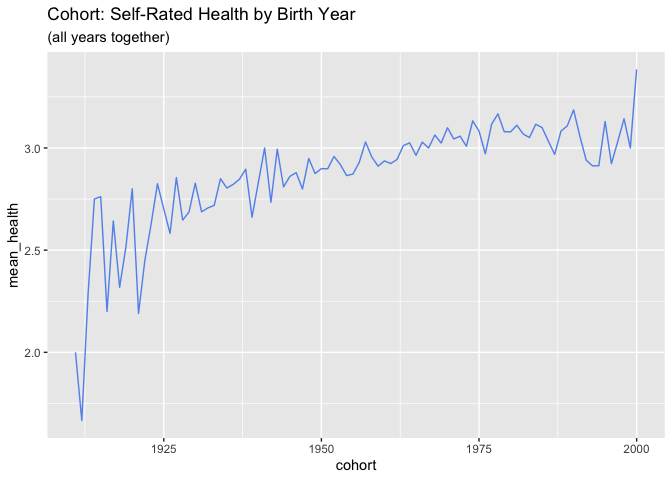
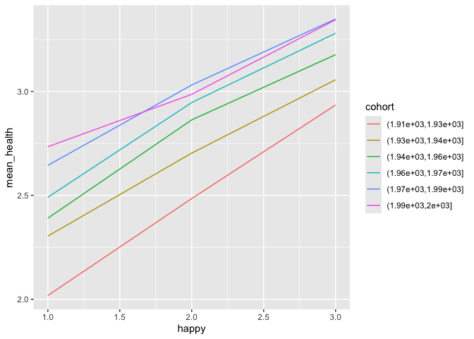
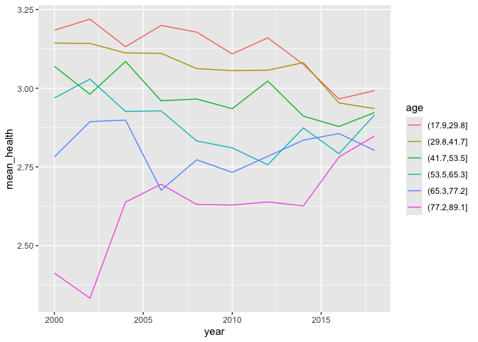
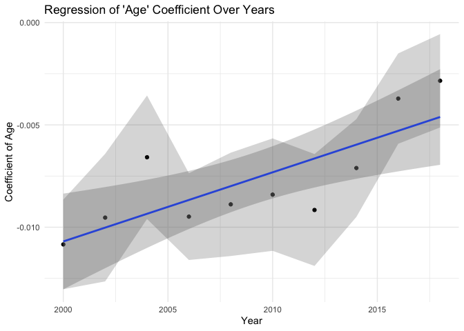
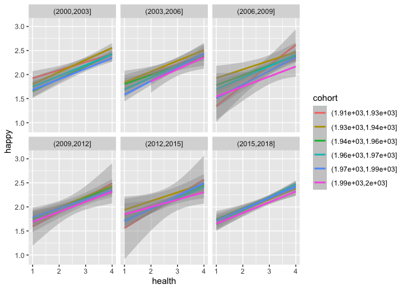

Initial GSS EDA and APC - health and covariates
================
Christine Lucille Kuryla
2024-09-27

- [Fetch GSS data](#fetch-gss-data)
- [Variables of interest](#variables-of-interest)
  - [“health”](#health)
  - [“year”](#year)
  - [“cohort”](#cohort)
  - [“happy”](#happy)
  - [“sex”](#sex)
  - [“educ”](#educ)
  - [“life”](#life)
  - [“satfin”](#satfin)
  - [“polviews”](#polviews)
- [Load and clean data](#load-and-clean-data)
  - [Peek at GSS df](#peek-at-gss-df)
  - [Life expectancy data](#life-expectancy-data)
- [Histograms](#histograms)
- [Correlation Heatmap](#correlation-heatmap)
- [Mean health over
  Age/Period/Cohort](#mean-health-over-ageperiodcohort)
- [Cohorts](#cohorts)
- [Interesting and seemingly robust](#interesting-and-seemingly-robust)
- [Relationship of self-rated health to age, separated out by
  years](#relationship-of-self-rated-health-to-age-separated-out-by-years)
- [Regress the age coefficient on
  year](#regress-the-age-coefficient-on-year)
  - [Happiness and health](#happiness-and-health)

Take a look at GSS dataset, what’s available, some trends, etc.

The first variable of interest is “health”, which will be the main
subject of our analysis.

<https://gssdataexplorer.norc.org/variables/437/vshow>

Question on survey: “Would you say your own health, in general, is
excellent, good, fair, or poor?”

# Fetch GSS data

``` r
# Feel free to modify to play with more covariates and variables.

#install.packages('gssr', repos =  c('https://kjhealy.r-universe.dev', 'https://cloud.r-project.org'))
# install.packages('gssrdoc', repos = c('https://kjhealy.r-universe.dev', 'https://cloud.r-project.org'))

library(gssr)
library(gssrdoc)

data("gss_all") # this file is big! 

# It's a bit excessive to download the entire GSS dataset every time we knit, so lets just save some variables of interest and write it out for future use.

data_gss <- as.data.frame(gss_all) %>% 
  select("year",      # year of survey
         "cohort",    # birthyear
         "age",       # age at time of survey
         "health",    # self-rated health
         "sex",       # sex
         "happy",     # self-rated happiness
         "life",      # is life exciting or dull
         "educ",      # years of education
         "polviews",  # 1 extremely liberal, 4 moderate, 7 extremely conservative
         "class",    # 1 lower, 2 middle, 3 working, 4 upper, 5 no class
         "satfin"    # 1 pretty well satisfied, 2 more or less satisfied, 3 not satisfied at all
         )

write_csv(data_gss, "data/extracted_gss_variables.csv")
```

# Variables of interest

<details>
<summary>
**Click to expand and explore the variables of interest, including the
coding and the way the question is phrased.**
</summary>

### “health”

<https://gssdataexplorer.norc.org/variables/437/vshow?back=variableList>

Variable: Health Module: Core Gss Tags: Health

“Would you say your own health, in general, is excellent, good, fair, or
poor?”

-100 .i: Inapplicable  
-99 .n: No answer  
-98 .d: Do not Know/Cannot Choose  
-97 .s: Skipped on Web  
1 Excellent  
2 Good  
3 Fair  
4 Poor

*Note* we will recode this data to reverse it to be more intuitive, such
that for our analyses, higher numbers will indicate better self-rated
health:

4 Excellent  
3 Good  
2 Fair  
1 Poor

### “year”

<https://gssdataexplorer.norc.org/variables/1/vshow?back=variableList>

Year of survey

Variable: Year

GSS year for this respondent

### “cohort”

<https://gssdataexplorer.norc.org/variables/5507/vshow?back=variableList>

Year of birth

Birth cohort of respondent.

### “happy”

general happiness

“Taken all together, how would you say things are these days–would you
say that you are very happy, pretty happy, or not too happy?”

-100 .i: Inapplicable  
-99 .n: No answer  
-98 .d: Do not Know/Cannot Choose  
-97 .s: Skipped on Web  
1 Very happy  
2 Pretty happy  
3 Not too happy

*Note* we will recode this data to reverse it to be more intuitive, such
that for our analyses, higher numbers will indicate higher happiness:

3 Very happy  
2 Pretty happy  
1 Not too happy

### “sex”

<https://gssdataexplorer.norc.org/variables/81/vshow?back=variableList>

respondent’s sex

-100 .i: Inapplicable 0 0 0 0 0 0 0 0 0 0 0 0 0 0 0 0 0 0 0 0 0 0 0 0 0
0 0 0 0 0 0 0 19 0 -99 .n: No answer 0 0 0 0 0 0 0 0 0 0 0 0 0 0 0 0 0 0
0 0 0 0 0 0 0 0 0 0 0 0 0 0 71 9 -98 .d: Do not Know/Cannot Choose 0 0 0
0 0 0 0 0 0 0 0 0 0 0 0 0 0 0 0 0 0 0 0 0 0 0 0 0 0 0 0 0 0 8 -97 .s:
Skipped on Web 0 0 0 0 0 0 0 0 0 0 0 0 0 0 0 0 0 0 0 0 0 0 0 0 0 0 0 0 0
0 0 0 2 3 1 MALE  
2 FEMALE

### “educ”

<https://gssdataexplorer.norc.org/variables/55/vshow>

highest year of school completed

Questions associated with this variable: ASK ALL PARTS OF QUESTION ABOUT
RESPONDENT BEFORE GOING ON TO ASK ABOUT R’S FATHER; AND THEN R’S MOTHER;
THEN R’S SPOUSE, IF R IS CURRENTLY MARRIED. A. What is the highest grade
in elementary school or high school that (you/your father/ your
mother/your \[husband/wife\]) finished and got credit for? CODE EXACT
GRADE. B. IF FINISHED 9th-12th GRADE OR DK\*: Did (you/he/she) ever get
a high school diploma or a GED certificate? \[SEE D BELOW.\] \[See
REMARKS\] C. Did (you/he/she) complete one or more years of college for
credit–not including schooling such as business college, technical or
vocational school? IF YES: How many years did (you/he/she) complete? Do
you (Does \[he/she\]) have any college degrees? (IF YES: What degree or
degrees?) CODE HIGHEST DEGREE EARNED.

-99 .n: No answer 5 5 3 2 4 3 3 1 4 0 3 0 1 6 0 5 0 7 0 4 1 4 9 7 2 9 2
4 1 0 8 1 48 20 -98 .d: Do not Know/Cannot Choose 0 0 0 1 2 7 3 4 4 2 0
0 0 4 3 2 2 0 4 3 8 8 0 5 0 2 3 1 1 1 1 2 18 0 0 No formal schooling 14
7 6 7 4 4 6 1 7 5 3 3 6 9 1 3 4 2 3 4 4 2 1 5 4 22 6 5 3 8 2 4 9 3 1 1st
grade 4 4 1 2 0 0 4 1 2 1 3 2 0 2 1 2 1 0 0 1 0 0 0 2 1 4 0 1 2 1 3 2 1
1 2 2nd grade 13 7 1 3 4 1 1 … 19 7 or more years of college 20 8 or
nore years of college

### “life”

is life exciting or dull

<https://gssdataexplorer.norc.org/variables/438/vshow>

“In general, do you find life exciting, pretty routine, or dull?”

100 .i: Inapplicable  
-99 .n: No answer  
-98 .d: Do not Know/Cannot Choose  
-97 .s: Skipped on Web  
1 Exciting  
2 Routine 3 Dull

*Note* we will recode this data to reverse it to be more intuitive, such
that for our analyses, higher numbers will indicate a more exciting
life:

3 Exciting  
2 Routine 1 Dull

### “satfin”

satisfaction with financial situation

<https://gssdataexplorer.norc.org/variables/572/vshow>

“We are interested in how people are getting along financially these
days. So far as you and your family are concerned, would you say that
you are pretty well satisfied with your present financial situation,
more or less satisfied, or not satisfied at all?”

-100 .i: Inapplicable 0 0 0 0 0 0 0 0 0 0 0 0 0 0 0 0 0 0 0 0 0 0 0 1393
1472 1518 0 0 0 0 0 0 0 0 -99 .n: No answer 4 2 4 7 3 6 1 2 8 2 6 4 1 6
4 1 2 6 3 11 4 3 5 1 2 8 2 5 5 3 6 3 1 4 -98 .d: Do not Know/Cannot
Choose 1 1 2 4 4 3 2 4 5 5 3 5 3 2 3 4 3 5 7 5 4 5 9 2 3 4 5 1 2 3 5 7 0
7 -97 .s: Skipped on Web 0 0 0 0 0 0 0 0 0 0 0 0 0 0 0 0 0 0 0 0 0 0 0 0
0 0 0 0 0 0 0 0 15 7 1 Pretty well satisfied  
2 More or less satisfied  
3 Not satisfied at all

*Note* we will recode this data to reverse it to be more intuitive, such
that for our analyses, higher numbers will indicate more financial
satisfaction:

3 Pretty well satisfied  
2 More or less satisfied  
1 Not satisfied at all

### “polviews”

think of self as liberal or conservative

<https://gssdataexplorer.norc.org/variables/178/vshow>

“We hear a lot of talk these days about liberals and conservatives. I’m
going to show you a seven-point scale on which the political views that
people might hold are arranged from extremely liberal–point 1–to
extremely conservative–point 7. Where would you place yourself on this
scale?”

-100 .i: Inapplicable 0 0 0 0 0 0 0 795 0 0 0 0 0 0 0 0 0 0 0 0 0 1393
1472 0 0 0 0 0 0 0 15 1 -99 .n: No answer 4 12 5 6 27 17 17 3 11 9 2 42
9 7 4 4 9 12 6 8 24 5 5 23 13 10 13 24 30 22 3 27 -98 .d: Do not
Know/Cannot Choose 70 81 93 71 70 22 104 31 52 63 67 98 56 88 53 54 49
101 155 133 149 36 26 154 77 61 87 65 81 79 10 73 -97 .s: Skipped on Web
0 0 0 0 0 0 0 0 0 0 0 0 0 0 0 0 0 0 0 0 0 0 0 0 0 0 0 0 0 0 40 17 1
Extremely liberal  
2 Liberal 3 Slightly liberal  
4 Moderate, middle of the road  
5 Slightly conservative  
6 Conservative  
7 Extremely conservative

</details>

# Load and clean data

Here we’ll load our data, clean some unwanted values, and recode the
unintuitive variables.

``` r
data_gss <- read_csv("data/extracted_gss_variables.csv") %>% 
  filter(cohort != 9999) %>% 
  na.omit() %>% 
  mutate(health = 5 - health)  %>%  # reverse the coding so it's more intuitive (higher number for excellent, lower number for poor)
  mutate(happy = 4 - happy) %>% # same
  mutate(life = 4 - life) %>% # reverse again, these variables tend to be unintuitively ordered!!!
  mutate(satfin = 4 - satfin) # %>% 
```

    ## Rows: 72390 Columns: 22
    ## ── Column specification ────────────────────────────────────────────────────────
    ## Delimiter: ","
    ## dbl (22): year, cohort, age, health, sex, happy, life, educ, polviews, class...
    ## 
    ## ℹ Use `spec()` to retrieve the full column specification for this data.
    ## ℹ Specify the column types or set `show_col_types = FALSE` to quiet this message.

``` r
  # mutate(polviews_extreme = case_match(polviews,
  #                                      7 ~ 4,
  #                                      6 ~ 3,
  #                                      5 ~ 2,
  #                                      4 ~ 1,
  #                                      3 ~ 2,
  #                                      2 ~ 3,
  #                                      1 ~ 4
  #                                      ))
```

## Peek at GSS df

``` r
head(data_gss, n = 10)
```

    ## # A tibble: 10 × 22
    ##     year cohort   age health   sex happy  life  educ polviews class satfin
    ##    <dbl>  <dbl> <dbl>  <dbl> <dbl> <dbl> <dbl> <dbl>    <dbl> <dbl>  <dbl>
    ##  1  2000   1974    26      4     1     2     3    16        5     3      1
    ##  2  2000   1952    48      2     2     2     3    15        6     3      2
    ##  3  2000   1975    25      3     2     2     3    12        3     2      2
    ##  4  2000   1964    36      3     1     3     3    14        4     3      2
    ##  5  2000   1956    44      3     2     2     3    14        2     3      2
    ##  6  2000   1948    52      3     1     2     3    20        6     3      3
    ##  7  2000   1948    52      3     1     2     2    12        4     2      1
    ##  8  2000   1949    51      4     1     3     3    17        6     3      3
    ##  9  2000   1923    77      4     1     3     3    15        7     3      1
    ## 10  2000   1951    49      4     2     3     3    17        4     4      3
    ## # ℹ 11 more variables: region <dbl>, attend <dbl>, race <dbl>, wrkstat <dbl>,
    ## #   hispanic <dbl>, degree <dbl>, marital <dbl>, partyid <dbl>, wtssps <dbl>,
    ## #   wtssall <dbl>, wtsscomp <dbl>

``` r
glimpse(data_gss)
```

    ## Rows: 13,686
    ## Columns: 22
    ## $ year     <dbl> 2000, 2000, 2000, 2000, 2000, 2000, 2000, 2000, 2000, 2000, 2…
    ## $ cohort   <dbl> 1974, 1952, 1975, 1964, 1956, 1948, 1948, 1949, 1923, 1951, 1…
    ## $ age      <dbl> 26, 48, 25, 36, 44, 52, 52, 51, 77, 49, 54, 82, 83, 89, 82, 3…
    ## $ health   <dbl> 4, 2, 3, 3, 3, 3, 3, 4, 4, 4, 3, 3, 2, 1, 4, 3, 4, 2, 3, 3, 3…
    ## $ sex      <dbl> 1, 2, 2, 1, 2, 1, 1, 1, 1, 2, 1, 2, 2, 1, 2, 2, 2, 1, 1, 2, 1…
    ## $ happy    <dbl> 2, 2, 2, 3, 2, 2, 2, 3, 3, 3, 2, 2, 2, 2, 3, 3, 2, 2, 3, 1, 2…
    ## $ life     <dbl> 3, 3, 3, 3, 3, 3, 2, 3, 3, 3, 3, 2, 3, 2, 3, 2, 2, 2, 3, 2, 3…
    ## $ educ     <dbl> 16, 15, 12, 14, 14, 20, 12, 17, 15, 17, 16, 16, 12, 12, 13, 1…
    ## $ polviews <dbl> 5, 6, 3, 4, 2, 6, 4, 6, 7, 4, 6, 4, 4, 4, 2, 5, 6, 4, 2, 4, 5…
    ## $ class    <dbl> 3, 3, 2, 3, 3, 3, 2, 3, 3, 4, 3, 4, 4, 3, 3, 2, 2, 2, 3, 2, 3…
    ## $ satfin   <dbl> 1, 2, 2, 2, 2, 3, 1, 3, 1, 3, 3, 2, 3, 1, 3, 2, 2, 2, 2, 3, 3…
    ## $ region   <dbl> 7, 7, 7, 7, 7, 7, 7, 7, 7, 7, 7, 7, 7, 7, 7, 7, 7, 7, 7, 7, 7…
    ## $ attend   <dbl> 4, 6, 0, 3, 5, 0, 4, 6, 1, 2, 7, 0, 3, 1, 7, 6, 8, 0, 1, 8, 7…
    ## $ race     <dbl> 1, 1, 1, 1, 1, 1, 1, 1, 1, 1, 1, 1, 1, 1, 1, 1, 2, 1, 1, 3, 1…
    ## $ wrkstat  <dbl> 1, 1, 1, 1, 1, 1, 1, 1, 5, 1, 7, 5, 5, 5, 5, 1, 7, 1, 1, 1, 1…
    ## $ hispanic <dbl> 1, 3, 1, 1, 1, 1, 1, 1, 1, 1, 1, 1, 1, 1, 1, 1, 1, 1, 1, 5, 2…
    ## $ degree   <dbl> 3, 1, 1, 1, 2, 4, 1, 3, 2, 3, 3, 3, 1, 1, 1, 3, 1, 1, 1, 0, 3…
    ## $ marital  <dbl> 5, 3, 1, 5, 3, 1, 1, 1, 2, 1, 2, 2, 2, 2, 2, 1, 1, 5, 1, 5, 5…
    ## $ partyid  <dbl> 4, 5, 0, 5, 2, 4, 0, 6, 6, 6, 4, 1, 0, 1, 3, 1, 1, 3, 2, 1, 4…
    ## $ wtssps   <dbl> 1.0929908, 0.6424318, 1.1216124, 0.4990119, 0.4210212, 1.2190…
    ## $ wtssall  <dbl> 1.0985, 0.5493, 1.0985, 0.5493, 0.5493, 1.0985, 1.0985, 1.098…
    ## $ wtsscomp <dbl> 1.0929908, 0.6424318, 1.1216124, 0.4990119, 0.4210212, 1.2190…

## Life expectancy data

``` r
# https://population.un.org/wpp/Download/Standard/CSV/
data_le <- read_csv("big_data/WPP2024_Demographic_Indicators_Medium.csv")
data_le <- data_le %>% 
  filter(Location == "United States of America")

# Just get the years of interest for merging with the gss data
year_range <- seq(min(data_gss$year), max(data_gss$year))
data_le <- data_le %>% 
  filter(Time %in% year_range)

write_csv(data_le, "data/un_life_expectancy_etc.csv")
```

# Histograms

Let’s make a few quick histograms to get a sense of the survey response
distributions.

``` r
# Tidyverse and flexible number of histograms

library(patchwork)

# Create list to store ggplot objects
plot_list <- list()

# Loop through column names and create plots
for (var in colnames(data_gss)) {
  if (is.numeric(data_gss[[var]])) {  # Only create histograms for numeric columns
    p <- ggplot(data_gss, aes(x = .data[[var]])) +  # Use .data[[var]] for tidy evaluation
      geom_histogram(bins = 20, fill = "pink", color = "hotpink") +
      theme_minimal()
    
    plot_list[[var]] <- p
  }
}

# Combine all plots using patchwork and add a title
combined_plot <- wrap_plots(plot_list, ncol = 3) +
  plot_annotation(title = "Histograms of Survey Responses")

# Display the combined plot
print(combined_plot)
```

<!-- -->

# Correlation Heatmap

Just to get some idea and familiarize ourselves with the data.

``` r
correlation_auto <- cor(data_gss)
knitr::kable(correlation_auto)
```

|  | year | cohort | age | health | sex | happy | life | educ | polviews | class | satfin | region | attend | race | wrkstat | hispanic | degree | marital | partyid | wtssps | wtssall | wtsscomp |
|:---|---:|---:|---:|---:|---:|---:|---:|---:|---:|---:|---:|---:|---:|---:|---:|---:|---:|---:|---:|---:|---:|---:|
| year | 1.0000000 | 0.2686439 | 0.0570079 | -0.0554124 | 0.0150853 | -0.0249578 | 0.0049961 | 0.0577932 | -0.0266276 | -0.0468571 | -0.0065630 | 0.0230770 | -0.0407517 | 0.0504410 | 0.0353962 | 0.0236102 | 0.0616316 | 0.0243483 | -0.0204744 | 0.0034099 | 0.0055259 | 0.0034099 |
| cohort | 0.2686439 | 1.0000000 | -0.9463582 | 0.1384977 | -0.0266531 | -0.0197482 | 0.0409371 | 0.0767397 | -0.1029958 | -0.1587639 | -0.1413292 | 0.0592478 | -0.1556104 | 0.1767582 | -0.2811165 | 0.0607096 | 0.0173034 | 0.3594780 | -0.0162042 | 0.1170041 | 0.1627817 | 0.1170041 |
| age | 0.0570079 | -0.9463582 | 1.0000000 | -0.1621376 | 0.0326856 | 0.0120964 | -0.0407544 | -0.0601520 | 0.0978203 | 0.1488365 | 0.1442827 | -0.0536677 | 0.1476161 | -0.1662850 | 0.3032439 | -0.0550040 | 0.0027398 | -0.3644223 | 0.0099271 | -0.1201280 | -0.1668655 | -0.1201280 |
| health | -0.0554124 | 0.1384977 | -0.1621376 | 1.0000000 | -0.0158100 | 0.2863910 | 0.2630829 | 0.2616074 | 0.0116352 | 0.1952046 | 0.2162003 | -0.0294496 | 0.0532709 | -0.0415102 | -0.2304969 | 0.0066832 | 0.2501150 | -0.0350453 | 0.0732926 | 0.0282136 | 0.0547034 | 0.0282136 |
| sex | 0.0150853 | -0.0266531 | 0.0326856 | -0.0158100 | 1.0000000 | -0.0046786 | -0.0456376 | -0.0088367 | -0.0330415 | -0.0328884 | -0.0458126 | -0.0179866 | 0.1143625 | 0.0131651 | 0.1732201 | 0.0009934 | -0.0104816 | -0.0147157 | -0.0893242 | -0.1333682 | -0.0494471 | -0.1333682 |
| happy | -0.0249578 | -0.0197482 | 0.0120964 | 0.2863910 | -0.0046786 | 1.0000000 | 0.3261997 | 0.1200782 | 0.0672552 | 0.1799011 | 0.3100500 | 0.0114412 | 0.1180659 | -0.0721944 | -0.0627291 | -0.0174561 | 0.1232746 | -0.2304631 | 0.0900987 | 0.0713346 | 0.0979570 | 0.0713346 |
| life | 0.0049961 | 0.0409371 | -0.0407544 | 0.2630829 | -0.0456376 | 0.3261997 | 1.0000000 | 0.1951683 | -0.0127199 | 0.1682131 | 0.1920075 | 0.0361601 | 0.1042737 | -0.0022567 | -0.1025755 | 0.0099106 | 0.1882985 | -0.0669361 | 0.0428144 | 0.0275697 | 0.0339296 | 0.0275697 |
| educ | 0.0577932 | 0.0767397 | -0.0601520 | 0.2616074 | -0.0088367 | 0.1200782 | 0.1951683 | 1.0000000 | -0.0868379 | 0.3006606 | 0.1657069 | -0.0387739 | 0.0262119 | -0.1067411 | -0.1835756 | -0.0374348 | 0.8632366 | -0.0445112 | 0.0262477 | -0.0709663 | -0.0304188 | -0.0709663 |
| polviews | -0.0266276 | -0.1029958 | 0.0978203 | 0.0116352 | -0.0330415 | 0.0672552 | -0.0127199 | -0.0868379 | 1.0000000 | 0.0154414 | 0.0571703 | 0.0205827 | 0.2294353 | -0.0803138 | 0.0240898 | -0.0035756 | -0.0810729 | -0.1419319 | 0.4525126 | 0.0278238 | 0.0352520 | 0.0278238 |
| class | -0.0468571 | -0.1587639 | 0.1488365 | 0.1952046 | -0.0328884 | 0.1799011 | 0.1682131 | 0.3006606 | 0.0154414 | 1.0000000 | 0.3596473 | -0.0259550 | 0.0668539 | -0.1086310 | -0.0131586 | -0.0314950 | 0.3347143 | -0.1676103 | 0.0835551 | 0.0225665 | 0.0311619 | 0.0225665 |
| satfin | -0.0065630 | -0.1413292 | 0.1442827 | 0.2162003 | -0.0458126 | 0.3100500 | 0.1920075 | 0.1657069 | 0.0571703 | 0.3596473 | 1.0000000 | -0.0031209 | 0.0899334 | -0.1081181 | -0.0040478 | -0.0214456 | 0.1905674 | -0.1660068 | 0.1069777 | 0.0345868 | 0.0295741 | 0.0345868 |
| region | 0.0230770 | 0.0592478 | -0.0536677 | -0.0294496 | -0.0179866 | 0.0114412 | 0.0361601 | -0.0387739 | 0.0205827 | -0.0259550 | -0.0031209 | 1.0000000 | -0.0110276 | 0.1106991 | 0.0016204 | 0.0474216 | -0.0480959 | 0.0061666 | 0.0339388 | 0.0603484 | 0.0437775 | 0.0603484 |
| attend | -0.0407517 | -0.1556104 | 0.1476161 | 0.0532709 | 0.1143625 | 0.1180659 | 0.1042737 | 0.0262119 | 0.2294353 | 0.0668539 | 0.0899334 | -0.0110276 | 1.0000000 | 0.0602522 | 0.0465707 | 0.0102155 | 0.0520173 | -0.1811619 | 0.0937323 | -0.0114384 | 0.0215025 | -0.0114384 |
| race | 0.0504410 | 0.1767582 | -0.1662850 | -0.0415102 | 0.0131651 | -0.0721944 | -0.0022567 | -0.1067411 | -0.0803138 | -0.1086310 | -0.1081181 | 0.1106991 | 0.0602522 | 1.0000000 | -0.0106457 | 0.1215373 | -0.0891460 | 0.1504584 | -0.2194051 | 0.0448916 | 0.0467724 | 0.0448916 |
| wrkstat | 0.0353962 | -0.2811165 | 0.3032439 | -0.2304969 | 0.1732201 | -0.0627291 | -0.1025755 | -0.1835756 | 0.0240898 | -0.0131586 | -0.0040478 | 0.0016204 | 0.0465707 | -0.0106457 | 1.0000000 | -0.0108455 | -0.1751805 | -0.0395134 | -0.0311954 | -0.0085760 | -0.0418008 | -0.0085760 |
| hispanic | 0.0236102 | 0.0607096 | -0.0550040 | 0.0066832 | 0.0009934 | -0.0174561 | 0.0099106 | -0.0374348 | -0.0035756 | -0.0314950 | -0.0214456 | 0.0474216 | 0.0102155 | 0.1215373 | -0.0108455 | 1.0000000 | -0.0275132 | 0.0318029 | -0.0223394 | 0.0416778 | 0.0332569 | 0.0416778 |
| degree | 0.0616316 | 0.0173034 | 0.0027398 | 0.2501150 | -0.0104816 | 0.1232746 | 0.1882985 | 0.8632366 | -0.0810729 | 0.3347143 | 0.1905674 | -0.0480959 | 0.0520173 | -0.0891460 | -0.1751805 | -0.0275132 | 1.0000000 | -0.0972467 | 0.0227931 | -0.0727914 | -0.0372940 | -0.0727914 |
| marital | 0.0243483 | 0.3594780 | -0.3644223 | -0.0350453 | -0.0147157 | -0.2304631 | -0.0669361 | -0.0445112 | -0.1419319 | -0.1676103 | -0.1660068 | 0.0061666 | -0.1811619 | 0.1504584 | -0.0395134 | 0.0318029 | -0.0972467 | 1.0000000 | -0.1241585 | -0.0946886 | -0.1618901 | -0.0946886 |
| partyid | -0.0204744 | -0.0162042 | 0.0099271 | 0.0732926 | -0.0893242 | 0.0900987 | 0.0428144 | 0.0262477 | 0.4525126 | 0.0835551 | 0.1069777 | 0.0339388 | 0.0937323 | -0.2194051 | -0.0311954 | -0.0223394 | 0.0227931 | -0.1241585 | 1.0000000 | 0.0545749 | 0.0413881 | 0.0545749 |
| wtssps | 0.0034099 | 0.1170041 | -0.1201280 | 0.0282136 | -0.1333682 | 0.0713346 | 0.0275697 | -0.0709663 | 0.0278238 | 0.0225665 | 0.0345868 | 0.0603484 | -0.0114384 | 0.0448916 | -0.0085760 | 0.0416778 | -0.0727914 | -0.0946886 | 0.0545749 | 1.0000000 | 0.8296485 | 1.0000000 |
| wtssall | 0.0055259 | 0.1627817 | -0.1668655 | 0.0547034 | -0.0494471 | 0.0979570 | 0.0339296 | -0.0304188 | 0.0352520 | 0.0311619 | 0.0295741 | 0.0437775 | 0.0215025 | 0.0467724 | -0.0418008 | 0.0332569 | -0.0372940 | -0.1618901 | 0.0413881 | 0.8296485 | 1.0000000 | 0.8296485 |
| wtsscomp | 0.0034099 | 0.1170041 | -0.1201280 | 0.0282136 | -0.1333682 | 0.0713346 | 0.0275697 | -0.0709663 | 0.0278238 | 0.0225665 | 0.0345868 | 0.0603484 | -0.0114384 | 0.0448916 | -0.0085760 | 0.0416778 | -0.0727914 | -0.0946886 | 0.0545749 | 1.0000000 | 0.8296485 | 1.0000000 |

``` r
# Create a heatmap

#upper_tri <- matrixcalc::upper.triangle(correlation_auto)
#melted_cormat <- reshape2::melt(upper_tri, na.rm = TRUE)

melted_cormat <- reshape2::melt(cor(data_gss), na.rm = TRUE)

ggplot(data = melted_cormat, aes(Var2, Var1, fill = value))+
 geom_tile(color = "white")+
 scale_fill_gradient2(low = "blue", high = "red", mid = "white", 
   midpoint = 0, limit = c(-1,1), space = "Lab", 
   name="Pearson\nCorrelation") +
  theme_minimal()+ 
 theme(axis.text.x = element_text(angle = 45, vjust = 1, 
     hjust = 1))+
 coord_fixed() +
  geom_text(aes(Var2, Var1, label = if_else(value != 0, as.character(round(value, digits = 2)), " ")))
```

<!-- -->

# Mean health over Age/Period/Cohort

Now let’s take a look at the trend of people’s self-rated health over
time, as well as by age, and by birthyear.

``` r
# Mean health over time, age, and birth year

data_gss %>% 
  group_by(year) %>% 
  summarize(mean_health = mean(health)) %>% 
  ggplot(aes(x = year, y = mean_health)) +
  geom_line(color = "cornflowerblue") +
  labs(title = "Period: Self-Rated Health Each Year",
       subtitle = "(all ages together)" )
```

<!-- -->

``` r
data_gss %>% 
  group_by(age) %>% 
  summarize(mean_health = mean(health)) %>% 
  ggplot(aes(x = age, y = mean_health)) +
  geom_line(color = "cornflowerblue") +
  labs(title = "Age: Self-Rated Health By Age" ,
       subtitle = "(all years together)" )
```

<!-- -->

``` r
data_gss %>% 
  group_by(cohort) %>% 
  summarize(mean_health = mean(health)) %>% 
  ggplot(aes(x = cohort, y = mean_health)) +
  geom_line(color = "cornflowerblue") +
  labs(title = "Cohort: Self-Rated Health by Birth Year",
       subtitle = "(all years together)" )
```

<!-- -->

# Cohorts

Let’s explore how each cohort tends to rate their health when at the
same age.

``` r
data_gss %>% 
  mutate(cohort = cut(cohort, breaks = 6)) %>% # Create cohorts with 6 breaks
  group_by(age, cohort) %>% 
  summarize(mean_health = mean(health)) %>% 
  ggplot(aes(x = age, y = mean_health, color = cohort)) +
  geom_line()
```

    ## `summarise()` has grouped output by 'age'. You can override using the `.groups`
    ## argument.

<!-- -->

``` r
data_gss %>% 
  mutate(cohort = cut(cohort, breaks = 6)) %>% 
  group_by(year, cohort) %>% 
  summarize(mean_health = mean(health)) %>% 
  ggplot(aes(x = year, y = mean_health, color = cohort)) +
  geom_line()
```

    ## `summarise()` has grouped output by 'year'. You can override using the
    ## `.groups` argument.

<!-- -->

``` r
data_gss %>% 
  mutate(cohort = cut(cohort, breaks = 6)) %>% 
  group_by(happy, cohort) %>% 
  summarize(mean_health = mean(health)) %>% 
  ggplot(aes(x = happy, y = mean_health, color = cohort)) +
  geom_line()
```

    ## `summarise()` has grouped output by 'happy'. You can override using the
    ## `.groups` argument.

<!-- -->

``` r
data_gss %>% 
  mutate(cohort = cut(cohort, breaks = 6)) %>% # Create cohorts with 6 breaks
  group_by(age, cohort) %>% 
  summarize(mean_happy = mean(happy)) %>% 
  ggplot(aes(x = age, y = mean_happy, color = cohort)) +
  geom_line()
```

    ## `summarise()` has grouped output by 'age'. You can override using the `.groups`
    ## argument.

<!-- -->

``` r
data_gss %>% 
  mutate(age = cut(age, breaks = 6)) %>% # Create cohorts with 6 breaks
  group_by(age, year) %>% 
  summarize(mean_happy = mean(happy)) %>% 
  ggplot(aes(x = year, y = mean_happy, color = age)) +
  geom_line()
```

    ## `summarise()` has grouped output by 'age'. You can override using the `.groups`
    ## argument.

<!-- -->

``` r
data_gss %>% 
  mutate(age = cut(age, breaks = 6)) %>% # Create cohorts with 6 breaks
  group_by(age, year) %>% 
  summarize(mean_health = mean(health)) %>% 
  ggplot(aes(x = year, y = mean_health, color = age)) +
  geom_line()
```

    ## `summarise()` has grouped output by 'age'. You can override using the `.groups`
    ## argument.

<!-- -->

``` r
data_gss %>% 
  mutate(cohort = cut(cohort, breaks = 6)) %>% # Create cohorts with 6 breaks
  group_by(cohort, year) %>% 
  summarize(mean_health = mean(health)) %>% 
  ggplot(aes(x = year, y = mean_health, color = cohort)) +
  geom_line()
```

    ## `summarise()` has grouped output by 'cohort'. You can override using the
    ## `.groups` argument.

<!-- -->

``` r
data_gss %>% 
  mutate(cohort = cut(cohort, breaks = 6)) %>% # Create cohorts with 6 breaks
  group_by(year, cohort) %>% 
  summarize(mean_happy = mean(happy)) %>% 
  ggplot(aes(x = year, y = mean_happy, color = cohort)) +
  geom_line()
```

    ## `summarise()` has grouped output by 'year'. You can override using the
    ## `.groups` argument.

<!-- -->

# Interesting and seemingly robust

Well, this is probably the most interesting graph. Let’s try different
numbers of categories of age.

``` r
data_gss %>% 
  mutate(age = cut(age, breaks = 6)) %>% # Create cohorts with 6 breaks
  group_by(age, year) %>% 
  summarize(mean_health = mean(health)) %>% 
  ggplot(aes(x = year, y = mean_health, color = age)) +
  geom_line() +
  geom_point()
```

    ## `summarise()` has grouped output by 'age'. You can override using the `.groups`
    ## argument.

<!-- -->

``` r
data_gss %>% 
  mutate(age = cut(age, breaks = 10)) %>% # Create cohorts with 6 breaks
  group_by(age, year) %>% 
  summarize(mean_health = mean(health)) %>% 
  ggplot(aes(x = year, y = mean_health, color = age)) +
  geom_line()
```

    ## `summarise()` has grouped output by 'age'. You can override using the `.groups`
    ## argument.

<!-- -->

``` r
data_gss %>% 
  mutate(age = cut(age, breaks = 3)) %>% # Create cohorts with 6 breaks
  group_by(age, year) %>% 
  summarize(mean_health = mean(health)) %>% 
  ggplot(aes(x = year, y = mean_health, color = age)) +
  geom_line()
```

    ## `summarise()` has grouped output by 'age'. You can override using the `.groups`
    ## argument.

<!-- -->

``` r
data_gss %>% 
  mutate(age = cut(age, breaks = 4)) %>% # Create cohorts with 6 breaks
  group_by(age, year) %>% 
  summarize(mean_health = mean(health)) %>% 
  ggplot(aes(x = year, y = mean_health, color = age)) +
  geom_line()
```

    ## `summarise()` has grouped output by 'age'. You can override using the `.groups`
    ## argument.

<!-- -->

# Relationship of self-rated health to age, separated out by years

Well it seems like the spread of self-rated health among ages decreases
as time goes on (later years). Let’s look at that.

``` r
# health vs age per year
data_gss %>% 
  group_by(age, year) %>% 
  summarize(mean_health = mean(health)) %>% 
  ggplot(aes(x = age, y = mean_health)) +
  geom_line(color = "cornflowerblue") +
  facet_wrap(~ year) +
  labs(title = "Self-Rated Health By Age (Per Year)" )
```

    ## `summarise()` has grouped output by 'age'. You can override using the `.groups`
    ## argument.

<!-- -->

# Regress the age coefficient on year

``` r
library(broom)

# Aggregate slopes

# years_of_gss <- c(data_gss %>% select(year) %>% unique() )
# lm_health_v_age_0 <- data_gss %>%
#   group_by(year) %>%
#   summarize(coef = coef(lm(health ~ age, data = cur_data()))["age"])

# Perform linear regression for each year and extract the coefficient of 'age' with confidence intervals, se, t stat, p val
lm_health_v_age_0 <- data_gss %>%
  group_by(year) %>%
  do(tidy(lm(health ~ age, data = .), conf.int = TRUE)) %>%  # Add conf.int = TRUE for CIs
  filter(term == "age") %>%
  select(year, coef = estimate, conf.low, conf.high, se = std.error, t_statistic = statistic,  p_value = p.value)

# View the results with confidence intervals, se, t statistic, and p value
# print(lm_health_v_age_0)
knitr::kable(lm_health_v_age_0)
```

| year |       coef |   conf.low |  conf.high |        se | t_statistic |   p_value |
|-----:|-----------:|-----------:|-----------:|----------:|------------:|----------:|
| 2000 | -0.0108414 | -0.0130314 | -0.0086513 | 0.0011166 |   -9.709438 | 0.0000000 |
| 2002 | -0.0095307 | -0.0126478 | -0.0064136 | 0.0015881 |   -6.001162 | 0.0000000 |
| 2004 | -0.0065815 | -0.0095981 | -0.0035648 | 0.0015370 |   -4.282074 | 0.0000206 |
| 2006 | -0.0094831 | -0.0116020 | -0.0073641 | 0.0010804 |   -8.777267 | 0.0000000 |
| 2008 | -0.0088829 | -0.0114080 | -0.0063579 | 0.0012871 |   -6.901778 | 0.0000000 |
| 2010 | -0.0084073 | -0.0111541 | -0.0056604 | 0.0014001 |   -6.004953 | 0.0000000 |
| 2012 | -0.0091587 | -0.0118929 | -0.0064245 | 0.0013936 |   -6.571889 | 0.0000000 |
| 2014 | -0.0071083 | -0.0094985 | -0.0047181 | 0.0012186 |   -5.833268 | 0.0000000 |
| 2016 | -0.0037142 | -0.0059219 | -0.0015064 | 0.0011257 |   -3.299546 | 0.0009878 |
| 2018 | -0.0028446 | -0.0051263 | -0.0005628 | 0.0011632 |   -2.445476 | 0.0145849 |

``` r
# Plot coefficients
ggplot(lm_health_v_age_0, aes(x = year, y = coef)) +
  geom_line() +
  geom_point() +
  labs(
    title = "Change in 'Age' Coefficient Over Years",
    x = "Year",
    y = "Coefficient of Age"
  ) +
  theme_minimal()
```

<!-- -->

``` r
# Plot coefficients with CI
ggplot(lm_health_v_age_0, aes(x = year, y = coef)) +
  geom_line() +
  geom_point() +
  geom_ribbon(aes(ymin = conf.low, ymax = conf.high), alpha = 0.2) +  # Add shaded area for confidence intervals
  labs(
    title = "Change in 'Age' Coefficient Over Years with Confidence Intervals",
    x = "Year",
    y = "Coefficient of Age"
  ) +
  theme_minimal()
```

<!-- -->

``` r
# Perform linear regression of 'coef' (age coefficient) vs 'year'
lm_coef_vs_year <- lm(coef ~ year, data = lm_health_v_age_0)

# View the summary of the regression
summary(lm_coef_vs_year)
```

    ## 
    ## Call:
    ## lm(formula = coef ~ year, data = lm_health_v_age_0)
    ## 
    ## Residuals:
    ##        Min         1Q     Median         3Q        Max 
    ## -0.0025171 -0.0010399 -0.0004797  0.0013044  0.0027632 
    ## 
    ## Coefficients:
    ##               Estimate Std. Error t value Pr(>|t|)   
    ## (Intercept) -6.865e-01  1.907e-01  -3.599  0.00699 **
    ## year         3.379e-04  9.494e-05   3.559  0.00741 **
    ## ---
    ## Signif. codes:  0 '***' 0.001 '**' 0.01 '*' 0.05 '.' 0.1 ' ' 1
    ## 
    ## Residual standard error: 0.001725 on 8 degrees of freedom
    ## Multiple R-squared:  0.6129, Adjusted R-squared:  0.5645 
    ## F-statistic: 12.67 on 1 and 8 DF,  p-value: 0.007412

``` r
ggplot(lm_health_v_age_0, aes(x = year, y = coef)) +
  geom_point() +
  geom_smooth(method = "lm", se = TRUE) +  # Adds the regression line with standard error shading
  geom_ribbon(aes(ymin = conf.low, ymax = conf.high), alpha = 0.2) +  # Confidence intervals for the coefficients
  labs(
    title = "Regression of 'Age' Coefficient Over Years",
    x = "Year",
    y = "Coefficient of Age"
  ) +
  theme_minimal()
```

    ## `geom_smooth()` using formula = 'y ~ x'

<!-- -->

``` r
data_gss %>% 
  mutate(age = cut(age, breaks = 6)) %>% # Create cohorts with 6 breaks
  group_by(age, year) %>% 
  summarize(mean_happy = mean(happy)) %>% 
  ggplot(aes(x = year, y = mean_happy, color = age)) +
  geom_line()
```

    ## `summarise()` has grouped output by 'age'. You can override using the `.groups`
    ## argument.

<!-- -->

``` r
data_gss %>% 
  mutate(age = cut(age, breaks = 6)) %>% # Create cohorts with 6 breaks
  group_by(age, year) %>% 
  summarize(mean_happy = mean(happy)) %>% 
  ggplot(aes(x = year, y = mean_happy, color = age)) +
  geom_line()
```

    ## `summarise()` has grouped output by 'age'. You can override using the `.groups`
    ## argument.

<!-- -->

``` r
data_gss %>% 
  mutate(cohort = cut(cohort, breaks = 6)) %>% # Create cohorts with 6 breaks
  group_by(cohort, year) %>% 
  summarize(mean_happy = mean(happy)) %>% 
  ggplot(aes(x = year, y = mean_happy, color = cohort)) +
  geom_line()
```

    ## `summarise()` has grouped output by 'cohort'. You can override using the
    ## `.groups` argument.

<!-- -->

``` r
data_gss %>% 
  mutate(cohort = cut(cohort, breaks = 4)) %>% # Create cohorts with 6 breaks
  group_by(cohort, year) %>% 
  summarize(mean_health = mean(health)) %>% 
  ggplot(aes(x = year, y = mean_health, color = cohort)) +
  geom_line()
```

    ## `summarise()` has grouped output by 'cohort'. You can override using the
    ## `.groups` argument.

<!-- -->

``` r
data_gss %>% 
  mutate(cohort = cut(cohort, breaks = 4)) %>% # Create cohorts with 6 breaks
  group_by(cohort, age) %>% 
  summarize(mean_health = mean(health)) %>% 
  ggplot(aes(x = age, y = mean_health, color = cohort)) +
  geom_line()
```

    ## `summarise()` has grouped output by 'cohort'. You can override using the
    ## `.groups` argument.

<!-- -->

## Happiness and health

``` r
data_gss %>% 
  ggplot(aes(x = health, y = happy)) +
  geom_smooth(method = "lm")
```

    ## `geom_smooth()` using formula = 'y ~ x'

<!-- -->

``` r
data_gss %>% 
  mutate(year = cut(year, breaks = 6)) %>% 
  mutate(age = cut(age, breaks = 6)) %>% 
  ggplot(aes(x = health, y = happy, color = age)) +
  facet_wrap(~ year) +
  geom_smooth(method = "lm")
```

    ## `geom_smooth()` using formula = 'y ~ x'

<!-- -->

``` r
data_gss %>% 
  mutate(cohort = cut(cohort, breaks = 6)) %>% 
  mutate(year = cut(year, breaks = 6)) %>% 
  ggplot(aes(x = health, y = happy, color = cohort)) +
  facet_wrap(~ year) +
  geom_smooth(method = "lm")
```

    ## `geom_smooth()` using formula = 'y ~ x'

<!-- -->

``` r
######data_gss %>% 
  # group_by(year) %>% 
  # summarize(mean_health = mean(health)) %>% 
  # ggplot(aes(x = cohort, y = mean_health)) +
  # geom_line()

data_gss %>% 
  mutate(cohort = cut(cohort, breaks = 6)) %>% 
#  mutate(year = cut(year, breaks = 6)) %>% 
#  mutate(age = cut(year, breaks = 6)) %>% 
  ggplot(aes(x = age, y = health, color = cohort)) +
#  facet_wrap(~ year) +
  geom_smooth(method = "lm")
```

    ## `geom_smooth()` using formula = 'y ~ x'

<!-- -->

``` r
library(ggpubr)

data_gss %>%
  group_by(year) %>%
  do(tidy(lm(health ~ polviews, data = .), conf.int = TRUE)) %>%  # Add conf.int = TRUE for CIs
  filter(term == "polviews") %>%
  select(year, coef = estimate, conf.low, conf.high, se = std.error, t_statistic = statistic,  p_value = p.value) %>% 
  ggplot(aes(x = year, y = coef)) +
  geom_point() +
  geom_smooth(method = "lm", se = TRUE) +  # Adds the regression line with standard error shading
  geom_ribbon(aes(ymin = conf.low, ymax = conf.high), alpha = 0.2) +  # Confidence intervals for the coefficients
  labs(
    title = "Regression of 'Age' Coefficient Over Years",
    x = "Year",
    y = "Coefficient of Age"
  ) +
  stat_cor(label.x = 2000) +#label.y = 40)+ 
                   stat_regline_equation()+#label.y = 45) +
  theme_minimal()
```

    ## `geom_smooth()` using formula = 'y ~ x'

<!-- -->
