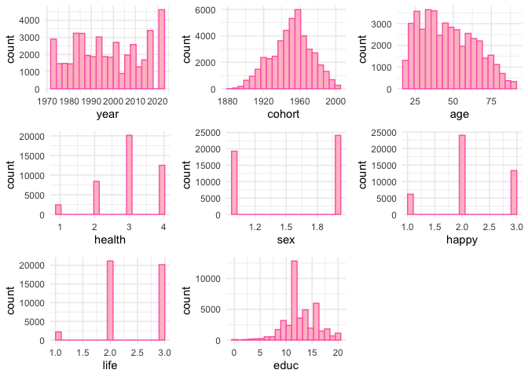
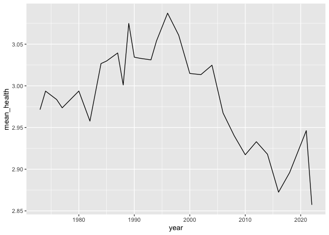
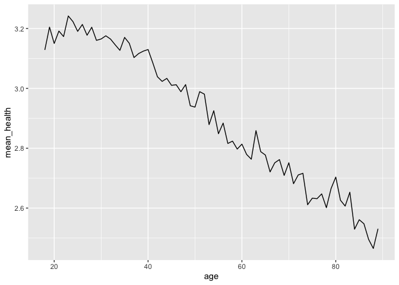
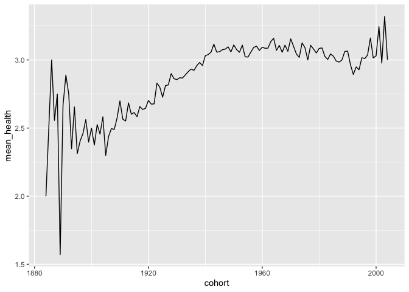

GSS EDA - health and covariates
================
Christine Lucille Kuryla
2024-09-27

Take a look at GSS dataset, what’s available, some trends, etc.

The first variable of interest is “health”, which will be the main
subject of our analysis.

<https://gssdataexplorer.norc.org/variables/437/vshow>

Question on survey: “Would you say your own health, in general, is
excellent, good, fair, or poor?”

# Fetch GSS data

``` r
# Feel free to modify to play with more covariates and variables.

#install.packages('gssr', repos =  c('https://kjhealy.r-universe.dev', 'https://cloud.r-project.org'))
# install.packages('gssrdoc', repos = c('https://kjhealy.r-universe.dev', 'https://cloud.r-project.org'))

library(gssr)
library(gssrdoc)

data("gss_all"). # this file is big!

data_gss <- as.data.frame(gss_all) %>% 
  select("year",      # year of survey
         "cohort",    # birthyear
         "age",       # age at time of survey
         "health",    # self-rated health
         "sex",       # sex
         "happy",     # self-rated happiness
         "life",      # is life exciting or dull
         "educ"       # years of education
         )

write_csv(data_gss, "data/extracted_gss_variables.csv")
```

``` r
data_gss <- read_csv("data/extracted_gss_variables.csv") %>% 
  filter(cohort != 9999) %>% 
  na.omit() %>% 
  mutate(health = 5 - health)  %>%  # reverse the coding so it's more intuitive (higher number for excellent, lower number for poor)
  mutate(happy = 4 - happy) %>% # same
  mutate(life = 4 - life) # reverse again, these variables tend to be unintuitively ordered!!!
```

    ## Rows: 72390 Columns: 8
    ## ── Column specification ────────────────────────────────────────────────────────
    ## Delimiter: ","
    ## dbl (8): year, cohort, age, health, sex, happy, life, educ
    ## 
    ## ℹ Use `spec()` to retrieve the full column specification for this data.
    ## ℹ Specify the column types or set `show_col_types = FALSE` to quiet this message.

``` r
# histograms

par(mfrow=c(3,3))
hist(data_gss$age)
hist(data_gss$cohort)
hist(data_gss$year)
hist(data_gss$health)
hist(data_gss$happy)
hist(data_gss$life)
hist(data_gss$educ)
par(mfrow=c(1,1))
```

<!-- -->

``` r
# Tidyverse and flexible number of histograms

# Create list to store ggplot objects
plot_list <- list()

# Loop through column names and create plots
for (var in colnames(data_gss)) {
  if (is.numeric(data_gss[[var]])) {  # Only create histograms for numeric columns
    p <- ggplot(data_gss, aes_string(x = var)) +
      geom_histogram(bins = 20, fill = "pink", color = "hotpink") +
      theme_minimal()
    
    plot_list[[var]] <- p
  }
}
```

    ## Warning: `aes_string()` was deprecated in ggplot2 3.0.0.
    ## ℹ Please use tidy evaluation idioms with `aes()`.
    ## ℹ See also `vignette("ggplot2-in-packages")` for more information.
    ## This warning is displayed once every 8 hours.
    ## Call `lifecycle::last_lifecycle_warnings()` to see where this warning was
    ## generated.

``` r
# Display plots in a 3x3 grid
do.call(grid.arrange, c(plot_list, ncol = 3))
```

<!-- -->

``` r
data_gss %>% 
  group_by(year) %>% 
  summarize(mean_health = mean(health)) %>% 
  ggplot(aes(x = year, y = mean_health)) +
  geom_line()
```

<!-- -->

``` r
data_gss %>% 
  group_by(age) %>% 
  summarize(mean_health = mean(health)) %>% 
  ggplot(aes(x = age, y = mean_health)) +
  geom_line()
```

<!-- -->

``` r
data_gss %>% 
  group_by(cohort) %>% 
  summarize(mean_health = mean(health)) %>% 
  ggplot(aes(x = cohort, y = mean_health)) +
  geom_line()
```

<!-- -->

``` r
data_gss %>% 
  mutate(cohort = cut(cohort, breaks = 6)) %>% 
  group_by(year, cohort) %>% 
  summarize(mean_health = mean(health)) %>% 
  ggplot(aes(x = year, y = mean_health, color = cohort)) +
  geom_line()
```

    ## `summarise()` has grouped output by 'year'. You can override using the
    ## `.groups` argument.

<!-- -->

``` r
data_gss %>% 
  mutate(cohort = cut(cohort, breaks = 6)) %>% 
  group_by(age, cohort) %>% 
  summarize(mean_health = mean(health)) %>% 
  ggplot(aes(x = age, y = mean_health, color = cohort)) +
  geom_line()
```

    ## `summarise()` has grouped output by 'age'. You can override using the `.groups`
    ## argument.

<!-- -->

``` r
data_gss %>% 
  ggplot(aes(x = health, y = happy)) +
  geom_smooth(method = "lm")
```

    ## `geom_smooth()` using formula = 'y ~ x'

<!-- -->

``` r
data_gss %>% 
  mutate(year = cut(year, breaks = 6)) %>% 
  mutate(age = cut(age, breaks = 6)) %>% 
  ggplot(aes(x = health, y = happy, color = age)) +
  facet_wrap(~ year) +
  geom_smooth(method = "lm")
```

    ## `geom_smooth()` using formula = 'y ~ x'

<!-- -->

``` r
data_gss %>% 
  mutate(cohort = cut(cohort, breaks = 6)) %>% 
  mutate(year = cut(year, breaks = 6)) %>% 
  ggplot(aes(x = health, y = happy, color = cohort)) +
  facet_wrap(~ year) +
  geom_smooth(method = "lm")
```

    ## `geom_smooth()` using formula = 'y ~ x'

<!-- -->

``` r
######data_gss %>% 
  # group_by(year) %>% 
  # summarize(mean_health = mean(health)) %>% 
  # ggplot(aes(x = cohort, y = mean_health)) +
  # geom_line()

data_gss %>% 
  mutate(cohort = cut(cohort, breaks = 6)) %>% 
#  mutate(year = cut(year, breaks = 6)) %>% 
#  mutate(age = cut(year, breaks = 6)) %>% 
  ggplot(aes(x = age, y = health, color = cohort)) +
#  facet_wrap(~ year) +
  geom_smooth(method = "lm")
```

    ## `geom_smooth()` using formula = 'y ~ x'

<!-- -->
