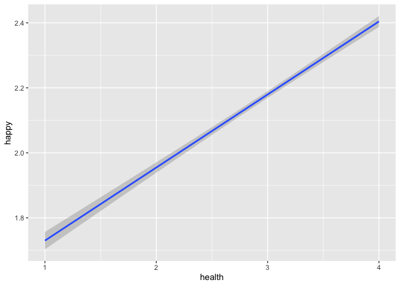
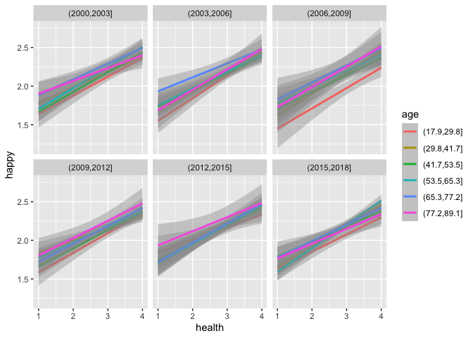

GSS EDA - health and covariates
================
Christine Lucille Kuryla
2024-09-27

Take a look at GSS dataset, what’s available, some trends, etc.

The first variable of interest is “health”, which will be the main
subject of our analysis.

<https://gssdataexplorer.norc.org/variables/437/vshow>

Question on survey: “Would you say your own health, in general, is
excellent, good, fair, or poor?”

# Fetch GSS data

``` r
# Feel free to modify to play with more covariates and variables.

#install.packages('gssr', repos =  c('https://kjhealy.r-universe.dev', 'https://cloud.r-project.org'))
# install.packages('gssrdoc', repos = c('https://kjhealy.r-universe.dev', 'https://cloud.r-project.org'))

library(gssr)
library(gssrdoc)

data("gss_all"). # this file is big!

data_gss <- as.data.frame(gss_all) %>% 
  select("year",      # year of survey
         "cohort",    # birthyear
         "age",       # age at time of survey
         "health",    # self-rated health
         "sex",       # sex
         "happy",     # self-rated happiness
         "life",      # is life exciting or dull
         "educ",      # years of education
         "polviews",  # 1 extremely liberal, 4 moderate, 7 extremely conservative
         "class",    # 1 lower, 2 middle, 3 working, 4 upper, 5 no class
         "satfin"    # 1 pretty well satisfied, 2 more or less satisfied, 3 not satisfied at all
         )

write_csv(data_gss, "data/extracted_gss_variables.csv")
```

``` r
data_gss <- read_csv("data/extracted_gss_variables.csv") %>% 
  filter(cohort != 9999) %>% 
  na.omit() %>% 
  mutate(health = 5 - health)  %>%  # reverse the coding so it's more intuitive (higher number for excellent, lower number for poor)
  mutate(happy = 4 - happy) %>% # same
  mutate(life = 4 - life) %>% # reverse again, these variables tend to be unintuitively ordered!!!
  mutate(satfin = 4 - satfin) 
```

    ## Rows: 72390 Columns: 11
    ## ── Column specification ────────────────────────────────────────────────────────
    ## Delimiter: ","
    ## dbl (11): year, cohort, age, health, sex, happy, life, educ, polviews, class...
    ## 
    ## ℹ Use `spec()` to retrieve the full column specification for this data.
    ## ℹ Specify the column types or set `show_col_types = FALSE` to quiet this message.

# Histograms

``` r
# Tidyverse and flexible number of histograms

library(patchwork)

# Create list to store ggplot objects
plot_list <- list()

# Loop through column names and create plots
for (var in colnames(data_gss)) {
  if (is.numeric(data_gss[[var]])) {  # Only create histograms for numeric columns
    p <- ggplot(data_gss, aes(x = .data[[var]])) +  # Use .data[[var]] for tidy evaluation
      geom_histogram(bins = 20, fill = "pink", color = "hotpink") +
      theme_minimal()
    
    plot_list[[var]] <- p
  }
}

# Combine all plots using patchwork and add a title
combined_plot <- wrap_plots(plot_list, ncol = 3) +
  plot_annotation(title = "Histograms of Survey Responses")

# Display the combined plot
print(combined_plot)
```

<!-- -->

# Correlation Heatmap

``` r
correlation_auto <- cor(data_gss)
knitr::kable(correlation_auto)
```

|  | year | cohort | age | health | sex | happy | life | educ | polviews | class | satfin |
|:---|---:|---:|---:|---:|---:|---:|---:|---:|---:|---:|---:|
| year | 1.0000000 | 0.5895682 | 0.1156949 | -0.0550720 | -0.0057159 | -0.0856281 | -0.0001011 | 0.2471477 | -0.0136163 | -0.0263427 | -0.0223087 |
| cohort | 0.5895682 | 1.0000000 | -0.7340846 | 0.1406949 | -0.0252270 | -0.0745466 | 0.0528437 | 0.2747073 | -0.0984603 | -0.1212801 | -0.1544326 |
| age | 0.1156949 | -0.7340846 | 1.0000000 | -0.2193179 | 0.0262172 | 0.0196846 | -0.0650690 | -0.1300390 | 0.1096333 | 0.1269966 | 0.1711570 |
| health | -0.0550720 | 0.1406949 | -0.2193179 | 1.0000000 | -0.0264873 | 0.2722478 | 0.2645358 | 0.2565862 | -0.0060991 | 0.1656160 | 0.1780896 |
| sex | -0.0057159 | -0.0252270 | 0.0262172 | -0.0264873 | 1.0000000 | 0.0070138 | -0.0556529 | -0.0303791 | -0.0322852 | -0.0154809 | -0.0314176 |
| happy | -0.0856281 | -0.0745466 | 0.0196846 | 0.2722478 | 0.0070138 | 1.0000000 | 0.3374248 | 0.0761941 | 0.0562054 | 0.1745948 | 0.2957047 |
| life | -0.0001011 | 0.0528437 | -0.0650690 | 0.2645358 | -0.0556529 | 0.3374248 | 1.0000000 | 0.2047851 | -0.0148122 | 0.1641290 | 0.1743384 |
| educ | 0.2471477 | 0.2747073 | -0.1300390 | 0.2565862 | -0.0303791 | 0.0761941 | 0.2047851 | 1.0000000 | -0.0752421 | 0.2765887 | 0.1106097 |
| polviews | -0.0136163 | -0.0984603 | 0.1096333 | -0.0060991 | -0.0322852 | 0.0562054 | -0.0148122 | -0.0752421 | 1.0000000 | 0.0118224 | 0.0586271 |
| class | -0.0263427 | -0.1212801 | 0.1269966 | 0.1656160 | -0.0154809 | 0.1745948 | 0.1641290 | 0.2765887 | 0.0118224 | 1.0000000 | 0.3343757 |
| satfin | -0.0223087 | -0.1544326 | 0.1711570 | 0.1780896 | -0.0314176 | 0.2957047 | 0.1743384 | 0.1106097 | 0.0586271 | 0.3343757 | 1.0000000 |

``` r
# Create a heatmap

#upper_tri <- matrixcalc::upper.triangle(correlation_auto)
#melted_cormat <- reshape2::melt(upper_tri, na.rm = TRUE)

melted_cormat <- reshape2::melt(cor(data_gss), na.rm = TRUE)

ggplot(data = melted_cormat, aes(Var2, Var1, fill = value))+
 geom_tile(color = "white")+
 scale_fill_gradient2(low = "blue", high = "red", mid = "white", 
   midpoint = 0, limit = c(-1,1), space = "Lab", 
   name="Pearson\nCorrelation") +
  theme_minimal()+ 
 theme(axis.text.x = element_text(angle = 45, vjust = 1, 
     hjust = 1))+
 coord_fixed() +
  geom_text(aes(Var2, Var1, label = if_else(value != 0, as.character(round(value, digits = 2)), " ")))
```

<!-- -->

# Mean health over A/P/C

``` r
data_gss %>% 
  group_by(year) %>% 
  summarize(mean_health = mean(health)) %>% 
  ggplot(aes(x = year, y = mean_health)) +
  geom_line()
```

<!-- -->

``` r
data_gss %>% 
  group_by(age) %>% 
  summarize(mean_health = mean(health)) %>% 
  ggplot(aes(x = age, y = mean_health)) +
  geom_line()
```

<!-- -->

``` r
data_gss %>% 
  group_by(cohort) %>% 
  summarize(mean_health = mean(health)) %>% 
  ggplot(aes(x = cohort, y = mean_health)) +
  geom_line()
```

<!-- -->

# Some more EDA

``` r
data_gss %>% 
  mutate(cohort = cut(cohort, breaks = 6)) %>% 
  group_by(year, cohort) %>% 
  summarize(mean_health = mean(health)) %>% 
  ggplot(aes(x = year, y = mean_health, color = cohort)) +
  geom_line()
```

    ## `summarise()` has grouped output by 'year'. You can override using the
    ## `.groups` argument.

<!-- -->

``` r
data_gss %>% 
  mutate(cohort = cut(cohort, breaks = 6)) %>% 
  group_by(age, cohort) %>% 
  summarize(mean_health = mean(health)) %>% 
  ggplot(aes(x = age, y = mean_health, color = cohort)) +
  geom_line()
```

    ## `summarise()` has grouped output by 'age'. You can override using the `.groups`
    ## argument.

<!-- -->

# Happiness and health

``` r
data_gss %>% 
  ggplot(aes(x = health, y = happy)) +
  geom_smooth(method = "lm")
```

    ## `geom_smooth()` using formula = 'y ~ x'

<!-- -->

``` r
data_gss %>% 
  mutate(year = cut(year, breaks = 6)) %>% 
  mutate(age = cut(age, breaks = 6)) %>% 
  ggplot(aes(x = health, y = happy, color = age)) +
  facet_wrap(~ year) +
  geom_smooth(method = "lm")
```

    ## `geom_smooth()` using formula = 'y ~ x'

<!-- -->

``` r
data_gss %>% 
  mutate(cohort = cut(cohort, breaks = 6)) %>% 
  mutate(year = cut(year, breaks = 6)) %>% 
  ggplot(aes(x = health, y = happy, color = cohort)) +
  facet_wrap(~ year) +
  geom_smooth(method = "lm")
```

    ## `geom_smooth()` using formula = 'y ~ x'

<!-- -->

``` r
######data_gss %>% 
  # group_by(year) %>% 
  # summarize(mean_health = mean(health)) %>% 
  # ggplot(aes(x = cohort, y = mean_health)) +
  # geom_line()

data_gss %>% 
  mutate(cohort = cut(cohort, breaks = 6)) %>% 
#  mutate(year = cut(year, breaks = 6)) %>% 
#  mutate(age = cut(year, breaks = 6)) %>% 
  ggplot(aes(x = age, y = health, color = cohort)) +
#  facet_wrap(~ year) +
  geom_smooth(method = "lm")
```

    ## `geom_smooth()` using formula = 'y ~ x'

<!-- -->
