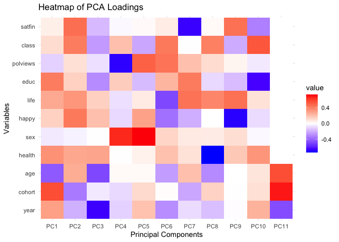

Fun Stuff with PCA, etc
================
Christine Lucille Kuryla
2024-10-10

# Some PCA Stuff

``` r
data_gss <- read_csv("data/extracted_gss_variables.csv") %>% 
  filter(cohort != 9999) %>% 
  na.omit() %>% 
  mutate(health = 5 - health)  %>%  # reverse the coding so it's more intuitive (higher number for excellent, lower number for poor)
  mutate(happy = 4 - happy) %>% # same
  mutate(life = 4 - life) %>% # reverse again, these variables tend to be unintuitively ordered!!!
  mutate(satfin = 4 - satfin) # same again!
```

    ## Rows: 72390 Columns: 11
    ## ── Column specification ────────────────────────────────────────────────────────
    ## Delimiter: ","
    ## dbl (11): year, cohort, age, health, sex, happy, life, educ, polviews, class...
    ## 
    ## ℹ Use `spec()` to retrieve the full column specification for this data.
    ## ℹ Specify the column types or set `show_col_types = FALSE` to quiet this message.

``` r
# Load necessary libraries
library(GGally)
```

    ## Registered S3 method overwritten by 'GGally':
    ##   method from   
    ##   +.gg   ggplot2

``` r
library(ggplot2)

# Example dataset (using the iris dataset)
data(iris)

# Perform PCA on the numeric columns of iris
pca_result <- prcomp(iris[, 1:4], scale. = TRUE)

# Create a dataframe of the first 5 principal components and add the species column
pc_data <- as.data.frame(pca_result$x[, 1:4])  # Extract first 5 PCs
pc_data$Species <- iris$Species  # Add the species information to the dataframe

# Use GGally's ggpairs to create the plot and color by species
ggpairs(pc_data,
        aes(color = Species),  # Color by species
        lower = list(continuous = wrap("points", alpha = 0.5)),
        diag = list(continuous = wrap("densityDiag")),
        upper = NULL)  # Optional: to remove the upper triangle
```

    ## `stat_bin()` using `bins = 30`. Pick better value with `binwidth`.

    ## `stat_bin()` using `bins = 30`. Pick better value with `binwidth`.
    ## `stat_bin()` using `bins = 30`. Pick better value with `binwidth`.
    ## `stat_bin()` using `bins = 30`. Pick better value with `binwidth`.

<!-- -->

``` r
# Perform PCA on the numeric columns of iris
#pca_result <- prcomp(iris[, 1:4], scale. = TRUE)
pca_result <- prcomp(data_gss, scale = TRUE)

# Create a dataframe of the first 5 principal components and add the species column
pc_data <- as.data.frame(pca_result$x[, 1:5])  # Extract first 5 PCs
pc_data$SRH_factor <- as.factor(data_gss$health)  # Add the species information to the dataframe

pc_data$SRH_factor <- as.factor(pc_data$SRH_factor)


# Use GGally's ggpairs to create the plot and color by species
ggpairs(pc_data,
        aes(color = SRH_factor),  # Color by species
        lower = list(continuous = wrap("points", alpha = 0.5)),
        diag = list(continuous = wrap("densityDiag")),
        upper = NULL)  # Optional: to remove the upper triangle
```

    ## `stat_bin()` using `bins = 30`. Pick better value with `binwidth`.
    ## `stat_bin()` using `bins = 30`. Pick better value with `binwidth`.
    ## `stat_bin()` using `bins = 30`. Pick better value with `binwidth`.
    ## `stat_bin()` using `bins = 30`. Pick better value with `binwidth`.
    ## `stat_bin()` using `bins = 30`. Pick better value with `binwidth`.

<!-- -->

``` r
pc_data$sex_factor <- as.factor(data_gss$sex)  # Add the species information to the dataframe

pc_data$sex_factor <- as.factor(pc_data$sex_factor)

ggpairs(pc_data,
        aes(color = sex_factor),  # Color by species
        lower = list(continuous = wrap("points", alpha = 0.5)),
        diag = list(continuous = wrap("densityDiag")),
        upper = NULL)  # Optional: to remove the upper triangle
```

    ## `stat_bin()` using `bins = 30`. Pick better value with `binwidth`.
    ## `stat_bin()` using `bins = 30`. Pick better value with `binwidth`.
    ## `stat_bin()` using `bins = 30`. Pick better value with `binwidth`.
    ## `stat_bin()` using `bins = 30`. Pick better value with `binwidth`.
    ## `stat_bin()` using `bins = 30`. Pick better value with `binwidth`.
    ## `stat_bin()` using `bins = 30`. Pick better value with `binwidth`.
    ## `stat_bin()` using `bins = 30`. Pick better value with `binwidth`.
    ## `stat_bin()` using `bins = 30`. Pick better value with `binwidth`.
    ## `stat_bin()` using `bins = 30`. Pick better value with `binwidth`.
    ## `stat_bin()` using `bins = 30`. Pick better value with `binwidth`.

<!-- -->

``` r
pca_result$rotation
```

    ##                  PC1         PC2         PC3          PC4         PC5
    ## year      0.29677091 -0.19554251 -0.65908536 -0.112406417  0.18910787
    ## cohort    0.55762045 -0.34323260 -0.05699563 -0.090913403  0.11612654
    ## age      -0.43623020  0.25769249 -0.48401051  0.017298628  0.01617950
    ## health    0.34435365  0.27435499  0.28418391 -0.001557497  0.04161338
    ## sex      -0.05341957 -0.03192521 -0.00300020  0.653773556  0.73022281
    ## happy     0.14310487  0.42414485  0.19836485 -0.093293550  0.29135680
    ## life      0.26772614  0.33177585  0.14420136 -0.078813458  0.06173108
    ## educ      0.41296275  0.14225957 -0.29370579  0.157198271 -0.16681325
    ## polviews -0.11108776  0.09637054 -0.07931043 -0.688216370  0.50086281
    ## class     0.10773279  0.41458999 -0.25578088  0.194560810 -0.21892555
    ## satfin    0.05113929  0.45812140 -0.17088759 -0.015993585  0.01469419
    ##                   PC6          PC7           PC8           PC9        PC10
    ## year     -0.286786099 -0.086003608 -0.1564981399 -0.0056950428  0.23909590
    ## cohort    0.007146516 -0.219367202  0.1367896914 -0.0032486425  0.09783830
    ## age      -0.249892626  0.197460684 -0.2997856366 -0.0007928964  0.08069480
    ## health    0.193131437  0.090513238 -0.7336394569  0.1671038693  0.33468247
    ## sex       0.131662950  0.064136398  0.0603611596  0.1007208635 -0.01536706
    ## happy    -0.367670182 -0.200102996 -0.0008304012 -0.6954536156 -0.08832931
    ## life     -0.484002691  0.443743854  0.3801588435  0.4514050355  0.08931245
    ## educ      0.230052182  0.416623715 -0.0933418291 -0.1632124333 -0.63919685
    ## polviews  0.440778181  0.195164136  0.1069088388  0.0327400529 -0.05197019
    ## class     0.424792868 -0.001813564  0.4000956575 -0.2076922607  0.53069553
    ## satfin    0.059355634 -0.666758651  0.0177480850  0.4512421373 -0.32528545
    ##                   PC11
    ## year     -4.685785e-01
    ## cohort    6.854082e-01
    ## age       5.573597e-01
    ## health    2.864248e-16
    ## sex      -2.749402e-16
    ## happy     1.417695e-16
    ## life      8.670044e-17
    ## educ      2.473891e-17
    ## polviews -1.305016e-16
    ## class    -6.590567e-16
    ## satfin    7.034272e-16

``` r
loadings <- pca_result$rotation
# Load ggplot2 for visualization
library(ggplot2)
library(tidyr)

# Convert the loadings to a data frame for easier plotting
loadings_df <- as.data.frame(loadings)

# Add the variable names to the loadings
loadings_df$Variables <- rownames(loadings_df)

# Reshape the data for easier plotting
loadings_long <- gather(loadings_df, key = "PC", value = "Loadings", -Variables)

# Plot the loadings for each variable on the first two PCs
ggplot(loadings_long, aes(x = Variables, y = Loadings, fill = PC)) +
  geom_bar(stat = "identity", position = "dodge") +
  theme_minimal() +
  labs(title = "PCA Loadings for the First Few Principal Components", y = "Loadings", x = "Variables")
```

<!-- -->

``` r
ggplot(loadings_long, aes(x = Loadings, y = PC, fill = Variables)) +
  geom_bar(stat = "identity", position = "dodge") +
  theme_minimal() +
  labs(title = "PCA Loadings for the First Few Principal Components", y = "Loadings", x = "Variables")
```

<!-- -->

``` r
library(reshape2)
```

    ## 
    ## Attaching package: 'reshape2'

    ## The following object is masked from 'package:tidyr':
    ## 
    ##     smiths

``` r
# Convert the loadings matrix into a long format for ggplot
loadings_melted <- melt(loadings)

# Plot the heatmap using ggplot
ggplot(loadings_melted, aes(x = Var2, y = Var1, fill = value)) +
  geom_tile() +
  scale_fill_gradient2(low = "blue", mid = "white", high = "red", midpoint = 0) +
  labs(title = "Heatmap of PCA Loadings", x = "Principal Components", y = "Variables") +
  theme_minimal()
```

<!-- -->
