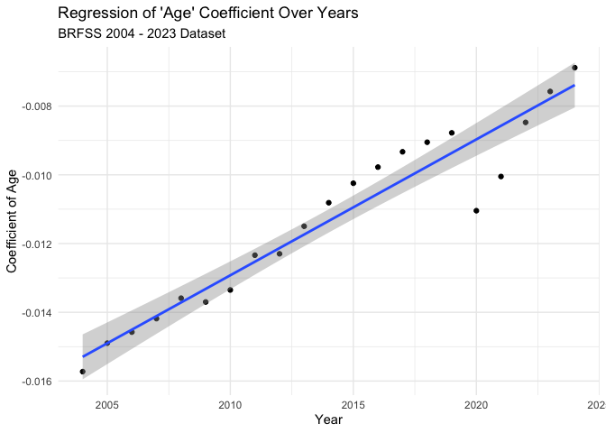

SRH BRFSS
================
Christine Lucille Kuryla
2024-10-18

Note: 2003 was weird with age so skipping for now

``` r
# Load packages
library(haven)   # For reading SAS Transport files
library(dplyr)   # For data manipulation
library(survey)  # For survey data analysis
```

    ## Loading required package: grid

    ## Loading required package: Matrix

    ## 
    ## Attaching package: 'Matrix'

    ## The following objects are masked from 'package:tidyr':
    ## 
    ##     expand, pack, unpack

    ## Loading required package: survival

    ## 
    ## Attaching package: 'survey'

    ## The following object is masked from 'package:graphics':
    ## 
    ##     dotchart

# Load and wrangle data

### Load just minimum variables 2011 - 2023

``` r
# Function to load and process BRFSS data for a given year
process_brfss_data_2011_2023 <- function(year) {
  # Construct the file name based on the year
  file_name <- paste0("LLCP", year, ".XPT")
  
  # Read the data
  data <- read_xpt(file.path("big_data","BRFSS",file_name))
  
  # Select relevant variables
  data_selected <- data %>%
    select(
   #   _AGE80,        # Age
      SEQNO,
      `_AGEG5YR`,
  #    SEX1,         # Sex
  #    X_BIRTHYR, # Year of Birth
      IYEAR,         # Survey Year
   #   WEIGHT, #SURVEY WEITHT
  #    LADULT, #over 18
      GENHLTH )#,        # Self-rated health
     # EDUCA ,                # Education level
      # INCOME2,              # Income level
      # MARITAL,              # Marital status
      # EMPLOY1,              # Employment status
      # EXERANY2,             # Exercise activity
    #  X_RACEGR3,     # Race/Ethnicity
     # X_HISPANC,  # Hispanic Origin
    #  COMORBIDITIES = X_RFHLTH) # Health status flag
  # Recode variables as necessary
  # data_clean <- data_selected %>%
  #   mutate(
  #     SEX = recode(SEX, `1` = "Male", `2` = "Female"),
  #     SRH = recode(SRH,
  #                  `1` = "Excellent",
  #                  `2` = "Very Good",
  #                  `3` = "Good",
  #                  `4` = "Fair",
  #                  `5` = "Poor")
  #     # Add more recoding as needed
     #)
  
  data_modified <- data_selected %>% 
    mutate(id = as.numeric(SEQNO),
           age = as.numeric(`_AGEG5YR`),
           year = as.numeric(IYEAR),
           health = 6 - as.numeric(GENHLTH)
           ) %>% 
    filter(health %in% 1:5,
           age %in% 1:12) %>% 
    mutate(age = case_match(age,
                          1 ~ ((18+24)/2),
                          2 ~ ((25+29)/2),
                          3 ~ ((30+34)/2),
                          4 ~ ((35+39)/2),
                          5 ~ ((40+44)/2),
                          6 ~ ((45+49)/2),
                          7 ~ ((50+54)/2),
                          8 ~ ((55+59)/2),
                          9 ~ ((60+64)/2),
                          10 ~ ((65+69)/2),
                          11 ~ ((70+74)/2),
                          12 ~ ((75+79)/2) #,
                          #13 ~ ((18+24)/2), # 80 or older
                          )
    ) %>% 
    mutate(cohort = year - age) %>% 
    select(id, age, year, cohort, health)
    
  print(data_modified$year)
  return(data_modified)
}

# Load data for years 2018 to 2020 as an example
years <- 2011:2023
brfss_list <- lapply(years, process_brfss_data_2011_2023)
brfss_data_2011_2023 <- bind_rows(brfss_list)

table(brfss_data_2011_2023$year)
table(brfss_data_2011_2023$cohort)

# write_csv(brfss_data_2011_2023, "big_data/BRFSS/brfss_data_2011_2023_recoded_min.csv")

# 
# data_brfss <- brfss_data %>% 
#   filter(`_AGEG5YR` %in% 1:12) %>% 
#   mutate(id = SEQNO,
#          age = `_AGEG5YR`,
#          year = as.numeric(IYEAR)) %>% 
#   mutate(age = case_match(age,
#                           1 ~ ((18+24)/2),
#                           2 ~ ((25+29)/2),
#                           3 ~ ((30+34)/2),
#                           4 ~ ((35+39)/2),
#                           5 ~ ((40+44)/2),
#                           6 ~ ((45+49)/2),
#                           7 ~ ((50+54)/2),
#                           8 ~ ((55+59)/2),
#                           9 ~ ((60+64)/2),
#                           10 ~ ((65+69)/2),
#                           11 ~ ((70+74)/2),
#                           12 ~ ((75+79)/2) #,
#                           #13 ~ ((18+24)/2), # 80 or older
#                           )
#          ) %>% 
#   mutate(health = 6 - GENHLTH,
#          cohort = year - age ) %>% 
# select(id, age, year, cohort, health)
```

### Load just minimum variables 2004 - 2010 and combine

``` r
# Function to load and process BRFSS data for a given year
process_brfss_data_2004_2010 <- function(year) {
  # Construct the file name based on the year
  file_name <- paste0("CDBRFS", year, ".XPT")
  
  # Read the data
  data <- read_xpt(file.path("big_data","BRFSS",file_name))
  
  # Select relevant variables
  data_selected <- data %>%
    select(
   #   _AGE80,        # Age
      SEQNO,
      `_AGEG5YR`,
  #    SEX1,         # Sex
  #    X_BIRTHYR, # Year of Birth
      IYEAR,         # Survey Year
   #   WEIGHT, #SURVEY WEITHT
  #    LADULT, #over 18
      GENHLTH )#,        # Self-rated health
     # EDUCA ,                # Education level
      # INCOME2,              # Income level
      # MARITAL,              # Marital status
      # EMPLOY1,              # Employment status
      # EXERANY2,             # Exercise activity
    #  X_RACEGR3,     # Race/Ethnicity
     # X_HISPANC,  # Hispanic Origin
    #  COMORBIDITIES = X_RFHLTH) # Health status flag
  # Recode variables as necessary
  # data_clean <- data_selected %>%
  #   mutate(
  #     SEX = recode(SEX, `1` = "Male", `2` = "Female"),
  #     SRH = recode(SRH,
  #                  `1` = "Excellent",
  #                  `2` = "Very Good",
  #                  `3` = "Good",
  #                  `4` = "Fair",
  #                  `5` = "Poor")
  #     # Add more recoding as needed
     #)
  
  data_modified <- data_selected %>% 
    mutate(id = as.numeric(SEQNO),
           age = as.numeric(`_AGEG5YR`),
           year = as.numeric(IYEAR),
           health = 6 - as.numeric(GENHLTH)
           ) %>% 
    filter(health %in% 1:5,
           age %in% 1:12) %>% 
    mutate(age = case_match(age,
                          1 ~ ((18+24)/2),
                          2 ~ ((25+29)/2),
                          3 ~ ((30+34)/2),
                          4 ~ ((35+39)/2),
                          5 ~ ((40+44)/2),
                          6 ~ ((45+49)/2),
                          7 ~ ((50+54)/2),
                          8 ~ ((55+59)/2),
                          9 ~ ((60+64)/2),
                          10 ~ ((65+69)/2),
                          11 ~ ((70+74)/2),
                          12 ~ ((75+79)/2) #,
                          #13 ~ ((18+24)/2), # 80 or older
                          )
    ) %>% 
    mutate(cohort = year - age) %>% 
    select(id, age, year, cohort, health)
    
  print(data_modified$year)
  return(data_modified)
}

# Load data for years 2018 to 2020 as an example
years <- c("04", "05","06","07","08","09","10")
brfss_list <- lapply(years, process_brfss_data_2004_2010)
brfss_data_2004_2010 <- bind_rows(brfss_list)

table(brfss_data_2004_2010$year)
table(brfss_data_2004_2010$cohort)

# write_csv(brfss_data_2004_2010, "big_data/BRFSS/brfss_data_2004_2010_recoded_min.csv")

data_brfss_2004_2023 <- rbind(brfss_data_2004_2010, brfss_data_2011_2023)

data_brfss_2004_2023 <- data_brfss_2004_2023 %>% 
  filter(year != "always")

table(data_brfss_2004_2023$year)
table(data_brfss_2004_2023$cohort)

# write_csv(data_brfss_2004_2023, "big_data/BRFSS/brfss_data_2004_2023_recoded_min.csv")
```

### 1990-2003: To do

``` r
# brfss 2003, 2001

# variable: AGE
# 7 : do not know/refused
# 9 : refused
# 18 - 24
# 25 - 34
# 35 - 44
# 45 - 54
# 55 - 64
# 65 - 99

# same for 2004, but they also have imputed _IMPAGE
# but they also have _AGEG5YR too 

# 2002 has _AGEG5YR

# 2000 has its own thing, check it out

# 1999 starts going by decades of age, different spacing, called AGE

# etc
```

## Load data

``` r
# Load already BRFSS csv modified and extracted 2011-2023

data_brfss <- read_csv("big_data/BRFSS/brfss_data_2004_2023_recoded_min.csv")
```

    ## Rows: 7819009 Columns: 5
    ## ── Column specification ────────────────────────────────────────────────────────
    ## Delimiter: ","
    ## dbl (5): id, age, year, cohort, health
    ## 
    ## ℹ Use `spec()` to retrieve the full column specification for this data.
    ## ℹ Specify the column types or set `show_col_types = FALSE` to quiet this message.

# Basic Analysis

``` r
data_brfss %>% 
  filter(age > 18, age < 90) %>% 
  mutate(age = cut(age, breaks = 6)) %>% # Create cohorts with 6 breaks
  group_by(age, year) %>% 
  summarize(mean_health = mean(health)) %>% 
  ggplot(aes(x = year, y = mean_health, color = age)) +
  geom_line() +
  labs(title = "Average SRH Per Year for Each Age Group",
       subtitle = "BRFSS 2004 - 2023 Dataset",
       x = "Average SRH", 
       y = "Year") +
  geom_point() 
```

    ## `summarise()` has grouped output by 'age'. You can override using the `.groups`
    ## argument.

<!-- -->

``` r
# health vs age per year
data_brfss %>% 
  group_by(age, year) %>% 
  summarize(mean_health = mean(health)) %>% 
  ggplot(aes(x = age, y = mean_health)) +
  geom_line(color = "cornflowerblue") +
  facet_wrap(~ year) +
  labs(title = "Self-Rated Health By Age (Per Year)",
       subtitle = "BRFSS 2004 - 2023 Dataset",
       x = "Average SRH", 
       y = "Age of Respondent")
```

    ## `summarise()` has grouped output by 'age'. You can override using the `.groups`
    ## argument.

<!-- -->

``` r
# Aggregate slopes

# years_of_gss <- c(data_gss %>% select(year) %>% unique() )
# lm_health_v_age_0 <- data_gss %>%
#   group_by(year) %>%
#   summarize(coef = coef(lm(health ~ age, data = cur_data()))["age"])

# Perform linear regression for each year and extract the coefficient of 'age' with confidence intervals, se, t stat, p val
lm_health_v_age_0 <- data_brfss %>%
  group_by(year) %>%
  do(broom::tidy(lm(health ~ age, data = .), conf.int = TRUE)) %>%  # Add conf.int = TRUE for CIs
  filter(term == "age") %>%
  select(year, coef = estimate, conf.low, conf.high, se = std.error, t_statistic = statistic,  p_value = p.value)

# View the results with confidence intervals, se, t statistic, and p value
# print(lm_health_v_age_0)
knitr::kable(lm_health_v_age_0,
             caption = "BRFSS 2004 - 2023 Dataset")
```

| year |       coef |   conf.low |  conf.high |        se | t_statistic | p_value |
|-----:|-----------:|-----------:|-----------:|----------:|------------:|--------:|
| 2004 | -0.0157254 | -0.0159768 | -0.0154740 | 0.0001283 |  -122.59182 |       0 |
| 2005 | -0.0148972 | -0.0151336 | -0.0146608 | 0.0001206 |  -123.51338 |       0 |
| 2006 | -0.0145763 | -0.0148177 | -0.0143348 | 0.0001232 |  -118.32929 |       0 |
| 2007 | -0.0141834 | -0.0144071 | -0.0139596 | 0.0001142 |  -124.24834 |       0 |
| 2008 | -0.0135886 | -0.0138186 | -0.0133585 | 0.0001174 |  -115.75324 |       0 |
| 2009 | -0.0136998 | -0.0139285 | -0.0134712 | 0.0001167 |  -117.41628 |       0 |
| 2010 | -0.0133501 | -0.0135792 | -0.0131210 | 0.0001169 |  -114.20436 |       0 |
| 2011 | -0.0123381 | -0.0125396 | -0.0121365 | 0.0001028 |  -119.99439 |       0 |
| 2012 | -0.0122980 | -0.0125027 | -0.0120933 | 0.0001044 |  -117.76538 |       0 |
| 2013 | -0.0114959 | -0.0116944 | -0.0112974 | 0.0001013 |  -113.48509 |       0 |
| 2014 | -0.0108115 | -0.0110156 | -0.0106073 | 0.0001042 |  -103.79940 |       0 |
| 2015 | -0.0102447 | -0.0104523 | -0.0100371 | 0.0001059 |   -96.70762 |       0 |
| 2016 | -0.0097754 | -0.0099715 | -0.0095793 | 0.0001001 |   -97.69097 |       0 |
| 2017 | -0.0093298 | -0.0095294 | -0.0091301 | 0.0001019 |   -91.58701 |       0 |
| 2018 | -0.0090515 | -0.0092543 | -0.0088487 | 0.0001035 |   -87.47587 |       0 |
| 2019 | -0.0087782 | -0.0089818 | -0.0085747 | 0.0001038 |   -84.53760 |       0 |
| 2020 | -0.0110438 | -0.0112433 | -0.0108444 | 0.0001018 |  -108.52575 |       0 |
| 2021 | -0.0100488 | -0.0102442 | -0.0098534 | 0.0000997 |  -100.78444 |       0 |
| 2022 | -0.0084745 | -0.0086661 | -0.0082828 | 0.0000978 |   -86.66283 |       0 |
| 2023 | -0.0075742 | -0.0077663 | -0.0073822 | 0.0000980 |   -77.29900 |       0 |
| 2024 | -0.0068831 | -0.0076866 | -0.0060796 | 0.0004099 |   -16.79018 |       0 |

BRFSS 2004 - 2023 Dataset

``` r
# Plot coefficients
ggplot(lm_health_v_age_0, aes(x = year, y = coef)) +
  geom_point() +
  labs(
    title = "Change in 'Age' Coefficient Over Years",
    subtitle = "BRFSS 2004 - 2023 Dataset",
    x = "Year",
    y = "Coefficient of Age"
  ) +
  theme_minimal()
```

<!-- -->

``` r
# Plot coefficients with CI
ggplot(lm_health_v_age_0, aes(x = year, y = coef)) +
  geom_line() +
  geom_point() +
  geom_ribbon(aes(ymin = conf.low, ymax = conf.high), alpha = 0.2) +  # Add shaded area for confidence intervals
  labs(
    title = "Change in 'Age' Coefficient Over Years with Confidence Intervals",
    subtitle = "BRFSS 2004 - 2023 Dataset",
    x = "Year",
    y = "Coefficient of Age"
  ) +
  theme_minimal()
```

<!-- -->

``` r
# Perform linear regression of 'coef' (age coefficient) vs 'year'
lm_coef_vs_year <- lm(coef ~ year, data = lm_health_v_age_0)

# View the summary of the regression
summary(lm_coef_vs_year)
```

    ## 
    ## Call:
    ## lm(formula = coef ~ year, data = lm_health_v_age_0)
    ## 
    ## Residuals:
    ##        Min         1Q     Median         3Q        Max 
    ## -0.0020750 -0.0002966  0.0001253  0.0005299  0.0008253 
    ## 
    ## Coefficients:
    ##               Estimate Std. Error t value Pr(>|t|)    
    ## (Intercept) -0.8077284  0.0537686  -15.02 5.36e-12 ***
    ## year         0.0003954  0.0000267   14.81 6.87e-12 ***
    ## ---
    ## Signif. codes:  0 '***' 0.001 '**' 0.01 '*' 0.05 '.' 0.1 ' ' 1
    ## 
    ## Residual standard error: 0.0007408 on 19 degrees of freedom
    ## Multiple R-squared:  0.9203, Adjusted R-squared:  0.9161 
    ## F-statistic: 219.4 on 1 and 19 DF,  p-value: 6.874e-12

``` r
ggplot(lm_health_v_age_0, aes(x = year, y = coef)) +
  geom_point() +
  geom_smooth(method = "lm", se = TRUE) +  # Adds the regression line with standard error shading
  geom_ribbon(aes(ymin = conf.low, ymax = conf.high), alpha = 0.2) +  # Confidence intervals for the coefficients
  labs(
    title = "Regression of 'Age' Coefficient Over Years",
    subtitle = "BRFSS 2004 - 2023 Dataset",
    x = "Year",
    y = "Coefficient of Age"
  ) +
  theme_minimal()
```

    ## `geom_smooth()` using formula = 'y ~ x'

<!-- -->

``` r
data_brfss %>% 
  filter(cohort > 1800, cohort < 2020) %>% 
  mutate(cohort = cut(cohort, breaks = 6)) %>% # Create cohorts with 6 breaks
  group_by(age, cohort) %>% 
  summarize(mean_health = mean(health)) %>% 
  ggplot(aes(x = age, y = mean_health, color = cohort)) +
  labs(title = "Age Profiles by Cohort", 
       subtitle = "BRFSS 2004 - 2023 Dataset") +
  geom_line()
```

    ## `summarise()` has grouped output by 'age'. You can override using the `.groups`
    ## argument.

<!-- -->
