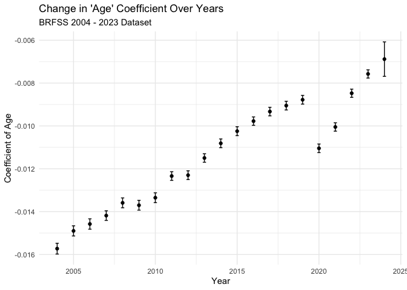
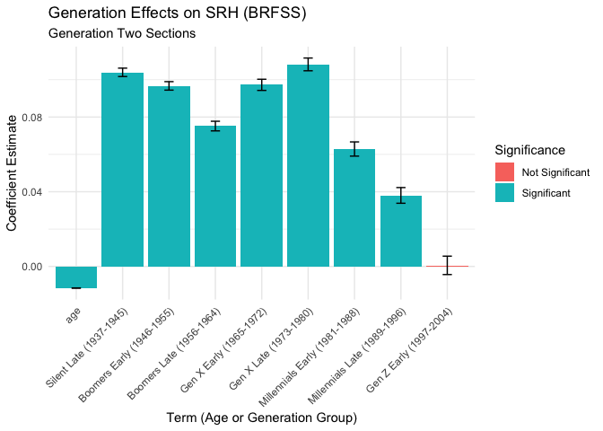

SRH BRFSS
================
Christine Lucille Kuryla
2024-10-18

Note: 2003 was weird with age so skipping for now

# Load and wrangle data

### Load just minimum variables 2011 - 2023

``` r
# Function to load and process BRFSS data for a given year
process_brfss_data_2011_2023 <- function(year) {
  # Construct the file name based on the year
  file_name <- paste0("LLCP", year, ".XPT")
  
  # Read the data
  data <- read_xpt(file.path("big_data","BRFSS",file_name))
  
  # Select relevant variables
  data_selected <- data %>%
    select(
   #   _AGE80,        # Age
      SEQNO,
      `_AGEG5YR`,
  #    SEX1,         # Sex
  #    X_BIRTHYR, # Year of Birth
      IYEAR,         # Survey Year
   #   WEIGHT, #SURVEY WEITHT
  #    LADULT, #over 18
      GENHLTH )#,        # Self-rated health
     # EDUCA ,                # Education level
      # INCOME2,              # Income level
      # MARITAL,              # Marital status
      # EMPLOY1,              # Employment status
      # EXERANY2,             # Exercise activity
    #  X_RACEGR3,     # Race/Ethnicity
     # X_HISPANC,  # Hispanic Origin
    #  COMORBIDITIES = X_RFHLTH) # Health status flag
  # Recode variables as necessary
  # data_clean <- data_selected %>%
  #   mutate(
  #     SEX = recode(SEX, `1` = "Male", `2` = "Female"),
  #     SRH = recode(SRH,
  #                  `1` = "Excellent",
  #                  `2` = "Very Good",
  #                  `3` = "Good",
  #                  `4` = "Fair",
  #                  `5` = "Poor")
  #     # Add more recoding as needed
     #)
  
  data_modified <- data_selected %>% 
    mutate(id = as.numeric(SEQNO),
           age = as.numeric(`_AGEG5YR`),
           year = as.numeric(IYEAR),
           health = 6 - as.numeric(GENHLTH)
           ) %>% 
    filter(health %in% 1:5,
           age %in% 1:12) %>% 
    mutate(age = case_match(age,
                          1 ~ ((18+24)/2),
                          2 ~ ((25+29)/2),
                          3 ~ ((30+34)/2),
                          4 ~ ((35+39)/2),
                          5 ~ ((40+44)/2),
                          6 ~ ((45+49)/2),
                          7 ~ ((50+54)/2),
                          8 ~ ((55+59)/2),
                          9 ~ ((60+64)/2),
                          10 ~ ((65+69)/2),
                          11 ~ ((70+74)/2),
                          12 ~ ((75+79)/2) #,
                          #13 ~ ((18+24)/2), # 80 or older
                          )
    ) %>% 
    mutate(cohort = year - age) %>% 
    select(id, age, year, cohort, health)
    
  print(data_modified$year)
  return(data_modified)
}

# Load data for years 2018 to 2020 as an example
years <- 2011:2023
brfss_list <- lapply(years, process_brfss_data_2011_2023)
brfss_data_2011_2023 <- bind_rows(brfss_list)

table(brfss_data_2011_2023$year)
table(brfss_data_2011_2023$cohort)

# write_csv(brfss_data_2011_2023, "big_data/BRFSS/brfss_data_2011_2023_recoded_min.csv")

# 
# data_brfss <- brfss_data %>% 
#   filter(`_AGEG5YR` %in% 1:12) %>% 
#   mutate(id = SEQNO,
#          age = `_AGEG5YR`,
#          year = as.numeric(IYEAR)) %>% 
#   mutate(age = case_match(age,
#                           1 ~ ((18+24)/2),
#                           2 ~ ((25+29)/2),
#                           3 ~ ((30+34)/2),
#                           4 ~ ((35+39)/2),
#                           5 ~ ((40+44)/2),
#                           6 ~ ((45+49)/2),
#                           7 ~ ((50+54)/2),
#                           8 ~ ((55+59)/2),
#                           9 ~ ((60+64)/2),
#                           10 ~ ((65+69)/2),
#                           11 ~ ((70+74)/2),
#                           12 ~ ((75+79)/2) #,
#                           #13 ~ ((18+24)/2), # 80 or older
#                           )
#          ) %>% 
#   mutate(health = 6 - GENHLTH,
#          cohort = year - age ) %>% 
# select(id, age, year, cohort, health)
```

### Load just minimum variables 2004 - 2010 and combine

``` r
# Function to load and process BRFSS data for a given year
process_brfss_data_2004_2010 <- function(year) {
  # Construct the file name based on the year
  file_name <- paste0("CDBRFS", year, ".XPT")
  
  # Read the data
  data <- read_xpt(file.path("big_data","BRFSS",file_name))
  
  # Select relevant variables
  data_selected <- data %>%
    select(
   #   _AGE80,        # Age
      SEQNO,
      `_AGEG5YR`,
  #    SEX1,         # Sex
  #    X_BIRTHYR, # Year of Birth
      IYEAR,         # Survey Year
   #   WEIGHT, #SURVEY WEITHT
  #    LADULT, #over 18
      GENHLTH )#,        # Self-rated health
     # EDUCA ,                # Education level
      # INCOME2,              # Income level
      # MARITAL,              # Marital status
      # EMPLOY1,              # Employment status
      # EXERANY2,             # Exercise activity
    #  X_RACEGR3,     # Race/Ethnicity
     # X_HISPANC,  # Hispanic Origin
    #  COMORBIDITIES = X_RFHLTH) # Health status flag
  # Recode variables as necessary
  # data_clean <- data_selected %>%
  #   mutate(
  #     SEX = recode(SEX, `1` = "Male", `2` = "Female"),
  #     SRH = recode(SRH,
  #                  `1` = "Excellent",
  #                  `2` = "Very Good",
  #                  `3` = "Good",
  #                  `4` = "Fair",
  #                  `5` = "Poor")
  #     # Add more recoding as needed
     #)
  
  data_modified <- data_selected %>% 
    mutate(id = as.numeric(SEQNO),
           age = as.numeric(`_AGEG5YR`),
           year = as.numeric(IYEAR),
           health = 6 - as.numeric(GENHLTH)
           ) %>% 
    filter(health %in% 1:5,
           age %in% 1:12) %>% 
    mutate(age = case_match(age,
                          1 ~ ((18+24)/2),
                          2 ~ ((25+29)/2),
                          3 ~ ((30+34)/2),
                          4 ~ ((35+39)/2),
                          5 ~ ((40+44)/2),
                          6 ~ ((45+49)/2),
                          7 ~ ((50+54)/2),
                          8 ~ ((55+59)/2),
                          9 ~ ((60+64)/2),
                          10 ~ ((65+69)/2),
                          11 ~ ((70+74)/2),
                          12 ~ ((75+79)/2) #,
                          #13 ~ ((18+24)/2), # 80 or older
                          )
    ) %>% 
    mutate(cohort = year - age) %>% 
    select(id, age, year, cohort, health)
    
  print(data_modified$year)
  return(data_modified)
}

# Load data for years 2018 to 2020 as an example
years <- c("04", "05","06","07","08","09","10")
brfss_list <- lapply(years, process_brfss_data_2004_2010)
brfss_data_2004_2010 <- bind_rows(brfss_list)

table(brfss_data_2004_2010$year)
table(brfss_data_2004_2010$cohort)

# write_csv(brfss_data_2004_2010, "big_data/BRFSS/brfss_data_2004_2010_recoded_min.csv")

data_brfss_2004_2023 <- rbind(brfss_data_2004_2010, brfss_data_2011_2023)

data_brfss_2004_2023 <- data_brfss_2004_2023 %>% 
  filter(year != "always")

table(data_brfss_2004_2023$year)
table(data_brfss_2004_2023$cohort)

# write_csv(data_brfss_2004_2023, "big_data/BRFSS/brfss_data_2004_2023_recoded_min.csv")
```

### 1990-2003: To do

``` r
# brfss 2003, 2001

# variable: AGE
# 7 : do not know/refused
# 9 : refused
# 18 - 24
# 25 - 34
# 35 - 44
# 45 - 54
# 55 - 64
# 65 - 99

# same for 2004, but they also have imputed _IMPAGE
# but they also have _AGEG5YR too 

# 2000, 2002 has _AGEG5YR

# 2001 has its own thing, check it out

# 1999 starts going by decades of age, different spacing, called AGE

# etc
```

## Load data

``` r
# Load BRFSS csv already modified and extracted 2011-2023

data_brfss <- read_csv("big_data/BRFSS/brfss_data_2004_2023_recoded_min.csv")
```

    ## Rows: 7819009 Columns: 5
    ## ── Column specification ────────────────────────────────────────────────────────
    ## Delimiter: ","
    ## dbl (5): id, age, year, cohort, health
    ## 
    ## ℹ Use `spec()` to retrieve the full column specification for this data.
    ## ℹ Specify the column types or set `show_col_types = FALSE` to quiet this message.

# Basic Analysis

``` r
data_brfss %>% 
  filter(age > 18, age < 90) %>% 
  mutate(age = cut(age, breaks = 6)) %>% # Create cohorts with 6 breaks
  group_by(age, year) %>% 
  summarize(mean_health = mean(health)) %>% 
  ggplot(aes(x = year, y = mean_health, color = age)) +
  geom_line() +
  labs(title = "Average SRH Per Year for Each Age Group",
       subtitle = "BRFSS 2004 - 2023 Dataset",
       y = "Average SRH", 
       x = "Year",
       color = "Age Group") +
  theme_minimal() +
  geom_point() 
```

    ## `summarise()` has grouped output by 'age'. You can override using the `.groups`
    ## argument.

<!-- -->

``` r
# health vs age per year
data_brfss %>% 
  group_by(age, year) %>% 
  summarize(mean_health = mean(health)) %>% 
  ggplot(aes(x = age, y = mean_health)) +
  geom_line(color = "cornflowerblue") +
  facet_wrap(~ year) +
  labs(title = "Self-Rated Health By Age (Per Year)",
       subtitle = "BRFSS 2004 - 2023 Dataset",
       y = "Average SRH", 
       x = "Age of Respondent")
```

    ## `summarise()` has grouped output by 'age'. You can override using the `.groups`
    ## argument.

<!-- -->

``` r
# Aggregate slopes

# years_of_gss <- c(data_gss %>% select(year) %>% unique() )
# lm_health_v_age_0 <- data_gss %>%
#   group_by(year) %>%
#   summarize(coef = coef(lm(health ~ age, data = cur_data()))["age"])

# Perform linear regression for each year and extract the coefficient of 'age' with confidence intervals, se, t stat, p val
lm_health_v_age_0 <- data_brfss %>%
  group_by(year) %>%
  do(broom::tidy(lm(health ~ age, data = .), conf.int = TRUE)) %>%  # Add conf.int = TRUE for CIs
  filter(term == "age") %>%
  select(year, coef = estimate, conf.low, conf.high, se = std.error, t_statistic = statistic,  p_value = p.value)

# View the results with confidence intervals, se, t statistic, and p value
# print(lm_health_v_age_0)
knitr::kable(lm_health_v_age_0,
             caption = "BRFSS 2004 - 2023 Dataset")
```

| year |       coef |   conf.low |  conf.high |        se | t_statistic | p_value |
|-----:|-----------:|-----------:|-----------:|----------:|------------:|--------:|
| 2004 | -0.0157254 | -0.0159768 | -0.0154740 | 0.0001283 |  -122.59182 |       0 |
| 2005 | -0.0148972 | -0.0151336 | -0.0146608 | 0.0001206 |  -123.51338 |       0 |
| 2006 | -0.0145763 | -0.0148177 | -0.0143348 | 0.0001232 |  -118.32929 |       0 |
| 2007 | -0.0141834 | -0.0144071 | -0.0139596 | 0.0001142 |  -124.24834 |       0 |
| 2008 | -0.0135886 | -0.0138186 | -0.0133585 | 0.0001174 |  -115.75324 |       0 |
| 2009 | -0.0136998 | -0.0139285 | -0.0134712 | 0.0001167 |  -117.41628 |       0 |
| 2010 | -0.0133501 | -0.0135792 | -0.0131210 | 0.0001169 |  -114.20436 |       0 |
| 2011 | -0.0123381 | -0.0125396 | -0.0121365 | 0.0001028 |  -119.99439 |       0 |
| 2012 | -0.0122980 | -0.0125027 | -0.0120933 | 0.0001044 |  -117.76538 |       0 |
| 2013 | -0.0114959 | -0.0116944 | -0.0112974 | 0.0001013 |  -113.48509 |       0 |
| 2014 | -0.0108115 | -0.0110156 | -0.0106073 | 0.0001042 |  -103.79940 |       0 |
| 2015 | -0.0102447 | -0.0104523 | -0.0100371 | 0.0001059 |   -96.70762 |       0 |
| 2016 | -0.0097754 | -0.0099715 | -0.0095793 | 0.0001001 |   -97.69097 |       0 |
| 2017 | -0.0093298 | -0.0095294 | -0.0091301 | 0.0001019 |   -91.58701 |       0 |
| 2018 | -0.0090515 | -0.0092543 | -0.0088487 | 0.0001035 |   -87.47587 |       0 |
| 2019 | -0.0087782 | -0.0089818 | -0.0085747 | 0.0001038 |   -84.53760 |       0 |
| 2020 | -0.0110438 | -0.0112433 | -0.0108444 | 0.0001018 |  -108.52575 |       0 |
| 2021 | -0.0100488 | -0.0102442 | -0.0098534 | 0.0000997 |  -100.78444 |       0 |
| 2022 | -0.0084745 | -0.0086661 | -0.0082828 | 0.0000978 |   -86.66283 |       0 |
| 2023 | -0.0075742 | -0.0077663 | -0.0073822 | 0.0000980 |   -77.29900 |       0 |
| 2024 | -0.0068831 | -0.0076866 | -0.0060796 | 0.0004099 |   -16.79018 |       0 |

BRFSS 2004 - 2023 Dataset

``` r
# Plot coefficients
ggplot(lm_health_v_age_0, aes(x = year, y = coef)) +
  geom_point() +
  geom_errorbar(aes(ymin=conf.low, ymax=conf.high), width=.2,
                 position=position_dodge(0.05)) +
  labs(
    title = "Change in 'Age' Coefficient Over Years",
    subtitle = "BRFSS 2004 - 2023 Dataset",
    x = "Year",
    y = "Coefficient of Age"
  ) +
  theme_minimal()
```

<!-- -->

``` r
# Plot coefficients with CI
ggplot(lm_health_v_age_0, aes(x = year, y = coef)) +
  geom_line() +
  geom_point() +
  geom_ribbon(aes(ymin = conf.low, ymax = conf.high), alpha = 0.2) +  # Add shaded area for confidence intervals
  labs(
    title = "Change in 'Age' Coefficient Over Years with Confidence Intervals",
    subtitle = "BRFSS 2004 - 2023 Dataset",
    x = "Year",
    y = "Coefficient of Age"
  ) +
  theme_minimal()
```

<!-- -->

``` r
# Perform linear regression of 'coef' (age coefficient) vs 'year'
lm_coef_vs_year <- lm(coef ~ year, data = lm_health_v_age_0)

# View the summary of the regression
summary(lm_coef_vs_year)
```

    ## 
    ## Call:
    ## lm(formula = coef ~ year, data = lm_health_v_age_0)
    ## 
    ## Residuals:
    ##        Min         1Q     Median         3Q        Max 
    ## -0.0020750 -0.0002966  0.0001253  0.0005299  0.0008253 
    ## 
    ## Coefficients:
    ##               Estimate Std. Error t value Pr(>|t|)    
    ## (Intercept) -0.8077284  0.0537686  -15.02 5.36e-12 ***
    ## year         0.0003954  0.0000267   14.81 6.87e-12 ***
    ## ---
    ## Signif. codes:  0 '***' 0.001 '**' 0.01 '*' 0.05 '.' 0.1 ' ' 1
    ## 
    ## Residual standard error: 0.0007408 on 19 degrees of freedom
    ## Multiple R-squared:  0.9203, Adjusted R-squared:  0.9161 
    ## F-statistic: 219.4 on 1 and 19 DF,  p-value: 6.874e-12

``` r
ggplot(lm_health_v_age_0, aes(x = year, y = coef)) +
  geom_point() +
  geom_errorbar(aes(ymin=conf.low, ymax=conf.high), width=.2,
                 position=position_dodge(0.05)) +
  geom_smooth(method = "lm", se = TRUE, alpha = 0.3) +  # Adds the regression line with standard error shading
#  geom_ribbon(aes(ymin = conf.low, ymax = conf.high), alpha = 0.2) +  # Confidence intervals for the coefficients
  labs(
    title = "Regression of 'Age' Coefficient Over Years",
    subtitle = "BRFSS 2004 - 2023 Dataset",
    x = "Year",
    y = "Coefficient of Age"
  ) +
  theme_minimal()
```

    ## `geom_smooth()` using formula = 'y ~ x'

<!-- -->

``` r
data_brfss %>% 
  filter(cohort > 1800, cohort < 2020) %>% 
  mutate(cohort = cut(cohort, breaks = 6)) %>% # Create cohorts with 6 breaks
  group_by(age, cohort) %>% 
  summarize(mean_health = mean(health)) %>% 
  ggplot(aes(x = age, y = mean_health, color = cohort)) +
  labs(title = "Age Profiles by Cohort", 
       subtitle = "BRFSS 2004 - 2023 Dataset") +
  geom_line()
```

    ## `summarise()` has grouped output by 'age'. You can override using the `.groups`
    ## argument.

<!-- -->

# Cohort Effects

## Generation Splitting

``` r
# Create generations in data_brfss
data_brfss_generations <- data_brfss %>%
  filter(cohort > 1930) %>%
  mutate(
    generation = factor(
      case_when(
        cohort >= 1901 & cohort <= 1927 ~ "Greatest (1901-1927)",
        cohort >= 1928 & cohort <= 1945 ~ "Silent (1928-1945)",
        cohort >= 1946 & cohort <= 1964 ~ "Boomers (1946-1964)",
        cohort >= 1965 & cohort <= 1980 ~ "Gen X (1965-1980)",
        cohort >= 1981 & cohort <= 1996 ~ "Millennials (1981-1996)",
        cohort >= 1997 & cohort <= 2012 ~ "Gen Z (1997-2012)",
        TRUE ~ "Other"
      ),
      levels = c(
        "Greatest (1901-1927)",
        "Silent (1928-1945)",
        "Boomers (1946-1964)",
        "Gen X (1965-1980)",
        "Millennials (1981-1996)",
        "Gen Z (1997-2012)"
      )
    ),
    generation_two_sections = factor(
      case_when(
  #      generation == "Greatest (1901-1927)" & cohort <= 1914 ~ "Greatest Early (1901-1914)",
  #      generation == "Greatest (1901-1927)" & cohort > 1914 ~ "Greatest Late (1915-1927)",
        generation == "Silent (1928-1945)" & cohort <= 1936 ~ "Silent Early (1928-1936)",
        generation == "Silent (1928-1945)" & cohort > 1936 ~ "Silent Late (1937-1945)",
        generation == "Boomers (1946-1964)" & cohort <= 1955 ~ "Boomers Early (1946-1955)",
        generation == "Boomers (1946-1964)" & cohort > 1955 ~ "Boomers Late (1956-1964)",
        generation == "Gen X (1965-1980)" & cohort <= 1972 ~ "Gen X Early (1965-1972)",
        generation == "Gen X (1965-1980)" & cohort > 1972 ~ "Gen X Late (1973-1980)",
        generation == "Millennials (1981-1996)" & cohort <= 1988 ~ "Millennials Early (1981-1988)",
        generation == "Millennials (1981-1996)" & cohort > 1988 ~ "Millennials Late (1989-1996)",
        generation == "Gen Z (1997-2012)" & cohort <= 2004 ~ "Gen Z Early (1997-2004)",
        generation == "Gen Z (1997-2012)" & cohort > 2004 ~ "Gen Z Late (2005-2012)",
        TRUE ~ "Other"
      ),
      levels = c(
        "Greatest Early (1901-1914)", "Greatest Late (1915-1927)",
        "Silent Early (1928-1936)", "Silent Late (1937-1945)",
        "Boomers Early (1946-1955)", "Boomers Late (1956-1964)",
        "Gen X Early (1965-1972)", "Gen X Late (1973-1980)",
        "Millennials Early (1981-1988)", "Millennials Late (1989-1996)",
        "Gen Z Early (1997-2004)", "Gen Z Late (2005-2012)"
      )
    ),
    generation_three_sections = factor(
      case_when(
  #      generation == "Greatest (1901-1927)" & cohort <= 1910 ~ "Greatest Early (1901-1910)",
   #     generation == "Greatest (1901-1927)" & cohort > 1910 & cohort <= 1918 ~ "Greatest Mid (1911-1918)",
   #     generation == "Greatest (1901-1927)" & cohort > 1918 ~ "Greatest Late (1919-1927)",
    #    generation == "Silent (1928-1945)" & cohort <= 1934 ~ "Silent Early (1928-1934)",
        generation == "Silent (1928-1945)" & cohort > 1934 & cohort <= 1940 ~ "Silent Mid (1935-1940)",
        generation == "Silent (1928-1945)" & cohort > 1940 ~ "Silent Late (1941-1945)",
        generation == "Boomers (1946-1964)" & cohort <= 1951 ~ "Boomers Early (1946-1951)",
        generation == "Boomers (1946-1964)" & cohort > 1951 & cohort <= 1958 ~ "Boomers Mid (1952-1958)",
        generation == "Boomers (1946-1964)" & cohort > 1958 ~ "Boomers Late (1959-1964)",
        generation == "Gen X (1965-1980)" & cohort <= 1970 ~ "Gen X Early (1965-1970)",
        generation == "Gen X (1965-1980)" & cohort > 1970 & cohort <= 1976 ~ "Gen X Mid (1971-1976)",
        generation == "Gen X (1965-1980)" & cohort > 1976 ~ "Gen X Late (1977-1980)",
        generation == "Millennials (1981-1996)" & cohort <= 1986 ~ "Millennials Early (1981-1986)",
        generation == "Millennials (1981-1996)" & cohort > 1986 & cohort <= 1992 ~ "Millennials Mid (1987-1992)",
        generation == "Millennials (1981-1996)" & cohort > 1992 ~ "Millennials Late / Gen Z (1993-2004)",
        TRUE ~ "Other"
      ),
      levels = c(
        "Greatest Early (1901-1910)", "Greatest Mid (1911-1918)", "Greatest Late (1919-1927)",
        "Silent Early (1928-1934)", "Silent Mid (1935-1940)", "Silent Late (1941-1945)",
        "Boomers Early (1946-1951)", "Boomers Mid (1952-1958)", "Boomers Late (1959-1964)",
        "Gen X Early (1965-1970)", "Gen X Mid (1971-1976)", "Gen X Late (1977-1980)",
        "Millennials Early (1981-1986)", "Millennials Mid (1987-1992)", 
        "Millennials Late / Gen Z (1993-2004)"
      )
    )
  )

# Display counts for each generation category
table(data_brfss_generations$generation)
```

    ## 
    ##    Greatest (1901-1927)      Silent (1928-1945)     Boomers (1946-1964) 
    ##                       0                 1354788                 3332728 
    ##       Gen X (1965-1980) Millennials (1981-1996)       Gen Z (1997-2012) 
    ##                 1826507                 1069487                  157733

``` r
table(data_brfss_generations$generation_two_sections)
```

    ## 
    ##    Greatest Early (1901-1914)     Greatest Late (1915-1927) 
    ##                             0                             0 
    ##      Silent Early (1928-1936)       Silent Late (1937-1945) 
    ##                        293247                       1061541 
    ##     Boomers Early (1946-1955)      Boomers Late (1956-1964) 
    ##                       1819647                       1513081 
    ##       Gen X Early (1965-1972)        Gen X Late (1973-1980) 
    ##                       1016473                        810034 
    ## Millennials Early (1981-1988)  Millennials Late (1989-1996) 
    ##                        630994                        438493 
    ##       Gen Z Early (1997-2004)        Gen Z Late (2005-2012) 
    ##                        157733                             0

``` r
table(data_brfss_generations$generation_three_sections)
```

    ## 
    ##           Greatest Early (1901-1910)             Greatest Mid (1911-1918) 
    ##                                    0                                    0 
    ##            Greatest Late (1919-1927)             Silent Early (1928-1934) 
    ##                                    0                                    0 
    ##               Silent Mid (1935-1940)              Silent Late (1941-1945) 
    ##                               490534                               689516 
    ##            Boomers Early (1946-1951)              Boomers Mid (1952-1958) 
    ##                              1077863                              1275015 
    ##             Boomers Late (1959-1964)              Gen X Early (1965-1970) 
    ##                               979850                               787885 
    ##                Gen X Mid (1971-1976)               Gen X Late (1977-1980) 
    ##                               650926                               387696 
    ##        Millennials Early (1981-1986)          Millennials Mid (1987-1992) 
    ##                               516317                               366974 
    ## Millennials Late / Gen Z (1993-2004) 
    ##                               186196

## Regression of SRH with Age and Cohorts

``` r
# Create cohort groups (e.g., decades)
data_brfss <- data_brfss %>%
  mutate(cohort_group = cut(cohort, breaks = seq(1930, 2010, by = 10), right = FALSE,
                            labels = paste(seq(1930, 2000, by = 10), seq(1939, 2009, by = 10), sep = "-")))

# Cohort groups by 15 years
data_brfss_15 <- data_brfss %>%
  mutate(cohort_15_yr = cut(cohort, breaks = seq(1930, 2010, by = 15), right = FALSE,
                            labels = paste(seq(1930, 2000, by = 15), 15 + seq(1930, 2000, by = 15), sep = "-")))

# Cohort groups by 10 years
data_brfss_10 <- data_brfss %>%
  mutate(cohort_10_yr = cut(cohort, breaks = seq(1930, 2010, by = 10), right = FALSE,
                            labels = paste(seq(1930, 2000, by = 10), seq(1939, 2009, by = 10), sep = "-")))

# Cohort groups by 5 years
data_brfss_5 <- data_brfss %>%
  mutate(cohort_05_yr = cut(cohort, breaks = seq(1930, 2005, by = 5), right = FALSE,
                            labels = paste(seq(1930, 2000, by = 5), 5 + seq(1930, 2000, by = 5), sep = "-")))

# 15-year cohorts regression
lm_cohort_15 <- lm(health ~ age + cohort_15_yr, data = data_brfss_15)
summary(lm_cohort_15)
```

    ## 
    ## Call:
    ## lm(formula = health ~ age + cohort_15_yr, data = data_brfss_15)
    ## 
    ## Residuals:
    ##     Min      1Q  Median      3Q     Max 
    ## -2.8291 -0.6410  0.2292  0.6951  1.8292 
    ## 
    ## Coefficients:
    ##                         Estimate Std. Error  t value Pr(>|t|)    
    ## (Intercept)            4.076e+00  4.355e-03  935.991   <2e-16 ***
    ## age                   -1.176e-02  5.903e-05 -199.218   <2e-16 ***
    ## cohort_15_yr1945-1960  1.647e-02  1.317e-03   12.503   <2e-16 ***
    ## cohort_15_yr1960-1975  1.600e-02  1.896e-03    8.441   <2e-16 ***
    ## cohort_15_yr1975-1990 -2.105e-04  2.642e-03   -0.080    0.936    
    ## cohort_15_yr1990-2005 -5.858e-02  3.340e-03  -17.541   <2e-16 ***
    ## ---
    ## Signif. codes:  0 '***' 0.001 '**' 0.01 '*' 0.05 '.' 0.1 ' ' 1
    ## 
    ## Residual standard error: 1.069 on 7766500 degrees of freedom
    ##   (52503 observations deleted due to missingness)
    ## Multiple R-squared:  0.0272, Adjusted R-squared:  0.02719 
    ## F-statistic: 4.342e+04 on 5 and 7766500 DF,  p-value: < 2.2e-16

``` r
# 10-year cohorts regression
lm_cohort_10 <- lm(health ~ age + cohort_10_yr, data = data_brfss_10)
summary(lm_cohort_10)
```

    ## 
    ## Call:
    ## lm(formula = health ~ age + cohort_10_yr, data = data_brfss_10)
    ## 
    ## Residuals:
    ##     Min      1Q  Median      3Q     Max 
    ## -2.8172 -0.6252  0.2173  0.6696  1.8742 
    ## 
    ## Coefficients:
    ##                         Estimate Std. Error  t value Pr(>|t|)    
    ## (Intercept)            4.050e+00  5.001e-03  809.831  < 2e-16 ***
    ## age                   -1.200e-02  6.508e-05 -184.399  < 2e-16 ***
    ## cohort_10_yr1940-1949  8.453e-02  1.688e-03   50.067  < 2e-16 ***
    ## cohort_10_yr1950-1959  4.519e-02  1.858e-03   24.324  < 2e-16 ***
    ## cohort_10_yr1960-1969  4.824e-02  2.281e-03   21.151  < 2e-16 ***
    ## cohort_10_yr1970-1979  6.363e-02  2.822e-03   22.546  < 2e-16 ***
    ## cohort_10_yr1980-1989  1.931e-02  3.326e-03    5.807 6.34e-09 ***
    ## cohort_10_yr1990-1999 -1.511e-02  3.853e-03   -3.921 8.80e-05 ***
    ## cohort_10_yr2000-2009 -9.086e-02  5.295e-03  -17.160  < 2e-16 ***
    ## ---
    ## Signif. codes:  0 '***' 0.001 '**' 0.01 '*' 0.05 '.' 0.1 ' ' 1
    ## 
    ## Residual standard error: 1.069 on 7766497 degrees of freedom
    ##   (52503 observations deleted due to missingness)
    ## Multiple R-squared:  0.02764,    Adjusted R-squared:  0.02764 
    ## F-statistic: 2.76e+04 on 8 and 7766497 DF,  p-value: < 2.2e-16

``` r
# 5-year cohorts regression
lm_cohort_5 <- lm(health ~ age + cohort_05_yr, data = data_brfss_5)
summary(lm_cohort_5)
```

    ## 
    ## Call:
    ## lm(formula = health ~ age + cohort_05_yr, data = data_brfss_5)
    ## 
    ## Residuals:
    ##     Min      1Q  Median      3Q     Max 
    ## -2.8265 -0.6141  0.2328  0.6698  1.9278 
    ## 
    ## Coefficients:
    ##                         Estimate Std. Error  t value Pr(>|t|)    
    ## (Intercept)            4.001e+00  5.789e-03  691.167  < 2e-16 ***
    ## age                   -1.207e-02  6.989e-05 -172.670  < 2e-16 ***
    ## cohort_05_yr1935-1940  8.085e-02  2.947e-03   27.435  < 2e-16 ***
    ## cohort_05_yr1940-1945  1.378e-01  2.768e-03   49.781  < 2e-16 ***
    ## cohort_05_yr1945-1950  1.373e-01  2.727e-03   50.345  < 2e-16 ***
    ## cohort_05_yr1950-1955  1.071e-01  2.804e-03   38.213  < 2e-16 ***
    ## cohort_05_yr1955-1960  8.779e-02  2.943e-03   29.832  < 2e-16 ***
    ## cohort_05_yr1960-1965  9.153e-02  3.138e-03   29.170  < 2e-16 ***
    ## cohort_05_yr1965-1970  1.102e-01  3.383e-03   32.587  < 2e-16 ***
    ## cohort_05_yr1970-1975  1.195e-01  3.639e-03   32.848  < 2e-16 ***
    ## cohort_05_yr1975-1980  1.091e-01  3.900e-03   27.987  < 2e-16 ***
    ## cohort_05_yr1980-1985  7.843e-02  4.141e-03   18.941  < 2e-16 ***
    ## cohort_05_yr1985-1990  5.919e-02  4.407e-03   13.431  < 2e-16 ***
    ## cohort_05_yr1990-1995  4.464e-02  4.695e-03    9.508  < 2e-16 ***
    ## cohort_05_yr1995-2000  1.918e-02  5.095e-03    3.765 0.000167 ***
    ## cohort_05_yr2000-2005 -4.104e-02  5.872e-03   -6.990 2.75e-12 ***
    ## ---
    ## Signif. codes:  0 '***' 0.001 '**' 0.01 '*' 0.05 '.' 0.1 ' ' 1
    ## 
    ## Residual standard error: 1.069 on 7766490 degrees of freedom
    ##   (52503 observations deleted due to missingness)
    ## Multiple R-squared:  0.02779,    Adjusted R-squared:  0.02778 
    ## F-statistic: 1.48e+04 on 15 and 7766490 DF,  p-value: < 2.2e-16

``` r
# Function to plot regression coefficients
cohort_age_interation_figure <- function(lm_model, cohort_length_string) {
  
  # Prepare data for the plot
  coef_data <- broom::tidy(lm_model) %>%
    filter(term != "(Intercept)") %>%
    mutate(significant = ifelse(p.value < 0.05, "Significant", "Not Significant"),
           term = ifelse(grepl("cohort_group", term), gsub("cohort_group", "", term), term))
  
  # Plot
  ggplot(coef_data, aes(x = term, y = estimate, fill = significant)) +
    geom_bar(stat = "identity", position = position_dodge()) +
    geom_errorbar(aes(ymin = estimate - std.error, ymax = estimate + std.error), width = 0.2) +
    labs(
      title = "Cohort Effects on SRH (BRFSS)",
      subtitle = cohort_length_string,
      x = "Term (Age or Cohort Birthyear Group)",
      y = "Coefficient Estimate",
      fill = "Significance"
    ) +
    theme_minimal() +
    theme(axis.text.x = element_text(angle = 45, hjust = 1))
  
}

# Plot for 5-Year Cohorts
data_brfss_5 <- data_brfss %>%
  mutate(cohort_05_yr = cut(cohort, breaks = seq(1930, 2005, by = 5), right = FALSE,
                            labels = paste(seq(1930, 2000, by = 5), 5 + seq(1930, 2000, by = 5), sep = "-"))) %>%
  mutate(cohort_group = cohort_05_yr)

lm_cohort_5 <- lm(health ~ age + cohort_group, data = data_brfss_5)
cohort_age_interation_figure(lm_cohort_5, "5-Year Cohorts")
```

<!-- -->

``` r
# Plot for 10-Year Cohorts
# data_brfss_10 <- data_brfss %>%
#   mutate(cohort_10_yr = cut(cohort, breaks = seq(1900, 2010, by = 10), right = FALSE,
#                             labels = paste(seq(1900, 2000, by = 10), seq(1909, 2009, by = 10), sep = "-"))) %>%
#   mutate(cohort_group = cohort_10_yr)

lm_cohort_10 <- lm(health ~ age + cohort_group, data = data_brfss_10)
cohort_age_interation_figure(lm_cohort_10, "10-Year Cohorts")
```

<!-- -->

``` r
# Plot for 15-Year Cohorts
# data_brfss_15 <- data_brfss %>%
#   mutate(cohort_15_yr = cut(cohort, breaks = seq(1900, 2010, by = 15), right = FALSE,
#                             labels = paste(seq(1900, 2000, by = 15), 15 + seq(1900, 2000, by = 15), sep = "-"))) %>%
#   mutate(cohort_group = cohort_15_yr)

lm_cohort_15 <- lm(health ~ age + cohort_group, data = data_brfss_15)
cohort_age_interation_figure(lm_cohort_15, "15-Year Cohorts")
```

<!-- -->

## Generations

``` r
library(ggplot2)
library(dplyr)
library(broom)
library(stringr)

# Function to plot generation effects
generation_age_interaction_figure <- function(lm_model, cohort_length_string) {
  
  # Extract predictor variable names excluding 'age'
  vars <- all.vars(formula(lm_model))[-1]
  vars_to_remove <- vars[vars != "age"]
  
  # Create a regex pattern to remove variable names
  pattern <- paste0("^(", paste(vars_to_remove, collapse="|"), ")")
  
  # Prepare data for the plot
  coef_data <- broom::tidy(lm_model) %>%
    filter(term != "(Intercept)") %>%
    mutate(
      # Remove variable name prefixes from terms
      term_cleaned = sub(pattern, "", term),
      # Extract the first year from the term if available
      first_year = ifelse(term_cleaned == "age", NA, as.numeric(stringr::str_extract(term_cleaned, "\\d{4}"))),
      # Create a numeric key for ordering
      term_numeric = ifelse(term_cleaned == "age", 0, first_year),
      # Reorder terms based on the numeric key
      term_cleaned = factor(term_cleaned, levels = term_cleaned[order(term_numeric)]),
      significant = ifelse(p.value < 0.05, "Significant", "Not Significant")
    )
  
  # Plotting
  ggplot(coef_data, aes(x = term_cleaned, y = estimate, fill = significant)) +
    geom_bar(stat = "identity", position = position_dodge()) +
    geom_errorbar(aes(ymin = estimate - std.error, ymax = estimate + std.error), width = 0.2) +
    labs(
      title = "Generation Effects on SRH (BRFSS)",
      subtitle = cohort_length_string,
      x = "Term (Age or Generation Group)",
      y = "Coefficient Estimate",
      fill = "Significance"
    ) +
    theme_minimal() +
    theme(axis.text.x = element_text(angle = 45, hjust = 1))
}


# Regression and plot for generation_two_sections
lm_generation_two <- lm(health ~ age + generation_two_sections, data = data_brfss_generations)
generation_age_interaction_figure(lm_generation_two, "Generation Two Sections")
```

<!-- -->

``` r
# Regression and plot for generation
lm_generation <- lm(health ~ age + generation, data = data_brfss_generations)
generation_age_interaction_figure(lm_generation, "Generations")
```

<!-- -->

``` r
# Regression and plot for generation_three_sections
lm_generation_three <- lm(health ~ age + generation_three_sections, data = data_brfss_generations)
generation_age_interaction_figure(lm_generation_three, "Generation Three Sections")
```

<!-- -->
