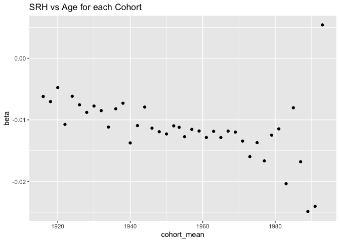
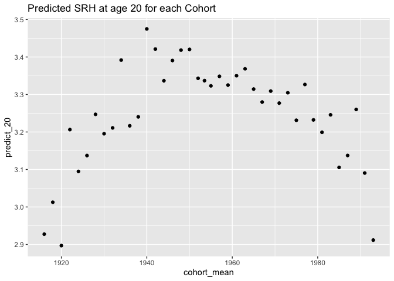
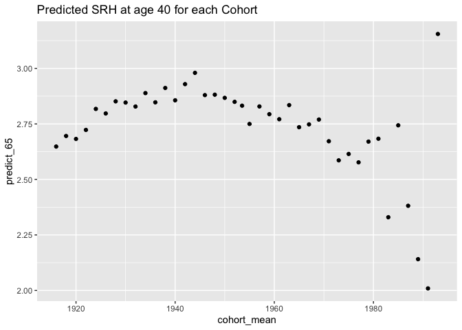
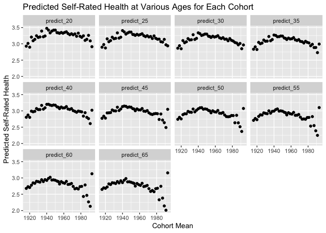

Self-Rated Health as predicted by Age of Respondent
================
Christine Lucille Kuryla
2024-10-02

- [Fetch, load, clean, and recode
  data](#fetch-load-clean-and-recode-data)
  - [Fetch GSS data](#fetch-gss-data)
  - [Load and clean data](#load-and-clean-data)
- [ANOVA](#anova)
- [Cohort Effects](#cohort-effects)

Here’s a summary of the interesting findings from my analysis of
self-rated health in the GSS dataset so far.

See <https://github.com/clkuryla/self_rated_health/blob/main/gss_eda.md>
for more EDA and details.

- `health` The first variable of interest is “health”, which will be the
  main subject of our analysis:
  <https://gssdataexplorer.norc.org/variables/437/vshow>

Question on survey: “Would you say your own health, in general, is
excellent, good, fair, or poor?”

Coded in this analysis (it was recoded from the raw data) as: 4 -
Excellent 3 - Good 2 - Fair 1 - Poor

Other variables used are:

- `age`
  - Age of respondent at time of survey
- `year`
  - Year of survey
- `cohort`
  - Birth year of respondent

Additional covariates and analyses to come.

# Fetch, load, clean, and recode data

## Fetch GSS data

``` r
# Feel free to modify to play with more covariates and variables.

#install.packages('gssr', repos =  c('https://kjhealy.r-universe.dev', 'https://cloud.r-project.org'))
# install.packages('gssrdoc', repos = c('https://kjhealy.r-universe.dev', 'https://cloud.r-project.org'))

library(gssr)
library(gssrdoc)

data("gss_all"). # this file is big! 

# It's a bit excessive to download the entire GSS dataset every time we knit, so lets just save some variables of interest and write it out for future use.

data_gss <- as.data.frame(gss_all) %>% 
  select("year",      # year of survey
         "cohort",    # birthyear
         "age",       # age at time of survey
         "health",    # self-rated health
         "sex",       # sex
         "happy",     # self-rated happiness
         "life",      # is life exciting or dull
         "educ",      # years of education
         "polviews",  # 1 extremely liberal, 4 moderate, 7 extremely conservative
         "class",    # 1 lower, 2 middle, 3 working, 4 upper, 5 no class
         "satfin"    # 1 pretty well satisfied, 2 more or less satisfied, 3 not satisfied at all
         )

write_csv(data_gss, "data/extracted_gss_variables.csv")
```

## Load and clean data

Here we’ll load our data, clean some unwanted values, and recode the
unintuitive variables.

``` r
data_gss <- read_csv("data/extracted_gss_variables.csv") %>% 
  filter(cohort != 9999) %>% 
  na.omit() %>% 
  mutate(health = 5 - health)  %>%  # reverse the coding so it's more intuitive (higher number for excellent, lower number for poor)
  mutate(happy = 4 - happy) %>% # same
  mutate(life = 4 - life) %>% # reverse again, these variables tend to be unintuitively ordered!!!
  mutate(satfin = 4 - satfin) # same again!
```

    ## Rows: 72390 Columns: 11
    ## ── Column specification ────────────────────────────────────────────────────────
    ## Delimiter: ","
    ## dbl (11): year, cohort, age, health, sex, happy, life, educ, polviews, class...
    ## 
    ## ℹ Use `spec()` to retrieve the full column specification for this data.
    ## ℹ Specify the column types or set `show_col_types = FALSE` to quiet this message.

# ANOVA

``` r
# Run an anova

anova_model <- aov(health ~ age * year * cohort, data = data_gss)
summary(anova_model)
```

    ##                    Df Sum Sq Mean Sq  F value   Pr(>F)    
    ## age                 1   1317  1316.9 2041.214  < 2e-16 ***
    ## year                1     24    24.5   37.936 7.38e-10 ***
    ## age:year            1    175   175.1  271.449  < 2e-16 ***
    ## age:cohort          1     26    26.3   40.729 1.77e-10 ***
    ## year:cohort         1     53    53.2   82.502  < 2e-16 ***
    ## age:year:cohort     1      3     3.0    4.724   0.0298 *  
    ## Residuals       39958  25780     0.6                      
    ## ---
    ## Signif. codes:  0 '***' 0.001 '**' 0.01 '*' 0.05 '.' 0.1 ' ' 1

# Cohort Effects

``` r
data_gss %>% 
  mutate(cohort = cut(cohort, breaks = 7)) %>% # Create cohorts with 6 breaks
  group_by(age, cohort) %>% 
  summarize(mean_health = mean(health)) %>% 
  ggplot(aes(x = age, y = mean_health, color = cohort)) +
  labs(title = "Age Profiles by Cohort") +
  geom_line()
```

    ## `summarise()` has grouped output by 'age'. You can override using the `.groups`
    ## argument.

<!-- -->

``` r
data_gss %>% 
  mutate(cohort = cut(cohort, breaks = 4)) %>% # Create cohorts with 6 breaks
  group_by(age, cohort) %>% 
  summarize(mean_health = mean(health)) %>% 
  ggplot(aes(x = age, y = mean_health, color = cohort)) +
  labs(title = "Age Profiles by Cohort") +
  geom_line()
```

    ## `summarise()` has grouped output by 'age'. You can override using the `.groups`
    ## argument.

<!-- -->

``` r
data_gss %>% 
  mutate(cohort = cut(cohort, breaks = 3)) %>% # Create cohorts with 6 breaks
  group_by(age, cohort) %>% 
  summarize(mean_health = mean(health)) %>% 
  ggplot(aes(x = age, y = mean_health, color = cohort)) +
  labs(title = "Age Profiles by Cohort") +
  geom_line()
```

    ## `summarise()` has grouped output by 'age'. You can override using the `.groups`
    ## argument.

<!-- -->

``` r
# Let's try to see why the oldest sort of looks like the youngest by modeling the trend (seems linear?) and comparing the expected mean health rating at 20, 40, and 60 years of age for the different cohorts.

data_gss %>% filter(cohort > 1914 & cohort < 1995) %>% select(cohort) %>% unique() %>% summarise(n())
```

    ## # A tibble: 1 × 1
    ##   `n()`
    ##   <int>
    ## 1    80

``` r
# 80

lm_health_v_age_cohorts <- data_gss %>%
  filter(cohort > 1914 & cohort < 1995) %>% 
  mutate(cohort_cut = cut(cohort, breaks = 40)) %>%   # Create cohort categories
  group_by(cohort_cut) %>%
  nest() %>%   # Nest the data within each cohort
  mutate(
    model = map(data, ~ lm(health ~ age, data = .x)),   # Fit a model for each cohort
    predict_20 = map2_dbl(model, data, ~ predict(.x, newdata = tibble(age = 20))),  # Predict for age = 20
    predict_25 = map2_dbl(model, data, ~ predict(.x, newdata = tibble(age = 25))),
    predict_30 = map2_dbl(model, data, ~ predict(.x, newdata = tibble(age = 30))),
    predict_35 = map2_dbl(model, data, ~ predict(.x, newdata = tibble(age = 35))),
    predict_40 = map2_dbl(model, data, ~ predict(.x, newdata = tibble(age = 40))),
    predict_45 = map2_dbl(model, data, ~ predict(.x, newdata = tibble(age = 45))),
    predict_50 = map2_dbl(model, data, ~ predict(.x, newdata = tibble(age = 50))),
    predict_55 = map2_dbl(model, data, ~ predict(.x, newdata = tibble(age = 55))),
    predict_60 = map2_dbl(model, data, ~ predict(.x, newdata = tibble(age = 60))),
    predict_65 = map2_dbl(model, data, ~ predict(.x, newdata = tibble(age = 65))),
    beta = map2_dbl(model, data, ~ coef(.x)[2])
  ) %>%
#  select(cohort_cut, predict_x, slope) %>%  # Select relevant columns %>% 
  mutate(cohort_mean = mean(as.numeric(unlist(regmatches(cohort_cut, gregexpr("[0-9]+", cohort_cut))))))

# View the results
print(lm_health_v_age_cohorts)
```

    ## # A tibble: 40 × 15
    ## # Groups:   cohort_cut [40]
    ##    cohort_cut  data     model  predict_20 predict_25 predict_30 predict_35
    ##    <fct>       <list>   <list>      <dbl>      <dbl>      <dbl>      <dbl>
    ##  1 (1953,1954] <tibble> <lm>         3.34       3.28       3.22       3.17
    ##  2 (1933,1935] <tibble> <lm>         3.39       3.34       3.28       3.22
    ##  3 (1915,1917] <tibble> <lm>         2.93       2.90       2.87       2.83
    ##  4 (1943,1945] <tibble> <lm>         3.34       3.30       3.26       3.22
    ##  5 (1925,1927] <tibble> <lm>         3.14       3.10       3.06       3.02
    ##  6 (1919,1921] <tibble> <lm>         2.90       2.87       2.85       2.83
    ##  7 (1947,1949] <tibble> <lm>         3.42       3.36       3.30       3.24
    ##  8 (1951,1953] <tibble> <lm>         3.34       3.29       3.23       3.18
    ##  9 (1949,1951] <tibble> <lm>         3.42       3.36       3.30       3.24
    ## 10 (1939,1941] <tibble> <lm>         3.47       3.41       3.34       3.27
    ## # ℹ 30 more rows
    ## # ℹ 8 more variables: predict_40 <dbl>, predict_45 <dbl>, predict_50 <dbl>,
    ## #   predict_55 <dbl>, predict_60 <dbl>, predict_65 <dbl>, beta <dbl>,
    ## #   cohort_mean <dbl>

``` r
# Now let's plot it

lm_health_v_age_cohorts %>% 
  ggplot(aes(x = cohort_mean, y = beta)) +
  labs(title = "SRH vs Age for each Cohort") +
  geom_point()
```

<!-- -->

``` r
lm_health_v_age_cohorts %>% 
  ggplot(aes(x = cohort_mean, y = predict_20)) +
  labs(title = "Predicted SRH at age 20 for each Cohort") +
  geom_point()
```

<!-- -->

``` r
 ggplot(lm_health_v_age_cohorts, aes(x = cohort_mean, y = predict_30)) +
  labs(title = "Predicted SRH at age 20 for each Cohort") +
  geom_point()
```

<!-- -->

``` r
  ggplot(lm_health_v_age_cohorts, aes(x = cohort_mean, y = predict_65)) +
  labs(title = "Predicted SRH at age 40 for each Cohort") +
  geom_point()
```

<!-- -->

``` r
# Plot many ages
  
# Reshape the data: gather all the prediction columns into one long format
lm_health_long <- lm_health_v_age_cohorts %>%
  pivot_longer(cols = starts_with("predict"), 
               names_to = "prediction_age", 
               values_to = "predicted_srh")

# Create the plot using the long data format
p <- ggplot(lm_health_long, aes(x = cohort_mean, y = predicted_srh)) +
  geom_point() +
  facet_wrap(~prediction_age, ncol = 4) +  # Facet by the different predictions (predict_20, predict_25, etc.)
  labs(
    title = "Predicted Self-Rated Health at Various Ages for Each Cohort",
    x = "Cohort Mean",
    y = "Predicted Self-Rated Health"
  )

# Display the combined plot
print(p)
```

<!-- -->

``` r
data_gss %>% 
  mutate(cohort = cut(cohort, breaks = 8)) %>% # Create cohorts with 6 breaks
  group_by(year, cohort) %>% 
  summarize(mean_health = mean(health)) %>% 
  ggplot(aes(x = year, y = mean_health, color = cohort)) +
  labs(title = "Year Profiles by Cohort") +
  geom_line()
```

    ## `summarise()` has grouped output by 'year'. You can override using the
    ## `.groups` argument.

<!-- -->
