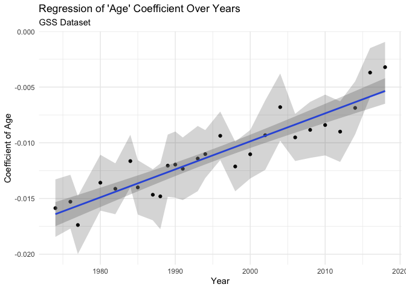
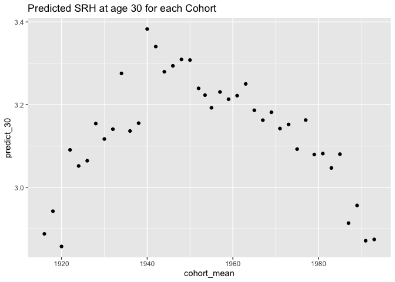

Self-Rated Health as predicted by Age of Respondent
================
Christine Lucille Kuryla
2024-10-02

- [Fetch, load, clean, and recode
  data](#fetch-load-clean-and-recode-data)
  - [Fetch GSS data](#fetch-gss-data)
  - [Load and clean data](#load-and-clean-data)
- [Self rated health as predicted by age over the
  years](#self-rated-health-as-predicted-by-age-over-the-years)
  - [SRH vs year of survey for different
    ages](#srh-vs-year-of-survey-for-different-ages)
  - [Relationship of self-rated health to age, separated out by
    years](#relationship-of-self-rated-health-to-age-separated-out-by-years)
  - [Regress self-rated health on age, for each
    year](#regress-self-rated-health-on-age-for-each-year)
  - [Regress the srh vs age coefficients from each year on the year of
    the
    survey](#regress-the-srh-vs-age-coefficients-from-each-year-on-the-year-of-the-survey)
- [ANOVA](#anova)
- [Cohort Effects](#cohort-effects)
  - [Visualize age profiles by
    cohort](#visualize-age-profiles-by-cohort)
  - [Model srh vs age for each cohort and plot the betas and predicted
    age
    values](#model-srh-vs-age-for-each-cohort-and-plot-the-betas-and-predicted-age-values)
- [Other](#other)

Here’s a summary of the interesting findings from my analysis of
self-rated health in the GSS dataset so far.

See <https://github.com/clkuryla/self_rated_health/blob/main/gss_eda.md>
for more EDA and details.

- `health` The first variable of interest is “health”, which will be the
  main subject of our analysis:
  <https://gssdataexplorer.norc.org/variables/437/vshow>

Question on survey: “Would you say your own health, in general, is
excellent, good, fair, or poor?”

Coded in this analysis (it was recoded from the raw data) as: 4 -
Excellent 3 - Good 2 - Fair 1 - Poor

Other variables used are:

- `age`
  - Age of respondent at time of survey
- `year`
  - Year of survey
- `cohort`
  - Birth year of respondent

Additional covariates and analyses to come.

# Fetch, load, clean, and recode data

## Fetch GSS data

``` r
# Feel free to modify to play with more covariates and variables.

#install.packages('gssr', repos =  c('https://kjhealy.r-universe.dev', 'https://cloud.r-project.org'))
# install.packages('gssrdoc', repos = c('https://kjhealy.r-universe.dev', 'https://cloud.r-project.org'))

library(gssr)
library(gssrdoc)

data("gss_all"). # this file is big! 

# It's a bit excessive to download the entire GSS dataset every time we knit, so lets just save some variables of interest and write it out for future use.

data_gss <- as.data.frame(gss_all) %>% 
  select("year",      # year of survey
         "cohort",    # birthyear
         "age",       # age at time of survey
         "health",    # self-rated health
         "sex",       # sex
         "happy",     # self-rated happiness
         "life",      # is life exciting or dull
         "educ",      # years of education
         "polviews",  # 1 extremely liberal, 4 moderate, 7 extremely conservative
         "class",    # 1 lower, 2 middle, 3 working, 4 upper, 5 no class
         "satfin"    # 1 pretty well satisfied, 2 more or less satisfied, 3 not satisfied at all
         )

write_csv(data_gss, "data/extracted_gss_variables.csv")
```

## Load and clean data

Here we’ll load our data, clean some unwanted values, and recode the
unintuitive variables.

``` r
data_gss <- read_csv("data/extracted_gss_variables.csv") %>% 
  filter(cohort != 9999) %>% 
  na.omit() %>% 
  mutate(health = 5 - health)  %>%  # reverse the coding so it's more intuitive (higher number for excellent, lower number for poor)
  mutate(happy = 4 - happy) %>% # same
  mutate(life = 4 - life) %>% # reverse again, these variables tend to be unintuitively ordered!!!
  mutate(satfin = 4 - satfin) # same again!
```

    ## Rows: 72390 Columns: 11
    ## ── Column specification ────────────────────────────────────────────────────────
    ## Delimiter: ","
    ## dbl (11): year, cohort, age, health, sex, happy, life, educ, polviews, class...
    ## 
    ## ℹ Use `spec()` to retrieve the full column specification for this data.
    ## ℹ Specify the column types or set `show_col_types = FALSE` to quiet this message.

# Self rated health as predicted by age over the years

Let’s explore the effect of different cohorts on SRH at certain ages.

## SRH vs year of survey for different ages

In the following figure, I cut the age of participants into 6 groups and
plotted the mean of the group’s self-rated health for each year (that’s
what each dot is). As you can qualitatively see, the spread seems to
narrow.

``` r
data_gss %>% 
  mutate(age = cut(age, breaks = 6)) %>% # Create cohorts with 6 breaks
  group_by(age, year) %>% 
  summarize(mean_health = mean(health)) %>% 
  ggplot(aes(x = year, y = mean_health, color = age)) +
  geom_line() +
  geom_point()
```

    ## `summarise()` has grouped output by 'age'. You can override using the `.groups`
    ## argument.

<!-- -->

This qualitative result is robust to the size of the categorical
variables I split “age” into.

``` r
par(mfrow = c(2, 2))

p1 <- data_gss %>% 
  mutate(age = cut(age, breaks = 10)) %>% # Create cohorts with 6 breaks
  group_by(age, year) %>% 
  summarize(mean_health = mean(health)) %>% 
  ggplot(aes(x = year, y = mean_health, color = age)) +
  labs(title = "SRH for Different Ages over the Years") +
  geom_line()
```

    ## `summarise()` has grouped output by 'age'. You can override using the `.groups`
    ## argument.

``` r
p2 <- data_gss %>% 
  mutate(age = cut(age, breaks = 7)) %>% # Create cohorts with 6 breaks
  group_by(age, year) %>% 
  summarize(mean_health = mean(health)) %>% 
  ggplot(aes(x = year, y = mean_health, color = age)) +
  labs(title = "SRH for Different Ages over the Years") +
  geom_line()
```

    ## `summarise()` has grouped output by 'age'. You can override using the `.groups`
    ## argument.

``` r
p3 <- data_gss %>% 
  mutate(age = cut(age, breaks = 3)) %>% # Create cohorts with 6 breaks
  group_by(age, year) %>% 
  summarize(mean_health = mean(health)) %>% 
  ggplot(aes(x = year, y = mean_health, color = age)) +
  labs(title = "SRH for Different Ages over the Years") +
  geom_line()
```

    ## `summarise()` has grouped output by 'age'. You can override using the `.groups`
    ## argument.

``` r
p4 <- data_gss %>% 
  mutate(age = cut(age, breaks = 4)) %>% # Create cohorts with 6 breaks
  group_by(age, year) %>% 
  summarize(mean_health = mean(health)) %>% 
  ggplot(aes(x = year, y = mean_health, color = age)) +
  labs(title = "SRH for Different Ages over the Years") +
  geom_line()
```

    ## `summarise()` has grouped output by 'age'. You can override using the `.groups`
    ## argument.

``` r
gridExtra::grid.arrange(p1, p2, p3, p4, nrow=2)
```

<!-- -->

## Relationship of self-rated health to age, separated out by years

Well, it seems like the spread of self-rated health among ages decreases
as time goes on (later years). Let’s look at that by faceting mean
self-rated health vs age by year.

Note that intuitively, we’d expect it to be a negative slope because
older people intuitively should have worse health.

Notice *the slopes seem to flatten over time.*

``` r
# health vs age per year
data_gss %>% 
  group_by(age, year) %>% 
  summarize(mean_health = mean(health)) %>% 
  ggplot(aes(x = age, y = mean_health)) +
  geom_line(color = "cornflowerblue") +
  facet_wrap(~ year) +
  labs(title = "Self-Rated Health By Age (Per Year)" )
```

    ## `summarise()` has grouped output by 'age'. You can override using the `.groups`
    ## argument.

<!-- -->

## Regress self-rated health on age, for each year

Let’s do a simple linear regression on each self-rated-health vs age,
subsetted for each year (the plots on the faceted figure), look at the
significance, and plot the coefficients for age with 95% CIs:

``` r
library(broom)

# Aggregate slopes

# years_of_gss <- c(data_gss %>% select(year) %>% unique() )
# lm_health_v_age_0 <- data_gss %>%
#   group_by(year) %>%
#   summarize(coef = coef(lm(health ~ age, data = cur_data()))["age"])

# Perform linear regression for each year and extract the coefficient of 'age' with confidence intervals, se, t stat, p val
lm_health_v_age_0 <- data_gss %>%
  group_by(year) %>%
  do(tidy(lm(health ~ age, data = .), conf.int = TRUE)) %>%  # Add conf.int = TRUE for CIs
  filter(term == "age") %>%
  select(year, coef = estimate, conf.low, conf.high, se = std.error, t_statistic = statistic,  p_value = p.value)

# View the results with confidence intervals, se, t statistic, and p value
# print(lm_health_v_age_0)
knitr::kable(lm_health_v_age_0)
```

| year |       coef |   conf.low |  conf.high |        se | t_statistic |   p_value |
|-----:|-----------:|-----------:|-----------:|----------:|------------:|----------:|
| 1974 | -0.0158646 | -0.0184441 | -0.0132850 | 0.0013149 |  -12.064859 | 0.0000000 |
| 1976 | -0.0150557 | -0.0174648 | -0.0126465 | 0.0012281 |  -12.259589 | 0.0000000 |
| 1977 | -0.0173709 | -0.0199693 | -0.0147725 | 0.0013246 |  -13.114102 | 0.0000000 |
| 1980 | -0.0137020 | -0.0162118 | -0.0111921 | 0.0012794 |  -10.709277 | 0.0000000 |
| 1982 | -0.0141609 | -0.0164410 | -0.0118809 | 0.0011625 |  -12.181616 | 0.0000000 |
| 1984 | -0.0116357 | -0.0139894 | -0.0092819 | 0.0011998 |   -9.697758 | 0.0000000 |
| 1985 | -0.0140399 | -0.0164787 | -0.0116011 | 0.0012433 |  -11.292827 | 0.0000000 |
| 1987 | -0.0147026 | -0.0169919 | -0.0124133 | 0.0011671 |  -12.597275 | 0.0000000 |
| 1988 | -0.0148299 | -0.0177768 | -0.0118831 | 0.0015015 |   -9.876757 | 0.0000000 |
| 1989 | -0.0120327 | -0.0148235 | -0.0092419 | 0.0014221 |   -8.461498 | 0.0000000 |
| 1990 | -0.0123640 | -0.0152539 | -0.0094741 | 0.0014724 |   -8.397270 | 0.0000000 |
| 1991 | -0.0121050 | -0.0149073 | -0.0093027 | 0.0014279 |   -8.477456 | 0.0000000 |
| 1993 | -0.0112707 | -0.0141742 | -0.0083672 | 0.0014796 |   -7.617295 | 0.0000000 |
| 1994 | -0.0109721 | -0.0131111 | -0.0088330 | 0.0010907 |  -10.059878 | 0.0000000 |
| 1996 | -0.0090458 | -0.0111982 | -0.0068935 | 0.0010974 |   -8.242973 | 0.0000000 |
| 1998 | -0.0120040 | -0.0142159 | -0.0097922 | 0.0011277 |  -10.644592 | 0.0000000 |
| 2000 | -0.0108330 | -0.0129733 | -0.0086927 | 0.0010912 |   -9.927303 | 0.0000000 |
| 2002 | -0.0093712 | -0.0124787 | -0.0062636 | 0.0015833 |   -5.918820 | 0.0000000 |
| 2004 | -0.0067126 | -0.0097291 | -0.0036961 | 0.0015369 |   -4.367612 | 0.0000141 |
| 2006 | -0.0095919 | -0.0117069 | -0.0074769 | 0.0010784 |   -8.894382 | 0.0000000 |
| 2008 | -0.0089714 | -0.0114807 | -0.0064621 | 0.0012790 |   -7.014283 | 0.0000000 |
| 2010 | -0.0084733 | -0.0111911 | -0.0057555 | 0.0013853 |   -6.116748 | 0.0000000 |
| 2012 | -0.0089613 | -0.0116721 | -0.0062504 | 0.0013817 |   -6.485573 | 0.0000000 |
| 2014 | -0.0069646 | -0.0093391 | -0.0045901 | 0.0012106 |   -5.753038 | 0.0000000 |
| 2016 | -0.0037546 | -0.0059502 | -0.0015589 | 0.0011195 |   -3.353787 | 0.0008140 |
| 2018 | -0.0032476 | -0.0055108 | -0.0009843 | 0.0011538 |   -2.814720 | 0.0049470 |
| 2021 | -0.0027071 | -0.0044122 | -0.0010020 | 0.0008695 |   -3.113335 | 0.0018717 |
| 2022 | -0.0043263 | -0.0061604 | -0.0024923 | 0.0009352 |   -4.625959 | 0.0000040 |

Note that every single beta is statistically significant. Now let’s
visualize it.

``` r
# Plot coefficients
ggplot(lm_health_v_age_0, aes(x = year, y = coef)) +
  geom_point() +
  labs(
    title = "Change in 'Age' Coefficient Over Years",
    x = "Year",
    y = "Coefficient of Age"
  ) +
  theme_minimal()
```

<!-- -->

``` r
# Plot coefficients with CI
ggplot(lm_health_v_age_0, aes(x = year, y = coef)) +
  geom_line() +
  geom_point() +
  geom_ribbon(aes(ymin = conf.low, ymax = conf.high), alpha = 0.2) +  # Add shaded area for confidence intervals
  labs(
    title = "Change in 'Age' Coefficient Over Years with Confidence Intervals",
    x = "Year",
    y = "Coefficient of Age"
  ) +
  theme_minimal()
```

<!-- -->

## Regress the srh vs age coefficients from each year on the year of the survey

The relationship looks surprisingly strong and linear, so let’s do
another regression of the coefficients on year. It is super
statistically significant (which I’m not sure totally how to interpret
since it’s on coefficients):

``` r
# Perform linear regression of 'coef' (age coefficient) vs 'year'
lm_coef_vs_year <- lm(coef ~ year, data = lm_health_v_age_0)

# View the summary of the regression
summary(lm_coef_vs_year)
```

    ## 
    ## Call:
    ## lm(formula = coef ~ year, data = lm_health_v_age_0)
    ## 
    ## Residuals:
    ##        Min         1Q     Median         3Q        Max 
    ## -0.0022910 -0.0012719 -0.0000069  0.0009998  0.0022720 
    ## 
    ## Coefficients:
    ##               Estimate Std. Error t value Pr(>|t|)    
    ## (Intercept) -5.267e-01  3.721e-02  -14.16 9.89e-14 ***
    ## year         2.585e-04  1.863e-05   13.87 1.58e-13 ***
    ## ---
    ## Signif. codes:  0 '***' 0.001 '**' 0.01 '*' 0.05 '.' 0.1 ' ' 1
    ## 
    ## Residual standard error: 0.001385 on 26 degrees of freedom
    ## Multiple R-squared:  0.881,  Adjusted R-squared:  0.8764 
    ## F-statistic: 192.5 on 1 and 26 DF,  p-value: 1.576e-13

``` r
ggplot(lm_health_v_age_0, aes(x = year, y = coef)) +
  geom_point() +
  geom_smooth(method = "lm", se = TRUE) +  # Adds the regression line with standard error shading
  geom_ribbon(aes(ymin = conf.low, ymax = conf.high), alpha = 0.2) +  # Confidence intervals for the coefficients
  labs(
    title = "Regression of 'Age' Coefficient Over Years",
    x = "Year",
    y = "Coefficient of Age"
  ) +
  theme_minimal()
```

    ## `geom_smooth()` using formula = 'y ~ x'

<!-- -->

So basically this shows that as years pass, the predictive power of
someone’s age on their self-rated health decreases.

# ANOVA

``` r
# Run an anova

anova_model <- aov(health ~ age * year * cohort, data = data_gss)
summary(anova_model)
```

    ##                    Df Sum Sq Mean Sq  F value   Pr(>F)    
    ## age                 1   1317  1316.9 2041.214  < 2e-16 ***
    ## year                1     24    24.5   37.936 7.38e-10 ***
    ## age:year            1    175   175.1  271.449  < 2e-16 ***
    ## age:cohort          1     26    26.3   40.729 1.77e-10 ***
    ## year:cohort         1     53    53.2   82.502  < 2e-16 ***
    ## age:year:cohort     1      3     3.0    4.724   0.0298 *  
    ## Residuals       39958  25780     0.6                      
    ## ---
    ## Signif. codes:  0 '***' 0.001 '**' 0.01 '*' 0.05 '.' 0.1 ' ' 1

# Cohort Effects

## Visualize age profiles by cohort

First let’s visualize potential cohort effects.

``` r
data_gss %>% 
  mutate(cohort = cut(cohort, breaks = 7)) %>% # Create cohorts with 6 breaks
  group_by(age, cohort) %>% 
  summarize(mean_health = mean(health)) %>% 
  ggplot(aes(x = age, y = mean_health, color = cohort)) +
  labs(title = "Age Profiles by Cohort") +
  geom_line()
```

    ## `summarise()` has grouped output by 'age'. You can override using the `.groups`
    ## argument.

<!-- -->

``` r
data_gss %>% 
  mutate(cohort = cut(cohort, breaks = 4)) %>% # Create cohorts with 6 breaks
  group_by(age, cohort) %>% 
  summarize(mean_health = mean(health)) %>% 
  ggplot(aes(x = age, y = mean_health, color = cohort)) +
  labs(title = "Age Profiles by Cohort") +
  geom_line()
```

    ## `summarise()` has grouped output by 'age'. You can override using the `.groups`
    ## argument.

<!-- -->

``` r
data_gss %>% 
  mutate(cohort = cut(cohort, breaks = 3)) %>% # Create cohorts with 6 breaks
  group_by(age, cohort) %>% 
  summarize(mean_health = mean(health)) %>% 
  ggplot(aes(x = age, y = mean_health, color = cohort)) +
  labs(title = "Age Profiles by Cohort") +
  geom_line()
```

    ## `summarise()` has grouped output by 'age'. You can override using the `.groups`
    ## argument.

<!-- -->

## Model srh vs age for each cohort and plot the betas and predicted age values

Let’s try to see why the oldest cohort line sort of looks like it lines
up with the youngest by modeling the trend of srh vs age (seems linear)
and comparing the expected mean health rating at 20, 40, and 60 years of
age for the different cohorts, as well as the coefficient.

``` r
data_gss %>% filter(cohort > 1914 & cohort < 1995) %>% select(cohort) %>% unique() %>% summarise(n())
```

    ## # A tibble: 1 × 1
    ##   `n()`
    ##   <int>
    ## 1    80

``` r
# 80

lm_health_v_age_cohorts <- data_gss %>%
  filter(cohort > 1914 & cohort < 1995) %>% 
  mutate(cohort_cut = cut(cohort, breaks = 40)) %>%   # Create cohort categories
  group_by(cohort_cut) %>%
  nest() %>%   # Nest the data within each cohort
  mutate(
    model = map(data, ~ lm(health ~ age, data = .x)),   # Fit a model for each cohort
    predict_20 = map2_dbl(model, data, ~ predict(.x, newdata = tibble(age = 20))),  # Predict for age = 20
    predict_25 = map2_dbl(model, data, ~ predict(.x, newdata = tibble(age = 25))),
    predict_30 = map2_dbl(model, data, ~ predict(.x, newdata = tibble(age = 30))),
    predict_35 = map2_dbl(model, data, ~ predict(.x, newdata = tibble(age = 35))),
    predict_40 = map2_dbl(model, data, ~ predict(.x, newdata = tibble(age = 40))),
    predict_45 = map2_dbl(model, data, ~ predict(.x, newdata = tibble(age = 45))),
    predict_50 = map2_dbl(model, data, ~ predict(.x, newdata = tibble(age = 50))),
    predict_55 = map2_dbl(model, data, ~ predict(.x, newdata = tibble(age = 55))),
    predict_60 = map2_dbl(model, data, ~ predict(.x, newdata = tibble(age = 60))),
    predict_65 = map2_dbl(model, data, ~ predict(.x, newdata = tibble(age = 65))),
    beta = map2_dbl(model, data, ~ coef(.x)[2])
  ) %>%
#  select(cohort_cut, predict_x, slope) %>%  # Select relevant columns %>% 
  mutate(cohort_mean = mean(as.numeric(unlist(regmatches(cohort_cut, gregexpr("[0-9]+", cohort_cut))))))

# View the results
print(lm_health_v_age_cohorts)
```

    ## # A tibble: 40 × 15
    ## # Groups:   cohort_cut [40]
    ##    cohort_cut  data     model  predict_20 predict_25 predict_30 predict_35
    ##    <fct>       <list>   <list>      <dbl>      <dbl>      <dbl>      <dbl>
    ##  1 (1953,1954] <tibble> <lm>         3.34       3.28       3.22       3.17
    ##  2 (1933,1935] <tibble> <lm>         3.39       3.34       3.28       3.22
    ##  3 (1915,1917] <tibble> <lm>         2.93       2.90       2.87       2.83
    ##  4 (1943,1945] <tibble> <lm>         3.34       3.30       3.26       3.22
    ##  5 (1925,1927] <tibble> <lm>         3.14       3.10       3.06       3.02
    ##  6 (1919,1921] <tibble> <lm>         2.90       2.87       2.85       2.83
    ##  7 (1947,1949] <tibble> <lm>         3.42       3.36       3.30       3.24
    ##  8 (1951,1953] <tibble> <lm>         3.34       3.29       3.23       3.18
    ##  9 (1949,1951] <tibble> <lm>         3.42       3.36       3.30       3.24
    ## 10 (1939,1941] <tibble> <lm>         3.47       3.41       3.34       3.27
    ## # ℹ 30 more rows
    ## # ℹ 8 more variables: predict_40 <dbl>, predict_45 <dbl>, predict_50 <dbl>,
    ## #   predict_55 <dbl>, predict_60 <dbl>, predict_65 <dbl>, beta <dbl>,
    ## #   cohort_mean <dbl>

``` r
# Now let's plot it

lm_health_v_age_cohorts %>% 
  ggplot(aes(x = cohort_mean, y = beta)) +
  labs(title = "Estimate for Coefficient for SRH vs Age for each Cohort") +
  geom_point()
```

<!-- -->

``` r
lm_health_v_age_cohorts %>% 
  ggplot(aes(x = cohort_mean, y = predict_20)) +
  labs(title = "Predicted SRH at age 20 for each Cohort") +
  geom_point()
```

<!-- -->

``` r
 ggplot(lm_health_v_age_cohorts, aes(x = cohort_mean, y = predict_30)) +
  labs(title = "Predicted SRH at age 30 for each Cohort") +
  geom_point()
```

<!-- -->

``` r
  ggplot(lm_health_v_age_cohorts, aes(x = cohort_mean, y = predict_65)) +
  labs(title = "Predicted SRH at age 40 for each Cohort") +
  geom_point()
```

<!-- -->

``` r
# Plot many ages
  
# Reshape the data: gather all the prediction columns into one long format
lm_health_long <- lm_health_v_age_cohorts %>%
  pivot_longer(cols = starts_with("predict"), 
               names_to = "prediction_age", 
               values_to = "predicted_srh")

# Create the plot using the long data format
p <- ggplot(lm_health_long, aes(x = cohort_mean, y = predicted_srh)) +
  geom_point() +
  facet_wrap(~prediction_age, ncol = 4) +  # Facet by the different predictions (predict_20, predict_25, etc.)
  labs(
    title = "Predicted Self-Rated Health at Various Ages for Each Cohort",
    x = "Cohort Mean",
    y = "Predicted Self-Rated Health"
  )

# Display the combined plot
print(p)
```

<!-- -->

# Other

``` r
data_gss %>% 
  mutate(cohort = cut(cohort, breaks = 8)) %>% # Create cohorts with 6 breaks
  group_by(year, cohort) %>% 
  summarize(mean_health = mean(health)) %>% 
  ggplot(aes(x = year, y = mean_health, color = cohort)) +
  labs(title = "Year Profiles by Cohort") +
  geom_line()
```

    ## `summarise()` has grouped output by 'year'. You can override using the
    ## `.groups` argument.

<!-- -->
