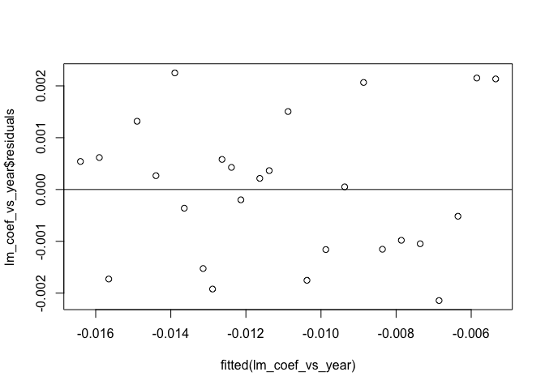
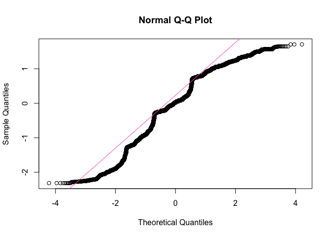

Self-Rated Health as predicted by Age of Respondent
================
Christine Lucille Kuryla
2024-10-02

- [Fetch, load, clean, and recode
  data](#fetch-load-clean-and-recode-data)
  - [Fetch GSS data](#fetch-gss-data)
  - [Load and clean data](#load-and-clean-data)
- [Self rated health as predicted by age over the
  years](#self-rated-health-as-predicted-by-age-over-the-years)
  - [SRH vs year of survey for different
    ages](#srh-vs-year-of-survey-for-different-ages)
  - [Relationship of self-rated health to age, separated out by
    years](#relationship-of-self-rated-health-to-age-separated-out-by-years)
  - [Regress self-rated health on age, for each
    year](#regress-self-rated-health-on-age-for-each-year)
  - [Regress the srh vs age coefficients from each year on the year of
    the
    survey](#regress-the-srh-vs-age-coefficients-from-each-year-on-the-year-of-the-survey)
- [ANOVA](#anova)
- [Cohort Effects](#cohort-effects)
  - [Visualize age profiles by
    cohort](#visualize-age-profiles-by-cohort)
  - [Model srh vs age for each cohort and plot the betas and predicted
    age
    values](#model-srh-vs-age-for-each-cohort-and-plot-the-betas-and-predicted-age-values)
- [Other](#other)
- [More ANOVA – Tukey, QQ-plot, etc](#more-anova--tukey-qq-plot-etc)

Here’s a summary of the interesting findings from my analysis of
self-rated health in the GSS dataset so far.

See <https://github.com/clkuryla/self_rated_health/blob/main/gss_eda.md>
for more EDA and details.

- `health` The first variable of interest is “health”, which will be the
  main subject of our analysis:
  <https://gssdataexplorer.norc.org/variables/437/vshow>

Question on survey: “Would you say your own health, in general, is
excellent, good, fair, or poor?”

Coded in this analysis (it was recoded from the raw data) as: 4 -
Excellent 3 - Good 2 - Fair 1 - Poor

Other variables used are:

- `age`
  - Age of respondent at time of survey
- `year`
  - Year of survey
- `cohort`
  - Birth year of respondent

Additional covariates and analyses to come.

# Fetch, load, clean, and recode data

## Fetch GSS data

``` r
# Feel free to modify to play with more covariates and variables.

#install.packages('gssr', repos =  c('https://kjhealy.r-universe.dev', 'https://cloud.r-project.org'))
# install.packages('gssrdoc', repos = c('https://kjhealy.r-universe.dev', 'https://cloud.r-project.org'))

library(gssr)
library(gssrdoc)

data("gss_all"). # this file is big! 

# It's a bit excessive to download the entire GSS dataset every time we knit, so lets just save some variables of interest and write it out for future use.

data_gss <- as.data.frame(gss_all) %>% 
  select("year",      # year of survey
         "cohort",    # birthyear
         "age",       # age at time of survey
         "health",    # self-rated health
         "sex",       # sex
         "happy",     # self-rated happiness
         "life",      # is life exciting or dull
         "educ",      # years of education
         "polviews",  # 1 extremely liberal, 4 moderate, 7 extremely conservative
         "class",    # 1 lower, 2 middle, 3 working, 4 upper, 5 no class
         "satfin"    # 1 pretty well satisfied, 2 more or less satisfied, 3 not satisfied at all
         )

write_csv(data_gss, "data/extracted_gss_variables.csv")
```

## Load and clean data

Here we’ll load our data, clean some unwanted values, and recode the
unintuitive variables.

``` r
data_gss <- read_csv("data/extracted_gss_variables.csv") %>% 
  filter(cohort != 9999) %>% 
  na.omit() %>% 
  mutate(health = 5 - health)  %>%  # reverse the coding so it's more intuitive (higher number for excellent, lower number for poor)
  mutate(happy = 4 - happy) %>% # same
  mutate(life = 4 - life) %>% # reverse again, these variables tend to be unintuitively ordered!!!
  mutate(satfin = 4 - satfin) # same again!
```

    ## Rows: 72390 Columns: 11
    ## ── Column specification ────────────────────────────────────────────────────────
    ## Delimiter: ","
    ## dbl (11): year, cohort, age, health, sex, happy, life, educ, polviews, class...
    ## 
    ## ℹ Use `spec()` to retrieve the full column specification for this data.
    ## ℹ Specify the column types or set `show_col_types = FALSE` to quiet this message.

# Self rated health as predicted by age over the years

Let’s explore the effect of different cohorts on SRH at certain ages.

## SRH vs year of survey for different ages

In the following figure, I cut the age of participants into 6 groups and
plotted the mean of the group’s self-rated health for each year (that’s
what each dot is). As you can qualitatively see, the spread seems to
narrow.

``` r
data_gss %>% 
  mutate(age = cut(age, breaks = 6)) %>% # Create cohorts with 6 breaks
  group_by(age, year) %>% 
  summarize(mean_health = mean(health)) %>% 
  ggplot(aes(x = year, y = mean_health, color = age)) +
  geom_line() +
  geom_point()
```

    ## `summarise()` has grouped output by 'age'. You can override using the `.groups`
    ## argument.

<!-- -->

This qualitative result is robust to the size of the categorical
variables I split “age” into.

``` r
par(mfrow = c(2, 2))

p1 <- data_gss %>% 
  mutate(age = cut(age, breaks = 10)) %>% # Create cohorts with 6 breaks
  group_by(age, year) %>% 
  summarize(mean_health = mean(health)) %>% 
  ggplot(aes(x = year, y = mean_health, color = age)) +
  labs(title = "SRH for Different Ages over the Years") +
  geom_line()
```

    ## `summarise()` has grouped output by 'age'. You can override using the `.groups`
    ## argument.

``` r
p2 <- data_gss %>% 
  mutate(age = cut(age, breaks = 7)) %>% # Create cohorts with 6 breaks
  group_by(age, year) %>% 
  summarize(mean_health = mean(health)) %>% 
  ggplot(aes(x = year, y = mean_health, color = age)) +
  labs(title = "SRH for Different Ages over the Years") +
  geom_line()
```

    ## `summarise()` has grouped output by 'age'. You can override using the `.groups`
    ## argument.

``` r
p3 <- data_gss %>% 
  mutate(age = cut(age, breaks = 3)) %>% # Create cohorts with 6 breaks
  group_by(age, year) %>% 
  summarize(mean_health = mean(health)) %>% 
  ggplot(aes(x = year, y = mean_health, color = age)) +
  labs(title = "SRH for Different Ages over the Years") +
  geom_line()
```

    ## `summarise()` has grouped output by 'age'. You can override using the `.groups`
    ## argument.

``` r
p4 <- data_gss %>% 
  mutate(age = cut(age, breaks = 4)) %>% # Create cohorts with 6 breaks
  group_by(age, year) %>% 
  summarize(mean_health = mean(health)) %>% 
  ggplot(aes(x = year, y = mean_health, color = age)) +
  labs(title = "SRH for Different Ages over the Years") +
  geom_line()
```

    ## `summarise()` has grouped output by 'age'. You can override using the `.groups`
    ## argument.

``` r
gridExtra::grid.arrange(p1, p2, p3, p4, nrow=2)
```

<!-- -->

## Relationship of self-rated health to age, separated out by years

Well, it seems like the spread of self-rated health among ages decreases
as time goes on (later years). Let’s look at that by faceting mean
self-rated health vs age by year.

Note that intuitively, we’d expect it to be a negative slope because
older people intuitively should have worse health.

Notice *the slopes seem to flatten over time.*

``` r
# health vs age per year
data_gss %>% 
  group_by(age, year) %>% 
  summarize(mean_health = mean(health)) %>% 
  ggplot(aes(x = age, y = mean_health)) +
  geom_line(color = "cornflowerblue") +
  facet_wrap(~ year) +
  labs(title = "Self-Rated Health By Age (Per Year)" )
```

    ## `summarise()` has grouped output by 'age'. You can override using the `.groups`
    ## argument.

<!-- -->

## Regress self-rated health on age, for each year

Let’s do a simple linear regression on each self-rated-health vs age,
subsetted for each year (the plots on the faceted figure), look at the
significance, and plot the coefficients for age with 95% CIs:

``` r
library(broom)

# Aggregate slopes

# years_of_gss <- c(data_gss %>% select(year) %>% unique() )
# lm_health_v_age_0 <- data_gss %>%
#   group_by(year) %>%
#   summarize(coef = coef(lm(health ~ age, data = cur_data()))["age"])

# Perform linear regression for each year and extract the coefficient of 'age' with confidence intervals, se, t stat, p val
lm_health_v_age_0 <- data_gss %>%
  group_by(year) %>%
  do(tidy(lm(health ~ age, data = .), conf.int = TRUE)) %>%  # Add conf.int = TRUE for CIs
  filter(term == "age") %>%
  select(year, coef = estimate, conf.low, conf.high, se = std.error, t_statistic = statistic,  p_value = p.value)

# View the results with confidence intervals, se, t statistic, and p value
# print(lm_health_v_age_0)
knitr::kable(lm_health_v_age_0)
```

| year |       coef |   conf.low |  conf.high |        se | t_statistic |   p_value |
|-----:|-----------:|-----------:|-----------:|----------:|------------:|----------:|
| 1974 | -0.0158646 | -0.0184441 | -0.0132850 | 0.0013149 |  -12.064859 | 0.0000000 |
| 1976 | -0.0150557 | -0.0174648 | -0.0126465 | 0.0012281 |  -12.259589 | 0.0000000 |
| 1977 | -0.0173709 | -0.0199693 | -0.0147725 | 0.0013246 |  -13.114102 | 0.0000000 |
| 1980 | -0.0137020 | -0.0162118 | -0.0111921 | 0.0012794 |  -10.709277 | 0.0000000 |
| 1982 | -0.0141609 | -0.0164410 | -0.0118809 | 0.0011625 |  -12.181616 | 0.0000000 |
| 1984 | -0.0116357 | -0.0139894 | -0.0092819 | 0.0011998 |   -9.697758 | 0.0000000 |
| 1985 | -0.0140399 | -0.0164787 | -0.0116011 | 0.0012433 |  -11.292827 | 0.0000000 |
| 1987 | -0.0147026 | -0.0169919 | -0.0124133 | 0.0011671 |  -12.597275 | 0.0000000 |
| 1988 | -0.0148299 | -0.0177768 | -0.0118831 | 0.0015015 |   -9.876757 | 0.0000000 |
| 1989 | -0.0120327 | -0.0148235 | -0.0092419 | 0.0014221 |   -8.461498 | 0.0000000 |
| 1990 | -0.0123640 | -0.0152539 | -0.0094741 | 0.0014724 |   -8.397270 | 0.0000000 |
| 1991 | -0.0121050 | -0.0149073 | -0.0093027 | 0.0014279 |   -8.477456 | 0.0000000 |
| 1993 | -0.0112707 | -0.0141742 | -0.0083672 | 0.0014796 |   -7.617295 | 0.0000000 |
| 1994 | -0.0109721 | -0.0131111 | -0.0088330 | 0.0010907 |  -10.059878 | 0.0000000 |
| 1996 | -0.0090458 | -0.0111982 | -0.0068935 | 0.0010974 |   -8.242973 | 0.0000000 |
| 1998 | -0.0120040 | -0.0142159 | -0.0097922 | 0.0011277 |  -10.644592 | 0.0000000 |
| 2000 | -0.0108330 | -0.0129733 | -0.0086927 | 0.0010912 |   -9.927303 | 0.0000000 |
| 2002 | -0.0093712 | -0.0124787 | -0.0062636 | 0.0015833 |   -5.918820 | 0.0000000 |
| 2004 | -0.0067126 | -0.0097291 | -0.0036961 | 0.0015369 |   -4.367612 | 0.0000141 |
| 2006 | -0.0095919 | -0.0117069 | -0.0074769 | 0.0010784 |   -8.894382 | 0.0000000 |
| 2008 | -0.0089714 | -0.0114807 | -0.0064621 | 0.0012790 |   -7.014283 | 0.0000000 |
| 2010 | -0.0084733 | -0.0111911 | -0.0057555 | 0.0013853 |   -6.116748 | 0.0000000 |
| 2012 | -0.0089613 | -0.0116721 | -0.0062504 | 0.0013817 |   -6.485573 | 0.0000000 |
| 2014 | -0.0069646 | -0.0093391 | -0.0045901 | 0.0012106 |   -5.753038 | 0.0000000 |
| 2016 | -0.0037546 | -0.0059502 | -0.0015589 | 0.0011195 |   -3.353787 | 0.0008140 |
| 2018 | -0.0032476 | -0.0055108 | -0.0009843 | 0.0011538 |   -2.814720 | 0.0049470 |
| 2021 | -0.0027071 | -0.0044122 | -0.0010020 | 0.0008695 |   -3.113335 | 0.0018717 |
| 2022 | -0.0043263 | -0.0061604 | -0.0024923 | 0.0009352 |   -4.625959 | 0.0000040 |

Note that every single beta is statistically significant. Now let’s
visualize it.

``` r
# Plot coefficients
ggplot(lm_health_v_age_0, aes(x = year, y = coef)) +
  geom_point() +
  labs(
    title = "Change in 'Age' Coefficient Over Years",
    x = "Year",
    y = "Coefficient of Age"
  ) +
  theme_minimal()
```

<!-- -->

``` r
# Plot coefficients with CI
ggplot(lm_health_v_age_0, aes(x = year, y = coef)) +
  geom_line() +
  geom_point() +
  geom_ribbon(aes(ymin = conf.low, ymax = conf.high), alpha = 0.2) +  # Add shaded area for confidence intervals
  labs(
    title = "Change in 'Age' Coefficient Over Years with Confidence Intervals",
    x = "Year",
    y = "Coefficient of Age"
  ) +
  theme_minimal()
```

<!-- -->

## Regress the srh vs age coefficients from each year on the year of the survey

The relationship looks surprisingly strong and linear, so let’s do
another regression of the coefficients on year. It is super
statistically significant (which I’m not sure totally how to interpret
since it’s on coefficients):

``` r
# Perform linear regression of 'coef' (age coefficient) vs 'year'
lm_coef_vs_year <- lm(coef ~ year, data = lm_health_v_age_0)

# View the summary of the regression
summary(lm_coef_vs_year)
```

    ## 
    ## Call:
    ## lm(formula = coef ~ year, data = lm_health_v_age_0)
    ## 
    ## Residuals:
    ##        Min         1Q     Median         3Q        Max 
    ## -0.0022910 -0.0012719 -0.0000069  0.0009998  0.0022720 
    ## 
    ## Coefficients:
    ##               Estimate Std. Error t value Pr(>|t|)    
    ## (Intercept) -5.267e-01  3.721e-02  -14.16 9.89e-14 ***
    ## year         2.585e-04  1.863e-05   13.87 1.58e-13 ***
    ## ---
    ## Signif. codes:  0 '***' 0.001 '**' 0.01 '*' 0.05 '.' 0.1 ' ' 1
    ## 
    ## Residual standard error: 0.001385 on 26 degrees of freedom
    ## Multiple R-squared:  0.881,  Adjusted R-squared:  0.8764 
    ## F-statistic: 192.5 on 1 and 26 DF,  p-value: 1.576e-13

``` r
ggplot(lm_health_v_age_0, aes(x = year, y = coef)) +
  geom_point() +
  geom_smooth(method = "lm", se = TRUE) +  # Adds the regression line with standard error shading
  geom_ribbon(aes(ymin = conf.low, ymax = conf.high), alpha = 0.2) +  # Confidence intervals for the coefficients
  labs(
    title = "Regression of 'Age' Coefficient Over Years",
    x = "Year",
    y = "Coefficient of Age"
  ) +
  theme_minimal()
```

    ## `geom_smooth()` using formula = 'y ~ x'

<!-- -->

So basically this shows that as years pass, the predictive power of
someone’s age on their self-rated health decreases.

# ANOVA

``` r
# Run an anova

anova_model <- aov(health ~ age * year * cohort, data = data_gss)
summary(anova_model)
```

    ##                    Df Sum Sq Mean Sq  F value   Pr(>F)    
    ## age                 1   1317  1316.9 2041.214  < 2e-16 ***
    ## year                1     24    24.5   37.936 7.38e-10 ***
    ## age:year            1    175   175.1  271.449  < 2e-16 ***
    ## age:cohort          1     26    26.3   40.729 1.77e-10 ***
    ## year:cohort         1     53    53.2   82.502  < 2e-16 ***
    ## age:year:cohort     1      3     3.0    4.724   0.0298 *  
    ## Residuals       39958  25780     0.6                      
    ## ---
    ## Signif. codes:  0 '***' 0.001 '**' 0.01 '*' 0.05 '.' 0.1 ' ' 1

``` r
# Tukey HSD
#TukeyHSD(anova_model)


# Cut up age/period/cohort to make an anova possible

# Manually create readable labels for cohort
data_gss_cut <- data_gss %>% 
  mutate(age_10 = as.factor(cut(age, breaks = 10))) %>%
  mutate(cohort_10 = as.factor(cut(cohort, breaks = 10, 
                                   labels = paste0("(", formatC(head(seq(min(cohort), max(cohort), length.out = 11), -1), format = "f", digits = 0), 
                                                   ",", 
                                                   formatC(tail(seq(min(cohort), max(cohort), length.out = 11), -1), format = "f", digits = 0), 
                                                   "]")))) %>%
  mutate(year_10 = as.factor(cut(year, breaks = 10)))

# Check the output
data_gss_cut %>% select(cohort_10) %>% ggplot(aes(x = cohort_10)) + geom_bar()
```

<!-- -->

``` r
data_gss_cut %>% select(year_10) %>% ggplot(aes(x = year_10)) + geom_bar()
```

<!-- -->

``` r
data_gss_cut %>% select(age_10) %>% ggplot(aes(x = age_10)) + geom_bar()
```

<!-- -->

``` r
# Run an anova

anova_model <- aov(health ~ age_10 * year_10 * cohort_10, data = data_gss_cut)
summary(anova_model)
```

    ##                      Df Sum Sq Mean Sq F value   Pr(>F)    
    ## age_10                9   1332  147.99 229.949  < 2e-16 ***
    ## year_10               9     84    9.36  14.536  < 2e-16 ***
    ## cohort_10             9    235   26.13  40.607  < 2e-16 ***
    ## age_10:year_10       81     86    1.06   1.649 0.000219 ***
    ## age_10:cohort_10     35     23    0.67   1.043 0.399200    
    ## year_10:cohort_10    31     11    0.36   0.553 0.979071    
    ## Residuals         39790  25607    0.64                     
    ## ---
    ## Signif. codes:  0 '***' 0.001 '**' 0.01 '*' 0.05 '.' 0.1 ' ' 1

``` r
# See more ANOVA at the end of the rmd 
```

# Cohort Effects

## Visualize age profiles by cohort

First let’s visualize potential cohort effects.

``` r
data_gss %>% 
  mutate(cohort = cut(cohort, breaks = 7)) %>% # Create cohorts with 6 breaks
  group_by(age, cohort) %>% 
  summarize(mean_health = mean(health)) %>% 
  ggplot(aes(x = age, y = mean_health, color = cohort)) +
  labs(title = "Age Profiles by Cohort") +
  geom_line()
```

    ## `summarise()` has grouped output by 'age'. You can override using the `.groups`
    ## argument.

<!-- -->

``` r
data_gss %>% 
  mutate(cohort = cut(cohort, breaks = 4)) %>% # Create cohorts with 6 breaks
  group_by(age, cohort) %>% 
  summarize(mean_health = mean(health)) %>% 
  ggplot(aes(x = age, y = mean_health, color = cohort)) +
  labs(title = "Age Profiles by Cohort") +
  geom_line()
```

    ## `summarise()` has grouped output by 'age'. You can override using the `.groups`
    ## argument.

<!-- -->

``` r
data_gss %>% 
  mutate(cohort = cut(cohort, breaks = 3)) %>% # Create cohorts with 6 breaks
  group_by(age, cohort) %>% 
  summarize(mean_health = mean(health)) %>% 
  ggplot(aes(x = age, y = mean_health, color = cohort)) +
  labs(title = "Age Profiles by Cohort") +
  geom_line()
```

    ## `summarise()` has grouped output by 'age'. You can override using the `.groups`
    ## argument.

<!-- -->

## Model srh vs age for each cohort and plot the betas and predicted age values

Let’s try to see why the oldest cohort line sort of looks like it lines
up with the youngest by modeling the trend of srh vs age (seems linear)
and comparing the expected mean health rating at 20, 40, and 60 years of
age for the different cohorts, as well as the coefficient.

``` r
data_gss %>% filter(cohort > 1914 & cohort < 1995) %>% select(cohort) %>% unique() %>% summarise(n())
```

    ## # A tibble: 1 × 1
    ##   `n()`
    ##   <int>
    ## 1    80

``` r
# 80

lm_health_v_age_cohorts <- data_gss %>%
  filter(cohort > 1914 & cohort < 1995) %>% 
  mutate(cohort_cut = cut(cohort, breaks = 40)) %>%   # Create cohort categories
  group_by(cohort_cut) %>%
  nest() %>%   # Nest the data within each cohort
  mutate(
    model = map(data, ~ lm(health ~ age, data = .x)),   # Fit a model for each cohort
    predict_20 = map2_dbl(model, data, ~ predict(.x, newdata = tibble(age = 20))),  # Predict for age = 20
    predict_25 = map2_dbl(model, data, ~ predict(.x, newdata = tibble(age = 25))),
    predict_30 = map2_dbl(model, data, ~ predict(.x, newdata = tibble(age = 30))),
    predict_35 = map2_dbl(model, data, ~ predict(.x, newdata = tibble(age = 35))),
    predict_40 = map2_dbl(model, data, ~ predict(.x, newdata = tibble(age = 40))),
    predict_45 = map2_dbl(model, data, ~ predict(.x, newdata = tibble(age = 45))),
    predict_50 = map2_dbl(model, data, ~ predict(.x, newdata = tibble(age = 50))),
    predict_55 = map2_dbl(model, data, ~ predict(.x, newdata = tibble(age = 55))),
    predict_60 = map2_dbl(model, data, ~ predict(.x, newdata = tibble(age = 60))),
    predict_65 = map2_dbl(model, data, ~ predict(.x, newdata = tibble(age = 65))),
    beta = map2_dbl(model, data, ~ coef(.x)[2])
  ) %>%
#  select(cohort_cut, predict_x, slope) %>%  # Select relevant columns %>% 
  mutate(cohort_mean = mean(as.numeric(unlist(regmatches(cohort_cut, gregexpr("[0-9]+", cohort_cut))))))

# View the results
print(lm_health_v_age_cohorts)
```

    ## # A tibble: 40 × 15
    ## # Groups:   cohort_cut [40]
    ##    cohort_cut  data     model  predict_20 predict_25 predict_30 predict_35
    ##    <fct>       <list>   <list>      <dbl>      <dbl>      <dbl>      <dbl>
    ##  1 (1953,1954] <tibble> <lm>         3.34       3.28       3.22       3.17
    ##  2 (1933,1935] <tibble> <lm>         3.39       3.34       3.28       3.22
    ##  3 (1915,1917] <tibble> <lm>         2.93       2.90       2.87       2.83
    ##  4 (1943,1945] <tibble> <lm>         3.34       3.30       3.26       3.22
    ##  5 (1925,1927] <tibble> <lm>         3.14       3.10       3.06       3.02
    ##  6 (1919,1921] <tibble> <lm>         2.90       2.87       2.85       2.83
    ##  7 (1947,1949] <tibble> <lm>         3.42       3.36       3.30       3.24
    ##  8 (1951,1953] <tibble> <lm>         3.34       3.29       3.23       3.18
    ##  9 (1949,1951] <tibble> <lm>         3.42       3.36       3.30       3.24
    ## 10 (1939,1941] <tibble> <lm>         3.47       3.41       3.34       3.27
    ## # ℹ 30 more rows
    ## # ℹ 8 more variables: predict_40 <dbl>, predict_45 <dbl>, predict_50 <dbl>,
    ## #   predict_55 <dbl>, predict_60 <dbl>, predict_65 <dbl>, beta <dbl>,
    ## #   cohort_mean <dbl>

``` r
# Now let's plot it

lm_health_v_age_cohorts %>% 
  ggplot(aes(x = cohort_mean, y = beta)) +
  labs(title = "Estimate for Coefficient for SRH vs Age for each Cohort") +
  geom_point()
```

<!-- -->

``` r
lm_health_v_age_cohorts %>% 
  ggplot(aes(x = cohort_mean, y = predict_20)) +
  labs(title = "Predicted SRH at age 20 for each Cohort") +
  geom_point()
```

<!-- -->

``` r
 ggplot(lm_health_v_age_cohorts, aes(x = cohort_mean, y = predict_30)) +
  labs(title = "Predicted SRH at age 30 for each Cohort") +
  geom_point()
```

<!-- -->

``` r
  ggplot(lm_health_v_age_cohorts, aes(x = cohort_mean, y = predict_65)) +
  labs(title = "Predicted SRH at age 40 for each Cohort") +
  geom_point()
```

<!-- -->

``` r
# Plot many ages
  
# Reshape the data: gather all the prediction columns into one long format
lm_health_long <- lm_health_v_age_cohorts %>%
  pivot_longer(cols = starts_with("predict"), 
               names_to = "prediction_age", 
               values_to = "predicted_srh")

# Create the plot using the long data format
p <- ggplot(lm_health_long, aes(x = cohort_mean, y = predicted_srh)) +
  geom_point() +
  facet_wrap(~prediction_age, ncol = 4) +  # Facet by the different predictions (predict_20, predict_25, etc.)
  labs(
    title = "Predicted Self-Rated Health at Various Ages for Each Cohort",
    x = "Cohort Mean",
    y = "Predicted Self-Rated Health"
  )

# Display the combined plot
print(p)
```

<!-- -->

# Other

``` r
data_gss %>% 
  mutate(cohort = cut(cohort, breaks = 8)) %>% # Create cohorts with 6 breaks
  group_by(year, cohort) %>% 
  summarize(mean_health = mean(health)) %>% 
  ggplot(aes(x = year, y = mean_health, color = cohort)) +
  labs(title = "Year Profiles by Cohort") +
  geom_line()
```

    ## `summarise()` has grouped output by 'year'. You can override using the
    ## `.groups` argument.

<!-- -->

# More ANOVA – Tukey, QQ-plot, etc

``` r
# Model Diagnostics

# Plot Q-Q plot to check for normality of residuals
qqnorm(residuals(anova_model))
qqline(residuals(anova_model), col = "hotpink")
```

<!-- -->

``` r
# Shapiro-Wilk normality test
#shapiro.test(residuals(anova_model))

# Residuals vs Fitted plot
plot(fitted(anova_model), residuals(anova_model))
abline(h = 0, col = "red")
```

<!-- -->

``` r
# Breusch-Pagan test for homoscedasticity
#library(lmtest)
#bptest(anova_model)


# Tukey HSD

TukeyHSD(anova_model)
```

    ##   Tukey multiple comparisons of means
    ##     95% family-wise confidence level
    ## 
    ## Fit: aov(formula = health ~ age_10 * year_10 * cohort_10, data = data_gss_cut)
    ## 
    ## $age_10
    ##                                diff         lwr          upr     p adj
    ## (25.1,32.2]-(17.9,25.1] -0.02016041 -0.06977954  0.029458716 0.9571141
    ## (32.2,39.3]-(17.9,25.1] -0.05914495 -0.10882966 -0.009460232 0.0064071
    ## (39.3,46.4]-(17.9,25.1] -0.13835863 -0.18966178 -0.087055473 0.0000000
    ## (46.4,53.5]-(17.9,25.1] -0.21408331 -0.26690589 -0.161260726 0.0000000
    ## (53.5,60.6]-(17.9,25.1] -0.33236907 -0.38639580 -0.278342333 0.0000000
    ## (60.6,67.7]-(17.9,25.1] -0.39844050 -0.45409053 -0.342790460 0.0000000
    ## (67.7,74.8]-(17.9,25.1] -0.45716004 -0.51652991 -0.397790167 0.0000000
    ## (74.8,81.9]-(17.9,25.1] -0.52437163 -0.59369597 -0.455047288 0.0000000
    ## (81.9,89.1]-(17.9,25.1] -0.62829981 -0.71333843 -0.543261183 0.0000000
    ## (32.2,39.3]-(25.1,32.2] -0.03898453 -0.08577814  0.007809070 0.2008921
    ## (39.3,46.4]-(25.1,32.2] -0.11819821 -0.16670681 -0.069689616 0.0000000
    ## (46.4,53.5]-(25.1,32.2] -0.19392289 -0.24403572 -0.143810066 0.0000000
    ## (53.5,60.6]-(25.1,32.2] -0.31220865 -0.36358918 -0.260828127 0.0000000
    ## (60.6,67.7]-(25.1,32.2] -0.37828008 -0.43136489 -0.325195274 0.0000000
    ## (67.7,74.8]-(25.1,32.2] -0.43699962 -0.49397200 -0.380027245 0.0000000
    ## (74.8,81.9]-(25.1,32.2] -0.50421122 -0.57149372 -0.436928716 0.0000000
    ## (81.9,89.1]-(25.1,32.2] -0.60813940 -0.69152188 -0.524756914 0.0000000
    ## (39.3,46.4]-(32.2,39.3] -0.07921368 -0.12778936 -0.030637997 0.0000110
    ## (46.4,53.5]-(32.2,39.3] -0.15493836 -0.20511613 -0.104760592 0.0000000
    ## (53.5,60.6]-(32.2,39.3] -0.27322412 -0.32466799 -0.221780254 0.0000000
    ## (60.6,67.7]-(32.2,39.3] -0.33929555 -0.39244167 -0.286149432 0.0000000
    ## (67.7,74.8]-(32.2,39.3] -0.39801509 -0.45504460 -0.340985582 0.0000000
    ## (74.8,81.9]-(32.2,39.3] -0.46522668 -0.53255757 -0.397895800 0.0000000
    ## (81.9,89.1]-(32.2,39.3] -0.56915486 -0.65257639 -0.485733335 0.0000000
    ## (46.4,53.5]-(39.3,46.4] -0.07572468 -0.12750548 -0.023943880 0.0001605
    ## (53.5,60.6]-(39.3,46.4] -0.19401044 -0.24701906 -0.141001816 0.0000000
    ## (60.6,67.7]-(39.3,46.4] -0.26008187 -0.31474404 -0.205419701 0.0000000
    ## (67.7,74.8]-(39.3,46.4] -0.31880141 -0.37724632 -0.260356499 0.0000000
    ## (74.8,81.9]-(39.3,46.4] -0.38601300 -0.45454687 -0.317479138 0.0000000
    ## (81.9,89.1]-(39.3,46.4] -0.48994118 -0.57433664 -0.405545720 0.0000000
    ## (53.5,60.6]-(46.4,53.5] -0.11828576 -0.17276627 -0.063805256 0.0000000
    ## (60.6,67.7]-(46.4,53.5] -0.18435719 -0.24044787 -0.128266514 0.0000000
    ## (67.7,74.8]-(46.4,53.5] -0.24307673 -0.30285983 -0.183293632 0.0000000
    ## (74.8,81.9]-(46.4,53.5] -0.31028833 -0.37996689 -0.240609763 0.0000000
    ## (81.9,89.1]-(46.4,53.5] -0.41421650 -0.49954414 -0.328888868 0.0000000
    ## (60.6,67.7]-(53.5,60.6] -0.06607143 -0.12329753 -0.008845324 0.0097694
    ## (67.7,74.8]-(53.5,60.6] -0.12479097 -0.18564064 -0.063941302 0.0000000
    ## (74.8,81.9]-(53.5,60.6] -0.19200256 -0.26259835 -0.121406776 0.0000000
    ## (81.9,89.1]-(53.5,60.6] -0.29593074 -0.38200901 -0.209852472 0.0000000
    ## (67.7,74.8]-(60.6,67.7] -0.05871954 -0.12101497  0.003575888 0.0844714
    ## (74.8,81.9]-(60.6,67.7] -0.12593114 -0.19777683 -0.054085442 0.0000013
    ## (81.9,89.1]-(60.6,67.7] -0.22985931 -0.31696561 -0.142753017 0.0000000
    ## (74.8,81.9]-(67.7,74.8] -0.06721159 -0.14197561  0.007552426 0.1218939
    ## (81.9,89.1]-(67.7,74.8] -0.17113977 -0.26066832 -0.081611218 0.0000001
    ## (81.9,89.1]-(74.8,81.9] -0.10392818 -0.20034625 -0.007510103 0.0228308
    ## 
    ## $year_10
    ##                                 diff          lwr           upr     p adj
    ## (1979,1984]-(1974,1979] -0.025630723 -0.086011511  0.0347500653 0.9436665
    ## (1984,1988]-(1974,1979]  0.041232582 -0.011574945  0.0940401081 0.2846148
    ## (1988,1993]-(1974,1979]  0.064262814  0.006897902  0.1216277255 0.0144171
    ## (1993,1998]-(1974,1979]  0.069721290  0.017135496  0.1223070842 0.0011338
    ## (1998,2003]-(1974,1979]  0.034995493 -0.028842742  0.0988337279 0.7759510
    ## (2003,2008]-(1974,1979]  0.009060583 -0.053417401  0.0715385659 0.9999863
    ## (2008,2012]-(1974,1979] -0.037262694 -0.094880236  0.0203548479 0.5661008
    ## (2012,2017]-(1974,1979] -0.055928752 -0.114828756  0.0029712515 0.0794680
    ## (2017,2022]-(1974,1979] -0.047014491 -0.098464691  0.0044357103 0.1079661
    ## (1984,1988]-(1979,1984]  0.066863304  0.009430858  0.1242957507 0.0087349
    ## (1988,1993]-(1979,1984]  0.089893537  0.028244659  0.1515424143 0.0001712
    ## (1993,1998]-(1979,1984]  0.095352013  0.038123377  0.1525806489 0.0000060
    ## (1998,2003]-(1979,1984]  0.060626216 -0.007087677  0.1283401086 0.1255368
    ## (2003,2008]-(1979,1984]  0.034691305 -0.031741740  0.1011243501 0.8221897
    ## (2008,2012]-(1979,1984] -0.011631972 -0.073515994  0.0502520507 0.9998757
    ## (2012,2017]-(1979,1984] -0.030298030 -0.093377832  0.0327817730 0.8847565
    ## (2017,2022]-(1979,1984] -0.021383768 -0.077570725  0.0348031899 0.9719381
    ## (1988,1993]-(1984,1988]  0.023030232 -0.031222688  0.0772831532 0.9436561
    ## (1993,1998]-(1984,1988]  0.028488709 -0.020683560  0.0776609779 0.7142098
    ## (1998,2003]-(1984,1988] -0.006237089 -0.067294165  0.0548199878 0.9999994
    ## (2003,2008]-(1984,1988] -0.032171999 -0.091805419  0.0274614207 0.7919988
    ## (2008,2012]-(1984,1988] -0.078495276 -0.133015249 -0.0239753024 0.0002252
    ## (2012,2017]-(1984,1988] -0.097161334 -0.153034912 -0.0412877553 0.0000017
    ## (2017,2022]-(1984,1988] -0.088247072 -0.136202984 -0.0402911600 0.0000003
    ## (1993,1998]-(1988,1993]  0.005458476 -0.048578643  0.0594955958 0.9999994
    ## (1998,2003]-(1988,1993] -0.029267321 -0.094306269  0.0357716274 0.9201771
    ## (2003,2008]-(1988,1993] -0.055202231 -0.118906572  0.0085021088 0.1572085
    ## (2008,2012]-(1988,1993] -0.101525508 -0.160470616 -0.0425804005 0.0000023
    ## (2012,2017]-(1988,1993] -0.120191566 -0.180390860 -0.0599922722 0.0000000
    ## (2017,2022]-(1988,1993] -0.111277304 -0.164209976 -0.0583446328 0.0000000
    ## (1998,2003]-(1993,1998] -0.034725797 -0.095591202  0.0261396069 0.7323070
    ## (2003,2008]-(1993,1998] -0.060660708 -0.120097865 -0.0012235510 0.0409676
    ## (2008,2012]-(1993,1998] -0.106983985 -0.161289218 -0.0526787514 0.0000000
    ## (2012,2017]-(1993,1998] -0.125650043 -0.181314103 -0.0699859821 0.0000000
    ## (2017,2022]-(1993,1998] -0.116735781 -0.164447418 -0.0690241433 0.0000000
    ## (2003,2008]-(1998,2003] -0.025934910 -0.095525356  0.0436555351 0.9756056
    ## (2008,2012]-(1998,2003] -0.072258187 -0.137520067 -0.0069963081 0.0166501
    ## (2012,2017]-(1998,2003] -0.090924245 -0.157321099 -0.0245273918 0.0006215
    ## (2017,2022]-(1998,2003] -0.082009984 -0.141897001 -0.0221229659 0.0006214
    ## (2008,2012]-(2003,2008] -0.046323277 -0.110255202  0.0176086483 0.3938800
    ## (2012,2017]-(2003,2008] -0.064989335 -0.130079429  0.0001007591 0.0507428
    ## (2017,2022]-(2003,2008] -0.056075073 -0.114509935  0.0023597886 0.0726610
    ## (2012,2017]-(2008,2012] -0.018666058 -0.079106137  0.0417740204 0.9935380
    ## (2017,2022]-(2008,2012] -0.009751796 -0.062958147  0.0434545549 0.9998994
    ## (2017,2022]-(2012,2017]  0.008914262 -0.045678275  0.0635067988 0.9999622
    ## 
    ## $cohort_10
    ##                                 diff          lwr          upr     p adj
    ## (1897,1909]-(1885,1897] -0.148683239 -0.374499628  0.077133149 0.5395568
    ## (1909,1921]-(1885,1897] -0.075293785 -0.291100341  0.140512771 0.9844721
    ## (1921,1933]-(1885,1897]  0.033160554 -0.180683703  0.247004810 0.9999757
    ## (1933,1944]-(1885,1897]  0.128079934 -0.084686819  0.340846687 0.6661038
    ## (1944,1956]-(1885,1897]  0.101996154 -0.109672600  0.313664908 0.8827155
    ## (1956,1968]-(1885,1897]  0.074315356 -0.137524603  0.286155315 0.9838688
    ## (1968,1980]-(1885,1897]  0.021414804 -0.191758003  0.234587611 0.9999994
    ## (1980,1992]-(1885,1897] -0.043656206 -0.258774329  0.171461916 0.9997646
    ## (1992,2004]-(1885,1897] -0.065321990 -0.291675948  0.161031968 0.9961105
    ## (1909,1921]-(1897,1909]  0.073389454 -0.023193383  0.169972292 0.3231955
    ## (1921,1933]-(1897,1909]  0.181843793  0.089728968  0.273958618 0.0000000
    ## (1933,1944]-(1897,1909]  0.276763173  0.187178207  0.366348139 0.0000000
    ## (1944,1956]-(1897,1909]  0.250679393  0.163734374  0.337624413 0.0000000
    ## (1956,1968]-(1897,1909]  0.222998596  0.135637602  0.310359589 0.0000000
    ## (1968,1980]-(1897,1909]  0.170098043  0.079552913  0.260643173 0.0000001
    ## (1980,1992]-(1897,1909]  0.105027033  0.009992399  0.200061668 0.0170295
    ## (1992,2004]-(1897,1909]  0.083361249 -0.034926067  0.201648566 0.4362115
    ## (1921,1933]-(1909,1921]  0.108454339  0.044700365  0.172208312 0.0000033
    ## (1933,1944]-(1909,1921]  0.203373719  0.143332947  0.263414491 0.0000000
    ## (1944,1956]-(1909,1921]  0.177289939  0.121264368  0.233315510 0.0000000
    ## (1956,1968]-(1909,1921]  0.149609141  0.092940178  0.206278105 0.0000000
    ## (1968,1980]-(1909,1921]  0.096708589  0.035244382  0.158172796 0.0000283
    ## (1980,1992]-(1909,1921]  0.031637579 -0.036266839  0.099541997 0.9026199
    ## (1992,2004]-(1909,1921]  0.009971795 -0.087861315  0.107804906 0.9999994
    ## (1933,1944]-(1921,1933]  0.094919380  0.042366638  0.147472123 0.0000005
    ## (1944,1956]-(1921,1933]  0.068835600  0.020921500  0.116749701 0.0002358
    ## (1956,1968]-(1921,1933]  0.041154803 -0.007510049  0.089819655 0.1835794
    ## (1968,1980]-(1921,1933] -0.011745750 -0.065919038  0.042427539 0.9995942
    ## (1980,1992]-(1921,1933] -0.076816760 -0.138200035 -0.015433485 0.0030150
    ## (1992,2004]-(1921,1933] -0.098482544 -0.191907454 -0.005057633 0.0292467
    ## (1944,1956]-(1933,1944] -0.026083780 -0.068933357  0.016765796 0.6513218
    ## (1956,1968]-(1933,1944] -0.053764578 -0.097452025 -0.010077131 0.0039158
    ## (1968,1980]-(1933,1944] -0.106665130 -0.156415209 -0.056915051 0.0000000
    ## (1980,1992]-(1933,1944] -0.171736140 -0.229253369 -0.114218912 0.0000000
    ## (1992,2004]-(1933,1944] -0.193401924 -0.284333432 -0.102470416 0.0000000
    ## (1956,1968]-(1944,1956] -0.027680797 -0.065661888  0.010300293 0.3850653
    ## (1968,1980]-(1944,1956] -0.080581350 -0.125403673 -0.035759027 0.0000006
    ## (1980,1992]-(1944,1956] -0.145652360 -0.198964665 -0.092340055 0.0000000
    ## (1992,2004]-(1944,1956] -0.167318144 -0.255649958 -0.078986330 0.0000001
    ## (1968,1980]-(1956,1968] -0.052900552 -0.098524531 -0.007276573 0.0092280
    ## (1980,1992]-(1956,1968] -0.117971563 -0.171959604 -0.063983521 0.0000000
    ## (1992,2004]-(1956,1968] -0.139637346 -0.228378634 -0.050896058 0.0000282
    ## (1980,1992]-(1968,1980] -0.065071010 -0.124072587 -0.006069434 0.0174579
    ## (1992,2004]-(1968,1980] -0.086736794 -0.178614395  0.005140807 0.0834084
    ## (1992,2004]-(1980,1992] -0.021665784 -0.117970793  0.074639225 0.9994518
    ## 
    ## $`age_10:year_10`
    ##                                                          diff           lwr
    ## (25.1,32.2]:(1974,1979]-(17.9,25.1]:(1974,1979]  2.584296e-02 -1.637457e-01
    ## (32.2,39.3]:(1974,1979]-(17.9,25.1]:(1974,1979] -2.071209e-02 -2.206997e-01
    ## (39.3,46.4]:(1974,1979]-(17.9,25.1]:(1974,1979] -1.573655e-01 -3.680756e-01
    ## (46.4,53.5]:(1974,1979]-(17.9,25.1]:(1974,1979] -1.621637e-01 -3.745501e-01
    ## (53.5,60.6]:(1974,1979]-(17.9,25.1]:(1974,1979] -2.645270e-01 -4.751008e-01
    ## (60.6,67.7]:(1974,1979]-(17.9,25.1]:(1974,1979] -3.834622e-01 -6.064695e-01
    ## (67.7,74.8]:(1974,1979]-(17.9,25.1]:(1974,1979] -5.317481e-01 -7.752556e-01
    ## (74.8,81.9]:(1974,1979]-(17.9,25.1]:(1974,1979] -4.441455e-01 -7.541131e-01
    ## (81.9,89.1]:(1974,1979]-(17.9,25.1]:(1974,1979] -5.997025e-01 -1.065287e+00
    ## (17.9,25.1]:(1979,1984]-(17.9,25.1]:(1974,1979] -2.910151e-02 -2.370525e-01
    ## (25.1,32.2]:(1979,1984]-(17.9,25.1]:(1974,1979] -3.331819e-02 -2.309116e-01
    ## (32.2,39.3]:(1979,1984]-(17.9,25.1]:(1974,1979] -1.865971e-03 -2.164597e-01
    ## (39.3,46.4]:(1979,1984]-(17.9,25.1]:(1974,1979] -1.860675e-01 -4.259286e-01
    ## (46.4,53.5]:(1979,1984]-(17.9,25.1]:(1974,1979] -2.164686e-01 -4.579798e-01
    ## (53.5,60.6]:(1979,1984]-(17.9,25.1]:(1974,1979] -4.569327e-01 -6.902270e-01
    ## (60.6,67.7]:(1979,1984]-(17.9,25.1]:(1974,1979] -3.580275e-01 -6.001010e-01
    ## (67.7,74.8]:(1979,1984]-(17.9,25.1]:(1974,1979] -3.276620e-01 -5.994800e-01
    ## (74.8,81.9]:(1979,1984]-(17.9,25.1]:(1974,1979] -4.738541e-01 -8.142436e-01
    ## (81.9,89.1]:(1979,1984]-(17.9,25.1]:(1974,1979] -6.340532e-01 -1.086115e+00
    ## (17.9,25.1]:(1984,1988]-(17.9,25.1]:(1974,1979]  4.945656e-02 -1.347512e-01
    ## (25.1,32.2]:(1984,1988]-(17.9,25.1]:(1974,1979]  2.194132e-02 -1.553252e-01
    ## (32.2,39.3]:(1984,1988]-(17.9,25.1]:(1974,1979]  2.370173e-03 -1.757821e-01
    ## (39.3,46.4]:(1984,1988]-(17.9,25.1]:(1974,1979]  1.669847e-02 -1.745399e-01
    ## (46.4,53.5]:(1984,1988]-(17.9,25.1]:(1974,1979] -2.188724e-01 -4.289060e-01
    ## (53.5,60.6]:(1984,1988]-(17.9,25.1]:(1974,1979] -1.814206e-01 -3.928199e-01
    ## (60.6,67.7]:(1984,1988]-(17.9,25.1]:(1974,1979] -3.484981e-01 -5.560719e-01
    ## (67.7,74.8]:(1984,1988]-(17.9,25.1]:(1974,1979] -4.252255e-01 -6.517384e-01
    ## (74.8,81.9]:(1984,1988]-(17.9,25.1]:(1974,1979] -5.323953e-01 -8.004978e-01
    ## (81.9,89.1]:(1984,1988]-(17.9,25.1]:(1974,1979] -5.396510e-01 -8.873806e-01
    ## (17.9,25.1]:(1988,1993]-(17.9,25.1]:(1974,1979]  4.492017e-02 -1.635402e-01
    ## (25.1,32.2]:(1988,1993]-(17.9,25.1]:(1974,1979]  5.136293e-02 -1.459553e-01
    ## (32.2,39.3]:(1988,1993]-(17.9,25.1]:(1974,1979]  3.581595e-02 -1.580576e-01
    ## (39.3,46.4]:(1988,1993]-(17.9,25.1]:(1974,1979] -2.362644e-02 -2.260973e-01
    ## (46.4,53.5]:(1988,1993]-(17.9,25.1]:(1974,1979] -1.169443e-01 -3.401390e-01
    ## (53.5,60.6]:(1988,1993]-(17.9,25.1]:(1974,1979] -2.890244e-01 -5.334120e-01
    ## (60.6,67.7]:(1988,1993]-(17.9,25.1]:(1974,1979] -2.307135e-01 -4.736426e-01
    ## (67.7,74.8]:(1988,1993]-(17.9,25.1]:(1974,1979] -3.635012e-01 -6.047336e-01
    ## (74.8,81.9]:(1988,1993]-(17.9,25.1]:(1974,1979] -4.827267e-01 -7.632423e-01
    ## (81.9,89.1]:(1988,1993]-(17.9,25.1]:(1974,1979] -5.109796e-01 -8.768730e-01
    ## (17.9,25.1]:(1993,1998]-(17.9,25.1]:(1974,1979]  9.548842e-02 -1.020130e-01
    ## (25.1,32.2]:(1993,1998]-(17.9,25.1]:(1974,1979]  6.947224e-02 -1.103827e-01
    ## (32.2,39.3]:(1993,1998]-(17.9,25.1]:(1974,1979]  3.586956e-02 -1.390949e-01
    ## (39.3,46.4]:(1993,1998]-(17.9,25.1]:(1974,1979] -5.470830e-02 -2.360071e-01
    ## (46.4,53.5]:(1993,1998]-(17.9,25.1]:(1974,1979] -1.059907e-01 -2.939602e-01
    ## (53.5,60.6]:(1993,1998]-(17.9,25.1]:(1974,1979] -2.659172e-01 -4.764910e-01
    ## (60.6,67.7]:(1993,1998]-(17.9,25.1]:(1974,1979] -3.056906e-01 -5.330228e-01
    ## (67.7,74.8]:(1993,1998]-(17.9,25.1]:(1974,1979] -3.619081e-01 -5.959154e-01
    ## (74.8,81.9]:(1993,1998]-(17.9,25.1]:(1974,1979] -4.370900e-01 -7.051925e-01
    ## (81.9,89.1]:(1993,1998]-(17.9,25.1]:(1974,1979] -4.696003e-01 -7.968927e-01
    ## (17.9,25.1]:(1998,2003]-(17.9,25.1]:(1974,1979]  6.565513e-02 -1.731358e-01
    ## (25.1,32.2]:(1998,2003]-(17.9,25.1]:(1974,1979]  6.414209e-02 -1.638147e-01
    ## (32.2,39.3]:(1998,2003]-(17.9,25.1]:(1974,1979] -1.235860e-02 -2.396908e-01
    ## (39.3,46.4]:(1998,2003]-(17.9,25.1]:(1974,1979] -1.079944e-01 -3.260741e-01
    ## (46.4,53.5]:(1998,2003]-(17.9,25.1]:(1974,1979] -1.655352e-01 -3.952021e-01
    ## (53.5,60.6]:(1998,2003]-(17.9,25.1]:(1974,1979] -1.875722e-01 -4.565829e-01
    ## (60.6,67.7]:(1998,2003]-(17.9,25.1]:(1974,1979] -3.192836e-01 -5.987137e-01
    ## (67.7,74.8]:(1998,2003]-(17.9,25.1]:(1974,1979] -3.346895e-01 -6.325286e-01
    ## (74.8,81.9]:(1998,2003]-(17.9,25.1]:(1974,1979] -5.497612e-01 -8.889825e-01
    ## (81.9,89.1]:(1998,2003]-(17.9,25.1]:(1974,1979] -7.531616e-01 -1.139335e+00
    ## (17.9,25.1]:(2003,2008]-(17.9,25.1]:(1974,1979]  6.041160e-02 -1.816619e-01
    ## (25.1,32.2]:(2003,2008]-(17.9,25.1]:(1974,1979]  4.180262e-02 -1.847103e-01
    ## (32.2,39.3]:(2003,2008]-(17.9,25.1]:(1974,1979] -6.041235e-02 -2.817703e-01
    ## (39.3,46.4]:(2003,2008]-(17.9,25.1]:(1974,1979] -1.063452e-01 -3.237675e-01
    ## (46.4,53.5]:(2003,2008]-(17.9,25.1]:(1974,1979] -1.892766e-01 -4.157895e-01
    ## (53.5,60.6]:(2003,2008]-(17.9,25.1]:(1974,1979] -2.598262e-01 -4.914980e-01
    ## (60.6,67.7]:(2003,2008]-(17.9,25.1]:(1974,1979] -3.787078e-01 -6.441635e-01
    ## (67.7,74.8]:(2003,2008]-(17.9,25.1]:(1974,1979] -5.130451e-01 -8.122981e-01
    ## (74.8,81.9]:(2003,2008]-(17.9,25.1]:(1974,1979] -5.130653e-01 -8.546382e-01
    ## (81.9,89.1]:(2003,2008]-(17.9,25.1]:(1974,1979] -5.609274e-01 -9.416530e-01
    ## (17.9,25.1]:(2008,2012]-(17.9,25.1]:(1974,1979]  4.821343e-02 -1.753585e-01
    ## (25.1,32.2]:(2008,2012]-(17.9,25.1]:(1974,1979]  7.392843e-03 -2.004319e-01
    ## (32.2,39.3]:(2008,2012]-(17.9,25.1]:(1974,1979] -5.443495e-02 -2.620087e-01
    ## (39.3,46.4]:(2008,2012]-(17.9,25.1]:(1974,1979] -1.727514e-01 -3.808290e-01
    ## (46.4,53.5]:(2008,2012]-(17.9,25.1]:(1974,1979] -1.972871e-01 -4.012993e-01
    ## (53.5,60.6]:(2008,2012]-(17.9,25.1]:(1974,1979] -3.975985e-01 -6.108523e-01
    ## (60.6,67.7]:(2008,2012]-(17.9,25.1]:(1974,1979] -4.682813e-01 -6.892815e-01
    ## (67.7,74.8]:(2008,2012]-(17.9,25.1]:(1974,1979] -4.856336e-01 -7.461220e-01
    ## (74.8,81.9]:(2008,2012]-(17.9,25.1]:(1974,1979] -5.803150e-01 -8.760829e-01
    ## (81.9,89.1]:(2008,2012]-(17.9,25.1]:(1974,1979] -6.712312e-01 -1.009299e+00
    ## (17.9,25.1]:(2012,2017]-(17.9,25.1]:(1974,1979] -5.647904e-02 -3.008666e-01
    ## (25.1,32.2]:(2012,2017]-(17.9,25.1]:(1974,1979]  3.355816e-03 -2.109360e-01
    ## (32.2,39.3]:(2012,2017]-(17.9,25.1]:(1974,1979] -9.187675e-02 -3.096264e-01
    ## (39.3,46.4]:(2012,2017]-(17.9,25.1]:(1974,1979] -2.610660e-01 -4.838869e-01
    ## (46.4,53.5]:(2012,2017]-(17.9,25.1]:(1974,1979] -2.724578e-01 -4.839965e-01
    ## (53.5,60.6]:(2012,2017]-(17.9,25.1]:(1974,1979] -3.789800e-01 -5.879571e-01
    ## (60.6,67.7]:(2012,2017]-(17.9,25.1]:(1974,1979] -3.892246e-01 -6.081414e-01
    ## (67.7,74.8]:(2012,2017]-(17.9,25.1]:(1974,1979] -4.086026e-01 -6.620050e-01
    ## (74.8,81.9]:(2012,2017]-(17.9,25.1]:(1974,1979] -5.728921e-01 -8.567735e-01
    ## (81.9,89.1]:(2012,2017]-(17.9,25.1]:(1974,1979] -6.624004e-01 -1.010130e+00
    ## (17.9,25.1]:(2017,2022]-(17.9,25.1]:(1974,1979]  5.923441e-04 -2.041030e-01
    ## (25.1,32.2]:(2017,2022]-(17.9,25.1]:(1974,1979] -1.289106e-01 -3.155418e-01
    ## (32.2,39.3]:(2017,2022]-(17.9,25.1]:(1974,1979] -1.588385e-01 -3.405892e-01
    ## (39.3,46.4]:(2017,2022]-(17.9,25.1]:(1974,1979] -1.620020e-01 -3.501686e-01
    ## (46.4,53.5]:(2017,2022]-(17.9,25.1]:(1974,1979] -2.225815e-01 -4.176153e-01
    ## (53.5,60.6]:(2017,2022]-(17.9,25.1]:(1974,1979] -3.086318e-01 -4.950160e-01
    ## (60.6,67.7]:(2017,2022]-(17.9,25.1]:(1974,1979] -4.115817e-01 -5.983999e-01
    ## (67.7,74.8]:(2017,2022]-(17.9,25.1]:(1974,1979] -4.643205e-01 -6.542594e-01
    ## (74.8,81.9]:(2017,2022]-(17.9,25.1]:(1974,1979] -4.330692e-01 -6.612362e-01
    ## (81.9,89.1]:(2017,2022]-(17.9,25.1]:(1974,1979] -6.181792e-01 -8.986947e-01
    ## (32.2,39.3]:(1974,1979]-(25.1,32.2]:(1974,1979] -4.655505e-02 -2.453190e-01
    ## (39.3,46.4]:(1974,1979]-(25.1,32.2]:(1974,1979] -1.832085e-01 -3.927576e-01
    ## (46.4,53.5]:(1974,1979]-(25.1,32.2]:(1974,1979] -1.880067e-01 -3.992413e-01
    ## (53.5,60.6]:(1974,1979]-(25.1,32.2]:(1974,1979] -2.903699e-01 -4.997820e-01
    ## (60.6,67.7]:(1974,1979]-(25.1,32.2]:(1974,1979] -4.093051e-01 -6.312158e-01
    ## (67.7,74.8]:(1974,1979]-(25.1,32.2]:(1974,1979] -5.575911e-01 -8.000946e-01
    ## (74.8,81.9]:(1974,1979]-(25.1,32.2]:(1974,1979] -4.699885e-01 -7.791680e-01
    ## (81.9,89.1]:(1974,1979]-(25.1,32.2]:(1974,1979] -6.255454e-01 -1.090606e+00
    ## (17.9,25.1]:(1979,1984]-(25.1,32.2]:(1974,1979] -5.494448e-02 -2.617190e-01
    ## (25.1,32.2]:(1979,1984]-(25.1,32.2]:(1974,1979] -5.916115e-02 -2.555160e-01
    ## (32.2,39.3]:(1979,1984]-(25.1,32.2]:(1974,1979] -2.770893e-02 -2.411628e-01
    ## (39.3,46.4]:(1979,1984]-(25.1,32.2]:(1974,1979] -2.119105e-01 -4.507523e-01
    ## (46.4,53.5]:(1979,1984]-(25.1,32.2]:(1974,1979] -2.423116e-01 -4.828105e-01
    ## (53.5,60.6]:(1979,1984]-(25.1,32.2]:(1974,1979] -4.827757e-01 -7.150219e-01
    ## (60.6,67.7]:(1979,1984]-(25.1,32.2]:(1974,1979] -3.838705e-01 -6.249341e-01
    ## (67.7,74.8]:(1979,1984]-(25.1,32.2]:(1974,1979] -3.535050e-01 -6.244240e-01
    ## (74.8,81.9]:(1979,1984]-(25.1,32.2]:(1974,1979] -4.996970e-01 -8.393691e-01
    ## (81.9,89.1]:(1979,1984]-(25.1,32.2]:(1974,1979] -6.598962e-01 -1.111418e+00
    ## (17.9,25.1]:(1984,1988]-(25.1,32.2]:(1974,1979]  2.361360e-02 -1.592650e-01
    ## (25.1,32.2]:(1984,1988]-(25.1,32.2]:(1974,1979] -3.901643e-03 -1.797865e-01
    ## (32.2,39.3]:(1984,1988]-(25.1,32.2]:(1974,1979] -2.347279e-02 -2.002504e-01
    ## (39.3,46.4]:(1984,1988]-(25.1,32.2]:(1974,1979] -9.144495e-03 -1.991029e-01
    ## (46.4,53.5]:(1984,1988]-(25.1,32.2]:(1974,1979] -2.447153e-01 -4.535842e-01
    ## (53.5,60.6]:(1984,1988]-(25.1,32.2]:(1974,1979] -2.072636e-01 -4.175057e-01
    ## (60.6,67.7]:(1984,1988]-(25.1,32.2]:(1974,1979] -3.743411e-01 -5.807362e-01
    ## (67.7,74.8]:(1984,1988]-(25.1,32.2]:(1974,1979] -4.510684e-01 -6.765017e-01
    ## (74.8,81.9]:(1984,1988]-(25.1,32.2]:(1974,1979] -5.582383e-01 -8.254292e-01
    ## (81.9,89.1]:(1984,1988]-(25.1,32.2]:(1974,1979] -5.654940e-01 -9.125212e-01
    ## (17.9,25.1]:(1988,1993]-(25.1,32.2]:(1974,1979]  1.907721e-02 -1.882095e-01
    ## (25.1,32.2]:(1988,1993]-(25.1,32.2]:(1974,1979]  2.551997e-02 -1.705580e-01
    ## (32.2,39.3]:(1988,1993]-(25.1,32.2]:(1974,1979]  9.972985e-03 -1.826381e-01
    ## (39.3,46.4]:(1988,1993]-(25.1,32.2]:(1974,1979] -4.946941e-02 -2.507318e-01
    ## (46.4,53.5]:(1988,1993]-(25.1,32.2]:(1974,1979] -1.427873e-01 -3.648862e-01
    ## (53.5,60.6]:(1988,1993]-(25.1,32.2]:(1974,1979] -3.148673e-01 -5.582546e-01
    ## (60.6,67.7]:(1988,1993]-(25.1,32.2]:(1974,1979] -2.565565e-01 -4.984792e-01
    ## (67.7,74.8]:(1988,1993]-(25.1,32.2]:(1974,1979] -3.893442e-01 -6.295631e-01
    ## (74.8,81.9]:(1988,1993]-(25.1,32.2]:(1974,1979] -5.085697e-01 -7.882142e-01
    ## (81.9,89.1]:(1988,1993]-(25.1,32.2]:(1974,1979] -5.368225e-01 -9.020486e-01
    ## (17.9,25.1]:(1993,1998]-(25.1,32.2]:(1974,1979]  6.964546e-02 -1.266168e-01
    ## (25.1,32.2]:(1993,1998]-(25.1,32.2]:(1974,1979]  4.362928e-02 -1.348641e-01
    ## (32.2,39.3]:(1993,1998]-(25.1,32.2]:(1974,1979]  1.002659e-02 -1.635379e-01
    ## (39.3,46.4]:(1993,1998]-(25.1,32.2]:(1974,1979] -8.055126e-02 -2.604994e-01
    ## (46.4,53.5]:(1993,1998]-(25.1,32.2]:(1974,1979] -1.318336e-01 -3.185008e-01
    ## (53.5,60.6]:(1993,1998]-(25.1,32.2]:(1974,1979] -2.917601e-01 -5.011722e-01
    ## (60.6,67.7]:(1993,1998]-(25.1,32.2]:(1974,1979] -3.315336e-01 -5.577901e-01
    ## (67.7,74.8]:(1993,1998]-(25.1,32.2]:(1974,1979] -3.877510e-01 -6.207135e-01
    ## (74.8,81.9]:(1993,1998]-(25.1,32.2]:(1974,1979] -4.629330e-01 -7.301239e-01
    ## (81.9,89.1]:(1993,1998]-(25.1,32.2]:(1974,1979] -4.954433e-01 -8.219894e-01
    ## (17.9,25.1]:(1998,2003]-(25.1,32.2]:(1974,1979]  3.981216e-02 -1.979549e-01
    ## (25.1,32.2]:(1998,2003]-(25.1,32.2]:(1974,1979]  3.829913e-02 -1.885850e-01
    ## (32.2,39.3]:(1998,2003]-(25.1,32.2]:(1974,1979] -3.820156e-02 -2.644580e-01
    ## (39.3,46.4]:(1998,2003]-(25.1,32.2]:(1974,1979] -1.338374e-01 -3.507955e-01
    ## (46.4,53.5]:(1998,2003]-(25.1,32.2]:(1974,1979] -1.913781e-01 -4.199803e-01
    ## (53.5,60.6]:(1998,2003]-(25.1,32.2]:(1974,1979] -2.134151e-01 -4.815174e-01
    ## (60.6,67.7]:(1998,2003]-(25.1,32.2]:(1974,1979] -3.451266e-01 -6.236823e-01
    ## (67.7,74.8]:(1998,2003]-(25.1,32.2]:(1974,1979] -3.605324e-01 -6.575514e-01
    ## (74.8,81.9]:(1998,2003]-(25.1,32.2]:(1974,1979] -5.756041e-01 -9.141055e-01
    ## (81.9,89.1]:(1998,2003]-(25.1,32.2]:(1974,1979] -7.790046e-01 -1.164546e+00
    ## (17.9,25.1]:(2003,2008]-(25.1,32.2]:(1974,1979]  3.456864e-02 -2.064950e-01
    ## (25.1,32.2]:(2003,2008]-(25.1,32.2]:(1974,1979]  1.595966e-02 -2.094736e-01
    ## (32.2,39.3]:(2003,2008]-(25.1,32.2]:(1974,1979] -8.625531e-02 -3.065084e-01
    ## (39.3,46.4]:(2003,2008]-(25.1,32.2]:(1974,1979] -1.321881e-01 -3.484855e-01
    ## (46.4,53.5]:(2003,2008]-(25.1,32.2]:(1974,1979] -2.151195e-01 -4.405528e-01
    ## (53.5,60.6]:(2003,2008]-(25.1,32.2]:(1974,1979] -2.856692e-01 -5.162855e-01
    ## (60.6,67.7]:(2003,2008]-(25.1,32.2]:(1974,1979] -4.045507e-01 -6.690858e-01
    ## (67.7,74.8]:(2003,2008]-(25.1,32.2]:(1974,1979] -5.388880e-01 -8.373247e-01
    ## (74.8,81.9]:(2003,2008]-(25.1,32.2]:(1974,1979] -5.389083e-01 -8.797662e-01
    ## (81.9,89.1]:(2003,2008]-(25.1,32.2]:(1974,1979] -5.867704e-01 -9.668547e-01
    ## (17.9,25.1]:(2008,2012]-(25.1,32.2]:(1974,1979]  2.237046e-02 -2.001076e-01
    ## (25.1,32.2]:(2008,2012]-(25.1,32.2]:(1974,1979] -1.845012e-02 -2.250977e-01
    ## (32.2,39.3]:(2008,2012]-(25.1,32.2]:(1974,1979] -8.027791e-02 -2.866730e-01
    ## (39.3,46.4]:(2008,2012]-(25.1,32.2]:(1974,1979] -1.985944e-01 -4.054962e-01
    ## (46.4,53.5]:(2008,2012]-(25.1,32.2]:(1974,1979] -2.231301e-01 -4.259429e-01
    ## (53.5,60.6]:(2008,2012]-(25.1,32.2]:(1974,1979] -4.234414e-01 -6.355482e-01
    ## (60.6,67.7]:(2008,2012]-(25.1,32.2]:(1974,1979] -4.941243e-01 -7.140178e-01
    ## (67.7,74.8]:(2008,2012]-(25.1,32.2]:(1974,1979] -5.114766e-01 -7.710267e-01
    ## (74.8,81.9]:(2008,2012]-(25.1,32.2]:(1974,1979] -6.061579e-01 -9.010998e-01
    ## (81.9,89.1]:(2008,2012]-(25.1,32.2]:(1974,1979] -6.970741e-01 -1.034420e+00
    ## (17.9,25.1]:(2012,2017]-(25.1,32.2]:(1974,1979] -8.232201e-02 -3.257093e-01
    ## (25.1,32.2]:(2012,2017]-(25.1,32.2]:(1974,1979] -2.248715e-02 -2.356375e-01
    ## (32.2,39.3]:(2012,2017]-(25.1,32.2]:(1974,1979] -1.177197e-01 -3.343461e-01
    ## (39.3,46.4]:(2012,2017]-(25.1,32.2]:(1974,1979] -2.869090e-01 -5.086322e-01
    ## (46.4,53.5]:(2012,2017]-(25.1,32.2]:(1974,1979] -2.983008e-01 -5.086831e-01
    ## (53.5,60.6]:(2012,2017]-(25.1,32.2]:(1974,1979] -4.048230e-01 -6.126294e-01
    ## (60.6,67.7]:(2012,2017]-(25.1,32.2]:(1974,1979] -4.150675e-01 -6.328672e-01
    ## (67.7,74.8]:(2012,2017]-(25.1,32.2]:(1974,1979] -4.344456e-01 -6.868834e-01
    ## (74.8,81.9]:(2012,2017]-(25.1,32.2]:(1974,1979] -5.987351e-01 -8.817558e-01
    ## (81.9,89.1]:(2012,2017]-(25.1,32.2]:(1974,1979] -6.882434e-01 -1.035271e+00
    ## (17.9,25.1]:(2017,2022]-(25.1,32.2]:(1974,1979] -2.525062e-02 -2.287506e-01
    ## (25.1,32.2]:(2017,2022]-(25.1,32.2]:(1974,1979] -1.547535e-01 -3.400730e-01
    ## (32.2,39.3]:(2017,2022]-(25.1,32.2]:(1974,1979] -1.846815e-01 -3.650848e-01
    ## (39.3,46.4]:(2017,2022]-(25.1,32.2]:(1974,1979] -1.878450e-01 -3.747105e-01
    ## (46.4,53.5]:(2017,2022]-(25.1,32.2]:(1974,1979] -2.484244e-01 -4.422033e-01
    ## (53.5,60.6]:(2017,2022]-(25.1,32.2]:(1974,1979] -3.344748e-01 -5.195454e-01
    ## (60.6,67.7]:(2017,2022]-(25.1,32.2]:(1974,1979] -4.374247e-01 -6.229324e-01
    ## (67.7,74.8]:(2017,2022]-(25.1,32.2]:(1974,1979] -4.901635e-01 -6.788135e-01
    ## (74.8,81.9]:(2017,2022]-(25.1,32.2]:(1974,1979] -4.589122e-01 -6.860075e-01
    ## (81.9,89.1]:(2017,2022]-(25.1,32.2]:(1974,1979] -6.440221e-01 -9.236666e-01
    ## (39.3,46.4]:(1974,1979]-(32.2,39.3]:(1974,1979] -1.366535e-01 -3.556557e-01
    ## (46.4,53.5]:(1974,1979]-(32.2,39.3]:(1974,1979] -1.414516e-01 -3.620672e-01
    ## (53.5,60.6]:(1974,1979]-(32.2,39.3]:(1974,1979] -2.438149e-01 -4.626860e-01
    ## (60.6,67.7]:(1974,1979]-(32.2,39.3]:(1974,1979] -3.627501e-01 -5.936084e-01
    ## (67.7,74.8]:(1974,1979]-(32.2,39.3]:(1974,1979] -5.110360e-01 -7.617533e-01
    ## (74.8,81.9]:(1974,1979]-(32.2,39.3]:(1974,1979] -4.234334e-01 -7.390965e-01
    ## (81.9,89.1]:(1974,1979]-(32.2,39.3]:(1974,1979] -5.789904e-01 -1.048386e+00
    ## (17.9,25.1]:(1979,1984]-(32.2,39.3]:(1974,1979] -8.389423e-03 -2.247384e-01
    ## (25.1,32.2]:(1979,1984]-(32.2,39.3]:(1974,1979] -1.260610e-02 -2.190193e-01
    ## (32.2,39.3]:(1979,1984]-(32.2,39.3]:(1974,1979]  1.884612e-02 -2.038952e-01
    ## (39.3,46.4]:(1979,1984]-(32.2,39.3]:(1974,1979] -1.653554e-01 -4.125327e-01
    ## (46.4,53.5]:(1979,1984]-(32.2,39.3]:(1974,1979] -1.957565e-01 -4.445353e-01
    ## (53.5,60.6]:(1979,1984]-(32.2,39.3]:(1974,1979] -4.362206e-01 -6.770307e-01
    ## (60.6,67.7]:(1979,1984]-(32.2,39.3]:(1974,1979] -3.373154e-01 -5.866402e-01
    ## (67.7,74.8]:(1979,1984]-(32.2,39.3]:(1974,1979] -3.069499e-01 -5.852452e-01
    ## (74.8,81.9]:(1979,1984]-(32.2,39.3]:(1974,1979] -4.531420e-01 -7.987260e-01
    ## (81.9,89.1]:(1979,1984]-(32.2,39.3]:(1974,1979] -6.133412e-01 -1.069327e+00
    ## (17.9,25.1]:(1984,1988]-(32.2,39.3]:(1974,1979]  7.016865e-02 -1.234696e-01
    ## (25.1,32.2]:(1984,1988]-(32.2,39.3]:(1974,1979]  4.265341e-02 -1.443939e-01
    ## (32.2,39.3]:(1984,1988]-(32.2,39.3]:(1974,1979]  2.308226e-02 -1.648047e-01
    ## (39.3,46.4]:(1984,1988]-(32.2,39.3]:(1974,1979]  3.741056e-02 -1.629276e-01
    ## (46.4,53.5]:(1984,1988]-(32.2,39.3]:(1974,1979] -1.981603e-01 -4.165118e-01
    ## (53.5,60.6]:(1984,1988]-(32.2,39.3]:(1974,1979] -1.607085e-01 -3.803740e-01
    ## (60.6,67.7]:(1984,1988]-(32.2,39.3]:(1974,1979] -3.277860e-01 -5.437724e-01
    ## (67.7,74.8]:(1984,1988]-(32.2,39.3]:(1974,1979] -4.045134e-01 -6.387597e-01
    ## (74.8,81.9]:(1984,1988]-(32.2,39.3]:(1974,1979] -5.116832e-01 -7.863506e-01
    ## (81.9,89.1]:(1984,1988]-(32.2,39.3]:(1974,1979] -5.189389e-01 -8.717549e-01
    ## (17.9,25.1]:(1988,1993]-(32.2,39.3]:(1974,1979]  6.563226e-02 -1.512063e-01
    ## (25.1,32.2]:(1988,1993]-(32.2,39.3]:(1974,1979]  7.207502e-02 -1.340748e-01
    ## (32.2,39.3]:(1988,1993]-(32.2,39.3]:(1974,1979]  5.652804e-02 -1.463271e-01
    ## (39.3,46.4]:(1988,1993]-(32.2,39.3]:(1974,1979] -2.914351e-03 -2.140014e-01
    ## (46.4,53.5]:(1988,1993]-(32.2,39.3]:(1974,1979] -9.623222e-02 -3.272715e-01
    ## (53.5,60.6]:(1988,1993]-(32.2,39.3]:(1974,1979] -2.683123e-01 -5.198844e-01
    ## (60.6,67.7]:(1988,1993]-(32.2,39.3]:(1974,1979] -2.100015e-01 -4.601569e-01
    ## (67.7,74.8]:(1988,1993]-(32.2,39.3]:(1974,1979] -3.427891e-01 -5.912973e-01
    ## (74.8,81.9]:(1988,1993]-(32.2,39.3]:(1974,1979] -4.620147e-01 -7.488111e-01
    ## (81.9,89.1]:(1988,1993]-(32.2,39.3]:(1974,1979] -4.902675e-01 -8.609982e-01
    ## (17.9,25.1]:(1993,1998]-(32.2,39.3]:(1974,1979]  1.162005e-01 -9.012463e-02
    ## (25.1,32.2]:(1993,1998]-(32.2,39.3]:(1974,1979]  9.018433e-02 -9.931778e-02
    ## (32.2,39.3]:(1993,1998]-(32.2,39.3]:(1974,1979]  5.658165e-02 -1.282854e-01
    ## (39.3,46.4]:(1993,1998]-(32.2,39.3]:(1974,1979] -3.399621e-02 -2.248693e-01
    ## (46.4,53.5]:(1993,1998]-(32.2,39.3]:(1974,1979] -8.527856e-02 -2.824988e-01
    ## (53.5,60.6]:(1993,1998]-(32.2,39.3]:(1974,1979] -2.452051e-01 -4.640762e-01
    ## (60.6,67.7]:(1993,1998]-(32.2,39.3]:(1974,1979] -2.849785e-01 -5.200172e-01
    ## (67.7,74.8]:(1993,1998]-(32.2,39.3]:(1974,1979] -3.411960e-01 -5.826969e-01
    ## (74.8,81.9]:(1993,1998]-(32.2,39.3]:(1974,1979] -4.163779e-01 -6.910453e-01
    ## (81.9,89.1]:(1993,1998]-(32.2,39.3]:(1974,1979] -4.488882e-01 -7.815796e-01
    ## (17.9,25.1]:(1998,2003]-(32.2,39.3]:(1974,1979]  8.636722e-02 -1.597717e-01
    ## (25.1,32.2]:(1998,2003]-(32.2,39.3]:(1974,1979]  8.485418e-02 -1.507887e-01
    ## (32.2,39.3]:(1998,2003]-(32.2,39.3]:(1974,1979]  8.353491e-03 -2.266852e-01
    ## (39.3,46.4]:(1998,2003]-(32.2,39.3]:(1974,1979] -8.728233e-02 -3.133841e-01
    ## (46.4,53.5]:(1998,2003]-(32.2,39.3]:(1974,1979] -1.448231e-01 -3.821207e-01
    ## (53.5,60.6]:(1998,2003]-(32.2,39.3]:(1974,1979] -1.668601e-01 -4.424141e-01
    ## (60.6,67.7]:(1998,2003]-(32.2,39.3]:(1974,1979] -2.985715e-01 -5.843064e-01
    ## (67.7,74.8]:(1998,2003]-(32.2,39.3]:(1974,1979] -3.139774e-01 -6.177395e-01
    ## (74.8,81.9]:(1998,2003]-(32.2,39.3]:(1974,1979] -5.290491e-01 -8.734825e-01
    ## (81.9,89.1]:(1998,2003]-(32.2,39.3]:(1974,1979] -7.324495e-01 -1.123210e+00
    ## (17.9,25.1]:(2003,2008]-(32.2,39.3]:(1974,1979]  8.112369e-02 -1.682011e-01
    ## (25.1,32.2]:(2003,2008]-(32.2,39.3]:(1974,1979]  6.251471e-02 -1.717316e-01
    ## (32.2,39.3]:(2003,2008]-(32.2,39.3]:(1974,1979] -3.970026e-02 -2.689656e-01
    ## (39.3,46.4]:(2003,2008]-(32.2,39.3]:(1974,1979] -8.563309e-02 -3.111009e-01
    ## (46.4,53.5]:(2003,2008]-(32.2,39.3]:(1974,1979] -1.685645e-01 -4.028108e-01
    ## (53.5,60.6]:(2003,2008]-(32.2,39.3]:(1974,1979] -2.391141e-01 -4.783526e-01
    ## (60.6,67.7]:(2003,2008]-(32.2,39.3]:(1974,1979] -3.579957e-01 -6.300802e-01
    ## (67.7,74.8]:(2003,2008]-(32.2,39.3]:(1974,1979] -4.923330e-01 -7.974815e-01
    ## (74.8,81.9]:(2003,2008]-(32.2,39.3]:(1974,1979] -4.923532e-01 -8.391028e-01
    ## (81.9,89.1]:(2003,2008]-(32.2,39.3]:(1974,1979] -5.402153e-01 -9.255921e-01
    ## (17.9,25.1]:(2008,2012]-(32.2,39.3]:(1974,1979]  6.892552e-02 -1.624782e-01
    ## (25.1,32.2]:(2008,2012]-(32.2,39.3]:(1974,1979]  2.810493e-02 -1.881227e-01
    ## (32.2,39.3]:(2008,2012]-(32.2,39.3]:(1974,1979] -3.372286e-02 -2.497092e-01
    ## (39.3,46.4]:(2008,2012]-(32.2,39.3]:(1974,1979] -1.520393e-01 -3.685100e-01
    ## (46.4,53.5]:(2008,2012]-(32.2,39.3]:(1974,1979] -1.765750e-01 -3.891409e-01
    ## (53.5,60.6]:(2008,2012]-(32.2,39.3]:(1974,1979] -3.768864e-01 -5.983372e-01
    ## (60.6,67.7]:(2008,2012]-(32.2,39.3]:(1974,1979] -4.475693e-01 -6.764892e-01
    ## (67.7,74.8]:(2008,2012]-(32.2,39.3]:(1974,1979] -4.649215e-01 -7.321620e-01
    ## (74.8,81.9]:(2008,2012]-(32.2,39.3]:(1974,1979] -5.596029e-01 -8.613344e-01
    ## (81.9,89.1]:(2008,2012]-(32.2,39.3]:(1974,1979] -6.505191e-01 -9.938167e-01
    ## (17.9,25.1]:(2012,2017]-(32.2,39.3]:(1974,1979] -3.576695e-02 -2.873391e-01
    ## (25.1,32.2]:(2012,2017]-(32.2,39.3]:(1974,1979]  2.406791e-02 -1.983827e-01
    ## (32.2,39.3]:(2012,2017]-(32.2,39.3]:(1974,1979] -7.116465e-02 -2.969481e-01
    ## (39.3,46.4]:(2012,2017]-(32.2,39.3]:(1974,1979] -2.403539e-01 -4.710320e-01
    ## (46.4,53.5]:(2012,2017]-(32.2,39.3]:(1974,1979] -2.517457e-01 -4.715454e-01
    ## (53.5,60.6]:(2012,2017]-(32.2,39.3]:(1974,1979] -3.582679e-01 -5.756033e-01
    ## (60.6,67.7]:(2012,2017]-(32.2,39.3]:(1974,1979] -3.685125e-01 -5.954218e-01
    ## (67.7,74.8]:(2012,2017]-(32.2,39.3]:(1974,1979] -3.878905e-01 -6.482288e-01
    ## (74.8,81.9]:(2012,2017]-(32.2,39.3]:(1974,1979] -5.521800e-01 -8.422695e-01
    ## (81.9,89.1]:(2012,2017]-(32.2,39.3]:(1974,1979] -6.416884e-01 -9.945043e-01
    ## (17.9,25.1]:(2017,2022]-(32.2,39.3]:(1974,1979]  2.130443e-02 -1.919171e-01
    ## (25.1,32.2]:(2017,2022]-(32.2,39.3]:(1974,1979] -1.081985e-01 -3.041436e-01
    ## (32.2,39.3]:(2017,2022]-(32.2,39.3]:(1974,1979] -1.381264e-01 -3.294287e-01
    ## (39.3,46.4]:(2017,2022]-(32.2,39.3]:(1974,1979] -1.412899e-01 -3.386979e-01
    ## (46.4,53.5]:(2017,2022]-(32.2,39.3]:(1974,1979] -2.018694e-01 -4.058337e-01
    ## (53.5,60.6]:(2017,2022]-(32.2,39.3]:(1974,1979] -2.879197e-01 -4.836295e-01
    ## (60.6,67.7]:(2017,2022]-(32.2,39.3]:(1974,1979] -3.908696e-01 -5.869928e-01
    ## (67.7,74.8]:(2017,2022]-(32.2,39.3]:(1974,1979] -4.436085e-01 -6.427064e-01
    ## (74.8,81.9]:(2017,2022]-(32.2,39.3]:(1974,1979] -4.123571e-01 -6.482034e-01
    ## (81.9,89.1]:(2017,2022]-(32.2,39.3]:(1974,1979] -5.974671e-01 -8.842635e-01
    ## (46.4,53.5]:(1974,1979]-(39.3,46.4]:(1974,1979] -4.798175e-03 -2.351781e-01
    ## (53.5,60.6]:(1974,1979]-(39.3,46.4]:(1974,1979] -1.071614e-01 -3.358714e-01
    ## (60.6,67.7]:(1974,1979]-(39.3,46.4]:(1974,1979] -2.260966e-01 -4.663033e-01
    ## (67.7,74.8]:(1974,1979]-(39.3,46.4]:(1974,1979] -3.743826e-01 -6.337334e-01
    ## (74.8,81.9]:(1974,1979]-(39.3,46.4]:(1974,1979] -2.867800e-01 -6.093429e-01
    ## (81.9,89.1]:(1974,1979]-(39.3,46.4]:(1974,1979] -4.423369e-01 -9.164003e-01
    ## (17.9,25.1]:(1979,1984]-(39.3,46.4]:(1974,1979]  1.282640e-01 -9.803348e-02
    ## (25.1,32.2]:(1979,1984]-(39.3,46.4]:(1974,1979]  1.240474e-01 -9.277079e-02
    ## (32.2,39.3]:(1979,1984]-(39.3,46.4]:(1974,1979]  1.554996e-01 -7.691688e-02
    ## (39.3,46.4]:(1979,1984]-(39.3,46.4]:(1974,1979] -2.870195e-02 -2.846323e-01
    ## (46.4,53.5]:(1979,1984]-(39.3,46.4]:(1974,1979] -5.910304e-02 -3.165804e-01
    ## (53.5,60.6]:(1979,1984]-(39.3,46.4]:(1974,1979] -2.995672e-01 -5.493534e-01
    ## (60.6,67.7]:(1979,1984]-(39.3,46.4]:(1974,1979] -2.006620e-01 -4.586669e-01
    ## (67.7,74.8]:(1979,1984]-(39.3,46.4]:(1974,1979] -1.702965e-01 -4.563943e-01
    ## (74.8,81.9]:(1979,1984]-(39.3,46.4]:(1974,1979] -3.164885e-01 -6.683862e-01
    ## (81.9,89.1]:(1979,1984]-(39.3,46.4]:(1974,1979] -4.766877e-01 -9.374767e-01
    ## (17.9,25.1]:(1984,1988]-(39.3,46.4]:(1974,1979]  2.068221e-01  2.128535e-03
    ## (25.1,32.2]:(1984,1988]-(39.3,46.4]:(1974,1979]  1.793069e-01 -1.916322e-02
    ## (32.2,39.3]:(1984,1988]-(39.3,46.4]:(1974,1979]  1.597357e-01 -3.952591e-02
    ## (39.3,46.4]:(1984,1988]-(39.3,46.4]:(1974,1979]  1.740640e-01 -3.697881e-02
    ## (46.4,53.5]:(1984,1988]-(39.3,46.4]:(1974,1979] -6.150681e-02 -2.897196e-01
    ## (53.5,60.6]:(1984,1988]-(39.3,46.4]:(1974,1979] -2.405506e-02 -2.535253e-01
    ## (60.6,67.7]:(1984,1988]-(39.3,46.4]:(1974,1979] -1.911326e-01 -4.170835e-01
    ## (67.7,74.8]:(1984,1988]-(39.3,46.4]:(1974,1979] -2.678599e-01 -5.113246e-01
    ## (74.8,81.9]:(1984,1988]-(39.3,46.4]:(1974,1979] -3.750298e-01 -6.575999e-01
    ## (81.9,89.1]:(1984,1988]-(39.3,46.4]:(1974,1979] -3.822855e-01 -7.412880e-01
    ## (17.9,25.1]:(1988,1993]-(39.3,46.4]:(1974,1979]  2.022857e-01 -2.447994e-02
    ## (25.1,32.2]:(1988,1993]-(39.3,46.4]:(1974,1979]  2.087285e-01 -7.838930e-03
    ## (32.2,39.3]:(1988,1993]-(39.3,46.4]:(1974,1979]  1.931815e-01 -2.025208e-02
    ## (39.3,46.4]:(1988,1993]-(39.3,46.4]:(1974,1979]  1.337391e-01 -8.753317e-02
    ## (46.4,53.5]:(1988,1993]-(39.3,46.4]:(1974,1979]  4.042123e-02 -1.999594e-01
    ## (53.5,60.6]:(1988,1993]-(39.3,46.4]:(1974,1979] -1.316588e-01 -3.918361e-01
    ## (60.6,67.7]:(1988,1993]-(39.3,46.4]:(1974,1979] -7.334800e-02 -3.321558e-01
    ## (67.7,74.8]:(1988,1993]-(39.3,46.4]:(1974,1979] -2.061356e-01 -4.633515e-01
    ## (74.8,81.9]:(1988,1993]-(39.3,46.4]:(1974,1979] -3.253612e-01 -6.197350e-01
    ## (81.9,89.1]:(1988,1993]-(39.3,46.4]:(1974,1979] -3.536140e-01 -7.302371e-01
    ## (17.9,25.1]:(1993,1998]-(39.3,46.4]:(1974,1979]  2.528540e-01  3.611966e-02
    ## (25.1,32.2]:(1993,1998]-(39.3,46.4]:(1974,1979]  2.268378e-01  2.605246e-02
    ## (32.2,39.3]:(1993,1998]-(39.3,46.4]:(1974,1979]  1.932351e-01 -3.181567e-03
    ## (39.3,46.4]:(1993,1998]-(39.3,46.4]:(1974,1979]  1.026572e-01 -9.942249e-02
    ## (46.4,53.5]:(1993,1998]-(39.3,46.4]:(1974,1979]  5.137489e-02 -1.567104e-01
    ## (53.5,60.6]:(1993,1998]-(39.3,46.4]:(1974,1979] -1.085516e-01 -3.372617e-01
    ## (60.6,67.7]:(1993,1998]-(39.3,46.4]:(1974,1979] -1.483251e-01 -3.925522e-01
    ## (67.7,74.8]:(1993,1998]-(39.3,46.4]:(1974,1979] -2.045425e-01 -4.549949e-01
    ## (74.8,81.9]:(1993,1998]-(39.3,46.4]:(1974,1979] -2.797244e-01 -5.622946e-01
    ## (81.9,89.1]:(1993,1998]-(39.3,46.4]:(1974,1979] -3.122348e-01 -6.514799e-01
    ## (17.9,25.1]:(1998,2003]-(39.3,46.4]:(1974,1979]  2.230207e-01 -3.190684e-02
    ## (25.1,32.2]:(1998,2003]-(39.3,46.4]:(1974,1979]  2.215076e-01 -2.330100e-02
    ## (32.2,39.3]:(1998,2003]-(39.3,46.4]:(1974,1979]  1.450069e-01 -9.922015e-02
    ## (39.3,46.4]:(1998,2003]-(39.3,46.4]:(1974,1979]  4.937113e-02 -1.862678e-01
    ## (46.4,53.5]:(1998,2003]-(39.3,46.4]:(1974,1979] -8.169632e-03 -2.545714e-01
    ## (53.5,60.6]:(1998,2003]-(39.3,46.4]:(1974,1979] -3.020662e-02 -3.136387e-01
    ## (60.6,67.7]:(1998,2003]-(39.3,46.4]:(1974,1979] -1.619181e-01 -4.552577e-01
    ## (67.7,74.8]:(1998,2003]-(39.3,46.4]:(1974,1979] -1.773239e-01 -4.882501e-01
    ## (74.8,81.9]:(1998,2003]-(39.3,46.4]:(1974,1979] -3.923956e-01 -7.431635e-01
    ## (81.9,89.1]:(1998,2003]-(39.3,46.4]:(1974,1979] -5.957961e-01 -9.921508e-01
    ## (17.9,25.1]:(2003,2008]-(39.3,46.4]:(1974,1979]  2.177771e-01 -4.022780e-02
    ## (25.1,32.2]:(2003,2008]-(39.3,46.4]:(1974,1979]  1.991682e-01 -4.429651e-02
    ## (32.2,39.3]:(2003,2008]-(39.3,46.4]:(1974,1979]  9.695320e-02 -1.417229e-01
    ## (39.3,46.4]:(2003,2008]-(39.3,46.4]:(1974,1979]  5.102037e-02 -1.840103e-01
    ## (46.4,53.5]:(2003,2008]-(39.3,46.4]:(1974,1979] -3.191101e-02 -2.753757e-01
    ## (53.5,60.6]:(2003,2008]-(39.3,46.4]:(1974,1979] -1.024606e-01 -3.507322e-01
    ## (60.6,67.7]:(2003,2008]-(39.3,46.4]:(1974,1979] -2.213422e-01 -5.014024e-01
    ## (67.7,74.8]:(2003,2008]-(39.3,46.4]:(1974,1979] -3.556795e-01 -6.679604e-01
    ## (74.8,81.9]:(2003,2008]-(39.3,46.4]:(1974,1979] -3.556998e-01 -7.087423e-01
    ## (81.9,89.1]:(2003,2008]-(39.3,46.4]:(1974,1979] -4.035619e-01 -7.946104e-01
    ## (17.9,25.1]:(2008,2012]-(39.3,46.4]:(1974,1979]  2.055790e-01 -3.515192e-02
    ## (25.1,32.2]:(2008,2012]-(39.3,46.4]:(1974,1979]  1.647584e-01 -6.142316e-02
    ## (32.2,39.3]:(2008,2012]-(39.3,46.4]:(1974,1979]  1.029306e-01 -1.230203e-01
    ## (39.3,46.4]:(2008,2012]-(39.3,46.4]:(1974,1979] -1.538586e-02 -2.417998e-01
    ## (46.4,53.5]:(2008,2012]-(39.3,46.4]:(1974,1979] -3.992156e-02 -2.626051e-01
    ## (53.5,60.6]:(2008,2012]-(39.3,46.4]:(1974,1979] -2.402329e-01 -4.714129e-01
    ## (60.6,67.7]:(2008,2012]-(39.3,46.4]:(1974,1979] -3.109158e-01 -5.492601e-01
    ## (67.7,74.8]:(2008,2012]-(39.3,46.4]:(1974,1979] -3.282681e-01 -6.036245e-01
    ## (74.8,81.9]:(2008,2012]-(39.3,46.4]:(1974,1979] -4.229494e-01 -7.318921e-01
    ## (81.9,89.1]:(2008,2012]-(39.3,46.4]:(1974,1979] -5.138656e-01 -8.635183e-01
    ## (17.9,25.1]:(2012,2017]-(39.3,46.4]:(1974,1979]  1.008865e-01 -1.592908e-01
    ## (25.1,32.2]:(2012,2017]-(39.3,46.4]:(1974,1979]  1.607214e-01 -7.141641e-02
    ## (32.2,39.3]:(2012,2017]-(39.3,46.4]:(1974,1979]  6.548880e-02 -1.698447e-01
    ## (39.3,46.4]:(2012,2017]-(39.3,46.4]:(1974,1979] -1.037005e-01 -3.437340e-01
    ## (46.4,53.5]:(2012,2017]-(39.3,46.4]:(1974,1979] -1.150923e-01 -3.446910e-01
    ## (53.5,60.6]:(2012,2017]-(39.3,46.4]:(1974,1979] -2.216144e-01 -4.488553e-01
    ## (60.6,67.7]:(2012,2017]-(39.3,46.4]:(1974,1979] -2.318590e-01 -4.682730e-01
    ## (67.7,74.8]:(2012,2017]-(39.3,46.4]:(1974,1979] -2.512371e-01 -5.198999e-01
    ## (74.8,81.9]:(2012,2017]-(39.3,46.4]:(1974,1979] -4.155266e-01 -7.131095e-01
    ## (81.9,89.1]:(2012,2017]-(39.3,46.4]:(1974,1979] -5.050349e-01 -8.640374e-01
    ## (17.9,25.1]:(2017,2022]-(39.3,46.4]:(1974,1979]  1.579579e-01 -6.535160e-02
    ## (25.1,32.2]:(2017,2022]-(39.3,46.4]:(1974,1979]  2.845499e-02 -1.784222e-01
    ## (32.2,39.3]:(2017,2022]-(39.3,46.4]:(1974,1979] -1.472968e-03 -2.039582e-01
    ## (39.3,46.4]:(2017,2022]-(39.3,46.4]:(1974,1979] -4.636471e-03 -2.128998e-01
    ## (46.4,53.5]:(2017,2022]-(39.3,46.4]:(1974,1979] -6.521593e-02 -2.797040e-01
    ## (53.5,60.6]:(2017,2022]-(39.3,46.4]:(1974,1979] -1.512663e-01 -3.579206e-01
    ## (60.6,67.7]:(2017,2022]-(39.3,46.4]:(1974,1979] -2.542162e-01 -4.612620e-01
    ## (67.7,74.8]:(2017,2022]-(39.3,46.4]:(1974,1979] -3.069550e-01 -5.168209e-01
    ## (74.8,81.9]:(2017,2022]-(39.3,46.4]:(1974,1979] -2.757037e-01 -5.207080e-01
    ## (81.9,89.1]:(2017,2022]-(39.3,46.4]:(1974,1979] -4.608136e-01 -7.551874e-01
    ## (53.5,60.6]:(1974,1979]-(46.4,53.5]:(1974,1979] -1.023632e-01 -3.326186e-01
    ## (60.6,67.7]:(1974,1979]-(46.4,53.5]:(1974,1979] -2.212985e-01 -4.629769e-01
    ## (67.7,74.8]:(1974,1979]-(46.4,53.5]:(1974,1979] -3.695844e-01 -6.302989e-01
    ## (74.8,81.9]:(1974,1979]-(46.4,53.5]:(1974,1979] -2.819818e-01 -6.056423e-01
    ## (81.9,89.1]:(1974,1979]-(46.4,53.5]:(1974,1979] -4.375387e-01 -9.123496e-01
    ## (17.9,25.1]:(1979,1984]-(46.4,53.5]:(1974,1979]  1.330622e-01 -9.479697e-02
    ## (25.1,32.2]:(1979,1984]-(46.4,53.5]:(1974,1979]  1.288455e-01 -8.960206e-02
    ## (32.2,39.3]:(1979,1984]-(46.4,53.5]:(1974,1979]  1.602978e-01 -7.363953e-02
    ## (39.3,46.4]:(1979,1984]-(46.4,53.5]:(1974,1979] -2.390378e-02 -2.812160e-01
    ## (46.4,53.5]:(1979,1984]-(46.4,53.5]:(1974,1979] -5.430487e-02 -3.131559e-01
    ## (53.5,60.6]:(1979,1984]-(46.4,53.5]:(1974,1979] -2.947690e-01 -5.459709e-01
    ## (60.6,67.7]:(1979,1984]-(46.4,53.5]:(1974,1979] -1.958638e-01 -4.552396e-01
    ## (67.7,74.8]:(1979,1984]-(46.4,53.5]:(1974,1979] -1.654983e-01 -4.528330e-01
    ## (74.8,81.9]:(1979,1984]-(46.4,53.5]:(1974,1979] -3.116904e-01 -6.645943e-01
    ## (81.9,89.1]:(1979,1984]-(46.4,53.5]:(1974,1979] -4.718895e-01 -9.334475e-01
    ## (17.9,25.1]:(1984,1988]-(46.4,53.5]:(1974,1979]  2.116203e-01  5.201533e-03
    ## (25.1,32.2]:(1984,1988]-(46.4,53.5]:(1974,1979]  1.841050e-01 -1.614385e-02
    ## (32.2,39.3]:(1984,1988]-(46.4,53.5]:(1974,1979]  1.645339e-01 -3.649954e-02
    ## (39.3,46.4]:(1984,1988]-(46.4,53.5]:(1974,1979]  1.788622e-01 -3.385433e-02
    ## (46.4,53.5]:(1984,1988]-(46.4,53.5]:(1974,1979] -5.670863e-02 -2.864701e-01
    ## (53.5,60.6]:(1984,1988]-(46.4,53.5]:(1974,1979] -1.925689e-02 -2.502674e-01
    ## (60.6,67.7]:(1984,1988]-(46.4,53.5]:(1974,1979] -1.863344e-01 -4.138494e-01
    ## (67.7,74.8]:(1984,1988]-(46.4,53.5]:(1974,1979] -2.630617e-01 -5.079787e-01
    ## (74.8,81.9]:(1984,1988]-(46.4,53.5]:(1974,1979] -3.702316e-01 -6.540539e-01
    ## (81.9,89.1]:(1984,1988]-(46.4,53.5]:(1974,1979] -3.774873e-01 -7.374762e-01
    ## (17.9,25.1]:(1988,1993]-(46.4,53.5]:(1974,1979]  2.070839e-01 -2.124023e-02
    ## (25.1,32.2]:(1988,1993]-(46.4,53.5]:(1974,1979]  2.135267e-01 -4.672072e-03
    ## (32.2,39.3]:(1988,1993]-(46.4,53.5]:(1974,1979]  1.979797e-01 -1.710899e-02
    ## (39.3,46.4]:(1988,1993]-(46.4,53.5]:(1974,1979]  1.385373e-01 -8.433188e-02
    ## (46.4,53.5]:(1988,1993]-(46.4,53.5]:(1974,1979]  4.521941e-02 -1.966319e-01
    ## (53.5,60.6]:(1988,1993]-(46.4,53.5]:(1974,1979] -1.268607e-01 -3.883974e-01
    ## (60.6,67.7]:(1988,1993]-(46.4,53.5]:(1974,1979] -6.854982e-02 -3.287242e-01
    ## (67.7,74.8]:(1988,1993]-(46.4,53.5]:(1974,1979] -2.013375e-01 -4.599284e-01
    ## (74.8,81.9]:(1988,1993]-(46.4,53.5]:(1974,1979] -3.205630e-01 -6.161390e-01
    ## (81.9,89.1]:(1988,1993]-(46.4,53.5]:(1974,1979] -3.488159e-01 -7.263793e-01
    ## (17.9,25.1]:(1993,1998]-(46.4,53.5]:(1974,1979]  2.576521e-01  3.928777e-02
    ## (25.1,32.2]:(1993,1998]-(46.4,53.5]:(1974,1979]  2.316360e-01  2.909217e-02
    ## (32.2,39.3]:(1993,1998]-(46.4,53.5]:(1974,1979]  1.980333e-01 -1.806213e-04
    ## (39.3,46.4]:(1993,1998]-(46.4,53.5]:(1974,1979]  1.074554e-01 -9.637162e-02
    ## (46.4,53.5]:(1993,1998]-(46.4,53.5]:(1974,1979]  5.617307e-02 -1.536095e-01
    ## (53.5,60.6]:(1993,1998]-(46.4,53.5]:(1974,1979] -1.037535e-01 -3.340088e-01
    ## (60.6,67.7]:(1993,1998]-(46.4,53.5]:(1974,1979] -1.435269e-01 -3.892017e-01
    ## (67.7,74.8]:(1993,1998]-(46.4,53.5]:(1974,1979] -1.997443e-01 -4.516087e-01
    ## (74.8,81.9]:(1993,1998]-(46.4,53.5]:(1974,1979] -2.749263e-01 -5.587486e-01
    ## (81.9,89.1]:(1993,1998]-(46.4,53.5]:(1974,1979] -3.074366e-01 -6.477255e-01
    ## (17.9,25.1]:(1998,2003]-(46.4,53.5]:(1974,1979]  2.278188e-01 -2.849596e-02
    ## (25.1,32.2]:(1998,2003]-(46.4,53.5]:(1974,1979]  2.263058e-01 -1.994713e-02
    ## (32.2,39.3]:(1998,2003]-(46.4,53.5]:(1974,1979]  1.498051e-01 -9.586969e-02
    ## (39.3,46.4]:(1998,2003]-(46.4,53.5]:(1974,1979]  5.416930e-02 -1.829698e-01
    ## (46.4,53.5]:(1998,2003]-(46.4,53.5]:(1974,1979] -3.371457e-03 -2.512083e-01
    ## (53.5,60.6]:(1998,2003]-(46.4,53.5]:(1974,1979] -2.540844e-02 -3.100889e-01
    ## (60.6,67.7]:(1998,2003]-(46.4,53.5]:(1974,1979] -1.571199e-01 -4.516660e-01
    ## (67.7,74.8]:(1998,2003]-(46.4,53.5]:(1974,1979] -1.725257e-01 -4.845904e-01
    ## (74.8,81.9]:(1998,2003]-(46.4,53.5]:(1974,1979] -3.875974e-01 -7.393748e-01
    ## (81.9,89.1]:(1998,2003]-(46.4,53.5]:(1974,1979] -5.909979e-01 -9.882463e-01
    ## (17.9,25.1]:(2003,2008]-(46.4,53.5]:(1974,1979]  2.225753e-01 -3.680046e-02
    ## (25.1,32.2]:(2003,2008]-(46.4,53.5]:(1974,1979]  2.039663e-01 -4.095057e-02
    ## (32.2,39.3]:(2003,2008]-(46.4,53.5]:(1974,1979]  1.017514e-01 -1.384059e-01
    ## (39.3,46.4]:(2003,2008]-(46.4,53.5]:(1974,1979]  5.581854e-02 -1.807161e-01
    ## (46.4,53.5]:(2003,2008]-(46.4,53.5]:(1974,1979] -2.711283e-02 -2.720297e-01
    ## (53.5,60.6]:(2003,2008]-(46.4,53.5]:(1974,1979] -9.766246e-02 -3.473583e-01
    ## (60.6,67.7]:(2003,2008]-(46.4,53.5]:(1974,1979] -2.165440e-01 -4.978676e-01
    ## (67.7,74.8]:(2003,2008]-(46.4,53.5]:(1974,1979] -3.508813e-01 -6.642957e-01
    ## (74.8,81.9]:(2003,2008]-(46.4,53.5]:(1974,1979] -3.509016e-01 -7.049471e-01
    ## (81.9,89.1]:(2003,2008]-(46.4,53.5]:(1974,1979] -3.987637e-01 -7.907180e-01
    ## (17.9,25.1]:(2008,2012]-(46.4,53.5]:(1974,1979]  2.103771e-01 -3.182236e-02
    ## (25.1,32.2]:(2008,2012]-(46.4,53.5]:(1974,1979]  1.695566e-01 -5.818745e-02
    ## (32.2,39.3]:(2008,2012]-(46.4,53.5]:(1974,1979]  1.077288e-01 -1.197862e-01
    ## (39.3,46.4]:(2008,2012]-(46.4,53.5]:(1974,1979] -1.058769e-02 -2.385625e-01
    ## (46.4,53.5]:(2008,2012]-(46.4,53.5]:(1974,1979] -3.512338e-02 -2.593937e-01
    ## (53.5,60.6]:(2008,2012]-(46.4,53.5]:(1974,1979] -2.354348e-01 -4.681436e-01
    ## (60.6,67.7]:(2008,2012]-(46.4,53.5]:(1974,1979] -3.061176e-01 -5.459452e-01
    ## (67.7,74.8]:(2008,2012]-(46.4,53.5]:(1974,1979] -3.234699e-01 -6.001112e-01
    ## (74.8,81.9]:(2008,2012]-(46.4,53.5]:(1974,1979] -4.181513e-01 -7.282397e-01
    ## (81.9,89.1]:(2008,2012]-(46.4,53.5]:(1974,1979] -5.090674e-01 -8.597328e-01
    ## (17.9,25.1]:(2012,2017]-(46.4,53.5]:(1974,1979]  1.056847e-01 -1.558521e-01
    ## (25.1,32.2]:(2012,2017]-(46.4,53.5]:(1974,1979]  1.655195e-01 -6.814088e-02
    ## (32.2,39.3]:(2012,2017]-(46.4,53.5]:(1974,1979]  7.028698e-02 -1.665486e-01
    ## (39.3,46.4]:(2012,2017]-(46.4,53.5]:(1974,1979] -9.890230e-02 -3.404087e-01
    ## (46.4,53.5]:(2012,2017]-(46.4,53.5]:(1974,1979] -1.102941e-01 -3.414322e-01
    ## (53.5,60.6]:(2012,2017]-(46.4,53.5]:(1974,1979] -2.168163e-01 -4.456123e-01
    ## (60.6,67.7]:(2012,2017]-(46.4,53.5]:(1974,1979] -2.270608e-01 -4.649701e-01
    ## (67.7,74.8]:(2012,2017]-(46.4,53.5]:(1974,1979] -2.464389e-01 -5.164185e-01
    ## (74.8,81.9]:(2012,2017]-(46.4,53.5]:(1974,1979] -4.107284e-01 -7.095006e-01
    ## (81.9,89.1]:(2012,2017]-(46.4,53.5]:(1974,1979] -5.002367e-01 -8.602257e-01
    ## (17.9,25.1]:(2017,2022]-(46.4,53.5]:(1974,1979]  1.627561e-01 -6.213584e-02
    ## (25.1,32.2]:(2017,2022]-(46.4,53.5]:(1974,1979]  3.325316e-02 -1.753312e-01
    ## (32.2,39.3]:(2017,2022]-(46.4,53.5]:(1974,1979]  3.325207e-03 -2.009038e-01
    ## (39.3,46.4]:(2017,2022]-(46.4,53.5]:(1974,1979]  1.617044e-04 -2.097974e-01
    ## (46.4,53.5]:(2017,2022]-(46.4,53.5]:(1974,1979] -6.041775e-02 -2.765528e-01
    ## (53.5,60.6]:(2017,2022]-(46.4,53.5]:(1974,1979] -1.464681e-01 -3.548313e-01
    ## (60.6,67.7]:(2017,2022]-(46.4,53.5]:(1974,1979] -2.494180e-01 -4.581696e-01
    ## (67.7,74.8]:(2017,2022]-(46.4,53.5]:(1974,1979] -3.021568e-01 -5.137057e-01
    ## (74.8,81.9]:(2017,2022]-(46.4,53.5]:(1974,1979] -2.709055e-01 -5.173530e-01
    ## (81.9,89.1]:(2017,2022]-(46.4,53.5]:(1974,1979] -4.560154e-01 -7.515914e-01
    ## (60.6,67.7]:(1974,1979]-(53.5,60.6]:(1974,1979] -1.189352e-01 -3.590223e-01
    ## (67.7,74.8]:(1974,1979]-(53.5,60.6]:(1974,1979] -2.672212e-01 -5.264612e-01
    ## (74.8,81.9]:(1974,1979]-(53.5,60.6]:(1974,1979] -1.796185e-01 -5.020925e-01
    ## (81.9,89.1]:(1974,1979]-(53.5,60.6]:(1974,1979] -3.351755e-01 -8.091783e-01
    ## (17.9,25.1]:(1979,1984]-(53.5,60.6]:(1974,1979]  2.354255e-01  9.254846e-03
    ## (25.1,32.2]:(1979,1984]-(53.5,60.6]:(1974,1979]  2.312088e-01  1.452309e-02
    ## (32.2,39.3]:(1979,1984]-(53.5,60.6]:(1974,1979]  2.626610e-01  3.036810e-02
    ## (39.3,46.4]:(1979,1984]-(53.5,60.6]:(1974,1979]  7.845947e-02 -1.773586e-01
    ## (46.4,53.5]:(1979,1984]-(53.5,60.6]:(1974,1979]  4.805838e-02 -2.093075e-01
    ## (53.5,60.6]:(1979,1984]-(53.5,60.6]:(1974,1979] -1.924058e-01 -4.420770e-01
    ## (60.6,67.7]:(1979,1984]-(53.5,60.6]:(1974,1979] -9.350053e-02 -3.513942e-01
    ## (67.7,74.8]:(1979,1984]-(53.5,60.6]:(1974,1979] -6.313504e-02 -3.491325e-01
    ## (74.8,81.9]:(1979,1984]-(53.5,60.6]:(1974,1979] -2.093271e-01 -5.611432e-01
    ## (81.9,89.1]:(1979,1984]-(53.5,60.6]:(1974,1979] -3.695263e-01 -8.302530e-01
    ## (17.9,25.1]:(1984,1988]-(53.5,60.6]:(1974,1979]  3.139835e-01  1.094303e-01
    ## (25.1,32.2]:(1984,1988]-(53.5,60.6]:(1974,1979]  2.864683e-01  8.814291e-02
    ## (32.2,39.3]:(1984,1988]-(53.5,60.6]:(1974,1979]  2.668971e-01  6.777964e-02
    ## (39.3,46.4]:(1984,1988]-(53.5,60.6]:(1974,1979]  2.812254e-01  7.031869e-02
    ## (46.4,53.5]:(1984,1988]-(53.5,60.6]:(1974,1979]  4.565462e-02 -1.824324e-01
    ## (53.5,60.6]:(1984,1988]-(53.5,60.6]:(1974,1979]  8.310636e-02 -1.462388e-01
    ## (60.6,67.7]:(1984,1988]-(53.5,60.6]:(1974,1979] -8.397115e-02 -3.097950e-01
    ## (67.7,74.8]:(1984,1988]-(53.5,60.6]:(1974,1979] -1.606985e-01 -4.040452e-01
    ## (74.8,81.9]:(1984,1988]-(53.5,60.6]:(1974,1979] -2.678683e-01 -5.503369e-01
    ## (81.9,89.1]:(1984,1988]-(53.5,60.6]:(1974,1979] -2.751241e-01 -6.340466e-01
    ## (17.9,25.1]:(1988,1993]-(53.5,60.6]:(1974,1979]  3.094471e-01  8.280812e-02
    ## (25.1,32.2]:(1988,1993]-(53.5,60.6]:(1974,1979]  3.158899e-01  9.945510e-02
    ## (32.2,39.3]:(1988,1993]-(53.5,60.6]:(1974,1979]  3.003429e-01  8.704390e-02
    ## (39.3,46.4]:(1988,1993]-(53.5,60.6]:(1974,1979]  2.409005e-01  1.975804e-02
    ## (46.4,53.5]:(1988,1993]-(53.5,60.6]:(1974,1979]  1.475827e-01 -9.267847e-02
    ## (53.5,60.6]:(1988,1993]-(53.5,60.6]:(1974,1979] -2.449742e-02 -2.845644e-01
    ## (60.6,67.7]:(1988,1993]-(53.5,60.6]:(1974,1979]  3.381343e-02 -2.248834e-01
    ## (67.7,74.8]:(1988,1993]-(53.5,60.6]:(1974,1979] -9.897422e-02 -3.560785e-01
    ## (74.8,81.9]:(1988,1993]-(53.5,60.6]:(1974,1979] -2.181998e-01 -5.124760e-01
    ## (81.9,89.1]:(1988,1993]-(53.5,60.6]:(1974,1979] -2.464526e-01 -6.229994e-01
    ## (17.9,25.1]:(1993,1998]-(53.5,60.6]:(1974,1979]  3.600154e-01  1.434136e-01
    ## (25.1,32.2]:(1993,1998]-(53.5,60.6]:(1974,1979]  3.339992e-01  1.333569e-01
    ## (32.2,39.3]:(1993,1998]-(53.5,60.6]:(1974,1979]  3.003965e-01  1.041261e-01
    ## (39.3,46.4]:(1993,1998]-(53.5,60.6]:(1974,1979]  2.098187e-01  7.881052e-03
    ## (46.4,53.5]:(1993,1998]-(53.5,60.6]:(1974,1979]  1.585363e-01 -4.941100e-02
    ## (53.5,60.6]:(1993,1998]-(53.5,60.6]:(1974,1979] -1.390214e-03 -2.299747e-01
    ## (60.6,67.7]:(1993,1998]-(53.5,60.6]:(1974,1979] -4.116367e-02 -2.852732e-01
    ## (67.7,74.8]:(1993,1998]-(53.5,60.6]:(1974,1979] -9.738110e-02 -3.477188e-01
    ## (74.8,81.9]:(1993,1998]-(53.5,60.6]:(1974,1979] -1.725630e-01 -4.550315e-01
    ## (81.9,89.1]:(1993,1998]-(53.5,60.6]:(1974,1979] -2.050733e-01 -5.442339e-01
    ## (17.9,25.1]:(1998,2003]-(53.5,60.6]:(1974,1979]  3.301821e-01  7.536722e-02
    ## (25.1,32.2]:(1998,2003]-(53.5,60.6]:(1974,1979]  3.286691e-01  8.397772e-02
    ## (32.2,39.3]:(1998,2003]-(53.5,60.6]:(1974,1979]  2.521684e-01  8.058857e-03
    ## (39.3,46.4]:(1998,2003]-(53.5,60.6]:(1974,1979]  1.565325e-01 -7.898448e-02
    ## (46.4,53.5]:(1998,2003]-(53.5,60.6]:(1974,1979]  9.899179e-02 -1.472935e-01
    ## (53.5,60.6]:(1998,2003]-(53.5,60.6]:(1974,1979]  7.695481e-02 -2.063759e-01
    ## (60.6,67.7]:(1998,2003]-(53.5,60.6]:(1974,1979] -5.475664e-02 -3.479984e-01
    ## (67.7,74.8]:(1998,2003]-(53.5,60.6]:(1974,1979] -7.016250e-02 -3.809964e-01
    ## (74.8,81.9]:(1998,2003]-(53.5,60.6]:(1974,1979] -2.852342e-01 -6.359202e-01
    ## (81.9,89.1]:(1998,2003]-(53.5,60.6]:(1974,1979] -4.886346e-01 -8.849169e-01
    ## (17.9,25.1]:(2003,2008]-(53.5,60.6]:(1974,1979]  3.249386e-01  6.704492e-02
    ## (25.1,32.2]:(2003,2008]-(53.5,60.6]:(1974,1979]  3.063296e-01  6.298286e-02
    ## (32.2,39.3]:(2003,2008]-(53.5,60.6]:(1974,1979]  2.041146e-01 -3.444119e-02
    ## (39.3,46.4]:(2003,2008]-(53.5,60.6]:(1974,1979]  1.581818e-01 -7.672669e-02
    ## (46.4,53.5]:(2003,2008]-(53.5,60.6]:(1974,1979]  7.525042e-02 -1.680963e-01
    ## (53.5,60.6]:(2003,2008]-(53.5,60.6]:(1974,1979]  4.700784e-03 -2.434551e-01
    ## (60.6,67.7]:(2003,2008]-(53.5,60.6]:(1974,1979] -1.141808e-01 -3.941384e-01
    ## (67.7,74.8]:(2003,2008]-(53.5,60.6]:(1974,1979] -2.485181e-01 -5.607070e-01
    ## (74.8,81.9]:(2003,2008]-(53.5,60.6]:(1974,1979] -2.485383e-01 -6.014995e-01
    ## (81.9,89.1]:(2003,2008]-(53.5,60.6]:(1974,1979] -2.964004e-01 -6.873755e-01
    ## (17.9,25.1]:(2008,2012]-(53.5,60.6]:(1974,1979]  3.127404e-01  7.212879e-02
    ## (25.1,32.2]:(2008,2012]-(53.5,60.6]:(1974,1979]  2.719198e-01  4.586523e-02
    ## (32.2,39.3]:(2008,2012]-(53.5,60.6]:(1974,1979]  2.100920e-01 -1.573179e-02
    ## (39.3,46.4]:(2008,2012]-(53.5,60.6]:(1974,1979]  9.177556e-02 -1.345115e-01
    ## (46.4,53.5]:(2008,2012]-(53.5,60.6]:(1974,1979]  6.723987e-02 -1.553147e-01
    ## (53.5,60.6]:(2008,2012]-(53.5,60.6]:(1974,1979] -1.330715e-01 -3.641272e-01
    ## (60.6,67.7]:(2008,2012]-(53.5,60.6]:(1974,1979] -2.037544e-01 -4.419782e-01
    ## (67.7,74.8]:(2008,2012]-(53.5,60.6]:(1974,1979] -2.211066e-01 -4.963588e-01
    ## (74.8,81.9]:(2008,2012]-(53.5,60.6]:(1974,1979] -3.157880e-01 -6.246378e-01
    ## (81.9,89.1]:(2008,2012]-(53.5,60.6]:(1974,1979] -4.067042e-01 -7.562747e-01
    ## (17.9,25.1]:(2012,2017]-(53.5,60.6]:(1974,1979]  2.080479e-01 -5.201901e-02
    ## (25.1,32.2]:(2012,2017]-(53.5,60.6]:(1974,1979]  2.678828e-01  3.586872e-02
    ## (32.2,39.3]:(2012,2017]-(53.5,60.6]:(1974,1979]  1.726502e-01 -6.256124e-02
    ## (39.3,46.4]:(2012,2017]-(53.5,60.6]:(1974,1979]  3.460948e-03 -2.364529e-01
    ## (46.4,53.5]:(2012,2017]-(53.5,60.6]:(1974,1979] -7.930859e-03 -2.374045e-01
    ## (53.5,60.6]:(2012,2017]-(53.5,60.6]:(1974,1979] -1.144530e-01 -3.415675e-01
    ## (60.6,67.7]:(2012,2017]-(53.5,60.6]:(1974,1979] -1.246976e-01 -3.609901e-01
    ## (67.7,74.8]:(2012,2017]-(53.5,60.6]:(1974,1979] -1.440756e-01 -4.126316e-01
    ## (74.8,81.9]:(2012,2017]-(53.5,60.6]:(1974,1979] -3.083652e-01 -6.058516e-01
    ## (81.9,89.1]:(2012,2017]-(53.5,60.6]:(1974,1979] -3.978735e-01 -7.567960e-01
    ## (17.9,25.1]:(2017,2022]-(53.5,60.6]:(1974,1979]  2.651193e-01  4.193843e-02
    ## (25.1,32.2]:(2017,2022]-(53.5,60.6]:(1974,1979]  1.356164e-01 -7.112198e-02
    ## (32.2,39.3]:(2017,2022]-(53.5,60.6]:(1974,1979]  1.056885e-01 -9.665490e-02
    ## (39.3,46.4]:(2017,2022]-(53.5,60.6]:(1974,1979]  1.025250e-01 -1.056004e-01
    ## (46.4,53.5]:(2017,2022]-(53.5,60.6]:(1974,1979]  4.194550e-02 -1.724087e-01
    ## (53.5,60.6]:(2017,2022]-(53.5,60.6]:(1974,1979] -4.410484e-02 -2.506202e-01
    ## (60.6,67.7]:(2017,2022]-(53.5,60.6]:(1974,1979] -1.470547e-01 -3.539619e-01
    ## (67.7,74.8]:(2017,2022]-(53.5,60.6]:(1974,1979] -1.997936e-01 -4.095227e-01
    ## (74.8,81.9]:(2017,2022]-(53.5,60.6]:(1974,1979] -1.685422e-01 -4.134294e-01
    ## (81.9,89.1]:(2017,2022]-(53.5,60.6]:(1974,1979] -3.536522e-01 -6.479284e-01
    ## (67.7,74.8]:(1974,1979]-(60.6,67.7]:(1974,1979] -1.482859e-01 -4.177231e-01
    ## (74.8,81.9]:(1974,1979]-(60.6,67.7]:(1974,1979] -6.068334e-02 -3.914104e-01
    ## (81.9,89.1]:(1974,1979]-(60.6,67.7]:(1974,1979] -2.162403e-01 -6.958960e-01
    ## (17.9,25.1]:(1979,1984]-(60.6,67.7]:(1974,1979]  3.543607e-01  1.165706e-01
    ## (25.1,32.2]:(1979,1984]-(60.6,67.7]:(1974,1979]  3.501440e-01  1.213566e-01
    ## (32.2,39.3]:(1979,1984]-(60.6,67.7]:(1974,1979]  3.815962e-01  1.379757e-01
    ## (39.3,46.4]:(1979,1984]-(60.6,67.7]:(1974,1979]  1.973947e-01 -6.875163e-02
    ## (46.4,53.5]:(1979,1984]-(60.6,67.7]:(1974,1979]  1.669936e-01 -1.006408e-01
    ## (53.5,60.6]:(1979,1984]-(60.6,67.7]:(1974,1979] -7.347054e-02 -3.337141e-01
    ## (60.6,67.7]:(1979,1984]-(60.6,67.7]:(1974,1979]  2.543468e-02 -2.427073e-01
    ## (67.7,74.8]:(1979,1984]-(60.6,67.7]:(1974,1979]  5.580017e-02 -2.394718e-01
    ## (74.8,81.9]:(1979,1984]-(60.6,67.7]:(1974,1979] -9.039190e-02 -4.497880e-01
    ## (81.9,89.1]:(1979,1984]-(60.6,67.7]:(1974,1979] -2.505911e-01 -7.171316e-01
    ## (17.9,25.1]:(1984,1988]-(60.6,67.7]:(1974,1979]  4.329187e-01  2.155872e-01
    ## (25.1,32.2]:(1984,1988]-(60.6,67.7]:(1974,1979]  4.054035e-01  1.939232e-01
    ## (32.2,39.3]:(1984,1988]-(60.6,67.7]:(1974,1979]  3.858324e-01  1.736090e-01
    ## (39.3,46.4]:(1984,1988]-(60.6,67.7]:(1974,1979]  4.001607e-01  1.768389e-01
    ## (46.4,53.5]:(1984,1988]-(60.6,67.7]:(1974,1979]  1.645898e-01 -7.502369e-02
    ## (53.5,60.6]:(1984,1988]-(60.6,67.7]:(1974,1979]  2.020416e-01 -3.876987e-02
    ## (60.6,67.7]:(1984,1988]-(60.6,67.7]:(1974,1979]  3.496406e-02 -2.024962e-01
    ## (67.7,74.8]:(1984,1988]-(60.6,67.7]:(1974,1979] -4.176329e-02 -2.959455e-01
    ## (74.8,81.9]:(1984,1988]-(60.6,67.7]:(1974,1979] -1.489331e-01 -4.407883e-01
    ## (81.9,89.1]:(1984,1988]-(60.6,67.7]:(1974,1979] -1.561888e-01 -5.225443e-01
    ## (17.9,25.1]:(1988,1993]-(60.6,67.7]:(1974,1979]  4.283824e-01  1.901467e-01
    ## (25.1,32.2]:(1988,1993]-(60.6,67.7]:(1974,1979]  4.348251e-01  2.062754e-01
    ## (32.2,39.3]:(1988,1993]-(60.6,67.7]:(1974,1979]  4.192781e-01  1.936957e-01
    ## (39.3,46.4]:(1988,1993]-(60.6,67.7]:(1974,1979]  3.598357e-01  1.268229e-01
    ## (46.4,53.5]:(1988,1993]-(60.6,67.7]:(1974,1979]  2.665179e-01  1.528815e-02
    ## (53.5,60.6]:(1988,1993]-(60.6,67.7]:(1974,1979]  9.443780e-02 -1.757950e-01
    ## (60.6,67.7]:(1988,1993]-(60.6,67.7]:(1974,1979]  1.527486e-01 -1.161658e-01
    ## (67.7,74.8]:(1988,1993]-(60.6,67.7]:(1974,1979]  1.996099e-02 -2.474218e-01
    ## (74.8,81.9]:(1988,1993]-(60.6,67.7]:(1974,1979] -9.926456e-02 -4.025622e-01
    ## (81.9,89.1]:(1988,1993]-(60.6,67.7]:(1974,1979] -1.275174e-01 -5.111559e-01
    ## (17.9,25.1]:(1993,1998]-(60.6,67.7]:(1974,1979]  4.789506e-01  2.502427e-01
    ## (25.1,32.2]:(1993,1998]-(60.6,67.7]:(1974,1979]  4.529344e-01  2.392798e-01
    ## (32.2,39.3]:(1993,1998]-(60.6,67.7]:(1974,1979]  4.193317e-01  2.097773e-01
    ## (39.3,46.4]:(1993,1998]-(60.6,67.7]:(1974,1979]  3.287539e-01  1.138824e-01
    ## (46.4,53.5]:(1993,1998]-(60.6,67.7]:(1974,1979]  2.774715e-01  5.694251e-02
    ## (53.5,60.6]:(1993,1998]-(60.6,67.7]:(1974,1979]  1.175450e-01 -1.225421e-01
    ## (60.6,67.7]:(1993,1998]-(60.6,67.7]:(1974,1979]  7.777155e-02 -1.771410e-01
    ## (67.7,74.8]:(1993,1998]-(60.6,67.7]:(1974,1979]  2.155411e-02 -2.393289e-01
    ## (74.8,81.9]:(1993,1998]-(60.6,67.7]:(1974,1979] -5.362782e-02 -3.454830e-01
    ## (81.9,89.1]:(1993,1998]-(60.6,67.7]:(1974,1979] -8.613812e-02 -4.331552e-01
    ## (17.9,25.1]:(1998,2003]-(60.6,67.7]:(1974,1979]  4.491173e-01  1.839351e-01
    ## (25.1,32.2]:(1998,2003]-(60.6,67.7]:(1974,1979]  4.476043e-01  1.921345e-01
    ## (32.2,39.3]:(1998,2003]-(60.6,67.7]:(1974,1979]  3.711036e-01  1.161910e-01
    ## (39.3,46.4]:(1998,2003]-(60.6,67.7]:(1974,1979]  2.754678e-01  2.877112e-02
    ## (46.4,53.5]:(1998,2003]-(60.6,67.7]:(1974,1979]  2.179270e-01 -3.906986e-02
    ## (53.5,60.6]:(1998,2003]-(60.6,67.7]:(1974,1979]  1.958900e-01 -9.679970e-02
    ## (60.6,67.7]:(1998,2003]-(60.6,67.7]:(1974,1979]  6.417857e-02 -2.381155e-01
    ## (67.7,74.8]:(1998,2003]-(60.6,67.7]:(1974,1979]  4.877271e-02 -2.706152e-01
    ## (74.8,81.9]:(1998,2003]-(60.6,67.7]:(1974,1979] -1.662990e-01 -5.245888e-01
    ## (81.9,89.1]:(1998,2003]-(60.6,67.7]:(1974,1979] -3.696994e-01 -7.727262e-01
    ## (17.9,25.1]:(2003,2008]-(60.6,67.7]:(1974,1979]  4.438738e-01  1.757318e-01
    ## (25.1,32.2]:(2003,2008]-(60.6,67.7]:(1974,1979]  4.252648e-01  1.710826e-01
    ## (32.2,39.3]:(2003,2008]-(60.6,67.7]:(1974,1979]  3.230498e-01  7.345048e-02
    ## (39.3,46.4]:(2003,2008]-(60.6,67.7]:(1974,1979]  2.771170e-01  3.100126e-02
    ## (46.4,53.5]:(2003,2008]-(60.6,67.7]:(1974,1979]  1.941856e-01 -5.999658e-02
    ## (53.5,60.6]:(2003,2008]-(60.6,67.7]:(1974,1979]  1.236360e-01 -1.351541e-01
    ## (60.6,67.7]:(2003,2008]-(60.6,67.7]:(1974,1979]  4.754412e-03 -2.846713e-01
    ## (67.7,74.8]:(2003,2008]-(60.6,67.7]:(1974,1979] -1.295829e-01 -4.502897e-01
    ## (74.8,81.9]:(2003,2008]-(60.6,67.7]:(1974,1979] -1.296031e-01 -4.901202e-01
    ## (81.9,89.1]:(2003,2008]-(60.6,67.7]:(1974,1979] -1.774652e-01 -5.752749e-01
    ## (17.9,25.1]:(2008,2012]-(60.6,67.7]:(1974,1979]  4.316756e-01  1.801107e-01
    ## (25.1,32.2]:(2008,2012]-(60.6,67.7]:(1974,1979]  3.908550e-01  1.531753e-01
    ## (32.2,39.3]:(2008,2012]-(60.6,67.7]:(1974,1979]  3.290272e-01  9.156702e-02
    ## (39.3,46.4]:(2008,2012]-(60.6,67.7]:(1974,1979]  2.107108e-01 -2.719004e-02
    ## (46.4,53.5]:(2008,2012]-(60.6,67.7]:(1974,1979]  1.861751e-01 -4.817825e-02
    ## (53.5,60.6]:(2008,2012]-(60.6,67.7]:(1974,1979] -1.413630e-02 -2.565774e-01
    ## (60.6,67.7]:(2008,2012]-(60.6,67.7]:(1974,1979] -8.481916e-02 -3.341013e-01
    ## (67.7,74.8]:(2008,2012]-(60.6,67.7]:(1974,1979] -1.021714e-01 -3.870481e-01
    ## (74.8,81.9]:(2008,2012]-(60.6,67.7]:(1974,1979] -1.968528e-01 -5.143101e-01
    ## (81.9,89.1]:(2008,2012]-(60.6,67.7]:(1974,1979] -2.877690e-01 -6.449671e-01
    ## (17.9,25.1]:(2012,2017]-(60.6,67.7]:(1974,1979]  3.269831e-01  5.675032e-02
    ## (25.1,32.2]:(2012,2017]-(60.6,67.7]:(1974,1979]  3.868180e-01  1.434633e-01
    ## (32.2,39.3]:(2012,2017]-(60.6,67.7]:(1974,1979]  2.915854e-01  4.518050e-02
    ## (39.3,46.4]:(2012,2017]-(60.6,67.7]:(1974,1979]  1.223962e-01 -1.285015e-01
    ## (46.4,53.5]:(2012,2017]-(60.6,67.7]:(1974,1979]  1.110044e-01 -1.299295e-01
    ## (53.5,60.6]:(2012,2017]-(60.6,67.7]:(1974,1979]  4.482192e-03 -2.342057e-01
    ## (60.6,67.7]:(2012,2017]-(60.6,67.7]:(1974,1979] -5.762368e-03 -2.531994e-01
    ## (67.7,74.8]:(2012,2017]-(60.6,67.7]:(1974,1979] -2.514043e-02 -3.035525e-01
    ## (74.8,81.9]:(2012,2017]-(60.6,67.7]:(1974,1979] -1.894300e-01 -4.958433e-01
    ## (81.9,89.1]:(2012,2017]-(60.6,67.7]:(1974,1979] -2.789383e-01 -6.452937e-01
    ## (17.9,25.1]:(2017,2022]-(60.6,67.7]:(1974,1979]  3.840545e-01  1.491063e-01
    ## (25.1,32.2]:(2017,2022]-(60.6,67.7]:(1974,1979]  2.545516e-01  3.516219e-02
    ## (32.2,39.3]:(2017,2022]-(60.6,67.7]:(1974,1979]  2.246237e-01  9.370808e-03
    ## (39.3,46.4]:(2017,2022]-(60.6,67.7]:(1974,1979]  2.214602e-01  7.632130e-04
    ## (46.4,53.5]:(2017,2022]-(60.6,67.7]:(1974,1979]  1.608807e-01 -6.569969e-02
    ## (53.5,60.6]:(2017,2022]-(60.6,67.7]:(1974,1979]  7.483037e-02 -1.443489e-01
    ## (60.6,67.7]:(2017,2022]-(60.6,67.7]:(1974,1979] -2.811952e-02 -2.476680e-01
    ## (67.7,74.8]:(2017,2022]-(60.6,67.7]:(1974,1979] -8.085837e-02 -3.030683e-01
    ## (74.8,81.9]:(2017,2022]-(60.6,67.7]:(1974,1979] -4.960702e-02 -3.052644e-01
    ## (81.9,89.1]:(2017,2022]-(60.6,67.7]:(1974,1979] -2.347170e-01 -5.380146e-01
    ## (74.8,81.9]:(1974,1979]-(67.7,74.8]:(1974,1979]  8.760261e-02 -2.572800e-01
    ## (81.9,89.1]:(1974,1979]-(67.7,74.8]:(1974,1979] -6.795433e-02 -5.574778e-01
    ## (17.9,25.1]:(1979,1984]-(67.7,74.8]:(1974,1979]  5.026466e-01  2.455324e-01
    ## (25.1,32.2]:(1979,1984]-(67.7,74.8]:(1974,1979]  4.984299e-01  2.496183e-01
    ## (32.2,39.3]:(1979,1984]-(67.7,74.8]:(1974,1979]  5.298822e-01  2.673664e-01
    ## (39.3,46.4]:(1979,1984]-(67.7,74.8]:(1974,1979]  3.456806e-01  6.213618e-02
    ## (46.4,53.5]:(1979,1984]-(67.7,74.8]:(1974,1979]  3.152795e-01  3.033789e-02
    ## (53.5,60.6]:(1979,1984]-(67.7,74.8]:(1974,1979]  7.481541e-02 -2.031959e-01
    ## (60.6,67.7]:(1979,1984]-(67.7,74.8]:(1974,1979]  1.737206e-01 -1.116978e-01
    ## (67.7,74.8]:(1979,1984]-(67.7,74.8]:(1974,1979]  2.040861e-01 -1.069591e-01
    ## (74.8,81.9]:(1979,1984]-(67.7,74.8]:(1974,1979]  5.789405e-02 -3.145695e-01
    ## (81.9,89.1]:(1979,1984]-(67.7,74.8]:(1974,1979] -1.023051e-01 -5.789849e-01
    ## (17.9,25.1]:(1984,1988]-(67.7,74.8]:(1974,1979]  5.812047e-01  3.428843e-01
    ## (25.1,32.2]:(1984,1988]-(67.7,74.8]:(1974,1979]  5.536895e-01  3.206926e-01
    ## (32.2,39.3]:(1984,1988]-(67.7,74.8]:(1974,1979]  5.341183e-01  3.004469e-01
    ## (39.3,46.4]:(1984,1988]-(67.7,74.8]:(1974,1979]  5.484466e-01  3.046512e-01
    ## (46.4,53.5]:(1984,1988]-(67.7,74.8]:(1974,1979]  3.128758e-01  5.407425e-02
    ## (53.5,60.6]:(1984,1988]-(67.7,74.8]:(1974,1979]  3.503275e-01  9.041649e-02
    ## (60.6,67.7]:(1984,1988]-(67.7,74.8]:(1974,1979]  1.832500e-01 -7.355916e-02
    ## (67.7,74.8]:(1984,1988]-(67.7,74.8]:(1974,1979]  1.065227e-01 -1.658231e-01
    ## (74.8,81.9]:(1984,1988]-(67.7,74.8]:(1974,1979] -6.471800e-04 -3.084507e-01
    ## (81.9,89.1]:(1984,1988]-(67.7,74.8]:(1974,1979] -7.902894e-03 -3.870861e-01
    ## (17.9,25.1]:(1988,1993]-(67.7,74.8]:(1974,1979]  5.766683e-01  3.191420e-01
    ## (25.1,32.2]:(1988,1993]-(67.7,74.8]:(1974,1979]  5.831111e-01  3.345179e-01
    ## (32.2,39.3]:(1988,1993]-(67.7,74.8]:(1974,1979]  5.675641e-01  3.216962e-01
    ## (39.3,46.4]:(1988,1993]-(67.7,74.8]:(1974,1979]  5.081217e-01  2.554192e-01
    ## (46.4,53.5]:(1988,1993]-(67.7,74.8]:(1974,1979]  4.148038e-01  1.452116e-01
    ## (53.5,60.6]:(1988,1993]-(67.7,74.8]:(1974,1979]  2.427237e-01 -4.465992e-02
    ## (60.6,67.7]:(1988,1993]-(67.7,74.8]:(1974,1979]  3.010346e-01  1.489023e-02
    ## (67.7,74.8]:(1988,1993]-(67.7,74.8]:(1974,1979]  1.682469e-01 -1.164584e-01
    ## (74.8,81.9]:(1988,1993]-(67.7,74.8]:(1974,1979]  4.902139e-02 -2.696525e-01
    ## (81.9,89.1]:(1988,1993]-(67.7,74.8]:(1974,1979]  2.076855e-02 -3.751381e-01
    ## (17.9,25.1]:(1993,1998]-(67.7,74.8]:(1974,1979]  6.272366e-01  3.784979e-01
    ## (25.1,32.2]:(1993,1998]-(67.7,74.8]:(1974,1979]  6.012204e-01  3.662483e-01
    ## (32.2,39.3]:(1993,1998]-(67.7,74.8]:(1974,1979]  5.676177e-01  3.363675e-01
    ## (39.3,46.4]:(1993,1998]-(67.7,74.8]:(1974,1979]  4.770398e-01  2.409607e-01
    ## (46.4,53.5]:(1993,1998]-(67.7,74.8]:(1974,1979]  4.257575e-01  1.845177e-01
    ## (53.5,60.6]:(1993,1998]-(67.7,74.8]:(1974,1979]  2.658309e-01  6.590890e-03
    ## (60.6,67.7]:(1993,1998]-(67.7,74.8]:(1974,1979]  2.260575e-01 -4.696999e-02
    ## (67.7,74.8]:(1993,1998]-(67.7,74.8]:(1974,1979]  1.698401e-01 -1.087699e-01
    ## (74.8,81.9]:(1993,1998]-(67.7,74.8]:(1974,1979]  9.465813e-02 -2.131454e-01
    ## (81.9,89.1]:(1993,1998]-(67.7,74.8]:(1974,1979]  6.214783e-02 -2.983857e-01
    ## (17.9,25.1]:(1998,2003]-(67.7,74.8]:(1974,1979]  5.974033e-01  3.147636e-01
    ## (25.1,32.2]:(1998,2003]-(67.7,74.8]:(1974,1979]  5.958902e-01  3.223424e-01
    ## (32.2,39.3]:(1998,2003]-(67.7,74.8]:(1974,1979]  5.193895e-01  2.463620e-01
    ## (39.3,46.4]:(1998,2003]-(67.7,74.8]:(1974,1979]  4.237537e-01  1.583807e-01
    ## (46.4,53.5]:(1998,2003]-(67.7,74.8]:(1974,1979]  3.662130e-01  9.123845e-02
    ## (53.5,60.6]:(1998,2003]-(67.7,74.8]:(1974,1979]  3.441760e-01  3.558098e-02
    ## (60.6,67.7]:(1998,2003]-(67.7,74.8]:(1974,1979]  2.124645e-01 -1.052543e-01
    ## (67.7,74.8]:(1998,2003]-(67.7,74.8]:(1974,1979]  1.970587e-01 -1.369657e-01
    ## (74.8,81.9]:(1998,2003]-(67.7,74.8]:(1974,1979] -1.801303e-02 -3.894093e-01
    ## (81.9,89.1]:(1998,2003]-(67.7,74.8]:(1974,1979] -2.214135e-01 -6.361353e-01
    ## (17.9,25.1]:(2003,2008]-(67.7,74.8]:(1974,1979]  5.921597e-01  3.067413e-01
    ## (25.1,32.2]:(2003,2008]-(67.7,74.8]:(1974,1979]  5.735508e-01  3.012050e-01
    ## (32.2,39.3]:(2003,2008]-(67.7,74.8]:(1974,1979]  4.713358e-01  2.032622e-01
    ## (39.3,46.4]:(2003,2008]-(67.7,74.8]:(1974,1979]  4.254030e-01  1.605699e-01
    ## (46.4,53.5]:(2003,2008]-(67.7,74.8]:(1974,1979]  3.424716e-01  7.012586e-02
    ## (53.5,60.6]:(2003,2008]-(67.7,74.8]:(1974,1979]  2.719219e-01 -4.729310e-03
    ## (60.6,67.7]:(2003,2008]-(67.7,74.8]:(1974,1979]  1.530404e-01 -1.524606e-01
    ## (67.7,74.8]:(2003,2008]-(67.7,74.8]:(1974,1979]  1.870307e-02 -3.165826e-01
    ## (74.8,81.9]:(2003,2008]-(67.7,74.8]:(1974,1979]  1.868282e-02 -3.548625e-01
    ## (81.9,89.1]:(2003,2008]-(67.7,74.8]:(1974,1979] -2.917928e-02 -4.388329e-01
    ## (17.9,25.1]:(2008,2012]-(67.7,74.8]:(1974,1979]  5.799616e-01  3.100569e-01
    ## (25.1,32.2]:(2008,2012]-(67.7,74.8]:(1974,1979]  5.391410e-01  2.821289e-01
    ## (32.2,39.3]:(2008,2012]-(67.7,74.8]:(1974,1979]  4.773132e-01  2.205040e-01
    ## (39.3,46.4]:(2008,2012]-(67.7,74.8]:(1974,1979]  3.589967e-01  1.017801e-01
    ## (46.4,53.5]:(2008,2012]-(67.7,74.8]:(1974,1979]  3.344610e-01  8.052191e-02
    ## (53.5,60.6]:(2008,2012]-(67.7,74.8]:(1974,1979]  1.341497e-01 -1.272720e-01
    ## (60.6,67.7]:(2008,2012]-(67.7,74.8]:(1974,1979]  6.346679e-02 -2.043114e-01
    ## (67.7,74.8]:(2008,2012]-(67.7,74.8]:(1974,1979]  4.611452e-02 -2.550803e-01
    ## (74.8,81.9]:(2008,2012]-(67.7,74.8]:(1974,1979] -4.856684e-02 -3.807456e-01
    ## (81.9,89.1]:(2008,2012]-(67.7,74.8]:(1974,1979] -1.394830e-01 -5.098263e-01
    ## (17.9,25.1]:(2012,2017]-(67.7,74.8]:(1974,1979]  4.752691e-01  1.878854e-01
    ## (25.1,32.2]:(2012,2017]-(67.7,74.8]:(1974,1979]  5.351039e-01  2.728348e-01
    ## (32.2,39.3]:(2012,2017]-(67.7,74.8]:(1974,1979]  4.398714e-01  1.747695e-01
    ## (39.3,46.4]:(2012,2017]-(67.7,74.8]:(1974,1979]  2.706821e-01  1.399336e-03
    ## (46.4,53.5]:(2012,2017]-(67.7,74.8]:(1974,1979]  2.592903e-01 -7.341352e-04
    ## (53.5,60.6]:(2012,2017]-(67.7,74.8]:(1974,1979]  1.527681e-01 -1.051767e-01
    ## (60.6,67.7]:(2012,2017]-(67.7,74.8]:(1974,1979]  1.425236e-01 -1.235379e-01
    ## (67.7,74.8]:(2012,2017]-(67.7,74.8]:(1974,1979]  1.231455e-01 -1.719424e-01
    ## (74.8,81.9]:(2012,2017]-(67.7,74.8]:(1974,1979] -4.114400e-02 -3.627847e-01
    ## (81.9,89.1]:(2012,2017]-(67.7,74.8]:(1974,1979] -1.306523e-01 -5.098356e-01
    ## (17.9,25.1]:(2017,2022]-(67.7,74.8]:(1974,1979]  5.323405e-01  2.778522e-01
    ## (25.1,32.2]:(2017,2022]-(67.7,74.8]:(1974,1979]  4.028376e-01  1.626391e-01
    ## (32.2,39.3]:(2017,2022]-(67.7,74.8]:(1974,1979]  3.729096e-01  1.364833e-01
    ## (39.3,46.4]:(2017,2022]-(67.7,74.8]:(1974,1979]  3.697461e-01  1.283528e-01
    ## (46.4,53.5]:(2017,2022]-(67.7,74.8]:(1974,1979]  3.091667e-01  6.238281e-02
    ## (53.5,60.6]:(2017,2022]-(67.7,74.8]:(1974,1979]  2.231163e-01 -1.689021e-02
    ## (60.6,67.7]:(2017,2022]-(67.7,74.8]:(1974,1979]  1.201664e-01 -1.201773e-01
    ## (67.7,74.8]:(2017,2022]-(67.7,74.8]:(1974,1979]  6.742758e-02 -1.753498e-01
    ## (74.8,81.9]:(2017,2022]-(67.7,74.8]:(1974,1979]  9.867893e-02 -1.750441e-01
    ## (81.9,89.1]:(2017,2022]-(67.7,74.8]:(1974,1979] -8.643104e-02 -4.051049e-01
    ## (81.9,89.1]:(1974,1979]-(74.8,81.9]:(1974,1979] -1.555569e-01 -6.813109e-01
    ## (17.9,25.1]:(1979,1984]-(74.8,81.9]:(1974,1979]  4.150440e-01  9.427659e-02
    ## (25.1,32.2]:(1979,1984]-(74.8,81.9]:(1974,1979]  4.108273e-01  9.667565e-02
    ## (32.2,39.3]:(1979,1984]-(74.8,81.9]:(1974,1979]  4.422795e-01  1.171664e-01
    ## (39.3,46.4]:(1979,1984]-(74.8,81.9]:(1974,1979]  2.580780e-01 -8.423980e-02
    ## (46.4,53.5]:(1979,1984]-(74.8,81.9]:(1974,1979]  2.276769e-01 -1.157991e-01
    ## (53.5,60.6]:(1979,1984]-(74.8,81.9]:(1974,1979] -1.278721e-02 -3.505361e-01
    ## (60.6,67.7]:(1979,1984]-(74.8,81.9]:(1974,1979]  8.611802e-02 -2.577537e-01
    ## (67.7,74.8]:(1979,1984]-(74.8,81.9]:(1974,1979]  1.164835e-01 -2.489384e-01
    ## (74.8,81.9]:(1979,1984]-(74.8,81.9]:(1974,1979] -2.970857e-02 -4.486515e-01
    ## (81.9,89.1]:(1979,1984]-(74.8,81.9]:(1974,1979] -1.899077e-01 -7.037245e-01
    ## (17.9,25.1]:(1984,1988]-(74.8,81.9]:(1974,1979]  4.936021e-01  1.876926e-01
    ## (25.1,32.2]:(1984,1988]-(74.8,81.9]:(1974,1979]  4.660868e-01  1.643062e-01
    ## (32.2,39.3]:(1984,1988]-(74.8,81.9]:(1974,1979]  4.465157e-01  1.442139e-01
    ## (39.3,46.4]:(1984,1988]-(74.8,81.9]:(1974,1979]  4.608440e-01  1.506501e-01
    ## (46.4,53.5]:(1984,1988]-(74.8,81.9]:(1974,1979]  2.252732e-01 -9.684834e-02
    ## (53.5,60.6]:(1984,1988]-(74.8,81.9]:(1974,1979]  2.627249e-01 -6.028868e-02
    ## (60.6,67.7]:(1984,1988]-(74.8,81.9]:(1974,1979]  9.564739e-02 -2.248756e-01
    ## (67.7,74.8]:(1984,1988]-(74.8,81.9]:(1974,1979]  1.892005e-02 -3.141809e-01
    ## (74.8,81.9]:(1984,1988]-(74.8,81.9]:(1974,1979] -8.824979e-02 -4.509164e-01
    ## (81.9,89.1]:(1984,1988]-(74.8,81.9]:(1974,1979] -9.550551e-02 -5.204337e-01
    ## (17.9,25.1]:(1988,1993]-(74.8,81.9]:(1974,1979]  4.890657e-01  1.679678e-01
    ## (25.1,32.2]:(1988,1993]-(74.8,81.9]:(1974,1979]  4.955085e-01  1.815298e-01
    ## (32.2,39.3]:(1988,1993]-(74.8,81.9]:(1974,1979]  4.799615e-01  1.681361e-01
    ## (39.3,46.4]:(1988,1993]-(74.8,81.9]:(1974,1979]  4.205191e-01  1.032769e-01
    ## (46.4,53.5]:(1988,1993]-(74.8,81.9]:(1974,1979]  3.272012e-01 -3.652239e-03
    ## (53.5,60.6]:(1988,1993]-(74.8,81.9]:(1974,1979]  1.551211e-01 -1.903834e-01
    ## (60.6,67.7]:(1988,1993]-(74.8,81.9]:(1974,1979]  2.134320e-01 -1.310424e-01
    ## (67.7,74.8]:(1988,1993]-(74.8,81.9]:(1974,1979]  8.064433e-02 -2.626357e-01
    ## (74.8,81.9]:(1988,1993]-(74.8,81.9]:(1974,1979] -3.858123e-02 -4.105182e-01
    ## (81.9,89.1]:(1988,1993]-(74.8,81.9]:(1974,1979] -6.683406e-02 -5.067501e-01
    ## (17.9,25.1]:(1993,1998]-(74.8,81.9]:(1974,1979]  5.396339e-01  2.255401e-01
    ## (25.1,32.2]:(1993,1998]-(74.8,81.9]:(1974,1979]  5.136178e-01  2.103095e-01
    ## (32.2,39.3]:(1993,1998]-(74.8,81.9]:(1974,1979]  4.800151e-01  1.795809e-01
    ## (39.3,46.4]:(1993,1998]-(74.8,81.9]:(1974,1979]  3.894372e-01  8.527050e-02
    ## (46.4,53.5]:(1993,1998]-(74.8,81.9]:(1974,1979]  3.381549e-01  2.996552e-02
    ## (53.5,60.6]:(1993,1998]-(74.8,81.9]:(1974,1979]  1.782283e-01 -1.442456e-01
    ## (60.6,67.7]:(1993,1998]-(74.8,81.9]:(1974,1979]  1.384549e-01 -1.952037e-01
    ## (67.7,74.8]:(1993,1998]-(74.8,81.9]:(1974,1979]  8.223744e-02 -2.560044e-01
    ## (74.8,81.9]:(1993,1998]-(74.8,81.9]:(1974,1979]  7.055520e-03 -3.556111e-01
    ## (81.9,89.1]:(1993,1998]-(74.8,81.9]:(1974,1979] -2.545479e-02 -4.338277e-01
    ## (17.9,25.1]:(1998,2003]-(74.8,81.9]:(1974,1979]  5.098006e-01  1.682319e-01
    ## (25.1,32.2]:(1998,2003]-(74.8,81.9]:(1974,1979]  5.082876e-01  1.742031e-01
    ## (32.2,39.3]:(1998,2003]-(74.8,81.9]:(1974,1979]  4.317869e-01  9.812834e-02
    ## (39.3,46.4]:(1998,2003]-(74.8,81.9]:(1974,1979]  3.361511e-01  8.726511e-03
    ## (46.4,53.5]:(1998,2003]-(74.8,81.9]:(1974,1979]  2.786103e-01 -5.664332e-02
    ## (53.5,60.6]:(1998,2003]-(74.8,81.9]:(1974,1979]  2.565734e-01 -1.067652e-01
    ## (60.6,67.7]:(1998,2003]-(74.8,81.9]:(1974,1979]  1.248619e-01 -2.462571e-01
    ## (67.7,74.8]:(1998,2003]-(74.8,81.9]:(1974,1979]  1.094561e-01 -2.757144e-01
    ## (74.8,81.9]:(1998,2003]-(74.8,81.9]:(1974,1979] -1.056156e-01 -5.236100e-01
    ## (81.9,89.1]:(1998,2003]-(74.8,81.9]:(1974,1979] -3.090161e-01 -7.659387e-01
    ## (17.9,25.1]:(2003,2008]-(74.8,81.9]:(1974,1979]  5.045571e-01  1.606854e-01
    ## (25.1,32.2]:(2003,2008]-(74.8,81.9]:(1974,1979]  4.859481e-01  1.528472e-01
    ## (32.2,39.3]:(2003,2008]-(74.8,81.9]:(1974,1979]  3.837332e-01  5.411602e-02
    ## (39.3,46.4]:(2003,2008]-(74.8,81.9]:(1974,1979]  3.378003e-01  1.081320e-02
    ## (46.4,53.5]:(2003,2008]-(74.8,81.9]:(1974,1979]  2.548690e-01 -7.823196e-02
    ## (53.5,60.6]:(2003,2008]-(74.8,81.9]:(1974,1979]  1.843193e-01 -1.523110e-01
    ## (60.6,67.7]:(2003,2008]-(74.8,81.9]:(1974,1979]  6.543775e-02 -2.952766e-01
    ## (67.7,74.8]:(2003,2008]-(74.8,81.9]:(1974,1979] -6.889954e-02 -4.551644e-01
    ## (74.8,81.9]:(2003,2008]-(74.8,81.9]:(1974,1979] -6.891980e-02 -4.888247e-01
    ## (81.9,89.1]:(2003,2008]-(74.8,81.9]:(1974,1979] -1.167819e-01 -5.691093e-01
    ## (17.9,25.1]:(2008,2012]-(74.8,81.9]:(1974,1979]  4.923589e-01  1.612509e-01
    ## (25.1,32.2]:(2008,2012]-(74.8,81.9]:(1974,1979]  4.515384e-01  1.308527e-01
    ## (32.2,39.3]:(2008,2012]-(74.8,81.9]:(1974,1979]  3.897106e-01  6.918759e-02
    ## (39.3,46.4]:(2008,2012]-(74.8,81.9]:(1974,1979]  2.713941e-01 -4.945543e-02
    ## (46.4,53.5]:(2008,2012]-(74.8,81.9]:(1974,1979]  2.468584e-01 -7.136967e-02
    ## (53.5,60.6]:(2008,2012]-(74.8,81.9]:(1974,1979]  4.654704e-02 -2.776833e-01
    ## (60.6,67.7]:(2008,2012]-(74.8,81.9]:(1974,1979] -2.413582e-02 -3.535128e-01
    ## (67.7,74.8]:(2008,2012]-(74.8,81.9]:(1974,1979] -4.148810e-02 -3.985628e-01
    ## (74.8,81.9]:(2008,2012]-(74.8,81.9]:(1974,1979] -1.361695e-01 -5.197405e-01
    ## (81.9,89.1]:(2008,2012]-(74.8,81.9]:(1974,1979] -2.270856e-01 -6.441446e-01
    ## (17.9,25.1]:(2012,2017]-(74.8,81.9]:(1974,1979]  3.876665e-01  4.216191e-02
    ## (25.1,32.2]:(2012,2017]-(74.8,81.9]:(1974,1979]  4.475013e-01  1.225873e-01
    ## (32.2,39.3]:(2012,2017]-(74.8,81.9]:(1974,1979]  3.522688e-01  2.506391e-02
    ## (39.3,46.4]:(2012,2017]-(74.8,81.9]:(1974,1979]  1.830795e-01 -1.475218e-01
    ## (46.4,53.5]:(2012,2017]-(74.8,81.9]:(1974,1979]  1.716877e-01 -1.514172e-01
    ## (53.5,60.6]:(2012,2017]-(74.8,81.9]:(1974,1979]  6.516553e-02 -2.562681e-01
    ## (60.6,67.7]:(2012,2017]-(74.8,81.9]:(1974,1979]  5.492097e-02 -2.730619e-01
    ## (67.7,74.8]:(2012,2017]-(74.8,81.9]:(1974,1979]  3.554291e-02 -3.163959e-01
    ## (74.8,81.9]:(2012,2017]-(74.8,81.9]:(1974,1979] -1.287466e-01 -5.032286e-01
    ## (81.9,89.1]:(2012,2017]-(74.8,81.9]:(1974,1979] -2.182549e-01 -6.431831e-01
    ## (17.9,25.1]:(2017,2022]-(74.8,81.9]:(1974,1979]  4.447379e-01  1.260714e-01
    ## (25.1,32.2]:(2017,2022]-(74.8,81.9]:(1974,1979]  3.152350e-01  7.860023e-03
    ## (32.2,39.3]:(2017,2022]-(74.8,81.9]:(1974,1979]  2.853070e-01 -1.912923e-02
    ## (39.3,46.4]:(2017,2022]-(74.8,81.9]:(1974,1979]  2.821435e-01 -2.616604e-02
    ## (46.4,53.5]:(2017,2022]-(74.8,81.9]:(1974,1979]  2.215640e-01 -9.098404e-02
    ## (53.5,60.6]:(2017,2022]-(74.8,81.9]:(1974,1979]  1.355137e-01 -1.717112e-01
    ## (60.6,67.7]:(2017,2022]-(74.8,81.9]:(1974,1979]  3.256381e-02 -2.749247e-01
    ## (67.7,74.8]:(2017,2022]-(74.8,81.9]:(1974,1979] -2.017503e-02 -3.295694e-01
    ## (74.8,81.9]:(2017,2022]-(74.8,81.9]:(1974,1979]  1.107631e-02 -3.231516e-01
    ## (81.9,89.1]:(2017,2022]-(74.8,81.9]:(1974,1979] -1.740336e-01 -5.459706e-01
    ## (17.9,25.1]:(1979,1984]-(81.9,89.1]:(1974,1979]  5.706009e-01  9.775747e-02
    ## (25.1,32.2]:(1979,1984]-(81.9,89.1]:(1974,1979]  5.663843e-01  9.800355e-02
    ## (32.2,39.3]:(1979,1984]-(81.9,89.1]:(1974,1979]  5.978365e-01  1.220342e-01
    ## (39.3,46.4]:(1979,1984]-(81.9,89.1]:(1974,1979]  4.136350e-01 -7.408495e-02
    ## (46.4,53.5]:(1979,1984]-(81.9,89.1]:(1974,1979]  3.832339e-01 -1.052997e-01
    ## (53.5,60.6]:(1979,1984]-(81.9,89.1]:(1974,1979]  1.427697e-01 -3.417543e-01
    ## (60.6,67.7]:(1979,1984]-(81.9,89.1]:(1974,1979]  2.416750e-01 -2.471368e-01
    ## (67.7,74.8]:(1979,1984]-(81.9,89.1]:(1974,1979]  2.720405e-01 -2.321642e-01
    ## (74.8,81.9]:(1979,1984]-(81.9,89.1]:(1974,1979]  1.258484e-01 -4.183964e-01
    ## (81.9,89.1]:(1979,1984]-(81.9,89.1]:(1974,1979] -3.435078e-02 -6.545902e-01
    ## (17.9,25.1]:(1984,1988]-(81.9,89.1]:(1974,1979]  6.491590e-01  1.862661e-01
    ## (25.1,32.2]:(1984,1988]-(81.9,89.1]:(1974,1979]  6.216438e-01  1.614691e-01
    ## (32.2,39.3]:(1984,1988]-(81.9,89.1]:(1974,1979]  6.020726e-01  1.415560e-01
    ## (39.3,46.4]:(1984,1988]-(81.9,89.1]:(1974,1979]  6.164009e-01  1.506655e-01
    ## (46.4,53.5]:(1984,1988]-(81.9,89.1]:(1974,1979]  3.808301e-01 -9.293301e-02
    ## (53.5,60.6]:(1984,1988]-(81.9,89.1]:(1974,1979]  4.182819e-01 -5.608826e-02
    ## (60.6,67.7]:(1984,1988]-(81.9,89.1]:(1974,1979]  2.512043e-01 -2.214734e-01
    ## (67.7,74.8]:(1984,1988]-(81.9,89.1]:(1974,1979]  1.744770e-01 -3.068186e-01
    ## (74.8,81.9]:(1984,1988]-(81.9,89.1]:(1974,1979]  6.730715e-02 -4.349042e-01
    ## (81.9,89.1]:(1984,1988]-(81.9,89.1]:(1974,1979]  6.005144e-02 -4.888139e-01
    ## (17.9,25.1]:(1988,1993]-(81.9,89.1]:(1974,1979]  6.446226e-01  1.715549e-01
    ## (25.1,32.2]:(1988,1993]-(81.9,89.1]:(1974,1979]  6.510654e-01  1.828007e-01
    ## (32.2,39.3]:(1988,1993]-(81.9,89.1]:(1974,1979]  6.355184e-01  1.686948e-01
    ## (39.3,46.4]:(1988,1993]-(81.9,89.1]:(1974,1979]  5.760760e-01  1.056169e-01
    ## (46.4,53.5]:(1988,1993]-(81.9,89.1]:(1974,1979]  4.827581e-01  3.015275e-03
    ## (53.5,60.6]:(1988,1993]-(81.9,89.1]:(1974,1979]  3.106781e-01 -1.792838e-01
    ## (60.6,67.7]:(1988,1993]-(81.9,89.1]:(1974,1979]  3.689889e-01 -1.202471e-01
    ## (67.7,74.8]:(1988,1993]-(81.9,89.1]:(1974,1979]  2.362013e-01 -2.521945e-01
    ## (74.8,81.9]:(1988,1993]-(81.9,89.1]:(1974,1979]  1.169757e-01 -3.919706e-01
    ## (81.9,89.1]:(1988,1993]-(81.9,89.1]:(1974,1979]  8.872288e-02 -4.718262e-01
    ## (17.9,25.1]:(1993,1998]-(81.9,89.1]:(1974,1979]  6.951909e-01  2.268490e-01
    ## (25.1,32.2]:(1993,1998]-(81.9,89.1]:(1974,1979]  6.691747e-01  2.079967e-01
    ## (32.2,39.3]:(1993,1998]-(81.9,89.1]:(1974,1979]  6.355720e-01  1.762792e-01
    ## (39.3,46.4]:(1993,1998]-(81.9,89.1]:(1974,1979]  5.449942e-01  8.325114e-02
    ## (46.4,53.5]:(1993,1998]-(81.9,89.1]:(1974,1979]  4.937118e-01  2.930907e-02
    ## (53.5,60.6]:(1993,1998]-(81.9,89.1]:(1974,1979]  3.337853e-01 -1.402175e-01
    ## (60.6,67.7]:(1993,1998]-(81.9,89.1]:(1974,1979]  2.940118e-01 -1.876699e-01
    ## (67.7,74.8]:(1993,1998]-(81.9,89.1]:(1974,1979]  2.377944e-01 -2.470734e-01
    ## (74.8,81.9]:(1993,1998]-(81.9,89.1]:(1974,1979]  1.626125e-01 -3.395989e-01
    ## (81.9,89.1]:(1993,1998]-(81.9,89.1]:(1974,1979]  1.301022e-01 -4.060486e-01
    ## (17.9,25.1]:(1998,2003]-(81.9,89.1]:(1974,1979]  6.653576e-01  1.781631e-01
    ## (25.1,32.2]:(1998,2003]-(81.9,89.1]:(1974,1979]  6.638446e-01  1.818677e-01
    ## (32.2,39.3]:(1998,2003]-(81.9,89.1]:(1974,1979]  5.873439e-01  1.056622e-01
    ## (39.3,46.4]:(1998,2003]-(81.9,89.1]:(1974,1979]  4.917080e-01  1.432341e-02
    ## (46.4,53.5]:(1998,2003]-(81.9,89.1]:(1974,1979]  4.341673e-01 -4.862070e-02
    ## (53.5,60.6]:(1998,2003]-(81.9,89.1]:(1974,1979]  4.121303e-01 -9.056655e-02
    ## (60.6,67.7]:(1998,2003]-(81.9,89.1]:(1974,1979]  2.804189e-01 -2.279300e-01
    ## (67.7,74.8]:(1998,2003]-(81.9,89.1]:(1974,1979]  2.650130e-01 -2.536830e-01
    ## (74.8,81.9]:(1998,2003]-(81.9,89.1]:(1974,1979]  4.994130e-02 -4.935736e-01
    ## (81.9,89.1]:(1998,2003]-(81.9,89.1]:(1974,1979] -1.534591e-01 -7.274517e-01
    ## (17.9,25.1]:(2003,2008]-(81.9,89.1]:(1974,1979]  6.601141e-01  1.713023e-01
    ## (25.1,32.2]:(2003,2008]-(81.9,89.1]:(1974,1979]  6.415051e-01  1.602095e-01
    ## (32.2,39.3]:(2003,2008]-(81.9,89.1]:(1974,1979]  5.392901e-01  6.039901e-02
    ## (39.3,46.4]:(2003,2008]-(81.9,89.1]:(1974,1979]  4.933573e-01  1.627258e-02
    ## (46.4,53.5]:(2003,2008]-(81.9,89.1]:(1974,1979]  4.104259e-01 -7.086968e-02
    ## (53.5,60.6]:(2003,2008]-(81.9,89.1]:(1974,1979]  3.398763e-01 -1.438687e-01
    ## (60.6,67.7]:(2003,2008]-(81.9,89.1]:(1974,1979]  2.209947e-01 -2.798088e-01
    ## (67.7,74.8]:(2003,2008]-(81.9,89.1]:(1974,1979]  8.665740e-02 -4.328517e-01
    ## (74.8,81.9]:(2003,2008]-(81.9,89.1]:(1974,1979]  8.663715e-02 -4.583485e-01
    ## (81.9,89.1]:(2003,2008]-(81.9,89.1]:(1974,1979]  3.877505e-02 -5.315664e-01
    ## (17.9,25.1]:(2008,2012]-(81.9,89.1]:(1974,1979]  6.479159e-01  1.679974e-01
    ## (25.1,32.2]:(2008,2012]-(81.9,89.1]:(1974,1979]  6.070953e-01  1.343073e-01
    ## (32.2,39.3]:(2008,2012]-(81.9,89.1]:(1974,1979]  5.452675e-01  7.258982e-02
    ## (39.3,46.4]:(2008,2012]-(81.9,89.1]:(1974,1979]  4.269511e-01 -4.594814e-02
    ## (46.4,53.5]:(2008,2012]-(81.9,89.1]:(1974,1979]  4.024154e-01 -6.870919e-02
    ## (53.5,60.6]:(2008,2012]-(81.9,89.1]:(1974,1979]  2.021040e-01 -2.730955e-01
    ## (60.6,67.7]:(2008,2012]-(81.9,89.1]:(1974,1979]  1.314211e-01 -3.473047e-01
    ## (67.7,74.8]:(2008,2012]-(81.9,89.1]:(1974,1979]  1.140688e-01 -3.841194e-01
    ## (74.8,81.9]:(2008,2012]-(81.9,89.1]:(1974,1979]  1.938749e-02 -4.981219e-01
    ## (81.9,89.1]:(2008,2012]-(81.9,89.1]:(1974,1979] -7.152869e-02 -6.143246e-01
    ## (17.9,25.1]:(2012,2017]-(81.9,89.1]:(1974,1979]  5.432234e-01  5.326155e-02
    ## (25.1,32.2]:(2012,2017]-(81.9,89.1]:(1974,1979]  6.030583e-01  1.273921e-01
    ## (32.2,39.3]:(2012,2017]-(81.9,89.1]:(1974,1979]  5.078257e-01  3.059176e-02
    ## (39.3,46.4]:(2012,2017]-(81.9,89.1]:(1974,1979]  3.386364e-01 -1.409326e-01
    ## (46.4,53.5]:(2012,2017]-(81.9,89.1]:(1974,1979]  3.272446e-01 -1.471876e-01
    ## (53.5,60.6]:(2012,2017]-(81.9,89.1]:(1974,1979]  2.207225e-01 -2.525732e-01
    ## (60.6,67.7]:(2012,2017]-(81.9,89.1]:(1974,1979]  2.104779e-01 -2.672898e-01
    ## (67.7,74.8]:(2012,2017]-(81.9,89.1]:(1974,1979]  1.910999e-01 -3.034202e-01
    ## (74.8,81.9]:(2012,2017]-(81.9,89.1]:(1974,1979]  2.681033e-02 -4.839988e-01
    ## (81.9,89.1]:(2012,2017]-(81.9,89.1]:(1974,1979] -6.269799e-02 -6.115634e-01
    ## (17.9,25.1]:(2017,2022]-(81.9,89.1]:(1974,1979]  6.002948e-01  1.288741e-01
    ## (25.1,32.2]:(2017,2022]-(81.9,89.1]:(1974,1979]  4.707919e-01  6.929233e-03
    ## (32.2,39.3]:(2017,2022]-(81.9,89.1]:(1974,1979]  4.408639e-01 -2.105666e-02
    ## (39.3,46.4]:(2017,2022]-(81.9,89.1]:(1974,1979]  4.377004e-01 -2.678206e-02
    ## (46.4,53.5]:(2017,2022]-(81.9,89.1]:(1974,1979]  3.771210e-01 -9.018569e-02
    ## (53.5,60.6]:(2017,2022]-(81.9,89.1]:(1974,1979]  2.910707e-01 -1.726926e-01
    ## (60.6,67.7]:(2017,2022]-(81.9,89.1]:(1974,1979]  1.881208e-01 -2.758172e-01
    ## (67.7,74.8]:(2017,2022]-(81.9,89.1]:(1974,1979]  1.353819e-01 -3.298214e-01
    ## (74.8,81.9]:(2017,2022]-(81.9,89.1]:(1974,1979]  1.666333e-01 -3.154430e-01
    ## (81.9,89.1]:(2017,2022]-(81.9,89.1]:(1974,1979] -1.847671e-02 -5.274230e-01
    ## (25.1,32.2]:(1979,1984]-(17.9,25.1]:(1979,1984] -4.216677e-03 -2.183544e-01
    ## (32.2,39.3]:(1979,1984]-(17.9,25.1]:(1979,1984]  2.723554e-02 -2.026825e-01
    ## (39.3,46.4]:(1979,1984]-(17.9,25.1]:(1979,1984] -1.569660e-01 -4.106295e-01
    ## (46.4,53.5]:(1979,1984]-(17.9,25.1]:(1979,1984] -1.873671e-01 -4.425915e-01
    ## (53.5,60.6]:(1979,1984]-(17.9,25.1]:(1979,1984] -4.278312e-01 -6.752944e-01
    ## (60.6,67.7]:(1979,1984]-(17.9,25.1]:(1979,1984] -3.289260e-01 -5.846826e-01
    ## (67.7,74.8]:(1979,1984]-(17.9,25.1]:(1979,1984] -2.985605e-01 -5.826324e-01
    ## (74.8,81.9]:(1979,1984]-(17.9,25.1]:(1979,1984] -4.447526e-01 -7.950051e-01
    ## (81.9,89.1]:(1979,1984]-(17.9,25.1]:(1979,1984] -6.049517e-01 -1.064486e+00
    ## (17.9,25.1]:(1984,1988]-(17.9,25.1]:(1979,1984]  7.855808e-02 -1.232942e-01
    ## (25.1,32.2]:(1984,1988]-(17.9,25.1]:(1979,1984]  5.104283e-02 -1.444955e-01
    ## (32.2,39.3]:(1984,1988]-(17.9,25.1]:(1979,1984]  3.147169e-02 -1.648700e-01
    ## (39.3,46.4]:(1984,1988]-(17.9,25.1]:(1979,1984]  4.579998e-02 -1.624882e-01
    ## (46.4,53.5]:(1984,1988]-(17.9,25.1]:(1979,1984] -1.897708e-01 -4.154387e-01
    ## (53.5,60.6]:(1984,1988]-(17.9,25.1]:(1979,1984] -1.523191e-01 -3.792585e-01
    ## (60.6,67.7]:(1984,1988]-(17.9,25.1]:(1979,1984] -3.193966e-01 -5.427768e-01
    ## (67.7,74.8]:(1984,1988]-(17.9,25.1]:(1979,1984] -3.961240e-01 -6.372047e-01
    ## (74.8,81.9]:(1984,1988]-(17.9,25.1]:(1979,1984] -5.032938e-01 -7.838125e-01
    ## (81.9,89.1]:(1984,1988]-(17.9,25.1]:(1979,1984] -5.105495e-01 -8.679396e-01
    ## (17.9,25.1]:(1988,1993]-(17.9,25.1]:(1979,1984]  7.402168e-02 -1.501825e-01
    ## (25.1,32.2]:(1988,1993]-(17.9,25.1]:(1979,1984]  8.046445e-02 -1.334194e-01
    ## (32.2,39.3]:(1988,1993]-(17.9,25.1]:(1979,1984]  6.491746e-02 -1.457927e-01
    ## (39.3,46.4]:(1988,1993]-(17.9,25.1]:(1979,1984]  5.475072e-03 -2.131714e-01
    ## (46.4,53.5]:(1988,1993]-(17.9,25.1]:(1979,1984] -8.784280e-02 -3.258086e-01
    ## (53.5,60.6]:(1988,1993]-(17.9,25.1]:(1979,1984] -2.599229e-01 -5.178707e-01
    ## (60.6,67.7]:(1988,1993]-(17.9,25.1]:(1979,1984] -2.016120e-01 -4.581785e-01
    ## (67.7,74.8]:(1988,1993]-(17.9,25.1]:(1979,1984] -3.343997e-01 -5.893602e-01
    ## (74.8,81.9]:(1988,1993]-(17.9,25.1]:(1979,1984] -4.536252e-01 -7.460304e-01
    ## (81.9,89.1]:(1988,1993]-(17.9,25.1]:(1979,1984] -4.818781e-01 -8.569645e-01
    ## (17.9,25.1]:(1993,1998]-(17.9,25.1]:(1979,1984]  1.245899e-01 -8.946294e-02
    ## (25.1,32.2]:(1993,1998]-(17.9,25.1]:(1979,1984]  9.857376e-02 -9.931415e-02
    ## (32.2,39.3]:(1993,1998]-(17.9,25.1]:(1979,1984]  6.497107e-02 -1.284828e-01
    ## (39.3,46.4]:(1993,1998]-(17.9,25.1]:(1979,1984] -2.560679e-02 -2.248079e-01
    ## (46.4,53.5]:(1993,1998]-(17.9,25.1]:(1979,1984] -7.688914e-02 -2.821801e-01
    ## (53.5,60.6]:(1993,1998]-(17.9,25.1]:(1979,1984] -2.368157e-01 -4.629863e-01
    ## (60.6,67.7]:(1993,1998]-(17.9,25.1]:(1979,1984] -2.765891e-01 -5.184398e-01
    ## (67.7,74.8]:(1993,1998]-(17.9,25.1]:(1979,1984] -3.328066e-01 -5.809421e-01
    ## (74.8,81.9]:(1993,1998]-(17.9,25.1]:(1979,1984] -4.079885e-01 -6.885072e-01
    ## (81.9,89.1]:(1993,1998]-(17.9,25.1]:(1979,1984] -4.404988e-01 -7.780372e-01
    ## (17.9,25.1]:(1998,2003]-(17.9,25.1]:(1979,1984]  9.475664e-02 -1.578951e-01
    ## (25.1,32.2]:(1998,2003]-(17.9,25.1]:(1979,1984]  9.324360e-02 -1.491943e-01
    ## (32.2,39.3]:(1998,2003]-(17.9,25.1]:(1979,1984]  1.674291e-02 -2.251078e-01
    ## (39.3,46.4]:(1998,2003]-(17.9,25.1]:(1979,1984] -7.889291e-02 -3.120679e-01
    ## (46.4,53.5]:(1998,2003]-(17.9,25.1]:(1979,1984] -1.364337e-01 -3.804802e-01
    ## (53.5,60.6]:(1998,2003]-(17.9,25.1]:(1979,1984] -1.584707e-01 -4.398576e-01
    ## (60.6,67.7]:(1998,2003]-(17.9,25.1]:(1979,1984] -2.901821e-01 -5.815462e-01
    ## (67.7,74.8]:(1998,2003]-(17.9,25.1]:(1979,1984] -3.055880e-01 -6.146510e-01
    ## (74.8,81.9]:(1998,2003]-(17.9,25.1]:(1979,1984] -5.206596e-01 -8.697770e-01
    ## (81.9,89.1]:(1998,2003]-(17.9,25.1]:(1979,1984] -7.240601e-01 -1.118955e+00
    ## (17.9,25.1]:(2003,2008]-(17.9,25.1]:(1979,1984]  8.951311e-02 -1.662435e-01
    ## (25.1,32.2]:(2003,2008]-(17.9,25.1]:(1979,1984]  7.090413e-02 -1.701766e-01
    ## (32.2,39.3]:(2003,2008]-(17.9,25.1]:(1979,1984] -3.131084e-02 -2.675547e-01
    ## (39.3,46.4]:(2003,2008]-(17.9,25.1]:(1979,1984] -7.724366e-02 -3.098040e-01
    ## (46.4,53.5]:(2003,2008]-(17.9,25.1]:(1979,1984] -1.601750e-01 -4.012558e-01
    ## (53.5,60.6]:(2003,2008]-(17.9,25.1]:(1979,1984] -2.307247e-01 -4.766589e-01
    ## (60.6,67.7]:(2003,2008]-(17.9,25.1]:(1979,1984] -3.496063e-01 -6.275965e-01
    ## (67.7,74.8]:(2003,2008]-(17.9,25.1]:(1979,1984] -4.839435e-01 -7.943694e-01
    ## (74.8,81.9]:(2003,2008]-(17.9,25.1]:(1979,1984] -4.839638e-01 -8.353665e-01
    ## (81.9,89.1]:(2003,2008]-(17.9,25.1]:(1979,1984] -5.318259e-01 -9.213947e-01
    ## (17.9,25.1]:(2008,2012]-(17.9,25.1]:(1979,1984]  7.731494e-02 -1.610047e-01
    ## (25.1,32.2]:(2008,2012]-(17.9,25.1]:(1979,1984]  3.649436e-02 -1.871191e-01
    ## (32.2,39.3]:(2008,2012]-(17.9,25.1]:(1979,1984] -2.533343e-02 -2.487136e-01
    ## (39.3,46.4]:(2008,2012]-(17.9,25.1]:(1979,1984] -1.436499e-01 -3.674983e-01
    ## (46.4,53.5]:(2008,2012]-(17.9,25.1]:(1979,1984] -1.681856e-01 -3.882602e-01
    ## (53.5,60.6]:(2008,2012]-(17.9,25.1]:(1979,1984] -3.684970e-01 -5.971649e-01
    ## (60.6,67.7]:(2008,2012]-(17.9,25.1]:(1979,1984] -4.391798e-01 -6.750885e-01
    ## (67.7,74.8]:(2008,2012]-(17.9,25.1]:(1979,1984] -4.565321e-01 -7.297830e-01
    ## (74.8,81.9]:(2008,2012]-(17.9,25.1]:(1979,1984] -5.512135e-01 -8.582810e-01
    ## (81.9,89.1]:(2008,2012]-(17.9,25.1]:(1979,1984] -6.421296e-01 -9.901266e-01
    ## (17.9,25.1]:(2012,2017]-(17.9,25.1]:(1979,1984] -2.737753e-02 -2.853254e-01
    ## (25.1,32.2]:(2012,2017]-(17.9,25.1]:(1979,1984]  3.245733e-02 -1.971790e-01
    ## (32.2,39.3]:(2012,2017]-(17.9,25.1]:(1979,1984] -6.277523e-02 -2.956416e-01
    ## (39.3,46.4]:(2012,2017]-(17.9,25.1]:(1979,1984] -2.319645e-01 -4.695796e-01
    ## (46.4,53.5]:(2012,2017]-(17.9,25.1]:(1979,1984] -2.433563e-01 -4.704256e-01
    ## (53.5,60.6]:(2012,2017]-(17.9,25.1]:(1979,1984] -3.498785e-01 -5.745633e-01
    ## (60.6,67.7]:(2012,2017]-(17.9,25.1]:(1979,1984] -3.601230e-01 -5.940812e-01
    ## (67.7,74.8]:(2012,2017]-(17.9,25.1]:(1979,1984] -3.795011e-01 -6.460055e-01
    ## (74.8,81.9]:(2012,2017]-(17.9,25.1]:(1979,1984] -5.437906e-01 -8.394263e-01
    ## (81.9,89.1]:(2012,2017]-(17.9,25.1]:(1979,1984] -6.332989e-01 -9.906890e-01
    ## (17.9,25.1]:(2017,2022]-(17.9,25.1]:(1979,1984]  2.969386e-02 -1.910141e-01
    ## (25.1,32.2]:(2017,2022]-(17.9,25.1]:(1979,1984] -9.980905e-02 -3.038753e-01
    ## (32.2,39.3]:(2017,2022]-(17.9,25.1]:(1979,1984] -1.297370e-01 -3.293494e-01
    ## (39.3,46.4]:(2017,2022]-(17.9,25.1]:(1979,1984] -1.329005e-01 -3.383719e-01
    ## (46.4,53.5]:(2017,2022]-(17.9,25.1]:(1979,1984] -1.934800e-01 -4.052582e-01
    ## (53.5,60.6]:(2017,2022]-(17.9,25.1]:(1979,1984] -2.795303e-01 -4.833706e-01
    ## (60.6,67.7]:(2017,2022]-(17.9,25.1]:(1979,1984] -3.824802e-01 -5.867175e-01
    ## (67.7,74.8]:(2017,2022]-(17.9,25.1]:(1979,1984] -4.352190e-01 -6.423146e-01
    ## (74.8,81.9]:(2017,2022]-(17.9,25.1]:(1979,1984] -4.039677e-01 -6.466033e-01
    ## (81.9,89.1]:(2017,2022]-(17.9,25.1]:(1979,1984] -5.890777e-01 -8.814828e-01
    ## (32.2,39.3]:(1979,1984]-(25.1,32.2]:(1979,1984]  3.145222e-02 -1.891420e-01
    ## (39.3,46.4]:(1979,1984]-(25.1,32.2]:(1979,1984] -1.527493e-01 -3.979935e-01
    ## (46.4,53.5]:(1979,1984]-(25.1,32.2]:(1979,1984] -1.831504e-01 -4.300087e-01
    ## (53.5,60.6]:(1979,1984]-(25.1,32.2]:(1979,1984] -4.236145e-01 -6.624400e-01
    ## (60.6,67.7]:(1979,1984]-(25.1,32.2]:(1979,1984] -3.247093e-01 -5.721178e-01
    ## (67.7,74.8]:(1979,1984]-(25.1,32.2]:(1979,1984] -2.943438e-01 -5.709236e-01
    ## (74.8,81.9]:(1979,1984]-(25.1,32.2]:(1979,1984] -4.405359e-01 -7.847399e-01
    ## (81.9,89.1]:(1979,1984]-(25.1,32.2]:(1979,1984] -6.007351e-01 -1.055676e+00
    ## (17.9,25.1]:(1984,1988]-(25.1,32.2]:(1979,1984]  8.277475e-02 -1.083898e-01
    ## (25.1,32.2]:(1984,1988]-(25.1,32.2]:(1979,1984]  5.525951e-02 -1.292257e-01
    ## (32.2,39.3]:(1984,1988]-(25.1,32.2]:(1979,1984]  3.568836e-02 -1.496481e-01
    ## (39.3,46.4]:(1984,1988]-(25.1,32.2]:(1979,1984]  5.001666e-02 -1.479316e-01
    ## (46.4,53.5]:(1984,1988]-(25.1,32.2]:(1979,1984] -1.855542e-01 -4.017150e-01
    ## (53.5,60.6]:(1984,1988]-(25.1,32.2]:(1979,1984] -1.481024e-01 -3.655904e-01
    ## (60.6,67.7]:(1984,1988]-(25.1,32.2]:(1979,1984] -3.151799e-01 -5.289514e-01
    ## (67.7,74.8]:(1984,1988]-(25.1,32.2]:(1979,1984] -3.919073e-01 -6.241129e-01
    ## (74.8,81.9]:(1984,1988]-(25.1,32.2]:(1979,1984] -4.990771e-01 -7.720062e-01
    ## (81.9,89.1]:(1984,1988]-(25.1,32.2]:(1979,1984] -5.063328e-01 -8.577972e-01
    ## (17.9,25.1]:(1988,1993]-(25.1,32.2]:(1979,1984]  7.823836e-02 -1.363941e-01
    ## (25.1,32.2]:(1988,1993]-(25.1,32.2]:(1979,1984]  8.468112e-02 -1.191469e-01
    ## (32.2,39.3]:(1988,1993]-(25.1,32.2]:(1979,1984]  6.913414e-02 -1.313610e-01
    ## (39.3,46.4]:(1988,1993]-(25.1,32.2]:(1979,1984]  9.691749e-03 -1.991284e-01
    ## (46.4,53.5]:(1988,1993]-(25.1,32.2]:(1979,1984] -8.362612e-02 -3.125961e-01
    ## (53.5,60.6]:(1988,1993]-(25.1,32.2]:(1979,1984] -2.557062e-01 -5.053793e-01
    ## (60.6,67.7]:(1988,1993]-(25.1,32.2]:(1979,1984] -1.973954e-01 -4.456409e-01
    ## (67.7,74.8]:(1988,1993]-(25.1,32.2]:(1979,1984] -3.301830e-01 -5.767685e-01
    ## (74.8,81.9]:(1988,1993]-(25.1,32.2]:(1979,1984] -4.494086e-01 -7.345407e-01
    ## (81.9,89.1]:(1988,1993]-(25.1,32.2]:(1979,1984] -4.776614e-01 -8.471060e-01
    ## (17.9,25.1]:(1993,1998]-(25.1,32.2]:(1979,1984]  1.288066e-01 -7.519873e-02
    ## (25.1,32.2]:(1993,1998]-(25.1,32.2]:(1979,1984]  1.027904e-01 -8.418327e-02
    ## (32.2,39.3]:(1993,1998]-(25.1,32.2]:(1979,1984]  6.918775e-02 -1.130866e-01
    ## (39.3,46.4]:(1993,1998]-(25.1,32.2]:(1979,1984] -2.139011e-02 -2.097532e-01
    ## (46.4,53.5]:(1993,1998]-(25.1,32.2]:(1979,1984] -7.267246e-02 -2.674645e-01
    ## (53.5,60.6]:(1993,1998]-(25.1,32.2]:(1979,1984] -2.325990e-01 -4.492847e-01
    ## (60.6,67.7]:(1993,1998]-(25.1,32.2]:(1979,1984] -2.723724e-01 -5.053774e-01
    ## (67.7,74.8]:(1993,1998]-(25.1,32.2]:(1979,1984] -3.285899e-01 -5.681119e-01
    ## (74.8,81.9]:(1993,1998]-(25.1,32.2]:(1979,1984] -4.037718e-01 -6.767009e-01
    ## (81.9,89.1]:(1993,1998]-(25.1,32.2]:(1979,1984] -4.362821e-01 -7.675399e-01
    ## (17.9,25.1]:(1998,2003]-(25.1,32.2]:(1979,1984]  9.897332e-02 -1.452243e-01
    ## (25.1,32.2]:(1998,2003]-(25.1,32.2]:(1979,1984]  9.746028e-02 -1.361541e-01
    ## (32.2,39.3]:(1998,2003]-(25.1,32.2]:(1979,1984]  2.095959e-02 -2.120453e-01
    ## (39.3,46.4]:(1998,2003]-(25.1,32.2]:(1979,1984] -7.467623e-02 -2.986631e-01
    ## (46.4,53.5]:(1998,2003]-(25.1,32.2]:(1979,1984] -1.322170e-01 -3.675004e-01
    ## (53.5,60.6]:(1998,2003]-(25.1,32.2]:(1979,1984] -1.542540e-01 -4.280754e-01
    ## (60.6,67.7]:(1998,2003]-(25.1,32.2]:(1979,1984] -2.859654e-01 -5.700298e-01
    ## (67.7,74.8]:(1998,2003]-(25.1,32.2]:(1979,1984] -3.013713e-01 -6.035625e-01
    ## (74.8,81.9]:(1998,2003]-(25.1,32.2]:(1979,1984] -5.164430e-01 -8.594918e-01
    ## (81.9,89.1]:(1998,2003]-(25.1,32.2]:(1979,1984] -7.198434e-01 -1.109384e+00
    ## (17.9,25.1]:(2003,2008]-(25.1,32.2]:(1979,1984]  9.372979e-02 -1.536787e-01
    ## (25.1,32.2]:(2003,2008]-(25.1,32.2]:(1979,1984]  7.512081e-02 -1.570849e-01
    ## (32.2,39.3]:(2003,2008]-(25.1,32.2]:(1979,1984] -2.709416e-02 -2.542741e-01
    ## (39.3,46.4]:(2003,2008]-(25.1,32.2]:(1979,1984] -7.302699e-02 -2.963739e-01
    ## (46.4,53.5]:(2003,2008]-(25.1,32.2]:(1979,1984] -1.559584e-01 -3.881640e-01
    ## (53.5,60.6]:(2003,2008]-(25.1,32.2]:(1979,1984] -2.265080e-01 -4.637488e-01
    ## (60.6,67.7]:(2003,2008]-(25.1,32.2]:(1979,1984] -3.453896e-01 -6.157192e-01
    ## (67.7,74.8]:(2003,2008]-(25.1,32.2]:(1979,1984] -4.797269e-01 -7.833117e-01
    ## (74.8,81.9]:(2003,2008]-(25.1,32.2]:(1979,1984] -4.797471e-01 -8.251214e-01
    ## (81.9,89.1]:(2003,2008]-(25.1,32.2]:(1979,1984] -5.276092e-01 -9.117490e-01
    ## (17.9,25.1]:(2008,2012]-(25.1,32.2]:(1979,1984]  8.153162e-02 -1.478061e-01
    ## (25.1,32.2]:(2008,2012]-(25.1,32.2]:(1979,1984]  4.071103e-02 -1.733042e-01
    ## (32.2,39.3]:(2008,2012]-(25.1,32.2]:(1979,1984] -2.111676e-02 -2.348882e-01
    ## (39.3,46.4]:(2008,2012]-(25.1,32.2]:(1979,1984] -1.394332e-01 -3.536940e-01
    ## (46.4,53.5]:(2008,2012]-(25.1,32.2]:(1979,1984] -1.639689e-01 -3.742838e-01
    ## (53.5,60.6]:(2008,2012]-(25.1,32.2]:(1979,1984] -3.642803e-01 -5.835714e-01
    ## (60.6,67.7]:(2008,2012]-(25.1,32.2]:(1979,1984] -4.349632e-01 -6.617945e-01
    ## (67.7,74.8]:(2008,2012]-(25.1,32.2]:(1979,1984] -4.523154e-01 -7.177689e-01
    ## (74.8,81.9]:(2008,2012]-(25.1,32.2]:(1979,1984] -5.469968e-01 -8.471468e-01
    ## (81.9,89.1]:(2008,2012]-(25.1,32.2]:(1979,1984] -6.379130e-01 -9.798214e-01
    ## (17.9,25.1]:(2012,2017]-(25.1,32.2]:(1979,1984] -2.316085e-02 -2.728339e-01
    ## (25.1,32.2]:(2012,2017]-(25.1,32.2]:(1979,1984]  3.667401e-02 -1.836266e-01
    ## (32.2,39.3]:(2012,2017]-(25.1,32.2]:(1979,1984] -5.855855e-02 -2.822241e-01
    ## (39.3,46.4]:(2012,2017]-(25.1,32.2]:(1979,1984] -2.277478e-01 -4.563534e-01
    ## (46.4,53.5]:(2012,2017]-(25.1,32.2]:(1979,1984] -2.391396e-01 -4.567631e-01
    ## (53.5,60.6]:(2012,2017]-(25.1,32.2]:(1979,1984] -3.456618e-01 -5.607962e-01
    ## (60.6,67.7]:(2012,2017]-(25.1,32.2]:(1979,1984] -3.559064e-01 -5.807084e-01
    ## (67.7,74.8]:(2012,2017]-(25.1,32.2]:(1979,1984] -3.752844e-01 -6.337881e-01
    ## (74.8,81.9]:(2012,2017]-(25.1,32.2]:(1979,1984] -5.395739e-01 -8.280181e-01
    ## (81.9,89.1]:(2012,2017]-(25.1,32.2]:(1979,1984] -6.290823e-01 -9.805466e-01
    ## (17.9,25.1]:(2017,2022]-(25.1,32.2]:(1979,1984]  3.391053e-02 -1.770671e-01
    ## (25.1,32.2]:(2017,2022]-(25.1,32.2]:(1979,1984] -9.559237e-02 -2.890933e-01
    ## (32.2,39.3]:(2017,2022]-(25.1,32.2]:(1979,1984] -1.255203e-01 -3.143183e-01
    ## (39.3,46.4]:(2017,2022]-(25.1,32.2]:(1979,1984] -1.286838e-01 -3.236659e-01
    ## (46.4,53.5]:(2017,2022]-(25.1,32.2]:(1979,1984] -1.892633e-01 -3.908806e-01
    ## (53.5,60.6]:(2017,2022]-(25.1,32.2]:(1979,1984] -2.753136e-01 -4.685762e-01
    ## (60.6,67.7]:(2017,2022]-(25.1,32.2]:(1979,1984] -3.782635e-01 -5.719447e-01
    ## (67.7,74.8]:(2017,2022]-(25.1,32.2]:(1979,1984] -4.310024e-01 -6.276953e-01
    ## (74.8,81.9]:(2017,2022]-(25.1,32.2]:(1979,1984] -3.997510e-01 -6.335705e-01
    ## (81.9,89.1]:(2017,2022]-(25.1,32.2]:(1979,1984] -5.848610e-01 -8.699931e-01
    ## (39.3,46.4]:(1979,1984]-(32.2,39.3]:(1979,1984] -1.842015e-01 -4.433386e-01
    ## (46.4,53.5]:(1979,1984]-(32.2,39.3]:(1979,1984] -2.146026e-01 -4.752678e-01
    ## (53.5,60.6]:(1979,1984]-(32.2,39.3]:(1979,1984] -4.550668e-01 -7.081377e-01
    ## (60.6,67.7]:(1979,1984]-(32.2,39.3]:(1979,1984] -3.561615e-01 -6.173478e-01
    ## (67.7,74.8]:(1979,1984]-(32.2,39.3]:(1979,1984] -3.257960e-01 -6.147661e-01
    ## (74.8,81.9]:(1979,1984]-(32.2,39.3]:(1979,1984] -4.719881e-01 -8.262249e-01
    ## (81.9,89.1]:(1979,1984]-(32.2,39.3]:(1979,1984] -6.321873e-01 -1.094765e+00
    ## (17.9,25.1]:(1984,1988]-(32.2,39.3]:(1979,1984]  5.132253e-02 -1.573667e-01
    ## (25.1,32.2]:(1984,1988]-(32.2,39.3]:(1979,1984]  2.380729e-02 -1.787812e-01
    ## (32.2,39.3]:(1984,1988]-(32.2,39.3]:(1979,1984]  4.236144e-03 -1.991279e-01
    ## (39.3,46.4]:(1984,1988]-(32.2,39.3]:(1979,1984]  1.856444e-02 -1.963560e-01
    ## (46.4,53.5]:(1984,1988]-(32.2,39.3]:(1979,1984] -2.170064e-01 -4.488098e-01
    ## (53.5,60.6]:(1984,1988]-(32.2,39.3]:(1979,1984] -1.795546e-01 -4.125961e-01
    ## (60.6,67.7]:(1984,1988]-(32.2,39.3]:(1979,1984] -3.466322e-01 -5.762090e-01
    ## (67.7,74.8]:(1984,1988]-(32.2,39.3]:(1979,1984] -4.233595e-01 -6.701930e-01
    ## (74.8,81.9]:(1984,1988]-(32.2,39.3]:(1979,1984] -5.305293e-01 -8.160072e-01
    ## (81.9,89.1]:(1984,1988]-(32.2,39.3]:(1979,1984] -5.377851e-01 -8.990807e-01
    ## (17.9,25.1]:(1988,1993]-(32.2,39.3]:(1979,1984]  4.678614e-02 -1.835926e-01
    ## (25.1,32.2]:(1988,1993]-(32.2,39.3]:(1979,1984]  5.322890e-02 -1.671189e-01
    ## (32.2,39.3]:(1988,1993]-(32.2,39.3]:(1979,1984]  3.768192e-02 -1.795866e-01
    ## (39.3,46.4]:(1988,1993]-(32.2,39.3]:(1979,1984] -2.176047e-02 -2.467341e-01
    ## (46.4,53.5]:(1988,1993]-(32.2,39.3]:(1979,1984] -1.150783e-01 -3.588704e-01
    ## (53.5,60.6]:(1988,1993]-(32.2,39.3]:(1979,1984] -2.871584e-01 -5.504908e-01
    ## (60.6,67.7]:(1988,1993]-(32.2,39.3]:(1979,1984] -2.288476e-01 -4.908269e-01
    ## (67.7,74.8]:(1988,1993]-(32.2,39.3]:(1979,1984] -3.616352e-01 -6.220421e-01
    ## (74.8,81.9]:(1988,1993]-(32.2,39.3]:(1979,1984] -4.808608e-01 -7.780268e-01
    ## (81.9,89.1]:(1988,1993]-(32.2,39.3]:(1979,1984] -5.091136e-01 -8.879231e-01
    ## (17.9,25.1]:(1993,1998]-(32.2,39.3]:(1979,1984]  9.735439e-02 -1.231575e-01
    ## (25.1,32.2]:(1993,1998]-(32.2,39.3]:(1979,1984]  7.133821e-02 -1.335190e-01
    ## (32.2,39.3]:(1993,1998]-(32.2,39.3]:(1979,1984]  3.773553e-02 -1.628417e-01
    ## (39.3,46.4]:(1993,1998]-(32.2,39.3]:(1979,1984] -5.284233e-02 -2.589684e-01
    ## (46.4,53.5]:(1993,1998]-(32.2,39.3]:(1979,1984] -1.041247e-01 -3.161417e-01
    ## (53.5,60.6]:(1993,1998]-(32.2,39.3]:(1979,1984] -2.640512e-01 -4.963441e-01
    ## (60.6,67.7]:(1993,1998]-(32.2,39.3]:(1979,1984] -3.038247e-01 -5.514102e-01
    ## (67.7,74.8]:(1993,1998]-(32.2,39.3]:(1979,1984] -3.600421e-01 -6.137705e-01
    ## (74.8,81.9]:(1993,1998]-(32.2,39.3]:(1979,1984] -4.352240e-01 -7.207019e-01
    ## (81.9,89.1]:(1993,1998]-(32.2,39.3]:(1979,1984] -4.677343e-01 -8.094052e-01
    ## (17.9,25.1]:(1998,2003]-(32.2,39.3]:(1979,1984]  6.752110e-02 -1.906257e-01
    ## (25.1,32.2]:(1998,2003]-(32.2,39.3]:(1979,1984]  6.600806e-02 -1.821511e-01
    ## (32.2,39.3]:(1998,2003]-(32.2,39.3]:(1979,1984] -1.049263e-02 -2.580782e-01
    ## (39.3,46.4]:(1998,2003]-(32.2,39.3]:(1979,1984] -1.061285e-01 -3.452464e-01
    ## (46.4,53.5]:(1998,2003]-(32.2,39.3]:(1979,1984] -1.636692e-01 -4.134002e-01
    ## (53.5,60.6]:(1998,2003]-(32.2,39.3]:(1979,1984] -1.857062e-01 -4.720372e-01
    ## (60.6,67.7]:(1998,2003]-(32.2,39.3]:(1979,1984] -3.174176e-01 -6.135593e-01
    ## (67.7,74.8]:(1998,2003]-(32.2,39.3]:(1979,1984] -3.328235e-01 -6.463946e-01
    ## (74.8,81.9]:(1998,2003]-(32.2,39.3]:(1979,1984] -5.478952e-01 -9.010096e-01
    ## (81.9,89.1]:(1998,2003]-(32.2,39.3]:(1979,1984] -7.512956e-01 -1.149729e+00
    ## (17.9,25.1]:(2003,2008]-(32.2,39.3]:(1979,1984]  6.227757e-02 -1.989087e-01
    ## (25.1,32.2]:(2003,2008]-(32.2,39.3]:(1979,1984]  4.366859e-02 -2.031649e-01
    ## (32.2,39.3]:(2003,2008]-(32.2,39.3]:(1979,1984] -5.854638e-02 -3.006580e-01
    ## (39.3,46.4]:(2003,2008]-(32.2,39.3]:(1979,1984] -1.044792e-01 -3.429978e-01
    ## (46.4,53.5]:(2003,2008]-(32.2,39.3]:(1979,1984] -1.874106e-01 -4.342441e-01
    ## (53.5,60.6]:(2003,2008]-(32.2,39.3]:(1979,1984] -2.579602e-01 -5.095363e-01
    ## (60.6,67.7]:(2003,2008]-(32.2,39.3]:(1979,1984] -3.768418e-01 -6.598355e-01
    ## (67.7,74.8]:(2003,2008]-(32.2,39.3]:(1979,1984] -5.111791e-01 -8.260935e-01
    ## (74.8,81.9]:(2003,2008]-(32.2,39.3]:(1979,1984] -5.111993e-01 -8.665734e-01
    ## (81.9,89.1]:(2003,2008]-(32.2,39.3]:(1979,1984] -5.590614e-01 -9.522162e-01
    ## (17.9,25.1]:(2008,2012]-(32.2,39.3]:(1979,1984]  5.007940e-02 -1.940580e-01
    ## (25.1,32.2]:(2008,2012]-(32.2,39.3]:(1979,1984]  9.258814e-03 -2.205451e-01
    ## (32.2,39.3]:(2008,2012]-(32.2,39.3]:(1979,1984] -5.256897e-02 -2.821458e-01
    ## (39.3,46.4]:(2008,2012]-(32.2,39.3]:(1979,1984] -1.708854e-01 -4.009180e-01
    ## (46.4,53.5]:(2008,2012]-(32.2,39.3]:(1979,1984] -1.954211e-01 -4.217829e-01
    ## (53.5,60.6]:(2008,2012]-(32.2,39.3]:(1979,1984] -3.957325e-01 -6.304576e-01
    ## (60.6,67.7]:(2008,2012]-(32.2,39.3]:(1979,1984] -4.664154e-01 -7.081999e-01
    ## (67.7,74.8]:(2008,2012]-(32.2,39.3]:(1979,1984] -4.837676e-01 -7.621071e-01
    ## (74.8,81.9]:(2008,2012]-(32.2,39.3]:(1979,1984] -5.784490e-01 -8.900534e-01
    ## (81.9,89.1]:(2008,2012]-(32.2,39.3]:(1979,1984] -6.693652e-01 -1.021372e+00
    ## (17.9,25.1]:(2012,2017]-(32.2,39.3]:(1979,1984] -5.461307e-02 -3.179455e-01
    ## (25.1,32.2]:(2012,2017]-(32.2,39.3]:(1979,1984]  5.221787e-03 -2.304468e-01
    ## (32.2,39.3]:(2012,2017]-(32.2,39.3]:(1979,1984] -9.001077e-02 -3.288278e-01
    ## (39.3,46.4]:(2012,2017]-(32.2,39.3]:(1979,1984] -2.592001e-01 -5.026498e-01
    ## (46.4,53.5]:(2012,2017]-(32.2,39.3]:(1979,1984] -2.705919e-01 -5.037598e-01
    ## (53.5,60.6]:(2012,2017]-(32.2,39.3]:(1979,1984] -3.771140e-01 -6.079605e-01
    ## (60.6,67.7]:(2012,2017]-(32.2,39.3]:(1979,1984] -3.873586e-01 -6.272404e-01
    ## (67.7,74.8]:(2012,2017]-(32.2,39.3]:(1979,1984] -4.067366e-01 -6.784561e-01
    ## (74.8,81.9]:(2012,2017]-(32.2,39.3]:(1979,1984] -5.710262e-01 -8.713715e-01
    ## (81.9,89.1]:(2012,2017]-(32.2,39.3]:(1979,1984] -6.605345e-01 -1.021830e+00
    ## (17.9,25.1]:(2017,2022]-(32.2,39.3]:(1979,1984]  2.458315e-03 -2.245193e-01
    ## (25.1,32.2]:(2017,2022]-(32.2,39.3]:(1979,1984] -1.270446e-01 -3.378760e-01
    ## (32.2,39.3]:(2017,2022]-(32.2,39.3]:(1979,1984] -1.569725e-01 -3.634961e-01
    ## (39.3,46.4]:(2017,2022]-(32.2,39.3]:(1979,1984] -1.601360e-01 -3.723278e-01
    ## (46.4,53.5]:(2017,2022]-(32.2,39.3]:(1979,1984] -2.207155e-01 -4.390200e-01
    ## (53.5,60.6]:(2017,2022]-(32.2,39.3]:(1979,1984] -3.067658e-01 -5.173786e-01
    ## (60.6,67.7]:(2017,2022]-(32.2,39.3]:(1979,1984] -4.097157e-01 -6.207127e-01
    ## (67.7,74.8]:(2017,2022]-(32.2,39.3]:(1979,1984] -4.624546e-01 -6.762195e-01
    ## (74.8,81.9]:(2017,2022]-(32.2,39.3]:(1979,1984] -4.312032e-01 -6.795555e-01
    ## (81.9,89.1]:(2017,2022]-(32.2,39.3]:(1979,1984] -6.163132e-01 -9.134792e-01
    ## (46.4,53.5]:(1979,1984]-(39.3,46.4]:(1979,1984] -3.040109e-02 -3.122330e-01
    ## (53.5,60.6]:(1979,1984]-(39.3,46.4]:(1979,1984] -2.708652e-01 -5.456884e-01
    ## (60.6,67.7]:(1979,1984]-(39.3,46.4]:(1979,1984] -1.719600e-01 -4.542740e-01
    ## (67.7,74.8]:(1979,1984]-(39.3,46.4]:(1979,1984] -1.415945e-01 -4.497935e-01
    ## (74.8,81.9]:(1979,1984]-(39.3,46.4]:(1979,1984] -2.877866e-01 -6.578766e-01
    ## (81.9,89.1]:(1979,1984]-(39.3,46.4]:(1979,1984] -4.479857e-01 -9.228132e-01
    ## (17.9,25.1]:(1984,1988]-(39.3,46.4]:(1979,1984]  2.355241e-01  9.306118e-04
    ## (25.1,32.2]:(1984,1988]-(39.3,46.4]:(1979,1984]  2.080088e-01 -2.117452e-02
    ## (32.2,39.3]:(1984,1988]-(39.3,46.4]:(1979,1984]  1.884377e-01 -4.143148e-02
    ## (39.3,46.4]:(1984,1988]-(39.3,46.4]:(1979,1984]  2.027660e-01 -3.738753e-02
    ## (46.4,53.5]:(1984,1988]-(39.3,46.4]:(1979,1984] -3.280485e-02 -2.881785e-01
    ## (53.5,60.6]:(1984,1988]-(39.3,46.4]:(1979,1984]  4.646893e-03 -2.518511e-01
    ## (60.6,67.7]:(1984,1988]-(39.3,46.4]:(1979,1984] -1.624306e-01 -4.157850e-01
    ## (67.7,74.8]:(1984,1988]-(39.3,46.4]:(1979,1984] -2.391580e-01 -5.082484e-01
    ## (74.8,81.9]:(1984,1988]-(39.3,46.4]:(1979,1984] -3.463278e-01 -6.512549e-01
    ## (81.9,89.1]:(1984,1988]-(39.3,46.4]:(1979,1984] -3.535835e-01 -7.304355e-01
    ## (17.9,25.1]:(1988,1993]-(39.3,46.4]:(1979,1984]  2.309877e-01 -2.309360e-02
    ## (25.1,32.2]:(1988,1993]-(39.3,46.4]:(1979,1984]  2.374304e-01 -7.592159e-03
    ## (32.2,39.3]:(1988,1993]-(39.3,46.4]:(1979,1984]  2.218835e-01 -2.037369e-02
    ## (39.3,46.4]:(1988,1993]-(39.3,46.4]:(1979,1984]  1.624411e-01 -8.674972e-02
    ## (46.4,53.5]:(1988,1993]-(39.3,46.4]:(1979,1984]  6.912319e-02 -1.971801e-01
    ## (53.5,60.6]:(1988,1993]-(39.3,46.4]:(1979,1984] -1.029569e-01 -3.872575e-01
    ## (60.6,67.7]:(1988,1993]-(39.3,46.4]:(1979,1984] -4.464604e-02 -3.276939e-01
    ## (67.7,74.8]:(1988,1993]-(39.3,46.4]:(1979,1984] -1.774337e-01 -4.590267e-01
    ## (74.8,81.9]:(1988,1993]-(39.3,46.4]:(1979,1984] -2.966592e-01 -6.125557e-01
    ## (81.9,89.1]:(1988,1993]-(39.3,46.4]:(1979,1984] -3.249121e-01 -7.185865e-01
    ## (17.9,25.1]:(1993,1998]-(39.3,46.4]:(1979,1984]  2.815559e-01  3.638580e-02
    ## (25.1,32.2]:(1993,1998]-(39.3,46.4]:(1979,1984]  2.555397e-01  2.434853e-02
    ## (32.2,39.3]:(1993,1998]-(39.3,46.4]:(1979,1984]  2.219371e-01 -5.470367e-03
    ## (39.3,46.4]:(1993,1998]-(39.3,46.4]:(1979,1984]  1.313592e-01 -1.009571e-01
    ## (46.4,53.5]:(1993,1998]-(39.3,46.4]:(1979,1984]  8.007685e-02 -1.574818e-01
    ## (53.5,60.6]:(1993,1998]-(39.3,46.4]:(1979,1984] -7.984968e-02 -3.356678e-01
    ## (60.6,67.7]:(1993,1998]-(39.3,46.4]:(1979,1984] -1.196231e-01 -3.894036e-01
    ## (67.7,74.8]:(1993,1998]-(39.3,46.4]:(1979,1984] -1.758406e-01 -4.512694e-01
    ## (74.8,81.9]:(1993,1998]-(39.3,46.4]:(1979,1984] -2.510225e-01 -5.559496e-01
    ## (81.9,89.1]:(1993,1998]-(39.3,46.4]:(1979,1984] -2.835328e-01 -6.416137e-01
    ## (17.9,25.1]:(1998,2003]-(39.3,46.4]:(1979,1984]  2.517226e-01 -2.778169e-02
    ## (25.1,32.2]:(1998,2003]-(39.3,46.4]:(1979,1984]  2.502096e-01 -2.009745e-02
    ## (32.2,39.3]:(1998,2003]-(39.3,46.4]:(1979,1984]  1.737089e-01 -9.607157e-02
    ## (39.3,46.4]:(1998,2003]-(39.3,46.4]:(1979,1984]  7.807308e-02 -1.839581e-01
    ## (46.4,53.5]:(1998,2003]-(39.3,46.4]:(1979,1984]  2.053232e-02 -2.512184e-01
    ## (53.5,60.6]:(1998,2003]-(39.3,46.4]:(1979,1984] -1.504663e-03 -3.072306e-01
    ## (60.6,67.7]:(1998,2003]-(39.3,46.4]:(1979,1984] -1.332161e-01 -4.481491e-01
    ## (67.7,74.8]:(1998,2003]-(39.3,46.4]:(1979,1984] -1.486220e-01 -4.799975e-01
    ## (74.8,81.9]:(1998,2003]-(39.3,46.4]:(1979,1984] -3.636937e-01 -7.327095e-01
    ## (81.9,89.1]:(1998,2003]-(39.3,46.4]:(1979,1984] -5.670941e-01 -9.796855e-01
    ## (17.9,25.1]:(2003,2008]-(39.3,46.4]:(1979,1984]  2.464791e-01 -3.583488e-02
    ## (25.1,32.2]:(2003,2008]-(39.3,46.4]:(1979,1984]  2.278701e-01 -4.122034e-02
    ## (32.2,39.3]:(2003,2008]-(39.3,46.4]:(1979,1984]  1.256552e-01 -1.391106e-01
    ## (39.3,46.4]:(2003,2008]-(39.3,46.4]:(1979,1984]  7.972232e-02 -1.817620e-01
    ## (46.4,53.5]:(2003,2008]-(39.3,46.4]:(1979,1984] -3.209053e-03 -2.722995e-01
    ## (53.5,60.6]:(2003,2008]-(39.3,46.4]:(1979,1984] -7.375869e-02 -3.472060e-01
    ## (60.6,67.7]:(2003,2008]-(39.3,46.4]:(1979,1984] -1.926403e-01 -4.952429e-01
    ## (67.7,74.8]:(2003,2008]-(39.3,46.4]:(1979,1984] -3.269776e-01 -6.596245e-01
    ## (74.8,81.9]:(2003,2008]-(39.3,46.4]:(1979,1984] -3.269978e-01 -6.981765e-01
    ## (81.9,89.1]:(2003,2008]-(39.3,46.4]:(1979,1984] -3.748599e-01 -7.823566e-01
    ## (17.9,25.1]:(2008,2012]-(39.3,46.4]:(1979,1984]  2.342809e-01 -3.233863e-02
    ## (25.1,32.2]:(2008,2012]-(39.3,46.4]:(1979,1984]  1.934603e-01 -6.009975e-02
    ## (32.2,39.3]:(2008,2012]-(39.3,46.4]:(1979,1984]  1.316326e-01 -1.217218e-01
    ## (39.3,46.4]:(2008,2012]-(39.3,46.4]:(1979,1984]  1.331609e-02 -2.404513e-01
    ## (46.4,53.5]:(2008,2012]-(39.3,46.4]:(1979,1984] -1.121960e-02 -2.616643e-01
    ## (53.5,60.6]:(2008,2012]-(39.3,46.4]:(1979,1984] -2.115310e-01 -4.695596e-01
    ## (60.6,67.7]:(2008,2012]-(39.3,46.4]:(1979,1984] -2.822138e-01 -5.466806e-01
    ## (67.7,74.8]:(2008,2012]-(39.3,46.4]:(1979,1984] -2.995661e-01 -5.978207e-01
    ## (74.8,81.9]:(2008,2012]-(39.3,46.4]:(1979,1984] -3.942475e-01 -7.237626e-01
    ## (81.9,89.1]:(2008,2012]-(39.3,46.4]:(1979,1984] -4.851637e-01 -8.531197e-01
    ## (17.9,25.1]:(2012,2017]-(39.3,46.4]:(1979,1984]  1.295885e-01 -1.547122e-01
    ## (25.1,32.2]:(2012,2017]-(39.3,46.4]:(1979,1984]  1.894233e-01 -6.946387e-02
    ## (32.2,39.3]:(2012,2017]-(39.3,46.4]:(1979,1984]  9.419076e-02 -1.675658e-01
    ## (39.3,46.4]:(2012,2017]-(39.3,46.4]:(1979,1984] -7.499852e-02 -3.409886e-01
    ## (46.4,53.5]:(2012,2017]-(39.3,46.4]:(1979,1984] -8.639033e-02 -3.430033e-01
    ## (53.5,60.6]:(2012,2017]-(39.3,46.4]:(1979,1984] -1.929125e-01 -4.474179e-01
    ## (60.6,67.7]:(2012,2017]-(39.3,46.4]:(1979,1984] -2.031570e-01 -4.658854e-01
    ## (67.7,74.8]:(2012,2017]-(39.3,46.4]:(1979,1984] -2.225351e-01 -5.146213e-01
    ## (74.8,81.9]:(2012,2017]-(39.3,46.4]:(1979,1984] -3.868246e-01 -7.057137e-01
    ## (81.9,89.1]:(2012,2017]-(39.3,46.4]:(1979,1984] -4.763329e-01 -8.531849e-01
    ## (17.9,25.1]:(2017,2022]-(39.3,46.4]:(1979,1984]  1.866598e-01 -6.434166e-02
    ## (25.1,32.2]:(2017,2022]-(39.3,46.4]:(1979,1984]  5.715694e-02 -1.793442e-01
    ## (32.2,39.3]:(2017,2022]-(39.3,46.4]:(1979,1984]  2.722899e-02 -2.054400e-01
    ## (39.3,46.4]:(2017,2022]-(39.3,46.4]:(1979,1984]  2.406548e-02 -2.136491e-01
    ## (46.4,53.5]:(2017,2022]-(39.3,46.4]:(1979,1984] -3.651397e-02 -2.797007e-01
    ## (53.5,60.6]:(2017,2022]-(39.3,46.4]:(1979,1984] -1.225643e-01 -3.588705e-01
    ## (60.6,67.7]:(2017,2022]-(39.3,46.4]:(1979,1984] -2.255142e-01 -4.621629e-01
    ## (67.7,74.8]:(2017,2022]-(39.3,46.4]:(1979,1984] -2.782530e-01 -5.173730e-01
    ## (74.8,81.9]:(2017,2022]-(39.3,46.4]:(1979,1984] -2.470017e-01 -5.174860e-01
    ## (81.9,89.1]:(2017,2022]-(39.3,46.4]:(1979,1984] -4.321117e-01 -7.480081e-01
    ## (53.5,60.6]:(1979,1984]-(46.4,53.5]:(1979,1984] -2.404641e-01 -5.167287e-01
    ## (60.6,67.7]:(1979,1984]-(46.4,53.5]:(1979,1984] -1.415589e-01 -4.252762e-01
    ## (67.7,74.8]:(1979,1984]-(46.4,53.5]:(1979,1984] -1.111934e-01 -4.206783e-01
    ## (74.8,81.9]:(1979,1984]-(46.4,53.5]:(1979,1984] -2.573855e-01 -6.285470e-01
    ## (81.9,89.1]:(1979,1984]-(46.4,53.5]:(1979,1984] -4.175847e-01 -8.932478e-01
    ## (17.9,25.1]:(1984,1988]-(46.4,53.5]:(1979,1984]  2.659252e-01  2.964485e-02
    ## (25.1,32.2]:(1984,1988]-(46.4,53.5]:(1979,1984]  2.384099e-01  7.500192e-03
    ## (32.2,39.3]:(1984,1988]-(46.4,53.5]:(1979,1984]  2.188388e-01 -1.275165e-02
    ## (39.3,46.4]:(1984,1988]-(46.4,53.5]:(1979,1984]  2.331671e-01 -8.634508e-03
    ## (46.4,53.5]:(1984,1988]-(46.4,53.5]:(1979,1984] -2.403765e-03 -2.593279e-01
    ## (53.5,60.6]:(1984,1988]-(46.4,53.5]:(1979,1984]  3.504798e-02 -2.229937e-01
    ## (60.6,67.7]:(1984,1988]-(46.4,53.5]:(1979,1984] -1.320295e-01 -3.869466e-01
    ## (67.7,74.8]:(1984,1988]-(46.4,53.5]:(1979,1984] -2.087569e-01 -4.793192e-01
    ## (74.8,81.9]:(1984,1988]-(46.4,53.5]:(1979,1984] -3.159267e-01 -6.221534e-01
    ## (81.9,89.1]:(1984,1988]-(46.4,53.5]:(1979,1984] -3.231824e-01 -7.010868e-01
    ## (17.9,25.1]:(1988,1993]-(46.4,53.5]:(1979,1984]  2.613888e-01  5.749202e-03
    ## (25.1,32.2]:(1988,1993]-(46.4,53.5]:(1979,1984]  2.678315e-01  2.119340e-02
    ## (32.2,39.3]:(1988,1993]-(46.4,53.5]:(1979,1984]  2.522845e-01  8.393552e-03
    ## (39.3,46.4]:(1988,1993]-(46.4,53.5]:(1979,1984]  1.928421e-01 -5.793732e-02
    ## (46.4,53.5]:(1988,1993]-(46.4,53.5]:(1979,1984]  9.952428e-02 -1.682662e-01
    ## (53.5,60.6]:(1988,1993]-(46.4,53.5]:(1979,1984] -7.255580e-02 -3.582500e-01
    ## (60.6,67.7]:(1988,1993]-(46.4,53.5]:(1979,1984] -1.424496e-02 -2.986924e-01
    ## (67.7,74.8]:(1988,1993]-(46.4,53.5]:(1979,1984] -1.470326e-01 -4.300325e-01
    ## (74.8,81.9]:(1988,1993]-(46.4,53.5]:(1979,1984] -2.662582e-01 -5.834093e-01
    ## (81.9,89.1]:(1988,1993]-(46.4,53.5]:(1979,1984] -2.945110e-01 -6.891929e-01
    ## (17.9,25.1]:(1993,1998]-(46.4,53.5]:(1979,1984]  3.119570e-01  6.517233e-02
    ## (25.1,32.2]:(1993,1998]-(46.4,53.5]:(1979,1984]  2.859408e-01  5.303813e-02
    ## (32.2,39.3]:(1993,1998]-(46.4,53.5]:(1979,1984]  2.523381e-01  2.319097e-02
    ## (39.3,46.4]:(1993,1998]-(46.4,53.5]:(1979,1984]  1.617603e-01 -7.225924e-02
    ## (46.4,53.5]:(1993,1998]-(46.4,53.5]:(1979,1984]  1.104779e-01 -1.287467e-01
    ## (53.5,60.6]:(1993,1998]-(46.4,53.5]:(1979,1984] -4.944860e-02 -3.068145e-01
    ## (60.6,67.7]:(1993,1998]-(46.4,53.5]:(1979,1984] -8.922205e-02 -3.604706e-01
    ## (67.7,74.8]:(1993,1998]-(46.4,53.5]:(1979,1984] -1.454395e-01 -4.223064e-01
    ## (74.8,81.9]:(1993,1998]-(46.4,53.5]:(1979,1984] -2.206214e-01 -5.268481e-01
    ## (81.9,89.1]:(1993,1998]-(46.4,53.5]:(1979,1984] -2.531317e-01 -6.123200e-01
    ## (17.9,25.1]:(1998,2003]-(46.4,53.5]:(1979,1984]  2.821237e-01  1.202092e-03
    ## (25.1,32.2]:(1998,2003]-(46.4,53.5]:(1979,1984]  2.806107e-01  8.838363e-03
    ## (32.2,39.3]:(1998,2003]-(46.4,53.5]:(1979,1984]  2.041100e-01 -6.713859e-02
    ## (39.3,46.4]:(1998,2003]-(46.4,53.5]:(1979,1984]  1.084742e-01 -1.550683e-01
    ## (46.4,53.5]:(1998,2003]-(46.4,53.5]:(1979,1984]  5.093341e-02 -2.222749e-01
    ## (53.5,60.6]:(1998,2003]-(46.4,53.5]:(1979,1984]  2.889642e-02 -2.781258e-01
    ## (60.6,67.7]:(1998,2003]-(46.4,53.5]:(1979,1984] -1.028150e-01 -4.190065e-01
    ## (67.7,74.8]:(1998,2003]-(46.4,53.5]:(1979,1984] -1.182209e-01 -4.507927e-01
    ## (74.8,81.9]:(1998,2003]-(46.4,53.5]:(1979,1984] -3.332926e-01 -7.033831e-01
    ## (81.9,89.1]:(1998,2003]-(46.4,53.5]:(1979,1984] -5.366930e-01 -9.502459e-01
    ## (17.9,25.1]:(2003,2008]-(46.4,53.5]:(1979,1984]  2.768802e-01 -6.837055e-03
    ## (25.1,32.2]:(2003,2008]-(46.4,53.5]:(1979,1984]  2.582712e-01 -1.229112e-02
    ## (32.2,39.3]:(2003,2008]-(46.4,53.5]:(1979,1984]  1.560562e-01 -1.102053e-01
    ## (39.3,46.4]:(2003,2008]-(46.4,53.5]:(1979,1984]  1.101234e-01 -1.528753e-01
    ## (46.4,53.5]:(2003,2008]-(46.4,53.5]:(1979,1984]  2.719203e-02 -2.433703e-01
    ## (53.5,60.6]:(2003,2008]-(46.4,53.5]:(1979,1984] -4.335760e-02 -3.182534e-01
    ## (60.6,67.7]:(2003,2008]-(46.4,53.5]:(1979,1984] -1.622392e-01 -4.661514e-01
    ## (67.7,74.8]:(2003,2008]-(46.4,53.5]:(1979,1984] -2.965765e-01 -6.304151e-01
    ## (74.8,81.9]:(2003,2008]-(46.4,53.5]:(1979,1984] -2.965967e-01 -6.688438e-01
    ## (81.9,89.1]:(2003,2008]-(46.4,53.5]:(1979,1984] -3.444588e-01 -7.529290e-01
    ## (17.9,25.1]:(2008,2012]-(46.4,53.5]:(1979,1984]  2.646820e-01 -3.422971e-03
    ## (25.1,32.2]:(2008,2012]-(46.4,53.5]:(1979,1984]  2.238614e-01 -3.126014e-02
    ## (32.2,39.3]:(2008,2012]-(46.4,53.5]:(1979,1984]  1.620336e-01 -9.288347e-02
    ## (39.3,46.4]:(2008,2012]-(46.4,53.5]:(1979,1984]  4.371718e-02 -2.116104e-01
    ## (46.4,53.5]:(2008,2012]-(46.4,53.5]:(1979,1984]  1.918148e-02 -2.328440e-01
    ## (53.5,60.6]:(2008,2012]-(46.4,53.5]:(1979,1984] -1.811299e-01 -4.406931e-01
    ## (60.6,67.7]:(2008,2012]-(46.4,53.5]:(1979,1984] -2.518128e-01 -5.177769e-01
    ## (67.7,74.8]:(2008,2012]-(46.4,53.5]:(1979,1984] -2.691650e-01 -5.687482e-01
    ## (74.8,81.9]:(2008,2012]-(46.4,53.5]:(1979,1984] -3.638464e-01 -6.945646e-01
    ## (81.9,89.1]:(2008,2012]-(46.4,53.5]:(1979,1984] -4.547626e-01 -8.237963e-01
    ## (17.9,25.1]:(2012,2017]-(46.4,53.5]:(1979,1984]  1.599895e-01 -1.257046e-01
    ## (25.1,32.2]:(2012,2017]-(46.4,53.5]:(1979,1984]  2.198244e-01 -4.059232e-02
    ## (32.2,39.3]:(2012,2017]-(46.4,53.5]:(1979,1984]  1.245918e-01 -1.386775e-01
    ## (39.3,46.4]:(2012,2017]-(46.4,53.5]:(1979,1984] -4.459743e-02 -3.120764e-01
    ## (46.4,53.5]:(2012,2017]-(46.4,53.5]:(1979,1984] -5.598924e-02 -3.141452e-01
    ## (53.5,60.6]:(2012,2017]-(46.4,53.5]:(1979,1984] -1.625114e-01 -4.185725e-01
    ## (60.6,67.7]:(2012,2017]-(46.4,53.5]:(1979,1984] -1.727560e-01 -4.369916e-01
    ## (67.7,74.8]:(2012,2017]-(46.4,53.5]:(1979,1984] -1.921340e-01 -4.855768e-01
    ## (74.8,81.9]:(2012,2017]-(46.4,53.5]:(1979,1984] -3.564235e-01 -6.765556e-01
    ## (81.9,89.1]:(2012,2017]-(46.4,53.5]:(1979,1984] -4.459319e-01 -8.238362e-01
    ## (17.9,25.1]:(2017,2022]-(46.4,53.5]:(1979,1984]  2.170609e-01 -3.551786e-02
    ## (25.1,32.2]:(2017,2022]-(46.4,53.5]:(1979,1984]  8.755803e-02 -1.506165e-01
    ## (32.2,39.3]:(2017,2022]-(46.4,53.5]:(1979,1984]  5.763007e-02 -1.767397e-01
    ## (39.3,46.4]:(2017,2022]-(46.4,53.5]:(1979,1984]  5.446657e-02 -1.849129e-01
    ## (46.4,53.5]:(2017,2022]-(46.4,53.5]:(1979,1984] -6.112886e-03 -2.509272e-01
    ## (53.5,60.6]:(2017,2022]-(46.4,53.5]:(1979,1984] -9.216322e-02 -3.301441e-01
    ## (60.6,67.7]:(2017,2022]-(46.4,53.5]:(1979,1984] -1.951131e-01 -4.334341e-01
    ## (67.7,74.8]:(2017,2022]-(46.4,53.5]:(1979,1984] -2.478520e-01 -4.886270e-01
    ## (74.8,81.9]:(2017,2022]-(46.4,53.5]:(1979,1984] -2.166006e-01 -4.885493e-01
    ## (81.9,89.1]:(2017,2022]-(46.4,53.5]:(1979,1984] -4.017106e-01 -7.188617e-01
    ## (60.6,67.7]:(1979,1984]-(53.5,60.6]:(1979,1984]  9.890523e-02 -1.778510e-01
    ## (67.7,74.8]:(1979,1984]-(53.5,60.6]:(1979,1984]  1.292707e-01 -1.738455e-01
    ## (74.8,81.9]:(1979,1984]-(53.5,60.6]:(1979,1984] -1.692136e-02 -3.827894e-01
    ## (81.9,89.1]:(1979,1984]-(53.5,60.6]:(1979,1984] -1.771205e-01 -6.486648e-01
    ## (17.9,25.1]:(1984,1988]-(53.5,60.6]:(1979,1984]  5.063893e-01  2.785145e-01
    ## (25.1,32.2]:(1984,1988]-(53.5,60.6]:(1979,1984]  4.788740e-01  2.565728e-01
    ## (32.2,39.3]:(1984,1988]-(53.5,60.6]:(1979,1984]  4.593029e-01  2.362947e-01
    ## (39.3,46.4]:(1984,1988]-(53.5,60.6]:(1979,1984]  4.736312e-01  2.400364e-01
    ## (46.4,53.5]:(1984,1988]-(53.5,60.6]:(1979,1984]  2.380604e-01 -1.115553e-02
    ## (53.5,60.6]:(1984,1988]-(53.5,60.6]:(1979,1984]  2.755121e-01  2.514422e-02
    ## (60.6,67.7]:(1984,1988]-(53.5,60.6]:(1979,1984]  1.084346e-01 -1.387117e-01
    ## (67.7,74.8]:(1984,1988]-(53.5,60.6]:(1979,1984]  3.170725e-02 -2.315465e-01
    ## (74.8,81.9]:(1984,1988]-(53.5,60.6]:(1979,1984] -7.546259e-02 -3.752514e-01
    ## (81.9,89.1]:(1984,1988]-(53.5,60.6]:(1979,1984] -8.271830e-02 -4.554250e-01
    ## (17.9,25.1]:(1988,1993]-(53.5,60.6]:(1979,1984]  5.018529e-01  2.539615e-01
    ## (25.1,32.2]:(1988,1993]-(53.5,60.6]:(1979,1984]  5.082957e-01  2.696978e-01
    ## (32.2,39.3]:(1988,1993]-(53.5,60.6]:(1979,1984]  4.927487e-01  2.569917e-01
    ## (39.3,46.4]:(1988,1993]-(53.5,60.6]:(1979,1984]  4.333063e-01  1.904300e-01
    ## (46.4,53.5]:(1988,1993]-(53.5,60.6]:(1979,1984]  3.399884e-01  7.958430e-02
    ## (53.5,60.6]:(1988,1993]-(53.5,60.6]:(1979,1984]  1.679083e-01 -1.108742e-01
    ## (60.6,67.7]:(1988,1993]-(53.5,60.6]:(1979,1984]  2.262192e-01 -5.128565e-02
    ## (67.7,74.8]:(1988,1993]-(53.5,60.6]:(1979,1984]  9.343153e-02 -1.825893e-01
    ## (74.8,81.9]:(1988,1993]-(53.5,60.6]:(1979,1984] -2.579402e-02 -3.367335e-01
    ## (81.9,89.1]:(1988,1993]-(53.5,60.6]:(1979,1984] -5.404686e-02 -4.437549e-01
    ## (17.9,25.1]:(1993,1998]-(53.5,60.6]:(1979,1984]  5.524211e-01  3.136718e-01
    ## (25.1,32.2]:(1993,1998]-(53.5,60.6]:(1979,1984]  5.264050e-01  3.020342e-01
    ## (32.2,39.3]:(1993,1998]-(53.5,60.6]:(1979,1984]  4.928023e-01  2.723324e-01
    ## (39.3,46.4]:(1993,1998]-(53.5,60.6]:(1979,1984]  4.022244e-01  1.766946e-01
    ## (46.4,53.5]:(1993,1998]-(53.5,60.6]:(1979,1984]  3.509421e-01  1.200157e-01
    ## (53.5,60.6]:(1993,1998]-(53.5,60.6]:(1979,1984]  1.910155e-01 -5.865573e-02
    ## (60.6,67.7]:(1993,1998]-(53.5,60.6]:(1979,1984]  1.512421e-01 -1.127169e-01
    ## (67.7,74.8]:(1993,1998]-(53.5,60.6]:(1979,1984]  9.502465e-02 -1.747046e-01
    ## (74.8,81.9]:(1993,1998]-(53.5,60.6]:(1979,1984]  1.984273e-02 -2.799461e-01
    ## (81.9,89.1]:(1993,1998]-(53.5,60.6]:(1979,1984] -1.266758e-02 -3.663832e-01
    ## (17.9,25.1]:(1998,2003]-(53.5,60.6]:(1979,1984]  5.225879e-01  2.486983e-01
    ## (25.1,32.2]:(1998,2003]-(53.5,60.6]:(1979,1984]  5.210748e-01  2.565777e-01
    ## (32.2,39.3]:(1998,2003]-(53.5,60.6]:(1979,1984]  4.445741e-01  1.806151e-01
    ## (39.3,46.4]:(1998,2003]-(53.5,60.6]:(1979,1984]  3.489383e-01  9.290479e-02
    ## (46.4,53.5]:(1998,2003]-(53.5,60.6]:(1979,1984]  2.913975e-01  2.542515e-02
    ## (53.5,60.6]:(1998,2003]-(53.5,60.6]:(1979,1984]  2.693606e-01 -3.124084e-02
    ## (60.6,67.7]:(1998,2003]-(53.5,60.6]:(1979,1984]  1.376491e-01 -1.723116e-01
    ## (67.7,74.8]:(1998,2003]-(53.5,60.6]:(1979,1984]  1.222433e-01 -2.044104e-01
    ## (74.8,81.9]:(1998,2003]-(53.5,60.6]:(1979,1984] -9.282844e-02 -4.576100e-01
    ## (81.9,89.1]:(1998,2003]-(53.5,60.6]:(1979,1984] -2.962289e-01 -7.050376e-01
    ## (17.9,25.1]:(2003,2008]-(53.5,60.6]:(1979,1984]  5.173443e-01  2.405881e-01
    ## (25.1,32.2]:(2003,2008]-(53.5,60.6]:(1979,1984]  4.987353e-01  2.354816e-01
    ## (32.2,39.3]:(2003,2008]-(53.5,60.6]:(1979,1984]  3.965204e-01  1.376888e-01
    ## (39.3,46.4]:(2003,2008]-(53.5,60.6]:(1979,1984]  3.505875e-01  9.511370e-02
    ## (46.4,53.5]:(2003,2008]-(53.5,60.6]:(1979,1984]  2.676562e-01  4.402445e-03
    ## (53.5,60.6]:(2003,2008]-(53.5,60.6]:(1979,1984]  1.971065e-01 -7.059900e-02
    ## (60.6,67.7]:(2003,2008]-(53.5,60.6]:(1979,1984]  7.822495e-02 -2.191993e-01
    ## (67.7,74.8]:(2003,2008]-(53.5,60.6]:(1979,1984] -5.611233e-02 -3.840556e-01
    ## (74.8,81.9]:(2003,2008]-(53.5,60.6]:(1979,1984] -5.613259e-02 -4.231019e-01
    ## (81.9,89.1]:(2003,2008]-(53.5,60.6]:(1979,1984] -1.039947e-01 -5.076609e-01
    ## (17.9,25.1]:(2008,2012]-(53.5,60.6]:(1979,1984]  5.051462e-01  2.444186e-01
    ## (25.1,32.2]:(2008,2012]-(53.5,60.6]:(1979,1984]  4.643256e-01  2.169684e-01
    ## (32.2,39.3]:(2008,2012]-(53.5,60.6]:(1979,1984]  4.024978e-01  1.553515e-01
    ## (39.3,46.4]:(2008,2012]-(53.5,60.6]:(1979,1984]  2.841813e-01  3.661168e-02
    ## (46.4,53.5]:(2008,2012]-(53.5,60.6]:(1979,1984]  2.596456e-01  1.548294e-02
    ## (53.5,60.6]:(2008,2012]-(53.5,60.6]:(1979,1984]  5.933425e-02 -1.926015e-01
    ## (60.6,67.7]:(2008,2012]-(53.5,60.6]:(1979,1984] -1.134862e-02 -2.698742e-01
    ## (67.7,74.8]:(2008,2012]-(53.5,60.6]:(1979,1984] -2.870089e-02 -3.217003e-01
    ## (74.8,81.9]:(2008,2012]-(53.5,60.6]:(1979,1984] -1.233823e-01 -4.481484e-01
    ## (81.9,89.1]:(2008,2012]-(53.5,60.6]:(1979,1984] -2.142984e-01 -5.780077e-01
    ## (17.9,25.1]:(2012,2017]-(53.5,60.6]:(1979,1984]  4.004537e-01  1.216711e-01
    ## (25.1,32.2]:(2012,2017]-(53.5,60.6]:(1979,1984]  4.602885e-01  2.074735e-01
    ## (32.2,39.3]:(2012,2017]-(53.5,60.6]:(1979,1984]  3.650560e-01  1.093035e-01
    ## (39.3,46.4]:(2012,2017]-(53.5,60.6]:(1979,1984]  1.958667e-01 -6.421703e-02
    ## (46.4,53.5]:(2012,2017]-(53.5,60.6]:(1979,1984]  1.844749e-01 -6.601072e-02
    ## (53.5,60.6]:(2012,2017]-(53.5,60.6]:(1979,1984]  7.795274e-02 -1.703734e-01
    ## (60.6,67.7]:(2012,2017]-(53.5,60.6]:(1979,1984]  6.770817e-02 -1.890388e-01
    ## (67.7,74.8]:(2012,2017]-(53.5,60.6]:(1979,1984]  4.833012e-02 -2.383879e-01
    ## (74.8,81.9]:(2012,2017]-(53.5,60.6]:(1979,1984] -1.159594e-01 -4.299388e-01
    ## (81.9,89.1]:(2012,2017]-(53.5,60.6]:(1979,1984] -2.054677e-01 -5.781744e-01
    ## (17.9,25.1]:(2017,2022]-(53.5,60.6]:(1979,1984]  4.575251e-01  2.127913e-01
    ## (25.1,32.2]:(2017,2022]-(53.5,60.6]:(1979,1984]  3.280222e-01  9.818385e-02
    ## (32.2,39.3]:(2017,2022]-(53.5,60.6]:(1979,1984]  2.980942e-01  7.220104e-02
    ## (39.3,46.4]:(2017,2022]-(53.5,60.6]:(1979,1984]  2.949307e-01  6.384398e-02
    ## (46.4,53.5]:(2017,2022]-(53.5,60.6]:(1979,1984]  2.343512e-01 -2.360820e-03
    ## (53.5,60.6]:(2017,2022]-(53.5,60.6]:(1979,1984]  1.483009e-01 -8.133678e-02
    ## (60.6,67.7]:(2017,2022]-(53.5,60.6]:(1979,1984]  4.535102e-02 -1.846391e-01
    ## (67.7,74.8]:(2017,2022]-(53.5,60.6]:(1979,1984] -7.387822e-03 -2.399199e-01
    ## (74.8,81.9]:(2017,2022]-(53.5,60.6]:(1979,1984]  2.386352e-02 -2.408148e-01
    ## (81.9,89.1]:(2017,2022]-(53.5,60.6]:(1979,1984] -1.612464e-01 -4.721860e-01
    ## (67.7,74.8]:(1979,1984]-(60.6,67.7]:(1979,1984]  3.036549e-02 -2.795584e-01
    ## (74.8,81.9]:(1979,1984]-(60.6,67.7]:(1979,1984] -1.158266e-01 -4.873543e-01
    ## (81.9,89.1]:(1979,1984]-(60.6,67.7]:(1979,1984] -2.760257e-01 -7.519747e-01
    ## (17.9,25.1]:(1984,1988]-(60.6,67.7]:(1979,1984]  4.074841e-01  1.706290e-01
    ## (25.1,32.2]:(1984,1988]-(60.6,67.7]:(1979,1984]  3.799688e-01  1.484710e-01
    ## (32.2,39.3]:(1984,1988]-(60.6,67.7]:(1979,1984]  3.603977e-01  1.282209e-01
    ## (39.3,46.4]:(1984,1988]-(60.6,67.7]:(1979,1984]  3.747260e-01  1.323627e-01
    ## (46.4,53.5]:(1984,1988]-(60.6,67.7]:(1979,1984]  1.391551e-01 -1.182977e-01
    ## (53.5,60.6]:(1984,1988]-(60.6,67.7]:(1979,1984]  1.766069e-01 -8.196123e-02
    ## (60.6,67.7]:(1984,1988]-(60.6,67.7]:(1979,1984]  9.529374e-03 -2.459206e-01
    ## (67.7,74.8]:(1984,1988]-(60.6,67.7]:(1979,1984] -6.719797e-02 -3.382624e-01
    ## (74.8,81.9]:(1984,1988]-(60.6,67.7]:(1979,1984] -1.743678e-01 -4.810382e-01
    ## (81.9,89.1]:(1984,1988]-(60.6,67.7]:(1979,1984] -1.816235e-01 -5.598875e-01
    ## (17.9,25.1]:(1988,1993]-(60.6,67.7]:(1979,1984]  4.029477e-01  1.467768e-01
    ## (25.1,32.2]:(1988,1993]-(60.6,67.7]:(1979,1984]  4.093904e-01  1.622016e-01
    ## (32.2,39.3]:(1988,1993]-(60.6,67.7]:(1979,1984]  3.938434e-01  1.493956e-01
    ## (39.3,46.4]:(1988,1993]-(60.6,67.7]:(1979,1984]  3.344011e-01  8.307998e-02
    ## (46.4,53.5]:(1988,1993]-(60.6,67.7]:(1979,1984]  2.410832e-01 -2.721459e-02
    ## (53.5,60.6]:(1988,1993]-(60.6,67.7]:(1979,1984]  6.900311e-02 -2.171666e-01
    ## (60.6,67.7]:(1988,1993]-(60.6,67.7]:(1979,1984]  1.273140e-01 -1.576112e-01
    ## (67.7,74.8]:(1988,1993]-(60.6,67.7]:(1979,1984] -5.473693e-03 -2.889536e-01
    ## (74.8,81.9]:(1988,1993]-(60.6,67.7]:(1979,1984] -1.246992e-01 -4.422788e-01
    ## (81.9,89.1]:(1988,1993]-(60.6,67.7]:(1979,1984] -1.529521e-01 -5.479784e-01
    ## (17.9,25.1]:(1993,1998]-(60.6,67.7]:(1979,1984]  4.535159e-01  2.061809e-01
    ## (25.1,32.2]:(1993,1998]-(60.6,67.7]:(1979,1984]  4.274997e-01  1.940140e-01
    ## (32.2,39.3]:(1993,1998]-(60.6,67.7]:(1979,1984]  3.938971e-01  1.641573e-01
    ## (39.3,46.4]:(1993,1998]-(60.6,67.7]:(1979,1984]  3.033192e-01  6.871936e-02
    ## (46.4,53.5]:(1993,1998]-(60.6,67.7]:(1979,1984]  2.520368e-01  1.224450e-02
    ## (53.5,60.6]:(1993,1998]-(60.6,67.7]:(1979,1984]  9.211031e-02 -1.657833e-01
    ## (60.6,67.7]:(1993,1998]-(60.6,67.7]:(1979,1984]  5.233686e-02 -2.194125e-01
    ## (67.7,74.8]:(1993,1998]-(60.6,67.7]:(1979,1984] -3.880574e-03 -2.812382e-01
    ## (74.8,81.9]:(1993,1998]-(60.6,67.7]:(1979,1984] -7.906250e-02 -3.857329e-01
    ## (81.9,89.1]:(1993,1998]-(60.6,67.7]:(1979,1984] -1.115728e-01 -4.711394e-01
    ## (17.9,25.1]:(1998,2003]-(60.6,67.7]:(1979,1984]  4.236826e-01  1.422774e-01
    ## (25.1,32.2]:(1998,2003]-(60.6,67.7]:(1979,1984]  4.221696e-01  1.498974e-01
    ## (32.2,39.3]:(1998,2003]-(60.6,67.7]:(1979,1984]  3.456689e-01  7.391949e-02
    ## (39.3,46.4]:(1998,2003]-(60.6,67.7]:(1979,1984]  2.500331e-01 -1.402478e-02
    ## (46.4,53.5]:(1998,2003]-(60.6,67.7]:(1979,1984]  1.924923e-01 -8.121319e-02
    ## (53.5,60.6]:(1998,2003]-(60.6,67.7]:(1979,1984]  1.704553e-01 -1.370094e-01
    ## (60.6,67.7]:(1998,2003]-(60.6,67.7]:(1979,1984]  3.874389e-02 -2.778773e-01
    ## (67.7,74.8]:(1998,2003]-(60.6,67.7]:(1979,1984]  2.333803e-02 -3.096424e-01
    ## (74.8,81.9]:(1998,2003]-(60.6,67.7]:(1979,1984] -1.917337e-01 -5.621914e-01
    ## (81.9,89.1]:(1998,2003]-(60.6,67.7]:(1979,1984] -3.951341e-01 -8.090157e-01
    ## (17.9,25.1]:(2003,2008]-(60.6,67.7]:(1979,1984]  4.184391e-01  1.342430e-01
    ## (25.1,32.2]:(2003,2008]-(60.6,67.7]:(1979,1984]  3.998301e-01  1.287657e-01
    ## (32.2,39.3]:(2003,2008]-(60.6,67.7]:(1979,1984]  2.976151e-01  3.084342e-02
    ## (39.3,46.4]:(2003,2008]-(60.6,67.7]:(1979,1984]  2.516823e-01 -1.183292e-02
    ## (46.4,53.5]:(2003,2008]-(60.6,67.7]:(1979,1984]  1.687509e-01 -1.023135e-01
    ## (53.5,60.6]:(2003,2008]-(60.6,67.7]:(1979,1984]  9.820131e-02 -1.771887e-01
    ## (60.6,67.7]:(2003,2008]-(60.6,67.7]:(1979,1984] -2.068027e-02 -3.250395e-01
    ## (67.7,74.8]:(2003,2008]-(60.6,67.7]:(1979,1984] -1.550176e-01 -4.892633e-01
    ## (74.8,81.9]:(2003,2008]-(60.6,67.7]:(1979,1984] -1.550378e-01 -5.276500e-01
    ## (81.9,89.1]:(2003,2008]-(60.6,67.7]:(1979,1984] -2.028999e-01 -6.117028e-01
    ## (17.9,25.1]:(2008,2012]-(60.6,67.7]:(1979,1984]  4.062409e-01  1.376293e-01
    ## (25.1,32.2]:(2008,2012]-(60.6,67.7]:(1979,1984]  3.654203e-01  1.097664e-01
    ## (32.2,39.3]:(2008,2012]-(60.6,67.7]:(1979,1984]  3.035926e-01  4.814260e-02
    ## (39.3,46.4]:(2008,2012]-(60.6,67.7]:(1979,1984]  1.852761e-01 -7.058348e-02
    ## (46.4,53.5]:(2008,2012]-(60.6,67.7]:(1979,1984]  1.607404e-01 -9.182407e-02
    ## (53.5,60.6]:(2008,2012]-(60.6,67.7]:(1979,1984] -3.957098e-02 -2.996576e-01
    ## (60.6,67.7]:(2008,2012]-(60.6,67.7]:(1979,1984] -1.102538e-01 -3.767288e-01
    ## (67.7,74.8]:(2008,2012]-(60.6,67.7]:(1979,1984] -1.276061e-01 -4.276428e-01
    ## (74.8,81.9]:(2008,2012]-(60.6,67.7]:(1979,1984] -2.222875e-01 -5.534166e-01
    ## (81.9,89.1]:(2008,2012]-(60.6,67.7]:(1979,1984] -3.132037e-01 -6.826057e-01
    ## (17.9,25.1]:(2012,2017]-(60.6,67.7]:(1979,1984]  3.015485e-01  1.537875e-02
    ## (25.1,32.2]:(2012,2017]-(60.6,67.7]:(1979,1984]  3.613833e-01  1.004450e-01
    ## (32.2,39.3]:(2012,2017]-(60.6,67.7]:(1979,1984]  2.661508e-01  2.365395e-03
    ## (39.3,46.4]:(2012,2017]-(60.6,67.7]:(1979,1984]  9.696148e-02 -1.710254e-01
    ## (46.4,53.5]:(2012,2017]-(60.6,67.7]:(1979,1984]  8.556967e-02 -1.731124e-01
    ## (53.5,60.6]:(2012,2017]-(60.6,67.7]:(1979,1984] -2.095249e-02 -2.775441e-01
    ## (60.6,67.7]:(2012,2017]-(60.6,67.7]:(1979,1984] -3.119705e-02 -2.959468e-01
    ## (67.7,74.8]:(2012,2017]-(60.6,67.7]:(1979,1984] -5.057511e-02 -3.444809e-01
    ## (74.8,81.9]:(2012,2017]-(60.6,67.7]:(1979,1984] -2.148646e-01 -5.354211e-01
    ## (81.9,89.1]:(2012,2017]-(60.6,67.7]:(1979,1984] -3.043729e-01 -6.826370e-01
    ## (17.9,25.1]:(2017,2022]-(60.6,67.7]:(1979,1984]  3.586198e-01  1.055033e-01
    ## (25.1,32.2]:(2017,2022]-(60.6,67.7]:(1979,1984]  2.291169e-01 -9.627788e-03
    ## (32.2,39.3]:(2017,2022]-(60.6,67.7]:(1979,1984]  1.991890e-01 -3.576019e-02
    ## (39.3,46.4]:(2017,2022]-(60.6,67.7]:(1979,1984]  1.960255e-01 -4.392132e-02
    ## (46.4,53.5]:(2017,2022]-(60.6,67.7]:(1979,1984]  1.354460e-01 -1.099231e-01
    ## (53.5,60.6]:(2017,2022]-(60.6,67.7]:(1979,1984]  4.939569e-02 -1.891559e-01
    ## (60.6,67.7]:(2017,2022]-(60.6,67.7]:(1979,1984] -5.355420e-02 -2.924451e-01
    ## (67.7,74.8]:(2017,2022]-(60.6,67.7]:(1979,1984] -1.062930e-01 -3.476322e-01
    ## (74.8,81.9]:(2017,2022]-(60.6,67.7]:(1979,1984] -7.504171e-02 -3.474899e-01
    ## (81.9,89.1]:(2017,2022]-(60.6,67.7]:(1979,1984] -2.601517e-01 -5.777312e-01
    ## (74.8,81.9]:(1979,1984]-(67.7,74.8]:(1979,1984] -1.461921e-01 -5.377508e-01
    ## (81.9,89.1]:(1979,1984]-(67.7,74.8]:(1979,1984] -3.063912e-01 -7.981359e-01
    ## (17.9,25.1]:(1984,1988]-(67.7,74.8]:(1979,1984]  3.771186e-01  1.099375e-01
    ## (25.1,32.2]:(1984,1988]-(67.7,74.8]:(1979,1984]  3.496033e-01  8.715969e-02
    ## (32.2,39.3]:(1984,1988]-(67.7,74.8]:(1979,1984]  3.300322e-01  6.698943e-02
    ## (39.3,46.4]:(1984,1988]-(67.7,74.8]:(1979,1984]  3.443605e-01  7.228445e-02
    ## (46.4,53.5]:(1984,1988]-(67.7,74.8]:(1979,1984]  1.087897e-01 -1.768104e-01
    ## (53.5,60.6]:(1984,1988]-(67.7,74.8]:(1979,1984]  1.462414e-01 -1.403644e-01
    ## (60.6,67.7]:(1984,1988]-(67.7,74.8]:(1979,1984] -2.083612e-02 -3.046320e-01
    ## (67.7,74.8]:(1984,1988]-(67.7,74.8]:(1979,1984] -9.756346e-02 -3.954919e-01
    ## (74.8,81.9]:(1984,1988]-(67.7,74.8]:(1979,1984] -2.047333e-01 -5.353875e-01
    ## (81.9,89.1]:(1984,1988]-(67.7,74.8]:(1979,1984] -2.119890e-01 -6.099452e-01
    ## (17.9,25.1]:(1988,1993]-(67.7,74.8]:(1979,1984]  3.725822e-01  8.813719e-02
    ## (25.1,32.2]:(1988,1993]-(67.7,74.8]:(1979,1984]  3.790249e-01  1.026416e-01
    ## (32.2,39.3]:(1988,1993]-(67.7,74.8]:(1979,1984]  3.634780e-01  8.954333e-02
    ## (39.3,46.4]:(1988,1993]-(67.7,74.8]:(1979,1984]  3.040356e-01  2.395039e-02
    ## (46.4,53.5]:(1988,1993]-(67.7,74.8]:(1979,1984]  2.107177e-01 -8.469577e-02
    ## (53.5,60.6]:(1988,1993]-(67.7,74.8]:(1979,1984]  3.863762e-02 -2.730971e-01
    ## (60.6,67.7]:(1988,1993]-(67.7,74.8]:(1979,1984]  9.694846e-02 -2.136441e-01
    ## (67.7,74.8]:(1988,1993]-(67.7,74.8]:(1979,1984] -3.583918e-02 -3.451065e-01
    ## (74.8,81.9]:(1988,1993]-(67.7,74.8]:(1979,1984] -1.550647e-01 -4.958612e-01
    ## (81.9,89.1]:(1988,1993]-(67.7,74.8]:(1979,1984] -1.833176e-01 -5.972393e-01
    ## (17.9,25.1]:(1993,1998]-(67.7,74.8]:(1979,1984]  4.231504e-01  1.466363e-01
    ## (25.1,32.2]:(1993,1998]-(67.7,74.8]:(1979,1984]  3.971342e-01  1.329354e-01
    ## (32.2,39.3]:(1993,1998]-(67.7,74.8]:(1979,1984]  3.635316e-01  1.026373e-01
    ## (39.3,46.4]:(1993,1998]-(67.7,74.8]:(1979,1984]  2.729537e-01  7.769793e-03
    ## (46.4,53.5]:(1993,1998]-(67.7,74.8]:(1979,1984]  2.216714e-01 -4.811707e-02
    ## (53.5,60.6]:(1993,1998]-(67.7,74.8]:(1979,1984]  6.174482e-02 -2.242527e-01
    ## (60.6,67.7]:(1993,1998]-(67.7,74.8]:(1979,1984]  2.197137e-02 -2.765804e-01
    ## (67.7,74.8]:(1993,1998]-(67.7,74.8]:(1979,1984] -3.424607e-02 -3.379115e-01
    ## (74.8,81.9]:(1993,1998]-(67.7,74.8]:(1979,1984] -1.094280e-01 -4.400821e-01
    ## (81.9,89.1]:(1993,1998]-(67.7,74.8]:(1979,1984] -1.419383e-01 -5.221666e-01
    ## (17.9,25.1]:(1998,2003]-(67.7,74.8]:(1979,1984]  3.933171e-01  8.595037e-02
    ## (25.1,32.2]:(1998,2003]-(67.7,74.8]:(1979,1984]  3.918041e-01  9.277641e-02
    ## (32.2,39.3]:(1998,2003]-(67.7,74.8]:(1979,1984]  3.153034e-01  1.675163e-02
    ## (39.3,46.4]:(1998,2003]-(67.7,74.8]:(1979,1984]  2.196676e-01 -7.190055e-02
    ## (46.4,53.5]:(1998,2003]-(67.7,74.8]:(1979,1984]  1.621268e-01 -1.382065e-01
    ## (53.5,60.6]:(1998,2003]-(67.7,74.8]:(1979,1984]  1.400898e-01 -1.913012e-01
    ## (60.6,67.7]:(1998,2003]-(67.7,74.8]:(1979,1984]  8.378399e-03 -3.315252e-01
    ## (67.7,74.8]:(1998,2003]-(67.7,74.8]:(1979,1984] -7.027460e-03 -3.622195e-01
    ## (74.8,81.9]:(1998,2003]-(67.7,74.8]:(1979,1984] -2.220992e-01 -6.126428e-01
    ## (81.9,89.1]:(1998,2003]-(67.7,74.8]:(1979,1984] -4.254996e-01 -8.574526e-01
    ## (17.9,25.1]:(2003,2008]-(67.7,74.8]:(1979,1984]  3.880736e-01  7.814968e-02
    ## (25.1,32.2]:(2003,2008]-(67.7,74.8]:(1979,1984]  3.694646e-01  7.153622e-02
    ## (32.2,39.3]:(2003,2008]-(67.7,74.8]:(1979,1984]  2.672497e-01 -2.677854e-02
    ## (39.3,46.4]:(2003,2008]-(67.7,74.8]:(1979,1984]  2.213168e-01 -6.975997e-02
    ## (46.4,53.5]:(2003,2008]-(67.7,74.8]:(1979,1984]  1.383855e-01 -1.595430e-01
    ## (53.5,60.6]:(2003,2008]-(67.7,74.8]:(1979,1984]  6.783582e-02 -2.340335e-01
    ## (60.6,67.7]:(2003,2008]-(67.7,74.8]:(1979,1984] -5.104576e-02 -3.795575e-01
    ## (67.7,74.8]:(2003,2008]-(67.7,74.8]:(1979,1984] -1.853831e-01 -5.417615e-01
    ## (74.8,81.9]:(2003,2008]-(67.7,74.8]:(1979,1984] -1.854033e-01 -5.779912e-01
    ## (81.9,89.1]:(2003,2008]-(67.7,74.8]:(1979,1984] -2.332654e-01 -6.603547e-01
    ## (17.9,25.1]:(2008,2012]-(67.7,74.8]:(1979,1984]  3.758754e-01  8.017685e-02
    ## (25.1,32.2]:(2008,2012]-(67.7,74.8]:(1979,1984]  3.350549e-01  5.107530e-02
    ## (32.2,39.3]:(2008,2012]-(67.7,74.8]:(1979,1984]  2.732271e-01 -1.056882e-02
    ## (39.3,46.4]:(2008,2012]-(67.7,74.8]:(1979,1984]  1.549106e-01 -1.292540e-01
    ## (46.4,53.5]:(2008,2012]-(67.7,74.8]:(1979,1984]  1.303749e-01 -1.508265e-01
    ## (53.5,60.6]:(2008,2012]-(67.7,74.8]:(1979,1984] -6.993647e-02 -3.579129e-01
    ## (60.6,67.7]:(2008,2012]-(67.7,74.8]:(1979,1984] -1.406193e-01 -4.343783e-01
    ## (67.7,74.8]:(2008,2012]-(67.7,74.8]:(1979,1984] -1.579716e-01 -4.824827e-01
    ## (74.8,81.9]:(2008,2012]-(67.7,74.8]:(1979,1984] -2.526530e-01 -6.061100e-01
    ## (81.9,89.1]:(2008,2012]-(67.7,74.8]:(1979,1984] -3.435691e-01 -7.331115e-01
    ## (17.9,25.1]:(2012,2017]-(67.7,74.8]:(1979,1984]  2.711830e-01 -4.055173e-02
    ## (25.1,32.2]:(2012,2017]-(67.7,74.8]:(1979,1984]  3.310178e-01  4.227185e-02
    ## (32.2,39.3]:(2012,2017]-(67.7,74.8]:(1979,1984]  2.357853e-01 -5.553610e-02
    ## (39.3,46.4]:(2012,2017]-(67.7,74.8]:(1979,1984]  6.659598e-02 -2.285351e-01
    ## (46.4,53.5]:(2012,2017]-(67.7,74.8]:(1979,1984]  5.520418e-02 -2.315045e-01
    ## (53.5,60.6]:(2012,2017]-(67.7,74.8]:(1979,1984] -5.131798e-02 -3.361419e-01
    ## (60.6,67.7]:(2012,2017]-(67.7,74.8]:(1979,1984] -6.156254e-02 -3.537574e-01
    ## (67.7,74.8]:(2012,2017]-(67.7,74.8]:(1979,1984] -8.094060e-02 -3.997917e-01
    ## (74.8,81.9]:(2012,2017]-(67.7,74.8]:(1979,1984] -2.452301e-01 -5.888024e-01
    ## (81.9,89.1]:(2012,2017]-(67.7,74.8]:(1979,1984] -3.347384e-01 -7.326946e-01
    ## (17.9,25.1]:(2017,2022]-(67.7,74.8]:(1979,1984]  3.282544e-01  4.655697e-02
    ## (25.1,32.2]:(2017,2022]-(67.7,74.8]:(1979,1984]  1.987514e-01 -7.010626e-02
    ## (32.2,39.3]:(2017,2022]-(67.7,74.8]:(1979,1984]  1.688235e-01 -9.666952e-02
    ## (39.3,46.4]:(2017,2022]-(67.7,74.8]:(1979,1984]  1.656600e-01 -1.042657e-01
    ## (46.4,53.5]:(2017,2022]-(67.7,74.8]:(1979,1984]  1.050805e-01 -1.696765e-01
    ## (53.5,60.6]:(2017,2022]-(67.7,74.8]:(1979,1984]  1.903020e-02 -2.496560e-01
    ## (60.6,67.7]:(2017,2022]-(67.7,74.8]:(1979,1984] -8.391970e-02 -3.529072e-01
    ## (67.7,74.8]:(2017,2022]-(67.7,74.8]:(1979,1984] -1.366585e-01 -4.078227e-01
    ## (74.8,81.9]:(2017,2022]-(67.7,74.8]:(1979,1984] -1.054072e-01 -4.045952e-01
    ## (81.9,89.1]:(2017,2022]-(67.7,74.8]:(1979,1984] -2.905172e-01 -6.313136e-01
    ## (81.9,89.1]:(1979,1984]-(74.8,81.9]:(1979,1984] -1.601992e-01 -6.929212e-01
    ## (17.9,25.1]:(1984,1988]-(74.8,81.9]:(1979,1984]  5.233106e-01  1.866123e-01
    ## (25.1,32.2]:(1984,1988]-(74.8,81.9]:(1979,1984]  4.957954e-01  1.628440e-01
    ## (32.2,39.3]:(1984,1988]-(74.8,81.9]:(1979,1984]  4.762243e-01  1.428004e-01
    ## (39.3,46.4]:(1984,1988]-(74.8,81.9]:(1979,1984]  4.905526e-01  1.499569e-01
    ## (46.4,53.5]:(1984,1988]-(74.8,81.9]:(1979,1984]  2.549817e-01 -9.651135e-02
    ## (53.5,60.6]:(1984,1988]-(74.8,81.9]:(1979,1984]  2.924335e-01 -5.987732e-02
    ## (60.6,67.7]:(1984,1988]-(74.8,81.9]:(1979,1984]  1.253560e-01 -2.246728e-01
    ## (67.7,74.8]:(1984,1988]-(74.8,81.9]:(1979,1984]  4.862861e-02 -3.129531e-01
    ## (74.8,81.9]:(1984,1988]-(74.8,81.9]:(1979,1984] -5.854123e-02 -4.475299e-01
    ## (81.9,89.1]:(1984,1988]-(74.8,81.9]:(1979,1984] -6.579694e-02 -5.134007e-01
    ## (17.9,25.1]:(1988,1993]-(74.8,81.9]:(1979,1984]  5.187743e-01  1.682190e-01
    ## (25.1,32.2]:(1988,1993]-(74.8,81.9]:(1979,1984]  5.252170e-01  1.811709e-01
    ## (32.2,39.3]:(1988,1993]-(74.8,81.9]:(1979,1984]  5.096700e-01  1.675879e-01
    ## (39.3,46.4]:(1988,1993]-(74.8,81.9]:(1979,1984]  4.502276e-01  1.032007e-01
    ## (46.4,53.5]:(1988,1993]-(74.8,81.9]:(1979,1984]  3.569098e-01 -2.602564e-03
    ## (53.5,60.6]:(1988,1993]-(74.8,81.9]:(1979,1984]  1.848297e-01 -1.882099e-01
    ## (60.6,67.7]:(1988,1993]-(74.8,81.9]:(1979,1984]  2.431405e-01 -1.289451e-01
    ## (67.7,74.8]:(1988,1993]-(74.8,81.9]:(1979,1984]  1.103529e-01 -2.606273e-01
    ## (74.8,81.9]:(1988,1993]-(74.8,81.9]:(1979,1984] -8.872660e-03 -4.065185e-01
    ## (81.9,89.1]:(1988,1993]-(74.8,81.9]:(1979,1984] -3.712550e-02 -4.989818e-01
    ## (17.9,25.1]:(1993,1998]-(74.8,81.9]:(1979,1984]  5.693425e-01  2.251913e-01
    ## (25.1,32.2]:(1993,1998]-(74.8,81.9]:(1979,1984]  5.433263e-01  2.089896e-01
    ## (32.2,39.3]:(1993,1998]-(74.8,81.9]:(1979,1984]  5.097236e-01  1.779921e-01
    ## (39.3,46.4]:(1993,1998]-(74.8,81.9]:(1979,1984]  4.191458e-01  8.403012e-02
    ## (46.4,53.5]:(1993,1998]-(74.8,81.9]:(1979,1984]  3.678634e-01  2.909243e-02
    ## (53.5,60.6]:(1993,1998]-(74.8,81.9]:(1979,1984]  2.079369e-01 -1.438792e-01
    ## (60.6,67.7]:(1993,1998]-(74.8,81.9]:(1979,1984]  1.681634e-01 -1.939321e-01
    ## (67.7,74.8]:(1993,1998]-(74.8,81.9]:(1979,1984]  1.119460e-01 -2.543772e-01
    ## (74.8,81.9]:(1993,1998]-(74.8,81.9]:(1979,1984]  3.676409e-02 -3.522246e-01
    ## (81.9,89.1]:(1993,1998]-(74.8,81.9]:(1979,1984]  4.253781e-03 -4.276647e-01
    ## (17.9,25.1]:(1998,2003]-(74.8,81.9]:(1979,1984]  5.395092e-01  1.701120e-01
    ## (25.1,32.2]:(1998,2003]-(74.8,81.9]:(1979,1984]  5.379962e-01  1.755082e-01
    ## (32.2,39.3]:(1998,2003]-(74.8,81.9]:(1979,1984]  4.614955e-01  9.939997e-02
    ## (39.3,46.4]:(1998,2003]-(74.8,81.9]:(1979,1984]  3.658597e-01  9.500325e-03
    ## (46.4,53.5]:(1998,2003]-(74.8,81.9]:(1979,1984]  3.083189e-01 -5.524695e-02
    ## (53.5,60.6]:(1998,2003]-(74.8,81.9]:(1979,1984]  2.862819e-01 -1.033333e-01
    ## (60.6,67.7]:(1998,2003]-(74.8,81.9]:(1979,1984]  1.545705e-01 -2.423104e-01
    ## (67.7,74.8]:(1998,2003]-(74.8,81.9]:(1979,1984]  1.391646e-01 -2.708859e-01
    ## (74.8,81.9]:(1998,2003]-(74.8,81.9]:(1979,1984] -7.590708e-02 -5.169336e-01
    ## (81.9,89.1]:(1998,2003]-(74.8,81.9]:(1979,1984] -2.793075e-01 -7.573905e-01
    ## (17.9,25.1]:(2003,2008]-(74.8,81.9]:(1979,1984]  5.342657e-01  1.627380e-01
    ## (25.1,32.2]:(2003,2008]-(74.8,81.9]:(1979,1984]  5.156567e-01  1.540750e-01
    ## (32.2,39.3]:(2003,2008]-(74.8,81.9]:(1979,1984]  4.134417e-01  5.506682e-02
    ## (39.3,46.4]:(2003,2008]-(74.8,81.9]:(1979,1984]  3.675089e-01  1.155146e-02
    ## (46.4,53.5]:(2003,2008]-(74.8,81.9]:(1979,1984]  2.845775e-01 -7.700419e-02
    ## (53.5,60.6]:(2003,2008]-(74.8,81.9]:(1979,1984]  2.140279e-01 -1.508078e-01
    ## (60.6,67.7]:(2003,2008]-(74.8,81.9]:(1979,1984]  9.514631e-02 -2.920229e-01
    ## (67.7,74.8]:(2003,2008]-(74.8,81.9]:(1979,1984] -3.919097e-02 -4.502696e-01
    ## (74.8,81.9]:(2003,2008]-(74.8,81.9]:(1979,1984] -3.921123e-02 -4.820490e-01
    ## (81.9,89.1]:(2003,2008]-(74.8,81.9]:(1979,1984] -8.707333e-02 -5.607665e-01
    ## (17.9,25.1]:(2008,2012]-(74.8,81.9]:(1979,1984]  5.220675e-01  1.623209e-01
    ## (25.1,32.2]:(2008,2012]-(74.8,81.9]:(1979,1984]  4.812469e-01  1.310693e-01
    ## (32.2,39.3]:(2008,2012]-(74.8,81.9]:(1979,1984]  4.194191e-01  6.939042e-02
    ## (39.3,46.4]:(2008,2012]-(74.8,81.9]:(1979,1984]  3.011027e-01 -4.922509e-02
    ## (46.4,53.5]:(2008,2012]-(74.8,81.9]:(1979,1984]  2.765670e-01 -7.136151e-02
    ## (53.5,60.6]:(2008,2012]-(74.8,81.9]:(1979,1984]  7.625561e-02 -2.771711e-01
    ## (60.6,67.7]:(2008,2012]-(74.8,81.9]:(1979,1984]  5.572742e-03 -3.525813e-01
    ## (67.7,74.8]:(2008,2012]-(74.8,81.9]:(1979,1984] -1.177953e-02 -3.955600e-01
    ## (74.8,81.9]:(2008,2012]-(74.8,81.9]:(1979,1984] -1.064609e-01 -5.150094e-01
    ## (81.9,89.1]:(2008,2012]-(74.8,81.9]:(1979,1984] -1.973771e-01 -6.375171e-01
    ## (17.9,25.1]:(2012,2017]-(74.8,81.9]:(1979,1984]  4.173750e-01  4.433547e-02
    ## (25.1,32.2]:(2012,2017]-(74.8,81.9]:(1979,1984]  4.772099e-01  1.231559e-01
    ## (32.2,39.3]:(2012,2017]-(74.8,81.9]:(1979,1984]  3.819773e-01  2.581987e-02
    ## (39.3,46.4]:(2012,2017]-(74.8,81.9]:(1979,1984]  2.127881e-01 -1.464923e-01
    ## (46.4,53.5]:(2012,2017]-(74.8,81.9]:(1979,1984]  2.013963e-01 -1.509982e-01
    ## (53.5,60.6]:(2012,2017]-(74.8,81.9]:(1979,1984]  9.487409e-02 -2.559887e-01
    ## (60.6,67.7]:(2012,2017]-(74.8,81.9]:(1979,1984]  8.462953e-02 -2.722428e-01
    ## (67.7,74.8]:(2012,2017]-(74.8,81.9]:(1979,1984]  6.525148e-02 -3.137552e-01
    ## (74.8,81.9]:(2012,2017]-(74.8,81.9]:(1979,1984] -9.903805e-02 -4.990654e-01
    ## (81.9,89.1]:(2012,2017]-(74.8,81.9]:(1979,1984] -1.885464e-01 -6.361501e-01
    ## (17.9,25.1]:(2017,2022]-(74.8,81.9]:(1979,1984]  4.744464e-01  1.261170e-01
    ## (25.1,32.2]:(2017,2022]-(74.8,81.9]:(1979,1984]  3.449435e-01  6.913245e-03
    ## (32.2,39.3]:(2017,2022]-(74.8,81.9]:(1979,1984]  3.150156e-01 -2.034474e-02
    ## (39.3,46.4]:(2017,2022]-(74.8,81.9]:(1979,1984]  3.118521e-01 -2.702828e-02
    ## (46.4,53.5]:(2017,2022]-(74.8,81.9]:(1979,1984]  2.512726e-01 -9.146843e-02
    ## (53.5,60.6]:(2017,2022]-(74.8,81.9]:(1979,1984]  1.652223e-01 -1.726716e-01
    ## (60.6,67.7]:(2017,2022]-(74.8,81.9]:(1979,1984]  6.227238e-02 -2.758611e-01
    ## (67.7,74.8]:(2017,2022]-(74.8,81.9]:(1979,1984]  9.533537e-03 -3.303341e-01
    ## (74.8,81.9]:(2017,2022]-(74.8,81.9]:(1979,1984]  4.078488e-02 -3.218354e-01
    ## (81.9,89.1]:(2017,2022]-(74.8,81.9]:(1979,1984] -1.443251e-01 -5.419709e-01
    ## (17.9,25.1]:(1984,1988]-(81.9,89.1]:(1979,1984]  6.835098e-01  2.342212e-01
    ## (25.1,32.2]:(1984,1988]-(81.9,89.1]:(1979,1984]  6.559946e-01  2.095069e-01
    ## (32.2,39.3]:(1984,1988]-(81.9,89.1]:(1979,1984]  6.364234e-01  1.895834e-01
    ## (39.3,46.4]:(1984,1988]-(81.9,89.1]:(1979,1984]  6.507517e-01  1.985351e-01
    ## (46.4,53.5]:(1984,1988]-(81.9,89.1]:(1979,1984]  4.151809e-01 -4.529920e-02
    ## (53.5,60.6]:(1984,1988]-(81.9,89.1]:(1979,1984]  4.526326e-01 -8.471941e-03
    ## (60.6,67.7]:(1984,1988]-(81.9,89.1]:(1979,1984]  2.855551e-01 -1.738082e-01
    ## (67.7,74.8]:(1984,1988]-(81.9,89.1]:(1979,1984]  2.088278e-01 -2.593985e-01
    ## (74.8,81.9]:(1984,1988]-(81.9,89.1]:(1979,1984]  1.016579e-01 -3.880427e-01
    ## (81.9,89.1]:(1984,1988]-(81.9,89.1]:(1979,1984]  9.440222e-02 -4.430395e-01
    ## (17.9,25.1]:(1988,1993]-(81.9,89.1]:(1979,1984]  6.789734e-01  2.192088e-01
    ## (25.1,32.2]:(1988,1993]-(81.9,89.1]:(1979,1984]  6.854162e-01  2.305950e-01
    ## (32.2,39.3]:(1988,1993]-(81.9,89.1]:(1979,1984]  6.698692e-01  2.165319e-01
    ## (39.3,46.4]:(1988,1993]-(81.9,89.1]:(1979,1984]  6.104268e-01  1.533467e-01
    ## (46.4,53.5]:(1988,1993]-(81.9,89.1]:(1979,1984]  5.171089e-01  5.047883e-02
    ## (53.5,60.6]:(1988,1993]-(81.9,89.1]:(1979,1984]  3.450289e-01 -1.321012e-01
    ## (60.6,67.7]:(1988,1993]-(81.9,89.1]:(1979,1984]  4.033397e-01 -7.304489e-02
    ## (67.7,74.8]:(1988,1993]-(81.9,89.1]:(1979,1984]  2.705520e-01 -2.049696e-01
    ## (74.8,81.9]:(1988,1993]-(81.9,89.1]:(1979,1984]  1.513265e-01 -3.452787e-01
    ## (81.9,89.1]:(1988,1993]-(81.9,89.1]:(1979,1984]  1.230737e-01 -4.262948e-01
    ## (17.9,25.1]:(1993,1998]-(81.9,89.1]:(1979,1984]  7.295417e-01  2.746410e-01
    ## (25.1,32.2]:(1993,1998]-(81.9,89.1]:(1979,1984]  7.035255e-01  2.560039e-01
    ## (32.2,39.3]:(1993,1998]-(81.9,89.1]:(1979,1984]  6.699228e-01  2.243442e-01
    ## (39.3,46.4]:(1993,1998]-(81.9,89.1]:(1979,1984]  5.793449e-01  1.312411e-01
    ## (46.4,53.5]:(1993,1998]-(81.9,89.1]:(1979,1984]  5.280626e-01  7.721858e-02
    ## (53.5,60.6]:(1993,1998]-(81.9,89.1]:(1979,1984]  3.681361e-01 -9.259064e-02
    ## (60.6,67.7]:(1993,1998]-(81.9,89.1]:(1979,1984]  3.283626e-01 -1.402606e-01
    ## (67.7,74.8]:(1993,1998]-(81.9,89.1]:(1979,1984]  2.721452e-01 -1.997523e-01
    ## (74.8,81.9]:(1993,1998]-(81.9,89.1]:(1979,1984]  1.969632e-01 -2.927374e-01
    ## (81.9,89.1]:(1993,1998]-(81.9,89.1]:(1979,1984]  1.644529e-01 -3.599973e-01
    ## (17.9,25.1]:(1998,2003]-(81.9,89.1]:(1979,1984]  6.997084e-01  2.254206e-01
    ## (25.1,32.2]:(1998,2003]-(81.9,89.1]:(1979,1984]  6.981953e-01  2.292688e-01
    ## (32.2,39.3]:(1998,2003]-(81.9,89.1]:(1979,1984]  6.216946e-01  1.530715e-01
    ## (39.3,46.4]:(1998,2003]-(81.9,89.1]:(1979,1984]  5.260588e-01  6.185358e-02
    ## (46.4,53.5]:(1998,2003]-(81.9,89.1]:(1979,1984]  4.685181e-01 -1.242155e-03
    ## (53.5,60.6]:(1998,2003]-(81.9,89.1]:(1979,1984]  4.464811e-01 -4.371740e-02
    ## (60.6,67.7]:(1998,2003]-(81.9,89.1]:(1979,1984]  3.147696e-01 -1.812233e-01
    ## (67.7,74.8]:(1998,2003]-(81.9,89.1]:(1979,1984]  2.993638e-01 -2.072287e-01
    ## (74.8,81.9]:(1998,2003]-(81.9,89.1]:(1979,1984]  8.429208e-02 -4.476843e-01
    ## (81.9,89.1]:(1998,2003]-(81.9,89.1]:(1979,1984] -1.191084e-01 -6.821873e-01
    ## (17.9,25.1]:(2003,2008]-(81.9,89.1]:(1979,1984]  6.944648e-01  2.185159e-01
    ## (25.1,32.2]:(2003,2008]-(81.9,89.1]:(1979,1984]  6.758559e-01  2.076296e-01
    ## (32.2,39.3]:(2003,2008]-(81.9,89.1]:(1979,1984]  5.736409e-01  1.078865e-01
    ## (39.3,46.4]:(2003,2008]-(81.9,89.1]:(1979,1984]  5.277081e-01  6.381127e-02
    ## (46.4,53.5]:(2003,2008]-(81.9,89.1]:(1979,1984]  4.447767e-01 -2.344961e-02
    ## (53.5,60.6]:(2003,2008]-(81.9,89.1]:(1979,1984]  3.742271e-01 -9.651661e-02
    ## (60.6,67.7]:(2003,2008]-(81.9,89.1]:(1979,1984]  2.553455e-01 -2.329111e-01
    ## (67.7,74.8]:(2003,2008]-(81.9,89.1]:(1979,1984]  1.210082e-01 -3.864168e-01
    ## (74.8,81.9]:(2003,2008]-(81.9,89.1]:(1979,1984]  1.209879e-01 -4.124910e-01
    ## (81.9,89.1]:(2003,2008]-(81.9,89.1]:(1979,1984]  7.312583e-02 -4.862307e-01
    ## (17.9,25.1]:(2008,2012]-(81.9,89.1]:(1979,1984]  6.822667e-01  2.154560e-01
    ## (25.1,32.2]:(2008,2012]-(81.9,89.1]:(1979,1984]  6.414461e-01  1.819693e-01
    ## (32.2,39.3]:(2008,2012]-(81.9,89.1]:(1979,1984]  5.796183e-01  1.202550e-01
    ## (39.3,46.4]:(2008,2012]-(81.9,89.1]:(1979,1984]  4.613018e-01  1.710631e-03
    ## (46.4,53.5]:(2008,2012]-(81.9,89.1]:(1979,1984]  4.367661e-01 -2.099882e-02
    ## (53.5,60.6]:(2008,2012]-(81.9,89.1]:(1979,1984]  2.364548e-01 -2.255030e-01
    ## (60.6,67.7]:(2008,2012]-(81.9,89.1]:(1979,1984]  1.657719e-01 -2.998125e-01
    ## (67.7,74.8]:(2008,2012]-(81.9,89.1]:(1979,1984]  1.484196e-01 -3.371542e-01
    ## (74.8,81.9]:(2008,2012]-(81.9,89.1]:(1979,1984]  5.373826e-02 -4.516392e-01
    ## (81.9,89.1]:(2008,2012]-(81.9,89.1]:(1979,1984] -3.717791e-02 -5.684197e-01
    ## (17.9,25.1]:(2012,2017]-(81.9,89.1]:(1979,1984]  5.775742e-01  1.004442e-01
    ## (25.1,32.2]:(2012,2017]-(81.9,89.1]:(1979,1984]  6.374091e-01  1.749712e-01
    ## (32.2,39.3]:(2012,2017]-(81.9,89.1]:(1979,1984]  5.421765e-01  7.812621e-02
    ## (39.3,46.4]:(2012,2017]-(81.9,89.1]:(1979,1984]  3.729872e-01 -9.346417e-02
    ## (46.4,53.5]:(2012,2017]-(81.9,89.1]:(1979,1984]  3.615954e-01 -9.957309e-02
    ## (53.5,60.6]:(2012,2017]-(81.9,89.1]:(1979,1984]  2.550733e-01 -2.049259e-01
    ## (60.6,67.7]:(2012,2017]-(81.9,89.1]:(1979,1984]  2.448287e-01 -2.197705e-01
    ## (67.7,74.8]:(2012,2017]-(81.9,89.1]:(1979,1984]  2.254506e-01 -2.563590e-01
    ## (74.8,81.9]:(2012,2017]-(81.9,89.1]:(1979,1984]  6.116111e-02 -4.373531e-01
    ## (81.9,89.1]:(2012,2017]-(81.9,89.1]:(1979,1984] -2.834721e-02 -5.657889e-01
    ## (17.9,25.1]:(2017,2022]-(81.9,89.1]:(1979,1984]  6.346456e-01  1.765758e-01
    ## (25.1,32.2]:(2017,2022]-(81.9,89.1]:(1979,1984]  5.051427e-01  5.485500e-02
    ## (32.2,39.3]:(2017,2022]-(81.9,89.1]:(1979,1984]  4.752147e-01  2.692791e-02
    ## (39.3,46.4]:(2017,2022]-(81.9,89.1]:(1979,1984]  4.720512e-01  2.112504e-02
    ## (46.4,53.5]:(2017,2022]-(81.9,89.1]:(1979,1984]  4.114718e-01 -4.236295e-02
    ## (53.5,60.6]:(2017,2022]-(81.9,89.1]:(1979,1984]  3.254214e-01 -1.247639e-01
    ## (60.6,67.7]:(2017,2022]-(81.9,89.1]:(1979,1984]  2.224715e-01 -2.278937e-01
    ## (67.7,74.8]:(2017,2022]-(81.9,89.1]:(1979,1984]  1.697327e-01 -2.819359e-01
    ## (74.8,81.9]:(2017,2022]-(81.9,89.1]:(1979,1984]  2.009840e-01 -2.680447e-01
    ## (81.9,89.1]:(2017,2022]-(81.9,89.1]:(1979,1984]  1.587407e-02 -4.807311e-01
    ## (25.1,32.2]:(1984,1988]-(17.9,25.1]:(1984,1988] -2.751524e-02 -1.975863e-01
    ## (32.2,39.3]:(1984,1988]-(17.9,25.1]:(1984,1988] -4.708639e-02 -2.180805e-01
    ## (39.3,46.4]:(1984,1988]-(17.9,25.1]:(1984,1988] -3.275809e-02 -2.173464e-01
    ## (46.4,53.5]:(1984,1988]-(17.9,25.1]:(1984,1988] -2.683289e-01 -4.723261e-01
    ## (53.5,60.6]:(1984,1988]-(17.9,25.1]:(1984,1988] -2.308772e-01 -4.362801e-01
    ## (60.6,67.7]:(1984,1988]-(17.9,25.1]:(1984,1988] -3.979547e-01 -5.994183e-01
    ## (67.7,74.8]:(1984,1988]-(17.9,25.1]:(1984,1988] -4.746820e-01 -6.956092e-01
    ## (74.8,81.9]:(1984,1988]-(17.9,25.1]:(1984,1988] -5.818519e-01 -8.452521e-01
    ## (81.9,89.1]:(1984,1988]-(17.9,25.1]:(1984,1988] -5.891076e-01 -9.332247e-01
    ## (17.9,25.1]:(1988,1993]-(17.9,25.1]:(1984,1988] -4.536392e-03 -2.069134e-01
    ## (25.1,32.2]:(1988,1993]-(17.9,25.1]:(1984,1988]  1.906371e-03 -1.889737e-01
    ## (32.2,39.3]:(1988,1993]-(17.9,25.1]:(1984,1988] -1.364061e-02 -2.009576e-01
    ## (39.3,46.4]:(1988,1993]-(17.9,25.1]:(1984,1988] -7.308300e-02 -2.692849e-01
    ## (46.4,53.5]:(1988,1993]-(17.9,25.1]:(1984,1988] -1.664009e-01 -3.839247e-01
    ## (53.5,60.6]:(1988,1993]-(17.9,25.1]:(1984,1988] -3.384809e-01 -5.777005e-01
    ## (60.6,67.7]:(1988,1993]-(17.9,25.1]:(1984,1988] -2.801701e-01 -5.178994e-01
    ## (67.7,74.8]:(1988,1993]-(17.9,25.1]:(1984,1988] -4.129578e-01 -6.489530e-01
    ## (74.8,81.9]:(1988,1993]-(17.9,25.1]:(1984,1988] -5.321833e-01 -8.082081e-01
    ## (81.9,89.1]:(1988,1993]-(17.9,25.1]:(1984,1988] -5.604361e-01 -9.228981e-01
    ## (17.9,25.1]:(1993,1998]-(17.9,25.1]:(1984,1988]  4.603186e-02 -1.450376e-01
    ## (25.1,32.2]:(1993,1998]-(17.9,25.1]:(1984,1988]  2.001568e-02 -1.527516e-01
    ## (32.2,39.3]:(1993,1998]-(17.9,25.1]:(1984,1988] -1.358701e-02 -1.812572e-01
    ## (39.3,46.4]:(1993,1998]-(17.9,25.1]:(1984,1988] -1.041649e-01 -2.784347e-01
    ## (46.4,53.5]:(1993,1998]-(17.9,25.1]:(1984,1988] -1.554472e-01 -3.366468e-01
    ## (53.5,60.6]:(1993,1998]-(17.9,25.1]:(1984,1988] -3.153737e-01 -5.199270e-01
    ## (60.6,67.7]:(1993,1998]-(17.9,25.1]:(1984,1988] -3.551472e-01 -5.769143e-01
    ## (67.7,74.8]:(1993,1998]-(17.9,25.1]:(1984,1988] -4.113646e-01 -6.399694e-01
    ## (74.8,81.9]:(1993,1998]-(17.9,25.1]:(1984,1988] -4.865466e-01 -7.499467e-01
    ## (81.9,89.1]:(1993,1998]-(17.9,25.1]:(1984,1988] -5.190569e-01 -8.425086e-01
    ## (17.9,25.1]:(1998,2003]-(17.9,25.1]:(1984,1988]  1.619856e-02 -2.173005e-01
    ## (25.1,32.2]:(1998,2003]-(17.9,25.1]:(1984,1988]  1.468553e-02 -2.077219e-01
    ## (32.2,39.3]:(1998,2003]-(17.9,25.1]:(1984,1988] -6.181516e-02 -2.835823e-01
    ## (39.3,46.4]:(1998,2003]-(17.9,25.1]:(1984,1988] -1.574510e-01 -3.697231e-01
    ## (46.4,53.5]:(1998,2003]-(17.9,25.1]:(1984,1988] -2.149917e-01 -4.391515e-01
    ## (53.5,60.6]:(1998,2003]-(17.9,25.1]:(1984,1988] -2.370287e-01 -5.013533e-01
    ## (60.6,67.7]:(1998,2003]-(17.9,25.1]:(1984,1988] -3.687402e-01 -6.436618e-01
    ## (67.7,74.8]:(1998,2003]-(17.9,25.1]:(1984,1988] -3.841460e-01 -6.777595e-01
    ## (74.8,81.9]:(1998,2003]-(17.9,25.1]:(1984,1988] -5.992177e-01 -9.347350e-01
    ## (81.9,89.1]:(1998,2003]-(17.9,25.1]:(1984,1988] -8.026182e-01 -1.185542e+00
    ## (17.9,25.1]:(2003,2008]-(17.9,25.1]:(1984,1988]  1.095504e-02 -2.259000e-01
    ## (25.1,32.2]:(2003,2008]-(17.9,25.1]:(1984,1988] -7.653942e-03 -2.285811e-01
    ## (32.2,39.3]:(2003,2008]-(17.9,25.1]:(1984,1988] -1.098689e-01 -3.255076e-01
    ## (39.3,46.4]:(2003,2008]-(17.9,25.1]:(1984,1988] -1.558017e-01 -3.673985e-01
    ## (46.4,53.5]:(2003,2008]-(17.9,25.1]:(1984,1988] -2.387331e-01 -4.596603e-01
    ## (53.5,60.6]:(2003,2008]-(17.9,25.1]:(1984,1988] -3.092828e-01 -5.354963e-01
    ## (60.6,67.7]:(2003,2008]-(17.9,25.1]:(1984,1988] -4.281643e-01 -6.888700e-01
    ## (67.7,74.8]:(2003,2008]-(17.9,25.1]:(1984,1988] -5.625016e-01 -8.575493e-01
    ## (74.8,81.9]:(2003,2008]-(17.9,25.1]:(1984,1988] -5.625219e-01 -9.004165e-01
    ## (81.9,89.1]:(2003,2008]-(17.9,25.1]:(1984,1988] -6.103840e-01 -9.878131e-01
    ## (17.9,25.1]:(2008,2012]-(17.9,25.1]:(1984,1988] -1.243137e-03 -2.191540e-01
    ## (25.1,32.2]:(2008,2012]-(17.9,25.1]:(1984,1988] -4.206372e-02 -2.437860e-01
    ## (32.2,39.3]:(2008,2012]-(17.9,25.1]:(1984,1988] -1.038915e-01 -3.053551e-01
    ## (39.3,46.4]:(2008,2012]-(17.9,25.1]:(1984,1988] -2.222080e-01 -4.241907e-01
    ## (46.4,53.5]:(2008,2012]-(17.9,25.1]:(1984,1988] -2.467437e-01 -4.445358e-01
    ## (53.5,60.6]:(2008,2012]-(17.9,25.1]:(1984,1988] -4.470550e-01 -6.543662e-01
    ## (60.6,67.7]:(2008,2012]-(17.9,25.1]:(1984,1988] -5.177379e-01 -7.330093e-01
    ## (67.7,74.8]:(2008,2012]-(17.9,25.1]:(1984,1988] -5.350902e-01 -7.907363e-01
    ## (74.8,81.9]:(2008,2012]-(17.9,25.1]:(1984,1988] -6.297715e-01 -9.212838e-01
    ## (81.9,89.1]:(2008,2012]-(17.9,25.1]:(1984,1988] -7.206877e-01 -1.055039e+00
    ## (17.9,25.1]:(2012,2017]-(17.9,25.1]:(1984,1988] -1.059356e-01 -3.451552e-01
    ## (25.1,32.2]:(2012,2017]-(17.9,25.1]:(1984,1988] -4.610075e-02 -2.544795e-01
    ## (32.2,39.3]:(2012,2017]-(17.9,25.1]:(1984,1988] -1.413333e-01 -3.532664e-01
    ## (39.3,46.4]:(2012,2017]-(17.9,25.1]:(1984,1988] -3.105226e-01 -5.276627e-01
    ## (46.4,53.5]:(2012,2017]-(17.9,25.1]:(1984,1988] -3.219144e-01 -5.274608e-01
    ## (53.5,60.6]:(2012,2017]-(17.9,25.1]:(1984,1988] -4.284366e-01 -6.313458e-01
    ## (60.6,67.7]:(2012,2017]-(17.9,25.1]:(1984,1988] -4.386811e-01 -6.518133e-01
    ## (67.7,74.8]:(2012,2017]-(17.9,25.1]:(1984,1988] -4.580592e-01 -7.064812e-01
    ## (74.8,81.9]:(2012,2017]-(17.9,25.1]:(1984,1988] -6.223487e-01 -9.017934e-01
    ## (81.9,89.1]:(2012,2017]-(17.9,25.1]:(1984,1988] -7.118570e-01 -1.055974e+00
    ## (17.9,25.1]:(2017,2022]-(17.9,25.1]:(1984,1988] -4.886422e-02 -2.473608e-01
    ## (25.1,32.2]:(2017,2022]-(17.9,25.1]:(1984,1988] -1.783671e-01 -3.581780e-01
    ## (32.2,39.3]:(2017,2022]-(17.9,25.1]:(1984,1988] -2.082951e-01 -3.830349e-01
    ## (39.3,46.4]:(2017,2022]-(17.9,25.1]:(1984,1988] -2.114586e-01 -3.928625e-01
    ## (46.4,53.5]:(2017,2022]-(17.9,25.1]:(1984,1988] -2.720380e-01 -4.605557e-01
    ## (53.5,60.6]:(2017,2022]-(17.9,25.1]:(1984,1988] -3.580884e-01 -5.376427e-01
    ## (60.6,67.7]:(2017,2022]-(17.9,25.1]:(1984,1988] -4.610383e-01 -6.410432e-01
    ## (67.7,74.8]:(2017,2022]-(17.9,25.1]:(1984,1988] -5.137771e-01 -6.970187e-01
    ## (74.8,81.9]:(2017,2022]-(17.9,25.1]:(1984,1988] -4.825258e-01 -7.051486e-01
    ## (81.9,89.1]:(2017,2022]-(17.9,25.1]:(1984,1988] -6.676357e-01 -9.436605e-01
    ## (32.2,39.3]:(1984,1988]-(25.1,32.2]:(1984,1988] -1.957115e-02 -1.830639e-01
    ## (39.3,46.4]:(1984,1988]-(25.1,32.2]:(1984,1988] -5.242852e-03 -1.829048e-01
    ## (46.4,53.5]:(1984,1988]-(25.1,32.2]:(1984,1988] -2.408137e-01 -4.385655e-01
    ## (53.5,60.6]:(1984,1988]-(25.1,32.2]:(1984,1988] -2.033619e-01 -4.025636e-01
    ## (60.6,67.7]:(1984,1988]-(25.1,32.2]:(1984,1988] -3.704394e-01 -5.655766e-01
    ## (67.7,74.8]:(1984,1988]-(25.1,32.2]:(1984,1988] -4.471668e-01 -6.623405e-01
    ## (74.8,81.9]:(1984,1988]-(25.1,32.2]:(1984,1988] -5.543366e-01 -8.129301e-01
    ## (81.9,89.1]:(1984,1988]-(25.1,32.2]:(1984,1988] -5.615923e-01 -9.020442e-01
    ## (17.9,25.1]:(1988,1993]-(25.1,32.2]:(1984,1988]  2.297885e-02 -1.731011e-01
    ## (25.1,32.2]:(1988,1993]-(25.1,32.2]:(1984,1988]  2.942161e-02 -1.547689e-01
    ## (32.2,39.3]:(1988,1993]-(25.1,32.2]:(1984,1988]  1.387463e-02 -1.666207e-01
    ## (39.3,46.4]:(1988,1993]-(25.1,32.2]:(1984,1988] -4.556776e-02 -2.352678e-01
    ## (46.4,53.5]:(1988,1993]-(25.1,32.2]:(1984,1988] -1.388856e-01 -3.505635e-01
    ## (53.5,60.6]:(1988,1993]-(25.1,32.2]:(1984,1988] -3.109657e-01 -5.448822e-01
    ## (60.6,67.7]:(1988,1993]-(25.1,32.2]:(1984,1988] -2.526549e-01 -4.850471e-01
    ## (67.7,74.8]:(1988,1993]-(25.1,32.2]:(1984,1988] -3.854425e-01 -6.160606e-01
    ## (74.8,81.9]:(1988,1993]-(25.1,32.2]:(1984,1988] -5.046681e-01 -7.761098e-01
    ## (81.9,89.1]:(1988,1993]-(25.1,32.2]:(1984,1988] -5.329209e-01 -8.919050e-01
    ## (17.9,25.1]:(1993,1998]-(25.1,32.2]:(1984,1988]  7.354710e-02 -1.108396e-01
    ## (25.1,32.2]:(1993,1998]-(25.1,32.2]:(1984,1988]  4.753092e-02 -1.178155e-01
    ## (32.2,39.3]:(1993,1998]-(25.1,32.2]:(1984,1988]  1.392824e-02 -1.460849e-01
    ## (39.3,46.4]:(1993,1998]-(25.1,32.2]:(1984,1988] -7.664962e-02 -2.435655e-01
    ## (46.4,53.5]:(1993,1998]-(25.1,32.2]:(1984,1988] -1.279320e-01 -3.020704e-01
    ## (53.5,60.6]:(1993,1998]-(25.1,32.2]:(1984,1988] -2.878585e-01 -4.861839e-01
    ## (60.6,67.7]:(1993,1998]-(25.1,32.2]:(1984,1988] -3.276320e-01 -5.436680e-01
    ## (67.7,74.8]:(1993,1998]-(25.1,32.2]:(1984,1988] -3.838494e-01 -6.068989e-01
    ## (74.8,81.9]:(1993,1998]-(25.1,32.2]:(1984,1988] -4.590313e-01 -7.176248e-01
    ## (81.9,89.1]:(1993,1998]-(25.1,32.2]:(1984,1988] -4.915416e-01 -8.110913e-01
    ## (17.9,25.1]:(1998,2003]-(25.1,32.2]:(1984,1988]  4.371381e-02 -1.843492e-01
    ## (25.1,32.2]:(1998,2003]-(25.1,32.2]:(1984,1988]  4.220077e-02 -1.744925e-01
    ## (32.2,39.3]:(1998,2003]-(25.1,32.2]:(1984,1988] -3.429992e-02 -2.503359e-01
    ## (39.3,46.4]:(1998,2003]-(25.1,32.2]:(1984,1988] -1.299357e-01 -3.362132e-01
    ## (46.4,53.5]:(1998,2003]-(25.1,32.2]:(1984,1988] -1.874765e-01 -4.059680e-01
    ## (53.5,60.6]:(1998,2003]-(25.1,32.2]:(1984,1988] -2.095135e-01 -4.690485e-01
    ## (60.6,67.7]:(1998,2003]-(25.1,32.2]:(1984,1988] -3.412249e-01 -6.115448e-01
    ## (67.7,74.8]:(1998,2003]-(25.1,32.2]:(1984,1988] -3.566308e-01 -6.459400e-01
    ## (74.8,81.9]:(1998,2003]-(25.1,32.2]:(1984,1988] -5.717025e-01 -9.034596e-01
    ## (81.9,89.1]:(1998,2003]-(25.1,32.2]:(1984,1988] -7.751029e-01 -1.154737e+00
    ## (17.9,25.1]:(2003,2008]-(25.1,32.2]:(1984,1988]  3.847028e-02 -1.930275e-01
    ## (25.1,32.2]:(2003,2008]-(25.1,32.2]:(1984,1988]  1.986130e-02 -1.953124e-01
    ## (32.2,39.3]:(2003,2008]-(25.1,32.2]:(1984,1988] -8.235367e-02 -2.920939e-01
    ## (39.3,46.4]:(2003,2008]-(25.1,32.2]:(1984,1988] -1.282865e-01 -3.338689e-01
    ## (46.4,53.5]:(2003,2008]-(25.1,32.2]:(1984,1988] -2.112179e-01 -4.263916e-01
    ## (53.5,60.6]:(2003,2008]-(25.1,32.2]:(1984,1988] -2.817675e-01 -5.023655e-01
    ## (60.6,67.7]:(2003,2008]-(25.1,32.2]:(1984,1988] -4.006491e-01 -6.564975e-01
    ## (67.7,74.8]:(2003,2008]-(25.1,32.2]:(1984,1988] -5.349864e-01 -8.257509e-01
    ## (74.8,81.9]:(2003,2008]-(25.1,32.2]:(1984,1988] -5.350066e-01 -8.691678e-01
    ## (81.9,89.1]:(2003,2008]-(25.1,32.2]:(1984,1988] -5.828687e-01 -9.569592e-01
    ## (17.9,25.1]:(2008,2012]-(25.1,32.2]:(1984,1988]  2.627211e-02 -1.858035e-01
    ## (25.1,32.2]:(2008,2012]-(25.1,32.2]:(1984,1988] -1.454848e-02 -2.099526e-01
    ## (32.2,39.3]:(2008,2012]-(25.1,32.2]:(1984,1988] -7.637627e-02 -2.715134e-01
    ## (39.3,46.4]:(2008,2012]-(25.1,32.2]:(1984,1988] -1.946927e-01 -3.903658e-01
    ## (46.4,53.5]:(2008,2012]-(25.1,32.2]:(1984,1988] -2.192284e-01 -4.105727e-01
    ## (53.5,60.6]:(2008,2012]-(25.1,32.2]:(1984,1988] -4.195398e-01 -6.207085e-01
    ## (60.6,67.7]:(2008,2012]-(25.1,32.2]:(1984,1988] -4.902227e-01 -6.995853e-01
    ## (67.7,74.8]:(2008,2012]-(25.1,32.2]:(1984,1988] -5.075749e-01 -7.582657e-01
    ## (74.8,81.9]:(2008,2012]-(25.1,32.2]:(1984,1988] -6.022563e-01 -8.894327e-01
    ## (81.9,89.1]:(2008,2012]-(25.1,32.2]:(1984,1988] -6.931725e-01 -1.023750e+00
    ## (17.9,25.1]:(2012,2017]-(25.1,32.2]:(1984,1988] -7.842036e-02 -3.123368e-01
    ## (25.1,32.2]:(2012,2017]-(25.1,32.2]:(1984,1988] -1.858550e-02 -2.208542e-01
    ## (32.2,39.3]:(2012,2017]-(25.1,32.2]:(1984,1988] -1.138181e-01 -3.197465e-01
    ## (39.3,46.4]:(2012,2017]-(25.1,32.2]:(1984,1988] -2.830073e-01 -4.942910e-01
    ## (46.4,53.5]:(2012,2017]-(25.1,32.2]:(1984,1988] -2.943992e-01 -4.937487e-01
    ## (53.5,60.6]:(2012,2017]-(25.1,32.2]:(1984,1988] -4.009213e-01 -5.975506e-01
    ## (60.6,67.7]:(2012,2017]-(25.1,32.2]:(1984,1988] -4.111659e-01 -6.183282e-01
    ## (67.7,74.8]:(2012,2017]-(25.1,32.2]:(1984,1988] -4.305439e-01 -6.738635e-01
    ## (74.8,81.9]:(2012,2017]-(25.1,32.2]:(1984,1988] -5.948335e-01 -8.697521e-01
    ## (81.9,89.1]:(2012,2017]-(25.1,32.2]:(1984,1988] -6.843418e-01 -1.024794e+00
    ## (17.9,25.1]:(2017,2022]-(25.1,32.2]:(1984,1988] -2.134898e-02 -2.134214e-01
    ## (25.1,32.2]:(2017,2022]-(25.1,32.2]:(1984,1988] -1.508519e-01 -3.235449e-01
    ## (32.2,39.3]:(2017,2022]-(25.1,32.2]:(1984,1988] -1.807798e-01 -3.481863e-01
    ## (39.3,46.4]:(2017,2022]-(25.1,32.2]:(1984,1988] -1.839433e-01 -3.582944e-01
    ## (46.4,53.5]:(2017,2022]-(25.1,32.2]:(1984,1988] -2.445228e-01 -4.262639e-01
    ## (53.5,60.6]:(2017,2022]-(25.1,32.2]:(1984,1988] -3.305731e-01 -5.029990e-01
    ## (60.6,67.7]:(2017,2022]-(25.1,32.2]:(1984,1988] -4.335230e-01 -6.064180e-01
    ## (67.7,74.8]:(2017,2022]-(25.1,32.2]:(1984,1988] -4.862619e-01 -6.625242e-01
    ## (74.8,81.9]:(2017,2022]-(25.1,32.2]:(1984,1988] -4.550105e-01 -6.719249e-01
    ## (81.9,89.1]:(2017,2022]-(25.1,32.2]:(1984,1988] -6.401205e-01 -9.115622e-01
    ## (39.3,46.4]:(1984,1988]-(32.2,39.3]:(1984,1988]  1.432830e-02 -1.642175e-01
    ## (46.4,53.5]:(1984,1988]-(32.2,39.3]:(1984,1988] -2.212425e-01 -4.197888e-01
    ## (53.5,60.6]:(1984,1988]-(32.2,39.3]:(1984,1988] -1.837908e-01 -3.837811e-01
    ## (60.6,67.7]:(1984,1988]-(32.2,39.3]:(1984,1988] -3.508683e-01 -5.468104e-01
    ## (67.7,74.8]:(1984,1988]-(32.2,39.3]:(1984,1988] -4.275956e-01 -6.434997e-01
    ## (74.8,81.9]:(1984,1988]-(32.2,39.3]:(1984,1988] -5.347655e-01 -7.939669e-01
    ## (81.9,89.1]:(1984,1988]-(32.2,39.3]:(1984,1988] -5.420212e-01 -8.829351e-01
    ## (17.9,25.1]:(1988,1993]-(32.2,39.3]:(1984,1988]  4.255000e-02 -1.543311e-01
    ## (25.1,32.2]:(1988,1993]-(32.2,39.3]:(1984,1988]  4.899276e-02 -1.360504e-01
    ## (32.2,39.3]:(1988,1993]-(32.2,39.3]:(1984,1988]  3.344578e-02 -1.479196e-01
    ## (39.3,46.4]:(1988,1993]-(32.2,39.3]:(1984,1988] -2.599661e-02 -2.165246e-01
    ## (46.4,53.5]:(1988,1993]-(32.2,39.3]:(1984,1988] -1.193145e-01 -3.317347e-01
    ## (53.5,60.6]:(1988,1993]-(32.2,39.3]:(1984,1988] -2.913946e-01 -5.259830e-01
    ## (60.6,67.7]:(1988,1993]-(32.2,39.3]:(1984,1988] -2.330837e-01 -4.661523e-01
    ## (67.7,74.8]:(1988,1993]-(32.2,39.3]:(1984,1988] -3.658714e-01 -5.971710e-01
    ## (74.8,81.9]:(1988,1993]-(32.2,39.3]:(1984,1988] -4.850969e-01 -7.571179e-01
    ## (81.9,89.1]:(1988,1993]-(32.2,39.3]:(1984,1988] -5.133498e-01 -8.727721e-01
    ## (17.9,25.1]:(1993,1998]-(32.2,39.3]:(1984,1988]  9.311825e-02 -9.212016e-02
    ## (25.1,32.2]:(1993,1998]-(32.2,39.3]:(1984,1988]  6.710207e-02 -9.919363e-02
    ## (32.2,39.3]:(1993,1998]-(32.2,39.3]:(1984,1988]  3.349938e-02 -1.274945e-01
    ## (39.3,46.4]:(1993,1998]-(32.2,39.3]:(1984,1988] -5.707847e-02 -2.249348e-01
    ## (46.4,53.5]:(1993,1998]-(32.2,39.3]:(1984,1988] -1.083608e-01 -2.834009e-01
    ## (53.5,60.6]:(1993,1998]-(32.2,39.3]:(1984,1988] -2.682874e-01 -4.674049e-01
    ## (60.6,67.7]:(1993,1998]-(32.2,39.3]:(1984,1988] -3.080608e-01 -5.248242e-01
    ## (67.7,74.8]:(1993,1998]-(32.2,39.3]:(1984,1988] -3.642782e-01 -5.880323e-01
    ## (74.8,81.9]:(1993,1998]-(32.2,39.3]:(1984,1988] -4.394602e-01 -6.986616e-01
    ## (81.9,89.1]:(1993,1998]-(32.2,39.3]:(1984,1988] -4.719705e-01 -7.920123e-01
    ## (17.9,25.1]:(1998,2003]-(32.2,39.3]:(1984,1988]  6.328495e-02 -1.654672e-01
    ## (25.1,32.2]:(1998,2003]-(32.2,39.3]:(1984,1988]  6.177192e-02 -1.556465e-01
    ## (32.2,39.3]:(1998,2003]-(32.2,39.3]:(1984,1988] -1.472877e-02 -2.314922e-01
    ## (39.3,46.4]:(1998,2003]-(32.2,39.3]:(1984,1988] -1.103646e-01 -3.174037e-01
    ## (46.4,53.5]:(1998,2003]-(32.2,39.3]:(1984,1988] -1.679054e-01 -3.871161e-01
    ## (53.5,60.6]:(1998,2003]-(32.2,39.3]:(1984,1988] -1.899423e-01 -4.500831e-01
    ## (60.6,67.7]:(1998,2003]-(32.2,39.3]:(1984,1988] -3.216538e-01 -5.925553e-01
    ## (67.7,74.8]:(1998,2003]-(32.2,39.3]:(1984,1988] -3.370596e-01 -6.269124e-01
    ## (74.8,81.9]:(1998,2003]-(32.2,39.3]:(1984,1988] -5.521313e-01 -8.843626e-01
    ## (81.9,89.1]:(1998,2003]-(32.2,39.3]:(1984,1988] -7.555318e-01 -1.135580e+00
    ## (17.9,25.1]:(2003,2008]-(32.2,39.3]:(1984,1988]  5.804143e-02 -1.741354e-01
    ## (25.1,32.2]:(2003,2008]-(32.2,39.3]:(1984,1988]  3.943245e-02 -1.764716e-01
    ## (32.2,39.3]:(2003,2008]-(32.2,39.3]:(1984,1988] -6.278252e-02 -2.732720e-01
    ## (39.3,46.4]:(2003,2008]-(32.2,39.3]:(1984,1988] -1.087154e-01 -3.150620e-01
    ## (46.4,53.5]:(2003,2008]-(32.2,39.3]:(1984,1988] -1.916467e-01 -4.075508e-01
    ## (53.5,60.6]:(2003,2008]-(32.2,39.3]:(1984,1988] -2.621964e-01 -4.835068e-01
    ## (60.6,67.7]:(2003,2008]-(32.2,39.3]:(1984,1988] -3.810779e-01 -6.375408e-01
    ## (67.7,74.8]:(2003,2008]-(32.2,39.3]:(1984,1988] -5.154152e-01 -8.067207e-01
    ## (74.8,81.9]:(2003,2008]-(32.2,39.3]:(1984,1988] -5.154355e-01 -8.500674e-01
    ## (81.9,89.1]:(2003,2008]-(32.2,39.3]:(1984,1988] -5.632976e-01 -9.378086e-01
    ## (17.9,25.1]:(2008,2012]-(32.2,39.3]:(1984,1988]  4.584325e-02 -1.669733e-01
    ## (25.1,32.2]:(2008,2012]-(32.2,39.3]:(1984,1988]  5.022671e-03 -1.911854e-01
    ## (32.2,39.3]:(2008,2012]-(32.2,39.3]:(1984,1988] -5.680512e-02 -2.527473e-01
    ## (39.3,46.4]:(2008,2012]-(32.2,39.3]:(1984,1988] -1.751216e-01 -3.715974e-01
    ## (46.4,53.5]:(2008,2012]-(32.2,39.3]:(1984,1988] -1.996573e-01 -3.918224e-01
    ## (53.5,60.6]:(2008,2012]-(32.2,39.3]:(1984,1988] -3.999687e-01 -6.019183e-01
    ## (60.6,67.7]:(2008,2012]-(32.2,39.3]:(1984,1988] -4.706515e-01 -6.807647e-01
    ## (67.7,74.8]:(2008,2012]-(32.2,39.3]:(1984,1988] -4.880038e-01 -7.393216e-01
    ## (74.8,81.9]:(2008,2012]-(32.2,39.3]:(1984,1988] -5.826851e-01 -8.704092e-01
    ## (81.9,89.1]:(2008,2012]-(32.2,39.3]:(1984,1988] -6.736013e-01 -1.004655e+00
    ## (17.9,25.1]:(2012,2017]-(32.2,39.3]:(1984,1988] -5.884922e-02 -2.934377e-01
    ## (25.1,32.2]:(2012,2017]-(32.2,39.3]:(1984,1988]  9.856437e-04 -2.020598e-01
    ## (32.2,39.3]:(2012,2017]-(32.2,39.3]:(1984,1988] -9.424692e-02 -3.009384e-01
    ## (39.3,46.4]:(2012,2017]-(32.2,39.3]:(1984,1988] -2.634362e-01 -4.754635e-01
    ## (46.4,53.5]:(2012,2017]-(32.2,39.3]:(1984,1988] -2.748280e-01 -4.749657e-01
    ## (53.5,60.6]:(2012,2017]-(32.2,39.3]:(1984,1988] -3.813502e-01 -5.787784e-01
    ## (60.6,67.7]:(2012,2017]-(32.2,39.3]:(1984,1988] -3.915947e-01 -5.995155e-01
    ## (67.7,74.8]:(2012,2017]-(32.2,39.3]:(1984,1988] -4.109728e-01 -6.549384e-01
    ## (74.8,81.9]:(2012,2017]-(32.2,39.3]:(1984,1988] -5.752623e-01 -8.507530e-01
    ## (81.9,89.1]:(2012,2017]-(32.2,39.3]:(1984,1988] -6.647706e-01 -1.005685e+00
    ## (17.9,25.1]:(2017,2022]-(32.2,39.3]:(1984,1988] -1.777829e-03 -1.946681e-01
    ## (25.1,32.2]:(2017,2022]-(32.2,39.3]:(1984,1988] -1.312807e-01 -3.048828e-01
    ## (32.2,39.3]:(2017,2022]-(32.2,39.3]:(1984,1988] -1.612087e-01 -3.295529e-01
    ## (39.3,46.4]:(2017,2022]-(32.2,39.3]:(1984,1988] -1.643722e-01 -3.396238e-01
    ## (46.4,53.5]:(2017,2022]-(32.2,39.3]:(1984,1988] -2.249516e-01 -4.075568e-01
    ## (53.5,60.6]:(2017,2022]-(32.2,39.3]:(1984,1988] -3.110020e-01 -4.843384e-01
    ## (60.6,67.7]:(2017,2022]-(32.2,39.3]:(1984,1988] -4.139519e-01 -5.877549e-01
    ## (67.7,74.8]:(2017,2022]-(32.2,39.3]:(1984,1988] -4.666907e-01 -6.438438e-01
    ## (74.8,81.9]:(2017,2022]-(32.2,39.3]:(1984,1988] -4.354394e-01 -6.530782e-01
    ## (81.9,89.1]:(2017,2022]-(32.2,39.3]:(1984,1988] -6.205493e-01 -8.925703e-01
    ## (46.4,53.5]:(1984,1988]-(39.3,46.4]:(1984,1988] -2.355708e-01 -4.459383e-01
    ## (53.5,60.6]:(1984,1988]-(39.3,46.4]:(1984,1988] -1.981191e-01 -4.098500e-01
    ## (60.6,67.7]:(1984,1988]-(39.3,46.4]:(1984,1988] -3.651966e-01 -5.731081e-01
    ## (67.7,74.8]:(1984,1988]-(39.3,46.4]:(1984,1988] -4.419239e-01 -6.687464e-01
    ## (74.8,81.9]:(1984,1988]-(39.3,46.4]:(1984,1988] -5.490938e-01 -8.174578e-01
    ## (81.9,89.1]:(1984,1988]-(39.3,46.4]:(1984,1988] -5.563495e-01 -9.042808e-01
    ## (17.9,25.1]:(1988,1993]-(39.3,46.4]:(1984,1988]  2.822170e-02 -1.805750e-01
    ## (25.1,32.2]:(1988,1993]-(39.3,46.4]:(1984,1988]  3.466447e-02 -1.630091e-01
    ## (32.2,39.3]:(1988,1993]-(39.3,46.4]:(1984,1988]  1.911748e-02 -1.751176e-01
    ## (39.3,46.4]:(1988,1993]-(39.3,46.4]:(1984,1988] -4.032491e-02 -2.431421e-01
    ## (46.4,53.5]:(1988,1993]-(39.3,46.4]:(1984,1988] -1.336428e-01 -3.571517e-01
    ## (53.5,60.6]:(1988,1993]-(39.3,46.4]:(1984,1988] -3.057229e-01 -5.503974e-01
    ## (60.6,67.7]:(1988,1993]-(39.3,46.4]:(1984,1988] -2.474120e-01 -4.906297e-01
    ## (67.7,74.8]:(1988,1993]-(39.3,46.4]:(1984,1988] -3.801997e-01 -6.217227e-01
    ## (74.8,81.9]:(1988,1993]-(39.3,46.4]:(1984,1988] -4.994252e-01 -7.801908e-01
    ## (81.9,89.1]:(1988,1993]-(39.3,46.4]:(1984,1988] -5.276780e-01 -8.937632e-01
    ## (17.9,25.1]:(1993,1998]-(39.3,46.4]:(1984,1988]  7.878995e-02 -1.190664e-01
    ## (25.1,32.2]:(1993,1998]-(39.3,46.4]:(1984,1988]  5.277377e-02 -1.274709e-01
    ## (32.2,39.3]:(1993,1998]-(39.3,46.4]:(1984,1988]  1.917109e-02 -1.561939e-01
    ## (39.3,46.4]:(1993,1998]-(39.3,46.4]:(1984,1988] -7.140677e-02 -2.530922e-01
    ## (46.4,53.5]:(1993,1998]-(39.3,46.4]:(1984,1988] -1.226891e-01 -3.110316e-01
    ## (53.5,60.6]:(1993,1998]-(39.3,46.4]:(1984,1988] -2.826157e-01 -4.935224e-01
    ## (60.6,67.7]:(1993,1998]-(39.3,46.4]:(1984,1988] -3.223891e-01 -5.500297e-01
    ## (67.7,74.8]:(1993,1998]-(39.3,46.4]:(1984,1988] -3.786065e-01 -6.129135e-01
    ## (74.8,81.9]:(1993,1998]-(39.3,46.4]:(1984,1988] -4.537885e-01 -7.221525e-01
    ## (81.9,89.1]:(1993,1998]-(39.3,46.4]:(1984,1988] -4.862988e-01 -8.138055e-01
    ## (17.9,25.1]:(1998,2003]-(39.3,46.4]:(1984,1988]  4.895666e-02 -1.901279e-01
    ## (25.1,32.2]:(1998,2003]-(39.3,46.4]:(1984,1988]  4.744362e-02 -1.808208e-01
    ## (32.2,39.3]:(1998,2003]-(39.3,46.4]:(1984,1988] -2.905707e-02 -2.566977e-01
    ## (39.3,46.4]:(1998,2003]-(39.3,46.4]:(1984,1988] -1.246929e-01 -3.430941e-01
    ## (46.4,53.5]:(1998,2003]-(39.3,46.4]:(1984,1988] -1.822336e-01 -4.122059e-01
    ## (53.5,60.6]:(1998,2003]-(39.3,46.4]:(1984,1988] -2.042706e-01 -4.735421e-01
    ## (60.6,67.7]:(1998,2003]-(39.3,46.4]:(1984,1988] -3.359821e-01 -6.156632e-01
    ## (67.7,74.8]:(1998,2003]-(39.3,46.4]:(1984,1988] -3.513879e-01 -6.494626e-01
    ## (74.8,81.9]:(1998,2003]-(39.3,46.4]:(1984,1988] -5.664596e-01 -9.058878e-01
    ## (81.9,89.1]:(1998,2003]-(39.3,46.4]:(1984,1988] -7.698601e-01 -1.156215e+00
    ## (17.9,25.1]:(2003,2008]-(39.3,46.4]:(1984,1988]  4.371313e-02 -1.986501e-01
    ## (25.1,32.2]:(2003,2008]-(39.3,46.4]:(1984,1988]  2.510415e-02 -2.017183e-01
    ## (32.2,39.3]:(2003,2008]-(39.3,46.4]:(1984,1988] -7.711082e-02 -2.987855e-01
    ## (39.3,46.4]:(2003,2008]-(39.3,46.4]:(1984,1988] -1.230436e-01 -3.407885e-01
    ## (46.4,53.5]:(2003,2008]-(39.3,46.4]:(1984,1988] -2.059750e-01 -4.327975e-01
    ## (53.5,60.6]:(2003,2008]-(39.3,46.4]:(1984,1988] -2.765247e-01 -5.084992e-01
    ## (60.6,67.7]:(2003,2008]-(39.3,46.4]:(1984,1988] -3.954062e-01 -6.611262e-01
    ## (67.7,74.8]:(2003,2008]-(39.3,46.4]:(1984,1988] -5.297435e-01 -8.292310e-01
    ## (74.8,81.9]:(2003,2008]-(39.3,46.4]:(1984,1988] -5.297638e-01 -8.715421e-01
    ## (81.9,89.1]:(2003,2008]-(39.3,46.4]:(1984,1988] -5.776259e-01 -9.585358e-01
    ## (17.9,25.1]:(2008,2012]-(39.3,46.4]:(1984,1988]  3.151496e-02 -1.923706e-01
    ## (25.1,32.2]:(2008,2012]-(39.3,46.4]:(1984,1988] -9.305625e-03 -2.174678e-01
    ## (32.2,39.3]:(2008,2012]-(39.3,46.4]:(1984,1988] -7.113341e-02 -2.790449e-01
    ## (39.3,46.4]:(2008,2012]-(39.3,46.4]:(1984,1988] -1.894499e-01 -3.978645e-01
    ## (46.4,53.5]:(2008,2012]-(39.3,46.4]:(1984,1988] -2.139856e-01 -4.183415e-01
    ## (53.5,60.6]:(2008,2012]-(39.3,46.4]:(1984,1988] -4.142969e-01 -6.278796e-01
    ## (60.6,67.7]:(2008,2012]-(39.3,46.4]:(1984,1988] -4.849798e-01 -7.062973e-01
    ## (67.7,74.8]:(2008,2012]-(39.3,46.4]:(1984,1988] -5.023321e-01 -7.630897e-01
    ## (74.8,81.9]:(2008,2012]-(39.3,46.4]:(1984,1988] -5.970134e-01 -8.930185e-01
    ## (81.9,89.1]:(2008,2012]-(39.3,46.4]:(1984,1988] -6.879296e-01 -1.026205e+00
    ## (17.9,25.1]:(2012,2017]-(39.3,46.4]:(1984,1988] -7.317751e-02 -3.178520e-01
    ## (25.1,32.2]:(2012,2017]-(39.3,46.4]:(1984,1988] -1.334265e-02 -2.279617e-01
    ## (32.2,39.3]:(2012,2017]-(39.3,46.4]:(1984,1988] -1.085752e-01 -3.266468e-01
    ## (39.3,46.4]:(2012,2017]-(39.3,46.4]:(1984,1988] -2.777645e-01 -5.009000e-01
    ## (46.4,53.5]:(2012,2017]-(39.3,46.4]:(1984,1988] -2.891563e-01 -5.010264e-01
    ## (53.5,60.6]:(2012,2017]-(39.3,46.4]:(1984,1988] -3.956785e-01 -6.049911e-01
    ## (60.6,67.7]:(2012,2017]-(39.3,46.4]:(1984,1988] -4.059230e-01 -6.251602e-01
    ## (67.7,74.8]:(2012,2017]-(39.3,46.4]:(1984,1988] -4.253011e-01 -6.789802e-01
    ## (74.8,81.9]:(2012,2017]-(39.3,46.4]:(1984,1988] -5.895906e-01 -8.737191e-01
    ## (81.9,89.1]:(2012,2017]-(39.3,46.4]:(1984,1988] -6.790989e-01 -1.027030e+00
    ## (17.9,25.1]:(2017,2022]-(39.3,46.4]:(1984,1988] -1.610612e-02 -2.211440e-01
    ## (25.1,32.2]:(2017,2022]-(39.3,46.4]:(1984,1988] -1.456090e-01 -3.326159e-01
    ## (32.2,39.3]:(2017,2022]-(39.3,46.4]:(1984,1988] -1.755370e-01 -3.576733e-01
    ## (39.3,46.4]:(2017,2022]-(39.3,46.4]:(1984,1988] -1.787005e-01 -3.672396e-01
    ## (46.4,53.5]:(2017,2022]-(39.3,46.4]:(1984,1988] -2.392799e-01 -4.346732e-01
    ## (53.5,60.6]:(2017,2022]-(39.3,46.4]:(1984,1988] -3.253303e-01 -5.120905e-01
    ## (60.6,67.7]:(2017,2022]-(39.3,46.4]:(1984,1988] -4.282802e-01 -6.154736e-01
    ## (67.7,74.8]:(2017,2022]-(39.3,46.4]:(1984,1988] -4.810190e-01 -6.713269e-01
    ## (74.8,81.9]:(2017,2022]-(39.3,46.4]:(1984,1988] -4.497677e-01 -6.782420e-01
    ## (81.9,89.1]:(2017,2022]-(39.3,46.4]:(1984,1988] -6.348776e-01 -9.156432e-01
    ## (53.5,60.6]:(1984,1988]-(46.4,53.5]:(1984,1988]  3.745175e-02 -1.913976e-01
    ## (60.6,67.7]:(1984,1988]-(46.4,53.5]:(1984,1988] -1.296258e-01 -3.549460e-01
    ## (67.7,74.8]:(1984,1988]-(46.4,53.5]:(1984,1988] -2.063531e-01 -4.492326e-01
    ## (74.8,81.9]:(1984,1988]-(46.4,53.5]:(1984,1988] -3.135230e-01 -5.955891e-01
    ## (81.9,89.1]:(1984,1988]-(46.4,53.5]:(1984,1988] -3.207787e-01 -6.793846e-01
    ## (17.9,25.1]:(1988,1993]-(46.4,53.5]:(1984,1988]  2.637925e-01  3.765525e-02
    ## (25.1,32.2]:(1988,1993]-(46.4,53.5]:(1984,1988]  2.702353e-01  5.432594e-02
    ## (32.2,39.3]:(1988,1993]-(46.4,53.5]:(1984,1988]  2.546883e-01  4.192248e-02
    ## (39.3,46.4]:(1988,1993]-(46.4,53.5]:(1984,1988]  1.952459e-01 -2.538233e-02
    ## (46.4,53.5]:(1988,1993]-(46.4,53.5]:(1984,1988]  1.019280e-01 -1.378599e-01
    ## (53.5,60.6]:(1988,1993]-(46.4,53.5]:(1984,1988] -7.015203e-02 -3.297818e-01
    ## (60.6,67.7]:(1988,1993]-(46.4,53.5]:(1984,1988] -1.184119e-02 -2.700985e-01
    ## (67.7,74.8]:(1988,1993]-(46.4,53.5]:(1984,1988] -1.446288e-01 -4.012909e-01
    ## (74.8,81.9]:(1988,1993]-(46.4,53.5]:(1984,1988] -2.638544e-01 -5.577444e-01
    ## (81.9,89.1]:(1988,1993]-(46.4,53.5]:(1984,1988] -2.921072e-01 -6.683523e-01
    ## (17.9,25.1]:(1993,1998]-(46.4,53.5]:(1984,1988]  3.143608e-01  9.828402e-02
    ## (25.1,32.2]:(1993,1998]-(46.4,53.5]:(1984,1988]  2.883446e-01  8.826923e-02
    ## (32.2,39.3]:(1993,1998]-(46.4,53.5]:(1984,1988]  2.547419e-01  5.905105e-02
    ## (39.3,46.4]:(1993,1998]-(46.4,53.5]:(1984,1988]  1.641641e-01 -3.721028e-02
    ## (46.4,53.5]:(1993,1998]-(46.4,53.5]:(1984,1988]  1.128817e-01 -9.451865e-02
    ## (53.5,60.6]:(1993,1998]-(46.4,53.5]:(1984,1988] -4.704483e-02 -2.751318e-01
    ## (60.6,67.7]:(1993,1998]-(46.4,53.5]:(1984,1988] -8.681828e-02 -3.304620e-01
    ## (67.7,74.8]:(1993,1998]-(46.4,53.5]:(1984,1988] -1.430357e-01 -3.929193e-01
    ## (74.8,81.9]:(1993,1998]-(46.4,53.5]:(1984,1988] -2.182176e-01 -5.002837e-01
    ## (81.9,89.1]:(1993,1998]-(46.4,53.5]:(1984,1988] -2.507279e-01 -5.895534e-01
    ## (17.9,25.1]:(1998,2003]-(46.4,53.5]:(1984,1988]  2.845275e-01  3.015877e-02
    ## (25.1,32.2]:(1998,2003]-(46.4,53.5]:(1984,1988]  2.830144e-01  3.878776e-02
    ## (32.2,39.3]:(1998,2003]-(46.4,53.5]:(1984,1988]  2.065138e-01 -3.713000e-02
    ## (39.3,46.4]:(1998,2003]-(46.4,53.5]:(1984,1988]  1.108779e-01 -1.241563e-01
    ## (46.4,53.5]:(1998,2003]-(46.4,53.5]:(1984,1988]  5.333717e-02 -1.924864e-01
    ## (53.5,60.6]:(1998,2003]-(46.4,53.5]:(1984,1988]  3.130019e-02 -2.516294e-01
    ## (60.6,67.7]:(1998,2003]-(46.4,53.5]:(1984,1988] -1.004113e-01 -3.932654e-01
    ## (67.7,74.8]:(1998,2003]-(46.4,53.5]:(1984,1988] -1.158171e-01 -4.262853e-01
    ## (74.8,81.9]:(1998,2003]-(46.4,53.5]:(1984,1988] -3.308888e-01 -6.812507e-01
    ## (81.9,89.1]:(1998,2003]-(46.4,53.5]:(1984,1988] -5.342893e-01 -9.302848e-01
    ## (17.9,25.1]:(2003,2008]-(46.4,53.5]:(1984,1988]  2.792840e-01  2.183113e-02
    ## (25.1,32.2]:(2003,2008]-(46.4,53.5]:(1984,1988]  2.606750e-01  1.779547e-02
    ## (32.2,39.3]:(2003,2008]-(46.4,53.5]:(1984,1988]  1.584600e-01 -7.961918e-02
    ## (39.3,46.4]:(2003,2008]-(46.4,53.5]:(1984,1988]  1.125272e-01 -1.218973e-01
    ## (46.4,53.5]:(2003,2008]-(46.4,53.5]:(1984,1988]  2.959580e-02 -2.132837e-01
    ## (53.5,60.6]:(2003,2008]-(46.4,53.5]:(1984,1988] -4.095383e-02 -2.886516e-01
    ## (60.6,67.7]:(2003,2008]-(46.4,53.5]:(1984,1988] -1.598354e-01 -4.393870e-01
    ## (67.7,74.8]:(2003,2008]-(46.4,53.5]:(1984,1988] -2.941727e-01 -6.059976e-01
    ## (74.8,81.9]:(2003,2008]-(46.4,53.5]:(1984,1988] -2.941930e-01 -6.468322e-01
    ## (81.9,89.1]:(2003,2008]-(46.4,53.5]:(1984,1988] -3.420551e-01 -7.327395e-01
    ## (17.9,25.1]:(2008,2012]-(46.4,53.5]:(1984,1988]  2.670858e-01  2.694672e-02
    ## (25.1,32.2]:(2008,2012]-(46.4,53.5]:(1984,1988]  2.262652e-01  7.136547e-04
    ## (32.2,39.3]:(2008,2012]-(46.4,53.5]:(1984,1988]  1.644374e-01 -6.088285e-02
    ## (39.3,46.4]:(2008,2012]-(46.4,53.5]:(1984,1988]  4.612095e-02 -1.796636e-01
    ## (46.4,53.5]:(2008,2012]-(46.4,53.5]:(1984,1988]  2.158525e-02 -2.004583e-01
    ## (53.5,60.6]:(2008,2012]-(46.4,53.5]:(1984,1988] -1.787261e-01 -4.092897e-01
    ## (60.6,67.7]:(2008,2012]-(46.4,53.5]:(1984,1988] -2.494090e-01 -4.871555e-01
    ## (67.7,74.8]:(2008,2012]-(46.4,53.5]:(1984,1988] -2.667613e-01 -5.416004e-01
    ## (74.8,81.9]:(2008,2012]-(46.4,53.5]:(1984,1988] -3.614426e-01 -6.699244e-01
    ## (81.9,89.1]:(2008,2012]-(46.4,53.5]:(1984,1988] -4.523588e-01 -8.016043e-01
    ## (17.9,25.1]:(2012,2017]-(46.4,53.5]:(1984,1988]  1.623933e-01 -9.723650e-02
    ## (25.1,32.2]:(2012,2017]-(46.4,53.5]:(1984,1988]  2.222282e-01 -9.295805e-03
    ## (32.2,39.3]:(2012,2017]-(46.4,53.5]:(1984,1988]  1.269956e-01 -1.077324e-01
    ## (39.3,46.4]:(2012,2017]-(46.4,53.5]:(1984,1988] -4.219367e-02 -2.816336e-01
    ## (46.4,53.5]:(2012,2017]-(46.4,53.5]:(1984,1988] -5.358548e-02 -2.825636e-01
    ## (53.5,60.6]:(2012,2017]-(46.4,53.5]:(1984,1988] -1.601076e-01 -3.867214e-01
    ## (60.6,67.7]:(2012,2017]-(46.4,53.5]:(1984,1988] -1.703522e-01 -4.061635e-01
    ## (67.7,74.8]:(2012,2017]-(46.4,53.5]:(1984,1988] -1.897303e-01 -4.578629e-01
    ## (74.8,81.9]:(2012,2017]-(46.4,53.5]:(1984,1988] -3.540198e-01 -6.511241e-01
    ## (81.9,89.1]:(2012,2017]-(46.4,53.5]:(1984,1988] -4.435281e-01 -8.021340e-01
    ## (17.9,25.1]:(2017,2022]-(46.4,53.5]:(1984,1988]  2.194647e-01 -3.206654e-03
    ## (25.1,32.2]:(2017,2022]-(46.4,53.5]:(1984,1988]  8.996179e-02 -1.162264e-01
    ## (32.2,39.3]:(2017,2022]-(46.4,53.5]:(1984,1988]  6.003384e-02 -1.417474e-01
    ## (39.3,46.4]:(2017,2022]-(46.4,53.5]:(1984,1988]  5.687034e-02 -1.507086e-01
    ## (46.4,53.5]:(2017,2022]-(46.4,53.5]:(1984,1988] -3.709121e-03 -2.175327e-01
    ## (53.5,60.6]:(2017,2022]-(46.4,53.5]:(1984,1988] -8.975945e-02 -2.957240e-01
    ## (60.6,67.7]:(2017,2022]-(46.4,53.5]:(1984,1988] -1.927093e-01 -3.990668e-01
    ## (67.7,74.8]:(2017,2022]-(46.4,53.5]:(1984,1988] -2.454482e-01 -4.546350e-01
    ## (74.8,81.9]:(2017,2022]-(46.4,53.5]:(1984,1988] -2.141969e-01 -4.586197e-01
    ## (81.9,89.1]:(2017,2022]-(46.4,53.5]:(1984,1988] -3.993068e-01 -6.931968e-01
    ## (60.6,67.7]:(1984,1988]-(53.5,60.6]:(1984,1988] -1.670775e-01 -3.936713e-01
    ## (67.7,74.8]:(1984,1988]-(53.5,60.6]:(1984,1988] -2.438049e-01 -4.878663e-01
    ## (74.8,81.9]:(1984,1988]-(53.5,60.6]:(1984,1988] -3.509747e-01 -6.340591e-01
    ## (81.9,89.1]:(1984,1988]-(53.5,60.6]:(1984,1988] -3.582304e-01 -7.176379e-01
    ## (17.9,25.1]:(1988,1993]-(53.5,60.6]:(1984,1988]  2.263408e-01 -1.065429e-03
    ## (25.1,32.2]:(1988,1993]-(53.5,60.6]:(1984,1988]  2.327835e-01  1.554551e-02
    ## (32.2,39.3]:(1988,1993]-(53.5,60.6]:(1984,1988]  2.172366e-01  3.122539e-03
    ## (39.3,46.4]:(1988,1993]-(53.5,60.6]:(1984,1988]  1.577942e-01 -6.413451e-02
    ## (46.4,53.5]:(1988,1993]-(53.5,60.6]:(1984,1988]  6.447630e-02 -1.765087e-01
    ## (53.5,60.6]:(1988,1993]-(53.5,60.6]:(1984,1988] -1.076038e-01 -3.683396e-01
    ## (60.6,67.7]:(1988,1993]-(53.5,60.6]:(1984,1988] -4.929294e-02 -3.086621e-01
    ## (67.7,74.8]:(1988,1993]-(53.5,60.6]:(1984,1988] -1.820806e-01 -4.398614e-01
    ## (74.8,81.9]:(1988,1993]-(53.5,60.6]:(1984,1988] -3.013061e-01 -5.961736e-01
    ## (81.9,89.1]:(1988,1993]-(53.5,60.6]:(1984,1988] -3.295590e-01 -7.065681e-01
    ## (17.9,25.1]:(1993,1998]-(53.5,60.6]:(1984,1988]  2.769090e-01  5.950461e-02
    ## (25.1,32.2]:(1993,1998]-(53.5,60.6]:(1984,1988]  2.508929e-01  4.938437e-02
    ## (32.2,39.3]:(1993,1998]-(53.5,60.6]:(1984,1988]  2.172902e-01  2.013432e-02
    ## (39.3,46.4]:(1993,1998]-(53.5,60.6]:(1984,1988]  1.267123e-01 -7.608597e-02
    ## (46.4,53.5]:(1993,1998]-(53.5,60.6]:(1984,1988]  7.542995e-02 -1.333532e-01
    ## (53.5,60.6]:(1993,1998]-(53.5,60.6]:(1984,1988] -8.449658e-02 -3.138417e-01
    ## (60.6,67.7]:(1993,1998]-(53.5,60.6]:(1984,1988] -1.242700e-01 -3.690920e-01
    ## (67.7,74.8]:(1993,1998]-(53.5,60.6]:(1984,1988] -1.804875e-01 -4.315199e-01
    ## (74.8,81.9]:(1993,1998]-(53.5,60.6]:(1984,1988] -2.556694e-01 -5.387538e-01
    ## (81.9,89.1]:(1993,1998]-(53.5,60.6]:(1984,1988] -2.881797e-01 -6.278534e-01
    ## (17.9,25.1]:(1998,2003]-(53.5,60.6]:(1984,1988]  2.470757e-01 -8.421737e-03
    ## (25.1,32.2]:(1998,2003]-(53.5,60.6]:(1984,1988]  2.455627e-01  1.605970e-04
    ## (32.2,39.3]:(1998,2003]-(53.5,60.6]:(1984,1988]  1.690620e-01 -7.575996e-02
    ## (39.3,46.4]:(1998,2003]-(53.5,60.6]:(1984,1988]  7.342619e-02 -1.628292e-01
    ## (46.4,53.5]:(1998,2003]-(53.5,60.6]:(1984,1988]  1.588543e-02 -2.311060e-01
    ## (53.5,60.6]:(1998,2003]-(53.5,60.6]:(1984,1988] -6.151556e-03 -2.900964e-01
    ## (60.6,67.7]:(1998,2003]-(53.5,60.6]:(1984,1988] -1.378630e-01 -4.316981e-01
    ## (67.7,74.8]:(1998,2003]-(53.5,60.6]:(1984,1988] -1.532689e-01 -4.646626e-01
    ## (74.8,81.9]:(1998,2003]-(53.5,60.6]:(1984,1988] -3.683406e-01 -7.195228e-01
    ## (81.9,89.1]:(1998,2003]-(53.5,60.6]:(1984,1988] -5.717410e-01 -9.684625e-01
    ## (17.9,25.1]:(2003,2008]-(53.5,60.6]:(1984,1988]  2.418322e-01 -1.673592e-02
    ## (25.1,32.2]:(2003,2008]-(53.5,60.6]:(1984,1988]  2.232232e-01 -2.083818e-02
    ## (32.2,39.3]:(2003,2008]-(53.5,60.6]:(1984,1988]  1.210083e-01 -1.182765e-01
    ## (39.3,46.4]:(2003,2008]-(53.5,60.6]:(1984,1988]  7.507543e-02 -1.605733e-01
    ## (46.4,53.5]:(2003,2008]-(53.5,60.6]:(1984,1988] -7.855946e-03 -2.519174e-01
    ## (53.5,60.6]:(2003,2008]-(53.5,60.6]:(1984,1988] -7.840558e-02 -3.272624e-01
    ## (60.6,67.7]:(2003,2008]-(53.5,60.6]:(1984,1988] -1.972872e-01 -4.778662e-01
    ## (67.7,74.8]:(2003,2008]-(53.5,60.6]:(1984,1988] -3.316244e-01 -6.443708e-01
    ## (74.8,81.9]:(2003,2008]-(53.5,60.6]:(1984,1988] -3.316447e-01 -6.850990e-01
    ## (81.9,89.1]:(2003,2008]-(53.5,60.6]:(1984,1988] -3.795068e-01 -7.709271e-01
    ## (17.9,25.1]:(2008,2012]-(53.5,60.6]:(1984,1988]  2.296340e-01 -1.170035e-02
    ## (25.1,32.2]:(2008,2012]-(53.5,60.6]:(1984,1988]  1.888135e-01 -3.801030e-02
    ## (32.2,39.3]:(2008,2012]-(53.5,60.6]:(1984,1988]  1.269857e-01 -9.960810e-02
    ## (39.3,46.4]:(2008,2012]-(53.5,60.6]:(1984,1988]  8.669199e-03 -2.183862e-01
    ## (46.4,53.5]:(2008,2012]-(53.5,60.6]:(1984,1988] -1.586650e-02 -2.392023e-01
    ## (53.5,60.6]:(2008,2012]-(53.5,60.6]:(1984,1988] -2.161779e-01 -4.479862e-01
    ## (60.6,67.7]:(2008,2012]-(53.5,60.6]:(1984,1988] -2.868607e-01 -5.258146e-01
    ## (67.7,74.8]:(2008,2012]-(53.5,60.6]:(1984,1988] -3.042130e-01 -5.800972e-01
    ## (74.8,81.9]:(2008,2012]-(53.5,60.6]:(1984,1988] -3.988944e-01 -7.083076e-01
    ## (81.9,89.1]:(2008,2012]-(53.5,60.6]:(1984,1988] -4.898105e-01 -8.398790e-01
    ## (17.9,25.1]:(2012,2017]-(53.5,60.6]:(1984,1988]  1.249416e-01 -1.357942e-01
    ## (25.1,32.2]:(2012,2017]-(53.5,60.6]:(1984,1988]  1.847764e-01 -4.798712e-02
    ## (32.2,39.3]:(2012,2017]-(53.5,60.6]:(1984,1988]  8.954386e-02 -1.464069e-01
    ## (39.3,46.4]:(2012,2017]-(53.5,60.6]:(1984,1988] -7.964541e-02 -3.202841e-01
    ## (46.4,53.5]:(2012,2017]-(53.5,60.6]:(1984,1988] -9.103722e-02 -3.212686e-01
    ## (53.5,60.6]:(2012,2017]-(53.5,60.6]:(1984,1988] -1.975594e-01 -4.254394e-01
    ## (60.6,67.7]:(2012,2017]-(53.5,60.6]:(1984,1988] -2.078039e-01 -4.448324e-01
    ## (67.7,74.8]:(2012,2017]-(53.5,60.6]:(1984,1988] -2.271820e-01 -4.963857e-01
    ## (74.8,81.9]:(2012,2017]-(53.5,60.6]:(1984,1988] -3.914715e-01 -6.895428e-01
    ## (81.9,89.1]:(2012,2017]-(53.5,60.6]:(1984,1988] -4.809798e-01 -8.403873e-01
    ## (17.9,25.1]:(2017,2022]-(53.5,60.6]:(1984,1988]  1.820130e-01 -4.194697e-02
    ## (25.1,32.2]:(2017,2022]-(53.5,60.6]:(1984,1988]  5.251005e-02 -1.550691e-01
    ## (32.2,39.3]:(2017,2022]-(53.5,60.6]:(1984,1988]  2.258209e-02 -1.806202e-01
    ## (39.3,46.4]:(2017,2022]-(53.5,60.6]:(1984,1988]  1.941859e-02 -1.895420e-01
    ## (46.4,53.5]:(2017,2022]-(53.5,60.6]:(1984,1988] -4.116087e-02 -2.563260e-01
    ## (53.5,60.6]:(2017,2022]-(53.5,60.6]:(1984,1988] -1.272112e-01 -3.345682e-01
    ## (60.6,67.7]:(2017,2022]-(53.5,60.6]:(1984,1988] -2.301611e-01 -4.379083e-01
    ## (67.7,74.8]:(2017,2022]-(53.5,60.6]:(1984,1988] -2.828999e-01 -4.934578e-01
    ## (74.8,81.9]:(2017,2022]-(53.5,60.6]:(1984,1988] -2.516486e-01 -4.972460e-01
    ## (81.9,89.1]:(2017,2022]-(53.5,60.6]:(1984,1988] -4.367586e-01 -7.316260e-01
    ## (67.7,74.8]:(1984,1988]-(60.6,67.7]:(1984,1988] -7.672735e-02 -3.174828e-01
    ## (74.8,81.9]:(1984,1988]-(60.6,67.7]:(1984,1988] -1.838972e-01 -4.641364e-01
    ## (81.9,89.1]:(1984,1988]-(60.6,67.7]:(1984,1988] -1.911529e-01 -5.483236e-01
    ## (17.9,25.1]:(1988,1993]-(60.6,67.7]:(1984,1988]  3.934183e-01  1.695639e-01
    ## (25.1,32.2]:(1988,1993]-(60.6,67.7]:(1984,1988]  3.998611e-01  1.863439e-01
    ## (32.2,39.3]:(1988,1993]-(60.6,67.7]:(1984,1988]  3.843141e-01  1.739762e-01
    ## (39.3,46.4]:(1988,1993]-(60.6,67.7]:(1984,1988]  3.248717e-01  1.065839e-01
    ## (46.4,53.5]:(1988,1993]-(60.6,67.7]:(1984,1988]  2.315538e-01 -6.082370e-03
    ## (53.5,60.6]:(1988,1993]-(60.6,67.7]:(1984,1988]  5.947374e-02 -1.981701e-01
    ## (60.6,67.7]:(1988,1993]-(60.6,67.7]:(1984,1988]  1.177846e-01 -1.384762e-01
    ## (67.7,74.8]:(1988,1993]-(60.6,67.7]:(1984,1988] -1.500307e-02 -2.696560e-01
    ## (74.8,81.9]:(1988,1993]-(60.6,67.7]:(1984,1988] -1.342286e-01 -4.263656e-01
    ## (81.9,89.1]:(1988,1993]-(60.6,67.7]:(1984,1988] -1.624815e-01 -5.373588e-01
    ## (17.9,25.1]:(1993,1998]-(60.6,67.7]:(1984,1988]  4.439865e-01  2.303001e-01
    ## (25.1,32.2]:(1993,1998]-(60.6,67.7]:(1984,1988]  4.179704e-01  2.204789e-01
    ## (32.2,39.3]:(1993,1998]-(60.6,67.7]:(1984,1988]  3.843677e-01  1.913194e-01
    ## (39.3,46.4]:(1993,1998]-(60.6,67.7]:(1984,1988]  2.937898e-01  9.498252e-02
    ## (46.4,53.5]:(1993,1998]-(60.6,67.7]:(1984,1988]  2.425075e-01  3.759864e-02
    ## (53.5,60.6]:(1993,1998]-(60.6,67.7]:(1984,1988]  8.258094e-02 -1.432429e-01
    ## (60.6,67.7]:(1993,1998]-(60.6,67.7]:(1984,1988]  4.280749e-02 -1.987189e-01
    ## (67.7,74.8]:(1993,1998]-(60.6,67.7]:(1984,1988] -1.340995e-02 -2.612295e-01
    ## (74.8,81.9]:(1993,1998]-(60.6,67.7]:(1984,1988] -8.859187e-02 -3.688311e-01
    ## (81.9,89.1]:(1993,1998]-(60.6,67.7]:(1984,1988] -1.211022e-01 -4.584083e-01
    ## (17.9,25.1]:(1998,2003]-(60.6,67.7]:(1984,1988]  4.141533e-01  1.618119e-01
    ## (25.1,32.2]:(1998,2003]-(60.6,67.7]:(1984,1988]  4.126402e-01  1.705258e-01
    ## (32.2,39.3]:(1998,2003]-(60.6,67.7]:(1984,1988]  3.361395e-01  9.461313e-02
    ## (39.3,46.4]:(1998,2003]-(60.6,67.7]:(1984,1988]  2.405037e-01  7.665104e-03
    ## (46.4,53.5]:(1998,2003]-(60.6,67.7]:(1984,1988]  1.829629e-01 -6.076224e-02
    ## (53.5,60.6]:(1998,2003]-(60.6,67.7]:(1984,1988]  1.609260e-01 -1.201823e-01
    ## (60.6,67.7]:(1998,2003]-(60.6,67.7]:(1984,1988]  2.921452e-02 -2.618804e-01
    ## (67.7,74.8]:(1998,2003]-(60.6,67.7]:(1984,1988]  1.380866e-02 -2.950007e-01
    ## (74.8,81.9]:(1998,2003]-(60.6,67.7]:(1984,1988] -2.012630e-01 -5.501559e-01
    ## (81.9,89.1]:(1998,2003]-(60.6,67.7]:(1984,1988] -4.046635e-01 -7.993598e-01
    ## (17.9,25.1]:(2003,2008]-(60.6,67.7]:(1984,1988]  4.089097e-01  1.534598e-01
    ## (25.1,32.2]:(2003,2008]-(60.6,67.7]:(1984,1988]  3.903007e-01  1.495453e-01
    ## (32.2,39.3]:(2003,2008]-(60.6,67.7]:(1984,1988]  2.880858e-01  5.217389e-02
    ## (39.3,46.4]:(2003,2008]-(60.6,67.7]:(1984,1988]  2.421529e-01  9.929905e-03
    ## (46.4,53.5]:(2003,2008]-(60.6,67.7]:(1984,1988]  1.592216e-01 -8.153386e-02
    ## (53.5,60.6]:(2003,2008]-(60.6,67.7]:(1984,1988]  8.867194e-02 -1.569434e-01
    ## (60.6,67.7]:(2003,2008]-(60.6,67.7]:(1984,1988] -3.020965e-02 -3.079178e-01
    ## (67.7,74.8]:(2003,2008]-(60.6,67.7]:(1984,1988] -1.645469e-01 -4.747202e-01
    ## (74.8,81.9]:(2003,2008]-(60.6,67.7]:(1984,1988] -1.645672e-01 -5.157468e-01
    ## (81.9,89.1]:(2003,2008]-(60.6,67.7]:(1984,1988] -2.124293e-01 -6.017968e-01
    ## (17.9,25.1]:(2008,2012]-(60.6,67.7]:(1984,1988]  3.967116e-01  1.587210e-01
    ## (25.1,32.2]:(2008,2012]-(60.6,67.7]:(1984,1988]  3.558910e-01  1.326283e-01
    ## (32.2,39.3]:(2008,2012]-(60.6,67.7]:(1984,1988]  2.940632e-01  7.103417e-02
    ## (39.3,46.4]:(2008,2012]-(60.6,67.7]:(1984,1988]  1.757467e-01 -4.775134e-02
    ## (46.4,53.5]:(2008,2012]-(60.6,67.7]:(1984,1988]  1.512110e-01 -6.850713e-02
    ## (53.5,60.6]:(2008,2012]-(60.6,67.7]:(1984,1988] -4.910035e-02 -2.774253e-01
    ## (60.6,67.7]:(2008,2012]-(60.6,67.7]:(1984,1988] -1.197832e-01 -3.553594e-01
    ## (67.7,74.8]:(2008,2012]-(60.6,67.7]:(1984,1988] -1.371355e-01 -4.100994e-01
    ## (74.8,81.9]:(2008,2012]-(60.6,67.7]:(1984,1988] -2.318169e-01 -5.386291e-01
    ## (81.9,89.1]:(2008,2012]-(60.6,67.7]:(1984,1988] -3.227330e-01 -6.705047e-01
    ## (17.9,25.1]:(2012,2017]-(60.6,67.7]:(1984,1988]  2.920191e-01  3.437522e-02
    ## (25.1,32.2]:(2012,2017]-(60.6,67.7]:(1984,1988]  3.518539e-01  1.225592e-01
    ## (32.2,39.3]:(2012,2017]-(60.6,67.7]:(1984,1988]  2.566214e-01  2.409187e-02
    ## (39.3,46.4]:(2012,2017]-(60.6,67.7]:(1984,1988]  8.743210e-02 -1.498530e-01
    ## (46.4,53.5]:(2012,2017]-(60.6,67.7]:(1984,1988]  7.604029e-02 -1.506835e-01
    ## (53.5,60.6]:(2012,2017]-(60.6,67.7]:(1984,1988] -3.048186e-02 -2.548176e-01
    ## (60.6,67.7]:(2012,2017]-(60.6,67.7]:(1984,1988] -4.072643e-02 -2.743494e-01
    ## (67.7,74.8]:(2012,2017]-(60.6,67.7]:(1984,1988] -6.010448e-02 -3.263147e-01
    ## (74.8,81.9]:(2012,2017]-(60.6,67.7]:(1984,1988] -2.243940e-01 -5.197645e-01
    ## (81.9,89.1]:(2012,2017]-(60.6,67.7]:(1984,1988] -3.139023e-01 -6.710730e-01
    ## (17.9,25.1]:(2017,2022]-(60.6,67.7]:(1984,1988]  3.490905e-01  1.287379e-01
    ## (25.1,32.2]:(2017,2022]-(60.6,67.7]:(1984,1988]  2.195876e-01  1.590569e-02
    ## (32.2,39.3]:(2017,2022]-(60.6,67.7]:(1984,1988]  1.896596e-01 -9.559806e-03
    ## (39.3,46.4]:(2017,2022]-(60.6,67.7]:(1984,1988]  1.864961e-01 -1.859345e-02
    ## (46.4,53.5]:(2017,2022]-(60.6,67.7]:(1984,1988]  1.259166e-01 -8.549115e-02
    ## (53.5,60.6]:(2017,2022]-(60.6,67.7]:(1984,1988]  3.986632e-02 -1.635891e-01
    ## (60.6,67.7]:(2017,2022]-(60.6,67.7]:(1984,1988] -6.308358e-02 -2.669367e-01
    ## (67.7,74.8]:(2017,2022]-(60.6,67.7]:(1984,1988] -1.158224e-01 -3.225392e-01
    ## (74.8,81.9]:(2017,2022]-(60.6,67.7]:(1984,1988] -8.457108e-02 -3.268834e-01
    ## (81.9,89.1]:(2017,2022]-(60.6,67.7]:(1984,1988] -2.696810e-01 -5.618181e-01
    ## (74.8,81.9]:(1984,1988]-(67.7,74.8]:(1984,1988] -1.071698e-01 -4.017123e-01
    ## (81.9,89.1]:(1984,1988]-(67.7,74.8]:(1984,1988] -1.144256e-01 -4.829254e-01
    ## (17.9,25.1]:(1988,1993]-(67.7,74.8]:(1984,1988]  4.701456e-01  2.286254e-01
    ## (25.1,32.2]:(1988,1993]-(67.7,74.8]:(1984,1988]  4.765884e-01  2.446168e-01
    ## (32.2,39.3]:(1988,1993]-(67.7,74.8]:(1984,1988]  4.610414e-01  2.319928e-01
    ## (39.3,46.4]:(1988,1993]-(67.7,74.8]:(1984,1988]  4.015990e-01  1.652290e-01
    ## (46.4,53.5]:(1988,1993]-(67.7,74.8]:(1984,1988]  3.082812e-01  5.393456e-02
    ## (53.5,60.6]:(1988,1993]-(67.7,74.8]:(1984,1988]  1.362011e-01 -1.369318e-01
    ## (60.6,67.7]:(1988,1993]-(67.7,74.8]:(1984,1988]  1.945119e-01 -7.731673e-02
    ## (67.7,74.8]:(1988,1993]-(67.7,74.8]:(1984,1988]  6.172428e-02 -2.085892e-01
    ## (74.8,81.9]:(1988,1993]-(67.7,74.8]:(1984,1988] -5.750127e-02 -3.633857e-01
    ## (81.9,89.1]:(1988,1993]-(67.7,74.8]:(1984,1988] -8.575411e-02 -4.714409e-01
    ## (17.9,25.1]:(1993,1998]-(67.7,74.8]:(1984,1988]  5.207139e-01  2.885865e-01
    ## (25.1,32.2]:(1993,1998]-(67.7,74.8]:(1984,1988]  4.946977e-01  2.773866e-01
    ## (32.2,39.3]:(1993,1998]-(67.7,74.8]:(1984,1988]  4.610950e-01  2.478138e-01
    ## (39.3,46.4]:(1993,1998]-(67.7,74.8]:(1984,1988]  3.705172e-01  1.520095e-01
    ## (46.4,53.5]:(1993,1998]-(67.7,74.8]:(1984,1988]  3.192348e-01  9.516147e-02
    ## (53.5,60.6]:(1993,1998]-(67.7,74.8]:(1984,1988]  1.593083e-01 -8.403845e-02
    ## (60.6,67.7]:(1993,1998]-(67.7,74.8]:(1984,1988]  1.195348e-01 -1.384501e-01
    ## (67.7,74.8]:(1993,1998]-(67.7,74.8]:(1984,1988]  6.331740e-02 -2.005685e-01
    ## (74.8,81.9]:(1993,1998]-(67.7,74.8]:(1984,1988] -1.186453e-02 -3.064070e-01
    ## (81.9,89.1]:(1993,1998]-(67.7,74.8]:(1984,1988] -4.437483e-02 -3.936550e-01
    ## (17.9,25.1]:(1998,2003]-(67.7,74.8]:(1984,1988]  4.908806e-01  2.227437e-01
    ## (25.1,32.2]:(1998,2003]-(67.7,74.8]:(1984,1988]  4.893676e-01  2.308320e-01
    ## (32.2,39.3]:(1998,2003]-(67.7,74.8]:(1984,1988]  4.128669e-01  1.548819e-01
    ## (39.3,46.4]:(1998,2003]-(67.7,74.8]:(1984,1988]  3.172310e-01  6.736098e-02
    ## (46.4,53.5]:(1998,2003]-(67.7,74.8]:(1984,1988]  2.596903e-01 -3.543293e-04
    ## (53.5,60.6]:(1998,2003]-(67.7,74.8]:(1984,1988]  2.376533e-01 -5.771611e-02
    ## (60.6,67.7]:(1998,2003]-(67.7,74.8]:(1984,1988]  1.059419e-01 -1.989475e-01
    ## (67.7,74.8]:(1998,2003]-(67.7,74.8]:(1984,1988]  9.053600e-02 -2.313094e-01
    ## (74.8,81.9]:(1998,2003]-(67.7,74.8]:(1984,1988] -1.245357e-01 -4.850179e-01
    ## (81.9,89.1]:(1998,2003]-(67.7,74.8]:(1984,1988] -3.279361e-01 -7.329132e-01
    ## (17.9,25.1]:(2003,2008]-(67.7,74.8]:(1984,1988]  4.856371e-01  2.145727e-01
    ## (25.1,32.2]:(2003,2008]-(67.7,74.8]:(1984,1988]  4.670281e-01  2.097648e-01
    ## (32.2,39.3]:(2003,2008]-(67.7,74.8]:(1984,1988]  3.648131e-01  1.120768e-01
    ## (39.3,46.4]:(2003,2008]-(67.7,74.8]:(1984,1988]  3.188803e-01  6.958373e-02
    ## (46.4,53.5]:(2003,2008]-(67.7,74.8]:(1984,1988]  2.359489e-01 -2.131440e-02
    ## (53.5,60.6]:(2003,2008]-(67.7,74.8]:(1984,1988]  1.653993e-01 -9.641772e-02
    ## (60.6,67.7]:(2003,2008]-(67.7,74.8]:(1984,1988]  4.651770e-02 -2.456176e-01
    ## (67.7,74.8]:(2003,2008]-(67.7,74.8]:(1984,1988] -8.781959e-02 -4.109739e-01
    ## (74.8,81.9]:(2003,2008]-(67.7,74.8]:(1984,1988] -8.783984e-02 -4.505358e-01
    ## (81.9,89.1]:(2003,2008]-(67.7,74.8]:(1984,1988] -1.357019e-01 -5.354873e-01
    ## (17.9,25.1]:(2008,2012]-(67.7,74.8]:(1984,1988]  4.734389e-01  2.187612e-01
    ## (25.1,32.2]:(2008,2012]-(67.7,74.8]:(1984,1988]  4.326183e-01  1.916464e-01
    ## (32.2,39.3]:(2008,2012]-(67.7,74.8]:(1984,1988]  3.707905e-01  1.300351e-01
    ## (39.3,46.4]:(2008,2012]-(67.7,74.8]:(1984,1988]  2.524741e-01  1.128406e-02
    ## (46.4,53.5]:(2008,2012]-(67.7,74.8]:(1984,1988]  2.279384e-01 -9.753248e-03
    ## (53.5,60.6]:(2008,2012]-(67.7,74.8]:(1984,1988]  2.762699e-02 -2.180425e-01
    ## (60.6,67.7]:(2008,2012]-(67.7,74.8]:(1984,1988] -4.305587e-02 -2.954789e-01
    ## (67.7,74.8]:(2008,2012]-(67.7,74.8]:(1984,1988] -6.040814e-02 -3.480373e-01
    ## (74.8,81.9]:(2008,2012]-(67.7,74.8]:(1984,1988] -1.550895e-01 -4.750191e-01
    ## (81.9,89.1]:(2008,2012]-(67.7,74.8]:(1984,1988] -2.460057e-01 -6.054029e-01
    ## (17.9,25.1]:(2012,2017]-(67.7,74.8]:(1984,1988]  3.687464e-01  9.561350e-02
    ## (25.1,32.2]:(2012,2017]-(67.7,74.8]:(1984,1988]  4.285813e-01  1.820102e-01
    ## (32.2,39.3]:(2012,2017]-(67.7,74.8]:(1984,1988]  3.333487e-01  8.376665e-02
    ## (39.3,46.4]:(2012,2017]-(67.7,74.8]:(1984,1988]  1.641594e-01 -8.985913e-02
    ## (46.4,53.5]:(2012,2017]-(67.7,74.8]:(1984,1988]  1.527676e-01 -9.141453e-02
    ## (53.5,60.6]:(2012,2017]-(67.7,74.8]:(1984,1988]  4.624548e-02 -1.957209e-01
    ## (60.6,67.7]:(2012,2017]-(67.7,74.8]:(1984,1988]  3.600092e-02 -2.146002e-01
    ## (67.7,74.8]:(2012,2017]-(67.7,74.8]:(1984,1988]  1.662286e-02 -2.646050e-01
    ## (74.8,81.9]:(2012,2017]-(67.7,74.8]:(1984,1988] -1.476667e-01 -4.566407e-01
    ## (81.9,89.1]:(2012,2017]-(67.7,74.8]:(1984,1988] -2.371750e-01 -6.056749e-01
    ## (17.9,25.1]:(2017,2022]-(67.7,74.8]:(1984,1988]  4.258178e-01  1.875396e-01
    ## (25.1,32.2]:(2017,2022]-(67.7,74.8]:(1984,1988]  2.963149e-01  7.336303e-02
    ## (32.2,39.3]:(2017,2022]-(67.7,74.8]:(1984,1988]  2.663870e-01  4.750431e-02
    ## (39.3,46.4]:(2017,2022]-(67.7,74.8]:(1984,1988]  2.632235e-01  3.898482e-02
    ## (46.4,53.5]:(2017,2022]-(67.7,74.8]:(1984,1988]  2.026440e-01 -2.738751e-02
    ## (53.5,60.6]:(2017,2022]-(67.7,74.8]:(1984,1988]  1.165937e-01 -1.061514e-01
    ## (60.6,67.7]:(2017,2022]-(67.7,74.8]:(1984,1988]  1.364377e-02 -2.094646e-01
    ## (67.7,74.8]:(2017,2022]-(67.7,74.8]:(1984,1988] -3.909508e-02 -2.648229e-01
    ## (74.8,81.9]:(2017,2022]-(67.7,74.8]:(1984,1988] -7.843735e-03 -2.665646e-01
    ## (81.9,89.1]:(2017,2022]-(67.7,74.8]:(1984,1988] -1.929537e-01 -4.988381e-01
    ## (81.9,89.1]:(1984,1988]-(74.8,81.9]:(1984,1988] -7.255714e-03 -4.026833e-01
    ## (17.9,25.1]:(1988,1993]-(74.8,81.9]:(1984,1988]  5.773155e-01  2.964190e-01
    ## (25.1,32.2]:(1988,1993]-(74.8,81.9]:(1984,1988]  5.837582e-01  3.110283e-01
    ## (32.2,39.3]:(1988,1993]-(74.8,81.9]:(1984,1988]  5.682113e-01  2.979631e-01
    ## (39.3,46.4]:(1988,1993]-(74.8,81.9]:(1984,1988]  5.087689e-01  2.322881e-01
    ## (46.4,53.5]:(1988,1993]-(74.8,81.9]:(1984,1988]  4.154510e-01  1.234527e-01
    ## (53.5,60.6]:(1988,1993]-(74.8,81.9]:(1984,1988]  2.433709e-01 -6.512936e-02
    ## (60.6,67.7]:(1988,1993]-(74.8,81.9]:(1984,1988]  3.016818e-01 -5.664373e-03
    ## (67.7,74.8]:(1988,1993]-(74.8,81.9]:(1984,1988]  1.688941e-01 -1.371127e-01
    ## (74.8,81.9]:(1988,1993]-(74.8,81.9]:(1984,1988]  4.966857e-02 -2.881718e-01
    ## (81.9,89.1]:(1988,1993]-(74.8,81.9]:(1984,1988]  2.141573e-02 -3.900756e-01
    ## (17.9,25.1]:(1993,1998]-(74.8,81.9]:(1984,1988]  6.278837e-01  3.550212e-01
    ## (25.1,32.2]:(1993,1998]-(74.8,81.9]:(1984,1988]  6.018676e-01  3.414929e-01
    ## (32.2,39.3]:(1993,1998]-(74.8,81.9]:(1984,1988]  5.682649e-01  3.112440e-01
    ## (39.3,46.4]:(1993,1998]-(74.8,81.9]:(1984,1988]  4.776870e-01  2.163129e-01
    ## (46.4,53.5]:(1993,1998]-(74.8,81.9]:(1984,1988]  4.264047e-01  1.603601e-01
    ## (53.5,60.6]:(1993,1998]-(74.8,81.9]:(1984,1988]  2.664781e-01 -1.599039e-02
    ## (60.6,67.7]:(1993,1998]-(74.8,81.9]:(1984,1988]  2.267047e-01 -6.846827e-02
    ## (67.7,74.8]:(1993,1998]-(74.8,81.9]:(1984,1988]  1.704872e-01 -1.298569e-01
    ## (74.8,81.9]:(1993,1998]-(74.8,81.9]:(1984,1988]  9.530531e-02 -2.323013e-01
    ## (81.9,89.1]:(1993,1998]-(74.8,81.9]:(1984,1988]  6.279501e-02 -3.147861e-01
    ## (17.9,25.1]:(1998,2003]-(74.8,81.9]:(1984,1988]  5.980504e-01  2.939645e-01
    ## (25.1,32.2]:(1998,2003]-(74.8,81.9]:(1984,1988]  5.965374e-01  3.008831e-01
    ## (32.2,39.3]:(1998,2003]-(74.8,81.9]:(1984,1988]  5.200367e-01  2.248638e-01
    ## (39.3,46.4]:(1998,2003]-(74.8,81.9]:(1984,1988]  4.244009e-01  1.362935e-01
    ## (46.4,53.5]:(1998,2003]-(74.8,81.9]:(1984,1988]  3.668601e-01  6.988532e-02
    ## (53.5,60.6]:(1998,2003]-(74.8,81.9]:(1984,1988]  3.448231e-01  1.647284e-02
    ## (60.6,67.7]:(1998,2003]-(74.8,81.9]:(1984,1988]  2.131117e-01 -1.238280e-01
    ## (67.7,74.8]:(1998,2003]-(74.8,81.9]:(1984,1988]  1.977058e-01 -1.546510e-01
    ## (74.8,81.9]:(1998,2003]-(74.8,81.9]:(1984,1988] -1.736585e-02 -4.053327e-01
    ## (81.9,89.1]:(1998,2003]-(74.8,81.9]:(1984,1988] -2.207663e-01 -6.503909e-01
    ## (17.9,25.1]:(2003,2008]-(74.8,81.9]:(1984,1988]  5.928069e-01  2.861365e-01
    ## (25.1,32.2]:(2003,2008]-(74.8,81.9]:(1984,1988]  5.741979e-01  2.796555e-01
    ## (32.2,39.3]:(2003,2008]-(74.8,81.9]:(1984,1988]  4.719830e-01  1.813862e-01
    ## (39.3,46.4]:(2003,2008]-(74.8,81.9]:(1984,1988]  4.260501e-01  1.384400e-01
    ## (46.4,53.5]:(2003,2008]-(74.8,81.9]:(1984,1988]  3.431188e-01  4.857632e-02
    ## (53.5,60.6]:(2003,2008]-(74.8,81.9]:(1984,1988]  2.725691e-01 -2.595889e-02
    ## (60.6,67.7]:(2003,2008]-(74.8,81.9]:(1984,1988]  1.536875e-01 -1.717566e-01
    ## (67.7,74.8]:(2003,2008]-(74.8,81.9]:(1984,1988]  1.935025e-02 -3.342025e-01
    ## (74.8,81.9]:(2003,2008]-(74.8,81.9]:(1984,1988]  1.933000e-02 -3.706946e-01
    ## (81.9,89.1]:(2003,2008]-(74.8,81.9]:(1984,1988] -2.853210e-02 -4.532663e-01
    ## (17.9,25.1]:(2008,2012]-(74.8,81.9]:(1984,1988]  5.806087e-01  2.883220e-01
    ## (25.1,32.2]:(2008,2012]-(74.8,81.9]:(1984,1988]  5.397882e-01  2.593630e-01
    ## (32.2,39.3]:(2008,2012]-(74.8,81.9]:(1984,1988]  4.779604e-01  1.977212e-01
    ## (39.3,46.4]:(2008,2012]-(74.8,81.9]:(1984,1988]  3.596439e-01  7.903127e-02
    ## (46.4,53.5]:(2008,2012]-(74.8,81.9]:(1984,1988]  3.351082e-01  5.749673e-02
    ## (53.5,60.6]:(2008,2012]-(74.8,81.9]:(1984,1988]  1.347968e-01 -1.496752e-01
    ## (60.6,67.7]:(2008,2012]-(74.8,81.9]:(1984,1988]  6.411397e-02 -2.262104e-01
    ## (67.7,74.8]:(2008,2012]-(74.8,81.9]:(1984,1988]  4.676170e-02 -2.746436e-01
    ## (74.8,81.9]:(2008,2012]-(74.8,81.9]:(1984,1988] -4.791966e-02 -3.985274e-01
    ## (81.9,89.1]:(2008,2012]-(74.8,81.9]:(1984,1988] -1.388358e-01 -5.257947e-01
    ## (17.9,25.1]:(2012,2017]-(74.8,81.9]:(1984,1988]  4.759163e-01  1.674160e-01
    ## (25.1,32.2]:(2012,2017]-(74.8,81.9]:(1984,1988]  5.357511e-01  2.505001e-01
    ## (32.2,39.3]:(2012,2017]-(74.8,81.9]:(1984,1988]  4.405186e-01  1.526609e-01
    ## (39.3,46.4]:(2012,2017]-(74.8,81.9]:(1984,1988]  2.713293e-01 -2.038336e-02
    ## (46.4,53.5]:(2012,2017]-(74.8,81.9]:(1984,1988]  2.599375e-01 -2.325109e-02
    ## (53.5,60.6]:(2012,2017]-(74.8,81.9]:(1984,1988]  1.534153e-01 -1.278649e-01
    ## (60.6,67.7]:(2012,2017]-(74.8,81.9]:(1984,1988]  1.431708e-01 -1.455709e-01
    ## (67.7,74.8]:(2012,2017]-(74.8,81.9]:(1984,1988]  1.237927e-01 -1.918969e-01
    ## (74.8,81.9]:(2012,2017]-(74.8,81.9]:(1984,1988] -4.049682e-02 -3.811371e-01
    ## (81.9,89.1]:(2012,2017]-(74.8,81.9]:(1984,1988] -1.300051e-01 -5.254327e-01
    ## (17.9,25.1]:(2017,2022]-(74.8,81.9]:(1984,1988]  5.329877e-01  2.548738e-01
    ## (25.1,32.2]:(2017,2022]-(74.8,81.9]:(1984,1988]  4.034847e-01  1.383841e-01
    ## (32.2,39.3]:(2017,2022]-(74.8,81.9]:(1984,1988]  3.735568e-01  1.118691e-01
    ## (39.3,46.4]:(2017,2022]-(74.8,81.9]:(1984,1988]  3.703933e-01  1.042095e-01
    ## (46.4,53.5]:(2017,2022]-(74.8,81.9]:(1984,1988]  3.098138e-01  3.873207e-02
    ## (53.5,60.6]:(2017,2022]-(74.8,81.9]:(1984,1988]  2.237635e-01 -4.116326e-02
    ## (60.6,67.7]:(2017,2022]-(74.8,81.9]:(1984,1988]  1.208136e-01 -1.444187e-01
    ## (67.7,74.8]:(2017,2022]-(74.8,81.9]:(1984,1988]  6.807476e-02 -1.993648e-01
    ## (74.8,81.9]:(2017,2022]-(74.8,81.9]:(1984,1988]  9.932611e-02 -1.964903e-01
    ## (81.9,89.1]:(2017,2022]-(74.8,81.9]:(1984,1988] -8.578386e-02 -4.236242e-01
    ## (17.9,25.1]:(1988,1993]-(81.9,89.1]:(1984,1988]  5.845712e-01  2.268845e-01
    ## (25.1,32.2]:(1988,1993]-(81.9,89.1]:(1984,1988]  5.910140e-01  2.397042e-01
    ## (32.2,39.3]:(1988,1993]-(81.9,89.1]:(1984,1988]  5.754670e-01  2.260804e-01
    ## (39.3,46.4]:(1988,1993]-(81.9,89.1]:(1984,1988]  5.160246e-01  1.617951e-01
    ## (46.4,53.5]:(1988,1993]-(81.9,89.1]:(1984,1988]  4.227067e-01  5.623715e-02
    ## (53.5,60.6]:(1988,1993]-(81.9,89.1]:(1984,1988]  2.506266e-01 -1.291224e-01
    ## (60.6,67.7]:(1988,1993]-(81.9,89.1]:(1984,1988]  3.089375e-01 -6.987456e-02
    ## (67.7,74.8]:(1988,1993]-(81.9,89.1]:(1984,1988]  1.761498e-01 -2.015764e-01
    ## (74.8,81.9]:(1988,1993]-(81.9,89.1]:(1984,1988]  5.692428e-02 -3.470225e-01
    ## (81.9,89.1]:(1988,1993]-(81.9,89.1]:(1984,1988]  2.867145e-02 -4.386208e-01
    ## (17.9,25.1]:(1993,1998]-(81.9,89.1]:(1984,1988]  6.351394e-01  2.837268e-01
    ## (25.1,32.2]:(1993,1998]-(81.9,89.1]:(1984,1988]  6.091233e-01  2.673165e-01
    ## (32.2,39.3]:(1993,1998]-(81.9,89.1]:(1984,1988]  5.755206e-01  2.362617e-01
    ## (39.3,46.4]:(1993,1998]-(81.9,89.1]:(1984,1988]  4.849427e-01  1.423740e-01
    ## (46.4,53.5]:(1993,1998]-(81.9,89.1]:(1984,1988]  4.336604e-01  8.751501e-02
    ## (53.5,60.6]:(1993,1998]-(81.9,89.1]:(1984,1988]  2.737338e-01 -8.518868e-02
    ## (60.6,67.7]:(1993,1998]-(81.9,89.1]:(1984,1988]  2.339604e-01 -1.350436e-01
    ## (67.7,74.8]:(1993,1998]-(81.9,89.1]:(1984,1988]  1.777430e-01 -1.954105e-01
    ## (74.8,81.9]:(1993,1998]-(81.9,89.1]:(1984,1988]  1.025610e-01 -2.928666e-01
    ## (81.9,89.1]:(1993,1998]-(81.9,89.1]:(1984,1988]  7.005072e-02 -3.676757e-01
    ## (17.9,25.1]:(1998,2003]-(81.9,89.1]:(1984,1988]  6.053062e-01  2.291345e-01
    ## (25.1,32.2]:(1998,2003]-(81.9,89.1]:(1984,1988]  6.037931e-01  2.344039e-01
    ## (32.2,39.3]:(1998,2003]-(81.9,89.1]:(1984,1988]  5.272924e-01  1.582884e-01
    ## (39.3,46.4]:(1998,2003]-(81.9,89.1]:(1984,1988]  4.316566e-01  6.827967e-02
    ## (46.4,53.5]:(1998,2003]-(81.9,89.1]:(1984,1988]  3.741158e-01  3.668886e-03
    ## (53.5,60.6]:(1998,2003]-(81.9,89.1]:(1984,1988]  3.520789e-01 -4.396512e-02
    ## (60.6,67.7]:(1998,2003]-(81.9,89.1]:(1984,1988]  2.203674e-01 -1.828264e-01
    ## (67.7,74.8]:(1998,2003]-(81.9,89.1]:(1984,1988]  2.049616e-01 -2.112021e-01
    ## (74.8,81.9]:(1998,2003]-(81.9,89.1]:(1984,1988] -1.011014e-02 -4.568261e-01
    ## (81.9,89.1]:(1998,2003]-(81.9,89.1]:(1984,1988] -2.135106e-01 -6.968471e-01
    ## (17.9,25.1]:(2003,2008]-(81.9,89.1]:(1984,1988]  6.000626e-01  2.217986e-01
    ## (25.1,32.2]:(2003,2008]-(81.9,89.1]:(1984,1988]  5.814536e-01  2.129538e-01
    ## (32.2,39.3]:(2003,2008]-(81.9,89.1]:(1984,1988]  4.792387e-01  1.138849e-01
    ## (39.3,46.4]:(2003,2008]-(81.9,89.1]:(1984,1988]  4.333058e-01  7.032303e-02
    ## (46.4,53.5]:(2003,2008]-(81.9,89.1]:(1984,1988]  3.503745e-01 -1.812540e-02
    ## (53.5,60.6]:(2003,2008]-(81.9,89.1]:(1984,1988]  2.798248e-01 -9.186843e-02
    ## (60.6,67.7]:(2003,2008]-(81.9,89.1]:(1984,1988]  1.609433e-01 -2.326947e-01
    ## (67.7,74.8]:(2003,2008]-(81.9,89.1]:(1984,1988]  2.660597e-02 -3.905708e-01
    ## (74.8,81.9]:(2003,2008]-(81.9,89.1]:(1984,1988]  2.658571e-02 -4.219186e-01
    ## (81.9,89.1]:(2003,2008]-(81.9,89.1]:(1984,1988] -2.127638e-02 -5.002712e-01
    ## (17.9,25.1]:(2008,2012]-(81.9,89.1]:(1984,1988]  5.878645e-01  2.211650e-01
    ## (25.1,32.2]:(2008,2012]-(81.9,89.1]:(1984,1988]  5.470439e-01  1.897272e-01
    ## (32.2,39.3]:(2008,2012]-(81.9,89.1]:(1984,1988]  4.852161e-01  1.280454e-01
    ## (39.3,46.4]:(2008,2012]-(81.9,89.1]:(1984,1988]  3.668996e-01  9.435827e-03
    ## (46.4,53.5]:(2008,2012]-(81.9,89.1]:(1984,1988]  3.423639e-01 -1.274881e-02
    ## (53.5,60.6]:(2008,2012]-(81.9,89.1]:(1984,1988]  1.420525e-01 -2.184489e-01
    ## (60.6,67.7]:(2008,2012]-(81.9,89.1]:(1984,1988]  7.136968e-02 -2.937675e-01
    ## (67.7,74.8]:(2008,2012]-(81.9,89.1]:(1984,1988]  5.401741e-02 -3.362879e-01
    ## (74.8,81.9]:(2008,2012]-(81.9,89.1]:(1984,1988] -4.066395e-02 -4.553478e-01
    ## (81.9,89.1]:(2008,2012]-(81.9,89.1]:(1984,1988] -1.315801e-01 -5.774210e-01
    ## (17.9,25.1]:(2012,2017]-(81.9,89.1]:(1984,1988]  4.831720e-01  1.034229e-01
    ## (25.1,32.2]:(2012,2017]-(81.9,89.1]:(1984,1988]  5.430068e-01  1.818904e-01
    ## (32.2,39.3]:(2012,2017]-(81.9,89.1]:(1984,1988]  4.477743e-01  8.459532e-02
    ## (39.3,46.4]:(2012,2017]-(81.9,89.1]:(1984,1988]  2.785850e-01 -8.765697e-02
    ## (46.4,53.5]:(2012,2017]-(81.9,89.1]:(1984,1988]  2.671932e-01 -9.229627e-02
    ## (53.5,60.6]:(2012,2017]-(81.9,89.1]:(1984,1988]  1.606710e-01 -1.973171e-01
    ## (60.6,67.7]:(2012,2017]-(81.9,89.1]:(1984,1988]  1.504265e-01 -2.134535e-01
    ## (67.7,74.8]:(2012,2017]-(81.9,89.1]:(1984,1988]  1.310484e-01 -2.545639e-01
    ## (74.8,81.9]:(2012,2017]-(81.9,89.1]:(1984,1988] -3.324111e-02 -4.395325e-01
    ## (81.9,89.1]:(2012,2017]-(81.9,89.1]:(1984,1988] -1.227494e-01 -5.759601e-01
    ## (17.9,25.1]:(2017,2022]-(81.9,89.1]:(1984,1988]  5.402434e-01  1.847378e-01
    ## (25.1,32.2]:(2017,2022]-(81.9,89.1]:(1984,1988]  4.107405e-01  6.532002e-02
    ## (32.2,39.3]:(2017,2022]-(81.9,89.1]:(1984,1988]  3.808125e-01  3.800446e-02
    ## (39.3,46.4]:(2017,2022]-(81.9,89.1]:(1984,1988]  3.776490e-01  3.139663e-02
    ## (46.4,53.5]:(2017,2022]-(81.9,89.1]:(1984,1988]  3.170696e-01 -3.296222e-02
    ## (53.5,60.6]:(2017,2022]-(81.9,89.1]:(1984,1988]  2.310192e-01 -1.142678e-01
    ## (60.6,67.7]:(2017,2022]-(81.9,89.1]:(1984,1988]  1.280693e-01 -2.174522e-01
    ## (67.7,74.8]:(2017,2022]-(81.9,89.1]:(1984,1988]  7.533048e-02 -2.718882e-01
    ## (74.8,81.9]:(2017,2022]-(81.9,89.1]:(1984,1988]  1.065818e-01 -2.629371e-01
    ## (81.9,89.1]:(2017,2022]-(81.9,89.1]:(1984,1988] -7.852814e-02 -4.824749e-01
    ## (25.1,32.2]:(1988,1993]-(17.9,25.1]:(1988,1993]  6.442763e-03 -2.079364e-01
    ## (32.2,39.3]:(1988,1993]-(17.9,25.1]:(1988,1993] -9.104223e-03 -2.203171e-01
    ## (39.3,46.4]:(1988,1993]-(17.9,25.1]:(1988,1993] -6.854661e-02 -2.876776e-01
    ## (46.4,53.5]:(1988,1993]-(17.9,25.1]:(1988,1993] -1.618645e-01 -4.002755e-01
    ## (53.5,60.6]:(1988,1993]-(17.9,25.1]:(1988,1993] -3.339446e-01 -5.923032e-01
    ## (60.6,67.7]:(1988,1993]-(17.9,25.1]:(1988,1993] -2.756337e-01 -5.326132e-01
    ## (67.7,74.8]:(1988,1993]-(17.9,25.1]:(1988,1993] -4.084214e-01 -6.637975e-01
    ## (74.8,81.9]:(1988,1993]-(17.9,25.1]:(1988,1993] -5.276469e-01 -8.204145e-01
    ## (81.9,89.1]:(1988,1993]-(17.9,25.1]:(1988,1993] -5.558998e-01 -9.312688e-01
    ## (17.9,25.1]:(1993,1998]-(17.9,25.1]:(1988,1993]  5.056825e-02 -1.639795e-01
    ## (25.1,32.2]:(1993,1998]-(17.9,25.1]:(1988,1993]  2.455207e-02 -1.738710e-01
    ## (32.2,39.3]:(1993,1998]-(17.9,25.1]:(1988,1993] -9.050614e-03 -2.030519e-01
    ## (39.3,46.4]:(1993,1998]-(17.9,25.1]:(1988,1993] -9.962847e-02 -2.993613e-01
    ## (46.4,53.5]:(1993,1998]-(17.9,25.1]:(1988,1993] -1.509108e-01 -3.567177e-01
    ## (53.5,60.6]:(1993,1998]-(17.9,25.1]:(1988,1993] -3.108374e-01 -5.374764e-01
    ## (60.6,67.7]:(1993,1998]-(17.9,25.1]:(1988,1993] -3.506108e-01 -5.928996e-01
    ## (67.7,74.8]:(1993,1998]-(17.9,25.1]:(1988,1993] -4.068282e-01 -6.553908e-01
    ## (74.8,81.9]:(1993,1998]-(17.9,25.1]:(1988,1993] -4.820102e-01 -7.629067e-01
    ## (81.9,89.1]:(1993,1998]-(17.9,25.1]:(1988,1993] -5.145205e-01 -8.523729e-01
    ## (17.9,25.1]:(1998,2003]-(17.9,25.1]:(1988,1993]  2.073496e-02 -2.323362e-01
    ## (25.1,32.2]:(1998,2003]-(17.9,25.1]:(1988,1993]  1.922192e-02 -2.236530e-01
    ## (32.2,39.3]:(1998,2003]-(17.9,25.1]:(1988,1993] -5.727877e-02 -2.995675e-01
    ## (39.3,46.4]:(1998,2003]-(17.9,25.1]:(1988,1993] -1.529146e-01 -3.865439e-01
    ## (46.4,53.5]:(1998,2003]-(17.9,25.1]:(1988,1993] -2.104554e-01 -4.549361e-01
    ## (53.5,60.6]:(1998,2003]-(17.9,25.1]:(1988,1993] -2.324923e-01 -5.142559e-01
    ## (60.6,67.7]:(1998,2003]-(17.9,25.1]:(1988,1993] -3.642038e-01 -6.559316e-01
    ## (67.7,74.8]:(1998,2003]-(17.9,25.1]:(1988,1993] -3.796096e-01 -6.890157e-01
    ## (74.8,81.9]:(1998,2003]-(17.9,25.1]:(1988,1993] -5.946813e-01 -9.441024e-01
    ## (81.9,89.1]:(1998,2003]-(17.9,25.1]:(1988,1993] -7.980818e-01 -1.193245e+00
    ## (17.9,25.1]:(2003,2008]-(17.9,25.1]:(1988,1993]  1.549143e-02 -2.406795e-01
    ## (25.1,32.2]:(2003,2008]-(17.9,25.1]:(1988,1993] -3.117550e-03 -2.446378e-01
    ## (32.2,39.3]:(2003,2008]-(17.9,25.1]:(1988,1993] -1.053325e-01 -3.420249e-01
    ## (39.3,46.4]:(2003,2008]-(17.9,25.1]:(1988,1993] -1.512653e-01 -3.842812e-01
    ## (46.4,53.5]:(2003,2008]-(17.9,25.1]:(1988,1993] -2.341967e-01 -4.757170e-01
    ## (53.5,60.6]:(2003,2008]-(17.9,25.1]:(1988,1993] -3.047464e-01 -5.511114e-01
    ## (60.6,67.7]:(2003,2008]-(17.9,25.1]:(1988,1993] -4.236279e-01 -7.019994e-01
    ## (67.7,74.8]:(2003,2008]-(17.9,25.1]:(1988,1993] -5.579652e-01 -8.687325e-01
    ## (74.8,81.9]:(2003,2008]-(17.9,25.1]:(1988,1993] -5.579855e-01 -9.096899e-01
    ## (81.9,89.1]:(2003,2008]-(17.9,25.1]:(1988,1993] -6.058476e-01 -9.956885e-01
    ## (17.9,25.1]:(2008,2012]-(17.9,25.1]:(1988,1993]  3.293255e-03 -2.354709e-01
    ## (25.1,32.2]:(2008,2012]-(17.9,25.1]:(1988,1993] -3.752733e-02 -2.616145e-01
    ## (32.2,39.3]:(2008,2012]-(17.9,25.1]:(1988,1993] -9.935512e-02 -3.232095e-01
    ## (39.3,46.4]:(2008,2012]-(17.9,25.1]:(1988,1993] -2.176716e-01 -4.419933e-01
    ## (46.4,53.5]:(2008,2012]-(17.9,25.1]:(1988,1993] -2.422073e-01 -4.627632e-01
    ## (53.5,60.6]:(2008,2012]-(17.9,25.1]:(1988,1993] -4.425186e-01 -6.716499e-01
    ## (60.6,67.7]:(2008,2012]-(17.9,25.1]:(1988,1993] -5.132015e-01 -7.495593e-01
    ## (67.7,74.8]:(2008,2012]-(17.9,25.1]:(1988,1993] -5.305538e-01 -8.041925e-01
    ## (74.8,81.9]:(2008,2012]-(17.9,25.1]:(1988,1993] -6.252351e-01 -9.326479e-01
    ## (81.9,89.1]:(2008,2012]-(17.9,25.1]:(1988,1993] -7.161513e-01 -1.064453e+00
    ## (17.9,25.1]:(2012,2017]-(17.9,25.1]:(1988,1993] -1.013992e-01 -3.597579e-01
    ## (25.1,32.2]:(2012,2017]-(17.9,25.1]:(1988,1993] -4.156435e-02 -2.716620e-01
    ## (32.2,39.3]:(2012,2017]-(17.9,25.1]:(1988,1993] -1.367969e-01 -3.701182e-01
    ## (39.3,46.4]:(2012,2017]-(17.9,25.1]:(1988,1993] -3.059862e-01 -5.440472e-01
    ## (46.4,53.5]:(2012,2017]-(17.9,25.1]:(1988,1993] -3.173780e-01 -5.449138e-01
    ## (53.5,60.6]:(2012,2017]-(17.9,25.1]:(1988,1993] -4.239002e-01 -6.490565e-01
    ## (60.6,67.7]:(2012,2017]-(17.9,25.1]:(1988,1993] -4.341447e-01 -6.685558e-01
    ## (67.7,74.8]:(2012,2017]-(17.9,25.1]:(1988,1993] -4.535228e-01 -7.204248e-01
    ## (74.8,81.9]:(2012,2017]-(17.9,25.1]:(1988,1993] -6.178123e-01 -9.138065e-01
    ## (81.9,89.1]:(2012,2017]-(17.9,25.1]:(1988,1993] -7.073206e-01 -1.065007e+00
    ## (17.9,25.1]:(2017,2022]-(17.9,25.1]:(1988,1993] -4.432783e-02 -2.655158e-01
    ## (25.1,32.2]:(2017,2022]-(17.9,25.1]:(1988,1993] -1.738307e-01 -3.784161e-01
    ## (32.2,39.3]:(2017,2022]-(17.9,25.1]:(1988,1993] -2.037587e-01 -4.039017e-01
    ## (39.3,46.4]:(2017,2022]-(17.9,25.1]:(1988,1993] -2.069222e-01 -4.129090e-01
    ## (46.4,53.5]:(2017,2022]-(17.9,25.1]:(1988,1993] -2.675016e-01 -4.797800e-01
    ## (53.5,60.6]:(2017,2022]-(17.9,25.1]:(1988,1993] -3.535520e-01 -5.579119e-01
    ## (60.6,67.7]:(2017,2022]-(17.9,25.1]:(1988,1993] -4.565019e-01 -6.612577e-01
    ## (67.7,74.8]:(2017,2022]-(17.9,25.1]:(1988,1993] -5.092407e-01 -7.168478e-01
    ## (74.8,81.9]:(2017,2022]-(17.9,25.1]:(1988,1993] -4.779894e-01 -7.210616e-01
    ## (81.9,89.1]:(2017,2022]-(17.9,25.1]:(1988,1993] -6.630993e-01 -9.558670e-01
    ## (32.2,39.3]:(1988,1993]-(25.1,32.2]:(1988,1993] -1.554699e-02 -2.157710e-01
    ## (39.3,46.4]:(1988,1993]-(25.1,32.2]:(1988,1993] -7.498938e-02 -2.835491e-01
    ## (46.4,53.5]:(1988,1993]-(25.1,32.2]:(1988,1993] -1.683072e-01 -3.970398e-01
    ## (53.5,60.6]:(1988,1993]-(25.1,32.2]:(1988,1993] -3.403873e-01 -5.898427e-01
    ## (60.6,67.7]:(1988,1993]-(25.1,32.2]:(1988,1993] -2.820765e-01 -5.301031e-01
    ## (67.7,74.8]:(1988,1993]-(25.1,32.2]:(1988,1993] -4.148641e-01 -6.612292e-01
    ## (74.8,81.9]:(1988,1993]-(25.1,32.2]:(1988,1993] -5.340897e-01 -8.190312e-01
    ## (81.9,89.1]:(1988,1993]-(25.1,32.2]:(1988,1993] -5.623425e-01 -9.316401e-01
    ## (17.9,25.1]:(1993,1998]-(25.1,32.2]:(1988,1993]  4.412549e-02 -1.596133e-01
    ## (25.1,32.2]:(1993,1998]-(25.1,32.2]:(1988,1993]  1.810931e-02 -1.685736e-01
    ## (32.2,39.3]:(1993,1998]-(25.1,32.2]:(1988,1993] -1.549338e-02 -1.974694e-01
    ## (39.3,46.4]:(1993,1998]-(25.1,32.2]:(1988,1993] -1.060712e-01 -2.941456e-01
    ## (46.4,53.5]:(1993,1998]-(25.1,32.2]:(1988,1993] -1.573536e-01 -3.518665e-01
    ## (53.5,60.6]:(1993,1998]-(25.1,32.2]:(1988,1993] -3.172801e-01 -5.337149e-01
    ## (60.6,67.7]:(1993,1998]-(25.1,32.2]:(1988,1993] -3.570536e-01 -5.898252e-01
    ## (67.7,74.8]:(1993,1998]-(25.1,32.2]:(1988,1993] -4.132710e-01 -6.525661e-01
    ## (74.8,81.9]:(1993,1998]-(25.1,32.2]:(1988,1993] -4.884529e-01 -7.611829e-01
    ## (81.9,89.1]:(1993,1998]-(25.1,32.2]:(1988,1993] -5.209632e-01 -8.520569e-01
    ## (17.9,25.1]:(1998,2003]-(25.1,32.2]:(1988,1993]  1.429219e-02 -2.296828e-01
    ## (25.1,32.2]:(1998,2003]-(25.1,32.2]:(1988,1993]  1.277916e-02 -2.206026e-01
    ## (32.2,39.3]:(1998,2003]-(25.1,32.2]:(1988,1993] -6.372153e-02 -2.964932e-01
    ## (39.3,46.4]:(1998,2003]-(25.1,32.2]:(1988,1993] -1.593574e-01 -3.831015e-01
    ## (46.4,53.5]:(1998,2003]-(25.1,32.2]:(1988,1993] -2.168981e-01 -4.519504e-01
    ## (53.5,60.6]:(1998,2003]-(25.1,32.2]:(1988,1993] -2.389351e-01 -5.125580e-01
    ## (60.6,67.7]:(1998,2003]-(25.1,32.2]:(1988,1993] -3.706465e-01 -6.545196e-01
    ## (67.7,74.8]:(1998,2003]-(25.1,32.2]:(1988,1993] -3.860524e-01 -6.880638e-01
    ## (74.8,81.9]:(1998,2003]-(25.1,32.2]:(1988,1993] -6.011241e-01 -9.440145e-01
    ## (81.9,89.1]:(1998,2003]-(25.1,32.2]:(1988,1993] -8.045245e-01 -1.193925e+00
    ## (17.9,25.1]:(2003,2008]-(25.1,32.2]:(1988,1993]  9.048667e-03 -2.381401e-01
    ## (25.1,32.2]:(2003,2008]-(25.1,32.2]:(1988,1993] -9.560313e-03 -2.415319e-01
    ## (32.2,39.3]:(2003,2008]-(25.1,32.2]:(1988,1993] -1.117753e-01 -3.387159e-01
    ## (39.3,46.4]:(2003,2008]-(25.1,32.2]:(1988,1993] -1.577081e-01 -3.808116e-01
    ## (46.4,53.5]:(2003,2008]-(25.1,32.2]:(1988,1993] -2.406395e-01 -4.726111e-01
    ## (53.5,60.6]:(2003,2008]-(25.1,32.2]:(1988,1993] -3.111891e-01 -5.482008e-01
    ## (60.6,67.7]:(2003,2008]-(25.1,32.2]:(1988,1993] -4.300707e-01 -7.001993e-01
    ## (67.7,74.8]:(2003,2008]-(25.1,32.2]:(1988,1993] -5.644080e-01 -8.678138e-01
    ## (74.8,81.9]:(2003,2008]-(25.1,32.2]:(1988,1993] -5.644282e-01 -9.096452e-01
    ## (81.9,89.1]:(2003,2008]-(25.1,32.2]:(1988,1993] -6.122903e-01 -9.962887e-01
    ## (17.9,25.1]:(2008,2012]-(25.1,32.2]:(1988,1993] -3.149507e-03 -2.322502e-01
    ## (25.1,32.2]:(2008,2012]-(25.1,32.2]:(1988,1993] -4.397009e-02 -2.577313e-01
    ## (32.2,39.3]:(2008,2012]-(25.1,32.2]:(1988,1993] -1.057979e-01 -3.193150e-01
    ## (39.3,46.4]:(2008,2012]-(25.1,32.2]:(1988,1993] -2.241143e-01 -4.381214e-01
    ## (46.4,53.5]:(2008,2012]-(25.1,32.2]:(1988,1993] -2.486500e-01 -4.587064e-01
    ## (53.5,60.6]:(2008,2012]-(25.1,32.2]:(1988,1993] -4.489614e-01 -6.680046e-01
    ## (60.6,67.7]:(2008,2012]-(25.1,32.2]:(1988,1993] -5.196443e-01 -7.462359e-01
    ## (67.7,74.8]:(2008,2012]-(25.1,32.2]:(1988,1993] -5.369965e-01 -8.022453e-01
    ## (74.8,81.9]:(2008,2012]-(25.1,32.2]:(1988,1993] -6.316779e-01 -9.316468e-01
    ## (81.9,89.1]:(2008,2012]-(25.1,32.2]:(1988,1993] -7.225941e-01 -1.064344e+00
    ## (17.9,25.1]:(2012,2017]-(25.1,32.2]:(1988,1993] -1.078420e-01 -3.572974e-01
    ## (25.1,32.2]:(2012,2017]-(25.1,32.2]:(1988,1993] -4.800712e-02 -2.680610e-01
    ## (32.2,39.3]:(2012,2017]-(25.1,32.2]:(1988,1993] -1.432397e-01 -3.666622e-01
    ## (39.3,46.4]:(2012,2017]-(25.1,32.2]:(1988,1993] -3.124290e-01 -5.407967e-01
    ## (46.4,53.5]:(2012,2017]-(25.1,32.2]:(1988,1993] -3.238208e-01 -5.411945e-01
    ## (53.5,60.6]:(2012,2017]-(25.1,32.2]:(1988,1993] -4.303429e-01 -6.452246e-01
    ## (60.6,67.7]:(2012,2017]-(25.1,32.2]:(1988,1993] -4.405875e-01 -6.651477e-01
    ## (67.7,74.8]:(2012,2017]-(25.1,32.2]:(1988,1993] -4.599655e-01 -7.182590e-01
    ## (74.8,81.9]:(2012,2017]-(25.1,32.2]:(1988,1993] -6.242551e-01 -9.125108e-01
    ## (81.9,89.1]:(2012,2017]-(25.1,32.2]:(1988,1993] -7.137634e-01 -1.065073e+00
    ## (17.9,25.1]:(2017,2022]-(25.1,32.2]:(1988,1993] -5.077059e-02 -2.614905e-01
    ## (25.1,32.2]:(2017,2022]-(25.1,32.2]:(1988,1993] -1.802735e-01 -3.734934e-01
    ## (32.2,39.3]:(2017,2022]-(25.1,32.2]:(1988,1993] -2.102014e-01 -3.987114e-01
    ## (39.3,46.4]:(2017,2022]-(25.1,32.2]:(1988,1993] -2.133650e-01 -4.080682e-01
    ## (46.4,53.5]:(2017,2022]-(25.1,32.2]:(1988,1993] -2.739444e-01 -4.752921e-01
    ## (53.5,60.6]:(2017,2022]-(25.1,32.2]:(1988,1993] -3.599947e-01 -5.529760e-01
    ## (60.6,67.7]:(2017,2022]-(25.1,32.2]:(1988,1993] -4.629446e-01 -6.563451e-01
    ## (67.7,74.8]:(2017,2022]-(25.1,32.2]:(1988,1993] -5.156835e-01 -7.121000e-01
    ## (74.8,81.9]:(2017,2022]-(25.1,32.2]:(1988,1993] -4.844321e-01 -7.180192e-01
    ## (81.9,89.1]:(2017,2022]-(25.1,32.2]:(1988,1993] -6.695421e-01 -9.544836e-01
    ## (39.3,46.4]:(1988,1993]-(32.2,39.3]:(1988,1993] -5.944239e-02 -2.647461e-01
    ## (46.4,53.5]:(1988,1993]-(32.2,39.3]:(1988,1993] -1.527603e-01 -3.785279e-01
    ## (53.5,60.6]:(1988,1993]-(32.2,39.3]:(1988,1993] -3.248403e-01 -5.715799e-01
    ## (60.6,67.7]:(1988,1993]-(32.2,39.3]:(1988,1993] -2.665295e-01 -5.118245e-01
    ## (67.7,74.8]:(1988,1993]-(32.2,39.3]:(1988,1993] -3.993171e-01 -6.429320e-01
    ## (74.8,81.9]:(1988,1993]-(32.2,39.3]:(1988,1993] -5.185427e-01 -8.011097e-01
    ## (81.9,89.1]:(1988,1993]-(32.2,39.3]:(1988,1993] -5.467955e-01 -9.142641e-01
    ## (17.9,25.1]:(1993,1998]-(32.2,39.3]:(1988,1993]  5.967247e-02 -1.407320e-01
    ## (25.1,32.2]:(1993,1998]-(32.2,39.3]:(1988,1993]  3.365629e-02 -1.493818e-01
    ## (32.2,39.3]:(1993,1998]-(32.2,39.3]:(1988,1993]  5.360871e-05 -1.781814e-01
    ## (39.3,46.4]:(1993,1998]-(32.2,39.3]:(1988,1993] -9.052425e-02 -2.749814e-01
    ## (46.4,53.5]:(1993,1998]-(32.2,39.3]:(1988,1993] -1.418066e-01 -3.328242e-01
    ## (53.5,60.6]:(1993,1998]-(32.2,39.3]:(1988,1993] -3.017331e-01 -5.150322e-01
    ## (60.6,67.7]:(1993,1998]-(32.2,39.3]:(1988,1993] -3.415066e-01 -5.713654e-01
    ## (67.7,74.8]:(1993,1998]-(32.2,39.3]:(1988,1993] -3.977240e-01 -6.341867e-01
    ## (74.8,81.9]:(1993,1998]-(32.2,39.3]:(1988,1993] -4.729059e-01 -7.431541e-01
    ## (81.9,89.1]:(1993,1998]-(32.2,39.3]:(1988,1993] -5.054163e-01 -8.344687e-01
    ## (17.9,25.1]:(1998,2003]-(32.2,39.3]:(1988,1993]  2.983918e-02 -2.113583e-01
    ## (25.1,32.2]:(1998,2003]-(32.2,39.3]:(1988,1993]  2.832614e-02 -2.021505e-01
    ## (32.2,39.3]:(1998,2003]-(32.2,39.3]:(1988,1993] -4.817455e-02 -2.780334e-01
    ## (39.3,46.4]:(1998,2003]-(32.2,39.3]:(1988,1993] -1.438104e-01 -3.645226e-01
    ## (46.4,53.5]:(1998,2003]-(32.2,39.3]:(1988,1993] -2.013511e-01 -4.335193e-01
    ## (53.5,60.6]:(1998,2003]-(32.2,39.3]:(1988,1993] -2.233881e-01 -4.945374e-01
    ## (60.6,67.7]:(1998,2003]-(32.2,39.3]:(1988,1993] -3.550996e-01 -6.365891e-01
    ## (67.7,74.8]:(1998,2003]-(32.2,39.3]:(1988,1993] -3.705054e-01 -6.702775e-01
    ## (74.8,81.9]:(1998,2003]-(32.2,39.3]:(1988,1993] -5.855771e-01 -9.264969e-01
    ## (81.9,89.1]:(1998,2003]-(32.2,39.3]:(1988,1993] -7.889776e-01 -1.176644e+00
    ## (17.9,25.1]:(2003,2008]-(32.2,39.3]:(1988,1993]  2.459565e-02 -2.198522e-01
    ## (25.1,32.2]:(2003,2008]-(32.2,39.3]:(1988,1993]  5.986672e-03 -2.230619e-01
    ## (32.2,39.3]:(2003,2008]-(32.2,39.3]:(1988,1993] -9.622830e-02 -3.201803e-01
    ## (39.3,46.4]:(2003,2008]-(32.2,39.3]:(1988,1993] -1.421611e-01 -3.622239e-01
    ## (46.4,53.5]:(2003,2008]-(32.2,39.3]:(1988,1993] -2.250925e-01 -4.541411e-01
    ## (53.5,60.6]:(2003,2008]-(32.2,39.3]:(1988,1993] -2.956421e-01 -5.297938e-01
    ## (60.6,67.7]:(2003,2008]-(32.2,39.3]:(1988,1993] -4.145237e-01 -6.821464e-01
    ## (67.7,74.8]:(2003,2008]-(32.2,39.3]:(1988,1993] -5.488610e-01 -8.500379e-01
    ## (74.8,81.9]:(2003,2008]-(32.2,39.3]:(1988,1993] -5.488813e-01 -8.921409e-01
    ## (81.9,89.1]:(2003,2008]-(32.2,39.3]:(1988,1993] -5.967434e-01 -9.789830e-01
    ## (17.9,25.1]:(2008,2012]-(32.2,39.3]:(1988,1993]  1.239748e-02 -2.137431e-01
    ## (25.1,32.2]:(2008,2012]-(32.2,39.3]:(1988,1993] -2.842311e-02 -2.390087e-01
    ## (32.2,39.3]:(2008,2012]-(32.2,39.3]:(1988,1993] -9.025089e-02 -3.005888e-01
    ## (39.3,46.4]:(2008,2012]-(32.2,39.3]:(1988,1993] -2.085674e-01 -4.194025e-01
    ## (46.4,53.5]:(2008,2012]-(32.2,39.3]:(1988,1993] -2.331031e-01 -4.399270e-01
    ## (53.5,60.6]:(2008,2012]-(32.2,39.3]:(1988,1993] -4.334144e-01 -6.493597e-01
    ## (60.6,67.7]:(2008,2012]-(32.2,39.3]:(1988,1993] -5.040973e-01 -7.276956e-01
    ## (67.7,74.8]:(2008,2012]-(32.2,39.3]:(1988,1993] -5.214496e-01 -7.841459e-01
    ## (74.8,81.9]:(2008,2012]-(32.2,39.3]:(1988,1993] -6.161309e-01 -9.138452e-01
    ## (81.9,89.1]:(2008,2012]-(32.2,39.3]:(1988,1993] -7.070471e-01 -1.046819e+00
    ## (17.9,25.1]:(2012,2017]-(32.2,39.3]:(1988,1993] -9.229499e-02 -3.390346e-01
    ## (25.1,32.2]:(2012,2017]-(32.2,39.3]:(1988,1993] -3.246013e-02 -2.494305e-01
    ## (32.2,39.3]:(2012,2017]-(32.2,39.3]:(1988,1993] -1.276927e-01 -3.480788e-01
    ## (39.3,46.4]:(2012,2017]-(32.2,39.3]:(1988,1993] -2.968820e-01 -5.222800e-01
    ## (46.4,53.5]:(2012,2017]-(32.2,39.3]:(1988,1993] -3.082738e-01 -5.225254e-01
    ## (53.5,60.6]:(2012,2017]-(32.2,39.3]:(1988,1993] -4.147959e-01 -6.265188e-01
    ## (60.6,67.7]:(2012,2017]-(32.2,39.3]:(1988,1993] -4.250405e-01 -6.465800e-01
    ## (67.7,74.8]:(2012,2017]-(32.2,39.3]:(1988,1993] -4.444186e-01 -7.000901e-01
    ## (74.8,81.9]:(2012,2017]-(32.2,39.3]:(1988,1993] -6.087081e-01 -8.946168e-01
    ## (81.9,89.1]:(2012,2017]-(32.2,39.3]:(1988,1993] -6.982164e-01 -1.047603e+00
    ## (17.9,25.1]:(2017,2022]-(32.2,39.3]:(1988,1993] -3.522360e-02 -2.427214e-01
    ## (25.1,32.2]:(2017,2022]-(32.2,39.3]:(1988,1993] -1.647265e-01 -3.544273e-01
    ## (32.2,39.3]:(2017,2022]-(32.2,39.3]:(1988,1993] -1.946545e-01 -3.795557e-01
    ## (39.3,46.4]:(2017,2022]-(32.2,39.3]:(1988,1993] -1.978180e-01 -3.890294e-01
    ## (46.4,53.5]:(2017,2022]-(32.2,39.3]:(1988,1993] -2.583974e-01 -4.563705e-01
    ## (53.5,60.6]:(2017,2022]-(32.2,39.3]:(1988,1993] -3.444478e-01 -5.339054e-01
    ## (60.6,67.7]:(2017,2022]-(32.2,39.3]:(1988,1993] -4.473977e-01 -6.372823e-01
    ## (67.7,74.8]:(2017,2022]-(32.2,39.3]:(1988,1993] -5.001365e-01 -6.930922e-01
    ## (74.8,81.9]:(2017,2022]-(32.2,39.3]:(1988,1993] -4.688852e-01 -6.995697e-01
    ## (81.9,89.1]:(2017,2022]-(32.2,39.3]:(1988,1993] -6.539951e-01 -9.365621e-01
    ## (46.4,53.5]:(1988,1993]-(39.3,46.4]:(1988,1993] -9.331787e-02 -3.265100e-01
    ## (53.5,60.6]:(1988,1993]-(39.3,46.4]:(1988,1993] -2.653979e-01 -5.189487e-01
    ## (60.6,67.7]:(1988,1993]-(39.3,46.4]:(1988,1993] -2.070871e-01 -4.592323e-01
    ## (67.7,74.8]:(1988,1993]-(39.3,46.4]:(1988,1993] -3.398747e-01 -5.903857e-01
    ## (74.8,81.9]:(1988,1993]-(39.3,46.4]:(1988,1993] -4.591003e-01 -7.476339e-01
    ## (81.9,89.1]:(1988,1993]-(39.3,46.4]:(1988,1993] -4.873531e-01 -8.594293e-01
    ## (17.9,25.1]:(1993,1998]-(39.3,46.4]:(1988,1993]  1.191149e-01 -8.961819e-02
    ## (25.1,32.2]:(1993,1998]-(39.3,46.4]:(1988,1993]  9.309868e-02 -9.902231e-02
    ## (32.2,39.3]:(1993,1998]-(39.3,46.4]:(1988,1993]  5.949600e-02 -1.280546e-01
    ## (39.3,46.4]:(1993,1998]-(39.3,46.4]:(1988,1993] -3.108186e-02 -2.245552e-01
    ## (46.4,53.5]:(1993,1998]-(39.3,46.4]:(1988,1993] -8.236421e-02 -2.821021e-01
    ## (53.5,60.6]:(1993,1998]-(39.3,46.4]:(1988,1993] -2.422907e-01 -4.634332e-01
    ## (60.6,67.7]:(1993,1998]-(39.3,46.4]:(1988,1993] -2.820642e-01 -5.192194e-01
    ## (67.7,74.8]:(1993,1998]-(39.3,46.4]:(1988,1993] -3.382816e-01 -5.818429e-01
    ## (74.8,81.9]:(1993,1998]-(39.3,46.4]:(1988,1993] -4.134636e-01 -6.899443e-01
    ## (81.9,89.1]:(1993,1998]-(39.3,46.4]:(1988,1993] -4.459739e-01 -7.801639e-01
    ## (17.9,25.1]:(1998,2003]-(39.3,46.4]:(1988,1993]  8.928157e-02 -1.588792e-01
    ## (25.1,32.2]:(1998,2003]-(39.3,46.4]:(1988,1993]  8.776853e-02 -1.499855e-01
    ## (32.2,39.3]:(1998,2003]-(39.3,46.4]:(1988,1993]  1.126784e-02 -2.258874e-01
    ## (39.3,46.4]:(1998,2003]-(39.3,46.4]:(1988,1993] -8.436798e-02 -3.126691e-01
    ## (46.4,53.5]:(1998,2003]-(39.3,46.4]:(1988,1993] -1.419087e-01 -3.813029e-01
    ## (53.5,60.6]:(1998,2003]-(39.3,46.4]:(1988,1993] -1.639457e-01 -4.413073e-01
    ## (60.6,67.7]:(1998,2003]-(39.3,46.4]:(1988,1993] -2.956572e-01 -5.831356e-01
    ## (67.7,74.8]:(1998,2003]-(39.3,46.4]:(1988,1993] -3.110630e-01 -6.164658e-01
    ## (74.8,81.9]:(1998,2003]-(39.3,46.4]:(1988,1993] -5.261347e-01 -8.720159e-01
    ## (81.9,89.1]:(1998,2003]-(39.3,46.4]:(1988,1993] -7.295352e-01 -1.121572e+00
    ## (17.9,25.1]:(2003,2008]-(39.3,46.4]:(1988,1993]  8.403804e-02 -1.672830e-01
    ## (25.1,32.2]:(2003,2008]-(39.3,46.4]:(1988,1993]  6.542906e-02 -1.709409e-01
    ## (32.2,39.3]:(2003,2008]-(39.3,46.4]:(1988,1993] -3.678591e-02 -2.682206e-01
    ## (39.3,46.4]:(2003,2008]-(39.3,46.4]:(1988,1993] -8.271874e-02 -3.103921e-01
    ## (46.4,53.5]:(2003,2008]-(39.3,46.4]:(1988,1993] -1.656501e-01 -4.020201e-01
    ## (53.5,60.6]:(2003,2008]-(39.3,46.4]:(1988,1993] -2.361997e-01 -4.775180e-01
    ## (60.6,67.7]:(2003,2008]-(39.3,46.4]:(1988,1993] -3.550813e-01 -6.289963e-01
    ## (67.7,74.8]:(2003,2008]-(39.3,46.4]:(1988,1993] -4.894186e-01 -7.962004e-01
    ## (74.8,81.9]:(2003,2008]-(39.3,46.4]:(1988,1993] -4.894389e-01 -8.376266e-01
    ## (81.9,89.1]:(2003,2008]-(39.3,46.4]:(1988,1993] -5.373010e-01 -9.239723e-01
    ## (17.9,25.1]:(2008,2012]-(39.3,46.4]:(1988,1993]  7.183987e-02 -1.617133e-01
    ## (25.1,32.2]:(2008,2012]-(39.3,46.4]:(1988,1993]  3.101929e-02 -1.875072e-01
    ## (32.2,39.3]:(2008,2012]-(39.3,46.4]:(1988,1993] -3.080850e-02 -2.490963e-01
    ## (39.3,46.4]:(2008,2012]-(39.3,46.4]:(1988,1993] -1.491250e-01 -3.678919e-01
    ## (46.4,53.5]:(2008,2012]-(39.3,46.4]:(1988,1993] -1.736607e-01 -3.885645e-01
    ## (53.5,60.6]:(2008,2012]-(39.3,46.4]:(1988,1993] -3.739720e-01 -5.976680e-01
    ## (60.6,67.7]:(2008,2012]-(39.3,46.4]:(1988,1993] -4.446549e-01 -6.757474e-01
    ## (67.7,74.8]:(2008,2012]-(39.3,46.4]:(1988,1993] -4.620072e-01 -7.311110e-01
    ## (74.8,81.9]:(2008,2012]-(39.3,46.4]:(1988,1993] -5.566885e-01 -8.600717e-01
    ## (81.9,89.1]:(2008,2012]-(39.3,46.4]:(1988,1993] -6.476047e-01 -9.923549e-01
    ## (17.9,25.1]:(2012,2017]-(39.3,46.4]:(1988,1993] -3.285260e-02 -2.864033e-01
    ## (25.1,32.2]:(2012,2017]-(39.3,46.4]:(1988,1993]  2.698226e-02 -1.977035e-01
    ## (32.2,39.3]:(2012,2017]-(39.3,46.4]:(1988,1993] -6.825030e-02 -2.962362e-01
    ## (39.3,46.4]:(2012,2017]-(39.3,46.4]:(1988,1993] -2.374396e-01 -4.702739e-01
    ## (46.4,53.5]:(2012,2017]-(39.3,46.4]:(1988,1993] -2.488314e-01 -4.708929e-01
    ## (53.5,60.6]:(2012,2017]-(39.3,46.4]:(1988,1993] -3.553535e-01 -5.749762e-01
    ## (60.6,67.7]:(2012,2017]-(39.3,46.4]:(1988,1993] -3.655981e-01 -5.946992e-01
    ## (67.7,74.8]:(2012,2017]-(39.3,46.4]:(1988,1993] -3.849762e-01 -6.472269e-01
    ## (74.8,81.9]:(2012,2017]-(39.3,46.4]:(1988,1993] -5.492657e-01 -8.410727e-01
    ## (81.9,89.1]:(2012,2017]-(39.3,46.4]:(1988,1993] -6.387740e-01 -9.930035e-01
    ## (17.9,25.1]:(2017,2022]-(39.3,46.4]:(1988,1993]  2.421879e-02 -1.913337e-01
    ## (25.1,32.2]:(2017,2022]-(39.3,46.4]:(1988,1993] -1.052841e-01 -3.037631e-01
    ## (32.2,39.3]:(2017,2022]-(39.3,46.4]:(1988,1993] -1.352121e-01 -3.291089e-01
    ## (39.3,46.4]:(2017,2022]-(39.3,46.4]:(1988,1993] -1.383756e-01 -3.382989e-01
    ## (46.4,53.5]:(2017,2022]-(39.3,46.4]:(1988,1993] -1.989550e-01 -4.053548e-01
    ## (53.5,60.6]:(2017,2022]-(39.3,46.4]:(1988,1993] -2.850054e-01 -4.832520e-01
    ## (60.6,67.7]:(2017,2022]-(39.3,46.4]:(1988,1993] -3.879553e-01 -5.866100e-01
    ## (67.7,74.8]:(2017,2022]-(39.3,46.4]:(1988,1993] -4.406941e-01 -6.422864e-01
    ## (74.8,81.9]:(2017,2022]-(39.3,46.4]:(1988,1993] -4.094428e-01 -6.473984e-01
    ## (81.9,89.1]:(2017,2022]-(39.3,46.4]:(1988,1993] -5.945527e-01 -8.830863e-01
    ## (53.5,60.6]:(1988,1993]-(46.4,53.5]:(1988,1993] -1.720801e-01 -4.424675e-01
    ## (60.6,67.7]:(1988,1993]-(46.4,53.5]:(1988,1993] -1.137692e-01 -3.828391e-01
    ## (67.7,74.8]:(1988,1993]-(46.4,53.5]:(1988,1993] -2.465569e-01 -5.140959e-01
    ## (74.8,81.9]:(1988,1993]-(46.4,53.5]:(1988,1993] -3.657824e-01 -6.692178e-01
    ## (81.9,89.1]:(1988,1993]-(46.4,53.5]:(1988,1993] -3.940353e-01 -7.777827e-01
    ## (17.9,25.1]:(1993,1998]-(46.4,53.5]:(1988,1993]  2.124327e-01 -1.645785e-02
    ## (25.1,32.2]:(1993,1998]-(46.4,53.5]:(1988,1993]  1.864166e-01 -2.743360e-02
    ## (32.2,39.3]:(1993,1998]-(46.4,53.5]:(1988,1993]  1.528139e-01 -5.693991e-02
    ## (39.3,46.4]:(1993,1998]-(46.4,53.5]:(1988,1993]  6.223601e-02 -1.528299e-01
    ## (46.4,53.5]:(1993,1998]-(46.4,53.5]:(1988,1993]  1.095366e-02 -2.097648e-01
    ## (53.5,60.6]:(1993,1998]-(46.4,53.5]:(1988,1993] -1.489729e-01 -3.892340e-01
    ## (60.6,67.7]:(1993,1998]-(46.4,53.5]:(1988,1993] -1.887463e-01 -4.438228e-01
    ## (67.7,74.8]:(1993,1998]-(46.4,53.5]:(1988,1993] -2.449638e-01 -5.060069e-01
    ## (74.8,81.9]:(1993,1998]-(46.4,53.5]:(1988,1993] -3.201457e-01 -6.121440e-01
    ## (81.9,89.1]:(1993,1998]-(46.4,53.5]:(1988,1993] -3.526560e-01 -6.997935e-01
    ## (17.9,25.1]:(1998,2003]-(46.4,53.5]:(1988,1993]  1.825994e-01 -8.274030e-02
    ## (25.1,32.2]:(1998,2003]-(46.4,53.5]:(1988,1993]  1.810864e-01 -7.454695e-02
    ## (32.2,39.3]:(1998,2003]-(46.4,53.5]:(1988,1993]  1.045857e-01 -1.504908e-01
    ## (39.3,46.4]:(1998,2003]-(46.4,53.5]:(1988,1993]  8.949891e-03 -2.379161e-01
    ## (46.4,53.5]:(1998,2003]-(46.4,53.5]:(1988,1993] -4.859087e-02 -3.057503e-01
    ## (53.5,60.6]:(1998,2003]-(46.4,53.5]:(1988,1993] -7.062785e-02 -3.634603e-01
    ## (60.6,67.7]:(1998,2003]-(46.4,53.5]:(1988,1993] -2.023393e-01 -5.047716e-01
    ## (67.7,74.8]:(1998,2003]-(46.4,53.5]:(1988,1993] -2.177452e-01 -5.372639e-01
    ## (74.8,81.9]:(1998,2003]-(46.4,53.5]:(1988,1993] -4.328168e-01 -7.912234e-01
    ## (81.9,89.1]:(1998,2003]-(46.4,53.5]:(1988,1993] -6.362173e-01 -1.039348e+00
    ## (17.9,25.1]:(2003,2008]-(46.4,53.5]:(1988,1993]  1.773559e-01 -9.094186e-02
    ## (25.1,32.2]:(2003,2008]-(46.4,53.5]:(1988,1993]  1.587469e-01 -9.559966e-02
    ## (32.2,39.3]:(2003,2008]-(46.4,53.5]:(1988,1993]  5.653196e-02 -1.932348e-01
    ## (39.3,46.4]:(2003,2008]-(46.4,53.5]:(1988,1993]  1.059914e-02 -2.356864e-01
    ## (46.4,53.5]:(2003,2008]-(46.4,53.5]:(1988,1993] -7.233224e-02 -3.266788e-01
    ## (53.5,60.6]:(2003,2008]-(46.4,53.5]:(1988,1993] -1.428819e-01 -4.018335e-01
    ## (60.6,67.7]:(2003,2008]-(46.4,53.5]:(1988,1993] -2.617635e-01 -5.513335e-01
    ## (67.7,74.8]:(2003,2008]-(46.4,53.5]:(1988,1993] -3.961007e-01 -7.169379e-01
    ## (74.8,81.9]:(2003,2008]-(46.4,53.5]:(1988,1993] -3.961210e-01 -7.567540e-01
    ## (81.9,89.1]:(2003,2008]-(46.4,53.5]:(1988,1993] -4.439831e-01 -8.418978e-01
    ## (17.9,25.1]:(2008,2012]-(46.4,53.5]:(1988,1993]  1.651577e-01 -8.657327e-02
    ## (25.1,32.2]:(2008,2012]-(46.4,53.5]:(1988,1993]  1.243372e-01 -1.135183e-01
    ## (32.2,39.3]:(2008,2012]-(46.4,53.5]:(1988,1993]  6.250937e-02 -1.751268e-01
    ## (39.3,46.4]:(2008,2012]-(46.4,53.5]:(1988,1993] -5.580710e-02 -2.938835e-01
    ## (46.4,53.5]:(2008,2012]-(46.4,53.5]:(1988,1993] -8.034279e-02 -3.148744e-01
    ## (53.5,60.6]:(2008,2012]-(46.4,53.5]:(1988,1993] -2.806542e-01 -5.232676e-01
    ## (60.6,67.7]:(2008,2012]-(46.4,53.5]:(1988,1993] -3.513370e-01 -6.007867e-01
    ## (67.7,74.8]:(2008,2012]-(46.4,53.5]:(1988,1993] -3.686893e-01 -6.537126e-01
    ## (74.8,81.9]:(2008,2012]-(46.4,53.5]:(1988,1993] -4.633707e-01 -7.809596e-01
    ## (81.9,89.1]:(2008,2012]-(46.4,53.5]:(1988,1993] -5.542868e-01 -9.116020e-01
    ## (17.9,25.1]:(2012,2017]-(46.4,53.5]:(1988,1993]  6.046527e-02 -2.099222e-01
    ## (25.1,32.2]:(2012,2017]-(46.4,53.5]:(1988,1993]  1.203001e-01 -1.232262e-01
    ## (32.2,39.3]:(2012,2017]-(46.4,53.5]:(1988,1993]  2.506757e-02 -2.215069e-01
    ## (39.3,46.4]:(2012,2017]-(46.4,53.5]:(1988,1993] -1.441217e-01 -3.951859e-01
    ## (46.4,53.5]:(2012,2017]-(46.4,53.5]:(1988,1993] -1.555135e-01 -3.966208e-01
    ## (53.5,60.6]:(2012,2017]-(46.4,53.5]:(1988,1993] -2.620357e-01 -5.008987e-01
    ## (60.6,67.7]:(2012,2017]-(46.4,53.5]:(1988,1993] -2.722802e-01 -5.198862e-01
    ## (67.7,74.8]:(2012,2017]-(46.4,53.5]:(1988,1993] -2.916583e-01 -5.702205e-01
    ## (74.8,81.9]:(2012,2017]-(46.4,53.5]:(1988,1993] -4.559478e-01 -7.624975e-01
    ## (81.9,89.1]:(2012,2017]-(46.4,53.5]:(1988,1993] -5.454561e-01 -9.119257e-01
    ## (17.9,25.1]:(2017,2022]-(46.4,53.5]:(1988,1993]  1.175367e-01 -1.175894e-01
    ## (25.1,32.2]:(2017,2022]-(46.4,53.5]:(1988,1993] -1.196625e-02 -2.315461e-01
    ## (32.2,39.3]:(2017,2022]-(46.4,53.5]:(1988,1993] -4.189420e-02 -2.573412e-01
    ## (39.3,46.4]:(2017,2022]-(46.4,53.5]:(1988,1993] -4.505770e-02 -2.659440e-01
    ## (46.4,53.5]:(2017,2022]-(46.4,53.5]:(1988,1993] -1.056372e-01 -3.324020e-01
    ## (53.5,60.6]:(2017,2022]-(46.4,53.5]:(1988,1993] -1.916875e-01 -4.110574e-01
    ## (60.6,67.7]:(2017,2022]-(46.4,53.5]:(1988,1993] -2.946374e-01 -5.143762e-01
    ## (67.7,74.8]:(2017,2022]-(46.4,53.5]:(1988,1993] -3.473762e-01 -5.697742e-01
    ## (74.8,81.9]:(2017,2022]-(46.4,53.5]:(1988,1993] -3.161249e-01 -5.719457e-01
    ## (81.9,89.1]:(2017,2022]-(46.4,53.5]:(1988,1993] -5.012349e-01 -8.046703e-01
    ## (60.6,67.7]:(1988,1993]-(53.5,60.6]:(1988,1993]  5.831084e-02 -2.285829e-01
    ## (67.7,74.8]:(1988,1993]-(53.5,60.6]:(1988,1993] -7.447680e-02 -3.599353e-01
    ## (74.8,81.9]:(1988,1993]-(53.5,60.6]:(1988,1993] -1.937024e-01 -5.130493e-01
    ## (81.9,89.1]:(1988,1993]-(53.5,60.6]:(1988,1993] -2.219552e-01 -6.184038e-01
    ## (17.9,25.1]:(1993,1998]-(53.5,60.6]:(1988,1993]  3.845128e-01  1.349125e-01
    ## (25.1,32.2]:(1993,1998]-(53.5,60.6]:(1988,1993]  3.584966e-01  1.226126e-01
    ## (32.2,39.3]:(1993,1998]-(53.5,60.6]:(1988,1993]  3.248939e-01  9.271717e-02
    ## (39.3,46.4]:(1993,1998]-(53.5,60.6]:(1988,1993]  2.343161e-01 -2.670757e-03
    ## (46.4,53.5]:(1993,1998]-(53.5,60.6]:(1988,1993]  1.830337e-01 -5.909443e-02
    ## (53.5,60.6]:(1993,1998]-(53.5,60.6]:(1988,1993]  2.310720e-02 -2.369597e-01
    ## (60.6,67.7]:(1993,1998]-(53.5,60.6]:(1988,1993] -1.666625e-02 -2.904790e-01
    ## (67.7,74.8]:(1993,1998]-(53.5,60.6]:(1988,1993] -7.288369e-02 -3.522632e-01
    ## (74.8,81.9]:(1993,1998]-(53.5,60.6]:(1988,1993] -1.480656e-01 -4.565659e-01
    ## (81.9,89.1]:(1993,1998]-(53.5,60.6]:(1988,1993] -1.805759e-01 -5.417045e-01
    ## (17.9,25.1]:(1998,2003]-(53.5,60.6]:(1988,1993]  3.546795e-01  7.128124e-02
    ## (25.1,32.2]:(1998,2003]-(53.5,60.6]:(1988,1993]  3.531665e-01  7.883490e-02
    ## (32.2,39.3]:(1998,2003]-(53.5,60.6]:(1988,1993]  2.766658e-01  2.853046e-03
    ## (39.3,46.4]:(1998,2003]-(53.5,60.6]:(1988,1993]  1.810300e-01 -8.515086e-02
    ## (46.4,53.5]:(1998,2003]-(53.5,60.6]:(1988,1993]  1.234892e-01 -1.522650e-01
    ## (53.5,60.6]:(1998,2003]-(53.5,60.6]:(1988,1993]  1.014522e-01 -2.078377e-01
    ## (60.6,67.7]:(1998,2003]-(53.5,60.6]:(1988,1993] -3.025922e-02 -3.486531e-01
    ## (67.7,74.8]:(1998,2003]-(53.5,60.6]:(1988,1993] -4.566508e-02 -3.803316e-01
    ## (74.8,81.9]:(1998,2003]-(53.5,60.6]:(1988,1993] -2.607368e-01 -6.327107e-01
    ## (81.9,89.1]:(1998,2003]-(53.5,60.6]:(1988,1993] -4.641372e-01 -8.793764e-01
    ## (17.9,25.1]:(2003,2008]-(53.5,60.6]:(1988,1993]  3.494360e-01  6.326629e-02
    ## (25.1,32.2]:(2003,2008]-(53.5,60.6]:(1988,1993]  3.308270e-01  5.769408e-02
    ## (32.2,39.3]:(2003,2008]-(53.5,60.6]:(1988,1993]  2.286120e-01 -4.026123e-02
    ## (39.3,46.4]:(2003,2008]-(53.5,60.6]:(1988,1993]  1.826792e-01 -8.296333e-02
    ## (46.4,53.5]:(2003,2008]-(53.5,60.6]:(1988,1993]  9.974783e-02 -1.733851e-01
    ## (53.5,60.6]:(2003,2008]-(53.5,60.6]:(1988,1993]  2.919820e-02 -2.482281e-01
    ## (60.6,67.7]:(2003,2008]-(53.5,60.6]:(1988,1993] -8.968338e-02 -3.958863e-01
    ## (67.7,74.8]:(2003,2008]-(53.5,60.6]:(1988,1993] -2.240207e-01 -5.599461e-01
    ## (74.8,81.9]:(2003,2008]-(53.5,60.6]:(1988,1993] -2.240409e-01 -5.981606e-01
    ## (81.9,89.1]:(2003,2008]-(53.5,60.6]:(1988,1993] -2.719030e-01 -6.820804e-01
    ## (17.9,25.1]:(2008,2012]-(53.5,60.6]:(1988,1993]  3.372378e-01  6.653889e-02
    ## (25.1,32.2]:(2008,2012]-(53.5,60.6]:(1988,1993]  2.964172e-01  3.857108e-02
    ## (32.2,39.3]:(2008,2012]-(53.5,60.6]:(1988,1993]  2.345894e-01 -2.305442e-02
    ## (39.3,46.4]:(2008,2012]-(53.5,60.6]:(1988,1993]  1.162730e-01 -1.417770e-01
    ## (46.4,53.5]:(2008,2012]-(53.5,60.6]:(1988,1993]  9.173728e-02 -1.630459e-01
    ## (53.5,60.6]:(2008,2012]-(53.5,60.6]:(1988,1993] -1.085741e-01 -3.708158e-01
    ## (60.6,67.7]:(2008,2012]-(53.5,60.6]:(1988,1993] -1.792570e-01 -4.478357e-01
    ## (67.7,74.8]:(2008,2012]-(53.5,60.6]:(1988,1993] -1.966092e-01 -4.985160e-01
    ## (74.8,81.9]:(2008,2012]-(53.5,60.6]:(1988,1993] -2.912906e-01 -6.241151e-01
    ## (81.9,89.1]:(2008,2012]-(53.5,60.6]:(1988,1993] -3.822068e-01 -7.531293e-01
    ## (17.9,25.1]:(2012,2017]-(53.5,60.6]:(1988,1993]  2.325453e-01 -5.558445e-02
    ## (25.1,32.2]:(2012,2017]-(53.5,60.6]:(1988,1993]  2.923802e-01  2.929373e-02
    ## (32.2,39.3]:(2012,2017]-(53.5,60.6]:(1988,1993]  1.971476e-01 -6.876286e-02
    ## (39.3,46.4]:(2012,2017]-(53.5,60.6]:(1988,1993]  2.795836e-02 -2.421205e-01
    ## (46.4,53.5]:(2012,2017]-(53.5,60.6]:(1988,1993]  1.656656e-02 -2.442823e-01
    ## (53.5,60.6]:(2012,2017]-(53.5,60.6]:(1988,1993] -8.995560e-02 -3.487314e-01
    ## (60.6,67.7]:(2012,2017]-(53.5,60.6]:(1988,1993] -1.002002e-01 -3.670674e-01
    ## (67.7,74.8]:(2012,2017]-(53.5,60.6]:(1988,1993] -1.195782e-01 -4.153928e-01
    ## (74.8,81.9]:(2012,2017]-(53.5,60.6]:(1988,1993] -2.838677e-01 -6.061753e-01
    ## (81.9,89.1]:(2012,2017]-(53.5,60.6]:(1988,1993] -3.733761e-01 -7.531251e-01
    ## (17.9,25.1]:(2017,2022]-(53.5,60.6]:(1988,1993]  2.896167e-01  3.428622e-02
    ## (25.1,32.2]:(2017,2022]-(53.5,60.6]:(1988,1993]  1.601138e-01 -8.097687e-02
    ## (32.2,39.3]:(2017,2022]-(53.5,60.6]:(1988,1993]  1.301859e-01 -1.071468e-01
    ## (39.3,46.4]:(2017,2022]-(53.5,60.6]:(1988,1993]  1.270224e-01 -1.152588e-01
    ## (46.4,53.5]:(2017,2022]-(53.5,60.6]:(1988,1993]  6.644291e-02 -1.812094e-01
    ## (53.5,60.6]:(2017,2022]-(53.5,60.6]:(1988,1993] -1.960742e-02 -2.605069e-01
    ## (60.6,67.7]:(2017,2022]-(53.5,60.6]:(1988,1993] -1.225573e-01 -3.637927e-01
    ## (67.7,74.8]:(2017,2022]-(53.5,60.6]:(1988,1993] -1.752962e-01 -4.189563e-01
    ## (74.8,81.9]:(2017,2022]-(53.5,60.6]:(1988,1993] -1.440448e-01 -4.185511e-01
    ## (81.9,89.1]:(2017,2022]-(53.5,60.6]:(1988,1993] -3.291548e-01 -6.485017e-01
    ## (67.7,74.8]:(1988,1993]-(60.6,67.7]:(1988,1993] -1.327876e-01 -4.169984e-01
    ## (74.8,81.9]:(1988,1993]-(60.6,67.7]:(1988,1993] -2.520132e-01 -5.702453e-01
    ## (81.9,89.1]:(1988,1993]-(60.6,67.7]:(1988,1993] -2.802660e-01 -6.758172e-01
    ## (17.9,25.1]:(1993,1998]-(60.6,67.7]:(1988,1993]  3.262020e-01  7.802960e-02
    ## (25.1,32.2]:(1993,1998]-(60.6,67.7]:(1988,1993]  3.001858e-01  6.581319e-02
    ## (32.2,39.3]:(1993,1998]-(60.6,67.7]:(1988,1993]  2.665831e-01  3.594209e-02
    ## (39.3,46.4]:(1993,1998]-(60.6,67.7]:(1988,1993]  1.760052e-01 -5.947721e-02
    ## (46.4,53.5]:(1993,1998]-(60.6,67.7]:(1988,1993]  1.247229e-01 -1.159330e-01
    ## (53.5,60.6]:(1993,1998]-(60.6,67.7]:(1988,1993] -3.520364e-02 -2.939004e-01
    ## (60.6,67.7]:(1993,1998]-(60.6,67.7]:(1988,1993] -7.497709e-02 -3.474888e-01
    ## (67.7,74.8]:(1993,1998]-(60.6,67.7]:(1988,1993] -1.311945e-01 -4.092991e-01
    ## (74.8,81.9]:(1993,1998]-(60.6,67.7]:(1988,1993] -2.063765e-01 -5.137226e-01
    ## (81.9,89.1]:(1993,1998]-(60.6,67.7]:(1988,1993] -2.388868e-01 -5.990298e-01
    ## (17.9,25.1]:(1998,2003]-(60.6,67.7]:(1988,1993]  2.963687e-01  1.422721e-02
    ## (25.1,32.2]:(1998,2003]-(60.6,67.7]:(1988,1993]  2.948556e-01  2.182260e-02
    ## (32.2,39.3]:(1998,2003]-(60.6,67.7]:(1988,1993]  2.183549e-01 -5.415678e-02
    ## (39.3,46.4]:(1998,2003]-(60.6,67.7]:(1988,1993]  1.227191e-01 -1.421232e-01
    ## (46.4,53.5]:(1998,2003]-(60.6,67.7]:(1988,1993]  6.517837e-02 -2.092840e-01
    ## (53.5,60.6]:(1998,2003]-(60.6,67.7]:(1988,1993]  4.314138e-02 -2.649974e-01
    ## (60.6,67.7]:(1998,2003]-(60.6,67.7]:(1988,1993] -8.857006e-02 -4.058458e-01
    ## (67.7,74.8]:(1998,2003]-(60.6,67.7]:(1988,1993] -1.039759e-01 -4.375788e-01
    ## (74.8,81.9]:(1998,2003]-(60.6,67.7]:(1988,1993] -3.190476e-01 -6.900649e-01
    ## (81.9,89.1]:(1998,2003]-(60.6,67.7]:(1988,1993] -5.224481e-01 -9.368305e-01
    ## (17.9,25.1]:(2003,2008]-(60.6,67.7]:(1988,1993]  2.911251e-01  6.200033e-03
    ## (25.1,32.2]:(2003,2008]-(60.6,67.7]:(1988,1993]  2.725162e-01  6.875128e-04
    ## (32.2,39.3]:(2003,2008]-(60.6,67.7]:(1988,1993]  1.703012e-01 -9.724704e-02
    ## (39.3,46.4]:(2003,2008]-(60.6,67.7]:(1988,1993]  1.243684e-01 -1.399329e-01
    ## (46.4,53.5]:(2003,2008]-(60.6,67.7]:(1988,1993]  4.143699e-02 -2.303917e-01
    ## (53.5,60.6]:(2003,2008]-(60.6,67.7]:(1988,1993] -2.911264e-02 -3.052549e-01
    ## (60.6,67.7]:(2003,2008]-(60.6,67.7]:(1988,1993] -1.479942e-01 -4.530343e-01
    ## (67.7,74.8]:(2003,2008]-(60.6,67.7]:(1988,1993] -2.823315e-01 -6.171973e-01
    ## (74.8,81.9]:(2003,2008]-(60.6,67.7]:(1988,1993] -2.823518e-01 -6.555203e-01
    ## (81.9,89.1]:(2003,2008]-(60.6,67.7]:(1988,1993] -3.302139e-01 -7.395239e-01
    ## (17.9,25.1]:(2008,2012]-(60.6,67.7]:(1988,1993]  2.789270e-01  9.544106e-03
    ## (25.1,32.2]:(2008,2012]-(60.6,67.7]:(1988,1993]  2.381064e-01 -1.835776e-02
    ## (32.2,39.3]:(2008,2012]-(60.6,67.7]:(1988,1993]  1.762786e-01 -7.998217e-02
    ## (39.3,46.4]:(2008,2012]-(60.6,67.7]:(1988,1993]  5.796214e-02 -1.987069e-01
    ## (46.4,53.5]:(2008,2012]-(60.6,67.7]:(1988,1993]  3.342644e-02 -2.199581e-01
    ## (53.5,60.6]:(2008,2012]-(60.6,67.7]:(1988,1993] -1.668849e-01 -4.277679e-01
    ## (60.6,67.7]:(2008,2012]-(60.6,67.7]:(1988,1993] -2.375678e-01 -5.048201e-01
    ## (67.7,74.8]:(2008,2012]-(60.6,67.7]:(1988,1993] -2.549201e-01 -5.556474e-01
    ## (74.8,81.9]:(2008,2012]-(60.6,67.7]:(1988,1993] -3.496014e-01 -6.813564e-01
    ## (81.9,89.1]:(2008,2012]-(60.6,67.7]:(1988,1993] -4.405176e-01 -8.104808e-01
    ## (17.9,25.1]:(2012,2017]-(60.6,67.7]:(1988,1993]  1.742345e-01 -1.126592e-01
    ## (25.1,32.2]:(2012,2017]-(60.6,67.7]:(1988,1993]  2.340694e-01 -2.766278e-02
    ## (32.2,39.3]:(2012,2017]-(60.6,67.7]:(1988,1993]  1.388368e-01 -1.257338e-01
    ## (39.3,46.4]:(2012,2017]-(60.6,67.7]:(1988,1993] -3.035248e-02 -2.991123e-01
    ## (46.4,53.5]:(2012,2017]-(60.6,67.7]:(1988,1993] -4.174428e-02 -3.012271e-01
    ## (53.5,60.6]:(2012,2017]-(60.6,67.7]:(1988,1993] -1.482664e-01 -4.056653e-01
    ## (60.6,67.7]:(2012,2017]-(60.6,67.7]:(1988,1993] -1.585110e-01 -4.240432e-01
    ## (67.7,74.8]:(2012,2017]-(60.6,67.7]:(1988,1993] -1.778891e-01 -4.724998e-01
    ## (74.8,81.9]:(2012,2017]-(60.6,67.7]:(1988,1993] -3.421786e-01 -6.633816e-01
    ## (81.9,89.1]:(2012,2017]-(60.6,67.7]:(1988,1993] -4.316869e-01 -8.104989e-01
    ## (17.9,25.1]:(2017,2022]-(60.6,67.7]:(1988,1993]  2.313059e-01 -2.262893e-02
    ## (25.1,32.2]:(2017,2022]-(60.6,67.7]:(1988,1993]  1.018030e-01 -1.378091e-01
    ## (32.2,39.3]:(2017,2022]-(60.6,67.7]:(1988,1993]  7.187503e-02 -1.639555e-01
    ## (39.3,46.4]:(2017,2022]-(60.6,67.7]:(1988,1993]  6.871153e-02 -1.720983e-01
    ## (46.4,53.5]:(2017,2022]-(60.6,67.7]:(1988,1993]  8.132071e-03 -2.380810e-01
    ## (53.5,60.6]:(2017,2022]-(60.6,67.7]:(1988,1993] -7.791826e-02 -3.173379e-01
    ## (60.6,67.7]:(2017,2022]-(60.6,67.7]:(1988,1993] -1.808682e-01 -4.206259e-01
    ## (67.7,74.8]:(2017,2022]-(60.6,67.7]:(1988,1993] -2.336070e-01 -4.758042e-01
    ## (74.8,81.9]:(2017,2022]-(60.6,67.7]:(1988,1993] -2.023557e-01 -4.755642e-01
    ## (81.9,89.1]:(2017,2022]-(60.6,67.7]:(1988,1993] -3.874656e-01 -7.056977e-01
    ## (74.8,81.9]:(1988,1993]-(67.7,74.8]:(1988,1993] -1.192256e-01 -4.361644e-01
    ## (81.9,89.1]:(1988,1993]-(67.7,74.8]:(1988,1993] -1.474784e-01 -5.419898e-01
    ## (17.9,25.1]:(1993,1998]-(67.7,74.8]:(1988,1993]  4.589896e-01  2.124778e-01
    ## (25.1,32.2]:(1993,1998]-(67.7,74.8]:(1988,1993]  4.329734e-01  2.003599e-01
    ## (32.2,39.3]:(1993,1998]-(67.7,74.8]:(1988,1993]  3.993707e-01  1.705175e-01
    ## (39.3,46.4]:(1993,1998]-(67.7,74.8]:(1988,1993]  3.087929e-01  7.506113e-02
    ## (46.4,53.5]:(1993,1998]-(67.7,74.8]:(1988,1993]  2.575105e-01  1.856740e-02
    ## (53.5,60.6]:(1993,1998]-(67.7,74.8]:(1988,1993]  9.758401e-02 -1.595202e-01
    ## (60.6,67.7]:(1993,1998]-(67.7,74.8]:(1988,1993]  5.781055e-02 -2.131898e-01
    ## (67.7,74.8]:(1993,1998]-(67.7,74.8]:(1988,1993]  1.593119e-03 -2.750306e-01
    ## (74.8,81.9]:(1993,1998]-(67.7,74.8]:(1988,1993] -7.358881e-02 -3.795957e-01
    ## (81.9,89.1]:(1993,1998]-(67.7,74.8]:(1988,1993] -1.060991e-01 -4.650999e-01
    ## (17.9,25.1]:(1998,2003]-(67.7,74.8]:(1988,1993]  4.291563e-01  1.484744e-01
    ## (25.1,32.2]:(1998,2003]-(67.7,74.8]:(1988,1993]  4.276433e-01  1.561187e-01
    ## (32.2,39.3]:(1998,2003]-(67.7,74.8]:(1988,1993]  3.511426e-01  8.014224e-02
    ## (39.3,46.4]:(1998,2003]-(67.7,74.8]:(1988,1993]  2.555068e-01 -7.780157e-03
    ## (46.4,53.5]:(1998,2003]-(67.7,74.8]:(1988,1993]  1.979660e-01 -7.499582e-02
    ## (53.5,60.6]:(1998,2003]-(67.7,74.8]:(1988,1993]  1.759290e-01 -1.308739e-01
    ## (60.6,67.7]:(1998,2003]-(67.7,74.8]:(1988,1993]  4.421758e-02 -2.717610e-01
    ## (67.7,74.8]:(1998,2003]-(67.7,74.8]:(1988,1993]  2.881172e-02 -3.035577e-01
    ## (74.8,81.9]:(1998,2003]-(67.7,74.8]:(1988,1993] -1.862600e-01 -5.561686e-01
    ## (81.9,89.1]:(1998,2003]-(67.7,74.8]:(1988,1993] -3.896604e-01 -8.030505e-01
    ## (17.9,25.1]:(2003,2008]-(67.7,74.8]:(1988,1993]  4.239128e-01  1.404329e-01
    ## (25.1,32.2]:(2003,2008]-(67.7,74.8]:(1988,1993]  4.053038e-01  1.349903e-01
    ## (32.2,39.3]:(2003,2008]-(67.7,74.8]:(1988,1993]  3.030888e-01  3.708018e-02
    ## (39.3,46.4]:(2003,2008]-(67.7,74.8]:(1988,1993]  2.571560e-01 -5.586701e-03
    ## (46.4,53.5]:(2003,2008]-(67.7,74.8]:(1988,1993]  1.742246e-01 -9.608883e-02
    ## (53.5,60.6]:(2003,2008]-(67.7,74.8]:(1988,1993]  1.036750e-01 -1.709759e-01
    ## (60.6,67.7]:(2003,2008]-(67.7,74.8]:(1988,1993] -1.520658e-02 -3.188972e-01
    ## (67.7,74.8]:(2003,2008]-(67.7,74.8]:(1988,1993] -1.495439e-01 -4.831809e-01
    ## (74.8,81.9]:(2003,2008]-(67.7,74.8]:(1988,1993] -1.495641e-01 -5.216304e-01
    ## (81.9,89.1]:(2003,2008]-(67.7,74.8]:(1988,1993] -1.974262e-01 -6.057316e-01
    ## (17.9,25.1]:(2008,2012]-(67.7,74.8]:(1988,1993]  4.117146e-01  1.438608e-01
    ## (25.1,32.2]:(2008,2012]-(67.7,74.8]:(1988,1993]  3.708940e-01  1.160364e-01
    ## (32.2,39.3]:(2008,2012]-(67.7,74.8]:(1988,1993]  3.090662e-01  5.441328e-02
    ## (39.3,46.4]:(2008,2012]-(67.7,74.8]:(1988,1993]  1.907498e-01 -6.431408e-02
    ## (46.4,53.5]:(2008,2012]-(67.7,74.8]:(1988,1993]  1.662141e-01 -8.554425e-02
    ## (53.5,60.6]:(2008,2012]-(67.7,74.8]:(1988,1993] -3.409729e-02 -2.934011e-01
    ## (60.6,67.7]:(2008,2012]-(67.7,74.8]:(1988,1993] -1.047802e-01 -3.704912e-01
    ## (67.7,74.8]:(2008,2012]-(67.7,74.8]:(1988,1993] -1.221324e-01 -4.214909e-01
    ## (74.8,81.9]:(2008,2012]-(67.7,74.8]:(1988,1993] -2.168138e-01 -5.473284e-01
    ## (81.9,89.1]:(2008,2012]-(67.7,74.8]:(1988,1993] -3.077300e-01 -6.765813e-01
    ## (17.9,25.1]:(2012,2017]-(67.7,74.8]:(1988,1993]  3.070221e-01  2.156366e-02
    ## (25.1,32.2]:(2012,2017]-(67.7,74.8]:(1988,1993]  3.668570e-01  1.066989e-01
    ## (32.2,39.3]:(2012,2017]-(67.7,74.8]:(1988,1993]  2.716244e-01  8.610819e-03
    ## (39.3,46.4]:(2012,2017]-(67.7,74.8]:(1988,1993]  1.024352e-01 -1.647921e-01
    ## (46.4,53.5]:(2012,2017]-(67.7,74.8]:(1988,1993]  9.104336e-02 -1.668518e-01
    ## (53.5,60.6]:(2012,2017]-(67.7,74.8]:(1988,1993] -1.547880e-02 -2.712770e-01
    ## (60.6,67.7]:(2012,2017]-(67.7,74.8]:(1988,1993] -2.572336e-02 -2.897042e-01
    ## (67.7,74.8]:(2012,2017]-(67.7,74.8]:(1988,1993] -4.510142e-02 -3.383147e-01
    ## (74.8,81.9]:(2012,2017]-(67.7,74.8]:(1988,1993] -2.093909e-01 -5.293127e-01
    ## (81.9,89.1]:(2012,2017]-(67.7,74.8]:(1988,1993] -2.988993e-01 -6.766255e-01
    ## (17.9,25.1]:(2017,2022]-(67.7,74.8]:(1988,1993]  3.640935e-01  1.117813e-01
    ## (25.1,32.2]:(2017,2022]-(67.7,74.8]:(1988,1993]  2.345906e-01 -3.301145e-03
    ## (32.2,39.3]:(2017,2022]-(67.7,74.8]:(1988,1993]  2.046627e-01 -2.941972e-02
    ## (39.3,46.4]:(2017,2022]-(67.7,74.8]:(1988,1993]  2.014992e-01 -3.759896e-02
    ## (46.4,53.5]:(2017,2022]-(67.7,74.8]:(1988,1993]  1.409197e-01 -1.036195e-01
    ## (53.5,60.6]:(2017,2022]-(67.7,74.8]:(1988,1993]  5.486938e-02 -1.828286e-01
    ## (60.6,67.7]:(2017,2022]-(67.7,74.8]:(1988,1993] -4.808051e-02 -2.861190e-01
    ## (67.7,74.8]:(2017,2022]-(67.7,74.8]:(1988,1993] -1.008194e-01 -3.413147e-01
    ## (74.8,81.9]:(2017,2022]-(67.7,74.8]:(1988,1993] -6.956801e-02 -3.412691e-01
    ## (81.9,89.1]:(2017,2022]-(67.7,74.8]:(1988,1993] -2.546780e-01 -5.716168e-01
    ## (81.9,89.1]:(1988,1993]-(74.8,81.9]:(1988,1993] -2.825284e-02 -4.479374e-01
    ## (17.9,25.1]:(1993,1998]-(74.8,81.9]:(1988,1993]  5.782152e-01  2.931468e-01
    ## (25.1,32.2]:(1993,1998]-(74.8,81.9]:(1988,1993]  5.521990e-01  2.790599e-01
    ## (32.2,39.3]:(1993,1998]-(74.8,81.9]:(1988,1993]  5.185963e-01  2.486524e-01
    ## (39.3,46.4]:(1993,1998]-(74.8,81.9]:(1988,1993]  4.280184e-01  1.539264e-01
    ## (46.4,53.5]:(1993,1998]-(74.8,81.9]:(1988,1993]  3.767361e-01  9.818677e-02
    ## (53.5,60.6]:(1993,1998]-(74.8,81.9]:(1988,1993]  2.168096e-01 -7.746666e-02
    ## (60.6,67.7]:(1993,1998]-(74.8,81.9]:(1988,1993]  1.770361e-01 -1.294555e-01
    ## (67.7,74.8]:(1993,1998]-(74.8,81.9]:(1988,1993]  1.208187e-01 -1.906562e-01
    ## (74.8,81.9]:(1993,1998]-(74.8,81.9]:(1988,1993]  4.563675e-02 -2.922036e-01
    ## (81.9,89.1]:(1993,1998]-(74.8,81.9]:(1988,1993]  1.312644e-02 -3.733674e-01
    ## (17.9,25.1]:(1998,2003]-(74.8,81.9]:(1988,1993]  5.483819e-01  2.332973e-01
    ## (25.1,32.2]:(1998,2003]-(74.8,81.9]:(1988,1993]  5.468688e-01  2.399136e-01
    ## (32.2,39.3]:(1998,2003]-(74.8,81.9]:(1988,1993]  4.703681e-01  1.638766e-01
    ## (39.3,46.4]:(1998,2003]-(74.8,81.9]:(1988,1993]  3.747323e-01  7.503929e-02
    ## (46.4,53.5]:(1998,2003]-(74.8,81.9]:(1988,1993]  3.171916e-01  8.964268e-03
    ## (53.5,60.6]:(1998,2003]-(74.8,81.9]:(1988,1993]  2.951546e-01 -4.340701e-02
    ## (60.6,67.7]:(1998,2003]-(74.8,81.9]:(1988,1993]  1.634431e-01 -1.834551e-01
    ## (67.7,74.8]:(1998,2003]-(74.8,81.9]:(1988,1993]  1.480373e-01 -2.138541e-01
    ## (74.8,81.9]:(1998,2003]-(74.8,81.9]:(1988,1993] -6.703442e-02 -4.636807e-01
    ## (81.9,89.1]:(1998,2003]-(74.8,81.9]:(1988,1993] -2.704349e-01 -7.079132e-01
    ## (17.9,25.1]:(2003,2008]-(74.8,81.9]:(1988,1993]  5.431383e-01  2.255588e-01
    ## (25.1,32.2]:(2003,2008]-(74.8,81.9]:(1988,1993]  5.245294e-01  2.186450e-01
    ## (32.2,39.3]:(2003,2008]-(74.8,81.9]:(1988,1993]  4.223144e-01  1.202275e-01
    ## (39.3,46.4]:(2003,2008]-(74.8,81.9]:(1988,1993]  3.763816e-01  7.716653e-02
    ## (46.4,53.5]:(2003,2008]-(74.8,81.9]:(1988,1993]  2.934502e-01 -1.243422e-02
    ## (53.5,60.6]:(2003,2008]-(74.8,81.9]:(1988,1993]  2.229006e-01 -8.682352e-02
    ## (60.6,67.7]:(2003,2008]-(74.8,81.9]:(1988,1993]  1.040190e-01 -2.317249e-01
    ## (67.7,74.8]:(2003,2008]-(74.8,81.9]:(1988,1993] -3.031831e-02 -3.933742e-01
    ## (74.8,81.9]:(2003,2008]-(74.8,81.9]:(1988,1993] -3.033857e-02 -4.289978e-01
    ## (81.9,89.1]:(2003,2008]-(74.8,81.9]:(1988,1993] -7.820067e-02 -5.108774e-01
    ## (17.9,25.1]:(2008,2012]-(74.8,81.9]:(1988,1993]  5.309402e-01  2.272272e-01
    ## (25.1,32.2]:(2008,2012]-(74.8,81.9]:(1988,1993]  4.901196e-01  1.978041e-01
    ## (32.2,39.3]:(2008,2012]-(74.8,81.9]:(1988,1993]  4.282918e-01  1.361548e-01
    ## (39.3,46.4]:(2008,2012]-(74.8,81.9]:(1988,1993]  3.099753e-01  1.748008e-02
    ## (46.4,53.5]:(2008,2012]-(74.8,81.9]:(1988,1993]  2.854396e-01 -4.177633e-03
    ## (53.5,60.6]:(2008,2012]-(74.8,81.9]:(1988,1993]  8.512827e-02 -2.110716e-01
    ## (60.6,67.7]:(2008,2012]-(74.8,81.9]:(1988,1993]  1.444540e-02 -2.873795e-01
    ## (67.7,74.8]:(2008,2012]-(74.8,81.9]:(1988,1993] -2.906869e-03 -3.347372e-01
    ## (74.8,81.9]:(2008,2012]-(74.8,81.9]:(1988,1993] -9.758823e-02 -4.577768e-01
    ## (81.9,89.1]:(2008,2012]-(74.8,81.9]:(1988,1993] -1.885044e-01 -5.841649e-01
    ## (17.9,25.1]:(2012,2017]-(74.8,81.9]:(1988,1993]  4.262477e-01  1.069008e-01
    ## (25.1,32.2]:(2012,2017]-(74.8,81.9]:(1988,1993]  4.860826e-01  1.891345e-01
    ## (32.2,39.3]:(2012,2017]-(74.8,81.9]:(1988,1993]  3.908500e-01  9.139704e-02
    ## (39.3,46.4]:(2012,2017]-(74.8,81.9]:(1988,1993]  2.216607e-01 -8.149979e-02
    ## (46.4,53.5]:(2012,2017]-(74.8,81.9]:(1988,1993]  2.102689e-01 -8.469853e-02
    ## (53.5,60.6]:(2012,2017]-(74.8,81.9]:(1988,1993]  1.037468e-01 -1.893891e-01
    ## (60.6,67.7]:(2012,2017]-(74.8,81.9]:(1988,1993]  9.350219e-02 -2.068006e-01
    ## (67.7,74.8]:(2012,2017]-(74.8,81.9]:(1988,1993]  7.412414e-02 -2.521732e-01
    ## (74.8,81.9]:(2012,2017]-(74.8,81.9]:(1988,1993] -9.016539e-02 -4.406591e-01
    ## (81.9,89.1]:(2012,2017]-(74.8,81.9]:(1988,1993] -1.796737e-01 -5.836205e-01
    ## (17.9,25.1]:(2017,2022]-(74.8,81.9]:(1988,1993]  4.833191e-01  1.932202e-01
    ## (25.1,32.2]:(2017,2022]-(74.8,81.9]:(1988,1993]  3.538162e-01  7.616820e-02
    ## (32.2,39.3]:(2017,2022]-(74.8,81.9]:(1988,1993]  3.238882e-01  4.949713e-02
    ## (39.3,46.4]:(2017,2022]-(74.8,81.9]:(1988,1993]  3.207247e-01  4.204243e-02
    ## (46.4,53.5]:(2017,2022]-(74.8,81.9]:(1988,1993]  2.601453e-01 -2.321908e-02
    ## (53.5,60.6]:(2017,2022]-(74.8,81.9]:(1988,1993]  1.740949e-01 -1.033870e-01
    ## (60.6,67.7]:(2017,2022]-(74.8,81.9]:(1988,1993]  7.114504e-02 -2.066286e-01
    ## (67.7,74.8]:(2017,2022]-(74.8,81.9]:(1988,1993]  1.840620e-02 -2.614758e-01
    ## (74.8,81.9]:(2017,2022]-(74.8,81.9]:(1988,1993]  4.965754e-02 -2.574538e-01
    ## (81.9,89.1]:(2017,2022]-(74.8,81.9]:(1988,1993] -1.354524e-01 -4.832255e-01
    ## (17.9,25.1]:(1993,1998]-(81.9,89.1]:(1988,1993]  6.064680e-01  2.370726e-01
    ## (25.1,32.2]:(1993,1998]-(81.9,89.1]:(1988,1993]  5.804518e-01  2.201825e-01
    ## (32.2,39.3]:(1993,1998]-(81.9,89.1]:(1988,1993]  5.468491e-01  1.889962e-01
    ## (39.3,46.4]:(1993,1998]-(81.9,89.1]:(1988,1993]  4.562713e-01  9.527896e-02
    ## (46.4,53.5]:(1993,1998]-(81.9,89.1]:(1988,1993]  4.049889e-01  4.060075e-02
    ## (53.5,60.6]:(1993,1998]-(81.9,89.1]:(1988,1993]  2.450624e-01 -1.314844e-01
    ## (60.6,67.7]:(1993,1998]-(81.9,89.1]:(1988,1993]  2.052889e-01 -1.808796e-01
    ## (67.7,74.8]:(1993,1998]-(81.9,89.1]:(1988,1993]  1.490715e-01 -2.410639e-01
    ## (74.8,81.9]:(1993,1998]-(81.9,89.1]:(1988,1993]  7.388958e-02 -3.376018e-01
    ## (81.9,89.1]:(1993,1998]-(81.9,89.1]:(1988,1993]  4.137928e-02 -4.109110e-01
    ## (17.9,25.1]:(1998,2003]-(81.9,89.1]:(1988,1993]  5.766347e-01  1.836115e-01
    ## (25.1,32.2]:(1998,2003]-(81.9,89.1]:(1988,1993]  5.751217e-01  1.885851e-01
    ## (32.2,39.3]:(1998,2003]-(81.9,89.1]:(1988,1993]  4.986210e-01  1.124525e-01
    ## (39.3,46.4]:(1998,2003]-(81.9,89.1]:(1988,1993]  4.029852e-01  2.219004e-02
    ## (46.4,53.5]:(1998,2003]-(81.9,89.1]:(1988,1993]  3.454444e-01 -4.210312e-02
    ## (53.5,60.6]:(1998,2003]-(81.9,89.1]:(1988,1993]  3.234074e-01 -8.867627e-02
    ## (60.6,67.7]:(1998,2003]-(81.9,89.1]:(1988,1993]  1.916960e-01 -2.272639e-01
    ## (67.7,74.8]:(1998,2003]-(81.9,89.1]:(1988,1993]  1.762901e-01 -2.551660e-01
    ## (74.8,81.9]:(1998,2003]-(81.9,89.1]:(1988,1993] -3.878158e-02 -4.997776e-01
    ## (81.9,89.1]:(1998,2003]-(81.9,89.1]:(1988,1993] -2.421820e-01 -7.387465e-01
    ## (17.9,25.1]:(2003,2008]-(81.9,89.1]:(1988,1993]  5.713912e-01  1.763649e-01
    ## (25.1,32.2]:(2003,2008]-(81.9,89.1]:(1988,1993]  5.527822e-01  1.670954e-01
    ## (32.2,39.3]:(2003,2008]-(81.9,89.1]:(1988,1993]  4.505672e-01  6.788521e-02
    ## (39.3,46.4]:(2003,2008]-(81.9,89.1]:(1988,1993]  4.046344e-01  2.421535e-02
    ## (46.4,53.5]:(2003,2008]-(81.9,89.1]:(1988,1993]  3.217030e-01 -6.398375e-02
    ## (53.5,60.6]:(2003,2008]-(81.9,89.1]:(1988,1993]  2.511534e-01 -1.375856e-01
    ## (60.6,67.7]:(2003,2008]-(81.9,89.1]:(1988,1993]  1.322718e-01 -2.775000e-01
    ## (67.7,74.8]:(2003,2008]-(81.9,89.1]:(1988,1993] -2.065478e-03 -4.344988e-01
    ## (74.8,81.9]:(2003,2008]-(81.9,89.1]:(1988,1993] -2.085735e-03 -4.648148e-01
    ## (81.9,89.1]:(2003,2008]-(81.9,89.1]:(1988,1993] -4.994783e-02 -5.422873e-01
    ## (17.9,25.1]:(2008,2012]-(81.9,89.1]:(1988,1993]  5.591930e-01  1.752261e-01
    ## (25.1,32.2]:(2008,2012]-(81.9,89.1]:(1988,1993]  5.183724e-01  1.433560e-01
    ## (32.2,39.3]:(2008,2012]-(81.9,89.1]:(1988,1993]  4.565446e-01  8.166725e-02
    ## (39.3,46.4]:(2008,2012]-(81.9,89.1]:(1988,1993]  3.382282e-01 -3.692845e-02
    ## (46.4,53.5]:(2008,2012]-(81.9,89.1]:(1988,1993]  3.136925e-01 -5.922464e-02
    ## (53.5,60.6]:(2008,2012]-(81.9,89.1]:(1988,1993]  1.133811e-01 -2.646710e-01
    ## (60.6,67.7]:(2008,2012]-(81.9,89.1]:(1988,1993]  4.269824e-02 -3.397769e-01
    ## (67.7,74.8]:(2008,2012]-(81.9,89.1]:(1988,1993]  2.534597e-02 -3.812255e-01
    ## (74.8,81.9]:(2008,2012]-(81.9,89.1]:(1988,1993] -6.933540e-02 -4.993643e-01
    ## (81.9,89.1]:(2008,2012]-(81.9,89.1]:(1988,1993] -1.602516e-01 -6.203996e-01
    ## (17.9,25.1]:(2012,2017]-(81.9,89.1]:(1988,1993]  4.545005e-01  5.805197e-02
    ## (25.1,32.2]:(2012,2017]-(81.9,89.1]:(1988,1993]  5.143354e-01  1.356968e-01
    ## (32.2,39.3]:(2012,2017]-(81.9,89.1]:(1988,1993]  4.191028e-01  3.849663e-02
    ## (39.3,46.4]:(2012,2017]-(81.9,89.1]:(1988,1993]  2.499136e-01 -1.336165e-01
    ## (46.4,53.5]:(2012,2017]-(81.9,89.1]:(1988,1993]  2.385218e-01 -1.385655e-01
    ## (53.5,60.6]:(2012,2017]-(81.9,89.1]:(1988,1993]  1.319996e-01 -2.436567e-01
    ## (60.6,67.7]:(2012,2017]-(81.9,89.1]:(1988,1993]  1.217550e-01 -2.595202e-01
    ## (67.7,74.8]:(2012,2017]-(81.9,89.1]:(1988,1993]  1.023770e-01 -2.996914e-01
    ## (74.8,81.9]:(2012,2017]-(81.9,89.1]:(1988,1993] -6.191255e-02 -4.838543e-01
    ## (81.9,89.1]:(2012,2017]-(81.9,89.1]:(1988,1993] -1.514209e-01 -6.187131e-01
    ## (17.9,25.1]:(2017,2022]-(81.9,89.1]:(1988,1993]  5.115719e-01  1.382807e-01
    ## (25.1,32.2]:(2017,2022]-(81.9,89.1]:(1988,1993]  3.820690e-01  1.836940e-02
    ## (32.2,39.3]:(2017,2022]-(81.9,89.1]:(1988,1993]  3.521411e-01 -9.078379e-03
    ## (39.3,46.4]:(2017,2022]-(81.9,89.1]:(1988,1993]  3.489776e-01 -1.551227e-02
    ## (46.4,53.5]:(2017,2022]-(81.9,89.1]:(1988,1993]  2.883981e-01 -7.968391e-02
    ## (53.5,60.6]:(2017,2022]-(81.9,89.1]:(1988,1993]  2.023478e-01 -1.612251e-01
    ## (60.6,67.7]:(2017,2022]-(81.9,89.1]:(1988,1993]  9.939788e-02 -2.643977e-01
    ## (67.7,74.8]:(2017,2022]-(81.9,89.1]:(1988,1993]  4.665903e-02 -3.187489e-01
    ## (74.8,81.9]:(2017,2022]-(81.9,89.1]:(1988,1993]  7.791037e-02 -3.087502e-01
    ## (81.9,89.1]:(2017,2022]-(81.9,89.1]:(1988,1993] -1.071996e-01 -5.268842e-01
    ## (25.1,32.2]:(1993,1998]-(17.9,25.1]:(1993,1998] -2.601618e-02 -2.128927e-01
    ## (32.2,39.3]:(1993,1998]-(17.9,25.1]:(1993,1998] -5.961887e-02 -2.417935e-01
    ## (39.3,46.4]:(1993,1998]-(17.9,25.1]:(1993,1998] -1.501967e-01 -3.384633e-01
    ## (46.4,53.5]:(1993,1998]-(17.9,25.1]:(1993,1998] -2.014791e-01 -3.961778e-01
    ## (53.5,60.6]:(1993,1998]-(17.9,25.1]:(1993,1998] -3.614056e-01 -5.780074e-01
    ## (60.6,67.7]:(1993,1998]-(17.9,25.1]:(1993,1998] -4.011791e-01 -6.341060e-01
    ## (67.7,74.8]:(1993,1998]-(17.9,25.1]:(1993,1998] -4.573965e-01 -6.968426e-01
    ## (74.8,81.9]:(1993,1998]-(17.9,25.1]:(1993,1998] -5.325784e-01 -8.054409e-01
    ## (81.9,89.1]:(1993,1998]-(17.9,25.1]:(1993,1998] -5.650887e-01 -8.962916e-01
    ## (17.9,25.1]:(1998,2003]-(17.9,25.1]:(1993,1998] -2.983330e-02 -2.739564e-01
    ## (25.1,32.2]:(1998,2003]-(17.9,25.1]:(1993,1998] -3.134633e-02 -2.648829e-01
    ## (32.2,39.3]:(1998,2003]-(17.9,25.1]:(1993,1998] -1.078470e-01 -3.407739e-01
    ## (39.3,46.4]:(1998,2003]-(17.9,25.1]:(1993,1998] -2.034828e-01 -4.273885e-01
    ## (46.4,53.5]:(1998,2003]-(17.9,25.1]:(1993,1998] -2.610236e-01 -4.962297e-01
    ## (53.5,60.6]:(1998,2003]-(17.9,25.1]:(1993,1998] -2.830606e-01 -5.568156e-01
    ## (60.6,67.7]:(1998,2003]-(17.9,25.1]:(1993,1998] -4.147720e-01 -6.987724e-01
    ## (67.7,74.8]:(1998,2003]-(17.9,25.1]:(1993,1998] -4.301779e-01 -7.323090e-01
    ## (74.8,81.9]:(1998,2003]-(17.9,25.1]:(1993,1998] -6.452496e-01 -9.882454e-01
    ## (81.9,89.1]:(1998,2003]-(17.9,25.1]:(1993,1998] -8.486500e-01 -1.238143e+00
    ## (17.9,25.1]:(2003,2008]-(17.9,25.1]:(1993,1998] -3.507682e-02 -2.824119e-01
    ## (25.1,32.2]:(2003,2008]-(17.9,25.1]:(1993,1998] -5.368580e-02 -2.858132e-01
    ## (32.2,39.3]:(2003,2008]-(17.9,25.1]:(1993,1998] -1.559008e-01 -3.830007e-01
    ## (39.3,46.4]:(2003,2008]-(17.9,25.1]:(1993,1998] -2.018336e-01 -4.250991e-01
    ## (46.4,53.5]:(2003,2008]-(17.9,25.1]:(1993,1998] -2.847650e-01 -5.168924e-01
    ## (53.5,60.6]:(2003,2008]-(17.9,25.1]:(1993,1998] -3.553146e-01 -5.924788e-01
    ## (60.6,67.7]:(2003,2008]-(17.9,25.1]:(1993,1998] -4.741962e-01 -7.444586e-01
    ## (67.7,74.8]:(2003,2008]-(17.9,25.1]:(1993,1998] -6.085335e-01 -9.120585e-01
    ## (74.8,81.9]:(2003,2008]-(17.9,25.1]:(1993,1998] -6.085537e-01 -9.538754e-01
    ## (81.9,89.1]:(2003,2008]-(17.9,25.1]:(1993,1998] -6.564158e-01 -1.040508e+00
    ## (17.9,25.1]:(2008,2012]-(17.9,25.1]:(1993,1998] -4.727500e-02 -2.765334e-01
    ## (25.1,32.2]:(2008,2012]-(17.9,25.1]:(1993,1998] -8.809558e-02 -3.020259e-01
    ## (32.2,39.3]:(2008,2012]-(17.9,25.1]:(1993,1998] -1.499234e-01 -3.636098e-01
    ## (39.3,46.4]:(2008,2012]-(17.9,25.1]:(1993,1998] -2.682398e-01 -4.824158e-01
    ## (46.4,53.5]:(2008,2012]-(17.9,25.1]:(1993,1998] -2.927755e-01 -5.030040e-01
    ## (53.5,60.6]:(2008,2012]-(17.9,25.1]:(1993,1998] -4.930869e-01 -7.122951e-01
    ## (60.6,67.7]:(2008,2012]-(17.9,25.1]:(1993,1998] -5.637698e-01 -7.905209e-01
    ## (67.7,74.8]:(2008,2012]-(17.9,25.1]:(1993,1998] -5.811220e-01 -8.465071e-01
    ## (74.8,81.9]:(2008,2012]-(17.9,25.1]:(1993,1998] -6.758034e-01 -9.758928e-01
    ## (81.9,89.1]:(2008,2012]-(17.9,25.1]:(1993,1998] -7.667196e-01 -1.108575e+00
    ## (17.9,25.1]:(2012,2017]-(17.9,25.1]:(1993,1998] -1.519675e-01 -4.015678e-01
    ## (25.1,32.2]:(2012,2017]-(17.9,25.1]:(1993,1998] -9.213261e-02 -3.123507e-01
    ## (32.2,39.3]:(2012,2017]-(17.9,25.1]:(1993,1998] -1.873652e-01 -4.109494e-01
    ## (39.3,46.4]:(2012,2017]-(17.9,25.1]:(1993,1998] -3.565544e-01 -5.850805e-01
    ## (46.4,53.5]:(2012,2017]-(17.9,25.1]:(1993,1998] -3.679463e-01 -5.854862e-01
    ## (53.5,60.6]:(2012,2017]-(17.9,25.1]:(1993,1998] -4.744684e-01 -6.895183e-01
    ## (60.6,67.7]:(2012,2017]-(17.9,25.1]:(1993,1998] -4.847130e-01 -7.094342e-01
    ## (67.7,74.8]:(2012,2017]-(17.9,25.1]:(1993,1998] -5.040910e-01 -7.625244e-01
    ## (74.8,81.9]:(2012,2017]-(17.9,25.1]:(1993,1998] -6.683806e-01 -9.567617e-01
    ## (81.9,89.1]:(2012,2017]-(17.9,25.1]:(1993,1998] -7.578889e-01 -1.109302e+00
    ## (17.9,25.1]:(2017,2022]-(17.9,25.1]:(1993,1998] -9.489608e-02 -3.057875e-01
    ## (25.1,32.2]:(2017,2022]-(17.9,25.1]:(1993,1998] -2.243990e-01 -4.178059e-01
    ## (32.2,39.3]:(2017,2022]-(17.9,25.1]:(1993,1998] -2.543269e-01 -4.430286e-01
    ## (39.3,46.4]:(2017,2022]-(17.9,25.1]:(1993,1998] -2.574904e-01 -4.523793e-01
    ## (46.4,53.5]:(2017,2022]-(17.9,25.1]:(1993,1998] -3.180699e-01 -5.195971e-01
    ## (53.5,60.6]:(2017,2022]-(17.9,25.1]:(1993,1998] -4.041202e-01 -5.972887e-01
    ## (60.6,67.7]:(2017,2022]-(17.9,25.1]:(1993,1998] -5.070701e-01 -7.006575e-01
    ## (67.7,74.8]:(2017,2022]-(17.9,25.1]:(1993,1998] -5.598090e-01 -7.564095e-01
    ## (74.8,81.9]:(2017,2022]-(17.9,25.1]:(1993,1998] -5.285576e-01 -7.622994e-01
    ## (81.9,89.1]:(2017,2022]-(17.9,25.1]:(1993,1998] -7.136676e-01 -9.987360e-01
    ## (32.2,39.3]:(1993,1998]-(25.1,32.2]:(1993,1998] -3.360268e-02 -1.964786e-01
    ## (39.3,46.4]:(1993,1998]-(25.1,32.2]:(1993,1998] -1.241805e-01 -2.938428e-01
    ## (46.4,53.5]:(1993,1998]-(25.1,32.2]:(1993,1998] -1.754629e-01 -3.522355e-01
    ## (53.5,60.6]:(1993,1998]-(25.1,32.2]:(1993,1998] -3.353894e-01 -5.360317e-01
    ## (60.6,67.7]:(1993,1998]-(25.1,32.2]:(1993,1998] -3.751629e-01 -5.933278e-01
    ## (67.7,74.8]:(1993,1998]-(25.1,32.2]:(1993,1998] -4.313803e-01 -6.564924e-01
    ## (74.8,81.9]:(1993,1998]-(25.1,32.2]:(1993,1998] -5.065622e-01 -7.669369e-01
    ## (81.9,89.1]:(1993,1998]-(25.1,32.2]:(1993,1998] -5.390725e-01 -8.600653e-01
    ## (17.9,25.1]:(1998,2003]-(25.1,32.2]:(1993,1998] -3.817115e-03 -2.338977e-01
    ## (25.1,32.2]:(1998,2003]-(25.1,32.2]:(1993,1998] -5.330152e-03 -2.241459e-01
    ## (32.2,39.3]:(1998,2003]-(25.1,32.2]:(1993,1998] -8.183084e-02 -2.999958e-01
    ## (39.3,46.4]:(1998,2003]-(25.1,32.2]:(1993,1998] -1.774667e-01 -3.859727e-01
    ## (46.4,53.5]:(1998,2003]-(25.1,32.2]:(1993,1998] -2.350074e-01 -4.556041e-01
    ## (53.5,60.6]:(1998,2003]-(25.1,32.2]:(1993,1998] -2.570444e-01 -5.183542e-01
    ## (60.6,67.7]:(1998,2003]-(25.1,32.2]:(1993,1998] -3.887559e-01 -6.607801e-01
    ## (67.7,74.8]:(1998,2003]-(25.1,32.2]:(1993,1998] -4.041617e-01 -6.950641e-01
    ## (74.8,81.9]:(1998,2003]-(25.1,32.2]:(1993,1998] -6.192334e-01 -9.523807e-01
    ## (81.9,89.1]:(1998,2003]-(25.1,32.2]:(1993,1998] -8.226338e-01 -1.203483e+00
    ## (17.9,25.1]:(2003,2008]-(25.1,32.2]:(1993,1998] -9.060641e-03 -2.425464e-01
    ## (25.1,32.2]:(2003,2008]-(25.1,32.2]:(1993,1998] -2.766962e-02 -2.449807e-01
    ## (32.2,39.3]:(2003,2008]-(25.1,32.2]:(1993,1998] -1.298846e-01 -3.418170e-01
    ## (39.3,46.4]:(2003,2008]-(25.1,32.2]:(1993,1998] -1.758174e-01 -3.836358e-01
    ## (46.4,53.5]:(2003,2008]-(25.1,32.2]:(1993,1998] -2.587488e-01 -4.760599e-01
    ## (53.5,60.6]:(2003,2008]-(25.1,32.2]:(1993,1998] -3.292984e-01 -5.519817e-01
    ## (60.6,67.7]:(2003,2008]-(25.1,32.2]:(1993,1998] -4.481800e-01 -7.058285e-01
    ## (67.7,74.8]:(2003,2008]-(25.1,32.2]:(1993,1998] -5.825173e-01 -8.748671e-01
    ## (74.8,81.9]:(2003,2008]-(25.1,32.2]:(1993,1998] -5.825376e-01 -9.180790e-01
    ## (81.9,89.1]:(2003,2008]-(25.1,32.2]:(1993,1998] -6.303997e-01 -1.005724e+00
    ## (17.9,25.1]:(2008,2012]-(25.1,32.2]:(1993,1998] -2.125881e-02 -2.355027e-01
    ## (25.1,32.2]:(2008,2012]-(25.1,32.2]:(1993,1998] -6.207940e-02 -2.598347e-01
    ## (32.2,39.3]:(2008,2012]-(25.1,32.2]:(1993,1998] -1.239072e-01 -3.213986e-01
    ## (39.3,46.4]:(2008,2012]-(25.1,32.2]:(1993,1998] -2.422237e-01 -4.402446e-01
    ## (46.4,53.5]:(2008,2012]-(25.1,32.2]:(1993,1998] -2.667593e-01 -4.605040e-01
    ## (53.5,60.6]:(2008,2012]-(25.1,32.2]:(1993,1998] -4.670707e-01 -6.705240e-01
    ## (60.6,67.7]:(2008,2012]-(25.1,32.2]:(1993,1998] -5.377536e-01 -7.493123e-01
    ## (67.7,74.8]:(2008,2012]-(25.1,32.2]:(1993,1998] -5.551059e-01 -8.076335e-01
    ## (74.8,81.9]:(2008,2012]-(25.1,32.2]:(1993,1998] -6.497872e-01 -9.385686e-01
    ## (81.9,89.1]:(2008,2012]-(25.1,32.2]:(1993,1998] -7.407034e-01 -1.072676e+00
    ## (17.9,25.1]:(2012,2017]-(25.1,32.2]:(1993,1998] -1.259513e-01 -3.618353e-01
    ## (25.1,32.2]:(2012,2017]-(25.1,32.2]:(1993,1998] -6.611642e-02 -2.706574e-01
    ## (32.2,39.3]:(2012,2017]-(25.1,32.2]:(1993,1998] -1.613490e-01 -3.695098e-01
    ## (39.3,46.4]:(2012,2017]-(25.1,32.2]:(1993,1998] -3.305383e-01 -5.439982e-01
    ## (46.4,53.5]:(2012,2017]-(25.1,32.2]:(1993,1998] -3.419301e-01 -5.435848e-01
    ## (53.5,60.6]:(2012,2017]-(25.1,32.2]:(1993,1998] -4.484522e-01 -6.474182e-01
    ## (60.6,67.7]:(2012,2017]-(25.1,32.2]:(1993,1998] -4.586968e-01 -6.680783e-01
    ## (67.7,74.8]:(2012,2017]-(25.1,32.2]:(1993,1998] -4.780749e-01 -7.232866e-01
    ## (74.8,81.9]:(2012,2017]-(25.1,32.2]:(1993,1998] -6.423644e-01 -9.189591e-01
    ## (81.9,89.1]:(2012,2017]-(25.1,32.2]:(1993,1998] -7.318727e-01 -1.073679e+00
    ## (17.9,25.1]:(2017,2022]-(25.1,32.2]:(1993,1998] -6.887990e-02 -2.633437e-01
    ## (25.1,32.2]:(2017,2022]-(25.1,32.2]:(1993,1998] -1.983828e-01 -3.737317e-01
    ## (32.2,39.3]:(2017,2022]-(25.1,32.2]:(1993,1998] -2.283108e-01 -3.984557e-01
    ## (39.3,46.4]:(2017,2022]-(25.1,32.2]:(1993,1998] -2.314743e-01 -4.084563e-01
    ## (46.4,53.5]:(2017,2022]-(25.1,32.2]:(1993,1998] -2.920537e-01 -4.763203e-01
    ## (53.5,60.6]:(2017,2022]-(25.1,32.2]:(1993,1998] -3.781041e-01 -5.531899e-01
    ## (60.6,67.7]:(2017,2022]-(25.1,32.2]:(1993,1998] -4.810539e-01 -6.566018e-01
    ## (67.7,74.8]:(2017,2022]-(25.1,32.2]:(1993,1998] -5.337928e-01 -7.126580e-01
    ## (74.8,81.9]:(2017,2022]-(25.1,32.2]:(1993,1998] -5.025414e-01 -7.215762e-01
    ## (81.9,89.1]:(2017,2022]-(25.1,32.2]:(1993,1998] -6.876514e-01 -9.607905e-01
    ## (39.3,46.4]:(1993,1998]-(32.2,39.3]:(1993,1998] -9.057786e-02 -2.550468e-01
    ## (46.4,53.5]:(1993,1998]-(32.2,39.3]:(1993,1998] -1.418602e-01 -3.136546e-01
    ## (53.5,60.6]:(1993,1998]-(32.2,39.3]:(1993,1998] -3.017867e-01 -4.980572e-01
    ## (60.6,67.7]:(1993,1998]-(32.2,39.3]:(1993,1998] -3.415602e-01 -5.557113e-01
    ## (67.7,74.8]:(1993,1998]-(32.2,39.3]:(1993,1998] -3.977776e-01 -6.190020e-01
    ## (74.8,81.9]:(1993,1998]-(32.2,39.3]:(1993,1998] -4.729596e-01 -7.299804e-01
    ## (81.9,89.1]:(1993,1998]-(32.2,39.3]:(1993,1998] -5.054699e-01 -8.237482e-01
    ## (17.9,25.1]:(1998,2003]-(32.2,39.3]:(1993,1998]  2.978557e-02 -1.964927e-01
    ## (25.1,32.2]:(1998,2003]-(32.2,39.3]:(1993,1998]  2.827253e-02 -1.865416e-01
    ## (32.2,39.3]:(1998,2003]-(32.2,39.3]:(1993,1998] -4.822816e-02 -2.623793e-01
    ## (39.3,46.4]:(1998,2003]-(32.2,39.3]:(1993,1998] -1.438640e-01 -3.481665e-01
    ## (46.4,53.5]:(1998,2003]-(32.2,39.3]:(1993,1998] -2.014047e-01 -4.180327e-01
    ## (53.5,60.6]:(1998,2003]-(32.2,39.3]:(1993,1998] -2.234417e-01 -4.814098e-01
    ## (60.6,67.7]:(1998,2003]-(32.2,39.3]:(1993,1998] -3.551532e-01 -6.239690e-01
    ## (67.7,74.8]:(1998,2003]-(32.2,39.3]:(1993,1998] -3.705590e-01 -6.584634e-01
    ## (74.8,81.9]:(1998,2003]-(32.2,39.3]:(1993,1998] -5.856307e-01 -9.161635e-01
    ## (81.9,89.1]:(1998,2003]-(32.2,39.3]:(1993,1998] -7.890312e-01 -1.167595e+00
    ## (17.9,25.1]:(2003,2008]-(32.2,39.3]:(1993,1998]  2.454204e-02 -2.051978e-01
    ## (25.1,32.2]:(2003,2008]-(32.2,39.3]:(1993,1998]  5.933063e-03 -2.073481e-01
    ## (32.2,39.3]:(2003,2008]-(32.2,39.3]:(1993,1998] -9.628191e-02 -3.040802e-01
    ## (39.3,46.4]:(2003,2008]-(32.2,39.3]:(1993,1998] -1.422147e-01 -3.458154e-01
    ## (46.4,53.5]:(2003,2008]-(32.2,39.3]:(1993,1998] -2.251461e-01 -4.384273e-01
    ## (53.5,60.6]:(2003,2008]-(32.2,39.3]:(1993,1998] -2.956957e-01 -5.144481e-01
    ## (60.6,67.7]:(2003,2008]-(32.2,39.3]:(1993,1998] -4.145773e-01 -6.688361e-01
    ## (67.7,74.8]:(2003,2008]-(32.2,39.3]:(1993,1998] -5.489146e-01 -8.382814e-01
    ## (74.8,81.9]:(2003,2008]-(32.2,39.3]:(1993,1998] -5.489349e-01 -8.818805e-01
    ## (81.9,89.1]:(2003,2008]-(32.2,39.3]:(1993,1998] -5.967970e-01 -9.698020e-01
    ## (17.9,25.1]:(2008,2012]-(32.2,39.3]:(1993,1998]  1.234387e-02 -1.978113e-01
    ## (25.1,32.2]:(2008,2012]-(32.2,39.3]:(1993,1998] -2.847671e-02 -2.217949e-01
    ## (32.2,39.3]:(2008,2012]-(32.2,39.3]:(1993,1998] -9.030450e-02 -2.833528e-01
    ## (39.3,46.4]:(2008,2012]-(32.2,39.3]:(1993,1998] -2.086210e-01 -4.022109e-01
    ## (46.4,53.5]:(2008,2012]-(32.2,39.3]:(1993,1998] -2.331567e-01 -4.223702e-01
    ## (53.5,60.6]:(2008,2012]-(32.2,39.3]:(1993,1998] -4.334680e-01 -6.326111e-01
    ## (60.6,67.7]:(2008,2012]-(32.2,39.3]:(1993,1998] -5.041509e-01 -7.115680e-01
    ## (67.7,74.8]:(2008,2012]-(32.2,39.3]:(1993,1998] -5.215032e-01 -7.705714e-01
    ## (74.8,81.9]:(2008,2012]-(32.2,39.3]:(1993,1998] -6.161845e-01 -9.019457e-01
    ## (81.9,89.1]:(2008,2012]-(32.2,39.3]:(1993,1998] -7.071007e-01 -1.036450e+00
    ## (17.9,25.1]:(2012,2017]-(32.2,39.3]:(1993,1998] -9.234860e-02 -3.245254e-01
    ## (25.1,32.2]:(2012,2017]-(32.2,39.3]:(1993,1998] -3.251374e-02 -2.327680e-01
    ## (32.2,39.3]:(2012,2017]-(32.2,39.3]:(1993,1998] -1.277463e-01 -3.316965e-01
    ## (39.3,46.4]:(2012,2017]-(32.2,39.3]:(1993,1998] -2.969356e-01 -5.062915e-01
    ## (46.4,53.5]:(2012,2017]-(32.2,39.3]:(1993,1998] -3.083274e-01 -5.056327e-01
    ## (53.5,60.6]:(2012,2017]-(32.2,39.3]:(1993,1998] -4.148495e-01 -6.094060e-01
    ## (60.6,67.7]:(2012,2017]-(32.2,39.3]:(1993,1998] -4.250941e-01 -6.302901e-01
    ## (67.7,74.8]:(2012,2017]-(32.2,39.3]:(1993,1998] -4.444722e-01 -6.861197e-01
    ## (74.8,81.9]:(2012,2017]-(32.2,39.3]:(1993,1998] -6.087617e-01 -8.822016e-01
    ## (81.9,89.1]:(2012,2017]-(32.2,39.3]:(1993,1998] -6.982700e-01 -1.037529e+00
    ## (17.9,25.1]:(2017,2022]-(32.2,39.3]:(1993,1998] -3.527721e-02 -2.252271e-01
    ## (25.1,32.2]:(2017,2022]-(32.2,39.3]:(1993,1998] -1.647801e-01 -3.351092e-01
    ## (32.2,39.3]:(2017,2022]-(32.2,39.3]:(1993,1998] -1.947081e-01 -3.596749e-01
    ## (39.3,46.4]:(2017,2022]-(32.2,39.3]:(1993,1998] -1.978716e-01 -3.698815e-01
    ## (46.4,53.5]:(2017,2022]-(32.2,39.3]:(1993,1998] -2.584510e-01 -4.379474e-01
    ## (53.5,60.6]:(2017,2022]-(32.2,39.3]:(1993,1998] -3.445014e-01 -5.145596e-01
    ## (60.6,67.7]:(2017,2022]-(32.2,39.3]:(1993,1998] -4.474513e-01 -6.179852e-01
    ## (67.7,74.8]:(2017,2022]-(32.2,39.3]:(1993,1998] -5.001901e-01 -6.741370e-01
    ## (74.8,81.9]:(2017,2022]-(32.2,39.3]:(1993,1998] -4.689388e-01 -6.839759e-01
    ## (81.9,89.1]:(2017,2022]-(32.2,39.3]:(1993,1998] -6.540487e-01 -9.239927e-01
    ## (46.4,53.5]:(1993,1998]-(39.3,46.4]:(1993,1998] -5.128235e-02 -2.295239e-01
    ## (53.5,60.6]:(1993,1998]-(39.3,46.4]:(1993,1998] -2.112089e-01 -4.131465e-01
    ## (60.6,67.7]:(1993,1998]-(39.3,46.4]:(1993,1998] -2.509823e-01 -4.703391e-01
    ## (67.7,74.8]:(1993,1998]-(39.3,46.4]:(1993,1998] -3.071998e-01 -5.334671e-01
    ## (74.8,81.9]:(1993,1998]-(39.3,46.4]:(1993,1998] -3.823817e-01 -6.437558e-01
    ## (81.9,89.1]:(1993,1998]-(39.3,46.4]:(1993,1998] -4.148920e-01 -7.366960e-01
    ## (17.9,25.1]:(1998,2003]-(39.3,46.4]:(1993,1998]  1.203634e-01 -1.108477e-01
    ## (25.1,32.2]:(1998,2003]-(39.3,46.4]:(1993,1998]  1.188504e-01 -1.011537e-01
    ## (32.2,39.3]:(1998,2003]-(39.3,46.4]:(1993,1998]  4.234970e-02 -1.770071e-01
    ## (39.3,46.4]:(1998,2003]-(39.3,46.4]:(1993,1998] -5.328612e-02 -2.630389e-01
    ## (46.4,53.5]:(1998,2003]-(39.3,46.4]:(1993,1998] -1.108269e-01 -3.326024e-01
    ## (53.5,60.6]:(1998,2003]-(39.3,46.4]:(1993,1998] -1.328639e-01 -3.951695e-01
    ## (60.6,67.7]:(1998,2003]-(39.3,46.4]:(1993,1998] -2.645753e-01 -5.375564e-01
    ## (67.7,74.8]:(1998,2003]-(39.3,46.4]:(1993,1998] -2.799812e-01 -5.717784e-01
    ## (74.8,81.9]:(1998,2003]-(39.3,46.4]:(1993,1998] -4.950529e-01 -8.289819e-01
    ## (81.9,89.1]:(1998,2003]-(39.3,46.4]:(1993,1998] -6.984533e-01 -1.079987e+00
    ## (17.9,25.1]:(2003,2008]-(39.3,46.4]:(1993,1998]  1.151199e-01 -1.194799e-01
    ## (25.1,32.2]:(2003,2008]-(39.3,46.4]:(1993,1998]  9.651092e-02 -1.219967e-01
    ## (32.2,39.3]:(2003,2008]-(39.3,46.4]:(1993,1998] -5.704049e-03 -2.188632e-01
    ## (39.3,46.4]:(2003,2008]-(39.3,46.4]:(1993,1998] -5.163688e-02 -2.607061e-01
    ## (46.4,53.5]:(2003,2008]-(39.3,46.4]:(1993,1998] -1.345683e-01 -3.530759e-01
    ## (53.5,60.6]:(2003,2008]-(39.3,46.4]:(1993,1998] -2.051179e-01 -4.289690e-01
    ## (60.6,67.7]:(2003,2008]-(39.3,46.4]:(1993,1998] -3.239995e-01 -5.826580e-01
    ## (67.7,74.8]:(2003,2008]-(39.3,46.4]:(1993,1998] -4.583368e-01 -7.515770e-01
    ## (74.8,81.9]:(2003,2008]-(39.3,46.4]:(1993,1998] -4.583570e-01 -7.946746e-01
    ## (81.9,89.1]:(2003,2008]-(39.3,46.4]:(1993,1998] -5.062191e-01 -8.822370e-01
    ## (17.9,25.1]:(2008,2012]-(39.3,46.4]:(1993,1998]  1.029217e-01 -1.125357e-01
    ## (25.1,32.2]:(2008,2012]-(39.3,46.4]:(1993,1998]  6.210114e-02 -1.369683e-01
    ## (32.2,39.3]:(2008,2012]-(39.3,46.4]:(1993,1998]  2.733547e-04 -1.985340e-01
    ## (39.3,46.4]:(2008,2012]-(39.3,46.4]:(1993,1998] -1.180431e-01 -3.173765e-01
    ## (46.4,53.5]:(2008,2012]-(39.3,46.4]:(1993,1998] -1.425788e-01 -3.376646e-01
    ## (53.5,60.6]:(2008,2012]-(39.3,46.4]:(1993,1998] -3.428902e-01 -5.476210e-01
    ## (60.6,67.7]:(2008,2012]-(39.3,46.4]:(1993,1998] -4.135730e-01 -6.263606e-01
    ## (67.7,74.8]:(2008,2012]-(39.3,46.4]:(1993,1998] -4.309253e-01 -6.844834e-01
    ## (74.8,81.9]:(2008,2012]-(39.3,46.4]:(1993,1998] -5.256067e-01 -8.152895e-01
    ## (81.9,89.1]:(2008,2012]-(39.3,46.4]:(1993,1998] -6.165229e-01 -9.492803e-01
    ## (17.9,25.1]:(2012,2017]-(39.3,46.4]:(1993,1998] -1.770744e-03 -2.387576e-01
    ## (25.1,32.2]:(2012,2017]-(39.3,46.4]:(1993,1998]  5.806412e-02 -1.477476e-01
    ## (32.2,39.3]:(2012,2017]-(39.3,46.4]:(1993,1998] -3.716844e-02 -2.465780e-01
    ## (39.3,46.4]:(2012,2017]-(39.3,46.4]:(1993,1998] -2.063577e-01 -4.210356e-01
    ## (46.4,53.5]:(2012,2017]-(39.3,46.4]:(1993,1998] -2.177495e-01 -4.206931e-01
    ## (53.5,60.6]:(2012,2017]-(39.3,46.4]:(1993,1998] -3.242717e-01 -5.245438e-01
    ## (60.6,67.7]:(2012,2017]-(39.3,46.4]:(1993,1998] -3.345162e-01 -5.451393e-01
    ## (67.7,74.8]:(2012,2017]-(39.3,46.4]:(1993,1998] -3.538943e-01 -6.001671e-01
    ## (74.8,81.9]:(2012,2017]-(39.3,46.4]:(1993,1998] -5.181838e-01 -7.957196e-01
    ## (81.9,89.1]:(2012,2017]-(39.3,46.4]:(1993,1998] -6.076921e-01 -9.502609e-01
    ## (17.9,25.1]:(2017,2022]-(39.3,46.4]:(1993,1998]  5.530064e-02 -1.404994e-01
    ## (25.1,32.2]:(2017,2022]-(39.3,46.4]:(1993,1998] -7.420226e-02 -2.510319e-01
    ## (32.2,39.3]:(2017,2022]-(39.3,46.4]:(1993,1998] -1.041302e-01 -2.758008e-01
    ## (39.3,46.4]:(2017,2022]-(39.3,46.4]:(1993,1998] -1.072937e-01 -2.857430e-01
    ## (46.4,53.5]:(2017,2022]-(39.3,46.4]:(1993,1998] -1.678732e-01 -3.535494e-01
    ## (53.5,60.6]:(2017,2022]-(39.3,46.4]:(1993,1998] -2.539235e-01 -4.304923e-01
    ## (60.6,67.7]:(2017,2022]-(39.3,46.4]:(1993,1998] -3.568734e-01 -5.339003e-01
    ## (67.7,74.8]:(2017,2022]-(39.3,46.4]:(1993,1998] -4.096122e-01 -5.899293e-01
    ## (74.8,81.9]:(2017,2022]-(39.3,46.4]:(1993,1998] -3.783609e-01 -5.985828e-01
    ## (81.9,89.1]:(2017,2022]-(39.3,46.4]:(1993,1998] -5.634709e-01 -8.375629e-01
    ## (53.5,60.6]:(1993,1998]-(46.4,53.5]:(1993,1998] -1.599265e-01 -3.678738e-01
    ## (60.6,67.7]:(1993,1998]-(46.4,53.5]:(1993,1998] -1.997000e-01 -4.246015e-01
    ## (67.7,74.8]:(1993,1998]-(46.4,53.5]:(1993,1998] -2.559174e-01 -4.875641e-01
    ## (74.8,81.9]:(1993,1998]-(46.4,53.5]:(1993,1998] -3.310993e-01 -5.971439e-01
    ## (81.9,89.1]:(1993,1998]-(46.4,53.5]:(1993,1998] -3.636096e-01 -6.892185e-01
    ## (17.9,25.1]:(1998,2003]-(46.4,53.5]:(1993,1998]  1.716458e-01 -6.483223e-02
    ## (25.1,32.2]:(1998,2003]-(46.4,53.5]:(1993,1998]  1.701327e-01 -5.540015e-02
    ## (32.2,39.3]:(1998,2003]-(46.4,53.5]:(1993,1998]  9.363206e-02 -1.312695e-01
    ## (39.3,46.4]:(1998,2003]-(46.4,53.5]:(1993,1998] -2.003768e-03 -2.175484e-01
    ## (46.4,53.5]:(1998,2003]-(46.4,53.5]:(1993,1998] -5.954453e-02 -2.868057e-01
    ## (53.5,60.6]:(1998,2003]-(46.4,53.5]:(1993,1998] -8.158151e-02 -3.485413e-01
    ## (60.6,67.7]:(1998,2003]-(46.4,53.5]:(1993,1998] -2.132930e-01 -4.907492e-01
    ## (67.7,74.8]:(1998,2003]-(46.4,53.5]:(1993,1998] -2.286988e-01 -5.246869e-01
    ## (74.8,81.9]:(1998,2003]-(46.4,53.5]:(1993,1998] -4.437705e-01 -7.813677e-01
    ## (81.9,89.1]:(1998,2003]-(46.4,53.5]:(1993,1998] -6.471710e-01 -1.031919e+00
    ## (17.9,25.1]:(2003,2008]-(46.4,53.5]:(1993,1998]  1.664023e-01 -7.339009e-02
    ## (25.1,32.2]:(2003,2008]-(46.4,53.5]:(1993,1998]  1.477933e-01 -7.628007e-02
    ## (32.2,39.3]:(2003,2008]-(46.4,53.5]:(1993,1998]  4.557831e-02 -1.732826e-01
    ## (39.3,46.4]:(2003,2008]-(46.4,53.5]:(1993,1998] -3.545236e-04 -2.152341e-01
    ## (46.4,53.5]:(2003,2008]-(46.4,53.5]:(1993,1998] -8.328590e-02 -3.073592e-01
    ## (53.5,60.6]:(2003,2008]-(46.4,53.5]:(1993,1998] -1.538355e-01 -3.831227e-01
    ## (60.6,67.7]:(2003,2008]-(46.4,53.5]:(1993,1998] -2.727171e-01 -5.360942e-01
    ## (67.7,74.8]:(2003,2008]-(46.4,53.5]:(1993,1998] -4.070544e-01 -7.044651e-01
    ## (74.8,81.9]:(2003,2008]-(46.4,53.5]:(1993,1998] -4.070747e-01 -7.470347e-01
    ## (81.9,89.1]:(2003,2008]-(46.4,53.5]:(1993,1998] -4.549368e-01 -8.342160e-01
    ## (17.9,25.1]:(2008,2012]-(46.4,53.5]:(1993,1998]  1.542041e-01 -6.689584e-02
    ## (25.1,32.2]:(2008,2012]-(46.4,53.5]:(1993,1998]  1.133835e-01 -9.177963e-02
    ## (32.2,39.3]:(2008,2012]-(46.4,53.5]:(1993,1998]  5.155571e-02 -1.533531e-01
    ## (39.3,46.4]:(2008,2012]-(46.4,53.5]:(1993,1998] -6.676076e-02 -2.721800e-01
    ## (46.4,53.5]:(2008,2012]-(46.4,53.5]:(1993,1998] -9.129645e-02 -2.925966e-01
    ## (53.5,60.6]:(2008,2012]-(46.4,53.5]:(1993,1998] -2.916078e-01 -5.022686e-01
    ## (60.6,67.7]:(2008,2012]-(46.4,53.5]:(1993,1998] -3.622907e-01 -5.807897e-01
    ## (67.7,74.8]:(2008,2012]-(46.4,53.5]:(1993,1998] -3.796430e-01 -6.380128e-01
    ## (74.8,81.9]:(2008,2012]-(46.4,53.5]:(1993,1998] -4.743243e-01 -7.682281e-01
    ## (81.9,89.1]:(2008,2012]-(46.4,53.5]:(1993,1998] -5.652405e-01 -9.016789e-01
    ## (17.9,25.1]:(2012,2017]-(46.4,53.5]:(1993,1998]  4.951161e-02 -1.926166e-01
    ## (25.1,32.2]:(2012,2017]-(46.4,53.5]:(1993,1998]  1.093465e-01 -1.023650e-01
    ## (32.2,39.3]:(2012,2017]-(46.4,53.5]:(1993,1998]  1.411391e-02 -2.010968e-01
    ## (39.3,46.4]:(2012,2017]-(46.4,53.5]:(1993,1998] -1.550754e-01 -3.754158e-01
    ## (46.4,53.5]:(2012,2017]-(46.4,53.5]:(1993,1998] -1.664672e-01 -3.753915e-01
    ## (53.5,60.6]:(2012,2017]-(46.4,53.5]:(1993,1998] -2.729893e-01 -4.793197e-01
    ## (60.6,67.7]:(2012,2017]-(46.4,53.5]:(1993,1998] -2.832339e-01 -4.996256e-01
    ## (67.7,74.8]:(2012,2017]-(46.4,53.5]:(1993,1998] -3.026120e-01 -5.538361e-01
    ## (74.8,81.9]:(2012,2017]-(46.4,53.5]:(1993,1998] -4.669015e-01 -7.488401e-01
    ## (81.9,89.1]:(2012,2017]-(46.4,53.5]:(1993,1998] -5.564098e-01 -9.025552e-01
    ## (17.9,25.1]:(2017,2022]-(46.4,53.5]:(1993,1998]  1.065830e-01 -9.540943e-02
    ## (25.1,32.2]:(2017,2022]-(46.4,53.5]:(1993,1998] -2.291991e-02 -2.065826e-01
    ## (32.2,39.3]:(2017,2022]-(46.4,53.5]:(1993,1998] -5.284786e-02 -2.315489e-01
    ## (39.3,46.4]:(2017,2022]-(46.4,53.5]:(1993,1998] -5.601136e-02 -2.412340e-01
    ## (46.4,53.5]:(2017,2022]-(46.4,53.5]:(1993,1998] -1.165908e-01 -3.087859e-01
    ## (53.5,60.6]:(2017,2022]-(46.4,53.5]:(1993,1998] -2.026412e-01 -3.860527e-01
    ## (60.6,67.7]:(2017,2022]-(46.4,53.5]:(1993,1998] -3.055910e-01 -4.894437e-01
    ## (67.7,74.8]:(2017,2022]-(46.4,53.5]:(1993,1998] -3.583299e-01 -5.453527e-01
    ## (74.8,81.9]:(2017,2022]-(46.4,53.5]:(1993,1998] -3.270786e-01 -5.528239e-01
    ## (81.9,89.1]:(2017,2022]-(46.4,53.5]:(1993,1998] -5.121885e-01 -7.907378e-01
    ## (60.6,67.7]:(1993,1998]-(53.5,60.6]:(1993,1998] -3.977345e-02 -2.838830e-01
    ## (67.7,74.8]:(1993,1998]-(53.5,60.6]:(1993,1998] -9.599089e-02 -3.463286e-01
    ## (74.8,81.9]:(1993,1998]-(53.5,60.6]:(1993,1998] -1.711728e-01 -4.536413e-01
    ## (81.9,89.1]:(1993,1998]-(53.5,60.6]:(1993,1998] -2.036831e-01 -5.428436e-01
    ## (17.9,25.1]:(1998,2003]-(53.5,60.6]:(1993,1998]  3.315723e-01  7.675744e-02
    ## (25.1,32.2]:(1998,2003]-(53.5,60.6]:(1993,1998]  3.300593e-01  8.536793e-02
    ## (32.2,39.3]:(1998,2003]-(53.5,60.6]:(1993,1998]  2.535586e-01  9.449071e-03
    ## (39.3,46.4]:(1998,2003]-(53.5,60.6]:(1993,1998]  1.579228e-01 -7.759426e-02
    ## (46.4,53.5]:(1998,2003]-(53.5,60.6]:(1993,1998]  1.003820e-01 -1.459032e-01
    ## (53.5,60.6]:(1998,2003]-(53.5,60.6]:(1993,1998]  7.834502e-02 -2.049857e-01
    ## (60.6,67.7]:(1998,2003]-(53.5,60.6]:(1993,1998] -5.336642e-02 -3.466082e-01
    ## (67.7,74.8]:(1998,2003]-(53.5,60.6]:(1993,1998] -6.877228e-02 -3.796062e-01
    ## (74.8,81.9]:(1998,2003]-(53.5,60.6]:(1993,1998] -2.838440e-01 -6.345300e-01
    ## (81.9,89.1]:(1998,2003]-(53.5,60.6]:(1993,1998] -4.872444e-01 -8.835267e-01
    ## (17.9,25.1]:(2003,2008]-(53.5,60.6]:(1993,1998]  3.263288e-01  6.843513e-02
    ## (25.1,32.2]:(2003,2008]-(53.5,60.6]:(1993,1998]  3.077198e-01  6.437307e-02
    ## (32.2,39.3]:(2003,2008]-(53.5,60.6]:(1993,1998]  2.055048e-01 -3.305097e-02
    ## (39.3,46.4]:(2003,2008]-(53.5,60.6]:(1993,1998]  1.595720e-01 -7.533648e-02
    ## (46.4,53.5]:(2003,2008]-(53.5,60.6]:(1993,1998]  7.664063e-02 -1.667061e-01
    ## (53.5,60.6]:(2003,2008]-(53.5,60.6]:(1993,1998]  6.090998e-03 -2.420649e-01
    ## (60.6,67.7]:(2003,2008]-(53.5,60.6]:(1993,1998] -1.127906e-01 -3.927482e-01
    ## (67.7,74.8]:(2003,2008]-(53.5,60.6]:(1993,1998] -2.471279e-01 -5.593168e-01
    ## (74.8,81.9]:(2003,2008]-(53.5,60.6]:(1993,1998] -2.471481e-01 -6.001093e-01
    ## (81.9,89.1]:(2003,2008]-(53.5,60.6]:(1993,1998] -2.950102e-01 -6.859853e-01
    ## (17.9,25.1]:(2008,2012]-(53.5,60.6]:(1993,1998]  3.141306e-01  7.351901e-02
    ## (25.1,32.2]:(2008,2012]-(53.5,60.6]:(1993,1998]  2.733100e-01  4.725544e-02
    ## (32.2,39.3]:(2008,2012]-(53.5,60.6]:(1993,1998]  2.114822e-01 -1.434158e-02
    ## (39.3,46.4]:(2008,2012]-(53.5,60.6]:(1993,1998]  9.316578e-02 -1.331213e-01
    ## (46.4,53.5]:(2008,2012]-(53.5,60.6]:(1993,1998]  6.863008e-02 -1.539245e-01
    ## (53.5,60.6]:(2008,2012]-(53.5,60.6]:(1993,1998] -1.316813e-01 -3.627370e-01
    ## (60.6,67.7]:(2008,2012]-(53.5,60.6]:(1993,1998] -2.023642e-01 -4.405880e-01
    ## (67.7,74.8]:(2008,2012]-(53.5,60.6]:(1993,1998] -2.197164e-01 -4.949686e-01
    ## (74.8,81.9]:(2008,2012]-(53.5,60.6]:(1993,1998] -3.143978e-01 -6.232476e-01
    ## (81.9,89.1]:(2008,2012]-(53.5,60.6]:(1993,1998] -4.053140e-01 -7.548845e-01
    ## (17.9,25.1]:(2012,2017]-(53.5,60.6]:(1993,1998]  2.094381e-01 -5.062880e-02
    ## (25.1,32.2]:(2012,2017]-(53.5,60.6]:(1993,1998]  2.692730e-01  3.725893e-02
    ## (32.2,39.3]:(2012,2017]-(53.5,60.6]:(1993,1998]  1.740404e-01 -6.117102e-02
    ## (39.3,46.4]:(2012,2017]-(53.5,60.6]:(1993,1998]  4.851162e-03 -2.350627e-01
    ## (46.4,53.5]:(2012,2017]-(53.5,60.6]:(1993,1998] -6.540645e-03 -2.360143e-01
    ## (53.5,60.6]:(2012,2017]-(53.5,60.6]:(1993,1998] -1.130628e-01 -3.401772e-01
    ## (60.6,67.7]:(2012,2017]-(53.5,60.6]:(1993,1998] -1.233074e-01 -3.595999e-01
    ## (67.7,74.8]:(2012,2017]-(53.5,60.6]:(1993,1998] -1.426854e-01 -4.112414e-01
    ## (74.8,81.9]:(2012,2017]-(53.5,60.6]:(1993,1998] -3.069749e-01 -6.044614e-01
    ## (81.9,89.1]:(2012,2017]-(53.5,60.6]:(1993,1998] -3.964833e-01 -7.554058e-01
    ## (17.9,25.1]:(2017,2022]-(53.5,60.6]:(1993,1998]  2.665095e-01  4.332864e-02
    ## (25.1,32.2]:(2017,2022]-(53.5,60.6]:(1993,1998]  1.370066e-01 -6.973176e-02
    ## (32.2,39.3]:(2017,2022]-(53.5,60.6]:(1993,1998]  1.070787e-01 -9.526468e-02
    ## (39.3,46.4]:(2017,2022]-(53.5,60.6]:(1993,1998]  1.039152e-01 -1.042102e-01
    ## (46.4,53.5]:(2017,2022]-(53.5,60.6]:(1993,1998]  4.333571e-02 -1.710185e-01
    ## (53.5,60.6]:(2017,2022]-(53.5,60.6]:(1993,1998] -4.271462e-02 -2.492300e-01
    ## (60.6,67.7]:(2017,2022]-(53.5,60.6]:(1993,1998] -1.456645e-01 -3.525717e-01
    ## (67.7,74.8]:(2017,2022]-(53.5,60.6]:(1993,1998] -1.984034e-01 -4.081324e-01
    ## (74.8,81.9]:(2017,2022]-(53.5,60.6]:(1993,1998] -1.671520e-01 -4.120392e-01
    ## (81.9,89.1]:(2017,2022]-(53.5,60.6]:(1993,1998] -3.522620e-01 -6.465382e-01
    ## (67.7,74.8]:(1993,1998]-(60.6,67.7]:(1993,1998] -5.621744e-02 -3.208069e-01
    ## (74.8,81.9]:(1993,1998]-(60.6,67.7]:(1993,1998] -1.313994e-01 -4.265723e-01
    ## (81.9,89.1]:(1993,1998]-(60.6,67.7]:(1993,1998] -1.639097e-01 -5.137217e-01
    ## (17.9,25.1]:(1998,2003]-(60.6,67.7]:(1993,1998]  3.713458e-01  1.025164e-01
    ## (25.1,32.2]:(1998,2003]-(60.6,67.7]:(1993,1998]  3.698327e-01  1.105791e-01
    ## (32.2,39.3]:(1998,2003]-(60.6,67.7]:(1993,1998]  2.933320e-01  3.462746e-02
    ## (39.3,46.4]:(1998,2003]-(60.6,67.7]:(1993,1998]  1.976962e-01 -5.291678e-02
    ## (46.4,53.5]:(1998,2003]-(60.6,67.7]:(1993,1998]  1.401555e-01 -1.206031e-01
    ## (53.5,60.6]:(1998,2003]-(60.6,67.7]:(1993,1998]  1.181185e-01 -1.778797e-01
    ## (60.6,67.7]:(1998,2003]-(60.6,67.7]:(1993,1998] -1.359297e-02 -3.190915e-01
    ## (67.7,74.8]:(1998,2003]-(60.6,67.7]:(1993,1998] -2.899883e-02 -3.514214e-01
    ## (74.8,81.9]:(1998,2003]-(60.6,67.7]:(1993,1998] -2.440705e-01 -6.050681e-01
    ## (81.9,89.1]:(1998,2003]-(60.6,67.7]:(1993,1998] -4.474710e-01 -8.529068e-01
    ## (17.9,25.1]:(2003,2008]-(60.6,67.7]:(1993,1998]  3.661022e-01  9.435283e-02
    ## (25.1,32.2]:(2003,2008]-(60.6,67.7]:(1993,1998]  3.474933e-01  8.950831e-02
    ## (32.2,39.3]:(2003,2008]-(60.6,67.7]:(1993,1998]  2.452783e-01 -8.192573e-03
    ## (39.3,46.4]:(2003,2008]-(60.6,67.7]:(1993,1998]  1.993455e-01 -5.069574e-02
    ## (46.4,53.5]:(2003,2008]-(60.6,67.7]:(1993,1998]  1.164141e-01 -1.415709e-01
    ## (53.5,60.6]:(2003,2008]-(60.6,67.7]:(1993,1998]  4.586445e-02 -2.166617e-01
    ## (60.6,67.7]:(2003,2008]-(60.6,67.7]:(1993,1998] -7.301713e-02 -3.657882e-01
    ## (67.7,74.8]:(2003,2008]-(60.6,67.7]:(1993,1998] -2.073544e-01 -5.310835e-01
    ## (74.8,81.9]:(2003,2008]-(60.6,67.7]:(1993,1998] -2.073747e-01 -5.705829e-01
    ## (81.9,89.1]:(2003,2008]-(60.6,67.7]:(1993,1998] -2.552368e-01 -6.554869e-01
    ## (17.9,25.1]:(2008,2012]-(60.6,67.7]:(1993,1998]  3.539041e-01  9.849743e-02
    ## (25.1,32.2]:(2008,2012]-(60.6,67.7]:(1993,1998]  3.130835e-01  7.134130e-02
    ## (32.2,39.3]:(2008,2012]-(60.6,67.7]:(1993,1998]  2.512557e-01  9.729298e-03
    ## (39.3,46.4]:(2008,2012]-(60.6,67.7]:(1993,1998]  1.329392e-01 -1.090204e-01
    ## (46.4,53.5]:(2008,2012]-(60.6,67.7]:(1993,1998]  1.084035e-01 -1.300690e-01
    ## (53.5,60.6]:(2008,2012]-(60.6,67.7]:(1993,1998] -9.190784e-02 -3.383330e-01
    ## (60.6,67.7]:(2008,2012]-(60.6,67.7]:(1993,1998] -1.625907e-01 -4.157492e-01
    ## (67.7,74.8]:(2008,2012]-(60.6,67.7]:(1993,1998] -1.799430e-01 -4.682177e-01
    ## (74.8,81.9]:(2008,2012]-(60.6,67.7]:(1993,1998] -2.746243e-01 -5.951345e-01
    ## (81.9,89.1]:(2008,2012]-(60.6,67.7]:(1993,1998] -3.655405e-01 -7.254546e-01
    ## (17.9,25.1]:(2012,2017]-(60.6,67.7]:(1993,1998]  2.492116e-01 -2.460115e-02
    ## (25.1,32.2]:(2012,2017]-(60.6,67.7]:(1993,1998]  3.090465e-01  6.172251e-02
    ## (32.2,39.3]:(2012,2017]-(60.6,67.7]:(1993,1998]  2.138139e-01 -3.651197e-02
    ## (39.3,46.4]:(2012,2017]-(60.6,67.7]:(1993,1998]  4.462461e-02 -2.101248e-01
    ## (46.4,53.5]:(2012,2017]-(60.6,67.7]:(1993,1998]  3.323281e-02 -2.117095e-01
    ## (53.5,60.6]:(2012,2017]-(60.6,67.7]:(1993,1998] -7.328935e-02 -3.160229e-01
    ## (60.6,67.7]:(2012,2017]-(60.6,67.7]:(1993,1998] -8.353391e-02 -3.348758e-01
    ## (67.7,74.8]:(2012,2017]-(60.6,67.7]:(1993,1998] -1.029120e-01 -3.848001e-01
    ## (74.8,81.9]:(2012,2017]-(60.6,67.7]:(1993,1998] -2.672015e-01 -5.767767e-01
    ## (81.9,89.1]:(2012,2017]-(60.6,67.7]:(1993,1998] -3.567098e-01 -7.257138e-01
    ## (17.9,25.1]:(2017,2022]-(60.6,67.7]:(1993,1998]  3.062830e-01  6.722585e-02
    ## (25.1,32.2]:(2017,2022]-(60.6,67.7]:(1993,1998]  1.767801e-01 -4.700411e-02
    ## (32.2,39.3]:(2017,2022]-(60.6,67.7]:(1993,1998]  1.468521e-01 -7.287825e-02
    ## (39.3,46.4]:(2017,2022]-(60.6,67.7]:(1993,1998]  1.436886e-01 -8.137756e-02
    ## (46.4,53.5]:(2017,2022]-(60.6,67.7]:(1993,1998]  8.310916e-02 -1.477291e-01
    ## (53.5,60.6]:(2017,2022]-(60.6,67.7]:(1993,1998] -2.941172e-03 -2.265193e-01
    ## (60.6,67.7]:(2017,2022]-(60.6,67.7]:(1993,1998] -1.058911e-01 -3.298312e-01
    ## (67.7,74.8]:(2017,2022]-(60.6,67.7]:(1993,1998] -1.586299e-01 -3.851799e-01
    ## (74.8,81.9]:(2017,2022]-(60.6,67.7]:(1993,1998] -1.273786e-01 -3.868171e-01
    ## (81.9,89.1]:(2017,2022]-(60.6,67.7]:(1993,1998] -3.124885e-01 -6.189801e-01
    ## (74.8,81.9]:(1993,1998]-(67.7,74.8]:(1993,1998] -7.518192e-02 -3.755260e-01
    ## (81.9,89.1]:(1993,1998]-(67.7,74.8]:(1993,1998] -1.076922e-01 -4.618786e-01
    ## (17.9,25.1]:(1998,2003]-(67.7,74.8]:(1993,1998]  4.275632e-01  1.530660e-01
    ## (25.1,32.2]:(1998,2003]-(67.7,74.8]:(1993,1998]  4.260502e-01  1.609238e-01
    ## (32.2,39.3]:(1998,2003]-(67.7,74.8]:(1993,1998]  3.495495e-01  8.496004e-02
    ## (39.3,46.4]:(1998,2003]-(67.7,74.8]:(1993,1998]  2.539137e-01 -2.769781e-03
    ## (46.4,53.5]:(1998,2003]-(67.7,74.8]:(1993,1998]  1.963729e-01 -7.022519e-02
    ## (53.5,60.6]:(1998,2003]-(67.7,74.8]:(1993,1998]  1.743359e-01 -1.268192e-01
    ## (60.6,67.7]:(1998,2003]-(67.7,74.8]:(1993,1998]  4.262446e-02 -2.678733e-01
    ## (67.7,74.8]:(1998,2003]-(67.7,74.8]:(1993,1998]  2.721861e-02 -2.999447e-01
    ## (74.8,81.9]:(1998,2003]-(67.7,74.8]:(1993,1998] -1.878531e-01 -5.530911e-01
    ## (81.9,89.1]:(1998,2003]-(67.7,74.8]:(1993,1998] -3.912535e-01 -8.004696e-01
    ## (17.9,25.1]:(2003,2008]-(67.7,74.8]:(1993,1998]  4.223197e-01  1.449621e-01
    ## (25.1,32.2]:(2003,2008]-(67.7,74.8]:(1993,1998]  4.037107e-01  1.398248e-01
    ## (32.2,39.3]:(2003,2008]-(67.7,74.8]:(1993,1998]  3.014957e-01  4.202128e-02
    ## (39.3,46.4]:(2003,2008]-(67.7,74.8]:(1993,1998]  2.555629e-01 -5.622945e-04
    ## (46.4,53.5]:(2003,2008]-(67.7,74.8]:(1993,1998]  1.726315e-01 -9.125434e-02
    ## (53.5,60.6]:(2003,2008]-(67.7,74.8]:(1993,1998]  1.020819e-01 -1.662453e-01
    ## (60.6,67.7]:(2003,2008]-(67.7,74.8]:(1993,1998] -1.679970e-02 -3.147836e-01
    ## (67.7,74.8]:(2003,2008]-(67.7,74.8]:(1993,1998] -1.511370e-01 -4.795879e-01
    ## (74.8,81.9]:(2003,2008]-(67.7,74.8]:(1993,1998] -1.511572e-01 -5.185803e-01
    ## (81.9,89.1]:(2003,2008]-(67.7,74.8]:(1993,1998] -1.990193e-01 -6.030981e-01
    ## (17.9,25.1]:(2008,2012]-(67.7,74.8]:(1993,1998]  4.101215e-01  1.487557e-01
    ## (25.1,32.2]:(2008,2012]-(67.7,74.8]:(1993,1998]  3.693009e-01  1.212711e-01
    ## (32.2,39.3]:(2008,2012]-(67.7,74.8]:(1993,1998]  3.074731e-01  5.965362e-02
    ## (39.3,46.4]:(2008,2012]-(67.7,74.8]:(1993,1998]  1.891567e-01 -5.908505e-02
    ## (46.4,53.5]:(2008,2012]-(67.7,74.8]:(1993,1998]  1.646210e-01 -8.022314e-02
    ## (53.5,60.6]:(2008,2012]-(67.7,74.8]:(1993,1998] -3.569041e-02 -2.882866e-01
    ## (60.6,67.7]:(2008,2012]-(67.7,74.8]:(1993,1998] -1.063733e-01 -3.655426e-01
    ## (67.7,74.8]:(2008,2012]-(67.7,74.8]:(1993,1998] -1.237255e-01 -4.172930e-01
    ## (74.8,81.9]:(2008,2012]-(67.7,74.8]:(1993,1998] -2.184069e-01 -5.436857e-01
    ## (81.9,89.1]:(2008,2012]-(67.7,74.8]:(1993,1998] -3.093231e-01 -6.734902e-01
    ## (17.9,25.1]:(2012,2017]-(67.7,74.8]:(1993,1998]  3.054290e-01  2.604949e-02
    ## (25.1,32.2]:(2012,2017]-(67.7,74.8]:(1993,1998]  3.652639e-01  1.117907e-01
    ## (32.2,39.3]:(2012,2017]-(67.7,74.8]:(1993,1998]  2.700313e-01  1.362823e-02
    ## (39.3,46.4]:(2012,2017]-(67.7,74.8]:(1993,1998]  1.008420e-01 -1.598815e-01
    ## (46.4,53.5]:(2012,2017]-(67.7,74.8]:(1993,1998]  8.945024e-02 -1.616996e-01
    ## (53.5,60.6]:(2012,2017]-(67.7,74.8]:(1993,1998] -1.707192e-02 -2.660681e-01
    ## (60.6,67.7]:(2012,2017]-(67.7,74.8]:(1993,1998] -2.731648e-02 -2.847116e-01
    ## (67.7,74.8]:(2012,2017]-(67.7,74.8]:(1993,1998] -4.669454e-02 -3.339930e-01
    ## (74.8,81.9]:(2012,2017]-(67.7,74.8]:(1993,1998] -2.109841e-01 -5.254937e-01
    ## (81.9,89.1]:(2012,2017]-(67.7,74.8]:(1993,1998] -3.004924e-01 -6.736458e-01
    ## (17.9,25.1]:(2017,2022]-(67.7,74.8]:(1993,1998]  3.625004e-01  1.170868e-01
    ## (25.1,32.2]:(2017,2022]-(67.7,74.8]:(1993,1998]  2.329975e-01  2.435426e-03
    ## (32.2,39.3]:(2017,2022]-(67.7,74.8]:(1993,1998]  2.030696e-01 -2.355998e-02
    ## (39.3,46.4]:(2017,2022]-(67.7,74.8]:(1993,1998]  1.999061e-01 -3.190054e-02
    ## (46.4,53.5]:(2017,2022]-(67.7,74.8]:(1993,1998]  1.393266e-01 -9.808829e-02
    ## (53.5,60.6]:(2017,2022]-(67.7,74.8]:(1993,1998]  5.327626e-02 -1.770858e-01
    ## (60.6,67.7]:(2017,2022]-(67.7,74.8]:(1993,1998] -4.967363e-02 -2.803871e-01
    ## (67.7,74.8]:(2017,2022]-(67.7,74.8]:(1993,1998] -1.024125e-01 -3.356600e-01
    ## (74.8,81.9]:(2017,2022]-(67.7,74.8]:(1993,1998] -7.116113e-02 -3.364682e-01
    ## (81.9,89.1]:(2017,2022]-(67.7,74.8]:(1993,1998] -2.562711e-01 -5.677460e-01
    ## (81.9,89.1]:(1993,1998]-(74.8,81.9]:(1993,1998] -3.251031e-02 -4.100914e-01
    ## (17.9,25.1]:(1998,2003]-(74.8,81.9]:(1993,1998]  5.027451e-01  1.986592e-01
    ## (25.1,32.2]:(1998,2003]-(74.8,81.9]:(1993,1998]  5.012321e-01  2.055778e-01
    ## (32.2,39.3]:(1998,2003]-(74.8,81.9]:(1993,1998]  4.247314e-01  1.295585e-01
    ## (39.3,46.4]:(1998,2003]-(74.8,81.9]:(1993,1998]  3.290956e-01  4.098816e-02
    ## (46.4,53.5]:(1998,2003]-(74.8,81.9]:(1993,1998]  2.715548e-01 -2.541999e-02
    ## (53.5,60.6]:(1998,2003]-(74.8,81.9]:(1993,1998]  2.495178e-01 -7.883247e-02
    ## (60.6,67.7]:(1998,2003]-(74.8,81.9]:(1993,1998]  1.178064e-01 -2.191333e-01
    ## (67.7,74.8]:(1998,2003]-(74.8,81.9]:(1993,1998]  1.024005e-01 -2.499563e-01
    ## (74.8,81.9]:(1998,2003]-(74.8,81.9]:(1993,1998] -1.126712e-01 -5.006380e-01
    ## (81.9,89.1]:(1998,2003]-(74.8,81.9]:(1993,1998] -3.160716e-01 -7.456962e-01
    ## (17.9,25.1]:(2003,2008]-(74.8,81.9]:(1993,1998]  4.975016e-01  1.908312e-01
    ## (25.1,32.2]:(2003,2008]-(74.8,81.9]:(1993,1998]  4.788926e-01  1.843502e-01
    ## (32.2,39.3]:(2003,2008]-(74.8,81.9]:(1993,1998]  3.766776e-01  8.608087e-02
    ## (39.3,46.4]:(2003,2008]-(74.8,81.9]:(1993,1998]  3.307448e-01  4.313465e-02
    ## (46.4,53.5]:(2003,2008]-(74.8,81.9]:(1993,1998]  2.478134e-01 -4.672899e-02
    ## (53.5,60.6]:(2003,2008]-(74.8,81.9]:(1993,1998]  1.772638e-01 -1.212642e-01
    ## (60.6,67.7]:(2003,2008]-(74.8,81.9]:(1993,1998]  5.838223e-02 -2.670619e-01
    ## (67.7,74.8]:(2003,2008]-(74.8,81.9]:(1993,1998] -7.595506e-02 -4.295078e-01
    ## (74.8,81.9]:(2003,2008]-(74.8,81.9]:(1993,1998] -7.597532e-02 -4.659999e-01
    ## (81.9,89.1]:(2003,2008]-(74.8,81.9]:(1993,1998] -1.238374e-01 -5.485716e-01
    ## (17.9,25.1]:(2008,2012]-(74.8,81.9]:(1993,1998]  4.853034e-01  1.930167e-01
    ## (25.1,32.2]:(2008,2012]-(74.8,81.9]:(1993,1998]  4.444828e-01  1.640576e-01
    ## (32.2,39.3]:(2008,2012]-(74.8,81.9]:(1993,1998]  3.826551e-01  1.024159e-01
    ## (39.3,46.4]:(2008,2012]-(74.8,81.9]:(1993,1998]  2.643386e-01 -1.627404e-02
    ## (46.4,53.5]:(2008,2012]-(74.8,81.9]:(1993,1998]  2.398029e-01 -3.780859e-02
    ## (53.5,60.6]:(2008,2012]-(74.8,81.9]:(1993,1998]  3.949152e-02 -2.449805e-01
    ## (60.6,67.7]:(2008,2012]-(74.8,81.9]:(1993,1998] -3.119134e-02 -3.215157e-01
    ## (67.7,74.8]:(2008,2012]-(74.8,81.9]:(1993,1998] -4.854362e-02 -3.699489e-01
    ## (74.8,81.9]:(2008,2012]-(74.8,81.9]:(1993,1998] -1.432250e-01 -4.938327e-01
    ## (81.9,89.1]:(2008,2012]-(74.8,81.9]:(1993,1998] -2.341412e-01 -6.211001e-01
    ## (17.9,25.1]:(2012,2017]-(74.8,81.9]:(1993,1998]  3.806110e-01  7.211067e-02
    ## (25.1,32.2]:(2012,2017]-(74.8,81.9]:(1993,1998]  4.404458e-01  1.551948e-01
    ## (32.2,39.3]:(2012,2017]-(74.8,81.9]:(1993,1998]  3.452133e-01  5.735557e-02
    ## (39.3,46.4]:(2012,2017]-(74.8,81.9]:(1993,1998]  1.760240e-01 -1.156887e-01
    ## (46.4,53.5]:(2012,2017]-(74.8,81.9]:(1993,1998]  1.646322e-01 -1.185564e-01
    ## (53.5,60.6]:(2012,2017]-(74.8,81.9]:(1993,1998]  5.811001e-02 -2.231702e-01
    ## (60.6,67.7]:(2012,2017]-(74.8,81.9]:(1993,1998]  4.786545e-02 -2.408762e-01
    ## (67.7,74.8]:(2012,2017]-(74.8,81.9]:(1993,1998]  2.848739e-02 -2.872022e-01
    ## (74.8,81.9]:(2012,2017]-(74.8,81.9]:(1993,1998] -1.358021e-01 -4.764424e-01
    ## (81.9,89.1]:(2012,2017]-(74.8,81.9]:(1993,1998] -2.253105e-01 -6.207381e-01
    ## (17.9,25.1]:(2017,2022]-(74.8,81.9]:(1993,1998]  4.376823e-01  1.595685e-01
    ## (25.1,32.2]:(2017,2022]-(74.8,81.9]:(1993,1998]  3.081794e-01  4.307875e-02
    ## (32.2,39.3]:(2017,2022]-(74.8,81.9]:(1993,1998]  2.782515e-01  1.656380e-02
    ## (39.3,46.4]:(2017,2022]-(74.8,81.9]:(1993,1998]  2.750880e-01  8.904218e-03
    ## (46.4,53.5]:(2017,2022]-(74.8,81.9]:(1993,1998]  2.145085e-01 -5.657325e-02
    ## (53.5,60.6]:(2017,2022]-(74.8,81.9]:(1993,1998]  1.284582e-01 -1.364686e-01
    ## (60.6,67.7]:(2017,2022]-(74.8,81.9]:(1993,1998]  2.550829e-02 -2.397240e-01
    ## (67.7,74.8]:(2017,2022]-(74.8,81.9]:(1993,1998] -2.723055e-02 -2.946701e-01
    ## (74.8,81.9]:(2017,2022]-(74.8,81.9]:(1993,1998]  4.020791e-03 -2.917956e-01
    ## (81.9,89.1]:(2017,2022]-(74.8,81.9]:(1993,1998] -1.810892e-01 -5.189295e-01
    ## (17.9,25.1]:(1998,2003]-(81.9,89.1]:(1993,1998]  5.352554e-01  1.778906e-01
    ## (25.1,32.2]:(1998,2003]-(81.9,89.1]:(1993,1998]  5.337424e-01  1.835241e-01
    ## (32.2,39.3]:(1998,2003]-(81.9,89.1]:(1993,1998]  4.572417e-01  1.074297e-01
    ## (39.3,46.4]:(1998,2003]-(81.9,89.1]:(1993,1998]  3.616059e-01  1.773486e-02
    ## (46.4,53.5]:(1998,2003]-(81.9,89.1]:(1993,1998]  3.040651e-01 -4.726867e-02
    ## (53.5,60.6]:(1998,2003]-(81.9,89.1]:(1993,1998]  2.820281e-01 -9.619841e-02
    ## (60.6,67.7]:(1998,2003]-(81.9,89.1]:(1993,1998]  1.503167e-01 -2.353901e-01
    ## (67.7,74.8]:(1998,2003]-(81.9,89.1]:(1993,1998]  1.349108e-01 -2.643343e-01
    ## (74.8,81.9]:(1998,2003]-(81.9,89.1]:(1993,1998] -8.016086e-02 -5.111593e-01
    ## (81.9,89.1]:(1998,2003]-(81.9,89.1]:(1993,1998] -2.835613e-01 -7.524095e-01
    ## (17.9,25.1]:(2003,2008]-(81.9,89.1]:(1993,1998]  5.300119e-01  1.704453e-01
    ## (25.1,32.2]:(2003,2008]-(81.9,89.1]:(1993,1998]  5.114029e-01  1.621227e-01
    ## (32.2,39.3]:(2003,2008]-(81.9,89.1]:(1993,1998]  4.091880e-01  6.322859e-02
    ## (39.3,46.4]:(2003,2008]-(81.9,89.1]:(1993,1998]  3.632551e-01  1.980061e-02
    ## (46.4,53.5]:(2003,2008]-(81.9,89.1]:(1993,1998]  2.803237e-01 -6.895643e-02
    ## (53.5,60.6]:(2003,2008]-(81.9,89.1]:(1993,1998]  2.097741e-01 -1.428735e-01
    ## (60.6,67.7]:(2003,2008]-(81.9,89.1]:(1993,1998]  9.089253e-02 -2.848139e-01
    ## (67.7,74.8]:(2003,2008]-(81.9,89.1]:(1993,1998] -4.344476e-02 -4.437458e-01
    ## (74.8,81.9]:(2003,2008]-(81.9,89.1]:(1993,1998] -4.346501e-02 -4.763167e-01
    ## (81.9,89.1]:(2003,2008]-(81.9,89.1]:(1993,1998] -9.132711e-02 -5.556982e-01
    ## (17.9,25.1]:(2008,2012]-(81.9,89.1]:(1993,1998]  5.178137e-01  1.704336e-01
    ## (25.1,32.2]:(2008,2012]-(81.9,89.1]:(1993,1998]  4.769931e-01  1.395325e-01
    ## (32.2,39.3]:(2008,2012]-(81.9,89.1]:(1993,1998]  4.151654e-01  7.785926e-02
    ## (39.3,46.4]:(2008,2012]-(81.9,89.1]:(1993,1998]  2.968489e-01 -4.076752e-02
    ## (46.4,53.5]:(2008,2012]-(81.9,89.1]:(1993,1998]  2.723132e-01 -6.281295e-02
    ## (53.5,60.6]:(2008,2012]-(81.9,89.1]:(1993,1998]  7.200182e-02 -2.688291e-01
    ## (60.6,67.7]:(2008,2012]-(81.9,89.1]:(1993,1998]  1.318961e-03 -3.444116e-01
    ## (67.7,74.8]:(2008,2012]-(81.9,89.1]:(1993,1998] -1.603331e-02 -3.882466e-01
    ## (74.8,81.9]:(2008,2012]-(81.9,89.1]:(1993,1998] -1.107147e-01 -5.084171e-01
    ## (81.9,89.1]:(2008,2012]-(81.9,89.1]:(1993,1998] -2.016309e-01 -6.317222e-01
    ## (17.9,25.1]:(2012,2017]-(81.9,89.1]:(1993,1998]  4.131213e-01  5.199272e-02
    ## (25.1,32.2]:(2012,2017]-(81.9,89.1]:(1993,1998]  4.729561e-01  1.314747e-01
    ## (32.2,39.3]:(2012,2017]-(81.9,89.1]:(1993,1998]  3.777236e-01  3.406175e-02
    ## (39.3,46.4]:(2012,2017]-(81.9,89.1]:(1993,1998]  2.085343e-01 -1.383629e-01
    ## (46.4,53.5]:(2012,2017]-(81.9,89.1]:(1993,1998]  1.971425e-01 -1.426180e-01
    ## (53.5,60.6]:(2012,2017]-(81.9,89.1]:(1993,1998]  9.062031e-02 -2.475512e-01
    ## (60.6,67.7]:(2012,2017]-(81.9,89.1]:(1993,1998]  8.037575e-02 -2.640268e-01
    ## (67.7,74.8]:(2012,2017]-(81.9,89.1]:(1993,1998]  6.099769e-02 -3.062915e-01
    ## (74.8,81.9]:(2012,2017]-(81.9,89.1]:(1993,1998] -1.032918e-01 -4.922355e-01
    ## (81.9,89.1]:(2012,2017]-(81.9,89.1]:(1993,1998] -1.928001e-01 -6.305265e-01
    ## (17.9,25.1]:(2017,2022]-(81.9,89.1]:(1993,1998]  4.701926e-01  1.346502e-01
    ## (25.1,32.2]:(2017,2022]-(81.9,89.1]:(1993,1998]  3.406897e-01  1.585167e-02
    ## (32.2,39.3]:(2017,2022]-(81.9,89.1]:(1993,1998]  3.107618e-01 -1.129697e-02
    ## (39.3,46.4]:(2017,2022]-(81.9,89.1]:(1993,1998]  3.075983e-01 -1.812428e-02
    ## (46.4,53.5]:(2017,2022]-(81.9,89.1]:(1993,1998]  2.470188e-01 -8.271853e-02
    ## (53.5,60.6]:(2017,2022]-(81.9,89.1]:(1993,1998]  1.609685e-01 -1.637277e-01
    ## (60.6,67.7]:(2017,2022]-(81.9,89.1]:(1993,1998]  5.801860e-02 -2.669269e-01
    ## (67.7,74.8]:(2017,2022]-(81.9,89.1]:(1993,1998]  5.279756e-03 -3.214698e-01
    ## (74.8,81.9]:(2017,2022]-(81.9,89.1]:(1993,1998]  3.653110e-02 -3.138241e-01
    ## (81.9,89.1]:(2017,2022]-(81.9,89.1]:(1993,1998] -1.485789e-01 -5.350727e-01
    ## (25.1,32.2]:(1998,2003]-(17.9,25.1]:(1998,2003] -1.513037e-03 -2.708708e-01
    ## (32.2,39.3]:(1998,2003]-(17.9,25.1]:(1998,2003] -7.801373e-02 -3.468431e-01
    ## (39.3,46.4]:(1998,2003]-(17.9,25.1]:(1998,2003] -1.736495e-01 -4.347013e-01
    ## (46.4,53.5]:(1998,2003]-(17.9,25.1]:(1998,2003] -2.311903e-01 -5.019969e-01
    ## (53.5,60.6]:(1998,2003]-(17.9,25.1]:(1998,2003] -2.532273e-01 -5.581143e-01
    ## (60.6,67.7]:(1998,2003]-(17.9,25.1]:(1998,2003] -3.849387e-01 -6.990573e-01
    ## (67.7,74.8]:(1998,2003]-(17.9,25.1]:(1998,2003] -4.003446e-01 -7.309463e-01
    ## (74.8,81.9]:(1998,2003]-(17.9,25.1]:(1998,2003] -6.154163e-01 -9.837374e-01
    ## (81.9,89.1]:(1998,2003]-(17.9,25.1]:(1998,2003] -8.188167e-01 -1.230787e+00
    ## (17.9,25.1]:(2003,2008]-(17.9,25.1]:(1998,2003] -5.243526e-03 -2.866488e-01
    ## (25.1,32.2]:(2003,2008]-(17.9,25.1]:(1998,2003] -2.385251e-02 -2.919894e-01
    ## (32.2,39.3]:(2003,2008]-(17.9,25.1]:(1998,2003] -1.260675e-01 -3.898641e-01
    ## (39.3,46.4]:(2003,2008]-(17.9,25.1]:(1998,2003] -1.720003e-01 -4.325032e-01
    ## (46.4,53.5]:(2003,2008]-(17.9,25.1]:(1998,2003] -2.549317e-01 -5.230686e-01
    ## (53.5,60.6]:(2003,2008]-(17.9,25.1]:(1998,2003] -3.254813e-01 -5.979903e-01
    ## (60.6,67.7]:(2003,2008]-(17.9,25.1]:(1998,2003] -4.443629e-01 -7.461178e-01
    ## (67.7,74.8]:(2003,2008]-(17.9,25.1]:(1998,2003] -5.787002e-01 -9.105762e-01
    ## (74.8,81.9]:(2003,2008]-(17.9,25.1]:(1998,2003] -5.787204e-01 -9.492084e-01
    ## (81.9,89.1]:(2003,2008]-(17.9,25.1]:(1998,2003] -6.265825e-01 -1.033450e+00
    ## (17.9,25.1]:(2008,2012]-(17.9,25.1]:(1998,2003] -1.744170e-02 -2.830988e-01
    ## (25.1,32.2]:(2008,2012]-(17.9,25.1]:(1998,2003] -5.826228e-02 -3.108102e-01
    ## (32.2,39.3]:(2008,2012]-(17.9,25.1]:(1998,2003] -1.200901e-01 -3.724314e-01
    ## (39.3,46.4]:(2008,2012]-(17.9,25.1]:(1998,2003] -2.384065e-01 -4.911625e-01
    ## (46.4,53.5]:(2008,2012]-(17.9,25.1]:(1998,2003] -2.629422e-01 -5.123621e-01
    ## (53.5,60.6]:(2008,2012]-(17.9,25.1]:(1998,2003] -4.632536e-01 -7.202877e-01
    ## (60.6,67.7]:(2008,2012]-(17.9,25.1]:(1998,2003] -5.339365e-01 -7.974329e-01
    ## (67.7,74.8]:(2008,2012]-(17.9,25.1]:(1998,2003] -5.512887e-01 -8.486833e-01
    ## (74.8,81.9]:(2008,2012]-(17.9,25.1]:(1998,2003] -6.459701e-01 -9.747070e-01
    ## (81.9,89.1]:(2008,2012]-(17.9,25.1]:(1998,2003] -7.368863e-01 -1.104146e+00
    ## (17.9,25.1]:(2012,2017]-(17.9,25.1]:(1998,2003] -1.221342e-01 -4.055324e-01
    ## (25.1,32.2]:(2012,2017]-(17.9,25.1]:(1998,2003] -6.229931e-02 -3.201952e-01
    ## (32.2,39.3]:(2012,2017]-(17.9,25.1]:(1998,2003] -1.575319e-01 -4.183080e-01
    ## (39.3,46.4]:(2012,2017]-(17.9,25.1]:(1998,2003] -3.267212e-01 -5.917465e-01
    ## (46.4,53.5]:(2012,2017]-(17.9,25.1]:(1998,2003] -3.381130e-01 -5.937258e-01
    ## (53.5,60.6]:(2012,2017]-(17.9,25.1]:(1998,2003] -4.446351e-01 -6.981321e-01
    ## (60.6,67.7]:(2012,2017]-(17.9,25.1]:(1998,2003] -4.548797e-01 -7.166313e-01
    ## (67.7,74.8]:(2012,2017]-(17.9,25.1]:(1998,2003] -4.742577e-01 -7.654657e-01
    ## (74.8,81.9]:(2012,2017]-(17.9,25.1]:(1998,2003] -6.385473e-01 -9.566321e-01
    ## (81.9,89.1]:(2012,2017]-(17.9,25.1]:(1998,2003] -7.280556e-01 -1.104227e+00
    ## (17.9,25.1]:(2017,2022]-(17.9,25.1]:(1998,2003] -6.506278e-02 -3.150417e-01
    ## (25.1,32.2]:(2017,2022]-(17.9,25.1]:(1998,2003] -1.945657e-01 -4.299813e-01
    ## (32.2,39.3]:(2017,2022]-(17.9,25.1]:(1998,2003] -2.244936e-01 -4.560592e-01
    ## (39.3,46.4]:(2017,2022]-(17.9,25.1]:(1998,2003] -2.276571e-01 -4.642918e-01
    ## (46.4,53.5]:(2017,2022]-(17.9,25.1]:(1998,2003] -2.882366e-01 -5.303677e-01
    ## (53.5,60.6]:(2017,2022]-(17.9,25.1]:(1998,2003] -3.742869e-01 -6.095067e-01
    ## (60.6,67.7]:(2017,2022]-(17.9,25.1]:(1998,2003] -4.772368e-01 -7.128007e-01
    ## (67.7,74.8]:(2017,2022]-(17.9,25.1]:(1998,2003] -5.299757e-01 -7.680220e-01
    ## (74.8,81.9]:(2017,2022]-(17.9,25.1]:(1998,2003] -4.987243e-01 -7.682600e-01
    ## (81.9,89.1]:(2017,2022]-(17.9,25.1]:(1998,2003] -6.838343e-01 -9.989188e-01
    ## (32.2,39.3]:(1998,2003]-(25.1,32.2]:(1998,2003] -7.650069e-02 -3.357543e-01
    ## (39.3,46.4]:(1998,2003]-(25.1,32.2]:(1998,2003] -1.721365e-01 -4.233163e-01
    ## (46.4,53.5]:(1998,2003]-(25.1,32.2]:(1998,2003] -2.296773e-01 -4.909806e-01
    ## (53.5,60.6]:(1998,2003]-(25.1,32.2]:(1998,2003] -2.517143e-01 -5.481924e-01
    ## (60.6,67.7]:(1998,2003]-(25.1,32.2]:(1998,2003] -3.834257e-01 -6.893893e-01
    ## (67.7,74.8]:(1998,2003]-(25.1,32.2]:(1998,2003] -3.988316e-01 -7.216948e-01
    ## (74.8,81.9]:(1998,2003]-(25.1,32.2]:(1998,2003] -6.139033e-01 -9.752945e-01
    ## (81.9,89.1]:(1998,2003]-(25.1,32.2]:(1998,2003] -8.173037e-01 -1.223090e+00
    ## (17.9,25.1]:(2003,2008]-(25.1,32.2]:(1998,2003] -3.730489e-03 -2.760027e-01
    ## (25.1,32.2]:(2003,2008]-(25.1,32.2]:(1998,2003] -2.233947e-02 -2.808750e-01
    ## (32.2,39.3]:(2003,2008]-(25.1,32.2]:(1998,2003] -1.245544e-01 -3.785857e-01
    ## (39.3,46.4]:(2003,2008]-(25.1,32.2]:(1998,2003] -1.704873e-01 -4.210965e-01
    ## (46.4,53.5]:(2003,2008]-(25.1,32.2]:(1998,2003] -2.534186e-01 -5.119542e-01
    ## (53.5,60.6]:(2003,2008]-(25.1,32.2]:(1998,2003] -3.239683e-01 -5.870355e-01
    ## (60.6,67.7]:(2003,2008]-(25.1,32.2]:(1998,2003] -4.428499e-01 -7.361062e-01
    ## (67.7,74.8]:(2003,2008]-(25.1,32.2]:(1998,2003] -5.771871e-01 -9.013552e-01
    ## (74.8,81.9]:(2003,2008]-(25.1,32.2]:(1998,2003] -5.772074e-01 -9.408069e-01
    ## (81.9,89.1]:(2003,2008]-(25.1,32.2]:(1998,2003] -6.250695e-01 -1.025675e+00
    ## (17.9,25.1]:(2008,2012]-(25.1,32.2]:(1998,2003] -1.592866e-02 -2.718914e-01
    ## (25.1,32.2]:(2008,2012]-(25.1,32.2]:(1998,2003] -5.674925e-02 -2.990789e-01
    ## (32.2,39.3]:(2008,2012]-(25.1,32.2]:(1998,2003] -1.185770e-01 -3.606915e-01
    ## (39.3,46.4]:(2008,2012]-(25.1,32.2]:(1998,2003] -2.368935e-01 -4.794401e-01
    ## (46.4,53.5]:(2008,2012]-(25.1,32.2]:(1998,2003] -2.614292e-01 -5.004972e-01
    ## (53.5,60.6]:(2008,2012]-(25.1,32.2]:(1998,2003] -4.617406e-01 -7.087421e-01
    ## (60.6,67.7]:(2008,2012]-(25.1,32.2]:(1998,2003] -5.324234e-01 -7.861430e-01
    ## (67.7,74.8]:(2008,2012]-(25.1,32.2]:(1998,2003] -5.497757e-01 -8.385433e-01
    ## (74.8,81.9]:(2008,2012]-(25.1,32.2]:(1998,2003] -6.444571e-01 -9.654106e-01
    ## (81.9,89.1]:(2008,2012]-(25.1,32.2]:(1998,2003] -7.353732e-01 -1.095682e+00
    ## (17.9,25.1]:(2012,2017]-(25.1,32.2]:(1998,2003] -1.206211e-01 -3.949527e-01
    ## (25.1,32.2]:(2012,2017]-(25.1,32.2]:(1998,2003] -6.078627e-02 -3.086845e-01
    ## (32.2,39.3]:(2012,2017]-(25.1,32.2]:(1998,2003] -1.560188e-01 -4.069121e-01
    ## (39.3,46.4]:(2012,2017]-(25.1,32.2]:(1998,2003] -3.252081e-01 -5.805151e-01
    ## (46.4,53.5]:(2012,2017]-(25.1,32.2]:(1998,2003] -3.365999e-01 -5.821221e-01
    ## (53.5,60.6]:(2012,2017]-(25.1,32.2]:(1998,2003] -4.431221e-01 -6.864407e-01
    ## (60.6,67.7]:(2012,2017]-(25.1,32.2]:(1998,2003] -4.533666e-01 -7.052736e-01
    ## (67.7,74.8]:(2012,2017]-(25.1,32.2]:(1998,2003] -4.727447e-01 -7.551368e-01
    ## (74.8,81.9]:(2012,2017]-(25.1,32.2]:(1998,2003] -6.370342e-01 -9.470684e-01
    ## (81.9,89.1]:(2012,2017]-(25.1,32.2]:(1998,2003] -7.265425e-01 -1.095932e+00
    ## (17.9,25.1]:(2017,2022]-(25.1,32.2]:(1998,2003] -6.354974e-02 -3.032010e-01
    ## (25.1,32.2]:(2017,2022]-(25.1,32.2]:(1998,2003] -1.930527e-01 -4.174714e-01
    ## (32.2,39.3]:(2017,2022]-(25.1,32.2]:(1998,2003] -2.229806e-01 -4.433572e-01
    ## (39.3,46.4]:(2017,2022]-(25.1,32.2]:(1998,2003] -2.261441e-01 -4.518412e-01
    ## (46.4,53.5]:(2017,2022]-(25.1,32.2]:(1998,2003] -2.867236e-01 -5.181770e-01
    ## (53.5,60.6]:(2017,2022]-(25.1,32.2]:(1998,2003] -3.727739e-01 -5.969871e-01
    ## (60.6,67.7]:(2017,2022]-(25.1,32.2]:(1998,2003] -4.757238e-01 -7.002980e-01
    ## (67.7,74.8]:(2017,2022]-(25.1,32.2]:(1998,2003] -5.284626e-01 -7.556394e-01
    ## (74.8,81.9]:(2017,2022]-(25.1,32.2]:(1998,2003] -4.972113e-01 -7.571973e-01
    ## (81.9,89.1]:(2017,2022]-(25.1,32.2]:(1998,2003] -6.823213e-01 -9.892765e-01
    ## (39.3,46.4]:(1998,2003]-(32.2,39.3]:(1998,2003] -9.563582e-02 -3.462488e-01
    ## (46.4,53.5]:(1998,2003]-(32.2,39.3]:(1998,2003] -1.531766e-01 -4.139351e-01
    ## (53.5,60.6]:(1998,2003]-(32.2,39.3]:(1998,2003] -1.752136e-01 -4.712117e-01
    ## (60.6,67.7]:(1998,2003]-(32.2,39.3]:(1998,2003] -3.069250e-01 -6.124235e-01
    ## (67.7,74.8]:(1998,2003]-(32.2,39.3]:(1998,2003] -3.223309e-01 -6.447534e-01
    ## (74.8,81.9]:(1998,2003]-(32.2,39.3]:(1998,2003] -5.374026e-01 -8.984002e-01
    ## (81.9,89.1]:(1998,2003]-(32.2,39.3]:(1998,2003] -7.408030e-01 -1.146239e+00
    ## (17.9,25.1]:(2003,2008]-(32.2,39.3]:(1998,2003]  7.277020e-02 -1.989792e-01
    ## (25.1,32.2]:(2003,2008]-(32.2,39.3]:(1998,2003]  5.416122e-02 -2.038237e-01
    ## (32.2,39.3]:(2003,2008]-(32.2,39.3]:(1998,2003] -4.805375e-02 -3.015246e-01
    ## (39.3,46.4]:(2003,2008]-(32.2,39.3]:(1998,2003] -9.398658e-02 -3.440278e-01
    ## (46.4,53.5]:(2003,2008]-(32.2,39.3]:(1998,2003] -1.769180e-01 -4.349029e-01
    ## (53.5,60.6]:(2003,2008]-(32.2,39.3]:(1998,2003] -2.474676e-01 -5.099937e-01
    ## (60.6,67.7]:(2003,2008]-(32.2,39.3]:(1998,2003] -3.663492e-01 -6.591202e-01
    ## (67.7,74.8]:(2003,2008]-(32.2,39.3]:(1998,2003] -5.006865e-01 -8.244155e-01
    ## (74.8,81.9]:(2003,2008]-(32.2,39.3]:(1998,2003] -5.007067e-01 -8.639149e-01
    ## (81.9,89.1]:(2003,2008]-(32.2,39.3]:(1998,2003] -5.485688e-01 -9.488189e-01
    ## (17.9,25.1]:(2008,2012]-(32.2,39.3]:(1998,2003]  6.057203e-02 -1.948346e-01
    ## (25.1,32.2]:(2008,2012]-(32.2,39.3]:(1998,2003]  1.975144e-02 -2.219907e-01
    ## (32.2,39.3]:(2008,2012]-(32.2,39.3]:(1998,2003] -4.207635e-02 -2.836027e-01
    ## (39.3,46.4]:(2008,2012]-(32.2,39.3]:(1998,2003] -1.603928e-01 -4.023524e-01
    ## (46.4,53.5]:(2008,2012]-(32.2,39.3]:(1998,2003] -1.849285e-01 -4.234010e-01
    ## (53.5,60.6]:(2008,2012]-(32.2,39.3]:(1998,2003] -3.852399e-01 -6.316650e-01
    ## (60.6,67.7]:(2008,2012]-(32.2,39.3]:(1998,2003] -4.559227e-01 -7.090812e-01
    ## (67.7,74.8]:(2008,2012]-(32.2,39.3]:(1998,2003] -4.732750e-01 -7.615498e-01
    ## (74.8,81.9]:(2008,2012]-(32.2,39.3]:(1998,2003] -5.679564e-01 -8.884666e-01
    ## (81.9,89.1]:(2008,2012]-(32.2,39.3]:(1998,2003] -6.588726e-01 -1.018787e+00
    ## (17.9,25.1]:(2012,2017]-(32.2,39.3]:(1998,2003] -4.412044e-02 -3.179332e-01
    ## (25.1,32.2]:(2012,2017]-(32.2,39.3]:(1998,2003]  1.571442e-02 -2.316095e-01
    ## (32.2,39.3]:(2012,2017]-(32.2,39.3]:(1998,2003] -7.951815e-02 -3.298440e-01
    ## (39.3,46.4]:(2012,2017]-(32.2,39.3]:(1998,2003] -2.487074e-01 -5.034568e-01
    ## (46.4,53.5]:(2012,2017]-(32.2,39.3]:(1998,2003] -2.600992e-01 -5.050416e-01
    ## (53.5,60.6]:(2012,2017]-(32.2,39.3]:(1998,2003] -3.666214e-01 -6.093549e-01
    ## (60.6,67.7]:(2012,2017]-(32.2,39.3]:(1998,2003] -3.768660e-01 -6.282078e-01
    ## (67.7,74.8]:(2012,2017]-(32.2,39.3]:(1998,2003] -3.962440e-01 -6.781321e-01
    ## (74.8,81.9]:(2012,2017]-(32.2,39.3]:(1998,2003] -5.605335e-01 -8.701087e-01
    ## (81.9,89.1]:(2012,2017]-(32.2,39.3]:(1998,2003] -6.500418e-01 -1.019046e+00
    ## (17.9,25.1]:(2017,2022]-(32.2,39.3]:(1998,2003]  1.295094e-02 -2.261062e-01
    ## (25.1,32.2]:(2017,2022]-(32.2,39.3]:(1998,2003] -1.165520e-01 -3.403362e-01
    ## (32.2,39.3]:(2017,2022]-(32.2,39.3]:(1998,2003] -1.464799e-01 -3.662103e-01
    ## (39.3,46.4]:(2017,2022]-(32.2,39.3]:(1998,2003] -1.496434e-01 -3.747096e-01
    ## (46.4,53.5]:(2017,2022]-(32.2,39.3]:(1998,2003] -2.102229e-01 -4.410612e-01
    ## (53.5,60.6]:(2017,2022]-(32.2,39.3]:(1998,2003] -2.962732e-01 -5.198513e-01
    ## (60.6,67.7]:(2017,2022]-(32.2,39.3]:(1998,2003] -3.992231e-01 -6.231632e-01
    ## (67.7,74.8]:(2017,2022]-(32.2,39.3]:(1998,2003] -4.519619e-01 -6.785119e-01
    ## (74.8,81.9]:(2017,2022]-(32.2,39.3]:(1998,2003] -4.207106e-01 -6.801491e-01
    ## (81.9,89.1]:(2017,2022]-(32.2,39.3]:(1998,2003] -6.058206e-01 -9.123122e-01
    ## (46.4,53.5]:(1998,2003]-(39.3,46.4]:(1998,2003] -5.754076e-02 -3.102735e-01
    ## (53.5,60.6]:(1998,2003]-(39.3,46.4]:(1998,2003] -7.957774e-02 -3.685306e-01
    ## (60.6,67.7]:(1998,2003]-(39.3,46.4]:(1998,2003] -2.112892e-01 -5.099665e-01
    ## (67.7,74.8]:(1998,2003]-(39.3,46.4]:(1998,2003] -2.266950e-01 -5.426620e-01
    ## (74.8,81.9]:(1998,2003]-(39.3,46.4]:(1998,2003] -4.417667e-01 -7.970104e-01
    ## (81.9,89.1]:(1998,2003]-(39.3,46.4]:(1998,2003] -6.451672e-01 -1.045488e+00
    ## (17.9,25.1]:(2003,2008]-(39.3,46.4]:(1998,2003]  1.684060e-01 -9.565184e-02
    ## (25.1,32.2]:(2003,2008]-(39.3,46.4]:(1998,2003]  1.497970e-01 -1.000730e-01
    ## (32.2,39.3]:(2003,2008]-(39.3,46.4]:(1998,2003]  4.758207e-02 -1.976246e-01
    ## (39.3,46.4]:(2003,2008]-(39.3,46.4]:(1998,2003]  1.649244e-03 -2.400105e-01
    ## (46.4,53.5]:(2003,2008]-(39.3,46.4]:(1998,2003] -8.128213e-02 -3.311522e-01
    ## (53.5,60.6]:(2003,2008]-(39.3,46.4]:(1998,2003] -1.518318e-01 -4.063878e-01
    ## (60.6,67.7]:(2003,2008]-(39.3,46.4]:(1998,2003] -2.707133e-01 -5.563595e-01
    ## (67.7,74.8]:(2003,2008]-(39.3,46.4]:(1998,2003] -4.050506e-01 -7.223507e-01
    ## (74.8,81.9]:(2003,2008]-(39.3,46.4]:(1998,2003] -4.050709e-01 -7.625607e-01
    ## (81.9,89.1]:(2003,2008]-(39.3,46.4]:(1998,2003] -4.529330e-01 -8.480013e-01
    ## (17.9,25.1]:(2008,2012]-(39.3,46.4]:(1998,2003]  1.562078e-01 -9.099927e-02
    ## (25.1,32.2]:(2008,2012]-(39.3,46.4]:(1998,2003]  1.153873e-01 -1.176752e-01
    ## (32.2,39.3]:(2008,2012]-(39.3,46.4]:(1998,2003]  5.355948e-02 -1.792791e-01
    ## (39.3,46.4]:(2008,2012]-(39.3,46.4]:(1998,2003] -6.475699e-02 -2.980449e-01
    ## (46.4,53.5]:(2008,2012]-(39.3,46.4]:(1998,2003] -8.929268e-02 -3.189619e-01
    ## (53.5,60.6]:(2008,2012]-(39.3,46.4]:(1998,2003] -2.896041e-01 -5.275203e-01
    ## (60.6,67.7]:(2008,2012]-(39.3,46.4]:(1998,2003] -3.602869e-01 -6.051706e-01
    ## (67.7,74.8]:(2008,2012]-(39.3,46.4]:(1998,2003] -3.776392e-01 -6.586750e-01
    ## (74.8,81.9]:(2008,2012]-(39.3,46.4]:(1998,2003] -4.723206e-01 -7.863358e-01
    ## (81.9,89.1]:(2008,2012]-(39.3,46.4]:(1998,2003] -5.632367e-01 -9.173793e-01
    ## (17.9,25.1]:(2012,2017]-(39.3,46.4]:(1998,2003]  5.151538e-02 -2.146654e-01
    ## (25.1,32.2]:(2012,2017]-(39.3,46.4]:(1998,2003]  1.113502e-01 -1.274969e-01
    ## (32.2,39.3]:(2012,2017]-(39.3,46.4]:(1998,2003]  1.611768e-02 -2.258366e-01
    ## (39.3,46.4]:(2012,2017]-(39.3,46.4]:(1998,2003] -1.530716e-01 -3.995996e-01
    ## (46.4,53.5]:(2012,2017]-(39.3,46.4]:(1998,2003] -1.644634e-01 -4.008435e-01
    ## (53.5,60.6]:(2012,2017]-(39.3,46.4]:(1998,2003] -2.709856e-01 -5.050761e-01
    ## (60.6,67.7]:(2012,2017]-(39.3,46.4]:(1998,2003] -2.812301e-01 -5.242354e-01
    ## (67.7,74.8]:(2012,2017]-(39.3,46.4]:(1998,2003] -3.006082e-01 -5.750890e-01
    ## (74.8,81.9]:(2012,2017]-(39.3,46.4]:(1998,2003] -4.648977e-01 -7.677435e-01
    ## (81.9,89.1]:(2012,2017]-(39.3,46.4]:(1998,2003] -5.544060e-01 -9.177830e-01
    ## (17.9,25.1]:(2017,2022]-(39.3,46.4]:(1998,2003]  1.085868e-01 -1.216894e-01
    ## (25.1,32.2]:(2017,2022]-(39.3,46.4]:(1998,2003] -2.091614e-02 -2.352947e-01
    ## (32.2,39.3]:(2017,2022]-(39.3,46.4]:(1998,2003] -5.084409e-02 -2.609875e-01
    ## (39.3,46.4]:(2017,2022]-(39.3,46.4]:(1998,2003] -5.400760e-02 -2.697241e-01
    ## (46.4,53.5]:(2017,2022]-(39.3,46.4]:(1998,2003] -1.145871e-01 -3.363192e-01
    ## (53.5,60.6]:(2017,2022]-(39.3,46.4]:(1998,2003] -2.006374e-01 -4.148009e-01
    ## (60.6,67.7]:(2017,2022]-(39.3,46.4]:(1998,2003] -3.035873e-01 -5.181286e-01
    ## (67.7,74.8]:(2017,2022]-(39.3,46.4]:(1998,2003] -3.563261e-01 -5.735903e-01
    ## (74.8,81.9]:(2017,2022]-(39.3,46.4]:(1998,2003] -3.250748e-01 -5.764453e-01
    ## (81.9,89.1]:(2017,2022]-(39.3,46.4]:(1998,2003] -5.101847e-01 -8.098778e-01
    ## (53.5,60.6]:(1998,2003]-(46.4,53.5]:(1998,2003] -2.203698e-02 -3.198320e-01
    ## (60.6,67.7]:(1998,2003]-(46.4,53.5]:(1998,2003] -1.537484e-01 -4.609882e-01
    ## (67.7,74.8]:(1998,2003]-(46.4,53.5]:(1998,2003] -1.691543e-01 -4.932272e-01
    ## (74.8,81.9]:(1998,2003]-(46.4,53.5]:(1998,2003] -3.842260e-01 -7.466984e-01
    ## (81.9,89.1]:(1998,2003]-(46.4,53.5]:(1998,2003] -5.876264e-01 -9.943760e-01
    ## (17.9,25.1]:(2003,2008]-(46.4,53.5]:(1998,2003]  2.259468e-01 -4.775873e-02
    ## (25.1,32.2]:(2003,2008]-(46.4,53.5]:(1998,2003]  2.073378e-01 -5.270682e-02
    ## (32.2,39.3]:(2003,2008]-(46.4,53.5]:(1998,2003]  1.051228e-01 -1.504441e-01
    ## (39.3,46.4]:(2003,2008]-(46.4,53.5]:(1998,2003]  5.919000e-02 -1.929758e-01
    ## (46.4,53.5]:(2003,2008]-(46.4,53.5]:(1998,2003] -2.374138e-02 -2.837860e-01
    ## (53.5,60.6]:(2003,2008]-(46.4,53.5]:(1998,2003] -9.429101e-02 -3.588414e-01
    ## (60.6,67.7]:(2003,2008]-(46.4,53.5]:(1998,2003] -2.131726e-01 -5.077602e-01
    ## (67.7,74.8]:(2003,2008]-(46.4,53.5]:(1998,2003] -3.475099e-01 -6.728827e-01
    ## (74.8,81.9]:(2003,2008]-(46.4,53.5]:(1998,2003] -3.475301e-01 -7.122042e-01
    ## (81.9,89.1]:(2003,2008]-(46.4,53.5]:(1998,2003] -3.953922e-01 -7.969730e-01
    ## (17.9,25.1]:(2008,2012]-(46.4,53.5]:(1998,2003]  2.137486e-01 -4.373832e-02
    ## (25.1,32.2]:(2008,2012]-(46.4,53.5]:(1998,2003]  1.729280e-01 -7.101100e-02
    ## (32.2,39.3]:(2008,2012]-(46.4,53.5]:(1998,2003]  1.111002e-01 -1.326250e-01
    ## (39.3,46.4]:(2008,2012]-(46.4,53.5]:(1998,2003] -7.216230e-03 -2.513707e-01
    ## (46.4,53.5]:(2008,2012]-(46.4,53.5]:(1998,2003] -3.175192e-02 -2.724511e-01
    ## (53.5,60.6]:(2008,2012]-(46.4,53.5]:(1998,2003] -2.320633e-01 -4.806439e-01
    ## (60.6,67.7]:(2008,2012]-(46.4,53.5]:(1998,2003] -3.027462e-01 -5.580032e-01
    ## (67.7,74.8]:(2008,2012]-(46.4,53.5]:(1998,2003] -3.200984e-01 -6.102179e-01
    ## (74.8,81.9]:(2008,2012]-(46.4,53.5]:(1998,2003] -4.147798e-01 -7.369502e-01
    ## (81.9,89.1]:(2008,2012]-(46.4,53.5]:(1998,2003] -5.056960e-01 -8.670893e-01
    ## (17.9,25.1]:(2012,2017]-(46.4,53.5]:(1998,2003]  1.090561e-01 -1.666981e-01
    ## (25.1,32.2]:(2012,2017]-(46.4,53.5]:(1998,2003]  1.688910e-01 -8.058065e-02
    ## (32.2,39.3]:(2012,2017]-(46.4,53.5]:(1998,2003]  7.365844e-02 -1.787896e-01
    ## (39.3,46.4]:(2012,2017]-(46.4,53.5]:(1998,2003] -9.553084e-02 -3.523659e-01
    ## (46.4,53.5]:(2012,2017]-(46.4,53.5]:(1998,2003] -1.069227e-01 -3.540334e-01
    ## (53.5,60.6]:(2012,2017]-(46.4,53.5]:(1998,2003] -2.134448e-01 -4.583663e-01
    ## (60.6,67.7]:(2012,2017]-(46.4,53.5]:(1998,2003] -2.236894e-01 -4.771449e-01
    ## (67.7,74.8]:(2012,2017]-(46.4,53.5]:(1998,2003] -2.430674e-01 -5.268418e-01
    ## (74.8,81.9]:(2012,2017]-(46.4,53.5]:(1998,2003] -4.073570e-01 -7.186506e-01
    ## (81.9,89.1]:(2012,2017]-(46.4,53.5]:(1998,2003] -4.968653e-01 -8.673122e-01
    ## (17.9,25.1]:(2017,2022]-(46.4,53.5]:(1998,2003]  1.661275e-01 -7.515091e-02
    ## (25.1,32.2]:(2017,2022]-(46.4,53.5]:(1998,2003]  3.662462e-02 -1.895309e-01
    ## (32.2,39.3]:(2017,2022]-(46.4,53.5]:(1998,2003]  6.696665e-03 -2.154483e-01
    ## (39.3,46.4]:(2017,2022]-(46.4,53.5]:(1998,2003]  3.533161e-03 -2.238910e-01
    ## (46.4,53.5]:(2017,2022]-(46.4,53.5]:(1998,2003] -5.704630e-02 -2.901842e-01
    ## (53.5,60.6]:(2017,2022]-(46.4,53.5]:(1998,2003] -1.430966e-01 -3.690483e-01
    ## (60.6,67.7]:(2017,2022]-(46.4,53.5]:(1998,2003] -2.460465e-01 -4.723564e-01
    ## (67.7,74.8]:(2017,2022]-(46.4,53.5]:(1998,2003] -2.987854e-01 -5.276780e-01
    ## (74.8,81.9]:(2017,2022]-(46.4,53.5]:(1998,2003] -2.675340e-01 -5.290207e-01
    ## (81.9,89.1]:(2017,2022]-(46.4,53.5]:(1998,2003] -4.526440e-01 -7.608713e-01
    ## (60.6,67.7]:(1998,2003]-(53.5,60.6]:(1998,2003] -1.317114e-01 -4.693743e-01
    ## (67.7,74.8]:(1998,2003]-(53.5,60.6]:(1998,2003] -1.471173e-01 -5.001657e-01
    ## (74.8,81.9]:(1998,2003]-(53.5,60.6]:(1998,2003] -3.621890e-01 -7.507841e-01
    ## (81.9,89.1]:(1998,2003]-(53.5,60.6]:(1998,2003] -5.655894e-01 -9.957814e-01
    ## (17.9,25.1]:(2003,2008]-(53.5,60.6]:(1998,2003]  2.479838e-01 -5.948102e-02
    ## (25.1,32.2]:(2003,2008]-(53.5,60.6]:(1998,2003]  2.293748e-01 -6.599463e-02
    ## (32.2,39.3]:(2003,2008]-(53.5,60.6]:(1998,2003]  1.271598e-01 -1.642751e-01
    ## (39.3,46.4]:(2003,2008]-(53.5,60.6]:(1998,2003]  8.122699e-02 -2.072300e-01
    ## (46.4,53.5]:(2003,2008]-(53.5,60.6]:(1998,2003] -1.704390e-03 -2.970738e-01
    ## (53.5,60.6]:(2003,2008]-(53.5,60.6]:(1998,2003] -7.225402e-02 -3.715980e-01
    ## (60.6,67.7]:(2003,2008]-(53.5,60.6]:(1998,2003] -1.911356e-01 -5.173284e-01
    ## (67.7,74.8]:(2003,2008]-(53.5,60.6]:(1998,2003] -3.254729e-01 -6.797149e-01
    ## (74.8,81.9]:(2003,2008]-(53.5,60.6]:(1998,2003] -3.254932e-01 -7.161427e-01
    ## (81.9,89.1]:(2003,2008]-(53.5,60.6]:(1998,2003] -3.733552e-01 -7.986634e-01
    ## (17.9,25.1]:(2008,2012]-(53.5,60.6]:(1998,2003]  2.357856e-01 -5.733452e-02
    ## (25.1,32.2]:(2008,2012]-(53.5,60.6]:(1998,2003]  1.949650e-01 -8.632867e-02
    ## (32.2,39.3]:(2008,2012]-(53.5,60.6]:(1998,2003]  1.331372e-01 -1.479710e-01
    ## (39.3,46.4]:(2008,2012]-(53.5,60.6]:(1998,2003]  1.482076e-02 -2.666598e-01
    ## (46.4,53.5]:(2008,2012]-(53.5,60.6]:(1998,2003] -9.714940e-03 -2.882037e-01
    ## (53.5,60.6]:(2008,2012]-(53.5,60.6]:(1998,2003] -2.100263e-01 -4.953545e-01
    ## (60.6,67.7]:(2008,2012]-(53.5,60.6]:(1998,2003] -2.807092e-01 -5.718725e-01
    ## (67.7,74.8]:(2008,2012]-(53.5,60.6]:(1998,2003] -2.980614e-01 -6.202248e-01
    ## (74.8,81.9]:(2008,2012]-(53.5,60.6]:(1998,2003] -3.927428e-01 -7.440456e-01
    ## (81.9,89.1]:(2008,2012]-(53.5,60.6]:(1998,2003] -4.836590e-01 -8.712477e-01
    ## (17.9,25.1]:(2012,2017]-(53.5,60.6]:(1998,2003]  1.310931e-01 -1.781968e-01
    ## (25.1,32.2]:(2012,2017]-(53.5,60.6]:(1998,2003]  1.909280e-01 -9.517687e-02
    ## (32.2,39.3]:(2012,2017]-(53.5,60.6]:(1998,2003]  9.569542e-02 -1.930084e-01
    ## (39.3,46.4]:(2012,2017]-(53.5,60.6]:(1998,2003] -7.349386e-02 -3.660415e-01
    ## (46.4,53.5]:(2012,2017]-(53.5,60.6]:(1998,2003] -8.488567e-02 -3.689343e-01
    ## (53.5,60.6]:(2012,2017]-(53.5,60.6]:(1998,2003] -1.914078e-01 -4.735539e-01
    ## (60.6,67.7]:(2012,2017]-(53.5,60.6]:(1998,2003] -2.016524e-01 -4.912376e-01
    ## (67.7,74.8]:(2012,2017]-(53.5,60.6]:(1998,2003] -2.210304e-01 -5.374918e-01
    ## (74.8,81.9]:(2012,2017]-(53.5,60.6]:(1998,2003] -3.853200e-01 -7.266755e-01
    ## (81.9,89.1]:(2012,2017]-(53.5,60.6]:(1998,2003] -4.748283e-01 -8.708723e-01
    ## (17.9,25.1]:(2017,2022]-(53.5,60.6]:(1998,2003]  1.881645e-01 -9.082504e-02
    ## (25.1,32.2]:(2017,2022]-(53.5,60.6]:(1998,2003]  5.866160e-02 -2.073576e-01
    ## (32.2,39.3]:(2017,2022]-(53.5,60.6]:(1998,2003]  2.873365e-02 -2.338845e-01
    ## (39.3,46.4]:(2017,2022]-(53.5,60.6]:(1998,2003]  2.557015e-02 -2.415284e-01
    ## (46.4,53.5]:(2017,2022]-(53.5,60.6]:(1998,2003] -3.500931e-02 -3.069894e-01
    ## (53.5,60.6]:(2017,2022]-(53.5,60.6]:(1998,2003] -1.210596e-01 -3.869055e-01
    ## (60.6,67.7]:(2017,2022]-(53.5,60.6]:(1998,2003] -2.240095e-01 -4.901599e-01
    ## (67.7,74.8]:(2017,2022]-(53.5,60.6]:(1998,2003] -2.767484e-01 -5.450984e-01
    ## (74.8,81.9]:(2017,2022]-(53.5,60.6]:(1998,2003] -2.454970e-01 -5.421369e-01
    ## (81.9,89.1]:(2017,2022]-(53.5,60.6]:(1998,2003] -4.306070e-01 -7.691686e-01
    ## (67.7,74.8]:(1998,2003]-(60.6,67.7]:(1998,2003] -1.540586e-02 -3.764565e-01
    ## (74.8,81.9]:(1998,2003]-(60.6,67.7]:(1998,2003] -2.304776e-01 -6.263570e-01
    ## (81.9,89.1]:(1998,2003]-(60.6,67.7]:(1998,2003] -4.338780e-01 -8.706611e-01
    ## (17.9,25.1]:(2003,2008]-(60.6,67.7]:(1998,2003]  3.796952e-01  6.307397e-02
    ## (25.1,32.2]:(2003,2008]-(60.6,67.7]:(1998,2003]  3.610862e-01  5.619690e-02
    ## (32.2,39.3]:(2003,2008]-(60.6,67.7]:(1998,2003]  2.588713e-01 -4.220804e-02
    ## (39.3,46.4]:(2003,2008]-(60.6,67.7]:(1998,2003]  2.129384e-01 -8.525927e-02
    ## (46.4,53.5]:(2003,2008]-(60.6,67.7]:(1998,2003]  1.300071e-01 -1.748823e-01
    ## (53.5,60.6]:(2003,2008]-(60.6,67.7]:(1998,2003]  5.945742e-02 -2.492839e-01
    ## (60.6,67.7]:(2003,2008]-(60.6,67.7]:(1998,2003] -5.942416e-02 -3.942617e-01
    ## (67.7,74.8]:(2003,2008]-(60.6,67.7]:(1998,2003] -1.937614e-01 -5.559793e-01
    ## (74.8,81.9]:(2003,2008]-(60.6,67.7]:(1998,2003] -1.937817e-01 -5.916780e-01
    ## (81.9,89.1]:(2003,2008]-(60.6,67.7]:(1998,2003] -2.416438e-01 -6.736177e-01
    ## (17.9,25.1]:(2008,2012]-(60.6,67.7]:(1998,2003]  3.674970e-01  6.478625e-02
    ## (25.1,32.2]:(2008,2012]-(60.6,67.7]:(1998,2003]  3.266765e-01  3.540244e-02
    ## (32.2,39.3]:(2008,2012]-(60.6,67.7]:(1998,2003]  2.648487e-01 -2.624628e-02
    ## (39.3,46.4]:(2008,2012]-(60.6,67.7]:(1998,2003]  1.465322e-01 -1.449223e-01
    ## (46.4,53.5]:(2008,2012]-(60.6,67.7]:(1998,2003]  1.219965e-01 -1.665696e-01
    ## (53.5,60.6]:(2008,2012]-(60.6,67.7]:(1998,2003] -7.831487e-02 -3.734870e-01
    ## (60.6,67.7]:(2008,2012]-(60.6,67.7]:(1998,2003] -1.489977e-01 -4.498141e-01
    ## (67.7,74.8]:(2008,2012]-(60.6,67.7]:(1998,2003] -1.663500e-01 -4.972633e-01
    ## (74.8,81.9]:(2008,2012]-(60.6,67.7]:(1998,2003] -2.610314e-01 -6.203753e-01
    ## (81.9,89.1]:(2008,2012]-(60.6,67.7]:(1998,2003] -3.519475e-01 -7.468392e-01
    ## (17.9,25.1]:(2012,2017]-(60.6,67.7]:(1998,2003]  2.628046e-01 -5.558935e-02
    ## (25.1,32.2]:(2012,2017]-(60.6,67.7]:(1998,2003]  3.226394e-01  2.671646e-02
    ## (32.2,39.3]:(2012,2017]-(60.6,67.7]:(1998,2003]  2.274069e-01 -7.102957e-02
    ## (39.3,46.4]:(2012,2017]-(60.6,67.7]:(1998,2003]  5.821759e-02 -2.439389e-01
    ## (46.4,53.5]:(2012,2017]-(60.6,67.7]:(1998,2003]  4.682578e-02 -2.471096e-01
    ## (53.5,60.6]:(2012,2017]-(60.6,67.7]:(1998,2003] -5.969638e-02 -3.517937e-01
    ## (60.6,67.7]:(2012,2017]-(60.6,67.7]:(1998,2003] -6.994094e-02 -3.692301e-01
    ## (67.7,74.8]:(2012,2017]-(60.6,67.7]:(1998,2003] -8.931900e-02 -4.146837e-01
    ## (74.8,81.9]:(2012,2017]-(60.6,67.7]:(1998,2003] -2.536085e-01 -6.032341e-01
    ## (81.9,89.1]:(2012,2017]-(60.6,67.7]:(1998,2003] -3.431168e-01 -7.463107e-01
    ## (17.9,25.1]:(2017,2022]-(60.6,67.7]:(1998,2003]  3.198760e-01  3.082651e-02
    ## (25.1,32.2]:(2017,2022]-(60.6,67.7]:(1998,2003]  1.903730e-01 -8.617827e-02
    ## (32.2,39.3]:(2017,2022]-(60.6,67.7]:(1998,2003]  1.604451e-01 -1.128363e-01
    ## (39.3,46.4]:(2017,2022]-(60.6,67.7]:(1998,2003]  1.572816e-01 -1.203081e-01
    ## (46.4,53.5]:(2017,2022]-(60.6,67.7]:(1998,2003]  9.670213e-02 -1.855878e-01
    ## (53.5,60.6]:(2017,2022]-(60.6,67.7]:(1998,2003]  1.065180e-02 -2.657328e-01
    ## (60.6,67.7]:(2017,2022]-(60.6,67.7]:(1998,2003] -9.229809e-02 -3.689756e-01
    ## (67.7,74.8]:(2017,2022]-(60.6,67.7]:(1998,2003] -1.450369e-01 -4.238311e-01
    ## (74.8,81.9]:(2017,2022]-(60.6,67.7]:(1998,2003] -1.137856e-01 -4.199058e-01
    ## (81.9,89.1]:(2017,2022]-(60.6,67.7]:(1998,2003] -2.988956e-01 -6.457938e-01
    ## (74.8,81.9]:(1998,2003]-(67.7,74.8]:(1998,2003] -2.150717e-01 -6.241530e-01
    ## (81.9,89.1]:(1998,2003]-(67.7,74.8]:(1998,2003] -4.184721e-01 -8.672555e-01
    ## (17.9,25.1]:(2003,2008]-(67.7,74.8]:(1998,2003]  3.951011e-01  6.212061e-02
    ## (25.1,32.2]:(2003,2008]-(67.7,74.8]:(1998,2003]  3.764921e-01  5.464666e-02
    ## (32.2,39.3]:(2003,2008]-(67.7,74.8]:(1998,2003]  2.742771e-01 -4.396135e-02
    ## (39.3,46.4]:(2003,2008]-(67.7,74.8]:(1998,2003]  2.283443e-01 -8.716933e-02
    ## (46.4,53.5]:(2003,2008]-(67.7,74.8]:(1998,2003]  1.454129e-01 -1.764325e-01
    ## (53.5,60.6]:(2003,2008]-(67.7,74.8]:(1998,2003]  7.486328e-02 -2.506336e-01
    ## (60.6,67.7]:(2003,2008]-(67.7,74.8]:(1998,2003] -4.401830e-02 -3.943655e-01
    ## (67.7,74.8]:(2003,2008]-(67.7,74.8]:(1998,2003] -1.783556e-01 -5.549572e-01
    ## (74.8,81.9]:(2003,2008]-(67.7,74.8]:(1998,2003] -1.783758e-01 -5.894092e-01
    ## (81.9,89.1]:(2003,2008]-(67.7,74.8]:(1998,2003] -2.262379e-01 -6.703420e-01
    ## (17.9,25.1]:(2008,2012]-(67.7,74.8]:(1998,2003]  3.829029e-01  6.312048e-02
    ## (25.1,32.2]:(2008,2012]-(67.7,74.8]:(1998,2003]  3.420823e-01  3.310412e-02
    ## (32.2,39.3]:(2008,2012]-(67.7,74.8]:(1998,2003]  2.802545e-01 -2.855488e-02
    ## (39.3,46.4]:(2008,2012]-(67.7,74.8]:(1998,2003]  1.619381e-01 -1.472103e-01
    ## (46.4,53.5]:(2008,2012]-(67.7,74.8]:(1998,2003]  1.374024e-01 -1.690244e-01
    ## (53.5,60.6]:(2008,2012]-(67.7,74.8]:(1998,2003] -6.290901e-02 -3.755647e-01
    ## (60.6,67.7]:(2008,2012]-(67.7,74.8]:(1998,2003] -1.335919e-01 -4.515816e-01
    ## (67.7,74.8]:(2008,2012]-(67.7,74.8]:(1998,2003] -1.509441e-01 -4.975427e-01
    ## (74.8,81.9]:(2008,2012]-(67.7,74.8]:(1998,2003] -2.456255e-01 -6.194638e-01
    ## (81.9,89.1]:(2008,2012]-(67.7,74.8]:(1998,2003] -3.365417e-01 -7.446672e-01
    ## (17.9,25.1]:(2012,2017]-(67.7,74.8]:(1998,2003]  2.782104e-01 -5.645607e-02
    ## (25.1,32.2]:(2012,2017]-(67.7,74.8]:(1998,2003]  3.380453e-01  2.468068e-02
    ## (32.2,39.3]:(2012,2017]-(67.7,74.8]:(1998,2003]  2.428127e-01 -7.292654e-02
    ## (39.3,46.4]:(2012,2017]-(67.7,74.8]:(1998,2003]  7.362344e-02 -2.456343e-01
    ## (46.4,53.5]:(2012,2017]-(67.7,74.8]:(1998,2003]  6.223164e-02 -2.492567e-01
    ## (53.5,60.6]:(2012,2017]-(67.7,74.8]:(1998,2003] -4.429052e-02 -3.540450e-01
    ## (60.6,67.7]:(2012,2017]-(67.7,74.8]:(1998,2003] -5.453508e-02 -3.710805e-01
    ## (67.7,74.8]:(2012,2017]-(67.7,74.8]:(1998,2003] -7.391314e-02 -4.152182e-01
    ## (74.8,81.9]:(2012,2017]-(67.7,74.8]:(1998,2003] -2.382027e-01 -6.027092e-01
    ## (81.9,89.1]:(2012,2017]-(67.7,74.8]:(1998,2003] -3.277110e-01 -7.438747e-01
    ## (17.9,25.1]:(2017,2022]-(67.7,74.8]:(1998,2003]  3.352818e-01  2.839982e-02
    ## (25.1,32.2]:(2017,2022]-(67.7,74.8]:(1998,2003]  2.057789e-01 -8.936108e-02
    ## (32.2,39.3]:(2017,2022]-(67.7,74.8]:(1998,2003]  1.758510e-01 -1.162273e-01
    ## (39.3,46.4]:(2017,2022]-(67.7,74.8]:(1998,2003]  1.726874e-01 -1.234258e-01
    ## (46.4,53.5]:(2017,2022]-(67.7,74.8]:(1998,2003]  1.121080e-01 -1.884158e-01
    ## (53.5,60.6]:(2017,2022]-(67.7,74.8]:(1998,2003]  2.605766e-02 -2.689261e-01
    ## (60.6,67.7]:(2017,2022]-(67.7,74.8]:(1998,2003] -7.689224e-02 -3.721505e-01
    ## (67.7,74.8]:(2017,2022]-(67.7,74.8]:(1998,2003] -1.296311e-01 -4.268736e-01
    ## (74.8,81.9]:(2017,2022]-(67.7,74.8]:(1998,2003] -9.837974e-02 -4.213915e-01
    ## (81.9,89.1]:(2017,2022]-(67.7,74.8]:(1998,2003] -2.834897e-01 -6.453810e-01
    ## (81.9,89.1]:(1998,2003]-(74.8,81.9]:(1998,2003] -2.034004e-01 -6.806524e-01
    ## (17.9,25.1]:(2003,2008]-(74.8,81.9]:(1998,2003]  6.101728e-01  2.397150e-01
    ## (25.1,32.2]:(2003,2008]-(74.8,81.9]:(1998,2003]  5.915638e-01  2.310815e-01
    ## (32.2,39.3]:(2003,2008]-(74.8,81.9]:(1998,2003]  4.893488e-01  1.320832e-01
    ## (39.3,46.4]:(2003,2008]-(74.8,81.9]:(1998,2003]  4.434160e-01  8.857544e-02
    ## (46.4,53.5]:(2003,2008]-(74.8,81.9]:(1998,2003]  3.604846e-01  2.366478e-06
    ## (53.5,60.6]:(2003,2008]-(74.8,81.9]:(1998,2003]  2.899350e-01 -7.381106e-02
    ## (60.6,67.7]:(2003,2008]-(74.8,81.9]:(1998,2003]  1.710534e-01 -2.150892e-01
    ## (67.7,74.8]:(2003,2008]-(74.8,81.9]:(1998,2003]  3.671610e-02 -3.733958e-01
    ## (74.8,81.9]:(2003,2008]-(74.8,81.9]:(1998,2003]  3.669585e-02 -4.052446e-01
    ## (81.9,89.1]:(2003,2008]-(74.8,81.9]:(1998,2003] -1.116625e-02 -4.840207e-01
    ## (17.9,25.1]:(2008,2012]-(74.8,81.9]:(1998,2003]  5.979746e-01  2.393330e-01
    ## (25.1,32.2]:(2008,2012]-(74.8,81.9]:(1998,2003]  5.571540e-01  2.081118e-01
    ## (32.2,39.3]:(2008,2012]-(74.8,81.9]:(1998,2003]  4.953262e-01  1.464334e-01
    ## (39.3,46.4]:(2008,2012]-(74.8,81.9]:(1998,2003]  3.770098e-01  2.781690e-02
    ## (46.4,53.5]:(2008,2012]-(74.8,81.9]:(1998,2003]  3.524741e-01  5.688337e-03
    ## (53.5,60.6]:(2008,2012]-(74.8,81.9]:(1998,2003]  1.521627e-01 -2.001391e-01
    ## (60.6,67.7]:(2008,2012]-(74.8,81.9]:(1998,2003]  8.147982e-02 -2.755642e-01
    ## (67.7,74.8]:(2008,2012]-(74.8,81.9]:(1998,2003]  6.412755e-02 -3.186172e-01
    ## (74.8,81.9]:(2008,2012]-(74.8,81.9]:(1998,2003] -3.055381e-02 -4.381296e-01
    ## (81.9,89.1]:(2008,2012]-(74.8,81.9]:(1998,2003] -1.214700e-01 -5.607073e-01
    ## (17.9,25.1]:(2012,2017]-(74.8,81.9]:(1998,2003]  4.932821e-01  1.213082e-01
    ## (25.1,32.2]:(2012,2017]-(74.8,81.9]:(1998,2003]  5.531170e-01  2.001859e-01
    ## (32.2,39.3]:(2012,2017]-(74.8,81.9]:(1998,2003]  4.578844e-01  1.028432e-01
    ## (39.3,46.4]:(2012,2017]-(74.8,81.9]:(1998,2003]  2.886951e-01 -6.947866e-02
    ## (46.4,53.5]:(2012,2017]-(74.8,81.9]:(1998,2003]  2.773033e-01 -7.396290e-02
    ## (53.5,60.6]:(2012,2017]-(74.8,81.9]:(1998,2003]  1.707812e-01 -1.789484e-01
    ## (60.6,67.7]:(2012,2017]-(74.8,81.9]:(1998,2003]  1.605366e-01 -1.952217e-01
    ## (67.7,74.8]:(2012,2017]-(74.8,81.9]:(1998,2003]  1.411586e-01 -2.367993e-01
    ## (74.8,81.9]:(2012,2017]-(74.8,81.9]:(1998,2003] -2.313097e-02 -4.221648e-01
    ## (81.9,89.1]:(2012,2017]-(74.8,81.9]:(1998,2003] -1.126393e-01 -5.593553e-01
    ## (17.9,25.1]:(2017,2022]-(74.8,81.9]:(1998,2003]  5.503535e-01  2.031655e-01
    ## (25.1,32.2]:(2017,2022]-(74.8,81.9]:(1998,2003]  4.208506e-01  8.399667e-02
    ## (32.2,39.3]:(2017,2022]-(74.8,81.9]:(1998,2003]  3.909226e-01  5.674807e-02
    ## (39.3,46.4]:(2017,2022]-(74.8,81.9]:(1998,2003]  3.877591e-01  5.005218e-02
    ## (46.4,53.5]:(2017,2022]-(74.8,81.9]:(1998,2003]  3.271797e-01 -1.440123e-02
    ## (53.5,60.6]:(2017,2022]-(74.8,81.9]:(1998,2003]  2.411294e-01 -9.558773e-02
    ## (60.6,67.7]:(2017,2022]-(74.8,81.9]:(1998,2003]  1.381795e-01 -1.987781e-01
    ## (67.7,74.8]:(2017,2022]-(74.8,81.9]:(1998,2003]  8.544061e-02 -2.532570e-01
    ## (74.8,81.9]:(2017,2022]-(74.8,81.9]:(1998,2003]  1.166920e-01 -2.448320e-01
    ## (81.9,89.1]:(2017,2022]-(74.8,81.9]:(1998,2003] -6.841801e-02 -4.650643e-01
    ## (17.9,25.1]:(2003,2008]-(81.9,89.1]:(1998,2003]  8.135732e-01  3.996917e-01
    ## (25.1,32.2]:(2003,2008]-(81.9,89.1]:(1998,2003]  7.949642e-01  3.899872e-01
    ## (32.2,39.3]:(2003,2008]-(81.9,89.1]:(1998,2003]  6.927493e-01  2.906328e-01
    ## (39.3,46.4]:(2003,2008]-(81.9,89.1]:(1998,2003]  6.468164e-01  2.468529e-01
    ## (46.4,53.5]:(2003,2008]-(81.9,89.1]:(1998,2003]  5.638850e-01  1.589080e-01
    ## (53.5,60.6]:(2003,2008]-(81.9,89.1]:(1998,2003]  4.933354e-01  8.545043e-02
    ## (60.6,67.7]:(2003,2008]-(81.9,89.1]:(1998,2003]  3.744538e-01 -5.352406e-02
    ## (67.7,74.8]:(2003,2008]-(81.9,89.1]:(1998,2003]  2.401165e-01 -2.096064e-01
    ## (74.8,81.9]:(2003,2008]-(81.9,89.1]:(1998,2003]  2.400963e-01 -2.388300e-01
    ## (81.9,89.1]:(2003,2008]-(81.9,89.1]:(1998,2003]  1.922342e-01 -3.153585e-01
    ## (17.9,25.1]:(2008,2012]-(81.9,89.1]:(1998,2003]  8.013750e-01  3.980355e-01
    ## (25.1,32.2]:(2008,2012]-(81.9,89.1]:(1998,2003]  7.605544e-01  3.657260e-01
    ## (32.2,39.3]:(2008,2012]-(81.9,89.1]:(1998,2003]  6.987267e-01  3.040303e-01
    ## (39.3,46.4]:(2008,2012]-(81.9,89.1]:(1998,2003]  5.804102e-01  1.854486e-01
    ## (46.4,53.5]:(2008,2012]-(81.9,89.1]:(1998,2003]  5.558745e-01  1.630395e-01
    ## (53.5,60.6]:(2008,2012]-(81.9,89.1]:(1998,2003]  3.555631e-01 -4.214976e-02
    ## (60.6,67.7]:(2008,2012]-(81.9,89.1]:(1998,2003]  2.848803e-01 -1.170394e-01
    ## (67.7,74.8]:(2008,2012]-(81.9,89.1]:(1998,2003]  2.675280e-01 -1.573867e-01
    ## (74.8,81.9]:(2008,2012]-(81.9,89.1]:(1998,2003]  1.728466e-01 -2.745648e-01
    ## (81.9,89.1]:(2008,2012]-(81.9,89.1]:(1998,2003]  8.193045e-02 -3.945025e-01
    ## (17.9,25.1]:(2012,2017]-(81.9,89.1]:(1998,2003]  6.966826e-01  2.814433e-01
    ## (25.1,32.2]:(2012,2017]-(81.9,89.1]:(1998,2003]  7.565174e-01  3.582470e-01
    ## (32.2,39.3]:(2012,2017]-(81.9,89.1]:(1998,2003]  6.612849e-01  2.611433e-01
    ## (39.3,46.4]:(2012,2017]-(81.9,89.1]:(1998,2003]  4.920956e-01  8.917195e-02
    ## (46.4,53.5]:(2012,2017]-(81.9,89.1]:(1998,2003]  4.807038e-01  8.390792e-02
    ## (53.5,60.6]:(2012,2017]-(81.9,89.1]:(1998,2003]  3.741816e-01 -2.125456e-02
    ## (60.6,67.7]:(2012,2017]-(81.9,89.1]:(1998,2003]  3.639371e-01 -3.684086e-02
    ## (67.7,74.8]:(2012,2017]-(81.9,89.1]:(1998,2003]  3.445590e-01 -7.604903e-02
    ## (74.8,81.9]:(2012,2017]-(81.9,89.1]:(1998,2003]  1.802695e-01 -2.593747e-01
    ## (81.9,89.1]:(2012,2017]-(81.9,89.1]:(1998,2003]  9.076116e-02 -3.925753e-01
    ## (17.9,25.1]:(2017,2022]-(81.9,89.1]:(1998,2003]  7.537539e-01  3.605638e-01
    ## (25.1,32.2]:(2017,2022]-(81.9,89.1]:(1998,2003]  6.242510e-01  2.401553e-01
    ## (32.2,39.3]:(2017,2022]-(81.9,89.1]:(1998,2003]  5.943231e-01  2.125750e-01
    ## (39.3,46.4]:(2017,2022]-(81.9,89.1]:(1998,2003]  5.911596e-01  2.063155e-01
    ## (46.4,53.5]:(2017,2022]-(81.9,89.1]:(1998,2003]  5.305801e-01  1.423321e-01
    ## (53.5,60.6]:(2017,2022]-(81.9,89.1]:(1998,2003]  4.445298e-01  6.055404e-02
    ## (60.6,67.7]:(2017,2022]-(81.9,89.1]:(1998,2003]  3.415799e-01 -4.260673e-02
    ## (67.7,74.8]:(2017,2022]-(81.9,89.1]:(1998,2003]  2.888411e-01 -9.687268e-02
    ## (74.8,81.9]:(2017,2022]-(81.9,89.1]:(1998,2003]  3.200924e-01 -8.581218e-02
    ## (81.9,89.1]:(2017,2022]-(81.9,89.1]:(1998,2003]  1.349824e-01 -3.024959e-01
    ## (25.1,32.2]:(2003,2008]-(17.9,25.1]:(2003,2008] -1.860898e-02 -2.896734e-01
    ## (32.2,39.3]:(2003,2008]-(17.9,25.1]:(2003,2008] -1.208239e-01 -3.875957e-01
    ## (39.3,46.4]:(2003,2008]-(17.9,25.1]:(2003,2008] -1.667568e-01 -4.302720e-01
    ## (46.4,53.5]:(2003,2008]-(17.9,25.1]:(2003,2008] -2.496882e-01 -5.207526e-01
    ## (53.5,60.6]:(2003,2008]-(17.9,25.1]:(2003,2008] -3.202378e-01 -5.956278e-01
    ## (60.6,67.7]:(2003,2008]-(17.9,25.1]:(2003,2008] -4.391194e-01 -7.434786e-01
    ## (67.7,74.8]:(2003,2008]-(17.9,25.1]:(2003,2008] -5.734567e-01 -9.077024e-01
    ## (74.8,81.9]:(2003,2008]-(17.9,25.1]:(2003,2008] -5.734769e-01 -9.460891e-01
    ## (81.9,89.1]:(2003,2008]-(17.9,25.1]:(2003,2008] -6.213390e-01 -1.030142e+00
    ## (17.9,25.1]:(2008,2012]-(17.9,25.1]:(2003,2008] -1.219817e-02 -2.808098e-01
    ## (25.1,32.2]:(2008,2012]-(17.9,25.1]:(2003,2008] -5.301876e-02 -3.086727e-01
    ## (32.2,39.3]:(2008,2012]-(17.9,25.1]:(2003,2008] -1.148465e-01 -3.702965e-01
    ## (39.3,46.4]:(2008,2012]-(17.9,25.1]:(2003,2008] -2.331630e-01 -4.890226e-01
    ## (46.4,53.5]:(2008,2012]-(17.9,25.1]:(2003,2008] -2.576987e-01 -5.102632e-01
    ## (53.5,60.6]:(2008,2012]-(17.9,25.1]:(2003,2008] -4.580101e-01 -7.180966e-01
    ## (60.6,67.7]:(2008,2012]-(17.9,25.1]:(2003,2008] -5.286929e-01 -7.951679e-01
    ## (67.7,74.8]:(2008,2012]-(17.9,25.1]:(2003,2008] -5.460452e-01 -8.460819e-01
    ## (74.8,81.9]:(2008,2012]-(17.9,25.1]:(2003,2008] -6.407266e-01 -9.718557e-01
    ## (81.9,89.1]:(2008,2012]-(17.9,25.1]:(2003,2008] -7.316428e-01 -1.101045e+00
    ## (17.9,25.1]:(2012,2017]-(17.9,25.1]:(2003,2008] -1.168906e-01 -4.030603e-01
    ## (25.1,32.2]:(2012,2017]-(17.9,25.1]:(2003,2008] -5.705578e-02 -3.179941e-01
    ## (32.2,39.3]:(2012,2017]-(17.9,25.1]:(2003,2008] -1.522883e-01 -4.160737e-01
    ## (39.3,46.4]:(2012,2017]-(17.9,25.1]:(2003,2008] -3.214776e-01 -5.894645e-01
    ## (46.4,53.5]:(2012,2017]-(17.9,25.1]:(2003,2008] -3.328694e-01 -5.915515e-01
    ## (53.5,60.6]:(2012,2017]-(17.9,25.1]:(2003,2008] -4.393916e-01 -6.959832e-01
    ## (60.6,67.7]:(2012,2017]-(17.9,25.1]:(2003,2008] -4.496362e-01 -7.143859e-01
    ## (67.7,74.8]:(2012,2017]-(17.9,25.1]:(2003,2008] -4.690142e-01 -7.629200e-01
    ## (74.8,81.9]:(2012,2017]-(17.9,25.1]:(2003,2008] -6.333037e-01 -9.538602e-01
    ## (81.9,89.1]:(2012,2017]-(17.9,25.1]:(2003,2008] -7.228120e-01 -1.101076e+00
    ## (17.9,25.1]:(2017,2022]-(17.9,25.1]:(2003,2008] -5.981926e-02 -3.129358e-01
    ## (25.1,32.2]:(2017,2022]-(17.9,25.1]:(2003,2008] -1.893222e-01 -4.280669e-01
    ## (32.2,39.3]:(2017,2022]-(17.9,25.1]:(2003,2008] -2.192501e-01 -4.541993e-01
    ## (39.3,46.4]:(2017,2022]-(17.9,25.1]:(2003,2008] -2.224136e-01 -4.623604e-01
    ## (46.4,53.5]:(2017,2022]-(17.9,25.1]:(2003,2008] -2.829931e-01 -5.283622e-01
    ## (53.5,60.6]:(2017,2022]-(17.9,25.1]:(2003,2008] -3.690434e-01 -6.075950e-01
    ## (60.6,67.7]:(2017,2022]-(17.9,25.1]:(2003,2008] -4.719933e-01 -7.108842e-01
    ## (67.7,74.8]:(2017,2022]-(17.9,25.1]:(2003,2008] -5.247321e-01 -7.660713e-01
    ## (74.8,81.9]:(2017,2022]-(17.9,25.1]:(2003,2008] -4.934808e-01 -7.659290e-01
    ## (81.9,89.1]:(2017,2022]-(17.9,25.1]:(2003,2008] -6.785908e-01 -9.961703e-01
    ## (32.2,39.3]:(2003,2008]-(25.1,32.2]:(2003,2008] -1.022150e-01 -3.549513e-01
    ## (39.3,46.4]:(2003,2008]-(25.1,32.2]:(2003,2008] -1.481478e-01 -3.974444e-01
    ## (46.4,53.5]:(2003,2008]-(25.1,32.2]:(2003,2008] -2.310792e-01 -4.883425e-01
    ## (53.5,60.6]:(2003,2008]-(25.1,32.2]:(2003,2008] -3.016288e-01 -5.634458e-01
    ## (60.6,67.7]:(2003,2008]-(25.1,32.2]:(2003,2008] -4.205104e-01 -7.126457e-01
    ## (67.7,74.8]:(2003,2008]-(25.1,32.2]:(2003,2008] -5.548477e-01 -8.780020e-01
    ## (74.8,81.9]:(2003,2008]-(25.1,32.2]:(2003,2008] -5.548679e-01 -9.175639e-01
    ## (81.9,89.1]:(2003,2008]-(25.1,32.2]:(2003,2008] -6.027300e-01 -1.002515e+00
    ## (17.9,25.1]:(2008,2012]-(25.1,32.2]:(2003,2008]  6.410806e-03 -2.482669e-01
    ## (25.1,32.2]:(2008,2012]-(25.1,32.2]:(2003,2008] -3.440978e-02 -2.753817e-01
    ## (32.2,39.3]:(2008,2012]-(25.1,32.2]:(2003,2008] -9.623757e-02 -3.369930e-01
    ## (39.3,46.4]:(2008,2012]-(25.1,32.2]:(2003,2008] -2.145540e-01 -4.557440e-01
    ## (46.4,53.5]:(2008,2012]-(25.1,32.2]:(2003,2008] -2.390897e-01 -4.767813e-01
    ## (53.5,60.6]:(2008,2012]-(25.1,32.2]:(2003,2008] -4.394011e-01 -6.850706e-01
    ## (60.6,67.7]:(2008,2012]-(25.1,32.2]:(2003,2008] -5.100840e-01 -7.625070e-01
    ## (67.7,74.8]:(2008,2012]-(25.1,32.2]:(2003,2008] -5.274362e-01 -8.150654e-01
    ## (74.8,81.9]:(2008,2012]-(25.1,32.2]:(2003,2008] -6.221176e-01 -9.420472e-01
    ## (81.9,89.1]:(2008,2012]-(25.1,32.2]:(2003,2008] -7.130338e-01 -1.072431e+00
    ## (17.9,25.1]:(2012,2017]-(25.1,32.2]:(2003,2008] -9.828167e-02 -3.714146e-01
    ## (25.1,32.2]:(2012,2017]-(25.1,32.2]:(2003,2008] -3.844680e-02 -2.850179e-01
    ## (32.2,39.3]:(2012,2017]-(25.1,32.2]:(2003,2008] -1.336794e-01 -3.832614e-01
    ## (39.3,46.4]:(2012,2017]-(25.1,32.2]:(2003,2008] -3.028686e-01 -5.568872e-01
    ## (46.4,53.5]:(2012,2017]-(25.1,32.2]:(2003,2008] -3.142605e-01 -5.584426e-01
    ## (53.5,60.6]:(2012,2017]-(25.1,32.2]:(2003,2008] -4.207826e-01 -6.627490e-01
    ## (60.6,67.7]:(2012,2017]-(25.1,32.2]:(2003,2008] -4.310272e-01 -6.816283e-01
    ## (67.7,74.8]:(2012,2017]-(25.1,32.2]:(2003,2008] -4.504052e-01 -7.316331e-01
    ## (74.8,81.9]:(2012,2017]-(25.1,32.2]:(2003,2008] -6.146948e-01 -9.236688e-01
    ## (81.9,89.1]:(2012,2017]-(25.1,32.2]:(2003,2008] -7.042031e-01 -1.072703e+00
    ## (17.9,25.1]:(2017,2022]-(25.1,32.2]:(2003,2008] -4.121028e-02 -2.794885e-01
    ## (25.1,32.2]:(2017,2022]-(25.1,32.2]:(2003,2008] -1.707132e-01 -3.936651e-01
    ## (32.2,39.3]:(2017,2022]-(25.1,32.2]:(2003,2008] -2.006411e-01 -4.195238e-01
    ## (39.3,46.4]:(2017,2022]-(25.1,32.2]:(2003,2008] -2.038046e-01 -4.280433e-01
    ## (46.4,53.5]:(2017,2022]-(25.1,32.2]:(2003,2008] -2.643841e-01 -4.944156e-01
    ## (53.5,60.6]:(2017,2022]-(25.1,32.2]:(2003,2008] -3.504344e-01 -5.731795e-01
    ## (60.6,67.7]:(2017,2022]-(25.1,32.2]:(2003,2008] -4.533843e-01 -6.764927e-01
    ## (67.7,74.8]:(2017,2022]-(25.1,32.2]:(2003,2008] -5.061232e-01 -7.318510e-01
    ## (74.8,81.9]:(2017,2022]-(25.1,32.2]:(2003,2008] -4.748718e-01 -7.335927e-01
    ## (81.9,89.1]:(2017,2022]-(25.1,32.2]:(2003,2008] -6.599818e-01 -9.658662e-01
    ## (39.3,46.4]:(2003,2008]-(32.2,39.3]:(2003,2008] -4.593283e-02 -2.905550e-01
    ## (46.4,53.5]:(2003,2008]-(32.2,39.3]:(2003,2008] -1.288642e-01 -3.816005e-01
    ## (53.5,60.6]:(2003,2008]-(32.2,39.3]:(2003,2008] -1.994138e-01 -4.567840e-01
    ## (60.6,67.7]:(2003,2008]-(32.2,39.3]:(2003,2008] -3.182954e-01 -6.064522e-01
    ## (67.7,74.8]:(2003,2008]-(32.2,39.3]:(2003,2008] -4.526327e-01 -7.721948e-01
    ## (74.8,81.9]:(2003,2008]-(32.2,39.3]:(2003,2008] -4.526530e-01 -8.121521e-01
    ## (81.9,89.1]:(2003,2008]-(32.2,39.3]:(2003,2008] -5.005151e-01 -8.974024e-01
    ## (17.9,25.1]:(2008,2012]-(32.2,39.3]:(2003,2008]  1.086258e-01 -1.414781e-01
    ## (25.1,32.2]:(2008,2012]-(32.2,39.3]:(2003,2008]  6.780519e-02 -1.683276e-01
    ## (32.2,39.3]:(2008,2012]-(32.2,39.3]:(2003,2008]  5.977403e-03 -2.299345e-01
    ## (39.3,46.4]:(2008,2012]-(32.2,39.3]:(2003,2008] -1.123391e-01 -3.486944e-01
    ## (46.4,53.5]:(2008,2012]-(32.2,39.3]:(2003,2008] -1.368748e-01 -3.696591e-01
    ## (53.5,60.6]:(2008,2012]-(32.2,39.3]:(2003,2008] -3.371861e-01 -5.781109e-01
    ## (60.6,67.7]:(2008,2012]-(32.2,39.3]:(2003,2008] -4.078690e-01 -6.556766e-01
    ## (67.7,74.8]:(2008,2012]-(32.2,39.3]:(2003,2008] -4.252213e-01 -7.088086e-01
    ## (74.8,81.9]:(2008,2012]-(32.2,39.3]:(2003,2008] -5.199026e-01 -8.362034e-01
    ## (81.9,89.1]:(2008,2012]-(32.2,39.3]:(2003,2008] -6.108188e-01 -9.669895e-01
    ## (17.9,25.1]:(2012,2017]-(32.2,39.3]:(2003,2008]  3.933305e-03 -2.649400e-01
    ## (25.1,32.2]:(2012,2017]-(32.2,39.3]:(2003,2008]  6.376817e-02 -1.780759e-01
    ## (32.2,39.3]:(2012,2017]-(32.2,39.3]:(2003,2008] -3.146440e-02 -2.763776e-01
    ## (39.3,46.4]:(2012,2017]-(32.2,39.3]:(2003,2008] -2.006537e-01 -4.500864e-01
    ## (46.4,53.5]:(2012,2017]-(32.2,39.3]:(2003,2008] -2.120455e-01 -4.514534e-01
    ## (53.5,60.6]:(2012,2017]-(32.2,39.3]:(2003,2008] -3.185676e-01 -5.557153e-01
    ## (60.6,67.7]:(2012,2017]-(32.2,39.3]:(2003,2008] -3.288122e-01 -5.747637e-01
    ## (67.7,74.8]:(2012,2017]-(32.2,39.3]:(2003,2008] -3.481903e-01 -6.252829e-01
    ## (74.8,81.9]:(2012,2017]-(32.2,39.3]:(2003,2008] -5.124798e-01 -8.176948e-01
    ## (81.9,89.1]:(2012,2017]-(32.2,39.3]:(2003,2008] -6.019881e-01 -9.673419e-01
    ## (17.9,25.1]:(2017,2022]-(32.2,39.3]:(2003,2008]  6.100469e-02 -1.723785e-01
    ## (25.1,32.2]:(2017,2022]-(32.2,39.3]:(2003,2008] -6.849821e-02 -2.862108e-01
    ## (32.2,39.3]:(2017,2022]-(32.2,39.3]:(2003,2008] -9.842617e-02 -3.119697e-01
    ## (39.3,46.4]:(2017,2022]-(32.2,39.3]:(2003,2008] -1.015897e-01 -3.206198e-01
    ## (46.4,53.5]:(2017,2022]-(32.2,39.3]:(2003,2008] -1.621691e-01 -3.871263e-01
    ## (53.5,60.6]:(2017,2022]-(32.2,39.3]:(2003,2008] -2.482195e-01 -4.657203e-01
    ## (60.6,67.7]:(2017,2022]-(32.2,39.3]:(2003,2008] -3.511694e-01 -5.690422e-01
    ## (67.7,74.8]:(2017,2022]-(32.2,39.3]:(2003,2008] -4.039082e-01 -6.244627e-01
    ## (74.8,81.9]:(2017,2022]-(32.2,39.3]:(2003,2008] -3.726569e-01 -6.268767e-01
    ## (81.9,89.1]:(2017,2022]-(32.2,39.3]:(2003,2008] -5.577668e-01 -8.598538e-01
    ## (46.4,53.5]:(2003,2008]-(39.3,46.4]:(2003,2008] -8.293138e-02 -3.322279e-01
    ## (53.5,60.6]:(2003,2008]-(39.3,46.4]:(2003,2008] -1.534810e-01 -4.074741e-01
    ## (60.6,67.7]:(2003,2008]-(39.3,46.4]:(2003,2008] -2.723626e-01 -5.575072e-01
    ## (67.7,74.8]:(2003,2008]-(39.3,46.4]:(2003,2008] -4.066999e-01 -7.235485e-01
    ## (74.8,81.9]:(2003,2008]-(39.3,46.4]:(2003,2008] -4.067201e-01 -7.638094e-01
    ## (81.9,89.1]:(2003,2008]-(39.3,46.4]:(2003,2008] -4.545822e-01 -8.492880e-01
    ## (17.9,25.1]:(2008,2012]-(39.3,46.4]:(2003,2008]  1.545586e-01 -9.206883e-02
    ## (25.1,32.2]:(2008,2012]-(39.3,46.4]:(2003,2008]  1.137380e-01 -1.187094e-01
    ## (32.2,39.3]:(2008,2012]-(39.3,46.4]:(2003,2008]  5.191023e-02 -1.803128e-01
    ## (39.3,46.4]:(2008,2012]-(39.3,46.4]:(2003,2008] -6.640623e-02 -2.990798e-01
    ## (46.4,53.5]:(2008,2012]-(39.3,46.4]:(2003,2008] -9.094193e-02 -3.199871e-01
    ## (53.5,60.6]:(2008,2012]-(39.3,46.4]:(2003,2008] -2.912533e-01 -5.285672e-01
    ## (60.6,67.7]:(2008,2012]-(39.3,46.4]:(2003,2008] -3.619362e-01 -6.062346e-01
    ## (67.7,74.8]:(2008,2012]-(39.3,46.4]:(2003,2008] -3.792884e-01 -6.598145e-01
    ## (74.8,81.9]:(2008,2012]-(39.3,46.4]:(2003,2008] -4.739698e-01 -7.875289e-01
    ## (81.9,89.1]:(2008,2012]-(39.3,46.4]:(2003,2008] -5.648860e-01 -9.186242e-01
    ## (17.9,25.1]:(2012,2017]-(39.3,46.4]:(2003,2008]  4.986613e-02 -2.157764e-01
    ## (25.1,32.2]:(2012,2017]-(39.3,46.4]:(2003,2008]  1.097010e-01 -1.285461e-01
    ## (32.2,39.3]:(2012,2017]-(39.3,46.4]:(2003,2008]  1.446843e-02 -2.268935e-01
    ## (39.3,46.4]:(2012,2017]-(39.3,46.4]:(2003,2008] -1.547208e-01 -4.006676e-01
    ## (46.4,53.5]:(2012,2017]-(39.3,46.4]:(2003,2008] -1.661127e-01 -4.018865e-01
    ## (53.5,60.6]:(2012,2017]-(39.3,46.4]:(2003,2008] -2.726348e-01 -5.061131e-01
    ## (60.6,67.7]:(2012,2017]-(39.3,46.4]:(2003,2008] -2.828794e-01 -5.252949e-01
    ## (67.7,74.8]:(2012,2017]-(39.3,46.4]:(2003,2008] -3.022574e-01 -5.762163e-01
    ## (74.8,81.9]:(2012,2017]-(39.3,46.4]:(2003,2008] -4.665470e-01 -7.689198e-01
    ## (81.9,89.1]:(2012,2017]-(39.3,46.4]:(2003,2008] -5.560553e-01 -9.190381e-01
    ## (17.9,25.1]:(2017,2022]-(39.3,46.4]:(2003,2008]  1.069375e-01 -1.227162e-01
    ## (25.1,32.2]:(2017,2022]-(39.3,46.4]:(2003,2008] -2.256538e-02 -2.362752e-01
    ## (32.2,39.3]:(2017,2022]-(39.3,46.4]:(2003,2008] -5.249334e-02 -2.619545e-01
    ## (39.3,46.4]:(2017,2022]-(39.3,46.4]:(2003,2008] -5.565684e-02 -2.707088e-01
    ## (46.4,53.5]:(2017,2022]-(39.3,46.4]:(2003,2008] -1.162363e-01 -3.373219e-01
    ## (53.5,60.6]:(2017,2022]-(39.3,46.4]:(2003,2008] -2.022866e-01 -4.157807e-01
    ## (60.6,67.7]:(2017,2022]-(39.3,46.4]:(2003,2008] -3.052365e-01 -5.191097e-01
    ## (67.7,74.8]:(2017,2022]-(39.3,46.4]:(2003,2008] -3.579754e-01 -5.745797e-01
    ## (74.8,81.9]:(2017,2022]-(39.3,46.4]:(2003,2008] -3.267240e-01 -5.775245e-01
    ## (81.9,89.1]:(2017,2022]-(39.3,46.4]:(2003,2008] -5.118340e-01 -8.110490e-01
    ## (53.5,60.6]:(2003,2008]-(46.4,53.5]:(2003,2008] -7.054963e-02 -3.323666e-01
    ## (60.6,67.7]:(2003,2008]-(46.4,53.5]:(2003,2008] -1.894312e-01 -4.815666e-01
    ## (67.7,74.8]:(2003,2008]-(46.4,53.5]:(2003,2008] -3.237685e-01 -6.469228e-01
    ## (74.8,81.9]:(2003,2008]-(46.4,53.5]:(2003,2008] -3.237888e-01 -6.864847e-01
    ## (81.9,89.1]:(2003,2008]-(46.4,53.5]:(2003,2008] -3.716509e-01 -7.714362e-01
    ## (17.9,25.1]:(2008,2012]-(46.4,53.5]:(2003,2008]  2.374900e-01 -1.718771e-02
    ## (25.1,32.2]:(2008,2012]-(46.4,53.5]:(2003,2008]  1.966694e-01 -4.430250e-02
    ## (32.2,39.3]:(2008,2012]-(46.4,53.5]:(2003,2008]  1.348416e-01 -1.059138e-01
    ## (39.3,46.4]:(2008,2012]-(46.4,53.5]:(2003,2008]  1.652515e-02 -2.246649e-01
    ## (46.4,53.5]:(2008,2012]-(46.4,53.5]:(2003,2008] -8.010550e-03 -2.457022e-01
    ## (53.5,60.6]:(2008,2012]-(46.4,53.5]:(2003,2008] -2.083219e-01 -4.539915e-01
    ## (60.6,67.7]:(2008,2012]-(46.4,53.5]:(2003,2008] -2.790048e-01 -5.314278e-01
    ## (67.7,74.8]:(2008,2012]-(46.4,53.5]:(2003,2008] -2.963571e-01 -5.839862e-01
    ## (74.8,81.9]:(2008,2012]-(46.4,53.5]:(2003,2008] -3.910384e-01 -7.109680e-01
    ## (81.9,89.1]:(2008,2012]-(46.4,53.5]:(2003,2008] -4.819546e-01 -8.413518e-01
    ## (17.9,25.1]:(2012,2017]-(46.4,53.5]:(2003,2008]  1.327975e-01 -1.403354e-01
    ## (25.1,32.2]:(2012,2017]-(46.4,53.5]:(2003,2008]  1.926324e-01 -5.393873e-02
    ## (32.2,39.3]:(2012,2017]-(46.4,53.5]:(2003,2008]  9.739981e-02 -1.521823e-01
    ## (39.3,46.4]:(2012,2017]-(46.4,53.5]:(2003,2008] -7.178947e-02 -3.258080e-01
    ## (46.4,53.5]:(2012,2017]-(46.4,53.5]:(2003,2008] -8.318128e-02 -3.273634e-01
    ## (53.5,60.6]:(2012,2017]-(46.4,53.5]:(2003,2008] -1.897034e-01 -4.316699e-01
    ## (60.6,67.7]:(2012,2017]-(46.4,53.5]:(2003,2008] -1.999480e-01 -4.505491e-01
    ## (67.7,74.8]:(2012,2017]-(46.4,53.5]:(2003,2008] -2.193261e-01 -5.005539e-01
    ## (74.8,81.9]:(2012,2017]-(46.4,53.5]:(2003,2008] -3.836156e-01 -6.925896e-01
    ## (81.9,89.1]:(2012,2017]-(46.4,53.5]:(2003,2008] -4.731239e-01 -8.416238e-01
    ## (17.9,25.1]:(2017,2022]-(46.4,53.5]:(2003,2008]  1.898689e-01 -4.840928e-02
    ## (25.1,32.2]:(2017,2022]-(46.4,53.5]:(2003,2008]  6.036599e-02 -1.625859e-01
    ## (32.2,39.3]:(2017,2022]-(46.4,53.5]:(2003,2008]  3.043804e-02 -1.884446e-01
    ## (39.3,46.4]:(2017,2022]-(46.4,53.5]:(2003,2008]  2.727454e-02 -1.969641e-01
    ## (46.4,53.5]:(2017,2022]-(46.4,53.5]:(2003,2008] -3.330492e-02 -2.633364e-01
    ## (53.5,60.6]:(2017,2022]-(46.4,53.5]:(2003,2008] -1.193553e-01 -3.421003e-01
    ## (60.6,67.7]:(2017,2022]-(46.4,53.5]:(2003,2008] -2.223051e-01 -4.454135e-01
    ## (67.7,74.8]:(2017,2022]-(46.4,53.5]:(2003,2008] -2.750440e-01 -5.007719e-01
    ## (74.8,81.9]:(2017,2022]-(46.4,53.5]:(2003,2008] -2.437927e-01 -5.025136e-01
    ## (81.9,89.1]:(2017,2022]-(46.4,53.5]:(2003,2008] -4.289026e-01 -7.347870e-01
    ## (60.6,67.7]:(2003,2008]-(53.5,60.6]:(2003,2008] -1.188816e-01 -4.150349e-01
    ## (67.7,74.8]:(2003,2008]-(53.5,60.6]:(2003,2008] -2.532189e-01 -5.800100e-01
    ## (74.8,81.9]:(2003,2008]-(53.5,60.6]:(2003,2008] -2.532391e-01 -6.191791e-01
    ## (81.9,89.1]:(2003,2008]-(53.5,60.6]:(2003,2008] -3.011012e-01 -7.038320e-01
    ## (17.9,25.1]:(2008,2012]-(53.5,60.6]:(2003,2008]  3.080396e-01  4.876282e-02
    ## (25.1,32.2]:(2008,2012]-(53.5,60.6]:(2003,2008]  2.672190e-01  2.139148e-02
    ## (32.2,39.3]:(2008,2012]-(53.5,60.6]:(2003,2008]  2.053912e-01 -4.022412e-02
    ## (39.3,46.4]:(2008,2012]-(53.5,60.6]:(2003,2008]  8.707478e-02 -1.589666e-01
    ## (46.4,53.5]:(2008,2012]-(53.5,60.6]:(2003,2008]  6.253908e-02 -1.800738e-01
    ## (53.5,60.6]:(2008,2012]-(53.5,60.6]:(2003,2008] -1.377723e-01 -3.882064e-01
    ## (60.6,67.7]:(2008,2012]-(53.5,60.6]:(2003,2008] -2.084552e-01 -4.655176e-01
    ## (67.7,74.8]:(2008,2012]-(53.5,60.6]:(2003,2008] -2.258074e-01 -5.175166e-01
    ## (74.8,81.9]:(2008,2012]-(53.5,60.6]:(2003,2008] -3.204888e-01 -6.440915e-01
    ## (81.9,89.1]:(2008,2012]-(53.5,60.6]:(2003,2008] -4.114050e-01 -7.740757e-01
    ## (17.9,25.1]:(2012,2017]-(53.5,60.6]:(2003,2008]  2.033471e-01 -7.407911e-02
    ## (25.1,32.2]:(2012,2017]-(53.5,60.6]:(2003,2008]  2.631820e-01  1.186340e-02
    ## (32.2,39.3]:(2012,2017]-(53.5,60.6]:(2003,2008]  1.679494e-01 -8.632392e-02
    ## (39.3,46.4]:(2012,2017]-(53.5,60.6]:(2003,2008] -1.239836e-03 -2.598692e-01
    ## (46.4,53.5]:(2012,2017]-(53.5,60.6]:(2003,2008] -1.263164e-02 -2.616069e-01
    ## (53.5,60.6]:(2012,2017]-(53.5,60.6]:(2003,2008] -1.191538e-01 -3.659563e-01
    ## (60.6,67.7]:(2012,2017]-(53.5,60.6]:(2003,2008] -1.293984e-01 -3.846720e-01
    ## (67.7,74.8]:(2012,2017]-(53.5,60.6]:(2003,2008] -1.487764e-01 -4.341758e-01
    ## (74.8,81.9]:(2012,2017]-(53.5,60.6]:(2003,2008] -3.130659e-01 -6.258417e-01
    ## (81.9,89.1]:(2012,2017]-(53.5,60.6]:(2003,2008] -4.025743e-01 -7.742675e-01
    ## (17.9,25.1]:(2017,2022]-(53.5,60.6]:(2003,2008]  2.604185e-01  1.723091e-02
    ## (25.1,32.2]:(2017,2022]-(53.5,60.6]:(2003,2008]  1.309156e-01 -9.727567e-02
    ## (32.2,39.3]:(2017,2022]-(53.5,60.6]:(2003,2008]  1.009877e-01 -1.232295e-01
    ## (39.3,46.4]:(2017,2022]-(53.5,60.6]:(2003,2008]  9.782417e-02 -1.316245e-01
    ## (46.4,53.5]:(2017,2022]-(53.5,60.6]:(2003,2008]  3.724471e-02 -1.978685e-01
    ## (53.5,60.6]:(2017,2022]-(53.5,60.6]:(2003,2008] -4.880562e-02 -2.767949e-01
    ## (60.6,67.7]:(2017,2022]-(53.5,60.6]:(2003,2008] -1.517555e-01 -3.800997e-01
    ## (67.7,74.8]:(2017,2022]-(53.5,60.6]:(2003,2008] -2.044944e-01 -4.353987e-01
    ## (74.8,81.9]:(2017,2022]-(53.5,60.6]:(2003,2008] -1.732430e-01 -4.364924e-01
    ## (81.9,89.1]:(2017,2022]-(53.5,60.6]:(2003,2008] -3.583530e-01 -6.680771e-01
    ## (67.7,74.8]:(2003,2008]-(60.6,67.7]:(2003,2008] -1.343373e-01 -4.858872e-01
    ## (74.8,81.9]:(2003,2008]-(60.6,67.7]:(2003,2008] -1.343575e-01 -5.225675e-01
    ## (81.9,89.1]:(2003,2008]-(60.6,67.7]:(2003,2008] -1.822196e-01 -6.052881e-01
    ## (17.9,25.1]:(2008,2012]-(60.6,67.7]:(2003,2008]  4.269212e-01  1.370602e-01
    ## (25.1,32.2]:(2008,2012]-(60.6,67.7]:(2003,2008]  3.861006e-01  1.082048e-01
    ## (32.2,39.3]:(2008,2012]-(60.6,67.7]:(2003,2008]  3.242728e-01  4.656467e-02
    ## (39.3,46.4]:(2008,2012]-(60.6,67.7]:(2003,2008]  2.059564e-01 -7.212863e-02
    ## (46.4,53.5]:(2008,2012]-(60.6,67.7]:(2003,2008]  1.814207e-01 -9.363560e-02
    ## (53.5,60.6]:(2008,2012]-(60.6,67.7]:(2003,2008] -1.889071e-02 -3.008697e-01
    ## (60.6,67.7]:(2008,2012]-(60.6,67.7]:(2003,2008] -8.957357e-02 -3.774555e-01
    ## (67.7,74.8]:(2008,2012]-(60.6,67.7]:(2003,2008] -1.069258e-01 -4.261267e-01
    ## (74.8,81.9]:(2008,2012]-(60.6,67.7]:(2003,2008] -2.016072e-01 -5.501952e-01
    ## (81.9,89.1]:(2008,2012]-(60.6,67.7]:(2003,2008] -2.925234e-01 -6.776532e-01
    ## (17.9,25.1]:(2012,2017]-(60.6,67.7]:(2003,2008]  3.222287e-01  1.602579e-02
    ## (25.1,32.2]:(2012,2017]-(60.6,67.7]:(2003,2008]  3.820636e-01  9.929875e-02
    ## (32.2,39.3]:(2012,2017]-(60.6,67.7]:(2003,2008]  2.868310e-01  1.436810e-03
    ## (39.3,46.4]:(2012,2017]-(60.6,67.7]:(2003,2008]  1.176417e-01 -1.716403e-01
    ## (46.4,53.5]:(2012,2017]-(60.6,67.7]:(2003,2008]  1.062499e-01 -1.744342e-01
    ## (53.5,60.6]:(2012,2017]-(60.6,67.7]:(2003,2008] -2.722192e-04 -2.790309e-01
    ## (60.6,67.7]:(2012,2017]-(60.6,67.7]:(2003,2008] -1.051678e-02 -2.968026e-01
    ## (67.7,74.8]:(2012,2017]-(60.6,67.7]:(2003,2008] -2.989484e-02 -3.433398e-01
    ## (74.8,81.9]:(2012,2017]-(60.6,67.7]:(2003,2008] -1.941844e-01 -5.327454e-01
    ## (81.9,89.1]:(2012,2017]-(60.6,67.7]:(2003,2008] -2.836927e-01 -6.773306e-01
    ## (17.9,25.1]:(2017,2022]-(60.6,67.7]:(2003,2008]  3.793001e-01  1.037368e-01
    ## (25.1,32.2]:(2017,2022]-(60.6,67.7]:(2003,2008]  2.497972e-01 -1.262647e-02
    ## (32.2,39.3]:(2017,2022]-(60.6,67.7]:(2003,2008]  2.198693e-01 -3.910615e-02
    ## (39.3,46.4]:(2017,2022]-(60.6,67.7]:(2003,2008]  2.167058e-01 -4.681201e-02
    ## (46.4,53.5]:(2017,2022]-(60.6,67.7]:(2003,2008]  1.561263e-01 -1.123381e-01
    ## (53.5,60.6]:(2017,2022]-(60.6,67.7]:(2003,2008]  7.007596e-02 -1.921720e-01
    ## (60.6,67.7]:(2017,2022]-(60.6,67.7]:(2003,2008] -3.287393e-02 -2.954306e-01
    ## (67.7,74.8]:(2017,2022]-(60.6,67.7]:(2003,2008] -8.561278e-02 -3.503989e-01
    ## (74.8,81.9]:(2017,2022]-(60.6,67.7]:(2003,2008] -5.436144e-02 -3.477812e-01
    ## (81.9,89.1]:(2017,2022]-(60.6,67.7]:(2003,2008] -2.394714e-01 -5.752152e-01
    ## (74.8,81.9]:(2003,2008]-(67.7,74.8]:(2003,2008] -2.025689e-05 -4.120793e-01
    ## (81.9,89.1]:(2003,2008]-(67.7,74.8]:(2003,2008] -4.788235e-02 -4.929358e-01
    ## (17.9,25.1]:(2008,2012]-(67.7,74.8]:(2003,2008]  5.612585e-01  2.401588e-01
    ## (25.1,32.2]:(2008,2012]-(67.7,74.8]:(2003,2008]  5.204379e-01  2.100966e-01
    ## (32.2,39.3]:(2008,2012]-(67.7,74.8]:(2003,2008]  4.586101e-01  1.484368e-01
    ## (39.3,46.4]:(2008,2012]-(67.7,74.8]:(2003,2008]  3.402936e-01  2.978294e-02
    ## (46.4,53.5]:(2008,2012]-(67.7,74.8]:(2003,2008]  3.157580e-01  7.956735e-03
    ## (53.5,60.6]:(2008,2012]-(67.7,74.8]:(2003,2008]  1.154466e-01 -1.985563e-01
    ## (60.6,67.7]:(2008,2012]-(67.7,74.8]:(2003,2008]  4.476372e-02 -2.745507e-01
    ## (67.7,74.8]:(2008,2012]-(67.7,74.8]:(2003,2008]  2.741144e-02 -3.204029e-01
    ## (74.8,81.9]:(2008,2012]-(67.7,74.8]:(2003,2008] -6.726992e-02 -4.422356e-01
    ## (81.9,89.1]:(2008,2012]-(67.7,74.8]:(2003,2008] -1.581861e-01 -5.673446e-01
    ## (17.9,25.1]:(2012,2017]-(67.7,74.8]:(2003,2008]  4.565660e-01  1.206406e-01
    ## (25.1,32.2]:(2012,2017]-(67.7,74.8]:(2003,2008]  5.164009e-01  2.016921e-01
    ## (32.2,39.3]:(2012,2017]-(67.7,74.8]:(2003,2008]  4.211683e-01  1.040950e-01
    ## (39.3,46.4]:(2012,2017]-(67.7,74.8]:(2003,2008]  2.519790e-01 -6.859814e-02
    ## (46.4,53.5]:(2012,2017]-(67.7,74.8]:(2003,2008]  2.405872e-01 -7.225334e-02
    ## (53.5,60.6]:(2012,2017]-(67.7,74.8]:(2003,2008]  1.340651e-01 -1.770491e-01
    ## (60.6,67.7]:(2012,2017]-(67.7,74.8]:(2003,2008]  1.238205e-01 -1.940556e-01
    ## (67.7,74.8]:(2012,2017]-(67.7,74.8]:(2003,2008]  1.044424e-01 -2.380972e-01
    ## (74.8,81.9]:(2012,2017]-(67.7,74.8]:(2003,2008] -5.984708e-02 -4.255098e-01
    ## (81.9,89.1]:(2012,2017]-(67.7,74.8]:(2003,2008] -1.493554e-01 -5.665321e-01
    ## (17.9,25.1]:(2017,2022]-(67.7,74.8]:(2003,2008]  5.136374e-01  2.053830e-01
    ## (25.1,32.2]:(2017,2022]-(67.7,74.8]:(2003,2008]  3.841345e-01  8.756776e-02
    ## (32.2,39.3]:(2017,2022]-(67.7,74.8]:(2003,2008]  3.542065e-01  6.068670e-02
    ## (39.3,46.4]:(2017,2022]-(67.7,74.8]:(2003,2008]  3.510430e-01  5.350775e-02
    ## (46.4,53.5]:(2017,2022]-(67.7,74.8]:(2003,2008]  2.904636e-01 -1.146154e-02
    ## (53.5,60.6]:(2017,2022]-(67.7,74.8]:(2003,2008]  2.044132e-01 -9.199803e-02
    ## (60.6,67.7]:(2017,2022]-(67.7,74.8]:(2003,2008]  1.014634e-01 -1.952211e-01
    ## (67.7,74.8]:(2017,2022]-(67.7,74.8]:(2003,2008]  4.872451e-02 -2.499347e-01
    ## (74.8,81.9]:(2017,2022]-(67.7,74.8]:(2003,2008]  7.997585e-02 -2.443400e-01
    ## (81.9,89.1]:(2017,2022]-(67.7,74.8]:(2003,2008] -1.051341e-01 -4.681900e-01
    ## (81.9,89.1]:(2003,2008]-(74.8,81.9]:(2003,2008] -4.786210e-02 -5.224064e-01
    ## (17.9,25.1]:(2008,2012]-(74.8,81.9]:(2003,2008]  5.612787e-01  2.004122e-01
    ## (25.1,32.2]:(2008,2012]-(74.8,81.9]:(2003,2008]  5.204582e-01  1.691301e-01
    ## (32.2,39.3]:(2008,2012]-(74.8,81.9]:(2003,2008]  4.586304e-01  1.074508e-01
    ## (39.3,46.4]:(2008,2012]-(74.8,81.9]:(2003,2008]  3.403139e-01 -1.116378e-02
    ## (46.4,53.5]:(2008,2012]-(74.8,81.9]:(2003,2008]  3.157782e-01 -3.330809e-02
    ## (53.5,60.6]:(2008,2012]-(74.8,81.9]:(2003,2008]  1.154668e-01 -2.390998e-01
    ## (60.6,67.7]:(2008,2012]-(74.8,81.9]:(2003,2008]  4.478397e-02 -3.144949e-01
    ## (67.7,74.8]:(2008,2012]-(74.8,81.9]:(2003,2008]  2.743170e-02 -3.573987e-01
    ## (74.8,81.9]:(2008,2012]-(74.8,81.9]:(2003,2008] -6.724966e-02 -4.767847e-01
    ## (81.9,89.1]:(2008,2012]-(74.8,81.9]:(2003,2008] -1.581658e-01 -5.992217e-01
    ## (17.9,25.1]:(2012,2017]-(74.8,81.9]:(2003,2008]  4.565863e-01  8.246658e-02
    ## (25.1,32.2]:(2012,2017]-(74.8,81.9]:(2003,2008]  5.164211e-01  1.612293e-01
    ## (32.2,39.3]:(2012,2017]-(74.8,81.9]:(2003,2008]  4.211886e-01  6.389995e-02
    ## (39.3,46.4]:(2012,2017]-(74.8,81.9]:(2003,2008]  2.519993e-01 -1.084024e-01
    ## (46.4,53.5]:(2012,2017]-(74.8,81.9]:(2003,2008]  2.406075e-01 -1.129302e-01
    ## (53.5,60.6]:(2012,2017]-(74.8,81.9]:(2003,2008]  1.340853e-01 -2.179256e-01
    ## (60.6,67.7]:(2012,2017]-(74.8,81.9]:(2003,2008]  1.238408e-01 -2.341604e-01
    ## (67.7,74.8]:(2012,2017]-(74.8,81.9]:(2003,2008]  1.044627e-01 -2.756071e-01
    ## (74.8,81.9]:(2012,2017]-(74.8,81.9]:(2003,2008] -5.982682e-02 -4.608616e-01
    ## (81.9,89.1]:(2012,2017]-(74.8,81.9]:(2003,2008] -1.493351e-01 -5.978394e-01
    ## (17.9,25.1]:(2017,2022]-(74.8,81.9]:(2003,2008]  5.136577e-01  1.641717e-01
    ## (25.1,32.2]:(2017,2022]-(74.8,81.9]:(2003,2008]  3.841548e-01  4.493287e-02
    ## (32.2,39.3]:(2017,2022]-(74.8,81.9]:(2003,2008]  3.542268e-01  1.766543e-02
    ## (39.3,46.4]:(2017,2022]-(74.8,81.9]:(2003,2008]  3.510633e-01  1.099432e-02
    ## (46.4,53.5]:(2017,2022]-(74.8,81.9]:(2003,2008]  2.904838e-01 -5.343248e-02
    ## (53.5,60.6]:(2017,2022]-(74.8,81.9]:(2003,2008]  2.044335e-01 -1.346525e-01
    ## (60.6,67.7]:(2017,2022]-(74.8,81.9]:(2003,2008]  1.014836e-01 -2.378412e-01
    ## (67.7,74.8]:(2017,2022]-(74.8,81.9]:(2003,2008]  4.874477e-02 -2.923080e-01
    ## (74.8,81.9]:(2017,2022]-(74.8,81.9]:(2003,2008]  7.999611e-02 -2.837352e-01
    ## (81.9,89.1]:(2017,2022]-(74.8,81.9]:(2003,2008] -1.051139e-01 -5.037731e-01
    ## (17.9,25.1]:(2008,2012]-(81.9,89.1]:(2003,2008]  6.091408e-01  2.110144e-01
    ## (25.1,32.2]:(2008,2012]-(81.9,89.1]:(2003,2008]  5.683203e-01  1.788188e-01
    ## (32.2,39.3]:(2008,2012]-(81.9,89.1]:(2003,2008]  5.064925e-01  1.171249e-01
    ## (39.3,46.4]:(2008,2012]-(81.9,89.1]:(2003,2008]  3.881760e-01 -1.460393e-03
    ## (46.4,53.5]:(2008,2012]-(81.9,89.1]:(2003,2008]  3.636403e-01 -2.384028e-02
    ## (53.5,60.6]:(2008,2012]-(81.9,89.1]:(2003,2008]  1.633289e-01 -2.290961e-01
    ## (60.6,67.7]:(2008,2012]-(81.9,89.1]:(2003,2008]  9.264607e-02 -3.040418e-01
    ## (67.7,74.8]:(2008,2012]-(81.9,89.1]:(2003,2008]  7.529380e-02 -3.446757e-01
    ## (74.8,81.9]:(2008,2012]-(81.9,89.1]:(2003,2008] -1.938757e-02 -4.621052e-01
    ## (81.9,89.1]:(2008,2012]-(81.9,89.1]:(2003,2008] -1.103037e-01 -5.823316e-01
    ## (17.9,25.1]:(2012,2017]-(81.9,89.1]:(2003,2008]  5.044484e-01  9.427097e-02
    ## (25.1,32.2]:(2012,2017]-(81.9,89.1]:(2003,2008]  5.642832e-01  1.712931e-01
    ## (32.2,39.3]:(2012,2017]-(81.9,89.1]:(2003,2008]  4.690507e-01  7.416446e-02
    ## (39.3,46.4]:(2012,2017]-(81.9,89.1]:(2003,2008]  2.998614e-01 -9.784371e-02
    ## (46.4,53.5]:(2012,2017]-(81.9,89.1]:(2003,2008]  2.884696e-01 -1.030261e-01
    ## (53.5,60.6]:(2012,2017]-(81.9,89.1]:(2003,2008]  1.819474e-01 -2.081701e-01
    ## (60.6,67.7]:(2012,2017]-(81.9,89.1]:(2003,2008]  1.717029e-01 -2.238282e-01
    ## (67.7,74.8]:(2012,2017]-(81.9,89.1]:(2003,2008]  1.523248e-01 -2.632868e-01
    ## (74.8,81.9]:(2012,2017]-(81.9,89.1]:(2003,2008] -1.196472e-02 -4.468312e-01
    ## (81.9,89.1]:(2012,2017]-(81.9,89.1]:(2003,2008] -1.014730e-01 -5.804679e-01
    ## (17.9,25.1]:(2017,2022]-(81.9,89.1]:(2003,2008]  5.615198e-01  1.736791e-01
    ## (25.1,32.2]:(2017,2022]-(81.9,89.1]:(2003,2008]  4.320168e-01  5.339904e-02
    ## (32.2,39.3]:(2017,2022]-(81.9,89.1]:(2003,2008]  4.020889e-01  2.585291e-02
    ## (39.3,46.4]:(2017,2022]-(81.9,89.1]:(2003,2008]  3.989254e-01  1.954845e-02
    ## (46.4,53.5]:(2017,2022]-(81.9,89.1]:(2003,2008]  3.383459e-01 -4.448353e-02
    ## (53.5,60.6]:(2017,2022]-(81.9,89.1]:(2003,2008]  2.522956e-01 -1.262005e-01
    ## (60.6,67.7]:(2017,2022]-(81.9,89.1]:(2003,2008]  1.493457e-01 -2.293643e-01
    ## (67.7,74.8]:(2017,2022]-(81.9,89.1]:(2003,2008]  9.660686e-02 -2.836522e-01
    ## (74.8,81.9]:(2017,2022]-(81.9,89.1]:(2003,2008]  1.278582e-01 -2.728667e-01
    ## (81.9,89.1]:(2017,2022]-(81.9,89.1]:(2003,2008] -5.725176e-02 -4.899285e-01
    ## (25.1,32.2]:(2008,2012]-(17.9,25.1]:(2008,2012] -4.082058e-02 -2.790301e-01
    ## (32.2,39.3]:(2008,2012]-(17.9,25.1]:(2008,2012] -1.026484e-01 -3.406389e-01
    ## (39.3,46.4]:(2008,2012]-(17.9,25.1]:(2008,2012] -2.209648e-01 -4.593950e-01
    ## (46.4,53.5]:(2008,2012]-(17.9,25.1]:(2008,2012] -2.455005e-01 -4.803912e-01
    ## (53.5,60.6]:(2008,2012]-(17.9,25.1]:(2008,2012] -4.458119e-01 -6.887725e-01
    ## (60.6,67.7]:(2008,2012]-(17.9,25.1]:(2008,2012] -5.164948e-01 -7.662821e-01
    ## (67.7,74.8]:(2008,2012]-(17.9,25.1]:(2008,2012] -5.338470e-01 -8.191659e-01
    ## (74.8,81.9]:(2008,2012]-(17.9,25.1]:(2008,2012] -6.285284e-01 -9.463826e-01
    ## (81.9,89.1]:(2008,2012]-(17.9,25.1]:(2008,2012] -7.194446e-01 -1.076996e+00
    ## (17.9,25.1]:(2012,2017]-(17.9,25.1]:(2008,2012] -1.046925e-01 -3.753914e-01
    ## (25.1,32.2]:(2012,2017]-(17.9,25.1]:(2008,2012] -4.485761e-02 -2.887298e-01
    ## (32.2,39.3]:(2012,2017]-(17.9,25.1]:(2008,2012] -1.400902e-01 -3.870062e-01
    ## (39.3,46.4]:(2012,2017]-(17.9,25.1]:(2008,2012] -3.092795e-01 -5.606790e-01
    ## (46.4,53.5]:(2012,2017]-(17.9,25.1]:(2008,2012] -3.206713e-01 -5.621278e-01
    ## (53.5,60.6]:(2012,2017]-(17.9,25.1]:(2008,2012] -4.271934e-01 -6.664089e-01
    ## (60.6,67.7]:(2012,2017]-(17.9,25.1]:(2008,2012] -4.374380e-01 -6.853840e-01
    ## (67.7,74.8]:(2012,2017]-(17.9,25.1]:(2008,2012] -4.568160e-01 -7.356805e-01
    ## (74.8,81.9]:(2012,2017]-(17.9,25.1]:(2008,2012] -6.211056e-01 -9.279300e-01
    ## (81.9,89.1]:(2012,2017]-(17.9,25.1]:(2008,2012] -7.106139e-01 -1.077313e+00
    ## (17.9,25.1]:(2017,2022]-(17.9,25.1]:(2008,2012] -4.762108e-02 -2.831053e-01
    ## (25.1,32.2]:(2017,2022]-(17.9,25.1]:(2008,2012] -1.771240e-01 -3.970873e-01
    ## (32.2,39.3]:(2017,2022]-(17.9,25.1]:(2008,2012] -2.070519e-01 -4.228897e-01
    ## (39.3,46.4]:(2017,2022]-(17.9,25.1]:(2008,2012] -2.102154e-01 -4.314829e-01
    ## (46.4,53.5]:(2017,2022]-(17.9,25.1]:(2008,2012] -2.707949e-01 -4.979310e-01
    ## (53.5,60.6]:(2017,2022]-(17.9,25.1]:(2008,2012] -3.568452e-01 -5.765989e-01
    ## (60.6,67.7]:(2017,2022]-(17.9,25.1]:(2008,2012] -4.597951e-01 -6.799171e-01
    ## (67.7,74.8]:(2017,2022]-(17.9,25.1]:(2008,2012] -5.125340e-01 -7.353105e-01
    ## (74.8,81.9]:(2017,2022]-(17.9,25.1]:(2008,2012] -4.812826e-01 -7.374326e-01
    ## (81.9,89.1]:(2017,2022]-(17.9,25.1]:(2008,2012] -6.663926e-01 -9.701056e-01
    ## (32.2,39.3]:(2008,2012]-(25.1,32.2]:(2008,2012] -6.182779e-02 -2.850905e-01
    ## (39.3,46.4]:(2008,2012]-(25.1,32.2]:(2008,2012] -1.801443e-01 -4.038755e-01
    ## (46.4,53.5]:(2008,2012]-(25.1,32.2]:(2008,2012] -2.046799e-01 -4.246353e-01
    ## (53.5,60.6]:(2008,2012]-(25.1,32.2]:(2008,2012] -4.049913e-01 -6.335445e-01
    ## (60.6,67.7]:(2008,2012]-(25.1,32.2]:(2008,2012] -4.756742e-01 -7.114716e-01
    ## (67.7,74.8]:(2008,2012]-(25.1,32.2]:(2008,2012] -4.930265e-01 -7.661813e-01
    ## (74.8,81.9]:(2008,2012]-(25.1,32.2]:(2008,2012] -5.877078e-01 -8.946899e-01
    ## (81.9,89.1]:(2008,2012]-(25.1,32.2]:(2008,2012] -6.786240e-01 -1.026546e+00
    ## (17.9,25.1]:(2012,2017]-(25.1,32.2]:(2008,2012] -6.387189e-02 -3.217180e-01
    ## (25.1,32.2]:(2012,2017]-(25.1,32.2]:(2008,2012] -4.037027e-03 -2.335590e-01
    ## (32.2,39.3]:(2012,2017]-(25.1,32.2]:(2008,2012] -9.926959e-02 -3.320232e-01
    ## (39.3,46.4]:(2012,2017]-(25.1,32.2]:(2008,2012] -2.684589e-01 -5.059636e-01
    ## (46.4,53.5]:(2012,2017]-(25.1,32.2]:(2008,2012] -2.798507e-01 -5.068044e-01
    ## (53.5,60.6]:(2012,2017]-(25.1,32.2]:(2008,2012] -3.863728e-01 -6.109408e-01
    ## (60.6,67.7]:(2012,2017]-(25.1,32.2]:(2008,2012] -3.966174e-01 -6.304634e-01
    ## (67.7,74.8]:(2012,2017]-(25.1,32.2]:(2008,2012] -4.159955e-01 -6.824014e-01
    ## (74.8,81.9]:(2012,2017]-(25.1,32.2]:(2008,2012] -5.802850e-01 -8.758319e-01
    ## (81.9,89.1]:(2012,2017]-(25.1,32.2]:(2008,2012] -6.697933e-01 -1.027110e+00
    ## (17.9,25.1]:(2017,2022]-(25.1,32.2]:(2008,2012] -6.800499e-03 -2.273896e-01
    ## (25.1,32.2]:(2017,2022]-(25.1,32.2]:(2008,2012] -1.363034e-01 -3.402411e-01
    ## (32.2,39.3]:(2017,2022]-(25.1,32.2]:(2008,2012] -1.662314e-01 -3.657123e-01
    ## (39.3,46.4]:(2017,2022]-(25.1,32.2]:(2008,2012] -1.693949e-01 -3.747385e-01
    ## (46.4,53.5]:(2017,2022]-(25.1,32.2]:(2008,2012] -2.299743e-01 -4.416286e-01
    ## (53.5,60.6]:(2017,2022]-(25.1,32.2]:(2008,2012] -3.160247e-01 -5.197362e-01
    ## (60.6,67.7]:(2017,2022]-(25.1,32.2]:(2008,2012] -4.189745e-01 -6.230833e-01
    ## (67.7,74.8]:(2017,2022]-(25.1,32.2]:(2008,2012] -4.717134e-01 -6.786823e-01
    ## (74.8,81.9]:(2017,2022]-(25.1,32.2]:(2008,2012] -4.404620e-01 -6.829895e-01
    ## (81.9,89.1]:(2017,2022]-(25.1,32.2]:(2008,2012] -6.255720e-01 -9.178875e-01
    ## (39.3,46.4]:(2008,2012]-(32.2,39.3]:(2008,2012] -1.183165e-01 -3.418145e-01
    ## (46.4,53.5]:(2008,2012]-(32.2,39.3]:(2008,2012] -1.428522e-01 -3.625703e-01
    ## (53.5,60.6]:(2008,2012]-(32.2,39.3]:(2008,2012] -3.431635e-01 -5.714885e-01
    ## (60.6,67.7]:(2008,2012]-(32.2,39.3]:(2008,2012] -4.138464e-01 -6.494226e-01
    ## (67.7,74.8]:(2008,2012]-(32.2,39.3]:(2008,2012] -4.311987e-01 -7.041625e-01
    ## (74.8,81.9]:(2008,2012]-(32.2,39.3]:(2008,2012] -5.258800e-01 -8.326922e-01
    ## (81.9,89.1]:(2008,2012]-(32.2,39.3]:(2008,2012] -6.167962e-01 -9.645679e-01
    ## (17.9,25.1]:(2012,2017]-(32.2,39.3]:(2008,2012] -2.044099e-03 -2.596880e-01
    ## (25.1,32.2]:(2012,2017]-(32.2,39.3]:(2008,2012]  5.779076e-02 -1.715040e-01
    ## (32.2,39.3]:(2012,2017]-(32.2,39.3]:(2008,2012] -3.744180e-02 -2.699713e-01
    ## (39.3,46.4]:(2012,2017]-(32.2,39.3]:(2008,2012] -2.066311e-01 -4.439161e-01
    ## (46.4,53.5]:(2012,2017]-(32.2,39.3]:(2008,2012] -2.180229e-01 -4.447467e-01
    ## (53.5,60.6]:(2012,2017]-(32.2,39.3]:(2008,2012] -3.245450e-01 -5.488808e-01
    ## (60.6,67.7]:(2012,2017]-(32.2,39.3]:(2008,2012] -3.347896e-01 -5.684126e-01
    ## (67.7,74.8]:(2012,2017]-(32.2,39.3]:(2008,2012] -3.541677e-01 -6.203778e-01
    ## (74.8,81.9]:(2012,2017]-(32.2,39.3]:(2008,2012] -5.184572e-01 -8.138277e-01
    ## (81.9,89.1]:(2012,2017]-(32.2,39.3]:(2008,2012] -6.079655e-01 -9.651362e-01
    ## (17.9,25.1]:(2017,2022]-(32.2,39.3]:(2008,2012]  5.502729e-02 -1.653253e-01
    ## (25.1,32.2]:(2017,2022]-(32.2,39.3]:(2008,2012] -7.447562e-02 -2.781575e-01
    ## (32.2,39.3]:(2017,2022]-(32.2,39.3]:(2008,2012] -1.044036e-01 -3.036230e-01
    ## (39.3,46.4]:(2017,2022]-(32.2,39.3]:(2008,2012] -1.075671e-01 -3.126566e-01
    ## (46.4,53.5]:(2017,2022]-(32.2,39.3]:(2008,2012] -1.681465e-01 -3.795543e-01
    ## (53.5,60.6]:(2017,2022]-(32.2,39.3]:(2008,2012] -2.541969e-01 -4.576523e-01
    ## (60.6,67.7]:(2017,2022]-(32.2,39.3]:(2008,2012] -3.571468e-01 -5.609999e-01
    ## (67.7,74.8]:(2017,2022]-(32.2,39.3]:(2008,2012] -4.098856e-01 -6.166024e-01
    ## (74.8,81.9]:(2017,2022]-(32.2,39.3]:(2008,2012] -3.786343e-01 -6.209466e-01
    ## (81.9,89.1]:(2017,2022]-(32.2,39.3]:(2008,2012] -5.637442e-01 -8.558812e-01
    ## (46.4,53.5]:(2008,2012]-(39.3,46.4]:(2008,2012] -2.453570e-02 -2.447299e-01
    ## (53.5,60.6]:(2008,2012]-(39.3,46.4]:(2008,2012] -2.248471e-01 -4.536302e-01
    ## (60.6,67.7]:(2008,2012]-(39.3,46.4]:(2008,2012] -2.955299e-01 -5.315502e-01
    ## (67.7,74.8]:(2008,2012]-(39.3,46.4]:(2008,2012] -3.128822e-01 -5.862295e-01
    ## (74.8,81.9]:(2008,2012]-(39.3,46.4]:(2008,2012] -4.075636e-01 -7.147169e-01
    ## (81.9,89.1]:(2008,2012]-(39.3,46.4]:(2008,2012] -4.984797e-01 -8.465524e-01
    ## (17.9,25.1]:(2012,2017]-(39.3,46.4]:(2008,2012]  1.162724e-01 -1.417776e-01
    ## (25.1,32.2]:(2012,2017]-(39.3,46.4]:(2008,2012]  1.761072e-01 -5.364375e-02
    ## (32.2,39.3]:(2012,2017]-(39.3,46.4]:(2008,2012]  8.087466e-02 -1.521048e-01
    ## (39.3,46.4]:(2012,2017]-(39.3,46.4]:(2008,2012] -8.831461e-02 -3.260406e-01
    ## (46.4,53.5]:(2012,2017]-(39.3,46.4]:(2008,2012] -9.970642e-02 -3.268917e-01
    ## (53.5,60.6]:(2012,2017]-(39.3,46.4]:(2008,2012] -2.062286e-01 -4.310306e-01
    ## (60.6,67.7]:(2012,2017]-(39.3,46.4]:(2008,2012] -2.164731e-01 -4.505439e-01
    ## (67.7,74.8]:(2012,2017]-(39.3,46.4]:(2008,2012] -2.358512e-01 -5.024545e-01
    ## (74.8,81.9]:(2012,2017]-(39.3,46.4]:(2008,2012] -4.001407e-01 -6.958655e-01
    ## (81.9,89.1]:(2012,2017]-(39.3,46.4]:(2008,2012] -4.896490e-01 -8.471128e-01
    ## (17.9,25.1]:(2017,2022]-(39.3,46.4]:(2008,2012]  1.733438e-01 -4.748354e-02
    ## (25.1,32.2]:(2017,2022]-(39.3,46.4]:(2008,2012]  4.384085e-02 -1.603545e-01
    ## (32.2,39.3]:(2017,2022]-(39.3,46.4]:(2008,2012]  1.391289e-02 -1.858315e-01
    ## (39.3,46.4]:(2017,2022]-(39.3,46.4]:(2008,2012]  1.074939e-02 -1.948501e-01
    ## (46.4,53.5]:(2017,2022]-(39.3,46.4]:(2008,2012] -4.983007e-02 -2.617326e-01
    ## (53.5,60.6]:(2017,2022]-(39.3,46.4]:(2008,2012] -1.358804e-01 -3.398499e-01
    ## (60.6,67.7]:(2017,2022]-(39.3,46.4]:(2008,2012] -2.388303e-01 -4.431965e-01
    ## (67.7,74.8]:(2017,2022]-(39.3,46.4]:(2008,2012] -2.915691e-01 -4.987919e-01
    ## (74.8,81.9]:(2017,2022]-(39.3,46.4]:(2008,2012] -2.603178e-01 -5.030619e-01
    ## (81.9,89.1]:(2017,2022]-(39.3,46.4]:(2008,2012] -4.454278e-01 -7.379230e-01
    ## (53.5,60.6]:(2008,2012]-(46.4,53.5]:(2008,2012] -2.003114e-01 -4.254034e-01
    ## (60.6,67.7]:(2008,2012]-(46.4,53.5]:(2008,2012] -2.709942e-01 -5.034384e-01
    ## (67.7,74.8]:(2008,2012]-(46.4,53.5]:(2008,2012] -2.883465e-01 -5.586119e-01
    ## (74.8,81.9]:(2008,2012]-(46.4,53.5]:(2008,2012] -3.830279e-01 -6.874418e-01
    ## (81.9,89.1]:(2008,2012]-(46.4,53.5]:(2008,2012] -4.739441e-01 -8.196017e-01
    ## (17.9,25.1]:(2012,2017]-(46.4,53.5]:(2008,2012]  1.408081e-01 -1.139752e-01
    ## (25.1,32.2]:(2012,2017]-(46.4,53.5]:(2008,2012]  2.006429e-01 -2.543273e-02
    ## (32.2,39.3]:(2012,2017]-(46.4,53.5]:(2008,2012]  1.054104e-01 -1.239455e-01
    ## (39.3,46.4]:(2012,2017]-(46.4,53.5]:(2008,2012] -6.377892e-02 -2.979548e-01
    ## (46.4,53.5]:(2012,2017]-(46.4,53.5]:(2008,2012] -7.517073e-02 -2.986385e-01
    ## (53.5,60.6]:(2012,2017]-(46.4,53.5]:(2008,2012] -1.816929e-01 -4.027373e-01
    ## (60.6,67.7]:(2012,2017]-(46.4,53.5]:(2008,2012] -1.919374e-01 -4.224018e-01
    ## (67.7,74.8]:(2012,2017]-(46.4,53.5]:(2008,2012] -2.113155e-01 -4.747581e-01
    ## (74.8,81.9]:(2012,2017]-(46.4,53.5]:(2008,2012] -3.756050e-01 -6.684836e-01
    ## (81.9,89.1]:(2012,2017]-(46.4,53.5]:(2008,2012] -4.651133e-01 -8.202261e-01
    ## (17.9,25.1]:(2017,2022]-(46.4,53.5]:(2008,2012]  1.978794e-01 -1.912143e-02
    ## (25.1,32.2]:(2017,2022]-(46.4,53.5]:(2008,2012]  6.837654e-02 -1.316745e-01
    ## (32.2,39.3]:(2017,2022]-(46.4,53.5]:(2008,2012]  3.844859e-02 -1.570572e-01
    ## (39.3,46.4]:(2017,2022]-(46.4,53.5]:(2008,2012]  3.528509e-02 -1.661990e-01
    ## (46.4,53.5]:(2017,2022]-(46.4,53.5]:(2008,2012] -2.529437e-02 -2.332063e-01
    ## (53.5,60.6]:(2017,2022]-(46.4,53.5]:(2008,2012] -1.113447e-01 -3.111653e-01
    ## (60.6,67.7]:(2017,2022]-(46.4,53.5]:(2008,2012] -2.142946e-01 -4.145201e-01
    ## (67.7,74.8]:(2017,2022]-(46.4,53.5]:(2008,2012] -2.670334e-01 -4.701737e-01
    ## (74.8,81.9]:(2017,2022]-(46.4,53.5]:(2008,2012] -2.357821e-01 -4.750506e-01
    ## (81.9,89.1]:(2017,2022]-(46.4,53.5]:(2008,2012] -4.208921e-01 -7.105093e-01
    ## (60.6,67.7]:(2008,2012]-(53.5,60.6]:(2008,2012] -7.068286e-02 -3.112790e-01
    ## (67.7,74.8]:(2008,2012]-(53.5,60.6]:(2008,2012] -8.803513e-02 -3.653429e-01
    ## (74.8,81.9]:(2008,2012]-(53.5,60.6]:(2008,2012] -1.827165e-01 -4.933997e-01
    ## (81.9,89.1]:(2008,2012]-(53.5,60.6]:(2008,2012] -2.736327e-01 -6.248242e-01
    ## (17.9,25.1]:(2012,2017]-(53.5,60.6]:(2008,2012]  3.411194e-01  7.887775e-02
    ## (25.1,32.2]:(2012,2017]-(53.5,60.6]:(2008,2012]  4.009543e-01  1.665051e-01
    ## (32.2,39.3]:(2012,2017]-(53.5,60.6]:(2008,2012]  3.057217e-01  6.810793e-02
    ## (39.3,46.4]:(2012,2017]-(53.5,60.6]:(2008,2012]  1.365325e-01 -1.057371e-01
    ## (46.4,53.5]:(2012,2017]-(53.5,60.6]:(2008,2012]  1.251406e-01 -1.067948e-01
    ## (53.5,60.6]:(2012,2017]-(53.5,60.6]:(2008,2012]  1.861849e-02 -2.109830e-01
    ## (60.6,67.7]:(2012,2017]-(53.5,60.6]:(2008,2012]  8.373929e-03 -2.303100e-01
    ## (67.7,74.8]:(2012,2017]-(53.5,60.6]:(2008,2012] -1.100413e-02 -2.816667e-01
    ## (74.8,81.9]:(2012,2017]-(53.5,60.6]:(2008,2012] -1.752937e-01 -4.746831e-01
    ## (81.9,89.1]:(2012,2017]-(53.5,60.6]:(2008,2012] -2.648020e-01 -6.253034e-01
    ## (17.9,25.1]:(2017,2022]-(53.5,60.6]:(2008,2012]  3.981908e-01  1.724795e-01
    ## (25.1,32.2]:(2017,2022]-(53.5,60.6]:(2008,2012]  2.686879e-01  5.922038e-02
    ## (32.2,39.3]:(2017,2022]-(53.5,60.6]:(2008,2012]  2.387600e-01  3.362898e-02
    ## (39.3,46.4]:(2017,2022]-(53.5,60.6]:(2008,2012]  2.355965e-01  2.475986e-02
    ## (46.4,53.5]:(2017,2022]-(53.5,60.6]:(2008,2012]  1.750170e-01 -4.197056e-02
    ## (53.5,60.6]:(2017,2022]-(53.5,60.6]:(2008,2012]  8.896667e-02 -1.202807e-01
    ## (60.6,67.7]:(2017,2022]-(53.5,60.6]:(2008,2012] -1.398322e-02 -2.236173e-01
    ## (67.7,74.8]:(2017,2022]-(53.5,60.6]:(2008,2012] -6.672207e-02 -2.791419e-01
    ## (74.8,81.9]:(2017,2022]-(53.5,60.6]:(2008,2012] -3.547073e-02 -2.826662e-01
    ## (81.9,89.1]:(2017,2022]-(53.5,60.6]:(2008,2012] -2.205807e-01 -5.167806e-01
    ## (67.7,74.8]:(2008,2012]-(60.6,67.7]:(2008,2012] -1.735227e-02 -3.006604e-01
    ## (74.8,81.9]:(2008,2012]-(60.6,67.7]:(2008,2012] -1.120336e-01 -4.280842e-01
    ## (81.9,89.1]:(2008,2012]-(60.6,67.7]:(2008,2012] -2.029498e-01 -5.588983e-01
    ## (17.9,25.1]:(2012,2017]-(60.6,67.7]:(2008,2012]  4.118023e-01  1.432235e-01
    ## (25.1,32.2]:(2012,2017]-(60.6,67.7]:(2008,2012]  4.716372e-01  2.301205e-01
    ## (32.2,39.3]:(2012,2017]-(60.6,67.7]:(2008,2012]  3.764046e-01  1.318148e-01
    ## (39.3,46.4]:(2012,2017]-(60.6,67.7]:(2008,2012]  2.072153e-01 -4.189993e-02
    ## (46.4,53.5]:(2012,2017]-(60.6,67.7]:(2008,2012]  1.958235e-01 -4.325368e-02
    ## (53.5,60.6]:(2012,2017]-(60.6,67.7]:(2008,2012]  8.930135e-02 -1.475123e-01
    ## (60.6,67.7]:(2012,2017]-(60.6,67.7]:(2008,2012]  7.905679e-02 -1.665728e-01
    ## (67.7,74.8]:(2012,2017]-(60.6,67.7]:(2008,2012]  5.967873e-02 -2.171282e-01
    ## (74.8,81.9]:(2012,2017]-(60.6,67.7]:(2008,2012] -1.046108e-01 -4.095664e-01
    ## (81.9,89.1]:(2012,2017]-(60.6,67.7]:(2008,2012] -1.941191e-01 -5.592562e-01
    ## (17.9,25.1]:(2017,2022]-(60.6,67.7]:(2008,2012]  4.688737e-01  2.358298e-01
    ## (25.1,32.2]:(2017,2022]-(60.6,67.7]:(2008,2012]  3.393708e-01  1.220220e-01
    ## (32.2,39.3]:(2017,2022]-(60.6,67.7]:(2008,2012]  3.094428e-01  9.627016e-02
    ## (39.3,46.4]:(2017,2022]-(60.6,67.7]:(2008,2012]  3.062793e-01  8.761077e-02
    ## (46.4,53.5]:(2017,2022]-(60.6,67.7]:(2008,2012]  2.456999e-01  2.109474e-02
    ## (53.5,60.6]:(2017,2022]-(60.6,67.7]:(2008,2012]  1.596495e-01 -5.748714e-02
    ## (60.6,67.7]:(2017,2022]-(60.6,67.7]:(2008,2012]  5.669964e-02 -1.608097e-01
    ## (67.7,74.8]:(2017,2022]-(60.6,67.7]:(2008,2012]  3.960795e-03 -2.162347e-01
    ## (74.8,81.9]:(2017,2022]-(60.6,67.7]:(2008,2012]  3.521214e-02 -2.186963e-01
    ## (81.9,89.1]:(2017,2022]-(60.6,67.7]:(2008,2012] -1.498978e-01 -4.517227e-01
    ## (74.8,81.9]:(2008,2012]-(67.7,74.8]:(2008,2012] -9.468136e-02 -4.395017e-01
    ## (81.9,89.1]:(2008,2012]-(67.7,74.8]:(2008,2012] -1.855975e-01 -5.673206e-01
    ## (17.9,25.1]:(2012,2017]-(67.7,74.8]:(2008,2012]  4.291546e-01  1.272478e-01
    ## (25.1,32.2]:(2012,2017]-(67.7,74.8]:(2008,2012]  4.889894e-01  2.108826e-01
    ## (32.2,39.3]:(2012,2017]-(67.7,74.8]:(2008,2012]  3.937569e-01  1.129770e-01
    ## (39.3,46.4]:(2012,2017]-(67.7,74.8]:(2008,2012]  2.245676e-01 -6.016306e-02
    ## (46.4,53.5]:(2012,2017]-(67.7,74.8]:(2008,2012]  2.131758e-01 -6.281523e-02
    ## (53.5,60.6]:(2012,2017]-(67.7,74.8]:(2008,2012]  1.066536e-01 -1.673790e-01
    ## (60.6,67.7]:(2012,2017]-(67.7,74.8]:(2008,2012]  9.640906e-02 -1.852770e-01
    ## (67.7,74.8]:(2012,2017]-(67.7,74.8]:(2008,2012]  7.703100e-02 -2.322184e-01
    ## (74.8,81.9]:(2012,2017]-(67.7,74.8]:(2008,2012] -8.725852e-02 -4.219390e-01
    ## (81.9,89.1]:(2012,2017]-(67.7,74.8]:(2008,2012] -1.767668e-01 -5.670722e-01
    ## (17.9,25.1]:(2017,2022]-(67.7,74.8]:(2008,2012]  4.862260e-01  2.154445e-01
    ## (25.1,32.2]:(2017,2022]-(67.7,74.8]:(2008,2012]  3.567231e-01  9.932522e-02
    ## (32.2,39.3]:(2017,2022]-(67.7,74.8]:(2008,2012]  3.267951e-01  7.291380e-02
    ## (39.3,46.4]:(2017,2022]-(67.7,74.8]:(2008,2012]  3.236316e-01  6.511841e-02
    ## (46.4,53.5]:(2017,2022]-(67.7,74.8]:(2008,2012]  2.630521e-01 -5.016449e-04
    ## (53.5,60.6]:(2017,2022]-(67.7,74.8]:(2008,2012]  1.770018e-01 -8.021690e-02
    ## (60.6,67.7]:(2017,2022]-(67.7,74.8]:(2008,2012]  7.405191e-02 -1.834815e-01
    ## (67.7,74.8]:(2017,2022]-(67.7,74.8]:(2008,2012]  2.131307e-02 -2.384930e-01
    ## (74.8,81.9]:(2017,2022]-(67.7,74.8]:(2008,2012]  5.256441e-02 -2.363692e-01
    ## (81.9,89.1]:(2017,2022]-(67.7,74.8]:(2008,2012] -1.325456e-01 -4.643759e-01
    ## (81.9,89.1]:(2008,2012]-(74.8,81.9]:(2008,2012] -9.091618e-02 -4.975326e-01
    ## (17.9,25.1]:(2012,2017]-(74.8,81.9]:(2008,2012]  5.238359e-01  1.910114e-01
    ## (25.1,32.2]:(2012,2017]-(74.8,81.9]:(2008,2012]  5.836708e-01  2.722742e-01
    ## (32.2,39.3]:(2012,2017]-(74.8,81.9]:(2008,2012]  4.884382e-01  1.746521e-01
    ## (39.3,46.4]:(2012,2017]-(74.8,81.9]:(2008,2012]  3.192490e-01  1.922641e-03
    ## (46.4,53.5]:(2012,2017]-(74.8,81.9]:(2008,2012]  3.078571e-01 -1.651311e-03
    ## (53.5,60.6]:(2012,2017]-(74.8,81.9]:(2008,2012]  2.013350e-01 -1.064284e-01
    ## (60.6,67.7]:(2012,2017]-(74.8,81.9]:(2008,2012]  1.910904e-01 -1.235069e-01
    ## (67.7,74.8]:(2012,2017]-(74.8,81.9]:(2008,2012]  1.717124e-01 -1.677867e-01
    ## (74.8,81.9]:(2012,2017]-(74.8,81.9]:(2008,2012]  7.422841e-03 -3.553932e-01
    ## (81.9,89.1]:(2012,2017]-(74.8,81.9]:(2008,2012] -8.208547e-02 -4.967693e-01
    ## (17.9,25.1]:(2017,2022]-(74.8,81.9]:(2008,2012]  5.809073e-01  2.760351e-01
    ## (25.1,32.2]:(2017,2022]-(74.8,81.9]:(2008,2012]  4.514044e-01  1.583548e-01
    ## (32.2,39.3]:(2017,2022]-(74.8,81.9]:(2008,2012]  4.214765e-01  1.315107e-01
    ## (39.3,46.4]:(2017,2022]-(74.8,81.9]:(2008,2012]  4.183130e-01  1.242832e-01
    ## (46.4,53.5]:(2017,2022]-(74.8,81.9]:(2008,2012]  3.577335e-01  5.926232e-02
    ## (53.5,60.6]:(2017,2022]-(74.8,81.9]:(2008,2012]  2.716832e-01 -2.120915e-02
    ## (60.6,67.7]:(2017,2022]-(74.8,81.9]:(2008,2012]  1.687333e-01 -1.244355e-01
    ## (67.7,74.8]:(2017,2022]-(74.8,81.9]:(2008,2012]  1.159944e-01 -1.791727e-01
    ## (74.8,81.9]:(2017,2022]-(74.8,81.9]:(2008,2012]  1.472458e-01 -1.738571e-01
    ## (81.9,89.1]:(2017,2022]-(74.8,81.9]:(2008,2012] -3.786419e-02 -3.980528e-01
    ## (17.9,25.1]:(2012,2017]-(81.9,89.1]:(2008,2012]  6.147521e-01  2.438296e-01
    ## (25.1,32.2]:(2012,2017]-(81.9,89.1]:(2008,2012]  6.745870e-01  3.227642e-01
    ## (32.2,39.3]:(2012,2017]-(81.9,89.1]:(2008,2012]  5.793544e-01  2.254149e-01
    ## (39.3,46.4]:(2012,2017]-(81.9,89.1]:(2008,2012]  4.101651e-01  5.308338e-02
    ## (46.4,53.5]:(2012,2017]-(81.9,89.1]:(2008,2012]  3.987733e-01  4.862068e-02
    ## (53.5,60.6]:(2012,2017]-(81.9,89.1]:(2008,2012]  2.922512e-01 -5.635992e-02
    ## (60.6,67.7]:(2012,2017]-(81.9,89.1]:(2008,2012]  2.820066e-01 -7.265219e-02
    ## (67.7,74.8]:(2012,2017]-(81.9,89.1]:(2008,2012]  2.626285e-01 -1.142946e-01
    ## (74.8,81.9]:(2012,2017]-(81.9,89.1]:(2008,2012]  9.833902e-02 -2.997149e-01
    ## (81.9,89.1]:(2012,2017]-(81.9,89.1]:(2008,2012]  8.830707e-03 -4.370102e-01
    ## (17.9,25.1]:(2017,2022]-(81.9,89.1]:(2008,2012]  6.718235e-01  3.257622e-01
    ## (25.1,32.2]:(2017,2022]-(81.9,89.1]:(2008,2012]  5.423206e-01  2.066281e-01
    ## (32.2,39.3]:(2017,2022]-(81.9,89.1]:(2008,2012]  5.123926e-01  1.793888e-01
    ## (39.3,46.4]:(2017,2022]-(81.9,89.1]:(2008,2012]  5.092291e-01  1.726806e-01
    ## (46.4,53.5]:(2017,2022]-(81.9,89.1]:(2008,2012]  4.486497e-01  1.082140e-01
    ## (53.5,60.6]:(2017,2022]-(81.9,89.1]:(2008,2012]  3.625993e-01  2.704413e-02
    ## (60.6,67.7]:(2017,2022]-(81.9,89.1]:(2008,2012]  2.596495e-01 -7.614706e-02
    ## (67.7,74.8]:(2017,2022]-(81.9,89.1]:(2008,2012]  2.069106e-01 -1.306320e-01
    ## (74.8,81.9]:(2017,2022]-(81.9,89.1]:(2008,2012]  2.381619e-01 -1.222801e-01
    ## (81.9,89.1]:(2017,2022]-(81.9,89.1]:(2008,2012]  5.305199e-02 -3.426085e-01
    ## (25.1,32.2]:(2012,2017]-(17.9,25.1]:(2012,2017]  5.983486e-02 -2.032516e-01
    ## (32.2,39.3]:(2012,2017]-(17.9,25.1]:(2012,2017] -3.539770e-02 -3.013082e-01
    ## (39.3,46.4]:(2012,2017]-(17.9,25.1]:(2012,2017] -2.045870e-01 -4.746659e-01
    ## (46.4,53.5]:(2012,2017]-(17.9,25.1]:(2012,2017] -2.159788e-01 -4.768276e-01
    ## (53.5,60.6]:(2012,2017]-(17.9,25.1]:(2012,2017] -3.225009e-01 -5.812768e-01
    ## (60.6,67.7]:(2012,2017]-(17.9,25.1]:(2012,2017] -3.327455e-01 -5.996127e-01
    ## (67.7,74.8]:(2012,2017]-(17.9,25.1]:(2012,2017] -3.521236e-01 -6.479382e-01
    ## (74.8,81.9]:(2012,2017]-(17.9,25.1]:(2012,2017] -5.164131e-01 -8.387206e-01
    ## (81.9,89.1]:(2012,2017]-(17.9,25.1]:(2012,2017] -6.059214e-01 -9.856705e-01
    ## (17.9,25.1]:(2017,2022]-(17.9,25.1]:(2012,2017]  5.707139e-02 -1.982591e-01
    ## (25.1,32.2]:(2017,2022]-(17.9,25.1]:(2012,2017] -7.243152e-02 -3.135222e-01
    ## (32.2,39.3]:(2017,2022]-(17.9,25.1]:(2012,2017] -1.023595e-01 -3.396921e-01
    ## (39.3,46.4]:(2017,2022]-(17.9,25.1]:(2012,2017] -1.055230e-01 -3.478041e-01
    ## (46.4,53.5]:(2017,2022]-(17.9,25.1]:(2012,2017] -1.661024e-01 -4.137548e-01
    ## (53.5,60.6]:(2017,2022]-(17.9,25.1]:(2012,2017] -2.521528e-01 -4.930522e-01
    ## (60.6,67.7]:(2017,2022]-(17.9,25.1]:(2012,2017] -3.551027e-01 -5.963381e-01
    ## (67.7,74.8]:(2017,2022]-(17.9,25.1]:(2012,2017] -4.078415e-01 -6.515016e-01
    ## (74.8,81.9]:(2017,2022]-(17.9,25.1]:(2012,2017] -3.765902e-01 -6.510964e-01
    ## (81.9,89.1]:(2017,2022]-(17.9,25.1]:(2012,2017] -5.617001e-01 -8.810470e-01
    ## (32.2,39.3]:(2012,2017]-(25.1,32.2]:(2012,2017] -9.523256e-02 -3.337784e-01
    ## (39.3,46.4]:(2012,2017]-(25.1,32.2]:(2012,2017] -2.644218e-01 -5.076056e-01
    ## (46.4,53.5]:(2012,2017]-(25.1,32.2]:(2012,2017] -2.758136e-01 -5.087038e-01
    ## (53.5,60.6]:(2012,2017]-(25.1,32.2]:(2012,2017] -3.823358e-01 -6.129017e-01
    ## (60.6,67.7]:(2012,2017]-(25.1,32.2]:(2012,2017] -3.925804e-01 -6.321922e-01
    ## (67.7,74.8]:(2012,2017]-(25.1,32.2]:(2012,2017] -4.119584e-01 -6.834395e-01
    ## (74.8,81.9]:(2012,2017]-(25.1,32.2]:(2012,2017] -5.762480e-01 -8.763777e-01
    ## (81.9,89.1]:(2012,2017]-(25.1,32.2]:(2012,2017] -6.657563e-01 -1.026873e+00
    ## (17.9,25.1]:(2017,2022]-(25.1,32.2]:(2012,2017] -2.763472e-03 -2.294557e-01
    ## (25.1,32.2]:(2017,2022]-(25.1,32.2]:(2012,2017] -1.322664e-01 -3.427906e-01
    ## (32.2,39.3]:(2017,2022]-(25.1,32.2]:(2012,2017] -1.621943e-01 -3.684042e-01
    ## (39.3,46.4]:(2017,2022]-(25.1,32.2]:(2012,2017] -1.653578e-01 -3.772443e-01
    ## (46.4,53.5]:(2017,2022]-(25.1,32.2]:(2012,2017] -2.259373e-01 -4.439451e-01
    ## (53.5,60.6]:(2017,2022]-(25.1,32.2]:(2012,2017] -3.119876e-01 -5.222928e-01
    ## (60.6,67.7]:(2017,2022]-(25.1,32.2]:(2012,2017] -4.149375e-01 -6.256275e-01
    ## (67.7,74.8]:(2017,2022]-(25.1,32.2]:(2012,2017] -4.676764e-01 -6.811382e-01
    ## (74.8,81.9]:(2017,2022]-(25.1,32.2]:(2012,2017] -4.364250e-01 -6.845165e-01
    ## (81.9,89.1]:(2017,2022]-(25.1,32.2]:(2012,2017] -6.215350e-01 -9.184831e-01
    ## (39.3,46.4]:(2012,2017]-(32.2,39.3]:(2012,2017] -1.691893e-01 -4.154254e-01
    ## (46.4,53.5]:(2012,2017]-(32.2,39.3]:(2012,2017] -1.805811e-01 -4.166568e-01
    ## (53.5,60.6]:(2012,2017]-(32.2,39.3]:(2012,2017] -2.871032e-01 -5.208864e-01
    ## (60.6,67.7]:(2012,2017]-(32.2,39.3]:(2012,2017] -2.973478e-01 -5.400569e-01
    ## (67.7,74.8]:(2012,2017]-(32.2,39.3]:(2012,2017] -3.167259e-01 -5.909446e-01
    ## (74.8,81.9]:(2012,2017]-(32.2,39.3]:(2012,2017] -4.810154e-01 -7.836236e-01
    ## (81.9,89.1]:(2012,2017]-(32.2,39.3]:(2012,2017] -5.705237e-01 -9.337027e-01
    ## (17.9,25.1]:(2017,2022]-(32.2,39.3]:(2012,2017]  9.246909e-02 -1.374946e-01
    ## (25.1,32.2]:(2017,2022]-(32.2,39.3]:(2012,2017] -3.703382e-02 -2.510767e-01
    ## (32.2,39.3]:(2017,2022]-(32.2,39.3]:(2012,2017] -6.696177e-02 -2.767627e-01
    ## (39.3,46.4]:(2017,2022]-(32.2,39.3]:(2012,2017] -7.012527e-02 -2.855081e-01
    ## (46.4,53.5]:(2017,2022]-(32.2,39.3]:(2012,2017] -1.307047e-01 -3.521123e-01
    ## (53.5,60.6]:(2017,2022]-(32.2,39.3]:(2012,2017] -2.167551e-01 -4.305825e-01
    ## (60.6,67.7]:(2017,2022]-(32.2,39.3]:(2012,2017] -3.197050e-01 -5.339108e-01
    ## (67.7,74.8]:(2017,2022]-(32.2,39.3]:(2012,2017] -3.724438e-01 -5.893767e-01
    ## (74.8,81.9]:(2017,2022]-(32.2,39.3]:(2012,2017] -3.411925e-01 -5.922767e-01
    ## (81.9,89.1]:(2017,2022]-(32.2,39.3]:(2012,2017] -5.263024e-01 -8.257554e-01
    ## (46.4,53.5]:(2012,2017]-(39.3,46.4]:(2012,2017] -1.139181e-02 -2.521530e-01
    ## (53.5,60.6]:(2012,2017]-(39.3,46.4]:(2012,2017] -1.179140e-01 -3.564276e-01
    ## (60.6,67.7]:(2012,2017]-(39.3,46.4]:(2012,2017] -1.281585e-01 -3.754275e-01
    ## (67.7,74.8]:(2012,2017]-(39.3,46.4]:(2012,2017] -1.475366e-01 -4.257993e-01
    ## (74.8,81.9]:(2012,2017]-(39.3,46.4]:(2012,2017] -3.118261e-01 -6.181037e-01
    ## (81.9,89.1]:(2012,2017]-(39.3,46.4]:(2012,2017] -4.013344e-01 -7.675764e-01
    ## (17.9,25.1]:(2017,2022]-(39.3,46.4]:(2012,2017]  2.616584e-01  2.688717e-02
    ## (25.1,32.2]:(2017,2022]-(39.3,46.4]:(2012,2017]  1.321555e-01 -8.704437e-02
    ## (32.2,39.3]:(2017,2022]-(39.3,46.4]:(2012,2017]  1.022275e-01 -1.128321e-01
    ## (39.3,46.4]:(2017,2022]-(39.3,46.4]:(2012,2017]  9.906400e-02 -1.214445e-01
    ## (46.4,53.5]:(2017,2022]-(39.3,46.4]:(2012,2017]  3.848455e-02 -1.879123e-01
    ## (53.5,60.6]:(2017,2022]-(39.3,46.4]:(2012,2017] -4.756579e-02 -2.665552e-01
    ## (60.6,67.7]:(2017,2022]-(39.3,46.4]:(2012,2017] -1.505157e-01 -3.698747e-01
    ## (67.7,74.8]:(2017,2022]-(39.3,46.4]:(2012,2017] -2.032545e-01 -4.252773e-01
    ## (74.8,81.9]:(2017,2022]-(39.3,46.4]:(2012,2017] -1.720032e-01 -4.274979e-01
    ## (81.9,89.1]:(2017,2022]-(39.3,46.4]:(2012,2017] -3.571131e-01 -6.602737e-01
    ## (53.5,60.6]:(2012,2017]-(46.4,53.5]:(2012,2017] -1.065222e-01 -3.345315e-01
    ## (60.6,67.7]:(2012,2017]-(46.4,53.5]:(2012,2017] -1.167667e-01 -3.539195e-01
    ## (67.7,74.8]:(2012,2017]-(46.4,53.5]:(2012,2017] -1.361448e-01 -4.054580e-01
    ## (74.8,81.9]:(2012,2017]-(46.4,53.5]:(2012,2017] -3.004343e-01 -5.986045e-01
    ## (81.9,89.1]:(2012,2017]-(46.4,53.5]:(2012,2017] -3.899426e-01 -7.494321e-01
    ## (17.9,25.1]:(2017,2022]-(46.4,53.5]:(2012,2017]  2.730502e-01  4.895865e-02
    ## (25.1,32.2]:(2017,2022]-(46.4,53.5]:(2012,2017]  1.435473e-01 -6.417384e-02
    ## (32.2,39.3]:(2017,2022]-(46.4,53.5]:(2012,2017]  1.136193e-01 -8.972801e-02
    ## (39.3,46.4]:(2017,2022]-(46.4,53.5]:(2012,2017]  1.104558e-01 -9.864580e-02
    ## (46.4,53.5]:(2017,2022]-(46.4,53.5]:(2012,2017]  4.987636e-02 -1.654258e-01
    ## (53.5,60.6]:(2017,2022]-(46.4,53.5]:(2012,2017] -3.617398e-02 -2.436731e-01
    ## (60.6,67.7]:(2017,2022]-(46.4,53.5]:(2012,2017] -1.391239e-01 -3.470130e-01
    ## (67.7,74.8]:(2017,2022]-(46.4,53.5]:(2012,2017] -1.918627e-01 -4.025606e-01
    ## (74.8,81.9]:(2017,2022]-(46.4,53.5]:(2012,2017] -1.606114e-01 -4.063288e-01
    ## (81.9,89.1]:(2017,2022]-(46.4,53.5]:(2012,2017] -3.457213e-01 -6.406888e-01
    ## (60.6,67.7]:(2012,2017]-(53.5,60.6]:(2012,2017] -1.024456e-02 -2.451153e-01
    ## (67.7,74.8]:(2012,2017]-(53.5,60.6]:(2012,2017] -2.962262e-02 -2.969285e-01
    ## (74.8,81.9]:(2012,2017]-(53.5,60.6]:(2012,2017] -1.939121e-01 -4.902705e-01
    ## (81.9,89.1]:(2012,2017]-(53.5,60.6]:(2012,2017] -2.834205e-01 -6.414086e-01
    ## (17.9,25.1]:(2017,2022]-(53.5,60.6]:(2012,2017]  3.795723e-01  1.578973e-01
    ## (25.1,32.2]:(2017,2022]-(53.5,60.6]:(2012,2017]  2.500694e-01  4.495756e-02
    ## (32.2,39.3]:(2017,2022]-(53.5,60.6]:(2012,2017]  2.201415e-01  1.946026e-02
    ## (39.3,46.4]:(2017,2022]-(53.5,60.6]:(2012,2017]  2.169780e-01  1.046816e-02
    ## (46.4,53.5]:(2017,2022]-(53.5,60.6]:(2012,2017]  1.563985e-01 -5.638736e-02
    ## (53.5,60.6]:(2017,2022]-(53.5,60.6]:(2012,2017]  7.034818e-02 -1.345389e-01
    ## (60.6,67.7]:(2017,2022]-(53.5,60.6]:(2012,2017] -3.260171e-02 -2.378837e-01
    ## (67.7,74.8]:(2017,2022]-(53.5,60.6]:(2012,2017] -8.534056e-02 -2.934665e-01
    ## (74.8,81.9]:(2017,2022]-(53.5,60.6]:(2012,2017] -5.408922e-02 -2.976048e-01
    ## (81.9,89.1]:(2017,2022]-(53.5,60.6]:(2012,2017] -2.391992e-01 -5.323350e-01
    ## (67.7,74.8]:(2012,2017]-(60.6,67.7]:(2012,2017] -1.937806e-02 -2.945246e-01
    ## (74.8,81.9]:(2012,2017]-(60.6,67.7]:(2012,2017] -1.836676e-01 -4.871169e-01
    ## (81.9,89.1]:(2012,2017]-(60.6,67.7]:(2012,2017] -2.731759e-01 -6.370559e-01
    ## (17.9,25.1]:(2017,2022]-(60.6,67.7]:(2012,2017]  3.898169e-01  1.587476e-01
    ## (25.1,32.2]:(2017,2022]-(60.6,67.7]:(2012,2017]  2.603140e-01  4.508377e-02
    ## (32.2,39.3]:(2017,2022]-(60.6,67.7]:(2012,2017]  2.303860e-01  1.937390e-02
    ## (39.3,46.4]:(2017,2022]-(60.6,67.7]:(2012,2017]  2.272225e-01  1.065967e-02
    ## (46.4,53.5]:(2017,2022]-(60.6,67.7]:(2012,2017]  1.666431e-01 -5.591254e-02
    ## (53.5,60.6]:(2017,2022]-(60.6,67.7]:(2012,2017]  8.059274e-02 -1.344232e-01
    ## (60.6,67.7]:(2017,2022]-(60.6,67.7]:(2012,2017] -2.235715e-02 -2.377495e-01
    ## (67.7,74.8]:(2017,2022]-(60.6,67.7]:(2012,2017] -7.509600e-02 -2.932005e-01
    ## (74.8,81.9]:(2017,2022]-(60.6,67.7]:(2012,2017] -4.384466e-02 -2.959419e-01
    ## (81.9,89.1]:(2017,2022]-(60.6,67.7]:(2012,2017] -2.289546e-01 -5.292574e-01
    ## (74.8,81.9]:(2012,2017]-(67.7,74.8]:(2012,2017] -1.642895e-01 -4.934850e-01
    ## (81.9,89.1]:(2012,2017]-(67.7,74.8]:(2012,2017] -2.537978e-01 -6.394101e-01
    ## (17.9,25.1]:(2017,2022]-(67.7,74.8]:(2012,2017]  4.091950e-01  1.452230e-01
    ## (25.1,32.2]:(2017,2022]-(67.7,74.8]:(2012,2017]  2.796920e-01  2.946770e-02
    ## (32.2,39.3]:(2017,2022]-(67.7,74.8]:(2012,2017]  2.497641e-01  3.158548e-03
    ## (39.3,46.4]:(2017,2022]-(67.7,74.8]:(2012,2017]  2.466006e-01 -4.770939e-03
    ## (46.4,53.5]:(2017,2022]-(67.7,74.8]:(2012,2017]  1.860211e-01 -7.053135e-02
    ## (53.5,60.6]:(2017,2022]-(67.7,74.8]:(2012,2017]  9.997080e-02 -1.500693e-01
    ## (60.6,67.7]:(2017,2022]-(67.7,74.8]:(2012,2017] -2.979094e-03 -2.533429e-01
    ## (67.7,74.8]:(2017,2022]-(67.7,74.8]:(2012,2017] -5.571794e-02 -3.084188e-01
    ## (74.8,81.9]:(2017,2022]-(67.7,74.8]:(2012,2017] -2.446660e-02 -3.070284e-01
    ## (81.9,89.1]:(2017,2022]-(67.7,74.8]:(2012,2017] -2.095766e-01 -5.358739e-01
    ## (81.9,89.1]:(2012,2017]-(74.8,81.9]:(2012,2017] -8.950831e-02 -4.957997e-01
    ## (17.9,25.1]:(2017,2022]-(74.8,81.9]:(2012,2017]  5.734845e-01  2.801297e-01
    ## (25.1,32.2]:(2017,2022]-(74.8,81.9]:(2012,2017]  4.439816e-01  1.629334e-01
    ## (32.2,39.3]:(2017,2022]-(74.8,81.9]:(2012,2017]  4.140536e-01  1.362225e-01
    ## (39.3,46.4]:(2017,2022]-(74.8,81.9]:(2012,2017]  4.108901e-01  1.288201e-01
    ## (46.4,53.5]:(2017,2022]-(74.8,81.9]:(2012,2017]  3.503107e-01  6.361390e-02
    ## (53.5,60.6]:(2017,2022]-(74.8,81.9]:(2012,2017]  2.642603e-01 -1.662381e-02
    ## (60.6,67.7]:(2017,2022]-(74.8,81.9]:(2012,2017]  1.613104e-01 -1.198619e-01
    ## (67.7,74.8]:(2017,2022]-(74.8,81.9]:(2012,2017]  1.085716e-01 -1.746838e-01
    ## (74.8,81.9]:(2017,2022]-(74.8,81.9]:(2012,2017]  1.398229e-01 -1.703658e-01
    ## (81.9,89.1]:(2017,2022]-(74.8,81.9]:(2012,2017] -4.528703e-02 -3.957807e-01
    ## (17.9,25.1]:(2017,2022]-(81.9,89.1]:(2012,2017]  6.629928e-01  3.074872e-01
    ## (25.1,32.2]:(2017,2022]-(81.9,89.1]:(2012,2017]  5.334899e-01  1.880694e-01
    ## (32.2,39.3]:(2017,2022]-(81.9,89.1]:(2012,2017]  5.035619e-01  1.607539e-01
    ## (39.3,46.4]:(2017,2022]-(81.9,89.1]:(2012,2017]  5.003984e-01  1.541461e-01
    ## (46.4,53.5]:(2017,2022]-(81.9,89.1]:(2012,2017]  4.398190e-01  8.978720e-02
    ## (53.5,60.6]:(2017,2022]-(81.9,89.1]:(2012,2017]  3.537686e-01  8.481648e-03
    ## (60.6,67.7]:(2017,2022]-(81.9,89.1]:(2012,2017]  2.508187e-01 -9.470274e-02
    ## (67.7,74.8]:(2017,2022]-(81.9,89.1]:(2012,2017]  1.980799e-01 -1.491388e-01
    ## (74.8,81.9]:(2017,2022]-(81.9,89.1]:(2012,2017]  2.293312e-01 -1.401877e-01
    ## (81.9,89.1]:(2017,2022]-(81.9,89.1]:(2012,2017]  4.422128e-02 -3.597255e-01
    ## (25.1,32.2]:(2017,2022]-(17.9,25.1]:(2017,2022] -1.295029e-01 -3.302506e-01
    ## (32.2,39.3]:(2017,2022]-(17.9,25.1]:(2017,2022] -1.594309e-01 -3.556493e-01
    ## (39.3,46.4]:(2017,2022]-(17.9,25.1]:(2017,2022] -1.625944e-01 -3.647701e-01
    ## (46.4,53.5]:(2017,2022]-(17.9,25.1]:(2017,2022] -2.231738e-01 -4.317561e-01
    ## (53.5,60.6]:(2017,2022]-(17.9,25.1]:(2017,2022] -3.092242e-01 -5.097421e-01
    ## (60.6,67.7]:(2017,2022]-(17.9,25.1]:(2017,2022] -4.121740e-01 -6.130955e-01
    ## (67.7,74.8]:(2017,2022]-(17.9,25.1]:(2017,2022] -4.649129e-01 -6.687392e-01
    ## (74.8,81.9]:(2017,2022]-(17.9,25.1]:(2017,2022] -4.336616e-01 -6.735127e-01
    ## (81.9,89.1]:(2017,2022]-(17.9,25.1]:(2017,2022] -6.187715e-01 -9.088704e-01
    ## (32.2,39.3]:(2017,2022]-(25.1,32.2]:(2017,2022] -2.992795e-02 -2.072208e-01
    ## (39.3,46.4]:(2017,2022]-(25.1,32.2]:(2017,2022] -3.309146e-02 -2.169558e-01
    ## (46.4,53.5]:(2017,2022]-(25.1,32.2]:(2017,2022] -9.367091e-02 -2.845573e-01
    ## (53.5,60.6]:(2017,2022]-(25.1,32.2]:(2017,2022] -1.797212e-01 -3.617610e-01
    ## (60.6,67.7]:(2017,2022]-(25.1,32.2]:(2017,2022] -2.826711e-01 -4.651553e-01
    ## (67.7,74.8]:(2017,2022]-(25.1,32.2]:(2017,2022] -3.354100e-01 -5.210876e-01
    ## (74.8,81.9]:(2017,2022]-(25.1,32.2]:(2017,2022] -3.041586e-01 -5.287909e-01
    ## (81.9,89.1]:(2017,2022]-(25.1,32.2]:(2017,2022] -4.892686e-01 -7.669166e-01
    ## (39.3,46.4]:(2017,2022]-(32.2,39.3]:(2017,2022] -3.163503e-03 -1.820718e-01
    ## (46.4,53.5]:(2017,2022]-(32.2,39.3]:(2017,2022] -6.374296e-02 -2.498604e-01
    ## (53.5,60.6]:(2017,2022]-(32.2,39.3]:(2017,2022] -1.497933e-01 -3.268259e-01
    ## (60.6,67.7]:(2017,2022]-(32.2,39.3]:(2017,2022] -2.527432e-01 -4.302328e-01
    ## (67.7,74.8]:(2017,2022]-(32.2,39.3]:(2017,2022] -3.054820e-01 -4.862533e-01
    ## (74.8,81.9]:(2017,2022]-(32.2,39.3]:(2017,2022] -2.742307e-01 -4.948247e-01
    ## (81.9,89.1]:(2017,2022]-(32.2,39.3]:(2017,2022] -4.593407e-01 -7.337317e-01
    ## (46.4,53.5]:(2017,2022]-(39.3,46.4]:(2017,2022] -6.057946e-02 -2.529672e-01
    ## (53.5,60.6]:(2017,2022]-(39.3,46.4]:(2017,2022] -1.466298e-01 -3.302433e-01
    ## (60.6,67.7]:(2017,2022]-(39.3,46.4]:(2017,2022] -2.495797e-01 -4.336338e-01
    ## (67.7,74.8]:(2017,2022]-(39.3,46.4]:(2017,2022] -3.023185e-01 -4.895393e-01
    ## (74.8,81.9]:(2017,2022]-(39.3,46.4]:(2017,2022] -2.710672e-01 -4.969766e-01
    ## (81.9,89.1]:(2017,2022]-(39.3,46.4]:(2017,2022] -4.561771e-01 -7.348594e-01
    ## (53.5,60.6]:(2017,2022]-(46.4,53.5]:(2017,2022] -8.605033e-02 -2.766951e-01
    ## (60.6,67.7]:(2017,2022]-(46.4,53.5]:(2017,2022] -1.890002e-01 -3.800694e-01
    ## (67.7,74.8]:(2017,2022]-(46.4,53.5]:(2017,2022] -2.417391e-01 -4.358605e-01
    ## (74.8,81.9]:(2017,2022]-(46.4,53.5]:(2017,2022] -2.104877e-01 -4.421482e-01
    ## (81.9,89.1]:(2017,2022]-(46.4,53.5]:(2017,2022] -3.955977e-01 -6.789620e-01
    ## (60.6,67.7]:(2017,2022]-(53.5,60.6]:(2017,2022] -1.029499e-01 -2.851813e-01
    ## (67.7,74.8]:(2017,2022]-(53.5,60.6]:(2017,2022] -1.556887e-01 -3.411180e-01
    ## (74.8,81.9]:(2017,2022]-(53.5,60.6]:(2017,2022] -1.244374e-01 -3.488643e-01
    ## (81.9,89.1]:(2017,2022]-(53.5,60.6]:(2017,2022] -3.095474e-01 -5.870293e-01
    ## (67.7,74.8]:(2017,2022]-(60.6,67.7]:(2017,2022] -5.273884e-02 -2.386044e-01
    ## (74.8,81.9]:(2017,2022]-(60.6,67.7]:(2017,2022] -2.148750e-02 -2.462751e-01
    ## (81.9,89.1]:(2017,2022]-(60.6,67.7]:(2017,2022] -2.065975e-01 -4.843711e-01
    ## (74.8,81.9]:(2017,2022]-(67.7,74.8]:(2017,2022]  3.125134e-02 -1.961364e-01
    ## (81.9,89.1]:(2017,2022]-(67.7,74.8]:(2017,2022] -1.538586e-01 -4.337406e-01
    ## (81.9,89.1]:(2017,2022]-(74.8,81.9]:(2017,2022] -1.851100e-01 -4.922213e-01
    ##                                                           upr     p adj
    ## (25.1,32.2]:(1974,1979]-(17.9,25.1]:(1974,1979]  2.154316e-01 1.0000000
    ## (32.2,39.3]:(1974,1979]-(17.9,25.1]:(1974,1979]  1.792755e-01 1.0000000
    ## (39.3,46.4]:(1974,1979]-(17.9,25.1]:(1974,1979]  5.334453e-02 0.7758433
    ## (46.4,53.5]:(1974,1979]-(17.9,25.1]:(1974,1979]  5.022267e-02 0.7149877
    ## (53.5,60.6]:(1974,1979]-(17.9,25.1]:(1974,1979] -5.395318e-02 0.0002926
    ## (60.6,67.7]:(1974,1979]-(17.9,25.1]:(1974,1979] -1.604548e-01 0.0000000
    ## (67.7,74.8]:(1974,1979]-(17.9,25.1]:(1974,1979] -2.882407e-01 0.0000000
    ## (74.8,81.9]:(1974,1979]-(17.9,25.1]:(1974,1979] -1.341779e-01 0.0000034
    ## (81.9,89.1]:(1974,1979]-(17.9,25.1]:(1974,1979] -1.341177e-01 0.0001377
    ## (17.9,25.1]:(1979,1984]-(17.9,25.1]:(1974,1979]  1.788495e-01 1.0000000
    ## (25.1,32.2]:(1979,1984]-(17.9,25.1]:(1974,1979]  1.642752e-01 1.0000000
    ## (32.2,39.3]:(1979,1984]-(17.9,25.1]:(1974,1979]  2.127277e-01 1.0000000
    ## (39.3,46.4]:(1979,1984]-(17.9,25.1]:(1974,1979]  5.379364e-02 0.6673221
    ## (46.4,53.5]:(1979,1984]-(17.9,25.1]:(1974,1979]  2.504261e-02 0.2209573
    ## (53.5,60.6]:(1979,1984]-(17.9,25.1]:(1974,1979] -2.236385e-01 0.0000000
    ## (60.6,67.7]:(1979,1984]-(17.9,25.1]:(1974,1979] -1.159539e-01 0.0000010
    ## (67.7,74.8]:(1979,1984]-(17.9,25.1]:(1974,1979] -5.584401e-02 0.0009279
    ## (74.8,81.9]:(1979,1984]-(17.9,25.1]:(1974,1979] -1.334646e-01 0.0000101
    ## (81.9,89.1]:(1979,1984]-(17.9,25.1]:(1974,1979] -1.819918e-01 0.0000077
    ## (17.9,25.1]:(1984,1988]-(17.9,25.1]:(1974,1979]  2.336643e-01 1.0000000
    ## (25.1,32.2]:(1984,1988]-(17.9,25.1]:(1974,1979]  1.992079e-01 1.0000000
    ## (32.2,39.3]:(1984,1988]-(17.9,25.1]:(1974,1979]  1.805225e-01 1.0000000
    ## (39.3,46.4]:(1984,1988]-(17.9,25.1]:(1974,1979]  2.079369e-01 1.0000000
    ## (46.4,53.5]:(1984,1988]-(17.9,25.1]:(1974,1979] -8.838686e-03 0.0244356
    ## (53.5,60.6]:(1984,1988]-(17.9,25.1]:(1974,1979]  2.997868e-02 0.3395412
    ## (60.6,67.7]:(1984,1988]-(17.9,25.1]:(1974,1979] -1.409244e-01 0.0000000
    ## (67.7,74.8]:(1984,1988]-(17.9,25.1]:(1974,1979] -1.987126e-01 0.0000000
    ## (74.8,81.9]:(1984,1988]-(17.9,25.1]:(1974,1979] -2.642928e-01 0.0000000
    ## (81.9,89.1]:(1984,1988]-(17.9,25.1]:(1974,1979] -1.919215e-01 0.0000001
    ## (17.9,25.1]:(1988,1993]-(17.9,25.1]:(1974,1979]  2.533805e-01 1.0000000
    ## (25.1,32.2]:(1988,1993]-(17.9,25.1]:(1974,1979]  2.486812e-01 1.0000000
    ## (32.2,39.3]:(1988,1993]-(17.9,25.1]:(1974,1979]  2.296895e-01 1.0000000
    ## (39.3,46.4]:(1988,1993]-(17.9,25.1]:(1974,1979]  1.788445e-01 1.0000000
    ## (46.4,53.5]:(1988,1993]-(17.9,25.1]:(1974,1979]  1.062504e-01 0.9999601
    ## (53.5,60.6]:(1988,1993]-(17.9,25.1]:(1974,1979] -4.463682e-02 0.0015275
    ## (60.6,67.7]:(1988,1993]-(17.9,25.1]:(1974,1979]  1.221546e-02 0.1084225
    ## (67.7,74.8]:(1988,1993]-(17.9,25.1]:(1974,1979] -1.222688e-01 0.0000004
    ## (74.8,81.9]:(1988,1993]-(17.9,25.1]:(1974,1979] -2.022112e-01 0.0000000
    ## (81.9,89.1]:(1988,1993]-(17.9,25.1]:(1974,1979] -1.450862e-01 0.0000090
    ## (17.9,25.1]:(1993,1998]-(17.9,25.1]:(1974,1979]  2.929898e-01 0.9999986
    ## (25.1,32.2]:(1993,1998]-(17.9,25.1]:(1974,1979]  2.493272e-01 1.0000000
    ## (32.2,39.3]:(1993,1998]-(17.9,25.1]:(1974,1979]  2.108340e-01 1.0000000
    ## (39.3,46.4]:(1993,1998]-(17.9,25.1]:(1974,1979]  1.265905e-01 1.0000000
    ## (46.4,53.5]:(1993,1998]-(17.9,25.1]:(1974,1979]  8.197890e-02 0.9994670
    ## (53.5,60.6]:(1993,1998]-(17.9,25.1]:(1974,1979] -5.534340e-02 0.0002507
    ## (60.6,67.7]:(1993,1998]-(17.9,25.1]:(1974,1979] -7.835845e-02 0.0000342
    ## (67.7,74.8]:(1993,1998]-(17.9,25.1]:(1974,1979] -1.279007e-01 0.0000001
    ## (74.8,81.9]:(1993,1998]-(17.9,25.1]:(1974,1979] -1.689875e-01 0.0000000
    ## (81.9,89.1]:(1993,1998]-(17.9,25.1]:(1974,1979] -1.423079e-01 0.0000032
    ## (17.9,25.1]:(1998,2003]-(17.9,25.1]:(1974,1979]  3.044460e-01 1.0000000
    ## (25.1,32.2]:(1998,2003]-(17.9,25.1]:(1974,1979]  2.920989e-01 1.0000000
    ## (32.2,39.3]:(1998,2003]-(17.9,25.1]:(1974,1979]  2.149736e-01 1.0000000
    ## (39.3,46.4]:(1998,2003]-(17.9,25.1]:(1974,1979]  1.100852e-01 0.9999959
    ## (46.4,53.5]:(1998,2003]-(17.9,25.1]:(1974,1979]  6.413173e-02 0.8569694
    ## (53.5,60.6]:(1998,2003]-(17.9,25.1]:(1974,1979]  8.143857e-02 0.9127100
    ## (60.6,67.7]:(1998,2003]-(17.9,25.1]:(1974,1979] -3.985349e-02 0.0035520
    ## (67.7,74.8]:(1998,2003]-(17.9,25.1]:(1974,1979] -3.685030e-02 0.0052153
    ## (74.8,81.9]:(1998,2003]-(17.9,25.1]:(1974,1979] -2.105398e-01 0.0000000
    ## (81.9,89.1]:(1998,2003]-(17.9,25.1]:(1974,1979] -3.669879e-01 0.0000000
    ## (17.9,25.1]:(2003,2008]-(17.9,25.1]:(1974,1979]  3.024851e-01 1.0000000
    ## (25.1,32.2]:(2003,2008]-(17.9,25.1]:(1974,1979]  2.683155e-01 1.0000000
    ## (32.2,39.3]:(2003,2008]-(17.9,25.1]:(1974,1979]  1.609456e-01 1.0000000
    ## (39.3,46.4]:(2003,2008]-(17.9,25.1]:(1974,1979]  1.110771e-01 0.9999976
    ## (46.4,53.5]:(2003,2008]-(17.9,25.1]:(1974,1979]  3.723636e-02 0.4233875
    ## (53.5,60.6]:(2003,2008]-(17.9,25.1]:(1974,1979] -2.815437e-02 0.0054502
    ## (60.6,67.7]:(2003,2008]-(17.9,25.1]:(1974,1979] -1.132520e-01 0.0000040
    ## (67.7,74.8]:(2003,2008]-(17.9,25.1]:(1974,1979] -2.137920e-01 0.0000000
    ## (74.8,81.9]:(2003,2008]-(17.9,25.1]:(1974,1979] -1.714924e-01 0.0000005
    ## (81.9,89.1]:(2003,2008]-(17.9,25.1]:(1974,1979] -1.802018e-01 0.0000011
    ## (17.9,25.1]:(2008,2012]-(17.9,25.1]:(1974,1979]  2.717854e-01 1.0000000
    ## (25.1,32.2]:(2008,2012]-(17.9,25.1]:(1974,1979]  2.152176e-01 1.0000000
    ## (32.2,39.3]:(2008,2012]-(17.9,25.1]:(1974,1979]  1.531388e-01 1.0000000
    ## (39.3,46.4]:(2008,2012]-(17.9,25.1]:(1974,1979]  3.532623e-02 0.4445393
    ## (46.4,53.5]:(2008,2012]-(17.9,25.1]:(1974,1979]  6.725126e-03 0.0839395
    ## (53.5,60.6]:(2008,2012]-(17.9,25.1]:(1974,1979] -1.843446e-01 0.0000000
    ## (60.6,67.7]:(2008,2012]-(17.9,25.1]:(1974,1979] -2.472812e-01 0.0000000
    ## (67.7,74.8]:(2008,2012]-(17.9,25.1]:(1974,1979] -2.251452e-01 0.0000000
    ## (74.8,81.9]:(2008,2012]-(17.9,25.1]:(1974,1979] -2.845471e-01 0.0000000
    ## (81.9,89.1]:(2008,2012]-(17.9,25.1]:(1974,1979] -3.331631e-01 0.0000000
    ## (17.9,25.1]:(2012,2017]-(17.9,25.1]:(1974,1979]  1.879085e-01 1.0000000
    ## (25.1,32.2]:(2012,2017]-(17.9,25.1]:(1974,1979]  2.176477e-01 1.0000000
    ## (32.2,39.3]:(2012,2017]-(17.9,25.1]:(1974,1979]  1.258729e-01 1.0000000
    ## (39.3,46.4]:(2012,2017]-(17.9,25.1]:(1974,1979] -3.824519e-02 0.0019342
    ## (46.4,53.5]:(2012,2017]-(17.9,25.1]:(1974,1979] -6.091913e-02 0.0001380
    ## (53.5,60.6]:(2012,2017]-(17.9,25.1]:(1974,1979] -1.700029e-01 0.0000000
    ## (60.6,67.7]:(2012,2017]-(17.9,25.1]:(1974,1979] -1.703077e-01 0.0000000
    ## (67.7,74.8]:(2012,2017]-(17.9,25.1]:(1974,1979] -1.552002e-01 0.0000000
    ## (74.8,81.9]:(2012,2017]-(17.9,25.1]:(1974,1979] -2.890108e-01 0.0000000
    ## (81.9,89.1]:(2012,2017]-(17.9,25.1]:(1974,1979] -3.146709e-01 0.0000000
    ## (17.9,25.1]:(2017,2022]-(17.9,25.1]:(1974,1979]  2.052877e-01 1.0000000
    ## (25.1,32.2]:(2017,2022]-(17.9,25.1]:(1974,1979]  5.772070e-02 0.9251905
    ## (32.2,39.3]:(2017,2022]-(17.9,25.1]:(1974,1979]  2.291214e-02 0.2867345
    ## (39.3,46.4]:(2017,2022]-(17.9,25.1]:(1974,1979]  2.616453e-02 0.3299171
    ## (46.4,53.5]:(2017,2022]-(17.9,25.1]:(1974,1979] -2.754768e-02 0.0036540
    ## (53.5,60.6]:(2017,2022]-(17.9,25.1]:(1974,1979] -1.222477e-01 0.0000000
    ## (60.6,67.7]:(2017,2022]-(17.9,25.1]:(1974,1979] -2.247635e-01 0.0000000
    ## (67.7,74.8]:(2017,2022]-(17.9,25.1]:(1974,1979] -2.743817e-01 0.0000000
    ## (74.8,81.9]:(2017,2022]-(17.9,25.1]:(1974,1979] -2.049022e-01 0.0000000
    ## (81.9,89.1]:(2017,2022]-(17.9,25.1]:(1974,1979] -3.376636e-01 0.0000000
    ## (32.2,39.3]:(1974,1979]-(25.1,32.2]:(1974,1979]  1.522089e-01 1.0000000
    ## (39.3,46.4]:(1974,1979]-(25.1,32.2]:(1974,1979]  2.634056e-02 0.2855805
    ## (46.4,53.5]:(1974,1979]-(25.1,32.2]:(1974,1979]  2.322791e-02 0.2382628
    ## (53.5,60.6]:(1974,1979]-(25.1,32.2]:(1974,1979] -8.095792e-02 0.0000117
    ## (60.6,67.7]:(1974,1979]-(25.1,32.2]:(1974,1979] -1.873945e-01 0.0000000
    ## (67.7,74.8]:(1974,1979]-(25.1,32.2]:(1974,1979] -3.150876e-01 0.0000000
    ## (74.8,81.9]:(1974,1979]-(25.1,32.2]:(1974,1979] -1.608089e-01 0.0000003
    ## (81.9,89.1]:(1974,1979]-(25.1,32.2]:(1974,1979] -1.604850e-01 0.0000338
    ## (17.9,25.1]:(1979,1984]-(25.1,32.2]:(1974,1979]  1.518300e-01 1.0000000
    ## (25.1,32.2]:(1979,1984]-(25.1,32.2]:(1974,1979]  1.371937e-01 1.0000000
    ## (32.2,39.3]:(1979,1984]-(25.1,32.2]:(1974,1979]  1.857449e-01 1.0000000
    ## (39.3,46.4]:(1979,1984]-(25.1,32.2]:(1974,1979]  2.693141e-02 0.2462639
    ## (46.4,53.5]:(1979,1984]-(25.1,32.2]:(1974,1979] -1.812627e-03 0.0441744
    ## (53.5,60.6]:(1979,1984]-(25.1,32.2]:(1974,1979] -2.505295e-01 0.0000000
    ## (60.6,67.7]:(1979,1984]-(25.1,32.2]:(1974,1979] -1.428068e-01 0.0000000
    ## (67.7,74.8]:(1979,1984]-(25.1,32.2]:(1974,1979] -8.258598e-02 0.0000918
    ## (74.8,81.9]:(1979,1984]-(25.1,32.2]:(1974,1979] -1.600250e-01 0.0000012
    ## (81.9,89.1]:(1979,1984]-(25.1,32.2]:(1974,1979] -2.083747e-01 0.0000016
    ## (17.9,25.1]:(1984,1988]-(25.1,32.2]:(1974,1979]  2.064922e-01 1.0000000
    ## (25.1,32.2]:(1984,1988]-(25.1,32.2]:(1974,1979]  1.719833e-01 1.0000000
    ## (32.2,39.3]:(1984,1988]-(25.1,32.2]:(1974,1979]  1.533048e-01 1.0000000
    ## (39.3,46.4]:(1984,1988]-(25.1,32.2]:(1974,1979]  1.808139e-01 1.0000000
    ## (46.4,53.5]:(1984,1988]-(25.1,32.2]:(1974,1979] -3.584642e-02 0.0019350
    ## (53.5,60.6]:(1984,1988]-(25.1,32.2]:(1974,1979]  2.978510e-03 0.0627710
    ## (60.6,67.7]:(1984,1988]-(25.1,32.2]:(1974,1979] -1.679460e-01 0.0000000
    ## (67.7,74.8]:(1984,1988]-(25.1,32.2]:(1974,1979] -2.256351e-01 0.0000000
    ## (74.8,81.9]:(1984,1988]-(25.1,32.2]:(1974,1979] -2.910473e-01 0.0000000
    ## (81.9,89.1]:(1984,1988]-(25.1,32.2]:(1974,1979] -2.184667e-01 0.0000000
    ## (17.9,25.1]:(1988,1993]-(25.1,32.2]:(1974,1979]  2.263639e-01 1.0000000
    ## (25.1,32.2]:(1988,1993]-(25.1,32.2]:(1974,1979]  2.215979e-01 1.0000000
    ## (32.2,39.3]:(1988,1993]-(25.1,32.2]:(1974,1979]  2.025840e-01 1.0000000
    ## (39.3,46.4]:(1988,1993]-(25.1,32.2]:(1974,1979]  1.517930e-01 1.0000000
    ## (46.4,53.5]:(1988,1993]-(25.1,32.2]:(1974,1979]  7.931169e-02 0.9812796
    ## (53.5,60.6]:(1988,1993]-(25.1,32.2]:(1974,1979] -7.148010e-02 0.0001203
    ## (60.6,67.7]:(1988,1993]-(25.1,32.2]:(1974,1979] -1.463384e-02 0.0175486
    ## (67.7,74.8]:(1988,1993]-(25.1,32.2]:(1974,1979] -1.491252e-01 0.0000000
    ## (74.8,81.9]:(1988,1993]-(25.1,32.2]:(1974,1979] -2.289252e-01 0.0000000
    ## (81.9,89.1]:(1988,1993]-(25.1,32.2]:(1974,1979] -1.715965e-01 0.0000012
    ## (17.9,25.1]:(1993,1998]-(25.1,32.2]:(1974,1979]  2.659077e-01 1.0000000
    ## (25.1,32.2]:(1993,1998]-(25.1,32.2]:(1974,1979]  2.221226e-01 1.0000000
    ## (32.2,39.3]:(1993,1998]-(25.1,32.2]:(1974,1979]  1.835911e-01 1.0000000
    ## (39.3,46.4]:(1993,1998]-(25.1,32.2]:(1974,1979]  9.939690e-02 1.0000000
    ## (46.4,53.5]:(1993,1998]-(25.1,32.2]:(1974,1979]  5.483354e-02 0.8934272
    ## (53.5,60.6]:(1993,1998]-(25.1,32.2]:(1974,1979] -8.234813e-02 0.0000098
    ## (60.6,67.7]:(1993,1998]-(25.1,32.2]:(1974,1979] -1.052771e-01 0.0000014
    ## (67.7,74.8]:(1993,1998]-(25.1,32.2]:(1974,1979] -1.547886e-01 0.0000000
    ## (74.8,81.9]:(1993,1998]-(25.1,32.2]:(1974,1979] -1.957420e-01 0.0000000
    ## (81.9,89.1]:(1993,1998]-(25.1,32.2]:(1974,1979] -1.688971e-01 0.0000003
    ## (17.9,25.1]:(1998,2003]-(25.1,32.2]:(1974,1979]  2.775792e-01 1.0000000
    ## (25.1,32.2]:(1998,2003]-(25.1,32.2]:(1974,1979]  2.651832e-01 1.0000000
    ## (32.2,39.3]:(1998,2003]-(25.1,32.2]:(1974,1979]  1.880549e-01 1.0000000
    ## (39.3,46.4]:(1998,2003]-(25.1,32.2]:(1974,1979]  8.312070e-02 0.9929337
    ## (46.4,53.5]:(1998,2003]-(25.1,32.2]:(1974,1979]  3.722406e-02 0.4173463
    ## (53.5,60.6]:(1998,2003]-(25.1,32.2]:(1974,1979]  5.468719e-02 0.5844887
    ## (60.6,67.7]:(1998,2003]-(25.1,32.2]:(1974,1979] -6.657089e-02 0.0004358
    ## (67.7,74.8]:(1998,2003]-(25.1,32.2]:(1974,1979] -6.351351e-02 0.0007699
    ## (74.8,81.9]:(1998,2003]-(25.1,32.2]:(1974,1979] -2.371027e-01 0.0000000
    ## (81.9,89.1]:(1998,2003]-(25.1,32.2]:(1974,1979] -3.934631e-01 0.0000000
    ## (17.9,25.1]:(2003,2008]-(25.1,32.2]:(1974,1979]  2.756323e-01 1.0000000
    ## (25.1,32.2]:(2003,2008]-(25.1,32.2]:(1974,1979]  2.413930e-01 1.0000000
    ## (32.2,39.3]:(2003,2008]-(25.1,32.2]:(1974,1979]  1.339978e-01 1.0000000
    ## (39.3,46.4]:(2003,2008]-(25.1,32.2]:(1974,1979]  8.410920e-02 0.9944358
    ## (46.4,53.5]:(2003,2008]-(25.1,32.2]:(1974,1979]  1.031379e-02 0.1015116
    ## (53.5,60.6]:(2003,2008]-(25.1,32.2]:(1974,1979] -5.505280e-02 0.0004384
    ## (60.6,67.7]:(2003,2008]-(25.1,32.2]:(1974,1979] -1.400156e-01 0.0000002
    ## (67.7,74.8]:(2003,2008]-(25.1,32.2]:(1974,1979] -2.404513e-01 0.0000000
    ## (74.8,81.9]:(2003,2008]-(25.1,32.2]:(1974,1979] -1.980504e-01 0.0000001
    ## (81.9,89.1]:(2003,2008]-(25.1,32.2]:(1974,1979] -2.066861e-01 0.0000002
    ## (17.9,25.1]:(2008,2012]-(25.1,32.2]:(1974,1979]  2.448485e-01 1.0000000
    ## (25.1,32.2]:(2008,2012]-(25.1,32.2]:(1974,1979]  1.881974e-01 1.0000000
    ## (32.2,39.3]:(2008,2012]-(25.1,32.2]:(1974,1979]  1.261172e-01 1.0000000
    ## (39.3,46.4]:(2008,2012]-(25.1,32.2]:(1974,1979]  8.307480e-03 0.0934769
    ## (46.4,53.5]:(2008,2012]-(25.1,32.2]:(1974,1979] -2.031719e-02 0.0083037
    ## (53.5,60.6]:(2008,2012]-(25.1,32.2]:(1974,1979] -2.113347e-01 0.0000000
    ## (60.6,67.7]:(2008,2012]-(25.1,32.2]:(1974,1979] -2.742308e-01 0.0000000
    ## (67.7,74.8]:(2008,2012]-(25.1,32.2]:(1974,1979] -2.519264e-01 0.0000000
    ## (74.8,81.9]:(2008,2012]-(25.1,32.2]:(1974,1979] -3.112160e-01 0.0000000
    ## (81.9,89.1]:(2008,2012]-(25.1,32.2]:(1974,1979] -3.597284e-01 0.0000000
    ## (17.9,25.1]:(2012,2017]-(25.1,32.2]:(1974,1979]  1.610652e-01 1.0000000
    ## (25.1,32.2]:(2012,2017]-(25.1,32.2]:(1974,1979]  1.906632e-01 1.0000000
    ## (32.2,39.3]:(2012,2017]-(25.1,32.2]:(1974,1979]  9.890664e-02 0.9998474
    ## (39.3,46.4]:(2012,2017]-(25.1,32.2]:(1974,1979] -6.518574e-02 0.0001194
    ## (46.4,53.5]:(2012,2017]-(25.1,32.2]:(1974,1979] -8.791854e-02 0.0000051
    ## (53.5,60.6]:(2012,2017]-(25.1,32.2]:(1974,1979] -1.970165e-01 0.0000000
    ## (60.6,67.7]:(2012,2017]-(25.1,32.2]:(1974,1979] -1.972679e-01 0.0000000
    ## (67.7,74.8]:(2012,2017]-(25.1,32.2]:(1974,1979] -1.820077e-01 0.0000000
    ## (74.8,81.9]:(2012,2017]-(25.1,32.2]:(1974,1979] -3.157144e-01 0.0000000
    ## (81.9,89.1]:(2012,2017]-(25.1,32.2]:(1974,1979] -3.412162e-01 0.0000000
    ## (17.9,25.1]:(2017,2022]-(25.1,32.2]:(1974,1979]  1.782494e-01 1.0000000
    ## (25.1,32.2]:(2017,2022]-(25.1,32.2]:(1974,1979]  3.056593e-02 0.4255184
    ## (32.2,39.3]:(2017,2022]-(25.1,32.2]:(1974,1979] -4.278115e-03 0.0336410
    ## (39.3,46.4]:(2017,2022]-(25.1,32.2]:(1974,1979] -9.794570e-04 0.0458823
    ## (46.4,53.5]:(2017,2022]-(25.1,32.2]:(1974,1979] -5.464556e-02 0.0001592
    ## (53.5,60.6]:(2017,2022]-(25.1,32.2]:(1974,1979] -1.494042e-01 0.0000000
    ## (60.6,67.7]:(2017,2022]-(25.1,32.2]:(1974,1979] -2.519169e-01 0.0000000
    ## (67.7,74.8]:(2017,2022]-(25.1,32.2]:(1974,1979] -3.015135e-01 0.0000000
    ## (74.8,81.9]:(2017,2022]-(25.1,32.2]:(1974,1979] -2.318169e-01 0.0000000
    ## (81.9,89.1]:(2017,2022]-(25.1,32.2]:(1974,1979] -3.643776e-01 0.0000000
    ## (39.3,46.4]:(1974,1979]-(32.2,39.3]:(1974,1979]  8.234881e-02 0.9906205
    ## (46.4,53.5]:(1974,1979]-(32.2,39.3]:(1974,1979]  7.916395e-02 0.9823623
    ## (53.5,60.6]:(1974,1979]-(32.2,39.3]:(1974,1979] -2.494374e-02 0.0063358
    ## (60.6,67.7]:(1974,1979]-(32.2,39.3]:(1974,1979] -1.318918e-01 0.0000001
    ## (67.7,74.8]:(1974,1979]-(32.2,39.3]:(1974,1979] -2.603188e-01 0.0000000
    ## (74.8,81.9]:(1974,1979]-(32.2,39.3]:(1974,1979] -1.077704e-01 0.0000371
    ## (81.9,89.1]:(1974,1979]-(32.2,39.3]:(1974,1979] -1.095946e-01 0.0004942
    ## (17.9,25.1]:(1979,1984]-(32.2,39.3]:(1974,1979]  2.079595e-01 1.0000000
    ## (25.1,32.2]:(1979,1984]-(32.2,39.3]:(1974,1979]  1.938071e-01 1.0000000
    ## (32.2,39.3]:(1979,1984]-(32.2,39.3]:(1974,1979]  2.415875e-01 1.0000000
    ## (39.3,46.4]:(1979,1984]-(32.2,39.3]:(1974,1979]  8.182190e-02 0.9577279
    ## (46.4,53.5]:(1979,1984]-(32.2,39.3]:(1974,1979]  5.302235e-02 0.6222077
    ## (53.5,60.6]:(1979,1984]-(32.2,39.3]:(1974,1979] -1.954106e-01 0.0000000
    ## (60.6,67.7]:(1979,1984]-(32.2,39.3]:(1974,1979] -8.799060e-02 0.0000277
    ## (67.7,74.8]:(1979,1984]-(32.2,39.3]:(1974,1979] -2.865460e-02 0.0078651
    ## (74.8,81.9]:(1979,1984]-(32.2,39.3]:(1974,1979] -1.075580e-01 0.0000785
    ## (81.9,89.1]:(1979,1984]-(32.2,39.3]:(1974,1979] -1.573556e-01 0.0000338
    ## (17.9,25.1]:(1984,1988]-(32.2,39.3]:(1974,1979]  2.638069e-01 1.0000000
    ## (25.1,32.2]:(1984,1988]-(32.2,39.3]:(1974,1979]  2.297007e-01 1.0000000
    ## (32.2,39.3]:(1984,1988]-(32.2,39.3]:(1974,1979]  2.109692e-01 1.0000000
    ## (39.3,46.4]:(1984,1988]-(32.2,39.3]:(1974,1979]  2.377487e-01 1.0000000
    ## (46.4,53.5]:(1984,1988]-(32.2,39.3]:(1974,1979]  2.019128e-02 0.1922141
    ## (53.5,60.6]:(1984,1988]-(32.2,39.3]:(1974,1979]  5.895694e-02 0.8255451
    ## (60.6,67.7]:(1984,1988]-(32.2,39.3]:(1974,1979] -1.117996e-01 0.0000003
    ## (67.7,74.8]:(1984,1988]-(32.2,39.3]:(1974,1979] -1.702670e-01 0.0000000
    ## (74.8,81.9]:(1984,1988]-(32.2,39.3]:(1974,1979] -2.370158e-01 0.0000000
    ## (81.9,89.1]:(1984,1988]-(32.2,39.3]:(1974,1979] -1.661230e-01 0.0000012
    ## (17.9,25.1]:(1988,1993]-(32.2,39.3]:(1974,1979]  2.824708e-01 1.0000000
    ## (25.1,32.2]:(1988,1993]-(32.2,39.3]:(1974,1979]  2.782248e-01 1.0000000
    ## (32.2,39.3]:(1988,1993]-(32.2,39.3]:(1974,1979]  2.593832e-01 1.0000000
    ## (39.3,46.4]:(1988,1993]-(32.2,39.3]:(1974,1979]  2.081727e-01 1.0000000
    ## (46.4,53.5]:(1988,1993]-(32.2,39.3]:(1974,1979]  1.348070e-01 1.0000000
    ## (53.5,60.6]:(1988,1993]-(32.2,39.3]:(1974,1979] -1.674017e-02 0.0157030
    ## (60.6,67.7]:(1988,1993]-(32.2,39.3]:(1974,1979]  4.015401e-02 0.4084159
    ## (67.7,74.8]:(1988,1993]-(32.2,39.3]:(1974,1979] -9.428093e-02 0.0000141
    ## (74.8,81.9]:(1988,1993]-(32.2,39.3]:(1974,1979] -1.752182e-01 0.0000000
    ## (81.9,89.1]:(1988,1993]-(32.2,39.3]:(1974,1979] -1.195368e-01 0.0000596
    ## (17.9,25.1]:(1993,1998]-(32.2,39.3]:(1974,1979]  3.225257e-01 0.9994875
    ## (25.1,32.2]:(1993,1998]-(32.2,39.3]:(1974,1979]  2.796864e-01 0.9999993
    ## (32.2,39.3]:(1993,1998]-(32.2,39.3]:(1974,1979]  2.414487e-01 1.0000000
    ## (39.3,46.4]:(1993,1998]-(32.2,39.3]:(1974,1979]  1.568768e-01 1.0000000
    ## (46.4,53.5]:(1993,1998]-(32.2,39.3]:(1974,1979]  1.119416e-01 1.0000000
    ## (53.5,60.6]:(1993,1998]-(32.2,39.3]:(1974,1979] -2.633396e-02 0.0055837
    ## (60.6,67.7]:(1993,1998]-(32.2,39.3]:(1974,1979] -4.993987e-02 0.0007937
    ## (67.7,74.8]:(1993,1998]-(32.2,39.3]:(1974,1979] -9.969507e-02 0.0000058
    ## (74.8,81.9]:(1993,1998]-(32.2,39.3]:(1974,1979] -1.417105e-01 0.0000003
    ## (81.9,89.1]:(1993,1998]-(32.2,39.3]:(1974,1979] -1.161968e-01 0.0000304
    ## (17.9,25.1]:(1998,2003]-(32.2,39.3]:(1974,1979]  3.325061e-01 1.0000000
    ## (25.1,32.2]:(1998,2003]-(32.2,39.3]:(1974,1979]  3.204971e-01 1.0000000
    ## (32.2,39.3]:(1998,2003]-(32.2,39.3]:(1974,1979]  2.433922e-01 1.0000000
    ## (39.3,46.4]:(1998,2003]-(32.2,39.3]:(1974,1979]  1.388194e-01 1.0000000
    ## (46.4,53.5]:(1998,2003]-(32.2,39.3]:(1974,1979]  9.247450e-02 0.9946310
    ## (53.5,60.6]:(1998,2003]-(32.2,39.3]:(1974,1979]  1.086940e-01 0.9956314
    ## (60.6,67.7]:(1998,2003]-(32.2,39.3]:(1974,1979] -1.283659e-02 0.0232337
    ## (67.7,74.8]:(1998,2003]-(32.2,39.3]:(1974,1979] -1.021526e-02 0.0283470
    ## (74.8,81.9]:(1998,2003]-(32.2,39.3]:(1974,1979] -1.846156e-01 0.0000002
    ## (81.9,89.1]:(1998,2003]-(32.2,39.3]:(1974,1979] -3.416895e-01 0.0000000
    ## (17.9,25.1]:(2003,2008]-(32.2,39.3]:(1974,1979]  3.304485e-01 1.0000000
    ## (25.1,32.2]:(2003,2008]-(32.2,39.3]:(1974,1979]  2.967611e-01 1.0000000
    ## (32.2,39.3]:(2003,2008]-(32.2,39.3]:(1974,1979]  1.895651e-01 1.0000000
    ## (39.3,46.4]:(2003,2008]-(32.2,39.3]:(1974,1979]  1.398347e-01 1.0000000
    ## (46.4,53.5]:(2003,2008]-(32.2,39.3]:(1974,1979]  6.568189e-02 0.8601190
    ## (53.5,60.6]:(2003,2008]-(32.2,39.3]:(1974,1979]  1.244537e-04 0.0504257
    ## (60.6,67.7]:(2003,2008]-(32.2,39.3]:(1974,1979] -8.591113e-02 0.0000702
    ## (67.7,74.8]:(2003,2008]-(32.2,39.3]:(1974,1979] -1.871844e-01 0.0000000
    ## (74.8,81.9]:(2003,2008]-(32.2,39.3]:(1974,1979] -1.456036e-01 0.0000048
    ## (81.9,89.1]:(2003,2008]-(32.2,39.3]:(1974,1979] -1.548385e-01 0.0000078
    ## (17.9,25.1]:(2008,2012]-(32.2,39.3]:(1974,1979]  3.003292e-01 1.0000000
    ## (25.1,32.2]:(2008,2012]-(32.2,39.3]:(1974,1979]  2.443326e-01 1.0000000
    ## (32.2,39.3]:(2008,2012]-(32.2,39.3]:(1974,1979]  1.822635e-01 1.0000000
    ## (39.3,46.4]:(2008,2012]-(32.2,39.3]:(1974,1979]  6.443137e-02 0.9020948
    ## (46.4,53.5]:(2008,2012]-(32.2,39.3]:(1974,1979]  3.599085e-02 0.4427258
    ## (53.5,60.6]:(2008,2012]-(32.2,39.3]:(1974,1979] -1.554356e-01 0.0000000
    ## (60.6,67.7]:(2008,2012]-(32.2,39.3]:(1974,1979] -2.186493e-01 0.0000000
    ## (67.7,74.8]:(2008,2012]-(32.2,39.3]:(1974,1979] -1.976811e-01 0.0000000
    ## (74.8,81.9]:(2008,2012]-(32.2,39.3]:(1974,1979] -2.578714e-01 0.0000000
    ## (81.9,89.1]:(2008,2012]-(32.2,39.3]:(1974,1979] -3.072214e-01 0.0000000
    ## (17.9,25.1]:(2012,2017]-(32.2,39.3]:(1974,1979]  2.158052e-01 1.0000000
    ## (25.1,32.2]:(2012,2017]-(32.2,39.3]:(1974,1979]  2.465185e-01 1.0000000
    ## (32.2,39.3]:(2012,2017]-(32.2,39.3]:(1974,1979]  1.546188e-01 1.0000000
    ## (39.3,46.4]:(2012,2017]-(32.2,39.3]:(1974,1979] -9.675847e-03 0.0244949
    ## (46.4,53.5]:(2012,2017]-(32.2,39.3]:(1974,1979] -3.194611e-02 0.0033585
    ## (53.5,60.6]:(2012,2017]-(32.2,39.3]:(1974,1979] -1.409325e-01 0.0000000
    ## (60.6,67.7]:(2012,2017]-(32.2,39.3]:(1974,1979] -1.416031e-01 0.0000000
    ## (67.7,74.8]:(2012,2017]-(32.2,39.3]:(1974,1979] -1.275522e-01 0.0000007
    ## (74.8,81.9]:(2012,2017]-(32.2,39.3]:(1974,1979] -2.620906e-01 0.0000000
    ## (81.9,89.1]:(2012,2017]-(32.2,39.3]:(1974,1979] -2.888724e-01 0.0000000
    ## (17.9,25.1]:(2017,2022]-(32.2,39.3]:(1974,1979]  2.345260e-01 1.0000000
    ## (25.1,32.2]:(2017,2022]-(32.2,39.3]:(1974,1979]  8.774663e-02 0.9997341
    ## (32.2,39.3]:(2017,2022]-(32.2,39.3]:(1974,1979]  5.317583e-02 0.8534691
    ## (39.3,46.4]:(2017,2022]-(32.2,39.3]:(1974,1979]  5.611804e-02 0.8703611
    ## (46.4,53.5]:(2017,2022]-(32.2,39.3]:(1974,1979]  2.094915e-03 0.0590065
    ## (53.5,60.6]:(2017,2022]-(32.2,39.3]:(1974,1979] -9.220998e-02 0.0000012
    ## (60.6,67.7]:(2017,2022]-(32.2,39.3]:(1974,1979] -1.947464e-01 0.0000000
    ## (67.7,74.8]:(2017,2022]-(32.2,39.3]:(1974,1979] -2.445105e-01 0.0000000
    ## (74.8,81.9]:(2017,2022]-(32.2,39.3]:(1974,1979] -1.765109e-01 0.0000000
    ## (81.9,89.1]:(2017,2022]-(32.2,39.3]:(1974,1979] -3.106706e-01 0.0000000
    ## (46.4,53.5]:(1974,1979]-(39.3,46.4]:(1974,1979]  2.255818e-01 1.0000000
    ## (53.5,60.6]:(1974,1979]-(39.3,46.4]:(1974,1979]  1.215486e-01 0.9999997
    ## (60.6,67.7]:(1974,1979]-(39.3,46.4]:(1974,1979]  1.411001e-02 0.1223304
    ## (67.7,74.8]:(1974,1979]-(39.3,46.4]:(1974,1979] -1.150318e-01 0.0000026
    ## (74.8,81.9]:(1974,1979]-(39.3,46.4]:(1974,1979]  3.578299e-02 0.2410210
    ## (81.9,89.1]:(1974,1979]-(39.3,46.4]:(1974,1979]  3.172646e-02 0.1371058
    ## (17.9,25.1]:(1979,1984]-(39.3,46.4]:(1974,1979]  3.545615e-01 0.9993706
    ## (25.1,32.2]:(1979,1984]-(39.3,46.4]:(1974,1979]  3.408655e-01 0.9991541
    ## (32.2,39.3]:(1979,1984]-(39.3,46.4]:(1974,1979]  3.879160e-01 0.9576307
    ## (39.3,46.4]:(1979,1984]-(39.3,46.4]:(1974,1979]  2.272283e-01 1.0000000
    ## (46.4,53.5]:(1979,1984]-(39.3,46.4]:(1974,1979]  1.983744e-01 1.0000000
    ## (53.5,60.6]:(1979,1984]-(39.3,46.4]:(1974,1979] -4.978094e-02 0.0010628
    ## (60.6,67.7]:(1979,1984]-(39.3,46.4]:(1974,1979]  5.734300e-02 0.6592552
    ## (67.7,74.8]:(1979,1984]-(39.3,46.4]:(1974,1979]  1.158014e-01 0.9972677
    ## (74.8,81.9]:(1979,1984]-(39.3,46.4]:(1974,1979]  3.540915e-02 0.2128159
    ## (81.9,89.1]:(1979,1984]-(39.3,46.4]:(1974,1979] -1.589869e-02 0.0279181
    ## (17.9,25.1]:(1984,1988]-(39.3,46.4]:(1974,1979]  4.115157e-01 0.0421232
    ## (25.1,32.2]:(1984,1988]-(39.3,46.4]:(1974,1979]  3.777770e-01 0.2023465
    ## (32.2,39.3]:(1984,1988]-(39.3,46.4]:(1974,1979]  3.589974e-01 0.5612170
    ## (39.3,46.4]:(1984,1988]-(39.3,46.4]:(1974,1979]  3.851068e-01 0.4662812
    ## (46.4,53.5]:(1984,1988]-(39.3,46.4]:(1974,1979]  1.667060e-01 1.0000000
    ## (53.5,60.6]:(1984,1988]-(39.3,46.4]:(1974,1979]  2.054152e-01 1.0000000
    ## (60.6,67.7]:(1984,1988]-(39.3,46.4]:(1974,1979]  3.481833e-02 0.3841038
    ## (67.7,74.8]:(1984,1988]-(39.3,46.4]:(1974,1979] -2.439524e-02 0.0082999
    ## (74.8,81.9]:(1984,1988]-(39.3,46.4]:(1974,1979] -9.245963e-02 0.0000529
    ## (81.9,89.1]:(1984,1988]-(39.3,46.4]:(1974,1979] -2.328298e-02 0.0161989
    ## (17.9,25.1]:(1988,1993]-(39.3,46.4]:(1974,1979]  4.290514e-01 0.2326193
    ## (25.1,32.2]:(1988,1993]-(39.3,46.4]:(1974,1979]  4.252959e-01 0.0881229
    ## (32.2,39.3]:(1988,1993]-(39.3,46.4]:(1974,1979]  4.066151e-01 0.1981631
    ## (39.3,46.4]:(1988,1993]-(39.3,46.4]:(1974,1979]  3.550114e-01 0.9958450
    ## (46.4,53.5]:(1988,1993]-(39.3,46.4]:(1974,1979]  2.808018e-01 1.0000000
    ## (53.5,60.6]:(1988,1993]-(39.3,46.4]:(1974,1979]  1.285185e-01 0.9999900
    ## (60.6,67.7]:(1988,1993]-(39.3,46.4]:(1974,1979]  1.854598e-01 1.0000000
    ## (67.7,74.8]:(1988,1993]-(39.3,46.4]:(1974,1979]  5.108023e-02 0.5621581
    ## (74.8,81.9]:(1988,1993]-(39.3,46.4]:(1974,1979] -3.098743e-02 0.0075194
    ## (81.9,89.1]:(1988,1993]-(39.3,46.4]:(1974,1979]  2.300902e-02 0.1264410
    ## (17.9,25.1]:(1993,1998]-(39.3,46.4]:(1974,1979]  4.695883e-01 0.0021505
    ## (25.1,32.2]:(1993,1998]-(39.3,46.4]:(1974,1979]  4.276231e-01 0.0046188
    ## (32.2,39.3]:(1993,1998]-(39.3,46.4]:(1974,1979]  3.896518e-01 0.0648137
    ## (39.3,46.4]:(1993,1998]-(39.3,46.4]:(1974,1979]  3.047370e-01 0.9999882
    ## (46.4,53.5]:(1993,1998]-(39.3,46.4]:(1974,1979]  2.594602e-01 1.0000000
    ## (53.5,60.6]:(1993,1998]-(39.3,46.4]:(1974,1979]  1.201584e-01 0.9999994
    ## (60.6,67.7]:(1993,1998]-(39.3,46.4]:(1974,1979]  9.590201e-02 0.9952774
    ## (67.7,74.8]:(1993,1998]-(39.3,46.4]:(1974,1979]  4.590984e-02 0.4991052
    ## (74.8,81.9]:(1993,1998]-(39.3,46.4]:(1974,1979]  2.845688e-03 0.0588184
    ## (81.9,89.1]:(1993,1998]-(39.3,46.4]:(1974,1979]  2.701041e-02 0.1627365
    ## (17.9,25.1]:(1998,2003]-(39.3,46.4]:(1974,1979]  4.779482e-01 0.2838641
    ## (25.1,32.2]:(1998,2003]-(39.3,46.4]:(1974,1979]  4.663163e-01 0.1988947
    ## (32.2,39.3]:(1998,2003]-(39.3,46.4]:(1974,1979]  3.892340e-01 0.9974549
    ## (39.3,46.4]:(1998,2003]-(39.3,46.4]:(1974,1979]  2.850100e-01 1.0000000
    ## (46.4,53.5]:(1998,2003]-(39.3,46.4]:(1974,1979]  2.382322e-01 1.0000000
    ## (53.5,60.6]:(1998,2003]-(39.3,46.4]:(1974,1979]  2.532254e-01 1.0000000
    ## (60.6,67.7]:(1998,2003]-(39.3,46.4]:(1974,1979]  1.314216e-01 0.9997375
    ## (67.7,74.8]:(1998,2003]-(39.3,46.4]:(1974,1979]  1.336023e-01 0.9992344
    ## (74.8,81.9]:(1998,2003]-(39.3,46.4]:(1974,1979] -4.162777e-02 0.0057696
    ## (81.9,89.1]:(1998,2003]-(39.3,46.4]:(1974,1979] -1.994413e-01 0.0000005
    ## (17.9,25.1]:(2003,2008]-(39.3,46.4]:(1974,1979]  4.757821e-01 0.3909368
    ## (25.1,32.2]:(2003,2008]-(39.3,46.4]:(1974,1979]  4.426329e-01 0.4935268
    ## (32.2,39.3]:(2003,2008]-(39.3,46.4]:(1974,1979]  3.356293e-01 1.0000000
    ## (39.3,46.4]:(2003,2008]-(39.3,46.4]:(1974,1979]  2.860510e-01 1.0000000
    ## (46.4,53.5]:(2003,2008]-(39.3,46.4]:(1974,1979]  2.115537e-01 1.0000000
    ## (53.5,60.6]:(2003,2008]-(39.3,46.4]:(1974,1979]  1.458109e-01 1.0000000
    ## (60.6,67.7]:(2003,2008]-(39.3,46.4]:(1974,1979]  5.871794e-02 0.6079583
    ## (67.7,74.8]:(2003,2008]-(39.3,46.4]:(1974,1979] -4.339865e-02 0.0038284
    ## (74.8,81.9]:(2003,2008]-(39.3,46.4]:(1974,1979] -2.657282e-03 0.0441818
    ## (81.9,89.1]:(2003,2008]-(39.3,46.4]:(1974,1979] -1.251333e-02 0.0291625
    ## (17.9,25.1]:(2008,2012]-(39.3,46.4]:(1974,1979]  4.463099e-01 0.3545038
    ## (25.1,32.2]:(2008,2012]-(39.3,46.4]:(1974,1979]  3.909399e-01 0.8350940
    ## (32.2,39.3]:(2008,2012]-(39.3,46.4]:(1974,1979]  3.288815e-01 0.9999999
    ## (39.3,46.4]:(2008,2012]-(39.3,46.4]:(1974,1979]  2.110280e-01 1.0000000
    ## (46.4,53.5]:(2008,2012]-(39.3,46.4]:(1974,1979]  1.827619e-01 1.0000000
    ## (53.5,60.6]:(2008,2012]-(39.3,46.4]:(1974,1979] -9.053003e-03 0.0257292
    ## (60.6,67.7]:(2008,2012]-(39.3,46.4]:(1974,1979] -7.257146e-02 0.0000926
    ## (67.7,74.8]:(2008,2012]-(39.3,46.4]:(1974,1979] -5.291165e-02 0.0012426
    ## (74.8,81.9]:(2008,2012]-(39.3,46.4]:(1974,1979] -1.140067e-01 0.0000184
    ## (81.9,89.1]:(2008,2012]-(39.3,46.4]:(1974,1979] -1.642129e-01 0.0000012
    ## (17.9,25.1]:(2012,2017]-(39.3,46.4]:(1974,1979]  3.610638e-01 1.0000000
    ## (25.1,32.2]:(2012,2017]-(39.3,46.4]:(1974,1979]  3.928591e-01 0.9222030
    ## (32.2,39.3]:(2012,2017]-(39.3,46.4]:(1974,1979]  3.008223e-01 1.0000000
    ## (39.3,46.4]:(2012,2017]-(39.3,46.4]:(1974,1979]  1.363330e-01 1.0000000
    ## (46.4,53.5]:(2012,2017]-(39.3,46.4]:(1974,1979]  1.145064e-01 0.9999932
    ## (53.5,60.6]:(2012,2017]-(39.3,46.4]:(1974,1979]  5.626374e-03 0.0740587
    ## (60.6,67.7]:(2012,2017]-(39.3,46.4]:(1974,1979]  4.554954e-03 0.0680077
    ## (67.7,74.8]:(2012,2017]-(39.3,46.4]:(1974,1979]  1.742580e-02 0.1332546
    ## (74.8,81.9]:(2012,2017]-(39.3,46.4]:(1974,1979] -1.179437e-01 0.0000090
    ## (81.9,89.1]:(2012,2017]-(39.3,46.4]:(1974,1979] -1.460324e-01 0.0000069
    ## (17.9,25.1]:(2017,2022]-(39.3,46.4]:(1974,1979]  3.812674e-01 0.8908933
    ## (25.1,32.2]:(2017,2022]-(39.3,46.4]:(1974,1979]  2.353322e-01 1.0000000
    ## (32.2,39.3]:(2017,2022]-(39.3,46.4]:(1974,1979]  2.010122e-01 1.0000000
    ## (39.3,46.4]:(2017,2022]-(39.3,46.4]:(1974,1979]  2.036268e-01 1.0000000
    ## (46.4,53.5]:(2017,2022]-(39.3,46.4]:(1974,1979]  1.492721e-01 1.0000000
    ## (53.5,60.6]:(2017,2022]-(39.3,46.4]:(1974,1979]  5.538804e-02 0.8244075
    ## (60.6,67.7]:(2017,2022]-(39.3,46.4]:(1974,1979] -4.717029e-02 0.0005620
    ## (67.7,74.8]:(2017,2022]-(39.3,46.4]:(1974,1979] -9.708908e-02 0.0000015
    ## (74.8,81.9]:(2017,2022]-(39.3,46.4]:(1974,1979] -3.069928e-02 0.0050528
    ## (81.9,89.1]:(2017,2022]-(39.3,46.4]:(1974,1979] -1.664399e-01 0.0000001
    ## (53.5,60.6]:(1974,1979]-(46.4,53.5]:(1974,1979]  1.278921e-01 1.0000000
    ## (60.6,67.7]:(1974,1979]-(46.4,53.5]:(1974,1979]  2.037999e-02 0.1731133
    ## (67.7,74.8]:(1974,1979]-(46.4,53.5]:(1974,1979] -1.088699e-01 0.0000051
    ## (74.8,81.9]:(1974,1979]-(46.4,53.5]:(1974,1979]  4.167868e-02 0.2954508
    ## (81.9,89.1]:(1974,1979]-(46.4,53.5]:(1974,1979]  3.727209e-02 0.1603377
    ## (17.9,25.1]:(1979,1984]-(46.4,53.5]:(1974,1979]  3.609214e-01 0.9984241
    ## (25.1,32.2]:(1979,1984]-(46.4,53.5]:(1974,1979]  3.472931e-01 0.9978920
    ## (32.2,39.3]:(1979,1984]-(46.4,53.5]:(1974,1979]  3.942350e-01 0.9346969
    ## (39.3,46.4]:(1979,1984]-(46.4,53.5]:(1974,1979]  2.334084e-01 1.0000000
    ## (46.4,53.5]:(1979,1984]-(46.4,53.5]:(1974,1979]  2.045462e-01 1.0000000
    ## (53.5,60.6]:(1979,1984]-(46.4,53.5]:(1974,1979] -4.356708e-02 0.0018616
    ## (60.6,67.7]:(1979,1984]-(46.4,53.5]:(1974,1979]  6.351201e-02 0.7463241
    ## (67.7,74.8]:(1979,1984]-(46.4,53.5]:(1974,1979]  1.218364e-01 0.9989591
    ## (74.8,81.9]:(1979,1984]-(46.4,53.5]:(1974,1979]  4.121362e-02 0.2580945
    ## (81.9,89.1]:(1979,1984]-(46.4,53.5]:(1974,1979] -1.033156e-02 0.0344143
    ## (17.9,25.1]:(1984,1988]-(46.4,53.5]:(1974,1979]  4.180390e-01 0.0327961
    ## (25.1,32.2]:(1984,1988]-(46.4,53.5]:(1974,1979]  3.843539e-01 0.1649000
    ## (32.2,39.3]:(1984,1988]-(46.4,53.5]:(1974,1979]  3.655673e-01 0.4919656
    ## (39.3,46.4]:(1984,1988]-(46.4,53.5]:(1974,1979]  3.915787e-01 0.4031963
    ## (46.4,53.5]:(1984,1988]-(46.4,53.5]:(1974,1979]  1.730528e-01 1.0000000
    ## (53.5,60.6]:(1984,1988]-(46.4,53.5]:(1974,1979]  2.117536e-01 1.0000000
    ## (60.6,67.7]:(1984,1988]-(46.4,53.5]:(1974,1979]  4.118056e-02 0.4896914
    ## (67.7,74.8]:(1984,1988]-(46.4,53.5]:(1974,1979] -1.814484e-02 0.0136511
    ## (74.8,81.9]:(1984,1988]-(46.4,53.5]:(1974,1979] -8.640924e-02 0.0000926
    ## (81.9,89.1]:(1984,1988]-(46.4,53.5]:(1974,1979] -1.749836e-02 0.0217556
    ## (17.9,25.1]:(1988,1993]-(46.4,53.5]:(1974,1979]  4.354080e-01 0.1935699
    ## (25.1,32.2]:(1988,1993]-(46.4,53.5]:(1974,1979]  4.317254e-01 0.0703190
    ## (32.2,39.3]:(1988,1993]-(46.4,53.5]:(1974,1979]  4.130683e-01 0.1625746
    ## (39.3,46.4]:(1988,1993]-(46.4,53.5]:(1974,1979]  3.614064e-01 0.9914549
    ## (46.4,53.5]:(1988,1993]-(46.4,53.5]:(1974,1979]  2.870708e-01 1.0000000
    ## (53.5,60.6]:(1988,1993]-(46.4,53.5]:(1974,1979]  1.346761e-01 0.9999984
    ## (60.6,67.7]:(1988,1993]-(46.4,53.5]:(1974,1979]  1.916245e-01 1.0000000
    ## (67.7,74.8]:(1988,1993]-(46.4,53.5]:(1974,1979]  5.725342e-02 0.6558376
    ## (74.8,81.9]:(1988,1993]-(46.4,53.5]:(1974,1979] -2.498705e-02 0.0112127
    ## (81.9,89.1]:(1988,1993]-(46.4,53.5]:(1974,1979]  2.874760e-02 0.1553743
    ## (17.9,25.1]:(1993,1998]-(46.4,53.5]:(1974,1979]  4.760165e-01 0.0016200
    ## (25.1,32.2]:(1993,1998]-(46.4,53.5]:(1974,1979]  4.341798e-01 0.0034789
    ## (32.2,39.3]:(1993,1998]-(46.4,53.5]:(1974,1979]  3.962472e-01 0.0507477
    ## (39.3,46.4]:(1993,1998]-(46.4,53.5]:(1974,1979]  3.112825e-01 0.9999496
    ## (46.4,53.5]:(1993,1998]-(46.4,53.5]:(1974,1979]  2.659557e-01 1.0000000
    ## (53.5,60.6]:(1993,1998]-(46.4,53.5]:(1974,1979]  1.265019e-01 0.9999999
    ## (60.6,67.7]:(1993,1998]-(46.4,53.5]:(1974,1979]  1.021479e-01 0.9984042
    ## (67.7,74.8]:(1993,1998]-(46.4,53.5]:(1974,1979]  5.211995e-02 0.5967188
    ## (74.8,81.9]:(1993,1998]-(46.4,53.5]:(1974,1979]  8.896072e-03 0.0819050
    ## (81.9,89.1]:(1993,1998]-(46.4,53.5]:(1974,1979]  3.285230e-02 0.2023153
    ## (17.9,25.1]:(1998,2003]-(46.4,53.5]:(1974,1979]  4.841337e-01 0.2417127
    ## (25.1,32.2]:(1998,2003]-(46.4,53.5]:(1974,1979]  4.725588e-01 0.1657361
    ## (32.2,39.3]:(1998,2003]-(46.4,53.5]:(1974,1979]  3.954799e-01 0.9947516
    ## (39.3,46.4]:(1998,2003]-(46.4,53.5]:(1974,1979]  2.913084e-01 1.0000000
    ## (46.4,53.5]:(1998,2003]-(46.4,53.5]:(1974,1979]  2.444654e-01 1.0000000
    ## (53.5,60.6]:(1998,2003]-(46.4,53.5]:(1974,1979]  2.592720e-01 1.0000000
    ## (60.6,67.7]:(1998,2003]-(46.4,53.5]:(1974,1979]  1.374262e-01 0.9999219
    ## (67.7,74.8]:(1998,2003]-(46.4,53.5]:(1974,1979]  1.395389e-01 0.9997230
    ## (74.8,81.9]:(1998,2003]-(46.4,53.5]:(1974,1979] -3.582006e-02 0.0080416
    ## (81.9,89.1]:(1998,2003]-(46.4,53.5]:(1974,1979] -1.937495e-01 0.0000008
    ## (17.9,25.1]:(2003,2008]-(46.4,53.5]:(1974,1979]  4.819511e-01 0.3397878
    ## (25.1,32.2]:(2003,2008]-(46.4,53.5]:(1974,1979]  4.488833e-01 0.4343881
    ## (32.2,39.3]:(2003,2008]-(46.4,53.5]:(1974,1979]  3.419087e-01 1.0000000
    ## (39.3,46.4]:(2003,2008]-(46.4,53.5]:(1974,1979]  2.923532e-01 1.0000000
    ## (46.4,53.5]:(2003,2008]-(46.4,53.5]:(1974,1979]  2.178041e-01 1.0000000
    ## (53.5,60.6]:(2003,2008]-(46.4,53.5]:(1974,1979]  1.520334e-01 1.0000000
    ## (60.6,67.7]:(2003,2008]-(46.4,53.5]:(1974,1979]  6.477950e-02 0.6910319
    ## (67.7,74.8]:(2003,2008]-(46.4,53.5]:(1974,1979] -3.746695e-02 0.0056705
    ## (74.8,81.9]:(2003,2008]-(46.4,53.5]:(1974,1979]  3.143939e-03 0.0577103
    ## (81.9,89.1]:(2003,2008]-(46.4,53.5]:(1974,1979] -6.809358e-03 0.0374710
    ## (17.9,25.1]:(2008,2012]-(46.4,53.5]:(1974,1979]  4.525767e-01 0.3040165
    ## (25.1,32.2]:(2008,2012]-(46.4,53.5]:(1974,1979]  3.973006e-01 0.7838366
    ## (32.2,39.3]:(2008,2012]-(46.4,53.5]:(1974,1979]  3.352437e-01 0.9999994
    ## (39.3,46.4]:(2008,2012]-(46.4,53.5]:(1974,1979]  2.173871e-01 1.0000000
    ## (46.4,53.5]:(2008,2012]-(46.4,53.5]:(1974,1979]  1.891470e-01 1.0000000
    ## (53.5,60.6]:(2008,2012]-(46.4,53.5]:(1974,1979] -2.725923e-03 0.0412089
    ## (60.6,67.7]:(2008,2012]-(46.4,53.5]:(1974,1979] -6.629005e-02 0.0001819
    ## (67.7,74.8]:(2008,2012]-(46.4,53.5]:(1974,1979] -4.682861e-02 0.0020341
    ## (74.8,81.9]:(2008,2012]-(46.4,53.5]:(1974,1979] -1.080628e-01 0.0000310
    ## (81.9,89.1]:(2008,2012]-(46.4,53.5]:(1974,1979] -1.584020e-01 0.0000020
    ## (17.9,25.1]:(2012,2017]-(46.4,53.5]:(1974,1979]  3.672214e-01 1.0000000
    ## (25.1,32.2]:(2012,2017]-(46.4,53.5]:(1974,1979]  3.991800e-01 0.8884939
    ## (32.2,39.3]:(2012,2017]-(46.4,53.5]:(1974,1979]  3.071226e-01 1.0000000
    ## (39.3,46.4]:(2012,2017]-(46.4,53.5]:(1974,1979]  1.426040e-01 1.0000000
    ## (46.4,53.5]:(2012,2017]-(46.4,53.5]:(1974,1979]  1.208440e-01 0.9999992
    ## (53.5,60.6]:(2012,2017]-(46.4,53.5]:(1974,1979]  1.197978e-02 0.1117123
    ## (60.6,67.7]:(2012,2017]-(46.4,53.5]:(1974,1979]  1.084840e-02 0.1012862
    ## (67.7,74.8]:(2012,2017]-(46.4,53.5]:(1974,1979]  2.354070e-02 0.1796709
    ## (74.8,81.9]:(2012,2017]-(46.4,53.5]:(1974,1979] -1.119562e-01 0.0000159
    ## (81.9,89.1]:(2012,2017]-(46.4,53.5]:(1974,1979] -1.402478e-01 0.0000108
    ## (17.9,25.1]:(2017,2022]-(46.4,53.5]:(1974,1979]  3.876480e-01 0.8487778
    ## (25.1,32.2]:(2017,2022]-(46.4,53.5]:(1974,1979]  2.418375e-01 1.0000000
    ## (32.2,39.3]:(2017,2022]-(46.4,53.5]:(1974,1979]  2.075542e-01 1.0000000
    ## (39.3,46.4]:(2017,2022]-(46.4,53.5]:(1974,1979]  2.101209e-01 1.0000000
    ## (46.4,53.5]:(2017,2022]-(46.4,53.5]:(1974,1979]  1.557173e-01 1.0000000
    ## (53.5,60.6]:(2017,2022]-(46.4,53.5]:(1974,1979]  6.189516e-02 0.9008107
    ## (60.6,67.7]:(2017,2022]-(46.4,53.5]:(1974,1979] -4.066637e-02 0.0011727
    ## (67.7,74.8]:(2017,2022]-(46.4,53.5]:(1974,1979] -9.060790e-02 0.0000039
    ## (74.8,81.9]:(2017,2022]-(46.4,53.5]:(1974,1979] -2.445795e-02 0.0084558
    ## (81.9,89.1]:(2017,2022]-(46.4,53.5]:(1974,1979] -1.604395e-01 0.0000002
    ## (60.6,67.7]:(1974,1979]-(53.5,60.6]:(1974,1979]  1.211519e-01 0.9999959
    ## (67.7,74.8]:(1974,1979]-(53.5,60.6]:(1974,1979] -7.981104e-03 0.0297830
    ## (74.8,81.9]:(1974,1979]-(53.5,60.6]:(1974,1979]  1.428554e-01 0.9996437
    ## (81.9,89.1]:(1974,1979]-(53.5,60.6]:(1974,1979]  1.388273e-01 0.8914322
    ## (17.9,25.1]:(1979,1984]-(53.5,60.6]:(1974,1979]  4.615961e-01 0.0249431
    ## (25.1,32.2]:(1979,1984]-(53.5,60.6]:(1974,1979]  4.478945e-01 0.0155640
    ## (32.2,39.3]:(1979,1984]-(53.5,60.6]:(1974,1979]  4.949539e-01 0.0045281
    ## (39.3,46.4]:(1979,1984]-(53.5,60.6]:(1974,1979]  3.342776e-01 1.0000000
    ## (46.4,53.5]:(1979,1984]-(53.5,60.6]:(1974,1979]  3.054243e-01 1.0000000
    ## (53.5,60.6]:(1979,1984]-(53.5,60.6]:(1974,1979]  5.726552e-02 0.6874926
    ## (60.6,67.7]:(1979,1984]-(53.5,60.6]:(1974,1979]  1.643931e-01 1.0000000
    ## (67.7,74.8]:(1979,1984]-(53.5,60.6]:(1974,1979]  2.228624e-01 1.0000000
    ## (74.8,81.9]:(1979,1984]-(53.5,60.6]:(1974,1979]  1.424890e-01 0.9972995
    ## (81.9,89.1]:(1979,1984]-(53.5,60.6]:(1974,1979]  9.120043e-02 0.5595060
    ## (17.9,25.1]:(1984,1988]-(53.5,60.6]:(1974,1979]  5.185368e-01 0.0000002
    ## (25.1,32.2]:(1984,1988]-(53.5,60.6]:(1974,1979]  4.847937e-01 0.0000025
    ## (32.2,39.3]:(1984,1988]-(53.5,60.6]:(1974,1979]  4.660146e-01 0.0000380
    ## (39.3,46.4]:(1984,1988]-(53.5,60.6]:(1974,1979]  4.921322e-01 0.0000453
    ## (46.4,53.5]:(1984,1988]-(53.5,60.6]:(1974,1979]  2.737416e-01 1.0000000
    ## (53.5,60.6]:(1984,1988]-(53.5,60.6]:(1974,1979]  3.124515e-01 1.0000000
    ## (60.6,67.7]:(1984,1988]-(53.5,60.6]:(1974,1979]  1.418527e-01 1.0000000
    ## (67.7,74.8]:(1984,1988]-(53.5,60.6]:(1974,1979]  8.264823e-02 0.9671531
    ## (74.8,81.9]:(1984,1988]-(53.5,60.6]:(1974,1979]  1.460018e-02 0.1106382
    ## (81.9,89.1]:(1984,1988]-(53.5,60.6]:(1974,1979]  8.379847e-02 0.7034922
    ## (17.9,25.1]:(1988,1993]-(53.5,60.6]:(1974,1979]  5.360862e-01 0.0000202
    ## (25.1,32.2]:(1988,1993]-(53.5,60.6]:(1974,1979]  5.323247e-01 0.0000017
    ## (32.2,39.3]:(1988,1993]-(53.5,60.6]:(1974,1979]  5.136419e-01 0.0000066
    ## (39.3,46.4]:(1988,1993]-(53.5,60.6]:(1974,1979]  4.620430e-01 0.0102313
    ## (46.4,53.5]:(1988,1993]-(53.5,60.6]:(1974,1979]  3.878438e-01 0.9936573
    ## (53.5,60.6]:(1988,1993]-(53.5,60.6]:(1974,1979]  2.355695e-01 1.0000000
    ## (60.6,67.7]:(1988,1993]-(53.5,60.6]:(1974,1979]  2.925102e-01 1.0000000
    ## (67.7,74.8]:(1988,1993]-(53.5,60.6]:(1974,1979]  1.581300e-01 1.0000000
    ## (74.8,81.9]:(1988,1993]-(53.5,60.6]:(1974,1979]  7.607645e-02 0.7940161
    ## (81.9,89.1]:(1988,1993]-(53.5,60.6]:(1974,1979]  1.300942e-01 0.9725900
    ## (17.9,25.1]:(1993,1998]-(53.5,60.6]:(1974,1979]  5.766172e-01 0.0000000
    ## (25.1,32.2]:(1993,1998]-(53.5,60.6]:(1974,1979]  5.346415e-01 0.0000000
    ## (32.2,39.3]:(1993,1998]-(53.5,60.6]:(1974,1979]  4.966670e-01 0.0000002
    ## (39.3,46.4]:(1993,1998]-(53.5,60.6]:(1974,1979]  4.117563e-01 0.0257895
    ## (46.4,53.5]:(1993,1998]-(53.5,60.6]:(1974,1979]  3.664836e-01 0.7193384
    ## (53.5,60.6]:(1993,1998]-(53.5,60.6]:(1974,1979]  2.271942e-01 1.0000000
    ## (60.6,67.7]:(1993,1998]-(53.5,60.6]:(1974,1979]  2.029458e-01 1.0000000
    ## (67.7,74.8]:(1993,1998]-(53.5,60.6]:(1974,1979]  1.529566e-01 1.0000000
    ## (74.8,81.9]:(1993,1998]-(53.5,60.6]:(1974,1979]  1.099055e-01 0.9944899
    ## (81.9,89.1]:(1993,1998]-(53.5,60.6]:(1974,1979]  1.340872e-01 0.9958005
    ## (17.9,25.1]:(1998,2003]-(53.5,60.6]:(1974,1979]  5.849970e-01 0.0001144
    ## (25.1,32.2]:(1998,2003]-(53.5,60.6]:(1974,1979]  5.733604e-01 0.0000355
    ## (32.2,39.3]:(1998,2003]-(53.5,60.6]:(1974,1979]  4.962779e-01 0.0286527
    ## (39.3,46.4]:(1998,2003]-(53.5,60.6]:(1974,1979]  3.920496e-01 0.9627057
    ## (46.4,53.5]:(1998,2003]-(53.5,60.6]:(1974,1979]  3.452770e-01 1.0000000
    ## (53.5,60.6]:(1998,2003]-(53.5,60.6]:(1974,1979]  3.602855e-01 1.0000000
    ## (60.6,67.7]:(1998,2003]-(53.5,60.6]:(1974,1979]  2.384851e-01 1.0000000
    ## (67.7,74.8]:(1998,2003]-(53.5,60.6]:(1974,1979]  2.406714e-01 1.0000000
    ## (74.8,81.9]:(1998,2003]-(53.5,60.6]:(1974,1979]  6.545180e-02 0.5127683
    ## (81.9,89.1]:(1998,2003]-(53.5,60.6]:(1974,1979] -9.235235e-02 0.0004991
    ## (17.9,25.1]:(2003,2008]-(53.5,60.6]:(1974,1979]  5.828322e-01 0.0002680
    ## (25.1,32.2]:(2003,2008]-(53.5,60.6]:(1974,1979]  5.496763e-01 0.0002754
    ## (32.2,39.3]:(2003,2008]-(53.5,60.6]:(1974,1979]  4.426704e-01 0.3486082
    ## (39.3,46.4]:(2003,2008]-(53.5,60.6]:(1974,1979]  3.930903e-01 0.9521930
    ## (46.4,53.5]:(2003,2008]-(53.5,60.6]:(1974,1979]  3.185971e-01 1.0000000
    ## (53.5,60.6]:(2003,2008]-(53.5,60.6]:(1974,1979]  2.528567e-01 1.0000000
    ## (60.6,67.7]:(2003,2008]-(53.5,60.6]:(1974,1979]  1.657768e-01 1.0000000
    ## (67.7,74.8]:(2003,2008]-(53.5,60.6]:(1974,1979]  6.367083e-02 0.5843682
    ## (74.8,81.9]:(2003,2008]-(53.5,60.6]:(1974,1979]  1.044228e-01 0.8981544
    ## (81.9,89.1]:(2003,2008]-(53.5,60.6]:(1974,1979]  9.457467e-02 0.7353957
    ## (17.9,25.1]:(2008,2012]-(53.5,60.6]:(1974,1979]  5.533520e-01 0.0001038
    ## (25.1,32.2]:(2008,2012]-(53.5,60.6]:(1974,1979]  4.979744e-01 0.0009817
    ## (32.2,39.3]:(2008,2012]-(53.5,60.6]:(1974,1979]  4.359158e-01 0.1423528
    ## (39.3,46.4]:(2008,2012]-(53.5,60.6]:(1974,1979]  3.180626e-01 1.0000000
    ## (46.4,53.5]:(2008,2012]-(53.5,60.6]:(1974,1979]  2.897944e-01 1.0000000
    ## (53.5,60.6]:(2008,2012]-(53.5,60.6]:(1974,1979]  9.798420e-02 0.9989618
    ## (60.6,67.7]:(2008,2012]-(53.5,60.6]:(1974,1979]  3.446948e-02 0.3497489
    ## (67.7,74.8]:(2008,2012]-(53.5,60.6]:(1974,1979]  5.414549e-02 0.5543805
    ## (74.8,81.9]:(2008,2012]-(53.5,60.6]:(1974,1979] -6.938229e-03 0.0343670
    ## (81.9,89.1]:(2008,2012]-(53.5,60.6]:(1974,1979] -5.713363e-02 0.0023018
    ## (17.9,25.1]:(2012,2017]-(53.5,60.6]:(1974,1979]  4.681149e-01 0.5680964
    ## (25.1,32.2]:(2012,2017]-(53.5,60.6]:(1974,1979]  4.998969e-01 0.0027713
    ## (32.2,39.3]:(2012,2017]-(53.5,60.6]:(1974,1979]  4.078617e-01 0.8180795
    ## (39.3,46.4]:(2012,2017]-(53.5,60.6]:(1974,1979]  2.433748e-01 1.0000000
    ## (46.4,53.5]:(2012,2017]-(53.5,60.6]:(1974,1979]  2.215428e-01 1.0000000
    ## (53.5,60.6]:(2012,2017]-(53.5,60.6]:(1974,1979]  1.126614e-01 0.9999915
    ## (60.6,67.7]:(2012,2017]-(53.5,60.6]:(1974,1979]  1.115949e-01 0.9999477
    ## (67.7,74.8]:(2012,2017]-(53.5,60.6]:(1974,1979]  1.244803e-01 0.9999037
    ## (74.8,81.9]:(2012,2017]-(53.5,60.6]:(1974,1979] -1.087874e-02 0.0269274
    ## (81.9,89.1]:(2012,2017]-(53.5,60.6]:(1974,1979] -3.895095e-02 0.0070542
    ## (17.9,25.1]:(2017,2022]-(53.5,60.6]:(1974,1979]  4.883002e-01 0.0013629
    ## (25.1,32.2]:(2017,2022]-(53.5,60.6]:(1974,1979]  3.423548e-01 0.9712937
    ## (32.2,39.3]:(2017,2022]-(53.5,60.6]:(1974,1979]  3.080318e-01 0.9999646
    ## (39.3,46.4]:(2017,2022]-(53.5,60.6]:(1974,1979]  3.106504e-01 0.9999968
    ## (46.4,53.5]:(2017,2022]-(53.5,60.6]:(1974,1979]  2.562997e-01 1.0000000
    ## (53.5,60.6]:(2017,2022]-(53.5,60.6]:(1974,1979]  1.624105e-01 1.0000000
    ## (60.6,67.7]:(2017,2022]-(53.5,60.6]:(1974,1979]  5.985243e-02 0.8828746
    ## (67.7,74.8]:(2017,2022]-(53.5,60.6]:(1974,1979]  9.935505e-03 0.1039421
    ## (74.8,81.9]:(2017,2022]-(53.5,60.6]:(1974,1979]  7.634494e-02 0.9295811
    ## (81.9,89.1]:(2017,2022]-(53.5,60.6]:(1974,1979] -5.937598e-02 0.0010064
    ## (67.7,74.8]:(1974,1979]-(60.6,67.7]:(1974,1979]  1.211512e-01 0.9997627
    ## (74.8,81.9]:(1974,1979]-(60.6,67.7]:(1974,1979]  2.700437e-01 1.0000000
    ## (81.9,89.1]:(1974,1979]-(60.6,67.7]:(1974,1979]  2.634155e-01 0.9999999
    ## (17.9,25.1]:(1979,1984]-(60.6,67.7]:(1974,1979]  5.921507e-01 0.0000007
    ## (25.1,32.2]:(1979,1984]-(60.6,67.7]:(1974,1979]  5.789313e-01 0.0000002
    ## (32.2,39.3]:(1979,1984]-(60.6,67.7]:(1974,1979]  6.252167e-01 0.0000001
    ## (39.3,46.4]:(1979,1984]-(60.6,67.7]:(1974,1979]  4.635410e-01 0.7933576
    ## (46.4,53.5]:(1979,1984]-(60.6,67.7]:(1974,1979]  4.346280e-01 0.9906278
    ## (53.5,60.6]:(1979,1984]-(60.6,67.7]:(1974,1979]  1.867730e-01 1.0000000
    ## (60.6,67.7]:(1979,1984]-(60.6,67.7]:(1974,1979]  2.935766e-01 1.0000000
    ## (67.7,74.8]:(1979,1984]-(60.6,67.7]:(1974,1979]  3.510721e-01 1.0000000
    ## (74.8,81.9]:(1979,1984]-(60.6,67.7]:(1974,1979]  2.690041e-01 1.0000000
    ## (81.9,89.1]:(1979,1984]-(60.6,67.7]:(1974,1979]  2.159495e-01 0.9998994
    ## (17.9,25.1]:(1984,1988]-(60.6,67.7]:(1974,1979]  6.502503e-01 0.0000000
    ## (25.1,32.2]:(1984,1988]-(60.6,67.7]:(1974,1979]  6.168838e-01 0.0000000
    ## (32.2,39.3]:(1984,1988]-(60.6,67.7]:(1974,1979]  5.980557e-01 0.0000000
    ## (39.3,46.4]:(1984,1988]-(60.6,67.7]:(1974,1979]  6.234824e-01 0.0000000
    ## (46.4,53.5]:(1984,1988]-(60.6,67.7]:(1974,1979]  4.042033e-01 0.9318910
    ## (53.5,60.6]:(1984,1988]-(60.6,67.7]:(1974,1979]  4.428530e-01 0.4102616
    ## (60.6,67.7]:(1984,1988]-(60.6,67.7]:(1974,1979]  2.724243e-01 1.0000000
    ## (67.7,74.8]:(1984,1988]-(60.6,67.7]:(1974,1979]  2.124189e-01 1.0000000
    ## (74.8,81.9]:(1984,1988]-(60.6,67.7]:(1974,1979]  1.429220e-01 0.9999859
    ## (81.9,89.1]:(1984,1988]-(60.6,67.7]:(1974,1979]  2.101666e-01 1.0000000
    ## (17.9,25.1]:(1988,1993]-(60.6,67.7]:(1974,1979]  6.666180e-01 0.0000000
    ## (25.1,32.2]:(1988,1993]-(60.6,67.7]:(1974,1979]  6.633749e-01 0.0000000
    ## (32.2,39.3]:(1988,1993]-(60.6,67.7]:(1974,1979]  6.448606e-01 0.0000000
    ## (39.3,46.4]:(1988,1993]-(60.6,67.7]:(1974,1979]  5.928485e-01 0.0000001
    ## (46.4,53.5]:(1988,1993]-(60.6,67.7]:(1974,1979]  5.177476e-01 0.0174324
    ## (53.5,60.6]:(1988,1993]-(60.6,67.7]:(1974,1979]  3.646706e-01 1.0000000
    ## (60.6,67.7]:(1988,1993]-(60.6,67.7]:(1974,1979]  4.216631e-01 0.9993258
    ## (67.7,74.8]:(1988,1993]-(60.6,67.7]:(1974,1979]  2.873438e-01 1.0000000
    ## (74.8,81.9]:(1988,1993]-(60.6,67.7]:(1974,1979]  2.040331e-01 1.0000000
    ## (81.9,89.1]:(1988,1993]-(60.6,67.7]:(1974,1979]  2.561211e-01 1.0000000
    ## (17.9,25.1]:(1993,1998]-(60.6,67.7]:(1974,1979]  7.076585e-01 0.0000000
    ## (25.1,32.2]:(1993,1998]-(60.6,67.7]:(1974,1979]  6.665890e-01 0.0000000
    ## (32.2,39.3]:(1993,1998]-(60.6,67.7]:(1974,1979]  6.288862e-01 0.0000000
    ## (39.3,46.4]:(1993,1998]-(60.6,67.7]:(1974,1979]  5.436254e-01 0.0000002
    ## (46.4,53.5]:(1993,1998]-(60.6,67.7]:(1974,1979]  4.980005e-01 0.0002793
    ## (53.5,60.6]:(1993,1998]-(60.6,67.7]:(1974,1979]  3.576321e-01 0.9999975
    ## (60.6,67.7]:(1993,1998]-(60.6,67.7]:(1974,1979]  3.326841e-01 1.0000000
    ## (67.7,74.8]:(1993,1998]-(60.6,67.7]:(1974,1979]  2.824371e-01 1.0000000
    ## (74.8,81.9]:(1993,1998]-(60.6,67.7]:(1974,1979]  2.382273e-01 1.0000000
    ## (81.9,89.1]:(1993,1998]-(60.6,67.7]:(1974,1979]  2.608789e-01 1.0000000
    ## (17.9,25.1]:(1998,2003]-(60.6,67.7]:(1974,1979]  7.142995e-01 0.0000000
    ## (25.1,32.2]:(1998,2003]-(60.6,67.7]:(1974,1979]  7.030741e-01 0.0000000
    ## (32.2,39.3]:(1998,2003]-(60.6,67.7]:(1974,1979]  6.260161e-01 0.0000018
    ## (39.3,46.4]:(1998,2003]-(60.6,67.7]:(1974,1979]  5.221644e-01 0.0060100
    ## (46.4,53.5]:(1998,2003]-(60.6,67.7]:(1974,1979]  4.749239e-01 0.3763990
    ## (53.5,60.6]:(1998,2003]-(60.6,67.7]:(1974,1979]  4.885797e-01 0.9573659
    ## (60.6,67.7]:(1998,2003]-(60.6,67.7]:(1974,1979]  3.664726e-01 1.0000000
    ## (67.7,74.8]:(1998,2003]-(60.6,67.7]:(1974,1979]  3.681607e-01 1.0000000
    ## (74.8,81.9]:(1998,2003]-(60.6,67.7]:(1974,1979]  1.919909e-01 0.9999998
    ## (81.9,89.1]:(1998,2003]-(60.6,67.7]:(1974,1979]  3.332739e-02 0.1694567
    ## (17.9,25.1]:(2003,2008]-(60.6,67.7]:(1974,1979]  7.120157e-01 0.0000000
    ## (25.1,32.2]:(2003,2008]-(60.6,67.7]:(1974,1979]  6.794470e-01 0.0000000
    ## (32.2,39.3]:(2003,2008]-(60.6,67.7]:(1974,1979]  5.726492e-01 0.0001186
    ## (39.3,46.4]:(2003,2008]-(60.6,67.7]:(1974,1979]  5.232327e-01 0.0049860
    ## (46.4,53.5]:(2003,2008]-(60.6,67.7]:(1974,1979]  4.483678e-01 0.7133446
    ## (53.5,60.6]:(2003,2008]-(60.6,67.7]:(1974,1979]  3.824261e-01 0.9999992
    ## (60.6,67.7]:(2003,2008]-(60.6,67.7]:(1974,1979]  2.941801e-01 1.0000000
    ## (67.7,74.8]:(2003,2008]-(60.6,67.7]:(1974,1979]  1.911240e-01 1.0000000
    ## (74.8,81.9]:(2003,2008]-(60.6,67.7]:(1974,1979]  2.309139e-01 1.0000000
    ## (81.9,89.1]:(2003,2008]-(60.6,67.7]:(1974,1979]  2.203444e-01 1.0000000
    ## (17.9,25.1]:(2008,2012]-(60.6,67.7]:(1974,1979]  6.832405e-01 0.0000000
    ## (25.1,32.2]:(2008,2012]-(60.6,67.7]:(1974,1979]  6.285347e-01 0.0000000
    ## (32.2,39.3]:(2008,2012]-(60.6,67.7]:(1974,1979]  5.664875e-01 0.0000120
    ## (39.3,46.4]:(2008,2012]-(60.6,67.7]:(1974,1979]  4.486116e-01 0.2507265
    ## (46.4,53.5]:(2008,2012]-(60.6,67.7]:(1974,1979]  4.205284e-01 0.5911109
    ## (53.5,60.6]:(2008,2012]-(60.6,67.7]:(1974,1979]  2.283048e-01 1.0000000
    ## (60.6,67.7]:(2008,2012]-(60.6,67.7]:(1974,1979]  1.644629e-01 1.0000000
    ## (67.7,74.8]:(2008,2012]-(60.6,67.7]:(1974,1979]  1.827052e-01 1.0000000
    ## (74.8,81.9]:(2008,2012]-(60.6,67.7]:(1974,1979]  1.206045e-01 0.9919549
    ## (81.9,89.1]:(2008,2012]-(60.6,67.7]:(1974,1979]  6.942920e-02 0.5446850
    ## (17.9,25.1]:(2012,2017]-(60.6,67.7]:(1974,1979]  5.972160e-01 0.0008386
    ## (25.1,32.2]:(2012,2017]-(60.6,67.7]:(1974,1979]  6.301727e-01 0.0000000
    ## (32.2,39.3]:(2012,2017]-(60.6,67.7]:(1974,1979]  5.379904e-01 0.0015042
    ## (39.3,46.4]:(2012,2017]-(60.6,67.7]:(1974,1979]  3.732938e-01 0.9999979
    ## (46.4,53.5]:(2012,2017]-(60.6,67.7]:(1974,1979]  3.519382e-01 0.9999998
    ## (53.5,60.6]:(2012,2017]-(60.6,67.7]:(1974,1979]  2.431701e-01 1.0000000
    ## (60.6,67.7]:(2012,2017]-(60.6,67.7]:(1974,1979]  2.416747e-01 1.0000000
    ## (67.7,74.8]:(2012,2017]-(60.6,67.7]:(1974,1979]  2.532716e-01 1.0000000
    ## (74.8,81.9]:(2012,2017]-(60.6,67.7]:(1974,1979]  1.169834e-01 0.9925394
    ## (81.9,89.1]:(2012,2017]-(60.6,67.7]:(1974,1979]  8.741722e-02 0.7231201
    ## (17.9,25.1]:(2017,2022]-(60.6,67.7]:(1974,1979]  6.190028e-01 0.0000000
    ## (25.1,32.2]:(2017,2022]-(60.6,67.7]:(1974,1979]  4.739410e-01 0.0024605
    ## (32.2,39.3]:(2017,2022]-(60.6,67.7]:(1974,1979]  4.398765e-01 0.0238150
    ## (39.3,46.4]:(2017,2022]-(60.6,67.7]:(1974,1979]  4.421571e-01 0.0472488
    ## (46.4,53.5]:(2017,2022]-(60.6,67.7]:(1974,1979]  3.874611e-01 0.8845413
    ## (53.5,60.6]:(2017,2022]-(60.6,67.7]:(1974,1979]  2.940096e-01 1.0000000
    ## (60.6,67.7]:(2017,2022]-(60.6,67.7]:(1974,1979]  1.914290e-01 1.0000000
    ## (67.7,74.8]:(2017,2022]-(60.6,67.7]:(1974,1979]  1.413516e-01 1.0000000
    ## (74.8,81.9]:(2017,2022]-(60.6,67.7]:(1974,1979]  2.060503e-01 1.0000000
    ## (81.9,89.1]:(2017,2022]-(60.6,67.7]:(1974,1979]  6.858065e-02 0.6746743
    ## (74.8,81.9]:(1974,1979]-(67.7,74.8]:(1974,1979]  4.324852e-01 1.0000000
    ## (81.9,89.1]:(1974,1979]-(67.7,74.8]:(1974,1979]  4.215691e-01 1.0000000
    ## (17.9,25.1]:(1979,1984]-(67.7,74.8]:(1974,1979]  7.597608e-01 0.0000000
    ## (25.1,32.2]:(1979,1984]-(67.7,74.8]:(1974,1979]  7.472416e-01 0.0000000
    ## (32.2,39.3]:(1979,1984]-(67.7,74.8]:(1974,1979]  7.923980e-01 0.0000000
    ## (39.3,46.4]:(1979,1984]-(67.7,74.8]:(1974,1979]  6.292251e-01 0.0006837
    ## (46.4,53.5]:(1979,1984]-(67.7,74.8]:(1974,1979]  6.002212e-01 0.0073441
    ## (53.5,60.6]:(1979,1984]-(67.7,74.8]:(1974,1979]  3.528267e-01 1.0000000
    ## (60.6,67.7]:(1979,1984]-(67.7,74.8]:(1974,1979]  4.591391e-01 0.9949977
    ## (67.7,74.8]:(1979,1984]-(67.7,74.8]:(1974,1979]  5.151313e-01 0.9711598
    ## (74.8,81.9]:(1979,1984]-(67.7,74.8]:(1974,1979]  4.303576e-01 1.0000000
    ## (81.9,89.1]:(1979,1984]-(67.7,74.8]:(1974,1979]  3.743747e-01 1.0000000
    ## (17.9,25.1]:(1984,1988]-(67.7,74.8]:(1974,1979]  8.195251e-01 0.0000000
    ## (25.1,32.2]:(1984,1988]-(67.7,74.8]:(1974,1979]  7.866863e-01 0.0000000
    ## (32.2,39.3]:(1984,1988]-(67.7,74.8]:(1974,1979]  7.677897e-01 0.0000000
    ## (39.3,46.4]:(1984,1988]-(67.7,74.8]:(1974,1979]  7.922420e-01 0.0000000
    ## (46.4,53.5]:(1984,1988]-(67.7,74.8]:(1974,1979]  5.716773e-01 0.0008587
    ## (53.5,60.6]:(1984,1988]-(67.7,74.8]:(1974,1979]  6.102386e-01 0.0000315
    ## (60.6,67.7]:(1984,1988]-(67.7,74.8]:(1974,1979]  4.400592e-01 0.8758665
    ## (67.7,74.8]:(1984,1988]-(67.7,74.8]:(1974,1979]  3.788684e-01 1.0000000
    ## (74.8,81.9]:(1984,1988]-(67.7,74.8]:(1974,1979]  3.071564e-01 1.0000000
    ## (81.9,89.1]:(1984,1988]-(67.7,74.8]:(1974,1979]  3.712803e-01 1.0000000
    ## (17.9,25.1]:(1988,1993]-(67.7,74.8]:(1974,1979]  8.341946e-01 0.0000000
    ## (25.1,32.2]:(1988,1993]-(67.7,74.8]:(1974,1979]  8.317043e-01 0.0000000
    ## (32.2,39.3]:(1988,1993]-(67.7,74.8]:(1974,1979]  8.134320e-01 0.0000000
    ## (39.3,46.4]:(1988,1993]-(67.7,74.8]:(1974,1979]  7.608242e-01 0.0000000
    ## (46.4,53.5]:(1988,1993]-(67.7,74.8]:(1974,1979]  6.843960e-01 0.0000002
    ## (53.5,60.6]:(1988,1993]-(67.7,74.8]:(1974,1979]  5.301074e-01 0.3889922
    ## (60.6,67.7]:(1988,1993]-(67.7,74.8]:(1974,1979]  5.871789e-01 0.0204563
    ## (67.7,74.8]:(1988,1993]-(67.7,74.8]:(1974,1979]  4.529523e-01 0.9977734
    ## (74.8,81.9]:(1988,1993]-(67.7,74.8]:(1974,1979]  3.676953e-01 1.0000000
    ## (81.9,89.1]:(1988,1993]-(67.7,74.8]:(1974,1979]  4.166752e-01 1.0000000
    ## (17.9,25.1]:(1993,1998]-(67.7,74.8]:(1974,1979]  8.759752e-01 0.0000000
    ## (25.1,32.2]:(1993,1998]-(67.7,74.8]:(1974,1979]  8.361925e-01 0.0000000
    ## (32.2,39.3]:(1993,1998]-(67.7,74.8]:(1974,1979]  7.988679e-01 0.0000000
    ## (39.3,46.4]:(1993,1998]-(67.7,74.8]:(1974,1979]  7.131190e-01 0.0000000
    ## (46.4,53.5]:(1993,1998]-(67.7,74.8]:(1974,1979]  6.669973e-01 0.0000000
    ## (53.5,60.6]:(1993,1998]-(67.7,74.8]:(1974,1979]  5.250710e-01 0.0326697
    ## (60.6,67.7]:(1993,1998]-(67.7,74.8]:(1974,1979]  4.990850e-01 0.4535221
    ## (67.7,74.8]:(1993,1998]-(67.7,74.8]:(1974,1979]  4.484500e-01 0.9947902
    ## (74.8,81.9]:(1993,1998]-(67.7,74.8]:(1974,1979]  4.024617e-01 1.0000000
    ## (81.9,89.1]:(1993,1998]-(67.7,74.8]:(1974,1979]  4.226813e-01 1.0000000
    ## (17.9,25.1]:(1998,2003]-(67.7,74.8]:(1974,1979]  8.800429e-01 0.0000000
    ## (25.1,32.2]:(1998,2003]-(67.7,74.8]:(1974,1979]  8.694380e-01 0.0000000
    ## (32.2,39.3]:(1998,2003]-(67.7,74.8]:(1974,1979]  7.924170e-01 0.0000000
    ## (39.3,46.4]:(1998,2003]-(67.7,74.8]:(1974,1979]  6.891267e-01 0.0000000
    ## (46.4,53.5]:(1998,2003]-(67.7,74.8]:(1974,1979]  6.411875e-01 0.0000472
    ## (53.5,60.6]:(1998,2003]-(67.7,74.8]:(1974,1979]  6.527710e-01 0.0061703
    ## (60.6,67.7]:(1998,2003]-(67.7,74.8]:(1974,1979]  5.301834e-01 0.9580348
    ## (67.7,74.8]:(1998,2003]-(67.7,74.8]:(1974,1979]  5.310830e-01 0.9978787
    ## (74.8,81.9]:(1998,2003]-(67.7,74.8]:(1974,1979]  3.533833e-01 1.0000000
    ## (81.9,89.1]:(1998,2003]-(67.7,74.8]:(1974,1979]  1.933084e-01 0.9999194
    ## (17.9,25.1]:(2003,2008]-(67.7,74.8]:(1974,1979]  8.775782e-01 0.0000000
    ## (25.1,32.2]:(2003,2008]-(67.7,74.8]:(1974,1979]  8.458965e-01 0.0000000
    ## (32.2,39.3]:(2003,2008]-(67.7,74.8]:(1974,1979]  7.394093e-01 0.0000000
    ## (39.3,46.4]:(2003,2008]-(67.7,74.8]:(1974,1979]  6.902360e-01 0.0000000
    ## (46.4,53.5]:(2003,2008]-(67.7,74.8]:(1974,1979]  6.148173e-01 0.0002840
    ## (53.5,60.6]:(2003,2008]-(67.7,74.8]:(1974,1979]  5.485732e-01 0.0657336
    ## (60.6,67.7]:(2003,2008]-(67.7,74.8]:(1974,1979]  4.585413e-01 0.9999934
    ## (67.7,74.8]:(2003,2008]-(67.7,74.8]:(1974,1979]  3.539887e-01 1.0000000
    ## (74.8,81.9]:(2003,2008]-(67.7,74.8]:(1974,1979]  3.922282e-01 1.0000000
    ## (81.9,89.1]:(2003,2008]-(67.7,74.8]:(1974,1979]  3.804743e-01 1.0000000
    ## (17.9,25.1]:(2008,2012]-(67.7,74.8]:(1974,1979]  8.498662e-01 0.0000000
    ## (25.1,32.2]:(2008,2012]-(67.7,74.8]:(1974,1979]  7.961531e-01 0.0000000
    ## (32.2,39.3]:(2008,2012]-(67.7,74.8]:(1974,1979]  7.341224e-01 0.0000000
    ## (39.3,46.4]:(2008,2012]-(67.7,74.8]:(1974,1979]  6.162133e-01 0.0000092
    ## (46.4,53.5]:(2008,2012]-(67.7,74.8]:(1974,1979]  5.884001e-01 0.0000680
    ## (53.5,60.6]:(2008,2012]-(67.7,74.8]:(1974,1979]  3.955713e-01 0.9999823
    ## (60.6,67.7]:(2008,2012]-(67.7,74.8]:(1974,1979]  3.312450e-01 1.0000000
    ## (67.7,74.8]:(2008,2012]-(67.7,74.8]:(1974,1979]  3.473093e-01 1.0000000
    ## (74.8,81.9]:(2008,2012]-(67.7,74.8]:(1974,1979]  2.836119e-01 1.0000000
    ## (81.9,89.1]:(2008,2012]-(67.7,74.8]:(1974,1979]  2.308602e-01 1.0000000
    ## (17.9,25.1]:(2012,2017]-(67.7,74.8]:(1974,1979]  7.626527e-01 0.0000000
    ## (25.1,32.2]:(2012,2017]-(67.7,74.8]:(1974,1979]  7.973731e-01 0.0000000
    ## (32.2,39.3]:(2012,2017]-(67.7,74.8]:(1974,1979]  7.049732e-01 0.0000000
    ## (39.3,46.4]:(2012,2017]-(67.7,74.8]:(1974,1979]  5.399649e-01 0.0459164
    ## (46.4,53.5]:(2012,2017]-(67.7,74.8]:(1974,1979]  5.193147e-01 0.0523483
    ## (53.5,60.6]:(2012,2017]-(67.7,74.8]:(1974,1979]  4.107130e-01 0.9976294
    ## (60.6,67.7]:(2012,2017]-(67.7,74.8]:(1974,1979]  4.085850e-01 0.9999088
    ## (67.7,74.8]:(2012,2017]-(67.7,74.8]:(1974,1979]  4.182334e-01 1.0000000
    ## (74.8,81.9]:(2012,2017]-(67.7,74.8]:(1974,1979]  2.804967e-01 1.0000000
    ## (81.9,89.1]:(2012,2017]-(67.7,74.8]:(1974,1979]  2.485309e-01 1.0000000
    ## (17.9,25.1]:(2017,2022]-(67.7,74.8]:(1974,1979]  7.868287e-01 0.0000000
    ## (25.1,32.2]:(2017,2022]-(67.7,74.8]:(1974,1979]  6.430361e-01 0.0000000
    ## (32.2,39.3]:(2017,2022]-(67.7,74.8]:(1974,1979]  6.093359e-01 0.0000001
    ## (39.3,46.4]:(2017,2022]-(67.7,74.8]:(1974,1979]  6.111394e-01 0.0000002
    ## (46.4,53.5]:(2017,2022]-(67.7,74.8]:(1974,1979]  5.559505e-01 0.0003169
    ## (53.5,60.6]:(2017,2022]-(67.7,74.8]:(1974,1979]  4.631229e-01 0.1437377
    ## (60.6,67.7]:(2017,2022]-(67.7,74.8]:(1974,1979]  3.605102e-01 0.9999939
    ## (67.7,74.8]:(2017,2022]-(67.7,74.8]:(1974,1979]  3.102049e-01 1.0000000
    ## (74.8,81.9]:(2017,2022]-(67.7,74.8]:(1974,1979]  3.724019e-01 1.0000000
    ## (81.9,89.1]:(2017,2022]-(67.7,74.8]:(1974,1979]  2.322429e-01 1.0000000
    ## (81.9,89.1]:(1974,1979]-(74.8,81.9]:(1974,1979]  3.701970e-01 1.0000000
    ## (17.9,25.1]:(1979,1984]-(74.8,81.9]:(1974,1979]  7.358114e-01 0.0001196
    ## (25.1,32.2]:(1979,1984]-(74.8,81.9]:(1974,1979]  7.249790e-01 0.0000855
    ## (32.2,39.3]:(1979,1984]-(74.8,81.9]:(1974,1979]  7.673927e-01 0.0000229
    ## (39.3,46.4]:(1979,1984]-(74.8,81.9]:(1974,1979]  6.003958e-01 0.7507653
    ## (46.4,53.5]:(1979,1984]-(74.8,81.9]:(1974,1979]  5.711530e-01 0.9646059
    ## (53.5,60.6]:(1979,1984]-(74.8,81.9]:(1974,1979]  3.249617e-01 1.0000000
    ## (60.6,67.7]:(1979,1984]-(74.8,81.9]:(1974,1979]  4.299897e-01 1.0000000
    ## (67.7,74.8]:(1979,1984]-(74.8,81.9]:(1974,1979]  4.819054e-01 1.0000000
    ## (74.8,81.9]:(1979,1984]-(74.8,81.9]:(1974,1979]  3.892343e-01 1.0000000
    ## (81.9,89.1]:(1979,1984]-(74.8,81.9]:(1974,1979]  3.239091e-01 1.0000000
    ## (17.9,25.1]:(1984,1988]-(74.8,81.9]:(1974,1979]  7.995116e-01 0.0000000
    ## (25.1,32.2]:(1984,1988]-(74.8,81.9]:(1974,1979]  7.678675e-01 0.0000001
    ## (32.2,39.3]:(1984,1988]-(74.8,81.9]:(1974,1979]  7.488175e-01 0.0000010
    ## (39.3,46.4]:(1984,1988]-(74.8,81.9]:(1974,1979]  7.710379e-01 0.0000008
    ## (46.4,53.5]:(1984,1988]-(74.8,81.9]:(1974,1979]  5.473947e-01 0.9084769
    ## (53.5,60.6]:(1984,1988]-(74.8,81.9]:(1974,1979]  5.857385e-01 0.5127892
    ## (60.6,67.7]:(1984,1988]-(74.8,81.9]:(1974,1979]  4.161704e-01 1.0000000
    ## (67.7,74.8]:(1984,1988]-(74.8,81.9]:(1974,1979]  3.520210e-01 1.0000000
    ## (74.8,81.9]:(1984,1988]-(74.8,81.9]:(1974,1979]  2.744168e-01 1.0000000
    ## (81.9,89.1]:(1984,1988]-(74.8,81.9]:(1974,1979]  3.294227e-01 1.0000000
    ## (17.9,25.1]:(1988,1993]-(74.8,81.9]:(1974,1979]  8.101635e-01 0.0000003
    ## (25.1,32.2]:(1988,1993]-(74.8,81.9]:(1974,1979]  8.094871e-01 0.0000001
    ## (32.2,39.3]:(1988,1993]-(74.8,81.9]:(1974,1979]  7.917868e-01 0.0000002
    ## (39.3,46.4]:(1988,1993]-(74.8,81.9]:(1974,1979]  7.377612e-01 0.0000551
    ## (46.4,53.5]:(1988,1993]-(74.8,81.9]:(1974,1979]  6.580546e-01 0.0597327
    ## (53.5,60.6]:(1988,1993]-(74.8,81.9]:(1974,1979]  5.006257e-01 1.0000000
    ## (60.6,67.7]:(1988,1993]-(74.8,81.9]:(1974,1979]  5.579064e-01 0.9921159
    ## (67.7,74.8]:(1988,1993]-(74.8,81.9]:(1974,1979]  4.239244e-01 1.0000000
    ## (74.8,81.9]:(1988,1993]-(74.8,81.9]:(1974,1979]  3.333557e-01 1.0000000
    ## (81.9,89.1]:(1988,1993]-(74.8,81.9]:(1974,1979]  3.730819e-01 1.0000000
    ## (17.9,25.1]:(1993,1998]-(74.8,81.9]:(1974,1979]  8.537278e-01 0.0000000
    ## (25.1,32.2]:(1993,1998]-(74.8,81.9]:(1974,1979]  8.169260e-01 0.0000000
    ## (32.2,39.3]:(1993,1998]-(74.8,81.9]:(1974,1979]  7.804492e-01 0.0000000
    ## (39.3,46.4]:(1993,1998]-(74.8,81.9]:(1974,1979]  6.936039e-01 0.0001657
    ## (46.4,53.5]:(1993,1998]-(74.8,81.9]:(1974,1979]  6.463442e-01 0.0087917
    ## (53.5,60.6]:(1993,1998]-(74.8,81.9]:(1974,1979]  5.007023e-01 0.9997257
    ## (60.6,67.7]:(1993,1998]-(74.8,81.9]:(1974,1979]  4.721135e-01 1.0000000
    ## (67.7,74.8]:(1993,1998]-(74.8,81.9]:(1974,1979]  4.204793e-01 1.0000000
    ## (74.8,81.9]:(1993,1998]-(74.8,81.9]:(1974,1979]  3.697221e-01 1.0000000
    ## (81.9,89.1]:(1993,1998]-(74.8,81.9]:(1974,1979]  3.829181e-01 1.0000000
    ## (17.9,25.1]:(1998,2003]-(74.8,81.9]:(1974,1979]  8.513694e-01 0.0000007
    ## (25.1,32.2]:(1998,2003]-(74.8,81.9]:(1974,1979]  8.423721e-01 0.0000003
    ## (32.2,39.3]:(1998,2003]-(74.8,81.9]:(1974,1979]  7.654455e-01 0.0001191
    ## (39.3,46.4]:(1998,2003]-(74.8,81.9]:(1974,1979]  6.635757e-01 0.0319875
    ## (46.4,53.5]:(1998,2003]-(74.8,81.9]:(1974,1979]  6.138640e-01 0.4413038
    ## (53.5,60.6]:(1998,2003]-(74.8,81.9]:(1974,1979]  6.199119e-01 0.8936434
    ## (60.6,67.7]:(1998,2003]-(74.8,81.9]:(1974,1979]  4.959809e-01 1.0000000
    ## (67.7,74.8]:(1998,2003]-(74.8,81.9]:(1974,1979]  4.946265e-01 1.0000000
    ## (74.8,81.9]:(1998,2003]-(74.8,81.9]:(1974,1979]  3.123787e-01 1.0000000
    ## (81.9,89.1]:(1998,2003]-(74.8,81.9]:(1974,1979]  1.479065e-01 0.9482356
    ## (17.9,25.1]:(2003,2008]-(74.8,81.9]:(1974,1979]  8.484288e-01 0.0000013
    ## (25.1,32.2]:(2003,2008]-(74.8,81.9]:(1974,1979]  8.190491e-01 0.0000017
    ## (32.2,39.3]:(2003,2008]-(74.8,81.9]:(1974,1979]  7.133503e-01 0.0022661
    ## (39.3,46.4]:(2003,2008]-(74.8,81.9]:(1974,1979]  6.647875e-01 0.0286249
    ## (46.4,53.5]:(2003,2008]-(74.8,81.9]:(1974,1979]  5.879699e-01 0.7088340
    ## (53.5,60.6]:(2003,2008]-(74.8,81.9]:(1974,1979]  5.209496e-01 0.9998011
    ## (60.6,67.7]:(2003,2008]-(74.8,81.9]:(1974,1979]  4.261521e-01 1.0000000
    ## (67.7,74.8]:(2003,2008]-(74.8,81.9]:(1974,1979]  3.173653e-01 1.0000000
    ## (74.8,81.9]:(2003,2008]-(74.8,81.9]:(1974,1979]  3.509852e-01 1.0000000
    ## (81.9,89.1]:(2003,2008]-(74.8,81.9]:(1974,1979]  3.355456e-01 1.0000000
    ## (17.9,25.1]:(2008,2012]-(74.8,81.9]:(1974,1979]  8.234670e-01 0.0000008
    ## (25.1,32.2]:(2008,2012]-(74.8,81.9]:(1974,1979]  7.722240e-01 0.0000066
    ## (32.2,39.3]:(2008,2012]-(74.8,81.9]:(1974,1979]  7.102336e-01 0.0007359
    ## (39.3,46.4]:(2008,2012]-(74.8,81.9]:(1974,1979]  5.922436e-01 0.3842611
    ## (46.4,53.5]:(2008,2012]-(74.8,81.9]:(1974,1979]  5.650865e-01 0.6673306
    ## (53.5,60.6]:(2008,2012]-(74.8,81.9]:(1974,1979]  3.707774e-01 1.0000000
    ## (60.6,67.7]:(2008,2012]-(74.8,81.9]:(1974,1979]  3.052412e-01 1.0000000
    ## (67.7,74.8]:(2008,2012]-(74.8,81.9]:(1974,1979]  3.155866e-01 1.0000000
    ## (74.8,81.9]:(2008,2012]-(74.8,81.9]:(1974,1979]  2.474016e-01 1.0000000
    ## (81.9,89.1]:(2008,2012]-(74.8,81.9]:(1974,1979]  1.899733e-01 0.9998364
    ## (17.9,25.1]:(2012,2017]-(74.8,81.9]:(1974,1979]  7.331710e-01 0.0053956
    ## (25.1,32.2]:(2012,2017]-(74.8,81.9]:(1974,1979]  7.724154e-01 0.0000148
    ## (32.2,39.3]:(2012,2017]-(74.8,81.9]:(1974,1979]  6.794736e-01 0.0130237
    ## (39.3,46.4]:(2012,2017]-(74.8,81.9]:(1974,1979]  5.136808e-01 0.9997068
    ## (46.4,53.5]:(2012,2017]-(74.8,81.9]:(1974,1979]  4.947925e-01 0.9999323
    ## (53.5,60.6]:(2012,2017]-(74.8,81.9]:(1974,1979]  3.865991e-01 1.0000000
    ## (60.6,67.7]:(2012,2017]-(74.8,81.9]:(1974,1979]  3.829038e-01 1.0000000
    ## (67.7,74.8]:(2012,2017]-(74.8,81.9]:(1974,1979]  3.874817e-01 1.0000000
    ## (74.8,81.9]:(2012,2017]-(74.8,81.9]:(1974,1979]  2.457354e-01 1.0000000
    ## (81.9,89.1]:(2012,2017]-(74.8,81.9]:(1974,1979]  2.066733e-01 0.9999817
    ## (17.9,25.1]:(2017,2022]-(74.8,81.9]:(1974,1979]  7.634043e-01 0.0000092
    ## (25.1,32.2]:(2017,2022]-(74.8,81.9]:(1974,1979]  6.226099e-01 0.0325871
    ## (32.2,39.3]:(2017,2022]-(74.8,81.9]:(1974,1979]  5.897432e-01 0.1295557
    ## (39.3,46.4]:(2017,2022]-(74.8,81.9]:(1974,1979]  5.904530e-01 0.1743400
    ## (46.4,53.5]:(2017,2022]-(74.8,81.9]:(1974,1979]  5.341121e-01 0.8872676
    ## (53.5,60.6]:(2017,2022]-(74.8,81.9]:(1974,1979]  4.427387e-01 1.0000000
    ## (60.6,67.7]:(2017,2022]-(74.8,81.9]:(1974,1979]  3.400523e-01 1.0000000
    ## (67.7,74.8]:(2017,2022]-(74.8,81.9]:(1974,1979]  2.892193e-01 1.0000000
    ## (74.8,81.9]:(2017,2022]-(74.8,81.9]:(1974,1979]  3.453043e-01 1.0000000
    ## (81.9,89.1]:(2017,2022]-(74.8,81.9]:(1974,1979]  1.979033e-01 0.9999997
    ## (17.9,25.1]:(1979,1984]-(81.9,89.1]:(1974,1979]  1.043444e+00 0.0009016
    ## (25.1,32.2]:(1979,1984]-(81.9,89.1]:(1974,1979]  1.034765e+00 0.0008530
    ## (32.2,39.3]:(1979,1984]-(81.9,89.1]:(1974,1979]  1.073639e+00 0.0002908
    ## (39.3,46.4]:(1979,1984]-(81.9,89.1]:(1974,1979]  9.013549e-01 0.3759401
    ## (46.4,53.5]:(1979,1984]-(81.9,89.1]:(1974,1979]  8.717674e-01 0.6320694
    ## (53.5,60.6]:(1979,1984]-(81.9,89.1]:(1974,1979]  6.272938e-01 1.0000000
    ## (60.6,67.7]:(1979,1984]-(81.9,89.1]:(1974,1979]  7.304867e-01 0.9999962
    ## (67.7,74.8]:(1979,1984]-(81.9,89.1]:(1974,1979]  7.762451e-01 0.9998817
    ## (74.8,81.9]:(1979,1984]-(81.9,89.1]:(1974,1979]  6.700932e-01 1.0000000
    ## (81.9,89.1]:(1979,1984]-(81.9,89.1]:(1974,1979]  5.858886e-01 1.0000000
    ## (17.9,25.1]:(1984,1988]-(81.9,89.1]:(1974,1979]  1.112052e+00 0.0000077
    ## (25.1,32.2]:(1984,1988]-(81.9,89.1]:(1974,1979]  1.081819e+00 0.0000292
    ## (32.2,39.3]:(1984,1988]-(81.9,89.1]:(1974,1979]  1.062589e+00 0.0000862
    ## (39.3,46.4]:(1984,1988]-(81.9,89.1]:(1974,1979]  1.082136e+00 0.0000580
    ## (46.4,53.5]:(1984,1988]-(81.9,89.1]:(1974,1979]  8.545932e-01 0.5520887
    ## (53.5,60.6]:(1984,1988]-(81.9,89.1]:(1974,1979]  8.926520e-01 0.2624538
    ## (60.6,67.7]:(1984,1988]-(81.9,89.1]:(1974,1979]  7.238820e-01 0.9999319
    ## (67.7,74.8]:(1984,1988]-(81.9,89.1]:(1974,1979]  6.557726e-01 1.0000000
    ## (74.8,81.9]:(1984,1988]-(81.9,89.1]:(1974,1979]  5.695185e-01 1.0000000
    ## (81.9,89.1]:(1984,1988]-(81.9,89.1]:(1974,1979]  6.089168e-01 1.0000000
    ## (17.9,25.1]:(1988,1993]-(81.9,89.1]:(1974,1979]  1.117690e+00 0.0000216
    ## (25.1,32.2]:(1988,1993]-(81.9,89.1]:(1974,1979]  1.119330e+00 0.0000106
    ## (32.2,39.3]:(1988,1993]-(81.9,89.1]:(1974,1979]  1.102342e+00 0.0000224
    ## (39.3,46.4]:(1988,1993]-(81.9,89.1]:(1974,1979]  1.046535e+00 0.0006060
    ## (46.4,53.5]:(1988,1993]-(81.9,89.1]:(1974,1979]  9.625010e-01 0.0450987
    ## (53.5,60.6]:(1988,1993]-(81.9,89.1]:(1974,1979]  8.006399e-01 0.9862809
    ## (60.6,67.7]:(1988,1993]-(81.9,89.1]:(1974,1979]  8.582249e-01 0.7496736
    ## (67.7,74.8]:(1988,1993]-(81.9,89.1]:(1974,1979]  7.245970e-01 0.9999986
    ## (74.8,81.9]:(1988,1993]-(81.9,89.1]:(1974,1979]  6.259220e-01 1.0000000
    ## (81.9,89.1]:(1988,1993]-(81.9,89.1]:(1974,1979]  6.492720e-01 1.0000000
    ## (17.9,25.1]:(1993,1998]-(81.9,89.1]:(1974,1979]  1.163533e+00 0.0000008
    ## (25.1,32.2]:(1993,1998]-(81.9,89.1]:(1974,1979]  1.130353e+00 0.0000021
    ## (32.2,39.3]:(1993,1998]-(81.9,89.1]:(1974,1979]  1.094865e+00 0.0000125
    ## (39.3,46.4]:(1993,1998]-(81.9,89.1]:(1974,1979]  1.006737e+00 0.0016069
    ## (46.4,53.5]:(1993,1998]-(81.9,89.1]:(1974,1979]  9.581145e-01 0.0167262
    ## (53.5,60.6]:(1993,1998]-(81.9,89.1]:(1974,1979]  8.077881e-01 0.8980832
    ## (60.6,67.7]:(1993,1998]-(81.9,89.1]:(1974,1979]  7.756935e-01 0.9946116
    ## (67.7,74.8]:(1993,1998]-(81.9,89.1]:(1974,1979]  7.226622e-01 0.9999973
    ## (74.8,81.9]:(1993,1998]-(81.9,89.1]:(1974,1979]  6.648239e-01 1.0000000
    ## (81.9,89.1]:(1993,1998]-(81.9,89.1]:(1974,1979]  6.662530e-01 1.0000000
    ## (17.9,25.1]:(1998,2003]-(81.9,89.1]:(1974,1979]  1.152552e+00 0.0000200
    ## (25.1,32.2]:(1998,2003]-(81.9,89.1]:(1974,1979]  1.145821e+00 0.0000148
    ## (32.2,39.3]:(1998,2003]-(81.9,89.1]:(1974,1979]  1.069026e+00 0.0006803
    ## (39.3,46.4]:(1998,2003]-(81.9,89.1]:(1974,1979]  9.690927e-01 0.0301896
    ## (46.4,53.5]:(1998,2003]-(81.9,89.1]:(1974,1979]  9.169553e-01 0.2130380
    ## (53.5,60.6]:(1998,2003]-(81.9,89.1]:(1974,1979]  9.148271e-01 0.4862718
    ## (60.6,67.7]:(1998,2003]-(81.9,89.1]:(1974,1979]  7.887677e-01 0.9997431
    ## (67.7,74.8]:(1998,2003]-(81.9,89.1]:(1974,1979]  7.837090e-01 0.9999852
    ## (74.8,81.9]:(1998,2003]-(81.9,89.1]:(1974,1979]  5.934562e-01 1.0000000
    ## (81.9,89.1]:(1998,2003]-(81.9,89.1]:(1974,1979]  4.205334e-01 1.0000000
    ## (17.9,25.1]:(2003,2008]-(81.9,89.1]:(1974,1979]  1.148926e+00 0.0000295
    ## (25.1,32.2]:(2003,2008]-(81.9,89.1]:(1974,1979]  1.122801e+00 0.0000459
    ## (32.2,39.3]:(2003,2008]-(81.9,89.1]:(1974,1979]  1.018181e+00 0.0049699
    ## (39.3,46.4]:(2003,2008]-(81.9,89.1]:(1974,1979]  9.704420e-01 0.0281111
    ## (46.4,53.5]:(2003,2008]-(81.9,89.1]:(1974,1979]  8.917215e-01 0.3589229
    ## (53.5,60.6]:(2003,2008]-(81.9,89.1]:(1974,1979]  8.236212e-01 0.9015771
    ## (60.6,67.7]:(2003,2008]-(81.9,89.1]:(1974,1979]  7.217981e-01 1.0000000
    ## (67.7,74.8]:(2003,2008]-(81.9,89.1]:(1974,1979]  6.061665e-01 1.0000000
    ## (74.8,81.9]:(2003,2008]-(81.9,89.1]:(1974,1979]  6.316228e-01 1.0000000
    ## (81.9,89.1]:(2003,2008]-(81.9,89.1]:(1974,1979]  6.091165e-01 1.0000000
    ## (17.9,25.1]:(2008,2012]-(81.9,89.1]:(1974,1979]  1.127834e+00 0.0000298
    ## (25.1,32.2]:(2008,2012]-(81.9,89.1]:(1974,1979]  1.079883e+00 0.0001515
    ## (32.2,39.3]:(2008,2012]-(81.9,89.1]:(1974,1979]  1.017945e+00 0.0028313
    ## (39.3,46.4]:(2008,2012]-(81.9,89.1]:(1974,1979]  8.998502e-01 0.2038871
    ## (46.4,53.5]:(2008,2012]-(81.9,89.1]:(1974,1979]  8.735399e-01 0.3538544
    ## (53.5,60.6]:(2008,2012]-(81.9,89.1]:(1974,1979]  6.773035e-01 1.0000000
    ## (60.6,67.7]:(2008,2012]-(81.9,89.1]:(1974,1979]  6.101469e-01 1.0000000
    ## (67.7,74.8]:(2008,2012]-(81.9,89.1]:(1974,1979]  6.122571e-01 1.0000000
    ## (74.8,81.9]:(2008,2012]-(81.9,89.1]:(1974,1979]  5.368969e-01 1.0000000
    ## (81.9,89.1]:(2008,2012]-(81.9,89.1]:(1974,1979]  4.712672e-01 1.0000000
    ## (17.9,25.1]:(2012,2017]-(81.9,89.1]:(1974,1979]  1.033185e+00 0.0070288
    ## (25.1,32.2]:(2012,2017]-(81.9,89.1]:(1974,1979]  1.078724e+00 0.0002229
    ## (32.2,39.3]:(2012,2017]-(81.9,89.1]:(1974,1979]  9.850597e-01 0.0164246
    ## (39.3,46.4]:(2012,2017]-(81.9,89.1]:(1974,1979]  8.182055e-01 0.8937085
    ## (46.4,53.5]:(2012,2017]-(81.9,89.1]:(1974,1979]  8.016769e-01 0.9269176
    ## (53.5,60.6]:(2012,2017]-(81.9,89.1]:(1974,1979]  6.940181e-01 0.9999997
    ## (60.6,67.7]:(2012,2017]-(81.9,89.1]:(1974,1979]  6.882456e-01 1.0000000
    ## (67.7,74.8]:(2012,2017]-(81.9,89.1]:(1974,1979]  6.856200e-01 1.0000000
    ## (74.8,81.9]:(2012,2017]-(81.9,89.1]:(1974,1979]  5.376195e-01 1.0000000
    ## (81.9,89.1]:(2012,2017]-(81.9,89.1]:(1974,1979]  4.861674e-01 1.0000000
    ## (17.9,25.1]:(2017,2022]-(81.9,89.1]:(1974,1979]  1.071716e+00 0.0001955
    ## (25.1,32.2]:(2017,2022]-(81.9,89.1]:(1974,1979]  9.346546e-01 0.0390409
    ## (32.2,39.3]:(2017,2022]-(81.9,89.1]:(1974,1979]  9.027846e-01 0.1012657
    ## (39.3,46.4]:(2017,2022]-(81.9,89.1]:(1974,1979]  9.021829e-01 0.1204767
    ## (46.4,53.5]:(2017,2022]-(81.9,89.1]:(1974,1979]  8.444277e-01 0.5389684
    ## (53.5,60.6]:(2017,2022]-(81.9,89.1]:(1974,1979]  7.548339e-01 0.9892086
    ## (60.6,67.7]:(2017,2022]-(81.9,89.1]:(1974,1979]  6.520587e-01 1.0000000
    ## (67.7,74.8]:(2017,2022]-(81.9,89.1]:(1974,1979]  6.005852e-01 1.0000000
    ## (74.8,81.9]:(2017,2022]-(81.9,89.1]:(1974,1979]  6.487095e-01 1.0000000
    ## (81.9,89.1]:(2017,2022]-(81.9,89.1]:(1974,1979]  4.904696e-01 1.0000000
    ## (25.1,32.2]:(1979,1984]-(17.9,25.1]:(1979,1984]  2.099211e-01 1.0000000
    ## (32.2,39.3]:(1979,1984]-(17.9,25.1]:(1979,1984]  2.571535e-01 1.0000000
    ## (39.3,46.4]:(1979,1984]-(17.9,25.1]:(1979,1984]  9.669755e-02 0.9923628
    ## (46.4,53.5]:(1979,1984]-(17.9,25.1]:(1979,1984]  6.785731e-02 0.8177496
    ## (53.5,60.6]:(1979,1984]-(17.9,25.1]:(1979,1984] -1.803680e-01 0.0000000
    ## (60.6,67.7]:(1979,1984]-(17.9,25.1]:(1979,1984] -7.316940e-02 0.0001444
    ## (67.7,74.8]:(1979,1984]-(17.9,25.1]:(1979,1984] -1.448858e-02 0.0208406
    ## (74.8,81.9]:(1979,1984]-(17.9,25.1]:(1979,1984] -9.450001e-02 0.0002127
    ## (81.9,89.1]:(1979,1984]-(17.9,25.1]:(1979,1984] -1.454179e-01 0.0000690
    ## (17.9,25.1]:(1984,1988]-(17.9,25.1]:(1979,1984]  2.804103e-01 1.0000000
    ## (25.1,32.2]:(1984,1988]-(17.9,25.1]:(1979,1984]  2.465812e-01 1.0000000
    ## (32.2,39.3]:(1984,1988]-(17.9,25.1]:(1979,1984]  2.278134e-01 1.0000000
    ## (39.3,46.4]:(1984,1988]-(17.9,25.1]:(1979,1984]  2.540881e-01 1.0000000
    ## (46.4,53.5]:(1984,1988]-(17.9,25.1]:(1979,1984]  3.589699e-02 0.4028822
    ## (53.5,60.6]:(1984,1988]-(17.9,25.1]:(1979,1984]  7.462029e-02 0.9550071
    ## (60.6,67.7]:(1984,1988]-(17.9,25.1]:(1979,1984] -9.601647e-02 0.0000037
    ## (67.7,74.8]:(1984,1988]-(17.9,25.1]:(1979,1984] -1.550432e-01 0.0000000
    ## (74.8,81.9]:(1984,1988]-(17.9,25.1]:(1979,1984] -2.227751e-01 0.0000000
    ## (81.9,89.1]:(1984,1988]-(17.9,25.1]:(1979,1984] -1.531594e-01 0.0000038
    ## (17.9,25.1]:(1988,1993]-(17.9,25.1]:(1979,1984]  2.982259e-01 1.0000000
    ## (25.1,32.2]:(1988,1993]-(17.9,25.1]:(1979,1984]  2.943483e-01 1.0000000
    ## (32.2,39.3]:(1988,1993]-(17.9,25.1]:(1979,1984]  2.756276e-01 1.0000000
    ## (39.3,46.4]:(1988,1993]-(17.9,25.1]:(1979,1984]  2.241216e-01 1.0000000
    ## (46.4,53.5]:(1988,1993]-(17.9,25.1]:(1979,1984]  1.501230e-01 1.0000000
    ## (53.5,60.6]:(1988,1993]-(17.9,25.1]:(1979,1984] -1.974996e-03 0.0440869
    ## (60.6,67.7]:(1988,1993]-(17.9,25.1]:(1979,1984]  5.495439e-02 0.6265520
    ## (67.7,74.8]:(1988,1993]-(17.9,25.1]:(1979,1984] -7.943913e-02 0.0000778
    ## (74.8,81.9]:(1988,1993]-(17.9,25.1]:(1979,1984] -1.612201e-01 0.0000001
    ## (81.9,89.1]:(1988,1993]-(17.9,25.1]:(1979,1984] -1.067917e-01 0.0001492
    ## (17.9,25.1]:(1993,1998]-(17.9,25.1]:(1979,1984]  3.386428e-01 0.9985705
    ## (25.1,32.2]:(1993,1998]-(17.9,25.1]:(1979,1984]  2.964617e-01 0.9999948
    ## (32.2,39.3]:(1993,1998]-(17.9,25.1]:(1979,1984]  2.584249e-01 1.0000000
    ## (39.3,46.4]:(1993,1998]-(17.9,25.1]:(1979,1984]  1.735944e-01 1.0000000
    ## (46.4,53.5]:(1993,1998]-(17.9,25.1]:(1979,1984]  1.284018e-01 1.0000000
    ## (53.5,60.6]:(1993,1998]-(17.9,25.1]:(1979,1984] -1.064506e-02 0.0223636
    ## (60.6,67.7]:(1993,1998]-(17.9,25.1]:(1979,1984] -3.473845e-02 0.0034787
    ## (67.7,74.8]:(1993,1998]-(17.9,25.1]:(1979,1984] -8.467099e-02 0.0000373
    ## (74.8,81.9]:(1993,1998]-(17.9,25.1]:(1979,1984] -1.274698e-01 0.0000019
    ## (81.9,89.1]:(1993,1998]-(17.9,25.1]:(1979,1984] -1.029604e-01 0.0000913
    ## (17.9,25.1]:(1998,2003]-(17.9,25.1]:(1979,1984]  3.474084e-01 1.0000000
    ## (25.1,32.2]:(1998,2003]-(17.9,25.1]:(1979,1984]  3.356815e-01 1.0000000
    ## (32.2,39.3]:(1998,2003]-(17.9,25.1]:(1979,1984]  2.585936e-01 1.0000000
    ## (39.3,46.4]:(1998,2003]-(17.9,25.1]:(1979,1984]  1.542821e-01 1.0000000
    ## (46.4,53.5]:(1998,2003]-(17.9,25.1]:(1979,1984]  1.076129e-01 0.9995976
    ## (53.5,60.6]:(1998,2003]-(17.9,25.1]:(1979,1984]  1.229163e-01 0.9994879
    ## (60.6,67.7]:(1998,2003]-(17.9,25.1]:(1979,1984]  1.181968e-03 0.0534038
    ## (67.7,74.8]:(1998,2003]-(17.9,25.1]:(1979,1984]  3.475136e-03 0.0599281
    ## (74.8,81.9]:(1998,2003]-(17.9,25.1]:(1979,1984] -1.715422e-01 0.0000007
    ## (81.9,89.1]:(1998,2003]-(17.9,25.1]:(1979,1984] -3.291652e-01 0.0000000
    ## (17.9,25.1]:(2003,2008]-(17.9,25.1]:(1979,1984]  3.452697e-01 1.0000000
    ## (25.1,32.2]:(2003,2008]-(17.9,25.1]:(1979,1984]  3.119849e-01 1.0000000
    ## (32.2,39.3]:(2003,2008]-(17.9,25.1]:(1979,1984]  2.049330e-01 1.0000000
    ## (39.3,46.4]:(2003,2008]-(17.9,25.1]:(1979,1984]  1.553166e-01 1.0000000
    ## (46.4,53.5]:(2003,2008]-(17.9,25.1]:(1979,1984]  8.090570e-02 0.9629560
    ## (53.5,60.6]:(2003,2008]-(17.9,25.1]:(1979,1984]  1.520957e-02 0.1277767
    ## (60.6,67.7]:(2003,2008]-(17.9,25.1]:(1979,1984] -7.161602e-02 0.0002832
    ## (67.7,74.8]:(2003,2008]-(17.9,25.1]:(1979,1984] -1.735177e-01 0.0000001
    ## (74.8,81.9]:(2003,2008]-(17.9,25.1]:(1979,1984] -1.325611e-01 0.0000149
    ## (81.9,89.1]:(2003,2008]-(17.9,25.1]:(1979,1984] -1.422571e-01 0.0000203
    ## (17.9,25.1]:(2008,2012]-(17.9,25.1]:(1979,1984]  3.156346e-01 1.0000000
    ## (25.1,32.2]:(2008,2012]-(17.9,25.1]:(1979,1984]  2.601078e-01 1.0000000
    ## (32.2,39.3]:(2008,2012]-(17.9,25.1]:(1979,1984]  1.980467e-01 1.0000000
    ## (39.3,46.4]:(2008,2012]-(17.9,25.1]:(1979,1984]  8.019855e-02 0.9820175
    ## (46.4,53.5]:(2008,2012]-(17.9,25.1]:(1979,1984]  5.188898e-02 0.7123565
    ## (53.5,60.6]:(2008,2012]-(17.9,25.1]:(1979,1984] -1.398290e-01 0.0000000
    ## (60.6,67.7]:(2008,2012]-(17.9,25.1]:(1979,1984] -2.032712e-01 0.0000000
    ## (67.7,74.8]:(2008,2012]-(17.9,25.1]:(1979,1984] -1.832812e-01 0.0000000
    ## (74.8,81.9]:(2008,2012]-(17.9,25.1]:(1979,1984] -2.441459e-01 0.0000000
    ## (81.9,89.1]:(2008,2012]-(17.9,25.1]:(1979,1984] -2.941327e-01 0.0000000
    ## (17.9,25.1]:(2012,2017]-(17.9,25.1]:(1979,1984]  2.305703e-01 1.0000000
    ## (25.1,32.2]:(2012,2017]-(17.9,25.1]:(1979,1984]  2.620936e-01 1.0000000
    ## (32.2,39.3]:(2012,2017]-(17.9,25.1]:(1979,1984]  1.700911e-01 1.0000000
    ## (39.3,46.4]:(2012,2017]-(17.9,25.1]:(1979,1984]  5.650620e-03 0.0729480
    ## (46.4,53.5]:(2012,2017]-(17.9,25.1]:(1979,1984] -1.628706e-02 0.0142646
    ## (53.5,60.6]:(2012,2017]-(17.9,25.1]:(1979,1984] -1.251937e-01 0.0000001
    ## (60.6,67.7]:(2012,2017]-(17.9,25.1]:(1979,1984] -1.261648e-01 0.0000002
    ## (67.7,74.8]:(2012,2017]-(17.9,25.1]:(1979,1984] -1.129967e-01 0.0000043
    ## (74.8,81.9]:(2012,2017]-(17.9,25.1]:(1979,1984] -2.481549e-01 0.0000000
    ## (81.9,89.1]:(2012,2017]-(17.9,25.1]:(1979,1984] -2.759089e-01 0.0000000
    ## (17.9,25.1]:(2017,2022]-(17.9,25.1]:(1979,1984]  2.504018e-01 1.0000000
    ## (25.1,32.2]:(2017,2022]-(17.9,25.1]:(1979,1984]  1.042572e-01 0.9999976
    ## (32.2,39.3]:(2017,2022]-(17.9,25.1]:(1979,1984]  6.987544e-02 0.9763175
    ## (39.3,46.4]:(2017,2022]-(17.9,25.1]:(1979,1984]  7.257085e-02 0.9786407
    ## (46.4,53.5]:(2017,2022]-(17.9,25.1]:(1979,1984]  1.829824e-02 0.1778427
    ## (53.5,60.6]:(2017,2022]-(17.9,25.1]:(1979,1984] -7.568998e-02 0.0000173
    ## (60.6,67.7]:(2017,2022]-(17.9,25.1]:(1979,1984] -1.782429e-01 0.0000000
    ## (67.7,74.8]:(2017,2022]-(17.9,25.1]:(1979,1984] -2.281235e-01 0.0000000
    ## (74.8,81.9]:(2017,2022]-(17.9,25.1]:(1979,1984] -1.613321e-01 0.0000000
    ## (81.9,89.1]:(2017,2022]-(17.9,25.1]:(1979,1984] -2.966725e-01 0.0000000
    ## (32.2,39.3]:(1979,1984]-(25.1,32.2]:(1979,1984]  2.520465e-01 1.0000000
    ## (39.3,46.4]:(1979,1984]-(25.1,32.2]:(1979,1984]  9.249493e-02 0.9910279
    ## (46.4,53.5]:(1979,1984]-(25.1,32.2]:(1979,1984]  6.370792e-02 0.7925312
    ## (53.5,60.6]:(1979,1984]-(25.1,32.2]:(1979,1984] -1.847891e-01 0.0000000
    ## (60.6,67.7]:(1979,1984]-(25.1,32.2]:(1979,1984] -7.730079e-02 0.0000762
    ## (67.7,74.8]:(1979,1984]-(25.1,32.2]:(1979,1984] -1.776400e-02 0.0163869
    ## (74.8,81.9]:(1979,1984]-(25.1,32.2]:(1979,1984] -9.633189e-02 0.0001675
    ## (81.9,89.1]:(1979,1984]-(25.1,32.2]:(1979,1984] -1.457945e-01 0.0000625
    ## (17.9,25.1]:(1984,1988]-(25.1,32.2]:(1979,1984]  2.739393e-01 1.0000000
    ## (25.1,32.2]:(1984,1988]-(25.1,32.2]:(1979,1984]  2.397447e-01 1.0000000
    ## (32.2,39.3]:(1984,1988]-(25.1,32.2]:(1979,1984]  2.210249e-01 1.0000000
    ## (39.3,46.4]:(1984,1988]-(25.1,32.2]:(1979,1984]  2.479649e-01 1.0000000
    ## (46.4,53.5]:(1984,1988]-(25.1,32.2]:(1979,1984]  3.060668e-02 0.3387740
    ## (53.5,60.6]:(1984,1988]-(25.1,32.2]:(1979,1984]  6.938558e-02 0.9414268
    ## (60.6,67.7]:(1984,1988]-(25.1,32.2]:(1979,1984] -1.014085e-01 0.0000011
    ## (67.7,74.8]:(1984,1988]-(25.1,32.2]:(1979,1984] -1.597016e-01 0.0000000
    ## (74.8,81.9]:(1984,1988]-(25.1,32.2]:(1979,1984] -2.261480e-01 0.0000000
    ## (81.9,89.1]:(1984,1988]-(25.1,32.2]:(1979,1984] -1.548684e-01 0.0000028
    ## (17.9,25.1]:(1988,1993]-(25.1,32.2]:(1979,1984]  2.928708e-01 1.0000000
    ## (25.1,32.2]:(1988,1993]-(25.1,32.2]:(1979,1984]  2.885091e-01 1.0000000
    ## (32.2,39.3]:(1988,1993]-(25.1,32.2]:(1979,1984]  2.696293e-01 1.0000000
    ## (39.3,46.4]:(1988,1993]-(25.1,32.2]:(1979,1984]  2.185119e-01 1.0000000
    ## (46.4,53.5]:(1988,1993]-(25.1,32.2]:(1979,1984]  1.453438e-01 1.0000000
    ## (53.5,60.6]:(1988,1993]-(25.1,32.2]:(1979,1984] -6.033108e-03 0.0333830
    ## (60.6,67.7]:(1988,1993]-(25.1,32.2]:(1979,1984]  5.085024e-02 0.5880458
    ## (67.7,74.8]:(1988,1993]-(25.1,32.2]:(1979,1984] -8.359747e-02 0.0000394
    ## (74.8,81.9]:(1988,1993]-(25.1,32.2]:(1979,1984] -1.642764e-01 0.0000001
    ## (81.9,89.1]:(1988,1993]-(25.1,32.2]:(1979,1984] -1.082167e-01 0.0001225
    ## (17.9,25.1]:(1993,1998]-(25.1,32.2]:(1979,1984]  3.328120e-01 0.9875737
    ## (25.1,32.2]:(1993,1998]-(25.1,32.2]:(1979,1984]  2.897641e-01 0.9997713
    ## (32.2,39.3]:(1993,1998]-(25.1,32.2]:(1979,1984]  2.514621e-01 1.0000000
    ## (39.3,46.4]:(1993,1998]-(25.1,32.2]:(1979,1984]  1.669729e-01 1.0000000
    ## (46.4,53.5]:(1993,1998]-(25.1,32.2]:(1979,1984]  1.221195e-01 1.0000000
    ## (53.5,60.6]:(1993,1998]-(25.1,32.2]:(1979,1984] -1.591330e-02 0.0138167
    ## (60.6,67.7]:(1993,1998]-(25.1,32.2]:(1979,1984] -3.936753e-02 0.0020480
    ## (67.7,74.8]:(1993,1998]-(25.1,32.2]:(1979,1984] -8.906785e-02 0.0000171
    ## (74.8,81.9]:(1993,1998]-(25.1,32.2]:(1979,1984] -1.308427e-01 0.0000010
    ## (81.9,89.1]:(1993,1998]-(25.1,32.2]:(1979,1984] -1.050244e-01 0.0000680
    ## (17.9,25.1]:(1998,2003]-(25.1,32.2]:(1979,1984]  3.431709e-01 1.0000000
    ## (25.1,32.2]:(1998,2003]-(25.1,32.2]:(1979,1984]  3.310747e-01 1.0000000
    ## (32.2,39.3]:(1998,2003]-(25.1,32.2]:(1979,1984]  2.539645e-01 1.0000000
    ## (39.3,46.4]:(1998,2003]-(25.1,32.2]:(1979,1984]  1.493106e-01 1.0000000
    ## (46.4,53.5]:(1998,2003]-(25.1,32.2]:(1979,1984]  1.030664e-01 0.9995230
    ## (53.5,60.6]:(1998,2003]-(25.1,32.2]:(1979,1984]  1.195674e-01 0.9994831
    ## (60.6,67.7]:(1998,2003]-(25.1,32.2]:(1979,1984] -1.901058e-03 0.0447962
    ## (67.7,74.8]:(1998,2003]-(25.1,32.2]:(1979,1984]  8.199493e-04 0.0522551
    ## (74.8,81.9]:(1998,2003]-(25.1,32.2]:(1979,1984] -1.733941e-01 0.0000005
    ## (81.9,89.1]:(1998,2003]-(25.1,32.2]:(1979,1984] -3.303033e-01 0.0000000
    ## (17.9,25.1]:(2003,2008]-(25.1,32.2]:(1979,1984]  3.411383e-01 1.0000000
    ## (25.1,32.2]:(2003,2008]-(25.1,32.2]:(1979,1984]  3.073265e-01 1.0000000
    ## (32.2,39.3]:(2003,2008]-(25.1,32.2]:(1979,1984]  2.000857e-01 1.0000000
    ## (39.3,46.4]:(2003,2008]-(25.1,32.2]:(1979,1984]  1.503199e-01 1.0000000
    ## (46.4,53.5]:(2003,2008]-(25.1,32.2]:(1979,1984]  7.624730e-02 0.9544379
    ## (53.5,60.6]:(2003,2008]-(25.1,32.2]:(1979,1984]  1.073281e-02 0.1007560
    ## (60.6,67.7]:(2003,2008]-(25.1,32.2]:(1979,1984] -7.505994e-02 0.0001766
    ## (67.7,74.8]:(2003,2008]-(25.1,32.2]:(1979,1984] -1.761420e-01 0.0000001
    ## (74.8,81.9]:(2003,2008]-(25.1,32.2]:(1979,1984] -1.343728e-01 0.0000109
    ## (81.9,89.1]:(2003,2008]-(25.1,32.2]:(1979,1984] -1.434694e-01 0.0000164
    ## (17.9,25.1]:(2008,2012]-(25.1,32.2]:(1979,1984]  3.108693e-01 1.0000000
    ## (25.1,32.2]:(2008,2012]-(25.1,32.2]:(1979,1984]  2.547263e-01 1.0000000
    ## (32.2,39.3]:(2008,2012]-(25.1,32.2]:(1979,1984]  1.926547e-01 1.0000000
    ## (39.3,46.4]:(2008,2012]-(25.1,32.2]:(1979,1984]  7.482754e-02 0.9756789
    ## (46.4,53.5]:(2008,2012]-(25.1,32.2]:(1979,1984]  4.634599e-02 0.6516430
    ## (53.5,60.6]:(2008,2012]-(25.1,32.2]:(1979,1984] -1.449892e-01 0.0000000
    ## (60.6,67.7]:(2008,2012]-(25.1,32.2]:(1979,1984] -2.081318e-01 0.0000000
    ## (67.7,74.8]:(2008,2012]-(25.1,32.2]:(1979,1984] -1.868619e-01 0.0000000
    ## (74.8,81.9]:(2008,2012]-(25.1,32.2]:(1979,1984] -2.468468e-01 0.0000000
    ## (81.9,89.1]:(2008,2012]-(25.1,32.2]:(1979,1984] -2.960045e-01 0.0000000
    ## (17.9,25.1]:(2012,2017]-(25.1,32.2]:(1979,1984]  2.265122e-01 1.0000000
    ## (25.1,32.2]:(2012,2017]-(25.1,32.2]:(1979,1984]  2.569746e-01 1.0000000
    ## (32.2,39.3]:(2012,2017]-(25.1,32.2]:(1979,1984]  1.651070e-01 1.0000000
    ## (39.3,46.4]:(2012,2017]-(25.1,32.2]:(1979,1984]  8.577077e-04 0.0531413
    ## (46.4,53.5]:(2012,2017]-(25.1,32.2]:(1979,1984] -2.151614e-02 0.0085172
    ## (53.5,60.6]:(2012,2017]-(25.1,32.2]:(1979,1984] -1.305274e-01 0.0000000
    ## (60.6,67.7]:(2012,2017]-(25.1,32.2]:(1979,1984] -1.311043e-01 0.0000000
    ## (67.7,74.8]:(2012,2017]-(25.1,32.2]:(1979,1984] -1.167807e-01 0.0000020
    ## (74.8,81.9]:(2012,2017]-(25.1,32.2]:(1979,1984] -2.511298e-01 0.0000000
    ## (81.9,89.1]:(2012,2017]-(25.1,32.2]:(1979,1984] -2.776179e-01 0.0000000
    ## (17.9,25.1]:(2017,2022]-(25.1,32.2]:(1979,1984]  2.448881e-01 1.0000000
    ## (25.1,32.2]:(2017,2022]-(25.1,32.2]:(1979,1984]  9.790852e-02 0.9999963
    ## (32.2,39.3]:(2017,2022]-(25.1,32.2]:(1979,1984]  6.327763e-02 0.9624802
    ## (39.3,46.4]:(2017,2022]-(25.1,32.2]:(1979,1984]  6.629827e-02 0.9675394
    ## (46.4,53.5]:(2017,2022]-(25.1,32.2]:(1979,1984]  1.235405e-02 0.1267633
    ## (53.5,60.6]:(2017,2022]-(25.1,32.2]:(1979,1984] -8.205106e-02 0.0000043
    ## (60.6,67.7]:(2017,2022]-(25.1,32.2]:(1979,1984] -1.845823e-01 0.0000000
    ## (67.7,74.8]:(2017,2022]-(25.1,32.2]:(1979,1984] -2.343094e-01 0.0000000
    ## (74.8,81.9]:(2017,2022]-(25.1,32.2]:(1979,1984] -1.659315e-01 0.0000000
    ## (81.9,89.1]:(2017,2022]-(25.1,32.2]:(1979,1984] -2.997288e-01 0.0000000
    ## (39.3,46.4]:(1979,1984]-(32.2,39.3]:(1979,1984]  7.493557e-02 0.8826356
    ## (46.4,53.5]:(1979,1984]-(32.2,39.3]:(1979,1984]  4.606255e-02 0.4722933
    ## (53.5,60.6]:(1979,1984]-(32.2,39.3]:(1979,1984] -2.019958e-01 0.0000000
    ## (60.6,67.7]:(1979,1984]-(32.2,39.3]:(1979,1984] -9.497524e-02 0.0000211
    ## (67.7,74.8]:(1979,1984]-(32.2,39.3]:(1979,1984] -3.682597e-02 0.0048398
    ## (74.8,81.9]:(1979,1984]-(32.2,39.3]:(1979,1984] -1.177513e-01 0.0000465
    ## (81.9,89.1]:(1979,1984]-(32.2,39.3]:(1979,1984] -1.696095e-01 0.0000195
    ## (17.9,25.1]:(1984,1988]-(32.2,39.3]:(1979,1984]  2.600117e-01 1.0000000
    ## (25.1,32.2]:(1984,1988]-(32.2,39.3]:(1979,1984]  2.263958e-01 1.0000000
    ## (32.2,39.3]:(1984,1988]-(32.2,39.3]:(1979,1984]  2.076002e-01 1.0000000
    ## (39.3,46.4]:(1984,1988]-(32.2,39.3]:(1979,1984]  2.334849e-01 1.0000000
    ## (46.4,53.5]:(1984,1988]-(32.2,39.3]:(1979,1984]  1.479701e-02 0.1313698
    ## (53.5,60.6]:(1984,1988]-(32.2,39.3]:(1979,1984]  5.348684e-02 0.6880919
    ## (60.6,67.7]:(1984,1988]-(32.2,39.3]:(1979,1984] -1.170553e-01 0.0000004
    ## (67.7,74.8]:(1984,1988]-(32.2,39.3]:(1979,1984] -1.765260e-01 0.0000000
    ## (74.8,81.9]:(1984,1988]-(32.2,39.3]:(1979,1984] -2.450515e-01 0.0000000
    ## (81.9,89.1]:(1984,1988]-(32.2,39.3]:(1979,1984] -1.764894e-01 0.0000007
    ## (17.9,25.1]:(1988,1993]-(32.2,39.3]:(1979,1984]  2.771649e-01 1.0000000
    ## (25.1,32.2]:(1988,1993]-(32.2,39.3]:(1979,1984]  2.735767e-01 1.0000000
    ## (32.2,39.3]:(1988,1993]-(32.2,39.3]:(1979,1984]  2.549504e-01 1.0000000
    ## (39.3,46.4]:(1988,1993]-(32.2,39.3]:(1979,1984]  2.032132e-01 1.0000000
    ## (46.4,53.5]:(1988,1993]-(32.2,39.3]:(1979,1984]  1.287137e-01 0.9999995
    ## (53.5,60.6]:(1988,1993]-(32.2,39.3]:(1979,1984] -2.382601e-02 0.0100118
    ## (60.6,67.7]:(1988,1993]-(32.2,39.3]:(1979,1984]  3.313177e-02 0.2880227
    ## (67.7,74.8]:(1988,1993]-(32.2,39.3]:(1979,1984] -1.012284e-01 0.0000110
    ## (74.8,81.9]:(1988,1993]-(32.2,39.3]:(1979,1984] -1.836948e-01 0.0000000
    ## (81.9,89.1]:(1988,1993]-(32.2,39.3]:(1979,1984] -1.303041e-01 0.0000348
    ## (17.9,25.1]:(1993,1998]-(32.2,39.3]:(1979,1984]  3.178663e-01 1.0000000
    ## (25.1,32.2]:(1993,1998]-(32.2,39.3]:(1979,1984]  2.761954e-01 1.0000000
    ## (32.2,39.3]:(1993,1998]-(32.2,39.3]:(1979,1984]  2.383128e-01 1.0000000
    ## (39.3,46.4]:(1993,1998]-(32.2,39.3]:(1979,1984]  1.532837e-01 1.0000000
    ## (46.4,53.5]:(1993,1998]-(32.2,39.3]:(1979,1984]  1.078924e-01 0.9999972
    ## (53.5,60.6]:(1993,1998]-(32.2,39.3]:(1979,1984] -3.175831e-02 0.0040091
    ## (60.6,67.7]:(1993,1998]-(32.2,39.3]:(1979,1984] -5.623913e-02 0.0005707
    ## (67.7,74.8]:(1993,1998]-(32.2,39.3]:(1979,1984] -1.063137e-01 0.0000050
    ## (74.8,81.9]:(1993,1998]-(32.2,39.3]:(1979,1984] -1.497462e-01 0.0000003
    ## (81.9,89.1]:(1993,1998]-(32.2,39.3]:(1979,1984] -1.260634e-01 0.0000184
    ## (17.9,25.1]:(1998,2003]-(32.2,39.3]:(1979,1984]  3.256679e-01 1.0000000
    ## (25.1,32.2]:(1998,2003]-(32.2,39.3]:(1979,1984]  3.141673e-01 1.0000000
    ## (32.2,39.3]:(1998,2003]-(32.2,39.3]:(1979,1984]  2.370929e-01 1.0000000
    ## (39.3,46.4]:(1998,2003]-(32.2,39.3]:(1979,1984]  1.329895e-01 1.0000000
    ## (46.4,53.5]:(1998,2003]-(32.2,39.3]:(1979,1984]  8.606177e-02 0.9718260
    ## (53.5,60.6]:(1998,2003]-(32.2,39.3]:(1979,1984]  1.006248e-01 0.9773575
    ## (60.6,67.7]:(1998,2003]-(32.2,39.3]:(1979,1984] -2.127601e-02 0.0142336
    ## (67.7,74.8]:(1998,2003]-(32.2,39.3]:(1979,1984] -1.925239e-02 0.0172598
    ## (74.8,81.9]:(1998,2003]-(32.2,39.3]:(1979,1984] -1.947808e-01 0.0000001
    ## (81.9,89.1]:(1998,2003]-(32.2,39.3]:(1979,1984] -3.528627e-01 0.0000000
    ## (17.9,25.1]:(2003,2008]-(32.2,39.3]:(1979,1984]  3.234639e-01 1.0000000
    ## (25.1,32.2]:(2003,2008]-(32.2,39.3]:(1979,1984]  2.905021e-01 1.0000000
    ## (32.2,39.3]:(2003,2008]-(32.2,39.3]:(1979,1984]  1.835652e-01 1.0000000
    ## (39.3,46.4]:(2003,2008]-(32.2,39.3]:(1979,1984]  1.340394e-01 1.0000000
    ## (46.4,53.5]:(2003,2008]-(32.2,39.3]:(1979,1984]  5.942291e-02 0.7311040
    ## (53.5,60.6]:(2003,2008]-(32.2,39.3]:(1979,1984] -6.384181e-03 0.0326962
    ## (60.6,67.7]:(2003,2008]-(32.2,39.3]:(1979,1984] -9.384813e-02 0.0000474
    ## (67.7,74.8]:(2003,2008]-(32.2,39.3]:(1979,1984] -1.962647e-01 0.0000000
    ## (74.8,81.9]:(2003,2008]-(32.2,39.3]:(1979,1984] -1.558253e-01 0.0000029
    ## (81.9,89.1]:(2003,2008]-(32.2,39.3]:(1979,1984] -1.659067e-01 0.0000046
    ## (17.9,25.1]:(2008,2012]-(32.2,39.3]:(1979,1984]  2.942168e-01 1.0000000
    ## (25.1,32.2]:(2008,2012]-(32.2,39.3]:(1979,1984]  2.390627e-01 1.0000000
    ## (32.2,39.3]:(2008,2012]-(32.2,39.3]:(1979,1984]  1.770079e-01 1.0000000
    ## (39.3,46.4]:(2008,2012]-(32.2,39.3]:(1979,1984]  5.914711e-02 0.7893497
    ## (46.4,53.5]:(2008,2012]-(32.2,39.3]:(1979,1984]  3.094066e-02 0.3217999
    ## (53.5,60.6]:(2008,2012]-(32.2,39.3]:(1979,1984] -1.610074e-01 0.0000000
    ## (60.6,67.7]:(2008,2012]-(32.2,39.3]:(1979,1984] -2.246309e-01 0.0000000
    ## (67.7,74.8]:(2008,2012]-(32.2,39.3]:(1979,1984] -2.054281e-01 0.0000000
    ## (74.8,81.9]:(2008,2012]-(32.2,39.3]:(1979,1984] -2.668446e-01 0.0000000
    ## (81.9,89.1]:(2008,2012]-(32.2,39.3]:(1979,1984] -3.173585e-01 0.0000000
    ## (17.9,25.1]:(2012,2017]-(32.2,39.3]:(1979,1984]  2.087193e-01 1.0000000
    ## (25.1,32.2]:(2012,2017]-(32.2,39.3]:(1979,1984]  2.408903e-01 1.0000000
    ## (32.2,39.3]:(2012,2017]-(32.2,39.3]:(1979,1984]  1.488063e-01 1.0000000
    ## (39.3,46.4]:(2012,2017]-(32.2,39.3]:(1979,1984] -1.575027e-02 0.0162462
    ## (46.4,53.5]:(2012,2017]-(32.2,39.3]:(1979,1984] -3.742391e-02 0.0024487
    ## (53.5,60.6]:(2012,2017]-(32.2,39.3]:(1979,1984] -1.462675e-01 0.0000000
    ## (60.6,67.7]:(2012,2017]-(32.2,39.3]:(1979,1984] -1.474768e-01 0.0000000
    ## (67.7,74.8]:(2012,2017]-(32.2,39.3]:(1979,1984] -1.350172e-01 0.0000006
    ## (74.8,81.9]:(2012,2017]-(32.2,39.3]:(1979,1984] -2.706808e-01 0.0000000
    ## (81.9,89.1]:(2012,2017]-(32.2,39.3]:(1979,1984] -2.992389e-01 0.0000000
    ## (17.9,25.1]:(2017,2022]-(32.2,39.3]:(1979,1984]  2.294360e-01 1.0000000
    ## (25.1,32.2]:(2017,2022]-(32.2,39.3]:(1979,1984]  8.378686e-02 0.9961693
    ## (32.2,39.3]:(2017,2022]-(32.2,39.3]:(1979,1984]  4.955099e-02 0.7280680
    ## (39.3,46.4]:(2017,2022]-(32.2,39.3]:(1979,1984]  5.205566e-02 0.7479961
    ## (46.4,53.5]:(2017,2022]-(32.2,39.3]:(1979,1984] -2.411008e-03 0.0416722
    ## (53.5,60.6]:(2017,2022]-(32.2,39.3]:(1979,1984] -9.615311e-02 0.0000018
    ## (60.6,67.7]:(2017,2022]-(32.2,39.3]:(1979,1984] -1.987188e-01 0.0000000
    ## (67.7,74.8]:(2017,2022]-(32.2,39.3]:(1979,1984] -2.486897e-01 0.0000000
    ## (74.8,81.9]:(2017,2022]-(32.2,39.3]:(1979,1984] -1.828509e-01 0.0000000
    ## (81.9,89.1]:(2017,2022]-(32.2,39.3]:(1979,1984] -3.191472e-01 0.0000000
    ## (46.4,53.5]:(1979,1984]-(39.3,46.4]:(1979,1984]  2.514308e-01 1.0000000
    ## (53.5,60.6]:(1979,1984]-(39.3,46.4]:(1979,1984]  3.957975e-03 0.0630044
    ## (60.6,67.7]:(1979,1984]-(39.3,46.4]:(1979,1984]  1.103540e-01 0.9948984
    ## (67.7,74.8]:(1979,1984]-(39.3,46.4]:(1979,1984]  1.666045e-01 0.9999999
    ## (74.8,81.9]:(1979,1984]-(39.3,46.4]:(1979,1984]  8.230342e-02 0.6597858
    ## (81.9,89.1]:(1979,1984]-(39.3,46.4]:(1979,1984]  2.684174e-02 0.1185624
    ## (17.9,25.1]:(1984,1988]-(39.3,46.4]:(1979,1984]  4.701175e-01 0.0468554
    ## (25.1,32.2]:(1984,1988]-(39.3,46.4]:(1979,1984]  4.371922e-01 0.1920188
    ## (32.2,39.3]:(1984,1988]-(39.3,46.4]:(1979,1984]  4.183068e-01 0.4865892
    ## (39.3,46.4]:(1984,1988]-(39.3,46.4]:(1979,1984]  4.429195e-01 0.3900452
    ## (46.4,53.5]:(1984,1988]-(39.3,46.4]:(1979,1984]  2.225688e-01 1.0000000
    ## (53.5,60.6]:(1984,1988]-(39.3,46.4]:(1979,1984]  2.611449e-01 1.0000000
    ## (60.6,67.7]:(1984,1988]-(39.3,46.4]:(1979,1984]  9.092376e-02 0.9823914
    ## (67.7,74.8]:(1984,1988]-(39.3,46.4]:(1979,1984]  2.993250e-02 0.2418848
    ## (74.8,81.9]:(1984,1988]-(39.3,46.4]:(1979,1984] -4.140075e-02 0.0040871
    ## (81.9,89.1]:(1984,1988]-(39.3,46.4]:(1979,1984]  2.326847e-02 0.1275987
    ## (17.9,25.1]:(1988,1993]-(39.3,46.4]:(1979,1984]  4.850689e-01 0.1883916
    ## (25.1,32.2]:(1988,1993]-(39.3,46.4]:(1979,1984]  4.824530e-01 0.0814609
    ## (32.2,39.3]:(1988,1993]-(39.3,46.4]:(1979,1984]  4.641406e-01 0.1726008
    ## (39.3,46.4]:(1988,1993]-(39.3,46.4]:(1979,1984]  4.116318e-01 0.9747927
    ## (46.4,53.5]:(1988,1993]-(39.3,46.4]:(1979,1984]  3.354265e-01 1.0000000
    ## (53.5,60.6]:(1988,1993]-(39.3,46.4]:(1979,1984]  1.813438e-01 1.0000000
    ## (60.6,67.7]:(1988,1993]-(39.3,46.4]:(1979,1984]  2.384018e-01 1.0000000
    ## (67.7,74.8]:(1988,1993]-(39.3,46.4]:(1979,1984]  1.041593e-01 0.9881521
    ## (74.8,81.9]:(1988,1993]-(39.3,46.4]:(1979,1984]  1.923717e-02 0.1260945
    ## (81.9,89.1]:(1988,1993]-(39.3,46.4]:(1979,1984]  6.876235e-02 0.4640650
    ## (17.9,25.1]:(1993,1998]-(39.3,46.4]:(1979,1984]  5.267260e-01 0.0031520
    ## (25.1,32.2]:(1993,1998]-(39.3,46.4]:(1979,1984]  4.867310e-01 0.0075118
    ## (32.2,39.3]:(1993,1998]-(39.3,46.4]:(1979,1984]  4.493445e-01 0.0732583
    ## (39.3,46.4]:(1993,1998]-(39.3,46.4]:(1979,1984]  3.636755e-01 0.9994173
    ## (46.4,53.5]:(1993,1998]-(39.3,46.4]:(1979,1984]  3.176355e-01 1.0000000
    ## (53.5,60.6]:(1993,1998]-(39.3,46.4]:(1979,1984]  1.759684e-01 1.0000000
    ## (60.6,67.7]:(1993,1998]-(39.3,46.4]:(1979,1984]  1.501573e-01 1.0000000
    ## (67.7,74.8]:(1993,1998]-(39.3,46.4]:(1979,1984]  9.958821e-02 0.9839747
    ## (74.8,81.9]:(1993,1998]-(39.3,46.4]:(1979,1984]  5.390456e-02 0.4725636
    ## (81.9,89.1]:(1993,1998]-(39.3,46.4]:(1979,1984]  7.454807e-02 0.6018829
    ## (17.9,25.1]:(1998,2003]-(39.3,46.4]:(1979,1984]  5.312270e-01 0.2096190
    ## (25.1,32.2]:(1998,2003]-(39.3,46.4]:(1979,1984]  5.205166e-01 0.1516884
    ## (32.2,39.3]:(1998,2003]-(39.3,46.4]:(1979,1984]  4.434894e-01 0.9806368
    ## (39.3,46.4]:(1998,2003]-(39.3,46.4]:(1979,1984]  3.401042e-01 1.0000000
    ## (46.4,53.5]:(1998,2003]-(39.3,46.4]:(1979,1984]  2.922831e-01 1.0000000
    ## (53.5,60.6]:(1998,2003]-(39.3,46.4]:(1979,1984]  3.042213e-01 1.0000000
    ## (60.6,67.7]:(1998,2003]-(39.3,46.4]:(1979,1984]  1.817169e-01 1.0000000
    ## (67.7,74.8]:(1998,2003]-(39.3,46.4]:(1979,1984]  1.827536e-01 1.0000000
    ## (74.8,81.9]:(1998,2003]-(39.3,46.4]:(1979,1984]  5.322210e-03 0.0630251
    ## (81.9,89.1]:(1998,2003]-(39.3,46.4]:(1979,1984] -1.545027e-01 0.0000160
    ## (17.9,25.1]:(2003,2008]-(39.3,46.4]:(1979,1984]  5.287931e-01 0.2895135
    ## (25.1,32.2]:(2003,2008]-(39.3,46.4]:(1979,1984]  4.969606e-01 0.3807005
    ## (32.2,39.3]:(2003,2008]-(39.3,46.4]:(1979,1984]  3.904209e-01 0.9999994
    ## (39.3,46.4]:(2003,2008]-(39.3,46.4]:(1979,1984]  3.412066e-01 1.0000000
    ## (46.4,53.5]:(2003,2008]-(39.3,46.4]:(1979,1984]  2.658814e-01 1.0000000
    ## (53.5,60.6]:(2003,2008]-(39.3,46.4]:(1979,1984]  1.996886e-01 1.0000000
    ## (60.6,67.7]:(2003,2008]-(39.3,46.4]:(1979,1984]  1.099623e-01 0.9849738
    ## (67.7,74.8]:(2003,2008]-(39.3,46.4]:(1979,1984]  5.669353e-03 0.0656803
    ## (74.8,81.9]:(2003,2008]-(39.3,46.4]:(1979,1984]  4.418088e-02 0.2648473
    ## (81.9,89.1]:(2003,2008]-(39.3,46.4]:(1979,1984]  3.263682e-02 0.1637549
    ## (17.9,25.1]:(2008,2012]-(39.3,46.4]:(1979,1984]  5.009005e-01 0.2717683
    ## (25.1,32.2]:(2008,2012]-(39.3,46.4]:(1979,1984]  4.470204e-01 0.7171013
    ## (32.2,39.3]:(2008,2012]-(39.3,46.4]:(1979,1984]  3.849869e-01 0.9999712
    ## (39.3,46.4]:(2008,2012]-(39.3,46.4]:(1979,1984]  2.670835e-01 1.0000000
    ## (46.4,53.5]:(2008,2012]-(39.3,46.4]:(1979,1984]  2.392251e-01 1.0000000
    ## (53.5,60.6]:(2008,2012]-(39.3,46.4]:(1979,1984]  4.649768e-02 0.4864434
    ## (60.6,67.7]:(2008,2012]-(39.3,46.4]:(1979,1984] -1.774711e-02 0.0155406
    ## (67.7,74.8]:(2008,2012]-(39.3,46.4]:(1979,1984] -1.311551e-03 0.0465247
    ## (74.8,81.9]:(2008,2012]-(39.3,46.4]:(1979,1984] -6.473233e-02 0.0011313
    ## (81.9,89.1]:(2008,2012]-(39.3,46.4]:(1979,1984] -1.172076e-01 0.0000656
    ## (17.9,25.1]:(2012,2017]-(39.3,46.4]:(1979,1984]  4.138891e-01 0.9999999
    ## (25.1,32.2]:(2012,2017]-(39.3,46.4]:(1979,1984]  4.483105e-01 0.8253094
    ## (32.2,39.3]:(2012,2017]-(39.3,46.4]:(1979,1984]  3.559473e-01 1.0000000
    ## (39.3,46.4]:(2012,2017]-(39.3,46.4]:(1979,1984]  1.909915e-01 1.0000000
    ## (46.4,53.5]:(2012,2017]-(39.3,46.4]:(1979,1984]  1.702226e-01 1.0000000
    ## (53.5,60.6]:(2012,2017]-(39.3,46.4]:(1979,1984]  6.159295e-02 0.7358258
    ## (60.6,67.7]:(2012,2017]-(39.3,46.4]:(1979,1984]  5.957130e-02 0.6771503
    ## (67.7,74.8]:(2012,2017]-(39.3,46.4]:(1979,1984]  6.955112e-02 0.7212519
    ## (74.8,81.9]:(2012,2017]-(39.3,46.4]:(1979,1984] -6.793560e-02 0.0007838
    ## (81.9,89.1]:(2012,2017]-(39.3,46.4]:(1979,1984] -9.948095e-02 0.0002440
    ## (17.9,25.1]:(2017,2022]-(39.3,46.4]:(1979,1984]  4.376614e-01 0.7867022
    ## (25.1,32.2]:(2017,2022]-(39.3,46.4]:(1979,1984]  2.936581e-01 1.0000000
    ## (32.2,39.3]:(2017,2022]-(39.3,46.4]:(1979,1984]  2.598980e-01 1.0000000
    ## (39.3,46.4]:(2017,2022]-(39.3,46.4]:(1979,1984]  2.617801e-01 1.0000000
    ## (46.4,53.5]:(2017,2022]-(39.3,46.4]:(1979,1984]  2.066727e-01 1.0000000
    ## (53.5,60.6]:(2017,2022]-(39.3,46.4]:(1979,1984]  1.137419e-01 0.9999731
    ## (60.6,67.7]:(2017,2022]-(39.3,46.4]:(1979,1984]  1.113452e-02 0.1034556
    ## (67.7,74.8]:(2017,2022]-(39.3,46.4]:(1979,1984] -3.913313e-02 0.0022913
    ## (74.8,81.9]:(2017,2022]-(39.3,46.4]:(1979,1984]  2.348263e-02 0.1787975
    ## (81.9,89.1]:(2017,2022]-(39.3,46.4]:(1979,1984] -1.162153e-01 0.0000189
    ## (53.5,60.6]:(1979,1984]-(46.4,53.5]:(1979,1984]  3.580038e-02 0.2981019
    ## (60.6,67.7]:(1979,1984]-(46.4,53.5]:(1979,1984]  1.421583e-01 0.9999944
    ## (67.7,74.8]:(1979,1984]-(46.4,53.5]:(1979,1984]  1.982915e-01 1.0000000
    ## (74.8,81.9]:(1979,1984]-(46.4,53.5]:(1979,1984]  1.137761e-01 0.9201299
    ## (81.9,89.1]:(1979,1984]-(46.4,53.5]:(1979,1984]  5.807849e-02 0.2742695
    ## (17.9,25.1]:(1984,1988]-(46.4,53.5]:(1979,1984]  5.022055e-01 0.0050361
    ## (25.1,32.2]:(1984,1988]-(46.4,53.5]:(1979,1984]  4.693196e-01 0.0289193
    ## (32.2,39.3]:(1984,1988]-(46.4,53.5]:(1979,1984]  4.504292e-01 0.1161128
    ## (39.3,46.4]:(1984,1988]-(46.4,53.5]:(1979,1984]  4.749686e-01 0.0874814
    ## (46.4,53.5]:(1984,1988]-(46.4,53.5]:(1979,1984]  2.545204e-01 1.0000000
    ## (53.5,60.6]:(1984,1988]-(46.4,53.5]:(1979,1984]  2.930897e-01 1.0000000
    ## (60.6,67.7]:(1984,1988]-(46.4,53.5]:(1979,1984]  1.228876e-01 0.9999745
    ## (67.7,74.8]:(1984,1988]-(46.4,53.5]:(1979,1984]  6.180544e-02 0.6838346
    ## (74.8,81.9]:(1984,1988]-(46.4,53.5]:(1979,1984] -9.700004e-03 0.0293269
    ## (81.9,89.1]:(1984,1988]-(46.4,53.5]:(1979,1984]  5.472194e-02 0.3501415
    ## (17.9,25.1]:(1988,1993]-(46.4,53.5]:(1979,1984]  5.170283e-01 0.0343525
    ## (25.1,32.2]:(1988,1993]-(46.4,53.5]:(1979,1984]  5.144696e-01 0.0109200
    ## (32.2,39.3]:(1988,1993]-(46.4,53.5]:(1979,1984]  4.961755e-01 0.0279610
    ## (39.3,46.4]:(1988,1993]-(46.4,53.5]:(1979,1984]  4.436216e-01 0.6940086
    ## (46.4,53.5]:(1988,1993]-(46.4,53.5]:(1979,1984]  3.673148e-01 1.0000000
    ## (53.5,60.6]:(1988,1993]-(46.4,53.5]:(1979,1984]  2.131384e-01 1.0000000
    ## (60.6,67.7]:(1988,1993]-(46.4,53.5]:(1979,1984]  2.702025e-01 1.0000000
    ## (67.7,74.8]:(1988,1993]-(46.4,53.5]:(1979,1984]  1.359673e-01 0.9999712
    ## (74.8,81.9]:(1988,1993]-(46.4,53.5]:(1979,1984]  5.089297e-02 0.4082351
    ## (81.9,89.1]:(1988,1993]-(46.4,53.5]:(1979,1984]  1.001710e-01 0.7780395
    ## (17.9,25.1]:(1993,1998]-(46.4,53.5]:(1979,1984]  5.587417e-01 0.0002434
    ## (25.1,32.2]:(1993,1998]-(46.4,53.5]:(1979,1984]  5.188435e-01 0.0005633
    ## (32.2,39.3]:(1993,1998]-(46.4,53.5]:(1979,1984]  4.814853e-01 0.0081393
    ## (39.3,46.4]:(1993,1998]-(46.4,53.5]:(1979,1984]  3.957798e-01 0.9242784
    ## (46.4,53.5]:(1993,1998]-(46.4,53.5]:(1979,1984]  3.497026e-01 0.9999998
    ## (53.5,60.6]:(1993,1998]-(46.4,53.5]:(1979,1984]  2.079173e-01 1.0000000
    ## (60.6,67.7]:(1993,1998]-(46.4,53.5]:(1979,1984]  1.820265e-01 1.0000000
    ## (67.7,74.8]:(1993,1998]-(46.4,53.5]:(1979,1984]  1.314275e-01 0.9999560
    ## (74.8,81.9]:(1993,1998]-(46.4,53.5]:(1979,1984]  8.560531e-02 0.8578183
    ## (81.9,89.1]:(1993,1998]-(46.4,53.5]:(1979,1984]  1.060565e-01 0.8968597
    ## (17.9,25.1]:(1998,2003]-(46.4,53.5]:(1979,1984]  5.630453e-01 0.0466154
    ## (25.1,32.2]:(1998,2003]-(46.4,53.5]:(1979,1984]  5.523830e-01 0.0288991
    ## (32.2,39.3]:(1998,2003]-(46.4,53.5]:(1979,1984]  4.753586e-01 0.7559238
    ## (39.3,46.4]:(1998,2003]-(46.4,53.5]:(1979,1984]  3.720166e-01 1.0000000
    ## (46.4,53.5]:(1998,2003]-(46.4,53.5]:(1979,1984]  3.241417e-01 1.0000000
    ## (53.5,60.6]:(1998,2003]-(46.4,53.5]:(1979,1984]  3.359187e-01 1.0000000
    ## (60.6,67.7]:(1998,2003]-(46.4,53.5]:(1979,1984]  2.133765e-01 1.0000000
    ## (67.7,74.8]:(1998,2003]-(46.4,53.5]:(1979,1984]  2.143510e-01 1.0000000
    ## (74.8,81.9]:(1998,2003]-(46.4,53.5]:(1979,1984]  3.679796e-02 0.2097053
    ## (81.9,89.1]:(1998,2003]-(46.4,53.5]:(1979,1984] -1.231401e-01 0.0001090
    ## (17.9,25.1]:(2003,2008]-(46.4,53.5]:(1979,1984]  5.605974e-01 0.0733067
    ## (25.1,32.2]:(2003,2008]-(46.4,53.5]:(1979,1984]  5.288335e-01 0.1010334
    ## (32.2,39.3]:(2003,2008]-(46.4,53.5]:(1979,1984]  4.223178e-01 0.9982457
    ## (39.3,46.4]:(2003,2008]-(46.4,53.5]:(1979,1984]  3.731222e-01 1.0000000
    ## (46.4,53.5]:(2003,2008]-(46.4,53.5]:(1979,1984]  2.977544e-01 1.0000000
    ## (53.5,60.6]:(2003,2008]-(46.4,53.5]:(1979,1984]  2.315382e-01 1.0000000
    ## (60.6,67.7]:(2003,2008]-(46.4,53.5]:(1979,1984]  1.416730e-01 0.9999197
    ## (67.7,74.8]:(2003,2008]-(46.4,53.5]:(1979,1984]  3.726220e-02 0.2429774
    ## (74.8,81.9]:(2003,2008]-(46.4,53.5]:(1979,1984]  7.565039e-02 0.5813734
    ## (81.9,89.1]:(2003,2008]-(46.4,53.5]:(1979,1984]  6.401134e-02 0.3939213
    ## (17.9,25.1]:(2008,2012]-(46.4,53.5]:(1979,1984]  5.327870e-01 0.0613955
    ## (25.1,32.2]:(2008,2012]-(46.4,53.5]:(1979,1984]  4.789830e-01 0.2756062
    ## (32.2,39.3]:(2008,2012]-(46.4,53.5]:(1979,1984]  4.169508e-01 0.9854919
    ## (39.3,46.4]:(2008,2012]-(46.4,53.5]:(1979,1984]  2.990448e-01 1.0000000
    ## (46.4,53.5]:(2008,2012]-(46.4,53.5]:(1979,1984]  2.712070e-01 1.0000000
    ## (53.5,60.6]:(2008,2012]-(46.4,53.5]:(1979,1984]  7.843336e-02 0.9115828
    ## (60.6,67.7]:(2008,2012]-(46.4,53.5]:(1979,1984]  1.415142e-02 0.1130789
    ## (67.7,74.8]:(2008,2012]-(46.4,53.5]:(1979,1984]  3.041815e-02 0.2152125
    ## (74.8,81.9]:(2008,2012]-(46.4,53.5]:(1979,1984] -3.312819e-02 0.0083047
    ## (81.9,89.1]:(2008,2012]-(46.4,53.5]:(1979,1984] -8.572881e-02 0.0005076
    ## (17.9,25.1]:(2012,2017]-(46.4,53.5]:(1979,1984]  4.456837e-01 0.9995743
    ## (25.1,32.2]:(2012,2017]-(46.4,53.5]:(1979,1984]  4.802411e-01 0.3907702
    ## (32.2,39.3]:(2012,2017]-(46.4,53.5]:(1979,1984]  3.878612e-01 0.9999995
    ## (39.3,46.4]:(2012,2017]-(46.4,53.5]:(1979,1984]  2.228815e-01 1.0000000
    ## (46.4,53.5]:(2012,2017]-(46.4,53.5]:(1979,1984]  2.021667e-01 1.0000000
    ## (53.5,60.6]:(2012,2017]-(46.4,53.5]:(1979,1984]  9.354974e-02 0.9859930
    ## (60.6,67.7]:(2012,2017]-(46.4,53.5]:(1979,1984]  9.147969e-02 0.9732000
    ## (67.7,74.8]:(2012,2017]-(46.4,53.5]:(1979,1984]  1.013087e-01 0.9723726
    ## (74.8,81.9]:(2012,2017]-(46.4,53.5]:(1979,1984] -3.629153e-02 0.0064116
    ## (81.9,89.1]:(2012,2017]-(46.4,53.5]:(1979,1984] -6.802748e-02 0.0016167
    ## (17.9,25.1]:(2017,2022]-(46.4,53.5]:(1979,1984]  4.696397e-01 0.3353754
    ## (25.1,32.2]:(2017,2022]-(46.4,53.5]:(1979,1984]  3.257325e-01 1.0000000
    ## (32.2,39.3]:(2017,2022]-(46.4,53.5]:(1979,1984]  2.919998e-01 1.0000000
    ## (39.3,46.4]:(2017,2022]-(46.4,53.5]:(1979,1984]  2.938460e-01 1.0000000
    ## (46.4,53.5]:(2017,2022]-(46.4,53.5]:(1979,1984]  2.387014e-01 1.0000000
    ## (53.5,60.6]:(2017,2022]-(46.4,53.5]:(1979,1984]  1.458177e-01 1.0000000
    ## (60.6,67.7]:(2017,2022]-(46.4,53.5]:(1979,1984]  4.320791e-02 0.4909129
    ## (67.7,74.8]:(2017,2022]-(46.4,53.5]:(1979,1984] -7.076904e-03 0.0305108
    ## (74.8,81.9]:(2017,2022]-(46.4,53.5]:(1979,1984]  5.534803e-02 0.5826054
    ## (81.9,89.1]:(2017,2022]-(46.4,53.5]:(1979,1984] -8.455946e-02 0.0002293
    ## (60.6,67.7]:(1979,1984]-(53.5,60.6]:(1979,1984]  3.756615e-01 1.0000000
    ## (67.7,74.8]:(1979,1984]-(53.5,60.6]:(1979,1984]  4.323869e-01 1.0000000
    ## (74.8,81.9]:(1979,1984]-(53.5,60.6]:(1979,1984]  3.489467e-01 1.0000000
    ## (81.9,89.1]:(1979,1984]-(53.5,60.6]:(1979,1984]  2.944237e-01 1.0000000
    ## (17.9,25.1]:(1984,1988]-(53.5,60.6]:(1979,1984]  7.342641e-01 0.0000000
    ## (25.1,32.2]:(1984,1988]-(53.5,60.6]:(1979,1984]  7.011753e-01 0.0000000
    ## (32.2,39.3]:(1984,1988]-(53.5,60.6]:(1979,1984]  6.823111e-01 0.0000000
    ## (39.3,46.4]:(1984,1988]-(53.5,60.6]:(1979,1984]  7.072260e-01 0.0000000
    ## (46.4,53.5]:(1984,1988]-(53.5,60.6]:(1979,1984]  4.872763e-01 0.1000536
    ## (53.5,60.6]:(1984,1988]-(53.5,60.6]:(1979,1984]  5.258800e-01 0.0082631
    ## (60.6,67.7]:(1984,1988]-(53.5,60.6]:(1979,1984]  3.555809e-01 1.0000000
    ## (67.7,74.8]:(1984,1988]-(53.5,60.6]:(1979,1984]  2.949610e-01 1.0000000
    ## (74.8,81.9]:(1984,1988]-(53.5,60.6]:(1979,1984]  2.243263e-01 1.0000000
    ## (81.9,89.1]:(1984,1988]-(53.5,60.6]:(1979,1984]  2.899884e-01 1.0000000
    ## (17.9,25.1]:(1988,1993]-(53.5,60.6]:(1979,1984]  7.497443e-01 0.0000000
    ## (25.1,32.2]:(1988,1993]-(53.5,60.6]:(1979,1984]  7.468935e-01 0.0000000
    ## (32.2,39.3]:(1988,1993]-(53.5,60.6]:(1979,1984]  7.285057e-01 0.0000000
    ## (39.3,46.4]:(1988,1993]-(53.5,60.6]:(1979,1984]  6.761826e-01 0.0000000
    ## (46.4,53.5]:(1988,1993]-(53.5,60.6]:(1979,1984]  6.003925e-01 0.0000900
    ## (53.5,60.6]:(1988,1993]-(53.5,60.6]:(1979,1984]  4.466909e-01 0.9962200
    ## (60.6,67.7]:(1988,1993]-(53.5,60.6]:(1979,1984]  5.037240e-01 0.5052575
    ## (67.7,74.8]:(1988,1993]-(53.5,60.6]:(1979,1984]  3.694523e-01 1.0000000
    ## (74.8,81.9]:(1988,1993]-(53.5,60.6]:(1979,1984]  2.851455e-01 1.0000000
    ## (81.9,89.1]:(1988,1993]-(53.5,60.6]:(1979,1984]  3.356612e-01 1.0000000
    ## (17.9,25.1]:(1993,1998]-(53.5,60.6]:(1979,1984]  7.911705e-01 0.0000000
    ## (25.1,32.2]:(1993,1998]-(53.5,60.6]:(1979,1984]  7.507757e-01 0.0000000
    ## (32.2,39.3]:(1993,1998]-(53.5,60.6]:(1979,1984]  7.132722e-01 0.0000000
    ## (39.3,46.4]:(1993,1998]-(53.5,60.6]:(1979,1984]  6.277542e-01 0.0000000
    ## (46.4,53.5]:(1993,1998]-(53.5,60.6]:(1979,1984]  5.818684e-01 0.0000003
    ## (53.5,60.6]:(1993,1998]-(53.5,60.6]:(1979,1984]  4.406868e-01 0.7091112
    ## (60.6,67.7]:(1993,1998]-(53.5,60.6]:(1979,1984]  4.152011e-01 0.9991141
    ## (67.7,74.8]:(1993,1998]-(53.5,60.6]:(1979,1984]  3.647539e-01 1.0000000
    ## (74.8,81.9]:(1993,1998]-(53.5,60.6]:(1979,1984]  3.196316e-01 1.0000000
    ## (81.9,89.1]:(1993,1998]-(53.5,60.6]:(1979,1984]  3.410481e-01 1.0000000
    ## (17.9,25.1]:(1998,2003]-(53.5,60.6]:(1979,1984]  7.964774e-01 0.0000000
    ## (25.1,32.2]:(1998,2003]-(53.5,60.6]:(1979,1984]  7.855720e-01 0.0000000
    ## (32.2,39.3]:(1998,2003]-(53.5,60.6]:(1979,1984]  7.085331e-01 0.0000000
    ## (39.3,46.4]:(1998,2003]-(53.5,60.6]:(1979,1984]  6.049718e-01 0.0000215
    ## (46.4,53.5]:(1998,2003]-(53.5,60.6]:(1979,1984]  5.573699e-01 0.0090743
    ## (53.5,60.6]:(1998,2003]-(53.5,60.6]:(1979,1984]  5.699620e-01 0.2215938
    ## (60.6,67.7]:(1998,2003]-(53.5,60.6]:(1979,1984]  4.476098e-01 1.0000000
    ## (67.7,74.8]:(1998,2003]-(53.5,60.6]:(1979,1984]  4.488969e-01 1.0000000
    ## (74.8,81.9]:(1998,2003]-(53.5,60.6]:(1979,1984]  2.719531e-01 1.0000000
    ## (81.9,89.1]:(1998,2003]-(53.5,60.6]:(1979,1984]  1.125798e-01 0.8462033
    ## (17.9,25.1]:(2003,2008]-(53.5,60.6]:(1979,1984]  7.941006e-01 0.0000000
    ## (25.1,32.2]:(2003,2008]-(53.5,60.6]:(1979,1984]  7.619891e-01 0.0000000
    ## (32.2,39.3]:(2003,2008]-(53.5,60.6]:(1979,1984]  6.553519e-01 0.0000002
    ## (39.3,46.4]:(2003,2008]-(53.5,60.6]:(1979,1984]  6.060614e-01 0.0000169
    ## (46.4,53.5]:(2003,2008]-(53.5,60.6]:(1979,1984]  5.309099e-01 0.0378844
    ## (53.5,60.6]:(2003,2008]-(53.5,60.6]:(1979,1984]  4.648121e-01 0.8109475
    ## (60.6,67.7]:(2003,2008]-(53.5,60.6]:(1979,1984]  3.756492e-01 1.0000000
    ## (67.7,74.8]:(2003,2008]-(53.5,60.6]:(1979,1984]  2.718310e-01 1.0000000
    ## (74.8,81.9]:(2003,2008]-(53.5,60.6]:(1979,1984]  3.108367e-01 1.0000000
    ## (81.9,89.1]:(2003,2008]-(53.5,60.6]:(1979,1984]  2.996715e-01 1.0000000
    ## (17.9,25.1]:(2008,2012]-(53.5,60.6]:(1979,1984]  7.658737e-01 0.0000000
    ## (25.1,32.2]:(2008,2012]-(53.5,60.6]:(1979,1984]  7.116827e-01 0.0000000
    ## (32.2,39.3]:(2008,2012]-(53.5,60.6]:(1979,1984]  6.496441e-01 0.0000000
    ## (39.3,46.4]:(2008,2012]-(53.5,60.6]:(1979,1984]  5.317510e-01 0.0031865
    ## (46.4,53.5]:(2008,2012]-(53.5,60.6]:(1979,1984]  5.038083e-01 0.0166340
    ## (53.5,60.6]:(2008,2012]-(53.5,60.6]:(1979,1984]  3.112700e-01 1.0000000
    ## (60.6,67.7]:(2008,2012]-(53.5,60.6]:(1979,1984]  2.471770e-01 1.0000000
    ## (67.7,74.8]:(2008,2012]-(53.5,60.6]:(1979,1984]  2.642985e-01 1.0000000
    ## (74.8,81.9]:(2008,2012]-(53.5,60.6]:(1979,1984]  2.013839e-01 1.0000000
    ## (81.9,89.1]:(2008,2012]-(53.5,60.6]:(1979,1984]  1.494109e-01 0.9979550
    ## (17.9,25.1]:(2012,2017]-(53.5,60.6]:(1979,1984]  6.792362e-01 0.0000031
    ## (25.1,32.2]:(2012,2017]-(53.5,60.6]:(1979,1984]  7.131035e-01 0.0000000
    ## (32.2,39.3]:(2012,2017]-(53.5,60.6]:(1979,1984]  6.208084e-01 0.0000040
    ## (39.3,46.4]:(2012,2017]-(53.5,60.6]:(1979,1984]  4.559504e-01 0.7537373
    ## (46.4,53.5]:(2012,2017]-(53.5,60.6]:(1979,1984]  4.349605e-01 0.8103483
    ## (53.5,60.6]:(2012,2017]-(53.5,60.6]:(1979,1984]  3.262789e-01 1.0000000
    ## (60.6,67.7]:(2012,2017]-(53.5,60.6]:(1979,1984]  3.244552e-01 1.0000000
    ## (67.7,74.8]:(2012,2017]-(53.5,60.6]:(1979,1984]  3.350481e-01 1.0000000
    ## (74.8,81.9]:(2012,2017]-(53.5,60.6]:(1979,1984]  1.980200e-01 1.0000000
    ## (81.9,89.1]:(2012,2017]-(53.5,60.6]:(1979,1984]  1.672390e-01 0.9997485
    ## (17.9,25.1]:(2017,2022]-(53.5,60.6]:(1979,1984]  7.022588e-01 0.0000000
    ## (25.1,32.2]:(2017,2022]-(53.5,60.6]:(1979,1984]  5.578605e-01 0.0000040
    ## (32.2,39.3]:(2017,2022]-(53.5,60.6]:(1979,1984]  5.239874e-01 0.0000638
    ## (39.3,46.4]:(2017,2022]-(53.5,60.6]:(1979,1984]  5.260174e-01 0.0001825
    ## (46.4,53.5]:(2017,2022]-(53.5,60.6]:(1979,1984]  4.710633e-01 0.0587271
    ## (53.5,60.6]:(2017,2022]-(53.5,60.6]:(1979,1984]  3.779386e-01 0.9793450
    ## (60.6,67.7]:(2017,2022]-(53.5,60.6]:(1979,1984]  2.753412e-01 1.0000000
    ## (67.7,74.8]:(2017,2022]-(53.5,60.6]:(1979,1984]  2.251443e-01 1.0000000
    ## (74.8,81.9]:(2017,2022]-(53.5,60.6]:(1979,1984]  2.885419e-01 1.0000000
    ## (81.9,89.1]:(2017,2022]-(53.5,60.6]:(1979,1984]  1.496931e-01 0.9999732
    ## (67.7,74.8]:(1979,1984]-(60.6,67.7]:(1979,1984]  3.402894e-01 1.0000000
    ## (74.8,81.9]:(1979,1984]-(60.6,67.7]:(1979,1984]  2.557011e-01 1.0000000
    ## (81.9,89.1]:(1979,1984]-(60.6,67.7]:(1979,1984]  1.999232e-01 0.9987175
    ## (17.9,25.1]:(1984,1988]-(60.6,67.7]:(1979,1984]  6.443391e-01 0.0000000
    ## (25.1,32.2]:(1984,1988]-(60.6,67.7]:(1979,1984]  6.114666e-01 0.0000000
    ## (32.2,39.3]:(1984,1988]-(60.6,67.7]:(1979,1984]  5.925745e-01 0.0000001
    ## (39.3,46.4]:(1984,1988]-(60.6,67.7]:(1979,1984]  6.170892e-01 0.0000001
    ## (46.4,53.5]:(1984,1988]-(60.6,67.7]:(1979,1984]  3.966080e-01 0.9998739
    ## (53.5,60.6]:(1984,1988]-(60.6,67.7]:(1979,1984]  4.351750e-01 0.9382433
    ## (60.6,67.7]:(1984,1988]-(60.6,67.7]:(1979,1984]  2.649793e-01 1.0000000
    ## (67.7,74.8]:(1984,1988]-(60.6,67.7]:(1979,1984]  2.038664e-01 1.0000000
    ## (74.8,81.9]:(1984,1988]-(60.6,67.7]:(1979,1984]  1.323026e-01 0.9993042
    ## (81.9,89.1]:(1984,1988]-(60.6,67.7]:(1979,1984]  1.966405e-01 0.9999990
    ## (17.9,25.1]:(1988,1993]-(60.6,67.7]:(1979,1984]  6.591186e-01 0.0000001
    ## (25.1,32.2]:(1988,1993]-(60.6,67.7]:(1979,1984]  6.565792e-01 0.0000000
    ## (32.2,39.3]:(1988,1993]-(60.6,67.7]:(1979,1984]  6.382913e-01 0.0000000
    ## (39.3,46.4]:(1988,1993]-(60.6,67.7]:(1979,1984]  5.857221e-01 0.0000487
    ## (46.4,53.5]:(1988,1993]-(60.6,67.7]:(1979,1984]  5.093810e-01 0.2149470
    ## (53.5,60.6]:(1988,1993]-(60.6,67.7]:(1979,1984]  3.551728e-01 1.0000000
    ## (60.6,67.7]:(1988,1993]-(60.6,67.7]:(1979,1984]  4.122391e-01 1.0000000
    ## (67.7,74.8]:(1988,1993]-(60.6,67.7]:(1979,1984]  2.780062e-01 1.0000000
    ## (74.8,81.9]:(1988,1993]-(60.6,67.7]:(1979,1984]  1.928803e-01 1.0000000
    ## (81.9,89.1]:(1988,1993]-(60.6,67.7]:(1979,1984]  2.420742e-01 1.0000000
    ## (17.9,25.1]:(1993,1998]-(60.6,67.7]:(1979,1984]  7.008510e-01 0.0000000
    ## (25.1,32.2]:(1993,1998]-(60.6,67.7]:(1979,1984]  6.609855e-01 0.0000000
    ## (32.2,39.3]:(1993,1998]-(60.6,67.7]:(1979,1984]  6.236369e-01 0.0000000
    ## (39.3,46.4]:(1993,1998]-(60.6,67.7]:(1979,1984]  5.379190e-01 0.0001225
    ## (46.4,53.5]:(1993,1998]-(60.6,67.7]:(1979,1984]  4.918292e-01 0.0208182
    ## (53.5,60.6]:(1993,1998]-(60.6,67.7]:(1979,1984]  3.500040e-01 1.0000000
    ## (60.6,67.7]:(1993,1998]-(60.6,67.7]:(1979,1984]  3.240863e-01 1.0000000
    ## (67.7,74.8]:(1993,1998]-(60.6,67.7]:(1979,1984]  2.734770e-01 1.0000000
    ## (74.8,81.9]:(1993,1998]-(60.6,67.7]:(1979,1984]  2.276079e-01 1.0000000
    ## (81.9,89.1]:(1993,1998]-(60.6,67.7]:(1979,1984]  2.479938e-01 1.0000000
    ## (17.9,25.1]:(1998,2003]-(60.6,67.7]:(1979,1984]  7.050879e-01 0.0000005
    ## (25.1,32.2]:(1998,2003]-(60.6,67.7]:(1979,1984]  6.944418e-01 0.0000001
    ## (32.2,39.3]:(1998,2003]-(60.6,67.7]:(1979,1984]  6.174183e-01 0.0002019
    ## (39.3,46.4]:(1998,2003]-(60.6,67.7]:(1979,1984]  5.140909e-01 0.1129244
    ## (46.4,53.5]:(1998,2003]-(60.6,67.7]:(1979,1984]  4.661978e-01 0.9000738
    ## (53.5,60.6]:(1998,2003]-(60.6,67.7]:(1979,1984]  4.779201e-01 0.9996957
    ## (60.6,67.7]:(1998,2003]-(60.6,67.7]:(1979,1984]  3.553651e-01 1.0000000
    ## (67.7,74.8]:(1998,2003]-(60.6,67.7]:(1979,1984]  3.563185e-01 1.0000000
    ## (74.8,81.9]:(1998,2003]-(60.6,67.7]:(1979,1984]  1.787241e-01 0.9999752
    ## (81.9,89.1]:(1998,2003]-(60.6,67.7]:(1979,1984]  1.874744e-02 0.1008393
    ## (17.9,25.1]:(2003,2008]-(60.6,67.7]:(1979,1984]  7.026352e-01 0.0000012
    ## (25.1,32.2]:(2003,2008]-(60.6,67.7]:(1979,1984]  6.708945e-01 0.0000011
    ## (32.2,39.3]:(2003,2008]-(60.6,67.7]:(1979,1984]  5.643869e-01 0.0061316
    ## (39.3,46.4]:(2003,2008]-(60.6,67.7]:(1979,1984]  5.151976e-01 0.1002614
    ## (46.4,53.5]:(2003,2008]-(60.6,67.7]:(1979,1984]  4.398154e-01 0.9911318
    ## (53.5,60.6]:(2003,2008]-(60.6,67.7]:(1979,1984]  3.735913e-01 1.0000000
    ## (60.6,67.7]:(2003,2008]-(60.6,67.7]:(1979,1984]  2.836790e-01 1.0000000
    ## (67.7,74.8]:(2003,2008]-(60.6,67.7]:(1979,1984]  1.792282e-01 0.9999998
    ## (74.8,81.9]:(2003,2008]-(60.6,67.7]:(1979,1984]  2.175744e-01 1.0000000
    ## (81.9,89.1]:(2003,2008]-(60.6,67.7]:(1979,1984]  2.059030e-01 0.9999955
    ## (17.9,25.1]:(2008,2012]-(60.6,67.7]:(1979,1984]  6.748526e-01 0.0000004
    ## (25.1,32.2]:(2008,2012]-(60.6,67.7]:(1979,1984]  6.210743e-01 0.0000038
    ## (32.2,39.3]:(2008,2012]-(60.6,67.7]:(1979,1984]  5.590425e-01 0.0013467
    ## (39.3,46.4]:(2008,2012]-(60.6,67.7]:(1979,1984]  4.411357e-01 0.8475774
    ## (46.4,53.5]:(2008,2012]-(60.6,67.7]:(1979,1984]  4.133049e-01 0.9850693
    ## (53.5,60.6]:(2008,2012]-(60.6,67.7]:(1979,1984]  2.205156e-01 1.0000000
    ## (60.6,67.7]:(2008,2012]-(60.6,67.7]:(1979,1984]  1.562211e-01 1.0000000
    ## (67.7,74.8]:(2008,2012]-(60.6,67.7]:(1979,1984]  1.724306e-01 1.0000000
    ## (74.8,81.9]:(2008,2012]-(60.6,67.7]:(1979,1984]  1.088416e-01 0.9548646
    ## (81.9,89.1]:(2008,2012]-(60.6,67.7]:(1979,1984]  5.619837e-02 0.3768014
    ## (17.9,25.1]:(2012,2017]-(60.6,67.7]:(1979,1984]  5.877182e-01 0.0198377
    ## (25.1,32.2]:(2012,2017]-(60.6,67.7]:(1979,1984]  6.223216e-01 0.0000122
    ## (32.2,39.3]:(2012,2017]-(60.6,67.7]:(1979,1984]  5.299361e-01 0.0431386
    ## (39.3,46.4]:(2012,2017]-(60.6,67.7]:(1979,1984]  3.649483e-01 1.0000000
    ## (46.4,53.5]:(2012,2017]-(60.6,67.7]:(1979,1984]  3.442518e-01 1.0000000
    ## (53.5,60.6]:(2012,2017]-(60.6,67.7]:(1979,1984]  2.356391e-01 1.0000000
    ## (60.6,67.7]:(2012,2017]-(60.6,67.7]:(1979,1984]  2.335527e-01 1.0000000
    ## (67.7,74.8]:(2012,2017]-(60.6,67.7]:(1979,1984]  2.433307e-01 1.0000000
    ## (74.8,81.9]:(2012,2017]-(60.6,67.7]:(1979,1984]  1.056918e-01 0.9561311
    ## (81.9,89.1]:(2012,2017]-(60.6,67.7]:(1979,1984]  7.389106e-02 0.5487056
    ## (17.9,25.1]:(2017,2022]-(60.6,67.7]:(1979,1984]  6.117364e-01 0.0000053
    ## (25.1,32.2]:(2017,2022]-(60.6,67.7]:(1979,1984]  4.678617e-01 0.0937198
    ## (32.2,39.3]:(2017,2022]-(60.6,67.7]:(1979,1984]  4.341382e-01 0.3770628
    ## (39.3,46.4]:(2017,2022]-(60.6,67.7]:(1979,1984]  4.359723e-01 0.4980354
    ## (46.4,53.5]:(2017,2022]-(60.6,67.7]:(1979,1984]  3.808151e-01 0.9997370
    ## (53.5,60.6]:(2017,2022]-(60.6,67.7]:(1979,1984]  2.879473e-01 1.0000000
    ## (60.6,67.7]:(2017,2022]-(60.6,67.7]:(1979,1984]  1.853367e-01 1.0000000
    ## (67.7,74.8]:(2017,2022]-(60.6,67.7]:(1979,1984]  1.350461e-01 1.0000000
    ## (74.8,81.9]:(2017,2022]-(60.6,67.7]:(1979,1984]  1.974065e-01 1.0000000
    ## (81.9,89.1]:(2017,2022]-(60.6,67.7]:(1979,1984]  5.742789e-02 0.4889925
    ## (74.8,81.9]:(1979,1984]-(67.7,74.8]:(1979,1984]  2.453667e-01 1.0000000
    ## (81.9,89.1]:(1979,1984]-(67.7,74.8]:(1979,1984]  1.853534e-01 0.9909487
    ## (17.9,25.1]:(1984,1988]-(67.7,74.8]:(1979,1984]  6.442997e-01 0.0000061
    ## (25.1,32.2]:(1984,1988]-(67.7,74.8]:(1979,1984]  6.120470e-01 0.0000468
    ## (32.2,39.3]:(1984,1988]-(67.7,74.8]:(1979,1984]  5.930749e-01 0.0003033
    ## (39.3,46.4]:(1984,1988]-(67.7,74.8]:(1979,1984]  6.164365e-01 0.0002344
    ## (46.4,53.5]:(1984,1988]-(67.7,74.8]:(1979,1984]  3.943897e-01 1.0000000
    ## (53.5,60.6]:(1984,1988]-(67.7,74.8]:(1979,1984]  4.328472e-01 0.9999859
    ## (60.6,67.7]:(1984,1988]-(67.7,74.8]:(1979,1984]  2.629598e-01 1.0000000
    ## (67.7,74.8]:(1984,1988]-(67.7,74.8]:(1979,1984]  2.003649e-01 1.0000000
    ## (74.8,81.9]:(1984,1988]-(67.7,74.8]:(1979,1984]  1.259209e-01 0.9922449
    ## (81.9,89.1]:(1984,1988]-(67.7,74.8]:(1979,1984]  1.859671e-01 0.9999257
    ## (17.9,25.1]:(1988,1993]-(67.7,74.8]:(1979,1984]  6.570272e-01 0.0000812
    ## (25.1,32.2]:(1988,1993]-(67.7,74.8]:(1979,1984]  6.554082e-01 0.0000173
    ## (32.2,39.3]:(1988,1993]-(67.7,74.8]:(1979,1984]  6.374126e-01 0.0000533
    ## (39.3,46.4]:(1988,1993]-(67.7,74.8]:(1979,1984]  5.841207e-01 0.0110071
    ## (46.4,53.5]:(1988,1993]-(67.7,74.8]:(1979,1984]  5.061312e-01 0.8765377
    ## (53.5,60.6]:(1988,1993]-(67.7,74.8]:(1979,1984]  3.503723e-01 1.0000000
    ## (60.6,67.7]:(1988,1993]-(67.7,74.8]:(1979,1984]  4.075410e-01 1.0000000
    ## (67.7,74.8]:(1988,1993]-(67.7,74.8]:(1979,1984]  2.734282e-01 1.0000000
    ## (74.8,81.9]:(1988,1993]-(67.7,74.8]:(1979,1984]  1.857317e-01 0.9999999
    ## (81.9,89.1]:(1988,1993]-(67.7,74.8]:(1979,1984]  2.306042e-01 1.0000000
    ## (17.9,25.1]:(1993,1998]-(67.7,74.8]:(1979,1984]  6.996645e-01 0.0000002
    ## (25.1,32.2]:(1993,1998]-(67.7,74.8]:(1979,1984]  6.613331e-01 0.0000005
    ## (32.2,39.3]:(1993,1998]-(67.7,74.8]:(1979,1984]  6.244258e-01 0.0000098
    ## (39.3,46.4]:(1993,1998]-(67.7,74.8]:(1979,1984]  5.381376e-01 0.0305597
    ## (46.4,53.5]:(1993,1998]-(67.7,74.8]:(1979,1984]  4.914598e-01 0.4789236
    ## (53.5,60.6]:(1993,1998]-(67.7,74.8]:(1979,1984]  3.477423e-01 1.0000000
    ## (60.6,67.7]:(1993,1998]-(67.7,74.8]:(1979,1984]  3.205231e-01 1.0000000
    ## (67.7,74.8]:(1993,1998]-(67.7,74.8]:(1979,1984]  2.694193e-01 1.0000000
    ## (74.8,81.9]:(1993,1998]-(67.7,74.8]:(1979,1984]  2.212262e-01 1.0000000
    ## (81.9,89.1]:(1993,1998]-(67.7,74.8]:(1979,1984]  2.382900e-01 1.0000000
    ## (17.9,25.1]:(1998,2003]-(67.7,74.8]:(1979,1984]  7.006839e-01 0.0001685
    ## (25.1,32.2]:(1998,2003]-(67.7,74.8]:(1979,1984]  6.908318e-01 0.0000804
    ## (32.2,39.3]:(1998,2003]-(67.7,74.8]:(1979,1984]  6.138552e-01 0.0190049
    ## (39.3,46.4]:(1998,2003]-(67.7,74.8]:(1979,1984]  5.112357e-01 0.7526204
    ## (46.4,53.5]:(1998,2003]-(67.7,74.8]:(1979,1984]  4.624602e-01 0.9998795
    ## (53.5,60.6]:(1998,2003]-(67.7,74.8]:(1979,1984]  4.714809e-01 1.0000000
    ## (60.6,67.7]:(1998,2003]-(67.7,74.8]:(1979,1984]  3.482820e-01 1.0000000
    ## (67.7,74.8]:(1998,2003]-(67.7,74.8]:(1979,1984]  3.481646e-01 1.0000000
    ## (74.8,81.9]:(1998,2003]-(67.7,74.8]:(1979,1984]  1.684445e-01 0.9993000
    ## (81.9,89.1]:(1998,2003]-(67.7,74.8]:(1979,1984]  6.453359e-03 0.0635418
    ## (17.9,25.1]:(2003,2008]-(67.7,74.8]:(1979,1984]  6.979975e-01 0.0003216
    ## (25.1,32.2]:(2003,2008]-(67.7,74.8]:(1979,1984]  6.673930e-01 0.0004247
    ## (32.2,39.3]:(2003,2008]-(67.7,74.8]:(1979,1984]  5.612779e-01 0.1888340
    ## (39.3,46.4]:(2003,2008]-(67.7,74.8]:(1979,1984]  5.123936e-01 0.7270656
    ## (46.4,53.5]:(2003,2008]-(67.7,74.8]:(1979,1984]  4.363139e-01 0.9999998
    ## (53.5,60.6]:(2003,2008]-(67.7,74.8]:(1979,1984]  3.697051e-01 1.0000000
    ## (60.6,67.7]:(2003,2008]-(67.7,74.8]:(1979,1984]  2.774660e-01 1.0000000
    ## (67.7,74.8]:(2003,2008]-(67.7,74.8]:(1979,1984]  1.709954e-01 0.9999698
    ## (74.8,81.9]:(2003,2008]-(67.7,74.8]:(1979,1984]  2.071846e-01 0.9999995
    ## (81.9,89.1]:(2003,2008]-(67.7,74.8]:(1979,1984]  1.938239e-01 0.9998177
    ## (17.9,25.1]:(2008,2012]-(67.7,74.8]:(1979,1984]  6.715740e-01 0.0002061
    ## (25.1,32.2]:(2008,2012]-(67.7,74.8]:(1979,1984]  6.190344e-01 0.0016222
    ## (32.2,39.3]:(2008,2012]-(67.7,74.8]:(1979,1984]  5.570229e-01 0.0895116
    ## (39.3,46.4]:(2008,2012]-(67.7,74.8]:(1979,1984]  4.390752e-01 0.9998294
    ## (46.4,53.5]:(2008,2012]-(67.7,74.8]:(1979,1984]  4.115763e-01 0.9999998
    ## (53.5,60.6]:(2008,2012]-(67.7,74.8]:(1979,1984]  2.180400e-01 1.0000000
    ## (60.6,67.7]:(2008,2012]-(67.7,74.8]:(1979,1984]  1.531396e-01 0.9999991
    ## (67.7,74.8]:(2008,2012]-(67.7,74.8]:(1979,1984]  1.665395e-01 0.9999981
    ## (74.8,81.9]:(2008,2012]-(67.7,74.8]:(1979,1984]  1.008041e-01 0.8727237
    ## (81.9,89.1]:(2008,2012]-(67.7,74.8]:(1979,1984]  4.597325e-02 0.2617946
    ## (17.9,25.1]:(2012,2017]-(67.7,74.8]:(1979,1984]  5.829177e-01 0.2997259
    ## (25.1,32.2]:(2012,2017]-(67.7,74.8]:(1979,1984]  6.197638e-01 0.0032860
    ## (32.2,39.3]:(2012,2017]-(67.7,74.8]:(1979,1984]  5.271066e-01 0.5292338
    ## (39.3,46.4]:(2012,2017]-(67.7,74.8]:(1979,1984]  3.617271e-01 1.0000000
    ## (46.4,53.5]:(2012,2017]-(67.7,74.8]:(1979,1984]  3.419128e-01 1.0000000
    ## (53.5,60.6]:(2012,2017]-(67.7,74.8]:(1979,1984]  2.335060e-01 1.0000000
    ## (60.6,67.7]:(2012,2017]-(67.7,74.8]:(1979,1984]  2.306323e-01 1.0000000
    ## (67.7,74.8]:(2012,2017]-(67.7,74.8]:(1979,1984]  2.379105e-01 1.0000000
    ## (74.8,81.9]:(2012,2017]-(67.7,74.8]:(1979,1984]  9.834210e-02 0.8753606
    ## (81.9,89.1]:(2012,2017]-(67.7,74.8]:(1979,1984]  6.321769e-02 0.4020658
    ## (17.9,25.1]:(2017,2022]-(67.7,74.8]:(1979,1984]  6.099517e-01 0.0022143
    ## (25.1,32.2]:(2017,2022]-(67.7,74.8]:(1979,1984]  4.676092e-01 0.8013854
    ## (32.2,39.3]:(2017,2022]-(67.7,74.8]:(1979,1984]  4.343165e-01 0.9853588
    ## (39.3,46.4]:(2017,2022]-(67.7,74.8]:(1979,1984]  4.355857e-01 0.9937970
    ## (46.4,53.5]:(2017,2022]-(67.7,74.8]:(1979,1984]  3.798376e-01 1.0000000
    ## (53.5,60.6]:(2017,2022]-(67.7,74.8]:(1979,1984]  2.877164e-01 1.0000000
    ## (60.6,67.7]:(2017,2022]-(67.7,74.8]:(1979,1984]  1.850678e-01 1.0000000
    ## (67.7,74.8]:(2017,2022]-(67.7,74.8]:(1979,1984]  1.345056e-01 0.9999915
    ## (74.8,81.9]:(2017,2022]-(67.7,74.8]:(1979,1984]  1.937808e-01 1.0000000
    ## (81.9,89.1]:(2017,2022]-(67.7,74.8]:(1979,1984]  5.027926e-02 0.3599609
    ## (81.9,89.1]:(1979,1984]-(74.8,81.9]:(1979,1984]  3.725229e-01 1.0000000
    ## (17.9,25.1]:(1984,1988]-(74.8,81.9]:(1979,1984]  8.600090e-01 0.0000001
    ## (25.1,32.2]:(1984,1988]-(74.8,81.9]:(1979,1984]  8.287469e-01 0.0000007
    ## (32.2,39.3]:(1984,1988]-(74.8,81.9]:(1979,1984]  8.096481e-01 0.0000039
    ## (39.3,46.4]:(1984,1988]-(74.8,81.9]:(1979,1984]  8.311482e-01 0.0000028
    ## (46.4,53.5]:(1984,1988]-(74.8,81.9]:(1979,1984]  6.064748e-01 0.8438843
    ## (53.5,60.6]:(1984,1988]-(74.8,81.9]:(1979,1984]  6.447443e-01 0.4452595
    ## (60.6,67.7]:(1984,1988]-(74.8,81.9]:(1979,1984]  4.753847e-01 1.0000000
    ## (67.7,74.8]:(1984,1988]-(74.8,81.9]:(1979,1984]  4.102103e-01 1.0000000
    ## (74.8,81.9]:(1984,1988]-(74.8,81.9]:(1979,1984]  3.304474e-01 1.0000000
    ## (81.9,89.1]:(1984,1988]-(74.8,81.9]:(1979,1984]  3.818068e-01 1.0000000
    ## (17.9,25.1]:(1988,1993]-(74.8,81.9]:(1979,1984]  8.693295e-01 0.0000009
    ## (25.1,32.2]:(1988,1993]-(74.8,81.9]:(1979,1984]  8.692631e-01 0.0000002
    ## (32.2,39.3]:(1988,1993]-(74.8,81.9]:(1979,1984]  8.517522e-01 0.0000007
    ## (39.3,46.4]:(1988,1993]-(74.8,81.9]:(1979,1984]  7.972546e-01 0.0001100
    ## (46.4,53.5]:(1988,1993]-(74.8,81.9]:(1979,1984]  7.164221e-01 0.0562128
    ## (53.5,60.6]:(1988,1993]-(74.8,81.9]:(1979,1984]  5.578693e-01 0.9999958
    ## (60.6,67.7]:(1988,1993]-(74.8,81.9]:(1979,1984]  6.152262e-01 0.9734891
    ## (67.7,74.8]:(1988,1993]-(74.8,81.9]:(1979,1984]  4.813331e-01 1.0000000
    ## (74.8,81.9]:(1988,1993]-(74.8,81.9]:(1979,1984]  3.887732e-01 1.0000000
    ## (81.9,89.1]:(1988,1993]-(74.8,81.9]:(1979,1984]  4.247308e-01 1.0000000
    ## (17.9,25.1]:(1993,1998]-(74.8,81.9]:(1979,1984]  9.134937e-01 0.0000000
    ## (25.1,32.2]:(1993,1998]-(74.8,81.9]:(1979,1984]  8.776630e-01 0.0000000
    ## (32.2,39.3]:(1993,1998]-(74.8,81.9]:(1979,1984]  8.414552e-01 0.0000002
    ## (39.3,46.4]:(1993,1998]-(74.8,81.9]:(1979,1984]  7.542615e-01 0.0003323
    ## (46.4,53.5]:(1993,1998]-(74.8,81.9]:(1979,1984]  7.066344e-01 0.0109309
    ## (53.5,60.6]:(1993,1998]-(74.8,81.9]:(1979,1984]  5.597530e-01 0.9977639
    ## (60.6,67.7]:(1993,1998]-(74.8,81.9]:(1979,1984]  5.302590e-01 0.9999998
    ## (67.7,74.8]:(1993,1998]-(74.8,81.9]:(1979,1984]  4.782692e-01 1.0000000
    ## (74.8,81.9]:(1993,1998]-(74.8,81.9]:(1979,1984]  4.257527e-01 1.0000000
    ## (81.9,89.1]:(1993,1998]-(74.8,81.9]:(1979,1984]  4.361723e-01 1.0000000
    ## (17.9,25.1]:(1998,2003]-(74.8,81.9]:(1979,1984]  9.089065e-01 0.0000016
    ## (25.1,32.2]:(1998,2003]-(74.8,81.9]:(1979,1984]  9.004842e-01 0.0000008
    ## (32.2,39.3]:(1998,2003]-(74.8,81.9]:(1979,1984]  8.235910e-01 0.0001903
    ## (39.3,46.4]:(1998,2003]-(74.8,81.9]:(1979,1984]  7.222190e-01 0.0319834
    ## (46.4,53.5]:(1998,2003]-(74.8,81.9]:(1979,1984]  6.718848e-01 0.3761546
    ## (53.5,60.6]:(1998,2003]-(74.8,81.9]:(1979,1984]  6.758971e-01 0.8156973
    ## (60.6,67.7]:(1998,2003]-(74.8,81.9]:(1979,1984]  5.514514e-01 1.0000000
    ## (67.7,74.8]:(1998,2003]-(74.8,81.9]:(1979,1984]  5.492151e-01 1.0000000
    ## (74.8,81.9]:(1998,2003]-(74.8,81.9]:(1979,1984]  3.651194e-01 1.0000000
    ## (81.9,89.1]:(1998,2003]-(74.8,81.9]:(1979,1984]  1.987755e-01 0.9984035
    ## (17.9,25.1]:(2003,2008]-(74.8,81.9]:(1979,1984]  9.057934e-01 0.0000030
    ## (25.1,32.2]:(2003,2008]-(74.8,81.9]:(1979,1984]  8.772384e-01 0.0000041
    ## (32.2,39.3]:(2003,2008]-(74.8,81.9]:(1979,1984]  7.718167e-01 0.0028262
    ## (39.3,46.4]:(2003,2008]-(74.8,81.9]:(1979,1984]  7.234664e-01 0.0289341
    ## (46.4,53.5]:(2003,2008]-(74.8,81.9]:(1979,1984]  6.461592e-01 0.6215290
    ## (53.5,60.6]:(2003,2008]-(74.8,81.9]:(1979,1984]  5.788636e-01 0.9981977
    ## (60.6,67.7]:(2003,2008]-(74.8,81.9]:(1979,1984]  4.823155e-01 1.0000000
    ## (67.7,74.8]:(2003,2008]-(74.8,81.9]:(1979,1984]  3.718876e-01 1.0000000
    ## (74.8,81.9]:(2003,2008]-(74.8,81.9]:(1979,1984]  4.036265e-01 1.0000000
    ## (81.9,89.1]:(2003,2008]-(74.8,81.9]:(1979,1984]  3.866199e-01 1.0000000
    ## (17.9,25.1]:(2008,2012]-(74.8,81.9]:(1979,1984]  8.818142e-01 0.0000021
    ## (25.1,32.2]:(2008,2012]-(74.8,81.9]:(1979,1984]  8.314246e-01 0.0000160
    ## (32.2,39.3]:(2008,2012]-(74.8,81.9]:(1979,1984]  7.694479e-01 0.0010876
    ## (39.3,46.4]:(2008,2012]-(74.8,81.9]:(1979,1984]  6.514304e-01 0.3349938
    ## (46.4,53.5]:(2008,2012]-(74.8,81.9]:(1979,1984]  6.244955e-01 0.5891441
    ## (53.5,60.6]:(2008,2012]-(74.8,81.9]:(1979,1984]  4.296823e-01 1.0000000
    ## (60.6,67.7]:(2008,2012]-(74.8,81.9]:(1979,1984]  3.637268e-01 1.0000000
    ## (67.7,74.8]:(2008,2012]-(74.8,81.9]:(1979,1984]  3.720009e-01 1.0000000
    ## (74.8,81.9]:(2008,2012]-(74.8,81.9]:(1979,1984]  3.020876e-01 1.0000000
    ## (81.9,89.1]:(2008,2012]-(74.8,81.9]:(1979,1984]  2.427630e-01 1.0000000
    ## (17.9,25.1]:(2012,2017]-(74.8,81.9]:(1979,1984]  7.904146e-01 0.0057497
    ## (25.1,32.2]:(2012,2017]-(74.8,81.9]:(1979,1984]  8.312639e-01 0.0000315
    ## (32.2,39.3]:(2012,2017]-(74.8,81.9]:(1979,1984]  7.381348e-01 0.0140620
    ## (39.3,46.4]:(2012,2017]-(74.8,81.9]:(1979,1984]  5.720684e-01 0.9976282
    ## (46.4,53.5]:(2012,2017]-(74.8,81.9]:(1979,1984]  5.537907e-01 0.9991822
    ## (53.5,60.6]:(2012,2017]-(74.8,81.9]:(1979,1984]  4.457369e-01 1.0000000
    ## (60.6,67.7]:(2012,2017]-(74.8,81.9]:(1979,1984]  4.415018e-01 1.0000000
    ## (67.7,74.8]:(2012,2017]-(74.8,81.9]:(1979,1984]  4.442581e-01 1.0000000
    ## (74.8,81.9]:(2012,2017]-(74.8,81.9]:(1979,1984]  3.009893e-01 1.0000000
    ## (81.9,89.1]:(2012,2017]-(74.8,81.9]:(1979,1984]  2.590574e-01 1.0000000
    ## (17.9,25.1]:(2017,2022]-(74.8,81.9]:(1979,1984]  8.227759e-01 0.0000220
    ## (25.1,32.2]:(2017,2022]-(74.8,81.9]:(1979,1984]  6.829738e-01 0.0355659
    ## (32.2,39.3]:(2017,2022]-(74.8,81.9]:(1979,1984]  6.503759e-01 0.1256856
    ## (39.3,46.4]:(2017,2022]-(74.8,81.9]:(1979,1984]  6.507324e-01 0.1630348
    ## (46.4,53.5]:(2017,2022]-(74.8,81.9]:(1979,1984]  5.940136e-01 0.8208636
    ## (53.5,60.6]:(2017,2022]-(74.8,81.9]:(1979,1984]  5.031162e-01 0.9999977
    ## (60.6,67.7]:(2017,2022]-(74.8,81.9]:(1979,1984]  4.004059e-01 1.0000000
    ## (67.7,74.8]:(2017,2022]-(74.8,81.9]:(1979,1984]  3.494012e-01 1.0000000
    ## (74.8,81.9]:(2017,2022]-(74.8,81.9]:(1979,1984]  4.034051e-01 1.0000000
    ## (81.9,89.1]:(2017,2022]-(74.8,81.9]:(1979,1984]  2.533207e-01 1.0000000
    ## (17.9,25.1]:(1984,1988]-(81.9,89.1]:(1979,1984]  1.132798e+00 0.0000003
    ## (25.1,32.2]:(1984,1988]-(81.9,89.1]:(1979,1984]  1.102482e+00 0.0000013
    ## (32.2,39.3]:(1984,1988]-(81.9,89.1]:(1979,1984]  1.083263e+00 0.0000043
    ## (39.3,46.4]:(1984,1988]-(81.9,89.1]:(1979,1984]  1.102968e+00 0.0000029
    ## (46.4,53.5]:(1984,1988]-(81.9,89.1]:(1979,1984]  8.756610e-01 0.2069813
    ## (53.5,60.6]:(1984,1988]-(81.9,89.1]:(1979,1984]  9.137372e-01 0.0670640
    ## (60.6,67.7]:(1984,1988]-(81.9,89.1]:(1979,1984]  7.449184e-01 0.9914467
    ## (67.7,74.8]:(1984,1988]-(81.9,89.1]:(1979,1984]  6.770541e-01 1.0000000
    ## (74.8,81.9]:(1984,1988]-(81.9,89.1]:(1979,1984]  5.913586e-01 1.0000000
    ## (81.9,89.1]:(1984,1988]-(81.9,89.1]:(1979,1984]  6.318439e-01 1.0000000
    ## (17.9,25.1]:(1988,1993]-(81.9,89.1]:(1979,1984]  1.138738e+00 0.0000010
    ## (25.1,32.2]:(1988,1993]-(81.9,89.1]:(1979,1984]  1.140237e+00 0.0000004
    ## (32.2,39.3]:(1988,1993]-(81.9,89.1]:(1979,1984]  1.123206e+00 0.0000010
    ## (39.3,46.4]:(1988,1993]-(81.9,89.1]:(1979,1984]  1.067507e+00 0.0000430
    ## (46.4,53.5]:(1988,1993]-(81.9,89.1]:(1979,1984]  9.837390e-01 0.0071021
    ## (53.5,60.6]:(1988,1993]-(81.9,89.1]:(1979,1984]  8.221589e-01 0.8503948
    ## (60.6,67.7]:(1988,1993]-(81.9,89.1]:(1979,1984]  8.797243e-01 0.3812505
    ## (67.7,74.8]:(1988,1993]-(81.9,89.1]:(1979,1984]  7.460737e-01 0.9992895
    ## (74.8,81.9]:(1988,1993]-(81.9,89.1]:(1979,1984]  6.479317e-01 1.0000000
    ## (81.9,89.1]:(1988,1993]-(81.9,89.1]:(1979,1984]  6.724422e-01 1.0000000
    ## (17.9,25.1]:(1993,1998]-(81.9,89.1]:(1979,1984]  1.184442e+00 0.0000000
    ## (25.1,32.2]:(1993,1998]-(81.9,89.1]:(1979,1984]  1.151047e+00 0.0000001
    ## (32.2,39.3]:(1993,1998]-(81.9,89.1]:(1979,1984]  1.115501e+00 0.0000005
    ## (39.3,46.4]:(1993,1998]-(81.9,89.1]:(1979,1984]  1.027449e+00 0.0001226
    ## (46.4,53.5]:(1993,1998]-(81.9,89.1]:(1979,1984]  9.789066e-01 0.0019494
    ## (53.5,60.6]:(1993,1998]-(81.9,89.1]:(1979,1984]  8.288628e-01 0.5720123
    ## (60.6,67.7]:(1993,1998]-(81.9,89.1]:(1979,1984]  7.969858e-01 0.9056432
    ## (67.7,74.8]:(1993,1998]-(81.9,89.1]:(1979,1984]  7.440426e-01 0.9989181
    ## (74.8,81.9]:(1993,1998]-(81.9,89.1]:(1979,1984]  6.866639e-01 1.0000000
    ## (81.9,89.1]:(1993,1998]-(81.9,89.1]:(1979,1984]  6.889032e-01 1.0000000
    ## (17.9,25.1]:(1998,2003]-(81.9,89.1]:(1979,1984]  1.173996e+00 0.0000011
    ## (25.1,32.2]:(1998,2003]-(81.9,89.1]:(1979,1984]  1.167122e+00 0.0000007
    ## (32.2,39.3]:(1998,2003]-(81.9,89.1]:(1979,1984]  1.090318e+00 0.0000537
    ## (39.3,46.4]:(1998,2003]-(81.9,89.1]:(1979,1984]  9.902641e-01 0.0043029
    ## (46.4,53.5]:(1998,2003]-(81.9,89.1]:(1979,1984]  9.382783e-01 0.0521966
    ## (53.5,60.6]:(1998,2003]-(81.9,89.1]:(1979,1984]  9.366796e-01 0.1843253
    ## (60.6,67.7]:(1998,2003]-(81.9,89.1]:(1979,1984]  8.107625e-01 0.9860099
    ## (67.7,74.8]:(1998,2003]-(81.9,89.1]:(1979,1984]  8.059562e-01 0.9977750
    ## (74.8,81.9]:(1998,2003]-(81.9,89.1]:(1979,1984]  6.162685e-01 1.0000000
    ## (81.9,89.1]:(1998,2003]-(81.9,89.1]:(1979,1984]  4.439706e-01 1.0000000
    ## (17.9,25.1]:(2003,2008]-(81.9,89.1]:(1979,1984]  1.170414e+00 0.0000017
    ## (25.1,32.2]:(2003,2008]-(81.9,89.1]:(1979,1984]  1.144082e+00 0.0000026
    ## (32.2,39.3]:(2003,2008]-(81.9,89.1]:(1979,1984]  1.039395e+00 0.0005154
    ## (39.3,46.4]:(2003,2008]-(81.9,89.1]:(1979,1984]  9.916049e-01 0.0039411
    ## (46.4,53.5]:(2003,2008]-(81.9,89.1]:(1979,1984]  9.130030e-01 0.1081062
    ## (53.5,60.6]:(2003,2008]-(81.9,89.1]:(1979,1984]  8.449707e-01 0.5888386
    ## (60.6,67.7]:(2003,2008]-(81.9,89.1]:(1979,1984]  7.436021e-01 0.9999629
    ## (67.7,74.8]:(2003,2008]-(81.9,89.1]:(1979,1984]  6.284332e-01 1.0000000
    ## (74.8,81.9]:(2003,2008]-(81.9,89.1]:(1979,1984]  6.544669e-01 1.0000000
    ## (81.9,89.1]:(2003,2008]-(81.9,89.1]:(1979,1984]  6.324824e-01 1.0000000
    ## (17.9,25.1]:(2008,2012]-(81.9,89.1]:(1979,1984]  1.149077e+00 0.0000016
    ## (25.1,32.2]:(2008,2012]-(81.9,89.1]:(1979,1984]  1.100923e+00 0.0000091
    ## (32.2,39.3]:(2008,2012]-(81.9,89.1]:(1979,1984]  1.038982e+00 0.0002569
    ## (39.3,46.4]:(2008,2012]-(81.9,89.1]:(1979,1984]  9.208930e-01 0.0470444
    ## (46.4,53.5]:(2008,2012]-(81.9,89.1]:(1979,1984]  8.945311e-01 0.1016922
    ## (53.5,60.6]:(2008,2012]-(81.9,89.1]:(1979,1984]  6.984125e-01 0.9999840
    ## (60.6,67.7]:(2008,2012]-(81.9,89.1]:(1979,1984]  6.313563e-01 1.0000000
    ## (67.7,74.8]:(2008,2012]-(81.9,89.1]:(1979,1984]  6.339935e-01 1.0000000
    ## (74.8,81.9]:(2008,2012]-(81.9,89.1]:(1979,1984]  5.591158e-01 1.0000000
    ## (81.9,89.1]:(2008,2012]-(81.9,89.1]:(1979,1984]  4.940638e-01 1.0000000
    ## (17.9,25.1]:(2012,2017]-(81.9,89.1]:(1979,1984]  1.054704e+00 0.0008291
    ## (25.1,32.2]:(2012,2017]-(81.9,89.1]:(1979,1984]  1.099847e+00 0.0000144
    ## (32.2,39.3]:(2012,2017]-(81.9,89.1]:(1979,1984]  1.006227e+00 0.0020742
    ## (39.3,46.4]:(2012,2017]-(81.9,89.1]:(1979,1984]  8.394386e-01 0.5695518
    ## (46.4,53.5]:(2012,2017]-(81.9,89.1]:(1979,1984]  8.227639e-01 0.6335884
    ## (53.5,60.6]:(2012,2017]-(81.9,89.1]:(1979,1984]  7.150724e-01 0.9996935
    ## (60.6,67.7]:(2012,2017]-(81.9,89.1]:(1979,1984]  7.094278e-01 0.9999504
    ## (67.7,74.8]:(2012,2017]-(81.9,89.1]:(1979,1984]  7.072603e-01 0.9999997
    ## (74.8,81.9]:(2012,2017]-(81.9,89.1]:(1979,1984]  5.596753e-01 1.0000000
    ## (81.9,89.1]:(2012,2017]-(81.9,89.1]:(1979,1984]  5.090945e-01 1.0000000
    ## (17.9,25.1]:(2017,2022]-(81.9,89.1]:(1979,1984]  1.092715e+00 0.0000120
    ## (25.1,32.2]:(2017,2022]-(81.9,89.1]:(1979,1984]  9.554304e-01 0.0054181
    ## (32.2,39.3]:(2017,2022]-(81.9,89.1]:(1979,1984]  9.235015e-01 0.0176841
    ## (39.3,46.4]:(2017,2022]-(81.9,89.1]:(1979,1984]  9.229774e-01 0.0224510
    ## (46.4,53.5]:(2017,2022]-(81.9,89.1]:(1979,1984]  8.653065e-01 0.1943490
    ## (53.5,60.6]:(2017,2022]-(81.9,89.1]:(1979,1984]  7.756067e-01 0.8511596
    ## (60.6,67.7]:(2017,2022]-(81.9,89.1]:(1979,1984]  6.728367e-01 0.9999964
    ## (67.7,74.8]:(2017,2022]-(81.9,89.1]:(1979,1984]  6.214013e-01 1.0000000
    ## (74.8,81.9]:(2017,2022]-(81.9,89.1]:(1979,1984]  6.700128e-01 1.0000000
    ## (81.9,89.1]:(2017,2022]-(81.9,89.1]:(1979,1984]  5.124793e-01 1.0000000
    ## (25.1,32.2]:(1984,1988]-(17.9,25.1]:(1984,1988]  1.425558e-01 1.0000000
    ## (32.2,39.3]:(1984,1988]-(17.9,25.1]:(1984,1988]  1.239077e-01 1.0000000
    ## (39.3,46.4]:(1984,1988]-(17.9,25.1]:(1984,1988]  1.518302e-01 1.0000000
    ## (46.4,53.5]:(1984,1988]-(17.9,25.1]:(1984,1988] -6.433170e-02 0.0000709
    ## (53.5,60.6]:(1984,1988]-(17.9,25.1]:(1984,1988] -2.547420e-02 0.0051845
    ## (60.6,67.7]:(1984,1988]-(17.9,25.1]:(1984,1988] -1.964911e-01 0.0000000
    ## (67.7,74.8]:(1984,1988]-(17.9,25.1]:(1984,1988] -2.537548e-01 0.0000000
    ## (74.8,81.9]:(1984,1988]-(17.9,25.1]:(1984,1988] -3.184517e-01 0.0000000
    ## (81.9,89.1]:(1984,1988]-(17.9,25.1]:(1984,1988] -2.449905e-01 0.0000000
    ## (17.9,25.1]:(1988,1993]-(17.9,25.1]:(1984,1988]  1.978406e-01 1.0000000
    ## (25.1,32.2]:(1988,1993]-(17.9,25.1]:(1984,1988]  1.927865e-01 1.0000000
    ## (32.2,39.3]:(1988,1993]-(17.9,25.1]:(1984,1988]  1.736764e-01 1.0000000
    ## (39.3,46.4]:(1988,1993]-(17.9,25.1]:(1984,1988]  1.231189e-01 1.0000000
    ## (46.4,53.5]:(1988,1993]-(17.9,25.1]:(1984,1988]  5.112292e-02 0.7094578
    ## (53.5,60.6]:(1988,1993]-(17.9,25.1]:(1984,1988] -9.926138e-02 0.0000055
    ## (60.6,67.7]:(1988,1993]-(17.9,25.1]:(1984,1988] -4.244080e-02 0.0016693
    ## (67.7,74.8]:(1988,1993]-(17.9,25.1]:(1984,1988] -1.769625e-01 0.0000000
    ## (74.8,81.9]:(1988,1993]-(17.9,25.1]:(1984,1988] -2.561585e-01 0.0000000
    ## (81.9,89.1]:(1988,1993]-(17.9,25.1]:(1984,1988] -1.979742e-01 0.0000001
    ## (17.9,25.1]:(1993,1998]-(17.9,25.1]:(1984,1988]  2.371013e-01 1.0000000
    ## (25.1,32.2]:(1993,1998]-(17.9,25.1]:(1984,1988]  1.927829e-01 1.0000000
    ## (32.2,39.3]:(1993,1998]-(17.9,25.1]:(1984,1988]  1.540831e-01 1.0000000
    ## (39.3,46.4]:(1993,1998]-(17.9,25.1]:(1984,1988]  7.010502e-02 0.9969317
    ## (46.4,53.5]:(1993,1998]-(17.9,25.1]:(1984,1988]  2.575232e-02 0.3406335
    ## (53.5,60.6]:(1993,1998]-(17.9,25.1]:(1984,1988] -1.108205e-01 0.0000002
    ## (60.6,67.7]:(1993,1998]-(17.9,25.1]:(1984,1988] -1.333801e-01 0.0000000
    ## (67.7,74.8]:(1993,1998]-(17.9,25.1]:(1984,1988] -1.827598e-01 0.0000000
    ## (74.8,81.9]:(1993,1998]-(17.9,25.1]:(1984,1988] -2.231464e-01 0.0000000
    ## (81.9,89.1]:(1993,1998]-(17.9,25.1]:(1984,1988] -1.956051e-01 0.0000000
    ## (17.9,25.1]:(1998,2003]-(17.9,25.1]:(1984,1988]  2.496976e-01 1.0000000
    ## (25.1,32.2]:(1998,2003]-(17.9,25.1]:(1984,1988]  2.370929e-01 1.0000000
    ## (32.2,39.3]:(1998,2003]-(17.9,25.1]:(1984,1988]  1.599519e-01 1.0000000
    ## (39.3,46.4]:(1998,2003]-(17.9,25.1]:(1984,1988]  5.482115e-02 0.7931448
    ## (46.4,53.5]:(1998,2003]-(17.9,25.1]:(1984,1988]  9.168051e-03 0.0945188
    ## (53.5,60.6]:(1998,2003]-(17.9,25.1]:(1984,1988]  2.729588e-02 0.2198174
    ## (60.6,67.7]:(1998,2003]-(17.9,25.1]:(1984,1988] -9.381852e-02 0.0000372
    ## (67.7,74.8]:(1998,2003]-(17.9,25.1]:(1984,1988] -9.053253e-02 0.0000842
    ## (74.8,81.9]:(1998,2003]-(17.9,25.1]:(1984,1988] -2.637004e-01 0.0000000
    ## (81.9,89.1]:(1998,2003]-(17.9,25.1]:(1984,1988] -4.196941e-01 0.0000000
    ## (17.9,25.1]:(2003,2008]-(17.9,25.1]:(1984,1988]  2.478101e-01 1.0000000
    ## (25.1,32.2]:(2003,2008]-(17.9,25.1]:(1984,1988]  2.132732e-01 1.0000000
    ## (32.2,39.3]:(2003,2008]-(17.9,25.1]:(1984,1988]  1.057698e-01 0.9999867
    ## (39.3,46.4]:(2003,2008]-(17.9,25.1]:(1984,1988]  5.579501e-02 0.8108415
    ## (46.4,53.5]:(2003,2008]-(17.9,25.1]:(1984,1988] -1.780593e-02 0.0120807
    ## (53.5,60.6]:(2003,2008]-(17.9,25.1]:(1984,1988] -8.306924e-02 0.0000192
    ## (60.6,67.7]:(2003,2008]-(17.9,25.1]:(1984,1988] -1.674586e-01 0.0000000
    ## (67.7,74.8]:(2003,2008]-(17.9,25.1]:(1984,1988] -2.674540e-01 0.0000000
    ## (74.8,81.9]:(2003,2008]-(17.9,25.1]:(1984,1988] -2.246273e-01 0.0000000
    ## (81.9,89.1]:(2003,2008]-(17.9,25.1]:(1984,1988] -2.329549e-01 0.0000000
    ## (17.9,25.1]:(2008,2012]-(17.9,25.1]:(1984,1988]  2.166677e-01 1.0000000
    ## (25.1,32.2]:(2008,2012]-(17.9,25.1]:(1984,1988]  1.596585e-01 1.0000000
    ## (32.2,39.3]:(2008,2012]-(17.9,25.1]:(1984,1988]  9.757210e-02 0.9999785
    ## (39.3,46.4]:(2008,2012]-(17.9,25.1]:(1984,1988] -2.022524e-02 0.0083107
    ## (46.4,53.5]:(2008,2012]-(17.9,25.1]:(1984,1988] -4.895157e-02 0.0003583
    ## (53.5,60.6]:(2008,2012]-(17.9,25.1]:(1984,1988] -2.397439e-01 0.0000000
    ## (60.6,67.7]:(2008,2012]-(17.9,25.1]:(1984,1988] -3.024665e-01 0.0000000
    ## (67.7,74.8]:(2008,2012]-(17.9,25.1]:(1984,1988] -2.794441e-01 0.0000000
    ## (74.8,81.9]:(2008,2012]-(17.9,25.1]:(1984,1988] -3.382593e-01 0.0000000
    ## (81.9,89.1]:(2008,2012]-(17.9,25.1]:(1984,1988] -3.863365e-01 0.0000000
    ## (17.9,25.1]:(2012,2017]-(17.9,25.1]:(1984,1988]  1.332840e-01 1.0000000
    ## (25.1,32.2]:(2012,2017]-(17.9,25.1]:(1984,1988]  1.622780e-01 1.0000000
    ## (32.2,39.3]:(2012,2017]-(17.9,25.1]:(1984,1988]  7.059975e-02 0.9601916
    ## (39.3,46.4]:(2012,2017]-(17.9,25.1]:(1984,1988] -9.338243e-02 0.0000037
    ## (46.4,53.5]:(2012,2017]-(17.9,25.1]:(1984,1988] -1.163679e-01 0.0000001
    ## (53.5,60.6]:(2012,2017]-(17.9,25.1]:(1984,1988] -2.255273e-01 0.0000000
    ## (60.6,67.7]:(2012,2017]-(17.9,25.1]:(1984,1988] -2.255489e-01 0.0000000
    ## (67.7,74.8]:(2012,2017]-(17.9,25.1]:(1984,1988] -2.096371e-01 0.0000000
    ## (74.8,81.9]:(2012,2017]-(17.9,25.1]:(1984,1988] -3.429040e-01 0.0000000
    ## (81.9,89.1]:(2012,2017]-(17.9,25.1]:(1984,1988] -3.677399e-01 0.0000000
    ## (17.9,25.1]:(2017,2022]-(17.9,25.1]:(1984,1988]  1.496324e-01 1.0000000
    ## (25.1,32.2]:(2017,2022]-(17.9,25.1]:(1984,1988]  1.443745e-03 0.0569296
    ## (32.2,39.3]:(2017,2022]-(17.9,25.1]:(1984,1988] -3.355521e-02 0.0012461
    ## (39.3,46.4]:(2017,2022]-(17.9,25.1]:(1984,1988] -3.005469e-02 0.0021954
    ## (46.4,53.5]:(2017,2022]-(17.9,25.1]:(1984,1988] -8.352039e-02 0.0000026
    ## (53.5,60.6]:(2017,2022]-(17.9,25.1]:(1984,1988] -1.785340e-01 0.0000000
    ## (60.6,67.7]:(2017,2022]-(17.9,25.1]:(1984,1988] -2.810334e-01 0.0000000
    ## (67.7,74.8]:(2017,2022]-(17.9,25.1]:(1984,1988] -3.305355e-01 0.0000000
    ## (74.8,81.9]:(2017,2022]-(17.9,25.1]:(1984,1988] -2.599030e-01 0.0000000
    ## (81.9,89.1]:(2017,2022]-(17.9,25.1]:(1984,1988] -3.916109e-01 0.0000000
    ## (32.2,39.3]:(1984,1988]-(25.1,32.2]:(1984,1988]  1.439216e-01 1.0000000
    ## (39.3,46.4]:(1984,1988]-(25.1,32.2]:(1984,1988]  1.724191e-01 1.0000000
    ## (46.4,53.5]:(1984,1988]-(25.1,32.2]:(1984,1988] -4.306186e-02 0.0007053
    ## (53.5,60.6]:(1984,1988]-(25.1,32.2]:(1984,1988] -4.160279e-03 0.0353048
    ## (60.6,67.7]:(1984,1988]-(25.1,32.2]:(1984,1988] -1.753023e-01 0.0000000
    ## (67.7,74.8]:(1984,1988]-(25.1,32.2]:(1984,1988] -2.319931e-01 0.0000000
    ## (74.8,81.9]:(1984,1988]-(25.1,32.2]:(1984,1988] -2.957432e-01 0.0000000
    ## (81.9,89.1]:(1984,1988]-(25.1,32.2]:(1984,1988] -2.211405e-01 0.0000000
    ## (17.9,25.1]:(1988,1993]-(25.1,32.2]:(1984,1988]  2.190588e-01 1.0000000
    ## (25.1,32.2]:(1988,1993]-(25.1,32.2]:(1984,1988]  2.136121e-01 1.0000000
    ## (32.2,39.3]:(1988,1993]-(25.1,32.2]:(1984,1988]  1.943700e-01 1.0000000
    ## (39.3,46.4]:(1988,1993]-(25.1,32.2]:(1984,1988]  1.441323e-01 1.0000000
    ## (46.4,53.5]:(1988,1993]-(25.1,32.2]:(1984,1988]  7.279223e-02 0.9711708
    ## (53.5,60.6]:(1988,1993]-(25.1,32.2]:(1984,1988] -7.704923e-02 0.0000501
    ## (60.6,67.7]:(1988,1993]-(25.1,32.2]:(1984,1988] -2.026265e-02 0.0106606
    ## (67.7,74.8]:(1988,1993]-(25.1,32.2]:(1984,1988] -1.548244e-01 0.0000000
    ## (74.8,81.9]:(1988,1993]-(25.1,32.2]:(1984,1988] -2.332264e-01 0.0000000
    ## (81.9,89.1]:(1988,1993]-(25.1,32.2]:(1984,1988] -1.739368e-01 0.0000008
    ## (17.9,25.1]:(1993,1998]-(25.1,32.2]:(1984,1988]  2.579338e-01 1.0000000
    ## (25.1,32.2]:(1993,1998]-(25.1,32.2]:(1984,1988]  2.128773e-01 1.0000000
    ## (32.2,39.3]:(1993,1998]-(25.1,32.2]:(1984,1988]  1.739414e-01 1.0000000
    ## (39.3,46.4]:(1993,1998]-(25.1,32.2]:(1984,1988]  9.026625e-02 0.9999999
    ## (46.4,53.5]:(1993,1998]-(25.1,32.2]:(1984,1988]  4.620645e-02 0.8160883
    ## (53.5,60.6]:(1993,1998]-(25.1,32.2]:(1984,1988] -8.953312e-02 0.0000021
    ## (60.6,67.7]:(1993,1998]-(25.1,32.2]:(1984,1988] -1.115959e-01 0.0000003
    ## (67.7,74.8]:(1993,1998]-(25.1,32.2]:(1984,1988] -1.607999e-01 0.0000000
    ## (74.8,81.9]:(1993,1998]-(25.1,32.2]:(1984,1988] -2.004379e-01 0.0000000
    ## (81.9,89.1]:(1993,1998]-(25.1,32.2]:(1984,1988] -1.719920e-01 0.0000002
    ## (17.9,25.1]:(1998,2003]-(25.1,32.2]:(1984,1988]  2.717768e-01 1.0000000
    ## (25.1,32.2]:(1998,2003]-(25.1,32.2]:(1984,1988]  2.588940e-01 1.0000000
    ## (32.2,39.3]:(1998,2003]-(25.1,32.2]:(1984,1988]  1.817361e-01 1.0000000
    ## (39.3,46.4]:(1998,2003]-(25.1,32.2]:(1984,1988]  7.634168e-02 0.9882400
    ## (46.4,53.5]:(1998,2003]-(25.1,32.2]:(1984,1988]  3.101499e-02 0.3400328
    ## (53.5,60.6]:(1998,2003]-(25.1,32.2]:(1984,1988]  5.002151e-02 0.5379126
    ## (60.6,67.7]:(1998,2003]-(25.1,32.2]:(1984,1988] -7.090506e-02 0.0002538
    ## (67.7,74.8]:(1998,2003]-(25.1,32.2]:(1984,1988] -6.732160e-02 0.0005031
    ## (74.8,81.9]:(1998,2003]-(25.1,32.2]:(1984,1988] -2.399454e-01 0.0000000
    ## (81.9,89.1]:(1998,2003]-(25.1,32.2]:(1984,1988] -3.954692e-01 0.0000000
    ## (17.9,25.1]:(2003,2008]-(25.1,32.2]:(1984,1988]  2.699681e-01 1.0000000
    ## (25.1,32.2]:(2003,2008]-(25.1,32.2]:(1984,1988]  2.350350e-01 1.0000000
    ## (32.2,39.3]:(2003,2008]-(25.1,32.2]:(1984,1988]  1.273866e-01 1.0000000
    ## (39.3,46.4]:(2003,2008]-(25.1,32.2]:(1984,1988]  7.729585e-02 0.9906083
    ## (46.4,53.5]:(2003,2008]-(25.1,32.2]:(1984,1988]  3.955866e-03 0.0670759
    ## (53.5,60.6]:(2003,2008]-(25.1,32.2]:(1984,1988] -6.116953e-02 0.0001781
    ## (60.6,67.7]:(2003,2008]-(25.1,32.2]:(1984,1988] -1.448007e-01 0.0000001
    ## (67.7,74.8]:(2003,2008]-(25.1,32.2]:(1984,1988] -2.442218e-01 0.0000000
    ## (74.8,81.9]:(2003,2008]-(25.1,32.2]:(1984,1988] -2.008455e-01 0.0000000
    ## (81.9,89.1]:(2003,2008]-(25.1,32.2]:(1984,1988] -2.087783e-01 0.0000001
    ## (17.9,25.1]:(2008,2012]-(25.1,32.2]:(1984,1988]  2.383477e-01 1.0000000
    ## (25.1,32.2]:(2008,2012]-(25.1,32.2]:(1984,1988]  1.808557e-01 1.0000000
    ## (32.2,39.3]:(2008,2012]-(25.1,32.2]:(1984,1988]  1.187609e-01 1.0000000
    ## (39.3,46.4]:(2008,2012]-(25.1,32.2]:(1984,1988]  9.803177e-04 0.0542322
    ## (46.4,53.5]:(2008,2012]-(25.1,32.2]:(1984,1988] -2.788416e-02 0.0033318
    ## (53.5,60.6]:(2008,2012]-(25.1,32.2]:(1984,1988] -2.183711e-01 0.0000000
    ## (60.6,67.7]:(2008,2012]-(25.1,32.2]:(1984,1988] -2.808600e-01 0.0000000
    ## (67.7,74.8]:(2008,2012]-(25.1,32.2]:(1984,1988] -2.568842e-01 0.0000000
    ## (74.8,81.9]:(2008,2012]-(25.1,32.2]:(1984,1988] -3.150799e-01 0.0000000
    ## (81.9,89.1]:(2008,2012]-(25.1,32.2]:(1984,1988] -3.625947e-01 0.0000000
    ## (17.9,25.1]:(2012,2017]-(25.1,32.2]:(1984,1988]  1.554961e-01 1.0000000
    ## (25.1,32.2]:(2012,2017]-(25.1,32.2]:(1984,1988]  1.836832e-01 1.0000000
    ## (32.2,39.3]:(2012,2017]-(25.1,32.2]:(1984,1988]  9.211041e-02 0.9997255
    ## (39.3,46.4]:(2012,2017]-(25.1,32.2]:(1984,1988] -7.172374e-02 0.0000389
    ## (46.4,53.5]:(2012,2017]-(25.1,32.2]:(1984,1988] -9.504956e-02 0.0000010
    ## (53.5,60.6]:(2012,2017]-(25.1,32.2]:(1984,1988] -2.042920e-01 0.0000000
    ## (60.6,67.7]:(2012,2017]-(25.1,32.2]:(1984,1988] -2.040035e-01 0.0000000
    ## (67.7,74.8]:(2012,2017]-(25.1,32.2]:(1984,1988] -1.872243e-01 0.0000000
    ## (74.8,81.9]:(2012,2017]-(25.1,32.2]:(1984,1988] -3.199148e-01 0.0000000
    ## (81.9,89.1]:(2012,2017]-(25.1,32.2]:(1984,1988] -3.438899e-01 0.0000000
    ## (17.9,25.1]:(2017,2022]-(25.1,32.2]:(1984,1988]  1.707234e-01 1.0000000
    ## (25.1,32.2]:(2017,2022]-(25.1,32.2]:(1984,1988]  2.184110e-02 0.2880434
    ## (32.2,39.3]:(2017,2022]-(25.1,32.2]:(1984,1988] -1.337333e-02 0.0122438
    ## (39.3,46.4]:(2017,2022]-(25.1,32.2]:(1984,1988] -9.592288e-03 0.0193849
    ## (46.4,53.5]:(2017,2022]-(25.1,32.2]:(1984,1988] -6.278172e-02 0.0000335
    ## (53.5,60.6]:(2017,2022]-(25.1,32.2]:(1984,1988] -1.581472e-01 0.0000000
    ## (60.6,67.7]:(2017,2022]-(25.1,32.2]:(1984,1988] -2.606280e-01 0.0000000
    ## (67.7,74.8]:(2017,2022]-(25.1,32.2]:(1984,1988] -3.099996e-01 0.0000000
    ## (74.8,81.9]:(2017,2022]-(25.1,32.2]:(1984,1988] -2.380962e-01 0.0000000
    ## (81.9,89.1]:(2017,2022]-(25.1,32.2]:(1984,1988] -3.686788e-01 0.0000000
    ## (39.3,46.4]:(1984,1988]-(32.2,39.3]:(1984,1988]  1.928740e-01 1.0000000
    ## (46.4,53.5]:(1984,1988]-(32.2,39.3]:(1984,1988] -2.269630e-02 0.0062924
    ## (53.5,60.6]:(1984,1988]-(32.2,39.3]:(1984,1988]  1.619952e-02 0.1657337
    ## (60.6,67.7]:(1984,1988]-(32.2,39.3]:(1984,1988] -1.549262e-01 0.0000000
    ## (67.7,74.8]:(1984,1988]-(32.2,39.3]:(1984,1988] -2.116916e-01 0.0000000
    ## (74.8,81.9]:(1984,1988]-(32.2,39.3]:(1984,1988] -2.755640e-01 0.0000000
    ## (81.9,89.1]:(1984,1988]-(32.2,39.3]:(1984,1988] -2.011073e-01 0.0000000
    ## (17.9,25.1]:(1988,1993]-(32.2,39.3]:(1984,1988]  2.394311e-01 1.0000000
    ## (25.1,32.2]:(1988,1993]-(32.2,39.3]:(1984,1988]  2.340359e-01 1.0000000
    ## (32.2,39.3]:(1988,1993]-(32.2,39.3]:(1984,1988]  2.148112e-01 1.0000000
    ## (39.3,46.4]:(1988,1993]-(32.2,39.3]:(1984,1988]  1.645314e-01 1.0000000
    ## (46.4,53.5]:(1988,1993]-(32.2,39.3]:(1984,1988]  9.310571e-02 0.9995301
    ## (53.5,60.6]:(1988,1993]-(32.2,39.3]:(1984,1988] -5.680611e-02 0.0004052
    ## (60.6,67.7]:(1988,1993]-(32.2,39.3]:(1984,1988] -1.513406e-05 0.0499471
    ## (67.7,74.8]:(1988,1993]-(32.2,39.3]:(1984,1988] -1.345717e-01 0.0000000
    ## (74.8,81.9]:(1988,1993]-(32.2,39.3]:(1984,1988] -2.130759e-01 0.0000000
    ## (81.9,89.1]:(1988,1993]-(32.2,39.3]:(1984,1988] -1.539274e-01 0.0000039
    ## (17.9,25.1]:(1993,1998]-(32.2,39.3]:(1984,1988]  2.783567e-01 0.9999924
    ## (25.1,32.2]:(1993,1998]-(32.2,39.3]:(1984,1988]  2.333978e-01 1.0000000
    ## (32.2,39.3]:(1993,1998]-(32.2,39.3]:(1984,1988]  1.944932e-01 1.0000000
    ## (39.3,46.4]:(1993,1998]-(32.2,39.3]:(1984,1988]  1.107778e-01 1.0000000
    ## (46.4,53.5]:(1993,1998]-(32.2,39.3]:(1984,1988]  6.667921e-02 0.9922802
    ## (53.5,60.6]:(1993,1998]-(32.2,39.3]:(1984,1988] -6.916985e-02 0.0000319
    ## (60.6,67.7]:(1993,1998]-(32.2,39.3]:(1984,1988] -9.129738e-02 0.0000047
    ## (67.7,74.8]:(1993,1998]-(32.2,39.3]:(1984,1988] -1.405241e-01 0.0000000
    ## (74.8,81.9]:(1993,1998]-(32.2,39.3]:(1984,1988] -1.802587e-01 0.0000000
    ## (81.9,89.1]:(1993,1998]-(32.2,39.3]:(1984,1988] -1.519286e-01 0.0000011
    ## (17.9,25.1]:(1998,2003]-(32.2,39.3]:(1984,1988]  2.920371e-01 1.0000000
    ## (25.1,32.2]:(1998,2003]-(32.2,39.3]:(1984,1988]  2.791904e-01 1.0000000
    ## (32.2,39.3]:(1998,2003]-(32.2,39.3]:(1984,1988]  2.020347e-01 1.0000000
    ## (39.3,46.4]:(1998,2003]-(32.2,39.3]:(1984,1988]  9.667453e-02 0.9999238
    ## (46.4,53.5]:(1998,2003]-(32.2,39.3]:(1984,1988]  5.130540e-02 0.7057050
    ## (53.5,60.6]:(1998,2003]-(32.2,39.3]:(1984,1988]  7.019847e-02 0.8299580
    ## (60.6,67.7]:(1998,2003]-(32.2,39.3]:(1984,1988] -5.075223e-02 0.0013798
    ## (67.7,74.8]:(1998,2003]-(32.2,39.3]:(1984,1988] -4.720687e-02 0.0023298
    ## (74.8,81.9]:(1998,2003]-(32.2,39.3]:(1984,1988] -2.199001e-01 0.0000000
    ## (81.9,89.1]:(1998,2003]-(32.2,39.3]:(1984,1988] -3.754837e-01 0.0000000
    ## (17.9,25.1]:(2003,2008]-(32.2,39.3]:(1984,1988]  2.902182e-01 1.0000000
    ## (25.1,32.2]:(2003,2008]-(32.2,39.3]:(1984,1988]  2.553365e-01 1.0000000
    ## (32.2,39.3]:(2003,2008]-(32.2,39.3]:(1984,1988]  1.477069e-01 1.0000000
    ## (39.3,46.4]:(2003,2008]-(32.2,39.3]:(1984,1988]  9.763127e-02 0.9999508
    ## (46.4,53.5]:(2003,2008]-(32.2,39.3]:(1984,1988]  2.425733e-02 0.2450911
    ## (53.5,60.6]:(2003,2008]-(32.2,39.3]:(1984,1988] -4.088597e-02 0.0014598
    ## (60.6,67.7]:(2003,2008]-(32.2,39.3]:(1984,1988] -1.246151e-01 0.0000008
    ## (67.7,74.8]:(2003,2008]-(32.2,39.3]:(1984,1988] -2.241098e-01 0.0000000
    ## (74.8,81.9]:(2003,2008]-(32.2,39.3]:(1984,1988] -1.808036e-01 0.0000002
    ## (81.9,89.1]:(2003,2008]-(32.2,39.3]:(1984,1988] -1.887866e-01 0.0000005
    ## (17.9,25.1]:(2008,2012]-(32.2,39.3]:(1984,1988]  2.586598e-01 1.0000000
    ## (25.1,32.2]:(2008,2012]-(32.2,39.3]:(1984,1988]  2.012307e-01 1.0000000
    ## (32.2,39.3]:(2008,2012]-(32.2,39.3]:(1984,1988]  1.391370e-01 1.0000000
    ## (39.3,46.4]:(2008,2012]-(32.2,39.3]:(1984,1988]  2.135428e-02 0.2346694
    ## (46.4,53.5]:(2008,2012]-(32.2,39.3]:(1984,1988] -7.492110e-03 0.0258073
    ## (53.5,60.6]:(2008,2012]-(32.2,39.3]:(1984,1988] -1.980190e-01 0.0000000
    ## (60.6,67.7]:(2008,2012]-(32.2,39.3]:(1984,1988] -2.605384e-01 0.0000000
    ## (67.7,74.8]:(2008,2012]-(32.2,39.3]:(1984,1988] -2.366859e-01 0.0000000
    ## (74.8,81.9]:(2008,2012]-(32.2,39.3]:(1984,1988] -2.949611e-01 0.0000000
    ## (81.9,89.1]:(2008,2012]-(32.2,39.3]:(1984,1988] -3.425477e-01 0.0000000
    ## (17.9,25.1]:(2012,2017]-(32.2,39.3]:(1984,1988]  1.757392e-01 1.0000000
    ## (25.1,32.2]:(2012,2017]-(32.2,39.3]:(1984,1988]  2.040311e-01 1.0000000
    ## (32.2,39.3]:(2012,2017]-(32.2,39.3]:(1984,1988]  1.124445e-01 0.9999999
    ## (39.3,46.4]:(2012,2017]-(32.2,39.3]:(1984,1988] -5.140887e-02 0.0004023
    ## (46.4,53.5]:(2012,2017]-(32.2,39.3]:(1984,1988] -7.469035e-02 0.0000165
    ## (53.5,60.6]:(2012,2017]-(32.2,39.3]:(1984,1988] -1.839220e-01 0.0000000
    ## (60.6,67.7]:(2012,2017]-(32.2,39.3]:(1984,1988] -1.836739e-01 0.0000000
    ## (67.7,74.8]:(2012,2017]-(32.2,39.3]:(1984,1988] -1.670071e-01 0.0000000
    ## (74.8,81.9]:(2012,2017]-(32.2,39.3]:(1984,1988] -2.997717e-01 0.0000000
    ## (81.9,89.1]:(2012,2017]-(32.2,39.3]:(1984,1988] -3.238567e-01 0.0000000
    ## (17.9,25.1]:(2017,2022]-(32.2,39.3]:(1984,1988]  1.911124e-01 1.0000000
    ## (25.1,32.2]:(2017,2022]-(32.2,39.3]:(1984,1988]  4.232136e-02 0.7423677
    ## (32.2,39.3]:(2017,2022]-(32.2,39.3]:(1984,1988]  7.135484e-03 0.0966183
    ## (39.3,46.4]:(2017,2022]-(32.2,39.3]:(1984,1988]  1.087937e-02 0.1281960
    ## (46.4,53.5]:(2017,2022]-(32.2,39.3]:(1984,1988] -4.234650e-02 0.0005123
    ## (53.5,60.6]:(2017,2022]-(32.2,39.3]:(1984,1988] -1.376656e-01 0.0000000
    ## (60.6,67.7]:(2017,2022]-(32.2,39.3]:(1984,1988] -2.401488e-01 0.0000000
    ## (67.7,74.8]:(2017,2022]-(32.2,39.3]:(1984,1988] -2.895376e-01 0.0000000
    ## (74.8,81.9]:(2017,2022]-(32.2,39.3]:(1984,1988] -2.178006e-01 0.0000000
    ## (81.9,89.1]:(2017,2022]-(32.2,39.3]:(1984,1988] -3.485283e-01 0.0000000
    ## (46.4,53.5]:(1984,1988]-(39.3,46.4]:(1984,1988] -2.520333e-02 0.0056410
    ## (53.5,60.6]:(1984,1988]-(39.3,46.4]:(1984,1988]  1.361188e-02 0.1322009
    ## (60.6,67.7]:(1984,1988]-(39.3,46.4]:(1984,1988] -1.572851e-01 0.0000000
    ## (67.7,74.8]:(1984,1988]-(39.3,46.4]:(1984,1988] -2.151015e-01 0.0000000
    ## (74.8,81.9]:(1984,1988]-(39.3,46.4]:(1984,1988] -2.807297e-01 0.0000000
    ## (81.9,89.1]:(1984,1988]-(39.3,46.4]:(1984,1988] -2.084182e-01 0.0000000
    ## (17.9,25.1]:(1988,1993]-(39.3,46.4]:(1984,1988]  2.370184e-01 1.0000000
    ## (25.1,32.2]:(1988,1993]-(39.3,46.4]:(1984,1988]  2.323380e-01 1.0000000
    ## (32.2,39.3]:(1988,1993]-(39.3,46.4]:(1984,1988]  2.133526e-01 1.0000000
    ## (39.3,46.4]:(1988,1993]-(39.3,46.4]:(1984,1988]  1.624923e-01 1.0000000
    ## (46.4,53.5]:(1988,1993]-(39.3,46.4]:(1984,1988]  8.986609e-02 0.9969019
    ## (53.5,60.6]:(1988,1993]-(39.3,46.4]:(1984,1988] -6.104834e-02 0.0003420
    ## (60.6,67.7]:(1988,1993]-(39.3,46.4]:(1984,1988] -4.194329e-03 0.0375519
    ## (67.7,74.8]:(1988,1993]-(39.3,46.4]:(1984,1988] -1.386766e-01 0.0000001
    ## (74.8,81.9]:(1988,1993]-(39.3,46.4]:(1984,1988] -2.186597e-01 0.0000000
    ## (81.9,89.1]:(1988,1993]-(39.3,46.4]:(1984,1988] -1.615929e-01 0.0000027
    ## (17.9,25.1]:(1993,1998]-(39.3,46.4]:(1984,1988]  2.766463e-01 1.0000000
    ## (25.1,32.2]:(1993,1998]-(39.3,46.4]:(1984,1988]  2.330184e-01 1.0000000
    ## (32.2,39.3]:(1993,1998]-(39.3,46.4]:(1984,1988]  1.945361e-01 1.0000000
    ## (39.3,46.4]:(1993,1998]-(39.3,46.4]:(1984,1988]  1.102787e-01 1.0000000
    ## (46.4,53.5]:(1993,1998]-(39.3,46.4]:(1984,1988]  6.565336e-02 0.9751623
    ## (53.5,60.6]:(1993,1998]-(39.3,46.4]:(1984,1988] -7.170890e-02 0.0000384
    ## (60.6,67.7]:(1993,1998]-(39.3,46.4]:(1984,1988] -9.474847e-02 0.0000053
    ## (67.7,74.8]:(1993,1998]-(39.3,46.4]:(1984,1988] -1.442995e-01 0.0000000
    ## (74.8,81.9]:(1993,1998]-(39.3,46.4]:(1984,1988] -1.854244e-01 0.0000000
    ## (81.9,89.1]:(1993,1998]-(39.3,46.4]:(1984,1988] -1.587920e-01 0.0000008
    ## (17.9,25.1]:(1998,2003]-(39.3,46.4]:(1984,1988]  2.880412e-01 1.0000000
    ## (25.1,32.2]:(1998,2003]-(39.3,46.4]:(1984,1988]  2.757081e-01 1.0000000
    ## (32.2,39.3]:(1998,2003]-(39.3,46.4]:(1984,1988]  1.985836e-01 1.0000000
    ## (39.3,46.4]:(1998,2003]-(39.3,46.4]:(1984,1988]  9.370829e-02 0.9992075
    ## (46.4,53.5]:(1998,2003]-(39.3,46.4]:(1984,1988]  4.773859e-02 0.5993921
    ## (53.5,60.6]:(1998,2003]-(39.3,46.4]:(1984,1988]  6.500082e-02 0.7335415
    ## (60.6,67.7]:(1998,2003]-(39.3,46.4]:(1984,1988] -5.630096e-02 0.0010168
    ## (67.7,74.8]:(1998,2003]-(39.3,46.4]:(1984,1988] -5.331327e-02 0.0016574
    ## (74.8,81.9]:(1998,2003]-(39.3,46.4]:(1984,1988] -2.270315e-01 0.0000000
    ## (81.9,89.1]:(1998,2003]-(39.3,46.4]:(1984,1988] -3.835047e-01 0.0000000
    ## (17.9,25.1]:(2003,2008]-(39.3,46.4]:(1984,1988]  2.860764e-01 1.0000000
    ## (25.1,32.2]:(2003,2008]-(39.3,46.4]:(1984,1988]  2.519266e-01 1.0000000
    ## (32.2,39.3]:(2003,2008]-(39.3,46.4]:(1984,1988]  1.445639e-01 1.0000000
    ## (39.3,46.4]:(2003,2008]-(39.3,46.4]:(1984,1988]  9.470117e-02 0.9994288
    ## (46.4,53.5]:(2003,2008]-(39.3,46.4]:(1984,1988]  2.084746e-02 0.1908524
    ## (53.5,60.6]:(2003,2008]-(39.3,46.4]:(1984,1988] -4.455016e-02 0.0012456
    ## (60.6,67.7]:(2003,2008]-(39.3,46.4]:(1984,1988] -1.296863e-01 0.0000007
    ## (67.7,74.8]:(2003,2008]-(39.3,46.4]:(1984,1988] -2.302561e-01 0.0000000
    ## (74.8,81.9]:(2003,2008]-(39.3,46.4]:(1984,1988] -1.879855e-01 0.0000001
    ## (81.9,89.1]:(2003,2008]-(39.3,46.4]:(1984,1988] -1.967160e-01 0.0000003
    ## (17.9,25.1]:(2008,2012]-(39.3,46.4]:(1984,1988]  2.554005e-01 1.0000000
    ## (25.1,32.2]:(2008,2012]-(39.3,46.4]:(1984,1988]  1.988565e-01 1.0000000
    ## (32.2,39.3]:(2008,2012]-(39.3,46.4]:(1984,1988]  1.367781e-01 1.0000000
    ## (39.3,46.4]:(2008,2012]-(39.3,46.4]:(1984,1988]  1.896471e-02 0.1886426
    ## (46.4,53.5]:(2008,2012]-(39.3,46.4]:(1984,1988] -9.629686e-03 0.0223414
    ## (53.5,60.6]:(2008,2012]-(39.3,46.4]:(1984,1988] -2.007143e-01 0.0000000
    ## (60.6,67.7]:(2008,2012]-(39.3,46.4]:(1984,1988] -2.636624e-01 0.0000000
    ## (67.7,74.8]:(2008,2012]-(39.3,46.4]:(1984,1988] -2.415745e-01 0.0000000
    ## (74.8,81.9]:(2008,2012]-(39.3,46.4]:(1984,1988] -3.010084e-01 0.0000000
    ## (81.9,89.1]:(2008,2012]-(39.3,46.4]:(1984,1988] -3.496540e-01 0.0000000
    ## (17.9,25.1]:(2012,2017]-(39.3,46.4]:(1984,1988]  1.714970e-01 1.0000000
    ## (25.1,32.2]:(2012,2017]-(39.3,46.4]:(1984,1988]  2.012764e-01 1.0000000
    ## (32.2,39.3]:(2012,2017]-(39.3,46.4]:(1984,1988]  1.094964e-01 0.9999949
    ## (39.3,46.4]:(2012,2017]-(39.3,46.4]:(1984,1988] -5.462897e-02 0.0003811
    ## (46.4,53.5]:(2012,2017]-(39.3,46.4]:(1984,1988] -7.728615e-02 0.0000205
    ## (53.5,60.6]:(2012,2017]-(39.3,46.4]:(1984,1988] -1.863658e-01 0.0000000
    ## (60.6,67.7]:(2012,2017]-(39.3,46.4]:(1984,1988] -1.866858e-01 0.0000000
    ## (67.7,74.8]:(2012,2017]-(39.3,46.4]:(1984,1988] -1.716219e-01 0.0000000
    ## (74.8,81.9]:(2012,2017]-(39.3,46.4]:(1984,1988] -3.054622e-01 0.0000000
    ## (81.9,89.1]:(2012,2017]-(39.3,46.4]:(1984,1988] -3.311676e-01 0.0000000
    ## (17.9,25.1]:(2017,2022]-(39.3,46.4]:(1984,1988]  1.889317e-01 1.0000000
    ## (25.1,32.2]:(2017,2022]-(39.3,46.4]:(1984,1988]  4.139783e-02 0.6556976
    ## (32.2,39.3]:(2017,2022]-(39.3,46.4]:(1984,1988]  6.599332e-03 0.0881713
    ## (39.3,46.4]:(2017,2022]-(39.3,46.4]:(1984,1988]  9.838602e-03 0.1114291
    ## (46.4,53.5]:(2017,2022]-(39.3,46.4]:(1984,1988] -4.388670e-02 0.0006045
    ## (53.5,60.6]:(2017,2022]-(39.3,46.4]:(1984,1988] -1.385700e-01 0.0000000
    ## (60.6,67.7]:(2017,2022]-(39.3,46.4]:(1984,1988] -2.410867e-01 0.0000000
    ## (67.7,74.8]:(2017,2022]-(39.3,46.4]:(1984,1988] -2.907111e-01 0.0000000
    ## (74.8,81.9]:(2017,2022]-(39.3,46.4]:(1984,1988] -2.212933e-01 0.0000000
    ## (81.9,89.1]:(2017,2022]-(39.3,46.4]:(1984,1988] -3.541121e-01 0.0000000
    ## (53.5,60.6]:(1984,1988]-(46.4,53.5]:(1984,1988]  2.663011e-01 1.0000000
    ## (60.6,67.7]:(1984,1988]-(46.4,53.5]:(1984,1988]  9.569449e-02 0.9989963
    ## (67.7,74.8]:(1984,1988]-(46.4,53.5]:(1984,1988]  3.652639e-02 0.3703693
    ## (74.8,81.9]:(1984,1988]-(46.4,53.5]:(1984,1988] -3.145685e-02 0.0066493
    ## (81.9,89.1]:(1984,1988]-(46.4,53.5]:(1984,1988]  3.782724e-02 0.2258138
    ## (17.9,25.1]:(1988,1993]-(46.4,53.5]:(1984,1988]  4.899298e-01 0.0021568
    ## (25.1,32.2]:(1988,1993]-(46.4,53.5]:(1984,1988]  4.861446e-01 0.0003257
    ## (32.2,39.3]:(1988,1993]-(46.4,53.5]:(1984,1988]  4.674541e-01 0.0011168
    ## (39.3,46.4]:(1988,1993]-(46.4,53.5]:(1984,1988]  4.158742e-01 0.2529411
    ## (46.4,53.5]:(1988,1993]-(46.4,53.5]:(1984,1988]  3.417159e-01 1.0000000
    ## (53.5,60.6]:(1988,1993]-(46.4,53.5]:(1984,1988]  1.894778e-01 1.0000000
    ## (60.6,67.7]:(1988,1993]-(46.4,53.5]:(1984,1988]  2.464162e-01 1.0000000
    ## (67.7,74.8]:(1988,1993]-(46.4,53.5]:(1984,1988]  1.120332e-01 0.9994783
    ## (74.8,81.9]:(1988,1993]-(46.4,53.5]:(1984,1988]  3.003558e-02 0.2169734
    ## (81.9,89.1]:(1988,1993]-(46.4,53.5]:(1984,1988]  8.413781e-02 0.6647449
    ## (17.9,25.1]:(1993,1998]-(46.4,53.5]:(1984,1988]  5.304375e-01 0.0000019
    ## (25.1,32.2]:(1993,1998]-(46.4,53.5]:(1984,1988]  4.884200e-01 0.0000027
    ## (32.2,39.3]:(1993,1998]-(46.4,53.5]:(1984,1988]  4.504328e-01 0.0000989
    ## (39.3,46.4]:(1993,1998]-(46.4,53.5]:(1984,1988]  3.655384e-01 0.5051416
    ## (46.4,53.5]:(1993,1998]-(46.4,53.5]:(1984,1988]  3.202821e-01 0.9998387
    ## (53.5,60.6]:(1993,1998]-(46.4,53.5]:(1984,1988]  1.810422e-01 1.0000000
    ## (60.6,67.7]:(1993,1998]-(46.4,53.5]:(1984,1988]  1.568255e-01 1.0000000
    ## (67.7,74.8]:(1993,1998]-(46.4,53.5]:(1984,1988]  1.068478e-01 0.9991410
    ## (74.8,81.9]:(1993,1998]-(46.4,53.5]:(1984,1988]  6.384846e-02 0.6756396
    ## (81.9,89.1]:(1993,1998]-(46.4,53.5]:(1984,1988]  8.809750e-02 0.7989359
    ## (17.9,25.1]:(1998,2003]-(46.4,53.5]:(1984,1988]  5.388962e-01 0.0057826
    ## (25.1,32.2]:(1998,2003]-(46.4,53.5]:(1984,1988]  5.272411e-01 0.0025369
    ## (32.2,39.3]:(1998,2003]-(46.4,53.5]:(1984,1988]  4.501575e-01 0.3777692
    ## (39.3,46.4]:(1998,2003]-(46.4,53.5]:(1984,1988]  3.459122e-01 0.9999995
    ## (46.4,53.5]:(1998,2003]-(46.4,53.5]:(1984,1988]  2.991608e-01 1.0000000
    ## (53.5,60.6]:(1998,2003]-(46.4,53.5]:(1984,1988]  3.142297e-01 1.0000000
    ## (60.6,67.7]:(1998,2003]-(46.4,53.5]:(1984,1988]  1.924429e-01 1.0000000
    ## (67.7,74.8]:(1998,2003]-(46.4,53.5]:(1984,1988]  1.946511e-01 1.0000000
    ## (74.8,81.9]:(1998,2003]-(46.4,53.5]:(1984,1988]  1.947313e-02 0.1169737
    ## (81.9,89.1]:(1998,2003]-(46.4,53.5]:(1984,1988] -1.382937e-01 0.0000304
    ## (17.9,25.1]:(2003,2008]-(46.4,53.5]:(1984,1988]  5.367368e-01 0.0111575
    ## (25.1,32.2]:(2003,2008]-(46.4,53.5]:(1984,1988]  5.035545e-01 0.0138608
    ## (32.2,39.3]:(2003,2008]-(46.4,53.5]:(1984,1988]  3.965392e-01 0.9616637
    ## (39.3,46.4]:(2003,2008]-(46.4,53.5]:(1984,1988]  3.469516e-01 0.9999990
    ## (46.4,53.5]:(2003,2008]-(46.4,53.5]:(1984,1988]  2.724753e-01 1.0000000
    ## (53.5,60.6]:(2003,2008]-(46.4,53.5]:(1984,1988]  2.067439e-01 1.0000000
    ## (60.6,67.7]:(2003,2008]-(46.4,53.5]:(1984,1988]  1.197162e-01 0.9991710
    ## (67.7,74.8]:(2003,2008]-(46.4,53.5]:(1984,1988]  1.765215e-02 0.1186966
    ## (74.8,81.9]:(2003,2008]-(46.4,53.5]:(1984,1988]  5.844623e-02 0.4286546
    ## (81.9,89.1]:(2003,2008]-(46.4,53.5]:(1984,1988]  4.862942e-02 0.2816891
    ## (17.9,25.1]:(2008,2012]-(46.4,53.5]:(1984,1988]  5.072248e-01 0.0065593
    ## (25.1,32.2]:(2008,2012]-(46.4,53.5]:(1984,1988]  4.518167e-01 0.0474775
    ## (32.2,39.3]:(2008,2012]-(46.4,53.5]:(1984,1988]  3.897577e-01 0.8310351
    ## (39.3,46.4]:(2008,2012]-(46.4,53.5]:(1984,1988]  2.719055e-01 1.0000000
    ## (46.4,53.5]:(2008,2012]-(46.4,53.5]:(1984,1988]  2.436288e-01 1.0000000
    ## (53.5,60.6]:(2008,2012]-(46.4,53.5]:(1984,1988]  5.183745e-02 0.6695537
    ## (60.6,67.7]:(2008,2012]-(46.4,53.5]:(1984,1988] -1.166243e-02 0.0215825
    ## (67.7,74.8]:(2008,2012]-(46.4,53.5]:(1984,1988]  8.077891e-03 0.0795088
    ## (74.8,81.9]:(2008,2012]-(46.4,53.5]:(1984,1988] -5.296084e-02 0.0019325
    ## (81.9,89.1]:(2008,2012]-(46.4,53.5]:(1984,1988] -1.031133e-01 0.0001158
    ## (17.9,25.1]:(2012,2017]-(46.4,53.5]:(1984,1988]  4.220231e-01 0.9900599
    ## (25.1,32.2]:(2012,2017]-(46.4,53.5]:(1984,1988]  4.537521e-01 0.0934752
    ## (32.2,39.3]:(2012,2017]-(46.4,53.5]:(1984,1988]  3.617237e-01 0.9998695
    ## (39.3,46.4]:(2012,2017]-(46.4,53.5]:(1984,1988]  1.972463e-01 1.0000000
    ## (46.4,53.5]:(2012,2017]-(46.4,53.5]:(1984,1988]  1.753926e-01 1.0000000
    ## (53.5,60.6]:(2012,2017]-(46.4,53.5]:(1984,1988]  6.650612e-02 0.8928031
    ## (60.6,67.7]:(2012,2017]-(46.4,53.5]:(1984,1988]  6.545909e-02 0.8524221
    ## (67.7,74.8]:(2012,2017]-(46.4,53.5]:(1984,1988]  7.840243e-02 0.8903151
    ## (74.8,81.9]:(2012,2017]-(46.4,53.5]:(1984,1988] -5.691543e-02 0.0012587
    ## (81.9,89.1]:(2012,2017]-(46.4,53.5]:(1984,1988] -8.492218e-02 0.0004580
    ## (17.9,25.1]:(2017,2022]-(46.4,53.5]:(1984,1988]  4.421361e-01 0.0630033
    ## (25.1,32.2]:(2017,2022]-(46.4,53.5]:(1984,1988]  2.961500e-01 1.0000000
    ## (32.2,39.3]:(2017,2022]-(46.4,53.5]:(1984,1988]  2.618150e-01 1.0000000
    ## (39.3,46.4]:(2017,2022]-(46.4,53.5]:(1984,1988]  2.644492e-01 1.0000000
    ## (46.4,53.5]:(2017,2022]-(46.4,53.5]:(1984,1988]  2.101145e-01 1.0000000
    ## (53.5,60.6]:(2017,2022]-(46.4,53.5]:(1984,1988]  1.162051e-01 1.0000000
    ## (60.6,67.7]:(2017,2022]-(46.4,53.5]:(1984,1988]  1.364810e-02 0.1356278
    ## (67.7,74.8]:(2017,2022]-(46.4,53.5]:(1984,1988] -3.626141e-02 0.0018652
    ## (74.8,81.9]:(2017,2022]-(46.4,53.5]:(1984,1988]  3.022604e-02 0.2791436
    ## (81.9,89.1]:(2017,2022]-(46.4,53.5]:(1984,1988] -1.054168e-01 0.0000239
    ## (60.6,67.7]:(1984,1988]-(53.5,60.6]:(1984,1988]  5.951625e-02 0.8075452
    ## (67.7,74.8]:(1984,1988]-(53.5,60.6]:(1984,1988]  2.565474e-04 0.0508634
    ## (74.8,81.9]:(1984,1988]-(53.5,60.6]:(1984,1988] -6.789026e-02 0.0004275
    ## (81.9,89.1]:(1984,1988]-(53.5,60.6]:(1984,1988]  1.177035e-03 0.0527327
    ## (17.9,25.1]:(1988,1993]-(53.5,60.6]:(1984,1988]  4.537470e-01 0.0539487
    ## (25.1,32.2]:(1988,1993]-(53.5,60.6]:(1984,1988]  4.500216e-01 0.0143091
    ## (32.2,39.3]:(1988,1993]-(53.5,60.6]:(1984,1988]  4.313506e-01 0.0392743
    ## (39.3,46.4]:(1988,1993]-(53.5,60.6]:(1984,1988]  3.797228e-01 0.8821822
    ## (46.4,53.5]:(1988,1993]-(53.5,60.6]:(1984,1988]  3.054613e-01 1.0000000
    ## (53.5,60.6]:(1988,1993]-(53.5,60.6]:(1984,1988]  1.531320e-01 1.0000000
    ## (60.6,67.7]:(1988,1993]-(53.5,60.6]:(1984,1988]  2.100763e-01 1.0000000
    ## (67.7,74.8]:(1988,1993]-(53.5,60.6]:(1984,1988]  7.570019e-02 0.8932231
    ## (74.8,81.9]:(1988,1993]-(53.5,60.6]:(1984,1988] -6.438652e-03 0.0347377
    ## (81.9,89.1]:(1988,1993]-(53.5,60.6]:(1984,1988]  4.745011e-02 0.2860838
    ## (17.9,25.1]:(1993,1998]-(53.5,60.6]:(1984,1988]  4.943134e-01 0.0001940
    ## (25.1,32.2]:(1993,1998]-(53.5,60.6]:(1984,1988]  4.524013e-01 0.0003789
    ## (32.2,39.3]:(1993,1998]-(53.5,60.6]:(1984,1988]  4.144460e-01 0.0079951
    ## (39.3,46.4]:(1993,1998]-(53.5,60.6]:(1984,1988]  3.295106e-01 0.9903104
    ## (46.4,53.5]:(1993,1998]-(53.5,60.6]:(1984,1988]  2.842132e-01 1.0000000
    ## (53.5,60.6]:(1993,1998]-(53.5,60.6]:(1984,1988]  1.448486e-01 1.0000000
    ## (60.6,67.7]:(1993,1998]-(53.5,60.6]:(1984,1988]  1.205519e-01 0.9999886
    ## (67.7,74.8]:(1993,1998]-(53.5,60.6]:(1984,1988]  7.054502e-02 0.8617951
    ## (74.8,81.9]:(1993,1998]-(53.5,60.6]:(1984,1988]  2.741506e-02 0.2030788
    ## (81.9,89.1]:(1993,1998]-(53.5,60.6]:(1984,1988]  5.149397e-02 0.3748232
    ## (17.9,25.1]:(1998,2003]-(53.5,60.6]:(1984,1988]  5.025732e-01 0.0839367
    ## (25.1,32.2]:(1998,2003]-(53.5,60.6]:(1984,1988]  4.909648e-01 0.0494689
    ## (32.2,39.3]:(1998,2003]-(53.5,60.6]:(1984,1988]  4.138840e-01 0.9255019
    ## (39.3,46.4]:(1998,2003]-(53.5,60.6]:(1984,1988]  3.096816e-01 1.0000000
    ## (46.4,53.5]:(1998,2003]-(53.5,60.6]:(1984,1988]  2.628769e-01 1.0000000
    ## (53.5,60.6]:(1998,2003]-(53.5,60.6]:(1984,1988]  2.777932e-01 1.0000000
    ## (60.6,67.7]:(1998,2003]-(53.5,60.6]:(1984,1988]  1.559721e-01 0.9999996
    ## (67.7,74.8]:(1998,2003]-(53.5,60.6]:(1984,1988]  1.581248e-01 0.9999969
    ## (74.8,81.9]:(1998,2003]-(53.5,60.6]:(1984,1988] -1.715826e-02 0.0216583
    ## (81.9,89.1]:(1998,2003]-(53.5,60.6]:(1984,1988] -1.750194e-01 0.0000027
    ## (17.9,25.1]:(2003,2008]-(53.5,60.6]:(1984,1988]  5.004003e-01 0.1330040
    ## (25.1,32.2]:(2003,2008]-(53.5,60.6]:(1984,1988]  4.672846e-01 0.1755027
    ## (32.2,39.3]:(2003,2008]-(53.5,60.6]:(1984,1988]  3.602931e-01 0.9999902
    ## (39.3,46.4]:(2003,2008]-(53.5,60.6]:(1984,1988]  3.107242e-01 1.0000000
    ## (46.4,53.5]:(2003,2008]-(53.5,60.6]:(1984,1988]  2.362055e-01 1.0000000
    ## (53.5,60.6]:(2003,2008]-(53.5,60.6]:(1984,1988]  1.704512e-01 1.0000000
    ## (60.6,67.7]:(2003,2008]-(53.5,60.6]:(1984,1988]  8.329191e-02 0.9003801
    ## (67.7,74.8]:(2003,2008]-(53.5,60.6]:(1984,1988] -1.887813e-02 0.0175894
    ## (74.8,81.9]:(2003,2008]-(53.5,60.6]:(1984,1988]  2.180956e-02 0.1275268
    ## (81.9,89.1]:(2003,2008]-(53.5,60.6]:(1984,1988]  1.191353e-02 0.0807843
    ## (17.9,25.1]:(2008,2012]-(53.5,60.6]:(1984,1988]  4.709684e-01 0.1056306
    ## (25.1,32.2]:(2008,2012]-(53.5,60.6]:(1984,1988]  4.156372e-01 0.4358608
    ## (32.2,39.3]:(2008,2012]-(53.5,60.6]:(1984,1988]  3.535794e-01 0.9995640
    ## (39.3,46.4]:(2008,2012]-(53.5,60.6]:(1984,1988]  2.357246e-01 1.0000000
    ## (46.4,53.5]:(2008,2012]-(53.5,60.6]:(1984,1988]  2.074693e-01 1.0000000
    ## (53.5,60.6]:(2008,2012]-(53.5,60.6]:(1984,1988]  1.563041e-02 0.1380590
    ## (60.6,67.7]:(2008,2012]-(53.5,60.6]:(1984,1988] -4.790688e-02 0.0010353
    ## (67.7,74.8]:(2008,2012]-(53.5,60.6]:(1984,1988] -2.832884e-02 0.0079083
    ## (74.8,81.9]:(2008,2012]-(53.5,60.6]:(1984,1988] -8.948118e-02 0.0001340
    ## (81.9,89.1]:(2008,2012]-(53.5,60.6]:(1984,1988] -1.397421e-01 0.0000084
    ## (17.9,25.1]:(2012,2017]-(53.5,60.6]:(1984,1988]  3.856774e-01 0.9999990
    ## (25.1,32.2]:(2012,2017]-(53.5,60.6]:(1984,1988]  4.175400e-01 0.5935207
    ## (32.2,39.3]:(2012,2017]-(53.5,60.6]:(1984,1988]  3.254946e-01 1.0000000
    ## (39.3,46.4]:(2012,2017]-(53.5,60.6]:(1984,1988]  1.609933e-01 1.0000000
    ## (46.4,53.5]:(2012,2017]-(53.5,60.6]:(1984,1988]  1.391942e-01 1.0000000
    ## (53.5,60.6]:(2012,2017]-(53.5,60.6]:(1984,1988]  3.032065e-02 0.3095471
    ## (60.6,67.7]:(2012,2017]-(53.5,60.6]:(1984,1988]  2.922449e-02 0.2779924
    ## (67.7,74.8]:(2012,2017]-(53.5,60.6]:(1984,1988]  4.202174e-02 0.3916062
    ## (74.8,81.9]:(2012,2017]-(53.5,60.6]:(1984,1988] -9.340021e-02 0.0000745
    ## (81.9,89.1]:(2012,2017]-(53.5,60.6]:(1984,1988] -1.215724e-01 0.0000401
    ## (17.9,25.1]:(2017,2022]-(53.5,60.6]:(1984,1988]  4.059729e-01 0.5154721
    ## (25.1,32.2]:(2017,2022]-(53.5,60.6]:(1984,1988]  2.600892e-01 1.0000000
    ## (32.2,39.3]:(2017,2022]-(53.5,60.6]:(1984,1988]  2.257844e-01 1.0000000
    ## (39.3,46.4]:(2017,2022]-(53.5,60.6]:(1984,1988]  2.283792e-01 1.0000000
    ## (46.4,53.5]:(2017,2022]-(53.5,60.6]:(1984,1988]  1.740043e-01 1.0000000
    ## (53.5,60.6]:(2017,2022]-(53.5,60.6]:(1984,1988]  8.014579e-02 0.9938577
    ## (60.6,67.7]:(2017,2022]-(53.5,60.6]:(1984,1988] -2.241386e-02 0.0071423
    ## (67.7,74.8]:(2017,2022]-(53.5,60.6]:(1984,1988] -7.234205e-02 0.0000351
    ## (74.8,81.9]:(2017,2022]-(53.5,60.6]:(1984,1988] -6.051229e-03 0.0331126
    ## (81.9,89.1]:(2017,2022]-(53.5,60.6]:(1984,1988] -1.418911e-01 0.0000009
    ## (67.7,74.8]:(1984,1988]-(60.6,67.7]:(1984,1988]  1.640281e-01 1.0000000
    ## (74.8,81.9]:(1984,1988]-(60.6,67.7]:(1984,1988]  9.634201e-02 0.9710834
    ## (81.9,89.1]:(1984,1988]-(60.6,67.7]:(1984,1988]  1.660178e-01 0.9999119
    ## (17.9,25.1]:(1988,1993]-(60.6,67.7]:(1984,1988]  6.172727e-01 0.0000000
    ## (25.1,32.2]:(1988,1993]-(60.6,67.7]:(1984,1988]  6.133782e-01 0.0000000
    ## (32.2,39.3]:(1988,1993]-(60.6,67.7]:(1984,1988]  5.946519e-01 0.0000000
    ## (39.3,46.4]:(1988,1993]-(60.6,67.7]:(1984,1988]  5.431594e-01 0.0000007
    ## (46.4,53.5]:(1988,1993]-(60.6,67.7]:(1984,1988]  4.691900e-01 0.0750181
    ## (53.5,60.6]:(1988,1993]-(60.6,67.7]:(1984,1988]  3.171176e-01 1.0000000
    ## (60.6,67.7]:(1988,1993]-(60.6,67.7]:(1984,1988]  3.740453e-01 0.9999999
    ## (67.7,74.8]:(1988,1993]-(60.6,67.7]:(1984,1988]  2.396499e-01 1.0000000
    ## (74.8,81.9]:(1988,1993]-(60.6,67.7]:(1984,1988]  1.579084e-01 0.9999999
    ## (81.9,89.1]:(1988,1993]-(60.6,67.7]:(1984,1988]  2.123959e-01 1.0000000
    ## (17.9,25.1]:(1993,1998]-(60.6,67.7]:(1984,1988]  6.576730e-01 0.0000000
    ## (25.1,32.2]:(1993,1998]-(60.6,67.7]:(1984,1988]  6.154618e-01 0.0000000
    ## (32.2,39.3]:(1993,1998]-(60.6,67.7]:(1984,1988]  5.774159e-01 0.0000000
    ## (39.3,46.4]:(1993,1998]-(60.6,67.7]:(1984,1988]  4.925971e-01 0.0000010
    ## (46.4,53.5]:(1993,1998]-(60.6,67.7]:(1984,1988]  4.474163e-01 0.0014999
    ## (53.5,60.6]:(1993,1998]-(60.6,67.7]:(1984,1988]  3.084048e-01 1.0000000
    ## (60.6,67.7]:(1993,1998]-(60.6,67.7]:(1984,1988]  2.843339e-01 1.0000000
    ## (67.7,74.8]:(1993,1998]-(60.6,67.7]:(1984,1988]  2.344096e-01 1.0000000
    ## (74.8,81.9]:(1993,1998]-(60.6,67.7]:(1984,1988]  1.916473e-01 1.0000000
    ## (81.9,89.1]:(1993,1998]-(60.6,67.7]:(1984,1988]  2.162039e-01 1.0000000
    ## (17.9,25.1]:(1998,2003]-(60.6,67.7]:(1984,1988]  6.664946e-01 0.0000000
    ## (25.1,32.2]:(1998,2003]-(60.6,67.7]:(1984,1988]  6.547546e-01 0.0000000
    ## (32.2,39.3]:(1998,2003]-(60.6,67.7]:(1984,1988]  5.776659e-01 0.0000102
    ## (39.3,46.4]:(1998,2003]-(60.6,67.7]:(1984,1988]  4.733423e-01 0.0286992
    ## (46.4,53.5]:(1998,2003]-(60.6,67.7]:(1984,1988]  4.266881e-01 0.7623140
    ## (53.5,60.6]:(1998,2003]-(60.6,67.7]:(1984,1988]  4.420342e-01 0.9991382
    ## (60.6,67.7]:(1998,2003]-(60.6,67.7]:(1984,1988]  3.203095e-01 1.0000000
    ## (67.7,74.8]:(1998,2003]-(60.6,67.7]:(1984,1988]  3.226181e-01 1.0000000
    ## (74.8,81.9]:(1998,2003]-(60.6,67.7]:(1984,1988]  1.476298e-01 0.9989090
    ## (81.9,89.1]:(1998,2003]-(60.6,67.7]:(1984,1988] -9.967150e-03 0.0327659
    ## (17.9,25.1]:(2003,2008]-(60.6,67.7]:(1984,1988]  6.643597e-01 0.0000000
    ## (25.1,32.2]:(2003,2008]-(60.6,67.7]:(1984,1988]  6.310562e-01 0.0000000
    ## (32.2,39.3]:(2003,2008]-(60.6,67.7]:(1984,1988]  5.239977e-01 0.0006534
    ## (39.3,46.4]:(2003,2008]-(60.6,67.7]:(1984,1988]  4.743760e-01 0.0241440
    ## (46.4,53.5]:(2003,2008]-(60.6,67.7]:(1984,1988]  3.999770e-01 0.9661759
    ## (53.5,60.6]:(2003,2008]-(60.6,67.7]:(1984,1988]  3.342873e-01 1.0000000
    ## (60.6,67.7]:(2003,2008]-(60.6,67.7]:(1984,1988]  2.474985e-01 1.0000000
    ## (67.7,74.8]:(2003,2008]-(60.6,67.7]:(1984,1988]  1.456263e-01 0.9999363
    ## (74.8,81.9]:(2003,2008]-(60.6,67.7]:(1984,1988]  1.866124e-01 0.9999997
    ## (81.9,89.1]:(2003,2008]-(60.6,67.7]:(1984,1988]  1.769383e-01 0.9998246
    ## (17.9,25.1]:(2008,2012]-(60.6,67.7]:(1984,1988]  6.347021e-01 0.0000000
    ## (25.1,32.2]:(2008,2012]-(60.6,67.7]:(1984,1988]  5.791536e-01 0.0000000
    ## (32.2,39.3]:(2008,2012]-(60.6,67.7]:(1984,1988]  5.170922e-01 0.0000656
    ## (39.3,46.4]:(2008,2012]-(60.6,67.7]:(1984,1988]  3.992448e-01 0.6243534
    ## (46.4,53.5]:(2008,2012]-(60.6,67.7]:(1984,1988]  3.709292e-01 0.9296503
    ## (53.5,60.6]:(2008,2012]-(60.6,67.7]:(1984,1988]  1.792246e-01 1.0000000
    ## (60.6,67.7]:(2008,2012]-(60.6,67.7]:(1984,1988]  1.157930e-01 0.9999878
    ## (67.7,74.8]:(2008,2012]-(60.6,67.7]:(1984,1988]  1.358284e-01 0.9999926
    ## (74.8,81.9]:(2008,2012]-(60.6,67.7]:(1984,1988]  7.499535e-02 0.7447506
    ## (81.9,89.1]:(2008,2012]-(60.6,67.7]:(1984,1988]  2.503862e-02 0.1469436
    ## (17.9,25.1]:(2012,2017]-(60.6,67.7]:(1984,1988]  5.496629e-01 0.0042875
    ## (25.1,32.2]:(2012,2017]-(60.6,67.7]:(1984,1988]  5.811487e-01 0.0000002
    ## (32.2,39.3]:(2012,2017]-(60.6,67.7]:(1984,1988]  4.891509e-01 0.0077670
    ## (39.3,46.4]:(2012,2017]-(60.6,67.7]:(1984,1988]  3.247172e-01 1.0000000
    ## (46.4,53.5]:(2012,2017]-(60.6,67.7]:(1984,1988]  3.027641e-01 1.0000000
    ## (53.5,60.6]:(2012,2017]-(60.6,67.7]:(1984,1988]  1.938538e-01 1.0000000
    ## (60.6,67.7]:(2012,2017]-(60.6,67.7]:(1984,1988]  1.928965e-01 1.0000000
    ## (67.7,74.8]:(2012,2017]-(60.6,67.7]:(1984,1988]  2.061057e-01 1.0000000
    ## (74.8,81.9]:(2012,2017]-(60.6,67.7]:(1984,1988]  7.097646e-02 0.7294434
    ## (81.9,89.1]:(2012,2017]-(60.6,67.7]:(1984,1988]  4.326839e-02 0.2713083
    ## (17.9,25.1]:(2017,2022]-(60.6,67.7]:(1984,1988]  5.694430e-01 0.0000000
    ## (25.1,32.2]:(2017,2022]-(60.6,67.7]:(1984,1988]  4.232694e-01 0.0126643
    ## (32.2,39.3]:(2017,2022]-(60.6,67.7]:(1984,1988]  3.888790e-01 0.1048732
    ## (39.3,46.4]:(2017,2022]-(60.6,67.7]:(1984,1988]  3.915857e-01 0.1878390
    ## (46.4,53.5]:(2017,2022]-(60.6,67.7]:(1984,1988]  3.373244e-01 0.9972195
    ## (53.5,60.6]:(2017,2022]-(60.6,67.7]:(1984,1988]  2.433218e-01 1.0000000
    ## (60.6,67.7]:(2017,2022]-(60.6,67.7]:(1984,1988]  1.407696e-01 1.0000000
    ## (67.7,74.8]:(2017,2022]-(60.6,67.7]:(1984,1988]  9.089437e-02 0.9995669
    ## (74.8,81.9]:(2017,2022]-(60.6,67.7]:(1984,1988]  1.577413e-01 1.0000000
    ## (81.9,89.1]:(2017,2022]-(60.6,67.7]:(1984,1988]  2.245598e-02 0.1568937
    ## (74.8,81.9]:(1984,1988]-(67.7,74.8]:(1984,1988]  1.873726e-01 1.0000000
    ## (81.9,89.1]:(1984,1988]-(67.7,74.8]:(1984,1988]  2.540743e-01 1.0000000
    ## (17.9,25.1]:(1988,1993]-(67.7,74.8]:(1984,1988]  7.116659e-01 0.0000000
    ## (25.1,32.2]:(1988,1993]-(67.7,74.8]:(1984,1988]  7.085600e-01 0.0000000
    ## (32.2,39.3]:(1988,1993]-(67.7,74.8]:(1984,1988]  6.900900e-01 0.0000000
    ## (39.3,46.4]:(1988,1993]-(67.7,74.8]:(1984,1988]  6.379690e-01 0.0000000
    ## (46.4,53.5]:(1988,1993]-(67.7,74.8]:(1984,1988]  5.626278e-01 0.0008012
    ## (53.5,60.6]:(1988,1993]-(67.7,74.8]:(1984,1988]  4.093340e-01 0.9999945
    ## (60.6,67.7]:(1988,1993]-(67.7,74.8]:(1984,1988]  4.663406e-01 0.8707671
    ## (67.7,74.8]:(1988,1993]-(67.7,74.8]:(1984,1988]  3.320377e-01 1.0000000
    ## (74.8,81.9]:(1988,1993]-(67.7,74.8]:(1984,1988]  2.483831e-01 1.0000000
    ## (81.9,89.1]:(1988,1993]-(67.7,74.8]:(1984,1988]  2.999327e-01 1.0000000
    ## (17.9,25.1]:(1993,1998]-(67.7,74.8]:(1984,1988]  7.528413e-01 0.0000000
    ## (25.1,32.2]:(1993,1998]-(67.7,74.8]:(1984,1988]  7.120088e-01 0.0000000
    ## (32.2,39.3]:(1993,1998]-(67.7,74.8]:(1984,1988]  6.743762e-01 0.0000000
    ## (39.3,46.4]:(1993,1998]-(67.7,74.8]:(1984,1988]  5.890248e-01 0.0000000
    ## (46.4,53.5]:(1993,1998]-(67.7,74.8]:(1984,1988]  5.433082e-01 0.0000043
    ## (53.5,60.6]:(1993,1998]-(67.7,74.8]:(1984,1988]  4.026550e-01 0.9724616
    ## (60.6,67.7]:(1993,1998]-(67.7,74.8]:(1984,1988]  3.775198e-01 0.9999998
    ## (67.7,74.8]:(1993,1998]-(67.7,74.8]:(1984,1988]  3.272033e-01 1.0000000
    ## (74.8,81.9]:(1993,1998]-(67.7,74.8]:(1984,1988]  2.826779e-01 1.0000000
    ## (81.9,89.1]:(1993,1998]-(67.7,74.8]:(1984,1988]  3.049053e-01 1.0000000
    ## (17.9,25.1]:(1998,2003]-(67.7,74.8]:(1984,1988]  7.590175e-01 0.0000000
    ## (25.1,32.2]:(1998,2003]-(67.7,74.8]:(1984,1988]  7.479031e-01 0.0000000
    ## (32.2,39.3]:(1998,2003]-(67.7,74.8]:(1984,1988]  6.708518e-01 0.0000000
    ## (39.3,46.4]:(1998,2003]-(67.7,74.8]:(1984,1988]  5.671011e-01 0.0002138
    ## (46.4,53.5]:(1998,2003]-(67.7,74.8]:(1984,1988]  5.197349e-01 0.0511216
    ## (53.5,60.6]:(1998,2003]-(67.7,74.8]:(1984,1988]  5.330227e-01 0.5489564
    ## (60.6,67.7]:(1998,2003]-(67.7,74.8]:(1984,1988]  4.108312e-01 1.0000000
    ## (67.7,74.8]:(1998,2003]-(67.7,74.8]:(1984,1988]  4.123814e-01 1.0000000
    ## (74.8,81.9]:(1998,2003]-(67.7,74.8]:(1984,1988]  2.359465e-01 1.0000000
    ## (81.9,89.1]:(1998,2003]-(67.7,74.8]:(1984,1988]  7.704094e-02 0.5275829
    ## (17.9,25.1]:(2003,2008]-(67.7,74.8]:(1984,1988]  7.567015e-01 0.0000000
    ## (25.1,32.2]:(2003,2008]-(67.7,74.8]:(1984,1988]  7.242914e-01 0.0000000
    ## (32.2,39.3]:(2003,2008]-(67.7,74.8]:(1984,1988]  6.175495e-01 0.0000026
    ## (39.3,46.4]:(2003,2008]-(67.7,74.8]:(1984,1988]  5.681769e-01 0.0001705
    ## (46.4,53.5]:(2003,2008]-(67.7,74.8]:(1984,1988]  4.932122e-01 0.1698072
    ## (53.5,60.6]:(2003,2008]-(67.7,74.8]:(1984,1988]  4.272163e-01 0.9874129
    ## (60.6,67.7]:(2003,2008]-(67.7,74.8]:(1984,1988]  3.386530e-01 1.0000000
    ## (67.7,74.8]:(2003,2008]-(67.7,74.8]:(1984,1988]  2.353347e-01 1.0000000
    ## (74.8,81.9]:(2003,2008]-(67.7,74.8]:(1984,1988]  2.748561e-01 1.0000000
    ## (81.9,89.1]:(2003,2008]-(67.7,74.8]:(1984,1988]  2.640834e-01 1.0000000
    ## (17.9,25.1]:(2008,2012]-(67.7,74.8]:(1984,1988]  7.281166e-01 0.0000000
    ## (25.1,32.2]:(2008,2012]-(67.7,74.8]:(1984,1988]  6.735902e-01 0.0000000
    ## (32.2,39.3]:(2008,2012]-(67.7,74.8]:(1984,1988]  6.115460e-01 0.0000002
    ## (39.3,46.4]:(2008,2012]-(67.7,74.8]:(1984,1988]  4.936641e-01 0.0224763
    ## (46.4,53.5]:(2008,2012]-(67.7,74.8]:(1984,1988]  4.656300e-01 0.0947059
    ## (53.5,60.6]:(2008,2012]-(67.7,74.8]:(1984,1988]  2.732965e-01 1.0000000
    ## (60.6,67.7]:(2008,2012]-(67.7,74.8]:(1984,1988]  2.093672e-01 1.0000000
    ## (67.7,74.8]:(2008,2012]-(67.7,74.8]:(1984,1988]  2.272210e-01 1.0000000
    ## (74.8,81.9]:(2008,2012]-(67.7,74.8]:(1984,1988]  1.648401e-01 0.9999984
    ## (81.9,89.1]:(2008,2012]-(67.7,74.8]:(1984,1988]  1.133915e-01 0.9358765
    ## (17.9,25.1]:(2012,2017]-(67.7,74.8]:(1984,1988]  6.418794e-01 0.0000298
    ## (25.1,32.2]:(2012,2017]-(67.7,74.8]:(1984,1988]  6.751524e-01 0.0000000
    ## (32.2,39.3]:(2012,2017]-(67.7,74.8]:(1984,1988]  5.829308e-01 0.0000429
    ## (39.3,46.4]:(2012,2017]-(67.7,74.8]:(1984,1988]  4.181780e-01 0.9790345
    ## (46.4,53.5]:(2012,2017]-(67.7,74.8]:(1984,1988]  3.969498e-01 0.9900024
    ## (53.5,60.6]:(2012,2017]-(67.7,74.8]:(1984,1988]  2.882119e-01 1.0000000
    ## (60.6,67.7]:(2012,2017]-(67.7,74.8]:(1984,1988]  2.866020e-01 1.0000000
    ## (67.7,74.8]:(2012,2017]-(67.7,74.8]:(1984,1988]  2.978507e-01 1.0000000
    ## (74.8,81.9]:(2012,2017]-(67.7,74.8]:(1984,1988]  1.613074e-01 0.9999992
    ## (81.9,89.1]:(2012,2017]-(67.7,74.8]:(1984,1988]  1.313249e-01 0.9808117
    ## (17.9,25.1]:(2017,2022]-(67.7,74.8]:(1984,1988]  6.640960e-01 0.0000000
    ## (25.1,32.2]:(2017,2022]-(67.7,74.8]:(1984,1988]  5.192668e-01 0.0000505
    ## (32.2,39.3]:(2017,2022]-(67.7,74.8]:(1984,1988]  4.852696e-01 0.0007168
    ## (39.3,46.4]:(2017,2022]-(67.7,74.8]:(1984,1988]  4.874621e-01 0.0018450
    ## (46.4,53.5]:(2017,2022]-(67.7,74.8]:(1984,1988]  4.326755e-01 0.2649420
    ## (53.5,60.6]:(2017,2022]-(67.7,74.8]:(1984,1988]  3.393387e-01 0.9999616
    ## (60.6,67.7]:(2017,2022]-(67.7,74.8]:(1984,1988]  2.367522e-01 1.0000000
    ## (67.7,74.8]:(2017,2022]-(67.7,74.8]:(1984,1988]  1.866328e-01 1.0000000
    ## (74.8,81.9]:(2017,2022]-(67.7,74.8]:(1984,1988]  2.508772e-01 1.0000000
    ## (81.9,89.1]:(2017,2022]-(67.7,74.8]:(1984,1988]  1.129307e-01 0.9878394
    ## (81.9,89.1]:(1984,1988]-(74.8,81.9]:(1984,1988]  3.881719e-01 1.0000000
    ## (17.9,25.1]:(1988,1993]-(74.8,81.9]:(1984,1988]  8.582120e-01 0.0000000
    ## (25.1,32.2]:(1988,1993]-(74.8,81.9]:(1984,1988]  8.564882e-01 0.0000000
    ## (32.2,39.3]:(1988,1993]-(74.8,81.9]:(1984,1988]  8.384595e-01 0.0000000
    ## (39.3,46.4]:(1988,1993]-(74.8,81.9]:(1984,1988]  7.852496e-01 0.0000000
    ## (46.4,53.5]:(1988,1993]-(74.8,81.9]:(1984,1988]  7.074493e-01 0.0000045
    ## (53.5,60.6]:(1988,1993]-(74.8,81.9]:(1984,1988]  5.518712e-01 0.6139408
    ## (60.6,67.7]:(1988,1993]-(74.8,81.9]:(1984,1988]  6.090279e-01 0.0671236
    ## (67.7,74.8]:(1988,1993]-(74.8,81.9]:(1984,1988]  4.749010e-01 0.9997383
    ## (74.8,81.9]:(1988,1993]-(74.8,81.9]:(1984,1988]  3.875089e-01 1.0000000
    ## (81.9,89.1]:(1988,1993]-(74.8,81.9]:(1984,1988]  4.329071e-01 1.0000000
    ## (17.9,25.1]:(1993,1998]-(74.8,81.9]:(1984,1988]  9.007463e-01 0.0000000
    ## (25.1,32.2]:(1993,1998]-(74.8,81.9]:(1984,1988]  8.622422e-01 0.0000000
    ## (32.2,39.3]:(1993,1998]-(74.8,81.9]:(1984,1988]  8.252857e-01 0.0000000
    ## (39.3,46.4]:(1993,1998]-(74.8,81.9]:(1984,1988]  7.390611e-01 0.0000000
    ## (46.4,53.5]:(1993,1998]-(74.8,81.9]:(1984,1988]  6.924492e-01 0.0000000
    ## (53.5,60.6]:(1993,1998]-(74.8,81.9]:(1984,1988]  5.489466e-01 0.1186971
    ## (60.6,67.7]:(1993,1998]-(74.8,81.9]:(1984,1988]  5.218776e-01 0.6976328
    ## (67.7,74.8]:(1993,1998]-(74.8,81.9]:(1984,1988]  4.708313e-01 0.9993400
    ## (74.8,81.9]:(1993,1998]-(74.8,81.9]:(1984,1988]  4.229119e-01 1.0000000
    ## (81.9,89.1]:(1993,1998]-(74.8,81.9]:(1984,1988]  4.403761e-01 1.0000000
    ## (17.9,25.1]:(1998,2003]-(74.8,81.9]:(1984,1988]  9.021363e-01 0.0000000
    ## (25.1,32.2]:(1998,2003]-(74.8,81.9]:(1984,1988]  8.921917e-01 0.0000000
    ## (32.2,39.3]:(1998,2003]-(74.8,81.9]:(1984,1988]  8.152097e-01 0.0000000
    ## (39.3,46.4]:(1998,2003]-(74.8,81.9]:(1984,1988]  7.125083e-01 0.0000011
    ## (46.4,53.5]:(1998,2003]-(74.8,81.9]:(1984,1988]  6.638349e-01 0.0004739
    ## (53.5,60.6]:(1998,2003]-(74.8,81.9]:(1984,1988]  6.731734e-01 0.0211554
    ## (60.6,67.7]:(1998,2003]-(74.8,81.9]:(1984,1988]  5.500514e-01 0.9870573
    ## (67.7,74.8]:(1998,2003]-(74.8,81.9]:(1984,1988]  5.500626e-01 0.9995461
    ## (74.8,81.9]:(1998,2003]-(74.8,81.9]:(1984,1988]  3.706010e-01 1.0000000
    ## (81.9,89.1]:(1998,2003]-(74.8,81.9]:(1984,1988]  2.088583e-01 0.9999813
    ## (17.9,25.1]:(2003,2008]-(74.8,81.9]:(1984,1988]  8.994773e-01 0.0000000
    ## (25.1,32.2]:(2003,2008]-(74.8,81.9]:(1984,1988]  8.687404e-01 0.0000000
    ## (32.2,39.3]:(2003,2008]-(74.8,81.9]:(1984,1988]  7.625797e-01 0.0000000
    ## (39.3,46.4]:(2003,2008]-(74.8,81.9]:(1984,1988]  7.136603e-01 0.0000009
    ## (46.4,53.5]:(2003,2008]-(74.8,81.9]:(1984,1988]  6.376612e-01 0.0022308
    ## (53.5,60.6]:(2003,2008]-(74.8,81.9]:(1984,1988]  5.710971e-01 0.1791195
    ## (60.6,67.7]:(2003,2008]-(74.8,81.9]:(1984,1988]  4.791317e-01 0.9999995
    ## (67.7,74.8]:(2003,2008]-(74.8,81.9]:(1984,1988]  3.729030e-01 1.0000000
    ## (74.8,81.9]:(2003,2008]-(74.8,81.9]:(1984,1988]  4.093546e-01 1.0000000
    ## (81.9,89.1]:(2003,2008]-(74.8,81.9]:(1984,1988]  3.962021e-01 1.0000000
    ## (17.9,25.1]:(2008,2012]-(74.8,81.9]:(1984,1988]  8.728955e-01 0.0000000
    ## (25.1,32.2]:(2008,2012]-(74.8,81.9]:(1984,1988]  8.202133e-01 0.0000000
    ## (32.2,39.3]:(2008,2012]-(74.8,81.9]:(1984,1988]  7.581996e-01 0.0000000
    ## (39.3,46.4]:(2008,2012]-(74.8,81.9]:(1984,1988]  6.402565e-01 0.0001606
    ## (46.4,53.5]:(2008,2012]-(74.8,81.9]:(1984,1988]  6.127197e-01 0.0008943
    ## (53.5,60.6]:(2008,2012]-(74.8,81.9]:(1984,1988]  4.192689e-01 0.9999994
    ## (60.6,67.7]:(2008,2012]-(74.8,81.9]:(1984,1988]  3.544383e-01 1.0000000
    ## (67.7,74.8]:(2008,2012]-(74.8,81.9]:(1984,1988]  3.681670e-01 1.0000000
    ## (74.8,81.9]:(2008,2012]-(74.8,81.9]:(1984,1988]  3.026881e-01 1.0000000
    ## (81.9,89.1]:(2008,2012]-(74.8,81.9]:(1984,1988]  2.481231e-01 1.0000000
    ## (17.9,25.1]:(2012,2017]-(74.8,81.9]:(1984,1988]  7.844166e-01 0.0000002
    ## (25.1,32.2]:(2012,2017]-(74.8,81.9]:(1984,1988]  8.210021e-01 0.0000000
    ## (32.2,39.3]:(2012,2017]-(74.8,81.9]:(1984,1988]  7.283762e-01 0.0000002
    ## (39.3,46.4]:(2012,2017]-(74.8,81.9]:(1984,1988]  5.630419e-01 0.1427629
    ## (46.4,53.5]:(2012,2017]-(74.8,81.9]:(1984,1988]  5.431260e-01 0.1681550
    ## (53.5,60.6]:(2012,2017]-(74.8,81.9]:(1984,1988]  4.346956e-01 0.9998264
    ## (60.6,67.7]:(2012,2017]-(74.8,81.9]:(1984,1988]  4.319124e-01 0.9999957
    ## (67.7,74.8]:(2012,2017]-(74.8,81.9]:(1984,1988]  4.394823e-01 1.0000000
    ## (74.8,81.9]:(2012,2017]-(74.8,81.9]:(1984,1988]  3.001434e-01 1.0000000
    ## (81.9,89.1]:(2012,2017]-(74.8,81.9]:(1984,1988]  2.654225e-01 1.0000000
    ## (17.9,25.1]:(2017,2022]-(74.8,81.9]:(1984,1988]  8.111015e-01 0.0000000
    ## (25.1,32.2]:(2017,2022]-(74.8,81.9]:(1984,1988]  6.685854e-01 0.0000003
    ## (32.2,39.3]:(2017,2022]-(74.8,81.9]:(1984,1988]  6.352445e-01 0.0000039
    ## (39.3,46.4]:(2017,2022]-(74.8,81.9]:(1984,1988]  6.365771e-01 0.0000103
    ## (46.4,53.5]:(2017,2022]-(74.8,81.9]:(1984,1988]  5.808956e-01 0.0035333
    ## (53.5,60.6]:(2017,2022]-(74.8,81.9]:(1984,1988]  4.886903e-01 0.3888956
    ## (60.6,67.7]:(2017,2022]-(74.8,81.9]:(1984,1988]  3.860459e-01 0.9999999
    ## (67.7,74.8]:(2017,2022]-(74.8,81.9]:(1984,1988]  3.355143e-01 1.0000000
    ## (74.8,81.9]:(2017,2022]-(74.8,81.9]:(1984,1988]  3.951425e-01 1.0000000
    ## (81.9,89.1]:(2017,2022]-(74.8,81.9]:(1984,1988]  2.520565e-01 1.0000000
    ## (17.9,25.1]:(1988,1993]-(81.9,89.1]:(1984,1988]  9.422579e-01 0.0000000
    ## (25.1,32.2]:(1988,1993]-(81.9,89.1]:(1984,1988]  9.423237e-01 0.0000000
    ## (32.2,39.3]:(1988,1993]-(81.9,89.1]:(1984,1988]  9.248536e-01 0.0000000
    ## (39.3,46.4]:(1988,1993]-(81.9,89.1]:(1984,1988]  8.702541e-01 0.0000018
    ## (46.4,53.5]:(1988,1993]-(81.9,89.1]:(1984,1988]  7.891763e-01 0.0028381
    ## (53.5,60.6]:(1988,1993]-(81.9,89.1]:(1984,1988]  6.303757e-01 0.9675374
    ## (60.6,67.7]:(1988,1993]-(81.9,89.1]:(1984,1988]  6.877495e-01 0.5038111
    ## (67.7,74.8]:(1988,1993]-(81.9,89.1]:(1984,1988]  5.538761e-01 0.9999997
    ## (74.8,81.9]:(1988,1993]-(81.9,89.1]:(1984,1988]  4.608711e-01 1.0000000
    ## (81.9,89.1]:(1988,1993]-(81.9,89.1]:(1984,1988]  4.959637e-01 1.0000000
    ## (17.9,25.1]:(1993,1998]-(81.9,89.1]:(1984,1988]  9.865521e-01 0.0000000
    ## (25.1,32.2]:(1993,1998]-(81.9,89.1]:(1984,1988]  9.509300e-01 0.0000000
    ## (32.2,39.3]:(1993,1998]-(81.9,89.1]:(1984,1988]  9.147795e-01 0.0000000
    ## (39.3,46.4]:(1993,1998]-(81.9,89.1]:(1984,1988]  8.275114e-01 0.0000054
    ## (46.4,53.5]:(1993,1998]-(81.9,89.1]:(1984,1988]  7.798057e-01 0.0003166
    ## (53.5,60.6]:(1993,1998]-(81.9,89.1]:(1984,1988]  6.326564e-01 0.7183240
    ## (60.6,67.7]:(1993,1998]-(81.9,89.1]:(1984,1988]  6.029644e-01 0.9863079
    ## (67.7,74.8]:(1993,1998]-(81.9,89.1]:(1984,1988]  5.508964e-01 0.9999993
    ## (74.8,81.9]:(1993,1998]-(81.9,89.1]:(1984,1988]  4.979886e-01 1.0000000
    ## (81.9,89.1]:(1993,1998]-(81.9,89.1]:(1984,1988]  5.077771e-01 1.0000000
    ## (17.9,25.1]:(1998,2003]-(81.9,89.1]:(1984,1988]  9.814778e-01 0.0000000
    ## (25.1,32.2]:(1998,2003]-(81.9,89.1]:(1984,1988]  9.731823e-01 0.0000000
    ## (32.2,39.3]:(1998,2003]-(81.9,89.1]:(1984,1988]  8.962965e-01 0.0000038
    ## (39.3,46.4]:(1998,2003]-(81.9,89.1]:(1984,1988]  7.950335e-01 0.0013632
    ## (46.4,53.5]:(1998,2003]-(81.9,89.1]:(1984,1988]  7.445628e-01 0.0424717
    ## (53.5,60.6]:(1998,2003]-(81.9,89.1]:(1984,1988]  7.481228e-01 0.2412417
    ## (60.6,67.7]:(1998,2003]-(81.9,89.1]:(1984,1988]  6.235612e-01 0.9998132
    ## (67.7,74.8]:(1998,2003]-(81.9,89.1]:(1984,1988]  6.211253e-01 0.9999968
    ## (74.8,81.9]:(1998,2003]-(81.9,89.1]:(1984,1988]  4.366059e-01 1.0000000
    ## (81.9,89.1]:(1998,2003]-(81.9,89.1]:(1984,1988]  2.698259e-01 1.0000000
    ## (17.9,25.1]:(2003,2008]-(81.9,89.1]:(1984,1988]  9.783266e-01 0.0000000
    ## (25.1,32.2]:(2003,2008]-(81.9,89.1]:(1984,1988]  9.499535e-01 0.0000001
    ## (32.2,39.3]:(2003,2008]-(81.9,89.1]:(1984,1988]  8.445925e-01 0.0000776
    ## (39.3,46.4]:(2003,2008]-(81.9,89.1]:(1984,1988]  7.962887e-01 0.0012005
    ## (46.4,53.5]:(2003,2008]-(81.9,89.1]:(1984,1988]  7.188743e-01 0.1067159
    ## (53.5,60.6]:(2003,2008]-(81.9,89.1]:(1984,1988]  6.515181e-01 0.7546480
    ## (60.6,67.7]:(2003,2008]-(81.9,89.1]:(1984,1988]  5.545812e-01 1.0000000
    ## (67.7,74.8]:(2003,2008]-(81.9,89.1]:(1984,1988]  4.437827e-01 1.0000000
    ## (74.8,81.9]:(2003,2008]-(81.9,89.1]:(1984,1988]  4.750900e-01 1.0000000
    ## (81.9,89.1]:(2003,2008]-(81.9,89.1]:(1984,1988]  4.577185e-01 1.0000000
    ## (17.9,25.1]:(2008,2012]-(81.9,89.1]:(1984,1988]  9.545639e-01 0.0000000
    ## (25.1,32.2]:(2008,2012]-(81.9,89.1]:(1984,1988]  9.043605e-01 0.0000002
    ## (32.2,39.3]:(2008,2012]-(81.9,89.1]:(1984,1988]  8.423868e-01 0.0000241
    ## (39.3,46.4]:(2008,2012]-(81.9,89.1]:(1984,1988]  7.243634e-01 0.0321283
    ## (46.4,53.5]:(2008,2012]-(81.9,89.1]:(1984,1988]  6.974766e-01 0.0877333
    ## (53.5,60.6]:(2008,2012]-(81.9,89.1]:(1984,1988]  5.025540e-01 1.0000000
    ## (60.6,67.7]:(2008,2012]-(81.9,89.1]:(1984,1988]  4.365068e-01 1.0000000
    ## (67.7,74.8]:(2008,2012]-(81.9,89.1]:(1984,1988]  4.443228e-01 1.0000000
    ## (74.8,81.9]:(2008,2012]-(81.9,89.1]:(1984,1988]  3.740199e-01 1.0000000
    ## (81.9,89.1]:(2008,2012]-(81.9,89.1]:(1984,1988]  3.142608e-01 1.0000000
    ## (17.9,25.1]:(2012,2017]-(81.9,89.1]:(1984,1988]  8.629210e-01 0.0002003
    ## (25.1,32.2]:(2012,2017]-(81.9,89.1]:(1984,1988]  9.041232e-01 0.0000005
    ## (32.2,39.3]:(2012,2017]-(81.9,89.1]:(1984,1988]  8.109532e-01 0.0005005
    ## (39.3,46.4]:(2012,2017]-(81.9,89.1]:(1984,1988]  6.448270e-01 0.7258636
    ## (46.4,53.5]:(2012,2017]-(81.9,89.1]:(1984,1988]  6.266827e-01 0.7880626
    ## (53.5,60.6]:(2012,2017]-(81.9,89.1]:(1984,1988]  5.186592e-01 1.0000000
    ## (60.6,67.7]:(2012,2017]-(81.9,89.1]:(1984,1988]  5.143065e-01 1.0000000
    ## (67.7,74.8]:(2012,2017]-(81.9,89.1]:(1984,1988]  5.166607e-01 1.0000000
    ## (74.8,81.9]:(2012,2017]-(81.9,89.1]:(1984,1988]  3.730503e-01 1.0000000
    ## (81.9,89.1]:(2012,2017]-(81.9,89.1]:(1984,1988]  3.304612e-01 1.0000000
    ## (17.9,25.1]:(2017,2022]-(81.9,89.1]:(1984,1988]  8.957490e-01 0.0000003
    ## (25.1,32.2]:(2017,2022]-(81.9,89.1]:(1984,1988]  7.561609e-01 0.0013281
    ## (32.2,39.3]:(2017,2022]-(81.9,89.1]:(1984,1988]  7.236206e-01 0.0067365
    ## (39.3,46.4]:(2017,2022]-(81.9,89.1]:(1984,1988]  7.239014e-01 0.0099741
    ## (46.4,53.5]:(2017,2022]-(81.9,89.1]:(1984,1988]  6.671013e-01 0.1963816
    ## (53.5,60.6]:(2017,2022]-(81.9,89.1]:(1984,1988]  5.763062e-01 0.9576203
    ## (60.6,67.7]:(2017,2022]-(81.9,89.1]:(1984,1988]  4.735908e-01 1.0000000
    ## (67.7,74.8]:(2017,2022]-(81.9,89.1]:(1984,1988]  4.225492e-01 1.0000000
    ## (74.8,81.9]:(2017,2022]-(81.9,89.1]:(1984,1988]  4.761008e-01 1.0000000
    ## (81.9,89.1]:(2017,2022]-(81.9,89.1]:(1984,1988]  3.254187e-01 1.0000000
    ## (25.1,32.2]:(1988,1993]-(17.9,25.1]:(1988,1993]  2.208219e-01 1.0000000
    ## (32.2,39.3]:(1988,1993]-(17.9,25.1]:(1988,1993]  2.021086e-01 1.0000000
    ## (39.3,46.4]:(1988,1993]-(17.9,25.1]:(1988,1993]  1.505844e-01 1.0000000
    ## (46.4,53.5]:(1988,1993]-(17.9,25.1]:(1988,1993]  7.654651e-02 0.9444727
    ## (53.5,60.6]:(1988,1993]-(17.9,25.1]:(1988,1993] -7.558588e-02 0.0001236
    ## (60.6,67.7]:(1988,1993]-(17.9,25.1]:(1988,1993] -1.865428e-02 0.0140372
    ## (67.7,74.8]:(1988,1993]-(17.9,25.1]:(1988,1993] -1.530452e-01 0.0000000
    ## (74.8,81.9]:(1988,1993]-(17.9,25.1]:(1988,1993] -2.348793e-01 0.0000000
    ## (81.9,89.1]:(1988,1993]-(17.9,25.1]:(1988,1993] -1.805307e-01 0.0000009
    ## (17.9,25.1]:(1993,1998]-(17.9,25.1]:(1988,1993]  2.651160e-01 1.0000000
    ## (25.1,32.2]:(1993,1998]-(17.9,25.1]:(1988,1993]  2.229752e-01 1.0000000
    ## (32.2,39.3]:(1993,1998]-(17.9,25.1]:(1988,1993]  1.849506e-01 1.0000000
    ## (39.3,46.4]:(1993,1998]-(17.9,25.1]:(1988,1993]  1.001043e-01 0.9999945
    ## (46.4,53.5]:(1993,1998]-(17.9,25.1]:(1988,1993]  5.489607e-02 0.8204372
    ## (53.5,60.6]:(1993,1998]-(17.9,25.1]:(1988,1993] -8.419834e-02 0.0000172
    ## (60.6,67.7]:(1993,1998]-(17.9,25.1]:(1988,1993] -1.083220e-01 0.0000023
    ## (67.7,74.8]:(1993,1998]-(17.9,25.1]:(1988,1993] -1.582657e-01 0.0000000
    ## (74.8,81.9]:(1993,1998]-(17.9,25.1]:(1988,1993] -2.011136e-01 0.0000000
    ## (81.9,89.1]:(1993,1998]-(17.9,25.1]:(1988,1993] -1.766681e-01 0.0000003
    ## (17.9,25.1]:(1998,2003]-(17.9,25.1]:(1988,1993]  2.738061e-01 1.0000000
    ## (25.1,32.2]:(1998,2003]-(17.9,25.1]:(1988,1993]  2.620969e-01 1.0000000
    ## (32.2,39.3]:(1998,2003]-(17.9,25.1]:(1988,1993]  1.850100e-01 1.0000000
    ## (39.3,46.4]:(1998,2003]-(17.9,25.1]:(1988,1993]  8.071473e-02 0.9725807
    ## (46.4,53.5]:(1998,2003]-(17.9,25.1]:(1988,1993]  3.402536e-02 0.3303466
    ## (53.5,60.6]:(1998,2003]-(17.9,25.1]:(1988,1993]  4.927122e-02 0.4648653
    ## (60.6,67.7]:(1998,2003]-(17.9,25.1]:(1988,1993] -7.247597e-02 0.0003505
    ## (67.7,74.8]:(1998,2003]-(17.9,25.1]:(1988,1993] -7.020361e-02 0.0005740
    ## (74.8,81.9]:(1998,2003]-(17.9,25.1]:(1988,1993] -2.452603e-01 0.0000000
    ## (81.9,89.1]:(1998,2003]-(17.9,25.1]:(1988,1993] -4.029185e-01 0.0000000
    ## (17.9,25.1]:(2003,2008]-(17.9,25.1]:(1988,1993]  2.716623e-01 1.0000000
    ## (25.1,32.2]:(2003,2008]-(17.9,25.1]:(1988,1993]  2.384027e-01 1.0000000
    ## (32.2,39.3]:(2003,2008]-(17.9,25.1]:(1988,1993]  1.313598e-01 1.0000000
    ## (39.3,46.4]:(2003,2008]-(17.9,25.1]:(1988,1993]  8.175051e-02 0.9769138
    ## (46.4,53.5]:(2003,2008]-(17.9,25.1]:(1988,1993]  7.323511e-03 0.0806442
    ## (53.5,60.6]:(2003,2008]-(17.9,25.1]:(1988,1993] -5.838128e-02 0.0004564
    ## (60.6,67.7]:(2003,2008]-(17.9,25.1]:(1988,1993] -1.452565e-01 0.0000003
    ## (67.7,74.8]:(2003,2008]-(17.9,25.1]:(1988,1993] -2.471979e-01 0.0000000
    ## (74.8,81.9]:(2003,2008]-(17.9,25.1]:(1988,1993] -2.062811e-01 0.0000000
    ## (81.9,89.1]:(2003,2008]-(17.9,25.1]:(1988,1993] -2.160067e-01 0.0000001
    ## (17.9,25.1]:(2008,2012]-(17.9,25.1]:(1988,1993]  2.420574e-01 1.0000000
    ## (25.1,32.2]:(2008,2012]-(17.9,25.1]:(1988,1993]  1.865599e-01 1.0000000
    ## (32.2,39.3]:(2008,2012]-(17.9,25.1]:(1988,1993]  1.244993e-01 1.0000000
    ## (39.3,46.4]:(2008,2012]-(17.9,25.1]:(1988,1993]  6.650125e-03 0.0798173
    ## (46.4,53.5]:(2008,2012]-(17.9,25.1]:(1988,1993] -2.165135e-02 0.0086338
    ## (53.5,60.6]:(2008,2012]-(17.9,25.1]:(1988,1993] -2.133874e-01 0.0000000
    ## (60.6,67.7]:(2008,2012]-(17.9,25.1]:(1988,1993] -2.768437e-01 0.0000000
    ## (67.7,74.8]:(2008,2012]-(17.9,25.1]:(1988,1993] -2.569151e-01 0.0000000
    ## (74.8,81.9]:(2008,2012]-(17.9,25.1]:(1988,1993] -3.178224e-01 0.0000000
    ## (81.9,89.1]:(2008,2012]-(17.9,25.1]:(1988,1993] -3.678498e-01 0.0000000
    ## (17.9,25.1]:(2012,2017]-(17.9,25.1]:(1988,1993]  1.569595e-01 1.0000000
    ## (25.1,32.2]:(2012,2017]-(17.9,25.1]:(1988,1993]  1.885333e-01 1.0000000
    ## (32.2,39.3]:(2012,2017]-(17.9,25.1]:(1988,1993]  9.652437e-02 0.9982279
    ## (39.3,46.4]:(2012,2017]-(17.9,25.1]:(1988,1993] -6.792518e-02 0.0001470
    ## (46.4,53.5]:(2012,2017]-(17.9,25.1]:(1988,1993] -8.984219e-02 0.0000094
    ## (53.5,60.6]:(2012,2017]-(17.9,25.1]:(1988,1993] -1.987439e-01 0.0000000
    ## (60.6,67.7]:(2012,2017]-(17.9,25.1]:(1988,1993] -1.997337e-01 0.0000000
    ## (67.7,74.8]:(2012,2017]-(17.9,25.1]:(1988,1993] -1.866207e-01 0.0000000
    ## (74.8,81.9]:(2012,2017]-(17.9,25.1]:(1988,1993] -3.218181e-01 0.0000000
    ## (81.9,89.1]:(2012,2017]-(17.9,25.1]:(1988,1993] -3.496339e-01 0.0000000
    ## (17.9,25.1]:(2017,2022]-(17.9,25.1]:(1988,1993]  1.768601e-01 1.0000000
    ## (25.1,32.2]:(2017,2022]-(17.9,25.1]:(1988,1993]  3.075458e-02 0.3701399
    ## (32.2,39.3]:(2017,2022]-(17.9,25.1]:(1988,1993] -3.615677e-03 0.0370347
    ## (39.3,46.4]:(2017,2022]-(17.9,25.1]:(1988,1993] -9.353573e-04 0.0464150
    ## (46.4,53.5]:(2017,2022]-(17.9,25.1]:(1988,1993] -5.522328e-02 0.0002669
    ## (53.5,60.6]:(2017,2022]-(17.9,25.1]:(1988,1993] -1.491921e-01 0.0000000
    ## (60.6,67.7]:(2017,2022]-(17.9,25.1]:(1988,1993] -2.517460e-01 0.0000000
    ## (67.7,74.8]:(2017,2022]-(17.9,25.1]:(1988,1993] -3.016337e-01 0.0000000
    ## (74.8,81.9]:(2017,2022]-(17.9,25.1]:(1988,1993] -2.349171e-01 0.0000000
    ## (81.9,89.1]:(2017,2022]-(17.9,25.1]:(1988,1993] -3.703317e-01 0.0000000
    ## (32.2,39.3]:(1988,1993]-(25.1,32.2]:(1988,1993]  1.846770e-01 1.0000000
    ## (39.3,46.4]:(1988,1993]-(25.1,32.2]:(1988,1993]  1.335704e-01 1.0000000
    ## (46.4,53.5]:(1988,1993]-(25.1,32.2]:(1988,1993]  6.042531e-02 0.8123969
    ## (53.5,60.6]:(1988,1993]-(25.1,32.2]:(1988,1993] -9.093194e-02 0.0000206
    ## (60.6,67.7]:(1988,1993]-(25.1,32.2]:(1988,1993] -3.404985e-02 0.0039630
    ## (67.7,74.8]:(1988,1993]-(25.1,32.2]:(1988,1993] -1.684990e-01 0.0000000
    ## (74.8,81.9]:(1988,1993]-(25.1,32.2]:(1988,1993] -2.491482e-01 0.0000000
    ## (81.9,89.1]:(1988,1993]-(25.1,32.2]:(1988,1993] -1.930450e-01 0.0000003
    ## (17.9,25.1]:(1993,1998]-(25.1,32.2]:(1988,1993]  2.478643e-01 1.0000000
    ## (25.1,32.2]:(1993,1998]-(25.1,32.2]:(1988,1993]  2.047922e-01 1.0000000
    ## (32.2,39.3]:(1993,1998]-(25.1,32.2]:(1988,1993]  1.664826e-01 1.0000000
    ## (39.3,46.4]:(1993,1998]-(25.1,32.2]:(1988,1993]  8.200315e-02 0.9994635
    ## (46.4,53.5]:(1993,1998]-(25.1,32.2]:(1988,1993]  3.715928e-02 0.5308960
    ## (53.5,60.6]:(1993,1998]-(25.1,32.2]:(1988,1993] -1.008453e-01 0.0000014
    ## (60.6,67.7]:(1993,1998]-(25.1,32.2]:(1988,1993] -1.242819e-01 0.0000002
    ## (67.7,74.8]:(1993,1998]-(25.1,32.2]:(1988,1993] -1.739759e-01 0.0000000
    ## (74.8,81.9]:(1993,1998]-(25.1,32.2]:(1988,1993] -2.157230e-01 0.0000000
    ## (81.9,89.1]:(1993,1998]-(25.1,32.2]:(1988,1993] -1.898695e-01 0.0000001
    ## (17.9,25.1]:(1998,2003]-(25.1,32.2]:(1988,1993]  2.582672e-01 1.0000000
    ## (25.1,32.2]:(1998,2003]-(25.1,32.2]:(1988,1993]  2.461609e-01 1.0000000
    ## (32.2,39.3]:(1998,2003]-(25.1,32.2]:(1988,1993]  1.690501e-01 1.0000000
    ## (39.3,46.4]:(1998,2003]-(25.1,32.2]:(1988,1993]  6.438679e-02 0.8791947
    ## (46.4,53.5]:(1998,2003]-(25.1,32.2]:(1988,1993]  1.815421e-02 0.1576634
    ## (53.5,60.6]:(1998,2003]-(25.1,32.2]:(1988,1993]  3.468778e-02 0.2889992
    ## (60.6,67.7]:(1998,2003]-(25.1,32.2]:(1988,1993] -8.677351e-02 0.0000899
    ## (67.7,74.8]:(1998,2003]-(25.1,32.2]:(1988,1993] -8.404102e-02 0.0001740
    ## (74.8,81.9]:(1998,2003]-(25.1,32.2]:(1988,1993] -2.582337e-01 0.0000000
    ## (81.9,89.1]:(1998,2003]-(25.1,32.2]:(1988,1993] -4.151239e-01 0.0000000
    ## (17.9,25.1]:(2003,2008]-(25.1,32.2]:(1988,1993]  2.562375e-01 1.0000000
    ## (25.1,32.2]:(2003,2008]-(25.1,32.2]:(1988,1993]  2.224112e-01 1.0000000
    ## (32.2,39.3]:(2003,2008]-(25.1,32.2]:(1988,1993]  1.151653e-01 0.9999968
    ## (39.3,46.4]:(2003,2008]-(25.1,32.2]:(1988,1993]  6.539539e-02 0.8919725
    ## (46.4,53.5]:(2003,2008]-(25.1,32.2]:(1988,1993] -8.667927e-03 0.0265534
    ## (53.5,60.6]:(2003,2008]-(25.1,32.2]:(1988,1993] -7.417745e-02 0.0000752
    ## (60.6,67.7]:(2003,2008]-(25.1,32.2]:(1988,1993] -1.599421e-01 0.0000000
    ## (67.7,74.8]:(2003,2008]-(25.1,32.2]:(1988,1993] -2.610022e-01 0.0000000
    ## (74.8,81.9]:(2003,2008]-(25.1,32.2]:(1988,1993] -2.192113e-01 0.0000000
    ## (81.9,89.1]:(2003,2008]-(25.1,32.2]:(1988,1993] -2.282920e-01 0.0000000
    ## (17.9,25.1]:(2008,2012]-(25.1,32.2]:(1988,1993]  2.259512e-01 1.0000000
    ## (25.1,32.2]:(2008,2012]-(25.1,32.2]:(1988,1993]  1.697911e-01 1.0000000
    ## (32.2,39.3]:(2008,2012]-(25.1,32.2]:(1988,1993]  1.077193e-01 0.9999958
    ## (39.3,46.4]:(2008,2012]-(25.1,32.2]:(1988,1993] -1.010732e-02 0.0222988
    ## (46.4,53.5]:(2008,2012]-(25.1,32.2]:(1988,1993] -3.859363e-02 0.0014922
    ## (53.5,60.6]:(2008,2012]-(25.1,32.2]:(1988,1993] -2.299182e-01 0.0000000
    ## (60.6,67.7]:(2008,2012]-(25.1,32.2]:(1988,1993] -2.930526e-01 0.0000000
    ## (67.7,74.8]:(2008,2012]-(25.1,32.2]:(1988,1993] -2.717478e-01 0.0000000
    ## (74.8,81.9]:(2008,2012]-(25.1,32.2]:(1988,1993] -3.317090e-01 0.0000000
    ## (81.9,89.1]:(2008,2012]-(25.1,32.2]:(1988,1993] -3.808446e-01 0.0000000
    ## (17.9,25.1]:(2012,2017]-(25.1,32.2]:(1988,1993]  1.416134e-01 1.0000000
    ## (25.1,32.2]:(2012,2017]-(25.1,32.2]:(1988,1993]  1.720467e-01 1.0000000
    ## (32.2,39.3]:(2012,2017]-(25.1,32.2]:(1988,1993]  8.018280e-02 0.9823941
    ## (39.3,46.4]:(2012,2017]-(25.1,32.2]:(1988,1993] -8.406121e-02 0.0000188
    ## (46.4,53.5]:(2012,2017]-(25.1,32.2]:(1988,1993] -1.064471e-01 0.0000007
    ## (53.5,60.6]:(2012,2017]-(25.1,32.2]:(1988,1993] -2.154612e-01 0.0000000
    ## (60.6,67.7]:(2012,2017]-(25.1,32.2]:(1988,1993] -2.160272e-01 0.0000000
    ## (67.7,74.8]:(2012,2017]-(25.1,32.2]:(1988,1993] -2.016721e-01 0.0000000
    ## (74.8,81.9]:(2012,2017]-(25.1,32.2]:(1988,1993] -3.359994e-01 0.0000000
    ## (81.9,89.1]:(2012,2017]-(25.1,32.2]:(1988,1993] -3.624536e-01 0.0000000
    ## (17.9,25.1]:(2017,2022]-(25.1,32.2]:(1988,1993]  1.599493e-01 1.0000000
    ## (25.1,32.2]:(2017,2022]-(25.1,32.2]:(1988,1993]  1.294641e-02 0.1372549
    ## (32.2,39.3]:(2017,2022]-(25.1,32.2]:(1988,1993] -2.169149e-02 0.0061988
    ## (39.3,46.4]:(2017,2022]-(25.1,32.2]:(1988,1993] -1.866170e-02 0.0090300
    ## (46.4,53.5]:(2017,2022]-(25.1,32.2]:(1988,1993] -7.259674e-02 0.0000228
    ## (53.5,60.6]:(2017,2022]-(25.1,32.2]:(1988,1993] -1.670135e-01 0.0000000
    ## (60.6,67.7]:(2017,2022]-(25.1,32.2]:(1988,1993] -2.695442e-01 0.0000000
    ## (67.7,74.8]:(2017,2022]-(25.1,32.2]:(1988,1993] -3.192669e-01 0.0000000
    ## (74.8,81.9]:(2017,2022]-(25.1,32.2]:(1988,1993] -2.508451e-01 0.0000000
    ## (81.9,89.1]:(2017,2022]-(25.1,32.2]:(1988,1993] -3.846006e-01 0.0000000
    ## (39.3,46.4]:(1988,1993]-(32.2,39.3]:(1988,1993]  1.458613e-01 1.0000000
    ## (46.4,53.5]:(1988,1993]-(32.2,39.3]:(1988,1993]  7.300739e-02 0.9477779
    ## (53.5,60.6]:(1988,1993]-(32.2,39.3]:(1988,1993] -7.810072e-02 0.0000689
    ## (60.6,67.7]:(1988,1993]-(32.2,39.3]:(1988,1993] -2.123445e-02 0.0107882
    ## (67.7,74.8]:(1988,1993]-(32.2,39.3]:(1988,1993] -1.557023e-01 0.0000000
    ## (74.8,81.9]:(1988,1993]-(32.2,39.3]:(1988,1993] -2.359757e-01 0.0000000
    ## (81.9,89.1]:(1988,1993]-(32.2,39.3]:(1988,1993] -1.793270e-01 0.0000007
    ## (17.9,25.1]:(1993,1998]-(32.2,39.3]:(1988,1993]  2.600770e-01 1.0000000
    ## (25.1,32.2]:(1993,1998]-(32.2,39.3]:(1988,1993]  2.166944e-01 1.0000000
    ## (32.2,39.3]:(1993,1998]-(32.2,39.3]:(1988,1993]  1.782886e-01 1.0000000
    ## (39.3,46.4]:(1993,1998]-(32.2,39.3]:(1988,1993]  9.393286e-02 0.9999973
    ## (46.4,53.5]:(1993,1998]-(32.2,39.3]:(1988,1993]  4.921095e-02 0.7910284
    ## (53.5,60.6]:(1993,1998]-(32.2,39.3]:(1988,1993] -8.843411e-02 0.0000056
    ## (60.6,67.7]:(1993,1998]-(32.2,39.3]:(1988,1993] -1.116478e-01 0.0000008
    ## (67.7,74.8]:(1993,1998]-(32.2,39.3]:(1988,1993] -1.612614e-01 0.0000000
    ## (74.8,81.9]:(1993,1998]-(32.2,39.3]:(1988,1993] -2.026578e-01 0.0000000
    ## (81.9,89.1]:(1993,1998]-(32.2,39.3]:(1988,1993] -1.763639e-01 0.0000002
    ## (17.9,25.1]:(1998,2003]-(32.2,39.3]:(1988,1993]  2.710367e-01 1.0000000
    ## (25.1,32.2]:(1998,2003]-(32.2,39.3]:(1988,1993]  2.588028e-01 1.0000000
    ## (32.2,39.3]:(1998,2003]-(32.2,39.3]:(1988,1993]  1.816843e-01 1.0000000
    ## (39.3,46.4]:(1998,2003]-(32.2,39.3]:(1988,1993]  7.690186e-02 0.9750348
    ## (46.4,53.5]:(1998,2003]-(32.2,39.3]:(1988,1993]  3.081701e-02 0.3084819
    ## (53.5,60.6]:(1998,2003]-(32.2,39.3]:(1988,1993]  4.776116e-02 0.4700015
    ## (60.6,67.7]:(1998,2003]-(32.2,39.3]:(1988,1993] -7.361004e-02 0.0002586
    ## (67.7,74.8]:(1998,2003]-(32.2,39.3]:(1988,1993] -7.073330e-02 0.0004671
    ## (74.8,81.9]:(1998,2003]-(32.2,39.3]:(1988,1993] -2.446573e-01 0.0000000
    ## (81.9,89.1]:(1998,2003]-(32.2,39.3]:(1988,1993] -4.013111e-01 0.0000000
    ## (17.9,25.1]:(2003,2008]-(32.2,39.3]:(1988,1993]  2.690435e-01 1.0000000
    ## (25.1,32.2]:(2003,2008]-(32.2,39.3]:(1988,1993]  2.350353e-01 1.0000000
    ## (32.2,39.3]:(2003,2008]-(32.2,39.3]:(1988,1993]  1.277237e-01 1.0000000
    ## (39.3,46.4]:(2003,2008]-(32.2,39.3]:(1988,1993]  7.790164e-02 0.9792071
    ## (46.4,53.5]:(2003,2008]-(32.2,39.3]:(1988,1993]  3.956081e-03 0.0659164
    ## (53.5,60.6]:(2003,2008]-(32.2,39.3]:(1988,1993] -6.149051e-02 0.0002520
    ## (60.6,67.7]:(2003,2008]-(32.2,39.3]:(1988,1993] -1.469010e-01 0.0000001
    ## (67.7,74.8]:(2003,2008]-(32.2,39.3]:(1988,1993] -2.476841e-01 0.0000000
    ## (74.8,81.9]:(2003,2008]-(32.2,39.3]:(1988,1993] -2.056216e-01 0.0000000
    ## (81.9,89.1]:(2003,2008]-(32.2,39.3]:(1988,1993] -2.145037e-01 0.0000001
    ## (17.9,25.1]:(2008,2012]-(32.2,39.3]:(1988,1993]  2.385381e-01 1.0000000
    ## (25.1,32.2]:(2008,2012]-(32.2,39.3]:(1988,1993]  1.821625e-01 1.0000000
    ## (32.2,39.3]:(2008,2012]-(32.2,39.3]:(1988,1993]  1.200870e-01 1.0000000
    ## (39.3,46.4]:(2008,2012]-(32.2,39.3]:(1988,1993]  2.267783e-03 0.0594645
    ## (46.4,53.5]:(2008,2012]-(32.2,39.3]:(1988,1993] -2.627911e-02 0.0048769
    ## (53.5,60.6]:(2008,2012]-(32.2,39.3]:(1988,1993] -2.174692e-01 0.0000000
    ## (60.6,67.7]:(2008,2012]-(32.2,39.3]:(1988,1993] -2.804989e-01 0.0000000
    ## (67.7,74.8]:(2008,2012]-(32.2,39.3]:(1988,1993] -2.587532e-01 0.0000000
    ## (74.8,81.9]:(2008,2012]-(32.2,39.3]:(1988,1993] -3.184166e-01 0.0000000
    ## (81.9,89.1]:(2008,2012]-(32.2,39.3]:(1988,1993] -3.672748e-01 0.0000000
    ## (17.9,25.1]:(2012,2017]-(32.2,39.3]:(1988,1993]  1.544446e-01 1.0000000
    ## (25.1,32.2]:(2012,2017]-(32.2,39.3]:(1988,1993]  1.845103e-01 1.0000000
    ## (32.2,39.3]:(2012,2017]-(32.2,39.3]:(1988,1993]  9.269345e-02 0.9987532
    ## (39.3,46.4]:(2012,2017]-(32.2,39.3]:(1988,1993] -7.148393e-02 0.0000679
    ## (46.4,53.5]:(2012,2017]-(32.2,39.3]:(1988,1993] -9.402212e-02 0.0000029
    ## (53.5,60.6]:(2012,2017]-(32.2,39.3]:(1988,1993] -2.030730e-01 0.0000000
    ## (60.6,67.7]:(2012,2017]-(32.2,39.3]:(1988,1993] -2.035010e-01 0.0000000
    ## (67.7,74.8]:(2012,2017]-(32.2,39.3]:(1988,1993] -1.887470e-01 0.0000000
    ## (74.8,81.9]:(2012,2017]-(32.2,39.3]:(1988,1993] -3.227994e-01 0.0000000
    ## (81.9,89.1]:(2012,2017]-(32.2,39.3]:(1988,1993] -3.488298e-01 0.0000000
    ## (17.9,25.1]:(2017,2022]-(32.2,39.3]:(1988,1993]  1.722742e-01 1.0000000
    ## (25.1,32.2]:(2017,2022]-(32.2,39.3]:(1988,1993]  2.497426e-02 0.3048814
    ## (32.2,39.3]:(2017,2022]-(32.2,39.3]:(1988,1993] -9.753265e-03 0.0201959
    ## (39.3,46.4]:(2017,2022]-(32.2,39.3]:(1988,1993] -6.606555e-03 0.0278947
    ## (46.4,53.5]:(2017,2022]-(32.2,39.3]:(1988,1993] -6.042436e-02 0.0000909
    ## (53.5,60.6]:(2017,2022]-(32.2,39.3]:(1988,1993] -1.549901e-01 0.0000000
    ## (60.6,67.7]:(2017,2022]-(32.2,39.3]:(1988,1993] -2.575130e-01 0.0000000
    ## (67.7,74.8]:(2017,2022]-(32.2,39.3]:(1988,1993] -3.071808e-01 0.0000000
    ## (74.8,81.9]:(2017,2022]-(32.2,39.3]:(1988,1993] -2.382006e-01 0.0000000
    ## (81.9,89.1]:(2017,2022]-(32.2,39.3]:(1988,1993] -3.714281e-01 0.0000000
    ## (46.4,53.5]:(1988,1993]-(39.3,46.4]:(1988,1993]  1.398742e-01 1.0000000
    ## (53.5,60.6]:(1988,1993]-(39.3,46.4]:(1988,1993] -1.184724e-02 0.0225002
    ## (60.6,67.7]:(1988,1993]-(39.3,46.4]:(1988,1993]  4.505806e-02 0.4803331
    ## (67.7,74.8]:(1988,1993]-(39.3,46.4]:(1988,1993] -8.936380e-02 0.0000252
    ## (74.8,81.9]:(1988,1993]-(39.3,46.4]:(1988,1993] -1.705667e-01 0.0000000
    ## (81.9,89.1]:(1988,1993]-(39.3,46.4]:(1988,1993] -1.152770e-01 0.0000812
    ## (17.9,25.1]:(1993,1998]-(39.3,46.4]:(1988,1993]  3.278479e-01 0.9992196
    ## (25.1,32.2]:(1993,1998]-(39.3,46.4]:(1988,1993]  2.852197e-01 0.9999984
    ## (32.2,39.3]:(1993,1998]-(39.3,46.4]:(1988,1993]  2.470466e-01 1.0000000
    ## (39.3,46.4]:(1993,1998]-(39.3,46.4]:(1988,1993]  1.623915e-01 1.0000000
    ## (46.4,53.5]:(1993,1998]-(39.3,46.4]:(1988,1993]  1.173737e-01 1.0000000
    ## (53.5,60.6]:(1993,1998]-(39.3,46.4]:(1988,1993] -2.114825e-02 0.0090675
    ## (60.6,67.7]:(1993,1998]-(39.3,46.4]:(1988,1993] -4.490896e-02 0.0013206
    ## (67.7,74.8]:(1993,1998]-(39.3,46.4]:(1988,1993] -9.472031e-02 0.0000110
    ## (74.8,81.9]:(1993,1998]-(39.3,46.4]:(1988,1993] -1.369828e-01 0.0000006
    ## (81.9,89.1]:(1993,1998]-(39.3,46.4]:(1988,1993] -1.117838e-01 0.0000441
    ## (17.9,25.1]:(1998,2003]-(39.3,46.4]:(1988,1993]  3.374423e-01 1.0000000
    ## (25.1,32.2]:(1998,2003]-(39.3,46.4]:(1988,1993]  3.255226e-01 1.0000000
    ## (32.2,39.3]:(1998,2003]-(39.3,46.4]:(1988,1993]  2.484231e-01 1.0000000
    ## (39.3,46.4]:(1998,2003]-(39.3,46.4]:(1988,1993]  1.439332e-01 1.0000000
    ## (46.4,53.5]:(1998,2003]-(39.3,46.4]:(1988,1993]  9.748544e-02 0.9975682
    ## (53.5,60.6]:(1998,2003]-(39.3,46.4]:(1988,1993]  1.134159e-01 0.9977583
    ## (60.6,67.7]:(1998,2003]-(39.3,46.4]:(1988,1993] -8.178694e-03 0.0310117
    ## (67.7,74.8]:(1998,2003]-(39.3,46.4]:(1988,1993] -5.660261e-03 0.0367423
    ## (74.8,81.9]:(1998,2003]-(39.3,46.4]:(1988,1993] -1.802535e-01 0.0000003
    ## (81.9,89.1]:(1998,2003]-(39.3,46.4]:(1988,1993] -3.374984e-01 0.0000000
    ## (17.9,25.1]:(2003,2008]-(39.3,46.4]:(1988,1993]  3.353591e-01 1.0000000
    ## (25.1,32.2]:(2003,2008]-(39.3,46.4]:(1988,1993]  3.017991e-01 1.0000000
    ## (32.2,39.3]:(2003,2008]-(39.3,46.4]:(1988,1993]  1.946488e-01 1.0000000
    ## (39.3,46.4]:(2003,2008]-(39.3,46.4]:(1988,1993]  1.449546e-01 1.0000000
    ## (46.4,53.5]:(2003,2008]-(39.3,46.4]:(1988,1993]  7.071990e-02 0.9054062
    ## (53.5,60.6]:(2003,2008]-(39.3,46.4]:(1988,1993]  5.118529e-03 0.0700993
    ## (60.6,67.7]:(2003,2008]-(39.3,46.4]:(1988,1993] -8.116633e-02 0.0001128
    ## (67.7,74.8]:(2003,2008]-(39.3,46.4]:(1988,1993] -1.826368e-01 0.0000000
    ## (74.8,81.9]:(2003,2008]-(39.3,46.4]:(1988,1993] -1.412511e-01 0.0000071
    ## (81.9,89.1]:(2003,2008]-(39.3,46.4]:(1988,1993] -1.506297e-01 0.0000108
    ## (17.9,25.1]:(2008,2012]-(39.3,46.4]:(1988,1993]  3.053931e-01 1.0000000
    ## (25.1,32.2]:(2008,2012]-(39.3,46.4]:(1988,1993]  2.495458e-01 1.0000000
    ## (32.2,39.3]:(2008,2012]-(39.3,46.4]:(1988,1993]  1.874793e-01 1.0000000
    ## (39.3,46.4]:(2008,2012]-(39.3,46.4]:(1988,1993]  6.964199e-02 0.9403643
    ## (46.4,53.5]:(2008,2012]-(39.3,46.4]:(1988,1993]  4.124320e-02 0.5345200
    ## (53.5,60.6]:(2008,2012]-(39.3,46.4]:(1988,1993] -1.502761e-01 0.0000000
    ## (60.6,67.7]:(2008,2012]-(39.3,46.4]:(1988,1993] -2.135624e-01 0.0000000
    ## (67.7,74.8]:(2008,2012]-(39.3,46.4]:(1988,1993] -1.929033e-01 0.0000000
    ## (74.8,81.9]:(2008,2012]-(39.3,46.4]:(1988,1993] -2.533054e-01 0.0000000
    ## (81.9,89.1]:(2008,2012]-(39.3,46.4]:(1988,1993] -3.028545e-01 0.0000000
    ## (17.9,25.1]:(2012,2017]-(39.3,46.4]:(1988,1993]  2.206981e-01 1.0000000
    ## (25.1,32.2]:(2012,2017]-(39.3,46.4]:(1988,1993]  2.516680e-01 1.0000000
    ## (32.2,39.3]:(2012,2017]-(39.3,46.4]:(1988,1993]  1.597356e-01 1.0000000
    ## (39.3,46.4]:(2012,2017]-(39.3,46.4]:(1988,1993] -4.605296e-03 0.0359744
    ## (46.4,53.5]:(2012,2017]-(39.3,46.4]:(1988,1993] -2.676991e-02 0.0055576
    ## (53.5,60.6]:(2012,2017]-(39.3,46.4]:(1988,1993] -1.357309e-01 0.0000000
    ## (60.6,67.7]:(2012,2017]-(39.3,46.4]:(1988,1993] -1.364971e-01 0.0000000
    ## (67.7,74.8]:(2012,2017]-(39.3,46.4]:(1988,1993] -1.227254e-01 0.0000013
    ## (74.8,81.9]:(2012,2017]-(39.3,46.4]:(1988,1993] -2.574587e-01 0.0000000
    ## (81.9,89.1]:(2012,2017]-(39.3,46.4]:(1988,1993] -2.845445e-01 0.0000000
    ## (17.9,25.1]:(2017,2022]-(39.3,46.4]:(1988,1993]  2.397712e-01 1.0000000
    ## (25.1,32.2]:(2017,2022]-(39.3,46.4]:(1988,1993]  9.319487e-02 0.9999365
    ## (32.2,39.3]:(2017,2022]-(39.3,46.4]:(1988,1993]  5.868475e-02 0.9125617
    ## (39.3,46.4]:(2017,2022]-(39.3,46.4]:(1988,1993]  6.154774e-02 0.9225924
    ## (46.4,53.5]:(2017,2022]-(39.3,46.4]:(1988,1993]  7.444727e-03 0.0879555
    ## (53.5,60.6]:(2017,2022]-(39.3,46.4]:(1988,1993] -8.675873e-02 0.0000030
    ## (60.6,67.7]:(2017,2022]-(39.3,46.4]:(1988,1993] -1.893005e-01 0.0000000
    ## (67.7,74.8]:(2017,2022]-(39.3,46.4]:(1988,1993] -2.391019e-01 0.0000000
    ## (74.8,81.9]:(2017,2022]-(39.3,46.4]:(1988,1993] -1.714871e-01 0.0000000
    ## (81.9,89.1]:(2017,2022]-(39.3,46.4]:(1988,1993] -3.060191e-01 0.0000000
    ## (53.5,60.6]:(1988,1993]-(46.4,53.5]:(1988,1993]  9.830738e-02 0.9850762
    ## (60.6,67.7]:(1988,1993]-(46.4,53.5]:(1988,1993]  1.553006e-01 1.0000000
    ## (67.7,74.8]:(1988,1993]-(46.4,53.5]:(1988,1993]  2.098218e-02 0.1601840
    ## (74.8,81.9]:(1988,1993]-(46.4,53.5]:(1988,1993] -6.234701e-02 0.0009274
    ## (81.9,89.1]:(1988,1993]-(46.4,53.5]:(1988,1993] -1.028787e-02 0.0319012
    ## (17.9,25.1]:(1993,1998]-(46.4,53.5]:(1988,1993]  4.413233e-01 0.1467553
    ## (25.1,32.2]:(1993,1998]-(46.4,53.5]:(1988,1993]  4.002667e-01 0.2938671
    ## (32.2,39.3]:(1993,1998]-(46.4,53.5]:(1988,1993]  3.625677e-01 0.8347824
    ## (39.3,46.4]:(1993,1998]-(46.4,53.5]:(1988,1993]  2.773020e-01 1.0000000
    ## (46.4,53.5]:(1993,1998]-(46.4,53.5]:(1988,1993]  2.316721e-01 1.0000000
    ## (53.5,60.6]:(1993,1998]-(46.4,53.5]:(1988,1993]  9.128826e-02 0.9919698
    ## (60.6,67.7]:(1993,1998]-(46.4,53.5]:(1988,1993]  6.633016e-02 0.7990404
    ## (67.7,74.8]:(1993,1998]-(46.4,53.5]:(1988,1993]  1.607939e-02 0.1273355
    ## (74.8,81.9]:(1993,1998]-(46.4,53.5]:(1988,1993] -2.814736e-02 0.0089348
    ## (81.9,89.1]:(1993,1998]-(46.4,53.5]:(1988,1993] -5.518523e-03 0.0384157
    ## (17.9,25.1]:(1998,2003]-(46.4,53.5]:(1988,1993]  4.479392e-01 0.9297063
    ## (25.1,32.2]:(1998,2003]-(46.4,53.5]:(1988,1993]  4.367198e-01 0.8884778
    ## (32.2,39.3]:(1998,2003]-(46.4,53.5]:(1988,1993]  3.596622e-01 1.0000000
    ## (39.3,46.4]:(1998,2003]-(46.4,53.5]:(1988,1993]  2.558159e-01 1.0000000
    ## (46.4,53.5]:(1998,2003]-(46.4,53.5]:(1988,1993]  2.085686e-01 1.0000000
    ## (53.5,60.6]:(1998,2003]-(46.4,53.5]:(1988,1993]  2.222046e-01 1.0000000
    ## (60.6,67.7]:(1998,2003]-(46.4,53.5]:(1988,1993]  1.000930e-01 0.9576496
    ## (67.7,74.8]:(1998,2003]-(46.4,53.5]:(1988,1993]  1.017736e-01 0.9406460
    ## (74.8,81.9]:(1998,2003]-(46.4,53.5]:(1988,1993] -7.441034e-02 0.0008843
    ## (81.9,89.1]:(1998,2003]-(46.4,53.5]:(1988,1993] -2.330868e-01 0.0000001
    ## (17.9,25.1]:(2003,2008]-(46.4,53.5]:(1988,1993]  4.456537e-01 0.9664797
    ## (25.1,32.2]:(2003,2008]-(46.4,53.5]:(1988,1993]  4.130935e-01 0.9905640
    ## (32.2,39.3]:(2003,2008]-(46.4,53.5]:(1988,1993]  3.062987e-01 1.0000000
    ## (39.3,46.4]:(2003,2008]-(46.4,53.5]:(1988,1993]  2.568847e-01 1.0000000
    ## (46.4,53.5]:(2003,2008]-(46.4,53.5]:(1988,1993]  1.820144e-01 1.0000000
    ## (53.5,60.6]:(2003,2008]-(46.4,53.5]:(1988,1993]  1.160697e-01 0.9997408
    ## (60.6,67.7]:(2003,2008]-(46.4,53.5]:(1988,1993]  2.780663e-02 0.2010167
    ## (67.7,74.8]:(2003,2008]-(46.4,53.5]:(1988,1993] -7.526359e-02 0.0004819
    ## (74.8,81.9]:(2003,2008]-(46.4,53.5]:(1988,1993] -3.548804e-02 0.0085941
    ## (81.9,89.1]:(2003,2008]-(46.4,53.5]:(1988,1993] -4.606841e-02 0.0061125
    ## (17.9,25.1]:(2008,2012]-(46.4,53.5]:(1988,1993]  4.168888e-01 0.9711975
    ## (25.1,32.2]:(2008,2012]-(46.4,53.5]:(1988,1993]  3.621926e-01 0.9999635
    ## (32.2,39.3]:(2008,2012]-(46.4,53.5]:(1988,1993]  3.001455e-01 1.0000000
    ## (39.3,46.4]:(2008,2012]-(46.4,53.5]:(1988,1993]  1.822694e-01 1.0000000
    ## (46.4,53.5]:(2008,2012]-(46.4,53.5]:(1988,1993]  1.541888e-01 1.0000000
    ## (53.5,60.6]:(2008,2012]-(46.4,53.5]:(1988,1993] -3.804069e-02 0.0026468
    ## (60.6,67.7]:(2008,2012]-(46.4,53.5]:(1988,1993] -1.018873e-01 0.0000066
    ## (67.7,74.8]:(2008,2012]-(46.4,53.5]:(1988,1993] -8.366598e-02 0.0001207
    ## (74.8,81.9]:(2008,2012]-(46.4,53.5]:(1988,1993] -1.457817e-01 0.0000017
    ## (81.9,89.1]:(2008,2012]-(46.4,53.5]:(1988,1993] -1.969717e-01 0.0000001
    ## (17.9,25.1]:(2012,2017]-(46.4,53.5]:(1988,1993]  3.308527e-01 1.0000000
    ## (25.1,32.2]:(2012,2017]-(46.4,53.5]:(1988,1993]  3.638265e-01 0.9999963
    ## (32.2,39.3]:(2012,2017]-(46.4,53.5]:(1988,1993]  2.716421e-01 1.0000000
    ## (39.3,46.4]:(2012,2017]-(46.4,53.5]:(1988,1993]  1.069425e-01 0.9990615
    ## (46.4,53.5]:(2012,2017]-(46.4,53.5]:(1988,1993]  8.559375e-02 0.9798975
    ## (53.5,60.6]:(2012,2017]-(46.4,53.5]:(1988,1993] -2.317268e-02 0.0088289
    ## (60.6,67.7]:(2012,2017]-(46.4,53.5]:(1988,1993] -2.467430e-02 0.0083888
    ## (67.7,74.8]:(2012,2017]-(46.4,53.5]:(1988,1993] -1.309614e-02 0.0223848
    ## (74.8,81.9]:(2012,2017]-(46.4,53.5]:(1988,1993] -1.493981e-01 0.0000008
    ## (81.9,89.1]:(2012,2017]-(46.4,53.5]:(1988,1993] -1.789866e-01 0.0000007
    ## (17.9,25.1]:(2017,2022]-(46.4,53.5]:(1988,1993]  3.526627e-01 0.9999940
    ## (25.1,32.2]:(2017,2022]-(46.4,53.5]:(1988,1993]  2.076136e-01 1.0000000
    ## (32.2,39.3]:(2017,2022]-(46.4,53.5]:(1988,1993]  1.735528e-01 1.0000000
    ## (39.3,46.4]:(2017,2022]-(46.4,53.5]:(1988,1993]  1.758286e-01 1.0000000
    ## (46.4,53.5]:(2017,2022]-(46.4,53.5]:(1988,1993]  1.211276e-01 0.9999997
    ## (53.5,60.6]:(2017,2022]-(46.4,53.5]:(1988,1993]  2.768237e-02 0.2871390
    ## (60.6,67.7]:(2017,2022]-(46.4,53.5]:(1988,1993] -7.489861e-02 0.0000376
    ## (67.7,74.8]:(2017,2022]-(46.4,53.5]:(1988,1993] -1.249783e-01 0.0000001
    ## (74.8,81.9]:(2017,2022]-(46.4,53.5]:(1988,1993] -6.030408e-02 0.0004695
    ## (81.9,89.1]:(2017,2022]-(46.4,53.5]:(1988,1993] -1.977994e-01 0.0000000
    ## (60.6,67.7]:(1988,1993]-(53.5,60.6]:(1988,1993]  3.452045e-01 1.0000000
    ## (67.7,74.8]:(1988,1993]-(53.5,60.6]:(1988,1993]  2.109817e-01 1.0000000
    ## (74.8,81.9]:(1988,1993]-(53.5,60.6]:(1988,1993]  1.256446e-01 0.9954327
    ## (81.9,89.1]:(1988,1993]-(53.5,60.6]:(1988,1993]  1.744934e-01 0.9995779
    ## (17.9,25.1]:(1993,1998]-(53.5,60.6]:(1988,1993]  6.341131e-01 0.0000002
    ## (25.1,32.2]:(1993,1998]-(53.5,60.6]:(1988,1993]  5.943807e-01 0.0000003
    ## (32.2,39.3]:(1993,1998]-(53.5,60.6]:(1988,1993]  5.570707e-01 0.0000083
    ## (39.3,46.4]:(1993,1998]-(53.5,60.6]:(1988,1993]  4.713029e-01 0.0599525
    ## (46.4,53.5]:(1993,1998]-(53.5,60.6]:(1988,1993]  4.251619e-01 0.7433906
    ## (53.5,60.6]:(1993,1998]-(53.5,60.6]:(1988,1993]  2.831741e-01 1.0000000
    ## (60.6,67.7]:(1993,1998]-(53.5,60.6]:(1988,1993]  2.571465e-01 1.0000000
    ## (67.7,74.8]:(1993,1998]-(53.5,60.6]:(1988,1993]  2.064959e-01 1.0000000
    ## (74.8,81.9]:(1993,1998]-(53.5,60.6]:(1988,1993]  1.604347e-01 0.9999990
    ## (81.9,89.1]:(1993,1998]-(53.5,60.6]:(1988,1993]  1.805526e-01 0.9999939
    ## (17.9,25.1]:(1998,2003]-(53.5,60.6]:(1988,1993]  6.380778e-01 0.0003264
    ## (25.1,32.2]:(1998,2003]-(53.5,60.6]:(1988,1993]  6.274981e-01 0.0001400
    ## (32.2,39.3]:(1998,2003]-(53.5,60.6]:(1988,1993]  5.504785e-01 0.0421085
    ## (39.3,46.4]:(1998,2003]-(53.5,60.6]:(1988,1993]  4.472108e-01 0.9427367
    ## (46.4,53.5]:(1998,2003]-(53.5,60.6]:(1988,1993]  3.992434e-01 1.0000000
    ## (53.5,60.6]:(1998,2003]-(53.5,60.6]:(1988,1993]  4.107422e-01 1.0000000
    ## (60.6,67.7]:(1998,2003]-(53.5,60.6]:(1988,1993]  2.881347e-01 1.0000000
    ## (67.7,74.8]:(1998,2003]-(53.5,60.6]:(1988,1993]  2.890014e-01 1.0000000
    ## (74.8,81.9]:(1998,2003]-(53.5,60.6]:(1988,1993]  1.112372e-01 0.9050971
    ## (81.9,89.1]:(1998,2003]-(53.5,60.6]:(1988,1993] -4.889800e-02 0.0058760
    ## (17.9,25.1]:(2003,2008]-(53.5,60.6]:(1988,1993]  6.356057e-01 0.0006545
    ## (25.1,32.2]:(2003,2008]-(53.5,60.6]:(1988,1993]  6.039599e-01 0.0008160
    ## (32.2,39.3]:(2003,2008]-(53.5,60.6]:(1988,1993]  4.974853e-01 0.3679922
    ## (39.3,46.4]:(2003,2008]-(53.5,60.6]:(1988,1993]  4.483217e-01 0.9305414
    ## (46.4,53.5]:(2003,2008]-(53.5,60.6]:(1988,1993]  3.728808e-01 1.0000000
    ## (53.5,60.6]:(2003,2008]-(53.5,60.6]:(1988,1993]  3.066244e-01 1.0000000
    ## (60.6,67.7]:(2003,2008]-(53.5,60.6]:(1988,1993]  2.165196e-01 1.0000000
    ## (67.7,74.8]:(2003,2008]-(53.5,60.6]:(1988,1993]  1.119047e-01 0.9601926
    ## (74.8,81.9]:(2003,2008]-(53.5,60.6]:(1988,1993]  1.500788e-01 0.9967679
    ## (81.9,89.1]:(2003,2008]-(53.5,60.6]:(1988,1993]  1.382744e-01 0.9645743
    ## (17.9,25.1]:(2008,2012]-(53.5,60.6]:(1988,1993]  6.079367e-01 0.0003725
    ## (25.1,32.2]:(2008,2012]-(53.5,60.6]:(1988,1993]  5.542634e-01 0.0030758
    ## (32.2,39.3]:(2008,2012]-(53.5,60.6]:(1988,1993]  4.922333e-01 0.1850318
    ## (39.3,46.4]:(2008,2012]-(53.5,60.6]:(1988,1993]  3.743230e-01 0.9999999
    ## (46.4,53.5]:(2008,2012]-(53.5,60.6]:(1988,1993]  3.465205e-01 1.0000000
    ## (53.5,60.6]:(2008,2012]-(53.5,60.6]:(1988,1993]  1.536676e-01 1.0000000
    ## (60.6,67.7]:(2008,2012]-(53.5,60.6]:(1988,1993]  8.932183e-02 0.9595555
    ## (67.7,74.8]:(2008,2012]-(53.5,60.6]:(1988,1993]  1.052975e-01 0.9753141
    ## (74.8,81.9]:(2008,2012]-(53.5,60.6]:(1988,1993]  4.153391e-02 0.2826989
    ## (81.9,89.1]:(2008,2012]-(53.5,60.6]:(1988,1993] -1.128422e-02 0.0299717
    ## (17.9,25.1]:(2012,2017]-(53.5,60.6]:(1988,1993]  5.206751e-01 0.5386550
    ## (25.1,32.2]:(2012,2017]-(53.5,60.6]:(1988,1993]  5.554667e-01 0.0066725
    ## (32.2,39.3]:(2012,2017]-(53.5,60.6]:(1988,1993]  4.630581e-01 0.7942603
    ## (39.3,46.4]:(2012,2017]-(53.5,60.6]:(1988,1993]  2.980373e-01 1.0000000
    ## (46.4,53.5]:(2012,2017]-(53.5,60.6]:(1988,1993]  2.774154e-01 1.0000000
    ## (53.5,60.6]:(2012,2017]-(53.5,60.6]:(1988,1993]  1.688202e-01 1.0000000
    ## (60.6,67.7]:(2012,2017]-(53.5,60.6]:(1988,1993]  1.666670e-01 1.0000000
    ## (67.7,74.8]:(2012,2017]-(53.5,60.6]:(1988,1993]  1.762364e-01 1.0000000
    ## (74.8,81.9]:(2012,2017]-(53.5,60.6]:(1988,1993]  3.843976e-02 0.2655628
    ## (81.9,89.1]:(2012,2017]-(53.5,60.6]:(1988,1993]  6.372987e-03 0.0654115
    ## (17.9,25.1]:(2017,2022]-(53.5,60.6]:(1988,1993]  5.449472e-01 0.0042132
    ## (25.1,32.2]:(2017,2022]-(53.5,60.6]:(1988,1993]  4.012045e-01 0.9632611
    ## (32.2,39.3]:(2017,2022]-(53.5,60.6]:(1988,1993]  3.675185e-01 0.9997882
    ## (39.3,46.4]:(2017,2022]-(53.5,60.6]:(1988,1993]  3.693035e-01 0.9999592
    ## (46.4,53.5]:(2017,2022]-(53.5,60.6]:(1988,1993]  3.140952e-01 1.0000000
    ## (53.5,60.6]:(2017,2022]-(53.5,60.6]:(1988,1993]  2.212920e-01 1.0000000
    ## (60.6,67.7]:(2017,2022]-(53.5,60.6]:(1988,1993]  1.186781e-01 0.9999882
    ## (67.7,74.8]:(2017,2022]-(53.5,60.6]:(1988,1993]  6.836395e-02 0.8605893
    ## (74.8,81.9]:(2017,2022]-(53.5,60.6]:(1988,1993]  1.304614e-01 0.9999578
    ## (81.9,89.1]:(2017,2022]-(53.5,60.6]:(1988,1993] -9.807860e-03 0.0298214
    ## (67.7,74.8]:(1988,1993]-(60.6,67.7]:(1988,1993]  1.514231e-01 0.9999997
    ## (74.8,81.9]:(1988,1993]-(60.6,67.7]:(1988,1993]  6.621892e-02 0.6014535
    ## (81.9,89.1]:(1988,1993]-(60.6,67.7]:(1988,1993]  1.152851e-01 0.8880953
    ## (17.9,25.1]:(1993,1998]-(60.6,67.7]:(1988,1993]  5.743743e-01 0.0000726
    ## (25.1,32.2]:(1993,1998]-(60.6,67.7]:(1988,1993]  5.345584e-01 0.0001638
    ## (32.2,39.3]:(1993,1998]-(60.6,67.7]:(1988,1993]  4.972241e-01 0.0027005
    ## (39.3,46.4]:(1993,1998]-(60.6,67.7]:(1988,1993]  4.114877e-01 0.7737992
    ## (46.4,53.5]:(1993,1998]-(60.6,67.7]:(1988,1993]  3.653788e-01 0.9999739
    ## (53.5,60.6]:(1993,1998]-(60.6,67.7]:(1988,1993]  2.234932e-01 1.0000000
    ## (60.6,67.7]:(1993,1998]-(60.6,67.7]:(1988,1993]  1.975346e-01 1.0000000
    ## (67.7,74.8]:(1993,1998]-(60.6,67.7]:(1988,1993]  1.469100e-01 0.9999995
    ## (74.8,81.9]:(1993,1998]-(60.6,67.7]:(1988,1993]  1.009697e-01 0.9546407
    ## (81.9,89.1]:(1993,1998]-(60.6,67.7]:(1988,1993]  1.212563e-01 0.9641311
    ## (17.9,25.1]:(1998,2003]-(60.6,67.7]:(1988,1993]  5.785101e-01 0.0210579
    ## (25.1,32.2]:(1998,2003]-(60.6,67.7]:(1988,1993]  5.678887e-01 0.0122343
    ## (32.2,39.3]:(1998,2003]-(60.6,67.7]:(1988,1993]  4.908667e-01 0.5627507
    ## (39.3,46.4]:(1998,2003]-(60.6,67.7]:(1988,1993]  3.875614e-01 0.9999998
    ## (46.4,53.5]:(1998,2003]-(60.6,67.7]:(1988,1993]  3.396408e-01 1.0000000
    ## (53.5,60.6]:(1998,2003]-(60.6,67.7]:(1988,1993]  3.512801e-01 1.0000000
    ## (60.6,67.7]:(1998,2003]-(60.6,67.7]:(1988,1993]  2.287057e-01 1.0000000
    ## (67.7,74.8]:(1998,2003]-(60.6,67.7]:(1988,1993]  2.296270e-01 1.0000000
    ## (74.8,81.9]:(1998,2003]-(60.6,67.7]:(1988,1993]  5.196970e-02 0.3334681
    ## (81.9,89.1]:(1998,2003]-(60.6,67.7]:(1988,1993] -1.080656e-01 0.0002630
    ## (17.9,25.1]:(2003,2008]-(60.6,67.7]:(1988,1993]  5.760503e-01 0.0347824
    ## (25.1,32.2]:(2003,2008]-(60.6,67.7]:(1988,1993]  5.443448e-01 0.0479746
    ## (32.2,39.3]:(2003,2008]-(60.6,67.7]:(1988,1993]  4.378494e-01 0.9850201
    ## (39.3,46.4]:(2003,2008]-(60.6,67.7]:(1988,1993]  3.886697e-01 0.9999996
    ## (46.4,53.5]:(2003,2008]-(60.6,67.7]:(1988,1993]  3.132656e-01 1.0000000
    ## (53.5,60.6]:(2003,2008]-(60.6,67.7]:(1988,1993]  2.470296e-01 1.0000000
    ## (60.6,67.7]:(2003,2008]-(60.6,67.7]:(1988,1993]  1.570459e-01 0.9999983
    ## (67.7,74.8]:(2003,2008]-(60.6,67.7]:(1988,1993]  5.253429e-02 0.3945701
    ## (74.8,81.9]:(2003,2008]-(60.6,67.7]:(1988,1993]  9.081678e-02 0.7408349
    ## (81.9,89.1]:(2003,2008]-(60.6,67.7]:(1988,1993]  7.909619e-02 0.5400124
    ## (17.9,25.1]:(2008,2012]-(60.6,67.7]:(1988,1993]  5.483098e-01 0.0274698
    ## (25.1,32.2]:(2008,2012]-(60.6,67.7]:(1988,1993]  4.945705e-01 0.1461147
    ## (32.2,39.3]:(2008,2012]-(60.6,67.7]:(1988,1993]  4.325394e-01 0.9301981
    ## (39.3,46.4]:(2008,2012]-(60.6,67.7]:(1988,1993]  3.146312e-01 1.0000000
    ## (46.4,53.5]:(2008,2012]-(60.6,67.7]:(1988,1993]  2.868109e-01 1.0000000
    ## (53.5,60.6]:(2008,2012]-(60.6,67.7]:(1988,1993]  9.399804e-02 0.9832448
    ## (60.6,67.7]:(2008,2012]-(60.6,67.7]:(1988,1993]  2.968450e-02 0.2414194
    ## (67.7,74.8]:(2008,2012]-(60.6,67.7]:(1988,1993]  4.580725e-02 0.3774984
    ## (74.8,81.9]:(2008,2012]-(60.6,67.7]:(1988,1993] -1.784645e-02 0.0198183
    ## (81.9,89.1]:(2008,2012]-(60.6,67.7]:(1988,1993] -7.055442e-02 0.0012826
    ## (17.9,25.1]:(2012,2017]-(60.6,67.7]:(1988,1993]  4.611282e-01 0.9952796
    ## (25.1,32.2]:(2012,2017]-(60.6,67.7]:(1988,1993]  4.958015e-01 0.2263793
    ## (32.2,39.3]:(2012,2017]-(60.6,67.7]:(1988,1993]  4.034074e-01 0.9999577
    ## (39.3,46.4]:(2012,2017]-(60.6,67.7]:(1988,1993]  2.384073e-01 1.0000000
    ## (46.4,53.5]:(2012,2017]-(60.6,67.7]:(1988,1993]  2.177385e-01 1.0000000
    ## (53.5,60.6]:(2012,2017]-(60.6,67.7]:(1988,1993]  1.091324e-01 0.9989568
    ## (60.6,67.7]:(2012,2017]-(60.6,67.7]:(1988,1993]  1.070212e-01 0.9970389
    ## (67.7,74.8]:(2012,2017]-(60.6,67.7]:(1988,1993]  1.167217e-01 0.9959542
    ## (74.8,81.9]:(2012,2017]-(60.6,67.7]:(1988,1993] -2.097561e-02 0.0160657
    ## (81.9,89.1]:(2012,2017]-(60.6,67.7]:(1988,1993] -5.287486e-02 0.0037810
    ## (17.9,25.1]:(2017,2022]-(60.6,67.7]:(1988,1993]  4.852407e-01 0.1841602
    ## (25.1,32.2]:(2017,2022]-(60.6,67.7]:(1988,1993]  3.414151e-01 1.0000000
    ## (32.2,39.3]:(2017,2022]-(60.6,67.7]:(1988,1993]  3.077055e-01 1.0000000
    ## (39.3,46.4]:(2017,2022]-(60.6,67.7]:(1988,1993]  3.095213e-01 1.0000000
    ## (46.4,53.5]:(2017,2022]-(60.6,67.7]:(1988,1993]  2.543452e-01 1.0000000
    ## (53.5,60.6]:(2017,2022]-(60.6,67.7]:(1988,1993]  1.615014e-01 1.0000000
    ## (60.6,67.7]:(2017,2022]-(60.6,67.7]:(1988,1993]  5.888955e-02 0.7490770
    ## (67.7,74.8]:(2017,2022]-(60.6,67.7]:(1988,1993]  8.590175e-03 0.0871650
    ## (74.8,81.9]:(2017,2022]-(60.6,67.7]:(1988,1993]  7.085289e-02 0.7967205
    ## (81.9,89.1]:(2017,2022]-(60.6,67.7]:(1988,1993] -6.923351e-02 0.0007084
    ## (74.8,81.9]:(1988,1993]-(67.7,74.8]:(1988,1993]  1.977133e-01 1.0000000
    ## (81.9,89.1]:(1988,1993]-(67.7,74.8]:(1988,1993]  2.470330e-01 1.0000000
    ## (17.9,25.1]:(1993,1998]-(67.7,74.8]:(1988,1993]  7.055014e-01 0.0000000
    ## (25.1,32.2]:(1993,1998]-(67.7,74.8]:(1988,1993]  6.655870e-01 0.0000000
    ## (32.2,39.3]:(1993,1998]-(67.7,74.8]:(1988,1993]  6.282240e-01 0.0000000
    ## (39.3,46.4]:(1993,1998]-(67.7,74.8]:(1988,1993]  5.425247e-01 0.0000615
    ## (46.4,53.5]:(1993,1998]-(67.7,74.8]:(1988,1993]  4.964537e-01 0.0127561
    ## (53.5,60.6]:(1993,1998]-(67.7,74.8]:(1988,1993]  3.546882e-01 1.0000000
    ## (60.6,67.7]:(1993,1998]-(67.7,74.8]:(1988,1993]  3.288109e-01 1.0000000
    ## (67.7,74.8]:(1993,1998]-(67.7,74.8]:(1988,1993]  2.782169e-01 1.0000000
    ## (74.8,81.9]:(1993,1998]-(67.7,74.8]:(1988,1993]  2.324181e-01 1.0000000
    ## (81.9,89.1]:(1993,1998]-(67.7,74.8]:(1988,1993]  2.529017e-01 1.0000000
    ## (17.9,25.1]:(1998,2003]-(67.7,74.8]:(1988,1993]  7.098383e-01 0.0000002
    ## (25.1,32.2]:(1998,2003]-(67.7,74.8]:(1988,1993]  6.991678e-01 0.0000001
    ## (32.2,39.3]:(1998,2003]-(67.7,74.8]:(1988,1993]  6.221429e-01 0.0001145
    ## (39.3,46.4]:(1998,2003]-(67.7,74.8]:(1988,1993]  5.187937e-01 0.0797014
    ## (46.4,53.5]:(1998,2003]-(67.7,74.8]:(1988,1993]  4.709278e-01 0.8443814
    ## (53.5,60.6]:(1998,2003]-(67.7,74.8]:(1988,1993]  4.827320e-01 0.9990922
    ## (60.6,67.7]:(1998,2003]-(67.7,74.8]:(1988,1993]  3.601962e-01 1.0000000
    ## (67.7,74.8]:(1998,2003]-(67.7,74.8]:(1988,1993]  3.611812e-01 1.0000000
    ## (74.8,81.9]:(1998,2003]-(67.7,74.8]:(1988,1993]  1.836487e-01 0.9999918
    ## (81.9,89.1]:(1998,2003]-(67.7,74.8]:(1988,1993]  2.372970e-02 0.1200389
    ## (17.9,25.1]:(2003,2008]-(67.7,74.8]:(1988,1993]  7.073927e-01 0.0000006
    ## (25.1,32.2]:(2003,2008]-(67.7,74.8]:(1988,1993]  6.756173e-01 0.0000005
    ## (32.2,39.3]:(2003,2008]-(67.7,74.8]:(1988,1993]  5.690975e-01 0.0037955
    ## (39.3,46.4]:(2003,2008]-(67.7,74.8]:(1988,1993]  5.198987e-01 0.0701563
    ## (46.4,53.5]:(2003,2008]-(67.7,74.8]:(1988,1993]  4.445381e-01 0.9802134
    ## (53.5,60.6]:(2003,2008]-(67.7,74.8]:(1988,1993]  3.783259e-01 1.0000000
    ## (60.6,67.7]:(2003,2008]-(67.7,74.8]:(1988,1993]  2.884841e-01 1.0000000
    ## (67.7,74.8]:(2003,2008]-(67.7,74.8]:(1988,1993]  1.840931e-01 1.0000000
    ## (74.8,81.9]:(2003,2008]-(67.7,74.8]:(1988,1993]  2.225022e-01 1.0000000
    ## (81.9,89.1]:(2003,2008]-(67.7,74.8]:(1988,1993]  2.108791e-01 0.9999986
    ## (17.9,25.1]:(2008,2012]-(67.7,74.8]:(1988,1993]  6.795685e-01 0.0000002
    ## (25.1,32.2]:(2008,2012]-(67.7,74.8]:(1988,1993]  6.257517e-01 0.0000019
    ## (32.2,39.3]:(2008,2012]-(67.7,74.8]:(1988,1993]  5.637192e-01 0.0007727
    ## (39.3,46.4]:(2008,2012]-(67.7,74.8]:(1988,1993]  4.458136e-01 0.7723133
    ## (46.4,53.5]:(2008,2012]-(67.7,74.8]:(1988,1993]  4.179724e-01 0.9673073
    ## (53.5,60.6]:(2008,2012]-(67.7,74.8]:(1988,1993]  2.252065e-01 1.0000000
    ## (60.6,67.7]:(2008,2012]-(67.7,74.8]:(1988,1993]  1.609309e-01 1.0000000
    ## (67.7,74.8]:(2008,2012]-(67.7,74.8]:(1988,1993]  1.772260e-01 1.0000000
    ## (74.8,81.9]:(2008,2012]-(67.7,74.8]:(1988,1993]  1.137008e-01 0.9712869
    ## (81.9,89.1]:(2008,2012]-(67.7,74.8]:(1988,1993]  6.112138e-02 0.4285290
    ## (17.9,25.1]:(2012,2017]-(67.7,74.8]:(1988,1993]  5.924806e-01 0.0132848
    ## (25.1,32.2]:(2012,2017]-(67.7,74.8]:(1988,1993]  6.270152e-01 0.0000063
    ## (32.2,39.3]:(2012,2017]-(67.7,74.8]:(1988,1993]  5.346381e-01 0.0287898
    ## (39.3,46.4]:(2012,2017]-(67.7,74.8]:(1988,1993]  3.696624e-01 1.0000000
    ## (46.4,53.5]:(2012,2017]-(67.7,74.8]:(1988,1993]  3.489385e-01 1.0000000
    ## (53.5,60.6]:(2012,2017]-(67.7,74.8]:(1988,1993]  2.403194e-01 1.0000000
    ## (60.6,67.7]:(2012,2017]-(67.7,74.8]:(1988,1993]  2.382575e-01 1.0000000
    ## (67.7,74.8]:(2012,2017]-(67.7,74.8]:(1988,1993]  2.481119e-01 1.0000000
    ## (74.8,81.9]:(2012,2017]-(67.7,74.8]:(1988,1993]  1.105308e-01 0.9725903
    ## (81.9,89.1]:(2012,2017]-(67.7,74.8]:(1988,1993]  7.882699e-02 0.6039462
    ## (17.9,25.1]:(2017,2022]-(67.7,74.8]:(1988,1993]  6.164057e-01 0.0000026
    ## (25.1,32.2]:(2017,2022]-(67.7,74.8]:(1988,1993]  4.724824e-01 0.0624835
    ## (32.2,39.3]:(2017,2022]-(67.7,74.8]:(1988,1993]  4.387451e-01 0.2855166
    ## (39.3,46.4]:(2017,2022]-(67.7,74.8]:(1988,1993]  4.405973e-01 0.3959765
    ## (46.4,53.5]:(2017,2022]-(67.7,74.8]:(1988,1993]  3.854590e-01 0.9989430
    ## (53.5,60.6]:(2017,2022]-(67.7,74.8]:(1988,1993]  2.925673e-01 1.0000000
    ## (60.6,67.7]:(2017,2022]-(67.7,74.8]:(1988,1993]  1.899579e-01 1.0000000
    ## (67.7,74.8]:(2017,2022]-(67.7,74.8]:(1988,1993]  1.396760e-01 1.0000000
    ## (74.8,81.9]:(2017,2022]-(67.7,74.8]:(1988,1993]  2.021330e-01 1.0000000
    ## (81.9,89.1]:(2017,2022]-(67.7,74.8]:(1988,1993]  6.226087e-02 0.5532704
    ## (81.9,89.1]:(1988,1993]-(74.8,81.9]:(1988,1993]  3.914317e-01 1.0000000
    ## (17.9,25.1]:(1993,1998]-(74.8,81.9]:(1988,1993]  8.632836e-01 0.0000000
    ## (25.1,32.2]:(1993,1998]-(74.8,81.9]:(1988,1993]  8.253381e-01 0.0000000
    ## (32.2,39.3]:(1993,1998]-(74.8,81.9]:(1988,1993]  7.885402e-01 0.0000000
    ## (39.3,46.4]:(1993,1998]-(74.8,81.9]:(1988,1993]  7.021105e-01 0.0000001
    ## (46.4,53.5]:(1993,1998]-(74.8,81.9]:(1988,1993]  6.552854e-01 0.0000280
    ## (53.5,60.6]:(1993,1998]-(74.8,81.9]:(1988,1993]  5.110858e-01 0.8094333
    ## (60.6,67.7]:(1993,1998]-(74.8,81.9]:(1988,1993]  4.835277e-01 0.9988644
    ## (67.7,74.8]:(1993,1998]-(74.8,81.9]:(1988,1993]  4.322936e-01 1.0000000
    ## (74.8,81.9]:(1993,1998]-(74.8,81.9]:(1988,1993]  3.834771e-01 1.0000000
    ## (81.9,89.1]:(1993,1998]-(74.8,81.9]:(1988,1993]  3.996203e-01 1.0000000
    ## (17.9,25.1]:(1998,2003]-(74.8,81.9]:(1988,1993]  8.634664e-01 0.0000000
    ## (25.1,32.2]:(1998,2003]-(74.8,81.9]:(1988,1993]  8.538240e-01 0.0000000
    ## (32.2,39.3]:(1998,2003]-(74.8,81.9]:(1988,1993]  7.768597e-01 0.0000002
    ## (39.3,46.4]:(1998,2003]-(74.8,81.9]:(1988,1993]  6.744254e-01 0.0003351
    ## (46.4,53.5]:(1998,2003]-(74.8,81.9]:(1988,1993]  6.254189e-01 0.0306742
    ## (53.5,60.6]:(1998,2003]-(74.8,81.9]:(1988,1993]  6.337162e-01 0.2936273
    ## (60.6,67.7]:(1998,2003]-(74.8,81.9]:(1988,1993]  5.103413e-01 0.9999996
    ## (67.7,74.8]:(1998,2003]-(74.8,81.9]:(1988,1993]  5.099286e-01 1.0000000
    ## (74.8,81.9]:(1998,2003]-(74.8,81.9]:(1988,1993]  3.296119e-01 1.0000000
    ## (81.9,89.1]:(1998,2003]-(74.8,81.9]:(1988,1993]  1.670435e-01 0.9925543
    ## (17.9,25.1]:(2003,2008]-(74.8,81.9]:(1988,1993]  8.607179e-01 0.0000000
    ## (25.1,32.2]:(2003,2008]-(74.8,81.9]:(1988,1993]  8.304138e-01 0.0000000
    ## (32.2,39.3]:(2003,2008]-(74.8,81.9]:(1988,1993]  7.244013e-01 0.0000086
    ## (39.3,46.4]:(2003,2008]-(74.8,81.9]:(1988,1993]  6.755966e-01 0.0002814
    ## (46.4,53.5]:(2003,2008]-(74.8,81.9]:(1988,1993]  5.993346e-01 0.0941701
    ## (53.5,60.6]:(2003,2008]-(74.8,81.9]:(1988,1993]  5.326246e-01 0.8599265
    ## (60.6,67.7]:(2003,2008]-(74.8,81.9]:(1988,1993]  4.397628e-01 1.0000000
    ## (67.7,74.8]:(2003,2008]-(74.8,81.9]:(1988,1993]  3.327376e-01 1.0000000
    ## (74.8,81.9]:(2003,2008]-(74.8,81.9]:(1988,1993]  3.683207e-01 1.0000000
    ## (81.9,89.1]:(2003,2008]-(74.8,81.9]:(1988,1993]  3.544761e-01 1.0000000
    ## (17.9,25.1]:(2008,2012]-(74.8,81.9]:(1988,1993]  8.346532e-01 0.0000000
    ## (25.1,32.2]:(2008,2012]-(74.8,81.9]:(1988,1993]  7.824350e-01 0.0000000
    ## (32.2,39.3]:(2008,2012]-(74.8,81.9]:(1988,1993]  7.204288e-01 0.0000014
    ## (39.3,46.4]:(2008,2012]-(74.8,81.9]:(1988,1993]  6.024706e-01 0.0177833
    ## (46.4,53.5]:(2008,2012]-(74.8,81.9]:(1988,1993]  5.750569e-01 0.0630271
    ## (53.5,60.6]:(2008,2012]-(74.8,81.9]:(1988,1993]  3.813282e-01 1.0000000
    ## (60.6,67.7]:(2008,2012]-(74.8,81.9]:(1988,1993]  3.162703e-01 1.0000000
    ## (67.7,74.8]:(2008,2012]-(74.8,81.9]:(1988,1993]  3.289235e-01 1.0000000
    ## (74.8,81.9]:(2008,2012]-(74.8,81.9]:(1988,1993]  2.626004e-01 1.0000000
    ## (81.9,89.1]:(2008,2012]-(74.8,81.9]:(1988,1993]  2.071561e-01 0.9999993
    ## (17.9,25.1]:(2012,2017]-(74.8,81.9]:(1988,1993]  7.455946e-01 0.0000438
    ## (25.1,32.2]:(2012,2017]-(74.8,81.9]:(1988,1993]  7.830307e-01 0.0000000
    ## (32.2,39.3]:(2012,2017]-(74.8,81.9]:(1988,1993]  6.903030e-01 0.0000909
    ## (39.3,46.4]:(2012,2017]-(74.8,81.9]:(1988,1993]  5.248212e-01 0.8268858
    ## (46.4,53.5]:(2012,2017]-(74.8,81.9]:(1988,1993]  5.052364e-01 0.8776446
    ## (53.5,60.6]:(2012,2017]-(74.8,81.9]:(1988,1993]  3.968826e-01 1.0000000
    ## (60.6,67.7]:(2012,2017]-(74.8,81.9]:(1988,1993]  3.938050e-01 1.0000000
    ## (67.7,74.8]:(2012,2017]-(74.8,81.9]:(1988,1993]  4.004215e-01 1.0000000
    ## (74.8,81.9]:(2012,2017]-(74.8,81.9]:(1988,1993]  2.603283e-01 1.0000000
    ## (81.9,89.1]:(2012,2017]-(74.8,81.9]:(1988,1993]  2.242731e-01 1.0000000
    ## (17.9,25.1]:(2017,2022]-(74.8,81.9]:(1988,1993]  7.734180e-01 0.0000000
    ## (25.1,32.2]:(2017,2022]-(74.8,81.9]:(1988,1993]  6.314642e-01 0.0001911
    ## (32.2,39.3]:(2017,2022]-(74.8,81.9]:(1988,1993]  5.982793e-01 0.0016037
    ## (39.3,46.4]:(2017,2022]-(74.8,81.9]:(1988,1993]  5.994070e-01 0.0029956
    ## (46.4,53.5]:(2017,2022]-(74.8,81.9]:(1988,1993]  5.435096e-01 0.1677936
    ## (53.5,60.6]:(2017,2022]-(74.8,81.9]:(1988,1993]  4.515769e-01 0.9892975
    ## (60.6,67.7]:(2017,2022]-(74.8,81.9]:(1988,1993]  3.489187e-01 1.0000000
    ## (67.7,74.8]:(2017,2022]-(74.8,81.9]:(1988,1993]  2.982882e-01 1.0000000
    ## (74.8,81.9]:(2017,2022]-(74.8,81.9]:(1988,1993]  3.567689e-01 1.0000000
    ## (81.9,89.1]:(2017,2022]-(74.8,81.9]:(1988,1993]  2.123207e-01 1.0000000
    ## (17.9,25.1]:(1993,1998]-(81.9,89.1]:(1988,1993]  9.758635e-01 0.0000000
    ## (25.1,32.2]:(1993,1998]-(81.9,89.1]:(1988,1993]  9.407211e-01 0.0000000
    ## (32.2,39.3]:(1993,1998]-(81.9,89.1]:(1988,1993]  9.047021e-01 0.0000002
    ## (39.3,46.4]:(1993,1998]-(81.9,89.1]:(1988,1993]  8.172636e-01 0.0002442
    ## (46.4,53.5]:(1993,1998]-(81.9,89.1]:(1988,1993]  7.693771e-01 0.0066626
    ## (53.5,60.6]:(1993,1998]-(81.9,89.1]:(1988,1993]  6.216092e-01 0.9756387
    ## (60.6,67.7]:(1993,1998]-(81.9,89.1]:(1988,1993]  5.914574e-01 0.9999312
    ## (67.7,74.8]:(1993,1998]-(81.9,89.1]:(1988,1993]  5.392069e-01 1.0000000
    ## (74.8,81.9]:(1993,1998]-(81.9,89.1]:(1988,1993]  4.853809e-01 1.0000000
    ## (81.9,89.1]:(1993,1998]-(81.9,89.1]:(1988,1993]  4.936696e-01 1.0000000
    ## (17.9,25.1]:(1998,2003]-(81.9,89.1]:(1988,1993]  9.696580e-01 0.0000013
    ## (25.1,32.2]:(1998,2003]-(81.9,89.1]:(1988,1993]  9.616582e-01 0.0000008
    ## (32.2,39.3]:(1998,2003]-(81.9,89.1]:(1988,1993]  8.847895e-01 0.0001277
    ## (39.3,46.4]:(1998,2003]-(81.9,89.1]:(1988,1993]  7.837803e-01 0.0182725
    ## (46.4,53.5]:(1998,2003]-(81.9,89.1]:(1988,1993]  7.329919e-01 0.2345387
    ## (53.5,60.6]:(1998,2003]-(81.9,89.1]:(1988,1993]  7.354911e-01 0.6306313
    ## (60.6,67.7]:(1998,2003]-(81.9,89.1]:(1988,1993]  6.106558e-01 0.9999999
    ## (67.7,74.8]:(1998,2003]-(81.9,89.1]:(1988,1993]  6.077462e-01 1.0000000
    ## (74.8,81.9]:(1998,2003]-(81.9,89.1]:(1988,1993]  4.222144e-01 1.0000000
    ## (81.9,89.1]:(1998,2003]-(81.9,89.1]:(1988,1993]  2.543825e-01 0.9999979
    ## (17.9,25.1]:(2003,2008]-(81.9,89.1]:(1988,1993]  9.664175e-01 0.0000024
    ## (25.1,32.2]:(2003,2008]-(81.9,89.1]:(1988,1993]  9.384690e-01 0.0000034
    ## (32.2,39.3]:(2003,2008]-(81.9,89.1]:(1988,1993]  8.332493e-01 0.0017103
    ## (39.3,46.4]:(2003,2008]-(81.9,89.1]:(1988,1993]  7.850535e-01 0.0165603
    ## (46.4,53.5]:(2003,2008]-(81.9,89.1]:(1988,1993]  7.073898e-01 0.4292655
    ## (53.5,60.6]:(2003,2008]-(81.9,89.1]:(1988,1993]  6.398924e-01 0.9791588
    ## (60.6,67.7]:(2003,2008]-(81.9,89.1]:(1988,1993]  5.420436e-01 1.0000000
    ## (67.7,74.8]:(2003,2008]-(81.9,89.1]:(1988,1993]  4.303678e-01 1.0000000
    ## (74.8,81.9]:(2003,2008]-(81.9,89.1]:(1988,1993]  4.606434e-01 1.0000000
    ## (81.9,89.1]:(2003,2008]-(81.9,89.1]:(1988,1993]  4.423917e-01 1.0000000
    ## (17.9,25.1]:(2008,2012]-(81.9,89.1]:(1988,1993]  9.431599e-01 0.0000018
    ## (25.1,32.2]:(2008,2012]-(81.9,89.1]:(1988,1993]  8.933889e-01 0.0000130
    ## (32.2,39.3]:(2008,2012]-(81.9,89.1]:(1988,1993]  8.314220e-01 0.0007038
    ## (39.3,46.4]:(2008,2012]-(81.9,89.1]:(1988,1993]  7.133848e-01 0.2071377
    ## (46.4,53.5]:(2008,2012]-(81.9,89.1]:(1988,1993]  6.866096e-01 0.4019078
    ## (53.5,60.6]:(2008,2012]-(81.9,89.1]:(1988,1993]  4.914332e-01 1.0000000
    ## (60.6,67.7]:(2008,2012]-(81.9,89.1]:(1988,1993]  4.251734e-01 1.0000000
    ## (67.7,74.8]:(2008,2012]-(81.9,89.1]:(1988,1993]  4.319175e-01 1.0000000
    ## (74.8,81.9]:(2008,2012]-(81.9,89.1]:(1988,1993]  3.606935e-01 1.0000000
    ## (81.9,89.1]:(2008,2012]-(81.9,89.1]:(1988,1993]  2.998965e-01 1.0000000
    ## (17.9,25.1]:(2012,2017]-(81.9,89.1]:(1988,1993]  8.509491e-01 0.0032838
    ## (25.1,32.2]:(2012,2017]-(81.9,89.1]:(1988,1993]  8.929740e-01 0.0000241
    ## (32.2,39.3]:(2012,2017]-(81.9,89.1]:(1988,1993]  7.997090e-01 0.0081488
    ## (39.3,46.4]:(2012,2017]-(81.9,89.1]:(1988,1993]  6.334436e-01 0.9750027
    ## (46.4,53.5]:(2012,2017]-(81.9,89.1]:(1988,1993]  6.156090e-01 0.9870359
    ## (53.5,60.6]:(2012,2017]-(81.9,89.1]:(1988,1993]  5.076558e-01 1.0000000
    ## (60.6,67.7]:(2012,2017]-(81.9,89.1]:(1988,1993]  5.030303e-01 1.0000000
    ## (67.7,74.8]:(2012,2017]-(81.9,89.1]:(1988,1993]  5.044453e-01 1.0000000
    ## (74.8,81.9]:(2012,2017]-(81.9,89.1]:(1988,1993]  3.600292e-01 1.0000000
    ## (81.9,89.1]:(2012,2017]-(81.9,89.1]:(1988,1993]  3.158714e-01 1.0000000
    ## (17.9,25.1]:(2017,2022]-(81.9,89.1]:(1988,1993]  8.848632e-01 0.0000177
    ## (25.1,32.2]:(2017,2022]-(81.9,89.1]:(1988,1993]  7.457686e-01 0.0210272
    ## (32.2,39.3]:(2017,2022]-(81.9,89.1]:(1988,1993]  7.133605e-01 0.0744856
    ## (39.3,46.4]:(2017,2022]-(81.9,89.1]:(1988,1993]  7.134674e-01 0.0968645
    ## (46.4,53.5]:(2017,2022]-(81.9,89.1]:(1988,1993]  6.564801e-01 0.6359081
    ## (53.5,60.6]:(2017,2022]-(81.9,89.1]:(1988,1993]  5.659206e-01 0.9996532
    ## (60.6,67.7]:(2017,2022]-(81.9,89.1]:(1988,1993]  4.631935e-01 1.0000000
    ## (67.7,74.8]:(2017,2022]-(81.9,89.1]:(1988,1993]  4.120669e-01 1.0000000
    ## (74.8,81.9]:(2017,2022]-(81.9,89.1]:(1988,1993]  4.645709e-01 1.0000000
    ## (81.9,89.1]:(2017,2022]-(81.9,89.1]:(1988,1993]  3.124850e-01 1.0000000
    ## (25.1,32.2]:(1993,1998]-(17.9,25.1]:(1993,1998]  1.608603e-01 1.0000000
    ## (32.2,39.3]:(1993,1998]-(17.9,25.1]:(1993,1998]  1.225557e-01 1.0000000
    ## (39.3,46.4]:(1993,1998]-(17.9,25.1]:(1993,1998]  3.806982e-02 0.5771741
    ## (46.4,53.5]:(1993,1998]-(17.9,25.1]:(1993,1998] -6.780403e-03 0.0277615
    ## (53.5,60.6]:(1993,1998]-(17.9,25.1]:(1993,1998] -1.448038e-01 0.0000000
    ## (60.6,67.7]:(1993,1998]-(17.9,25.1]:(1993,1998] -1.682522e-01 0.0000000
    ## (67.7,74.8]:(1993,1998]-(17.9,25.1]:(1993,1998] -2.179504e-01 0.0000000
    ## (74.8,81.9]:(1993,1998]-(17.9,25.1]:(1993,1998] -2.597159e-01 0.0000000
    ## (81.9,89.1]:(1993,1998]-(17.9,25.1]:(1993,1998] -2.338858e-01 0.0000000
    ## (17.9,25.1]:(1998,2003]-(17.9,25.1]:(1993,1998]  2.142898e-01 1.0000000
    ## (25.1,32.2]:(1998,2003]-(17.9,25.1]:(1993,1998]  2.021903e-01 1.0000000
    ## (32.2,39.3]:(1998,2003]-(17.9,25.1]:(1993,1998]  1.250799e-01 0.9999998
    ## (39.3,46.4]:(1998,2003]-(17.9,25.1]:(1993,1998]  2.042285e-02 0.1891638
    ## (46.4,53.5]:(1998,2003]-(17.9,25.1]:(1993,1998] -2.581749e-02 0.0068837
    ## (53.5,60.6]:(1998,2003]-(17.9,25.1]:(1993,1998] -9.305590e-03 0.0281680
    ## (60.6,67.7]:(1998,2003]-(17.9,25.1]:(1993,1998] -1.307717e-01 0.0000016
    ## (67.7,74.8]:(1998,2003]-(17.9,25.1]:(1993,1998] -1.280468e-01 0.0000044
    ## (74.8,81.9]:(1998,2003]-(17.9,25.1]:(1993,1998] -3.022537e-01 0.0000000
    ## (81.9,89.1]:(1998,2003]-(17.9,25.1]:(1993,1998] -4.591566e-01 0.0000000
    ## (17.9,25.1]:(2003,2008]-(17.9,25.1]:(1993,1998]  2.122582e-01 1.0000000
    ## (25.1,32.2]:(2003,2008]-(17.9,25.1]:(1993,1998]  1.784416e-01 1.0000000
    ## (32.2,39.3]:(2003,2008]-(17.9,25.1]:(1993,1998]  7.119912e-02 0.9325860
    ## (39.3,46.4]:(2003,2008]-(17.9,25.1]:(1993,1998]  2.143191e-02 0.2009302
    ## (46.4,53.5]:(2003,2008]-(17.9,25.1]:(1993,1998] -5.263760e-02 0.0005757
    ## (53.5,60.6]:(2003,2008]-(17.9,25.1]:(1993,1998] -1.181504e-01 0.0000006
    ## (60.6,67.7]:(2003,2008]-(17.9,25.1]:(1993,1998] -2.039338e-01 0.0000000
    ## (67.7,74.8]:(2003,2008]-(17.9,25.1]:(1993,1998] -3.050085e-01 0.0000000
    ## (74.8,81.9]:(2003,2008]-(17.9,25.1]:(1993,1998] -2.632321e-01 0.0000000
    ## (81.9,89.1]:(2003,2008]-(17.9,25.1]:(1993,1998] -2.723234e-01 0.0000000
    ## (17.9,25.1]:(2008,2012]-(17.9,25.1]:(1993,1998]  1.819834e-01 1.0000000
    ## (25.1,32.2]:(2008,2012]-(17.9,25.1]:(1993,1998]  1.258347e-01 1.0000000
    ## (32.2,39.3]:(2008,2012]-(17.9,25.1]:(1993,1998]  6.376305e-02 0.9037112
    ## (39.3,46.4]:(2008,2012]-(17.9,25.1]:(1993,1998] -5.406391e-02 0.0003196
    ## (46.4,53.5]:(2008,2012]-(17.9,25.1]:(1993,1998] -8.254705e-02 0.0000099
    ## (53.5,60.6]:(2008,2012]-(17.9,25.1]:(1993,1998] -2.738787e-01 0.0000000
    ## (60.6,67.7]:(2008,2012]-(17.9,25.1]:(1993,1998] -3.370186e-01 0.0000000
    ## (67.7,74.8]:(2008,2012]-(17.9,25.1]:(1993,1998] -3.157370e-01 0.0000000
    ## (74.8,81.9]:(2008,2012]-(17.9,25.1]:(1993,1998] -3.757140e-01 0.0000000
    ## (81.9,89.1]:(2008,2012]-(17.9,25.1]:(1993,1998] -4.248643e-01 0.0000000
    ## (17.9,25.1]:(2012,2017]-(17.9,25.1]:(1993,1998]  9.763282e-02 0.9949564
    ## (25.1,32.2]:(2012,2017]-(17.9,25.1]:(1993,1998]  1.280855e-01 1.0000000
    ## (32.2,39.3]:(2012,2017]-(17.9,25.1]:(1993,1998]  3.621909e-02 0.4140987
    ## (39.3,46.4]:(2012,2017]-(17.9,25.1]:(1993,1998] -1.280284e-01 0.0000001
    ## (46.4,53.5]:(2012,2017]-(17.9,25.1]:(1993,1998] -1.504063e-01 0.0000000
    ## (53.5,60.6]:(2012,2017]-(17.9,25.1]:(1993,1998] -2.594185e-01 0.0000000
    ## (60.6,67.7]:(2012,2017]-(17.9,25.1]:(1993,1998] -2.599917e-01 0.0000000
    ## (67.7,74.8]:(2012,2017]-(17.9,25.1]:(1993,1998] -2.456577e-01 0.0000000
    ## (74.8,81.9]:(2012,2017]-(17.9,25.1]:(1993,1998] -3.799995e-01 0.0000000
    ## (81.9,89.1]:(2012,2017]-(17.9,25.1]:(1993,1998] -4.064762e-01 0.0000000
    ## (17.9,25.1]:(2017,2022]-(17.9,25.1]:(1993,1998]  1.159954e-01 1.0000000
    ## (25.1,32.2]:(2017,2022]-(17.9,25.1]:(1993,1998] -3.099203e-02 0.0024621
    ## (32.2,39.3]:(2017,2022]-(17.9,25.1]:(1993,1998] -6.562527e-02 0.0000316
    ## (39.3,46.4]:(2017,2022]-(17.9,25.1]:(1993,1998] -6.260157e-02 0.0000614
    ## (46.4,53.5]:(2017,2022]-(17.9,25.1]:(1993,1998] -1.165427e-01 0.0000001
    ## (53.5,60.6]:(2017,2022]-(17.9,25.1]:(1993,1998] -2.109517e-01 0.0000000
    ## (60.6,67.7]:(2017,2022]-(17.9,25.1]:(1993,1998] -3.134828e-01 0.0000000
    ## (67.7,74.8]:(2017,2022]-(17.9,25.1]:(1993,1998] -3.632084e-01 0.0000000
    ## (74.8,81.9]:(2017,2022]-(17.9,25.1]:(1993,1998] -2.948159e-01 0.0000000
    ## (81.9,89.1]:(2017,2022]-(17.9,25.1]:(1993,1998] -4.285992e-01 0.0000000
    ## (32.2,39.3]:(1993,1998]-(25.1,32.2]:(1993,1998]  1.292732e-01 1.0000000
    ## (39.3,46.4]:(1993,1998]-(25.1,32.2]:(1993,1998]  4.548171e-02 0.8245589
    ## (46.4,53.5]:(1993,1998]-(25.1,32.2]:(1993,1998]  1.309731e-03 0.0563664
    ## (53.5,60.6]:(1993,1998]-(25.1,32.2]:(1993,1998] -1.347471e-01 0.0000000
    ## (60.6,67.7]:(1993,1998]-(25.1,32.2]:(1993,1998] -1.569980e-01 0.0000000
    ## (67.7,74.8]:(1993,1998]-(25.1,32.2]:(1993,1998] -2.062682e-01 0.0000000
    ## (74.8,81.9]:(1993,1998]-(25.1,32.2]:(1993,1998] -2.461876e-01 0.0000000
    ## (81.9,89.1]:(1993,1998]-(25.1,32.2]:(1993,1998] -2.180798e-01 0.0000000
    ## (17.9,25.1]:(1998,2003]-(25.1,32.2]:(1993,1998]  2.262635e-01 1.0000000
    ## (25.1,32.2]:(1998,2003]-(25.1,32.2]:(1993,1998]  2.134856e-01 1.0000000
    ## (32.2,39.3]:(1998,2003]-(25.1,32.2]:(1993,1998]  1.363341e-01 1.0000000
    ## (39.3,46.4]:(1998,2003]-(25.1,32.2]:(1993,1998]  3.103932e-02 0.3647954
    ## (46.4,53.5]:(1998,2003]-(25.1,32.2]:(1993,1998] -1.441073e-02 0.0160589
    ## (53.5,60.6]:(1998,2003]-(25.1,32.2]:(1993,1998]  4.265346e-03 0.0649412
    ## (60.6,67.7]:(1998,2003]-(25.1,32.2]:(1993,1998] -1.167316e-01 0.0000038
    ## (67.7,74.8]:(1998,2003]-(25.1,32.2]:(1993,1998] -1.132594e-01 0.0000109
    ## (74.8,81.9]:(1998,2003]-(25.1,32.2]:(1993,1998] -2.860861e-01 0.0000000
    ## (81.9,89.1]:(1998,2003]-(25.1,32.2]:(1993,1998] -4.417846e-01 0.0000000
    ## (17.9,25.1]:(2003,2008]-(25.1,32.2]:(1993,1998]  2.244251e-01 1.0000000
    ## (25.1,32.2]:(2003,2008]-(25.1,32.2]:(1993,1998]  1.896415e-01 1.0000000
    ## (32.2,39.3]:(2003,2008]-(25.1,32.2]:(1993,1998]  8.204783e-02 0.9940176
    ## (39.3,46.4]:(2003,2008]-(25.1,32.2]:(1993,1998]  3.200095e-02 0.3836866
    ## (46.4,53.5]:(2003,2008]-(25.1,32.2]:(1993,1998] -4.143771e-02 0.0012832
    ## (53.5,60.6]:(2003,2008]-(25.1,32.2]:(1993,1998] -1.066152e-01 0.0000010
    ## (60.6,67.7]:(2003,2008]-(25.1,32.2]:(1993,1998] -1.905315e-01 0.0000000
    ## (67.7,74.8]:(2003,2008]-(25.1,32.2]:(1993,1998] -2.901675e-01 0.0000000
    ## (74.8,81.9]:(2003,2008]-(25.1,32.2]:(1993,1998] -2.469961e-01 0.0000000
    ## (81.9,89.1]:(2003,2008]-(25.1,32.2]:(1993,1998] -2.550758e-01 0.0000000
    ## (17.9,25.1]:(2008,2012]-(25.1,32.2]:(1993,1998]  1.929850e-01 1.0000000
    ## (25.1,32.2]:(2008,2012]-(25.1,32.2]:(1993,1998]  1.356759e-01 1.0000000
    ## (32.2,39.3]:(2008,2012]-(25.1,32.2]:(1993,1998]  7.358426e-02 0.9892994
    ## (39.3,46.4]:(2008,2012]-(25.1,32.2]:(1993,1998] -4.420266e-02 0.0006237
    ## (46.4,53.5]:(2008,2012]-(25.1,32.2]:(1993,1998] -7.301467e-02 0.0000150
    ## (53.5,60.6]:(2008,2012]-(25.1,32.2]:(1993,1998] -2.636175e-01 0.0000000
    ## (60.6,67.7]:(2008,2012]-(25.1,32.2]:(1993,1998] -3.261949e-01 0.0000000
    ## (67.7,74.8]:(2008,2012]-(25.1,32.2]:(1993,1998] -3.025782e-01 0.0000000
    ## (74.8,81.9]:(2008,2012]-(25.1,32.2]:(1993,1998] -3.610059e-01 0.0000000
    ## (81.9,89.1]:(2008,2012]-(25.1,32.2]:(1993,1998] -4.087304e-01 0.0000000
    ## (17.9,25.1]:(2012,2017]-(25.1,32.2]:(1993,1998]  1.099328e-01 0.9999190
    ## (25.1,32.2]:(2012,2017]-(25.1,32.2]:(1993,1998]  1.384245e-01 1.0000000
    ## (32.2,39.3]:(2012,2017]-(25.1,32.2]:(1993,1998]  4.681179e-02 0.6697670
    ## (39.3,46.4]:(2012,2017]-(25.1,32.2]:(1993,1998] -1.170784e-01 0.0000001
    ## (46.4,53.5]:(2012,2017]-(25.1,32.2]:(1993,1998] -1.402753e-01 0.0000000
    ## (53.5,60.6]:(2012,2017]-(25.1,32.2]:(1993,1998] -2.494863e-01 0.0000000
    ## (60.6,67.7]:(2012,2017]-(25.1,32.2]:(1993,1998] -2.493153e-01 0.0000000
    ## (67.7,74.8]:(2012,2017]-(25.1,32.2]:(1993,1998] -2.328631e-01 0.0000000
    ## (74.8,81.9]:(2012,2017]-(25.1,32.2]:(1993,1998] -3.657696e-01 0.0000000
    ## (81.9,89.1]:(2012,2017]-(25.1,32.2]:(1993,1998] -3.900659e-01 0.0000000
    ## (17.9,25.1]:(2017,2022]-(25.1,32.2]:(1993,1998]  1.255839e-01 1.0000000
    ## (25.1,32.2]:(2017,2022]-(25.1,32.2]:(1993,1998] -2.303390e-02 0.0044708
    ## (32.2,39.3]:(2017,2022]-(25.1,32.2]:(1993,1998] -5.816579e-02 0.0000367
    ## (39.3,46.4]:(2017,2022]-(25.1,32.2]:(1993,1998] -5.449217e-02 0.0000852
    ## (46.4,53.5]:(2017,2022]-(25.1,32.2]:(1993,1998] -1.077871e-01 0.0000000
    ## (53.5,60.6]:(2017,2022]-(25.1,32.2]:(1993,1998] -2.030182e-01 0.0000000
    ## (60.6,67.7]:(2017,2022]-(25.1,32.2]:(1993,1998] -3.055061e-01 0.0000000
    ## (67.7,74.8]:(2017,2022]-(25.1,32.2]:(1993,1998] -3.549276e-01 0.0000000
    ## (74.8,81.9]:(2017,2022]-(25.1,32.2]:(1993,1998] -2.835067e-01 0.0000000
    ## (81.9,89.1]:(2017,2022]-(25.1,32.2]:(1993,1998] -4.145123e-01 0.0000000
    ## (39.3,46.4]:(1993,1998]-(32.2,39.3]:(1993,1998]  7.389111e-02 0.9997571
    ## (46.4,53.5]:(1993,1998]-(32.2,39.3]:(1993,1998]  2.993421e-02 0.4623642
    ## (53.5,60.6]:(1993,1998]-(32.2,39.3]:(1993,1998] -1.055163e-01 0.0000002
    ## (60.6,67.7]:(1993,1998]-(32.2,39.3]:(1993,1998] -1.274091e-01 0.0000000
    ## (67.7,74.8]:(1993,1998]-(32.2,39.3]:(1993,1998] -1.765533e-01 0.0000000
    ## (74.8,81.9]:(1993,1998]-(32.2,39.3]:(1993,1998] -2.159387e-01 0.0000000
    ## (81.9,89.1]:(1993,1998]-(32.2,39.3]:(1993,1998] -1.871915e-01 0.0000000
    ## (17.9,25.1]:(1998,2003]-(32.2,39.3]:(1993,1998]  2.560638e-01 1.0000000
    ## (25.1,32.2]:(1998,2003]-(32.2,39.3]:(1993,1998]  2.430866e-01 1.0000000
    ## (32.2,39.3]:(1998,2003]-(32.2,39.3]:(1993,1998]  1.659229e-01 1.0000000
    ## (39.3,46.4]:(1998,2003]-(32.2,39.3]:(1993,1998]  6.043851e-02 0.8981115
    ## (46.4,53.5]:(1998,2003]-(32.2,39.3]:(1993,1998]  1.522320e-02 0.1435411
    ## (53.5,60.6]:(1998,2003]-(32.2,39.3]:(1993,1998]  3.452639e-02 0.3121709
    ## (60.6,67.7]:(1998,2003]-(32.2,39.3]:(1993,1998] -8.633731e-02 0.0000614
    ## (67.7,74.8]:(1998,2003]-(32.2,39.3]:(1993,1998] -8.265463e-02 0.0001410
    ## (74.8,81.9]:(1998,2003]-(32.2,39.3]:(1993,1998] -2.550980e-01 0.0000000
    ## (81.9,89.1]:(1998,2003]-(32.2,39.3]:(1993,1998] -4.104669e-01 0.0000000
    ## (17.9,25.1]:(2003,2008]-(32.2,39.3]:(1993,1998]  2.542818e-01 1.0000000
    ## (25.1,32.2]:(2003,2008]-(32.2,39.3]:(1993,1998]  2.192143e-01 1.0000000
    ## (32.2,39.3]:(2003,2008]-(32.2,39.3]:(1993,1998]  1.115163e-01 0.9999998
    ## (39.3,46.4]:(2003,2008]-(32.2,39.3]:(1993,1998]  6.138594e-02 0.9102138
    ## (46.4,53.5]:(2003,2008]-(32.2,39.3]:(1993,1998] -1.186491e-02 0.0191707
    ## (53.5,60.6]:(2003,2008]-(32.2,39.3]:(1993,1998] -7.694337e-02 0.0000286
    ## (60.6,67.7]:(2003,2008]-(32.2,39.3]:(1993,1998] -1.603186e-01 0.0000000
    ## (67.7,74.8]:(2003,2008]-(32.2,39.3]:(1993,1998] -2.595478e-01 0.0000000
    ## (74.8,81.9]:(2003,2008]-(32.2,39.3]:(1993,1998] -2.159892e-01 0.0000000
    ## (81.9,89.1]:(2003,2008]-(32.2,39.3]:(1993,1998] -2.237919e-01 0.0000000
    ## (17.9,25.1]:(2008,2012]-(32.2,39.3]:(1993,1998]  2.224990e-01 1.0000000
    ## (25.1,32.2]:(2008,2012]-(32.2,39.3]:(1993,1998]  1.648415e-01 1.0000000
    ## (32.2,39.3]:(2008,2012]-(32.2,39.3]:(1993,1998]  1.027438e-01 0.9999997
    ## (39.3,46.4]:(2008,2012]-(32.2,39.3]:(1993,1998] -1.503100e-02 0.0127712
    ## (46.4,53.5]:(2008,2012]-(32.2,39.3]:(1993,1998] -4.394313e-02 0.0005084
    ## (53.5,60.6]:(2008,2012]-(32.2,39.3]:(1993,1998] -2.343249e-01 0.0000000
    ## (60.6,67.7]:(2008,2012]-(32.2,39.3]:(1993,1998] -2.967338e-01 0.0000000
    ## (67.7,74.8]:(2008,2012]-(32.2,39.3]:(1993,1998] -2.724350e-01 0.0000000
    ## (74.8,81.9]:(2008,2012]-(32.2,39.3]:(1993,1998] -3.304234e-01 0.0000000
    ## (81.9,89.1]:(2008,2012]-(32.2,39.3]:(1993,1998] -3.777516e-01 0.0000000
    ## (17.9,25.1]:(2012,2017]-(32.2,39.3]:(1993,1998]  1.398282e-01 1.0000000
    ## (25.1,32.2]:(2012,2017]-(32.2,39.3]:(1993,1998]  1.677405e-01 1.0000000
    ## (32.2,39.3]:(2012,2017]-(32.2,39.3]:(1993,1998]  7.620386e-02 0.9897179
    ## (39.3,46.4]:(2012,2017]-(32.2,39.3]:(1993,1998] -8.757968e-02 0.0000050
    ## (46.4,53.5]:(2012,2017]-(32.2,39.3]:(1993,1998] -1.110221e-01 0.0000001
    ## (53.5,60.6]:(2012,2017]-(32.2,39.3]:(1993,1998] -2.202931e-01 0.0000000
    ## (60.6,67.7]:(2012,2017]-(32.2,39.3]:(1993,1998] -2.198982e-01 0.0000000
    ## (67.7,74.8]:(2012,2017]-(32.2,39.3]:(1993,1998] -2.028246e-01 0.0000000
    ## (74.8,81.9]:(2012,2017]-(32.2,39.3]:(1993,1998] -3.353217e-01 0.0000000
    ## (81.9,89.1]:(2012,2017]-(32.2,39.3]:(1993,1998] -3.590111e-01 0.0000000
    ## (17.9,25.1]:(2017,2022]-(32.2,39.3]:(1993,1998]  1.546726e-01 1.0000000
    ## (25.1,32.2]:(2017,2022]-(32.2,39.3]:(1993,1998]  5.548968e-03 0.0834506
    ## (32.2,39.3]:(2017,2022]-(32.2,39.3]:(1993,1998] -2.974120e-02 0.0016073
    ## (39.3,46.4]:(2017,2022]-(32.2,39.3]:(1993,1998] -2.586163e-02 0.0030276
    ## (46.4,53.5]:(2017,2022]-(32.2,39.3]:(1993,1998] -7.895465e-02 0.0000028
    ## (53.5,60.6]:(2017,2022]-(32.2,39.3]:(1993,1998] -1.744431e-01 0.0000000
    ## (60.6,67.7]:(2017,2022]-(32.2,39.3]:(1993,1998] -2.769174e-01 0.0000000
    ## (67.7,74.8]:(2017,2022]-(32.2,39.3]:(1993,1998] -3.262432e-01 0.0000000
    ## (74.8,81.9]:(2017,2022]-(32.2,39.3]:(1993,1998] -2.539016e-01 0.0000000
    ## (81.9,89.1]:(2017,2022]-(32.2,39.3]:(1993,1998] -3.841048e-01 0.0000000
    ## (46.4,53.5]:(1993,1998]-(39.3,46.4]:(1993,1998]  1.269592e-01 1.0000000
    ## (53.5,60.6]:(1993,1998]-(39.3,46.4]:(1993,1998] -9.271267e-03 0.0228291
    ## (60.6,67.7]:(1993,1998]-(39.3,46.4]:(1993,1998] -3.162554e-02 0.0034404
    ## (67.7,74.8]:(1993,1998]-(39.3,46.4]:(1993,1998] -8.093242e-02 0.0000246
    ## (74.8,81.9]:(1993,1998]-(39.3,46.4]:(1993,1998] -1.210076e-01 0.0000015
    ## (81.9,89.1]:(1993,1998]-(39.3,46.4]:(1993,1998] -9.308801e-02 0.0001338
    ## (17.9,25.1]:(1998,2003]-(39.3,46.4]:(1993,1998]  3.515745e-01 0.9999689
    ## (25.1,32.2]:(1998,2003]-(39.3,46.4]:(1993,1998]  3.388545e-01 0.9998763
    ## (32.2,39.3]:(1998,2003]-(39.3,46.4]:(1993,1998]  2.617065e-01 1.0000000
    ## (39.3,46.4]:(1998,2003]-(39.3,46.4]:(1993,1998]  1.564666e-01 1.0000000
    ## (46.4,53.5]:(1998,2003]-(39.3,46.4]:(1993,1998]  1.109486e-01 0.9999940
    ## (53.5,60.6]:(1998,2003]-(39.3,46.4]:(1993,1998]  1.294418e-01 0.9999896
    ## (60.6,67.7]:(1998,2003]-(39.3,46.4]:(1993,1998]  8.405779e-03 0.0812224
    ## (67.7,74.8]:(1998,2003]-(39.3,46.4]:(1993,1998]  1.181611e-02 0.0939528
    ## (74.8,81.9]:(1998,2003]-(39.3,46.4]:(1993,1998] -1.611238e-01 0.0000009
    ## (81.9,89.1]:(1998,2003]-(39.3,46.4]:(1993,1998] -3.169201e-01 0.0000000
    ## (17.9,25.1]:(2003,2008]-(39.3,46.4]:(1993,1998]  3.497197e-01 0.9999973
    ## (25.1,32.2]:(2003,2008]-(39.3,46.4]:(1993,1998]  3.150185e-01 1.0000000
    ## (32.2,39.3]:(2003,2008]-(39.3,46.4]:(1993,1998]  2.074551e-01 1.0000000
    ## (39.3,46.4]:(2003,2008]-(39.3,46.4]:(1993,1998]  1.574324e-01 1.0000000
    ## (46.4,53.5]:(2003,2008]-(39.3,46.4]:(1993,1998]  8.393937e-02 0.9932257
    ## (53.5,60.6]:(2003,2008]-(39.3,46.4]:(1993,1998]  1.873320e-02 0.1716723
    ## (60.6,67.7]:(2003,2008]-(39.3,46.4]:(1993,1998] -6.534095e-02 0.0003182
    ## (67.7,74.8]:(2003,2008]-(39.3,46.4]:(1993,1998] -1.650965e-01 0.0000001
    ## (74.8,81.9]:(2003,2008]-(39.3,46.4]:(1993,1998] -1.220394e-01 0.0000215
    ## (81.9,89.1]:(2003,2008]-(39.3,46.4]:(1993,1998] -1.302012e-01 0.0000328
    ## (17.9,25.1]:(2008,2012]-(39.3,46.4]:(1993,1998]  3.183791e-01 0.9999992
    ## (25.1,32.2]:(2008,2012]-(39.3,46.4]:(1993,1998]  2.611705e-01 1.0000000
    ## (32.2,39.3]:(2008,2012]-(39.3,46.4]:(1993,1998]  1.990807e-01 1.0000000
    ## (39.3,46.4]:(2008,2012]-(39.3,46.4]:(1993,1998]  8.129024e-02 0.9976364
    ## (46.4,53.5]:(2008,2012]-(39.3,46.4]:(1993,1998]  5.250700e-02 0.8278416
    ## (53.5,60.6]:(2008,2012]-(39.3,46.4]:(1993,1998] -1.381594e-01 0.0000000
    ## (60.6,67.7]:(2008,2012]-(39.3,46.4]:(1993,1998] -2.007855e-01 0.0000000
    ## (67.7,74.8]:(2008,2012]-(39.3,46.4]:(1993,1998] -1.773673e-01 0.0000000
    ## (74.8,81.9]:(2008,2012]-(39.3,46.4]:(1993,1998] -2.359239e-01 0.0000000
    ## (81.9,89.1]:(2008,2012]-(39.3,46.4]:(1993,1998] -2.837654e-01 0.0000000
    ## (17.9,25.1]:(2012,2017]-(39.3,46.4]:(1993,1998]  2.352161e-01 1.0000000
    ## (25.1,32.2]:(2012,2017]-(39.3,46.4]:(1993,1998]  2.638759e-01 1.0000000
    ## (32.2,39.3]:(2012,2017]-(39.3,46.4]:(1993,1998]  1.722412e-01 1.0000000
    ## (39.3,46.4]:(2012,2017]-(39.3,46.4]:(1993,1998]  8.320189e-03 0.0915586
    ## (46.4,53.5]:(2012,2017]-(39.3,46.4]:(1993,1998] -1.480594e-02 0.0139419
    ## (53.5,60.6]:(2012,2017]-(39.3,46.4]:(1993,1998] -1.239996e-01 0.0000000
    ## (60.6,67.7]:(2012,2017]-(39.3,46.4]:(1993,1998] -1.238932e-01 0.0000000
    ## (67.7,74.8]:(2012,2017]-(39.3,46.4]:(1993,1998] -1.076216e-01 0.0000031
    ## (74.8,81.9]:(2012,2017]-(39.3,46.4]:(1993,1998] -2.406480e-01 0.0000000
    ## (81.9,89.1]:(2012,2017]-(39.3,46.4]:(1993,1998] -2.651234e-01 0.0000000
    ## (17.9,25.1]:(2017,2022]-(39.3,46.4]:(1993,1998]  2.511007e-01 1.0000000
    ## (25.1,32.2]:(2017,2022]-(39.3,46.4]:(1993,1998]  1.026273e-01 1.0000000
    ## (32.2,39.3]:(2017,2022]-(39.3,46.4]:(1993,1998]  6.754035e-02 0.9954302
    ## (39.3,46.4]:(2017,2022]-(39.3,46.4]:(1993,1998]  7.115552e-02 0.9963925
    ## (46.4,53.5]:(2017,2022]-(39.3,46.4]:(1993,1998]  1.780306e-02 0.2006521
    ## (53.5,60.6]:(2017,2022]-(39.3,46.4]:(1993,1998] -7.735474e-02 0.0000030
    ## (60.6,67.7]:(2017,2022]-(39.3,46.4]:(1993,1998] -1.798465e-01 0.0000000
    ## (67.7,74.8]:(2017,2022]-(39.3,46.4]:(1993,1998] -2.292952e-01 0.0000000
    ## (74.8,81.9]:(2017,2022]-(39.3,46.4]:(1993,1998] -1.581390e-01 0.0000000
    ## (81.9,89.1]:(2017,2022]-(39.3,46.4]:(1993,1998] -2.893788e-01 0.0000000
    ## (53.5,60.6]:(1993,1998]-(46.4,53.5]:(1993,1998]  4.802078e-02 0.6936133
    ## (60.6,67.7]:(1993,1998]-(46.4,53.5]:(1993,1998]  2.520152e-02 0.2442368
    ## (67.7,74.8]:(1993,1998]-(46.4,53.5]:(1993,1998] -2.427071e-02 0.0075920
    ## (74.8,81.9]:(1993,1998]-(46.4,53.5]:(1993,1998] -6.505480e-02 0.0003837
    ## (81.9,89.1]:(1993,1998]-(46.4,53.5]:(1993,1998] -3.800084e-02 0.0060003
    ## (17.9,25.1]:(1998,2003]-(46.4,53.5]:(1993,1998]  4.081238e-01 0.8426799
    ## (25.1,32.2]:(1998,2003]-(46.4,53.5]:(1993,1998]  3.956656e-01 0.7491497
    ## (32.2,39.3]:(1998,2003]-(46.4,53.5]:(1993,1998]  3.185336e-01 1.0000000
    ## (39.3,46.4]:(1998,2003]-(46.4,53.5]:(1993,1998]  2.135409e-01 1.0000000
    ## (46.4,53.5]:(1998,2003]-(46.4,53.5]:(1993,1998]  1.677167e-01 1.0000000
    ## (53.5,60.6]:(1998,2003]-(46.4,53.5]:(1993,1998]  1.853783e-01 1.0000000
    ## (60.6,67.7]:(1998,2003]-(46.4,53.5]:(1993,1998]  6.416327e-02 0.6948917
    ## (67.7,74.8]:(1998,2003]-(46.4,53.5]:(1993,1998]  6.728925e-02 0.6795115
    ## (74.8,81.9]:(1998,2003]-(46.4,53.5]:(1993,1998] -1.061733e-01 0.0000724
    ## (81.9,89.1]:(1998,2003]-(46.4,53.5]:(1993,1998] -2.624231e-01 0.0000000
    ## (17.9,25.1]:(2003,2008]-(46.4,53.5]:(1993,1998]  4.061946e-01 0.9192117
    ## (25.1,32.2]:(2003,2008]-(46.4,53.5]:(1993,1998]  3.718666e-01 0.9679333
    ## (32.2,39.3]:(2003,2008]-(46.4,53.5]:(1993,1998]  2.644392e-01 1.0000000
    ## (39.3,46.4]:(2003,2008]-(46.4,53.5]:(1993,1998]  2.145250e-01 1.0000000
    ## (46.4,53.5]:(2003,2008]-(46.4,53.5]:(1993,1998]  1.407874e-01 1.0000000
    ## (53.5,60.6]:(2003,2008]-(46.4,53.5]:(1993,1998]  7.545161e-02 0.9553318
    ## (60.6,67.7]:(2003,2008]-(46.4,53.5]:(1993,1998] -9.339989e-03 0.0274540
    ## (67.7,74.8]:(2003,2008]-(46.4,53.5]:(1993,1998] -1.096437e-01 0.0000185
    ## (74.8,81.9]:(2003,2008]-(46.4,53.5]:(1993,1998] -6.711465e-02 0.0011075
    ## (81.9,89.1]:(2003,2008]-(46.4,53.5]:(1993,1998] -7.565748e-02 0.0010585
    ## (17.9,25.1]:(2008,2012]-(46.4,53.5]:(1993,1998]  3.753040e-01 0.9123599
    ## (25.1,32.2]:(2008,2012]-(46.4,53.5]:(1993,1998]  3.185466e-01 0.9997264
    ## (32.2,39.3]:(2008,2012]-(46.4,53.5]:(1993,1998]  2.564645e-01 1.0000000
    ## (39.3,46.4]:(2008,2012]-(46.4,53.5]:(1993,1998]  1.386585e-01 1.0000000
    ## (46.4,53.5]:(2008,2012]-(46.4,53.5]:(1993,1998]  1.100037e-01 0.9999999
    ## (53.5,60.6]:(2008,2012]-(46.4,53.5]:(1993,1998] -8.094702e-02 0.0000124
    ## (60.6,67.7]:(2008,2012]-(46.4,53.5]:(1993,1998] -1.437916e-01 0.0000000
    ## (67.7,74.8]:(2008,2012]-(46.4,53.5]:(1993,1998] -1.212731e-01 0.0000013
    ## (74.8,81.9]:(2008,2012]-(46.4,53.5]:(1993,1998] -1.804206e-01 0.0000000
    ## (81.9,89.1]:(2008,2012]-(46.4,53.5]:(1993,1998] -2.288021e-01 0.0000000
    ## (17.9,25.1]:(2012,2017]-(46.4,53.5]:(1993,1998]  2.916398e-01 1.0000000
    ## (25.1,32.2]:(2012,2017]-(46.4,53.5]:(1993,1998]  3.210580e-01 0.9999772
    ## (32.2,39.3]:(2012,2017]-(46.4,53.5]:(1993,1998]  2.293247e-01 1.0000000
    ## (39.3,46.4]:(2012,2017]-(46.4,53.5]:(1993,1998]  6.526502e-02 0.8989365
    ## (46.4,53.5]:(2012,2017]-(46.4,53.5]:(1993,1998]  4.245718e-02 0.5813389
    ## (53.5,60.6]:(2012,2017]-(46.4,53.5]:(1993,1998] -6.665901e-02 0.0000586
    ## (60.6,67.7]:(2012,2017]-(46.4,53.5]:(1993,1998] -6.684218e-02 0.0000831
    ## (67.7,74.8]:(2012,2017]-(46.4,53.5]:(1993,1998] -5.138786e-02 0.0009465
    ## (74.8,81.9]:(2012,2017]-(46.4,53.5]:(1993,1998] -1.849628e-01 0.0000000
    ## (81.9,89.1]:(2012,2017]-(46.4,53.5]:(1993,1998] -2.102644e-01 0.0000000
    ## (17.9,25.1]:(2017,2022]-(46.4,53.5]:(1993,1998]  3.085754e-01 0.9999479
    ## (25.1,32.2]:(2017,2022]-(46.4,53.5]:(1993,1998]  1.607428e-01 1.0000000
    ## (32.2,39.3]:(2017,2022]-(46.4,53.5]:(1993,1998]  1.258532e-01 1.0000000
    ## (39.3,46.4]:(2017,2022]-(46.4,53.5]:(1993,1998]  1.292112e-01 1.0000000
    ## (46.4,53.5]:(2017,2022]-(46.4,53.5]:(1993,1998]  7.560425e-02 0.9954187
    ## (53.5,60.6]:(2017,2022]-(46.4,53.5]:(1993,1998] -1.922956e-02 0.0075817
    ## (60.6,67.7]:(2017,2022]-(46.4,53.5]:(1993,1998] -1.217384e-01 0.0000000
    ## (67.7,74.8]:(2017,2022]-(46.4,53.5]:(1993,1998] -1.713071e-01 0.0000000
    ## (74.8,81.9]:(2017,2022]-(46.4,53.5]:(1993,1998] -1.013332e-01 0.0000022
    ## (81.9,89.1]:(2017,2022]-(46.4,53.5]:(1993,1998] -2.336392e-01 0.0000000
    ## (60.6,67.7]:(1993,1998]-(53.5,60.6]:(1993,1998]  2.043361e-01 1.0000000
    ## (67.7,74.8]:(1993,1998]-(53.5,60.6]:(1993,1998]  1.543468e-01 1.0000000
    ## (74.8,81.9]:(1993,1998]-(53.5,60.6]:(1993,1998]  1.112957e-01 0.9955451
    ## (81.9,89.1]:(1993,1998]-(53.5,60.6]:(1993,1998]  1.354774e-01 0.9965062
    ## (17.9,25.1]:(1998,2003]-(53.5,60.6]:(1993,1998]  5.863872e-01 0.0001002
    ## (25.1,32.2]:(1998,2003]-(53.5,60.6]:(1993,1998]  5.747506e-01 0.0000307
    ## (32.2,39.3]:(1998,2003]-(53.5,60.6]:(1993,1998]  4.976681e-01 0.0259346
    ## (39.3,46.4]:(1998,2003]-(53.5,60.6]:(1993,1998]  3.934398e-01 0.9558215
    ## (46.4,53.5]:(1998,2003]-(53.5,60.6]:(1993,1998]  3.466673e-01 1.0000000
    ## (53.5,60.6]:(1998,2003]-(53.5,60.6]:(1993,1998]  3.616758e-01 1.0000000
    ## (60.6,67.7]:(1998,2003]-(53.5,60.6]:(1993,1998]  2.398753e-01 1.0000000
    ## (67.7,74.8]:(1998,2003]-(53.5,60.6]:(1993,1998]  2.420616e-01 1.0000000
    ## (74.8,81.9]:(1998,2003]-(53.5,60.6]:(1993,1998]  6.684202e-02 0.5291034
    ## (81.9,89.1]:(1998,2003]-(53.5,60.6]:(1993,1998] -9.096213e-02 0.0005406
    ## (17.9,25.1]:(2003,2008]-(53.5,60.6]:(1993,1998]  5.842224e-01 0.0002362
    ## (25.1,32.2]:(2003,2008]-(53.5,60.6]:(1993,1998]  5.510665e-01 0.0002408
    ## (32.2,39.3]:(2003,2008]-(53.5,60.6]:(1993,1998]  4.440606e-01 0.3281773
    ## (39.3,46.4]:(2003,2008]-(53.5,60.6]:(1993,1998]  3.944805e-01 0.9439373
    ## (46.4,53.5]:(2003,2008]-(53.5,60.6]:(1993,1998]  3.199874e-01 1.0000000
    ## (53.5,60.6]:(2003,2008]-(53.5,60.6]:(1993,1998]  2.542469e-01 1.0000000
    ## (60.6,67.7]:(2003,2008]-(53.5,60.6]:(1993,1998]  1.671671e-01 1.0000000
    ## (67.7,74.8]:(2003,2008]-(53.5,60.6]:(1993,1998]  6.506104e-02 0.6027697
    ## (74.8,81.9]:(2003,2008]-(53.5,60.6]:(1993,1998]  1.058130e-01 0.9066605
    ## (81.9,89.1]:(2003,2008]-(53.5,60.6]:(1993,1998]  9.596488e-02 0.7484557
    ## (17.9,25.1]:(2008,2012]-(53.5,60.6]:(1993,1998]  5.547422e-01 0.0000902
    ## (25.1,32.2]:(2008,2012]-(53.5,60.6]:(1993,1998]  4.993646e-01 0.0008567
    ## (32.2,39.3]:(2008,2012]-(53.5,60.6]:(1993,1998]  4.373061e-01 0.1307749
    ## (39.3,46.4]:(2008,2012]-(53.5,60.6]:(1993,1998]  3.194528e-01 1.0000000
    ## (46.4,53.5]:(2008,2012]-(53.5,60.6]:(1993,1998]  2.911846e-01 1.0000000
    ## (53.5,60.6]:(2008,2012]-(53.5,60.6]:(1993,1998]  9.937442e-02 0.9992510
    ## (60.6,67.7]:(2008,2012]-(53.5,60.6]:(1993,1998]  3.585970e-02 0.3708854
    ## (67.7,74.8]:(2008,2012]-(53.5,60.6]:(1993,1998]  5.553570e-02 0.5753127
    ## (74.8,81.9]:(2008,2012]-(53.5,60.6]:(1993,1998] -5.548015e-03 0.0370987
    ## (81.9,89.1]:(2008,2012]-(53.5,60.6]:(1993,1998] -5.574341e-02 0.0025028
    ## (17.9,25.1]:(2012,2017]-(53.5,60.6]:(1993,1998]  4.695051e-01 0.5459452
    ## (25.1,32.2]:(2012,2017]-(53.5,60.6]:(1993,1998]  5.012871e-01 0.0024442
    ## (32.2,39.3]:(2012,2017]-(53.5,60.6]:(1993,1998]  4.092519e-01 0.7991320
    ## (39.3,46.4]:(2012,2017]-(53.5,60.6]:(1993,1998]  2.447650e-01 1.0000000
    ## (46.4,53.5]:(2012,2017]-(53.5,60.6]:(1993,1998]  2.229330e-01 1.0000000
    ## (53.5,60.6]:(2012,2017]-(53.5,60.6]:(1993,1998]  1.140516e-01 0.9999949
    ## (60.6,67.7]:(2012,2017]-(53.5,60.6]:(1993,1998]  1.129851e-01 0.9999659
    ## (67.7,74.8]:(2012,2017]-(53.5,60.6]:(1993,1998]  1.258706e-01 0.9999326
    ## (74.8,81.9]:(2012,2017]-(53.5,60.6]:(1993,1998] -9.488527e-03 0.0292151
    ## (81.9,89.1]:(2012,2017]-(53.5,60.6]:(1993,1998] -3.756074e-02 0.0076107
    ## (17.9,25.1]:(2017,2022]-(53.5,60.6]:(1993,1998]  4.896904e-01 0.0011899
    ## (25.1,32.2]:(2017,2022]-(53.5,60.6]:(1993,1998]  3.437450e-01 0.9647695
    ## (32.2,39.3]:(2017,2022]-(53.5,60.6]:(1993,1998]  3.094220e-01 0.9999419
    ## (39.3,46.4]:(2017,2022]-(53.5,60.6]:(1993,1998]  3.120406e-01 0.9999943
    ## (46.4,53.5]:(2017,2022]-(53.5,60.6]:(1993,1998]  2.576899e-01 1.0000000
    ## (53.5,60.6]:(2017,2022]-(53.5,60.6]:(1993,1998]  1.638007e-01 1.0000000
    ## (60.6,67.7]:(2017,2022]-(53.5,60.6]:(1993,1998]  6.124264e-02 0.8984718
    ## (67.7,74.8]:(2017,2022]-(53.5,60.6]:(1993,1998]  1.132572e-02 0.1143703
    ## (74.8,81.9]:(2017,2022]-(53.5,60.6]:(1993,1998]  7.773515e-02 0.9389543
    ## (81.9,89.1]:(2017,2022]-(53.5,60.6]:(1993,1998] -5.798576e-02 0.0011166
    ## (67.7,74.8]:(1993,1998]-(60.6,67.7]:(1993,1998]  2.083720e-01 1.0000000
    ## (74.8,81.9]:(1993,1998]-(60.6,67.7]:(1993,1998]  1.637736e-01 1.0000000
    ## (81.9,89.1]:(1993,1998]-(60.6,67.7]:(1993,1998]  1.859024e-01 0.9999997
    ## (17.9,25.1]:(1998,2003]-(60.6,67.7]:(1993,1998]  6.401751e-01 0.0000134
    ## (25.1,32.2]:(1998,2003]-(60.6,67.7]:(1993,1998]  6.290864e-01 0.0000040
    ## (32.2,39.3]:(1998,2003]-(60.6,67.7]:(1993,1998]  5.520366e-01 0.0042504
    ## (39.3,46.4]:(1998,2003]-(60.6,67.7]:(1993,1998]  4.483092e-01 0.6140778
    ## (46.4,53.5]:(1998,2003]-(60.6,67.7]:(1993,1998]  4.009140e-01 0.9998969
    ## (53.5,60.6]:(1998,2003]-(60.6,67.7]:(1993,1998]  4.141166e-01 1.0000000
    ## (60.6,67.7]:(1998,2003]-(60.6,67.7]:(1993,1998]  2.919055e-01 1.0000000
    ## (67.7,74.8]:(1998,2003]-(60.6,67.7]:(1993,1998]  2.934237e-01 1.0000000
    ## (74.8,81.9]:(1998,2003]-(60.6,67.7]:(1993,1998]  1.169271e-01 0.9485117
    ## (81.9,89.1]:(1998,2003]-(60.6,67.7]:(1993,1998] -4.203509e-02 0.0077563
    ## (17.9,25.1]:(2003,2008]-(60.6,67.7]:(1993,1998]  6.378516e-01 0.0000320
    ## (25.1,32.2]:(2003,2008]-(60.6,67.7]:(1993,1998]  6.054782e-01 0.0000323
    ## (32.2,39.3]:(2003,2008]-(60.6,67.7]:(1993,1998]  4.987491e-01 0.0831275
    ## (39.3,46.4]:(2003,2008]-(60.6,67.7]:(1993,1998]  4.493867e-01 0.5793992
    ## (46.4,53.5]:(2003,2008]-(60.6,67.7]:(1993,1998]  3.743990e-01 0.9999999
    ## (53.5,60.6]:(2003,2008]-(60.6,67.7]:(1993,1998]  3.083906e-01 1.0000000
    ## (60.6,67.7]:(2003,2008]-(60.6,67.7]:(1993,1998]  2.197539e-01 1.0000000
    ## (67.7,74.8]:(2003,2008]-(60.6,67.7]:(1993,1998]  1.163747e-01 0.9827554
    ## (74.8,81.9]:(2003,2008]-(60.6,67.7]:(1993,1998]  1.558335e-01 0.9992067
    ## (81.9,89.1]:(2003,2008]-(60.6,67.7]:(1993,1998]  1.450133e-01 0.9843840
    ## (17.9,25.1]:(2008,2012]-(60.6,67.7]:(1993,1998]  6.093107e-01 0.0000119
    ## (25.1,32.2]:(2008,2012]-(60.6,67.7]:(1993,1998]  5.548257e-01 0.0001162
    ## (32.2,39.3]:(2008,2012]-(60.6,67.7]:(1993,1998]  4.927821e-01 0.0252252
    ## (39.3,46.4]:(2008,2012]-(60.6,67.7]:(1993,1998]  3.748988e-01 0.9997760
    ## (46.4,53.5]:(2008,2012]-(60.6,67.7]:(1993,1998]  3.468760e-01 0.9999999
    ## (53.5,60.6]:(2008,2012]-(60.6,67.7]:(1993,1998]  1.545173e-01 1.0000000
    ## (60.6,67.7]:(2008,2012]-(60.6,67.7]:(1993,1998]  9.056776e-02 0.9816925
    ## (67.7,74.8]:(2008,2012]-(60.6,67.7]:(1993,1998]  1.083318e-01 0.9905381
    ## (74.8,81.9]:(2008,2012]-(60.6,67.7]:(1993,1998]  4.588586e-02 0.3443168
    ## (81.9,89.1]:(2008,2012]-(60.6,67.7]:(1993,1998] -5.626394e-03 0.0385873
    ## (17.9,25.1]:(2012,2017]-(60.6,67.7]:(1993,1998]  5.230243e-01 0.1858978
    ## (25.1,32.2]:(2012,2017]-(60.6,67.7]:(1993,1998]  5.563704e-01 0.0003415
    ## (32.2,39.3]:(2012,2017]-(60.6,67.7]:(1993,1998]  4.641397e-01 0.3539152
    ## (39.3,46.4]:(2012,2017]-(60.6,67.7]:(1993,1998]  2.993740e-01 1.0000000
    ## (46.4,53.5]:(2012,2017]-(60.6,67.7]:(1993,1998]  2.781752e-01 1.0000000
    ## (53.5,60.6]:(2012,2017]-(60.6,67.7]:(1993,1998]  1.694442e-01 1.0000000
    ## (60.6,67.7]:(2012,2017]-(60.6,67.7]:(1993,1998]  1.678080e-01 1.0000000
    ## (67.7,74.8]:(2012,2017]-(60.6,67.7]:(1993,1998]  1.789762e-01 1.0000000
    ## (74.8,81.9]:(2012,2017]-(60.6,67.7]:(1993,1998]  4.237365e-02 0.3224484
    ## (81.9,89.1]:(2012,2017]-(60.6,67.7]:(1993,1998]  1.229423e-02 0.0843882
    ## (17.9,25.1]:(2017,2022]-(60.6,67.7]:(1993,1998]  5.453401e-01 0.0001622
    ## (25.1,32.2]:(2017,2022]-(60.6,67.7]:(1993,1998]  4.005643e-01 0.6095239
    ## (32.2,39.3]:(2017,2022]-(60.6,67.7]:(1993,1998]  3.665825e-01 0.9584985
    ## (39.3,46.4]:(2017,2022]-(60.6,67.7]:(1993,1998]  3.687548e-01 0.9839727
    ## (46.4,53.5]:(2017,2022]-(60.6,67.7]:(1993,1998]  3.139475e-01 1.0000000
    ## (53.5,60.6]:(2017,2022]-(60.6,67.7]:(1993,1998]  2.206370e-01 1.0000000
    ## (60.6,67.7]:(2017,2022]-(60.6,67.7]:(1993,1998]  1.180490e-01 0.9999995
    ## (67.7,74.8]:(2017,2022]-(60.6,67.7]:(1993,1998]  6.792006e-02 0.9066921
    ## (74.8,81.9]:(2017,2022]-(60.6,67.7]:(1993,1998]  1.320599e-01 0.9999972
    ## (81.9,89.1]:(2017,2022]-(60.6,67.7]:(1993,1998] -5.996937e-03 0.0361047
    ## (74.8,81.9]:(1993,1998]-(67.7,74.8]:(1993,1998]  2.251622e-01 1.0000000
    ## (81.9,89.1]:(1993,1998]-(67.7,74.8]:(1993,1998]  2.464941e-01 1.0000000
    ## (17.9,25.1]:(1998,2003]-(67.7,74.8]:(1993,1998]  7.020604e-01 0.0000001
    ## (25.1,32.2]:(1998,2003]-(67.7,74.8]:(1993,1998]  6.911765e-01 0.0000000
    ## (32.2,39.3]:(1998,2003]-(67.7,74.8]:(1993,1998]  6.141389e-01 0.0000615
    ## (39.3,46.4]:(1998,2003]-(67.7,74.8]:(1993,1998]  5.105971e-01 0.0594971
    ## (46.4,53.5]:(1998,2003]-(67.7,74.8]:(1993,1998]  4.629710e-01 0.8099689
    ## (53.5,60.6]:(1998,2003]-(67.7,74.8]:(1993,1998]  4.754911e-01 0.9987862
    ## (60.6,67.7]:(1998,2003]-(67.7,74.8]:(1993,1998]  3.531222e-01 1.0000000
    ## (67.7,74.8]:(1998,2003]-(67.7,74.8]:(1993,1998]  3.543819e-01 1.0000000
    ## (74.8,81.9]:(1998,2003]-(67.7,74.8]:(1993,1998]  1.773849e-01 0.9999807
    ## (81.9,89.1]:(1998,2003]-(67.7,74.8]:(1993,1998]  1.796250e-02 0.0987879
    ## (17.9,25.1]:(2003,2008]-(67.7,74.8]:(1993,1998]  6.996773e-01 0.0000003
    ## (25.1,32.2]:(2003,2008]-(67.7,74.8]:(1993,1998]  6.675966e-01 0.0000002
    ## (32.2,39.3]:(2003,2008]-(67.7,74.8]:(1993,1998]  5.609702e-01 0.0023753
    ## (39.3,46.4]:(2003,2008]-(67.7,74.8]:(1993,1998]  5.116881e-01 0.0518179
    ## (46.4,53.5]:(2003,2008]-(67.7,74.8]:(1993,1998]  4.365174e-01 0.9728629
    ## (53.5,60.6]:(2003,2008]-(67.7,74.8]:(1993,1998]  3.704091e-01 1.0000000
    ## (60.6,67.7]:(2003,2008]-(67.7,74.8]:(1993,1998]  2.811842e-01 1.0000000
    ## (67.7,74.8]:(2003,2008]-(67.7,74.8]:(1993,1998]  1.773140e-01 0.9999999
    ## (74.8,81.9]:(2003,2008]-(67.7,74.8]:(1993,1998]  2.162658e-01 1.0000000
    ## (81.9,89.1]:(2003,2008]-(67.7,74.8]:(1993,1998]  2.050594e-01 0.9999968
    ## (17.9,25.1]:(2008,2012]-(67.7,74.8]:(1993,1998]  6.714873e-01 0.0000001
    ## (25.1,32.2]:(2008,2012]-(67.7,74.8]:(1993,1998]  6.173307e-01 0.0000007
    ## (32.2,39.3]:(2008,2012]-(67.7,74.8]:(1993,1998]  5.552926e-01 0.0004188
    ## (39.3,46.4]:(2008,2012]-(67.7,74.8]:(1993,1998]  4.373984e-01 0.7208576
    ## (46.4,53.5]:(2008,2012]-(67.7,74.8]:(1993,1998]  4.094651e-01 0.9535285
    ## (53.5,60.6]:(2008,2012]-(67.7,74.8]:(1993,1998]  2.169058e-01 1.0000000
    ## (60.6,67.7]:(2008,2012]-(67.7,74.8]:(1993,1998]  1.527960e-01 1.0000000
    ## (67.7,74.8]:(2008,2012]-(67.7,74.8]:(1993,1998]  1.698419e-01 1.0000000
    ## (74.8,81.9]:(2008,2012]-(67.7,74.8]:(1993,1998]  1.068719e-01 0.9546833
    ## (81.9,89.1]:(2008,2012]-(67.7,74.8]:(1993,1998]  5.484403e-02 0.3711495
    ## (17.9,25.1]:(2012,2017]-(67.7,74.8]:(1993,1998]  5.848086e-01 0.0094950
    ## (25.1,32.2]:(2012,2017]-(67.7,74.8]:(1993,1998]  6.187371e-01 0.0000027
    ## (32.2,39.3]:(2012,2017]-(67.7,74.8]:(1993,1998]  5.264344e-01 0.0200496
    ## (39.3,46.4]:(2012,2017]-(67.7,74.8]:(1993,1998]  3.615656e-01 1.0000000
    ## (46.4,53.5]:(2012,2017]-(67.7,74.8]:(1993,1998]  3.406001e-01 1.0000000
    ## (53.5,60.6]:(2012,2017]-(67.7,74.8]:(1993,1998]  2.319242e-01 1.0000000
    ## (60.6,67.7]:(2012,2017]-(67.7,74.8]:(1993,1998]  2.300787e-01 1.0000000
    ## (67.7,74.8]:(2012,2017]-(67.7,74.8]:(1993,1998]  2.406040e-01 1.0000000
    ## (74.8,81.9]:(2012,2017]-(67.7,74.8]:(1993,1998]  1.035255e-01 0.9554499
    ## (81.9,89.1]:(2012,2017]-(67.7,74.8]:(1993,1998]  7.266107e-02 0.5461343
    ## (17.9,25.1]:(2017,2022]-(67.7,74.8]:(1993,1998]  6.079140e-01 0.0000010
    ## (25.1,32.2]:(2017,2022]-(67.7,74.8]:(1993,1998]  4.635596e-01 0.0420080
    ## (32.2,39.3]:(2017,2022]-(67.7,74.8]:(1993,1998]  4.296991e-01 0.2216755
    ## (39.3,46.4]:(2017,2022]-(67.7,74.8]:(1993,1998]  4.317126e-01 0.3249820
    ## (46.4,53.5]:(2017,2022]-(67.7,74.8]:(1993,1998]  3.767415e-01 0.9981791
    ## (53.5,60.6]:(2017,2022]-(67.7,74.8]:(1993,1998]  2.836384e-01 1.0000000
    ## (60.6,67.7]:(2017,2022]-(67.7,74.8]:(1993,1998]  1.810398e-01 1.0000000
    ## (67.7,74.8]:(2017,2022]-(67.7,74.8]:(1993,1998]  1.308350e-01 1.0000000
    ## (74.8,81.9]:(2017,2022]-(67.7,74.8]:(1993,1998]  1.941459e-01 1.0000000
    ## (81.9,89.1]:(2017,2022]-(67.7,74.8]:(1993,1998]  5.520380e-02 0.4744014
    ## (81.9,89.1]:(1993,1998]-(74.8,81.9]:(1993,1998]  3.450708e-01 1.0000000
    ## (17.9,25.1]:(1998,2003]-(74.8,81.9]:(1993,1998]  8.068310e-01 0.0000000
    ## (25.1,32.2]:(1998,2003]-(74.8,81.9]:(1993,1998]  7.968864e-01 0.0000000
    ## (32.2,39.3]:(1998,2003]-(74.8,81.9]:(1993,1998]  7.199043e-01 0.0000029
    ## (39.3,46.4]:(1998,2003]-(74.8,81.9]:(1993,1998]  6.172030e-01 0.0035781
    ## (46.4,53.5]:(1998,2003]-(74.8,81.9]:(1993,1998]  5.685296e-01 0.1759943
    ## (53.5,60.6]:(1998,2003]-(74.8,81.9]:(1993,1998]  5.778681e-01 0.7286578
    ## (60.6,67.7]:(1998,2003]-(74.8,81.9]:(1993,1998]  4.547461e-01 1.0000000
    ## (67.7,74.8]:(1998,2003]-(74.8,81.9]:(1993,1998]  4.547573e-01 1.0000000
    ## (74.8,81.9]:(1998,2003]-(74.8,81.9]:(1993,1998]  2.752957e-01 1.0000000
    ## (81.9,89.1]:(1998,2003]-(74.8,81.9]:(1993,1998]  1.135530e-01 0.8128186
    ## (17.9,25.1]:(2003,2008]-(74.8,81.9]:(1993,1998]  8.041720e-01 0.0000000
    ## (25.1,32.2]:(2003,2008]-(74.8,81.9]:(1993,1998]  7.734351e-01 0.0000000
    ## (32.2,39.3]:(2003,2008]-(74.8,81.9]:(1993,1998]  6.672744e-01 0.0001131
    ## (39.3,46.4]:(2003,2008]-(74.8,81.9]:(1993,1998]  6.183550e-01 0.0030512
    ## (46.4,53.5]:(2003,2008]-(74.8,81.9]:(1993,1998]  5.423559e-01 0.4012790
    ## (53.5,60.6]:(2003,2008]-(74.8,81.9]:(1993,1998]  4.757918e-01 0.9974483
    ## (60.6,67.7]:(2003,2008]-(74.8,81.9]:(1993,1998]  3.838264e-01 1.0000000
    ## (67.7,74.8]:(2003,2008]-(74.8,81.9]:(1993,1998]  2.775977e-01 1.0000000
    ## (74.8,81.9]:(2003,2008]-(74.8,81.9]:(1993,1998]  3.140493e-01 1.0000000
    ## (81.9,89.1]:(2003,2008]-(74.8,81.9]:(1993,1998]  3.008968e-01 1.0000000
    ## (17.9,25.1]:(2008,2012]-(74.8,81.9]:(1993,1998]  7.775902e-01 0.0000000
    ## (25.1,32.2]:(2008,2012]-(74.8,81.9]:(1993,1998]  7.249080e-01 0.0000000
    ## (32.2,39.3]:(2008,2012]-(74.8,81.9]:(1993,1998]  6.628942e-01 0.0000201
    ## (39.3,46.4]:(2008,2012]-(74.8,81.9]:(1993,1998]  5.449512e-01 0.1210481
    ## (46.4,53.5]:(2008,2012]-(74.8,81.9]:(1993,1998]  5.174144e-01 0.3201161
    ## (53.5,60.6]:(2008,2012]-(74.8,81.9]:(1993,1998]  3.239636e-01 1.0000000
    ## (60.6,67.7]:(2008,2012]-(74.8,81.9]:(1993,1998]  2.591330e-01 1.0000000
    ## (67.7,74.8]:(2008,2012]-(74.8,81.9]:(1993,1998]  2.728617e-01 1.0000000
    ## (74.8,81.9]:(2008,2012]-(74.8,81.9]:(1993,1998]  2.073828e-01 1.0000000
    ## (81.9,89.1]:(2008,2012]-(74.8,81.9]:(1993,1998]  1.528177e-01 0.9957198
    ## (17.9,25.1]:(2012,2017]-(74.8,81.9]:(1993,1998]  6.891112e-01 0.0004912
    ## (25.1,32.2]:(2012,2017]-(74.8,81.9]:(1993,1998]  7.256968e-01 0.0000002
    ## (32.2,39.3]:(2012,2017]-(74.8,81.9]:(1993,1998]  6.330709e-01 0.0010638
    ## (39.3,46.4]:(2012,2017]-(74.8,81.9]:(1993,1998]  4.677366e-01 0.9960247
    ## (46.4,53.5]:(2012,2017]-(74.8,81.9]:(1993,1998]  4.478207e-01 0.9986210
    ## (53.5,60.6]:(2012,2017]-(74.8,81.9]:(1993,1998]  3.393903e-01 1.0000000
    ## (60.6,67.7]:(2012,2017]-(74.8,81.9]:(1993,1998]  3.366071e-01 1.0000000
    ## (67.7,74.8]:(2012,2017]-(74.8,81.9]:(1993,1998]  3.441770e-01 1.0000000
    ## (74.8,81.9]:(2012,2017]-(74.8,81.9]:(1993,1998]  2.048381e-01 1.0000000
    ## (81.9,89.1]:(2012,2017]-(74.8,81.9]:(1993,1998]  1.701172e-01 0.9992560
    ## (17.9,25.1]:(2017,2022]-(74.8,81.9]:(1993,1998]  7.157962e-01 0.0000001
    ## (25.1,32.2]:(2017,2022]-(74.8,81.9]:(1993,1998]  5.732801e-01 0.0023478
    ## (32.2,39.3]:(2017,2022]-(74.8,81.9]:(1993,1998]  5.399392e-01 0.0166696
    ## (39.3,46.4]:(2017,2022]-(74.8,81.9]:(1993,1998]  5.412717e-01 0.0284349
    ## (46.4,53.5]:(2017,2022]-(74.8,81.9]:(1993,1998]  4.855903e-01 0.6039720
    ## (53.5,60.6]:(2017,2022]-(74.8,81.9]:(1993,1998]  3.933850e-01 0.9999984
    ## (60.6,67.7]:(2017,2022]-(74.8,81.9]:(1993,1998]  2.907406e-01 1.0000000
    ## (67.7,74.8]:(2017,2022]-(74.8,81.9]:(1993,1998]  2.402090e-01 1.0000000
    ## (74.8,81.9]:(2017,2022]-(74.8,81.9]:(1993,1998]  2.998372e-01 1.0000000
    ## (81.9,89.1]:(2017,2022]-(74.8,81.9]:(1993,1998]  1.567512e-01 0.9999067
    ## (17.9,25.1]:(1998,2003]-(81.9,89.1]:(1993,1998]  8.926203e-01 0.0000006
    ## (25.1,32.2]:(1998,2003]-(81.9,89.1]:(1993,1998]  8.839607e-01 0.0000003
    ## (32.2,39.3]:(1998,2003]-(81.9,89.1]:(1993,1998]  8.070537e-01 0.0000868
    ## (39.3,46.4]:(1998,2003]-(81.9,89.1]:(1993,1998]  7.054769e-01 0.0206276
    ## (46.4,53.5]:(1998,2003]-(81.9,89.1]:(1993,1998]  6.553989e-01 0.3145259
    ## (53.5,60.6]:(1998,2003]-(81.9,89.1]:(1993,1998]  6.602547e-01 0.7798925
    ## (60.6,67.7]:(1998,2003]-(81.9,89.1]:(1993,1998]  5.360235e-01 1.0000000
    ## (67.7,74.8]:(1998,2003]-(81.9,89.1]:(1993,1998]  5.341560e-01 1.0000000
    ## (74.8,81.9]:(1998,2003]-(81.9,89.1]:(1993,1998]  3.508376e-01 1.0000000
    ## (81.9,89.1]:(1998,2003]-(81.9,89.1]:(1993,1998]  1.852869e-01 0.9957718
    ## (17.9,25.1]:(2003,2008]-(81.9,89.1]:(1993,1998]  8.895785e-01 0.0000011
    ## (25.1,32.2]:(2003,2008]-(81.9,89.1]:(1993,1998]  8.606831e-01 0.0000015
    ## (32.2,39.3]:(2003,2008]-(81.9,89.1]:(1993,1998]  7.551473e-01 0.0015237
    ## (39.3,46.4]:(2003,2008]-(81.9,89.1]:(1993,1998]  7.067096e-01 0.0184803
    ## (46.4,53.5]:(2003,2008]-(81.9,89.1]:(1993,1998]  6.296039e-01 0.5573314
    ## (53.5,60.6]:(2003,2008]-(81.9,89.1]:(1993,1998]  5.624218e-01 0.9973167
    ## (60.6,67.7]:(2003,2008]-(81.9,89.1]:(1993,1998]  4.665989e-01 1.0000000
    ## (67.7,74.8]:(2003,2008]-(81.9,89.1]:(1993,1998]  3.568563e-01 1.0000000
    ## (74.8,81.9]:(2003,2008]-(81.9,89.1]:(1993,1998]  3.893867e-01 1.0000000
    ## (81.9,89.1]:(2003,2008]-(81.9,89.1]:(1993,1998]  3.730440e-01 1.0000000
    ## (17.9,25.1]:(2008,2012]-(81.9,89.1]:(1993,1998]  8.651939e-01 0.0000007
    ## (25.1,32.2]:(2008,2012]-(81.9,89.1]:(1993,1998]  8.144538e-01 0.0000057
    ## (32.2,39.3]:(2008,2012]-(81.9,89.1]:(1993,1998]  7.524715e-01 0.0005250
    ## (39.3,46.4]:(2008,2012]-(81.9,89.1]:(1993,1998]  6.344653e-01 0.2701054
    ## (46.4,53.5]:(2008,2012]-(81.9,89.1]:(1993,1998]  6.074393e-01 0.5160234
    ## (53.5,60.6]:(2008,2012]-(81.9,89.1]:(1993,1998]  4.128328e-01 1.0000000
    ## (60.6,67.7]:(2008,2012]-(81.9,89.1]:(1993,1998]  3.470495e-01 1.0000000
    ## (67.7,74.8]:(2008,2012]-(81.9,89.1]:(1993,1998]  3.561800e-01 1.0000000
    ## (74.8,81.9]:(2008,2012]-(81.9,89.1]:(1993,1998]  2.869877e-01 1.0000000
    ## (81.9,89.1]:(2008,2012]-(81.9,89.1]:(1993,1998]  2.284605e-01 0.9999997
    ## (17.9,25.1]:(2012,2017]-(81.9,89.1]:(1993,1998]  7.742498e-01 0.0034547
    ## (25.1,32.2]:(2012,2017]-(81.9,89.1]:(1993,1998]  8.144375e-01 0.0000121
    ## (32.2,39.3]:(2012,2017]-(81.9,89.1]:(1993,1998]  7.213854e-01 0.0084768
    ## (39.3,46.4]:(2012,2017]-(81.9,89.1]:(1993,1998]  5.554315e-01 0.9964112
    ## (46.4,53.5]:(2012,2017]-(81.9,89.1]:(1993,1998]  5.369029e-01 0.9986979
    ## (53.5,60.6]:(2012,2017]-(81.9,89.1]:(1993,1998]  4.287918e-01 1.0000000
    ## (60.6,67.7]:(2012,2017]-(81.9,89.1]:(1993,1998]  4.247784e-01 1.0000000
    ## (67.7,74.8]:(2012,2017]-(81.9,89.1]:(1993,1998]  4.282869e-01 1.0000000
    ## (74.8,81.9]:(2012,2017]-(81.9,89.1]:(1993,1998]  2.856518e-01 1.0000000
    ## (81.9,89.1]:(2012,2017]-(81.9,89.1]:(1993,1998]  2.449262e-01 1.0000000
    ## (17.9,25.1]:(2017,2022]-(81.9,89.1]:(1993,1998]  8.057351e-01 0.0000079
    ## (25.1,32.2]:(2017,2022]-(81.9,89.1]:(1993,1998]  6.655278e-01 0.0216815
    ## (32.2,39.3]:(2017,2022]-(81.9,89.1]:(1993,1998]  6.328205e-01 0.0866554
    ## (39.3,46.4]:(2017,2022]-(81.9,89.1]:(1993,1998]  6.333209e-01 0.1170791
    ## (46.4,53.5]:(2017,2022]-(81.9,89.1]:(1993,1998]  5.767562e-01 0.7678091
    ## (53.5,60.6]:(2017,2022]-(81.9,89.1]:(1993,1998]  4.856646e-01 0.9999957
    ## (60.6,67.7]:(2017,2022]-(81.9,89.1]:(1993,1998]  3.829641e-01 1.0000000
    ## (67.7,74.8]:(2017,2022]-(81.9,89.1]:(1993,1998]  3.320293e-01 1.0000000
    ## (74.8,81.9]:(2017,2022]-(81.9,89.1]:(1993,1998]  3.868863e-01 1.0000000
    ## (81.9,89.1]:(2017,2022]-(81.9,89.1]:(1993,1998]  2.379150e-01 1.0000000
    ## (25.1,32.2]:(1998,2003]-(17.9,25.1]:(1998,2003]  2.678448e-01 1.0000000
    ## (32.2,39.3]:(1998,2003]-(17.9,25.1]:(1998,2003]  1.908156e-01 1.0000000
    ## (39.3,46.4]:(1998,2003]-(17.9,25.1]:(1998,2003]  8.740224e-02 0.9620915
    ## (46.4,53.5]:(1998,2003]-(17.9,25.1]:(1998,2003]  3.961625e-02 0.3554681
    ## (53.5,60.6]:(1998,2003]-(17.9,25.1]:(1998,2003]  5.165970e-02 0.4432111
    ## (60.6,67.7]:(1998,2003]-(17.9,25.1]:(1998,2003] -7.082014e-02 0.0005930
    ## (67.7,74.8]:(1998,2003]-(17.9,25.1]:(1998,2003] -6.974292e-02 0.0008210
    ## (74.8,81.9]:(1998,2003]-(17.9,25.1]:(1998,2003] -2.470952e-01 0.0000000
    ## (81.9,89.1]:(1998,2003]-(17.9,25.1]:(1998,2003] -4.068466e-01 0.0000000
    ## (17.9,25.1]:(2003,2008]-(17.9,25.1]:(1998,2003]  2.761617e-01 1.0000000
    ## (25.1,32.2]:(2003,2008]-(17.9,25.1]:(1998,2003]  2.442844e-01 1.0000000
    ## (32.2,39.3]:(2003,2008]-(17.9,25.1]:(1998,2003]  1.377291e-01 0.9999992
    ## (39.3,46.4]:(2003,2008]-(17.9,25.1]:(1998,2003]  8.850260e-02 0.9672581
    ## (46.4,53.5]:(2003,2008]-(17.9,25.1]:(1998,2003]  1.320522e-02 0.1068103
    ## (53.5,60.6]:(2003,2008]-(17.9,25.1]:(1998,2003] -5.297236e-02 0.0011835
    ## (60.6,67.7]:(2003,2008]-(17.9,25.1]:(1998,2003] -1.426080e-01 0.0000012
    ## (67.7,74.8]:(2003,2008]-(17.9,25.1]:(1998,2003] -2.468242e-01 0.0000000
    ## (74.8,81.9]:(2003,2008]-(17.9,25.1]:(1998,2003] -2.082325e-01 0.0000001
    ## (81.9,89.1]:(2003,2008]-(17.9,25.1]:(1998,2003] -2.197149e-01 0.0000002
    ## (17.9,25.1]:(2008,2012]-(17.9,25.1]:(1998,2003]  2.482154e-01 1.0000000
    ## (25.1,32.2]:(2008,2012]-(17.9,25.1]:(1998,2003]  1.942856e-01 1.0000000
    ## (32.2,39.3]:(2008,2012]-(17.9,25.1]:(1998,2003]  1.322513e-01 0.9999993
    ## (39.3,46.4]:(2008,2012]-(17.9,25.1]:(1998,2003]  1.434948e-02 0.1189711
    ## (46.4,53.5]:(2008,2012]-(17.9,25.1]:(1998,2003] -1.352232e-02 0.0196681
    ## (53.5,60.6]:(2008,2012]-(17.9,25.1]:(1998,2003] -2.062195e-01 0.0000000
    ## (60.6,67.7]:(2008,2012]-(17.9,25.1]:(1998,2003] -2.704400e-01 0.0000000
    ## (67.7,74.8]:(2008,2012]-(17.9,25.1]:(1998,2003] -2.538942e-01 0.0000000
    ## (74.8,81.9]:(2008,2012]-(17.9,25.1]:(1998,2003] -3.172332e-01 0.0000000
    ## (81.9,89.1]:(2008,2012]-(17.9,25.1]:(1998,2003] -3.696271e-01 0.0000000
    ## (17.9,25.1]:(2012,2017]-(17.9,25.1]:(1998,2003]  1.612641e-01 1.0000000
    ## (25.1,32.2]:(2012,2017]-(17.9,25.1]:(1998,2003]  1.955966e-01 1.0000000
    ## (32.2,39.3]:(2012,2017]-(17.9,25.1]:(1998,2003]  1.032443e-01 0.9959038
    ## (39.3,46.4]:(2012,2017]-(17.9,25.1]:(1998,2003] -6.169582e-02 0.0005020
    ## (46.4,53.5]:(2012,2017]-(17.9,25.1]:(1998,2003] -8.250012e-02 0.0000591
    ## (53.5,60.6]:(2012,2017]-(17.9,25.1]:(1998,2003] -1.911381e-01 0.0000000
    ## (60.6,67.7]:(2012,2017]-(17.9,25.1]:(1998,2003] -1.931281e-01 0.0000000
    ## (67.7,74.8]:(2012,2017]-(17.9,25.1]:(1998,2003] -1.830498e-01 0.0000000
    ## (74.8,81.9]:(2012,2017]-(17.9,25.1]:(1998,2003] -3.204625e-01 0.0000000
    ## (81.9,89.1]:(2012,2017]-(17.9,25.1]:(1998,2003] -3.518839e-01 0.0000000
    ## (17.9,25.1]:(2017,2022]-(17.9,25.1]:(1998,2003]  1.849162e-01 1.0000000
    ## (25.1,32.2]:(2017,2022]-(17.9,25.1]:(1998,2003]  4.084996e-02 0.4594717
    ## (32.2,39.3]:(2017,2022]-(17.9,25.1]:(1998,2003]  7.071898e-03 0.0809107
    ## (39.3,46.4]:(2017,2022]-(17.9,25.1]:(1998,2003]  8.977489e-03 0.0904485
    ## (46.4,53.5]:(2017,2022]-(17.9,25.1]:(1998,2003] -4.610548e-02 0.0012907
    ## (53.5,60.6]:(2017,2022]-(17.9,25.1]:(1998,2003] -1.390671e-01 0.0000000
    ## (60.6,67.7]:(2017,2022]-(17.9,25.1]:(1998,2003] -2.416730e-01 0.0000000
    ## (67.7,74.8]:(2017,2022]-(17.9,25.1]:(1998,2003] -2.919293e-01 0.0000000
    ## (74.8,81.9]:(2017,2022]-(17.9,25.1]:(1998,2003] -2.291886e-01 0.0000000
    ## (81.9,89.1]:(2017,2022]-(17.9,25.1]:(1998,2003] -3.687498e-01 0.0000000
    ## (32.2,39.3]:(1998,2003]-(25.1,32.2]:(1998,2003]  1.827530e-01 1.0000000
    ## (39.3,46.4]:(1998,2003]-(25.1,32.2]:(1998,2003]  7.904324e-02 0.9345401
    ## (46.4,53.5]:(1998,2003]-(25.1,32.2]:(1998,2003]  3.162605e-02 0.2709693
    ## (53.5,60.6]:(1998,2003]-(25.1,32.2]:(1998,2003]  4.476392e-02 0.3725633
    ## (60.6,67.7]:(1998,2003]-(25.1,32.2]:(1998,2003] -7.746210e-02 0.0003141
    ## (67.7,74.8]:(1998,2003]-(25.1,32.2]:(1998,2003] -7.596827e-02 0.0004742
    ## (74.8,81.9]:(1998,2003]-(25.1,32.2]:(1998,2003] -2.525120e-01 0.0000000
    ## (81.9,89.1]:(1998,2003]-(25.1,32.2]:(1998,2003] -4.115172e-01 0.0000000
    ## (17.9,25.1]:(2003,2008]-(25.1,32.2]:(1998,2003]  2.685417e-01 1.0000000
    ## (25.1,32.2]:(2003,2008]-(25.1,32.2]:(1998,2003]  2.361961e-01 1.0000000
    ## (32.2,39.3]:(2003,2008]-(25.1,32.2]:(1998,2003]  1.294768e-01 0.9999974
    ## (39.3,46.4]:(2003,2008]-(25.1,32.2]:(1998,2003]  8.012199e-02 0.9424517
    ## (46.4,53.5]:(2003,2008]-(25.1,32.2]:(1998,2003]  5.116909e-03 0.0685673
    ## (53.5,60.6]:(2003,2008]-(25.1,32.2]:(1998,2003] -6.090106e-02 0.0005170
    ## (60.6,67.7]:(2003,2008]-(25.1,32.2]:(1998,2003] -1.495935e-01 0.0000004
    ## (67.7,74.8]:(2003,2008]-(25.1,32.2]:(1998,2003] -2.530191e-01 0.0000000
    ## (74.8,81.9]:(2003,2008]-(25.1,32.2]:(1998,2003] -2.136079e-01 0.0000000
    ## (81.9,89.1]:(2003,2008]-(25.1,32.2]:(1998,2003] -2.244643e-01 0.0000001
    ## (17.9,25.1]:(2008,2012]-(25.1,32.2]:(1998,2003]  2.400341e-01 1.0000000
    ## (25.1,32.2]:(2008,2012]-(25.1,32.2]:(1998,2003]  1.855804e-01 1.0000000
    ## (32.2,39.3]:(2008,2012]-(25.1,32.2]:(1998,2003]  1.235374e-01 0.9999975
    ## (39.3,46.4]:(2008,2012]-(25.1,32.2]:(1998,2003]  5.653064e-03 0.0724160
    ## (46.4,53.5]:(2008,2012]-(25.1,32.2]:(1998,2003] -2.236116e-02 0.0094414
    ## (53.5,60.6]:(2008,2012]-(25.1,32.2]:(1998,2003] -2.147391e-01 0.0000000
    ## (60.6,67.7]:(2008,2012]-(25.1,32.2]:(1998,2003] -2.787039e-01 0.0000000
    ## (67.7,74.8]:(2008,2012]-(25.1,32.2]:(1998,2003] -2.610081e-01 0.0000000
    ## (74.8,81.9]:(2008,2012]-(25.1,32.2]:(1998,2003] -3.235035e-01 0.0000000
    ## (81.9,89.1]:(2008,2012]-(25.1,32.2]:(1998,2003] -3.750642e-01 0.0000000
    ## (17.9,25.1]:(2012,2017]-(25.1,32.2]:(1998,2003]  1.537104e-01 1.0000000
    ## (25.1,32.2]:(2012,2017]-(25.1,32.2]:(1998,2003]  1.871120e-01 1.0000000
    ## (32.2,39.3]:(2012,2017]-(25.1,32.2]:(1998,2003]  9.487443e-02 0.9913717
    ## (39.3,46.4]:(2012,2017]-(25.1,32.2]:(1998,2003] -6.990113e-02 0.0001936
    ## (46.4,53.5]:(2012,2017]-(25.1,32.2]:(1998,2003] -9.107772e-02 0.0000175
    ## (53.5,60.6]:(2012,2017]-(25.1,32.2]:(1998,2003] -1.998034e-01 0.0000000
    ## (60.6,67.7]:(2012,2017]-(25.1,32.2]:(1998,2003] -2.014596e-01 0.0000000
    ## (67.7,74.8]:(2012,2017]-(25.1,32.2]:(1998,2003] -1.903526e-01 0.0000000
    ## (74.8,81.9]:(2012,2017]-(25.1,32.2]:(1998,2003] -3.270001e-01 0.0000000
    ## (81.9,89.1]:(2012,2017]-(25.1,32.2]:(1998,2003] -3.571533e-01 0.0000000
    ## (17.9,25.1]:(2017,2022]-(25.1,32.2]:(1998,2003]  1.761015e-01 1.0000000
    ## (25.1,32.2]:(2017,2022]-(25.1,32.2]:(1998,2003]  3.136606e-02 0.3323985
    ## (32.2,39.3]:(2017,2022]-(25.1,32.2]:(1998,2003] -2.604036e-03 0.0411384
    ## (39.3,46.4]:(2017,2022]-(25.1,32.2]:(1998,2003] -4.470041e-04 0.0484078
    ## (46.4,53.5]:(2017,2022]-(25.1,32.2]:(1998,2003] -5.527009e-02 0.0004377
    ## (53.5,60.6]:(2017,2022]-(25.1,32.2]:(1998,2003] -1.485607e-01 0.0000000
    ## (60.6,67.7]:(2017,2022]-(25.1,32.2]:(1998,2003] -2.511496e-01 0.0000000
    ## (67.7,74.8]:(2017,2022]-(25.1,32.2]:(1998,2003] -3.012859e-01 0.0000000
    ## (74.8,81.9]:(2017,2022]-(25.1,32.2]:(1998,2003] -2.372253e-01 0.0000000
    ## (81.9,89.1]:(2017,2022]-(25.1,32.2]:(1998,2003] -3.753661e-01 0.0000000
    ## (39.3,46.4]:(1998,2003]-(32.2,39.3]:(1998,2003]  1.549772e-01 1.0000000
    ## (46.4,53.5]:(1998,2003]-(32.2,39.3]:(1998,2003]  1.075820e-01 0.9981262
    ## (53.5,60.6]:(1998,2003]-(32.2,39.3]:(1998,2003]  1.207846e-01 0.9976644
    ## (60.6,67.7]:(1998,2003]-(32.2,39.3]:(1998,2003] -1.426519e-03 0.0463168
    ## (67.7,74.8]:(1998,2003]-(32.2,39.3]:(1998,2003]  9.168639e-05 0.0502323
    ## (74.8,81.9]:(1998,2003]-(32.2,39.3]:(1998,2003] -1.764050e-01 0.0000007
    ## (81.9,89.1]:(1998,2003]-(32.2,39.3]:(1998,2003] -3.353671e-01 0.0000000
    ## (17.9,25.1]:(2003,2008]-(32.2,39.3]:(1998,2003]  3.445196e-01 1.0000000
    ## (25.1,32.2]:(2003,2008]-(32.2,39.3]:(1998,2003]  3.121462e-01 1.0000000
    ## (32.2,39.3]:(2003,2008]-(32.2,39.3]:(1998,2003]  2.054171e-01 1.0000000
    ## (39.3,46.4]:(2003,2008]-(32.2,39.3]:(1998,2003]  1.560546e-01 1.0000000
    ## (46.4,53.5]:(2003,2008]-(32.2,39.3]:(1998,2003]  8.106700e-02 0.9337847
    ## (53.5,60.6]:(2003,2008]-(32.2,39.3]:(1998,2003]  1.505853e-02 0.1199666
    ## (60.6,67.7]:(2003,2008]-(32.2,39.3]:(1998,2003] -7.357813e-02 0.0003279
    ## (67.7,74.8]:(2003,2008]-(32.2,39.3]:(1998,2003] -1.769574e-01 0.0000001
    ## (74.8,81.9]:(2003,2008]-(32.2,39.3]:(1998,2003] -1.374985e-01 0.0000144
    ## (81.9,89.1]:(2003,2008]-(32.2,39.3]:(1998,2003] -1.483187e-01 0.0000177
    ## (17.9,25.1]:(2008,2012]-(32.2,39.3]:(1998,2003]  3.159787e-01 1.0000000
    ## (25.1,32.2]:(2008,2012]-(32.2,39.3]:(1998,2003]  2.614936e-01 1.0000000
    ## (32.2,39.3]:(2008,2012]-(32.2,39.3]:(1998,2003]  1.994500e-01 1.0000000
    ## (39.3,46.4]:(2008,2012]-(32.2,39.3]:(1998,2003]  8.156677e-02 0.9645747
    ## (46.4,53.5]:(2008,2012]-(32.2,39.3]:(1998,2003]  5.354398e-02 0.6683559
    ## (53.5,60.6]:(2008,2012]-(32.2,39.3]:(1998,2003] -1.388148e-01 0.0000001
    ## (60.6,67.7]:(2008,2012]-(32.2,39.3]:(1998,2003] -2.027643e-01 0.0000000
    ## (67.7,74.8]:(2008,2012]-(32.2,39.3]:(1998,2003] -1.850003e-01 0.0000000
    ## (74.8,81.9]:(2008,2012]-(32.2,39.3]:(1998,2003] -2.474462e-01 0.0000000
    ## (81.9,89.1]:(2008,2012]-(32.2,39.3]:(1998,2003] -2.989584e-01 0.0000000
    ## (17.9,25.1]:(2012,2017]-(32.2,39.3]:(1998,2003]  2.296923e-01 1.0000000
    ## (25.1,32.2]:(2012,2017]-(32.2,39.3]:(1998,2003]  2.630384e-01 1.0000000
    ## (32.2,39.3]:(2012,2017]-(32.2,39.3]:(1998,2003]  1.708077e-01 1.0000000
    ## (39.3,46.4]:(2012,2017]-(32.2,39.3]:(1998,2003]  6.041981e-03 0.0728768
    ## (46.4,53.5]:(2012,2017]-(32.2,39.3]:(1998,2003] -1.515688e-02 0.0171082
    ## (53.5,60.6]:(2012,2017]-(32.2,39.3]:(1998,2003] -1.238878e-01 0.0000004
    ## (60.6,67.7]:(2012,2017]-(32.2,39.3]:(1998,2003] -1.255241e-01 0.0000005
    ## (67.7,74.8]:(2012,2017]-(32.2,39.3]:(1998,2003] -1.143559e-01 0.0000071
    ## (74.8,81.9]:(2012,2017]-(32.2,39.3]:(1998,2003] -2.509584e-01 0.0000000
    ## (81.9,89.1]:(2012,2017]-(32.2,39.3]:(1998,2003] -2.810378e-01 0.0000000
    ## (17.9,25.1]:(2017,2022]-(32.2,39.3]:(1998,2003]  2.520081e-01 1.0000000
    ## (25.1,32.2]:(2017,2022]-(32.2,39.3]:(1998,2003]  1.072322e-01 0.9999683
    ## (32.2,39.3]:(2017,2022]-(32.2,39.3]:(1998,2003]  7.325045e-02 0.9604690
    ## (39.3,46.4]:(2017,2022]-(32.2,39.3]:(1998,2003]  7.542276e-02 0.9624287
    ## (46.4,53.5]:(2017,2022]-(32.2,39.3]:(1998,2003]  2.061541e-02 0.1846176
    ## (53.5,60.6]:(2017,2022]-(32.2,39.3]:(1998,2003] -7.269507e-02 0.0000557
    ## (60.6,67.7]:(2017,2022]-(32.2,39.3]:(1998,2003] -1.752830e-01 0.0000000
    ## (67.7,74.8]:(2017,2022]-(32.2,39.3]:(1998,2003] -2.254120e-01 0.0000000
    ## (74.8,81.9]:(2017,2022]-(32.2,39.3]:(1998,2003] -1.612721e-01 0.0000000
    ## (81.9,89.1]:(2017,2022]-(32.2,39.3]:(1998,2003] -2.993290e-01 0.0000000
    ## (46.4,53.5]:(1998,2003]-(39.3,46.4]:(1998,2003]  1.951920e-01 1.0000000
    ## (53.5,60.6]:(1998,2003]-(39.3,46.4]:(1998,2003]  2.093751e-01 1.0000000
    ## (60.6,67.7]:(1998,2003]-(39.3,46.4]:(1998,2003]  8.738813e-02 0.8907387
    ## (67.7,74.8]:(1998,2003]-(39.3,46.4]:(1998,2003]  8.927191e-02 0.8658256
    ## (74.8,81.9]:(1998,2003]-(39.3,46.4]:(1998,2003] -8.652305e-02 0.0003923
    ## (81.9,89.1]:(1998,2003]-(39.3,46.4]:(1998,2003] -2.448460e-01 0.0000000
    ## (17.9,25.1]:(2003,2008]-(39.3,46.4]:(1998,2003]  4.324639e-01 0.9843460
    ## (25.1,32.2]:(2003,2008]-(39.3,46.4]:(1998,2003]  3.996671e-01 0.9966698
    ## (32.2,39.3]:(2003,2008]-(39.3,46.4]:(1998,2003]  2.927887e-01 1.0000000
    ## (39.3,46.4]:(2003,2008]-(39.3,46.4]:(1998,2003]  2.433090e-01 1.0000000
    ## (46.4,53.5]:(2003,2008]-(39.3,46.4]:(1998,2003]  1.685879e-01 1.0000000
    ## (53.5,60.6]:(2003,2008]-(39.3,46.4]:(1998,2003]  1.027243e-01 0.9971070
    ## (60.6,67.7]:(2003,2008]-(39.3,46.4]:(1998,2003]  1.493275e-02 0.1115793
    ## (67.7,74.8]:(2003,2008]-(39.3,46.4]:(1998,2003] -8.775056e-02 0.0001813
    ## (74.8,81.9]:(2003,2008]-(39.3,46.4]:(1998,2003] -4.758104e-02 0.0043159
    ## (81.9,89.1]:(2003,2008]-(39.3,46.4]:(1998,2003] -5.786470e-02 0.0032813
    ## (17.9,25.1]:(2008,2012]-(39.3,46.4]:(1998,2003]  4.034150e-01 0.9873409
    ## (25.1,32.2]:(2008,2012]-(39.3,46.4]:(1998,2003]  3.484497e-01 0.9999960
    ## (32.2,39.3]:(2008,2012]-(39.3,46.4]:(1998,2003]  2.863981e-01 1.0000000
    ## (39.3,46.4]:(2008,2012]-(39.3,46.4]:(1998,2003]  1.685309e-01 1.0000000
    ## (46.4,53.5]:(2008,2012]-(39.3,46.4]:(1998,2003]  1.403765e-01 1.0000000
    ## (53.5,60.6]:(2008,2012]-(39.3,46.4]:(1998,2003] -5.168777e-02 0.0007133
    ## (60.6,67.7]:(2008,2012]-(39.3,46.4]:(1998,2003] -1.154032e-01 0.0000012
    ## (67.7,74.8]:(2008,2012]-(39.3,46.4]:(1998,2003] -9.660333e-02 0.0000350
    ## (74.8,81.9]:(2008,2012]-(39.3,46.4]:(1998,2003] -1.583053e-01 0.0000005
    ## (81.9,89.1]:(2008,2012]-(39.3,46.4]:(1998,2003] -2.090941e-01 0.0000000
    ## (17.9,25.1]:(2012,2017]-(39.3,46.4]:(1998,2003]  3.176962e-01 1.0000000
    ## (25.1,32.2]:(2012,2017]-(39.3,46.4]:(1998,2003]  3.501974e-01 0.9999997
    ## (32.2,39.3]:(2012,2017]-(39.3,46.4]:(1998,2003]  2.580719e-01 1.0000000
    ## (39.3,46.4]:(2012,2017]-(39.3,46.4]:(1998,2003]  9.345644e-02 0.9916884
    ## (46.4,53.5]:(2012,2017]-(39.3,46.4]:(1998,2003]  7.191673e-02 0.9157028
    ## (53.5,60.6]:(2012,2017]-(39.3,46.4]:(1998,2003] -3.689501e-02 0.0026020
    ## (60.6,67.7]:(2012,2017]-(39.3,46.4]:(1998,2003] -3.822487e-02 0.0026189
    ## (67.7,74.8]:(2012,2017]-(39.3,46.4]:(1998,2003] -2.612734e-02 0.0091454
    ## (74.8,81.9]:(2012,2017]-(39.3,46.4]:(1998,2003] -1.620519e-01 0.0000002
    ## (81.9,89.1]:(2012,2017]-(39.3,46.4]:(1998,2003] -1.910291e-01 0.0000003
    ## (17.9,25.1]:(2017,2022]-(39.3,46.4]:(1998,2003]  3.388630e-01 0.9999995
    ## (25.1,32.2]:(2017,2022]-(39.3,46.4]:(1998,2003]  1.934624e-01 1.0000000
    ## (32.2,39.3]:(2017,2022]-(39.3,46.4]:(1998,2003]  1.592993e-01 1.0000000
    ## (39.3,46.4]:(2017,2022]-(39.3,46.4]:(1998,2003]  1.617089e-01 1.0000000
    ## (46.4,53.5]:(2017,2022]-(39.3,46.4]:(1998,2003]  1.071451e-01 0.9999766
    ## (53.5,60.6]:(2017,2022]-(39.3,46.4]:(1998,2003]  1.352610e-02 0.1301396
    ## (60.6,67.7]:(2017,2022]-(39.3,46.4]:(1998,2003] -8.904593e-02 0.0000055
    ## (67.7,74.8]:(2017,2022]-(39.3,46.4]:(1998,2003] -1.390620e-01 0.0000000
    ## (74.8,81.9]:(2017,2022]-(39.3,46.4]:(1998,2003] -7.370425e-02 0.0001217
    ## (81.9,89.1]:(2017,2022]-(39.3,46.4]:(1998,2003] -2.104917e-01 0.0000000
    ## (53.5,60.6]:(1998,2003]-(46.4,53.5]:(1998,2003]  2.757580e-01 1.0000000
    ## (60.6,67.7]:(1998,2003]-(46.4,53.5]:(1998,2003]  1.534914e-01 0.9999937
    ## (67.7,74.8]:(1998,2003]-(46.4,53.5]:(1998,2003]  1.549187e-01 0.9999656
    ## (74.8,81.9]:(1998,2003]-(46.4,53.5]:(1998,2003] -2.175359e-02 0.0177015
    ## (81.9,89.1]:(1998,2003]-(46.4,53.5]:(1998,2003] -1.808768e-01 0.0000025
    ## (17.9,25.1]:(2003,2008]-(46.4,53.5]:(1998,2003]  4.996523e-01 0.4633479
    ## (25.1,32.2]:(2003,2008]-(46.4,53.5]:(1998,2003]  4.673824e-01 0.5791267
    ## (32.2,39.3]:(2003,2008]-(46.4,53.5]:(1998,2003]  3.606897e-01 1.0000000
    ## (39.3,46.4]:(2003,2008]-(46.4,53.5]:(1998,2003]  3.113558e-01 1.0000000
    ## (46.4,53.5]:(2003,2008]-(46.4,53.5]:(1998,2003]  2.363032e-01 1.0000000
    ## (53.5,60.6]:(2003,2008]-(46.4,53.5]:(1998,2003]  1.702594e-01 1.0000000
    ## (60.6,67.7]:(2003,2008]-(46.4,53.5]:(1998,2003]  8.141500e-02 0.8489964
    ## (67.7,74.8]:(2003,2008]-(46.4,53.5]:(1998,2003] -2.213703e-02 0.0152756
    ## (74.8,81.9]:(2003,2008]-(46.4,53.5]:(1998,2003]  1.714390e-02 0.1033964
    ## (81.9,89.1]:(2003,2008]-(46.4,53.5]:(1998,2003]  6.188531e-03 0.0640149
    ## (17.9,25.1]:(2008,2012]-(46.4,53.5]:(1998,2003]  4.712355e-01 0.4449035
    ## (25.1,32.2]:(2008,2012]-(46.4,53.5]:(1998,2003]  4.168670e-01 0.8872612
    ## (32.2,39.3]:(2008,2012]-(46.4,53.5]:(1998,2003]  3.548254e-01 0.9999999
    ## (39.3,46.4]:(2008,2012]-(46.4,53.5]:(1998,2003]  2.369382e-01 1.0000000
    ## (46.4,53.5]:(2008,2012]-(46.4,53.5]:(1998,2003]  2.089473e-01 1.0000000
    ## (53.5,60.6]:(2008,2012]-(46.4,53.5]:(1998,2003]  1.651730e-02 0.1362058
    ## (60.6,67.7]:(2008,2012]-(46.4,53.5]:(1998,2003] -4.748908e-02 0.0014193
    ## (67.7,74.8]:(2008,2012]-(46.4,53.5]:(1998,2003] -2.997896e-02 0.0078088
    ## (74.8,81.9]:(2008,2012]-(46.4,53.5]:(1998,2003] -9.260941e-02 0.0001397
    ## (81.9,89.1]:(2008,2012]-(46.4,53.5]:(1998,2003] -1.443026e-01 0.0000084
    ## (17.9,25.1]:(2012,2017]-(46.4,53.5]:(1998,2003]  3.848103e-01 1.0000000
    ## (25.1,32.2]:(2012,2017]-(46.4,53.5]:(1998,2003]  4.183626e-01 0.9472588
    ## (32.2,39.3]:(2012,2017]-(46.4,53.5]:(1998,2003]  3.261065e-01 1.0000000
    ## (39.3,46.4]:(2012,2017]-(46.4,53.5]:(1998,2003]  1.613042e-01 1.0000000
    ## (46.4,53.5]:(2012,2017]-(46.4,53.5]:(1998,2003]  1.401881e-01 1.0000000
    ## (53.5,60.6]:(2012,2017]-(46.4,53.5]:(1998,2003]  3.147669e-02 0.2946225
    ## (60.6,67.7]:(2012,2017]-(46.4,53.5]:(1998,2003]  2.976617e-02 0.2600602
    ## (67.7,74.8]:(2012,2017]-(46.4,53.5]:(1998,2003]  4.070693e-02 0.3453197
    ## (74.8,81.9]:(2012,2017]-(46.4,53.5]:(1998,2003] -9.606329e-02 0.0000837
    ## (81.9,89.1]:(2012,2017]-(46.4,53.5]:(1998,2003] -1.264183e-01 0.0000372
    ## (17.9,25.1]:(2017,2022]-(46.4,53.5]:(1998,2003]  4.074060e-01 0.9290840
    ## (25.1,32.2]:(2017,2022]-(46.4,53.5]:(1998,2003]  2.627802e-01 1.0000000
    ## (32.2,39.3]:(2017,2022]-(46.4,53.5]:(1998,2003]  2.288417e-01 1.0000000
    ## (39.3,46.4]:(2017,2022]-(46.4,53.5]:(1998,2003]  2.309573e-01 1.0000000
    ## (46.4,53.5]:(2017,2022]-(46.4,53.5]:(1998,2003]  1.760916e-01 1.0000000
    ## (53.5,60.6]:(2017,2022]-(46.4,53.5]:(1998,2003]  8.285503e-02 0.9866653
    ## (60.6,67.7]:(2017,2022]-(46.4,53.5]:(1998,2003] -1.973668e-02 0.0106567
    ## (67.7,74.8]:(2017,2022]-(46.4,53.5]:(1998,2003] -6.989269e-02 0.0000906
    ## (74.8,81.9]:(2017,2022]-(46.4,53.5]:(1998,2003] -6.047314e-03 0.0339807
    ## (81.9,89.1]:(2017,2022]-(46.4,53.5]:(1998,2003] -1.444167e-01 0.0000013
    ## (60.6,67.7]:(1998,2003]-(53.5,60.6]:(1998,2003]  2.059514e-01 1.0000000
    ## (67.7,74.8]:(1998,2003]-(53.5,60.6]:(1998,2003]  2.059311e-01 1.0000000
    ## (74.8,81.9]:(1998,2003]-(53.5,60.6]:(1998,2003]  2.640607e-02 0.1390570
    ## (81.9,89.1]:(1998,2003]-(53.5,60.6]:(1998,2003] -1.353975e-01 0.0000720
    ## (17.9,25.1]:(2003,2008]-(53.5,60.6]:(1998,2003]  5.554485e-01 0.5408964
    ## (25.1,32.2]:(2003,2008]-(53.5,60.6]:(1998,2003]  5.247442e-01 0.6639676
    ## (32.2,39.3]:(2003,2008]-(53.5,60.6]:(1998,2003]  4.185948e-01 1.0000000
    ## (39.3,46.4]:(2003,2008]-(53.5,60.6]:(1998,2003]  3.696840e-01 1.0000000
    ## (46.4,53.5]:(2003,2008]-(53.5,60.6]:(1998,2003]  2.936650e-01 1.0000000
    ## (53.5,60.6]:(2003,2008]-(53.5,60.6]:(1998,2003]  2.270900e-01 1.0000000
    ## (60.6,67.7]:(2003,2008]-(53.5,60.6]:(1998,2003]  1.350572e-01 0.9982581
    ## (67.7,74.8]:(2003,2008]-(53.5,60.6]:(1998,2003]  2.876908e-02 0.1661960
    ## (74.8,81.9]:(2003,2008]-(53.5,60.6]:(1998,2003]  6.515635e-02 0.4327697
    ## (81.9,89.1]:(2003,2008]-(53.5,60.6]:(1998,2003]  5.195287e-02 0.2744353
    ## (17.9,25.1]:(2008,2012]-(53.5,60.6]:(1998,2003]  5.289057e-01 0.5497752
    ## (25.1,32.2]:(2008,2012]-(53.5,60.6]:(1998,2003]  4.762587e-01 0.9208053
    ## (32.2,39.3]:(2008,2012]-(53.5,60.6]:(1998,2003]  4.142455e-01 0.9999994
    ## (39.3,46.4]:(2008,2012]-(53.5,60.6]:(1998,2003]  2.963013e-01 1.0000000
    ## (46.4,53.5]:(2008,2012]-(53.5,60.6]:(1998,2003]  2.687738e-01 1.0000000
    ## (53.5,60.6]:(2008,2012]-(53.5,60.6]:(1998,2003]  7.530191e-02 0.8115667
    ## (60.6,67.7]:(2008,2012]-(53.5,60.6]:(1998,2003]  1.045411e-02 0.0877384
    ## (67.7,74.8]:(2008,2012]-(53.5,60.6]:(1998,2003]  2.410185e-02 0.1526338
    ## (74.8,81.9]:(2008,2012]-(53.5,60.6]:(1998,2003] -4.144003e-02 0.0058524
    ## (81.9,89.1]:(2008,2012]-(53.5,60.6]:(1998,2003] -9.607025e-02 0.0003552
    ## (17.9,25.1]:(2012,2017]-(53.5,60.6]:(1998,2003]  4.403831e-01 1.0000000
    ## (25.1,32.2]:(2012,2017]-(53.5,60.6]:(1998,2003]  4.770328e-01 0.9596624
    ## (32.2,39.3]:(2012,2017]-(53.5,60.6]:(1998,2003]  3.843992e-01 1.0000000
    ## (39.3,46.4]:(2012,2017]-(53.5,60.6]:(1998,2003]  2.190538e-01 1.0000000
    ## (46.4,53.5]:(2012,2017]-(53.5,60.6]:(1998,2003]  1.991629e-01 1.0000000
    ## (53.5,60.6]:(2012,2017]-(53.5,60.6]:(1998,2003]  9.073828e-02 0.9452470
    ## (60.6,67.7]:(2012,2017]-(53.5,60.6]:(1998,2003]  8.793283e-02 0.9145387
    ## (67.7,74.8]:(2012,2017]-(53.5,60.6]:(1998,2003]  9.543088e-02 0.9103254
    ## (74.8,81.9]:(2012,2017]-(53.5,60.6]:(1998,2003] -4.396440e-02 0.0047092
    ## (81.9,89.1]:(2012,2017]-(53.5,60.6]:(1998,2003] -7.878430e-02 0.0010714
    ## (17.9,25.1]:(2017,2022]-(53.5,60.6]:(1998,2003]  4.671541e-01 0.9507656
    ## (25.1,32.2]:(2017,2022]-(53.5,60.6]:(1998,2003]  3.246808e-01 1.0000000
    ## (32.2,39.3]:(2017,2022]-(53.5,60.6]:(1998,2003]  2.913518e-01 1.0000000
    ## (39.3,46.4]:(2017,2022]-(53.5,60.6]:(1998,2003]  2.926687e-01 1.0000000
    ## (46.4,53.5]:(2017,2022]-(53.5,60.6]:(1998,2003]  2.369708e-01 1.0000000
    ## (53.5,60.6]:(2017,2022]-(53.5,60.6]:(1998,2003]  1.447862e-01 0.9999999
    ## (60.6,67.7]:(2017,2022]-(53.5,60.6]:(1998,2003]  4.214085e-02 0.4000811
    ## (67.7,74.8]:(2017,2022]-(53.5,60.6]:(1998,2003] -8.398341e-03 0.0295208
    ## (74.8,81.9]:(2017,2022]-(53.5,60.6]:(1998,2003]  5.114278e-02 0.4550107
    ## (81.9,89.1]:(2017,2022]-(53.5,60.6]:(1998,2003] -9.204541e-02 0.0002026
    ## (67.7,74.8]:(1998,2003]-(60.6,67.7]:(1998,2003]  3.456448e-01 1.0000000
    ## (74.8,81.9]:(1998,2003]-(60.6,67.7]:(1998,2003]  1.654019e-01 0.9985603
    ## (81.9,89.1]:(1998,2003]-(60.6,67.7]:(1998,2003]  2.905156e-03 0.0556845
    ## (17.9,25.1]:(2003,2008]-(60.6,67.7]:(1998,2003]  6.963164e-01 0.0010648
    ## (25.1,32.2]:(2003,2008]-(60.6,67.7]:(1998,2003]  6.659756e-01 0.0014733
    ## (32.2,39.3]:(2003,2008]-(60.6,67.7]:(1998,2003]  5.599506e-01 0.3338704
    ## (39.3,46.4]:(2003,2008]-(60.6,67.7]:(1998,2003]  5.111361e-01 0.8745551
    ## (46.4,53.5]:(2003,2008]-(60.6,67.7]:(1998,2003]  4.348964e-01 1.0000000
    ## (53.5,60.6]:(2003,2008]-(60.6,67.7]:(1998,2003]  3.681988e-01 1.0000000
    ## (60.6,67.7]:(2003,2008]-(60.6,67.7]:(1998,2003]  2.754133e-01 1.0000000
    ## (67.7,74.8]:(2003,2008]-(60.6,67.7]:(1998,2003]  1.684564e-01 0.9999134
    ## (74.8,81.9]:(2003,2008]-(60.6,67.7]:(1998,2003]  2.041146e-01 0.9999980
    ## (81.9,89.1]:(2003,2008]-(60.6,67.7]:(1998,2003]  1.903300e-01 0.9995893
    ## (17.9,25.1]:(2008,2012]-(60.6,67.7]:(1998,2003]  6.702078e-01 0.0007668
    ## (25.1,32.2]:(2008,2012]-(60.6,67.7]:(1998,2003]  6.179505e-01 0.0054484
    ## (32.2,39.3]:(2008,2012]-(60.6,67.7]:(1998,2003]  5.559436e-01 0.1866533
    ## (39.3,46.4]:(2008,2012]-(60.6,67.7]:(1998,2003]  4.379867e-01 0.9999923
    ## (46.4,53.5]:(2008,2012]-(60.6,67.7]:(1998,2003]  4.105626e-01 1.0000000
    ## (53.5,60.6]:(2008,2012]-(60.6,67.7]:(1998,2003]  2.168573e-01 1.0000000
    ## (60.6,67.7]:(2008,2012]-(60.6,67.7]:(1998,2003]  1.518186e-01 0.9999959
    ## (67.7,74.8]:(2008,2012]-(60.6,67.7]:(1998,2003]  1.645633e-01 0.9999924
    ## (74.8,81.9]:(2008,2012]-(60.6,67.7]:(1998,2003]  9.831256e-02 0.8410328
    ## (81.9,89.1]:(2008,2012]-(60.6,67.7]:(1998,2003]  4.294414e-02 0.2348449
    ## (17.9,25.1]:(2012,2017]-(60.6,67.7]:(1998,2003]  5.811985e-01 0.4637636
    ## (25.1,32.2]:(2012,2017]-(60.6,67.7]:(1998,2003]  6.185624e-01 0.0100496
    ## (32.2,39.3]:(2012,2017]-(60.6,67.7]:(1998,2003]  5.258433e-01 0.7208254
    ## (39.3,46.4]:(2012,2017]-(60.6,67.7]:(1998,2003]  3.603740e-01 1.0000000
    ## (46.4,53.5]:(2012,2017]-(60.6,67.7]:(1998,2003]  3.407612e-01 1.0000000
    ## (53.5,60.6]:(2012,2017]-(60.6,67.7]:(1998,2003]  2.324009e-01 1.0000000
    ## (60.6,67.7]:(2012,2017]-(60.6,67.7]:(1998,2003]  2.293482e-01 1.0000000
    ## (67.7,74.8]:(2012,2017]-(60.6,67.7]:(1998,2003]  2.360457e-01 1.0000000
    ## (74.8,81.9]:(2012,2017]-(60.6,67.7]:(1998,2003]  9.601705e-02 0.8440362
    ## (81.9,89.1]:(2012,2017]-(60.6,67.7]:(1998,2003]  6.007697e-02 0.3652962
    ## (17.9,25.1]:(2017,2022]-(60.6,67.7]:(1998,2003]  6.089254e-01 0.0073186
    ## (25.1,32.2]:(2017,2022]-(60.6,67.7]:(1998,2003]  4.669244e-01 0.9293416
    ## (32.2,39.3]:(2017,2022]-(60.6,67.7]:(1998,2003]  4.337265e-01 0.9981557
    ## (39.3,46.4]:(2017,2022]-(60.6,67.7]:(1998,2003]  4.348713e-01 0.9993776
    ## (46.4,53.5]:(2017,2022]-(60.6,67.7]:(1998,2003]  3.789920e-01 1.0000000
    ## (53.5,60.6]:(2017,2022]-(60.6,67.7]:(1998,2003]  2.870364e-01 1.0000000
    ## (60.6,67.7]:(2017,2022]-(60.6,67.7]:(1998,2003]  1.843794e-01 1.0000000
    ## (67.7,74.8]:(2017,2022]-(60.6,67.7]:(1998,2003]  1.337572e-01 0.9999697
    ## (74.8,81.9]:(2017,2022]-(60.6,67.7]:(1998,2003]  1.923346e-01 1.0000000
    ## (81.9,89.1]:(2017,2022]-(60.6,67.7]:(1998,2003]  4.800265e-02 0.3275936
    ## (74.8,81.9]:(1998,2003]-(67.7,74.8]:(1998,2003]  1.940096e-01 0.9999546
    ## (81.9,89.1]:(1998,2003]-(67.7,74.8]:(1998,2003]  3.031122e-02 0.1382729
    ## (17.9,25.1]:(2003,2008]-(67.7,74.8]:(1998,2003]  7.280815e-01 0.0014035
    ## (25.1,32.2]:(2003,2008]-(67.7,74.8]:(1998,2003]  6.983375e-01 0.0020119
    ## (32.2,39.3]:(2003,2008]-(67.7,74.8]:(1998,2003]  5.925156e-01 0.3267773
    ## (39.3,46.4]:(2003,2008]-(67.7,74.8]:(1998,2003]  5.438579e-01 0.8487370
    ## (46.4,53.5]:(2003,2008]-(67.7,74.8]:(1998,2003]  4.672583e-01 0.9999999
    ## (53.5,60.6]:(2003,2008]-(67.7,74.8]:(1998,2003]  4.003601e-01 1.0000000
    ## (60.6,67.7]:(2003,2008]-(67.7,74.8]:(1998,2003]  3.063288e-01 1.0000000
    ## (67.7,74.8]:(2003,2008]-(67.7,74.8]:(1998,2003]  1.982460e-01 0.9999994
    ## (74.8,81.9]:(2003,2008]-(67.7,74.8]:(1998,2003]  2.326575e-01 1.0000000
    ## (81.9,89.1]:(2003,2008]-(67.7,74.8]:(1998,2003]  2.178661e-01 0.9999868
    ## (17.9,25.1]:(2008,2012]-(67.7,74.8]:(1998,2003]  7.026853e-01 0.0011083
    ## (25.1,32.2]:(2008,2012]-(67.7,74.8]:(1998,2003]  6.510605e-01 0.0072482
    ## (32.2,39.3]:(2008,2012]-(67.7,74.8]:(1998,2003]  5.890639e-01 0.1922049
    ## (39.3,46.4]:(2008,2012]-(67.7,74.8]:(1998,2003]  4.710864e-01 0.9999605
    ## (46.4,53.5]:(2008,2012]-(67.7,74.8]:(1998,2003]  4.438291e-01 1.0000000
    ## (53.5,60.6]:(2008,2012]-(67.7,74.8]:(1998,2003]  2.497467e-01 1.0000000
    ## (60.6,67.7]:(2008,2012]-(67.7,74.8]:(1998,2003]  1.843978e-01 1.0000000
    ## (67.7,74.8]:(2008,2012]-(67.7,74.8]:(1998,2003]  1.956544e-01 1.0000000
    ## (74.8,81.9]:(2008,2012]-(67.7,74.8]:(1998,2003]  1.282127e-01 0.9703360
    ## (81.9,89.1]:(2008,2012]-(67.7,74.8]:(1998,2003]  7.158381e-02 0.4669936
    ## (17.9,25.1]:(2012,2017]-(67.7,74.8]:(1998,2003]  6.128769e-01 0.4402645
    ## (25.1,32.2]:(2012,2017]-(67.7,74.8]:(1998,2003]  6.514099e-01 0.0125059
    ## (32.2,39.3]:(2012,2017]-(67.7,74.8]:(1998,2003]  5.585520e-01 0.6937816
    ## (39.3,46.4]:(2012,2017]-(67.7,74.8]:(1998,2003]  3.928812e-01 1.0000000
    ## (46.4,53.5]:(2012,2017]-(67.7,74.8]:(1998,2003]  3.737200e-01 1.0000000
    ## (53.5,60.6]:(2012,2017]-(67.7,74.8]:(1998,2003]  2.654639e-01 1.0000000
    ## (60.6,67.7]:(2012,2017]-(67.7,74.8]:(1998,2003]  2.620103e-01 1.0000000
    ## (67.7,74.8]:(2012,2017]-(67.7,74.8]:(1998,2003]  2.673919e-01 1.0000000
    ## (74.8,81.9]:(2012,2017]-(67.7,74.8]:(1998,2003]  1.263039e-01 0.9734550
    ## (81.9,89.1]:(2012,2017]-(67.7,74.8]:(1998,2003]  8.845272e-02 0.6197999
    ## (17.9,25.1]:(2017,2022]-(67.7,74.8]:(1998,2003]  6.421638e-01 0.0096231
    ## (25.1,32.2]:(2017,2022]-(67.7,74.8]:(1998,2003]  5.009189e-01 0.9127937
    ## (32.2,39.3]:(2017,2022]-(67.7,74.8]:(1998,2003]  4.679292e-01 0.9962578
    ## (39.3,46.4]:(2017,2022]-(67.7,74.8]:(1998,2003]  4.688007e-01 0.9984858
    ## (46.4,53.5]:(2017,2022]-(67.7,74.8]:(1998,2003]  4.126318e-01 1.0000000
    ## (53.5,60.6]:(2017,2022]-(67.7,74.8]:(1998,2003]  3.210414e-01 1.0000000
    ## (60.6,67.7]:(2017,2022]-(67.7,74.8]:(1998,2003]  2.183660e-01 1.0000000
    ## (67.7,74.8]:(2017,2022]-(67.7,74.8]:(1998,2003]  1.676115e-01 1.0000000
    ## (74.8,81.9]:(2017,2022]-(67.7,74.8]:(1998,2003]  2.246320e-01 1.0000000
    ## (81.9,89.1]:(2017,2022]-(67.7,74.8]:(1998,2003]  7.840164e-02 0.6365597
    ## (81.9,89.1]:(1998,2003]-(74.8,81.9]:(1998,2003]  2.738515e-01 1.0000000
    ## (17.9,25.1]:(2003,2008]-(74.8,81.9]:(1998,2003]  9.806305e-01 0.0000000
    ## (25.1,32.2]:(2003,2008]-(74.8,81.9]:(1998,2003]  9.520460e-01 0.0000000
    ## (32.2,39.3]:(2003,2008]-(74.8,81.9]:(1998,2003]  8.466144e-01 0.0000181
    ## (39.3,46.4]:(2003,2008]-(74.8,81.9]:(1998,2003]  7.982565e-01 0.0003411
    ## (46.4,53.5]:(2003,2008]-(74.8,81.9]:(1998,2003]  7.209668e-01 0.0499946
    ## (53.5,60.6]:(2003,2008]-(74.8,81.9]:(1998,2003]  6.536810e-01 0.5801018
    ## (60.6,67.7]:(2003,2008]-(74.8,81.9]:(1998,2003]  5.571960e-01 1.0000000
    ## (67.7,74.8]:(2003,2008]-(74.8,81.9]:(1998,2003]  4.468280e-01 1.0000000
    ## (74.8,81.9]:(2003,2008]-(74.8,81.9]:(1998,2003]  4.786363e-01 1.0000000
    ## (81.9,89.1]:(2003,2008]-(74.8,81.9]:(1998,2003]  4.616882e-01 1.0000000
    ## (17.9,25.1]:(2008,2012]-(74.8,81.9]:(1998,2003]  9.566161e-01 0.0000000
    ## (25.1,32.2]:(2008,2012]-(74.8,81.9]:(1998,2003]  9.061963e-01 0.0000000
    ## (32.2,39.3]:(2008,2012]-(74.8,81.9]:(1998,2003]  8.442190e-01 0.0000049
    ## (39.3,46.4]:(2008,2012]-(74.8,81.9]:(1998,2003]  7.262026e-01 0.0122958
    ## (46.4,53.5]:(2008,2012]-(74.8,81.9]:(1998,2003]  6.992598e-01 0.0380895
    ## (53.5,60.6]:(2008,2012]-(74.8,81.9]:(1998,2003]  5.044645e-01 1.0000000
    ## (60.6,67.7]:(2008,2012]-(74.8,81.9]:(1998,2003]  4.385238e-01 1.0000000
    ## (67.7,74.8]:(2008,2012]-(74.8,81.9]:(1998,2003]  4.468723e-01 1.0000000
    ## (74.8,81.9]:(2008,2012]-(74.8,81.9]:(1998,2003]  3.770219e-01 1.0000000
    ## (81.9,89.1]:(2008,2012]-(74.8,81.9]:(1998,2003]  3.177673e-01 1.0000000
    ## (17.9,25.1]:(2012,2017]-(74.8,81.9]:(1998,2003]  8.652561e-01 0.0000544
    ## (25.1,32.2]:(2012,2017]-(74.8,81.9]:(1998,2003]  9.060481e-01 0.0000001
    ## (32.2,39.3]:(2012,2017]-(74.8,81.9]:(1998,2003]  8.129256e-01 0.0001325
    ## (39.3,46.4]:(2012,2017]-(74.8,81.9]:(1998,2003]  6.468689e-01 0.5430648
    ## (46.4,53.5]:(2012,2017]-(74.8,81.9]:(1998,2003]  6.285696e-01 0.6116579
    ## (53.5,60.6]:(2012,2017]-(74.8,81.9]:(1998,2003]  5.205108e-01 0.9999978
    ## (60.6,67.7]:(2012,2017]-(74.8,81.9]:(1998,2003]  5.162949e-01 0.9999999
    ## (67.7,74.8]:(2012,2017]-(74.8,81.9]:(1998,2003]  5.191164e-01 1.0000000
    ## (74.8,81.9]:(2012,2017]-(74.8,81.9]:(1998,2003]  3.759028e-01 1.0000000
    ## (81.9,89.1]:(2012,2017]-(74.8,81.9]:(1998,2003]  3.340767e-01 1.0000000
    ## (17.9,25.1]:(2017,2022]-(74.8,81.9]:(1998,2003]  8.975415e-01 0.0000000
    ## (25.1,32.2]:(2017,2022]-(74.8,81.9]:(1998,2003]  7.577045e-01 0.0003432
    ## (32.2,39.3]:(2017,2022]-(74.8,81.9]:(1998,2003]  7.250972e-01 0.0020109
    ## (39.3,46.4]:(2017,2022]-(74.8,81.9]:(1998,2003]  7.254661e-01 0.0031649
    ## (46.4,53.5]:(2017,2022]-(74.8,81.9]:(1998,2003]  6.687606e-01 0.0962970
    ## (53.5,60.6]:(2017,2022]-(74.8,81.9]:(1998,2003]  5.778464e-01 0.8693441
    ## (60.6,67.7]:(2017,2022]-(74.8,81.9]:(1998,2003]  4.751370e-01 1.0000000
    ## (67.7,74.8]:(2017,2022]-(74.8,81.9]:(1998,2003]  4.241383e-01 1.0000000
    ## (74.8,81.9]:(2017,2022]-(74.8,81.9]:(1998,2003]  4.782159e-01 1.0000000
    ## (81.9,89.1]:(2017,2022]-(74.8,81.9]:(1998,2003]  3.282283e-01 1.0000000
    ## (17.9,25.1]:(2003,2008]-(81.9,89.1]:(1998,2003]  1.227455e+00 0.0000000
    ## (25.1,32.2]:(2003,2008]-(81.9,89.1]:(1998,2003]  1.199941e+00 0.0000000
    ## (32.2,39.3]:(2003,2008]-(81.9,89.1]:(1998,2003]  1.094866e+00 0.0000000
    ## (39.3,46.4]:(2003,2008]-(81.9,89.1]:(1998,2003]  1.046780e+00 0.0000000
    ## (46.4,53.5]:(2003,2008]-(81.9,89.1]:(1998,2003]  9.688621e-01 0.0000100
    ## (53.5,60.6]:(2003,2008]-(81.9,89.1]:(1998,2003]  9.012204e-01 0.0008481
    ## (60.6,67.7]:(2003,2008]-(81.9,89.1]:(1998,2003]  8.024317e-01 0.2835544
    ## (67.7,74.8]:(2003,2008]-(81.9,89.1]:(1998,2003]  6.898395e-01 0.9999192
    ## (74.8,81.9]:(2003,2008]-(81.9,89.1]:(1998,2003]  7.190226e-01 0.9999932
    ## (81.9,89.1]:(2003,2008]-(81.9,89.1]:(1998,2003]  6.998269e-01 1.0000000
    ## (17.9,25.1]:(2008,2012]-(81.9,89.1]:(1998,2003]  1.204715e+00 0.0000000
    ## (25.1,32.2]:(2008,2012]-(81.9,89.1]:(1998,2003]  1.155383e+00 0.0000000
    ## (32.2,39.3]:(2008,2012]-(81.9,89.1]:(1998,2003]  1.093423e+00 0.0000000
    ## (39.3,46.4]:(2008,2012]-(81.9,89.1]:(1998,2003]  9.753718e-01 0.0000013
    ## (46.4,53.5]:(2008,2012]-(81.9,89.1]:(1998,2003]  9.487095e-01 0.0000055
    ## (53.5,60.6]:(2008,2012]-(81.9,89.1]:(1998,2003]  7.532760e-01 0.2271708
    ## (60.6,67.7]:(2008,2012]-(81.9,89.1]:(1998,2003]  6.867999e-01 0.8874968
    ## (67.7,74.8]:(2008,2012]-(81.9,89.1]:(1998,2003]  6.924427e-01 0.9883730
    ## (74.8,81.9]:(2008,2012]-(81.9,89.1]:(1998,2003]  6.202581e-01 1.0000000
    ## (81.9,89.1]:(2008,2012]-(81.9,89.1]:(1998,2003]  5.583634e-01 1.0000000
    ## (17.9,25.1]:(2012,2017]-(81.9,89.1]:(1998,2003]  1.111922e+00 0.0000000
    ## (25.1,32.2]:(2012,2017]-(81.9,89.1]:(1998,2003]  1.154788e+00 0.0000000
    ## (32.2,39.3]:(2012,2017]-(81.9,89.1]:(1998,2003]  1.061426e+00 0.0000000
    ## (39.3,46.4]:(2012,2017]-(81.9,89.1]:(1998,2003]  8.950192e-01 0.0006511
    ## (46.4,53.5]:(2012,2017]-(81.9,89.1]:(1998,2003]  8.774996e-01 0.0008118
    ## (53.5,60.6]:(2012,2017]-(81.9,89.1]:(1998,2003]  7.696178e-01 0.1139590
    ## (60.6,67.7]:(2012,2017]-(81.9,89.1]:(1998,2003]  7.647150e-01 0.1908826
    ## (67.7,74.8]:(2012,2017]-(81.9,89.1]:(1998,2003]  7.651670e-01 0.4889006
    ## (74.8,81.9]:(2012,2017]-(81.9,89.1]:(1998,2003]  6.199136e-01 1.0000000
    ## (81.9,89.1]:(2012,2017]-(81.9,89.1]:(1998,2003]  5.740977e-01 1.0000000
    ## (17.9,25.1]:(2017,2022]-(81.9,89.1]:(1998,2003]  1.146944e+00 0.0000000
    ## (25.1,32.2]:(2017,2022]-(81.9,89.1]:(1998,2003]  1.008347e+00 0.0000000
    ## (32.2,39.3]:(2017,2022]-(81.9,89.1]:(1998,2003]  9.760712e-01 0.0000001
    ## (39.3,46.4]:(2017,2022]-(81.9,89.1]:(1998,2003]  9.760037e-01 0.0000002
    ## (46.4,53.5]:(2017,2022]-(81.9,89.1]:(1998,2003]  9.188281e-01 0.0000196
    ## (53.5,60.6]:(2017,2022]-(81.9,89.1]:(1998,2003]  8.285055e-01 0.0025970
    ## (60.6,67.7]:(2017,2022]-(81.9,89.1]:(1998,2003]  7.257665e-01 0.2409291
    ## (67.7,74.8]:(2017,2022]-(81.9,89.1]:(1998,2003]  6.745548e-01 0.7688270
    ## (74.8,81.9]:(2017,2022]-(81.9,89.1]:(1998,2003]  7.259970e-01 0.6151476
    ## (81.9,89.1]:(2017,2022]-(81.9,89.1]:(1998,2003]  5.724608e-01 1.0000000
    ## (25.1,32.2]:(2003,2008]-(17.9,25.1]:(2003,2008]  2.524554e-01 1.0000000
    ## (32.2,39.3]:(2003,2008]-(17.9,25.1]:(2003,2008]  1.459478e-01 0.9999999
    ## (39.3,46.4]:(2003,2008]-(17.9,25.1]:(2003,2008]  9.675846e-02 0.9869024
    ## (46.4,53.5]:(2003,2008]-(17.9,25.1]:(2003,2008]  2.137626e-02 0.1611090
    ## (53.5,60.6]:(2003,2008]-(17.9,25.1]:(2003,2008] -4.484780e-02 0.0023305
    ## (60.6,67.7]:(2003,2008]-(17.9,25.1]:(2003,2008] -1.347601e-01 0.0000026
    ## (67.7,74.8]:(2003,2008]-(17.9,25.1]:(2003,2008] -2.392109e-01 0.0000000
    ## (74.8,81.9]:(2003,2008]-(17.9,25.1]:(2003,2008] -2.008647e-01 0.0000002
    ## (81.9,89.1]:(2003,2008]-(17.9,25.1]:(2003,2008] -2.125361e-01 0.0000003
    ## (17.9,25.1]:(2008,2012]-(17.9,25.1]:(2003,2008]  2.564135e-01 1.0000000
    ## (25.1,32.2]:(2008,2012]-(17.9,25.1]:(2003,2008]  2.026352e-01 1.0000000
    ## (32.2,39.3]:(2008,2012]-(17.9,25.1]:(2003,2008]  1.406034e-01 1.0000000
    ## (39.3,46.4]:(2008,2012]-(17.9,25.1]:(2003,2008]  2.269656e-02 0.1832033
    ## (46.4,53.5]:(2008,2012]-(17.9,25.1]:(2003,2008] -5.134245e-03 0.0356404
    ## (53.5,60.6]:(2008,2012]-(17.9,25.1]:(2003,2008] -1.979235e-01 0.0000000
    ## (60.6,67.7]:(2008,2012]-(17.9,25.1]:(2003,2008] -2.622180e-01 0.0000000
    ## (67.7,74.8]:(2008,2012]-(17.9,25.1]:(2003,2008] -2.460085e-01 0.0000000
    ## (74.8,81.9]:(2008,2012]-(17.9,25.1]:(2003,2008] -3.095975e-01 0.0000000
    ## (81.9,89.1]:(2008,2012]-(17.9,25.1]:(2003,2008] -3.622407e-01 0.0000000
    ## (17.9,25.1]:(2012,2017]-(17.9,25.1]:(2003,2008]  1.692791e-01 1.0000000
    ## (25.1,32.2]:(2012,2017]-(17.9,25.1]:(2003,2008]  2.038825e-01 1.0000000
    ## (32.2,39.3]:(2012,2017]-(17.9,25.1]:(2003,2008]  1.114970e-01 0.9988824
    ## (39.3,46.4]:(2012,2017]-(17.9,25.1]:(2003,2008] -5.349080e-02 0.0010556
    ## (46.4,53.5]:(2012,2017]-(17.9,25.1]:(2003,2008] -7.418732e-02 0.0001420
    ## (53.5,60.6]:(2012,2017]-(17.9,25.1]:(2003,2008] -1.828000e-01 0.0000000
    ## (60.6,67.7]:(2012,2017]-(17.9,25.1]:(2003,2008] -1.848864e-01 0.0000000
    ## (67.7,74.8]:(2012,2017]-(17.9,25.1]:(2003,2008] -1.751084e-01 0.0000000
    ## (74.8,81.9]:(2012,2017]-(17.9,25.1]:(2003,2008] -3.127473e-01 0.0000000
    ## (81.9,89.1]:(2012,2017]-(17.9,25.1]:(2003,2008] -3.445480e-01 0.0000000
    ## (17.9,25.1]:(2017,2022]-(17.9,25.1]:(2003,2008]  1.932973e-01 1.0000000
    ## (25.1,32.2]:(2017,2022]-(17.9,25.1]:(2003,2008]  4.942256e-02 0.5970221
    ## (32.2,39.3]:(2017,2022]-(17.9,25.1]:(2003,2008]  1.569906e-02 0.1369067
    ## (39.3,46.4]:(2017,2022]-(17.9,25.1]:(2003,2008]  1.753318e-02 0.1490944
    ## (46.4,53.5]:(2017,2022]-(17.9,25.1]:(2003,2008] -3.762397e-02 0.0028452
    ## (53.5,60.6]:(2017,2022]-(17.9,25.1]:(2003,2008] -1.304918e-01 0.0000001
    ## (60.6,67.7]:(2017,2022]-(17.9,25.1]:(2003,2008] -2.331024e-01 0.0000000
    ## (67.7,74.8]:(2017,2022]-(17.9,25.1]:(2003,2008] -2.833930e-01 0.0000000
    ## (74.8,81.9]:(2017,2022]-(17.9,25.1]:(2003,2008] -2.210326e-01 0.0000000
    ## (81.9,89.1]:(2017,2022]-(17.9,25.1]:(2003,2008] -3.610112e-01 0.0000000
    ## (32.2,39.3]:(2003,2008]-(25.1,32.2]:(2003,2008]  1.505214e-01 1.0000000
    ## (39.3,46.4]:(2003,2008]-(25.1,32.2]:(2003,2008]  1.011488e-01 0.9973907
    ## (46.4,53.5]:(2003,2008]-(25.1,32.2]:(2003,2008]  2.618414e-02 0.2158589
    ## (53.5,60.6]:(2003,2008]-(25.1,32.2]:(2003,2008] -3.981181e-02 0.0029219
    ## (60.6,67.7]:(2003,2008]-(25.1,32.2]:(2003,2008] -1.283750e-01 0.0000029
    ## (67.7,74.8]:(2003,2008]-(25.1,32.2]:(2003,2008] -2.316934e-01 0.0000000
    ## (74.8,81.9]:(2003,2008]-(25.1,32.2]:(2003,2008] -1.921720e-01 0.0000002
    ## (81.9,89.1]:(2003,2008]-(25.1,32.2]:(2003,2008] -2.029447e-01 0.0000004
    ## (17.9,25.1]:(2008,2012]-(25.1,32.2]:(2003,2008]  2.610885e-01 1.0000000
    ## (25.1,32.2]:(2008,2012]-(25.1,32.2]:(2003,2008]  2.065621e-01 1.0000000
    ## (32.2,39.3]:(2008,2012]-(25.1,32.2]:(2003,2008]  1.445179e-01 1.0000000
    ## (39.3,46.4]:(2008,2012]-(25.1,32.2]:(2003,2008]  2.663597e-02 0.2396041
    ## (46.4,53.5]:(2008,2012]-(25.1,32.2]:(2003,2008] -1.398111e-03 0.0454000
    ## (53.5,60.6]:(2008,2012]-(25.1,32.2]:(2003,2008] -1.937316e-01 0.0000000
    ## (60.6,67.7]:(2008,2012]-(25.1,32.2]:(2003,2008] -2.576609e-01 0.0000000
    ## (67.7,74.8]:(2008,2012]-(25.1,32.2]:(2003,2008] -2.398071e-01 0.0000000
    ## (74.8,81.9]:(2008,2012]-(25.1,32.2]:(2003,2008] -3.021880e-01 0.0000000
    ## (81.9,89.1]:(2008,2012]-(25.1,32.2]:(2003,2008] -3.536366e-01 0.0000000
    ## (17.9,25.1]:(2012,2017]-(25.1,32.2]:(2003,2008]  1.748513e-01 1.0000000
    ## (25.1,32.2]:(2012,2017]-(25.1,32.2]:(2003,2008]  2.081243e-01 1.0000000
    ## (32.2,39.3]:(2012,2017]-(25.1,32.2]:(2003,2008]  1.159027e-01 0.9999093
    ## (39.3,46.4]:(2012,2017]-(25.1,32.2]:(2003,2008] -4.885007e-02 0.0012385
    ## (46.4,53.5]:(2012,2017]-(25.1,32.2]:(2003,2008] -7.007828e-02 0.0001413
    ## (53.5,60.6]:(2012,2017]-(25.1,32.2]:(2003,2008] -1.788162e-01 0.0000000
    ## (60.6,67.7]:(2012,2017]-(25.1,32.2]:(2003,2008] -1.804261e-01 0.0000000
    ## (67.7,74.8]:(2012,2017]-(25.1,32.2]:(2003,2008] -1.691774e-01 0.0000000
    ## (74.8,81.9]:(2012,2017]-(25.1,32.2]:(2003,2008] -3.057207e-01 0.0000000
    ## (81.9,89.1]:(2012,2017]-(25.1,32.2]:(2003,2008] -3.357032e-01 0.0000000
    ## (17.9,25.1]:(2017,2022]-(25.1,32.2]:(2003,2008]  1.970679e-01 1.0000000
    ## (25.1,32.2]:(2017,2022]-(25.1,32.2]:(2003,2008]  5.223870e-02 0.7067015
    ## (32.2,39.3]:(2017,2022]-(25.1,32.2]:(2003,2008]  1.824151e-02 0.1708963
    ## (39.3,46.4]:(2017,2022]-(25.1,32.2]:(2003,2008]  2.043399e-02 0.1889575
    ## (46.4,53.5]:(2017,2022]-(25.1,32.2]:(2003,2008] -3.435259e-02 0.0030919
    ## (53.5,60.6]:(2017,2022]-(25.1,32.2]:(2003,2008] -1.276894e-01 0.0000001
    ## (60.6,67.7]:(2017,2022]-(25.1,32.2]:(2003,2008] -2.302759e-01 0.0000000
    ## (67.7,74.8]:(2017,2022]-(25.1,32.2]:(2003,2008] -2.803953e-01 0.0000000
    ## (74.8,81.9]:(2017,2022]-(25.1,32.2]:(2003,2008] -2.161509e-01 0.0000000
    ## (81.9,89.1]:(2017,2022]-(25.1,32.2]:(2003,2008] -3.540974e-01 0.0000000
    ## (39.3,46.4]:(2003,2008]-(32.2,39.3]:(2003,2008]  1.986894e-01 1.0000000
    ## (46.4,53.5]:(2003,2008]-(32.2,39.3]:(2003,2008]  1.238721e-01 0.9999863
    ## (53.5,60.6]:(2003,2008]-(32.2,39.3]:(2003,2008]  5.795629e-02 0.6709767
    ## (60.6,67.7]:(2003,2008]-(32.2,39.3]:(2003,2008] -3.013869e-02 0.0076192
    ## (67.7,74.8]:(2003,2008]-(32.2,39.3]:(2003,2008] -1.330706e-01 0.0000053
    ## (74.8,81.9]:(2003,2008]-(32.2,39.3]:(2003,2008] -9.315387e-02 0.0002734
    ## (81.9,89.1]:(2003,2008]-(32.2,39.3]:(2003,2008] -1.036277e-01 0.0002610
    ## (17.9,25.1]:(2008,2012]-(32.2,39.3]:(2003,2008]  3.587297e-01 1.0000000
    ## (25.1,32.2]:(2008,2012]-(32.2,39.3]:(2003,2008]  3.039380e-01 1.0000000
    ## (32.2,39.3]:(2008,2012]-(32.2,39.3]:(2003,2008]  2.418893e-01 1.0000000
    ## (39.3,46.4]:(2008,2012]-(32.2,39.3]:(2003,2008]  1.240163e-01 0.9999993
    ## (46.4,53.5]:(2008,2012]-(32.2,39.3]:(2003,2008]  9.590958e-02 0.9980733
    ## (53.5,60.6]:(2008,2012]-(32.2,39.3]:(2003,2008] -9.626132e-02 0.0000083
    ## (60.6,67.7]:(2008,2012]-(32.2,39.3]:(2003,2008] -1.600614e-01 0.0000000
    ## (67.7,74.8]:(2008,2012]-(32.2,39.3]:(2003,2008] -1.416340e-01 0.0000005
    ## (74.8,81.9]:(2008,2012]-(32.2,39.3]:(2003,2008] -2.036018e-01 0.0000000
    ## (81.9,89.1]:(2008,2012]-(32.2,39.3]:(2003,2008] -2.546481e-01 0.0000000
    ## (17.9,25.1]:(2012,2017]-(32.2,39.3]:(2003,2008]  2.728066e-01 1.0000000
    ## (25.1,32.2]:(2012,2017]-(32.2,39.3]:(2003,2008]  3.056122e-01 1.0000000
    ## (32.2,39.3]:(2012,2017]-(32.2,39.3]:(2003,2008]  2.134488e-01 1.0000000
    ## (39.3,46.4]:(2012,2017]-(32.2,39.3]:(2003,2008]  4.877904e-02 0.5496059
    ## (46.4,53.5]:(2012,2017]-(32.2,39.3]:(2003,2008]  2.736249e-02 0.2507288
    ## (53.5,60.6]:(2012,2017]-(32.2,39.3]:(2003,2008] -8.142003e-02 0.0000353
    ## (60.6,67.7]:(2012,2017]-(32.2,39.3]:(2003,2008] -8.286066e-02 0.0000415
    ## (67.7,74.8]:(2012,2017]-(32.2,39.3]:(2003,2008] -7.109761e-02 0.0002901
    ## (74.8,81.9]:(2012,2017]-(32.2,39.3]:(2003,2008] -2.072648e-01 0.0000000
    ## (81.9,89.1]:(2012,2017]-(32.2,39.3]:(2003,2008] -2.366343e-01 0.0000000
    ## (17.9,25.1]:(2017,2022]-(32.2,39.3]:(2003,2008]  2.943879e-01 1.0000000
    ## (25.1,32.2]:(2017,2022]-(32.2,39.3]:(2003,2008]  1.492144e-01 1.0000000
    ## (32.2,39.3]:(2017,2022]-(32.2,39.3]:(2003,2008]  1.151174e-01 0.9999998
    ## (39.3,46.4]:(2017,2022]-(32.2,39.3]:(2003,2008]  1.174405e-01 0.9999998
    ## (46.4,53.5]:(2017,2022]-(32.2,39.3]:(2003,2008]  6.278806e-02 0.8566221
    ## (53.5,60.6]:(2017,2022]-(32.2,39.3]:(2003,2008] -3.071865e-02 0.0036549
    ## (60.6,67.7]:(2017,2022]-(32.2,39.3]:(2003,2008] -1.332965e-01 0.0000000
    ## (67.7,74.8]:(2017,2022]-(32.2,39.3]:(2003,2008] -1.833536e-01 0.0000000
    ## (74.8,81.9]:(2017,2022]-(32.2,39.3]:(2003,2008] -1.184370e-01 0.0000014
    ## (81.9,89.1]:(2017,2022]-(32.2,39.3]:(2003,2008] -2.556799e-01 0.0000000
    ## (46.4,53.5]:(2003,2008]-(39.3,46.4]:(2003,2008]  1.663652e-01 1.0000000
    ## (53.5,60.6]:(2003,2008]-(39.3,46.4]:(2003,2008]  1.005121e-01 0.9958702
    ## (60.6,67.7]:(2003,2008]-(39.3,46.4]:(2003,2008]  1.278197e-02 0.1001471
    ## (67.7,74.8]:(2003,2008]-(39.3,46.4]:(2003,2008] -8.985123e-02 0.0001533
    ## (74.8,81.9]:(2003,2008]-(39.3,46.4]:(2003,2008] -4.963090e-02 0.0038272
    ## (81.9,89.1]:(2003,2008]-(39.3,46.4]:(2003,2008] -5.987642e-02 0.0029439
    ## (17.9,25.1]:(2008,2012]-(39.3,46.4]:(2003,2008]  4.011860e-01 0.9895879
    ## (25.1,32.2]:(2008,2012]-(39.3,46.4]:(2003,2008]  3.461855e-01 0.9999976
    ## (32.2,39.3]:(2008,2012]-(39.3,46.4]:(2003,2008]  2.841333e-01 1.0000000
    ## (39.3,46.4]:(2008,2012]-(39.3,46.4]:(2003,2008]  1.662673e-01 1.0000000
    ## (46.4,53.5]:(2008,2012]-(39.3,46.4]:(2003,2008]  1.381032e-01 1.0000000
    ## (53.5,60.6]:(2008,2012]-(39.3,46.4]:(2003,2008] -5.393940e-02 0.0005689
    ## (60.6,67.7]:(2008,2012]-(39.3,46.4]:(2003,2008] -1.176377e-01 0.0000009
    ## (67.7,74.8]:(2008,2012]-(39.3,46.4]:(2003,2008] -9.876236e-02 0.0000283
    ## (74.8,81.9]:(2008,2012]-(39.3,46.4]:(2003,2008] -1.604107e-01 0.0000004
    ## (81.9,89.1]:(2008,2012]-(39.3,46.4]:(2003,2008] -2.111478e-01 0.0000000
    ## (17.9,25.1]:(2012,2017]-(39.3,46.4]:(2003,2008]  3.155087e-01 1.0000000
    ## (25.1,32.2]:(2012,2017]-(39.3,46.4]:(2003,2008]  3.479481e-01 0.9999999
    ## (32.2,39.3]:(2012,2017]-(39.3,46.4]:(2003,2008]  2.558304e-01 1.0000000
    ## (39.3,46.4]:(2012,2017]-(39.3,46.4]:(2003,2008]  9.122590e-02 0.9885983
    ## (46.4,53.5]:(2012,2017]-(39.3,46.4]:(2003,2008]  6.966118e-02 0.8972853
    ## (53.5,60.6]:(2012,2017]-(39.3,46.4]:(2003,2008] -3.915651e-02 0.0021029
    ## (60.6,67.7]:(2012,2017]-(39.3,46.4]:(2003,2008] -4.046385e-02 0.0021384
    ## (67.7,74.8]:(2012,2017]-(39.3,46.4]:(2003,2008] -2.829856e-02 0.0078146
    ## (74.8,81.9]:(2012,2017]-(39.3,46.4]:(2003,2008] -1.641741e-01 0.0000002
    ## (81.9,89.1]:(2012,2017]-(39.3,46.4]:(2003,2008] -1.930725e-01 0.0000002
    ## (17.9,25.1]:(2017,2022]-(39.3,46.4]:(2003,2008]  3.365913e-01 0.9999997
    ## (25.1,32.2]:(2017,2022]-(39.3,46.4]:(2003,2008]  1.911445e-01 1.0000000
    ## (32.2,39.3]:(2017,2022]-(39.3,46.4]:(2003,2008]  1.569678e-01 1.0000000
    ## (39.3,46.4]:(2017,2022]-(39.3,46.4]:(2003,2008]  1.593951e-01 1.0000000
    ## (46.4,53.5]:(2017,2022]-(39.3,46.4]:(2003,2008]  1.048493e-01 0.9999546
    ## (53.5,60.6]:(2017,2022]-(39.3,46.4]:(2003,2008]  1.120746e-02 0.1119295
    ## (60.6,67.7]:(2017,2022]-(39.3,46.4]:(2003,2008] -9.136339e-02 0.0000040
    ## (67.7,74.8]:(2017,2022]-(39.3,46.4]:(2003,2008] -1.413710e-01 0.0000000
    ## (74.8,81.9]:(2017,2022]-(39.3,46.4]:(2003,2008] -7.592356e-02 0.0000966
    ## (81.9,89.1]:(2017,2022]-(39.3,46.4]:(2003,2008] -2.126190e-01 0.0000000
    ## (53.5,60.6]:(2003,2008]-(46.4,53.5]:(2003,2008]  1.912674e-01 1.0000000
    ## (60.6,67.7]:(2003,2008]-(46.4,53.5]:(2003,2008]  1.027041e-01 0.9774580
    ## (67.7,74.8]:(2003,2008]-(46.4,53.5]:(2003,2008] -6.142065e-04 0.0484711
    ## (74.8,81.9]:(2003,2008]-(46.4,53.5]:(2003,2008]  3.890720e-02 0.2307297
    ## (81.9,89.1]:(2003,2008]-(46.4,53.5]:(2003,2008]  2.813448e-02 0.1437378
    ## (17.9,25.1]:(2008,2012]-(46.4,53.5]:(2003,2008]  4.921677e-01 0.1381726
    ## (25.1,32.2]:(2008,2012]-(46.4,53.5]:(2003,2008]  4.376413e-01 0.5013214
    ## (32.2,39.3]:(2008,2012]-(46.4,53.5]:(2003,2008]  3.755970e-01 0.9995724
    ## (39.3,46.4]:(2008,2012]-(46.4,53.5]:(2003,2008]  2.577151e-01 1.0000000
    ## (46.4,53.5]:(2008,2012]-(46.4,53.5]:(2003,2008]  2.296811e-01 1.0000000
    ## (53.5,60.6]:(2008,2012]-(46.4,53.5]:(2003,2008]  3.734761e-02 0.3763958
    ## (60.6,67.7]:(2008,2012]-(46.4,53.5]:(2003,2008] -2.658176e-02 0.0075134
    ## (67.7,74.8]:(2008,2012]-(46.4,53.5]:(2003,2008] -8.727929e-03 0.0300121
    ## (74.8,81.9]:(2008,2012]-(46.4,53.5]:(2003,2008] -7.110880e-02 0.0006373
    ## (81.9,89.1]:(2008,2012]-(46.4,53.5]:(2003,2008] -1.225574e-01 0.0000375
    ## (17.9,25.1]:(2012,2017]-(46.4,53.5]:(2003,2008]  4.059304e-01 0.9999982
    ## (25.1,32.2]:(2012,2017]-(46.4,53.5]:(2003,2008]  4.392035e-01 0.6451341
    ## (32.2,39.3]:(2012,2017]-(46.4,53.5]:(2003,2008]  3.469819e-01 1.0000000
    ## (39.3,46.4]:(2012,2017]-(46.4,53.5]:(2003,2008]  1.822291e-01 1.0000000
    ## (46.4,53.5]:(2012,2017]-(46.4,53.5]:(2003,2008]  1.610009e-01 1.0000000
    ## (53.5,60.6]:(2012,2017]-(46.4,53.5]:(2003,2008]  5.226299e-02 0.6339061
    ## (60.6,67.7]:(2012,2017]-(46.4,53.5]:(2003,2008]  5.065312e-02 0.5768184
    ## (67.7,74.8]:(2012,2017]-(46.4,53.5]:(2003,2008]  6.190178e-02 0.6506248
    ## (74.8,81.9]:(2012,2017]-(46.4,53.5]:(2003,2008] -7.464155e-02 0.0004106
    ## (81.9,89.1]:(2012,2017]-(46.4,53.5]:(2003,2008] -1.046240e-01 0.0001521
    ## (17.9,25.1]:(2017,2022]-(46.4,53.5]:(2003,2008]  4.281471e-01 0.5811108
    ## (25.1,32.2]:(2017,2022]-(46.4,53.5]:(2003,2008]  2.833179e-01 1.0000000
    ## (32.2,39.3]:(2017,2022]-(46.4,53.5]:(2003,2008]  2.493207e-01 1.0000000
    ## (39.3,46.4]:(2017,2022]-(46.4,53.5]:(2003,2008]  2.515132e-01 1.0000000
    ## (46.4,53.5]:(2017,2022]-(46.4,53.5]:(2003,2008]  1.967266e-01 1.0000000
    ## (53.5,60.6]:(2017,2022]-(46.4,53.5]:(2003,2008]  1.033898e-01 0.9999078
    ## (60.6,67.7]:(2017,2022]-(46.4,53.5]:(2003,2008]  8.032400e-04 0.0530111
    ## (67.7,74.8]:(2017,2022]-(46.4,53.5]:(2003,2008] -4.931613e-02 0.0006940
    ## (74.8,81.9]:(2017,2022]-(46.4,53.5]:(2003,2008]  1.492826e-02 0.1205453
    ## (81.9,89.1]:(2017,2022]-(46.4,53.5]:(2003,2008] -1.230182e-01 0.0000077
    ## (60.6,67.7]:(2003,2008]-(53.5,60.6]:(2003,2008]  1.772717e-01 1.0000000
    ## (67.7,74.8]:(2003,2008]-(53.5,60.6]:(2003,2008]  7.357224e-02 0.6707729
    ## (74.8,81.9]:(2003,2008]-(53.5,60.6]:(2003,2008]  1.127009e-01 0.9228137
    ## (81.9,89.1]:(2003,2008]-(53.5,60.6]:(2003,2008]  1.016295e-01 0.7730171
    ## (17.9,25.1]:(2008,2012]-(53.5,60.6]:(2003,2008]  5.673164e-01 0.0013582
    ## (25.1,32.2]:(2008,2012]-(53.5,60.6]:(2003,2008]  5.130466e-01 0.0106959
    ## (32.2,39.3]:(2008,2012]-(53.5,60.6]:(2003,2008]  4.510066e-01 0.4209734
    ## (39.3,46.4]:(2008,2012]-(53.5,60.6]:(2003,2008]  3.331161e-01 1.0000000
    ## (46.4,53.5]:(2008,2012]-(53.5,60.6]:(2003,2008]  3.051520e-01 1.0000000
    ## (53.5,60.6]:(2008,2012]-(53.5,60.6]:(2003,2008]  1.126618e-01 0.9997659
    ## (60.6,67.7]:(2008,2012]-(53.5,60.6]:(2003,2008]  4.860732e-02 0.5228480
    ## (67.7,74.8]:(2008,2012]-(53.5,60.6]:(2003,2008]  6.590175e-02 0.6738773
    ## (74.8,81.9]:(2008,2012]-(53.5,60.6]:(2003,2008]  3.113890e-03 0.0583992
    ## (81.9,89.1]:(2008,2012]-(53.5,60.6]:(2003,2008] -4.873420e-02 0.0042051
    ## (17.9,25.1]:(2012,2017]-(53.5,60.6]:(2003,2008]  4.807734e-01 0.8213264
    ## (25.1,32.2]:(2012,2017]-(53.5,60.6]:(2003,2008]  5.145006e-01 0.0223085
    ## (32.2,39.3]:(2012,2017]-(53.5,60.6]:(2003,2008]  4.222228e-01 0.9670148
    ## (39.3,46.4]:(2012,2017]-(53.5,60.6]:(2003,2008]  2.573896e-01 1.0000000
    ## (46.4,53.5]:(2012,2017]-(53.5,60.6]:(2003,2008]  2.363436e-01 1.0000000
    ## (53.5,60.6]:(2012,2017]-(53.5,60.6]:(2003,2008]  1.276487e-01 0.9999987
    ## (60.6,67.7]:(2012,2017]-(53.5,60.6]:(2003,2008]  1.258753e-01 0.9999892
    ## (67.7,74.8]:(2012,2017]-(53.5,60.6]:(2003,2008]  1.366230e-01 0.9999672
    ## (74.8,81.9]:(2012,2017]-(53.5,60.6]:(2003,2008] -2.901798e-04 0.0492485
    ## (81.9,89.1]:(2012,2017]-(53.5,60.6]:(2003,2008] -3.088099e-02 0.0115263
    ## (17.9,25.1]:(2017,2022]-(53.5,60.6]:(2003,2008]  5.036062e-01 0.0144980
    ## (25.1,32.2]:(2017,2022]-(53.5,60.6]:(2003,2008]  3.591069e-01 0.9990782
    ## (32.2,39.3]:(2017,2022]-(53.5,60.6]:(2003,2008]  3.252048e-01 1.0000000
    ## (39.3,46.4]:(2017,2022]-(53.5,60.6]:(2003,2008]  3.272728e-01 1.0000000
    ## (46.4,53.5]:(2017,2022]-(53.5,60.6]:(2003,2008]  2.723579e-01 1.0000000
    ## (53.5,60.6]:(2017,2022]-(53.5,60.6]:(2003,2008]  1.791836e-01 1.0000000
    ## (60.6,67.7]:(2017,2022]-(53.5,60.6]:(2003,2008]  7.658870e-02 0.9627523
    ## (67.7,74.8]:(2017,2022]-(53.5,60.6]:(2003,2008]  2.640994e-02 0.2509744
    ## (74.8,81.9]:(2017,2022]-(53.5,60.6]:(2003,2008]  9.000637e-02 0.9693522
    ## (81.9,89.1]:(2017,2022]-(53.5,60.6]:(2003,2008] -4.862890e-02 0.0026351
    ## (67.7,74.8]:(2003,2008]-(60.6,67.7]:(2003,2008]  2.172126e-01 1.0000000
    ## (74.8,81.9]:(2003,2008]-(60.6,67.7]:(2003,2008]  2.538525e-01 1.0000000
    ## (81.9,89.1]:(2003,2008]-(60.6,67.7]:(2003,2008]  2.408489e-01 1.0000000
    ## (17.9,25.1]:(2008,2012]-(60.6,67.7]:(2003,2008]  7.167821e-01 0.0000011
    ## (25.1,32.2]:(2008,2012]-(60.6,67.7]:(2003,2008]  6.639965e-01 0.0000108
    ## (32.2,39.3]:(2008,2012]-(60.6,67.7]:(2003,2008]  6.019810e-01 0.0021044
    ## (39.3,46.4]:(2008,2012]-(60.6,67.7]:(2003,2008]  4.840414e-01 0.7968523
    ## (46.4,53.5]:(2008,2012]-(60.6,67.7]:(2003,2008]  4.564769e-01 0.9679322
    ## (53.5,60.6]:(2008,2012]-(60.6,67.7]:(2003,2008]  2.630883e-01 1.0000000
    ## (60.6,67.7]:(2008,2012]-(60.6,67.7]:(2003,2008]  1.983084e-01 1.0000000
    ## (67.7,74.8]:(2008,2012]-(60.6,67.7]:(2003,2008]  2.122750e-01 1.0000000
    ## (74.8,81.9]:(2008,2012]-(60.6,67.7]:(2003,2008]  1.469808e-01 0.9988198
    ## (81.9,89.1]:(2008,2012]-(60.6,67.7]:(2003,2008]  9.260646e-02 0.7300371
    ## (17.9,25.1]:(2012,2017]-(60.6,67.7]:(2003,2008]  6.284317e-01 0.0203462
    ## (25.1,32.2]:(2012,2017]-(60.6,67.7]:(2003,2008]  6.648284e-01 0.0000290
    ## (32.2,39.3]:(2012,2017]-(60.6,67.7]:(2003,2008]  5.722252e-01 0.0460392
    ## (39.3,46.4]:(2012,2017]-(60.6,67.7]:(2003,2008]  4.069238e-01 1.0000000
    ## (46.4,53.5]:(2012,2017]-(60.6,67.7]:(2003,2008]  3.869341e-01 1.0000000
    ## (53.5,60.6]:(2012,2017]-(60.6,67.7]:(2003,2008]  2.784865e-01 1.0000000
    ## (60.6,67.7]:(2012,2017]-(60.6,67.7]:(2003,2008]  2.757690e-01 1.0000000
    ## (67.7,74.8]:(2012,2017]-(60.6,67.7]:(2003,2008]  2.835501e-01 1.0000000
    ## (74.8,81.9]:(2012,2017]-(60.6,67.7]:(2003,2008]  1.443767e-01 0.9990858
    ## (81.9,89.1]:(2012,2017]-(60.6,67.7]:(2003,2008]  1.099452e-01 0.8571540
    ## (17.9,25.1]:(2017,2022]-(60.6,67.7]:(2003,2008]  6.548634e-01 0.0000152
    ## (25.1,32.2]:(2017,2022]-(60.6,67.7]:(2003,2008]  5.122209e-01 0.1050692
    ## (32.2,39.3]:(2017,2022]-(60.6,67.7]:(2003,2008]  4.788447e-01 0.3726287
    ## (39.3,46.4]:(2017,2022]-(60.6,67.7]:(2003,2008]  4.802235e-01 0.4760558
    ## (46.4,53.5]:(2017,2022]-(60.6,67.7]:(2003,2008]  4.245907e-01 0.9986066
    ## (53.5,60.6]:(2017,2022]-(60.6,67.7]:(2003,2008]  3.323239e-01 1.0000000
    ## (60.6,67.7]:(2017,2022]-(60.6,67.7]:(2003,2008]  2.296827e-01 1.0000000
    ## (67.7,74.8]:(2017,2022]-(60.6,67.7]:(2003,2008]  1.791734e-01 1.0000000
    ## (74.8,81.9]:(2017,2022]-(60.6,67.7]:(2003,2008]  2.390583e-01 1.0000000
    ## (81.9,89.1]:(2017,2022]-(60.6,67.7]:(2003,2008]  9.627243e-02 0.8766411
    ## (74.8,81.9]:(2003,2008]-(67.7,74.8]:(2003,2008]  4.120388e-01 1.0000000
    ## (81.9,89.1]:(2003,2008]-(67.7,74.8]:(2003,2008]  3.971711e-01 1.0000000
    ## (17.9,25.1]:(2008,2012]-(67.7,74.8]:(2003,2008]  8.823582e-01 0.0000000
    ## (25.1,32.2]:(2008,2012]-(67.7,74.8]:(2003,2008]  8.307792e-01 0.0000000
    ## (32.2,39.3]:(2008,2012]-(67.7,74.8]:(2003,2008]  7.687834e-01 0.0000010
    ## (39.3,46.4]:(2008,2012]-(67.7,74.8]:(2003,2008]  6.508044e-01 0.0090179
    ## (46.4,53.5]:(2008,2012]-(67.7,74.8]:(2003,2008]  6.235592e-01 0.0324314
    ## (53.5,60.6]:(2008,2012]-(67.7,74.8]:(2003,2008]  4.294495e-01 1.0000000
    ## (60.6,67.7]:(2008,2012]-(67.7,74.8]:(2003,2008]  3.640781e-01 1.0000000
    ## (67.7,74.8]:(2008,2012]-(67.7,74.8]:(2003,2008]  3.752258e-01 1.0000000
    ## (74.8,81.9]:(2008,2012]-(67.7,74.8]:(2003,2008]  3.076957e-01 1.0000000
    ## (81.9,89.1]:(2008,2012]-(67.7,74.8]:(2003,2008]  2.509724e-01 1.0000000
    ## (17.9,25.1]:(2012,2017]-(67.7,74.8]:(2003,2008]  7.924914e-01 0.0000237
    ## (25.1,32.2]:(2012,2017]-(67.7,74.8]:(2003,2008]  8.311096e-01 0.0000000
    ## (32.2,39.3]:(2012,2017]-(67.7,74.8]:(2003,2008]  7.382416e-01 0.0000515
    ## (39.3,46.4]:(2012,2017]-(67.7,74.8]:(2003,2008]  5.725562e-01 0.6256993
    ## (46.4,53.5]:(2012,2017]-(67.7,74.8]:(2003,2008]  5.534278e-01 0.6937356
    ## (53.5,60.6]:(2012,2017]-(67.7,74.8]:(2003,2008]  4.451793e-01 1.0000000
    ## (60.6,67.7]:(2012,2017]-(67.7,74.8]:(2003,2008]  4.416966e-01 1.0000000
    ## (67.7,74.8]:(2012,2017]-(67.7,74.8]:(2003,2008]  4.469821e-01 1.0000000
    ## (74.8,81.9]:(2012,2017]-(67.7,74.8]:(2003,2008]  3.058157e-01 1.0000000
    ## (81.9,89.1]:(2012,2017]-(67.7,74.8]:(2003,2008]  2.678214e-01 1.0000000
    ## (17.9,25.1]:(2017,2022]-(67.7,74.8]:(2003,2008]  8.218918e-01 0.0000000
    ## (25.1,32.2]:(2017,2022]-(67.7,74.8]:(2003,2008]  6.807012e-01 0.0001157
    ## (32.2,39.3]:(2017,2022]-(67.7,74.8]:(2003,2008]  6.477264e-01 0.0009014
    ## (39.3,46.4]:(2017,2022]-(67.7,74.8]:(2003,2008]  6.485783e-01 0.0016229
    ## (46.4,53.5]:(2017,2022]-(67.7,74.8]:(2003,2008]  5.923887e-01 0.0904800
    ## (53.5,60.6]:(2017,2022]-(67.7,74.8]:(2003,2008]  5.008245e-01 0.9271547
    ## (60.6,67.7]:(2017,2022]-(67.7,74.8]:(2003,2008]  3.981478e-01 1.0000000
    ## (67.7,74.8]:(2017,2022]-(67.7,74.8]:(2003,2008]  3.473838e-01 1.0000000
    ## (74.8,81.9]:(2017,2022]-(67.7,74.8]:(2003,2008]  4.042917e-01 1.0000000
    ## (81.9,89.1]:(2017,2022]-(67.7,74.8]:(2003,2008]  2.579218e-01 1.0000000
    ## (81.9,89.1]:(2003,2008]-(74.8,81.9]:(2003,2008]  4.266822e-01 1.0000000
    ## (17.9,25.1]:(2008,2012]-(74.8,81.9]:(2003,2008]  9.221453e-01 0.0000001
    ## (25.1,32.2]:(2008,2012]-(74.8,81.9]:(2003,2008]  8.717862e-01 0.0000009
    ## (32.2,39.3]:(2008,2012]-(74.8,81.9]:(2003,2008]  8.098100e-01 0.0000893
    ## (39.3,46.4]:(2008,2012]-(74.8,81.9]:(2003,2008]  6.917916e-01 0.0824266
    ## (46.4,53.5]:(2008,2012]-(74.8,81.9]:(2003,2008]  6.648645e-01 0.1994809
    ## (53.5,60.6]:(2008,2012]-(74.8,81.9]:(2003,2008]  4.700334e-01 1.0000000
    ## (60.6,67.7]:(2008,2012]-(74.8,81.9]:(2003,2008]  4.040629e-01 1.0000000
    ## (67.7,74.8]:(2008,2012]-(74.8,81.9]:(2003,2008]  4.122621e-01 1.0000000
    ## (74.8,81.9]:(2008,2012]-(74.8,81.9]:(2003,2008]  3.422853e-01 1.0000000
    ## (81.9,89.1]:(2008,2012]-(74.8,81.9]:(2003,2008]  2.828901e-01 1.0000000
    ## (17.9,25.1]:(2012,2017]-(74.8,81.9]:(2003,2008]  8.307060e-01 0.0006642
    ## (25.1,32.2]:(2012,2017]-(74.8,81.9]:(2003,2008]  8.716130e-01 0.0000019
    ## (32.2,39.3]:(2012,2017]-(74.8,81.9]:(2003,2008]  7.784772e-01 0.0016578
    ## (39.3,46.4]:(2012,2017]-(74.8,81.9]:(2003,2008]  6.124010e-01 0.9087342
    ## (46.4,53.5]:(2012,2017]-(74.8,81.9]:(2003,2008]  5.941451e-01 0.9420297
    ## (53.5,60.6]:(2012,2017]-(74.8,81.9]:(2003,2008]  4.860963e-01 1.0000000
    ## (60.6,67.7]:(2012,2017]-(74.8,81.9]:(2003,2008]  4.818420e-01 1.0000000
    ## (67.7,74.8]:(2012,2017]-(74.8,81.9]:(2003,2008]  4.845325e-01 1.0000000
    ## (74.8,81.9]:(2012,2017]-(74.8,81.9]:(2003,2008]  3.412080e-01 1.0000000
    ## (81.9,89.1]:(2012,2017]-(74.8,81.9]:(2003,2008]  2.991692e-01 1.0000000
    ## (17.9,25.1]:(2017,2022]-(74.8,81.9]:(2003,2008]  8.631436e-01 0.0000012
    ## (25.1,32.2]:(2017,2022]-(74.8,81.9]:(2003,2008]  7.233766e-01 0.0043723
    ## (32.2,39.3]:(2017,2022]-(74.8,81.9]:(2003,2008]  6.907882e-01 0.0202909
    ## (39.3,46.4]:(2017,2022]-(74.8,81.9]:(2003,2008]  6.911323e-01 0.0289956
    ## (46.4,53.5]:(2017,2022]-(74.8,81.9]:(2003,2008]  6.344002e-01 0.3888534
    ## (53.5,60.6]:(2017,2022]-(74.8,81.9]:(2003,2008]  5.435195e-01 0.9961161
    ## (60.6,67.7]:(2017,2022]-(74.8,81.9]:(2003,2008]  4.408084e-01 1.0000000
    ## (67.7,74.8]:(2017,2022]-(74.8,81.9]:(2003,2008]  3.897976e-01 1.0000000
    ## (74.8,81.9]:(2017,2022]-(74.8,81.9]:(2003,2008]  4.437274e-01 1.0000000
    ## (81.9,89.1]:(2017,2022]-(74.8,81.9]:(2003,2008]  2.935454e-01 1.0000000
    ## (17.9,25.1]:(2008,2012]-(81.9,89.1]:(2003,2008]  1.007267e+00 0.0000002
    ## (25.1,32.2]:(2008,2012]-(81.9,89.1]:(2003,2008]  9.578217e-01 0.0000017
    ## (32.2,39.3]:(2008,2012]-(81.9,89.1]:(2003,2008]  8.958600e-01 0.0001012
    ## (39.3,46.4]:(2008,2012]-(81.9,89.1]:(2003,2008]  7.778124e-01 0.0531380
    ## (46.4,53.5]:(2008,2012]-(81.9,89.1]:(2003,2008]  7.511209e-01 0.1272104
    ## (53.5,60.6]:(2008,2012]-(81.9,89.1]:(2003,2008]  5.557540e-01 1.0000000
    ## (60.6,67.7]:(2008,2012]-(81.9,89.1]:(2003,2008]  4.893340e-01 1.0000000
    ## (67.7,74.8]:(2008,2012]-(81.9,89.1]:(2003,2008]  4.952633e-01 1.0000000
    ## (74.8,81.9]:(2008,2012]-(81.9,89.1]:(2003,2008]  4.233300e-01 1.0000000
    ## (81.9,89.1]:(2008,2012]-(81.9,89.1]:(2003,2008]  3.617241e-01 1.0000000
    ## (17.9,25.1]:(2012,2017]-(81.9,89.1]:(2003,2008]  9.146258e-01 0.0005370
    ## (25.1,32.2]:(2012,2017]-(81.9,89.1]:(2003,2008]  9.572733e-01 0.0000031
    ## (32.2,39.3]:(2012,2017]-(81.9,89.1]:(2003,2008]  8.639369e-01 0.0013659
    ## (39.3,46.4]:(2012,2017]-(81.9,89.1]:(2003,2008]  6.975665e-01 0.7505270
    ## (46.4,53.5]:(2012,2017]-(81.9,89.1]:(2003,2008]  6.799652e-01 0.8091626
    ## (53.5,60.6]:(2012,2017]-(81.9,89.1]:(2003,2008]  5.720649e-01 0.9999997
    ## (60.6,67.7]:(2012,2017]-(81.9,89.1]:(2003,2008]  5.672339e-01 1.0000000
    ## (67.7,74.8]:(2012,2017]-(81.9,89.1]:(2003,2008]  5.679364e-01 1.0000000
    ## (74.8,81.9]:(2012,2017]-(81.9,89.1]:(2003,2008]  4.229018e-01 1.0000000
    ## (81.9,89.1]:(2012,2017]-(81.9,89.1]:(2003,2008]  3.775218e-01 1.0000000
    ## (17.9,25.1]:(2017,2022]-(81.9,89.1]:(2003,2008]  9.493604e-01 0.0000023
    ## (25.1,32.2]:(2017,2022]-(81.9,89.1]:(2003,2008]  8.106347e-01 0.0036697
    ## (32.2,39.3]:(2017,2022]-(81.9,89.1]:(2003,2008]  7.783249e-01 0.0150850
    ## (39.3,46.4]:(2017,2022]-(81.9,89.1]:(2003,2008]  7.783023e-01 0.0206449
    ## (46.4,53.5]:(2017,2022]-(81.9,89.1]:(2003,2008]  7.211754e-01 0.2563454
    ## (53.5,60.6]:(2017,2022]-(81.9,89.1]:(2003,2008]  6.307917e-01 0.9605386
    ## (60.6,67.7]:(2017,2022]-(81.9,89.1]:(2003,2008]  5.280557e-01 1.0000000
    ## (67.7,74.8]:(2017,2022]-(81.9,89.1]:(2003,2008]  4.768659e-01 1.0000000
    ## (74.8,81.9]:(2017,2022]-(81.9,89.1]:(2003,2008]  5.285831e-01 1.0000000
    ## (81.9,89.1]:(2017,2022]-(81.9,89.1]:(2003,2008]  3.754250e-01 1.0000000
    ## (25.1,32.2]:(2008,2012]-(17.9,25.1]:(2008,2012]  1.973889e-01 1.0000000
    ## (32.2,39.3]:(2008,2012]-(17.9,25.1]:(2008,2012]  1.353421e-01 1.0000000
    ## (39.3,46.4]:(2008,2012]-(17.9,25.1]:(2008,2012]  1.746529e-02 0.1494575
    ## (46.4,53.5]:(2008,2012]-(17.9,25.1]:(2008,2012] -1.060989e-02 0.0231328
    ## (53.5,60.6]:(2008,2012]-(17.9,25.1]:(2008,2012] -2.028513e-01 0.0000000
    ## (60.6,67.7]:(2008,2012]-(17.9,25.1]:(2008,2012] -2.667075e-01 0.0000000
    ## (67.7,74.8]:(2008,2012]-(17.9,25.1]:(2008,2012] -2.485282e-01 0.0000000
    ## (74.8,81.9]:(2008,2012]-(17.9,25.1]:(2008,2012] -3.106742e-01 0.0000000
    ## (81.9,89.1]:(2008,2012]-(17.9,25.1]:(2008,2012] -3.618937e-01 0.0000000
    ## (17.9,25.1]:(2012,2017]-(17.9,25.1]:(2008,2012]  1.660065e-01 1.0000000
    ## (25.1,32.2]:(2012,2017]-(17.9,25.1]:(2008,2012]  1.990145e-01 1.0000000
    ## (32.2,39.3]:(2012,2017]-(17.9,25.1]:(2008,2012]  1.068259e-01 0.9993503
    ## (39.3,46.4]:(2012,2017]-(17.9,25.1]:(2008,2012] -5.787987e-02 0.0005322
    ## (46.4,53.5]:(2012,2017]-(17.9,25.1]:(2008,2012] -7.921475e-02 0.0000518
    ## (53.5,60.6]:(2012,2017]-(17.9,25.1]:(2008,2012] -1.879779e-01 0.0000000
    ## (60.6,67.7]:(2012,2017]-(17.9,25.1]:(2008,2012] -1.894919e-01 0.0000000
    ## (67.7,74.8]:(2012,2017]-(17.9,25.1]:(2008,2012] -1.779515e-01 0.0000000
    ## (74.8,81.9]:(2012,2017]-(17.9,25.1]:(2008,2012] -3.142811e-01 0.0000000
    ## (81.9,89.1]:(2012,2017]-(17.9,25.1]:(2008,2012] -3.439144e-01 0.0000000
    ## (17.9,25.1]:(2017,2022]-(17.9,25.1]:(2008,2012]  1.878631e-01 1.0000000
    ## (25.1,32.2]:(2017,2022]-(17.9,25.1]:(2008,2012]  4.283931e-02 0.5462789
    ## (32.2,39.3]:(2017,2022]-(17.9,25.1]:(2008,2012]  8.785784e-03 0.0942474
    ## (39.3,46.4]:(2017,2022]-(17.9,25.1]:(2008,2012]  1.105198e-02 0.1078982
    ## (46.4,53.5]:(2017,2022]-(17.9,25.1]:(2008,2012] -4.365881e-02 0.0012411
    ## (53.5,60.6]:(2017,2022]-(17.9,25.1]:(2008,2012] -1.370916e-01 0.0000000
    ## (60.6,67.7]:(2017,2022]-(17.9,25.1]:(2008,2012] -2.396732e-01 0.0000000
    ## (67.7,74.8]:(2017,2022]-(17.9,25.1]:(2008,2012] -2.897575e-01 0.0000000
    ## (74.8,81.9]:(2017,2022]-(17.9,25.1]:(2008,2012] -2.251326e-01 0.0000000
    ## (81.9,89.1]:(2017,2022]-(17.9,25.1]:(2008,2012] -3.626796e-01 0.0000000
    ## (32.2,39.3]:(2008,2012]-(25.1,32.2]:(2008,2012]  1.614349e-01 1.0000000
    ## (39.3,46.4]:(2008,2012]-(25.1,32.2]:(2008,2012]  4.358697e-02 0.5465349
    ## (46.4,53.5]:(2008,2012]-(25.1,32.2]:(2008,2012]  1.527538e-02 0.1419328
    ## (53.5,60.6]:(2008,2012]-(25.1,32.2]:(2008,2012] -1.764381e-01 0.0000000
    ## (60.6,67.7]:(2008,2012]-(25.1,32.2]:(2008,2012] -2.398768e-01 0.0000000
    ## (67.7,74.8]:(2008,2012]-(25.1,32.2]:(2008,2012] -2.198716e-01 0.0000000
    ## (74.8,81.9]:(2008,2012]-(25.1,32.2]:(2008,2012] -2.807257e-01 0.0000000
    ## (81.9,89.1]:(2008,2012]-(25.1,32.2]:(2008,2012] -3.307025e-01 0.0000000
    ## (17.9,25.1]:(2012,2017]-(25.1,32.2]:(2008,2012]  1.939743e-01 1.0000000
    ## (25.1,32.2]:(2012,2017]-(25.1,32.2]:(2008,2012]  2.254850e-01 1.0000000
    ## (32.2,39.3]:(2012,2017]-(25.1,32.2]:(2008,2012]  1.334840e-01 1.0000000
    ## (39.3,46.4]:(2012,2017]-(25.1,32.2]:(2008,2012] -3.095417e-02 0.0045650
    ## (46.4,53.5]:(2012,2017]-(25.1,32.2]:(2008,2012] -5.289698e-02 0.0004988
    ## (53.5,60.6]:(2012,2017]-(25.1,32.2]:(2008,2012] -1.618048e-01 0.0000000
    ## (60.6,67.7]:(2012,2017]-(25.1,32.2]:(2008,2012] -1.627714e-01 0.0000000
    ## (67.7,74.8]:(2012,2017]-(25.1,32.2]:(2008,2012] -1.495895e-01 0.0000001
    ## (74.8,81.9]:(2012,2017]-(25.1,32.2]:(2008,2012] -2.847380e-01 0.0000000
    ## (81.9,89.1]:(2012,2017]-(25.1,32.2]:(2008,2012] -3.124766e-01 0.0000000
    ## (17.9,25.1]:(2017,2022]-(25.1,32.2]:(2008,2012]  2.137886e-01 1.0000000
    ## (25.1,32.2]:(2017,2022]-(25.1,32.2]:(2008,2012]  6.763429e-02 0.9584638
    ## (32.2,39.3]:(2017,2022]-(25.1,32.2]:(2008,2012]  3.324961e-02 0.4323412
    ## (39.3,46.4]:(2017,2022]-(25.1,32.2]:(2008,2012]  3.594877e-02 0.4656657
    ## (46.4,53.5]:(2017,2022]-(25.1,32.2]:(2008,2012] -1.832003e-02 0.0107904
    ## (53.5,60.6]:(2017,2022]-(25.1,32.2]:(2008,2012] -1.123131e-01 0.0000001
    ## (60.6,67.7]:(2017,2022]-(25.1,32.2]:(2008,2012] -2.148658e-01 0.0000000
    ## (67.7,74.8]:(2017,2022]-(25.1,32.2]:(2008,2012] -2.647445e-01 0.0000000
    ## (74.8,81.9]:(2017,2022]-(25.1,32.2]:(2008,2012] -1.979346e-01 0.0000000
    ## (81.9,89.1]:(2017,2022]-(25.1,32.2]:(2008,2012] -3.332566e-01 0.0000000
    ## (39.3,46.4]:(2008,2012]-(32.2,39.3]:(2008,2012]  1.051816e-01 0.9999411
    ## (46.4,53.5]:(2008,2012]-(32.2,39.3]:(2008,2012]  7.686599e-02 0.9761502
    ## (53.5,60.6]:(2008,2012]-(32.2,39.3]:(2008,2012] -1.148386e-01 0.0000005
    ## (60.6,67.7]:(2008,2012]-(32.2,39.3]:(2008,2012] -1.782702e-01 0.0000000
    ## (67.7,74.8]:(2008,2012]-(32.2,39.3]:(2008,2012] -1.582348e-01 0.0000001
    ## (74.8,81.9]:(2008,2012]-(32.2,39.3]:(2008,2012] -2.190678e-01 0.0000000
    ## (81.9,89.1]:(2008,2012]-(32.2,39.3]:(2008,2012] -2.690246e-01 0.0000000
    ## (17.9,25.1]:(2012,2017]-(32.2,39.3]:(2008,2012]  2.555998e-01 1.0000000
    ## (25.1,32.2]:(2012,2017]-(32.2,39.3]:(2008,2012]  2.870855e-01 1.0000000
    ## (32.2,39.3]:(2012,2017]-(32.2,39.3]:(2008,2012]  1.950877e-01 1.0000000
    ## (39.3,46.4]:(2012,2017]-(32.2,39.3]:(2008,2012]  3.065398e-02 0.2967949
    ## (46.4,53.5]:(2012,2017]-(32.2,39.3]:(2008,2012]  8.700948e-03 0.0910421
    ## (53.5,60.6]:(2012,2017]-(32.2,39.3]:(2008,2012] -1.002093e-01 0.0000023
    ## (60.6,67.7]:(2012,2017]-(32.2,39.3]:(2008,2012] -1.011667e-01 0.0000034
    ## (67.7,74.8]:(2012,2017]-(32.2,39.3]:(2008,2012] -8.795749e-02 0.0000489
    ## (74.8,81.9]:(2012,2017]-(32.2,39.3]:(2008,2012] -2.230867e-01 0.0000000
    ## (81.9,89.1]:(2012,2017]-(32.2,39.3]:(2008,2012] -2.507948e-01 0.0000000
    ## (17.9,25.1]:(2017,2022]-(32.2,39.3]:(2008,2012]  2.753799e-01 1.0000000
    ## (25.1,32.2]:(2017,2022]-(32.2,39.3]:(2008,2012]  1.292063e-01 1.0000000
    ## (32.2,39.3]:(2017,2022]-(32.2,39.3]:(2008,2012]  9.481585e-02 0.9999598
    ## (39.3,46.4]:(2017,2022]-(32.2,39.3]:(2008,2012]  9.752248e-02 0.9999586
    ## (46.4,53.5]:(2017,2022]-(32.2,39.3]:(2008,2012]  4.326127e-02 0.5872009
    ## (53.5,60.6]:(2017,2022]-(32.2,39.3]:(2008,2012] -5.074140e-02 0.0003428
    ## (60.6,67.7]:(2017,2022]-(32.2,39.3]:(2008,2012] -1.532936e-01 0.0000000
    ## (67.7,74.8]:(2017,2022]-(32.2,39.3]:(2008,2012] -2.031688e-01 0.0000000
    ## (74.8,81.9]:(2017,2022]-(32.2,39.3]:(2008,2012] -1.363219e-01 0.0000001
    ## (81.9,89.1]:(2017,2022]-(32.2,39.3]:(2008,2012] -2.716072e-01 0.0000000
    ## (46.4,53.5]:(2008,2012]-(39.3,46.4]:(2008,2012]  1.956586e-01 1.0000000
    ## (53.5,60.6]:(2008,2012]-(39.3,46.4]:(2008,2012]  3.936067e-03 0.0658467
    ## (60.6,67.7]:(2008,2012]-(39.3,46.4]:(2008,2012] -5.950962e-02 0.0003217
    ## (67.7,74.8]:(2008,2012]-(39.3,46.4]:(2008,2012] -3.953495e-02 0.0034080
    ## (74.8,81.9]:(2008,2012]-(39.3,46.4]:(2008,2012] -1.004102e-01 0.0000533
    ## (81.9,89.1]:(2008,2012]-(39.3,46.4]:(2008,2012] -1.504071e-01 0.0000035
    ## (17.9,25.1]:(2012,2017]-(39.3,46.4]:(2008,2012]  3.743224e-01 0.9999999
    ## (25.1,32.2]:(2012,2017]-(39.3,46.4]:(2008,2012]  4.058582e-01 0.7035470
    ## (32.2,39.3]:(2012,2017]-(39.3,46.4]:(2008,2012]  3.138541e-01 1.0000000
    ## (39.3,46.4]:(2012,2017]-(39.3,46.4]:(2008,2012]  1.494114e-01 1.0000000
    ## (46.4,53.5]:(2012,2017]-(39.3,46.4]:(2008,2012]  1.274788e-01 1.0000000
    ## (53.5,60.6]:(2012,2017]-(39.3,46.4]:(2008,2012]  1.857345e-02 0.1692983
    ## (60.6,67.7]:(2012,2017]-(39.3,46.4]:(2008,2012]  1.759763e-02 0.1533904
    ## (67.7,74.8]:(2012,2017]-(39.3,46.4]:(2008,2012]  3.075206e-02 0.2538313
    ## (74.8,81.9]:(2012,2017]-(39.3,46.4]:(2008,2012] -1.044159e-01 0.0000276
    ## (81.9,89.1]:(2012,2017]-(39.3,46.4]:(2008,2012] -1.321852e-01 0.0000180
    ## (17.9,25.1]:(2017,2022]-(39.3,46.4]:(2008,2012]  3.941710e-01 0.6299605
    ## (25.1,32.2]:(2017,2022]-(39.3,46.4]:(2008,2012]  2.480362e-01 1.0000000
    ## (32.2,39.3]:(2017,2022]-(39.3,46.4]:(2008,2012]  2.136573e-01 1.0000000
    ## (39.3,46.4]:(2017,2022]-(39.3,46.4]:(2008,2012]  2.163489e-01 1.0000000
    ## (46.4,53.5]:(2017,2022]-(39.3,46.4]:(2008,2012]  1.620725e-01 1.0000000
    ## (53.5,60.6]:(2017,2022]-(39.3,46.4]:(2008,2012]  6.808912e-02 0.9609861
    ## (60.6,67.7]:(2017,2022]-(39.3,46.4]:(2008,2012] -3.446406e-02 0.0020618
    ## (67.7,74.8]:(2017,2022]-(39.3,46.4]:(2008,2012] -8.434638e-02 0.0000068
    ## (74.8,81.9]:(2017,2022]-(39.3,46.4]:(2008,2012] -1.757367e-02 0.0140882
    ## (81.9,89.1]:(2017,2022]-(39.3,46.4]:(2008,2012] -1.529325e-01 0.0000003
    ## (53.5,60.6]:(2008,2012]-(46.4,53.5]:(2008,2012]  2.478063e-02 0.2386267
    ## (60.6,67.7]:(2008,2012]-(46.4,53.5]:(2008,2012] -3.855010e-02 0.0021876
    ## (67.7,74.8]:(2008,2012]-(46.4,53.5]:(2008,2012] -1.808107e-02 0.0155993
    ## (74.8,81.9]:(2008,2012]-(46.4,53.5]:(2008,2012] -7.861392e-02 0.0002791
    ## (81.9,89.1]:(2008,2012]-(46.4,53.5]:(2008,2012] -1.282864e-01 0.0000174
    ## (17.9,25.1]:(2012,2017]-(46.4,53.5]:(2008,2012]  3.955913e-01 0.9997263
    ## (25.1,32.2]:(2012,2017]-(46.4,53.5]:(2008,2012]  4.267186e-01 0.2455072
    ## (32.2,39.3]:(2012,2017]-(46.4,53.5]:(2008,2012]  3.347662e-01 0.9999999
    ## (39.3,46.4]:(2012,2017]-(46.4,53.5]:(2008,2012]  1.703969e-01 1.0000000
    ## (46.4,53.5]:(2012,2017]-(46.4,53.5]:(2008,2012]  1.482970e-01 1.0000000
    ## (53.5,60.6]:(2012,2017]-(46.4,53.5]:(2008,2012]  3.935155e-02 0.4776049
    ## (60.6,67.7]:(2012,2017]-(46.4,53.5]:(2008,2012]  3.852689e-02 0.4342657
    ## (67.7,74.8]:(2012,2017]-(46.4,53.5]:(2008,2012]  5.212706e-02 0.5591732
    ## (74.8,81.9]:(2012,2017]-(46.4,53.5]:(2008,2012] -8.272649e-02 0.0001575
    ## (81.9,89.1]:(2012,2017]-(46.4,53.5]:(2008,2012] -1.100006e-01 0.0000814
    ## (17.9,25.1]:(2017,2022]-(46.4,53.5]:(2008,2012]  4.148803e-01 0.1818189
    ## (25.1,32.2]:(2017,2022]-(46.4,53.5]:(2008,2012]  2.684276e-01 1.0000000
    ## (32.2,39.3]:(2017,2022]-(46.4,53.5]:(2008,2012]  2.339544e-01 1.0000000
    ## (39.3,46.4]:(2017,2022]-(46.4,53.5]:(2008,2012]  2.367692e-01 1.0000000
    ## (46.4,53.5]:(2017,2022]-(46.4,53.5]:(2008,2012]  1.826176e-01 1.0000000
    ## (53.5,60.6]:(2017,2022]-(46.4,53.5]:(2008,2012]  8.847584e-02 0.9996390
    ## (60.6,67.7]:(2017,2022]-(46.4,53.5]:(2008,2012] -1.406912e-02 0.0146572
    ## (67.7,74.8]:(2017,2022]-(46.4,53.5]:(2008,2012] -6.389320e-02 0.0000724
    ## (74.8,81.9]:(2017,2022]-(46.4,53.5]:(2008,2012]  3.486365e-03 0.0631728
    ## (81.9,89.1]:(2017,2022]-(46.4,53.5]:(2008,2012] -1.312748e-01 0.0000020
    ## (60.6,67.7]:(2008,2012]-(53.5,60.6]:(2008,2012]  1.699133e-01 1.0000000
    ## (67.7,74.8]:(2008,2012]-(53.5,60.6]:(2008,2012]  1.892727e-01 1.0000000
    ## (74.8,81.9]:(2008,2012]-(53.5,60.6]:(2008,2012]  1.279667e-01 0.9980617
    ## (81.9,89.1]:(2008,2012]-(53.5,60.6]:(2008,2012]  7.755881e-02 0.6535793
    ## (17.9,25.1]:(2012,2017]-(53.5,60.6]:(2008,2012]  6.033611e-01 0.0001013
    ## (25.1,32.2]:(2012,2017]-(53.5,60.6]:(2008,2012]  6.354035e-01 0.0000000
    ## (32.2,39.3]:(2012,2017]-(53.5,60.6]:(2008,2012]  5.433355e-01 0.0001425
    ## (39.3,46.4]:(2012,2017]-(53.5,60.6]:(2008,2012]  3.788020e-01 0.9994766
    ## (46.4,53.5]:(2012,2017]-(53.5,60.6]:(2008,2012]  3.570761e-01 0.9998817
    ## (53.5,60.6]:(2012,2017]-(53.5,60.6]:(2008,2012]  2.482200e-01 1.0000000
    ## (60.6,67.7]:(2012,2017]-(53.5,60.6]:(2008,2012]  2.470579e-01 1.0000000
    ## (67.7,74.8]:(2012,2017]-(53.5,60.6]:(2008,2012]  2.596584e-01 1.0000000
    ## (74.8,81.9]:(2012,2017]-(53.5,60.6]:(2008,2012]  1.240958e-01 0.9982973
    ## (81.9,89.1]:(2012,2017]-(53.5,60.6]:(2008,2012]  9.569944e-02 0.8164615
    ## (17.9,25.1]:(2017,2022]-(53.5,60.6]:(2008,2012]  6.239021e-01 0.0000000
    ## (25.1,32.2]:(2017,2022]-(53.5,60.6]:(2008,2012]  4.781555e-01 0.0001565
    ## (32.2,39.3]:(2017,2022]-(53.5,60.6]:(2008,2012]  4.438909e-01 0.0022776
    ## (39.3,46.4]:(2017,2022]-(53.5,60.6]:(2008,2012]  4.464331e-01 0.0059139
    ## (46.4,53.5]:(2017,2022]-(53.5,60.6]:(2008,2012]  3.920046e-01 0.5407617
    ## (53.5,60.6]:(2017,2022]-(53.5,60.6]:(2008,2012]  2.982141e-01 1.0000000
    ## (60.6,67.7]:(2017,2022]-(53.5,60.6]:(2008,2012]  1.956509e-01 1.0000000
    ## (67.7,74.8]:(2017,2022]-(53.5,60.6]:(2008,2012]  1.456977e-01 1.0000000
    ## (74.8,81.9]:(2017,2022]-(53.5,60.6]:(2008,2012]  2.117248e-01 1.0000000
    ## (81.9,89.1]:(2017,2022]-(53.5,60.6]:(2008,2012]  7.561921e-02 0.7831656
    ## (67.7,74.8]:(2008,2012]-(60.6,67.7]:(2008,2012]  2.659558e-01 1.0000000
    ## (74.8,81.9]:(2008,2012]-(60.6,67.7]:(2008,2012]  2.040169e-01 1.0000000
    ## (81.9,89.1]:(2008,2012]-(60.6,67.7]:(2008,2012]  1.529987e-01 0.9992404
    ## (17.9,25.1]:(2012,2017]-(60.6,67.7]:(2008,2012]  6.803811e-01 0.0000002
    ## (25.1,32.2]:(2012,2017]-(60.6,67.7]:(2008,2012]  7.131538e-01 0.0000000
    ## (32.2,39.3]:(2012,2017]-(60.6,67.7]:(2008,2012]  6.209944e-01 0.0000002
    ## (39.3,46.4]:(2012,2017]-(60.6,67.7]:(2008,2012]  4.563306e-01 0.4382974
    ## (46.4,53.5]:(2012,2017]-(60.6,67.7]:(2008,2012]  4.349007e-01 0.4893565
    ## (53.5,60.6]:(2012,2017]-(60.6,67.7]:(2008,2012]  3.261150e-01 1.0000000
    ## (60.6,67.7]:(2012,2017]-(60.6,67.7]:(2008,2012]  3.246864e-01 1.0000000
    ## (67.7,74.8]:(2012,2017]-(60.6,67.7]:(2008,2012]  3.364856e-01 1.0000000
    ## (74.8,81.9]:(2012,2017]-(60.6,67.7]:(2008,2012]  2.003448e-01 1.0000000
    ## (81.9,89.1]:(2012,2017]-(60.6,67.7]:(2008,2012]  1.710180e-01 0.9999310
    ## (17.9,25.1]:(2017,2022]-(60.6,67.7]:(2008,2012]  7.019176e-01 0.0000000
    ## (25.1,32.2]:(2017,2022]-(60.6,67.7]:(2008,2012]  5.567196e-01 0.0000001
    ## (32.2,39.3]:(2017,2022]-(60.6,67.7]:(2008,2012]  5.226155e-01 0.0000021
    ## (39.3,46.4]:(2017,2022]-(60.6,67.7]:(2008,2012]  5.249479e-01 0.0000081
    ## (46.4,53.5]:(2017,2022]-(60.6,67.7]:(2008,2012]  4.703050e-01 0.0093718
    ## (53.5,60.6]:(2017,2022]-(60.6,67.7]:(2008,2012]  3.767862e-01 0.8142223
    ## (60.6,67.7]:(2017,2022]-(60.6,67.7]:(2008,2012]  2.742090e-01 1.0000000
    ## (67.7,74.8]:(2017,2022]-(60.6,67.7]:(2008,2012]  2.241563e-01 1.0000000
    ## (74.8,81.9]:(2017,2022]-(60.6,67.7]:(2008,2012]  2.891205e-01 1.0000000
    ## (81.9,89.1]:(2017,2022]-(60.6,67.7]:(2008,2012]  1.519270e-01 0.9999954
    ## (74.8,81.9]:(2008,2012]-(67.7,74.8]:(2008,2012]  2.501390e-01 1.0000000
    ## (81.9,89.1]:(2008,2012]-(67.7,74.8]:(2008,2012]  1.961255e-01 0.9999982
    ## (17.9,25.1]:(2012,2017]-(67.7,74.8]:(2008,2012]  7.310613e-01 0.0000046
    ## (25.1,32.2]:(2012,2017]-(67.7,74.8]:(2008,2012]  7.670963e-01 0.0000000
    ## (32.2,39.3]:(2012,2017]-(67.7,74.8]:(2008,2012]  6.745367e-01 0.0000077
    ## (39.3,46.4]:(2012,2017]-(67.7,74.8]:(2008,2012]  5.092982e-01 0.6146891
    ## (46.4,53.5]:(2012,2017]-(67.7,74.8]:(2008,2012]  4.891668e-01 0.6805433
    ## (53.5,60.6]:(2012,2017]-(67.7,74.8]:(2008,2012]  3.806862e-01 1.0000000
    ## (60.6,67.7]:(2012,2017]-(67.7,74.8]:(2008,2012]  3.780951e-01 1.0000000
    ## (67.7,74.8]:(2012,2017]-(67.7,74.8]:(2008,2012]  3.862804e-01 1.0000000
    ## (74.8,81.9]:(2012,2017]-(67.7,74.8]:(2008,2012]  2.474220e-01 1.0000000
    ## (81.9,89.1]:(2012,2017]-(67.7,74.8]:(2008,2012]  2.135385e-01 0.9999999
    ## (17.9,25.1]:(2017,2022]-(67.7,74.8]:(2008,2012]  7.570074e-01 0.0000000
    ## (25.1,32.2]:(2017,2022]-(67.7,74.8]:(2008,2012]  6.141209e-01 0.0000119
    ## (32.2,39.3]:(2017,2022]-(67.7,74.8]:(2008,2012]  5.806764e-01 0.0001406
    ## (39.3,46.4]:(2017,2022]-(67.7,74.8]:(2008,2012]  5.821448e-01 0.0003235
    ## (46.4,53.5]:(2017,2022]-(67.7,74.8]:(2008,2012]  5.266059e-01 0.0515729
    ## (53.5,60.6]:(2017,2022]-(67.7,74.8]:(2008,2012]  4.342205e-01 0.9297666
    ## (60.6,67.7]:(2017,2022]-(67.7,74.8]:(2008,2012]  3.315853e-01 1.0000000
    ## (67.7,74.8]:(2017,2022]-(67.7,74.8]:(2008,2012]  2.811191e-01 1.0000000
    ## (74.8,81.9]:(2017,2022]-(67.7,74.8]:(2008,2012]  3.414980e-01 1.0000000
    ## (81.9,89.1]:(2017,2022]-(67.7,74.8]:(2008,2012]  1.992848e-01 1.0000000
    ## (81.9,89.1]:(2008,2012]-(74.8,81.9]:(2008,2012]  3.157002e-01 1.0000000
    ## (17.9,25.1]:(2012,2017]-(74.8,81.9]:(2008,2012]  8.566604e-01 0.0000001
    ## (25.1,32.2]:(2012,2017]-(74.8,81.9]:(2008,2012]  8.950674e-01 0.0000000
    ## (32.2,39.3]:(2012,2017]-(74.8,81.9]:(2008,2012]  8.022244e-01 0.0000001
    ## (39.3,46.4]:(2012,2017]-(74.8,81.9]:(2008,2012]  6.365753e-01 0.0452676
    ## (46.4,53.5]:(2012,2017]-(74.8,81.9]:(2008,2012]  6.173656e-01 0.0545174
    ## (53.5,60.6]:(2012,2017]-(74.8,81.9]:(2008,2012]  5.090984e-01 0.9728651
    ## (60.6,67.7]:(2012,2017]-(74.8,81.9]:(2008,2012]  5.056877e-01 0.9952592
    ## (67.7,74.8]:(2012,2017]-(74.8,81.9]:(2008,2012]  5.112115e-01 0.9999902
    ## (74.8,81.9]:(2012,2017]-(74.8,81.9]:(2008,2012]  3.702389e-01 1.0000000
    ## (81.9,89.1]:(2012,2017]-(74.8,81.9]:(2008,2012]  3.325984e-01 1.0000000
    ## (17.9,25.1]:(2017,2022]-(74.8,81.9]:(2008,2012]  8.857795e-01 0.0000000
    ## (25.1,32.2]:(2017,2022]-(74.8,81.9]:(2008,2012]  7.444541e-01 0.0000002
    ## (32.2,39.3]:(2017,2022]-(74.8,81.9]:(2008,2012]  7.114423e-01 0.0000019
    ## (39.3,46.4]:(2017,2022]-(74.8,81.9]:(2008,2012]  7.123427e-01 0.0000045
    ## (46.4,53.5]:(2017,2022]-(74.8,81.9]:(2008,2012]  6.562047e-01 0.0010802
    ## (53.5,60.6]:(2017,2022]-(74.8,81.9]:(2008,2012]  5.645755e-01 0.1477730
    ## (60.6,67.7]:(2017,2022]-(74.8,81.9]:(2008,2012]  4.619020e-01 0.9989825
    ## (67.7,74.8]:(2017,2022]-(74.8,81.9]:(2008,2012]  4.111615e-01 1.0000000
    ## (74.8,81.9]:(2017,2022]-(74.8,81.9]:(2008,2012]  4.683487e-01 0.9999999
    ## (81.9,89.1]:(2017,2022]-(74.8,81.9]:(2008,2012]  3.223244e-01 1.0000000
    ## (17.9,25.1]:(2012,2017]-(81.9,89.1]:(2008,2012]  9.856747e-01 0.0000000
    ## (25.1,32.2]:(2012,2017]-(81.9,89.1]:(2008,2012]  1.026410e+00 0.0000000
    ## (32.2,39.3]:(2012,2017]-(81.9,89.1]:(2008,2012]  9.332939e-01 0.0000000
    ## (39.3,46.4]:(2012,2017]-(81.9,89.1]:(2008,2012]  7.672469e-01 0.0031358
    ## (46.4,53.5]:(2012,2017]-(81.9,89.1]:(2008,2012]  7.489260e-01 0.0038376
    ## (53.5,60.6]:(2012,2017]-(81.9,89.1]:(2008,2012]  6.408623e-01 0.4128525
    ## (60.6,67.7]:(2012,2017]-(81.9,89.1]:(2008,2012]  6.366654e-01 0.5880976
    ## (67.7,74.8]:(2012,2017]-(81.9,89.1]:(2008,2012]  6.395517e-01 0.9137038
    ## (74.8,81.9]:(2012,2017]-(81.9,89.1]:(2008,2012]  4.963929e-01 1.0000000
    ## (81.9,89.1]:(2012,2017]-(81.9,89.1]:(2008,2012]  4.546716e-01 1.0000000
    ## (17.9,25.1]:(2017,2022]-(81.9,89.1]:(2008,2012]  1.017885e+00 0.0000000
    ## (25.1,32.2]:(2017,2022]-(81.9,89.1]:(2008,2012]  8.780131e-01 0.0000000
    ## (32.2,39.3]:(2017,2022]-(81.9,89.1]:(2008,2012]  8.453965e-01 0.0000002
    ## (39.3,46.4]:(2017,2022]-(81.9,89.1]:(2008,2012]  8.457777e-01 0.0000004
    ## (46.4,53.5]:(2017,2022]-(81.9,89.1]:(2008,2012]  7.890853e-01 0.0000667
    ## (53.5,60.6]:(2017,2022]-(81.9,89.1]:(2008,2012]  6.981546e-01 0.0120810
    ## (60.6,67.7]:(2017,2022]-(81.9,89.1]:(2008,2012]  5.954460e-01 0.6772471
    ## (67.7,74.8]:(2017,2022]-(81.9,89.1]:(2008,2012]  5.444532e-01 0.9939843
    ## (74.8,81.9]:(2017,2022]-(81.9,89.1]:(2008,2012]  5.986040e-01 0.9667728
    ## (81.9,89.1]:(2017,2022]-(81.9,89.1]:(2008,2012]  4.487125e-01 1.0000000
    ## (25.1,32.2]:(2012,2017]-(17.9,25.1]:(2012,2017]  3.229213e-01 1.0000000
    ## (32.2,39.3]:(2012,2017]-(17.9,25.1]:(2012,2017]  2.305128e-01 1.0000000
    ## (39.3,46.4]:(2012,2017]-(17.9,25.1]:(2012,2017]  6.549193e-02 0.7376083
    ## (46.4,53.5]:(2012,2017]-(17.9,25.1]:(2012,2017]  4.487005e-02 0.4534486
    ## (53.5,60.6]:(2012,2017]-(17.9,25.1]:(2012,2017] -6.372511e-02 0.0003687
    ## (60.6,67.7]:(2012,2017]-(17.9,25.1]:(2012,2017] -6.587831e-02 0.0003636
    ## (67.7,74.8]:(2012,2017]-(17.9,25.1]:(2012,2017] -5.630897e-02 0.0012925
    ## (74.8,81.9]:(2012,2017]-(17.9,25.1]:(2012,2017] -1.941056e-01 0.0000000
    ## (81.9,89.1]:(2012,2017]-(17.9,25.1]:(2012,2017] -2.261724e-01 0.0000000
    ## (17.9,25.1]:(2017,2022]-(17.9,25.1]:(2012,2017]  3.124019e-01 1.0000000
    ## (25.1,32.2]:(2017,2022]-(17.9,25.1]:(2012,2017]  1.686592e-01 1.0000000
    ## (32.2,39.3]:(2017,2022]-(17.9,25.1]:(2012,2017]  1.349732e-01 1.0000000
    ## (39.3,46.4]:(2017,2022]-(17.9,25.1]:(2012,2017]  1.367582e-01 1.0000000
    ## (46.4,53.5]:(2017,2022]-(17.9,25.1]:(2012,2017]  8.154990e-02 0.9556082
    ## (53.5,60.6]:(2017,2022]-(17.9,25.1]:(2012,2017] -1.125332e-02 0.0225048
    ## (60.6,67.7]:(2017,2022]-(17.9,25.1]:(2012,2017] -1.138672e-01 0.0000012
    ## (67.7,74.8]:(2017,2022]-(17.9,25.1]:(2012,2017] -1.641814e-01 0.0000000
    ## (74.8,81.9]:(2017,2022]-(17.9,25.1]:(2012,2017] -1.020839e-01 0.0000171
    ## (81.9,89.1]:(2017,2022]-(17.9,25.1]:(2012,2017] -2.423532e-01 0.0000000
    ## (32.2,39.3]:(2012,2017]-(25.1,32.2]:(2012,2017]  1.433133e-01 1.0000000
    ## (39.3,46.4]:(2012,2017]-(25.1,32.2]:(2012,2017] -2.123810e-02 0.0106318
    ## (46.4,53.5]:(2012,2017]-(25.1,32.2]:(2012,2017] -4.292348e-02 0.0014737
    ## (53.5,60.6]:(2012,2017]-(25.1,32.2]:(2012,2017] -1.517699e-01 0.0000000
    ## (60.6,67.7]:(2012,2017]-(25.1,32.2]:(2012,2017] -1.529686e-01 0.0000000
    ## (67.7,74.8]:(2012,2017]-(25.1,32.2]:(2012,2017] -1.404773e-01 0.0000003
    ## (74.8,81.9]:(2012,2017]-(25.1,32.2]:(2012,2017] -2.761182e-01 0.0000000
    ## (81.9,89.1]:(2012,2017]-(25.1,32.2]:(2012,2017] -3.046399e-01 0.0000000
    ## (17.9,25.1]:(2017,2022]-(25.1,32.2]:(2012,2017]  2.239288e-01 1.0000000
    ## (25.1,32.2]:(2017,2022]-(25.1,32.2]:(2012,2017]  7.825782e-02 0.9889419
    ## (32.2,39.3]:(2017,2022]-(25.1,32.2]:(2012,2017]  4.401553e-02 0.6235174
    ## (39.3,46.4]:(2017,2022]-(25.1,32.2]:(2012,2017]  4.652860e-02 0.6485217
    ## (46.4,53.5]:(2017,2022]-(25.1,32.2]:(2012,2017] -7.929517e-03 0.0270201
    ## (53.5,60.6]:(2017,2022]-(25.1,32.2]:(2012,2017] -1.016825e-01 0.0000008
    ## (60.6,67.7]:(2017,2022]-(25.1,32.2]:(2012,2017] -2.042476e-01 0.0000000
    ## (67.7,74.8]:(2017,2022]-(25.1,32.2]:(2012,2017] -2.542145e-01 0.0000000
    ## (74.8,81.9]:(2017,2022]-(25.1,32.2]:(2012,2017] -1.883335e-01 0.0000000
    ## (81.9,89.1]:(2017,2022]-(25.1,32.2]:(2012,2017] -3.245869e-01 0.0000000
    ## (39.3,46.4]:(2012,2017]-(32.2,39.3]:(2012,2017]  7.704686e-02 0.9315436
    ## (46.4,53.5]:(2012,2017]-(32.2,39.3]:(2012,2017]  5.549461e-02 0.7096460
    ## (53.5,60.6]:(2012,2017]-(32.2,39.3]:(2012,2017] -5.332012e-02 0.0005589
    ## (60.6,67.7]:(2012,2017]-(32.2,39.3]:(2012,2017] -5.463868e-02 0.0005975
    ## (67.7,74.8]:(2012,2017]-(32.2,39.3]:(2012,2017] -4.250716e-02 0.0027474
    ## (74.8,81.9]:(2012,2017]-(32.2,39.3]:(2012,2017] -1.784071e-01 0.0000000
    ## (81.9,89.1]:(2012,2017]-(32.2,39.3]:(2012,2017] -2.073447e-01 0.0000001
    ## (17.9,25.1]:(2017,2022]-(32.2,39.3]:(2012,2017]  3.224328e-01 1.0000000
    ## (25.1,32.2]:(2017,2022]-(32.2,39.3]:(2012,2017]  1.770090e-01 1.0000000
    ## (32.2,39.3]:(2017,2022]-(32.2,39.3]:(2012,2017]  1.428391e-01 1.0000000
    ## (39.3,46.4]:(2017,2022]-(32.2,39.3]:(2012,2017]  1.452576e-01 1.0000000
    ## (46.4,53.5]:(2017,2022]-(32.2,39.3]:(2012,2017]  9.070280e-02 0.9978388
    ## (53.5,60.6]:(2017,2022]-(32.2,39.3]:(2012,2017] -2.927657e-03 0.0398668
    ## (60.6,67.7]:(2017,2022]-(32.2,39.3]:(2012,2017] -1.054991e-01 0.0000007
    ## (67.7,74.8]:(2017,2022]-(32.2,39.3]:(2012,2017] -1.555109e-01 0.0000000
    ## (74.8,81.9]:(2017,2022]-(32.2,39.3]:(2012,2017] -9.010820e-02 0.0000238
    ## (81.9,89.1]:(2017,2022]-(32.2,39.3]:(2012,2017] -2.268495e-01 0.0000000
    ## (46.4,53.5]:(2012,2017]-(39.3,46.4]:(2012,2017]  2.293694e-01 1.0000000
    ## (53.5,60.6]:(2012,2017]-(39.3,46.4]:(2012,2017]  1.205997e-01 0.9999962
    ## (60.6,67.7]:(2012,2017]-(39.3,46.4]:(2012,2017]  1.191104e-01 0.9999738
    ## (67.7,74.8]:(2012,2017]-(39.3,46.4]:(2012,2017]  1.307261e-01 0.9999376
    ## (74.8,81.9]:(2012,2017]-(39.3,46.4]:(2012,2017] -5.548500e-03 0.0370031
    ## (81.9,89.1]:(2012,2017]-(39.3,46.4]:(2012,2017] -3.509245e-02 0.0090351
    ## (17.9,25.1]:(2017,2022]-(39.3,46.4]:(2012,2017]  4.964296e-01 0.0062659
    ## (25.1,32.2]:(2017,2022]-(39.3,46.4]:(2012,2017]  3.513553e-01 0.9961154
    ## (32.2,39.3]:(2017,2022]-(39.3,46.4]:(2012,2017]  3.172871e-01 0.9999993
    ## (39.3,46.4]:(2017,2022]-(39.3,46.4]:(2012,2017]  3.195725e-01 1.0000000
    ## (46.4,53.5]:(2017,2022]-(39.3,46.4]:(2012,2017]  2.648814e-01 1.0000000
    ## (53.5,60.6]:(2017,2022]-(39.3,46.4]:(2012,2017]  1.714237e-01 1.0000000
    ## (60.6,67.7]:(2017,2022]-(39.3,46.4]:(2012,2017]  6.884333e-02 0.9331297
    ## (67.7,74.8]:(2017,2022]-(39.3,46.4]:(2012,2017]  1.876820e-02 0.1735782
    ## (74.8,81.9]:(2017,2022]-(39.3,46.4]:(2012,2017]  8.349150e-02 0.9524030
    ## (81.9,89.1]:(2017,2022]-(39.3,46.4]:(2012,2017] -5.395263e-02 0.0016894
    ## (53.5,60.6]:(2012,2017]-(46.4,53.5]:(2012,2017]  1.214872e-01 0.9999997
    ## (60.6,67.7]:(2012,2017]-(46.4,53.5]:(2012,2017]  1.203861e-01 0.9999968
    ## (67.7,74.8]:(2012,2017]-(46.4,53.5]:(2012,2017]  1.331685e-01 0.9999904
    ## (74.8,81.9]:(2012,2017]-(46.4,53.5]:(2012,2017] -2.264098e-03 0.0441331
    ## (81.9,89.1]:(2012,2017]-(46.4,53.5]:(2012,2017] -3.045315e-02 0.0111754
    ## (17.9,25.1]:(2017,2022]-(46.4,53.5]:(2012,2017]  4.971417e-01 0.0006940
    ## (25.1,32.2]:(2017,2022]-(46.4,53.5]:(2012,2017]  3.512684e-01 0.9245842
    ## (32.2,39.3]:(2017,2022]-(46.4,53.5]:(2012,2017]  3.169666e-01 0.9996047
    ## (39.3,46.4]:(2017,2022]-(46.4,53.5]:(2012,2017]  3.195574e-01 0.9999457
    ## (46.4,53.5]:(2017,2022]-(46.4,53.5]:(2012,2017]  2.651785e-01 1.0000000
    ## (53.5,60.6]:(2017,2022]-(46.4,53.5]:(2012,2017]  1.713251e-01 1.0000000
    ## (60.6,67.7]:(2017,2022]-(46.4,53.5]:(2012,2017]  6.876522e-02 0.9574308
    ## (67.7,74.8]:(2017,2022]-(46.4,53.5]:(2012,2017]  1.883514e-02 0.1848243
    ## (74.8,81.9]:(2017,2022]-(46.4,53.5]:(2012,2017]  8.510600e-02 0.9733291
    ## (81.9,89.1]:(2017,2022]-(46.4,53.5]:(2012,2017] -5.075389e-02 0.0019168
    ## (60.6,67.7]:(2012,2017]-(53.5,60.6]:(2012,2017]  2.246262e-01 1.0000000
    ## (67.7,74.8]:(2012,2017]-(53.5,60.6]:(2012,2017]  2.376833e-01 1.0000000
    ## (74.8,81.9]:(2012,2017]-(53.5,60.6]:(2012,2017]  1.024462e-01 0.9727545
    ## (81.9,89.1]:(2012,2017]-(53.5,60.6]:(2012,2017]  7.456766e-02 0.6023312
    ## (17.9,25.1]:(2017,2022]-(53.5,60.6]:(2012,2017]  6.012474e-01 0.0000000
    ## (25.1,32.2]:(2017,2022]-(53.5,60.6]:(2012,2017]  4.551813e-01 0.0006830
    ## (32.2,39.3]:(2017,2022]-(53.5,60.6]:(2012,2017]  4.208227e-01 0.0088360
    ## (39.3,46.4]:(2017,2022]-(53.5,60.6]:(2012,2017]  4.234878e-01 0.0209579
    ## (46.4,53.5]:(2017,2022]-(53.5,60.6]:(2012,2017]  3.691844e-01 0.8149949
    ## (53.5,60.6]:(2017,2022]-(53.5,60.6]:(2012,2017]  2.752352e-01 1.0000000
    ## (60.6,67.7]:(2017,2022]-(53.5,60.6]:(2012,2017]  1.726803e-01 1.0000000
    ## (67.7,74.8]:(2017,2022]-(53.5,60.6]:(2012,2017]  1.227854e-01 1.0000000
    ## (74.8,81.9]:(2017,2022]-(53.5,60.6]:(2012,2017]  1.894264e-01 1.0000000
    ## (81.9,89.1]:(2017,2022]-(53.5,60.6]:(2012,2017]  5.393665e-02 0.5019339
    ## (67.7,74.8]:(2012,2017]-(60.6,67.7]:(2012,2017]  2.557685e-01 1.0000000
    ## (74.8,81.9]:(2012,2017]-(60.6,67.7]:(2012,2017]  1.197817e-01 0.9956846
    ## (81.9,89.1]:(2012,2017]-(60.6,67.7]:(2012,2017]  9.070412e-02 0.7621823
    ## (17.9,25.1]:(2017,2022]-(60.6,67.7]:(2012,2017]  6.208861e-01 0.0000000
    ## (25.1,32.2]:(2017,2022]-(60.6,67.7]:(2012,2017]  4.755442e-01 0.0008487
    ## (32.2,39.3]:(2017,2022]-(60.6,67.7]:(2012,2017]  4.413982e-01 0.0097587
    ## (39.3,46.4]:(2017,2022]-(60.6,67.7]:(2012,2017]  4.437854e-01 0.0215176
    ## (46.4,53.5]:(2017,2022]-(60.6,67.7]:(2012,2017]  3.891987e-01 0.7690998
    ## (53.5,60.6]:(2017,2022]-(60.6,67.7]:(2012,2017]  2.956087e-01 1.0000000
    ## (60.6,67.7]:(2017,2022]-(60.6,67.7]:(2012,2017]  1.930352e-01 1.0000000
    ## (67.7,74.8]:(2017,2022]-(60.6,67.7]:(2012,2017]  1.430085e-01 1.0000000
    ## (74.8,81.9]:(2017,2022]-(60.6,67.7]:(2012,2017]  2.082526e-01 1.0000000
    ## (81.9,89.1]:(2017,2022]-(60.6,67.7]:(2012,2017]  7.134820e-02 0.7192416
    ## (74.8,81.9]:(2012,2017]-(67.7,74.8]:(2012,2017]  1.649059e-01 0.9999944
    ## (81.9,89.1]:(2012,2017]-(67.7,74.8]:(2012,2017]  1.318145e-01 0.9692827
    ## (17.9,25.1]:(2017,2022]-(67.7,74.8]:(2012,2017]  6.731669e-01 0.0000001
    ## (25.1,32.2]:(2017,2022]-(67.7,74.8]:(2012,2017]  5.299164e-01 0.0058753
    ## (32.2,39.3]:(2017,2022]-(67.7,74.8]:(2012,2017]  4.963696e-01 0.0404616
    ## (39.3,46.4]:(2017,2022]-(67.7,74.8]:(2012,2017]  4.979721e-01 0.0677032
    ## (46.4,53.5]:(2017,2022]-(67.7,74.8]:(2012,2017]  4.425736e-01 0.8448730
    ## (53.5,60.6]:(2017,2022]-(67.7,74.8]:(2012,2017]  3.500109e-01 1.0000000
    ## (60.6,67.7]:(2017,2022]-(67.7,74.8]:(2012,2017]  2.473847e-01 1.0000000
    ## (67.7,74.8]:(2017,2022]-(67.7,74.8]:(2012,2017]  1.969830e-01 1.0000000
    ## (74.8,81.9]:(2017,2022]-(67.7,74.8]:(2012,2017]  2.580952e-01 1.0000000
    ## (81.9,89.1]:(2017,2022]-(67.7,74.8]:(2012,2017]  1.167208e-01 0.9816684
    ## (81.9,89.1]:(2012,2017]-(74.8,81.9]:(2012,2017]  3.167831e-01 1.0000000
    ## (17.9,25.1]:(2017,2022]-(74.8,81.9]:(2012,2017]  8.668393e-01 0.0000000
    ## (25.1,32.2]:(2017,2022]-(74.8,81.9]:(2012,2017]  7.250298e-01 0.0000001
    ## (32.2,39.3]:(2017,2022]-(74.8,81.9]:(2012,2017]  6.918848e-01 0.0000007
    ## (39.3,46.4]:(2017,2022]-(74.8,81.9]:(2012,2017]  6.929601e-01 0.0000018
    ## (46.4,53.5]:(2017,2022]-(74.8,81.9]:(2012,2017]  6.370074e-01 0.0006428
    ## (53.5,60.6]:(2017,2022]-(74.8,81.9]:(2012,2017]  5.451445e-01 0.1230960
    ## (60.6,67.7]:(2017,2022]-(74.8,81.9]:(2012,2017]  4.424828e-01 0.9990784
    ## (67.7,74.8]:(2017,2022]-(74.8,81.9]:(2012,2017]  3.918270e-01 1.0000000
    ## (74.8,81.9]:(2017,2022]-(74.8,81.9]:(2012,2017]  4.500117e-01 0.9999999
    ## (81.9,89.1]:(2017,2022]-(74.8,81.9]:(2012,2017]  3.052066e-01 1.0000000
    ## (17.9,25.1]:(2017,2022]-(81.9,89.1]:(2012,2017]  1.018498e+00 0.0000000
    ## (25.1,32.2]:(2017,2022]-(81.9,89.1]:(2012,2017]  8.789103e-01 0.0000001
    ## (32.2,39.3]:(2017,2022]-(81.9,89.1]:(2012,2017]  8.463700e-01 0.0000013
    ## (39.3,46.4]:(2017,2022]-(81.9,89.1]:(2012,2017]  8.466508e-01 0.0000024
    ## (46.4,53.5]:(2017,2022]-(81.9,89.1]:(2012,2017]  7.898507e-01 0.0002906
    ## (53.5,60.6]:(2017,2022]-(81.9,89.1]:(2012,2017]  6.990556e-01 0.0331551
    ## (60.6,67.7]:(2017,2022]-(81.9,89.1]:(2012,2017]  5.963402e-01 0.8424743
    ## (67.7,74.8]:(2017,2022]-(81.9,89.1]:(2012,2017]  5.452986e-01 0.9992273
    ## (74.8,81.9]:(2017,2022]-(81.9,89.1]:(2012,2017]  5.988502e-01 0.9917833
    ## (81.9,89.1]:(2017,2022]-(81.9,89.1]:(2012,2017]  4.481681e-01 1.0000000
    ## (25.1,32.2]:(2017,2022]-(17.9,25.1]:(2017,2022]  7.124474e-02 0.9798258
    ## (32.2,39.3]:(2017,2022]-(17.9,25.1]:(2017,2022]  3.678761e-02 0.5162381
    ## (39.3,46.4]:(2017,2022]-(17.9,25.1]:(2017,2022]  3.958140e-02 0.5505059
    ## (46.4,53.5]:(2017,2022]-(17.9,25.1]:(2017,2022] -1.459153e-02 0.0147419
    ## (53.5,60.6]:(2017,2022]-(17.9,25.1]:(2017,2022] -1.087062e-01 0.0000002
    ## (60.6,67.7]:(2017,2022]-(17.9,25.1]:(2017,2022] -2.112526e-01 0.0000000
    ## (67.7,74.8]:(2017,2022]-(17.9,25.1]:(2017,2022] -2.610866e-01 0.0000000
    ## (74.8,81.9]:(2017,2022]-(17.9,25.1]:(2017,2022] -1.938104e-01 0.0000000
    ## (81.9,89.1]:(2017,2022]-(17.9,25.1]:(2017,2022] -3.286726e-01 0.0000000
    ## (32.2,39.3]:(2017,2022]-(25.1,32.2]:(2017,2022]  1.473649e-01 1.0000000
    ## (39.3,46.4]:(2017,2022]-(25.1,32.2]:(2017,2022]  1.507729e-01 1.0000000
    ## (46.4,53.5]:(2017,2022]-(25.1,32.2]:(2017,2022]  9.721549e-02 0.9999973
    ## (53.5,60.6]:(2017,2022]-(25.1,32.2]:(2017,2022]  2.318552e-03 0.0613656
    ## (60.6,67.7]:(2017,2022]-(25.1,32.2]:(2017,2022] -1.001869e-01 0.0000001
    ## (67.7,74.8]:(2017,2022]-(25.1,32.2]:(2017,2022] -1.497323e-01 0.0000000
    ## (74.8,81.9]:(2017,2022]-(25.1,32.2]:(2017,2022] -7.952642e-02 0.0000270
    ## (81.9,89.1]:(2017,2022]-(25.1,32.2]:(2017,2022] -2.116206e-01 0.0000000
    ## (39.3,46.4]:(2017,2022]-(32.2,39.3]:(2017,2022]  1.757447e-01 1.0000000
    ## (46.4,53.5]:(2017,2022]-(32.2,39.3]:(2017,2022]  1.223745e-01 1.0000000
    ## (53.5,60.6]:(2017,2022]-(32.2,39.3]:(2017,2022]  2.723936e-02 0.3832429
    ## (60.6,67.7]:(2017,2022]-(32.2,39.3]:(2017,2022] -7.525360e-02 0.0000043
    ## (67.7,74.8]:(2017,2022]-(32.2,39.3]:(2017,2022] -1.247107e-01 0.0000000
    ## (74.8,81.9]:(2017,2022]-(32.2,39.3]:(2017,2022] -5.363670e-02 0.0003961
    ## (81.9,89.1]:(2017,2022]-(32.2,39.3]:(2017,2022] -1.849496e-01 0.0000000
    ## (46.4,53.5]:(2017,2022]-(39.3,46.4]:(2017,2022]  1.318083e-01 1.0000000
    ## (53.5,60.6]:(2017,2022]-(39.3,46.4]:(2017,2022]  3.698369e-02 0.5738974
    ## (60.6,67.7]:(2017,2022]-(39.3,46.4]:(2017,2022] -6.552561e-02 0.0000256
    ## (67.7,74.8]:(2017,2022]-(39.3,46.4]:(2017,2022] -1.150978e-01 0.0000000
    ## (74.8,81.9]:(2017,2022]-(39.3,46.4]:(2017,2022] -4.515778e-02 0.0010489
    ## (81.9,89.1]:(2017,2022]-(39.3,46.4]:(2017,2022] -1.774948e-01 0.0000000
    ## (53.5,60.6]:(2017,2022]-(46.4,53.5]:(2017,2022]  1.045945e-01 0.9999999
    ## (60.6,67.7]:(2017,2022]-(46.4,53.5]:(2017,2022]  2.068956e-03 0.0595328
    ## (67.7,74.8]:(2017,2022]-(46.4,53.5]:(2017,2022] -4.761759e-02 0.0003769
    ## (74.8,81.9]:(2017,2022]-(46.4,53.5]:(2017,2022]  2.117277e-02 0.1896069
    ## (81.9,89.1]:(2017,2022]-(46.4,53.5]:(2017,2022] -1.122333e-01 0.0000091
    ## (60.6,67.7]:(2017,2022]-(53.5,60.6]:(2017,2022]  7.928155e-02 0.9994334
    ## (67.7,74.8]:(2017,2022]-(53.5,60.6]:(2017,2022]  2.974054e-02 0.4079220
    ## (74.8,81.9]:(2017,2022]-(53.5,60.6]:(2017,2022]  9.998955e-02 0.9996943
    ## (81.9,89.1]:(2017,2022]-(53.5,60.6]:(2017,2022] -3.206543e-02 0.0061387
    ## (67.7,74.8]:(2017,2022]-(60.6,67.7]:(2017,2022]  1.331267e-01 1.0000000
    ## (74.8,81.9]:(2017,2022]-(60.6,67.7]:(2017,2022]  2.033001e-01 1.0000000
    ## (81.9,89.1]:(2017,2022]-(60.6,67.7]:(2017,2022]  7.117621e-02 0.7863585
    ## (74.8,81.9]:(2017,2022]-(67.7,74.8]:(2017,2022]  2.586390e-01 1.0000000
    ## (81.9,89.1]:(2017,2022]-(67.7,74.8]:(2017,2022]  1.260234e-01 0.9997718
    ## (81.9,89.1]:(2017,2022]-(74.8,81.9]:(2017,2022]  1.220014e-01 0.9961422
    ## 
    ## $`age_10:cohort_10`
    ##                                                          diff           lwr
    ## (25.1,32.2]:(1885,1897]-(17.9,25.1]:(1885,1897]            NA            NA
    ## (32.2,39.3]:(1885,1897]-(17.9,25.1]:(1885,1897]            NA            NA
    ## (39.3,46.4]:(1885,1897]-(17.9,25.1]:(1885,1897]            NA            NA
    ## (46.4,53.5]:(1885,1897]-(17.9,25.1]:(1885,1897]            NA            NA
    ## (53.5,60.6]:(1885,1897]-(17.9,25.1]:(1885,1897]            NA            NA
    ## (60.6,67.7]:(1885,1897]-(17.9,25.1]:(1885,1897]            NA            NA
    ## (67.7,74.8]:(1885,1897]-(17.9,25.1]:(1885,1897]            NA            NA
    ## (74.8,81.9]:(1885,1897]-(17.9,25.1]:(1885,1897]            NA            NA
    ## (81.9,89.1]:(1885,1897]-(17.9,25.1]:(1885,1897]            NA            NA
    ## (17.9,25.1]:(1897,1909]-(17.9,25.1]:(1885,1897]            NA            NA
    ## (25.1,32.2]:(1897,1909]-(17.9,25.1]:(1885,1897]            NA            NA
    ## (32.2,39.3]:(1897,1909]-(17.9,25.1]:(1885,1897]            NA            NA
    ## (39.3,46.4]:(1897,1909]-(17.9,25.1]:(1885,1897]            NA            NA
    ## (46.4,53.5]:(1897,1909]-(17.9,25.1]:(1885,1897]            NA            NA
    ## (53.5,60.6]:(1897,1909]-(17.9,25.1]:(1885,1897]            NA            NA
    ## (60.6,67.7]:(1897,1909]-(17.9,25.1]:(1885,1897]            NA            NA
    ## (67.7,74.8]:(1897,1909]-(17.9,25.1]:(1885,1897]            NA            NA
    ## (74.8,81.9]:(1897,1909]-(17.9,25.1]:(1885,1897]            NA            NA
    ## (81.9,89.1]:(1897,1909]-(17.9,25.1]:(1885,1897]            NA            NA
    ## (17.9,25.1]:(1909,1921]-(17.9,25.1]:(1885,1897]            NA            NA
    ## (25.1,32.2]:(1909,1921]-(17.9,25.1]:(1885,1897]            NA            NA
    ## (32.2,39.3]:(1909,1921]-(17.9,25.1]:(1885,1897]            NA            NA
    ## (39.3,46.4]:(1909,1921]-(17.9,25.1]:(1885,1897]            NA            NA
    ## (46.4,53.5]:(1909,1921]-(17.9,25.1]:(1885,1897]            NA            NA
    ## (53.5,60.6]:(1909,1921]-(17.9,25.1]:(1885,1897]            NA            NA
    ## (60.6,67.7]:(1909,1921]-(17.9,25.1]:(1885,1897]            NA            NA
    ## (67.7,74.8]:(1909,1921]-(17.9,25.1]:(1885,1897]            NA            NA
    ## (74.8,81.9]:(1909,1921]-(17.9,25.1]:(1885,1897]            NA            NA
    ## (81.9,89.1]:(1909,1921]-(17.9,25.1]:(1885,1897]            NA            NA
    ## (17.9,25.1]:(1921,1933]-(17.9,25.1]:(1885,1897]            NA            NA
    ## (25.1,32.2]:(1921,1933]-(17.9,25.1]:(1885,1897]            NA            NA
    ## (32.2,39.3]:(1921,1933]-(17.9,25.1]:(1885,1897]            NA            NA
    ## (39.3,46.4]:(1921,1933]-(17.9,25.1]:(1885,1897]            NA            NA
    ## (46.4,53.5]:(1921,1933]-(17.9,25.1]:(1885,1897]            NA            NA
    ## (53.5,60.6]:(1921,1933]-(17.9,25.1]:(1885,1897]            NA            NA
    ## (60.6,67.7]:(1921,1933]-(17.9,25.1]:(1885,1897]            NA            NA
    ## (67.7,74.8]:(1921,1933]-(17.9,25.1]:(1885,1897]            NA            NA
    ## (74.8,81.9]:(1921,1933]-(17.9,25.1]:(1885,1897]            NA            NA
    ## (81.9,89.1]:(1921,1933]-(17.9,25.1]:(1885,1897]            NA            NA
    ## (17.9,25.1]:(1933,1944]-(17.9,25.1]:(1885,1897]            NA            NA
    ## (25.1,32.2]:(1933,1944]-(17.9,25.1]:(1885,1897]            NA            NA
    ## (32.2,39.3]:(1933,1944]-(17.9,25.1]:(1885,1897]            NA            NA
    ## (39.3,46.4]:(1933,1944]-(17.9,25.1]:(1885,1897]            NA            NA
    ## (46.4,53.5]:(1933,1944]-(17.9,25.1]:(1885,1897]            NA            NA
    ## (53.5,60.6]:(1933,1944]-(17.9,25.1]:(1885,1897]            NA            NA
    ## (60.6,67.7]:(1933,1944]-(17.9,25.1]:(1885,1897]            NA            NA
    ## (67.7,74.8]:(1933,1944]-(17.9,25.1]:(1885,1897]            NA            NA
    ## (74.8,81.9]:(1933,1944]-(17.9,25.1]:(1885,1897]            NA            NA
    ## (81.9,89.1]:(1933,1944]-(17.9,25.1]:(1885,1897]            NA            NA
    ## (17.9,25.1]:(1944,1956]-(17.9,25.1]:(1885,1897]            NA            NA
    ## (25.1,32.2]:(1944,1956]-(17.9,25.1]:(1885,1897]            NA            NA
    ## (32.2,39.3]:(1944,1956]-(17.9,25.1]:(1885,1897]            NA            NA
    ## (39.3,46.4]:(1944,1956]-(17.9,25.1]:(1885,1897]            NA            NA
    ## (46.4,53.5]:(1944,1956]-(17.9,25.1]:(1885,1897]            NA            NA
    ## (53.5,60.6]:(1944,1956]-(17.9,25.1]:(1885,1897]            NA            NA
    ## (60.6,67.7]:(1944,1956]-(17.9,25.1]:(1885,1897]            NA            NA
    ## (67.7,74.8]:(1944,1956]-(17.9,25.1]:(1885,1897]            NA            NA
    ## (74.8,81.9]:(1944,1956]-(17.9,25.1]:(1885,1897]            NA            NA
    ## (81.9,89.1]:(1944,1956]-(17.9,25.1]:(1885,1897]            NA            NA
    ## (17.9,25.1]:(1956,1968]-(17.9,25.1]:(1885,1897]            NA            NA
    ## (25.1,32.2]:(1956,1968]-(17.9,25.1]:(1885,1897]            NA            NA
    ## (32.2,39.3]:(1956,1968]-(17.9,25.1]:(1885,1897]            NA            NA
    ## (39.3,46.4]:(1956,1968]-(17.9,25.1]:(1885,1897]            NA            NA
    ## (46.4,53.5]:(1956,1968]-(17.9,25.1]:(1885,1897]            NA            NA
    ## (53.5,60.6]:(1956,1968]-(17.9,25.1]:(1885,1897]            NA            NA
    ## (60.6,67.7]:(1956,1968]-(17.9,25.1]:(1885,1897]            NA            NA
    ## (67.7,74.8]:(1956,1968]-(17.9,25.1]:(1885,1897]            NA            NA
    ## (74.8,81.9]:(1956,1968]-(17.9,25.1]:(1885,1897]            NA            NA
    ## (81.9,89.1]:(1956,1968]-(17.9,25.1]:(1885,1897]            NA            NA
    ## (17.9,25.1]:(1968,1980]-(17.9,25.1]:(1885,1897]            NA            NA
    ## (25.1,32.2]:(1968,1980]-(17.9,25.1]:(1885,1897]            NA            NA
    ## (32.2,39.3]:(1968,1980]-(17.9,25.1]:(1885,1897]            NA            NA
    ## (39.3,46.4]:(1968,1980]-(17.9,25.1]:(1885,1897]            NA            NA
    ## (46.4,53.5]:(1968,1980]-(17.9,25.1]:(1885,1897]            NA            NA
    ## (53.5,60.6]:(1968,1980]-(17.9,25.1]:(1885,1897]            NA            NA
    ## (60.6,67.7]:(1968,1980]-(17.9,25.1]:(1885,1897]            NA            NA
    ## (67.7,74.8]:(1968,1980]-(17.9,25.1]:(1885,1897]            NA            NA
    ## (74.8,81.9]:(1968,1980]-(17.9,25.1]:(1885,1897]            NA            NA
    ## (81.9,89.1]:(1968,1980]-(17.9,25.1]:(1885,1897]            NA            NA
    ## (17.9,25.1]:(1980,1992]-(17.9,25.1]:(1885,1897]            NA            NA
    ## (25.1,32.2]:(1980,1992]-(17.9,25.1]:(1885,1897]            NA            NA
    ## (32.2,39.3]:(1980,1992]-(17.9,25.1]:(1885,1897]            NA            NA
    ## (39.3,46.4]:(1980,1992]-(17.9,25.1]:(1885,1897]            NA            NA
    ## (46.4,53.5]:(1980,1992]-(17.9,25.1]:(1885,1897]            NA            NA
    ## (53.5,60.6]:(1980,1992]-(17.9,25.1]:(1885,1897]            NA            NA
    ## (60.6,67.7]:(1980,1992]-(17.9,25.1]:(1885,1897]            NA            NA
    ## (67.7,74.8]:(1980,1992]-(17.9,25.1]:(1885,1897]            NA            NA
    ## (74.8,81.9]:(1980,1992]-(17.9,25.1]:(1885,1897]            NA            NA
    ## (81.9,89.1]:(1980,1992]-(17.9,25.1]:(1885,1897]            NA            NA
    ## (17.9,25.1]:(1992,2004]-(17.9,25.1]:(1885,1897]            NA            NA
    ## (25.1,32.2]:(1992,2004]-(17.9,25.1]:(1885,1897]            NA            NA
    ## (32.2,39.3]:(1992,2004]-(17.9,25.1]:(1885,1897]            NA            NA
    ## (39.3,46.4]:(1992,2004]-(17.9,25.1]:(1885,1897]            NA            NA
    ## (46.4,53.5]:(1992,2004]-(17.9,25.1]:(1885,1897]            NA            NA
    ## (53.5,60.6]:(1992,2004]-(17.9,25.1]:(1885,1897]            NA            NA
    ## (60.6,67.7]:(1992,2004]-(17.9,25.1]:(1885,1897]            NA            NA
    ## (67.7,74.8]:(1992,2004]-(17.9,25.1]:(1885,1897]            NA            NA
    ## (74.8,81.9]:(1992,2004]-(17.9,25.1]:(1885,1897]            NA            NA
    ## (81.9,89.1]:(1992,2004]-(17.9,25.1]:(1885,1897]            NA            NA
    ## (32.2,39.3]:(1885,1897]-(25.1,32.2]:(1885,1897]            NA            NA
    ## (39.3,46.4]:(1885,1897]-(25.1,32.2]:(1885,1897]            NA            NA
    ## (46.4,53.5]:(1885,1897]-(25.1,32.2]:(1885,1897]            NA            NA
    ## (53.5,60.6]:(1885,1897]-(25.1,32.2]:(1885,1897]            NA            NA
    ## (60.6,67.7]:(1885,1897]-(25.1,32.2]:(1885,1897]            NA            NA
    ## (67.7,74.8]:(1885,1897]-(25.1,32.2]:(1885,1897]            NA            NA
    ## (74.8,81.9]:(1885,1897]-(25.1,32.2]:(1885,1897]            NA            NA
    ## (81.9,89.1]:(1885,1897]-(25.1,32.2]:(1885,1897]            NA            NA
    ## (17.9,25.1]:(1897,1909]-(25.1,32.2]:(1885,1897]            NA            NA
    ## (25.1,32.2]:(1897,1909]-(25.1,32.2]:(1885,1897]            NA            NA
    ## (32.2,39.3]:(1897,1909]-(25.1,32.2]:(1885,1897]            NA            NA
    ## (39.3,46.4]:(1897,1909]-(25.1,32.2]:(1885,1897]            NA            NA
    ## (46.4,53.5]:(1897,1909]-(25.1,32.2]:(1885,1897]            NA            NA
    ## (53.5,60.6]:(1897,1909]-(25.1,32.2]:(1885,1897]            NA            NA
    ## (60.6,67.7]:(1897,1909]-(25.1,32.2]:(1885,1897]            NA            NA
    ## (67.7,74.8]:(1897,1909]-(25.1,32.2]:(1885,1897]            NA            NA
    ## (74.8,81.9]:(1897,1909]-(25.1,32.2]:(1885,1897]            NA            NA
    ## (81.9,89.1]:(1897,1909]-(25.1,32.2]:(1885,1897]            NA            NA
    ## (17.9,25.1]:(1909,1921]-(25.1,32.2]:(1885,1897]            NA            NA
    ## (25.1,32.2]:(1909,1921]-(25.1,32.2]:(1885,1897]            NA            NA
    ## (32.2,39.3]:(1909,1921]-(25.1,32.2]:(1885,1897]            NA            NA
    ## (39.3,46.4]:(1909,1921]-(25.1,32.2]:(1885,1897]            NA            NA
    ## (46.4,53.5]:(1909,1921]-(25.1,32.2]:(1885,1897]            NA            NA
    ## (53.5,60.6]:(1909,1921]-(25.1,32.2]:(1885,1897]            NA            NA
    ## (60.6,67.7]:(1909,1921]-(25.1,32.2]:(1885,1897]            NA            NA
    ## (67.7,74.8]:(1909,1921]-(25.1,32.2]:(1885,1897]            NA            NA
    ## (74.8,81.9]:(1909,1921]-(25.1,32.2]:(1885,1897]            NA            NA
    ## (81.9,89.1]:(1909,1921]-(25.1,32.2]:(1885,1897]            NA            NA
    ## (17.9,25.1]:(1921,1933]-(25.1,32.2]:(1885,1897]            NA            NA
    ## (25.1,32.2]:(1921,1933]-(25.1,32.2]:(1885,1897]            NA            NA
    ## (32.2,39.3]:(1921,1933]-(25.1,32.2]:(1885,1897]            NA            NA
    ## (39.3,46.4]:(1921,1933]-(25.1,32.2]:(1885,1897]            NA            NA
    ## (46.4,53.5]:(1921,1933]-(25.1,32.2]:(1885,1897]            NA            NA
    ## (53.5,60.6]:(1921,1933]-(25.1,32.2]:(1885,1897]            NA            NA
    ## (60.6,67.7]:(1921,1933]-(25.1,32.2]:(1885,1897]            NA            NA
    ## (67.7,74.8]:(1921,1933]-(25.1,32.2]:(1885,1897]            NA            NA
    ## (74.8,81.9]:(1921,1933]-(25.1,32.2]:(1885,1897]            NA            NA
    ## (81.9,89.1]:(1921,1933]-(25.1,32.2]:(1885,1897]            NA            NA
    ## (17.9,25.1]:(1933,1944]-(25.1,32.2]:(1885,1897]            NA            NA
    ## (25.1,32.2]:(1933,1944]-(25.1,32.2]:(1885,1897]            NA            NA
    ## (32.2,39.3]:(1933,1944]-(25.1,32.2]:(1885,1897]            NA            NA
    ## (39.3,46.4]:(1933,1944]-(25.1,32.2]:(1885,1897]            NA            NA
    ## (46.4,53.5]:(1933,1944]-(25.1,32.2]:(1885,1897]            NA            NA
    ## (53.5,60.6]:(1933,1944]-(25.1,32.2]:(1885,1897]            NA            NA
    ## (60.6,67.7]:(1933,1944]-(25.1,32.2]:(1885,1897]            NA            NA
    ## (67.7,74.8]:(1933,1944]-(25.1,32.2]:(1885,1897]            NA            NA
    ## (74.8,81.9]:(1933,1944]-(25.1,32.2]:(1885,1897]            NA            NA
    ## (81.9,89.1]:(1933,1944]-(25.1,32.2]:(1885,1897]            NA            NA
    ## (17.9,25.1]:(1944,1956]-(25.1,32.2]:(1885,1897]            NA            NA
    ## (25.1,32.2]:(1944,1956]-(25.1,32.2]:(1885,1897]            NA            NA
    ## (32.2,39.3]:(1944,1956]-(25.1,32.2]:(1885,1897]            NA            NA
    ## (39.3,46.4]:(1944,1956]-(25.1,32.2]:(1885,1897]            NA            NA
    ## (46.4,53.5]:(1944,1956]-(25.1,32.2]:(1885,1897]            NA            NA
    ## (53.5,60.6]:(1944,1956]-(25.1,32.2]:(1885,1897]            NA            NA
    ## (60.6,67.7]:(1944,1956]-(25.1,32.2]:(1885,1897]            NA            NA
    ## (67.7,74.8]:(1944,1956]-(25.1,32.2]:(1885,1897]            NA            NA
    ## (74.8,81.9]:(1944,1956]-(25.1,32.2]:(1885,1897]            NA            NA
    ## (81.9,89.1]:(1944,1956]-(25.1,32.2]:(1885,1897]            NA            NA
    ## (17.9,25.1]:(1956,1968]-(25.1,32.2]:(1885,1897]            NA            NA
    ## (25.1,32.2]:(1956,1968]-(25.1,32.2]:(1885,1897]            NA            NA
    ## (32.2,39.3]:(1956,1968]-(25.1,32.2]:(1885,1897]            NA            NA
    ## (39.3,46.4]:(1956,1968]-(25.1,32.2]:(1885,1897]            NA            NA
    ## (46.4,53.5]:(1956,1968]-(25.1,32.2]:(1885,1897]            NA            NA
    ## (53.5,60.6]:(1956,1968]-(25.1,32.2]:(1885,1897]            NA            NA
    ## (60.6,67.7]:(1956,1968]-(25.1,32.2]:(1885,1897]            NA            NA
    ## (67.7,74.8]:(1956,1968]-(25.1,32.2]:(1885,1897]            NA            NA
    ## (74.8,81.9]:(1956,1968]-(25.1,32.2]:(1885,1897]            NA            NA
    ## (81.9,89.1]:(1956,1968]-(25.1,32.2]:(1885,1897]            NA            NA
    ## (17.9,25.1]:(1968,1980]-(25.1,32.2]:(1885,1897]            NA            NA
    ## (25.1,32.2]:(1968,1980]-(25.1,32.2]:(1885,1897]            NA            NA
    ## (32.2,39.3]:(1968,1980]-(25.1,32.2]:(1885,1897]            NA            NA
    ## (39.3,46.4]:(1968,1980]-(25.1,32.2]:(1885,1897]            NA            NA
    ## (46.4,53.5]:(1968,1980]-(25.1,32.2]:(1885,1897]            NA            NA
    ## (53.5,60.6]:(1968,1980]-(25.1,32.2]:(1885,1897]            NA            NA
    ## (60.6,67.7]:(1968,1980]-(25.1,32.2]:(1885,1897]            NA            NA
    ## (67.7,74.8]:(1968,1980]-(25.1,32.2]:(1885,1897]            NA            NA
    ## (74.8,81.9]:(1968,1980]-(25.1,32.2]:(1885,1897]            NA            NA
    ## (81.9,89.1]:(1968,1980]-(25.1,32.2]:(1885,1897]            NA            NA
    ## (17.9,25.1]:(1980,1992]-(25.1,32.2]:(1885,1897]            NA            NA
    ## (25.1,32.2]:(1980,1992]-(25.1,32.2]:(1885,1897]            NA            NA
    ## (32.2,39.3]:(1980,1992]-(25.1,32.2]:(1885,1897]            NA            NA
    ## (39.3,46.4]:(1980,1992]-(25.1,32.2]:(1885,1897]            NA            NA
    ## (46.4,53.5]:(1980,1992]-(25.1,32.2]:(1885,1897]            NA            NA
    ## (53.5,60.6]:(1980,1992]-(25.1,32.2]:(1885,1897]            NA            NA
    ## (60.6,67.7]:(1980,1992]-(25.1,32.2]:(1885,1897]            NA            NA
    ## (67.7,74.8]:(1980,1992]-(25.1,32.2]:(1885,1897]            NA            NA
    ## (74.8,81.9]:(1980,1992]-(25.1,32.2]:(1885,1897]            NA            NA
    ## (81.9,89.1]:(1980,1992]-(25.1,32.2]:(1885,1897]            NA            NA
    ## (17.9,25.1]:(1992,2004]-(25.1,32.2]:(1885,1897]            NA            NA
    ## (25.1,32.2]:(1992,2004]-(25.1,32.2]:(1885,1897]            NA            NA
    ## (32.2,39.3]:(1992,2004]-(25.1,32.2]:(1885,1897]            NA            NA
    ## (39.3,46.4]:(1992,2004]-(25.1,32.2]:(1885,1897]            NA            NA
    ## (46.4,53.5]:(1992,2004]-(25.1,32.2]:(1885,1897]            NA            NA
    ## (53.5,60.6]:(1992,2004]-(25.1,32.2]:(1885,1897]            NA            NA
    ## (60.6,67.7]:(1992,2004]-(25.1,32.2]:(1885,1897]            NA            NA
    ## (67.7,74.8]:(1992,2004]-(25.1,32.2]:(1885,1897]            NA            NA
    ## (74.8,81.9]:(1992,2004]-(25.1,32.2]:(1885,1897]            NA            NA
    ## (81.9,89.1]:(1992,2004]-(25.1,32.2]:(1885,1897]            NA            NA
    ## (39.3,46.4]:(1885,1897]-(32.2,39.3]:(1885,1897]            NA            NA
    ## (46.4,53.5]:(1885,1897]-(32.2,39.3]:(1885,1897]            NA            NA
    ## (53.5,60.6]:(1885,1897]-(32.2,39.3]:(1885,1897]            NA            NA
    ## (60.6,67.7]:(1885,1897]-(32.2,39.3]:(1885,1897]            NA            NA
    ## (67.7,74.8]:(1885,1897]-(32.2,39.3]:(1885,1897]            NA            NA
    ## (74.8,81.9]:(1885,1897]-(32.2,39.3]:(1885,1897]            NA            NA
    ## (81.9,89.1]:(1885,1897]-(32.2,39.3]:(1885,1897]            NA            NA
    ## (17.9,25.1]:(1897,1909]-(32.2,39.3]:(1885,1897]            NA            NA
    ## (25.1,32.2]:(1897,1909]-(32.2,39.3]:(1885,1897]            NA            NA
    ## (32.2,39.3]:(1897,1909]-(32.2,39.3]:(1885,1897]            NA            NA
    ## (39.3,46.4]:(1897,1909]-(32.2,39.3]:(1885,1897]            NA            NA
    ## (46.4,53.5]:(1897,1909]-(32.2,39.3]:(1885,1897]            NA            NA
    ## (53.5,60.6]:(1897,1909]-(32.2,39.3]:(1885,1897]            NA            NA
    ## (60.6,67.7]:(1897,1909]-(32.2,39.3]:(1885,1897]            NA            NA
    ## (67.7,74.8]:(1897,1909]-(32.2,39.3]:(1885,1897]            NA            NA
    ## (74.8,81.9]:(1897,1909]-(32.2,39.3]:(1885,1897]            NA            NA
    ## (81.9,89.1]:(1897,1909]-(32.2,39.3]:(1885,1897]            NA            NA
    ## (17.9,25.1]:(1909,1921]-(32.2,39.3]:(1885,1897]            NA            NA
    ## (25.1,32.2]:(1909,1921]-(32.2,39.3]:(1885,1897]            NA            NA
    ## (32.2,39.3]:(1909,1921]-(32.2,39.3]:(1885,1897]            NA            NA
    ## (39.3,46.4]:(1909,1921]-(32.2,39.3]:(1885,1897]            NA            NA
    ## (46.4,53.5]:(1909,1921]-(32.2,39.3]:(1885,1897]            NA            NA
    ## (53.5,60.6]:(1909,1921]-(32.2,39.3]:(1885,1897]            NA            NA
    ## (60.6,67.7]:(1909,1921]-(32.2,39.3]:(1885,1897]            NA            NA
    ## (67.7,74.8]:(1909,1921]-(32.2,39.3]:(1885,1897]            NA            NA
    ## (74.8,81.9]:(1909,1921]-(32.2,39.3]:(1885,1897]            NA            NA
    ## (81.9,89.1]:(1909,1921]-(32.2,39.3]:(1885,1897]            NA            NA
    ## (17.9,25.1]:(1921,1933]-(32.2,39.3]:(1885,1897]            NA            NA
    ## (25.1,32.2]:(1921,1933]-(32.2,39.3]:(1885,1897]            NA            NA
    ## (32.2,39.3]:(1921,1933]-(32.2,39.3]:(1885,1897]            NA            NA
    ## (39.3,46.4]:(1921,1933]-(32.2,39.3]:(1885,1897]            NA            NA
    ## (46.4,53.5]:(1921,1933]-(32.2,39.3]:(1885,1897]            NA            NA
    ## (53.5,60.6]:(1921,1933]-(32.2,39.3]:(1885,1897]            NA            NA
    ## (60.6,67.7]:(1921,1933]-(32.2,39.3]:(1885,1897]            NA            NA
    ## (67.7,74.8]:(1921,1933]-(32.2,39.3]:(1885,1897]            NA            NA
    ## (74.8,81.9]:(1921,1933]-(32.2,39.3]:(1885,1897]            NA            NA
    ## (81.9,89.1]:(1921,1933]-(32.2,39.3]:(1885,1897]            NA            NA
    ## (17.9,25.1]:(1933,1944]-(32.2,39.3]:(1885,1897]            NA            NA
    ## (25.1,32.2]:(1933,1944]-(32.2,39.3]:(1885,1897]            NA            NA
    ## (32.2,39.3]:(1933,1944]-(32.2,39.3]:(1885,1897]            NA            NA
    ## (39.3,46.4]:(1933,1944]-(32.2,39.3]:(1885,1897]            NA            NA
    ## (46.4,53.5]:(1933,1944]-(32.2,39.3]:(1885,1897]            NA            NA
    ## (53.5,60.6]:(1933,1944]-(32.2,39.3]:(1885,1897]            NA            NA
    ## (60.6,67.7]:(1933,1944]-(32.2,39.3]:(1885,1897]            NA            NA
    ## (67.7,74.8]:(1933,1944]-(32.2,39.3]:(1885,1897]            NA            NA
    ## (74.8,81.9]:(1933,1944]-(32.2,39.3]:(1885,1897]            NA            NA
    ## (81.9,89.1]:(1933,1944]-(32.2,39.3]:(1885,1897]            NA            NA
    ## (17.9,25.1]:(1944,1956]-(32.2,39.3]:(1885,1897]            NA            NA
    ## (25.1,32.2]:(1944,1956]-(32.2,39.3]:(1885,1897]            NA            NA
    ## (32.2,39.3]:(1944,1956]-(32.2,39.3]:(1885,1897]            NA            NA
    ## (39.3,46.4]:(1944,1956]-(32.2,39.3]:(1885,1897]            NA            NA
    ## (46.4,53.5]:(1944,1956]-(32.2,39.3]:(1885,1897]            NA            NA
    ## (53.5,60.6]:(1944,1956]-(32.2,39.3]:(1885,1897]            NA            NA
    ## (60.6,67.7]:(1944,1956]-(32.2,39.3]:(1885,1897]            NA            NA
    ## (67.7,74.8]:(1944,1956]-(32.2,39.3]:(1885,1897]            NA            NA
    ## (74.8,81.9]:(1944,1956]-(32.2,39.3]:(1885,1897]            NA            NA
    ## (81.9,89.1]:(1944,1956]-(32.2,39.3]:(1885,1897]            NA            NA
    ## (17.9,25.1]:(1956,1968]-(32.2,39.3]:(1885,1897]            NA            NA
    ## (25.1,32.2]:(1956,1968]-(32.2,39.3]:(1885,1897]            NA            NA
    ## (32.2,39.3]:(1956,1968]-(32.2,39.3]:(1885,1897]            NA            NA
    ## (39.3,46.4]:(1956,1968]-(32.2,39.3]:(1885,1897]            NA            NA
    ## (46.4,53.5]:(1956,1968]-(32.2,39.3]:(1885,1897]            NA            NA
    ## (53.5,60.6]:(1956,1968]-(32.2,39.3]:(1885,1897]            NA            NA
    ## (60.6,67.7]:(1956,1968]-(32.2,39.3]:(1885,1897]            NA            NA
    ## (67.7,74.8]:(1956,1968]-(32.2,39.3]:(1885,1897]            NA            NA
    ## (74.8,81.9]:(1956,1968]-(32.2,39.3]:(1885,1897]            NA            NA
    ## (81.9,89.1]:(1956,1968]-(32.2,39.3]:(1885,1897]            NA            NA
    ## (17.9,25.1]:(1968,1980]-(32.2,39.3]:(1885,1897]            NA            NA
    ## (25.1,32.2]:(1968,1980]-(32.2,39.3]:(1885,1897]            NA            NA
    ## (32.2,39.3]:(1968,1980]-(32.2,39.3]:(1885,1897]            NA            NA
    ## (39.3,46.4]:(1968,1980]-(32.2,39.3]:(1885,1897]            NA            NA
    ## (46.4,53.5]:(1968,1980]-(32.2,39.3]:(1885,1897]            NA            NA
    ## (53.5,60.6]:(1968,1980]-(32.2,39.3]:(1885,1897]            NA            NA
    ## (60.6,67.7]:(1968,1980]-(32.2,39.3]:(1885,1897]            NA            NA
    ## (67.7,74.8]:(1968,1980]-(32.2,39.3]:(1885,1897]            NA            NA
    ## (74.8,81.9]:(1968,1980]-(32.2,39.3]:(1885,1897]            NA            NA
    ## (81.9,89.1]:(1968,1980]-(32.2,39.3]:(1885,1897]            NA            NA
    ## (17.9,25.1]:(1980,1992]-(32.2,39.3]:(1885,1897]            NA            NA
    ## (25.1,32.2]:(1980,1992]-(32.2,39.3]:(1885,1897]            NA            NA
    ## (32.2,39.3]:(1980,1992]-(32.2,39.3]:(1885,1897]            NA            NA
    ## (39.3,46.4]:(1980,1992]-(32.2,39.3]:(1885,1897]            NA            NA
    ## (46.4,53.5]:(1980,1992]-(32.2,39.3]:(1885,1897]            NA            NA
    ## (53.5,60.6]:(1980,1992]-(32.2,39.3]:(1885,1897]            NA            NA
    ## (60.6,67.7]:(1980,1992]-(32.2,39.3]:(1885,1897]            NA            NA
    ## (67.7,74.8]:(1980,1992]-(32.2,39.3]:(1885,1897]            NA            NA
    ## (74.8,81.9]:(1980,1992]-(32.2,39.3]:(1885,1897]            NA            NA
    ## (81.9,89.1]:(1980,1992]-(32.2,39.3]:(1885,1897]            NA            NA
    ## (17.9,25.1]:(1992,2004]-(32.2,39.3]:(1885,1897]            NA            NA
    ## (25.1,32.2]:(1992,2004]-(32.2,39.3]:(1885,1897]            NA            NA
    ## (32.2,39.3]:(1992,2004]-(32.2,39.3]:(1885,1897]            NA            NA
    ## (39.3,46.4]:(1992,2004]-(32.2,39.3]:(1885,1897]            NA            NA
    ## (46.4,53.5]:(1992,2004]-(32.2,39.3]:(1885,1897]            NA            NA
    ## (53.5,60.6]:(1992,2004]-(32.2,39.3]:(1885,1897]            NA            NA
    ## (60.6,67.7]:(1992,2004]-(32.2,39.3]:(1885,1897]            NA            NA
    ## (67.7,74.8]:(1992,2004]-(32.2,39.3]:(1885,1897]            NA            NA
    ## (74.8,81.9]:(1992,2004]-(32.2,39.3]:(1885,1897]            NA            NA
    ## (81.9,89.1]:(1992,2004]-(32.2,39.3]:(1885,1897]            NA            NA
    ## (46.4,53.5]:(1885,1897]-(39.3,46.4]:(1885,1897]            NA            NA
    ## (53.5,60.6]:(1885,1897]-(39.3,46.4]:(1885,1897]            NA            NA
    ## (60.6,67.7]:(1885,1897]-(39.3,46.4]:(1885,1897]            NA            NA
    ## (67.7,74.8]:(1885,1897]-(39.3,46.4]:(1885,1897]            NA            NA
    ## (74.8,81.9]:(1885,1897]-(39.3,46.4]:(1885,1897]            NA            NA
    ## (81.9,89.1]:(1885,1897]-(39.3,46.4]:(1885,1897]            NA            NA
    ## (17.9,25.1]:(1897,1909]-(39.3,46.4]:(1885,1897]            NA            NA
    ## (25.1,32.2]:(1897,1909]-(39.3,46.4]:(1885,1897]            NA            NA
    ## (32.2,39.3]:(1897,1909]-(39.3,46.4]:(1885,1897]            NA            NA
    ## (39.3,46.4]:(1897,1909]-(39.3,46.4]:(1885,1897]            NA            NA
    ## (46.4,53.5]:(1897,1909]-(39.3,46.4]:(1885,1897]            NA            NA
    ## (53.5,60.6]:(1897,1909]-(39.3,46.4]:(1885,1897]            NA            NA
    ## (60.6,67.7]:(1897,1909]-(39.3,46.4]:(1885,1897]            NA            NA
    ## (67.7,74.8]:(1897,1909]-(39.3,46.4]:(1885,1897]            NA            NA
    ## (74.8,81.9]:(1897,1909]-(39.3,46.4]:(1885,1897]            NA            NA
    ## (81.9,89.1]:(1897,1909]-(39.3,46.4]:(1885,1897]            NA            NA
    ## (17.9,25.1]:(1909,1921]-(39.3,46.4]:(1885,1897]            NA            NA
    ## (25.1,32.2]:(1909,1921]-(39.3,46.4]:(1885,1897]            NA            NA
    ## (32.2,39.3]:(1909,1921]-(39.3,46.4]:(1885,1897]            NA            NA
    ## (39.3,46.4]:(1909,1921]-(39.3,46.4]:(1885,1897]            NA            NA
    ## (46.4,53.5]:(1909,1921]-(39.3,46.4]:(1885,1897]            NA            NA
    ## (53.5,60.6]:(1909,1921]-(39.3,46.4]:(1885,1897]            NA            NA
    ## (60.6,67.7]:(1909,1921]-(39.3,46.4]:(1885,1897]            NA            NA
    ## (67.7,74.8]:(1909,1921]-(39.3,46.4]:(1885,1897]            NA            NA
    ## (74.8,81.9]:(1909,1921]-(39.3,46.4]:(1885,1897]            NA            NA
    ## (81.9,89.1]:(1909,1921]-(39.3,46.4]:(1885,1897]            NA            NA
    ## (17.9,25.1]:(1921,1933]-(39.3,46.4]:(1885,1897]            NA            NA
    ## (25.1,32.2]:(1921,1933]-(39.3,46.4]:(1885,1897]            NA            NA
    ## (32.2,39.3]:(1921,1933]-(39.3,46.4]:(1885,1897]            NA            NA
    ## (39.3,46.4]:(1921,1933]-(39.3,46.4]:(1885,1897]            NA            NA
    ## (46.4,53.5]:(1921,1933]-(39.3,46.4]:(1885,1897]            NA            NA
    ## (53.5,60.6]:(1921,1933]-(39.3,46.4]:(1885,1897]            NA            NA
    ## (60.6,67.7]:(1921,1933]-(39.3,46.4]:(1885,1897]            NA            NA
    ## (67.7,74.8]:(1921,1933]-(39.3,46.4]:(1885,1897]            NA            NA
    ## (74.8,81.9]:(1921,1933]-(39.3,46.4]:(1885,1897]            NA            NA
    ## (81.9,89.1]:(1921,1933]-(39.3,46.4]:(1885,1897]            NA            NA
    ## (17.9,25.1]:(1933,1944]-(39.3,46.4]:(1885,1897]            NA            NA
    ## (25.1,32.2]:(1933,1944]-(39.3,46.4]:(1885,1897]            NA            NA
    ## (32.2,39.3]:(1933,1944]-(39.3,46.4]:(1885,1897]            NA            NA
    ## (39.3,46.4]:(1933,1944]-(39.3,46.4]:(1885,1897]            NA            NA
    ## (46.4,53.5]:(1933,1944]-(39.3,46.4]:(1885,1897]            NA            NA
    ## (53.5,60.6]:(1933,1944]-(39.3,46.4]:(1885,1897]            NA            NA
    ## (60.6,67.7]:(1933,1944]-(39.3,46.4]:(1885,1897]            NA            NA
    ## (67.7,74.8]:(1933,1944]-(39.3,46.4]:(1885,1897]            NA            NA
    ## (74.8,81.9]:(1933,1944]-(39.3,46.4]:(1885,1897]            NA            NA
    ## (81.9,89.1]:(1933,1944]-(39.3,46.4]:(1885,1897]            NA            NA
    ## (17.9,25.1]:(1944,1956]-(39.3,46.4]:(1885,1897]            NA            NA
    ## (25.1,32.2]:(1944,1956]-(39.3,46.4]:(1885,1897]            NA            NA
    ## (32.2,39.3]:(1944,1956]-(39.3,46.4]:(1885,1897]            NA            NA
    ## (39.3,46.4]:(1944,1956]-(39.3,46.4]:(1885,1897]            NA            NA
    ## (46.4,53.5]:(1944,1956]-(39.3,46.4]:(1885,1897]            NA            NA
    ## (53.5,60.6]:(1944,1956]-(39.3,46.4]:(1885,1897]            NA            NA
    ## (60.6,67.7]:(1944,1956]-(39.3,46.4]:(1885,1897]            NA            NA
    ## (67.7,74.8]:(1944,1956]-(39.3,46.4]:(1885,1897]            NA            NA
    ## (74.8,81.9]:(1944,1956]-(39.3,46.4]:(1885,1897]            NA            NA
    ## (81.9,89.1]:(1944,1956]-(39.3,46.4]:(1885,1897]            NA            NA
    ## (17.9,25.1]:(1956,1968]-(39.3,46.4]:(1885,1897]            NA            NA
    ## (25.1,32.2]:(1956,1968]-(39.3,46.4]:(1885,1897]            NA            NA
    ## (32.2,39.3]:(1956,1968]-(39.3,46.4]:(1885,1897]            NA            NA
    ## (39.3,46.4]:(1956,1968]-(39.3,46.4]:(1885,1897]            NA            NA
    ## (46.4,53.5]:(1956,1968]-(39.3,46.4]:(1885,1897]            NA            NA
    ## (53.5,60.6]:(1956,1968]-(39.3,46.4]:(1885,1897]            NA            NA
    ## (60.6,67.7]:(1956,1968]-(39.3,46.4]:(1885,1897]            NA            NA
    ## (67.7,74.8]:(1956,1968]-(39.3,46.4]:(1885,1897]            NA            NA
    ## (74.8,81.9]:(1956,1968]-(39.3,46.4]:(1885,1897]            NA            NA
    ## (81.9,89.1]:(1956,1968]-(39.3,46.4]:(1885,1897]            NA            NA
    ## (17.9,25.1]:(1968,1980]-(39.3,46.4]:(1885,1897]            NA            NA
    ## (25.1,32.2]:(1968,1980]-(39.3,46.4]:(1885,1897]            NA            NA
    ## (32.2,39.3]:(1968,1980]-(39.3,46.4]:(1885,1897]            NA            NA
    ## (39.3,46.4]:(1968,1980]-(39.3,46.4]:(1885,1897]            NA            NA
    ## (46.4,53.5]:(1968,1980]-(39.3,46.4]:(1885,1897]            NA            NA
    ## (53.5,60.6]:(1968,1980]-(39.3,46.4]:(1885,1897]            NA            NA
    ## (60.6,67.7]:(1968,1980]-(39.3,46.4]:(1885,1897]            NA            NA
    ## (67.7,74.8]:(1968,1980]-(39.3,46.4]:(1885,1897]            NA            NA
    ## (74.8,81.9]:(1968,1980]-(39.3,46.4]:(1885,1897]            NA            NA
    ## (81.9,89.1]:(1968,1980]-(39.3,46.4]:(1885,1897]            NA            NA
    ## (17.9,25.1]:(1980,1992]-(39.3,46.4]:(1885,1897]            NA            NA
    ## (25.1,32.2]:(1980,1992]-(39.3,46.4]:(1885,1897]            NA            NA
    ## (32.2,39.3]:(1980,1992]-(39.3,46.4]:(1885,1897]            NA            NA
    ## (39.3,46.4]:(1980,1992]-(39.3,46.4]:(1885,1897]            NA            NA
    ## (46.4,53.5]:(1980,1992]-(39.3,46.4]:(1885,1897]            NA            NA
    ## (53.5,60.6]:(1980,1992]-(39.3,46.4]:(1885,1897]            NA            NA
    ## (60.6,67.7]:(1980,1992]-(39.3,46.4]:(1885,1897]            NA            NA
    ## (67.7,74.8]:(1980,1992]-(39.3,46.4]:(1885,1897]            NA            NA
    ## (74.8,81.9]:(1980,1992]-(39.3,46.4]:(1885,1897]            NA            NA
    ## (81.9,89.1]:(1980,1992]-(39.3,46.4]:(1885,1897]            NA            NA
    ## (17.9,25.1]:(1992,2004]-(39.3,46.4]:(1885,1897]            NA            NA
    ## (25.1,32.2]:(1992,2004]-(39.3,46.4]:(1885,1897]            NA            NA
    ## (32.2,39.3]:(1992,2004]-(39.3,46.4]:(1885,1897]            NA            NA
    ## (39.3,46.4]:(1992,2004]-(39.3,46.4]:(1885,1897]            NA            NA
    ## (46.4,53.5]:(1992,2004]-(39.3,46.4]:(1885,1897]            NA            NA
    ## (53.5,60.6]:(1992,2004]-(39.3,46.4]:(1885,1897]            NA            NA
    ## (60.6,67.7]:(1992,2004]-(39.3,46.4]:(1885,1897]            NA            NA
    ## (67.7,74.8]:(1992,2004]-(39.3,46.4]:(1885,1897]            NA            NA
    ## (74.8,81.9]:(1992,2004]-(39.3,46.4]:(1885,1897]            NA            NA
    ## (81.9,89.1]:(1992,2004]-(39.3,46.4]:(1885,1897]            NA            NA
    ## (53.5,60.6]:(1885,1897]-(46.4,53.5]:(1885,1897]            NA            NA
    ## (60.6,67.7]:(1885,1897]-(46.4,53.5]:(1885,1897]            NA            NA
    ## (67.7,74.8]:(1885,1897]-(46.4,53.5]:(1885,1897]            NA            NA
    ## (74.8,81.9]:(1885,1897]-(46.4,53.5]:(1885,1897]            NA            NA
    ## (81.9,89.1]:(1885,1897]-(46.4,53.5]:(1885,1897]            NA            NA
    ## (17.9,25.1]:(1897,1909]-(46.4,53.5]:(1885,1897]            NA            NA
    ## (25.1,32.2]:(1897,1909]-(46.4,53.5]:(1885,1897]            NA            NA
    ## (32.2,39.3]:(1897,1909]-(46.4,53.5]:(1885,1897]            NA            NA
    ## (39.3,46.4]:(1897,1909]-(46.4,53.5]:(1885,1897]            NA            NA
    ## (46.4,53.5]:(1897,1909]-(46.4,53.5]:(1885,1897]            NA            NA
    ## (53.5,60.6]:(1897,1909]-(46.4,53.5]:(1885,1897]            NA            NA
    ## (60.6,67.7]:(1897,1909]-(46.4,53.5]:(1885,1897]            NA            NA
    ## (67.7,74.8]:(1897,1909]-(46.4,53.5]:(1885,1897]            NA            NA
    ## (74.8,81.9]:(1897,1909]-(46.4,53.5]:(1885,1897]            NA            NA
    ## (81.9,89.1]:(1897,1909]-(46.4,53.5]:(1885,1897]            NA            NA
    ## (17.9,25.1]:(1909,1921]-(46.4,53.5]:(1885,1897]            NA            NA
    ## (25.1,32.2]:(1909,1921]-(46.4,53.5]:(1885,1897]            NA            NA
    ## (32.2,39.3]:(1909,1921]-(46.4,53.5]:(1885,1897]            NA            NA
    ## (39.3,46.4]:(1909,1921]-(46.4,53.5]:(1885,1897]            NA            NA
    ## (46.4,53.5]:(1909,1921]-(46.4,53.5]:(1885,1897]            NA            NA
    ## (53.5,60.6]:(1909,1921]-(46.4,53.5]:(1885,1897]            NA            NA
    ## (60.6,67.7]:(1909,1921]-(46.4,53.5]:(1885,1897]            NA            NA
    ## (67.7,74.8]:(1909,1921]-(46.4,53.5]:(1885,1897]            NA            NA
    ## (74.8,81.9]:(1909,1921]-(46.4,53.5]:(1885,1897]            NA            NA
    ## (81.9,89.1]:(1909,1921]-(46.4,53.5]:(1885,1897]            NA            NA
    ## (17.9,25.1]:(1921,1933]-(46.4,53.5]:(1885,1897]            NA            NA
    ## (25.1,32.2]:(1921,1933]-(46.4,53.5]:(1885,1897]            NA            NA
    ## (32.2,39.3]:(1921,1933]-(46.4,53.5]:(1885,1897]            NA            NA
    ## (39.3,46.4]:(1921,1933]-(46.4,53.5]:(1885,1897]            NA            NA
    ## (46.4,53.5]:(1921,1933]-(46.4,53.5]:(1885,1897]            NA            NA
    ## (53.5,60.6]:(1921,1933]-(46.4,53.5]:(1885,1897]            NA            NA
    ## (60.6,67.7]:(1921,1933]-(46.4,53.5]:(1885,1897]            NA            NA
    ## (67.7,74.8]:(1921,1933]-(46.4,53.5]:(1885,1897]            NA            NA
    ## (74.8,81.9]:(1921,1933]-(46.4,53.5]:(1885,1897]            NA            NA
    ## (81.9,89.1]:(1921,1933]-(46.4,53.5]:(1885,1897]            NA            NA
    ## (17.9,25.1]:(1933,1944]-(46.4,53.5]:(1885,1897]            NA            NA
    ## (25.1,32.2]:(1933,1944]-(46.4,53.5]:(1885,1897]            NA            NA
    ## (32.2,39.3]:(1933,1944]-(46.4,53.5]:(1885,1897]            NA            NA
    ## (39.3,46.4]:(1933,1944]-(46.4,53.5]:(1885,1897]            NA            NA
    ## (46.4,53.5]:(1933,1944]-(46.4,53.5]:(1885,1897]            NA            NA
    ## (53.5,60.6]:(1933,1944]-(46.4,53.5]:(1885,1897]            NA            NA
    ## (60.6,67.7]:(1933,1944]-(46.4,53.5]:(1885,1897]            NA            NA
    ## (67.7,74.8]:(1933,1944]-(46.4,53.5]:(1885,1897]            NA            NA
    ## (74.8,81.9]:(1933,1944]-(46.4,53.5]:(1885,1897]            NA            NA
    ## (81.9,89.1]:(1933,1944]-(46.4,53.5]:(1885,1897]            NA            NA
    ## (17.9,25.1]:(1944,1956]-(46.4,53.5]:(1885,1897]            NA            NA
    ## (25.1,32.2]:(1944,1956]-(46.4,53.5]:(1885,1897]            NA            NA
    ## (32.2,39.3]:(1944,1956]-(46.4,53.5]:(1885,1897]            NA            NA
    ## (39.3,46.4]:(1944,1956]-(46.4,53.5]:(1885,1897]            NA            NA
    ## (46.4,53.5]:(1944,1956]-(46.4,53.5]:(1885,1897]            NA            NA
    ## (53.5,60.6]:(1944,1956]-(46.4,53.5]:(1885,1897]            NA            NA
    ## (60.6,67.7]:(1944,1956]-(46.4,53.5]:(1885,1897]            NA            NA
    ## (67.7,74.8]:(1944,1956]-(46.4,53.5]:(1885,1897]            NA            NA
    ## (74.8,81.9]:(1944,1956]-(46.4,53.5]:(1885,1897]            NA            NA
    ## (81.9,89.1]:(1944,1956]-(46.4,53.5]:(1885,1897]            NA            NA
    ## (17.9,25.1]:(1956,1968]-(46.4,53.5]:(1885,1897]            NA            NA
    ## (25.1,32.2]:(1956,1968]-(46.4,53.5]:(1885,1897]            NA            NA
    ## (32.2,39.3]:(1956,1968]-(46.4,53.5]:(1885,1897]            NA            NA
    ## (39.3,46.4]:(1956,1968]-(46.4,53.5]:(1885,1897]            NA            NA
    ## (46.4,53.5]:(1956,1968]-(46.4,53.5]:(1885,1897]            NA            NA
    ## (53.5,60.6]:(1956,1968]-(46.4,53.5]:(1885,1897]            NA            NA
    ## (60.6,67.7]:(1956,1968]-(46.4,53.5]:(1885,1897]            NA            NA
    ## (67.7,74.8]:(1956,1968]-(46.4,53.5]:(1885,1897]            NA            NA
    ## (74.8,81.9]:(1956,1968]-(46.4,53.5]:(1885,1897]            NA            NA
    ## (81.9,89.1]:(1956,1968]-(46.4,53.5]:(1885,1897]            NA            NA
    ## (17.9,25.1]:(1968,1980]-(46.4,53.5]:(1885,1897]            NA            NA
    ## (25.1,32.2]:(1968,1980]-(46.4,53.5]:(1885,1897]            NA            NA
    ## (32.2,39.3]:(1968,1980]-(46.4,53.5]:(1885,1897]            NA            NA
    ## (39.3,46.4]:(1968,1980]-(46.4,53.5]:(1885,1897]            NA            NA
    ## (46.4,53.5]:(1968,1980]-(46.4,53.5]:(1885,1897]            NA            NA
    ## (53.5,60.6]:(1968,1980]-(46.4,53.5]:(1885,1897]            NA            NA
    ## (60.6,67.7]:(1968,1980]-(46.4,53.5]:(1885,1897]            NA            NA
    ## (67.7,74.8]:(1968,1980]-(46.4,53.5]:(1885,1897]            NA            NA
    ## (74.8,81.9]:(1968,1980]-(46.4,53.5]:(1885,1897]            NA            NA
    ## (81.9,89.1]:(1968,1980]-(46.4,53.5]:(1885,1897]            NA            NA
    ## (17.9,25.1]:(1980,1992]-(46.4,53.5]:(1885,1897]            NA            NA
    ## (25.1,32.2]:(1980,1992]-(46.4,53.5]:(1885,1897]            NA            NA
    ## (32.2,39.3]:(1980,1992]-(46.4,53.5]:(1885,1897]            NA            NA
    ## (39.3,46.4]:(1980,1992]-(46.4,53.5]:(1885,1897]            NA            NA
    ## (46.4,53.5]:(1980,1992]-(46.4,53.5]:(1885,1897]            NA            NA
    ## (53.5,60.6]:(1980,1992]-(46.4,53.5]:(1885,1897]            NA            NA
    ## (60.6,67.7]:(1980,1992]-(46.4,53.5]:(1885,1897]            NA            NA
    ## (67.7,74.8]:(1980,1992]-(46.4,53.5]:(1885,1897]            NA            NA
    ## (74.8,81.9]:(1980,1992]-(46.4,53.5]:(1885,1897]            NA            NA
    ## (81.9,89.1]:(1980,1992]-(46.4,53.5]:(1885,1897]            NA            NA
    ## (17.9,25.1]:(1992,2004]-(46.4,53.5]:(1885,1897]            NA            NA
    ## (25.1,32.2]:(1992,2004]-(46.4,53.5]:(1885,1897]            NA            NA
    ## (32.2,39.3]:(1992,2004]-(46.4,53.5]:(1885,1897]            NA            NA
    ## (39.3,46.4]:(1992,2004]-(46.4,53.5]:(1885,1897]            NA            NA
    ## (46.4,53.5]:(1992,2004]-(46.4,53.5]:(1885,1897]            NA            NA
    ## (53.5,60.6]:(1992,2004]-(46.4,53.5]:(1885,1897]            NA            NA
    ## (60.6,67.7]:(1992,2004]-(46.4,53.5]:(1885,1897]            NA            NA
    ## (67.7,74.8]:(1992,2004]-(46.4,53.5]:(1885,1897]            NA            NA
    ## (74.8,81.9]:(1992,2004]-(46.4,53.5]:(1885,1897]            NA            NA
    ## (81.9,89.1]:(1992,2004]-(46.4,53.5]:(1885,1897]            NA            NA
    ## (60.6,67.7]:(1885,1897]-(53.5,60.6]:(1885,1897]            NA            NA
    ## (67.7,74.8]:(1885,1897]-(53.5,60.6]:(1885,1897]            NA            NA
    ## (74.8,81.9]:(1885,1897]-(53.5,60.6]:(1885,1897]            NA            NA
    ## (81.9,89.1]:(1885,1897]-(53.5,60.6]:(1885,1897]            NA            NA
    ## (17.9,25.1]:(1897,1909]-(53.5,60.6]:(1885,1897]            NA            NA
    ## (25.1,32.2]:(1897,1909]-(53.5,60.6]:(1885,1897]            NA            NA
    ## (32.2,39.3]:(1897,1909]-(53.5,60.6]:(1885,1897]            NA            NA
    ## (39.3,46.4]:(1897,1909]-(53.5,60.6]:(1885,1897]            NA            NA
    ## (46.4,53.5]:(1897,1909]-(53.5,60.6]:(1885,1897]            NA            NA
    ## (53.5,60.6]:(1897,1909]-(53.5,60.6]:(1885,1897]            NA            NA
    ## (60.6,67.7]:(1897,1909]-(53.5,60.6]:(1885,1897]            NA            NA
    ## (67.7,74.8]:(1897,1909]-(53.5,60.6]:(1885,1897]            NA            NA
    ## (74.8,81.9]:(1897,1909]-(53.5,60.6]:(1885,1897]            NA            NA
    ## (81.9,89.1]:(1897,1909]-(53.5,60.6]:(1885,1897]            NA            NA
    ## (17.9,25.1]:(1909,1921]-(53.5,60.6]:(1885,1897]            NA            NA
    ## (25.1,32.2]:(1909,1921]-(53.5,60.6]:(1885,1897]            NA            NA
    ## (32.2,39.3]:(1909,1921]-(53.5,60.6]:(1885,1897]            NA            NA
    ## (39.3,46.4]:(1909,1921]-(53.5,60.6]:(1885,1897]            NA            NA
    ## (46.4,53.5]:(1909,1921]-(53.5,60.6]:(1885,1897]            NA            NA
    ## (53.5,60.6]:(1909,1921]-(53.5,60.6]:(1885,1897]            NA            NA
    ## (60.6,67.7]:(1909,1921]-(53.5,60.6]:(1885,1897]            NA            NA
    ## (67.7,74.8]:(1909,1921]-(53.5,60.6]:(1885,1897]            NA            NA
    ## (74.8,81.9]:(1909,1921]-(53.5,60.6]:(1885,1897]            NA            NA
    ## (81.9,89.1]:(1909,1921]-(53.5,60.6]:(1885,1897]            NA            NA
    ## (17.9,25.1]:(1921,1933]-(53.5,60.6]:(1885,1897]            NA            NA
    ## (25.1,32.2]:(1921,1933]-(53.5,60.6]:(1885,1897]            NA            NA
    ## (32.2,39.3]:(1921,1933]-(53.5,60.6]:(1885,1897]            NA            NA
    ## (39.3,46.4]:(1921,1933]-(53.5,60.6]:(1885,1897]            NA            NA
    ## (46.4,53.5]:(1921,1933]-(53.5,60.6]:(1885,1897]            NA            NA
    ## (53.5,60.6]:(1921,1933]-(53.5,60.6]:(1885,1897]            NA            NA
    ## (60.6,67.7]:(1921,1933]-(53.5,60.6]:(1885,1897]            NA            NA
    ## (67.7,74.8]:(1921,1933]-(53.5,60.6]:(1885,1897]            NA            NA
    ## (74.8,81.9]:(1921,1933]-(53.5,60.6]:(1885,1897]            NA            NA
    ## (81.9,89.1]:(1921,1933]-(53.5,60.6]:(1885,1897]            NA            NA
    ## (17.9,25.1]:(1933,1944]-(53.5,60.6]:(1885,1897]            NA            NA
    ## (25.1,32.2]:(1933,1944]-(53.5,60.6]:(1885,1897]            NA            NA
    ## (32.2,39.3]:(1933,1944]-(53.5,60.6]:(1885,1897]            NA            NA
    ## (39.3,46.4]:(1933,1944]-(53.5,60.6]:(1885,1897]            NA            NA
    ## (46.4,53.5]:(1933,1944]-(53.5,60.6]:(1885,1897]            NA            NA
    ## (53.5,60.6]:(1933,1944]-(53.5,60.6]:(1885,1897]            NA            NA
    ## (60.6,67.7]:(1933,1944]-(53.5,60.6]:(1885,1897]            NA            NA
    ## (67.7,74.8]:(1933,1944]-(53.5,60.6]:(1885,1897]            NA            NA
    ## (74.8,81.9]:(1933,1944]-(53.5,60.6]:(1885,1897]            NA            NA
    ## (81.9,89.1]:(1933,1944]-(53.5,60.6]:(1885,1897]            NA            NA
    ## (17.9,25.1]:(1944,1956]-(53.5,60.6]:(1885,1897]            NA            NA
    ## (25.1,32.2]:(1944,1956]-(53.5,60.6]:(1885,1897]            NA            NA
    ## (32.2,39.3]:(1944,1956]-(53.5,60.6]:(1885,1897]            NA            NA
    ## (39.3,46.4]:(1944,1956]-(53.5,60.6]:(1885,1897]            NA            NA
    ## (46.4,53.5]:(1944,1956]-(53.5,60.6]:(1885,1897]            NA            NA
    ## (53.5,60.6]:(1944,1956]-(53.5,60.6]:(1885,1897]            NA            NA
    ## (60.6,67.7]:(1944,1956]-(53.5,60.6]:(1885,1897]            NA            NA
    ## (67.7,74.8]:(1944,1956]-(53.5,60.6]:(1885,1897]            NA            NA
    ## (74.8,81.9]:(1944,1956]-(53.5,60.6]:(1885,1897]            NA            NA
    ## (81.9,89.1]:(1944,1956]-(53.5,60.6]:(1885,1897]            NA            NA
    ## (17.9,25.1]:(1956,1968]-(53.5,60.6]:(1885,1897]            NA            NA
    ## (25.1,32.2]:(1956,1968]-(53.5,60.6]:(1885,1897]            NA            NA
    ## (32.2,39.3]:(1956,1968]-(53.5,60.6]:(1885,1897]            NA            NA
    ## (39.3,46.4]:(1956,1968]-(53.5,60.6]:(1885,1897]            NA            NA
    ## (46.4,53.5]:(1956,1968]-(53.5,60.6]:(1885,1897]            NA            NA
    ## (53.5,60.6]:(1956,1968]-(53.5,60.6]:(1885,1897]            NA            NA
    ## (60.6,67.7]:(1956,1968]-(53.5,60.6]:(1885,1897]            NA            NA
    ## (67.7,74.8]:(1956,1968]-(53.5,60.6]:(1885,1897]            NA            NA
    ## (74.8,81.9]:(1956,1968]-(53.5,60.6]:(1885,1897]            NA            NA
    ## (81.9,89.1]:(1956,1968]-(53.5,60.6]:(1885,1897]            NA            NA
    ## (17.9,25.1]:(1968,1980]-(53.5,60.6]:(1885,1897]            NA            NA
    ## (25.1,32.2]:(1968,1980]-(53.5,60.6]:(1885,1897]            NA            NA
    ## (32.2,39.3]:(1968,1980]-(53.5,60.6]:(1885,1897]            NA            NA
    ## (39.3,46.4]:(1968,1980]-(53.5,60.6]:(1885,1897]            NA            NA
    ## (46.4,53.5]:(1968,1980]-(53.5,60.6]:(1885,1897]            NA            NA
    ## (53.5,60.6]:(1968,1980]-(53.5,60.6]:(1885,1897]            NA            NA
    ## (60.6,67.7]:(1968,1980]-(53.5,60.6]:(1885,1897]            NA            NA
    ## (67.7,74.8]:(1968,1980]-(53.5,60.6]:(1885,1897]            NA            NA
    ## (74.8,81.9]:(1968,1980]-(53.5,60.6]:(1885,1897]            NA            NA
    ## (81.9,89.1]:(1968,1980]-(53.5,60.6]:(1885,1897]            NA            NA
    ## (17.9,25.1]:(1980,1992]-(53.5,60.6]:(1885,1897]            NA            NA
    ## (25.1,32.2]:(1980,1992]-(53.5,60.6]:(1885,1897]            NA            NA
    ## (32.2,39.3]:(1980,1992]-(53.5,60.6]:(1885,1897]            NA            NA
    ## (39.3,46.4]:(1980,1992]-(53.5,60.6]:(1885,1897]            NA            NA
    ## (46.4,53.5]:(1980,1992]-(53.5,60.6]:(1885,1897]            NA            NA
    ## (53.5,60.6]:(1980,1992]-(53.5,60.6]:(1885,1897]            NA            NA
    ## (60.6,67.7]:(1980,1992]-(53.5,60.6]:(1885,1897]            NA            NA
    ## (67.7,74.8]:(1980,1992]-(53.5,60.6]:(1885,1897]            NA            NA
    ## (74.8,81.9]:(1980,1992]-(53.5,60.6]:(1885,1897]            NA            NA
    ## (81.9,89.1]:(1980,1992]-(53.5,60.6]:(1885,1897]            NA            NA
    ## (17.9,25.1]:(1992,2004]-(53.5,60.6]:(1885,1897]            NA            NA
    ## (25.1,32.2]:(1992,2004]-(53.5,60.6]:(1885,1897]            NA            NA
    ## (32.2,39.3]:(1992,2004]-(53.5,60.6]:(1885,1897]            NA            NA
    ## (39.3,46.4]:(1992,2004]-(53.5,60.6]:(1885,1897]            NA            NA
    ## (46.4,53.5]:(1992,2004]-(53.5,60.6]:(1885,1897]            NA            NA
    ## (53.5,60.6]:(1992,2004]-(53.5,60.6]:(1885,1897]            NA            NA
    ## (60.6,67.7]:(1992,2004]-(53.5,60.6]:(1885,1897]            NA            NA
    ## (67.7,74.8]:(1992,2004]-(53.5,60.6]:(1885,1897]            NA            NA
    ## (74.8,81.9]:(1992,2004]-(53.5,60.6]:(1885,1897]            NA            NA
    ## (81.9,89.1]:(1992,2004]-(53.5,60.6]:(1885,1897]            NA            NA
    ## (67.7,74.8]:(1885,1897]-(60.6,67.7]:(1885,1897]            NA            NA
    ## (74.8,81.9]:(1885,1897]-(60.6,67.7]:(1885,1897]            NA            NA
    ## (81.9,89.1]:(1885,1897]-(60.6,67.7]:(1885,1897]            NA            NA
    ## (17.9,25.1]:(1897,1909]-(60.6,67.7]:(1885,1897]            NA            NA
    ## (25.1,32.2]:(1897,1909]-(60.6,67.7]:(1885,1897]            NA            NA
    ## (32.2,39.3]:(1897,1909]-(60.6,67.7]:(1885,1897]            NA            NA
    ## (39.3,46.4]:(1897,1909]-(60.6,67.7]:(1885,1897]            NA            NA
    ## (46.4,53.5]:(1897,1909]-(60.6,67.7]:(1885,1897]            NA            NA
    ## (53.5,60.6]:(1897,1909]-(60.6,67.7]:(1885,1897]            NA            NA
    ## (60.6,67.7]:(1897,1909]-(60.6,67.7]:(1885,1897]            NA            NA
    ## (67.7,74.8]:(1897,1909]-(60.6,67.7]:(1885,1897]            NA            NA
    ## (74.8,81.9]:(1897,1909]-(60.6,67.7]:(1885,1897]            NA            NA
    ## (81.9,89.1]:(1897,1909]-(60.6,67.7]:(1885,1897]            NA            NA
    ## (17.9,25.1]:(1909,1921]-(60.6,67.7]:(1885,1897]            NA            NA
    ## (25.1,32.2]:(1909,1921]-(60.6,67.7]:(1885,1897]            NA            NA
    ## (32.2,39.3]:(1909,1921]-(60.6,67.7]:(1885,1897]            NA            NA
    ## (39.3,46.4]:(1909,1921]-(60.6,67.7]:(1885,1897]            NA            NA
    ## (46.4,53.5]:(1909,1921]-(60.6,67.7]:(1885,1897]            NA            NA
    ## (53.5,60.6]:(1909,1921]-(60.6,67.7]:(1885,1897]            NA            NA
    ## (60.6,67.7]:(1909,1921]-(60.6,67.7]:(1885,1897]            NA            NA
    ## (67.7,74.8]:(1909,1921]-(60.6,67.7]:(1885,1897]            NA            NA
    ## (74.8,81.9]:(1909,1921]-(60.6,67.7]:(1885,1897]            NA            NA
    ## (81.9,89.1]:(1909,1921]-(60.6,67.7]:(1885,1897]            NA            NA
    ## (17.9,25.1]:(1921,1933]-(60.6,67.7]:(1885,1897]            NA            NA
    ## (25.1,32.2]:(1921,1933]-(60.6,67.7]:(1885,1897]            NA            NA
    ## (32.2,39.3]:(1921,1933]-(60.6,67.7]:(1885,1897]            NA            NA
    ## (39.3,46.4]:(1921,1933]-(60.6,67.7]:(1885,1897]            NA            NA
    ## (46.4,53.5]:(1921,1933]-(60.6,67.7]:(1885,1897]            NA            NA
    ## (53.5,60.6]:(1921,1933]-(60.6,67.7]:(1885,1897]            NA            NA
    ## (60.6,67.7]:(1921,1933]-(60.6,67.7]:(1885,1897]            NA            NA
    ## (67.7,74.8]:(1921,1933]-(60.6,67.7]:(1885,1897]            NA            NA
    ## (74.8,81.9]:(1921,1933]-(60.6,67.7]:(1885,1897]            NA            NA
    ## (81.9,89.1]:(1921,1933]-(60.6,67.7]:(1885,1897]            NA            NA
    ## (17.9,25.1]:(1933,1944]-(60.6,67.7]:(1885,1897]            NA            NA
    ## (25.1,32.2]:(1933,1944]-(60.6,67.7]:(1885,1897]            NA            NA
    ## (32.2,39.3]:(1933,1944]-(60.6,67.7]:(1885,1897]            NA            NA
    ## (39.3,46.4]:(1933,1944]-(60.6,67.7]:(1885,1897]            NA            NA
    ## (46.4,53.5]:(1933,1944]-(60.6,67.7]:(1885,1897]            NA            NA
    ## (53.5,60.6]:(1933,1944]-(60.6,67.7]:(1885,1897]            NA            NA
    ## (60.6,67.7]:(1933,1944]-(60.6,67.7]:(1885,1897]            NA            NA
    ## (67.7,74.8]:(1933,1944]-(60.6,67.7]:(1885,1897]            NA            NA
    ## (74.8,81.9]:(1933,1944]-(60.6,67.7]:(1885,1897]            NA            NA
    ## (81.9,89.1]:(1933,1944]-(60.6,67.7]:(1885,1897]            NA            NA
    ## (17.9,25.1]:(1944,1956]-(60.6,67.7]:(1885,1897]            NA            NA
    ## (25.1,32.2]:(1944,1956]-(60.6,67.7]:(1885,1897]            NA            NA
    ## (32.2,39.3]:(1944,1956]-(60.6,67.7]:(1885,1897]            NA            NA
    ## (39.3,46.4]:(1944,1956]-(60.6,67.7]:(1885,1897]            NA            NA
    ## (46.4,53.5]:(1944,1956]-(60.6,67.7]:(1885,1897]            NA            NA
    ## (53.5,60.6]:(1944,1956]-(60.6,67.7]:(1885,1897]            NA            NA
    ## (60.6,67.7]:(1944,1956]-(60.6,67.7]:(1885,1897]            NA            NA
    ## (67.7,74.8]:(1944,1956]-(60.6,67.7]:(1885,1897]            NA            NA
    ## (74.8,81.9]:(1944,1956]-(60.6,67.7]:(1885,1897]            NA            NA
    ## (81.9,89.1]:(1944,1956]-(60.6,67.7]:(1885,1897]            NA            NA
    ## (17.9,25.1]:(1956,1968]-(60.6,67.7]:(1885,1897]            NA            NA
    ## (25.1,32.2]:(1956,1968]-(60.6,67.7]:(1885,1897]            NA            NA
    ## (32.2,39.3]:(1956,1968]-(60.6,67.7]:(1885,1897]            NA            NA
    ## (39.3,46.4]:(1956,1968]-(60.6,67.7]:(1885,1897]            NA            NA
    ## (46.4,53.5]:(1956,1968]-(60.6,67.7]:(1885,1897]            NA            NA
    ## (53.5,60.6]:(1956,1968]-(60.6,67.7]:(1885,1897]            NA            NA
    ## (60.6,67.7]:(1956,1968]-(60.6,67.7]:(1885,1897]            NA            NA
    ## (67.7,74.8]:(1956,1968]-(60.6,67.7]:(1885,1897]            NA            NA
    ## (74.8,81.9]:(1956,1968]-(60.6,67.7]:(1885,1897]            NA            NA
    ## (81.9,89.1]:(1956,1968]-(60.6,67.7]:(1885,1897]            NA            NA
    ## (17.9,25.1]:(1968,1980]-(60.6,67.7]:(1885,1897]            NA            NA
    ## (25.1,32.2]:(1968,1980]-(60.6,67.7]:(1885,1897]            NA            NA
    ## (32.2,39.3]:(1968,1980]-(60.6,67.7]:(1885,1897]            NA            NA
    ## (39.3,46.4]:(1968,1980]-(60.6,67.7]:(1885,1897]            NA            NA
    ## (46.4,53.5]:(1968,1980]-(60.6,67.7]:(1885,1897]            NA            NA
    ## (53.5,60.6]:(1968,1980]-(60.6,67.7]:(1885,1897]            NA            NA
    ## (60.6,67.7]:(1968,1980]-(60.6,67.7]:(1885,1897]            NA            NA
    ## (67.7,74.8]:(1968,1980]-(60.6,67.7]:(1885,1897]            NA            NA
    ## (74.8,81.9]:(1968,1980]-(60.6,67.7]:(1885,1897]            NA            NA
    ## (81.9,89.1]:(1968,1980]-(60.6,67.7]:(1885,1897]            NA            NA
    ## (17.9,25.1]:(1980,1992]-(60.6,67.7]:(1885,1897]            NA            NA
    ## (25.1,32.2]:(1980,1992]-(60.6,67.7]:(1885,1897]            NA            NA
    ## (32.2,39.3]:(1980,1992]-(60.6,67.7]:(1885,1897]            NA            NA
    ## (39.3,46.4]:(1980,1992]-(60.6,67.7]:(1885,1897]            NA            NA
    ## (46.4,53.5]:(1980,1992]-(60.6,67.7]:(1885,1897]            NA            NA
    ## (53.5,60.6]:(1980,1992]-(60.6,67.7]:(1885,1897]            NA            NA
    ## (60.6,67.7]:(1980,1992]-(60.6,67.7]:(1885,1897]            NA            NA
    ## (67.7,74.8]:(1980,1992]-(60.6,67.7]:(1885,1897]            NA            NA
    ## (74.8,81.9]:(1980,1992]-(60.6,67.7]:(1885,1897]            NA            NA
    ## (81.9,89.1]:(1980,1992]-(60.6,67.7]:(1885,1897]            NA            NA
    ## (17.9,25.1]:(1992,2004]-(60.6,67.7]:(1885,1897]            NA            NA
    ## (25.1,32.2]:(1992,2004]-(60.6,67.7]:(1885,1897]            NA            NA
    ## (32.2,39.3]:(1992,2004]-(60.6,67.7]:(1885,1897]            NA            NA
    ## (39.3,46.4]:(1992,2004]-(60.6,67.7]:(1885,1897]            NA            NA
    ## (46.4,53.5]:(1992,2004]-(60.6,67.7]:(1885,1897]            NA            NA
    ## (53.5,60.6]:(1992,2004]-(60.6,67.7]:(1885,1897]            NA            NA
    ## (60.6,67.7]:(1992,2004]-(60.6,67.7]:(1885,1897]            NA            NA
    ## (67.7,74.8]:(1992,2004]-(60.6,67.7]:(1885,1897]            NA            NA
    ## (74.8,81.9]:(1992,2004]-(60.6,67.7]:(1885,1897]            NA            NA
    ## (81.9,89.1]:(1992,2004]-(60.6,67.7]:(1885,1897]            NA            NA
    ## (74.8,81.9]:(1885,1897]-(67.7,74.8]:(1885,1897]            NA            NA
    ## (81.9,89.1]:(1885,1897]-(67.7,74.8]:(1885,1897]            NA            NA
    ## (17.9,25.1]:(1897,1909]-(67.7,74.8]:(1885,1897]            NA            NA
    ## (25.1,32.2]:(1897,1909]-(67.7,74.8]:(1885,1897]            NA            NA
    ## (32.2,39.3]:(1897,1909]-(67.7,74.8]:(1885,1897]            NA            NA
    ## (39.3,46.4]:(1897,1909]-(67.7,74.8]:(1885,1897]            NA            NA
    ## (46.4,53.5]:(1897,1909]-(67.7,74.8]:(1885,1897]            NA            NA
    ## (53.5,60.6]:(1897,1909]-(67.7,74.8]:(1885,1897]            NA            NA
    ## (60.6,67.7]:(1897,1909]-(67.7,74.8]:(1885,1897]            NA            NA
    ## (67.7,74.8]:(1897,1909]-(67.7,74.8]:(1885,1897]            NA            NA
    ## (74.8,81.9]:(1897,1909]-(67.7,74.8]:(1885,1897]            NA            NA
    ## (81.9,89.1]:(1897,1909]-(67.7,74.8]:(1885,1897]            NA            NA
    ## (17.9,25.1]:(1909,1921]-(67.7,74.8]:(1885,1897]            NA            NA
    ## (25.1,32.2]:(1909,1921]-(67.7,74.8]:(1885,1897]            NA            NA
    ## (32.2,39.3]:(1909,1921]-(67.7,74.8]:(1885,1897]            NA            NA
    ## (39.3,46.4]:(1909,1921]-(67.7,74.8]:(1885,1897]            NA            NA
    ## (46.4,53.5]:(1909,1921]-(67.7,74.8]:(1885,1897]            NA            NA
    ## (53.5,60.6]:(1909,1921]-(67.7,74.8]:(1885,1897]            NA            NA
    ## (60.6,67.7]:(1909,1921]-(67.7,74.8]:(1885,1897]            NA            NA
    ## (67.7,74.8]:(1909,1921]-(67.7,74.8]:(1885,1897]            NA            NA
    ## (74.8,81.9]:(1909,1921]-(67.7,74.8]:(1885,1897]            NA            NA
    ## (81.9,89.1]:(1909,1921]-(67.7,74.8]:(1885,1897]            NA            NA
    ## (17.9,25.1]:(1921,1933]-(67.7,74.8]:(1885,1897]            NA            NA
    ## (25.1,32.2]:(1921,1933]-(67.7,74.8]:(1885,1897]            NA            NA
    ## (32.2,39.3]:(1921,1933]-(67.7,74.8]:(1885,1897]            NA            NA
    ## (39.3,46.4]:(1921,1933]-(67.7,74.8]:(1885,1897]            NA            NA
    ## (46.4,53.5]:(1921,1933]-(67.7,74.8]:(1885,1897]            NA            NA
    ## (53.5,60.6]:(1921,1933]-(67.7,74.8]:(1885,1897]            NA            NA
    ## (60.6,67.7]:(1921,1933]-(67.7,74.8]:(1885,1897]            NA            NA
    ## (67.7,74.8]:(1921,1933]-(67.7,74.8]:(1885,1897]            NA            NA
    ## (74.8,81.9]:(1921,1933]-(67.7,74.8]:(1885,1897]            NA            NA
    ## (81.9,89.1]:(1921,1933]-(67.7,74.8]:(1885,1897]            NA            NA
    ## (17.9,25.1]:(1933,1944]-(67.7,74.8]:(1885,1897]            NA            NA
    ## (25.1,32.2]:(1933,1944]-(67.7,74.8]:(1885,1897]            NA            NA
    ## (32.2,39.3]:(1933,1944]-(67.7,74.8]:(1885,1897]            NA            NA
    ## (39.3,46.4]:(1933,1944]-(67.7,74.8]:(1885,1897]            NA            NA
    ## (46.4,53.5]:(1933,1944]-(67.7,74.8]:(1885,1897]            NA            NA
    ## (53.5,60.6]:(1933,1944]-(67.7,74.8]:(1885,1897]            NA            NA
    ## (60.6,67.7]:(1933,1944]-(67.7,74.8]:(1885,1897]            NA            NA
    ## (67.7,74.8]:(1933,1944]-(67.7,74.8]:(1885,1897]            NA            NA
    ## (74.8,81.9]:(1933,1944]-(67.7,74.8]:(1885,1897]            NA            NA
    ## (81.9,89.1]:(1933,1944]-(67.7,74.8]:(1885,1897]            NA            NA
    ## (17.9,25.1]:(1944,1956]-(67.7,74.8]:(1885,1897]            NA            NA
    ## (25.1,32.2]:(1944,1956]-(67.7,74.8]:(1885,1897]            NA            NA
    ## (32.2,39.3]:(1944,1956]-(67.7,74.8]:(1885,1897]            NA            NA
    ## (39.3,46.4]:(1944,1956]-(67.7,74.8]:(1885,1897]            NA            NA
    ## (46.4,53.5]:(1944,1956]-(67.7,74.8]:(1885,1897]            NA            NA
    ## (53.5,60.6]:(1944,1956]-(67.7,74.8]:(1885,1897]            NA            NA
    ## (60.6,67.7]:(1944,1956]-(67.7,74.8]:(1885,1897]            NA            NA
    ## (67.7,74.8]:(1944,1956]-(67.7,74.8]:(1885,1897]            NA            NA
    ## (74.8,81.9]:(1944,1956]-(67.7,74.8]:(1885,1897]            NA            NA
    ## (81.9,89.1]:(1944,1956]-(67.7,74.8]:(1885,1897]            NA            NA
    ## (17.9,25.1]:(1956,1968]-(67.7,74.8]:(1885,1897]            NA            NA
    ## (25.1,32.2]:(1956,1968]-(67.7,74.8]:(1885,1897]            NA            NA
    ## (32.2,39.3]:(1956,1968]-(67.7,74.8]:(1885,1897]            NA            NA
    ## (39.3,46.4]:(1956,1968]-(67.7,74.8]:(1885,1897]            NA            NA
    ## (46.4,53.5]:(1956,1968]-(67.7,74.8]:(1885,1897]            NA            NA
    ## (53.5,60.6]:(1956,1968]-(67.7,74.8]:(1885,1897]            NA            NA
    ## (60.6,67.7]:(1956,1968]-(67.7,74.8]:(1885,1897]            NA            NA
    ## (67.7,74.8]:(1956,1968]-(67.7,74.8]:(1885,1897]            NA            NA
    ## (74.8,81.9]:(1956,1968]-(67.7,74.8]:(1885,1897]            NA            NA
    ## (81.9,89.1]:(1956,1968]-(67.7,74.8]:(1885,1897]            NA            NA
    ## (17.9,25.1]:(1968,1980]-(67.7,74.8]:(1885,1897]            NA            NA
    ## (25.1,32.2]:(1968,1980]-(67.7,74.8]:(1885,1897]            NA            NA
    ## (32.2,39.3]:(1968,1980]-(67.7,74.8]:(1885,1897]            NA            NA
    ## (39.3,46.4]:(1968,1980]-(67.7,74.8]:(1885,1897]            NA            NA
    ## (46.4,53.5]:(1968,1980]-(67.7,74.8]:(1885,1897]            NA            NA
    ## (53.5,60.6]:(1968,1980]-(67.7,74.8]:(1885,1897]            NA            NA
    ## (60.6,67.7]:(1968,1980]-(67.7,74.8]:(1885,1897]            NA            NA
    ## (67.7,74.8]:(1968,1980]-(67.7,74.8]:(1885,1897]            NA            NA
    ## (74.8,81.9]:(1968,1980]-(67.7,74.8]:(1885,1897]            NA            NA
    ## (81.9,89.1]:(1968,1980]-(67.7,74.8]:(1885,1897]            NA            NA
    ## (17.9,25.1]:(1980,1992]-(67.7,74.8]:(1885,1897]            NA            NA
    ## (25.1,32.2]:(1980,1992]-(67.7,74.8]:(1885,1897]            NA            NA
    ## (32.2,39.3]:(1980,1992]-(67.7,74.8]:(1885,1897]            NA            NA
    ## (39.3,46.4]:(1980,1992]-(67.7,74.8]:(1885,1897]            NA            NA
    ## (46.4,53.5]:(1980,1992]-(67.7,74.8]:(1885,1897]            NA            NA
    ## (53.5,60.6]:(1980,1992]-(67.7,74.8]:(1885,1897]            NA            NA
    ## (60.6,67.7]:(1980,1992]-(67.7,74.8]:(1885,1897]            NA            NA
    ## (67.7,74.8]:(1980,1992]-(67.7,74.8]:(1885,1897]            NA            NA
    ## (74.8,81.9]:(1980,1992]-(67.7,74.8]:(1885,1897]            NA            NA
    ## (81.9,89.1]:(1980,1992]-(67.7,74.8]:(1885,1897]            NA            NA
    ## (17.9,25.1]:(1992,2004]-(67.7,74.8]:(1885,1897]            NA            NA
    ## (25.1,32.2]:(1992,2004]-(67.7,74.8]:(1885,1897]            NA            NA
    ## (32.2,39.3]:(1992,2004]-(67.7,74.8]:(1885,1897]            NA            NA
    ## (39.3,46.4]:(1992,2004]-(67.7,74.8]:(1885,1897]            NA            NA
    ## (46.4,53.5]:(1992,2004]-(67.7,74.8]:(1885,1897]            NA            NA
    ## (53.5,60.6]:(1992,2004]-(67.7,74.8]:(1885,1897]            NA            NA
    ## (60.6,67.7]:(1992,2004]-(67.7,74.8]:(1885,1897]            NA            NA
    ## (67.7,74.8]:(1992,2004]-(67.7,74.8]:(1885,1897]            NA            NA
    ## (74.8,81.9]:(1992,2004]-(67.7,74.8]:(1885,1897]            NA            NA
    ## (81.9,89.1]:(1992,2004]-(67.7,74.8]:(1885,1897]            NA            NA
    ## (81.9,89.1]:(1885,1897]-(74.8,81.9]:(1885,1897]  0.0875753009 -0.5390929628
    ## (17.9,25.1]:(1897,1909]-(74.8,81.9]:(1885,1897]            NA            NA
    ## (25.1,32.2]:(1897,1909]-(74.8,81.9]:(1885,1897]            NA            NA
    ## (32.2,39.3]:(1897,1909]-(74.8,81.9]:(1885,1897]            NA            NA
    ## (39.3,46.4]:(1897,1909]-(74.8,81.9]:(1885,1897]            NA            NA
    ## (46.4,53.5]:(1897,1909]-(74.8,81.9]:(1885,1897]            NA            NA
    ## (53.5,60.6]:(1897,1909]-(74.8,81.9]:(1885,1897]            NA            NA
    ## (60.6,67.7]:(1897,1909]-(74.8,81.9]:(1885,1897]  0.1073249409 -0.6847855949
    ## (67.7,74.8]:(1897,1909]-(74.8,81.9]:(1885,1897]  0.0217952412 -0.5399921373
    ## (74.8,81.9]:(1897,1909]-(74.8,81.9]:(1885,1897]  0.0145786100 -0.5436167229
    ## (81.9,89.1]:(1897,1909]-(74.8,81.9]:(1885,1897] -0.1163345822 -0.6863303591
    ## (17.9,25.1]:(1909,1921]-(74.8,81.9]:(1885,1897]            NA            NA
    ## (25.1,32.2]:(1909,1921]-(74.8,81.9]:(1885,1897]            NA            NA
    ## (32.2,39.3]:(1909,1921]-(74.8,81.9]:(1885,1897]            NA            NA
    ## (39.3,46.4]:(1909,1921]-(74.8,81.9]:(1885,1897]            NA            NA
    ## (46.4,53.5]:(1909,1921]-(74.8,81.9]:(1885,1897]            NA            NA
    ## (53.5,60.6]:(1909,1921]-(74.8,81.9]:(1885,1897]  0.1872588476 -0.3696462055
    ## (60.6,67.7]:(1909,1921]-(74.8,81.9]:(1885,1897]  0.1677954082 -0.3734787941
    ## (67.7,74.8]:(1909,1921]-(74.8,81.9]:(1885,1897]  0.1209851001 -0.4204280665
    ## (74.8,81.9]:(1909,1921]-(74.8,81.9]:(1885,1897]  0.0877811708 -0.4608289901
    ## (81.9,89.1]:(1909,1921]-(74.8,81.9]:(1885,1897]  0.0537266002 -0.5118741854
    ## (17.9,25.1]:(1921,1933]-(74.8,81.9]:(1885,1897]            NA            NA
    ## (25.1,32.2]:(1921,1933]-(74.8,81.9]:(1885,1897]            NA            NA
    ## (32.2,39.3]:(1921,1933]-(74.8,81.9]:(1885,1897]            NA            NA
    ## (39.3,46.4]:(1921,1933]-(74.8,81.9]:(1885,1897]  0.5209239629 -0.0541534834
    ## (46.4,53.5]:(1921,1933]-(74.8,81.9]:(1885,1897]  0.4447235098 -0.0975585945
    ## (53.5,60.6]:(1921,1933]-(74.8,81.9]:(1885,1897]  0.3395301952 -0.1989214374
    ## (60.6,67.7]:(1921,1933]-(74.8,81.9]:(1885,1897]  0.2757738128 -0.2636109047
    ## (67.7,74.8]:(1921,1933]-(74.8,81.9]:(1885,1897]  0.2553623985 -0.2888839402
    ## (74.8,81.9]:(1921,1933]-(74.8,81.9]:(1885,1897]  0.2236120034 -0.3326467874
    ## (81.9,89.1]:(1921,1933]-(74.8,81.9]:(1885,1897]  0.1739635063 -0.3883879594
    ## (17.9,25.1]:(1933,1944]-(74.8,81.9]:(1885,1897]            NA            NA
    ## (25.1,32.2]:(1933,1944]-(74.8,81.9]:(1885,1897]  0.7134944092  0.1074395404
    ## (32.2,39.3]:(1933,1944]-(74.8,81.9]:(1885,1897]  0.7409677659  0.1988629999
    ## (39.3,46.4]:(1933,1944]-(74.8,81.9]:(1885,1897]  0.6129107502  0.0756796642
    ## (46.4,53.5]:(1933,1944]-(74.8,81.9]:(1885,1897]  0.5480671511  0.0107624118
    ## (53.5,60.6]:(1933,1944]-(74.8,81.9]:(1885,1897]  0.4237588534 -0.1160438935
    ## (60.6,67.7]:(1933,1944]-(74.8,81.9]:(1885,1897]  0.3857057002 -0.1574514139
    ## (67.7,74.8]:(1933,1944]-(74.8,81.9]:(1885,1897]  0.3697894187 -0.1770109252
    ## (74.8,81.9]:(1933,1944]-(74.8,81.9]:(1885,1897]  0.3688894077 -0.1795901841
    ## (81.9,89.1]:(1933,1944]-(74.8,81.9]:(1885,1897]  0.2538230967 -0.3371525453
    ## (17.9,25.1]:(1944,1956]-(74.8,81.9]:(1885,1897]  0.8312109734  0.2867643926
    ## (25.1,32.2]:(1944,1956]-(74.8,81.9]:(1885,1897]  0.7682756768  0.2343882858
    ## (32.2,39.3]:(1944,1956]-(74.8,81.9]:(1885,1897]  0.6806516539  0.1477069515
    ## (39.3,46.4]:(1944,1956]-(74.8,81.9]:(1885,1897]  0.5873031856  0.0537095986
    ## (46.4,53.5]:(1944,1956]-(74.8,81.9]:(1885,1897]  0.4975620098 -0.0383713383
    ## (53.5,60.6]:(1944,1956]-(74.8,81.9]:(1885,1897]  0.4177762440 -0.1206753886
    ## (60.6,67.7]:(1944,1956]-(74.8,81.9]:(1885,1897]  0.3731335874 -0.1639429598
    ## (67.7,74.8]:(1944,1956]-(74.8,81.9]:(1885,1897]  0.3869466190 -0.1538147842
    ## (74.8,81.9]:(1944,1956]-(74.8,81.9]:(1885,1897]  0.2678998289 -0.3455556717
    ## (81.9,89.1]:(1944,1956]-(74.8,81.9]:(1885,1897]            NA            NA
    ## (17.9,25.1]:(1956,1968]-(74.8,81.9]:(1885,1897]  0.7664542145  0.2324806445
    ## (25.1,32.2]:(1956,1968]-(74.8,81.9]:(1885,1897]  0.7257820315  0.1930597051
    ## (32.2,39.3]:(1956,1968]-(74.8,81.9]:(1885,1897]  0.6526114464  0.1187738440
    ## (39.3,46.4]:(1956,1968]-(74.8,81.9]:(1885,1897]  0.5591763899  0.0228110179
    ## (46.4,53.5]:(1956,1968]-(74.8,81.9]:(1885,1897]  0.5021357519 -0.0340813451
    ## (53.5,60.6]:(1956,1968]-(74.8,81.9]:(1885,1897]  0.4028161632 -0.1335580699
    ## (60.6,67.7]:(1956,1968]-(74.8,81.9]:(1885,1897]  0.3939743007 -0.1611436847
    ## (67.7,74.8]:(1956,1968]-(74.8,81.9]:(1885,1897]            NA            NA
    ## (74.8,81.9]:(1956,1968]-(74.8,81.9]:(1885,1897]            NA            NA
    ## (81.9,89.1]:(1956,1968]-(74.8,81.9]:(1885,1897]            NA            NA
    ## (17.9,25.1]:(1968,1980]-(74.8,81.9]:(1885,1897]  0.7056789683  0.1692780577
    ## (25.1,32.2]:(1968,1980]-(74.8,81.9]:(1885,1897]  0.6482481539  0.1115535822
    ## (32.2,39.3]:(1968,1980]-(74.8,81.9]:(1885,1897]  0.6245544931  0.0878220019
    ## (39.3,46.4]:(1968,1980]-(74.8,81.9]:(1885,1897]  0.5376610970  0.0009190824
    ## (46.4,53.5]:(1968,1980]-(74.8,81.9]:(1885,1897]  0.4432444028 -0.1050209471
    ## (53.5,60.6]:(1968,1980]-(74.8,81.9]:(1885,1897]            NA            NA
    ## (60.6,67.7]:(1968,1980]-(74.8,81.9]:(1885,1897]            NA            NA
    ## (67.7,74.8]:(1968,1980]-(74.8,81.9]:(1885,1897]            NA            NA
    ## (74.8,81.9]:(1968,1980]-(74.8,81.9]:(1885,1897]            NA            NA
    ## (81.9,89.1]:(1968,1980]-(74.8,81.9]:(1885,1897]            NA            NA
    ## (17.9,25.1]:(1980,1992]-(74.8,81.9]:(1885,1897]  0.6275447894  0.0877260441
    ## (25.1,32.2]:(1980,1992]-(74.8,81.9]:(1885,1897]  0.5897446774  0.0539234757
    ## (32.2,39.3]:(1980,1992]-(74.8,81.9]:(1885,1897]  0.5483501155  0.0091283467
    ## (39.3,46.4]:(1980,1992]-(74.8,81.9]:(1885,1897]  0.5216141611 -0.1059581890
    ## (46.4,53.5]:(1980,1992]-(74.8,81.9]:(1885,1897]            NA            NA
    ## (53.5,60.6]:(1980,1992]-(74.8,81.9]:(1885,1897]            NA            NA
    ## (60.6,67.7]:(1980,1992]-(74.8,81.9]:(1885,1897]            NA            NA
    ## (67.7,74.8]:(1980,1992]-(74.8,81.9]:(1885,1897]            NA            NA
    ## (74.8,81.9]:(1980,1992]-(74.8,81.9]:(1885,1897]            NA            NA
    ## (81.9,89.1]:(1980,1992]-(74.8,81.9]:(1885,1897]            NA            NA
    ## (17.9,25.1]:(1992,2004]-(74.8,81.9]:(1885,1897]  0.5824406642  0.0393084618
    ## (25.1,32.2]:(1992,2004]-(74.8,81.9]:(1885,1897]  0.6062562880  0.0348690522
    ## (32.2,39.3]:(1992,2004]-(74.8,81.9]:(1885,1897]            NA            NA
    ## (39.3,46.4]:(1992,2004]-(74.8,81.9]:(1885,1897]            NA            NA
    ## (46.4,53.5]:(1992,2004]-(74.8,81.9]:(1885,1897]            NA            NA
    ## (53.5,60.6]:(1992,2004]-(74.8,81.9]:(1885,1897]            NA            NA
    ## (60.6,67.7]:(1992,2004]-(74.8,81.9]:(1885,1897]            NA            NA
    ## (67.7,74.8]:(1992,2004]-(74.8,81.9]:(1885,1897]            NA            NA
    ## (74.8,81.9]:(1992,2004]-(74.8,81.9]:(1885,1897]            NA            NA
    ## (81.9,89.1]:(1992,2004]-(74.8,81.9]:(1885,1897]            NA            NA
    ## (17.9,25.1]:(1897,1909]-(81.9,89.1]:(1885,1897]            NA            NA
    ## (25.1,32.2]:(1897,1909]-(81.9,89.1]:(1885,1897]            NA            NA
    ## (32.2,39.3]:(1897,1909]-(81.9,89.1]:(1885,1897]            NA            NA
    ## (39.3,46.4]:(1897,1909]-(81.9,89.1]:(1885,1897]            NA            NA
    ## (46.4,53.5]:(1897,1909]-(81.9,89.1]:(1885,1897]            NA            NA
    ## (53.5,60.6]:(1897,1909]-(81.9,89.1]:(1885,1897]            NA            NA
    ## (60.6,67.7]:(1897,1909]-(81.9,89.1]:(1885,1897]  0.0197496400 -0.6629290183
    ## (67.7,74.8]:(1897,1909]-(81.9,89.1]:(1885,1897] -0.0657800597 -0.4584836479
    ## (74.8,81.9]:(1897,1909]-(81.9,89.1]:(1885,1897] -0.0729966908 -0.4605442096
    ## (81.9,89.1]:(1897,1909]-(81.9,89.1]:(1885,1897] -0.2039098831 -0.6082689255
    ## (17.9,25.1]:(1909,1921]-(81.9,89.1]:(1885,1897]            NA            NA
    ## (25.1,32.2]:(1909,1921]-(81.9,89.1]:(1885,1897]            NA            NA
    ## (32.2,39.3]:(1909,1921]-(81.9,89.1]:(1885,1897]            NA            NA
    ## (39.3,46.4]:(1909,1921]-(81.9,89.1]:(1885,1897]            NA            NA
    ## (46.4,53.5]:(1909,1921]-(81.9,89.1]:(1885,1897]            NA            NA
    ## (53.5,60.6]:(1909,1921]-(81.9,89.1]:(1885,1897]  0.0996835467 -0.2860032274
    ## (60.6,67.7]:(1909,1921]-(81.9,89.1]:(1885,1897]  0.0802201073 -0.2825316143
    ## (67.7,74.8]:(1909,1921]-(81.9,89.1]:(1885,1897]  0.0334097992 -0.3295492433
    ## (74.8,81.9]:(1909,1921]-(81.9,89.1]:(1885,1897]  0.0002058699 -0.3734037635
    ## (81.9,89.1]:(1909,1921]-(81.9,89.1]:(1885,1897] -0.0338487006 -0.4319884980
    ## (17.9,25.1]:(1921,1933]-(81.9,89.1]:(1885,1897]            NA            NA
    ## (25.1,32.2]:(1921,1933]-(81.9,89.1]:(1885,1897]            NA            NA
    ## (32.2,39.3]:(1921,1933]-(81.9,89.1]:(1885,1897]            NA            NA
    ## (39.3,46.4]:(1921,1933]-(81.9,89.1]:(1885,1897]  0.4333486621  0.0218573270
    ## (46.4,53.5]:(1921,1933]-(81.9,89.1]:(1885,1897]  0.3571482090 -0.0071057275
    ## (53.5,60.6]:(1921,1933]-(81.9,89.1]:(1885,1897]  0.2519548943 -0.1065715485
    ## (60.6,67.7]:(1921,1933]-(81.9,89.1]:(1885,1897]  0.1881985119 -0.1717277625
    ## (67.7,74.8]:(1921,1933]-(81.9,89.1]:(1885,1897]  0.1677870976 -0.1993846970
    ## (74.8,81.9]:(1921,1933]-(81.9,89.1]:(1885,1897]  0.1360367026 -0.2487163246
    ## (81.9,89.1]:(1921,1933]-(81.9,89.1]:(1885,1897]  0.0863882054 -0.3071219221
    ## (17.9,25.1]:(1933,1944]-(81.9,89.1]:(1885,1897]            NA            NA
    ## (25.1,32.2]:(1933,1944]-(81.9,89.1]:(1885,1897]  0.6259191083  0.1721421217
    ## (32.2,39.3]:(1933,1944]-(81.9,89.1]:(1885,1897]  0.6533924650  0.2894025931
    ## (39.3,46.4]:(1933,1944]-(81.9,89.1]:(1885,1897]  0.5253354493  0.1686447020
    ## (46.4,53.5]:(1933,1944]-(81.9,89.1]:(1885,1897]  0.4604918502  0.1036901792
    ## (53.5,60.6]:(1933,1944]-(81.9,89.1]:(1885,1897]  0.3361835525 -0.0243688779
    ## (60.6,67.7]:(1933,1944]-(81.9,89.1]:(1885,1897]  0.2981303993 -0.0674249318
    ## (67.7,74.8]:(1933,1944]-(81.9,89.1]:(1885,1897]  0.2822141178 -0.0887328671
    ## (74.8,81.9]:(1933,1944]-(81.9,89.1]:(1885,1897]  0.2813141068 -0.0921037720
    ## (81.9,89.1]:(1933,1944]-(81.9,89.1]:(1885,1897]  0.1662477959 -0.2671841585
    ## (17.9,25.1]:(1944,1956]-(81.9,89.1]:(1885,1897]  0.7436356725  0.3761671311
    ## (25.1,32.2]:(1944,1956]-(81.9,89.1]:(1885,1897]  0.6807003759  0.3290659125
    ## (32.2,39.3]:(1944,1956]-(81.9,89.1]:(1885,1897]  0.5930763530  0.2428748320
    ## (39.3,46.4]:(1944,1956]-(81.9,89.1]:(1885,1897]  0.4997278848  0.1485396650
    ## (46.4,53.5]:(1944,1956]-(81.9,89.1]:(1885,1897]  0.4099867089  0.0552535653
    ## (53.5,60.6]:(1944,1956]-(81.9,89.1]:(1885,1897]  0.3302009431 -0.0283254997
    ## (60.6,67.7]:(1944,1956]-(81.9,89.1]:(1885,1897]  0.2855582866 -0.0708996593
    ## (67.7,74.8]:(1944,1956]-(81.9,89.1]:(1885,1897]  0.2993713182 -0.0626147932
    ## (74.8,81.9]:(1944,1956]-(81.9,89.1]:(1885,1897]  0.1803245281 -0.2832902914
    ## (81.9,89.1]:(1944,1956]-(81.9,89.1]:(1885,1897]            NA            NA
    ## (17.9,25.1]:(1956,1968]-(81.9,89.1]:(1885,1897]  0.6788789137  0.3271136182
    ## (25.1,32.2]:(1956,1968]-(81.9,89.1]:(1885,1897]  0.6382067306  0.2883437194
    ## (32.2,39.3]:(1956,1968]-(81.9,89.1]:(1885,1897]  0.5650361455  0.2134772809
    ## (39.3,46.4]:(1956,1968]-(81.9,89.1]:(1885,1897]  0.4716010890  0.1162155774
    ## (46.4,53.5]:(1956,1968]-(81.9,89.1]:(1885,1897]  0.4145604510  0.0593987630
    ## (53.5,60.6]:(1956,1968]-(81.9,89.1]:(1885,1897]  0.3152408623 -0.0401580226
    ## (60.6,67.7]:(1956,1968]-(81.9,89.1]:(1885,1897]  0.3063989998 -0.0767028499
    ## (67.7,74.8]:(1956,1968]-(81.9,89.1]:(1885,1897]            NA            NA
    ## (74.8,81.9]:(1956,1968]-(81.9,89.1]:(1885,1897]            NA            NA
    ## (81.9,89.1]:(1956,1968]-(81.9,89.1]:(1885,1897]            NA            NA
    ## (17.9,25.1]:(1968,1980]-(81.9,89.1]:(1885,1897]  0.6181036675  0.2626645215
    ## (25.1,32.2]:(1968,1980]-(81.9,89.1]:(1885,1897]  0.5606728530  0.2047906915
    ## (32.2,39.3]:(1968,1980]-(81.9,89.1]:(1885,1897]  0.5369791922  0.1810398481
    ## (39.3,46.4]:(1968,1980]-(81.9,89.1]:(1885,1897]  0.4500857961  0.0941320916
    ## (46.4,53.5]:(1968,1980]-(81.9,89.1]:(1885,1897]  0.3556691019 -0.0174340252
    ## (53.5,60.6]:(1968,1980]-(81.9,89.1]:(1885,1897]            NA            NA
    ## (60.6,67.7]:(1968,1980]-(81.9,89.1]:(1885,1897]            NA            NA
    ## (67.7,74.8]:(1968,1980]-(81.9,89.1]:(1885,1897]            NA            NA
    ## (74.8,81.9]:(1968,1980]-(81.9,89.1]:(1885,1897]            NA            NA
    ## (81.9,89.1]:(1968,1980]-(81.9,89.1]:(1885,1897]            NA            NA
    ## (17.9,25.1]:(1980,1992]-(81.9,89.1]:(1885,1897]  0.5399694885  0.1793931064
    ## (25.1,32.2]:(1980,1992]-(81.9,89.1]:(1885,1897]  0.5021693765  0.1476056873
    ## (32.2,39.3]:(1980,1992]-(81.9,89.1]:(1885,1897]  0.4607748147  0.1010927807
    ## (39.3,46.4]:(1980,1992]-(81.9,89.1]:(1885,1897]  0.4340388603 -0.0481002320
    ## (46.4,53.5]:(1980,1992]-(81.9,89.1]:(1885,1897]            NA            NA
    ## (53.5,60.6]:(1980,1992]-(81.9,89.1]:(1885,1897]            NA            NA
    ## (60.6,67.7]:(1980,1992]-(81.9,89.1]:(1885,1897]            NA            NA
    ## (67.7,74.8]:(1980,1992]-(81.9,89.1]:(1885,1897]            NA            NA
    ## (74.8,81.9]:(1980,1992]-(81.9,89.1]:(1885,1897]            NA            NA
    ## (81.9,89.1]:(1980,1992]-(81.9,89.1]:(1885,1897]            NA            NA
    ## (17.9,25.1]:(1992,2004]-(81.9,89.1]:(1885,1897]  0.4948653634  0.1293470479
    ## (25.1,32.2]:(1992,2004]-(81.9,89.1]:(1885,1897]  0.5186809872  0.1123628570
    ## (32.2,39.3]:(1992,2004]-(81.9,89.1]:(1885,1897]            NA            NA
    ## (39.3,46.4]:(1992,2004]-(81.9,89.1]:(1885,1897]            NA            NA
    ## (46.4,53.5]:(1992,2004]-(81.9,89.1]:(1885,1897]            NA            NA
    ## (53.5,60.6]:(1992,2004]-(81.9,89.1]:(1885,1897]            NA            NA
    ## (60.6,67.7]:(1992,2004]-(81.9,89.1]:(1885,1897]            NA            NA
    ## (67.7,74.8]:(1992,2004]-(81.9,89.1]:(1885,1897]            NA            NA
    ## (74.8,81.9]:(1992,2004]-(81.9,89.1]:(1885,1897]            NA            NA
    ## (81.9,89.1]:(1992,2004]-(81.9,89.1]:(1885,1897]            NA            NA
    ## (25.1,32.2]:(1897,1909]-(17.9,25.1]:(1897,1909]            NA            NA
    ## (32.2,39.3]:(1897,1909]-(17.9,25.1]:(1897,1909]            NA            NA
    ## (39.3,46.4]:(1897,1909]-(17.9,25.1]:(1897,1909]            NA            NA
    ## (46.4,53.5]:(1897,1909]-(17.9,25.1]:(1897,1909]            NA            NA
    ## (53.5,60.6]:(1897,1909]-(17.9,25.1]:(1897,1909]            NA            NA
    ## (60.6,67.7]:(1897,1909]-(17.9,25.1]:(1897,1909]            NA            NA
    ## (67.7,74.8]:(1897,1909]-(17.9,25.1]:(1897,1909]            NA            NA
    ## (74.8,81.9]:(1897,1909]-(17.9,25.1]:(1897,1909]            NA            NA
    ## (81.9,89.1]:(1897,1909]-(17.9,25.1]:(1897,1909]            NA            NA
    ## (17.9,25.1]:(1909,1921]-(17.9,25.1]:(1897,1909]            NA            NA
    ## (25.1,32.2]:(1909,1921]-(17.9,25.1]:(1897,1909]            NA            NA
    ## (32.2,39.3]:(1909,1921]-(17.9,25.1]:(1897,1909]            NA            NA
    ## (39.3,46.4]:(1909,1921]-(17.9,25.1]:(1897,1909]            NA            NA
    ## (46.4,53.5]:(1909,1921]-(17.9,25.1]:(1897,1909]            NA            NA
    ## (53.5,60.6]:(1909,1921]-(17.9,25.1]:(1897,1909]            NA            NA
    ## (60.6,67.7]:(1909,1921]-(17.9,25.1]:(1897,1909]            NA            NA
    ## (67.7,74.8]:(1909,1921]-(17.9,25.1]:(1897,1909]            NA            NA
    ## (74.8,81.9]:(1909,1921]-(17.9,25.1]:(1897,1909]            NA            NA
    ## (81.9,89.1]:(1909,1921]-(17.9,25.1]:(1897,1909]            NA            NA
    ## (17.9,25.1]:(1921,1933]-(17.9,25.1]:(1897,1909]            NA            NA
    ## (25.1,32.2]:(1921,1933]-(17.9,25.1]:(1897,1909]            NA            NA
    ## (32.2,39.3]:(1921,1933]-(17.9,25.1]:(1897,1909]            NA            NA
    ## (39.3,46.4]:(1921,1933]-(17.9,25.1]:(1897,1909]            NA            NA
    ## (46.4,53.5]:(1921,1933]-(17.9,25.1]:(1897,1909]            NA            NA
    ## (53.5,60.6]:(1921,1933]-(17.9,25.1]:(1897,1909]            NA            NA
    ## (60.6,67.7]:(1921,1933]-(17.9,25.1]:(1897,1909]            NA            NA
    ## (67.7,74.8]:(1921,1933]-(17.9,25.1]:(1897,1909]            NA            NA
    ## (74.8,81.9]:(1921,1933]-(17.9,25.1]:(1897,1909]            NA            NA
    ## (81.9,89.1]:(1921,1933]-(17.9,25.1]:(1897,1909]            NA            NA
    ## (17.9,25.1]:(1933,1944]-(17.9,25.1]:(1897,1909]            NA            NA
    ## (25.1,32.2]:(1933,1944]-(17.9,25.1]:(1897,1909]            NA            NA
    ## (32.2,39.3]:(1933,1944]-(17.9,25.1]:(1897,1909]            NA            NA
    ## (39.3,46.4]:(1933,1944]-(17.9,25.1]:(1897,1909]            NA            NA
    ## (46.4,53.5]:(1933,1944]-(17.9,25.1]:(1897,1909]            NA            NA
    ## (53.5,60.6]:(1933,1944]-(17.9,25.1]:(1897,1909]            NA            NA
    ## (60.6,67.7]:(1933,1944]-(17.9,25.1]:(1897,1909]            NA            NA
    ## (67.7,74.8]:(1933,1944]-(17.9,25.1]:(1897,1909]            NA            NA
    ## (74.8,81.9]:(1933,1944]-(17.9,25.1]:(1897,1909]            NA            NA
    ## (81.9,89.1]:(1933,1944]-(17.9,25.1]:(1897,1909]            NA            NA
    ## (17.9,25.1]:(1944,1956]-(17.9,25.1]:(1897,1909]            NA            NA
    ## (25.1,32.2]:(1944,1956]-(17.9,25.1]:(1897,1909]            NA            NA
    ## (32.2,39.3]:(1944,1956]-(17.9,25.1]:(1897,1909]            NA            NA
    ## (39.3,46.4]:(1944,1956]-(17.9,25.1]:(1897,1909]            NA            NA
    ## (46.4,53.5]:(1944,1956]-(17.9,25.1]:(1897,1909]            NA            NA
    ## (53.5,60.6]:(1944,1956]-(17.9,25.1]:(1897,1909]            NA            NA
    ## (60.6,67.7]:(1944,1956]-(17.9,25.1]:(1897,1909]            NA            NA
    ## (67.7,74.8]:(1944,1956]-(17.9,25.1]:(1897,1909]            NA            NA
    ## (74.8,81.9]:(1944,1956]-(17.9,25.1]:(1897,1909]            NA            NA
    ## (81.9,89.1]:(1944,1956]-(17.9,25.1]:(1897,1909]            NA            NA
    ## (17.9,25.1]:(1956,1968]-(17.9,25.1]:(1897,1909]            NA            NA
    ## (25.1,32.2]:(1956,1968]-(17.9,25.1]:(1897,1909]            NA            NA
    ## (32.2,39.3]:(1956,1968]-(17.9,25.1]:(1897,1909]            NA            NA
    ## (39.3,46.4]:(1956,1968]-(17.9,25.1]:(1897,1909]            NA            NA
    ## (46.4,53.5]:(1956,1968]-(17.9,25.1]:(1897,1909]            NA            NA
    ## (53.5,60.6]:(1956,1968]-(17.9,25.1]:(1897,1909]            NA            NA
    ## (60.6,67.7]:(1956,1968]-(17.9,25.1]:(1897,1909]            NA            NA
    ## (67.7,74.8]:(1956,1968]-(17.9,25.1]:(1897,1909]            NA            NA
    ## (74.8,81.9]:(1956,1968]-(17.9,25.1]:(1897,1909]            NA            NA
    ## (81.9,89.1]:(1956,1968]-(17.9,25.1]:(1897,1909]            NA            NA
    ## (17.9,25.1]:(1968,1980]-(17.9,25.1]:(1897,1909]            NA            NA
    ## (25.1,32.2]:(1968,1980]-(17.9,25.1]:(1897,1909]            NA            NA
    ## (32.2,39.3]:(1968,1980]-(17.9,25.1]:(1897,1909]            NA            NA
    ## (39.3,46.4]:(1968,1980]-(17.9,25.1]:(1897,1909]            NA            NA
    ## (46.4,53.5]:(1968,1980]-(17.9,25.1]:(1897,1909]            NA            NA
    ## (53.5,60.6]:(1968,1980]-(17.9,25.1]:(1897,1909]            NA            NA
    ## (60.6,67.7]:(1968,1980]-(17.9,25.1]:(1897,1909]            NA            NA
    ## (67.7,74.8]:(1968,1980]-(17.9,25.1]:(1897,1909]            NA            NA
    ## (74.8,81.9]:(1968,1980]-(17.9,25.1]:(1897,1909]            NA            NA
    ## (81.9,89.1]:(1968,1980]-(17.9,25.1]:(1897,1909]            NA            NA
    ## (17.9,25.1]:(1980,1992]-(17.9,25.1]:(1897,1909]            NA            NA
    ## (25.1,32.2]:(1980,1992]-(17.9,25.1]:(1897,1909]            NA            NA
    ## (32.2,39.3]:(1980,1992]-(17.9,25.1]:(1897,1909]            NA            NA
    ## (39.3,46.4]:(1980,1992]-(17.9,25.1]:(1897,1909]            NA            NA
    ## (46.4,53.5]:(1980,1992]-(17.9,25.1]:(1897,1909]            NA            NA
    ## (53.5,60.6]:(1980,1992]-(17.9,25.1]:(1897,1909]            NA            NA
    ## (60.6,67.7]:(1980,1992]-(17.9,25.1]:(1897,1909]            NA            NA
    ## (67.7,74.8]:(1980,1992]-(17.9,25.1]:(1897,1909]            NA            NA
    ## (74.8,81.9]:(1980,1992]-(17.9,25.1]:(1897,1909]            NA            NA
    ## (81.9,89.1]:(1980,1992]-(17.9,25.1]:(1897,1909]            NA            NA
    ## (17.9,25.1]:(1992,2004]-(17.9,25.1]:(1897,1909]            NA            NA
    ## (25.1,32.2]:(1992,2004]-(17.9,25.1]:(1897,1909]            NA            NA
    ## (32.2,39.3]:(1992,2004]-(17.9,25.1]:(1897,1909]            NA            NA
    ## (39.3,46.4]:(1992,2004]-(17.9,25.1]:(1897,1909]            NA            NA
    ## (46.4,53.5]:(1992,2004]-(17.9,25.1]:(1897,1909]            NA            NA
    ## (53.5,60.6]:(1992,2004]-(17.9,25.1]:(1897,1909]            NA            NA
    ## (60.6,67.7]:(1992,2004]-(17.9,25.1]:(1897,1909]            NA            NA
    ## (67.7,74.8]:(1992,2004]-(17.9,25.1]:(1897,1909]            NA            NA
    ## (74.8,81.9]:(1992,2004]-(17.9,25.1]:(1897,1909]            NA            NA
    ## (81.9,89.1]:(1992,2004]-(17.9,25.1]:(1897,1909]            NA            NA
    ## (32.2,39.3]:(1897,1909]-(25.1,32.2]:(1897,1909]            NA            NA
    ## (39.3,46.4]:(1897,1909]-(25.1,32.2]:(1897,1909]            NA            NA
    ## (46.4,53.5]:(1897,1909]-(25.1,32.2]:(1897,1909]            NA            NA
    ## (53.5,60.6]:(1897,1909]-(25.1,32.2]:(1897,1909]            NA            NA
    ## (60.6,67.7]:(1897,1909]-(25.1,32.2]:(1897,1909]            NA            NA
    ## (67.7,74.8]:(1897,1909]-(25.1,32.2]:(1897,1909]            NA            NA
    ## (74.8,81.9]:(1897,1909]-(25.1,32.2]:(1897,1909]            NA            NA
    ## (81.9,89.1]:(1897,1909]-(25.1,32.2]:(1897,1909]            NA            NA
    ## (17.9,25.1]:(1909,1921]-(25.1,32.2]:(1897,1909]            NA            NA
    ## (25.1,32.2]:(1909,1921]-(25.1,32.2]:(1897,1909]            NA            NA
    ## (32.2,39.3]:(1909,1921]-(25.1,32.2]:(1897,1909]            NA            NA
    ## (39.3,46.4]:(1909,1921]-(25.1,32.2]:(1897,1909]            NA            NA
    ## (46.4,53.5]:(1909,1921]-(25.1,32.2]:(1897,1909]            NA            NA
    ## (53.5,60.6]:(1909,1921]-(25.1,32.2]:(1897,1909]            NA            NA
    ## (60.6,67.7]:(1909,1921]-(25.1,32.2]:(1897,1909]            NA            NA
    ## (67.7,74.8]:(1909,1921]-(25.1,32.2]:(1897,1909]            NA            NA
    ## (74.8,81.9]:(1909,1921]-(25.1,32.2]:(1897,1909]            NA            NA
    ## (81.9,89.1]:(1909,1921]-(25.1,32.2]:(1897,1909]            NA            NA
    ## (17.9,25.1]:(1921,1933]-(25.1,32.2]:(1897,1909]            NA            NA
    ## (25.1,32.2]:(1921,1933]-(25.1,32.2]:(1897,1909]            NA            NA
    ## (32.2,39.3]:(1921,1933]-(25.1,32.2]:(1897,1909]            NA            NA
    ## (39.3,46.4]:(1921,1933]-(25.1,32.2]:(1897,1909]            NA            NA
    ## (46.4,53.5]:(1921,1933]-(25.1,32.2]:(1897,1909]            NA            NA
    ## (53.5,60.6]:(1921,1933]-(25.1,32.2]:(1897,1909]            NA            NA
    ## (60.6,67.7]:(1921,1933]-(25.1,32.2]:(1897,1909]            NA            NA
    ## (67.7,74.8]:(1921,1933]-(25.1,32.2]:(1897,1909]            NA            NA
    ## (74.8,81.9]:(1921,1933]-(25.1,32.2]:(1897,1909]            NA            NA
    ## (81.9,89.1]:(1921,1933]-(25.1,32.2]:(1897,1909]            NA            NA
    ## (17.9,25.1]:(1933,1944]-(25.1,32.2]:(1897,1909]            NA            NA
    ## (25.1,32.2]:(1933,1944]-(25.1,32.2]:(1897,1909]            NA            NA
    ## (32.2,39.3]:(1933,1944]-(25.1,32.2]:(1897,1909]            NA            NA
    ## (39.3,46.4]:(1933,1944]-(25.1,32.2]:(1897,1909]            NA            NA
    ## (46.4,53.5]:(1933,1944]-(25.1,32.2]:(1897,1909]            NA            NA
    ## (53.5,60.6]:(1933,1944]-(25.1,32.2]:(1897,1909]            NA            NA
    ## (60.6,67.7]:(1933,1944]-(25.1,32.2]:(1897,1909]            NA            NA
    ## (67.7,74.8]:(1933,1944]-(25.1,32.2]:(1897,1909]            NA            NA
    ## (74.8,81.9]:(1933,1944]-(25.1,32.2]:(1897,1909]            NA            NA
    ## (81.9,89.1]:(1933,1944]-(25.1,32.2]:(1897,1909]            NA            NA
    ## (17.9,25.1]:(1944,1956]-(25.1,32.2]:(1897,1909]            NA            NA
    ## (25.1,32.2]:(1944,1956]-(25.1,32.2]:(1897,1909]            NA            NA
    ## (32.2,39.3]:(1944,1956]-(25.1,32.2]:(1897,1909]            NA            NA
    ## (39.3,46.4]:(1944,1956]-(25.1,32.2]:(1897,1909]            NA            NA
    ## (46.4,53.5]:(1944,1956]-(25.1,32.2]:(1897,1909]            NA            NA
    ## (53.5,60.6]:(1944,1956]-(25.1,32.2]:(1897,1909]            NA            NA
    ## (60.6,67.7]:(1944,1956]-(25.1,32.2]:(1897,1909]            NA            NA
    ## (67.7,74.8]:(1944,1956]-(25.1,32.2]:(1897,1909]            NA            NA
    ## (74.8,81.9]:(1944,1956]-(25.1,32.2]:(1897,1909]            NA            NA
    ## (81.9,89.1]:(1944,1956]-(25.1,32.2]:(1897,1909]            NA            NA
    ## (17.9,25.1]:(1956,1968]-(25.1,32.2]:(1897,1909]            NA            NA
    ## (25.1,32.2]:(1956,1968]-(25.1,32.2]:(1897,1909]            NA            NA
    ## (32.2,39.3]:(1956,1968]-(25.1,32.2]:(1897,1909]            NA            NA
    ## (39.3,46.4]:(1956,1968]-(25.1,32.2]:(1897,1909]            NA            NA
    ## (46.4,53.5]:(1956,1968]-(25.1,32.2]:(1897,1909]            NA            NA
    ## (53.5,60.6]:(1956,1968]-(25.1,32.2]:(1897,1909]            NA            NA
    ## (60.6,67.7]:(1956,1968]-(25.1,32.2]:(1897,1909]            NA            NA
    ## (67.7,74.8]:(1956,1968]-(25.1,32.2]:(1897,1909]            NA            NA
    ## (74.8,81.9]:(1956,1968]-(25.1,32.2]:(1897,1909]            NA            NA
    ## (81.9,89.1]:(1956,1968]-(25.1,32.2]:(1897,1909]            NA            NA
    ## (17.9,25.1]:(1968,1980]-(25.1,32.2]:(1897,1909]            NA            NA
    ## (25.1,32.2]:(1968,1980]-(25.1,32.2]:(1897,1909]            NA            NA
    ## (32.2,39.3]:(1968,1980]-(25.1,32.2]:(1897,1909]            NA            NA
    ## (39.3,46.4]:(1968,1980]-(25.1,32.2]:(1897,1909]            NA            NA
    ## (46.4,53.5]:(1968,1980]-(25.1,32.2]:(1897,1909]            NA            NA
    ## (53.5,60.6]:(1968,1980]-(25.1,32.2]:(1897,1909]            NA            NA
    ## (60.6,67.7]:(1968,1980]-(25.1,32.2]:(1897,1909]            NA            NA
    ## (67.7,74.8]:(1968,1980]-(25.1,32.2]:(1897,1909]            NA            NA
    ## (74.8,81.9]:(1968,1980]-(25.1,32.2]:(1897,1909]            NA            NA
    ## (81.9,89.1]:(1968,1980]-(25.1,32.2]:(1897,1909]            NA            NA
    ## (17.9,25.1]:(1980,1992]-(25.1,32.2]:(1897,1909]            NA            NA
    ## (25.1,32.2]:(1980,1992]-(25.1,32.2]:(1897,1909]            NA            NA
    ## (32.2,39.3]:(1980,1992]-(25.1,32.2]:(1897,1909]            NA            NA
    ## (39.3,46.4]:(1980,1992]-(25.1,32.2]:(1897,1909]            NA            NA
    ## (46.4,53.5]:(1980,1992]-(25.1,32.2]:(1897,1909]            NA            NA
    ## (53.5,60.6]:(1980,1992]-(25.1,32.2]:(1897,1909]            NA            NA
    ## (60.6,67.7]:(1980,1992]-(25.1,32.2]:(1897,1909]            NA            NA
    ## (67.7,74.8]:(1980,1992]-(25.1,32.2]:(1897,1909]            NA            NA
    ## (74.8,81.9]:(1980,1992]-(25.1,32.2]:(1897,1909]            NA            NA
    ## (81.9,89.1]:(1980,1992]-(25.1,32.2]:(1897,1909]            NA            NA
    ## (17.9,25.1]:(1992,2004]-(25.1,32.2]:(1897,1909]            NA            NA
    ## (25.1,32.2]:(1992,2004]-(25.1,32.2]:(1897,1909]            NA            NA
    ## (32.2,39.3]:(1992,2004]-(25.1,32.2]:(1897,1909]            NA            NA
    ## (39.3,46.4]:(1992,2004]-(25.1,32.2]:(1897,1909]            NA            NA
    ## (46.4,53.5]:(1992,2004]-(25.1,32.2]:(1897,1909]            NA            NA
    ## (53.5,60.6]:(1992,2004]-(25.1,32.2]:(1897,1909]            NA            NA
    ## (60.6,67.7]:(1992,2004]-(25.1,32.2]:(1897,1909]            NA            NA
    ## (67.7,74.8]:(1992,2004]-(25.1,32.2]:(1897,1909]            NA            NA
    ## (74.8,81.9]:(1992,2004]-(25.1,32.2]:(1897,1909]            NA            NA
    ## (81.9,89.1]:(1992,2004]-(25.1,32.2]:(1897,1909]            NA            NA
    ## (39.3,46.4]:(1897,1909]-(32.2,39.3]:(1897,1909]            NA            NA
    ## (46.4,53.5]:(1897,1909]-(32.2,39.3]:(1897,1909]            NA            NA
    ## (53.5,60.6]:(1897,1909]-(32.2,39.3]:(1897,1909]            NA            NA
    ## (60.6,67.7]:(1897,1909]-(32.2,39.3]:(1897,1909]            NA            NA
    ## (67.7,74.8]:(1897,1909]-(32.2,39.3]:(1897,1909]            NA            NA
    ## (74.8,81.9]:(1897,1909]-(32.2,39.3]:(1897,1909]            NA            NA
    ## (81.9,89.1]:(1897,1909]-(32.2,39.3]:(1897,1909]            NA            NA
    ## (17.9,25.1]:(1909,1921]-(32.2,39.3]:(1897,1909]            NA            NA
    ## (25.1,32.2]:(1909,1921]-(32.2,39.3]:(1897,1909]            NA            NA
    ## (32.2,39.3]:(1909,1921]-(32.2,39.3]:(1897,1909]            NA            NA
    ## (39.3,46.4]:(1909,1921]-(32.2,39.3]:(1897,1909]            NA            NA
    ## (46.4,53.5]:(1909,1921]-(32.2,39.3]:(1897,1909]            NA            NA
    ## (53.5,60.6]:(1909,1921]-(32.2,39.3]:(1897,1909]            NA            NA
    ## (60.6,67.7]:(1909,1921]-(32.2,39.3]:(1897,1909]            NA            NA
    ## (67.7,74.8]:(1909,1921]-(32.2,39.3]:(1897,1909]            NA            NA
    ## (74.8,81.9]:(1909,1921]-(32.2,39.3]:(1897,1909]            NA            NA
    ## (81.9,89.1]:(1909,1921]-(32.2,39.3]:(1897,1909]            NA            NA
    ## (17.9,25.1]:(1921,1933]-(32.2,39.3]:(1897,1909]            NA            NA
    ## (25.1,32.2]:(1921,1933]-(32.2,39.3]:(1897,1909]            NA            NA
    ## (32.2,39.3]:(1921,1933]-(32.2,39.3]:(1897,1909]            NA            NA
    ## (39.3,46.4]:(1921,1933]-(32.2,39.3]:(1897,1909]            NA            NA
    ## (46.4,53.5]:(1921,1933]-(32.2,39.3]:(1897,1909]            NA            NA
    ## (53.5,60.6]:(1921,1933]-(32.2,39.3]:(1897,1909]            NA            NA
    ## (60.6,67.7]:(1921,1933]-(32.2,39.3]:(1897,1909]            NA            NA
    ## (67.7,74.8]:(1921,1933]-(32.2,39.3]:(1897,1909]            NA            NA
    ## (74.8,81.9]:(1921,1933]-(32.2,39.3]:(1897,1909]            NA            NA
    ## (81.9,89.1]:(1921,1933]-(32.2,39.3]:(1897,1909]            NA            NA
    ## (17.9,25.1]:(1933,1944]-(32.2,39.3]:(1897,1909]            NA            NA
    ## (25.1,32.2]:(1933,1944]-(32.2,39.3]:(1897,1909]            NA            NA
    ## (32.2,39.3]:(1933,1944]-(32.2,39.3]:(1897,1909]            NA            NA
    ## (39.3,46.4]:(1933,1944]-(32.2,39.3]:(1897,1909]            NA            NA
    ## (46.4,53.5]:(1933,1944]-(32.2,39.3]:(1897,1909]            NA            NA
    ## (53.5,60.6]:(1933,1944]-(32.2,39.3]:(1897,1909]            NA            NA
    ## (60.6,67.7]:(1933,1944]-(32.2,39.3]:(1897,1909]            NA            NA
    ## (67.7,74.8]:(1933,1944]-(32.2,39.3]:(1897,1909]            NA            NA
    ## (74.8,81.9]:(1933,1944]-(32.2,39.3]:(1897,1909]            NA            NA
    ## (81.9,89.1]:(1933,1944]-(32.2,39.3]:(1897,1909]            NA            NA
    ## (17.9,25.1]:(1944,1956]-(32.2,39.3]:(1897,1909]            NA            NA
    ## (25.1,32.2]:(1944,1956]-(32.2,39.3]:(1897,1909]            NA            NA
    ## (32.2,39.3]:(1944,1956]-(32.2,39.3]:(1897,1909]            NA            NA
    ## (39.3,46.4]:(1944,1956]-(32.2,39.3]:(1897,1909]            NA            NA
    ## (46.4,53.5]:(1944,1956]-(32.2,39.3]:(1897,1909]            NA            NA
    ## (53.5,60.6]:(1944,1956]-(32.2,39.3]:(1897,1909]            NA            NA
    ## (60.6,67.7]:(1944,1956]-(32.2,39.3]:(1897,1909]            NA            NA
    ## (67.7,74.8]:(1944,1956]-(32.2,39.3]:(1897,1909]            NA            NA
    ## (74.8,81.9]:(1944,1956]-(32.2,39.3]:(1897,1909]            NA            NA
    ## (81.9,89.1]:(1944,1956]-(32.2,39.3]:(1897,1909]            NA            NA
    ## (17.9,25.1]:(1956,1968]-(32.2,39.3]:(1897,1909]            NA            NA
    ## (25.1,32.2]:(1956,1968]-(32.2,39.3]:(1897,1909]            NA            NA
    ## (32.2,39.3]:(1956,1968]-(32.2,39.3]:(1897,1909]            NA            NA
    ## (39.3,46.4]:(1956,1968]-(32.2,39.3]:(1897,1909]            NA            NA
    ## (46.4,53.5]:(1956,1968]-(32.2,39.3]:(1897,1909]            NA            NA
    ## (53.5,60.6]:(1956,1968]-(32.2,39.3]:(1897,1909]            NA            NA
    ## (60.6,67.7]:(1956,1968]-(32.2,39.3]:(1897,1909]            NA            NA
    ## (67.7,74.8]:(1956,1968]-(32.2,39.3]:(1897,1909]            NA            NA
    ## (74.8,81.9]:(1956,1968]-(32.2,39.3]:(1897,1909]            NA            NA
    ## (81.9,89.1]:(1956,1968]-(32.2,39.3]:(1897,1909]            NA            NA
    ## (17.9,25.1]:(1968,1980]-(32.2,39.3]:(1897,1909]            NA            NA
    ## (25.1,32.2]:(1968,1980]-(32.2,39.3]:(1897,1909]            NA            NA
    ## (32.2,39.3]:(1968,1980]-(32.2,39.3]:(1897,1909]            NA            NA
    ## (39.3,46.4]:(1968,1980]-(32.2,39.3]:(1897,1909]            NA            NA
    ## (46.4,53.5]:(1968,1980]-(32.2,39.3]:(1897,1909]            NA            NA
    ## (53.5,60.6]:(1968,1980]-(32.2,39.3]:(1897,1909]            NA            NA
    ## (60.6,67.7]:(1968,1980]-(32.2,39.3]:(1897,1909]            NA            NA
    ## (67.7,74.8]:(1968,1980]-(32.2,39.3]:(1897,1909]            NA            NA
    ## (74.8,81.9]:(1968,1980]-(32.2,39.3]:(1897,1909]            NA            NA
    ## (81.9,89.1]:(1968,1980]-(32.2,39.3]:(1897,1909]            NA            NA
    ## (17.9,25.1]:(1980,1992]-(32.2,39.3]:(1897,1909]            NA            NA
    ## (25.1,32.2]:(1980,1992]-(32.2,39.3]:(1897,1909]            NA            NA
    ## (32.2,39.3]:(1980,1992]-(32.2,39.3]:(1897,1909]            NA            NA
    ## (39.3,46.4]:(1980,1992]-(32.2,39.3]:(1897,1909]            NA            NA
    ## (46.4,53.5]:(1980,1992]-(32.2,39.3]:(1897,1909]            NA            NA
    ## (53.5,60.6]:(1980,1992]-(32.2,39.3]:(1897,1909]            NA            NA
    ## (60.6,67.7]:(1980,1992]-(32.2,39.3]:(1897,1909]            NA            NA
    ## (67.7,74.8]:(1980,1992]-(32.2,39.3]:(1897,1909]            NA            NA
    ## (74.8,81.9]:(1980,1992]-(32.2,39.3]:(1897,1909]            NA            NA
    ## (81.9,89.1]:(1980,1992]-(32.2,39.3]:(1897,1909]            NA            NA
    ## (17.9,25.1]:(1992,2004]-(32.2,39.3]:(1897,1909]            NA            NA
    ## (25.1,32.2]:(1992,2004]-(32.2,39.3]:(1897,1909]            NA            NA
    ## (32.2,39.3]:(1992,2004]-(32.2,39.3]:(1897,1909]            NA            NA
    ## (39.3,46.4]:(1992,2004]-(32.2,39.3]:(1897,1909]            NA            NA
    ## (46.4,53.5]:(1992,2004]-(32.2,39.3]:(1897,1909]            NA            NA
    ## (53.5,60.6]:(1992,2004]-(32.2,39.3]:(1897,1909]            NA            NA
    ## (60.6,67.7]:(1992,2004]-(32.2,39.3]:(1897,1909]            NA            NA
    ## (67.7,74.8]:(1992,2004]-(32.2,39.3]:(1897,1909]            NA            NA
    ## (74.8,81.9]:(1992,2004]-(32.2,39.3]:(1897,1909]            NA            NA
    ## (81.9,89.1]:(1992,2004]-(32.2,39.3]:(1897,1909]            NA            NA
    ## (46.4,53.5]:(1897,1909]-(39.3,46.4]:(1897,1909]            NA            NA
    ## (53.5,60.6]:(1897,1909]-(39.3,46.4]:(1897,1909]            NA            NA
    ## (60.6,67.7]:(1897,1909]-(39.3,46.4]:(1897,1909]            NA            NA
    ## (67.7,74.8]:(1897,1909]-(39.3,46.4]:(1897,1909]            NA            NA
    ## (74.8,81.9]:(1897,1909]-(39.3,46.4]:(1897,1909]            NA            NA
    ## (81.9,89.1]:(1897,1909]-(39.3,46.4]:(1897,1909]            NA            NA
    ## (17.9,25.1]:(1909,1921]-(39.3,46.4]:(1897,1909]            NA            NA
    ## (25.1,32.2]:(1909,1921]-(39.3,46.4]:(1897,1909]            NA            NA
    ## (32.2,39.3]:(1909,1921]-(39.3,46.4]:(1897,1909]            NA            NA
    ## (39.3,46.4]:(1909,1921]-(39.3,46.4]:(1897,1909]            NA            NA
    ## (46.4,53.5]:(1909,1921]-(39.3,46.4]:(1897,1909]            NA            NA
    ## (53.5,60.6]:(1909,1921]-(39.3,46.4]:(1897,1909]            NA            NA
    ## (60.6,67.7]:(1909,1921]-(39.3,46.4]:(1897,1909]            NA            NA
    ## (67.7,74.8]:(1909,1921]-(39.3,46.4]:(1897,1909]            NA            NA
    ## (74.8,81.9]:(1909,1921]-(39.3,46.4]:(1897,1909]            NA            NA
    ## (81.9,89.1]:(1909,1921]-(39.3,46.4]:(1897,1909]            NA            NA
    ## (17.9,25.1]:(1921,1933]-(39.3,46.4]:(1897,1909]            NA            NA
    ## (25.1,32.2]:(1921,1933]-(39.3,46.4]:(1897,1909]            NA            NA
    ## (32.2,39.3]:(1921,1933]-(39.3,46.4]:(1897,1909]            NA            NA
    ## (39.3,46.4]:(1921,1933]-(39.3,46.4]:(1897,1909]            NA            NA
    ## (46.4,53.5]:(1921,1933]-(39.3,46.4]:(1897,1909]            NA            NA
    ## (53.5,60.6]:(1921,1933]-(39.3,46.4]:(1897,1909]            NA            NA
    ## (60.6,67.7]:(1921,1933]-(39.3,46.4]:(1897,1909]            NA            NA
    ## (67.7,74.8]:(1921,1933]-(39.3,46.4]:(1897,1909]            NA            NA
    ## (74.8,81.9]:(1921,1933]-(39.3,46.4]:(1897,1909]            NA            NA
    ## (81.9,89.1]:(1921,1933]-(39.3,46.4]:(1897,1909]            NA            NA
    ## (17.9,25.1]:(1933,1944]-(39.3,46.4]:(1897,1909]            NA            NA
    ## (25.1,32.2]:(1933,1944]-(39.3,46.4]:(1897,1909]            NA            NA
    ## (32.2,39.3]:(1933,1944]-(39.3,46.4]:(1897,1909]            NA            NA
    ## (39.3,46.4]:(1933,1944]-(39.3,46.4]:(1897,1909]            NA            NA
    ## (46.4,53.5]:(1933,1944]-(39.3,46.4]:(1897,1909]            NA            NA
    ## (53.5,60.6]:(1933,1944]-(39.3,46.4]:(1897,1909]            NA            NA
    ## (60.6,67.7]:(1933,1944]-(39.3,46.4]:(1897,1909]            NA            NA
    ## (67.7,74.8]:(1933,1944]-(39.3,46.4]:(1897,1909]            NA            NA
    ## (74.8,81.9]:(1933,1944]-(39.3,46.4]:(1897,1909]            NA            NA
    ## (81.9,89.1]:(1933,1944]-(39.3,46.4]:(1897,1909]            NA            NA
    ## (17.9,25.1]:(1944,1956]-(39.3,46.4]:(1897,1909]            NA            NA
    ## (25.1,32.2]:(1944,1956]-(39.3,46.4]:(1897,1909]            NA            NA
    ## (32.2,39.3]:(1944,1956]-(39.3,46.4]:(1897,1909]            NA            NA
    ## (39.3,46.4]:(1944,1956]-(39.3,46.4]:(1897,1909]            NA            NA
    ## (46.4,53.5]:(1944,1956]-(39.3,46.4]:(1897,1909]            NA            NA
    ## (53.5,60.6]:(1944,1956]-(39.3,46.4]:(1897,1909]            NA            NA
    ## (60.6,67.7]:(1944,1956]-(39.3,46.4]:(1897,1909]            NA            NA
    ## (67.7,74.8]:(1944,1956]-(39.3,46.4]:(1897,1909]            NA            NA
    ## (74.8,81.9]:(1944,1956]-(39.3,46.4]:(1897,1909]            NA            NA
    ## (81.9,89.1]:(1944,1956]-(39.3,46.4]:(1897,1909]            NA            NA
    ## (17.9,25.1]:(1956,1968]-(39.3,46.4]:(1897,1909]            NA            NA
    ## (25.1,32.2]:(1956,1968]-(39.3,46.4]:(1897,1909]            NA            NA
    ## (32.2,39.3]:(1956,1968]-(39.3,46.4]:(1897,1909]            NA            NA
    ## (39.3,46.4]:(1956,1968]-(39.3,46.4]:(1897,1909]            NA            NA
    ## (46.4,53.5]:(1956,1968]-(39.3,46.4]:(1897,1909]            NA            NA
    ## (53.5,60.6]:(1956,1968]-(39.3,46.4]:(1897,1909]            NA            NA
    ## (60.6,67.7]:(1956,1968]-(39.3,46.4]:(1897,1909]            NA            NA
    ## (67.7,74.8]:(1956,1968]-(39.3,46.4]:(1897,1909]            NA            NA
    ## (74.8,81.9]:(1956,1968]-(39.3,46.4]:(1897,1909]            NA            NA
    ## (81.9,89.1]:(1956,1968]-(39.3,46.4]:(1897,1909]            NA            NA
    ## (17.9,25.1]:(1968,1980]-(39.3,46.4]:(1897,1909]            NA            NA
    ## (25.1,32.2]:(1968,1980]-(39.3,46.4]:(1897,1909]            NA            NA
    ## (32.2,39.3]:(1968,1980]-(39.3,46.4]:(1897,1909]            NA            NA
    ## (39.3,46.4]:(1968,1980]-(39.3,46.4]:(1897,1909]            NA            NA
    ## (46.4,53.5]:(1968,1980]-(39.3,46.4]:(1897,1909]            NA            NA
    ## (53.5,60.6]:(1968,1980]-(39.3,46.4]:(1897,1909]            NA            NA
    ## (60.6,67.7]:(1968,1980]-(39.3,46.4]:(1897,1909]            NA            NA
    ## (67.7,74.8]:(1968,1980]-(39.3,46.4]:(1897,1909]            NA            NA
    ## (74.8,81.9]:(1968,1980]-(39.3,46.4]:(1897,1909]            NA            NA
    ## (81.9,89.1]:(1968,1980]-(39.3,46.4]:(1897,1909]            NA            NA
    ## (17.9,25.1]:(1980,1992]-(39.3,46.4]:(1897,1909]            NA            NA
    ## (25.1,32.2]:(1980,1992]-(39.3,46.4]:(1897,1909]            NA            NA
    ## (32.2,39.3]:(1980,1992]-(39.3,46.4]:(1897,1909]            NA            NA
    ## (39.3,46.4]:(1980,1992]-(39.3,46.4]:(1897,1909]            NA            NA
    ## (46.4,53.5]:(1980,1992]-(39.3,46.4]:(1897,1909]            NA            NA
    ## (53.5,60.6]:(1980,1992]-(39.3,46.4]:(1897,1909]            NA            NA
    ## (60.6,67.7]:(1980,1992]-(39.3,46.4]:(1897,1909]            NA            NA
    ## (67.7,74.8]:(1980,1992]-(39.3,46.4]:(1897,1909]            NA            NA
    ## (74.8,81.9]:(1980,1992]-(39.3,46.4]:(1897,1909]            NA            NA
    ## (81.9,89.1]:(1980,1992]-(39.3,46.4]:(1897,1909]            NA            NA
    ## (17.9,25.1]:(1992,2004]-(39.3,46.4]:(1897,1909]            NA            NA
    ## (25.1,32.2]:(1992,2004]-(39.3,46.4]:(1897,1909]            NA            NA
    ## (32.2,39.3]:(1992,2004]-(39.3,46.4]:(1897,1909]            NA            NA
    ## (39.3,46.4]:(1992,2004]-(39.3,46.4]:(1897,1909]            NA            NA
    ## (46.4,53.5]:(1992,2004]-(39.3,46.4]:(1897,1909]            NA            NA
    ## (53.5,60.6]:(1992,2004]-(39.3,46.4]:(1897,1909]            NA            NA
    ## (60.6,67.7]:(1992,2004]-(39.3,46.4]:(1897,1909]            NA            NA
    ## (67.7,74.8]:(1992,2004]-(39.3,46.4]:(1897,1909]            NA            NA
    ## (74.8,81.9]:(1992,2004]-(39.3,46.4]:(1897,1909]            NA            NA
    ## (81.9,89.1]:(1992,2004]-(39.3,46.4]:(1897,1909]            NA            NA
    ## (53.5,60.6]:(1897,1909]-(46.4,53.5]:(1897,1909]            NA            NA
    ## (60.6,67.7]:(1897,1909]-(46.4,53.5]:(1897,1909]            NA            NA
    ## (67.7,74.8]:(1897,1909]-(46.4,53.5]:(1897,1909]            NA            NA
    ## (74.8,81.9]:(1897,1909]-(46.4,53.5]:(1897,1909]            NA            NA
    ## (81.9,89.1]:(1897,1909]-(46.4,53.5]:(1897,1909]            NA            NA
    ## (17.9,25.1]:(1909,1921]-(46.4,53.5]:(1897,1909]            NA            NA
    ## (25.1,32.2]:(1909,1921]-(46.4,53.5]:(1897,1909]            NA            NA
    ## (32.2,39.3]:(1909,1921]-(46.4,53.5]:(1897,1909]            NA            NA
    ## (39.3,46.4]:(1909,1921]-(46.4,53.5]:(1897,1909]            NA            NA
    ## (46.4,53.5]:(1909,1921]-(46.4,53.5]:(1897,1909]            NA            NA
    ## (53.5,60.6]:(1909,1921]-(46.4,53.5]:(1897,1909]            NA            NA
    ## (60.6,67.7]:(1909,1921]-(46.4,53.5]:(1897,1909]            NA            NA
    ## (67.7,74.8]:(1909,1921]-(46.4,53.5]:(1897,1909]            NA            NA
    ## (74.8,81.9]:(1909,1921]-(46.4,53.5]:(1897,1909]            NA            NA
    ## (81.9,89.1]:(1909,1921]-(46.4,53.5]:(1897,1909]            NA            NA
    ## (17.9,25.1]:(1921,1933]-(46.4,53.5]:(1897,1909]            NA            NA
    ## (25.1,32.2]:(1921,1933]-(46.4,53.5]:(1897,1909]            NA            NA
    ## (32.2,39.3]:(1921,1933]-(46.4,53.5]:(1897,1909]            NA            NA
    ## (39.3,46.4]:(1921,1933]-(46.4,53.5]:(1897,1909]            NA            NA
    ## (46.4,53.5]:(1921,1933]-(46.4,53.5]:(1897,1909]            NA            NA
    ## (53.5,60.6]:(1921,1933]-(46.4,53.5]:(1897,1909]            NA            NA
    ## (60.6,67.7]:(1921,1933]-(46.4,53.5]:(1897,1909]            NA            NA
    ## (67.7,74.8]:(1921,1933]-(46.4,53.5]:(1897,1909]            NA            NA
    ## (74.8,81.9]:(1921,1933]-(46.4,53.5]:(1897,1909]            NA            NA
    ## (81.9,89.1]:(1921,1933]-(46.4,53.5]:(1897,1909]            NA            NA
    ## (17.9,25.1]:(1933,1944]-(46.4,53.5]:(1897,1909]            NA            NA
    ## (25.1,32.2]:(1933,1944]-(46.4,53.5]:(1897,1909]            NA            NA
    ## (32.2,39.3]:(1933,1944]-(46.4,53.5]:(1897,1909]            NA            NA
    ## (39.3,46.4]:(1933,1944]-(46.4,53.5]:(1897,1909]            NA            NA
    ## (46.4,53.5]:(1933,1944]-(46.4,53.5]:(1897,1909]            NA            NA
    ## (53.5,60.6]:(1933,1944]-(46.4,53.5]:(1897,1909]            NA            NA
    ## (60.6,67.7]:(1933,1944]-(46.4,53.5]:(1897,1909]            NA            NA
    ## (67.7,74.8]:(1933,1944]-(46.4,53.5]:(1897,1909]            NA            NA
    ## (74.8,81.9]:(1933,1944]-(46.4,53.5]:(1897,1909]            NA            NA
    ## (81.9,89.1]:(1933,1944]-(46.4,53.5]:(1897,1909]            NA            NA
    ## (17.9,25.1]:(1944,1956]-(46.4,53.5]:(1897,1909]            NA            NA
    ## (25.1,32.2]:(1944,1956]-(46.4,53.5]:(1897,1909]            NA            NA
    ## (32.2,39.3]:(1944,1956]-(46.4,53.5]:(1897,1909]            NA            NA
    ## (39.3,46.4]:(1944,1956]-(46.4,53.5]:(1897,1909]            NA            NA
    ## (46.4,53.5]:(1944,1956]-(46.4,53.5]:(1897,1909]            NA            NA
    ## (53.5,60.6]:(1944,1956]-(46.4,53.5]:(1897,1909]            NA            NA
    ## (60.6,67.7]:(1944,1956]-(46.4,53.5]:(1897,1909]            NA            NA
    ## (67.7,74.8]:(1944,1956]-(46.4,53.5]:(1897,1909]            NA            NA
    ## (74.8,81.9]:(1944,1956]-(46.4,53.5]:(1897,1909]            NA            NA
    ## (81.9,89.1]:(1944,1956]-(46.4,53.5]:(1897,1909]            NA            NA
    ## (17.9,25.1]:(1956,1968]-(46.4,53.5]:(1897,1909]            NA            NA
    ## (25.1,32.2]:(1956,1968]-(46.4,53.5]:(1897,1909]            NA            NA
    ## (32.2,39.3]:(1956,1968]-(46.4,53.5]:(1897,1909]            NA            NA
    ## (39.3,46.4]:(1956,1968]-(46.4,53.5]:(1897,1909]            NA            NA
    ## (46.4,53.5]:(1956,1968]-(46.4,53.5]:(1897,1909]            NA            NA
    ## (53.5,60.6]:(1956,1968]-(46.4,53.5]:(1897,1909]            NA            NA
    ## (60.6,67.7]:(1956,1968]-(46.4,53.5]:(1897,1909]            NA            NA
    ## (67.7,74.8]:(1956,1968]-(46.4,53.5]:(1897,1909]            NA            NA
    ## (74.8,81.9]:(1956,1968]-(46.4,53.5]:(1897,1909]            NA            NA
    ## (81.9,89.1]:(1956,1968]-(46.4,53.5]:(1897,1909]            NA            NA
    ## (17.9,25.1]:(1968,1980]-(46.4,53.5]:(1897,1909]            NA            NA
    ## (25.1,32.2]:(1968,1980]-(46.4,53.5]:(1897,1909]            NA            NA
    ## (32.2,39.3]:(1968,1980]-(46.4,53.5]:(1897,1909]            NA            NA
    ## (39.3,46.4]:(1968,1980]-(46.4,53.5]:(1897,1909]            NA            NA
    ## (46.4,53.5]:(1968,1980]-(46.4,53.5]:(1897,1909]            NA            NA
    ## (53.5,60.6]:(1968,1980]-(46.4,53.5]:(1897,1909]            NA            NA
    ## (60.6,67.7]:(1968,1980]-(46.4,53.5]:(1897,1909]            NA            NA
    ## (67.7,74.8]:(1968,1980]-(46.4,53.5]:(1897,1909]            NA            NA
    ## (74.8,81.9]:(1968,1980]-(46.4,53.5]:(1897,1909]            NA            NA
    ## (81.9,89.1]:(1968,1980]-(46.4,53.5]:(1897,1909]            NA            NA
    ## (17.9,25.1]:(1980,1992]-(46.4,53.5]:(1897,1909]            NA            NA
    ## (25.1,32.2]:(1980,1992]-(46.4,53.5]:(1897,1909]            NA            NA
    ## (32.2,39.3]:(1980,1992]-(46.4,53.5]:(1897,1909]            NA            NA
    ## (39.3,46.4]:(1980,1992]-(46.4,53.5]:(1897,1909]            NA            NA
    ## (46.4,53.5]:(1980,1992]-(46.4,53.5]:(1897,1909]            NA            NA
    ## (53.5,60.6]:(1980,1992]-(46.4,53.5]:(1897,1909]            NA            NA
    ## (60.6,67.7]:(1980,1992]-(46.4,53.5]:(1897,1909]            NA            NA
    ## (67.7,74.8]:(1980,1992]-(46.4,53.5]:(1897,1909]            NA            NA
    ## (74.8,81.9]:(1980,1992]-(46.4,53.5]:(1897,1909]            NA            NA
    ## (81.9,89.1]:(1980,1992]-(46.4,53.5]:(1897,1909]            NA            NA
    ## (17.9,25.1]:(1992,2004]-(46.4,53.5]:(1897,1909]            NA            NA
    ## (25.1,32.2]:(1992,2004]-(46.4,53.5]:(1897,1909]            NA            NA
    ## (32.2,39.3]:(1992,2004]-(46.4,53.5]:(1897,1909]            NA            NA
    ## (39.3,46.4]:(1992,2004]-(46.4,53.5]:(1897,1909]            NA            NA
    ## (46.4,53.5]:(1992,2004]-(46.4,53.5]:(1897,1909]            NA            NA
    ## (53.5,60.6]:(1992,2004]-(46.4,53.5]:(1897,1909]            NA            NA
    ## (60.6,67.7]:(1992,2004]-(46.4,53.5]:(1897,1909]            NA            NA
    ## (67.7,74.8]:(1992,2004]-(46.4,53.5]:(1897,1909]            NA            NA
    ## (74.8,81.9]:(1992,2004]-(46.4,53.5]:(1897,1909]            NA            NA
    ## (81.9,89.1]:(1992,2004]-(46.4,53.5]:(1897,1909]            NA            NA
    ## (60.6,67.7]:(1897,1909]-(53.5,60.6]:(1897,1909]            NA            NA
    ## (67.7,74.8]:(1897,1909]-(53.5,60.6]:(1897,1909]            NA            NA
    ## (74.8,81.9]:(1897,1909]-(53.5,60.6]:(1897,1909]            NA            NA
    ## (81.9,89.1]:(1897,1909]-(53.5,60.6]:(1897,1909]            NA            NA
    ## (17.9,25.1]:(1909,1921]-(53.5,60.6]:(1897,1909]            NA            NA
    ## (25.1,32.2]:(1909,1921]-(53.5,60.6]:(1897,1909]            NA            NA
    ## (32.2,39.3]:(1909,1921]-(53.5,60.6]:(1897,1909]            NA            NA
    ## (39.3,46.4]:(1909,1921]-(53.5,60.6]:(1897,1909]            NA            NA
    ## (46.4,53.5]:(1909,1921]-(53.5,60.6]:(1897,1909]            NA            NA
    ## (53.5,60.6]:(1909,1921]-(53.5,60.6]:(1897,1909]            NA            NA
    ## (60.6,67.7]:(1909,1921]-(53.5,60.6]:(1897,1909]            NA            NA
    ## (67.7,74.8]:(1909,1921]-(53.5,60.6]:(1897,1909]            NA            NA
    ## (74.8,81.9]:(1909,1921]-(53.5,60.6]:(1897,1909]            NA            NA
    ## (81.9,89.1]:(1909,1921]-(53.5,60.6]:(1897,1909]            NA            NA
    ## (17.9,25.1]:(1921,1933]-(53.5,60.6]:(1897,1909]            NA            NA
    ## (25.1,32.2]:(1921,1933]-(53.5,60.6]:(1897,1909]            NA            NA
    ## (32.2,39.3]:(1921,1933]-(53.5,60.6]:(1897,1909]            NA            NA
    ## (39.3,46.4]:(1921,1933]-(53.5,60.6]:(1897,1909]            NA            NA
    ## (46.4,53.5]:(1921,1933]-(53.5,60.6]:(1897,1909]            NA            NA
    ## (53.5,60.6]:(1921,1933]-(53.5,60.6]:(1897,1909]            NA            NA
    ## (60.6,67.7]:(1921,1933]-(53.5,60.6]:(1897,1909]            NA            NA
    ## (67.7,74.8]:(1921,1933]-(53.5,60.6]:(1897,1909]            NA            NA
    ## (74.8,81.9]:(1921,1933]-(53.5,60.6]:(1897,1909]            NA            NA
    ## (81.9,89.1]:(1921,1933]-(53.5,60.6]:(1897,1909]            NA            NA
    ## (17.9,25.1]:(1933,1944]-(53.5,60.6]:(1897,1909]            NA            NA
    ## (25.1,32.2]:(1933,1944]-(53.5,60.6]:(1897,1909]            NA            NA
    ## (32.2,39.3]:(1933,1944]-(53.5,60.6]:(1897,1909]            NA            NA
    ## (39.3,46.4]:(1933,1944]-(53.5,60.6]:(1897,1909]            NA            NA
    ## (46.4,53.5]:(1933,1944]-(53.5,60.6]:(1897,1909]            NA            NA
    ## (53.5,60.6]:(1933,1944]-(53.5,60.6]:(1897,1909]            NA            NA
    ## (60.6,67.7]:(1933,1944]-(53.5,60.6]:(1897,1909]            NA            NA
    ## (67.7,74.8]:(1933,1944]-(53.5,60.6]:(1897,1909]            NA            NA
    ## (74.8,81.9]:(1933,1944]-(53.5,60.6]:(1897,1909]            NA            NA
    ## (81.9,89.1]:(1933,1944]-(53.5,60.6]:(1897,1909]            NA            NA
    ## (17.9,25.1]:(1944,1956]-(53.5,60.6]:(1897,1909]            NA            NA
    ## (25.1,32.2]:(1944,1956]-(53.5,60.6]:(1897,1909]            NA            NA
    ## (32.2,39.3]:(1944,1956]-(53.5,60.6]:(1897,1909]            NA            NA
    ## (39.3,46.4]:(1944,1956]-(53.5,60.6]:(1897,1909]            NA            NA
    ## (46.4,53.5]:(1944,1956]-(53.5,60.6]:(1897,1909]            NA            NA
    ## (53.5,60.6]:(1944,1956]-(53.5,60.6]:(1897,1909]            NA            NA
    ## (60.6,67.7]:(1944,1956]-(53.5,60.6]:(1897,1909]            NA            NA
    ## (67.7,74.8]:(1944,1956]-(53.5,60.6]:(1897,1909]            NA            NA
    ## (74.8,81.9]:(1944,1956]-(53.5,60.6]:(1897,1909]            NA            NA
    ## (81.9,89.1]:(1944,1956]-(53.5,60.6]:(1897,1909]            NA            NA
    ## (17.9,25.1]:(1956,1968]-(53.5,60.6]:(1897,1909]            NA            NA
    ## (25.1,32.2]:(1956,1968]-(53.5,60.6]:(1897,1909]            NA            NA
    ## (32.2,39.3]:(1956,1968]-(53.5,60.6]:(1897,1909]            NA            NA
    ## (39.3,46.4]:(1956,1968]-(53.5,60.6]:(1897,1909]            NA            NA
    ## (46.4,53.5]:(1956,1968]-(53.5,60.6]:(1897,1909]            NA            NA
    ## (53.5,60.6]:(1956,1968]-(53.5,60.6]:(1897,1909]            NA            NA
    ## (60.6,67.7]:(1956,1968]-(53.5,60.6]:(1897,1909]            NA            NA
    ## (67.7,74.8]:(1956,1968]-(53.5,60.6]:(1897,1909]            NA            NA
    ## (74.8,81.9]:(1956,1968]-(53.5,60.6]:(1897,1909]            NA            NA
    ## (81.9,89.1]:(1956,1968]-(53.5,60.6]:(1897,1909]            NA            NA
    ## (17.9,25.1]:(1968,1980]-(53.5,60.6]:(1897,1909]            NA            NA
    ## (25.1,32.2]:(1968,1980]-(53.5,60.6]:(1897,1909]            NA            NA
    ## (32.2,39.3]:(1968,1980]-(53.5,60.6]:(1897,1909]            NA            NA
    ## (39.3,46.4]:(1968,1980]-(53.5,60.6]:(1897,1909]            NA            NA
    ## (46.4,53.5]:(1968,1980]-(53.5,60.6]:(1897,1909]            NA            NA
    ## (53.5,60.6]:(1968,1980]-(53.5,60.6]:(1897,1909]            NA            NA
    ## (60.6,67.7]:(1968,1980]-(53.5,60.6]:(1897,1909]            NA            NA
    ## (67.7,74.8]:(1968,1980]-(53.5,60.6]:(1897,1909]            NA            NA
    ## (74.8,81.9]:(1968,1980]-(53.5,60.6]:(1897,1909]            NA            NA
    ## (81.9,89.1]:(1968,1980]-(53.5,60.6]:(1897,1909]            NA            NA
    ## (17.9,25.1]:(1980,1992]-(53.5,60.6]:(1897,1909]            NA            NA
    ## (25.1,32.2]:(1980,1992]-(53.5,60.6]:(1897,1909]            NA            NA
    ## (32.2,39.3]:(1980,1992]-(53.5,60.6]:(1897,1909]            NA            NA
    ## (39.3,46.4]:(1980,1992]-(53.5,60.6]:(1897,1909]            NA            NA
    ## (46.4,53.5]:(1980,1992]-(53.5,60.6]:(1897,1909]            NA            NA
    ## (53.5,60.6]:(1980,1992]-(53.5,60.6]:(1897,1909]            NA            NA
    ## (60.6,67.7]:(1980,1992]-(53.5,60.6]:(1897,1909]            NA            NA
    ## (67.7,74.8]:(1980,1992]-(53.5,60.6]:(1897,1909]            NA            NA
    ## (74.8,81.9]:(1980,1992]-(53.5,60.6]:(1897,1909]            NA            NA
    ## (81.9,89.1]:(1980,1992]-(53.5,60.6]:(1897,1909]            NA            NA
    ## (17.9,25.1]:(1992,2004]-(53.5,60.6]:(1897,1909]            NA            NA
    ## (25.1,32.2]:(1992,2004]-(53.5,60.6]:(1897,1909]            NA            NA
    ## (32.2,39.3]:(1992,2004]-(53.5,60.6]:(1897,1909]            NA            NA
    ## (39.3,46.4]:(1992,2004]-(53.5,60.6]:(1897,1909]            NA            NA
    ## (46.4,53.5]:(1992,2004]-(53.5,60.6]:(1897,1909]            NA            NA
    ## (53.5,60.6]:(1992,2004]-(53.5,60.6]:(1897,1909]            NA            NA
    ## (60.6,67.7]:(1992,2004]-(53.5,60.6]:(1897,1909]            NA            NA
    ## (67.7,74.8]:(1992,2004]-(53.5,60.6]:(1897,1909]            NA            NA
    ## (74.8,81.9]:(1992,2004]-(53.5,60.6]:(1897,1909]            NA            NA
    ## (81.9,89.1]:(1992,2004]-(53.5,60.6]:(1897,1909]            NA            NA
    ## (67.7,74.8]:(1897,1909]-(60.6,67.7]:(1897,1909] -0.0855296997 -0.7091819236
    ## (74.8,81.9]:(1897,1909]-(60.6,67.7]:(1897,1909] -0.0927463308 -0.7131647924
    ## (81.9,89.1]:(1897,1909]-(60.6,67.7]:(1897,1909] -0.2236595231 -0.8547159575
    ## (17.9,25.1]:(1909,1921]-(60.6,67.7]:(1897,1909]            NA            NA
    ## (25.1,32.2]:(1909,1921]-(60.6,67.7]:(1897,1909]            NA            NA
    ## (32.2,39.3]:(1909,1921]-(60.6,67.7]:(1897,1909]            NA            NA
    ## (39.3,46.4]:(1909,1921]-(60.6,67.7]:(1897,1909]            NA            NA
    ## (46.4,53.5]:(1909,1921]-(60.6,67.7]:(1897,1909]            NA            NA
    ## (53.5,60.6]:(1909,1921]-(60.6,67.7]:(1897,1909]  0.0799339067 -0.5393239361
    ## (60.6,67.7]:(1909,1921]-(60.6,67.7]:(1897,1909]  0.0604704673 -0.5447689892
    ## (67.7,74.8]:(1909,1921]-(60.6,67.7]:(1897,1909]  0.0136601592 -0.5917035783
    ## (74.8,81.9]:(1909,1921]-(60.6,67.7]:(1897,1909] -0.0195437701 -0.6313526833
    ## (81.9,89.1]:(1909,1921]-(60.6,67.7]:(1897,1909] -0.0535983406 -0.6806878769
    ## (17.9,25.1]:(1921,1933]-(60.6,67.7]:(1897,1909]            NA            NA
    ## (25.1,32.2]:(1921,1933]-(60.6,67.7]:(1897,1909]            NA            NA
    ## (32.2,39.3]:(1921,1933]-(60.6,67.7]:(1897,1909]            NA            NA
    ## (39.3,46.4]:(1921,1933]-(60.6,67.7]:(1897,1909]  0.4135990221 -0.2220511231
    ## (46.4,53.5]:(1921,1933]-(60.6,67.7]:(1897,1909]  0.3373985690 -0.2687424364
    ## (53.5,60.6]:(1921,1933]-(60.6,67.7]:(1897,1909]  0.2322052543 -0.3705112615
    ## (60.6,67.7]:(1921,1933]-(60.6,67.7]:(1897,1909]  0.1684488720 -0.4351013838
    ## (67.7,74.8]:(1921,1933]-(60.6,67.7]:(1897,1909]  0.1480374576 -0.4598614772
    ## (74.8,81.9]:(1921,1933]-(60.6,67.7]:(1897,1909]  0.1162870626 -0.5023896544
    ## (81.9,89.1]:(1921,1933]-(60.6,67.7]:(1897,1909]  0.0666385654 -0.5575218376
    ## (17.9,25.1]:(1933,1944]-(60.6,67.7]:(1897,1909]            NA            NA
    ## (25.1,32.2]:(1933,1944]-(60.6,67.7]:(1897,1909]  0.6061694683 -0.0576373875
    ## (32.2,39.3]:(1933,1944]-(60.6,67.7]:(1897,1909]  0.6336428250  0.0276604696
    ## (39.3,46.4]:(1933,1944]-(60.6,67.7]:(1897,1909]  0.5055858093 -0.0960405510
    ## (46.4,53.5]:(1933,1944]-(60.6,67.7]:(1897,1909]  0.4407422102 -0.1609499209
    ## (53.5,60.6]:(1933,1944]-(60.6,67.7]:(1897,1909]  0.3164339125 -0.2874899596
    ## (60.6,67.7]:(1933,1944]-(60.6,67.7]:(1897,1909]  0.2783807593 -0.3285431966
    ## (67.7,74.8]:(1933,1944]-(60.6,67.7]:(1897,1909]  0.2624644778 -0.3477220951
    ## (74.8,81.9]:(1933,1944]-(60.6,67.7]:(1897,1909]  0.2615644668 -0.3501273677
    ## (81.9,89.1]:(1933,1944]-(60.6,67.7]:(1897,1909]  0.1464981559 -0.5035704923
    ## (17.9,25.1]:(1944,1956]-(60.6,67.7]:(1897,1909]  0.7238860325  0.1158078162
    ## (25.1,32.2]:(1944,1956]-(60.6,67.7]:(1897,1909]  0.6609507359  0.0623082850
    ## (32.2,39.3]:(1944,1956]-(60.6,67.7]:(1897,1909]  0.5733267130 -0.0244751718
    ## (39.3,46.4]:(1944,1956]-(60.6,67.7]:(1897,1909]  0.4799782448 -0.1184021977
    ## (46.4,53.5]:(1944,1956]-(60.6,67.7]:(1897,1909]  0.3902370689 -0.2102307415
    ## (53.5,60.6]:(1944,1956]-(60.6,67.7]:(1897,1909]  0.3104513031 -0.2922652126
    ## (60.6,67.7]:(1944,1956]-(60.6,67.7]:(1897,1909]  0.2658086466 -0.3356797202
    ## (67.7,74.8]:(1944,1956]-(60.6,67.7]:(1897,1909]  0.2796216782 -0.3251592186
    ## (74.8,81.9]:(1944,1956]-(60.6,67.7]:(1897,1909]  0.1605748881 -0.5099955325
    ## (81.9,89.1]:(1944,1956]-(60.6,67.7]:(1897,1909]            NA            NA
    ## (17.9,25.1]:(1956,1968]-(60.6,67.7]:(1897,1909]  0.6591292737  0.0604099644
    ## (25.1,32.2]:(1956,1968]-(60.6,67.7]:(1897,1909]  0.6184570906  0.0208534470
    ## (32.2,39.3]:(1956,1968]-(60.6,67.7]:(1897,1909]  0.5452865055 -0.0533115429
    ## (39.3,46.4]:(1956,1968]-(60.6,67.7]:(1897,1909]  0.4518514490 -0.1490019857
    ## (46.4,53.5]:(1956,1968]-(60.6,67.7]:(1897,1909]  0.3948108110 -0.2059102664
    ## (53.5,60.6]:(1956,1968]-(60.6,67.7]:(1897,1909]  0.2954912223 -0.3053701224
    ## (60.6,67.7]:(1956,1968]-(60.6,67.7]:(1897,1909]  0.2866493598 -0.3310018487
    ## (67.7,74.8]:(1956,1968]-(60.6,67.7]:(1897,1909]            NA            NA
    ## (74.8,81.9]:(1956,1968]-(60.6,67.7]:(1897,1909]            NA            NA
    ## (81.9,89.1]:(1956,1968]-(60.6,67.7]:(1897,1909]            NA            NA
    ## (17.9,25.1]:(1968,1980]-(60.6,67.7]:(1897,1909]  0.5983540275 -0.0025311318
    ## (25.1,32.2]:(1968,1980]-(60.6,67.7]:(1897,1909]  0.5409232130 -0.0602241076
    ## (32.2,39.3]:(1968,1980]-(60.6,67.7]:(1897,1909]  0.5172295522 -0.0839516225
    ## (39.3,46.4]:(1968,1980]-(60.6,67.7]:(1897,1909]  0.4303361561 -0.1708535211
    ## (46.4,53.5]:(1968,1980]-(60.6,67.7]:(1897,1909]  0.3359194619 -0.2755802778
    ## (53.5,60.6]:(1968,1980]-(60.6,67.7]:(1897,1909]            NA            NA
    ## (60.6,67.7]:(1968,1980]-(60.6,67.7]:(1897,1909]            NA            NA
    ## (67.7,74.8]:(1968,1980]-(60.6,67.7]:(1897,1909]            NA            NA
    ## (74.8,81.9]:(1968,1980]-(60.6,67.7]:(1897,1909]            NA            NA
    ## (81.9,89.1]:(1968,1980]-(60.6,67.7]:(1897,1909]            NA            NA
    ## (17.9,25.1]:(1980,1992]-(60.6,67.7]:(1897,1909]  0.5202198485 -0.0837183234
    ## (25.1,32.2]:(1980,1992]-(60.6,67.7]:(1897,1909]  0.4824197365 -0.1179479824
    ## (32.2,39.3]:(1980,1992]-(60.6,67.7]:(1897,1909]  0.4410251747 -0.1623794605
    ## (39.3,46.4]:(1980,1992]-(60.6,67.7]:(1897,1909]  0.4142892203 -0.2692194428
    ## (46.4,53.5]:(1980,1992]-(60.6,67.7]:(1897,1909]            NA            NA
    ## (53.5,60.6]:(1980,1992]-(60.6,67.7]:(1897,1909]            NA            NA
    ## (60.6,67.7]:(1980,1992]-(60.6,67.7]:(1897,1909]            NA            NA
    ## (67.7,74.8]:(1980,1992]-(60.6,67.7]:(1897,1909]            NA            NA
    ## (74.8,81.9]:(1980,1992]-(60.6,67.7]:(1897,1909]            NA            NA
    ## (81.9,89.1]:(1980,1992]-(60.6,67.7]:(1897,1909]            NA            NA
    ## (17.9,25.1]:(1992,2004]-(60.6,67.7]:(1897,1909]  0.4751157234 -0.1317859384
    ## (25.1,32.2]:(1992,2004]-(60.6,67.7]:(1897,1909]  0.4989313472 -0.1333821914
    ## (32.2,39.3]:(1992,2004]-(60.6,67.7]:(1897,1909]            NA            NA
    ## (39.3,46.4]:(1992,2004]-(60.6,67.7]:(1897,1909]            NA            NA
    ## (46.4,53.5]:(1992,2004]-(60.6,67.7]:(1897,1909]            NA            NA
    ## (53.5,60.6]:(1992,2004]-(60.6,67.7]:(1897,1909]            NA            NA
    ## (60.6,67.7]:(1992,2004]-(60.6,67.7]:(1897,1909]            NA            NA
    ## (67.7,74.8]:(1992,2004]-(60.6,67.7]:(1897,1909]            NA            NA
    ## (74.8,81.9]:(1992,2004]-(60.6,67.7]:(1897,1909]            NA            NA
    ## (81.9,89.1]:(1992,2004]-(60.6,67.7]:(1897,1909]            NA            NA
    ## (74.8,81.9]:(1897,1909]-(67.7,74.8]:(1897,1909] -0.0072166311 -0.2775590532
    ## (81.9,89.1]:(1897,1909]-(67.7,74.8]:(1897,1909] -0.1381298234 -0.4320654985
    ## (17.9,25.1]:(1909,1921]-(67.7,74.8]:(1897,1909]            NA            NA
    ## (25.1,32.2]:(1909,1921]-(67.7,74.8]:(1897,1909]            NA            NA
    ## (32.2,39.3]:(1909,1921]-(67.7,74.8]:(1897,1909]            NA            NA
    ## (39.3,46.4]:(1909,1921]-(67.7,74.8]:(1897,1909]            NA            NA
    ## (46.4,53.5]:(1909,1921]-(67.7,74.8]:(1897,1909]            NA            NA
    ## (53.5,60.6]:(1909,1921]-(67.7,74.8]:(1897,1909]  0.1654636064 -0.1022045344
    ## (60.6,67.7]:(1909,1921]-(67.7,74.8]:(1897,1909]  0.1460001670 -0.0874109670
    ## (67.7,74.8]:(1909,1921]-(67.7,74.8]:(1897,1909]  0.0991898589 -0.1345433489
    ## (74.8,81.9]:(1909,1921]-(67.7,74.8]:(1897,1909]  0.0659859296 -0.1839662740
    ## (81.9,89.1]:(1909,1921]-(67.7,74.8]:(1897,1909]  0.0319313590 -0.2533881884
    ## (17.9,25.1]:(1921,1933]-(67.7,74.8]:(1897,1909]            NA            NA
    ## (25.1,32.2]:(1921,1933]-(67.7,74.8]:(1897,1909]            NA            NA
    ## (32.2,39.3]:(1921,1933]-(67.7,74.8]:(1897,1909]            NA            NA
    ## (39.3,46.4]:(1921,1933]-(67.7,74.8]:(1897,1909]  0.4991287217  0.1954560942
    ## (46.4,53.5]:(1921,1933]-(67.7,74.8]:(1897,1909]  0.4229282687  0.1871892686
    ## (53.5,60.6]:(1921,1933]-(67.7,74.8]:(1897,1909]  0.3177349540  0.0909461622
    ## (60.6,67.7]:(1921,1933]-(67.7,74.8]:(1897,1909]  0.2539785716  0.0249832246
    ## (67.7,74.8]:(1921,1933]-(67.7,74.8]:(1897,1909]  0.2335671573 -0.0066558071
    ## (74.8,81.9]:(1921,1933]-(67.7,74.8]:(1897,1909]  0.2018167622 -0.0645041679
    ## (81.9,89.1]:(1921,1933]-(67.7,74.8]:(1897,1909]  0.1521682651 -0.1266545575
    ## (17.9,25.1]:(1933,1944]-(67.7,74.8]:(1897,1909]            NA            NA
    ## (25.1,32.2]:(1933,1944]-(67.7,74.8]:(1897,1909]  0.6916991680  0.3328043373
    ## (32.2,39.3]:(1933,1944]-(67.7,74.8]:(1897,1909]  0.7191725247  0.4838417516
    ## (39.3,46.4]:(1933,1944]-(67.7,74.8]:(1897,1909]  0.5911155090  0.3672400187
    ## (46.4,53.5]:(1933,1944]-(67.7,74.8]:(1897,1909]  0.5262719099  0.3022197322
    ## (53.5,60.6]:(1933,1944]-(67.7,74.8]:(1897,1909]  0.4019636122  0.1719853502
    ## (60.6,67.7]:(1933,1944]-(67.7,74.8]:(1897,1909]  0.3639104590  0.1261655411
    ## (67.7,74.8]:(1933,1944]-(67.7,74.8]:(1897,1909]  0.3479941775  0.1020396868
    ## (74.8,81.9]:(1933,1944]-(67.7,74.8]:(1897,1909]  0.3470941665  0.0974286741
    ## (81.9,89.1]:(1933,1944]-(67.7,74.8]:(1897,1909]  0.2320278555 -0.1007711904
    ## (17.9,25.1]:(1944,1956]-(67.7,74.8]:(1897,1909]  0.8094157322  0.5687394459
    ## (25.1,32.2]:(1944,1956]-(67.7,74.8]:(1897,1909]  0.7464804356  0.5307520375
    ## (32.2,39.3]:(1944,1956]-(67.7,74.8]:(1897,1909]  0.6588564127  0.4454716633
    ## (39.3,46.4]:(1944,1956]-(67.7,74.8]:(1897,1909]  0.5655079445  0.3505076848
    ## (46.4,53.5]:(1944,1956]-(67.7,74.8]:(1897,1909]  0.4757667686  0.2550235940
    ## (53.5,60.6]:(1944,1956]-(67.7,74.8]:(1897,1909]  0.3959810028  0.1691922110
    ## (60.6,67.7]:(1944,1956]-(67.7,74.8]:(1897,1909]  0.3513383462  0.1278339547
    ## (67.7,74.8]:(1944,1956]-(67.7,74.8]:(1897,1909]  0.3651513778  0.1329318896
    ## (74.8,81.9]:(1944,1956]-(67.7,74.8]:(1897,1909]  0.2461045877 -0.1251509128
    ## (81.9,89.1]:(1944,1956]-(67.7,74.8]:(1897,1909]            NA            NA
    ## (17.9,25.1]:(1956,1968]-(67.7,74.8]:(1897,1909]  0.7446589733  0.5287173864
    ## (25.1,32.2]:(1956,1968]-(67.7,74.8]:(1897,1909]  0.7039867903  0.4911580504
    ## (32.2,39.3]:(1956,1968]-(67.7,74.8]:(1897,1909]  0.6308162052  0.4152110540
    ## (39.3,46.4]:(1956,1968]-(67.7,74.8]:(1897,1909]  0.5373811487  0.3155911405
    ## (46.4,53.5]:(1956,1968]-(67.7,74.8]:(1897,1909]  0.4803405107  0.2589093237
    ## (53.5,60.6]:(1956,1968]-(67.7,74.8]:(1897,1909]  0.3810209220  0.1592094856
    ## (60.6,67.7]:(1956,1968]-(67.7,74.8]:(1897,1909]  0.3721790595  0.1082491954
    ## (67.7,74.8]:(1956,1968]-(67.7,74.8]:(1897,1909]            NA            NA
    ## (74.8,81.9]:(1956,1968]-(67.7,74.8]:(1897,1909]            NA            NA
    ## (81.9,89.1]:(1956,1968]-(67.7,74.8]:(1897,1909]            NA            NA
    ## (17.9,25.1]:(1968,1980]-(67.7,74.8]:(1897,1909]  0.6838837272  0.4620077880
    ## (25.1,32.2]:(1968,1980]-(67.7,74.8]:(1897,1909]  0.6264529127  0.4038679654
    ## (32.2,39.3]:(1968,1980]-(67.7,74.8]:(1897,1909]  0.6027592519  0.3800828891
    ## (39.3,46.4]:(1968,1980]-(67.7,74.8]:(1897,1909]  0.5158658558  0.2931665391
    ## (46.4,53.5]:(1968,1980]-(67.7,74.8]:(1897,1909]  0.4214491616  0.1722546805
    ## (53.5,60.6]:(1968,1980]-(67.7,74.8]:(1897,1909]            NA            NA
    ## (60.6,67.7]:(1968,1980]-(67.7,74.8]:(1897,1909]            NA            NA
    ## (67.7,74.8]:(1968,1980]-(67.7,74.8]:(1897,1909]            NA            NA
    ## (74.8,81.9]:(1968,1980]-(67.7,74.8]:(1897,1909]            NA            NA
    ## (81.9,89.1]:(1968,1980]-(67.7,74.8]:(1897,1909]            NA            NA
    ## (17.9,25.1]:(1980,1992]-(67.7,74.8]:(1897,1909]  0.6057495482  0.3757337373
    ## (25.1,32.2]:(1980,1992]-(67.7,74.8]:(1897,1909]  0.5679494362  0.3474786771
    ## (32.2,39.3]:(1980,1992]-(67.7,74.8]:(1897,1909]  0.5265548744  0.2979436072
    ## (39.3,46.4]:(1980,1992]-(67.7,74.8]:(1897,1909]  0.4998189199  0.1056742128
    ## (46.4,53.5]:(1980,1992]-(67.7,74.8]:(1897,1909]            NA            NA
    ## (53.5,60.6]:(1980,1992]-(67.7,74.8]:(1897,1909]            NA            NA
    ## (60.6,67.7]:(1980,1992]-(67.7,74.8]:(1897,1909]            NA            NA
    ## (67.7,74.8]:(1980,1992]-(67.7,74.8]:(1897,1909]            NA            NA
    ## (74.8,81.9]:(1980,1992]-(67.7,74.8]:(1897,1909]            NA            NA
    ## (81.9,89.1]:(1980,1992]-(67.7,74.8]:(1897,1909]            NA            NA
    ## (17.9,25.1]:(1992,2004]-(67.7,74.8]:(1897,1909]  0.5606454230  0.3229574242
    ## (25.1,32.2]:(1992,2004]-(67.7,74.8]:(1897,1909]  0.5844610469  0.2878360837
    ## (32.2,39.3]:(1992,2004]-(67.7,74.8]:(1897,1909]            NA            NA
    ## (39.3,46.4]:(1992,2004]-(67.7,74.8]:(1897,1909]            NA            NA
    ## (46.4,53.5]:(1992,2004]-(67.7,74.8]:(1897,1909]            NA            NA
    ## (53.5,60.6]:(1992,2004]-(67.7,74.8]:(1897,1909]            NA            NA
    ## (60.6,67.7]:(1992,2004]-(67.7,74.8]:(1897,1909]            NA            NA
    ## (67.7,74.8]:(1992,2004]-(67.7,74.8]:(1897,1909]            NA            NA
    ## (74.8,81.9]:(1992,2004]-(67.7,74.8]:(1897,1909]            NA            NA
    ## (81.9,89.1]:(1992,2004]-(67.7,74.8]:(1897,1909]            NA            NA
    ## (81.9,89.1]:(1897,1909]-(74.8,81.9]:(1897,1909] -0.1309131923 -0.4179239102
    ## (17.9,25.1]:(1909,1921]-(74.8,81.9]:(1897,1909]            NA            NA
    ## (25.1,32.2]:(1909,1921]-(74.8,81.9]:(1897,1909]            NA            NA
    ## (32.2,39.3]:(1909,1921]-(74.8,81.9]:(1897,1909]            NA            NA
    ## (39.3,46.4]:(1909,1921]-(74.8,81.9]:(1897,1909]            NA            NA
    ## (46.4,53.5]:(1909,1921]-(74.8,81.9]:(1897,1909]            NA            NA
    ## (53.5,60.6]:(1909,1921]-(74.8,81.9]:(1897,1909]  0.1726802375 -0.0873643831
    ## (60.6,67.7]:(1909,1921]-(74.8,81.9]:(1897,1909]  0.1532167981 -0.0714111800
    ## (67.7,74.8]:(1909,1921]-(74.8,81.9]:(1897,1909]  0.1064064900 -0.1185561369
    ## (74.8,81.9]:(1909,1921]-(74.8,81.9]:(1897,1909]  0.0732025608 -0.1685681471
    ## (81.9,89.1]:(1909,1921]-(74.8,81.9]:(1897,1909]  0.0391479902 -0.2390321947
    ## (17.9,25.1]:(1921,1933]-(74.8,81.9]:(1897,1909]            NA            NA
    ## (25.1,32.2]:(1921,1933]-(74.8,81.9]:(1897,1909]            NA            NA
    ## (32.2,39.3]:(1921,1933]-(74.8,81.9]:(1897,1909]            NA            NA
    ## (39.3,46.4]:(1921,1933]-(74.8,81.9]:(1897,1909]  0.5063453529  0.2093705462
    ## (46.4,53.5]:(1921,1933]-(74.8,81.9]:(1897,1909]  0.4301448998  0.2030989854
    ## (53.5,60.6]:(1921,1933]-(74.8,81.9]:(1897,1909]  0.3249515851  0.1072129180
    ## (60.6,67.7]:(1921,1933]-(74.8,81.9]:(1897,1909]  0.2611952028  0.0411592056
    ## (67.7,74.8]:(1921,1933]-(74.8,81.9]:(1897,1909]  0.2407837884  0.0090856147
    ## (74.8,81.9]:(1921,1933]-(74.8,81.9]:(1897,1909]  0.2090333934 -0.0496243127
    ## (81.9,89.1]:(1921,1933]-(74.8,81.9]:(1897,1909]  0.1593848962 -0.1121277876
    ## (17.9,25.1]:(1933,1944]-(74.8,81.9]:(1897,1909]            NA            NA
    ## (25.1,32.2]:(1933,1944]-(74.8,81.9]:(1897,1909]  0.6989157991  0.3456701756
    ## (32.2,39.3]:(1933,1944]-(74.8,81.9]:(1897,1909]  0.7263891558  0.4997671272
    ## (39.3,46.4]:(1933,1944]-(74.8,81.9]:(1897,1909]  0.5983321401  0.3836295406
    ## (46.4,53.5]:(1933,1944]-(74.8,81.9]:(1897,1909]  0.5334885410  0.3186017117
    ## (53.5,60.6]:(1933,1944]-(74.8,81.9]:(1897,1909]  0.4091802433  0.1881214907
    ## (60.6,67.7]:(1933,1944]-(74.8,81.9]:(1897,1909]  0.3711270901  0.1419991410
    ## (67.7,74.8]:(1933,1944]-(74.8,81.9]:(1897,1909]  0.3552108086  0.1175754102
    ## (74.8,81.9]:(1933,1944]-(74.8,81.9]:(1897,1909]  0.3543107976  0.1128365149
    ## (81.9,89.1]:(1933,1944]-(74.8,81.9]:(1897,1909]  0.2392444867 -0.0874544207
    ## (17.9,25.1]:(1944,1956]-(74.8,81.9]:(1897,1909]  0.8166323633  0.5844642219
    ## (25.1,32.2]:(1944,1956]-(74.8,81.9]:(1897,1909]  0.7536970667  0.5475036797
    ## (32.2,39.3]:(1944,1956]-(74.8,81.9]:(1897,1909]  0.6660730439  0.4623329585
    ## (39.3,46.4]:(1944,1956]-(74.8,81.9]:(1897,1909]  0.5727245756  0.3672931206
    ## (46.4,53.5]:(1944,1956]-(74.8,81.9]:(1897,1909]  0.4829833998  0.2715489650
    ## (53.5,60.6]:(1944,1956]-(74.8,81.9]:(1897,1909]  0.4031976340  0.1854589668
    ## (60.6,67.7]:(1944,1956]-(74.8,81.9]:(1897,1909]  0.3585549774  0.1442393594
    ## (67.7,74.8]:(1944,1956]-(74.8,81.9]:(1897,1909]  0.3723680090  0.1489785244
    ## (74.8,81.9]:(1944,1956]-(74.8,81.9]:(1897,1909]  0.2533212189 -0.1124760170
    ## (81.9,89.1]:(1944,1956]-(74.8,81.9]:(1897,1909]            NA            NA
    ## (17.9,25.1]:(1956,1968]-(74.8,81.9]:(1897,1909]  0.7518756045  0.5454591805
    ## (25.1,32.2]:(1956,1968]-(74.8,81.9]:(1897,1909]  0.7112034214  0.5080457398
    ## (32.2,39.3]:(1956,1968]-(74.8,81.9]:(1897,1909]  0.6380328363  0.4319683991
    ## (39.3,46.4]:(1956,1968]-(74.8,81.9]:(1897,1909]  0.5445977798  0.3320706549
    ## (46.4,53.5]:(1956,1968]-(74.8,81.9]:(1897,1909]  0.4875571418  0.2754045042
    ## (53.5,60.6]:(1956,1968]-(74.8,81.9]:(1897,1909]  0.3882375531  0.1756880661
    ## (60.6,67.7]:(1956,1968]-(74.8,81.9]:(1897,1909]  0.3793956907  0.1232005614
    ## (67.7,74.8]:(1956,1968]-(74.8,81.9]:(1897,1909]            NA            NA
    ## (74.8,81.9]:(1956,1968]-(74.8,81.9]:(1897,1909]            NA            NA
    ## (81.9,89.1]:(1956,1968]-(74.8,81.9]:(1897,1909]            NA            NA
    ## (17.9,25.1]:(1968,1980]-(74.8,81.9]:(1897,1909]  0.6911003583  0.4784835587
    ## (25.1,32.2]:(1968,1980]-(74.8,81.9]:(1897,1909]  0.6336695438  0.4203129647
    ## (32.2,39.3]:(1968,1980]-(74.8,81.9]:(1897,1909]  0.6099758830  0.3965239361
    ## (39.3,46.4]:(1968,1980]-(74.8,81.9]:(1897,1909]  0.5230824869  0.3096065942
    ## (46.4,53.5]:(1968,1980]-(74.8,81.9]:(1897,1909]  0.4286657928  0.1876785306
    ## (53.5,60.6]:(1968,1980]-(74.8,81.9]:(1897,1909]            NA            NA
    ## (60.6,67.7]:(1968,1980]-(74.8,81.9]:(1897,1909]            NA            NA
    ## (67.7,74.8]:(1968,1980]-(74.8,81.9]:(1897,1909]            NA            NA
    ## (74.8,81.9]:(1968,1980]-(74.8,81.9]:(1897,1909]            NA            NA
    ## (81.9,89.1]:(1968,1980]-(74.8,81.9]:(1897,1909]            NA            NA
    ## (17.9,25.1]:(1980,1992]-(74.8,81.9]:(1897,1909]  0.6129661794  0.3918683631
    ## (25.1,32.2]:(1980,1992]-(74.8,81.9]:(1897,1909]  0.5751660673  0.3640160574
    ## (32.2,39.3]:(1980,1992]-(74.8,81.9]:(1897,1909]  0.5337715055  0.3141352549
    ## (39.3,46.4]:(1980,1992]-(74.8,81.9]:(1897,1909]  0.5070355511  0.1180278118
    ## (46.4,53.5]:(1980,1992]-(74.8,81.9]:(1897,1909]            NA            NA
    ## (53.5,60.6]:(1980,1992]-(74.8,81.9]:(1897,1909]            NA            NA
    ## (60.6,67.7]:(1980,1992]-(74.8,81.9]:(1897,1909]            NA            NA
    ## (67.7,74.8]:(1980,1992]-(74.8,81.9]:(1897,1909]            NA            NA
    ## (74.8,81.9]:(1980,1992]-(74.8,81.9]:(1897,1909]            NA            NA
    ## (81.9,89.1]:(1980,1992]-(74.8,81.9]:(1897,1909]            NA            NA
    ## (17.9,25.1]:(1992,2004]-(74.8,81.9]:(1897,1909]  0.5678620542  0.3387931652
    ## (25.1,32.2]:(1992,2004]-(74.8,81.9]:(1897,1909]  0.5916776780  0.3019133947
    ## (32.2,39.3]:(1992,2004]-(74.8,81.9]:(1897,1909]            NA            NA
    ## (39.3,46.4]:(1992,2004]-(74.8,81.9]:(1897,1909]            NA            NA
    ## (46.4,53.5]:(1992,2004]-(74.8,81.9]:(1897,1909]            NA            NA
    ## (53.5,60.6]:(1992,2004]-(74.8,81.9]:(1897,1909]            NA            NA
    ## (60.6,67.7]:(1992,2004]-(74.8,81.9]:(1897,1909]            NA            NA
    ## (67.7,74.8]:(1992,2004]-(74.8,81.9]:(1897,1909]            NA            NA
    ## (74.8,81.9]:(1992,2004]-(74.8,81.9]:(1897,1909]            NA            NA
    ## (81.9,89.1]:(1992,2004]-(74.8,81.9]:(1897,1909]            NA            NA
    ## (17.9,25.1]:(1909,1921]-(81.9,89.1]:(1897,1909]            NA            NA
    ## (25.1,32.2]:(1909,1921]-(81.9,89.1]:(1897,1909]            NA            NA
    ## (32.2,39.3]:(1909,1921]-(81.9,89.1]:(1897,1909]            NA            NA
    ## (39.3,46.4]:(1909,1921]-(81.9,89.1]:(1897,1909]            NA            NA
    ## (46.4,53.5]:(1909,1921]-(81.9,89.1]:(1897,1909]            NA            NA
    ## (53.5,60.6]:(1909,1921]-(81.9,89.1]:(1897,1909]  0.3035934298  0.0191002654
    ## (60.6,67.7]:(1909,1921]-(81.9,89.1]:(1897,1909]  0.2841299904  0.0316010129
    ## (67.7,74.8]:(1909,1921]-(81.9,89.1]:(1897,1909]  0.2373196823 -0.0155070161
    ## (74.8,81.9]:(1909,1921]-(81.9,89.1]:(1897,1909]  0.2041157530 -0.0637764475
    ## (81.9,89.1]:(1909,1921]-(81.9,89.1]:(1897,1909]  0.1700611824 -0.1310988600
    ## (17.9,25.1]:(1921,1933]-(81.9,89.1]:(1897,1909]            NA            NA
    ## (25.1,32.2]:(1921,1933]-(81.9,89.1]:(1897,1909]            NA            NA
    ## (32.2,39.3]:(1921,1933]-(81.9,89.1]:(1897,1909]            NA            NA
    ## (39.3,46.4]:(1921,1933]-(81.9,89.1]:(1897,1909]  0.6372585451  0.3186566122
    ## (46.4,53.5]:(1921,1933]-(81.9,89.1]:(1897,1909]  0.5610580921  0.3063759311
    ## (53.5,60.6]:(1921,1933]-(81.9,89.1]:(1897,1909]  0.4558647774  0.2094438305
    ## (60.6,67.7]:(1921,1933]-(81.9,89.1]:(1897,1909]  0.3921083950  0.1436551883
    ## (67.7,74.8]:(1921,1933]-(81.9,89.1]:(1897,1909]  0.3716969807  0.1128588080
    ## (74.8,81.9]:(1921,1933]-(81.9,89.1]:(1897,1909]  0.3399465856  0.0567205896
    ## (81.9,89.1]:(1921,1933]-(81.9,89.1]:(1897,1909]  0.2902980885 -0.0047142729
    ## (17.9,25.1]:(1933,1944]-(81.9,89.1]:(1897,1909]            NA            NA
    ## (25.1,32.2]:(1933,1944]-(81.9,89.1]:(1897,1909]  0.8298289914  0.4582167924
    ## (32.2,39.3]:(1933,1944]-(81.9,89.1]:(1897,1909]  0.8573023481  0.6029980034
    ## (39.3,46.4]:(1933,1944]-(81.9,89.1]:(1897,1909]  0.7292453324  0.4855029230
    ## (46.4,53.5]:(1933,1944]-(81.9,89.1]:(1897,1909]  0.6644017333  0.4204970279
    ## (53.5,60.6]:(1933,1944]-(81.9,89.1]:(1897,1909]  0.5400934356  0.2907340002
    ## (60.6,67.7]:(1933,1944]-(81.9,89.1]:(1897,1909]  0.5020402824  0.2455002797
    ## (67.7,74.8]:(1933,1944]-(81.9,89.1]:(1897,1909]  0.4861240009  0.2219578817
    ## (74.8,81.9]:(1933,1944]-(81.9,89.1]:(1897,1909]  0.4852239899  0.2175992804
    ## (81.9,89.1]:(1933,1944]-(81.9,89.1]:(1897,1909]  0.3701576789  0.0236820925
    ## (17.9,25.1]:(1944,1956]-(81.9,89.1]:(1897,1909]  0.9475455556  0.6882866082
    ## (25.1,32.2]:(1944,1956]-(81.9,89.1]:(1897,1909]  0.8846102590  0.6483289251
    ## (32.2,39.3]:(1944,1956]-(81.9,89.1]:(1897,1909]  0.7969862361  0.5628427368
    ## (39.3,46.4]:(1944,1956]-(81.9,89.1]:(1897,1909]  0.7036377679  0.4680210481
    ## (46.4,53.5]:(1944,1956]-(81.9,89.1]:(1897,1909]  0.6138965920  0.3730280052
    ## (53.5,60.6]:(1944,1956]-(81.9,89.1]:(1897,1909]  0.5341108262  0.2876898793
    ## (60.6,67.7]:(1944,1956]-(81.9,89.1]:(1897,1909]  0.4894681696  0.2460665673
    ## (67.7,74.8]:(1944,1956]-(81.9,89.1]:(1897,1909]  0.5032812012  0.2518532439
    ## (74.8,81.9]:(1944,1956]-(81.9,89.1]:(1897,1909]  0.3842344111  0.0006711521
    ## (81.9,89.1]:(1944,1956]-(81.9,89.1]:(1897,1909]            NA            NA
    ## (17.9,25.1]:(1956,1968]-(81.9,89.1]:(1897,1909]  0.8827887967  0.6463128022
    ## (25.1,32.2]:(1956,1968]-(81.9,89.1]:(1897,1909]  0.8421166137  0.6084797169
    ## (32.2,39.3]:(1956,1968]-(81.9,89.1]:(1897,1909]  0.7689460286  0.5327772156
    ## (39.3,46.4]:(1956,1968]-(81.9,89.1]:(1897,1909]  0.6755109721  0.4336826554
    ## (46.4,53.5]:(1956,1968]-(81.9,89.1]:(1897,1909]  0.6184703341  0.3769710638
    ## (53.5,60.6]:(1956,1968]-(81.9,89.1]:(1897,1909]  0.5191507454  0.2773027759
    ## (60.6,67.7]:(1956,1968]-(81.9,89.1]:(1897,1909]  0.5103088829  0.2293300578
    ## (67.7,74.8]:(1956,1968]-(81.9,89.1]:(1897,1909]            NA            NA
    ## (74.8,81.9]:(1956,1968]-(81.9,89.1]:(1897,1909]            NA            NA
    ## (81.9,89.1]:(1956,1968]-(81.9,89.1]:(1897,1909]            NA            NA
    ## (17.9,25.1]:(1968,1980]-(81.9,89.1]:(1897,1909]  0.8220135506  0.5801064209
    ## (25.1,32.2]:(1968,1980]-(81.9,89.1]:(1897,1909]  0.7645827361  0.5220251434
    ## (32.2,39.3]:(1968,1980]-(81.9,89.1]:(1897,1909]  0.7408890753  0.4982475917
    ## (39.3,46.4]:(1968,1980]-(81.9,89.1]:(1897,1909]  0.6539956792  0.4113331302
    ## (46.4,53.5]:(1968,1980]-(81.9,89.1]:(1897,1909]  0.5595789850  0.2923936254
    ## (53.5,60.6]:(1968,1980]-(81.9,89.1]:(1897,1909]            NA            NA
    ## (60.6,67.7]:(1968,1980]-(81.9,89.1]:(1897,1909]            NA            NA
    ## (67.7,74.8]:(1968,1980]-(81.9,89.1]:(1897,1909]            NA            NA
    ## (74.8,81.9]:(1968,1980]-(81.9,89.1]:(1897,1909]            NA            NA
    ## (81.9,89.1]:(1968,1980]-(81.9,89.1]:(1897,1909]            NA            NA
    ## (17.9,25.1]:(1980,1992]-(81.9,89.1]:(1897,1909]  0.7438793716  0.4944853054
    ## (25.1,32.2]:(1980,1992]-(81.9,89.1]:(1897,1909]  0.7060792596  0.4654603023
    ## (32.2,39.3]:(1980,1992]-(81.9,89.1]:(1897,1909]  0.6646846978  0.4165854465
    ## (39.3,46.4]:(1980,1992]-(81.9,89.1]:(1897,1909]  0.6379487433  0.2321899761
    ## (46.4,53.5]:(1980,1992]-(81.9,89.1]:(1897,1909]            NA            NA
    ## (53.5,60.6]:(1980,1992]-(81.9,89.1]:(1897,1909]            NA            NA
    ## (60.6,67.7]:(1980,1992]-(81.9,89.1]:(1897,1909]            NA            NA
    ## (67.7,74.8]:(1980,1992]-(81.9,89.1]:(1897,1909]            NA            NA
    ## (74.8,81.9]:(1980,1992]-(81.9,89.1]:(1897,1909]            NA            NA
    ## (81.9,89.1]:(1980,1992]-(81.9,89.1]:(1897,1909]            NA            NA
    ## (17.9,25.1]:(1992,2004]-(81.9,89.1]:(1897,1909]  0.6987752464  0.4422879918
    ## (25.1,32.2]:(1992,2004]-(81.9,89.1]:(1897,1909]  0.7225908703  0.4106990688
    ## (32.2,39.3]:(1992,2004]-(81.9,89.1]:(1897,1909]            NA            NA
    ## (39.3,46.4]:(1992,2004]-(81.9,89.1]:(1897,1909]            NA            NA
    ## (46.4,53.5]:(1992,2004]-(81.9,89.1]:(1897,1909]            NA            NA
    ## (53.5,60.6]:(1992,2004]-(81.9,89.1]:(1897,1909]            NA            NA
    ## (60.6,67.7]:(1992,2004]-(81.9,89.1]:(1897,1909]            NA            NA
    ## (67.7,74.8]:(1992,2004]-(81.9,89.1]:(1897,1909]            NA            NA
    ## (74.8,81.9]:(1992,2004]-(81.9,89.1]:(1897,1909]            NA            NA
    ## (81.9,89.1]:(1992,2004]-(81.9,89.1]:(1897,1909]            NA            NA
    ## (25.1,32.2]:(1909,1921]-(17.9,25.1]:(1909,1921]            NA            NA
    ## (32.2,39.3]:(1909,1921]-(17.9,25.1]:(1909,1921]            NA            NA
    ## (39.3,46.4]:(1909,1921]-(17.9,25.1]:(1909,1921]            NA            NA
    ## (46.4,53.5]:(1909,1921]-(17.9,25.1]:(1909,1921]            NA            NA
    ## (53.5,60.6]:(1909,1921]-(17.9,25.1]:(1909,1921]            NA            NA
    ## (60.6,67.7]:(1909,1921]-(17.9,25.1]:(1909,1921]            NA            NA
    ## (67.7,74.8]:(1909,1921]-(17.9,25.1]:(1909,1921]            NA            NA
    ## (74.8,81.9]:(1909,1921]-(17.9,25.1]:(1909,1921]            NA            NA
    ## (81.9,89.1]:(1909,1921]-(17.9,25.1]:(1909,1921]            NA            NA
    ## (17.9,25.1]:(1921,1933]-(17.9,25.1]:(1909,1921]            NA            NA
    ## (25.1,32.2]:(1921,1933]-(17.9,25.1]:(1909,1921]            NA            NA
    ## (32.2,39.3]:(1921,1933]-(17.9,25.1]:(1909,1921]            NA            NA
    ## (39.3,46.4]:(1921,1933]-(17.9,25.1]:(1909,1921]            NA            NA
    ## (46.4,53.5]:(1921,1933]-(17.9,25.1]:(1909,1921]            NA            NA
    ## (53.5,60.6]:(1921,1933]-(17.9,25.1]:(1909,1921]            NA            NA
    ## (60.6,67.7]:(1921,1933]-(17.9,25.1]:(1909,1921]            NA            NA
    ## (67.7,74.8]:(1921,1933]-(17.9,25.1]:(1909,1921]            NA            NA
    ## (74.8,81.9]:(1921,1933]-(17.9,25.1]:(1909,1921]            NA            NA
    ## (81.9,89.1]:(1921,1933]-(17.9,25.1]:(1909,1921]            NA            NA
    ## (17.9,25.1]:(1933,1944]-(17.9,25.1]:(1909,1921]            NA            NA
    ## (25.1,32.2]:(1933,1944]-(17.9,25.1]:(1909,1921]            NA            NA
    ## (32.2,39.3]:(1933,1944]-(17.9,25.1]:(1909,1921]            NA            NA
    ## (39.3,46.4]:(1933,1944]-(17.9,25.1]:(1909,1921]            NA            NA
    ## (46.4,53.5]:(1933,1944]-(17.9,25.1]:(1909,1921]            NA            NA
    ## (53.5,60.6]:(1933,1944]-(17.9,25.1]:(1909,1921]            NA            NA
    ## (60.6,67.7]:(1933,1944]-(17.9,25.1]:(1909,1921]            NA            NA
    ## (67.7,74.8]:(1933,1944]-(17.9,25.1]:(1909,1921]            NA            NA
    ## (74.8,81.9]:(1933,1944]-(17.9,25.1]:(1909,1921]            NA            NA
    ## (81.9,89.1]:(1933,1944]-(17.9,25.1]:(1909,1921]            NA            NA
    ## (17.9,25.1]:(1944,1956]-(17.9,25.1]:(1909,1921]            NA            NA
    ## (25.1,32.2]:(1944,1956]-(17.9,25.1]:(1909,1921]            NA            NA
    ## (32.2,39.3]:(1944,1956]-(17.9,25.1]:(1909,1921]            NA            NA
    ## (39.3,46.4]:(1944,1956]-(17.9,25.1]:(1909,1921]            NA            NA
    ## (46.4,53.5]:(1944,1956]-(17.9,25.1]:(1909,1921]            NA            NA
    ## (53.5,60.6]:(1944,1956]-(17.9,25.1]:(1909,1921]            NA            NA
    ## (60.6,67.7]:(1944,1956]-(17.9,25.1]:(1909,1921]            NA            NA
    ## (67.7,74.8]:(1944,1956]-(17.9,25.1]:(1909,1921]            NA            NA
    ## (74.8,81.9]:(1944,1956]-(17.9,25.1]:(1909,1921]            NA            NA
    ## (81.9,89.1]:(1944,1956]-(17.9,25.1]:(1909,1921]            NA            NA
    ## (17.9,25.1]:(1956,1968]-(17.9,25.1]:(1909,1921]            NA            NA
    ## (25.1,32.2]:(1956,1968]-(17.9,25.1]:(1909,1921]            NA            NA
    ## (32.2,39.3]:(1956,1968]-(17.9,25.1]:(1909,1921]            NA            NA
    ## (39.3,46.4]:(1956,1968]-(17.9,25.1]:(1909,1921]            NA            NA
    ## (46.4,53.5]:(1956,1968]-(17.9,25.1]:(1909,1921]            NA            NA
    ## (53.5,60.6]:(1956,1968]-(17.9,25.1]:(1909,1921]            NA            NA
    ## (60.6,67.7]:(1956,1968]-(17.9,25.1]:(1909,1921]            NA            NA
    ## (67.7,74.8]:(1956,1968]-(17.9,25.1]:(1909,1921]            NA            NA
    ## (74.8,81.9]:(1956,1968]-(17.9,25.1]:(1909,1921]            NA            NA
    ## (81.9,89.1]:(1956,1968]-(17.9,25.1]:(1909,1921]            NA            NA
    ## (17.9,25.1]:(1968,1980]-(17.9,25.1]:(1909,1921]            NA            NA
    ## (25.1,32.2]:(1968,1980]-(17.9,25.1]:(1909,1921]            NA            NA
    ## (32.2,39.3]:(1968,1980]-(17.9,25.1]:(1909,1921]            NA            NA
    ## (39.3,46.4]:(1968,1980]-(17.9,25.1]:(1909,1921]            NA            NA
    ## (46.4,53.5]:(1968,1980]-(17.9,25.1]:(1909,1921]            NA            NA
    ## (53.5,60.6]:(1968,1980]-(17.9,25.1]:(1909,1921]            NA            NA
    ## (60.6,67.7]:(1968,1980]-(17.9,25.1]:(1909,1921]            NA            NA
    ## (67.7,74.8]:(1968,1980]-(17.9,25.1]:(1909,1921]            NA            NA
    ## (74.8,81.9]:(1968,1980]-(17.9,25.1]:(1909,1921]            NA            NA
    ## (81.9,89.1]:(1968,1980]-(17.9,25.1]:(1909,1921]            NA            NA
    ## (17.9,25.1]:(1980,1992]-(17.9,25.1]:(1909,1921]            NA            NA
    ## (25.1,32.2]:(1980,1992]-(17.9,25.1]:(1909,1921]            NA            NA
    ## (32.2,39.3]:(1980,1992]-(17.9,25.1]:(1909,1921]            NA            NA
    ## (39.3,46.4]:(1980,1992]-(17.9,25.1]:(1909,1921]            NA            NA
    ## (46.4,53.5]:(1980,1992]-(17.9,25.1]:(1909,1921]            NA            NA
    ## (53.5,60.6]:(1980,1992]-(17.9,25.1]:(1909,1921]            NA            NA
    ## (60.6,67.7]:(1980,1992]-(17.9,25.1]:(1909,1921]            NA            NA
    ## (67.7,74.8]:(1980,1992]-(17.9,25.1]:(1909,1921]            NA            NA
    ## (74.8,81.9]:(1980,1992]-(17.9,25.1]:(1909,1921]            NA            NA
    ## (81.9,89.1]:(1980,1992]-(17.9,25.1]:(1909,1921]            NA            NA
    ## (17.9,25.1]:(1992,2004]-(17.9,25.1]:(1909,1921]            NA            NA
    ## (25.1,32.2]:(1992,2004]-(17.9,25.1]:(1909,1921]            NA            NA
    ## (32.2,39.3]:(1992,2004]-(17.9,25.1]:(1909,1921]            NA            NA
    ## (39.3,46.4]:(1992,2004]-(17.9,25.1]:(1909,1921]            NA            NA
    ## (46.4,53.5]:(1992,2004]-(17.9,25.1]:(1909,1921]            NA            NA
    ## (53.5,60.6]:(1992,2004]-(17.9,25.1]:(1909,1921]            NA            NA
    ## (60.6,67.7]:(1992,2004]-(17.9,25.1]:(1909,1921]            NA            NA
    ## (67.7,74.8]:(1992,2004]-(17.9,25.1]:(1909,1921]            NA            NA
    ## (74.8,81.9]:(1992,2004]-(17.9,25.1]:(1909,1921]            NA            NA
    ## (81.9,89.1]:(1992,2004]-(17.9,25.1]:(1909,1921]            NA            NA
    ## (32.2,39.3]:(1909,1921]-(25.1,32.2]:(1909,1921]            NA            NA
    ## (39.3,46.4]:(1909,1921]-(25.1,32.2]:(1909,1921]            NA            NA
    ## (46.4,53.5]:(1909,1921]-(25.1,32.2]:(1909,1921]            NA            NA
    ## (53.5,60.6]:(1909,1921]-(25.1,32.2]:(1909,1921]            NA            NA
    ## (60.6,67.7]:(1909,1921]-(25.1,32.2]:(1909,1921]            NA            NA
    ## (67.7,74.8]:(1909,1921]-(25.1,32.2]:(1909,1921]            NA            NA
    ## (74.8,81.9]:(1909,1921]-(25.1,32.2]:(1909,1921]            NA            NA
    ## (81.9,89.1]:(1909,1921]-(25.1,32.2]:(1909,1921]            NA            NA
    ## (17.9,25.1]:(1921,1933]-(25.1,32.2]:(1909,1921]            NA            NA
    ## (25.1,32.2]:(1921,1933]-(25.1,32.2]:(1909,1921]            NA            NA
    ## (32.2,39.3]:(1921,1933]-(25.1,32.2]:(1909,1921]            NA            NA
    ## (39.3,46.4]:(1921,1933]-(25.1,32.2]:(1909,1921]            NA            NA
    ## (46.4,53.5]:(1921,1933]-(25.1,32.2]:(1909,1921]            NA            NA
    ## (53.5,60.6]:(1921,1933]-(25.1,32.2]:(1909,1921]            NA            NA
    ## (60.6,67.7]:(1921,1933]-(25.1,32.2]:(1909,1921]            NA            NA
    ## (67.7,74.8]:(1921,1933]-(25.1,32.2]:(1909,1921]            NA            NA
    ## (74.8,81.9]:(1921,1933]-(25.1,32.2]:(1909,1921]            NA            NA
    ## (81.9,89.1]:(1921,1933]-(25.1,32.2]:(1909,1921]            NA            NA
    ## (17.9,25.1]:(1933,1944]-(25.1,32.2]:(1909,1921]            NA            NA
    ## (25.1,32.2]:(1933,1944]-(25.1,32.2]:(1909,1921]            NA            NA
    ## (32.2,39.3]:(1933,1944]-(25.1,32.2]:(1909,1921]            NA            NA
    ## (39.3,46.4]:(1933,1944]-(25.1,32.2]:(1909,1921]            NA            NA
    ## (46.4,53.5]:(1933,1944]-(25.1,32.2]:(1909,1921]            NA            NA
    ## (53.5,60.6]:(1933,1944]-(25.1,32.2]:(1909,1921]            NA            NA
    ## (60.6,67.7]:(1933,1944]-(25.1,32.2]:(1909,1921]            NA            NA
    ## (67.7,74.8]:(1933,1944]-(25.1,32.2]:(1909,1921]            NA            NA
    ## (74.8,81.9]:(1933,1944]-(25.1,32.2]:(1909,1921]            NA            NA
    ## (81.9,89.1]:(1933,1944]-(25.1,32.2]:(1909,1921]            NA            NA
    ## (17.9,25.1]:(1944,1956]-(25.1,32.2]:(1909,1921]            NA            NA
    ## (25.1,32.2]:(1944,1956]-(25.1,32.2]:(1909,1921]            NA            NA
    ## (32.2,39.3]:(1944,1956]-(25.1,32.2]:(1909,1921]            NA            NA
    ## (39.3,46.4]:(1944,1956]-(25.1,32.2]:(1909,1921]            NA            NA
    ## (46.4,53.5]:(1944,1956]-(25.1,32.2]:(1909,1921]            NA            NA
    ## (53.5,60.6]:(1944,1956]-(25.1,32.2]:(1909,1921]            NA            NA
    ## (60.6,67.7]:(1944,1956]-(25.1,32.2]:(1909,1921]            NA            NA
    ## (67.7,74.8]:(1944,1956]-(25.1,32.2]:(1909,1921]            NA            NA
    ## (74.8,81.9]:(1944,1956]-(25.1,32.2]:(1909,1921]            NA            NA
    ## (81.9,89.1]:(1944,1956]-(25.1,32.2]:(1909,1921]            NA            NA
    ## (17.9,25.1]:(1956,1968]-(25.1,32.2]:(1909,1921]            NA            NA
    ## (25.1,32.2]:(1956,1968]-(25.1,32.2]:(1909,1921]            NA            NA
    ## (32.2,39.3]:(1956,1968]-(25.1,32.2]:(1909,1921]            NA            NA
    ## (39.3,46.4]:(1956,1968]-(25.1,32.2]:(1909,1921]            NA            NA
    ## (46.4,53.5]:(1956,1968]-(25.1,32.2]:(1909,1921]            NA            NA
    ## (53.5,60.6]:(1956,1968]-(25.1,32.2]:(1909,1921]            NA            NA
    ## (60.6,67.7]:(1956,1968]-(25.1,32.2]:(1909,1921]            NA            NA
    ## (67.7,74.8]:(1956,1968]-(25.1,32.2]:(1909,1921]            NA            NA
    ## (74.8,81.9]:(1956,1968]-(25.1,32.2]:(1909,1921]            NA            NA
    ## (81.9,89.1]:(1956,1968]-(25.1,32.2]:(1909,1921]            NA            NA
    ## (17.9,25.1]:(1968,1980]-(25.1,32.2]:(1909,1921]            NA            NA
    ## (25.1,32.2]:(1968,1980]-(25.1,32.2]:(1909,1921]            NA            NA
    ## (32.2,39.3]:(1968,1980]-(25.1,32.2]:(1909,1921]            NA            NA
    ## (39.3,46.4]:(1968,1980]-(25.1,32.2]:(1909,1921]            NA            NA
    ## (46.4,53.5]:(1968,1980]-(25.1,32.2]:(1909,1921]            NA            NA
    ## (53.5,60.6]:(1968,1980]-(25.1,32.2]:(1909,1921]            NA            NA
    ## (60.6,67.7]:(1968,1980]-(25.1,32.2]:(1909,1921]            NA            NA
    ## (67.7,74.8]:(1968,1980]-(25.1,32.2]:(1909,1921]            NA            NA
    ## (74.8,81.9]:(1968,1980]-(25.1,32.2]:(1909,1921]            NA            NA
    ## (81.9,89.1]:(1968,1980]-(25.1,32.2]:(1909,1921]            NA            NA
    ## (17.9,25.1]:(1980,1992]-(25.1,32.2]:(1909,1921]            NA            NA
    ## (25.1,32.2]:(1980,1992]-(25.1,32.2]:(1909,1921]            NA            NA
    ## (32.2,39.3]:(1980,1992]-(25.1,32.2]:(1909,1921]            NA            NA
    ## (39.3,46.4]:(1980,1992]-(25.1,32.2]:(1909,1921]            NA            NA
    ## (46.4,53.5]:(1980,1992]-(25.1,32.2]:(1909,1921]            NA            NA
    ## (53.5,60.6]:(1980,1992]-(25.1,32.2]:(1909,1921]            NA            NA
    ## (60.6,67.7]:(1980,1992]-(25.1,32.2]:(1909,1921]            NA            NA
    ## (67.7,74.8]:(1980,1992]-(25.1,32.2]:(1909,1921]            NA            NA
    ## (74.8,81.9]:(1980,1992]-(25.1,32.2]:(1909,1921]            NA            NA
    ## (81.9,89.1]:(1980,1992]-(25.1,32.2]:(1909,1921]            NA            NA
    ## (17.9,25.1]:(1992,2004]-(25.1,32.2]:(1909,1921]            NA            NA
    ## (25.1,32.2]:(1992,2004]-(25.1,32.2]:(1909,1921]            NA            NA
    ## (32.2,39.3]:(1992,2004]-(25.1,32.2]:(1909,1921]            NA            NA
    ## (39.3,46.4]:(1992,2004]-(25.1,32.2]:(1909,1921]            NA            NA
    ## (46.4,53.5]:(1992,2004]-(25.1,32.2]:(1909,1921]            NA            NA
    ## (53.5,60.6]:(1992,2004]-(25.1,32.2]:(1909,1921]            NA            NA
    ## (60.6,67.7]:(1992,2004]-(25.1,32.2]:(1909,1921]            NA            NA
    ## (67.7,74.8]:(1992,2004]-(25.1,32.2]:(1909,1921]            NA            NA
    ## (74.8,81.9]:(1992,2004]-(25.1,32.2]:(1909,1921]            NA            NA
    ## (81.9,89.1]:(1992,2004]-(25.1,32.2]:(1909,1921]            NA            NA
    ## (39.3,46.4]:(1909,1921]-(32.2,39.3]:(1909,1921]            NA            NA
    ## (46.4,53.5]:(1909,1921]-(32.2,39.3]:(1909,1921]            NA            NA
    ## (53.5,60.6]:(1909,1921]-(32.2,39.3]:(1909,1921]            NA            NA
    ## (60.6,67.7]:(1909,1921]-(32.2,39.3]:(1909,1921]            NA            NA
    ## (67.7,74.8]:(1909,1921]-(32.2,39.3]:(1909,1921]            NA            NA
    ## (74.8,81.9]:(1909,1921]-(32.2,39.3]:(1909,1921]            NA            NA
    ## (81.9,89.1]:(1909,1921]-(32.2,39.3]:(1909,1921]            NA            NA
    ## (17.9,25.1]:(1921,1933]-(32.2,39.3]:(1909,1921]            NA            NA
    ## (25.1,32.2]:(1921,1933]-(32.2,39.3]:(1909,1921]            NA            NA
    ## (32.2,39.3]:(1921,1933]-(32.2,39.3]:(1909,1921]            NA            NA
    ## (39.3,46.4]:(1921,1933]-(32.2,39.3]:(1909,1921]            NA            NA
    ## (46.4,53.5]:(1921,1933]-(32.2,39.3]:(1909,1921]            NA            NA
    ## (53.5,60.6]:(1921,1933]-(32.2,39.3]:(1909,1921]            NA            NA
    ## (60.6,67.7]:(1921,1933]-(32.2,39.3]:(1909,1921]            NA            NA
    ## (67.7,74.8]:(1921,1933]-(32.2,39.3]:(1909,1921]            NA            NA
    ## (74.8,81.9]:(1921,1933]-(32.2,39.3]:(1909,1921]            NA            NA
    ## (81.9,89.1]:(1921,1933]-(32.2,39.3]:(1909,1921]            NA            NA
    ## (17.9,25.1]:(1933,1944]-(32.2,39.3]:(1909,1921]            NA            NA
    ## (25.1,32.2]:(1933,1944]-(32.2,39.3]:(1909,1921]            NA            NA
    ## (32.2,39.3]:(1933,1944]-(32.2,39.3]:(1909,1921]            NA            NA
    ## (39.3,46.4]:(1933,1944]-(32.2,39.3]:(1909,1921]            NA            NA
    ## (46.4,53.5]:(1933,1944]-(32.2,39.3]:(1909,1921]            NA            NA
    ## (53.5,60.6]:(1933,1944]-(32.2,39.3]:(1909,1921]            NA            NA
    ## (60.6,67.7]:(1933,1944]-(32.2,39.3]:(1909,1921]            NA            NA
    ## (67.7,74.8]:(1933,1944]-(32.2,39.3]:(1909,1921]            NA            NA
    ## (74.8,81.9]:(1933,1944]-(32.2,39.3]:(1909,1921]            NA            NA
    ## (81.9,89.1]:(1933,1944]-(32.2,39.3]:(1909,1921]            NA            NA
    ## (17.9,25.1]:(1944,1956]-(32.2,39.3]:(1909,1921]            NA            NA
    ## (25.1,32.2]:(1944,1956]-(32.2,39.3]:(1909,1921]            NA            NA
    ## (32.2,39.3]:(1944,1956]-(32.2,39.3]:(1909,1921]            NA            NA
    ## (39.3,46.4]:(1944,1956]-(32.2,39.3]:(1909,1921]            NA            NA
    ## (46.4,53.5]:(1944,1956]-(32.2,39.3]:(1909,1921]            NA            NA
    ## (53.5,60.6]:(1944,1956]-(32.2,39.3]:(1909,1921]            NA            NA
    ## (60.6,67.7]:(1944,1956]-(32.2,39.3]:(1909,1921]            NA            NA
    ## (67.7,74.8]:(1944,1956]-(32.2,39.3]:(1909,1921]            NA            NA
    ## (74.8,81.9]:(1944,1956]-(32.2,39.3]:(1909,1921]            NA            NA
    ## (81.9,89.1]:(1944,1956]-(32.2,39.3]:(1909,1921]            NA            NA
    ## (17.9,25.1]:(1956,1968]-(32.2,39.3]:(1909,1921]            NA            NA
    ## (25.1,32.2]:(1956,1968]-(32.2,39.3]:(1909,1921]            NA            NA
    ## (32.2,39.3]:(1956,1968]-(32.2,39.3]:(1909,1921]            NA            NA
    ## (39.3,46.4]:(1956,1968]-(32.2,39.3]:(1909,1921]            NA            NA
    ## (46.4,53.5]:(1956,1968]-(32.2,39.3]:(1909,1921]            NA            NA
    ## (53.5,60.6]:(1956,1968]-(32.2,39.3]:(1909,1921]            NA            NA
    ## (60.6,67.7]:(1956,1968]-(32.2,39.3]:(1909,1921]            NA            NA
    ## (67.7,74.8]:(1956,1968]-(32.2,39.3]:(1909,1921]            NA            NA
    ## (74.8,81.9]:(1956,1968]-(32.2,39.3]:(1909,1921]            NA            NA
    ## (81.9,89.1]:(1956,1968]-(32.2,39.3]:(1909,1921]            NA            NA
    ## (17.9,25.1]:(1968,1980]-(32.2,39.3]:(1909,1921]            NA            NA
    ## (25.1,32.2]:(1968,1980]-(32.2,39.3]:(1909,1921]            NA            NA
    ## (32.2,39.3]:(1968,1980]-(32.2,39.3]:(1909,1921]            NA            NA
    ## (39.3,46.4]:(1968,1980]-(32.2,39.3]:(1909,1921]            NA            NA
    ## (46.4,53.5]:(1968,1980]-(32.2,39.3]:(1909,1921]            NA            NA
    ## (53.5,60.6]:(1968,1980]-(32.2,39.3]:(1909,1921]            NA            NA
    ## (60.6,67.7]:(1968,1980]-(32.2,39.3]:(1909,1921]            NA            NA
    ## (67.7,74.8]:(1968,1980]-(32.2,39.3]:(1909,1921]            NA            NA
    ## (74.8,81.9]:(1968,1980]-(32.2,39.3]:(1909,1921]            NA            NA
    ## (81.9,89.1]:(1968,1980]-(32.2,39.3]:(1909,1921]            NA            NA
    ## (17.9,25.1]:(1980,1992]-(32.2,39.3]:(1909,1921]            NA            NA
    ## (25.1,32.2]:(1980,1992]-(32.2,39.3]:(1909,1921]            NA            NA
    ## (32.2,39.3]:(1980,1992]-(32.2,39.3]:(1909,1921]            NA            NA
    ## (39.3,46.4]:(1980,1992]-(32.2,39.3]:(1909,1921]            NA            NA
    ## (46.4,53.5]:(1980,1992]-(32.2,39.3]:(1909,1921]            NA            NA
    ## (53.5,60.6]:(1980,1992]-(32.2,39.3]:(1909,1921]            NA            NA
    ## (60.6,67.7]:(1980,1992]-(32.2,39.3]:(1909,1921]            NA            NA
    ## (67.7,74.8]:(1980,1992]-(32.2,39.3]:(1909,1921]            NA            NA
    ## (74.8,81.9]:(1980,1992]-(32.2,39.3]:(1909,1921]            NA            NA
    ## (81.9,89.1]:(1980,1992]-(32.2,39.3]:(1909,1921]            NA            NA
    ## (17.9,25.1]:(1992,2004]-(32.2,39.3]:(1909,1921]            NA            NA
    ## (25.1,32.2]:(1992,2004]-(32.2,39.3]:(1909,1921]            NA            NA
    ## (32.2,39.3]:(1992,2004]-(32.2,39.3]:(1909,1921]            NA            NA
    ## (39.3,46.4]:(1992,2004]-(32.2,39.3]:(1909,1921]            NA            NA
    ## (46.4,53.5]:(1992,2004]-(32.2,39.3]:(1909,1921]            NA            NA
    ## (53.5,60.6]:(1992,2004]-(32.2,39.3]:(1909,1921]            NA            NA
    ## (60.6,67.7]:(1992,2004]-(32.2,39.3]:(1909,1921]            NA            NA
    ## (67.7,74.8]:(1992,2004]-(32.2,39.3]:(1909,1921]            NA            NA
    ## (74.8,81.9]:(1992,2004]-(32.2,39.3]:(1909,1921]            NA            NA
    ## (81.9,89.1]:(1992,2004]-(32.2,39.3]:(1909,1921]            NA            NA
    ## (46.4,53.5]:(1909,1921]-(39.3,46.4]:(1909,1921]            NA            NA
    ## (53.5,60.6]:(1909,1921]-(39.3,46.4]:(1909,1921]            NA            NA
    ## (60.6,67.7]:(1909,1921]-(39.3,46.4]:(1909,1921]            NA            NA
    ## (67.7,74.8]:(1909,1921]-(39.3,46.4]:(1909,1921]            NA            NA
    ## (74.8,81.9]:(1909,1921]-(39.3,46.4]:(1909,1921]            NA            NA
    ## (81.9,89.1]:(1909,1921]-(39.3,46.4]:(1909,1921]            NA            NA
    ## (17.9,25.1]:(1921,1933]-(39.3,46.4]:(1909,1921]            NA            NA
    ## (25.1,32.2]:(1921,1933]-(39.3,46.4]:(1909,1921]            NA            NA
    ## (32.2,39.3]:(1921,1933]-(39.3,46.4]:(1909,1921]            NA            NA
    ## (39.3,46.4]:(1921,1933]-(39.3,46.4]:(1909,1921]            NA            NA
    ## (46.4,53.5]:(1921,1933]-(39.3,46.4]:(1909,1921]            NA            NA
    ## (53.5,60.6]:(1921,1933]-(39.3,46.4]:(1909,1921]            NA            NA
    ## (60.6,67.7]:(1921,1933]-(39.3,46.4]:(1909,1921]            NA            NA
    ## (67.7,74.8]:(1921,1933]-(39.3,46.4]:(1909,1921]            NA            NA
    ## (74.8,81.9]:(1921,1933]-(39.3,46.4]:(1909,1921]            NA            NA
    ## (81.9,89.1]:(1921,1933]-(39.3,46.4]:(1909,1921]            NA            NA
    ## (17.9,25.1]:(1933,1944]-(39.3,46.4]:(1909,1921]            NA            NA
    ## (25.1,32.2]:(1933,1944]-(39.3,46.4]:(1909,1921]            NA            NA
    ## (32.2,39.3]:(1933,1944]-(39.3,46.4]:(1909,1921]            NA            NA
    ## (39.3,46.4]:(1933,1944]-(39.3,46.4]:(1909,1921]            NA            NA
    ## (46.4,53.5]:(1933,1944]-(39.3,46.4]:(1909,1921]            NA            NA
    ## (53.5,60.6]:(1933,1944]-(39.3,46.4]:(1909,1921]            NA            NA
    ## (60.6,67.7]:(1933,1944]-(39.3,46.4]:(1909,1921]            NA            NA
    ## (67.7,74.8]:(1933,1944]-(39.3,46.4]:(1909,1921]            NA            NA
    ## (74.8,81.9]:(1933,1944]-(39.3,46.4]:(1909,1921]            NA            NA
    ## (81.9,89.1]:(1933,1944]-(39.3,46.4]:(1909,1921]            NA            NA
    ## (17.9,25.1]:(1944,1956]-(39.3,46.4]:(1909,1921]            NA            NA
    ## (25.1,32.2]:(1944,1956]-(39.3,46.4]:(1909,1921]            NA            NA
    ## (32.2,39.3]:(1944,1956]-(39.3,46.4]:(1909,1921]            NA            NA
    ## (39.3,46.4]:(1944,1956]-(39.3,46.4]:(1909,1921]            NA            NA
    ## (46.4,53.5]:(1944,1956]-(39.3,46.4]:(1909,1921]            NA            NA
    ## (53.5,60.6]:(1944,1956]-(39.3,46.4]:(1909,1921]            NA            NA
    ## (60.6,67.7]:(1944,1956]-(39.3,46.4]:(1909,1921]            NA            NA
    ## (67.7,74.8]:(1944,1956]-(39.3,46.4]:(1909,1921]            NA            NA
    ## (74.8,81.9]:(1944,1956]-(39.3,46.4]:(1909,1921]            NA            NA
    ## (81.9,89.1]:(1944,1956]-(39.3,46.4]:(1909,1921]            NA            NA
    ## (17.9,25.1]:(1956,1968]-(39.3,46.4]:(1909,1921]            NA            NA
    ## (25.1,32.2]:(1956,1968]-(39.3,46.4]:(1909,1921]            NA            NA
    ## (32.2,39.3]:(1956,1968]-(39.3,46.4]:(1909,1921]            NA            NA
    ## (39.3,46.4]:(1956,1968]-(39.3,46.4]:(1909,1921]            NA            NA
    ## (46.4,53.5]:(1956,1968]-(39.3,46.4]:(1909,1921]            NA            NA
    ## (53.5,60.6]:(1956,1968]-(39.3,46.4]:(1909,1921]            NA            NA
    ## (60.6,67.7]:(1956,1968]-(39.3,46.4]:(1909,1921]            NA            NA
    ## (67.7,74.8]:(1956,1968]-(39.3,46.4]:(1909,1921]            NA            NA
    ## (74.8,81.9]:(1956,1968]-(39.3,46.4]:(1909,1921]            NA            NA
    ## (81.9,89.1]:(1956,1968]-(39.3,46.4]:(1909,1921]            NA            NA
    ## (17.9,25.1]:(1968,1980]-(39.3,46.4]:(1909,1921]            NA            NA
    ## (25.1,32.2]:(1968,1980]-(39.3,46.4]:(1909,1921]            NA            NA
    ## (32.2,39.3]:(1968,1980]-(39.3,46.4]:(1909,1921]            NA            NA
    ## (39.3,46.4]:(1968,1980]-(39.3,46.4]:(1909,1921]            NA            NA
    ## (46.4,53.5]:(1968,1980]-(39.3,46.4]:(1909,1921]            NA            NA
    ## (53.5,60.6]:(1968,1980]-(39.3,46.4]:(1909,1921]            NA            NA
    ## (60.6,67.7]:(1968,1980]-(39.3,46.4]:(1909,1921]            NA            NA
    ## (67.7,74.8]:(1968,1980]-(39.3,46.4]:(1909,1921]            NA            NA
    ## (74.8,81.9]:(1968,1980]-(39.3,46.4]:(1909,1921]            NA            NA
    ## (81.9,89.1]:(1968,1980]-(39.3,46.4]:(1909,1921]            NA            NA
    ## (17.9,25.1]:(1980,1992]-(39.3,46.4]:(1909,1921]            NA            NA
    ## (25.1,32.2]:(1980,1992]-(39.3,46.4]:(1909,1921]            NA            NA
    ## (32.2,39.3]:(1980,1992]-(39.3,46.4]:(1909,1921]            NA            NA
    ## (39.3,46.4]:(1980,1992]-(39.3,46.4]:(1909,1921]            NA            NA
    ## (46.4,53.5]:(1980,1992]-(39.3,46.4]:(1909,1921]            NA            NA
    ## (53.5,60.6]:(1980,1992]-(39.3,46.4]:(1909,1921]            NA            NA
    ## (60.6,67.7]:(1980,1992]-(39.3,46.4]:(1909,1921]            NA            NA
    ## (67.7,74.8]:(1980,1992]-(39.3,46.4]:(1909,1921]            NA            NA
    ## (74.8,81.9]:(1980,1992]-(39.3,46.4]:(1909,1921]            NA            NA
    ## (81.9,89.1]:(1980,1992]-(39.3,46.4]:(1909,1921]            NA            NA
    ## (17.9,25.1]:(1992,2004]-(39.3,46.4]:(1909,1921]            NA            NA
    ## (25.1,32.2]:(1992,2004]-(39.3,46.4]:(1909,1921]            NA            NA
    ## (32.2,39.3]:(1992,2004]-(39.3,46.4]:(1909,1921]            NA            NA
    ## (39.3,46.4]:(1992,2004]-(39.3,46.4]:(1909,1921]            NA            NA
    ## (46.4,53.5]:(1992,2004]-(39.3,46.4]:(1909,1921]            NA            NA
    ## (53.5,60.6]:(1992,2004]-(39.3,46.4]:(1909,1921]            NA            NA
    ## (60.6,67.7]:(1992,2004]-(39.3,46.4]:(1909,1921]            NA            NA
    ## (67.7,74.8]:(1992,2004]-(39.3,46.4]:(1909,1921]            NA            NA
    ## (74.8,81.9]:(1992,2004]-(39.3,46.4]:(1909,1921]            NA            NA
    ## (81.9,89.1]:(1992,2004]-(39.3,46.4]:(1909,1921]            NA            NA
    ## (53.5,60.6]:(1909,1921]-(46.4,53.5]:(1909,1921]            NA            NA
    ## (60.6,67.7]:(1909,1921]-(46.4,53.5]:(1909,1921]            NA            NA
    ## (67.7,74.8]:(1909,1921]-(46.4,53.5]:(1909,1921]            NA            NA
    ## (74.8,81.9]:(1909,1921]-(46.4,53.5]:(1909,1921]            NA            NA
    ## (81.9,89.1]:(1909,1921]-(46.4,53.5]:(1909,1921]            NA            NA
    ## (17.9,25.1]:(1921,1933]-(46.4,53.5]:(1909,1921]            NA            NA
    ## (25.1,32.2]:(1921,1933]-(46.4,53.5]:(1909,1921]            NA            NA
    ## (32.2,39.3]:(1921,1933]-(46.4,53.5]:(1909,1921]            NA            NA
    ## (39.3,46.4]:(1921,1933]-(46.4,53.5]:(1909,1921]            NA            NA
    ## (46.4,53.5]:(1921,1933]-(46.4,53.5]:(1909,1921]            NA            NA
    ## (53.5,60.6]:(1921,1933]-(46.4,53.5]:(1909,1921]            NA            NA
    ## (60.6,67.7]:(1921,1933]-(46.4,53.5]:(1909,1921]            NA            NA
    ## (67.7,74.8]:(1921,1933]-(46.4,53.5]:(1909,1921]            NA            NA
    ## (74.8,81.9]:(1921,1933]-(46.4,53.5]:(1909,1921]            NA            NA
    ## (81.9,89.1]:(1921,1933]-(46.4,53.5]:(1909,1921]            NA            NA
    ## (17.9,25.1]:(1933,1944]-(46.4,53.5]:(1909,1921]            NA            NA
    ## (25.1,32.2]:(1933,1944]-(46.4,53.5]:(1909,1921]            NA            NA
    ## (32.2,39.3]:(1933,1944]-(46.4,53.5]:(1909,1921]            NA            NA
    ## (39.3,46.4]:(1933,1944]-(46.4,53.5]:(1909,1921]            NA            NA
    ## (46.4,53.5]:(1933,1944]-(46.4,53.5]:(1909,1921]            NA            NA
    ## (53.5,60.6]:(1933,1944]-(46.4,53.5]:(1909,1921]            NA            NA
    ## (60.6,67.7]:(1933,1944]-(46.4,53.5]:(1909,1921]            NA            NA
    ## (67.7,74.8]:(1933,1944]-(46.4,53.5]:(1909,1921]            NA            NA
    ## (74.8,81.9]:(1933,1944]-(46.4,53.5]:(1909,1921]            NA            NA
    ## (81.9,89.1]:(1933,1944]-(46.4,53.5]:(1909,1921]            NA            NA
    ## (17.9,25.1]:(1944,1956]-(46.4,53.5]:(1909,1921]            NA            NA
    ## (25.1,32.2]:(1944,1956]-(46.4,53.5]:(1909,1921]            NA            NA
    ## (32.2,39.3]:(1944,1956]-(46.4,53.5]:(1909,1921]            NA            NA
    ## (39.3,46.4]:(1944,1956]-(46.4,53.5]:(1909,1921]            NA            NA
    ## (46.4,53.5]:(1944,1956]-(46.4,53.5]:(1909,1921]            NA            NA
    ## (53.5,60.6]:(1944,1956]-(46.4,53.5]:(1909,1921]            NA            NA
    ## (60.6,67.7]:(1944,1956]-(46.4,53.5]:(1909,1921]            NA            NA
    ## (67.7,74.8]:(1944,1956]-(46.4,53.5]:(1909,1921]            NA            NA
    ## (74.8,81.9]:(1944,1956]-(46.4,53.5]:(1909,1921]            NA            NA
    ## (81.9,89.1]:(1944,1956]-(46.4,53.5]:(1909,1921]            NA            NA
    ## (17.9,25.1]:(1956,1968]-(46.4,53.5]:(1909,1921]            NA            NA
    ## (25.1,32.2]:(1956,1968]-(46.4,53.5]:(1909,1921]            NA            NA
    ## (32.2,39.3]:(1956,1968]-(46.4,53.5]:(1909,1921]            NA            NA
    ## (39.3,46.4]:(1956,1968]-(46.4,53.5]:(1909,1921]            NA            NA
    ## (46.4,53.5]:(1956,1968]-(46.4,53.5]:(1909,1921]            NA            NA
    ## (53.5,60.6]:(1956,1968]-(46.4,53.5]:(1909,1921]            NA            NA
    ## (60.6,67.7]:(1956,1968]-(46.4,53.5]:(1909,1921]            NA            NA
    ## (67.7,74.8]:(1956,1968]-(46.4,53.5]:(1909,1921]            NA            NA
    ## (74.8,81.9]:(1956,1968]-(46.4,53.5]:(1909,1921]            NA            NA
    ## (81.9,89.1]:(1956,1968]-(46.4,53.5]:(1909,1921]            NA            NA
    ## (17.9,25.1]:(1968,1980]-(46.4,53.5]:(1909,1921]            NA            NA
    ## (25.1,32.2]:(1968,1980]-(46.4,53.5]:(1909,1921]            NA            NA
    ## (32.2,39.3]:(1968,1980]-(46.4,53.5]:(1909,1921]            NA            NA
    ## (39.3,46.4]:(1968,1980]-(46.4,53.5]:(1909,1921]            NA            NA
    ## (46.4,53.5]:(1968,1980]-(46.4,53.5]:(1909,1921]            NA            NA
    ## (53.5,60.6]:(1968,1980]-(46.4,53.5]:(1909,1921]            NA            NA
    ## (60.6,67.7]:(1968,1980]-(46.4,53.5]:(1909,1921]            NA            NA
    ## (67.7,74.8]:(1968,1980]-(46.4,53.5]:(1909,1921]            NA            NA
    ## (74.8,81.9]:(1968,1980]-(46.4,53.5]:(1909,1921]            NA            NA
    ## (81.9,89.1]:(1968,1980]-(46.4,53.5]:(1909,1921]            NA            NA
    ## (17.9,25.1]:(1980,1992]-(46.4,53.5]:(1909,1921]            NA            NA
    ## (25.1,32.2]:(1980,1992]-(46.4,53.5]:(1909,1921]            NA            NA
    ## (32.2,39.3]:(1980,1992]-(46.4,53.5]:(1909,1921]            NA            NA
    ## (39.3,46.4]:(1980,1992]-(46.4,53.5]:(1909,1921]            NA            NA
    ## (46.4,53.5]:(1980,1992]-(46.4,53.5]:(1909,1921]            NA            NA
    ## (53.5,60.6]:(1980,1992]-(46.4,53.5]:(1909,1921]            NA            NA
    ## (60.6,67.7]:(1980,1992]-(46.4,53.5]:(1909,1921]            NA            NA
    ## (67.7,74.8]:(1980,1992]-(46.4,53.5]:(1909,1921]            NA            NA
    ## (74.8,81.9]:(1980,1992]-(46.4,53.5]:(1909,1921]            NA            NA
    ## (81.9,89.1]:(1980,1992]-(46.4,53.5]:(1909,1921]            NA            NA
    ## (17.9,25.1]:(1992,2004]-(46.4,53.5]:(1909,1921]            NA            NA
    ## (25.1,32.2]:(1992,2004]-(46.4,53.5]:(1909,1921]            NA            NA
    ## (32.2,39.3]:(1992,2004]-(46.4,53.5]:(1909,1921]            NA            NA
    ## (39.3,46.4]:(1992,2004]-(46.4,53.5]:(1909,1921]            NA            NA
    ## (46.4,53.5]:(1992,2004]-(46.4,53.5]:(1909,1921]            NA            NA
    ## (53.5,60.6]:(1992,2004]-(46.4,53.5]:(1909,1921]            NA            NA
    ## (60.6,67.7]:(1992,2004]-(46.4,53.5]:(1909,1921]            NA            NA
    ## (67.7,74.8]:(1992,2004]-(46.4,53.5]:(1909,1921]            NA            NA
    ## (74.8,81.9]:(1992,2004]-(46.4,53.5]:(1909,1921]            NA            NA
    ## (81.9,89.1]:(1992,2004]-(46.4,53.5]:(1909,1921]            NA            NA
    ## (60.6,67.7]:(1909,1921]-(53.5,60.6]:(1909,1921] -0.0194634394 -0.2408656457
    ## (67.7,74.8]:(1909,1921]-(53.5,60.6]:(1909,1921] -0.0662737475 -0.2880154709
    ## (74.8,81.9]:(1909,1921]-(53.5,60.6]:(1909,1921] -0.0994776768 -0.3382543163
    ## (81.9,89.1]:(1909,1921]-(53.5,60.6]:(1909,1921] -0.1335322473 -0.4091142200
    ## (17.9,25.1]:(1921,1933]-(53.5,60.6]:(1909,1921]            NA            NA
    ## (25.1,32.2]:(1921,1933]-(53.5,60.6]:(1909,1921]            NA            NA
    ## (32.2,39.3]:(1921,1933]-(53.5,60.6]:(1909,1921]            NA            NA
    ## (39.3,46.4]:(1921,1933]-(53.5,60.6]:(1909,1921]  0.3336651154  0.0391226834
    ## (46.4,53.5]:(1921,1933]-(53.5,60.6]:(1909,1921]  0.2574646623  0.0336096743
    ## (53.5,60.6]:(1921,1933]-(53.5,60.6]:(1909,1921]  0.1522713476 -0.0621379236
    ## (60.6,67.7]:(1921,1933]-(53.5,60.6]:(1909,1921]  0.0885149652 -0.1282269284
    ## (67.7,74.8]:(1921,1933]-(53.5,60.6]:(1909,1921]  0.0681035509 -0.1604686524
    ## (74.8,81.9]:(1921,1933]-(53.5,60.6]:(1909,1921]  0.0363531558 -0.2195081685
    ## (81.9,89.1]:(1921,1933]-(53.5,60.6]:(1909,1921] -0.0132953413 -0.2821453848
    ## (17.9,25.1]:(1933,1944]-(53.5,60.6]:(1909,1921]            NA            NA
    ## (25.1,32.2]:(1933,1944]-(53.5,60.6]:(1909,1921]  0.5262355616  0.1750323740
    ## (32.2,39.3]:(1933,1944]-(53.5,60.6]:(1909,1921]  0.5537089183  0.3302838699
    ## (39.3,46.4]:(1933,1944]-(53.5,60.6]:(1909,1921]  0.4256519026  0.2143265263
    ## (46.4,53.5]:(1933,1944]-(53.5,60.6]:(1909,1921]  0.3608083035  0.1492957558
    ## (53.5,60.6]:(1933,1944]-(53.5,60.6]:(1909,1921]  0.2365000058  0.0187198862
    ## (60.6,67.7]:(1933,1944]-(53.5,60.6]:(1909,1921]  0.1984468526 -0.0275195730
    ## (67.7,74.8]:(1933,1944]-(53.5,60.6]:(1909,1921]  0.1825305711 -0.0520579857
    ## (74.8,81.9]:(1933,1944]-(53.5,60.6]:(1909,1921]  0.1816305601 -0.0568459327
    ## (81.9,89.1]:(1933,1944]-(53.5,60.6]:(1909,1921]  0.0665642492 -0.2579251721
    ## (17.9,25.1]:(1944,1956]-(53.5,60.6]:(1909,1921]  0.6439521258  0.4149035408
    ## (25.1,32.2]:(1944,1956]-(53.5,60.6]:(1909,1921]  0.5810168292  0.3783424074
    ## (32.2,39.3]:(1944,1956]-(53.5,60.6]:(1909,1921]  0.4933928063  0.2932148086
    ## (39.3,46.4]:(1944,1956]-(53.5,60.6]:(1909,1921]  0.4000443381  0.1981451277
    ## (46.4,53.5]:(1944,1956]-(53.5,60.6]:(1909,1921]  0.3103031622  0.1022990069
    ## (53.5,60.6]:(1944,1956]-(53.5,60.6]:(1909,1921]  0.2305173964  0.0161081252
    ## (60.6,67.7]:(1944,1956]-(53.5,60.6]:(1909,1921]  0.1858747399 -0.0250574591
    ## (67.7,74.8]:(1944,1956]-(53.5,60.6]:(1909,1921]  0.1996877715 -0.0204577946
    ## (74.8,81.9]:(1944,1956]-(53.5,60.6]:(1909,1921]  0.0806409814 -0.2831842874
    ## (81.9,89.1]:(1944,1956]-(53.5,60.6]:(1909,1921]            NA            NA
    ## (17.9,25.1]:(1956,1968]-(53.5,60.6]:(1909,1921]  0.5791953670  0.3762940400
    ## (25.1,32.2]:(1956,1968]-(53.5,60.6]:(1909,1921]  0.5385231839  0.3389379840
    ## (32.2,39.3]:(1956,1968]-(53.5,60.6]:(1909,1921]  0.4653525988  0.2628093671
    ## (39.3,46.4]:(1956,1968]-(53.5,60.6]:(1909,1921]  0.3719175423  0.1628027718
    ## (46.4,53.5]:(1956,1968]-(53.5,60.6]:(1909,1921]  0.3148769043  0.1061427431
    ## (53.5,60.6]:(1956,1968]-(53.5,60.6]:(1909,1921]  0.2155573156  0.0064198182
    ## (60.6,67.7]:(1956,1968]-(53.5,60.6]:(1909,1921]  0.2067154531 -0.0466561172
    ## (67.7,74.8]:(1956,1968]-(53.5,60.6]:(1909,1921]            NA            NA
    ## (74.8,81.9]:(1956,1968]-(53.5,60.6]:(1909,1921]            NA            NA
    ## (81.9,89.1]:(1956,1968]-(53.5,60.6]:(1909,1921]            NA            NA
    ## (17.9,25.1]:(1968,1980]-(53.5,60.6]:(1909,1921]  0.5184201208  0.3092142129
    ## (25.1,32.2]:(1968,1980]-(53.5,60.6]:(1909,1921]  0.4609893063  0.2510316005
    ## (32.2,39.3]:(1968,1980]-(53.5,60.6]:(1909,1921]  0.4372956455  0.2272410287
    ## (39.3,46.4]:(1968,1980]-(53.5,60.6]:(1909,1921]  0.3504022494  0.1403232996
    ## (46.4,53.5]:(1968,1980]-(53.5,60.6]:(1909,1921]  0.2559855552  0.0180022178
    ## (53.5,60.6]:(1968,1980]-(53.5,60.6]:(1909,1921]            NA            NA
    ## (60.6,67.7]:(1968,1980]-(53.5,60.6]:(1909,1921]            NA            NA
    ## (67.7,74.8]:(1968,1980]-(53.5,60.6]:(1909,1921]            NA            NA
    ## (74.8,81.9]:(1968,1980]-(53.5,60.6]:(1909,1921]            NA            NA
    ## (81.9,89.1]:(1968,1980]-(53.5,60.6]:(1909,1921]            NA            NA
    ## (17.9,25.1]:(1980,1992]-(53.5,60.6]:(1909,1921]  0.4402859418  0.2224661706
    ## (25.1,32.2]:(1980,1992]-(53.5,60.6]:(1909,1921]  0.4024858298  0.1947707964
    ## (32.2,39.3]:(1980,1992]-(53.5,60.6]:(1909,1921]  0.3610912680  0.1447552077
    ## (39.3,46.4]:(1980,1992]-(53.5,60.6]:(1909,1921]  0.3343553136 -0.0527986993
    ## (46.4,53.5]:(1980,1992]-(53.5,60.6]:(1909,1921]            NA            NA
    ## (53.5,60.6]:(1980,1992]-(53.5,60.6]:(1909,1921]            NA            NA
    ## (60.6,67.7]:(1980,1992]-(53.5,60.6]:(1909,1921]            NA            NA
    ## (67.7,74.8]:(1980,1992]-(53.5,60.6]:(1909,1921]            NA            NA
    ## (74.8,81.9]:(1980,1992]-(53.5,60.6]:(1909,1921]            NA            NA
    ## (81.9,89.1]:(1980,1992]-(53.5,60.6]:(1909,1921]            NA            NA
    ## (17.9,25.1]:(1992,2004]-(53.5,60.6]:(1909,1921]  0.3951818167  0.1692752778
    ## (25.1,32.2]:(1992,2004]-(53.5,60.6]:(1909,1921]  0.4189974405  0.1317265782
    ## (32.2,39.3]:(1992,2004]-(53.5,60.6]:(1909,1921]            NA            NA
    ## (39.3,46.4]:(1992,2004]-(53.5,60.6]:(1909,1921]            NA            NA
    ## (46.4,53.5]:(1992,2004]-(53.5,60.6]:(1909,1921]            NA            NA
    ## (53.5,60.6]:(1992,2004]-(53.5,60.6]:(1909,1921]            NA            NA
    ## (60.6,67.7]:(1992,2004]-(53.5,60.6]:(1909,1921]            NA            NA
    ## (67.7,74.8]:(1992,2004]-(53.5,60.6]:(1909,1921]            NA            NA
    ## (74.8,81.9]:(1992,2004]-(53.5,60.6]:(1909,1921]            NA            NA
    ## (81.9,89.1]:(1992,2004]-(53.5,60.6]:(1909,1921]            NA            NA
    ## (67.7,74.8]:(1909,1921]-(60.6,67.7]:(1909,1921] -0.0468103081 -0.2257066910
    ## (74.8,81.9]:(1909,1921]-(60.6,67.7]:(1909,1921] -0.0800142374 -0.2796358982
    ## (81.9,89.1]:(1909,1921]-(60.6,67.7]:(1909,1921] -0.1140688080 -0.3565145700
    ## (17.9,25.1]:(1921,1933]-(60.6,67.7]:(1909,1921]            NA            NA
    ## (25.1,32.2]:(1921,1933]-(60.6,67.7]:(1909,1921]            NA            NA
    ## (32.2,39.3]:(1921,1933]-(60.6,67.7]:(1909,1921]            NA            NA
    ## (39.3,46.4]:(1921,1933]-(60.6,67.7]:(1909,1921]  0.3531285547  0.0893298283
    ## (46.4,53.5]:(1921,1933]-(60.6,67.7]:(1909,1921]  0.2769281017  0.0954189297
    ## (53.5,60.6]:(1921,1933]-(60.6,67.7]:(1909,1921]  0.1717347870  0.0020118968
    ## (60.6,67.7]:(1921,1933]-(60.6,67.7]:(1909,1921]  0.1079784046 -0.0646818755
    ## (67.7,74.8]:(1921,1933]-(60.6,67.7]:(1909,1921]  0.0875669903 -0.0997289681
    ## (74.8,81.9]:(1921,1933]-(60.6,67.7]:(1909,1921]  0.0558165952 -0.1639549707
    ## (81.9,89.1]:(1921,1933]-(60.6,67.7]:(1909,1921]  0.0061680981 -0.2285974653
    ## (17.9,25.1]:(1933,1944]-(60.6,67.7]:(1909,1921]            NA            NA
    ## (25.1,32.2]:(1933,1944]-(60.6,67.7]:(1909,1921]  0.5456990010  0.2198490312
    ## (32.2,39.3]:(1933,1944]-(60.6,67.7]:(1909,1921]  0.5731723577  0.3921936956
    ## (39.3,46.4]:(1933,1944]-(60.6,67.7]:(1909,1921]  0.4451153420  0.2793053950
    ## (46.4,53.5]:(1933,1944]-(60.6,67.7]:(1909,1921]  0.3802717429  0.2142233111
    ## (53.5,60.6]:(1933,1944]-(60.6,67.7]:(1909,1921]  0.2559634452  0.0820016552
    ## (60.6,67.7]:(1933,1944]-(60.6,67.7]:(1909,1921]  0.2179102920  0.0338033954
    ## (67.7,74.8]:(1933,1944]-(60.6,67.7]:(1909,1921]  0.2019940105  0.0074013208
    ## (74.8,81.9]:(1933,1944]-(60.6,67.7]:(1909,1921]  0.2010939995  0.0018314554
    ## (81.9,89.1]:(1933,1944]-(60.6,67.7]:(1909,1921]  0.0860276885 -0.2108357621
    ## (17.9,25.1]:(1944,1956]-(60.6,67.7]:(1909,1921]  0.6634155652  0.4755385358
    ## (25.1,32.2]:(1944,1956]-(60.6,67.7]:(1909,1921]  0.6004802686  0.4458470085
    ## (32.2,39.3]:(1944,1956]-(60.6,67.7]:(1909,1921]  0.5128562457  0.3615097735
    ## (39.3,46.4]:(1944,1956]-(60.6,67.7]:(1909,1921]  0.4195077775  0.2658919742
    ## (46.4,53.5]:(1944,1956]-(60.6,67.7]:(1909,1921]  0.3297666016  0.1682108759
    ## (53.5,60.6]:(1944,1956]-(60.6,67.7]:(1909,1921]  0.2499808358  0.0802579456
    ## (60.6,67.7]:(1944,1956]-(60.6,67.7]:(1909,1921]  0.2053381792  0.0400296301
    ## (67.7,74.8]:(1944,1956]-(60.6,67.7]:(1909,1921]  0.2191512108  0.0422371240
    ## (74.8,81.9]:(1944,1956]-(60.6,67.7]:(1909,1921]  0.1001044208 -0.2393117693
    ## (81.9,89.1]:(1944,1956]-(60.6,67.7]:(1909,1921]            NA            NA
    ## (17.9,25.1]:(1956,1968]-(60.6,67.7]:(1909,1921]  0.5986588063  0.4437282659
    ## (25.1,32.2]:(1956,1968]-(60.6,67.7]:(1909,1921]  0.5579866233  0.4074250880
    ## (32.2,39.3]:(1956,1968]-(60.6,67.7]:(1909,1921]  0.4848160382  0.3303547661
    ## (39.3,46.4]:(1956,1968]-(60.6,67.7]:(1909,1921]  0.3913809817  0.2283978197
    ## (46.4,53.5]:(1956,1968]-(60.6,67.7]:(1909,1921]  0.3343403437  0.1718458086
    ## (53.5,60.6]:(1956,1968]-(60.6,67.7]:(1909,1921]  0.2350207550  0.0720084343
    ## (60.6,67.7]:(1956,1968]-(60.6,67.7]:(1909,1921]  0.2261788925  0.0093110145
    ## (67.7,74.8]:(1956,1968]-(60.6,67.7]:(1909,1921]            NA            NA
    ## (74.8,81.9]:(1956,1968]-(60.6,67.7]:(1909,1921]            NA            NA
    ## (81.9,89.1]:(1956,1968]-(60.6,67.7]:(1909,1921]            NA            NA
    ## (17.9,25.1]:(1968,1980]-(60.6,67.7]:(1909,1921]  0.5378835602  0.3747834812
    ## (25.1,32.2]:(1968,1980]-(60.6,67.7]:(1909,1921]  0.4804527457  0.3163894588
    ## (32.2,39.3]:(1968,1980]-(60.6,67.7]:(1909,1921]  0.4567590849  0.2925717957
    ## (39.3,46.4]:(1968,1980]-(60.6,67.7]:(1909,1921]  0.3698656888  0.2056472701
    ## (46.4,53.5]:(1968,1980]-(60.6,67.7]:(1909,1921]  0.2754489946  0.0767769211
    ## (53.5,60.6]:(1968,1980]-(60.6,67.7]:(1909,1921]            NA            NA
    ## (60.6,67.7]:(1968,1980]-(60.6,67.7]:(1909,1921]            NA            NA
    ## (67.7,74.8]:(1968,1980]-(60.6,67.7]:(1909,1921]            NA            NA
    ## (74.8,81.9]:(1968,1980]-(60.6,67.7]:(1909,1921]            NA            NA
    ## (81.9,89.1]:(1968,1980]-(60.6,67.7]:(1909,1921]            NA            NA
    ## (17.9,25.1]:(1980,1992]-(60.6,67.7]:(1909,1921]  0.4597493812  0.2857379545
    ## (25.1,32.2]:(1980,1992]-(60.6,67.7]:(1909,1921]  0.4219492692  0.2607659605
    ## (32.2,39.3]:(1980,1992]-(60.6,67.7]:(1909,1921]  0.3805547074  0.2084041487
    ## (39.3,46.4]:(1980,1992]-(60.6,67.7]:(1909,1921]  0.3538187529 -0.0104925885
    ## (46.4,53.5]:(1980,1992]-(60.6,67.7]:(1909,1921]            NA            NA
    ## (53.5,60.6]:(1980,1992]-(60.6,67.7]:(1909,1921]            NA            NA
    ## (60.6,67.7]:(1980,1992]-(60.6,67.7]:(1909,1921]            NA            NA
    ## (67.7,74.8]:(1980,1992]-(60.6,67.7]:(1909,1921]            NA            NA
    ## (74.8,81.9]:(1980,1992]-(60.6,67.7]:(1909,1921]            NA            NA
    ## (81.9,89.1]:(1980,1992]-(60.6,67.7]:(1909,1921]            NA            NA
    ## (17.9,25.1]:(1992,2004]-(60.6,67.7]:(1909,1921]  0.4146452561  0.2306118673
    ## (25.1,32.2]:(1992,2004]-(60.6,67.7]:(1909,1921]  0.4384608799  0.1828066756
    ## (32.2,39.3]:(1992,2004]-(60.6,67.7]:(1909,1921]            NA            NA
    ## (39.3,46.4]:(1992,2004]-(60.6,67.7]:(1909,1921]            NA            NA
    ## (46.4,53.5]:(1992,2004]-(60.6,67.7]:(1909,1921]            NA            NA
    ## (53.5,60.6]:(1992,2004]-(60.6,67.7]:(1909,1921]            NA            NA
    ## (60.6,67.7]:(1992,2004]-(60.6,67.7]:(1909,1921]            NA            NA
    ## (67.7,74.8]:(1992,2004]-(60.6,67.7]:(1909,1921]            NA            NA
    ## (74.8,81.9]:(1992,2004]-(60.6,67.7]:(1909,1921]            NA            NA
    ## (81.9,89.1]:(1992,2004]-(60.6,67.7]:(1909,1921]            NA            NA
    ## (74.8,81.9]:(1909,1921]-(67.7,74.8]:(1909,1921] -0.0332039293 -0.2332020852
    ## (81.9,89.1]:(1909,1921]-(67.7,74.8]:(1909,1921] -0.0672584998 -0.3100143494
    ## (17.9,25.1]:(1921,1933]-(67.7,74.8]:(1909,1921]            NA            NA
    ## (25.1,32.2]:(1921,1933]-(67.7,74.8]:(1909,1921]            NA            NA
    ## (32.2,39.3]:(1921,1933]-(67.7,74.8]:(1909,1921]            NA            NA
    ## (39.3,46.4]:(1921,1933]-(67.7,74.8]:(1909,1921]  0.3999388629  0.1358551204
    ## (46.4,53.5]:(1921,1933]-(67.7,74.8]:(1909,1921]  0.3237384098  0.1418152544
    ## (53.5,60.6]:(1921,1933]-(67.7,74.8]:(1909,1921]  0.2185450951  0.0483795451
    ## (60.6,67.7]:(1921,1933]-(67.7,74.8]:(1909,1921]  0.1547887127 -0.0183067155
    ## (67.7,74.8]:(1921,1933]-(67.7,74.8]:(1909,1921]  0.1343772984 -0.0533198805
    ## (74.8,81.9]:(1921,1933]-(67.7,74.8]:(1909,1921]  0.1026269033 -0.1174866949
    ## (81.9,89.1]:(1921,1933]-(67.7,74.8]:(1909,1921]  0.0529784062 -0.1821073754
    ## (17.9,25.1]:(1933,1944]-(67.7,74.8]:(1909,1921]            NA            NA
    ## (25.1,32.2]:(1933,1944]-(67.7,74.8]:(1909,1921]  0.5925093091  0.2664285556
    ## (32.2,39.3]:(1933,1944]-(67.7,74.8]:(1909,1921]  0.6199826658  0.4385888096
    ## (39.3,46.4]:(1933,1944]-(67.7,74.8]:(1909,1921]  0.4919256501  0.3256626251
    ## (46.4,53.5]:(1933,1944]-(67.7,74.8]:(1909,1921]  0.4270820510  0.2605811902
    ## (53.5,60.6]:(1933,1944]-(67.7,74.8]:(1909,1921]  0.3027737533  0.1283800627
    ## (60.6,67.7]:(1933,1944]-(67.7,74.8]:(1909,1921]  0.2647206001  0.0802055484
    ## (67.7,74.8]:(1933,1944]-(67.7,74.8]:(1909,1921]  0.2488043186  0.0538254228
    ## (74.8,81.9]:(1933,1944]-(67.7,74.8]:(1909,1921]  0.2479043076  0.0482645911
    ## (81.9,89.1]:(1933,1944]-(67.7,74.8]:(1909,1921]  0.1328379967 -0.1642787536
    ## (17.9,25.1]:(1944,1956]-(67.7,74.8]:(1909,1921]  0.7102258733  0.5219488617
    ## (25.1,32.2]:(1944,1956]-(67.7,74.8]:(1909,1921]  0.6472905767  0.4921715899
    ## (32.2,39.3]:(1944,1956]-(67.7,74.8]:(1909,1921]  0.5596665538  0.4078238405
    ## (39.3,46.4]:(1944,1956]-(67.7,74.8]:(1909,1921]  0.4663180856  0.3122133486
    ## (46.4,53.5]:(1944,1956]-(67.7,74.8]:(1909,1921]  0.3765769097  0.2145562091
    ## (53.5,60.6]:(1944,1956]-(67.7,74.8]:(1909,1921]  0.2967911439  0.1266255939
    ## (60.6,67.7]:(1944,1956]-(67.7,74.8]:(1909,1921]  0.2521484874  0.0863854898
    ## (67.7,74.8]:(1944,1956]-(67.7,74.8]:(1909,1921]  0.2659615190  0.0886227216
    ## (74.8,81.9]:(1944,1956]-(67.7,74.8]:(1909,1921]  0.1469147289 -0.1927230267
    ## (81.9,89.1]:(1944,1956]-(67.7,74.8]:(1909,1921]            NA            NA
    ## (17.9,25.1]:(1956,1968]-(67.7,74.8]:(1909,1921]  0.6454691145  0.4900537764
    ## (25.1,32.2]:(1956,1968]-(67.7,74.8]:(1909,1921]  0.6047969314  0.4537365764
    ## (32.2,39.3]:(1956,1968]-(67.7,74.8]:(1909,1921]  0.5316263463  0.3766788083
    ## (39.3,46.4]:(1956,1968]-(67.7,74.8]:(1909,1921]  0.4381912898  0.2747472136
    ## (46.4,53.5]:(1956,1968]-(67.7,74.8]:(1909,1921]  0.3811506518  0.2181938205
    ## (53.5,60.6]:(1956,1968]-(67.7,74.8]:(1909,1921]  0.2818310631  0.1183579104
    ## (60.6,67.7]:(1956,1968]-(67.7,74.8]:(1909,1921]  0.2729892006  0.0557747180
    ## (67.7,74.8]:(1956,1968]-(67.7,74.8]:(1909,1921]            NA            NA
    ## (74.8,81.9]:(1956,1968]-(67.7,74.8]:(1909,1921]            NA            NA
    ## (81.9,89.1]:(1956,1968]-(67.7,74.8]:(1909,1921]            NA            NA
    ## (17.9,25.1]:(1968,1980]-(67.7,74.8]:(1909,1921]  0.5846938683  0.4211332046
    ## (25.1,32.2]:(1968,1980]-(67.7,74.8]:(1909,1921]  0.5272630538  0.3627418787
    ## (32.2,39.3]:(1968,1980]-(67.7,74.8]:(1909,1921]  0.5035693930  0.3389245605
    ## (39.3,46.4]:(1968,1980]-(67.7,74.8]:(1909,1921]  0.4166759969  0.2520001214
    ## (46.4,53.5]:(1968,1980]-(67.7,74.8]:(1909,1921]  0.3222593027  0.1232089379
    ## (53.5,60.6]:(1968,1980]-(67.7,74.8]:(1909,1921]            NA            NA
    ## (60.6,67.7]:(1968,1980]-(67.7,74.8]:(1909,1921]            NA            NA
    ## (67.7,74.8]:(1968,1980]-(67.7,74.8]:(1909,1921]            NA            NA
    ## (74.8,81.9]:(1968,1980]-(67.7,74.8]:(1909,1921]            NA            NA
    ## (81.9,89.1]:(1968,1980]-(67.7,74.8]:(1909,1921]            NA            NA
    ## (17.9,25.1]:(1980,1992]-(67.7,74.8]:(1909,1921]  0.5065596893  0.3321164849
    ## (25.1,32.2]:(1980,1992]-(67.7,74.8]:(1909,1921]  0.4687595773  0.3071102224
    ## (32.2,39.3]:(1980,1992]-(67.7,74.8]:(1909,1921]  0.4273650155  0.2547780235
    ## (39.3,46.4]:(1980,1992]-(67.7,74.8]:(1909,1921]  0.4006290611  0.0361112858
    ## (46.4,53.5]:(1980,1992]-(67.7,74.8]:(1909,1921]            NA            NA
    ## (53.5,60.6]:(1980,1992]-(67.7,74.8]:(1909,1921]            NA            NA
    ## (60.6,67.7]:(1980,1992]-(67.7,74.8]:(1909,1921]            NA            NA
    ## (67.7,74.8]:(1980,1992]-(67.7,74.8]:(1909,1921]            NA            NA
    ## (74.8,81.9]:(1980,1992]-(67.7,74.8]:(1909,1921]            NA            NA
    ## (81.9,89.1]:(1980,1992]-(67.7,74.8]:(1909,1921]            NA            NA
    ## (17.9,25.1]:(1992,2004]-(67.7,74.8]:(1909,1921]  0.4614555642  0.2770138576
    ## (25.1,32.2]:(1992,2004]-(67.7,74.8]:(1909,1921]  0.4852711880  0.2293228981
    ## (32.2,39.3]:(1992,2004]-(67.7,74.8]:(1909,1921]            NA            NA
    ## (39.3,46.4]:(1992,2004]-(67.7,74.8]:(1909,1921]            NA            NA
    ## (46.4,53.5]:(1992,2004]-(67.7,74.8]:(1909,1921]            NA            NA
    ## (53.5,60.6]:(1992,2004]-(67.7,74.8]:(1909,1921]            NA            NA
    ## (60.6,67.7]:(1992,2004]-(67.7,74.8]:(1909,1921]            NA            NA
    ## (67.7,74.8]:(1992,2004]-(67.7,74.8]:(1909,1921]            NA            NA
    ## (74.8,81.9]:(1992,2004]-(67.7,74.8]:(1909,1921]            NA            NA
    ## (81.9,89.1]:(1992,2004]-(67.7,74.8]:(1909,1921]            NA            NA
    ## (81.9,89.1]:(1909,1921]-(74.8,81.9]:(1909,1921] -0.0340545706 -0.2924637309
    ## (17.9,25.1]:(1921,1933]-(74.8,81.9]:(1909,1921]            NA            NA
    ## (25.1,32.2]:(1921,1933]-(74.8,81.9]:(1909,1921]            NA            NA
    ## (32.2,39.3]:(1921,1933]-(74.8,81.9]:(1909,1921]            NA            NA
    ## (39.3,46.4]:(1921,1933]-(74.8,81.9]:(1909,1921]  0.4331427921  0.1546017455
    ## (46.4,53.5]:(1921,1933]-(74.8,81.9]:(1909,1921]  0.3569423390  0.1546036969
    ## (53.5,60.6]:(1921,1933]-(74.8,81.9]:(1909,1921]  0.2517490244  0.0599126200
    ## (60.6,67.7]:(1921,1933]-(74.8,81.9]:(1909,1921]  0.1879926420 -0.0064473717
    ## (67.7,74.8]:(1921,1933]-(74.8,81.9]:(1909,1921]  0.1675812277 -0.0399642435
    ## (74.8,81.9]:(1921,1933]-(74.8,81.9]:(1909,1921]  0.1358308326 -0.1014346048
    ## (81.9,89.1]:(1921,1933]-(74.8,81.9]:(1909,1921]  0.0861823355 -0.1650351328
    ## (17.9,25.1]:(1933,1944]-(74.8,81.9]:(1909,1921]            NA            NA
    ## (25.1,32.2]:(1933,1944]-(74.8,81.9]:(1909,1921]  0.6257132384  0.2878174712
    ## (32.2,39.3]:(1933,1944]-(74.8,81.9]:(1909,1921]  0.6531865951  0.4513237141
    ## (39.3,46.4]:(1933,1944]-(74.8,81.9]:(1909,1921]  0.5251295794  0.3367462332
    ## (46.4,53.5]:(1933,1944]-(74.8,81.9]:(1909,1921]  0.4602859803  0.2716926922
    ## (53.5,60.6]:(1933,1944]-(74.8,81.9]:(1909,1921]  0.3359776826  0.1403810288
    ## (60.6,67.7]:(1933,1944]-(74.8,81.9]:(1909,1921]  0.2979245294  0.0932523623
    ## (67.7,74.8]:(1933,1944]-(74.8,81.9]:(1909,1921]  0.2820082479  0.0678548882
    ## (74.8,81.9]:(1933,1944]-(74.8,81.9]:(1909,1921]  0.2811082369  0.0627028613
    ## (81.9,89.1]:(1933,1944]-(74.8,81.9]:(1909,1921]  0.1660419259 -0.1439955798
    ## (17.9,25.1]:(1944,1956]-(74.8,81.9]:(1909,1921]  0.7434298026  0.5353598029
    ## (25.1,32.2]:(1944,1956]-(74.8,81.9]:(1909,1921]  0.6804945060  0.5018697828
    ## (32.2,39.3]:(1944,1956]-(74.8,81.9]:(1909,1921]  0.5928704831  0.4170833924
    ## (39.3,46.4]:(1944,1956]-(74.8,81.9]:(1909,1921]  0.4995220148  0.3217773620
    ## (46.4,53.5]:(1944,1956]-(74.8,81.9]:(1909,1921]  0.4097808390  0.2251309024
    ## (53.5,60.6]:(1944,1956]-(74.8,81.9]:(1909,1921]  0.3299950732  0.1381586688
    ## (60.6,67.7]:(1944,1956]-(74.8,81.9]:(1909,1921]  0.2853524166  0.0974102367
    ## (67.7,74.8]:(1944,1956]-(74.8,81.9]:(1909,1921]  0.2991654482  0.1009384553
    ## (74.8,81.9]:(1944,1956]-(74.8,81.9]:(1909,1921]  0.1801186581 -0.1708780608
    ## (81.9,89.1]:(1944,1956]-(74.8,81.9]:(1909,1921]            NA            NA
    ## (17.9,25.1]:(1956,1968]-(74.8,81.9]:(1909,1921]  0.6786730437  0.4997909067
    ## (25.1,32.2]:(1956,1968]-(74.8,81.9]:(1909,1921]  0.6380008607  0.4628891178
    ## (32.2,39.3]:(1956,1968]-(74.8,81.9]:(1909,1921]  0.5648302756  0.3863544195
    ## (39.3,46.4]:(1956,1968]-(74.8,81.9]:(1909,1921]  0.4713952191  0.2854950908
    ## (46.4,53.5]:(1956,1968]-(74.8,81.9]:(1909,1921]  0.4143545811  0.2288826950
    ## (53.5,60.6]:(1956,1968]-(74.8,81.9]:(1909,1921]  0.3150349924  0.1291092994
    ## (60.6,67.7]:(1956,1968]-(74.8,81.9]:(1909,1921]  0.3061931299  0.0716147355
    ## (67.7,74.8]:(1956,1968]-(74.8,81.9]:(1909,1921]            NA            NA
    ## (74.8,81.9]:(1956,1968]-(74.8,81.9]:(1909,1921]            NA            NA
    ## (81.9,89.1]:(1956,1968]-(74.8,81.9]:(1909,1921]            NA            NA
    ## (17.9,25.1]:(1968,1980]-(74.8,81.9]:(1909,1921]  0.6178977975  0.4318951568
    ## (25.1,32.2]:(1968,1980]-(74.8,81.9]:(1909,1921]  0.5604669831  0.3736191607
    ## (32.2,39.3]:(1968,1980]-(74.8,81.9]:(1909,1921]  0.5367733223  0.3498166093
    ## (39.3,46.4]:(1968,1980]-(74.8,81.9]:(1909,1921]  0.4498799262  0.2628958743
    ## (46.4,53.5]:(1968,1980]-(74.8,81.9]:(1909,1921]  0.3554632320  0.1375964392
    ## (53.5,60.6]:(1968,1980]-(74.8,81.9]:(1909,1921]            NA            NA
    ## (60.6,67.7]:(1968,1980]-(74.8,81.9]:(1909,1921]            NA            NA
    ## (67.7,74.8]:(1968,1980]-(74.8,81.9]:(1909,1921]            NA            NA
    ## (74.8,81.9]:(1968,1980]-(74.8,81.9]:(1909,1921]            NA            NA
    ## (81.9,89.1]:(1968,1980]-(74.8,81.9]:(1909,1921]            NA            NA
    ## (17.9,25.1]:(1980,1992]-(74.8,81.9]:(1909,1921]  0.5397636186  0.3441228170
    ## (25.1,32.2]:(1980,1992]-(74.8,81.9]:(1909,1921]  0.5019635066  0.3176393204
    ## (32.2,39.3]:(1980,1992]-(74.8,81.9]:(1909,1921]  0.4605689447  0.2665814157
    ## (39.3,46.4]:(1980,1992]-(74.8,81.9]:(1909,1921]  0.4338329903  0.0587088773
    ## (46.4,53.5]:(1980,1992]-(74.8,81.9]:(1909,1921]            NA            NA
    ## (53.5,60.6]:(1980,1992]-(74.8,81.9]:(1909,1921]            NA            NA
    ## (60.6,67.7]:(1980,1992]-(74.8,81.9]:(1909,1921]            NA            NA
    ## (67.7,74.8]:(1980,1992]-(74.8,81.9]:(1909,1921]            NA            NA
    ## (74.8,81.9]:(1980,1992]-(74.8,81.9]:(1909,1921]            NA            NA
    ## (81.9,89.1]:(1980,1992]-(74.8,81.9]:(1909,1921]            NA            NA
    ## (17.9,25.1]:(1992,2004]-(74.8,81.9]:(1909,1921]  0.4946594934  0.2900534456
    ## (25.1,32.2]:(1992,2004]-(74.8,81.9]:(1909,1921]  0.5184751172  0.2476349083
    ## (32.2,39.3]:(1992,2004]-(74.8,81.9]:(1909,1921]            NA            NA
    ## (39.3,46.4]:(1992,2004]-(74.8,81.9]:(1909,1921]            NA            NA
    ## (46.4,53.5]:(1992,2004]-(74.8,81.9]:(1909,1921]            NA            NA
    ## (53.5,60.6]:(1992,2004]-(74.8,81.9]:(1909,1921]            NA            NA
    ## (60.6,67.7]:(1992,2004]-(74.8,81.9]:(1909,1921]            NA            NA
    ## (67.7,74.8]:(1992,2004]-(74.8,81.9]:(1909,1921]            NA            NA
    ## (74.8,81.9]:(1992,2004]-(74.8,81.9]:(1909,1921]            NA            NA
    ## (81.9,89.1]:(1992,2004]-(74.8,81.9]:(1909,1921]            NA            NA
    ## (17.9,25.1]:(1921,1933]-(81.9,89.1]:(1909,1921]            NA            NA
    ## (25.1,32.2]:(1921,1933]-(81.9,89.1]:(1909,1921]            NA            NA
    ## (32.2,39.3]:(1921,1933]-(81.9,89.1]:(1909,1921]            NA            NA
    ## (39.3,46.4]:(1921,1933]-(81.9,89.1]:(1909,1921]  0.4671973627  0.1565267095
    ## (46.4,53.5]:(1921,1933]-(81.9,89.1]:(1909,1921]  0.3909969096  0.1463092185
    ## (53.5,60.6]:(1921,1933]-(81.9,89.1]:(1909,1921]  0.2858035950  0.0497266030
    ## (60.6,67.7]:(1921,1933]-(81.9,89.1]:(1909,1921]  0.2220472126 -0.0161503084
    ## (67.7,74.8]:(1921,1933]-(81.9,89.1]:(1909,1921]  0.2016357983 -0.0473747692
    ## (74.8,81.9]:(1921,1933]-(81.9,89.1]:(1909,1921]  0.1698854032 -0.1043882337
    ## (81.9,89.1]:(1921,1933]-(81.9,89.1]:(1909,1921]  0.1202369061 -0.1661917176
    ## (17.9,25.1]:(1933,1944]-(81.9,89.1]:(1909,1921]            NA            NA
    ## (25.1,32.2]:(1933,1944]-(81.9,89.1]:(1909,1921]  0.6597678089  0.2949326550
    ## (32.2,39.3]:(1933,1944]-(81.9,89.1]:(1909,1921]  0.6872411657  0.4429467474
    ## (39.3,46.4]:(1933,1944]-(81.9,89.1]:(1909,1921]  0.5591841500  0.3259044354
    ## (46.4,53.5]:(1933,1944]-(81.9,89.1]:(1909,1921]  0.4943405509  0.2608912664
    ## (53.5,60.6]:(1933,1944]-(81.9,89.1]:(1909,1921]  0.3700322531  0.1308896366
    ## (60.6,67.7]:(1933,1944]-(81.9,89.1]:(1909,1921]  0.3319790999  0.0853582653
    ## (67.7,74.8]:(1933,1944]-(81.9,89.1]:(1909,1921]  0.3160628184  0.0615185167
    ## (74.8,81.9]:(1933,1944]-(81.9,89.1]:(1909,1921]  0.3151628074  0.0570309648
    ## (81.9,89.1]:(1933,1944]-(81.9,89.1]:(1909,1921]  0.2000964965 -0.1391001943
    ## (17.9,25.1]:(1944,1956]-(81.9,89.1]:(1909,1921]  0.7774843731  0.5280364530
    ## (25.1,32.2]:(1944,1956]-(81.9,89.1]:(1909,1921]  0.7145490766  0.4890763912
    ## (32.2,39.3]:(1944,1956]-(81.9,89.1]:(1909,1921]  0.6269250537  0.4036936909
    ## (39.3,46.4]:(1944,1956]-(81.9,89.1]:(1909,1921]  0.5335765854  0.3088004708
    ## (46.4,53.5]:(1944,1956]-(81.9,89.1]:(1909,1921]  0.4438354096  0.2135600544
    ## (53.5,60.6]:(1944,1956]-(81.9,89.1]:(1909,1921]  0.3640496438  0.1279726518
    ## (60.6,67.7]:(1944,1956]-(81.9,89.1]:(1909,1921]  0.3194069872  0.0864833879
    ## (67.7,74.8]:(1944,1956]-(81.9,89.1]:(1909,1921]  0.3332200188  0.0919212811
    ## (74.8,81.9]:(1944,1956]-(81.9,89.1]:(1909,1921]  0.2141732287 -0.1628278810
    ## (81.9,89.1]:(1944,1956]-(81.9,89.1]:(1909,1921]            NA            NA
    ## (17.9,25.1]:(1956,1968]-(81.9,89.1]:(1909,1921]  0.7127276143  0.4870509450
    ## (25.1,32.2]:(1956,1968]-(81.9,89.1]:(1909,1921]  0.6720554312  0.4493554928
    ## (32.2,39.3]:(1956,1968]-(81.9,89.1]:(1909,1921]  0.5988848462  0.3735300786
    ## (39.3,46.4]:(1956,1968]-(81.9,89.1]:(1909,1921]  0.5054497896  0.2741707422
    ## (46.4,53.5]:(1956,1968]-(81.9,89.1]:(1909,1921]  0.4484091516  0.2174741811
    ## (53.5,60.6]:(1956,1968]-(81.9,89.1]:(1909,1921]  0.3490895630  0.1177899663
    ## (60.6,67.7]:(1956,1968]-(81.9,89.1]:(1909,1921]  0.3402477005  0.0682951987
    ## (67.7,74.8]:(1956,1968]-(81.9,89.1]:(1909,1921]            NA            NA
    ## (74.8,81.9]:(1956,1968]-(81.9,89.1]:(1909,1921]            NA            NA
    ## (81.9,89.1]:(1956,1968]-(81.9,89.1]:(1909,1921]            NA            NA
    ## (17.9,25.1]:(1968,1980]-(81.9,89.1]:(1909,1921]  0.6519523681  0.4205909140
    ## (25.1,32.2]:(1968,1980]-(81.9,89.1]:(1909,1921]  0.5945215536  0.3624800728
    ## (32.2,39.3]:(1968,1980]-(81.9,89.1]:(1909,1921]  0.5708278929  0.3386987206
    ## (39.3,46.4]:(1968,1980]-(81.9,89.1]:(1909,1921]  0.4839344968  0.2517833052
    ## (46.4,53.5]:(1968,1980]-(81.9,89.1]:(1909,1921]  0.3895178026  0.1318414950
    ## (53.5,60.6]:(1968,1980]-(81.9,89.1]:(1909,1921]            NA            NA
    ## (60.6,67.7]:(1968,1980]-(81.9,89.1]:(1909,1921]            NA            NA
    ## (67.7,74.8]:(1968,1980]-(81.9,89.1]:(1909,1921]            NA            NA
    ## (74.8,81.9]:(1968,1980]-(81.9,89.1]:(1909,1921]            NA            NA
    ## (81.9,89.1]:(1968,1980]-(81.9,89.1]:(1909,1921]            NA            NA
    ## (17.9,25.1]:(1980,1992]-(81.9,89.1]:(1909,1921]  0.5738181892  0.3346394624
    ## (25.1,32.2]:(1980,1992]-(81.9,89.1]:(1909,1921]  0.5360180772  0.3060038478
    ## (32.2,39.3]:(1980,1992]-(81.9,89.1]:(1909,1921]  0.4946235153  0.2567952127
    ## (39.3,46.4]:(1980,1992]-(81.9,89.1]:(1909,1921]  0.4678875609  0.0683262512
    ## (46.4,53.5]:(1980,1992]-(81.9,89.1]:(1909,1921]            NA            NA
    ## (53.5,60.6]:(1980,1992]-(81.9,89.1]:(1909,1921]            NA            NA
    ## (60.6,67.7]:(1980,1992]-(81.9,89.1]:(1909,1921]            NA            NA
    ## (67.7,74.8]:(1980,1992]-(81.9,89.1]:(1909,1921]            NA            NA
    ## (74.8,81.9]:(1980,1992]-(81.9,89.1]:(1909,1921]            NA            NA
    ## (81.9,89.1]:(1980,1992]-(81.9,89.1]:(1909,1921]            NA            NA
    ## (17.9,25.1]:(1992,2004]-(81.9,89.1]:(1909,1921]  0.5287140640  0.2821480994
    ## (25.1,32.2]:(1992,2004]-(81.9,89.1]:(1909,1921]  0.5525296878  0.2487443049
    ## (32.2,39.3]:(1992,2004]-(81.9,89.1]:(1909,1921]            NA            NA
    ## (39.3,46.4]:(1992,2004]-(81.9,89.1]:(1909,1921]            NA            NA
    ## (46.4,53.5]:(1992,2004]-(81.9,89.1]:(1909,1921]            NA            NA
    ## (53.5,60.6]:(1992,2004]-(81.9,89.1]:(1909,1921]            NA            NA
    ## (60.6,67.7]:(1992,2004]-(81.9,89.1]:(1909,1921]            NA            NA
    ## (67.7,74.8]:(1992,2004]-(81.9,89.1]:(1909,1921]            NA            NA
    ## (74.8,81.9]:(1992,2004]-(81.9,89.1]:(1909,1921]            NA            NA
    ## (81.9,89.1]:(1992,2004]-(81.9,89.1]:(1909,1921]            NA            NA
    ## (25.1,32.2]:(1921,1933]-(17.9,25.1]:(1921,1933]            NA            NA
    ## (32.2,39.3]:(1921,1933]-(17.9,25.1]:(1921,1933]            NA            NA
    ## (39.3,46.4]:(1921,1933]-(17.9,25.1]:(1921,1933]            NA            NA
    ## (46.4,53.5]:(1921,1933]-(17.9,25.1]:(1921,1933]            NA            NA
    ## (53.5,60.6]:(1921,1933]-(17.9,25.1]:(1921,1933]            NA            NA
    ## (60.6,67.7]:(1921,1933]-(17.9,25.1]:(1921,1933]            NA            NA
    ## (67.7,74.8]:(1921,1933]-(17.9,25.1]:(1921,1933]            NA            NA
    ## (74.8,81.9]:(1921,1933]-(17.9,25.1]:(1921,1933]            NA            NA
    ## (81.9,89.1]:(1921,1933]-(17.9,25.1]:(1921,1933]            NA            NA
    ## (17.9,25.1]:(1933,1944]-(17.9,25.1]:(1921,1933]            NA            NA
    ## (25.1,32.2]:(1933,1944]-(17.9,25.1]:(1921,1933]            NA            NA
    ## (32.2,39.3]:(1933,1944]-(17.9,25.1]:(1921,1933]            NA            NA
    ## (39.3,46.4]:(1933,1944]-(17.9,25.1]:(1921,1933]            NA            NA
    ## (46.4,53.5]:(1933,1944]-(17.9,25.1]:(1921,1933]            NA            NA
    ## (53.5,60.6]:(1933,1944]-(17.9,25.1]:(1921,1933]            NA            NA
    ## (60.6,67.7]:(1933,1944]-(17.9,25.1]:(1921,1933]            NA            NA
    ## (67.7,74.8]:(1933,1944]-(17.9,25.1]:(1921,1933]            NA            NA
    ## (74.8,81.9]:(1933,1944]-(17.9,25.1]:(1921,1933]            NA            NA
    ## (81.9,89.1]:(1933,1944]-(17.9,25.1]:(1921,1933]            NA            NA
    ## (17.9,25.1]:(1944,1956]-(17.9,25.1]:(1921,1933]            NA            NA
    ## (25.1,32.2]:(1944,1956]-(17.9,25.1]:(1921,1933]            NA            NA
    ## (32.2,39.3]:(1944,1956]-(17.9,25.1]:(1921,1933]            NA            NA
    ## (39.3,46.4]:(1944,1956]-(17.9,25.1]:(1921,1933]            NA            NA
    ## (46.4,53.5]:(1944,1956]-(17.9,25.1]:(1921,1933]            NA            NA
    ## (53.5,60.6]:(1944,1956]-(17.9,25.1]:(1921,1933]            NA            NA
    ## (60.6,67.7]:(1944,1956]-(17.9,25.1]:(1921,1933]            NA            NA
    ## (67.7,74.8]:(1944,1956]-(17.9,25.1]:(1921,1933]            NA            NA
    ## (74.8,81.9]:(1944,1956]-(17.9,25.1]:(1921,1933]            NA            NA
    ## (81.9,89.1]:(1944,1956]-(17.9,25.1]:(1921,1933]            NA            NA
    ## (17.9,25.1]:(1956,1968]-(17.9,25.1]:(1921,1933]            NA            NA
    ## (25.1,32.2]:(1956,1968]-(17.9,25.1]:(1921,1933]            NA            NA
    ## (32.2,39.3]:(1956,1968]-(17.9,25.1]:(1921,1933]            NA            NA
    ## (39.3,46.4]:(1956,1968]-(17.9,25.1]:(1921,1933]            NA            NA
    ## (46.4,53.5]:(1956,1968]-(17.9,25.1]:(1921,1933]            NA            NA
    ## (53.5,60.6]:(1956,1968]-(17.9,25.1]:(1921,1933]            NA            NA
    ## (60.6,67.7]:(1956,1968]-(17.9,25.1]:(1921,1933]            NA            NA
    ## (67.7,74.8]:(1956,1968]-(17.9,25.1]:(1921,1933]            NA            NA
    ## (74.8,81.9]:(1956,1968]-(17.9,25.1]:(1921,1933]            NA            NA
    ## (81.9,89.1]:(1956,1968]-(17.9,25.1]:(1921,1933]            NA            NA
    ## (17.9,25.1]:(1968,1980]-(17.9,25.1]:(1921,1933]            NA            NA
    ## (25.1,32.2]:(1968,1980]-(17.9,25.1]:(1921,1933]            NA            NA
    ## (32.2,39.3]:(1968,1980]-(17.9,25.1]:(1921,1933]            NA            NA
    ## (39.3,46.4]:(1968,1980]-(17.9,25.1]:(1921,1933]            NA            NA
    ## (46.4,53.5]:(1968,1980]-(17.9,25.1]:(1921,1933]            NA            NA
    ## (53.5,60.6]:(1968,1980]-(17.9,25.1]:(1921,1933]            NA            NA
    ## (60.6,67.7]:(1968,1980]-(17.9,25.1]:(1921,1933]            NA            NA
    ## (67.7,74.8]:(1968,1980]-(17.9,25.1]:(1921,1933]            NA            NA
    ## (74.8,81.9]:(1968,1980]-(17.9,25.1]:(1921,1933]            NA            NA
    ## (81.9,89.1]:(1968,1980]-(17.9,25.1]:(1921,1933]            NA            NA
    ## (17.9,25.1]:(1980,1992]-(17.9,25.1]:(1921,1933]            NA            NA
    ## (25.1,32.2]:(1980,1992]-(17.9,25.1]:(1921,1933]            NA            NA
    ## (32.2,39.3]:(1980,1992]-(17.9,25.1]:(1921,1933]            NA            NA
    ## (39.3,46.4]:(1980,1992]-(17.9,25.1]:(1921,1933]            NA            NA
    ## (46.4,53.5]:(1980,1992]-(17.9,25.1]:(1921,1933]            NA            NA
    ## (53.5,60.6]:(1980,1992]-(17.9,25.1]:(1921,1933]            NA            NA
    ## (60.6,67.7]:(1980,1992]-(17.9,25.1]:(1921,1933]            NA            NA
    ## (67.7,74.8]:(1980,1992]-(17.9,25.1]:(1921,1933]            NA            NA
    ## (74.8,81.9]:(1980,1992]-(17.9,25.1]:(1921,1933]            NA            NA
    ## (81.9,89.1]:(1980,1992]-(17.9,25.1]:(1921,1933]            NA            NA
    ## (17.9,25.1]:(1992,2004]-(17.9,25.1]:(1921,1933]            NA            NA
    ## (25.1,32.2]:(1992,2004]-(17.9,25.1]:(1921,1933]            NA            NA
    ## (32.2,39.3]:(1992,2004]-(17.9,25.1]:(1921,1933]            NA            NA
    ## (39.3,46.4]:(1992,2004]-(17.9,25.1]:(1921,1933]            NA            NA
    ## (46.4,53.5]:(1992,2004]-(17.9,25.1]:(1921,1933]            NA            NA
    ## (53.5,60.6]:(1992,2004]-(17.9,25.1]:(1921,1933]            NA            NA
    ## (60.6,67.7]:(1992,2004]-(17.9,25.1]:(1921,1933]            NA            NA
    ## (67.7,74.8]:(1992,2004]-(17.9,25.1]:(1921,1933]            NA            NA
    ## (74.8,81.9]:(1992,2004]-(17.9,25.1]:(1921,1933]            NA            NA
    ## (81.9,89.1]:(1992,2004]-(17.9,25.1]:(1921,1933]            NA            NA
    ## (32.2,39.3]:(1921,1933]-(25.1,32.2]:(1921,1933]            NA            NA
    ## (39.3,46.4]:(1921,1933]-(25.1,32.2]:(1921,1933]            NA            NA
    ## (46.4,53.5]:(1921,1933]-(25.1,32.2]:(1921,1933]            NA            NA
    ## (53.5,60.6]:(1921,1933]-(25.1,32.2]:(1921,1933]            NA            NA
    ## (60.6,67.7]:(1921,1933]-(25.1,32.2]:(1921,1933]            NA            NA
    ## (67.7,74.8]:(1921,1933]-(25.1,32.2]:(1921,1933]            NA            NA
    ## (74.8,81.9]:(1921,1933]-(25.1,32.2]:(1921,1933]            NA            NA
    ## (81.9,89.1]:(1921,1933]-(25.1,32.2]:(1921,1933]            NA            NA
    ## (17.9,25.1]:(1933,1944]-(25.1,32.2]:(1921,1933]            NA            NA
    ## (25.1,32.2]:(1933,1944]-(25.1,32.2]:(1921,1933]            NA            NA
    ## (32.2,39.3]:(1933,1944]-(25.1,32.2]:(1921,1933]            NA            NA
    ## (39.3,46.4]:(1933,1944]-(25.1,32.2]:(1921,1933]            NA            NA
    ## (46.4,53.5]:(1933,1944]-(25.1,32.2]:(1921,1933]            NA            NA
    ## (53.5,60.6]:(1933,1944]-(25.1,32.2]:(1921,1933]            NA            NA
    ## (60.6,67.7]:(1933,1944]-(25.1,32.2]:(1921,1933]            NA            NA
    ## (67.7,74.8]:(1933,1944]-(25.1,32.2]:(1921,1933]            NA            NA
    ## (74.8,81.9]:(1933,1944]-(25.1,32.2]:(1921,1933]            NA            NA
    ## (81.9,89.1]:(1933,1944]-(25.1,32.2]:(1921,1933]            NA            NA
    ## (17.9,25.1]:(1944,1956]-(25.1,32.2]:(1921,1933]            NA            NA
    ## (25.1,32.2]:(1944,1956]-(25.1,32.2]:(1921,1933]            NA            NA
    ## (32.2,39.3]:(1944,1956]-(25.1,32.2]:(1921,1933]            NA            NA
    ## (39.3,46.4]:(1944,1956]-(25.1,32.2]:(1921,1933]            NA            NA
    ## (46.4,53.5]:(1944,1956]-(25.1,32.2]:(1921,1933]            NA            NA
    ## (53.5,60.6]:(1944,1956]-(25.1,32.2]:(1921,1933]            NA            NA
    ## (60.6,67.7]:(1944,1956]-(25.1,32.2]:(1921,1933]            NA            NA
    ## (67.7,74.8]:(1944,1956]-(25.1,32.2]:(1921,1933]            NA            NA
    ## (74.8,81.9]:(1944,1956]-(25.1,32.2]:(1921,1933]            NA            NA
    ## (81.9,89.1]:(1944,1956]-(25.1,32.2]:(1921,1933]            NA            NA
    ## (17.9,25.1]:(1956,1968]-(25.1,32.2]:(1921,1933]            NA            NA
    ## (25.1,32.2]:(1956,1968]-(25.1,32.2]:(1921,1933]            NA            NA
    ## (32.2,39.3]:(1956,1968]-(25.1,32.2]:(1921,1933]            NA            NA
    ## (39.3,46.4]:(1956,1968]-(25.1,32.2]:(1921,1933]            NA            NA
    ## (46.4,53.5]:(1956,1968]-(25.1,32.2]:(1921,1933]            NA            NA
    ## (53.5,60.6]:(1956,1968]-(25.1,32.2]:(1921,1933]            NA            NA
    ## (60.6,67.7]:(1956,1968]-(25.1,32.2]:(1921,1933]            NA            NA
    ## (67.7,74.8]:(1956,1968]-(25.1,32.2]:(1921,1933]            NA            NA
    ## (74.8,81.9]:(1956,1968]-(25.1,32.2]:(1921,1933]            NA            NA
    ## (81.9,89.1]:(1956,1968]-(25.1,32.2]:(1921,1933]            NA            NA
    ## (17.9,25.1]:(1968,1980]-(25.1,32.2]:(1921,1933]            NA            NA
    ## (25.1,32.2]:(1968,1980]-(25.1,32.2]:(1921,1933]            NA            NA
    ## (32.2,39.3]:(1968,1980]-(25.1,32.2]:(1921,1933]            NA            NA
    ## (39.3,46.4]:(1968,1980]-(25.1,32.2]:(1921,1933]            NA            NA
    ## (46.4,53.5]:(1968,1980]-(25.1,32.2]:(1921,1933]            NA            NA
    ## (53.5,60.6]:(1968,1980]-(25.1,32.2]:(1921,1933]            NA            NA
    ## (60.6,67.7]:(1968,1980]-(25.1,32.2]:(1921,1933]            NA            NA
    ## (67.7,74.8]:(1968,1980]-(25.1,32.2]:(1921,1933]            NA            NA
    ## (74.8,81.9]:(1968,1980]-(25.1,32.2]:(1921,1933]            NA            NA
    ## (81.9,89.1]:(1968,1980]-(25.1,32.2]:(1921,1933]            NA            NA
    ## (17.9,25.1]:(1980,1992]-(25.1,32.2]:(1921,1933]            NA            NA
    ## (25.1,32.2]:(1980,1992]-(25.1,32.2]:(1921,1933]            NA            NA
    ## (32.2,39.3]:(1980,1992]-(25.1,32.2]:(1921,1933]            NA            NA
    ## (39.3,46.4]:(1980,1992]-(25.1,32.2]:(1921,1933]            NA            NA
    ## (46.4,53.5]:(1980,1992]-(25.1,32.2]:(1921,1933]            NA            NA
    ## (53.5,60.6]:(1980,1992]-(25.1,32.2]:(1921,1933]            NA            NA
    ## (60.6,67.7]:(1980,1992]-(25.1,32.2]:(1921,1933]            NA            NA
    ## (67.7,74.8]:(1980,1992]-(25.1,32.2]:(1921,1933]            NA            NA
    ## (74.8,81.9]:(1980,1992]-(25.1,32.2]:(1921,1933]            NA            NA
    ## (81.9,89.1]:(1980,1992]-(25.1,32.2]:(1921,1933]            NA            NA
    ## (17.9,25.1]:(1992,2004]-(25.1,32.2]:(1921,1933]            NA            NA
    ## (25.1,32.2]:(1992,2004]-(25.1,32.2]:(1921,1933]            NA            NA
    ## (32.2,39.3]:(1992,2004]-(25.1,32.2]:(1921,1933]            NA            NA
    ## (39.3,46.4]:(1992,2004]-(25.1,32.2]:(1921,1933]            NA            NA
    ## (46.4,53.5]:(1992,2004]-(25.1,32.2]:(1921,1933]            NA            NA
    ## (53.5,60.6]:(1992,2004]-(25.1,32.2]:(1921,1933]            NA            NA
    ## (60.6,67.7]:(1992,2004]-(25.1,32.2]:(1921,1933]            NA            NA
    ## (67.7,74.8]:(1992,2004]-(25.1,32.2]:(1921,1933]            NA            NA
    ## (74.8,81.9]:(1992,2004]-(25.1,32.2]:(1921,1933]            NA            NA
    ## (81.9,89.1]:(1992,2004]-(25.1,32.2]:(1921,1933]            NA            NA
    ## (39.3,46.4]:(1921,1933]-(32.2,39.3]:(1921,1933]            NA            NA
    ## (46.4,53.5]:(1921,1933]-(32.2,39.3]:(1921,1933]            NA            NA
    ## (53.5,60.6]:(1921,1933]-(32.2,39.3]:(1921,1933]            NA            NA
    ## (60.6,67.7]:(1921,1933]-(32.2,39.3]:(1921,1933]            NA            NA
    ## (67.7,74.8]:(1921,1933]-(32.2,39.3]:(1921,1933]            NA            NA
    ## (74.8,81.9]:(1921,1933]-(32.2,39.3]:(1921,1933]            NA            NA
    ## (81.9,89.1]:(1921,1933]-(32.2,39.3]:(1921,1933]            NA            NA
    ## (17.9,25.1]:(1933,1944]-(32.2,39.3]:(1921,1933]            NA            NA
    ## (25.1,32.2]:(1933,1944]-(32.2,39.3]:(1921,1933]            NA            NA
    ## (32.2,39.3]:(1933,1944]-(32.2,39.3]:(1921,1933]            NA            NA
    ## (39.3,46.4]:(1933,1944]-(32.2,39.3]:(1921,1933]            NA            NA
    ## (46.4,53.5]:(1933,1944]-(32.2,39.3]:(1921,1933]            NA            NA
    ## (53.5,60.6]:(1933,1944]-(32.2,39.3]:(1921,1933]            NA            NA
    ## (60.6,67.7]:(1933,1944]-(32.2,39.3]:(1921,1933]            NA            NA
    ## (67.7,74.8]:(1933,1944]-(32.2,39.3]:(1921,1933]            NA            NA
    ## (74.8,81.9]:(1933,1944]-(32.2,39.3]:(1921,1933]            NA            NA
    ## (81.9,89.1]:(1933,1944]-(32.2,39.3]:(1921,1933]            NA            NA
    ## (17.9,25.1]:(1944,1956]-(32.2,39.3]:(1921,1933]            NA            NA
    ## (25.1,32.2]:(1944,1956]-(32.2,39.3]:(1921,1933]            NA            NA
    ## (32.2,39.3]:(1944,1956]-(32.2,39.3]:(1921,1933]            NA            NA
    ## (39.3,46.4]:(1944,1956]-(32.2,39.3]:(1921,1933]            NA            NA
    ## (46.4,53.5]:(1944,1956]-(32.2,39.3]:(1921,1933]            NA            NA
    ## (53.5,60.6]:(1944,1956]-(32.2,39.3]:(1921,1933]            NA            NA
    ## (60.6,67.7]:(1944,1956]-(32.2,39.3]:(1921,1933]            NA            NA
    ## (67.7,74.8]:(1944,1956]-(32.2,39.3]:(1921,1933]            NA            NA
    ## (74.8,81.9]:(1944,1956]-(32.2,39.3]:(1921,1933]            NA            NA
    ## (81.9,89.1]:(1944,1956]-(32.2,39.3]:(1921,1933]            NA            NA
    ## (17.9,25.1]:(1956,1968]-(32.2,39.3]:(1921,1933]            NA            NA
    ## (25.1,32.2]:(1956,1968]-(32.2,39.3]:(1921,1933]            NA            NA
    ## (32.2,39.3]:(1956,1968]-(32.2,39.3]:(1921,1933]            NA            NA
    ## (39.3,46.4]:(1956,1968]-(32.2,39.3]:(1921,1933]            NA            NA
    ## (46.4,53.5]:(1956,1968]-(32.2,39.3]:(1921,1933]            NA            NA
    ## (53.5,60.6]:(1956,1968]-(32.2,39.3]:(1921,1933]            NA            NA
    ## (60.6,67.7]:(1956,1968]-(32.2,39.3]:(1921,1933]            NA            NA
    ## (67.7,74.8]:(1956,1968]-(32.2,39.3]:(1921,1933]            NA            NA
    ## (74.8,81.9]:(1956,1968]-(32.2,39.3]:(1921,1933]            NA            NA
    ## (81.9,89.1]:(1956,1968]-(32.2,39.3]:(1921,1933]            NA            NA
    ## (17.9,25.1]:(1968,1980]-(32.2,39.3]:(1921,1933]            NA            NA
    ## (25.1,32.2]:(1968,1980]-(32.2,39.3]:(1921,1933]            NA            NA
    ## (32.2,39.3]:(1968,1980]-(32.2,39.3]:(1921,1933]            NA            NA
    ## (39.3,46.4]:(1968,1980]-(32.2,39.3]:(1921,1933]            NA            NA
    ## (46.4,53.5]:(1968,1980]-(32.2,39.3]:(1921,1933]            NA            NA
    ## (53.5,60.6]:(1968,1980]-(32.2,39.3]:(1921,1933]            NA            NA
    ## (60.6,67.7]:(1968,1980]-(32.2,39.3]:(1921,1933]            NA            NA
    ## (67.7,74.8]:(1968,1980]-(32.2,39.3]:(1921,1933]            NA            NA
    ## (74.8,81.9]:(1968,1980]-(32.2,39.3]:(1921,1933]            NA            NA
    ## (81.9,89.1]:(1968,1980]-(32.2,39.3]:(1921,1933]            NA            NA
    ## (17.9,25.1]:(1980,1992]-(32.2,39.3]:(1921,1933]            NA            NA
    ## (25.1,32.2]:(1980,1992]-(32.2,39.3]:(1921,1933]            NA            NA
    ## (32.2,39.3]:(1980,1992]-(32.2,39.3]:(1921,1933]            NA            NA
    ## (39.3,46.4]:(1980,1992]-(32.2,39.3]:(1921,1933]            NA            NA
    ## (46.4,53.5]:(1980,1992]-(32.2,39.3]:(1921,1933]            NA            NA
    ## (53.5,60.6]:(1980,1992]-(32.2,39.3]:(1921,1933]            NA            NA
    ## (60.6,67.7]:(1980,1992]-(32.2,39.3]:(1921,1933]            NA            NA
    ## (67.7,74.8]:(1980,1992]-(32.2,39.3]:(1921,1933]            NA            NA
    ## (74.8,81.9]:(1980,1992]-(32.2,39.3]:(1921,1933]            NA            NA
    ## (81.9,89.1]:(1980,1992]-(32.2,39.3]:(1921,1933]            NA            NA
    ## (17.9,25.1]:(1992,2004]-(32.2,39.3]:(1921,1933]            NA            NA
    ## (25.1,32.2]:(1992,2004]-(32.2,39.3]:(1921,1933]            NA            NA
    ## (32.2,39.3]:(1992,2004]-(32.2,39.3]:(1921,1933]            NA            NA
    ## (39.3,46.4]:(1992,2004]-(32.2,39.3]:(1921,1933]            NA            NA
    ## (46.4,53.5]:(1992,2004]-(32.2,39.3]:(1921,1933]            NA            NA
    ## (53.5,60.6]:(1992,2004]-(32.2,39.3]:(1921,1933]            NA            NA
    ## (60.6,67.7]:(1992,2004]-(32.2,39.3]:(1921,1933]            NA            NA
    ## (67.7,74.8]:(1992,2004]-(32.2,39.3]:(1921,1933]            NA            NA
    ## (74.8,81.9]:(1992,2004]-(32.2,39.3]:(1921,1933]            NA            NA
    ## (81.9,89.1]:(1992,2004]-(32.2,39.3]:(1921,1933]            NA            NA
    ## (46.4,53.5]:(1921,1933]-(39.3,46.4]:(1921,1933] -0.0762004531 -0.3420611059
    ## (53.5,60.6]:(1921,1933]-(39.3,46.4]:(1921,1933] -0.1813937678 -0.4393514517
    ## (60.6,67.7]:(1921,1933]-(39.3,46.4]:(1921,1933] -0.2451501501 -0.5050498992
    ## (67.7,74.8]:(1921,1933]-(39.3,46.4]:(1921,1933] -0.2655615644 -0.5354061183
    ## (74.8,81.9]:(1921,1933]-(39.3,46.4]:(1921,1933] -0.2973119595 -0.5906306401
    ## (81.9,89.1]:(1921,1933]-(39.3,46.4]:(1921,1933] -0.3469604566 -0.6516753676
    ## (17.9,25.1]:(1933,1944]-(39.3,46.4]:(1921,1933]            NA            NA
    ## (25.1,32.2]:(1933,1944]-(39.3,46.4]:(1921,1933]  0.1925704462 -0.1867902134
    ## (32.2,39.3]:(1933,1944]-(39.3,46.4]:(1921,1933]  0.2200438030 -0.0454549416
    ## (39.3,46.4]:(1933,1944]-(39.3,46.4]:(1921,1933]  0.0919867873 -0.1634133806
    ## (46.4,53.5]:(1933,1944]-(39.3,46.4]:(1921,1933]  0.0271431881 -0.2284118723
    ## (53.5,60.6]:(1933,1944]-(39.3,46.4]:(1921,1933] -0.0971651096 -0.3579313106
    ## (60.6,67.7]:(1933,1944]-(39.3,46.4]:(1921,1933] -0.1352182628 -0.4028591726
    ## (67.7,74.8]:(1933,1944]-(39.3,46.4]:(1921,1933] -0.1511345443 -0.4260938542
    ## (74.8,81.9]:(1933,1944]-(39.3,46.4]:(1921,1933] -0.1520345553 -0.4303183469
    ## (81.9,89.1]:(1933,1944]-(39.3,46.4]:(1921,1933] -0.2671008662 -0.6218743370
    ## (17.9,25.1]:(1944,1956]-(39.3,46.4]:(1921,1933]  0.3102870104  0.0400388182
    ## (25.1,32.2]:(1944,1956]-(39.3,46.4]:(1921,1933]  0.2473517139 -0.0009379403
    ## (32.2,39.3]:(1944,1956]-(39.3,46.4]:(1921,1933]  0.1597276910 -0.0865283990
    ## (39.3,46.4]:(1944,1956]-(39.3,46.4]:(1921,1933]  0.0663792227 -0.1812780450
    ## (46.4,53.5]:(1944,1956]-(39.3,46.4]:(1921,1933] -0.0233619531 -0.2760209322
    ## (53.5,60.6]:(1944,1956]-(39.3,46.4]:(1921,1933] -0.1031477189 -0.3611054028
    ## (60.6,67.7]:(1944,1956]-(39.3,46.4]:(1921,1933] -0.1477903755 -0.4028653128
    ## (67.7,74.8]:(1944,1956]-(39.3,46.4]:(1921,1933] -0.1339773439 -0.3967222798
    ## (74.8,81.9]:(1944,1956]-(39.3,46.4]:(1921,1933] -0.2530241340 -0.6440991361
    ## (81.9,89.1]:(1944,1956]-(39.3,46.4]:(1921,1933]            NA            NA
    ## (17.9,25.1]:(1956,1968]-(39.3,46.4]:(1921,1933]  0.2455302516 -0.0029446558
    ## (25.1,32.2]:(1956,1968]-(39.3,46.4]:(1921,1933]  0.2048580685 -0.0409163873
    ## (32.2,39.3]:(1956,1968]-(39.3,46.4]:(1921,1933]  0.1316874835 -0.1164950941
    ## (39.3,46.4]:(1956,1968]-(39.3,46.4]:(1921,1933]  0.0382524269 -0.2153216615
    ## (46.4,53.5]:(1956,1968]-(39.3,46.4]:(1921,1933] -0.0187882111 -0.2720485142
    ## (53.5,60.6]:(1956,1968]-(39.3,46.4]:(1921,1933] -0.1181077997 -0.3717006307
    ## (60.6,67.7]:(1956,1968]-(39.3,46.4]:(1921,1933] -0.1269496622 -0.4180990805
    ## (67.7,74.8]:(1956,1968]-(39.3,46.4]:(1921,1933]            NA            NA
    ## (74.8,81.9]:(1956,1968]-(39.3,46.4]:(1921,1933]            NA            NA
    ## (81.9,89.1]:(1956,1968]-(39.3,46.4]:(1921,1933]            NA            NA
    ## (17.9,25.1]:(1968,1980]-(39.3,46.4]:(1921,1933]  0.1847550054 -0.0688942465
    ## (25.1,32.2]:(1968,1980]-(39.3,46.4]:(1921,1933]  0.1273241909 -0.1269454874
    ## (32.2,39.3]:(1968,1980]-(39.3,46.4]:(1921,1933]  0.1036305302 -0.1507191763
    ## (39.3,46.4]:(1968,1980]-(39.3,46.4]:(1921,1933]  0.0167371341 -0.2376326681
    ## (46.4,53.5]:(1968,1980]-(39.3,46.4]:(1921,1933] -0.0776795601 -0.3555408565
    ## (53.5,60.6]:(1968,1980]-(39.3,46.4]:(1921,1933]            NA            NA
    ## (60.6,67.7]:(1968,1980]-(39.3,46.4]:(1921,1933]            NA            NA
    ## (67.7,74.8]:(1968,1980]-(39.3,46.4]:(1921,1933]            NA            NA
    ## (74.8,81.9]:(1968,1980]-(39.3,46.4]:(1921,1933]            NA            NA
    ## (81.9,89.1]:(1968,1980]-(39.3,46.4]:(1921,1933]            NA            NA
    ## (17.9,25.1]:(1980,1992]-(39.3,46.4]:(1921,1933]  0.1066208265 -0.1541784907
    ## (25.1,32.2]:(1980,1992]-(39.3,46.4]:(1921,1933]  0.0688207145 -0.1836002954
    ## (32.2,39.3]:(1980,1992]-(39.3,46.4]:(1921,1933]  0.0274261526 -0.2321352506
    ## (39.3,46.4]:(1980,1992]-(39.3,46.4]:(1921,1933]  0.0006901982 -0.4121766820
    ## (46.4,53.5]:(1980,1992]-(39.3,46.4]:(1921,1933]            NA            NA
    ## (53.5,60.6]:(1980,1992]-(39.3,46.4]:(1921,1933]            NA            NA
    ## (60.6,67.7]:(1980,1992]-(39.3,46.4]:(1921,1933]            NA            NA
    ## (67.7,74.8]:(1980,1992]-(39.3,46.4]:(1921,1933]            NA            NA
    ## (74.8,81.9]:(1980,1992]-(39.3,46.4]:(1921,1933]            NA            NA
    ## (81.9,89.1]:(1980,1992]-(39.3,46.4]:(1921,1933]            NA            NA
    ## (17.9,25.1]:(1992,2004]-(39.3,46.4]:(1921,1933]  0.0615167013 -0.2060736487
    ## (25.1,32.2]:(1992,2004]-(39.3,46.4]:(1921,1933]  0.0853323251 -0.2357523668
    ## (32.2,39.3]:(1992,2004]-(39.3,46.4]:(1921,1933]            NA            NA
    ## (39.3,46.4]:(1992,2004]-(39.3,46.4]:(1921,1933]            NA            NA
    ## (46.4,53.5]:(1992,2004]-(39.3,46.4]:(1921,1933]            NA            NA
    ## (53.5,60.6]:(1992,2004]-(39.3,46.4]:(1921,1933]            NA            NA
    ## (60.6,67.7]:(1992,2004]-(39.3,46.4]:(1921,1933]            NA            NA
    ## (67.7,74.8]:(1992,2004]-(39.3,46.4]:(1921,1933]            NA            NA
    ## (74.8,81.9]:(1992,2004]-(39.3,46.4]:(1921,1933]            NA            NA
    ## (81.9,89.1]:(1992,2004]-(39.3,46.4]:(1921,1933]            NA            NA
    ## (53.5,60.6]:(1921,1933]-(46.4,53.5]:(1921,1933] -0.1051933147 -0.2781036328
    ## (60.6,67.7]:(1921,1933]-(46.4,53.5]:(1921,1933] -0.1689496970 -0.3447441537
    ## (67.7,74.8]:(1921,1933]-(46.4,53.5]:(1921,1933] -0.1893611114 -0.3795502138
    ## (74.8,81.9]:(1921,1933]-(46.4,53.5]:(1921,1933] -0.2211115064 -0.4433538513
    ## (81.9,89.1]:(1921,1933]-(46.4,53.5]:(1921,1933] -0.2707600035 -0.5078401343
    ## (17.9,25.1]:(1933,1944]-(46.4,53.5]:(1921,1933]            NA            NA
    ## (25.1,32.2]:(1933,1944]-(46.4,53.5]:(1921,1933]  0.2687708993 -0.0587505832
    ## (32.2,39.3]:(1933,1944]-(46.4,53.5]:(1921,1933]  0.2962442560  0.1122730768
    ## (39.3,46.4]:(1933,1944]-(46.4,53.5]:(1921,1933]  0.1681872403 -0.0008839198
    ## (46.4,53.5]:(1933,1944]-(46.4,53.5]:(1921,1933]  0.1033436412 -0.0659614100
    ## (53.5,60.6]:(1933,1944]-(46.4,53.5]:(1921,1933] -0.0209646565 -0.1980375879
    ## (60.6,67.7]:(1933,1944]-(46.4,53.5]:(1921,1933] -0.0590178097 -0.2460671829
    ## (67.7,74.8]:(1933,1944]-(46.4,53.5]:(1921,1933] -0.0749340912 -0.2723129997
    ## (74.8,81.9]:(1933,1944]-(46.4,53.5]:(1921,1933] -0.0758341022 -0.2778184583
    ## (81.9,89.1]:(1933,1944]-(46.4,53.5]:(1921,1933] -0.1909004131 -0.4895976294
    ## (17.9,25.1]:(1944,1956]-(46.4,53.5]:(1921,1933]  0.3864874635  0.1957261026
    ## (25.1,32.2]:(1944,1956]-(46.4,53.5]:(1921,1933]  0.3235521670  0.1654270146
    ## (32.2,39.3]:(1944,1956]-(46.4,53.5]:(1921,1933]  0.2359281441  0.0810156742
    ## (39.3,46.4]:(1944,1956]-(46.4,53.5]:(1921,1933]  0.1425796758 -0.0145506321
    ## (46.4,53.5]:(1944,1956]-(46.4,53.5]:(1921,1933]  0.0528385000 -0.1120625951
    ## (53.5,60.6]:(1944,1956]-(46.4,53.5]:(1921,1933] -0.0269472658 -0.1998575840
    ## (60.6,67.7]:(1944,1956]-(46.4,53.5]:(1921,1933] -0.0715899224 -0.2401693846
    ## (67.7,74.8]:(1944,1956]-(46.4,53.5]:(1921,1933] -0.0577768908 -0.2377510911
    ## (74.8,81.9]:(1944,1956]-(46.4,53.5]:(1921,1933] -0.1768236809 -0.5178448954
    ## (81.9,89.1]:(1944,1956]-(46.4,53.5]:(1921,1933]            NA            NA
    ## (17.9,25.1]:(1956,1968]-(46.4,53.5]:(1921,1933]  0.3217307047  0.1633148247
    ## (25.1,32.2]:(1956,1968]-(46.4,53.5]:(1921,1933]  0.2810585216  0.1269128290
    ## (32.2,39.3]:(1956,1968]-(46.4,53.5]:(1921,1933]  0.2078879365  0.0499309701
    ## (39.3,46.4]:(1956,1968]-(46.4,53.5]:(1921,1933]  0.1144528800 -0.0518469389
    ## (46.4,53.5]:(1956,1968]-(46.4,53.5]:(1921,1933]  0.0574122420 -0.1084087234
    ## (53.5,60.6]:(1956,1968]-(46.4,53.5]:(1921,1933] -0.0419073467 -0.2082357428
    ## (60.6,67.7]:(1956,1968]-(46.4,53.5]:(1921,1933] -0.0507492091 -0.2701205728
    ## (67.7,74.8]:(1956,1968]-(46.4,53.5]:(1921,1933]            NA            NA
    ## (74.8,81.9]:(1956,1968]-(46.4,53.5]:(1921,1933]            NA            NA
    ## (81.9,89.1]:(1956,1968]-(46.4,53.5]:(1921,1933]            NA            NA
    ## (17.9,25.1]:(1968,1980]-(46.4,53.5]:(1921,1933]  0.2609554585  0.0945410528
    ## (25.1,32.2]:(1968,1980]-(46.4,53.5]:(1921,1933]  0.2035246440  0.0361661044
    ## (32.2,39.3]:(1968,1980]-(46.4,53.5]:(1921,1933]  0.1798309832  0.0123508811
    ## (39.3,46.4]:(1968,1980]-(46.4,53.5]:(1921,1933]  0.0929375871 -0.0745730325
    ## (46.4,53.5]:(1968,1980]-(46.4,53.5]:(1921,1933] -0.0014791070 -0.2028809726
    ## (53.5,60.6]:(1968,1980]-(46.4,53.5]:(1921,1933]            NA            NA
    ## (60.6,67.7]:(1968,1980]-(46.4,53.5]:(1921,1933]            NA            NA
    ## (67.7,74.8]:(1968,1980]-(46.4,53.5]:(1921,1933]            NA            NA
    ## (74.8,81.9]:(1968,1980]-(46.4,53.5]:(1921,1933]            NA            NA
    ## (81.9,89.1]:(1968,1980]-(46.4,53.5]:(1921,1933]            NA            NA
    ## (17.9,25.1]:(1980,1992]-(46.4,53.5]:(1921,1933]  0.1828212796  0.0056995833
    ## (25.1,32.2]:(1980,1992]-(46.4,53.5]:(1921,1933]  0.1450211675 -0.0195150827
    ## (32.2,39.3]:(1980,1992]-(46.4,53.5]:(1921,1933]  0.1036266057 -0.0716672433
    ## (39.3,46.4]:(1980,1992]-(46.4,53.5]:(1921,1933]  0.0768906513 -0.2889165004
    ## (46.4,53.5]:(1980,1992]-(46.4,53.5]:(1921,1933]            NA            NA
    ## (53.5,60.6]:(1980,1992]-(46.4,53.5]:(1921,1933]            NA            NA
    ## (60.6,67.7]:(1980,1992]-(46.4,53.5]:(1921,1933]            NA            NA
    ## (67.7,74.8]:(1980,1992]-(46.4,53.5]:(1921,1933]            NA            NA
    ## (74.8,81.9]:(1980,1992]-(46.4,53.5]:(1921,1933]            NA            NA
    ## (81.9,89.1]:(1980,1992]-(46.4,53.5]:(1921,1933]            NA            NA
    ## (17.9,25.1]:(1992,2004]-(46.4,53.5]:(1921,1933]  0.1377171544 -0.0492598679
    ## (25.1,32.2]:(1992,2004]-(46.4,53.5]:(1921,1933]  0.1615327782 -0.0962485066
    ## (32.2,39.3]:(1992,2004]-(46.4,53.5]:(1921,1933]            NA            NA
    ## (39.3,46.4]:(1992,2004]-(46.4,53.5]:(1921,1933]            NA            NA
    ## (46.4,53.5]:(1992,2004]-(46.4,53.5]:(1921,1933]            NA            NA
    ## (53.5,60.6]:(1992,2004]-(46.4,53.5]:(1921,1933]            NA            NA
    ## (60.6,67.7]:(1992,2004]-(46.4,53.5]:(1921,1933]            NA            NA
    ## (67.7,74.8]:(1992,2004]-(46.4,53.5]:(1921,1933]            NA            NA
    ## (74.8,81.9]:(1992,2004]-(46.4,53.5]:(1921,1933]            NA            NA
    ## (81.9,89.1]:(1992,2004]-(46.4,53.5]:(1921,1933]            NA            NA
    ## (60.6,67.7]:(1921,1933]-(53.5,60.6]:(1921,1933] -0.0637563824 -0.2273533595
    ## (67.7,74.8]:(1921,1933]-(53.5,60.6]:(1921,1933] -0.0841677967 -0.2631431431
    ## (74.8,81.9]:(1921,1933]-(53.5,60.6]:(1921,1933] -0.1159181918 -0.3286432251
    ## (81.9,89.1]:(1921,1933]-(53.5,60.6]:(1921,1933] -0.1655666889 -0.3937492219
    ## (17.9,25.1]:(1933,1944]-(53.5,60.6]:(1921,1933]            NA            NA
    ## (25.1,32.2]:(1933,1944]-(53.5,60.6]:(1921,1933]  0.3739642140  0.0528246782
    ## (32.2,39.3]:(1933,1944]-(53.5,60.6]:(1921,1933]  0.4014375707  0.2290842280
    ## (39.3,46.4]:(1933,1944]-(53.5,60.6]:(1921,1933]  0.2733805550  0.1170305082
    ## (46.4,53.5]:(1933,1944]-(53.5,60.6]:(1921,1933]  0.2085369559  0.0519340175
    ## (53.5,60.6]:(1933,1944]-(53.5,60.6]:(1921,1933]  0.0842286582 -0.0807413481
    ## (60.6,67.7]:(1933,1944]-(53.5,60.6]:(1921,1933]  0.0461755050 -0.1294597648
    ## (67.7,74.8]:(1933,1944]-(53.5,60.6]:(1921,1933]  0.0302592235 -0.1563385082
    ## (74.8,81.9]:(1933,1944]-(53.5,60.6]:(1921,1933]  0.0293592125 -0.1621034734
    ## (81.9,89.1]:(1933,1944]-(53.5,60.6]:(1921,1933] -0.0857070985 -0.3773923860
    ## (17.9,25.1]:(1944,1956]-(53.5,60.6]:(1921,1933]  0.4916807782  0.3120974361
    ## (25.1,32.2]:(1944,1956]-(53.5,60.6]:(1921,1933]  0.4287454816  0.2843022618
    ## (32.2,39.3]:(1944,1956]-(53.5,60.6]:(1921,1933]  0.3411214587  0.2002024988
    ## (39.3,46.4]:(1944,1956]-(53.5,60.6]:(1921,1933]  0.2477729905  0.1044195335
    ## (46.4,53.5]:(1944,1956]-(53.5,60.6]:(1921,1933]  0.1580318146  0.0062008194
    ## (53.5,60.6]:(1944,1956]-(53.5,60.6]:(1921,1933]  0.0782460488 -0.0822477457
    ## (60.6,67.7]:(1944,1956]-(53.5,60.6]:(1921,1933]  0.0336033923 -0.1222148192
    ## (67.7,74.8]:(1944,1956]-(53.5,60.6]:(1921,1933]  0.0474164239 -0.1206638924
    ## (74.8,81.9]:(1944,1956]-(53.5,60.6]:(1921,1933] -0.0716303662 -0.4065269901
    ## (81.9,89.1]:(1944,1956]-(53.5,60.6]:(1921,1933]            NA            NA
    ## (17.9,25.1]:(1956,1968]-(53.5,60.6]:(1921,1933]  0.4269240193  0.2821625916
    ## (25.1,32.2]:(1956,1968]-(53.5,60.6]:(1921,1933]  0.3862518363  0.2461762334
    ## (32.2,39.3]:(1956,1968]-(53.5,60.6]:(1921,1933]  0.3130812512  0.1688221676
    ## (39.3,46.4]:(1956,1968]-(53.5,60.6]:(1921,1933]  0.2196461947  0.0662972145
    ## (46.4,53.5]:(1956,1968]-(53.5,60.6]:(1921,1933]  0.1626055567  0.0097760028
    ## (53.5,60.6]:(1956,1968]-(53.5,60.6]:(1921,1933]  0.0632859680 -0.0900940024
    ## (60.6,67.7]:(1956,1968]-(53.5,60.6]:(1921,1933]  0.0544441055 -0.1552797013
    ## (67.7,74.8]:(1956,1968]-(53.5,60.6]:(1921,1933]            NA            NA
    ## (74.8,81.9]:(1956,1968]-(53.5,60.6]:(1921,1933]            NA            NA
    ## (81.9,89.1]:(1956,1968]-(53.5,60.6]:(1921,1933]            NA            NA
    ## (17.9,25.1]:(1968,1980]-(53.5,60.6]:(1921,1933]  0.3661487732  0.2126755365
    ## (25.1,32.2]:(1968,1980]-(53.5,60.6]:(1921,1933]  0.3087179587  0.1542214839
    ## (32.2,39.3]:(1968,1980]-(53.5,60.6]:(1921,1933]  0.2850242979  0.1303961486
    ## (39.3,46.4]:(1968,1980]-(53.5,60.6]:(1921,1933]  0.1981309018  0.0434696990
    ## (46.4,53.5]:(1968,1980]-(53.5,60.6]:(1921,1933]  0.1037142076 -0.0871338770
    ## (53.5,60.6]:(1968,1980]-(53.5,60.6]:(1921,1933]            NA            NA
    ## (60.6,67.7]:(1968,1980]-(53.5,60.6]:(1921,1933]            NA            NA
    ## (67.7,74.8]:(1968,1980]-(53.5,60.6]:(1921,1933]            NA            NA
    ## (74.8,81.9]:(1968,1980]-(53.5,60.6]:(1921,1933]            NA            NA
    ## (81.9,89.1]:(1968,1980]-(53.5,60.6]:(1921,1933]            NA            NA
    ## (17.9,25.1]:(1980,1992]-(53.5,60.6]:(1921,1933]  0.2880145942  0.1229922465
    ## (25.1,32.2]:(1980,1992]-(53.5,60.6]:(1921,1933]  0.2502144822  0.0987798177
    ## (32.2,39.3]:(1980,1992]-(53.5,60.6]:(1921,1933]  0.2088199204  0.0457609941
    ## (39.3,46.4]:(1980,1992]-(53.5,60.6]:(1921,1933]  0.1820839660 -0.1780203969
    ## (46.4,53.5]:(1980,1992]-(53.5,60.6]:(1921,1933]            NA            NA
    ## (53.5,60.6]:(1980,1992]-(53.5,60.6]:(1921,1933]            NA            NA
    ## (60.6,67.7]:(1980,1992]-(53.5,60.6]:(1921,1933]            NA            NA
    ## (67.7,74.8]:(1980,1992]-(53.5,60.6]:(1921,1933]            NA            NA
    ## (74.8,81.9]:(1980,1992]-(53.5,60.6]:(1921,1933]            NA            NA
    ## (81.9,89.1]:(1980,1992]-(53.5,60.6]:(1921,1933]            NA            NA
    ## (17.9,25.1]:(1992,2004]-(53.5,60.6]:(1921,1933]  0.2429104691  0.0673522542
    ## (25.1,32.2]:(1992,2004]-(53.5,60.6]:(1921,1933]  0.2667260929  0.0171034361
    ## (32.2,39.3]:(1992,2004]-(53.5,60.6]:(1921,1933]            NA            NA
    ## (39.3,46.4]:(1992,2004]-(53.5,60.6]:(1921,1933]            NA            NA
    ## (46.4,53.5]:(1992,2004]-(53.5,60.6]:(1921,1933]            NA            NA
    ## (53.5,60.6]:(1992,2004]-(53.5,60.6]:(1921,1933]            NA            NA
    ## (60.6,67.7]:(1992,2004]-(53.5,60.6]:(1921,1933]            NA            NA
    ## (67.7,74.8]:(1992,2004]-(53.5,60.6]:(1921,1933]            NA            NA
    ## (74.8,81.9]:(1992,2004]-(53.5,60.6]:(1921,1933]            NA            NA
    ## (81.9,89.1]:(1992,2004]-(53.5,60.6]:(1921,1933]            NA            NA
    ## (67.7,74.8]:(1921,1933]-(60.6,67.7]:(1921,1933] -0.0204114143 -0.2021746876
    ## (74.8,81.9]:(1921,1933]-(60.6,67.7]:(1921,1933] -0.0521618094 -0.2672377324
    ## (81.9,89.1]:(1921,1933]-(60.6,67.7]:(1921,1933] -0.1018103065 -0.3321860458
    ## (17.9,25.1]:(1933,1944]-(60.6,67.7]:(1921,1933]            NA            NA
    ## (25.1,32.2]:(1933,1944]-(60.6,67.7]:(1921,1933]  0.4377205963  0.1150190092
    ## (32.2,39.3]:(1933,1944]-(60.6,67.7]:(1921,1933]  0.4651939531  0.2899473051
    ## (39.3,46.4]:(1933,1944]-(60.6,67.7]:(1921,1933]  0.3371369374  0.1776030851
    ## (46.4,53.5]:(1933,1944]-(60.6,67.7]:(1921,1933]  0.2722933383  0.1125116335
    ## (53.5,60.6]:(1933,1944]-(60.6,67.7]:(1921,1933]  0.1479850406 -0.0200054826
    ## (60.6,67.7]:(1933,1944]-(60.6,67.7]:(1921,1933]  0.1099318873 -0.0685434915
    ## (67.7,74.8]:(1933,1944]-(60.6,67.7]:(1921,1933]  0.0940156059 -0.0952578111
    ## (74.8,81.9]:(1933,1944]-(60.6,67.7]:(1921,1933]  0.0931155949 -0.1009557141
    ## (81.9,89.1]:(1933,1944]-(60.6,67.7]:(1921,1933] -0.0219507161 -0.3153549080
    ## (17.9,25.1]:(1944,1956]-(60.6,67.7]:(1921,1933]  0.5554371605  0.3730751863
    ## (25.1,32.2]:(1944,1956]-(60.6,67.7]:(1921,1933]  0.4925018640  0.3446182725
    ## (32.2,39.3]:(1944,1956]-(60.6,67.7]:(1921,1933]  0.4048778411  0.2604345438
    ## (39.3,46.4]:(1944,1956]-(60.6,67.7]:(1921,1933]  0.3115293728  0.1647100059
    ## (46.4,53.5]:(1944,1956]-(60.6,67.7]:(1921,1933]  0.2217881970  0.0666806086
    ## (53.5,60.6]:(1944,1956]-(60.6,67.7]:(1921,1933]  0.1420024312 -0.0215945460
    ## (60.6,67.7]:(1944,1956]-(60.6,67.7]:(1921,1933]  0.0973597746 -0.0616528912
    ## (67.7,74.8]:(1944,1956]-(60.6,67.7]:(1921,1933]  0.1111728062 -0.0598731104
    ## (74.8,81.9]:(1944,1956]-(60.6,67.7]:(1921,1933] -0.0078739839 -0.3442687840
    ## (81.9,89.1]:(1944,1956]-(60.6,67.7]:(1921,1933]            NA            NA
    ## (17.9,25.1]:(1956,1968]-(60.6,67.7]:(1921,1933]  0.4906804017  0.3424859894
    ## (25.1,32.2]:(1956,1968]-(60.6,67.7]:(1921,1933]  0.4500082187  0.3063875816
    ## (32.2,39.3]:(1956,1968]-(60.6,67.7]:(1921,1933]  0.3768376336  0.2291338893
    ## (39.3,46.4]:(1956,1968]-(60.6,67.7]:(1921,1933]  0.2834025770  0.1268087630
    ## (46.4,53.5]:(1956,1968]-(60.6,67.7]:(1921,1933]  0.2263619390  0.0702767527
    ## (53.5,60.6]:(1956,1968]-(60.6,67.7]:(1921,1933]  0.1270423504 -0.0295818119
    ## (60.6,67.7]:(1956,1968]-(60.6,67.7]:(1921,1933]  0.1182004879 -0.0939074752
    ## (67.7,74.8]:(1956,1968]-(60.6,67.7]:(1921,1933]            NA            NA
    ## (74.8,81.9]:(1956,1968]-(60.6,67.7]:(1921,1933]            NA            NA
    ## (81.9,89.1]:(1956,1968]-(60.6,67.7]:(1921,1933]            NA            NA
    ## (17.9,25.1]:(1968,1980]-(60.6,67.7]:(1921,1933]  0.4299051555  0.2731896577
    ## (25.1,32.2]:(1968,1980]-(60.6,67.7]:(1921,1933]  0.3724743411  0.2147566388
    ## (32.2,39.3]:(1968,1980]-(60.6,67.7]:(1921,1933]  0.3487806803  0.1909339906
    ## (39.3,46.4]:(1968,1980]-(60.6,67.7]:(1921,1933]  0.2618872842  0.1040082148
    ## (46.4,53.5]:(1968,1980]-(60.6,67.7]:(1921,1933]  0.1674705900 -0.0259944050
    ## (53.5,60.6]:(1968,1980]-(60.6,67.7]:(1921,1933]            NA            NA
    ## (60.6,67.7]:(1968,1980]-(60.6,67.7]:(1921,1933]            NA            NA
    ## (67.7,74.8]:(1968,1980]-(60.6,67.7]:(1921,1933]            NA            NA
    ## (74.8,81.9]:(1968,1980]-(60.6,67.7]:(1921,1933]            NA            NA
    ## (81.9,89.1]:(1968,1980]-(60.6,67.7]:(1921,1933]            NA            NA
    ## (17.9,25.1]:(1980,1992]-(60.6,67.7]:(1921,1933]  0.3517709766  0.1837290529
    ## (25.1,32.2]:(1980,1992]-(60.6,67.7]:(1921,1933]  0.3139708646  0.1592512133
    ## (32.2,39.3]:(1980,1992]-(60.6,67.7]:(1921,1933]  0.2725763027  0.1064621061
    ## (39.3,46.4]:(1980,1992]-(60.6,67.7]:(1921,1933]  0.2458403483 -0.1156577361
    ## (46.4,53.5]:(1980,1992]-(60.6,67.7]:(1921,1933]            NA            NA
    ## (53.5,60.6]:(1980,1992]-(60.6,67.7]:(1921,1933]            NA            NA
    ## (60.6,67.7]:(1980,1992]-(60.6,67.7]:(1921,1933]            NA            NA
    ## (67.7,74.8]:(1980,1992]-(60.6,67.7]:(1921,1933]            NA            NA
    ## (74.8,81.9]:(1980,1992]-(60.6,67.7]:(1921,1933]            NA            NA
    ## (81.9,89.1]:(1980,1992]-(60.6,67.7]:(1921,1933]            NA            NA
    ## (17.9,25.1]:(1992,2004]-(60.6,67.7]:(1921,1933]  0.3066668514  0.1282673008
    ## (25.1,32.2]:(1992,2004]-(60.6,67.7]:(1921,1933]  0.3304824752  0.0788534156
    ## (32.2,39.3]:(1992,2004]-(60.6,67.7]:(1921,1933]            NA            NA
    ## (39.3,46.4]:(1992,2004]-(60.6,67.7]:(1921,1933]            NA            NA
    ## (46.4,53.5]:(1992,2004]-(60.6,67.7]:(1921,1933]            NA            NA
    ## (53.5,60.6]:(1992,2004]-(60.6,67.7]:(1921,1933]            NA            NA
    ## (60.6,67.7]:(1992,2004]-(60.6,67.7]:(1921,1933]            NA            NA
    ## (67.7,74.8]:(1992,2004]-(60.6,67.7]:(1921,1933]            NA            NA
    ## (74.8,81.9]:(1992,2004]-(60.6,67.7]:(1921,1933]            NA            NA
    ## (81.9,89.1]:(1992,2004]-(60.6,67.7]:(1921,1933]            NA            NA
    ## (74.8,81.9]:(1921,1933]-(67.7,74.8]:(1921,1933] -0.0317503951 -0.2587434706
    ## (81.9,89.1]:(1921,1933]-(67.7,74.8]:(1921,1933] -0.0813988922 -0.3229380918
    ## (17.9,25.1]:(1933,1944]-(67.7,74.8]:(1921,1933]            NA            NA
    ## (25.1,32.2]:(1933,1944]-(67.7,74.8]:(1921,1933]  0.4581320107  0.1273684728
    ## (32.2,39.3]:(1933,1944]-(67.7,74.8]:(1921,1933]  0.4856053674  0.2959224971
    ## (39.3,46.4]:(1933,1944]-(67.7,74.8]:(1921,1933]  0.3575483517  0.1822792623
    ## (46.4,53.5]:(1933,1944]-(67.7,74.8]:(1921,1933]  0.2927047526  0.1172100322
    ## (53.5,60.6]:(1933,1944]-(67.7,74.8]:(1921,1933]  0.1683964549 -0.0146035985
    ## (60.6,67.7]:(1933,1944]-(67.7,74.8]:(1921,1933]  0.1303433017 -0.0623265313
    ## (67.7,74.8]:(1933,1944]-(67.7,74.8]:(1921,1933]  0.1144270202 -0.0882861517
    ## (74.8,81.9]:(1933,1944]-(67.7,74.8]:(1921,1933]  0.1135270092 -0.0936730792
    ## (81.9,89.1]:(1933,1944]-(67.7,74.8]:(1921,1933] -0.0015393018 -0.3037879139
    ## (17.9,25.1]:(1944,1956]-(67.7,74.8]:(1921,1933]  0.5758485749  0.3795730203
    ## (25.1,32.2]:(1944,1956]-(67.7,74.8]:(1921,1933]  0.5129132783  0.3481778531
    ## (32.2,39.3]:(1944,1956]-(67.7,74.8]:(1921,1933]  0.4252892554  0.2636350881
    ## (39.3,46.4]:(1944,1956]-(67.7,74.8]:(1921,1933]  0.3319407872  0.1681600491
    ## (46.4,53.5]:(1944,1956]-(67.7,74.8]:(1921,1933]  0.2421996113  0.0709495962
    ## (53.5,60.6]:(1944,1956]-(67.7,74.8]:(1921,1933]  0.1624138455 -0.0165615009
    ## (60.6,67.7]:(1944,1956]-(67.7,74.8]:(1921,1933]  0.1177711889 -0.0570236382
    ## (67.7,74.8]:(1944,1956]-(67.7,74.8]:(1921,1933]  0.1315842205 -0.0542245771
    ## (74.8,81.9]:(1944,1956]-(67.7,74.8]:(1921,1933]  0.0125374305 -0.3315986840
    ## (81.9,89.1]:(1944,1956]-(67.7,74.8]:(1921,1933]            NA            NA
    ## (17.9,25.1]:(1956,1968]-(67.7,74.8]:(1921,1933]  0.5110918160  0.3460773090
    ## (25.1,32.2]:(1956,1968]-(67.7,74.8]:(1921,1933]  0.4704196330  0.3095001156
    ## (32.2,39.3]:(1956,1968]-(67.7,74.8]:(1921,1933]  0.3972490479  0.2326750531
    ## (39.3,46.4]:(1956,1968]-(67.7,74.8]:(1921,1933]  0.3038139914  0.1312166963
    ## (46.4,53.5]:(1956,1968]-(67.7,74.8]:(1921,1933]  0.2467733534  0.0746373923
    ## (53.5,60.6]:(1956,1968]-(67.7,74.8]:(1921,1933]  0.1474537647 -0.0251710651
    ## (60.6,67.7]:(1956,1968]-(67.7,74.8]:(1921,1933]  0.1386119022 -0.0855710403
    ## (67.7,74.8]:(1956,1968]-(67.7,74.8]:(1921,1933]            NA            NA
    ## (74.8,81.9]:(1956,1968]-(67.7,74.8]:(1921,1933]            NA            NA
    ## (81.9,89.1]:(1956,1968]-(67.7,74.8]:(1921,1933]            NA            NA
    ## (17.9,25.1]:(1968,1980]-(67.7,74.8]:(1921,1933]  0.4503165699  0.2776088661
    ## (25.1,32.2]:(1968,1980]-(67.7,74.8]:(1921,1933]  0.3928857554  0.2192681374
    ## (32.2,39.3]:(1968,1980]-(67.7,74.8]:(1921,1933]  0.3691920946  0.1954572935
    ## (39.3,46.4]:(1968,1980]-(67.7,74.8]:(1921,1933]  0.2822986985  0.1085344783
    ## (46.4,53.5]:(1968,1980]-(67.7,74.8]:(1921,1933]  0.1878820043 -0.0187502970
    ## (53.5,60.6]:(1968,1980]-(67.7,74.8]:(1921,1933]            NA            NA
    ## (60.6,67.7]:(1968,1980]-(67.7,74.8]:(1921,1933]            NA            NA
    ## (67.7,74.8]:(1968,1980]-(67.7,74.8]:(1921,1933]            NA            NA
    ## (74.8,81.9]:(1968,1980]-(67.7,74.8]:(1921,1933]            NA            NA
    ## (81.9,89.1]:(1968,1980]-(67.7,74.8]:(1921,1933]            NA            NA
    ## (17.9,25.1]:(1980,1992]-(67.7,74.8]:(1921,1933]  0.3721823909  0.1891351517
    ## (25.1,32.2]:(1980,1992]-(67.7,74.8]:(1921,1933]  0.3343822789  0.1634835540
    ## (32.2,39.3]:(1980,1992]-(67.7,74.8]:(1921,1933]  0.2929877171  0.1117085677
    ## (39.3,46.4]:(1980,1992]-(67.7,74.8]:(1921,1933]  0.2662517626 -0.1024609558
    ## (46.4,53.5]:(1980,1992]-(67.7,74.8]:(1921,1933]            NA            NA
    ## (53.5,60.6]:(1980,1992]-(67.7,74.8]:(1921,1933]            NA            NA
    ## (60.6,67.7]:(1980,1992]-(67.7,74.8]:(1921,1933]            NA            NA
    ## (67.7,74.8]:(1980,1992]-(67.7,74.8]:(1921,1933]            NA            NA
    ## (74.8,81.9]:(1980,1992]-(67.7,74.8]:(1921,1933]            NA            NA
    ## (81.9,89.1]:(1980,1992]-(67.7,74.8]:(1921,1933]            NA            NA
    ## (17.9,25.1]:(1992,2004]-(67.7,74.8]:(1921,1933]  0.3270782658  0.1344786724
    ## (25.1,32.2]:(1992,2004]-(67.7,74.8]:(1921,1933]  0.3508938896  0.0890057697
    ## (32.2,39.3]:(1992,2004]-(67.7,74.8]:(1921,1933]            NA            NA
    ## (39.3,46.4]:(1992,2004]-(67.7,74.8]:(1921,1933]            NA            NA
    ## (46.4,53.5]:(1992,2004]-(67.7,74.8]:(1921,1933]            NA            NA
    ## (53.5,60.6]:(1992,2004]-(67.7,74.8]:(1921,1933]            NA            NA
    ## (60.6,67.7]:(1992,2004]-(67.7,74.8]:(1921,1933]            NA            NA
    ## (67.7,74.8]:(1992,2004]-(67.7,74.8]:(1921,1933]            NA            NA
    ## (74.8,81.9]:(1992,2004]-(67.7,74.8]:(1921,1933]            NA            NA
    ## (81.9,89.1]:(1992,2004]-(67.7,74.8]:(1921,1933]            NA            NA
    ## (81.9,89.1]:(1921,1933]-(74.8,81.9]:(1921,1933] -0.0496484971 -0.3171572822
    ## (17.9,25.1]:(1933,1944]-(74.8,81.9]:(1921,1933]            NA            NA
    ## (25.1,32.2]:(1933,1944]-(74.8,81.9]:(1921,1933]  0.4898824057  0.1397049034
    ## (32.2,39.3]:(1933,1944]-(74.8,81.9]:(1921,1933]  0.5173557625  0.2955464830
    ## (39.3,46.4]:(1933,1944]-(74.8,81.9]:(1921,1933]  0.3892987468  0.1796823856
    ## (46.4,53.5]:(1933,1944]-(74.8,81.9]:(1921,1933]  0.3244551477  0.1146500904
    ## (53.5,60.6]:(1933,1944]-(74.8,81.9]:(1921,1933]  0.2001468500 -0.0159753023
    ## (60.6,67.7]:(1933,1944]-(74.8,81.9]:(1921,1933]  0.1620936967 -0.0622752621
    ## (67.7,74.8]:(1933,1944]-(74.8,81.9]:(1921,1933]  0.1461774153 -0.0868727837
    ## (74.8,81.9]:(1933,1944]-(74.8,81.9]:(1921,1933]  0.1452774043 -0.0916859723
    ## (81.9,89.1]:(1933,1944]-(74.8,81.9]:(1921,1933]  0.0302110933 -0.2931679238
    ## (17.9,25.1]:(1944,1956]-(74.8,81.9]:(1921,1933]  0.6075989699  0.3801262057
    ## (25.1,32.2]:(1944,1956]-(74.8,81.9]:(1921,1933]  0.5446636734  0.3437718481
    ## (32.2,39.3]:(1944,1956]-(74.8,81.9]:(1921,1933]  0.4570396505  0.2586666811
    ## (39.3,46.4]:(1944,1956]-(74.8,81.9]:(1921,1933]  0.3636911822  0.1635814740
    ## (46.4,53.5]:(1944,1956]-(74.8,81.9]:(1921,1933]  0.2739500064  0.0676823821
    ## (53.5,60.6]:(1944,1956]-(74.8,81.9]:(1921,1933]  0.1941642406 -0.0185607927
    ## (60.6,67.7]:(1944,1956]-(74.8,81.9]:(1921,1933]  0.1495215840 -0.0596983881
    ## (67.7,74.8]:(1944,1956]-(74.8,81.9]:(1921,1933]  0.1633346156 -0.0551709322
    ## (74.8,81.9]:(1944,1956]-(74.8,81.9]:(1921,1933]  0.0442878255 -0.3185474407
    ## (81.9,89.1]:(1944,1956]-(74.8,81.9]:(1921,1933]            NA            NA
    ## (17.9,25.1]:(1956,1968]-(74.8,81.9]:(1921,1933]  0.5428422111  0.3417214695
    ## (25.1,32.2]:(1956,1968]-(74.8,81.9]:(1921,1933]  0.5021700281  0.3043952667
    ## (32.2,39.3]:(1956,1968]-(74.8,81.9]:(1921,1933]  0.4289994430  0.2282399726
    ## (39.3,46.4]:(1956,1968]-(74.8,81.9]:(1921,1933]  0.3355643864  0.1281768472
    ## (46.4,53.5]:(1956,1968]-(74.8,81.9]:(1921,1933]  0.2785237484  0.0715199942
    ## (53.5,60.6]:(1956,1968]-(74.8,81.9]:(1921,1933]  0.1792041598 -0.0282062957
    ## (60.6,67.7]:(1956,1968]-(74.8,81.9]:(1921,1933]  0.1703622973 -0.0815856276
    ## (67.7,74.8]:(1956,1968]-(74.8,81.9]:(1921,1933]            NA            NA
    ## (74.8,81.9]:(1956,1968]-(74.8,81.9]:(1921,1933]            NA            NA
    ## (81.9,89.1]:(1956,1968]-(74.8,81.9]:(1921,1933]            NA            NA
    ## (17.9,25.1]:(1968,1980]-(74.8,81.9]:(1921,1933]  0.4820669649  0.2745875296
    ## (25.1,32.2]:(1968,1980]-(74.8,81.9]:(1921,1933]  0.4246361505  0.2163986840
    ## (32.2,39.3]:(1968,1980]-(74.8,81.9]:(1921,1933]  0.4009424897  0.1926073120
    ## (39.3,46.4]:(1968,1980]-(74.8,81.9]:(1921,1933]  0.3140490936  0.1056893821
    ## (46.4,53.5]:(1968,1980]-(74.8,81.9]:(1921,1933]  0.2196323994 -0.0168346662
    ## (53.5,60.6]:(1968,1980]-(74.8,81.9]:(1921,1933]            NA            NA
    ## (60.6,67.7]:(1968,1980]-(74.8,81.9]:(1921,1933]            NA            NA
    ## (67.7,74.8]:(1968,1980]-(74.8,81.9]:(1921,1933]            NA            NA
    ## (74.8,81.9]:(1968,1980]-(74.8,81.9]:(1921,1933]            NA            NA
    ## (81.9,89.1]:(1968,1980]-(74.8,81.9]:(1921,1933]            NA            NA
    ## (17.9,25.1]:(1980,1992]-(74.8,81.9]:(1921,1933]  0.4039327860  0.1877706779
    ## (25.1,32.2]:(1980,1992]-(74.8,81.9]:(1921,1933]  0.3661326740  0.1601566090
    ## (32.2,39.3]:(1980,1992]-(74.8,81.9]:(1921,1933]  0.3247381121  0.1100711720
    ## (39.3,46.4]:(1980,1992]-(74.8,81.9]:(1921,1933]  0.2980021577 -0.0882216555
    ## (46.4,53.5]:(1980,1992]-(74.8,81.9]:(1921,1933]            NA            NA
    ## (53.5,60.6]:(1980,1992]-(74.8,81.9]:(1921,1933]            NA            NA
    ## (60.6,67.7]:(1980,1992]-(74.8,81.9]:(1921,1933]            NA            NA
    ## (67.7,74.8]:(1980,1992]-(74.8,81.9]:(1921,1933]            NA            NA
    ## (74.8,81.9]:(1980,1992]-(74.8,81.9]:(1921,1933]            NA            NA
    ## (81.9,89.1]:(1980,1992]-(74.8,81.9]:(1921,1933]            NA            NA
    ## (17.9,25.1]:(1992,2004]-(74.8,81.9]:(1921,1933]  0.3588286608  0.1345200151
    ## (25.1,32.2]:(1992,2004]-(74.8,81.9]:(1921,1933]  0.3826442846  0.0966282842
    ## (32.2,39.3]:(1992,2004]-(74.8,81.9]:(1921,1933]            NA            NA
    ## (39.3,46.4]:(1992,2004]-(74.8,81.9]:(1921,1933]            NA            NA
    ## (46.4,53.5]:(1992,2004]-(74.8,81.9]:(1921,1933]            NA            NA
    ## (53.5,60.6]:(1992,2004]-(74.8,81.9]:(1921,1933]            NA            NA
    ## (60.6,67.7]:(1992,2004]-(74.8,81.9]:(1921,1933]            NA            NA
    ## (67.7,74.8]:(1992,2004]-(74.8,81.9]:(1921,1933]            NA            NA
    ## (74.8,81.9]:(1992,2004]-(74.8,81.9]:(1921,1933]            NA            NA
    ## (81.9,89.1]:(1992,2004]-(74.8,81.9]:(1921,1933]            NA            NA
    ## (17.9,25.1]:(1933,1944]-(81.9,89.1]:(1921,1933]            NA            NA
    ## (25.1,32.2]:(1933,1944]-(81.9,89.1]:(1921,1933]  0.5395309029  0.1797537333
    ## (32.2,39.3]:(1933,1944]-(81.9,89.1]:(1921,1933]  0.5670042596  0.3303300425
    ## (39.3,46.4]:(1933,1944]-(81.9,89.1]:(1921,1933]  0.4389472439  0.2136599885
    ## (46.4,53.5]:(1933,1944]-(81.9,89.1]:(1921,1933]  0.3741036448  0.1486408083
    ## (53.5,60.6]:(1933,1944]-(81.9,89.1]:(1921,1933]  0.2497953471  0.0184425574
    ## (60.6,67.7]:(1933,1944]-(81.9,89.1]:(1921,1933]  0.2117421939 -0.0273326025
    ## (67.7,74.8]:(1933,1944]-(81.9,89.1]:(1921,1933]  0.1958259124 -0.0514143024
    ## (74.8,81.9]:(1933,1944]-(81.9,89.1]:(1921,1933]  0.1949259014 -0.0560063014
    ## (81.9,89.1]:(1933,1944]-(81.9,89.1]:(1921,1933]  0.0798595904 -0.2538907912
    ## (17.9,25.1]:(1944,1956]-(81.9,89.1]:(1921,1933]  0.6572474671  0.4152574113
    ## (25.1,32.2]:(1944,1956]-(81.9,89.1]:(1921,1933]  0.5943121705  0.3771190443
    ## (32.2,39.3]:(1944,1956]-(81.9,89.1]:(1921,1933]  0.5066881476  0.2918226931
    ## (39.3,46.4]:(1944,1956]-(81.9,89.1]:(1921,1933]  0.4133396793  0.1968697648
    ## (46.4,53.5]:(1944,1956]-(81.9,89.1]:(1921,1933]  0.3235985035  0.1014236593
    ## (53.5,60.6]:(1944,1956]-(81.9,89.1]:(1921,1933]  0.2438127377  0.0156302047
    ## (60.6,67.7]:(1944,1956]-(81.9,89.1]:(1921,1933]  0.1991700811 -0.0257484048
    ## (67.7,74.8]:(1944,1956]-(81.9,89.1]:(1921,1933]  0.2129831127 -0.0205977149
    ## (74.8,81.9]:(1944,1956]-(81.9,89.1]:(1921,1933]  0.0939363226 -0.2781722085
    ## (81.9,89.1]:(1944,1956]-(81.9,89.1]:(1921,1933]            NA            NA
    ## (17.9,25.1]:(1956,1968]-(81.9,89.1]:(1921,1933]  0.5924907082  0.3750858295
    ## (25.1,32.2]:(1956,1968]-(81.9,89.1]:(1921,1933]  0.5518185252  0.3375052386
    ## (32.2,39.3]:(1956,1968]-(81.9,89.1]:(1921,1933]  0.4786479401  0.2615772292
    ## (39.3,46.4]:(1956,1968]-(81.9,89.1]:(1921,1933]  0.3852128836  0.1619979199
    ## (46.4,53.5]:(1956,1968]-(81.9,89.1]:(1921,1933]  0.3281722456  0.1053138088
    ## (53.5,60.6]:(1956,1968]-(81.9,89.1]:(1921,1933]  0.2288526569  0.0056164017
    ## (60.6,67.7]:(1956,1968]-(81.9,89.1]:(1921,1933]  0.2200107944 -0.0451176376
    ## (67.7,74.8]:(1956,1968]-(81.9,89.1]:(1921,1933]            NA            NA
    ## (74.8,81.9]:(1956,1968]-(81.9,89.1]:(1921,1933]            NA            NA
    ## (81.9,89.1]:(1956,1968]-(81.9,89.1]:(1921,1933]            NA            NA
    ## (17.9,25.1]:(1968,1980]-(81.9,89.1]:(1921,1933]  0.5317154620  0.3084151157
    ## (25.1,32.2]:(1968,1980]-(81.9,89.1]:(1921,1933]  0.4742846476  0.2502798016
    ## (32.2,39.3]:(1968,1980]-(81.9,89.1]:(1921,1933]  0.4505909868  0.2264953044
    ## (39.3,46.4]:(1968,1980]-(81.9,89.1]:(1921,1933]  0.3636975907  0.1395790998
    ## (46.4,53.5]:(1968,1980]-(81.9,89.1]:(1921,1933]  0.2692808965  0.0188173229
    ## (53.5,60.6]:(1968,1980]-(81.9,89.1]:(1921,1933]            NA            NA
    ## (60.6,67.7]:(1968,1980]-(81.9,89.1]:(1921,1933]            NA            NA
    ## (67.7,74.8]:(1968,1980]-(81.9,89.1]:(1921,1933]            NA            NA
    ## (74.8,81.9]:(1968,1980]-(81.9,89.1]:(1921,1933]            NA            NA
    ## (81.9,89.1]:(1968,1980]-(81.9,89.1]:(1921,1933]            NA            NA
    ## (17.9,25.1]:(1980,1992]-(81.9,89.1]:(1921,1933]  0.4535812831  0.2221911676
    ## (25.1,32.2]:(1980,1992]-(81.9,89.1]:(1921,1933]  0.4157811711  0.1938769848
    ## (32.2,39.3]:(1980,1992]-(81.9,89.1]:(1921,1933]  0.3743866092  0.1443926446
    ## (39.3,46.4]:(1980,1992]-(81.9,89.1]:(1921,1933]  0.3476506548 -0.0472976487
    ## (46.4,53.5]:(1980,1992]-(81.9,89.1]:(1921,1933]            NA            NA
    ## (53.5,60.6]:(1980,1992]-(81.9,89.1]:(1921,1933]            NA            NA
    ## (60.6,67.7]:(1980,1992]-(81.9,89.1]:(1921,1933]            NA            NA
    ## (67.7,74.8]:(1980,1992]-(81.9,89.1]:(1921,1933]            NA            NA
    ## (74.8,81.9]:(1980,1992]-(81.9,89.1]:(1921,1933]            NA            NA
    ## (81.9,89.1]:(1980,1992]-(81.9,89.1]:(1921,1933]            NA            NA
    ## (17.9,25.1]:(1992,2004]-(81.9,89.1]:(1921,1933]  0.4084771579  0.1694589639
    ## (25.1,32.2]:(1992,2004]-(81.9,89.1]:(1921,1933]  0.4322927817  0.1346008587
    ## (32.2,39.3]:(1992,2004]-(81.9,89.1]:(1921,1933]            NA            NA
    ## (39.3,46.4]:(1992,2004]-(81.9,89.1]:(1921,1933]            NA            NA
    ## (46.4,53.5]:(1992,2004]-(81.9,89.1]:(1921,1933]            NA            NA
    ## (53.5,60.6]:(1992,2004]-(81.9,89.1]:(1921,1933]            NA            NA
    ## (60.6,67.7]:(1992,2004]-(81.9,89.1]:(1921,1933]            NA            NA
    ## (67.7,74.8]:(1992,2004]-(81.9,89.1]:(1921,1933]            NA            NA
    ## (74.8,81.9]:(1992,2004]-(81.9,89.1]:(1921,1933]            NA            NA
    ## (81.9,89.1]:(1992,2004]-(81.9,89.1]:(1921,1933]            NA            NA
    ## (25.1,32.2]:(1933,1944]-(17.9,25.1]:(1933,1944]            NA            NA
    ## (32.2,39.3]:(1933,1944]-(17.9,25.1]:(1933,1944]            NA            NA
    ## (39.3,46.4]:(1933,1944]-(17.9,25.1]:(1933,1944]            NA            NA
    ## (46.4,53.5]:(1933,1944]-(17.9,25.1]:(1933,1944]            NA            NA
    ## (53.5,60.6]:(1933,1944]-(17.9,25.1]:(1933,1944]            NA            NA
    ## (60.6,67.7]:(1933,1944]-(17.9,25.1]:(1933,1944]            NA            NA
    ## (67.7,74.8]:(1933,1944]-(17.9,25.1]:(1933,1944]            NA            NA
    ## (74.8,81.9]:(1933,1944]-(17.9,25.1]:(1933,1944]            NA            NA
    ## (81.9,89.1]:(1933,1944]-(17.9,25.1]:(1933,1944]            NA            NA
    ## (17.9,25.1]:(1944,1956]-(17.9,25.1]:(1933,1944]            NA            NA
    ## (25.1,32.2]:(1944,1956]-(17.9,25.1]:(1933,1944]            NA            NA
    ## (32.2,39.3]:(1944,1956]-(17.9,25.1]:(1933,1944]            NA            NA
    ## (39.3,46.4]:(1944,1956]-(17.9,25.1]:(1933,1944]            NA            NA
    ## (46.4,53.5]:(1944,1956]-(17.9,25.1]:(1933,1944]            NA            NA
    ## (53.5,60.6]:(1944,1956]-(17.9,25.1]:(1933,1944]            NA            NA
    ## (60.6,67.7]:(1944,1956]-(17.9,25.1]:(1933,1944]            NA            NA
    ## (67.7,74.8]:(1944,1956]-(17.9,25.1]:(1933,1944]            NA            NA
    ## (74.8,81.9]:(1944,1956]-(17.9,25.1]:(1933,1944]            NA            NA
    ## (81.9,89.1]:(1944,1956]-(17.9,25.1]:(1933,1944]            NA            NA
    ## (17.9,25.1]:(1956,1968]-(17.9,25.1]:(1933,1944]            NA            NA
    ## (25.1,32.2]:(1956,1968]-(17.9,25.1]:(1933,1944]            NA            NA
    ## (32.2,39.3]:(1956,1968]-(17.9,25.1]:(1933,1944]            NA            NA
    ## (39.3,46.4]:(1956,1968]-(17.9,25.1]:(1933,1944]            NA            NA
    ## (46.4,53.5]:(1956,1968]-(17.9,25.1]:(1933,1944]            NA            NA
    ## (53.5,60.6]:(1956,1968]-(17.9,25.1]:(1933,1944]            NA            NA
    ## (60.6,67.7]:(1956,1968]-(17.9,25.1]:(1933,1944]            NA            NA
    ## (67.7,74.8]:(1956,1968]-(17.9,25.1]:(1933,1944]            NA            NA
    ## (74.8,81.9]:(1956,1968]-(17.9,25.1]:(1933,1944]            NA            NA
    ## (81.9,89.1]:(1956,1968]-(17.9,25.1]:(1933,1944]            NA            NA
    ## (17.9,25.1]:(1968,1980]-(17.9,25.1]:(1933,1944]            NA            NA
    ## (25.1,32.2]:(1968,1980]-(17.9,25.1]:(1933,1944]            NA            NA
    ## (32.2,39.3]:(1968,1980]-(17.9,25.1]:(1933,1944]            NA            NA
    ## (39.3,46.4]:(1968,1980]-(17.9,25.1]:(1933,1944]            NA            NA
    ## (46.4,53.5]:(1968,1980]-(17.9,25.1]:(1933,1944]            NA            NA
    ## (53.5,60.6]:(1968,1980]-(17.9,25.1]:(1933,1944]            NA            NA
    ## (60.6,67.7]:(1968,1980]-(17.9,25.1]:(1933,1944]            NA            NA
    ## (67.7,74.8]:(1968,1980]-(17.9,25.1]:(1933,1944]            NA            NA
    ## (74.8,81.9]:(1968,1980]-(17.9,25.1]:(1933,1944]            NA            NA
    ## (81.9,89.1]:(1968,1980]-(17.9,25.1]:(1933,1944]            NA            NA
    ## (17.9,25.1]:(1980,1992]-(17.9,25.1]:(1933,1944]            NA            NA
    ## (25.1,32.2]:(1980,1992]-(17.9,25.1]:(1933,1944]            NA            NA
    ## (32.2,39.3]:(1980,1992]-(17.9,25.1]:(1933,1944]            NA            NA
    ## (39.3,46.4]:(1980,1992]-(17.9,25.1]:(1933,1944]            NA            NA
    ## (46.4,53.5]:(1980,1992]-(17.9,25.1]:(1933,1944]            NA            NA
    ## (53.5,60.6]:(1980,1992]-(17.9,25.1]:(1933,1944]            NA            NA
    ## (60.6,67.7]:(1980,1992]-(17.9,25.1]:(1933,1944]            NA            NA
    ## (67.7,74.8]:(1980,1992]-(17.9,25.1]:(1933,1944]            NA            NA
    ## (74.8,81.9]:(1980,1992]-(17.9,25.1]:(1933,1944]            NA            NA
    ## (81.9,89.1]:(1980,1992]-(17.9,25.1]:(1933,1944]            NA            NA
    ## (17.9,25.1]:(1992,2004]-(17.9,25.1]:(1933,1944]            NA            NA
    ## (25.1,32.2]:(1992,2004]-(17.9,25.1]:(1933,1944]            NA            NA
    ## (32.2,39.3]:(1992,2004]-(17.9,25.1]:(1933,1944]            NA            NA
    ## (39.3,46.4]:(1992,2004]-(17.9,25.1]:(1933,1944]            NA            NA
    ## (46.4,53.5]:(1992,2004]-(17.9,25.1]:(1933,1944]            NA            NA
    ## (53.5,60.6]:(1992,2004]-(17.9,25.1]:(1933,1944]            NA            NA
    ## (60.6,67.7]:(1992,2004]-(17.9,25.1]:(1933,1944]            NA            NA
    ## (67.7,74.8]:(1992,2004]-(17.9,25.1]:(1933,1944]            NA            NA
    ## (74.8,81.9]:(1992,2004]-(17.9,25.1]:(1933,1944]            NA            NA
    ## (81.9,89.1]:(1992,2004]-(17.9,25.1]:(1933,1944]            NA            NA
    ## (32.2,39.3]:(1933,1944]-(25.1,32.2]:(1933,1944]  0.0274733567 -0.2997544204
    ## (39.3,46.4]:(1933,1944]-(25.1,32.2]:(1933,1944] -0.1005836590 -0.4196724875
    ## (46.4,53.5]:(1933,1944]-(25.1,32.2]:(1933,1944] -0.1654272581 -0.4846400769
    ## (53.5,60.6]:(1933,1944]-(25.1,32.2]:(1933,1944] -0.2897355558 -0.6131353801
    ## (60.6,67.7]:(1933,1944]-(25.1,32.2]:(1933,1944] -0.3277887090 -0.6567569314
    ## (67.7,74.8]:(1933,1944]-(25.1,32.2]:(1933,1944] -0.3437049905 -0.6786543253
    ## (74.8,81.9]:(1933,1944]-(25.1,32.2]:(1933,1944] -0.3446050015 -0.6822887344
    ## (81.9,89.1]:(1933,1944]-(25.1,32.2]:(1933,1944] -0.4596713124 -0.8627254655
    ## (17.9,25.1]:(1944,1956]-(25.1,32.2]:(1933,1944]  0.1177165642 -0.2133763535
    ## (25.1,32.2]:(1944,1956]-(25.1,32.2]:(1933,1944]  0.0547812676 -0.2586452582
    ## (32.2,39.3]:(1944,1956]-(25.1,32.2]:(1933,1944] -0.0328427552 -0.3446608058
    ## (39.3,46.4]:(1944,1956]-(25.1,32.2]:(1933,1944] -0.1261912235 -0.4391170246
    ## (46.4,53.5]:(1944,1956]-(25.1,32.2]:(1933,1944] -0.2159323993 -0.5328314282
    ## (53.5,60.6]:(1944,1956]-(25.1,32.2]:(1933,1944] -0.2957181652 -0.6168577009
    ## (60.6,67.7]:(1944,1956]-(25.1,32.2]:(1933,1944] -0.3403608217 -0.6591893938
    ## (67.7,74.8]:(1944,1956]-(25.1,32.2]:(1933,1944] -0.3265477901 -0.6515452303
    ## (74.8,81.9]:(1944,1956]-(25.1,32.2]:(1933,1944] -0.4455945802 -0.8809428225
    ## (81.9,89.1]:(1944,1956]-(25.1,32.2]:(1933,1944]            NA            NA
    ## (17.9,25.1]:(1956,1968]-(25.1,32.2]:(1933,1944]  0.0529598054 -0.2606134944
    ## (25.1,32.2]:(1956,1968]-(25.1,32.2]:(1933,1944]  0.0122876223 -0.2991502012
    ## (32.2,39.3]:(1956,1968]-(25.1,32.2]:(1933,1944] -0.0608829628 -0.3742246717
    ## (39.3,46.4]:(1956,1968]-(25.1,32.2]:(1933,1944] -0.1543180193 -0.4719471318
    ## (46.4,53.5]:(1956,1968]-(25.1,32.2]:(1933,1944] -0.2113586573 -0.5287373206
    ## (53.5,60.6]:(1956,1968]-(25.1,32.2]:(1933,1944] -0.3106782460 -0.6283223215
    ## (60.6,67.7]:(1956,1968]-(25.1,32.2]:(1933,1944] -0.3195201085 -0.6678825900
    ## (67.7,74.8]:(1956,1968]-(25.1,32.2]:(1933,1944]            NA            NA
    ## (74.8,81.9]:(1956,1968]-(25.1,32.2]:(1933,1944]            NA            NA
    ## (81.9,89.1]:(1956,1968]-(25.1,32.2]:(1933,1944]            NA            NA
    ## (17.9,25.1]:(1968,1980]-(25.1,32.2]:(1933,1944] -0.0078154408 -0.3255045620
    ## (25.1,32.2]:(1968,1980]-(25.1,32.2]:(1933,1944] -0.0652462553 -0.3834309565
    ## (32.2,39.3]:(1968,1980]-(25.1,32.2]:(1933,1944] -0.0889399161 -0.4071885735
    ## (39.3,46.4]:(1968,1980]-(25.1,32.2]:(1933,1944] -0.1758333122 -0.4940980307
    ## (46.4,53.5]:(1968,1980]-(25.1,32.2]:(1933,1944] -0.2702500063 -0.6075856475
    ## (53.5,60.6]:(1968,1980]-(25.1,32.2]:(1933,1944]            NA            NA
    ## (60.6,67.7]:(1968,1980]-(25.1,32.2]:(1933,1944]            NA            NA
    ## (67.7,74.8]:(1968,1980]-(25.1,32.2]:(1933,1944]            NA            NA
    ## (74.8,81.9]:(1968,1980]-(25.1,32.2]:(1933,1944]            NA            NA
    ## (81.9,89.1]:(1968,1980]-(25.1,32.2]:(1933,1944]            NA            NA
    ## (17.9,25.1]:(1980,1992]-(25.1,32.2]:(1933,1944] -0.0859496197 -0.4093761471
    ## (25.1,32.2]:(1980,1992]-(25.1,32.2]:(1933,1944] -0.1237497318 -0.4404590638
    ## (32.2,39.3]:(1980,1992]-(25.1,32.2]:(1933,1944] -0.1651442936 -0.4875734437
    ## (39.3,46.4]:(1980,1992]-(25.1,32.2]:(1933,1944] -0.1918802480 -0.6469049677
    ## (46.4,53.5]:(1980,1992]-(25.1,32.2]:(1933,1944]            NA            NA
    ## (53.5,60.6]:(1980,1992]-(25.1,32.2]:(1933,1944]            NA            NA
    ## (60.6,67.7]:(1980,1992]-(25.1,32.2]:(1933,1944]            NA            NA
    ## (67.7,74.8]:(1980,1992]-(25.1,32.2]:(1933,1944]            NA            NA
    ## (74.8,81.9]:(1980,1992]-(25.1,32.2]:(1933,1944]            NA            NA
    ## (81.9,89.1]:(1980,1992]-(25.1,32.2]:(1933,1944]            NA            NA
    ## (17.9,25.1]:(1992,2004]-(25.1,32.2]:(1933,1944] -0.1310537449 -0.4599808344
    ## (25.1,32.2]:(1992,2004]-(25.1,32.2]:(1933,1944] -0.1072381211 -0.4809810998
    ## (32.2,39.3]:(1992,2004]-(25.1,32.2]:(1933,1944]            NA            NA
    ## (39.3,46.4]:(1992,2004]-(25.1,32.2]:(1933,1944]            NA            NA
    ## (46.4,53.5]:(1992,2004]-(25.1,32.2]:(1933,1944]            NA            NA
    ## (53.5,60.6]:(1992,2004]-(25.1,32.2]:(1933,1944]            NA            NA
    ## (60.6,67.7]:(1992,2004]-(25.1,32.2]:(1933,1944]            NA            NA
    ## (67.7,74.8]:(1992,2004]-(25.1,32.2]:(1933,1944]            NA            NA
    ## (74.8,81.9]:(1992,2004]-(25.1,32.2]:(1933,1944]            NA            NA
    ## (81.9,89.1]:(1992,2004]-(25.1,32.2]:(1933,1944]            NA            NA
    ## (39.3,46.4]:(1933,1944]-(32.2,39.3]:(1933,1944] -0.1280570157 -0.2965585107
    ## (46.4,53.5]:(1933,1944]-(32.2,39.3]:(1933,1944] -0.1929006148 -0.3616367905
    ## (53.5,60.6]:(1933,1944]-(32.2,39.3]:(1933,1944] -0.3172089125 -0.4937380026
    ## (60.6,67.7]:(1933,1944]-(32.2,39.3]:(1933,1944] -0.3552620657 -0.5417966862
    ## (67.7,74.8]:(1933,1944]-(32.2,39.3]:(1933,1944] -0.3711783472 -0.5680695104
    ## (74.8,81.9]:(1933,1944]-(32.2,39.3]:(1933,1944] -0.3720783582 -0.5735861168
    ## (81.9,89.1]:(1933,1944]-(32.2,39.3]:(1933,1944] -0.4871446692 -0.7855198083
    ## (17.9,25.1]:(1944,1956]-(32.2,39.3]:(1933,1944]  0.0902432075 -0.1000134440
    ## (25.1,32.2]:(1944,1956]-(32.2,39.3]:(1933,1944]  0.0273079109 -0.1302079944
    ## (32.2,39.3]:(1944,1956]-(32.2,39.3]:(1933,1944] -0.0603161120 -0.2146066494
    ## (39.3,46.4]:(1944,1956]-(32.2,39.3]:(1933,1944] -0.1536645802 -0.3101817687
    ## (46.4,53.5]:(1944,1956]-(32.2,39.3]:(1933,1944] -0.2434057561 -0.4077227296
    ## (53.5,60.6]:(1944,1956]-(32.2,39.3]:(1933,1944] -0.3231915219 -0.4955448646
    ## (60.6,67.7]:(1944,1956]-(32.2,39.3]:(1933,1944] -0.3678341785 -0.5358423083
    ## (67.7,74.8]:(1944,1956]-(32.2,39.3]:(1933,1944] -0.3540211469 -0.5334602992
    ## (74.8,81.9]:(1944,1956]-(32.2,39.3]:(1933,1944] -0.4730679369 -0.8138070826
    ## (81.9,89.1]:(1944,1956]-(32.2,39.3]:(1933,1944]            NA            NA
    ## (17.9,25.1]:(1956,1968]-(32.2,39.3]:(1933,1944]  0.0254864486 -0.1323213067
    ## (25.1,32.2]:(1956,1968]-(32.2,39.3]:(1933,1944] -0.0151857344 -0.1687063883
    ## (32.2,39.3]:(1956,1968]-(32.2,39.3]:(1933,1944] -0.0883563195 -0.2457033877
    ## (39.3,46.4]:(1956,1968]-(32.2,39.3]:(1933,1944] -0.1817913760 -0.3475120035
    ## (46.4,53.5]:(1956,1968]-(32.2,39.3]:(1933,1944] -0.2388320140 -0.4040721096
    ## (53.5,60.6]:(1956,1968]-(32.2,39.3]:(1933,1944] -0.3381516027 -0.5039009074
    ## (60.6,67.7]:(1956,1968]-(32.2,39.3]:(1933,1944] -0.3469934652 -0.5659260845
    ## (67.7,74.8]:(1956,1968]-(32.2,39.3]:(1933,1944]            NA            NA
    ## (74.8,81.9]:(1956,1968]-(32.2,39.3]:(1933,1944]            NA            NA
    ## (81.9,89.1]:(1956,1968]-(32.2,39.3]:(1933,1944]            NA            NA
    ## (17.9,25.1]:(1968,1980]-(32.2,39.3]:(1933,1944] -0.0352887975 -0.2011244121
    ## (25.1,32.2]:(1968,1980]-(32.2,39.3]:(1933,1944] -0.0927196120 -0.2595026369
    ## (32.2,39.3]:(1968,1980]-(32.2,39.3]:(1933,1944] -0.1164132728 -0.2833182794
    ## (39.3,46.4]:(1968,1980]-(32.2,39.3]:(1933,1944] -0.2033066689 -0.3702422982
    ## (46.4,53.5]:(1968,1980]-(32.2,39.3]:(1933,1944] -0.2977233631 -0.4986472493
    ## (53.5,60.6]:(1968,1980]-(32.2,39.3]:(1933,1944]            NA            NA
    ## (60.6,67.7]:(1968,1980]-(32.2,39.3]:(1933,1944]            NA            NA
    ## (67.7,74.8]:(1968,1980]-(32.2,39.3]:(1933,1944]            NA            NA
    ## (74.8,81.9]:(1968,1980]-(32.2,39.3]:(1933,1944]            NA            NA
    ## (81.9,89.1]:(1968,1980]-(32.2,39.3]:(1933,1944]            NA            NA
    ## (17.9,25.1]:(1980,1992]-(32.2,39.3]:(1933,1944] -0.1134229765 -0.2900009817
    ## (25.1,32.2]:(1980,1992]-(32.2,39.3]:(1933,1944] -0.1512230885 -0.3151739173
    ## (32.2,39.3]:(1980,1992]-(32.2,39.3]:(1933,1944] -0.1926176503 -0.3673621213
    ## (39.3,46.4]:(1980,1992]-(32.2,39.3]:(1933,1944] -0.2193536048 -0.5848978139
    ## (46.4,53.5]:(1980,1992]-(32.2,39.3]:(1933,1944]            NA            NA
    ## (53.5,60.6]:(1980,1992]-(32.2,39.3]:(1933,1944]            NA            NA
    ## (60.6,67.7]:(1980,1992]-(32.2,39.3]:(1933,1944]            NA            NA
    ## (67.7,74.8]:(1980,1992]-(32.2,39.3]:(1933,1944]            NA            NA
    ## (74.8,81.9]:(1980,1992]-(32.2,39.3]:(1933,1944]            NA            NA
    ## (81.9,89.1]:(1980,1992]-(32.2,39.3]:(1933,1944]            NA            NA
    ## (17.9,25.1]:(1992,2004]-(32.2,39.3]:(1933,1944] -0.1585271017 -0.3449891714
    ## (25.1,32.2]:(1992,2004]-(32.2,39.3]:(1933,1944] -0.1347114778 -0.3921194953
    ## (32.2,39.3]:(1992,2004]-(32.2,39.3]:(1933,1944]            NA            NA
    ## (39.3,46.4]:(1992,2004]-(32.2,39.3]:(1933,1944]            NA            NA
    ## (46.4,53.5]:(1992,2004]-(32.2,39.3]:(1933,1944]            NA            NA
    ## (53.5,60.6]:(1992,2004]-(32.2,39.3]:(1933,1944]            NA            NA
    ## (60.6,67.7]:(1992,2004]-(32.2,39.3]:(1933,1944]            NA            NA
    ## (67.7,74.8]:(1992,2004]-(32.2,39.3]:(1933,1944]            NA            NA
    ## (74.8,81.9]:(1992,2004]-(32.2,39.3]:(1933,1944]            NA            NA
    ## (81.9,89.1]:(1992,2004]-(32.2,39.3]:(1933,1944]            NA            NA
    ## (46.4,53.5]:(1933,1944]-(39.3,46.4]:(1933,1944] -0.0648435991 -0.2171970021
    ## (53.5,60.6]:(1933,1944]-(39.3,46.4]:(1933,1944] -0.1891518968 -0.3500934454
    ## (60.6,67.7]:(1933,1944]-(39.3,46.4]:(1933,1944] -0.2272050500 -0.3990620460
    ## (67.7,74.8]:(1933,1944]-(39.3,46.4]:(1933,1944] -0.2431213315 -0.4261672071
    ## (74.8,81.9]:(1933,1944]-(39.3,46.4]:(1933,1944] -0.2440213425 -0.4320241062
    ## (81.9,89.1]:(1933,1944]-(39.3,46.4]:(1933,1944] -0.3590876535 -0.6485136130
    ## (17.9,25.1]:(1944,1956]-(39.3,46.4]:(1933,1944]  0.2183002232  0.0424103262
    ## (25.1,32.2]:(1944,1956]-(39.3,46.4]:(1933,1944]  0.1553649266  0.0155403121
    ## (32.2,39.3]:(1944,1956]-(39.3,46.4]:(1933,1944]  0.0677409037 -0.0684399772
    ## (39.3,46.4]:(1944,1956]-(39.3,46.4]:(1933,1944] -0.0256075645 -0.1643061323
    ## (46.4,53.5]:(1944,1956]-(39.3,46.4]:(1933,1944] -0.1153487404 -0.2627927304
    ## (53.5,60.6]:(1944,1956]-(39.3,46.4]:(1933,1944] -0.1951345062 -0.3514845530
    ## (60.6,67.7]:(1944,1956]-(39.3,46.4]:(1933,1944] -0.2397771628 -0.3913238358
    ## (67.7,74.8]:(1944,1956]-(39.3,46.4]:(1933,1944] -0.2259641312 -0.3900923487
    ## (74.8,81.9]:(1944,1956]-(39.3,46.4]:(1933,1944] -0.3450109213 -0.6779415863
    ## (81.9,89.1]:(1944,1956]-(39.3,46.4]:(1933,1944]            NA            NA
    ## (17.9,25.1]:(1956,1968]-(39.3,46.4]:(1933,1944]  0.1535434643  0.0133901552
    ## (25.1,32.2]:(1956,1968]-(39.3,46.4]:(1933,1944]  0.1128712813 -0.0224367140
    ## (32.2,39.3]:(1956,1968]-(39.3,46.4]:(1933,1944]  0.0397006962 -0.0999336917
    ## (39.3,46.4]:(1956,1968]-(39.3,46.4]:(1933,1944] -0.0537343603 -0.2027410340
    ## (46.4,53.5]:(1956,1968]-(39.3,46.4]:(1933,1944] -0.1107749983 -0.2592470550
    ## (53.5,60.6]:(1956,1968]-(39.3,46.4]:(1933,1944] -0.2100945870 -0.3591331538
    ## (60.6,67.7]:(1956,1968]-(39.3,46.4]:(1933,1944] -0.2189364495 -0.4255064236
    ## (67.7,74.8]:(1956,1968]-(39.3,46.4]:(1933,1944]            NA            NA
    ## (74.8,81.9]:(1956,1968]-(39.3,46.4]:(1933,1944]            NA            NA
    ## (81.9,89.1]:(1956,1968]-(39.3,46.4]:(1933,1944]            NA            NA
    ## (17.9,25.1]:(1968,1980]-(39.3,46.4]:(1933,1944]  0.0927682182 -0.0563663300
    ## (25.1,32.2]:(1968,1980]-(39.3,46.4]:(1933,1944]  0.0353374037 -0.1148499454
    ## (32.2,39.3]:(1968,1980]-(39.3,46.4]:(1933,1944]  0.0116437429 -0.1386790552
    ## (39.3,46.4]:(1968,1980]-(39.3,46.4]:(1933,1944] -0.0752496532 -0.2256064513
    ## (46.4,53.5]:(1968,1980]-(39.3,46.4]:(1933,1944] -0.1696663474 -0.3570431615
    ## (53.5,60.6]:(1968,1980]-(39.3,46.4]:(1933,1944]            NA            NA
    ## (60.6,67.7]:(1968,1980]-(39.3,46.4]:(1933,1944]            NA            NA
    ## (67.7,74.8]:(1968,1980]-(39.3,46.4]:(1933,1944]            NA            NA
    ## (74.8,81.9]:(1968,1980]-(39.3,46.4]:(1933,1944]            NA            NA
    ## (81.9,89.1]:(1968,1980]-(39.3,46.4]:(1933,1944]            NA            NA
    ## (17.9,25.1]:(1980,1992]-(39.3,46.4]:(1933,1944]  0.0146340392 -0.1463611605
    ## (25.1,32.2]:(1980,1992]-(39.3,46.4]:(1933,1944] -0.0231660728 -0.1702019075
    ## (32.2,39.3]:(1980,1992]-(39.3,46.4]:(1933,1944] -0.0645606346 -0.2235426856
    ## (39.3,46.4]:(1980,1992]-(39.3,46.4]:(1933,1944] -0.0912965891 -0.4495733414
    ## (46.4,53.5]:(1980,1992]-(39.3,46.4]:(1933,1944]            NA            NA
    ## (53.5,60.6]:(1980,1992]-(39.3,46.4]:(1933,1944]            NA            NA
    ## (60.6,67.7]:(1980,1992]-(39.3,46.4]:(1933,1944]            NA            NA
    ## (67.7,74.8]:(1980,1992]-(39.3,46.4]:(1933,1944]            NA            NA
    ## (74.8,81.9]:(1980,1992]-(39.3,46.4]:(1933,1944]            NA            NA
    ## (81.9,89.1]:(1980,1992]-(39.3,46.4]:(1933,1944]            NA            NA
    ## (17.9,25.1]:(1992,2004]-(39.3,46.4]:(1933,1944] -0.0304700860 -0.2022483322
    ## (25.1,32.2]:(1992,2004]-(39.3,46.4]:(1933,1944] -0.0066544621 -0.2536333071
    ## (32.2,39.3]:(1992,2004]-(39.3,46.4]:(1933,1944]            NA            NA
    ## (39.3,46.4]:(1992,2004]-(39.3,46.4]:(1933,1944]            NA            NA
    ## (46.4,53.5]:(1992,2004]-(39.3,46.4]:(1933,1944]            NA            NA
    ## (53.5,60.6]:(1992,2004]-(39.3,46.4]:(1933,1944]            NA            NA
    ## (60.6,67.7]:(1992,2004]-(39.3,46.4]:(1933,1944]            NA            NA
    ## (67.7,74.8]:(1992,2004]-(39.3,46.4]:(1933,1944]            NA            NA
    ## (74.8,81.9]:(1992,2004]-(39.3,46.4]:(1933,1944]            NA            NA
    ## (81.9,89.1]:(1992,2004]-(39.3,46.4]:(1933,1944]            NA            NA
    ## (53.5,60.6]:(1933,1944]-(46.4,53.5]:(1933,1944] -0.1243082977 -0.2854955343
    ## (60.6,67.7]:(1933,1944]-(46.4,53.5]:(1933,1944] -0.1623614509 -0.3344485516
    ## (67.7,74.8]:(1933,1944]-(46.4,53.5]:(1933,1944] -0.1782777324 -0.3615396644
    ## (74.8,81.9]:(1933,1944]-(46.4,53.5]:(1933,1944] -0.1791777434 -0.3673908735
    ## (81.9,89.1]:(1933,1944]-(46.4,53.5]:(1933,1944] -0.2942440543 -0.5838067060
    ## (17.9,25.1]:(1944,1956]-(46.4,53.5]:(1933,1944]  0.2831438223  0.1070290898
    ## (25.1,32.2]:(1944,1956]-(46.4,53.5]:(1933,1944]  0.2202085257  0.0801011883
    ## (32.2,39.3]:(1944,1956]-(46.4,53.5]:(1933,1944]  0.1325845028 -0.0038866498
    ## (39.3,46.4]:(1944,1956]-(46.4,53.5]:(1933,1944]  0.0392360346 -0.0997475467
    ## (46.4,53.5]:(1944,1956]-(46.4,53.5]:(1933,1944] -0.0505051413 -0.1982172713
    ## (53.5,60.6]:(1944,1956]-(46.4,53.5]:(1933,1944] -0.1302909071 -0.2868938455
    ## (60.6,67.7]:(1944,1956]-(46.4,53.5]:(1933,1944] -0.1749335636 -0.3267411302
    ## (67.7,74.8]:(1944,1956]-(46.4,53.5]:(1933,1944] -0.1611205320 -0.3254896744
    ## (74.8,81.9]:(1944,1956]-(46.4,53.5]:(1933,1944] -0.2801673221 -0.6132168244
    ## (81.9,89.1]:(1944,1956]-(46.4,53.5]:(1933,1944]            NA            NA
    ## (17.9,25.1]:(1956,1968]-(46.4,53.5]:(1933,1944]  0.2183870634  0.0779516932
    ## (25.1,32.2]:(1956,1968]-(46.4,53.5]:(1933,1944]  0.1777148804  0.0421147449
    ## (32.2,39.3]:(1956,1968]-(46.4,53.5]:(1933,1944]  0.1045442953 -0.0353731998
    ## (39.3,46.4]:(1956,1968]-(46.4,53.5]:(1933,1944]  0.0111092388 -0.1381627678
    ## (46.4,53.5]:(1956,1968]-(46.4,53.5]:(1933,1944] -0.0459313992 -0.1946697425
    ## (53.5,60.6]:(1956,1968]-(46.4,53.5]:(1933,1944] -0.1452509879 -0.2945548310
    ## (60.6,67.7]:(1956,1968]-(46.4,53.5]:(1933,1944] -0.1540928504 -0.3608543008
    ## (67.7,74.8]:(1956,1968]-(46.4,53.5]:(1933,1944]            NA            NA
    ## (74.8,81.9]:(1956,1968]-(46.4,53.5]:(1933,1944]            NA            NA
    ## (81.9,89.1]:(1956,1968]-(46.4,53.5]:(1933,1944]            NA            NA
    ## (17.9,25.1]:(1968,1980]-(46.4,53.5]:(1933,1944]  0.1576118173  0.0082121633
    ## (25.1,32.2]:(1968,1980]-(46.4,53.5]:(1933,1944]  0.1001810028 -0.0502695970
    ## (32.2,39.3]:(1968,1980]-(46.4,53.5]:(1933,1944]  0.0764873420 -0.0740984701
    ## (39.3,46.4]:(1968,1980]-(46.4,53.5]:(1933,1944] -0.0104060541 -0.1610258068
    ## (46.4,53.5]:(1968,1980]-(46.4,53.5]:(1933,1944] -0.1048227483 -0.2924106307
    ## (53.5,60.6]:(1968,1980]-(46.4,53.5]:(1933,1944]            NA            NA
    ## (60.6,67.7]:(1968,1980]-(46.4,53.5]:(1933,1944]            NA            NA
    ## (67.7,74.8]:(1968,1980]-(46.4,53.5]:(1933,1944]            NA            NA
    ## (74.8,81.9]:(1968,1980]-(46.4,53.5]:(1933,1944]            NA            NA
    ## (81.9,89.1]:(1968,1980]-(46.4,53.5]:(1933,1944]            NA            NA
    ## (17.9,25.1]:(1980,1992]-(46.4,53.5]:(1933,1944]  0.0794776383 -0.0817631676
    ## (25.1,32.2]:(1980,1992]-(46.4,53.5]:(1933,1944]  0.0416775263 -0.1056271914
    ## (32.2,39.3]:(1980,1992]-(46.4,53.5]:(1933,1944]  0.0002829645 -0.1589477979
    ## (39.3,46.4]:(1980,1992]-(46.4,53.5]:(1933,1944] -0.0264529899 -0.3848401750
    ## (46.4,53.5]:(1980,1992]-(46.4,53.5]:(1933,1944]            NA            NA
    ## (53.5,60.6]:(1980,1992]-(46.4,53.5]:(1933,1944]            NA            NA
    ## (60.6,67.7]:(1980,1992]-(46.4,53.5]:(1933,1944]            NA            NA
    ## (67.7,74.8]:(1980,1992]-(46.4,53.5]:(1933,1944]            NA            NA
    ## (74.8,81.9]:(1980,1992]-(46.4,53.5]:(1933,1944]            NA            NA
    ## (81.9,89.1]:(1980,1992]-(46.4,53.5]:(1933,1944]            NA            NA
    ## (17.9,25.1]:(1992,2004]-(46.4,53.5]:(1933,1944]  0.0343735132 -0.1376349432
    ## (25.1,32.2]:(1992,2004]-(46.4,53.5]:(1933,1944]  0.0581891370 -0.1889498786
    ## (32.2,39.3]:(1992,2004]-(46.4,53.5]:(1933,1944]            NA            NA
    ## (39.3,46.4]:(1992,2004]-(46.4,53.5]:(1933,1944]            NA            NA
    ## (46.4,53.5]:(1992,2004]-(46.4,53.5]:(1933,1944]            NA            NA
    ## (53.5,60.6]:(1992,2004]-(46.4,53.5]:(1933,1944]            NA            NA
    ## (60.6,67.7]:(1992,2004]-(46.4,53.5]:(1933,1944]            NA            NA
    ## (67.7,74.8]:(1992,2004]-(46.4,53.5]:(1933,1944]            NA            NA
    ## (74.8,81.9]:(1992,2004]-(46.4,53.5]:(1933,1944]            NA            NA
    ## (81.9,89.1]:(1992,2004]-(46.4,53.5]:(1933,1944]            NA            NA
    ## (60.6,67.7]:(1933,1944]-(53.5,60.6]:(1933,1944] -0.0380531532 -0.2177879381
    ## (67.7,74.8]:(1933,1944]-(53.5,60.6]:(1933,1944] -0.0539694347 -0.2444308702
    ## (74.8,81.9]:(1933,1944]-(53.5,60.6]:(1933,1944] -0.0548694457 -0.2500995792
    ## (81.9,89.1]:(1933,1944]-(53.5,60.6]:(1933,1944] -0.1699357566 -0.4641077334
    ## (17.9,25.1]:(1944,1956]-(53.5,60.6]:(1933,1944]  0.4074521200  0.2238573987
    ## (25.1,32.2]:(1944,1956]-(53.5,60.6]:(1933,1944]  0.3445168234  0.1951157235
    ## (32.2,39.3]:(1944,1956]-(53.5,60.6]:(1933,1944]  0.2568928005  0.1108962315
    ## (39.3,46.4]:(1944,1956]-(53.5,60.6]:(1933,1944]  0.1635443323  0.0151965701
    ## (46.4,53.5]:(1944,1956]-(53.5,60.6]:(1933,1944]  0.0738031564 -0.0827519330
    ## (53.5,60.6]:(1944,1956]-(53.5,60.6]:(1933,1944] -0.0059826094 -0.1709526157
    ## (60.6,67.7]:(1944,1956]-(53.5,60.6]:(1933,1944] -0.0506252659 -0.2110502015
    ## (67.7,74.8]:(1944,1956]-(53.5,60.6]:(1933,1944] -0.0368122343 -0.2091718515
    ## (74.8,81.9]:(1944,1956]-(53.5,60.6]:(1933,1944] -0.1558590244 -0.4929236972
    ## (81.9,89.1]:(1944,1956]-(53.5,60.6]:(1933,1944]            NA            NA
    ## (17.9,25.1]:(1956,1968]-(53.5,60.6]:(1933,1944]  0.3426953611  0.1929865909
    ## (25.1,32.2]:(1956,1968]-(53.5,60.6]:(1933,1944]  0.3020231781  0.1568404676
    ## (32.2,39.3]:(1956,1968]-(53.5,60.6]:(1933,1944]  0.2288525930  0.0796295113
    ## (39.3,46.4]:(1956,1968]-(53.5,60.6]:(1933,1944]  0.1354175365 -0.0226101656
    ## (46.4,53.5]:(1956,1968]-(53.5,60.6]:(1933,1944]  0.0783768985 -0.0791468059
    ## (53.5,60.6]:(1956,1968]-(53.5,60.6]:(1933,1944] -0.0209426902 -0.1790004652
    ## (60.6,67.7]:(1956,1968]-(53.5,60.6]:(1933,1944] -0.0297845527 -0.2429533122
    ## (67.7,74.8]:(1956,1968]-(53.5,60.6]:(1933,1944]            NA            NA
    ## (74.8,81.9]:(1956,1968]-(53.5,60.6]:(1933,1944]            NA            NA
    ## (81.9,89.1]:(1956,1968]-(53.5,60.6]:(1933,1944]            NA            NA
    ## (17.9,25.1]:(1968,1980]-(53.5,60.6]:(1933,1944]  0.2819201150  0.1237718324
    ## (25.1,32.2]:(1968,1980]-(53.5,60.6]:(1933,1944]  0.2244893005  0.0653478362
    ## (32.2,39.3]:(1968,1980]-(53.5,60.6]:(1933,1944]  0.2007956397  0.0415263411
    ## (39.3,46.4]:(1968,1980]-(53.5,60.6]:(1933,1944]  0.1139022436 -0.0453991455
    ## (46.4,53.5]:(1968,1980]-(53.5,60.6]:(1933,1944]  0.0194855494 -0.1751418801
    ## (53.5,60.6]:(1968,1980]-(53.5,60.6]:(1933,1944]            NA            NA
    ## (60.6,67.7]:(1968,1980]-(53.5,60.6]:(1933,1944]            NA            NA
    ## (67.7,74.8]:(1968,1980]-(53.5,60.6]:(1933,1944]            NA            NA
    ## (74.8,81.9]:(1968,1980]-(53.5,60.6]:(1933,1944]            NA            NA
    ## (81.9,89.1]:(1968,1980]-(53.5,60.6]:(1933,1944]            NA            NA
    ## (17.9,25.1]:(1980,1992]-(53.5,60.6]:(1933,1944]  0.2037859360  0.0344070112
    ## (25.1,32.2]:(1980,1992]-(53.5,60.6]:(1933,1944]  0.1659858240  0.0098150760
    ## (32.2,39.3]:(1980,1992]-(53.5,60.6]:(1933,1944]  0.1245912622 -0.0428753267
    ## (39.3,46.4]:(1980,1992]-(53.5,60.6]:(1933,1944]  0.0978553078 -0.2642662148
    ## (46.4,53.5]:(1980,1992]-(53.5,60.6]:(1933,1944]            NA            NA
    ## (53.5,60.6]:(1980,1992]-(53.5,60.6]:(1933,1944]            NA            NA
    ## (60.6,67.7]:(1980,1992]-(53.5,60.6]:(1933,1944]            NA            NA
    ## (67.7,74.8]:(1980,1992]-(53.5,60.6]:(1933,1944]            NA            NA
    ## (74.8,81.9]:(1980,1992]-(53.5,60.6]:(1933,1944]            NA            NA
    ## (81.9,89.1]:(1980,1992]-(53.5,60.6]:(1933,1944]            NA            NA
    ## (17.9,25.1]:(1992,2004]-(53.5,60.6]:(1933,1944]  0.1586818109 -0.0209776774
    ## (25.1,32.2]:(1992,2004]-(53.5,60.6]:(1933,1944]  0.1824974347 -0.0700264567
    ## (32.2,39.3]:(1992,2004]-(53.5,60.6]:(1933,1944]            NA            NA
    ## (39.3,46.4]:(1992,2004]-(53.5,60.6]:(1933,1944]            NA            NA
    ## (46.4,53.5]:(1992,2004]-(53.5,60.6]:(1933,1944]            NA            NA
    ## (53.5,60.6]:(1992,2004]-(53.5,60.6]:(1933,1944]            NA            NA
    ## (60.6,67.7]:(1992,2004]-(53.5,60.6]:(1933,1944]            NA            NA
    ## (67.7,74.8]:(1992,2004]-(53.5,60.6]:(1933,1944]            NA            NA
    ## (74.8,81.9]:(1992,2004]-(53.5,60.6]:(1933,1944]            NA            NA
    ## (81.9,89.1]:(1992,2004]-(53.5,60.6]:(1933,1944]            NA            NA
    ## (67.7,74.8]:(1933,1944]-(60.6,67.7]:(1933,1944] -0.0159162815 -0.2156866582
    ## (74.8,81.9]:(1933,1944]-(60.6,67.7]:(1933,1944] -0.0168162925 -0.2211382198
    ## (81.9,89.1]:(1933,1944]-(60.6,67.7]:(1933,1944] -0.1318826034 -0.4321654649
    ## (17.9,25.1]:(1944,1956]-(60.6,67.7]:(1933,1944]  0.4455052732  0.2522705282
    ## (25.1,32.2]:(1944,1956]-(60.6,67.7]:(1933,1944]  0.3825699766  0.2214695928
    ## (32.2,39.3]:(1944,1956]-(60.6,67.7]:(1933,1944]  0.2949459538  0.1369977244
    ## (39.3,46.4]:(1944,1956]-(60.6,67.7]:(1933,1944]  0.2015974855  0.0414734600
    ## (46.4,53.5]:(1944,1956]-(60.6,67.7]:(1933,1944]  0.1118563097 -0.0558998855
    ## (53.5,60.6]:(1944,1956]-(60.6,67.7]:(1933,1944]  0.0320705438 -0.1435647259
    ## (60.6,67.7]:(1944,1956]-(60.6,67.7]:(1933,1944] -0.0125721127 -0.1839454039
    ## (67.7,74.8]:(1944,1956]-(60.6,67.7]:(1933,1944]  0.0012409189 -0.1813528451
    ## (74.8,81.9]:(1944,1956]-(60.6,67.7]:(1933,1944] -0.1178058712 -0.4602167919
    ## (81.9,89.1]:(1944,1956]-(60.6,67.7]:(1933,1944]            NA            NA
    ## (17.9,25.1]:(1956,1968]-(60.6,67.7]:(1933,1944]  0.3807485144  0.2193627626
    ## (25.1,32.2]:(1956,1968]-(60.6,67.7]:(1933,1944]  0.3400763313  0.1828800705
    ## (32.2,39.3]:(1956,1968]-(60.6,67.7]:(1933,1944]  0.2669057462  0.1059704390
    ## (39.3,46.4]:(1956,1968]-(60.6,67.7]:(1933,1944]  0.1734706897  0.0043393809
    ## (46.4,53.5]:(1956,1968]-(60.6,67.7]:(1933,1944]  0.1164300517 -0.0522304429
    ## (53.5,60.6]:(1956,1968]-(60.6,67.7]:(1933,1944]  0.0171104630 -0.1520489447
    ## (60.6,67.7]:(1956,1968]-(60.6,67.7]:(1933,1944]  0.0082686005 -0.2132569398
    ## (67.7,74.8]:(1956,1968]-(60.6,67.7]:(1933,1944]            NA            NA
    ## (74.8,81.9]:(1956,1968]-(60.6,67.7]:(1933,1944]            NA            NA
    ## (81.9,89.1]:(1956,1968]-(60.6,67.7]:(1933,1944]            NA            NA
    ## (17.9,25.1]:(1968,1980]-(60.6,67.7]:(1933,1944]  0.3199732682  0.1507292896
    ## (25.1,32.2]:(1968,1980]-(60.6,67.7]:(1933,1944]  0.2625424537  0.0923700393
    ## (32.2,39.3]:(1968,1980]-(60.6,67.7]:(1933,1944]  0.2388487929  0.0685568247
    ## (39.3,46.4]:(1968,1980]-(60.6,67.7]:(1933,1944]  0.1519553968 -0.0183665852
    ## (46.4,53.5]:(1968,1980]-(60.6,67.7]:(1933,1944]  0.0575387027 -0.1462074171
    ## (53.5,60.6]:(1968,1980]-(60.6,67.7]:(1933,1944]            NA            NA
    ## (60.6,67.7]:(1968,1980]-(60.6,67.7]:(1933,1944]            NA            NA
    ## (67.7,74.8]:(1968,1980]-(60.6,67.7]:(1933,1944]            NA            NA
    ## (74.8,81.9]:(1968,1980]-(60.6,67.7]:(1933,1944]            NA            NA
    ## (81.9,89.1]:(1968,1980]-(60.6,67.7]:(1933,1944]            NA            NA
    ## (17.9,25.1]:(1980,1992]-(60.6,67.7]:(1933,1944]  0.2418390893  0.0620562615
    ## (25.1,32.2]:(1980,1992]-(60.6,67.7]:(1933,1944]  0.2040389772  0.0366414040
    ## (32.2,39.3]:(1980,1992]-(60.6,67.7]:(1933,1944]  0.1626444154 -0.0153378965
    ## (39.3,46.4]:(1980,1992]-(60.6,67.7]:(1933,1944]  0.1359084610 -0.2311945791
    ## (46.4,53.5]:(1980,1992]-(60.6,67.7]:(1933,1944]            NA            NA
    ## (53.5,60.6]:(1980,1992]-(60.6,67.7]:(1933,1944]            NA            NA
    ## (60.6,67.7]:(1980,1992]-(60.6,67.7]:(1933,1944]            NA            NA
    ## (67.7,74.8]:(1980,1992]-(60.6,67.7]:(1933,1944]            NA            NA
    ## (74.8,81.9]:(1980,1992]-(60.6,67.7]:(1933,1944]            NA            NA
    ## (81.9,89.1]:(1980,1992]-(60.6,67.7]:(1933,1944]            NA            NA
    ## (17.9,25.1]:(1992,2004]-(60.6,67.7]:(1933,1944]  0.1967349641  0.0072351575
    ## (25.1,32.2]:(1992,2004]-(60.6,67.7]:(1933,1944]  0.2205505879 -0.0390663620
    ## (32.2,39.3]:(1992,2004]-(60.6,67.7]:(1933,1944]            NA            NA
    ## (39.3,46.4]:(1992,2004]-(60.6,67.7]:(1933,1944]            NA            NA
    ## (46.4,53.5]:(1992,2004]-(60.6,67.7]:(1933,1944]            NA            NA
    ## (53.5,60.6]:(1992,2004]-(60.6,67.7]:(1933,1944]            NA            NA
    ## (60.6,67.7]:(1992,2004]-(60.6,67.7]:(1933,1944]            NA            NA
    ## (67.7,74.8]:(1992,2004]-(60.6,67.7]:(1933,1944]            NA            NA
    ## (74.8,81.9]:(1992,2004]-(60.6,67.7]:(1933,1944]            NA            NA
    ## (81.9,89.1]:(1992,2004]-(60.6,67.7]:(1933,1944]            NA            NA
    ## (74.8,81.9]:(1933,1944]-(67.7,74.8]:(1933,1944] -0.0009000110 -0.2147186620
    ## (81.9,89.1]:(1933,1944]-(67.7,74.8]:(1933,1944] -0.1159663219 -0.4227899885
    ## (17.9,25.1]:(1944,1956]-(67.7,74.8]:(1933,1944]  0.4614215547  0.2581713833
    ## (25.1,32.2]:(1944,1956]-(67.7,74.8]:(1933,1944]  0.3984862581  0.2254998449
    ## (32.2,39.3]:(1944,1956]-(67.7,74.8]:(1933,1944]  0.3108622352  0.1408075126
    ## (39.3,46.4]:(1944,1956]-(67.7,74.8]:(1933,1944]  0.2175137670  0.0454362582
    ## (46.4,53.5]:(1944,1956]-(67.7,74.8]:(1933,1944]  0.1277725911 -0.0514287106
    ## (53.5,60.6]:(1944,1956]-(67.7,74.8]:(1933,1944]  0.0479868253 -0.1386109064
    ## (60.6,67.7]:(1944,1956]-(67.7,74.8]:(1933,1944]  0.0033441688 -0.1792476450
    ## (67.7,74.8]:(1944,1956]-(67.7,74.8]:(1933,1944]  0.0171572004 -0.1760045146
    ## (74.8,81.9]:(1944,1956]-(67.7,74.8]:(1933,1944] -0.1018895897 -0.4500507652
    ## (81.9,89.1]:(1944,1956]-(67.7,74.8]:(1933,1944]            NA            NA
    ## (17.9,25.1]:(1956,1968]-(67.7,74.8]:(1933,1944]  0.3966647959  0.2234125913
    ## (25.1,32.2]:(1956,1968]-(67.7,74.8]:(1933,1944]  0.3559926128  0.1866360956
    ## (32.2,39.3]:(1956,1968]-(67.7,74.8]:(1933,1944]  0.2828220277  0.1099893380
    ## (39.3,46.4]:(1956,1968]-(67.7,74.8]:(1933,1944]  0.1893869712  0.0088977329
    ## (46.4,53.5]:(1956,1968]-(67.7,74.8]:(1933,1944]  0.1323463332 -0.0477017936
    ## (53.5,60.6]:(1956,1968]-(67.7,74.8]:(1933,1944]  0.0330267445 -0.1474888247
    ## (60.6,67.7]:(1956,1968]-(67.7,74.8]:(1933,1944]  0.0241848820 -0.2061291005
    ## (67.7,74.8]:(1956,1968]-(67.7,74.8]:(1933,1944]            NA            NA
    ## (74.8,81.9]:(1956,1968]-(67.7,74.8]:(1933,1944]            NA            NA
    ## (81.9,89.1]:(1956,1968]-(67.7,74.8]:(1933,1944]            NA            NA
    ## (17.9,25.1]:(1968,1980]-(67.7,74.8]:(1933,1944]  0.3358895497  0.1552947275
    ## (25.1,32.2]:(1968,1980]-(67.7,74.8]:(1933,1944]  0.2784587352  0.0969935425
    ## (32.2,39.3]:(1968,1980]-(67.7,74.8]:(1933,1944]  0.2547650744  0.0731877631
    ## (39.3,46.4]:(1968,1980]-(67.7,74.8]:(1933,1944]  0.1678716783 -0.0137337816
    ## (46.4,53.5]:(1968,1980]-(67.7,74.8]:(1933,1944]  0.0734549841 -0.1398135011
    ## (53.5,60.6]:(1968,1980]-(67.7,74.8]:(1933,1944]            NA            NA
    ## (60.6,67.7]:(1968,1980]-(67.7,74.8]:(1933,1944]            NA            NA
    ## (67.7,74.8]:(1968,1980]-(67.7,74.8]:(1933,1944]            NA            NA
    ## (74.8,81.9]:(1968,1980]-(67.7,74.8]:(1933,1944]            NA            NA
    ## (81.9,89.1]:(1968,1980]-(67.7,74.8]:(1933,1944]            NA            NA
    ## (17.9,25.1]:(1980,1992]-(67.7,74.8]:(1933,1944]  0.2577553707  0.0672485975
    ## (25.1,32.2]:(1980,1992]-(67.7,74.8]:(1933,1944]  0.2199552587  0.0410896303
    ## (32.2,39.3]:(1980,1992]-(67.7,74.8]:(1933,1944]  0.1785606969 -0.0102478540
    ## (39.3,46.4]:(1980,1992]-(67.7,74.8]:(1933,1944]  0.1518247425 -0.2206475485
    ## (46.4,53.5]:(1980,1992]-(67.7,74.8]:(1933,1944]            NA            NA
    ## (53.5,60.6]:(1980,1992]-(67.7,74.8]:(1933,1944]            NA            NA
    ## (60.6,67.7]:(1980,1992]-(67.7,74.8]:(1933,1944]            NA            NA
    ## (67.7,74.8]:(1980,1992]-(67.7,74.8]:(1933,1944]            NA            NA
    ## (74.8,81.9]:(1980,1992]-(67.7,74.8]:(1933,1944]            NA            NA
    ## (81.9,89.1]:(1980,1992]-(67.7,74.8]:(1933,1944]            NA            NA
    ## (17.9,25.1]:(1992,2004]-(67.7,74.8]:(1933,1944]  0.2126512456  0.0129486111
    ## (25.1,32.2]:(1992,2004]-(67.7,74.8]:(1933,1944]  0.2364668694 -0.0306883780
    ## (32.2,39.3]:(1992,2004]-(67.7,74.8]:(1933,1944]            NA            NA
    ## (39.3,46.4]:(1992,2004]-(67.7,74.8]:(1933,1944]            NA            NA
    ## (46.4,53.5]:(1992,2004]-(67.7,74.8]:(1933,1944]            NA            NA
    ## (53.5,60.6]:(1992,2004]-(67.7,74.8]:(1933,1944]            NA            NA
    ## (60.6,67.7]:(1992,2004]-(67.7,74.8]:(1933,1944]            NA            NA
    ## (67.7,74.8]:(1992,2004]-(67.7,74.8]:(1933,1944]            NA            NA
    ## (74.8,81.9]:(1992,2004]-(67.7,74.8]:(1933,1944]            NA            NA
    ## (81.9,89.1]:(1992,2004]-(67.7,74.8]:(1933,1944]            NA            NA
    ## (81.9,89.1]:(1933,1944]-(74.8,81.9]:(1933,1944] -0.1150663109 -0.4248727166
    ## (17.9,25.1]:(1944,1956]-(74.8,81.9]:(1933,1944]  0.4623215657  0.2545960767
    ## (25.1,32.2]:(1944,1956]-(74.8,81.9]:(1933,1944]  0.3993862691  0.2211629660
    ## (32.2,39.3]:(1944,1956]-(74.8,81.9]:(1933,1944]  0.3117622462  0.1363830705
    ## (39.3,46.4]:(1944,1956]-(74.8,81.9]:(1933,1944]  0.2184137780  0.0410725373
    ## (46.4,53.5]:(1944,1956]-(74.8,81.9]:(1933,1944]  0.1286726021 -0.0555890410
    ## (53.5,60.6]:(1944,1956]-(74.8,81.9]:(1933,1944]  0.0488868363 -0.1425758496
    ## (60.6,67.7]:(1944,1956]-(74.8,81.9]:(1933,1944]  0.0042441798 -0.1833165225
    ## (67.7,74.8]:(1944,1956]-(74.8,81.9]:(1933,1944]  0.0180572114 -0.1798081336
    ## (74.8,81.9]:(1944,1956]-(74.8,81.9]:(1933,1944] -0.1009895787 -0.4517821823
    ## (81.9,89.1]:(1944,1956]-(74.8,81.9]:(1933,1944]            NA            NA
    ## (17.9,25.1]:(1956,1968]-(74.8,81.9]:(1933,1944]  0.3975648068  0.2190835109
    ## (25.1,32.2]:(1956,1968]-(74.8,81.9]:(1933,1944]  0.3568926238  0.1821903727
    ## (32.2,39.3]:(1956,1968]-(74.8,81.9]:(1933,1944]  0.2837220387  0.1056479383
    ## (39.3,46.4]:(1956,1968]-(74.8,81.9]:(1933,1944]  0.1902869822  0.0047725307
    ## (46.4,53.5]:(1956,1968]-(74.8,81.9]:(1933,1944]  0.1332463442 -0.0518389728
    ## (53.5,60.6]:(1956,1968]-(74.8,81.9]:(1933,1944]  0.0339267555 -0.1516133139
    ## (60.6,67.7]:(1956,1968]-(74.8,81.9]:(1933,1944]  0.0250848930 -0.2091879760
    ## (67.7,74.8]:(1956,1968]-(74.8,81.9]:(1933,1944]            NA            NA
    ## (74.8,81.9]:(1956,1968]-(74.8,81.9]:(1933,1944]            NA            NA
    ## (81.9,89.1]:(1956,1968]-(74.8,81.9]:(1933,1944]            NA            NA
    ## (17.9,25.1]:(1968,1980]-(74.8,81.9]:(1933,1944]  0.3367895607  0.1511723837
    ## (25.1,32.2]:(1968,1980]-(74.8,81.9]:(1933,1944]  0.2793587462  0.0928946404
    ## (32.2,39.3]:(1968,1980]-(74.8,81.9]:(1933,1944]  0.2556650854  0.0690918650
    ## (39.3,46.4]:(1968,1980]-(74.8,81.9]:(1933,1944]  0.1687716893 -0.0178289261
    ## (46.4,53.5]:(1968,1980]-(74.8,81.9]:(1933,1944]  0.0743549951 -0.1431828025
    ## (53.5,60.6]:(1968,1980]-(74.8,81.9]:(1933,1944]            NA            NA
    ## (60.6,67.7]:(1968,1980]-(74.8,81.9]:(1933,1944]            NA            NA
    ## (67.7,74.8]:(1968,1980]-(74.8,81.9]:(1933,1944]            NA            NA
    ## (74.8,81.9]:(1968,1980]-(74.8,81.9]:(1933,1944]            NA            NA
    ## (81.9,89.1]:(1968,1980]-(74.8,81.9]:(1933,1944]            NA            NA
    ## (17.9,25.1]:(1980,1992]-(74.8,81.9]:(1933,1944]  0.2586553817  0.0633810177
    ## (25.1,32.2]:(1980,1992]-(74.8,81.9]:(1933,1944]  0.2208552697  0.0369200647
    ## (32.2,39.3]:(1980,1992]-(74.8,81.9]:(1933,1944]  0.1794607079 -0.0141572548
    ## (39.3,46.4]:(1980,1992]-(74.8,81.9]:(1933,1944]  0.1527247535 -0.2222083795
    ## (46.4,53.5]:(1980,1992]-(74.8,81.9]:(1933,1944]            NA            NA
    ## (53.5,60.6]:(1980,1992]-(74.8,81.9]:(1933,1944]            NA            NA
    ## (60.6,67.7]:(1980,1992]-(74.8,81.9]:(1933,1944]            NA            NA
    ## (67.7,74.8]:(1980,1992]-(74.8,81.9]:(1933,1944]            NA            NA
    ## (74.8,81.9]:(1980,1992]-(74.8,81.9]:(1933,1944]            NA            NA
    ## (81.9,89.1]:(1980,1992]-(74.8,81.9]:(1933,1944]            NA            NA
    ## (17.9,25.1]:(1992,2004]-(74.8,81.9]:(1933,1944]  0.2135512566  0.0092955619
    ## (25.1,32.2]:(1992,2004]-(74.8,81.9]:(1933,1944]  0.2373668804 -0.0332087519
    ## (32.2,39.3]:(1992,2004]-(74.8,81.9]:(1933,1944]            NA            NA
    ## (39.3,46.4]:(1992,2004]-(74.8,81.9]:(1933,1944]            NA            NA
    ## (46.4,53.5]:(1992,2004]-(74.8,81.9]:(1933,1944]            NA            NA
    ## (53.5,60.6]:(1992,2004]-(74.8,81.9]:(1933,1944]            NA            NA
    ## (60.6,67.7]:(1992,2004]-(74.8,81.9]:(1933,1944]            NA            NA
    ## (67.7,74.8]:(1992,2004]-(74.8,81.9]:(1933,1944]            NA            NA
    ## (74.8,81.9]:(1992,2004]-(74.8,81.9]:(1933,1944]            NA            NA
    ## (81.9,89.1]:(1992,2004]-(74.8,81.9]:(1933,1944]            NA            NA
    ## (17.9,25.1]:(1944,1956]-(81.9,89.1]:(1933,1944]  0.5773878766  0.2747788456
    ## (25.1,32.2]:(1944,1956]-(81.9,89.1]:(1933,1944]  0.5144525801  0.2312814434
    ## (32.2,39.3]:(1944,1956]-(81.9,89.1]:(1933,1944]  0.4268285572  0.1454387881
    ## (39.3,46.4]:(1944,1956]-(81.9,89.1]:(1933,1944]  0.3334800889  0.0508632768
    ## (46.4,53.5]:(1944,1956]-(81.9,89.1]:(1933,1944]  0.2437389131 -0.0432710171
    ## (53.5,60.6]:(1944,1956]-(81.9,89.1]:(1933,1944]  0.1639531473 -0.1277321403
    ## (60.6,67.7]:(1944,1956]-(81.9,89.1]:(1933,1944]  0.1193104907 -0.1698285138
    ## (67.7,74.8]:(1944,1956]-(81.9,89.1]:(1933,1944]  0.1331235223 -0.1628039040
    ## (74.8,81.9]:(1944,1956]-(81.9,89.1]:(1933,1944]  0.0140767322 -0.4000220453
    ## (81.9,89.1]:(1944,1956]-(81.9,89.1]:(1933,1944]            NA            NA
    ## (17.9,25.1]:(1956,1968]-(81.9,89.1]:(1933,1944]  0.5126311178  0.2292975337
    ## (25.1,32.2]:(1956,1968]-(81.9,89.1]:(1933,1944]  0.4719589347  0.1909905675
    ## (32.2,39.3]:(1956,1968]-(81.9,89.1]:(1933,1944]  0.3987883497  0.1157110950
    ## (39.3,46.4]:(1956,1968]-(81.9,89.1]:(1933,1944]  0.3053532931  0.0175374517
    ## (46.4,53.5]:(1956,1968]-(81.9,89.1]:(1933,1944]  0.2483126551 -0.0392267707
    ## (53.5,60.6]:(1956,1968]-(81.9,89.1]:(1933,1944]  0.1489930665 -0.1388392879
    ## (60.6,67.7]:(1956,1968]-(81.9,89.1]:(1933,1944]  0.1401512040 -0.1812614965
    ## (67.7,74.8]:(1956,1968]-(81.9,89.1]:(1933,1944]            NA            NA
    ## (74.8,81.9]:(1956,1968]-(81.9,89.1]:(1933,1944]            NA            NA
    ## (81.9,89.1]:(1956,1968]-(81.9,89.1]:(1933,1944]            NA            NA
    ## (17.9,25.1]:(1968,1980]-(81.9,89.1]:(1933,1944]  0.4518558716  0.1639738068
    ## (25.1,32.2]:(1968,1980]-(81.9,89.1]:(1933,1944]  0.3944250571  0.1059961931
    ## (32.2,39.3]:(1968,1980]-(81.9,89.1]:(1933,1944]  0.3707313964  0.0822319796
    ## (39.3,46.4]:(1968,1980]-(81.9,89.1]:(1933,1944]  0.2838380003 -0.0046791336
    ## (46.4,53.5]:(1968,1980]-(81.9,89.1]:(1933,1944]  0.1894213061 -0.1200056486
    ## (53.5,60.6]:(1968,1980]-(81.9,89.1]:(1933,1944]            NA            NA
    ## (60.6,67.7]:(1968,1980]-(81.9,89.1]:(1933,1944]            NA            NA
    ## (67.7,74.8]:(1968,1980]-(81.9,89.1]:(1933,1944]            NA            NA
    ## (74.8,81.9]:(1968,1980]-(81.9,89.1]:(1933,1944]            NA            NA
    ## (81.9,89.1]:(1968,1980]-(81.9,89.1]:(1933,1944]            NA            NA
    ## (17.9,25.1]:(1980,1992]-(81.9,89.1]:(1933,1944]  0.3737216927  0.0795203600
    ## (25.1,32.2]:(1980,1992]-(81.9,89.1]:(1933,1944]  0.3359215807  0.0491211161
    ## (32.2,39.3]:(1980,1992]-(81.9,89.1]:(1933,1944]  0.2945270188  0.0014224942
    ## (39.3,46.4]:(1980,1992]-(81.9,89.1]:(1933,1944]  0.2677910644 -0.1669470189
    ## (46.4,53.5]:(1980,1992]-(81.9,89.1]:(1933,1944]            NA            NA
    ## (53.5,60.6]:(1980,1992]-(81.9,89.1]:(1933,1944]            NA            NA
    ## (60.6,67.7]:(1980,1992]-(81.9,89.1]:(1933,1944]            NA            NA
    ## (67.7,74.8]:(1980,1992]-(81.9,89.1]:(1933,1944]            NA            NA
    ## (74.8,81.9]:(1980,1992]-(81.9,89.1]:(1933,1944]            NA            NA
    ## (81.9,89.1]:(1980,1992]-(81.9,89.1]:(1933,1944]            NA            NA
    ## (17.9,25.1]:(1992,2004]-(81.9,89.1]:(1933,1944]  0.3286175675  0.0283797689
    ## (25.1,32.2]:(1992,2004]-(81.9,89.1]:(1933,1944]  0.3524331913  0.0036732170
    ## (32.2,39.3]:(1992,2004]-(81.9,89.1]:(1933,1944]            NA            NA
    ## (39.3,46.4]:(1992,2004]-(81.9,89.1]:(1933,1944]            NA            NA
    ## (46.4,53.5]:(1992,2004]-(81.9,89.1]:(1933,1944]            NA            NA
    ## (53.5,60.6]:(1992,2004]-(81.9,89.1]:(1933,1944]            NA            NA
    ## (60.6,67.7]:(1992,2004]-(81.9,89.1]:(1933,1944]            NA            NA
    ## (67.7,74.8]:(1992,2004]-(81.9,89.1]:(1933,1944]            NA            NA
    ## (74.8,81.9]:(1992,2004]-(81.9,89.1]:(1933,1944]            NA            NA
    ## (81.9,89.1]:(1992,2004]-(81.9,89.1]:(1933,1944]            NA            NA
    ## (25.1,32.2]:(1944,1956]-(17.9,25.1]:(1944,1956] -0.0629352966 -0.2283310718
    ## (32.2,39.3]:(1944,1956]-(17.9,25.1]:(1944,1956] -0.1505593194 -0.3128863719
    ## (39.3,46.4]:(1944,1956]-(17.9,25.1]:(1944,1956] -0.2439077877 -0.4083527096
    ## (46.4,53.5]:(1944,1956]-(17.9,25.1]:(1944,1956] -0.3336489635 -0.5055343027
    ## (53.5,60.6]:(1944,1956]-(17.9,25.1]:(1944,1956] -0.4134347294 -0.5930180715
    ## (60.6,67.7]:(1944,1956]-(17.9,25.1]:(1944,1956] -0.4580773859 -0.6334946990
    ## (67.7,74.8]:(1944,1956]-(17.9,25.1]:(1944,1956] -0.4442643543 -0.6306588591
    ## (74.8,81.9]:(1944,1956]-(17.9,25.1]:(1944,1956] -0.5633111444 -0.9077638515
    ## (81.9,89.1]:(1944,1956]-(17.9,25.1]:(1944,1956]            NA            NA
    ## (17.9,25.1]:(1956,1968]-(17.9,25.1]:(1944,1956] -0.0647567588 -0.2304305035
    ## (25.1,32.2]:(1956,1968]-(17.9,25.1]:(1944,1956] -0.1054289419 -0.2670244035
    ## (32.2,39.3]:(1956,1968]-(17.9,25.1]:(1944,1956] -0.1785995270 -0.3438345169
    ## (39.3,46.4]:(1956,1968]-(17.9,25.1]:(1944,1956] -0.2720345835 -0.4452622615
    ## (46.4,53.5]:(1956,1968]-(17.9,25.1]:(1944,1956] -0.3290752215 -0.5018432487
    ## (53.5,60.6]:(1956,1968]-(17.9,25.1]:(1944,1956] -0.4283948102 -0.6016499227
    ## (60.6,67.7]:(1956,1968]-(17.9,25.1]:(1944,1956] -0.4372366727 -0.6619053038
    ## (67.7,74.8]:(1956,1968]-(17.9,25.1]:(1944,1956]            NA            NA
    ## (74.8,81.9]:(1956,1968]-(17.9,25.1]:(1944,1956]            NA            NA
    ## (81.9,89.1]:(1956,1968]-(17.9,25.1]:(1944,1956]            NA            NA
    ## (17.9,25.1]:(1968,1980]-(17.9,25.1]:(1944,1956] -0.1255320050 -0.2988696901
    ## (25.1,32.2]:(1968,1980]-(17.9,25.1]:(1944,1956] -0.1829628195 -0.3572071291
    ## (32.2,39.3]:(1968,1980]-(17.9,25.1]:(1944,1956] -0.2066564803 -0.3810175518
    ## (39.3,46.4]:(1968,1980]-(17.9,25.1]:(1944,1956] -0.2935498764 -0.4679402613
    ## (46.4,53.5]:(1968,1980]-(17.9,25.1]:(1944,1956] -0.3879665705 -0.5951257125
    ## (53.5,60.6]:(1968,1980]-(17.9,25.1]:(1944,1956]            NA            NA
    ## (60.6,67.7]:(1968,1980]-(17.9,25.1]:(1944,1956]            NA            NA
    ## (67.7,74.8]:(1968,1980]-(17.9,25.1]:(1944,1956]            NA            NA
    ## (74.8,81.9]:(1968,1980]-(17.9,25.1]:(1944,1956]            NA            NA
    ## (81.9,89.1]:(1968,1980]-(17.9,25.1]:(1944,1956]            NA            NA
    ## (17.9,25.1]:(1980,1992]-(17.9,25.1]:(1944,1956] -0.2036661839 -0.3873079383
    ## (25.1,32.2]:(1980,1992]-(17.9,25.1]:(1944,1956] -0.2414662960 -0.4130016460
    ## (32.2,39.3]:(1980,1992]-(17.9,25.1]:(1944,1956] -0.2828608578 -0.4647403018
    ## (39.3,46.4]:(1980,1992]-(17.9,25.1]:(1944,1956] -0.3095968122 -0.6786050382
    ## (46.4,53.5]:(1980,1992]-(17.9,25.1]:(1944,1956]            NA            NA
    ## (53.5,60.6]:(1980,1992]-(17.9,25.1]:(1944,1956]            NA            NA
    ## (60.6,67.7]:(1980,1992]-(17.9,25.1]:(1944,1956]            NA            NA
    ## (67.7,74.8]:(1980,1992]-(17.9,25.1]:(1944,1956]            NA            NA
    ## (74.8,81.9]:(1980,1992]-(17.9,25.1]:(1944,1956]            NA            NA
    ## (81.9,89.1]:(1980,1992]-(17.9,25.1]:(1944,1956]            NA            NA
    ## (17.9,25.1]:(1992,2004]-(17.9,25.1]:(1944,1956] -0.2487703091 -0.4419350199
    ## (25.1,32.2]:(1992,2004]-(17.9,25.1]:(1944,1956] -0.2249546853 -0.4872586873
    ## (32.2,39.3]:(1992,2004]-(17.9,25.1]:(1944,1956]            NA            NA
    ## (39.3,46.4]:(1992,2004]-(17.9,25.1]:(1944,1956]            NA            NA
    ## (46.4,53.5]:(1992,2004]-(17.9,25.1]:(1944,1956]            NA            NA
    ## (53.5,60.6]:(1992,2004]-(17.9,25.1]:(1944,1956]            NA            NA
    ## (60.6,67.7]:(1992,2004]-(17.9,25.1]:(1944,1956]            NA            NA
    ## (67.7,74.8]:(1992,2004]-(17.9,25.1]:(1944,1956]            NA            NA
    ## (74.8,81.9]:(1992,2004]-(17.9,25.1]:(1944,1956]            NA            NA
    ## (81.9,89.1]:(1992,2004]-(17.9,25.1]:(1944,1956]            NA            NA
    ## (32.2,39.3]:(1944,1956]-(25.1,32.2]:(1944,1956] -0.0876240229 -0.2099503853
    ## (39.3,46.4]:(1944,1956]-(25.1,32.2]:(1944,1956] -0.1809724912 -0.3060956277
    ## (46.4,53.5]:(1944,1956]-(25.1,32.2]:(1944,1956] -0.2707136670 -0.4054661690
    ## (53.5,60.6]:(1944,1956]-(25.1,32.2]:(1944,1956] -0.3504994328 -0.4949426526
    ## (60.6,67.7]:(1944,1956]-(25.1,32.2]:(1944,1956] -0.3951420894 -0.5343717583
    ## (67.7,74.8]:(1944,1956]-(25.1,32.2]:(1944,1956] -0.3813290578 -0.5341576493
    ## (74.8,81.9]:(1944,1956]-(25.1,32.2]:(1944,1956] -0.5003758479 -0.8278836102
    ## (81.9,89.1]:(1944,1956]-(25.1,32.2]:(1944,1956]            NA            NA
    ## (17.9,25.1]:(1956,1968]-(25.1,32.2]:(1944,1956] -0.0018214623 -0.1285552646
    ## (25.1,32.2]:(1956,1968]-(25.1,32.2]:(1944,1956] -0.0424936453 -0.1638475089
    ## (32.2,39.3]:(1956,1968]-(25.1,32.2]:(1944,1956] -0.1156642304 -0.2418239264
    ## (39.3,46.4]:(1956,1968]-(25.1,32.2]:(1944,1956] -0.2090992869 -0.3455598871
    ## (46.4,53.5]:(1956,1968]-(25.1,32.2]:(1944,1956] -0.2661399249 -0.4020165536
    ## (53.5,60.6]:(1956,1968]-(25.1,32.2]:(1944,1956] -0.3654595136 -0.5019549385
    ## (60.6,67.7]:(1956,1968]-(25.1,32.2]:(1944,1956] -0.3743013761 -0.5720124300
    ## (67.7,74.8]:(1956,1968]-(25.1,32.2]:(1944,1956]            NA            NA
    ## (74.8,81.9]:(1956,1968]-(25.1,32.2]:(1944,1956]            NA            NA
    ## (81.9,89.1]:(1956,1968]-(25.1,32.2]:(1944,1956]            NA            NA
    ## (17.9,25.1]:(1968,1980]-(25.1,32.2]:(1944,1956] -0.0625967084 -0.1991969283
    ## (25.1,32.2]:(1968,1980]-(25.1,32.2]:(1944,1956] -0.1200275229 -0.2577763756
    ## (32.2,39.3]:(1968,1980]-(25.1,32.2]:(1944,1956] -0.1437211837 -0.2816177037
    ## (39.3,46.4]:(1968,1980]-(25.1,32.2]:(1944,1956] -0.2306145798 -0.3685481629
    ## (46.4,53.5]:(1968,1980]-(25.1,32.2]:(1944,1956] -0.3250312740 -0.5025941560
    ## (53.5,60.6]:(1968,1980]-(25.1,32.2]:(1944,1956]            NA            NA
    ## (60.6,67.7]:(1968,1980]-(25.1,32.2]:(1944,1956]            NA            NA
    ## (67.7,74.8]:(1968,1980]-(25.1,32.2]:(1944,1956]            NA            NA
    ## (74.8,81.9]:(1968,1980]-(25.1,32.2]:(1944,1956]            NA            NA
    ## (81.9,89.1]:(1968,1980]-(25.1,32.2]:(1944,1956]            NA            NA
    ## (17.9,25.1]:(1980,1992]-(25.1,32.2]:(1944,1956] -0.1407308874 -0.2901897812
    ## (25.1,32.2]:(1980,1992]-(25.1,32.2]:(1944,1956] -0.1785309994 -0.3128367822
    ## (32.2,39.3]:(1980,1992]-(25.1,32.2]:(1944,1956] -0.2199255613 -0.3672137113
    ## (39.3,46.4]:(1980,1992]-(25.1,32.2]:(1944,1956] -0.2466615157 -0.5999046866
    ## (46.4,53.5]:(1980,1992]-(25.1,32.2]:(1944,1956]            NA            NA
    ## (53.5,60.6]:(1980,1992]-(25.1,32.2]:(1944,1956]            NA            NA
    ## (60.6,67.7]:(1980,1992]-(25.1,32.2]:(1944,1956]            NA            NA
    ## (67.7,74.8]:(1980,1992]-(25.1,32.2]:(1944,1956]            NA            NA
    ## (74.8,81.9]:(1980,1992]-(25.1,32.2]:(1944,1956]            NA            NA
    ## (81.9,89.1]:(1980,1992]-(25.1,32.2]:(1944,1956]            NA            NA
    ## (17.9,25.1]:(1992,2004]-(25.1,32.2]:(1944,1956] -0.1858350126 -0.3468513859
    ## (25.1,32.2]:(1992,2004]-(25.1,32.2]:(1944,1956] -0.1620193888 -0.4016379533
    ## (32.2,39.3]:(1992,2004]-(25.1,32.2]:(1944,1956]            NA            NA
    ## (39.3,46.4]:(1992,2004]-(25.1,32.2]:(1944,1956]            NA            NA
    ## (46.4,53.5]:(1992,2004]-(25.1,32.2]:(1944,1956]            NA            NA
    ## (53.5,60.6]:(1992,2004]-(25.1,32.2]:(1944,1956]            NA            NA
    ## (60.6,67.7]:(1992,2004]-(25.1,32.2]:(1944,1956]            NA            NA
    ## (67.7,74.8]:(1992,2004]-(25.1,32.2]:(1944,1956]            NA            NA
    ## (74.8,81.9]:(1992,2004]-(25.1,32.2]:(1944,1956]            NA            NA
    ## (81.9,89.1]:(1992,2004]-(25.1,32.2]:(1944,1956]            NA            NA
    ## (39.3,46.4]:(1944,1956]-(32.2,39.3]:(1944,1956] -0.0933484683 -0.2143861021
    ## (46.4,53.5]:(1944,1956]-(32.2,39.3]:(1944,1956] -0.1830896441 -0.3140573741
    ## (53.5,60.6]:(1944,1956]-(32.2,39.3]:(1944,1956] -0.2628754099 -0.4037943698
    ## (60.6,67.7]:(1944,1956]-(32.2,39.3]:(1944,1956] -0.3075180665 -0.4430880123
    ## (67.7,74.8]:(1944,1956]-(32.2,39.3]:(1944,1956] -0.2937050349 -0.4432071684
    ## (74.8,81.9]:(1944,1956]-(32.2,39.3]:(1944,1956] -0.4127518250 -0.7387206024
    ## (81.9,89.1]:(1944,1956]-(32.2,39.3]:(1944,1956]            NA            NA
    ## (17.9,25.1]:(1956,1968]-(32.2,39.3]:(1944,1956]  0.0858025606 -0.0368993797
    ## (25.1,32.2]:(1956,1968]-(32.2,39.3]:(1944,1956]  0.0451303776 -0.0720065923
    ## (32.2,39.3]:(1956,1968]-(32.2,39.3]:(1944,1956] -0.0280402075 -0.1501490868
    ## (39.3,46.4]:(1956,1968]-(32.2,39.3]:(1944,1956] -0.1214752641 -0.2541998093
    ## (46.4,53.5]:(1956,1968]-(32.2,39.3]:(1944,1956] -0.1785159021 -0.3106399639
    ## (53.5,60.6]:(1956,1968]-(32.2,39.3]:(1944,1956] -0.2778354907 -0.4105958407
    ## (60.6,67.7]:(1956,1968]-(32.2,39.3]:(1944,1956] -0.2866773532 -0.4818285006
    ## (67.7,74.8]:(1956,1968]-(32.2,39.3]:(1944,1956]            NA            NA
    ## (74.8,81.9]:(1956,1968]-(32.2,39.3]:(1944,1956]            NA            NA
    ## (81.9,89.1]:(1956,1968]-(32.2,39.3]:(1944,1956]            NA            NA
    ## (17.9,25.1]:(1968,1980]-(32.2,39.3]:(1944,1956]  0.0250273144 -0.1078407764
    ## (25.1,32.2]:(1968,1980]-(32.2,39.3]:(1944,1956] -0.0324035000 -0.1664522073
    ## (32.2,39.3]:(1968,1980]-(32.2,39.3]:(1944,1956] -0.0560971608 -0.1902976070
    ## (39.3,46.4]:(1968,1980]-(32.2,39.3]:(1944,1956] -0.1429905569 -0.2772290866
    ## (46.4,53.5]:(1968,1980]-(32.2,39.3]:(1944,1956] -0.2374072511 -0.4121152549
    ## (53.5,60.6]:(1968,1980]-(32.2,39.3]:(1944,1956]            NA            NA
    ## (60.6,67.7]:(1968,1980]-(32.2,39.3]:(1944,1956]            NA            NA
    ## (67.7,74.8]:(1968,1980]-(32.2,39.3]:(1944,1956]            NA            NA
    ## (74.8,81.9]:(1968,1980]-(32.2,39.3]:(1944,1956]            NA            NA
    ## (81.9,89.1]:(1968,1980]-(32.2,39.3]:(1944,1956]            NA            NA
    ## (17.9,25.1]:(1980,1992]-(32.2,39.3]:(1944,1956] -0.0531068645 -0.1991625746
    ## (25.1,32.2]:(1980,1992]-(32.2,39.3]:(1944,1956] -0.0909069765 -0.2214150330
    ## (32.2,39.3]:(1980,1992]-(32.2,39.3]:(1944,1956] -0.1323015384 -0.2761351528
    ## (39.3,46.4]:(1980,1992]-(32.2,39.3]:(1944,1956] -0.1590374928 -0.5108542737
    ## (46.4,53.5]:(1980,1992]-(32.2,39.3]:(1944,1956]            NA            NA
    ## (53.5,60.6]:(1980,1992]-(32.2,39.3]:(1944,1956]            NA            NA
    ## (60.6,67.7]:(1980,1992]-(32.2,39.3]:(1944,1956]            NA            NA
    ## (67.7,74.8]:(1980,1992]-(32.2,39.3]:(1944,1956]            NA            NA
    ## (74.8,81.9]:(1980,1992]-(32.2,39.3]:(1944,1956]            NA            NA
    ## (81.9,89.1]:(1980,1992]-(32.2,39.3]:(1944,1956]            NA            NA
    ## (17.9,25.1]:(1992,2004]-(32.2,39.3]:(1944,1956] -0.0982109897 -0.2560735311
    ## (25.1,32.2]:(1992,2004]-(32.2,39.3]:(1944,1956] -0.0743953659 -0.3119061361
    ## (32.2,39.3]:(1992,2004]-(32.2,39.3]:(1944,1956]            NA            NA
    ## (39.3,46.4]:(1992,2004]-(32.2,39.3]:(1944,1956]            NA            NA
    ## (46.4,53.5]:(1992,2004]-(32.2,39.3]:(1944,1956]            NA            NA
    ## (53.5,60.6]:(1992,2004]-(32.2,39.3]:(1944,1956]            NA            NA
    ## (60.6,67.7]:(1992,2004]-(32.2,39.3]:(1944,1956]            NA            NA
    ## (67.7,74.8]:(1992,2004]-(32.2,39.3]:(1944,1956]            NA            NA
    ## (74.8,81.9]:(1992,2004]-(32.2,39.3]:(1944,1956]            NA            NA
    ## (81.9,89.1]:(1992,2004]-(32.2,39.3]:(1944,1956]            NA            NA
    ## (46.4,53.5]:(1944,1956]-(39.3,46.4]:(1944,1956] -0.0897411758 -0.2233248824
    ## (53.5,60.6]:(1944,1956]-(39.3,46.4]:(1944,1956] -0.1695269416 -0.3128803986
    ## (60.6,67.7]:(1944,1956]-(39.3,46.4]:(1944,1956] -0.2141695982 -0.3522683693
    ## (67.7,74.8]:(1944,1956]-(39.3,46.4]:(1944,1956] -0.2003565666 -0.3521556057
    ## (74.8,81.9]:(1944,1956]-(39.3,46.4]:(1944,1956] -0.3194033567 -0.6464319552
    ## (81.9,89.1]:(1944,1956]-(39.3,46.4]:(1944,1956]            NA            NA
    ## (17.9,25.1]:(1956,1968]-(39.3,46.4]:(1944,1956]  0.1791510289  0.0536606845
    ## (25.1,32.2]:(1956,1968]-(39.3,46.4]:(1944,1956]  0.1384788458  0.0184241497
    ## (32.2,39.3]:(1956,1968]-(39.3,46.4]:(1944,1956]  0.0653082607 -0.0596022622
    ## (39.3,46.4]:(1956,1968]-(39.3,46.4]:(1944,1956] -0.0281267958 -0.1634333561
    ## (46.4,53.5]:(1956,1968]-(39.3,46.4]:(1944,1956] -0.0851674338 -0.2198850202
    ## (53.5,60.6]:(1956,1968]-(39.3,46.4]:(1944,1956] -0.1844870225 -0.3198287044
    ## (60.6,67.7]:(1956,1968]-(39.3,46.4]:(1944,1956] -0.1933288849 -0.3902451887
    ## (67.7,74.8]:(1956,1968]-(39.3,46.4]:(1944,1956]            NA            NA
    ## (74.8,81.9]:(1956,1968]-(39.3,46.4]:(1944,1956]            NA            NA
    ## (81.9,89.1]:(1956,1968]-(39.3,46.4]:(1944,1956]            NA            NA
    ## (17.9,25.1]:(1968,1980]-(39.3,46.4]:(1944,1956]  0.1183757827 -0.0170715869
    ## (25.1,32.2]:(1968,1980]-(39.3,46.4]:(1944,1956]  0.0609449682 -0.0756607281
    ## (32.2,39.3]:(1968,1980]-(39.3,46.4]:(1944,1956]  0.0372513074 -0.0995032907
    ## (39.3,46.4]:(1968,1980]-(39.3,46.4]:(1944,1956] -0.0496420887 -0.1864340592
    ## (46.4,53.5]:(1968,1980]-(39.3,46.4]:(1944,1956] -0.1440587828 -0.3207363053
    ## (53.5,60.6]:(1968,1980]-(39.3,46.4]:(1944,1956]            NA            NA
    ## (60.6,67.7]:(1968,1980]-(39.3,46.4]:(1944,1956]            NA            NA
    ## (67.7,74.8]:(1968,1980]-(39.3,46.4]:(1944,1956]            NA            NA
    ## (74.8,81.9]:(1968,1980]-(39.3,46.4]:(1944,1956]            NA            NA
    ## (81.9,89.1]:(1968,1980]-(39.3,46.4]:(1944,1956]            NA            NA
    ## (17.9,25.1]:(1980,1992]-(39.3,46.4]:(1944,1956]  0.0402416038 -0.1081643624
    ## (25.1,32.2]:(1980,1992]-(39.3,46.4]:(1944,1956]  0.0024414917 -0.1306915739
    ## (32.2,39.3]:(1980,1992]-(39.3,46.4]:(1944,1956] -0.0389530701 -0.1851726618
    ## (39.3,46.4]:(1980,1992]-(39.3,46.4]:(1944,1956] -0.0656890245 -0.4184879867
    ## (46.4,53.5]:(1980,1992]-(39.3,46.4]:(1944,1956]            NA            NA
    ## (53.5,60.6]:(1980,1992]-(39.3,46.4]:(1944,1956]            NA            NA
    ## (60.6,67.7]:(1980,1992]-(39.3,46.4]:(1944,1956]            NA            NA
    ## (67.7,74.8]:(1980,1992]-(39.3,46.4]:(1944,1956]            NA            NA
    ## (74.8,81.9]:(1980,1992]-(39.3,46.4]:(1944,1956]            NA            NA
    ## (81.9,89.1]:(1980,1992]-(39.3,46.4]:(1944,1956]            NA            NA
    ## (17.9,25.1]:(1992,2004]-(39.3,46.4]:(1944,1956] -0.0048625214 -0.1649020239
    ## (25.1,32.2]:(1992,2004]-(39.3,46.4]:(1944,1956]  0.0189531024 -0.2200101297
    ## (32.2,39.3]:(1992,2004]-(39.3,46.4]:(1944,1956]            NA            NA
    ## (39.3,46.4]:(1992,2004]-(39.3,46.4]:(1944,1956]            NA            NA
    ## (46.4,53.5]:(1992,2004]-(39.3,46.4]:(1944,1956]            NA            NA
    ## (53.5,60.6]:(1992,2004]-(39.3,46.4]:(1944,1956]            NA            NA
    ## (60.6,67.7]:(1992,2004]-(39.3,46.4]:(1944,1956]            NA            NA
    ## (67.7,74.8]:(1992,2004]-(39.3,46.4]:(1944,1956]            NA            NA
    ## (74.8,81.9]:(1992,2004]-(39.3,46.4]:(1944,1956]            NA            NA
    ## (81.9,89.1]:(1992,2004]-(39.3,46.4]:(1944,1956]            NA            NA
    ## (53.5,60.6]:(1944,1956]-(46.4,53.5]:(1944,1956] -0.0797857658 -0.2316167611
    ## (60.6,67.7]:(1944,1956]-(46.4,53.5]:(1944,1956] -0.1244284224 -0.2713083328
    ## (67.7,74.8]:(1944,1956]-(46.4,53.5]:(1944,1956] -0.1106153908 -0.2704446302
    ## (74.8,81.9]:(1944,1956]-(46.4,53.5]:(1944,1956] -0.2296621809 -0.5604946789
    ## (81.9,89.1]:(1944,1956]-(46.4,53.5]:(1944,1956]            NA            NA
    ## (17.9,25.1]:(1956,1968]-(46.4,53.5]:(1944,1956]  0.2688922047  0.1337986667
    ## (25.1,32.2]:(1956,1968]-(46.4,53.5]:(1944,1956]  0.2282200217  0.0981601602
    ## (32.2,39.3]:(1956,1968]-(46.4,53.5]:(1944,1956]  0.1550494366  0.0204943317
    ## (39.3,46.4]:(1956,1968]-(46.4,53.5]:(1944,1956]  0.0616143801 -0.0826433849
    ## (46.4,53.5]:(1956,1968]-(46.4,53.5]:(1944,1956]  0.0045737421 -0.1391317400
    ## (53.5,60.6]:(1956,1968]-(46.4,53.5]:(1944,1956] -0.0947458466 -0.2390365545
    ## (60.6,67.7]:(1956,1968]-(46.4,53.5]:(1944,1956] -0.1035877091 -0.3067587410
    ## (67.7,74.8]:(1956,1968]-(46.4,53.5]:(1944,1956]            NA            NA
    ## (74.8,81.9]:(1956,1968]-(46.4,53.5]:(1944,1956]            NA            NA
    ## (81.9,89.1]:(1956,1968]-(46.4,53.5]:(1944,1956]            NA            NA
    ## (17.9,25.1]:(1968,1980]-(46.4,53.5]:(1944,1956]  0.2081169585  0.0637271133
    ## (25.1,32.2]:(1968,1980]-(46.4,53.5]:(1944,1956]  0.1506861441  0.0052091570
    ## (32.2,39.3]:(1968,1980]-(46.4,53.5]:(1944,1956]  0.1269924833 -0.0186243344
    ## (39.3,46.4]:(1968,1980]-(46.4,53.5]:(1944,1956]  0.0400990872 -0.1055528291
    ## (46.4,53.5]:(1968,1980]-(46.4,53.5]:(1944,1956] -0.0543176070 -0.2379405480
    ## (53.5,60.6]:(1968,1980]-(46.4,53.5]:(1944,1956]            NA            NA
    ## (60.6,67.7]:(1968,1980]-(46.4,53.5]:(1944,1956]            NA            NA
    ## (67.7,74.8]:(1968,1980]-(46.4,53.5]:(1944,1956]            NA            NA
    ## (74.8,81.9]:(1968,1980]-(46.4,53.5]:(1944,1956]            NA            NA
    ## (81.9,89.1]:(1968,1980]-(46.4,53.5]:(1944,1956]            NA            NA
    ## (17.9,25.1]:(1980,1992]-(46.4,53.5]:(1944,1956]  0.1299827796 -0.0266274637
    ## (25.1,32.2]:(1980,1992]-(46.4,53.5]:(1944,1956]  0.0921826676 -0.0500384654
    ## (32.2,39.3]:(1980,1992]-(46.4,53.5]:(1944,1956]  0.0507881057 -0.1037518778
    ## (39.3,46.4]:(1980,1992]-(46.4,53.5]:(1944,1956]  0.0240521513 -0.3322757106
    ## (46.4,53.5]:(1980,1992]-(46.4,53.5]:(1944,1956]            NA            NA
    ## (53.5,60.6]:(1980,1992]-(46.4,53.5]:(1944,1956]            NA            NA
    ## (60.6,67.7]:(1980,1992]-(46.4,53.5]:(1944,1956]            NA            NA
    ## (67.7,74.8]:(1980,1992]-(46.4,53.5]:(1944,1956]            NA            NA
    ## (74.8,81.9]:(1980,1992]-(46.4,53.5]:(1944,1956]            NA            NA
    ## (81.9,89.1]:(1980,1992]-(46.4,53.5]:(1944,1956]            NA            NA
    ## (17.9,25.1]:(1992,2004]-(46.4,53.5]:(1944,1956]  0.0848786544 -0.0827968651
    ## (25.1,32.2]:(1992,2004]-(46.4,53.5]:(1944,1956]  0.1086942782 -0.1354488434
    ## (32.2,39.3]:(1992,2004]-(46.4,53.5]:(1944,1956]            NA            NA
    ## (39.3,46.4]:(1992,2004]-(46.4,53.5]:(1944,1956]            NA            NA
    ## (46.4,53.5]:(1992,2004]-(46.4,53.5]:(1944,1956]            NA            NA
    ## (53.5,60.6]:(1992,2004]-(46.4,53.5]:(1944,1956]            NA            NA
    ## (60.6,67.7]:(1992,2004]-(46.4,53.5]:(1944,1956]            NA            NA
    ## (67.7,74.8]:(1992,2004]-(46.4,53.5]:(1944,1956]            NA            NA
    ## (74.8,81.9]:(1992,2004]-(46.4,53.5]:(1944,1956]            NA            NA
    ## (81.9,89.1]:(1992,2004]-(46.4,53.5]:(1944,1956]            NA            NA
    ## (60.6,67.7]:(1944,1956]-(53.5,60.6]:(1944,1956] -0.0446426566 -0.2004608680
    ## (67.7,74.8]:(1944,1956]-(53.5,60.6]:(1944,1956] -0.0308296250 -0.1989099413
    ## (74.8,81.9]:(1944,1956]-(53.5,60.6]:(1944,1956] -0.1498764151 -0.4847730389
    ## (81.9,89.1]:(1944,1956]-(53.5,60.6]:(1944,1956]            NA            NA
    ## (17.9,25.1]:(1956,1968]-(53.5,60.6]:(1944,1956]  0.3486779705  0.2039165427
    ## (25.1,32.2]:(1956,1968]-(53.5,60.6]:(1944,1956]  0.3080057875  0.1679301846
    ## (32.2,39.3]:(1956,1968]-(53.5,60.6]:(1944,1956]  0.2348352024  0.0905761188
    ## (39.3,46.4]:(1956,1968]-(53.5,60.6]:(1944,1956]  0.1414001459 -0.0119488343
    ## (46.4,53.5]:(1956,1968]-(53.5,60.6]:(1944,1956]  0.0843595079 -0.0684700460
    ## (53.5,60.6]:(1956,1968]-(53.5,60.6]:(1944,1956] -0.0149600808 -0.1683400512
    ## (60.6,67.7]:(1956,1968]-(53.5,60.6]:(1944,1956] -0.0238019433 -0.2335257501
    ## (67.7,74.8]:(1956,1968]-(53.5,60.6]:(1944,1956]            NA            NA
    ## (74.8,81.9]:(1956,1968]-(53.5,60.6]:(1944,1956]            NA            NA
    ## (81.9,89.1]:(1956,1968]-(53.5,60.6]:(1944,1956]            NA            NA
    ## (17.9,25.1]:(1968,1980]-(53.5,60.6]:(1944,1956]  0.2879027243  0.1344294877
    ## (25.1,32.2]:(1968,1980]-(53.5,60.6]:(1944,1956]  0.2304719099  0.0759754350
    ## (32.2,39.3]:(1968,1980]-(53.5,60.6]:(1944,1956]  0.2067782491  0.0521500998
    ## (39.3,46.4]:(1968,1980]-(53.5,60.6]:(1944,1956]  0.1198848530 -0.0347763498
    ## (46.4,53.5]:(1968,1980]-(53.5,60.6]:(1944,1956]  0.0254681588 -0.1653799258
    ## (53.5,60.6]:(1968,1980]-(53.5,60.6]:(1944,1956]            NA            NA
    ## (60.6,67.7]:(1968,1980]-(53.5,60.6]:(1944,1956]            NA            NA
    ## (67.7,74.8]:(1968,1980]-(53.5,60.6]:(1944,1956]            NA            NA
    ## (74.8,81.9]:(1968,1980]-(53.5,60.6]:(1944,1956]            NA            NA
    ## (81.9,89.1]:(1968,1980]-(53.5,60.6]:(1944,1956]            NA            NA
    ## (17.9,25.1]:(1980,1992]-(53.5,60.6]:(1944,1956]  0.2097685454  0.0447461977
    ## (25.1,32.2]:(1980,1992]-(53.5,60.6]:(1944,1956]  0.1719684334  0.0205337689
    ## (32.2,39.3]:(1980,1992]-(53.5,60.6]:(1944,1956]  0.1305738715 -0.0324850548
    ## (39.3,46.4]:(1980,1992]-(53.5,60.6]:(1944,1956]  0.1038379171 -0.2562664457
    ## (46.4,53.5]:(1980,1992]-(53.5,60.6]:(1944,1956]            NA            NA
    ## (53.5,60.6]:(1980,1992]-(53.5,60.6]:(1944,1956]            NA            NA
    ## (60.6,67.7]:(1980,1992]-(53.5,60.6]:(1944,1956]            NA            NA
    ## (67.7,74.8]:(1980,1992]-(53.5,60.6]:(1944,1956]            NA            NA
    ## (74.8,81.9]:(1980,1992]-(53.5,60.6]:(1944,1956]            NA            NA
    ## (81.9,89.1]:(1980,1992]-(53.5,60.6]:(1944,1956]            NA            NA
    ## (17.9,25.1]:(1992,2004]-(53.5,60.6]:(1944,1956]  0.1646644202 -0.0108937946
    ## (25.1,32.2]:(1992,2004]-(53.5,60.6]:(1944,1956]  0.1884800440 -0.0611426127
    ## (32.2,39.3]:(1992,2004]-(53.5,60.6]:(1944,1956]            NA            NA
    ## (39.3,46.4]:(1992,2004]-(53.5,60.6]:(1944,1956]            NA            NA
    ## (46.4,53.5]:(1992,2004]-(53.5,60.6]:(1944,1956]            NA            NA
    ## (53.5,60.6]:(1992,2004]-(53.5,60.6]:(1944,1956]            NA            NA
    ## (60.6,67.7]:(1992,2004]-(53.5,60.6]:(1944,1956]            NA            NA
    ## (67.7,74.8]:(1992,2004]-(53.5,60.6]:(1944,1956]            NA            NA
    ## (74.8,81.9]:(1992,2004]-(53.5,60.6]:(1944,1956]            NA            NA
    ## (81.9,89.1]:(1992,2004]-(53.5,60.6]:(1944,1956]            NA            NA
    ## (67.7,74.8]:(1944,1956]-(60.6,67.7]:(1944,1956]  0.0138130316 -0.1498086347
    ## (74.8,81.9]:(1944,1956]-(60.6,67.7]:(1944,1956] -0.1052337585 -0.4379149958
    ## (81.9,89.1]:(1944,1956]-(60.6,67.7]:(1944,1956]            NA            NA
    ## (17.9,25.1]:(1956,1968]-(60.6,67.7]:(1944,1956]  0.3933206271  0.2537608624
    ## (25.1,32.2]:(1956,1968]-(60.6,67.7]:(1944,1956]  0.3526484440  0.2179553430
    ## (32.2,39.3]:(1956,1968]-(60.6,67.7]:(1944,1956]  0.2794778590  0.1404392307
    ## (39.3,46.4]:(1956,1968]-(60.6,67.7]:(1944,1956]  0.1860428024  0.0375942704
    ## (46.4,53.5]:(1956,1968]-(60.6,67.7]:(1944,1956]  0.1290021644 -0.0189097333
    ## (53.5,60.6]:(1956,1968]-(60.6,67.7]:(1944,1956]  0.0296825758 -0.1187979694
    ## (60.6,67.7]:(1956,1968]-(60.6,67.7]:(1944,1956]  0.0208407133 -0.1853270148
    ## (67.7,74.8]:(1956,1968]-(60.6,67.7]:(1944,1956]            NA            NA
    ## (74.8,81.9]:(1956,1968]-(60.6,67.7]:(1944,1956]            NA            NA
    ## (81.9,89.1]:(1956,1968]-(60.6,67.7]:(1944,1956]            NA            NA
    ## (17.9,25.1]:(1968,1980]-(60.6,67.7]:(1944,1956]  0.3325453809  0.1839684940
    ## (25.1,32.2]:(1968,1980]-(60.6,67.7]:(1944,1956]  0.2751145664  0.1254809550
    ## (32.2,39.3]:(1968,1980]-(60.6,67.7]:(1944,1956]  0.2514209057  0.1016513443
    ## (39.3,46.4]:(1968,1980]-(60.6,67.7]:(1944,1956]  0.1645275096  0.0147238226
    ## (46.4,53.5]:(1968,1980]-(60.6,67.7]:(1944,1956]  0.0701108154 -0.1168224571
    ## (53.5,60.6]:(1968,1980]-(60.6,67.7]:(1944,1956]            NA            NA
    ## (60.6,67.7]:(1968,1980]-(60.6,67.7]:(1944,1956]            NA            NA
    ## (67.7,74.8]:(1968,1980]-(60.6,67.7]:(1944,1956]            NA            NA
    ## (74.8,81.9]:(1968,1980]-(60.6,67.7]:(1944,1956]            NA            NA
    ## (81.9,89.1]:(1968,1980]-(60.6,67.7]:(1944,1956]            NA            NA
    ## (17.9,25.1]:(1980,1992]-(60.6,67.7]:(1944,1956]  0.2544112020  0.0939324426
    ## (25.1,32.2]:(1980,1992]-(60.6,67.7]:(1944,1956]  0.2166110900  0.0701409068
    ## (32.2,39.3]:(1980,1992]-(60.6,67.7]:(1944,1956]  0.1752165281  0.0167574785
    ## (39.3,46.4]:(1980,1992]-(60.6,67.7]:(1944,1956]  0.1484805737 -0.2095644083
    ## (46.4,53.5]:(1980,1992]-(60.6,67.7]:(1944,1956]            NA            NA
    ## (53.5,60.6]:(1980,1992]-(60.6,67.7]:(1944,1956]            NA            NA
    ## (60.6,67.7]:(1980,1992]-(60.6,67.7]:(1944,1956]            NA            NA
    ## (67.7,74.8]:(1980,1992]-(60.6,67.7]:(1944,1956]            NA            NA
    ## (74.8,81.9]:(1980,1992]-(60.6,67.7]:(1944,1956]            NA            NA
    ## (81.9,89.1]:(1980,1992]-(60.6,67.7]:(1944,1956]            NA            NA
    ## (17.9,25.1]:(1992,2004]-(60.6,67.7]:(1944,1956]  0.2093070768  0.0380127577
    ## (25.1,32.2]:(1992,2004]-(60.6,67.7]:(1944,1956]  0.2331227006 -0.0135198093
    ## (32.2,39.3]:(1992,2004]-(60.6,67.7]:(1944,1956]            NA            NA
    ## (39.3,46.4]:(1992,2004]-(60.6,67.7]:(1944,1956]            NA            NA
    ## (46.4,53.5]:(1992,2004]-(60.6,67.7]:(1944,1956]            NA            NA
    ## (53.5,60.6]:(1992,2004]-(60.6,67.7]:(1944,1956]            NA            NA
    ## (60.6,67.7]:(1992,2004]-(60.6,67.7]:(1944,1956]            NA            NA
    ## (67.7,74.8]:(1992,2004]-(60.6,67.7]:(1944,1956]            NA            NA
    ## (74.8,81.9]:(1992,2004]-(60.6,67.7]:(1944,1956]            NA            NA
    ## (81.9,89.1]:(1992,2004]-(60.6,67.7]:(1944,1956]            NA            NA
    ## (74.8,81.9]:(1944,1956]-(67.7,74.8]:(1944,1956] -0.1190467901 -0.4576446095
    ## (81.9,89.1]:(1944,1956]-(67.7,74.8]:(1944,1956]            NA            NA
    ## (17.9,25.1]:(1956,1968]-(67.7,74.8]:(1944,1956]  0.3795075955  0.2263782200
    ## (25.1,32.2]:(1956,1968]-(67.7,74.8]:(1944,1956]  0.3388354124  0.1901279507
    ## (32.2,39.3]:(1956,1968]-(67.7,74.8]:(1944,1956]  0.2656648274  0.1130102570
    ## (39.3,46.4]:(1956,1968]-(67.7,74.8]:(1944,1956]  0.1722297708  0.0109578131
    ## (46.4,53.5]:(1956,1968]-(67.7,74.8]:(1944,1956]  0.1151891328 -0.0455889975
    ## (53.5,60.6]:(1956,1968]-(67.7,74.8]:(1944,1956]  0.0158695442 -0.1454318817
    ## (60.6,67.7]:(1956,1968]-(67.7,74.8]:(1944,1956]  0.0070276817 -0.2085571271
    ## (67.7,74.8]:(1956,1968]-(67.7,74.8]:(1944,1956]            NA            NA
    ## (74.8,81.9]:(1956,1968]-(67.7,74.8]:(1944,1956]            NA            NA
    ## (81.9,89.1]:(1956,1968]-(67.7,74.8]:(1944,1956]            NA            NA
    ## (17.9,25.1]:(1968,1980]-(67.7,74.8]:(1944,1956]  0.3187323493  0.1573422349
    ## (25.1,32.2]:(1968,1980]-(67.7,74.8]:(1944,1956]  0.2613015348  0.0989380679
    ## (32.2,39.3]:(1968,1980]-(67.7,74.8]:(1944,1956]  0.2376078741  0.0751191077
    ## (39.3,46.4]:(1968,1980]-(67.7,74.8]:(1944,1956]  0.1507144780 -0.0118057433
    ## (46.4,53.5]:(1968,1980]-(67.7,74.8]:(1944,1956]  0.0562977838 -0.1409729086
    ## (53.5,60.6]:(1968,1980]-(67.7,74.8]:(1944,1956]            NA            NA
    ## (60.6,67.7]:(1968,1980]-(67.7,74.8]:(1944,1956]            NA            NA
    ## (67.7,74.8]:(1968,1980]-(67.7,74.8]:(1944,1956]            NA            NA
    ## (74.8,81.9]:(1968,1980]-(67.7,74.8]:(1944,1956]            NA            NA
    ## (81.9,89.1]:(1968,1980]-(67.7,74.8]:(1944,1956]            NA            NA
    ## (17.9,25.1]:(1980,1992]-(67.7,74.8]:(1944,1956]  0.2405981704  0.0681884552
    ## (25.1,32.2]:(1980,1992]-(67.7,74.8]:(1944,1956]  0.2027980584  0.0433452683
    ## (32.2,39.3]:(1980,1992]-(67.7,74.8]:(1944,1956]  0.1614034965 -0.0091278733
    ## (39.3,46.4]:(1980,1992]-(67.7,74.8]:(1944,1956]  0.1346675421 -0.2288814736
    ## (46.4,53.5]:(1980,1992]-(67.7,74.8]:(1944,1956]            NA            NA
    ## (53.5,60.6]:(1980,1992]-(67.7,74.8]:(1944,1956]            NA            NA
    ## (60.6,67.7]:(1980,1992]-(67.7,74.8]:(1944,1956]            NA            NA
    ## (67.7,74.8]:(1980,1992]-(67.7,74.8]:(1944,1956]            NA            NA
    ## (74.8,81.9]:(1980,1992]-(67.7,74.8]:(1944,1956]            NA            NA
    ## (81.9,89.1]:(1980,1992]-(67.7,74.8]:(1944,1956]            NA            NA
    ## (17.9,25.1]:(1992,2004]-(67.7,74.8]:(1944,1956]  0.1954940452  0.0129743984
    ## (25.1,32.2]:(1992,2004]-(67.7,74.8]:(1944,1956]  0.2193096690 -0.0352570323
    ## (32.2,39.3]:(1992,2004]-(67.7,74.8]:(1944,1956]            NA            NA
    ## (39.3,46.4]:(1992,2004]-(67.7,74.8]:(1944,1956]            NA            NA
    ## (46.4,53.5]:(1992,2004]-(67.7,74.8]:(1944,1956]            NA            NA
    ## (53.5,60.6]:(1992,2004]-(67.7,74.8]:(1944,1956]            NA            NA
    ## (60.6,67.7]:(1992,2004]-(67.7,74.8]:(1944,1956]            NA            NA
    ## (67.7,74.8]:(1992,2004]-(67.7,74.8]:(1944,1956]            NA            NA
    ## (74.8,81.9]:(1992,2004]-(67.7,74.8]:(1944,1956]            NA            NA
    ## (81.9,89.1]:(1992,2004]-(67.7,74.8]:(1944,1956]            NA            NA
    ## (81.9,89.1]:(1944,1956]-(74.8,81.9]:(1944,1956]            NA            NA
    ## (17.9,25.1]:(1956,1968]-(74.8,81.9]:(1944,1956]  0.4985543856  0.1709061572
    ## (25.1,32.2]:(1956,1968]-(74.8,81.9]:(1944,1956]  0.4578822025  0.1322771271
    ## (32.2,39.3]:(1956,1968]-(74.8,81.9]:(1944,1956]  0.3847116174  0.0572850244
    ## (39.3,46.4]:(1956,1968]-(74.8,81.9]:(1944,1956]  0.2912765609 -0.0402553385
    ## (46.4,53.5]:(1956,1968]-(74.8,81.9]:(1944,1956]  0.2342359229 -0.0970560377
    ## (53.5,60.6]:(1956,1968]-(74.8,81.9]:(1944,1956]  0.1349163342 -0.1966299007
    ## (60.6,67.7]:(1956,1968]-(74.8,81.9]:(1944,1956]  0.1260744718 -0.2350094046
    ## (67.7,74.8]:(1956,1968]-(74.8,81.9]:(1944,1956]            NA            NA
    ## (74.8,81.9]:(1956,1968]-(74.8,81.9]:(1944,1956]            NA            NA
    ## (81.9,89.1]:(1956,1968]-(74.8,81.9]:(1944,1956]            NA            NA
    ## (17.9,25.1]:(1968,1980]-(74.8,81.9]:(1944,1956]  0.4377791394  0.1061897473
    ## (25.1,32.2]:(1968,1980]-(74.8,81.9]:(1944,1956]  0.3803483249  0.0482840972
    ## (32.2,39.3]:(1968,1980]-(74.8,81.9]:(1944,1956]  0.3566546641  0.0245291530
    ## (39.3,46.4]:(1968,1980]-(74.8,81.9]:(1944,1956]  0.2697612681 -0.0623796332
    ## (46.4,53.5]:(1968,1980]-(74.8,81.9]:(1944,1956]  0.1753445739 -0.1751129585
    ## (53.5,60.6]:(1968,1980]-(74.8,81.9]:(1944,1956]            NA            NA
    ## (60.6,67.7]:(1968,1980]-(74.8,81.9]:(1944,1956]            NA            NA
    ## (67.7,74.8]:(1968,1980]-(74.8,81.9]:(1944,1956]            NA            NA
    ## (74.8,81.9]:(1968,1980]-(74.8,81.9]:(1944,1956]            NA            NA
    ## (81.9,89.1]:(1968,1980]-(74.8,81.9]:(1944,1956]            NA            NA
    ## (17.9,25.1]:(1980,1992]-(74.8,81.9]:(1944,1956]  0.3596449605  0.0225546671
    ## (25.1,32.2]:(1980,1992]-(74.8,81.9]:(1944,1956]  0.3218448484 -0.0088059465
    ## (32.2,39.3]:(1980,1992]-(74.8,81.9]:(1944,1956]  0.2804502866 -0.0556831751
    ## (39.3,46.4]:(1980,1992]-(74.8,81.9]:(1944,1956]  0.2537143322 -0.2111218140
    ## (46.4,53.5]:(1980,1992]-(74.8,81.9]:(1944,1956]            NA            NA
    ## (53.5,60.6]:(1980,1992]-(74.8,81.9]:(1944,1956]            NA            NA
    ## (60.6,67.7]:(1980,1992]-(74.8,81.9]:(1944,1956]            NA            NA
    ## (67.7,74.8]:(1980,1992]-(74.8,81.9]:(1944,1956]            NA            NA
    ## (74.8,81.9]:(1980,1992]-(74.8,81.9]:(1944,1956]            NA            NA
    ## (81.9,89.1]:(1980,1992]-(74.8,81.9]:(1944,1956]            NA            NA
    ## (17.9,25.1]:(1992,2004]-(74.8,81.9]:(1944,1956]  0.3145408353 -0.0278305674
    ## (25.1,32.2]:(1992,2004]-(74.8,81.9]:(1944,1956]  0.3383564591 -0.0472715500
    ## (32.2,39.3]:(1992,2004]-(74.8,81.9]:(1944,1956]            NA            NA
    ## (39.3,46.4]:(1992,2004]-(74.8,81.9]:(1944,1956]            NA            NA
    ## (46.4,53.5]:(1992,2004]-(74.8,81.9]:(1944,1956]            NA            NA
    ## (53.5,60.6]:(1992,2004]-(74.8,81.9]:(1944,1956]            NA            NA
    ## (60.6,67.7]:(1992,2004]-(74.8,81.9]:(1944,1956]            NA            NA
    ## (67.7,74.8]:(1992,2004]-(74.8,81.9]:(1944,1956]            NA            NA
    ## (74.8,81.9]:(1992,2004]-(74.8,81.9]:(1944,1956]            NA            NA
    ## (81.9,89.1]:(1992,2004]-(74.8,81.9]:(1944,1956]            NA            NA
    ## (17.9,25.1]:(1956,1968]-(81.9,89.1]:(1944,1956]            NA            NA
    ## (25.1,32.2]:(1956,1968]-(81.9,89.1]:(1944,1956]            NA            NA
    ## (32.2,39.3]:(1956,1968]-(81.9,89.1]:(1944,1956]            NA            NA
    ## (39.3,46.4]:(1956,1968]-(81.9,89.1]:(1944,1956]            NA            NA
    ## (46.4,53.5]:(1956,1968]-(81.9,89.1]:(1944,1956]            NA            NA
    ## (53.5,60.6]:(1956,1968]-(81.9,89.1]:(1944,1956]            NA            NA
    ## (60.6,67.7]:(1956,1968]-(81.9,89.1]:(1944,1956]            NA            NA
    ## (67.7,74.8]:(1956,1968]-(81.9,89.1]:(1944,1956]            NA            NA
    ## (74.8,81.9]:(1956,1968]-(81.9,89.1]:(1944,1956]            NA            NA
    ## (81.9,89.1]:(1956,1968]-(81.9,89.1]:(1944,1956]            NA            NA
    ## (17.9,25.1]:(1968,1980]-(81.9,89.1]:(1944,1956]            NA            NA
    ## (25.1,32.2]:(1968,1980]-(81.9,89.1]:(1944,1956]            NA            NA
    ## (32.2,39.3]:(1968,1980]-(81.9,89.1]:(1944,1956]            NA            NA
    ## (39.3,46.4]:(1968,1980]-(81.9,89.1]:(1944,1956]            NA            NA
    ## (46.4,53.5]:(1968,1980]-(81.9,89.1]:(1944,1956]            NA            NA
    ## (53.5,60.6]:(1968,1980]-(81.9,89.1]:(1944,1956]            NA            NA
    ## (60.6,67.7]:(1968,1980]-(81.9,89.1]:(1944,1956]            NA            NA
    ## (67.7,74.8]:(1968,1980]-(81.9,89.1]:(1944,1956]            NA            NA
    ## (74.8,81.9]:(1968,1980]-(81.9,89.1]:(1944,1956]            NA            NA
    ## (81.9,89.1]:(1968,1980]-(81.9,89.1]:(1944,1956]            NA            NA
    ## (17.9,25.1]:(1980,1992]-(81.9,89.1]:(1944,1956]            NA            NA
    ## (25.1,32.2]:(1980,1992]-(81.9,89.1]:(1944,1956]            NA            NA
    ## (32.2,39.3]:(1980,1992]-(81.9,89.1]:(1944,1956]            NA            NA
    ## (39.3,46.4]:(1980,1992]-(81.9,89.1]:(1944,1956]            NA            NA
    ## (46.4,53.5]:(1980,1992]-(81.9,89.1]:(1944,1956]            NA            NA
    ## (53.5,60.6]:(1980,1992]-(81.9,89.1]:(1944,1956]            NA            NA
    ## (60.6,67.7]:(1980,1992]-(81.9,89.1]:(1944,1956]            NA            NA
    ## (67.7,74.8]:(1980,1992]-(81.9,89.1]:(1944,1956]            NA            NA
    ## (74.8,81.9]:(1980,1992]-(81.9,89.1]:(1944,1956]            NA            NA
    ## (81.9,89.1]:(1980,1992]-(81.9,89.1]:(1944,1956]            NA            NA
    ## (17.9,25.1]:(1992,2004]-(81.9,89.1]:(1944,1956]            NA            NA
    ## (25.1,32.2]:(1992,2004]-(81.9,89.1]:(1944,1956]            NA            NA
    ## (32.2,39.3]:(1992,2004]-(81.9,89.1]:(1944,1956]            NA            NA
    ## (39.3,46.4]:(1992,2004]-(81.9,89.1]:(1944,1956]            NA            NA
    ## (46.4,53.5]:(1992,2004]-(81.9,89.1]:(1944,1956]            NA            NA
    ## (53.5,60.6]:(1992,2004]-(81.9,89.1]:(1944,1956]            NA            NA
    ## (60.6,67.7]:(1992,2004]-(81.9,89.1]:(1944,1956]            NA            NA
    ## (67.7,74.8]:(1992,2004]-(81.9,89.1]:(1944,1956]            NA            NA
    ## (74.8,81.9]:(1992,2004]-(81.9,89.1]:(1944,1956]            NA            NA
    ## (81.9,89.1]:(1992,2004]-(81.9,89.1]:(1944,1956]            NA            NA
    ## (25.1,32.2]:(1956,1968]-(17.9,25.1]:(1956,1968] -0.0406721830 -0.1624046250
    ## (32.2,39.3]:(1956,1968]-(17.9,25.1]:(1956,1968] -0.1138427681 -0.2403666635
    ## (39.3,46.4]:(1956,1968]-(17.9,25.1]:(1956,1968] -0.2072778247 -0.3440752026
    ## (46.4,53.5]:(1956,1968]-(17.9,25.1]:(1956,1968] -0.2643184627 -0.4005333129
    ## (53.5,60.6]:(1956,1968]-(17.9,25.1]:(1956,1968] -0.3636380513 -0.5004701683
    ## (60.6,67.7]:(1956,1968]-(17.9,25.1]:(1956,1968] -0.3724799138 -0.5704235625
    ## (67.7,74.8]:(1956,1968]-(17.9,25.1]:(1956,1968]            NA            NA
    ## (74.8,81.9]:(1956,1968]-(17.9,25.1]:(1956,1968]            NA            NA
    ## (81.9,89.1]:(1956,1968]-(17.9,25.1]:(1956,1968]            NA            NA
    ## (17.9,25.1]:(1968,1980]-(17.9,25.1]:(1956,1968] -0.0607752462 -0.1977119004
    ## (25.1,32.2]:(1968,1980]-(17.9,25.1]:(1956,1968] -0.1182060607 -0.2562885492
    ## (32.2,39.3]:(1968,1980]-(17.9,25.1]:(1956,1968] -0.1418997214 -0.2801295209
    ## (39.3,46.4]:(1968,1980]-(17.9,25.1]:(1956,1968] -0.2287931175 -0.3670598907
    ## (46.4,53.5]:(1968,1980]-(17.9,25.1]:(1956,1968] -0.3232098117 -0.5010316447
    ## (53.5,60.6]:(1968,1980]-(17.9,25.1]:(1956,1968]            NA            NA
    ## (60.6,67.7]:(1968,1980]-(17.9,25.1]:(1956,1968]            NA            NA
    ## (67.7,74.8]:(1968,1980]-(17.9,25.1]:(1956,1968]            NA            NA
    ## (74.8,81.9]:(1968,1980]-(17.9,25.1]:(1956,1968]            NA            NA
    ## (81.9,89.1]:(1968,1980]-(17.9,25.1]:(1956,1968]            NA            NA
    ## (17.9,25.1]:(1980,1992]-(17.9,25.1]:(1956,1968] -0.1389094251 -0.2886758705
    ## (25.1,32.2]:(1980,1992]-(17.9,25.1]:(1956,1968] -0.1767095371 -0.3113574874
    ## (32.2,39.3]:(1980,1992]-(17.9,25.1]:(1956,1968] -0.2181040990 -0.3657043238
    ## (39.3,46.4]:(1980,1992]-(17.9,25.1]:(1956,1968] -0.2448400534 -0.5982134608
    ## (46.4,53.5]:(1980,1992]-(17.9,25.1]:(1956,1968]            NA            NA
    ## (53.5,60.6]:(1980,1992]-(17.9,25.1]:(1956,1968]            NA            NA
    ## (60.6,67.7]:(1980,1992]-(17.9,25.1]:(1956,1968]            NA            NA
    ## (67.7,74.8]:(1980,1992]-(17.9,25.1]:(1956,1968]            NA            NA
    ## (74.8,81.9]:(1980,1992]-(17.9,25.1]:(1956,1968]            NA            NA
    ## (81.9,89.1]:(1980,1992]-(17.9,25.1]:(1956,1968]            NA            NA
    ## (17.9,25.1]:(1992,2004]-(17.9,25.1]:(1956,1968] -0.1840135503 -0.3453154402
    ## (25.1,32.2]:(1992,2004]-(17.9,25.1]:(1956,1968] -0.1601979265 -0.4000084427
    ## (32.2,39.3]:(1992,2004]-(17.9,25.1]:(1956,1968]            NA            NA
    ## (39.3,46.4]:(1992,2004]-(17.9,25.1]:(1956,1968]            NA            NA
    ## (46.4,53.5]:(1992,2004]-(17.9,25.1]:(1956,1968]            NA            NA
    ## (53.5,60.6]:(1992,2004]-(17.9,25.1]:(1956,1968]            NA            NA
    ## (60.6,67.7]:(1992,2004]-(17.9,25.1]:(1956,1968]            NA            NA
    ## (67.7,74.8]:(1992,2004]-(17.9,25.1]:(1956,1968]            NA            NA
    ## (74.8,81.9]:(1992,2004]-(17.9,25.1]:(1956,1968]            NA            NA
    ## (81.9,89.1]:(1992,2004]-(17.9,25.1]:(1956,1968]            NA            NA
    ## (32.2,39.3]:(1956,1968]-(25.1,32.2]:(1956,1968] -0.0731705851 -0.1943052195
    ## (39.3,46.4]:(1956,1968]-(25.1,32.2]:(1956,1968] -0.1666056416 -0.2984344175
    ## (46.4,53.5]:(1956,1968]-(25.1,32.2]:(1956,1968] -0.2236462796 -0.3548704732
    ## (53.5,60.6]:(1956,1968]-(25.1,32.2]:(1956,1968] -0.3229658683 -0.4548306921
    ## (60.6,67.7]:(1956,1968]-(25.1,32.2]:(1956,1968] -0.3318077308 -0.5263507635
    ## (67.7,74.8]:(1956,1968]-(25.1,32.2]:(1956,1968]            NA            NA
    ## (74.8,81.9]:(1956,1968]-(25.1,32.2]:(1956,1968]            NA            NA
    ## (81.9,89.1]:(1956,1968]-(25.1,32.2]:(1956,1968]            NA            NA
    ## (17.9,25.1]:(1968,1980]-(25.1,32.2]:(1956,1968] -0.0201030631 -0.1520763590
    ## (25.1,32.2]:(1968,1980]-(25.1,32.2]:(1956,1968] -0.0775338776 -0.2106957234
    ## (32.2,39.3]:(1968,1980]-(25.1,32.2]:(1956,1968] -0.1012275384 -0.2345421325
    ## (39.3,46.4]:(1968,1980]-(25.1,32.2]:(1956,1968] -0.1881209345 -0.3214738651
    ## (46.4,53.5]:(1968,1980]-(25.1,32.2]:(1956,1968] -0.2825376287 -0.4565660971
    ## (53.5,60.6]:(1968,1980]-(25.1,32.2]:(1956,1968]            NA            NA
    ## (60.6,67.7]:(1968,1980]-(25.1,32.2]:(1956,1968]            NA            NA
    ## (67.7,74.8]:(1968,1980]-(25.1,32.2]:(1956,1968]            NA            NA
    ## (74.8,81.9]:(1968,1980]-(25.1,32.2]:(1956,1968]            NA            NA
    ## (81.9,89.1]:(1968,1980]-(25.1,32.2]:(1956,1968]            NA            NA
    ## (17.9,25.1]:(1980,1992]-(25.1,32.2]:(1956,1968] -0.0982372421 -0.2434794250
    ## (25.1,32.2]:(1980,1992]-(25.1,32.2]:(1956,1968] -0.1360373541 -0.2656343218
    ## (32.2,39.3]:(1980,1992]-(25.1,32.2]:(1956,1968] -0.1774319159 -0.3204393629
    ## (39.3,46.4]:(1980,1992]-(25.1,32.2]:(1956,1968] -0.2041678703 -0.5556476971
    ## (46.4,53.5]:(1980,1992]-(25.1,32.2]:(1956,1968]            NA            NA
    ## (53.5,60.6]:(1980,1992]-(25.1,32.2]:(1956,1968]            NA            NA
    ## (60.6,67.7]:(1980,1992]-(25.1,32.2]:(1956,1968]            NA            NA
    ## (67.7,74.8]:(1980,1992]-(25.1,32.2]:(1956,1968]            NA            NA
    ## (74.8,81.9]:(1980,1992]-(25.1,32.2]:(1956,1968]            NA            NA
    ## (81.9,89.1]:(1980,1992]-(25.1,32.2]:(1956,1968]            NA            NA
    ## (17.9,25.1]:(1992,2004]-(25.1,32.2]:(1956,1968] -0.1433413672 -0.3004515300
    ## (25.1,32.2]:(1992,2004]-(25.1,32.2]:(1956,1968] -0.1195257434 -0.3565371086
    ## (32.2,39.3]:(1992,2004]-(25.1,32.2]:(1956,1968]            NA            NA
    ## (39.3,46.4]:(1992,2004]-(25.1,32.2]:(1956,1968]            NA            NA
    ## (46.4,53.5]:(1992,2004]-(25.1,32.2]:(1956,1968]            NA            NA
    ## (53.5,60.6]:(1992,2004]-(25.1,32.2]:(1956,1968]            NA            NA
    ## (60.6,67.7]:(1992,2004]-(25.1,32.2]:(1956,1968]            NA            NA
    ## (67.7,74.8]:(1992,2004]-(25.1,32.2]:(1956,1968]            NA            NA
    ## (74.8,81.9]:(1992,2004]-(25.1,32.2]:(1956,1968]            NA            NA
    ## (81.9,89.1]:(1992,2004]-(25.1,32.2]:(1956,1968]            NA            NA
    ## (39.3,46.4]:(1956,1968]-(32.2,39.3]:(1956,1968] -0.0934350565 -0.2297007339
    ## (46.4,53.5]:(1956,1968]-(32.2,39.3]:(1956,1968] -0.1504756945 -0.2861565615
    ## (53.5,60.6]:(1956,1968]-(32.2,39.3]:(1956,1968] -0.2497952832 -0.3860958351
    ## (60.6,67.7]:(1956,1968]-(32.2,39.3]:(1956,1968] -0.2586371457 -0.4562137138
    ## (67.7,74.8]:(1956,1968]-(32.2,39.3]:(1956,1968]            NA            NA
    ## (74.8,81.9]:(1956,1968]-(32.2,39.3]:(1956,1968]            NA            NA
    ## (81.9,89.1]:(1956,1968]-(32.2,39.3]:(1956,1968]            NA            NA
    ## (17.9,25.1]:(1968,1980]-(32.2,39.3]:(1956,1968]  0.0530675220 -0.0833379746
    ## (25.1,32.2]:(1968,1980]-(32.2,39.3]:(1956,1968] -0.0043632925 -0.1419190480
    ## (32.2,39.3]:(1968,1980]-(32.2,39.3]:(1956,1968] -0.0280569533 -0.1657605832
    ## (39.3,46.4]:(1968,1980]-(32.2,39.3]:(1956,1968] -0.1149503494 -0.2526910942
    ## (46.4,53.5]:(1968,1980]-(32.2,39.3]:(1956,1968] -0.2093670436 -0.3867801675
    ## (53.5,60.6]:(1968,1980]-(32.2,39.3]:(1956,1968]            NA            NA
    ## (60.6,67.7]:(1968,1980]-(32.2,39.3]:(1956,1968]            NA            NA
    ## (67.7,74.8]:(1968,1980]-(32.2,39.3]:(1956,1968]            NA            NA
    ## (74.8,81.9]:(1968,1980]-(32.2,39.3]:(1956,1968]            NA            NA
    ## (81.9,89.1]:(1968,1980]-(32.2,39.3]:(1956,1968]            NA            NA
    ## (17.9,25.1]:(1980,1992]-(32.2,39.3]:(1956,1968] -0.0250666570 -0.1743476014
    ## (25.1,32.2]:(1980,1992]-(32.2,39.3]:(1956,1968] -0.0628667690 -0.1969744971
    ## (32.2,39.3]:(1980,1992]-(32.2,39.3]:(1956,1968] -0.1042613308 -0.2513689057
    ## (39.3,46.4]:(1980,1992]-(32.2,39.3]:(1956,1968] -0.1309972853 -0.4841652018
    ## (46.4,53.5]:(1980,1992]-(32.2,39.3]:(1956,1968]            NA            NA
    ## (53.5,60.6]:(1980,1992]-(32.2,39.3]:(1956,1968]            NA            NA
    ## (60.6,67.7]:(1980,1992]-(32.2,39.3]:(1956,1968]            NA            NA
    ## (67.7,74.8]:(1980,1992]-(32.2,39.3]:(1956,1968]            NA            NA
    ## (74.8,81.9]:(1980,1992]-(32.2,39.3]:(1956,1968]            NA            NA
    ## (81.9,89.1]:(1980,1992]-(32.2,39.3]:(1956,1968]            NA            NA
    ## (17.9,25.1]:(1992,2004]-(32.2,39.3]:(1956,1968] -0.0701707821 -0.2310219927
    ## (25.1,32.2]:(1992,2004]-(32.2,39.3]:(1956,1968] -0.0463551583 -0.2858627697
    ## (32.2,39.3]:(1992,2004]-(32.2,39.3]:(1956,1968]            NA            NA
    ## (39.3,46.4]:(1992,2004]-(32.2,39.3]:(1956,1968]            NA            NA
    ## (46.4,53.5]:(1992,2004]-(32.2,39.3]:(1956,1968]            NA            NA
    ## (53.5,60.6]:(1992,2004]-(32.2,39.3]:(1956,1968]            NA            NA
    ## (60.6,67.7]:(1992,2004]-(32.2,39.3]:(1956,1968]            NA            NA
    ## (67.7,74.8]:(1992,2004]-(32.2,39.3]:(1956,1968]            NA            NA
    ## (74.8,81.9]:(1992,2004]-(32.2,39.3]:(1956,1968]            NA            NA
    ## (81.9,89.1]:(1992,2004]-(32.2,39.3]:(1956,1968]            NA            NA
    ## (46.4,53.5]:(1956,1968]-(39.3,46.4]:(1956,1968] -0.0570406380 -0.2023490141
    ## (53.5,60.6]:(1956,1968]-(39.3,46.4]:(1956,1968] -0.1563602267 -0.3022473987
    ## (60.6,67.7]:(1956,1968]-(39.3,46.4]:(1956,1968] -0.1652020892 -0.3695100106
    ## (67.7,74.8]:(1956,1968]-(39.3,46.4]:(1956,1968]            NA            NA
    ## (74.8,81.9]:(1956,1968]-(39.3,46.4]:(1956,1968]            NA            NA
    ## (81.9,89.1]:(1956,1968]-(39.3,46.4]:(1956,1968]            NA            NA
    ## (17.9,25.1]:(1968,1980]-(39.3,46.4]:(1956,1968]  0.1465025785  0.0005173532
    ## (25.1,32.2]:(1968,1980]-(39.3,46.4]:(1956,1968]  0.0890717640 -0.0579888098
    ## (32.2,39.3]:(1968,1980]-(39.3,46.4]:(1956,1968]  0.0653781032 -0.0818207969
    ## (39.3,46.4]:(1968,1980]-(39.3,46.4]:(1956,1968] -0.0215152929 -0.1687489144
    ## (46.4,53.5]:(1968,1980]-(39.3,46.4]:(1956,1968] -0.1159319870 -0.3008120645
    ## (53.5,60.6]:(1968,1980]-(39.3,46.4]:(1956,1968]            NA            NA
    ## (60.6,67.7]:(1968,1980]-(39.3,46.4]:(1956,1968]            NA            NA
    ## (67.7,74.8]:(1968,1980]-(39.3,46.4]:(1956,1968]            NA            NA
    ## (74.8,81.9]:(1968,1980]-(39.3,46.4]:(1956,1968]            NA            NA
    ## (81.9,89.1]:(1968,1980]-(39.3,46.4]:(1956,1968]            NA            NA
    ## (17.9,25.1]:(1980,1992]-(39.3,46.4]:(1956,1968]  0.0683683995 -0.0897139426
    ## (25.1,32.2]:(1980,1992]-(39.3,46.4]:(1956,1968]  0.0305682875 -0.1132722813
    ## (32.2,39.3]:(1980,1992]-(39.3,46.4]:(1956,1968] -0.0108262743 -0.1668578900
    ## (39.3,46.4]:(1980,1992]-(39.3,46.4]:(1956,1968] -0.0375622287 -0.3945395443
    ## (46.4,53.5]:(1980,1992]-(39.3,46.4]:(1956,1968]            NA            NA
    ## (53.5,60.6]:(1980,1992]-(39.3,46.4]:(1956,1968]            NA            NA
    ## (60.6,67.7]:(1980,1992]-(39.3,46.4]:(1956,1968]            NA            NA
    ## (67.7,74.8]:(1980,1992]-(39.3,46.4]:(1956,1968]            NA            NA
    ## (74.8,81.9]:(1980,1992]-(39.3,46.4]:(1956,1968]            NA            NA
    ## (81.9,89.1]:(1980,1992]-(39.3,46.4]:(1956,1968]            NA            NA
    ## (17.9,25.1]:(1992,2004]-(39.3,46.4]:(1956,1968]  0.0232642744 -0.1457870150
    ## (25.1,32.2]:(1992,2004]-(39.3,46.4]:(1956,1968]  0.0470798982 -0.1980101310
    ## (32.2,39.3]:(1992,2004]-(39.3,46.4]:(1956,1968]            NA            NA
    ## (39.3,46.4]:(1992,2004]-(39.3,46.4]:(1956,1968]            NA            NA
    ## (46.4,53.5]:(1992,2004]-(39.3,46.4]:(1956,1968]            NA            NA
    ## (53.5,60.6]:(1992,2004]-(39.3,46.4]:(1956,1968]            NA            NA
    ## (60.6,67.7]:(1992,2004]-(39.3,46.4]:(1956,1968]            NA            NA
    ## (67.7,74.8]:(1992,2004]-(39.3,46.4]:(1956,1968]            NA            NA
    ## (74.8,81.9]:(1992,2004]-(39.3,46.4]:(1956,1968]            NA            NA
    ## (81.9,89.1]:(1992,2004]-(39.3,46.4]:(1956,1968]            NA            NA
    ## (53.5,60.6]:(1956,1968]-(46.4,53.5]:(1956,1968] -0.0993195887 -0.2446606695
    ## (60.6,67.7]:(1956,1968]-(46.4,53.5]:(1956,1968] -0.1081614512 -0.3120797917
    ## (67.7,74.8]:(1956,1968]-(46.4,53.5]:(1956,1968]            NA            NA
    ## (74.8,81.9]:(1956,1968]-(46.4,53.5]:(1956,1968]            NA            NA
    ## (81.9,89.1]:(1956,1968]-(46.4,53.5]:(1956,1968]            NA            NA
    ## (17.9,25.1]:(1968,1980]-(46.4,53.5]:(1956,1968]  0.2035432165  0.0581037142
    ## (25.1,32.2]:(1968,1980]-(46.4,53.5]:(1956,1968]  0.1461124020 -0.0004064541
    ## (32.2,39.3]:(1968,1980]-(46.4,53.5]:(1956,1968]  0.1224187412 -0.0242389521
    ## (39.3,46.4]:(1968,1980]-(46.4,53.5]:(1956,1968]  0.0355253451 -0.1111671977
    ## (46.4,53.5]:(1968,1980]-(46.4,53.5]:(1956,1968] -0.0588913490 -0.2433408160
    ## (53.5,60.6]:(1968,1980]-(46.4,53.5]:(1956,1968]            NA            NA
    ## (60.6,67.7]:(1968,1980]-(46.4,53.5]:(1956,1968]            NA            NA
    ## (67.7,74.8]:(1968,1980]-(46.4,53.5]:(1956,1968]            NA            NA
    ## (74.8,81.9]:(1968,1980]-(46.4,53.5]:(1956,1968]            NA            NA
    ## (81.9,89.1]:(1968,1980]-(46.4,53.5]:(1956,1968]            NA            NA
    ## (17.9,25.1]:(1980,1992]-(46.4,53.5]:(1956,1968]  0.1254090375 -0.0321694817
    ## (25.1,32.2]:(1980,1992]-(46.4,53.5]:(1956,1968]  0.0876089255 -0.0556777524
    ## (32.2,39.3]:(1980,1992]-(46.4,53.5]:(1956,1968]  0.0462143637 -0.1093067857
    ## (39.3,46.4]:(1980,1992]-(46.4,53.5]:(1956,1968]  0.0194784093 -0.3372760814
    ## (46.4,53.5]:(1980,1992]-(46.4,53.5]:(1956,1968]            NA            NA
    ## (53.5,60.6]:(1980,1992]-(46.4,53.5]:(1956,1968]            NA            NA
    ## (60.6,67.7]:(1980,1992]-(46.4,53.5]:(1956,1968]            NA            NA
    ## (67.7,74.8]:(1980,1992]-(46.4,53.5]:(1956,1968]            NA            NA
    ## (74.8,81.9]:(1980,1992]-(46.4,53.5]:(1956,1968]            NA            NA
    ## (81.9,89.1]:(1980,1992]-(46.4,53.5]:(1956,1968]            NA            NA
    ## (17.9,25.1]:(1992,2004]-(46.4,53.5]:(1956,1968]  0.0803049124 -0.0882753393
    ## (25.1,32.2]:(1992,2004]-(46.4,53.5]:(1956,1968]  0.1041205362 -0.1406448315
    ## (32.2,39.3]:(1992,2004]-(46.4,53.5]:(1956,1968]            NA            NA
    ## (39.3,46.4]:(1992,2004]-(46.4,53.5]:(1956,1968]            NA            NA
    ## (46.4,53.5]:(1992,2004]-(46.4,53.5]:(1956,1968]            NA            NA
    ## (53.5,60.6]:(1992,2004]-(46.4,53.5]:(1956,1968]            NA            NA
    ## (60.6,67.7]:(1992,2004]-(46.4,53.5]:(1956,1968]            NA            NA
    ## (67.7,74.8]:(1992,2004]-(46.4,53.5]:(1956,1968]            NA            NA
    ## (74.8,81.9]:(1992,2004]-(46.4,53.5]:(1956,1968]            NA            NA
    ## (81.9,89.1]:(1992,2004]-(46.4,53.5]:(1956,1968]            NA            NA
    ## (60.6,67.7]:(1956,1968]-(53.5,60.6]:(1956,1968] -0.0088418625 -0.2131730456
    ## (67.7,74.8]:(1956,1968]-(53.5,60.6]:(1956,1968]            NA            NA
    ## (74.8,81.9]:(1956,1968]-(53.5,60.6]:(1956,1968]            NA            NA
    ## (81.9,89.1]:(1956,1968]-(53.5,60.6]:(1956,1968]            NA            NA
    ## (17.9,25.1]:(1968,1980]-(53.5,60.6]:(1956,1968]  0.3028628052  0.1568450267
    ## (25.1,32.2]:(1968,1980]-(53.5,60.6]:(1956,1968]  0.2454319907  0.0983391017
    ## (32.2,39.3]:(1968,1980]-(53.5,60.6]:(1956,1968]  0.2217383299  0.0745071450
    ## (39.3,46.4]:(1968,1980]-(53.5,60.6]:(1956,1968]  0.1348449338 -0.0124209649
    ## (46.4,53.5]:(1968,1980]-(53.5,60.6]:(1956,1968]  0.0404282396 -0.1444775436
    ## (53.5,60.6]:(1968,1980]-(53.5,60.6]:(1956,1968]            NA            NA
    ## (60.6,67.7]:(1968,1980]-(53.5,60.6]:(1956,1968]            NA            NA
    ## (67.7,74.8]:(1968,1980]-(53.5,60.6]:(1956,1968]            NA            NA
    ## (74.8,81.9]:(1968,1980]-(53.5,60.6]:(1956,1968]            NA            NA
    ## (81.9,89.1]:(1968,1980]-(53.5,60.6]:(1956,1968]            NA            NA
    ## (17.9,25.1]:(1980,1992]-(53.5,60.6]:(1956,1968]  0.2247286262  0.0666162216
    ## (25.1,32.2]:(1980,1992]-(53.5,60.6]:(1956,1968]  0.1869285142  0.0430549070
    ## (32.2,39.3]:(1980,1992]-(53.5,60.6]:(1956,1968]  0.1455339524 -0.0105281209
    ## (39.3,46.4]:(1980,1992]-(53.5,60.6]:(1956,1968]  0.1187979979 -0.2381926314
    ## (46.4,53.5]:(1980,1992]-(53.5,60.6]:(1956,1968]            NA            NA
    ## (53.5,60.6]:(1980,1992]-(53.5,60.6]:(1956,1968]            NA            NA
    ## (60.6,67.7]:(1980,1992]-(53.5,60.6]:(1956,1968]            NA            NA
    ## (67.7,74.8]:(1980,1992]-(53.5,60.6]:(1956,1968]            NA            NA
    ## (74.8,81.9]:(1980,1992]-(53.5,60.6]:(1956,1968]            NA            NA
    ## (81.9,89.1]:(1980,1992]-(53.5,60.6]:(1956,1968]            NA            NA
    ## (17.9,25.1]:(1992,2004]-(53.5,60.6]:(1956,1968]  0.1796245010  0.0105450994
    ## (25.1,32.2]:(1992,2004]-(53.5,60.6]:(1956,1968]  0.2034401249 -0.0416692957
    ## (32.2,39.3]:(1992,2004]-(53.5,60.6]:(1956,1968]            NA            NA
    ## (39.3,46.4]:(1992,2004]-(53.5,60.6]:(1956,1968]            NA            NA
    ## (46.4,53.5]:(1992,2004]-(53.5,60.6]:(1956,1968]            NA            NA
    ## (53.5,60.6]:(1992,2004]-(53.5,60.6]:(1956,1968]            NA            NA
    ## (60.6,67.7]:(1992,2004]-(53.5,60.6]:(1956,1968]            NA            NA
    ## (67.7,74.8]:(1992,2004]-(53.5,60.6]:(1956,1968]            NA            NA
    ## (74.8,81.9]:(1992,2004]-(53.5,60.6]:(1956,1968]            NA            NA
    ## (81.9,89.1]:(1992,2004]-(53.5,60.6]:(1956,1968]            NA            NA
    ## (67.7,74.8]:(1956,1968]-(60.6,67.7]:(1956,1968]            NA            NA
    ## (74.8,81.9]:(1956,1968]-(60.6,67.7]:(1956,1968]            NA            NA
    ## (81.9,89.1]:(1956,1968]-(60.6,67.7]:(1956,1968]            NA            NA
    ## (17.9,25.1]:(1968,1980]-(60.6,67.7]:(1956,1968]  0.3117046676  0.1073034655
    ## (25.1,32.2]:(1968,1980]-(60.6,67.7]:(1956,1968]  0.2542738532  0.0491032466
    ## (32.2,39.3]:(1968,1980]-(60.6,67.7]:(1956,1968]  0.2305801924  0.0253104147
    ## (39.3,46.4]:(1968,1980]-(60.6,67.7]:(1956,1968]  0.1436867963 -0.0616078815
    ## (46.4,53.5]:(1968,1980]-(60.6,67.7]:(1956,1968]  0.0492701021 -0.1845007440
    ## (53.5,60.6]:(1968,1980]-(60.6,67.7]:(1956,1968]            NA            NA
    ## (60.6,67.7]:(1968,1980]-(60.6,67.7]:(1956,1968]            NA            NA
    ## (67.7,74.8]:(1968,1980]-(60.6,67.7]:(1956,1968]            NA            NA
    ## (74.8,81.9]:(1968,1980]-(60.6,67.7]:(1956,1968]            NA            NA
    ## (81.9,89.1]:(1968,1980]-(60.6,67.7]:(1956,1968]            NA            NA
    ## (17.9,25.1]:(1980,1992]-(60.6,67.7]:(1956,1968]  0.2335704887  0.0203612199
    ## (25.1,32.2]:(1980,1992]-(60.6,67.7]:(1956,1968]  0.1957703767 -0.0071046456
    ## (32.2,39.3]:(1980,1992]-(60.6,67.7]:(1956,1968]  0.1543758148 -0.0573174314
    ## (39.3,46.4]:(1980,1992]-(60.6,67.7]:(1956,1968]  0.1276398604 -0.2569390901
    ## (46.4,53.5]:(1980,1992]-(60.6,67.7]:(1956,1968]            NA            NA
    ## (53.5,60.6]:(1980,1992]-(60.6,67.7]:(1956,1968]            NA            NA
    ## (60.6,67.7]:(1980,1992]-(60.6,67.7]:(1956,1968]            NA            NA
    ## (67.7,74.8]:(1980,1992]-(60.6,67.7]:(1956,1968]            NA            NA
    ## (74.8,81.9]:(1980,1992]-(60.6,67.7]:(1956,1968]            NA            NA
    ## (81.9,89.1]:(1980,1992]-(60.6,67.7]:(1956,1968]            NA            NA
    ## (17.9,25.1]:(1992,2004]-(60.6,67.7]:(1956,1968]  0.1884663635 -0.0329980893
    ## (25.1,32.2]:(1992,2004]-(60.6,67.7]:(1956,1968]  0.2122819873 -0.0715089354
    ## (32.2,39.3]:(1992,2004]-(60.6,67.7]:(1956,1968]            NA            NA
    ## (39.3,46.4]:(1992,2004]-(60.6,67.7]:(1956,1968]            NA            NA
    ## (46.4,53.5]:(1992,2004]-(60.6,67.7]:(1956,1968]            NA            NA
    ## (53.5,60.6]:(1992,2004]-(60.6,67.7]:(1956,1968]            NA            NA
    ## (60.6,67.7]:(1992,2004]-(60.6,67.7]:(1956,1968]            NA            NA
    ## (67.7,74.8]:(1992,2004]-(60.6,67.7]:(1956,1968]            NA            NA
    ## (74.8,81.9]:(1992,2004]-(60.6,67.7]:(1956,1968]            NA            NA
    ## (81.9,89.1]:(1992,2004]-(60.6,67.7]:(1956,1968]            NA            NA
    ## (74.8,81.9]:(1956,1968]-(67.7,74.8]:(1956,1968]            NA            NA
    ## (81.9,89.1]:(1956,1968]-(67.7,74.8]:(1956,1968]            NA            NA
    ## (17.9,25.1]:(1968,1980]-(67.7,74.8]:(1956,1968]            NA            NA
    ## (25.1,32.2]:(1968,1980]-(67.7,74.8]:(1956,1968]            NA            NA
    ## (32.2,39.3]:(1968,1980]-(67.7,74.8]:(1956,1968]            NA            NA
    ## (39.3,46.4]:(1968,1980]-(67.7,74.8]:(1956,1968]            NA            NA
    ## (46.4,53.5]:(1968,1980]-(67.7,74.8]:(1956,1968]            NA            NA
    ## (53.5,60.6]:(1968,1980]-(67.7,74.8]:(1956,1968]            NA            NA
    ## (60.6,67.7]:(1968,1980]-(67.7,74.8]:(1956,1968]            NA            NA
    ## (67.7,74.8]:(1968,1980]-(67.7,74.8]:(1956,1968]            NA            NA
    ## (74.8,81.9]:(1968,1980]-(67.7,74.8]:(1956,1968]            NA            NA
    ## (81.9,89.1]:(1968,1980]-(67.7,74.8]:(1956,1968]            NA            NA
    ## (17.9,25.1]:(1980,1992]-(67.7,74.8]:(1956,1968]            NA            NA
    ## (25.1,32.2]:(1980,1992]-(67.7,74.8]:(1956,1968]            NA            NA
    ## (32.2,39.3]:(1980,1992]-(67.7,74.8]:(1956,1968]            NA            NA
    ## (39.3,46.4]:(1980,1992]-(67.7,74.8]:(1956,1968]            NA            NA
    ## (46.4,53.5]:(1980,1992]-(67.7,74.8]:(1956,1968]            NA            NA
    ## (53.5,60.6]:(1980,1992]-(67.7,74.8]:(1956,1968]            NA            NA
    ## (60.6,67.7]:(1980,1992]-(67.7,74.8]:(1956,1968]            NA            NA
    ## (67.7,74.8]:(1980,1992]-(67.7,74.8]:(1956,1968]            NA            NA
    ## (74.8,81.9]:(1980,1992]-(67.7,74.8]:(1956,1968]            NA            NA
    ## (81.9,89.1]:(1980,1992]-(67.7,74.8]:(1956,1968]            NA            NA
    ## (17.9,25.1]:(1992,2004]-(67.7,74.8]:(1956,1968]            NA            NA
    ## (25.1,32.2]:(1992,2004]-(67.7,74.8]:(1956,1968]            NA            NA
    ## (32.2,39.3]:(1992,2004]-(67.7,74.8]:(1956,1968]            NA            NA
    ## (39.3,46.4]:(1992,2004]-(67.7,74.8]:(1956,1968]            NA            NA
    ## (46.4,53.5]:(1992,2004]-(67.7,74.8]:(1956,1968]            NA            NA
    ## (53.5,60.6]:(1992,2004]-(67.7,74.8]:(1956,1968]            NA            NA
    ## (60.6,67.7]:(1992,2004]-(67.7,74.8]:(1956,1968]            NA            NA
    ## (67.7,74.8]:(1992,2004]-(67.7,74.8]:(1956,1968]            NA            NA
    ## (74.8,81.9]:(1992,2004]-(67.7,74.8]:(1956,1968]            NA            NA
    ## (81.9,89.1]:(1992,2004]-(67.7,74.8]:(1956,1968]            NA            NA
    ## (81.9,89.1]:(1956,1968]-(74.8,81.9]:(1956,1968]            NA            NA
    ## (17.9,25.1]:(1968,1980]-(74.8,81.9]:(1956,1968]            NA            NA
    ## (25.1,32.2]:(1968,1980]-(74.8,81.9]:(1956,1968]            NA            NA
    ## (32.2,39.3]:(1968,1980]-(74.8,81.9]:(1956,1968]            NA            NA
    ## (39.3,46.4]:(1968,1980]-(74.8,81.9]:(1956,1968]            NA            NA
    ## (46.4,53.5]:(1968,1980]-(74.8,81.9]:(1956,1968]            NA            NA
    ## (53.5,60.6]:(1968,1980]-(74.8,81.9]:(1956,1968]            NA            NA
    ## (60.6,67.7]:(1968,1980]-(74.8,81.9]:(1956,1968]            NA            NA
    ## (67.7,74.8]:(1968,1980]-(74.8,81.9]:(1956,1968]            NA            NA
    ## (74.8,81.9]:(1968,1980]-(74.8,81.9]:(1956,1968]            NA            NA
    ## (81.9,89.1]:(1968,1980]-(74.8,81.9]:(1956,1968]            NA            NA
    ## (17.9,25.1]:(1980,1992]-(74.8,81.9]:(1956,1968]            NA            NA
    ## (25.1,32.2]:(1980,1992]-(74.8,81.9]:(1956,1968]            NA            NA
    ## (32.2,39.3]:(1980,1992]-(74.8,81.9]:(1956,1968]            NA            NA
    ## (39.3,46.4]:(1980,1992]-(74.8,81.9]:(1956,1968]            NA            NA
    ## (46.4,53.5]:(1980,1992]-(74.8,81.9]:(1956,1968]            NA            NA
    ## (53.5,60.6]:(1980,1992]-(74.8,81.9]:(1956,1968]            NA            NA
    ## (60.6,67.7]:(1980,1992]-(74.8,81.9]:(1956,1968]            NA            NA
    ## (67.7,74.8]:(1980,1992]-(74.8,81.9]:(1956,1968]            NA            NA
    ## (74.8,81.9]:(1980,1992]-(74.8,81.9]:(1956,1968]            NA            NA
    ## (81.9,89.1]:(1980,1992]-(74.8,81.9]:(1956,1968]            NA            NA
    ## (17.9,25.1]:(1992,2004]-(74.8,81.9]:(1956,1968]            NA            NA
    ## (25.1,32.2]:(1992,2004]-(74.8,81.9]:(1956,1968]            NA            NA
    ## (32.2,39.3]:(1992,2004]-(74.8,81.9]:(1956,1968]            NA            NA
    ## (39.3,46.4]:(1992,2004]-(74.8,81.9]:(1956,1968]            NA            NA
    ## (46.4,53.5]:(1992,2004]-(74.8,81.9]:(1956,1968]            NA            NA
    ## (53.5,60.6]:(1992,2004]-(74.8,81.9]:(1956,1968]            NA            NA
    ## (60.6,67.7]:(1992,2004]-(74.8,81.9]:(1956,1968]            NA            NA
    ## (67.7,74.8]:(1992,2004]-(74.8,81.9]:(1956,1968]            NA            NA
    ## (74.8,81.9]:(1992,2004]-(74.8,81.9]:(1956,1968]            NA            NA
    ## (81.9,89.1]:(1992,2004]-(74.8,81.9]:(1956,1968]            NA            NA
    ## (17.9,25.1]:(1968,1980]-(81.9,89.1]:(1956,1968]            NA            NA
    ## (25.1,32.2]:(1968,1980]-(81.9,89.1]:(1956,1968]            NA            NA
    ## (32.2,39.3]:(1968,1980]-(81.9,89.1]:(1956,1968]            NA            NA
    ## (39.3,46.4]:(1968,1980]-(81.9,89.1]:(1956,1968]            NA            NA
    ## (46.4,53.5]:(1968,1980]-(81.9,89.1]:(1956,1968]            NA            NA
    ## (53.5,60.6]:(1968,1980]-(81.9,89.1]:(1956,1968]            NA            NA
    ## (60.6,67.7]:(1968,1980]-(81.9,89.1]:(1956,1968]            NA            NA
    ## (67.7,74.8]:(1968,1980]-(81.9,89.1]:(1956,1968]            NA            NA
    ## (74.8,81.9]:(1968,1980]-(81.9,89.1]:(1956,1968]            NA            NA
    ## (81.9,89.1]:(1968,1980]-(81.9,89.1]:(1956,1968]            NA            NA
    ## (17.9,25.1]:(1980,1992]-(81.9,89.1]:(1956,1968]            NA            NA
    ## (25.1,32.2]:(1980,1992]-(81.9,89.1]:(1956,1968]            NA            NA
    ## (32.2,39.3]:(1980,1992]-(81.9,89.1]:(1956,1968]            NA            NA
    ## (39.3,46.4]:(1980,1992]-(81.9,89.1]:(1956,1968]            NA            NA
    ## (46.4,53.5]:(1980,1992]-(81.9,89.1]:(1956,1968]            NA            NA
    ## (53.5,60.6]:(1980,1992]-(81.9,89.1]:(1956,1968]            NA            NA
    ## (60.6,67.7]:(1980,1992]-(81.9,89.1]:(1956,1968]            NA            NA
    ## (67.7,74.8]:(1980,1992]-(81.9,89.1]:(1956,1968]            NA            NA
    ## (74.8,81.9]:(1980,1992]-(81.9,89.1]:(1956,1968]            NA            NA
    ## (81.9,89.1]:(1980,1992]-(81.9,89.1]:(1956,1968]            NA            NA
    ## (17.9,25.1]:(1992,2004]-(81.9,89.1]:(1956,1968]            NA            NA
    ## (25.1,32.2]:(1992,2004]-(81.9,89.1]:(1956,1968]            NA            NA
    ## (32.2,39.3]:(1992,2004]-(81.9,89.1]:(1956,1968]            NA            NA
    ## (39.3,46.4]:(1992,2004]-(81.9,89.1]:(1956,1968]            NA            NA
    ## (46.4,53.5]:(1992,2004]-(81.9,89.1]:(1956,1968]            NA            NA
    ## (53.5,60.6]:(1992,2004]-(81.9,89.1]:(1956,1968]            NA            NA
    ## (60.6,67.7]:(1992,2004]-(81.9,89.1]:(1956,1968]            NA            NA
    ## (67.7,74.8]:(1992,2004]-(81.9,89.1]:(1956,1968]            NA            NA
    ## (74.8,81.9]:(1992,2004]-(81.9,89.1]:(1956,1968]            NA            NA
    ## (81.9,89.1]:(1992,2004]-(81.9,89.1]:(1956,1968]            NA            NA
    ## (25.1,32.2]:(1968,1980]-(17.9,25.1]:(1968,1980] -0.0574308145 -0.2046209535
    ## (32.2,39.3]:(1968,1980]-(17.9,25.1]:(1968,1980] -0.0811244753 -0.2284528190
    ## (39.3,46.4]:(1968,1980]-(17.9,25.1]:(1968,1980] -0.1680178714 -0.3153809060
    ## (46.4,53.5]:(1968,1980]-(17.9,25.1]:(1968,1980] -0.2624345655 -0.4474177207
    ## (53.5,60.6]:(1968,1980]-(17.9,25.1]:(1968,1980]            NA            NA
    ## (60.6,67.7]:(1968,1980]-(17.9,25.1]:(1968,1980]            NA            NA
    ## (67.7,74.8]:(1968,1980]-(17.9,25.1]:(1968,1980]            NA            NA
    ## (74.8,81.9]:(1968,1980]-(17.9,25.1]:(1968,1980]            NA            NA
    ## (81.9,89.1]:(1968,1980]-(17.9,25.1]:(1968,1980]            NA            NA
    ## (17.9,25.1]:(1980,1992]-(17.9,25.1]:(1968,1980] -0.0781341789 -0.2363370599
    ## (25.1,32.2]:(1980,1992]-(17.9,25.1]:(1968,1980] -0.1159342910 -0.2599073228
    ## (32.2,39.3]:(1980,1992]-(17.9,25.1]:(1968,1980] -0.1573288528 -0.3134825904
    ## (39.3,46.4]:(1980,1992]-(17.9,25.1]:(1968,1980] -0.1840648072 -0.5410955180
    ## (46.4,53.5]:(1980,1992]-(17.9,25.1]:(1968,1980]            NA            NA
    ## (53.5,60.6]:(1980,1992]-(17.9,25.1]:(1968,1980]            NA            NA
    ## (60.6,67.7]:(1980,1992]-(17.9,25.1]:(1968,1980]            NA            NA
    ## (67.7,74.8]:(1980,1992]-(17.9,25.1]:(1968,1980]            NA            NA
    ## (74.8,81.9]:(1980,1992]-(17.9,25.1]:(1968,1980]            NA            NA
    ## (81.9,89.1]:(1980,1992]-(17.9,25.1]:(1968,1980]            NA            NA
    ## (17.9,25.1]:(1992,2004]-(17.9,25.1]:(1968,1980] -0.1232383041 -0.2924023166
    ## (25.1,32.2]:(1992,2004]-(17.9,25.1]:(1968,1980] -0.0994226803 -0.3445904740
    ## (32.2,39.3]:(1992,2004]-(17.9,25.1]:(1968,1980]            NA            NA
    ## (39.3,46.4]:(1992,2004]-(17.9,25.1]:(1968,1980]            NA            NA
    ## (46.4,53.5]:(1992,2004]-(17.9,25.1]:(1968,1980]            NA            NA
    ## (53.5,60.6]:(1992,2004]-(17.9,25.1]:(1968,1980]            NA            NA
    ## (60.6,67.7]:(1992,2004]-(17.9,25.1]:(1968,1980]            NA            NA
    ## (67.7,74.8]:(1992,2004]-(17.9,25.1]:(1968,1980]            NA            NA
    ## (74.8,81.9]:(1992,2004]-(17.9,25.1]:(1968,1980]            NA            NA
    ## (81.9,89.1]:(1992,2004]-(17.9,25.1]:(1968,1980]            NA            NA
    ## (32.2,39.3]:(1968,1980]-(25.1,32.2]:(1968,1980] -0.0236936608 -0.1720876203
    ## (39.3,46.4]:(1968,1980]-(25.1,32.2]:(1968,1980] -0.1105870569 -0.2590154582
    ## (46.4,53.5]:(1968,1980]-(25.1,32.2]:(1968,1980] -0.2050037511 -0.3908367246
    ## (53.5,60.6]:(1968,1980]-(25.1,32.2]:(1968,1980]            NA            NA
    ## (60.6,67.7]:(1968,1980]-(25.1,32.2]:(1968,1980]            NA            NA
    ## (67.7,74.8]:(1968,1980]-(25.1,32.2]:(1968,1980]            NA            NA
    ## (74.8,81.9]:(1968,1980]-(25.1,32.2]:(1968,1980]            NA            NA
    ## (81.9,89.1]:(1968,1980]-(25.1,32.2]:(1968,1980]            NA            NA
    ## (17.9,25.1]:(1980,1992]-(25.1,32.2]:(1968,1980] -0.0207033645 -0.1798990865
    ## (25.1,32.2]:(1980,1992]-(25.1,32.2]:(1968,1980] -0.0585034765 -0.2035667739
    ## (32.2,39.3]:(1980,1992]-(25.1,32.2]:(1968,1980] -0.0998980383 -0.2570575627
    ## (39.3,46.4]:(1980,1992]-(25.1,32.2]:(1968,1980] -0.1266339927 -0.4841057466
    ## (46.4,53.5]:(1980,1992]-(25.1,32.2]:(1968,1980]            NA            NA
    ## (53.5,60.6]:(1980,1992]-(25.1,32.2]:(1968,1980]            NA            NA
    ## (60.6,67.7]:(1980,1992]-(25.1,32.2]:(1968,1980]            NA            NA
    ## (67.7,74.8]:(1980,1992]-(25.1,32.2]:(1968,1980]            NA            NA
    ## (74.8,81.9]:(1980,1992]-(25.1,32.2]:(1968,1980]            NA            NA
    ## (81.9,89.1]:(1980,1992]-(25.1,32.2]:(1968,1980]            NA            NA
    ## (17.9,25.1]:(1992,2004]-(25.1,32.2]:(1968,1980] -0.0658074896 -0.2359003744
    ## (25.1,32.2]:(1992,2004]-(25.1,32.2]:(1968,1980] -0.0419918658 -0.2878014943
    ## (32.2,39.3]:(1992,2004]-(25.1,32.2]:(1968,1980]            NA            NA
    ## (39.3,46.4]:(1992,2004]-(25.1,32.2]:(1968,1980]            NA            NA
    ## (46.4,53.5]:(1992,2004]-(25.1,32.2]:(1968,1980]            NA            NA
    ## (53.5,60.6]:(1992,2004]-(25.1,32.2]:(1968,1980]            NA            NA
    ## (60.6,67.7]:(1992,2004]-(25.1,32.2]:(1968,1980]            NA            NA
    ## (67.7,74.8]:(1992,2004]-(25.1,32.2]:(1968,1980]            NA            NA
    ## (74.8,81.9]:(1992,2004]-(25.1,32.2]:(1968,1980]            NA            NA
    ## (81.9,89.1]:(1992,2004]-(25.1,32.2]:(1968,1980]            NA            NA
    ## (39.3,46.4]:(1968,1980]-(32.2,39.3]:(1968,1980] -0.0868933961 -0.2354588502
    ## (46.4,53.5]:(1968,1980]-(32.2,39.3]:(1968,1980] -0.1813100903 -0.3672525488
    ## (53.5,60.6]:(1968,1980]-(32.2,39.3]:(1968,1980]            NA            NA
    ## (60.6,67.7]:(1968,1980]-(32.2,39.3]:(1968,1980]            NA            NA
    ## (67.7,74.8]:(1968,1980]-(32.2,39.3]:(1968,1980]            NA            NA
    ## (74.8,81.9]:(1968,1980]-(32.2,39.3]:(1968,1980]            NA            NA
    ## (81.9,89.1]:(1968,1980]-(32.2,39.3]:(1968,1980]            NA            NA
    ## (17.9,25.1]:(1980,1992]-(32.2,39.3]:(1968,1980]  0.0029902963 -0.1563332165
    ## (25.1,32.2]:(1980,1992]-(32.2,39.3]:(1968,1980] -0.0348098157 -0.1800133421
    ## (32.2,39.3]:(1980,1992]-(32.2,39.3]:(1968,1980] -0.0762043775 -0.2334933471
    ## (39.3,46.4]:(1980,1992]-(32.2,39.3]:(1968,1980] -0.1029403320 -0.4604690142
    ## (46.4,53.5]:(1980,1992]-(32.2,39.3]:(1968,1980]            NA            NA
    ## (53.5,60.6]:(1980,1992]-(32.2,39.3]:(1968,1980]            NA            NA
    ## (60.6,67.7]:(1980,1992]-(32.2,39.3]:(1968,1980]            NA            NA
    ## (67.7,74.8]:(1980,1992]-(32.2,39.3]:(1968,1980]            NA            NA
    ## (74.8,81.9]:(1980,1992]-(32.2,39.3]:(1968,1980]            NA            NA
    ## (81.9,89.1]:(1980,1992]-(32.2,39.3]:(1968,1980]            NA            NA
    ## (17.9,25.1]:(1992,2004]-(32.2,39.3]:(1968,1980] -0.0421138288 -0.2123263233
    ## (25.1,32.2]:(1992,2004]-(32.2,39.3]:(1968,1980] -0.0182982050 -0.2641906149
    ## (32.2,39.3]:(1992,2004]-(32.2,39.3]:(1968,1980]            NA            NA
    ## (39.3,46.4]:(1992,2004]-(32.2,39.3]:(1968,1980]            NA            NA
    ## (46.4,53.5]:(1992,2004]-(32.2,39.3]:(1968,1980]            NA            NA
    ## (53.5,60.6]:(1992,2004]-(32.2,39.3]:(1968,1980]            NA            NA
    ## (60.6,67.7]:(1992,2004]-(32.2,39.3]:(1968,1980]            NA            NA
    ## (67.7,74.8]:(1992,2004]-(32.2,39.3]:(1968,1980]            NA            NA
    ## (74.8,81.9]:(1992,2004]-(32.2,39.3]:(1968,1980]            NA            NA
    ## (81.9,89.1]:(1992,2004]-(32.2,39.3]:(1968,1980]            NA            NA
    ## (46.4,53.5]:(1968,1980]-(39.3,46.4]:(1968,1980] -0.0944166942 -0.2803866407
    ## (53.5,60.6]:(1968,1980]-(39.3,46.4]:(1968,1980]            NA            NA
    ## (60.6,67.7]:(1968,1980]-(39.3,46.4]:(1968,1980]            NA            NA
    ## (67.7,74.8]:(1968,1980]-(39.3,46.4]:(1968,1980]            NA            NA
    ## (74.8,81.9]:(1968,1980]-(39.3,46.4]:(1968,1980]            NA            NA
    ## (81.9,89.1]:(1968,1980]-(39.3,46.4]:(1968,1980]            NA            NA
    ## (17.9,25.1]:(1980,1992]-(39.3,46.4]:(1968,1980]  0.0898836924 -0.0694719000
    ## (25.1,32.2]:(1980,1992]-(39.3,46.4]:(1968,1980]  0.0520835804 -0.0931551445
    ## (32.2,39.3]:(1980,1992]-(39.3,46.4]:(1968,1980]  0.0106890186 -0.1466324455
    ## (39.3,46.4]:(1980,1992]-(39.3,46.4]:(1968,1980] -0.0160469359 -0.3735899147
    ## (46.4,53.5]:(1980,1992]-(39.3,46.4]:(1968,1980]            NA            NA
    ## (53.5,60.6]:(1980,1992]-(39.3,46.4]:(1968,1980]            NA            NA
    ## (60.6,67.7]:(1980,1992]-(39.3,46.4]:(1968,1980]            NA            NA
    ## (67.7,74.8]:(1980,1992]-(39.3,46.4]:(1968,1980]            NA            NA
    ## (74.8,81.9]:(1980,1992]-(39.3,46.4]:(1968,1980]            NA            NA
    ## (81.9,89.1]:(1980,1992]-(39.3,46.4]:(1968,1980]            NA            NA
    ## (17.9,25.1]:(1992,2004]-(39.3,46.4]:(1968,1980]  0.0447795672 -0.1254629550
    ## (25.1,32.2]:(1992,2004]-(39.3,46.4]:(1968,1980]  0.0685951911 -0.1773180057
    ## (32.2,39.3]:(1992,2004]-(39.3,46.4]:(1968,1980]            NA            NA
    ## (39.3,46.4]:(1992,2004]-(39.3,46.4]:(1968,1980]            NA            NA
    ## (46.4,53.5]:(1992,2004]-(39.3,46.4]:(1968,1980]            NA            NA
    ## (53.5,60.6]:(1992,2004]-(39.3,46.4]:(1968,1980]            NA            NA
    ## (60.6,67.7]:(1992,2004]-(39.3,46.4]:(1968,1980]            NA            NA
    ## (67.7,74.8]:(1992,2004]-(39.3,46.4]:(1968,1980]            NA            NA
    ## (74.8,81.9]:(1992,2004]-(39.3,46.4]:(1968,1980]            NA            NA
    ## (81.9,89.1]:(1992,2004]-(39.3,46.4]:(1968,1980]            NA            NA
    ## (53.5,60.6]:(1968,1980]-(46.4,53.5]:(1968,1980]            NA            NA
    ## (60.6,67.7]:(1968,1980]-(46.4,53.5]:(1968,1980]            NA            NA
    ## (67.7,74.8]:(1968,1980]-(46.4,53.5]:(1968,1980]            NA            NA
    ## (74.8,81.9]:(1968,1980]-(46.4,53.5]:(1968,1980]            NA            NA
    ## (81.9,89.1]:(1968,1980]-(46.4,53.5]:(1968,1980]            NA            NA
    ## (17.9,25.1]:(1980,1992]-(46.4,53.5]:(1968,1980]  0.1843003866 -0.0103714105
    ## (25.1,32.2]:(1980,1992]-(46.4,53.5]:(1968,1980]  0.1465002746 -0.0367950907
    ## (32.2,39.3]:(1980,1992]-(46.4,53.5]:(1968,1980]  0.1051057127 -0.0879045118
    ## (39.3,46.4]:(1980,1992]-(46.4,53.5]:(1968,1980]  0.0783697583 -0.2962498961
    ## (46.4,53.5]:(1980,1992]-(46.4,53.5]:(1968,1980]            NA            NA
    ## (53.5,60.6]:(1980,1992]-(46.4,53.5]:(1968,1980]            NA            NA
    ## (60.6,67.7]:(1980,1992]-(46.4,53.5]:(1968,1980]            NA            NA
    ## (67.7,74.8]:(1980,1992]-(46.4,53.5]:(1968,1980]            NA            NA
    ## (74.8,81.9]:(1980,1992]-(46.4,53.5]:(1968,1980]            NA            NA
    ## (81.9,89.1]:(1980,1992]-(46.4,53.5]:(1968,1980]            NA            NA
    ## (17.9,25.1]:(1992,2004]-(46.4,53.5]:(1968,1980]  0.1391962614 -0.0644834384
    ## (25.1,32.2]:(1992,2004]-(46.4,53.5]:(1968,1980]  0.1630118852 -0.1071291966
    ## (32.2,39.3]:(1992,2004]-(46.4,53.5]:(1968,1980]            NA            NA
    ## (39.3,46.4]:(1992,2004]-(46.4,53.5]:(1968,1980]            NA            NA
    ## (46.4,53.5]:(1992,2004]-(46.4,53.5]:(1968,1980]            NA            NA
    ## (53.5,60.6]:(1992,2004]-(46.4,53.5]:(1968,1980]            NA            NA
    ## (60.6,67.7]:(1992,2004]-(46.4,53.5]:(1968,1980]            NA            NA
    ## (67.7,74.8]:(1992,2004]-(46.4,53.5]:(1968,1980]            NA            NA
    ## (74.8,81.9]:(1992,2004]-(46.4,53.5]:(1968,1980]            NA            NA
    ## (81.9,89.1]:(1992,2004]-(46.4,53.5]:(1968,1980]            NA            NA
    ## (60.6,67.7]:(1968,1980]-(53.5,60.6]:(1968,1980]            NA            NA
    ## (67.7,74.8]:(1968,1980]-(53.5,60.6]:(1968,1980]            NA            NA
    ## (74.8,81.9]:(1968,1980]-(53.5,60.6]:(1968,1980]            NA            NA
    ## (81.9,89.1]:(1968,1980]-(53.5,60.6]:(1968,1980]            NA            NA
    ## (17.9,25.1]:(1980,1992]-(53.5,60.6]:(1968,1980]            NA            NA
    ## (25.1,32.2]:(1980,1992]-(53.5,60.6]:(1968,1980]            NA            NA
    ## (32.2,39.3]:(1980,1992]-(53.5,60.6]:(1968,1980]            NA            NA
    ## (39.3,46.4]:(1980,1992]-(53.5,60.6]:(1968,1980]            NA            NA
    ## (46.4,53.5]:(1980,1992]-(53.5,60.6]:(1968,1980]            NA            NA
    ## (53.5,60.6]:(1980,1992]-(53.5,60.6]:(1968,1980]            NA            NA
    ## (60.6,67.7]:(1980,1992]-(53.5,60.6]:(1968,1980]            NA            NA
    ## (67.7,74.8]:(1980,1992]-(53.5,60.6]:(1968,1980]            NA            NA
    ## (74.8,81.9]:(1980,1992]-(53.5,60.6]:(1968,1980]            NA            NA
    ## (81.9,89.1]:(1980,1992]-(53.5,60.6]:(1968,1980]            NA            NA
    ## (17.9,25.1]:(1992,2004]-(53.5,60.6]:(1968,1980]            NA            NA
    ## (25.1,32.2]:(1992,2004]-(53.5,60.6]:(1968,1980]            NA            NA
    ## (32.2,39.3]:(1992,2004]-(53.5,60.6]:(1968,1980]            NA            NA
    ## (39.3,46.4]:(1992,2004]-(53.5,60.6]:(1968,1980]            NA            NA
    ## (46.4,53.5]:(1992,2004]-(53.5,60.6]:(1968,1980]            NA            NA
    ## (53.5,60.6]:(1992,2004]-(53.5,60.6]:(1968,1980]            NA            NA
    ## (60.6,67.7]:(1992,2004]-(53.5,60.6]:(1968,1980]            NA            NA
    ## (67.7,74.8]:(1992,2004]-(53.5,60.6]:(1968,1980]            NA            NA
    ## (74.8,81.9]:(1992,2004]-(53.5,60.6]:(1968,1980]            NA            NA
    ## (81.9,89.1]:(1992,2004]-(53.5,60.6]:(1968,1980]            NA            NA
    ## (67.7,74.8]:(1968,1980]-(60.6,67.7]:(1968,1980]            NA            NA
    ## (74.8,81.9]:(1968,1980]-(60.6,67.7]:(1968,1980]            NA            NA
    ## (81.9,89.1]:(1968,1980]-(60.6,67.7]:(1968,1980]            NA            NA
    ## (17.9,25.1]:(1980,1992]-(60.6,67.7]:(1968,1980]            NA            NA
    ## (25.1,32.2]:(1980,1992]-(60.6,67.7]:(1968,1980]            NA            NA
    ## (32.2,39.3]:(1980,1992]-(60.6,67.7]:(1968,1980]            NA            NA
    ## (39.3,46.4]:(1980,1992]-(60.6,67.7]:(1968,1980]            NA            NA
    ## (46.4,53.5]:(1980,1992]-(60.6,67.7]:(1968,1980]            NA            NA
    ## (53.5,60.6]:(1980,1992]-(60.6,67.7]:(1968,1980]            NA            NA
    ## (60.6,67.7]:(1980,1992]-(60.6,67.7]:(1968,1980]            NA            NA
    ## (67.7,74.8]:(1980,1992]-(60.6,67.7]:(1968,1980]            NA            NA
    ## (74.8,81.9]:(1980,1992]-(60.6,67.7]:(1968,1980]            NA            NA
    ## (81.9,89.1]:(1980,1992]-(60.6,67.7]:(1968,1980]            NA            NA
    ## (17.9,25.1]:(1992,2004]-(60.6,67.7]:(1968,1980]            NA            NA
    ## (25.1,32.2]:(1992,2004]-(60.6,67.7]:(1968,1980]            NA            NA
    ## (32.2,39.3]:(1992,2004]-(60.6,67.7]:(1968,1980]            NA            NA
    ## (39.3,46.4]:(1992,2004]-(60.6,67.7]:(1968,1980]            NA            NA
    ## (46.4,53.5]:(1992,2004]-(60.6,67.7]:(1968,1980]            NA            NA
    ## (53.5,60.6]:(1992,2004]-(60.6,67.7]:(1968,1980]            NA            NA
    ## (60.6,67.7]:(1992,2004]-(60.6,67.7]:(1968,1980]            NA            NA
    ## (67.7,74.8]:(1992,2004]-(60.6,67.7]:(1968,1980]            NA            NA
    ## (74.8,81.9]:(1992,2004]-(60.6,67.7]:(1968,1980]            NA            NA
    ## (81.9,89.1]:(1992,2004]-(60.6,67.7]:(1968,1980]            NA            NA
    ## (74.8,81.9]:(1968,1980]-(67.7,74.8]:(1968,1980]            NA            NA
    ## (81.9,89.1]:(1968,1980]-(67.7,74.8]:(1968,1980]            NA            NA
    ## (17.9,25.1]:(1980,1992]-(67.7,74.8]:(1968,1980]            NA            NA
    ## (25.1,32.2]:(1980,1992]-(67.7,74.8]:(1968,1980]            NA            NA
    ## (32.2,39.3]:(1980,1992]-(67.7,74.8]:(1968,1980]            NA            NA
    ## (39.3,46.4]:(1980,1992]-(67.7,74.8]:(1968,1980]            NA            NA
    ## (46.4,53.5]:(1980,1992]-(67.7,74.8]:(1968,1980]            NA            NA
    ## (53.5,60.6]:(1980,1992]-(67.7,74.8]:(1968,1980]            NA            NA
    ## (60.6,67.7]:(1980,1992]-(67.7,74.8]:(1968,1980]            NA            NA
    ## (67.7,74.8]:(1980,1992]-(67.7,74.8]:(1968,1980]            NA            NA
    ## (74.8,81.9]:(1980,1992]-(67.7,74.8]:(1968,1980]            NA            NA
    ## (81.9,89.1]:(1980,1992]-(67.7,74.8]:(1968,1980]            NA            NA
    ## (17.9,25.1]:(1992,2004]-(67.7,74.8]:(1968,1980]            NA            NA
    ## (25.1,32.2]:(1992,2004]-(67.7,74.8]:(1968,1980]            NA            NA
    ## (32.2,39.3]:(1992,2004]-(67.7,74.8]:(1968,1980]            NA            NA
    ## (39.3,46.4]:(1992,2004]-(67.7,74.8]:(1968,1980]            NA            NA
    ## (46.4,53.5]:(1992,2004]-(67.7,74.8]:(1968,1980]            NA            NA
    ## (53.5,60.6]:(1992,2004]-(67.7,74.8]:(1968,1980]            NA            NA
    ## (60.6,67.7]:(1992,2004]-(67.7,74.8]:(1968,1980]            NA            NA
    ## (67.7,74.8]:(1992,2004]-(67.7,74.8]:(1968,1980]            NA            NA
    ## (74.8,81.9]:(1992,2004]-(67.7,74.8]:(1968,1980]            NA            NA
    ## (81.9,89.1]:(1992,2004]-(67.7,74.8]:(1968,1980]            NA            NA
    ## (81.9,89.1]:(1968,1980]-(74.8,81.9]:(1968,1980]            NA            NA
    ## (17.9,25.1]:(1980,1992]-(74.8,81.9]:(1968,1980]            NA            NA
    ## (25.1,32.2]:(1980,1992]-(74.8,81.9]:(1968,1980]            NA            NA
    ## (32.2,39.3]:(1980,1992]-(74.8,81.9]:(1968,1980]            NA            NA
    ## (39.3,46.4]:(1980,1992]-(74.8,81.9]:(1968,1980]            NA            NA
    ## (46.4,53.5]:(1980,1992]-(74.8,81.9]:(1968,1980]            NA            NA
    ## (53.5,60.6]:(1980,1992]-(74.8,81.9]:(1968,1980]            NA            NA
    ## (60.6,67.7]:(1980,1992]-(74.8,81.9]:(1968,1980]            NA            NA
    ## (67.7,74.8]:(1980,1992]-(74.8,81.9]:(1968,1980]            NA            NA
    ## (74.8,81.9]:(1980,1992]-(74.8,81.9]:(1968,1980]            NA            NA
    ## (81.9,89.1]:(1980,1992]-(74.8,81.9]:(1968,1980]            NA            NA
    ## (17.9,25.1]:(1992,2004]-(74.8,81.9]:(1968,1980]            NA            NA
    ## (25.1,32.2]:(1992,2004]-(74.8,81.9]:(1968,1980]            NA            NA
    ## (32.2,39.3]:(1992,2004]-(74.8,81.9]:(1968,1980]            NA            NA
    ## (39.3,46.4]:(1992,2004]-(74.8,81.9]:(1968,1980]            NA            NA
    ## (46.4,53.5]:(1992,2004]-(74.8,81.9]:(1968,1980]            NA            NA
    ## (53.5,60.6]:(1992,2004]-(74.8,81.9]:(1968,1980]            NA            NA
    ## (60.6,67.7]:(1992,2004]-(74.8,81.9]:(1968,1980]            NA            NA
    ## (67.7,74.8]:(1992,2004]-(74.8,81.9]:(1968,1980]            NA            NA
    ## (74.8,81.9]:(1992,2004]-(74.8,81.9]:(1968,1980]            NA            NA
    ## (81.9,89.1]:(1992,2004]-(74.8,81.9]:(1968,1980]            NA            NA
    ## (17.9,25.1]:(1980,1992]-(81.9,89.1]:(1968,1980]            NA            NA
    ## (25.1,32.2]:(1980,1992]-(81.9,89.1]:(1968,1980]            NA            NA
    ## (32.2,39.3]:(1980,1992]-(81.9,89.1]:(1968,1980]            NA            NA
    ## (39.3,46.4]:(1980,1992]-(81.9,89.1]:(1968,1980]            NA            NA
    ## (46.4,53.5]:(1980,1992]-(81.9,89.1]:(1968,1980]            NA            NA
    ## (53.5,60.6]:(1980,1992]-(81.9,89.1]:(1968,1980]            NA            NA
    ## (60.6,67.7]:(1980,1992]-(81.9,89.1]:(1968,1980]            NA            NA
    ## (67.7,74.8]:(1980,1992]-(81.9,89.1]:(1968,1980]            NA            NA
    ## (74.8,81.9]:(1980,1992]-(81.9,89.1]:(1968,1980]            NA            NA
    ## (81.9,89.1]:(1980,1992]-(81.9,89.1]:(1968,1980]            NA            NA
    ## (17.9,25.1]:(1992,2004]-(81.9,89.1]:(1968,1980]            NA            NA
    ## (25.1,32.2]:(1992,2004]-(81.9,89.1]:(1968,1980]            NA            NA
    ## (32.2,39.3]:(1992,2004]-(81.9,89.1]:(1968,1980]            NA            NA
    ## (39.3,46.4]:(1992,2004]-(81.9,89.1]:(1968,1980]            NA            NA
    ## (46.4,53.5]:(1992,2004]-(81.9,89.1]:(1968,1980]            NA            NA
    ## (53.5,60.6]:(1992,2004]-(81.9,89.1]:(1968,1980]            NA            NA
    ## (60.6,67.7]:(1992,2004]-(81.9,89.1]:(1968,1980]            NA            NA
    ## (67.7,74.8]:(1992,2004]-(81.9,89.1]:(1968,1980]            NA            NA
    ## (74.8,81.9]:(1992,2004]-(81.9,89.1]:(1968,1980]            NA            NA
    ## (81.9,89.1]:(1992,2004]-(81.9,89.1]:(1968,1980]            NA            NA
    ## (25.1,32.2]:(1980,1992]-(17.9,25.1]:(1980,1992] -0.0378001120 -0.1940261495
    ## (32.2,39.3]:(1980,1992]-(17.9,25.1]:(1980,1992] -0.0791946739 -0.2467128240
    ## (39.3,46.4]:(1980,1992]-(17.9,25.1]:(1980,1992] -0.1059306283 -0.4680759987
    ## (46.4,53.5]:(1980,1992]-(17.9,25.1]:(1980,1992]            NA            NA
    ## (53.5,60.6]:(1980,1992]-(17.9,25.1]:(1980,1992]            NA            NA
    ## (60.6,67.7]:(1980,1992]-(17.9,25.1]:(1980,1992]            NA            NA
    ## (67.7,74.8]:(1980,1992]-(17.9,25.1]:(1980,1992]            NA            NA
    ## (74.8,81.9]:(1980,1992]-(17.9,25.1]:(1980,1992]            NA            NA
    ## (81.9,89.1]:(1980,1992]-(17.9,25.1]:(1980,1992]            NA            NA
    ## (17.9,25.1]:(1992,2004]-(17.9,25.1]:(1980,1992] -0.0451041252 -0.2248116764
    ## (25.1,32.2]:(1992,2004]-(17.9,25.1]:(1980,1992] -0.0212885014 -0.2738465896
    ## (32.2,39.3]:(1992,2004]-(17.9,25.1]:(1980,1992]            NA            NA
    ## (39.3,46.4]:(1992,2004]-(17.9,25.1]:(1980,1992]            NA            NA
    ## (46.4,53.5]:(1992,2004]-(17.9,25.1]:(1980,1992]            NA            NA
    ## (53.5,60.6]:(1992,2004]-(17.9,25.1]:(1980,1992]            NA            NA
    ## (60.6,67.7]:(1992,2004]-(17.9,25.1]:(1980,1992]            NA            NA
    ## (67.7,74.8]:(1992,2004]-(17.9,25.1]:(1980,1992]            NA            NA
    ## (74.8,81.9]:(1992,2004]-(17.9,25.1]:(1980,1992]            NA            NA
    ## (81.9,89.1]:(1992,2004]-(17.9,25.1]:(1980,1992]            NA            NA
    ## (32.2,39.3]:(1980,1992]-(25.1,32.2]:(1980,1992] -0.0413945618 -0.1955451797
    ## (39.3,46.4]:(1980,1992]-(25.1,32.2]:(1980,1992] -0.0681305163 -0.4242896825
    ## (46.4,53.5]:(1980,1992]-(25.1,32.2]:(1980,1992]            NA            NA
    ## (53.5,60.6]:(1980,1992]-(25.1,32.2]:(1980,1992]            NA            NA
    ## (60.6,67.7]:(1980,1992]-(25.1,32.2]:(1980,1992]            NA            NA
    ## (67.7,74.8]:(1980,1992]-(25.1,32.2]:(1980,1992]            NA            NA
    ## (74.8,81.9]:(1980,1992]-(25.1,32.2]:(1980,1992]            NA            NA
    ## (81.9,89.1]:(1980,1992]-(25.1,32.2]:(1980,1992]            NA            NA
    ## (17.9,25.1]:(1992,2004]-(25.1,32.2]:(1980,1992] -0.0073040131 -0.1746207378
    ## (25.1,32.2]:(1992,2004]-(25.1,32.2]:(1980,1992]  0.0165116107 -0.2273852329
    ## (32.2,39.3]:(1992,2004]-(25.1,32.2]:(1980,1992]            NA            NA
    ## (39.3,46.4]:(1992,2004]-(25.1,32.2]:(1980,1992]            NA            NA
    ## (46.4,53.5]:(1992,2004]-(25.1,32.2]:(1980,1992]            NA            NA
    ## (53.5,60.6]:(1992,2004]-(25.1,32.2]:(1980,1992]            NA            NA
    ## (60.6,67.7]:(1992,2004]-(25.1,32.2]:(1980,1992]            NA            NA
    ## (67.7,74.8]:(1992,2004]-(25.1,32.2]:(1980,1992]            NA            NA
    ## (74.8,81.9]:(1992,2004]-(25.1,32.2]:(1980,1992]            NA            NA
    ## (81.9,89.1]:(1992,2004]-(25.1,32.2]:(1980,1992]            NA            NA
    ## (39.3,46.4]:(1980,1992]-(32.2,39.3]:(1980,1992] -0.0267359544 -0.3879908610
    ## (46.4,53.5]:(1980,1992]-(32.2,39.3]:(1980,1992]            NA            NA
    ## (53.5,60.6]:(1980,1992]-(32.2,39.3]:(1980,1992]            NA            NA
    ## (60.6,67.7]:(1980,1992]-(32.2,39.3]:(1980,1992]            NA            NA
    ## (67.7,74.8]:(1980,1992]-(32.2,39.3]:(1980,1992]            NA            NA
    ## (74.8,81.9]:(1980,1992]-(32.2,39.3]:(1980,1992]            NA            NA
    ## (81.9,89.1]:(1980,1992]-(32.2,39.3]:(1980,1992]            NA            NA
    ## (17.9,25.1]:(1992,2004]-(32.2,39.3]:(1980,1992]  0.0340905487 -0.1438157249
    ## (25.1,32.2]:(1992,2004]-(32.2,39.3]:(1980,1992]  0.0579061725 -0.1933734052
    ## (32.2,39.3]:(1992,2004]-(32.2,39.3]:(1980,1992]            NA            NA
    ## (39.3,46.4]:(1992,2004]-(32.2,39.3]:(1980,1992]            NA            NA
    ## (46.4,53.5]:(1992,2004]-(32.2,39.3]:(1980,1992]            NA            NA
    ## (53.5,60.6]:(1992,2004]-(32.2,39.3]:(1980,1992]            NA            NA
    ## (60.6,67.7]:(1992,2004]-(32.2,39.3]:(1980,1992]            NA            NA
    ## (67.7,74.8]:(1992,2004]-(32.2,39.3]:(1980,1992]            NA            NA
    ## (74.8,81.9]:(1992,2004]-(32.2,39.3]:(1980,1992]            NA            NA
    ## (81.9,89.1]:(1992,2004]-(32.2,39.3]:(1980,1992]            NA            NA
    ## (46.4,53.5]:(1980,1992]-(39.3,46.4]:(1980,1992]            NA            NA
    ## (53.5,60.6]:(1980,1992]-(39.3,46.4]:(1980,1992]            NA            NA
    ## (60.6,67.7]:(1980,1992]-(39.3,46.4]:(1980,1992]            NA            NA
    ## (67.7,74.8]:(1980,1992]-(39.3,46.4]:(1980,1992]            NA            NA
    ## (74.8,81.9]:(1980,1992]-(39.3,46.4]:(1980,1992]            NA            NA
    ## (81.9,89.1]:(1980,1992]-(39.3,46.4]:(1980,1992]            NA            NA
    ## (17.9,25.1]:(1992,2004]-(39.3,46.4]:(1980,1992]  0.0608265031 -0.3062396774
    ## (25.1,32.2]:(1992,2004]-(39.3,46.4]:(1980,1992]  0.0846421269 -0.3230690023
    ## (32.2,39.3]:(1992,2004]-(39.3,46.4]:(1980,1992]            NA            NA
    ## (39.3,46.4]:(1992,2004]-(39.3,46.4]:(1980,1992]            NA            NA
    ## (46.4,53.5]:(1992,2004]-(39.3,46.4]:(1980,1992]            NA            NA
    ## (53.5,60.6]:(1992,2004]-(39.3,46.4]:(1980,1992]            NA            NA
    ## (60.6,67.7]:(1992,2004]-(39.3,46.4]:(1980,1992]            NA            NA
    ## (67.7,74.8]:(1992,2004]-(39.3,46.4]:(1980,1992]            NA            NA
    ## (74.8,81.9]:(1992,2004]-(39.3,46.4]:(1980,1992]            NA            NA
    ## (81.9,89.1]:(1992,2004]-(39.3,46.4]:(1980,1992]            NA            NA
    ## (53.5,60.6]:(1980,1992]-(46.4,53.5]:(1980,1992]            NA            NA
    ## (60.6,67.7]:(1980,1992]-(46.4,53.5]:(1980,1992]            NA            NA
    ## (67.7,74.8]:(1980,1992]-(46.4,53.5]:(1980,1992]            NA            NA
    ## (74.8,81.9]:(1980,1992]-(46.4,53.5]:(1980,1992]            NA            NA
    ## (81.9,89.1]:(1980,1992]-(46.4,53.5]:(1980,1992]            NA            NA
    ## (17.9,25.1]:(1992,2004]-(46.4,53.5]:(1980,1992]            NA            NA
    ## (25.1,32.2]:(1992,2004]-(46.4,53.5]:(1980,1992]            NA            NA
    ## (32.2,39.3]:(1992,2004]-(46.4,53.5]:(1980,1992]            NA            NA
    ## (39.3,46.4]:(1992,2004]-(46.4,53.5]:(1980,1992]            NA            NA
    ## (46.4,53.5]:(1992,2004]-(46.4,53.5]:(1980,1992]            NA            NA
    ## (53.5,60.6]:(1992,2004]-(46.4,53.5]:(1980,1992]            NA            NA
    ## (60.6,67.7]:(1992,2004]-(46.4,53.5]:(1980,1992]            NA            NA
    ## (67.7,74.8]:(1992,2004]-(46.4,53.5]:(1980,1992]            NA            NA
    ## (74.8,81.9]:(1992,2004]-(46.4,53.5]:(1980,1992]            NA            NA
    ## (81.9,89.1]:(1992,2004]-(46.4,53.5]:(1980,1992]            NA            NA
    ## (60.6,67.7]:(1980,1992]-(53.5,60.6]:(1980,1992]            NA            NA
    ## (67.7,74.8]:(1980,1992]-(53.5,60.6]:(1980,1992]            NA            NA
    ## (74.8,81.9]:(1980,1992]-(53.5,60.6]:(1980,1992]            NA            NA
    ## (81.9,89.1]:(1980,1992]-(53.5,60.6]:(1980,1992]            NA            NA
    ## (17.9,25.1]:(1992,2004]-(53.5,60.6]:(1980,1992]            NA            NA
    ## (25.1,32.2]:(1992,2004]-(53.5,60.6]:(1980,1992]            NA            NA
    ## (32.2,39.3]:(1992,2004]-(53.5,60.6]:(1980,1992]            NA            NA
    ## (39.3,46.4]:(1992,2004]-(53.5,60.6]:(1980,1992]            NA            NA
    ## (46.4,53.5]:(1992,2004]-(53.5,60.6]:(1980,1992]            NA            NA
    ## (53.5,60.6]:(1992,2004]-(53.5,60.6]:(1980,1992]            NA            NA
    ## (60.6,67.7]:(1992,2004]-(53.5,60.6]:(1980,1992]            NA            NA
    ## (67.7,74.8]:(1992,2004]-(53.5,60.6]:(1980,1992]            NA            NA
    ## (74.8,81.9]:(1992,2004]-(53.5,60.6]:(1980,1992]            NA            NA
    ## (81.9,89.1]:(1992,2004]-(53.5,60.6]:(1980,1992]            NA            NA
    ## (67.7,74.8]:(1980,1992]-(60.6,67.7]:(1980,1992]            NA            NA
    ## (74.8,81.9]:(1980,1992]-(60.6,67.7]:(1980,1992]            NA            NA
    ## (81.9,89.1]:(1980,1992]-(60.6,67.7]:(1980,1992]            NA            NA
    ## (17.9,25.1]:(1992,2004]-(60.6,67.7]:(1980,1992]            NA            NA
    ## (25.1,32.2]:(1992,2004]-(60.6,67.7]:(1980,1992]            NA            NA
    ## (32.2,39.3]:(1992,2004]-(60.6,67.7]:(1980,1992]            NA            NA
    ## (39.3,46.4]:(1992,2004]-(60.6,67.7]:(1980,1992]            NA            NA
    ## (46.4,53.5]:(1992,2004]-(60.6,67.7]:(1980,1992]            NA            NA
    ## (53.5,60.6]:(1992,2004]-(60.6,67.7]:(1980,1992]            NA            NA
    ## (60.6,67.7]:(1992,2004]-(60.6,67.7]:(1980,1992]            NA            NA
    ## (67.7,74.8]:(1992,2004]-(60.6,67.7]:(1980,1992]            NA            NA
    ## (74.8,81.9]:(1992,2004]-(60.6,67.7]:(1980,1992]            NA            NA
    ## (81.9,89.1]:(1992,2004]-(60.6,67.7]:(1980,1992]            NA            NA
    ## (74.8,81.9]:(1980,1992]-(67.7,74.8]:(1980,1992]            NA            NA
    ## (81.9,89.1]:(1980,1992]-(67.7,74.8]:(1980,1992]            NA            NA
    ## (17.9,25.1]:(1992,2004]-(67.7,74.8]:(1980,1992]            NA            NA
    ## (25.1,32.2]:(1992,2004]-(67.7,74.8]:(1980,1992]            NA            NA
    ## (32.2,39.3]:(1992,2004]-(67.7,74.8]:(1980,1992]            NA            NA
    ## (39.3,46.4]:(1992,2004]-(67.7,74.8]:(1980,1992]            NA            NA
    ## (46.4,53.5]:(1992,2004]-(67.7,74.8]:(1980,1992]            NA            NA
    ## (53.5,60.6]:(1992,2004]-(67.7,74.8]:(1980,1992]            NA            NA
    ## (60.6,67.7]:(1992,2004]-(67.7,74.8]:(1980,1992]            NA            NA
    ## (67.7,74.8]:(1992,2004]-(67.7,74.8]:(1980,1992]            NA            NA
    ## (74.8,81.9]:(1992,2004]-(67.7,74.8]:(1980,1992]            NA            NA
    ## (81.9,89.1]:(1992,2004]-(67.7,74.8]:(1980,1992]            NA            NA
    ## (81.9,89.1]:(1980,1992]-(74.8,81.9]:(1980,1992]            NA            NA
    ## (17.9,25.1]:(1992,2004]-(74.8,81.9]:(1980,1992]            NA            NA
    ## (25.1,32.2]:(1992,2004]-(74.8,81.9]:(1980,1992]            NA            NA
    ## (32.2,39.3]:(1992,2004]-(74.8,81.9]:(1980,1992]            NA            NA
    ## (39.3,46.4]:(1992,2004]-(74.8,81.9]:(1980,1992]            NA            NA
    ## (46.4,53.5]:(1992,2004]-(74.8,81.9]:(1980,1992]            NA            NA
    ## (53.5,60.6]:(1992,2004]-(74.8,81.9]:(1980,1992]            NA            NA
    ## (60.6,67.7]:(1992,2004]-(74.8,81.9]:(1980,1992]            NA            NA
    ## (67.7,74.8]:(1992,2004]-(74.8,81.9]:(1980,1992]            NA            NA
    ## (74.8,81.9]:(1992,2004]-(74.8,81.9]:(1980,1992]            NA            NA
    ## (81.9,89.1]:(1992,2004]-(74.8,81.9]:(1980,1992]            NA            NA
    ## (17.9,25.1]:(1992,2004]-(81.9,89.1]:(1980,1992]            NA            NA
    ## (25.1,32.2]:(1992,2004]-(81.9,89.1]:(1980,1992]            NA            NA
    ## (32.2,39.3]:(1992,2004]-(81.9,89.1]:(1980,1992]            NA            NA
    ## (39.3,46.4]:(1992,2004]-(81.9,89.1]:(1980,1992]            NA            NA
    ## (46.4,53.5]:(1992,2004]-(81.9,89.1]:(1980,1992]            NA            NA
    ## (53.5,60.6]:(1992,2004]-(81.9,89.1]:(1980,1992]            NA            NA
    ## (60.6,67.7]:(1992,2004]-(81.9,89.1]:(1980,1992]            NA            NA
    ## (67.7,74.8]:(1992,2004]-(81.9,89.1]:(1980,1992]            NA            NA
    ## (74.8,81.9]:(1992,2004]-(81.9,89.1]:(1980,1992]            NA            NA
    ## (81.9,89.1]:(1992,2004]-(81.9,89.1]:(1980,1992]            NA            NA
    ## (25.1,32.2]:(1992,2004]-(17.9,25.1]:(1992,2004]  0.0238156238 -0.2357492034
    ## (32.2,39.3]:(1992,2004]-(17.9,25.1]:(1992,2004]            NA            NA
    ## (39.3,46.4]:(1992,2004]-(17.9,25.1]:(1992,2004]            NA            NA
    ## (46.4,53.5]:(1992,2004]-(17.9,25.1]:(1992,2004]            NA            NA
    ## (53.5,60.6]:(1992,2004]-(17.9,25.1]:(1992,2004]            NA            NA
    ## (60.6,67.7]:(1992,2004]-(17.9,25.1]:(1992,2004]            NA            NA
    ## (67.7,74.8]:(1992,2004]-(17.9,25.1]:(1992,2004]            NA            NA
    ## (74.8,81.9]:(1992,2004]-(17.9,25.1]:(1992,2004]            NA            NA
    ## (81.9,89.1]:(1992,2004]-(17.9,25.1]:(1992,2004]            NA            NA
    ## (32.2,39.3]:(1992,2004]-(25.1,32.2]:(1992,2004]            NA            NA
    ## (39.3,46.4]:(1992,2004]-(25.1,32.2]:(1992,2004]            NA            NA
    ## (46.4,53.5]:(1992,2004]-(25.1,32.2]:(1992,2004]            NA            NA
    ## (53.5,60.6]:(1992,2004]-(25.1,32.2]:(1992,2004]            NA            NA
    ## (60.6,67.7]:(1992,2004]-(25.1,32.2]:(1992,2004]            NA            NA
    ## (67.7,74.8]:(1992,2004]-(25.1,32.2]:(1992,2004]            NA            NA
    ## (74.8,81.9]:(1992,2004]-(25.1,32.2]:(1992,2004]            NA            NA
    ## (81.9,89.1]:(1992,2004]-(25.1,32.2]:(1992,2004]            NA            NA
    ## (39.3,46.4]:(1992,2004]-(32.2,39.3]:(1992,2004]            NA            NA
    ## (46.4,53.5]:(1992,2004]-(32.2,39.3]:(1992,2004]            NA            NA
    ## (53.5,60.6]:(1992,2004]-(32.2,39.3]:(1992,2004]            NA            NA
    ## (60.6,67.7]:(1992,2004]-(32.2,39.3]:(1992,2004]            NA            NA
    ## (67.7,74.8]:(1992,2004]-(32.2,39.3]:(1992,2004]            NA            NA
    ## (74.8,81.9]:(1992,2004]-(32.2,39.3]:(1992,2004]            NA            NA
    ## (81.9,89.1]:(1992,2004]-(32.2,39.3]:(1992,2004]            NA            NA
    ## (46.4,53.5]:(1992,2004]-(39.3,46.4]:(1992,2004]            NA            NA
    ## (53.5,60.6]:(1992,2004]-(39.3,46.4]:(1992,2004]            NA            NA
    ## (60.6,67.7]:(1992,2004]-(39.3,46.4]:(1992,2004]            NA            NA
    ## (67.7,74.8]:(1992,2004]-(39.3,46.4]:(1992,2004]            NA            NA
    ## (74.8,81.9]:(1992,2004]-(39.3,46.4]:(1992,2004]            NA            NA
    ## (81.9,89.1]:(1992,2004]-(39.3,46.4]:(1992,2004]            NA            NA
    ## (53.5,60.6]:(1992,2004]-(46.4,53.5]:(1992,2004]            NA            NA
    ## (60.6,67.7]:(1992,2004]-(46.4,53.5]:(1992,2004]            NA            NA
    ## (67.7,74.8]:(1992,2004]-(46.4,53.5]:(1992,2004]            NA            NA
    ## (74.8,81.9]:(1992,2004]-(46.4,53.5]:(1992,2004]            NA            NA
    ## (81.9,89.1]:(1992,2004]-(46.4,53.5]:(1992,2004]            NA            NA
    ## (60.6,67.7]:(1992,2004]-(53.5,60.6]:(1992,2004]            NA            NA
    ## (67.7,74.8]:(1992,2004]-(53.5,60.6]:(1992,2004]            NA            NA
    ## (74.8,81.9]:(1992,2004]-(53.5,60.6]:(1992,2004]            NA            NA
    ## (81.9,89.1]:(1992,2004]-(53.5,60.6]:(1992,2004]            NA            NA
    ## (67.7,74.8]:(1992,2004]-(60.6,67.7]:(1992,2004]            NA            NA
    ## (74.8,81.9]:(1992,2004]-(60.6,67.7]:(1992,2004]            NA            NA
    ## (81.9,89.1]:(1992,2004]-(60.6,67.7]:(1992,2004]            NA            NA
    ## (74.8,81.9]:(1992,2004]-(67.7,74.8]:(1992,2004]            NA            NA
    ## (81.9,89.1]:(1992,2004]-(67.7,74.8]:(1992,2004]            NA            NA
    ## (81.9,89.1]:(1992,2004]-(74.8,81.9]:(1992,2004]            NA            NA
    ##                                                          upr     p adj
    ## (25.1,32.2]:(1885,1897]-(17.9,25.1]:(1885,1897]           NA        NA
    ## (32.2,39.3]:(1885,1897]-(17.9,25.1]:(1885,1897]           NA        NA
    ## (39.3,46.4]:(1885,1897]-(17.9,25.1]:(1885,1897]           NA        NA
    ## (46.4,53.5]:(1885,1897]-(17.9,25.1]:(1885,1897]           NA        NA
    ## (53.5,60.6]:(1885,1897]-(17.9,25.1]:(1885,1897]           NA        NA
    ## (60.6,67.7]:(1885,1897]-(17.9,25.1]:(1885,1897]           NA        NA
    ## (67.7,74.8]:(1885,1897]-(17.9,25.1]:(1885,1897]           NA        NA
    ## (74.8,81.9]:(1885,1897]-(17.9,25.1]:(1885,1897]           NA        NA
    ## (81.9,89.1]:(1885,1897]-(17.9,25.1]:(1885,1897]           NA        NA
    ## (17.9,25.1]:(1897,1909]-(17.9,25.1]:(1885,1897]           NA        NA
    ## (25.1,32.2]:(1897,1909]-(17.9,25.1]:(1885,1897]           NA        NA
    ## (32.2,39.3]:(1897,1909]-(17.9,25.1]:(1885,1897]           NA        NA
    ## (39.3,46.4]:(1897,1909]-(17.9,25.1]:(1885,1897]           NA        NA
    ## (46.4,53.5]:(1897,1909]-(17.9,25.1]:(1885,1897]           NA        NA
    ## (53.5,60.6]:(1897,1909]-(17.9,25.1]:(1885,1897]           NA        NA
    ## (60.6,67.7]:(1897,1909]-(17.9,25.1]:(1885,1897]           NA        NA
    ## (67.7,74.8]:(1897,1909]-(17.9,25.1]:(1885,1897]           NA        NA
    ## (74.8,81.9]:(1897,1909]-(17.9,25.1]:(1885,1897]           NA        NA
    ## (81.9,89.1]:(1897,1909]-(17.9,25.1]:(1885,1897]           NA        NA
    ## (17.9,25.1]:(1909,1921]-(17.9,25.1]:(1885,1897]           NA        NA
    ## (25.1,32.2]:(1909,1921]-(17.9,25.1]:(1885,1897]           NA        NA
    ## (32.2,39.3]:(1909,1921]-(17.9,25.1]:(1885,1897]           NA        NA
    ## (39.3,46.4]:(1909,1921]-(17.9,25.1]:(1885,1897]           NA        NA
    ## (46.4,53.5]:(1909,1921]-(17.9,25.1]:(1885,1897]           NA        NA
    ## (53.5,60.6]:(1909,1921]-(17.9,25.1]:(1885,1897]           NA        NA
    ## (60.6,67.7]:(1909,1921]-(17.9,25.1]:(1885,1897]           NA        NA
    ## (67.7,74.8]:(1909,1921]-(17.9,25.1]:(1885,1897]           NA        NA
    ## (74.8,81.9]:(1909,1921]-(17.9,25.1]:(1885,1897]           NA        NA
    ## (81.9,89.1]:(1909,1921]-(17.9,25.1]:(1885,1897]           NA        NA
    ## (17.9,25.1]:(1921,1933]-(17.9,25.1]:(1885,1897]           NA        NA
    ## (25.1,32.2]:(1921,1933]-(17.9,25.1]:(1885,1897]           NA        NA
    ## (32.2,39.3]:(1921,1933]-(17.9,25.1]:(1885,1897]           NA        NA
    ## (39.3,46.4]:(1921,1933]-(17.9,25.1]:(1885,1897]           NA        NA
    ## (46.4,53.5]:(1921,1933]-(17.9,25.1]:(1885,1897]           NA        NA
    ## (53.5,60.6]:(1921,1933]-(17.9,25.1]:(1885,1897]           NA        NA
    ## (60.6,67.7]:(1921,1933]-(17.9,25.1]:(1885,1897]           NA        NA
    ## (67.7,74.8]:(1921,1933]-(17.9,25.1]:(1885,1897]           NA        NA
    ## (74.8,81.9]:(1921,1933]-(17.9,25.1]:(1885,1897]           NA        NA
    ## (81.9,89.1]:(1921,1933]-(17.9,25.1]:(1885,1897]           NA        NA
    ## (17.9,25.1]:(1933,1944]-(17.9,25.1]:(1885,1897]           NA        NA
    ## (25.1,32.2]:(1933,1944]-(17.9,25.1]:(1885,1897]           NA        NA
    ## (32.2,39.3]:(1933,1944]-(17.9,25.1]:(1885,1897]           NA        NA
    ## (39.3,46.4]:(1933,1944]-(17.9,25.1]:(1885,1897]           NA        NA
    ## (46.4,53.5]:(1933,1944]-(17.9,25.1]:(1885,1897]           NA        NA
    ## (53.5,60.6]:(1933,1944]-(17.9,25.1]:(1885,1897]           NA        NA
    ## (60.6,67.7]:(1933,1944]-(17.9,25.1]:(1885,1897]           NA        NA
    ## (67.7,74.8]:(1933,1944]-(17.9,25.1]:(1885,1897]           NA        NA
    ## (74.8,81.9]:(1933,1944]-(17.9,25.1]:(1885,1897]           NA        NA
    ## (81.9,89.1]:(1933,1944]-(17.9,25.1]:(1885,1897]           NA        NA
    ## (17.9,25.1]:(1944,1956]-(17.9,25.1]:(1885,1897]           NA        NA
    ## (25.1,32.2]:(1944,1956]-(17.9,25.1]:(1885,1897]           NA        NA
    ## (32.2,39.3]:(1944,1956]-(17.9,25.1]:(1885,1897]           NA        NA
    ## (39.3,46.4]:(1944,1956]-(17.9,25.1]:(1885,1897]           NA        NA
    ## (46.4,53.5]:(1944,1956]-(17.9,25.1]:(1885,1897]           NA        NA
    ## (53.5,60.6]:(1944,1956]-(17.9,25.1]:(1885,1897]           NA        NA
    ## (60.6,67.7]:(1944,1956]-(17.9,25.1]:(1885,1897]           NA        NA
    ## (67.7,74.8]:(1944,1956]-(17.9,25.1]:(1885,1897]           NA        NA
    ## (74.8,81.9]:(1944,1956]-(17.9,25.1]:(1885,1897]           NA        NA
    ## (81.9,89.1]:(1944,1956]-(17.9,25.1]:(1885,1897]           NA        NA
    ## (17.9,25.1]:(1956,1968]-(17.9,25.1]:(1885,1897]           NA        NA
    ## (25.1,32.2]:(1956,1968]-(17.9,25.1]:(1885,1897]           NA        NA
    ## (32.2,39.3]:(1956,1968]-(17.9,25.1]:(1885,1897]           NA        NA
    ## (39.3,46.4]:(1956,1968]-(17.9,25.1]:(1885,1897]           NA        NA
    ## (46.4,53.5]:(1956,1968]-(17.9,25.1]:(1885,1897]           NA        NA
    ## (53.5,60.6]:(1956,1968]-(17.9,25.1]:(1885,1897]           NA        NA
    ## (60.6,67.7]:(1956,1968]-(17.9,25.1]:(1885,1897]           NA        NA
    ## (67.7,74.8]:(1956,1968]-(17.9,25.1]:(1885,1897]           NA        NA
    ## (74.8,81.9]:(1956,1968]-(17.9,25.1]:(1885,1897]           NA        NA
    ## (81.9,89.1]:(1956,1968]-(17.9,25.1]:(1885,1897]           NA        NA
    ## (17.9,25.1]:(1968,1980]-(17.9,25.1]:(1885,1897]           NA        NA
    ## (25.1,32.2]:(1968,1980]-(17.9,25.1]:(1885,1897]           NA        NA
    ## (32.2,39.3]:(1968,1980]-(17.9,25.1]:(1885,1897]           NA        NA
    ## (39.3,46.4]:(1968,1980]-(17.9,25.1]:(1885,1897]           NA        NA
    ## (46.4,53.5]:(1968,1980]-(17.9,25.1]:(1885,1897]           NA        NA
    ## (53.5,60.6]:(1968,1980]-(17.9,25.1]:(1885,1897]           NA        NA
    ## (60.6,67.7]:(1968,1980]-(17.9,25.1]:(1885,1897]           NA        NA
    ## (67.7,74.8]:(1968,1980]-(17.9,25.1]:(1885,1897]           NA        NA
    ## (74.8,81.9]:(1968,1980]-(17.9,25.1]:(1885,1897]           NA        NA
    ## (81.9,89.1]:(1968,1980]-(17.9,25.1]:(1885,1897]           NA        NA
    ## (17.9,25.1]:(1980,1992]-(17.9,25.1]:(1885,1897]           NA        NA
    ## (25.1,32.2]:(1980,1992]-(17.9,25.1]:(1885,1897]           NA        NA
    ## (32.2,39.3]:(1980,1992]-(17.9,25.1]:(1885,1897]           NA        NA
    ## (39.3,46.4]:(1980,1992]-(17.9,25.1]:(1885,1897]           NA        NA
    ## (46.4,53.5]:(1980,1992]-(17.9,25.1]:(1885,1897]           NA        NA
    ## (53.5,60.6]:(1980,1992]-(17.9,25.1]:(1885,1897]           NA        NA
    ## (60.6,67.7]:(1980,1992]-(17.9,25.1]:(1885,1897]           NA        NA
    ## (67.7,74.8]:(1980,1992]-(17.9,25.1]:(1885,1897]           NA        NA
    ## (74.8,81.9]:(1980,1992]-(17.9,25.1]:(1885,1897]           NA        NA
    ## (81.9,89.1]:(1980,1992]-(17.9,25.1]:(1885,1897]           NA        NA
    ## (17.9,25.1]:(1992,2004]-(17.9,25.1]:(1885,1897]           NA        NA
    ## (25.1,32.2]:(1992,2004]-(17.9,25.1]:(1885,1897]           NA        NA
    ## (32.2,39.3]:(1992,2004]-(17.9,25.1]:(1885,1897]           NA        NA
    ## (39.3,46.4]:(1992,2004]-(17.9,25.1]:(1885,1897]           NA        NA
    ## (46.4,53.5]:(1992,2004]-(17.9,25.1]:(1885,1897]           NA        NA
    ## (53.5,60.6]:(1992,2004]-(17.9,25.1]:(1885,1897]           NA        NA
    ## (60.6,67.7]:(1992,2004]-(17.9,25.1]:(1885,1897]           NA        NA
    ## (67.7,74.8]:(1992,2004]-(17.9,25.1]:(1885,1897]           NA        NA
    ## (74.8,81.9]:(1992,2004]-(17.9,25.1]:(1885,1897]           NA        NA
    ## (81.9,89.1]:(1992,2004]-(17.9,25.1]:(1885,1897]           NA        NA
    ## (32.2,39.3]:(1885,1897]-(25.1,32.2]:(1885,1897]           NA        NA
    ## (39.3,46.4]:(1885,1897]-(25.1,32.2]:(1885,1897]           NA        NA
    ## (46.4,53.5]:(1885,1897]-(25.1,32.2]:(1885,1897]           NA        NA
    ## (53.5,60.6]:(1885,1897]-(25.1,32.2]:(1885,1897]           NA        NA
    ## (60.6,67.7]:(1885,1897]-(25.1,32.2]:(1885,1897]           NA        NA
    ## (67.7,74.8]:(1885,1897]-(25.1,32.2]:(1885,1897]           NA        NA
    ## (74.8,81.9]:(1885,1897]-(25.1,32.2]:(1885,1897]           NA        NA
    ## (81.9,89.1]:(1885,1897]-(25.1,32.2]:(1885,1897]           NA        NA
    ## (17.9,25.1]:(1897,1909]-(25.1,32.2]:(1885,1897]           NA        NA
    ## (25.1,32.2]:(1897,1909]-(25.1,32.2]:(1885,1897]           NA        NA
    ## (32.2,39.3]:(1897,1909]-(25.1,32.2]:(1885,1897]           NA        NA
    ## (39.3,46.4]:(1897,1909]-(25.1,32.2]:(1885,1897]           NA        NA
    ## (46.4,53.5]:(1897,1909]-(25.1,32.2]:(1885,1897]           NA        NA
    ## (53.5,60.6]:(1897,1909]-(25.1,32.2]:(1885,1897]           NA        NA
    ## (60.6,67.7]:(1897,1909]-(25.1,32.2]:(1885,1897]           NA        NA
    ## (67.7,74.8]:(1897,1909]-(25.1,32.2]:(1885,1897]           NA        NA
    ## (74.8,81.9]:(1897,1909]-(25.1,32.2]:(1885,1897]           NA        NA
    ## (81.9,89.1]:(1897,1909]-(25.1,32.2]:(1885,1897]           NA        NA
    ## (17.9,25.1]:(1909,1921]-(25.1,32.2]:(1885,1897]           NA        NA
    ## (25.1,32.2]:(1909,1921]-(25.1,32.2]:(1885,1897]           NA        NA
    ## (32.2,39.3]:(1909,1921]-(25.1,32.2]:(1885,1897]           NA        NA
    ## (39.3,46.4]:(1909,1921]-(25.1,32.2]:(1885,1897]           NA        NA
    ## (46.4,53.5]:(1909,1921]-(25.1,32.2]:(1885,1897]           NA        NA
    ## (53.5,60.6]:(1909,1921]-(25.1,32.2]:(1885,1897]           NA        NA
    ## (60.6,67.7]:(1909,1921]-(25.1,32.2]:(1885,1897]           NA        NA
    ## (67.7,74.8]:(1909,1921]-(25.1,32.2]:(1885,1897]           NA        NA
    ## (74.8,81.9]:(1909,1921]-(25.1,32.2]:(1885,1897]           NA        NA
    ## (81.9,89.1]:(1909,1921]-(25.1,32.2]:(1885,1897]           NA        NA
    ## (17.9,25.1]:(1921,1933]-(25.1,32.2]:(1885,1897]           NA        NA
    ## (25.1,32.2]:(1921,1933]-(25.1,32.2]:(1885,1897]           NA        NA
    ## (32.2,39.3]:(1921,1933]-(25.1,32.2]:(1885,1897]           NA        NA
    ## (39.3,46.4]:(1921,1933]-(25.1,32.2]:(1885,1897]           NA        NA
    ## (46.4,53.5]:(1921,1933]-(25.1,32.2]:(1885,1897]           NA        NA
    ## (53.5,60.6]:(1921,1933]-(25.1,32.2]:(1885,1897]           NA        NA
    ## (60.6,67.7]:(1921,1933]-(25.1,32.2]:(1885,1897]           NA        NA
    ## (67.7,74.8]:(1921,1933]-(25.1,32.2]:(1885,1897]           NA        NA
    ## (74.8,81.9]:(1921,1933]-(25.1,32.2]:(1885,1897]           NA        NA
    ## (81.9,89.1]:(1921,1933]-(25.1,32.2]:(1885,1897]           NA        NA
    ## (17.9,25.1]:(1933,1944]-(25.1,32.2]:(1885,1897]           NA        NA
    ## (25.1,32.2]:(1933,1944]-(25.1,32.2]:(1885,1897]           NA        NA
    ## (32.2,39.3]:(1933,1944]-(25.1,32.2]:(1885,1897]           NA        NA
    ## (39.3,46.4]:(1933,1944]-(25.1,32.2]:(1885,1897]           NA        NA
    ## (46.4,53.5]:(1933,1944]-(25.1,32.2]:(1885,1897]           NA        NA
    ## (53.5,60.6]:(1933,1944]-(25.1,32.2]:(1885,1897]           NA        NA
    ## (60.6,67.7]:(1933,1944]-(25.1,32.2]:(1885,1897]           NA        NA
    ## (67.7,74.8]:(1933,1944]-(25.1,32.2]:(1885,1897]           NA        NA
    ## (74.8,81.9]:(1933,1944]-(25.1,32.2]:(1885,1897]           NA        NA
    ## (81.9,89.1]:(1933,1944]-(25.1,32.2]:(1885,1897]           NA        NA
    ## (17.9,25.1]:(1944,1956]-(25.1,32.2]:(1885,1897]           NA        NA
    ## (25.1,32.2]:(1944,1956]-(25.1,32.2]:(1885,1897]           NA        NA
    ## (32.2,39.3]:(1944,1956]-(25.1,32.2]:(1885,1897]           NA        NA
    ## (39.3,46.4]:(1944,1956]-(25.1,32.2]:(1885,1897]           NA        NA
    ## (46.4,53.5]:(1944,1956]-(25.1,32.2]:(1885,1897]           NA        NA
    ## (53.5,60.6]:(1944,1956]-(25.1,32.2]:(1885,1897]           NA        NA
    ## (60.6,67.7]:(1944,1956]-(25.1,32.2]:(1885,1897]           NA        NA
    ## (67.7,74.8]:(1944,1956]-(25.1,32.2]:(1885,1897]           NA        NA
    ## (74.8,81.9]:(1944,1956]-(25.1,32.2]:(1885,1897]           NA        NA
    ## (81.9,89.1]:(1944,1956]-(25.1,32.2]:(1885,1897]           NA        NA
    ## (17.9,25.1]:(1956,1968]-(25.1,32.2]:(1885,1897]           NA        NA
    ## (25.1,32.2]:(1956,1968]-(25.1,32.2]:(1885,1897]           NA        NA
    ## (32.2,39.3]:(1956,1968]-(25.1,32.2]:(1885,1897]           NA        NA
    ## (39.3,46.4]:(1956,1968]-(25.1,32.2]:(1885,1897]           NA        NA
    ## (46.4,53.5]:(1956,1968]-(25.1,32.2]:(1885,1897]           NA        NA
    ## (53.5,60.6]:(1956,1968]-(25.1,32.2]:(1885,1897]           NA        NA
    ## (60.6,67.7]:(1956,1968]-(25.1,32.2]:(1885,1897]           NA        NA
    ## (67.7,74.8]:(1956,1968]-(25.1,32.2]:(1885,1897]           NA        NA
    ## (74.8,81.9]:(1956,1968]-(25.1,32.2]:(1885,1897]           NA        NA
    ## (81.9,89.1]:(1956,1968]-(25.1,32.2]:(1885,1897]           NA        NA
    ## (17.9,25.1]:(1968,1980]-(25.1,32.2]:(1885,1897]           NA        NA
    ## (25.1,32.2]:(1968,1980]-(25.1,32.2]:(1885,1897]           NA        NA
    ## (32.2,39.3]:(1968,1980]-(25.1,32.2]:(1885,1897]           NA        NA
    ## (39.3,46.4]:(1968,1980]-(25.1,32.2]:(1885,1897]           NA        NA
    ## (46.4,53.5]:(1968,1980]-(25.1,32.2]:(1885,1897]           NA        NA
    ## (53.5,60.6]:(1968,1980]-(25.1,32.2]:(1885,1897]           NA        NA
    ## (60.6,67.7]:(1968,1980]-(25.1,32.2]:(1885,1897]           NA        NA
    ## (67.7,74.8]:(1968,1980]-(25.1,32.2]:(1885,1897]           NA        NA
    ## (74.8,81.9]:(1968,1980]-(25.1,32.2]:(1885,1897]           NA        NA
    ## (81.9,89.1]:(1968,1980]-(25.1,32.2]:(1885,1897]           NA        NA
    ## (17.9,25.1]:(1980,1992]-(25.1,32.2]:(1885,1897]           NA        NA
    ## (25.1,32.2]:(1980,1992]-(25.1,32.2]:(1885,1897]           NA        NA
    ## (32.2,39.3]:(1980,1992]-(25.1,32.2]:(1885,1897]           NA        NA
    ## (39.3,46.4]:(1980,1992]-(25.1,32.2]:(1885,1897]           NA        NA
    ## (46.4,53.5]:(1980,1992]-(25.1,32.2]:(1885,1897]           NA        NA
    ## (53.5,60.6]:(1980,1992]-(25.1,32.2]:(1885,1897]           NA        NA
    ## (60.6,67.7]:(1980,1992]-(25.1,32.2]:(1885,1897]           NA        NA
    ## (67.7,74.8]:(1980,1992]-(25.1,32.2]:(1885,1897]           NA        NA
    ## (74.8,81.9]:(1980,1992]-(25.1,32.2]:(1885,1897]           NA        NA
    ## (81.9,89.1]:(1980,1992]-(25.1,32.2]:(1885,1897]           NA        NA
    ## (17.9,25.1]:(1992,2004]-(25.1,32.2]:(1885,1897]           NA        NA
    ## (25.1,32.2]:(1992,2004]-(25.1,32.2]:(1885,1897]           NA        NA
    ## (32.2,39.3]:(1992,2004]-(25.1,32.2]:(1885,1897]           NA        NA
    ## (39.3,46.4]:(1992,2004]-(25.1,32.2]:(1885,1897]           NA        NA
    ## (46.4,53.5]:(1992,2004]-(25.1,32.2]:(1885,1897]           NA        NA
    ## (53.5,60.6]:(1992,2004]-(25.1,32.2]:(1885,1897]           NA        NA
    ## (60.6,67.7]:(1992,2004]-(25.1,32.2]:(1885,1897]           NA        NA
    ## (67.7,74.8]:(1992,2004]-(25.1,32.2]:(1885,1897]           NA        NA
    ## (74.8,81.9]:(1992,2004]-(25.1,32.2]:(1885,1897]           NA        NA
    ## (81.9,89.1]:(1992,2004]-(25.1,32.2]:(1885,1897]           NA        NA
    ## (39.3,46.4]:(1885,1897]-(32.2,39.3]:(1885,1897]           NA        NA
    ## (46.4,53.5]:(1885,1897]-(32.2,39.3]:(1885,1897]           NA        NA
    ## (53.5,60.6]:(1885,1897]-(32.2,39.3]:(1885,1897]           NA        NA
    ## (60.6,67.7]:(1885,1897]-(32.2,39.3]:(1885,1897]           NA        NA
    ## (67.7,74.8]:(1885,1897]-(32.2,39.3]:(1885,1897]           NA        NA
    ## (74.8,81.9]:(1885,1897]-(32.2,39.3]:(1885,1897]           NA        NA
    ## (81.9,89.1]:(1885,1897]-(32.2,39.3]:(1885,1897]           NA        NA
    ## (17.9,25.1]:(1897,1909]-(32.2,39.3]:(1885,1897]           NA        NA
    ## (25.1,32.2]:(1897,1909]-(32.2,39.3]:(1885,1897]           NA        NA
    ## (32.2,39.3]:(1897,1909]-(32.2,39.3]:(1885,1897]           NA        NA
    ## (39.3,46.4]:(1897,1909]-(32.2,39.3]:(1885,1897]           NA        NA
    ## (46.4,53.5]:(1897,1909]-(32.2,39.3]:(1885,1897]           NA        NA
    ## (53.5,60.6]:(1897,1909]-(32.2,39.3]:(1885,1897]           NA        NA
    ## (60.6,67.7]:(1897,1909]-(32.2,39.3]:(1885,1897]           NA        NA
    ## (67.7,74.8]:(1897,1909]-(32.2,39.3]:(1885,1897]           NA        NA
    ## (74.8,81.9]:(1897,1909]-(32.2,39.3]:(1885,1897]           NA        NA
    ## (81.9,89.1]:(1897,1909]-(32.2,39.3]:(1885,1897]           NA        NA
    ## (17.9,25.1]:(1909,1921]-(32.2,39.3]:(1885,1897]           NA        NA
    ## (25.1,32.2]:(1909,1921]-(32.2,39.3]:(1885,1897]           NA        NA
    ## (32.2,39.3]:(1909,1921]-(32.2,39.3]:(1885,1897]           NA        NA
    ## (39.3,46.4]:(1909,1921]-(32.2,39.3]:(1885,1897]           NA        NA
    ## (46.4,53.5]:(1909,1921]-(32.2,39.3]:(1885,1897]           NA        NA
    ## (53.5,60.6]:(1909,1921]-(32.2,39.3]:(1885,1897]           NA        NA
    ## (60.6,67.7]:(1909,1921]-(32.2,39.3]:(1885,1897]           NA        NA
    ## (67.7,74.8]:(1909,1921]-(32.2,39.3]:(1885,1897]           NA        NA
    ## (74.8,81.9]:(1909,1921]-(32.2,39.3]:(1885,1897]           NA        NA
    ## (81.9,89.1]:(1909,1921]-(32.2,39.3]:(1885,1897]           NA        NA
    ## (17.9,25.1]:(1921,1933]-(32.2,39.3]:(1885,1897]           NA        NA
    ## (25.1,32.2]:(1921,1933]-(32.2,39.3]:(1885,1897]           NA        NA
    ## (32.2,39.3]:(1921,1933]-(32.2,39.3]:(1885,1897]           NA        NA
    ## (39.3,46.4]:(1921,1933]-(32.2,39.3]:(1885,1897]           NA        NA
    ## (46.4,53.5]:(1921,1933]-(32.2,39.3]:(1885,1897]           NA        NA
    ## (53.5,60.6]:(1921,1933]-(32.2,39.3]:(1885,1897]           NA        NA
    ## (60.6,67.7]:(1921,1933]-(32.2,39.3]:(1885,1897]           NA        NA
    ## (67.7,74.8]:(1921,1933]-(32.2,39.3]:(1885,1897]           NA        NA
    ## (74.8,81.9]:(1921,1933]-(32.2,39.3]:(1885,1897]           NA        NA
    ## (81.9,89.1]:(1921,1933]-(32.2,39.3]:(1885,1897]           NA        NA
    ## (17.9,25.1]:(1933,1944]-(32.2,39.3]:(1885,1897]           NA        NA
    ## (25.1,32.2]:(1933,1944]-(32.2,39.3]:(1885,1897]           NA        NA
    ## (32.2,39.3]:(1933,1944]-(32.2,39.3]:(1885,1897]           NA        NA
    ## (39.3,46.4]:(1933,1944]-(32.2,39.3]:(1885,1897]           NA        NA
    ## (46.4,53.5]:(1933,1944]-(32.2,39.3]:(1885,1897]           NA        NA
    ## (53.5,60.6]:(1933,1944]-(32.2,39.3]:(1885,1897]           NA        NA
    ## (60.6,67.7]:(1933,1944]-(32.2,39.3]:(1885,1897]           NA        NA
    ## (67.7,74.8]:(1933,1944]-(32.2,39.3]:(1885,1897]           NA        NA
    ## (74.8,81.9]:(1933,1944]-(32.2,39.3]:(1885,1897]           NA        NA
    ## (81.9,89.1]:(1933,1944]-(32.2,39.3]:(1885,1897]           NA        NA
    ## (17.9,25.1]:(1944,1956]-(32.2,39.3]:(1885,1897]           NA        NA
    ## (25.1,32.2]:(1944,1956]-(32.2,39.3]:(1885,1897]           NA        NA
    ## (32.2,39.3]:(1944,1956]-(32.2,39.3]:(1885,1897]           NA        NA
    ## (39.3,46.4]:(1944,1956]-(32.2,39.3]:(1885,1897]           NA        NA
    ## (46.4,53.5]:(1944,1956]-(32.2,39.3]:(1885,1897]           NA        NA
    ## (53.5,60.6]:(1944,1956]-(32.2,39.3]:(1885,1897]           NA        NA
    ## (60.6,67.7]:(1944,1956]-(32.2,39.3]:(1885,1897]           NA        NA
    ## (67.7,74.8]:(1944,1956]-(32.2,39.3]:(1885,1897]           NA        NA
    ## (74.8,81.9]:(1944,1956]-(32.2,39.3]:(1885,1897]           NA        NA
    ## (81.9,89.1]:(1944,1956]-(32.2,39.3]:(1885,1897]           NA        NA
    ## (17.9,25.1]:(1956,1968]-(32.2,39.3]:(1885,1897]           NA        NA
    ## (25.1,32.2]:(1956,1968]-(32.2,39.3]:(1885,1897]           NA        NA
    ## (32.2,39.3]:(1956,1968]-(32.2,39.3]:(1885,1897]           NA        NA
    ## (39.3,46.4]:(1956,1968]-(32.2,39.3]:(1885,1897]           NA        NA
    ## (46.4,53.5]:(1956,1968]-(32.2,39.3]:(1885,1897]           NA        NA
    ## (53.5,60.6]:(1956,1968]-(32.2,39.3]:(1885,1897]           NA        NA
    ## (60.6,67.7]:(1956,1968]-(32.2,39.3]:(1885,1897]           NA        NA
    ## (67.7,74.8]:(1956,1968]-(32.2,39.3]:(1885,1897]           NA        NA
    ## (74.8,81.9]:(1956,1968]-(32.2,39.3]:(1885,1897]           NA        NA
    ## (81.9,89.1]:(1956,1968]-(32.2,39.3]:(1885,1897]           NA        NA
    ## (17.9,25.1]:(1968,1980]-(32.2,39.3]:(1885,1897]           NA        NA
    ## (25.1,32.2]:(1968,1980]-(32.2,39.3]:(1885,1897]           NA        NA
    ## (32.2,39.3]:(1968,1980]-(32.2,39.3]:(1885,1897]           NA        NA
    ## (39.3,46.4]:(1968,1980]-(32.2,39.3]:(1885,1897]           NA        NA
    ## (46.4,53.5]:(1968,1980]-(32.2,39.3]:(1885,1897]           NA        NA
    ## (53.5,60.6]:(1968,1980]-(32.2,39.3]:(1885,1897]           NA        NA
    ## (60.6,67.7]:(1968,1980]-(32.2,39.3]:(1885,1897]           NA        NA
    ## (67.7,74.8]:(1968,1980]-(32.2,39.3]:(1885,1897]           NA        NA
    ## (74.8,81.9]:(1968,1980]-(32.2,39.3]:(1885,1897]           NA        NA
    ## (81.9,89.1]:(1968,1980]-(32.2,39.3]:(1885,1897]           NA        NA
    ## (17.9,25.1]:(1980,1992]-(32.2,39.3]:(1885,1897]           NA        NA
    ## (25.1,32.2]:(1980,1992]-(32.2,39.3]:(1885,1897]           NA        NA
    ## (32.2,39.3]:(1980,1992]-(32.2,39.3]:(1885,1897]           NA        NA
    ## (39.3,46.4]:(1980,1992]-(32.2,39.3]:(1885,1897]           NA        NA
    ## (46.4,53.5]:(1980,1992]-(32.2,39.3]:(1885,1897]           NA        NA
    ## (53.5,60.6]:(1980,1992]-(32.2,39.3]:(1885,1897]           NA        NA
    ## (60.6,67.7]:(1980,1992]-(32.2,39.3]:(1885,1897]           NA        NA
    ## (67.7,74.8]:(1980,1992]-(32.2,39.3]:(1885,1897]           NA        NA
    ## (74.8,81.9]:(1980,1992]-(32.2,39.3]:(1885,1897]           NA        NA
    ## (81.9,89.1]:(1980,1992]-(32.2,39.3]:(1885,1897]           NA        NA
    ## (17.9,25.1]:(1992,2004]-(32.2,39.3]:(1885,1897]           NA        NA
    ## (25.1,32.2]:(1992,2004]-(32.2,39.3]:(1885,1897]           NA        NA
    ## (32.2,39.3]:(1992,2004]-(32.2,39.3]:(1885,1897]           NA        NA
    ## (39.3,46.4]:(1992,2004]-(32.2,39.3]:(1885,1897]           NA        NA
    ## (46.4,53.5]:(1992,2004]-(32.2,39.3]:(1885,1897]           NA        NA
    ## (53.5,60.6]:(1992,2004]-(32.2,39.3]:(1885,1897]           NA        NA
    ## (60.6,67.7]:(1992,2004]-(32.2,39.3]:(1885,1897]           NA        NA
    ## (67.7,74.8]:(1992,2004]-(32.2,39.3]:(1885,1897]           NA        NA
    ## (74.8,81.9]:(1992,2004]-(32.2,39.3]:(1885,1897]           NA        NA
    ## (81.9,89.1]:(1992,2004]-(32.2,39.3]:(1885,1897]           NA        NA
    ## (46.4,53.5]:(1885,1897]-(39.3,46.4]:(1885,1897]           NA        NA
    ## (53.5,60.6]:(1885,1897]-(39.3,46.4]:(1885,1897]           NA        NA
    ## (60.6,67.7]:(1885,1897]-(39.3,46.4]:(1885,1897]           NA        NA
    ## (67.7,74.8]:(1885,1897]-(39.3,46.4]:(1885,1897]           NA        NA
    ## (74.8,81.9]:(1885,1897]-(39.3,46.4]:(1885,1897]           NA        NA
    ## (81.9,89.1]:(1885,1897]-(39.3,46.4]:(1885,1897]           NA        NA
    ## (17.9,25.1]:(1897,1909]-(39.3,46.4]:(1885,1897]           NA        NA
    ## (25.1,32.2]:(1897,1909]-(39.3,46.4]:(1885,1897]           NA        NA
    ## (32.2,39.3]:(1897,1909]-(39.3,46.4]:(1885,1897]           NA        NA
    ## (39.3,46.4]:(1897,1909]-(39.3,46.4]:(1885,1897]           NA        NA
    ## (46.4,53.5]:(1897,1909]-(39.3,46.4]:(1885,1897]           NA        NA
    ## (53.5,60.6]:(1897,1909]-(39.3,46.4]:(1885,1897]           NA        NA
    ## (60.6,67.7]:(1897,1909]-(39.3,46.4]:(1885,1897]           NA        NA
    ## (67.7,74.8]:(1897,1909]-(39.3,46.4]:(1885,1897]           NA        NA
    ## (74.8,81.9]:(1897,1909]-(39.3,46.4]:(1885,1897]           NA        NA
    ## (81.9,89.1]:(1897,1909]-(39.3,46.4]:(1885,1897]           NA        NA
    ## (17.9,25.1]:(1909,1921]-(39.3,46.4]:(1885,1897]           NA        NA
    ## (25.1,32.2]:(1909,1921]-(39.3,46.4]:(1885,1897]           NA        NA
    ## (32.2,39.3]:(1909,1921]-(39.3,46.4]:(1885,1897]           NA        NA
    ## (39.3,46.4]:(1909,1921]-(39.3,46.4]:(1885,1897]           NA        NA
    ## (46.4,53.5]:(1909,1921]-(39.3,46.4]:(1885,1897]           NA        NA
    ## (53.5,60.6]:(1909,1921]-(39.3,46.4]:(1885,1897]           NA        NA
    ## (60.6,67.7]:(1909,1921]-(39.3,46.4]:(1885,1897]           NA        NA
    ## (67.7,74.8]:(1909,1921]-(39.3,46.4]:(1885,1897]           NA        NA
    ## (74.8,81.9]:(1909,1921]-(39.3,46.4]:(1885,1897]           NA        NA
    ## (81.9,89.1]:(1909,1921]-(39.3,46.4]:(1885,1897]           NA        NA
    ## (17.9,25.1]:(1921,1933]-(39.3,46.4]:(1885,1897]           NA        NA
    ## (25.1,32.2]:(1921,1933]-(39.3,46.4]:(1885,1897]           NA        NA
    ## (32.2,39.3]:(1921,1933]-(39.3,46.4]:(1885,1897]           NA        NA
    ## (39.3,46.4]:(1921,1933]-(39.3,46.4]:(1885,1897]           NA        NA
    ## (46.4,53.5]:(1921,1933]-(39.3,46.4]:(1885,1897]           NA        NA
    ## (53.5,60.6]:(1921,1933]-(39.3,46.4]:(1885,1897]           NA        NA
    ## (60.6,67.7]:(1921,1933]-(39.3,46.4]:(1885,1897]           NA        NA
    ## (67.7,74.8]:(1921,1933]-(39.3,46.4]:(1885,1897]           NA        NA
    ## (74.8,81.9]:(1921,1933]-(39.3,46.4]:(1885,1897]           NA        NA
    ## (81.9,89.1]:(1921,1933]-(39.3,46.4]:(1885,1897]           NA        NA
    ## (17.9,25.1]:(1933,1944]-(39.3,46.4]:(1885,1897]           NA        NA
    ## (25.1,32.2]:(1933,1944]-(39.3,46.4]:(1885,1897]           NA        NA
    ## (32.2,39.3]:(1933,1944]-(39.3,46.4]:(1885,1897]           NA        NA
    ## (39.3,46.4]:(1933,1944]-(39.3,46.4]:(1885,1897]           NA        NA
    ## (46.4,53.5]:(1933,1944]-(39.3,46.4]:(1885,1897]           NA        NA
    ## (53.5,60.6]:(1933,1944]-(39.3,46.4]:(1885,1897]           NA        NA
    ## (60.6,67.7]:(1933,1944]-(39.3,46.4]:(1885,1897]           NA        NA
    ## (67.7,74.8]:(1933,1944]-(39.3,46.4]:(1885,1897]           NA        NA
    ## (74.8,81.9]:(1933,1944]-(39.3,46.4]:(1885,1897]           NA        NA
    ## (81.9,89.1]:(1933,1944]-(39.3,46.4]:(1885,1897]           NA        NA
    ## (17.9,25.1]:(1944,1956]-(39.3,46.4]:(1885,1897]           NA        NA
    ## (25.1,32.2]:(1944,1956]-(39.3,46.4]:(1885,1897]           NA        NA
    ## (32.2,39.3]:(1944,1956]-(39.3,46.4]:(1885,1897]           NA        NA
    ## (39.3,46.4]:(1944,1956]-(39.3,46.4]:(1885,1897]           NA        NA
    ## (46.4,53.5]:(1944,1956]-(39.3,46.4]:(1885,1897]           NA        NA
    ## (53.5,60.6]:(1944,1956]-(39.3,46.4]:(1885,1897]           NA        NA
    ## (60.6,67.7]:(1944,1956]-(39.3,46.4]:(1885,1897]           NA        NA
    ## (67.7,74.8]:(1944,1956]-(39.3,46.4]:(1885,1897]           NA        NA
    ## (74.8,81.9]:(1944,1956]-(39.3,46.4]:(1885,1897]           NA        NA
    ## (81.9,89.1]:(1944,1956]-(39.3,46.4]:(1885,1897]           NA        NA
    ## (17.9,25.1]:(1956,1968]-(39.3,46.4]:(1885,1897]           NA        NA
    ## (25.1,32.2]:(1956,1968]-(39.3,46.4]:(1885,1897]           NA        NA
    ## (32.2,39.3]:(1956,1968]-(39.3,46.4]:(1885,1897]           NA        NA
    ## (39.3,46.4]:(1956,1968]-(39.3,46.4]:(1885,1897]           NA        NA
    ## (46.4,53.5]:(1956,1968]-(39.3,46.4]:(1885,1897]           NA        NA
    ## (53.5,60.6]:(1956,1968]-(39.3,46.4]:(1885,1897]           NA        NA
    ## (60.6,67.7]:(1956,1968]-(39.3,46.4]:(1885,1897]           NA        NA
    ## (67.7,74.8]:(1956,1968]-(39.3,46.4]:(1885,1897]           NA        NA
    ## (74.8,81.9]:(1956,1968]-(39.3,46.4]:(1885,1897]           NA        NA
    ## (81.9,89.1]:(1956,1968]-(39.3,46.4]:(1885,1897]           NA        NA
    ## (17.9,25.1]:(1968,1980]-(39.3,46.4]:(1885,1897]           NA        NA
    ## (25.1,32.2]:(1968,1980]-(39.3,46.4]:(1885,1897]           NA        NA
    ## (32.2,39.3]:(1968,1980]-(39.3,46.4]:(1885,1897]           NA        NA
    ## (39.3,46.4]:(1968,1980]-(39.3,46.4]:(1885,1897]           NA        NA
    ## (46.4,53.5]:(1968,1980]-(39.3,46.4]:(1885,1897]           NA        NA
    ## (53.5,60.6]:(1968,1980]-(39.3,46.4]:(1885,1897]           NA        NA
    ## (60.6,67.7]:(1968,1980]-(39.3,46.4]:(1885,1897]           NA        NA
    ## (67.7,74.8]:(1968,1980]-(39.3,46.4]:(1885,1897]           NA        NA
    ## (74.8,81.9]:(1968,1980]-(39.3,46.4]:(1885,1897]           NA        NA
    ## (81.9,89.1]:(1968,1980]-(39.3,46.4]:(1885,1897]           NA        NA
    ## (17.9,25.1]:(1980,1992]-(39.3,46.4]:(1885,1897]           NA        NA
    ## (25.1,32.2]:(1980,1992]-(39.3,46.4]:(1885,1897]           NA        NA
    ## (32.2,39.3]:(1980,1992]-(39.3,46.4]:(1885,1897]           NA        NA
    ## (39.3,46.4]:(1980,1992]-(39.3,46.4]:(1885,1897]           NA        NA
    ## (46.4,53.5]:(1980,1992]-(39.3,46.4]:(1885,1897]           NA        NA
    ## (53.5,60.6]:(1980,1992]-(39.3,46.4]:(1885,1897]           NA        NA
    ## (60.6,67.7]:(1980,1992]-(39.3,46.4]:(1885,1897]           NA        NA
    ## (67.7,74.8]:(1980,1992]-(39.3,46.4]:(1885,1897]           NA        NA
    ## (74.8,81.9]:(1980,1992]-(39.3,46.4]:(1885,1897]           NA        NA
    ## (81.9,89.1]:(1980,1992]-(39.3,46.4]:(1885,1897]           NA        NA
    ## (17.9,25.1]:(1992,2004]-(39.3,46.4]:(1885,1897]           NA        NA
    ## (25.1,32.2]:(1992,2004]-(39.3,46.4]:(1885,1897]           NA        NA
    ## (32.2,39.3]:(1992,2004]-(39.3,46.4]:(1885,1897]           NA        NA
    ## (39.3,46.4]:(1992,2004]-(39.3,46.4]:(1885,1897]           NA        NA
    ## (46.4,53.5]:(1992,2004]-(39.3,46.4]:(1885,1897]           NA        NA
    ## (53.5,60.6]:(1992,2004]-(39.3,46.4]:(1885,1897]           NA        NA
    ## (60.6,67.7]:(1992,2004]-(39.3,46.4]:(1885,1897]           NA        NA
    ## (67.7,74.8]:(1992,2004]-(39.3,46.4]:(1885,1897]           NA        NA
    ## (74.8,81.9]:(1992,2004]-(39.3,46.4]:(1885,1897]           NA        NA
    ## (81.9,89.1]:(1992,2004]-(39.3,46.4]:(1885,1897]           NA        NA
    ## (53.5,60.6]:(1885,1897]-(46.4,53.5]:(1885,1897]           NA        NA
    ## (60.6,67.7]:(1885,1897]-(46.4,53.5]:(1885,1897]           NA        NA
    ## (67.7,74.8]:(1885,1897]-(46.4,53.5]:(1885,1897]           NA        NA
    ## (74.8,81.9]:(1885,1897]-(46.4,53.5]:(1885,1897]           NA        NA
    ## (81.9,89.1]:(1885,1897]-(46.4,53.5]:(1885,1897]           NA        NA
    ## (17.9,25.1]:(1897,1909]-(46.4,53.5]:(1885,1897]           NA        NA
    ## (25.1,32.2]:(1897,1909]-(46.4,53.5]:(1885,1897]           NA        NA
    ## (32.2,39.3]:(1897,1909]-(46.4,53.5]:(1885,1897]           NA        NA
    ## (39.3,46.4]:(1897,1909]-(46.4,53.5]:(1885,1897]           NA        NA
    ## (46.4,53.5]:(1897,1909]-(46.4,53.5]:(1885,1897]           NA        NA
    ## (53.5,60.6]:(1897,1909]-(46.4,53.5]:(1885,1897]           NA        NA
    ## (60.6,67.7]:(1897,1909]-(46.4,53.5]:(1885,1897]           NA        NA
    ## (67.7,74.8]:(1897,1909]-(46.4,53.5]:(1885,1897]           NA        NA
    ## (74.8,81.9]:(1897,1909]-(46.4,53.5]:(1885,1897]           NA        NA
    ## (81.9,89.1]:(1897,1909]-(46.4,53.5]:(1885,1897]           NA        NA
    ## (17.9,25.1]:(1909,1921]-(46.4,53.5]:(1885,1897]           NA        NA
    ## (25.1,32.2]:(1909,1921]-(46.4,53.5]:(1885,1897]           NA        NA
    ## (32.2,39.3]:(1909,1921]-(46.4,53.5]:(1885,1897]           NA        NA
    ## (39.3,46.4]:(1909,1921]-(46.4,53.5]:(1885,1897]           NA        NA
    ## (46.4,53.5]:(1909,1921]-(46.4,53.5]:(1885,1897]           NA        NA
    ## (53.5,60.6]:(1909,1921]-(46.4,53.5]:(1885,1897]           NA        NA
    ## (60.6,67.7]:(1909,1921]-(46.4,53.5]:(1885,1897]           NA        NA
    ## (67.7,74.8]:(1909,1921]-(46.4,53.5]:(1885,1897]           NA        NA
    ## (74.8,81.9]:(1909,1921]-(46.4,53.5]:(1885,1897]           NA        NA
    ## (81.9,89.1]:(1909,1921]-(46.4,53.5]:(1885,1897]           NA        NA
    ## (17.9,25.1]:(1921,1933]-(46.4,53.5]:(1885,1897]           NA        NA
    ## (25.1,32.2]:(1921,1933]-(46.4,53.5]:(1885,1897]           NA        NA
    ## (32.2,39.3]:(1921,1933]-(46.4,53.5]:(1885,1897]           NA        NA
    ## (39.3,46.4]:(1921,1933]-(46.4,53.5]:(1885,1897]           NA        NA
    ## (46.4,53.5]:(1921,1933]-(46.4,53.5]:(1885,1897]           NA        NA
    ## (53.5,60.6]:(1921,1933]-(46.4,53.5]:(1885,1897]           NA        NA
    ## (60.6,67.7]:(1921,1933]-(46.4,53.5]:(1885,1897]           NA        NA
    ## (67.7,74.8]:(1921,1933]-(46.4,53.5]:(1885,1897]           NA        NA
    ## (74.8,81.9]:(1921,1933]-(46.4,53.5]:(1885,1897]           NA        NA
    ## (81.9,89.1]:(1921,1933]-(46.4,53.5]:(1885,1897]           NA        NA
    ## (17.9,25.1]:(1933,1944]-(46.4,53.5]:(1885,1897]           NA        NA
    ## (25.1,32.2]:(1933,1944]-(46.4,53.5]:(1885,1897]           NA        NA
    ## (32.2,39.3]:(1933,1944]-(46.4,53.5]:(1885,1897]           NA        NA
    ## (39.3,46.4]:(1933,1944]-(46.4,53.5]:(1885,1897]           NA        NA
    ## (46.4,53.5]:(1933,1944]-(46.4,53.5]:(1885,1897]           NA        NA
    ## (53.5,60.6]:(1933,1944]-(46.4,53.5]:(1885,1897]           NA        NA
    ## (60.6,67.7]:(1933,1944]-(46.4,53.5]:(1885,1897]           NA        NA
    ## (67.7,74.8]:(1933,1944]-(46.4,53.5]:(1885,1897]           NA        NA
    ## (74.8,81.9]:(1933,1944]-(46.4,53.5]:(1885,1897]           NA        NA
    ## (81.9,89.1]:(1933,1944]-(46.4,53.5]:(1885,1897]           NA        NA
    ## (17.9,25.1]:(1944,1956]-(46.4,53.5]:(1885,1897]           NA        NA
    ## (25.1,32.2]:(1944,1956]-(46.4,53.5]:(1885,1897]           NA        NA
    ## (32.2,39.3]:(1944,1956]-(46.4,53.5]:(1885,1897]           NA        NA
    ## (39.3,46.4]:(1944,1956]-(46.4,53.5]:(1885,1897]           NA        NA
    ## (46.4,53.5]:(1944,1956]-(46.4,53.5]:(1885,1897]           NA        NA
    ## (53.5,60.6]:(1944,1956]-(46.4,53.5]:(1885,1897]           NA        NA
    ## (60.6,67.7]:(1944,1956]-(46.4,53.5]:(1885,1897]           NA        NA
    ## (67.7,74.8]:(1944,1956]-(46.4,53.5]:(1885,1897]           NA        NA
    ## (74.8,81.9]:(1944,1956]-(46.4,53.5]:(1885,1897]           NA        NA
    ## (81.9,89.1]:(1944,1956]-(46.4,53.5]:(1885,1897]           NA        NA
    ## (17.9,25.1]:(1956,1968]-(46.4,53.5]:(1885,1897]           NA        NA
    ## (25.1,32.2]:(1956,1968]-(46.4,53.5]:(1885,1897]           NA        NA
    ## (32.2,39.3]:(1956,1968]-(46.4,53.5]:(1885,1897]           NA        NA
    ## (39.3,46.4]:(1956,1968]-(46.4,53.5]:(1885,1897]           NA        NA
    ## (46.4,53.5]:(1956,1968]-(46.4,53.5]:(1885,1897]           NA        NA
    ## (53.5,60.6]:(1956,1968]-(46.4,53.5]:(1885,1897]           NA        NA
    ## (60.6,67.7]:(1956,1968]-(46.4,53.5]:(1885,1897]           NA        NA
    ## (67.7,74.8]:(1956,1968]-(46.4,53.5]:(1885,1897]           NA        NA
    ## (74.8,81.9]:(1956,1968]-(46.4,53.5]:(1885,1897]           NA        NA
    ## (81.9,89.1]:(1956,1968]-(46.4,53.5]:(1885,1897]           NA        NA
    ## (17.9,25.1]:(1968,1980]-(46.4,53.5]:(1885,1897]           NA        NA
    ## (25.1,32.2]:(1968,1980]-(46.4,53.5]:(1885,1897]           NA        NA
    ## (32.2,39.3]:(1968,1980]-(46.4,53.5]:(1885,1897]           NA        NA
    ## (39.3,46.4]:(1968,1980]-(46.4,53.5]:(1885,1897]           NA        NA
    ## (46.4,53.5]:(1968,1980]-(46.4,53.5]:(1885,1897]           NA        NA
    ## (53.5,60.6]:(1968,1980]-(46.4,53.5]:(1885,1897]           NA        NA
    ## (60.6,67.7]:(1968,1980]-(46.4,53.5]:(1885,1897]           NA        NA
    ## (67.7,74.8]:(1968,1980]-(46.4,53.5]:(1885,1897]           NA        NA
    ## (74.8,81.9]:(1968,1980]-(46.4,53.5]:(1885,1897]           NA        NA
    ## (81.9,89.1]:(1968,1980]-(46.4,53.5]:(1885,1897]           NA        NA
    ## (17.9,25.1]:(1980,1992]-(46.4,53.5]:(1885,1897]           NA        NA
    ## (25.1,32.2]:(1980,1992]-(46.4,53.5]:(1885,1897]           NA        NA
    ## (32.2,39.3]:(1980,1992]-(46.4,53.5]:(1885,1897]           NA        NA
    ## (39.3,46.4]:(1980,1992]-(46.4,53.5]:(1885,1897]           NA        NA
    ## (46.4,53.5]:(1980,1992]-(46.4,53.5]:(1885,1897]           NA        NA
    ## (53.5,60.6]:(1980,1992]-(46.4,53.5]:(1885,1897]           NA        NA
    ## (60.6,67.7]:(1980,1992]-(46.4,53.5]:(1885,1897]           NA        NA
    ## (67.7,74.8]:(1980,1992]-(46.4,53.5]:(1885,1897]           NA        NA
    ## (74.8,81.9]:(1980,1992]-(46.4,53.5]:(1885,1897]           NA        NA
    ## (81.9,89.1]:(1980,1992]-(46.4,53.5]:(1885,1897]           NA        NA
    ## (17.9,25.1]:(1992,2004]-(46.4,53.5]:(1885,1897]           NA        NA
    ## (25.1,32.2]:(1992,2004]-(46.4,53.5]:(1885,1897]           NA        NA
    ## (32.2,39.3]:(1992,2004]-(46.4,53.5]:(1885,1897]           NA        NA
    ## (39.3,46.4]:(1992,2004]-(46.4,53.5]:(1885,1897]           NA        NA
    ## (46.4,53.5]:(1992,2004]-(46.4,53.5]:(1885,1897]           NA        NA
    ## (53.5,60.6]:(1992,2004]-(46.4,53.5]:(1885,1897]           NA        NA
    ## (60.6,67.7]:(1992,2004]-(46.4,53.5]:(1885,1897]           NA        NA
    ## (67.7,74.8]:(1992,2004]-(46.4,53.5]:(1885,1897]           NA        NA
    ## (74.8,81.9]:(1992,2004]-(46.4,53.5]:(1885,1897]           NA        NA
    ## (81.9,89.1]:(1992,2004]-(46.4,53.5]:(1885,1897]           NA        NA
    ## (60.6,67.7]:(1885,1897]-(53.5,60.6]:(1885,1897]           NA        NA
    ## (67.7,74.8]:(1885,1897]-(53.5,60.6]:(1885,1897]           NA        NA
    ## (74.8,81.9]:(1885,1897]-(53.5,60.6]:(1885,1897]           NA        NA
    ## (81.9,89.1]:(1885,1897]-(53.5,60.6]:(1885,1897]           NA        NA
    ## (17.9,25.1]:(1897,1909]-(53.5,60.6]:(1885,1897]           NA        NA
    ## (25.1,32.2]:(1897,1909]-(53.5,60.6]:(1885,1897]           NA        NA
    ## (32.2,39.3]:(1897,1909]-(53.5,60.6]:(1885,1897]           NA        NA
    ## (39.3,46.4]:(1897,1909]-(53.5,60.6]:(1885,1897]           NA        NA
    ## (46.4,53.5]:(1897,1909]-(53.5,60.6]:(1885,1897]           NA        NA
    ## (53.5,60.6]:(1897,1909]-(53.5,60.6]:(1885,1897]           NA        NA
    ## (60.6,67.7]:(1897,1909]-(53.5,60.6]:(1885,1897]           NA        NA
    ## (67.7,74.8]:(1897,1909]-(53.5,60.6]:(1885,1897]           NA        NA
    ## (74.8,81.9]:(1897,1909]-(53.5,60.6]:(1885,1897]           NA        NA
    ## (81.9,89.1]:(1897,1909]-(53.5,60.6]:(1885,1897]           NA        NA
    ## (17.9,25.1]:(1909,1921]-(53.5,60.6]:(1885,1897]           NA        NA
    ## (25.1,32.2]:(1909,1921]-(53.5,60.6]:(1885,1897]           NA        NA
    ## (32.2,39.3]:(1909,1921]-(53.5,60.6]:(1885,1897]           NA        NA
    ## (39.3,46.4]:(1909,1921]-(53.5,60.6]:(1885,1897]           NA        NA
    ## (46.4,53.5]:(1909,1921]-(53.5,60.6]:(1885,1897]           NA        NA
    ## (53.5,60.6]:(1909,1921]-(53.5,60.6]:(1885,1897]           NA        NA
    ## (60.6,67.7]:(1909,1921]-(53.5,60.6]:(1885,1897]           NA        NA
    ## (67.7,74.8]:(1909,1921]-(53.5,60.6]:(1885,1897]           NA        NA
    ## (74.8,81.9]:(1909,1921]-(53.5,60.6]:(1885,1897]           NA        NA
    ## (81.9,89.1]:(1909,1921]-(53.5,60.6]:(1885,1897]           NA        NA
    ## (17.9,25.1]:(1921,1933]-(53.5,60.6]:(1885,1897]           NA        NA
    ## (25.1,32.2]:(1921,1933]-(53.5,60.6]:(1885,1897]           NA        NA
    ## (32.2,39.3]:(1921,1933]-(53.5,60.6]:(1885,1897]           NA        NA
    ## (39.3,46.4]:(1921,1933]-(53.5,60.6]:(1885,1897]           NA        NA
    ## (46.4,53.5]:(1921,1933]-(53.5,60.6]:(1885,1897]           NA        NA
    ## (53.5,60.6]:(1921,1933]-(53.5,60.6]:(1885,1897]           NA        NA
    ## (60.6,67.7]:(1921,1933]-(53.5,60.6]:(1885,1897]           NA        NA
    ## (67.7,74.8]:(1921,1933]-(53.5,60.6]:(1885,1897]           NA        NA
    ## (74.8,81.9]:(1921,1933]-(53.5,60.6]:(1885,1897]           NA        NA
    ## (81.9,89.1]:(1921,1933]-(53.5,60.6]:(1885,1897]           NA        NA
    ## (17.9,25.1]:(1933,1944]-(53.5,60.6]:(1885,1897]           NA        NA
    ## (25.1,32.2]:(1933,1944]-(53.5,60.6]:(1885,1897]           NA        NA
    ## (32.2,39.3]:(1933,1944]-(53.5,60.6]:(1885,1897]           NA        NA
    ## (39.3,46.4]:(1933,1944]-(53.5,60.6]:(1885,1897]           NA        NA
    ## (46.4,53.5]:(1933,1944]-(53.5,60.6]:(1885,1897]           NA        NA
    ## (53.5,60.6]:(1933,1944]-(53.5,60.6]:(1885,1897]           NA        NA
    ## (60.6,67.7]:(1933,1944]-(53.5,60.6]:(1885,1897]           NA        NA
    ## (67.7,74.8]:(1933,1944]-(53.5,60.6]:(1885,1897]           NA        NA
    ## (74.8,81.9]:(1933,1944]-(53.5,60.6]:(1885,1897]           NA        NA
    ## (81.9,89.1]:(1933,1944]-(53.5,60.6]:(1885,1897]           NA        NA
    ## (17.9,25.1]:(1944,1956]-(53.5,60.6]:(1885,1897]           NA        NA
    ## (25.1,32.2]:(1944,1956]-(53.5,60.6]:(1885,1897]           NA        NA
    ## (32.2,39.3]:(1944,1956]-(53.5,60.6]:(1885,1897]           NA        NA
    ## (39.3,46.4]:(1944,1956]-(53.5,60.6]:(1885,1897]           NA        NA
    ## (46.4,53.5]:(1944,1956]-(53.5,60.6]:(1885,1897]           NA        NA
    ## (53.5,60.6]:(1944,1956]-(53.5,60.6]:(1885,1897]           NA        NA
    ## (60.6,67.7]:(1944,1956]-(53.5,60.6]:(1885,1897]           NA        NA
    ## (67.7,74.8]:(1944,1956]-(53.5,60.6]:(1885,1897]           NA        NA
    ## (74.8,81.9]:(1944,1956]-(53.5,60.6]:(1885,1897]           NA        NA
    ## (81.9,89.1]:(1944,1956]-(53.5,60.6]:(1885,1897]           NA        NA
    ## (17.9,25.1]:(1956,1968]-(53.5,60.6]:(1885,1897]           NA        NA
    ## (25.1,32.2]:(1956,1968]-(53.5,60.6]:(1885,1897]           NA        NA
    ## (32.2,39.3]:(1956,1968]-(53.5,60.6]:(1885,1897]           NA        NA
    ## (39.3,46.4]:(1956,1968]-(53.5,60.6]:(1885,1897]           NA        NA
    ## (46.4,53.5]:(1956,1968]-(53.5,60.6]:(1885,1897]           NA        NA
    ## (53.5,60.6]:(1956,1968]-(53.5,60.6]:(1885,1897]           NA        NA
    ## (60.6,67.7]:(1956,1968]-(53.5,60.6]:(1885,1897]           NA        NA
    ## (67.7,74.8]:(1956,1968]-(53.5,60.6]:(1885,1897]           NA        NA
    ## (74.8,81.9]:(1956,1968]-(53.5,60.6]:(1885,1897]           NA        NA
    ## (81.9,89.1]:(1956,1968]-(53.5,60.6]:(1885,1897]           NA        NA
    ## (17.9,25.1]:(1968,1980]-(53.5,60.6]:(1885,1897]           NA        NA
    ## (25.1,32.2]:(1968,1980]-(53.5,60.6]:(1885,1897]           NA        NA
    ## (32.2,39.3]:(1968,1980]-(53.5,60.6]:(1885,1897]           NA        NA
    ## (39.3,46.4]:(1968,1980]-(53.5,60.6]:(1885,1897]           NA        NA
    ## (46.4,53.5]:(1968,1980]-(53.5,60.6]:(1885,1897]           NA        NA
    ## (53.5,60.6]:(1968,1980]-(53.5,60.6]:(1885,1897]           NA        NA
    ## (60.6,67.7]:(1968,1980]-(53.5,60.6]:(1885,1897]           NA        NA
    ## (67.7,74.8]:(1968,1980]-(53.5,60.6]:(1885,1897]           NA        NA
    ## (74.8,81.9]:(1968,1980]-(53.5,60.6]:(1885,1897]           NA        NA
    ## (81.9,89.1]:(1968,1980]-(53.5,60.6]:(1885,1897]           NA        NA
    ## (17.9,25.1]:(1980,1992]-(53.5,60.6]:(1885,1897]           NA        NA
    ## (25.1,32.2]:(1980,1992]-(53.5,60.6]:(1885,1897]           NA        NA
    ## (32.2,39.3]:(1980,1992]-(53.5,60.6]:(1885,1897]           NA        NA
    ## (39.3,46.4]:(1980,1992]-(53.5,60.6]:(1885,1897]           NA        NA
    ## (46.4,53.5]:(1980,1992]-(53.5,60.6]:(1885,1897]           NA        NA
    ## (53.5,60.6]:(1980,1992]-(53.5,60.6]:(1885,1897]           NA        NA
    ## (60.6,67.7]:(1980,1992]-(53.5,60.6]:(1885,1897]           NA        NA
    ## (67.7,74.8]:(1980,1992]-(53.5,60.6]:(1885,1897]           NA        NA
    ## (74.8,81.9]:(1980,1992]-(53.5,60.6]:(1885,1897]           NA        NA
    ## (81.9,89.1]:(1980,1992]-(53.5,60.6]:(1885,1897]           NA        NA
    ## (17.9,25.1]:(1992,2004]-(53.5,60.6]:(1885,1897]           NA        NA
    ## (25.1,32.2]:(1992,2004]-(53.5,60.6]:(1885,1897]           NA        NA
    ## (32.2,39.3]:(1992,2004]-(53.5,60.6]:(1885,1897]           NA        NA
    ## (39.3,46.4]:(1992,2004]-(53.5,60.6]:(1885,1897]           NA        NA
    ## (46.4,53.5]:(1992,2004]-(53.5,60.6]:(1885,1897]           NA        NA
    ## (53.5,60.6]:(1992,2004]-(53.5,60.6]:(1885,1897]           NA        NA
    ## (60.6,67.7]:(1992,2004]-(53.5,60.6]:(1885,1897]           NA        NA
    ## (67.7,74.8]:(1992,2004]-(53.5,60.6]:(1885,1897]           NA        NA
    ## (74.8,81.9]:(1992,2004]-(53.5,60.6]:(1885,1897]           NA        NA
    ## (81.9,89.1]:(1992,2004]-(53.5,60.6]:(1885,1897]           NA        NA
    ## (67.7,74.8]:(1885,1897]-(60.6,67.7]:(1885,1897]           NA        NA
    ## (74.8,81.9]:(1885,1897]-(60.6,67.7]:(1885,1897]           NA        NA
    ## (81.9,89.1]:(1885,1897]-(60.6,67.7]:(1885,1897]           NA        NA
    ## (17.9,25.1]:(1897,1909]-(60.6,67.7]:(1885,1897]           NA        NA
    ## (25.1,32.2]:(1897,1909]-(60.6,67.7]:(1885,1897]           NA        NA
    ## (32.2,39.3]:(1897,1909]-(60.6,67.7]:(1885,1897]           NA        NA
    ## (39.3,46.4]:(1897,1909]-(60.6,67.7]:(1885,1897]           NA        NA
    ## (46.4,53.5]:(1897,1909]-(60.6,67.7]:(1885,1897]           NA        NA
    ## (53.5,60.6]:(1897,1909]-(60.6,67.7]:(1885,1897]           NA        NA
    ## (60.6,67.7]:(1897,1909]-(60.6,67.7]:(1885,1897]           NA        NA
    ## (67.7,74.8]:(1897,1909]-(60.6,67.7]:(1885,1897]           NA        NA
    ## (74.8,81.9]:(1897,1909]-(60.6,67.7]:(1885,1897]           NA        NA
    ## (81.9,89.1]:(1897,1909]-(60.6,67.7]:(1885,1897]           NA        NA
    ## (17.9,25.1]:(1909,1921]-(60.6,67.7]:(1885,1897]           NA        NA
    ## (25.1,32.2]:(1909,1921]-(60.6,67.7]:(1885,1897]           NA        NA
    ## (32.2,39.3]:(1909,1921]-(60.6,67.7]:(1885,1897]           NA        NA
    ## (39.3,46.4]:(1909,1921]-(60.6,67.7]:(1885,1897]           NA        NA
    ## (46.4,53.5]:(1909,1921]-(60.6,67.7]:(1885,1897]           NA        NA
    ## (53.5,60.6]:(1909,1921]-(60.6,67.7]:(1885,1897]           NA        NA
    ## (60.6,67.7]:(1909,1921]-(60.6,67.7]:(1885,1897]           NA        NA
    ## (67.7,74.8]:(1909,1921]-(60.6,67.7]:(1885,1897]           NA        NA
    ## (74.8,81.9]:(1909,1921]-(60.6,67.7]:(1885,1897]           NA        NA
    ## (81.9,89.1]:(1909,1921]-(60.6,67.7]:(1885,1897]           NA        NA
    ## (17.9,25.1]:(1921,1933]-(60.6,67.7]:(1885,1897]           NA        NA
    ## (25.1,32.2]:(1921,1933]-(60.6,67.7]:(1885,1897]           NA        NA
    ## (32.2,39.3]:(1921,1933]-(60.6,67.7]:(1885,1897]           NA        NA
    ## (39.3,46.4]:(1921,1933]-(60.6,67.7]:(1885,1897]           NA        NA
    ## (46.4,53.5]:(1921,1933]-(60.6,67.7]:(1885,1897]           NA        NA
    ## (53.5,60.6]:(1921,1933]-(60.6,67.7]:(1885,1897]           NA        NA
    ## (60.6,67.7]:(1921,1933]-(60.6,67.7]:(1885,1897]           NA        NA
    ## (67.7,74.8]:(1921,1933]-(60.6,67.7]:(1885,1897]           NA        NA
    ## (74.8,81.9]:(1921,1933]-(60.6,67.7]:(1885,1897]           NA        NA
    ## (81.9,89.1]:(1921,1933]-(60.6,67.7]:(1885,1897]           NA        NA
    ## (17.9,25.1]:(1933,1944]-(60.6,67.7]:(1885,1897]           NA        NA
    ## (25.1,32.2]:(1933,1944]-(60.6,67.7]:(1885,1897]           NA        NA
    ## (32.2,39.3]:(1933,1944]-(60.6,67.7]:(1885,1897]           NA        NA
    ## (39.3,46.4]:(1933,1944]-(60.6,67.7]:(1885,1897]           NA        NA
    ## (46.4,53.5]:(1933,1944]-(60.6,67.7]:(1885,1897]           NA        NA
    ## (53.5,60.6]:(1933,1944]-(60.6,67.7]:(1885,1897]           NA        NA
    ## (60.6,67.7]:(1933,1944]-(60.6,67.7]:(1885,1897]           NA        NA
    ## (67.7,74.8]:(1933,1944]-(60.6,67.7]:(1885,1897]           NA        NA
    ## (74.8,81.9]:(1933,1944]-(60.6,67.7]:(1885,1897]           NA        NA
    ## (81.9,89.1]:(1933,1944]-(60.6,67.7]:(1885,1897]           NA        NA
    ## (17.9,25.1]:(1944,1956]-(60.6,67.7]:(1885,1897]           NA        NA
    ## (25.1,32.2]:(1944,1956]-(60.6,67.7]:(1885,1897]           NA        NA
    ## (32.2,39.3]:(1944,1956]-(60.6,67.7]:(1885,1897]           NA        NA
    ## (39.3,46.4]:(1944,1956]-(60.6,67.7]:(1885,1897]           NA        NA
    ## (46.4,53.5]:(1944,1956]-(60.6,67.7]:(1885,1897]           NA        NA
    ## (53.5,60.6]:(1944,1956]-(60.6,67.7]:(1885,1897]           NA        NA
    ## (60.6,67.7]:(1944,1956]-(60.6,67.7]:(1885,1897]           NA        NA
    ## (67.7,74.8]:(1944,1956]-(60.6,67.7]:(1885,1897]           NA        NA
    ## (74.8,81.9]:(1944,1956]-(60.6,67.7]:(1885,1897]           NA        NA
    ## (81.9,89.1]:(1944,1956]-(60.6,67.7]:(1885,1897]           NA        NA
    ## (17.9,25.1]:(1956,1968]-(60.6,67.7]:(1885,1897]           NA        NA
    ## (25.1,32.2]:(1956,1968]-(60.6,67.7]:(1885,1897]           NA        NA
    ## (32.2,39.3]:(1956,1968]-(60.6,67.7]:(1885,1897]           NA        NA
    ## (39.3,46.4]:(1956,1968]-(60.6,67.7]:(1885,1897]           NA        NA
    ## (46.4,53.5]:(1956,1968]-(60.6,67.7]:(1885,1897]           NA        NA
    ## (53.5,60.6]:(1956,1968]-(60.6,67.7]:(1885,1897]           NA        NA
    ## (60.6,67.7]:(1956,1968]-(60.6,67.7]:(1885,1897]           NA        NA
    ## (67.7,74.8]:(1956,1968]-(60.6,67.7]:(1885,1897]           NA        NA
    ## (74.8,81.9]:(1956,1968]-(60.6,67.7]:(1885,1897]           NA        NA
    ## (81.9,89.1]:(1956,1968]-(60.6,67.7]:(1885,1897]           NA        NA
    ## (17.9,25.1]:(1968,1980]-(60.6,67.7]:(1885,1897]           NA        NA
    ## (25.1,32.2]:(1968,1980]-(60.6,67.7]:(1885,1897]           NA        NA
    ## (32.2,39.3]:(1968,1980]-(60.6,67.7]:(1885,1897]           NA        NA
    ## (39.3,46.4]:(1968,1980]-(60.6,67.7]:(1885,1897]           NA        NA
    ## (46.4,53.5]:(1968,1980]-(60.6,67.7]:(1885,1897]           NA        NA
    ## (53.5,60.6]:(1968,1980]-(60.6,67.7]:(1885,1897]           NA        NA
    ## (60.6,67.7]:(1968,1980]-(60.6,67.7]:(1885,1897]           NA        NA
    ## (67.7,74.8]:(1968,1980]-(60.6,67.7]:(1885,1897]           NA        NA
    ## (74.8,81.9]:(1968,1980]-(60.6,67.7]:(1885,1897]           NA        NA
    ## (81.9,89.1]:(1968,1980]-(60.6,67.7]:(1885,1897]           NA        NA
    ## (17.9,25.1]:(1980,1992]-(60.6,67.7]:(1885,1897]           NA        NA
    ## (25.1,32.2]:(1980,1992]-(60.6,67.7]:(1885,1897]           NA        NA
    ## (32.2,39.3]:(1980,1992]-(60.6,67.7]:(1885,1897]           NA        NA
    ## (39.3,46.4]:(1980,1992]-(60.6,67.7]:(1885,1897]           NA        NA
    ## (46.4,53.5]:(1980,1992]-(60.6,67.7]:(1885,1897]           NA        NA
    ## (53.5,60.6]:(1980,1992]-(60.6,67.7]:(1885,1897]           NA        NA
    ## (60.6,67.7]:(1980,1992]-(60.6,67.7]:(1885,1897]           NA        NA
    ## (67.7,74.8]:(1980,1992]-(60.6,67.7]:(1885,1897]           NA        NA
    ## (74.8,81.9]:(1980,1992]-(60.6,67.7]:(1885,1897]           NA        NA
    ## (81.9,89.1]:(1980,1992]-(60.6,67.7]:(1885,1897]           NA        NA
    ## (17.9,25.1]:(1992,2004]-(60.6,67.7]:(1885,1897]           NA        NA
    ## (25.1,32.2]:(1992,2004]-(60.6,67.7]:(1885,1897]           NA        NA
    ## (32.2,39.3]:(1992,2004]-(60.6,67.7]:(1885,1897]           NA        NA
    ## (39.3,46.4]:(1992,2004]-(60.6,67.7]:(1885,1897]           NA        NA
    ## (46.4,53.5]:(1992,2004]-(60.6,67.7]:(1885,1897]           NA        NA
    ## (53.5,60.6]:(1992,2004]-(60.6,67.7]:(1885,1897]           NA        NA
    ## (60.6,67.7]:(1992,2004]-(60.6,67.7]:(1885,1897]           NA        NA
    ## (67.7,74.8]:(1992,2004]-(60.6,67.7]:(1885,1897]           NA        NA
    ## (74.8,81.9]:(1992,2004]-(60.6,67.7]:(1885,1897]           NA        NA
    ## (81.9,89.1]:(1992,2004]-(60.6,67.7]:(1885,1897]           NA        NA
    ## (74.8,81.9]:(1885,1897]-(67.7,74.8]:(1885,1897]           NA        NA
    ## (81.9,89.1]:(1885,1897]-(67.7,74.8]:(1885,1897]           NA        NA
    ## (17.9,25.1]:(1897,1909]-(67.7,74.8]:(1885,1897]           NA        NA
    ## (25.1,32.2]:(1897,1909]-(67.7,74.8]:(1885,1897]           NA        NA
    ## (32.2,39.3]:(1897,1909]-(67.7,74.8]:(1885,1897]           NA        NA
    ## (39.3,46.4]:(1897,1909]-(67.7,74.8]:(1885,1897]           NA        NA
    ## (46.4,53.5]:(1897,1909]-(67.7,74.8]:(1885,1897]           NA        NA
    ## (53.5,60.6]:(1897,1909]-(67.7,74.8]:(1885,1897]           NA        NA
    ## (60.6,67.7]:(1897,1909]-(67.7,74.8]:(1885,1897]           NA        NA
    ## (67.7,74.8]:(1897,1909]-(67.7,74.8]:(1885,1897]           NA        NA
    ## (74.8,81.9]:(1897,1909]-(67.7,74.8]:(1885,1897]           NA        NA
    ## (81.9,89.1]:(1897,1909]-(67.7,74.8]:(1885,1897]           NA        NA
    ## (17.9,25.1]:(1909,1921]-(67.7,74.8]:(1885,1897]           NA        NA
    ## (25.1,32.2]:(1909,1921]-(67.7,74.8]:(1885,1897]           NA        NA
    ## (32.2,39.3]:(1909,1921]-(67.7,74.8]:(1885,1897]           NA        NA
    ## (39.3,46.4]:(1909,1921]-(67.7,74.8]:(1885,1897]           NA        NA
    ## (46.4,53.5]:(1909,1921]-(67.7,74.8]:(1885,1897]           NA        NA
    ## (53.5,60.6]:(1909,1921]-(67.7,74.8]:(1885,1897]           NA        NA
    ## (60.6,67.7]:(1909,1921]-(67.7,74.8]:(1885,1897]           NA        NA
    ## (67.7,74.8]:(1909,1921]-(67.7,74.8]:(1885,1897]           NA        NA
    ## (74.8,81.9]:(1909,1921]-(67.7,74.8]:(1885,1897]           NA        NA
    ## (81.9,89.1]:(1909,1921]-(67.7,74.8]:(1885,1897]           NA        NA
    ## (17.9,25.1]:(1921,1933]-(67.7,74.8]:(1885,1897]           NA        NA
    ## (25.1,32.2]:(1921,1933]-(67.7,74.8]:(1885,1897]           NA        NA
    ## (32.2,39.3]:(1921,1933]-(67.7,74.8]:(1885,1897]           NA        NA
    ## (39.3,46.4]:(1921,1933]-(67.7,74.8]:(1885,1897]           NA        NA
    ## (46.4,53.5]:(1921,1933]-(67.7,74.8]:(1885,1897]           NA        NA
    ## (53.5,60.6]:(1921,1933]-(67.7,74.8]:(1885,1897]           NA        NA
    ## (60.6,67.7]:(1921,1933]-(67.7,74.8]:(1885,1897]           NA        NA
    ## (67.7,74.8]:(1921,1933]-(67.7,74.8]:(1885,1897]           NA        NA
    ## (74.8,81.9]:(1921,1933]-(67.7,74.8]:(1885,1897]           NA        NA
    ## (81.9,89.1]:(1921,1933]-(67.7,74.8]:(1885,1897]           NA        NA
    ## (17.9,25.1]:(1933,1944]-(67.7,74.8]:(1885,1897]           NA        NA
    ## (25.1,32.2]:(1933,1944]-(67.7,74.8]:(1885,1897]           NA        NA
    ## (32.2,39.3]:(1933,1944]-(67.7,74.8]:(1885,1897]           NA        NA
    ## (39.3,46.4]:(1933,1944]-(67.7,74.8]:(1885,1897]           NA        NA
    ## (46.4,53.5]:(1933,1944]-(67.7,74.8]:(1885,1897]           NA        NA
    ## (53.5,60.6]:(1933,1944]-(67.7,74.8]:(1885,1897]           NA        NA
    ## (60.6,67.7]:(1933,1944]-(67.7,74.8]:(1885,1897]           NA        NA
    ## (67.7,74.8]:(1933,1944]-(67.7,74.8]:(1885,1897]           NA        NA
    ## (74.8,81.9]:(1933,1944]-(67.7,74.8]:(1885,1897]           NA        NA
    ## (81.9,89.1]:(1933,1944]-(67.7,74.8]:(1885,1897]           NA        NA
    ## (17.9,25.1]:(1944,1956]-(67.7,74.8]:(1885,1897]           NA        NA
    ## (25.1,32.2]:(1944,1956]-(67.7,74.8]:(1885,1897]           NA        NA
    ## (32.2,39.3]:(1944,1956]-(67.7,74.8]:(1885,1897]           NA        NA
    ## (39.3,46.4]:(1944,1956]-(67.7,74.8]:(1885,1897]           NA        NA
    ## (46.4,53.5]:(1944,1956]-(67.7,74.8]:(1885,1897]           NA        NA
    ## (53.5,60.6]:(1944,1956]-(67.7,74.8]:(1885,1897]           NA        NA
    ## (60.6,67.7]:(1944,1956]-(67.7,74.8]:(1885,1897]           NA        NA
    ## (67.7,74.8]:(1944,1956]-(67.7,74.8]:(1885,1897]           NA        NA
    ## (74.8,81.9]:(1944,1956]-(67.7,74.8]:(1885,1897]           NA        NA
    ## (81.9,89.1]:(1944,1956]-(67.7,74.8]:(1885,1897]           NA        NA
    ## (17.9,25.1]:(1956,1968]-(67.7,74.8]:(1885,1897]           NA        NA
    ## (25.1,32.2]:(1956,1968]-(67.7,74.8]:(1885,1897]           NA        NA
    ## (32.2,39.3]:(1956,1968]-(67.7,74.8]:(1885,1897]           NA        NA
    ## (39.3,46.4]:(1956,1968]-(67.7,74.8]:(1885,1897]           NA        NA
    ## (46.4,53.5]:(1956,1968]-(67.7,74.8]:(1885,1897]           NA        NA
    ## (53.5,60.6]:(1956,1968]-(67.7,74.8]:(1885,1897]           NA        NA
    ## (60.6,67.7]:(1956,1968]-(67.7,74.8]:(1885,1897]           NA        NA
    ## (67.7,74.8]:(1956,1968]-(67.7,74.8]:(1885,1897]           NA        NA
    ## (74.8,81.9]:(1956,1968]-(67.7,74.8]:(1885,1897]           NA        NA
    ## (81.9,89.1]:(1956,1968]-(67.7,74.8]:(1885,1897]           NA        NA
    ## (17.9,25.1]:(1968,1980]-(67.7,74.8]:(1885,1897]           NA        NA
    ## (25.1,32.2]:(1968,1980]-(67.7,74.8]:(1885,1897]           NA        NA
    ## (32.2,39.3]:(1968,1980]-(67.7,74.8]:(1885,1897]           NA        NA
    ## (39.3,46.4]:(1968,1980]-(67.7,74.8]:(1885,1897]           NA        NA
    ## (46.4,53.5]:(1968,1980]-(67.7,74.8]:(1885,1897]           NA        NA
    ## (53.5,60.6]:(1968,1980]-(67.7,74.8]:(1885,1897]           NA        NA
    ## (60.6,67.7]:(1968,1980]-(67.7,74.8]:(1885,1897]           NA        NA
    ## (67.7,74.8]:(1968,1980]-(67.7,74.8]:(1885,1897]           NA        NA
    ## (74.8,81.9]:(1968,1980]-(67.7,74.8]:(1885,1897]           NA        NA
    ## (81.9,89.1]:(1968,1980]-(67.7,74.8]:(1885,1897]           NA        NA
    ## (17.9,25.1]:(1980,1992]-(67.7,74.8]:(1885,1897]           NA        NA
    ## (25.1,32.2]:(1980,1992]-(67.7,74.8]:(1885,1897]           NA        NA
    ## (32.2,39.3]:(1980,1992]-(67.7,74.8]:(1885,1897]           NA        NA
    ## (39.3,46.4]:(1980,1992]-(67.7,74.8]:(1885,1897]           NA        NA
    ## (46.4,53.5]:(1980,1992]-(67.7,74.8]:(1885,1897]           NA        NA
    ## (53.5,60.6]:(1980,1992]-(67.7,74.8]:(1885,1897]           NA        NA
    ## (60.6,67.7]:(1980,1992]-(67.7,74.8]:(1885,1897]           NA        NA
    ## (67.7,74.8]:(1980,1992]-(67.7,74.8]:(1885,1897]           NA        NA
    ## (74.8,81.9]:(1980,1992]-(67.7,74.8]:(1885,1897]           NA        NA
    ## (81.9,89.1]:(1980,1992]-(67.7,74.8]:(1885,1897]           NA        NA
    ## (17.9,25.1]:(1992,2004]-(67.7,74.8]:(1885,1897]           NA        NA
    ## (25.1,32.2]:(1992,2004]-(67.7,74.8]:(1885,1897]           NA        NA
    ## (32.2,39.3]:(1992,2004]-(67.7,74.8]:(1885,1897]           NA        NA
    ## (39.3,46.4]:(1992,2004]-(67.7,74.8]:(1885,1897]           NA        NA
    ## (46.4,53.5]:(1992,2004]-(67.7,74.8]:(1885,1897]           NA        NA
    ## (53.5,60.6]:(1992,2004]-(67.7,74.8]:(1885,1897]           NA        NA
    ## (60.6,67.7]:(1992,2004]-(67.7,74.8]:(1885,1897]           NA        NA
    ## (67.7,74.8]:(1992,2004]-(67.7,74.8]:(1885,1897]           NA        NA
    ## (74.8,81.9]:(1992,2004]-(67.7,74.8]:(1885,1897]           NA        NA
    ## (81.9,89.1]:(1992,2004]-(67.7,74.8]:(1885,1897]           NA        NA
    ## (81.9,89.1]:(1885,1897]-(74.8,81.9]:(1885,1897]  0.714243565 1.0000000
    ## (17.9,25.1]:(1897,1909]-(74.8,81.9]:(1885,1897]           NA        NA
    ## (25.1,32.2]:(1897,1909]-(74.8,81.9]:(1885,1897]           NA        NA
    ## (32.2,39.3]:(1897,1909]-(74.8,81.9]:(1885,1897]           NA        NA
    ## (39.3,46.4]:(1897,1909]-(74.8,81.9]:(1885,1897]           NA        NA
    ## (46.4,53.5]:(1897,1909]-(74.8,81.9]:(1885,1897]           NA        NA
    ## (53.5,60.6]:(1897,1909]-(74.8,81.9]:(1885,1897]           NA        NA
    ## (60.6,67.7]:(1897,1909]-(74.8,81.9]:(1885,1897]  0.899435477 1.0000000
    ## (67.7,74.8]:(1897,1909]-(74.8,81.9]:(1885,1897]  0.583582620 1.0000000
    ## (74.8,81.9]:(1897,1909]-(74.8,81.9]:(1885,1897]  0.572773943 1.0000000
    ## (81.9,89.1]:(1897,1909]-(74.8,81.9]:(1885,1897]  0.453661195 1.0000000
    ## (17.9,25.1]:(1909,1921]-(74.8,81.9]:(1885,1897]           NA        NA
    ## (25.1,32.2]:(1909,1921]-(74.8,81.9]:(1885,1897]           NA        NA
    ## (32.2,39.3]:(1909,1921]-(74.8,81.9]:(1885,1897]           NA        NA
    ## (39.3,46.4]:(1909,1921]-(74.8,81.9]:(1885,1897]           NA        NA
    ## (46.4,53.5]:(1909,1921]-(74.8,81.9]:(1885,1897]           NA        NA
    ## (53.5,60.6]:(1909,1921]-(74.8,81.9]:(1885,1897]  0.744163901 1.0000000
    ## (60.6,67.7]:(1909,1921]-(74.8,81.9]:(1885,1897]  0.709069610 1.0000000
    ## (67.7,74.8]:(1909,1921]-(74.8,81.9]:(1885,1897]  0.662398267 1.0000000
    ## (74.8,81.9]:(1909,1921]-(74.8,81.9]:(1885,1897]  0.636391332 1.0000000
    ## (81.9,89.1]:(1909,1921]-(74.8,81.9]:(1885,1897]  0.619327386 1.0000000
    ## (17.9,25.1]:(1921,1933]-(74.8,81.9]:(1885,1897]           NA        NA
    ## (25.1,32.2]:(1921,1933]-(74.8,81.9]:(1885,1897]           NA        NA
    ## (32.2,39.3]:(1921,1933]-(74.8,81.9]:(1885,1897]           NA        NA
    ## (39.3,46.4]:(1921,1933]-(74.8,81.9]:(1885,1897]  1.096001409 0.1963769
    ## (46.4,53.5]:(1921,1933]-(74.8,81.9]:(1885,1897]  0.987005614 0.4852245
    ## (53.5,60.6]:(1921,1933]-(74.8,81.9]:(1885,1897]  0.877981828 0.9879467
    ## (60.6,67.7]:(1921,1933]-(74.8,81.9]:(1885,1897]  0.815158530 0.9999848
    ## (67.7,74.8]:(1921,1933]-(74.8,81.9]:(1885,1897]  0.799608737 0.9999996
    ## (74.8,81.9]:(1921,1933]-(74.8,81.9]:(1885,1897]  0.779870794 1.0000000
    ## (81.9,89.1]:(1921,1933]-(74.8,81.9]:(1885,1897]  0.736314972 1.0000000
    ## (17.9,25.1]:(1933,1944]-(74.8,81.9]:(1885,1897]           NA        NA
    ## (25.1,32.2]:(1933,1944]-(74.8,81.9]:(1885,1897]  1.319549278 0.0017146
    ## (32.2,39.3]:(1933,1944]-(74.8,81.9]:(1885,1897]  1.283072532 0.0000194
    ## (39.3,46.4]:(1933,1944]-(74.8,81.9]:(1885,1897]  1.150141836 0.0036823
    ## (46.4,53.5]:(1933,1944]-(74.8,81.9]:(1885,1897]  1.085371890 0.0358214
    ## (53.5,60.6]:(1933,1944]-(74.8,81.9]:(1885,1897]  0.963561600 0.6297521
    ## (60.6,67.7]:(1933,1944]-(74.8,81.9]:(1885,1897]  0.928862814 0.8843487
    ## (67.7,74.8]:(1933,1944]-(74.8,81.9]:(1885,1897]  0.916589763 0.9482634
    ## (74.8,81.9]:(1933,1944]-(74.8,81.9]:(1885,1897]  0.917368999 0.9532483
    ## (81.9,89.1]:(1933,1944]-(74.8,81.9]:(1885,1897]  0.844798739 1.0000000
    ## (17.9,25.1]:(1944,1956]-(74.8,81.9]:(1885,1897]  1.375657554 0.0000002
    ## (25.1,32.2]:(1944,1956]-(74.8,81.9]:(1885,1897]  1.302163068 0.0000029
    ## (32.2,39.3]:(1944,1956]-(74.8,81.9]:(1885,1897]  1.213596356 0.0001787
    ## (39.3,46.4]:(1944,1956]-(74.8,81.9]:(1885,1897]  1.120896773 0.0082267
    ## (46.4,53.5]:(1944,1956]-(74.8,81.9]:(1885,1897]  1.033495358 0.1461484
    ## (53.5,60.6]:(1944,1956]-(74.8,81.9]:(1885,1897]  0.956227877 0.6667056
    ## (60.6,67.7]:(1944,1956]-(74.8,81.9]:(1885,1897]  0.910210135 0.9176655
    ## (67.7,74.8]:(1944,1956]-(74.8,81.9]:(1885,1897]  0.927708022 0.8707909
    ## (74.8,81.9]:(1944,1956]-(74.8,81.9]:(1885,1897]  0.881355330 1.0000000
    ## (81.9,89.1]:(1944,1956]-(74.8,81.9]:(1885,1897]           NA        NA
    ## (17.9,25.1]:(1956,1968]-(74.8,81.9]:(1885,1897]  1.300427785 0.0000032
    ## (25.1,32.2]:(1956,1968]-(74.8,81.9]:(1885,1897]  1.258504358 0.0000218
    ## (32.2,39.3]:(1956,1968]-(74.8,81.9]:(1885,1897]  1.186449049 0.0006341
    ## (39.3,46.4]:(1956,1968]-(74.8,81.9]:(1885,1897]  1.095541762 0.0242431
    ## (46.4,53.5]:(1956,1968]-(74.8,81.9]:(1885,1897]  1.038352849 0.1308678
    ## (53.5,60.6]:(1956,1968]-(74.8,81.9]:(1885,1897]  0.939190396 0.7612310
    ## (60.6,67.7]:(1956,1968]-(74.8,81.9]:(1885,1897]  0.949092286 0.8853220
    ## (67.7,74.8]:(1956,1968]-(74.8,81.9]:(1885,1897]           NA        NA
    ## (74.8,81.9]:(1956,1968]-(74.8,81.9]:(1885,1897]           NA        NA
    ## (81.9,89.1]:(1956,1968]-(74.8,81.9]:(1885,1897]           NA        NA
    ## (17.9,25.1]:(1968,1980]-(74.8,81.9]:(1885,1897]  1.242079879 0.0000705
    ## (25.1,32.2]:(1968,1980]-(74.8,81.9]:(1885,1897]  1.184942726 0.0008797
    ## (32.2,39.3]:(1968,1980]-(74.8,81.9]:(1885,1897]  1.161286984 0.0022928
    ## (39.3,46.4]:(1968,1980]-(74.8,81.9]:(1885,1897]  1.074403112 0.0486208
    ## (46.4,53.5]:(1968,1980]-(74.8,81.9]:(1885,1897]  0.991509753 0.5330182
    ## (53.5,60.6]:(1968,1980]-(74.8,81.9]:(1885,1897]           NA        NA
    ## (60.6,67.7]:(1968,1980]-(74.8,81.9]:(1885,1897]           NA        NA
    ## (67.7,74.8]:(1968,1980]-(74.8,81.9]:(1885,1897]           NA        NA
    ## (74.8,81.9]:(1968,1980]-(74.8,81.9]:(1885,1897]           NA        NA
    ## (81.9,89.1]:(1968,1980]-(74.8,81.9]:(1885,1897]           NA        NA
    ## (17.9,25.1]:(1980,1992]-(74.8,81.9]:(1885,1897]  1.167363535 0.0023473
    ## (25.1,32.2]:(1980,1992]-(74.8,81.9]:(1885,1897]  1.125565879 0.0082298
    ## (32.2,39.3]:(1980,1992]-(74.8,81.9]:(1885,1897]  1.087571884 0.0377531
    ## (39.3,46.4]:(1980,1992]-(74.8,81.9]:(1885,1897]  1.149186511 0.4408360
    ## (46.4,53.5]:(1980,1992]-(74.8,81.9]:(1885,1897]           NA        NA
    ## (53.5,60.6]:(1980,1992]-(74.8,81.9]:(1885,1897]           NA        NA
    ## (60.6,67.7]:(1980,1992]-(74.8,81.9]:(1885,1897]           NA        NA
    ## (67.7,74.8]:(1980,1992]-(74.8,81.9]:(1885,1897]           NA        NA
    ## (74.8,81.9]:(1980,1992]-(74.8,81.9]:(1885,1897]           NA        NA
    ## (81.9,89.1]:(1980,1992]-(74.8,81.9]:(1885,1897]           NA        NA
    ## (17.9,25.1]:(1992,2004]-(74.8,81.9]:(1885,1897]  1.125572867 0.0140940
    ## (25.1,32.2]:(1992,2004]-(74.8,81.9]:(1885,1897]  1.177643524 0.0173776
    ## (32.2,39.3]:(1992,2004]-(74.8,81.9]:(1885,1897]           NA        NA
    ## (39.3,46.4]:(1992,2004]-(74.8,81.9]:(1885,1897]           NA        NA
    ## (46.4,53.5]:(1992,2004]-(74.8,81.9]:(1885,1897]           NA        NA
    ## (53.5,60.6]:(1992,2004]-(74.8,81.9]:(1885,1897]           NA        NA
    ## (60.6,67.7]:(1992,2004]-(74.8,81.9]:(1885,1897]           NA        NA
    ## (67.7,74.8]:(1992,2004]-(74.8,81.9]:(1885,1897]           NA        NA
    ## (74.8,81.9]:(1992,2004]-(74.8,81.9]:(1885,1897]           NA        NA
    ## (81.9,89.1]:(1992,2004]-(74.8,81.9]:(1885,1897]           NA        NA
    ## (17.9,25.1]:(1897,1909]-(81.9,89.1]:(1885,1897]           NA        NA
    ## (25.1,32.2]:(1897,1909]-(81.9,89.1]:(1885,1897]           NA        NA
    ## (32.2,39.3]:(1897,1909]-(81.9,89.1]:(1885,1897]           NA        NA
    ## (39.3,46.4]:(1897,1909]-(81.9,89.1]:(1885,1897]           NA        NA
    ## (46.4,53.5]:(1897,1909]-(81.9,89.1]:(1885,1897]           NA        NA
    ## (53.5,60.6]:(1897,1909]-(81.9,89.1]:(1885,1897]           NA        NA
    ## (60.6,67.7]:(1897,1909]-(81.9,89.1]:(1885,1897]  0.702428298 1.0000000
    ## (67.7,74.8]:(1897,1909]-(81.9,89.1]:(1885,1897]  0.326923529 1.0000000
    ## (74.8,81.9]:(1897,1909]-(81.9,89.1]:(1885,1897]  0.314550828 1.0000000
    ## (81.9,89.1]:(1897,1909]-(81.9,89.1]:(1885,1897]  0.200449159 0.9999913
    ## (17.9,25.1]:(1909,1921]-(81.9,89.1]:(1885,1897]           NA        NA
    ## (25.1,32.2]:(1909,1921]-(81.9,89.1]:(1885,1897]           NA        NA
    ## (32.2,39.3]:(1909,1921]-(81.9,89.1]:(1885,1897]           NA        NA
    ## (39.3,46.4]:(1909,1921]-(81.9,89.1]:(1885,1897]           NA        NA
    ## (46.4,53.5]:(1909,1921]-(81.9,89.1]:(1885,1897]           NA        NA
    ## (53.5,60.6]:(1909,1921]-(81.9,89.1]:(1885,1897]  0.485370321 1.0000000
    ## (60.6,67.7]:(1909,1921]-(81.9,89.1]:(1885,1897]  0.442971829 1.0000000
    ## (67.7,74.8]:(1909,1921]-(81.9,89.1]:(1885,1897]  0.396368842 1.0000000
    ## (74.8,81.9]:(1909,1921]-(81.9,89.1]:(1885,1897]  0.373815503 1.0000000
    ## (81.9,89.1]:(1909,1921]-(81.9,89.1]:(1885,1897]  0.364291097 1.0000000
    ## (17.9,25.1]:(1921,1933]-(81.9,89.1]:(1885,1897]           NA        NA
    ## (25.1,32.2]:(1921,1933]-(81.9,89.1]:(1885,1897]           NA        NA
    ## (32.2,39.3]:(1921,1933]-(81.9,89.1]:(1885,1897]           NA        NA
    ## (39.3,46.4]:(1921,1933]-(81.9,89.1]:(1885,1897]  0.844839997 0.0200620
    ## (46.4,53.5]:(1921,1933]-(81.9,89.1]:(1885,1897]  0.721402145 0.0682638
    ## (53.5,60.6]:(1921,1933]-(81.9,89.1]:(1885,1897]  0.610481337 0.9012351
    ## (60.6,67.7]:(1921,1933]-(81.9,89.1]:(1885,1897]  0.548124786 0.9999631
    ## (67.7,74.8]:(1921,1933]-(81.9,89.1]:(1885,1897]  0.534958892 0.9999999
    ## (74.8,81.9]:(1921,1933]-(81.9,89.1]:(1885,1897]  0.520789730 1.0000000
    ## (81.9,89.1]:(1921,1933]-(81.9,89.1]:(1885,1897]  0.479898333 1.0000000
    ## (17.9,25.1]:(1933,1944]-(81.9,89.1]:(1885,1897]           NA        NA
    ## (25.1,32.2]:(1933,1944]-(81.9,89.1]:(1885,1897]  1.079696095 0.0000141
    ## (32.2,39.3]:(1933,1944]-(81.9,89.1]:(1885,1897]  1.017382337 0.0000000
    ## (39.3,46.4]:(1933,1944]-(81.9,89.1]:(1885,1897]  0.882026197 0.0000011
    ## (46.4,53.5]:(1933,1944]-(81.9,89.1]:(1885,1897]  0.817293521 0.0001295
    ## (53.5,60.6]:(1933,1944]-(81.9,89.1]:(1885,1897]  0.696735983 0.1383618
    ## (60.6,67.7]:(1933,1944]-(81.9,89.1]:(1885,1897]  0.663685730 0.5037625
    ## (67.7,74.8]:(1933,1944]-(81.9,89.1]:(1885,1897]  0.653161103 0.7253547
    ## (74.8,81.9]:(1933,1944]-(81.9,89.1]:(1885,1897]  0.654731986 0.7528052
    ## (81.9,89.1]:(1933,1944]-(81.9,89.1]:(1885,1897]  0.599679750 1.0000000
    ## (17.9,25.1]:(1944,1956]-(81.9,89.1]:(1885,1897]  1.111104214 0.0000000
    ## (25.1,32.2]:(1944,1956]-(81.9,89.1]:(1885,1897]  1.032334839 0.0000000
    ## (32.2,39.3]:(1944,1956]-(81.9,89.1]:(1885,1897]  0.943277874 0.0000000
    ## (39.3,46.4]:(1944,1956]-(81.9,89.1]:(1885,1897]  0.850916105 0.0000045
    ## (46.4,53.5]:(1944,1956]-(81.9,89.1]:(1885,1897]  0.764719853 0.0027047
    ## (53.5,60.6]:(1944,1956]-(81.9,89.1]:(1885,1897]  0.688727386 0.1614189
    ## (60.6,67.7]:(1944,1956]-(81.9,89.1]:(1885,1897]  0.642016232 0.5634494
    ## (67.7,74.8]:(1944,1956]-(81.9,89.1]:(1885,1897]  0.661357430 0.4572828
    ## (74.8,81.9]:(1944,1956]-(81.9,89.1]:(1885,1897]  0.643939347 1.0000000
    ## (81.9,89.1]:(1944,1956]-(81.9,89.1]:(1885,1897]           NA        NA
    ## (17.9,25.1]:(1956,1968]-(81.9,89.1]:(1885,1897]  1.030644209 0.0000000
    ## (25.1,32.2]:(1956,1968]-(81.9,89.1]:(1885,1897]  0.988069742 0.0000000
    ## (32.2,39.3]:(1956,1968]-(81.9,89.1]:(1885,1897]  0.916595010 0.0000000
    ## (39.3,46.4]:(1956,1968]-(81.9,89.1]:(1885,1897]  0.826986601 0.0000532
    ## (46.4,53.5]:(1956,1968]-(81.9,89.1]:(1885,1897]  0.769722139 0.0021237
    ## (53.5,60.6]:(1956,1968]-(81.9,89.1]:(1885,1897]  0.670639747 0.2469471
    ## (60.6,67.7]:(1956,1968]-(81.9,89.1]:(1885,1897]  0.689500850 0.5688990
    ## (67.7,74.8]:(1956,1968]-(81.9,89.1]:(1885,1897]           NA        NA
    ## (74.8,81.9]:(1956,1968]-(81.9,89.1]:(1885,1897]           NA        NA
    ## (81.9,89.1]:(1956,1968]-(81.9,89.1]:(1885,1897]           NA        NA
    ## (17.9,25.1]:(1968,1980]-(81.9,89.1]:(1885,1897]  0.973542813 0.0000000
    ## (25.1,32.2]:(1968,1980]-(81.9,89.1]:(1885,1897]  0.916555014 0.0000001
    ## (32.2,39.3]:(1968,1980]-(81.9,89.1]:(1885,1897]  0.892918536 0.0000004
    ## (39.3,46.4]:(1968,1980]-(81.9,89.1]:(1885,1897]  0.806039501 0.0002413
    ## (46.4,53.5]:(1968,1980]-(81.9,89.1]:(1885,1897]  0.728772229 0.1029686
    ## (53.5,60.6]:(1968,1980]-(81.9,89.1]:(1885,1897]           NA        NA
    ## (60.6,67.7]:(1968,1980]-(81.9,89.1]:(1885,1897]           NA        NA
    ## (67.7,74.8]:(1968,1980]-(81.9,89.1]:(1885,1897]           NA        NA
    ## (74.8,81.9]:(1968,1980]-(81.9,89.1]:(1885,1897]           NA        NA
    ## (81.9,89.1]:(1968,1980]-(81.9,89.1]:(1885,1897]           NA        NA
    ## (17.9,25.1]:(1980,1992]-(81.9,89.1]:(1885,1897]  0.900545871 0.0000006
    ## (25.1,32.2]:(1980,1992]-(81.9,89.1]:(1885,1897]  0.856733066 0.0000053
    ## (32.2,39.3]:(1980,1992]-(81.9,89.1]:(1885,1897]  0.820456849 0.0001628
    ## (39.3,46.4]:(1980,1992]-(81.9,89.1]:(1885,1897]  0.916177952 0.2105739
    ## (46.4,53.5]:(1980,1992]-(81.9,89.1]:(1885,1897]           NA        NA
    ## (53.5,60.6]:(1980,1992]-(81.9,89.1]:(1885,1897]           NA        NA
    ## (60.6,67.7]:(1980,1992]-(81.9,89.1]:(1885,1897]           NA        NA
    ## (67.7,74.8]:(1980,1992]-(81.9,89.1]:(1885,1897]           NA        NA
    ## (74.8,81.9]:(1980,1992]-(81.9,89.1]:(1885,1897]           NA        NA
    ## (81.9,89.1]:(1980,1992]-(81.9,89.1]:(1885,1897]           NA        NA
    ## (17.9,25.1]:(1992,2004]-(81.9,89.1]:(1885,1897]  0.860383679 0.0000271
    ## (25.1,32.2]:(1992,2004]-(81.9,89.1]:(1885,1897]  0.924999117 0.0001813
    ## (32.2,39.3]:(1992,2004]-(81.9,89.1]:(1885,1897]           NA        NA
    ## (39.3,46.4]:(1992,2004]-(81.9,89.1]:(1885,1897]           NA        NA
    ## (46.4,53.5]:(1992,2004]-(81.9,89.1]:(1885,1897]           NA        NA
    ## (53.5,60.6]:(1992,2004]-(81.9,89.1]:(1885,1897]           NA        NA
    ## (60.6,67.7]:(1992,2004]-(81.9,89.1]:(1885,1897]           NA        NA
    ## (67.7,74.8]:(1992,2004]-(81.9,89.1]:(1885,1897]           NA        NA
    ## (74.8,81.9]:(1992,2004]-(81.9,89.1]:(1885,1897]           NA        NA
    ## (81.9,89.1]:(1992,2004]-(81.9,89.1]:(1885,1897]           NA        NA
    ## (25.1,32.2]:(1897,1909]-(17.9,25.1]:(1897,1909]           NA        NA
    ## (32.2,39.3]:(1897,1909]-(17.9,25.1]:(1897,1909]           NA        NA
    ## (39.3,46.4]:(1897,1909]-(17.9,25.1]:(1897,1909]           NA        NA
    ## (46.4,53.5]:(1897,1909]-(17.9,25.1]:(1897,1909]           NA        NA
    ## (53.5,60.6]:(1897,1909]-(17.9,25.1]:(1897,1909]           NA        NA
    ## (60.6,67.7]:(1897,1909]-(17.9,25.1]:(1897,1909]           NA        NA
    ## (67.7,74.8]:(1897,1909]-(17.9,25.1]:(1897,1909]           NA        NA
    ## (74.8,81.9]:(1897,1909]-(17.9,25.1]:(1897,1909]           NA        NA
    ## (81.9,89.1]:(1897,1909]-(17.9,25.1]:(1897,1909]           NA        NA
    ## (17.9,25.1]:(1909,1921]-(17.9,25.1]:(1897,1909]           NA        NA
    ## (25.1,32.2]:(1909,1921]-(17.9,25.1]:(1897,1909]           NA        NA
    ## (32.2,39.3]:(1909,1921]-(17.9,25.1]:(1897,1909]           NA        NA
    ## (39.3,46.4]:(1909,1921]-(17.9,25.1]:(1897,1909]           NA        NA
    ## (46.4,53.5]:(1909,1921]-(17.9,25.1]:(1897,1909]           NA        NA
    ## (53.5,60.6]:(1909,1921]-(17.9,25.1]:(1897,1909]           NA        NA
    ## (60.6,67.7]:(1909,1921]-(17.9,25.1]:(1897,1909]           NA        NA
    ## (67.7,74.8]:(1909,1921]-(17.9,25.1]:(1897,1909]           NA        NA
    ## (74.8,81.9]:(1909,1921]-(17.9,25.1]:(1897,1909]           NA        NA
    ## (81.9,89.1]:(1909,1921]-(17.9,25.1]:(1897,1909]           NA        NA
    ## (17.9,25.1]:(1921,1933]-(17.9,25.1]:(1897,1909]           NA        NA
    ## (25.1,32.2]:(1921,1933]-(17.9,25.1]:(1897,1909]           NA        NA
    ## (32.2,39.3]:(1921,1933]-(17.9,25.1]:(1897,1909]           NA        NA
    ## (39.3,46.4]:(1921,1933]-(17.9,25.1]:(1897,1909]           NA        NA
    ## (46.4,53.5]:(1921,1933]-(17.9,25.1]:(1897,1909]           NA        NA
    ## (53.5,60.6]:(1921,1933]-(17.9,25.1]:(1897,1909]           NA        NA
    ## (60.6,67.7]:(1921,1933]-(17.9,25.1]:(1897,1909]           NA        NA
    ## (67.7,74.8]:(1921,1933]-(17.9,25.1]:(1897,1909]           NA        NA
    ## (74.8,81.9]:(1921,1933]-(17.9,25.1]:(1897,1909]           NA        NA
    ## (81.9,89.1]:(1921,1933]-(17.9,25.1]:(1897,1909]           NA        NA
    ## (17.9,25.1]:(1933,1944]-(17.9,25.1]:(1897,1909]           NA        NA
    ## (25.1,32.2]:(1933,1944]-(17.9,25.1]:(1897,1909]           NA        NA
    ## (32.2,39.3]:(1933,1944]-(17.9,25.1]:(1897,1909]           NA        NA
    ## (39.3,46.4]:(1933,1944]-(17.9,25.1]:(1897,1909]           NA        NA
    ## (46.4,53.5]:(1933,1944]-(17.9,25.1]:(1897,1909]           NA        NA
    ## (53.5,60.6]:(1933,1944]-(17.9,25.1]:(1897,1909]           NA        NA
    ## (60.6,67.7]:(1933,1944]-(17.9,25.1]:(1897,1909]           NA        NA
    ## (67.7,74.8]:(1933,1944]-(17.9,25.1]:(1897,1909]           NA        NA
    ## (74.8,81.9]:(1933,1944]-(17.9,25.1]:(1897,1909]           NA        NA
    ## (81.9,89.1]:(1933,1944]-(17.9,25.1]:(1897,1909]           NA        NA
    ## (17.9,25.1]:(1944,1956]-(17.9,25.1]:(1897,1909]           NA        NA
    ## (25.1,32.2]:(1944,1956]-(17.9,25.1]:(1897,1909]           NA        NA
    ## (32.2,39.3]:(1944,1956]-(17.9,25.1]:(1897,1909]           NA        NA
    ## (39.3,46.4]:(1944,1956]-(17.9,25.1]:(1897,1909]           NA        NA
    ## (46.4,53.5]:(1944,1956]-(17.9,25.1]:(1897,1909]           NA        NA
    ## (53.5,60.6]:(1944,1956]-(17.9,25.1]:(1897,1909]           NA        NA
    ## (60.6,67.7]:(1944,1956]-(17.9,25.1]:(1897,1909]           NA        NA
    ## (67.7,74.8]:(1944,1956]-(17.9,25.1]:(1897,1909]           NA        NA
    ## (74.8,81.9]:(1944,1956]-(17.9,25.1]:(1897,1909]           NA        NA
    ## (81.9,89.1]:(1944,1956]-(17.9,25.1]:(1897,1909]           NA        NA
    ## (17.9,25.1]:(1956,1968]-(17.9,25.1]:(1897,1909]           NA        NA
    ## (25.1,32.2]:(1956,1968]-(17.9,25.1]:(1897,1909]           NA        NA
    ## (32.2,39.3]:(1956,1968]-(17.9,25.1]:(1897,1909]           NA        NA
    ## (39.3,46.4]:(1956,1968]-(17.9,25.1]:(1897,1909]           NA        NA
    ## (46.4,53.5]:(1956,1968]-(17.9,25.1]:(1897,1909]           NA        NA
    ## (53.5,60.6]:(1956,1968]-(17.9,25.1]:(1897,1909]           NA        NA
    ## (60.6,67.7]:(1956,1968]-(17.9,25.1]:(1897,1909]           NA        NA
    ## (67.7,74.8]:(1956,1968]-(17.9,25.1]:(1897,1909]           NA        NA
    ## (74.8,81.9]:(1956,1968]-(17.9,25.1]:(1897,1909]           NA        NA
    ## (81.9,89.1]:(1956,1968]-(17.9,25.1]:(1897,1909]           NA        NA
    ## (17.9,25.1]:(1968,1980]-(17.9,25.1]:(1897,1909]           NA        NA
    ## (25.1,32.2]:(1968,1980]-(17.9,25.1]:(1897,1909]           NA        NA
    ## (32.2,39.3]:(1968,1980]-(17.9,25.1]:(1897,1909]           NA        NA
    ## (39.3,46.4]:(1968,1980]-(17.9,25.1]:(1897,1909]           NA        NA
    ## (46.4,53.5]:(1968,1980]-(17.9,25.1]:(1897,1909]           NA        NA
    ## (53.5,60.6]:(1968,1980]-(17.9,25.1]:(1897,1909]           NA        NA
    ## (60.6,67.7]:(1968,1980]-(17.9,25.1]:(1897,1909]           NA        NA
    ## (67.7,74.8]:(1968,1980]-(17.9,25.1]:(1897,1909]           NA        NA
    ## (74.8,81.9]:(1968,1980]-(17.9,25.1]:(1897,1909]           NA        NA
    ## (81.9,89.1]:(1968,1980]-(17.9,25.1]:(1897,1909]           NA        NA
    ## (17.9,25.1]:(1980,1992]-(17.9,25.1]:(1897,1909]           NA        NA
    ## (25.1,32.2]:(1980,1992]-(17.9,25.1]:(1897,1909]           NA        NA
    ## (32.2,39.3]:(1980,1992]-(17.9,25.1]:(1897,1909]           NA        NA
    ## (39.3,46.4]:(1980,1992]-(17.9,25.1]:(1897,1909]           NA        NA
    ## (46.4,53.5]:(1980,1992]-(17.9,25.1]:(1897,1909]           NA        NA
    ## (53.5,60.6]:(1980,1992]-(17.9,25.1]:(1897,1909]           NA        NA
    ## (60.6,67.7]:(1980,1992]-(17.9,25.1]:(1897,1909]           NA        NA
    ## (67.7,74.8]:(1980,1992]-(17.9,25.1]:(1897,1909]           NA        NA
    ## (74.8,81.9]:(1980,1992]-(17.9,25.1]:(1897,1909]           NA        NA
    ## (81.9,89.1]:(1980,1992]-(17.9,25.1]:(1897,1909]           NA        NA
    ## (17.9,25.1]:(1992,2004]-(17.9,25.1]:(1897,1909]           NA        NA
    ## (25.1,32.2]:(1992,2004]-(17.9,25.1]:(1897,1909]           NA        NA
    ## (32.2,39.3]:(1992,2004]-(17.9,25.1]:(1897,1909]           NA        NA
    ## (39.3,46.4]:(1992,2004]-(17.9,25.1]:(1897,1909]           NA        NA
    ## (46.4,53.5]:(1992,2004]-(17.9,25.1]:(1897,1909]           NA        NA
    ## (53.5,60.6]:(1992,2004]-(17.9,25.1]:(1897,1909]           NA        NA
    ## (60.6,67.7]:(1992,2004]-(17.9,25.1]:(1897,1909]           NA        NA
    ## (67.7,74.8]:(1992,2004]-(17.9,25.1]:(1897,1909]           NA        NA
    ## (74.8,81.9]:(1992,2004]-(17.9,25.1]:(1897,1909]           NA        NA
    ## (81.9,89.1]:(1992,2004]-(17.9,25.1]:(1897,1909]           NA        NA
    ## (32.2,39.3]:(1897,1909]-(25.1,32.2]:(1897,1909]           NA        NA
    ## (39.3,46.4]:(1897,1909]-(25.1,32.2]:(1897,1909]           NA        NA
    ## (46.4,53.5]:(1897,1909]-(25.1,32.2]:(1897,1909]           NA        NA
    ## (53.5,60.6]:(1897,1909]-(25.1,32.2]:(1897,1909]           NA        NA
    ## (60.6,67.7]:(1897,1909]-(25.1,32.2]:(1897,1909]           NA        NA
    ## (67.7,74.8]:(1897,1909]-(25.1,32.2]:(1897,1909]           NA        NA
    ## (74.8,81.9]:(1897,1909]-(25.1,32.2]:(1897,1909]           NA        NA
    ## (81.9,89.1]:(1897,1909]-(25.1,32.2]:(1897,1909]           NA        NA
    ## (17.9,25.1]:(1909,1921]-(25.1,32.2]:(1897,1909]           NA        NA
    ## (25.1,32.2]:(1909,1921]-(25.1,32.2]:(1897,1909]           NA        NA
    ## (32.2,39.3]:(1909,1921]-(25.1,32.2]:(1897,1909]           NA        NA
    ## (39.3,46.4]:(1909,1921]-(25.1,32.2]:(1897,1909]           NA        NA
    ## (46.4,53.5]:(1909,1921]-(25.1,32.2]:(1897,1909]           NA        NA
    ## (53.5,60.6]:(1909,1921]-(25.1,32.2]:(1897,1909]           NA        NA
    ## (60.6,67.7]:(1909,1921]-(25.1,32.2]:(1897,1909]           NA        NA
    ## (67.7,74.8]:(1909,1921]-(25.1,32.2]:(1897,1909]           NA        NA
    ## (74.8,81.9]:(1909,1921]-(25.1,32.2]:(1897,1909]           NA        NA
    ## (81.9,89.1]:(1909,1921]-(25.1,32.2]:(1897,1909]           NA        NA
    ## (17.9,25.1]:(1921,1933]-(25.1,32.2]:(1897,1909]           NA        NA
    ## (25.1,32.2]:(1921,1933]-(25.1,32.2]:(1897,1909]           NA        NA
    ## (32.2,39.3]:(1921,1933]-(25.1,32.2]:(1897,1909]           NA        NA
    ## (39.3,46.4]:(1921,1933]-(25.1,32.2]:(1897,1909]           NA        NA
    ## (46.4,53.5]:(1921,1933]-(25.1,32.2]:(1897,1909]           NA        NA
    ## (53.5,60.6]:(1921,1933]-(25.1,32.2]:(1897,1909]           NA        NA
    ## (60.6,67.7]:(1921,1933]-(25.1,32.2]:(1897,1909]           NA        NA
    ## (67.7,74.8]:(1921,1933]-(25.1,32.2]:(1897,1909]           NA        NA
    ## (74.8,81.9]:(1921,1933]-(25.1,32.2]:(1897,1909]           NA        NA
    ## (81.9,89.1]:(1921,1933]-(25.1,32.2]:(1897,1909]           NA        NA
    ## (17.9,25.1]:(1933,1944]-(25.1,32.2]:(1897,1909]           NA        NA
    ## (25.1,32.2]:(1933,1944]-(25.1,32.2]:(1897,1909]           NA        NA
    ## (32.2,39.3]:(1933,1944]-(25.1,32.2]:(1897,1909]           NA        NA
    ## (39.3,46.4]:(1933,1944]-(25.1,32.2]:(1897,1909]           NA        NA
    ## (46.4,53.5]:(1933,1944]-(25.1,32.2]:(1897,1909]           NA        NA
    ## (53.5,60.6]:(1933,1944]-(25.1,32.2]:(1897,1909]           NA        NA
    ## (60.6,67.7]:(1933,1944]-(25.1,32.2]:(1897,1909]           NA        NA
    ## (67.7,74.8]:(1933,1944]-(25.1,32.2]:(1897,1909]           NA        NA
    ## (74.8,81.9]:(1933,1944]-(25.1,32.2]:(1897,1909]           NA        NA
    ## (81.9,89.1]:(1933,1944]-(25.1,32.2]:(1897,1909]           NA        NA
    ## (17.9,25.1]:(1944,1956]-(25.1,32.2]:(1897,1909]           NA        NA
    ## (25.1,32.2]:(1944,1956]-(25.1,32.2]:(1897,1909]           NA        NA
    ## (32.2,39.3]:(1944,1956]-(25.1,32.2]:(1897,1909]           NA        NA
    ## (39.3,46.4]:(1944,1956]-(25.1,32.2]:(1897,1909]           NA        NA
    ## (46.4,53.5]:(1944,1956]-(25.1,32.2]:(1897,1909]           NA        NA
    ## (53.5,60.6]:(1944,1956]-(25.1,32.2]:(1897,1909]           NA        NA
    ## (60.6,67.7]:(1944,1956]-(25.1,32.2]:(1897,1909]           NA        NA
    ## (67.7,74.8]:(1944,1956]-(25.1,32.2]:(1897,1909]           NA        NA
    ## (74.8,81.9]:(1944,1956]-(25.1,32.2]:(1897,1909]           NA        NA
    ## (81.9,89.1]:(1944,1956]-(25.1,32.2]:(1897,1909]           NA        NA
    ## (17.9,25.1]:(1956,1968]-(25.1,32.2]:(1897,1909]           NA        NA
    ## (25.1,32.2]:(1956,1968]-(25.1,32.2]:(1897,1909]           NA        NA
    ## (32.2,39.3]:(1956,1968]-(25.1,32.2]:(1897,1909]           NA        NA
    ## (39.3,46.4]:(1956,1968]-(25.1,32.2]:(1897,1909]           NA        NA
    ## (46.4,53.5]:(1956,1968]-(25.1,32.2]:(1897,1909]           NA        NA
    ## (53.5,60.6]:(1956,1968]-(25.1,32.2]:(1897,1909]           NA        NA
    ## (60.6,67.7]:(1956,1968]-(25.1,32.2]:(1897,1909]           NA        NA
    ## (67.7,74.8]:(1956,1968]-(25.1,32.2]:(1897,1909]           NA        NA
    ## (74.8,81.9]:(1956,1968]-(25.1,32.2]:(1897,1909]           NA        NA
    ## (81.9,89.1]:(1956,1968]-(25.1,32.2]:(1897,1909]           NA        NA
    ## (17.9,25.1]:(1968,1980]-(25.1,32.2]:(1897,1909]           NA        NA
    ## (25.1,32.2]:(1968,1980]-(25.1,32.2]:(1897,1909]           NA        NA
    ## (32.2,39.3]:(1968,1980]-(25.1,32.2]:(1897,1909]           NA        NA
    ## (39.3,46.4]:(1968,1980]-(25.1,32.2]:(1897,1909]           NA        NA
    ## (46.4,53.5]:(1968,1980]-(25.1,32.2]:(1897,1909]           NA        NA
    ## (53.5,60.6]:(1968,1980]-(25.1,32.2]:(1897,1909]           NA        NA
    ## (60.6,67.7]:(1968,1980]-(25.1,32.2]:(1897,1909]           NA        NA
    ## (67.7,74.8]:(1968,1980]-(25.1,32.2]:(1897,1909]           NA        NA
    ## (74.8,81.9]:(1968,1980]-(25.1,32.2]:(1897,1909]           NA        NA
    ## (81.9,89.1]:(1968,1980]-(25.1,32.2]:(1897,1909]           NA        NA
    ## (17.9,25.1]:(1980,1992]-(25.1,32.2]:(1897,1909]           NA        NA
    ## (25.1,32.2]:(1980,1992]-(25.1,32.2]:(1897,1909]           NA        NA
    ## (32.2,39.3]:(1980,1992]-(25.1,32.2]:(1897,1909]           NA        NA
    ## (39.3,46.4]:(1980,1992]-(25.1,32.2]:(1897,1909]           NA        NA
    ## (46.4,53.5]:(1980,1992]-(25.1,32.2]:(1897,1909]           NA        NA
    ## (53.5,60.6]:(1980,1992]-(25.1,32.2]:(1897,1909]           NA        NA
    ## (60.6,67.7]:(1980,1992]-(25.1,32.2]:(1897,1909]           NA        NA
    ## (67.7,74.8]:(1980,1992]-(25.1,32.2]:(1897,1909]           NA        NA
    ## (74.8,81.9]:(1980,1992]-(25.1,32.2]:(1897,1909]           NA        NA
    ## (81.9,89.1]:(1980,1992]-(25.1,32.2]:(1897,1909]           NA        NA
    ## (17.9,25.1]:(1992,2004]-(25.1,32.2]:(1897,1909]           NA        NA
    ## (25.1,32.2]:(1992,2004]-(25.1,32.2]:(1897,1909]           NA        NA
    ## (32.2,39.3]:(1992,2004]-(25.1,32.2]:(1897,1909]           NA        NA
    ## (39.3,46.4]:(1992,2004]-(25.1,32.2]:(1897,1909]           NA        NA
    ## (46.4,53.5]:(1992,2004]-(25.1,32.2]:(1897,1909]           NA        NA
    ## (53.5,60.6]:(1992,2004]-(25.1,32.2]:(1897,1909]           NA        NA
    ## (60.6,67.7]:(1992,2004]-(25.1,32.2]:(1897,1909]           NA        NA
    ## (67.7,74.8]:(1992,2004]-(25.1,32.2]:(1897,1909]           NA        NA
    ## (74.8,81.9]:(1992,2004]-(25.1,32.2]:(1897,1909]           NA        NA
    ## (81.9,89.1]:(1992,2004]-(25.1,32.2]:(1897,1909]           NA        NA
    ## (39.3,46.4]:(1897,1909]-(32.2,39.3]:(1897,1909]           NA        NA
    ## (46.4,53.5]:(1897,1909]-(32.2,39.3]:(1897,1909]           NA        NA
    ## (53.5,60.6]:(1897,1909]-(32.2,39.3]:(1897,1909]           NA        NA
    ## (60.6,67.7]:(1897,1909]-(32.2,39.3]:(1897,1909]           NA        NA
    ## (67.7,74.8]:(1897,1909]-(32.2,39.3]:(1897,1909]           NA        NA
    ## (74.8,81.9]:(1897,1909]-(32.2,39.3]:(1897,1909]           NA        NA
    ## (81.9,89.1]:(1897,1909]-(32.2,39.3]:(1897,1909]           NA        NA
    ## (17.9,25.1]:(1909,1921]-(32.2,39.3]:(1897,1909]           NA        NA
    ## (25.1,32.2]:(1909,1921]-(32.2,39.3]:(1897,1909]           NA        NA
    ## (32.2,39.3]:(1909,1921]-(32.2,39.3]:(1897,1909]           NA        NA
    ## (39.3,46.4]:(1909,1921]-(32.2,39.3]:(1897,1909]           NA        NA
    ## (46.4,53.5]:(1909,1921]-(32.2,39.3]:(1897,1909]           NA        NA
    ## (53.5,60.6]:(1909,1921]-(32.2,39.3]:(1897,1909]           NA        NA
    ## (60.6,67.7]:(1909,1921]-(32.2,39.3]:(1897,1909]           NA        NA
    ## (67.7,74.8]:(1909,1921]-(32.2,39.3]:(1897,1909]           NA        NA
    ## (74.8,81.9]:(1909,1921]-(32.2,39.3]:(1897,1909]           NA        NA
    ## (81.9,89.1]:(1909,1921]-(32.2,39.3]:(1897,1909]           NA        NA
    ## (17.9,25.1]:(1921,1933]-(32.2,39.3]:(1897,1909]           NA        NA
    ## (25.1,32.2]:(1921,1933]-(32.2,39.3]:(1897,1909]           NA        NA
    ## (32.2,39.3]:(1921,1933]-(32.2,39.3]:(1897,1909]           NA        NA
    ## (39.3,46.4]:(1921,1933]-(32.2,39.3]:(1897,1909]           NA        NA
    ## (46.4,53.5]:(1921,1933]-(32.2,39.3]:(1897,1909]           NA        NA
    ## (53.5,60.6]:(1921,1933]-(32.2,39.3]:(1897,1909]           NA        NA
    ## (60.6,67.7]:(1921,1933]-(32.2,39.3]:(1897,1909]           NA        NA
    ## (67.7,74.8]:(1921,1933]-(32.2,39.3]:(1897,1909]           NA        NA
    ## (74.8,81.9]:(1921,1933]-(32.2,39.3]:(1897,1909]           NA        NA
    ## (81.9,89.1]:(1921,1933]-(32.2,39.3]:(1897,1909]           NA        NA
    ## (17.9,25.1]:(1933,1944]-(32.2,39.3]:(1897,1909]           NA        NA
    ## (25.1,32.2]:(1933,1944]-(32.2,39.3]:(1897,1909]           NA        NA
    ## (32.2,39.3]:(1933,1944]-(32.2,39.3]:(1897,1909]           NA        NA
    ## (39.3,46.4]:(1933,1944]-(32.2,39.3]:(1897,1909]           NA        NA
    ## (46.4,53.5]:(1933,1944]-(32.2,39.3]:(1897,1909]           NA        NA
    ## (53.5,60.6]:(1933,1944]-(32.2,39.3]:(1897,1909]           NA        NA
    ## (60.6,67.7]:(1933,1944]-(32.2,39.3]:(1897,1909]           NA        NA
    ## (67.7,74.8]:(1933,1944]-(32.2,39.3]:(1897,1909]           NA        NA
    ## (74.8,81.9]:(1933,1944]-(32.2,39.3]:(1897,1909]           NA        NA
    ## (81.9,89.1]:(1933,1944]-(32.2,39.3]:(1897,1909]           NA        NA
    ## (17.9,25.1]:(1944,1956]-(32.2,39.3]:(1897,1909]           NA        NA
    ## (25.1,32.2]:(1944,1956]-(32.2,39.3]:(1897,1909]           NA        NA
    ## (32.2,39.3]:(1944,1956]-(32.2,39.3]:(1897,1909]           NA        NA
    ## (39.3,46.4]:(1944,1956]-(32.2,39.3]:(1897,1909]           NA        NA
    ## (46.4,53.5]:(1944,1956]-(32.2,39.3]:(1897,1909]           NA        NA
    ## (53.5,60.6]:(1944,1956]-(32.2,39.3]:(1897,1909]           NA        NA
    ## (60.6,67.7]:(1944,1956]-(32.2,39.3]:(1897,1909]           NA        NA
    ## (67.7,74.8]:(1944,1956]-(32.2,39.3]:(1897,1909]           NA        NA
    ## (74.8,81.9]:(1944,1956]-(32.2,39.3]:(1897,1909]           NA        NA
    ## (81.9,89.1]:(1944,1956]-(32.2,39.3]:(1897,1909]           NA        NA
    ## (17.9,25.1]:(1956,1968]-(32.2,39.3]:(1897,1909]           NA        NA
    ## (25.1,32.2]:(1956,1968]-(32.2,39.3]:(1897,1909]           NA        NA
    ## (32.2,39.3]:(1956,1968]-(32.2,39.3]:(1897,1909]           NA        NA
    ## (39.3,46.4]:(1956,1968]-(32.2,39.3]:(1897,1909]           NA        NA
    ## (46.4,53.5]:(1956,1968]-(32.2,39.3]:(1897,1909]           NA        NA
    ## (53.5,60.6]:(1956,1968]-(32.2,39.3]:(1897,1909]           NA        NA
    ## (60.6,67.7]:(1956,1968]-(32.2,39.3]:(1897,1909]           NA        NA
    ## (67.7,74.8]:(1956,1968]-(32.2,39.3]:(1897,1909]           NA        NA
    ## (74.8,81.9]:(1956,1968]-(32.2,39.3]:(1897,1909]           NA        NA
    ## (81.9,89.1]:(1956,1968]-(32.2,39.3]:(1897,1909]           NA        NA
    ## (17.9,25.1]:(1968,1980]-(32.2,39.3]:(1897,1909]           NA        NA
    ## (25.1,32.2]:(1968,1980]-(32.2,39.3]:(1897,1909]           NA        NA
    ## (32.2,39.3]:(1968,1980]-(32.2,39.3]:(1897,1909]           NA        NA
    ## (39.3,46.4]:(1968,1980]-(32.2,39.3]:(1897,1909]           NA        NA
    ## (46.4,53.5]:(1968,1980]-(32.2,39.3]:(1897,1909]           NA        NA
    ## (53.5,60.6]:(1968,1980]-(32.2,39.3]:(1897,1909]           NA        NA
    ## (60.6,67.7]:(1968,1980]-(32.2,39.3]:(1897,1909]           NA        NA
    ## (67.7,74.8]:(1968,1980]-(32.2,39.3]:(1897,1909]           NA        NA
    ## (74.8,81.9]:(1968,1980]-(32.2,39.3]:(1897,1909]           NA        NA
    ## (81.9,89.1]:(1968,1980]-(32.2,39.3]:(1897,1909]           NA        NA
    ## (17.9,25.1]:(1980,1992]-(32.2,39.3]:(1897,1909]           NA        NA
    ## (25.1,32.2]:(1980,1992]-(32.2,39.3]:(1897,1909]           NA        NA
    ## (32.2,39.3]:(1980,1992]-(32.2,39.3]:(1897,1909]           NA        NA
    ## (39.3,46.4]:(1980,1992]-(32.2,39.3]:(1897,1909]           NA        NA
    ## (46.4,53.5]:(1980,1992]-(32.2,39.3]:(1897,1909]           NA        NA
    ## (53.5,60.6]:(1980,1992]-(32.2,39.3]:(1897,1909]           NA        NA
    ## (60.6,67.7]:(1980,1992]-(32.2,39.3]:(1897,1909]           NA        NA
    ## (67.7,74.8]:(1980,1992]-(32.2,39.3]:(1897,1909]           NA        NA
    ## (74.8,81.9]:(1980,1992]-(32.2,39.3]:(1897,1909]           NA        NA
    ## (81.9,89.1]:(1980,1992]-(32.2,39.3]:(1897,1909]           NA        NA
    ## (17.9,25.1]:(1992,2004]-(32.2,39.3]:(1897,1909]           NA        NA
    ## (25.1,32.2]:(1992,2004]-(32.2,39.3]:(1897,1909]           NA        NA
    ## (32.2,39.3]:(1992,2004]-(32.2,39.3]:(1897,1909]           NA        NA
    ## (39.3,46.4]:(1992,2004]-(32.2,39.3]:(1897,1909]           NA        NA
    ## (46.4,53.5]:(1992,2004]-(32.2,39.3]:(1897,1909]           NA        NA
    ## (53.5,60.6]:(1992,2004]-(32.2,39.3]:(1897,1909]           NA        NA
    ## (60.6,67.7]:(1992,2004]-(32.2,39.3]:(1897,1909]           NA        NA
    ## (67.7,74.8]:(1992,2004]-(32.2,39.3]:(1897,1909]           NA        NA
    ## (74.8,81.9]:(1992,2004]-(32.2,39.3]:(1897,1909]           NA        NA
    ## (81.9,89.1]:(1992,2004]-(32.2,39.3]:(1897,1909]           NA        NA
    ## (46.4,53.5]:(1897,1909]-(39.3,46.4]:(1897,1909]           NA        NA
    ## (53.5,60.6]:(1897,1909]-(39.3,46.4]:(1897,1909]           NA        NA
    ## (60.6,67.7]:(1897,1909]-(39.3,46.4]:(1897,1909]           NA        NA
    ## (67.7,74.8]:(1897,1909]-(39.3,46.4]:(1897,1909]           NA        NA
    ## (74.8,81.9]:(1897,1909]-(39.3,46.4]:(1897,1909]           NA        NA
    ## (81.9,89.1]:(1897,1909]-(39.3,46.4]:(1897,1909]           NA        NA
    ## (17.9,25.1]:(1909,1921]-(39.3,46.4]:(1897,1909]           NA        NA
    ## (25.1,32.2]:(1909,1921]-(39.3,46.4]:(1897,1909]           NA        NA
    ## (32.2,39.3]:(1909,1921]-(39.3,46.4]:(1897,1909]           NA        NA
    ## (39.3,46.4]:(1909,1921]-(39.3,46.4]:(1897,1909]           NA        NA
    ## (46.4,53.5]:(1909,1921]-(39.3,46.4]:(1897,1909]           NA        NA
    ## (53.5,60.6]:(1909,1921]-(39.3,46.4]:(1897,1909]           NA        NA
    ## (60.6,67.7]:(1909,1921]-(39.3,46.4]:(1897,1909]           NA        NA
    ## (67.7,74.8]:(1909,1921]-(39.3,46.4]:(1897,1909]           NA        NA
    ## (74.8,81.9]:(1909,1921]-(39.3,46.4]:(1897,1909]           NA        NA
    ## (81.9,89.1]:(1909,1921]-(39.3,46.4]:(1897,1909]           NA        NA
    ## (17.9,25.1]:(1921,1933]-(39.3,46.4]:(1897,1909]           NA        NA
    ## (25.1,32.2]:(1921,1933]-(39.3,46.4]:(1897,1909]           NA        NA
    ## (32.2,39.3]:(1921,1933]-(39.3,46.4]:(1897,1909]           NA        NA
    ## (39.3,46.4]:(1921,1933]-(39.3,46.4]:(1897,1909]           NA        NA
    ## (46.4,53.5]:(1921,1933]-(39.3,46.4]:(1897,1909]           NA        NA
    ## (53.5,60.6]:(1921,1933]-(39.3,46.4]:(1897,1909]           NA        NA
    ## (60.6,67.7]:(1921,1933]-(39.3,46.4]:(1897,1909]           NA        NA
    ## (67.7,74.8]:(1921,1933]-(39.3,46.4]:(1897,1909]           NA        NA
    ## (74.8,81.9]:(1921,1933]-(39.3,46.4]:(1897,1909]           NA        NA
    ## (81.9,89.1]:(1921,1933]-(39.3,46.4]:(1897,1909]           NA        NA
    ## (17.9,25.1]:(1933,1944]-(39.3,46.4]:(1897,1909]           NA        NA
    ## (25.1,32.2]:(1933,1944]-(39.3,46.4]:(1897,1909]           NA        NA
    ## (32.2,39.3]:(1933,1944]-(39.3,46.4]:(1897,1909]           NA        NA
    ## (39.3,46.4]:(1933,1944]-(39.3,46.4]:(1897,1909]           NA        NA
    ## (46.4,53.5]:(1933,1944]-(39.3,46.4]:(1897,1909]           NA        NA
    ## (53.5,60.6]:(1933,1944]-(39.3,46.4]:(1897,1909]           NA        NA
    ## (60.6,67.7]:(1933,1944]-(39.3,46.4]:(1897,1909]           NA        NA
    ## (67.7,74.8]:(1933,1944]-(39.3,46.4]:(1897,1909]           NA        NA
    ## (74.8,81.9]:(1933,1944]-(39.3,46.4]:(1897,1909]           NA        NA
    ## (81.9,89.1]:(1933,1944]-(39.3,46.4]:(1897,1909]           NA        NA
    ## (17.9,25.1]:(1944,1956]-(39.3,46.4]:(1897,1909]           NA        NA
    ## (25.1,32.2]:(1944,1956]-(39.3,46.4]:(1897,1909]           NA        NA
    ## (32.2,39.3]:(1944,1956]-(39.3,46.4]:(1897,1909]           NA        NA
    ## (39.3,46.4]:(1944,1956]-(39.3,46.4]:(1897,1909]           NA        NA
    ## (46.4,53.5]:(1944,1956]-(39.3,46.4]:(1897,1909]           NA        NA
    ## (53.5,60.6]:(1944,1956]-(39.3,46.4]:(1897,1909]           NA        NA
    ## (60.6,67.7]:(1944,1956]-(39.3,46.4]:(1897,1909]           NA        NA
    ## (67.7,74.8]:(1944,1956]-(39.3,46.4]:(1897,1909]           NA        NA
    ## (74.8,81.9]:(1944,1956]-(39.3,46.4]:(1897,1909]           NA        NA
    ## (81.9,89.1]:(1944,1956]-(39.3,46.4]:(1897,1909]           NA        NA
    ## (17.9,25.1]:(1956,1968]-(39.3,46.4]:(1897,1909]           NA        NA
    ## (25.1,32.2]:(1956,1968]-(39.3,46.4]:(1897,1909]           NA        NA
    ## (32.2,39.3]:(1956,1968]-(39.3,46.4]:(1897,1909]           NA        NA
    ## (39.3,46.4]:(1956,1968]-(39.3,46.4]:(1897,1909]           NA        NA
    ## (46.4,53.5]:(1956,1968]-(39.3,46.4]:(1897,1909]           NA        NA
    ## (53.5,60.6]:(1956,1968]-(39.3,46.4]:(1897,1909]           NA        NA
    ## (60.6,67.7]:(1956,1968]-(39.3,46.4]:(1897,1909]           NA        NA
    ## (67.7,74.8]:(1956,1968]-(39.3,46.4]:(1897,1909]           NA        NA
    ## (74.8,81.9]:(1956,1968]-(39.3,46.4]:(1897,1909]           NA        NA
    ## (81.9,89.1]:(1956,1968]-(39.3,46.4]:(1897,1909]           NA        NA
    ## (17.9,25.1]:(1968,1980]-(39.3,46.4]:(1897,1909]           NA        NA
    ## (25.1,32.2]:(1968,1980]-(39.3,46.4]:(1897,1909]           NA        NA
    ## (32.2,39.3]:(1968,1980]-(39.3,46.4]:(1897,1909]           NA        NA
    ## (39.3,46.4]:(1968,1980]-(39.3,46.4]:(1897,1909]           NA        NA
    ## (46.4,53.5]:(1968,1980]-(39.3,46.4]:(1897,1909]           NA        NA
    ## (53.5,60.6]:(1968,1980]-(39.3,46.4]:(1897,1909]           NA        NA
    ## (60.6,67.7]:(1968,1980]-(39.3,46.4]:(1897,1909]           NA        NA
    ## (67.7,74.8]:(1968,1980]-(39.3,46.4]:(1897,1909]           NA        NA
    ## (74.8,81.9]:(1968,1980]-(39.3,46.4]:(1897,1909]           NA        NA
    ## (81.9,89.1]:(1968,1980]-(39.3,46.4]:(1897,1909]           NA        NA
    ## (17.9,25.1]:(1980,1992]-(39.3,46.4]:(1897,1909]           NA        NA
    ## (25.1,32.2]:(1980,1992]-(39.3,46.4]:(1897,1909]           NA        NA
    ## (32.2,39.3]:(1980,1992]-(39.3,46.4]:(1897,1909]           NA        NA
    ## (39.3,46.4]:(1980,1992]-(39.3,46.4]:(1897,1909]           NA        NA
    ## (46.4,53.5]:(1980,1992]-(39.3,46.4]:(1897,1909]           NA        NA
    ## (53.5,60.6]:(1980,1992]-(39.3,46.4]:(1897,1909]           NA        NA
    ## (60.6,67.7]:(1980,1992]-(39.3,46.4]:(1897,1909]           NA        NA
    ## (67.7,74.8]:(1980,1992]-(39.3,46.4]:(1897,1909]           NA        NA
    ## (74.8,81.9]:(1980,1992]-(39.3,46.4]:(1897,1909]           NA        NA
    ## (81.9,89.1]:(1980,1992]-(39.3,46.4]:(1897,1909]           NA        NA
    ## (17.9,25.1]:(1992,2004]-(39.3,46.4]:(1897,1909]           NA        NA
    ## (25.1,32.2]:(1992,2004]-(39.3,46.4]:(1897,1909]           NA        NA
    ## (32.2,39.3]:(1992,2004]-(39.3,46.4]:(1897,1909]           NA        NA
    ## (39.3,46.4]:(1992,2004]-(39.3,46.4]:(1897,1909]           NA        NA
    ## (46.4,53.5]:(1992,2004]-(39.3,46.4]:(1897,1909]           NA        NA
    ## (53.5,60.6]:(1992,2004]-(39.3,46.4]:(1897,1909]           NA        NA
    ## (60.6,67.7]:(1992,2004]-(39.3,46.4]:(1897,1909]           NA        NA
    ## (67.7,74.8]:(1992,2004]-(39.3,46.4]:(1897,1909]           NA        NA
    ## (74.8,81.9]:(1992,2004]-(39.3,46.4]:(1897,1909]           NA        NA
    ## (81.9,89.1]:(1992,2004]-(39.3,46.4]:(1897,1909]           NA        NA
    ## (53.5,60.6]:(1897,1909]-(46.4,53.5]:(1897,1909]           NA        NA
    ## (60.6,67.7]:(1897,1909]-(46.4,53.5]:(1897,1909]           NA        NA
    ## (67.7,74.8]:(1897,1909]-(46.4,53.5]:(1897,1909]           NA        NA
    ## (74.8,81.9]:(1897,1909]-(46.4,53.5]:(1897,1909]           NA        NA
    ## (81.9,89.1]:(1897,1909]-(46.4,53.5]:(1897,1909]           NA        NA
    ## (17.9,25.1]:(1909,1921]-(46.4,53.5]:(1897,1909]           NA        NA
    ## (25.1,32.2]:(1909,1921]-(46.4,53.5]:(1897,1909]           NA        NA
    ## (32.2,39.3]:(1909,1921]-(46.4,53.5]:(1897,1909]           NA        NA
    ## (39.3,46.4]:(1909,1921]-(46.4,53.5]:(1897,1909]           NA        NA
    ## (46.4,53.5]:(1909,1921]-(46.4,53.5]:(1897,1909]           NA        NA
    ## (53.5,60.6]:(1909,1921]-(46.4,53.5]:(1897,1909]           NA        NA
    ## (60.6,67.7]:(1909,1921]-(46.4,53.5]:(1897,1909]           NA        NA
    ## (67.7,74.8]:(1909,1921]-(46.4,53.5]:(1897,1909]           NA        NA
    ## (74.8,81.9]:(1909,1921]-(46.4,53.5]:(1897,1909]           NA        NA
    ## (81.9,89.1]:(1909,1921]-(46.4,53.5]:(1897,1909]           NA        NA
    ## (17.9,25.1]:(1921,1933]-(46.4,53.5]:(1897,1909]           NA        NA
    ## (25.1,32.2]:(1921,1933]-(46.4,53.5]:(1897,1909]           NA        NA
    ## (32.2,39.3]:(1921,1933]-(46.4,53.5]:(1897,1909]           NA        NA
    ## (39.3,46.4]:(1921,1933]-(46.4,53.5]:(1897,1909]           NA        NA
    ## (46.4,53.5]:(1921,1933]-(46.4,53.5]:(1897,1909]           NA        NA
    ## (53.5,60.6]:(1921,1933]-(46.4,53.5]:(1897,1909]           NA        NA
    ## (60.6,67.7]:(1921,1933]-(46.4,53.5]:(1897,1909]           NA        NA
    ## (67.7,74.8]:(1921,1933]-(46.4,53.5]:(1897,1909]           NA        NA
    ## (74.8,81.9]:(1921,1933]-(46.4,53.5]:(1897,1909]           NA        NA
    ## (81.9,89.1]:(1921,1933]-(46.4,53.5]:(1897,1909]           NA        NA
    ## (17.9,25.1]:(1933,1944]-(46.4,53.5]:(1897,1909]           NA        NA
    ## (25.1,32.2]:(1933,1944]-(46.4,53.5]:(1897,1909]           NA        NA
    ## (32.2,39.3]:(1933,1944]-(46.4,53.5]:(1897,1909]           NA        NA
    ## (39.3,46.4]:(1933,1944]-(46.4,53.5]:(1897,1909]           NA        NA
    ## (46.4,53.5]:(1933,1944]-(46.4,53.5]:(1897,1909]           NA        NA
    ## (53.5,60.6]:(1933,1944]-(46.4,53.5]:(1897,1909]           NA        NA
    ## (60.6,67.7]:(1933,1944]-(46.4,53.5]:(1897,1909]           NA        NA
    ## (67.7,74.8]:(1933,1944]-(46.4,53.5]:(1897,1909]           NA        NA
    ## (74.8,81.9]:(1933,1944]-(46.4,53.5]:(1897,1909]           NA        NA
    ## (81.9,89.1]:(1933,1944]-(46.4,53.5]:(1897,1909]           NA        NA
    ## (17.9,25.1]:(1944,1956]-(46.4,53.5]:(1897,1909]           NA        NA
    ## (25.1,32.2]:(1944,1956]-(46.4,53.5]:(1897,1909]           NA        NA
    ## (32.2,39.3]:(1944,1956]-(46.4,53.5]:(1897,1909]           NA        NA
    ## (39.3,46.4]:(1944,1956]-(46.4,53.5]:(1897,1909]           NA        NA
    ## (46.4,53.5]:(1944,1956]-(46.4,53.5]:(1897,1909]           NA        NA
    ## (53.5,60.6]:(1944,1956]-(46.4,53.5]:(1897,1909]           NA        NA
    ## (60.6,67.7]:(1944,1956]-(46.4,53.5]:(1897,1909]           NA        NA
    ## (67.7,74.8]:(1944,1956]-(46.4,53.5]:(1897,1909]           NA        NA
    ## (74.8,81.9]:(1944,1956]-(46.4,53.5]:(1897,1909]           NA        NA
    ## (81.9,89.1]:(1944,1956]-(46.4,53.5]:(1897,1909]           NA        NA
    ## (17.9,25.1]:(1956,1968]-(46.4,53.5]:(1897,1909]           NA        NA
    ## (25.1,32.2]:(1956,1968]-(46.4,53.5]:(1897,1909]           NA        NA
    ## (32.2,39.3]:(1956,1968]-(46.4,53.5]:(1897,1909]           NA        NA
    ## (39.3,46.4]:(1956,1968]-(46.4,53.5]:(1897,1909]           NA        NA
    ## (46.4,53.5]:(1956,1968]-(46.4,53.5]:(1897,1909]           NA        NA
    ## (53.5,60.6]:(1956,1968]-(46.4,53.5]:(1897,1909]           NA        NA
    ## (60.6,67.7]:(1956,1968]-(46.4,53.5]:(1897,1909]           NA        NA
    ## (67.7,74.8]:(1956,1968]-(46.4,53.5]:(1897,1909]           NA        NA
    ## (74.8,81.9]:(1956,1968]-(46.4,53.5]:(1897,1909]           NA        NA
    ## (81.9,89.1]:(1956,1968]-(46.4,53.5]:(1897,1909]           NA        NA
    ## (17.9,25.1]:(1968,1980]-(46.4,53.5]:(1897,1909]           NA        NA
    ## (25.1,32.2]:(1968,1980]-(46.4,53.5]:(1897,1909]           NA        NA
    ## (32.2,39.3]:(1968,1980]-(46.4,53.5]:(1897,1909]           NA        NA
    ## (39.3,46.4]:(1968,1980]-(46.4,53.5]:(1897,1909]           NA        NA
    ## (46.4,53.5]:(1968,1980]-(46.4,53.5]:(1897,1909]           NA        NA
    ## (53.5,60.6]:(1968,1980]-(46.4,53.5]:(1897,1909]           NA        NA
    ## (60.6,67.7]:(1968,1980]-(46.4,53.5]:(1897,1909]           NA        NA
    ## (67.7,74.8]:(1968,1980]-(46.4,53.5]:(1897,1909]           NA        NA
    ## (74.8,81.9]:(1968,1980]-(46.4,53.5]:(1897,1909]           NA        NA
    ## (81.9,89.1]:(1968,1980]-(46.4,53.5]:(1897,1909]           NA        NA
    ## (17.9,25.1]:(1980,1992]-(46.4,53.5]:(1897,1909]           NA        NA
    ## (25.1,32.2]:(1980,1992]-(46.4,53.5]:(1897,1909]           NA        NA
    ## (32.2,39.3]:(1980,1992]-(46.4,53.5]:(1897,1909]           NA        NA
    ## (39.3,46.4]:(1980,1992]-(46.4,53.5]:(1897,1909]           NA        NA
    ## (46.4,53.5]:(1980,1992]-(46.4,53.5]:(1897,1909]           NA        NA
    ## (53.5,60.6]:(1980,1992]-(46.4,53.5]:(1897,1909]           NA        NA
    ## (60.6,67.7]:(1980,1992]-(46.4,53.5]:(1897,1909]           NA        NA
    ## (67.7,74.8]:(1980,1992]-(46.4,53.5]:(1897,1909]           NA        NA
    ## (74.8,81.9]:(1980,1992]-(46.4,53.5]:(1897,1909]           NA        NA
    ## (81.9,89.1]:(1980,1992]-(46.4,53.5]:(1897,1909]           NA        NA
    ## (17.9,25.1]:(1992,2004]-(46.4,53.5]:(1897,1909]           NA        NA
    ## (25.1,32.2]:(1992,2004]-(46.4,53.5]:(1897,1909]           NA        NA
    ## (32.2,39.3]:(1992,2004]-(46.4,53.5]:(1897,1909]           NA        NA
    ## (39.3,46.4]:(1992,2004]-(46.4,53.5]:(1897,1909]           NA        NA
    ## (46.4,53.5]:(1992,2004]-(46.4,53.5]:(1897,1909]           NA        NA
    ## (53.5,60.6]:(1992,2004]-(46.4,53.5]:(1897,1909]           NA        NA
    ## (60.6,67.7]:(1992,2004]-(46.4,53.5]:(1897,1909]           NA        NA
    ## (67.7,74.8]:(1992,2004]-(46.4,53.5]:(1897,1909]           NA        NA
    ## (74.8,81.9]:(1992,2004]-(46.4,53.5]:(1897,1909]           NA        NA
    ## (81.9,89.1]:(1992,2004]-(46.4,53.5]:(1897,1909]           NA        NA
    ## (60.6,67.7]:(1897,1909]-(53.5,60.6]:(1897,1909]           NA        NA
    ## (67.7,74.8]:(1897,1909]-(53.5,60.6]:(1897,1909]           NA        NA
    ## (74.8,81.9]:(1897,1909]-(53.5,60.6]:(1897,1909]           NA        NA
    ## (81.9,89.1]:(1897,1909]-(53.5,60.6]:(1897,1909]           NA        NA
    ## (17.9,25.1]:(1909,1921]-(53.5,60.6]:(1897,1909]           NA        NA
    ## (25.1,32.2]:(1909,1921]-(53.5,60.6]:(1897,1909]           NA        NA
    ## (32.2,39.3]:(1909,1921]-(53.5,60.6]:(1897,1909]           NA        NA
    ## (39.3,46.4]:(1909,1921]-(53.5,60.6]:(1897,1909]           NA        NA
    ## (46.4,53.5]:(1909,1921]-(53.5,60.6]:(1897,1909]           NA        NA
    ## (53.5,60.6]:(1909,1921]-(53.5,60.6]:(1897,1909]           NA        NA
    ## (60.6,67.7]:(1909,1921]-(53.5,60.6]:(1897,1909]           NA        NA
    ## (67.7,74.8]:(1909,1921]-(53.5,60.6]:(1897,1909]           NA        NA
    ## (74.8,81.9]:(1909,1921]-(53.5,60.6]:(1897,1909]           NA        NA
    ## (81.9,89.1]:(1909,1921]-(53.5,60.6]:(1897,1909]           NA        NA
    ## (17.9,25.1]:(1921,1933]-(53.5,60.6]:(1897,1909]           NA        NA
    ## (25.1,32.2]:(1921,1933]-(53.5,60.6]:(1897,1909]           NA        NA
    ## (32.2,39.3]:(1921,1933]-(53.5,60.6]:(1897,1909]           NA        NA
    ## (39.3,46.4]:(1921,1933]-(53.5,60.6]:(1897,1909]           NA        NA
    ## (46.4,53.5]:(1921,1933]-(53.5,60.6]:(1897,1909]           NA        NA
    ## (53.5,60.6]:(1921,1933]-(53.5,60.6]:(1897,1909]           NA        NA
    ## (60.6,67.7]:(1921,1933]-(53.5,60.6]:(1897,1909]           NA        NA
    ## (67.7,74.8]:(1921,1933]-(53.5,60.6]:(1897,1909]           NA        NA
    ## (74.8,81.9]:(1921,1933]-(53.5,60.6]:(1897,1909]           NA        NA
    ## (81.9,89.1]:(1921,1933]-(53.5,60.6]:(1897,1909]           NA        NA
    ## (17.9,25.1]:(1933,1944]-(53.5,60.6]:(1897,1909]           NA        NA
    ## (25.1,32.2]:(1933,1944]-(53.5,60.6]:(1897,1909]           NA        NA
    ## (32.2,39.3]:(1933,1944]-(53.5,60.6]:(1897,1909]           NA        NA
    ## (39.3,46.4]:(1933,1944]-(53.5,60.6]:(1897,1909]           NA        NA
    ## (46.4,53.5]:(1933,1944]-(53.5,60.6]:(1897,1909]           NA        NA
    ## (53.5,60.6]:(1933,1944]-(53.5,60.6]:(1897,1909]           NA        NA
    ## (60.6,67.7]:(1933,1944]-(53.5,60.6]:(1897,1909]           NA        NA
    ## (67.7,74.8]:(1933,1944]-(53.5,60.6]:(1897,1909]           NA        NA
    ## (74.8,81.9]:(1933,1944]-(53.5,60.6]:(1897,1909]           NA        NA
    ## (81.9,89.1]:(1933,1944]-(53.5,60.6]:(1897,1909]           NA        NA
    ## (17.9,25.1]:(1944,1956]-(53.5,60.6]:(1897,1909]           NA        NA
    ## (25.1,32.2]:(1944,1956]-(53.5,60.6]:(1897,1909]           NA        NA
    ## (32.2,39.3]:(1944,1956]-(53.5,60.6]:(1897,1909]           NA        NA
    ## (39.3,46.4]:(1944,1956]-(53.5,60.6]:(1897,1909]           NA        NA
    ## (46.4,53.5]:(1944,1956]-(53.5,60.6]:(1897,1909]           NA        NA
    ## (53.5,60.6]:(1944,1956]-(53.5,60.6]:(1897,1909]           NA        NA
    ## (60.6,67.7]:(1944,1956]-(53.5,60.6]:(1897,1909]           NA        NA
    ## (67.7,74.8]:(1944,1956]-(53.5,60.6]:(1897,1909]           NA        NA
    ## (74.8,81.9]:(1944,1956]-(53.5,60.6]:(1897,1909]           NA        NA
    ## (81.9,89.1]:(1944,1956]-(53.5,60.6]:(1897,1909]           NA        NA
    ## (17.9,25.1]:(1956,1968]-(53.5,60.6]:(1897,1909]           NA        NA
    ## (25.1,32.2]:(1956,1968]-(53.5,60.6]:(1897,1909]           NA        NA
    ## (32.2,39.3]:(1956,1968]-(53.5,60.6]:(1897,1909]           NA        NA
    ## (39.3,46.4]:(1956,1968]-(53.5,60.6]:(1897,1909]           NA        NA
    ## (46.4,53.5]:(1956,1968]-(53.5,60.6]:(1897,1909]           NA        NA
    ## (53.5,60.6]:(1956,1968]-(53.5,60.6]:(1897,1909]           NA        NA
    ## (60.6,67.7]:(1956,1968]-(53.5,60.6]:(1897,1909]           NA        NA
    ## (67.7,74.8]:(1956,1968]-(53.5,60.6]:(1897,1909]           NA        NA
    ## (74.8,81.9]:(1956,1968]-(53.5,60.6]:(1897,1909]           NA        NA
    ## (81.9,89.1]:(1956,1968]-(53.5,60.6]:(1897,1909]           NA        NA
    ## (17.9,25.1]:(1968,1980]-(53.5,60.6]:(1897,1909]           NA        NA
    ## (25.1,32.2]:(1968,1980]-(53.5,60.6]:(1897,1909]           NA        NA
    ## (32.2,39.3]:(1968,1980]-(53.5,60.6]:(1897,1909]           NA        NA
    ## (39.3,46.4]:(1968,1980]-(53.5,60.6]:(1897,1909]           NA        NA
    ## (46.4,53.5]:(1968,1980]-(53.5,60.6]:(1897,1909]           NA        NA
    ## (53.5,60.6]:(1968,1980]-(53.5,60.6]:(1897,1909]           NA        NA
    ## (60.6,67.7]:(1968,1980]-(53.5,60.6]:(1897,1909]           NA        NA
    ## (67.7,74.8]:(1968,1980]-(53.5,60.6]:(1897,1909]           NA        NA
    ## (74.8,81.9]:(1968,1980]-(53.5,60.6]:(1897,1909]           NA        NA
    ## (81.9,89.1]:(1968,1980]-(53.5,60.6]:(1897,1909]           NA        NA
    ## (17.9,25.1]:(1980,1992]-(53.5,60.6]:(1897,1909]           NA        NA
    ## (25.1,32.2]:(1980,1992]-(53.5,60.6]:(1897,1909]           NA        NA
    ## (32.2,39.3]:(1980,1992]-(53.5,60.6]:(1897,1909]           NA        NA
    ## (39.3,46.4]:(1980,1992]-(53.5,60.6]:(1897,1909]           NA        NA
    ## (46.4,53.5]:(1980,1992]-(53.5,60.6]:(1897,1909]           NA        NA
    ## (53.5,60.6]:(1980,1992]-(53.5,60.6]:(1897,1909]           NA        NA
    ## (60.6,67.7]:(1980,1992]-(53.5,60.6]:(1897,1909]           NA        NA
    ## (67.7,74.8]:(1980,1992]-(53.5,60.6]:(1897,1909]           NA        NA
    ## (74.8,81.9]:(1980,1992]-(53.5,60.6]:(1897,1909]           NA        NA
    ## (81.9,89.1]:(1980,1992]-(53.5,60.6]:(1897,1909]           NA        NA
    ## (17.9,25.1]:(1992,2004]-(53.5,60.6]:(1897,1909]           NA        NA
    ## (25.1,32.2]:(1992,2004]-(53.5,60.6]:(1897,1909]           NA        NA
    ## (32.2,39.3]:(1992,2004]-(53.5,60.6]:(1897,1909]           NA        NA
    ## (39.3,46.4]:(1992,2004]-(53.5,60.6]:(1897,1909]           NA        NA
    ## (46.4,53.5]:(1992,2004]-(53.5,60.6]:(1897,1909]           NA        NA
    ## (53.5,60.6]:(1992,2004]-(53.5,60.6]:(1897,1909]           NA        NA
    ## (60.6,67.7]:(1992,2004]-(53.5,60.6]:(1897,1909]           NA        NA
    ## (67.7,74.8]:(1992,2004]-(53.5,60.6]:(1897,1909]           NA        NA
    ## (74.8,81.9]:(1992,2004]-(53.5,60.6]:(1897,1909]           NA        NA
    ## (81.9,89.1]:(1992,2004]-(53.5,60.6]:(1897,1909]           NA        NA
    ## (67.7,74.8]:(1897,1909]-(60.6,67.7]:(1897,1909]  0.538122524 1.0000000
    ## (74.8,81.9]:(1897,1909]-(60.6,67.7]:(1897,1909]  0.527672131 1.0000000
    ## (81.9,89.1]:(1897,1909]-(60.6,67.7]:(1897,1909]  0.407396911 1.0000000
    ## (17.9,25.1]:(1909,1921]-(60.6,67.7]:(1897,1909]           NA        NA
    ## (25.1,32.2]:(1909,1921]-(60.6,67.7]:(1897,1909]           NA        NA
    ## (32.2,39.3]:(1909,1921]-(60.6,67.7]:(1897,1909]           NA        NA
    ## (39.3,46.4]:(1909,1921]-(60.6,67.7]:(1897,1909]           NA        NA
    ## (46.4,53.5]:(1909,1921]-(60.6,67.7]:(1897,1909]           NA        NA
    ## (53.5,60.6]:(1909,1921]-(60.6,67.7]:(1897,1909]  0.699191750 1.0000000
    ## (60.6,67.7]:(1909,1921]-(60.6,67.7]:(1897,1909]  0.665709924 1.0000000
    ## (67.7,74.8]:(1909,1921]-(60.6,67.7]:(1897,1909]  0.619023897 1.0000000
    ## (74.8,81.9]:(1909,1921]-(60.6,67.7]:(1897,1909]  0.592265143 1.0000000
    ## (81.9,89.1]:(1909,1921]-(60.6,67.7]:(1897,1909]  0.573491196 1.0000000
    ## (17.9,25.1]:(1921,1933]-(60.6,67.7]:(1897,1909]           NA        NA
    ## (25.1,32.2]:(1921,1933]-(60.6,67.7]:(1897,1909]           NA        NA
    ## (32.2,39.3]:(1921,1933]-(60.6,67.7]:(1897,1909]           NA        NA
    ## (39.3,46.4]:(1921,1933]-(60.6,67.7]:(1897,1909]  1.049249167 0.9757523
    ## (46.4,53.5]:(1921,1933]-(60.6,67.7]:(1897,1909]  0.943539574 0.9996515
    ## (53.5,60.6]:(1921,1933]-(60.6,67.7]:(1897,1909]  0.834921770 1.0000000
    ## (60.6,67.7]:(1921,1933]-(60.6,67.7]:(1897,1909]  0.771999128 1.0000000
    ## (67.7,74.8]:(1921,1933]-(60.6,67.7]:(1897,1909]  0.755936392 1.0000000
    ## (74.8,81.9]:(1921,1933]-(60.6,67.7]:(1897,1909]  0.734963780 1.0000000
    ## (81.9,89.1]:(1921,1933]-(60.6,67.7]:(1897,1909]  0.690798968 1.0000000
    ## (17.9,25.1]:(1933,1944]-(60.6,67.7]:(1897,1909]           NA        NA
    ## (25.1,32.2]:(1933,1944]-(60.6,67.7]:(1897,1909]  1.269976324 0.1788242
    ## (32.2,39.3]:(1933,1944]-(60.6,67.7]:(1897,1909]  1.239625180 0.0229375
    ## (39.3,46.4]:(1933,1944]-(60.6,67.7]:(1897,1909]  1.107212170 0.4050398
    ## (46.4,53.5]:(1933,1944]-(60.6,67.7]:(1897,1909]  1.042434341 0.8227866
    ## (53.5,60.6]:(1933,1944]-(60.6,67.7]:(1897,1909]  0.920357785 0.9999601
    ## (60.6,67.7]:(1933,1944]-(60.6,67.7]:(1897,1909]  0.885304715 0.9999999
    ## (67.7,74.8]:(1933,1944]-(60.6,67.7]:(1897,1909]  0.872651051 1.0000000
    ## (74.8,81.9]:(1933,1944]-(60.6,67.7]:(1897,1909]  0.873256301 1.0000000
    ## (81.9,89.1]:(1933,1944]-(60.6,67.7]:(1897,1909]  0.796566804 1.0000000
    ## (17.9,25.1]:(1944,1956]-(60.6,67.7]:(1897,1909]  1.331964249 0.0012898
    ## (25.1,32.2]:(1944,1956]-(60.6,67.7]:(1897,1909]  1.259593187 0.0076954
    ## (32.2,39.3]:(1944,1956]-(60.6,67.7]:(1897,1909]  1.171128598 0.0945780
    ## (39.3,46.4]:(1944,1956]-(60.6,67.7]:(1897,1909]  1.078358687 0.5591828
    ## (46.4,53.5]:(1944,1956]-(60.6,67.7]:(1897,1909]  0.990704879 0.9763607
    ## (53.5,60.6]:(1944,1956]-(60.6,67.7]:(1897,1909]  0.913167819 0.9999795
    ## (60.6,67.7]:(1944,1956]-(60.6,67.7]:(1897,1909]  0.867297013 1.0000000
    ## (67.7,74.8]:(1944,1956]-(60.6,67.7]:(1897,1909]  0.884402575 0.9999998
    ## (74.8,81.9]:(1944,1956]-(60.6,67.7]:(1897,1909]  0.831145309 1.0000000
    ## (81.9,89.1]:(1944,1956]-(60.6,67.7]:(1897,1909]           NA        NA
    ## (17.9,25.1]:(1956,1968]-(60.6,67.7]:(1897,1909]  1.257848583 0.0081880
    ## (25.1,32.2]:(1956,1968]-(60.6,67.7]:(1897,1909]  1.216060734 0.0277276
    ## (32.2,39.3]:(1956,1968]-(60.6,67.7]:(1897,1909]  1.143884554 0.1840363
    ## (39.3,46.4]:(1956,1968]-(60.6,67.7]:(1897,1909]  1.052704884 0.7575986
    ## (46.4,53.5]:(1956,1968]-(60.6,67.7]:(1897,1909]  0.995531888 0.9701599
    ## (53.5,60.6]:(1956,1968]-(60.6,67.7]:(1897,1909]  0.896352567 0.9999970
    ## (60.6,67.7]:(1956,1968]-(60.6,67.7]:(1897,1909]  0.904300568 0.9999998
    ## (67.7,74.8]:(1956,1968]-(60.6,67.7]:(1897,1909]           NA        NA
    ## (74.8,81.9]:(1956,1968]-(60.6,67.7]:(1897,1909]           NA        NA
    ## (81.9,89.1]:(1956,1968]-(60.6,67.7]:(1897,1909]           NA        NA
    ## (17.9,25.1]:(1968,1980]-(60.6,67.7]:(1897,1909]  1.199239187 0.0535383
    ## (25.1,32.2]:(1968,1980]-(60.6,67.7]:(1897,1909]  1.142070534 0.2116618
    ## (32.2,39.3]:(1968,1980]-(60.6,67.7]:(1897,1909]  1.118410727 0.3319772
    ## (39.3,46.4]:(1968,1980]-(60.6,67.7]:(1897,1909]  1.031525833 0.8701491
    ## (46.4,53.5]:(1968,1980]-(60.6,67.7]:(1897,1909]  0.947419202 0.9997773
    ## (53.5,60.6]:(1968,1980]-(60.6,67.7]:(1897,1909]           NA        NA
    ## (60.6,67.7]:(1968,1980]-(60.6,67.7]:(1897,1909]           NA        NA
    ## (67.7,74.8]:(1968,1980]-(60.6,67.7]:(1897,1909]           NA        NA
    ## (74.8,81.9]:(1968,1980]-(60.6,67.7]:(1897,1909]           NA        NA
    ## (81.9,89.1]:(1968,1980]-(60.6,67.7]:(1897,1909]           NA        NA
    ## (17.9,25.1]:(1980,1992]-(60.6,67.7]:(1897,1909]  1.124158021 0.3284346
    ## (25.1,32.2]:(1980,1992]-(60.6,67.7]:(1897,1909]  1.082787455 0.5533331
    ## (32.2,39.3]:(1980,1992]-(60.6,67.7]:(1897,1909]  1.044429810 0.8277116
    ## (39.3,46.4]:(1980,1992]-(60.6,67.7]:(1897,1909]  1.097797883 0.9955192
    ## (46.4,53.5]:(1980,1992]-(60.6,67.7]:(1897,1909]           NA        NA
    ## (53.5,60.6]:(1980,1992]-(60.6,67.7]:(1897,1909]           NA        NA
    ## (60.6,67.7]:(1980,1992]-(60.6,67.7]:(1897,1909]           NA        NA
    ## (67.7,74.8]:(1980,1992]-(60.6,67.7]:(1897,1909]           NA        NA
    ## (74.8,81.9]:(1980,1992]-(60.6,67.7]:(1897,1909]           NA        NA
    ## (81.9,89.1]:(1980,1992]-(60.6,67.7]:(1897,1909]           NA        NA
    ## (17.9,25.1]:(1992,2004]-(60.6,67.7]:(1897,1909]  1.082017385 0.6385993
    ## (25.1,32.2]:(1992,2004]-(60.6,67.7]:(1897,1909]  1.131244886 0.6132300
    ## (32.2,39.3]:(1992,2004]-(60.6,67.7]:(1897,1909]           NA        NA
    ## (39.3,46.4]:(1992,2004]-(60.6,67.7]:(1897,1909]           NA        NA
    ## (46.4,53.5]:(1992,2004]-(60.6,67.7]:(1897,1909]           NA        NA
    ## (53.5,60.6]:(1992,2004]-(60.6,67.7]:(1897,1909]           NA        NA
    ## (60.6,67.7]:(1992,2004]-(60.6,67.7]:(1897,1909]           NA        NA
    ## (67.7,74.8]:(1992,2004]-(60.6,67.7]:(1897,1909]           NA        NA
    ## (74.8,81.9]:(1992,2004]-(60.6,67.7]:(1897,1909]           NA        NA
    ## (81.9,89.1]:(1992,2004]-(60.6,67.7]:(1897,1909]           NA        NA
    ## (74.8,81.9]:(1897,1909]-(67.7,74.8]:(1897,1909]  0.263125791 1.0000000
    ## (81.9,89.1]:(1897,1909]-(67.7,74.8]:(1897,1909]  0.155805852 0.9999996
    ## (17.9,25.1]:(1909,1921]-(67.7,74.8]:(1897,1909]           NA        NA
    ## (25.1,32.2]:(1909,1921]-(67.7,74.8]:(1897,1909]           NA        NA
    ## (32.2,39.3]:(1909,1921]-(67.7,74.8]:(1897,1909]           NA        NA
    ## (39.3,46.4]:(1909,1921]-(67.7,74.8]:(1897,1909]           NA        NA
    ## (46.4,53.5]:(1909,1921]-(67.7,74.8]:(1897,1909]           NA        NA
    ## (53.5,60.6]:(1909,1921]-(67.7,74.8]:(1897,1909]  0.433131747 0.9925545
    ## (60.6,67.7]:(1909,1921]-(67.7,74.8]:(1897,1909]  0.379411301 0.9900498
    ## (67.7,74.8]:(1909,1921]-(67.7,74.8]:(1897,1909]  0.332923067 1.0000000
    ## (74.8,81.9]:(1909,1921]-(67.7,74.8]:(1897,1909]  0.315938133 1.0000000
    ## (81.9,89.1]:(1909,1921]-(67.7,74.8]:(1897,1909]  0.317250906 1.0000000
    ## (17.9,25.1]:(1921,1933]-(67.7,74.8]:(1897,1909]           NA        NA
    ## (25.1,32.2]:(1921,1933]-(67.7,74.8]:(1897,1909]           NA        NA
    ## (32.2,39.3]:(1921,1933]-(67.7,74.8]:(1897,1909]           NA        NA
    ## (39.3,46.4]:(1921,1933]-(67.7,74.8]:(1897,1909]  0.802801349 0.0000000
    ## (46.4,53.5]:(1921,1933]-(67.7,74.8]:(1897,1909]  0.658667269 0.0000000
    ## (53.5,60.6]:(1921,1933]-(67.7,74.8]:(1897,1909]  0.544523746 0.0000080
    ## (60.6,67.7]:(1921,1933]-(67.7,74.8]:(1897,1909]  0.482973919 0.0069746
    ## (67.7,74.8]:(1921,1933]-(67.7,74.8]:(1897,1909]  0.473790122 0.0774889
    ## (74.8,81.9]:(1921,1933]-(67.7,74.8]:(1897,1909]  0.468137692 0.7365457
    ## (81.9,89.1]:(1921,1933]-(67.7,74.8]:(1897,1909]  0.430991088 0.9998226
    ## (17.9,25.1]:(1933,1944]-(67.7,74.8]:(1897,1909]           NA        NA
    ## (25.1,32.2]:(1933,1944]-(67.7,74.8]:(1897,1909]  1.050593999 0.0000000
    ## (32.2,39.3]:(1933,1944]-(67.7,74.8]:(1897,1909]  0.954503298 0.0000000
    ## (39.3,46.4]:(1933,1944]-(67.7,74.8]:(1897,1909]  0.814990999 0.0000000
    ## (46.4,53.5]:(1933,1944]-(67.7,74.8]:(1897,1909]  0.750324088 0.0000000
    ## (53.5,60.6]:(1933,1944]-(67.7,74.8]:(1897,1909]  0.631941874 0.0000000
    ## (60.6,67.7]:(1933,1944]-(67.7,74.8]:(1897,1909]  0.601655377 0.0000002
    ## (67.7,74.8]:(1933,1944]-(67.7,74.8]:(1897,1909]  0.593948668 0.0000055
    ## (74.8,81.9]:(1933,1944]-(67.7,74.8]:(1897,1909]  0.596759659 0.0000106
    ## (81.9,89.1]:(1933,1944]-(67.7,74.8]:(1897,1909]  0.564826901 0.9128412
    ## (17.9,25.1]:(1944,1956]-(67.7,74.8]:(1897,1909]  1.050092018 0.0000000
    ## (25.1,32.2]:(1944,1956]-(67.7,74.8]:(1897,1909]  0.962208834 0.0000000
    ## (32.2,39.3]:(1944,1956]-(67.7,74.8]:(1897,1909]  0.872241162 0.0000000
    ## (39.3,46.4]:(1944,1956]-(67.7,74.8]:(1897,1909]  0.780508204 0.0000000
    ## (46.4,53.5]:(1944,1956]-(67.7,74.8]:(1897,1909]  0.696509943 0.0000000
    ## (53.5,60.6]:(1944,1956]-(67.7,74.8]:(1897,1909]  0.622769795 0.0000000
    ## (60.6,67.7]:(1944,1956]-(67.7,74.8]:(1897,1909]  0.574842738 0.0000001
    ## (67.7,74.8]:(1944,1956]-(67.7,74.8]:(1897,1909]  0.597370866 0.0000001
    ## (74.8,81.9]:(1944,1956]-(67.7,74.8]:(1897,1909]  0.617360088 0.9645671
    ## (81.9,89.1]:(1944,1956]-(67.7,74.8]:(1897,1909]           NA        NA
    ## (17.9,25.1]:(1956,1968]-(67.7,74.8]:(1897,1909]  0.960600560 0.0000000
    ## (25.1,32.2]:(1956,1968]-(67.7,74.8]:(1897,1909]  0.916815530 0.0000000
    ## (32.2,39.3]:(1956,1968]-(67.7,74.8]:(1897,1909]  0.846421356 0.0000000
    ## (39.3,46.4]:(1956,1968]-(67.7,74.8]:(1897,1909]  0.759171157 0.0000000
    ## (46.4,53.5]:(1956,1968]-(67.7,74.8]:(1897,1909]  0.701771698 0.0000000
    ## (53.5,60.6]:(1956,1968]-(67.7,74.8]:(1897,1909]  0.602832358 0.0000000
    ## (60.6,67.7]:(1956,1968]-(67.7,74.8]:(1897,1909]  0.636108924 0.0000063
    ## (67.7,74.8]:(1956,1968]-(67.7,74.8]:(1897,1909]           NA        NA
    ## (74.8,81.9]:(1956,1968]-(67.7,74.8]:(1897,1909]           NA        NA
    ## (81.9,89.1]:(1956,1968]-(67.7,74.8]:(1897,1909]           NA        NA
    ## (17.9,25.1]:(1968,1980]-(67.7,74.8]:(1897,1909]  0.905759666 0.0000000
    ## (25.1,32.2]:(1968,1980]-(67.7,74.8]:(1897,1909]  0.849037860 0.0000000
    ## (32.2,39.3]:(1968,1980]-(67.7,74.8]:(1897,1909]  0.825435615 0.0000000
    ## (39.3,46.4]:(1968,1980]-(67.7,74.8]:(1897,1909]  0.738565173 0.0000000
    ## (46.4,53.5]:(1968,1980]-(67.7,74.8]:(1897,1909]  0.670643643 0.0000000
    ## (53.5,60.6]:(1968,1980]-(67.7,74.8]:(1897,1909]           NA        NA
    ## (60.6,67.7]:(1968,1980]-(67.7,74.8]:(1897,1909]           NA        NA
    ## (67.7,74.8]:(1968,1980]-(67.7,74.8]:(1897,1909]           NA        NA
    ## (74.8,81.9]:(1968,1980]-(67.7,74.8]:(1897,1909]           NA        NA
    ## (81.9,89.1]:(1968,1980]-(67.7,74.8]:(1897,1909]           NA        NA
    ## (17.9,25.1]:(1980,1992]-(67.7,74.8]:(1897,1909]  0.835765359 0.0000000
    ## (25.1,32.2]:(1980,1992]-(67.7,74.8]:(1897,1909]  0.788420195 0.0000000
    ## (32.2,39.3]:(1980,1992]-(67.7,74.8]:(1897,1909]  0.755166141 0.0000000
    ## (39.3,46.4]:(1980,1992]-(67.7,74.8]:(1897,1909]  0.893963627 0.0002214
    ## (46.4,53.5]:(1980,1992]-(67.7,74.8]:(1897,1909]           NA        NA
    ## (53.5,60.6]:(1980,1992]-(67.7,74.8]:(1897,1909]           NA        NA
    ## (60.6,67.7]:(1980,1992]-(67.7,74.8]:(1897,1909]           NA        NA
    ## (67.7,74.8]:(1980,1992]-(67.7,74.8]:(1897,1909]           NA        NA
    ## (74.8,81.9]:(1980,1992]-(67.7,74.8]:(1897,1909]           NA        NA
    ## (81.9,89.1]:(1980,1992]-(67.7,74.8]:(1897,1909]           NA        NA
    ## (17.9,25.1]:(1992,2004]-(67.7,74.8]:(1897,1909]  0.798333422 0.0000000
    ## (25.1,32.2]:(1992,2004]-(67.7,74.8]:(1897,1909]  0.881086010 0.0000000
    ## (32.2,39.3]:(1992,2004]-(67.7,74.8]:(1897,1909]           NA        NA
    ## (39.3,46.4]:(1992,2004]-(67.7,74.8]:(1897,1909]           NA        NA
    ## (46.4,53.5]:(1992,2004]-(67.7,74.8]:(1897,1909]           NA        NA
    ## (53.5,60.6]:(1992,2004]-(67.7,74.8]:(1897,1909]           NA        NA
    ## (60.6,67.7]:(1992,2004]-(67.7,74.8]:(1897,1909]           NA        NA
    ## (67.7,74.8]:(1992,2004]-(67.7,74.8]:(1897,1909]           NA        NA
    ## (74.8,81.9]:(1992,2004]-(67.7,74.8]:(1897,1909]           NA        NA
    ## (81.9,89.1]:(1992,2004]-(67.7,74.8]:(1897,1909]           NA        NA
    ## (81.9,89.1]:(1897,1909]-(74.8,81.9]:(1897,1909]  0.156097526 0.9999999
    ## (17.9,25.1]:(1909,1921]-(74.8,81.9]:(1897,1909]           NA        NA
    ## (25.1,32.2]:(1909,1921]-(74.8,81.9]:(1897,1909]           NA        NA
    ## (32.2,39.3]:(1909,1921]-(74.8,81.9]:(1897,1909]           NA        NA
    ## (39.3,46.4]:(1909,1921]-(74.8,81.9]:(1897,1909]           NA        NA
    ## (46.4,53.5]:(1909,1921]-(74.8,81.9]:(1897,1909]           NA        NA
    ## (53.5,60.6]:(1909,1921]-(74.8,81.9]:(1897,1909]  0.432724858 0.9633497
    ## (60.6,67.7]:(1909,1921]-(74.8,81.9]:(1897,1909]  0.377844776 0.9396981
    ## (67.7,74.8]:(1909,1921]-(74.8,81.9]:(1897,1909]  0.331369117 0.9999995
    ## (74.8,81.9]:(1909,1921]-(74.8,81.9]:(1897,1909]  0.314973269 1.0000000
    ## (81.9,89.1]:(1909,1921]-(74.8,81.9]:(1897,1909]  0.317328175 1.0000000
    ## (17.9,25.1]:(1921,1933]-(74.8,81.9]:(1897,1909]           NA        NA
    ## (25.1,32.2]:(1921,1933]-(74.8,81.9]:(1897,1909]           NA        NA
    ## (32.2,39.3]:(1921,1933]-(74.8,81.9]:(1897,1909]           NA        NA
    ## (39.3,46.4]:(1921,1933]-(74.8,81.9]:(1897,1909]  0.803320160 0.0000000
    ## (46.4,53.5]:(1921,1933]-(74.8,81.9]:(1897,1909]  0.657190814 0.0000000
    ## (53.5,60.6]:(1921,1933]-(74.8,81.9]:(1897,1909]  0.542690252 0.0000007
    ## (60.6,67.7]:(1921,1933]-(74.8,81.9]:(1897,1909]  0.481231200 0.0013885
    ## (67.7,74.8]:(1921,1933]-(74.8,81.9]:(1897,1909]  0.472481962 0.0257052
    ## (74.8,81.9]:(1921,1933]-(74.8,81.9]:(1897,1909]  0.467691099 0.5342660
    ## (81.9,89.1]:(1921,1933]-(74.8,81.9]:(1897,1909]  0.430897580 0.9981631
    ## (17.9,25.1]:(1933,1944]-(74.8,81.9]:(1897,1909]           NA        NA
    ## (25.1,32.2]:(1933,1944]-(74.8,81.9]:(1897,1909]  1.052161423 0.0000000
    ## (32.2,39.3]:(1933,1944]-(74.8,81.9]:(1897,1909]  0.953011184 0.0000000
    ## (39.3,46.4]:(1933,1944]-(74.8,81.9]:(1897,1909]  0.813034740 0.0000000
    ## (46.4,53.5]:(1933,1944]-(74.8,81.9]:(1897,1909]  0.748375370 0.0000000
    ## (53.5,60.6]:(1933,1944]-(74.8,81.9]:(1897,1909]  0.630238996 0.0000000
    ## (60.6,67.7]:(1933,1944]-(74.8,81.9]:(1897,1909]  0.600255039 0.0000000
    ## (67.7,74.8]:(1933,1944]-(74.8,81.9]:(1897,1909]  0.592846207 0.0000006
    ## (74.8,81.9]:(1933,1944]-(74.8,81.9]:(1897,1909]  0.595785080 0.0000013
    ## (81.9,89.1]:(1933,1944]-(74.8,81.9]:(1897,1909]  0.565943394 0.8233893
    ## (17.9,25.1]:(1944,1956]-(74.8,81.9]:(1897,1909]  1.048800505 0.0000000
    ## (25.1,32.2]:(1944,1956]-(74.8,81.9]:(1897,1909]  0.959890454 0.0000000
    ## (32.2,39.3]:(1944,1956]-(74.8,81.9]:(1897,1909]  0.869813129 0.0000000
    ## (39.3,46.4]:(1944,1956]-(74.8,81.9]:(1897,1909]  0.778156031 0.0000000
    ## (46.4,53.5]:(1944,1956]-(74.8,81.9]:(1897,1909]  0.694417835 0.0000000
    ## (53.5,60.6]:(1944,1956]-(74.8,81.9]:(1897,1909]  0.620936301 0.0000000
    ## (60.6,67.7]:(1944,1956]-(74.8,81.9]:(1897,1909]  0.572870595 0.0000000
    ## (67.7,74.8]:(1944,1956]-(74.8,81.9]:(1897,1909]  0.595757494 0.0000000
    ## (74.8,81.9]:(1944,1956]-(74.8,81.9]:(1897,1909]  0.619118455 0.9218964
    ## (81.9,89.1]:(1944,1956]-(74.8,81.9]:(1897,1909]           NA        NA
    ## (17.9,25.1]:(1956,1968]-(74.8,81.9]:(1897,1909]  0.958292028 0.0000000
    ## (25.1,32.2]:(1956,1968]-(74.8,81.9]:(1897,1909]  0.914361103 0.0000000
    ## (32.2,39.3]:(1956,1968]-(74.8,81.9]:(1897,1909]  0.844097274 0.0000000
    ## (39.3,46.4]:(1956,1968]-(74.8,81.9]:(1897,1909]  0.757124905 0.0000000
    ## (46.4,53.5]:(1956,1968]-(74.8,81.9]:(1897,1909]  0.699709779 0.0000000
    ## (53.5,60.6]:(1956,1968]-(74.8,81.9]:(1897,1909]  0.600787040 0.0000000
    ## (60.6,67.7]:(1956,1968]-(74.8,81.9]:(1897,1909]  0.635590820 0.0000009
    ## (67.7,74.8]:(1956,1968]-(74.8,81.9]:(1897,1909]           NA        NA
    ## (74.8,81.9]:(1956,1968]-(74.8,81.9]:(1897,1909]           NA        NA
    ## (81.9,89.1]:(1956,1968]-(74.8,81.9]:(1897,1909]           NA        NA
    ## (17.9,25.1]:(1968,1980]-(74.8,81.9]:(1897,1909]  0.903717158 0.0000000
    ## (25.1,32.2]:(1968,1980]-(74.8,81.9]:(1897,1909]  0.847026123 0.0000000
    ## (32.2,39.3]:(1968,1980]-(74.8,81.9]:(1897,1909]  0.823427830 0.0000000
    ## (39.3,46.4]:(1968,1980]-(74.8,81.9]:(1897,1909]  0.736558380 0.0000000
    ## (46.4,53.5]:(1968,1980]-(74.8,81.9]:(1897,1909]  0.669653055 0.0000000
    ## (53.5,60.6]:(1968,1980]-(74.8,81.9]:(1897,1909]           NA        NA
    ## (60.6,67.7]:(1968,1980]-(74.8,81.9]:(1897,1909]           NA        NA
    ## (67.7,74.8]:(1968,1980]-(74.8,81.9]:(1897,1909]           NA        NA
    ## (74.8,81.9]:(1968,1980]-(74.8,81.9]:(1897,1909]           NA        NA
    ## (81.9,89.1]:(1968,1980]-(74.8,81.9]:(1897,1909]           NA        NA
    ## (17.9,25.1]:(1980,1992]-(74.8,81.9]:(1897,1909]  0.834063996 0.0000000
    ## (25.1,32.2]:(1980,1992]-(74.8,81.9]:(1897,1909]  0.786316077 0.0000000
    ## (32.2,39.3]:(1980,1992]-(74.8,81.9]:(1897,1909]  0.753407756 0.0000000
    ## (39.3,46.4]:(1980,1992]-(74.8,81.9]:(1897,1909]  0.896043290 0.0000950
    ## (46.4,53.5]:(1980,1992]-(74.8,81.9]:(1897,1909]           NA        NA
    ## (53.5,60.6]:(1980,1992]-(74.8,81.9]:(1897,1909]           NA        NA
    ## (60.6,67.7]:(1980,1992]-(74.8,81.9]:(1897,1909]           NA        NA
    ## (67.7,74.8]:(1980,1992]-(74.8,81.9]:(1897,1909]           NA        NA
    ## (74.8,81.9]:(1980,1992]-(74.8,81.9]:(1897,1909]           NA        NA
    ## (81.9,89.1]:(1980,1992]-(74.8,81.9]:(1897,1909]           NA        NA
    ## (17.9,25.1]:(1992,2004]-(74.8,81.9]:(1897,1909]  0.796930943 0.0000000
    ## (25.1,32.2]:(1992,2004]-(74.8,81.9]:(1897,1909]  0.881441961 0.0000000
    ## (32.2,39.3]:(1992,2004]-(74.8,81.9]:(1897,1909]           NA        NA
    ## (39.3,46.4]:(1992,2004]-(74.8,81.9]:(1897,1909]           NA        NA
    ## (46.4,53.5]:(1992,2004]-(74.8,81.9]:(1897,1909]           NA        NA
    ## (53.5,60.6]:(1992,2004]-(74.8,81.9]:(1897,1909]           NA        NA
    ## (60.6,67.7]:(1992,2004]-(74.8,81.9]:(1897,1909]           NA        NA
    ## (67.7,74.8]:(1992,2004]-(74.8,81.9]:(1897,1909]           NA        NA
    ## (74.8,81.9]:(1992,2004]-(74.8,81.9]:(1897,1909]           NA        NA
    ## (81.9,89.1]:(1992,2004]-(74.8,81.9]:(1897,1909]           NA        NA
    ## (17.9,25.1]:(1909,1921]-(81.9,89.1]:(1897,1909]           NA        NA
    ## (25.1,32.2]:(1909,1921]-(81.9,89.1]:(1897,1909]           NA        NA
    ## (32.2,39.3]:(1909,1921]-(81.9,89.1]:(1897,1909]           NA        NA
    ## (39.3,46.4]:(1909,1921]-(81.9,89.1]:(1897,1909]           NA        NA
    ## (46.4,53.5]:(1909,1921]-(81.9,89.1]:(1897,1909]           NA        NA
    ## (53.5,60.6]:(1909,1921]-(81.9,89.1]:(1897,1909]  0.588086594 0.0155313
    ## (60.6,67.7]:(1909,1921]-(81.9,89.1]:(1897,1909]  0.536658968 0.0050693
    ## (67.7,74.8]:(1909,1921]-(81.9,89.1]:(1897,1909]  0.490146381 0.1268694
    ## (74.8,81.9]:(1909,1921]-(81.9,89.1]:(1897,1909]  0.472007953 0.7210595
    ## (81.9,89.1]:(1909,1921]-(81.9,89.1]:(1897,1909]  0.471221225 0.9994415
    ## (17.9,25.1]:(1921,1933]-(81.9,89.1]:(1897,1909]           NA        NA
    ## (25.1,32.2]:(1921,1933]-(81.9,89.1]:(1897,1909]           NA        NA
    ## (32.2,39.3]:(1921,1933]-(81.9,89.1]:(1897,1909]           NA        NA
    ## (39.3,46.4]:(1921,1933]-(81.9,89.1]:(1897,1909]  0.955860478 0.0000000
    ## (46.4,53.5]:(1921,1933]-(81.9,89.1]:(1897,1909]  0.815740253 0.0000000
    ## (53.5,60.6]:(1921,1933]-(81.9,89.1]:(1897,1909]  0.702285724 0.0000000
    ## (60.6,67.7]:(1921,1933]-(81.9,89.1]:(1897,1909]  0.640561602 0.0000001
    ## (67.7,74.8]:(1921,1933]-(81.9,89.1]:(1897,1909]  0.630535153 0.0000031
    ## (74.8,81.9]:(1921,1933]-(81.9,89.1]:(1897,1909]  0.623172582 0.0010403
    ## (81.9,89.1]:(1921,1933]-(81.9,89.1]:(1897,1909]  0.585310450 0.0645917
    ## (17.9,25.1]:(1933,1944]-(81.9,89.1]:(1897,1909]           NA        NA
    ## (25.1,32.2]:(1933,1944]-(81.9,89.1]:(1897,1909]  1.201441190 0.0000000
    ## (32.2,39.3]:(1933,1944]-(81.9,89.1]:(1897,1909]  1.111606693 0.0000000
    ## (39.3,46.4]:(1933,1944]-(81.9,89.1]:(1897,1909]  0.972987742 0.0000000
    ## (46.4,53.5]:(1933,1944]-(81.9,89.1]:(1897,1909]  0.908306439 0.0000000
    ## (53.5,60.6]:(1933,1944]-(81.9,89.1]:(1897,1909]  0.789452871 0.0000000
    ## (60.6,67.7]:(1933,1944]-(81.9,89.1]:(1897,1909]  0.758580285 0.0000000
    ## (67.7,74.8]:(1933,1944]-(81.9,89.1]:(1897,1909]  0.750290120 0.0000000
    ## (74.8,81.9]:(1933,1944]-(81.9,89.1]:(1897,1909]  0.752848699 0.0000000
    ## (81.9,89.1]:(1933,1944]-(81.9,89.1]:(1897,1909]  0.716633265 0.0151867
    ## (17.9,25.1]:(1944,1956]-(81.9,89.1]:(1897,1909]  1.206804503 0.0000000
    ## (25.1,32.2]:(1944,1956]-(81.9,89.1]:(1897,1909]  1.120891593 0.0000000
    ## (32.2,39.3]:(1944,1956]-(81.9,89.1]:(1897,1909]  1.031129735 0.0000000
    ## (39.3,46.4]:(1944,1956]-(81.9,89.1]:(1897,1909]  0.939254488 0.0000000
    ## (46.4,53.5]:(1944,1956]-(81.9,89.1]:(1897,1909]  0.854765179 0.0000000
    ## (53.5,60.6]:(1944,1956]-(81.9,89.1]:(1897,1909]  0.780531773 0.0000000
    ## (60.6,67.7]:(1944,1956]-(81.9,89.1]:(1897,1909]  0.732869772 0.0000000
    ## (67.7,74.8]:(1944,1956]-(81.9,89.1]:(1897,1909]  0.754709159 0.0000000
    ## (74.8,81.9]:(1944,1956]-(81.9,89.1]:(1897,1909]  0.767797670 0.0485910
    ## (81.9,89.1]:(1944,1956]-(81.9,89.1]:(1897,1909]           NA        NA
    ## (17.9,25.1]:(1956,1968]-(81.9,89.1]:(1897,1909]  1.119264791 0.0000000
    ## (25.1,32.2]:(1956,1968]-(81.9,89.1]:(1897,1909]  1.075753510 0.0000000
    ## (32.2,39.3]:(1956,1968]-(81.9,89.1]:(1897,1909]  1.005114842 0.0000000
    ## (39.3,46.4]:(1956,1968]-(81.9,89.1]:(1897,1909]  0.917339289 0.0000000
    ## (46.4,53.5]:(1956,1968]-(81.9,89.1]:(1897,1909]  0.859969604 0.0000000
    ## (53.5,60.6]:(1956,1968]-(81.9,89.1]:(1897,1909]  0.760998715 0.0000000
    ## (60.6,67.7]:(1956,1968]-(81.9,89.1]:(1897,1909]  0.791287708 0.0000000
    ## (67.7,74.8]:(1956,1968]-(81.9,89.1]:(1897,1909]           NA        NA
    ## (74.8,81.9]:(1956,1968]-(81.9,89.1]:(1897,1909]           NA        NA
    ## (81.9,89.1]:(1956,1968]-(81.9,89.1]:(1897,1909]           NA        NA
    ## (17.9,25.1]:(1968,1980]-(81.9,89.1]:(1897,1909]  1.063920680 0.0000000
    ## (25.1,32.2]:(1968,1980]-(81.9,89.1]:(1897,1909]  1.007140329 0.0000000
    ## (32.2,39.3]:(1968,1980]-(81.9,89.1]:(1897,1909]  0.983530559 0.0000000
    ## (39.3,46.4]:(1968,1980]-(81.9,89.1]:(1897,1909]  0.896658228 0.0000000
    ## (46.4,53.5]:(1968,1980]-(81.9,89.1]:(1897,1909]  0.826764345 0.0000000
    ## (53.5,60.6]:(1968,1980]-(81.9,89.1]:(1897,1909]           NA        NA
    ## (60.6,67.7]:(1968,1980]-(81.9,89.1]:(1897,1909]           NA        NA
    ## (67.7,74.8]:(1968,1980]-(81.9,89.1]:(1897,1909]           NA        NA
    ## (74.8,81.9]:(1968,1980]-(81.9,89.1]:(1897,1909]           NA        NA
    ## (81.9,89.1]:(1968,1980]-(81.9,89.1]:(1897,1909]           NA        NA
    ## (17.9,25.1]:(1980,1992]-(81.9,89.1]:(1897,1909]  0.993273438 0.0000000
    ## (25.1,32.2]:(1980,1992]-(81.9,89.1]:(1897,1909]  0.946698217 0.0000000
    ## (32.2,39.3]:(1980,1992]-(81.9,89.1]:(1897,1909]  0.912783949 0.0000000
    ## (39.3,46.4]:(1980,1992]-(81.9,89.1]:(1897,1909]  1.043707511 0.0000001
    ## (46.4,53.5]:(1980,1992]-(81.9,89.1]:(1897,1909]           NA        NA
    ## (53.5,60.6]:(1980,1992]-(81.9,89.1]:(1897,1909]           NA        NA
    ## (60.6,67.7]:(1980,1992]-(81.9,89.1]:(1897,1909]           NA        NA
    ## (67.7,74.8]:(1980,1992]-(81.9,89.1]:(1897,1909]           NA        NA
    ## (74.8,81.9]:(1980,1992]-(81.9,89.1]:(1897,1909]           NA        NA
    ## (81.9,89.1]:(1980,1992]-(81.9,89.1]:(1897,1909]           NA        NA
    ## (17.9,25.1]:(1992,2004]-(81.9,89.1]:(1897,1909]  0.955262501 0.0000000
    ## (25.1,32.2]:(1992,2004]-(81.9,89.1]:(1897,1909]  1.034482672 0.0000000
    ## (32.2,39.3]:(1992,2004]-(81.9,89.1]:(1897,1909]           NA        NA
    ## (39.3,46.4]:(1992,2004]-(81.9,89.1]:(1897,1909]           NA        NA
    ## (46.4,53.5]:(1992,2004]-(81.9,89.1]:(1897,1909]           NA        NA
    ## (53.5,60.6]:(1992,2004]-(81.9,89.1]:(1897,1909]           NA        NA
    ## (60.6,67.7]:(1992,2004]-(81.9,89.1]:(1897,1909]           NA        NA
    ## (67.7,74.8]:(1992,2004]-(81.9,89.1]:(1897,1909]           NA        NA
    ## (74.8,81.9]:(1992,2004]-(81.9,89.1]:(1897,1909]           NA        NA
    ## (81.9,89.1]:(1992,2004]-(81.9,89.1]:(1897,1909]           NA        NA
    ## (25.1,32.2]:(1909,1921]-(17.9,25.1]:(1909,1921]           NA        NA
    ## (32.2,39.3]:(1909,1921]-(17.9,25.1]:(1909,1921]           NA        NA
    ## (39.3,46.4]:(1909,1921]-(17.9,25.1]:(1909,1921]           NA        NA
    ## (46.4,53.5]:(1909,1921]-(17.9,25.1]:(1909,1921]           NA        NA
    ## (53.5,60.6]:(1909,1921]-(17.9,25.1]:(1909,1921]           NA        NA
    ## (60.6,67.7]:(1909,1921]-(17.9,25.1]:(1909,1921]           NA        NA
    ## (67.7,74.8]:(1909,1921]-(17.9,25.1]:(1909,1921]           NA        NA
    ## (74.8,81.9]:(1909,1921]-(17.9,25.1]:(1909,1921]           NA        NA
    ## (81.9,89.1]:(1909,1921]-(17.9,25.1]:(1909,1921]           NA        NA
    ## (17.9,25.1]:(1921,1933]-(17.9,25.1]:(1909,1921]           NA        NA
    ## (25.1,32.2]:(1921,1933]-(17.9,25.1]:(1909,1921]           NA        NA
    ## (32.2,39.3]:(1921,1933]-(17.9,25.1]:(1909,1921]           NA        NA
    ## (39.3,46.4]:(1921,1933]-(17.9,25.1]:(1909,1921]           NA        NA
    ## (46.4,53.5]:(1921,1933]-(17.9,25.1]:(1909,1921]           NA        NA
    ## (53.5,60.6]:(1921,1933]-(17.9,25.1]:(1909,1921]           NA        NA
    ## (60.6,67.7]:(1921,1933]-(17.9,25.1]:(1909,1921]           NA        NA
    ## (67.7,74.8]:(1921,1933]-(17.9,25.1]:(1909,1921]           NA        NA
    ## (74.8,81.9]:(1921,1933]-(17.9,25.1]:(1909,1921]           NA        NA
    ## (81.9,89.1]:(1921,1933]-(17.9,25.1]:(1909,1921]           NA        NA
    ## (17.9,25.1]:(1933,1944]-(17.9,25.1]:(1909,1921]           NA        NA
    ## (25.1,32.2]:(1933,1944]-(17.9,25.1]:(1909,1921]           NA        NA
    ## (32.2,39.3]:(1933,1944]-(17.9,25.1]:(1909,1921]           NA        NA
    ## (39.3,46.4]:(1933,1944]-(17.9,25.1]:(1909,1921]           NA        NA
    ## (46.4,53.5]:(1933,1944]-(17.9,25.1]:(1909,1921]           NA        NA
    ## (53.5,60.6]:(1933,1944]-(17.9,25.1]:(1909,1921]           NA        NA
    ## (60.6,67.7]:(1933,1944]-(17.9,25.1]:(1909,1921]           NA        NA
    ## (67.7,74.8]:(1933,1944]-(17.9,25.1]:(1909,1921]           NA        NA
    ## (74.8,81.9]:(1933,1944]-(17.9,25.1]:(1909,1921]           NA        NA
    ## (81.9,89.1]:(1933,1944]-(17.9,25.1]:(1909,1921]           NA        NA
    ## (17.9,25.1]:(1944,1956]-(17.9,25.1]:(1909,1921]           NA        NA
    ## (25.1,32.2]:(1944,1956]-(17.9,25.1]:(1909,1921]           NA        NA
    ## (32.2,39.3]:(1944,1956]-(17.9,25.1]:(1909,1921]           NA        NA
    ## (39.3,46.4]:(1944,1956]-(17.9,25.1]:(1909,1921]           NA        NA
    ## (46.4,53.5]:(1944,1956]-(17.9,25.1]:(1909,1921]           NA        NA
    ## (53.5,60.6]:(1944,1956]-(17.9,25.1]:(1909,1921]           NA        NA
    ## (60.6,67.7]:(1944,1956]-(17.9,25.1]:(1909,1921]           NA        NA
    ## (67.7,74.8]:(1944,1956]-(17.9,25.1]:(1909,1921]           NA        NA
    ## (74.8,81.9]:(1944,1956]-(17.9,25.1]:(1909,1921]           NA        NA
    ## (81.9,89.1]:(1944,1956]-(17.9,25.1]:(1909,1921]           NA        NA
    ## (17.9,25.1]:(1956,1968]-(17.9,25.1]:(1909,1921]           NA        NA
    ## (25.1,32.2]:(1956,1968]-(17.9,25.1]:(1909,1921]           NA        NA
    ## (32.2,39.3]:(1956,1968]-(17.9,25.1]:(1909,1921]           NA        NA
    ## (39.3,46.4]:(1956,1968]-(17.9,25.1]:(1909,1921]           NA        NA
    ## (46.4,53.5]:(1956,1968]-(17.9,25.1]:(1909,1921]           NA        NA
    ## (53.5,60.6]:(1956,1968]-(17.9,25.1]:(1909,1921]           NA        NA
    ## (60.6,67.7]:(1956,1968]-(17.9,25.1]:(1909,1921]           NA        NA
    ## (67.7,74.8]:(1956,1968]-(17.9,25.1]:(1909,1921]           NA        NA
    ## (74.8,81.9]:(1956,1968]-(17.9,25.1]:(1909,1921]           NA        NA
    ## (81.9,89.1]:(1956,1968]-(17.9,25.1]:(1909,1921]           NA        NA
    ## (17.9,25.1]:(1968,1980]-(17.9,25.1]:(1909,1921]           NA        NA
    ## (25.1,32.2]:(1968,1980]-(17.9,25.1]:(1909,1921]           NA        NA
    ## (32.2,39.3]:(1968,1980]-(17.9,25.1]:(1909,1921]           NA        NA
    ## (39.3,46.4]:(1968,1980]-(17.9,25.1]:(1909,1921]           NA        NA
    ## (46.4,53.5]:(1968,1980]-(17.9,25.1]:(1909,1921]           NA        NA
    ## (53.5,60.6]:(1968,1980]-(17.9,25.1]:(1909,1921]           NA        NA
    ## (60.6,67.7]:(1968,1980]-(17.9,25.1]:(1909,1921]           NA        NA
    ## (67.7,74.8]:(1968,1980]-(17.9,25.1]:(1909,1921]           NA        NA
    ## (74.8,81.9]:(1968,1980]-(17.9,25.1]:(1909,1921]           NA        NA
    ## (81.9,89.1]:(1968,1980]-(17.9,25.1]:(1909,1921]           NA        NA
    ## (17.9,25.1]:(1980,1992]-(17.9,25.1]:(1909,1921]           NA        NA
    ## (25.1,32.2]:(1980,1992]-(17.9,25.1]:(1909,1921]           NA        NA
    ## (32.2,39.3]:(1980,1992]-(17.9,25.1]:(1909,1921]           NA        NA
    ## (39.3,46.4]:(1980,1992]-(17.9,25.1]:(1909,1921]           NA        NA
    ## (46.4,53.5]:(1980,1992]-(17.9,25.1]:(1909,1921]           NA        NA
    ## (53.5,60.6]:(1980,1992]-(17.9,25.1]:(1909,1921]           NA        NA
    ## (60.6,67.7]:(1980,1992]-(17.9,25.1]:(1909,1921]           NA        NA
    ## (67.7,74.8]:(1980,1992]-(17.9,25.1]:(1909,1921]           NA        NA
    ## (74.8,81.9]:(1980,1992]-(17.9,25.1]:(1909,1921]           NA        NA
    ## (81.9,89.1]:(1980,1992]-(17.9,25.1]:(1909,1921]           NA        NA
    ## (17.9,25.1]:(1992,2004]-(17.9,25.1]:(1909,1921]           NA        NA
    ## (25.1,32.2]:(1992,2004]-(17.9,25.1]:(1909,1921]           NA        NA
    ## (32.2,39.3]:(1992,2004]-(17.9,25.1]:(1909,1921]           NA        NA
    ## (39.3,46.4]:(1992,2004]-(17.9,25.1]:(1909,1921]           NA        NA
    ## (46.4,53.5]:(1992,2004]-(17.9,25.1]:(1909,1921]           NA        NA
    ## (53.5,60.6]:(1992,2004]-(17.9,25.1]:(1909,1921]           NA        NA
    ## (60.6,67.7]:(1992,2004]-(17.9,25.1]:(1909,1921]           NA        NA
    ## (67.7,74.8]:(1992,2004]-(17.9,25.1]:(1909,1921]           NA        NA
    ## (74.8,81.9]:(1992,2004]-(17.9,25.1]:(1909,1921]           NA        NA
    ## (81.9,89.1]:(1992,2004]-(17.9,25.1]:(1909,1921]           NA        NA
    ## (32.2,39.3]:(1909,1921]-(25.1,32.2]:(1909,1921]           NA        NA
    ## (39.3,46.4]:(1909,1921]-(25.1,32.2]:(1909,1921]           NA        NA
    ## (46.4,53.5]:(1909,1921]-(25.1,32.2]:(1909,1921]           NA        NA
    ## (53.5,60.6]:(1909,1921]-(25.1,32.2]:(1909,1921]           NA        NA
    ## (60.6,67.7]:(1909,1921]-(25.1,32.2]:(1909,1921]           NA        NA
    ## (67.7,74.8]:(1909,1921]-(25.1,32.2]:(1909,1921]           NA        NA
    ## (74.8,81.9]:(1909,1921]-(25.1,32.2]:(1909,1921]           NA        NA
    ## (81.9,89.1]:(1909,1921]-(25.1,32.2]:(1909,1921]           NA        NA
    ## (17.9,25.1]:(1921,1933]-(25.1,32.2]:(1909,1921]           NA        NA
    ## (25.1,32.2]:(1921,1933]-(25.1,32.2]:(1909,1921]           NA        NA
    ## (32.2,39.3]:(1921,1933]-(25.1,32.2]:(1909,1921]           NA        NA
    ## (39.3,46.4]:(1921,1933]-(25.1,32.2]:(1909,1921]           NA        NA
    ## (46.4,53.5]:(1921,1933]-(25.1,32.2]:(1909,1921]           NA        NA
    ## (53.5,60.6]:(1921,1933]-(25.1,32.2]:(1909,1921]           NA        NA
    ## (60.6,67.7]:(1921,1933]-(25.1,32.2]:(1909,1921]           NA        NA
    ## (67.7,74.8]:(1921,1933]-(25.1,32.2]:(1909,1921]           NA        NA
    ## (74.8,81.9]:(1921,1933]-(25.1,32.2]:(1909,1921]           NA        NA
    ## (81.9,89.1]:(1921,1933]-(25.1,32.2]:(1909,1921]           NA        NA
    ## (17.9,25.1]:(1933,1944]-(25.1,32.2]:(1909,1921]           NA        NA
    ## (25.1,32.2]:(1933,1944]-(25.1,32.2]:(1909,1921]           NA        NA
    ## (32.2,39.3]:(1933,1944]-(25.1,32.2]:(1909,1921]           NA        NA
    ## (39.3,46.4]:(1933,1944]-(25.1,32.2]:(1909,1921]           NA        NA
    ## (46.4,53.5]:(1933,1944]-(25.1,32.2]:(1909,1921]           NA        NA
    ## (53.5,60.6]:(1933,1944]-(25.1,32.2]:(1909,1921]           NA        NA
    ## (60.6,67.7]:(1933,1944]-(25.1,32.2]:(1909,1921]           NA        NA
    ## (67.7,74.8]:(1933,1944]-(25.1,32.2]:(1909,1921]           NA        NA
    ## (74.8,81.9]:(1933,1944]-(25.1,32.2]:(1909,1921]           NA        NA
    ## (81.9,89.1]:(1933,1944]-(25.1,32.2]:(1909,1921]           NA        NA
    ## (17.9,25.1]:(1944,1956]-(25.1,32.2]:(1909,1921]           NA        NA
    ## (25.1,32.2]:(1944,1956]-(25.1,32.2]:(1909,1921]           NA        NA
    ## (32.2,39.3]:(1944,1956]-(25.1,32.2]:(1909,1921]           NA        NA
    ## (39.3,46.4]:(1944,1956]-(25.1,32.2]:(1909,1921]           NA        NA
    ## (46.4,53.5]:(1944,1956]-(25.1,32.2]:(1909,1921]           NA        NA
    ## (53.5,60.6]:(1944,1956]-(25.1,32.2]:(1909,1921]           NA        NA
    ## (60.6,67.7]:(1944,1956]-(25.1,32.2]:(1909,1921]           NA        NA
    ## (67.7,74.8]:(1944,1956]-(25.1,32.2]:(1909,1921]           NA        NA
    ## (74.8,81.9]:(1944,1956]-(25.1,32.2]:(1909,1921]           NA        NA
    ## (81.9,89.1]:(1944,1956]-(25.1,32.2]:(1909,1921]           NA        NA
    ## (17.9,25.1]:(1956,1968]-(25.1,32.2]:(1909,1921]           NA        NA
    ## (25.1,32.2]:(1956,1968]-(25.1,32.2]:(1909,1921]           NA        NA
    ## (32.2,39.3]:(1956,1968]-(25.1,32.2]:(1909,1921]           NA        NA
    ## (39.3,46.4]:(1956,1968]-(25.1,32.2]:(1909,1921]           NA        NA
    ## (46.4,53.5]:(1956,1968]-(25.1,32.2]:(1909,1921]           NA        NA
    ## (53.5,60.6]:(1956,1968]-(25.1,32.2]:(1909,1921]           NA        NA
    ## (60.6,67.7]:(1956,1968]-(25.1,32.2]:(1909,1921]           NA        NA
    ## (67.7,74.8]:(1956,1968]-(25.1,32.2]:(1909,1921]           NA        NA
    ## (74.8,81.9]:(1956,1968]-(25.1,32.2]:(1909,1921]           NA        NA
    ## (81.9,89.1]:(1956,1968]-(25.1,32.2]:(1909,1921]           NA        NA
    ## (17.9,25.1]:(1968,1980]-(25.1,32.2]:(1909,1921]           NA        NA
    ## (25.1,32.2]:(1968,1980]-(25.1,32.2]:(1909,1921]           NA        NA
    ## (32.2,39.3]:(1968,1980]-(25.1,32.2]:(1909,1921]           NA        NA
    ## (39.3,46.4]:(1968,1980]-(25.1,32.2]:(1909,1921]           NA        NA
    ## (46.4,53.5]:(1968,1980]-(25.1,32.2]:(1909,1921]           NA        NA
    ## (53.5,60.6]:(1968,1980]-(25.1,32.2]:(1909,1921]           NA        NA
    ## (60.6,67.7]:(1968,1980]-(25.1,32.2]:(1909,1921]           NA        NA
    ## (67.7,74.8]:(1968,1980]-(25.1,32.2]:(1909,1921]           NA        NA
    ## (74.8,81.9]:(1968,1980]-(25.1,32.2]:(1909,1921]           NA        NA
    ## (81.9,89.1]:(1968,1980]-(25.1,32.2]:(1909,1921]           NA        NA
    ## (17.9,25.1]:(1980,1992]-(25.1,32.2]:(1909,1921]           NA        NA
    ## (25.1,32.2]:(1980,1992]-(25.1,32.2]:(1909,1921]           NA        NA
    ## (32.2,39.3]:(1980,1992]-(25.1,32.2]:(1909,1921]           NA        NA
    ## (39.3,46.4]:(1980,1992]-(25.1,32.2]:(1909,1921]           NA        NA
    ## (46.4,53.5]:(1980,1992]-(25.1,32.2]:(1909,1921]           NA        NA
    ## (53.5,60.6]:(1980,1992]-(25.1,32.2]:(1909,1921]           NA        NA
    ## (60.6,67.7]:(1980,1992]-(25.1,32.2]:(1909,1921]           NA        NA
    ## (67.7,74.8]:(1980,1992]-(25.1,32.2]:(1909,1921]           NA        NA
    ## (74.8,81.9]:(1980,1992]-(25.1,32.2]:(1909,1921]           NA        NA
    ## (81.9,89.1]:(1980,1992]-(25.1,32.2]:(1909,1921]           NA        NA
    ## (17.9,25.1]:(1992,2004]-(25.1,32.2]:(1909,1921]           NA        NA
    ## (25.1,32.2]:(1992,2004]-(25.1,32.2]:(1909,1921]           NA        NA
    ## (32.2,39.3]:(1992,2004]-(25.1,32.2]:(1909,1921]           NA        NA
    ## (39.3,46.4]:(1992,2004]-(25.1,32.2]:(1909,1921]           NA        NA
    ## (46.4,53.5]:(1992,2004]-(25.1,32.2]:(1909,1921]           NA        NA
    ## (53.5,60.6]:(1992,2004]-(25.1,32.2]:(1909,1921]           NA        NA
    ## (60.6,67.7]:(1992,2004]-(25.1,32.2]:(1909,1921]           NA        NA
    ## (67.7,74.8]:(1992,2004]-(25.1,32.2]:(1909,1921]           NA        NA
    ## (74.8,81.9]:(1992,2004]-(25.1,32.2]:(1909,1921]           NA        NA
    ## (81.9,89.1]:(1992,2004]-(25.1,32.2]:(1909,1921]           NA        NA
    ## (39.3,46.4]:(1909,1921]-(32.2,39.3]:(1909,1921]           NA        NA
    ## (46.4,53.5]:(1909,1921]-(32.2,39.3]:(1909,1921]           NA        NA
    ## (53.5,60.6]:(1909,1921]-(32.2,39.3]:(1909,1921]           NA        NA
    ## (60.6,67.7]:(1909,1921]-(32.2,39.3]:(1909,1921]           NA        NA
    ## (67.7,74.8]:(1909,1921]-(32.2,39.3]:(1909,1921]           NA        NA
    ## (74.8,81.9]:(1909,1921]-(32.2,39.3]:(1909,1921]           NA        NA
    ## (81.9,89.1]:(1909,1921]-(32.2,39.3]:(1909,1921]           NA        NA
    ## (17.9,25.1]:(1921,1933]-(32.2,39.3]:(1909,1921]           NA        NA
    ## (25.1,32.2]:(1921,1933]-(32.2,39.3]:(1909,1921]           NA        NA
    ## (32.2,39.3]:(1921,1933]-(32.2,39.3]:(1909,1921]           NA        NA
    ## (39.3,46.4]:(1921,1933]-(32.2,39.3]:(1909,1921]           NA        NA
    ## (46.4,53.5]:(1921,1933]-(32.2,39.3]:(1909,1921]           NA        NA
    ## (53.5,60.6]:(1921,1933]-(32.2,39.3]:(1909,1921]           NA        NA
    ## (60.6,67.7]:(1921,1933]-(32.2,39.3]:(1909,1921]           NA        NA
    ## (67.7,74.8]:(1921,1933]-(32.2,39.3]:(1909,1921]           NA        NA
    ## (74.8,81.9]:(1921,1933]-(32.2,39.3]:(1909,1921]           NA        NA
    ## (81.9,89.1]:(1921,1933]-(32.2,39.3]:(1909,1921]           NA        NA
    ## (17.9,25.1]:(1933,1944]-(32.2,39.3]:(1909,1921]           NA        NA
    ## (25.1,32.2]:(1933,1944]-(32.2,39.3]:(1909,1921]           NA        NA
    ## (32.2,39.3]:(1933,1944]-(32.2,39.3]:(1909,1921]           NA        NA
    ## (39.3,46.4]:(1933,1944]-(32.2,39.3]:(1909,1921]           NA        NA
    ## (46.4,53.5]:(1933,1944]-(32.2,39.3]:(1909,1921]           NA        NA
    ## (53.5,60.6]:(1933,1944]-(32.2,39.3]:(1909,1921]           NA        NA
    ## (60.6,67.7]:(1933,1944]-(32.2,39.3]:(1909,1921]           NA        NA
    ## (67.7,74.8]:(1933,1944]-(32.2,39.3]:(1909,1921]           NA        NA
    ## (74.8,81.9]:(1933,1944]-(32.2,39.3]:(1909,1921]           NA        NA
    ## (81.9,89.1]:(1933,1944]-(32.2,39.3]:(1909,1921]           NA        NA
    ## (17.9,25.1]:(1944,1956]-(32.2,39.3]:(1909,1921]           NA        NA
    ## (25.1,32.2]:(1944,1956]-(32.2,39.3]:(1909,1921]           NA        NA
    ## (32.2,39.3]:(1944,1956]-(32.2,39.3]:(1909,1921]           NA        NA
    ## (39.3,46.4]:(1944,1956]-(32.2,39.3]:(1909,1921]           NA        NA
    ## (46.4,53.5]:(1944,1956]-(32.2,39.3]:(1909,1921]           NA        NA
    ## (53.5,60.6]:(1944,1956]-(32.2,39.3]:(1909,1921]           NA        NA
    ## (60.6,67.7]:(1944,1956]-(32.2,39.3]:(1909,1921]           NA        NA
    ## (67.7,74.8]:(1944,1956]-(32.2,39.3]:(1909,1921]           NA        NA
    ## (74.8,81.9]:(1944,1956]-(32.2,39.3]:(1909,1921]           NA        NA
    ## (81.9,89.1]:(1944,1956]-(32.2,39.3]:(1909,1921]           NA        NA
    ## (17.9,25.1]:(1956,1968]-(32.2,39.3]:(1909,1921]           NA        NA
    ## (25.1,32.2]:(1956,1968]-(32.2,39.3]:(1909,1921]           NA        NA
    ## (32.2,39.3]:(1956,1968]-(32.2,39.3]:(1909,1921]           NA        NA
    ## (39.3,46.4]:(1956,1968]-(32.2,39.3]:(1909,1921]           NA        NA
    ## (46.4,53.5]:(1956,1968]-(32.2,39.3]:(1909,1921]           NA        NA
    ## (53.5,60.6]:(1956,1968]-(32.2,39.3]:(1909,1921]           NA        NA
    ## (60.6,67.7]:(1956,1968]-(32.2,39.3]:(1909,1921]           NA        NA
    ## (67.7,74.8]:(1956,1968]-(32.2,39.3]:(1909,1921]           NA        NA
    ## (74.8,81.9]:(1956,1968]-(32.2,39.3]:(1909,1921]           NA        NA
    ## (81.9,89.1]:(1956,1968]-(32.2,39.3]:(1909,1921]           NA        NA
    ## (17.9,25.1]:(1968,1980]-(32.2,39.3]:(1909,1921]           NA        NA
    ## (25.1,32.2]:(1968,1980]-(32.2,39.3]:(1909,1921]           NA        NA
    ## (32.2,39.3]:(1968,1980]-(32.2,39.3]:(1909,1921]           NA        NA
    ## (39.3,46.4]:(1968,1980]-(32.2,39.3]:(1909,1921]           NA        NA
    ## (46.4,53.5]:(1968,1980]-(32.2,39.3]:(1909,1921]           NA        NA
    ## (53.5,60.6]:(1968,1980]-(32.2,39.3]:(1909,1921]           NA        NA
    ## (60.6,67.7]:(1968,1980]-(32.2,39.3]:(1909,1921]           NA        NA
    ## (67.7,74.8]:(1968,1980]-(32.2,39.3]:(1909,1921]           NA        NA
    ## (74.8,81.9]:(1968,1980]-(32.2,39.3]:(1909,1921]           NA        NA
    ## (81.9,89.1]:(1968,1980]-(32.2,39.3]:(1909,1921]           NA        NA
    ## (17.9,25.1]:(1980,1992]-(32.2,39.3]:(1909,1921]           NA        NA
    ## (25.1,32.2]:(1980,1992]-(32.2,39.3]:(1909,1921]           NA        NA
    ## (32.2,39.3]:(1980,1992]-(32.2,39.3]:(1909,1921]           NA        NA
    ## (39.3,46.4]:(1980,1992]-(32.2,39.3]:(1909,1921]           NA        NA
    ## (46.4,53.5]:(1980,1992]-(32.2,39.3]:(1909,1921]           NA        NA
    ## (53.5,60.6]:(1980,1992]-(32.2,39.3]:(1909,1921]           NA        NA
    ## (60.6,67.7]:(1980,1992]-(32.2,39.3]:(1909,1921]           NA        NA
    ## (67.7,74.8]:(1980,1992]-(32.2,39.3]:(1909,1921]           NA        NA
    ## (74.8,81.9]:(1980,1992]-(32.2,39.3]:(1909,1921]           NA        NA
    ## (81.9,89.1]:(1980,1992]-(32.2,39.3]:(1909,1921]           NA        NA
    ## (17.9,25.1]:(1992,2004]-(32.2,39.3]:(1909,1921]           NA        NA
    ## (25.1,32.2]:(1992,2004]-(32.2,39.3]:(1909,1921]           NA        NA
    ## (32.2,39.3]:(1992,2004]-(32.2,39.3]:(1909,1921]           NA        NA
    ## (39.3,46.4]:(1992,2004]-(32.2,39.3]:(1909,1921]           NA        NA
    ## (46.4,53.5]:(1992,2004]-(32.2,39.3]:(1909,1921]           NA        NA
    ## (53.5,60.6]:(1992,2004]-(32.2,39.3]:(1909,1921]           NA        NA
    ## (60.6,67.7]:(1992,2004]-(32.2,39.3]:(1909,1921]           NA        NA
    ## (67.7,74.8]:(1992,2004]-(32.2,39.3]:(1909,1921]           NA        NA
    ## (74.8,81.9]:(1992,2004]-(32.2,39.3]:(1909,1921]           NA        NA
    ## (81.9,89.1]:(1992,2004]-(32.2,39.3]:(1909,1921]           NA        NA
    ## (46.4,53.5]:(1909,1921]-(39.3,46.4]:(1909,1921]           NA        NA
    ## (53.5,60.6]:(1909,1921]-(39.3,46.4]:(1909,1921]           NA        NA
    ## (60.6,67.7]:(1909,1921]-(39.3,46.4]:(1909,1921]           NA        NA
    ## (67.7,74.8]:(1909,1921]-(39.3,46.4]:(1909,1921]           NA        NA
    ## (74.8,81.9]:(1909,1921]-(39.3,46.4]:(1909,1921]           NA        NA
    ## (81.9,89.1]:(1909,1921]-(39.3,46.4]:(1909,1921]           NA        NA
    ## (17.9,25.1]:(1921,1933]-(39.3,46.4]:(1909,1921]           NA        NA
    ## (25.1,32.2]:(1921,1933]-(39.3,46.4]:(1909,1921]           NA        NA
    ## (32.2,39.3]:(1921,1933]-(39.3,46.4]:(1909,1921]           NA        NA
    ## (39.3,46.4]:(1921,1933]-(39.3,46.4]:(1909,1921]           NA        NA
    ## (46.4,53.5]:(1921,1933]-(39.3,46.4]:(1909,1921]           NA        NA
    ## (53.5,60.6]:(1921,1933]-(39.3,46.4]:(1909,1921]           NA        NA
    ## (60.6,67.7]:(1921,1933]-(39.3,46.4]:(1909,1921]           NA        NA
    ## (67.7,74.8]:(1921,1933]-(39.3,46.4]:(1909,1921]           NA        NA
    ## (74.8,81.9]:(1921,1933]-(39.3,46.4]:(1909,1921]           NA        NA
    ## (81.9,89.1]:(1921,1933]-(39.3,46.4]:(1909,1921]           NA        NA
    ## (17.9,25.1]:(1933,1944]-(39.3,46.4]:(1909,1921]           NA        NA
    ## (25.1,32.2]:(1933,1944]-(39.3,46.4]:(1909,1921]           NA        NA
    ## (32.2,39.3]:(1933,1944]-(39.3,46.4]:(1909,1921]           NA        NA
    ## (39.3,46.4]:(1933,1944]-(39.3,46.4]:(1909,1921]           NA        NA
    ## (46.4,53.5]:(1933,1944]-(39.3,46.4]:(1909,1921]           NA        NA
    ## (53.5,60.6]:(1933,1944]-(39.3,46.4]:(1909,1921]           NA        NA
    ## (60.6,67.7]:(1933,1944]-(39.3,46.4]:(1909,1921]           NA        NA
    ## (67.7,74.8]:(1933,1944]-(39.3,46.4]:(1909,1921]           NA        NA
    ## (74.8,81.9]:(1933,1944]-(39.3,46.4]:(1909,1921]           NA        NA
    ## (81.9,89.1]:(1933,1944]-(39.3,46.4]:(1909,1921]           NA        NA
    ## (17.9,25.1]:(1944,1956]-(39.3,46.4]:(1909,1921]           NA        NA
    ## (25.1,32.2]:(1944,1956]-(39.3,46.4]:(1909,1921]           NA        NA
    ## (32.2,39.3]:(1944,1956]-(39.3,46.4]:(1909,1921]           NA        NA
    ## (39.3,46.4]:(1944,1956]-(39.3,46.4]:(1909,1921]           NA        NA
    ## (46.4,53.5]:(1944,1956]-(39.3,46.4]:(1909,1921]           NA        NA
    ## (53.5,60.6]:(1944,1956]-(39.3,46.4]:(1909,1921]           NA        NA
    ## (60.6,67.7]:(1944,1956]-(39.3,46.4]:(1909,1921]           NA        NA
    ## (67.7,74.8]:(1944,1956]-(39.3,46.4]:(1909,1921]           NA        NA
    ## (74.8,81.9]:(1944,1956]-(39.3,46.4]:(1909,1921]           NA        NA
    ## (81.9,89.1]:(1944,1956]-(39.3,46.4]:(1909,1921]           NA        NA
    ## (17.9,25.1]:(1956,1968]-(39.3,46.4]:(1909,1921]           NA        NA
    ## (25.1,32.2]:(1956,1968]-(39.3,46.4]:(1909,1921]           NA        NA
    ## (32.2,39.3]:(1956,1968]-(39.3,46.4]:(1909,1921]           NA        NA
    ## (39.3,46.4]:(1956,1968]-(39.3,46.4]:(1909,1921]           NA        NA
    ## (46.4,53.5]:(1956,1968]-(39.3,46.4]:(1909,1921]           NA        NA
    ## (53.5,60.6]:(1956,1968]-(39.3,46.4]:(1909,1921]           NA        NA
    ## (60.6,67.7]:(1956,1968]-(39.3,46.4]:(1909,1921]           NA        NA
    ## (67.7,74.8]:(1956,1968]-(39.3,46.4]:(1909,1921]           NA        NA
    ## (74.8,81.9]:(1956,1968]-(39.3,46.4]:(1909,1921]           NA        NA
    ## (81.9,89.1]:(1956,1968]-(39.3,46.4]:(1909,1921]           NA        NA
    ## (17.9,25.1]:(1968,1980]-(39.3,46.4]:(1909,1921]           NA        NA
    ## (25.1,32.2]:(1968,1980]-(39.3,46.4]:(1909,1921]           NA        NA
    ## (32.2,39.3]:(1968,1980]-(39.3,46.4]:(1909,1921]           NA        NA
    ## (39.3,46.4]:(1968,1980]-(39.3,46.4]:(1909,1921]           NA        NA
    ## (46.4,53.5]:(1968,1980]-(39.3,46.4]:(1909,1921]           NA        NA
    ## (53.5,60.6]:(1968,1980]-(39.3,46.4]:(1909,1921]           NA        NA
    ## (60.6,67.7]:(1968,1980]-(39.3,46.4]:(1909,1921]           NA        NA
    ## (67.7,74.8]:(1968,1980]-(39.3,46.4]:(1909,1921]           NA        NA
    ## (74.8,81.9]:(1968,1980]-(39.3,46.4]:(1909,1921]           NA        NA
    ## (81.9,89.1]:(1968,1980]-(39.3,46.4]:(1909,1921]           NA        NA
    ## (17.9,25.1]:(1980,1992]-(39.3,46.4]:(1909,1921]           NA        NA
    ## (25.1,32.2]:(1980,1992]-(39.3,46.4]:(1909,1921]           NA        NA
    ## (32.2,39.3]:(1980,1992]-(39.3,46.4]:(1909,1921]           NA        NA
    ## (39.3,46.4]:(1980,1992]-(39.3,46.4]:(1909,1921]           NA        NA
    ## (46.4,53.5]:(1980,1992]-(39.3,46.4]:(1909,1921]           NA        NA
    ## (53.5,60.6]:(1980,1992]-(39.3,46.4]:(1909,1921]           NA        NA
    ## (60.6,67.7]:(1980,1992]-(39.3,46.4]:(1909,1921]           NA        NA
    ## (67.7,74.8]:(1980,1992]-(39.3,46.4]:(1909,1921]           NA        NA
    ## (74.8,81.9]:(1980,1992]-(39.3,46.4]:(1909,1921]           NA        NA
    ## (81.9,89.1]:(1980,1992]-(39.3,46.4]:(1909,1921]           NA        NA
    ## (17.9,25.1]:(1992,2004]-(39.3,46.4]:(1909,1921]           NA        NA
    ## (25.1,32.2]:(1992,2004]-(39.3,46.4]:(1909,1921]           NA        NA
    ## (32.2,39.3]:(1992,2004]-(39.3,46.4]:(1909,1921]           NA        NA
    ## (39.3,46.4]:(1992,2004]-(39.3,46.4]:(1909,1921]           NA        NA
    ## (46.4,53.5]:(1992,2004]-(39.3,46.4]:(1909,1921]           NA        NA
    ## (53.5,60.6]:(1992,2004]-(39.3,46.4]:(1909,1921]           NA        NA
    ## (60.6,67.7]:(1992,2004]-(39.3,46.4]:(1909,1921]           NA        NA
    ## (67.7,74.8]:(1992,2004]-(39.3,46.4]:(1909,1921]           NA        NA
    ## (74.8,81.9]:(1992,2004]-(39.3,46.4]:(1909,1921]           NA        NA
    ## (81.9,89.1]:(1992,2004]-(39.3,46.4]:(1909,1921]           NA        NA
    ## (53.5,60.6]:(1909,1921]-(46.4,53.5]:(1909,1921]           NA        NA
    ## (60.6,67.7]:(1909,1921]-(46.4,53.5]:(1909,1921]           NA        NA
    ## (67.7,74.8]:(1909,1921]-(46.4,53.5]:(1909,1921]           NA        NA
    ## (74.8,81.9]:(1909,1921]-(46.4,53.5]:(1909,1921]           NA        NA
    ## (81.9,89.1]:(1909,1921]-(46.4,53.5]:(1909,1921]           NA        NA
    ## (17.9,25.1]:(1921,1933]-(46.4,53.5]:(1909,1921]           NA        NA
    ## (25.1,32.2]:(1921,1933]-(46.4,53.5]:(1909,1921]           NA        NA
    ## (32.2,39.3]:(1921,1933]-(46.4,53.5]:(1909,1921]           NA        NA
    ## (39.3,46.4]:(1921,1933]-(46.4,53.5]:(1909,1921]           NA        NA
    ## (46.4,53.5]:(1921,1933]-(46.4,53.5]:(1909,1921]           NA        NA
    ## (53.5,60.6]:(1921,1933]-(46.4,53.5]:(1909,1921]           NA        NA
    ## (60.6,67.7]:(1921,1933]-(46.4,53.5]:(1909,1921]           NA        NA
    ## (67.7,74.8]:(1921,1933]-(46.4,53.5]:(1909,1921]           NA        NA
    ## (74.8,81.9]:(1921,1933]-(46.4,53.5]:(1909,1921]           NA        NA
    ## (81.9,89.1]:(1921,1933]-(46.4,53.5]:(1909,1921]           NA        NA
    ## (17.9,25.1]:(1933,1944]-(46.4,53.5]:(1909,1921]           NA        NA
    ## (25.1,32.2]:(1933,1944]-(46.4,53.5]:(1909,1921]           NA        NA
    ## (32.2,39.3]:(1933,1944]-(46.4,53.5]:(1909,1921]           NA        NA
    ## (39.3,46.4]:(1933,1944]-(46.4,53.5]:(1909,1921]           NA        NA
    ## (46.4,53.5]:(1933,1944]-(46.4,53.5]:(1909,1921]           NA        NA
    ## (53.5,60.6]:(1933,1944]-(46.4,53.5]:(1909,1921]           NA        NA
    ## (60.6,67.7]:(1933,1944]-(46.4,53.5]:(1909,1921]           NA        NA
    ## (67.7,74.8]:(1933,1944]-(46.4,53.5]:(1909,1921]           NA        NA
    ## (74.8,81.9]:(1933,1944]-(46.4,53.5]:(1909,1921]           NA        NA
    ## (81.9,89.1]:(1933,1944]-(46.4,53.5]:(1909,1921]           NA        NA
    ## (17.9,25.1]:(1944,1956]-(46.4,53.5]:(1909,1921]           NA        NA
    ## (25.1,32.2]:(1944,1956]-(46.4,53.5]:(1909,1921]           NA        NA
    ## (32.2,39.3]:(1944,1956]-(46.4,53.5]:(1909,1921]           NA        NA
    ## (39.3,46.4]:(1944,1956]-(46.4,53.5]:(1909,1921]           NA        NA
    ## (46.4,53.5]:(1944,1956]-(46.4,53.5]:(1909,1921]           NA        NA
    ## (53.5,60.6]:(1944,1956]-(46.4,53.5]:(1909,1921]           NA        NA
    ## (60.6,67.7]:(1944,1956]-(46.4,53.5]:(1909,1921]           NA        NA
    ## (67.7,74.8]:(1944,1956]-(46.4,53.5]:(1909,1921]           NA        NA
    ## (74.8,81.9]:(1944,1956]-(46.4,53.5]:(1909,1921]           NA        NA
    ## (81.9,89.1]:(1944,1956]-(46.4,53.5]:(1909,1921]           NA        NA
    ## (17.9,25.1]:(1956,1968]-(46.4,53.5]:(1909,1921]           NA        NA
    ## (25.1,32.2]:(1956,1968]-(46.4,53.5]:(1909,1921]           NA        NA
    ## (32.2,39.3]:(1956,1968]-(46.4,53.5]:(1909,1921]           NA        NA
    ## (39.3,46.4]:(1956,1968]-(46.4,53.5]:(1909,1921]           NA        NA
    ## (46.4,53.5]:(1956,1968]-(46.4,53.5]:(1909,1921]           NA        NA
    ## (53.5,60.6]:(1956,1968]-(46.4,53.5]:(1909,1921]           NA        NA
    ## (60.6,67.7]:(1956,1968]-(46.4,53.5]:(1909,1921]           NA        NA
    ## (67.7,74.8]:(1956,1968]-(46.4,53.5]:(1909,1921]           NA        NA
    ## (74.8,81.9]:(1956,1968]-(46.4,53.5]:(1909,1921]           NA        NA
    ## (81.9,89.1]:(1956,1968]-(46.4,53.5]:(1909,1921]           NA        NA
    ## (17.9,25.1]:(1968,1980]-(46.4,53.5]:(1909,1921]           NA        NA
    ## (25.1,32.2]:(1968,1980]-(46.4,53.5]:(1909,1921]           NA        NA
    ## (32.2,39.3]:(1968,1980]-(46.4,53.5]:(1909,1921]           NA        NA
    ## (39.3,46.4]:(1968,1980]-(46.4,53.5]:(1909,1921]           NA        NA
    ## (46.4,53.5]:(1968,1980]-(46.4,53.5]:(1909,1921]           NA        NA
    ## (53.5,60.6]:(1968,1980]-(46.4,53.5]:(1909,1921]           NA        NA
    ## (60.6,67.7]:(1968,1980]-(46.4,53.5]:(1909,1921]           NA        NA
    ## (67.7,74.8]:(1968,1980]-(46.4,53.5]:(1909,1921]           NA        NA
    ## (74.8,81.9]:(1968,1980]-(46.4,53.5]:(1909,1921]           NA        NA
    ## (81.9,89.1]:(1968,1980]-(46.4,53.5]:(1909,1921]           NA        NA
    ## (17.9,25.1]:(1980,1992]-(46.4,53.5]:(1909,1921]           NA        NA
    ## (25.1,32.2]:(1980,1992]-(46.4,53.5]:(1909,1921]           NA        NA
    ## (32.2,39.3]:(1980,1992]-(46.4,53.5]:(1909,1921]           NA        NA
    ## (39.3,46.4]:(1980,1992]-(46.4,53.5]:(1909,1921]           NA        NA
    ## (46.4,53.5]:(1980,1992]-(46.4,53.5]:(1909,1921]           NA        NA
    ## (53.5,60.6]:(1980,1992]-(46.4,53.5]:(1909,1921]           NA        NA
    ## (60.6,67.7]:(1980,1992]-(46.4,53.5]:(1909,1921]           NA        NA
    ## (67.7,74.8]:(1980,1992]-(46.4,53.5]:(1909,1921]           NA        NA
    ## (74.8,81.9]:(1980,1992]-(46.4,53.5]:(1909,1921]           NA        NA
    ## (81.9,89.1]:(1980,1992]-(46.4,53.5]:(1909,1921]           NA        NA
    ## (17.9,25.1]:(1992,2004]-(46.4,53.5]:(1909,1921]           NA        NA
    ## (25.1,32.2]:(1992,2004]-(46.4,53.5]:(1909,1921]           NA        NA
    ## (32.2,39.3]:(1992,2004]-(46.4,53.5]:(1909,1921]           NA        NA
    ## (39.3,46.4]:(1992,2004]-(46.4,53.5]:(1909,1921]           NA        NA
    ## (46.4,53.5]:(1992,2004]-(46.4,53.5]:(1909,1921]           NA        NA
    ## (53.5,60.6]:(1992,2004]-(46.4,53.5]:(1909,1921]           NA        NA
    ## (60.6,67.7]:(1992,2004]-(46.4,53.5]:(1909,1921]           NA        NA
    ## (67.7,74.8]:(1992,2004]-(46.4,53.5]:(1909,1921]           NA        NA
    ## (74.8,81.9]:(1992,2004]-(46.4,53.5]:(1909,1921]           NA        NA
    ## (81.9,89.1]:(1992,2004]-(46.4,53.5]:(1909,1921]           NA        NA
    ## (60.6,67.7]:(1909,1921]-(53.5,60.6]:(1909,1921]  0.201938767 1.0000000
    ## (67.7,74.8]:(1909,1921]-(53.5,60.6]:(1909,1921]  0.155467976 1.0000000
    ## (74.8,81.9]:(1909,1921]-(53.5,60.6]:(1909,1921]  0.139298963 1.0000000
    ## (81.9,89.1]:(1909,1921]-(53.5,60.6]:(1909,1921]  0.142049725 0.9999984
    ## (17.9,25.1]:(1921,1933]-(53.5,60.6]:(1909,1921]           NA        NA
    ## (25.1,32.2]:(1921,1933]-(53.5,60.6]:(1909,1921]           NA        NA
    ## (32.2,39.3]:(1921,1933]-(53.5,60.6]:(1909,1921]           NA        NA
    ## (39.3,46.4]:(1921,1933]-(53.5,60.6]:(1909,1921]  0.628207547 0.0043398
    ## (46.4,53.5]:(1921,1933]-(53.5,60.6]:(1909,1921]  0.481319650 0.0030408
    ## (53.5,60.6]:(1921,1933]-(53.5,60.6]:(1909,1921]  0.366680619 0.8841753
    ## (60.6,67.7]:(1921,1933]-(53.5,60.6]:(1909,1921]  0.305256859 1.0000000
    ## (67.7,74.8]:(1921,1933]-(53.5,60.6]:(1909,1921]  0.296675754 1.0000000
    ## (74.8,81.9]:(1921,1933]-(53.5,60.6]:(1909,1921]  0.292214480 1.0000000
    ## (81.9,89.1]:(1921,1933]-(53.5,60.6]:(1909,1921]  0.255554702 1.0000000
    ## (17.9,25.1]:(1933,1944]-(53.5,60.6]:(1909,1921]           NA        NA
    ## (25.1,32.2]:(1933,1944]-(53.5,60.6]:(1909,1921]  0.877438749 0.0000006
    ## (32.2,39.3]:(1933,1944]-(53.5,60.6]:(1909,1921]  0.777133967 0.0000000
    ## (39.3,46.4]:(1933,1944]-(53.5,60.6]:(1909,1921]  0.636977279 0.0000000
    ## (46.4,53.5]:(1933,1944]-(53.5,60.6]:(1909,1921]  0.572320851 0.0000000
    ## (53.5,60.6]:(1933,1944]-(53.5,60.6]:(1909,1921]  0.454280125 0.0109140
    ## (60.6,67.7]:(1933,1944]-(53.5,60.6]:(1909,1921]  0.424413278 0.2732969
    ## (67.7,74.8]:(1933,1944]-(53.5,60.6]:(1909,1921]  0.417119128 0.6578748
    ## (74.8,81.9]:(1933,1944]-(53.5,60.6]:(1909,1921]  0.420107053 0.7222072
    ## (81.9,89.1]:(1933,1944]-(53.5,60.6]:(1909,1921]  0.391053670 1.0000000
    ## (17.9,25.1]:(1944,1956]-(53.5,60.6]:(1909,1921]  0.873000711 0.0000000
    ## (25.1,32.2]:(1944,1956]-(53.5,60.6]:(1909,1921]  0.783691251 0.0000000
    ## (32.2,39.3]:(1944,1956]-(53.5,60.6]:(1909,1921]  0.693570804 0.0000000
    ## (39.3,46.4]:(1944,1956]-(53.5,60.6]:(1909,1921]  0.601943548 0.0000000
    ## (46.4,53.5]:(1944,1956]-(53.5,60.6]:(1909,1921]  0.518307318 0.0000007
    ## (53.5,60.6]:(1944,1956]-(53.5,60.6]:(1909,1921]  0.444926668 0.0133878
    ## (60.6,67.7]:(1944,1956]-(53.5,60.6]:(1909,1921]  0.396806939 0.2641359
    ## (67.7,74.8]:(1944,1956]-(53.5,60.6]:(1909,1921]  0.419833337 0.1933297
    ## (74.8,81.9]:(1944,1956]-(53.5,60.6]:(1909,1921]  0.444466250 1.0000000
    ## (81.9,89.1]:(1944,1956]-(53.5,60.6]:(1909,1921]           NA        NA
    ## (17.9,25.1]:(1956,1968]-(53.5,60.6]:(1909,1921]  0.782096694 0.0000000
    ## (25.1,32.2]:(1956,1968]-(53.5,60.6]:(1909,1921]  0.738108384 0.0000000
    ## (32.2,39.3]:(1956,1968]-(53.5,60.6]:(1909,1921]  0.667895831 0.0000000
    ## (39.3,46.4]:(1956,1968]-(53.5,60.6]:(1909,1921]  0.581032313 0.0000000
    ## (46.4,53.5]:(1956,1968]-(53.5,60.6]:(1909,1921]  0.523611065 0.0000004
    ## (53.5,60.6]:(1956,1968]-(53.5,60.6]:(1909,1921]  0.424694813 0.0298294
    ## (60.6,67.7]:(1956,1968]-(53.5,60.6]:(1909,1921]  0.460087023 0.5025165
    ## (67.7,74.8]:(1956,1968]-(53.5,60.6]:(1909,1921]           NA        NA
    ## (74.8,81.9]:(1956,1968]-(53.5,60.6]:(1909,1921]           NA        NA
    ## (81.9,89.1]:(1956,1968]-(53.5,60.6]:(1909,1921]           NA        NA
    ## (17.9,25.1]:(1968,1980]-(53.5,60.6]:(1909,1921]  0.727626029 0.0000000
    ## (25.1,32.2]:(1968,1980]-(53.5,60.6]:(1909,1921]  0.670947012 0.0000000
    ## (32.2,39.3]:(1968,1980]-(53.5,60.6]:(1909,1921]  0.647350262 0.0000000
    ## (39.3,46.4]:(1968,1980]-(53.5,60.6]:(1909,1921]  0.560481199 0.0000000
    ## (46.4,53.5]:(1968,1980]-(53.5,60.6]:(1909,1921]  0.493968893 0.0132589
    ## (53.5,60.6]:(1968,1980]-(53.5,60.6]:(1909,1921]           NA        NA
    ## (60.6,67.7]:(1968,1980]-(53.5,60.6]:(1909,1921]           NA        NA
    ## (67.7,74.8]:(1968,1980]-(53.5,60.6]:(1909,1921]           NA        NA
    ## (74.8,81.9]:(1968,1980]-(53.5,60.6]:(1909,1921]           NA        NA
    ## (81.9,89.1]:(1968,1980]-(53.5,60.6]:(1909,1921]           NA        NA
    ## (17.9,25.1]:(1980,1992]-(53.5,60.6]:(1909,1921]  0.658105713 0.0000000
    ## (25.1,32.2]:(1980,1992]-(53.5,60.6]:(1909,1921]  0.610200863 0.0000000
    ## (32.2,39.3]:(1980,1992]-(53.5,60.6]:(1909,1921]  0.577427328 0.0000000
    ## (39.3,46.4]:(1980,1992]-(53.5,60.6]:(1909,1921]  0.721509326 0.3207423
    ## (46.4,53.5]:(1980,1992]-(53.5,60.6]:(1909,1921]           NA        NA
    ## (53.5,60.6]:(1980,1992]-(53.5,60.6]:(1909,1921]           NA        NA
    ## (60.6,67.7]:(1980,1992]-(53.5,60.6]:(1909,1921]           NA        NA
    ## (67.7,74.8]:(1980,1992]-(53.5,60.6]:(1909,1921]           NA        NA
    ## (74.8,81.9]:(1980,1992]-(53.5,60.6]:(1909,1921]           NA        NA
    ## (81.9,89.1]:(1980,1992]-(53.5,60.6]:(1909,1921]           NA        NA
    ## (17.9,25.1]:(1992,2004]-(53.5,60.6]:(1909,1921]  0.621088356 0.0000000
    ## (25.1,32.2]:(1992,2004]-(53.5,60.6]:(1909,1921]  0.706268303 0.0000017
    ## (32.2,39.3]:(1992,2004]-(53.5,60.6]:(1909,1921]           NA        NA
    ## (39.3,46.4]:(1992,2004]-(53.5,60.6]:(1909,1921]           NA        NA
    ## (46.4,53.5]:(1992,2004]-(53.5,60.6]:(1909,1921]           NA        NA
    ## (53.5,60.6]:(1992,2004]-(53.5,60.6]:(1909,1921]           NA        NA
    ## (60.6,67.7]:(1992,2004]-(53.5,60.6]:(1909,1921]           NA        NA
    ## (67.7,74.8]:(1992,2004]-(53.5,60.6]:(1909,1921]           NA        NA
    ## (74.8,81.9]:(1992,2004]-(53.5,60.6]:(1909,1921]           NA        NA
    ## (81.9,89.1]:(1992,2004]-(53.5,60.6]:(1909,1921]           NA        NA
    ## (67.7,74.8]:(1909,1921]-(60.6,67.7]:(1909,1921]  0.132086075 1.0000000
    ## (74.8,81.9]:(1909,1921]-(60.6,67.7]:(1909,1921]  0.119607423 1.0000000
    ## (81.9,89.1]:(1909,1921]-(60.6,67.7]:(1909,1921]  0.128376954 0.9999996
    ## (17.9,25.1]:(1921,1933]-(60.6,67.7]:(1909,1921]           NA        NA
    ## (25.1,32.2]:(1921,1933]-(60.6,67.7]:(1909,1921]           NA        NA
    ## (32.2,39.3]:(1921,1933]-(60.6,67.7]:(1909,1921]           NA        NA
    ## (39.3,46.4]:(1921,1933]-(60.6,67.7]:(1909,1921]  0.616927281 0.0000398
    ## (46.4,53.5]:(1921,1933]-(60.6,67.7]:(1909,1921]  0.458437274 0.0000003
    ## (53.5,60.6]:(1921,1933]-(60.6,67.7]:(1909,1921]  0.341457677 0.0411125
    ## (60.6,67.7]:(1921,1933]-(60.6,67.7]:(1909,1921]  0.280638685 0.9900980
    ## (67.7,74.8]:(1921,1933]-(60.6,67.7]:(1909,1921]  0.274862949 0.9999997
    ## (74.8,81.9]:(1921,1933]-(60.6,67.7]:(1909,1921]  0.275588161 1.0000000
    ## (81.9,89.1]:(1921,1933]-(60.6,67.7]:(1909,1921]  0.240933662 1.0000000
    ## (17.9,25.1]:(1933,1944]-(60.6,67.7]:(1909,1921]           NA        NA
    ## (25.1,32.2]:(1933,1944]-(60.6,67.7]:(1909,1921]  0.871548971 0.0000000
    ## (32.2,39.3]:(1933,1944]-(60.6,67.7]:(1909,1921]  0.754151020 0.0000000
    ## (39.3,46.4]:(1933,1944]-(60.6,67.7]:(1909,1921]  0.610925289 0.0000000
    ## (46.4,53.5]:(1933,1944]-(60.6,67.7]:(1909,1921]  0.546320175 0.0000000
    ## (53.5,60.6]:(1933,1944]-(60.6,67.7]:(1909,1921]  0.429925235 0.0000012
    ## (60.6,67.7]:(1933,1944]-(60.6,67.7]:(1909,1921]  0.402017189 0.0014961
    ## (67.7,74.8]:(1933,1944]-(60.6,67.7]:(1909,1921]  0.396586700 0.0262435
    ## (74.8,81.9]:(1933,1944]-(60.6,67.7]:(1909,1921]  0.400356544 0.0429783
    ## (81.9,89.1]:(1933,1944]-(60.6,67.7]:(1909,1921]  0.382891139 1.0000000
    ## (17.9,25.1]:(1944,1956]-(60.6,67.7]:(1909,1921]  0.851292595 0.0000000
    ## (25.1,32.2]:(1944,1956]-(60.6,67.7]:(1909,1921]  0.755113529 0.0000000
    ## (32.2,39.3]:(1944,1956]-(60.6,67.7]:(1909,1921]  0.664202718 0.0000000
    ## (39.3,46.4]:(1944,1956]-(60.6,67.7]:(1909,1921]  0.573123581 0.0000000
    ## (46.4,53.5]:(1944,1956]-(60.6,67.7]:(1909,1921]  0.491322327 0.0000000
    ## (53.5,60.6]:(1944,1956]-(60.6,67.7]:(1909,1921]  0.419703726 0.0000011
    ## (60.6,67.7]:(1944,1956]-(60.6,67.7]:(1909,1921]  0.370646728 0.0004052
    ## (67.7,74.8]:(1944,1956]-(60.6,67.7]:(1909,1921]  0.396065298 0.0004382
    ## (74.8,81.9]:(1944,1956]-(60.6,67.7]:(1909,1921]  0.439520611 1.0000000
    ## (81.9,89.1]:(1944,1956]-(60.6,67.7]:(1909,1921]           NA        NA
    ## (17.9,25.1]:(1956,1968]-(60.6,67.7]:(1909,1921]  0.753589347 0.0000000
    ## (25.1,32.2]:(1956,1968]-(60.6,67.7]:(1909,1921]  0.708548159 0.0000000
    ## (32.2,39.3]:(1956,1968]-(60.6,67.7]:(1909,1921]  0.639277310 0.0000000
    ## (39.3,46.4]:(1956,1968]-(60.6,67.7]:(1909,1921]  0.554364144 0.0000000
    ## (46.4,53.5]:(1956,1968]-(60.6,67.7]:(1909,1921]  0.496834879 0.0000000
    ## (53.5,60.6]:(1956,1968]-(60.6,67.7]:(1909,1921]  0.398033076 0.0000027
    ## (60.6,67.7]:(1956,1968]-(60.6,67.7]:(1909,1921]  0.443046771 0.0240697
    ## (67.7,74.8]:(1956,1968]-(60.6,67.7]:(1909,1921]           NA        NA
    ## (74.8,81.9]:(1956,1968]-(60.6,67.7]:(1909,1921]           NA        NA
    ## (81.9,89.1]:(1956,1968]-(60.6,67.7]:(1909,1921]           NA        NA
    ## (17.9,25.1]:(1968,1980]-(60.6,67.7]:(1909,1921]  0.700983639 0.0000000
    ## (25.1,32.2]:(1968,1980]-(60.6,67.7]:(1909,1921]  0.644516033 0.0000000
    ## (32.2,39.3]:(1968,1980]-(60.6,67.7]:(1909,1921]  0.620946374 0.0000000
    ## (39.3,46.4]:(1968,1980]-(60.6,67.7]:(1909,1921]  0.534084108 0.0000000
    ## (46.4,53.5]:(1968,1980]-(60.6,67.7]:(1909,1921]  0.474121068 0.0000117
    ## (53.5,60.6]:(1968,1980]-(60.6,67.7]:(1909,1921]           NA        NA
    ## (60.6,67.7]:(1968,1980]-(60.6,67.7]:(1909,1921]           NA        NA
    ## (67.7,74.8]:(1968,1980]-(60.6,67.7]:(1909,1921]           NA        NA
    ## (74.8,81.9]:(1968,1980]-(60.6,67.7]:(1909,1921]           NA        NA
    ## (81.9,89.1]:(1968,1980]-(60.6,67.7]:(1909,1921]           NA        NA
    ## (17.9,25.1]:(1980,1992]-(60.6,67.7]:(1909,1921]  0.633760808 0.0000000
    ## (25.1,32.2]:(1980,1992]-(60.6,67.7]:(1909,1921]  0.583132578 0.0000000
    ## (32.2,39.3]:(1980,1992]-(60.6,67.7]:(1909,1921]  0.552705266 0.0000000
    ## (39.3,46.4]:(1980,1992]-(60.6,67.7]:(1909,1921]  0.718130094 0.0787961
    ## (46.4,53.5]:(1980,1992]-(60.6,67.7]:(1909,1921]           NA        NA
    ## (53.5,60.6]:(1980,1992]-(60.6,67.7]:(1909,1921]           NA        NA
    ## (60.6,67.7]:(1980,1992]-(60.6,67.7]:(1909,1921]           NA        NA
    ## (67.7,74.8]:(1980,1992]-(60.6,67.7]:(1909,1921]           NA        NA
    ## (74.8,81.9]:(1980,1992]-(60.6,67.7]:(1909,1921]           NA        NA
    ## (81.9,89.1]:(1980,1992]-(60.6,67.7]:(1909,1921]           NA        NA
    ## (17.9,25.1]:(1992,2004]-(60.6,67.7]:(1909,1921]  0.598678645 0.0000000
    ## (25.1,32.2]:(1992,2004]-(60.6,67.7]:(1909,1921]  0.694115084 0.0000000
    ## (32.2,39.3]:(1992,2004]-(60.6,67.7]:(1909,1921]           NA        NA
    ## (39.3,46.4]:(1992,2004]-(60.6,67.7]:(1909,1921]           NA        NA
    ## (46.4,53.5]:(1992,2004]-(60.6,67.7]:(1909,1921]           NA        NA
    ## (53.5,60.6]:(1992,2004]-(60.6,67.7]:(1909,1921]           NA        NA
    ## (60.6,67.7]:(1992,2004]-(60.6,67.7]:(1909,1921]           NA        NA
    ## (67.7,74.8]:(1992,2004]-(60.6,67.7]:(1909,1921]           NA        NA
    ## (74.8,81.9]:(1992,2004]-(60.6,67.7]:(1909,1921]           NA        NA
    ## (81.9,89.1]:(1992,2004]-(60.6,67.7]:(1909,1921]           NA        NA
    ## (74.8,81.9]:(1909,1921]-(67.7,74.8]:(1909,1921]  0.166794227 1.0000000
    ## (81.9,89.1]:(1909,1921]-(67.7,74.8]:(1909,1921]  0.175497350 1.0000000
    ## (17.9,25.1]:(1921,1933]-(67.7,74.8]:(1909,1921]           NA        NA
    ## (25.1,32.2]:(1921,1933]-(67.7,74.8]:(1909,1921]           NA        NA
    ## (32.2,39.3]:(1921,1933]-(67.7,74.8]:(1909,1921]           NA        NA
    ## (39.3,46.4]:(1921,1933]-(67.7,74.8]:(1909,1921]  0.664022605 0.0000004
    ## (46.4,53.5]:(1921,1933]-(67.7,74.8]:(1909,1921]  0.505661565 0.0000000
    ## (53.5,60.6]:(1921,1933]-(67.7,74.8]:(1909,1921]  0.388710645 0.0001507
    ## (60.6,67.7]:(1921,1933]-(67.7,74.8]:(1909,1921]  0.327884141 0.2265697
    ## (67.7,74.8]:(1921,1933]-(67.7,74.8]:(1909,1921]  0.322074477 0.8698429
    ## (74.8,81.9]:(1921,1933]-(67.7,74.8]:(1909,1921]  0.322740502 0.9999997
    ## (81.9,89.1]:(1921,1933]-(67.7,74.8]:(1909,1921]  0.288064188 1.0000000
    ## (17.9,25.1]:(1933,1944]-(67.7,74.8]:(1909,1921]           NA        NA
    ## (25.1,32.2]:(1933,1944]-(67.7,74.8]:(1909,1921]  0.918590063 0.0000000
    ## (32.2,39.3]:(1933,1944]-(67.7,74.8]:(1909,1921]  0.801376522 0.0000000
    ## (39.3,46.4]:(1933,1944]-(67.7,74.8]:(1909,1921]  0.658188675 0.0000000
    ## (46.4,53.5]:(1933,1944]-(67.7,74.8]:(1909,1921]  0.593582912 0.0000000
    ## (53.5,60.6]:(1933,1944]-(67.7,74.8]:(1909,1921]  0.477167444 0.0000000
    ## (60.6,67.7]:(1933,1944]-(67.7,74.8]:(1909,1921]  0.449235652 0.0000033
    ## (67.7,74.8]:(1933,1944]-(67.7,74.8]:(1909,1921]  0.443783214 0.0001834
    ## (74.8,81.9]:(1933,1944]-(67.7,74.8]:(1909,1921]  0.447544024 0.0004089
    ## (81.9,89.1]:(1933,1944]-(67.7,74.8]:(1909,1921]  0.429954747 1.0000000
    ## (17.9,25.1]:(1944,1956]-(67.7,74.8]:(1909,1921]  0.898502885 0.0000000
    ## (25.1,32.2]:(1944,1956]-(67.7,74.8]:(1909,1921]  0.802409564 0.0000000
    ## (32.2,39.3]:(1944,1956]-(67.7,74.8]:(1909,1921]  0.711509267 0.0000000
    ## (39.3,46.4]:(1944,1956]-(67.7,74.8]:(1909,1921]  0.620422823 0.0000000
    ## (46.4,53.5]:(1944,1956]-(67.7,74.8]:(1909,1921]  0.538597610 0.0000000
    ## (53.5,60.6]:(1944,1956]-(67.7,74.8]:(1909,1921]  0.466956694 0.0000000
    ## (60.6,67.7]:(1944,1956]-(67.7,74.8]:(1909,1921]  0.417911485 0.0000003
    ## (67.7,74.8]:(1944,1956]-(67.7,74.8]:(1909,1921]  0.443300316 0.0000005
    ## (74.8,81.9]:(1944,1956]-(67.7,74.8]:(1909,1921]  0.486552484 1.0000000
    ## (81.9,89.1]:(1944,1956]-(67.7,74.8]:(1909,1921]           NA        NA
    ## (17.9,25.1]:(1956,1968]-(67.7,74.8]:(1909,1921]  0.800884453 0.0000000
    ## (25.1,32.2]:(1956,1968]-(67.7,74.8]:(1909,1921]  0.755857286 0.0000000
    ## (32.2,39.3]:(1956,1968]-(67.7,74.8]:(1909,1921]  0.686573884 0.0000000
    ## (39.3,46.4]:(1956,1968]-(67.7,74.8]:(1909,1921]  0.601635366 0.0000000
    ## (46.4,53.5]:(1956,1968]-(67.7,74.8]:(1909,1921]  0.544107483 0.0000000
    ## (53.5,60.6]:(1956,1968]-(67.7,74.8]:(1909,1921]  0.445304216 0.0000000
    ## (60.6,67.7]:(1956,1968]-(67.7,74.8]:(1909,1921]  0.490203683 0.0002888
    ## (67.7,74.8]:(1956,1968]-(67.7,74.8]:(1909,1921]           NA        NA
    ## (74.8,81.9]:(1956,1968]-(67.7,74.8]:(1909,1921]           NA        NA
    ## (81.9,89.1]:(1956,1968]-(67.7,74.8]:(1909,1921]           NA        NA
    ## (17.9,25.1]:(1968,1980]-(67.7,74.8]:(1909,1921]  0.748254532 0.0000000
    ## (25.1,32.2]:(1968,1980]-(67.7,74.8]:(1909,1921]  0.691784229 0.0000000
    ## (32.2,39.3]:(1968,1980]-(67.7,74.8]:(1909,1921]  0.668214226 0.0000000
    ## (39.3,46.4]:(1968,1980]-(67.7,74.8]:(1909,1921]  0.581351872 0.0000000
    ## (46.4,53.5]:(1968,1980]-(67.7,74.8]:(1909,1921]  0.521309668 0.0000000
    ## (53.5,60.6]:(1968,1980]-(67.7,74.8]:(1909,1921]           NA        NA
    ## (60.6,67.7]:(1968,1980]-(67.7,74.8]:(1909,1921]           NA        NA
    ## (67.7,74.8]:(1968,1980]-(67.7,74.8]:(1909,1921]           NA        NA
    ## (74.8,81.9]:(1968,1980]-(67.7,74.8]:(1909,1921]           NA        NA
    ## (81.9,89.1]:(1968,1980]-(67.7,74.8]:(1909,1921]           NA        NA
    ## (17.9,25.1]:(1980,1992]-(67.7,74.8]:(1909,1921]  0.681002894 0.0000000
    ## (25.1,32.2]:(1980,1992]-(67.7,74.8]:(1909,1921]  0.630408932 0.0000000
    ## (32.2,39.3]:(1980,1992]-(67.7,74.8]:(1909,1921]  0.599952007 0.0000000
    ## (39.3,46.4]:(1980,1992]-(67.7,74.8]:(1909,1921]  0.765146836 0.0084847
    ## (46.4,53.5]:(1980,1992]-(67.7,74.8]:(1909,1921]           NA        NA
    ## (53.5,60.6]:(1980,1992]-(67.7,74.8]:(1909,1921]           NA        NA
    ## (60.6,67.7]:(1980,1992]-(67.7,74.8]:(1909,1921]           NA        NA
    ## (67.7,74.8]:(1980,1992]-(67.7,74.8]:(1909,1921]           NA        NA
    ## (74.8,81.9]:(1980,1992]-(67.7,74.8]:(1909,1921]           NA        NA
    ## (81.9,89.1]:(1980,1992]-(67.7,74.8]:(1909,1921]           NA        NA
    ## (17.9,25.1]:(1992,2004]-(67.7,74.8]:(1909,1921]  0.645897271 0.0000000
    ## (25.1,32.2]:(1992,2004]-(67.7,74.8]:(1909,1921]  0.741219478 0.0000000
    ## (32.2,39.3]:(1992,2004]-(67.7,74.8]:(1909,1921]           NA        NA
    ## (39.3,46.4]:(1992,2004]-(67.7,74.8]:(1909,1921]           NA        NA
    ## (46.4,53.5]:(1992,2004]-(67.7,74.8]:(1909,1921]           NA        NA
    ## (53.5,60.6]:(1992,2004]-(67.7,74.8]:(1909,1921]           NA        NA
    ## (60.6,67.7]:(1992,2004]-(67.7,74.8]:(1909,1921]           NA        NA
    ## (67.7,74.8]:(1992,2004]-(67.7,74.8]:(1909,1921]           NA        NA
    ## (74.8,81.9]:(1992,2004]-(67.7,74.8]:(1909,1921]           NA        NA
    ## (81.9,89.1]:(1992,2004]-(67.7,74.8]:(1909,1921]           NA        NA
    ## (81.9,89.1]:(1909,1921]-(74.8,81.9]:(1909,1921]  0.224354590 1.0000000
    ## (17.9,25.1]:(1921,1933]-(74.8,81.9]:(1909,1921]           NA        NA
    ## (25.1,32.2]:(1921,1933]-(74.8,81.9]:(1909,1921]           NA        NA
    ## (32.2,39.3]:(1921,1933]-(74.8,81.9]:(1909,1921]           NA        NA
    ## (39.3,46.4]:(1921,1933]-(74.8,81.9]:(1909,1921]  0.711683839 0.0000001
    ## (46.4,53.5]:(1921,1933]-(74.8,81.9]:(1909,1921]  0.559280981 0.0000000
    ## (53.5,60.6]:(1921,1933]-(74.8,81.9]:(1909,1921]  0.443585429 0.0000764
    ## (60.6,67.7]:(1921,1933]-(74.8,81.9]:(1909,1921]  0.382432656 0.0841863
    ## (67.7,74.8]:(1921,1933]-(74.8,81.9]:(1909,1921]  0.375126699 0.5371741
    ## (74.8,81.9]:(1921,1933]-(74.8,81.9]:(1909,1921]  0.373096270 0.9991374
    ## (81.9,89.1]:(1921,1933]-(74.8,81.9]:(1909,1921]  0.337399804 1.0000000
    ## (17.9,25.1]:(1933,1944]-(74.8,81.9]:(1909,1921]           NA        NA
    ## (25.1,32.2]:(1933,1944]-(74.8,81.9]:(1909,1921]  0.963609005 0.0000000
    ## (32.2,39.3]:(1933,1944]-(74.8,81.9]:(1909,1921]  0.855049476 0.0000000
    ## (39.3,46.4]:(1933,1944]-(74.8,81.9]:(1909,1921]  0.713512926 0.0000000
    ## (46.4,53.5]:(1933,1944]-(74.8,81.9]:(1909,1921]  0.648879268 0.0000000
    ## (53.5,60.6]:(1933,1944]-(74.8,81.9]:(1909,1921]  0.531574336 0.0000000
    ## (60.6,67.7]:(1933,1944]-(74.8,81.9]:(1909,1921]  0.502596696 0.0000018
    ## (67.7,74.8]:(1933,1944]-(74.8,81.9]:(1909,1921]  0.496161608 0.0000684
    ## (74.8,81.9]:(1933,1944]-(74.8,81.9]:(1909,1921]  0.499513612 0.0001409
    ## (81.9,89.1]:(1933,1944]-(74.8,81.9]:(1909,1921]  0.476079432 0.9999096
    ## (17.9,25.1]:(1944,1956]-(74.8,81.9]:(1909,1921]  0.951499802 0.0000000
    ## (25.1,32.2]:(1944,1956]-(74.8,81.9]:(1909,1921]  0.859119229 0.0000000
    ## (32.2,39.3]:(1944,1956]-(74.8,81.9]:(1909,1921]  0.768657574 0.0000000
    ## (39.3,46.4]:(1944,1956]-(74.8,81.9]:(1909,1921]  0.677266668 0.0000000
    ## (46.4,53.5]:(1944,1956]-(74.8,81.9]:(1909,1921]  0.594430776 0.0000000
    ## (53.5,60.6]:(1944,1956]-(74.8,81.9]:(1909,1921]  0.521831478 0.0000000
    ## (60.6,67.7]:(1944,1956]-(74.8,81.9]:(1909,1921]  0.473294597 0.0000003
    ## (67.7,74.8]:(1944,1956]-(74.8,81.9]:(1909,1921]  0.497392441 0.0000004
    ## (74.8,81.9]:(1944,1956]-(74.8,81.9]:(1909,1921]  0.531115377 0.9999823
    ## (81.9,89.1]:(1944,1956]-(74.8,81.9]:(1909,1921]           NA        NA
    ## (17.9,25.1]:(1956,1968]-(74.8,81.9]:(1909,1921]  0.857555181 0.0000000
    ## (25.1,32.2]:(1956,1968]-(74.8,81.9]:(1909,1921]  0.813112604 0.0000000
    ## (32.2,39.3]:(1956,1968]-(74.8,81.9]:(1909,1921]  0.743306132 0.0000000
    ## (39.3,46.4]:(1956,1968]-(74.8,81.9]:(1909,1921]  0.657295347 0.0000000
    ## (46.4,53.5]:(1956,1968]-(74.8,81.9]:(1909,1921]  0.599826467 0.0000000
    ## (53.5,60.6]:(1956,1968]-(74.8,81.9]:(1909,1921]  0.500960685 0.0000000
    ## (60.6,67.7]:(1956,1968]-(74.8,81.9]:(1909,1921]  0.540771524 0.0000907
    ## (67.7,74.8]:(1956,1968]-(74.8,81.9]:(1909,1921]           NA        NA
    ## (74.8,81.9]:(1956,1968]-(74.8,81.9]:(1909,1921]           NA        NA
    ## (81.9,89.1]:(1956,1968]-(74.8,81.9]:(1909,1921]           NA        NA
    ## (17.9,25.1]:(1968,1980]-(74.8,81.9]:(1909,1921]  0.803900438 0.0000000
    ## (25.1,32.2]:(1968,1980]-(74.8,81.9]:(1909,1921]  0.747314805 0.0000000
    ## (32.2,39.3]:(1968,1980]-(74.8,81.9]:(1909,1921]  0.723730035 0.0000000
    ## (39.3,46.4]:(1968,1980]-(74.8,81.9]:(1909,1921]  0.636863978 0.0000000
    ## (46.4,53.5]:(1968,1980]-(74.8,81.9]:(1909,1921]  0.573330025 0.0000000
    ## (53.5,60.6]:(1968,1980]-(74.8,81.9]:(1909,1921]           NA        NA
    ## (60.6,67.7]:(1968,1980]-(74.8,81.9]:(1909,1921]           NA        NA
    ## (67.7,74.8]:(1968,1980]-(74.8,81.9]:(1909,1921]           NA        NA
    ## (74.8,81.9]:(1968,1980]-(74.8,81.9]:(1909,1921]           NA        NA
    ## (81.9,89.1]:(1968,1980]-(74.8,81.9]:(1909,1921]           NA        NA
    ## (17.9,25.1]:(1980,1992]-(74.8,81.9]:(1909,1921]  0.735404420 0.0000000
    ## (25.1,32.2]:(1980,1992]-(74.8,81.9]:(1909,1921]  0.686287693 0.0000000
    ## (32.2,39.3]:(1980,1992]-(74.8,81.9]:(1909,1921]  0.654556474 0.0000000
    ## (39.3,46.4]:(1980,1992]-(74.8,81.9]:(1909,1921]  0.808957103 0.0026629
    ## (46.4,53.5]:(1980,1992]-(74.8,81.9]:(1909,1921]           NA        NA
    ## (53.5,60.6]:(1980,1992]-(74.8,81.9]:(1909,1921]           NA        NA
    ## (60.6,67.7]:(1980,1992]-(74.8,81.9]:(1909,1921]           NA        NA
    ## (67.7,74.8]:(1980,1992]-(74.8,81.9]:(1909,1921]           NA        NA
    ## (74.8,81.9]:(1980,1992]-(74.8,81.9]:(1909,1921]           NA        NA
    ## (81.9,89.1]:(1980,1992]-(74.8,81.9]:(1909,1921]           NA        NA
    ## (17.9,25.1]:(1992,2004]-(74.8,81.9]:(1909,1921]  0.699265541 0.0000000
    ## (25.1,32.2]:(1992,2004]-(74.8,81.9]:(1909,1921]  0.789315326 0.0000000
    ## (32.2,39.3]:(1992,2004]-(74.8,81.9]:(1909,1921]           NA        NA
    ## (39.3,46.4]:(1992,2004]-(74.8,81.9]:(1909,1921]           NA        NA
    ## (46.4,53.5]:(1992,2004]-(74.8,81.9]:(1909,1921]           NA        NA
    ## (53.5,60.6]:(1992,2004]-(74.8,81.9]:(1909,1921]           NA        NA
    ## (60.6,67.7]:(1992,2004]-(74.8,81.9]:(1909,1921]           NA        NA
    ## (67.7,74.8]:(1992,2004]-(74.8,81.9]:(1909,1921]           NA        NA
    ## (74.8,81.9]:(1992,2004]-(74.8,81.9]:(1909,1921]           NA        NA
    ## (81.9,89.1]:(1992,2004]-(74.8,81.9]:(1909,1921]           NA        NA
    ## (17.9,25.1]:(1921,1933]-(81.9,89.1]:(1909,1921]           NA        NA
    ## (25.1,32.2]:(1921,1933]-(81.9,89.1]:(1909,1921]           NA        NA
    ## (32.2,39.3]:(1921,1933]-(81.9,89.1]:(1909,1921]           NA        NA
    ## (39.3,46.4]:(1921,1933]-(81.9,89.1]:(1909,1921]  0.777868016 0.0000005
    ## (46.4,53.5]:(1921,1933]-(81.9,89.1]:(1909,1921]  0.635684601 0.0000000
    ## (53.5,60.6]:(1921,1933]-(81.9,89.1]:(1909,1921]  0.521880587 0.0008269
    ## (60.6,67.7]:(1921,1933]-(81.9,89.1]:(1909,1921]  0.460244734 0.1387701
    ## (67.7,74.8]:(1921,1933]-(81.9,89.1]:(1909,1921]  0.450646366 0.5276520
    ## (74.8,81.9]:(1921,1933]-(81.9,89.1]:(1909,1921]  0.444159040 0.9921746
    ## (81.9,89.1]:(1921,1933]-(81.9,89.1]:(1909,1921]  0.406665530 1.0000000
    ## (17.9,25.1]:(1933,1944]-(81.9,89.1]:(1909,1921]           NA        NA
    ## (25.1,32.2]:(1933,1944]-(81.9,89.1]:(1909,1921]  1.024602963 0.0000000
    ## (32.2,39.3]:(1933,1944]-(81.9,89.1]:(1909,1921]  0.931535584 0.0000000
    ## (39.3,46.4]:(1933,1944]-(81.9,89.1]:(1909,1921]  0.792463865 0.0000000
    ## (46.4,53.5]:(1933,1944]-(81.9,89.1]:(1909,1921]  0.727789835 0.0000000
    ## (53.5,60.6]:(1933,1944]-(81.9,89.1]:(1909,1921]  0.609174870 0.0000001
    ## (60.6,67.7]:(1933,1944]-(81.9,89.1]:(1909,1921]  0.578599935 0.0000329
    ## (67.7,74.8]:(1933,1944]-(81.9,89.1]:(1909,1921]  0.570607120 0.0004096
    ## (74.8,81.9]:(1933,1944]-(81.9,89.1]:(1909,1921]  0.573294650 0.0006566
    ## (81.9,89.1]:(1933,1944]-(81.9,89.1]:(1909,1921]  0.539293187 0.9978828
    ## (17.9,25.1]:(1944,1956]-(81.9,89.1]:(1909,1921]  1.026932293 0.0000000
    ## (25.1,32.2]:(1944,1956]-(81.9,89.1]:(1909,1921]  0.940021762 0.0000000
    ## (32.2,39.3]:(1944,1956]-(81.9,89.1]:(1909,1921]  0.850156417 0.0000000
    ## (39.3,46.4]:(1944,1956]-(81.9,89.1]:(1909,1921]  0.758352700 0.0000000
    ## (46.4,53.5]:(1944,1956]-(81.9,89.1]:(1909,1921]  0.674110765 0.0000000
    ## (53.5,60.6]:(1944,1956]-(81.9,89.1]:(1909,1921]  0.600126636 0.0000002
    ## (60.6,67.7]:(1944,1956]-(81.9,89.1]:(1909,1921]  0.552330586 0.0000173
    ## (67.7,74.8]:(1944,1956]-(81.9,89.1]:(1909,1921]  0.574518756 0.0000135
    ## (74.8,81.9]:(1944,1956]-(81.9,89.1]:(1909,1921]  0.591174338 0.9993229
    ## (81.9,89.1]:(1944,1956]-(81.9,89.1]:(1909,1921]           NA        NA
    ## (17.9,25.1]:(1956,1968]-(81.9,89.1]:(1909,1921]  0.938404284 0.0000000
    ## (25.1,32.2]:(1956,1968]-(81.9,89.1]:(1909,1921]  0.894755370 0.0000000
    ## (32.2,39.3]:(1956,1968]-(81.9,89.1]:(1909,1921]  0.824239614 0.0000000
    ## (39.3,46.4]:(1956,1968]-(81.9,89.1]:(1909,1921]  0.736728837 0.0000000
    ## (46.4,53.5]:(1956,1968]-(81.9,89.1]:(1909,1921]  0.679344122 0.0000000
    ## (53.5,60.6]:(1956,1968]-(81.9,89.1]:(1909,1921]  0.580389160 0.0000004
    ## (60.6,67.7]:(1956,1968]-(81.9,89.1]:(1909,1921]  0.612200202 0.0003293
    ## (67.7,74.8]:(1956,1968]-(81.9,89.1]:(1909,1921]           NA        NA
    ## (74.8,81.9]:(1956,1968]-(81.9,89.1]:(1909,1921]           NA        NA
    ## (81.9,89.1]:(1956,1968]-(81.9,89.1]:(1909,1921]           NA        NA
    ## (17.9,25.1]:(1968,1980]-(81.9,89.1]:(1909,1921]  0.883313822 0.0000000
    ## (25.1,32.2]:(1968,1980]-(81.9,89.1]:(1909,1921]  0.826563034 0.0000000
    ## (32.2,39.3]:(1968,1980]-(81.9,89.1]:(1909,1921]  0.802957065 0.0000000
    ## (39.3,46.4]:(1968,1980]-(81.9,89.1]:(1909,1921]  0.716085688 0.0000000
    ## (46.4,53.5]:(1968,1980]-(81.9,89.1]:(1909,1921]  0.647194110 0.0000004
    ## (53.5,60.6]:(1968,1980]-(81.9,89.1]:(1909,1921]           NA        NA
    ## (60.6,67.7]:(1968,1980]-(81.9,89.1]:(1909,1921]           NA        NA
    ## (67.7,74.8]:(1968,1980]-(81.9,89.1]:(1909,1921]           NA        NA
    ## (74.8,81.9]:(1968,1980]-(81.9,89.1]:(1909,1921]           NA        NA
    ## (81.9,89.1]:(1968,1980]-(81.9,89.1]:(1909,1921]           NA        NA
    ## (17.9,25.1]:(1980,1992]-(81.9,89.1]:(1909,1921]  0.812996916 0.0000000
    ## (25.1,32.2]:(1980,1992]-(81.9,89.1]:(1909,1921]  0.766032306 0.0000000
    ## (32.2,39.3]:(1980,1992]-(81.9,89.1]:(1909,1921]  0.732451818 0.0000000
    ## (39.3,46.4]:(1980,1992]-(81.9,89.1]:(1909,1921]  0.867448871 0.0019607
    ## (46.4,53.5]:(1980,1992]-(81.9,89.1]:(1909,1921]           NA        NA
    ## (53.5,60.6]:(1980,1992]-(81.9,89.1]:(1909,1921]           NA        NA
    ## (60.6,67.7]:(1980,1992]-(81.9,89.1]:(1909,1921]           NA        NA
    ## (67.7,74.8]:(1980,1992]-(81.9,89.1]:(1909,1921]           NA        NA
    ## (74.8,81.9]:(1980,1992]-(81.9,89.1]:(1909,1921]           NA        NA
    ## (81.9,89.1]:(1980,1992]-(81.9,89.1]:(1909,1921]           NA        NA
    ## (17.9,25.1]:(1992,2004]-(81.9,89.1]:(1909,1921]  0.775280029 0.0000000
    ## (25.1,32.2]:(1992,2004]-(81.9,89.1]:(1909,1921]  0.856315071 0.0000000
    ## (32.2,39.3]:(1992,2004]-(81.9,89.1]:(1909,1921]           NA        NA
    ## (39.3,46.4]:(1992,2004]-(81.9,89.1]:(1909,1921]           NA        NA
    ## (46.4,53.5]:(1992,2004]-(81.9,89.1]:(1909,1921]           NA        NA
    ## (53.5,60.6]:(1992,2004]-(81.9,89.1]:(1909,1921]           NA        NA
    ## (60.6,67.7]:(1992,2004]-(81.9,89.1]:(1909,1921]           NA        NA
    ## (67.7,74.8]:(1992,2004]-(81.9,89.1]:(1909,1921]           NA        NA
    ## (74.8,81.9]:(1992,2004]-(81.9,89.1]:(1909,1921]           NA        NA
    ## (81.9,89.1]:(1992,2004]-(81.9,89.1]:(1909,1921]           NA        NA
    ## (25.1,32.2]:(1921,1933]-(17.9,25.1]:(1921,1933]           NA        NA
    ## (32.2,39.3]:(1921,1933]-(17.9,25.1]:(1921,1933]           NA        NA
    ## (39.3,46.4]:(1921,1933]-(17.9,25.1]:(1921,1933]           NA        NA
    ## (46.4,53.5]:(1921,1933]-(17.9,25.1]:(1921,1933]           NA        NA
    ## (53.5,60.6]:(1921,1933]-(17.9,25.1]:(1921,1933]           NA        NA
    ## (60.6,67.7]:(1921,1933]-(17.9,25.1]:(1921,1933]           NA        NA
    ## (67.7,74.8]:(1921,1933]-(17.9,25.1]:(1921,1933]           NA        NA
    ## (74.8,81.9]:(1921,1933]-(17.9,25.1]:(1921,1933]           NA        NA
    ## (81.9,89.1]:(1921,1933]-(17.9,25.1]:(1921,1933]           NA        NA
    ## (17.9,25.1]:(1933,1944]-(17.9,25.1]:(1921,1933]           NA        NA
    ## (25.1,32.2]:(1933,1944]-(17.9,25.1]:(1921,1933]           NA        NA
    ## (32.2,39.3]:(1933,1944]-(17.9,25.1]:(1921,1933]           NA        NA
    ## (39.3,46.4]:(1933,1944]-(17.9,25.1]:(1921,1933]           NA        NA
    ## (46.4,53.5]:(1933,1944]-(17.9,25.1]:(1921,1933]           NA        NA
    ## (53.5,60.6]:(1933,1944]-(17.9,25.1]:(1921,1933]           NA        NA
    ## (60.6,67.7]:(1933,1944]-(17.9,25.1]:(1921,1933]           NA        NA
    ## (67.7,74.8]:(1933,1944]-(17.9,25.1]:(1921,1933]           NA        NA
    ## (74.8,81.9]:(1933,1944]-(17.9,25.1]:(1921,1933]           NA        NA
    ## (81.9,89.1]:(1933,1944]-(17.9,25.1]:(1921,1933]           NA        NA
    ## (17.9,25.1]:(1944,1956]-(17.9,25.1]:(1921,1933]           NA        NA
    ## (25.1,32.2]:(1944,1956]-(17.9,25.1]:(1921,1933]           NA        NA
    ## (32.2,39.3]:(1944,1956]-(17.9,25.1]:(1921,1933]           NA        NA
    ## (39.3,46.4]:(1944,1956]-(17.9,25.1]:(1921,1933]           NA        NA
    ## (46.4,53.5]:(1944,1956]-(17.9,25.1]:(1921,1933]           NA        NA
    ## (53.5,60.6]:(1944,1956]-(17.9,25.1]:(1921,1933]           NA        NA
    ## (60.6,67.7]:(1944,1956]-(17.9,25.1]:(1921,1933]           NA        NA
    ## (67.7,74.8]:(1944,1956]-(17.9,25.1]:(1921,1933]           NA        NA
    ## (74.8,81.9]:(1944,1956]-(17.9,25.1]:(1921,1933]           NA        NA
    ## (81.9,89.1]:(1944,1956]-(17.9,25.1]:(1921,1933]           NA        NA
    ## (17.9,25.1]:(1956,1968]-(17.9,25.1]:(1921,1933]           NA        NA
    ## (25.1,32.2]:(1956,1968]-(17.9,25.1]:(1921,1933]           NA        NA
    ## (32.2,39.3]:(1956,1968]-(17.9,25.1]:(1921,1933]           NA        NA
    ## (39.3,46.4]:(1956,1968]-(17.9,25.1]:(1921,1933]           NA        NA
    ## (46.4,53.5]:(1956,1968]-(17.9,25.1]:(1921,1933]           NA        NA
    ## (53.5,60.6]:(1956,1968]-(17.9,25.1]:(1921,1933]           NA        NA
    ## (60.6,67.7]:(1956,1968]-(17.9,25.1]:(1921,1933]           NA        NA
    ## (67.7,74.8]:(1956,1968]-(17.9,25.1]:(1921,1933]           NA        NA
    ## (74.8,81.9]:(1956,1968]-(17.9,25.1]:(1921,1933]           NA        NA
    ## (81.9,89.1]:(1956,1968]-(17.9,25.1]:(1921,1933]           NA        NA
    ## (17.9,25.1]:(1968,1980]-(17.9,25.1]:(1921,1933]           NA        NA
    ## (25.1,32.2]:(1968,1980]-(17.9,25.1]:(1921,1933]           NA        NA
    ## (32.2,39.3]:(1968,1980]-(17.9,25.1]:(1921,1933]           NA        NA
    ## (39.3,46.4]:(1968,1980]-(17.9,25.1]:(1921,1933]           NA        NA
    ## (46.4,53.5]:(1968,1980]-(17.9,25.1]:(1921,1933]           NA        NA
    ## (53.5,60.6]:(1968,1980]-(17.9,25.1]:(1921,1933]           NA        NA
    ## (60.6,67.7]:(1968,1980]-(17.9,25.1]:(1921,1933]           NA        NA
    ## (67.7,74.8]:(1968,1980]-(17.9,25.1]:(1921,1933]           NA        NA
    ## (74.8,81.9]:(1968,1980]-(17.9,25.1]:(1921,1933]           NA        NA
    ## (81.9,89.1]:(1968,1980]-(17.9,25.1]:(1921,1933]           NA        NA
    ## (17.9,25.1]:(1980,1992]-(17.9,25.1]:(1921,1933]           NA        NA
    ## (25.1,32.2]:(1980,1992]-(17.9,25.1]:(1921,1933]           NA        NA
    ## (32.2,39.3]:(1980,1992]-(17.9,25.1]:(1921,1933]           NA        NA
    ## (39.3,46.4]:(1980,1992]-(17.9,25.1]:(1921,1933]           NA        NA
    ## (46.4,53.5]:(1980,1992]-(17.9,25.1]:(1921,1933]           NA        NA
    ## (53.5,60.6]:(1980,1992]-(17.9,25.1]:(1921,1933]           NA        NA
    ## (60.6,67.7]:(1980,1992]-(17.9,25.1]:(1921,1933]           NA        NA
    ## (67.7,74.8]:(1980,1992]-(17.9,25.1]:(1921,1933]           NA        NA
    ## (74.8,81.9]:(1980,1992]-(17.9,25.1]:(1921,1933]           NA        NA
    ## (81.9,89.1]:(1980,1992]-(17.9,25.1]:(1921,1933]           NA        NA
    ## (17.9,25.1]:(1992,2004]-(17.9,25.1]:(1921,1933]           NA        NA
    ## (25.1,32.2]:(1992,2004]-(17.9,25.1]:(1921,1933]           NA        NA
    ## (32.2,39.3]:(1992,2004]-(17.9,25.1]:(1921,1933]           NA        NA
    ## (39.3,46.4]:(1992,2004]-(17.9,25.1]:(1921,1933]           NA        NA
    ## (46.4,53.5]:(1992,2004]-(17.9,25.1]:(1921,1933]           NA        NA
    ## (53.5,60.6]:(1992,2004]-(17.9,25.1]:(1921,1933]           NA        NA
    ## (60.6,67.7]:(1992,2004]-(17.9,25.1]:(1921,1933]           NA        NA
    ## (67.7,74.8]:(1992,2004]-(17.9,25.1]:(1921,1933]           NA        NA
    ## (74.8,81.9]:(1992,2004]-(17.9,25.1]:(1921,1933]           NA        NA
    ## (81.9,89.1]:(1992,2004]-(17.9,25.1]:(1921,1933]           NA        NA
    ## (32.2,39.3]:(1921,1933]-(25.1,32.2]:(1921,1933]           NA        NA
    ## (39.3,46.4]:(1921,1933]-(25.1,32.2]:(1921,1933]           NA        NA
    ## (46.4,53.5]:(1921,1933]-(25.1,32.2]:(1921,1933]           NA        NA
    ## (53.5,60.6]:(1921,1933]-(25.1,32.2]:(1921,1933]           NA        NA
    ## (60.6,67.7]:(1921,1933]-(25.1,32.2]:(1921,1933]           NA        NA
    ## (67.7,74.8]:(1921,1933]-(25.1,32.2]:(1921,1933]           NA        NA
    ## (74.8,81.9]:(1921,1933]-(25.1,32.2]:(1921,1933]           NA        NA
    ## (81.9,89.1]:(1921,1933]-(25.1,32.2]:(1921,1933]           NA        NA
    ## (17.9,25.1]:(1933,1944]-(25.1,32.2]:(1921,1933]           NA        NA
    ## (25.1,32.2]:(1933,1944]-(25.1,32.2]:(1921,1933]           NA        NA
    ## (32.2,39.3]:(1933,1944]-(25.1,32.2]:(1921,1933]           NA        NA
    ## (39.3,46.4]:(1933,1944]-(25.1,32.2]:(1921,1933]           NA        NA
    ## (46.4,53.5]:(1933,1944]-(25.1,32.2]:(1921,1933]           NA        NA
    ## (53.5,60.6]:(1933,1944]-(25.1,32.2]:(1921,1933]           NA        NA
    ## (60.6,67.7]:(1933,1944]-(25.1,32.2]:(1921,1933]           NA        NA
    ## (67.7,74.8]:(1933,1944]-(25.1,32.2]:(1921,1933]           NA        NA
    ## (74.8,81.9]:(1933,1944]-(25.1,32.2]:(1921,1933]           NA        NA
    ## (81.9,89.1]:(1933,1944]-(25.1,32.2]:(1921,1933]           NA        NA
    ## (17.9,25.1]:(1944,1956]-(25.1,32.2]:(1921,1933]           NA        NA
    ## (25.1,32.2]:(1944,1956]-(25.1,32.2]:(1921,1933]           NA        NA
    ## (32.2,39.3]:(1944,1956]-(25.1,32.2]:(1921,1933]           NA        NA
    ## (39.3,46.4]:(1944,1956]-(25.1,32.2]:(1921,1933]           NA        NA
    ## (46.4,53.5]:(1944,1956]-(25.1,32.2]:(1921,1933]           NA        NA
    ## (53.5,60.6]:(1944,1956]-(25.1,32.2]:(1921,1933]           NA        NA
    ## (60.6,67.7]:(1944,1956]-(25.1,32.2]:(1921,1933]           NA        NA
    ## (67.7,74.8]:(1944,1956]-(25.1,32.2]:(1921,1933]           NA        NA
    ## (74.8,81.9]:(1944,1956]-(25.1,32.2]:(1921,1933]           NA        NA
    ## (81.9,89.1]:(1944,1956]-(25.1,32.2]:(1921,1933]           NA        NA
    ## (17.9,25.1]:(1956,1968]-(25.1,32.2]:(1921,1933]           NA        NA
    ## (25.1,32.2]:(1956,1968]-(25.1,32.2]:(1921,1933]           NA        NA
    ## (32.2,39.3]:(1956,1968]-(25.1,32.2]:(1921,1933]           NA        NA
    ## (39.3,46.4]:(1956,1968]-(25.1,32.2]:(1921,1933]           NA        NA
    ## (46.4,53.5]:(1956,1968]-(25.1,32.2]:(1921,1933]           NA        NA
    ## (53.5,60.6]:(1956,1968]-(25.1,32.2]:(1921,1933]           NA        NA
    ## (60.6,67.7]:(1956,1968]-(25.1,32.2]:(1921,1933]           NA        NA
    ## (67.7,74.8]:(1956,1968]-(25.1,32.2]:(1921,1933]           NA        NA
    ## (74.8,81.9]:(1956,1968]-(25.1,32.2]:(1921,1933]           NA        NA
    ## (81.9,89.1]:(1956,1968]-(25.1,32.2]:(1921,1933]           NA        NA
    ## (17.9,25.1]:(1968,1980]-(25.1,32.2]:(1921,1933]           NA        NA
    ## (25.1,32.2]:(1968,1980]-(25.1,32.2]:(1921,1933]           NA        NA
    ## (32.2,39.3]:(1968,1980]-(25.1,32.2]:(1921,1933]           NA        NA
    ## (39.3,46.4]:(1968,1980]-(25.1,32.2]:(1921,1933]           NA        NA
    ## (46.4,53.5]:(1968,1980]-(25.1,32.2]:(1921,1933]           NA        NA
    ## (53.5,60.6]:(1968,1980]-(25.1,32.2]:(1921,1933]           NA        NA
    ## (60.6,67.7]:(1968,1980]-(25.1,32.2]:(1921,1933]           NA        NA
    ## (67.7,74.8]:(1968,1980]-(25.1,32.2]:(1921,1933]           NA        NA
    ## (74.8,81.9]:(1968,1980]-(25.1,32.2]:(1921,1933]           NA        NA
    ## (81.9,89.1]:(1968,1980]-(25.1,32.2]:(1921,1933]           NA        NA
    ## (17.9,25.1]:(1980,1992]-(25.1,32.2]:(1921,1933]           NA        NA
    ## (25.1,32.2]:(1980,1992]-(25.1,32.2]:(1921,1933]           NA        NA
    ## (32.2,39.3]:(1980,1992]-(25.1,32.2]:(1921,1933]           NA        NA
    ## (39.3,46.4]:(1980,1992]-(25.1,32.2]:(1921,1933]           NA        NA
    ## (46.4,53.5]:(1980,1992]-(25.1,32.2]:(1921,1933]           NA        NA
    ## (53.5,60.6]:(1980,1992]-(25.1,32.2]:(1921,1933]           NA        NA
    ## (60.6,67.7]:(1980,1992]-(25.1,32.2]:(1921,1933]           NA        NA
    ## (67.7,74.8]:(1980,1992]-(25.1,32.2]:(1921,1933]           NA        NA
    ## (74.8,81.9]:(1980,1992]-(25.1,32.2]:(1921,1933]           NA        NA
    ## (81.9,89.1]:(1980,1992]-(25.1,32.2]:(1921,1933]           NA        NA
    ## (17.9,25.1]:(1992,2004]-(25.1,32.2]:(1921,1933]           NA        NA
    ## (25.1,32.2]:(1992,2004]-(25.1,32.2]:(1921,1933]           NA        NA
    ## (32.2,39.3]:(1992,2004]-(25.1,32.2]:(1921,1933]           NA        NA
    ## (39.3,46.4]:(1992,2004]-(25.1,32.2]:(1921,1933]           NA        NA
    ## (46.4,53.5]:(1992,2004]-(25.1,32.2]:(1921,1933]           NA        NA
    ## (53.5,60.6]:(1992,2004]-(25.1,32.2]:(1921,1933]           NA        NA
    ## (60.6,67.7]:(1992,2004]-(25.1,32.2]:(1921,1933]           NA        NA
    ## (67.7,74.8]:(1992,2004]-(25.1,32.2]:(1921,1933]           NA        NA
    ## (74.8,81.9]:(1992,2004]-(25.1,32.2]:(1921,1933]           NA        NA
    ## (81.9,89.1]:(1992,2004]-(25.1,32.2]:(1921,1933]           NA        NA
    ## (39.3,46.4]:(1921,1933]-(32.2,39.3]:(1921,1933]           NA        NA
    ## (46.4,53.5]:(1921,1933]-(32.2,39.3]:(1921,1933]           NA        NA
    ## (53.5,60.6]:(1921,1933]-(32.2,39.3]:(1921,1933]           NA        NA
    ## (60.6,67.7]:(1921,1933]-(32.2,39.3]:(1921,1933]           NA        NA
    ## (67.7,74.8]:(1921,1933]-(32.2,39.3]:(1921,1933]           NA        NA
    ## (74.8,81.9]:(1921,1933]-(32.2,39.3]:(1921,1933]           NA        NA
    ## (81.9,89.1]:(1921,1933]-(32.2,39.3]:(1921,1933]           NA        NA
    ## (17.9,25.1]:(1933,1944]-(32.2,39.3]:(1921,1933]           NA        NA
    ## (25.1,32.2]:(1933,1944]-(32.2,39.3]:(1921,1933]           NA        NA
    ## (32.2,39.3]:(1933,1944]-(32.2,39.3]:(1921,1933]           NA        NA
    ## (39.3,46.4]:(1933,1944]-(32.2,39.3]:(1921,1933]           NA        NA
    ## (46.4,53.5]:(1933,1944]-(32.2,39.3]:(1921,1933]           NA        NA
    ## (53.5,60.6]:(1933,1944]-(32.2,39.3]:(1921,1933]           NA        NA
    ## (60.6,67.7]:(1933,1944]-(32.2,39.3]:(1921,1933]           NA        NA
    ## (67.7,74.8]:(1933,1944]-(32.2,39.3]:(1921,1933]           NA        NA
    ## (74.8,81.9]:(1933,1944]-(32.2,39.3]:(1921,1933]           NA        NA
    ## (81.9,89.1]:(1933,1944]-(32.2,39.3]:(1921,1933]           NA        NA
    ## (17.9,25.1]:(1944,1956]-(32.2,39.3]:(1921,1933]           NA        NA
    ## (25.1,32.2]:(1944,1956]-(32.2,39.3]:(1921,1933]           NA        NA
    ## (32.2,39.3]:(1944,1956]-(32.2,39.3]:(1921,1933]           NA        NA
    ## (39.3,46.4]:(1944,1956]-(32.2,39.3]:(1921,1933]           NA        NA
    ## (46.4,53.5]:(1944,1956]-(32.2,39.3]:(1921,1933]           NA        NA
    ## (53.5,60.6]:(1944,1956]-(32.2,39.3]:(1921,1933]           NA        NA
    ## (60.6,67.7]:(1944,1956]-(32.2,39.3]:(1921,1933]           NA        NA
    ## (67.7,74.8]:(1944,1956]-(32.2,39.3]:(1921,1933]           NA        NA
    ## (74.8,81.9]:(1944,1956]-(32.2,39.3]:(1921,1933]           NA        NA
    ## (81.9,89.1]:(1944,1956]-(32.2,39.3]:(1921,1933]           NA        NA
    ## (17.9,25.1]:(1956,1968]-(32.2,39.3]:(1921,1933]           NA        NA
    ## (25.1,32.2]:(1956,1968]-(32.2,39.3]:(1921,1933]           NA        NA
    ## (32.2,39.3]:(1956,1968]-(32.2,39.3]:(1921,1933]           NA        NA
    ## (39.3,46.4]:(1956,1968]-(32.2,39.3]:(1921,1933]           NA        NA
    ## (46.4,53.5]:(1956,1968]-(32.2,39.3]:(1921,1933]           NA        NA
    ## (53.5,60.6]:(1956,1968]-(32.2,39.3]:(1921,1933]           NA        NA
    ## (60.6,67.7]:(1956,1968]-(32.2,39.3]:(1921,1933]           NA        NA
    ## (67.7,74.8]:(1956,1968]-(32.2,39.3]:(1921,1933]           NA        NA
    ## (74.8,81.9]:(1956,1968]-(32.2,39.3]:(1921,1933]           NA        NA
    ## (81.9,89.1]:(1956,1968]-(32.2,39.3]:(1921,1933]           NA        NA
    ## (17.9,25.1]:(1968,1980]-(32.2,39.3]:(1921,1933]           NA        NA
    ## (25.1,32.2]:(1968,1980]-(32.2,39.3]:(1921,1933]           NA        NA
    ## (32.2,39.3]:(1968,1980]-(32.2,39.3]:(1921,1933]           NA        NA
    ## (39.3,46.4]:(1968,1980]-(32.2,39.3]:(1921,1933]           NA        NA
    ## (46.4,53.5]:(1968,1980]-(32.2,39.3]:(1921,1933]           NA        NA
    ## (53.5,60.6]:(1968,1980]-(32.2,39.3]:(1921,1933]           NA        NA
    ## (60.6,67.7]:(1968,1980]-(32.2,39.3]:(1921,1933]           NA        NA
    ## (67.7,74.8]:(1968,1980]-(32.2,39.3]:(1921,1933]           NA        NA
    ## (74.8,81.9]:(1968,1980]-(32.2,39.3]:(1921,1933]           NA        NA
    ## (81.9,89.1]:(1968,1980]-(32.2,39.3]:(1921,1933]           NA        NA
    ## (17.9,25.1]:(1980,1992]-(32.2,39.3]:(1921,1933]           NA        NA
    ## (25.1,32.2]:(1980,1992]-(32.2,39.3]:(1921,1933]           NA        NA
    ## (32.2,39.3]:(1980,1992]-(32.2,39.3]:(1921,1933]           NA        NA
    ## (39.3,46.4]:(1980,1992]-(32.2,39.3]:(1921,1933]           NA        NA
    ## (46.4,53.5]:(1980,1992]-(32.2,39.3]:(1921,1933]           NA        NA
    ## (53.5,60.6]:(1980,1992]-(32.2,39.3]:(1921,1933]           NA        NA
    ## (60.6,67.7]:(1980,1992]-(32.2,39.3]:(1921,1933]           NA        NA
    ## (67.7,74.8]:(1980,1992]-(32.2,39.3]:(1921,1933]           NA        NA
    ## (74.8,81.9]:(1980,1992]-(32.2,39.3]:(1921,1933]           NA        NA
    ## (81.9,89.1]:(1980,1992]-(32.2,39.3]:(1921,1933]           NA        NA
    ## (17.9,25.1]:(1992,2004]-(32.2,39.3]:(1921,1933]           NA        NA
    ## (25.1,32.2]:(1992,2004]-(32.2,39.3]:(1921,1933]           NA        NA
    ## (32.2,39.3]:(1992,2004]-(32.2,39.3]:(1921,1933]           NA        NA
    ## (39.3,46.4]:(1992,2004]-(32.2,39.3]:(1921,1933]           NA        NA
    ## (46.4,53.5]:(1992,2004]-(32.2,39.3]:(1921,1933]           NA        NA
    ## (53.5,60.6]:(1992,2004]-(32.2,39.3]:(1921,1933]           NA        NA
    ## (60.6,67.7]:(1992,2004]-(32.2,39.3]:(1921,1933]           NA        NA
    ## (67.7,74.8]:(1992,2004]-(32.2,39.3]:(1921,1933]           NA        NA
    ## (74.8,81.9]:(1992,2004]-(32.2,39.3]:(1921,1933]           NA        NA
    ## (81.9,89.1]:(1992,2004]-(32.2,39.3]:(1921,1933]           NA        NA
    ## (46.4,53.5]:(1921,1933]-(39.3,46.4]:(1921,1933]  0.189660200 1.0000000
    ## (53.5,60.6]:(1921,1933]-(39.3,46.4]:(1921,1933]  0.076563916 0.9002725
    ## (60.6,67.7]:(1921,1933]-(39.3,46.4]:(1921,1933]  0.014749599 0.1189358
    ## (67.7,74.8]:(1921,1933]-(39.3,46.4]:(1921,1933]  0.004282989 0.0644821
    ## (74.8,81.9]:(1921,1933]-(39.3,46.4]:(1921,1933] -0.003993279 0.0399187
    ## (81.9,89.1]:(1921,1933]-(39.3,46.4]:(1921,1933] -0.042245546 0.0038546
    ## (17.9,25.1]:(1933,1944]-(39.3,46.4]:(1921,1933]           NA        NA
    ## (25.1,32.2]:(1933,1944]-(39.3,46.4]:(1921,1933]  0.571931106 0.9999886
    ## (32.2,39.3]:(1933,1944]-(39.3,46.4]:(1921,1933]  0.485542547 0.4502234
    ## (39.3,46.4]:(1933,1944]-(39.3,46.4]:(1921,1933]  0.347386955 1.0000000
    ## (46.4,53.5]:(1933,1944]-(39.3,46.4]:(1921,1933]  0.282698249 1.0000000
    ## (53.5,60.6]:(1933,1944]-(39.3,46.4]:(1921,1933]  0.163601091 1.0000000
    ## (60.6,67.7]:(1933,1944]-(39.3,46.4]:(1921,1933]  0.132422647 0.9999906
    ## (67.7,74.8]:(1933,1944]-(39.3,46.4]:(1921,1933]  0.123824766 0.9997727
    ## (74.8,81.9]:(1933,1944]-(39.3,46.4]:(1921,1933]  0.126249236 0.9998159
    ## (81.9,89.1]:(1933,1944]-(39.3,46.4]:(1921,1933]  0.087672605 0.7545070
    ## (17.9,25.1]:(1944,1956]-(39.3,46.4]:(1921,1933]  0.580535203 0.0031686
    ## (25.1,32.2]:(1944,1956]-(39.3,46.4]:(1921,1933]  0.495641368 0.0531634
    ## (32.2,39.3]:(1944,1956]-(39.3,46.4]:(1921,1933]  0.405983781 0.9773183
    ## (39.3,46.4]:(1944,1956]-(39.3,46.4]:(1921,1933]  0.314036490 1.0000000
    ## (46.4,53.5]:(1944,1956]-(39.3,46.4]:(1921,1933]  0.229297026 1.0000000
    ## (53.5,60.6]:(1944,1956]-(39.3,46.4]:(1921,1933]  0.154809965 1.0000000
    ## (60.6,67.7]:(1944,1956]-(39.3,46.4]:(1921,1933]  0.107284562 0.9987535
    ## (67.7,74.8]:(1944,1956]-(39.3,46.4]:(1921,1933]  0.128767592 0.9999863
    ## (74.8,81.9]:(1944,1956]-(39.3,46.4]:(1921,1933]  0.138050868 0.9785063
    ## (81.9,89.1]:(1944,1956]-(39.3,46.4]:(1921,1933]           NA        NA
    ## (17.9,25.1]:(1956,1968]-(39.3,46.4]:(1921,1933]  0.494005159 0.0605091
    ## (25.1,32.2]:(1956,1968]-(39.3,46.4]:(1921,1933]  0.450632524 0.4315522
    ## (32.2,39.3]:(1956,1968]-(39.3,46.4]:(1921,1933]  0.379870061 0.9999358
    ## (39.3,46.4]:(1956,1968]-(39.3,46.4]:(1921,1933]  0.291826515 1.0000000
    ## (46.4,53.5]:(1956,1968]-(39.3,46.4]:(1921,1933]  0.234472092 1.0000000
    ## (53.5,60.6]:(1956,1968]-(39.3,46.4]:(1921,1933]  0.135485031 0.9999997
    ## (60.6,67.7]:(1956,1968]-(39.3,46.4]:(1921,1933]  0.164199756 1.0000000
    ## (67.7,74.8]:(1956,1968]-(39.3,46.4]:(1921,1933]           NA        NA
    ## (74.8,81.9]:(1956,1968]-(39.3,46.4]:(1921,1933]           NA        NA
    ## (81.9,89.1]:(1956,1968]-(39.3,46.4]:(1921,1933]           NA        NA
    ## (17.9,25.1]:(1968,1980]-(39.3,46.4]:(1921,1933]  0.438404257 0.8352319
    ## (25.1,32.2]:(1968,1980]-(39.3,46.4]:(1921,1933]  0.381593869 0.9999935
    ## (32.2,39.3]:(1968,1980]-(39.3,46.4]:(1921,1933]  0.357980237 1.0000000
    ## (39.3,46.4]:(1968,1980]-(39.3,46.4]:(1921,1933]  0.271106936 1.0000000
    ## (46.4,53.5]:(1968,1980]-(39.3,46.4]:(1921,1933]  0.200181736 1.0000000
    ## (53.5,60.6]:(1968,1980]-(39.3,46.4]:(1921,1933]           NA        NA
    ## (60.6,67.7]:(1968,1980]-(39.3,46.4]:(1921,1933]           NA        NA
    ## (67.7,74.8]:(1968,1980]-(39.3,46.4]:(1921,1933]           NA        NA
    ## (74.8,81.9]:(1968,1980]-(39.3,46.4]:(1921,1933]           NA        NA
    ## (81.9,89.1]:(1968,1980]-(39.3,46.4]:(1921,1933]           NA        NA
    ## (17.9,25.1]:(1980,1992]-(39.3,46.4]:(1921,1933]  0.367420144 1.0000000
    ## (25.1,32.2]:(1980,1992]-(39.3,46.4]:(1921,1933]  0.321241724 1.0000000
    ## (32.2,39.3]:(1980,1992]-(39.3,46.4]:(1921,1933]  0.286987556 1.0000000
    ## (39.3,46.4]:(1980,1992]-(39.3,46.4]:(1921,1933]  0.413557078 1.0000000
    ## (46.4,53.5]:(1980,1992]-(39.3,46.4]:(1921,1933]           NA        NA
    ## (53.5,60.6]:(1980,1992]-(39.3,46.4]:(1921,1933]           NA        NA
    ## (60.6,67.7]:(1980,1992]-(39.3,46.4]:(1921,1933]           NA        NA
    ## (67.7,74.8]:(1980,1992]-(39.3,46.4]:(1921,1933]           NA        NA
    ## (74.8,81.9]:(1980,1992]-(39.3,46.4]:(1921,1933]           NA        NA
    ## (81.9,89.1]:(1980,1992]-(39.3,46.4]:(1921,1933]           NA        NA
    ## (17.9,25.1]:(1992,2004]-(39.3,46.4]:(1921,1933]  0.329107051 1.0000000
    ## (25.1,32.2]:(1992,2004]-(39.3,46.4]:(1921,1933]  0.406417017 1.0000000
    ## (32.2,39.3]:(1992,2004]-(39.3,46.4]:(1921,1933]           NA        NA
    ## (39.3,46.4]:(1992,2004]-(39.3,46.4]:(1921,1933]           NA        NA
    ## (46.4,53.5]:(1992,2004]-(39.3,46.4]:(1921,1933]           NA        NA
    ## (53.5,60.6]:(1992,2004]-(39.3,46.4]:(1921,1933]           NA        NA
    ## (60.6,67.7]:(1992,2004]-(39.3,46.4]:(1921,1933]           NA        NA
    ## (67.7,74.8]:(1992,2004]-(39.3,46.4]:(1921,1933]           NA        NA
    ## (74.8,81.9]:(1992,2004]-(39.3,46.4]:(1921,1933]           NA        NA
    ## (81.9,89.1]:(1992,2004]-(39.3,46.4]:(1921,1933]           NA        NA
    ## (53.5,60.6]:(1921,1933]-(46.4,53.5]:(1921,1933]  0.067717003 0.9950585
    ## (60.6,67.7]:(1921,1933]-(46.4,53.5]:(1921,1933]  0.006844760 0.0918036
    ## (67.7,74.8]:(1921,1933]-(46.4,53.5]:(1921,1933]  0.000827991 0.0536606
    ## (74.8,81.9]:(1921,1933]-(46.4,53.5]:(1921,1933]  0.001130838 0.0543008
    ## (81.9,89.1]:(1921,1933]-(46.4,53.5]:(1921,1933] -0.033679873 0.0035933
    ## (17.9,25.1]:(1933,1944]-(46.4,53.5]:(1921,1933]           NA        NA
    ## (25.1,32.2]:(1933,1944]-(46.4,53.5]:(1921,1933]  0.596292382 0.4830939
    ## (32.2,39.3]:(1933,1944]-(46.4,53.5]:(1921,1933]  0.480215435 0.0000000
    ## (39.3,46.4]:(1933,1944]-(46.4,53.5]:(1921,1933]  0.337258401 0.0544233
    ## (46.4,53.5]:(1933,1944]-(46.4,53.5]:(1921,1933]  0.272648692 0.9946086
    ## (53.5,60.6]:(1933,1944]-(46.4,53.5]:(1921,1933]  0.156108275 1.0000000
    ## (60.6,67.7]:(1933,1944]-(46.4,53.5]:(1921,1933]  0.128031564 1.0000000
    ## (67.7,74.8]:(1933,1944]-(46.4,53.5]:(1921,1933]  0.122444817 1.0000000
    ## (74.8,81.9]:(1933,1944]-(46.4,53.5]:(1921,1933]  0.126150254 1.0000000
    ## (81.9,89.1]:(1933,1944]-(46.4,53.5]:(1921,1933]  0.107796803 0.9835834
    ## (17.9,25.1]:(1944,1956]-(46.4,53.5]:(1921,1933]  0.577248824 0.0000000
    ## (25.1,32.2]:(1944,1956]-(46.4,53.5]:(1921,1933]  0.481677319 0.0000000
    ## (32.2,39.3]:(1944,1956]-(46.4,53.5]:(1921,1933]  0.390840614 0.0000003
    ## (39.3,46.4]:(1944,1956]-(46.4,53.5]:(1921,1933]  0.299709984 0.1925331
    ## (46.4,53.5]:(1944,1956]-(46.4,53.5]:(1921,1933]  0.217739595 1.0000000
    ## (53.5,60.6]:(1944,1956]-(46.4,53.5]:(1921,1933]  0.145963052 1.0000000
    ## (60.6,67.7]:(1944,1956]-(46.4,53.5]:(1921,1933]  0.096989540 1.0000000
    ## (67.7,74.8]:(1944,1956]-(46.4,53.5]:(1921,1933]  0.122197309 1.0000000
    ## (74.8,81.9]:(1944,1956]-(46.4,53.5]:(1921,1933]  0.164197534 0.9999734
    ## (81.9,89.1]:(1944,1956]-(46.4,53.5]:(1921,1933]           NA        NA
    ## (17.9,25.1]:(1956,1968]-(46.4,53.5]:(1921,1933]  0.480146585 0.0000000
    ## (25.1,32.2]:(1956,1968]-(46.4,53.5]:(1921,1933]  0.435204214 0.0000000
    ## (32.2,39.3]:(1956,1968]-(46.4,53.5]:(1921,1933]  0.365844903 0.0000696
    ## (39.3,46.4]:(1956,1968]-(46.4,53.5]:(1921,1933]  0.280752699 0.9296024
    ## (46.4,53.5]:(1956,1968]-(46.4,53.5]:(1921,1933]  0.223233207 1.0000000
    ## (53.5,60.6]:(1956,1968]-(46.4,53.5]:(1921,1933]  0.124421050 1.0000000
    ## (60.6,67.7]:(1956,1968]-(46.4,53.5]:(1921,1933]  0.168622155 1.0000000
    ## (67.7,74.8]:(1956,1968]-(46.4,53.5]:(1921,1933]           NA        NA
    ## (74.8,81.9]:(1956,1968]-(46.4,53.5]:(1921,1933]           NA        NA
    ## (81.9,89.1]:(1956,1968]-(46.4,53.5]:(1921,1933]           NA        NA
    ## (17.9,25.1]:(1968,1980]-(46.4,53.5]:(1921,1933]  0.427369864 0.0000001
    ## (25.1,32.2]:(1968,1980]-(46.4,53.5]:(1921,1933]  0.370883184 0.0007319
    ## (32.2,39.3]:(1968,1980]-(46.4,53.5]:(1921,1933]  0.347311085 0.0137381
    ## (39.3,46.4]:(1968,1980]-(46.4,53.5]:(1921,1933]  0.260448207 0.9996877
    ## (46.4,53.5]:(1968,1980]-(46.4,53.5]:(1921,1933]  0.199922759 1.0000000
    ## (53.5,60.6]:(1968,1980]-(46.4,53.5]:(1921,1933]           NA        NA
    ## (60.6,67.7]:(1968,1980]-(46.4,53.5]:(1921,1933]           NA        NA
    ## (67.7,74.8]:(1968,1980]-(46.4,53.5]:(1921,1933]           NA        NA
    ## (74.8,81.9]:(1968,1980]-(46.4,53.5]:(1921,1933]           NA        NA
    ## (81.9,89.1]:(1968,1980]-(46.4,53.5]:(1921,1933]           NA        NA
    ## (17.9,25.1]:(1980,1992]-(46.4,53.5]:(1921,1933]  0.359942976 0.0290717
    ## (25.1,32.2]:(1980,1992]-(46.4,53.5]:(1921,1933]  0.309557418 0.2635690
    ## (32.2,39.3]:(1980,1992]-(46.4,53.5]:(1921,1933]  0.278920455 0.9977508
    ## (39.3,46.4]:(1980,1992]-(46.4,53.5]:(1921,1933]  0.442697803 1.0000000
    ## (46.4,53.5]:(1980,1992]-(46.4,53.5]:(1921,1933]           NA        NA
    ## (53.5,60.6]:(1980,1992]-(46.4,53.5]:(1921,1933]           NA        NA
    ## (60.6,67.7]:(1980,1992]-(46.4,53.5]:(1921,1933]           NA        NA
    ## (67.7,74.8]:(1980,1992]-(46.4,53.5]:(1921,1933]           NA        NA
    ## (74.8,81.9]:(1980,1992]-(46.4,53.5]:(1921,1933]           NA        NA
    ## (81.9,89.1]:(1980,1992]-(46.4,53.5]:(1921,1933]           NA        NA
    ## (17.9,25.1]:(1992,2004]-(46.4,53.5]:(1921,1933]  0.324694177 0.8101028
    ## (25.1,32.2]:(1992,2004]-(46.4,53.5]:(1921,1933]  0.419314063 0.9896123
    ## (32.2,39.3]:(1992,2004]-(46.4,53.5]:(1921,1933]           NA        NA
    ## (39.3,46.4]:(1992,2004]-(46.4,53.5]:(1921,1933]           NA        NA
    ## (46.4,53.5]:(1992,2004]-(46.4,53.5]:(1921,1933]           NA        NA
    ## (53.5,60.6]:(1992,2004]-(46.4,53.5]:(1921,1933]           NA        NA
    ## (60.6,67.7]:(1992,2004]-(46.4,53.5]:(1921,1933]           NA        NA
    ## (67.7,74.8]:(1992,2004]-(46.4,53.5]:(1921,1933]           NA        NA
    ## (74.8,81.9]:(1992,2004]-(46.4,53.5]:(1921,1933]           NA        NA
    ## (81.9,89.1]:(1992,2004]-(46.4,53.5]:(1921,1933]           NA        NA
    ## (60.6,67.7]:(1921,1933]-(53.5,60.6]:(1921,1933]  0.099840595 1.0000000
    ## (67.7,74.8]:(1921,1933]-(53.5,60.6]:(1921,1933]  0.094807550 0.9999996
    ## (74.8,81.9]:(1921,1933]-(53.5,60.6]:(1921,1933]  0.096806842 0.9998318
    ## (81.9,89.1]:(1921,1933]-(53.5,60.6]:(1921,1933]  0.062615844 0.8434117
    ## (17.9,25.1]:(1933,1944]-(53.5,60.6]:(1921,1933]           NA        NA
    ## (25.1,32.2]:(1933,1944]-(53.5,60.6]:(1921,1933]  0.695103750 0.0022512
    ## (32.2,39.3]:(1933,1944]-(53.5,60.6]:(1921,1933]  0.573790913 0.0000000
    ## (39.3,46.4]:(1933,1944]-(53.5,60.6]:(1921,1933]  0.429730602 0.0000000
    ## (46.4,53.5]:(1933,1944]-(53.5,60.6]:(1921,1933]  0.365139894 0.0000474
    ## (53.5,60.6]:(1933,1944]-(53.5,60.6]:(1921,1933]  0.249198665 0.9999856
    ## (60.6,67.7]:(1933,1944]-(53.5,60.6]:(1921,1933]  0.221810775 1.0000000
    ## (67.7,74.8]:(1933,1944]-(53.5,60.6]:(1921,1933]  0.216856955 1.0000000
    ## (74.8,81.9]:(1933,1944]-(53.5,60.6]:(1921,1933]  0.220821898 1.0000000
    ## (81.9,89.1]:(1933,1944]-(53.5,60.6]:(1921,1933]  0.205978189 1.0000000
    ## (17.9,25.1]:(1944,1956]-(53.5,60.6]:(1921,1933]  0.671264120 0.0000000
    ## (25.1,32.2]:(1944,1956]-(53.5,60.6]:(1921,1933]  0.573188701 0.0000000
    ## (32.2,39.3]:(1944,1956]-(53.5,60.6]:(1921,1933]  0.482040419 0.0000000
    ## (39.3,46.4]:(1944,1956]-(53.5,60.6]:(1921,1933]  0.391126447 0.0000000
    ## (46.4,53.5]:(1944,1956]-(53.5,60.6]:(1921,1933]  0.309862810 0.0249781
    ## (53.5,60.6]:(1944,1956]-(53.5,60.6]:(1921,1933]  0.238739843 0.9999979
    ## (60.6,67.7]:(1944,1956]-(53.5,60.6]:(1921,1933]  0.189421604 1.0000000
    ## (67.7,74.8]:(1944,1956]-(53.5,60.6]:(1921,1933]  0.215496740 1.0000000
    ## (74.8,81.9]:(1944,1956]-(53.5,60.6]:(1921,1933]  0.263266258 1.0000000
    ## (81.9,89.1]:(1944,1956]-(53.5,60.6]:(1921,1933]           NA        NA
    ## (17.9,25.1]:(1956,1968]-(53.5,60.6]:(1921,1933]  0.571685447 0.0000000
    ## (25.1,32.2]:(1956,1968]-(53.5,60.6]:(1921,1933]  0.526327439 0.0000000
    ## (32.2,39.3]:(1956,1968]-(53.5,60.6]:(1921,1933]  0.457340335 0.0000000
    ## (39.3,46.4]:(1956,1968]-(53.5,60.6]:(1921,1933]  0.372995175 0.0000035
    ## (46.4,53.5]:(1956,1968]-(53.5,60.6]:(1921,1933]  0.315435111 0.0164656
    ## (53.5,60.6]:(1956,1968]-(53.5,60.6]:(1921,1933]  0.216665938 1.0000000
    ## (60.6,67.7]:(1956,1968]-(53.5,60.6]:(1921,1933]  0.264167912 1.0000000
    ## (67.7,74.8]:(1956,1968]-(53.5,60.6]:(1921,1933]           NA        NA
    ## (74.8,81.9]:(1956,1968]-(53.5,60.6]:(1921,1933]           NA        NA
    ## (81.9,89.1]:(1956,1968]-(53.5,60.6]:(1921,1933]           NA        NA
    ## (17.9,25.1]:(1968,1980]-(53.5,60.6]:(1921,1933]  0.519622010 0.0000000
    ## (25.1,32.2]:(1968,1980]-(53.5,60.6]:(1921,1933]  0.463214434 0.0000000
    ## (32.2,39.3]:(1968,1980]-(53.5,60.6]:(1921,1933]  0.439652447 0.0000000
    ## (39.3,46.4]:(1968,1980]-(53.5,60.6]:(1921,1933]  0.352792105 0.0001628
    ## (46.4,53.5]:(1968,1980]-(53.5,60.6]:(1921,1933]  0.294562292 0.9998472
    ## (53.5,60.6]:(1968,1980]-(53.5,60.6]:(1921,1933]           NA        NA
    ## (60.6,67.7]:(1968,1980]-(53.5,60.6]:(1921,1933]           NA        NA
    ## (67.7,74.8]:(1968,1980]-(53.5,60.6]:(1921,1933]           NA        NA
    ## (74.8,81.9]:(1968,1980]-(53.5,60.6]:(1921,1933]           NA        NA
    ## (81.9,89.1]:(1968,1980]-(53.5,60.6]:(1921,1933]           NA        NA
    ## (17.9,25.1]:(1980,1992]-(53.5,60.6]:(1921,1933]  0.453036942 0.0000000
    ## (25.1,32.2]:(1980,1992]-(53.5,60.6]:(1921,1933]  0.401649147 0.0000000
    ## (32.2,39.3]:(1980,1992]-(53.5,60.6]:(1921,1933]  0.371878847 0.0001645
    ## (39.3,46.4]:(1980,1992]-(53.5,60.6]:(1921,1933]  0.542188329 0.9999903
    ## (46.4,53.5]:(1980,1992]-(53.5,60.6]:(1921,1933]           NA        NA
    ## (53.5,60.6]:(1980,1992]-(53.5,60.6]:(1921,1933]           NA        NA
    ## (60.6,67.7]:(1980,1992]-(53.5,60.6]:(1921,1933]           NA        NA
    ## (67.7,74.8]:(1980,1992]-(53.5,60.6]:(1921,1933]           NA        NA
    ## (74.8,81.9]:(1980,1992]-(53.5,60.6]:(1921,1933]           NA        NA
    ## (81.9,89.1]:(1980,1992]-(53.5,60.6]:(1921,1933]           NA        NA
    ## (17.9,25.1]:(1992,2004]-(53.5,60.6]:(1921,1933]  0.418468684 0.0000126
    ## (25.1,32.2]:(1992,2004]-(53.5,60.6]:(1921,1933]  0.516348750 0.0151402
    ## (32.2,39.3]:(1992,2004]-(53.5,60.6]:(1921,1933]           NA        NA
    ## (39.3,46.4]:(1992,2004]-(53.5,60.6]:(1921,1933]           NA        NA
    ## (46.4,53.5]:(1992,2004]-(53.5,60.6]:(1921,1933]           NA        NA
    ## (53.5,60.6]:(1992,2004]-(53.5,60.6]:(1921,1933]           NA        NA
    ## (60.6,67.7]:(1992,2004]-(53.5,60.6]:(1921,1933]           NA        NA
    ## (67.7,74.8]:(1992,2004]-(53.5,60.6]:(1921,1933]           NA        NA
    ## (74.8,81.9]:(1992,2004]-(53.5,60.6]:(1921,1933]           NA        NA
    ## (81.9,89.1]:(1992,2004]-(53.5,60.6]:(1921,1933]           NA        NA
    ## (67.7,74.8]:(1921,1933]-(60.6,67.7]:(1921,1933]  0.161351859 1.0000000
    ## (74.8,81.9]:(1921,1933]-(60.6,67.7]:(1921,1933]  0.162914114 1.0000000
    ## (81.9,89.1]:(1921,1933]-(60.6,67.7]:(1921,1933]  0.128565433 1.0000000
    ## (17.9,25.1]:(1933,1944]-(60.6,67.7]:(1921,1933]           NA        NA
    ## (25.1,32.2]:(1933,1944]-(60.6,67.7]:(1921,1933]  0.760422183 0.0000254
    ## (32.2,39.3]:(1933,1944]-(60.6,67.7]:(1921,1933]  0.640440601 0.0000000
    ## (39.3,46.4]:(1933,1944]-(60.6,67.7]:(1921,1933]  0.496670790 0.0000000
    ## (46.4,53.5]:(1933,1944]-(60.6,67.7]:(1921,1933]  0.432075043 0.0000000
    ## (53.5,60.6]:(1933,1944]-(60.6,67.7]:(1921,1933]  0.315975564 0.2650244
    ## (60.6,67.7]:(1933,1944]-(60.6,67.7]:(1921,1933]  0.288407266 0.9931983
    ## (67.7,74.8]:(1933,1944]-(60.6,67.7]:(1921,1933]  0.283289023 0.9999954
    ## (74.8,81.9]:(1933,1944]-(60.6,67.7]:(1921,1933]  0.287186904 0.9999990
    ## (81.9,89.1]:(1933,1944]-(60.6,67.7]:(1921,1933]  0.271453476 1.0000000
    ## (17.9,25.1]:(1944,1956]-(60.6,67.7]:(1921,1933]  0.737799135 0.0000000
    ## (25.1,32.2]:(1944,1956]-(60.6,67.7]:(1921,1933]  0.640385455 0.0000000
    ## (32.2,39.3]:(1944,1956]-(60.6,67.7]:(1921,1933]  0.549321138 0.0000000
    ## (39.3,46.4]:(1944,1956]-(60.6,67.7]:(1921,1933]  0.458348740 0.0000000
    ## (46.4,53.5]:(1944,1956]-(60.6,67.7]:(1921,1933]  0.376895785 0.0000037
    ## (53.5,60.6]:(1944,1956]-(60.6,67.7]:(1921,1933]  0.305599408 0.3060324
    ## (60.6,67.7]:(1944,1956]-(60.6,67.7]:(1921,1933]  0.256372440 0.9941621
    ## (67.7,74.8]:(1944,1956]-(60.6,67.7]:(1921,1933]  0.282218723 0.9763065
    ## (74.8,81.9]:(1944,1956]-(60.6,67.7]:(1921,1933]  0.328520816 1.0000000
    ## (81.9,89.1]:(1944,1956]-(60.6,67.7]:(1921,1933]           NA        NA
    ## (17.9,25.1]:(1956,1968]-(60.6,67.7]:(1921,1933]  0.638874814 0.0000000
    ## (25.1,32.2]:(1956,1968]-(60.6,67.7]:(1921,1933]  0.593628856 0.0000000
    ## (32.2,39.3]:(1956,1968]-(60.6,67.7]:(1921,1933]  0.524541378 0.0000000
    ## (39.3,46.4]:(1956,1968]-(60.6,67.7]:(1921,1933]  0.439996391 0.0000000
    ## (46.4,53.5]:(1956,1968]-(60.6,67.7]:(1921,1933]  0.382447125 0.0000021
    ## (53.5,60.6]:(1956,1968]-(60.6,67.7]:(1921,1933]  0.283666513 0.5219565
    ## (60.6,67.7]:(1956,1968]-(60.6,67.7]:(1921,1933]  0.330308451 0.9996381
    ## (67.7,74.8]:(1956,1968]-(60.6,67.7]:(1921,1933]           NA        NA
    ## (74.8,81.9]:(1956,1968]-(60.6,67.7]:(1921,1933]           NA        NA
    ## (81.9,89.1]:(1956,1968]-(60.6,67.7]:(1921,1933]           NA        NA
    ## (17.9,25.1]:(1968,1980]-(60.6,67.7]:(1921,1933]  0.586620653 0.0000000
    ## (25.1,32.2]:(1968,1980]-(60.6,67.7]:(1921,1933]  0.530192043 0.0000000
    ## (32.2,39.3]:(1968,1980]-(60.6,67.7]:(1921,1933]  0.506627370 0.0000000
    ## (39.3,46.4]:(1968,1980]-(60.6,67.7]:(1921,1933]  0.419766354 0.0000000
    ## (46.4,53.5]:(1968,1980]-(60.6,67.7]:(1921,1933]  0.360935585 0.3139257
    ## (53.5,60.6]:(1968,1980]-(60.6,67.7]:(1921,1933]           NA        NA
    ## (60.6,67.7]:(1968,1980]-(60.6,67.7]:(1921,1933]           NA        NA
    ## (67.7,74.8]:(1968,1980]-(60.6,67.7]:(1921,1933]           NA        NA
    ## (74.8,81.9]:(1968,1980]-(60.6,67.7]:(1921,1933]           NA        NA
    ## (81.9,89.1]:(1968,1980]-(60.6,67.7]:(1921,1933]           NA        NA
    ## (17.9,25.1]:(1980,1992]-(60.6,67.7]:(1921,1933]  0.519812900 0.0000000
    ## (25.1,32.2]:(1980,1992]-(60.6,67.7]:(1921,1933]  0.468690516 0.0000000
    ## (32.2,39.3]:(1980,1992]-(60.6,67.7]:(1921,1933]  0.438690499 0.0000000
    ## (39.3,46.4]:(1980,1992]-(60.6,67.7]:(1921,1933]  0.607338433 0.9427989
    ## (46.4,53.5]:(1980,1992]-(60.6,67.7]:(1921,1933]           NA        NA
    ## (53.5,60.6]:(1980,1992]-(60.6,67.7]:(1921,1933]           NA        NA
    ## (60.6,67.7]:(1980,1992]-(60.6,67.7]:(1921,1933]           NA        NA
    ## (67.7,74.8]:(1980,1992]-(60.6,67.7]:(1921,1933]           NA        NA
    ## (74.8,81.9]:(1980,1992]-(60.6,67.7]:(1921,1933]           NA        NA
    ## (81.9,89.1]:(1980,1992]-(60.6,67.7]:(1921,1933]           NA        NA
    ## (17.9,25.1]:(1992,2004]-(60.6,67.7]:(1921,1933]  0.485066402 0.0000000
    ## (25.1,32.2]:(1992,2004]-(60.6,67.7]:(1921,1933]  0.582111535 0.0000745
    ## (32.2,39.3]:(1992,2004]-(60.6,67.7]:(1921,1933]           NA        NA
    ## (39.3,46.4]:(1992,2004]-(60.6,67.7]:(1921,1933]           NA        NA
    ## (46.4,53.5]:(1992,2004]-(60.6,67.7]:(1921,1933]           NA        NA
    ## (53.5,60.6]:(1992,2004]-(60.6,67.7]:(1921,1933]           NA        NA
    ## (60.6,67.7]:(1992,2004]-(60.6,67.7]:(1921,1933]           NA        NA
    ## (67.7,74.8]:(1992,2004]-(60.6,67.7]:(1921,1933]           NA        NA
    ## (74.8,81.9]:(1992,2004]-(60.6,67.7]:(1921,1933]           NA        NA
    ## (81.9,89.1]:(1992,2004]-(60.6,67.7]:(1921,1933]           NA        NA
    ## (74.8,81.9]:(1921,1933]-(67.7,74.8]:(1921,1933]  0.195242680 1.0000000
    ## (81.9,89.1]:(1921,1933]-(67.7,74.8]:(1921,1933]  0.160140307 1.0000000
    ## (17.9,25.1]:(1933,1944]-(67.7,74.8]:(1921,1933]           NA        NA
    ## (25.1,32.2]:(1933,1944]-(67.7,74.8]:(1921,1933]  0.788895549 0.0000121
    ## (32.2,39.3]:(1933,1944]-(67.7,74.8]:(1921,1933]  0.675288238 0.0000000
    ## (39.3,46.4]:(1933,1944]-(67.7,74.8]:(1921,1933]  0.532817441 0.0000000
    ## (46.4,53.5]:(1933,1944]-(67.7,74.8]:(1921,1933]  0.468199473 0.0000000
    ## (53.5,60.6]:(1933,1944]-(67.7,74.8]:(1921,1933]  0.351396508 0.1631286
    ## (60.6,67.7]:(1933,1944]-(67.7,74.8]:(1921,1933]  0.323013135 0.9479387
    ## (67.7,74.8]:(1933,1944]-(67.7,74.8]:(1921,1933]  0.317140192 0.9994482
    ## (74.8,81.9]:(1933,1944]-(67.7,74.8]:(1921,1933]  0.320727098 0.9997964
    ## (81.9,89.1]:(1933,1944]-(67.7,74.8]:(1921,1933]  0.300709310 1.0000000
    ## (17.9,25.1]:(1944,1956]-(67.7,74.8]:(1921,1933]  0.772124129 0.0000000
    ## (25.1,32.2]:(1944,1956]-(67.7,74.8]:(1921,1933]  0.677648703 0.0000000
    ## (32.2,39.3]:(1944,1956]-(67.7,74.8]:(1921,1933]  0.586943423 0.0000000
    ## (39.3,46.4]:(1944,1956]-(67.7,74.8]:(1921,1933]  0.495721525 0.0000000
    ## (46.4,53.5]:(1944,1956]-(67.7,74.8]:(1921,1933]  0.413449626 0.0000056
    ## (53.5,60.6]:(1944,1956]-(67.7,74.8]:(1921,1933]  0.341389192 0.1923692
    ## (60.6,67.7]:(1944,1956]-(67.7,74.8]:(1921,1933]  0.292566016 0.9516756
    ## (67.7,74.8]:(1944,1956]-(67.7,74.8]:(1921,1933]  0.317393018 0.8889789
    ## (74.8,81.9]:(1944,1956]-(67.7,74.8]:(1921,1933]  0.356673545 1.0000000
    ## (81.9,89.1]:(1944,1956]-(67.7,74.8]:(1921,1933]           NA        NA
    ## (17.9,25.1]:(1956,1968]-(67.7,74.8]:(1921,1933]  0.676106323 0.0000000
    ## (25.1,32.2]:(1956,1968]-(67.7,74.8]:(1921,1933]  0.631339150 0.0000000
    ## (32.2,39.3]:(1956,1968]-(67.7,74.8]:(1921,1933]  0.561823043 0.0000000
    ## (39.3,46.4]:(1956,1968]-(67.7,74.8]:(1921,1933]  0.476411286 0.0000000
    ## (46.4,53.5]:(1956,1968]-(67.7,74.8]:(1921,1933]  0.418909314 0.0000033
    ## (53.5,60.6]:(1956,1968]-(67.7,74.8]:(1921,1933]  0.320078595 0.3537570
    ## (60.6,67.7]:(1956,1968]-(67.7,74.8]:(1921,1933]  0.362794845 0.9925148
    ## (67.7,74.8]:(1956,1968]-(67.7,74.8]:(1921,1933]           NA        NA
    ## (74.8,81.9]:(1956,1968]-(67.7,74.8]:(1921,1933]           NA        NA
    ## (81.9,89.1]:(1956,1968]-(67.7,74.8]:(1921,1933]           NA        NA
    ## (17.9,25.1]:(1968,1980]-(67.7,74.8]:(1921,1933]  0.623024274 0.0000000
    ## (25.1,32.2]:(1968,1980]-(67.7,74.8]:(1921,1933]  0.566503373 0.0000000
    ## (32.2,39.3]:(1968,1980]-(67.7,74.8]:(1921,1933]  0.542926896 0.0000000
    ## (39.3,46.4]:(1968,1980]-(67.7,74.8]:(1921,1933]  0.456062919 0.0000000
    ## (46.4,53.5]:(1968,1980]-(67.7,74.8]:(1921,1933]  0.394514306 0.1880360
    ## (53.5,60.6]:(1968,1980]-(67.7,74.8]:(1921,1933]           NA        NA
    ## (60.6,67.7]:(1968,1980]-(67.7,74.8]:(1921,1933]           NA        NA
    ## (67.7,74.8]:(1968,1980]-(67.7,74.8]:(1921,1933]           NA        NA
    ## (74.8,81.9]:(1968,1980]-(67.7,74.8]:(1921,1933]           NA        NA
    ## (81.9,89.1]:(1968,1980]-(67.7,74.8]:(1921,1933]           NA        NA
    ## (17.9,25.1]:(1980,1992]-(67.7,74.8]:(1921,1933]  0.555229630 0.0000000
    ## (25.1,32.2]:(1980,1992]-(67.7,74.8]:(1921,1933]  0.505281004 0.0000000
    ## (32.2,39.3]:(1980,1992]-(67.7,74.8]:(1921,1933]  0.474266866 0.0000000
    ## (39.3,46.4]:(1980,1992]-(67.7,74.8]:(1921,1933]  0.634964481 0.8532490
    ## (46.4,53.5]:(1980,1992]-(67.7,74.8]:(1921,1933]           NA        NA
    ## (53.5,60.6]:(1980,1992]-(67.7,74.8]:(1921,1933]           NA        NA
    ## (60.6,67.7]:(1980,1992]-(67.7,74.8]:(1921,1933]           NA        NA
    ## (67.7,74.8]:(1980,1992]-(67.7,74.8]:(1921,1933]           NA        NA
    ## (74.8,81.9]:(1980,1992]-(67.7,74.8]:(1921,1933]           NA        NA
    ## (81.9,89.1]:(1980,1992]-(67.7,74.8]:(1921,1933]           NA        NA
    ## (17.9,25.1]:(1992,2004]-(67.7,74.8]:(1921,1933]  0.519677859 0.0000000
    ## (25.1,32.2]:(1992,2004]-(67.7,74.8]:(1921,1933]  0.612782009 0.0000386
    ## (32.2,39.3]:(1992,2004]-(67.7,74.8]:(1921,1933]           NA        NA
    ## (39.3,46.4]:(1992,2004]-(67.7,74.8]:(1921,1933]           NA        NA
    ## (46.4,53.5]:(1992,2004]-(67.7,74.8]:(1921,1933]           NA        NA
    ## (53.5,60.6]:(1992,2004]-(67.7,74.8]:(1921,1933]           NA        NA
    ## (60.6,67.7]:(1992,2004]-(67.7,74.8]:(1921,1933]           NA        NA
    ## (67.7,74.8]:(1992,2004]-(67.7,74.8]:(1921,1933]           NA        NA
    ## (74.8,81.9]:(1992,2004]-(67.7,74.8]:(1921,1933]           NA        NA
    ## (81.9,89.1]:(1992,2004]-(67.7,74.8]:(1921,1933]           NA        NA
    ## (81.9,89.1]:(1921,1933]-(74.8,81.9]:(1921,1933]  0.217860288 1.0000000
    ## (17.9,25.1]:(1933,1944]-(74.8,81.9]:(1921,1933]           NA        NA
    ## (25.1,32.2]:(1933,1944]-(74.8,81.9]:(1921,1933]  0.840059908 0.0000084
    ## (32.2,39.3]:(1933,1944]-(74.8,81.9]:(1921,1933]  0.739165042 0.0000000
    ## (39.3,46.4]:(1933,1944]-(74.8,81.9]:(1921,1933]  0.598915108 0.0000000
    ## (46.4,53.5]:(1933,1944]-(74.8,81.9]:(1921,1933]  0.534260205 0.0000001
    ## (53.5,60.6]:(1933,1944]-(74.8,81.9]:(1921,1933]  0.416269002 0.1508076
    ## (60.6,67.7]:(1933,1944]-(74.8,81.9]:(1921,1933]  0.386462656 0.8523284
    ## (67.7,74.8]:(1933,1944]-(74.8,81.9]:(1921,1933]  0.379227614 0.9893682
    ## (74.8,81.9]:(1933,1944]-(74.8,81.9]:(1921,1933]  0.382240781 0.9939619
    ## (81.9,89.1]:(1933,1944]-(74.8,81.9]:(1921,1933]  0.353590110 1.0000000
    ## (17.9,25.1]:(1944,1956]-(74.8,81.9]:(1921,1933]  0.835071734 0.0000000
    ## (25.1,32.2]:(1944,1956]-(74.8,81.9]:(1921,1933]  0.745555499 0.0000000
    ## (32.2,39.3]:(1944,1956]-(74.8,81.9]:(1921,1933]  0.655412620 0.0000000
    ## (39.3,46.4]:(1944,1956]-(74.8,81.9]:(1921,1933]  0.563800890 0.0000000
    ## (46.4,53.5]:(1944,1956]-(74.8,81.9]:(1921,1933]  0.480217631 0.0000517
    ## (53.5,60.6]:(1944,1956]-(74.8,81.9]:(1921,1933]  0.406889274 0.1798057
    ## (60.6,67.7]:(1944,1956]-(74.8,81.9]:(1921,1933]  0.358741556 0.8730889
    ## (67.7,74.8]:(1944,1956]-(74.8,81.9]:(1921,1933]  0.381840163 0.7735078
    ## (74.8,81.9]:(1944,1956]-(74.8,81.9]:(1921,1933]  0.407123092 1.0000000
    ## (81.9,89.1]:(1944,1956]-(74.8,81.9]:(1921,1933]           NA        NA
    ## (17.9,25.1]:(1956,1968]-(74.8,81.9]:(1921,1933]  0.743962953 0.0000000
    ## (25.1,32.2]:(1956,1968]-(74.8,81.9]:(1921,1933]  0.699944789 0.0000000
    ## (32.2,39.3]:(1956,1968]-(74.8,81.9]:(1921,1933]  0.629758913 0.0000000
    ## (39.3,46.4]:(1956,1968]-(74.8,81.9]:(1921,1933]  0.542951926 0.0000000
    ## (46.4,53.5]:(1956,1968]-(74.8,81.9]:(1921,1933]  0.485527503 0.0000335
    ## (53.5,60.6]:(1956,1968]-(74.8,81.9]:(1921,1933]  0.386614615 0.3194369
    ## (60.6,67.7]:(1956,1968]-(74.8,81.9]:(1921,1933]  0.422310222 0.9483999
    ## (67.7,74.8]:(1956,1968]-(74.8,81.9]:(1921,1933]           NA        NA
    ## (74.8,81.9]:(1956,1968]-(74.8,81.9]:(1921,1933]           NA        NA
    ## (81.9,89.1]:(1956,1968]-(74.8,81.9]:(1921,1933]           NA        NA
    ## (17.9,25.1]:(1968,1980]-(74.8,81.9]:(1921,1933]  0.689546400 0.0000000
    ## (25.1,32.2]:(1968,1980]-(74.8,81.9]:(1921,1933]  0.632873617 0.0000000
    ## (32.2,39.3]:(1968,1980]-(74.8,81.9]:(1921,1933]  0.609277667 0.0000000
    ## (39.3,46.4]:(1968,1980]-(74.8,81.9]:(1921,1933]  0.522408805 0.0000004
    ## (46.4,53.5]:(1968,1980]-(74.8,81.9]:(1921,1933]  0.456099465 0.1453473
    ## (53.5,60.6]:(1968,1980]-(74.8,81.9]:(1921,1933]           NA        NA
    ## (60.6,67.7]:(1968,1980]-(74.8,81.9]:(1921,1933]           NA        NA
    ## (67.7,74.8]:(1968,1980]-(74.8,81.9]:(1921,1933]           NA        NA
    ## (74.8,81.9]:(1968,1980]-(74.8,81.9]:(1921,1933]           NA        NA
    ## (81.9,89.1]:(1968,1980]-(74.8,81.9]:(1921,1933]           NA        NA
    ## (17.9,25.1]:(1980,1992]-(74.8,81.9]:(1921,1933]  0.620094894 0.0000000
    ## (25.1,32.2]:(1980,1992]-(74.8,81.9]:(1921,1933]  0.572108739 0.0000000
    ## (32.2,39.3]:(1980,1992]-(74.8,81.9]:(1921,1933]  0.539405052 0.0000004
    ## (39.3,46.4]:(1980,1992]-(74.8,81.9]:(1921,1933]  0.684225971 0.6837864
    ## (46.4,53.5]:(1980,1992]-(74.8,81.9]:(1921,1933]           NA        NA
    ## (53.5,60.6]:(1980,1992]-(74.8,81.9]:(1921,1933]           NA        NA
    ## (60.6,67.7]:(1980,1992]-(74.8,81.9]:(1921,1933]           NA        NA
    ## (67.7,74.8]:(1980,1992]-(74.8,81.9]:(1921,1933]           NA        NA
    ## (74.8,81.9]:(1980,1992]-(74.8,81.9]:(1921,1933]           NA        NA
    ## (81.9,89.1]:(1980,1992]-(74.8,81.9]:(1921,1933]           NA        NA
    ## (17.9,25.1]:(1992,2004]-(74.8,81.9]:(1921,1933]  0.583137306 0.0000000
    ## (25.1,32.2]:(1992,2004]-(74.8,81.9]:(1921,1933]  0.668660285 0.0000406
    ## (32.2,39.3]:(1992,2004]-(74.8,81.9]:(1921,1933]           NA        NA
    ## (39.3,46.4]:(1992,2004]-(74.8,81.9]:(1921,1933]           NA        NA
    ## (46.4,53.5]:(1992,2004]-(74.8,81.9]:(1921,1933]           NA        NA
    ## (53.5,60.6]:(1992,2004]-(74.8,81.9]:(1921,1933]           NA        NA
    ## (60.6,67.7]:(1992,2004]-(74.8,81.9]:(1921,1933]           NA        NA
    ## (67.7,74.8]:(1992,2004]-(74.8,81.9]:(1921,1933]           NA        NA
    ## (74.8,81.9]:(1992,2004]-(74.8,81.9]:(1921,1933]           NA        NA
    ## (81.9,89.1]:(1992,2004]-(74.8,81.9]:(1921,1933]           NA        NA
    ## (17.9,25.1]:(1933,1944]-(81.9,89.1]:(1921,1933]           NA        NA
    ## (25.1,32.2]:(1933,1944]-(81.9,89.1]:(1921,1933]  0.899308072 0.0000005
    ## (32.2,39.3]:(1933,1944]-(81.9,89.1]:(1921,1933]  0.803678477 0.0000000
    ## (39.3,46.4]:(1933,1944]-(81.9,89.1]:(1921,1933]  0.664234499 0.0000000
    ## (46.4,53.5]:(1933,1944]-(81.9,89.1]:(1921,1933]  0.599566481 0.0000000
    ## (53.5,60.6]:(1933,1944]-(81.9,89.1]:(1921,1933]  0.481148137 0.0122829
    ## (60.6,67.7]:(1933,1944]-(81.9,89.1]:(1921,1933]  0.450816990 0.2508292
    ## (67.7,74.8]:(1933,1944]-(81.9,89.1]:(1921,1933]  0.443066127 0.6009136
    ## (74.8,81.9]:(1933,1944]-(81.9,89.1]:(1921,1933]  0.445858104 0.6630153
    ## (81.9,89.1]:(1933,1944]-(81.9,89.1]:(1921,1933]  0.413609972 1.0000000
    ## (17.9,25.1]:(1944,1956]-(81.9,89.1]:(1921,1933]  0.899237523 0.0000000
    ## (25.1,32.2]:(1944,1956]-(81.9,89.1]:(1921,1933]  0.811505297 0.0000000
    ## (32.2,39.3]:(1944,1956]-(81.9,89.1]:(1921,1933]  0.721553602 0.0000000
    ## (39.3,46.4]:(1944,1956]-(81.9,89.1]:(1921,1933]  0.629809594 0.0000000
    ## (46.4,53.5]:(1944,1956]-(81.9,89.1]:(1921,1933]  0.545773348 0.0000018
    ## (53.5,60.6]:(1944,1956]-(81.9,89.1]:(1921,1933]  0.471995271 0.0151454
    ## (60.6,67.7]:(1944,1956]-(81.9,89.1]:(1921,1933]  0.424088567 0.2512753
    ## (67.7,74.8]:(1944,1956]-(81.9,89.1]:(1921,1933]  0.446563940 0.1819723
    ## (74.8,81.9]:(1944,1956]-(81.9,89.1]:(1921,1933]  0.466044854 1.0000000
    ## (81.9,89.1]:(1944,1956]-(81.9,89.1]:(1921,1933]           NA        NA
    ## (17.9,25.1]:(1956,1968]-(81.9,89.1]:(1921,1933]  0.809895587 0.0000000
    ## (25.1,32.2]:(1956,1968]-(81.9,89.1]:(1921,1933]  0.766131812 0.0000000
    ## (32.2,39.3]:(1956,1968]-(81.9,89.1]:(1921,1933]  0.695718651 0.0000000
    ## (39.3,46.4]:(1956,1968]-(81.9,89.1]:(1921,1933]  0.608427847 0.0000000
    ## (46.4,53.5]:(1956,1968]-(81.9,89.1]:(1921,1933]  0.551030682 0.0000012
    ## (53.5,60.6]:(1956,1968]-(81.9,89.1]:(1921,1933]  0.452088912 0.0328186
    ## (60.6,67.7]:(1956,1968]-(81.9,89.1]:(1921,1933]  0.485139226 0.4461191
    ## (67.7,74.8]:(1956,1968]-(81.9,89.1]:(1921,1933]           NA        NA
    ## (74.8,81.9]:(1956,1968]-(81.9,89.1]:(1921,1933]           NA        NA
    ## (81.9,89.1]:(1956,1968]-(81.9,89.1]:(1921,1933]           NA        NA
    ## (17.9,25.1]:(1968,1980]-(81.9,89.1]:(1921,1933]  0.755015808 0.0000000
    ## (25.1,32.2]:(1968,1980]-(81.9,89.1]:(1921,1933]  0.698289494 0.0000000
    ## (32.2,39.3]:(1968,1980]-(81.9,89.1]:(1921,1933]  0.674686669 0.0000000
    ## (39.3,46.4]:(1968,1980]-(81.9,89.1]:(1921,1933]  0.587816082 0.0000000
    ## (46.4,53.5]:(1968,1980]-(81.9,89.1]:(1921,1933]  0.519744470 0.0133872
    ## (53.5,60.6]:(1968,1980]-(81.9,89.1]:(1921,1933]           NA        NA
    ## (60.6,67.7]:(1968,1980]-(81.9,89.1]:(1921,1933]           NA        NA
    ## (67.7,74.8]:(1968,1980]-(81.9,89.1]:(1921,1933]           NA        NA
    ## (74.8,81.9]:(1968,1980]-(81.9,89.1]:(1921,1933]           NA        NA
    ## (81.9,89.1]:(1968,1980]-(81.9,89.1]:(1921,1933]           NA        NA
    ## (17.9,25.1]:(1980,1992]-(81.9,89.1]:(1921,1933]  0.684971399 0.0000000
    ## (25.1,32.2]:(1980,1992]-(81.9,89.1]:(1921,1933]  0.637685357 0.0000000
    ## (32.2,39.3]:(1980,1992]-(81.9,89.1]:(1921,1933]  0.604380574 0.0000000
    ## (39.3,46.4]:(1980,1992]-(81.9,89.1]:(1921,1933]  0.742598958 0.2670615
    ## (46.4,53.5]:(1980,1992]-(81.9,89.1]:(1921,1933]           NA        NA
    ## (53.5,60.6]:(1980,1992]-(81.9,89.1]:(1921,1933]           NA        NA
    ## (60.6,67.7]:(1980,1992]-(81.9,89.1]:(1921,1933]           NA        NA
    ## (67.7,74.8]:(1980,1992]-(81.9,89.1]:(1921,1933]           NA        NA
    ## (74.8,81.9]:(1980,1992]-(81.9,89.1]:(1921,1933]           NA        NA
    ## (81.9,89.1]:(1980,1992]-(81.9,89.1]:(1921,1933]           NA        NA
    ## (17.9,25.1]:(1992,2004]-(81.9,89.1]:(1921,1933]  0.647495352 0.0000000
    ## (25.1,32.2]:(1992,2004]-(81.9,89.1]:(1921,1933]  0.729984705 0.0000020
    ## (32.2,39.3]:(1992,2004]-(81.9,89.1]:(1921,1933]           NA        NA
    ## (39.3,46.4]:(1992,2004]-(81.9,89.1]:(1921,1933]           NA        NA
    ## (46.4,53.5]:(1992,2004]-(81.9,89.1]:(1921,1933]           NA        NA
    ## (53.5,60.6]:(1992,2004]-(81.9,89.1]:(1921,1933]           NA        NA
    ## (60.6,67.7]:(1992,2004]-(81.9,89.1]:(1921,1933]           NA        NA
    ## (67.7,74.8]:(1992,2004]-(81.9,89.1]:(1921,1933]           NA        NA
    ## (74.8,81.9]:(1992,2004]-(81.9,89.1]:(1921,1933]           NA        NA
    ## (81.9,89.1]:(1992,2004]-(81.9,89.1]:(1921,1933]           NA        NA
    ## (25.1,32.2]:(1933,1944]-(17.9,25.1]:(1933,1944]           NA        NA
    ## (32.2,39.3]:(1933,1944]-(17.9,25.1]:(1933,1944]           NA        NA
    ## (39.3,46.4]:(1933,1944]-(17.9,25.1]:(1933,1944]           NA        NA
    ## (46.4,53.5]:(1933,1944]-(17.9,25.1]:(1933,1944]           NA        NA
    ## (53.5,60.6]:(1933,1944]-(17.9,25.1]:(1933,1944]           NA        NA
    ## (60.6,67.7]:(1933,1944]-(17.9,25.1]:(1933,1944]           NA        NA
    ## (67.7,74.8]:(1933,1944]-(17.9,25.1]:(1933,1944]           NA        NA
    ## (74.8,81.9]:(1933,1944]-(17.9,25.1]:(1933,1944]           NA        NA
    ## (81.9,89.1]:(1933,1944]-(17.9,25.1]:(1933,1944]           NA        NA
    ## (17.9,25.1]:(1944,1956]-(17.9,25.1]:(1933,1944]           NA        NA
    ## (25.1,32.2]:(1944,1956]-(17.9,25.1]:(1933,1944]           NA        NA
    ## (32.2,39.3]:(1944,1956]-(17.9,25.1]:(1933,1944]           NA        NA
    ## (39.3,46.4]:(1944,1956]-(17.9,25.1]:(1933,1944]           NA        NA
    ## (46.4,53.5]:(1944,1956]-(17.9,25.1]:(1933,1944]           NA        NA
    ## (53.5,60.6]:(1944,1956]-(17.9,25.1]:(1933,1944]           NA        NA
    ## (60.6,67.7]:(1944,1956]-(17.9,25.1]:(1933,1944]           NA        NA
    ## (67.7,74.8]:(1944,1956]-(17.9,25.1]:(1933,1944]           NA        NA
    ## (74.8,81.9]:(1944,1956]-(17.9,25.1]:(1933,1944]           NA        NA
    ## (81.9,89.1]:(1944,1956]-(17.9,25.1]:(1933,1944]           NA        NA
    ## (17.9,25.1]:(1956,1968]-(17.9,25.1]:(1933,1944]           NA        NA
    ## (25.1,32.2]:(1956,1968]-(17.9,25.1]:(1933,1944]           NA        NA
    ## (32.2,39.3]:(1956,1968]-(17.9,25.1]:(1933,1944]           NA        NA
    ## (39.3,46.4]:(1956,1968]-(17.9,25.1]:(1933,1944]           NA        NA
    ## (46.4,53.5]:(1956,1968]-(17.9,25.1]:(1933,1944]           NA        NA
    ## (53.5,60.6]:(1956,1968]-(17.9,25.1]:(1933,1944]           NA        NA
    ## (60.6,67.7]:(1956,1968]-(17.9,25.1]:(1933,1944]           NA        NA
    ## (67.7,74.8]:(1956,1968]-(17.9,25.1]:(1933,1944]           NA        NA
    ## (74.8,81.9]:(1956,1968]-(17.9,25.1]:(1933,1944]           NA        NA
    ## (81.9,89.1]:(1956,1968]-(17.9,25.1]:(1933,1944]           NA        NA
    ## (17.9,25.1]:(1968,1980]-(17.9,25.1]:(1933,1944]           NA        NA
    ## (25.1,32.2]:(1968,1980]-(17.9,25.1]:(1933,1944]           NA        NA
    ## (32.2,39.3]:(1968,1980]-(17.9,25.1]:(1933,1944]           NA        NA
    ## (39.3,46.4]:(1968,1980]-(17.9,25.1]:(1933,1944]           NA        NA
    ## (46.4,53.5]:(1968,1980]-(17.9,25.1]:(1933,1944]           NA        NA
    ## (53.5,60.6]:(1968,1980]-(17.9,25.1]:(1933,1944]           NA        NA
    ## (60.6,67.7]:(1968,1980]-(17.9,25.1]:(1933,1944]           NA        NA
    ## (67.7,74.8]:(1968,1980]-(17.9,25.1]:(1933,1944]           NA        NA
    ## (74.8,81.9]:(1968,1980]-(17.9,25.1]:(1933,1944]           NA        NA
    ## (81.9,89.1]:(1968,1980]-(17.9,25.1]:(1933,1944]           NA        NA
    ## (17.9,25.1]:(1980,1992]-(17.9,25.1]:(1933,1944]           NA        NA
    ## (25.1,32.2]:(1980,1992]-(17.9,25.1]:(1933,1944]           NA        NA
    ## (32.2,39.3]:(1980,1992]-(17.9,25.1]:(1933,1944]           NA        NA
    ## (39.3,46.4]:(1980,1992]-(17.9,25.1]:(1933,1944]           NA        NA
    ## (46.4,53.5]:(1980,1992]-(17.9,25.1]:(1933,1944]           NA        NA
    ## (53.5,60.6]:(1980,1992]-(17.9,25.1]:(1933,1944]           NA        NA
    ## (60.6,67.7]:(1980,1992]-(17.9,25.1]:(1933,1944]           NA        NA
    ## (67.7,74.8]:(1980,1992]-(17.9,25.1]:(1933,1944]           NA        NA
    ## (74.8,81.9]:(1980,1992]-(17.9,25.1]:(1933,1944]           NA        NA
    ## (81.9,89.1]:(1980,1992]-(17.9,25.1]:(1933,1944]           NA        NA
    ## (17.9,25.1]:(1992,2004]-(17.9,25.1]:(1933,1944]           NA        NA
    ## (25.1,32.2]:(1992,2004]-(17.9,25.1]:(1933,1944]           NA        NA
    ## (32.2,39.3]:(1992,2004]-(17.9,25.1]:(1933,1944]           NA        NA
    ## (39.3,46.4]:(1992,2004]-(17.9,25.1]:(1933,1944]           NA        NA
    ## (46.4,53.5]:(1992,2004]-(17.9,25.1]:(1933,1944]           NA        NA
    ## (53.5,60.6]:(1992,2004]-(17.9,25.1]:(1933,1944]           NA        NA
    ## (60.6,67.7]:(1992,2004]-(17.9,25.1]:(1933,1944]           NA        NA
    ## (67.7,74.8]:(1992,2004]-(17.9,25.1]:(1933,1944]           NA        NA
    ## (74.8,81.9]:(1992,2004]-(17.9,25.1]:(1933,1944]           NA        NA
    ## (81.9,89.1]:(1992,2004]-(17.9,25.1]:(1933,1944]           NA        NA
    ## (32.2,39.3]:(1933,1944]-(25.1,32.2]:(1933,1944]  0.354701134 1.0000000
    ## (39.3,46.4]:(1933,1944]-(25.1,32.2]:(1933,1944]  0.218505170 1.0000000
    ## (46.4,53.5]:(1933,1944]-(25.1,32.2]:(1933,1944]  0.153785561 0.9999739
    ## (53.5,60.6]:(1933,1944]-(25.1,32.2]:(1933,1944]  0.033664269 0.2220442
    ## (60.6,67.7]:(1933,1944]-(25.1,32.2]:(1933,1944]  0.001179513 0.0529984
    ## (67.7,74.8]:(1933,1944]-(25.1,32.2]:(1933,1944] -0.008755656 0.0322702
    ## (74.8,81.9]:(1933,1944]-(25.1,32.2]:(1933,1944] -0.006921269 0.0355388
    ## (81.9,89.1]:(1933,1944]-(25.1,32.2]:(1933,1944] -0.056617159 0.0037127
    ## (17.9,25.1]:(1944,1956]-(25.1,32.2]:(1933,1944]  0.448809482 1.0000000
    ## (25.1,32.2]:(1944,1956]-(25.1,32.2]:(1933,1944]  0.368207794 1.0000000
    ## (32.2,39.3]:(1944,1956]-(25.1,32.2]:(1933,1944]  0.278975295 1.0000000
    ## (39.3,46.4]:(1944,1956]-(25.1,32.2]:(1933,1944]  0.186734578 1.0000000
    ## (46.4,53.5]:(1944,1956]-(25.1,32.2]:(1933,1944]  0.100966630 0.9407791
    ## (53.5,60.6]:(1944,1956]-(25.1,32.2]:(1933,1944]  0.025421371 0.1617499
    ## (60.6,67.7]:(1944,1956]-(25.1,32.2]:(1933,1944] -0.021532250 0.0154176
    ## (67.7,74.8]:(1944,1956]-(25.1,32.2]:(1933,1944] -0.001550350 0.0462400
    ## (74.8,81.9]:(1944,1956]-(25.1,32.2]:(1933,1944] -0.010246338 0.0337437
    ## (81.9,89.1]:(1944,1956]-(25.1,32.2]:(1933,1944]           NA        NA
    ## (17.9,25.1]:(1956,1968]-(25.1,32.2]:(1933,1944]  0.366533105 1.0000000
    ## (25.1,32.2]:(1956,1968]-(25.1,32.2]:(1933,1944]  0.323725446 1.0000000
    ## (32.2,39.3]:(1956,1968]-(25.1,32.2]:(1933,1944]  0.252458746 1.0000000
    ## (39.3,46.4]:(1956,1968]-(25.1,32.2]:(1933,1944]  0.163311093 0.9999982
    ## (46.4,53.5]:(1956,1968]-(25.1,32.2]:(1933,1944]  0.106020006 0.9612443
    ## (53.5,60.6]:(1956,1968]-(25.1,32.2]:(1933,1944]  0.006965830 0.0708866
    ## (60.6,67.7]:(1956,1968]-(25.1,32.2]:(1933,1944]  0.028842373 0.1696819
    ## (67.7,74.8]:(1956,1968]-(25.1,32.2]:(1933,1944]           NA        NA
    ## (74.8,81.9]:(1956,1968]-(25.1,32.2]:(1933,1944]           NA        NA
    ## (81.9,89.1]:(1956,1968]-(25.1,32.2]:(1933,1944]           NA        NA
    ## (17.9,25.1]:(1968,1980]-(25.1,32.2]:(1933,1944]  0.309873680 1.0000000
    ## (25.1,32.2]:(1968,1980]-(25.1,32.2]:(1933,1944]  0.252938446 1.0000000
    ## (32.2,39.3]:(1968,1980]-(25.1,32.2]:(1933,1944]  0.229308741 1.0000000
    ## (39.3,46.4]:(1968,1980]-(25.1,32.2]:(1933,1944]  0.142431406 0.9997293
    ## (46.4,53.5]:(1968,1980]-(25.1,32.2]:(1933,1944]  0.067085635 0.5633193
    ## (53.5,60.6]:(1968,1980]-(25.1,32.2]:(1933,1944]           NA        NA
    ## (60.6,67.7]:(1968,1980]-(25.1,32.2]:(1933,1944]           NA        NA
    ## (67.7,74.8]:(1968,1980]-(25.1,32.2]:(1933,1944]           NA        NA
    ## (74.8,81.9]:(1968,1980]-(25.1,32.2]:(1933,1944]           NA        NA
    ## (81.9,89.1]:(1968,1980]-(25.1,32.2]:(1933,1944]           NA        NA
    ## (17.9,25.1]:(1980,1992]-(25.1,32.2]:(1933,1944]  0.237476908 1.0000000
    ## (25.1,32.2]:(1980,1992]-(25.1,32.2]:(1933,1944]  0.192959600 1.0000000
    ## (32.2,39.3]:(1980,1992]-(25.1,32.2]:(1933,1944]  0.157284856 0.9999836
    ## (39.3,46.4]:(1980,1992]-(25.1,32.2]:(1933,1944]  0.263144472 1.0000000
    ## (46.4,53.5]:(1980,1992]-(25.1,32.2]:(1933,1944]           NA        NA
    ## (53.5,60.6]:(1980,1992]-(25.1,32.2]:(1933,1944]           NA        NA
    ## (60.6,67.7]:(1980,1992]-(25.1,32.2]:(1933,1944]           NA        NA
    ## (67.7,74.8]:(1980,1992]-(25.1,32.2]:(1933,1944]           NA        NA
    ## (74.8,81.9]:(1980,1992]-(25.1,32.2]:(1933,1944]           NA        NA
    ## (81.9,89.1]:(1980,1992]-(25.1,32.2]:(1933,1944]           NA        NA
    ## (17.9,25.1]:(1992,2004]-(25.1,32.2]:(1933,1944]  0.197873345 1.0000000
    ## (25.1,32.2]:(1992,2004]-(25.1,32.2]:(1933,1944]  0.266504858 1.0000000
    ## (32.2,39.3]:(1992,2004]-(25.1,32.2]:(1933,1944]           NA        NA
    ## (39.3,46.4]:(1992,2004]-(25.1,32.2]:(1933,1944]           NA        NA
    ## (46.4,53.5]:(1992,2004]-(25.1,32.2]:(1933,1944]           NA        NA
    ## (53.5,60.6]:(1992,2004]-(25.1,32.2]:(1933,1944]           NA        NA
    ## (60.6,67.7]:(1992,2004]-(25.1,32.2]:(1933,1944]           NA        NA
    ## (67.7,74.8]:(1992,2004]-(25.1,32.2]:(1933,1944]           NA        NA
    ## (74.8,81.9]:(1992,2004]-(25.1,32.2]:(1933,1944]           NA        NA
    ## (81.9,89.1]:(1992,2004]-(25.1,32.2]:(1933,1944]           NA        NA
    ## (39.3,46.4]:(1933,1944]-(32.2,39.3]:(1933,1944]  0.040444479 0.7284255
    ## (46.4,53.5]:(1933,1944]-(32.2,39.3]:(1933,1944] -0.024164439 0.0035095
    ## (53.5,60.6]:(1933,1944]-(32.2,39.3]:(1933,1944] -0.140679822 0.0000000
    ## (60.6,67.7]:(1933,1944]-(32.2,39.3]:(1933,1944] -0.168727445 0.0000000
    ## (67.7,74.8]:(1933,1944]-(32.2,39.3]:(1933,1944] -0.174287184 0.0000000
    ## (74.8,81.9]:(1933,1944]-(32.2,39.3]:(1933,1944] -0.170570600 0.0000000
    ## (81.9,89.1]:(1933,1944]-(32.2,39.3]:(1933,1944] -0.188769530 0.0000000
    ## (17.9,25.1]:(1944,1956]-(32.2,39.3]:(1933,1944]  0.280499859 0.9999994
    ## (25.1,32.2]:(1944,1956]-(32.2,39.3]:(1933,1944]  0.184823816 1.0000000
    ## (32.2,39.3]:(1944,1956]-(32.2,39.3]:(1933,1944]  0.093974425 1.0000000
    ## (39.3,46.4]:(1944,1956]-(32.2,39.3]:(1933,1944]  0.002852608 0.0669092
    ## (46.4,53.5]:(1944,1956]-(32.2,39.3]:(1933,1944] -0.079088783 0.0000009
    ## (53.5,60.6]:(1944,1956]-(32.2,39.3]:(1933,1944] -0.150838179 0.0000000
    ## (60.6,67.7]:(1944,1956]-(32.2,39.3]:(1933,1944] -0.199826049 0.0000000
    ## (67.7,74.8]:(1944,1956]-(32.2,39.3]:(1933,1944] -0.174581995 0.0000000
    ## (74.8,81.9]:(1944,1956]-(32.2,39.3]:(1933,1944] -0.132328791 0.0000111
    ## (81.9,89.1]:(1944,1956]-(32.2,39.3]:(1933,1944]           NA        NA
    ## (17.9,25.1]:(1956,1968]-(32.2,39.3]:(1933,1944]  0.183294204 1.0000000
    ## (25.1,32.2]:(1956,1968]-(32.2,39.3]:(1933,1944]  0.138334920 1.0000000
    ## (32.2,39.3]:(1956,1968]-(32.2,39.3]:(1933,1944]  0.068990749 0.9995343
    ## (39.3,46.4]:(1956,1968]-(32.2,39.3]:(1933,1944] -0.016070749 0.0088353
    ## (46.4,53.5]:(1956,1968]-(32.2,39.3]:(1933,1944] -0.073591918 0.0000024
    ## (53.5,60.6]:(1956,1968]-(32.2,39.3]:(1933,1944] -0.172402298 0.0000000
    ## (60.6,67.7]:(1956,1968]-(32.2,39.3]:(1933,1944] -0.128060846 0.0000000
    ## (67.7,74.8]:(1956,1968]-(32.2,39.3]:(1933,1944]           NA        NA
    ## (74.8,81.9]:(1956,1968]-(32.2,39.3]:(1933,1944]           NA        NA
    ## (81.9,89.1]:(1956,1968]-(32.2,39.3]:(1933,1944]           NA        NA
    ## (17.9,25.1]:(1968,1980]-(32.2,39.3]:(1933,1944]  0.130546817 1.0000000
    ## (25.1,32.2]:(1968,1980]-(32.2,39.3]:(1933,1944]  0.074063413 0.9996660
    ## (32.2,39.3]:(1968,1980]-(32.2,39.3]:(1933,1944]  0.050491734 0.9122762
    ## (39.3,46.4]:(1968,1980]-(32.2,39.3]:(1933,1944] -0.036371040 0.0007034
    ## (46.4,53.5]:(1968,1980]-(32.2,39.3]:(1933,1944] -0.096799477 0.0000009
    ## (53.5,60.6]:(1968,1980]-(32.2,39.3]:(1933,1944]           NA        NA
    ## (60.6,67.7]:(1968,1980]-(32.2,39.3]:(1933,1944]           NA        NA
    ## (67.7,74.8]:(1968,1980]-(32.2,39.3]:(1933,1944]           NA        NA
    ## (74.8,81.9]:(1968,1980]-(32.2,39.3]:(1933,1944]           NA        NA
    ## (81.9,89.1]:(1968,1980]-(32.2,39.3]:(1933,1944]           NA        NA
    ## (17.9,25.1]:(1980,1992]-(32.2,39.3]:(1933,1944]  0.063155029 0.9816355
    ## (25.1,32.2]:(1980,1992]-(32.2,39.3]:(1933,1944]  0.012727740 0.1584989
    ## (32.2,39.3]:(1980,1992]-(32.2,39.3]:(1933,1944] -0.017873179 0.0079705
    ## (39.3,46.4]:(1980,1992]-(32.2,39.3]:(1933,1944]  0.146190604 0.9965812
    ## (46.4,53.5]:(1980,1992]-(32.2,39.3]:(1933,1944]           NA        NA
    ## (53.5,60.6]:(1980,1992]-(32.2,39.3]:(1933,1944]           NA        NA
    ## (60.6,67.7]:(1980,1992]-(32.2,39.3]:(1933,1944]           NA        NA
    ## (67.7,74.8]:(1980,1992]-(32.2,39.3]:(1933,1944]           NA        NA
    ## (74.8,81.9]:(1980,1992]-(32.2,39.3]:(1933,1944]           NA        NA
    ## (81.9,89.1]:(1980,1992]-(32.2,39.3]:(1933,1944]           NA        NA
    ## (17.9,25.1]:(1992,2004]-(32.2,39.3]:(1933,1944]  0.027934968 0.3682678
    ## (25.1,32.2]:(1992,2004]-(32.2,39.3]:(1933,1944]  0.122696540 0.9999619
    ## (32.2,39.3]:(1992,2004]-(32.2,39.3]:(1933,1944]           NA        NA
    ## (39.3,46.4]:(1992,2004]-(32.2,39.3]:(1933,1944]           NA        NA
    ## (46.4,53.5]:(1992,2004]-(32.2,39.3]:(1933,1944]           NA        NA
    ## (53.5,60.6]:(1992,2004]-(32.2,39.3]:(1933,1944]           NA        NA
    ## (60.6,67.7]:(1992,2004]-(32.2,39.3]:(1933,1944]           NA        NA
    ## (67.7,74.8]:(1992,2004]-(32.2,39.3]:(1933,1944]           NA        NA
    ## (74.8,81.9]:(1992,2004]-(32.2,39.3]:(1933,1944]           NA        NA
    ## (81.9,89.1]:(1992,2004]-(32.2,39.3]:(1933,1944]           NA        NA
    ## (46.4,53.5]:(1933,1944]-(39.3,46.4]:(1933,1944]  0.087509804 1.0000000
    ## (53.5,60.6]:(1933,1944]-(39.3,46.4]:(1933,1944] -0.028210348 0.0017895
    ## (60.6,67.7]:(1933,1944]-(39.3,46.4]:(1933,1944] -0.055348054 0.0000601
    ## (67.7,74.8]:(1933,1944]-(39.3,46.4]:(1933,1944] -0.060075456 0.0000516
    ## (74.8,81.9]:(1933,1944]-(39.3,46.4]:(1933,1944] -0.056018579 0.0001084
    ## (81.9,89.1]:(1933,1944]-(39.3,46.4]:(1933,1944] -0.069661694 0.0004191
    ## (17.9,25.1]:(1944,1956]-(39.3,46.4]:(1933,1944]  0.394190120 0.0004150
    ## (25.1,32.2]:(1944,1956]-(39.3,46.4]:(1933,1944]  0.295189541 0.0066995
    ## (32.2,39.3]:(1944,1956]-(39.3,46.4]:(1933,1944]  0.203921785 0.9999951
    ## (39.3,46.4]:(1944,1956]-(39.3,46.4]:(1933,1944]  0.113091003 1.0000000
    ## (46.4,53.5]:(1944,1956]-(39.3,46.4]:(1933,1944]  0.032095250 0.6407619
    ## (53.5,60.6]:(1944,1956]-(39.3,46.4]:(1933,1944] -0.038784459 0.0003536
    ## (60.6,67.7]:(1944,1956]-(39.3,46.4]:(1933,1944] -0.088230490 0.0000000
    ## (67.7,74.8]:(1944,1956]-(39.3,46.4]:(1933,1944] -0.061835914 0.0000151
    ## (74.8,81.9]:(1944,1956]-(39.3,46.4]:(1933,1944] -0.012080256 0.0270618
    ## (81.9,89.1]:(1944,1956]-(39.3,46.4]:(1933,1944]           NA        NA
    ## (17.9,25.1]:(1956,1968]-(39.3,46.4]:(1933,1944]  0.293696773 0.0090837
    ## (25.1,32.2]:(1956,1968]-(39.3,46.4]:(1933,1944]  0.248179277 0.4289680
    ## (32.2,39.3]:(1956,1968]-(39.3,46.4]:(1933,1944]  0.179335084 1.0000000
    ## (39.3,46.4]:(1956,1968]-(39.3,46.4]:(1933,1944]  0.095272313 1.0000000
    ## (46.4,53.5]:(1956,1968]-(39.3,46.4]:(1933,1944]  0.037697058 0.7783780
    ## (53.5,60.6]:(1956,1968]-(39.3,46.4]:(1933,1944] -0.061056020 0.0000064
    ## (60.6,67.7]:(1956,1968]-(39.3,46.4]:(1933,1944] -0.012366475 0.0177496
    ## (67.7,74.8]:(1956,1968]-(39.3,46.4]:(1933,1944]           NA        NA
    ## (74.8,81.9]:(1956,1968]-(39.3,46.4]:(1933,1944]           NA        NA
    ## (81.9,89.1]:(1956,1968]-(39.3,46.4]:(1933,1944]           NA        NA
    ## (17.9,25.1]:(1968,1980]-(39.3,46.4]:(1933,1944]  0.241902766 0.9913066
    ## (25.1,32.2]:(1968,1980]-(39.3,46.4]:(1933,1944]  0.185524753 1.0000000
    ## (32.2,39.3]:(1968,1980]-(39.3,46.4]:(1933,1944]  0.161966541 1.0000000
    ## (39.3,46.4]:(1968,1980]-(39.3,46.4]:(1933,1944]  0.075107145 0.9999937
    ## (46.4,53.5]:(1968,1980]-(39.3,46.4]:(1933,1944]  0.017710467 0.1972456
    ## (53.5,60.6]:(1968,1980]-(39.3,46.4]:(1933,1944]           NA        NA
    ## (60.6,67.7]:(1968,1980]-(39.3,46.4]:(1933,1944]           NA        NA
    ## (67.7,74.8]:(1968,1980]-(39.3,46.4]:(1933,1944]           NA        NA
    ## (74.8,81.9]:(1968,1980]-(39.3,46.4]:(1933,1944]           NA        NA
    ## (81.9,89.1]:(1968,1980]-(39.3,46.4]:(1933,1944]           NA        NA
    ## (17.9,25.1]:(1980,1992]-(39.3,46.4]:(1933,1944]  0.175629239 1.0000000
    ## (25.1,32.2]:(1980,1992]-(39.3,46.4]:(1933,1944]  0.123869762 1.0000000
    ## (32.2,39.3]:(1980,1992]-(39.3,46.4]:(1933,1944]  0.094421416 1.0000000
    ## (39.3,46.4]:(1980,1992]-(39.3,46.4]:(1933,1944]  0.266980163 1.0000000
    ## (46.4,53.5]:(1980,1992]-(39.3,46.4]:(1933,1944]           NA        NA
    ## (53.5,60.6]:(1980,1992]-(39.3,46.4]:(1933,1944]           NA        NA
    ## (60.6,67.7]:(1980,1992]-(39.3,46.4]:(1933,1944]           NA        NA
    ## (67.7,74.8]:(1980,1992]-(39.3,46.4]:(1933,1944]           NA        NA
    ## (74.8,81.9]:(1980,1992]-(39.3,46.4]:(1933,1944]           NA        NA
    ## (81.9,89.1]:(1980,1992]-(39.3,46.4]:(1933,1944]           NA        NA
    ## (17.9,25.1]:(1992,2004]-(39.3,46.4]:(1933,1944]  0.141308160 1.0000000
    ## (25.1,32.2]:(1992,2004]-(39.3,46.4]:(1933,1944]  0.240324383 1.0000000
    ## (32.2,39.3]:(1992,2004]-(39.3,46.4]:(1933,1944]           NA        NA
    ## (39.3,46.4]:(1992,2004]-(39.3,46.4]:(1933,1944]           NA        NA
    ## (46.4,53.5]:(1992,2004]-(39.3,46.4]:(1933,1944]           NA        NA
    ## (53.5,60.6]:(1992,2004]-(39.3,46.4]:(1933,1944]           NA        NA
    ## (60.6,67.7]:(1992,2004]-(39.3,46.4]:(1933,1944]           NA        NA
    ## (67.7,74.8]:(1992,2004]-(39.3,46.4]:(1933,1944]           NA        NA
    ## (74.8,81.9]:(1992,2004]-(39.3,46.4]:(1933,1944]           NA        NA
    ## (81.9,89.1]:(1992,2004]-(39.3,46.4]:(1933,1944]           NA        NA
    ## (53.5,60.6]:(1933,1944]-(46.4,53.5]:(1933,1944]  0.036878939 0.6852608
    ## (60.6,67.7]:(1933,1944]-(46.4,53.5]:(1933,1944]  0.009725650 0.1185396
    ## (67.7,74.8]:(1933,1944]-(46.4,53.5]:(1933,1944]  0.004984200 0.0768863
    ## (74.8,81.9]:(1933,1944]-(46.4,53.5]:(1933,1944]  0.009035387 0.1049035
    ## (81.9,89.1]:(1933,1944]-(46.4,53.5]:(1933,1944] -0.004681403 0.0382413
    ## (17.9,25.1]:(1944,1956]-(46.4,53.5]:(1933,1944]  0.459258555 0.0000000
    ## (25.1,32.2]:(1944,1956]-(46.4,53.5]:(1933,1944]  0.360315863 0.0000001
    ## (32.2,39.3]:(1944,1956]-(46.4,53.5]:(1933,1944]  0.269055655 0.0784102
    ## (39.3,46.4]:(1944,1956]-(46.4,53.5]:(1933,1944]  0.178219616 1.0000000
    ## (46.4,53.5]:(1944,1956]-(46.4,53.5]:(1933,1944]  0.097206989 1.0000000
    ## (53.5,60.6]:(1944,1956]-(46.4,53.5]:(1933,1944]  0.026312031 0.4375978
    ## (60.6,67.7]:(1944,1956]-(46.4,53.5]:(1933,1944] -0.023125997 0.0029050
    ## (67.7,74.8]:(1944,1956]-(46.4,53.5]:(1933,1944]  0.003248610 0.0685376
    ## (74.8,81.9]:(1944,1956]-(46.4,53.5]:(1933,1944]  0.052882180 0.4017830
    ## (81.9,89.1]:(1944,1956]-(46.4,53.5]:(1933,1944]           NA        NA
    ## (17.9,25.1]:(1956,1968]-(46.4,53.5]:(1933,1944]  0.358822434 0.0000001
    ## (25.1,32.2]:(1956,1968]-(46.4,53.5]:(1933,1944]  0.313315016 0.0000797
    ## (32.2,39.3]:(1956,1968]-(46.4,53.5]:(1933,1944]  0.244461790 0.7746279
    ## (39.3,46.4]:(1956,1968]-(46.4,53.5]:(1933,1944]  0.160381245 1.0000000
    ## (46.4,53.5]:(1956,1968]-(46.4,53.5]:(1933,1944]  0.102806944 1.0000000
    ## (53.5,60.6]:(1956,1968]-(46.4,53.5]:(1933,1944]  0.004052855 0.0768249
    ## (60.6,67.7]:(1956,1968]-(46.4,53.5]:(1933,1944]  0.052668600 0.7812306
    ## (67.7,74.8]:(1956,1968]-(46.4,53.5]:(1933,1944]           NA        NA
    ## (74.8,81.9]:(1956,1968]-(46.4,53.5]:(1933,1944]           NA        NA
    ## (81.9,89.1]:(1956,1968]-(46.4,53.5]:(1933,1944]           NA        NA
    ## (17.9,25.1]:(1968,1980]-(46.4,53.5]:(1933,1944]  0.307011471 0.0194022
    ## (25.1,32.2]:(1968,1980]-(46.4,53.5]:(1933,1944]  0.250631603 0.9613320
    ## (32.2,39.3]:(1968,1980]-(46.4,53.5]:(1933,1944]  0.227073154 0.9999883
    ## (39.3,46.4]:(1968,1980]-(46.4,53.5]:(1933,1944]  0.140213699 1.0000000
    ## (46.4,53.5]:(1968,1980]-(46.4,53.5]:(1933,1944]  0.082765134 0.9996036
    ## (53.5,60.6]:(1968,1980]-(46.4,53.5]:(1933,1944]           NA        NA
    ## (60.6,67.7]:(1968,1980]-(46.4,53.5]:(1933,1944]           NA        NA
    ## (67.7,74.8]:(1968,1980]-(46.4,53.5]:(1933,1944]           NA        NA
    ## (74.8,81.9]:(1968,1980]-(46.4,53.5]:(1933,1944]           NA        NA
    ## (81.9,89.1]:(1968,1980]-(46.4,53.5]:(1933,1944]           NA        NA
    ## (17.9,25.1]:(1980,1992]-(46.4,53.5]:(1933,1944]  0.240718444 0.9999967
    ## (25.1,32.2]:(1980,1992]-(46.4,53.5]:(1933,1944]  0.188982244 1.0000000
    ## (32.2,39.3]:(1980,1992]-(46.4,53.5]:(1933,1944]  0.159513727 1.0000000
    ## (39.3,46.4]:(1980,1992]-(46.4,53.5]:(1933,1944]  0.331934195 1.0000000
    ## (46.4,53.5]:(1980,1992]-(46.4,53.5]:(1933,1944]           NA        NA
    ## (53.5,60.6]:(1980,1992]-(46.4,53.5]:(1933,1944]           NA        NA
    ## (60.6,67.7]:(1980,1992]-(46.4,53.5]:(1933,1944]           NA        NA
    ## (67.7,74.8]:(1980,1992]-(46.4,53.5]:(1933,1944]           NA        NA
    ## (74.8,81.9]:(1980,1992]-(46.4,53.5]:(1933,1944]           NA        NA
    ## (81.9,89.1]:(1980,1992]-(46.4,53.5]:(1933,1944]           NA        NA
    ## (17.9,25.1]:(1992,2004]-(46.4,53.5]:(1933,1944]  0.206381969 1.0000000
    ## (25.1,32.2]:(1992,2004]-(46.4,53.5]:(1933,1944]  0.305328153 1.0000000
    ## (32.2,39.3]:(1992,2004]-(46.4,53.5]:(1933,1944]           NA        NA
    ## (39.3,46.4]:(1992,2004]-(46.4,53.5]:(1933,1944]           NA        NA
    ## (46.4,53.5]:(1992,2004]-(46.4,53.5]:(1933,1944]           NA        NA
    ## (53.5,60.6]:(1992,2004]-(46.4,53.5]:(1933,1944]           NA        NA
    ## (60.6,67.7]:(1992,2004]-(46.4,53.5]:(1933,1944]           NA        NA
    ## (67.7,74.8]:(1992,2004]-(46.4,53.5]:(1933,1944]           NA        NA
    ## (74.8,81.9]:(1992,2004]-(46.4,53.5]:(1933,1944]           NA        NA
    ## (81.9,89.1]:(1992,2004]-(46.4,53.5]:(1933,1944]           NA        NA
    ## (60.6,67.7]:(1933,1944]-(53.5,60.6]:(1933,1944]  0.141681632 1.0000000
    ## (67.7,74.8]:(1933,1944]-(53.5,60.6]:(1933,1944]  0.136492001 1.0000000
    ## (74.8,81.9]:(1933,1944]-(53.5,60.6]:(1933,1944]  0.140360688 1.0000000
    ## (81.9,89.1]:(1933,1944]-(53.5,60.6]:(1933,1944]  0.124236220 0.9988612
    ## (17.9,25.1]:(1944,1956]-(53.5,60.6]:(1933,1944]  0.591046841 0.0000000
    ## (25.1,32.2]:(1944,1956]-(53.5,60.6]:(1933,1944]  0.493917923 0.0000000
    ## (32.2,39.3]:(1944,1956]-(53.5,60.6]:(1933,1944]  0.402889370 0.0000000
    ## (39.3,46.4]:(1944,1956]-(53.5,60.6]:(1933,1944]  0.311892094 0.0079462
    ## (46.4,53.5]:(1944,1956]-(53.5,60.6]:(1933,1944]  0.230358246 0.9999995
    ## (53.5,60.6]:(1944,1956]-(53.5,60.6]:(1933,1944]  0.158987397 1.0000000
    ## (60.6,67.7]:(1944,1956]-(53.5,60.6]:(1933,1944]  0.109799670 1.0000000
    ## (67.7,74.8]:(1944,1956]-(53.5,60.6]:(1933,1944]  0.135547383 1.0000000
    ## (74.8,81.9]:(1944,1956]-(53.5,60.6]:(1933,1944]  0.181205648 0.9999998
    ## (81.9,89.1]:(1944,1956]-(53.5,60.6]:(1933,1944]           NA        NA
    ## (17.9,25.1]:(1956,1968]-(53.5,60.6]:(1933,1944]  0.492404131 0.0000000
    ## (25.1,32.2]:(1956,1968]-(53.5,60.6]:(1933,1944]  0.447205889 0.0000000
    ## (32.2,39.3]:(1956,1968]-(53.5,60.6]:(1933,1944]  0.378075675 0.0000002
    ## (39.3,46.4]:(1956,1968]-(53.5,60.6]:(1933,1944]  0.293445239 0.3440060
    ## (46.4,53.5]:(1956,1968]-(53.5,60.6]:(1933,1944]  0.235900603 0.9999950
    ## (53.5,60.6]:(1956,1968]-(53.5,60.6]:(1933,1944]  0.137115085 1.0000000
    ## (60.6,67.7]:(1956,1968]-(53.5,60.6]:(1933,1944]  0.183384207 1.0000000
    ## (67.7,74.8]:(1956,1968]-(53.5,60.6]:(1933,1944]           NA        NA
    ## (74.8,81.9]:(1956,1968]-(53.5,60.6]:(1933,1944]           NA        NA
    ## (81.9,89.1]:(1956,1968]-(53.5,60.6]:(1933,1944]           NA        NA
    ## (17.9,25.1]:(1968,1980]-(53.5,60.6]:(1933,1944]  0.440068398 0.0000000
    ## (25.1,32.2]:(1968,1980]-(53.5,60.6]:(1933,1944]  0.383630765 0.0000062
    ## (32.2,39.3]:(1968,1980]-(53.5,60.6]:(1933,1944]  0.360064938 0.0002633
    ## (39.3,46.4]:(1968,1980]-(53.5,60.6]:(1933,1944]  0.273203633 0.8721978
    ## (46.4,53.5]:(1968,1980]-(53.5,60.6]:(1933,1944]  0.214112979 1.0000000
    ## (53.5,60.6]:(1968,1980]-(53.5,60.6]:(1933,1944]           NA        NA
    ## (60.6,67.7]:(1968,1980]-(53.5,60.6]:(1933,1944]           NA        NA
    ## (67.7,74.8]:(1968,1980]-(53.5,60.6]:(1933,1944]           NA        NA
    ## (74.8,81.9]:(1968,1980]-(53.5,60.6]:(1933,1944]           NA        NA
    ## (81.9,89.1]:(1968,1980]-(53.5,60.6]:(1933,1944]           NA        NA
    ## (17.9,25.1]:(1980,1992]-(53.5,60.6]:(1933,1944]  0.373164861 0.0009765
    ## (25.1,32.2]:(1980,1992]-(53.5,60.6]:(1933,1944]  0.322156572 0.0168071
    ## (32.2,39.3]:(1980,1992]-(53.5,60.6]:(1933,1944]  0.292057851 0.7856305
    ## (39.3,46.4]:(1980,1992]-(53.5,60.6]:(1933,1944]  0.459976830 1.0000000
    ## (46.4,53.5]:(1980,1992]-(53.5,60.6]:(1933,1944]           NA        NA
    ## (53.5,60.6]:(1980,1992]-(53.5,60.6]:(1933,1944]           NA        NA
    ## (60.6,67.7]:(1980,1992]-(53.5,60.6]:(1933,1944]           NA        NA
    ## (67.7,74.8]:(1980,1992]-(53.5,60.6]:(1933,1944]           NA        NA
    ## (74.8,81.9]:(1980,1992]-(53.5,60.6]:(1933,1944]           NA        NA
    ## (81.9,89.1]:(1980,1992]-(53.5,60.6]:(1933,1944]           NA        NA
    ## (17.9,25.1]:(1992,2004]-(53.5,60.6]:(1933,1944]  0.338341299 0.2580328
    ## (25.1,32.2]:(1992,2004]-(53.5,60.6]:(1933,1944]  0.435021326 0.8516276
    ## (32.2,39.3]:(1992,2004]-(53.5,60.6]:(1933,1944]           NA        NA
    ## (39.3,46.4]:(1992,2004]-(53.5,60.6]:(1933,1944]           NA        NA
    ## (46.4,53.5]:(1992,2004]-(53.5,60.6]:(1933,1944]           NA        NA
    ## (53.5,60.6]:(1992,2004]-(53.5,60.6]:(1933,1944]           NA        NA
    ## (60.6,67.7]:(1992,2004]-(53.5,60.6]:(1933,1944]           NA        NA
    ## (67.7,74.8]:(1992,2004]-(53.5,60.6]:(1933,1944]           NA        NA
    ## (74.8,81.9]:(1992,2004]-(53.5,60.6]:(1933,1944]           NA        NA
    ## (81.9,89.1]:(1992,2004]-(53.5,60.6]:(1933,1944]           NA        NA
    ## (67.7,74.8]:(1933,1944]-(60.6,67.7]:(1933,1944]  0.183854095 1.0000000
    ## (74.8,81.9]:(1933,1944]-(60.6,67.7]:(1933,1944]  0.187505635 1.0000000
    ## (81.9,89.1]:(1933,1944]-(60.6,67.7]:(1933,1944]  0.168400258 1.0000000
    ## (17.9,25.1]:(1944,1956]-(60.6,67.7]:(1933,1944]  0.638740018 0.0000000
    ## (25.1,32.2]:(1944,1956]-(60.6,67.7]:(1933,1944]  0.543670360 0.0000000
    ## (32.2,39.3]:(1944,1956]-(60.6,67.7]:(1933,1944]  0.452894183 0.0000000
    ## (39.3,46.4]:(1944,1956]-(60.6,67.7]:(1933,1944]  0.361721511 0.0002741
    ## (46.4,53.5]:(1944,1956]-(60.6,67.7]:(1933,1944]  0.279612505 0.9603041
    ## (53.5,60.6]:(1944,1956]-(60.6,67.7]:(1933,1944]  0.207705814 1.0000000
    ## (60.6,67.7]:(1944,1956]-(60.6,67.7]:(1933,1944]  0.158801178 1.0000000
    ## (67.7,74.8]:(1944,1956]-(60.6,67.7]:(1933,1944]  0.183834683 1.0000000
    ## (74.8,81.9]:(1944,1956]-(60.6,67.7]:(1933,1944]  0.224605049 1.0000000
    ## (81.9,89.1]:(1944,1956]-(60.6,67.7]:(1933,1944]           NA        NA
    ## (17.9,25.1]:(1956,1968]-(60.6,67.7]:(1933,1944]  0.542134266 0.0000000
    ## (25.1,32.2]:(1956,1968]-(60.6,67.7]:(1933,1944]  0.497272592 0.0000000
    ## (32.2,39.3]:(1956,1968]-(60.6,67.7]:(1933,1944]  0.427841053 0.0000000
    ## (39.3,46.4]:(1956,1968]-(60.6,67.7]:(1933,1944]  0.342601999 0.0325393
    ## (46.4,53.5]:(1956,1968]-(60.6,67.7]:(1933,1944]  0.285090546 0.9259137
    ## (53.5,60.6]:(1956,1968]-(60.6,67.7]:(1933,1944]  0.186269871 1.0000000
    ## (60.6,67.7]:(1956,1968]-(60.6,67.7]:(1933,1944]  0.229794141 1.0000000
    ## (67.7,74.8]:(1956,1968]-(60.6,67.7]:(1933,1944]           NA        NA
    ## (74.8,81.9]:(1956,1968]-(60.6,67.7]:(1933,1944]           NA        NA
    ## (81.9,89.1]:(1956,1968]-(60.6,67.7]:(1933,1944]           NA        NA
    ## (17.9,25.1]:(1968,1980]-(60.6,67.7]:(1933,1944]  0.489217247 0.0000000
    ## (25.1,32.2]:(1968,1980]-(60.6,67.7]:(1933,1944]  0.432714868 0.0000002
    ## (32.2,39.3]:(1968,1980]-(60.6,67.7]:(1933,1944]  0.409140761 0.0000077
    ## (39.3,46.4]:(1968,1980]-(60.6,67.7]:(1933,1944]  0.322277379 0.2322906
    ## (46.4,53.5]:(1968,1980]-(60.6,67.7]:(1933,1944]  0.261284822 1.0000000
    ## (53.5,60.6]:(1968,1980]-(60.6,67.7]:(1933,1944]           NA        NA
    ## (60.6,67.7]:(1968,1980]-(60.6,67.7]:(1933,1944]           NA        NA
    ## (67.7,74.8]:(1968,1980]-(60.6,67.7]:(1933,1944]           NA        NA
    ## (74.8,81.9]:(1968,1980]-(60.6,67.7]:(1933,1944]           NA        NA
    ## (81.9,89.1]:(1968,1980]-(60.6,67.7]:(1933,1944]           NA        NA
    ## (17.9,25.1]:(1980,1992]-(60.6,67.7]:(1933,1944]  0.421621917 0.0000337
    ## (25.1,32.2]:(1980,1992]-(60.6,67.7]:(1933,1944]  0.371436550 0.0006876
    ## (32.2,39.3]:(1980,1992]-(60.6,67.7]:(1933,1944]  0.340626727 0.1773225
    ## (39.3,46.4]:(1980,1992]-(60.6,67.7]:(1933,1944]  0.503011501 1.0000000
    ## (46.4,53.5]:(1980,1992]-(60.6,67.7]:(1933,1944]           NA        NA
    ## (53.5,60.6]:(1980,1992]-(60.6,67.7]:(1933,1944]           NA        NA
    ## (60.6,67.7]:(1980,1992]-(60.6,67.7]:(1933,1944]           NA        NA
    ## (67.7,74.8]:(1980,1992]-(60.6,67.7]:(1933,1944]           NA        NA
    ## (74.8,81.9]:(1980,1992]-(60.6,67.7]:(1933,1944]           NA        NA
    ## (81.9,89.1]:(1980,1992]-(60.6,67.7]:(1933,1944]           NA        NA
    ## (17.9,25.1]:(1992,2004]-(60.6,67.7]:(1933,1944]  0.386234771 0.0261765
    ## (25.1,32.2]:(1992,2004]-(60.6,67.7]:(1933,1944]  0.480167538 0.3706925
    ## (32.2,39.3]:(1992,2004]-(60.6,67.7]:(1933,1944]           NA        NA
    ## (39.3,46.4]:(1992,2004]-(60.6,67.7]:(1933,1944]           NA        NA
    ## (46.4,53.5]:(1992,2004]-(60.6,67.7]:(1933,1944]           NA        NA
    ## (53.5,60.6]:(1992,2004]-(60.6,67.7]:(1933,1944]           NA        NA
    ## (60.6,67.7]:(1992,2004]-(60.6,67.7]:(1933,1944]           NA        NA
    ## (67.7,74.8]:(1992,2004]-(60.6,67.7]:(1933,1944]           NA        NA
    ## (74.8,81.9]:(1992,2004]-(60.6,67.7]:(1933,1944]           NA        NA
    ## (81.9,89.1]:(1992,2004]-(60.6,67.7]:(1933,1944]           NA        NA
    ## (74.8,81.9]:(1933,1944]-(67.7,74.8]:(1933,1944]  0.212918640 1.0000000
    ## (81.9,89.1]:(1933,1944]-(67.7,74.8]:(1933,1944]  0.190857345 1.0000000
    ## (17.9,25.1]:(1944,1956]-(67.7,74.8]:(1933,1944]  0.664671726 0.0000000
    ## (25.1,32.2]:(1944,1956]-(67.7,74.8]:(1933,1944]  0.571472671 0.0000000
    ## (32.2,39.3]:(1944,1956]-(67.7,74.8]:(1933,1944]  0.480916958 0.0000000
    ## (39.3,46.4]:(1944,1956]-(67.7,74.8]:(1933,1944]  0.389591276 0.0002436
    ## (46.4,53.5]:(1944,1956]-(67.7,74.8]:(1933,1944]  0.306973893 0.8772533
    ## (53.5,60.6]:(1944,1956]-(67.7,74.8]:(1933,1944]  0.234584557 1.0000000
    ## (60.6,67.7]:(1944,1956]-(67.7,74.8]:(1933,1944]  0.185935982 1.0000000
    ## (67.7,74.8]:(1944,1956]-(67.7,74.8]:(1933,1944]  0.210318915 1.0000000
    ## (74.8,81.9]:(1944,1956]-(67.7,74.8]:(1933,1944]  0.246271586 1.0000000
    ## (81.9,89.1]:(1944,1956]-(67.7,74.8]:(1933,1944]           NA        NA
    ## (17.9,25.1]:(1956,1968]-(67.7,74.8]:(1933,1944]  0.569917000 0.0000000
    ## (25.1,32.2]:(1956,1968]-(67.7,74.8]:(1933,1944]  0.525349130 0.0000000
    ## (32.2,39.3]:(1956,1968]-(67.7,74.8]:(1933,1944]  0.455654717 0.0000000
    ## (39.3,46.4]:(1956,1968]-(67.7,74.8]:(1933,1944]  0.369876209 0.0214884
    ## (46.4,53.5]:(1956,1968]-(67.7,74.8]:(1933,1944]  0.312394460 0.8148162
    ## (53.5,60.6]:(1956,1968]-(67.7,74.8]:(1933,1944]  0.213542314 1.0000000
    ## (60.6,67.7]:(1956,1968]-(67.7,74.8]:(1933,1944]  0.254498865 1.0000000
    ## (67.7,74.8]:(1956,1968]-(67.7,74.8]:(1933,1944]           NA        NA
    ## (74.8,81.9]:(1956,1968]-(67.7,74.8]:(1933,1944]           NA        NA
    ## (81.9,89.1]:(1956,1968]-(67.7,74.8]:(1933,1944]           NA        NA
    ## (17.9,25.1]:(1968,1980]-(67.7,74.8]:(1933,1944]  0.516484372 0.0000000
    ## (25.1,32.2]:(1968,1980]-(67.7,74.8]:(1933,1944]  0.459923928 0.0000002
    ## (32.2,39.3]:(1968,1980]-(67.7,74.8]:(1933,1944]  0.436342386 0.0000076
    ## (39.3,46.4]:(1968,1980]-(67.7,74.8]:(1933,1944]  0.349477138 0.1543054
    ## (46.4,53.5]:(1968,1980]-(67.7,74.8]:(1933,1944]  0.286723469 1.0000000
    ## (53.5,60.6]:(1968,1980]-(67.7,74.8]:(1933,1944]           NA        NA
    ## (60.6,67.7]:(1968,1980]-(67.7,74.8]:(1933,1944]           NA        NA
    ## (67.7,74.8]:(1968,1980]-(67.7,74.8]:(1933,1944]           NA        NA
    ## (74.8,81.9]:(1968,1980]-(67.7,74.8]:(1933,1944]           NA        NA
    ## (81.9,89.1]:(1968,1980]-(67.7,74.8]:(1933,1944]           NA        NA
    ## (17.9,25.1]:(1980,1992]-(67.7,74.8]:(1933,1944]  0.448262144 0.0000277
    ## (25.1,32.2]:(1980,1992]-(67.7,74.8]:(1933,1944]  0.398820887 0.0005383
    ## (32.2,39.3]:(1980,1992]-(67.7,74.8]:(1933,1944]  0.367369248 0.1148201
    ## (39.3,46.4]:(1980,1992]-(67.7,74.8]:(1933,1944]  0.524297033 1.0000000
    ## (46.4,53.5]:(1980,1992]-(67.7,74.8]:(1933,1944]           NA        NA
    ## (53.5,60.6]:(1980,1992]-(67.7,74.8]:(1933,1944]           NA        NA
    ## (60.6,67.7]:(1980,1992]-(67.7,74.8]:(1933,1944]           NA        NA
    ## (67.7,74.8]:(1980,1992]-(67.7,74.8]:(1933,1944]           NA        NA
    ## (74.8,81.9]:(1980,1992]-(67.7,74.8]:(1933,1944]           NA        NA
    ## (81.9,89.1]:(1980,1992]-(67.7,74.8]:(1933,1944]           NA        NA
    ## (17.9,25.1]:(1992,2004]-(67.7,74.8]:(1933,1944]  0.412353880 0.0162034
    ## (25.1,32.2]:(1992,2004]-(67.7,74.8]:(1933,1944]  0.503622117 0.2524268
    ## (32.2,39.3]:(1992,2004]-(67.7,74.8]:(1933,1944]           NA        NA
    ## (39.3,46.4]:(1992,2004]-(67.7,74.8]:(1933,1944]           NA        NA
    ## (46.4,53.5]:(1992,2004]-(67.7,74.8]:(1933,1944]           NA        NA
    ## (53.5,60.6]:(1992,2004]-(67.7,74.8]:(1933,1944]           NA        NA
    ## (60.6,67.7]:(1992,2004]-(67.7,74.8]:(1933,1944]           NA        NA
    ## (67.7,74.8]:(1992,2004]-(67.7,74.8]:(1933,1944]           NA        NA
    ## (74.8,81.9]:(1992,2004]-(67.7,74.8]:(1933,1944]           NA        NA
    ## (81.9,89.1]:(1992,2004]-(67.7,74.8]:(1933,1944]           NA        NA
    ## (81.9,89.1]:(1933,1944]-(74.8,81.9]:(1933,1944]  0.194740095 1.0000000
    ## (17.9,25.1]:(1944,1956]-(74.8,81.9]:(1933,1944]  0.670047055 0.0000000
    ## (25.1,32.2]:(1944,1956]-(74.8,81.9]:(1933,1944]  0.577609572 0.0000000
    ## (32.2,39.3]:(1944,1956]-(74.8,81.9]:(1933,1944]  0.487141422 0.0000000
    ## (39.3,46.4]:(1944,1956]-(74.8,81.9]:(1933,1944]  0.395755019 0.0005158
    ## (46.4,53.5]:(1944,1956]-(74.8,81.9]:(1933,1944]  0.312934245 0.9105891
    ## (53.5,60.6]:(1944,1956]-(74.8,81.9]:(1933,1944]  0.240349522 1.0000000
    ## (60.6,67.7]:(1944,1956]-(74.8,81.9]:(1933,1944]  0.191804882 1.0000000
    ## (67.7,74.8]:(1944,1956]-(74.8,81.9]:(1933,1944]  0.215922556 1.0000000
    ## (74.8,81.9]:(1944,1956]-(74.8,81.9]:(1933,1944]  0.249803025 1.0000000
    ## (81.9,89.1]:(1944,1956]-(74.8,81.9]:(1933,1944]           NA        NA
    ## (17.9,25.1]:(1956,1968]-(74.8,81.9]:(1933,1944]  0.576046103 0.0000000
    ## (25.1,32.2]:(1956,1968]-(74.8,81.9]:(1933,1944]  0.531594875 0.0000000
    ## (32.2,39.3]:(1956,1968]-(74.8,81.9]:(1933,1944]  0.461796139 0.0000000
    ## (39.3,46.4]:(1956,1968]-(74.8,81.9]:(1933,1944]  0.375801434 0.0325008
    ## (46.4,53.5]:(1956,1968]-(74.8,81.9]:(1933,1944]  0.318331661 0.8592664
    ## (53.5,60.6]:(1956,1968]-(74.8,81.9]:(1933,1944]  0.219466825 1.0000000
    ## (60.6,67.7]:(1956,1968]-(74.8,81.9]:(1933,1944]  0.259357762 1.0000000
    ## (67.7,74.8]:(1956,1968]-(74.8,81.9]:(1933,1944]           NA        NA
    ## (74.8,81.9]:(1956,1968]-(74.8,81.9]:(1933,1944]           NA        NA
    ## (81.9,89.1]:(1956,1968]-(74.8,81.9]:(1933,1944]           NA        NA
    ## (17.9,25.1]:(1968,1980]-(74.8,81.9]:(1933,1944]  0.522406738 0.0000000
    ## (25.1,32.2]:(1968,1980]-(74.8,81.9]:(1933,1944]  0.465822852 0.0000006
    ## (32.2,39.3]:(1968,1980]-(74.8,81.9]:(1933,1944]  0.442238306 0.0000178
    ## (39.3,46.4]:(1968,1980]-(74.8,81.9]:(1933,1944]  0.355372305 0.1998084
    ## (46.4,53.5]:(1968,1980]-(74.8,81.9]:(1933,1944]  0.291892793 1.0000000
    ## (53.5,60.6]:(1968,1980]-(74.8,81.9]:(1933,1944]           NA        NA
    ## (60.6,67.7]:(1968,1980]-(74.8,81.9]:(1933,1944]           NA        NA
    ## (67.7,74.8]:(1968,1980]-(74.8,81.9]:(1933,1944]           NA        NA
    ## (74.8,81.9]:(1968,1980]-(74.8,81.9]:(1933,1944]           NA        NA
    ## (81.9,89.1]:(1968,1980]-(74.8,81.9]:(1933,1944]           NA        NA
    ## (17.9,25.1]:(1980,1992]-(74.8,81.9]:(1933,1944]  0.453929746 0.0000565
    ## (25.1,32.2]:(1980,1992]-(74.8,81.9]:(1933,1944]  0.404790475 0.0010299
    ## (32.2,39.3]:(1980,1992]-(74.8,81.9]:(1933,1944]  0.373078671 0.1491920
    ## (39.3,46.4]:(1980,1992]-(74.8,81.9]:(1933,1944]  0.527657886 1.0000000
    ## (46.4,53.5]:(1980,1992]-(74.8,81.9]:(1933,1944]           NA        NA
    ## (53.5,60.6]:(1980,1992]-(74.8,81.9]:(1933,1944]           NA        NA
    ## (60.6,67.7]:(1980,1992]-(74.8,81.9]:(1933,1944]           NA        NA
    ## (67.7,74.8]:(1980,1992]-(74.8,81.9]:(1933,1944]           NA        NA
    ## (74.8,81.9]:(1980,1992]-(74.8,81.9]:(1933,1944]           NA        NA
    ## (81.9,89.1]:(1980,1992]-(74.8,81.9]:(1933,1944]           NA        NA
    ## (17.9,25.1]:(1992,2004]-(74.8,81.9]:(1933,1944]  0.417806951 0.0229932
    ## (25.1,32.2]:(1992,2004]-(74.8,81.9]:(1933,1944]  0.507942513 0.2762393
    ## (32.2,39.3]:(1992,2004]-(74.8,81.9]:(1933,1944]           NA        NA
    ## (39.3,46.4]:(1992,2004]-(74.8,81.9]:(1933,1944]           NA        NA
    ## (46.4,53.5]:(1992,2004]-(74.8,81.9]:(1933,1944]           NA        NA
    ## (53.5,60.6]:(1992,2004]-(74.8,81.9]:(1933,1944]           NA        NA
    ## (60.6,67.7]:(1992,2004]-(74.8,81.9]:(1933,1944]           NA        NA
    ## (67.7,74.8]:(1992,2004]-(74.8,81.9]:(1933,1944]           NA        NA
    ## (74.8,81.9]:(1992,2004]-(74.8,81.9]:(1933,1944]           NA        NA
    ## (81.9,89.1]:(1992,2004]-(74.8,81.9]:(1933,1944]           NA        NA
    ## (17.9,25.1]:(1944,1956]-(81.9,89.1]:(1933,1944]  0.879996908 0.0000000
    ## (25.1,32.2]:(1944,1956]-(81.9,89.1]:(1933,1944]  0.797623717 0.0000000
    ## (32.2,39.3]:(1944,1956]-(81.9,89.1]:(1933,1944]  0.708218326 0.0000003
    ## (39.3,46.4]:(1944,1956]-(81.9,89.1]:(1933,1944]  0.616096901 0.0016181
    ## (46.4,53.5]:(1944,1956]-(81.9,89.1]:(1933,1944]  0.530748843 0.3717510
    ## (53.5,60.6]:(1944,1956]-(81.9,89.1]:(1933,1944]  0.455638435 0.9995191
    ## (60.6,67.7]:(1944,1956]-(81.9,89.1]:(1933,1944]  0.408449495 1.0000000
    ## (67.7,74.8]:(1944,1956]-(81.9,89.1]:(1933,1944]  0.429050949 1.0000000
    ## (74.8,81.9]:(1944,1956]-(81.9,89.1]:(1933,1944]  0.428175510 1.0000000
    ## (81.9,89.1]:(1944,1956]-(81.9,89.1]:(1933,1944]           NA        NA
    ## (17.9,25.1]:(1956,1968]-(81.9,89.1]:(1933,1944]  0.795964702 0.0000000
    ## (25.1,32.2]:(1956,1968]-(81.9,89.1]:(1933,1944]  0.752927302 0.0000000
    ## (32.2,39.3]:(1956,1968]-(81.9,89.1]:(1933,1944]  0.681865604 0.0000065
    ## (39.3,46.4]:(1956,1968]-(81.9,89.1]:(1933,1944]  0.593169135 0.0174070
    ## (46.4,53.5]:(1956,1968]-(81.9,89.1]:(1933,1944]  0.535852081 0.3208982
    ## (53.5,60.6]:(1956,1968]-(81.9,89.1]:(1933,1944]  0.436825421 0.9999751
    ## (60.6,67.7]:(1956,1968]-(81.9,89.1]:(1933,1944]  0.461563904 1.0000000
    ## (67.7,74.8]:(1956,1968]-(81.9,89.1]:(1933,1944]           NA        NA
    ## (74.8,81.9]:(1956,1968]-(81.9,89.1]:(1933,1944]           NA        NA
    ## (81.9,89.1]:(1956,1968]-(81.9,89.1]:(1933,1944]           NA        NA
    ## (17.9,25.1]:(1968,1980]-(81.9,89.1]:(1933,1944]  0.739737936 0.0000001
    ## (25.1,32.2]:(1968,1980]-(81.9,89.1]:(1933,1944]  0.682853921 0.0000191
    ## (32.2,39.3]:(1968,1980]-(81.9,89.1]:(1933,1944]  0.659230813 0.0001481
    ## (39.3,46.4]:(1968,1980]-(81.9,89.1]:(1933,1944]  0.572355134 0.0648339
    ## (46.4,53.5]:(1968,1980]-(81.9,89.1]:(1933,1944]  0.498848261 0.9941888
    ## (53.5,60.6]:(1968,1980]-(81.9,89.1]:(1933,1944]           NA        NA
    ## (60.6,67.7]:(1968,1980]-(81.9,89.1]:(1933,1944]           NA        NA
    ## (67.7,74.8]:(1968,1980]-(81.9,89.1]:(1933,1944]           NA        NA
    ## (74.8,81.9]:(1968,1980]-(81.9,89.1]:(1933,1944]           NA        NA
    ## (81.9,89.1]:(1968,1980]-(81.9,89.1]:(1933,1944]           NA        NA
    ## (17.9,25.1]:(1980,1992]-(81.9,89.1]:(1933,1944]  0.667923025 0.0002103
    ## (25.1,32.2]:(1980,1992]-(81.9,89.1]:(1933,1944]  0.622722045 0.0019495
    ## (32.2,39.3]:(1980,1992]-(81.9,89.1]:(1933,1944]  0.587631543 0.0461769
    ## (39.3,46.4]:(1980,1992]-(81.9,89.1]:(1933,1944]  0.702529148 0.9931892
    ## (46.4,53.5]:(1980,1992]-(81.9,89.1]:(1933,1944]           NA        NA
    ## (53.5,60.6]:(1980,1992]-(81.9,89.1]:(1933,1944]           NA        NA
    ## (60.6,67.7]:(1980,1992]-(81.9,89.1]:(1933,1944]           NA        NA
    ## (67.7,74.8]:(1980,1992]-(81.9,89.1]:(1933,1944]           NA        NA
    ## (74.8,81.9]:(1980,1992]-(81.9,89.1]:(1933,1944]           NA        NA
    ## (81.9,89.1]:(1980,1992]-(81.9,89.1]:(1933,1944]           NA        NA
    ## (17.9,25.1]:(1992,2004]-(81.9,89.1]:(1933,1944]  0.628855366 0.0092632
    ## (25.1,32.2]:(1992,2004]-(81.9,89.1]:(1933,1944]  0.701193166 0.0420296
    ## (32.2,39.3]:(1992,2004]-(81.9,89.1]:(1933,1944]           NA        NA
    ## (39.3,46.4]:(1992,2004]-(81.9,89.1]:(1933,1944]           NA        NA
    ## (46.4,53.5]:(1992,2004]-(81.9,89.1]:(1933,1944]           NA        NA
    ## (53.5,60.6]:(1992,2004]-(81.9,89.1]:(1933,1944]           NA        NA
    ## (60.6,67.7]:(1992,2004]-(81.9,89.1]:(1933,1944]           NA        NA
    ## (67.7,74.8]:(1992,2004]-(81.9,89.1]:(1933,1944]           NA        NA
    ## (74.8,81.9]:(1992,2004]-(81.9,89.1]:(1933,1944]           NA        NA
    ## (81.9,89.1]:(1992,2004]-(81.9,89.1]:(1933,1944]           NA        NA
    ## (25.1,32.2]:(1944,1956]-(17.9,25.1]:(1944,1956]  0.102460479 1.0000000
    ## (32.2,39.3]:(1944,1956]-(17.9,25.1]:(1944,1956]  0.011767733 0.1479355
    ## (39.3,46.4]:(1944,1956]-(17.9,25.1]:(1944,1956] -0.079462866 0.0000009
    ## (46.4,53.5]:(1944,1956]-(17.9,25.1]:(1944,1956] -0.161763624 0.0000000
    ## (53.5,60.6]:(1944,1956]-(17.9,25.1]:(1944,1956] -0.233851387 0.0000000
    ## (60.6,67.7]:(1944,1956]-(17.9,25.1]:(1944,1956] -0.282660073 0.0000000
    ## (67.7,74.8]:(1944,1956]-(17.9,25.1]:(1944,1956] -0.257869850 0.0000000
    ## (74.8,81.9]:(1944,1956]-(17.9,25.1]:(1944,1956] -0.218858437 0.0000000
    ## (81.9,89.1]:(1944,1956]-(17.9,25.1]:(1944,1956]           NA        NA
    ## (17.9,25.1]:(1956,1968]-(17.9,25.1]:(1944,1956]  0.100916986 1.0000000
    ## (25.1,32.2]:(1956,1968]-(17.9,25.1]:(1944,1956]  0.056166520 0.9743437
    ## (32.2,39.3]:(1956,1968]-(17.9,25.1]:(1944,1956] -0.013364537 0.0120158
    ## (39.3,46.4]:(1956,1968]-(17.9,25.1]:(1944,1956] -0.098806906 0.0000001
    ## (46.4,53.5]:(1956,1968]-(17.9,25.1]:(1944,1956] -0.156307194 0.0000000
    ## (53.5,60.6]:(1956,1968]-(17.9,25.1]:(1944,1956] -0.255139698 0.0000000
    ## (60.6,67.7]:(1956,1968]-(17.9,25.1]:(1944,1956] -0.212568041 0.0000000
    ## (67.7,74.8]:(1956,1968]-(17.9,25.1]:(1944,1956]           NA        NA
    ## (74.8,81.9]:(1956,1968]-(17.9,25.1]:(1944,1956]           NA        NA
    ## (81.9,89.1]:(1956,1968]-(17.9,25.1]:(1944,1956]           NA        NA
    ## (17.9,25.1]:(1968,1980]-(17.9,25.1]:(1944,1956]  0.047805680 0.8473702
    ## (25.1,32.2]:(1968,1980]-(17.9,25.1]:(1944,1956] -0.008718510 0.0212058
    ## (32.2,39.3]:(1968,1980]-(17.9,25.1]:(1944,1956] -0.032295409 0.0014448
    ## (39.3,46.4]:(1968,1980]-(17.9,25.1]:(1944,1956] -0.119159491 0.0000000
    ## (46.4,53.5]:(1968,1980]-(17.9,25.1]:(1944,1956] -0.180807429 0.0000000
    ## (53.5,60.6]:(1968,1980]-(17.9,25.1]:(1944,1956]           NA        NA
    ## (60.6,67.7]:(1968,1980]-(17.9,25.1]:(1944,1956]           NA        NA
    ## (67.7,74.8]:(1968,1980]-(17.9,25.1]:(1944,1956]           NA        NA
    ## (74.8,81.9]:(1968,1980]-(17.9,25.1]:(1944,1956]           NA        NA
    ## (81.9,89.1]:(1968,1980]-(17.9,25.1]:(1944,1956]           NA        NA
    ## (17.9,25.1]:(1980,1992]-(17.9,25.1]:(1944,1956] -0.020024430 0.0069826
    ## (25.1,32.2]:(1980,1992]-(17.9,25.1]:(1944,1956] -0.069930946 0.0000067
    ## (32.2,39.3]:(1980,1992]-(17.9,25.1]:(1944,1956] -0.100981414 0.0000001
    ## (39.3,46.4]:(1980,1992]-(17.9,25.1]:(1944,1956]  0.059411414 0.4102852
    ## (46.4,53.5]:(1980,1992]-(17.9,25.1]:(1944,1956]           NA        NA
    ## (53.5,60.6]:(1980,1992]-(17.9,25.1]:(1944,1956]           NA        NA
    ## (60.6,67.7]:(1980,1992]-(17.9,25.1]:(1944,1956]           NA        NA
    ## (67.7,74.8]:(1980,1992]-(17.9,25.1]:(1944,1956]           NA        NA
    ## (74.8,81.9]:(1980,1992]-(17.9,25.1]:(1944,1956]           NA        NA
    ## (81.9,89.1]:(1980,1992]-(17.9,25.1]:(1944,1956]           NA        NA
    ## (17.9,25.1]:(1992,2004]-(17.9,25.1]:(1944,1956] -0.055605598 0.0001384
    ## (25.1,32.2]:(1992,2004]-(17.9,25.1]:(1944,1956]  0.037349317 0.3415776
    ## (32.2,39.3]:(1992,2004]-(17.9,25.1]:(1944,1956]           NA        NA
    ## (39.3,46.4]:(1992,2004]-(17.9,25.1]:(1944,1956]           NA        NA
    ## (46.4,53.5]:(1992,2004]-(17.9,25.1]:(1944,1956]           NA        NA
    ## (53.5,60.6]:(1992,2004]-(17.9,25.1]:(1944,1956]           NA        NA
    ## (60.6,67.7]:(1992,2004]-(17.9,25.1]:(1944,1956]           NA        NA
    ## (67.7,74.8]:(1992,2004]-(17.9,25.1]:(1944,1956]           NA        NA
    ## (74.8,81.9]:(1992,2004]-(17.9,25.1]:(1944,1956]           NA        NA
    ## (81.9,89.1]:(1992,2004]-(17.9,25.1]:(1944,1956]           NA        NA
    ## (32.2,39.3]:(1944,1956]-(25.1,32.2]:(1944,1956]  0.034702340 0.8688380
    ## (39.3,46.4]:(1944,1956]-(25.1,32.2]:(1944,1956] -0.055849355 0.0000024
    ## (46.4,53.5]:(1944,1956]-(25.1,32.2]:(1944,1956] -0.135961165 0.0000000
    ## (53.5,60.6]:(1944,1956]-(25.1,32.2]:(1944,1956] -0.206056213 0.0000000
    ## (60.6,67.7]:(1944,1956]-(25.1,32.2]:(1944,1956] -0.255912420 0.0000000
    ## (67.7,74.8]:(1944,1956]-(25.1,32.2]:(1944,1956] -0.228500466 0.0000000
    ## (74.8,81.9]:(1944,1956]-(25.1,32.2]:(1944,1956] -0.172868086 0.0000002
    ## (81.9,89.1]:(1944,1956]-(25.1,32.2]:(1944,1956]           NA        NA
    ## (17.9,25.1]:(1956,1968]-(25.1,32.2]:(1944,1956]  0.124912340 1.0000000
    ## (25.1,32.2]:(1956,1968]-(25.1,32.2]:(1944,1956]  0.078860218 1.0000000
    ## (32.2,39.3]:(1956,1968]-(25.1,32.2]:(1944,1956]  0.010495466 0.1705675
    ## (39.3,46.4]:(1956,1968]-(25.1,32.2]:(1944,1956] -0.072638687 0.0000002
    ## (46.4,53.5]:(1956,1968]-(25.1,32.2]:(1944,1956] -0.130263296 0.0000000
    ## (53.5,60.6]:(1956,1968]-(25.1,32.2]:(1944,1956] -0.228964089 0.0000000
    ## (60.6,67.7]:(1956,1968]-(25.1,32.2]:(1944,1956] -0.176590322 0.0000000
    ## (67.7,74.8]:(1956,1968]-(25.1,32.2]:(1944,1956]           NA        NA
    ## (74.8,81.9]:(1956,1968]-(25.1,32.2]:(1944,1956]           NA        NA
    ## (81.9,89.1]:(1956,1968]-(25.1,32.2]:(1944,1956]           NA        NA
    ## (17.9,25.1]:(1968,1980]-(25.1,32.2]:(1944,1956]  0.074003511 0.9999999
    ## (25.1,32.2]:(1968,1980]-(25.1,32.2]:(1944,1956]  0.017721330 0.2950508
    ## (32.2,39.3]:(1968,1980]-(25.1,32.2]:(1944,1956] -0.005824664 0.0243677
    ## (39.3,46.4]:(1968,1980]-(25.1,32.2]:(1944,1956] -0.092680997 0.0000000
    ## (46.4,53.5]:(1968,1980]-(25.1,32.2]:(1944,1956] -0.147468392 0.0000000
    ## (53.5,60.6]:(1968,1980]-(25.1,32.2]:(1944,1956]           NA        NA
    ## (60.6,67.7]:(1968,1980]-(25.1,32.2]:(1944,1956]           NA        NA
    ## (67.7,74.8]:(1968,1980]-(25.1,32.2]:(1944,1956]           NA        NA
    ## (74.8,81.9]:(1968,1980]-(25.1,32.2]:(1944,1956]           NA        NA
    ## (81.9,89.1]:(1968,1980]-(25.1,32.2]:(1944,1956]           NA        NA
    ## (17.9,25.1]:(1980,1992]-(25.1,32.2]:(1944,1956]  0.008728006 0.1217385
    ## (25.1,32.2]:(1980,1992]-(25.1,32.2]:(1944,1956] -0.044225217 0.0000502
    ## (32.2,39.3]:(1980,1992]-(25.1,32.2]:(1944,1956] -0.072637411 0.0000006
    ## (39.3,46.4]:(1980,1992]-(25.1,32.2]:(1944,1956]  0.106581655 0.9106662
    ## (46.4,53.5]:(1980,1992]-(25.1,32.2]:(1944,1956]           NA        NA
    ## (53.5,60.6]:(1980,1992]-(25.1,32.2]:(1944,1956]           NA        NA
    ## (60.6,67.7]:(1980,1992]-(25.1,32.2]:(1944,1956]           NA        NA
    ## (67.7,74.8]:(1980,1992]-(25.1,32.2]:(1944,1956]           NA        NA
    ## (74.8,81.9]:(1980,1992]-(25.1,32.2]:(1944,1956]           NA        NA
    ## (81.9,89.1]:(1980,1992]-(25.1,32.2]:(1944,1956]           NA        NA
    ## (17.9,25.1]:(1992,2004]-(25.1,32.2]:(1944,1956] -0.024818639 0.0027980
    ## (25.1,32.2]:(1992,2004]-(25.1,32.2]:(1944,1956]  0.077599176 0.9484349
    ## (32.2,39.3]:(1992,2004]-(25.1,32.2]:(1944,1956]           NA        NA
    ## (39.3,46.4]:(1992,2004]-(25.1,32.2]:(1944,1956]           NA        NA
    ## (46.4,53.5]:(1992,2004]-(25.1,32.2]:(1944,1956]           NA        NA
    ## (53.5,60.6]:(1992,2004]-(25.1,32.2]:(1944,1956]           NA        NA
    ## (60.6,67.7]:(1992,2004]-(25.1,32.2]:(1944,1956]           NA        NA
    ## (67.7,74.8]:(1992,2004]-(25.1,32.2]:(1944,1956]           NA        NA
    ## (74.8,81.9]:(1992,2004]-(25.1,32.2]:(1944,1956]           NA        NA
    ## (81.9,89.1]:(1992,2004]-(25.1,32.2]:(1944,1956]           NA        NA
    ## (39.3,46.4]:(1944,1956]-(32.2,39.3]:(1944,1956]  0.027689166 0.6851399
    ## (46.4,53.5]:(1944,1956]-(32.2,39.3]:(1944,1956] -0.052121914 0.0000087
    ## (53.5,60.6]:(1944,1956]-(32.2,39.3]:(1944,1956] -0.121956450 0.0000000
    ## (60.6,67.7]:(1944,1956]-(32.2,39.3]:(1944,1956] -0.171948121 0.0000000
    ## (67.7,74.8]:(1944,1956]-(32.2,39.3]:(1944,1956] -0.144202901 0.0000000
    ## (74.8,81.9]:(1944,1956]-(32.2,39.3]:(1944,1956] -0.086783048 0.0002314
    ## (81.9,89.1]:(1944,1956]-(32.2,39.3]:(1944,1956]           NA        NA
    ## (17.9,25.1]:(1956,1968]-(32.2,39.3]:(1944,1956]  0.208504501 0.9086133
    ## (25.1,32.2]:(1956,1968]-(32.2,39.3]:(1944,1956]  0.162267347 1.0000000
    ## (32.2,39.3]:(1956,1968]-(32.2,39.3]:(1944,1956]  0.094068672 1.0000000
    ## (39.3,46.4]:(1956,1968]-(32.2,39.3]:(1944,1956]  0.011249281 0.1740845
    ## (46.4,53.5]:(1956,1968]-(32.2,39.3]:(1944,1956] -0.046391840 0.0000290
    ## (53.5,60.6]:(1956,1968]-(32.2,39.3]:(1944,1956] -0.145075141 0.0000000
    ## (60.6,67.7]:(1956,1968]-(32.2,39.3]:(1944,1956] -0.091526206 0.0000013
    ## (67.7,74.8]:(1956,1968]-(32.2,39.3]:(1944,1956]           NA        NA
    ## (74.8,81.9]:(1956,1968]-(32.2,39.3]:(1944,1956]           NA        NA
    ## (81.9,89.1]:(1956,1968]-(32.2,39.3]:(1944,1956]           NA        NA
    ## (17.9,25.1]:(1968,1980]-(32.2,39.3]:(1944,1956]  0.157895405 1.0000000
    ## (25.1,32.2]:(1968,1980]-(32.2,39.3]:(1944,1956]  0.101645207 1.0000000
    ## (32.2,39.3]:(1968,1980]-(32.2,39.3]:(1944,1956]  0.078103285 1.0000000
    ## (39.3,46.4]:(1968,1980]-(32.2,39.3]:(1944,1956] -0.008752027 0.0160970
    ## (46.4,53.5]:(1968,1980]-(32.2,39.3]:(1944,1956] -0.062699247 0.0000238
    ## (53.5,60.6]:(1968,1980]-(32.2,39.3]:(1944,1956]           NA        NA
    ## (60.6,67.7]:(1968,1980]-(32.2,39.3]:(1944,1956]           NA        NA
    ## (67.7,74.8]:(1968,1980]-(32.2,39.3]:(1944,1956]           NA        NA
    ## (74.8,81.9]:(1968,1980]-(32.2,39.3]:(1944,1956]           NA        NA
    ## (81.9,89.1]:(1968,1980]-(32.2,39.3]:(1944,1956]           NA        NA
    ## (17.9,25.1]:(1980,1992]-(32.2,39.3]:(1944,1956]  0.092948846 1.0000000
    ## (25.1,32.2]:(1980,1992]-(32.2,39.3]:(1944,1956]  0.039601080 0.9141162
    ## (32.2,39.3]:(1980,1992]-(32.2,39.3]:(1944,1956]  0.011532076 0.1639400
    ## (39.3,46.4]:(1980,1992]-(32.2,39.3]:(1944,1956]  0.192779288 0.9999999
    ## (46.4,53.5]:(1980,1992]-(32.2,39.3]:(1944,1956]           NA        NA
    ## (53.5,60.6]:(1980,1992]-(32.2,39.3]:(1944,1956]           NA        NA
    ## (60.6,67.7]:(1980,1992]-(32.2,39.3]:(1944,1956]           NA        NA
    ## (67.7,74.8]:(1980,1992]-(32.2,39.3]:(1944,1956]           NA        NA
    ## (74.8,81.9]:(1980,1992]-(32.2,39.3]:(1944,1956]           NA        NA
    ## (81.9,89.1]:(1980,1992]-(32.2,39.3]:(1944,1956]           NA        NA
    ## (17.9,25.1]:(1992,2004]-(32.2,39.3]:(1944,1956]  0.059651552 0.9912770
    ## (25.1,32.2]:(1992,2004]-(32.2,39.3]:(1944,1956]  0.163115404 1.0000000
    ## (32.2,39.3]:(1992,2004]-(32.2,39.3]:(1944,1956]           NA        NA
    ## (39.3,46.4]:(1992,2004]-(32.2,39.3]:(1944,1956]           NA        NA
    ## (46.4,53.5]:(1992,2004]-(32.2,39.3]:(1944,1956]           NA        NA
    ## (53.5,60.6]:(1992,2004]-(32.2,39.3]:(1944,1956]           NA        NA
    ## (60.6,67.7]:(1992,2004]-(32.2,39.3]:(1944,1956]           NA        NA
    ## (67.7,74.8]:(1992,2004]-(32.2,39.3]:(1944,1956]           NA        NA
    ## (74.8,81.9]:(1992,2004]-(32.2,39.3]:(1944,1956]           NA        NA
    ## (81.9,89.1]:(1992,2004]-(32.2,39.3]:(1944,1956]           NA        NA
    ## (46.4,53.5]:(1944,1956]-(39.3,46.4]:(1944,1956]  0.043842531 0.9542365
    ## (53.5,60.6]:(1944,1956]-(39.3,46.4]:(1944,1956] -0.026173485 0.0015297
    ## (60.6,67.7]:(1944,1956]-(39.3,46.4]:(1944,1956] -0.076070827 0.0000001
    ## (67.7,74.8]:(1944,1956]-(39.3,46.4]:(1944,1956] -0.048557528 0.0000634
    ## (74.8,81.9]:(1944,1956]-(39.3,46.4]:(1944,1956]  0.007625242 0.0724267
    ## (81.9,89.1]:(1944,1956]-(39.3,46.4]:(1944,1956]           NA        NA
    ## (17.9,25.1]:(1956,1968]-(39.3,46.4]:(1944,1956]  0.304641373 0.0000039
    ## (25.1,32.2]:(1956,1968]-(39.3,46.4]:(1944,1956]  0.258533542 0.0028376
    ## (32.2,39.3]:(1956,1968]-(39.3,46.4]:(1944,1956]  0.190218784 0.9999633
    ## (39.3,46.4]:(1956,1968]-(39.3,46.4]:(1944,1956]  0.107179765 1.0000000
    ## (46.4,53.5]:(1956,1968]-(39.3,46.4]:(1944,1956]  0.049550153 0.9871993
    ## (53.5,60.6]:(1956,1968]-(39.3,46.4]:(1944,1956] -0.049145341 0.0000214
    ## (60.6,67.7]:(1956,1968]-(39.3,46.4]:(1944,1956]  0.003587419 0.0669013
    ## (67.7,74.8]:(1956,1968]-(39.3,46.4]:(1944,1956]           NA        NA
    ## (74.8,81.9]:(1956,1968]-(39.3,46.4]:(1944,1956]           NA        NA
    ## (81.9,89.1]:(1956,1968]-(39.3,46.4]:(1944,1956]           NA        NA
    ## (17.9,25.1]:(1968,1980]-(39.3,46.4]:(1944,1956]  0.253823152 0.2866546
    ## (25.1,32.2]:(1968,1980]-(39.3,46.4]:(1944,1956]  0.197550665 1.0000000
    ## (32.2,39.3]:(1968,1980]-(39.3,46.4]:(1944,1956]  0.174005906 1.0000000
    ## (39.3,46.4]:(1968,1980]-(39.3,46.4]:(1944,1956]  0.087149882 1.0000000
    ## (46.4,53.5]:(1968,1980]-(39.3,46.4]:(1944,1956]  0.032618740 0.5044913
    ## (53.5,60.6]:(1968,1980]-(39.3,46.4]:(1944,1956]           NA        NA
    ## (60.6,67.7]:(1968,1980]-(39.3,46.4]:(1944,1956]           NA        NA
    ## (67.7,74.8]:(1968,1980]-(39.3,46.4]:(1944,1956]           NA        NA
    ## (74.8,81.9]:(1968,1980]-(39.3,46.4]:(1944,1956]           NA        NA
    ## (81.9,89.1]:(1968,1980]-(39.3,46.4]:(1944,1956]           NA        NA
    ## (17.9,25.1]:(1980,1992]-(39.3,46.4]:(1944,1956]  0.188647570 1.0000000
    ## (25.1,32.2]:(1980,1992]-(39.3,46.4]:(1944,1956]  0.135574557 1.0000000
    ## (32.2,39.3]:(1980,1992]-(39.3,46.4]:(1944,1956]  0.107266522 1.0000000
    ## (39.3,46.4]:(1980,1992]-(39.3,46.4]:(1944,1956]  0.287109938 1.0000000
    ## (46.4,53.5]:(1980,1992]-(39.3,46.4]:(1944,1956]           NA        NA
    ## (53.5,60.6]:(1980,1992]-(39.3,46.4]:(1944,1956]           NA        NA
    ## (60.6,67.7]:(1980,1992]-(39.3,46.4]:(1944,1956]           NA        NA
    ## (67.7,74.8]:(1980,1992]-(39.3,46.4]:(1944,1956]           NA        NA
    ## (74.8,81.9]:(1980,1992]-(39.3,46.4]:(1944,1956]           NA        NA
    ## (81.9,89.1]:(1980,1992]-(39.3,46.4]:(1944,1956]           NA        NA
    ## (17.9,25.1]:(1992,2004]-(39.3,46.4]:(1944,1956]  0.155176981 1.0000000
    ## (25.1,32.2]:(1992,2004]-(39.3,46.4]:(1944,1956]  0.257916335 1.0000000
    ## (32.2,39.3]:(1992,2004]-(39.3,46.4]:(1944,1956]           NA        NA
    ## (39.3,46.4]:(1992,2004]-(39.3,46.4]:(1944,1956]           NA        NA
    ## (46.4,53.5]:(1992,2004]-(39.3,46.4]:(1944,1956]           NA        NA
    ## (53.5,60.6]:(1992,2004]-(39.3,46.4]:(1944,1956]           NA        NA
    ## (60.6,67.7]:(1992,2004]-(39.3,46.4]:(1944,1956]           NA        NA
    ## (67.7,74.8]:(1992,2004]-(39.3,46.4]:(1944,1956]           NA        NA
    ## (74.8,81.9]:(1992,2004]-(39.3,46.4]:(1944,1956]           NA        NA
    ## (81.9,89.1]:(1992,2004]-(39.3,46.4]:(1944,1956]           NA        NA
    ## (53.5,60.6]:(1944,1956]-(46.4,53.5]:(1944,1956]  0.072045229 0.9999554
    ## (60.6,67.7]:(1944,1956]-(46.4,53.5]:(1944,1956]  0.022451488 0.3794816
    ## (67.7,74.8]:(1944,1956]-(46.4,53.5]:(1944,1956]  0.049213849 0.9227006
    ## (74.8,81.9]:(1944,1956]-(46.4,53.5]:(1944,1956]  0.101170317 0.9187313
    ## (81.9,89.1]:(1944,1956]-(46.4,53.5]:(1944,1956]           NA        NA
    ## (17.9,25.1]:(1956,1968]-(46.4,53.5]:(1944,1956]  0.403985743 0.0000000
    ## (25.1,32.2]:(1956,1968]-(46.4,53.5]:(1944,1956]  0.358279883 0.0000000
    ## (32.2,39.3]:(1956,1968]-(46.4,53.5]:(1944,1956]  0.289604541 0.0029066
    ## (39.3,46.4]:(1956,1968]-(46.4,53.5]:(1944,1956]  0.205872145 1.0000000
    ## (46.4,53.5]:(1956,1968]-(46.4,53.5]:(1944,1956]  0.148279224 1.0000000
    ## (53.5,60.6]:(1956,1968]-(46.4,53.5]:(1944,1956]  0.049544861 0.9707064
    ## (60.6,67.7]:(1956,1968]-(46.4,53.5]:(1944,1956]  0.099583323 0.9999864
    ## (67.7,74.8]:(1956,1968]-(46.4,53.5]:(1944,1956]           NA        NA
    ## (74.8,81.9]:(1956,1968]-(46.4,53.5]:(1944,1956]           NA        NA
    ## (81.9,89.1]:(1956,1968]-(46.4,53.5]:(1944,1956]           NA        NA
    ## (17.9,25.1]:(1968,1980]-(46.4,53.5]:(1944,1956]  0.352506804 0.0000027
    ## (25.1,32.2]:(1968,1980]-(46.4,53.5]:(1944,1956]  0.296163131 0.0272888
    ## (32.2,39.3]:(1968,1980]-(46.4,53.5]:(1944,1956]  0.272609301 0.2926242
    ## (39.3,46.4]:(1968,1980]-(46.4,53.5]:(1944,1956]  0.185751003 1.0000000
    ## (46.4,53.5]:(1968,1980]-(46.4,53.5]:(1944,1956]  0.129305334 1.0000000
    ## (53.5,60.6]:(1968,1980]-(46.4,53.5]:(1944,1956]           NA        NA
    ## (60.6,67.7]:(1968,1980]-(46.4,53.5]:(1944,1956]           NA        NA
    ## (67.7,74.8]:(1968,1980]-(46.4,53.5]:(1944,1956]           NA        NA
    ## (74.8,81.9]:(1968,1980]-(46.4,53.5]:(1944,1956]           NA        NA
    ## (81.9,89.1]:(1968,1980]-(46.4,53.5]:(1944,1956]           NA        NA
    ## (17.9,25.1]:(1980,1992]-(46.4,53.5]:(1944,1956]  0.286593023 0.4455283
    ## (25.1,32.2]:(1980,1992]-(46.4,53.5]:(1944,1956]  0.234403801 0.9776591
    ## (32.2,39.3]:(1980,1992]-(46.4,53.5]:(1944,1956]  0.205328089 1.0000000
    ## (39.3,46.4]:(1980,1992]-(46.4,53.5]:(1944,1956]  0.380380013 1.0000000
    ## (46.4,53.5]:(1980,1992]-(46.4,53.5]:(1944,1956]           NA        NA
    ## (53.5,60.6]:(1980,1992]-(46.4,53.5]:(1944,1956]           NA        NA
    ## (60.6,67.7]:(1980,1992]-(46.4,53.5]:(1944,1956]           NA        NA
    ## (67.7,74.8]:(1980,1992]-(46.4,53.5]:(1944,1956]           NA        NA
    ## (74.8,81.9]:(1980,1992]-(46.4,53.5]:(1944,1956]           NA        NA
    ## (81.9,89.1]:(1980,1992]-(46.4,53.5]:(1944,1956]           NA        NA
    ## (17.9,25.1]:(1992,2004]-(46.4,53.5]:(1944,1956]  0.252554174 0.9999898
    ## (25.1,32.2]:(1992,2004]-(46.4,53.5]:(1944,1956]  0.352837400 1.0000000
    ## (32.2,39.3]:(1992,2004]-(46.4,53.5]:(1944,1956]           NA        NA
    ## (39.3,46.4]:(1992,2004]-(46.4,53.5]:(1944,1956]           NA        NA
    ## (46.4,53.5]:(1992,2004]-(46.4,53.5]:(1944,1956]           NA        NA
    ## (53.5,60.6]:(1992,2004]-(46.4,53.5]:(1944,1956]           NA        NA
    ## (60.6,67.7]:(1992,2004]-(46.4,53.5]:(1944,1956]           NA        NA
    ## (67.7,74.8]:(1992,2004]-(46.4,53.5]:(1944,1956]           NA        NA
    ## (74.8,81.9]:(1992,2004]-(46.4,53.5]:(1944,1956]           NA        NA
    ## (81.9,89.1]:(1992,2004]-(46.4,53.5]:(1944,1956]           NA        NA
    ## (60.6,67.7]:(1944,1956]-(53.5,60.6]:(1944,1956]  0.111175555 1.0000000
    ## (67.7,74.8]:(1944,1956]-(53.5,60.6]:(1944,1956]  0.137250691 1.0000000
    ## (74.8,81.9]:(1944,1956]-(53.5,60.6]:(1944,1956]  0.185020209 1.0000000
    ## (81.9,89.1]:(1944,1956]-(53.5,60.6]:(1944,1956]           NA        NA
    ## (17.9,25.1]:(1956,1968]-(53.5,60.6]:(1944,1956]  0.493439398 0.0000000
    ## (25.1,32.2]:(1956,1968]-(53.5,60.6]:(1944,1956]  0.448081390 0.0000000
    ## (32.2,39.3]:(1956,1968]-(53.5,60.6]:(1944,1956]  0.379094286 0.0000000
    ## (39.3,46.4]:(1956,1968]-(53.5,60.6]:(1944,1956]  0.294749126 0.1591072
    ## (46.4,53.5]:(1956,1968]-(53.5,60.6]:(1944,1956]  0.237189062 0.9997374
    ## (53.5,60.6]:(1956,1968]-(53.5,60.6]:(1944,1956]  0.138419890 1.0000000
    ## (60.6,67.7]:(1956,1968]-(53.5,60.6]:(1944,1956]  0.185921864 1.0000000
    ## (67.7,74.8]:(1956,1968]-(53.5,60.6]:(1944,1956]           NA        NA
    ## (74.8,81.9]:(1956,1968]-(53.5,60.6]:(1944,1956]           NA        NA
    ## (81.9,89.1]:(1956,1968]-(53.5,60.6]:(1944,1956]           NA        NA
    ## (17.9,25.1]:(1968,1980]-(53.5,60.6]:(1944,1956]  0.441375961 0.0000000
    ## (25.1,32.2]:(1968,1980]-(53.5,60.6]:(1944,1956]  0.384968385 0.0000007
    ## (32.2,39.3]:(1968,1980]-(53.5,60.6]:(1944,1956]  0.361406398 0.0000412
    ## (39.3,46.4]:(1968,1980]-(53.5,60.6]:(1944,1956]  0.274546056 0.6696561
    ## (46.4,53.5]:(1968,1980]-(53.5,60.6]:(1944,1956]  0.216316243 1.0000000
    ## (53.5,60.6]:(1968,1980]-(53.5,60.6]:(1944,1956]           NA        NA
    ## (60.6,67.7]:(1968,1980]-(53.5,60.6]:(1944,1956]           NA        NA
    ## (67.7,74.8]:(1968,1980]-(53.5,60.6]:(1944,1956]           NA        NA
    ## (74.8,81.9]:(1968,1980]-(53.5,60.6]:(1944,1956]           NA        NA
    ## (81.9,89.1]:(1968,1980]-(53.5,60.6]:(1944,1956]           NA        NA
    ## (17.9,25.1]:(1980,1992]-(53.5,60.6]:(1944,1956]  0.374790893 0.0002060
    ## (25.1,32.2]:(1980,1992]-(53.5,60.6]:(1944,1956]  0.323403098 0.0041020
    ## (32.2,39.3]:(1980,1992]-(53.5,60.6]:(1944,1956]  0.293632798 0.5647854
    ## (39.3,46.4]:(1980,1992]-(53.5,60.6]:(1944,1956]  0.463942280 1.0000000
    ## (46.4,53.5]:(1980,1992]-(53.5,60.6]:(1944,1956]           NA        NA
    ## (53.5,60.6]:(1980,1992]-(53.5,60.6]:(1944,1956]           NA        NA
    ## (60.6,67.7]:(1980,1992]-(53.5,60.6]:(1944,1956]           NA        NA
    ## (67.7,74.8]:(1980,1992]-(53.5,60.6]:(1944,1956]           NA        NA
    ## (74.8,81.9]:(1980,1992]-(53.5,60.6]:(1944,1956]           NA        NA
    ## (81.9,89.1]:(1980,1992]-(53.5,60.6]:(1944,1956]           NA        NA
    ## (17.9,25.1]:(1992,2004]-(53.5,60.6]:(1944,1956]  0.340222635 0.1281490
    ## (25.1,32.2]:(1992,2004]-(53.5,60.6]:(1944,1956]  0.438102701 0.7465989
    ## (32.2,39.3]:(1992,2004]-(53.5,60.6]:(1944,1956]           NA        NA
    ## (39.3,46.4]:(1992,2004]-(53.5,60.6]:(1944,1956]           NA        NA
    ## (46.4,53.5]:(1992,2004]-(53.5,60.6]:(1944,1956]           NA        NA
    ## (53.5,60.6]:(1992,2004]-(53.5,60.6]:(1944,1956]           NA        NA
    ## (60.6,67.7]:(1992,2004]-(53.5,60.6]:(1944,1956]           NA        NA
    ## (67.7,74.8]:(1992,2004]-(53.5,60.6]:(1944,1956]           NA        NA
    ## (74.8,81.9]:(1992,2004]-(53.5,60.6]:(1944,1956]           NA        NA
    ## (81.9,89.1]:(1992,2004]-(53.5,60.6]:(1944,1956]           NA        NA
    ## (67.7,74.8]:(1944,1956]-(60.6,67.7]:(1944,1956]  0.177434698 1.0000000
    ## (74.8,81.9]:(1944,1956]-(60.6,67.7]:(1944,1956]  0.227447479 1.0000000
    ## (81.9,89.1]:(1944,1956]-(60.6,67.7]:(1944,1956]           NA        NA
    ## (17.9,25.1]:(1956,1968]-(60.6,67.7]:(1944,1956]  0.532880392 0.0000000
    ## (25.1,32.2]:(1956,1968]-(60.6,67.7]:(1944,1956]  0.487341545 0.0000000
    ## (32.2,39.3]:(1956,1968]-(60.6,67.7]:(1944,1956]  0.418516487 0.0000000
    ## (39.3,46.4]:(1956,1968]-(60.6,67.7]:(1944,1956]  0.334491334 0.0003135
    ## (46.4,53.5]:(1956,1968]-(60.6,67.7]:(1944,1956]  0.276914062 0.2924466
    ## (53.5,60.6]:(1956,1968]-(60.6,67.7]:(1944,1956]  0.178163121 1.0000000
    ## (60.6,67.7]:(1956,1968]-(60.6,67.7]:(1944,1956]  0.227008441 1.0000000
    ## (67.7,74.8]:(1956,1968]-(60.6,67.7]:(1944,1956]           NA        NA
    ## (74.8,81.9]:(1956,1968]-(60.6,67.7]:(1944,1956]           NA        NA
    ## (81.9,89.1]:(1956,1968]-(60.6,67.7]:(1944,1956]           NA        NA
    ## (17.9,25.1]:(1968,1980]-(60.6,67.7]:(1944,1956]  0.481122268 0.0000000
    ## (25.1,32.2]:(1968,1980]-(60.6,67.7]:(1944,1956]  0.424748178 0.0000000
    ## (32.2,39.3]:(1968,1980]-(60.6,67.7]:(1944,1956]  0.401190467 0.0000000
    ## (39.3,46.4]:(1968,1980]-(60.6,67.7]:(1944,1956]  0.314331196 0.0086137
    ## (46.4,53.5]:(1968,1980]-(60.6,67.7]:(1944,1956]  0.257044088 1.0000000
    ## (53.5,60.6]:(1968,1980]-(60.6,67.7]:(1944,1956]           NA        NA
    ## (60.6,67.7]:(1968,1980]-(60.6,67.7]:(1944,1956]           NA        NA
    ## (67.7,74.8]:(1968,1980]-(60.6,67.7]:(1944,1956]           NA        NA
    ## (74.8,81.9]:(1968,1980]-(60.6,67.7]:(1944,1956]           NA        NA
    ## (81.9,89.1]:(1968,1980]-(60.6,67.7]:(1944,1956]           NA        NA
    ## (17.9,25.1]:(1980,1992]-(60.6,67.7]:(1944,1956]  0.414889961 0.0000000
    ## (25.1,32.2]:(1980,1992]-(60.6,67.7]:(1944,1956]  0.363081273 0.0000010
    ## (32.2,39.3]:(1980,1992]-(60.6,67.7]:(1944,1956]  0.333675578 0.0074481
    ## (39.3,46.4]:(1980,1992]-(60.6,67.7]:(1944,1956]  0.506525556 1.0000000
    ## (46.4,53.5]:(1980,1992]-(60.6,67.7]:(1944,1956]           NA        NA
    ## (53.5,60.6]:(1980,1992]-(60.6,67.7]:(1944,1956]           NA        NA
    ## (60.6,67.7]:(1980,1992]-(60.6,67.7]:(1944,1956]           NA        NA
    ## (67.7,74.8]:(1980,1992]-(60.6,67.7]:(1944,1956]           NA        NA
    ## (74.8,81.9]:(1980,1992]-(60.6,67.7]:(1944,1956]           NA        NA
    ## (81.9,89.1]:(1980,1992]-(60.6,67.7]:(1944,1956]           NA        NA
    ## (17.9,25.1]:(1992,2004]-(60.6,67.7]:(1944,1956]  0.380601396 0.0006423
    ## (25.1,32.2]:(1992,2004]-(60.6,67.7]:(1944,1956]  0.479765211 0.1157066
    ## (32.2,39.3]:(1992,2004]-(60.6,67.7]:(1944,1956]           NA        NA
    ## (39.3,46.4]:(1992,2004]-(60.6,67.7]:(1944,1956]           NA        NA
    ## (46.4,53.5]:(1992,2004]-(60.6,67.7]:(1944,1956]           NA        NA
    ## (53.5,60.6]:(1992,2004]-(60.6,67.7]:(1944,1956]           NA        NA
    ## (60.6,67.7]:(1992,2004]-(60.6,67.7]:(1944,1956]           NA        NA
    ## (67.7,74.8]:(1992,2004]-(60.6,67.7]:(1944,1956]           NA        NA
    ## (74.8,81.9]:(1992,2004]-(60.6,67.7]:(1944,1956]           NA        NA
    ## (81.9,89.1]:(1992,2004]-(60.6,67.7]:(1944,1956]           NA        NA
    ## (74.8,81.9]:(1944,1956]-(67.7,74.8]:(1944,1956]  0.219551029 1.0000000
    ## (81.9,89.1]:(1944,1956]-(67.7,74.8]:(1944,1956]           NA        NA
    ## (17.9,25.1]:(1956,1968]-(67.7,74.8]:(1944,1956]  0.532636971 0.0000000
    ## (25.1,32.2]:(1956,1968]-(67.7,74.8]:(1944,1956]  0.487542874 0.0000000
    ## (32.2,39.3]:(1956,1968]-(67.7,74.8]:(1944,1956]  0.418319398 0.0000000
    ## (39.3,46.4]:(1956,1968]-(67.7,74.8]:(1944,1956]  0.333501729 0.0153010
    ## (46.4,53.5]:(1956,1968]-(67.7,74.8]:(1944,1956]  0.275967263 0.8684886
    ## (53.5,60.6]:(1956,1968]-(67.7,74.8]:(1944,1956]  0.177170970 1.0000000
    ## (60.6,67.7]:(1956,1968]-(67.7,74.8]:(1944,1956]  0.222612490 1.0000000
    ## (67.7,74.8]:(1956,1968]-(67.7,74.8]:(1944,1956]           NA        NA
    ## (74.8,81.9]:(1956,1968]-(67.7,74.8]:(1944,1956]           NA        NA
    ## (81.9,89.1]:(1956,1968]-(67.7,74.8]:(1944,1956]           NA        NA
    ## (17.9,25.1]:(1968,1980]-(67.7,74.8]:(1944,1956]  0.480122464 0.0000000
    ## (25.1,32.2]:(1968,1980]-(67.7,74.8]:(1944,1956]  0.423665002 0.0000000
    ## (32.2,39.3]:(1968,1980]-(67.7,74.8]:(1944,1956]  0.400096640 0.0000015
    ## (39.3,46.4]:(1968,1980]-(67.7,74.8]:(1944,1956]  0.313234699 0.1482314
    ## (46.4,53.5]:(1968,1980]-(67.7,74.8]:(1944,1956]  0.253568476 1.0000000
    ## (53.5,60.6]:(1968,1980]-(67.7,74.8]:(1944,1956]           NA        NA
    ## (60.6,67.7]:(1968,1980]-(67.7,74.8]:(1944,1956]           NA        NA
    ## (67.7,74.8]:(1968,1980]-(67.7,74.8]:(1944,1956]           NA        NA
    ## (74.8,81.9]:(1968,1980]-(67.7,74.8]:(1944,1956]           NA        NA
    ## (81.9,89.1]:(1968,1980]-(67.7,74.8]:(1944,1956]           NA        NA
    ## (17.9,25.1]:(1980,1992]-(67.7,74.8]:(1944,1956]  0.413007886 0.0000092
    ## (25.1,32.2]:(1980,1992]-(67.7,74.8]:(1944,1956]  0.362250848 0.0002027
    ## (32.2,39.3]:(1980,1992]-(67.7,74.8]:(1944,1956]  0.331934866 0.1135950
    ## (39.3,46.4]:(1980,1992]-(67.7,74.8]:(1944,1956]  0.498216558 1.0000000
    ## (46.4,53.5]:(1980,1992]-(67.7,74.8]:(1944,1956]           NA        NA
    ## (53.5,60.6]:(1980,1992]-(67.7,74.8]:(1944,1956]           NA        NA
    ## (60.6,67.7]:(1980,1992]-(67.7,74.8]:(1944,1956]           NA        NA
    ## (67.7,74.8]:(1980,1992]-(67.7,74.8]:(1944,1956]           NA        NA
    ## (74.8,81.9]:(1980,1992]-(67.7,74.8]:(1944,1956]           NA        NA
    ## (81.9,89.1]:(1980,1992]-(67.7,74.8]:(1944,1956]           NA        NA
    ## (17.9,25.1]:(1992,2004]-(67.7,74.8]:(1944,1956]  0.378013692 0.0144360
    ## (25.1,32.2]:(1992,2004]-(67.7,74.8]:(1944,1956]  0.473876370 0.3280122
    ## (32.2,39.3]:(1992,2004]-(67.7,74.8]:(1944,1956]           NA        NA
    ## (39.3,46.4]:(1992,2004]-(67.7,74.8]:(1944,1956]           NA        NA
    ## (46.4,53.5]:(1992,2004]-(67.7,74.8]:(1944,1956]           NA        NA
    ## (53.5,60.6]:(1992,2004]-(67.7,74.8]:(1944,1956]           NA        NA
    ## (60.6,67.7]:(1992,2004]-(67.7,74.8]:(1944,1956]           NA        NA
    ## (67.7,74.8]:(1992,2004]-(67.7,74.8]:(1944,1956]           NA        NA
    ## (74.8,81.9]:(1992,2004]-(67.7,74.8]:(1944,1956]           NA        NA
    ## (81.9,89.1]:(1992,2004]-(67.7,74.8]:(1944,1956]           NA        NA
    ## (81.9,89.1]:(1944,1956]-(74.8,81.9]:(1944,1956]           NA        NA
    ## (17.9,25.1]:(1956,1968]-(74.8,81.9]:(1944,1956]  0.826202614 0.0000003
    ## (25.1,32.2]:(1956,1968]-(74.8,81.9]:(1944,1956]  0.783487278 0.0000070
    ## (32.2,39.3]:(1956,1968]-(74.8,81.9]:(1944,1956]  0.712138210 0.0018021
    ## (39.3,46.4]:(1956,1968]-(74.8,81.9]:(1944,1956]  0.622808460 0.2721722
    ## (46.4,53.5]:(1956,1968]-(74.8,81.9]:(1944,1956]  0.565527884 0.8916157
    ## (53.5,60.6]:(1956,1968]-(74.8,81.9]:(1944,1956]  0.466462569 1.0000000
    ## (60.6,67.7]:(1956,1968]-(74.8,81.9]:(1944,1956]  0.487158348 1.0000000
    ## (67.7,74.8]:(1956,1968]-(74.8,81.9]:(1944,1956]           NA        NA
    ## (74.8,81.9]:(1956,1968]-(74.8,81.9]:(1944,1956]           NA        NA
    ## (81.9,89.1]:(1956,1968]-(74.8,81.9]:(1944,1956]           NA        NA
    ## (17.9,25.1]:(1968,1980]-(74.8,81.9]:(1944,1956]  0.769368532 0.0000629
    ## (25.1,32.2]:(1968,1980]-(74.8,81.9]:(1944,1956]  0.712412553 0.0033541
    ## (32.2,39.3]:(1968,1980]-(74.8,81.9]:(1944,1956]  0.688780175 0.0137100
    ## (39.3,46.4]:(1968,1980]-(74.8,81.9]:(1944,1956]  0.601902169 0.5175875
    ## (46.4,53.5]:(1968,1980]-(74.8,81.9]:(1944,1956]  0.525802106 0.9999937
    ## (53.5,60.6]:(1968,1980]-(74.8,81.9]:(1944,1956]           NA        NA
    ## (60.6,67.7]:(1968,1980]-(74.8,81.9]:(1944,1956]           NA        NA
    ## (67.7,74.8]:(1968,1980]-(74.8,81.9]:(1944,1956]           NA        NA
    ## (74.8,81.9]:(1968,1980]-(74.8,81.9]:(1944,1956]           NA        NA
    ## (81.9,89.1]:(1968,1980]-(74.8,81.9]:(1944,1956]           NA        NA
    ## (17.9,25.1]:(1980,1992]-(74.8,81.9]:(1944,1956]  0.696735254 0.0155968
    ## (25.1,32.2]:(1980,1992]-(74.8,81.9]:(1944,1956]  0.652495643 0.0762230
    ## (32.2,39.3]:(1980,1992]-(74.8,81.9]:(1944,1956]  0.616583748 0.4283358
    ## (39.3,46.4]:(1980,1992]-(74.8,81.9]:(1944,1956]  0.718550478 0.9998219
    ## (46.4,53.5]:(1980,1992]-(74.8,81.9]:(1944,1956]           NA        NA
    ## (53.5,60.6]:(1980,1992]-(74.8,81.9]:(1944,1956]           NA        NA
    ## (60.6,67.7]:(1980,1992]-(74.8,81.9]:(1944,1956]           NA        NA
    ## (67.7,74.8]:(1980,1992]-(74.8,81.9]:(1944,1956]           NA        NA
    ## (74.8,81.9]:(1980,1992]-(74.8,81.9]:(1944,1956]           NA        NA
    ## (81.9,89.1]:(1980,1992]-(74.8,81.9]:(1944,1956]           NA        NA
    ## (17.9,25.1]:(1992,2004]-(74.8,81.9]:(1944,1956]  0.656912238 0.1663592
    ## (25.1,32.2]:(1992,2004]-(74.8,81.9]:(1944,1956]  0.723984468 0.2757709
    ## (32.2,39.3]:(1992,2004]-(74.8,81.9]:(1944,1956]           NA        NA
    ## (39.3,46.4]:(1992,2004]-(74.8,81.9]:(1944,1956]           NA        NA
    ## (46.4,53.5]:(1992,2004]-(74.8,81.9]:(1944,1956]           NA        NA
    ## (53.5,60.6]:(1992,2004]-(74.8,81.9]:(1944,1956]           NA        NA
    ## (60.6,67.7]:(1992,2004]-(74.8,81.9]:(1944,1956]           NA        NA
    ## (67.7,74.8]:(1992,2004]-(74.8,81.9]:(1944,1956]           NA        NA
    ## (74.8,81.9]:(1992,2004]-(74.8,81.9]:(1944,1956]           NA        NA
    ## (81.9,89.1]:(1992,2004]-(74.8,81.9]:(1944,1956]           NA        NA
    ## (17.9,25.1]:(1956,1968]-(81.9,89.1]:(1944,1956]           NA        NA
    ## (25.1,32.2]:(1956,1968]-(81.9,89.1]:(1944,1956]           NA        NA
    ## (32.2,39.3]:(1956,1968]-(81.9,89.1]:(1944,1956]           NA        NA
    ## (39.3,46.4]:(1956,1968]-(81.9,89.1]:(1944,1956]           NA        NA
    ## (46.4,53.5]:(1956,1968]-(81.9,89.1]:(1944,1956]           NA        NA
    ## (53.5,60.6]:(1956,1968]-(81.9,89.1]:(1944,1956]           NA        NA
    ## (60.6,67.7]:(1956,1968]-(81.9,89.1]:(1944,1956]           NA        NA
    ## (67.7,74.8]:(1956,1968]-(81.9,89.1]:(1944,1956]           NA        NA
    ## (74.8,81.9]:(1956,1968]-(81.9,89.1]:(1944,1956]           NA        NA
    ## (81.9,89.1]:(1956,1968]-(81.9,89.1]:(1944,1956]           NA        NA
    ## (17.9,25.1]:(1968,1980]-(81.9,89.1]:(1944,1956]           NA        NA
    ## (25.1,32.2]:(1968,1980]-(81.9,89.1]:(1944,1956]           NA        NA
    ## (32.2,39.3]:(1968,1980]-(81.9,89.1]:(1944,1956]           NA        NA
    ## (39.3,46.4]:(1968,1980]-(81.9,89.1]:(1944,1956]           NA        NA
    ## (46.4,53.5]:(1968,1980]-(81.9,89.1]:(1944,1956]           NA        NA
    ## (53.5,60.6]:(1968,1980]-(81.9,89.1]:(1944,1956]           NA        NA
    ## (60.6,67.7]:(1968,1980]-(81.9,89.1]:(1944,1956]           NA        NA
    ## (67.7,74.8]:(1968,1980]-(81.9,89.1]:(1944,1956]           NA        NA
    ## (74.8,81.9]:(1968,1980]-(81.9,89.1]:(1944,1956]           NA        NA
    ## (81.9,89.1]:(1968,1980]-(81.9,89.1]:(1944,1956]           NA        NA
    ## (17.9,25.1]:(1980,1992]-(81.9,89.1]:(1944,1956]           NA        NA
    ## (25.1,32.2]:(1980,1992]-(81.9,89.1]:(1944,1956]           NA        NA
    ## (32.2,39.3]:(1980,1992]-(81.9,89.1]:(1944,1956]           NA        NA
    ## (39.3,46.4]:(1980,1992]-(81.9,89.1]:(1944,1956]           NA        NA
    ## (46.4,53.5]:(1980,1992]-(81.9,89.1]:(1944,1956]           NA        NA
    ## (53.5,60.6]:(1980,1992]-(81.9,89.1]:(1944,1956]           NA        NA
    ## (60.6,67.7]:(1980,1992]-(81.9,89.1]:(1944,1956]           NA        NA
    ## (67.7,74.8]:(1980,1992]-(81.9,89.1]:(1944,1956]           NA        NA
    ## (74.8,81.9]:(1980,1992]-(81.9,89.1]:(1944,1956]           NA        NA
    ## (81.9,89.1]:(1980,1992]-(81.9,89.1]:(1944,1956]           NA        NA
    ## (17.9,25.1]:(1992,2004]-(81.9,89.1]:(1944,1956]           NA        NA
    ## (25.1,32.2]:(1992,2004]-(81.9,89.1]:(1944,1956]           NA        NA
    ## (32.2,39.3]:(1992,2004]-(81.9,89.1]:(1944,1956]           NA        NA
    ## (39.3,46.4]:(1992,2004]-(81.9,89.1]:(1944,1956]           NA        NA
    ## (46.4,53.5]:(1992,2004]-(81.9,89.1]:(1944,1956]           NA        NA
    ## (53.5,60.6]:(1992,2004]-(81.9,89.1]:(1944,1956]           NA        NA
    ## (60.6,67.7]:(1992,2004]-(81.9,89.1]:(1944,1956]           NA        NA
    ## (67.7,74.8]:(1992,2004]-(81.9,89.1]:(1944,1956]           NA        NA
    ## (74.8,81.9]:(1992,2004]-(81.9,89.1]:(1944,1956]           NA        NA
    ## (81.9,89.1]:(1992,2004]-(81.9,89.1]:(1944,1956]           NA        NA
    ## (25.1,32.2]:(1956,1968]-(17.9,25.1]:(1956,1968]  0.081060259 1.0000000
    ## (32.2,39.3]:(1956,1968]-(17.9,25.1]:(1956,1968]  0.012681127 0.2117798
    ## (39.3,46.4]:(1956,1968]-(17.9,25.1]:(1956,1968] -0.070480447 0.0000003
    ## (46.4,53.5]:(1956,1968]-(17.9,25.1]:(1956,1968] -0.128103612 0.0000000
    ## (53.5,60.6]:(1956,1968]-(17.9,25.1]:(1956,1968] -0.226805934 0.0000000
    ## (60.6,67.7]:(1956,1968]-(17.9,25.1]:(1956,1968] -0.174536265 0.0000000
    ## (67.7,74.8]:(1956,1968]-(17.9,25.1]:(1956,1968]           NA        NA
    ## (74.8,81.9]:(1956,1968]-(17.9,25.1]:(1956,1968]           NA        NA
    ## (81.9,89.1]:(1956,1968]-(17.9,25.1]:(1956,1968]           NA        NA
    ## (17.9,25.1]:(1968,1980]-(17.9,25.1]:(1956,1968]  0.076161408 1.0000000
    ## (25.1,32.2]:(1968,1980]-(17.9,25.1]:(1956,1968]  0.019876428 0.3470866
    ## (32.2,39.3]:(1968,1980]-(17.9,25.1]:(1956,1968] -0.003669922 0.0320440
    ## (39.3,46.4]:(1968,1980]-(17.9,25.1]:(1956,1968] -0.090526344 0.0000000
    ## (46.4,53.5]:(1968,1980]-(17.9,25.1]:(1956,1968] -0.145387979 0.0000000
    ## (53.5,60.6]:(1968,1980]-(17.9,25.1]:(1956,1968]           NA        NA
    ## (60.6,67.7]:(1968,1980]-(17.9,25.1]:(1956,1968]           NA        NA
    ## (67.7,74.8]:(1968,1980]-(17.9,25.1]:(1956,1968]           NA        NA
    ## (74.8,81.9]:(1968,1980]-(17.9,25.1]:(1956,1968]           NA        NA
    ## (81.9,89.1]:(1968,1980]-(17.9,25.1]:(1956,1968]           NA        NA
    ## (17.9,25.1]:(1980,1992]-(17.9,25.1]:(1956,1968]  0.010857020 0.1479335
    ## (25.1,32.2]:(1980,1992]-(17.9,25.1]:(1956,1968] -0.042061587 0.0000763
    ## (32.2,39.3]:(1980,1992]-(17.9,25.1]:(1956,1968] -0.070503874 0.0000010
    ## (39.3,46.4]:(1980,1992]-(17.9,25.1]:(1956,1968]  0.108533354 0.9212487
    ## (46.4,53.5]:(1980,1992]-(17.9,25.1]:(1956,1968]           NA        NA
    ## (53.5,60.6]:(1980,1992]-(17.9,25.1]:(1956,1968]           NA        NA
    ## (60.6,67.7]:(1980,1992]-(17.9,25.1]:(1956,1968]           NA        NA
    ## (67.7,74.8]:(1980,1992]-(17.9,25.1]:(1956,1968]           NA        NA
    ## (74.8,81.9]:(1980,1992]-(17.9,25.1]:(1956,1968]           NA        NA
    ## (81.9,89.1]:(1980,1992]-(17.9,25.1]:(1956,1968]           NA        NA
    ## (17.9,25.1]:(1992,2004]-(17.9,25.1]:(1956,1968] -0.022711660 0.0036875
    ## (25.1,32.2]:(1992,2004]-(17.9,25.1]:(1956,1968]  0.079612590 0.9588645
    ## (32.2,39.3]:(1992,2004]-(17.9,25.1]:(1956,1968]           NA        NA
    ## (39.3,46.4]:(1992,2004]-(17.9,25.1]:(1956,1968]           NA        NA
    ## (46.4,53.5]:(1992,2004]-(17.9,25.1]:(1956,1968]           NA        NA
    ## (53.5,60.6]:(1992,2004]-(17.9,25.1]:(1956,1968]           NA        NA
    ## (60.6,67.7]:(1992,2004]-(17.9,25.1]:(1956,1968]           NA        NA
    ## (67.7,74.8]:(1992,2004]-(17.9,25.1]:(1956,1968]           NA        NA
    ## (74.8,81.9]:(1992,2004]-(17.9,25.1]:(1956,1968]           NA        NA
    ## (81.9,89.1]:(1992,2004]-(17.9,25.1]:(1956,1968]           NA        NA
    ## (32.2,39.3]:(1956,1968]-(25.1,32.2]:(1956,1968]  0.047964049 0.9959120
    ## (39.3,46.4]:(1956,1968]-(25.1,32.2]:(1956,1968] -0.034776866 0.0002450
    ## (46.4,53.5]:(1956,1968]-(25.1,32.2]:(1956,1968] -0.092422086 0.0000000
    ## (53.5,60.6]:(1956,1968]-(25.1,32.2]:(1956,1968] -0.191101044 0.0000000
    ## (60.6,67.7]:(1956,1968]-(25.1,32.2]:(1956,1968] -0.137264698 0.0000000
    ## (67.7,74.8]:(1956,1968]-(25.1,32.2]:(1956,1968]           NA        NA
    ## (74.8,81.9]:(1956,1968]-(25.1,32.2]:(1956,1968]           NA        NA
    ## (81.9,89.1]:(1956,1968]-(25.1,32.2]:(1956,1968]           NA        NA
    ## (17.9,25.1]:(1968,1980]-(25.1,32.2]:(1956,1968]  0.111870233 1.0000000
    ## (25.1,32.2]:(1968,1980]-(25.1,32.2]:(1956,1968]  0.055627968 0.9985557
    ## (32.2,39.3]:(1968,1980]-(25.1,32.2]:(1956,1968]  0.032087056 0.7309021
    ## (39.3,46.4]:(1968,1980]-(25.1,32.2]:(1956,1968] -0.054768004 0.0000062
    ## (46.4,53.5]:(1968,1980]-(25.1,32.2]:(1956,1968] -0.108509160 0.0000000
    ## (53.5,60.6]:(1968,1980]-(25.1,32.2]:(1956,1968]           NA        NA
    ## (60.6,67.7]:(1968,1980]-(25.1,32.2]:(1956,1968]           NA        NA
    ## (67.7,74.8]:(1968,1980]-(25.1,32.2]:(1956,1968]           NA        NA
    ## (74.8,81.9]:(1968,1980]-(25.1,32.2]:(1956,1968]           NA        NA
    ## (81.9,89.1]:(1968,1980]-(25.1,32.2]:(1956,1968]           NA        NA
    ## (17.9,25.1]:(1980,1992]-(25.1,32.2]:(1956,1968]  0.047004941 0.9481381
    ## (25.1,32.2]:(1980,1992]-(25.1,32.2]:(1956,1968] -0.006440386 0.0213358
    ## (32.2,39.3]:(1980,1992]-(25.1,32.2]:(1956,1968] -0.034424469 0.0004188
    ## (39.3,46.4]:(1980,1992]-(25.1,32.2]:(1956,1968]  0.147311956 0.9986541
    ## (46.4,53.5]:(1980,1992]-(25.1,32.2]:(1956,1968]           NA        NA
    ## (53.5,60.6]:(1980,1992]-(25.1,32.2]:(1956,1968]           NA        NA
    ## (60.6,67.7]:(1980,1992]-(25.1,32.2]:(1956,1968]           NA        NA
    ## (67.7,74.8]:(1980,1992]-(25.1,32.2]:(1956,1968]           NA        NA
    ## (74.8,81.9]:(1980,1992]-(25.1,32.2]:(1956,1968]           NA        NA
    ## (81.9,89.1]:(1980,1992]-(25.1,32.2]:(1956,1968]           NA        NA
    ## (17.9,25.1]:(1992,2004]-(25.1,32.2]:(1956,1968]  0.013768796 0.1807012
    ## (25.1,32.2]:(1992,2004]-(25.1,32.2]:(1956,1968]  0.117485622 0.9999913
    ## (32.2,39.3]:(1992,2004]-(25.1,32.2]:(1956,1968]           NA        NA
    ## (39.3,46.4]:(1992,2004]-(25.1,32.2]:(1956,1968]           NA        NA
    ## (46.4,53.5]:(1992,2004]-(25.1,32.2]:(1956,1968]           NA        NA
    ## (53.5,60.6]:(1992,2004]-(25.1,32.2]:(1956,1968]           NA        NA
    ## (60.6,67.7]:(1992,2004]-(25.1,32.2]:(1956,1968]           NA        NA
    ## (67.7,74.8]:(1992,2004]-(25.1,32.2]:(1956,1968]           NA        NA
    ## (74.8,81.9]:(1992,2004]-(25.1,32.2]:(1956,1968]           NA        NA
    ## (81.9,89.1]:(1992,2004]-(25.1,32.2]:(1956,1968]           NA        NA
    ## (39.3,46.4]:(1956,1968]-(32.2,39.3]:(1956,1968]  0.042830621 0.9339267
    ## (46.4,53.5]:(1956,1968]-(32.2,39.3]:(1956,1968] -0.014794828 0.0069825
    ## (53.5,60.6]:(1956,1968]-(32.2,39.3]:(1956,1968] -0.113494731 0.0000000
    ## (60.6,67.7]:(1956,1968]-(32.2,39.3]:(1956,1968] -0.061060578 0.0000828
    ## (67.7,74.8]:(1956,1968]-(32.2,39.3]:(1956,1968]           NA        NA
    ## (74.8,81.9]:(1956,1968]-(32.2,39.3]:(1956,1968]           NA        NA
    ## (81.9,89.1]:(1956,1968]-(32.2,39.3]:(1956,1968]           NA        NA
    ## (17.9,25.1]:(1968,1980]-(32.2,39.3]:(1956,1968]  0.189473019 1.0000000
    ## (25.1,32.2]:(1968,1980]-(32.2,39.3]:(1956,1968]  0.133192463 1.0000000
    ## (32.2,39.3]:(1968,1980]-(32.2,39.3]:(1956,1968]  0.109646677 1.0000000
    ## (39.3,46.4]:(1968,1980]-(32.2,39.3]:(1956,1968]  0.022790395 0.4275568
    ## (46.4,53.5]:(1968,1980]-(32.2,39.3]:(1956,1968] -0.031953920 0.0016133
    ## (53.5,60.6]:(1968,1980]-(32.2,39.3]:(1956,1968]           NA        NA
    ## (60.6,67.7]:(1968,1980]-(32.2,39.3]:(1956,1968]           NA        NA
    ## (67.7,74.8]:(1968,1980]-(32.2,39.3]:(1956,1968]           NA        NA
    ## (74.8,81.9]:(1968,1980]-(32.2,39.3]:(1956,1968]           NA        NA
    ## (81.9,89.1]:(1968,1980]-(32.2,39.3]:(1956,1968]           NA        NA
    ## (17.9,25.1]:(1980,1992]-(32.2,39.3]:(1956,1968]  0.124214287 1.0000000
    ## (25.1,32.2]:(1980,1992]-(32.2,39.3]:(1956,1968]  0.071240959 0.9999997
    ## (32.2,39.3]:(1980,1992]-(32.2,39.3]:(1956,1968]  0.042846244 0.8876315
    ## (39.3,46.4]:(1980,1992]-(32.2,39.3]:(1956,1968]  0.222170631 1.0000000
    ## (46.4,53.5]:(1980,1992]-(32.2,39.3]:(1956,1968]           NA        NA
    ## (53.5,60.6]:(1980,1992]-(32.2,39.3]:(1956,1968]           NA        NA
    ## (60.6,67.7]:(1980,1992]-(32.2,39.3]:(1956,1968]           NA        NA
    ## (67.7,74.8]:(1980,1992]-(32.2,39.3]:(1956,1968]           NA        NA
    ## (74.8,81.9]:(1980,1992]-(32.2,39.3]:(1956,1968]           NA        NA
    ## (81.9,89.1]:(1980,1992]-(32.2,39.3]:(1956,1968]           NA        NA
    ## (17.9,25.1]:(1992,2004]-(32.2,39.3]:(1956,1968]  0.090680428 1.0000000
    ## (25.1,32.2]:(1992,2004]-(32.2,39.3]:(1956,1968]  0.193152453 1.0000000
    ## (32.2,39.3]:(1992,2004]-(32.2,39.3]:(1956,1968]           NA        NA
    ## (39.3,46.4]:(1992,2004]-(32.2,39.3]:(1956,1968]           NA        NA
    ## (46.4,53.5]:(1992,2004]-(32.2,39.3]:(1956,1968]           NA        NA
    ## (53.5,60.6]:(1992,2004]-(32.2,39.3]:(1956,1968]           NA        NA
    ## (60.6,67.7]:(1992,2004]-(32.2,39.3]:(1956,1968]           NA        NA
    ## (67.7,74.8]:(1992,2004]-(32.2,39.3]:(1956,1968]           NA        NA
    ## (74.8,81.9]:(1992,2004]-(32.2,39.3]:(1956,1968]           NA        NA
    ## (81.9,89.1]:(1992,2004]-(32.2,39.3]:(1956,1968]           NA        NA
    ## (46.4,53.5]:(1956,1968]-(39.3,46.4]:(1956,1968]  0.088267738 1.0000000
    ## (53.5,60.6]:(1956,1968]-(39.3,46.4]:(1956,1968] -0.010473055 0.0142483
    ## (60.6,67.7]:(1956,1968]-(39.3,46.4]:(1956,1968]  0.039105832 0.5324192
    ## (67.7,74.8]:(1956,1968]-(39.3,46.4]:(1956,1968]           NA        NA
    ## (74.8,81.9]:(1956,1968]-(39.3,46.4]:(1956,1968]           NA        NA
    ## (81.9,89.1]:(1956,1968]-(39.3,46.4]:(1956,1968]           NA        NA
    ## (17.9,25.1]:(1968,1980]-(39.3,46.4]:(1956,1968]  0.292487804 0.0471823
    ## (25.1,32.2]:(1968,1980]-(39.3,46.4]:(1956,1968]  0.236132338 0.9956050
    ## (32.2,39.3]:(1968,1980]-(39.3,46.4]:(1956,1968]  0.212577003 1.0000000
    ## (39.3,46.4]:(1968,1980]-(39.3,46.4]:(1956,1968]  0.125718329 1.0000000
    ## (46.4,53.5]:(1968,1980]-(39.3,46.4]:(1956,1968]  0.068948090 0.9894368
    ## (53.5,60.6]:(1968,1980]-(39.3,46.4]:(1956,1968]           NA        NA
    ## (60.6,67.7]:(1968,1980]-(39.3,46.4]:(1956,1968]           NA        NA
    ## (67.7,74.8]:(1968,1980]-(39.3,46.4]:(1956,1968]           NA        NA
    ## (74.8,81.9]:(1968,1980]-(39.3,46.4]:(1956,1968]           NA        NA
    ## (81.9,89.1]:(1968,1980]-(39.3,46.4]:(1956,1968]           NA        NA
    ## (17.9,25.1]:(1980,1992]-(39.3,46.4]:(1956,1968]  0.226450742 1.0000000
    ## (25.1,32.2]:(1980,1992]-(39.3,46.4]:(1956,1968]  0.174408856 1.0000000
    ## (32.2,39.3]:(1980,1992]-(39.3,46.4]:(1956,1968]  0.145205341 1.0000000
    ## (39.3,46.4]:(1980,1992]-(39.3,46.4]:(1956,1968]  0.319415087 1.0000000
    ## (46.4,53.5]:(1980,1992]-(39.3,46.4]:(1956,1968]           NA        NA
    ## (53.5,60.6]:(1980,1992]-(39.3,46.4]:(1956,1968]           NA        NA
    ## (60.6,67.7]:(1980,1992]-(39.3,46.4]:(1956,1968]           NA        NA
    ## (67.7,74.8]:(1980,1992]-(39.3,46.4]:(1956,1968]           NA        NA
    ## (74.8,81.9]:(1980,1992]-(39.3,46.4]:(1956,1968]           NA        NA
    ## (81.9,89.1]:(1980,1992]-(39.3,46.4]:(1956,1968]           NA        NA
    ## (17.9,25.1]:(1992,2004]-(39.3,46.4]:(1956,1968]  0.192315564 1.0000000
    ## (25.1,32.2]:(1992,2004]-(39.3,46.4]:(1956,1968]  0.292169927 1.0000000
    ## (32.2,39.3]:(1992,2004]-(39.3,46.4]:(1956,1968]           NA        NA
    ## (39.3,46.4]:(1992,2004]-(39.3,46.4]:(1956,1968]           NA        NA
    ## (46.4,53.5]:(1992,2004]-(39.3,46.4]:(1956,1968]           NA        NA
    ## (53.5,60.6]:(1992,2004]-(39.3,46.4]:(1956,1968]           NA        NA
    ## (60.6,67.7]:(1992,2004]-(39.3,46.4]:(1956,1968]           NA        NA
    ## (67.7,74.8]:(1992,2004]-(39.3,46.4]:(1956,1968]           NA        NA
    ## (74.8,81.9]:(1992,2004]-(39.3,46.4]:(1956,1968]           NA        NA
    ## (81.9,89.1]:(1992,2004]-(39.3,46.4]:(1956,1968]           NA        NA
    ## (53.5,60.6]:(1956,1968]-(46.4,53.5]:(1956,1968]  0.046021492 0.9377096
    ## (60.6,67.7]:(1956,1968]-(46.4,53.5]:(1956,1968]  0.095756889 0.9999367
    ## (67.7,74.8]:(1956,1968]-(46.4,53.5]:(1956,1968]           NA        NA
    ## (74.8,81.9]:(1956,1968]-(46.4,53.5]:(1956,1968]           NA        NA
    ## (81.9,89.1]:(1956,1968]-(46.4,53.5]:(1956,1968]           NA        NA
    ## (17.9,25.1]:(1968,1980]-(46.4,53.5]:(1956,1968]  0.348982719 0.0000083
    ## (25.1,32.2]:(1968,1980]-(46.4,53.5]:(1956,1968]  0.292631258 0.0523066
    ## (32.2,39.3]:(1968,1980]-(46.4,53.5]:(1956,1968]  0.269076435 0.4268423
    ## (39.3,46.4]:(1968,1980]-(46.4,53.5]:(1956,1968]  0.182217888 1.0000000
    ## (46.4,53.5]:(1968,1980]-(46.4,53.5]:(1956,1968]  0.125558118 1.0000000
    ## (53.5,60.6]:(1968,1980]-(46.4,53.5]:(1956,1968]           NA        NA
    ## (60.6,67.7]:(1968,1980]-(46.4,53.5]:(1956,1968]           NA        NA
    ## (67.7,74.8]:(1968,1980]-(46.4,53.5]:(1956,1968]           NA        NA
    ## (74.8,81.9]:(1968,1980]-(46.4,53.5]:(1956,1968]           NA        NA
    ## (81.9,89.1]:(1968,1980]-(46.4,53.5]:(1956,1968]           NA        NA
    ## (17.9,25.1]:(1980,1992]-(46.4,53.5]:(1956,1968]  0.282987557 0.5851927
    ## (25.1,32.2]:(1980,1992]-(46.4,53.5]:(1956,1968]  0.230895603 0.9943686
    ## (32.2,39.3]:(1980,1992]-(46.4,53.5]:(1956,1968]  0.201735513 1.0000000
    ## (39.3,46.4]:(1980,1992]-(46.4,53.5]:(1956,1968]  0.376232900 1.0000000
    ## (46.4,53.5]:(1980,1992]-(46.4,53.5]:(1956,1968]           NA        NA
    ## (53.5,60.6]:(1980,1992]-(46.4,53.5]:(1956,1968]           NA        NA
    ## (60.6,67.7]:(1980,1992]-(46.4,53.5]:(1956,1968]           NA        NA
    ## (67.7,74.8]:(1980,1992]-(46.4,53.5]:(1956,1968]           NA        NA
    ## (74.8,81.9]:(1980,1992]-(46.4,53.5]:(1956,1968]           NA        NA
    ## (81.9,89.1]:(1980,1992]-(46.4,53.5]:(1956,1968]           NA        NA
    ## (17.9,25.1]:(1992,2004]-(46.4,53.5]:(1956,1968]  0.248885164 0.9999993
    ## (25.1,32.2]:(1992,2004]-(46.4,53.5]:(1956,1968]  0.348885904 1.0000000
    ## (32.2,39.3]:(1992,2004]-(46.4,53.5]:(1956,1968]           NA        NA
    ## (39.3,46.4]:(1992,2004]-(46.4,53.5]:(1956,1968]           NA        NA
    ## (46.4,53.5]:(1992,2004]-(46.4,53.5]:(1956,1968]           NA        NA
    ## (53.5,60.6]:(1992,2004]-(46.4,53.5]:(1956,1968]           NA        NA
    ## (60.6,67.7]:(1992,2004]-(46.4,53.5]:(1956,1968]           NA        NA
    ## (67.7,74.8]:(1992,2004]-(46.4,53.5]:(1956,1968]           NA        NA
    ## (74.8,81.9]:(1992,2004]-(46.4,53.5]:(1956,1968]           NA        NA
    ## (81.9,89.1]:(1992,2004]-(46.4,53.5]:(1956,1968]           NA        NA
    ## (60.6,67.7]:(1956,1968]-(53.5,60.6]:(1956,1968]  0.195489321 1.0000000
    ## (67.7,74.8]:(1956,1968]-(53.5,60.6]:(1956,1968]           NA        NA
    ## (74.8,81.9]:(1956,1968]-(53.5,60.6]:(1956,1968]           NA        NA
    ## (81.9,89.1]:(1956,1968]-(53.5,60.6]:(1956,1968]           NA        NA
    ## (17.9,25.1]:(1968,1980]-(53.5,60.6]:(1956,1968]  0.448880584 0.0000000
    ## (25.1,32.2]:(1968,1980]-(53.5,60.6]:(1956,1968]  0.392524880 0.0000000
    ## (32.2,39.3]:(1968,1980]-(53.5,60.6]:(1956,1968]  0.368969515 0.0000004
    ## (39.3,46.4]:(1968,1980]-(53.5,60.6]:(1956,1968]  0.282110832 0.1731514
    ## (46.4,53.5]:(1968,1980]-(53.5,60.6]:(1956,1968]  0.225334023 1.0000000
    ## (53.5,60.6]:(1968,1980]-(53.5,60.6]:(1956,1968]           NA        NA
    ## (60.6,67.7]:(1968,1980]-(53.5,60.6]:(1956,1968]           NA        NA
    ## (67.7,74.8]:(1968,1980]-(53.5,60.6]:(1956,1968]           NA        NA
    ## (74.8,81.9]:(1968,1980]-(53.5,60.6]:(1956,1968]           NA        NA
    ## (81.9,89.1]:(1968,1980]-(53.5,60.6]:(1956,1968]           NA        NA
    ## (17.9,25.1]:(1980,1992]-(53.5,60.6]:(1956,1968]  0.382841031 0.0000047
    ## (25.1,32.2]:(1980,1992]-(53.5,60.6]:(1956,1968]  0.330802121 0.0001051
    ## (32.2,39.3]:(1980,1992]-(53.5,60.6]:(1956,1968]  0.301596026 0.1381215
    ## (39.3,46.4]:(1980,1992]-(53.5,60.6]:(1956,1968]  0.475788627 1.0000000
    ## (46.4,53.5]:(1980,1992]-(53.5,60.6]:(1956,1968]           NA        NA
    ## (53.5,60.6]:(1980,1992]-(53.5,60.6]:(1956,1968]           NA        NA
    ## (60.6,67.7]:(1980,1992]-(53.5,60.6]:(1956,1968]           NA        NA
    ## (67.7,74.8]:(1980,1992]-(53.5,60.6]:(1956,1968]           NA        NA
    ## (74.8,81.9]:(1980,1992]-(53.5,60.6]:(1956,1968]           NA        NA
    ## (81.9,89.1]:(1980,1992]-(53.5,60.6]:(1956,1968]           NA        NA
    ## (17.9,25.1]:(1992,2004]-(53.5,60.6]:(1956,1968]  0.348703903 0.0169558
    ## (25.1,32.2]:(1992,2004]-(53.5,60.6]:(1956,1968]  0.448549545 0.4454453
    ## (32.2,39.3]:(1992,2004]-(53.5,60.6]:(1956,1968]           NA        NA
    ## (39.3,46.4]:(1992,2004]-(53.5,60.6]:(1956,1968]           NA        NA
    ## (46.4,53.5]:(1992,2004]-(53.5,60.6]:(1956,1968]           NA        NA
    ## (53.5,60.6]:(1992,2004]-(53.5,60.6]:(1956,1968]           NA        NA
    ## (60.6,67.7]:(1992,2004]-(53.5,60.6]:(1956,1968]           NA        NA
    ## (67.7,74.8]:(1992,2004]-(53.5,60.6]:(1956,1968]           NA        NA
    ## (74.8,81.9]:(1992,2004]-(53.5,60.6]:(1956,1968]           NA        NA
    ## (81.9,89.1]:(1992,2004]-(53.5,60.6]:(1956,1968]           NA        NA
    ## (67.7,74.8]:(1956,1968]-(60.6,67.7]:(1956,1968]           NA        NA
    ## (74.8,81.9]:(1956,1968]-(60.6,67.7]:(1956,1968]           NA        NA
    ## (81.9,89.1]:(1956,1968]-(60.6,67.7]:(1956,1968]           NA        NA
    ## (17.9,25.1]:(1968,1980]-(60.6,67.7]:(1956,1968]  0.516105870 0.0000003
    ## (25.1,32.2]:(1968,1980]-(60.6,67.7]:(1956,1968]  0.459444460 0.0004324
    ## (32.2,39.3]:(1968,1980]-(60.6,67.7]:(1956,1968]  0.435849970 0.0052597
    ## (39.3,46.4]:(1968,1980]-(60.6,67.7]:(1956,1968]  0.348981474 0.9073059
    ## (46.4,53.5]:(1968,1980]-(60.6,67.7]:(1956,1968]  0.283040948 1.0000000
    ## (53.5,60.6]:(1968,1980]-(60.6,67.7]:(1956,1968]           NA        NA
    ## (60.6,67.7]:(1968,1980]-(60.6,67.7]:(1956,1968]           NA        NA
    ## (67.7,74.8]:(1968,1980]-(60.6,67.7]:(1956,1968]           NA        NA
    ## (74.8,81.9]:(1968,1980]-(60.6,67.7]:(1956,1968]           NA        NA
    ## (81.9,89.1]:(1968,1980]-(60.6,67.7]:(1956,1968]           NA        NA
    ## (17.9,25.1]:(1980,1992]-(60.6,67.7]:(1956,1968]  0.446779758 0.0090908
    ## (25.1,32.2]:(1980,1992]-(60.6,67.7]:(1956,1968]  0.398645399 0.0865805
    ## (32.2,39.3]:(1980,1992]-(60.6,67.7]:(1956,1968]  0.366069061 0.8326866
    ## (39.3,46.4]:(1980,1992]-(60.6,67.7]:(1956,1968]  0.512218811 1.0000000
    ## (46.4,53.5]:(1980,1992]-(60.6,67.7]:(1956,1968]           NA        NA
    ## (53.5,60.6]:(1980,1992]-(60.6,67.7]:(1956,1968]           NA        NA
    ## (60.6,67.7]:(1980,1992]-(60.6,67.7]:(1956,1968]           NA        NA
    ## (67.7,74.8]:(1980,1992]-(60.6,67.7]:(1956,1968]           NA        NA
    ## (74.8,81.9]:(1980,1992]-(60.6,67.7]:(1956,1968]           NA        NA
    ## (81.9,89.1]:(1980,1992]-(60.6,67.7]:(1956,1968]           NA        NA
    ## (17.9,25.1]:(1992,2004]-(60.6,67.7]:(1956,1968]  0.409930816 0.3652844
    ## (25.1,32.2]:(1992,2004]-(60.6,67.7]:(1956,1968]  0.496072910 0.7717158
    ## (32.2,39.3]:(1992,2004]-(60.6,67.7]:(1956,1968]           NA        NA
    ## (39.3,46.4]:(1992,2004]-(60.6,67.7]:(1956,1968]           NA        NA
    ## (46.4,53.5]:(1992,2004]-(60.6,67.7]:(1956,1968]           NA        NA
    ## (53.5,60.6]:(1992,2004]-(60.6,67.7]:(1956,1968]           NA        NA
    ## (60.6,67.7]:(1992,2004]-(60.6,67.7]:(1956,1968]           NA        NA
    ## (67.7,74.8]:(1992,2004]-(60.6,67.7]:(1956,1968]           NA        NA
    ## (74.8,81.9]:(1992,2004]-(60.6,67.7]:(1956,1968]           NA        NA
    ## (81.9,89.1]:(1992,2004]-(60.6,67.7]:(1956,1968]           NA        NA
    ## (74.8,81.9]:(1956,1968]-(67.7,74.8]:(1956,1968]           NA        NA
    ## (81.9,89.1]:(1956,1968]-(67.7,74.8]:(1956,1968]           NA        NA
    ## (17.9,25.1]:(1968,1980]-(67.7,74.8]:(1956,1968]           NA        NA
    ## (25.1,32.2]:(1968,1980]-(67.7,74.8]:(1956,1968]           NA        NA
    ## (32.2,39.3]:(1968,1980]-(67.7,74.8]:(1956,1968]           NA        NA
    ## (39.3,46.4]:(1968,1980]-(67.7,74.8]:(1956,1968]           NA        NA
    ## (46.4,53.5]:(1968,1980]-(67.7,74.8]:(1956,1968]           NA        NA
    ## (53.5,60.6]:(1968,1980]-(67.7,74.8]:(1956,1968]           NA        NA
    ## (60.6,67.7]:(1968,1980]-(67.7,74.8]:(1956,1968]           NA        NA
    ## (67.7,74.8]:(1968,1980]-(67.7,74.8]:(1956,1968]           NA        NA
    ## (74.8,81.9]:(1968,1980]-(67.7,74.8]:(1956,1968]           NA        NA
    ## (81.9,89.1]:(1968,1980]-(67.7,74.8]:(1956,1968]           NA        NA
    ## (17.9,25.1]:(1980,1992]-(67.7,74.8]:(1956,1968]           NA        NA
    ## (25.1,32.2]:(1980,1992]-(67.7,74.8]:(1956,1968]           NA        NA
    ## (32.2,39.3]:(1980,1992]-(67.7,74.8]:(1956,1968]           NA        NA
    ## (39.3,46.4]:(1980,1992]-(67.7,74.8]:(1956,1968]           NA        NA
    ## (46.4,53.5]:(1980,1992]-(67.7,74.8]:(1956,1968]           NA        NA
    ## (53.5,60.6]:(1980,1992]-(67.7,74.8]:(1956,1968]           NA        NA
    ## (60.6,67.7]:(1980,1992]-(67.7,74.8]:(1956,1968]           NA        NA
    ## (67.7,74.8]:(1980,1992]-(67.7,74.8]:(1956,1968]           NA        NA
    ## (74.8,81.9]:(1980,1992]-(67.7,74.8]:(1956,1968]           NA        NA
    ## (81.9,89.1]:(1980,1992]-(67.7,74.8]:(1956,1968]           NA        NA
    ## (17.9,25.1]:(1992,2004]-(67.7,74.8]:(1956,1968]           NA        NA
    ## (25.1,32.2]:(1992,2004]-(67.7,74.8]:(1956,1968]           NA        NA
    ## (32.2,39.3]:(1992,2004]-(67.7,74.8]:(1956,1968]           NA        NA
    ## (39.3,46.4]:(1992,2004]-(67.7,74.8]:(1956,1968]           NA        NA
    ## (46.4,53.5]:(1992,2004]-(67.7,74.8]:(1956,1968]           NA        NA
    ## (53.5,60.6]:(1992,2004]-(67.7,74.8]:(1956,1968]           NA        NA
    ## (60.6,67.7]:(1992,2004]-(67.7,74.8]:(1956,1968]           NA        NA
    ## (67.7,74.8]:(1992,2004]-(67.7,74.8]:(1956,1968]           NA        NA
    ## (74.8,81.9]:(1992,2004]-(67.7,74.8]:(1956,1968]           NA        NA
    ## (81.9,89.1]:(1992,2004]-(67.7,74.8]:(1956,1968]           NA        NA
    ## (81.9,89.1]:(1956,1968]-(74.8,81.9]:(1956,1968]           NA        NA
    ## (17.9,25.1]:(1968,1980]-(74.8,81.9]:(1956,1968]           NA        NA
    ## (25.1,32.2]:(1968,1980]-(74.8,81.9]:(1956,1968]           NA        NA
    ## (32.2,39.3]:(1968,1980]-(74.8,81.9]:(1956,1968]           NA        NA
    ## (39.3,46.4]:(1968,1980]-(74.8,81.9]:(1956,1968]           NA        NA
    ## (46.4,53.5]:(1968,1980]-(74.8,81.9]:(1956,1968]           NA        NA
    ## (53.5,60.6]:(1968,1980]-(74.8,81.9]:(1956,1968]           NA        NA
    ## (60.6,67.7]:(1968,1980]-(74.8,81.9]:(1956,1968]           NA        NA
    ## (67.7,74.8]:(1968,1980]-(74.8,81.9]:(1956,1968]           NA        NA
    ## (74.8,81.9]:(1968,1980]-(74.8,81.9]:(1956,1968]           NA        NA
    ## (81.9,89.1]:(1968,1980]-(74.8,81.9]:(1956,1968]           NA        NA
    ## (17.9,25.1]:(1980,1992]-(74.8,81.9]:(1956,1968]           NA        NA
    ## (25.1,32.2]:(1980,1992]-(74.8,81.9]:(1956,1968]           NA        NA
    ## (32.2,39.3]:(1980,1992]-(74.8,81.9]:(1956,1968]           NA        NA
    ## (39.3,46.4]:(1980,1992]-(74.8,81.9]:(1956,1968]           NA        NA
    ## (46.4,53.5]:(1980,1992]-(74.8,81.9]:(1956,1968]           NA        NA
    ## (53.5,60.6]:(1980,1992]-(74.8,81.9]:(1956,1968]           NA        NA
    ## (60.6,67.7]:(1980,1992]-(74.8,81.9]:(1956,1968]           NA        NA
    ## (67.7,74.8]:(1980,1992]-(74.8,81.9]:(1956,1968]           NA        NA
    ## (74.8,81.9]:(1980,1992]-(74.8,81.9]:(1956,1968]           NA        NA
    ## (81.9,89.1]:(1980,1992]-(74.8,81.9]:(1956,1968]           NA        NA
    ## (17.9,25.1]:(1992,2004]-(74.8,81.9]:(1956,1968]           NA        NA
    ## (25.1,32.2]:(1992,2004]-(74.8,81.9]:(1956,1968]           NA        NA
    ## (32.2,39.3]:(1992,2004]-(74.8,81.9]:(1956,1968]           NA        NA
    ## (39.3,46.4]:(1992,2004]-(74.8,81.9]:(1956,1968]           NA        NA
    ## (46.4,53.5]:(1992,2004]-(74.8,81.9]:(1956,1968]           NA        NA
    ## (53.5,60.6]:(1992,2004]-(74.8,81.9]:(1956,1968]           NA        NA
    ## (60.6,67.7]:(1992,2004]-(74.8,81.9]:(1956,1968]           NA        NA
    ## (67.7,74.8]:(1992,2004]-(74.8,81.9]:(1956,1968]           NA        NA
    ## (74.8,81.9]:(1992,2004]-(74.8,81.9]:(1956,1968]           NA        NA
    ## (81.9,89.1]:(1992,2004]-(74.8,81.9]:(1956,1968]           NA        NA
    ## (17.9,25.1]:(1968,1980]-(81.9,89.1]:(1956,1968]           NA        NA
    ## (25.1,32.2]:(1968,1980]-(81.9,89.1]:(1956,1968]           NA        NA
    ## (32.2,39.3]:(1968,1980]-(81.9,89.1]:(1956,1968]           NA        NA
    ## (39.3,46.4]:(1968,1980]-(81.9,89.1]:(1956,1968]           NA        NA
    ## (46.4,53.5]:(1968,1980]-(81.9,89.1]:(1956,1968]           NA        NA
    ## (53.5,60.6]:(1968,1980]-(81.9,89.1]:(1956,1968]           NA        NA
    ## (60.6,67.7]:(1968,1980]-(81.9,89.1]:(1956,1968]           NA        NA
    ## (67.7,74.8]:(1968,1980]-(81.9,89.1]:(1956,1968]           NA        NA
    ## (74.8,81.9]:(1968,1980]-(81.9,89.1]:(1956,1968]           NA        NA
    ## (81.9,89.1]:(1968,1980]-(81.9,89.1]:(1956,1968]           NA        NA
    ## (17.9,25.1]:(1980,1992]-(81.9,89.1]:(1956,1968]           NA        NA
    ## (25.1,32.2]:(1980,1992]-(81.9,89.1]:(1956,1968]           NA        NA
    ## (32.2,39.3]:(1980,1992]-(81.9,89.1]:(1956,1968]           NA        NA
    ## (39.3,46.4]:(1980,1992]-(81.9,89.1]:(1956,1968]           NA        NA
    ## (46.4,53.5]:(1980,1992]-(81.9,89.1]:(1956,1968]           NA        NA
    ## (53.5,60.6]:(1980,1992]-(81.9,89.1]:(1956,1968]           NA        NA
    ## (60.6,67.7]:(1980,1992]-(81.9,89.1]:(1956,1968]           NA        NA
    ## (67.7,74.8]:(1980,1992]-(81.9,89.1]:(1956,1968]           NA        NA
    ## (74.8,81.9]:(1980,1992]-(81.9,89.1]:(1956,1968]           NA        NA
    ## (81.9,89.1]:(1980,1992]-(81.9,89.1]:(1956,1968]           NA        NA
    ## (17.9,25.1]:(1992,2004]-(81.9,89.1]:(1956,1968]           NA        NA
    ## (25.1,32.2]:(1992,2004]-(81.9,89.1]:(1956,1968]           NA        NA
    ## (32.2,39.3]:(1992,2004]-(81.9,89.1]:(1956,1968]           NA        NA
    ## (39.3,46.4]:(1992,2004]-(81.9,89.1]:(1956,1968]           NA        NA
    ## (46.4,53.5]:(1992,2004]-(81.9,89.1]:(1956,1968]           NA        NA
    ## (53.5,60.6]:(1992,2004]-(81.9,89.1]:(1956,1968]           NA        NA
    ## (60.6,67.7]:(1992,2004]-(81.9,89.1]:(1956,1968]           NA        NA
    ## (67.7,74.8]:(1992,2004]-(81.9,89.1]:(1956,1968]           NA        NA
    ## (74.8,81.9]:(1992,2004]-(81.9,89.1]:(1956,1968]           NA        NA
    ## (81.9,89.1]:(1992,2004]-(81.9,89.1]:(1956,1968]           NA        NA
    ## (25.1,32.2]:(1968,1980]-(17.9,25.1]:(1968,1980]  0.089759325 1.0000000
    ## (32.2,39.3]:(1968,1980]-(17.9,25.1]:(1968,1980]  0.066203868 0.9997584
    ## (39.3,46.4]:(1968,1980]-(17.9,25.1]:(1968,1980] -0.020654837 0.0037361
    ## (46.4,53.5]:(1968,1980]-(17.9,25.1]:(1968,1980] -0.077451410 0.0000050
    ## (53.5,60.6]:(1968,1980]-(17.9,25.1]:(1968,1980]           NA        NA
    ## (60.6,67.7]:(1968,1980]-(17.9,25.1]:(1968,1980]           NA        NA
    ## (67.7,74.8]:(1968,1980]-(17.9,25.1]:(1968,1980]           NA        NA
    ## (74.8,81.9]:(1968,1980]-(17.9,25.1]:(1968,1980]           NA        NA
    ## (81.9,89.1]:(1968,1980]-(17.9,25.1]:(1968,1980]           NA        NA
    ## (17.9,25.1]:(1980,1992]-(17.9,25.1]:(1968,1980]  0.080068702 0.9999964
    ## (25.1,32.2]:(1980,1992]-(17.9,25.1]:(1968,1980]  0.028038741 0.5462513
    ## (32.2,39.3]:(1980,1992]-(17.9,25.1]:(1968,1980] -0.001175115 0.0441828
    ## (39.3,46.4]:(1980,1992]-(17.9,25.1]:(1968,1980]  0.172965904 0.9999788
    ## (46.4,53.5]:(1980,1992]-(17.9,25.1]:(1968,1980]           NA        NA
    ## (53.5,60.6]:(1980,1992]-(17.9,25.1]:(1968,1980]           NA        NA
    ## (60.6,67.7]:(1980,1992]-(17.9,25.1]:(1968,1980]           NA        NA
    ## (67.7,74.8]:(1980,1992]-(17.9,25.1]:(1968,1980]           NA        NA
    ## (74.8,81.9]:(1980,1992]-(17.9,25.1]:(1968,1980]           NA        NA
    ## (81.9,89.1]:(1980,1992]-(17.9,25.1]:(1968,1980]           NA        NA
    ## (17.9,25.1]:(1992,2004]-(17.9,25.1]:(1968,1980]  0.045925708 0.8348583
    ## (25.1,32.2]:(1992,2004]-(17.9,25.1]:(1968,1980]  0.145745113 1.0000000
    ## (32.2,39.3]:(1992,2004]-(17.9,25.1]:(1968,1980]           NA        NA
    ## (39.3,46.4]:(1992,2004]-(17.9,25.1]:(1968,1980]           NA        NA
    ## (46.4,53.5]:(1992,2004]-(17.9,25.1]:(1968,1980]           NA        NA
    ## (53.5,60.6]:(1992,2004]-(17.9,25.1]:(1968,1980]           NA        NA
    ## (60.6,67.7]:(1992,2004]-(17.9,25.1]:(1968,1980]           NA        NA
    ## (67.7,74.8]:(1992,2004]-(17.9,25.1]:(1968,1980]           NA        NA
    ## (74.8,81.9]:(1992,2004]-(17.9,25.1]:(1968,1980]           NA        NA
    ## (81.9,89.1]:(1992,2004]-(17.9,25.1]:(1968,1980]           NA        NA
    ## (32.2,39.3]:(1968,1980]-(25.1,32.2]:(1968,1980]  0.124700299 1.0000000
    ## (39.3,46.4]:(1968,1980]-(25.1,32.2]:(1968,1980]  0.037841344 0.7819676
    ## (46.4,53.5]:(1968,1980]-(25.1,32.2]:(1968,1980] -0.019170777 0.0078350
    ## (53.5,60.6]:(1968,1980]-(25.1,32.2]:(1968,1980]           NA        NA
    ## (60.6,67.7]:(1968,1980]-(25.1,32.2]:(1968,1980]           NA        NA
    ## (67.7,74.8]:(1968,1980]-(25.1,32.2]:(1968,1980]           NA        NA
    ## (74.8,81.9]:(1968,1980]-(25.1,32.2]:(1968,1980]           NA        NA
    ## (81.9,89.1]:(1968,1980]-(25.1,32.2]:(1968,1980]           NA        NA
    ## (17.9,25.1]:(1980,1992]-(25.1,32.2]:(1968,1980]  0.138492358 1.0000000
    ## (25.1,32.2]:(1980,1992]-(25.1,32.2]:(1968,1980]  0.086559821 1.0000000
    ## (32.2,39.3]:(1980,1992]-(25.1,32.2]:(1968,1980]  0.057261486 0.9854842
    ## (39.3,46.4]:(1980,1992]-(25.1,32.2]:(1968,1980]  0.230837761 1.0000000
    ## (46.4,53.5]:(1980,1992]-(25.1,32.2]:(1968,1980]           NA        NA
    ## (53.5,60.6]:(1980,1992]-(25.1,32.2]:(1968,1980]           NA        NA
    ## (60.6,67.7]:(1980,1992]-(25.1,32.2]:(1968,1980]           NA        NA
    ## (67.7,74.8]:(1980,1992]-(25.1,32.2]:(1968,1980]           NA        NA
    ## (74.8,81.9]:(1980,1992]-(25.1,32.2]:(1968,1980]           NA        NA
    ## (81.9,89.1]:(1980,1992]-(25.1,32.2]:(1968,1980]           NA        NA
    ## (17.9,25.1]:(1992,2004]-(25.1,32.2]:(1968,1980]  0.104285395 1.0000000
    ## (25.1,32.2]:(1992,2004]-(25.1,32.2]:(1968,1980]  0.203817763 1.0000000
    ## (32.2,39.3]:(1992,2004]-(25.1,32.2]:(1968,1980]           NA        NA
    ## (39.3,46.4]:(1992,2004]-(25.1,32.2]:(1968,1980]           NA        NA
    ## (46.4,53.5]:(1992,2004]-(25.1,32.2]:(1968,1980]           NA        NA
    ## (53.5,60.6]:(1992,2004]-(25.1,32.2]:(1968,1980]           NA        NA
    ## (60.6,67.7]:(1992,2004]-(25.1,32.2]:(1968,1980]           NA        NA
    ## (67.7,74.8]:(1992,2004]-(25.1,32.2]:(1968,1980]           NA        NA
    ## (74.8,81.9]:(1992,2004]-(25.1,32.2]:(1968,1980]           NA        NA
    ## (81.9,89.1]:(1992,2004]-(25.1,32.2]:(1968,1980]           NA        NA
    ## (39.3,46.4]:(1968,1980]-(32.2,39.3]:(1968,1980]  0.061672058 0.9983496
    ## (46.4,53.5]:(1968,1980]-(32.2,39.3]:(1968,1980]  0.004632368 0.0742340
    ## (53.5,60.6]:(1968,1980]-(32.2,39.3]:(1968,1980]           NA        NA
    ## (60.6,67.7]:(1968,1980]-(32.2,39.3]:(1968,1980]           NA        NA
    ## (67.7,74.8]:(1968,1980]-(32.2,39.3]:(1968,1980]           NA        NA
    ## (74.8,81.9]:(1968,1980]-(32.2,39.3]:(1968,1980]           NA        NA
    ## (81.9,89.1]:(1968,1980]-(32.2,39.3]:(1968,1980]           NA        NA
    ## (17.9,25.1]:(1980,1992]-(32.2,39.3]:(1968,1980]  0.162313809 1.0000000
    ## (25.1,32.2]:(1980,1992]-(32.2,39.3]:(1968,1980]  0.110393711 1.0000000
    ## (32.2,39.3]:(1980,1992]-(32.2,39.3]:(1968,1980]  0.081084592 0.9999984
    ## (39.3,46.4]:(1980,1992]-(32.2,39.3]:(1968,1980]  0.254588350 1.0000000
    ## (46.4,53.5]:(1980,1992]-(32.2,39.3]:(1968,1980]           NA        NA
    ## (53.5,60.6]:(1980,1992]-(32.2,39.3]:(1968,1980]           NA        NA
    ## (60.6,67.7]:(1980,1992]-(32.2,39.3]:(1968,1980]           NA        NA
    ## (67.7,74.8]:(1980,1992]-(32.2,39.3]:(1968,1980]           NA        NA
    ## (74.8,81.9]:(1980,1992]-(32.2,39.3]:(1968,1980]           NA        NA
    ## (81.9,89.1]:(1980,1992]-(32.2,39.3]:(1968,1980]           NA        NA
    ## (17.9,25.1]:(1992,2004]-(32.2,39.3]:(1968,1980]  0.128098666 1.0000000
    ## (25.1,32.2]:(1992,2004]-(32.2,39.3]:(1968,1980]  0.227594205 1.0000000
    ## (32.2,39.3]:(1992,2004]-(32.2,39.3]:(1968,1980]           NA        NA
    ## (39.3,46.4]:(1992,2004]-(32.2,39.3]:(1968,1980]           NA        NA
    ## (46.4,53.5]:(1992,2004]-(32.2,39.3]:(1968,1980]           NA        NA
    ## (53.5,60.6]:(1992,2004]-(32.2,39.3]:(1968,1980]           NA        NA
    ## (60.6,67.7]:(1992,2004]-(32.2,39.3]:(1968,1980]           NA        NA
    ## (67.7,74.8]:(1992,2004]-(32.2,39.3]:(1968,1980]           NA        NA
    ## (74.8,81.9]:(1992,2004]-(32.2,39.3]:(1968,1980]           NA        NA
    ## (81.9,89.1]:(1992,2004]-(32.2,39.3]:(1968,1980]           NA        NA
    ## (46.4,53.5]:(1968,1980]-(39.3,46.4]:(1968,1980]  0.091553252 0.9999885
    ## (53.5,60.6]:(1968,1980]-(39.3,46.4]:(1968,1980]           NA        NA
    ## (60.6,67.7]:(1968,1980]-(39.3,46.4]:(1968,1980]           NA        NA
    ## (67.7,74.8]:(1968,1980]-(39.3,46.4]:(1968,1980]           NA        NA
    ## (74.8,81.9]:(1968,1980]-(39.3,46.4]:(1968,1980]           NA        NA
    ## (81.9,89.1]:(1968,1980]-(39.3,46.4]:(1968,1980]           NA        NA
    ## (17.9,25.1]:(1980,1992]-(39.3,46.4]:(1968,1980]  0.249239285 0.9994617
    ## (25.1,32.2]:(1980,1992]-(39.3,46.4]:(1968,1980]  0.197322305 1.0000000
    ## (32.2,39.3]:(1980,1992]-(39.3,46.4]:(1968,1980]  0.168010483 1.0000000
    ## (39.3,46.4]:(1980,1992]-(39.3,46.4]:(1968,1980]  0.341496043 1.0000000
    ## (46.4,53.5]:(1980,1992]-(39.3,46.4]:(1968,1980]           NA        NA
    ## (53.5,60.6]:(1980,1992]-(39.3,46.4]:(1968,1980]           NA        NA
    ## (60.6,67.7]:(1980,1992]-(39.3,46.4]:(1968,1980]           NA        NA
    ## (67.7,74.8]:(1980,1992]-(39.3,46.4]:(1968,1980]           NA        NA
    ## (74.8,81.9]:(1980,1992]-(39.3,46.4]:(1968,1980]           NA        NA
    ## (81.9,89.1]:(1980,1992]-(39.3,46.4]:(1968,1980]           NA        NA
    ## (17.9,25.1]:(1992,2004]-(39.3,46.4]:(1968,1980]  0.215022090 1.0000000
    ## (25.1,32.2]:(1992,2004]-(39.3,46.4]:(1968,1980]  0.314508388 1.0000000
    ## (32.2,39.3]:(1992,2004]-(39.3,46.4]:(1968,1980]           NA        NA
    ## (39.3,46.4]:(1992,2004]-(39.3,46.4]:(1968,1980]           NA        NA
    ## (46.4,53.5]:(1992,2004]-(39.3,46.4]:(1968,1980]           NA        NA
    ## (53.5,60.6]:(1992,2004]-(39.3,46.4]:(1968,1980]           NA        NA
    ## (60.6,67.7]:(1992,2004]-(39.3,46.4]:(1968,1980]           NA        NA
    ## (67.7,74.8]:(1992,2004]-(39.3,46.4]:(1968,1980]           NA        NA
    ## (74.8,81.9]:(1992,2004]-(39.3,46.4]:(1968,1980]           NA        NA
    ## (81.9,89.1]:(1992,2004]-(39.3,46.4]:(1968,1980]           NA        NA
    ## (53.5,60.6]:(1968,1980]-(46.4,53.5]:(1968,1980]           NA        NA
    ## (60.6,67.7]:(1968,1980]-(46.4,53.5]:(1968,1980]           NA        NA
    ## (67.7,74.8]:(1968,1980]-(46.4,53.5]:(1968,1980]           NA        NA
    ## (74.8,81.9]:(1968,1980]-(46.4,53.5]:(1968,1980]           NA        NA
    ## (81.9,89.1]:(1968,1980]-(46.4,53.5]:(1968,1980]           NA        NA
    ## (17.9,25.1]:(1980,1992]-(46.4,53.5]:(1968,1980]  0.378972184 0.1131897
    ## (25.1,32.2]:(1980,1992]-(46.4,53.5]:(1968,1980]  0.329795640 0.5710822
    ## (32.2,39.3]:(1980,1992]-(46.4,53.5]:(1968,1980]  0.298115937 0.9998357
    ## (39.3,46.4]:(1980,1992]-(46.4,53.5]:(1968,1980]  0.452989413 1.0000000
    ## (46.4,53.5]:(1980,1992]-(46.4,53.5]:(1968,1980]           NA        NA
    ## (53.5,60.6]:(1980,1992]-(46.4,53.5]:(1968,1980]           NA        NA
    ## (60.6,67.7]:(1980,1992]-(46.4,53.5]:(1968,1980]           NA        NA
    ## (67.7,74.8]:(1980,1992]-(46.4,53.5]:(1968,1980]           NA        NA
    ## (74.8,81.9]:(1980,1992]-(46.4,53.5]:(1968,1980]           NA        NA
    ## (81.9,89.1]:(1980,1992]-(46.4,53.5]:(1968,1980]           NA        NA
    ## (17.9,25.1]:(1992,2004]-(46.4,53.5]:(1968,1980]  0.342875961 0.9376261
    ## (25.1,32.2]:(1992,2004]-(46.4,53.5]:(1968,1980]  0.433152967 0.9960218
    ## (32.2,39.3]:(1992,2004]-(46.4,53.5]:(1968,1980]           NA        NA
    ## (39.3,46.4]:(1992,2004]-(46.4,53.5]:(1968,1980]           NA        NA
    ## (46.4,53.5]:(1992,2004]-(46.4,53.5]:(1968,1980]           NA        NA
    ## (53.5,60.6]:(1992,2004]-(46.4,53.5]:(1968,1980]           NA        NA
    ## (60.6,67.7]:(1992,2004]-(46.4,53.5]:(1968,1980]           NA        NA
    ## (67.7,74.8]:(1992,2004]-(46.4,53.5]:(1968,1980]           NA        NA
    ## (74.8,81.9]:(1992,2004]-(46.4,53.5]:(1968,1980]           NA        NA
    ## (81.9,89.1]:(1992,2004]-(46.4,53.5]:(1968,1980]           NA        NA
    ## (60.6,67.7]:(1968,1980]-(53.5,60.6]:(1968,1980]           NA        NA
    ## (67.7,74.8]:(1968,1980]-(53.5,60.6]:(1968,1980]           NA        NA
    ## (74.8,81.9]:(1968,1980]-(53.5,60.6]:(1968,1980]           NA        NA
    ## (81.9,89.1]:(1968,1980]-(53.5,60.6]:(1968,1980]           NA        NA
    ## (17.9,25.1]:(1980,1992]-(53.5,60.6]:(1968,1980]           NA        NA
    ## (25.1,32.2]:(1980,1992]-(53.5,60.6]:(1968,1980]           NA        NA
    ## (32.2,39.3]:(1980,1992]-(53.5,60.6]:(1968,1980]           NA        NA
    ## (39.3,46.4]:(1980,1992]-(53.5,60.6]:(1968,1980]           NA        NA
    ## (46.4,53.5]:(1980,1992]-(53.5,60.6]:(1968,1980]           NA        NA
    ## (53.5,60.6]:(1980,1992]-(53.5,60.6]:(1968,1980]           NA        NA
    ## (60.6,67.7]:(1980,1992]-(53.5,60.6]:(1968,1980]           NA        NA
    ## (67.7,74.8]:(1980,1992]-(53.5,60.6]:(1968,1980]           NA        NA
    ## (74.8,81.9]:(1980,1992]-(53.5,60.6]:(1968,1980]           NA        NA
    ## (81.9,89.1]:(1980,1992]-(53.5,60.6]:(1968,1980]           NA        NA
    ## (17.9,25.1]:(1992,2004]-(53.5,60.6]:(1968,1980]           NA        NA
    ## (25.1,32.2]:(1992,2004]-(53.5,60.6]:(1968,1980]           NA        NA
    ## (32.2,39.3]:(1992,2004]-(53.5,60.6]:(1968,1980]           NA        NA
    ## (39.3,46.4]:(1992,2004]-(53.5,60.6]:(1968,1980]           NA        NA
    ## (46.4,53.5]:(1992,2004]-(53.5,60.6]:(1968,1980]           NA        NA
    ## (53.5,60.6]:(1992,2004]-(53.5,60.6]:(1968,1980]           NA        NA
    ## (60.6,67.7]:(1992,2004]-(53.5,60.6]:(1968,1980]           NA        NA
    ## (67.7,74.8]:(1992,2004]-(53.5,60.6]:(1968,1980]           NA        NA
    ## (74.8,81.9]:(1992,2004]-(53.5,60.6]:(1968,1980]           NA        NA
    ## (81.9,89.1]:(1992,2004]-(53.5,60.6]:(1968,1980]           NA        NA
    ## (67.7,74.8]:(1968,1980]-(60.6,67.7]:(1968,1980]           NA        NA
    ## (74.8,81.9]:(1968,1980]-(60.6,67.7]:(1968,1980]           NA        NA
    ## (81.9,89.1]:(1968,1980]-(60.6,67.7]:(1968,1980]           NA        NA
    ## (17.9,25.1]:(1980,1992]-(60.6,67.7]:(1968,1980]           NA        NA
    ## (25.1,32.2]:(1980,1992]-(60.6,67.7]:(1968,1980]           NA        NA
    ## (32.2,39.3]:(1980,1992]-(60.6,67.7]:(1968,1980]           NA        NA
    ## (39.3,46.4]:(1980,1992]-(60.6,67.7]:(1968,1980]           NA        NA
    ## (46.4,53.5]:(1980,1992]-(60.6,67.7]:(1968,1980]           NA        NA
    ## (53.5,60.6]:(1980,1992]-(60.6,67.7]:(1968,1980]           NA        NA
    ## (60.6,67.7]:(1980,1992]-(60.6,67.7]:(1968,1980]           NA        NA
    ## (67.7,74.8]:(1980,1992]-(60.6,67.7]:(1968,1980]           NA        NA
    ## (74.8,81.9]:(1980,1992]-(60.6,67.7]:(1968,1980]           NA        NA
    ## (81.9,89.1]:(1980,1992]-(60.6,67.7]:(1968,1980]           NA        NA
    ## (17.9,25.1]:(1992,2004]-(60.6,67.7]:(1968,1980]           NA        NA
    ## (25.1,32.2]:(1992,2004]-(60.6,67.7]:(1968,1980]           NA        NA
    ## (32.2,39.3]:(1992,2004]-(60.6,67.7]:(1968,1980]           NA        NA
    ## (39.3,46.4]:(1992,2004]-(60.6,67.7]:(1968,1980]           NA        NA
    ## (46.4,53.5]:(1992,2004]-(60.6,67.7]:(1968,1980]           NA        NA
    ## (53.5,60.6]:(1992,2004]-(60.6,67.7]:(1968,1980]           NA        NA
    ## (60.6,67.7]:(1992,2004]-(60.6,67.7]:(1968,1980]           NA        NA
    ## (67.7,74.8]:(1992,2004]-(60.6,67.7]:(1968,1980]           NA        NA
    ## (74.8,81.9]:(1992,2004]-(60.6,67.7]:(1968,1980]           NA        NA
    ## (81.9,89.1]:(1992,2004]-(60.6,67.7]:(1968,1980]           NA        NA
    ## (74.8,81.9]:(1968,1980]-(67.7,74.8]:(1968,1980]           NA        NA
    ## (81.9,89.1]:(1968,1980]-(67.7,74.8]:(1968,1980]           NA        NA
    ## (17.9,25.1]:(1980,1992]-(67.7,74.8]:(1968,1980]           NA        NA
    ## (25.1,32.2]:(1980,1992]-(67.7,74.8]:(1968,1980]           NA        NA
    ## (32.2,39.3]:(1980,1992]-(67.7,74.8]:(1968,1980]           NA        NA
    ## (39.3,46.4]:(1980,1992]-(67.7,74.8]:(1968,1980]           NA        NA
    ## (46.4,53.5]:(1980,1992]-(67.7,74.8]:(1968,1980]           NA        NA
    ## (53.5,60.6]:(1980,1992]-(67.7,74.8]:(1968,1980]           NA        NA
    ## (60.6,67.7]:(1980,1992]-(67.7,74.8]:(1968,1980]           NA        NA
    ## (67.7,74.8]:(1980,1992]-(67.7,74.8]:(1968,1980]           NA        NA
    ## (74.8,81.9]:(1980,1992]-(67.7,74.8]:(1968,1980]           NA        NA
    ## (81.9,89.1]:(1980,1992]-(67.7,74.8]:(1968,1980]           NA        NA
    ## (17.9,25.1]:(1992,2004]-(67.7,74.8]:(1968,1980]           NA        NA
    ## (25.1,32.2]:(1992,2004]-(67.7,74.8]:(1968,1980]           NA        NA
    ## (32.2,39.3]:(1992,2004]-(67.7,74.8]:(1968,1980]           NA        NA
    ## (39.3,46.4]:(1992,2004]-(67.7,74.8]:(1968,1980]           NA        NA
    ## (46.4,53.5]:(1992,2004]-(67.7,74.8]:(1968,1980]           NA        NA
    ## (53.5,60.6]:(1992,2004]-(67.7,74.8]:(1968,1980]           NA        NA
    ## (60.6,67.7]:(1992,2004]-(67.7,74.8]:(1968,1980]           NA        NA
    ## (67.7,74.8]:(1992,2004]-(67.7,74.8]:(1968,1980]           NA        NA
    ## (74.8,81.9]:(1992,2004]-(67.7,74.8]:(1968,1980]           NA        NA
    ## (81.9,89.1]:(1992,2004]-(67.7,74.8]:(1968,1980]           NA        NA
    ## (81.9,89.1]:(1968,1980]-(74.8,81.9]:(1968,1980]           NA        NA
    ## (17.9,25.1]:(1980,1992]-(74.8,81.9]:(1968,1980]           NA        NA
    ## (25.1,32.2]:(1980,1992]-(74.8,81.9]:(1968,1980]           NA        NA
    ## (32.2,39.3]:(1980,1992]-(74.8,81.9]:(1968,1980]           NA        NA
    ## (39.3,46.4]:(1980,1992]-(74.8,81.9]:(1968,1980]           NA        NA
    ## (46.4,53.5]:(1980,1992]-(74.8,81.9]:(1968,1980]           NA        NA
    ## (53.5,60.6]:(1980,1992]-(74.8,81.9]:(1968,1980]           NA        NA
    ## (60.6,67.7]:(1980,1992]-(74.8,81.9]:(1968,1980]           NA        NA
    ## (67.7,74.8]:(1980,1992]-(74.8,81.9]:(1968,1980]           NA        NA
    ## (74.8,81.9]:(1980,1992]-(74.8,81.9]:(1968,1980]           NA        NA
    ## (81.9,89.1]:(1980,1992]-(74.8,81.9]:(1968,1980]           NA        NA
    ## (17.9,25.1]:(1992,2004]-(74.8,81.9]:(1968,1980]           NA        NA
    ## (25.1,32.2]:(1992,2004]-(74.8,81.9]:(1968,1980]           NA        NA
    ## (32.2,39.3]:(1992,2004]-(74.8,81.9]:(1968,1980]           NA        NA
    ## (39.3,46.4]:(1992,2004]-(74.8,81.9]:(1968,1980]           NA        NA
    ## (46.4,53.5]:(1992,2004]-(74.8,81.9]:(1968,1980]           NA        NA
    ## (53.5,60.6]:(1992,2004]-(74.8,81.9]:(1968,1980]           NA        NA
    ## (60.6,67.7]:(1992,2004]-(74.8,81.9]:(1968,1980]           NA        NA
    ## (67.7,74.8]:(1992,2004]-(74.8,81.9]:(1968,1980]           NA        NA
    ## (74.8,81.9]:(1992,2004]-(74.8,81.9]:(1968,1980]           NA        NA
    ## (81.9,89.1]:(1992,2004]-(74.8,81.9]:(1968,1980]           NA        NA
    ## (17.9,25.1]:(1980,1992]-(81.9,89.1]:(1968,1980]           NA        NA
    ## (25.1,32.2]:(1980,1992]-(81.9,89.1]:(1968,1980]           NA        NA
    ## (32.2,39.3]:(1980,1992]-(81.9,89.1]:(1968,1980]           NA        NA
    ## (39.3,46.4]:(1980,1992]-(81.9,89.1]:(1968,1980]           NA        NA
    ## (46.4,53.5]:(1980,1992]-(81.9,89.1]:(1968,1980]           NA        NA
    ## (53.5,60.6]:(1980,1992]-(81.9,89.1]:(1968,1980]           NA        NA
    ## (60.6,67.7]:(1980,1992]-(81.9,89.1]:(1968,1980]           NA        NA
    ## (67.7,74.8]:(1980,1992]-(81.9,89.1]:(1968,1980]           NA        NA
    ## (74.8,81.9]:(1980,1992]-(81.9,89.1]:(1968,1980]           NA        NA
    ## (81.9,89.1]:(1980,1992]-(81.9,89.1]:(1968,1980]           NA        NA
    ## (17.9,25.1]:(1992,2004]-(81.9,89.1]:(1968,1980]           NA        NA
    ## (25.1,32.2]:(1992,2004]-(81.9,89.1]:(1968,1980]           NA        NA
    ## (32.2,39.3]:(1992,2004]-(81.9,89.1]:(1968,1980]           NA        NA
    ## (39.3,46.4]:(1992,2004]-(81.9,89.1]:(1968,1980]           NA        NA
    ## (46.4,53.5]:(1992,2004]-(81.9,89.1]:(1968,1980]           NA        NA
    ## (53.5,60.6]:(1992,2004]-(81.9,89.1]:(1968,1980]           NA        NA
    ## (60.6,67.7]:(1992,2004]-(81.9,89.1]:(1968,1980]           NA        NA
    ## (67.7,74.8]:(1992,2004]-(81.9,89.1]:(1968,1980]           NA        NA
    ## (74.8,81.9]:(1992,2004]-(81.9,89.1]:(1968,1980]           NA        NA
    ## (81.9,89.1]:(1992,2004]-(81.9,89.1]:(1968,1980]           NA        NA
    ## (25.1,32.2]:(1980,1992]-(17.9,25.1]:(1980,1992]  0.118425925 1.0000000
    ## (32.2,39.3]:(1980,1992]-(17.9,25.1]:(1980,1992]  0.088323476 0.9999995
    ## (39.3,46.4]:(1980,1992]-(17.9,25.1]:(1980,1992]  0.256214742 1.0000000
    ## (46.4,53.5]:(1980,1992]-(17.9,25.1]:(1980,1992]           NA        NA
    ## (53.5,60.6]:(1980,1992]-(17.9,25.1]:(1980,1992]           NA        NA
    ## (60.6,67.7]:(1980,1992]-(17.9,25.1]:(1980,1992]           NA        NA
    ## (67.7,74.8]:(1980,1992]-(17.9,25.1]:(1980,1992]           NA        NA
    ## (74.8,81.9]:(1980,1992]-(17.9,25.1]:(1980,1992]           NA        NA
    ## (81.9,89.1]:(1980,1992]-(17.9,25.1]:(1980,1992]           NA        NA
    ## (17.9,25.1]:(1992,2004]-(17.9,25.1]:(1980,1992]  0.134603426 1.0000000
    ## (25.1,32.2]:(1992,2004]-(17.9,25.1]:(1980,1992]  0.231269587 1.0000000
    ## (32.2,39.3]:(1992,2004]-(17.9,25.1]:(1980,1992]           NA        NA
    ## (39.3,46.4]:(1992,2004]-(17.9,25.1]:(1980,1992]           NA        NA
    ## (46.4,53.5]:(1992,2004]-(17.9,25.1]:(1980,1992]           NA        NA
    ## (53.5,60.6]:(1992,2004]-(17.9,25.1]:(1980,1992]           NA        NA
    ## (60.6,67.7]:(1992,2004]-(17.9,25.1]:(1980,1992]           NA        NA
    ## (67.7,74.8]:(1992,2004]-(17.9,25.1]:(1980,1992]           NA        NA
    ## (74.8,81.9]:(1992,2004]-(17.9,25.1]:(1980,1992]           NA        NA
    ## (81.9,89.1]:(1992,2004]-(17.9,25.1]:(1980,1992]           NA        NA
    ## (32.2,39.3]:(1980,1992]-(25.1,32.2]:(1980,1992]  0.112756056 1.0000000
    ## (39.3,46.4]:(1980,1992]-(25.1,32.2]:(1980,1992]  0.288028650 1.0000000
    ## (46.4,53.5]:(1980,1992]-(25.1,32.2]:(1980,1992]           NA        NA
    ## (53.5,60.6]:(1980,1992]-(25.1,32.2]:(1980,1992]           NA        NA
    ## (60.6,67.7]:(1980,1992]-(25.1,32.2]:(1980,1992]           NA        NA
    ## (67.7,74.8]:(1980,1992]-(25.1,32.2]:(1980,1992]           NA        NA
    ## (74.8,81.9]:(1980,1992]-(25.1,32.2]:(1980,1992]           NA        NA
    ## (81.9,89.1]:(1980,1992]-(25.1,32.2]:(1980,1992]           NA        NA
    ## (17.9,25.1]:(1992,2004]-(25.1,32.2]:(1980,1992]  0.160012711 1.0000000
    ## (25.1,32.2]:(1992,2004]-(25.1,32.2]:(1980,1992]  0.260408454 1.0000000
    ## (32.2,39.3]:(1992,2004]-(25.1,32.2]:(1980,1992]           NA        NA
    ## (39.3,46.4]:(1992,2004]-(25.1,32.2]:(1980,1992]           NA        NA
    ## (46.4,53.5]:(1992,2004]-(25.1,32.2]:(1980,1992]           NA        NA
    ## (53.5,60.6]:(1992,2004]-(25.1,32.2]:(1980,1992]           NA        NA
    ## (60.6,67.7]:(1992,2004]-(25.1,32.2]:(1980,1992]           NA        NA
    ## (67.7,74.8]:(1992,2004]-(25.1,32.2]:(1980,1992]           NA        NA
    ## (74.8,81.9]:(1992,2004]-(25.1,32.2]:(1980,1992]           NA        NA
    ## (81.9,89.1]:(1992,2004]-(25.1,32.2]:(1980,1992]           NA        NA
    ## (39.3,46.4]:(1980,1992]-(32.2,39.3]:(1980,1992]  0.334518952 1.0000000
    ## (46.4,53.5]:(1980,1992]-(32.2,39.3]:(1980,1992]           NA        NA
    ## (53.5,60.6]:(1980,1992]-(32.2,39.3]:(1980,1992]           NA        NA
    ## (60.6,67.7]:(1980,1992]-(32.2,39.3]:(1980,1992]           NA        NA
    ## (67.7,74.8]:(1980,1992]-(32.2,39.3]:(1980,1992]           NA        NA
    ## (74.8,81.9]:(1980,1992]-(32.2,39.3]:(1980,1992]           NA        NA
    ## (81.9,89.1]:(1980,1992]-(32.2,39.3]:(1980,1992]           NA        NA
    ## (17.9,25.1]:(1992,2004]-(32.2,39.3]:(1980,1992]  0.211996822 1.0000000
    ## (25.1,32.2]:(1992,2004]-(32.2,39.3]:(1980,1992]  0.309185750 1.0000000
    ## (32.2,39.3]:(1992,2004]-(32.2,39.3]:(1980,1992]           NA        NA
    ## (39.3,46.4]:(1992,2004]-(32.2,39.3]:(1980,1992]           NA        NA
    ## (46.4,53.5]:(1992,2004]-(32.2,39.3]:(1980,1992]           NA        NA
    ## (53.5,60.6]:(1992,2004]-(32.2,39.3]:(1980,1992]           NA        NA
    ## (60.6,67.7]:(1992,2004]-(32.2,39.3]:(1980,1992]           NA        NA
    ## (67.7,74.8]:(1992,2004]-(32.2,39.3]:(1980,1992]           NA        NA
    ## (74.8,81.9]:(1992,2004]-(32.2,39.3]:(1980,1992]           NA        NA
    ## (81.9,89.1]:(1992,2004]-(32.2,39.3]:(1980,1992]           NA        NA
    ## (46.4,53.5]:(1980,1992]-(39.3,46.4]:(1980,1992]           NA        NA
    ## (53.5,60.6]:(1980,1992]-(39.3,46.4]:(1980,1992]           NA        NA
    ## (60.6,67.7]:(1980,1992]-(39.3,46.4]:(1980,1992]           NA        NA
    ## (67.7,74.8]:(1980,1992]-(39.3,46.4]:(1980,1992]           NA        NA
    ## (74.8,81.9]:(1980,1992]-(39.3,46.4]:(1980,1992]           NA        NA
    ## (81.9,89.1]:(1980,1992]-(39.3,46.4]:(1980,1992]           NA        NA
    ## (17.9,25.1]:(1992,2004]-(39.3,46.4]:(1980,1992]  0.427892684 1.0000000
    ## (25.1,32.2]:(1992,2004]-(39.3,46.4]:(1980,1992]  0.492353256 1.0000000
    ## (32.2,39.3]:(1992,2004]-(39.3,46.4]:(1980,1992]           NA        NA
    ## (39.3,46.4]:(1992,2004]-(39.3,46.4]:(1980,1992]           NA        NA
    ## (46.4,53.5]:(1992,2004]-(39.3,46.4]:(1980,1992]           NA        NA
    ## (53.5,60.6]:(1992,2004]-(39.3,46.4]:(1980,1992]           NA        NA
    ## (60.6,67.7]:(1992,2004]-(39.3,46.4]:(1980,1992]           NA        NA
    ## (67.7,74.8]:(1992,2004]-(39.3,46.4]:(1980,1992]           NA        NA
    ## (74.8,81.9]:(1992,2004]-(39.3,46.4]:(1980,1992]           NA        NA
    ## (81.9,89.1]:(1992,2004]-(39.3,46.4]:(1980,1992]           NA        NA
    ## (53.5,60.6]:(1980,1992]-(46.4,53.5]:(1980,1992]           NA        NA
    ## (60.6,67.7]:(1980,1992]-(46.4,53.5]:(1980,1992]           NA        NA
    ## (67.7,74.8]:(1980,1992]-(46.4,53.5]:(1980,1992]           NA        NA
    ## (74.8,81.9]:(1980,1992]-(46.4,53.5]:(1980,1992]           NA        NA
    ## (81.9,89.1]:(1980,1992]-(46.4,53.5]:(1980,1992]           NA        NA
    ## (17.9,25.1]:(1992,2004]-(46.4,53.5]:(1980,1992]           NA        NA
    ## (25.1,32.2]:(1992,2004]-(46.4,53.5]:(1980,1992]           NA        NA
    ## (32.2,39.3]:(1992,2004]-(46.4,53.5]:(1980,1992]           NA        NA
    ## (39.3,46.4]:(1992,2004]-(46.4,53.5]:(1980,1992]           NA        NA
    ## (46.4,53.5]:(1992,2004]-(46.4,53.5]:(1980,1992]           NA        NA
    ## (53.5,60.6]:(1992,2004]-(46.4,53.5]:(1980,1992]           NA        NA
    ## (60.6,67.7]:(1992,2004]-(46.4,53.5]:(1980,1992]           NA        NA
    ## (67.7,74.8]:(1992,2004]-(46.4,53.5]:(1980,1992]           NA        NA
    ## (74.8,81.9]:(1992,2004]-(46.4,53.5]:(1980,1992]           NA        NA
    ## (81.9,89.1]:(1992,2004]-(46.4,53.5]:(1980,1992]           NA        NA
    ## (60.6,67.7]:(1980,1992]-(53.5,60.6]:(1980,1992]           NA        NA
    ## (67.7,74.8]:(1980,1992]-(53.5,60.6]:(1980,1992]           NA        NA
    ## (74.8,81.9]:(1980,1992]-(53.5,60.6]:(1980,1992]           NA        NA
    ## (81.9,89.1]:(1980,1992]-(53.5,60.6]:(1980,1992]           NA        NA
    ## (17.9,25.1]:(1992,2004]-(53.5,60.6]:(1980,1992]           NA        NA
    ## (25.1,32.2]:(1992,2004]-(53.5,60.6]:(1980,1992]           NA        NA
    ## (32.2,39.3]:(1992,2004]-(53.5,60.6]:(1980,1992]           NA        NA
    ## (39.3,46.4]:(1992,2004]-(53.5,60.6]:(1980,1992]           NA        NA
    ## (46.4,53.5]:(1992,2004]-(53.5,60.6]:(1980,1992]           NA        NA
    ## (53.5,60.6]:(1992,2004]-(53.5,60.6]:(1980,1992]           NA        NA
    ## (60.6,67.7]:(1992,2004]-(53.5,60.6]:(1980,1992]           NA        NA
    ## (67.7,74.8]:(1992,2004]-(53.5,60.6]:(1980,1992]           NA        NA
    ## (74.8,81.9]:(1992,2004]-(53.5,60.6]:(1980,1992]           NA        NA
    ## (81.9,89.1]:(1992,2004]-(53.5,60.6]:(1980,1992]           NA        NA
    ## (67.7,74.8]:(1980,1992]-(60.6,67.7]:(1980,1992]           NA        NA
    ## (74.8,81.9]:(1980,1992]-(60.6,67.7]:(1980,1992]           NA        NA
    ## (81.9,89.1]:(1980,1992]-(60.6,67.7]:(1980,1992]           NA        NA
    ## (17.9,25.1]:(1992,2004]-(60.6,67.7]:(1980,1992]           NA        NA
    ## (25.1,32.2]:(1992,2004]-(60.6,67.7]:(1980,1992]           NA        NA
    ## (32.2,39.3]:(1992,2004]-(60.6,67.7]:(1980,1992]           NA        NA
    ## (39.3,46.4]:(1992,2004]-(60.6,67.7]:(1980,1992]           NA        NA
    ## (46.4,53.5]:(1992,2004]-(60.6,67.7]:(1980,1992]           NA        NA
    ## (53.5,60.6]:(1992,2004]-(60.6,67.7]:(1980,1992]           NA        NA
    ## (60.6,67.7]:(1992,2004]-(60.6,67.7]:(1980,1992]           NA        NA
    ## (67.7,74.8]:(1992,2004]-(60.6,67.7]:(1980,1992]           NA        NA
    ## (74.8,81.9]:(1992,2004]-(60.6,67.7]:(1980,1992]           NA        NA
    ## (81.9,89.1]:(1992,2004]-(60.6,67.7]:(1980,1992]           NA        NA
    ## (74.8,81.9]:(1980,1992]-(67.7,74.8]:(1980,1992]           NA        NA
    ## (81.9,89.1]:(1980,1992]-(67.7,74.8]:(1980,1992]           NA        NA
    ## (17.9,25.1]:(1992,2004]-(67.7,74.8]:(1980,1992]           NA        NA
    ## (25.1,32.2]:(1992,2004]-(67.7,74.8]:(1980,1992]           NA        NA
    ## (32.2,39.3]:(1992,2004]-(67.7,74.8]:(1980,1992]           NA        NA
    ## (39.3,46.4]:(1992,2004]-(67.7,74.8]:(1980,1992]           NA        NA
    ## (46.4,53.5]:(1992,2004]-(67.7,74.8]:(1980,1992]           NA        NA
    ## (53.5,60.6]:(1992,2004]-(67.7,74.8]:(1980,1992]           NA        NA
    ## (60.6,67.7]:(1992,2004]-(67.7,74.8]:(1980,1992]           NA        NA
    ## (67.7,74.8]:(1992,2004]-(67.7,74.8]:(1980,1992]           NA        NA
    ## (74.8,81.9]:(1992,2004]-(67.7,74.8]:(1980,1992]           NA        NA
    ## (81.9,89.1]:(1992,2004]-(67.7,74.8]:(1980,1992]           NA        NA
    ## (81.9,89.1]:(1980,1992]-(74.8,81.9]:(1980,1992]           NA        NA
    ## (17.9,25.1]:(1992,2004]-(74.8,81.9]:(1980,1992]           NA        NA
    ## (25.1,32.2]:(1992,2004]-(74.8,81.9]:(1980,1992]           NA        NA
    ## (32.2,39.3]:(1992,2004]-(74.8,81.9]:(1980,1992]           NA        NA
    ## (39.3,46.4]:(1992,2004]-(74.8,81.9]:(1980,1992]           NA        NA
    ## (46.4,53.5]:(1992,2004]-(74.8,81.9]:(1980,1992]           NA        NA
    ## (53.5,60.6]:(1992,2004]-(74.8,81.9]:(1980,1992]           NA        NA
    ## (60.6,67.7]:(1992,2004]-(74.8,81.9]:(1980,1992]           NA        NA
    ## (67.7,74.8]:(1992,2004]-(74.8,81.9]:(1980,1992]           NA        NA
    ## (74.8,81.9]:(1992,2004]-(74.8,81.9]:(1980,1992]           NA        NA
    ## (81.9,89.1]:(1992,2004]-(74.8,81.9]:(1980,1992]           NA        NA
    ## (17.9,25.1]:(1992,2004]-(81.9,89.1]:(1980,1992]           NA        NA
    ## (25.1,32.2]:(1992,2004]-(81.9,89.1]:(1980,1992]           NA        NA
    ## (32.2,39.3]:(1992,2004]-(81.9,89.1]:(1980,1992]           NA        NA
    ## (39.3,46.4]:(1992,2004]-(81.9,89.1]:(1980,1992]           NA        NA
    ## (46.4,53.5]:(1992,2004]-(81.9,89.1]:(1980,1992]           NA        NA
    ## (53.5,60.6]:(1992,2004]-(81.9,89.1]:(1980,1992]           NA        NA
    ## (60.6,67.7]:(1992,2004]-(81.9,89.1]:(1980,1992]           NA        NA
    ## (67.7,74.8]:(1992,2004]-(81.9,89.1]:(1980,1992]           NA        NA
    ## (74.8,81.9]:(1992,2004]-(81.9,89.1]:(1980,1992]           NA        NA
    ## (81.9,89.1]:(1992,2004]-(81.9,89.1]:(1980,1992]           NA        NA
    ## (25.1,32.2]:(1992,2004]-(17.9,25.1]:(1992,2004]  0.283380451 1.0000000
    ## (32.2,39.3]:(1992,2004]-(17.9,25.1]:(1992,2004]           NA        NA
    ## (39.3,46.4]:(1992,2004]-(17.9,25.1]:(1992,2004]           NA        NA
    ## (46.4,53.5]:(1992,2004]-(17.9,25.1]:(1992,2004]           NA        NA
    ## (53.5,60.6]:(1992,2004]-(17.9,25.1]:(1992,2004]           NA        NA
    ## (60.6,67.7]:(1992,2004]-(17.9,25.1]:(1992,2004]           NA        NA
    ## (67.7,74.8]:(1992,2004]-(17.9,25.1]:(1992,2004]           NA        NA
    ## (74.8,81.9]:(1992,2004]-(17.9,25.1]:(1992,2004]           NA        NA
    ## (81.9,89.1]:(1992,2004]-(17.9,25.1]:(1992,2004]           NA        NA
    ## (32.2,39.3]:(1992,2004]-(25.1,32.2]:(1992,2004]           NA        NA
    ## (39.3,46.4]:(1992,2004]-(25.1,32.2]:(1992,2004]           NA        NA
    ## (46.4,53.5]:(1992,2004]-(25.1,32.2]:(1992,2004]           NA        NA
    ## (53.5,60.6]:(1992,2004]-(25.1,32.2]:(1992,2004]           NA        NA
    ## (60.6,67.7]:(1992,2004]-(25.1,32.2]:(1992,2004]           NA        NA
    ## (67.7,74.8]:(1992,2004]-(25.1,32.2]:(1992,2004]           NA        NA
    ## (74.8,81.9]:(1992,2004]-(25.1,32.2]:(1992,2004]           NA        NA
    ## (81.9,89.1]:(1992,2004]-(25.1,32.2]:(1992,2004]           NA        NA
    ## (39.3,46.4]:(1992,2004]-(32.2,39.3]:(1992,2004]           NA        NA
    ## (46.4,53.5]:(1992,2004]-(32.2,39.3]:(1992,2004]           NA        NA
    ## (53.5,60.6]:(1992,2004]-(32.2,39.3]:(1992,2004]           NA        NA
    ## (60.6,67.7]:(1992,2004]-(32.2,39.3]:(1992,2004]           NA        NA
    ## (67.7,74.8]:(1992,2004]-(32.2,39.3]:(1992,2004]           NA        NA
    ## (74.8,81.9]:(1992,2004]-(32.2,39.3]:(1992,2004]           NA        NA
    ## (81.9,89.1]:(1992,2004]-(32.2,39.3]:(1992,2004]           NA        NA
    ## (46.4,53.5]:(1992,2004]-(39.3,46.4]:(1992,2004]           NA        NA
    ## (53.5,60.6]:(1992,2004]-(39.3,46.4]:(1992,2004]           NA        NA
    ## (60.6,67.7]:(1992,2004]-(39.3,46.4]:(1992,2004]           NA        NA
    ## (67.7,74.8]:(1992,2004]-(39.3,46.4]:(1992,2004]           NA        NA
    ## (74.8,81.9]:(1992,2004]-(39.3,46.4]:(1992,2004]           NA        NA
    ## (81.9,89.1]:(1992,2004]-(39.3,46.4]:(1992,2004]           NA        NA
    ## (53.5,60.6]:(1992,2004]-(46.4,53.5]:(1992,2004]           NA        NA
    ## (60.6,67.7]:(1992,2004]-(46.4,53.5]:(1992,2004]           NA        NA
    ## (67.7,74.8]:(1992,2004]-(46.4,53.5]:(1992,2004]           NA        NA
    ## (74.8,81.9]:(1992,2004]-(46.4,53.5]:(1992,2004]           NA        NA
    ## (81.9,89.1]:(1992,2004]-(46.4,53.5]:(1992,2004]           NA        NA
    ## (60.6,67.7]:(1992,2004]-(53.5,60.6]:(1992,2004]           NA        NA
    ## (67.7,74.8]:(1992,2004]-(53.5,60.6]:(1992,2004]           NA        NA
    ## (74.8,81.9]:(1992,2004]-(53.5,60.6]:(1992,2004]           NA        NA
    ## (81.9,89.1]:(1992,2004]-(53.5,60.6]:(1992,2004]           NA        NA
    ## (67.7,74.8]:(1992,2004]-(60.6,67.7]:(1992,2004]           NA        NA
    ## (74.8,81.9]:(1992,2004]-(60.6,67.7]:(1992,2004]           NA        NA
    ## (81.9,89.1]:(1992,2004]-(60.6,67.7]:(1992,2004]           NA        NA
    ## (74.8,81.9]:(1992,2004]-(67.7,74.8]:(1992,2004]           NA        NA
    ## (81.9,89.1]:(1992,2004]-(67.7,74.8]:(1992,2004]           NA        NA
    ## (81.9,89.1]:(1992,2004]-(74.8,81.9]:(1992,2004]           NA        NA
    ## 
    ## $`year_10:cohort_10`
    ##                                                          diff           lwr
    ## (1979,1984]:(1885,1897]-(1974,1979]:(1885,1897] -6.868362e-02 -0.7757611784
    ## (1984,1988]:(1885,1897]-(1974,1979]:(1885,1897]  8.801607e-02 -0.9648031330
    ## (1988,1993]:(1885,1897]-(1974,1979]:(1885,1897]            NA            NA
    ## (1993,1998]:(1885,1897]-(1974,1979]:(1885,1897]            NA            NA
    ## (1998,2003]:(1885,1897]-(1974,1979]:(1885,1897]            NA            NA
    ## (2003,2008]:(1885,1897]-(1974,1979]:(1885,1897]            NA            NA
    ## (2008,2012]:(1885,1897]-(1974,1979]:(1885,1897]            NA            NA
    ## (2012,2017]:(1885,1897]-(1974,1979]:(1885,1897]            NA            NA
    ## (2017,2022]:(1885,1897]-(1974,1979]:(1885,1897]            NA            NA
    ## (1974,1979]:(1897,1909]-(1974,1979]:(1885,1897] -1.521755e-01 -0.5320433600
    ## (1979,1984]:(1897,1909]-(1974,1979]:(1885,1897] -1.856313e-01 -0.6071878838
    ## (1984,1988]:(1897,1909]-(1974,1979]:(1885,1897] -1.155536e-01 -0.5304303338
    ## (1988,1993]:(1897,1909]-(1974,1979]:(1885,1897] -2.564375e-02 -0.5251617166
    ## (1993,1998]:(1897,1909]-(1974,1979]:(1885,1897] -2.266429e-01 -0.9522198323
    ## (1998,2003]:(1897,1909]-(1974,1979]:(1885,1897]            NA            NA
    ## (2003,2008]:(1897,1909]-(1974,1979]:(1885,1897]            NA            NA
    ## (2008,2012]:(1897,1909]-(1974,1979]:(1885,1897]            NA            NA
    ## (2012,2017]:(1897,1909]-(1974,1979]:(1885,1897]            NA            NA
    ## (2017,2022]:(1897,1909]-(1974,1979]:(1885,1897]            NA            NA
    ## (1974,1979]:(1909,1921]-(1974,1979]:(1885,1897] -9.167369e-02 -0.4557619072
    ## (1979,1984]:(1909,1921]-(1974,1979]:(1885,1897] -1.204333e-01 -0.4967532777
    ## (1984,1988]:(1909,1921]-(1974,1979]:(1885,1897] -4.057199e-02 -0.4080834581
    ## (1988,1993]:(1909,1921]-(1974,1979]:(1885,1897] -1.111495e-02 -0.3943230565
    ## (1993,1998]:(1909,1921]-(1974,1979]:(1885,1897]  1.222997e-02 -0.3836766579
    ## (1998,2003]:(1909,1921]-(1974,1979]:(1885,1897]  3.500744e-02 -0.4351931331
    ## (2003,2008]:(1909,1921]-(1974,1979]:(1885,1897] -2.069987e-02 -0.6196894375
    ## (2008,2012]:(1909,1921]-(1974,1979]:(1885,1897] -5.865110e-02 -1.0745554544
    ## (2012,2017]:(1909,1921]-(1974,1979]:(1885,1897]            NA            NA
    ## (2017,2022]:(1909,1921]-(1974,1979]:(1885,1897]            NA            NA
    ## (1974,1979]:(1921,1933]-(1974,1979]:(1885,1897]  6.799051e-03 -0.3551051768
    ## (1979,1984]:(1921,1933]-(1974,1979]:(1885,1897] -1.574570e-02 -0.3863161224
    ## (1984,1988]:(1921,1933]-(1974,1979]:(1885,1897]  4.925692e-02 -0.3119116307
    ## (1988,1993]:(1921,1933]-(1974,1979]:(1885,1897]  7.397369e-02 -0.2993807628
    ## (1993,1998]:(1921,1933]-(1974,1979]:(1885,1897]  1.126986e-01 -0.2574009637
    ## (1998,2003]:(1921,1933]-(1974,1979]:(1885,1897]  7.082371e-02 -0.3323690790
    ## (2003,2008]:(1921,1933]-(1974,1979]:(1885,1897]  1.057415e-01 -0.3139430438
    ## (2008,2012]:(1921,1933]-(1974,1979]:(1885,1897]  7.071742e-02 -0.3461461326
    ## (2012,2017]:(1921,1933]-(1974,1979]:(1885,1897]  8.726004e-02 -0.4050794635
    ## (2017,2022]:(1921,1933]-(1974,1979]:(1885,1897]  6.352950e-02 -0.5163642802
    ## (1974,1979]:(1933,1944]-(1974,1979]:(1885,1897]  1.299505e-01 -0.2288318559
    ## (1979,1984]:(1933,1944]-(1974,1979]:(1885,1897]  7.290508e-02 -0.2975067597
    ## (1984,1988]:(1933,1944]-(1974,1979]:(1885,1897]  1.153907e-01 -0.2437165653
    ## (1988,1993]:(1933,1944]-(1974,1979]:(1885,1897]  1.522528e-01 -0.2163773774
    ## (1993,1998]:(1933,1944]-(1974,1979]:(1885,1897]  1.603975e-01 -0.2010280261
    ## (1998,2003]:(1933,1944]-(1974,1979]:(1885,1897]  1.453660e-01 -0.2424412467
    ## (2003,2008]:(1933,1944]-(1974,1979]:(1885,1897]  1.505702e-01 -0.2364663882
    ## (2008,2012]:(1933,1944]-(1974,1979]:(1885,1897]  1.184296e-01 -0.2611682487
    ## (2012,2017]:(1933,1944]-(1974,1979]:(1885,1897]  1.266055e-01 -0.2604311087
    ## (2017,2022]:(1933,1944]-(1974,1979]:(1885,1897]  1.952234e-01 -0.1871491415
    ## (1974,1979]:(1944,1956]-(1974,1979]:(1885,1897]  1.447499e-01 -0.2109911368
    ## (1979,1984]:(1944,1956]-(1974,1979]:(1885,1897]  7.903664e-02 -0.2799883822
    ## (1984,1988]:(1944,1956]-(1974,1979]:(1885,1897]  1.191233e-01 -0.2327758619
    ## (1988,1993]:(1944,1956]-(1974,1979]:(1885,1897]  1.257898e-01 -0.2317271922
    ## (1993,1998]:(1944,1956]-(1974,1979]:(1885,1897]  1.087687e-01 -0.2441325619
    ## (1998,2003]:(1944,1956]-(1974,1979]:(1885,1897]  9.644327e-02 -0.2726123733
    ## (2003,2008]:(1944,1956]-(1974,1979]:(1885,1897]  7.720477e-02 -0.2921906780
    ## (2008,2012]:(1944,1956]-(1974,1979]:(1885,1897]  4.512705e-02 -0.3182892993
    ## (2012,2017]:(1944,1956]-(1974,1979]:(1885,1897]  7.234837e-02 -0.2938142395
    ## (2017,2022]:(1944,1956]-(1974,1979]:(1885,1897]  1.096616e-01 -0.2459544624
    ## (1974,1979]:(1956,1968]-(1974,1979]:(1885,1897]  1.467653e-01 -0.3377901531
    ## (1979,1984]:(1956,1968]-(1974,1979]:(1885,1897]  9.219930e-02 -0.2877593448
    ## (1984,1988]:(1956,1968]-(1974,1979]:(1885,1897]  1.305987e-01 -0.2231307306
    ## (1988,1993]:(1956,1968]-(1974,1979]:(1885,1897]  1.290576e-01 -0.2290327729
    ## (1993,1998]:(1956,1968]-(1974,1979]:(1885,1897]  1.169292e-01 -0.2340995874
    ## (1998,2003]:(1956,1968]-(1974,1979]:(1885,1897]  6.927265e-02 -0.2972444730
    ## (2003,2008]:(1956,1968]-(1974,1979]:(1885,1897]  3.342456e-02 -0.3308293727
    ## (2008,2012]:(1956,1968]-(1974,1979]:(1885,1897]  1.098203e-02 -0.3490572927
    ## (2012,2017]:(1956,1968]-(1974,1979]:(1885,1897] -1.114681e-03 -0.3631282240
    ## (2017,2022]:(1956,1968]-(1974,1979]:(1885,1897]  3.825384e-02 -0.3156804718
    ## (1974,1979]:(1968,1980]-(1974,1979]:(1885,1897]            NA            NA
    ## (1979,1984]:(1968,1980]-(1974,1979]:(1885,1897]            NA            NA
    ## (1984,1988]:(1968,1980]-(1974,1979]:(1885,1897]  7.575927e-02 -0.7506528809
    ## (1988,1993]:(1968,1980]-(1974,1979]:(1885,1897]  1.128729e-01 -0.2914861611
    ## (1993,1998]:(1968,1980]-(1974,1979]:(1885,1897]  9.949865e-02 -0.2621370085
    ## (1998,2003]:(1968,1980]-(1974,1979]:(1885,1897]  4.282339e-02 -0.3262322564
    ## (2003,2008]:(1968,1980]-(1974,1979]:(1885,1897]  1.226948e-02 -0.3549023100
    ## (2008,2012]:(1968,1980]-(1974,1979]:(1885,1897] -3.953656e-02 -0.4006797491
    ## (2012,2017]:(1968,1980]-(1974,1979]:(1885,1897] -6.675566e-02 -0.4318023961
    ## (2017,2022]:(1968,1980]-(1974,1979]:(1885,1897] -4.228276e-02 -0.3976549184
    ## (1974,1979]:(1980,1992]-(1974,1979]:(1885,1897]            NA            NA
    ## (1979,1984]:(1980,1992]-(1974,1979]:(1885,1897]            NA            NA
    ## (1984,1988]:(1980,1992]-(1974,1979]:(1885,1897]            NA            NA
    ## (1988,1993]:(1980,1992]-(1974,1979]:(1885,1897]            NA            NA
    ## (1993,1998]:(1980,1992]-(1974,1979]:(1885,1897]            NA            NA
    ## (1998,2003]:(1980,1992]-(1974,1979]:(1885,1897] -2.044391e-02 -0.5780821014
    ## (2003,2008]:(1980,1992]-(1974,1979]:(1885,1897] -3.450491e-02 -0.4346477566
    ## (2008,2012]:(1980,1992]-(1974,1979]:(1885,1897] -8.773318e-02 -0.4542902855
    ## (2012,2017]:(1980,1992]-(1974,1979]:(1885,1897] -1.213905e-01 -0.4855447028
    ## (2017,2022]:(1980,1992]-(1974,1979]:(1885,1897] -1.075905e-01 -0.4607303828
    ## (1974,1979]:(1992,2004]-(1974,1979]:(1885,1897]            NA            NA
    ## (1979,1984]:(1992,2004]-(1974,1979]:(1885,1897]            NA            NA
    ## (1984,1988]:(1992,2004]-(1974,1979]:(1885,1897]            NA            NA
    ## (1988,1993]:(1992,2004]-(1974,1979]:(1885,1897]            NA            NA
    ## (1993,1998]:(1992,2004]-(1974,1979]:(1885,1897]            NA            NA
    ## (1998,2003]:(1992,2004]-(1974,1979]:(1885,1897]            NA            NA
    ## (2003,2008]:(1992,2004]-(1974,1979]:(1885,1897]            NA            NA
    ## (2008,2012]:(1992,2004]-(1974,1979]:(1885,1897] -2.075139e-01 -1.1110836257
    ## (2012,2017]:(1992,2004]-(1974,1979]:(1885,1897] -1.249349e-01 -0.5703477132
    ## (2017,2022]:(1992,2004]-(1974,1979]:(1885,1897] -1.264445e-01 -0.4893142377
    ## (1984,1988]:(1885,1897]-(1979,1984]:(1885,1897]  1.566997e-01 -1.0167834945
    ## (1988,1993]:(1885,1897]-(1979,1984]:(1885,1897]            NA            NA
    ## (1993,1998]:(1885,1897]-(1979,1984]:(1885,1897]            NA            NA
    ## (1998,2003]:(1885,1897]-(1979,1984]:(1885,1897]            NA            NA
    ## (2003,2008]:(1885,1897]-(1979,1984]:(1885,1897]            NA            NA
    ## (2008,2012]:(1885,1897]-(1979,1984]:(1885,1897]            NA            NA
    ## (2012,2017]:(1885,1897]-(1979,1984]:(1885,1897]            NA            NA
    ## (2017,2022]:(1885,1897]-(1979,1984]:(1885,1897]            NA            NA
    ## (1974,1979]:(1897,1909]-(1979,1984]:(1885,1897] -8.349191e-02 -0.7260913805
    ## (1979,1984]:(1897,1909]-(1979,1984]:(1885,1897] -1.169477e-01 -0.7850378351
    ## (1984,1988]:(1897,1909]-(1979,1984]:(1885,1897] -4.686996e-02 -0.7107654588
    ## (1988,1993]:(1897,1909]-(1979,1984]:(1885,1897]  4.303987e-02 -0.6767883805
    ## (1993,1998]:(1897,1909]-(1979,1984]:(1885,1897] -1.579593e-01 -1.0496410589
    ## (1998,2003]:(1897,1909]-(1979,1984]:(1885,1897]            NA            NA
    ## (2003,2008]:(1897,1909]-(1979,1984]:(1885,1897]            NA            NA
    ## (2008,2012]:(1897,1909]-(1979,1984]:(1885,1897]            NA            NA
    ## (2012,2017]:(1897,1909]-(1979,1984]:(1885,1897]            NA            NA
    ## (2017,2022]:(1897,1909]-(1979,1984]:(1885,1897]            NA            NA
    ## (1974,1979]:(1909,1921]-(1979,1984]:(1885,1897] -2.299007e-02 -0.6563894237
    ## (1979,1984]:(1909,1921]-(1979,1984]:(1885,1897] -5.174964e-02 -0.6922582414
    ## (1984,1988]:(1909,1921]-(1979,1984]:(1885,1897]  2.811163e-02 -0.6072616390
    ## (1988,1993]:(1909,1921]-(1979,1984]:(1885,1897]  5.756867e-02 -0.5870110093
    ## (1993,1998]:(1909,1921]-(1979,1984]:(1885,1897]  8.091359e-02 -0.5712953998
    ## (1998,2003]:(1909,1921]-(1979,1984]:(1885,1897]  1.036911e-01 -0.5961111186
    ## (2003,2008]:(1909,1921]-(1979,1984]:(1885,1897]  4.798375e-02 -0.7441166315
    ## (2008,2012]:(1909,1921]-(1979,1984]:(1885,1897]  1.003252e-02 -1.1304481546
    ## (2012,2017]:(1909,1921]-(1979,1984]:(1885,1897]            NA            NA
    ## (2017,2022]:(1909,1921]-(1979,1984]:(1885,1897]            NA            NA
    ## (1974,1979]:(1921,1933]-(1979,1984]:(1885,1897]  7.548267e-02 -0.5566638158
    ## (1979,1984]:(1921,1933]-(1979,1984]:(1885,1897]  5.293792e-02 -0.5842095914
    ## (1984,1988]:(1921,1933]-(1979,1984]:(1885,1897]  1.179405e-01 -0.5137850608
    ## (1988,1993]:(1921,1933]-(1979,1984]:(1885,1897]  1.426573e-01 -0.4961134318
    ## (1993,1998]:(1921,1933]-(1979,1984]:(1885,1897]  1.813822e-01 -0.4554915424
    ## (1998,2003]:(1921,1933]-(1979,1984]:(1885,1897]  1.395073e-01 -0.5171500680
    ## (2003,2008]:(1921,1933]-(1979,1984]:(1885,1897]  1.744252e-01 -0.4924853746
    ## (2008,2012]:(1921,1933]-(1979,1984]:(1885,1897]  1.394010e-01 -0.5257378407
    ## (2012,2017]:(1921,1933]-(1979,1984]:(1885,1897]  1.559437e-01 -0.5589218486
    ## (2017,2022]:(1921,1933]-(1979,1984]:(1885,1897]  1.322131e-01 -0.6455473243
    ## (1974,1979]:(1933,1944]-(1979,1984]:(1885,1897]  1.986341e-01 -0.4317302810
    ## (1979,1984]:(1933,1944]-(1979,1984]:(1885,1897]  1.415887e-01 -0.4954665910
    ## (1984,1988]:(1933,1944]-(1979,1984]:(1885,1897]  1.840744e-01 -0.4464750570
    ## (1988,1993]:(1933,1944]-(1979,1984]:(1885,1897]  2.209364e-01 -0.4150845791
    ## (1993,1998]:(1933,1944]-(1979,1984]:(1885,1897]  2.290811e-01 -0.4027914349
    ## (1998,2003]:(1933,1944]-(1979,1984]:(1885,1897]  2.140496e-01 -0.4332748692
    ## (2003,2008]:(1933,1944]-(1979,1984]:(1885,1897]  2.192538e-01 -0.4276092563
    ## (2008,2012]:(1933,1944]-(1979,1984]:(1885,1897]  1.871132e-01 -0.4553266901
    ## (2012,2017]:(1933,1944]-(1979,1984]:(1885,1897]  1.952891e-01 -0.4515739768
    ## (2017,2022]:(1933,1944]-(1979,1984]:(1885,1897]  2.639070e-01 -0.3801762742
    ## (1974,1979]:(1944,1956]-(1979,1984]:(1885,1897]  2.134335e-01 -0.4152048648
    ## (1979,1984]:(1944,1956]-(1979,1984]:(1885,1897]  1.477203e-01 -0.4827823010
    ## (1984,1988]:(1944,1956]-(1979,1984]:(1885,1897]  1.878069e-01 -0.4386653855
    ## (1988,1993]:(1944,1956]-(1979,1984]:(1885,1897]  1.944734e-01 -0.4351716457
    ## (1993,1998]:(1944,1956]-(1979,1984]:(1885,1897]  1.774523e-01 -0.4495834295
    ## (1998,2003]:(1944,1956]-(1979,1984]:(1885,1897]  1.651269e-01 -0.4711408021
    ## (2003,2008]:(1944,1956]-(1979,1984]:(1885,1897]  1.458884e-01 -0.4905764624
    ## (2008,2012]:(1944,1956]-(1979,1984]:(1885,1897]  1.138107e-01 -0.5192027233
    ## (2012,2017]:(1944,1956]-(1979,1984]:(1885,1897]  1.410320e-01 -0.4935620284
    ## (2017,2022]:(1944,1956]-(1979,1984]:(1885,1897]  1.783452e-01 -0.4502224224
    ## (1974,1979]:(1956,1968]-(1979,1984]:(1885,1897]  2.154490e-01 -0.4940780212
    ## (1979,1984]:(1956,1968]-(1979,1984]:(1885,1897]  1.608829e-01 -0.4817702378
    ## (1984,1988]:(1956,1968]-(1979,1984]:(1885,1897]  1.992823e-01 -0.4282198896
    ## (1988,1993]:(1956,1968]-(1979,1984]:(1885,1897]  1.977413e-01 -0.4322295774
    ## (1993,1998]:(1956,1968]-(1979,1984]:(1885,1897]  1.856128e-01 -0.4403709788
    ## (1998,2003]:(1956,1968]-(1979,1984]:(1885,1897]  1.379563e-01 -0.4968423702
    ## (2003,2008]:(1956,1968]-(1979,1984]:(1885,1897]  1.021082e-01 -0.5313864421
    ## (2008,2012]:(1956,1968]-(1979,1984]:(1885,1897]  7.966565e-02 -0.5514150315
    ## (2012,2017]:(1956,1968]-(1979,1984]:(1885,1897]  6.756894e-02 -0.5646401374
    ## (2017,2022]:(1956,1968]-(1979,1984]:(1885,1897]  1.069375e-01 -0.5206802649
    ## (1974,1979]:(1968,1980]-(1979,1984]:(1885,1897]            NA            NA
    ## (1979,1984]:(1968,1980]-(1979,1984]:(1885,1897]            NA            NA
    ## (1984,1988]:(1968,1980]-(1979,1984]:(1885,1897]  1.444429e-01 -0.8310526520
    ## (1988,1993]:(1968,1980]-(1979,1984]:(1885,1897]  1.815565e-01 -0.4758176280
    ## (1993,1998]:(1968,1980]-(1979,1984]:(1885,1897]  1.681823e-01 -0.4638105000
    ## (1998,2003]:(1968,1980]-(1979,1984]:(1885,1897]  1.115070e-01 -0.5247606852
    ## (2003,2008]:(1968,1980]-(1979,1984]:(1885,1897]  8.095310e-02 -0.5542237507
    ## (2008,2012]:(1968,1980]-(1979,1984]:(1885,1897]  2.914706e-02 -0.6025640395
    ## (2012,2017]:(1968,1980]-(1979,1984]:(1885,1897]  1.927959e-03 -0.6320228511
    ## (2017,2022]:(1968,1980]-(1979,1984]:(1885,1897]  2.640086e-02 -0.6020288338
    ## (1974,1979]:(1980,1992]-(1979,1984]:(1885,1897]            NA            NA
    ## (1979,1984]:(1980,1992]-(1979,1984]:(1885,1897]            NA            NA
    ## (1984,1988]:(1980,1992]-(1979,1984]:(1885,1897]            NA            NA
    ## (1988,1993]:(1980,1992]-(1979,1984]:(1885,1897]            NA            NA
    ## (1993,1998]:(1980,1992]-(1979,1984]:(1885,1897]            NA            NA
    ## (1998,2003]:(1980,1992]-(1979,1984]:(1885,1897]  4.823971e-02 -0.7130715696
    ## (2003,2008]:(1980,1992]-(1979,1984]:(1885,1897]  3.417871e-02 -0.6206104222
    ## (2008,2012]:(1980,1992]-(1979,1984]:(1885,1897] -1.904956e-02 -0.6538712840
    ## (2012,2017]:(1980,1992]-(1979,1984]:(1885,1897] -5.270685e-02 -0.6861441533
    ## (2017,2022]:(1980,1992]-(1979,1984]:(1885,1897] -3.890687e-02 -0.6660769365
    ## (1974,1979]:(1992,2004]-(1979,1984]:(1885,1897]            NA            NA
    ## (1979,1984]:(1992,2004]-(1979,1984]:(1885,1897]            NA            NA
    ## (1984,1988]:(1992,2004]-(1979,1984]:(1885,1897]            NA            NA
    ## (1988,1993]:(1992,2004]-(1979,1984]:(1885,1897]            NA            NA
    ## (1993,1998]:(1992,2004]-(1979,1984]:(1885,1897]            NA            NA
    ## (1998,2003]:(1992,2004]-(1979,1984]:(1885,1897]            NA            NA
    ## (2003,2008]:(1992,2004]-(1979,1984]:(1885,1897]            NA            NA
    ## (2008,2012]:(1992,2004]-(1979,1984]:(1885,1897] -1.388303e-01 -1.1804985401
    ## (2012,2017]:(1992,2004]-(1979,1984]:(1885,1897] -5.625125e-02 -0.7396450702
    ## (2017,2022]:(1992,2004]-(1979,1984]:(1885,1897] -5.776089e-02 -0.6904606215
    ## (1988,1993]:(1885,1897]-(1984,1988]:(1885,1897]            NA            NA
    ## (1993,1998]:(1885,1897]-(1984,1988]:(1885,1897]            NA            NA
    ## (1998,2003]:(1885,1897]-(1984,1988]:(1885,1897]            NA            NA
    ## (2003,2008]:(1885,1897]-(1984,1988]:(1885,1897]            NA            NA
    ## (2008,2012]:(1885,1897]-(1984,1988]:(1885,1897]            NA            NA
    ## (2012,2017]:(1885,1897]-(1984,1988]:(1885,1897]            NA            NA
    ## (2017,2022]:(1885,1897]-(1984,1988]:(1885,1897]            NA            NA
    ## (1974,1979]:(1897,1909]-(1984,1988]:(1885,1897] -2.401916e-01 -1.2508367840
    ## (1979,1984]:(1897,1909]-(1984,1988]:(1885,1897] -2.736474e-01 -1.3006887764
    ## (1984,1988]:(1897,1909]-(1984,1988]:(1885,1897] -2.035697e-01 -1.2278873955
    ## (1988,1993]:(1897,1909]-(1984,1988]:(1885,1897] -1.136598e-01 -1.1750844849
    ## (1993,1998]:(1897,1909]-(1984,1988]:(1885,1897] -3.146590e-01 -1.4993808794
    ## (1998,2003]:(1897,1909]-(1984,1988]:(1885,1897]            NA            NA
    ## (2003,2008]:(1897,1909]-(1984,1988]:(1885,1897]            NA            NA
    ## (2008,2012]:(1897,1909]-(1984,1988]:(1885,1897]            NA            NA
    ## (2012,2017]:(1897,1909]-(1984,1988]:(1885,1897]            NA            NA
    ## (2017,2022]:(1897,1909]-(1984,1988]:(1885,1897]            NA            NA
    ## (1974,1979]:(1909,1921]-(1984,1988]:(1885,1897] -1.796898e-01 -1.1845103161
    ## (1979,1984]:(1909,1921]-(1984,1988]:(1885,1897] -2.084493e-01 -1.2177663659
    ## (1984,1988]:(1909,1921]-(1984,1988]:(1885,1897] -1.285881e-01 -1.1346540620
    ## (1988,1993]:(1909,1921]-(1984,1988]:(1885,1897] -9.913102e-02 -1.1110364355
    ## (1993,1998]:(1909,1921]-(1984,1988]:(1885,1897] -7.578610e-02 -1.0925683633
    ## (1998,2003]:(1909,1921]-(1984,1988]:(1885,1897] -5.300863e-02 -1.1009555259
    ## (2003,2008]:(1909,1921]-(1984,1988]:(1885,1897] -1.087159e-01 -1.2204230172
    ## (2008,2012]:(1909,1921]-(1984,1988]:(1885,1897] -1.466672e-01 -1.5283928232
    ## (2012,2017]:(1909,1921]-(1984,1988]:(1885,1897]            NA            NA
    ## (2017,2022]:(1909,1921]-(1984,1988]:(1885,1897]            NA            NA
    ## (1974,1979]:(1921,1933]-(1984,1988]:(1885,1897] -8.121702e-02 -1.0852482877
    ## (1979,1984]:(1921,1933]-(1984,1988]:(1885,1897] -1.037618e-01 -1.1109492216
    ## (1984,1988]:(1921,1933]-(1984,1988]:(1885,1897] -3.875916e-02 -1.0425254801
    ## (1988,1993]:(1921,1933]-(1984,1988]:(1885,1897] -1.404239e-02 -1.0222574721
    ## (1993,1998]:(1921,1933]-(1984,1988]:(1885,1897]  2.468254e-02 -0.9823317624
    ## (1998,2003]:(1921,1933]-(1984,1988]:(1885,1897] -1.719237e-02 -1.0368337430
    ## (2003,2008]:(1921,1933]-(1984,1988]:(1885,1897]  1.772547e-02 -1.0085489913
    ## (2008,2012]:(1921,1933]-(1984,1988]:(1885,1897] -1.729865e-02 -1.0424227089
    ## (2012,2017]:(1921,1933]-(1984,1988]:(1885,1897] -7.560270e-04 -1.0588213873
    ## (2017,2022]:(1921,1933]-(1984,1988]:(1885,1897] -2.448658e-02 -1.1260222797
    ## (1974,1979]:(1933,1944]-(1984,1988]:(1885,1897]  4.193445e-02 -0.9609757704
    ## (1979,1984]:(1933,1944]-(1984,1988]:(1885,1897] -1.511100e-02 -1.0222401051
    ## (1984,1988]:(1933,1944]-(1984,1988]:(1885,1897]  2.737467e-02 -0.9756518376
    ## (1988,1993]:(1933,1944]-(1984,1988]:(1885,1897]  6.423674e-02 -0.9422384606
    ## (1993,1998]:(1933,1944]-(1984,1988]:(1885,1897]  7.238142e-02 -0.9314773942
    ## (1998,2003]:(1933,1944]-(1984,1988]:(1885,1897]  5.734988e-02 -0.9563061432
    ## (2003,2008]:(1933,1944]-(1984,1988]:(1885,1897]  6.255411e-02 -0.9508073350
    ## (2008,2012]:(1933,1944]-(1984,1988]:(1885,1897]  3.041353e-02 -0.9801302082
    ## (2012,2017]:(1933,1944]-(1984,1988]:(1885,1897]  3.858939e-02 -0.9747720555
    ## (2017,2022]:(1933,1944]-(1984,1988]:(1885,1897]  1.072073e-01 -0.9043819760
    ## (1974,1979]:(1944,1956]-(1984,1988]:(1885,1897]  5.673379e-02 -0.9450924313
    ## (1979,1984]:(1944,1956]-(1984,1988]:(1885,1897] -8.979435e-03 -1.0119764839
    ## (1984,1988]:(1944,1956]-(1984,1988]:(1885,1897]  3.110719e-02 -0.9693612516
    ## (1988,1993]:(1944,1956]-(1984,1988]:(1885,1897]  3.777373e-02 -0.9646845057
    ## (1993,1998]:(1944,1956]-(1984,1988]:(1885,1897]  2.075259e-02 -0.9800687657
    ## (1998,2003]:(1944,1956]-(1984,1988]:(1885,1897]  8.427203e-03 -0.9982039044
    ## (2003,2008]:(1944,1956]-(1984,1988]:(1885,1897] -1.081130e-02 -1.0175670385
    ## (2008,2012]:(1944,1956]-(1984,1988]:(1885,1897] -4.288903e-02 -1.0474663277
    ## (2012,2017]:(1944,1956]-(1984,1988]:(1885,1897] -1.566770e-02 -1.0212417536
    ## (2017,2022]:(1944,1956]-(1984,1988]:(1885,1897]  2.164555e-02 -0.9801363178
    ## (1974,1979]:(1956,1968]-(1984,1988]:(1885,1897]  5.874927e-02 -0.9957165407
    ## (1979,1984]:(1956,1968]-(1984,1988]:(1885,1897]  4.183231e-03 -1.0064960898
    ## (1984,1988]:(1956,1968]-(1984,1988]:(1885,1897]  4.258262e-02 -0.9585310668
    ## (1988,1993]:(1956,1968]-(1984,1988]:(1885,1897]  4.104157e-02 -0.9616213175
    ## (1993,1998]:(1956,1968]-(1984,1988]:(1885,1897]  2.891314e-02 -0.9712495162
    ## (1998,2003]:(1956,1968]-(1984,1988]:(1885,1897] -1.874342e-02 -1.0244466184
    ## (2003,2008]:(1956,1968]-(1984,1988]:(1885,1897] -5.459151e-02 -1.0594721205
    ## (2008,2012]:(1956,1968]-(1984,1988]:(1885,1897] -7.703405e-02 -1.0803946119
    ## (2012,2017]:(1956,1968]-(1984,1988]:(1885,1897] -8.913075e-02 -1.0932014280
    ## (2017,2022]:(1956,1968]-(1984,1988]:(1885,1897] -4.976223e-02 -1.0509483354
    ## (1974,1979]:(1968,1980]-(1984,1988]:(1885,1897]            NA            NA
    ## (1979,1984]:(1968,1980]-(1984,1988]:(1885,1897]            NA            NA
    ## (1984,1988]:(1968,1980]-(1984,1988]:(1885,1897] -1.225680e-02 -1.2612808826
    ## (1988,1993]:(1968,1980]-(1984,1988]:(1885,1897]  2.485681e-02 -0.9952462981
    ## (1993,1998]:(1968,1980]-(1984,1988]:(1885,1897]  1.148258e-02 -0.9924519152
    ## (1998,2003]:(1968,1980]-(1984,1988]:(1885,1897] -4.519268e-02 -1.0518237875
    ## (2003,2008]:(1968,1980]-(1984,1988]:(1885,1897] -7.574659e-02 -1.0816885547
    ## (2008,2012]:(1968,1980]-(1984,1988]:(1885,1897] -1.275526e-01 -1.1313098320
    ## (2012,2017]:(1968,1980]-(1984,1988]:(1885,1897] -1.547717e-01 -1.1599399944
    ## (2017,2022]:(1968,1980]-(1984,1988]:(1885,1897] -1.302988e-01 -1.1319941357
    ## (1974,1979]:(1980,1992]-(1984,1988]:(1885,1897]            NA            NA
    ## (1979,1984]:(1980,1992]-(1984,1988]:(1885,1897]            NA            NA
    ## (1984,1988]:(1980,1992]-(1984,1988]:(1885,1897]            NA            NA
    ## (1988,1993]:(1980,1992]-(1984,1988]:(1885,1897]            NA            NA
    ## (1993,1998]:(1980,1992]-(1984,1988]:(1885,1897]            NA            NA
    ## (1998,2003]:(1980,1992]-(1984,1988]:(1885,1897] -1.084600e-01 -1.1984436838
    ## (2003,2008]:(1980,1992]-(1984,1988]:(1885,1897] -1.225210e-01 -1.1409601851
    ## (2008,2012]:(1980,1992]-(1984,1988]:(1885,1897] -1.757492e-01 -1.1814670174
    ## (2012,2017]:(1980,1992]-(1984,1988]:(1885,1897] -2.094065e-01 -1.2142510189
    ## (2017,2022]:(1980,1992]-(1984,1988]:(1885,1897] -1.956066e-01 -1.1965120985
    ## (1974,1979]:(1992,2004]-(1984,1988]:(1885,1897]            NA            NA
    ## (1979,1984]:(1992,2004]-(1984,1988]:(1885,1897]            NA            NA
    ## (1984,1988]:(1992,2004]-(1984,1988]:(1885,1897]            NA            NA
    ## (1988,1993]:(1992,2004]-(1984,1988]:(1885,1897]            NA            NA
    ## (1993,1998]:(1992,2004]-(1984,1988]:(1885,1897]            NA            NA
    ## (1998,2003]:(1992,2004]-(1984,1988]:(1885,1897]            NA            NA
    ## (2003,2008]:(1992,2004]-(1984,1988]:(1885,1897]            NA            NA
    ## (2008,2012]:(1992,2004]-(1984,1988]:(1885,1897] -2.955300e-01 -1.5968917113
    ## (2012,2017]:(1992,2004]-(1984,1988]:(1885,1897] -2.129509e-01 -1.2500125217
    ## (2017,2022]:(1992,2004]-(1984,1988]:(1885,1897] -2.144606e-01 -1.2188402683
    ## (1993,1998]:(1885,1897]-(1988,1993]:(1885,1897]            NA            NA
    ## (1998,2003]:(1885,1897]-(1988,1993]:(1885,1897]            NA            NA
    ## (2003,2008]:(1885,1897]-(1988,1993]:(1885,1897]            NA            NA
    ## (2008,2012]:(1885,1897]-(1988,1993]:(1885,1897]            NA            NA
    ## (2012,2017]:(1885,1897]-(1988,1993]:(1885,1897]            NA            NA
    ## (2017,2022]:(1885,1897]-(1988,1993]:(1885,1897]            NA            NA
    ## (1974,1979]:(1897,1909]-(1988,1993]:(1885,1897]            NA            NA
    ## (1979,1984]:(1897,1909]-(1988,1993]:(1885,1897]            NA            NA
    ## (1984,1988]:(1897,1909]-(1988,1993]:(1885,1897]            NA            NA
    ## (1988,1993]:(1897,1909]-(1988,1993]:(1885,1897]            NA            NA
    ## (1993,1998]:(1897,1909]-(1988,1993]:(1885,1897]            NA            NA
    ## (1998,2003]:(1897,1909]-(1988,1993]:(1885,1897]            NA            NA
    ## (2003,2008]:(1897,1909]-(1988,1993]:(1885,1897]            NA            NA
    ## (2008,2012]:(1897,1909]-(1988,1993]:(1885,1897]            NA            NA
    ## (2012,2017]:(1897,1909]-(1988,1993]:(1885,1897]            NA            NA
    ## (2017,2022]:(1897,1909]-(1988,1993]:(1885,1897]            NA            NA
    ## (1974,1979]:(1909,1921]-(1988,1993]:(1885,1897]            NA            NA
    ## (1979,1984]:(1909,1921]-(1988,1993]:(1885,1897]            NA            NA
    ## (1984,1988]:(1909,1921]-(1988,1993]:(1885,1897]            NA            NA
    ## (1988,1993]:(1909,1921]-(1988,1993]:(1885,1897]            NA            NA
    ## (1993,1998]:(1909,1921]-(1988,1993]:(1885,1897]            NA            NA
    ## (1998,2003]:(1909,1921]-(1988,1993]:(1885,1897]            NA            NA
    ## (2003,2008]:(1909,1921]-(1988,1993]:(1885,1897]            NA            NA
    ## (2008,2012]:(1909,1921]-(1988,1993]:(1885,1897]            NA            NA
    ## (2012,2017]:(1909,1921]-(1988,1993]:(1885,1897]            NA            NA
    ## (2017,2022]:(1909,1921]-(1988,1993]:(1885,1897]            NA            NA
    ## (1974,1979]:(1921,1933]-(1988,1993]:(1885,1897]            NA            NA
    ## (1979,1984]:(1921,1933]-(1988,1993]:(1885,1897]            NA            NA
    ## (1984,1988]:(1921,1933]-(1988,1993]:(1885,1897]            NA            NA
    ## (1988,1993]:(1921,1933]-(1988,1993]:(1885,1897]            NA            NA
    ## (1993,1998]:(1921,1933]-(1988,1993]:(1885,1897]            NA            NA
    ## (1998,2003]:(1921,1933]-(1988,1993]:(1885,1897]            NA            NA
    ## (2003,2008]:(1921,1933]-(1988,1993]:(1885,1897]            NA            NA
    ## (2008,2012]:(1921,1933]-(1988,1993]:(1885,1897]            NA            NA
    ## (2012,2017]:(1921,1933]-(1988,1993]:(1885,1897]            NA            NA
    ## (2017,2022]:(1921,1933]-(1988,1993]:(1885,1897]            NA            NA
    ## (1974,1979]:(1933,1944]-(1988,1993]:(1885,1897]            NA            NA
    ## (1979,1984]:(1933,1944]-(1988,1993]:(1885,1897]            NA            NA
    ## (1984,1988]:(1933,1944]-(1988,1993]:(1885,1897]            NA            NA
    ## (1988,1993]:(1933,1944]-(1988,1993]:(1885,1897]            NA            NA
    ## (1993,1998]:(1933,1944]-(1988,1993]:(1885,1897]            NA            NA
    ## (1998,2003]:(1933,1944]-(1988,1993]:(1885,1897]            NA            NA
    ## (2003,2008]:(1933,1944]-(1988,1993]:(1885,1897]            NA            NA
    ## (2008,2012]:(1933,1944]-(1988,1993]:(1885,1897]            NA            NA
    ## (2012,2017]:(1933,1944]-(1988,1993]:(1885,1897]            NA            NA
    ## (2017,2022]:(1933,1944]-(1988,1993]:(1885,1897]            NA            NA
    ## (1974,1979]:(1944,1956]-(1988,1993]:(1885,1897]            NA            NA
    ## (1979,1984]:(1944,1956]-(1988,1993]:(1885,1897]            NA            NA
    ## (1984,1988]:(1944,1956]-(1988,1993]:(1885,1897]            NA            NA
    ## (1988,1993]:(1944,1956]-(1988,1993]:(1885,1897]            NA            NA
    ## (1993,1998]:(1944,1956]-(1988,1993]:(1885,1897]            NA            NA
    ## (1998,2003]:(1944,1956]-(1988,1993]:(1885,1897]            NA            NA
    ## (2003,2008]:(1944,1956]-(1988,1993]:(1885,1897]            NA            NA
    ## (2008,2012]:(1944,1956]-(1988,1993]:(1885,1897]            NA            NA
    ## (2012,2017]:(1944,1956]-(1988,1993]:(1885,1897]            NA            NA
    ## (2017,2022]:(1944,1956]-(1988,1993]:(1885,1897]            NA            NA
    ## (1974,1979]:(1956,1968]-(1988,1993]:(1885,1897]            NA            NA
    ## (1979,1984]:(1956,1968]-(1988,1993]:(1885,1897]            NA            NA
    ## (1984,1988]:(1956,1968]-(1988,1993]:(1885,1897]            NA            NA
    ## (1988,1993]:(1956,1968]-(1988,1993]:(1885,1897]            NA            NA
    ## (1993,1998]:(1956,1968]-(1988,1993]:(1885,1897]            NA            NA
    ## (1998,2003]:(1956,1968]-(1988,1993]:(1885,1897]            NA            NA
    ## (2003,2008]:(1956,1968]-(1988,1993]:(1885,1897]            NA            NA
    ## (2008,2012]:(1956,1968]-(1988,1993]:(1885,1897]            NA            NA
    ## (2012,2017]:(1956,1968]-(1988,1993]:(1885,1897]            NA            NA
    ## (2017,2022]:(1956,1968]-(1988,1993]:(1885,1897]            NA            NA
    ## (1974,1979]:(1968,1980]-(1988,1993]:(1885,1897]            NA            NA
    ## (1979,1984]:(1968,1980]-(1988,1993]:(1885,1897]            NA            NA
    ## (1984,1988]:(1968,1980]-(1988,1993]:(1885,1897]            NA            NA
    ## (1988,1993]:(1968,1980]-(1988,1993]:(1885,1897]            NA            NA
    ## (1993,1998]:(1968,1980]-(1988,1993]:(1885,1897]            NA            NA
    ## (1998,2003]:(1968,1980]-(1988,1993]:(1885,1897]            NA            NA
    ## (2003,2008]:(1968,1980]-(1988,1993]:(1885,1897]            NA            NA
    ## (2008,2012]:(1968,1980]-(1988,1993]:(1885,1897]            NA            NA
    ## (2012,2017]:(1968,1980]-(1988,1993]:(1885,1897]            NA            NA
    ## (2017,2022]:(1968,1980]-(1988,1993]:(1885,1897]            NA            NA
    ## (1974,1979]:(1980,1992]-(1988,1993]:(1885,1897]            NA            NA
    ## (1979,1984]:(1980,1992]-(1988,1993]:(1885,1897]            NA            NA
    ## (1984,1988]:(1980,1992]-(1988,1993]:(1885,1897]            NA            NA
    ## (1988,1993]:(1980,1992]-(1988,1993]:(1885,1897]            NA            NA
    ## (1993,1998]:(1980,1992]-(1988,1993]:(1885,1897]            NA            NA
    ## (1998,2003]:(1980,1992]-(1988,1993]:(1885,1897]            NA            NA
    ## (2003,2008]:(1980,1992]-(1988,1993]:(1885,1897]            NA            NA
    ## (2008,2012]:(1980,1992]-(1988,1993]:(1885,1897]            NA            NA
    ## (2012,2017]:(1980,1992]-(1988,1993]:(1885,1897]            NA            NA
    ## (2017,2022]:(1980,1992]-(1988,1993]:(1885,1897]            NA            NA
    ## (1974,1979]:(1992,2004]-(1988,1993]:(1885,1897]            NA            NA
    ## (1979,1984]:(1992,2004]-(1988,1993]:(1885,1897]            NA            NA
    ## (1984,1988]:(1992,2004]-(1988,1993]:(1885,1897]            NA            NA
    ## (1988,1993]:(1992,2004]-(1988,1993]:(1885,1897]            NA            NA
    ## (1993,1998]:(1992,2004]-(1988,1993]:(1885,1897]            NA            NA
    ## (1998,2003]:(1992,2004]-(1988,1993]:(1885,1897]            NA            NA
    ## (2003,2008]:(1992,2004]-(1988,1993]:(1885,1897]            NA            NA
    ## (2008,2012]:(1992,2004]-(1988,1993]:(1885,1897]            NA            NA
    ## (2012,2017]:(1992,2004]-(1988,1993]:(1885,1897]            NA            NA
    ## (2017,2022]:(1992,2004]-(1988,1993]:(1885,1897]            NA            NA
    ## (1998,2003]:(1885,1897]-(1993,1998]:(1885,1897]            NA            NA
    ## (2003,2008]:(1885,1897]-(1993,1998]:(1885,1897]            NA            NA
    ## (2008,2012]:(1885,1897]-(1993,1998]:(1885,1897]            NA            NA
    ## (2012,2017]:(1885,1897]-(1993,1998]:(1885,1897]            NA            NA
    ## (2017,2022]:(1885,1897]-(1993,1998]:(1885,1897]            NA            NA
    ## (1974,1979]:(1897,1909]-(1993,1998]:(1885,1897]            NA            NA
    ## (1979,1984]:(1897,1909]-(1993,1998]:(1885,1897]            NA            NA
    ## (1984,1988]:(1897,1909]-(1993,1998]:(1885,1897]            NA            NA
    ## (1988,1993]:(1897,1909]-(1993,1998]:(1885,1897]            NA            NA
    ## (1993,1998]:(1897,1909]-(1993,1998]:(1885,1897]            NA            NA
    ## (1998,2003]:(1897,1909]-(1993,1998]:(1885,1897]            NA            NA
    ## (2003,2008]:(1897,1909]-(1993,1998]:(1885,1897]            NA            NA
    ## (2008,2012]:(1897,1909]-(1993,1998]:(1885,1897]            NA            NA
    ## (2012,2017]:(1897,1909]-(1993,1998]:(1885,1897]            NA            NA
    ## (2017,2022]:(1897,1909]-(1993,1998]:(1885,1897]            NA            NA
    ## (1974,1979]:(1909,1921]-(1993,1998]:(1885,1897]            NA            NA
    ## (1979,1984]:(1909,1921]-(1993,1998]:(1885,1897]            NA            NA
    ## (1984,1988]:(1909,1921]-(1993,1998]:(1885,1897]            NA            NA
    ## (1988,1993]:(1909,1921]-(1993,1998]:(1885,1897]            NA            NA
    ## (1993,1998]:(1909,1921]-(1993,1998]:(1885,1897]            NA            NA
    ## (1998,2003]:(1909,1921]-(1993,1998]:(1885,1897]            NA            NA
    ## (2003,2008]:(1909,1921]-(1993,1998]:(1885,1897]            NA            NA
    ## (2008,2012]:(1909,1921]-(1993,1998]:(1885,1897]            NA            NA
    ## (2012,2017]:(1909,1921]-(1993,1998]:(1885,1897]            NA            NA
    ## (2017,2022]:(1909,1921]-(1993,1998]:(1885,1897]            NA            NA
    ## (1974,1979]:(1921,1933]-(1993,1998]:(1885,1897]            NA            NA
    ## (1979,1984]:(1921,1933]-(1993,1998]:(1885,1897]            NA            NA
    ## (1984,1988]:(1921,1933]-(1993,1998]:(1885,1897]            NA            NA
    ## (1988,1993]:(1921,1933]-(1993,1998]:(1885,1897]            NA            NA
    ## (1993,1998]:(1921,1933]-(1993,1998]:(1885,1897]            NA            NA
    ## (1998,2003]:(1921,1933]-(1993,1998]:(1885,1897]            NA            NA
    ## (2003,2008]:(1921,1933]-(1993,1998]:(1885,1897]            NA            NA
    ## (2008,2012]:(1921,1933]-(1993,1998]:(1885,1897]            NA            NA
    ## (2012,2017]:(1921,1933]-(1993,1998]:(1885,1897]            NA            NA
    ## (2017,2022]:(1921,1933]-(1993,1998]:(1885,1897]            NA            NA
    ## (1974,1979]:(1933,1944]-(1993,1998]:(1885,1897]            NA            NA
    ## (1979,1984]:(1933,1944]-(1993,1998]:(1885,1897]            NA            NA
    ## (1984,1988]:(1933,1944]-(1993,1998]:(1885,1897]            NA            NA
    ## (1988,1993]:(1933,1944]-(1993,1998]:(1885,1897]            NA            NA
    ## (1993,1998]:(1933,1944]-(1993,1998]:(1885,1897]            NA            NA
    ## (1998,2003]:(1933,1944]-(1993,1998]:(1885,1897]            NA            NA
    ## (2003,2008]:(1933,1944]-(1993,1998]:(1885,1897]            NA            NA
    ## (2008,2012]:(1933,1944]-(1993,1998]:(1885,1897]            NA            NA
    ## (2012,2017]:(1933,1944]-(1993,1998]:(1885,1897]            NA            NA
    ## (2017,2022]:(1933,1944]-(1993,1998]:(1885,1897]            NA            NA
    ## (1974,1979]:(1944,1956]-(1993,1998]:(1885,1897]            NA            NA
    ## (1979,1984]:(1944,1956]-(1993,1998]:(1885,1897]            NA            NA
    ## (1984,1988]:(1944,1956]-(1993,1998]:(1885,1897]            NA            NA
    ## (1988,1993]:(1944,1956]-(1993,1998]:(1885,1897]            NA            NA
    ## (1993,1998]:(1944,1956]-(1993,1998]:(1885,1897]            NA            NA
    ## (1998,2003]:(1944,1956]-(1993,1998]:(1885,1897]            NA            NA
    ## (2003,2008]:(1944,1956]-(1993,1998]:(1885,1897]            NA            NA
    ## (2008,2012]:(1944,1956]-(1993,1998]:(1885,1897]            NA            NA
    ## (2012,2017]:(1944,1956]-(1993,1998]:(1885,1897]            NA            NA
    ## (2017,2022]:(1944,1956]-(1993,1998]:(1885,1897]            NA            NA
    ## (1974,1979]:(1956,1968]-(1993,1998]:(1885,1897]            NA            NA
    ## (1979,1984]:(1956,1968]-(1993,1998]:(1885,1897]            NA            NA
    ## (1984,1988]:(1956,1968]-(1993,1998]:(1885,1897]            NA            NA
    ## (1988,1993]:(1956,1968]-(1993,1998]:(1885,1897]            NA            NA
    ## (1993,1998]:(1956,1968]-(1993,1998]:(1885,1897]            NA            NA
    ## (1998,2003]:(1956,1968]-(1993,1998]:(1885,1897]            NA            NA
    ## (2003,2008]:(1956,1968]-(1993,1998]:(1885,1897]            NA            NA
    ## (2008,2012]:(1956,1968]-(1993,1998]:(1885,1897]            NA            NA
    ## (2012,2017]:(1956,1968]-(1993,1998]:(1885,1897]            NA            NA
    ## (2017,2022]:(1956,1968]-(1993,1998]:(1885,1897]            NA            NA
    ## (1974,1979]:(1968,1980]-(1993,1998]:(1885,1897]            NA            NA
    ## (1979,1984]:(1968,1980]-(1993,1998]:(1885,1897]            NA            NA
    ## (1984,1988]:(1968,1980]-(1993,1998]:(1885,1897]            NA            NA
    ## (1988,1993]:(1968,1980]-(1993,1998]:(1885,1897]            NA            NA
    ## (1993,1998]:(1968,1980]-(1993,1998]:(1885,1897]            NA            NA
    ## (1998,2003]:(1968,1980]-(1993,1998]:(1885,1897]            NA            NA
    ## (2003,2008]:(1968,1980]-(1993,1998]:(1885,1897]            NA            NA
    ## (2008,2012]:(1968,1980]-(1993,1998]:(1885,1897]            NA            NA
    ## (2012,2017]:(1968,1980]-(1993,1998]:(1885,1897]            NA            NA
    ## (2017,2022]:(1968,1980]-(1993,1998]:(1885,1897]            NA            NA
    ## (1974,1979]:(1980,1992]-(1993,1998]:(1885,1897]            NA            NA
    ## (1979,1984]:(1980,1992]-(1993,1998]:(1885,1897]            NA            NA
    ## (1984,1988]:(1980,1992]-(1993,1998]:(1885,1897]            NA            NA
    ## (1988,1993]:(1980,1992]-(1993,1998]:(1885,1897]            NA            NA
    ## (1993,1998]:(1980,1992]-(1993,1998]:(1885,1897]            NA            NA
    ## (1998,2003]:(1980,1992]-(1993,1998]:(1885,1897]            NA            NA
    ## (2003,2008]:(1980,1992]-(1993,1998]:(1885,1897]            NA            NA
    ## (2008,2012]:(1980,1992]-(1993,1998]:(1885,1897]            NA            NA
    ## (2012,2017]:(1980,1992]-(1993,1998]:(1885,1897]            NA            NA
    ## (2017,2022]:(1980,1992]-(1993,1998]:(1885,1897]            NA            NA
    ## (1974,1979]:(1992,2004]-(1993,1998]:(1885,1897]            NA            NA
    ## (1979,1984]:(1992,2004]-(1993,1998]:(1885,1897]            NA            NA
    ## (1984,1988]:(1992,2004]-(1993,1998]:(1885,1897]            NA            NA
    ## (1988,1993]:(1992,2004]-(1993,1998]:(1885,1897]            NA            NA
    ## (1993,1998]:(1992,2004]-(1993,1998]:(1885,1897]            NA            NA
    ## (1998,2003]:(1992,2004]-(1993,1998]:(1885,1897]            NA            NA
    ## (2003,2008]:(1992,2004]-(1993,1998]:(1885,1897]            NA            NA
    ## (2008,2012]:(1992,2004]-(1993,1998]:(1885,1897]            NA            NA
    ## (2012,2017]:(1992,2004]-(1993,1998]:(1885,1897]            NA            NA
    ## (2017,2022]:(1992,2004]-(1993,1998]:(1885,1897]            NA            NA
    ## (2003,2008]:(1885,1897]-(1998,2003]:(1885,1897]            NA            NA
    ## (2008,2012]:(1885,1897]-(1998,2003]:(1885,1897]            NA            NA
    ## (2012,2017]:(1885,1897]-(1998,2003]:(1885,1897]            NA            NA
    ## (2017,2022]:(1885,1897]-(1998,2003]:(1885,1897]            NA            NA
    ## (1974,1979]:(1897,1909]-(1998,2003]:(1885,1897]            NA            NA
    ## (1979,1984]:(1897,1909]-(1998,2003]:(1885,1897]            NA            NA
    ## (1984,1988]:(1897,1909]-(1998,2003]:(1885,1897]            NA            NA
    ## (1988,1993]:(1897,1909]-(1998,2003]:(1885,1897]            NA            NA
    ## (1993,1998]:(1897,1909]-(1998,2003]:(1885,1897]            NA            NA
    ## (1998,2003]:(1897,1909]-(1998,2003]:(1885,1897]            NA            NA
    ## (2003,2008]:(1897,1909]-(1998,2003]:(1885,1897]            NA            NA
    ## (2008,2012]:(1897,1909]-(1998,2003]:(1885,1897]            NA            NA
    ## (2012,2017]:(1897,1909]-(1998,2003]:(1885,1897]            NA            NA
    ## (2017,2022]:(1897,1909]-(1998,2003]:(1885,1897]            NA            NA
    ## (1974,1979]:(1909,1921]-(1998,2003]:(1885,1897]            NA            NA
    ## (1979,1984]:(1909,1921]-(1998,2003]:(1885,1897]            NA            NA
    ## (1984,1988]:(1909,1921]-(1998,2003]:(1885,1897]            NA            NA
    ## (1988,1993]:(1909,1921]-(1998,2003]:(1885,1897]            NA            NA
    ## (1993,1998]:(1909,1921]-(1998,2003]:(1885,1897]            NA            NA
    ## (1998,2003]:(1909,1921]-(1998,2003]:(1885,1897]            NA            NA
    ## (2003,2008]:(1909,1921]-(1998,2003]:(1885,1897]            NA            NA
    ## (2008,2012]:(1909,1921]-(1998,2003]:(1885,1897]            NA            NA
    ## (2012,2017]:(1909,1921]-(1998,2003]:(1885,1897]            NA            NA
    ## (2017,2022]:(1909,1921]-(1998,2003]:(1885,1897]            NA            NA
    ## (1974,1979]:(1921,1933]-(1998,2003]:(1885,1897]            NA            NA
    ## (1979,1984]:(1921,1933]-(1998,2003]:(1885,1897]            NA            NA
    ## (1984,1988]:(1921,1933]-(1998,2003]:(1885,1897]            NA            NA
    ## (1988,1993]:(1921,1933]-(1998,2003]:(1885,1897]            NA            NA
    ## (1993,1998]:(1921,1933]-(1998,2003]:(1885,1897]            NA            NA
    ## (1998,2003]:(1921,1933]-(1998,2003]:(1885,1897]            NA            NA
    ## (2003,2008]:(1921,1933]-(1998,2003]:(1885,1897]            NA            NA
    ## (2008,2012]:(1921,1933]-(1998,2003]:(1885,1897]            NA            NA
    ## (2012,2017]:(1921,1933]-(1998,2003]:(1885,1897]            NA            NA
    ## (2017,2022]:(1921,1933]-(1998,2003]:(1885,1897]            NA            NA
    ## (1974,1979]:(1933,1944]-(1998,2003]:(1885,1897]            NA            NA
    ## (1979,1984]:(1933,1944]-(1998,2003]:(1885,1897]            NA            NA
    ## (1984,1988]:(1933,1944]-(1998,2003]:(1885,1897]            NA            NA
    ## (1988,1993]:(1933,1944]-(1998,2003]:(1885,1897]            NA            NA
    ## (1993,1998]:(1933,1944]-(1998,2003]:(1885,1897]            NA            NA
    ## (1998,2003]:(1933,1944]-(1998,2003]:(1885,1897]            NA            NA
    ## (2003,2008]:(1933,1944]-(1998,2003]:(1885,1897]            NA            NA
    ## (2008,2012]:(1933,1944]-(1998,2003]:(1885,1897]            NA            NA
    ## (2012,2017]:(1933,1944]-(1998,2003]:(1885,1897]            NA            NA
    ## (2017,2022]:(1933,1944]-(1998,2003]:(1885,1897]            NA            NA
    ## (1974,1979]:(1944,1956]-(1998,2003]:(1885,1897]            NA            NA
    ## (1979,1984]:(1944,1956]-(1998,2003]:(1885,1897]            NA            NA
    ## (1984,1988]:(1944,1956]-(1998,2003]:(1885,1897]            NA            NA
    ## (1988,1993]:(1944,1956]-(1998,2003]:(1885,1897]            NA            NA
    ## (1993,1998]:(1944,1956]-(1998,2003]:(1885,1897]            NA            NA
    ## (1998,2003]:(1944,1956]-(1998,2003]:(1885,1897]            NA            NA
    ## (2003,2008]:(1944,1956]-(1998,2003]:(1885,1897]            NA            NA
    ## (2008,2012]:(1944,1956]-(1998,2003]:(1885,1897]            NA            NA
    ## (2012,2017]:(1944,1956]-(1998,2003]:(1885,1897]            NA            NA
    ## (2017,2022]:(1944,1956]-(1998,2003]:(1885,1897]            NA            NA
    ## (1974,1979]:(1956,1968]-(1998,2003]:(1885,1897]            NA            NA
    ## (1979,1984]:(1956,1968]-(1998,2003]:(1885,1897]            NA            NA
    ## (1984,1988]:(1956,1968]-(1998,2003]:(1885,1897]            NA            NA
    ## (1988,1993]:(1956,1968]-(1998,2003]:(1885,1897]            NA            NA
    ## (1993,1998]:(1956,1968]-(1998,2003]:(1885,1897]            NA            NA
    ## (1998,2003]:(1956,1968]-(1998,2003]:(1885,1897]            NA            NA
    ## (2003,2008]:(1956,1968]-(1998,2003]:(1885,1897]            NA            NA
    ## (2008,2012]:(1956,1968]-(1998,2003]:(1885,1897]            NA            NA
    ## (2012,2017]:(1956,1968]-(1998,2003]:(1885,1897]            NA            NA
    ## (2017,2022]:(1956,1968]-(1998,2003]:(1885,1897]            NA            NA
    ## (1974,1979]:(1968,1980]-(1998,2003]:(1885,1897]            NA            NA
    ## (1979,1984]:(1968,1980]-(1998,2003]:(1885,1897]            NA            NA
    ## (1984,1988]:(1968,1980]-(1998,2003]:(1885,1897]            NA            NA
    ## (1988,1993]:(1968,1980]-(1998,2003]:(1885,1897]            NA            NA
    ## (1993,1998]:(1968,1980]-(1998,2003]:(1885,1897]            NA            NA
    ## (1998,2003]:(1968,1980]-(1998,2003]:(1885,1897]            NA            NA
    ## (2003,2008]:(1968,1980]-(1998,2003]:(1885,1897]            NA            NA
    ## (2008,2012]:(1968,1980]-(1998,2003]:(1885,1897]            NA            NA
    ## (2012,2017]:(1968,1980]-(1998,2003]:(1885,1897]            NA            NA
    ## (2017,2022]:(1968,1980]-(1998,2003]:(1885,1897]            NA            NA
    ## (1974,1979]:(1980,1992]-(1998,2003]:(1885,1897]            NA            NA
    ## (1979,1984]:(1980,1992]-(1998,2003]:(1885,1897]            NA            NA
    ## (1984,1988]:(1980,1992]-(1998,2003]:(1885,1897]            NA            NA
    ## (1988,1993]:(1980,1992]-(1998,2003]:(1885,1897]            NA            NA
    ## (1993,1998]:(1980,1992]-(1998,2003]:(1885,1897]            NA            NA
    ## (1998,2003]:(1980,1992]-(1998,2003]:(1885,1897]            NA            NA
    ## (2003,2008]:(1980,1992]-(1998,2003]:(1885,1897]            NA            NA
    ## (2008,2012]:(1980,1992]-(1998,2003]:(1885,1897]            NA            NA
    ## (2012,2017]:(1980,1992]-(1998,2003]:(1885,1897]            NA            NA
    ## (2017,2022]:(1980,1992]-(1998,2003]:(1885,1897]            NA            NA
    ## (1974,1979]:(1992,2004]-(1998,2003]:(1885,1897]            NA            NA
    ## (1979,1984]:(1992,2004]-(1998,2003]:(1885,1897]            NA            NA
    ## (1984,1988]:(1992,2004]-(1998,2003]:(1885,1897]            NA            NA
    ## (1988,1993]:(1992,2004]-(1998,2003]:(1885,1897]            NA            NA
    ## (1993,1998]:(1992,2004]-(1998,2003]:(1885,1897]            NA            NA
    ## (1998,2003]:(1992,2004]-(1998,2003]:(1885,1897]            NA            NA
    ## (2003,2008]:(1992,2004]-(1998,2003]:(1885,1897]            NA            NA
    ## (2008,2012]:(1992,2004]-(1998,2003]:(1885,1897]            NA            NA
    ## (2012,2017]:(1992,2004]-(1998,2003]:(1885,1897]            NA            NA
    ## (2017,2022]:(1992,2004]-(1998,2003]:(1885,1897]            NA            NA
    ## (2008,2012]:(1885,1897]-(2003,2008]:(1885,1897]            NA            NA
    ## (2012,2017]:(1885,1897]-(2003,2008]:(1885,1897]            NA            NA
    ## (2017,2022]:(1885,1897]-(2003,2008]:(1885,1897]            NA            NA
    ## (1974,1979]:(1897,1909]-(2003,2008]:(1885,1897]            NA            NA
    ## (1979,1984]:(1897,1909]-(2003,2008]:(1885,1897]            NA            NA
    ## (1984,1988]:(1897,1909]-(2003,2008]:(1885,1897]            NA            NA
    ## (1988,1993]:(1897,1909]-(2003,2008]:(1885,1897]            NA            NA
    ## (1993,1998]:(1897,1909]-(2003,2008]:(1885,1897]            NA            NA
    ## (1998,2003]:(1897,1909]-(2003,2008]:(1885,1897]            NA            NA
    ## (2003,2008]:(1897,1909]-(2003,2008]:(1885,1897]            NA            NA
    ## (2008,2012]:(1897,1909]-(2003,2008]:(1885,1897]            NA            NA
    ## (2012,2017]:(1897,1909]-(2003,2008]:(1885,1897]            NA            NA
    ## (2017,2022]:(1897,1909]-(2003,2008]:(1885,1897]            NA            NA
    ## (1974,1979]:(1909,1921]-(2003,2008]:(1885,1897]            NA            NA
    ## (1979,1984]:(1909,1921]-(2003,2008]:(1885,1897]            NA            NA
    ## (1984,1988]:(1909,1921]-(2003,2008]:(1885,1897]            NA            NA
    ## (1988,1993]:(1909,1921]-(2003,2008]:(1885,1897]            NA            NA
    ## (1993,1998]:(1909,1921]-(2003,2008]:(1885,1897]            NA            NA
    ## (1998,2003]:(1909,1921]-(2003,2008]:(1885,1897]            NA            NA
    ## (2003,2008]:(1909,1921]-(2003,2008]:(1885,1897]            NA            NA
    ## (2008,2012]:(1909,1921]-(2003,2008]:(1885,1897]            NA            NA
    ## (2012,2017]:(1909,1921]-(2003,2008]:(1885,1897]            NA            NA
    ## (2017,2022]:(1909,1921]-(2003,2008]:(1885,1897]            NA            NA
    ## (1974,1979]:(1921,1933]-(2003,2008]:(1885,1897]            NA            NA
    ## (1979,1984]:(1921,1933]-(2003,2008]:(1885,1897]            NA            NA
    ## (1984,1988]:(1921,1933]-(2003,2008]:(1885,1897]            NA            NA
    ## (1988,1993]:(1921,1933]-(2003,2008]:(1885,1897]            NA            NA
    ## (1993,1998]:(1921,1933]-(2003,2008]:(1885,1897]            NA            NA
    ## (1998,2003]:(1921,1933]-(2003,2008]:(1885,1897]            NA            NA
    ## (2003,2008]:(1921,1933]-(2003,2008]:(1885,1897]            NA            NA
    ## (2008,2012]:(1921,1933]-(2003,2008]:(1885,1897]            NA            NA
    ## (2012,2017]:(1921,1933]-(2003,2008]:(1885,1897]            NA            NA
    ## (2017,2022]:(1921,1933]-(2003,2008]:(1885,1897]            NA            NA
    ## (1974,1979]:(1933,1944]-(2003,2008]:(1885,1897]            NA            NA
    ## (1979,1984]:(1933,1944]-(2003,2008]:(1885,1897]            NA            NA
    ## (1984,1988]:(1933,1944]-(2003,2008]:(1885,1897]            NA            NA
    ## (1988,1993]:(1933,1944]-(2003,2008]:(1885,1897]            NA            NA
    ## (1993,1998]:(1933,1944]-(2003,2008]:(1885,1897]            NA            NA
    ## (1998,2003]:(1933,1944]-(2003,2008]:(1885,1897]            NA            NA
    ## (2003,2008]:(1933,1944]-(2003,2008]:(1885,1897]            NA            NA
    ## (2008,2012]:(1933,1944]-(2003,2008]:(1885,1897]            NA            NA
    ## (2012,2017]:(1933,1944]-(2003,2008]:(1885,1897]            NA            NA
    ## (2017,2022]:(1933,1944]-(2003,2008]:(1885,1897]            NA            NA
    ## (1974,1979]:(1944,1956]-(2003,2008]:(1885,1897]            NA            NA
    ## (1979,1984]:(1944,1956]-(2003,2008]:(1885,1897]            NA            NA
    ## (1984,1988]:(1944,1956]-(2003,2008]:(1885,1897]            NA            NA
    ## (1988,1993]:(1944,1956]-(2003,2008]:(1885,1897]            NA            NA
    ## (1993,1998]:(1944,1956]-(2003,2008]:(1885,1897]            NA            NA
    ## (1998,2003]:(1944,1956]-(2003,2008]:(1885,1897]            NA            NA
    ## (2003,2008]:(1944,1956]-(2003,2008]:(1885,1897]            NA            NA
    ## (2008,2012]:(1944,1956]-(2003,2008]:(1885,1897]            NA            NA
    ## (2012,2017]:(1944,1956]-(2003,2008]:(1885,1897]            NA            NA
    ## (2017,2022]:(1944,1956]-(2003,2008]:(1885,1897]            NA            NA
    ## (1974,1979]:(1956,1968]-(2003,2008]:(1885,1897]            NA            NA
    ## (1979,1984]:(1956,1968]-(2003,2008]:(1885,1897]            NA            NA
    ## (1984,1988]:(1956,1968]-(2003,2008]:(1885,1897]            NA            NA
    ## (1988,1993]:(1956,1968]-(2003,2008]:(1885,1897]            NA            NA
    ## (1993,1998]:(1956,1968]-(2003,2008]:(1885,1897]            NA            NA
    ## (1998,2003]:(1956,1968]-(2003,2008]:(1885,1897]            NA            NA
    ## (2003,2008]:(1956,1968]-(2003,2008]:(1885,1897]            NA            NA
    ## (2008,2012]:(1956,1968]-(2003,2008]:(1885,1897]            NA            NA
    ## (2012,2017]:(1956,1968]-(2003,2008]:(1885,1897]            NA            NA
    ## (2017,2022]:(1956,1968]-(2003,2008]:(1885,1897]            NA            NA
    ## (1974,1979]:(1968,1980]-(2003,2008]:(1885,1897]            NA            NA
    ## (1979,1984]:(1968,1980]-(2003,2008]:(1885,1897]            NA            NA
    ## (1984,1988]:(1968,1980]-(2003,2008]:(1885,1897]            NA            NA
    ## (1988,1993]:(1968,1980]-(2003,2008]:(1885,1897]            NA            NA
    ## (1993,1998]:(1968,1980]-(2003,2008]:(1885,1897]            NA            NA
    ## (1998,2003]:(1968,1980]-(2003,2008]:(1885,1897]            NA            NA
    ## (2003,2008]:(1968,1980]-(2003,2008]:(1885,1897]            NA            NA
    ## (2008,2012]:(1968,1980]-(2003,2008]:(1885,1897]            NA            NA
    ## (2012,2017]:(1968,1980]-(2003,2008]:(1885,1897]            NA            NA
    ## (2017,2022]:(1968,1980]-(2003,2008]:(1885,1897]            NA            NA
    ## (1974,1979]:(1980,1992]-(2003,2008]:(1885,1897]            NA            NA
    ## (1979,1984]:(1980,1992]-(2003,2008]:(1885,1897]            NA            NA
    ## (1984,1988]:(1980,1992]-(2003,2008]:(1885,1897]            NA            NA
    ## (1988,1993]:(1980,1992]-(2003,2008]:(1885,1897]            NA            NA
    ## (1993,1998]:(1980,1992]-(2003,2008]:(1885,1897]            NA            NA
    ## (1998,2003]:(1980,1992]-(2003,2008]:(1885,1897]            NA            NA
    ## (2003,2008]:(1980,1992]-(2003,2008]:(1885,1897]            NA            NA
    ## (2008,2012]:(1980,1992]-(2003,2008]:(1885,1897]            NA            NA
    ## (2012,2017]:(1980,1992]-(2003,2008]:(1885,1897]            NA            NA
    ## (2017,2022]:(1980,1992]-(2003,2008]:(1885,1897]            NA            NA
    ## (1974,1979]:(1992,2004]-(2003,2008]:(1885,1897]            NA            NA
    ## (1979,1984]:(1992,2004]-(2003,2008]:(1885,1897]            NA            NA
    ## (1984,1988]:(1992,2004]-(2003,2008]:(1885,1897]            NA            NA
    ## (1988,1993]:(1992,2004]-(2003,2008]:(1885,1897]            NA            NA
    ## (1993,1998]:(1992,2004]-(2003,2008]:(1885,1897]            NA            NA
    ## (1998,2003]:(1992,2004]-(2003,2008]:(1885,1897]            NA            NA
    ## (2003,2008]:(1992,2004]-(2003,2008]:(1885,1897]            NA            NA
    ## (2008,2012]:(1992,2004]-(2003,2008]:(1885,1897]            NA            NA
    ## (2012,2017]:(1992,2004]-(2003,2008]:(1885,1897]            NA            NA
    ## (2017,2022]:(1992,2004]-(2003,2008]:(1885,1897]            NA            NA
    ## (2012,2017]:(1885,1897]-(2008,2012]:(1885,1897]            NA            NA
    ## (2017,2022]:(1885,1897]-(2008,2012]:(1885,1897]            NA            NA
    ## (1974,1979]:(1897,1909]-(2008,2012]:(1885,1897]            NA            NA
    ## (1979,1984]:(1897,1909]-(2008,2012]:(1885,1897]            NA            NA
    ## (1984,1988]:(1897,1909]-(2008,2012]:(1885,1897]            NA            NA
    ## (1988,1993]:(1897,1909]-(2008,2012]:(1885,1897]            NA            NA
    ## (1993,1998]:(1897,1909]-(2008,2012]:(1885,1897]            NA            NA
    ## (1998,2003]:(1897,1909]-(2008,2012]:(1885,1897]            NA            NA
    ## (2003,2008]:(1897,1909]-(2008,2012]:(1885,1897]            NA            NA
    ## (2008,2012]:(1897,1909]-(2008,2012]:(1885,1897]            NA            NA
    ## (2012,2017]:(1897,1909]-(2008,2012]:(1885,1897]            NA            NA
    ## (2017,2022]:(1897,1909]-(2008,2012]:(1885,1897]            NA            NA
    ## (1974,1979]:(1909,1921]-(2008,2012]:(1885,1897]            NA            NA
    ## (1979,1984]:(1909,1921]-(2008,2012]:(1885,1897]            NA            NA
    ## (1984,1988]:(1909,1921]-(2008,2012]:(1885,1897]            NA            NA
    ## (1988,1993]:(1909,1921]-(2008,2012]:(1885,1897]            NA            NA
    ## (1993,1998]:(1909,1921]-(2008,2012]:(1885,1897]            NA            NA
    ## (1998,2003]:(1909,1921]-(2008,2012]:(1885,1897]            NA            NA
    ## (2003,2008]:(1909,1921]-(2008,2012]:(1885,1897]            NA            NA
    ## (2008,2012]:(1909,1921]-(2008,2012]:(1885,1897]            NA            NA
    ## (2012,2017]:(1909,1921]-(2008,2012]:(1885,1897]            NA            NA
    ## (2017,2022]:(1909,1921]-(2008,2012]:(1885,1897]            NA            NA
    ## (1974,1979]:(1921,1933]-(2008,2012]:(1885,1897]            NA            NA
    ## (1979,1984]:(1921,1933]-(2008,2012]:(1885,1897]            NA            NA
    ## (1984,1988]:(1921,1933]-(2008,2012]:(1885,1897]            NA            NA
    ## (1988,1993]:(1921,1933]-(2008,2012]:(1885,1897]            NA            NA
    ## (1993,1998]:(1921,1933]-(2008,2012]:(1885,1897]            NA            NA
    ## (1998,2003]:(1921,1933]-(2008,2012]:(1885,1897]            NA            NA
    ## (2003,2008]:(1921,1933]-(2008,2012]:(1885,1897]            NA            NA
    ## (2008,2012]:(1921,1933]-(2008,2012]:(1885,1897]            NA            NA
    ## (2012,2017]:(1921,1933]-(2008,2012]:(1885,1897]            NA            NA
    ## (2017,2022]:(1921,1933]-(2008,2012]:(1885,1897]            NA            NA
    ## (1974,1979]:(1933,1944]-(2008,2012]:(1885,1897]            NA            NA
    ## (1979,1984]:(1933,1944]-(2008,2012]:(1885,1897]            NA            NA
    ## (1984,1988]:(1933,1944]-(2008,2012]:(1885,1897]            NA            NA
    ## (1988,1993]:(1933,1944]-(2008,2012]:(1885,1897]            NA            NA
    ## (1993,1998]:(1933,1944]-(2008,2012]:(1885,1897]            NA            NA
    ## (1998,2003]:(1933,1944]-(2008,2012]:(1885,1897]            NA            NA
    ## (2003,2008]:(1933,1944]-(2008,2012]:(1885,1897]            NA            NA
    ## (2008,2012]:(1933,1944]-(2008,2012]:(1885,1897]            NA            NA
    ## (2012,2017]:(1933,1944]-(2008,2012]:(1885,1897]            NA            NA
    ## (2017,2022]:(1933,1944]-(2008,2012]:(1885,1897]            NA            NA
    ## (1974,1979]:(1944,1956]-(2008,2012]:(1885,1897]            NA            NA
    ## (1979,1984]:(1944,1956]-(2008,2012]:(1885,1897]            NA            NA
    ## (1984,1988]:(1944,1956]-(2008,2012]:(1885,1897]            NA            NA
    ## (1988,1993]:(1944,1956]-(2008,2012]:(1885,1897]            NA            NA
    ## (1993,1998]:(1944,1956]-(2008,2012]:(1885,1897]            NA            NA
    ## (1998,2003]:(1944,1956]-(2008,2012]:(1885,1897]            NA            NA
    ## (2003,2008]:(1944,1956]-(2008,2012]:(1885,1897]            NA            NA
    ## (2008,2012]:(1944,1956]-(2008,2012]:(1885,1897]            NA            NA
    ## (2012,2017]:(1944,1956]-(2008,2012]:(1885,1897]            NA            NA
    ## (2017,2022]:(1944,1956]-(2008,2012]:(1885,1897]            NA            NA
    ## (1974,1979]:(1956,1968]-(2008,2012]:(1885,1897]            NA            NA
    ## (1979,1984]:(1956,1968]-(2008,2012]:(1885,1897]            NA            NA
    ## (1984,1988]:(1956,1968]-(2008,2012]:(1885,1897]            NA            NA
    ## (1988,1993]:(1956,1968]-(2008,2012]:(1885,1897]            NA            NA
    ## (1993,1998]:(1956,1968]-(2008,2012]:(1885,1897]            NA            NA
    ## (1998,2003]:(1956,1968]-(2008,2012]:(1885,1897]            NA            NA
    ## (2003,2008]:(1956,1968]-(2008,2012]:(1885,1897]            NA            NA
    ## (2008,2012]:(1956,1968]-(2008,2012]:(1885,1897]            NA            NA
    ## (2012,2017]:(1956,1968]-(2008,2012]:(1885,1897]            NA            NA
    ## (2017,2022]:(1956,1968]-(2008,2012]:(1885,1897]            NA            NA
    ## (1974,1979]:(1968,1980]-(2008,2012]:(1885,1897]            NA            NA
    ## (1979,1984]:(1968,1980]-(2008,2012]:(1885,1897]            NA            NA
    ## (1984,1988]:(1968,1980]-(2008,2012]:(1885,1897]            NA            NA
    ## (1988,1993]:(1968,1980]-(2008,2012]:(1885,1897]            NA            NA
    ## (1993,1998]:(1968,1980]-(2008,2012]:(1885,1897]            NA            NA
    ## (1998,2003]:(1968,1980]-(2008,2012]:(1885,1897]            NA            NA
    ## (2003,2008]:(1968,1980]-(2008,2012]:(1885,1897]            NA            NA
    ## (2008,2012]:(1968,1980]-(2008,2012]:(1885,1897]            NA            NA
    ## (2012,2017]:(1968,1980]-(2008,2012]:(1885,1897]            NA            NA
    ## (2017,2022]:(1968,1980]-(2008,2012]:(1885,1897]            NA            NA
    ## (1974,1979]:(1980,1992]-(2008,2012]:(1885,1897]            NA            NA
    ## (1979,1984]:(1980,1992]-(2008,2012]:(1885,1897]            NA            NA
    ## (1984,1988]:(1980,1992]-(2008,2012]:(1885,1897]            NA            NA
    ## (1988,1993]:(1980,1992]-(2008,2012]:(1885,1897]            NA            NA
    ## (1993,1998]:(1980,1992]-(2008,2012]:(1885,1897]            NA            NA
    ## (1998,2003]:(1980,1992]-(2008,2012]:(1885,1897]            NA            NA
    ## (2003,2008]:(1980,1992]-(2008,2012]:(1885,1897]            NA            NA
    ## (2008,2012]:(1980,1992]-(2008,2012]:(1885,1897]            NA            NA
    ## (2012,2017]:(1980,1992]-(2008,2012]:(1885,1897]            NA            NA
    ## (2017,2022]:(1980,1992]-(2008,2012]:(1885,1897]            NA            NA
    ## (1974,1979]:(1992,2004]-(2008,2012]:(1885,1897]            NA            NA
    ## (1979,1984]:(1992,2004]-(2008,2012]:(1885,1897]            NA            NA
    ## (1984,1988]:(1992,2004]-(2008,2012]:(1885,1897]            NA            NA
    ## (1988,1993]:(1992,2004]-(2008,2012]:(1885,1897]            NA            NA
    ## (1993,1998]:(1992,2004]-(2008,2012]:(1885,1897]            NA            NA
    ## (1998,2003]:(1992,2004]-(2008,2012]:(1885,1897]            NA            NA
    ## (2003,2008]:(1992,2004]-(2008,2012]:(1885,1897]            NA            NA
    ## (2008,2012]:(1992,2004]-(2008,2012]:(1885,1897]            NA            NA
    ## (2012,2017]:(1992,2004]-(2008,2012]:(1885,1897]            NA            NA
    ## (2017,2022]:(1992,2004]-(2008,2012]:(1885,1897]            NA            NA
    ## (2017,2022]:(1885,1897]-(2012,2017]:(1885,1897]            NA            NA
    ## (1974,1979]:(1897,1909]-(2012,2017]:(1885,1897]            NA            NA
    ## (1979,1984]:(1897,1909]-(2012,2017]:(1885,1897]            NA            NA
    ## (1984,1988]:(1897,1909]-(2012,2017]:(1885,1897]            NA            NA
    ## (1988,1993]:(1897,1909]-(2012,2017]:(1885,1897]            NA            NA
    ## (1993,1998]:(1897,1909]-(2012,2017]:(1885,1897]            NA            NA
    ## (1998,2003]:(1897,1909]-(2012,2017]:(1885,1897]            NA            NA
    ## (2003,2008]:(1897,1909]-(2012,2017]:(1885,1897]            NA            NA
    ## (2008,2012]:(1897,1909]-(2012,2017]:(1885,1897]            NA            NA
    ## (2012,2017]:(1897,1909]-(2012,2017]:(1885,1897]            NA            NA
    ## (2017,2022]:(1897,1909]-(2012,2017]:(1885,1897]            NA            NA
    ## (1974,1979]:(1909,1921]-(2012,2017]:(1885,1897]            NA            NA
    ## (1979,1984]:(1909,1921]-(2012,2017]:(1885,1897]            NA            NA
    ## (1984,1988]:(1909,1921]-(2012,2017]:(1885,1897]            NA            NA
    ## (1988,1993]:(1909,1921]-(2012,2017]:(1885,1897]            NA            NA
    ## (1993,1998]:(1909,1921]-(2012,2017]:(1885,1897]            NA            NA
    ## (1998,2003]:(1909,1921]-(2012,2017]:(1885,1897]            NA            NA
    ## (2003,2008]:(1909,1921]-(2012,2017]:(1885,1897]            NA            NA
    ## (2008,2012]:(1909,1921]-(2012,2017]:(1885,1897]            NA            NA
    ## (2012,2017]:(1909,1921]-(2012,2017]:(1885,1897]            NA            NA
    ## (2017,2022]:(1909,1921]-(2012,2017]:(1885,1897]            NA            NA
    ## (1974,1979]:(1921,1933]-(2012,2017]:(1885,1897]            NA            NA
    ## (1979,1984]:(1921,1933]-(2012,2017]:(1885,1897]            NA            NA
    ## (1984,1988]:(1921,1933]-(2012,2017]:(1885,1897]            NA            NA
    ## (1988,1993]:(1921,1933]-(2012,2017]:(1885,1897]            NA            NA
    ## (1993,1998]:(1921,1933]-(2012,2017]:(1885,1897]            NA            NA
    ## (1998,2003]:(1921,1933]-(2012,2017]:(1885,1897]            NA            NA
    ## (2003,2008]:(1921,1933]-(2012,2017]:(1885,1897]            NA            NA
    ## (2008,2012]:(1921,1933]-(2012,2017]:(1885,1897]            NA            NA
    ## (2012,2017]:(1921,1933]-(2012,2017]:(1885,1897]            NA            NA
    ## (2017,2022]:(1921,1933]-(2012,2017]:(1885,1897]            NA            NA
    ## (1974,1979]:(1933,1944]-(2012,2017]:(1885,1897]            NA            NA
    ## (1979,1984]:(1933,1944]-(2012,2017]:(1885,1897]            NA            NA
    ## (1984,1988]:(1933,1944]-(2012,2017]:(1885,1897]            NA            NA
    ## (1988,1993]:(1933,1944]-(2012,2017]:(1885,1897]            NA            NA
    ## (1993,1998]:(1933,1944]-(2012,2017]:(1885,1897]            NA            NA
    ## (1998,2003]:(1933,1944]-(2012,2017]:(1885,1897]            NA            NA
    ## (2003,2008]:(1933,1944]-(2012,2017]:(1885,1897]            NA            NA
    ## (2008,2012]:(1933,1944]-(2012,2017]:(1885,1897]            NA            NA
    ## (2012,2017]:(1933,1944]-(2012,2017]:(1885,1897]            NA            NA
    ## (2017,2022]:(1933,1944]-(2012,2017]:(1885,1897]            NA            NA
    ## (1974,1979]:(1944,1956]-(2012,2017]:(1885,1897]            NA            NA
    ## (1979,1984]:(1944,1956]-(2012,2017]:(1885,1897]            NA            NA
    ## (1984,1988]:(1944,1956]-(2012,2017]:(1885,1897]            NA            NA
    ## (1988,1993]:(1944,1956]-(2012,2017]:(1885,1897]            NA            NA
    ## (1993,1998]:(1944,1956]-(2012,2017]:(1885,1897]            NA            NA
    ## (1998,2003]:(1944,1956]-(2012,2017]:(1885,1897]            NA            NA
    ## (2003,2008]:(1944,1956]-(2012,2017]:(1885,1897]            NA            NA
    ## (2008,2012]:(1944,1956]-(2012,2017]:(1885,1897]            NA            NA
    ## (2012,2017]:(1944,1956]-(2012,2017]:(1885,1897]            NA            NA
    ## (2017,2022]:(1944,1956]-(2012,2017]:(1885,1897]            NA            NA
    ## (1974,1979]:(1956,1968]-(2012,2017]:(1885,1897]            NA            NA
    ## (1979,1984]:(1956,1968]-(2012,2017]:(1885,1897]            NA            NA
    ## (1984,1988]:(1956,1968]-(2012,2017]:(1885,1897]            NA            NA
    ## (1988,1993]:(1956,1968]-(2012,2017]:(1885,1897]            NA            NA
    ## (1993,1998]:(1956,1968]-(2012,2017]:(1885,1897]            NA            NA
    ## (1998,2003]:(1956,1968]-(2012,2017]:(1885,1897]            NA            NA
    ## (2003,2008]:(1956,1968]-(2012,2017]:(1885,1897]            NA            NA
    ## (2008,2012]:(1956,1968]-(2012,2017]:(1885,1897]            NA            NA
    ## (2012,2017]:(1956,1968]-(2012,2017]:(1885,1897]            NA            NA
    ## (2017,2022]:(1956,1968]-(2012,2017]:(1885,1897]            NA            NA
    ## (1974,1979]:(1968,1980]-(2012,2017]:(1885,1897]            NA            NA
    ## (1979,1984]:(1968,1980]-(2012,2017]:(1885,1897]            NA            NA
    ## (1984,1988]:(1968,1980]-(2012,2017]:(1885,1897]            NA            NA
    ## (1988,1993]:(1968,1980]-(2012,2017]:(1885,1897]            NA            NA
    ## (1993,1998]:(1968,1980]-(2012,2017]:(1885,1897]            NA            NA
    ## (1998,2003]:(1968,1980]-(2012,2017]:(1885,1897]            NA            NA
    ## (2003,2008]:(1968,1980]-(2012,2017]:(1885,1897]            NA            NA
    ## (2008,2012]:(1968,1980]-(2012,2017]:(1885,1897]            NA            NA
    ## (2012,2017]:(1968,1980]-(2012,2017]:(1885,1897]            NA            NA
    ## (2017,2022]:(1968,1980]-(2012,2017]:(1885,1897]            NA            NA
    ## (1974,1979]:(1980,1992]-(2012,2017]:(1885,1897]            NA            NA
    ## (1979,1984]:(1980,1992]-(2012,2017]:(1885,1897]            NA            NA
    ## (1984,1988]:(1980,1992]-(2012,2017]:(1885,1897]            NA            NA
    ## (1988,1993]:(1980,1992]-(2012,2017]:(1885,1897]            NA            NA
    ## (1993,1998]:(1980,1992]-(2012,2017]:(1885,1897]            NA            NA
    ## (1998,2003]:(1980,1992]-(2012,2017]:(1885,1897]            NA            NA
    ## (2003,2008]:(1980,1992]-(2012,2017]:(1885,1897]            NA            NA
    ## (2008,2012]:(1980,1992]-(2012,2017]:(1885,1897]            NA            NA
    ## (2012,2017]:(1980,1992]-(2012,2017]:(1885,1897]            NA            NA
    ## (2017,2022]:(1980,1992]-(2012,2017]:(1885,1897]            NA            NA
    ## (1974,1979]:(1992,2004]-(2012,2017]:(1885,1897]            NA            NA
    ## (1979,1984]:(1992,2004]-(2012,2017]:(1885,1897]            NA            NA
    ## (1984,1988]:(1992,2004]-(2012,2017]:(1885,1897]            NA            NA
    ## (1988,1993]:(1992,2004]-(2012,2017]:(1885,1897]            NA            NA
    ## (1993,1998]:(1992,2004]-(2012,2017]:(1885,1897]            NA            NA
    ## (1998,2003]:(1992,2004]-(2012,2017]:(1885,1897]            NA            NA
    ## (2003,2008]:(1992,2004]-(2012,2017]:(1885,1897]            NA            NA
    ## (2008,2012]:(1992,2004]-(2012,2017]:(1885,1897]            NA            NA
    ## (2012,2017]:(1992,2004]-(2012,2017]:(1885,1897]            NA            NA
    ## (2017,2022]:(1992,2004]-(2012,2017]:(1885,1897]            NA            NA
    ## (1974,1979]:(1897,1909]-(2017,2022]:(1885,1897]            NA            NA
    ## (1979,1984]:(1897,1909]-(2017,2022]:(1885,1897]            NA            NA
    ## (1984,1988]:(1897,1909]-(2017,2022]:(1885,1897]            NA            NA
    ## (1988,1993]:(1897,1909]-(2017,2022]:(1885,1897]            NA            NA
    ## (1993,1998]:(1897,1909]-(2017,2022]:(1885,1897]            NA            NA
    ## (1998,2003]:(1897,1909]-(2017,2022]:(1885,1897]            NA            NA
    ## (2003,2008]:(1897,1909]-(2017,2022]:(1885,1897]            NA            NA
    ## (2008,2012]:(1897,1909]-(2017,2022]:(1885,1897]            NA            NA
    ## (2012,2017]:(1897,1909]-(2017,2022]:(1885,1897]            NA            NA
    ## (2017,2022]:(1897,1909]-(2017,2022]:(1885,1897]            NA            NA
    ## (1974,1979]:(1909,1921]-(2017,2022]:(1885,1897]            NA            NA
    ## (1979,1984]:(1909,1921]-(2017,2022]:(1885,1897]            NA            NA
    ## (1984,1988]:(1909,1921]-(2017,2022]:(1885,1897]            NA            NA
    ## (1988,1993]:(1909,1921]-(2017,2022]:(1885,1897]            NA            NA
    ## (1993,1998]:(1909,1921]-(2017,2022]:(1885,1897]            NA            NA
    ## (1998,2003]:(1909,1921]-(2017,2022]:(1885,1897]            NA            NA
    ## (2003,2008]:(1909,1921]-(2017,2022]:(1885,1897]            NA            NA
    ## (2008,2012]:(1909,1921]-(2017,2022]:(1885,1897]            NA            NA
    ## (2012,2017]:(1909,1921]-(2017,2022]:(1885,1897]            NA            NA
    ## (2017,2022]:(1909,1921]-(2017,2022]:(1885,1897]            NA            NA
    ## (1974,1979]:(1921,1933]-(2017,2022]:(1885,1897]            NA            NA
    ## (1979,1984]:(1921,1933]-(2017,2022]:(1885,1897]            NA            NA
    ## (1984,1988]:(1921,1933]-(2017,2022]:(1885,1897]            NA            NA
    ## (1988,1993]:(1921,1933]-(2017,2022]:(1885,1897]            NA            NA
    ## (1993,1998]:(1921,1933]-(2017,2022]:(1885,1897]            NA            NA
    ## (1998,2003]:(1921,1933]-(2017,2022]:(1885,1897]            NA            NA
    ## (2003,2008]:(1921,1933]-(2017,2022]:(1885,1897]            NA            NA
    ## (2008,2012]:(1921,1933]-(2017,2022]:(1885,1897]            NA            NA
    ## (2012,2017]:(1921,1933]-(2017,2022]:(1885,1897]            NA            NA
    ## (2017,2022]:(1921,1933]-(2017,2022]:(1885,1897]            NA            NA
    ## (1974,1979]:(1933,1944]-(2017,2022]:(1885,1897]            NA            NA
    ## (1979,1984]:(1933,1944]-(2017,2022]:(1885,1897]            NA            NA
    ## (1984,1988]:(1933,1944]-(2017,2022]:(1885,1897]            NA            NA
    ## (1988,1993]:(1933,1944]-(2017,2022]:(1885,1897]            NA            NA
    ## (1993,1998]:(1933,1944]-(2017,2022]:(1885,1897]            NA            NA
    ## (1998,2003]:(1933,1944]-(2017,2022]:(1885,1897]            NA            NA
    ## (2003,2008]:(1933,1944]-(2017,2022]:(1885,1897]            NA            NA
    ## (2008,2012]:(1933,1944]-(2017,2022]:(1885,1897]            NA            NA
    ## (2012,2017]:(1933,1944]-(2017,2022]:(1885,1897]            NA            NA
    ## (2017,2022]:(1933,1944]-(2017,2022]:(1885,1897]            NA            NA
    ## (1974,1979]:(1944,1956]-(2017,2022]:(1885,1897]            NA            NA
    ## (1979,1984]:(1944,1956]-(2017,2022]:(1885,1897]            NA            NA
    ## (1984,1988]:(1944,1956]-(2017,2022]:(1885,1897]            NA            NA
    ## (1988,1993]:(1944,1956]-(2017,2022]:(1885,1897]            NA            NA
    ## (1993,1998]:(1944,1956]-(2017,2022]:(1885,1897]            NA            NA
    ## (1998,2003]:(1944,1956]-(2017,2022]:(1885,1897]            NA            NA
    ## (2003,2008]:(1944,1956]-(2017,2022]:(1885,1897]            NA            NA
    ## (2008,2012]:(1944,1956]-(2017,2022]:(1885,1897]            NA            NA
    ## (2012,2017]:(1944,1956]-(2017,2022]:(1885,1897]            NA            NA
    ## (2017,2022]:(1944,1956]-(2017,2022]:(1885,1897]            NA            NA
    ## (1974,1979]:(1956,1968]-(2017,2022]:(1885,1897]            NA            NA
    ## (1979,1984]:(1956,1968]-(2017,2022]:(1885,1897]            NA            NA
    ## (1984,1988]:(1956,1968]-(2017,2022]:(1885,1897]            NA            NA
    ## (1988,1993]:(1956,1968]-(2017,2022]:(1885,1897]            NA            NA
    ## (1993,1998]:(1956,1968]-(2017,2022]:(1885,1897]            NA            NA
    ## (1998,2003]:(1956,1968]-(2017,2022]:(1885,1897]            NA            NA
    ## (2003,2008]:(1956,1968]-(2017,2022]:(1885,1897]            NA            NA
    ## (2008,2012]:(1956,1968]-(2017,2022]:(1885,1897]            NA            NA
    ## (2012,2017]:(1956,1968]-(2017,2022]:(1885,1897]            NA            NA
    ## (2017,2022]:(1956,1968]-(2017,2022]:(1885,1897]            NA            NA
    ## (1974,1979]:(1968,1980]-(2017,2022]:(1885,1897]            NA            NA
    ## (1979,1984]:(1968,1980]-(2017,2022]:(1885,1897]            NA            NA
    ## (1984,1988]:(1968,1980]-(2017,2022]:(1885,1897]            NA            NA
    ## (1988,1993]:(1968,1980]-(2017,2022]:(1885,1897]            NA            NA
    ## (1993,1998]:(1968,1980]-(2017,2022]:(1885,1897]            NA            NA
    ## (1998,2003]:(1968,1980]-(2017,2022]:(1885,1897]            NA            NA
    ## (2003,2008]:(1968,1980]-(2017,2022]:(1885,1897]            NA            NA
    ## (2008,2012]:(1968,1980]-(2017,2022]:(1885,1897]            NA            NA
    ## (2012,2017]:(1968,1980]-(2017,2022]:(1885,1897]            NA            NA
    ## (2017,2022]:(1968,1980]-(2017,2022]:(1885,1897]            NA            NA
    ## (1974,1979]:(1980,1992]-(2017,2022]:(1885,1897]            NA            NA
    ## (1979,1984]:(1980,1992]-(2017,2022]:(1885,1897]            NA            NA
    ## (1984,1988]:(1980,1992]-(2017,2022]:(1885,1897]            NA            NA
    ## (1988,1993]:(1980,1992]-(2017,2022]:(1885,1897]            NA            NA
    ## (1993,1998]:(1980,1992]-(2017,2022]:(1885,1897]            NA            NA
    ## (1998,2003]:(1980,1992]-(2017,2022]:(1885,1897]            NA            NA
    ## (2003,2008]:(1980,1992]-(2017,2022]:(1885,1897]            NA            NA
    ## (2008,2012]:(1980,1992]-(2017,2022]:(1885,1897]            NA            NA
    ## (2012,2017]:(1980,1992]-(2017,2022]:(1885,1897]            NA            NA
    ## (2017,2022]:(1980,1992]-(2017,2022]:(1885,1897]            NA            NA
    ## (1974,1979]:(1992,2004]-(2017,2022]:(1885,1897]            NA            NA
    ## (1979,1984]:(1992,2004]-(2017,2022]:(1885,1897]            NA            NA
    ## (1984,1988]:(1992,2004]-(2017,2022]:(1885,1897]            NA            NA
    ## (1988,1993]:(1992,2004]-(2017,2022]:(1885,1897]            NA            NA
    ## (1993,1998]:(1992,2004]-(2017,2022]:(1885,1897]            NA            NA
    ## (1998,2003]:(1992,2004]-(2017,2022]:(1885,1897]            NA            NA
    ## (2003,2008]:(1992,2004]-(2017,2022]:(1885,1897]            NA            NA
    ## (2008,2012]:(1992,2004]-(2017,2022]:(1885,1897]            NA            NA
    ## (2012,2017]:(1992,2004]-(2017,2022]:(1885,1897]            NA            NA
    ## (2017,2022]:(1992,2004]-(2017,2022]:(1885,1897]            NA            NA
    ## (1979,1984]:(1897,1909]-(1974,1979]:(1897,1909] -3.345575e-02 -0.3345958744
    ## (1984,1988]:(1897,1909]-(1974,1979]:(1897,1909]  3.662195e-02 -0.2550938787
    ## (1988,1993]:(1897,1909]-(1974,1979]:(1897,1909]  1.265318e-01 -0.2765731731
    ## (1993,1998]:(1897,1909]-(1974,1979]:(1897,1909] -7.446737e-02 -0.7373680330
    ## (1998,2003]:(1897,1909]-(1974,1979]:(1897,1909]            NA            NA
    ## (2003,2008]:(1897,1909]-(1974,1979]:(1897,1909]            NA            NA
    ## (2008,2012]:(1897,1909]-(1974,1979]:(1897,1909]            NA            NA
    ## (2012,2017]:(1897,1909]-(1974,1979]:(1897,1909]            NA            NA
    ## (2017,2022]:(1897,1909]-(1974,1979]:(1897,1909]            NA            NA
    ## (1974,1979]:(1909,1921]-(1974,1979]:(1897,1909]  6.050184e-02 -0.1528889624
    ## (1979,1984]:(1909,1921]-(1974,1979]:(1897,1909]  3.174227e-02 -0.2019073813
    ## (1984,1988]:(1909,1921]-(1974,1979]:(1897,1909]  1.116035e-01 -0.1075769417
    ## (1988,1993]:(1909,1921]-(1974,1979]:(1897,1909]  1.410606e-01 -0.1035285818
    ## (1993,1998]:(1909,1921]-(1974,1979]:(1897,1909]  1.644055e-01 -0.0996351485
    ## (1998,2003]:(1909,1921]-(1974,1979]:(1897,1909]  1.871830e-01 -0.1789645191
    ## (2003,2008]:(1909,1921]-(1974,1979]:(1897,1909]  1.314757e-01 -0.3898341381
    ## (2008,2012]:(1909,1921]-(1974,1979]:(1897,1909]  9.352443e-02 -0.8786057364
    ## (2012,2017]:(1909,1921]-(1974,1979]:(1897,1909]            NA            NA
    ## (2017,2022]:(1909,1921]-(1974,1979]:(1897,1909]            NA            NA
    ## (1974,1979]:(1921,1933]-(1974,1979]:(1897,1909]  1.589746e-01 -0.0506681511
    ## (1979,1984]:(1921,1933]-(1974,1979]:(1897,1909]  1.364298e-01 -0.0878419728
    ## (1984,1988]:(1921,1933]-(1974,1979]:(1897,1909]  2.014324e-01 -0.0069377153
    ## (1988,1993]:(1921,1933]-(1974,1979]:(1897,1909]  2.261492e-01 -0.0026934137
    ## (1993,1998]:(1921,1933]-(1974,1979]:(1897,1909]  2.648741e-01  0.0413811846
    ## (1998,2003]:(1921,1933]-(1974,1979]:(1897,1909]  2.229992e-01 -0.0518458594
    ## (2003,2008]:(1921,1933]-(1974,1979]:(1897,1909]  2.579171e-01 -0.0405968398
    ## (2008,2012]:(1921,1933]-(1974,1979]:(1897,1909]  2.228930e-01 -0.0716416441
    ## (2012,2017]:(1921,1933]-(1974,1979]:(1897,1909]  2.394356e-01 -0.1547390008
    ## (2017,2022]:(1921,1933]-(1974,1979]:(1897,1909]  2.157050e-01 -0.2835466100
    ## (1974,1979]:(1933,1944]-(1974,1979]:(1897,1909]  2.821261e-01  0.0779197851
    ## (1979,1984]:(1933,1944]-(1974,1979]:(1897,1909]  2.250806e-01  0.0010709345
    ## (1984,1988]:(1933,1944]-(1974,1979]:(1897,1909]  2.675663e-01  0.0627896556
    ## (1988,1993]:(1933,1944]-(1974,1979]:(1897,1909]  3.044283e-01  0.0833771672
    ## (1993,1998]:(1933,1944]-(1974,1979]:(1897,1909]  3.125730e-01  0.1037577680
    ## (1998,2003]:(1933,1944]-(1974,1979]:(1897,1909]  2.975415e-01  0.0458078347
    ## (2003,2008]:(1933,1944]-(1974,1979]:(1897,1909]  3.027457e-01  0.0522008813
    ## (2008,2012]:(1933,1944]-(1974,1979]:(1897,1909]  2.706051e-01  0.0317119921
    ## (2012,2017]:(1933,1944]-(1974,1979]:(1897,1909]  2.787810e-01  0.0282361608
    ## (2017,2022]:(1933,1944]-(1974,1979]:(1897,1909]  3.473989e-01  0.1041209912
    ## (1974,1979]:(1944,1956]-(1974,1979]:(1897,1909]  2.969254e-01  0.0981112528
    ## (1979,1984]:(1944,1956]-(1974,1979]:(1897,1909]  2.312122e-01  0.0265798894
    ## (1984,1988]:(1944,1956]-(1974,1979]:(1897,1909]  2.712988e-01  0.0794436390
    ## (1988,1993]:(1944,1956]-(1974,1979]:(1897,1909]  2.779653e-01  0.0759905652
    ## (1993,1998]:(1944,1956]-(1974,1979]:(1897,1909]  2.609442e-01  0.0672571264
    ## (1998,2003]:(1944,1956]-(1974,1979]:(1897,1909]  2.486188e-01  0.0268588528
    ## (2003,2008]:(1944,1956]-(1974,1979]:(1897,1909]  2.293803e-01  0.0070553090
    ## (2008,2012]:(1944,1956]-(1974,1979]:(1897,1909]  1.973026e-01 -0.0149398440
    ## (2012,2017]:(1944,1956]-(1974,1979]:(1897,1909]  2.245239e-01  0.0076127177
    ## (2017,2022]:(1944,1956]-(1974,1979]:(1897,1909]  2.618372e-01  0.0632466053
    ## (1974,1979]:(1956,1968]-(1974,1979]:(1897,1909]  2.989409e-01 -0.0854670256
    ## (1979,1984]:(1956,1968]-(1974,1979]:(1897,1909]  2.443748e-01  0.0049088046
    ## (1984,1988]:(1956,1968]-(1974,1979]:(1897,1909]  2.827742e-01  0.0875822381
    ## (1988,1993]:(1956,1968]-(1974,1979]:(1897,1909]  2.812332e-01  0.0782451214
    ## (1993,1998]:(1956,1968]-(1974,1979]:(1897,1909]  2.691047e-01  0.0788506450
    ## (1998,2003]:(1956,1968]-(1974,1979]:(1897,1909]  2.214482e-01  0.0039390869
    ## (2003,2008]:(1956,1968]-(1974,1979]:(1897,1909]  1.856001e-01 -0.0280733373
    ## (2008,2012]:(1956,1968]-(1974,1979]:(1897,1909]  1.631576e-01 -0.0432491205
    ## (2012,2017]:(1956,1968]-(1974,1979]:(1897,1909]  1.510608e-01 -0.0587705361
    ## (2017,2022]:(1956,1968]-(1974,1979]:(1897,1909]  1.904294e-01 -0.0051336672
    ## (1974,1979]:(1968,1980]-(1974,1979]:(1897,1909]            NA            NA
    ## (1979,1984]:(1968,1980]-(1974,1979]:(1897,1909]            NA            NA
    ## (1984,1988]:(1968,1980]-(1974,1979]:(1897,1909]  2.279348e-01 -0.5440318104
    ## (1988,1993]:(1968,1980]-(1974,1979]:(1897,1909]  2.650484e-01 -0.0115047301
    ## (1993,1998]:(1968,1980]-(1974,1979]:(1897,1909]  2.516742e-01  0.0424954195
    ## (1998,2003]:(1968,1980]-(1974,1979]:(1897,1909]  1.949989e-01 -0.0267610303
    ## (2003,2008]:(1968,1980]-(1974,1979]:(1897,1909]  1.644450e-01 -0.0541654419
    ## (2008,2012]:(1968,1980]-(1974,1979]:(1897,1909]  1.126390e-01 -0.0956872365
    ## (2012,2017]:(1968,1980]-(1974,1979]:(1897,1909]  8.541987e-02 -0.1296022778
    ## (2017,2022]:(1968,1980]-(1974,1979]:(1897,1909]  1.098928e-01 -0.0882606475
    ## (1974,1979]:(1980,1992]-(1974,1979]:(1897,1909]            NA            NA
    ## (1979,1984]:(1980,1992]-(1974,1979]:(1897,1909]            NA            NA
    ## (1984,1988]:(1980,1992]-(1974,1979]:(1897,1909]            NA            NA
    ## (1988,1993]:(1980,1992]-(1974,1979]:(1897,1909]            NA            NA
    ## (1993,1998]:(1980,1992]-(1974,1979]:(1897,1909]            NA            NA
    ## (1998,2003]:(1980,1992]-(1974,1979]:(1897,1909]  1.317316e-01 -0.3414868882
    ## (2003,2008]:(1980,1992]-(1974,1979]:(1897,1909]  1.176706e-01 -0.1526804534
    ## (2008,2012]:(1980,1992]-(1974,1979]:(1897,1909]  6.444235e-02 -0.1531341127
    ## (2012,2017]:(1980,1992]-(1974,1979]:(1897,1909]  3.078506e-02 -0.1827183579
    ## (2017,2022]:(1980,1992]-(1974,1979]:(1897,1909]  4.458505e-02 -0.1495365460
    ## (1974,1979]:(1992,2004]-(1974,1979]:(1897,1909]            NA            NA
    ## (1979,1984]:(1992,2004]-(1974,1979]:(1897,1909]            NA            NA
    ## (1984,1988]:(1992,2004]-(1974,1979]:(1897,1909]            NA            NA
    ## (1988,1993]:(1992,2004]-(1974,1979]:(1897,1909]            NA            NA
    ## (1993,1998]:(1992,2004]-(1974,1979]:(1897,1909]            NA            NA
    ## (1998,2003]:(1992,2004]-(1974,1979]:(1897,1909]            NA            NA
    ## (2003,2008]:(1992,2004]-(1974,1979]:(1897,1909]            NA            NA
    ## (2008,2012]:(1992,2004]-(1974,1979]:(1897,1909] -5.533839e-02 -0.9093955410
    ## (2012,2017]:(1992,2004]-(1974,1979]:(1897,1909]  2.724066e-02 -0.3064777914
    ## (2017,2022]:(1992,2004]-(1974,1979]:(1897,1909]  2.573102e-02 -0.1855740774
    ## (1984,1988]:(1897,1909]-(1979,1984]:(1897,1909]  7.007770e-02 -0.2741729717
    ## (1988,1993]:(1897,1909]-(1979,1984]:(1897,1909]  1.599875e-01 -0.2826229116
    ## (1993,1998]:(1897,1909]-(1979,1984]:(1897,1909] -4.101162e-02 -0.7286508335
    ## (1998,2003]:(1897,1909]-(1979,1984]:(1897,1909]            NA            NA
    ## (2003,2008]:(1897,1909]-(1979,1984]:(1897,1909]            NA            NA
    ## (2008,2012]:(1897,1909]-(1979,1984]:(1897,1909]            NA            NA
    ## (2012,2017]:(1897,1909]-(1979,1984]:(1897,1909]            NA            NA
    ## (2017,2022]:(1897,1909]-(1979,1984]:(1897,1909]            NA            NA
    ## (1974,1979]:(1909,1921]-(1979,1984]:(1897,1909]  9.395759e-02 -0.1870157800
    ## (1979,1984]:(1909,1921]-(1979,1984]:(1897,1909]  6.519802e-02 -0.2314542343
    ## (1984,1988]:(1909,1921]-(1979,1984]:(1897,1909]  1.450593e-01 -0.1403360215
    ## (1988,1993]:(1909,1921]-(1979,1984]:(1897,1909]  1.745163e-01 -0.1308265230
    ## (1993,1998]:(1909,1921]-(1979,1984]:(1897,1909]  1.978613e-01 -0.1232740228
    ## (1998,2003]:(1909,1921]-(1979,1984]:(1897,1909]  2.206387e-01 -0.1885976218
    ## (2003,2008]:(1909,1921]-(1979,1984]:(1897,1909]  1.649314e-01 -0.3874944269
    ## (2008,2012]:(1909,1921]-(1979,1984]:(1897,1909]  1.269802e-01 -0.8621848512
    ## (2012,2017]:(1909,1921]-(1979,1984]:(1897,1909]            NA            NA
    ## (2017,2022]:(1909,1921]-(1979,1984]:(1897,1909]            NA            NA
    ## (1974,1979]:(1921,1933]-(1979,1984]:(1897,1909]  1.924303e-01 -0.0857071801
    ## (1979,1984]:(1921,1933]-(1979,1984]:(1897,1909]  1.698856e-01 -0.1194381869
    ## (1984,1988]:(1921,1933]-(1979,1984]:(1897,1909]  2.348882e-01 -0.0422913921
    ## (1988,1993]:(1921,1933]-(1979,1984]:(1897,1909]  2.596050e-01 -0.0332761519
    ## (1993,1998]:(1921,1933]-(1979,1984]:(1897,1909]  2.983299e-01  0.0096094364
    ## (1998,2003]:(1921,1933]-(1979,1984]:(1897,1909]  2.564550e-01 -0.0736211059
    ## (2003,2008]:(1921,1933]-(1979,1984]:(1897,1909]  2.913728e-01 -0.0586571135
    ## (2008,2012]:(1921,1933]-(1979,1984]:(1897,1909]  2.563487e-01 -0.0902938055
    ## (2012,2017]:(1921,1933]-(1979,1984]:(1897,1909]  2.728913e-01 -0.1616014780
    ## (2017,2022]:(1921,1933]-(1979,1984]:(1897,1909]  2.491608e-01 -0.2824994496
    ## (1974,1979]:(1933,1944]-(1979,1984]:(1897,1909]  3.155818e-01  0.0415186714
    ## (1979,1984]:(1933,1944]-(1979,1984]:(1897,1909]  2.585364e-01 -0.0305842640
    ## (1984,1988]:(1933,1944]-(1979,1984]:(1897,1909]  3.010220e-01  0.0265336564
    ## (1988,1993]:(1933,1944]-(1979,1984]:(1897,1909]  3.378841e-01  0.0510496072
    ## (1993,1998]:(1933,1944]-(1979,1984]:(1897,1909]  3.460288e-01  0.0685144296
    ## (1998,2003]:(1933,1944]-(1979,1984]:(1897,1909]  3.309972e-01  0.0199020236
    ## (2003,2008]:(1933,1944]-(1979,1984]:(1897,1909]  3.362015e-01  0.0260674396
    ## (2008,2012]:(1933,1944]-(1979,1984]:(1897,1909]  3.040609e-01  0.0032613929
    ## (2012,2017]:(1933,1944]-(1979,1984]:(1897,1909]  3.122367e-01  0.0021027191
    ## (2017,2022]:(1933,1944]-(1979,1984]:(1897,1909]  3.808546e-01  0.0765611378
    ## (1974,1979]:(1944,1956]-(1979,1984]:(1897,1909]  3.303811e-01  0.0603117759
    ## (1979,1984]:(1944,1956]-(1979,1984]:(1897,1909]  2.646679e-01 -0.0097127842
    ## (1984,1988]:(1944,1956]-(1979,1984]:(1897,1909]  3.047545e-01  0.0397662420
    ## (1988,1993]:(1944,1956]-(1979,1984]:(1897,1909]  3.114211e-01  0.0390165918
    ## (1993,1998]:(1944,1956]-(1979,1984]:(1897,1909]  2.943999e-01  0.0280823138
    ## (1998,2003]:(1944,1956]-(1979,1984]:(1897,1909]  2.820746e-01 -0.0053065098
    ## (2003,2008]:(1944,1956]-(1979,1984]:(1897,1909]  2.628361e-01 -0.0249812562
    ## (2008,2012]:(1944,1956]-(1979,1984]:(1897,1909]  2.307583e-01 -0.0493438784
    ## (2012,2017]:(1944,1956]-(1979,1984]:(1897,1909]  2.579797e-01 -0.0256765878
    ## (2017,2022]:(1944,1956]-(1979,1984]:(1897,1909]  2.952929e-01  0.0253880949
    ## (1974,1979]:(1956,1968]-(1979,1984]:(1897,1909]  3.323966e-01 -0.0932556207
    ## (1979,1984]:(1956,1968]-(1979,1984]:(1897,1909]  2.778306e-01 -0.0234240913
    ## (1984,1988]:(1956,1968]-(1979,1984]:(1897,1909]  3.162300e-01  0.0488158549
    ## (1988,1993]:(1956,1968]-(1979,1984]:(1897,1909]  3.146889e-01  0.0415322831
    ## (1993,1998]:(1956,1968]-(1979,1984]:(1897,1909]  3.025605e-01  0.0387290645
    ## (1998,2003]:(1956,1968]-(1979,1984]:(1897,1909]  2.549039e-01 -0.0292097901
    ## (2003,2008]:(1956,1968]-(1979,1984]:(1897,1909]  2.190558e-01 -0.0621322341
    ## (2008,2012]:(1956,1968]-(1979,1984]:(1897,1909]  1.966133e-01 -0.0790932700
    ## (2012,2017]:(1956,1968]-(1979,1984]:(1897,1909]  1.845166e-01 -0.0937631348
    ## (2017,2022]:(1956,1968]-(1979,1984]:(1897,1909]  2.238851e-01 -0.0437999594
    ## (1974,1979]:(1968,1980]-(1979,1984]:(1897,1909]            NA            NA
    ## (1979,1984]:(1968,1980]-(1979,1984]:(1897,1909]            NA            NA
    ## (1984,1988]:(1968,1980]-(1979,1984]:(1897,1909]  2.613906e-01 -0.5319207673
    ## (1988,1993]:(1968,1980]-(1979,1984]:(1897,1909]  2.985042e-01 -0.0329955218
    ## (1993,1998]:(1968,1980]-(1979,1984]:(1897,1909]  2.851299e-01  0.0073419639
    ## (1998,2003]:(1968,1980]-(1979,1984]:(1897,1909]  2.284547e-01 -0.0589263929
    ## (2003,2008]:(1968,1980]-(1979,1984]:(1897,1909]  1.979008e-01 -0.0870570071
    ## (2008,2012]:(1968,1980]-(1979,1984]:(1897,1909]  1.460947e-01 -0.1310518264
    ## (2012,2017]:(1968,1980]-(1979,1984]:(1897,1909]  1.188756e-01 -0.1633387032
    ## (2017,2022]:(1968,1980]-(1979,1984]:(1897,1909]  1.433485e-01 -0.1262348186
    ## (1974,1979]:(1980,1992]-(1979,1984]:(1897,1909]            NA            NA
    ## (1979,1984]:(1980,1992]-(1979,1984]:(1897,1909]            NA            NA
    ## (1984,1988]:(1980,1992]-(1979,1984]:(1897,1909]            NA            NA
    ## (1988,1993]:(1980,1992]-(1979,1984]:(1897,1909]            NA            NA
    ## (1993,1998]:(1980,1992]-(1979,1984]:(1897,1909]            NA            NA
    ## (1998,2003]:(1980,1992]-(1979,1984]:(1897,1909]  1.651874e-01 -0.3421055988
    ## (2003,2008]:(1980,1992]-(1979,1984]:(1897,1909]  1.511264e-01 -0.1752171647
    ## (2008,2012]:(1980,1992]-(1979,1984]:(1897,1909]  9.789810e-02 -0.1862671985
    ## (2012,2017]:(1980,1992]-(1979,1984]:(1897,1909]  6.424081e-02 -0.2168180980
    ## (2017,2022]:(1980,1992]-(1979,1984]:(1897,1909]  7.804080e-02 -0.1885930217
    ## (1974,1979]:(1992,2004]-(1979,1984]:(1897,1909]            NA            NA
    ## (1979,1984]:(1992,2004]-(1979,1984]:(1897,1909]            NA            NA
    ## (1984,1988]:(1992,2004]-(1979,1984]:(1897,1909]            NA            NA
    ## (1988,1993]:(1992,2004]-(1979,1984]:(1897,1909]            NA            NA
    ## (1993,1998]:(1992,2004]-(1979,1984]:(1897,1909]            NA            NA
    ## (1998,2003]:(1992,2004]-(1979,1984]:(1897,1909]            NA            NA
    ## (2003,2008]:(1992,2004]-(1979,1984]:(1897,1909]            NA            NA
    ## (2008,2012]:(1992,2004]-(1979,1984]:(1897,1909] -2.188263e-02 -0.8952806109
    ## (2012,2017]:(1992,2004]-(1979,1984]:(1897,1909]  6.069641e-02 -0.3198011655
    ## (2017,2022]:(1992,2004]-(1979,1984]:(1897,1909]  5.918677e-02 -0.2202058645
    ## (1988,1993]:(1897,1909]-(1984,1988]:(1897,1909]  8.990983e-02 -0.3463432517
    ## (1993,1998]:(1897,1909]-(1984,1988]:(1897,1909] -1.110893e-01 -0.7946538273
    ## (1998,2003]:(1897,1909]-(1984,1988]:(1897,1909]            NA            NA
    ## (2003,2008]:(1897,1909]-(1984,1988]:(1897,1909]            NA            NA
    ## (2008,2012]:(1897,1909]-(1984,1988]:(1897,1909]            NA            NA
    ## (2012,2017]:(1897,1909]-(1984,1988]:(1897,1909]            NA            NA
    ## (2017,2022]:(1897,1909]-(1984,1988]:(1897,1909]            NA            NA
    ## (1974,1979]:(1909,1921]-(1984,1988]:(1897,1909]  2.387989e-02 -0.2469683765
    ## (1979,1984]:(1909,1921]-(1984,1988]:(1897,1909] -4.879680e-03 -0.2919603458
    ## (1984,1988]:(1909,1921]-(1984,1988]:(1897,1909]  7.498159e-02 -0.2004512195
    ## (1988,1993]:(1909,1921]-(1984,1988]:(1897,1909]  1.044386e-01 -0.1916137414
    ## (1993,1998]:(1909,1921]-(1984,1988]:(1897,1909]  1.277836e-01 -0.1845313748
    ## (1998,2003]:(1909,1921]-(1984,1988]:(1897,1909]  1.505610e-01 -0.2517909800
    ## (2003,2008]:(1909,1921]-(1984,1988]:(1897,1909]  9.485371e-02 -0.4524917507
    ## (2008,2012]:(1909,1921]-(1984,1988]:(1897,1909]  5.690248e-02 -0.9294342808
    ## (2012,2017]:(1909,1921]-(1984,1988]:(1897,1909]            NA            NA
    ## (2017,2022]:(1909,1921]-(1984,1988]:(1897,1909]            NA            NA
    ## (1974,1979]:(1921,1933]-(1984,1988]:(1897,1909]  1.223526e-01 -0.1455526207
    ## (1979,1984]:(1921,1933]-(1984,1988]:(1897,1909]  9.980788e-02 -0.1796934452
    ## (1984,1988]:(1921,1933]-(1984,1988]:(1897,1909]  1.648105e-01 -0.1021001125
    ## (1988,1993]:(1921,1933]-(1984,1988]:(1897,1909]  1.895273e-01 -0.0936548274
    ## (1993,1998]:(1921,1933]-(1984,1988]:(1897,1909]  2.282522e-01 -0.0506245735
    ## (1998,2003]:(1921,1933]-(1984,1988]:(1897,1909]  1.863773e-01 -0.1351238417
    ## (2003,2008]:(1921,1933]-(1984,1988]:(1897,1909]  2.212951e-01 -0.1206605832
    ## (2008,2012]:(1921,1933]-(1984,1988]:(1897,1909]  1.862710e-01 -0.1522164818
    ## (2012,2017]:(1921,1933]-(1984,1988]:(1897,1909]  2.028136e-01 -0.2252012629
    ## (2017,2022]:(1921,1933]-(1984,1988]:(1897,1909]  1.790831e-01 -0.3472963913
    ## (1974,1979]:(1933,1944]-(1984,1988]:(1897,1909]  2.455041e-01 -0.0181687035
    ## (1979,1984]:(1933,1944]-(1984,1988]:(1897,1909]  1.884587e-01 -0.0908323780
    ## (1984,1988]:(1933,1944]-(1984,1988]:(1897,1909]  2.309443e-01 -0.0331704478
    ## (1988,1993]:(1933,1944]-(1984,1988]:(1897,1909]  2.678064e-01 -0.0091173710
    ## (1993,1998]:(1933,1944]-(1984,1988]:(1897,1909]  2.759511e-01  0.0086928466
    ## (1998,2003]:(1933,1944]-(1984,1988]:(1897,1909]  2.609195e-01 -0.0410622183
    ## (2003,2008]:(1933,1944]-(1984,1988]:(1897,1909]  2.661238e-01 -0.0348677007
    ## (2008,2012]:(1933,1944]-(1984,1988]:(1897,1909]  2.339832e-01 -0.0573809910
    ## (2012,2017]:(1933,1944]-(1984,1988]:(1897,1909]  2.421590e-01 -0.0588324212
    ## (2017,2022]:(1933,1944]-(1984,1988]:(1897,1909]  3.107769e-01  0.0158069682
    ## (1974,1979]:(1944,1956]-(1984,1988]:(1897,1909]  2.603034e-01  0.0007842495
    ## (1979,1984]:(1944,1956]-(1984,1988]:(1897,1909]  1.945902e-01 -0.0694126580
    ## (1984,1988]:(1944,1956]-(1984,1988]:(1897,1909]  2.346768e-01 -0.0195505131
    ## (1988,1993]:(1944,1956]-(1984,1988]:(1897,1909]  2.413434e-01 -0.0206050006
    ## (1993,1998]:(1944,1956]-(1984,1988]:(1897,1909]  2.243222e-01 -0.0312904103
    ## (1998,2003]:(1944,1956]-(1984,1988]:(1897,1909]  2.119969e-01 -0.0654930101
    ## (2003,2008]:(1944,1956]-(1984,1988]:(1897,1909]  1.927584e-01 -0.0851832815
    ## (2008,2012]:(1944,1956]-(1984,1988]:(1897,1909]  1.606806e-01 -0.1092638011
    ## (2012,2017]:(1944,1956]-(1984,1988]:(1897,1909]  1.879020e-01 -0.0857284759
    ## (2017,2022]:(1944,1956]-(1984,1988]:(1897,1909]  2.252152e-01 -0.0341327376
    ## (1974,1979]:(1956,1968]-(1984,1988]:(1897,1909]  2.623189e-01 -0.1567187613
    ## (1979,1984]:(1956,1968]-(1984,1988]:(1897,1909]  2.077529e-01 -0.0840811923
    ## (1984,1988]:(1956,1968]-(1984,1988]:(1897,1909]  2.461523e-01 -0.0106025896
    ## (1988,1993]:(1956,1968]-(1984,1988]:(1897,1909]  2.446112e-01 -0.0181192447
    ## (1993,1998]:(1956,1968]-(1984,1988]:(1897,1909]  2.324828e-01 -0.0205384935
    ## (1998,2003]:(1956,1968]-(1984,1988]:(1897,1909]  1.848262e-01 -0.0892784118
    ## (2003,2008]:(1956,1968]-(1984,1988]:(1897,1909]  1.489781e-01 -0.1220928506
    ## (2008,2012]:(1956,1968]-(1984,1988]:(1897,1909]  1.265356e-01 -0.1388449978
    ## (2012,2017]:(1956,1968]-(1984,1988]:(1897,1909]  1.144389e-01 -0.1536140044
    ## (2017,2022]:(1956,1968]-(1984,1988]:(1897,1909]  1.538074e-01 -0.1032296407
    ## (1974,1979]:(1968,1980]-(1984,1988]:(1897,1909]            NA            NA
    ## (1979,1984]:(1968,1980]-(1984,1988]:(1897,1909]            NA            NA
    ## (1984,1988]:(1968,1980]-(1984,1988]:(1897,1909]  1.913129e-01 -0.5984691412
    ## (1988,1993]:(1968,1980]-(1984,1988]:(1897,1909]  2.284265e-01 -0.0945360575
    ## (1993,1998]:(1968,1980]-(1984,1988]:(1897,1909]  2.150522e-01 -0.0524901085
    ## (1998,2003]:(1968,1980]-(1984,1988]:(1897,1909]  1.583770e-01 -0.1191128931
    ## (2003,2008]:(1968,1980]-(1984,1988]:(1897,1909]  1.278231e-01 -0.1471563537
    ## (2008,2012]:(1968,1980]-(1984,1988]:(1897,1909]  7.601702e-02 -0.1908592753
    ## (2012,2017]:(1968,1980]-(1984,1988]:(1897,1909]  4.879792e-02 -0.2233374746
    ## (2017,2022]:(1968,1980]-(1984,1988]:(1897,1909]  7.327083e-02 -0.1857425491
    ## (1974,1979]:(1980,1992]-(1984,1988]:(1897,1909]            NA            NA
    ## (1979,1984]:(1980,1992]-(1984,1988]:(1897,1909]            NA            NA
    ## (1984,1988]:(1980,1992]-(1984,1988]:(1897,1909]            NA            NA
    ## (1988,1993]:(1980,1992]-(1984,1988]:(1897,1909]            NA            NA
    ## (1993,1998]:(1980,1992]-(1984,1988]:(1897,1909]            NA            NA
    ## (1998,2003]:(1980,1992]-(1984,1988]:(1897,1909]  9.510967e-02 -0.4066461514
    ## (2003,2008]:(1980,1992]-(1984,1988]:(1897,1909]  8.104868e-02 -0.2366191617
    ## (2008,2012]:(1980,1992]-(1984,1988]:(1897,1909]  2.782041e-02 -0.2463377035
    ## (2012,2017]:(1980,1992]-(1984,1988]:(1897,1909] -5.836889e-03 -0.2767738911
    ## (2017,2022]:(1980,1992]-(1984,1988]:(1897,1909]  7.963098e-03 -0.2479789708
    ## (1974,1979]:(1992,2004]-(1984,1988]:(1897,1909]            NA            NA
    ## (1979,1984]:(1992,2004]-(1984,1988]:(1897,1909]            NA            NA
    ## (1984,1988]:(1992,2004]-(1984,1988]:(1897,1909]            NA            NA
    ## (1988,1993]:(1992,2004]-(1984,1988]:(1897,1909]            NA            NA
    ## (1993,1998]:(1992,2004]-(1984,1988]:(1897,1909]            NA            NA
    ## (1998,2003]:(1992,2004]-(1984,1988]:(1897,1909]            NA            NA
    ## (2003,2008]:(1992,2004]-(1984,1988]:(1897,1909]            NA            NA
    ## (2008,2012]:(1992,2004]-(1984,1988]:(1897,1909] -9.196033e-02 -0.9621538603
    ## (2012,2017]:(1992,2004]-(1984,1988]:(1897,1909] -9.381290e-03 -0.3824645962
    ## (2017,2022]:(1992,2004]-(1984,1988]:(1897,1909] -1.089093e-02 -0.2800990150
    ## (1993,1998]:(1897,1909]-(1988,1993]:(1897,1909] -2.009991e-01 -0.9390072243
    ## (1998,2003]:(1897,1909]-(1988,1993]:(1897,1909]            NA            NA
    ## (2003,2008]:(1897,1909]-(1988,1993]:(1897,1909]            NA            NA
    ## (2008,2012]:(1897,1909]-(1988,1993]:(1897,1909]            NA            NA
    ## (2012,2017]:(1897,1909]-(1988,1993]:(1897,1909]            NA            NA
    ## (2017,2022]:(1897,1909]-(1988,1993]:(1897,1909]            NA            NA
    ## (1974,1979]:(1909,1921]-(1988,1993]:(1897,1909] -6.602994e-02 -0.4543008044
    ## (1979,1984]:(1909,1921]-(1988,1993]:(1897,1909] -9.478951e-02 -0.4945529275
    ## (1984,1988]:(1909,1921]-(1988,1993]:(1897,1909] -1.492824e-02 -0.4064109515
    ## (1988,1993]:(1909,1921]-(1988,1993]:(1897,1909]  1.452880e-02 -0.3917254146
    ## (1993,1998]:(1909,1921]-(1988,1993]:(1897,1909]  3.787373e-02 -0.3803799014
    ## (1998,2003]:(1909,1921]-(1988,1993]:(1897,1909]  6.065119e-02 -0.4285140303
    ## (2003,2008]:(1909,1921]-(1988,1993]:(1897,1909]  4.943877e-03 -0.6090451554
    ## (2008,2012]:(1909,1921]-(1988,1993]:(1897,1909] -3.300735e-02 -1.0578271828
    ## (2012,2017]:(1909,1921]-(1988,1993]:(1897,1909]            NA            NA
    ## (2017,2022]:(1909,1921]-(1988,1993]:(1897,1909]            NA            NA
    ## (1974,1979]:(1921,1933]-(1988,1993]:(1897,1909]  3.244280e-02 -0.3537808444
    ## (1979,1984]:(1921,1933]-(1988,1993]:(1897,1909]  9.898047e-03 -0.3844577187
    ## (1984,1988]:(1921,1933]-(1988,1993]:(1897,1909]  7.490067e-02 -0.3106337076
    ## (1988,1993]:(1921,1933]-(1988,1993]:(1897,1909]  9.961744e-02 -0.2973555840
    ## (1993,1998]:(1921,1933]-(1988,1993]:(1897,1909]  1.383424e-01 -0.2555709912
    ## (1998,2003]:(1921,1933]-(1988,1993]:(1897,1909]  9.646746e-02 -0.3286895220
    ## (2003,2008]:(1921,1933]-(1988,1993]:(1897,1909]  1.313853e-01 -0.3094425493
    ## (2008,2012]:(1921,1933]-(1988,1993]:(1897,1909]  9.636117e-02 -0.3417817922
    ## (2012,2017]:(1921,1933]-(1988,1993]:(1897,1909]  1.129038e-01 -0.3975785509
    ## (2017,2022]:(1921,1933]-(1988,1993]:(1897,1909]  8.917325e-02 -0.5062012792
    ## (1974,1979]:(1933,1944]-(1988,1993]:(1897,1909]  1.555943e-01 -0.2277056483
    ## (1979,1984]:(1933,1944]-(1988,1993]:(1897,1909]  9.854883e-02 -0.2956579245
    ## (1984,1988]:(1933,1944]-(1988,1993]:(1897,1909]  1.410345e-01 -0.2425695909
    ## (1988,1993]:(1933,1944]-(1988,1993]:(1897,1909]  1.778966e-01 -0.2146365584
    ## (1993,1998]:(1933,1944]-(1988,1993]:(1897,1909]  1.860412e-01 -0.1997338729
    ## (1998,2003]:(1933,1944]-(1988,1993]:(1897,1909]  1.710097e-01 -0.2395855455
    ## (2003,2008]:(1933,1944]-(1988,1993]:(1897,1909]  1.762139e-01 -0.2336535352
    ## (2008,2012]:(1933,1944]-(1988,1993]:(1897,1909]  1.440734e-01 -0.2587771941
    ## (2012,2017]:(1933,1944]-(1988,1993]:(1897,1909]  1.522492e-01 -0.2576182557
    ## (2017,2022]:(1933,1944]-(1988,1993]:(1897,1909]  2.208671e-01 -0.1845989969
    ## (1974,1979]:(1944,1956]-(1988,1993]:(1897,1909]  1.703936e-01 -0.2100609747
    ## (1979,1984]:(1944,1956]-(1988,1993]:(1897,1909]  1.046804e-01 -0.2788466636
    ## (1984,1988]:(1944,1956]-(1988,1993]:(1897,1909]  1.447670e-01 -0.2320977216
    ## (1988,1993]:(1944,1956]-(1988,1993]:(1897,1909]  1.514336e-01 -0.2306821834
    ## (1993,1998]:(1944,1956]-(1988,1993]:(1897,1909]  1.344124e-01 -0.2433882072
    ## (1998,2003]:(1944,1956]-(1988,1993]:(1897,1909]  1.220870e-01 -0.2708456737
    ## (2003,2008]:(1944,1956]-(1988,1993]:(1897,1909]  1.028485e-01 -0.2904033474
    ## (2008,2012]:(1944,1956]-(1988,1993]:(1897,1909]  7.077080e-02 -0.3168701128
    ## (2012,2017]:(1944,1956]-(1988,1993]:(1897,1909]  9.799212e-02 -0.2922246028
    ## (2017,2022]:(1944,1956]-(1988,1993]:(1897,1909]  1.353054e-01 -0.2450324167
    ## (1974,1979]:(1956,1968]-(1988,1993]:(1897,1909]  1.724091e-01 -0.3305700942
    ## (1979,1984]:(1956,1968]-(1988,1993]:(1897,1909]  1.178431e-01 -0.2853474828
    ## (1984,1988]:(1956,1968]-(1988,1993]:(1897,1909]  1.562424e-01 -0.2223319078
    ## (1988,1993]:(1956,1968]-(1988,1993]:(1897,1909]  1.547014e-01 -0.2279509040
    ## (1993,1998]:(1956,1968]-(1988,1993]:(1897,1909]  1.425730e-01 -0.2334792317
    ## (1998,2003]:(1956,1968]-(1988,1993]:(1897,1909]  9.491640e-02 -0.2956330024
    ## (2003,2008]:(1956,1968]-(1988,1993]:(1897,1909]  5.906832e-02 -0.3293579526
    ## (2008,2012]:(1956,1968]-(1988,1993]:(1897,1909]  3.662578e-02 -0.3478509400
    ## (2012,2017]:(1956,1968]-(1988,1993]:(1897,1909]  2.452907e-02 -0.3617970102
    ## (2017,2022]:(1956,1968]-(1988,1993]:(1897,1909]  6.389759e-02 -0.3148682101
    ## (1974,1979]:(1968,1980]-(1988,1993]:(1897,1909]            NA            NA
    ## (1979,1984]:(1968,1980]-(1988,1993]:(1897,1909]            NA            NA
    ## (1984,1988]:(1968,1980]-(1988,1993]:(1897,1909]  1.014030e-01 -0.7359446234
    ## (1988,1993]:(1968,1980]-(1988,1993]:(1897,1909]  1.385166e-01 -0.2877465142
    ## (1993,1998]:(1968,1980]-(1988,1993]:(1897,1909]  1.251424e-01 -0.2608295987
    ## (1998,2003]:(1968,1980]-(1988,1993]:(1897,1909]  6.846714e-02 -0.3244655567
    ## (2003,2008]:(1968,1980]-(1988,1993]:(1897,1909]  3.791324e-02 -0.3532506197
    ## (2008,2012]:(1968,1980]-(1988,1993]:(1897,1909] -1.389281e-02 -0.3994034287
    ## (2012,2017]:(1968,1980]-(1988,1993]:(1897,1909] -4.111191e-02 -0.4302817363
    ## (2017,2022]:(1968,1980]-(1988,1993]:(1897,1909] -1.663901e-02 -0.3967487375
    ## (1974,1979]:(1980,1992]-(1988,1993]:(1897,1909]            NA            NA
    ## (1979,1984]:(1980,1992]-(1988,1993]:(1897,1909]            NA            NA
    ## (1984,1988]:(1980,1992]-(1988,1993]:(1897,1909]            NA            NA
    ## (1988,1993]:(1980,1992]-(1988,1993]:(1897,1909]            NA            NA
    ## (1993,1998]:(1980,1992]-(1988,1993]:(1897,1909]            NA            NA
    ## (1998,2003]:(1980,1992]-(1988,1993]:(1897,1909]  5.199839e-03 -0.5685199402
    ## (2003,2008]:(1980,1992]-(1988,1993]:(1897,1909] -8.861157e-03 -0.4311268721
    ## (2008,2012]:(1980,1992]-(1988,1993]:(1897,1909] -6.208943e-02 -0.4526763546
    ## (2012,2017]:(1980,1992]-(1988,1993]:(1897,1909] -9.574672e-02 -0.4840794890
    ## (2017,2022]:(1980,1992]-(1988,1993]:(1897,1909] -8.194673e-02 -0.4599703078
    ## (1974,1979]:(1992,2004]-(1988,1993]:(1897,1909]            NA            NA
    ## (1979,1984]:(1992,2004]-(1988,1993]:(1897,1909]            NA            NA
    ## (1984,1988]:(1992,2004]-(1988,1993]:(1897,1909]            NA            NA
    ## (1988,1993]:(1992,2004]-(1988,1993]:(1897,1909]            NA            NA
    ## (1993,1998]:(1992,2004]-(1988,1993]:(1897,1909]            NA            NA
    ## (1998,2003]:(1992,2004]-(1988,1993]:(1897,1909]            NA            NA
    ## (2003,2008]:(1992,2004]-(1988,1993]:(1897,1909]            NA            NA
    ## (2008,2012]:(1992,2004]-(1988,1993]:(1897,1909] -1.818702e-01 -1.0954522657
    ## (2012,2017]:(1992,2004]-(1988,1993]:(1897,1909] -9.929112e-02 -0.5646798124
    ## (2017,2022]:(1992,2004]-(1988,1993]:(1897,1909] -1.008008e-01 -0.4879292574
    ## (1998,2003]:(1897,1909]-(1993,1998]:(1897,1909]            NA            NA
    ## (2003,2008]:(1897,1909]-(1993,1998]:(1897,1909]            NA            NA
    ## (2008,2012]:(1897,1909]-(1993,1998]:(1897,1909]            NA            NA
    ## (2012,2017]:(1897,1909]-(1993,1998]:(1897,1909]            NA            NA
    ## (2017,2022]:(1897,1909]-(1993,1998]:(1897,1909]            NA            NA
    ## (1974,1979]:(1909,1921]-(1993,1998]:(1897,1909]  1.349692e-01 -0.5190169952
    ## (1979,1984]:(1909,1921]-(1993,1998]:(1897,1909]  1.062096e-01 -0.5546643902
    ## (1984,1988]:(1909,1921]-(1993,1998]:(1897,1909]  1.860709e-01 -0.4698272577
    ## (1988,1993]:(1909,1921]-(1993,1998]:(1897,1909]  2.155279e-01 -0.4492924605
    ## (1993,1998]:(1909,1921]-(1993,1998]:(1897,1909]  2.388729e-01 -0.4333471695
    ## (1998,2003]:(1909,1921]-(1993,1998]:(1897,1909]  2.616503e-01 -0.4568385636
    ## (2003,2008]:(1909,1921]-(1993,1998]:(1897,1909]  2.059430e-01 -0.6027140235
    ## (2008,2012]:(1909,1921]-(1993,1998]:(1897,1909]  1.679918e-01 -0.9840495994
    ## (2012,2017]:(1909,1921]-(1993,1998]:(1897,1909]            NA            NA
    ## (2017,2022]:(1909,1921]-(1993,1998]:(1897,1909]            NA            NA
    ## (1974,1979]:(1921,1933]-(1993,1998]:(1897,1909]  2.334419e-01 -0.4193309008
    ## (1979,1984]:(1921,1933]-(1993,1998]:(1897,1909]  2.108972e-01 -0.4467198365
    ## (1984,1988]:(1921,1933]-(1993,1998]:(1897,1909]  2.758998e-01 -0.3764654536
    ## (1988,1993]:(1921,1933]-(1993,1998]:(1897,1909]  3.006166e-01 -0.3585732735
    ## (1993,1998]:(1921,1933]-(1993,1998]:(1897,1909]  3.393415e-01 -0.3180103113
    ## (1998,2003]:(1921,1933]-(1993,1998]:(1897,1909]  2.974666e-01 -0.3790702729
    ## (2003,2008]:(1921,1933]-(1993,1998]:(1897,1909]  3.323844e-01 -0.3541087330
    ## (2008,2012]:(1921,1933]-(1993,1998]:(1897,1909]  2.973603e-01 -0.3874118653
    ## (2012,2017]:(1921,1933]-(1993,1998]:(1897,1909]  3.139029e-01 -0.4192654654
    ## (2017,2022]:(1921,1933]-(1993,1998]:(1897,1909]  2.901724e-01 -0.5044435604
    ## (1974,1979]:(1933,1944]-(1993,1998]:(1897,1909]  3.565934e-01 -0.2944538275
    ## (1979,1984]:(1933,1944]-(1993,1998]:(1897,1909]  2.995480e-01 -0.3579797070
    ## (1984,1988]:(1933,1944]-(1993,1998]:(1897,1909]  3.420336e-01 -0.3091927281
    ## (1988,1993]:(1933,1944]-(1993,1998]:(1897,1909]  3.788957e-01 -0.2776299476
    ## (1993,1998]:(1933,1944]-(1993,1998]:(1897,1909]  3.870404e-01 -0.2654671794
    ## (1998,2003]:(1933,1944]-(1993,1998]:(1897,1909]  3.720089e-01 -0.2954730933
    ## (2003,2008]:(1933,1944]-(1993,1998]:(1897,1909]  3.772131e-01 -0.2898214234
    ## (2008,2012]:(1933,1944]-(1993,1998]:(1897,1909]  3.450725e-01 -0.3176734947
    ## (2012,2017]:(1933,1944]-(1993,1998]:(1897,1909]  3.532484e-01 -0.3137861439
    ## (2017,2022]:(1933,1944]-(1993,1998]:(1897,1909]  4.218663e-01 -0.2424728503
    ## (1974,1979]:(1944,1956]-(1993,1998]:(1897,1909]  3.713928e-01 -0.2779833897
    ## (1979,1984]:(1944,1956]-(1993,1998]:(1897,1909]  3.056795e-01 -0.3455014600
    ## (1984,1988]:(1944,1956]-(1993,1998]:(1897,1909]  3.457662e-01 -0.3015133116
    ## (1988,1993]:(1944,1956]-(1993,1998]:(1897,1909]  3.524327e-01 -0.2979180699
    ## (1993,1998]:(1944,1956]-(1993,1998]:(1897,1909]  3.354116e-01 -0.3124132590
    ## (1998,2003]:(1944,1956]-(1993,1998]:(1897,1909]  3.230862e-01 -0.3336784691
    ## (2003,2008]:(1944,1956]-(1993,1998]:(1897,1909]  3.038477e-01 -0.3531079782
    ## (2008,2012]:(1944,1956]-(1993,1998]:(1897,1909]  2.717699e-01 -0.3818424516
    ## (2012,2017]:(1944,1956]-(1993,1998]:(1897,1909]  2.989913e-01 -0.3561520605
    ## (2017,2022]:(1944,1956]-(1993,1998]:(1897,1909]  3.363045e-01 -0.3130032047
    ## (1974,1979]:(1956,1968]-(1993,1998]:(1897,1909]  3.734082e-01 -0.3545558749
    ## (1979,1984]:(1956,1968]-(1993,1998]:(1897,1909]  3.188422e-01 -0.3441105106
    ## (1984,1988]:(1956,1968]-(1993,1998]:(1897,1909]  3.572416e-01 -0.2910347596
    ## (1988,1993]:(1956,1968]-(1993,1998]:(1897,1909]  3.557005e-01 -0.2949656351
    ## (1993,1998]:(1956,1968]-(1993,1998]:(1897,1909]  3.435721e-01 -0.3032346187
    ## (1998,2003]:(1956,1968]-(1993,1998]:(1897,1909]  2.959155e-01 -0.3594259861
    ## (2003,2008]:(1956,1968]-(1993,1998]:(1897,1909]  2.600675e-01 -0.3940110149
    ## (2008,2012]:(1956,1968]-(1993,1998]:(1897,1909]  2.376249e-01 -0.4141158482
    ## (2012,2017]:(1956,1968]-(1993,1998]:(1897,1909]  2.255282e-01 -0.4273052449
    ## (2017,2022]:(1956,1968]-(1993,1998]:(1897,1909]  2.648967e-01 -0.3834914338
    ## (1974,1979]:(1968,1980]-(1993,1998]:(1897,1909]            NA            NA
    ## (1979,1984]:(1968,1980]-(1993,1998]:(1897,1909]            NA            NA
    ## (1984,1988]:(1968,1980]-(1993,1998]:(1897,1909]  3.024022e-01 -0.6865845683
    ## (1988,1993]:(1968,1980]-(1993,1998]:(1897,1909]  3.395158e-01 -0.3377167941
    ## (1993,1998]:(1968,1980]-(1993,1998]:(1897,1909]  3.261415e-01 -0.3264824433
    ## (1998,2003]:(1968,1980]-(1993,1998]:(1897,1909]  2.694663e-01 -0.3872983521
    ## (2003,2008]:(1968,1980]-(1993,1998]:(1897,1909]  2.389124e-01 -0.4167955175
    ## (2008,2012]:(1968,1980]-(1993,1998]:(1897,1909]  1.871063e-01 -0.4652448909
    ## (2012,2017]:(1968,1980]-(1993,1998]:(1897,1909]  1.598872e-01 -0.4946330777
    ## (2017,2022]:(1968,1980]-(1993,1998]:(1897,1909]  1.843601e-01 -0.4648140239
    ## (1974,1979]:(1980,1992]-(1993,1998]:(1897,1909]            NA            NA
    ## (1979,1984]:(1980,1992]-(1993,1998]:(1897,1909]            NA            NA
    ## (1984,1988]:(1980,1992]-(1993,1998]:(1897,1909]            NA            NA
    ## (1988,1993]:(1980,1992]-(1993,1998]:(1897,1909]            NA            NA
    ## (1993,1998]:(1980,1992]-(1993,1998]:(1897,1909]            NA            NA
    ## (1998,2003]:(1980,1992]-(1993,1998]:(1897,1909]  2.061990e-01 -0.5723240220
    ## (2003,2008]:(1980,1992]-(1993,1998]:(1897,1909]  1.921380e-01 -0.4825856741
    ## (2008,2012]:(1980,1992]-(1993,1998]:(1897,1909]  1.389097e-01 -0.5164541762
    ## (2012,2017]:(1980,1992]-(1993,1998]:(1897,1909]  1.052524e-01 -0.5487705303
    ## (2017,2022]:(1980,1992]-(1993,1998]:(1897,1909]  1.190524e-01 -0.5289024553
    ## (1974,1979]:(1992,2004]-(1993,1998]:(1897,1909]            NA            NA
    ## (1979,1984]:(1992,2004]-(1993,1998]:(1897,1909]            NA            NA
    ## (1984,1988]:(1992,2004]-(1993,1998]:(1897,1909]            NA            NA
    ## (1988,1993]:(1992,2004]-(1993,1998]:(1897,1909]            NA            NA
    ## (1993,1998]:(1992,2004]-(1993,1998]:(1897,1909]            NA            NA
    ## (1998,2003]:(1992,2004]-(1993,1998]:(1897,1909]            NA            NA
    ## (2003,2008]:(1992,2004]-(1993,1998]:(1897,1909]            NA            NA
    ## (2008,2012]:(1992,2004]-(1993,1998]:(1897,1909]  1.912898e-02 -1.0351840375
    ## (2012,2017]:(1992,2004]-(1993,1998]:(1897,1909]  1.017080e-01 -0.6008091079
    ## (2017,2022]:(1992,2004]-(1993,1998]:(1897,1909]  1.001984e-01 -0.5531102396
    ## (2003,2008]:(1897,1909]-(1998,2003]:(1897,1909]            NA            NA
    ## (2008,2012]:(1897,1909]-(1998,2003]:(1897,1909]            NA            NA
    ## (2012,2017]:(1897,1909]-(1998,2003]:(1897,1909]            NA            NA
    ## (2017,2022]:(1897,1909]-(1998,2003]:(1897,1909]            NA            NA
    ## (1974,1979]:(1909,1921]-(1998,2003]:(1897,1909]            NA            NA
    ## (1979,1984]:(1909,1921]-(1998,2003]:(1897,1909]            NA            NA
    ## (1984,1988]:(1909,1921]-(1998,2003]:(1897,1909]            NA            NA
    ## (1988,1993]:(1909,1921]-(1998,2003]:(1897,1909]            NA            NA
    ## (1993,1998]:(1909,1921]-(1998,2003]:(1897,1909]            NA            NA
    ## (1998,2003]:(1909,1921]-(1998,2003]:(1897,1909]            NA            NA
    ## (2003,2008]:(1909,1921]-(1998,2003]:(1897,1909]            NA            NA
    ## (2008,2012]:(1909,1921]-(1998,2003]:(1897,1909]            NA            NA
    ## (2012,2017]:(1909,1921]-(1998,2003]:(1897,1909]            NA            NA
    ## (2017,2022]:(1909,1921]-(1998,2003]:(1897,1909]            NA            NA
    ## (1974,1979]:(1921,1933]-(1998,2003]:(1897,1909]            NA            NA
    ## (1979,1984]:(1921,1933]-(1998,2003]:(1897,1909]            NA            NA
    ## (1984,1988]:(1921,1933]-(1998,2003]:(1897,1909]            NA            NA
    ## (1988,1993]:(1921,1933]-(1998,2003]:(1897,1909]            NA            NA
    ## (1993,1998]:(1921,1933]-(1998,2003]:(1897,1909]            NA            NA
    ## (1998,2003]:(1921,1933]-(1998,2003]:(1897,1909]            NA            NA
    ## (2003,2008]:(1921,1933]-(1998,2003]:(1897,1909]            NA            NA
    ## (2008,2012]:(1921,1933]-(1998,2003]:(1897,1909]            NA            NA
    ## (2012,2017]:(1921,1933]-(1998,2003]:(1897,1909]            NA            NA
    ## (2017,2022]:(1921,1933]-(1998,2003]:(1897,1909]            NA            NA
    ## (1974,1979]:(1933,1944]-(1998,2003]:(1897,1909]            NA            NA
    ## (1979,1984]:(1933,1944]-(1998,2003]:(1897,1909]            NA            NA
    ## (1984,1988]:(1933,1944]-(1998,2003]:(1897,1909]            NA            NA
    ## (1988,1993]:(1933,1944]-(1998,2003]:(1897,1909]            NA            NA
    ## (1993,1998]:(1933,1944]-(1998,2003]:(1897,1909]            NA            NA
    ## (1998,2003]:(1933,1944]-(1998,2003]:(1897,1909]            NA            NA
    ## (2003,2008]:(1933,1944]-(1998,2003]:(1897,1909]            NA            NA
    ## (2008,2012]:(1933,1944]-(1998,2003]:(1897,1909]            NA            NA
    ## (2012,2017]:(1933,1944]-(1998,2003]:(1897,1909]            NA            NA
    ## (2017,2022]:(1933,1944]-(1998,2003]:(1897,1909]            NA            NA
    ## (1974,1979]:(1944,1956]-(1998,2003]:(1897,1909]            NA            NA
    ## (1979,1984]:(1944,1956]-(1998,2003]:(1897,1909]            NA            NA
    ## (1984,1988]:(1944,1956]-(1998,2003]:(1897,1909]            NA            NA
    ## (1988,1993]:(1944,1956]-(1998,2003]:(1897,1909]            NA            NA
    ## (1993,1998]:(1944,1956]-(1998,2003]:(1897,1909]            NA            NA
    ## (1998,2003]:(1944,1956]-(1998,2003]:(1897,1909]            NA            NA
    ## (2003,2008]:(1944,1956]-(1998,2003]:(1897,1909]            NA            NA
    ## (2008,2012]:(1944,1956]-(1998,2003]:(1897,1909]            NA            NA
    ## (2012,2017]:(1944,1956]-(1998,2003]:(1897,1909]            NA            NA
    ## (2017,2022]:(1944,1956]-(1998,2003]:(1897,1909]            NA            NA
    ## (1974,1979]:(1956,1968]-(1998,2003]:(1897,1909]            NA            NA
    ## (1979,1984]:(1956,1968]-(1998,2003]:(1897,1909]            NA            NA
    ## (1984,1988]:(1956,1968]-(1998,2003]:(1897,1909]            NA            NA
    ## (1988,1993]:(1956,1968]-(1998,2003]:(1897,1909]            NA            NA
    ## (1993,1998]:(1956,1968]-(1998,2003]:(1897,1909]            NA            NA
    ## (1998,2003]:(1956,1968]-(1998,2003]:(1897,1909]            NA            NA
    ## (2003,2008]:(1956,1968]-(1998,2003]:(1897,1909]            NA            NA
    ## (2008,2012]:(1956,1968]-(1998,2003]:(1897,1909]            NA            NA
    ## (2012,2017]:(1956,1968]-(1998,2003]:(1897,1909]            NA            NA
    ## (2017,2022]:(1956,1968]-(1998,2003]:(1897,1909]            NA            NA
    ## (1974,1979]:(1968,1980]-(1998,2003]:(1897,1909]            NA            NA
    ## (1979,1984]:(1968,1980]-(1998,2003]:(1897,1909]            NA            NA
    ## (1984,1988]:(1968,1980]-(1998,2003]:(1897,1909]            NA            NA
    ## (1988,1993]:(1968,1980]-(1998,2003]:(1897,1909]            NA            NA
    ## (1993,1998]:(1968,1980]-(1998,2003]:(1897,1909]            NA            NA
    ## (1998,2003]:(1968,1980]-(1998,2003]:(1897,1909]            NA            NA
    ## (2003,2008]:(1968,1980]-(1998,2003]:(1897,1909]            NA            NA
    ## (2008,2012]:(1968,1980]-(1998,2003]:(1897,1909]            NA            NA
    ## (2012,2017]:(1968,1980]-(1998,2003]:(1897,1909]            NA            NA
    ## (2017,2022]:(1968,1980]-(1998,2003]:(1897,1909]            NA            NA
    ## (1974,1979]:(1980,1992]-(1998,2003]:(1897,1909]            NA            NA
    ## (1979,1984]:(1980,1992]-(1998,2003]:(1897,1909]            NA            NA
    ## (1984,1988]:(1980,1992]-(1998,2003]:(1897,1909]            NA            NA
    ## (1988,1993]:(1980,1992]-(1998,2003]:(1897,1909]            NA            NA
    ## (1993,1998]:(1980,1992]-(1998,2003]:(1897,1909]            NA            NA
    ## (1998,2003]:(1980,1992]-(1998,2003]:(1897,1909]            NA            NA
    ## (2003,2008]:(1980,1992]-(1998,2003]:(1897,1909]            NA            NA
    ## (2008,2012]:(1980,1992]-(1998,2003]:(1897,1909]            NA            NA
    ## (2012,2017]:(1980,1992]-(1998,2003]:(1897,1909]            NA            NA
    ## (2017,2022]:(1980,1992]-(1998,2003]:(1897,1909]            NA            NA
    ## (1974,1979]:(1992,2004]-(1998,2003]:(1897,1909]            NA            NA
    ## (1979,1984]:(1992,2004]-(1998,2003]:(1897,1909]            NA            NA
    ## (1984,1988]:(1992,2004]-(1998,2003]:(1897,1909]            NA            NA
    ## (1988,1993]:(1992,2004]-(1998,2003]:(1897,1909]            NA            NA
    ## (1993,1998]:(1992,2004]-(1998,2003]:(1897,1909]            NA            NA
    ## (1998,2003]:(1992,2004]-(1998,2003]:(1897,1909]            NA            NA
    ## (2003,2008]:(1992,2004]-(1998,2003]:(1897,1909]            NA            NA
    ## (2008,2012]:(1992,2004]-(1998,2003]:(1897,1909]            NA            NA
    ## (2012,2017]:(1992,2004]-(1998,2003]:(1897,1909]            NA            NA
    ## (2017,2022]:(1992,2004]-(1998,2003]:(1897,1909]            NA            NA
    ## (2008,2012]:(1897,1909]-(2003,2008]:(1897,1909]            NA            NA
    ## (2012,2017]:(1897,1909]-(2003,2008]:(1897,1909]            NA            NA
    ## (2017,2022]:(1897,1909]-(2003,2008]:(1897,1909]            NA            NA
    ## (1974,1979]:(1909,1921]-(2003,2008]:(1897,1909]            NA            NA
    ## (1979,1984]:(1909,1921]-(2003,2008]:(1897,1909]            NA            NA
    ## (1984,1988]:(1909,1921]-(2003,2008]:(1897,1909]            NA            NA
    ## (1988,1993]:(1909,1921]-(2003,2008]:(1897,1909]            NA            NA
    ## (1993,1998]:(1909,1921]-(2003,2008]:(1897,1909]            NA            NA
    ## (1998,2003]:(1909,1921]-(2003,2008]:(1897,1909]            NA            NA
    ## (2003,2008]:(1909,1921]-(2003,2008]:(1897,1909]            NA            NA
    ## (2008,2012]:(1909,1921]-(2003,2008]:(1897,1909]            NA            NA
    ## (2012,2017]:(1909,1921]-(2003,2008]:(1897,1909]            NA            NA
    ## (2017,2022]:(1909,1921]-(2003,2008]:(1897,1909]            NA            NA
    ## (1974,1979]:(1921,1933]-(2003,2008]:(1897,1909]            NA            NA
    ## (1979,1984]:(1921,1933]-(2003,2008]:(1897,1909]            NA            NA
    ## (1984,1988]:(1921,1933]-(2003,2008]:(1897,1909]            NA            NA
    ## (1988,1993]:(1921,1933]-(2003,2008]:(1897,1909]            NA            NA
    ## (1993,1998]:(1921,1933]-(2003,2008]:(1897,1909]            NA            NA
    ## (1998,2003]:(1921,1933]-(2003,2008]:(1897,1909]            NA            NA
    ## (2003,2008]:(1921,1933]-(2003,2008]:(1897,1909]            NA            NA
    ## (2008,2012]:(1921,1933]-(2003,2008]:(1897,1909]            NA            NA
    ## (2012,2017]:(1921,1933]-(2003,2008]:(1897,1909]            NA            NA
    ## (2017,2022]:(1921,1933]-(2003,2008]:(1897,1909]            NA            NA
    ## (1974,1979]:(1933,1944]-(2003,2008]:(1897,1909]            NA            NA
    ## (1979,1984]:(1933,1944]-(2003,2008]:(1897,1909]            NA            NA
    ## (1984,1988]:(1933,1944]-(2003,2008]:(1897,1909]            NA            NA
    ## (1988,1993]:(1933,1944]-(2003,2008]:(1897,1909]            NA            NA
    ## (1993,1998]:(1933,1944]-(2003,2008]:(1897,1909]            NA            NA
    ## (1998,2003]:(1933,1944]-(2003,2008]:(1897,1909]            NA            NA
    ## (2003,2008]:(1933,1944]-(2003,2008]:(1897,1909]            NA            NA
    ## (2008,2012]:(1933,1944]-(2003,2008]:(1897,1909]            NA            NA
    ## (2012,2017]:(1933,1944]-(2003,2008]:(1897,1909]            NA            NA
    ## (2017,2022]:(1933,1944]-(2003,2008]:(1897,1909]            NA            NA
    ## (1974,1979]:(1944,1956]-(2003,2008]:(1897,1909]            NA            NA
    ## (1979,1984]:(1944,1956]-(2003,2008]:(1897,1909]            NA            NA
    ## (1984,1988]:(1944,1956]-(2003,2008]:(1897,1909]            NA            NA
    ## (1988,1993]:(1944,1956]-(2003,2008]:(1897,1909]            NA            NA
    ## (1993,1998]:(1944,1956]-(2003,2008]:(1897,1909]            NA            NA
    ## (1998,2003]:(1944,1956]-(2003,2008]:(1897,1909]            NA            NA
    ## (2003,2008]:(1944,1956]-(2003,2008]:(1897,1909]            NA            NA
    ## (2008,2012]:(1944,1956]-(2003,2008]:(1897,1909]            NA            NA
    ## (2012,2017]:(1944,1956]-(2003,2008]:(1897,1909]            NA            NA
    ## (2017,2022]:(1944,1956]-(2003,2008]:(1897,1909]            NA            NA
    ## (1974,1979]:(1956,1968]-(2003,2008]:(1897,1909]            NA            NA
    ## (1979,1984]:(1956,1968]-(2003,2008]:(1897,1909]            NA            NA
    ## (1984,1988]:(1956,1968]-(2003,2008]:(1897,1909]            NA            NA
    ## (1988,1993]:(1956,1968]-(2003,2008]:(1897,1909]            NA            NA
    ## (1993,1998]:(1956,1968]-(2003,2008]:(1897,1909]            NA            NA
    ## (1998,2003]:(1956,1968]-(2003,2008]:(1897,1909]            NA            NA
    ## (2003,2008]:(1956,1968]-(2003,2008]:(1897,1909]            NA            NA
    ## (2008,2012]:(1956,1968]-(2003,2008]:(1897,1909]            NA            NA
    ## (2012,2017]:(1956,1968]-(2003,2008]:(1897,1909]            NA            NA
    ## (2017,2022]:(1956,1968]-(2003,2008]:(1897,1909]            NA            NA
    ## (1974,1979]:(1968,1980]-(2003,2008]:(1897,1909]            NA            NA
    ## (1979,1984]:(1968,1980]-(2003,2008]:(1897,1909]            NA            NA
    ## (1984,1988]:(1968,1980]-(2003,2008]:(1897,1909]            NA            NA
    ## (1988,1993]:(1968,1980]-(2003,2008]:(1897,1909]            NA            NA
    ## (1993,1998]:(1968,1980]-(2003,2008]:(1897,1909]            NA            NA
    ## (1998,2003]:(1968,1980]-(2003,2008]:(1897,1909]            NA            NA
    ## (2003,2008]:(1968,1980]-(2003,2008]:(1897,1909]            NA            NA
    ## (2008,2012]:(1968,1980]-(2003,2008]:(1897,1909]            NA            NA
    ## (2012,2017]:(1968,1980]-(2003,2008]:(1897,1909]            NA            NA
    ## (2017,2022]:(1968,1980]-(2003,2008]:(1897,1909]            NA            NA
    ## (1974,1979]:(1980,1992]-(2003,2008]:(1897,1909]            NA            NA
    ## (1979,1984]:(1980,1992]-(2003,2008]:(1897,1909]            NA            NA
    ## (1984,1988]:(1980,1992]-(2003,2008]:(1897,1909]            NA            NA
    ## (1988,1993]:(1980,1992]-(2003,2008]:(1897,1909]            NA            NA
    ## (1993,1998]:(1980,1992]-(2003,2008]:(1897,1909]            NA            NA
    ## (1998,2003]:(1980,1992]-(2003,2008]:(1897,1909]            NA            NA
    ## (2003,2008]:(1980,1992]-(2003,2008]:(1897,1909]            NA            NA
    ## (2008,2012]:(1980,1992]-(2003,2008]:(1897,1909]            NA            NA
    ## (2012,2017]:(1980,1992]-(2003,2008]:(1897,1909]            NA            NA
    ## (2017,2022]:(1980,1992]-(2003,2008]:(1897,1909]            NA            NA
    ## (1974,1979]:(1992,2004]-(2003,2008]:(1897,1909]            NA            NA
    ## (1979,1984]:(1992,2004]-(2003,2008]:(1897,1909]            NA            NA
    ## (1984,1988]:(1992,2004]-(2003,2008]:(1897,1909]            NA            NA
    ## (1988,1993]:(1992,2004]-(2003,2008]:(1897,1909]            NA            NA
    ## (1993,1998]:(1992,2004]-(2003,2008]:(1897,1909]            NA            NA
    ## (1998,2003]:(1992,2004]-(2003,2008]:(1897,1909]            NA            NA
    ## (2003,2008]:(1992,2004]-(2003,2008]:(1897,1909]            NA            NA
    ## (2008,2012]:(1992,2004]-(2003,2008]:(1897,1909]            NA            NA
    ## (2012,2017]:(1992,2004]-(2003,2008]:(1897,1909]            NA            NA
    ## (2017,2022]:(1992,2004]-(2003,2008]:(1897,1909]            NA            NA
    ## (2012,2017]:(1897,1909]-(2008,2012]:(1897,1909]            NA            NA
    ## (2017,2022]:(1897,1909]-(2008,2012]:(1897,1909]            NA            NA
    ## (1974,1979]:(1909,1921]-(2008,2012]:(1897,1909]            NA            NA
    ## (1979,1984]:(1909,1921]-(2008,2012]:(1897,1909]            NA            NA
    ## (1984,1988]:(1909,1921]-(2008,2012]:(1897,1909]            NA            NA
    ## (1988,1993]:(1909,1921]-(2008,2012]:(1897,1909]            NA            NA
    ## (1993,1998]:(1909,1921]-(2008,2012]:(1897,1909]            NA            NA
    ## (1998,2003]:(1909,1921]-(2008,2012]:(1897,1909]            NA            NA
    ## (2003,2008]:(1909,1921]-(2008,2012]:(1897,1909]            NA            NA
    ## (2008,2012]:(1909,1921]-(2008,2012]:(1897,1909]            NA            NA
    ## (2012,2017]:(1909,1921]-(2008,2012]:(1897,1909]            NA            NA
    ## (2017,2022]:(1909,1921]-(2008,2012]:(1897,1909]            NA            NA
    ## (1974,1979]:(1921,1933]-(2008,2012]:(1897,1909]            NA            NA
    ## (1979,1984]:(1921,1933]-(2008,2012]:(1897,1909]            NA            NA
    ## (1984,1988]:(1921,1933]-(2008,2012]:(1897,1909]            NA            NA
    ## (1988,1993]:(1921,1933]-(2008,2012]:(1897,1909]            NA            NA
    ## (1993,1998]:(1921,1933]-(2008,2012]:(1897,1909]            NA            NA
    ## (1998,2003]:(1921,1933]-(2008,2012]:(1897,1909]            NA            NA
    ## (2003,2008]:(1921,1933]-(2008,2012]:(1897,1909]            NA            NA
    ## (2008,2012]:(1921,1933]-(2008,2012]:(1897,1909]            NA            NA
    ## (2012,2017]:(1921,1933]-(2008,2012]:(1897,1909]            NA            NA
    ## (2017,2022]:(1921,1933]-(2008,2012]:(1897,1909]            NA            NA
    ## (1974,1979]:(1933,1944]-(2008,2012]:(1897,1909]            NA            NA
    ## (1979,1984]:(1933,1944]-(2008,2012]:(1897,1909]            NA            NA
    ## (1984,1988]:(1933,1944]-(2008,2012]:(1897,1909]            NA            NA
    ## (1988,1993]:(1933,1944]-(2008,2012]:(1897,1909]            NA            NA
    ## (1993,1998]:(1933,1944]-(2008,2012]:(1897,1909]            NA            NA
    ## (1998,2003]:(1933,1944]-(2008,2012]:(1897,1909]            NA            NA
    ## (2003,2008]:(1933,1944]-(2008,2012]:(1897,1909]            NA            NA
    ## (2008,2012]:(1933,1944]-(2008,2012]:(1897,1909]            NA            NA
    ## (2012,2017]:(1933,1944]-(2008,2012]:(1897,1909]            NA            NA
    ## (2017,2022]:(1933,1944]-(2008,2012]:(1897,1909]            NA            NA
    ## (1974,1979]:(1944,1956]-(2008,2012]:(1897,1909]            NA            NA
    ## (1979,1984]:(1944,1956]-(2008,2012]:(1897,1909]            NA            NA
    ## (1984,1988]:(1944,1956]-(2008,2012]:(1897,1909]            NA            NA
    ## (1988,1993]:(1944,1956]-(2008,2012]:(1897,1909]            NA            NA
    ## (1993,1998]:(1944,1956]-(2008,2012]:(1897,1909]            NA            NA
    ## (1998,2003]:(1944,1956]-(2008,2012]:(1897,1909]            NA            NA
    ## (2003,2008]:(1944,1956]-(2008,2012]:(1897,1909]            NA            NA
    ## (2008,2012]:(1944,1956]-(2008,2012]:(1897,1909]            NA            NA
    ## (2012,2017]:(1944,1956]-(2008,2012]:(1897,1909]            NA            NA
    ## (2017,2022]:(1944,1956]-(2008,2012]:(1897,1909]            NA            NA
    ## (1974,1979]:(1956,1968]-(2008,2012]:(1897,1909]            NA            NA
    ## (1979,1984]:(1956,1968]-(2008,2012]:(1897,1909]            NA            NA
    ## (1984,1988]:(1956,1968]-(2008,2012]:(1897,1909]            NA            NA
    ## (1988,1993]:(1956,1968]-(2008,2012]:(1897,1909]            NA            NA
    ## (1993,1998]:(1956,1968]-(2008,2012]:(1897,1909]            NA            NA
    ## (1998,2003]:(1956,1968]-(2008,2012]:(1897,1909]            NA            NA
    ## (2003,2008]:(1956,1968]-(2008,2012]:(1897,1909]            NA            NA
    ## (2008,2012]:(1956,1968]-(2008,2012]:(1897,1909]            NA            NA
    ## (2012,2017]:(1956,1968]-(2008,2012]:(1897,1909]            NA            NA
    ## (2017,2022]:(1956,1968]-(2008,2012]:(1897,1909]            NA            NA
    ## (1974,1979]:(1968,1980]-(2008,2012]:(1897,1909]            NA            NA
    ## (1979,1984]:(1968,1980]-(2008,2012]:(1897,1909]            NA            NA
    ## (1984,1988]:(1968,1980]-(2008,2012]:(1897,1909]            NA            NA
    ## (1988,1993]:(1968,1980]-(2008,2012]:(1897,1909]            NA            NA
    ## (1993,1998]:(1968,1980]-(2008,2012]:(1897,1909]            NA            NA
    ## (1998,2003]:(1968,1980]-(2008,2012]:(1897,1909]            NA            NA
    ## (2003,2008]:(1968,1980]-(2008,2012]:(1897,1909]            NA            NA
    ## (2008,2012]:(1968,1980]-(2008,2012]:(1897,1909]            NA            NA
    ## (2012,2017]:(1968,1980]-(2008,2012]:(1897,1909]            NA            NA
    ## (2017,2022]:(1968,1980]-(2008,2012]:(1897,1909]            NA            NA
    ## (1974,1979]:(1980,1992]-(2008,2012]:(1897,1909]            NA            NA
    ## (1979,1984]:(1980,1992]-(2008,2012]:(1897,1909]            NA            NA
    ## (1984,1988]:(1980,1992]-(2008,2012]:(1897,1909]            NA            NA
    ## (1988,1993]:(1980,1992]-(2008,2012]:(1897,1909]            NA            NA
    ## (1993,1998]:(1980,1992]-(2008,2012]:(1897,1909]            NA            NA
    ## (1998,2003]:(1980,1992]-(2008,2012]:(1897,1909]            NA            NA
    ## (2003,2008]:(1980,1992]-(2008,2012]:(1897,1909]            NA            NA
    ## (2008,2012]:(1980,1992]-(2008,2012]:(1897,1909]            NA            NA
    ## (2012,2017]:(1980,1992]-(2008,2012]:(1897,1909]            NA            NA
    ## (2017,2022]:(1980,1992]-(2008,2012]:(1897,1909]            NA            NA
    ## (1974,1979]:(1992,2004]-(2008,2012]:(1897,1909]            NA            NA
    ## (1979,1984]:(1992,2004]-(2008,2012]:(1897,1909]            NA            NA
    ## (1984,1988]:(1992,2004]-(2008,2012]:(1897,1909]            NA            NA
    ## (1988,1993]:(1992,2004]-(2008,2012]:(1897,1909]            NA            NA
    ## (1993,1998]:(1992,2004]-(2008,2012]:(1897,1909]            NA            NA
    ## (1998,2003]:(1992,2004]-(2008,2012]:(1897,1909]            NA            NA
    ## (2003,2008]:(1992,2004]-(2008,2012]:(1897,1909]            NA            NA
    ## (2008,2012]:(1992,2004]-(2008,2012]:(1897,1909]            NA            NA
    ## (2012,2017]:(1992,2004]-(2008,2012]:(1897,1909]            NA            NA
    ## (2017,2022]:(1992,2004]-(2008,2012]:(1897,1909]            NA            NA
    ## (2017,2022]:(1897,1909]-(2012,2017]:(1897,1909]            NA            NA
    ## (1974,1979]:(1909,1921]-(2012,2017]:(1897,1909]            NA            NA
    ## (1979,1984]:(1909,1921]-(2012,2017]:(1897,1909]            NA            NA
    ## (1984,1988]:(1909,1921]-(2012,2017]:(1897,1909]            NA            NA
    ## (1988,1993]:(1909,1921]-(2012,2017]:(1897,1909]            NA            NA
    ## (1993,1998]:(1909,1921]-(2012,2017]:(1897,1909]            NA            NA
    ## (1998,2003]:(1909,1921]-(2012,2017]:(1897,1909]            NA            NA
    ## (2003,2008]:(1909,1921]-(2012,2017]:(1897,1909]            NA            NA
    ## (2008,2012]:(1909,1921]-(2012,2017]:(1897,1909]            NA            NA
    ## (2012,2017]:(1909,1921]-(2012,2017]:(1897,1909]            NA            NA
    ## (2017,2022]:(1909,1921]-(2012,2017]:(1897,1909]            NA            NA
    ## (1974,1979]:(1921,1933]-(2012,2017]:(1897,1909]            NA            NA
    ## (1979,1984]:(1921,1933]-(2012,2017]:(1897,1909]            NA            NA
    ## (1984,1988]:(1921,1933]-(2012,2017]:(1897,1909]            NA            NA
    ## (1988,1993]:(1921,1933]-(2012,2017]:(1897,1909]            NA            NA
    ## (1993,1998]:(1921,1933]-(2012,2017]:(1897,1909]            NA            NA
    ## (1998,2003]:(1921,1933]-(2012,2017]:(1897,1909]            NA            NA
    ## (2003,2008]:(1921,1933]-(2012,2017]:(1897,1909]            NA            NA
    ## (2008,2012]:(1921,1933]-(2012,2017]:(1897,1909]            NA            NA
    ## (2012,2017]:(1921,1933]-(2012,2017]:(1897,1909]            NA            NA
    ## (2017,2022]:(1921,1933]-(2012,2017]:(1897,1909]            NA            NA
    ## (1974,1979]:(1933,1944]-(2012,2017]:(1897,1909]            NA            NA
    ## (1979,1984]:(1933,1944]-(2012,2017]:(1897,1909]            NA            NA
    ## (1984,1988]:(1933,1944]-(2012,2017]:(1897,1909]            NA            NA
    ## (1988,1993]:(1933,1944]-(2012,2017]:(1897,1909]            NA            NA
    ## (1993,1998]:(1933,1944]-(2012,2017]:(1897,1909]            NA            NA
    ## (1998,2003]:(1933,1944]-(2012,2017]:(1897,1909]            NA            NA
    ## (2003,2008]:(1933,1944]-(2012,2017]:(1897,1909]            NA            NA
    ## (2008,2012]:(1933,1944]-(2012,2017]:(1897,1909]            NA            NA
    ## (2012,2017]:(1933,1944]-(2012,2017]:(1897,1909]            NA            NA
    ## (2017,2022]:(1933,1944]-(2012,2017]:(1897,1909]            NA            NA
    ## (1974,1979]:(1944,1956]-(2012,2017]:(1897,1909]            NA            NA
    ## (1979,1984]:(1944,1956]-(2012,2017]:(1897,1909]            NA            NA
    ## (1984,1988]:(1944,1956]-(2012,2017]:(1897,1909]            NA            NA
    ## (1988,1993]:(1944,1956]-(2012,2017]:(1897,1909]            NA            NA
    ## (1993,1998]:(1944,1956]-(2012,2017]:(1897,1909]            NA            NA
    ## (1998,2003]:(1944,1956]-(2012,2017]:(1897,1909]            NA            NA
    ## (2003,2008]:(1944,1956]-(2012,2017]:(1897,1909]            NA            NA
    ## (2008,2012]:(1944,1956]-(2012,2017]:(1897,1909]            NA            NA
    ## (2012,2017]:(1944,1956]-(2012,2017]:(1897,1909]            NA            NA
    ## (2017,2022]:(1944,1956]-(2012,2017]:(1897,1909]            NA            NA
    ## (1974,1979]:(1956,1968]-(2012,2017]:(1897,1909]            NA            NA
    ## (1979,1984]:(1956,1968]-(2012,2017]:(1897,1909]            NA            NA
    ## (1984,1988]:(1956,1968]-(2012,2017]:(1897,1909]            NA            NA
    ## (1988,1993]:(1956,1968]-(2012,2017]:(1897,1909]            NA            NA
    ## (1993,1998]:(1956,1968]-(2012,2017]:(1897,1909]            NA            NA
    ## (1998,2003]:(1956,1968]-(2012,2017]:(1897,1909]            NA            NA
    ## (2003,2008]:(1956,1968]-(2012,2017]:(1897,1909]            NA            NA
    ## (2008,2012]:(1956,1968]-(2012,2017]:(1897,1909]            NA            NA
    ## (2012,2017]:(1956,1968]-(2012,2017]:(1897,1909]            NA            NA
    ## (2017,2022]:(1956,1968]-(2012,2017]:(1897,1909]            NA            NA
    ## (1974,1979]:(1968,1980]-(2012,2017]:(1897,1909]            NA            NA
    ## (1979,1984]:(1968,1980]-(2012,2017]:(1897,1909]            NA            NA
    ## (1984,1988]:(1968,1980]-(2012,2017]:(1897,1909]            NA            NA
    ## (1988,1993]:(1968,1980]-(2012,2017]:(1897,1909]            NA            NA
    ## (1993,1998]:(1968,1980]-(2012,2017]:(1897,1909]            NA            NA
    ## (1998,2003]:(1968,1980]-(2012,2017]:(1897,1909]            NA            NA
    ## (2003,2008]:(1968,1980]-(2012,2017]:(1897,1909]            NA            NA
    ## (2008,2012]:(1968,1980]-(2012,2017]:(1897,1909]            NA            NA
    ## (2012,2017]:(1968,1980]-(2012,2017]:(1897,1909]            NA            NA
    ## (2017,2022]:(1968,1980]-(2012,2017]:(1897,1909]            NA            NA
    ## (1974,1979]:(1980,1992]-(2012,2017]:(1897,1909]            NA            NA
    ## (1979,1984]:(1980,1992]-(2012,2017]:(1897,1909]            NA            NA
    ## (1984,1988]:(1980,1992]-(2012,2017]:(1897,1909]            NA            NA
    ## (1988,1993]:(1980,1992]-(2012,2017]:(1897,1909]            NA            NA
    ## (1993,1998]:(1980,1992]-(2012,2017]:(1897,1909]            NA            NA
    ## (1998,2003]:(1980,1992]-(2012,2017]:(1897,1909]            NA            NA
    ## (2003,2008]:(1980,1992]-(2012,2017]:(1897,1909]            NA            NA
    ## (2008,2012]:(1980,1992]-(2012,2017]:(1897,1909]            NA            NA
    ## (2012,2017]:(1980,1992]-(2012,2017]:(1897,1909]            NA            NA
    ## (2017,2022]:(1980,1992]-(2012,2017]:(1897,1909]            NA            NA
    ## (1974,1979]:(1992,2004]-(2012,2017]:(1897,1909]            NA            NA
    ## (1979,1984]:(1992,2004]-(2012,2017]:(1897,1909]            NA            NA
    ## (1984,1988]:(1992,2004]-(2012,2017]:(1897,1909]            NA            NA
    ## (1988,1993]:(1992,2004]-(2012,2017]:(1897,1909]            NA            NA
    ## (1993,1998]:(1992,2004]-(2012,2017]:(1897,1909]            NA            NA
    ## (1998,2003]:(1992,2004]-(2012,2017]:(1897,1909]            NA            NA
    ## (2003,2008]:(1992,2004]-(2012,2017]:(1897,1909]            NA            NA
    ## (2008,2012]:(1992,2004]-(2012,2017]:(1897,1909]            NA            NA
    ## (2012,2017]:(1992,2004]-(2012,2017]:(1897,1909]            NA            NA
    ## (2017,2022]:(1992,2004]-(2012,2017]:(1897,1909]            NA            NA
    ## (1974,1979]:(1909,1921]-(2017,2022]:(1897,1909]            NA            NA
    ## (1979,1984]:(1909,1921]-(2017,2022]:(1897,1909]            NA            NA
    ## (1984,1988]:(1909,1921]-(2017,2022]:(1897,1909]            NA            NA
    ## (1988,1993]:(1909,1921]-(2017,2022]:(1897,1909]            NA            NA
    ## (1993,1998]:(1909,1921]-(2017,2022]:(1897,1909]            NA            NA
    ## (1998,2003]:(1909,1921]-(2017,2022]:(1897,1909]            NA            NA
    ## (2003,2008]:(1909,1921]-(2017,2022]:(1897,1909]            NA            NA
    ## (2008,2012]:(1909,1921]-(2017,2022]:(1897,1909]            NA            NA
    ## (2012,2017]:(1909,1921]-(2017,2022]:(1897,1909]            NA            NA
    ## (2017,2022]:(1909,1921]-(2017,2022]:(1897,1909]            NA            NA
    ## (1974,1979]:(1921,1933]-(2017,2022]:(1897,1909]            NA            NA
    ## (1979,1984]:(1921,1933]-(2017,2022]:(1897,1909]            NA            NA
    ## (1984,1988]:(1921,1933]-(2017,2022]:(1897,1909]            NA            NA
    ## (1988,1993]:(1921,1933]-(2017,2022]:(1897,1909]            NA            NA
    ## (1993,1998]:(1921,1933]-(2017,2022]:(1897,1909]            NA            NA
    ## (1998,2003]:(1921,1933]-(2017,2022]:(1897,1909]            NA            NA
    ## (2003,2008]:(1921,1933]-(2017,2022]:(1897,1909]            NA            NA
    ## (2008,2012]:(1921,1933]-(2017,2022]:(1897,1909]            NA            NA
    ## (2012,2017]:(1921,1933]-(2017,2022]:(1897,1909]            NA            NA
    ## (2017,2022]:(1921,1933]-(2017,2022]:(1897,1909]            NA            NA
    ## (1974,1979]:(1933,1944]-(2017,2022]:(1897,1909]            NA            NA
    ## (1979,1984]:(1933,1944]-(2017,2022]:(1897,1909]            NA            NA
    ## (1984,1988]:(1933,1944]-(2017,2022]:(1897,1909]            NA            NA
    ## (1988,1993]:(1933,1944]-(2017,2022]:(1897,1909]            NA            NA
    ## (1993,1998]:(1933,1944]-(2017,2022]:(1897,1909]            NA            NA
    ## (1998,2003]:(1933,1944]-(2017,2022]:(1897,1909]            NA            NA
    ## (2003,2008]:(1933,1944]-(2017,2022]:(1897,1909]            NA            NA
    ## (2008,2012]:(1933,1944]-(2017,2022]:(1897,1909]            NA            NA
    ## (2012,2017]:(1933,1944]-(2017,2022]:(1897,1909]            NA            NA
    ## (2017,2022]:(1933,1944]-(2017,2022]:(1897,1909]            NA            NA
    ## (1974,1979]:(1944,1956]-(2017,2022]:(1897,1909]            NA            NA
    ## (1979,1984]:(1944,1956]-(2017,2022]:(1897,1909]            NA            NA
    ## (1984,1988]:(1944,1956]-(2017,2022]:(1897,1909]            NA            NA
    ## (1988,1993]:(1944,1956]-(2017,2022]:(1897,1909]            NA            NA
    ## (1993,1998]:(1944,1956]-(2017,2022]:(1897,1909]            NA            NA
    ## (1998,2003]:(1944,1956]-(2017,2022]:(1897,1909]            NA            NA
    ## (2003,2008]:(1944,1956]-(2017,2022]:(1897,1909]            NA            NA
    ## (2008,2012]:(1944,1956]-(2017,2022]:(1897,1909]            NA            NA
    ## (2012,2017]:(1944,1956]-(2017,2022]:(1897,1909]            NA            NA
    ## (2017,2022]:(1944,1956]-(2017,2022]:(1897,1909]            NA            NA
    ## (1974,1979]:(1956,1968]-(2017,2022]:(1897,1909]            NA            NA
    ## (1979,1984]:(1956,1968]-(2017,2022]:(1897,1909]            NA            NA
    ## (1984,1988]:(1956,1968]-(2017,2022]:(1897,1909]            NA            NA
    ## (1988,1993]:(1956,1968]-(2017,2022]:(1897,1909]            NA            NA
    ## (1993,1998]:(1956,1968]-(2017,2022]:(1897,1909]            NA            NA
    ## (1998,2003]:(1956,1968]-(2017,2022]:(1897,1909]            NA            NA
    ## (2003,2008]:(1956,1968]-(2017,2022]:(1897,1909]            NA            NA
    ## (2008,2012]:(1956,1968]-(2017,2022]:(1897,1909]            NA            NA
    ## (2012,2017]:(1956,1968]-(2017,2022]:(1897,1909]            NA            NA
    ## (2017,2022]:(1956,1968]-(2017,2022]:(1897,1909]            NA            NA
    ## (1974,1979]:(1968,1980]-(2017,2022]:(1897,1909]            NA            NA
    ## (1979,1984]:(1968,1980]-(2017,2022]:(1897,1909]            NA            NA
    ## (1984,1988]:(1968,1980]-(2017,2022]:(1897,1909]            NA            NA
    ## (1988,1993]:(1968,1980]-(2017,2022]:(1897,1909]            NA            NA
    ## (1993,1998]:(1968,1980]-(2017,2022]:(1897,1909]            NA            NA
    ## (1998,2003]:(1968,1980]-(2017,2022]:(1897,1909]            NA            NA
    ## (2003,2008]:(1968,1980]-(2017,2022]:(1897,1909]            NA            NA
    ## (2008,2012]:(1968,1980]-(2017,2022]:(1897,1909]            NA            NA
    ## (2012,2017]:(1968,1980]-(2017,2022]:(1897,1909]            NA            NA
    ## (2017,2022]:(1968,1980]-(2017,2022]:(1897,1909]            NA            NA
    ## (1974,1979]:(1980,1992]-(2017,2022]:(1897,1909]            NA            NA
    ## (1979,1984]:(1980,1992]-(2017,2022]:(1897,1909]            NA            NA
    ## (1984,1988]:(1980,1992]-(2017,2022]:(1897,1909]            NA            NA
    ## (1988,1993]:(1980,1992]-(2017,2022]:(1897,1909]            NA            NA
    ## (1993,1998]:(1980,1992]-(2017,2022]:(1897,1909]            NA            NA
    ## (1998,2003]:(1980,1992]-(2017,2022]:(1897,1909]            NA            NA
    ## (2003,2008]:(1980,1992]-(2017,2022]:(1897,1909]            NA            NA
    ## (2008,2012]:(1980,1992]-(2017,2022]:(1897,1909]            NA            NA
    ## (2012,2017]:(1980,1992]-(2017,2022]:(1897,1909]            NA            NA
    ## (2017,2022]:(1980,1992]-(2017,2022]:(1897,1909]            NA            NA
    ## (1974,1979]:(1992,2004]-(2017,2022]:(1897,1909]            NA            NA
    ## (1979,1984]:(1992,2004]-(2017,2022]:(1897,1909]            NA            NA
    ## (1984,1988]:(1992,2004]-(2017,2022]:(1897,1909]            NA            NA
    ## (1988,1993]:(1992,2004]-(2017,2022]:(1897,1909]            NA            NA
    ## (1993,1998]:(1992,2004]-(2017,2022]:(1897,1909]            NA            NA
    ## (1998,2003]:(1992,2004]-(2017,2022]:(1897,1909]            NA            NA
    ## (2003,2008]:(1992,2004]-(2017,2022]:(1897,1909]            NA            NA
    ## (2008,2012]:(1992,2004]-(2017,2022]:(1897,1909]            NA            NA
    ## (2012,2017]:(1992,2004]-(2017,2022]:(1897,1909]            NA            NA
    ## (2017,2022]:(1992,2004]-(2017,2022]:(1897,1909]            NA            NA
    ## (1979,1984]:(1909,1921]-(1974,1979]:(1909,1921] -2.875957e-02 -0.2357687991
    ## (1984,1988]:(1909,1921]-(1974,1979]:(1909,1921]  5.110170e-02 -0.1394258440
    ## (1988,1993]:(1909,1921]-(1974,1979]:(1909,1921]  8.055874e-02 -0.1387230871
    ## (1993,1998]:(1909,1921]-(1974,1979]:(1909,1921]  1.039037e-01 -0.1368828135
    ## (1998,2003]:(1909,1921]-(1974,1979]:(1909,1921]  1.266811e-01 -0.2230682736
    ## (2003,2008]:(1909,1921]-(1974,1979]:(1909,1921]  7.097382e-02 -0.4389522207
    ## (2008,2012]:(1909,1921]-(1974,1979]:(1909,1921]  3.302259e-02 -0.9330507621
    ## (2012,2017]:(1909,1921]-(1974,1979]:(1909,1921]            NA            NA
    ## (2017,2022]:(1909,1921]-(1974,1979]:(1909,1921]            NA            NA
    ## (1974,1979]:(1921,1933]-(1974,1979]:(1909,1921]  9.847274e-02 -0.0810007576
    ## (1979,1984]:(1921,1933]-(1974,1979]:(1909,1921]  7.592799e-02 -0.1204352011
    ## (1984,1988]:(1921,1933]-(1974,1979]:(1909,1921]  1.409306e-01 -0.0370547465
    ## (1988,1993]:(1921,1933]-(1974,1979]:(1909,1921]  1.656474e-01 -0.0359205052
    ## (1993,1998]:(1921,1933]-(1974,1979]:(1909,1921]  2.043723e-01  0.0088991227
    ## (1998,2003]:(1921,1933]-(1974,1979]:(1909,1921]  1.624974e-01 -0.0900901887
    ## (2003,2008]:(1921,1933]-(1974,1979]:(1909,1921]  1.974152e-01 -0.0807415888
    ## (2008,2012]:(1921,1933]-(1974,1979]:(1909,1921]  1.623911e-01 -0.1114907784
    ## (2012,2017]:(1921,1933]-(1974,1979]:(1909,1921]  1.789337e-01 -0.2000573700
    ## (2017,2022]:(1921,1933]-(1974,1979]:(1909,1921]  1.552032e-01 -0.3321497226
    ## (1974,1979]:(1933,1944]-(1974,1979]:(1909,1921]  2.216242e-01  0.0485321527
    ## (1979,1984]:(1933,1944]-(1974,1979]:(1909,1921]  1.645788e-01 -0.0314849851
    ## (1984,1988]:(1933,1944]-(1974,1979]:(1909,1921]  2.070644e-01  0.0332998669
    ## (1988,1993]:(1933,1944]-(1974,1979]:(1909,1921]  2.439265e-01  0.0512498726
    ## (1993,1998]:(1933,1944]-(1974,1979]:(1909,1921]  2.520712e-01  0.0735649582
    ## (1998,2003]:(1933,1944]-(1974,1979]:(1909,1921]  2.370396e-01  0.0098162036
    ## (2003,2008]:(1933,1944]-(1974,1979]:(1909,1921]  2.422439e-01  0.0163381973
    ## (2008,2012]:(1933,1944]-(1974,1979]:(1909,1921]  2.101033e-01 -0.0028065332
    ## (2012,2017]:(1933,1944]-(1974,1979]:(1909,1921]  2.182792e-01 -0.0076265232
    ## (2017,2022]:(1933,1944]-(1974,1979]:(1909,1921]  2.868971e-01  0.0690787821
    ## (1974,1979]:(1944,1956]-(1974,1979]:(1909,1921]  2.364235e-01  0.0697270514
    ## (1979,1984]:(1944,1956]-(1974,1979]:(1909,1921]  1.707103e-01 -0.0028841158
    ## (1984,1988]:(1944,1956]-(1974,1979]:(1909,1921]  2.107970e-01  0.0524648277
    ## (1988,1993]:(1944,1956]-(1974,1979]:(1909,1921]  2.174635e-01  0.0470097796
    ## (1993,1998]:(1944,1956]-(1974,1979]:(1909,1921]  2.004424e-01  0.0398953462
    ## (1998,2003]:(1944,1956]-(1974,1979]:(1909,1921]  1.881170e-01 -0.0053724093
    ## (2003,2008]:(1944,1956]-(1974,1979]:(1909,1921]  1.688785e-01 -0.0252582525
    ## (2008,2012]:(1944,1956]-(1974,1979]:(1909,1921]  1.368007e-01 -0.0457027062
    ## (2012,2017]:(1944,1956]-(1974,1979]:(1909,1921]  1.640221e-01 -0.0238904795
    ## (2017,2022]:(1944,1956]-(1974,1979]:(1909,1921]  2.013353e-01  0.0349055461
    ## (1974,1979]:(1956,1968]-(1974,1979]:(1909,1921]  2.384390e-01 -0.1303835448
    ## (1979,1984]:(1956,1968]-(1974,1979]:(1909,1921]  1.838730e-01 -0.0296794368
    ## (1984,1988]:(1956,1968]-(1974,1979]:(1909,1921]  2.222724e-01  0.0599129892
    ## (1988,1993]:(1956,1968]-(1974,1979]:(1909,1921]  2.207313e-01  0.0490781643
    ## (1993,1998]:(1956,1968]-(1974,1979]:(1909,1921]  2.086029e-01  0.0522146586
    ## (1998,2003]:(1956,1968]-(1974,1979]:(1909,1921]  1.609463e-01 -0.0276560646
    ## (2003,2008]:(1956,1968]-(1974,1979]:(1909,1921]  1.250983e-01 -0.0590674236
    ## (2008,2012]:(1956,1968]-(1974,1979]:(1909,1921]  1.026557e-01 -0.0730268890
    ## (2012,2017]:(1956,1968]-(1974,1979]:(1909,1921]  9.055901e-02 -0.0891348188
    ## (2017,2022]:(1956,1968]-(1974,1979]:(1909,1921]  1.299275e-01 -0.0328777617
    ## (1974,1979]:(1968,1980]-(1974,1979]:(1909,1921]            NA            NA
    ## (1979,1984]:(1968,1980]-(1974,1979]:(1909,1921]            NA            NA
    ## (1984,1988]:(1968,1980]-(1974,1979]:(1909,1921]  1.674330e-01 -0.5968923039
    ## (1988,1993]:(1968,1980]-(1974,1979]:(1909,1921]  2.045466e-01 -0.0498985142
    ## (1993,1998]:(1968,1980]-(1974,1979]:(1909,1921]  1.911723e-01  0.0122410255
    ## (1998,2003]:(1968,1980]-(1974,1979]:(1909,1921]  1.344971e-01 -0.0589922924
    ## (2003,2008]:(1968,1980]-(1974,1979]:(1909,1921]  1.039432e-01 -0.0859283431
    ## (2008,2012]:(1968,1980]-(1974,1979]:(1909,1921]  5.213713e-02 -0.1257967620
    ## (2012,2017]:(1968,1980]-(1974,1979]:(1909,1921]  2.491803e-02 -0.1608107657
    ## (2017,2022]:(1968,1980]-(1974,1979]:(1909,1921]  4.939093e-02 -0.1165169923
    ## (1974,1979]:(1980,1992]-(1974,1979]:(1909,1921]            NA            NA
    ## (1979,1984]:(1980,1992]-(1974,1979]:(1909,1921]            NA            NA
    ## (1984,1988]:(1980,1992]-(1974,1979]:(1909,1921]            NA            NA
    ## (1988,1993]:(1980,1992]-(1974,1979]:(1909,1921]            NA            NA
    ## (1993,1998]:(1980,1992]-(1974,1979]:(1909,1921]            NA            NA
    ## (1998,2003]:(1980,1992]-(1974,1979]:(1909,1921]  7.122978e-02 -0.3894180442
    ## (2003,2008]:(1980,1992]-(1974,1979]:(1909,1921]  5.716878e-02 -0.1905212773
    ## (2008,2012]:(1980,1992]-(1974,1979]:(1909,1921]  3.940513e-03 -0.1847395865
    ## (2012,2017]:(1980,1992]-(1974,1979]:(1909,1921] -2.971678e-02 -0.2136851765
    ## (2017,2022]:(1980,1992]-(1974,1979]:(1909,1921] -1.591679e-02 -0.1769877533
    ## (1974,1979]:(1992,2004]-(1974,1979]:(1909,1921]            NA            NA
    ## (1979,1984]:(1992,2004]-(1974,1979]:(1909,1921]            NA            NA
    ## (1984,1988]:(1992,2004]-(1974,1979]:(1909,1921]            NA            NA
    ## (1988,1993]:(1992,2004]-(1974,1979]:(1909,1921]            NA            NA
    ## (1993,1998]:(1992,2004]-(1974,1979]:(1909,1921]            NA            NA
    ## (1998,2003]:(1992,2004]-(1974,1979]:(1909,1921]            NA            NA
    ## (2003,2008]:(1992,2004]-(1974,1979]:(1909,1921]            NA            NA
    ## (2008,2012]:(1992,2004]-(1974,1979]:(1909,1921] -1.158402e-01 -0.9629968144
    ## (2012,2017]:(1992,2004]-(1974,1979]:(1909,1921] -3.326118e-02 -0.3489012696
    ## (2017,2022]:(1992,2004]-(1974,1979]:(1909,1921] -3.477082e-02 -0.2161833492
    ## (1984,1988]:(1909,1921]-(1979,1984]:(1909,1921]  7.986127e-02 -0.1331111877
    ## (1988,1993]:(1909,1921]-(1979,1984]:(1909,1921]  1.093183e-01 -0.1297236154
    ## (1993,1998]:(1909,1921]-(1979,1984]:(1909,1921]  1.326632e-01 -0.1262472720
    ## (1998,2003]:(1909,1921]-(1979,1984]:(1909,1921]  1.554407e-01 -0.2070247013
    ## (2003,2008]:(1909,1921]-(1979,1984]:(1909,1921]  9.973339e-02 -0.4189968752
    ## (2008,2012]:(1909,1921]-(1979,1984]:(1909,1921]  6.178216e-02 -0.9089671590
    ## (2012,2017]:(1909,1921]-(1979,1984]:(1909,1921]            NA            NA
    ## (2017,2022]:(1909,1921]-(1979,1984]:(1909,1921]            NA            NA
    ## (1974,1979]:(1921,1933]-(1979,1984]:(1909,1921]  1.272323e-01 -0.0759111343
    ## (1979,1984]:(1921,1933]-(1979,1984]:(1909,1921]  1.046876e-01 -0.1135211145
    ## (1984,1988]:(1921,1933]-(1979,1984]:(1909,1921]  1.696902e-01 -0.0321397236
    ## (1988,1993]:(1921,1933]-(1979,1984]:(1909,1921]  1.944069e-01 -0.0284969196
    ## (1993,1998]:(1921,1933]-(1979,1984]:(1909,1921]  2.331319e-01  0.0157237621
    ## (1998,2003]:(1921,1933]-(1979,1984]:(1909,1921]  1.912570e-01 -0.0786634117
    ## (2003,2008]:(1921,1933]-(1979,1984]:(1909,1921]  2.261748e-01 -0.0678111488
    ## (2008,2012]:(1921,1933]-(1979,1984]:(1909,1921]  1.911507e-01 -0.0987938162
    ## (2012,2017]:(1921,1933]-(1979,1984]:(1909,1921]  2.076933e-01 -0.1830633704
    ## (2017,2022]:(1921,1933]-(1979,1984]:(1909,1921]  1.839628e-01 -0.3125947720
    ## (1974,1979]:(1933,1944]-(1979,1984]:(1909,1921]  2.503838e-01  0.0528555974
    ## (1979,1984]:(1933,1944]-(1979,1984]:(1909,1921]  1.933383e-01 -0.0246009149
    ## (1984,1988]:(1933,1944]-(1979,1984]:(1909,1921]  2.358240e-01  0.0377062419
    ## (1988,1993]:(1933,1944]-(1979,1984]:(1909,1921]  2.726861e-01  0.0577888732
    ## (1993,1998]:(1933,1944]-(1979,1984]:(1909,1921]  2.808308e-01  0.0785413688
    ## (1998,2003]:(1933,1944]-(1979,1984]:(1909,1921]  2.657992e-01  0.0194518693
    ## (2003,2008]:(1933,1944]-(1979,1984]:(1909,1921]  2.710034e-01  0.0258710365
    ## (2008,2012]:(1933,1944]-(1979,1984]:(1909,1921]  2.388629e-01  0.0056524070
    ## (2012,2017]:(1933,1944]-(1979,1984]:(1909,1921]  2.470387e-01  0.0019063161
    ## (2017,2022]:(1933,1944]-(1979,1984]:(1909,1921]  3.156566e-01  0.0779565566
    ## (1974,1979]:(1944,1956]-(1979,1984]:(1909,1921]  2.651831e-01  0.0732345711
    ## (1979,1984]:(1944,1956]-(1979,1984]:(1909,1921]  1.994699e-01  0.0015013306
    ## (1984,1988]:(1944,1956]-(1979,1984]:(1909,1921]  2.395565e-01  0.0548254090
    ## (1988,1993]:(1944,1956]-(1979,1984]:(1909,1921]  2.462231e-01  0.0510026975
    ## (1993,1998]:(1944,1956]-(1979,1984]:(1909,1921]  2.292019e-01  0.0425689568
    ## (1998,2003]:(1944,1956]-(1979,1984]:(1909,1921]  2.168765e-01  0.0012503293
    ## (2003,2008]:(1944,1956]-(1979,1984]:(1909,1921]  1.976380e-01 -0.0185692450
    ## (2008,2012]:(1944,1956]-(1979,1984]:(1909,1921]  1.655603e-01 -0.0402649331
    ## (2012,2017]:(1944,1956]-(1979,1984]:(1909,1921]  1.927816e-01 -0.0178546565
    ## (2017,2022]:(1944,1956]-(1979,1984]:(1909,1921]  2.300949e-01  0.0383779303
    ## (1974,1979]:(1956,1968]-(1979,1984]:(1909,1921]  2.671986e-01 -0.1137037674
    ## (1979,1984]:(1956,1968]-(1979,1984]:(1909,1921]  2.126326e-01 -0.0211647056
    ## (1984,1988]:(1956,1968]-(1979,1984]:(1909,1921]  2.510320e-01  0.0628376509
    ## (1988,1993]:(1956,1968]-(1979,1984]:(1909,1921]  2.494909e-01  0.0532223795
    ## (1993,1998]:(1956,1968]-(1979,1984]:(1909,1921]  2.373625e-01  0.0542947094
    ## (1998,2003]:(1956,1968]-(1979,1984]:(1909,1921]  1.897059e-01 -0.0215460480
    ## (2003,2008]:(1956,1968]-(1979,1984]:(1909,1921]  1.538578e-01 -0.0534427294
    ## (2008,2012]:(1956,1968]-(1979,1984]:(1909,1921]  1.314153e-01 -0.0683868670
    ## (2012,2017]:(1956,1968]-(1979,1984]:(1909,1921]  1.193186e-01 -0.0840195493
    ## (2017,2022]:(1956,1968]-(1979,1984]:(1909,1921]  1.586871e-01 -0.0298920235
    ## (1974,1979]:(1968,1980]-(1979,1984]:(1909,1921]            NA            NA
    ## (1979,1984]:(1968,1980]-(1979,1984]:(1909,1921]            NA            NA
    ## (1984,1988]:(1968,1980]-(1979,1984]:(1909,1921]  1.961925e-01 -0.5740344681
    ## (1988,1993]:(1968,1980]-(1979,1984]:(1909,1921]  2.333061e-01 -0.0383532481
    ## (1993,1998]:(1968,1980]-(1979,1984]:(1909,1921]  2.199319e-01  0.0172673150
    ## (1998,2003]:(1968,1980]-(1979,1984]:(1909,1921]  1.632567e-01 -0.0523695537
    ## (2003,2008]:(1968,1980]-(1979,1984]:(1909,1921]  1.327027e-01 -0.0796830267
    ## (2008,2012]:(1968,1980]-(1979,1984]:(1909,1921]  8.089670e-02 -0.1208878201
    ## (2012,2017]:(1968,1980]-(1979,1984]:(1909,1921]  5.367760e-02 -0.1550128604
    ## (2017,2022]:(1968,1980]-(1979,1984]:(1909,1921]  7.815051e-02 -0.1131136138
    ## (1974,1979]:(1980,1992]-(1979,1984]:(1909,1921]            NA            NA
    ## (1979,1984]:(1980,1992]-(1979,1984]:(1909,1921]            NA            NA
    ## (1984,1988]:(1980,1992]-(1979,1984]:(1909,1921]            NA            NA
    ## (1988,1993]:(1980,1992]-(1979,1984]:(1909,1921]            NA            NA
    ## (1993,1998]:(1980,1992]-(1979,1984]:(1909,1921]            NA            NA
    ## (1998,2003]:(1980,1992]-(1979,1984]:(1909,1921]  9.998935e-02 -0.3703859674
    ## (2003,2008]:(1980,1992]-(1979,1984]:(1909,1921]  8.592836e-02 -0.1794146107
    ## (2008,2012]:(1980,1992]-(1979,1984]:(1909,1921]  3.270009e-02 -0.1786212425
    ## (2012,2017]:(1980,1992]-(1979,1984]:(1909,1921] -9.572086e-04 -0.2080825191
    ## (2017,2022]:(1980,1992]-(1979,1984]:(1909,1921]  1.284278e-02 -0.1742411003
    ## (1974,1979]:(1992,2004]-(1979,1984]:(1909,1921]            NA            NA
    ## (1979,1984]:(1992,2004]-(1979,1984]:(1909,1921]            NA            NA
    ## (1984,1988]:(1992,2004]-(1979,1984]:(1909,1921]            NA            NA
    ## (1988,1993]:(1992,2004]-(1979,1984]:(1909,1921]            NA            NA
    ## (1993,1998]:(1992,2004]-(1979,1984]:(1909,1921]            NA            NA
    ## (1998,2003]:(1992,2004]-(1979,1984]:(1909,1921]            NA            NA
    ## (2003,2008]:(1992,2004]-(1979,1984]:(1909,1921]            NA            NA
    ## (2008,2012]:(1992,2004]-(1979,1984]:(1909,1921] -8.708065e-02 -0.9395657319
    ## (2012,2017]:(1992,2004]-(1979,1984]:(1909,1921] -4.501610e-03 -0.3341759770
    ## (2017,2022]:(1992,2004]-(1979,1984]:(1909,1921] -6.011247e-03 -0.2108698070
    ## (1988,1993]:(1909,1921]-(1984,1988]:(1909,1921]  2.945704e-02 -0.1954628745
    ## (1993,1998]:(1909,1921]-(1984,1988]:(1909,1921]  5.280197e-02 -0.1931300916
    ## (1998,2003]:(1909,1921]-(1984,1988]:(1909,1921]  7.557943e-02 -0.2777321794
    ## (2003,2008]:(1909,1921]-(1984,1988]:(1909,1921]  1.987212e-02 -0.4925037330
    ## (2008,2012]:(1909,1921]-(1984,1988]:(1909,1921] -1.807911e-02 -0.9854477929
    ## (2012,2017]:(1909,1921]-(1984,1988]:(1909,1921]            NA            NA
    ## (2017,2022]:(1909,1921]-(1984,1988]:(1909,1921]            NA            NA
    ## (1974,1979]:(1921,1933]-(1984,1988]:(1909,1921]  4.737104e-02 -0.1389490734
    ## (1979,1984]:(1921,1933]-(1984,1988]:(1909,1921]  2.482629e-02 -0.1778136645
    ## (1984,1988]:(1921,1933]-(1984,1988]:(1909,1921]  8.982891e-02 -0.0950581785
    ## (1988,1993]:(1921,1933]-(1984,1988]:(1909,1921]  1.145457e-01 -0.0931417309
    ## (1993,1998]:(1921,1933]-(1984,1988]:(1909,1921]  1.532706e-01 -0.0485070282
    ## (1998,2003]:(1921,1933]-(1984,1988]:(1909,1921]  1.113957e-01 -0.1461017529
    ## (2003,2008]:(1921,1933]-(1984,1988]:(1909,1921]  1.463135e-01 -0.1363093000
    ## (2008,2012]:(1921,1933]-(1984,1988]:(1909,1921]  1.112894e-01 -0.1671270711
    ## (2012,2017]:(1921,1933]-(1984,1988]:(1909,1921]  1.278320e-01 -0.2544488900
    ## (2017,2022]:(1921,1933]-(1984,1988]:(1909,1921]  1.041015e-01 -0.3858141244
    ## (1974,1979]:(1933,1944]-(1984,1988]:(1909,1921]  1.705225e-01 -0.0096588115
    ## (1979,1984]:(1933,1944]-(1984,1988]:(1909,1921]  1.134771e-01 -0.0888727371
    ## (1984,1988]:(1933,1944]-(1984,1988]:(1909,1921]  1.559627e-01 -0.0248647339
    ## (1988,1993]:(1933,1944]-(1984,1988]:(1909,1921]  1.928248e-01 -0.0062448637
    ## (1993,1998]:(1933,1944]-(1984,1988]:(1909,1921]  2.009695e-01  0.0155809164
    ## (1998,2003]:(1933,1944]-(1984,1988]:(1909,1921]  1.859379e-01 -0.0467312204
    ## (2003,2008]:(1933,1944]-(1984,1988]:(1909,1921]  1.911422e-01 -0.0402402432
    ## (2008,2012]:(1933,1944]-(1984,1988]:(1909,1921]  1.590016e-01 -0.0597106435
    ## (2012,2017]:(1933,1944]-(1984,1988]:(1909,1921]  1.671775e-01 -0.0642049637
    ## (2017,2022]:(1933,1944]-(1984,1988]:(1909,1921]  2.357954e-01  0.0123020704
    ## (1974,1979]:(1944,1956]-(1984,1988]:(1909,1921]  1.853219e-01  0.0112753878
    ## (1979,1984]:(1944,1956]-(1984,1988]:(1909,1921]  1.196086e-01 -0.0610553675
    ## (1984,1988]:(1944,1956]-(1984,1988]:(1909,1921]  1.596953e-01 -0.0063574802
    ## (1988,1993]:(1944,1956]-(1984,1988]:(1909,1921]  1.663618e-01 -0.0112865021
    ## (1993,1998]:(1944,1956]-(1984,1988]:(1909,1921]  1.493407e-01 -0.0188253059
    ## (1998,2003]:(1944,1956]-(1984,1988]:(1909,1921]  1.370153e-01 -0.0628411491
    ## (2003,2008]:(1944,1956]-(1984,1988]:(1909,1921]  1.177768e-01 -0.0827064349
    ## (2008,2012]:(1944,1956]-(1984,1988]:(1909,1921]  8.569904e-02 -0.1035414320
    ## (2012,2017]:(1944,1956]-(1984,1988]:(1909,1921]  1.129204e-01 -0.0815419007
    ## (2017,2022]:(1944,1956]-(1984,1988]:(1909,1921]  1.502336e-01 -0.0235573984
    ## (1974,1979]:(1956,1968]-(1984,1988]:(1909,1921]  1.873373e-01 -0.1848649533
    ## (1979,1984]:(1956,1968]-(1984,1988]:(1909,1921]  1.327713e-01 -0.0865665481
    ## (1984,1988]:(1956,1968]-(1984,1988]:(1909,1921]  1.711707e-01  0.0012735934
    ## (1988,1993]:(1956,1968]-(1984,1988]:(1909,1921]  1.696296e-01 -0.0091698601
    ## (1993,1998]:(1956,1968]-(1984,1988]:(1909,1921]  1.575012e-01 -0.0066990754
    ## (1998,2003]:(1956,1968]-(1984,1988]:(1909,1921]  1.098446e-01 -0.0852843311
    ## (2003,2008]:(1956,1968]-(1984,1988]:(1909,1921]  7.399656e-02 -0.1168474795
    ## (2008,2012]:(1956,1968]-(1984,1988]:(1909,1921]  5.155402e-02 -0.1311173447
    ## (2012,2017]:(1956,1968]-(1984,1988]:(1909,1921]  3.945731e-02 -0.1470750476
    ## (2017,2022]:(1956,1968]-(1984,1988]:(1909,1921]  7.882583e-02 -0.0914974255
    ## (1974,1979]:(1968,1980]-(1984,1988]:(1909,1921]            NA            NA
    ## (1979,1984]:(1968,1980]-(1984,1988]:(1909,1921]            NA            NA
    ## (1984,1988]:(1968,1980]-(1984,1988]:(1909,1921]  1.163313e-01 -0.6496305904
    ## (1988,1993]:(1968,1980]-(1984,1988]:(1909,1921]  1.534449e-01 -0.1058749114
    ## (1993,1998]:(1968,1980]-(1984,1988]:(1909,1921]  1.400706e-01 -0.0457272708
    ## (1998,2003]:(1968,1980]-(1984,1988]:(1909,1921]  8.339538e-02 -0.1164610322
    ## (2003,2008]:(1968,1980]-(1984,1988]:(1909,1921]  5.284148e-02 -0.1435144307
    ## (2008,2012]:(1968,1980]-(1984,1988]:(1909,1921]  1.035433e-03 -0.1838021155
    ## (2012,2017]:(1968,1980]-(1984,1988]:(1909,1921] -2.618367e-02 -0.2185365589
    ## (2017,2022]:(1968,1980]-(1984,1988]:(1909,1921] -1.710765e-03 -0.1750021055
    ## (1974,1979]:(1980,1992]-(1984,1988]:(1909,1921]            NA            NA
    ## (1979,1984]:(1980,1992]-(1984,1988]:(1909,1921]            NA            NA
    ## (1984,1988]:(1980,1992]-(1984,1988]:(1909,1921]            NA            NA
    ## (1988,1993]:(1980,1992]-(1984,1988]:(1909,1921]            NA            NA
    ## (1993,1998]:(1980,1992]-(1984,1988]:(1909,1921]            NA            NA
    ## (1998,2003]:(1980,1992]-(1984,1988]:(1909,1921]  2.012808e-02 -0.4432301677
    ## (2003,2008]:(1980,1992]-(1984,1988]:(1909,1921]  6.067083e-03 -0.2466280182
    ## (2008,2012]:(1980,1992]-(1984,1988]:(1909,1921] -4.716119e-02 -0.2423652553
    ## (2012,2017]:(1980,1992]-(1984,1988]:(1909,1921] -8.081848e-02 -0.2714721431
    ## (2017,2022]:(1980,1992]-(1984,1988]:(1909,1921] -6.701849e-02 -0.2356847393
    ## (1974,1979]:(1992,2004]-(1984,1988]:(1909,1921]            NA            NA
    ## (1979,1984]:(1992,2004]-(1984,1988]:(1909,1921]            NA            NA
    ## (1984,1988]:(1992,2004]-(1984,1988]:(1909,1921]            NA            NA
    ## (1988,1993]:(1992,2004]-(1984,1988]:(1909,1921]            NA            NA
    ## (1993,1998]:(1992,2004]-(1984,1988]:(1909,1921]            NA            NA
    ## (1998,2003]:(1992,2004]-(1984,1988]:(1909,1921]            NA            NA
    ## (2003,2008]:(1992,2004]-(1984,1988]:(1909,1921]            NA            NA
    ## (2008,2012]:(1992,2004]-(1984,1988]:(1909,1921] -1.669419e-01 -1.0155753760
    ## (2012,2017]:(1992,2004]-(1984,1988]:(1909,1921] -8.436288e-02 -0.4039455990
    ## (2017,2022]:(1992,2004]-(1984,1988]:(1909,1921] -8.587252e-02 -0.2740611330
    ## (1993,1998]:(1909,1921]-(1988,1993]:(1909,1921]  2.334492e-02 -0.2454790956
    ## (1998,2003]:(1909,1921]-(1988,1993]:(1909,1921]  4.612239e-02 -0.3234893949
    ## (2003,2008]:(1909,1921]-(1988,1993]:(1909,1921] -9.584926e-03 -0.5333337091
    ## (2008,2012]:(1909,1921]-(1988,1993]:(1909,1921] -4.753616e-02 -1.0209764156
    ## (2012,2017]:(1909,1921]-(1988,1993]:(1909,1921]            NA            NA
    ## (2017,2022]:(1909,1921]-(1988,1993]:(1909,1921]            NA            NA
    ## (1974,1979]:(1921,1933]-(1988,1993]:(1909,1921]  1.791400e-02 -0.1977221793
    ## (1979,1984]:(1921,1933]-(1988,1993]:(1909,1921] -4.630756e-03 -0.2345149138
    ## (1984,1988]:(1921,1933]-(1988,1993]:(1909,1921]  6.037187e-02 -0.1540273206
    ## (1988,1993]:(1921,1933]-(1988,1993]:(1909,1921]  8.508863e-02 -0.1492569131
    ## (1993,1998]:(1921,1933]-(1988,1993]:(1909,1921]  1.238136e-01 -0.1053108347
    ## (1998,2003]:(1921,1933]-(1988,1993]:(1909,1921]  8.193865e-02 -0.1975049231
    ## (2003,2008]:(1921,1933]-(1988,1993]:(1909,1921]  1.168565e-01 -0.1858966138
    ## (2008,2012]:(1921,1933]-(1988,1993]:(1909,1921]  8.183237e-02 -0.2169978737
    ## (2012,2017]:(1921,1933]-(1988,1993]:(1909,1921]  9.837499e-02 -0.2990196251
    ## (2017,2022]:(1921,1933]-(1988,1993]:(1909,1921]  7.464444e-02 -0.4271534061
    ## (1974,1979]:(1933,1944]-(1988,1993]:(1909,1921]  1.410655e-01 -0.0692891965
    ## (1979,1984]:(1933,1944]-(1988,1993]:(1909,1921]  8.402002e-02 -0.1456084133
    ## (1984,1988]:(1933,1944]-(1988,1993]:(1909,1921]  1.265057e-01 -0.0844026998
    ## (1988,1993]:(1933,1944]-(1988,1993]:(1909,1921]  1.633678e-01 -0.0633755048
    ## (1993,1998]:(1933,1944]-(1988,1993]:(1909,1921]  1.715124e-01 -0.0433193467
    ## (1998,2003]:(1933,1944]-(1988,1993]:(1909,1921]  1.564809e-01 -0.1002655030
    ## (2003,2008]:(1933,1944]-(1988,1993]:(1909,1921]  1.616851e-01 -0.0938957739
    ## (2008,2012]:(1933,1944]-(1988,1993]:(1909,1921]  1.295445e-01 -0.1146251012
    ## (2012,2017]:(1933,1944]-(1988,1993]:(1909,1921]  1.377204e-01 -0.1178604944
    ## (2017,2022]:(1933,1944]-(1988,1993]:(1909,1921]  2.063383e-01 -0.0421230014
    ## (1974,1979]:(1944,1956]-(1988,1993]:(1909,1921]  1.558648e-01 -0.0492594164
    ## (1979,1984]:(1944,1956]-(1988,1993]:(1909,1921]  9.015158e-02 -0.1206166653
    ## (1984,1988]:(1944,1956]-(1988,1993]:(1909,1921]  1.302382e-01 -0.0681484980
    ## (1988,1993]:(1944,1956]-(1988,1993]:(1909,1921]  1.369048e-01 -0.0712843291
    ## (1993,1998]:(1944,1956]-(1988,1993]:(1909,1921]  1.198836e-01 -0.0802752409
    ## (1998,2003]:(1944,1956]-(1988,1993]:(1909,1921]  1.075582e-01 -0.1198760811
    ## (2003,2008]:(1944,1956]-(1988,1993]:(1909,1921]  8.831972e-02 -0.1396655620
    ## (2008,2012]:(1944,1956]-(1988,1993]:(1909,1921]  5.624199e-02 -0.1619224649
    ## (2012,2017]:(1944,1956]-(1988,1993]:(1909,1921]  8.346332e-02 -0.1392457911
    ## (2017,2022]:(1944,1956]-(1988,1993]:(1909,1921]  1.207766e-01 -0.0841309493
    ## (1974,1979]:(1956,1968]-(1988,1993]:(1909,1921]  1.578803e-01 -0.2298287737
    ## (1979,1984]:(1956,1968]-(1988,1993]:(1909,1921]  1.033143e-01 -0.1414159372
    ## (1984,1988]:(1956,1968]-(1988,1993]:(1909,1921]  1.417136e-01 -0.0599018276
    ## (1988,1993]:(1956,1968]-(1988,1993]:(1909,1921]  1.401726e-01 -0.0689996716
    ## (1993,1998]:(1956,1968]-(1988,1993]:(1909,1921]  1.280442e-01 -0.0687946261
    ## (1998,2003]:(1956,1968]-(1988,1993]:(1909,1921]  8.038760e-02 -0.1429038973
    ## (2003,2008]:(1956,1968]-(1988,1993]:(1909,1921]  4.453951e-02 -0.1750173634
    ## (2008,2012]:(1956,1968]-(1988,1993]:(1909,1921]  2.209698e-02 -0.1903944431
    ## (2012,2017]:(1956,1968]-(1988,1993]:(1909,1921]  1.000027e-02 -0.2058193254
    ## (2017,2022]:(1956,1968]-(1988,1993]:(1909,1921]  4.936879e-02 -0.1526059327
    ## (1974,1979]:(1968,1980]-(1988,1993]:(1909,1921]            NA            NA
    ## (1979,1984]:(1968,1980]-(1988,1993]:(1909,1921]            NA            NA
    ## (1984,1988]:(1968,1980]-(1988,1993]:(1909,1921]  8.687422e-02 -0.6867415354
    ## (1988,1993]:(1968,1980]-(1988,1993]:(1909,1921]  1.239878e-01 -0.1571358557
    ## (1993,1998]:(1968,1980]-(1988,1993]:(1909,1921]  1.106136e-01 -0.1045715319
    ## (1998,2003]:(1968,1980]-(1988,1993]:(1909,1921]  5.393834e-02 -0.1734959642
    ## (2003,2008]:(1968,1980]-(1988,1993]:(1909,1921]  2.338443e-02 -0.2009800431
    ## (2008,2012]:(1968,1980]-(1988,1993]:(1909,1921] -2.842161e-02 -0.2427780781
    ## (2012,2017]:(1968,1980]-(1988,1993]:(1909,1921] -5.564071e-02 -0.2765103802
    ## (2017,2022]:(1968,1980]-(1988,1993]:(1909,1921] -3.116781e-02 -0.2356517065
    ## (1974,1979]:(1980,1992]-(1988,1993]:(1909,1921]            NA            NA
    ## (1979,1984]:(1980,1992]-(1988,1993]:(1909,1921]            NA            NA
    ## (1984,1988]:(1980,1992]-(1988,1993]:(1909,1921]            NA            NA
    ## (1988,1993]:(1980,1992]-(1988,1993]:(1909,1921]            NA            NA
    ## (1993,1998]:(1980,1992]-(1988,1993]:(1909,1921]            NA            NA
    ## (1998,2003]:(1980,1992]-(1988,1993]:(1909,1921] -9.328964e-03 -0.4852329889
    ## (2003,2008]:(1980,1992]-(1988,1993]:(1909,1921] -2.338996e-02 -0.2984146684
    ## (2008,2012]:(1980,1992]-(1988,1993]:(1909,1921] -7.661823e-02 -0.2999753527
    ## (2012,2017]:(1980,1992]-(1988,1993]:(1909,1921] -1.102755e-01 -0.3296669433
    ## (2017,2022]:(1980,1992]-(1988,1993]:(1909,1921] -9.647554e-02 -0.2970548937
    ## (1974,1979]:(1992,2004]-(1988,1993]:(1909,1921]            NA            NA
    ## (1979,1984]:(1992,2004]-(1988,1993]:(1909,1921]            NA            NA
    ## (1984,1988]:(1992,2004]-(1988,1993]:(1909,1921]            NA            NA
    ## (1988,1993]:(1992,2004]-(1988,1993]:(1909,1921]            NA            NA
    ## (1993,1998]:(1992,2004]-(1988,1993]:(1909,1921]            NA            NA
    ## (1998,2003]:(1992,2004]-(1988,1993]:(1909,1921]            NA            NA
    ## (2003,2008]:(1992,2004]-(1988,1993]:(1909,1921]            NA            NA
    ## (2008,2012]:(1992,2004]-(1988,1993]:(1909,1921] -1.963990e-01 -1.0519470440
    ## (2012,2017]:(1992,2004]-(1988,1993]:(1909,1921] -1.138199e-01 -0.4513356862
    ## (2017,2022]:(1992,2004]-(1988,1993]:(1909,1921] -1.153296e-01 -0.3325822500
    ## (1998,2003]:(1909,1921]-(1993,1998]:(1909,1921]  2.277747e-02 -0.3599841818
    ## (2003,2008]:(1909,1921]-(1993,1998]:(1909,1921] -3.292985e-02 -0.5660399653
    ## (2008,2012]:(1909,1921]-(1993,1998]:(1909,1921] -7.088108e-02 -1.0493899179
    ## (2012,2017]:(1909,1921]-(1993,1998]:(1909,1921]            NA            NA
    ## (2017,2022]:(1909,1921]-(1993,1998]:(1909,1921]            NA            NA
    ## (1974,1979]:(1921,1933]-(1993,1998]:(1909,1921] -5.430923e-03 -0.2429021210
    ## (1979,1984]:(1921,1933]-(1993,1998]:(1909,1921] -2.797568e-02 -0.2784558860
    ## (1984,1988]:(1921,1933]-(1993,1998]:(1909,1921]  3.702694e-02 -0.1993215695
    ## (1988,1993]:(1921,1933]-(1993,1998]:(1909,1921]  6.174371e-02 -0.1928372065
    ## (1993,1998]:(1921,1933]-(1993,1998]:(1909,1921]  1.004686e-01 -0.1493144612
    ## (1998,2003]:(1921,1933]-(1993,1998]:(1909,1921]  5.859373e-02 -0.2380244089
    ## (2003,2008]:(1921,1933]-(1993,1998]:(1909,1921]  9.351156e-02 -0.2251623260
    ## (2008,2012]:(1921,1933]-(1993,1998]:(1909,1921]  5.848745e-02 -0.2564619500
    ## (2012,2017]:(1921,1933]-(1993,1998]:(1909,1921]  7.503007e-02 -0.3346235528
    ## (2017,2022]:(1921,1933]-(1993,1998]:(1909,1921]  5.129952e-02 -0.4602615122
    ## (1974,1979]:(1933,1944]-(1993,1998]:(1909,1921]  1.177205e-01 -0.1149652794
    ## (1979,1984]:(1933,1944]-(1993,1998]:(1909,1921]  6.067510e-02 -0.1895704329
    ## (1984,1988]:(1933,1944]-(1993,1998]:(1909,1921]  1.031608e-01 -0.1300257614
    ## (1988,1993]:(1933,1944]-(1993,1998]:(1909,1921]  1.400228e-01 -0.1075778821
    ## (1993,1998]:(1933,1944]-(1993,1998]:(1909,1921]  1.481675e-01 -0.0885734904
    ## (1998,2003]:(1933,1944]-(1993,1998]:(1909,1921]  1.331360e-01 -0.1422044003
    ## (2003,2008]:(1933,1944]-(1993,1998]:(1909,1921]  1.383402e-01 -0.1359137017
    ## (2008,2012]:(1933,1944]-(1993,1998]:(1909,1921]  1.061996e-01 -0.1574524672
    ## (2012,2017]:(1933,1944]-(1993,1998]:(1909,1921]  1.143755e-01 -0.1598784222
    ## (2017,2022]:(1933,1944]-(1993,1998]:(1909,1921]  1.829934e-01 -0.0846381344
    ## (1974,1979]:(1944,1956]-(1993,1998]:(1909,1921]  1.325199e-01 -0.0954484364
    ## (1979,1984]:(1944,1956]-(1993,1998]:(1909,1921]  6.680666e-02 -0.1662531230
    ## (1984,1988]:(1944,1956]-(1993,1998]:(1909,1921]  1.068933e-01 -0.1150321369
    ## (1988,1993]:(1944,1956]-(1993,1998]:(1909,1921]  1.135598e-01 -0.1171701031
    ## (1993,1998]:(1944,1956]-(1993,1998]:(1909,1921]  9.653869e-02 -0.1269723274
    ## (1998,2003]:(1944,1956]-(1993,1998]:(1909,1921]  8.421330e-02 -0.1640204019
    ## (2003,2008]:(1944,1956]-(1993,1998]:(1909,1921]  6.497479e-02 -0.1837638148
    ## (2008,2012]:(1944,1956]-(1993,1998]:(1909,1921]  3.289707e-02 -0.2068722748
    ## (2012,2017]:(1944,1956]-(1993,1998]:(1909,1921]  6.011839e-02 -0.1837933829
    ## (2017,2022]:(1944,1956]-(1993,1998]:(1909,1921]  9.743165e-02 -0.1303417039
    ## (1974,1979]:(1956,1968]-(1993,1998]:(1909,1921]  1.345354e-01 -0.2657294533
    ## (1979,1984]:(1956,1968]-(1993,1998]:(1909,1921]  7.996933e-02 -0.1842019670
    ## (1984,1988]:(1956,1968]-(1993,1998]:(1909,1921]  1.183687e-01 -0.1064476628
    ## (1988,1993]:(1956,1968]-(1993,1998]:(1909,1921]  1.168277e-01 -0.1147897833
    ## (1993,1998]:(1956,1968]-(1993,1998]:(1909,1921]  1.046992e-01 -0.1158435389
    ## (1998,2003]:(1956,1968]-(1993,1998]:(1909,1921]  5.704267e-02 -0.1874009791
    ## (2003,2008]:(1956,1968]-(1993,1998]:(1909,1921]  2.119459e-02 -0.2198423990
    ## (2008,2012]:(1956,1968]-(1993,1998]:(1909,1921] -1.247948e-03 -0.2358672372
    ## (2012,2017]:(1956,1968]-(1993,1998]:(1909,1921] -1.334466e-02 -0.2509824150
    ## (2017,2022]:(1956,1968]-(1993,1998]:(1909,1921]  2.602386e-02 -0.1991147498
    ## (1974,1979]:(1968,1980]-(1993,1998]:(1909,1921]            NA            NA
    ## (1979,1984]:(1968,1980]-(1993,1998]:(1909,1921]            NA            NA
    ## (1984,1988]:(1968,1980]-(1993,1998]:(1909,1921]  6.352930e-02 -0.7164546423
    ## (1988,1993]:(1968,1980]-(1993,1998]:(1909,1921]  1.006429e-01 -0.1975585933
    ## (1993,1998]:(1968,1980]-(1993,1998]:(1909,1921]  8.726867e-02 -0.1497930222
    ## (1998,2003]:(1968,1980]-(1993,1998]:(1909,1921]  3.059342e-02 -0.2176402849
    ## (2003,2008]:(1968,1980]-(1993,1998]:(1909,1921]  3.950988e-05 -0.2453846661
    ## (2008,2012]:(1968,1980]-(1993,1998]:(1909,1921] -5.176653e-02 -0.2880762947
    ## (2012,2017]:(1968,1980]-(1993,1998]:(1909,1921] -7.898564e-02 -0.3212190316
    ## (2017,2022]:(1968,1980]-(1993,1998]:(1909,1921] -5.451273e-02 -0.2819050633
    ## (1974,1979]:(1980,1992]-(1993,1998]:(1909,1921]            NA            NA
    ## (1979,1984]:(1980,1992]-(1993,1998]:(1909,1921]            NA            NA
    ## (1984,1988]:(1980,1992]-(1993,1998]:(1909,1921]            NA            NA
    ## (1988,1993]:(1980,1992]-(1993,1998]:(1909,1921]            NA            NA
    ## (1993,1998]:(1980,1992]-(1993,1998]:(1909,1921]            NA            NA
    ## (1998,2003]:(1980,1992]-(1993,1998]:(1909,1921] -3.267389e-02 -0.5188613501
    ## (2003,2008]:(1980,1992]-(1993,1998]:(1909,1921] -4.673488e-02 -0.3391937662
    ## (2008,2012]:(1980,1992]-(1993,1998]:(1909,1921] -9.996315e-02 -0.3444667569
    ## (2012,2017]:(1980,1992]-(1993,1998]:(1909,1921] -1.336204e-01 -0.3745067333
    ## (2017,2022]:(1980,1992]-(1993,1998]:(1909,1921] -1.198205e-01 -0.3437081247
    ## (1974,1979]:(1992,2004]-(1993,1998]:(1909,1921]            NA            NA
    ## (1979,1984]:(1992,2004]-(1993,1998]:(1909,1921]            NA            NA
    ## (1984,1988]:(1992,2004]-(1993,1998]:(1909,1921]            NA            NA
    ## (1988,1993]:(1992,2004]-(1993,1998]:(1909,1921]            NA            NA
    ## (1993,1998]:(1992,2004]-(1993,1998]:(1909,1921]            NA            NA
    ## (1998,2003]:(1992,2004]-(1993,1998]:(1909,1921]            NA            NA
    ## (2003,2008]:(1992,2004]-(1993,1998]:(1909,1921]            NA            NA
    ## (2008,2012]:(1992,2004]-(1993,1998]:(1909,1921] -2.197439e-01 -1.0810545893
    ## (2012,2017]:(1992,2004]-(1993,1998]:(1909,1921] -1.371648e-01 -0.4890320065
    ## (2017,2022]:(1992,2004]-(1993,1998]:(1909,1921] -1.386745e-01 -0.3776145162
    ## (2003,2008]:(1909,1921]-(1998,2003]:(1909,1921] -5.570732e-02 -0.6460910163
    ## (2008,2012]:(1909,1921]-(1998,2003]:(1909,1921] -9.365855e-02 -1.1045126724
    ## (2012,2017]:(1909,1921]-(1998,2003]:(1909,1921]            NA            NA
    ## (2017,2022]:(1909,1921]-(1998,2003]:(1909,1921]            NA            NA
    ## (1974,1979]:(1921,1933]-(1998,2003]:(1909,1921] -2.820839e-02 -0.3756836952
    ## (1979,1984]:(1921,1933]-(1998,2003]:(1909,1921] -5.075315e-02 -0.4072455750
    ## (1984,1988]:(1921,1933]-(1998,2003]:(1909,1921]  1.424948e-02 -0.3324595337
    ## (1988,1993]:(1921,1933]-(1998,2003]:(1909,1921]  3.896624e-02 -0.3204192890
    ## (1993,1998]:(1921,1933]-(1998,2003]:(1909,1921]  7.769118e-02 -0.2783117976
    ## (1998,2003]:(1921,1933]-(1998,2003]:(1909,1921]  3.581626e-02 -0.3544770087
    ## (2003,2008]:(1921,1933]-(1998,2003]:(1909,1921]  7.073410e-02 -0.3365736071
    ## (2008,2012]:(1921,1933]-(1998,2003]:(1909,1921]  3.570998e-02 -0.3686903662
    ## (2012,2017]:(1921,1933]-(1998,2003]:(1909,1921]  5.225260e-02 -0.4295799491
    ## (2017,2022]:(1921,1933]-(1998,2003]:(1909,1921]  2.852205e-02 -0.5424781283
    ## (1974,1979]:(1933,1944]-(1998,2003]:(1909,1921]  9.494308e-02 -0.2492795393
    ## (1979,1984]:(1933,1944]-(1998,2003]:(1909,1921]  3.789764e-02 -0.3184299469
    ## (1984,1988]:(1933,1944]-(1998,2003]:(1909,1921]  8.038330e-02 -0.2641779791
    ## (1988,1993]:(1933,1944]-(1998,2003]:(1909,1921]  1.172454e-01 -0.2372297821
    ## (1993,1998]:(1933,1944]-(1998,2003]:(1909,1921]  1.253901e-01 -0.2215866381
    ## (1998,2003]:(1933,1944]-(1998,2003]:(1909,1921]  1.103585e-01 -0.2640194278
    ## (2003,2008]:(1933,1944]-(1998,2003]:(1909,1921]  1.155627e-01 -0.2580168681
    ## (2008,2012]:(1933,1944]-(1998,2003]:(1909,1921]  8.342216e-02 -0.2824452273
    ## (2012,2017]:(1933,1944]-(1998,2003]:(1909,1921]  9.159802e-02 -0.2819815886
    ## (2017,2022]:(1933,1944]-(1998,2003]:(1909,1921]  1.602159e-01 -0.2085294507
    ## (1974,1979]:(1944,1956]-(1998,2003]:(1909,1921]  1.097424e-01 -0.2313090058
    ## (1979,1984]:(1944,1956]-(1998,2003]:(1909,1921]  4.402920e-02 -0.3004463212
    ## (1984,1988]:(1944,1956]-(1998,2003]:(1909,1921]  8.411583e-02 -0.2529263294
    ## (1988,1993]:(1944,1956]-(1998,2003]:(1909,1921]  9.078236e-02 -0.2521211513
    ## (1993,1998]:(1944,1956]-(1998,2003]:(1909,1921]  7.376122e-02 -0.2643270685
    ## (1998,2003]:(1944,1956]-(1998,2003]:(1909,1921]  6.143583e-02 -0.2934817468
    ## (2003,2008]:(1944,1956]-(1998,2003]:(1909,1921]  4.219733e-02 -0.3130735741
    ## (2008,2012]:(1944,1956]-(1998,2003]:(1909,1921]  1.011960e-02 -0.3389303308
    ## (2012,2017]:(1944,1956]-(1998,2003]:(1909,1921]  3.734093e-02 -0.3145674030
    ## (2017,2022]:(1944,1956]-(1998,2003]:(1909,1921]  7.465418e-02 -0.2662669494
    ## (1974,1979]:(1956,1968]-(1998,2003]:(1909,1921]  1.117579e-01 -0.3621180800
    ## (1979,1984]:(1956,1968]-(1998,2003]:(1909,1921]  5.719186e-02 -0.3090498501
    ## (1984,1988]:(1956,1968]-(1998,2003]:(1909,1921]  9.559125e-02 -0.2433614332
    ## (1988,1993]:(1956,1968]-(1998,2003]:(1909,1921]  9.405020e-02 -0.2494511275
    ## (1993,1998]:(1956,1968]-(1998,2003]:(1909,1921]  8.192177e-02 -0.2542115886
    ## (1998,2003]:(1956,1968]-(1998,2003]:(1909,1921]  3.426521e-02 -0.3180119816
    ## (2003,2008]:(1956,1968]-(1998,2003]:(1909,1921] -1.582877e-03 -0.3515047940
    ## (2008,2012]:(1956,1968]-(1998,2003]:(1909,1921] -2.402541e-02 -0.3695579441
    ## (2012,2017]:(1956,1968]-(1998,2003]:(1909,1921] -3.612212e-02 -0.3837112803
    ## (2017,2022]:(1956,1968]-(1998,2003]:(1909,1921]  3.246397e-03 -0.3359201008
    ## (1974,1979]:(1968,1980]-(1998,2003]:(1909,1921]            NA            NA
    ## (1979,1984]:(1968,1980]-(1998,2003]:(1909,1921]            NA            NA
    ## (1984,1988]:(1968,1980]-(1998,2003]:(1909,1921]  4.075183e-02 -0.7794441603
    ## (1988,1993]:(1968,1980]-(1998,2003]:(1909,1921]  7.786544e-02 -0.3136325198
    ## (1993,1998]:(1968,1980]-(1998,2003]:(1909,1921]  6.449121e-02 -0.2827043657
    ## (1998,2003]:(1968,1980]-(1998,2003]:(1909,1921]  7.815951e-03 -0.3471016299
    ## (2003,2008]:(1968,1980]-(1998,2003]:(1909,1921] -2.273796e-02 -0.3756962321
    ## (2008,2012]:(1968,1980]-(1998,2003]:(1909,1921] -7.454400e-02 -0.4212265946
    ## (2012,2017]:(1968,1980]-(1998,2003]:(1909,1921] -1.017631e-01 -0.4525102137
    ## (2017,2022]:(1968,1980]-(1998,2003]:(1909,1921] -7.729020e-02 -0.4179568836
    ## (1974,1979]:(1980,1992]-(1998,2003]:(1909,1921]            NA            NA
    ## (1979,1984]:(1980,1992]-(1998,2003]:(1909,1921]            NA            NA
    ## (1984,1988]:(1980,1992]-(1998,2003]:(1909,1921]            NA            NA
    ## (1988,1993]:(1980,1992]-(1998,2003]:(1909,1921]            NA            NA
    ## (1993,1998]:(1980,1992]-(1998,2003]:(1909,1921]            NA            NA
    ## (1998,2003]:(1980,1992]-(1998,2003]:(1909,1921] -5.545135e-02 -0.6038351309
    ## (2003,2008]:(1980,1992]-(1998,2003]:(1909,1921] -6.951235e-02 -0.4566540761
    ## (2008,2012]:(1980,1992]-(1998,2003]:(1909,1921] -1.227406e-01 -0.4750594103
    ## (2012,2017]:(1980,1992]-(1998,2003]:(1909,1921] -1.563979e-01 -0.5062160392
    ## (2017,2022]:(1980,1992]-(1998,2003]:(1909,1921] -1.425979e-01 -0.4809353389
    ## (1974,1979]:(1992,2004]-(1998,2003]:(1909,1921]            NA            NA
    ## (1979,1984]:(1992,2004]-(1998,2003]:(1909,1921]            NA            NA
    ## (1984,1988]:(1992,2004]-(1998,2003]:(1909,1921]            NA            NA
    ## (1988,1993]:(1992,2004]-(1998,2003]:(1909,1921]            NA            NA
    ## (1993,1998]:(1992,2004]-(1998,2003]:(1909,1921]            NA            NA
    ## (1998,2003]:(1992,2004]-(1998,2003]:(1909,1921]            NA            NA
    ## (2003,2008]:(1992,2004]-(1998,2003]:(1909,1921]            NA            NA
    ## (2008,2012]:(1992,2004]-(1998,2003]:(1909,1921] -2.425214e-01 -1.1404092330
    ## (2012,2017]:(1992,2004]-(1998,2003]:(1909,1921] -1.599423e-01 -0.5937130090
    ## (2017,2022]:(1992,2004]-(1998,2003]:(1909,1921] -1.614520e-01 -0.5099327352
    ## (2008,2012]:(1909,1921]-(2003,2008]:(1909,1921] -3.795123e-02 -1.1147641119
    ## (2012,2017]:(1909,1921]-(2003,2008]:(1909,1921]            NA            NA
    ## (2017,2022]:(1909,1921]-(2003,2008]:(1909,1921]            NA            NA
    ## (1974,1979]:(1921,1933]-(2003,2008]:(1909,1921]  2.749893e-02 -0.4808700393
    ## (1979,1984]:(1921,1933]-(2003,2008]:(1909,1921]  4.954170e-03 -0.5096201872
    ## (1984,1988]:(1921,1933]-(2003,2008]:(1909,1921]  6.995679e-02 -0.4378887110
    ## (1988,1993]:(1921,1933]-(2003,2008]:(1909,1921]  9.467356e-02 -0.4219093264
    ## (1993,1998]:(1921,1933]-(2003,2008]:(1909,1921]  1.333985e-01 -0.3808368965
    ## (1998,2003]:(1921,1933]-(2003,2008]:(1909,1921]  9.152358e-02 -0.4470195993
    ## (2003,2008]:(1921,1933]-(2003,2008]:(1909,1921]  1.264414e-01 -0.4245572103
    ## (2008,2012]:(1921,1933]-(2003,2008]:(1909,1921]  9.141730e-02 -0.4574356503
    ## (2012,2017]:(1921,1933]-(2003,2008]:(1909,1921]  1.079599e-01 -0.5002033202
    ## (2017,2022]:(1921,1933]-(2003,2008]:(1909,1921]  8.422937e-02 -0.5967560376
    ## (1974,1979]:(1933,1944]-(2003,2008]:(1909,1921]  1.506504e-01 -0.3555008944
    ## (1979,1984]:(1933,1944]-(2003,2008]:(1909,1921]  9.360495e-02 -0.4208552154
    ## (1984,1988]:(1933,1944]-(2003,2008]:(1909,1921]  1.360906e-01 -0.3702910509
    ## (1988,1993]:(1933,1944]-(2003,2008]:(1909,1921]  1.729527e-01 -0.3402261814
    ## (1993,1998]:(1933,1944]-(2003,2008]:(1909,1921]  1.810974e-01 -0.3269309194
    ## (1998,2003]:(1933,1944]-(2003,2008]:(1909,1921]  1.660658e-01 -0.3610572679
    ## (2003,2008]:(1933,1944]-(2003,2008]:(1909,1921]  1.712701e-01 -0.3552863416
    ## (2008,2012]:(1933,1944]-(2003,2008]:(1909,1921]  1.391295e-01 -0.3819836240
    ## (2012,2017]:(1933,1944]-(2003,2008]:(1909,1921]  1.473053e-01 -0.3792510621
    ## (2017,2022]:(1933,1944]-(2003,2008]:(1909,1921]  2.159232e-01 -0.3072144750
    ## (1974,1979]:(1944,1956]-(2003,2008]:(1909,1921]  1.654497e-01 -0.3385502572
    ## (1979,1984]:(1944,1956]-(2003,2008]:(1909,1921]  9.973651e-02 -0.4065868032
    ## (1984,1988]:(1944,1956]-(2003,2008]:(1909,1921]  1.398231e-01 -0.3614725114
    ## (1988,1993]:(1944,1956]-(2003,2008]:(1909,1921]  1.464897e-01 -0.3587654424
    ## (1993,1998]:(1944,1956]-(2003,2008]:(1909,1921]  1.294685e-01 -0.3725310726
    ## (1998,2003]:(1944,1956]-(2003,2008]:(1909,1921]  1.171431e-01 -0.3963414228
    ## (2003,2008]:(1944,1956]-(2003,2008]:(1909,1921]  9.790464e-02 -0.4158242058
    ## (2008,2012]:(1944,1956]-(2003,2008]:(1909,1921]  6.582692e-02 -0.4436196170
    ## (2012,2017]:(1944,1956]-(2003,2008]:(1909,1921]  9.304824e-02 -0.4183609766
    ## (2017,2022]:(1944,1956]-(2003,2008]:(1909,1921]  1.303615e-01 -0.3735503341
    ## (1974,1979]:(1956,1968]-(2003,2008]:(1909,1921]  1.674652e-01 -0.4344138103
    ## (1979,1984]:(1956,1968]-(2003,2008]:(1909,1921]  1.128992e-01 -0.4084767987
    ## (1984,1988]:(1956,1968]-(2003,2008]:(1909,1921]  1.512986e-01 -0.3512836035
    ## (1988,1993]:(1956,1968]-(2003,2008]:(1909,1921]  1.497575e-01 -0.3559035172
    ## (1993,1998]:(1956,1968]-(2003,2008]:(1909,1921]  1.376291e-01 -0.3630559980
    ## (1998,2003]:(1956,1968]-(2003,2008]:(1909,1921]  8.997252e-02 -0.4216905839
    ## (2003,2008]:(1956,1968]-(2003,2008]:(1909,1921]  5.412444e-02 -0.4559199369
    ## (2008,2012]:(1956,1968]-(2003,2008]:(1909,1921]  3.168190e-02 -0.4753611403
    ## (2012,2017]:(1956,1968]-(2003,2008]:(1909,1921]  1.958519e-02 -0.4888615980
    ## (2017,2022]:(1956,1968]-(2003,2008]:(1909,1921]  5.895371e-02 -0.4437726841
    ## (1974,1979]:(1968,1980]-(2003,2008]:(1909,1921]            NA            NA
    ## (1979,1984]:(1968,1980]-(2003,2008]:(1909,1921]            NA            NA
    ## (1984,1988]:(1968,1980]-(2003,2008]:(1909,1921]  9.645915e-02 -0.8037749233
    ## (1988,1993]:(1968,1980]-(2003,2008]:(1909,1921]  1.335728e-01 -0.4058441234
    ## (1993,1998]:(1968,1980]-(2003,2008]:(1909,1921]  1.201985e-01 -0.3879792834
    ## (1998,2003]:(1968,1980]-(2003,2008]:(1909,1921]  6.352327e-02 -0.4499613059
    ## (2003,2008]:(1968,1980]-(2003,2008]:(1909,1921]  3.296936e-02 -0.4791629101
    ## (2008,2012]:(1968,1980]-(2003,2008]:(1909,1921] -1.883668e-02 -0.5266641534
    ## (2012,2017]:(1968,1980]-(2003,2008]:(1909,1921] -4.605579e-02 -0.5566666493
    ## (2017,2022]:(1968,1980]-(2003,2008]:(1909,1921] -2.158288e-02 -0.5253226044
    ## (1974,1979]:(1980,1992]-(2003,2008]:(1909,1921]            NA            NA
    ## (1979,1984]:(1980,1992]-(2003,2008]:(1909,1921]            NA            NA
    ## (1984,1988]:(1980,1992]-(2003,2008]:(1909,1921]            NA            NA
    ## (1988,1993]:(1980,1992]-(2003,2008]:(1909,1921]            NA            NA
    ## (1993,1998]:(1980,1992]-(2003,2008]:(1909,1921]            NA            NA
    ## (1998,2003]:(1980,1992]-(2003,2008]:(1909,1921]  2.559616e-04 -0.6618804924
    ## (2003,2008]:(1980,1992]-(2003,2008]:(1909,1921] -1.380503e-02 -0.5500686196
    ## (2008,2012]:(1980,1992]-(2003,2008]:(1909,1921] -6.703330e-02 -0.5787250539
    ## (2012,2017]:(1980,1992]-(2003,2008]:(1909,1921] -1.006906e-01 -0.6106637715
    ## (2017,2022]:(1980,1992]-(2003,2008]:(1909,1921] -8.689061e-02 -0.5890580348
    ## (1974,1979]:(1992,2004]-(2003,2008]:(1909,1921]            NA            NA
    ## (1979,1984]:(1992,2004]-(2003,2008]:(1909,1921]            NA            NA
    ## (1984,1988]:(1992,2004]-(2003,2008]:(1909,1921]            NA            NA
    ## (1988,1993]:(1992,2004]-(2003,2008]:(1909,1921]            NA            NA
    ## (1993,1998]:(1992,2004]-(2003,2008]:(1909,1921]            NA            NA
    ## (1998,2003]:(1992,2004]-(2003,2008]:(1909,1921]            NA            NA
    ## (2003,2008]:(1992,2004]-(2003,2008]:(1909,1921]            NA            NA
    ## (2008,2012]:(1992,2004]-(2003,2008]:(1909,1921] -1.868140e-01 -1.1583605173
    ## (2012,2017]:(1992,2004]-(2003,2008]:(1909,1921] -1.042350e-01 -0.6750737961
    ## (2017,2022]:(1992,2004]-(2003,2008]:(1909,1921] -1.057446e-01 -0.6148013845
    ## (2012,2017]:(1909,1921]-(2008,2012]:(1909,1921]            NA            NA
    ## (2017,2022]:(1909,1921]-(2008,2012]:(1909,1921]            NA            NA
    ## (1974,1979]:(1921,1933]-(2008,2012]:(1909,1921]  6.545016e-02 -0.8998022227
    ## (1979,1984]:(1921,1933]-(2008,2012]:(1909,1921]  4.290540e-02 -0.9256295342
    ## (1984,1988]:(1921,1933]-(2008,2012]:(1909,1921]  1.079080e-01 -0.8570687682
    ## (1988,1993]:(1921,1933]-(2008,2012]:(1909,1921]  1.326248e-01 -0.8369787517
    ## (1993,1998]:(1921,1933]-(2008,2012]:(1909,1921]  1.713497e-01 -0.7970051642
    ## (1998,2003]:(1921,1933]-(2008,2012]:(1909,1921]  1.294748e-01 -0.8520046375
    ## (2003,2008]:(1921,1933]-(2008,2012]:(1909,1921]  1.643926e-01 -0.8239760291
    ## (2008,2012]:(1921,1933]-(2008,2012]:(1909,1921]  1.293685e-01 -0.8578055744
    ## (2012,2017]:(1921,1933]-(2008,2012]:(1909,1921]  1.459111e-01 -0.8754289877
    ## (2017,2022]:(1921,1933]-(2008,2012]:(1909,1921]  1.221806e-01 -0.9441281145
    ## (1974,1979]:(1933,1944]-(2008,2012]:(1909,1921]  1.886016e-01 -0.7754846141
    ## (1979,1984]:(1933,1944]-(2008,2012]:(1909,1921]  1.315562e-01 -0.8369180896
    ## (1984,1988]:(1933,1944]-(2008,2012]:(1909,1921]  1.740418e-01 -0.7901653636
    ## (1988,1993]:(1933,1944]-(2008,2012]:(1909,1921]  2.109039e-01 -0.7568903275
    ## (1993,1998]:(1933,1944]-(2008,2012]:(1909,1921]  2.190486e-01 -0.7460243998
    ## (1998,2003]:(1933,1944]-(2008,2012]:(1909,1921]  2.040171e-01 -0.7712428591
    ## (2003,2008]:(1933,1944]-(2008,2012]:(1909,1921]  2.092213e-01 -0.7657324497
    ## (2008,2012]:(1933,1944]-(2008,2012]:(1909,1921]  1.770807e-01 -0.7949439927
    ## (2012,2017]:(1933,1944]-(2008,2012]:(1909,1921]  1.852566e-01 -0.7896971702
    ## (2017,2022]:(1933,1944]-(2008,2012]:(1909,1921]  2.538745e-01 -0.7192371471
    ## (1974,1979]:(1944,1956]-(2008,2012]:(1909,1921]  2.034010e-01 -0.7595575719
    ## (1979,1984]:(1944,1956]-(2008,2012]:(1909,1921]  1.376877e-01 -0.8264888239
    ## (1984,1988]:(1944,1956]-(2008,2012]:(1909,1921]  1.777744e-01 -0.7837715098
    ## (1988,1993]:(1944,1956]-(2008,2012]:(1909,1921]  1.844409e-01 -0.7791751393
    ## (1993,1998]:(1944,1956]-(2008,2012]:(1909,1921]  1.674198e-01 -0.7944933041
    ## (1998,2003]:(1944,1956]-(2008,2012]:(1909,1921]  1.550944e-01 -0.8128620016
    ## (2003,2008]:(1944,1956]-(2008,2012]:(1909,1921]  1.358559e-01 -0.8322301145
    ## (2008,2012]:(1944,1956]-(2008,2012]:(1909,1921]  1.037782e-01 -0.8620421870
    ## (2012,2017]:(1944,1956]-(2008,2012]:(1909,1921]  1.309995e-01 -0.8358575689
    ## (2017,2022]:(1944,1956]-(2008,2012]:(1909,1921]  1.683127e-01 -0.7945996684
    ## (1974,1979]:(1956,1968]-(2008,2012]:(1909,1921]  2.054164e-01 -0.8121942428
    ## (1979,1984]:(1956,1968]-(2008,2012]:(1909,1921]  1.508504e-01 -0.8213152464
    ## (1984,1988]:(1956,1968]-(2008,2012]:(1909,1921]  1.892498e-01 -0.7729674261
    ## (1988,1993]:(1956,1968]-(2008,2012]:(1909,1921]  1.877087e-01 -0.7761201983
    ## (1993,1998]:(1956,1968]-(2008,2012]:(1909,1921]  1.755803e-01 -0.7856473921
    ## (1998,2003]:(1956,1968]-(2008,2012]:(1909,1921]  1.279238e-01 -0.8390676045
    ## (2003,2008]:(1956,1968]-(2008,2012]:(1909,1921]  9.207567e-02 -0.8740601473
    ## (2008,2012]:(1956,1968]-(2008,2012]:(1909,1921]  6.963313e-02 -0.8949215825
    ## (2012,2017]:(1956,1968]-(2008,2012]:(1909,1921]  5.753642e-02 -0.9077569462
    ## (2017,2022]:(1956,1968]-(2008,2012]:(1909,1921]  9.690494e-02 -0.8653876216
    ## (1974,1979]:(1968,1980]-(2008,2012]:(1909,1921]            NA            NA
    ## (1979,1984]:(1968,1980]-(2008,2012]:(1909,1921]            NA            NA
    ## (1984,1988]:(1968,1980]-(2008,2012]:(1909,1921]  1.344104e-01 -1.0836596248
    ## (1988,1993]:(1968,1980]-(2008,2012]:(1909,1921]  1.715240e-01 -0.8104351371
    ## (1993,1998]:(1968,1980]-(2008,2012]:(1909,1921]  1.581498e-01 -0.8070019619
    ## (1998,2003]:(1968,1980]-(2008,2012]:(1909,1921]  1.014745e-01 -0.8664818846
    ## (2003,2008]:(1968,1980]-(2008,2012]:(1909,1921]  7.092059e-02 -0.8963190972
    ## (2008,2012]:(1968,1980]-(2008,2012]:(1909,1921]  1.911455e-02 -0.9458527533
    ## (2012,2017]:(1968,1980]-(2008,2012]:(1909,1921] -8.104556e-03 -0.9745395533
    ## (2017,2022]:(1968,1980]-(2008,2012]:(1909,1921]  1.636835e-02 -0.9464539917
    ## (1974,1979]:(1980,1992]-(2008,2012]:(1909,1921]            NA            NA
    ## (1979,1984]:(1980,1992]-(2008,2012]:(1909,1921]            NA            NA
    ## (1984,1988]:(1980,1992]-(2008,2012]:(1909,1921]            NA            NA
    ## (1988,1993]:(1980,1992]-(2008,2012]:(1909,1921]            NA            NA
    ## (1993,1998]:(1980,1992]-(2008,2012]:(1909,1921]            NA            NA
    ## (1998,2003]:(1980,1992]-(2008,2012]:(1909,1921]  3.820719e-02 -1.0161636317
    ## (2003,2008]:(1980,1992]-(2008,2012]:(1909,1921]  2.414620e-02 -0.9560842783
    ## (2008,2012]:(1980,1992]-(2008,2012]:(1909,1921] -2.908207e-02 -0.9960885869
    ## (2012,2017]:(1980,1992]-(2008,2012]:(1909,1921] -6.273937e-02 -1.0288375965
    ## (2017,2022]:(1980,1992]-(2008,2012]:(1909,1921] -4.893938e-02 -1.0109400418
    ## (1974,1979]:(1992,2004]-(2008,2012]:(1909,1921]            NA            NA
    ## (1979,1984]:(1992,2004]-(2008,2012]:(1909,1921]            NA            NA
    ## (1984,1988]:(1992,2004]-(2008,2012]:(1909,1921]            NA            NA
    ## (1988,1993]:(1992,2004]-(2008,2012]:(1909,1921]            NA            NA
    ## (1993,1998]:(1992,2004]-(2008,2012]:(1909,1921]            NA            NA
    ## (1998,2003]:(1992,2004]-(2008,2012]:(1909,1921]            NA            NA
    ## (2003,2008]:(1992,2004]-(2008,2012]:(1909,1921]            NA            NA
    ## (2008,2012]:(1992,2004]-(2008,2012]:(1909,1921] -1.488628e-01 -1.4205450454
    ## (2012,2017]:(1992,2004]-(2008,2012]:(1909,1921] -6.628377e-02 -1.0658487154
    ## (2017,2022]:(1992,2004]-(2008,2012]:(1909,1921] -6.779341e-02 -1.0334081959
    ## (2017,2022]:(1909,1921]-(2012,2017]:(1909,1921]            NA            NA
    ## (1974,1979]:(1921,1933]-(2012,2017]:(1909,1921]            NA            NA
    ## (1979,1984]:(1921,1933]-(2012,2017]:(1909,1921]            NA            NA
    ## (1984,1988]:(1921,1933]-(2012,2017]:(1909,1921]            NA            NA
    ## (1988,1993]:(1921,1933]-(2012,2017]:(1909,1921]            NA            NA
    ## (1993,1998]:(1921,1933]-(2012,2017]:(1909,1921]            NA            NA
    ## (1998,2003]:(1921,1933]-(2012,2017]:(1909,1921]            NA            NA
    ## (2003,2008]:(1921,1933]-(2012,2017]:(1909,1921]            NA            NA
    ## (2008,2012]:(1921,1933]-(2012,2017]:(1909,1921]            NA            NA
    ## (2012,2017]:(1921,1933]-(2012,2017]:(1909,1921]            NA            NA
    ## (2017,2022]:(1921,1933]-(2012,2017]:(1909,1921]            NA            NA
    ## (1974,1979]:(1933,1944]-(2012,2017]:(1909,1921]            NA            NA
    ## (1979,1984]:(1933,1944]-(2012,2017]:(1909,1921]            NA            NA
    ## (1984,1988]:(1933,1944]-(2012,2017]:(1909,1921]            NA            NA
    ## (1988,1993]:(1933,1944]-(2012,2017]:(1909,1921]            NA            NA
    ## (1993,1998]:(1933,1944]-(2012,2017]:(1909,1921]            NA            NA
    ## (1998,2003]:(1933,1944]-(2012,2017]:(1909,1921]            NA            NA
    ## (2003,2008]:(1933,1944]-(2012,2017]:(1909,1921]            NA            NA
    ## (2008,2012]:(1933,1944]-(2012,2017]:(1909,1921]            NA            NA
    ## (2012,2017]:(1933,1944]-(2012,2017]:(1909,1921]            NA            NA
    ## (2017,2022]:(1933,1944]-(2012,2017]:(1909,1921]            NA            NA
    ## (1974,1979]:(1944,1956]-(2012,2017]:(1909,1921]            NA            NA
    ## (1979,1984]:(1944,1956]-(2012,2017]:(1909,1921]            NA            NA
    ## (1984,1988]:(1944,1956]-(2012,2017]:(1909,1921]            NA            NA
    ## (1988,1993]:(1944,1956]-(2012,2017]:(1909,1921]            NA            NA
    ## (1993,1998]:(1944,1956]-(2012,2017]:(1909,1921]            NA            NA
    ## (1998,2003]:(1944,1956]-(2012,2017]:(1909,1921]            NA            NA
    ## (2003,2008]:(1944,1956]-(2012,2017]:(1909,1921]            NA            NA
    ## (2008,2012]:(1944,1956]-(2012,2017]:(1909,1921]            NA            NA
    ## (2012,2017]:(1944,1956]-(2012,2017]:(1909,1921]            NA            NA
    ## (2017,2022]:(1944,1956]-(2012,2017]:(1909,1921]            NA            NA
    ## (1974,1979]:(1956,1968]-(2012,2017]:(1909,1921]            NA            NA
    ## (1979,1984]:(1956,1968]-(2012,2017]:(1909,1921]            NA            NA
    ## (1984,1988]:(1956,1968]-(2012,2017]:(1909,1921]            NA            NA
    ## (1988,1993]:(1956,1968]-(2012,2017]:(1909,1921]            NA            NA
    ## (1993,1998]:(1956,1968]-(2012,2017]:(1909,1921]            NA            NA
    ## (1998,2003]:(1956,1968]-(2012,2017]:(1909,1921]            NA            NA
    ## (2003,2008]:(1956,1968]-(2012,2017]:(1909,1921]            NA            NA
    ## (2008,2012]:(1956,1968]-(2012,2017]:(1909,1921]            NA            NA
    ## (2012,2017]:(1956,1968]-(2012,2017]:(1909,1921]            NA            NA
    ## (2017,2022]:(1956,1968]-(2012,2017]:(1909,1921]            NA            NA
    ## (1974,1979]:(1968,1980]-(2012,2017]:(1909,1921]            NA            NA
    ## (1979,1984]:(1968,1980]-(2012,2017]:(1909,1921]            NA            NA
    ## (1984,1988]:(1968,1980]-(2012,2017]:(1909,1921]            NA            NA
    ## (1988,1993]:(1968,1980]-(2012,2017]:(1909,1921]            NA            NA
    ## (1993,1998]:(1968,1980]-(2012,2017]:(1909,1921]            NA            NA
    ## (1998,2003]:(1968,1980]-(2012,2017]:(1909,1921]            NA            NA
    ## (2003,2008]:(1968,1980]-(2012,2017]:(1909,1921]            NA            NA
    ## (2008,2012]:(1968,1980]-(2012,2017]:(1909,1921]            NA            NA
    ## (2012,2017]:(1968,1980]-(2012,2017]:(1909,1921]            NA            NA
    ## (2017,2022]:(1968,1980]-(2012,2017]:(1909,1921]            NA            NA
    ## (1974,1979]:(1980,1992]-(2012,2017]:(1909,1921]            NA            NA
    ## (1979,1984]:(1980,1992]-(2012,2017]:(1909,1921]            NA            NA
    ## (1984,1988]:(1980,1992]-(2012,2017]:(1909,1921]            NA            NA
    ## (1988,1993]:(1980,1992]-(2012,2017]:(1909,1921]            NA            NA
    ## (1993,1998]:(1980,1992]-(2012,2017]:(1909,1921]            NA            NA
    ## (1998,2003]:(1980,1992]-(2012,2017]:(1909,1921]            NA            NA
    ## (2003,2008]:(1980,1992]-(2012,2017]:(1909,1921]            NA            NA
    ## (2008,2012]:(1980,1992]-(2012,2017]:(1909,1921]            NA            NA
    ## (2012,2017]:(1980,1992]-(2012,2017]:(1909,1921]            NA            NA
    ## (2017,2022]:(1980,1992]-(2012,2017]:(1909,1921]            NA            NA
    ## (1974,1979]:(1992,2004]-(2012,2017]:(1909,1921]            NA            NA
    ## (1979,1984]:(1992,2004]-(2012,2017]:(1909,1921]            NA            NA
    ## (1984,1988]:(1992,2004]-(2012,2017]:(1909,1921]            NA            NA
    ## (1988,1993]:(1992,2004]-(2012,2017]:(1909,1921]            NA            NA
    ## (1993,1998]:(1992,2004]-(2012,2017]:(1909,1921]            NA            NA
    ## (1998,2003]:(1992,2004]-(2012,2017]:(1909,1921]            NA            NA
    ## (2003,2008]:(1992,2004]-(2012,2017]:(1909,1921]            NA            NA
    ## (2008,2012]:(1992,2004]-(2012,2017]:(1909,1921]            NA            NA
    ## (2012,2017]:(1992,2004]-(2012,2017]:(1909,1921]            NA            NA
    ## (2017,2022]:(1992,2004]-(2012,2017]:(1909,1921]            NA            NA
    ## (1974,1979]:(1921,1933]-(2017,2022]:(1909,1921]            NA            NA
    ## (1979,1984]:(1921,1933]-(2017,2022]:(1909,1921]            NA            NA
    ## (1984,1988]:(1921,1933]-(2017,2022]:(1909,1921]            NA            NA
    ## (1988,1993]:(1921,1933]-(2017,2022]:(1909,1921]            NA            NA
    ## (1993,1998]:(1921,1933]-(2017,2022]:(1909,1921]            NA            NA
    ## (1998,2003]:(1921,1933]-(2017,2022]:(1909,1921]            NA            NA
    ## (2003,2008]:(1921,1933]-(2017,2022]:(1909,1921]            NA            NA
    ## (2008,2012]:(1921,1933]-(2017,2022]:(1909,1921]            NA            NA
    ## (2012,2017]:(1921,1933]-(2017,2022]:(1909,1921]            NA            NA
    ## (2017,2022]:(1921,1933]-(2017,2022]:(1909,1921]            NA            NA
    ## (1974,1979]:(1933,1944]-(2017,2022]:(1909,1921]            NA            NA
    ## (1979,1984]:(1933,1944]-(2017,2022]:(1909,1921]            NA            NA
    ## (1984,1988]:(1933,1944]-(2017,2022]:(1909,1921]            NA            NA
    ## (1988,1993]:(1933,1944]-(2017,2022]:(1909,1921]            NA            NA
    ## (1993,1998]:(1933,1944]-(2017,2022]:(1909,1921]            NA            NA
    ## (1998,2003]:(1933,1944]-(2017,2022]:(1909,1921]            NA            NA
    ## (2003,2008]:(1933,1944]-(2017,2022]:(1909,1921]            NA            NA
    ## (2008,2012]:(1933,1944]-(2017,2022]:(1909,1921]            NA            NA
    ## (2012,2017]:(1933,1944]-(2017,2022]:(1909,1921]            NA            NA
    ## (2017,2022]:(1933,1944]-(2017,2022]:(1909,1921]            NA            NA
    ## (1974,1979]:(1944,1956]-(2017,2022]:(1909,1921]            NA            NA
    ## (1979,1984]:(1944,1956]-(2017,2022]:(1909,1921]            NA            NA
    ## (1984,1988]:(1944,1956]-(2017,2022]:(1909,1921]            NA            NA
    ## (1988,1993]:(1944,1956]-(2017,2022]:(1909,1921]            NA            NA
    ## (1993,1998]:(1944,1956]-(2017,2022]:(1909,1921]            NA            NA
    ## (1998,2003]:(1944,1956]-(2017,2022]:(1909,1921]            NA            NA
    ## (2003,2008]:(1944,1956]-(2017,2022]:(1909,1921]            NA            NA
    ## (2008,2012]:(1944,1956]-(2017,2022]:(1909,1921]            NA            NA
    ## (2012,2017]:(1944,1956]-(2017,2022]:(1909,1921]            NA            NA
    ## (2017,2022]:(1944,1956]-(2017,2022]:(1909,1921]            NA            NA
    ## (1974,1979]:(1956,1968]-(2017,2022]:(1909,1921]            NA            NA
    ## (1979,1984]:(1956,1968]-(2017,2022]:(1909,1921]            NA            NA
    ## (1984,1988]:(1956,1968]-(2017,2022]:(1909,1921]            NA            NA
    ## (1988,1993]:(1956,1968]-(2017,2022]:(1909,1921]            NA            NA
    ## (1993,1998]:(1956,1968]-(2017,2022]:(1909,1921]            NA            NA
    ## (1998,2003]:(1956,1968]-(2017,2022]:(1909,1921]            NA            NA
    ## (2003,2008]:(1956,1968]-(2017,2022]:(1909,1921]            NA            NA
    ## (2008,2012]:(1956,1968]-(2017,2022]:(1909,1921]            NA            NA
    ## (2012,2017]:(1956,1968]-(2017,2022]:(1909,1921]            NA            NA
    ## (2017,2022]:(1956,1968]-(2017,2022]:(1909,1921]            NA            NA
    ## (1974,1979]:(1968,1980]-(2017,2022]:(1909,1921]            NA            NA
    ## (1979,1984]:(1968,1980]-(2017,2022]:(1909,1921]            NA            NA
    ## (1984,1988]:(1968,1980]-(2017,2022]:(1909,1921]            NA            NA
    ## (1988,1993]:(1968,1980]-(2017,2022]:(1909,1921]            NA            NA
    ## (1993,1998]:(1968,1980]-(2017,2022]:(1909,1921]            NA            NA
    ## (1998,2003]:(1968,1980]-(2017,2022]:(1909,1921]            NA            NA
    ## (2003,2008]:(1968,1980]-(2017,2022]:(1909,1921]            NA            NA
    ## (2008,2012]:(1968,1980]-(2017,2022]:(1909,1921]            NA            NA
    ## (2012,2017]:(1968,1980]-(2017,2022]:(1909,1921]            NA            NA
    ## (2017,2022]:(1968,1980]-(2017,2022]:(1909,1921]            NA            NA
    ## (1974,1979]:(1980,1992]-(2017,2022]:(1909,1921]            NA            NA
    ## (1979,1984]:(1980,1992]-(2017,2022]:(1909,1921]            NA            NA
    ## (1984,1988]:(1980,1992]-(2017,2022]:(1909,1921]            NA            NA
    ## (1988,1993]:(1980,1992]-(2017,2022]:(1909,1921]            NA            NA
    ## (1993,1998]:(1980,1992]-(2017,2022]:(1909,1921]            NA            NA
    ## (1998,2003]:(1980,1992]-(2017,2022]:(1909,1921]            NA            NA
    ## (2003,2008]:(1980,1992]-(2017,2022]:(1909,1921]            NA            NA
    ## (2008,2012]:(1980,1992]-(2017,2022]:(1909,1921]            NA            NA
    ## (2012,2017]:(1980,1992]-(2017,2022]:(1909,1921]            NA            NA
    ## (2017,2022]:(1980,1992]-(2017,2022]:(1909,1921]            NA            NA
    ## (1974,1979]:(1992,2004]-(2017,2022]:(1909,1921]            NA            NA
    ## (1979,1984]:(1992,2004]-(2017,2022]:(1909,1921]            NA            NA
    ## (1984,1988]:(1992,2004]-(2017,2022]:(1909,1921]            NA            NA
    ## (1988,1993]:(1992,2004]-(2017,2022]:(1909,1921]            NA            NA
    ## (1993,1998]:(1992,2004]-(2017,2022]:(1909,1921]            NA            NA
    ## (1998,2003]:(1992,2004]-(2017,2022]:(1909,1921]            NA            NA
    ## (2003,2008]:(1992,2004]-(2017,2022]:(1909,1921]            NA            NA
    ## (2008,2012]:(1992,2004]-(2017,2022]:(1909,1921]            NA            NA
    ## (2012,2017]:(1992,2004]-(2017,2022]:(1909,1921]            NA            NA
    ## (2017,2022]:(1992,2004]-(2017,2022]:(1909,1921]            NA            NA
    ## (1979,1984]:(1921,1933]-(1974,1979]:(1921,1933] -2.254476e-02 -0.2148282511
    ## (1984,1988]:(1921,1933]-(1974,1979]:(1921,1933]  4.245787e-02 -0.1310161310
    ## (1988,1993]:(1921,1933]-(1974,1979]:(1921,1933]  6.717463e-02 -0.1304210440
    ## (1993,1998]:(1921,1933]-(1974,1979]:(1921,1933]  1.058996e-01 -0.0854749553
    ## (1998,2003]:(1921,1933]-(1974,1979]:(1921,1933]  6.402465e-02 -0.1854045529
    ## (2003,2008]:(1921,1933]-(1974,1979]:(1921,1933]  9.894249e-02 -0.1763494609
    ## (2008,2012]:(1921,1933]-(1974,1979]:(1921,1933]  6.391837e-02 -0.2070534573
    ## (2012,2017]:(1921,1933]-(1974,1979]:(1921,1933]  8.046099e-02 -0.2964324920
    ## (2017,2022]:(1921,1933]-(1974,1979]:(1921,1933]  5.673044e-02 -0.4289930359
    ## (1974,1979]:(1933,1944]-(1974,1979]:(1921,1933]  1.231515e-01 -0.0452982324
    ## (1979,1984]:(1933,1944]-(1974,1979]:(1921,1933]  6.610602e-02 -0.1258716720
    ## (1984,1988]:(1933,1944]-(1974,1979]:(1921,1933]  1.085917e-01 -0.0605489772
    ## (1988,1993]:(1933,1944]-(1974,1979]:(1921,1933]  1.454538e-01 -0.0430634137
    ## (1993,1998]:(1933,1944]-(1974,1979]:(1921,1933]  1.535984e-01 -0.0204099310
    ## (1998,2003]:(1933,1944]-(1974,1979]:(1921,1933]  1.385669e-01 -0.0851403467
    ## (2003,2008]:(1933,1944]-(1974,1979]:(1921,1933]  1.437711e-01 -0.0785975169
    ## (2008,2012]:(1933,1944]-(1974,1979]:(1921,1933]  1.116305e-01 -0.0975225875
    ## (2012,2017]:(1933,1944]-(1974,1979]:(1921,1933]  1.198064e-01 -0.1025622374
    ## (2017,2022]:(1933,1944]-(1974,1979]:(1921,1933]  1.884243e-01 -0.0257233960
    ## (1974,1979]:(1944,1956]-(1974,1979]:(1921,1933]  1.379508e-01 -0.0239200166
    ## (1979,1984]:(1944,1956]-(1974,1979]:(1921,1933]  7.223758e-02 -0.0967283045
    ## (1984,1988]:(1944,1956]-(1974,1979]:(1921,1933]  1.123242e-01 -0.0409190699
    ## (1988,1993]:(1944,1956]-(1974,1979]:(1921,1933]  1.189908e-01 -0.0467467210
    ## (1993,1998]:(1944,1956]-(1974,1979]:(1921,1933]  1.019696e-01 -0.0535610375
    ## (1998,2003]:(1944,1956]-(1974,1979]:(1921,1933]  8.964422e-02 -0.0997035502
    ## (2003,2008]:(1944,1956]-(1974,1979]:(1921,1933]  7.040572e-02 -0.1196035038
    ## (2008,2012]:(1944,1956]-(1974,1979]:(1921,1933]  3.832799e-02 -0.1397785686
    ## (2012,2017]:(1944,1956]-(1974,1979]:(1921,1933]  6.554932e-02 -0.1180958935
    ## (2017,2022]:(1944,1956]-(1974,1979]:(1921,1933]  1.028626e-01 -0.0587335569
    ## (1974,1979]:(1956,1968]-(1974,1979]:(1921,1933]  1.399663e-01 -0.2267004995
    ## (1979,1984]:(1956,1968]-(1974,1979]:(1921,1933]  8.540025e-02 -0.1244069975
    ## (1984,1988]:(1956,1968]-(1974,1979]:(1921,1933]  1.237996e-01 -0.0336011659
    ## (1988,1993]:(1956,1968]-(1974,1979]:(1921,1933]  1.222586e-01 -0.0447122193
    ## (1993,1998]:(1956,1968]-(1974,1979]:(1921,1933]  1.101302e-01 -0.0411038436
    ## (1998,2003]:(1956,1968]-(1974,1979]:(1921,1933]  6.247360e-02 -0.1218774482
    ## (2003,2008]:(1956,1968]-(1974,1979]:(1921,1933]  2.662551e-02 -0.1531839373
    ## (2008,2012]:(1956,1968]-(1974,1979]:(1921,1933]  4.182975e-03 -0.1669275720
    ## (2012,2017]:(1956,1968]-(1974,1979]:(1921,1933] -7.913733e-03 -0.1831401950
    ## (2017,2022]:(1956,1968]-(1974,1979]:(1921,1933]  3.145479e-02 -0.1264059234
    ## (1974,1979]:(1968,1980]-(1974,1979]:(1921,1933]            NA            NA
    ## (1979,1984]:(1968,1980]-(1974,1979]:(1921,1933]            NA            NA
    ## (1984,1988]:(1968,1980]-(1974,1979]:(1921,1933]  6.896022e-02 -0.6943271136
    ## (1988,1993]:(1968,1980]-(1974,1979]:(1921,1933]  1.060738e-01 -0.1452362238
    ## (1993,1998]:(1968,1980]-(1974,1979]:(1921,1933]  9.269960e-02 -0.0817448244
    ## (1998,2003]:(1968,1980]-(1974,1979]:(1921,1933]  3.602434e-02 -0.1533234332
    ## (2003,2008]:(1968,1980]-(1974,1979]:(1921,1933]  5.470433e-03 -0.1801787917
    ## (2008,2012]:(1968,1980]-(1974,1979]:(1921,1933] -4.633561e-02 -0.2197568079
    ## (2012,2017]:(1968,1980]-(1974,1979]:(1921,1933] -7.355471e-02 -0.2549648186
    ## (2017,2022]:(1968,1980]-(1974,1979]:(1921,1933] -4.908181e-02 -0.2101404346
    ## (1974,1979]:(1980,1992]-(1974,1979]:(1921,1933]            NA            NA
    ## (1979,1984]:(1980,1992]-(1974,1979]:(1921,1933]            NA            NA
    ## (1984,1988]:(1980,1992]-(1974,1979]:(1921,1933]            NA            NA
    ## (1988,1993]:(1980,1992]-(1974,1979]:(1921,1933]            NA            NA
    ## (1993,1998]:(1980,1992]-(1974,1979]:(1921,1933]            NA            NA
    ## (1998,2003]:(1980,1992]-(1974,1979]:(1921,1933] -2.724296e-02 -0.4861665496
    ## (2003,2008]:(1980,1992]-(1974,1979]:(1921,1933] -4.130396e-02 -0.2857723767
    ## (2008,2012]:(1980,1992]-(1974,1979]:(1921,1933] -9.453223e-02 -0.2789627611
    ## (2012,2017]:(1980,1992]-(1974,1979]:(1921,1933] -1.281895e-01 -0.3077969053
    ## (2017,2022]:(1980,1992]-(1974,1979]:(1921,1933] -1.143895e-01 -0.2704609784
    ## (1974,1979]:(1992,2004]-(1974,1979]:(1921,1933]            NA            NA
    ## (1979,1984]:(1992,2004]-(1974,1979]:(1921,1933]            NA            NA
    ## (1984,1988]:(1992,2004]-(1974,1979]:(1921,1933]            NA            NA
    ## (1988,1993]:(1992,2004]-(1974,1979]:(1921,1933]            NA            NA
    ## (1993,1998]:(1992,2004]-(1974,1979]:(1921,1933]            NA            NA
    ## (1998,2003]:(1992,2004]-(1974,1979]:(1921,1933]            NA            NA
    ## (2003,2008]:(1992,2004]-(1974,1979]:(1921,1933]            NA            NA
    ## (2008,2012]:(1992,2004]-(1974,1979]:(1921,1933] -2.143130e-01 -1.0605332271
    ## (2012,2017]:(1992,2004]-(1974,1979]:(1921,1933] -1.317339e-01 -0.4448522821
    ## (2017,2022]:(1992,2004]-(1974,1979]:(1921,1933] -1.332436e-01 -0.3102321124
    ## (1984,1988]:(1921,1933]-(1979,1984]:(1921,1933]  6.500262e-02 -0.1258926161
    ## (1988,1993]:(1921,1933]-(1979,1984]:(1921,1933]  8.971939e-02 -0.1233341624
    ## (1993,1998]:(1921,1933]-(1979,1984]:(1921,1933]  1.284443e-01 -0.0788524983
    ## (1998,2003]:(1921,1933]-(1979,1984]:(1921,1933]  8.656941e-02 -0.1752753790
    ## (2003,2008]:(1921,1933]-(1979,1984]:(1921,1933]  1.214872e-01 -0.1651020465
    ## (2008,2012]:(1921,1933]-(1979,1984]:(1921,1933]  8.646313e-02 -0.1959788953
    ## (2012,2017]:(1921,1933]-(1979,1984]:(1921,1933]  1.030057e-01 -0.2822168662
    ## (2017,2022]:(1921,1933]-(1979,1984]:(1921,1933]  7.927520e-02 -0.4129392484
    ## (1974,1979]:(1933,1944]-(1979,1984]:(1921,1933]  1.456962e-01 -0.0406450375
    ## (1979,1984]:(1933,1944]-(1979,1984]:(1921,1933]  8.865078e-02 -0.1192030147
    ## (1984,1988]:(1933,1944]-(1979,1984]:(1921,1933]  1.311364e-01 -0.0558296728
    ## (1988,1993]:(1933,1944]-(1979,1984]:(1921,1933]  1.679985e-01 -0.0366633734
    ## (1993,1998]:(1933,1944]-(1979,1984]:(1921,1933]  1.761432e-01 -0.0152377785
    ## (1998,2003]:(1933,1944]-(1979,1984]:(1921,1933]  1.611117e-01 -0.0763598083
    ## (2003,2008]:(1933,1944]-(1979,1984]:(1921,1933]  1.663159e-01 -0.0698949929
    ## (2008,2012]:(1933,1944]-(1979,1984]:(1921,1933]  1.341753e-01 -0.0896389010
    ## (2012,2017]:(1933,1944]-(1979,1984]:(1921,1933]  1.423512e-01 -0.0938597134
    ## (2017,2022]:(1933,1944]-(1979,1984]:(1921,1933]  2.109691e-01 -0.0175194548
    ## (1974,1979]:(1944,1956]-(1979,1984]:(1921,1933]  1.604956e-01 -0.0199204224
    ## (1979,1984]:(1944,1956]-(1979,1984]:(1921,1933]  9.478234e-02 -0.0920256783
    ## (1984,1988]:(1944,1956]-(1979,1984]:(1921,1933]  1.348690e-01 -0.0378483375
    ## (1988,1993]:(1944,1956]-(1979,1984]:(1921,1933]  1.415355e-01 -0.0423575974
    ## (1993,1998]:(1944,1956]-(1979,1984]:(1921,1933]  1.245144e-01 -0.0502355881
    ## (1998,2003]:(1944,1956]-(1979,1984]:(1921,1933]  1.121890e-01 -0.0932382428
    ## (2003,2008]:(1944,1956]-(1979,1984]:(1921,1933]  9.295047e-02 -0.1130865825
    ## (2008,2012]:(1944,1956]-(1979,1984]:(1921,1933]  6.087275e-02 -0.1342418622
    ## (2012,2017]:(1944,1956]-(1979,1984]:(1921,1933]  8.809407e-02 -0.1120891621
    ## (2017,2022]:(1944,1956]-(1979,1984]:(1921,1933]  1.254073e-01 -0.0547622396
    ## (1974,1979]:(1956,1968]-(1979,1984]:(1921,1933]  1.625110e-01 -0.2127119528
    ## (1979,1984]:(1956,1968]-(1979,1984]:(1921,1933]  1.079450e-01 -0.1164805837
    ## (1984,1988]:(1956,1968]-(1979,1984]:(1921,1933]  1.463444e-01 -0.0300720935
    ## (1988,1993]:(1956,1968]-(1979,1984]:(1921,1933]  1.448033e-01 -0.0402021014
    ## (1993,1998]:(1956,1968]-(1979,1984]:(1921,1933]  1.326749e-01 -0.0382621726
    ## (1998,2003]:(1956,1968]-(1979,1984]:(1921,1933]  8.501835e-02 -0.1158126012
    ## (2003,2008]:(1956,1968]-(1979,1984]:(1921,1933]  4.917027e-02 -0.1475000203
    ## (2008,2012]:(1956,1968]-(1979,1984]:(1921,1933]  2.672773e-02 -0.1620223247
    ## (2012,2017]:(1956,1968]-(1979,1984]:(1921,1933]  1.463102e-02 -0.1778581383
    ## (2017,2022]:(1956,1968]-(1979,1984]:(1921,1933]  5.399954e-02 -0.1228274010
    ## (1974,1979]:(1968,1980]-(1979,1984]:(1921,1933]            NA            NA
    ## (1979,1984]:(1968,1980]-(1979,1984]:(1921,1933]            NA            NA
    ## (1984,1988]:(1968,1980]-(1979,1984]:(1921,1933]  9.150498e-02 -0.6759292674
    ## (1988,1993]:(1968,1980]-(1979,1984]:(1921,1933]  1.286186e-01 -0.1350184892
    ## (1993,1998]:(1968,1980]-(1979,1984]:(1921,1933]  1.152444e-01 -0.0765331755
    ## (1998,2003]:(1968,1980]-(1979,1984]:(1921,1933]  5.856910e-02 -0.1468581258
    ## (2003,2008]:(1968,1980]-(1979,1984]:(1921,1933]  2.801519e-02 -0.1740080742
    ## (2008,2012]:(1968,1980]-(1979,1984]:(1921,1933] -2.379085e-02 -0.2146381127
    ## (2012,2017]:(1968,1980]-(1979,1984]:(1921,1933] -5.100996e-02 -0.2491447361
    ## (2017,2022]:(1968,1980]-(1979,1984]:(1921,1933] -2.653705e-02 -0.2062246850
    ## (1974,1979]:(1980,1992]-(1979,1984]:(1921,1933]            NA            NA
    ## (1979,1984]:(1980,1992]-(1979,1984]:(1921,1933]            NA            NA
    ## (1984,1988]:(1980,1992]-(1979,1984]:(1921,1933]            NA            NA
    ## (1988,1993]:(1980,1992]-(1979,1984]:(1921,1933]            NA            NA
    ## (1993,1998]:(1980,1992]-(1979,1984]:(1921,1933]            NA            NA
    ## (1998,2003]:(1980,1992]-(1979,1984]:(1921,1933] -4.698208e-03 -0.4704863806
    ## (2003,2008]:(1980,1992]-(1979,1984]:(1921,1933] -1.875920e-02 -0.2758828533
    ## (2008,2012]:(1980,1992]-(1979,1984]:(1921,1933] -7.198747e-02 -0.2728913940
    ## (2012,2017]:(1980,1992]-(1979,1984]:(1921,1933] -1.056448e-01 -0.3021303289
    ## (2017,2022]:(1980,1992]-(1979,1984]:(1921,1933] -9.184478e-02 -0.2670762254
    ## (1974,1979]:(1992,2004]-(1979,1984]:(1921,1933]            NA            NA
    ## (1979,1984]:(1992,2004]-(1979,1984]:(1921,1933]            NA            NA
    ## (1984,1988]:(1992,2004]-(1979,1984]:(1921,1933]            NA            NA
    ## (1988,1993]:(1992,2004]-(1979,1984]:(1921,1933]            NA            NA
    ## (1993,1998]:(1992,2004]-(1979,1984]:(1921,1933]            NA            NA
    ## (1998,2003]:(1992,2004]-(1979,1984]:(1921,1933]            NA            NA
    ## (2003,2008]:(1992,2004]-(1979,1984]:(1921,1933]            NA            NA
    ## (2008,2012]:(1992,2004]-(1979,1984]:(1921,1933] -1.917682e-01 -1.0417308531
    ## (2012,2017]:(1992,2004]-(1979,1984]:(1921,1933] -1.091892e-01 -0.4322849286
    ## (2017,2022]:(1992,2004]-(1979,1984]:(1921,1933] -1.106988e-01 -0.3047933995
    ## (1988,1993]:(1921,1933]-(1984,1988]:(1921,1933]  2.471677e-02 -0.1715282334
    ## (1993,1998]:(1921,1933]-(1984,1988]:(1921,1933]  6.344170e-02 -0.1265379201
    ## (1998,2003]:(1921,1933]-(1984,1988]:(1921,1933]  2.156679e-02 -0.2267937921
    ## (2003,2008]:(1921,1933]-(1984,1988]:(1921,1933]  5.648462e-02 -0.2178394667
    ## (2008,2012]:(1921,1933]-(1984,1988]:(1921,1933]  2.146051e-02 -0.2485279767
    ## (2012,2017]:(1921,1933]-(1984,1988]:(1921,1933]  3.800313e-02 -0.3381839904
    ## (2017,2022]:(1921,1933]-(1984,1988]:(1921,1933]  1.427258e-02 -0.4709030057
    ## (1974,1979]:(1933,1944]-(1984,1988]:(1921,1933]  8.069361e-02 -0.0861696661
    ## (1979,1984]:(1933,1944]-(1984,1988]:(1921,1933]  2.364816e-02 -0.1669390514
    ## (1984,1988]:(1933,1944]-(1984,1988]:(1921,1933]  6.613382e-02 -0.1014269530
    ## (1988,1993]:(1933,1944]-(1984,1988]:(1921,1933]  1.029959e-01 -0.0841050772
    ## (1993,1998]:(1933,1944]-(1984,1988]:(1921,1933]  1.111406e-01 -0.0613325018
    ## (1998,2003]:(1933,1944]-(1984,1988]:(1921,1933]  9.610904e-02 -0.1264060909
    ## (2003,2008]:(1933,1944]-(1984,1988]:(1921,1933]  1.013133e-01 -0.1198560461
    ## (2008,2012]:(1933,1944]-(1984,1988]:(1921,1933]  6.917268e-02 -0.1387048846
    ## (2012,2017]:(1933,1944]-(1984,1988]:(1921,1933]  7.734855e-02 -0.1438207666
    ## (2017,2022]:(1933,1944]-(1984,1988]:(1921,1933]  1.459664e-01 -0.0669356194
    ## (1974,1979]:(1944,1956]-(1984,1988]:(1921,1933]  9.549294e-02 -0.0647263220
    ## (1979,1984]:(1944,1956]-(1984,1988]:(1921,1933]  2.977972e-02 -0.1376046306
    ## (1984,1988]:(1944,1956]-(1984,1988]:(1921,1933]  6.986635e-02 -0.0816313510
    ## (1988,1993]:(1944,1956]-(1984,1988]:(1921,1933]  7.653289e-02 -0.0875919405
    ## (1993,1998]:(1944,1956]-(1984,1988]:(1921,1933]  5.951175e-02 -0.0942992798
    ## (1998,2003]:(1944,1956]-(1984,1988]:(1921,1933]  4.718636e-02 -0.1407514728
    ## (2003,2008]:(1944,1956]-(1984,1988]:(1921,1933]  2.794785e-02 -0.1606563712
    ## (2008,2012]:(1944,1956]-(1984,1988]:(1921,1933] -4.129871e-03 -0.1807367697
    ## (2012,2017]:(1944,1956]-(1984,1988]:(1921,1933]  2.309145e-02 -0.1590996904
    ## (2017,2022]:(1944,1956]-(1984,1988]:(1921,1933]  6.040471e-02 -0.0995370259
    ## (1974,1979]:(1956,1968]-(1984,1988]:(1921,1933]  9.750842e-02 -0.2684322581
    ## (1979,1984]:(1956,1968]-(1984,1988]:(1921,1933]  4.294239e-02 -0.1655932957
    ## (1984,1988]:(1956,1968]-(1984,1988]:(1921,1933]  8.134178e-02 -0.0743600642
    ## (1988,1993]:(1956,1968]-(1984,1988]:(1921,1933]  7.980072e-02 -0.0855694664
    ## (1993,1998]:(1956,1968]-(1984,1988]:(1921,1933]  6.767229e-02 -0.0817926603
    ## (1998,2003]:(1956,1968]-(1984,1988]:(1921,1933]  2.001573e-02 -0.1628868565
    ## (2003,2008]:(1956,1968]-(1984,1988]:(1921,1933] -1.583235e-02 -0.1941564598
    ## (2008,2012]:(1956,1968]-(1984,1988]:(1921,1933] -3.827489e-02 -0.2078239045
    ## (2012,2017]:(1956,1968]-(1984,1988]:(1921,1933] -5.037160e-02 -0.2240735324
    ## (2017,2022]:(1956,1968]-(1984,1988]:(1921,1933] -1.100308e-02 -0.1671698252
    ## (1974,1979]:(1968,1980]-(1984,1988]:(1921,1933]            NA            NA
    ## (1979,1984]:(1968,1980]-(1984,1988]:(1921,1933]            NA            NA
    ## (1984,1988]:(1968,1980]-(1984,1988]:(1921,1933]  2.650236e-02 -0.7364364385
    ## (1988,1993]:(1968,1980]-(1984,1988]:(1921,1933]  6.361597e-02 -0.1866334949
    ## (1993,1998]:(1968,1980]-(1984,1988]:(1921,1933]  5.024173e-02 -0.1226712669
    ## (1998,2003]:(1968,1980]-(1984,1988]:(1921,1933] -6.433525e-03 -0.1943713558
    ## (2003,2008]:(1968,1980]-(1984,1988]:(1921,1933] -3.698743e-02 -0.2211984079
    ## (2008,2012]:(1968,1980]-(1984,1988]:(1921,1933] -8.879348e-02 -0.2606741339
    ## (2012,2017]:(1968,1980]-(1984,1988]:(1921,1933] -1.160126e-01 -0.2959505547
    ## (2017,2022]:(1968,1980]-(1984,1988]:(1921,1933] -9.153967e-02 -0.2509383249
    ## (1974,1979]:(1980,1992]-(1984,1988]:(1921,1933]            NA            NA
    ## (1979,1984]:(1980,1992]-(1984,1988]:(1921,1933]            NA            NA
    ## (1984,1988]:(1980,1992]-(1984,1988]:(1921,1933]            NA            NA
    ## (1988,1993]:(1980,1992]-(1984,1988]:(1921,1933]            NA            NA
    ## (1993,1998]:(1980,1992]-(1984,1988]:(1921,1933]            NA            NA
    ## (1998,2003]:(1980,1992]-(1984,1988]:(1921,1933] -6.970083e-02 -0.5280444844
    ## (2003,2008]:(1980,1992]-(1984,1988]:(1921,1933] -8.376182e-02 -0.3271398351
    ## (2008,2012]:(1980,1992]-(1984,1988]:(1921,1933] -1.369901e-01 -0.3199727987
    ## (2012,2017]:(1980,1992]-(1984,1988]:(1921,1933] -1.706474e-01 -0.3487677428
    ## (2017,2022]:(1980,1992]-(1984,1988]:(1921,1933] -1.568474e-01 -0.3112052455
    ## (1974,1979]:(1992,2004]-(1984,1988]:(1921,1933]            NA            NA
    ## (1979,1984]:(1992,2004]-(1984,1988]:(1921,1933]            NA            NA
    ## (1984,1988]:(1992,2004]-(1984,1988]:(1921,1933]            NA            NA
    ## (1988,1993]:(1992,2004]-(1984,1988]:(1921,1933]            NA            NA
    ## (1993,1998]:(1992,2004]-(1984,1988]:(1921,1933]            NA            NA
    ## (1998,2003]:(1992,2004]-(1984,1988]:(1921,1933]            NA            NA
    ## (2003,2008]:(1992,2004]-(1984,1988]:(1921,1933]            NA            NA
    ## (2008,2012]:(1992,2004]-(1984,1988]:(1921,1933] -2.567708e-01 -1.1026767237
    ## (2012,2017]:(1992,2004]-(1984,1988]:(1921,1933] -1.741918e-01 -0.4864595511
    ## (2017,2022]:(1992,2004]-(1984,1988]:(1921,1933] -1.757014e-01 -0.3511807591
    ## (1993,1998]:(1921,1933]-(1988,1993]:(1921,1933]  3.872493e-02 -0.1735086215
    ## (1998,2003]:(1921,1933]-(1988,1993]:(1921,1933] -3.149980e-03 -0.2689201872
    ## (2003,2008]:(1921,1933]-(1988,1993]:(1921,1933]  3.176785e-02 -0.2584123158
    ## (2008,2012]:(1921,1933]-(1988,1993]:(1921,1933] -3.256262e-03 -0.2893412250
    ## (2012,2017]:(1921,1933]-(1988,1993]:(1921,1933]  1.328636e-02 -0.3746151399
    ## (2017,2022]:(1921,1933]-(1988,1993]:(1921,1933] -1.044419e-02 -0.5047580304
    ## (1974,1979]:(1933,1944]-(1988,1993]:(1921,1933]  5.597684e-02 -0.1358412445
    ## (1979,1984]:(1933,1944]-(1988,1993]:(1921,1933] -1.068609e-03 -0.2138462157
    ## (1984,1988]:(1933,1944]-(1988,1993]:(1921,1933]  4.141705e-02 -0.1510080960
    ## (1988,1993]:(1933,1944]-(1988,1993]:(1921,1933]  7.827913e-02 -0.1313815486
    ## (1993,1998]:(1933,1944]-(1988,1993]:(1921,1933]  8.642381e-02 -0.1102937247
    ## (1998,2003]:(1933,1944]-(1988,1993]:(1921,1933]  7.139227e-02 -0.1704006327
    ## (2003,2008]:(1933,1944]-(1988,1993]:(1921,1933]  7.659650e-02 -0.1639584640
    ## (2008,2012]:(1933,1944]-(1988,1993]:(1921,1933]  4.445591e-02 -0.1839382800
    ## (2012,2017]:(1933,1944]-(1988,1993]:(1921,1933]  5.263178e-02 -0.1879231845
    ## (2017,2022]:(1933,1944]-(1988,1993]:(1921,1933]  1.212497e-01 -0.1117269615
    ## (1974,1979]:(1944,1956]-(1988,1993]:(1921,1933]  7.077617e-02 -0.1152911194
    ## (1979,1984]:(1944,1956]-(1988,1993]:(1921,1933]  5.062951e-03 -0.1872085903
    ## (1984,1988]:(1944,1956]-(1988,1993]:(1921,1933]  4.514958e-02 -0.1334627874
    ## (1988,1993]:(1944,1956]-(1988,1993]:(1921,1933]  5.181612e-02 -0.1376245950
    ## (1993,1998]:(1944,1956]-(1988,1993]:(1921,1933]  3.479498e-02 -0.1457836937
    ## (1998,2003]:(1944,1956]-(1988,1993]:(1921,1933]  2.246959e-02 -0.1879382363
    ## (2003,2008]:(1944,1956]-(1988,1993]:(1921,1933]  3.231084e-03 -0.2077721817
    ## (2008,2012]:(1944,1956]-(1988,1993]:(1921,1933] -2.884664e-02 -0.2291983842
    ## (2012,2017]:(1944,1956]-(1988,1993]:(1921,1933] -1.625317e-03 -0.2069164204
    ## (2017,2022]:(1944,1956]-(1988,1993]:(1921,1933]  3.568794e-02 -0.1501404306
    ## (1974,1979]:(1956,1968]-(1988,1993]:(1921,1933]  7.279165e-02 -0.3051811054
    ## (1979,1984]:(1956,1968]-(1988,1993]:(1921,1933]  1.822562e-02 -0.2107677351
    ## (1984,1988]:(1956,1968]-(1988,1993]:(1921,1933]  5.662501e-02 -0.1255668907
    ## (1988,1993]:(1956,1968]-(1988,1993]:(1921,1933]  5.508395e-02 -0.1354367125
    ## (1993,1998]:(1956,1968]-(1988,1993]:(1921,1933]  4.295552e-02 -0.1339359600
    ## (1998,2003]:(1956,1968]-(1988,1993]:(1921,1933] -4.701038e-03 -0.2106237936
    ## (2003,2008]:(1956,1968]-(1988,1993]:(1921,1933] -4.054912e-02 -0.2424161867
    ## (2008,2012]:(1956,1968]-(1988,1993]:(1921,1933] -6.299166e-02 -0.2571505966
    ## (2012,2017]:(1956,1968]-(1988,1993]:(1921,1933] -7.508837e-02 -0.2728841878
    ## (2017,2022]:(1956,1968]-(1988,1993]:(1921,1933] -3.571985e-02 -0.2183092159
    ## (1974,1979]:(1968,1980]-(1988,1993]:(1921,1933]            NA            NA
    ## (1979,1984]:(1968,1980]-(1988,1993]:(1921,1933]            NA            NA
    ## (1984,1988]:(1968,1980]-(1988,1993]:(1921,1933]  1.785589e-03 -0.7669968458
    ## (1988,1993]:(1968,1980]-(1988,1993]:(1921,1933]  3.889920e-02 -0.2286370015
    ## (1993,1998]:(1968,1980]-(1988,1993]:(1921,1933]  2.552496e-02 -0.1715783854
    ## (1998,2003]:(1968,1980]-(1988,1993]:(1921,1933] -3.115029e-02 -0.2415581194
    ## (2003,2008]:(1968,1980]-(1988,1993]:(1921,1933] -6.170420e-02 -0.2687899523
    ## (2008,2012]:(1968,1980]-(1988,1993]:(1921,1933] -1.135102e-01 -0.3097085764
    ## (2012,2017]:(1968,1980]-(1988,1993]:(1921,1933] -1.407293e-01 -0.3440234693
    ## (2017,2022]:(1968,1980]-(1988,1993]:(1921,1933] -1.162564e-01 -0.3016175895
    ## (1974,1979]:(1980,1992]-(1988,1993]:(1921,1933]            NA            NA
    ## (1979,1984]:(1980,1992]-(1988,1993]:(1921,1933]            NA            NA
    ## (1984,1988]:(1980,1992]-(1988,1993]:(1921,1933]            NA            NA
    ## (1988,1993]:(1980,1992]-(1988,1993]:(1921,1933]            NA            NA
    ## (1993,1998]:(1980,1992]-(1988,1993]:(1921,1933]            NA            NA
    ## (1998,2003]:(1980,1992]-(1988,1993]:(1921,1933] -9.441760e-02 -0.5624237211
    ## (2003,2008]:(1980,1992]-(1988,1993]:(1921,1933] -1.084786e-01 -0.3695986440
    ## (2008,2012]:(1980,1992]-(1988,1993]:(1921,1933] -1.617069e-01 -0.3677007828
    ## (2012,2017]:(1980,1992]-(1988,1993]:(1921,1933] -1.953642e-01 -0.3970512552
    ## (2017,2022]:(1980,1992]-(1988,1993]:(1921,1933] -1.815642e-01 -0.3626088302
    ## (1974,1979]:(1992,2004]-(1988,1993]:(1921,1933]            NA            NA
    ## (1979,1984]:(1992,2004]-(1988,1993]:(1921,1933]            NA            NA
    ## (1984,1988]:(1992,2004]-(1988,1993]:(1921,1933]            NA            NA
    ## (1988,1993]:(1992,2004]-(1988,1993]:(1921,1933]            NA            NA
    ## (1993,1998]:(1992,2004]-(1988,1993]:(1921,1933]            NA            NA
    ## (1998,2003]:(1992,2004]-(1988,1993]:(1921,1933]            NA            NA
    ## (2003,2008]:(1992,2004]-(1988,1993]:(1921,1933]            NA            NA
    ## (2008,2012]:(1992,2004]-(1988,1993]:(1921,1933] -2.814876e-01 -1.1326677245
    ## (2012,2017]:(1992,2004]-(1988,1993]:(1921,1933] -1.989086e-01 -0.5251936788
    ## (2017,2022]:(1992,2004]-(1988,1993]:(1921,1933] -2.004182e-01 -0.3997767191
    ## (1998,2003]:(1921,1933]-(1993,1998]:(1921,1933] -4.187491e-02 -0.3030529304
    ## (2003,2008]:(1921,1933]-(1993,1998]:(1921,1933] -6.957077e-03 -0.2929372961
    ## (2008,2012]:(1921,1933]-(1993,1998]:(1921,1933] -4.198119e-02 -0.3238051821
    ## (2012,2017]:(1921,1933]-(1993,1998]:(1921,1933] -2.543857e-02 -0.4102082792
    ## (2017,2022]:(1921,1933]-(1993,1998]:(1921,1933] -4.916912e-02 -0.5410291900
    ## (1974,1979]:(1933,1944]-(1993,1998]:(1921,1933]  1.725191e-02 -0.1681512526
    ## (1979,1984]:(1933,1944]-(1993,1998]:(1921,1933] -3.979354e-02 -0.2468067395
    ## (1984,1988]:(1933,1944]-(1993,1998]:(1921,1933]  2.692124e-03 -0.1833390389
    ## (1988,1993]:(1933,1944]-(1993,1998]:(1921,1933]  3.955420e-02 -0.1642539337
    ## (1993,1998]:(1933,1944]-(1993,1998]:(1921,1933]  4.769888e-02 -0.1427688171
    ## (1998,2003]:(1933,1944]-(1993,1998]:(1921,1933]  3.266734e-02 -0.2040687221
    ## (2003,2008]:(1933,1944]-(1993,1998]:(1921,1933]  3.787157e-02 -0.1975999697
    ## (2008,2012]:(1933,1944]-(1993,1998]:(1921,1933]  5.730983e-03 -0.2173027873
    ## (2012,2017]:(1933,1944]-(1993,1998]:(1921,1933]  1.390685e-02 -0.2215646902
    ## (2017,2022]:(1933,1944]-(1993,1998]:(1921,1933]  8.252475e-02 -0.1451993611
    ## (1974,1979]:(1944,1956]-(1993,1998]:(1921,1933]  3.205124e-02 -0.1473956642
    ## (1979,1984]:(1944,1956]-(1993,1998]:(1921,1933] -3.366198e-02 -0.2195342491
    ## (1984,1988]:(1944,1956]-(1993,1998]:(1921,1933]  6.424650e-03 -0.1652801345
    ## (1988,1993]:(1944,1956]-(1993,1998]:(1921,1933]  1.309119e-02 -0.1698512591
    ## (1993,1998]:(1944,1956]-(1993,1998]:(1921,1933] -3.929952e-03 -0.1776792308
    ## (1998,2003]:(1944,1956]-(1993,1998]:(1921,1933] -1.625534e-02 -0.2208319971
    ## (2003,2008]:(1944,1956]-(1993,1998]:(1921,1933] -3.549385e-02 -0.2406828647
    ## (2008,2012]:(1944,1956]-(1993,1998]:(1921,1933] -6.757157e-02 -0.2617904584
    ## (2012,2017]:(1944,1956]-(1993,1998]:(1921,1933] -4.035025e-02 -0.2396605386
    ## (2017,2022]:(1944,1956]-(1993,1998]:(1921,1933] -3.036991e-03 -0.1822361488
    ## (1974,1979]:(1956,1968]-(1993,1998]:(1921,1933]  3.406672e-02 -0.3406912810
    ## (1979,1984]:(1956,1968]-(1993,1998]:(1921,1933] -2.049931e-02 -0.2441466035
    ## (1984,1988]:(1956,1968]-(1993,1998]:(1921,1933]  1.790008e-02 -0.1575252429
    ## (1988,1993]:(1956,1968]-(1993,1998]:(1921,1933]  1.635902e-02 -0.1677015083
    ## (1993,1998]:(1956,1968]-(1993,1998]:(1921,1933]  4.230591e-03 -0.1656833615
    ## (1998,2003]:(1956,1968]-(1993,1998]:(1921,1933] -4.342597e-02 -0.2433868054
    ## (2003,2008]:(1956,1968]-(1993,1998]:(1921,1933] -7.927405e-02 -0.2750557341
    ## (2008,2012]:(1956,1968]-(1993,1998]:(1921,1933] -1.017166e-01 -0.2895405711
    ## (2012,2017]:(1956,1968]-(1993,1998]:(1921,1933] -1.138133e-01 -0.3053944598
    ## (2017,2022]:(1956,1968]-(1993,1998]:(1921,1933] -7.444478e-02 -0.2502828640
    ## (1974,1979]:(1968,1980]-(1993,1998]:(1921,1933]            NA            NA
    ## (1979,1984]:(1968,1980]-(1993,1998]:(1921,1933]            NA            NA
    ## (1984,1988]:(1968,1980]-(1993,1998]:(1921,1933] -3.693934e-02 -0.8041463458
    ## (1988,1993]:(1968,1980]-(1993,1998]:(1921,1933]  1.742652e-04 -0.2628005850
    ## (1993,1998]:(1968,1980]-(1993,1998]:(1921,1933] -1.319997e-02 -0.2040661116
    ## (1998,2003]:(1968,1980]-(1993,1998]:(1921,1933] -6.987522e-02 -0.2744518801
    ## (2003,2008]:(1968,1980]-(1993,1998]:(1921,1933] -1.004291e-01 -0.3015874359
    ## (2008,2012]:(1968,1980]-(1993,1998]:(1921,1933] -1.522352e-01 -0.3421665850
    ## (2012,2017]:(1968,1980]-(1993,1998]:(1921,1933] -1.794543e-01 -0.3767070474
    ## (2017,2022]:(1968,1980]-(1993,1998]:(1921,1933] -1.549814e-01 -0.3336959774
    ## (1974,1979]:(1980,1992]-(1993,1998]:(1921,1933]            NA            NA
    ## (1979,1984]:(1980,1992]-(1993,1998]:(1921,1933]            NA            NA
    ## (1984,1988]:(1980,1992]-(1993,1998]:(1921,1933]            NA            NA
    ## (1988,1993]:(1980,1992]-(1993,1998]:(1921,1933]            NA            NA
    ## (1993,1998]:(1980,1992]-(1993,1998]:(1921,1933]            NA            NA
    ## (1998,2003]:(1980,1992]-(1993,1998]:(1921,1933] -1.331425e-01 -0.5985562009
    ## (2003,2008]:(1980,1992]-(1993,1998]:(1921,1933] -1.472035e-01 -0.4036481298
    ## (2008,2012]:(1980,1992]-(1993,1998]:(1921,1933] -2.004318e-01 -0.4004659156
    ## (2012,2017]:(1980,1992]-(1993,1998]:(1921,1933] -2.340891e-01 -0.4296852035
    ## (2017,2022]:(1980,1992]-(1993,1998]:(1921,1933] -2.202891e-01 -0.3945226334
    ## (1974,1979]:(1992,2004]-(1993,1998]:(1921,1933]            NA            NA
    ## (1979,1984]:(1992,2004]-(1993,1998]:(1921,1933]            NA            NA
    ## (1984,1988]:(1992,2004]-(1993,1998]:(1921,1933]            NA            NA
    ## (1988,1993]:(1992,2004]-(1993,1998]:(1921,1933]            NA            NA
    ## (1993,1998]:(1992,2004]-(1993,1998]:(1921,1933]            NA            NA
    ## (1998,2003]:(1992,2004]-(1993,1998]:(1921,1933]            NA            NA
    ## (2003,2008]:(1992,2004]-(1993,1998]:(1921,1933]            NA            NA
    ## (2008,2012]:(1992,2004]-(1993,1998]:(1921,1933] -3.202125e-01 -1.1699700015
    ## (2012,2017]:(1992,2004]-(1993,1998]:(1921,1933] -2.376335e-01 -0.5601891195
    ## (2017,2022]:(1992,2004]-(1993,1998]:(1921,1933] -2.391431e-01 -0.4323372666
    ## (2003,2008]:(1921,1933]-(1998,2003]:(1921,1933]  3.491783e-02 -0.2927640359
    ## (2008,2012]:(1921,1933]-(1998,2003]:(1921,1933] -1.062816e-04 -0.3241672068
    ## (2012,2017]:(1921,1933]-(1998,2003]:(1921,1933]  1.643634e-02 -0.4002631326
    ## (2017,2022]:(1921,1933]-(1998,2003]:(1921,1933] -7.294209e-03 -0.5245147138
    ## (1974,1979]:(1933,1944]-(1998,2003]:(1921,1933]  5.912682e-02 -0.1857508125
    ## (1979,1984]:(1933,1944]-(1998,2003]:(1921,1933]  2.081371e-03 -0.2595389396
    ## (1984,1988]:(1933,1944]-(1998,2003]:(1921,1933]  4.456704e-02 -0.2007864156
    ## (1988,1993]:(1933,1944]-(1998,2003]:(1921,1933]  8.142911e-02 -0.1776625288
    ## (1993,1998]:(1933,1944]-(1998,2003]:(1921,1933]  8.957379e-02 -0.1591603365
    ## (1998,2003]:(1933,1944]-(1998,2003]:(1921,1933]  7.454225e-02 -0.2111755911
    ## (2003,2008]:(1933,1944]-(1998,2003]:(1921,1933]  7.974648e-02 -0.2049245016
    ## (2008,2012]:(1933,1944]-(1998,2003]:(1921,1933]  4.760589e-02 -0.2268659349
    ## (2012,2017]:(1933,1944]-(1998,2003]:(1921,1933]  5.578176e-02 -0.2288892221
    ## (2017,2022]:(1933,1944]-(1998,2003]:(1921,1933]  1.243997e-01 -0.1538969309
    ## (1974,1979]:(1944,1956]-(1998,2003]:(1921,1933]  7.392615e-02 -0.1664733359
    ## (1979,1984]:(1944,1956]-(1998,2003]:(1921,1933]  8.212931e-03 -0.2370200655
    ## (1984,1988]:(1944,1956]-(1998,2003]:(1921,1933]  4.829956e-02 -0.1863773555
    ## (1988,1993]:(1944,1956]-(1998,2003]:(1921,1933]  5.496610e-02 -0.1880537793
    ## (1993,1998]:(1944,1956]-(1998,2003]:(1921,1933]  3.794496e-02 -0.1982319536
    ## (1998,2003]:(1944,1956]-(1998,2003]:(1921,1933]  2.561957e-02 -0.2340770422
    ## (2003,2008]:(1944,1956]-(1998,2003]:(1921,1933]  6.381064e-03 -0.2537982110
    ## (2008,2012]:(1944,1956]-(1998,2003]:(1921,1933] -2.569666e-02 -0.2773148198
    ## (2012,2017]:(1944,1956]-(1998,2003]:(1921,1933]  1.524663e-03 -0.2540439463
    ## (2017,2022]:(1944,1956]-(1998,2003]:(1921,1933]  3.883792e-02 -0.2013766932
    ## (1974,1979]:(1956,1968]-(1998,2003]:(1921,1933]  7.594163e-02 -0.3315314126
    ## (1979,1984]:(1956,1968]-(1998,2003]:(1921,1933]  2.137560e-02 -0.2535950055
    ## (1984,1988]:(1956,1968]-(1998,2003]:(1921,1933]  5.977499e-02 -0.1776376584
    ## (1988,1993]:(1956,1968]-(1998,2003]:(1921,1933]  5.823393e-02 -0.1856287355
    ## (1993,1998]:(1956,1968]-(1998,2003]:(1921,1933]  4.610550e-02 -0.1872643191
    ## (1998,2003]:(1956,1968]-(1998,2003]:(1921,1933] -1.551058e-03 -0.2576273322
    ## (2003,2008]:(1956,1968]-(1998,2003]:(1921,1933] -3.739914e-02 -0.2902255424
    ## (2008,2012]:(1956,1968]-(1998,2003]:(1921,1933] -5.984168e-02 -0.3065572440
    ## (2012,2017]:(1956,1968]-(1998,2003]:(1921,1933] -7.193839e-02 -0.3215261745
    ## (2017,2022]:(1956,1968]-(1998,2003]:(1921,1933] -3.256987e-02 -0.2702876716
    ## (1974,1979]:(1968,1980]-(1998,2003]:(1921,1933]            NA            NA
    ## (1979,1984]:(1968,1980]-(1998,2003]:(1921,1933]            NA            NA
    ## (1984,1988]:(1968,1980]-(1998,2003]:(1921,1933]  4.935569e-03 -0.7787718437
    ## (1988,1993]:(1968,1980]-(1998,2003]:(1921,1933]  4.204918e-02 -0.2657600082
    ## (1993,1998]:(1968,1980]-(1998,2003]:(1921,1933]  2.867494e-02 -0.2203644253
    ## (1998,2003]:(1968,1980]-(1998,2003]:(1921,1933] -2.800031e-02 -0.2876969253
    ## (2003,2008]:(1968,1980]-(1998,2003]:(1921,1933] -5.855422e-02 -0.3155666435
    ## (2008,2012]:(1968,1980]-(1998,2003]:(1921,1933] -1.103603e-01 -0.3586839694
    ## (2012,2017]:(1968,1980]-(1998,2003]:(1921,1933] -1.375794e-01 -0.3915466427
    ## (2017,2022]:(1968,1980]-(1998,2003]:(1921,1933] -1.131065e-01 -0.3529598172
    ## (1974,1979]:(1980,1992]-(1998,2003]:(1921,1933]            NA            NA
    ## (1979,1984]:(1980,1992]-(1998,2003]:(1921,1933]            NA            NA
    ## (1984,1988]:(1980,1992]-(1998,2003]:(1921,1933]            NA            NA
    ## (1988,1993]:(1980,1992]-(1998,2003]:(1921,1933]            NA            NA
    ## (1993,1998]:(1980,1992]-(1998,2003]:(1921,1933]            NA            NA
    ## (1998,2003]:(1980,1992]-(1998,2003]:(1921,1933] -9.126762e-02 -0.5834064278
    ## (2003,2008]:(1980,1992]-(1998,2003]:(1921,1933] -1.053286e-01 -0.4075777785
    ## (2008,2012]:(1980,1992]-(1998,2003]:(1921,1933] -1.585569e-01 -0.4146903872
    ## (2012,2017]:(1980,1992]-(1998,2003]:(1921,1933] -1.922142e-01 -0.4448969081
    ## (2017,2022]:(1980,1992]-(1998,2003]:(1921,1933] -1.784142e-01 -0.4149475831
    ## (1974,1979]:(1992,2004]-(1998,2003]:(1921,1933]            NA            NA
    ## (1979,1984]:(1992,2004]-(1998,2003]:(1921,1933]            NA            NA
    ## (1984,1988]:(1992,2004]-(1998,2003]:(1921,1933]            NA            NA
    ## (1988,1993]:(1992,2004]-(1998,2003]:(1921,1933]            NA            NA
    ## (1993,1998]:(1992,2004]-(1998,2003]:(1921,1933]            NA            NA
    ## (1998,2003]:(1992,2004]-(1998,2003]:(1921,1933]            NA            NA
    ## (2003,2008]:(1992,2004]-(1998,2003]:(1921,1933]            NA            NA
    ## (2008,2012]:(1992,2004]-(1998,2003]:(1921,1933] -2.783376e-01 -1.1430216553
    ## (2012,2017]:(1992,2004]-(1998,2003]:(1921,1933] -1.957586e-01 -0.5558042098
    ## (2017,2022]:(1992,2004]-(1998,2003]:(1921,1933] -1.972682e-01 -0.4480962400
    ## (2008,2012]:(1921,1933]-(2003,2008]:(1921,1933] -3.502412e-02 -0.3793876023
    ## (2012,2017]:(1921,1933]-(2003,2008]:(1921,1933] -1.848149e-02 -0.4511582535
    ## (2017,2022]:(1921,1933]-(2003,2008]:(1921,1933] -4.221204e-02 -0.5723891627
    ## (1974,1979]:(1933,1944]-(2003,2008]:(1921,1933]  2.420898e-02 -0.2469658337
    ## (1979,1984]:(1933,1944]-(2003,2008]:(1921,1933] -3.283646e-02 -0.3192206711
    ## (1984,1988]:(1933,1944]-(2003,2008]:(1921,1933]  9.649201e-03 -0.2619553708
    ## (1988,1993]:(1933,1944]-(2003,2008]:(1921,1933]  4.651127e-02 -0.2375647791
    ## (1993,1998]:(1933,1944]-(2003,2008]:(1921,1933]  5.465595e-02 -0.2200063704
    ## (1998,2003]:(1933,1944]-(2003,2008]:(1921,1933]  3.962442e-02 -0.2689293271
    ## (2003,2008]:(1933,1944]-(2003,2008]:(1921,1933]  4.482865e-02 -0.2627559692
    ## (2008,2012]:(1933,1944]-(2003,2008]:(1921,1933]  1.268806e-02 -0.2854822145
    ## (2012,2017]:(1933,1944]-(2003,2008]:(1921,1933]  2.086392e-02 -0.2867206897
    ## (2017,2022]:(1933,1944]-(2003,2008]:(1921,1933]  8.948183e-02 -0.2122129209
    ## (1974,1979]:(1944,1956]-(2003,2008]:(1921,1933]  3.900832e-02 -0.2281295518
    ## (1979,1984]:(1944,1956]-(2003,2008]:(1921,1933] -2.670490e-02 -0.2982006678
    ## (1984,1988]:(1944,1956]-(2003,2008]:(1921,1933]  1.338173e-02 -0.2486182403
    ## (1988,1993]:(1944,1956]-(2003,2008]:(1921,1933]  2.004826e-02 -0.2494501376
    ## (1993,1998]:(1944,1956]-(2003,2008]:(1921,1933]  3.027125e-03 -0.2603172537
    ## (1998,2003]:(1944,1956]-(2003,2008]:(1921,1933] -9.298264e-03 -0.2939261933
    ## (2003,2008]:(1944,1956]-(2003,2008]:(1921,1933] -2.853677e-02 -0.3136051528
    ## (2008,2012]:(1944,1956]-(2003,2008]:(1921,1933] -6.061449e-02 -0.3378912980
    ## (2012,2017]:(1944,1956]-(2003,2008]:(1921,1933] -3.339317e-02 -0.3142597617
    ## (2017,2022]:(1944,1956]-(2003,2008]:(1921,1933]  3.920086e-03 -0.2630514259
    ## (1974,1979]:(1956,1968]-(2003,2008]:(1921,1933]  4.102380e-02 -0.3827745146
    ## (1979,1984]:(1956,1968]-(2003,2008]:(1921,1933] -1.354224e-02 -0.3121717063
    ## (1984,1988]:(1956,1968]-(2003,2008]:(1921,1933]  2.485716e-02 -0.2395960408
    ## (1988,1993]:(1956,1968]-(2003,2008]:(1921,1933]  2.331610e-02 -0.2469425342
    ## (1993,1998]:(1956,1968]-(2003,2008]:(1921,1933]  1.118767e-02 -0.2496421638
    ## (1998,2003]:(1956,1968]-(2003,2008]:(1921,1933] -3.646889e-02 -0.3177975005
    ## (2003,2008]:(1956,1968]-(2003,2008]:(1921,1933] -7.231698e-02 -0.3506906752
    ## (2008,2012]:(1956,1968]-(2003,2008]:(1921,1933] -9.475951e-02 -0.3675951736
    ## (2012,2017]:(1956,1968]-(2003,2008]:(1921,1933] -1.068562e-01 -0.3822918602
    ## (2017,2022]:(1956,1968]-(2003,2008]:(1921,1933] -6.748770e-02 -0.3322148857
    ## (1974,1979]:(1968,1980]-(2003,2008]:(1921,1933]            NA            NA
    ## (1979,1984]:(1968,1980]-(2003,2008]:(1921,1933]            NA            NA
    ## (1984,1988]:(1968,1980]-(2003,2008]:(1921,1933] -2.998226e-02 -0.8223004058
    ## (1988,1993]:(1968,1980]-(2003,2008]:(1921,1933]  7.131342e-03 -0.3219844759
    ## (1993,1998]:(1968,1980]-(2003,2008]:(1921,1933] -6.242891e-03 -0.2811816745
    ## (1998,2003]:(1968,1980]-(2003,2008]:(1921,1933] -6.291815e-02 -0.3475460764
    ## (2003,2008]:(1968,1980]-(2003,2008]:(1921,1933] -9.347205e-02 -0.3756530484
    ## (2008,2012]:(1968,1980]-(2003,2008]:(1921,1933] -1.452781e-01 -0.4195688022
    ## (2012,2017]:(1968,1980]-(2003,2008]:(1921,1933] -1.724972e-01 -0.4519074814
    ## (2017,2022]:(1968,1980]-(2003,2008]:(1921,1933] -1.480243e-01 -0.4146708030
    ## (1974,1979]:(1980,1992]-(2003,2008]:(1921,1933]            NA            NA
    ## (1979,1984]:(1980,1992]-(2003,2008]:(1921,1933]            NA            NA
    ## (1984,1988]:(1980,1992]-(2003,2008]:(1921,1933]            NA            NA
    ## (1988,1993]:(1980,1992]-(2003,2008]:(1921,1933]            NA            NA
    ## (1993,1998]:(1980,1992]-(2003,2008]:(1921,1933]            NA            NA
    ## (1998,2003]:(1980,1992]-(2003,2008]:(1921,1933] -1.261855e-01 -0.6319238585
    ## (2003,2008]:(1980,1992]-(2003,2008]:(1921,1933] -1.402464e-01 -0.4641681749
    ## (2008,2012]:(1980,1992]-(2003,2008]:(1921,1933] -1.934747e-01 -0.4748554194
    ## (2012,2017]:(1980,1992]-(2003,2008]:(1921,1933] -2.271320e-01 -0.5053752326
    ## (2017,2022]:(1980,1992]-(2003,2008]:(1921,1933] -2.133320e-01 -0.4769961548
    ## (1974,1979]:(1992,2004]-(2003,2008]:(1921,1933]            NA            NA
    ## (1979,1984]:(1992,2004]-(2003,2008]:(1921,1933]            NA            NA
    ## (1984,1988]:(1992,2004]-(2003,2008]:(1921,1933]            NA            NA
    ## (1988,1993]:(1992,2004]-(2003,2008]:(1921,1933]            NA            NA
    ## (1993,1998]:(1992,2004]-(2003,2008]:(1921,1933]            NA            NA
    ## (1998,2003]:(1992,2004]-(2003,2008]:(1921,1933]            NA            NA
    ## (2003,2008]:(1992,2004]-(2003,2008]:(1921,1933]            NA            NA
    ## (2008,2012]:(1992,2004]-(2003,2008]:(1921,1933] -3.132555e-01 -1.1857514187
    ## (2012,2017]:(1992,2004]-(2003,2008]:(1921,1933] -2.306764e-01 -0.6090989070
    ## (2017,2022]:(1992,2004]-(2003,2008]:(1921,1933] -2.321860e-01 -0.5087460351
    ## (2012,2017]:(1921,1933]-(2008,2012]:(1921,1933]  1.654262e-02 -0.4133983670
    ## (2017,2022]:(1921,1933]-(2008,2012]:(1921,1933] -7.187928e-03 -0.5351347559
    ## (1974,1979]:(1933,1944]-(2008,2012]:(1921,1933]  5.923310e-02 -0.2075549384
    ## (1979,1984]:(1933,1944]-(2008,2012]:(1921,1933]  2.187653e-03 -0.2800462754
    ## (1984,1988]:(1933,1944]-(2008,2012]:(1921,1933]  4.467332e-02 -0.2225515305
    ## (1988,1993]:(1933,1944]-(2008,2012]:(1921,1933]  8.153539e-02 -0.1983561598
    ## (1993,1998]:(1933,1944]-(2008,2012]:(1921,1933]  8.968007e-02 -0.1806520741
    ## (1998,2003]:(1933,1944]-(2008,2012]:(1921,1933]  7.464853e-02 -0.2300570441
    ## (2003,2008]:(1933,1944]-(2008,2012]:(1921,1933]  7.985276e-02 -0.2238714076
    ## (2008,2012]:(1933,1944]-(2008,2012]:(1921,1933]  4.771218e-02 -0.2464741396
    ## (2012,2017]:(1933,1944]-(2008,2012]:(1921,1933]  5.588804e-02 -0.2478361281
    ## (2017,2022]:(1933,1944]-(2008,2012]:(1921,1933]  1.245059e-01 -0.1732520066
    ## (1974,1979]:(1944,1956]-(2008,2012]:(1921,1933]  7.403243e-02 -0.1886512487
    ## (1979,1984]:(1944,1956]-(2008,2012]:(1921,1933]  8.319213e-03 -0.2587950434
    ## (1984,1988]:(1944,1956]-(2008,2012]:(1921,1933]  4.840584e-02 -0.2090510632
    ## (1988,1993]:(1944,1956]-(2008,2012]:(1921,1933]  5.507238e-02 -0.2100115013
    ## (1993,1998]:(1944,1956]-(2008,2012]:(1921,1933]  3.805124e-02 -0.2207736756
    ## (1998,2003]:(1944,1956]-(2008,2012]:(1921,1933]  2.572585e-02 -0.2547258084
    ## (2003,2008]:(1944,1956]-(2008,2012]:(1921,1933]  6.487346e-03 -0.2744113165
    ## (2008,2012]:(1944,1956]-(2008,2012]:(1921,1933] -2.559038e-02 -0.2985784761
    ## (2012,2017]:(1944,1956]-(2008,2012]:(1921,1933]  1.630945e-03 -0.2750025986
    ## (2017,2022]:(1944,1956]-(2008,2012]:(1921,1933]  3.894420e-02 -0.2235703001
    ## (1974,1979]:(1956,1968]-(2008,2012]:(1921,1933]  7.604792e-02 -0.3449569382
    ## (1979,1984]:(1956,1968]-(2008,2012]:(1921,1933]  2.148188e-02 -0.2731698403
    ## (1984,1988]:(1956,1968]-(2008,2012]:(1921,1933]  5.988127e-02 -0.2000717410
    ## (1988,1993]:(1956,1968]-(2008,2012]:(1921,1933]  5.834021e-02 -0.2075165218
    ## (1993,1998]:(1956,1968]-(2008,2012]:(1921,1933]  4.621178e-02 -0.2100542434
    ## (1998,2003]:(1956,1968]-(2008,2012]:(1921,1933] -1.444776e-03 -0.2785473953
    ## (2003,2008]:(1956,1968]-(2008,2012]:(1921,1933] -3.729286e-02 -0.3113950163
    ## (2008,2012]:(1956,1968]-(2008,2012]:(1921,1933] -5.973540e-02 -0.3282114171
    ## (2012,2017]:(1956,1968]-(2008,2012]:(1921,1933] -7.183210e-02 -0.3429499152
    ## (2017,2022]:(1956,1968]-(2008,2012]:(1921,1933] -3.246358e-02 -0.2926953240
    ## (1974,1979]:(1968,1980]-(2008,2012]:(1921,1933]            NA            NA
    ## (1979,1984]:(1968,1980]-(2008,2012]:(1921,1933]            NA            NA
    ## (1984,1988]:(1968,1980]-(2008,2012]:(1921,1933]  5.041851e-03 -0.7857856349
    ## (1988,1993]:(1968,1980]-(2008,2012]:(1921,1933]  4.215546e-02 -0.2833553672
    ## (1993,1998]:(1968,1980]-(2008,2012]:(1921,1933]  2.878122e-02 -0.2418318020
    ## (1998,2003]:(1968,1980]-(2008,2012]:(1921,1933] -2.789403e-02 -0.3083456915
    ## (2003,2008]:(1968,1980]-(2008,2012]:(1921,1933] -5.844794e-02 -0.3364159025
    ## (2008,2012]:(1968,1980]-(2008,2012]:(1921,1933] -1.102540e-01 -0.3802085450
    ## (2012,2017]:(1968,1980]-(2008,2012]:(1921,1933] -1.374731e-01 -0.4126279150
    ## (2017,2022]:(1968,1980]-(2008,2012]:(1921,1933] -1.130002e-01 -0.3751841524
    ## (1974,1979]:(1980,1992]-(2008,2012]:(1921,1933]            NA            NA
    ## (1979,1984]:(1980,1992]-(2008,2012]:(1921,1933]            NA            NA
    ## (1984,1988]:(1980,1992]-(2008,2012]:(1921,1933]            NA            NA
    ## (1988,1993]:(1980,1992]-(2008,2012]:(1921,1933]            NA            NA
    ## (1993,1998]:(1980,1992]-(2008,2012]:(1921,1933]            NA            NA
    ## (1998,2003]:(1980,1992]-(2008,2012]:(1921,1933] -9.116134e-02 -0.5945611887
    ## (2003,2008]:(1980,1992]-(2008,2012]:(1921,1933] -1.052223e-01 -0.4254806041
    ## (2008,2012]:(1980,1992]-(2008,2012]:(1921,1933] -1.584506e-01 -0.4356061086
    ## (2012,2017]:(1980,1992]-(2008,2012]:(1921,1933] -1.921079e-01 -0.4660775393
    ## (2017,2022]:(1980,1992]-(2008,2012]:(1921,1933] -1.783079e-01 -0.4374581531
    ## (1974,1979]:(1992,2004]-(2008,2012]:(1921,1933]            NA            NA
    ## (1979,1984]:(1992,2004]-(2008,2012]:(1921,1933]            NA            NA
    ## (1984,1988]:(1992,2004]-(2008,2012]:(1921,1933]            NA            NA
    ## (1988,1993]:(1992,2004]-(2008,2012]:(1921,1933]            NA            NA
    ## (1993,1998]:(1992,2004]-(2008,2012]:(1921,1933]            NA            NA
    ## (1998,2003]:(1992,2004]-(2008,2012]:(1921,1933]            NA            NA
    ## (2003,2008]:(1992,2004]-(2008,2012]:(1921,1933]            NA            NA
    ## (2008,2012]:(1992,2004]-(2008,2012]:(1921,1933] -2.782313e-01 -1.1493738549
    ## (2012,2017]:(1992,2004]-(2008,2012]:(1921,1933] -1.956523e-01 -0.5709437301
    ## (2017,2022]:(1992,2004]-(2008,2012]:(1921,1933] -1.971619e-01 -0.4694219219
    ## (2017,2022]:(1921,1933]-(2012,2017]:(1921,1933] -2.373055e-02 -0.6130953090
    ## (1974,1979]:(1933,1944]-(2012,2017]:(1921,1933]  4.269048e-02 -0.3312063317
    ## (1979,1984]:(1933,1944]-(2012,2017]:(1921,1933] -1.435497e-02 -0.3994250364
    ## (1984,1988]:(1933,1944]-(2012,2017]:(1921,1933]  2.813070e-02 -0.3460779173
    ## (1988,1993]:(1933,1944]-(2012,2017]:(1921,1933]  6.499277e-02 -0.3183637841
    ## (1993,1998]:(1933,1944]-(2012,2017]:(1921,1933]  7.313745e-02 -0.3032963904
    ## (1998,2003]:(1933,1944]-(2012,2017]:(1921,1933]  5.810591e-02 -0.3437254656
    ## (2003,2008]:(1933,1944]-(2012,2017]:(1921,1933]  6.331014e-02 -0.3377775534
    ## (2008,2012]:(1933,1944]-(2012,2017]:(1921,1933]  3.116955e-02 -0.3627448464
    ## (2012,2017]:(1933,1944]-(2012,2017]:(1921,1933]  3.934542e-02 -0.3617422739
    ## (2017,2022]:(1933,1944]-(2012,2017]:(1921,1933]  1.079633e-01 -0.2886255888
    ## (1974,1979]:(1944,1956]-(2012,2017]:(1921,1933]  5.748981e-02 -0.3134895451
    ## (1979,1984]:(1944,1956]-(2012,2017]:(1921,1933] -8.223409e-03 -0.3823530556
    ## (1984,1988]:(1944,1956]-(2012,2017]:(1921,1933]  3.186322e-02 -0.3354336958
    ## (1988,1993]:(1944,1956]-(2012,2017]:(1921,1933]  3.852976e-02 -0.3341529900
    ## (1993,1998]:(1944,1956]-(2012,2017]:(1921,1933]  2.150862e-02 -0.3467484977
    ## (1998,2003]:(1944,1956]-(2012,2017]:(1921,1933]  9.183230e-03 -0.3745824542
    ## (2003,2008]:(1944,1956]-(2012,2017]:(1921,1933] -1.005528e-02 -0.3941477454
    ## (2008,2012]:(1944,1956]-(2012,2017]:(1921,1933] -4.213300e-02 -0.4204786992
    ## (2012,2017]:(1944,1956]-(2012,2017]:(1921,1933] -1.491168e-02 -0.3958960387
    ## (2017,2022]:(1944,1956]-(2012,2017]:(1921,1933]  2.240158e-02 -0.3484580032
    ## (1974,1979]:(1956,1968]-(2012,2017]:(1921,1933]  5.950529e-02 -0.4363455441
    ## (1979,1984]:(1956,1968]-(2012,2017]:(1921,1933]  4.939258e-03 -0.3893228412
    ## (1984,1988]:(1956,1968]-(2012,2017]:(1921,1933]  4.333865e-02 -0.3257122073
    ## (1988,1993]:(1956,1968]-(2012,2017]:(1921,1933]  4.179759e-02 -0.3314352715
    ## (1993,1998]:(1956,1968]-(2012,2017]:(1921,1933]  2.966916e-02 -0.3367939921
    ## (1998,2003]:(1956,1968]-(2012,2017]:(1921,1933] -1.798740e-02 -0.3993124929
    ## (2003,2008]:(1956,1968]-(2012,2017]:(1921,1933] -5.383548e-02 -0.4329857932
    ## (2008,2012]:(1956,1968]-(2012,2017]:(1921,1933] -7.627802e-02 -0.4513811246
    ## (2012,2017]:(1956,1968]-(2012,2017]:(1921,1933] -8.837473e-02 -0.4653731798
    ## (2017,2022]:(1956,1968]-(2012,2017]:(1921,1933] -4.900621e-02 -0.4182534472
    ## (1974,1979]:(1968,1980]-(2012,2017]:(1921,1933]            NA            NA
    ## (1979,1984]:(1968,1980]-(2012,2017]:(1921,1933]            NA            NA
    ## (1984,1988]:(1968,1980]-(2012,2017]:(1921,1933] -1.150077e-02 -0.8445860477
    ## (1988,1993]:(1968,1980]-(2012,2017]:(1921,1933]  2.561284e-02 -0.3922151953
    ## (1993,1998]:(1968,1980]-(2012,2017]:(1921,1933]  1.223860e-02 -0.3643969992
    ## (1998,2003]:(1968,1980]-(2012,2017]:(1921,1933] -4.443665e-02 -0.4282023373
    ## (2003,2008]:(1968,1980]-(2012,2017]:(1921,1933] -7.499056e-02 -0.4569449498
    ## (2008,2012]:(1968,1980]-(2012,2017]:(1921,1933] -1.267966e-01 -0.5029593781
    ## (2012,2017]:(1968,1980]-(2012,2017]:(1921,1933] -1.540157e-01 -0.5339277321
    ## (2017,2022]:(1968,1980]-(2012,2017]:(1921,1933] -1.295428e-01 -0.5001684917
    ## (1974,1979]:(1980,1992]-(2012,2017]:(1921,1933]            NA            NA
    ## (1979,1984]:(1980,1992]-(2012,2017]:(1921,1933]            NA            NA
    ## (1984,1988]:(1980,1992]-(2012,2017]:(1921,1933]            NA            NA
    ## (1988,1993]:(1980,1992]-(2012,2017]:(1921,1933]            NA            NA
    ## (1993,1998]:(1980,1992]-(2012,2017]:(1921,1933]            NA            NA
    ## (1998,2003]:(1980,1992]-(2012,2017]:(1921,1933] -1.077040e-01 -0.6751846871
    ## (2003,2008]:(1980,1992]-(2012,2017]:(1921,1933] -1.217650e-01 -0.5355140654
    ## (2008,2012]:(1980,1992]-(2012,2017]:(1921,1933] -1.749932e-01 -0.5563567528
    ## (2012,2017]:(1980,1992]-(2012,2017]:(1921,1933] -2.086505e-01 -0.5877050416
    ## (2017,2022]:(1980,1992]-(2012,2017]:(1921,1933] -1.948505e-01 -0.5633363726
    ## (1974,1979]:(1992,2004]-(2012,2017]:(1921,1933]            NA            NA
    ## (1979,1984]:(1992,2004]-(2012,2017]:(1921,1933]            NA            NA
    ## (1984,1988]:(1992,2004]-(2012,2017]:(1921,1933]            NA            NA
    ## (1988,1993]:(1992,2004]-(2012,2017]:(1921,1933]            NA            NA
    ## (1993,1998]:(1992,2004]-(2012,2017]:(1921,1933]            NA            NA
    ## (1998,2003]:(1992,2004]-(2012,2017]:(1921,1933]            NA            NA
    ## (2003,2008]:(1992,2004]-(2012,2017]:(1921,1933]            NA            NA
    ## (2008,2012]:(1992,2004]-(2012,2017]:(1921,1933] -2.947740e-01 -1.2044509634
    ## (2012,2017]:(1992,2004]-(2012,2017]:(1921,1933] -2.121949e-01 -0.6698701599
    ## (2017,2022]:(1992,2004]-(2012,2017]:(1921,1933] -2.137046e-01 -0.5915252375
    ## (1974,1979]:(1933,1944]-(2017,2022]:(1921,1933]  6.642103e-02 -0.4169809019
    ## (1979,1984]:(1933,1944]-(2017,2022]:(1921,1933]  9.375580e-03 -0.4827194890
    ## (1984,1988]:(1933,1944]-(2017,2022]:(1921,1933]  5.186124e-02 -0.4317818948
    ## (1988,1993]:(1933,1944]-(2017,2022]:(1921,1933]  8.872332e-02 -0.4020320663
    ## (1993,1998]:(1933,1944]-(2017,2022]:(1921,1933]  9.686800e-02 -0.3884989105
    ## (1998,2003]:(1933,1944]-(2017,2022]:(1921,1933]  8.183646e-02 -0.4234823063
    ## (2003,2008]:(1933,1944]-(2017,2022]:(1921,1933]  8.704069e-02 -0.4176868990
    ## (2008,2012]:(1933,1944]-(2017,2022]:(1921,1933]  5.490010e-02 -0.4441461424
    ## (2012,2017]:(1933,1944]-(2017,2022]:(1921,1933]  6.307597e-02 -0.4416516195
    ## (2017,2022]:(1933,1944]-(2017,2022]:(1921,1933]  1.316939e-01 -0.3694661483
    ## (1974,1979]:(1944,1956]-(2017,2022]:(1921,1933]  8.122036e-02 -0.3999285591
    ## (1979,1984]:(1944,1956]-(2017,2022]:(1921,1933]  1.550714e-02 -0.4680749033
    ## (1984,1988]:(1944,1956]-(2017,2022]:(1921,1933]  5.559377e-02 -0.4227216335
    ## (1988,1993]:(1944,1956]-(2017,2022]:(1921,1933]  6.226031e-02 -0.4202031951
    ## (1993,1998]:(1944,1956]-(2017,2022]:(1921,1933]  4.523917e-02 -0.4338139650
    ## (1998,2003]:(1944,1956]-(2017,2022]:(1921,1933]  3.291378e-02 -0.4581612668
    ## (2003,2008]:(1944,1956]-(2017,2022]:(1921,1933]  1.367527e-02 -0.4776551915
    ## (2008,2012]:(1944,1956]-(2017,2022]:(1921,1933] -1.840245e-02 -0.5052536276
    ## (2012,2017]:(1944,1956]-(2017,2022]:(1921,1933]  8.818873e-03 -0.4800857036
    ## (2017,2022]:(1944,1956]-(2017,2022]:(1921,1933]  4.613213e-02 -0.4349244484
    ## (1974,1979]:(1956,1968]-(2017,2022]:(1921,1933]  8.323584e-02 -0.4996420635
    ## (1979,1984]:(1956,1968]-(2017,2022]:(1921,1933]  2.866981e-02 -0.4706509348
    ## (1984,1988]:(1956,1968]-(2017,2022]:(1921,1933]  6.706920e-02 -0.4125943657
    ## (1988,1993]:(1956,1968]-(2017,2022]:(1921,1933]  6.552814e-02 -0.4173604285
    ## (1993,1998]:(1956,1968]-(2017,2022]:(1921,1933]  5.339971e-02 -0.4242757473
    ## (1998,2003]:(1956,1968]-(2017,2022]:(1921,1933]  5.743152e-03 -0.4834269913
    ## (2003,2008]:(1956,1968]-(2017,2022]:(1921,1933] -3.010493e-02 -0.5175816591
    ## (2008,2012]:(1956,1968]-(2017,2022]:(1921,1933] -5.254747e-02 -0.5368830354
    ## (2012,2017]:(1956,1968]-(2017,2022]:(1921,1933] -6.464418e-02 -0.5504491116
    ## (2017,2022]:(1956,1968]-(2017,2022]:(1921,1933] -2.527566e-02 -0.5050903353
    ## (1974,1979]:(1968,1980]-(2017,2022]:(1921,1933]            NA            NA
    ## (1979,1984]:(1968,1980]-(2017,2022]:(1921,1933]            NA            NA
    ## (1984,1988]:(1968,1980]-(2017,2022]:(1921,1933]  1.222978e-02 -0.8754129872
    ## (1988,1993]:(1968,1980]-(2017,2022]:(1921,1933]  4.934339e-02 -0.4687867761
    ## (1993,1998]:(1968,1980]-(2017,2022]:(1921,1933]  3.596915e-02 -0.4495542533
    ## (1998,2003]:(1968,1980]-(2017,2022]:(1921,1933] -2.070610e-02 -0.5117811499
    ## (2003,2008]:(1968,1980]-(2017,2022]:(1921,1933] -5.126001e-02 -0.5409208693
    ## (2008,2012]:(1968,1980]-(2017,2022]:(1921,1933] -1.030661e-01 -0.5882227645
    ## (2012,2017]:(1968,1980]-(2017,2022]:(1921,1933] -1.302852e-01 -0.6183545659
    ## (2017,2022]:(1968,1980]-(2017,2022]:(1921,1933] -1.058123e-01 -0.5866885386
    ## (1974,1979]:(1980,1992]-(2017,2022]:(1921,1933]            NA            NA
    ## (1979,1984]:(1980,1992]-(2017,2022]:(1921,1933]            NA            NA
    ## (1984,1988]:(1980,1992]-(2017,2022]:(1921,1933]            NA            NA
    ## (1988,1993]:(1980,1992]-(2017,2022]:(1921,1933]            NA            NA
    ## (1993,1998]:(1980,1992]-(2017,2022]:(1921,1933]            NA            NA
    ## (1998,2003]:(1980,1992]-(2017,2022]:(1921,1933] -8.397341e-02 -0.7288865645
    ## (2003,2008]:(1980,1992]-(2017,2022]:(1921,1933] -9.803440e-02 -0.6128809135
    ## (2008,2012]:(1980,1992]-(2017,2022]:(1921,1933] -1.512627e-01 -0.6404627783
    ## (2012,2017]:(1980,1992]-(2017,2022]:(1921,1933] -1.849200e-01 -0.6723221970
    ## (2017,2022]:(1980,1992]-(2017,2022]:(1921,1933] -1.711200e-01 -0.6503489624
    ## (1974,1979]:(1992,2004]-(2017,2022]:(1921,1933]            NA            NA
    ## (1979,1984]:(1992,2004]-(2017,2022]:(1921,1933]            NA            NA
    ## (1984,1988]:(1992,2004]-(2017,2022]:(1921,1933]            NA            NA
    ## (1988,1993]:(1992,2004]-(2017,2022]:(1921,1933]            NA            NA
    ## (1993,1998]:(1992,2004]-(2017,2022]:(1921,1933]            NA            NA
    ## (1998,2003]:(1992,2004]-(2017,2022]:(1921,1933]            NA            NA
    ## (2003,2008]:(1992,2004]-(2017,2022]:(1921,1933]            NA            NA
    ## (2008,2012]:(1992,2004]-(2017,2022]:(1921,1933] -2.710434e-01 -1.2309344730
    ## (2012,2017]:(1992,2004]-(2017,2022]:(1921,1933] -1.884644e-01 -0.7392322216
    ## (2017,2022]:(1992,2004]-(2017,2022]:(1921,1933] -1.899740e-01 -0.6764172898
    ## (1979,1984]:(1933,1944]-(1974,1979]:(1933,1944] -5.704545e-02 -0.2430711425
    ## (1984,1988]:(1933,1944]-(1974,1979]:(1933,1944] -1.455978e-02 -0.1769133734
    ## (1988,1993]:(1933,1944]-(1974,1979]:(1933,1944]  2.230229e-02 -0.1601500292
    ## (1993,1998]:(1933,1944]-(1974,1979]:(1933,1944]  3.044697e-02 -0.1369717781
    ## (1998,2003]:(1933,1944]-(1974,1979]:(1933,1944]  1.541543e-02 -0.2032053748
    ## (2003,2008]:(1933,1944]-(1974,1979]:(1933,1944]  2.061966e-02 -0.1966312069
    ## (2008,2012]:(1933,1944]-(1974,1979]:(1933,1944] -1.152092e-02 -0.2152245255
    ## (2012,2017]:(1933,1944]-(1974,1979]:(1933,1944] -3.345057e-03 -0.2205959274
    ## (2017,2022]:(1933,1944]-(1974,1979]:(1933,1944]  6.527284e-02 -0.1435557117
    ## (1974,1979]:(1944,1956]-(1974,1979]:(1933,1944]  1.479934e-02 -0.1399659289
    ## (1979,1984]:(1944,1956]-(1974,1979]:(1933,1944] -5.091389e-02 -0.2130853862
    ## (1984,1988]:(1944,1956]-(1974,1979]:(1933,1944] -1.082726e-02 -0.1565448873
    ## (1988,1993]:(1944,1956]-(1974,1979]:(1933,1944] -4.160718e-03 -0.1629657367
    ## (1993,1998]:(1944,1956]-(1974,1979]:(1933,1944] -2.118186e-02 -0.1693031156
    ## (1998,2003]:(1944,1956]-(1974,1979]:(1933,1944] -3.350725e-02 -0.2168176483
    ## (2003,2008]:(1944,1956]-(1974,1979]:(1933,1944] -5.274575e-02 -0.2367393072
    ## (2008,2012]:(1944,1956]-(1974,1979]:(1933,1944] -8.482348e-02 -0.2564977945
    ## (2012,2017]:(1944,1956]-(1974,1979]:(1933,1944] -5.760215e-02 -0.2350160402
    ## (2017,2022]:(1944,1956]-(1974,1979]:(1933,1944] -2.028890e-02 -0.1747668346
    ## (1974,1979]:(1956,1968]-(1974,1979]:(1933,1944]  1.681482e-02 -0.3467710138
    ## (1979,1984]:(1956,1968]-(1974,1979]:(1933,1944] -3.775122e-02 -0.2421263778
    ## (1984,1988]:(1956,1968]-(1974,1979]:(1933,1944]  6.481746e-04 -0.1494355991
    ## (1988,1993]:(1956,1968]-(1974,1979]:(1933,1944] -8.928840e-04 -0.1609846509
    ## (1993,1998]:(1956,1968]-(1974,1979]:(1933,1944] -1.302131e-02 -0.1566244011
    ## (1998,2003]:(1956,1968]-(1974,1979]:(1933,1944] -6.067787e-02 -0.2388222860
    ## (2003,2008]:(1956,1968]-(1974,1979]:(1933,1944] -9.652596e-02 -0.2699663283
    ## (2008,2012]:(1956,1968]-(1974,1979]:(1933,1944] -1.189685e-01 -0.2833733103
    ## (2012,2017]:(1956,1968]-(1974,1979]:(1933,1944] -1.310652e-01 -0.2997496332
    ## (2017,2022]:(1956,1968]-(1974,1979]:(1933,1944] -9.169668e-02 -0.2422627080
    ## (1974,1979]:(1968,1980]-(1974,1979]:(1933,1944]            NA            NA
    ## (1979,1984]:(1968,1980]-(1974,1979]:(1933,1944]            NA            NA
    ## (1984,1988]:(1968,1980]-(1974,1979]:(1933,1944] -5.419125e-02 -0.8160033513
    ## (1988,1993]:(1968,1980]-(1974,1979]:(1933,1944] -1.707764e-02 -0.2638708068
    ## (1993,1998]:(1968,1980]-(1974,1979]:(1933,1944] -3.045187e-02 -0.1983237890
    ## (1998,2003]:(1968,1980]-(1974,1979]:(1933,1944] -8.712713e-02 -0.2704375314
    ## (2003,2008]:(1968,1980]-(1974,1979]:(1933,1944] -1.176810e-01 -0.2971685258
    ## (2008,2012]:(1968,1980]-(1974,1979]:(1933,1944] -1.694871e-01 -0.3362954607
    ## (2012,2017]:(1968,1980]-(1974,1979]:(1933,1944] -1.967062e-01 -0.3718054418
    ## (2017,2022]:(1968,1980]-(1974,1979]:(1933,1944] -1.722333e-01 -0.3261488562
    ## (1974,1979]:(1980,1992]-(1974,1979]:(1933,1944]            NA            NA
    ## (1979,1984]:(1980,1992]-(1974,1979]:(1933,1944]            NA            NA
    ## (1984,1988]:(1980,1992]-(1974,1979]:(1933,1944]            NA            NA
    ## (1988,1993]:(1980,1992]-(1974,1979]:(1933,1944]            NA            NA
    ## (1993,1998]:(1980,1992]-(1974,1979]:(1933,1944]            NA            NA
    ## (1998,2003]:(1980,1992]-(1974,1979]:(1933,1944] -1.503944e-01 -0.6068601846
    ## (2003,2008]:(1980,1992]-(1974,1979]:(1933,1944] -1.644554e-01 -0.4042781370
    ## (2008,2012]:(1980,1992]-(1974,1979]:(1933,1944] -2.176837e-01 -0.3959103670
    ## (2012,2017]:(1980,1992]-(1974,1979]:(1933,1944] -2.513410e-01 -0.4245718672
    ## (2017,2022]:(1980,1992]-(1974,1979]:(1933,1944] -2.375410e-01 -0.3862300074
    ## (1974,1979]:(1992,2004]-(1974,1979]:(1933,1944]            NA            NA
    ## (1979,1984]:(1992,2004]-(1974,1979]:(1933,1944]            NA            NA
    ## (1984,1988]:(1992,2004]-(1974,1979]:(1933,1944]            NA            NA
    ## (1988,1993]:(1992,2004]-(1974,1979]:(1933,1944]            NA            NA
    ## (1993,1998]:(1992,2004]-(1974,1979]:(1933,1944]            NA            NA
    ## (1998,2003]:(1992,2004]-(1974,1979]:(1933,1944]            NA            NA
    ## (2003,2008]:(1992,2004]-(1974,1979]:(1933,1944]            NA            NA
    ## (2008,2012]:(1992,2004]-(1974,1979]:(1933,1944] -3.374644e-01 -1.1823542835
    ## (2012,2017]:(1992,2004]-(1974,1979]:(1933,1944] -2.548854e-01 -0.5643902085
    ## (2017,2022]:(1992,2004]-(1974,1979]:(1933,1944] -2.563950e-01 -0.4269091692
    ## (1984,1988]:(1933,1944]-(1979,1984]:(1933,1944]  4.248566e-02 -0.1441659438
    ## (1988,1993]:(1933,1944]-(1979,1984]:(1933,1944]  7.934774e-02 -0.1250268780
    ## (1993,1998]:(1933,1944]-(1979,1984]:(1933,1944]  8.749242e-02 -0.1035813165
    ## (1998,2003]:(1933,1944]-(1979,1984]:(1933,1944]  7.246088e-02 -0.1647630484
    ## (2003,2008]:(1933,1944]-(1979,1984]:(1933,1944]  7.766511e-02 -0.1582969105
    ## (2008,2012]:(1933,1944]-(1979,1984]:(1933,1944]  4.552452e-02 -0.1780270187
    ## (2012,2017]:(1933,1944]-(1979,1984]:(1933,1944]  5.370039e-02 -0.1822616310
    ## (2017,2022]:(1933,1944]-(1979,1984]:(1933,1944]  1.223183e-01 -0.1059129522
    ## (1974,1979]:(1944,1956]-(1979,1984]:(1933,1944]  7.184478e-02 -0.1082452546
    ## (1979,1984]:(1944,1956]-(1979,1984]:(1933,1944]  6.131560e-03 -0.1803616826
    ## (1984,1988]:(1944,1956]-(1979,1984]:(1933,1944]  4.621819e-02 -0.1261586128
    ## (1988,1993]:(1944,1956]-(1979,1984]:(1933,1944]  5.288473e-02 -0.1306886036
    ## (1993,1998]:(1944,1956]-(1979,1984]:(1933,1944]  3.586359e-02 -0.1385498318
    ## (1998,2003]:(1944,1956]-(1979,1984]:(1933,1944]  2.353820e-02 -0.1816028192
    ## (2003,2008]:(1944,1956]-(1979,1984]:(1933,1944]  4.299693e-03 -0.2014520071
    ## (2008,2012]:(1944,1956]-(1979,1984]:(1933,1944] -2.777803e-02 -0.2225912887
    ## (2012,2017]:(1944,1956]-(1979,1984]:(1933,1944] -5.567077e-04 -0.2004462302
    ## (2017,2022]:(1944,1956]-(1979,1984]:(1933,1944]  3.675655e-02 -0.1430866252
    ## (1974,1979]:(1956,1968]-(1979,1984]:(1933,1944]  7.386026e-02 -0.3012061188
    ## (1979,1984]:(1956,1968]-(1979,1984]:(1933,1944]  1.929423e-02 -0.2048694179
    ## (1984,1988]:(1956,1968]-(1979,1984]:(1933,1944]  5.769362e-02 -0.1183895224
    ## (1988,1993]:(1956,1968]-(1979,1984]:(1933,1944]  5.615256e-02 -0.1285350335
    ## (1993,1998]:(1956,1968]-(1979,1984]:(1933,1944]  4.402413e-02 -0.1265688946
    ## (1998,2003]:(1956,1968]-(1979,1984]:(1933,1944] -3.632429e-03 -0.2041706180
    ## (2003,2008]:(1956,1968]-(1979,1984]:(1933,1944] -3.948051e-02 -0.2358518341
    ## (2008,2012]:(1956,1968]-(1979,1984]:(1933,1944] -6.192305e-02 -0.2503615732
    ## (2012,2017]:(1956,1968]-(1979,1984]:(1933,1944] -7.401976e-02 -0.2662034480
    ## (2017,2022]:(1956,1968]-(1979,1984]:(1933,1944] -3.465124e-02 -0.2111456051
    ## (1974,1979]:(1968,1980]-(1979,1984]:(1933,1944]            NA            NA
    ## (1979,1984]:(1968,1980]-(1979,1984]:(1933,1944]            NA            NA
    ## (1984,1988]:(1968,1980]-(1979,1984]:(1933,1944]  2.854198e-03 -0.7645034864
    ## (1988,1993]:(1968,1980]-(1979,1984]:(1933,1944]  3.996781e-02 -0.2234463193
    ## (1993,1998]:(1968,1980]-(1979,1984]:(1933,1944]  2.659357e-02 -0.1648773499
    ## (1998,2003]:(1968,1980]-(1979,1984]:(1933,1944] -3.008168e-02 -0.2352227022
    ## (2003,2008]:(1968,1980]-(1979,1984]:(1933,1944] -6.063559e-02 -0.2623678214
    ## (2008,2012]:(1968,1980]-(1979,1984]:(1933,1944] -1.124416e-01 -0.3029807901
    ## (2012,2017]:(1968,1980]-(1979,1984]:(1933,1944] -1.396607e-01 -0.3374987630
    ## (2017,2022]:(1968,1980]-(1979,1984]:(1933,1944] -1.151878e-01 -0.2945481936
    ## (1974,1979]:(1980,1992]-(1979,1984]:(1933,1944]            NA            NA
    ## (1979,1984]:(1980,1992]-(1979,1984]:(1933,1944]            NA            NA
    ## (1984,1988]:(1980,1992]-(1979,1984]:(1933,1944]            NA            NA
    ## (1988,1993]:(1980,1992]-(1979,1984]:(1933,1944]            NA            NA
    ## (1993,1998]:(1980,1992]-(1979,1984]:(1933,1944]            NA            NA
    ## (1998,2003]:(1980,1992]-(1979,1984]:(1933,1944] -9.334899e-02 -0.5590110071
    ## (2003,2008]:(1980,1992]-(1979,1984]:(1933,1944] -1.074100e-01 -0.3643050306
    ## (2008,2012]:(1980,1992]-(1979,1984]:(1933,1944] -1.606383e-01 -0.3612495172
    ## (2012,2017]:(1980,1992]-(1979,1984]:(1933,1944] -1.942955e-01 -0.3904818613
    ## (2017,2022]:(1980,1992]-(1979,1984]:(1933,1944] -1.804956e-01 -0.3553913955
    ## (1974,1979]:(1992,2004]-(1979,1984]:(1933,1944]            NA            NA
    ## (1979,1984]:(1992,2004]-(1979,1984]:(1933,1944]            NA            NA
    ## (1984,1988]:(1992,2004]-(1979,1984]:(1933,1944]            NA            NA
    ## (1988,1993]:(1992,2004]-(1979,1984]:(1933,1944]            NA            NA
    ## (1993,1998]:(1992,2004]-(1979,1984]:(1933,1944]            NA            NA
    ## (1998,2003]:(1992,2004]-(1979,1984]:(1933,1944]            NA            NA
    ## (2003,2008]:(1992,2004]-(1979,1984]:(1933,1944]            NA            NA
    ## (2008,2012]:(1992,2004]-(1979,1984]:(1933,1944] -2.804190e-01 -1.1303125066
    ## (2012,2017]:(1992,2004]-(1979,1984]:(1933,1944] -1.978399e-01 -0.5207538136
    ## (2017,2022]:(1992,2004]-(1979,1984]:(1933,1944] -1.993496e-01 -0.3931412398
    ## (1988,1993]:(1933,1944]-(1984,1988]:(1933,1944]  3.686207e-02 -0.1462283753
    ## (1993,1998]:(1933,1944]-(1984,1988]:(1933,1944]  4.500675e-02 -0.1231071982
    ## (1998,2003]:(1933,1944]-(1984,1988]:(1933,1944]  2.997522e-02 -0.1891784315
    ## (2003,2008]:(1933,1944]-(1984,1988]:(1933,1944]  3.517944e-02 -0.1826076153
    ## (2008,2012]:(1933,1944]-(1984,1988]:(1933,1944]  3.038859e-03 -0.2012364963
    ## (2012,2017]:(1933,1944]-(1984,1988]:(1933,1944]  1.121472e-02 -0.2065723358
    ## (2017,2022]:(1933,1944]-(1984,1988]:(1933,1944]  7.983262e-02 -0.1295536888
    ## (1974,1979]:(1944,1956]-(1984,1988]:(1933,1944]  2.935912e-02 -0.1261579237
    ## (1979,1984]:(1944,1956]-(1984,1988]:(1933,1944] -3.635410e-02 -0.1992432029
    ## (1984,1988]:(1944,1956]-(1984,1988]:(1933,1944]  3.732526e-03 -0.1427833131
    ## (1988,1993]:(1944,1956]-(1984,1988]:(1933,1944]  1.039906e-02 -0.1491386965
    ## (1993,1998]:(1944,1956]-(1984,1988]:(1933,1944] -6.622076e-03 -0.1555286574
    ## (1998,2003]:(1944,1956]-(1984,1988]:(1933,1944] -1.894747e-02 -0.2028930176
    ## (2003,2008]:(1944,1956]-(1984,1988]:(1933,1944] -3.818597e-02 -0.2228123264
    ## (2008,2012]:(1944,1956]-(1984,1988]:(1933,1944] -7.026369e-02 -0.2426160503
    ## (2012,2017]:(1944,1956]-(1984,1988]:(1933,1944] -4.304237e-02 -0.2211124427
    ## (2017,2022]:(1944,1956]-(1984,1988]:(1933,1944] -5.729116e-03 -0.1609602209
    ## (1974,1979]:(1956,1968]-(1984,1988]:(1933,1944]  3.137460e-02 -0.3325318722
    ## (1979,1984]:(1956,1968]-(1984,1988]:(1933,1944] -2.319144e-02 -0.2281364752
    ## (1984,1988]:(1956,1968]-(1984,1988]:(1933,1944]  1.520796e-02 -0.1356509250
    ## (1988,1993]:(1956,1968]-(1984,1988]:(1933,1944]  1.366690e-02 -0.1471517480
    ## (1993,1998]:(1956,1968]-(1984,1988]:(1933,1944]  1.538467e-03 -0.1428745150
    ## (1998,2003]:(1956,1968]-(1984,1988]:(1933,1944] -4.611809e-02 -0.2249160075
    ## (2003,2008]:(1956,1968]-(1984,1988]:(1933,1944] -8.196618e-02 -0.2560777067
    ## (2008,2012]:(1956,1968]-(1984,1988]:(1933,1944] -1.044087e-01 -0.2695214210
    ## (2012,2017]:(1956,1968]-(1984,1988]:(1933,1944] -1.165054e-01 -0.2858798584
    ## (2017,2022]:(1956,1968]-(1984,1988]:(1933,1944] -7.713690e-02 -0.2284755640
    ## (1974,1979]:(1968,1980]-(1984,1988]:(1933,1944]            NA            NA
    ## (1979,1984]:(1968,1980]-(1984,1988]:(1933,1944]            NA            NA
    ## (1984,1988]:(1968,1980]-(1984,1988]:(1933,1944] -3.963147e-02 -0.8015966522
    ## (1988,1993]:(1968,1980]-(1984,1988]:(1933,1944] -2.517859e-03 -0.2497831617
    ## (1993,1998]:(1968,1980]-(1984,1988]:(1933,1944] -1.589209e-02 -0.1844573402
    ## (1998,2003]:(1968,1980]-(1984,1988]:(1933,1944] -7.256735e-02 -0.2565129006
    ## (2003,2008]:(1968,1980]-(1984,1988]:(1933,1944] -1.031213e-01 -0.2832573750
    ## (2008,2012]:(1968,1980]-(1984,1988]:(1933,1944] -1.549273e-01 -0.3224334141
    ## (2012,2017]:(1968,1980]-(1984,1988]:(1933,1944] -1.821464e-01 -0.3579104858
    ## (2017,2022]:(1968,1980]-(1984,1988]:(1933,1944] -1.576735e-01 -0.3123449809
    ## (1974,1979]:(1980,1992]-(1984,1988]:(1933,1944]            NA            NA
    ## (1979,1984]:(1980,1992]-(1984,1988]:(1933,1944]            NA            NA
    ## (1984,1988]:(1980,1992]-(1984,1988]:(1933,1944]            NA            NA
    ## (1988,1993]:(1980,1992]-(1984,1988]:(1933,1944]            NA            NA
    ## (1993,1998]:(1980,1992]-(1984,1988]:(1933,1944]            NA            NA
    ## (1998,2003]:(1980,1992]-(1984,1988]:(1933,1944] -1.358347e-01 -0.5925558417
    ## (2003,2008]:(1980,1992]-(1984,1988]:(1933,1944] -1.498956e-01 -0.3902041871
    ## (2008,2012]:(1980,1992]-(1984,1988]:(1933,1944] -2.031239e-01 -0.3820037881
    ## (2012,2017]:(1980,1992]-(1984,1988]:(1933,1944] -2.367812e-01 -0.4106840541
    ## (2017,2022]:(1980,1992]-(1984,1988]:(1933,1944] -2.229812e-01 -0.3724525663
    ## (1974,1979]:(1992,2004]-(1984,1988]:(1933,1944]            NA            NA
    ## (1979,1984]:(1992,2004]-(1984,1988]:(1933,1944]            NA            NA
    ## (1984,1988]:(1992,2004]-(1984,1988]:(1933,1944]            NA            NA
    ## (1988,1993]:(1992,2004]-(1984,1988]:(1933,1944]            NA            NA
    ## (1993,1998]:(1992,2004]-(1984,1988]:(1933,1944]            NA            NA
    ## (1998,2003]:(1992,2004]-(1984,1988]:(1933,1944]            NA            NA
    ## (2003,2008]:(1992,2004]-(1984,1988]:(1933,1944]            NA            NA
    ## (2008,2012]:(1992,2004]-(1984,1988]:(1933,1944] -3.229047e-01 -1.1679325345
    ## (2012,2017]:(1992,2004]-(1984,1988]:(1933,1944] -2.403256e-01 -0.5502070305
    ## (2017,2022]:(1992,2004]-(1984,1988]:(1933,1944] -2.418353e-01 -0.4130320200
    ## (1993,1998]:(1933,1944]-(1988,1993]:(1933,1944]  8.144679e-03 -0.1794518584
    ## (1998,2003]:(1933,1944]-(1988,1993]:(1933,1944] -6.886858e-03 -0.2413191112
    ## (2003,2008]:(1933,1944]-(1988,1993]:(1933,1944] -1.682629e-03 -0.2348378644
    ## (2008,2012]:(1933,1944]-(1988,1993]:(1933,1944] -3.382321e-02 -0.2544101162
    ## (2012,2017]:(1933,1944]-(1988,1993]:(1933,1944] -2.564735e-02 -0.2588025849
    ## (2017,2022]:(1933,1944]-(1988,1993]:(1933,1944]  4.297055e-02 -0.1823576288
    ## (1974,1979]:(1944,1956]-(1988,1993]:(1933,1944] -7.502955e-03 -0.1838994143
    ## (1979,1984]:(1944,1956]-(1988,1993]:(1933,1944] -7.321618e-02 -0.2561451773
    ## (1984,1988]:(1944,1956]-(1988,1993]:(1933,1944] -3.312955e-02 -0.2016437948
    ## (1988,1993]:(1944,1956]-(1988,1993]:(1933,1944] -2.646301e-02 -0.2064142737
    ## (1993,1998]:(1944,1956]-(1988,1993]:(1933,1944] -4.348415e-02 -0.2140811320
    ## (1998,2003]:(1944,1956]-(1988,1993]:(1933,1944] -5.580954e-02 -0.2577157711
    ## (2003,2008]:(1944,1956]-(1988,1993]:(1933,1944] -7.504804e-02 -0.2775747132
    ## (2008,2012]:(1944,1956]-(1988,1993]:(1933,1944] -1.071258e-01 -0.2985297778
    ## (2012,2017]:(1944,1956]-(1988,1993]:(1933,1944] -7.990444e-02 -0.2764727809
    ## (2017,2022]:(1944,1956]-(1988,1993]:(1933,1944] -4.259119e-02 -0.2187356085
    ## (1974,1979]:(1956,1968]-(1988,1993]:(1933,1944] -5.487475e-03 -0.3787944260
    ## (1979,1984]:(1956,1968]-(1988,1993]:(1933,1944] -6.005351e-02 -0.2812607190
    ## (1984,1988]:(1956,1968]-(1988,1993]:(1933,1944] -2.165412e-02 -0.1939578100
    ## (1988,1993]:(1956,1968]-(1988,1993]:(1933,1944] -2.319518e-02 -0.2042829922
    ## (1993,1998]:(1956,1968]-(1988,1993]:(1933,1944] -3.532361e-02 -0.2020127477
    ## (1998,2003]:(1956,1968]-(1988,1993]:(1933,1944] -8.298017e-02 -0.2802080921
    ## (2003,2008]:(1956,1968]-(1988,1993]:(1933,1944] -1.188282e-01 -0.3118178491
    ## (2008,2012]:(1956,1968]-(1988,1993]:(1933,1944] -1.412708e-01 -0.3261825676
    ## (2012,2017]:(1956,1968]-(1988,1993]:(1933,1944] -1.533675e-01 -0.3420944414
    ## (2017,2022]:(1956,1968]-(1988,1993]:(1933,1944] -1.139990e-01 -0.2867228912
    ## (1974,1979]:(1968,1980]-(1988,1993]:(1933,1944]            NA            NA
    ## (1979,1984]:(1968,1980]-(1988,1993]:(1933,1944]            NA            NA
    ## (1984,1988]:(1968,1980]-(1988,1993]:(1933,1944] -7.649354e-02 -0.8429927926
    ## (1988,1993]:(1968,1980]-(1988,1993]:(1933,1944] -3.937993e-02 -0.3002827693
    ## (1993,1998]:(1968,1980]-(1988,1993]:(1933,1944] -5.275417e-02 -0.2407552382
    ## (1998,2003]:(1968,1980]-(1988,1993]:(1933,1944] -1.094294e-01 -0.3113356541
    ## (2003,2008]:(1968,1980]-(1988,1993]:(1933,1944] -1.399833e-01 -0.3384252146
    ## (2008,2012]:(1968,1980]-(1988,1993]:(1933,1944] -1.917894e-01 -0.3788413948
    ## (2012,2017]:(1968,1980]-(1988,1993]:(1933,1944] -2.190085e-01 -0.4134902833
    ## (2017,2022]:(1968,1980]-(1988,1993]:(1933,1944] -1.945356e-01 -0.3701870105
    ## (1974,1979]:(1980,1992]-(1988,1993]:(1933,1944]            NA            NA
    ## (1979,1984]:(1980,1992]-(1988,1993]:(1933,1944]            NA            NA
    ## (1984,1988]:(1980,1992]-(1988,1993]:(1933,1944]            NA            NA
    ## (1988,1993]:(1980,1992]-(1988,1993]:(1933,1944]            NA            NA
    ## (1993,1998]:(1980,1992]-(1988,1993]:(1933,1944]            NA            NA
    ## (1998,2003]:(1980,1992]-(1988,1993]:(1933,1944] -1.726967e-01 -0.6369427867
    ## (2003,2008]:(1980,1992]-(1988,1993]:(1933,1944] -1.867577e-01 -0.4410771159
    ## (2008,2012]:(1980,1992]-(1988,1993]:(1933,1944] -2.399860e-01 -0.4372882174
    ## (2012,2017]:(1980,1992]-(1988,1993]:(1933,1944] -2.736433e-01 -0.4664446313
    ## (2017,2022]:(1980,1992]-(1988,1993]:(1933,1944] -2.598433e-01 -0.4309334570
    ## (1974,1979]:(1992,2004]-(1988,1993]:(1933,1944]            NA            NA
    ## (1979,1984]:(1992,2004]-(1988,1993]:(1933,1944]            NA            NA
    ## (1984,1988]:(1992,2004]-(1988,1993]:(1933,1944]            NA            NA
    ## (1988,1993]:(1992,2004]-(1988,1993]:(1933,1944]            NA            NA
    ## (1993,1998]:(1992,2004]-(1988,1993]:(1933,1944]            NA            NA
    ## (1998,2003]:(1992,2004]-(1988,1993]:(1933,1944]            NA            NA
    ## (2003,2008]:(1992,2004]-(1988,1993]:(1933,1944]            NA            NA
    ## (2008,2012]:(1992,2004]-(1988,1993]:(1933,1944] -3.597667e-01 -1.2088852579
    ## (2012,2017]:(1992,2004]-(1988,1993]:(1933,1944] -2.771877e-01 -0.5980562784
    ## (2017,2022]:(1992,2004]-(1988,1993]:(1933,1944] -2.786973e-01 -0.4690614338
    ## (1998,2003]:(1933,1944]-(1993,1998]:(1933,1944] -1.503154e-02 -0.2379635214
    ## (2003,2008]:(1933,1944]-(1993,1998]:(1933,1944] -9.827308e-03 -0.2314160083
    ## (2008,2012]:(1933,1944]-(1993,1998]:(1933,1944] -4.196789e-02 -0.2502916068
    ## (2012,2017]:(1933,1944]-(1993,1998]:(1933,1944] -3.379203e-02 -0.2553807288
    ## (2017,2022]:(1933,1944]-(1993,1998]:(1933,1944]  3.482587e-02 -0.1785118343
    ## (1974,1979]:(1944,1956]-(1993,1998]:(1933,1944] -1.564763e-02 -0.1764453302
    ## (1979,1984]:(1944,1956]-(1993,1998]:(1933,1944] -8.136086e-02 -0.2492989619
    ## (1984,1988]:(1944,1956]-(1993,1998]:(1933,1944] -4.127423e-02 -0.1933835287
    ## (1988,1993]:(1944,1956]-(1993,1998]:(1933,1944] -3.460769e-02 -0.1992972320
    ## (1993,1998]:(1944,1956]-(1993,1998]:(1933,1944] -5.162883e-02 -0.2060422952
    ## (1998,2003]:(1944,1956]-(1993,1998]:(1933,1944] -6.395422e-02 -0.2523854119
    ## (2003,2008]:(1944,1956]-(1993,1998]:(1933,1944] -8.319272e-02 -0.2722885717
    ## (2008,2012]:(1944,1956]-(1993,1998]:(1933,1944] -1.152704e-01 -0.2924022715
    ## (2012,2017]:(1944,1956]-(1993,1998]:(1933,1944] -8.804912e-02 -0.2707491486
    ## (2017,2022]:(1944,1956]-(1993,1998]:(1933,1944] -5.073587e-02 -0.2112570342
    ## (1974,1979]:(1956,1968]-(1993,1998]:(1933,1944] -1.363215e-02 -0.3798264578
    ## (1979,1984]:(1956,1968]-(1993,1998]:(1933,1944] -6.819819e-02 -0.2771786129
    ## (1984,1988]:(1956,1968]-(1993,1998]:(1933,1944] -2.979880e-02 -0.1860957917
    ## (1988,1993]:(1956,1968]-(1993,1998]:(1933,1944] -3.133986e-02 -0.1972705196
    ## (1993,1998]:(1956,1968]-(1993,1998]:(1933,1944] -4.346829e-02 -0.1935531217
    ## (1998,2003]:(1956,1968]-(1993,1998]:(1933,1944] -9.112485e-02 -0.2745343407
    ## (2003,2008]:(1956,1968]-(1993,1998]:(1933,1944] -1.269729e-01 -0.3058169215
    ## (2008,2012]:(1956,1968]-(1993,1998]:(1933,1944] -1.494155e-01 -0.3195111887
    ## (2012,2017]:(1956,1968]-(1993,1998]:(1933,1944] -1.615122e-01 -0.3357477863
    ## (2017,2022]:(1956,1968]-(1993,1998]:(1933,1944] -1.221437e-01 -0.2789037876
    ## (1974,1979]:(1968,1980]-(1993,1998]:(1933,1944]            NA            NA
    ## (1979,1984]:(1968,1980]-(1993,1998]:(1933,1944]            NA            NA
    ## (1984,1988]:(1968,1980]-(1993,1998]:(1933,1944] -8.463822e-02 -0.8476986969
    ## (1988,1993]:(1968,1980]-(1993,1998]:(1933,1944] -4.752461e-02 -0.2981447994
    ## (1993,1998]:(1968,1980]-(1993,1998]:(1933,1944] -6.089884e-02 -0.2343479483
    ## (1998,2003]:(1968,1980]-(1993,1998]:(1933,1944] -1.175741e-01 -0.3060052950
    ## (2003,2008]:(1968,1980]-(1993,1998]:(1933,1944] -1.481280e-01 -0.3328423016
    ## (2008,2012]:(1968,1980]-(1993,1998]:(1933,1944] -1.999341e-01 -0.3723540251
    ## (2012,2017]:(1968,1980]-(1993,1998]:(1933,1944] -2.271532e-01 -0.4076063669
    ## (2017,2022]:(1968,1980]-(1993,1998]:(1933,1944] -2.026802e-01 -0.3626603003
    ## (1974,1979]:(1980,1992]-(1993,1998]:(1933,1944]            NA            NA
    ## (1979,1984]:(1980,1992]-(1993,1998]:(1933,1944]            NA            NA
    ## (1984,1988]:(1980,1992]-(1993,1998]:(1933,1944]            NA            NA
    ## (1988,1993]:(1980,1992]-(1993,1998]:(1933,1944]            NA            NA
    ## (1993,1998]:(1980,1992]-(1993,1998]:(1933,1944]            NA            NA
    ## (1998,2003]:(1980,1992]-(1993,1998]:(1933,1944] -1.808414e-01 -0.6393875786
    ## (2003,2008]:(1980,1992]-(1993,1998]:(1933,1944] -1.949024e-01 -0.4386615904
    ## (2008,2012]:(1980,1992]-(1993,1998]:(1933,1944] -2.481307e-01 -0.4316200615
    ## (2012,2017]:(1980,1992]-(1993,1998]:(1933,1944] -2.817880e-01 -0.4604287975
    ## (2017,2022]:(1980,1992]-(1993,1998]:(1933,1944] -2.679880e-01 -0.4229461350
    ## (1974,1979]:(1992,2004]-(1993,1998]:(1933,1944]            NA            NA
    ## (1979,1984]:(1992,2004]-(1993,1998]:(1933,1944]            NA            NA
    ## (1984,1988]:(1992,2004]-(1993,1998]:(1933,1944]            NA            NA
    ## (1988,1993]:(1992,2004]-(1993,1998]:(1933,1944]            NA            NA
    ## (1993,1998]:(1992,2004]-(1993,1998]:(1933,1944]            NA            NA
    ## (1998,2003]:(1992,2004]-(1993,1998]:(1933,1944]            NA            NA
    ## (2003,2008]:(1992,2004]-(1993,1998]:(1933,1944]            NA            NA
    ## (2008,2012]:(1992,2004]-(1993,1998]:(1933,1944] -3.679114e-01 -1.2139270491
    ## (2012,2017]:(1992,2004]-(1993,1998]:(1933,1944] -2.853324e-01 -0.5978973054
    ## (2017,2022]:(1992,2004]-(1993,1998]:(1933,1944] -2.868420e-01 -0.4628496238
    ## (2003,2008]:(1933,1944]-(1998,2003]:(1933,1944]  5.204229e-03 -0.2572220894
    ## (2008,2012]:(1933,1944]-(1998,2003]:(1933,1944] -2.693636e-02 -0.2782624196
    ## (2012,2017]:(1933,1944]-(1998,2003]:(1933,1944] -1.876049e-02 -0.2811868099
    ## (2017,2022]:(1933,1944]-(1998,2003]:(1933,1944]  4.985741e-02 -0.2056401397
    ## (1974,1979]:(1944,1956]-(1998,2003]:(1933,1944] -6.160975e-04 -0.2142089799
    ## (1979,1984]:(1944,1956]-(1998,2003]:(1933,1944] -6.632932e-02 -0.2853481034
    ## (1984,1988]:(1944,1956]-(1998,2003]:(1933,1944] -2.624269e-02 -0.2333737115
    ## (1988,1993]:(1944,1956]-(1998,2003]:(1933,1944] -1.957615e-02 -0.2361140611
    ## (1993,1998]:(1944,1956]-(1998,2003]:(1933,1944] -3.659729e-02 -0.2454262626
    ## (1998,2003]:(1944,1956]-(1998,2003]:(1933,1944] -4.892268e-02 -0.2840233728
    ## (2003,2008]:(1944,1956]-(1998,2003]:(1933,1944] -6.816119e-02 -0.3037949283
    ## (2008,2012]:(1944,1956]-(1998,2003]:(1933,1944] -1.002389e-01 -0.3263842255
    ## (2012,2017]:(1944,1956]-(1998,2003]:(1933,1944] -7.301759e-02 -0.3035502733
    ## (2017,2022]:(1944,1956]-(1998,2003]:(1933,1944] -3.570433e-02 -0.2490891132
    ## (1974,1979]:(1956,1968]-(1998,2003]:(1933,1944]  1.399383e-03 -0.3908560039
    ## (1979,1984]:(1956,1968]-(1998,2003]:(1933,1944] -5.316665e-02 -0.3050373294
    ## (1984,1988]:(1956,1968]-(1998,2003]:(1933,1944] -1.476726e-02 -0.2249927841
    ## (1988,1993]:(1956,1968]-(1998,2003]:(1933,1944] -1.630832e-02 -0.2337916644
    ## (1993,1998]:(1956,1968]-(1998,2003]:(1933,1944] -2.843675e-02 -0.2340856691
    ## (1998,2003]:(1956,1968]-(1998,2003]:(1933,1944] -7.609331e-02 -0.3071886641
    ## (2003,2008]:(1956,1968]-(1998,2003]:(1933,1944] -1.119414e-01 -0.3394302799
    ## (2008,2012]:(1956,1968]-(1998,2003]:(1933,1944] -1.343839e-01 -0.3550614661
    ## (2012,2017]:(1956,1968]-(1998,2003]:(1933,1944] -1.464806e-01 -0.3703646897
    ## (2017,2022]:(1956,1968]-(1998,2003]:(1933,1944] -1.071121e-01 -0.3176822003
    ## (1974,1979]:(1968,1980]-(1998,2003]:(1933,1944]            NA            NA
    ## (1979,1984]:(1968,1980]-(1998,2003]:(1933,1944]            NA            NA
    ## (1984,1988]:(1968,1980]-(1998,2003]:(1933,1944] -6.960668e-02 -0.8455108728
    ## (1988,1993]:(1968,1980]-(1998,2003]:(1933,1944] -3.249307e-02 -0.3198543437
    ## (1993,1998]:(1968,1980]-(1998,2003]:(1933,1944] -4.586731e-02 -0.2691398138
    ## (1998,2003]:(1968,1980]-(1998,2003]:(1933,1944] -1.025426e-01 -0.3376432559
    ## (2003,2008]:(1968,1980]-(1998,2003]:(1933,1944] -1.330965e-01 -0.3652287409
    ## (2008,2012]:(1968,1980]-(1998,2003]:(1933,1944] -1.849025e-01 -0.4073764855
    ## (2012,2017]:(1968,1980]-(1998,2003]:(1933,1944] -2.121216e-01 -0.4408777809
    ## (2017,2022]:(1968,1980]-(1998,2003]:(1933,1944] -1.876487e-01 -0.4006267328
    ## (1974,1979]:(1980,1992]-(1998,2003]:(1933,1944]            NA            NA
    ## (1979,1984]:(1980,1992]-(1998,2003]:(1933,1944]            NA            NA
    ## (1984,1988]:(1980,1992]-(1998,2003]:(1933,1944]            NA            NA
    ## (1988,1993]:(1980,1992]-(1998,2003]:(1933,1944]            NA            NA
    ## (1993,1998]:(1980,1992]-(1998,2003]:(1933,1944]            NA            NA
    ## (1998,2003]:(1980,1992]-(1998,2003]:(1933,1944] -1.658099e-01 -0.6454249363
    ## (2003,2008]:(1980,1992]-(1998,2003]:(1933,1944] -1.798709e-01 -0.4612683816
    ## (2008,2012]:(1980,1992]-(1998,2003]:(1933,1944] -2.330991e-01 -0.4642579038
    ## (2012,2017]:(1980,1992]-(1998,2003]:(1933,1944] -2.667564e-01 -0.4940856331
    ## (2017,2022]:(1980,1992]-(1998,2003]:(1933,1944] -2.529564e-01 -0.4621884915
    ## (1974,1979]:(1992,2004]-(1998,2003]:(1933,1944]            NA            NA
    ## (1979,1984]:(1992,2004]-(1998,2003]:(1933,1944]            NA            NA
    ## (1984,1988]:(1992,2004]-(1998,2003]:(1933,1944]            NA            NA
    ## (1988,1993]:(1992,2004]-(1998,2003]:(1933,1944]            NA            NA
    ## (1993,1998]:(1992,2004]-(1998,2003]:(1933,1944]            NA            NA
    ## (1998,2003]:(1992,2004]-(1998,2003]:(1933,1944]            NA            NA
    ## (2003,2008]:(1992,2004]-(1998,2003]:(1933,1944]            NA            NA
    ## (2008,2012]:(1992,2004]-(1998,2003]:(1933,1944] -3.528799e-01 -1.2104977844
    ## (2012,2017]:(1992,2004]-(1998,2003]:(1933,1944] -2.703008e-01 -0.6130293831
    ## (2017,2022]:(1992,2004]-(1998,2003]:(1933,1944] -2.718105e-01 -0.4970763157
    ## (2008,2012]:(1933,1944]-(2003,2008]:(1933,1944] -3.214059e-02 -0.2822758932
    ## (2012,2017]:(1933,1944]-(2003,2008]:(1933,1944] -2.396472e-02 -0.2852508755
    ## (2017,2022]:(1933,1944]-(2003,2008]:(1933,1944]  4.465318e-02 -0.2096731450
    ## (1974,1979]:(1944,1956]-(2003,2008]:(1933,1944] -5.820326e-03 -0.2180108108
    ## (1979,1984]:(1944,1956]-(2003,2008]:(1933,1944] -7.153355e-02 -0.2891848979
    ## (1984,1988]:(1944,1956]-(2003,2008]:(1933,1944] -3.144692e-02 -0.2371314889
    ## (1988,1993]:(1944,1956]-(2003,2008]:(1933,1944] -2.478038e-02 -0.2399350888
    ## (1993,1998]:(1944,1956]-(2003,2008]:(1933,1944] -4.180152e-02 -0.2491958825
    ## (1998,2003]:(1944,1956]-(2003,2008]:(1933,1944] -5.412691e-02 -0.2879542341
    ## (2003,2008]:(1944,1956]-(2003,2008]:(1933,1944] -7.336542e-02 -0.3077286858
    ## (2008,2012]:(1944,1956]-(2003,2008]:(1933,1944] -1.054431e-01 -0.3302643700
    ## (2012,2017]:(1944,1956]-(2003,2008]:(1933,1944] -7.822182e-02 -0.3074557612
    ## (2017,2022]:(1944,1956]-(2003,2008]:(1933,1944] -4.090856e-02 -0.2528895673
    ## (1974,1979]:(1956,1968]-(2003,2008]:(1933,1944] -3.804846e-03 -0.3952983589
    ## (1979,1984]:(1956,1968]-(2003,2008]:(1933,1944] -5.837088e-02 -0.3090533900
    ## (1984,1988]:(1956,1968]-(2003,2008]:(1933,1944] -1.997149e-02 -0.2287719995
    ## (1988,1993]:(1956,1968]-(2003,2008]:(1933,1944] -2.151255e-02 -0.2376187434
    ## (1993,1998]:(1956,1968]-(2003,2008]:(1933,1944] -3.364098e-02 -0.2378329478
    ## (1998,2003]:(1956,1968]-(2003,2008]:(1933,1944] -8.129754e-02 -0.3110973320
    ## (2003,2008]:(1956,1968]-(2003,2008]:(1933,1944] -1.171456e-01 -0.3433182902
    ## (2008,2012]:(1956,1968]-(2003,2008]:(1933,1944] -1.395882e-01 -0.3589086029
    ## (2012,2017]:(1956,1968]-(2003,2008]:(1933,1944] -1.516849e-01 -0.3742313808
    ## (2017,2022]:(1956,1968]-(2003,2008]:(1933,1944] -1.123163e-01 -0.3214637633
    ## (1974,1979]:(1968,1980]-(2003,2008]:(1933,1944]            NA            NA
    ## (1979,1984]:(1968,1980]-(2003,2008]:(1933,1944]            NA            NA
    ## (1984,1988]:(1968,1980]-(2003,2008]:(1933,1944] -7.481091e-02 -0.8503302177
    ## (1988,1993]:(1968,1980]-(2003,2008]:(1933,1944] -3.769730e-02 -0.3240177205
    ## (1993,1998]:(1968,1980]-(2003,2008]:(1933,1944] -5.107154e-02 -0.2730028193
    ## (1998,2003]:(1968,1980]-(2003,2008]:(1933,1944] -1.077468e-01 -0.3415741171
    ## (2003,2008]:(1968,1980]-(2003,2008]:(1933,1944] -1.383007e-01 -0.3691432284
    ## (2008,2012]:(1968,1980]-(2003,2008]:(1933,1944] -1.901067e-01 -0.4112346476
    ## (2012,2017]:(1968,1980]-(2003,2008]:(1933,1944] -2.173258e-01 -0.4447731249
    ## (2017,2022]:(1968,1980]-(2003,2008]:(1933,1944] -1.928529e-01 -0.4044244881
    ## (1974,1979]:(1980,1992]-(2003,2008]:(1933,1944]            NA            NA
    ## (1979,1984]:(1980,1992]-(2003,2008]:(1933,1944]            NA            NA
    ## (1984,1988]:(1980,1992]-(2003,2008]:(1933,1944]            NA            NA
    ## (1988,1993]:(1980,1992]-(2003,2008]:(1933,1944]            NA            NA
    ## (1993,1998]:(1980,1992]-(2003,2008]:(1933,1944]            NA            NA
    ## (1998,2003]:(1980,1992]-(2003,2008]:(1933,1944] -1.710141e-01 -0.6500062638
    ## (2003,2008]:(1980,1992]-(2003,2008]:(1933,1944] -1.850751e-01 -0.4654096165
    ## (2008,2012]:(1980,1992]-(2003,2008]:(1933,1944] -2.383034e-01 -0.4681669292
    ## (2012,2017]:(1980,1992]-(2003,2008]:(1933,1944] -2.719607e-01 -0.4979727135
    ## (2017,2022]:(1980,1992]-(2003,2008]:(1933,1944] -2.581607e-01 -0.4659608941
    ## (1974,1979]:(1992,2004]-(2003,2008]:(1933,1944]            NA            NA
    ## (1979,1984]:(1992,2004]-(2003,2008]:(1933,1944]            NA            NA
    ## (1984,1988]:(1992,2004]-(2003,2008]:(1933,1944]            NA            NA
    ## (1988,1993]:(1992,2004]-(2003,2008]:(1933,1944]            NA            NA
    ## (1993,1998]:(1992,2004]-(2003,2008]:(1933,1944]            NA            NA
    ## (1998,2003]:(1992,2004]-(2003,2008]:(1933,1944]            NA            NA
    ## (2003,2008]:(1992,2004]-(2003,2008]:(1933,1944]            NA            NA
    ## (2008,2012]:(1992,2004]-(2003,2008]:(1933,1944] -3.580841e-01 -1.2153538167
    ## (2012,2017]:(1992,2004]-(2003,2008]:(1933,1944] -2.755051e-01 -0.6173613786
    ## (2017,2022]:(1992,2004]-(2003,2008]:(1933,1944] -2.770147e-01 -0.5009512602
    ## (2012,2017]:(1933,1944]-(2008,2012]:(1933,1944]  8.175865e-03 -0.2419594427
    ## (2017,2022]:(1933,1944]-(2008,2012]:(1933,1944]  7.679377e-02 -0.1660623584
    ## (1974,1979]:(1944,1956]-(2008,2012]:(1933,1944]  2.632026e-02 -0.1719775448
    ## (1979,1984]:(1944,1956]-(2008,2012]:(1933,1944] -3.939296e-02 -0.2435236253
    ## (1984,1988]:(1944,1956]-(2008,2012]:(1933,1944]  6.936673e-04 -0.1906263787
    ## (1988,1993]:(1944,1956]-(2008,2012]:(1933,1944]  7.360204e-03 -0.1941063328
    ## (1993,1998]:(1944,1956]-(2008,2012]:(1933,1944] -9.660935e-03 -0.2028179663
    ## (1998,2003]:(1944,1956]-(2008,2012]:(1933,1944] -2.198632e-02 -0.2432834886
    ## (2003,2008]:(1944,1956]-(2008,2012]:(1933,1944] -4.122483e-02 -0.2630882110
    ## (2008,2012]:(1944,1956]-(2008,2012]:(1933,1944] -7.330255e-02 -0.2850613863
    ## (2012,2017]:(1944,1956]-(2008,2012]:(1933,1944] -4.608123e-02 -0.2625192563
    ## (2017,2022]:(1944,1956]-(2008,2012]:(1933,1944] -8.767974e-03 -0.2068416094
    ## (1974,1979]:(1956,1968]-(2008,2012]:(1933,1944]  2.833574e-02 -0.3558053648
    ## (1979,1984]:(1956,1968]-(2008,2012]:(1933,1944] -2.623030e-02 -0.2652678191
    ## (1984,1988]:(1956,1968]-(2008,2012]:(1933,1944]  1.216910e-02 -0.1824969524
    ## (1988,1993]:(1956,1968]-(2008,2012]:(1933,1944]  1.062804e-02 -0.1918543200
    ## (1993,1998]:(1956,1968]-(2008,2012]:(1933,1944] -1.500392e-03 -0.1912148567
    ## (1998,2003]:(1956,1968]-(2008,2012]:(1933,1944] -4.915695e-02 -0.2661941906
    ## (2003,2008]:(1956,1968]-(2008,2012]:(1933,1944] -8.500504e-02 -0.2981981257
    ## (2008,2012]:(1956,1968]-(2008,2012]:(1933,1944] -1.074476e-01 -0.3133569578
    ## (2012,2017]:(1956,1968]-(2008,2012]:(1933,1944] -1.195443e-01 -0.3288865090
    ## (2017,2022]:(1956,1968]-(2008,2012]:(1933,1944] -8.017576e-02 -0.2752138582
    ## (1974,1979]:(1968,1980]-(2008,2012]:(1933,1944]            NA            NA
    ## (1979,1984]:(1968,1980]-(2008,2012]:(1933,1944]            NA            NA
    ## (1984,1988]:(1968,1980]-(2008,2012]:(1933,1944] -4.267032e-02 -0.8145041240
    ## (1988,1993]:(1968,1980]-(2008,2012]:(1933,1944] -5.556718e-03 -0.2817389017
    ## (1993,1998]:(1968,1980]-(2008,2012]:(1933,1944] -1.893095e-02 -0.2276190236
    ## (1998,2003]:(1968,1980]-(2008,2012]:(1933,1944] -7.560621e-02 -0.2969033717
    ## (2003,2008]:(1968,1980]-(2008,2012]:(1933,1944] -1.061601e-01 -0.3243011017
    ## (2008,2012]:(1968,1980]-(2008,2012]:(1933,1944] -1.579662e-01 -0.3657996667
    ## (2012,2017]:(1968,1980]-(2008,2012]:(1933,1944] -1.851853e-01 -0.3997300858
    ## (2017,2022]:(1968,1980]-(2008,2012]:(1933,1944] -1.607124e-01 -0.3583477190
    ## (1974,1979]:(1980,1992]-(2008,2012]:(1933,1944]            NA            NA
    ## (1979,1984]:(1980,1992]-(2008,2012]:(1933,1944]            NA            NA
    ## (1984,1988]:(1980,1992]-(2008,2012]:(1933,1944]            NA            NA
    ## (1988,1993]:(1980,1992]-(2008,2012]:(1933,1944]            NA            NA
    ## (1993,1998]:(1980,1992]-(2008,2012]:(1933,1944]            NA            NA
    ## (1998,2003]:(1980,1992]-(2008,2012]:(1933,1944] -1.388735e-01 -0.6118753225
    ## (2003,2008]:(1980,1992]-(2008,2012]:(1933,1944] -1.529345e-01 -0.4229061031
    ## (2008,2012]:(1980,1992]-(2008,2012]:(1933,1944] -2.061628e-01 -0.4232675366
    ## (2012,2017]:(1980,1992]-(2008,2012]:(1933,1944] -2.398201e-01 -0.4528427629
    ## (2017,2022]:(1980,1992]-(2008,2012]:(1933,1944] -2.260201e-01 -0.4196128284
    ## (1974,1979]:(1992,2004]-(2008,2012]:(1933,1944]            NA            NA
    ## (1979,1984]:(1992,2004]-(2008,2012]:(1933,1944]            NA            NA
    ## (1984,1988]:(1992,2004]-(2008,2012]:(1933,1944]            NA            NA
    ## (1988,1993]:(1992,2004]-(2008,2012]:(1933,1944]            NA            NA
    ## (1993,1998]:(1992,2004]-(2008,2012]:(1933,1944]            NA            NA
    ## (1998,2003]:(1992,2004]-(2008,2012]:(1933,1944]            NA            NA
    ## (2003,2008]:(1992,2004]-(2008,2012]:(1933,1944]            NA            NA
    ## (2008,2012]:(1992,2004]-(2008,2012]:(1933,1944] -3.259435e-01 -1.1798806225
    ## (2012,2017]:(1992,2004]-(2008,2012]:(1933,1944] -2.433645e-01 -0.5767755720
    ## (2017,2022]:(1992,2004]-(2008,2012]:(1933,1944] -2.448741e-01 -0.4556934696
    ## (2017,2022]:(1933,1944]-(2012,2017]:(1933,1944]  6.861790e-02 -0.1857084245
    ## (1974,1979]:(1944,1956]-(2012,2017]:(1933,1944]  1.814439e-02 -0.1940460903
    ## (1979,1984]:(1944,1956]-(2012,2017]:(1933,1944] -4.756883e-02 -0.2652201774
    ## (1984,1988]:(1944,1956]-(2012,2017]:(1933,1944] -7.482198e-03 -0.2131667684
    ## (1988,1993]:(1944,1956]-(2012,2017]:(1933,1944] -8.156608e-04 -0.2159703683
    ## (1993,1998]:(1944,1956]-(2012,2017]:(1933,1944] -1.783680e-02 -0.2252311620
    ## (1998,2003]:(1944,1956]-(2012,2017]:(1933,1944] -3.016219e-02 -0.2639895136
    ## (2003,2008]:(1944,1956]-(2012,2017]:(1933,1944] -4.940069e-02 -0.2837639653
    ## (2008,2012]:(1944,1956]-(2012,2017]:(1933,1944] -8.147842e-02 -0.3062996495
    ## (2012,2017]:(1944,1956]-(2012,2017]:(1933,1944] -5.425710e-02 -0.2834910407
    ## (2017,2022]:(1944,1956]-(2012,2017]:(1933,1944] -1.694384e-02 -0.2289248469
    ## (1974,1979]:(1956,1968]-(2012,2017]:(1933,1944]  2.015987e-02 -0.3713336384
    ## (1979,1984]:(1956,1968]-(2012,2017]:(1933,1944] -3.440616e-02 -0.2850886695
    ## (1984,1988]:(1956,1968]-(2012,2017]:(1933,1944]  3.993232e-03 -0.2048072790
    ## (1988,1993]:(1956,1968]-(2012,2017]:(1933,1944]  2.452173e-03 -0.2136540229
    ## (1993,1998]:(1956,1968]-(2012,2017]:(1933,1944] -9.676257e-03 -0.2138682273
    ## (1998,2003]:(1956,1968]-(2012,2017]:(1933,1944] -5.733282e-02 -0.2871326115
    ## (2003,2008]:(1956,1968]-(2012,2017]:(1933,1944] -9.318090e-02 -0.3193535697
    ## (2008,2012]:(1956,1968]-(2012,2017]:(1933,1944] -1.156234e-01 -0.3349438825
    ## (2012,2017]:(1956,1968]-(2012,2017]:(1933,1944] -1.277201e-01 -0.3502666603
    ## (2017,2022]:(1956,1968]-(2012,2017]:(1933,1944] -8.835163e-02 -0.2974990428
    ## (1974,1979]:(1968,1980]-(2012,2017]:(1933,1944]            NA            NA
    ## (1979,1984]:(1968,1980]-(2012,2017]:(1933,1944]            NA            NA
    ## (1984,1988]:(1968,1980]-(2012,2017]:(1933,1944] -5.084619e-02 -0.8263654972
    ## (1988,1993]:(1968,1980]-(2012,2017]:(1933,1944] -1.373258e-02 -0.3000530000
    ## (1993,1998]:(1968,1980]-(2012,2017]:(1933,1944] -2.710682e-02 -0.2490380988
    ## (1998,2003]:(1968,1980]-(2012,2017]:(1933,1944] -8.378207e-02 -0.3176093966
    ## (2003,2008]:(1968,1980]-(2012,2017]:(1933,1944] -1.143360e-01 -0.3451785079
    ## (2008,2012]:(1968,1980]-(2012,2017]:(1933,1944] -1.661420e-01 -0.3872699271
    ## (2012,2017]:(1968,1980]-(2012,2017]:(1933,1944] -1.933611e-01 -0.4208084044
    ## (2017,2022]:(1968,1980]-(2012,2017]:(1933,1944] -1.688882e-01 -0.3804597676
    ## (1974,1979]:(1980,1992]-(2012,2017]:(1933,1944]            NA            NA
    ## (1979,1984]:(1980,1992]-(2012,2017]:(1933,1944]            NA            NA
    ## (1984,1988]:(1980,1992]-(2012,2017]:(1933,1944]            NA            NA
    ## (1988,1993]:(1980,1992]-(2012,2017]:(1933,1944]            NA            NA
    ## (1993,1998]:(1980,1992]-(2012,2017]:(1933,1944]            NA            NA
    ## (1998,2003]:(1980,1992]-(2012,2017]:(1933,1944] -1.470494e-01 -0.6260415433
    ## (2003,2008]:(1980,1992]-(2012,2017]:(1933,1944] -1.611104e-01 -0.4414448960
    ## (2008,2012]:(1980,1992]-(2012,2017]:(1933,1944] -2.143386e-01 -0.4442022087
    ## (2012,2017]:(1980,1992]-(2012,2017]:(1933,1944] -2.479959e-01 -0.4740079930
    ## (2017,2022]:(1980,1992]-(2012,2017]:(1933,1944] -2.341959e-01 -0.4419961736
    ## (1974,1979]:(1992,2004]-(2012,2017]:(1933,1944]            NA            NA
    ## (1979,1984]:(1992,2004]-(2012,2017]:(1933,1944]            NA            NA
    ## (1984,1988]:(1992,2004]-(2012,2017]:(1933,1944]            NA            NA
    ## (1988,1993]:(1992,2004]-(2012,2017]:(1933,1944]            NA            NA
    ## (1993,1998]:(1992,2004]-(2012,2017]:(1933,1944]            NA            NA
    ## (1998,2003]:(1992,2004]-(2012,2017]:(1933,1944]            NA            NA
    ## (2003,2008]:(1992,2004]-(2012,2017]:(1933,1944]            NA            NA
    ## (2008,2012]:(1992,2004]-(2012,2017]:(1933,1944] -3.341194e-01 -1.1913890962
    ## (2012,2017]:(1992,2004]-(2012,2017]:(1933,1944] -2.515403e-01 -0.5933966581
    ## (2017,2022]:(1992,2004]-(2012,2017]:(1933,1944] -2.530500e-01 -0.4769865397
    ## (1974,1979]:(1944,1956]-(2017,2022]:(1933,1944] -5.047351e-02 -0.2540324082
    ## (1979,1984]:(1944,1956]-(2017,2022]:(1933,1944] -1.161867e-01 -0.3254318831
    ## (1984,1988]:(1944,1956]-(2017,2022]:(1933,1944] -7.610010e-02 -0.2728678990
    ## (1988,1993]:(1944,1956]-(2017,2022]:(1933,1944] -6.943356e-02 -0.2760805380
    ## (1993,1998]:(1944,1956]-(2017,2022]:(1933,1944] -8.645470e-02 -0.2850090916
    ## (1998,2003]:(1944,1956]-(2017,2022]:(1933,1944] -9.878009e-02 -0.3248036337
    ## (2003,2008]:(1944,1956]-(2017,2022]:(1933,1944] -1.180186e-01 -0.3445965452
    ## (2008,2012]:(1944,1956]-(2017,2022]:(1933,1944] -1.500963e-01 -0.3667896755
    ## (2012,2017]:(1944,1956]-(2017,2022]:(1933,1944] -1.228750e-01 -0.3441432189
    ## (2017,2022]:(1944,1956]-(2017,2022]:(1933,1944] -8.556174e-02 -0.2889022729
    ## (1974,1979]:(1956,1968]-(2017,2022]:(1933,1944] -4.845803e-02 -0.4353412067
    ## (1979,1984]:(1956,1968]-(2017,2022]:(1933,1944] -1.030241e-01 -0.3464437503
    ## (1984,1988]:(1956,1968]-(2017,2022]:(1933,1944] -6.462467e-02 -0.2646473628
    ## (1988,1993]:(1956,1968]-(2017,2022]:(1933,1944] -6.616573e-02 -0.2738031826
    ## (1993,1998]:(1956,1968]-(2017,2022]:(1933,1944] -7.829416e-02 -0.2735011901
    ## (1998,2003]:(1956,1968]-(2017,2022]:(1933,1944] -1.259507e-01 -0.3478051076
    ## (2003,2008]:(1956,1968]-(2017,2022]:(1933,1944] -1.617988e-01 -0.3798939664
    ## (2008,2012]:(1956,1968]-(2017,2022]:(1933,1944] -1.842413e-01 -0.3952221011
    ## (2012,2017]:(1956,1968]-(2017,2022]:(1933,1944] -1.963380e-01 -0.4106704422
    ## (2017,2022]:(1956,1968]-(2017,2022]:(1933,1944] -1.569695e-01 -0.3573543233
    ## (1974,1979]:(1968,1980]-(2017,2022]:(1933,1944]            NA            NA
    ## (1979,1984]:(1968,1980]-(2017,2022]:(1933,1944]            NA            NA
    ## (1984,1988]:(1968,1980]-(2017,2022]:(1933,1944] -1.194641e-01 -0.8926662767
    ## (1988,1993]:(1968,1980]-(2017,2022]:(1933,1944] -8.235048e-02 -0.3623340652
    ## (1993,1998]:(1968,1980]-(2017,2022]:(1933,1944] -9.572472e-02 -0.3094182333
    ## (1998,2003]:(1968,1980]-(2017,2022]:(1933,1944] -1.524000e-01 -0.3784235168
    ## (2003,2008]:(1968,1980]-(2017,2022]:(1933,1944] -1.829539e-01 -0.4058881702
    ## (2008,2012]:(1968,1980]-(2017,2022]:(1933,1944] -2.347599e-01 -0.4476189727
    ## (2012,2017]:(1968,1980]-(2017,2022]:(1933,1944] -2.619790e-01 -0.4813957289
    ## (2017,2022]:(1968,1980]-(2017,2022]:(1933,1944] -2.375061e-01 -0.4404197587
    ## (1974,1979]:(1980,1992]-(2017,2022]:(1933,1944]            NA            NA
    ## (1979,1984]:(1980,1992]-(2017,2022]:(1933,1944]            NA            NA
    ## (1984,1988]:(1980,1992]-(2017,2022]:(1933,1944]            NA            NA
    ## (1988,1993]:(1980,1992]-(2017,2022]:(1933,1944]            NA            NA
    ## (1993,1998]:(1980,1992]-(2017,2022]:(1933,1944]            NA            NA
    ## (1998,2003]:(1980,1992]-(2017,2022]:(1933,1944] -2.156673e-01 -0.6908987161
    ## (2003,2008]:(1980,1992]-(2017,2022]:(1933,1944] -2.297283e-01 -0.5035874885
    ## (2008,2012]:(1980,1992]-(2017,2022]:(1933,1944] -2.829565e-01 -0.5048769880
    ## (2012,2017]:(1980,1992]-(2017,2022]:(1933,1944] -3.166138e-01 -0.5345424366
    ## (2017,2022]:(1980,1992]-(2017,2022]:(1933,1944] -3.028139e-01 -0.5017921352
    ## (1974,1979]:(1992,2004]-(2017,2022]:(1933,1944]            NA            NA
    ## (1979,1984]:(1992,2004]-(2017,2022]:(1933,1944]            NA            NA
    ## (1984,1988]:(1992,2004]-(2017,2022]:(1933,1944]            NA            NA
    ## (1988,1993]:(1992,2004]-(2017,2022]:(1933,1944]            NA            NA
    ## (1993,1998]:(1992,2004]-(2017,2022]:(1933,1944]            NA            NA
    ## (1998,2003]:(1992,2004]-(2017,2022]:(1933,1944]            NA            NA
    ## (2003,2008]:(1992,2004]-(2017,2022]:(1933,1944]            NA            NA
    ## (2008,2012]:(1992,2004]-(2017,2022]:(1933,1944] -4.027373e-01 -1.2579114097
    ## (2012,2017]:(1992,2004]-(2017,2022]:(1933,1944] -3.201582e-01 -0.6567249755
    ## (2017,2022]:(1992,2004]-(2017,2022]:(1933,1944] -3.216679e-01 -0.5374432445
    ## (1979,1984]:(1944,1956]-(1974,1979]:(1944,1956] -6.571322e-02 -0.2210401579
    ## (1984,1988]:(1944,1956]-(1974,1979]:(1944,1956] -2.562659e-02 -0.1636863240
    ## (1988,1993]:(1944,1956]-(1974,1979]:(1944,1956] -1.896006e-02 -0.1707688004
    ## (1993,1998]:(1944,1956]-(1974,1979]:(1944,1956] -3.598119e-02 -0.1765755341
    ## (1998,2003]:(1944,1956]-(1974,1979]:(1944,1956] -4.830658e-02 -0.2255904367
    ## (2003,2008]:(1944,1956]-(1974,1979]:(1944,1956] -6.754509e-02 -0.2455352280
    ## (2008,2012]:(1944,1956]-(1974,1979]:(1944,1956] -9.962281e-02 -0.2648467001
    ## (2012,2017]:(1944,1956]-(1974,1979]:(1944,1956] -7.240149e-02 -0.2435813620
    ## (2017,2022]:(1944,1956]-(1974,1979]:(1944,1956] -3.508823e-02 -0.1823644861
    ## (1974,1979]:(1956,1968]-(1974,1979]:(1944,1956]  2.015481e-03 -0.3585694857
    ## (1979,1984]:(1956,1968]-(1974,1979]:(1944,1956] -5.255056e-02 -0.2515381605
    ## (1984,1988]:(1956,1968]-(1974,1979]:(1944,1956] -1.415116e-02 -0.1568115997
    ## (1988,1993]:(1956,1968]-(1974,1979]:(1944,1956] -1.569222e-02 -0.1688465061
    ## (1993,1998]:(1956,1968]-(1974,1979]:(1944,1956] -2.782065e-02 -0.1636466715
    ## (1998,2003]:(1956,1968]-(1974,1979]:(1944,1956] -7.547721e-02 -0.2474140969
    ## (2003,2008]:(1956,1968]-(1974,1979]:(1944,1956] -1.113253e-01 -0.2783834384
    ## (2008,2012]:(1956,1968]-(1974,1979]:(1944,1956] -1.337678e-01 -0.2914250694
    ## (2012,2017]:(1956,1968]-(1974,1979]:(1944,1956] -1.458645e-01 -0.3079796170
    ## (2017,2022]:(1956,1968]-(1974,1979]:(1944,1956] -1.064960e-01 -0.2496637158
    ## (1974,1979]:(1968,1980]-(1974,1979]:(1944,1956]            NA            NA
    ## (1979,1984]:(1968,1980]-(1974,1979]:(1944,1956]            NA            NA
    ## (1984,1988]:(1968,1980]-(1974,1979]:(1944,1956] -6.899058e-02 -0.8293750548
    ## (1988,1993]:(1968,1980]-(1974,1979]:(1944,1956] -3.187698e-02 -0.2742274017
    ## (1993,1998]:(1968,1980]-(1974,1979]:(1944,1956] -4.525121e-02 -0.2065206782
    ## (1998,2003]:(1968,1980]-(1974,1979]:(1944,1956] -1.019265e-01 -0.2792103198
    ## (2003,2008]:(1968,1980]-(1974,1979]:(1944,1956] -1.324804e-01 -0.3058084440
    ## (2008,2012]:(1968,1980]-(1974,1979]:(1944,1956] -1.842864e-01 -0.3444485132
    ## (2012,2017]:(1968,1980]-(1974,1979]:(1944,1956] -2.115055e-01 -0.3802852926
    ## (2017,2022]:(1968,1980]-(1974,1979]:(1944,1956] -1.870326e-01 -0.3337189007
    ## (1974,1979]:(1980,1992]-(1974,1979]:(1944,1956]            NA            NA
    ## (1979,1984]:(1980,1992]-(1974,1979]:(1944,1956]            NA            NA
    ## (1984,1988]:(1980,1992]-(1974,1979]:(1944,1956]            NA            NA
    ## (1988,1993]:(1980,1992]-(1974,1979]:(1944,1956]            NA            NA
    ## (1993,1998]:(1980,1992]-(1974,1979]:(1944,1956]            NA            NA
    ## (1998,2003]:(1980,1992]-(1974,1979]:(1944,1956] -1.651938e-01 -0.6192728859
    ## (2003,2008]:(1980,1992]-(1974,1979]:(1944,1956] -1.792548e-01 -0.4145031293
    ## (2008,2012]:(1980,1992]-(1974,1979]:(1944,1956] -2.324830e-01 -0.4045051462
    ## (2012,2017]:(1980,1992]-(1974,1979]:(1944,1956] -2.661403e-01 -0.4329809634
    ## (2017,2022]:(1980,1992]-(1974,1979]:(1944,1956] -2.523403e-01 -0.3935326952
    ## (1974,1979]:(1992,2004]-(1974,1979]:(1944,1956]            NA            NA
    ## (1979,1984]:(1992,2004]-(1974,1979]:(1944,1956]            NA            NA
    ## (1984,1988]:(1992,2004]-(1974,1979]:(1944,1956]            NA            NA
    ## (1988,1993]:(1992,2004]-(1974,1979]:(1944,1956]            NA            NA
    ## (1993,1998]:(1992,2004]-(1974,1979]:(1944,1956]            NA            NA
    ## (1998,2003]:(1992,2004]-(1974,1979]:(1944,1956]            NA            NA
    ## (2003,2008]:(1992,2004]-(1974,1979]:(1944,1956]            NA            NA
    ## (2008,2012]:(1992,2004]-(1974,1979]:(1944,1956] -3.522638e-01 -1.1958665916
    ## (2012,2017]:(1992,2004]-(1974,1979]:(1944,1956] -2.696847e-01 -0.5756587354
    ## (2017,2022]:(1992,2004]-(1974,1979]:(1944,1956] -2.711944e-01 -0.4352124540
    ## (1984,1988]:(1944,1956]-(1979,1984]:(1944,1956]  4.008663e-02 -0.1062274084
    ## (1988,1993]:(1944,1956]-(1979,1984]:(1944,1956]  4.675317e-02 -0.1125992833
    ## (1993,1998]:(1944,1956]-(1979,1984]:(1944,1956]  2.973203e-02 -0.1189759970
    ## (1998,2003]:(1944,1956]-(1979,1984]:(1944,1956]  1.740664e-02 -0.1663782163
    ## (2003,2008]:(1944,1956]-(1979,1984]:(1944,1956] -1.831867e-03 -0.1862981181
    ## (2008,2012]:(1944,1956]-(1979,1984]:(1944,1956] -3.390959e-02 -0.2060904293
    ## (2012,2017]:(1944,1956]-(1979,1984]:(1944,1956] -6.688268e-03 -0.1845923343
    ## (2017,2022]:(1944,1956]-(1979,1984]:(1944,1956]  3.062499e-02 -0.1244156604
    ## (1974,1979]:(1956,1968]-(1979,1984]:(1944,1956]  6.772870e-02 -0.2960965661
    ## (1979,1984]:(1956,1968]-(1979,1984]:(1944,1956]  1.316267e-02 -0.1916381518
    ## (1984,1988]:(1956,1968]-(1979,1984]:(1944,1956]  5.156206e-02 -0.0991008376
    ## (1988,1993]:(1956,1968]-(1979,1984]:(1944,1956]  5.002100e-02 -0.1106138124
    ## (1993,1998]:(1956,1968]-(1979,1984]:(1944,1956]  3.789257e-02 -0.1063156676
    ## (1998,2003]:(1956,1968]-(1979,1984]:(1944,1956] -9.763989e-03 -0.1883965755
    ## (2003,2008]:(1956,1968]-(1979,1984]:(1944,1956] -4.561207e-02 -0.2195538204
    ## (2008,2012]:(1956,1968]-(1979,1984]:(1944,1956] -6.805461e-02 -0.2329882716
    ## (2012,2017]:(1956,1968]-(1979,1984]:(1944,1956] -8.015132e-02 -0.2493512187
    ## (2017,2022]:(1956,1968]-(1979,1984]:(1944,1956] -4.078280e-02 -0.1919260987
    ## (1974,1979]:(1968,1980]-(1979,1984]:(1944,1956]            NA            NA
    ## (1979,1984]:(1968,1980]-(1979,1984]:(1944,1956]            NA            NA
    ## (1984,1988]:(1968,1980]-(1979,1984]:(1944,1956] -3.277362e-03 -0.7652037702
    ## (1988,1993]:(1968,1980]-(1979,1984]:(1944,1956]  3.383625e-02 -0.2133095350
    ## (1993,1998]:(1968,1980]-(1979,1984]:(1944,1956]  2.046201e-02 -0.1479278618
    ## (1998,2003]:(1968,1980]-(1979,1984]:(1944,1956] -3.621324e-02 -0.2199980993
    ## (2003,2008]:(1968,1980]-(1979,1984]:(1944,1956] -6.676715e-02 -0.2467391722
    ## (2008,2012]:(1968,1980]-(1979,1984]:(1944,1956] -1.185732e-01 -0.2859028257
    ## (2012,2017]:(1968,1980]-(1979,1984]:(1944,1956] -1.457923e-01 -0.3213881974
    ## (2017,2022]:(1968,1980]-(1979,1984]:(1944,1956] -1.213194e-01 -0.2757997304
    ## (1974,1979]:(1980,1992]-(1979,1984]:(1944,1956]            NA            NA
    ## (1979,1984]:(1980,1992]-(1979,1984]:(1944,1956]            NA            NA
    ## (1984,1988]:(1980,1992]-(1979,1984]:(1944,1956]            NA            NA
    ## (1988,1993]:(1980,1992]-(1979,1984]:(1944,1956]            NA            NA
    ## (1993,1998]:(1980,1992]-(1979,1984]:(1944,1956]            NA            NA
    ## (1998,2003]:(1980,1992]-(1979,1984]:(1944,1956] -9.948055e-02 -0.5561370400
    ## (2003,2008]:(1980,1992]-(1979,1984]:(1944,1956] -1.135415e-01 -0.3537270986
    ## (2008,2012]:(1980,1992]-(1979,1984]:(1944,1956] -1.667698e-01 -0.3454844318
    ## (2012,2017]:(1980,1992]-(1979,1984]:(1944,1956] -2.004271e-01 -0.3741599638
    ## (2017,2022]:(1980,1992]-(1979,1984]:(1944,1956] -1.866271e-01 -0.3359006571
    ## (1974,1979]:(1992,2004]-(1979,1984]:(1944,1956]            NA            NA
    ## (1979,1984]:(1992,2004]-(1979,1984]:(1944,1956]            NA            NA
    ## (1984,1988]:(1992,2004]-(1979,1984]:(1944,1956]            NA            NA
    ## (1988,1993]:(1992,2004]-(1979,1984]:(1944,1956]            NA            NA
    ## (1993,1998]:(1992,2004]-(1979,1984]:(1944,1956]            NA            NA
    ## (1998,2003]:(1992,2004]-(1979,1984]:(1944,1956]            NA            NA
    ## (2003,2008]:(1992,2004]-(1979,1984]:(1944,1956]            NA            NA
    ## (2008,2012]:(1992,2004]-(1979,1984]:(1944,1956] -2.865506e-01 -1.1315434643
    ## (2012,2017]:(1992,2004]-(1979,1984]:(1944,1956] -2.039715e-01 -0.5137575636
    ## (2017,2022]:(1992,2004]-(1979,1984]:(1944,1956] -2.054811e-01 -0.3765052401
    ## (1988,1993]:(1944,1956]-(1984,1988]:(1944,1956]  6.666537e-03 -0.1359070790
    ## (1993,1998]:(1944,1956]-(1984,1988]:(1944,1956] -1.035460e-02 -0.1409230103
    ## (1998,2003]:(1944,1956]-(1984,1988]:(1944,1956] -2.267999e-02 -0.1921229182
    ## (2003,2008]:(1944,1956]-(1984,1988]:(1944,1956] -4.191850e-02 -0.2121002538
    ## (2008,2012]:(1944,1956]-(1984,1988]:(1944,1956] -7.399622e-02 -0.2307771945
    ## (2012,2017]:(1944,1956]-(1984,1988]:(1944,1956] -4.677490e-02 -0.2098205645
    ## (2017,2022]:(1944,1956]-(1984,1988]:(1944,1956] -9.461642e-03 -0.1471992013
    ## (1974,1979]:(1956,1968]-(1984,1988]:(1944,1956]  2.764207e-02 -0.3291531890
    ## (1979,1984]:(1956,1968]-(1984,1988]:(1944,1956] -2.692396e-02 -0.2189588763
    ## (1984,1988]:(1956,1968]-(1984,1988]:(1944,1956]  1.147543e-02 -0.1213151618
    ## (1988,1993]:(1956,1968]-(1984,1988]:(1944,1956]  9.934371e-03 -0.1340711006
    ## (1993,1998]:(1956,1968]-(1984,1988]:(1944,1956] -2.194059e-03 -0.1276135497
    ## (1998,2003]:(1956,1968]-(1984,1988]:(1944,1956] -4.985062e-02 -0.2136908873
    ## (2003,2008]:(1956,1968]-(1984,1988]:(1944,1956] -8.569870e-02 -0.2444115383
    ## (2008,2012]:(1956,1968]-(1984,1988]:(1944,1956] -1.081412e-01 -0.2569268082
    ## (2012,2017]:(1956,1968]-(1984,1988]:(1944,1956] -1.202379e-01 -0.2737392151
    ## (2017,2022]:(1956,1968]-(1984,1988]:(1944,1956] -8.086943e-02 -0.2142048318
    ## (1974,1979]:(1968,1980]-(1984,1988]:(1944,1956]            NA            NA
    ## (1979,1984]:(1968,1980]-(1984,1988]:(1944,1956]            NA            NA
    ## (1984,1988]:(1968,1980]-(1984,1988]:(1944,1956] -4.336399e-02 -0.8019586691
    ## (1988,1993]:(1968,1980]-(1984,1988]:(1944,1956] -6.250385e-03 -0.2429254136
    ## (1993,1998]:(1968,1980]-(1984,1988]:(1944,1956] -1.962462e-02 -0.1722325541
    ## (1998,2003]:(1968,1980]-(1984,1988]:(1944,1956] -7.629987e-02 -0.2457428013
    ## (2003,2008]:(1968,1980]-(1984,1988]:(1944,1956] -1.068538e-01 -0.2721533908
    ## (2008,2012]:(1968,1980]-(1984,1988]:(1944,1956] -1.586598e-01 -0.3100970657
    ## (2012,2017]:(1968,1980]-(1984,1988]:(1944,1956] -1.858789e-01 -0.3464029214
    ## (2017,2022]:(1968,1980]-(1984,1988]:(1944,1956] -1.614060e-01 -0.2985125773
    ## (1974,1979]:(1980,1992]-(1984,1988]:(1944,1956]            NA            NA
    ## (1979,1984]:(1980,1992]-(1984,1988]:(1944,1956]            NA            NA
    ## (1984,1988]:(1980,1992]-(1984,1988]:(1944,1956]            NA            NA
    ## (1988,1993]:(1980,1992]-(1984,1988]:(1944,1956]            NA            NA
    ## (1993,1998]:(1980,1992]-(1984,1988]:(1944,1956]            NA            NA
    ## (1998,2003]:(1980,1992]-(1984,1988]:(1944,1956] -1.395672e-01 -0.5906427640
    ## (2003,2008]:(1980,1992]-(1984,1988]:(1944,1956] -1.536282e-01 -0.3830255001
    ## (2008,2012]:(1980,1992]-(1984,1988]:(1944,1956] -2.068564e-01 -0.3707861460
    ## (2012,2017]:(1980,1992]-(1984,1988]:(1944,1956] -2.405137e-01 -0.3989976102
    ## (2017,2022]:(1980,1992]-(1984,1988]:(1944,1956] -2.267138e-01 -0.3579258736
    ## (1974,1979]:(1992,2004]-(1984,1988]:(1944,1956]            NA            NA
    ## (1979,1984]:(1992,2004]-(1984,1988]:(1944,1956]            NA            NA
    ## (1984,1988]:(1992,2004]-(1984,1988]:(1944,1956]            NA            NA
    ## (1988,1993]:(1992,2004]-(1984,1988]:(1944,1956]            NA            NA
    ## (1993,1998]:(1992,2004]-(1984,1988]:(1944,1956]            NA            NA
    ## (1998,2003]:(1992,2004]-(1984,1988]:(1944,1956]            NA            NA
    ## (2003,2008]:(1992,2004]-(1984,1988]:(1944,1956]            NA            NA
    ## (2008,2012]:(1992,2004]-(1984,1988]:(1944,1956] -3.266372e-01 -1.1686271193
    ## (2012,2017]:(1992,2004]-(1984,1988]:(1944,1956] -2.440581e-01 -0.5455567827
    ## (2017,2022]:(1992,2004]-(1984,1988]:(1944,1956] -2.455678e-01 -0.4010774970
    ## (1993,1998]:(1944,1956]-(1988,1993]:(1944,1956] -1.702114e-02 -0.1620504975
    ## (1998,2003]:(1944,1956]-(1988,1993]:(1944,1956] -2.934653e-02 -0.2101677412
    ## (2003,2008]:(1944,1956]-(1988,1993]:(1944,1956] -4.858503e-02 -0.2300987688
    ## (2008,2012]:(1944,1956]-(1988,1993]:(1944,1956] -8.066276e-02 -0.2496766013
    ## (2012,2017]:(1944,1956]-(1988,1993]:(1944,1956] -5.344143e-02 -0.2282822052
    ## (2017,2022]:(1944,1956]-(1988,1993]:(1944,1956] -1.612818e-02 -0.1676439894
    ## (1974,1979]:(1956,1968]-(1988,1993]:(1944,1956]  2.097554e-02 -0.3413616889
    ## (1979,1984]:(1956,1968]-(1988,1993]:(1944,1956] -3.359050e-02 -0.2357360255
    ## (1984,1988]:(1956,1968]-(1988,1993]:(1944,1956]  4.808893e-03 -0.1422242558
    ## (1988,1993]:(1956,1968]-(1988,1993]:(1944,1956]  3.267834e-03 -0.1539675991
    ## (1993,1998]:(1956,1968]-(1988,1993]:(1944,1956] -8.860596e-03 -0.1492723271
    ## (1998,2003]:(1956,1968]-(1988,1993]:(1944,1956] -5.651716e-02 -0.2320991570
    ## (2003,2008]:(1956,1968]-(1988,1993]:(1944,1956] -9.236524e-02 -0.2631726451
    ## (2008,2012]:(1956,1968]-(1988,1993]:(1944,1956] -1.148078e-01 -0.2764324993
    ## (2012,2017]:(1956,1968]-(1988,1993]:(1944,1956] -1.269045e-01 -0.2928805211
    ## (2017,2022]:(1956,1968]-(1988,1993]:(1944,1956] -8.753596e-02 -0.2350613373
    ## (1974,1979]:(1968,1980]-(1988,1993]:(1944,1956]            NA            NA
    ## (1979,1984]:(1968,1980]-(1988,1993]:(1944,1956]            NA            NA
    ## (1984,1988]:(1968,1980]-(1988,1993]:(1944,1956] -5.003053e-02 -0.8112475083
    ## (1988,1993]:(1968,1980]-(1988,1993]:(1944,1956] -1.291692e-02 -0.2578668653
    ## (1993,1998]:(1968,1980]-(1988,1993]:(1944,1956] -2.629116e-02 -0.1914413525
    ## (1998,2003]:(1968,1980]-(1988,1993]:(1944,1956] -8.296641e-02 -0.2637876243
    ## (2003,2008]:(1968,1980]-(1988,1993]:(1944,1956] -1.135203e-01 -0.2904648476
    ## (2008,2012]:(1968,1980]-(1988,1993]:(1944,1956] -1.653264e-01 -0.3293953824
    ## (2012,2017]:(1968,1980]-(1988,1993]:(1944,1956] -1.925455e-01 -0.3650370822
    ## (2017,2022]:(1968,1980]-(1988,1993]:(1944,1956] -1.680726e-01 -0.3190149755
    ## (1974,1979]:(1980,1992]-(1988,1993]:(1944,1956]            NA            NA
    ## (1979,1984]:(1980,1992]-(1988,1993]:(1944,1956]            NA            NA
    ## (1984,1988]:(1980,1992]-(1988,1993]:(1944,1956]            NA            NA
    ## (1988,1993]:(1980,1992]-(1988,1993]:(1944,1956]            NA            NA
    ## (1993,1998]:(1980,1992]-(1988,1993]:(1944,1956]            NA            NA
    ## (1998,2003]:(1980,1992]-(1988,1993]:(1944,1956] -1.462337e-01 -0.6017055471
    ## (2003,2008]:(1980,1992]-(1988,1993]:(1944,1956] -1.602947e-01 -0.3982202010
    ## (2008,2012]:(1980,1992]-(1988,1993]:(1944,1956] -2.135230e-01 -0.3891884379
    ## (2012,2017]:(1980,1992]-(1988,1993]:(1944,1956] -2.471803e-01 -0.4177749506
    ## (2017,2022]:(1980,1992]-(1988,1993]:(1944,1956] -2.333803e-01 -0.3789894454
    ## (1974,1979]:(1992,2004]-(1988,1993]:(1944,1956]            NA            NA
    ## (1979,1984]:(1992,2004]-(1988,1993]:(1944,1956]            NA            NA
    ## (1984,1988]:(1992,2004]-(1988,1993]:(1944,1956]            NA            NA
    ## (1988,1993]:(1992,2004]-(1988,1993]:(1944,1956]            NA            NA
    ## (1993,1998]:(1992,2004]-(1988,1993]:(1944,1956]            NA            NA
    ## (1998,2003]:(1992,2004]-(1988,1993]:(1944,1956]            NA            NA
    ## (2003,2008]:(1992,2004]-(1988,1993]:(1944,1956]            NA            NA
    ## (2008,2012]:(1992,2004]-(1988,1993]:(1944,1956] -3.333037e-01 -1.1776569981
    ## (2012,2017]:(1992,2004]-(1988,1993]:(1944,1956] -2.507247e-01 -0.5587617480
    ## (2017,2022]:(1992,2004]-(1988,1993]:(1944,1956] -2.522343e-01 -0.4200695861
    ## (1998,2003]:(1944,1956]-(1993,1998]:(1944,1956] -1.232539e-02 -0.1838397742
    ## (2003,2008]:(1944,1956]-(1993,1998]:(1944,1956] -3.156389e-02 -0.2038082247
    ## (2008,2012]:(1944,1956]-(1993,1998]:(1944,1956] -6.364162e-02 -0.2226590784
    ## (2012,2017]:(1944,1956]-(1993,1998]:(1944,1956] -3.642030e-02 -0.2016176571
    ## (2017,2022]:(1944,1956]-(1993,1998]:(1944,1956]  8.929607e-04 -0.1393850283
    ## (1974,1979]:(1956,1968]-(1993,1998]:(1944,1956]  3.799667e-02 -0.3197869714
    ## (1979,1984]:(1956,1968]-(1993,1998]:(1944,1956] -1.656936e-02 -0.2104344859
    ## (1984,1988]:(1956,1968]-(1993,1998]:(1944,1956]  2.183003e-02 -0.1135938212
    ## (1988,1993]:(1956,1968]-(1993,1998]:(1944,1956]  2.028897e-02 -0.1261482306
    ## (1993,1998]:(1956,1968]-(1993,1998]:(1944,1956]  8.160543e-03 -0.1200436980
    ## (1998,2003]:(1956,1968]-(1993,1998]:(1944,1956] -3.949602e-02 -0.2054776794
    ## (2003,2008]:(1956,1968]-(1993,1998]:(1944,1956] -7.534410e-02 -0.2362665756
    ## (2008,2012]:(1956,1968]-(1993,1998]:(1944,1956] -9.778664e-02 -0.2489270497
    ## (2012,2017]:(1956,1968]-(1993,1998]:(1944,1956] -1.098833e-01 -0.2656681904
    ## (2017,2022]:(1956,1968]-(1993,1998]:(1944,1956] -7.051483e-02 -0.2064729397
    ## (1974,1979]:(1968,1980]-(1993,1998]:(1944,1956]            NA            NA
    ## (1979,1984]:(1968,1980]-(1993,1998]:(1944,1956]            NA            NA
    ## (1984,1988]:(1968,1980]-(1993,1998]:(1944,1956] -3.300939e-02 -0.7920694420
    ## (1988,1993]:(1968,1980]-(1993,1998]:(1944,1956]  4.104217e-03 -0.2340582231
    ## (1993,1998]:(1968,1980]-(1993,1998]:(1944,1956] -9.270016e-03 -0.1641746993
    ## (1998,2003]:(1968,1980]-(1993,1998]:(1944,1956] -6.594527e-02 -0.2374596572
    ## (2003,2008]:(1968,1980]-(1993,1998]:(1944,1956] -9.649918e-02 -0.2639215184
    ## (2008,2012]:(1968,1980]-(1993,1998]:(1944,1956] -1.483052e-01 -0.3020566998
    ## (2012,2017]:(1968,1980]-(1993,1998]:(1944,1956] -1.755243e-01 -0.3382333645
    ## (2017,2022]:(1968,1980]-(1993,1998]:(1944,1956] -1.510514e-01 -0.2907098829
    ## (1974,1979]:(1980,1992]-(1993,1998]:(1944,1956]            NA            NA
    ## (1979,1984]:(1980,1992]-(1993,1998]:(1944,1956]            NA            NA
    ## (1984,1988]:(1980,1992]-(1993,1998]:(1944,1956]            NA            NA
    ## (1988,1993]:(1980,1992]-(1993,1998]:(1944,1956]            NA            NA
    ## (1993,1998]:(1980,1992]-(1993,1998]:(1944,1956]            NA            NA
    ## (1998,2003]:(1980,1992]-(1993,1998]:(1944,1956] -1.292126e-01 -0.5810703666
    ## (2003,2008]:(1980,1992]-(1993,1998]:(1944,1956] -1.432736e-01 -0.3742051894
    ## (2008,2012]:(1980,1992]-(1993,1998]:(1944,1956] -1.965018e-01 -0.3625717849
    ## (2012,2017]:(1980,1992]-(1993,1998]:(1944,1956] -2.301591e-01 -0.3908557959
    ## (2017,2022]:(1980,1992]-(1993,1998]:(1944,1956] -2.163591e-01 -0.3502355841
    ## (1974,1979]:(1992,2004]-(1993,1998]:(1944,1956]            NA            NA
    ## (1979,1984]:(1992,2004]-(1993,1998]:(1944,1956]            NA            NA
    ## (1984,1988]:(1992,2004]-(1993,1998]:(1944,1956]            NA            NA
    ## (1988,1993]:(1992,2004]-(1993,1998]:(1944,1956]            NA            NA
    ## (1993,1998]:(1992,2004]-(1993,1998]:(1944,1956]            NA            NA
    ## (1998,2003]:(1992,2004]-(1993,1998]:(1944,1956]            NA            NA
    ## (2003,2008]:(1992,2004]-(1993,1998]:(1944,1956]            NA            NA
    ## (2008,2012]:(1992,2004]-(1993,1998]:(1944,1956] -3.162826e-01 -1.1586918231
    ## (2012,2017]:(1992,2004]-(1993,1998]:(1944,1956] -2.337035e-01 -0.5363711944
    ## (2017,2022]:(1992,2004]-(1993,1998]:(1944,1956] -2.352132e-01 -0.3929774033
    ## (2003,2008]:(1944,1956]-(1998,2003]:(1944,1956] -1.923851e-02 -0.2225385437
    ## (2008,2012]:(1944,1956]-(1998,2003]:(1944,1956] -5.131623e-02 -0.2435383634
    ## (2012,2017]:(1944,1956]-(1998,2003]:(1944,1956] -2.409491e-02 -0.2214599604
    ## (2017,2022]:(1944,1956]-(1998,2003]:(1944,1956]  1.321835e-02 -0.1638147275
    ## (1974,1979]:(1956,1968]-(1998,2003]:(1944,1956]  5.032206e-02 -0.3234050207
    ## (1979,1984]:(1956,1968]-(1998,2003]:(1944,1956] -4.243972e-03 -0.2261594579
    ## (1984,1988]:(1956,1968]-(1998,2003]:(1944,1956]  3.415542e-02 -0.1390566347
    ## (1988,1993]:(1956,1968]-(1998,2003]:(1944,1956]  3.261436e-02 -0.1493379691
    ## (1993,1998]:(1956,1968]-(1998,2003]:(1944,1956]  2.048593e-02 -0.1471420001
    ## (1998,2003]:(1956,1968]-(1998,2003]:(1944,1956] -2.717063e-02 -0.2251926178
    ## (2003,2008]:(1956,1968]-(1998,2003]:(1944,1956] -6.301871e-02 -0.2568197414
    ## (2008,2012]:(1956,1968]-(1998,2003]:(1944,1956] -8.546125e-02 -0.2712197488
    ## (2012,2017]:(1956,1968]-(1998,2003]:(1944,1956] -9.755796e-02 -0.2871145816
    ## (2017,2022]:(1956,1968]-(1998,2003]:(1944,1956] -5.818944e-02 -0.2318195175
    ## (1974,1979]:(1968,1980]-(1998,2003]:(1944,1956]            NA            NA
    ## (1979,1984]:(1968,1980]-(1998,2003]:(1944,1956]            NA            NA
    ## (1984,1988]:(1968,1980]-(1998,2003]:(1944,1956] -2.068400e-02 -0.7873879586
    ## (1988,1993]:(1968,1980]-(1998,2003]:(1944,1956]  1.642961e-02 -0.2450740155
    ## (1993,1998]:(1968,1980]-(1998,2003]:(1944,1956]  3.055373e-03 -0.1857785676
    ## (1998,2003]:(1968,1980]-(1998,2003]:(1944,1956] -5.361988e-02 -0.2563018520
    ## (2003,2008]:(1968,1980]-(1998,2003]:(1944,1956] -8.417379e-02 -0.2834049019
    ## (2008,2012]:(1968,1980]-(1998,2003]:(1944,1956] -1.359798e-01 -0.3238689312
    ## (2012,2017]:(1968,1980]-(1998,2003]:(1944,1956] -1.631989e-01 -0.3584859754
    ## (2017,2022]:(1968,1980]-(1998,2003]:(1944,1956] -1.387260e-01 -0.3152686109
    ## (1974,1979]:(1980,1992]-(1998,2003]:(1944,1956]            NA            NA
    ## (1979,1984]:(1980,1992]-(1998,2003]:(1944,1956]            NA            NA
    ## (1984,1988]:(1980,1992]-(1998,2003]:(1944,1956]            NA            NA
    ## (1988,1993]:(1980,1992]-(1998,2003]:(1944,1956]            NA            NA
    ## (1993,1998]:(1980,1992]-(1998,2003]:(1944,1956]            NA            NA
    ## (1998,2003]:(1980,1992]-(1998,2003]:(1944,1956] -1.168872e-01 -0.5814711504
    ## (2003,2008]:(1980,1992]-(1998,2003]:(1944,1956] -1.309482e-01 -0.3858838771
    ## (2008,2012]:(1980,1992]-(1998,2003]:(1944,1956] -1.841765e-01 -0.3822724452
    ## (2012,2017]:(1980,1992]-(1998,2003]:(1944,1956] -2.178337e-01 -0.4114473125
    ## (2017,2022]:(1980,1992]-(1998,2003]:(1944,1956] -2.040338e-01 -0.3760386906
    ## (1974,1979]:(1992,2004]-(1998,2003]:(1944,1956]            NA            NA
    ## (1979,1984]:(1992,2004]-(1998,2003]:(1944,1956]            NA            NA
    ## (1984,1988]:(1992,2004]-(1998,2003]:(1944,1956]            NA            NA
    ## (1988,1993]:(1992,2004]-(1998,2003]:(1944,1956]            NA            NA
    ## (1993,1998]:(1992,2004]-(1998,2003]:(1944,1956]            NA            NA
    ## (1998,2003]:(1992,2004]-(1998,2003]:(1944,1956]            NA            NA
    ## (2003,2008]:(1992,2004]-(1998,2003]:(1944,1956]            NA            NA
    ## (2008,2012]:(1992,2004]-(1998,2003]:(1944,1956] -3.039572e-01 -1.1532605108
    ## (2012,2017]:(1992,2004]-(1998,2003]:(1944,1956] -2.213781e-01 -0.5427354368
    ## (2017,2022]:(1992,2004]-(1998,2003]:(1944,1956] -2.228878e-01 -0.4140744694
    ## (2008,2012]:(1944,1956]-(2003,2008]:(1944,1956] -3.207772e-02 -0.2249514482
    ## (2012,2017]:(1944,1956]-(2003,2008]:(1944,1956] -4.856401e-03 -0.2028561212
    ## (2017,2022]:(1944,1956]-(2003,2008]:(1944,1956]  3.245686e-02 -0.1452835035
    ## (1974,1979]:(1956,1968]-(2003,2008]:(1944,1956]  6.956057e-02 -0.3045020702
    ## (1979,1984]:(1956,1968]-(2003,2008]:(1944,1956]  1.499453e-02 -0.2074855950
    ## (1984,1988]:(1956,1968]-(2003,2008]:(1944,1956]  5.339393e-02 -0.1205409492
    ## (1988,1993]:(1956,1968]-(2003,2008]:(1944,1956]  5.185287e-02 -0.1307876962
    ## (1993,1998]:(1956,1968]-(2003,2008]:(1944,1956]  3.972444e-02 -0.1286502885
    ## (1998,2003]:(1956,1968]-(2003,2008]:(1944,1956] -7.932122e-03 -0.2065866798
    ## (2003,2008]:(1956,1968]-(2003,2008]:(1944,1956] -4.378021e-02 -0.2382275353
    ## (2008,2012]:(1956,1968]-(2003,2008]:(1944,1956] -6.622274e-02 -0.2526554256
    ## (2012,2017]:(1956,1968]-(2003,2008]:(1944,1956] -7.831945e-02 -0.2685367972
    ## (2017,2022]:(1956,1968]-(2003,2008]:(1944,1956] -3.895093e-02 -0.2133020989
    ## (1974,1979]:(1968,1980]-(2003,2008]:(1944,1956]            NA            NA
    ## (1979,1984]:(1968,1980]-(2003,2008]:(1944,1956]            NA            NA
    ## (1984,1988]:(1968,1980]-(2003,2008]:(1944,1956] -1.445494e-03 -0.7683130740
    ## (1988,1993]:(1968,1980]-(2003,2008]:(1944,1956]  3.566811e-02 -0.2263148435
    ## (1993,1998]:(1968,1980]-(2003,2008]:(1944,1956]  2.229388e-02 -0.1672033031
    ## (1998,2003]:(1968,1980]-(2003,2008]:(1944,1956] -3.438138e-02 -0.2376814151
    ## (2003,2008]:(1968,1980]-(2003,2008]:(1944,1956] -6.493528e-02 -0.2647951371
    ## (2008,2012]:(1968,1980]-(2003,2008]:(1944,1956] -1.167413e-01 -0.3052969902
    ## (2012,2017]:(1968,1980]-(2003,2008]:(1944,1956] -1.439604e-01 -0.3398888676
    ## (2017,2022]:(1968,1980]-(2003,2008]:(1944,1956] -1.194875e-01 -0.2967393443
    ## (1974,1979]:(1980,1992]-(2003,2008]:(1944,1956]            NA            NA
    ## (1979,1984]:(1980,1992]-(2003,2008]:(1944,1956]            NA            NA
    ## (1984,1988]:(1980,1992]-(2003,2008]:(1944,1956]            NA            NA
    ## (1988,1993]:(1980,1992]-(2003,2008]:(1944,1956]            NA            NA
    ## (1993,1998]:(1980,1992]-(2003,2008]:(1944,1956]            NA            NA
    ## (1998,2003]:(1980,1992]-(2003,2008]:(1944,1956] -9.764868e-02 -0.5625026194
    ## (2003,2008]:(1980,1992]-(2003,2008]:(1944,1956] -1.117097e-01 -0.3671370308
    ## (2008,2012]:(1980,1992]-(2003,2008]:(1944,1956] -1.649379e-01 -0.3636662717
    ## (2012,2017]:(1980,1992]-(2003,2008]:(1944,1956] -1.985952e-01 -0.3928557301
    ## (2017,2022]:(1980,1992]-(2003,2008]:(1944,1956] -1.847953e-01 -0.3575280565
    ## (1974,1979]:(1992,2004]-(2003,2008]:(1944,1956]            NA            NA
    ## (1979,1984]:(1992,2004]-(2003,2008]:(1944,1956]            NA            NA
    ## (1984,1988]:(1992,2004]-(2003,2008]:(1944,1956]            NA            NA
    ## (1988,1993]:(1992,2004]-(2003,2008]:(1944,1956]            NA            NA
    ## (1993,1998]:(1992,2004]-(2003,2008]:(1944,1956]            NA            NA
    ## (1998,2003]:(1992,2004]-(2003,2008]:(1944,1956]            NA            NA
    ## (2003,2008]:(1992,2004]-(2003,2008]:(1944,1956]            NA            NA
    ## (2008,2012]:(1992,2004]-(2003,2008]:(1944,1956] -2.847187e-01 -1.1341697160
    ## (2012,2017]:(1992,2004]-(2003,2008]:(1944,1956] -2.021396e-01 -0.5238871082
    ## (2017,2022]:(1992,2004]-(2003,2008]:(1944,1956] -2.036493e-01 -0.3954910711
    ## (2012,2017]:(1944,1956]-(2008,2012]:(1944,1956]  2.722132e-02 -0.1593861071
    ## (2017,2022]:(1944,1956]-(2008,2012]:(1944,1956]  6.453458e-02 -0.1004201990
    ## (1974,1979]:(1956,1968]-(2008,2012]:(1944,1956]  1.016383e-01 -0.2665210503
    ## (1979,1984]:(1956,1968]-(2008,2012]:(1944,1956]  4.707226e-02 -0.1653326656
    ## (1984,1988]:(1956,1968]-(2008,2012]:(1944,1956]  8.547165e-02 -0.0753754343
    ## (1988,1993]:(1956,1968]-(2008,2012]:(1944,1956]  8.393059e-02 -0.0862928477
    ## (1993,1998]:(1956,1968]-(2008,2012]:(1944,1956]  7.180216e-02 -0.0830154475
    ## (1998,2003]:(1956,1968]-(2008,2012]:(1944,1956]  2.414560e-02 -0.1631564992
    ## (2003,2008]:(1956,1968]-(2008,2012]:(1944,1956] -1.170248e-02 -0.1945363072
    ## (2008,2012]:(1956,1968]-(2008,2012]:(1944,1956] -3.414502e-02 -0.2084309590
    ## (2012,2017]:(1956,1968]-(2008,2012]:(1944,1956] -4.624173e-02 -0.2245703073
    ## (2017,2022]:(1956,1968]-(2008,2012]:(1944,1956] -6.873207e-03 -0.1681703659
    ## (1974,1979]:(1968,1980]-(2008,2012]:(1944,1956]            NA            NA
    ## (1979,1984]:(1968,1980]-(2008,2012]:(1944,1956]            NA            NA
    ## (1984,1988]:(1968,1980]-(2008,2012]:(1944,1956]  3.063223e-02 -0.7333732214
    ## (1988,1993]:(1968,1980]-(2008,2012]:(1944,1956]  6.774584e-02 -0.1857369303
    ## (1993,1998]:(1968,1980]-(2008,2012]:(1944,1956]  5.437160e-02 -0.1231886002
    ## (1998,2003]:(1968,1980]-(2008,2012]:(1944,1956] -2.303654e-03 -0.1945257881
    ## (2003,2008]:(1968,1980]-(2008,2012]:(1944,1956] -3.285756e-02 -0.2214375288
    ## (2008,2012]:(1968,1980]-(2008,2012]:(1944,1956] -8.466360e-02 -0.2612186421
    ## (2012,2017]:(1968,1980]-(2008,2012]:(1944,1956] -1.118827e-01 -0.2962909390
    ## (2017,2022]:(1968,1980]-(2008,2012]:(1944,1956] -8.740980e-02 -0.2518380563
    ## (1974,1979]:(1980,1992]-(2008,2012]:(1944,1956]            NA            NA
    ## (1979,1984]:(1980,1992]-(2008,2012]:(1944,1956]            NA            NA
    ## (1984,1988]:(1980,1992]-(2008,2012]:(1944,1956]            NA            NA
    ## (1988,1993]:(1980,1992]-(2008,2012]:(1944,1956]            NA            NA
    ## (1993,1998]:(1980,1992]-(2008,2012]:(1944,1956]            NA            NA
    ## (1998,2003]:(1980,1992]-(2008,2012]:(1944,1956] -6.557096e-02 -0.5256879293
    ## (2003,2008]:(1980,1992]-(2008,2012]:(1944,1956] -7.963195e-02 -0.3263333452
    ## (2008,2012]:(1980,1992]-(2008,2012]:(1944,1956] -1.328602e-01 -0.3202405603
    ## (2012,2017]:(1980,1992]-(2008,2012]:(1944,1956] -1.665175e-01 -0.3491526214
    ## (2017,2022]:(1980,1992]-(2008,2012]:(1944,1956] -1.527175e-01 -0.3122639644
    ## (1974,1979]:(1992,2004]-(2008,2012]:(1944,1956]            NA            NA
    ## (1979,1984]:(1992,2004]-(2008,2012]:(1944,1956]            NA            NA
    ## (1984,1988]:(1992,2004]-(2008,2012]:(1944,1956]            NA            NA
    ## (1988,1993]:(1992,2004]-(2008,2012]:(1944,1956]            NA            NA
    ## (1993,1998]:(1992,2004]-(2008,2012]:(1944,1956]            NA            NA
    ## (1998,2003]:(1992,2004]-(2008,2012]:(1944,1956]            NA            NA
    ## (2003,2008]:(1992,2004]-(2008,2012]:(1944,1956]            NA            NA
    ## (2008,2012]:(1992,2004]-(2008,2012]:(1944,1956] -2.526410e-01 -1.0995090137
    ## (2012,2017]:(1992,2004]-(2008,2012]:(1944,1956] -1.700619e-01 -0.4849267714
    ## (2017,2022]:(1992,2004]-(2008,2012]:(1944,1956] -1.715716e-01 -0.3516318697
    ## (2017,2022]:(1944,1956]-(2012,2017]:(1944,1956]  3.731326e-02 -0.1336068844
    ## (1974,1979]:(1956,1968]-(2012,2017]:(1944,1956]  7.441697e-02 -0.2964535162
    ## (1979,1984]:(1956,1968]-(2012,2017]:(1944,1956]  1.985093e-02 -0.1972192545
    ## (1984,1988]:(1956,1968]-(2012,2017]:(1944,1956]  5.825033e-02 -0.1087089499
    ## (1988,1993]:(1956,1968]-(2012,2017]:(1944,1956]  5.670927e-02 -0.1193010575
    ## (1993,1998]:(1956,1968]-(2012,2017]:(1944,1956]  4.458084e-02 -0.1165778028
    ## (1998,2003]:(1956,1968]-(2012,2017]:(1944,1956] -3.075721e-03 -0.1956521804
    ## (2003,2008]:(1956,1968]-(2012,2017]:(1944,1956] -3.892380e-02 -0.2271572325
    ## (2008,2012]:(1956,1968]-(2012,2017]:(1944,1956] -6.136634e-02 -0.2413085674
    ## (2012,2017]:(1956,1968]-(2012,2017]:(1944,1956] -7.346305e-02 -0.2573235900
    ## (2017,2022]:(1956,1968]-(2012,2017]:(1944,1956] -3.409453e-02 -0.2014874483
    ## (1974,1979]:(1968,1980]-(2012,2017]:(1944,1956]            NA            NA
    ## (1979,1984]:(1968,1980]-(2012,2017]:(1944,1956]            NA            NA
    ## (1984,1988]:(1968,1980]-(2012,2017]:(1944,1956]  3.410906e-03 -0.7619046783
    ## (1988,1993]:(1968,1980]-(2012,2017]:(1944,1956]  4.052451e-02 -0.2168800876
    ## (1993,1998]:(1968,1980]-(2012,2017]:(1944,1956]  2.715028e-02 -0.1559650972
    ## (1998,2003]:(1968,1980]-(2012,2017]:(1944,1956] -2.952498e-02 -0.2268900307
    ## (2003,2008]:(1968,1980]-(2012,2017]:(1944,1956] -6.007888e-02 -0.2538984388
    ## (2008,2012]:(1968,1980]-(2012,2017]:(1944,1956] -1.118849e-01 -0.2940257985
    ## (2012,2017]:(1968,1980]-(2012,2017]:(1944,1956] -1.391040e-01 -0.3288670707
    ## (2017,2022]:(1968,1980]-(2012,2017]:(1944,1956] -1.146311e-01 -0.2850431739
    ## (1974,1979]:(1980,1992]-(2012,2017]:(1944,1956]            NA            NA
    ## (1979,1984]:(1980,1992]-(2012,2017]:(1944,1956]            NA            NA
    ## (1984,1988]:(1980,1992]-(2012,2017]:(1944,1956]            NA            NA
    ## (1988,1993]:(1980,1992]-(2012,2017]:(1944,1956]            NA            NA
    ## (1993,1998]:(1980,1992]-(2012,2017]:(1944,1956]            NA            NA
    ## (1998,2003]:(1980,1992]-(2012,2017]:(1944,1956] -9.279228e-02 -0.5550814143
    ## (2003,2008]:(1980,1992]-(2012,2017]:(1944,1956] -1.068533e-01 -0.3575825971
    ## (2008,2012]:(1980,1992]-(2012,2017]:(1944,1956] -1.600815e-01 -0.3527340996
    ## (2012,2017]:(1980,1992]-(2012,2017]:(1944,1956] -1.937388e-01 -0.3817792532
    ## (2017,2022]:(1980,1992]-(2012,2017]:(1944,1956] -1.799389e-01 -0.3456454623
    ## (1974,1979]:(1992,2004]-(2012,2017]:(1944,1956]            NA            NA
    ## (1979,1984]:(1992,2004]-(2012,2017]:(1944,1956]            NA            NA
    ## (1984,1988]:(1992,2004]-(2012,2017]:(1944,1956]            NA            NA
    ## (1988,1993]:(1992,2004]-(2012,2017]:(1944,1956]            NA            NA
    ## (1993,1998]:(1992,2004]-(2012,2017]:(1944,1956]            NA            NA
    ## (1998,2003]:(1992,2004]-(2012,2017]:(1944,1956]            NA            NA
    ## (2003,2008]:(1992,2004]-(2012,2017]:(1944,1956]            NA            NA
    ## (2008,2012]:(1992,2004]-(2012,2017]:(1944,1956] -2.798623e-01 -1.1279124677
    ## (2012,2017]:(1992,2004]-(2012,2017]:(1944,1956] -1.972832e-01 -0.5153138865
    ## (2017,2022]:(1992,2004]-(2012,2017]:(1944,1956] -1.987929e-01 -0.3843335273
    ## (1974,1979]:(1956,1968]-(2017,2022]:(1944,1956]  3.710371e-02 -0.3233580227
    ## (1979,1984]:(1956,1968]-(2017,2022]:(1944,1956] -1.746232e-02 -0.2162265358
    ## (1984,1988]:(1956,1968]-(2017,2022]:(1944,1956]  2.093707e-02 -0.1214116069
    ## (1988,1993]:(1956,1968]-(2017,2022]:(1944,1956]  1.939601e-02 -0.1334679166
    ## (1993,1998]:(1956,1968]-(2017,2022]:(1944,1956]  7.267583e-03 -0.1282309549
    ## (1998,2003]:(1956,1968]-(2017,2022]:(1944,1956] -4.038898e-02 -0.2120672769
    ## (2003,2008]:(1956,1968]-(2017,2022]:(1944,1956] -7.623706e-02 -0.2430290549
    ## (2008,2012]:(1956,1968]-(2017,2022]:(1944,1956] -9.867960e-02 -0.2560547880
    ## (2012,2017]:(1956,1968]-(2017,2022]:(1944,1956] -1.107763e-01 -0.2726171047
    ## (2017,2022]:(1956,1968]-(2017,2022]:(1944,1956] -7.140779e-02 -0.2142648300
    ## (1974,1979]:(1968,1980]-(2017,2022]:(1944,1956]            NA            NA
    ## (1979,1984]:(1968,1980]-(2017,2022]:(1944,1956]            NA            NA
    ## (1984,1988]:(1968,1980]-(2017,2022]:(1944,1956] -3.390235e-02 -0.7942283918
    ## (1988,1993]:(1968,1980]-(2017,2022]:(1944,1956]  3.211257e-03 -0.2389557812
    ## (1993,1998]:(1968,1980]-(2017,2022]:(1944,1956] -1.016298e-02 -0.1711567253
    ## (1998,2003]:(1968,1980]-(2017,2022]:(1944,1956] -6.683823e-02 -0.2438713102
    ## (2003,2008]:(1968,1980]-(2017,2022]:(1944,1956] -9.739214e-02 -0.2704637027
    ## (2008,2012]:(1968,1980]-(2017,2022]:(1944,1956] -1.491982e-01 -0.3090826507
    ## (2012,2017]:(1968,1980]-(2017,2022]:(1944,1956] -1.764173e-01 -0.3449336282
    ## (2017,2022]:(1968,1980]-(2017,2022]:(1944,1956] -1.519444e-01 -0.2983274823
    ## (1974,1979]:(1980,1992]-(2017,2022]:(1944,1956]            NA            NA
    ## (1979,1984]:(1980,1992]-(2017,2022]:(1944,1956]            NA            NA
    ## (1984,1988]:(1980,1992]-(2017,2022]:(1944,1956]            NA            NA
    ## (1988,1993]:(1980,1992]-(2017,2022]:(1944,1956]            NA            NA
    ## (1993,1998]:(1980,1992]-(2017,2022]:(1944,1956]            NA            NA
    ## (1998,2003]:(1980,1992]-(2017,2022]:(1944,1956] -1.301055e-01 -0.5840868018
    ## (2003,2008]:(1980,1992]-(2017,2022]:(1944,1956] -1.441665e-01 -0.3792259680
    ## (2008,2012]:(1980,1992]-(2017,2022]:(1944,1956] -1.973948e-01 -0.3691584546
    ## (2012,2017]:(1980,1992]-(2017,2022]:(1944,1956] -2.310521e-01 -0.3976262324
    ## (2017,2022]:(1980,1992]-(2017,2022]:(1944,1956] -2.172521e-01 -0.3581294537
    ## (1974,1979]:(1992,2004]-(2017,2022]:(1944,1956]            NA            NA
    ## (1979,1984]:(1992,2004]-(2017,2022]:(1944,1956]            NA            NA
    ## (1984,1988]:(1992,2004]-(2017,2022]:(1944,1956]            NA            NA
    ## (1988,1993]:(1992,2004]-(2017,2022]:(1944,1956]            NA            NA
    ## (1993,1998]:(1992,2004]-(2017,2022]:(1944,1956]            NA            NA
    ## (1998,2003]:(1992,2004]-(2017,2022]:(1944,1956]            NA            NA
    ## (2003,2008]:(1992,2004]-(2017,2022]:(1944,1956]            NA            NA
    ## (2008,2012]:(1992,2004]-(2017,2022]:(1944,1956] -3.171755e-01 -1.1607256928
    ## (2012,2017]:(1992,2004]-(2017,2022]:(1944,1956] -2.345965e-01 -0.5404252684
    ## (2017,2022]:(1992,2004]-(2017,2022]:(1944,1956] -2.361061e-01 -0.3998531293
    ## (1979,1984]:(1956,1968]-(1974,1979]:(1956,1968] -5.456604e-02 -0.4390636776
    ## (1984,1988]:(1956,1968]-(1974,1979]:(1956,1968] -1.616664e-02 -0.3747672140
    ## (1988,1993]:(1956,1968]-(1974,1979]:(1956,1968] -1.770770e-02 -0.3806107248
    ## (1993,1998]:(1956,1968]-(1974,1979]:(1956,1968] -2.983613e-02 -0.3857730320
    ## (1998,2003]:(1956,1968]-(1974,1979]:(1956,1968] -7.749269e-02 -0.4487131946
    ## (2003,2008]:(1956,1968]-(1974,1979]:(1956,1968] -1.133408e-01 -0.4823269437
    ## (2008,2012]:(1956,1968]-(1974,1979]:(1956,1968] -1.357833e-01 -0.5006095365
    ## (2012,2017]:(1956,1968]-(1974,1979]:(1956,1968] -1.478800e-01 -0.5146547024
    ## (2017,2022]:(1956,1968]-(1974,1979]:(1956,1968] -1.085115e-01 -0.4673141737
    ## (1974,1979]:(1968,1980]-(1974,1979]:(1956,1968]            NA            NA
    ## (1979,1984]:(1968,1980]-(1974,1979]:(1956,1968]            NA            NA
    ## (1984,1988]:(1968,1980]-(1974,1979]:(1956,1968] -7.100606e-02 -0.8995149134
    ## (1988,1993]:(1968,1980]-(1974,1979]:(1956,1968] -3.389246e-02 -0.4425195462
    ## (1993,1998]:(1968,1980]-(1974,1979]:(1956,1968] -4.726669e-02 -0.4136683973
    ## (1998,2003]:(1968,1980]-(1974,1979]:(1956,1968] -1.039419e-01 -0.4776690318
    ## (2003,2008]:(1968,1980]-(1974,1979]:(1956,1968] -1.344959e-01 -0.5063627514
    ## (2008,2012]:(1968,1980]-(1974,1979]:(1956,1968] -1.863019e-01 -0.5522175524
    ## (2012,2017]:(1968,1980]-(1974,1979]:(1956,1968] -2.135210e-01 -0.5832898212
    ## (2017,2022]:(1968,1980]-(1974,1979]:(1956,1968] -1.890481e-01 -0.5492691884
    ## (1974,1979]:(1980,1992]-(1974,1979]:(1956,1968]            NA            NA
    ## (1979,1984]:(1980,1992]-(1974,1979]:(1956,1968]            NA            NA
    ## (1984,1988]:(1980,1992]-(1974,1979]:(1956,1968]            NA            NA
    ## (1988,1993]:(1980,1992]-(1974,1979]:(1956,1968]            NA            NA
    ## (1993,1998]:(1980,1992]-(1974,1979]:(1956,1968]            NA            NA
    ## (1998,2003]:(1980,1992]-(1974,1979]:(1956,1968] -1.672093e-01 -0.7279500223
    ## (2003,2008]:(1980,1992]-(1974,1979]:(1956,1968] -1.812702e-01 -0.5857256358
    ## (2008,2012]:(1980,1992]-(1974,1979]:(1956,1968] -2.344985e-01 -0.6057585006
    ## (2012,2017]:(1980,1992]-(1974,1979]:(1956,1968] -2.681558e-01 -0.6370435529
    ## (2017,2022]:(1980,1992]-(1974,1979]:(1956,1968] -2.543558e-01 -0.6123748873
    ## (1974,1979]:(1992,2004]-(1974,1979]:(1956,1968]            NA            NA
    ## (1979,1984]:(1992,2004]-(1974,1979]:(1956,1968]            NA            NA
    ## (1984,1988]:(1992,2004]-(1974,1979]:(1956,1968]            NA            NA
    ## (1988,1993]:(1992,2004]-(1974,1979]:(1956,1968]            NA            NA
    ## (1993,1998]:(1992,2004]-(1974,1979]:(1956,1968]            NA            NA
    ## (1998,2003]:(1992,2004]-(1974,1979]:(1956,1968]            NA            NA
    ## (2003,2008]:(1992,2004]-(1974,1979]:(1956,1968]            NA            NA
    ## (2008,2012]:(1992,2004]-(1974,1979]:(1956,1968] -3.542793e-01 -1.2597670144
    ## (2012,2017]:(1992,2004]-(1974,1979]:(1956,1968] -2.717002e-01 -0.7209912764
    ## (2017,2022]:(1992,2004]-(1974,1979]:(1956,1968] -2.732098e-01 -0.6408296276
    ## (1984,1988]:(1956,1968]-(1979,1984]:(1956,1968]  3.839939e-02 -0.1569692796
    ## (1988,1993]:(1956,1968]-(1979,1984]:(1956,1968]  3.685833e-02 -0.1662996163
    ## (1993,1998]:(1956,1968]-(1979,1984]:(1956,1968]  2.472990e-02 -0.1657054540
    ## (1998,2003]:(1956,1968]-(1979,1984]:(1956,1968] -2.292665e-02 -0.2405943164
    ## (2003,2008]:(1956,1968]-(1979,1984]:(1956,1968] -5.877474e-02 -0.2726095850
    ## (2008,2012]:(1956,1968]-(1979,1984]:(1956,1968] -8.121728e-02 -0.2877910464
    ## (2012,2017]:(1956,1968]-(1979,1984]:(1956,1968] -9.331398e-02 -0.3033097370
    ## (2017,2022]:(1956,1968]-(1979,1984]:(1956,1968] -5.394546e-02 -0.2496848499
    ## (1974,1979]:(1968,1980]-(1979,1984]:(1956,1968]            NA            NA
    ## (1979,1984]:(1968,1980]-(1979,1984]:(1956,1968]            NA            NA
    ## (1984,1988]:(1968,1980]-(1979,1984]:(1956,1968] -1.644003e-02 -0.7884513373
    ## (1988,1993]:(1968,1980]-(1979,1984]:(1956,1968]  2.067358e-02 -0.2560042960
    ## (1993,1998]:(1968,1980]-(1979,1984]:(1956,1968]  7.299346e-03 -0.2020442938
    ## (1998,2003]:(1968,1980]-(1979,1984]:(1956,1968] -4.937591e-02 -0.2712913961
    ## (2003,2008]:(1968,1980]-(1979,1984]:(1956,1968] -7.992982e-02 -0.2986980468
    ## (2008,2012]:(1968,1980]-(1979,1984]:(1956,1968] -1.317359e-01 -0.3402276240
    ## (2012,2017]:(1968,1980]-(1979,1984]:(1956,1968] -1.589550e-01 -0.3741375138
    ## (2017,2022]:(1968,1980]-(1979,1984]:(1956,1968] -1.344821e-01 -0.3328095270
    ## (1974,1979]:(1980,1992]-(1979,1984]:(1956,1968]            NA            NA
    ## (1979,1984]:(1980,1992]-(1979,1984]:(1956,1968]            NA            NA
    ## (1984,1988]:(1980,1992]-(1979,1984]:(1956,1968]            NA            NA
    ## (1988,1993]:(1980,1992]-(1979,1984]:(1956,1968]            NA            NA
    ## (1993,1998]:(1980,1992]-(1979,1984]:(1956,1968]            NA            NA
    ## (1998,2003]:(1980,1992]-(1979,1984]:(1956,1968] -1.126432e-01 -0.5859346272
    ## (2003,2008]:(1980,1992]-(1979,1984]:(1956,1968] -1.267042e-01 -0.3971828794
    ## (2008,2012]:(1980,1992]-(1979,1984]:(1956,1968] -1.799325e-01 -0.3976674669
    ## (2012,2017]:(1980,1992]-(1979,1984]:(1956,1968] -2.135898e-01 -0.4272547340
    ## (2017,2022]:(1980,1992]-(1979,1984]:(1956,1968] -1.997898e-01 -0.3940890370
    ## (1974,1979]:(1992,2004]-(1979,1984]:(1956,1968]            NA            NA
    ## (1979,1984]:(1992,2004]-(1979,1984]:(1956,1968]            NA            NA
    ## (1984,1988]:(1992,2004]-(1979,1984]:(1956,1968]            NA            NA
    ## (1988,1993]:(1992,2004]-(1979,1984]:(1956,1968]            NA            NA
    ## (1993,1998]:(1992,2004]-(1979,1984]:(1956,1968]            NA            NA
    ## (1998,2003]:(1992,2004]-(1979,1984]:(1956,1968]            NA            NA
    ## (2003,2008]:(1992,2004]-(1979,1984]:(1956,1968]            NA            NA
    ## (2008,2012]:(1992,2004]-(1979,1984]:(1956,1968] -2.997132e-01 -1.1538107722
    ## (2012,2017]:(1992,2004]-(1979,1984]:(1956,1968] -2.171342e-01 -0.5509559981
    ## (2017,2022]:(1992,2004]-(1979,1984]:(1956,1968] -2.186438e-01 -0.4301121328
    ## (1988,1993]:(1956,1968]-(1984,1988]:(1956,1968] -1.541059e-03 -0.1499630473
    ## (1993,1998]:(1956,1968]-(1984,1988]:(1956,1968] -1.366949e-02 -0.1441361875
    ## (1998,2003]:(1956,1968]-(1984,1988]:(1956,1968] -6.132605e-02 -0.2290613890
    ## (2003,2008]:(1956,1968]-(1984,1988]:(1956,1968] -9.717413e-02 -0.2599048149
    ## (2008,2012]:(1956,1968]-(1984,1988]:(1956,1968] -1.196167e-01 -0.2726808920
    ## (2012,2017]:(1956,1968]-(1984,1988]:(1956,1968] -1.317134e-01 -0.2893653674
    ## (2017,2022]:(1956,1968]-(1984,1988]:(1956,1968] -9.234486e-02 -0.2304384519
    ## (1974,1979]:(1968,1980]-(1984,1988]:(1956,1968]            NA            NA
    ## (1979,1984]:(1968,1980]-(1984,1988]:(1956,1968]            NA            NA
    ## (1984,1988]:(1968,1980]-(1984,1988]:(1956,1968] -5.483942e-02 -0.8142848740
    ## (1988,1993]:(1968,1980]-(1984,1988]:(1956,1968] -1.772581e-02 -0.2571137426
    ## (1993,1998]:(1968,1980]-(1984,1988]:(1956,1968] -3.110005e-02 -0.1878823586
    ## (1998,2003]:(1968,1980]-(1984,1988]:(1956,1968] -8.777530e-02 -0.2609873600
    ## (2003,2008]:(1968,1980]-(1984,1988]:(1956,1968] -1.183292e-01 -0.2874902932
    ## (2008,2012]:(1968,1980]-(1984,1988]:(1956,1968] -1.701353e-01 -0.3257782716
    ## (2012,2017]:(1968,1980]-(1984,1988]:(1956,1968] -1.973544e-01 -0.3618519665
    ## (2017,2022]:(1968,1980]-(1984,1988]:(1956,1968] -1.728815e-01 -0.3146196553
    ## (1974,1979]:(1980,1992]-(1984,1988]:(1956,1968]            NA            NA
    ## (1979,1984]:(1980,1992]-(1984,1988]:(1956,1968]            NA            NA
    ## (1984,1988]:(1980,1992]-(1984,1988]:(1956,1968]            NA            NA
    ## (1988,1993]:(1980,1992]-(1984,1988]:(1956,1968]            NA            NA
    ## (1993,1998]:(1980,1992]-(1984,1988]:(1956,1968]            NA            NA
    ## (1998,2003]:(1980,1992]-(1984,1988]:(1956,1968] -1.510426e-01 -0.6035475195
    ## (2003,2008]:(1980,1992]-(1984,1988]:(1956,1968] -1.651036e-01 -0.3972988751
    ## (2008,2012]:(1980,1992]-(1984,1988]:(1956,1968] -2.183319e-01 -0.3861545719
    ## (2012,2017]:(1980,1992]-(1984,1988]:(1956,1968] -2.519892e-01 -0.4144965479
    ## (2017,2022]:(1980,1992]-(1984,1988]:(1956,1968] -2.381892e-01 -0.3742337762
    ## (1974,1979]:(1992,2004]-(1984,1988]:(1956,1968]            NA            NA
    ## (1979,1984]:(1992,2004]-(1984,1988]:(1956,1968]            NA            NA
    ## (1984,1988]:(1992,2004]-(1984,1988]:(1956,1968]            NA            NA
    ## (1988,1993]:(1992,2004]-(1984,1988]:(1956,1968]            NA            NA
    ## (1993,1998]:(1992,2004]-(1984,1988]:(1956,1968]            NA            NA
    ## (1998,2003]:(1992,2004]-(1984,1988]:(1956,1968]            NA            NA
    ## (2003,2008]:(1992,2004]-(1984,1988]:(1956,1968]            NA            NA
    ## (2008,2012]:(1992,2004]-(1984,1988]:(1956,1968] -3.381126e-01 -1.1808691397
    ## (2012,2017]:(1992,2004]-(1984,1988]:(1956,1968] -2.555336e-01 -0.5591664770
    ## (2017,2022]:(1992,2004]-(1984,1988]:(1956,1968] -2.570432e-01 -0.4166514266
    ## (1993,1998]:(1956,1968]-(1988,1993]:(1956,1968] -1.212843e-02 -0.1539938388
    ## (1998,2003]:(1956,1968]-(1988,1993]:(1956,1968] -5.978499e-02 -0.2365316423
    ## (2003,2008]:(1956,1968]-(1988,1993]:(1956,1968] -9.563307e-02 -0.2676374625
    ## (2008,2012]:(1956,1968]-(1988,1993]:(1956,1968] -1.180756e-01 -0.2809648092
    ## (2012,2017]:(1956,1968]-(1988,1993]:(1956,1968] -1.301723e-01 -0.2973799282
    ## (2017,2022]:(1956,1968]-(1988,1993]:(1956,1968] -9.080380e-02 -0.2397134209
    ## (1974,1979]:(1968,1980]-(1988,1993]:(1956,1968]            NA            NA
    ## (1979,1984]:(1968,1980]-(1988,1993]:(1956,1968]            NA            NA
    ## (1984,1988]:(1968,1980]-(1988,1993]:(1956,1968] -5.329836e-02 -0.8147848237
    ## (1988,1993]:(1968,1980]-(1988,1993]:(1956,1968] -1.618476e-02 -0.2619708719
    ## (1993,1998]:(1968,1980]-(1988,1993]:(1956,1968] -2.955899e-02 -0.1959468724
    ## (1998,2003]:(1968,1980]-(1988,1993]:(1956,1968] -8.623425e-02 -0.2681865772
    ## (2003,2008]:(1968,1980]-(1988,1993]:(1956,1968] -1.167882e-01 -0.2948884232
    ## (2008,2012]:(1968,1980]-(1988,1993]:(1956,1968] -1.685942e-01 -0.3339089971
    ## (2012,2017]:(1968,1980]-(1988,1993]:(1956,1968] -1.958133e-01 -0.3694902924
    ## (2017,2022]:(1968,1980]-(1988,1993]:(1956,1968] -1.713404e-01 -0.3236360039
    ## (1974,1979]:(1980,1992]-(1988,1993]:(1956,1968]            NA            NA
    ## (1979,1984]:(1980,1992]-(1988,1993]:(1956,1968]            NA            NA
    ## (1984,1988]:(1980,1992]-(1988,1993]:(1956,1968]            NA            NA
    ## (1988,1993]:(1980,1992]-(1988,1993]:(1956,1968]            NA            NA
    ## (1993,1998]:(1980,1992]-(1988,1993]:(1956,1968]            NA            NA
    ## (1998,2003]:(1980,1992]-(1988,1993]:(1956,1968] -1.495016e-01 -0.6054236147
    ## (2003,2008]:(1980,1992]-(1988,1993]:(1956,1968] -1.635625e-01 -0.4023488068
    ## (2008,2012]:(1980,1992]-(1988,1993]:(1956,1968] -2.167908e-01 -0.3936203736
    ## (2012,2017]:(1980,1992]-(1988,1993]:(1956,1968] -2.504481e-01 -0.4222412502
    ## (2017,2022]:(1980,1992]-(1988,1993]:(1956,1968] -2.366481e-01 -0.3836595730
    ## (1974,1979]:(1992,2004]-(1988,1993]:(1956,1968]            NA            NA
    ## (1979,1984]:(1992,2004]-(1988,1993]:(1956,1968]            NA            NA
    ## (1984,1988]:(1992,2004]-(1988,1993]:(1956,1968]            NA            NA
    ## (1988,1993]:(1992,2004]-(1988,1993]:(1956,1968]            NA            NA
    ## (1993,1998]:(1992,2004]-(1988,1993]:(1956,1968]            NA            NA
    ## (1998,2003]:(1992,2004]-(1988,1993]:(1956,1968]            NA            NA
    ## (2003,2008]:(1992,2004]-(1988,1993]:(1956,1968]            NA            NA
    ## (2008,2012]:(1992,2004]-(1988,1993]:(1956,1968] -3.365716e-01 -1.1811677881
    ## (2012,2017]:(1992,2004]-(1988,1993]:(1956,1968] -2.539925e-01 -0.5626949198
    ## (2017,2022]:(1992,2004]-(1988,1993]:(1956,1968] -2.555021e-01 -0.4245554490
    ## (1998,2003]:(1956,1968]-(1993,1998]:(1956,1968] -4.765656e-02 -0.2096190613
    ## (2003,2008]:(1956,1968]-(1993,1998]:(1956,1968] -8.350464e-02 -0.2402783101
    ## (2008,2012]:(1956,1968]-(1993,1998]:(1956,1968] -1.059472e-01 -0.2526624277
    ## (2012,2017]:(1956,1968]-(1993,1998]:(1956,1968] -1.180439e-01 -0.2695392926
    ## (2017,2022]:(1956,1968]-(1993,1998]:(1956,1968] -7.867537e-02 -0.2096965437
    ## (1974,1979]:(1968,1980]-(1993,1998]:(1956,1968]            NA            NA
    ## (1979,1984]:(1968,1980]-(1993,1998]:(1956,1968]            NA            NA
    ## (1984,1988]:(1968,1980]-(1993,1998]:(1956,1968] -4.116993e-02 -0.7993612693
    ## (1988,1993]:(1968,1980]-(1993,1998]:(1956,1968] -4.056326e-03 -0.2394353554
    ## (1993,1998]:(1968,1980]-(1993,1998]:(1956,1968] -1.743056e-02 -0.1680207329
    ## (1998,2003]:(1968,1980]-(1993,1998]:(1956,1968] -7.410582e-02 -0.2417337479
    ## (2003,2008]:(1968,1980]-(1993,1998]:(1956,1968] -1.046597e-01 -0.2680983321
    ## (2008,2012]:(1968,1980]-(1993,1998]:(1956,1968] -1.564658e-01 -0.3058694345
    ## (2012,2017]:(1968,1980]-(1993,1998]:(1956,1968] -1.836849e-01 -0.3422918385
    ## (2017,2022]:(1968,1980]-(1993,1998]:(1956,1968] -1.592120e-01 -0.2940690199
    ## (1974,1979]:(1980,1992]-(1993,1998]:(1956,1968]            NA            NA
    ## (1979,1984]:(1980,1992]-(1993,1998]:(1956,1968]            NA            NA
    ## (1984,1988]:(1980,1992]-(1993,1998]:(1956,1968]            NA            NA
    ## (1988,1993]:(1980,1992]-(1993,1998]:(1956,1968]            NA            NA
    ## (1993,1998]:(1980,1992]-(1993,1998]:(1956,1968]            NA            NA
    ## (1998,2003]:(1980,1992]-(1993,1998]:(1956,1968] -1.373731e-01 -0.5877700579
    ## (2003,2008]:(1980,1992]-(1993,1998]:(1956,1968] -1.514341e-01 -0.3794940885
    ## (2008,2012]:(1980,1992]-(1993,1998]:(1956,1968] -2.046624e-01 -0.3667153562
    ## (2012,2017]:(1980,1992]-(1993,1998]:(1956,1968] -2.383197e-01 -0.3948615458
    ## (2017,2022]:(1980,1992]-(1993,1998]:(1956,1968] -2.245197e-01 -0.3533794584
    ## (1974,1979]:(1992,2004]-(1993,1998]:(1956,1968]            NA            NA
    ## (1979,1984]:(1992,2004]-(1993,1998]:(1956,1968]            NA            NA
    ## (1984,1988]:(1992,2004]-(1993,1998]:(1956,1968]            NA            NA
    ## (1988,1993]:(1992,2004]-(1993,1998]:(1956,1968]            NA            NA
    ## (1993,1998]:(1992,2004]-(1993,1998]:(1956,1968]            NA            NA
    ## (1998,2003]:(1992,2004]-(1993,1998]:(1956,1968]            NA            NA
    ## (2003,2008]:(1992,2004]-(1993,1998]:(1956,1968]            NA            NA
    ## (2008,2012]:(1992,2004]-(1993,1998]:(1956,1968] -3.244431e-01 -1.1660696868
    ## (2012,2017]:(1992,2004]-(1993,1998]:(1956,1968] -2.418641e-01 -0.5423464430
    ## (2017,2022]:(1992,2004]-(1993,1998]:(1956,1968] -2.433737e-01 -0.3969038170
    ## (2003,2008]:(1956,1968]-(1998,2003]:(1956,1968] -3.584808e-02 -0.2247702039
    ## (2008,2012]:(1956,1968]-(1998,2003]:(1956,1968] -5.829062e-02 -0.2389531479
    ## (2012,2017]:(1956,1968]-(1998,2003]:(1956,1968] -7.038733e-02 -0.2549528792
    ## (2017,2022]:(1956,1968]-(1998,2003]:(1956,1968] -3.101881e-02 -0.1991857892
    ## (1974,1979]:(1968,1980]-(1998,2003]:(1956,1968]            NA            NA
    ## (1979,1984]:(1968,1980]-(1998,2003]:(1956,1968]            NA            NA
    ## (1984,1988]:(1968,1980]-(1998,2003]:(1956,1968]  6.486627e-03 -0.7589986359
    ## (1988,1993]:(1968,1980]-(1998,2003]:(1956,1968]  4.360023e-02 -0.2143084175
    ## (1993,1998]:(1968,1980]-(1998,2003]:(1956,1968]  3.022600e-02 -0.1535972443
    ## (1998,2003]:(1968,1980]-(1998,2003]:(1956,1968] -2.644926e-02 -0.2244712462
    ## (2003,2008]:(1968,1980]-(1998,2003]:(1956,1968] -5.700316e-02 -0.2514916305
    ## (2008,2012]:(1968,1980]-(1998,2003]:(1956,1968] -1.088092e-01 -0.2916617182
    ## (2012,2017]:(1968,1980]-(1998,2003]:(1956,1968] -1.360283e-01 -0.3264745108
    ## (2017,2022]:(1968,1980]-(1998,2003]:(1956,1968] -1.115554e-01 -0.2827278625
    ## (1974,1979]:(1980,1992]-(1998,2003]:(1956,1968]            NA            NA
    ## (1979,1984]:(1980,1992]-(1998,2003]:(1956,1968]            NA            NA
    ## (1984,1988]:(1980,1992]-(1998,2003]:(1956,1968]            NA            NA
    ## (1988,1993]:(1980,1992]-(1998,2003]:(1956,1968]            NA            NA
    ## (1993,1998]:(1980,1992]-(1998,2003]:(1956,1968]            NA            NA
    ## (1998,2003]:(1980,1992]-(1998,2003]:(1956,1968] -8.971656e-02 -0.5522865405
    ## (2003,2008]:(1980,1992]-(1998,2003]:(1956,1968] -1.037776e-01 -0.3550243194
    ## (2008,2012]:(1980,1992]-(1998,2003]:(1956,1968] -1.570058e-01 -0.3503313291
    ## (2012,2017]:(1980,1992]-(1998,2003]:(1956,1968] -1.906631e-01 -0.3793929289
    ## (2017,2022]:(1980,1992]-(1998,2003]:(1956,1968] -1.768631e-01 -0.3433516437
    ## (1974,1979]:(1992,2004]-(1998,2003]:(1956,1968]            NA            NA
    ## (1979,1984]:(1992,2004]-(1998,2003]:(1956,1968]            NA            NA
    ## (1984,1988]:(1992,2004]-(1998,2003]:(1956,1968]            NA            NA
    ## (1988,1993]:(1992,2004]-(1998,2003]:(1956,1968]            NA            NA
    ## (1993,1998]:(1992,2004]-(1998,2003]:(1956,1968]            NA            NA
    ## (1998,2003]:(1992,2004]-(1998,2003]:(1956,1968]            NA            NA
    ## (2003,2008]:(1992,2004]-(1998,2003]:(1956,1968]            NA            NA
    ## (2008,2012]:(1992,2004]-(1998,2003]:(1956,1968] -2.767866e-01 -1.1249898749
    ## (2012,2017]:(1992,2004]-(1998,2003]:(1956,1968] -1.942075e-01 -0.5126462670
    ## (2017,2022]:(1992,2004]-(1998,2003]:(1956,1968] -1.957172e-01 -0.3819564565
    ## (2008,2012]:(1956,1968]-(2003,2008]:(1956,1968] -2.244254e-02 -0.1984683288
    ## (2012,2017]:(1956,1968]-(2003,2008]:(1956,1968] -3.453925e-02 -0.2145686123
    ## (2017,2022]:(1956,1968]-(2003,2008]:(1956,1968]  4.829275e-03 -0.1583462869
    ## (1974,1979]:(1968,1980]-(2003,2008]:(1956,1968]            NA            NA
    ## (1979,1984]:(1968,1980]-(2003,2008]:(1956,1968]            NA            NA
    ## (1984,1988]:(1968,1980]-(2003,2008]:(1956,1968]  4.233471e-02 -0.7220695138
    ## (1988,1993]:(1968,1980]-(2003,2008]:(1956,1968]  7.944832e-02 -0.1752338434
    ## (1993,1998]:(1968,1980]-(2003,2008]:(1956,1968]  6.607408e-02 -0.1131941952
    ## (1998,2003]:(1968,1980]-(2003,2008]:(1956,1968]  9.398828e-03 -0.1844022023
    ## (2003,2008]:(1968,1980]-(2003,2008]:(1956,1968] -2.115508e-02 -0.2113441816
    ## (2008,2012]:(1968,1980]-(2003,2008]:(1956,1968] -7.296112e-02 -0.2512338681
    ## (2012,2017]:(1968,1980]-(2003,2008]:(1956,1968] -1.001802e-01 -0.2862336758
    ## (2017,2022]:(1968,1980]-(2003,2008]:(1956,1968] -7.570732e-02 -0.2419786083
    ## (1974,1979]:(1980,1992]-(2003,2008]:(1956,1968]            NA            NA
    ## (1979,1984]:(1980,1992]-(2003,2008]:(1956,1968]            NA            NA
    ## (1984,1988]:(1980,1992]-(2003,2008]:(1956,1968]            NA            NA
    ## (1988,1993]:(1980,1992]-(2003,2008]:(1956,1968]            NA            NA
    ## (1993,1998]:(1980,1992]-(2003,2008]:(1956,1968]            NA            NA
    ## (1998,2003]:(1980,1992]-(2003,2008]:(1956,1968] -5.386848e-02 -0.5146472926
    ## (2003,2008]:(1980,1992]-(2003,2008]:(1956,1968] -6.792947e-02 -0.3158630658
    ## (2008,2012]:(1980,1992]-(2003,2008]:(1956,1968] -1.211577e-01 -0.3101574270
    ## (2012,2017]:(1980,1992]-(2003,2008]:(1956,1968] -1.548150e-01 -0.3391111877
    ## (2017,2022]:(1980,1992]-(2003,2008]:(1956,1968] -1.410150e-01 -0.3024602562
    ## (1974,1979]:(1992,2004]-(2003,2008]:(1956,1968]            NA            NA
    ## (1979,1984]:(1992,2004]-(2003,2008]:(1956,1968]            NA            NA
    ## (1984,1988]:(1992,2004]-(2003,2008]:(1956,1968]            NA            NA
    ## (1988,1993]:(1992,2004]-(2003,2008]:(1956,1968]            NA            NA
    ## (1993,1998]:(1992,2004]-(2003,2008]:(1956,1968]            NA            NA
    ## (1998,2003]:(1992,2004]-(2003,2008]:(1956,1968]            NA            NA
    ## (2003,2008]:(1992,2004]-(2003,2008]:(1956,1968]            NA            NA
    ## (2008,2012]:(1992,2004]-(2003,2008]:(1956,1968] -2.409385e-01 -1.0881663052
    ## (2012,2017]:(1992,2004]-(2003,2008]:(1956,1968] -1.583594e-01 -0.4741906670
    ## (2017,2022]:(1992,2004]-(2003,2008]:(1956,1968] -1.598691e-01 -0.3416139696
    ## (2012,2017]:(1956,1968]-(2008,2012]:(1956,1968] -1.209671e-02 -0.1834383378
    ## (2017,2022]:(1956,1968]-(2008,2012]:(1956,1968]  2.727181e-02 -0.1262653008
    ## (1974,1979]:(1968,1980]-(2008,2012]:(1956,1968]            NA            NA
    ## (1979,1984]:(1968,1980]-(2008,2012]:(1956,1968]            NA            NA
    ## (1984,1988]:(1968,1980]-(2008,2012]:(1956,1968]  6.477725e-02 -0.6976276310
    ## (1988,1993]:(1968,1980]-(2008,2012]:(1956,1968]  1.018909e-01 -0.1467260879
    ## (1993,1998]:(1968,1980]-(2008,2012]:(1956,1968]  8.851662e-02 -0.0820251538
    ## (1998,2003]:(1968,1980]-(2008,2012]:(1956,1968]  3.184137e-02 -0.1539171351
    ## (2003,2008]:(1968,1980]-(2008,2012]:(1956,1968]  1.287458e-03 -0.1806995628
    ## (2008,2012]:(1968,1980]-(2008,2012]:(1956,1968] -5.051859e-02 -0.2200135790
    ## (2012,2017]:(1968,1980]-(2008,2012]:(1956,1968] -7.773769e-02 -0.2553982282
    ## (2017,2022]:(1968,1980]-(2008,2012]:(1956,1968] -5.326478e-02 -0.2100880030
    ## (1974,1979]:(1980,1992]-(2008,2012]:(1956,1968]            NA            NA
    ## (1979,1984]:(1980,1992]-(2008,2012]:(1956,1968]            NA            NA
    ## (1984,1988]:(1980,1992]-(2008,2012]:(1956,1968]            NA            NA
    ## (1988,1993]:(1980,1992]-(2008,2012]:(1956,1968]            NA            NA
    ## (1993,1998]:(1980,1992]-(2008,2012]:(1956,1968]            NA            NA
    ## (1998,2003]:(1980,1992]-(2008,2012]:(1956,1968] -3.142594e-02 -0.4888803068
    ## (2003,2008]:(1980,1992]-(2008,2012]:(1956,1968] -4.548693e-02 -0.2871860204
    ## (2008,2012]:(1980,1992]-(2008,2012]:(1956,1968] -9.871520e-02 -0.2794588410
    ## (2012,2017]:(1980,1992]-(2008,2012]:(1956,1968] -1.323725e-01 -0.3081918737
    ## (2017,2022]:(1980,1992]-(2008,2012]:(1956,1968] -1.185725e-01 -0.2702693674
    ## (1974,1979]:(1992,2004]-(2008,2012]:(1956,1968]            NA            NA
    ## (1979,1984]:(1992,2004]-(2008,2012]:(1956,1968]            NA            NA
    ## (1984,1988]:(1992,2004]-(2008,2012]:(1956,1968]            NA            NA
    ## (1988,1993]:(1992,2004]-(2008,2012]:(1956,1968]            NA            NA
    ## (1993,1998]:(1992,2004]-(2008,2012]:(1956,1968]            NA            NA
    ## (1998,2003]:(1992,2004]-(2008,2012]:(1956,1968]            NA            NA
    ## (2003,2008]:(1992,2004]-(2008,2012]:(1956,1968]            NA            NA
    ## (2008,2012]:(1992,2004]-(2008,2012]:(1956,1968] -2.184959e-01 -1.0639203147
    ## (2012,2017]:(1992,2004]-(2008,2012]:(1956,1968] -1.359169e-01 -0.4468779052
    ## (2017,2022]:(1992,2004]-(2008,2012]:(1956,1968] -1.374265e-01 -0.3105697959
    ## (2017,2022]:(1956,1968]-(2012,2017]:(1956,1968]  3.936852e-02 -0.1187426398
    ## (1974,1979]:(1968,1980]-(2012,2017]:(1956,1968]            NA            NA
    ## (1979,1984]:(1968,1980]-(2012,2017]:(1956,1968]            NA            NA
    ## (1984,1988]:(1968,1980]-(2012,2017]:(1956,1968]  7.687396e-02 -0.6864652174
    ## (1988,1993]:(1968,1980]-(2012,2017]:(1956,1968]  1.139876e-01 -0.1374798866
    ## (1993,1998]:(1968,1980]-(2012,2017]:(1956,1968]  1.006133e-01 -0.0740577642
    ## (1998,2003]:(1968,1980]-(2012,2017]:(1956,1968]  4.393807e-02 -0.1456185524
    ## (2003,2008]:(1968,1980]-(2012,2017]:(1956,1968]  1.338417e-02 -0.1724780669
    ## (2008,2012]:(1968,1980]-(2012,2017]:(1956,1968] -3.842188e-02 -0.2120710833
    ## (2012,2017]:(1968,1980]-(2012,2017]:(1956,1968] -6.564098e-02 -0.2472690654
    ## (2017,2022]:(1968,1980]-(2012,2017]:(1956,1968] -4.116808e-02 -0.2024721859
    ## (1974,1979]:(1980,1992]-(2012,2017]:(1956,1968]            NA            NA
    ## (1979,1984]:(1980,1992]-(2012,2017]:(1956,1968]            NA            NA
    ## (1984,1988]:(1980,1992]-(2012,2017]:(1956,1968]            NA            NA
    ## (1988,1993]:(1980,1992]-(2012,2017]:(1956,1968]            NA            NA
    ## (1993,1998]:(1980,1992]-(2012,2017]:(1956,1968]            NA            NA
    ## (1998,2003]:(1980,1992]-(2012,2017]:(1956,1968] -1.932923e-02 -0.4783390268
    ## (2003,2008]:(1980,1992]-(2012,2017]:(1956,1968] -3.339023e-02 -0.2780204414
    ## (2008,2012]:(1980,1992]-(2012,2017]:(1956,1968] -8.661850e-02 -0.2712634423
    ## (2012,2017]:(1980,1992]-(2012,2017]:(1956,1968] -1.202758e-01 -0.3001033373
    ## (2017,2022]:(1980,1992]-(2012,2017]:(1956,1968] -1.064758e-01 -0.2628005615
    ## (1974,1979]:(1992,2004]-(2012,2017]:(1956,1968]            NA            NA
    ## (1979,1984]:(1992,2004]-(2012,2017]:(1956,1968]            NA            NA
    ## (1984,1988]:(1992,2004]-(2012,2017]:(1956,1968]            NA            NA
    ## (1988,1993]:(1992,2004]-(2012,2017]:(1956,1968]            NA            NA
    ## (1993,1998]:(1992,2004]-(2012,2017]:(1956,1968]            NA            NA
    ## (1998,2003]:(1992,2004]-(2012,2017]:(1956,1968]            NA            NA
    ## (2003,2008]:(1992,2004]-(2012,2017]:(1956,1968]            NA            NA
    ## (2008,2012]:(1992,2004]-(2012,2017]:(1956,1968] -2.063992e-01 -1.0526662511
    ## (2012,2017]:(1992,2004]-(2012,2017]:(1956,1968] -1.238202e-01 -0.4370648898
    ## (2017,2022]:(1992,2004]-(2012,2017]:(1956,1968] -1.253298e-01 -0.3025417980
    ## (1974,1979]:(1968,1980]-(2017,2022]:(1956,1968]            NA            NA
    ## (1979,1984]:(1968,1980]-(2017,2022]:(1956,1968]            NA            NA
    ## (1984,1988]:(1968,1980]-(2017,2022]:(1956,1968]  3.750544e-02 -0.7220354675
    ## (1988,1993]:(1968,1980]-(2017,2022]:(1956,1968]  7.461904e-02 -0.1650715261
    ## (1993,1998]:(1968,1980]-(2017,2022]:(1956,1968]  6.124481e-02 -0.0959992102
    ## (1998,2003]:(1968,1980]-(2017,2022]:(1956,1968]  4.569553e-03 -0.1690605278
    ## (2003,2008]:(1968,1980]-(2017,2022]:(1956,1968] -2.598435e-02 -0.1955734467
    ## (2008,2012]:(1968,1980]-(2017,2022]:(1956,1968] -7.779040e-02 -0.2338984928
    ## (2012,2017]:(1968,1980]-(2017,2022]:(1956,1968] -1.050095e-01 -0.2699472221
    ## (2017,2022]:(1968,1980]-(2017,2022]:(1956,1968] -8.053660e-02 -0.2227853451
    ## (1974,1979]:(1980,1992]-(2017,2022]:(1956,1968]            NA            NA
    ## (1979,1984]:(1980,1992]-(2017,2022]:(1956,1968]            NA            NA
    ## (1984,1988]:(1980,1992]-(2017,2022]:(1956,1968]            NA            NA
    ## (1988,1993]:(1980,1992]-(2017,2022]:(1956,1968]            NA            NA
    ## (1993,1998]:(1980,1992]-(2017,2022]:(1956,1968]            NA            NA
    ## (1998,2003]:(1980,1992]-(2017,2022]:(1956,1968] -5.869775e-02 -0.5113628405
    ## (2003,2008]:(1980,1992]-(2017,2022]:(1956,1968] -7.275875e-02 -0.3052660211
    ## (2008,2012]:(1980,1992]-(2017,2022]:(1956,1968] -1.259870e-01 -0.2942411301
    ## (2012,2017]:(1980,1992]-(2017,2022]:(1956,1968] -1.596443e-01 -0.3225971789
    ## (2017,2022]:(1980,1992]-(2017,2022]:(1956,1968] -1.458443e-01 -0.2824207515
    ## (1974,1979]:(1992,2004]-(2017,2022]:(1956,1968]            NA            NA
    ## (1979,1984]:(1992,2004]-(2017,2022]:(1956,1968]            NA            NA
    ## (1984,1988]:(1992,2004]-(2017,2022]:(1956,1968]            NA            NA
    ## (1988,1993]:(1992,2004]-(2017,2022]:(1956,1968]            NA            NA
    ## (1993,1998]:(1992,2004]-(2017,2022]:(1956,1968]            NA            NA
    ## (1998,2003]:(1992,2004]-(2017,2022]:(1956,1968]            NA            NA
    ## (2003,2008]:(1992,2004]-(2017,2022]:(1956,1968]            NA            NA
    ## (2008,2012]:(1992,2004]-(2017,2022]:(1956,1968] -2.457678e-01 -1.0886102984
    ## (2012,2017]:(1992,2004]-(2017,2022]:(1956,1968] -1.631887e-01 -0.4670602825
    ## (2017,2022]:(1992,2004]-(2017,2022]:(1956,1968] -1.646983e-01 -0.3247601268
    ## (1979,1984]:(1968,1980]-(1974,1979]:(1968,1980]            NA            NA
    ## (1984,1988]:(1968,1980]-(1974,1979]:(1968,1980]            NA            NA
    ## (1988,1993]:(1968,1980]-(1974,1979]:(1968,1980]            NA            NA
    ## (1993,1998]:(1968,1980]-(1974,1979]:(1968,1980]            NA            NA
    ## (1998,2003]:(1968,1980]-(1974,1979]:(1968,1980]            NA            NA
    ## (2003,2008]:(1968,1980]-(1974,1979]:(1968,1980]            NA            NA
    ## (2008,2012]:(1968,1980]-(1974,1979]:(1968,1980]            NA            NA
    ## (2012,2017]:(1968,1980]-(1974,1979]:(1968,1980]            NA            NA
    ## (2017,2022]:(1968,1980]-(1974,1979]:(1968,1980]            NA            NA
    ## (1974,1979]:(1980,1992]-(1974,1979]:(1968,1980]            NA            NA
    ## (1979,1984]:(1980,1992]-(1974,1979]:(1968,1980]            NA            NA
    ## (1984,1988]:(1980,1992]-(1974,1979]:(1968,1980]            NA            NA
    ## (1988,1993]:(1980,1992]-(1974,1979]:(1968,1980]            NA            NA
    ## (1993,1998]:(1980,1992]-(1974,1979]:(1968,1980]            NA            NA
    ## (1998,2003]:(1980,1992]-(1974,1979]:(1968,1980]            NA            NA
    ## (2003,2008]:(1980,1992]-(1974,1979]:(1968,1980]            NA            NA
    ## (2008,2012]:(1980,1992]-(1974,1979]:(1968,1980]            NA            NA
    ## (2012,2017]:(1980,1992]-(1974,1979]:(1968,1980]            NA            NA
    ## (2017,2022]:(1980,1992]-(1974,1979]:(1968,1980]            NA            NA
    ## (1974,1979]:(1992,2004]-(1974,1979]:(1968,1980]            NA            NA
    ## (1979,1984]:(1992,2004]-(1974,1979]:(1968,1980]            NA            NA
    ## (1984,1988]:(1992,2004]-(1974,1979]:(1968,1980]            NA            NA
    ## (1988,1993]:(1992,2004]-(1974,1979]:(1968,1980]            NA            NA
    ## (1993,1998]:(1992,2004]-(1974,1979]:(1968,1980]            NA            NA
    ## (1998,2003]:(1992,2004]-(1974,1979]:(1968,1980]            NA            NA
    ## (2003,2008]:(1992,2004]-(1974,1979]:(1968,1980]            NA            NA
    ## (2008,2012]:(1992,2004]-(1974,1979]:(1968,1980]            NA            NA
    ## (2012,2017]:(1992,2004]-(1974,1979]:(1968,1980]            NA            NA
    ## (2017,2022]:(1992,2004]-(1974,1979]:(1968,1980]            NA            NA
    ## (1984,1988]:(1968,1980]-(1979,1984]:(1968,1980]            NA            NA
    ## (1988,1993]:(1968,1980]-(1979,1984]:(1968,1980]            NA            NA
    ## (1993,1998]:(1968,1980]-(1979,1984]:(1968,1980]            NA            NA
    ## (1998,2003]:(1968,1980]-(1979,1984]:(1968,1980]            NA            NA
    ## (2003,2008]:(1968,1980]-(1979,1984]:(1968,1980]            NA            NA
    ## (2008,2012]:(1968,1980]-(1979,1984]:(1968,1980]            NA            NA
    ## (2012,2017]:(1968,1980]-(1979,1984]:(1968,1980]            NA            NA
    ## (2017,2022]:(1968,1980]-(1979,1984]:(1968,1980]            NA            NA
    ## (1974,1979]:(1980,1992]-(1979,1984]:(1968,1980]            NA            NA
    ## (1979,1984]:(1980,1992]-(1979,1984]:(1968,1980]            NA            NA
    ## (1984,1988]:(1980,1992]-(1979,1984]:(1968,1980]            NA            NA
    ## (1988,1993]:(1980,1992]-(1979,1984]:(1968,1980]            NA            NA
    ## (1993,1998]:(1980,1992]-(1979,1984]:(1968,1980]            NA            NA
    ## (1998,2003]:(1980,1992]-(1979,1984]:(1968,1980]            NA            NA
    ## (2003,2008]:(1980,1992]-(1979,1984]:(1968,1980]            NA            NA
    ## (2008,2012]:(1980,1992]-(1979,1984]:(1968,1980]            NA            NA
    ## (2012,2017]:(1980,1992]-(1979,1984]:(1968,1980]            NA            NA
    ## (2017,2022]:(1980,1992]-(1979,1984]:(1968,1980]            NA            NA
    ## (1974,1979]:(1992,2004]-(1979,1984]:(1968,1980]            NA            NA
    ## (1979,1984]:(1992,2004]-(1979,1984]:(1968,1980]            NA            NA
    ## (1984,1988]:(1992,2004]-(1979,1984]:(1968,1980]            NA            NA
    ## (1988,1993]:(1992,2004]-(1979,1984]:(1968,1980]            NA            NA
    ## (1993,1998]:(1992,2004]-(1979,1984]:(1968,1980]            NA            NA
    ## (1998,2003]:(1992,2004]-(1979,1984]:(1968,1980]            NA            NA
    ## (2003,2008]:(1992,2004]-(1979,1984]:(1968,1980]            NA            NA
    ## (2008,2012]:(1992,2004]-(1979,1984]:(1968,1980]            NA            NA
    ## (2012,2017]:(1992,2004]-(1979,1984]:(1968,1980]            NA            NA
    ## (2017,2022]:(1992,2004]-(1979,1984]:(1968,1980]            NA            NA
    ## (1988,1993]:(1968,1980]-(1984,1988]:(1968,1980]  3.711361e-02 -0.7471944471
    ## (1993,1998]:(1968,1980]-(1984,1988]:(1968,1980]  2.373937e-02 -0.7394206597
    ## (1998,2003]:(1968,1980]-(1984,1988]:(1968,1980] -3.293588e-02 -0.7996398411
    ## (2003,2008]:(1968,1980]-(1984,1988]:(1968,1980] -6.348979e-02 -0.8292887290
    ## (2008,2012]:(1968,1980]-(1984,1988]:(1968,1980] -1.152958e-01 -0.8782226269
    ## (2012,2017]:(1968,1980]-(1984,1988]:(1968,1980] -1.425149e-01 -0.9072972622
    ## (2017,2022]:(1968,1980]-(1984,1988]:(1968,1980] -1.180420e-01 -0.8782540159
    ## (1974,1979]:(1980,1992]-(1984,1988]:(1968,1980]            NA            NA
    ## (1979,1984]:(1980,1992]-(1984,1988]:(1968,1980]            NA            NA
    ## (1984,1988]:(1980,1992]-(1984,1988]:(1968,1980]            NA            NA
    ## (1988,1993]:(1980,1992]-(1984,1988]:(1968,1980]            NA            NA
    ## (1993,1998]:(1980,1992]-(1984,1988]:(1968,1980]            NA            NA
    ## (1998,2003]:(1980,1992]-(1984,1988]:(1968,1980] -9.620319e-02 -0.9694690333
    ## (2003,2008]:(1980,1992]-(1984,1988]:(1968,1980] -1.102642e-01 -0.8924068727
    ## (2008,2012]:(1980,1992]-(1984,1988]:(1968,1980] -1.634925e-01 -0.9289968622
    ## (2012,2017]:(1980,1992]-(1984,1988]:(1968,1980] -1.971497e-01 -0.9615064645
    ## (2017,2022]:(1980,1992]-(1984,1988]:(1968,1980] -1.833498e-01 -0.9425208050
    ## (1974,1979]:(1992,2004]-(1984,1988]:(1968,1980]            NA            NA
    ## (1979,1984]:(1992,2004]-(1984,1988]:(1968,1980]            NA            NA
    ## (1984,1988]:(1992,2004]-(1984,1988]:(1968,1980]            NA            NA
    ## (1988,1993]:(1992,2004]-(1984,1988]:(1968,1980]            NA            NA
    ## (1993,1998]:(1992,2004]-(1984,1988]:(1968,1980]            NA            NA
    ## (1998,2003]:(1992,2004]-(1984,1988]:(1968,1980]            NA            NA
    ## (2003,2008]:(1992,2004]-(1984,1988]:(1968,1980]            NA            NA
    ## (2008,2012]:(1992,2004]-(1984,1988]:(1968,1980] -2.832732e-01 -1.4093598251
    ## (2012,2017]:(1992,2004]-(1984,1988]:(1968,1980] -2.006941e-01 -1.0069357286
    ## (2017,2022]:(1992,2004]-(1984,1988]:(1968,1980] -2.022038e-01 -0.9659493755
    ## (1993,1998]:(1968,1980]-(1988,1993]:(1968,1980] -1.337423e-02 -0.2642973709
    ## (1998,2003]:(1968,1980]-(1988,1993]:(1968,1980] -7.004949e-02 -0.3315531116
    ## (2003,2008]:(1968,1980]-(1988,1993]:(1968,1980] -1.006034e-01 -0.3594415695
    ## (2008,2012]:(1968,1980]-(1988,1993]:(1968,1980] -1.524094e-01 -0.4026223031
    ## (2012,2017]:(1968,1980]-(1988,1993]:(1968,1980] -1.796285e-01 -0.4354433027
    ## (2017,2022]:(1968,1980]-(1988,1993]:(1968,1980] -1.551556e-01 -0.3969643355
    ## (1974,1979]:(1980,1992]-(1988,1993]:(1968,1980]            NA            NA
    ## (1979,1984]:(1980,1992]-(1988,1993]:(1968,1980]            NA            NA
    ## (1984,1988]:(1980,1992]-(1988,1993]:(1968,1980]            NA            NA
    ## (1988,1993]:(1980,1992]-(1988,1993]:(1968,1980]            NA            NA
    ## (1993,1998]:(1980,1992]-(1988,1993]:(1968,1980]            NA            NA
    ## (1998,2003]:(1980,1992]-(1988,1993]:(1968,1980] -1.333168e-01 -0.6264115338
    ## (2003,2008]:(1980,1992]-(1988,1993]:(1968,1980] -1.473778e-01 -0.4511809691
    ## (2008,2012]:(1980,1992]-(1988,1993]:(1968,1980] -2.006061e-01 -0.4585715337
    ## (2012,2017]:(1980,1992]-(1988,1993]:(1968,1980] -2.342634e-01 -0.4888028917
    ## (2017,2022]:(1980,1992]-(1988,1993]:(1968,1980] -2.204634e-01 -0.4589793199
    ## (1974,1979]:(1992,2004]-(1988,1993]:(1968,1980]            NA            NA
    ## (1979,1984]:(1992,2004]-(1988,1993]:(1968,1980]            NA            NA
    ## (1984,1988]:(1992,2004]-(1988,1993]:(1968,1980]            NA            NA
    ## (1988,1993]:(1992,2004]-(1988,1993]:(1968,1980]            NA            NA
    ## (1993,1998]:(1992,2004]-(1988,1993]:(1968,1980]            NA            NA
    ## (1998,2003]:(1992,2004]-(1988,1993]:(1968,1980]            NA            NA
    ## (2003,2008]:(1992,2004]-(1988,1993]:(1968,1980]            NA            NA
    ## (2008,2012]:(1992,2004]-(1988,1993]:(1968,1980] -3.203868e-01 -1.1856152603
    ## (2012,2017]:(1992,2004]-(1988,1993]:(1968,1980] -2.378078e-01 -0.5991589284
    ## (2017,2022]:(1992,2004]-(1988,1993]:(1968,1980] -2.393174e-01 -0.4920158523
    ## (1998,2003]:(1968,1980]-(1993,1998]:(1968,1980] -5.667526e-02 -0.2455091972
    ## (2003,2008]:(1968,1980]-(1993,1998]:(1968,1980] -8.722916e-02 -0.2723542902
    ## (2008,2012]:(1968,1980]-(1993,1998]:(1968,1980] -1.390352e-01 -0.3118952359
    ## (2012,2017]:(1968,1980]-(1993,1998]:(1968,1980] -1.662543e-01 -0.3471280343
    ## (2017,2022]:(1968,1980]-(1993,1998]:(1968,1980] -1.417814e-01 -0.3022356320
    ## (1974,1979]:(1980,1992]-(1993,1998]:(1968,1980]            NA            NA
    ## (1979,1984]:(1980,1992]-(1993,1998]:(1968,1980]            NA            NA
    ## (1984,1988]:(1980,1992]-(1993,1998]:(1968,1980]            NA            NA
    ## (1988,1993]:(1980,1992]-(1993,1998]:(1968,1980]            NA            NA
    ## (1993,1998]:(1980,1992]-(1993,1998]:(1968,1980]            NA            NA
    ## (1998,2003]:(1980,1992]-(1993,1998]:(1968,1980] -1.199426e-01 -0.5786543824
    ## (2003,2008]:(1980,1992]-(1993,1998]:(1968,1980] -1.340036e-01 -0.3780742116
    ## (2008,2012]:(1980,1992]-(1993,1998]:(1968,1980] -1.872318e-01 -0.3711347866
    ## (2012,2017]:(1980,1992]-(1993,1998]:(1968,1980] -2.208891e-01 -0.3999547211
    ## (2017,2022]:(1980,1992]-(1993,1998]:(1968,1980] -2.070891e-01 -0.3625367862
    ## (1974,1979]:(1992,2004]-(1993,1998]:(1968,1980]            NA            NA
    ## (1979,1984]:(1992,2004]-(1993,1998]:(1968,1980]            NA            NA
    ## (1984,1988]:(1992,2004]-(1993,1998]:(1968,1980]            NA            NA
    ## (1988,1993]:(1992,2004]-(1993,1998]:(1968,1980]            NA            NA
    ## (1993,1998]:(1992,2004]-(1993,1998]:(1968,1980]            NA            NA
    ## (1998,2003]:(1992,2004]-(1993,1998]:(1968,1980]            NA            NA
    ## (2003,2008]:(1992,2004]-(1993,1998]:(1968,1980]            NA            NA
    ## (2008,2012]:(1992,2004]-(1993,1998]:(1968,1980] -3.070126e-01 -1.1531179984
    ## (2012,2017]:(1992,2004]-(1993,1998]:(1968,1980] -2.244335e-01 -0.5372414235
    ## (2017,2022]:(1992,2004]-(1993,1998]:(1968,1980] -2.259432e-01 -0.4023818869
    ## (2003,2008]:(1968,1980]-(1998,2003]:(1968,1980] -3.055391e-02 -0.2297850189
    ## (2008,2012]:(1968,1980]-(1998,2003]:(1968,1980] -8.235995e-02 -0.2702490481
    ## (2012,2017]:(1968,1980]-(1998,2003]:(1968,1980] -1.095791e-01 -0.3048660923
    ## (2017,2022]:(1968,1980]-(1998,2003]:(1968,1980] -8.510615e-02 -0.2616487279
    ## (1974,1979]:(1980,1992]-(1998,2003]:(1968,1980]            NA            NA
    ## (1979,1984]:(1980,1992]-(1998,2003]:(1968,1980]            NA            NA
    ## (1984,1988]:(1980,1992]-(1998,2003]:(1968,1980]            NA            NA
    ## (1988,1993]:(1980,1992]-(1998,2003]:(1968,1980]            NA            NA
    ## (1993,1998]:(1980,1992]-(1998,2003]:(1968,1980]            NA            NA
    ## (1998,2003]:(1980,1992]-(1998,2003]:(1968,1980] -6.326730e-02 -0.5278512674
    ## (2003,2008]:(1980,1992]-(1998,2003]:(1968,1980] -7.732830e-02 -0.3322639941
    ## (2008,2012]:(1980,1992]-(1998,2003]:(1968,1980] -1.305566e-01 -0.3286525622
    ## (2012,2017]:(1980,1992]-(1998,2003]:(1968,1980] -1.642139e-01 -0.3578274294
    ## (2017,2022]:(1980,1992]-(1998,2003]:(1968,1980] -1.504139e-01 -0.3224188075
    ## (1974,1979]:(1992,2004]-(1998,2003]:(1968,1980]            NA            NA
    ## (1979,1984]:(1992,2004]-(1998,2003]:(1968,1980]            NA            NA
    ## (1984,1988]:(1992,2004]-(1998,2003]:(1968,1980]            NA            NA
    ## (1988,1993]:(1992,2004]-(1998,2003]:(1968,1980]            NA            NA
    ## (1993,1998]:(1992,2004]-(1998,2003]:(1968,1980]            NA            NA
    ## (1998,2003]:(1992,2004]-(1998,2003]:(1968,1980]            NA            NA
    ## (2003,2008]:(1992,2004]-(1998,2003]:(1968,1980]            NA            NA
    ## (2008,2012]:(1992,2004]-(1998,2003]:(1968,1980] -2.503373e-01 -1.0996406277
    ## (2012,2017]:(1992,2004]-(1998,2003]:(1968,1980] -1.677583e-01 -0.4891155537
    ## (2017,2022]:(1992,2004]-(1998,2003]:(1968,1980] -1.692679e-01 -0.3604545863
    ## (2008,2012]:(1968,1980]-(2003,2008]:(1968,1980] -5.180604e-02 -0.2359672996
    ## (2012,2017]:(1968,1980]-(2003,2008]:(1968,1980] -7.902515e-02 -0.2707282575
    ## (2017,2022]:(1968,1980]-(2003,2008]:(1968,1980] -5.455224e-02 -0.2271220465
    ## (1974,1979]:(1980,1992]-(2003,2008]:(1968,1980]            NA            NA
    ## (1979,1984]:(1980,1992]-(2003,2008]:(1968,1980]            NA            NA
    ## (1984,1988]:(1980,1992]-(2003,2008]:(1968,1980]            NA            NA
    ## (1988,1993]:(1980,1992]-(2003,2008]:(1968,1980]            NA            NA
    ## (1993,1998]:(1980,1992]-(2003,2008]:(1968,1980]            NA            NA
    ## (1998,2003]:(1980,1992]-(2003,2008]:(1968,1980] -3.271340e-02 -0.4958022806
    ## (2003,2008]:(1980,1992]-(2003,2008]:(1968,1980] -4.677439e-02 -0.2989752323
    ## (2008,2012]:(1980,1992]-(2003,2008]:(1968,1980] -1.000027e-01 -0.2945664761
    ## (2012,2017]:(1980,1992]-(2003,2008]:(1968,1980] -1.336600e-01 -0.3236580305
    ## (2017,2022]:(1980,1992]-(2003,2008]:(1968,1980] -1.198600e-01 -0.2877848085
    ## (1974,1979]:(1992,2004]-(2003,2008]:(1968,1980]            NA            NA
    ## (1979,1984]:(1992,2004]-(2003,2008]:(1968,1980]            NA            NA
    ## (1984,1988]:(1992,2004]-(2003,2008]:(1968,1980]            NA            NA
    ## (1988,1993]:(1992,2004]-(2003,2008]:(1968,1980]            NA            NA
    ## (1993,1998]:(1992,2004]-(2003,2008]:(1968,1980]            NA            NA
    ## (1998,2003]:(1992,2004]-(2003,2008]:(1968,1980]            NA            NA
    ## (2003,2008]:(1992,2004]-(2003,2008]:(1968,1980]            NA            NA
    ## (2008,2012]:(1992,2004]-(2003,2008]:(1968,1980] -2.197834e-01 -1.0682698086
    ## (2012,2017]:(1992,2004]-(2003,2008]:(1968,1980] -1.372044e-01 -0.4563964040
    ## (2017,2022]:(1992,2004]-(2003,2008]:(1968,1980] -1.387140e-01 -0.3262384028
    ## (2012,2017]:(1968,1980]-(2008,2012]:(1968,1980] -2.721910e-02 -0.2071061782
    ## (2017,2022]:(1968,1980]-(2008,2012]:(1968,1980] -2.746198e-03 -0.1620873873
    ## (1974,1979]:(1980,1992]-(2008,2012]:(1968,1980]            NA            NA
    ## (1979,1984]:(1980,1992]-(2008,2012]:(1968,1980]            NA            NA
    ## (1984,1988]:(1980,1992]-(2008,2012]:(1968,1980]            NA            NA
    ## (1988,1993]:(1980,1992]-(2008,2012]:(1968,1980]            NA            NA
    ## (1993,1998]:(1980,1992]-(2008,2012]:(1968,1980]            NA            NA
    ## (1998,2003]:(1980,1992]-(2008,2012]:(1968,1980]  1.909265e-02 -0.4392310286
    ## (2003,2008]:(1980,1992]-(2008,2012]:(1968,1980]  5.031651e-03 -0.2383087291
    ## (2008,2012]:(1980,1992]-(2008,2012]:(1968,1980] -4.819662e-02 -0.2311292693
    ## (2012,2017]:(1980,1992]-(2008,2012]:(1968,1980] -8.185391e-02 -0.2599228467
    ## (2017,2022]:(1980,1992]-(2008,2012]:(1968,1980] -6.805393e-02 -0.2223524306
    ## (1974,1979]:(1992,2004]-(2008,2012]:(1968,1980]            NA            NA
    ## (1979,1984]:(1992,2004]-(2008,2012]:(1968,1980]            NA            NA
    ## (1984,1988]:(1992,2004]-(2008,2012]:(1968,1980]            NA            NA
    ## (1988,1993]:(1992,2004]-(2008,2012]:(1968,1980]            NA            NA
    ## (1993,1998]:(1992,2004]-(2008,2012]:(1968,1980]            NA            NA
    ## (1998,2003]:(1992,2004]-(2008,2012]:(1968,1980]            NA            NA
    ## (2003,2008]:(1992,2004]-(2008,2012]:(1968,1980]            NA            NA
    ## (2008,2012]:(1992,2004]-(2008,2012]:(1968,1980] -1.679774e-01 -1.0138724224
    ## (2012,2017]:(1992,2004]-(2008,2012]:(1968,1980] -8.539831e-02 -0.3976367477
    ## (2017,2022]:(1992,2004]-(2008,2012]:(1968,1980] -8.690795e-02 -0.2623350889
    ## (2017,2022]:(1968,1980]-(2012,2017]:(1968,1980]  2.447290e-02 -0.1435280762
    ## (1974,1979]:(1980,1992]-(2012,2017]:(1968,1980]            NA            NA
    ## (1979,1984]:(1980,1992]-(2012,2017]:(1968,1980]            NA            NA
    ## (1984,1988]:(1980,1992]-(2012,2017]:(1968,1980]            NA            NA
    ## (1988,1993]:(1980,1992]-(2012,2017]:(1968,1980]            NA            NA
    ## (1993,1998]:(1980,1992]-(2012,2017]:(1968,1980]            NA            NA
    ## (1998,2003]:(1980,1992]-(2012,2017]:(1968,1980]  4.631175e-02 -0.4150940444
    ## (2003,2008]:(1980,1992]-(2012,2017]:(1968,1980]  3.225075e-02 -0.2168461263
    ## (2008,2012]:(1980,1992]-(2012,2017]:(1968,1980] -2.097752e-02 -0.2115006634
    ## (2012,2017]:(1980,1992]-(2012,2017]:(1968,1980] -5.463481e-02 -0.2404929824
    ## (2017,2022]:(1980,1992]-(2012,2017]:(1968,1980] -4.083482e-02 -0.2040608737
    ## (1974,1979]:(1992,2004]-(2012,2017]:(1968,1980]            NA            NA
    ## (1979,1984]:(1992,2004]-(2012,2017]:(1968,1980]            NA            NA
    ## (1984,1988]:(1992,2004]-(2012,2017]:(1968,1980]            NA            NA
    ## (1988,1993]:(1992,2004]-(2012,2017]:(1968,1980]            NA            NA
    ## (1993,1998]:(1992,2004]-(2012,2017]:(1968,1980]            NA            NA
    ## (1998,2003]:(1992,2004]-(2012,2017]:(1968,1980]            NA            NA
    ## (2003,2008]:(1992,2004]-(2012,2017]:(1968,1980]            NA            NA
    ## (2008,2012]:(1992,2004]-(2012,2017]:(1968,1980] -1.407583e-01 -0.9883272351
    ## (2012,2017]:(1992,2004]-(2012,2017]:(1968,1980] -5.817921e-02 -0.3749244632
    ## (2017,2022]:(1992,2004]-(2012,2017]:(1968,1980] -5.968885e-02 -0.2430175032
    ## (1974,1979]:(1980,1992]-(2017,2022]:(1968,1980]            NA            NA
    ## (1979,1984]:(1980,1992]-(2017,2022]:(1968,1980]            NA            NA
    ## (1984,1988]:(1980,1992]-(2017,2022]:(1968,1980]            NA            NA
    ## (1988,1993]:(1980,1992]-(2017,2022]:(1968,1980]            NA            NA
    ## (1993,1998]:(1980,1992]-(2017,2022]:(1968,1980]            NA            NA
    ## (1998,2003]:(1980,1992]-(2017,2022]:(1968,1980]  2.183884e-02 -0.4319513721
    ## (2003,2008]:(1980,1992]-(2017,2022]:(1968,1980]  7.777848e-03 -0.2269123938
    ## (2008,2012]:(1980,1992]-(2017,2022]:(1968,1980] -4.545042e-02 -0.2167084836
    ## (2012,2017]:(1980,1992]-(2017,2022]:(1968,1980] -7.910772e-02 -0.2451604614
    ## (2017,2022]:(1980,1992]-(2017,2022]:(1968,1980] -6.530773e-02 -0.2055681927
    ## (1974,1979]:(1992,2004]-(2017,2022]:(1968,1980]            NA            NA
    ## (1979,1984]:(1992,2004]-(2017,2022]:(1968,1980]            NA            NA
    ## (1984,1988]:(1992,2004]-(2017,2022]:(1968,1980]            NA            NA
    ## (1988,1993]:(1992,2004]-(2017,2022]:(1968,1980]            NA            NA
    ## (1993,1998]:(1992,2004]-(2017,2022]:(1968,1980]            NA            NA
    ## (1998,2003]:(1992,2004]-(2017,2022]:(1968,1980]            NA            NA
    ## (2003,2008]:(1992,2004]-(2017,2022]:(1968,1980]            NA            NA
    ## (2008,2012]:(1992,2004]-(2017,2022]:(1968,1980] -1.652312e-01 -1.0086785084
    ## (2012,2017]:(1992,2004]-(2017,2022]:(1968,1980] -8.265212e-02 -0.3881972174
    ## (2017,2022]:(1992,2004]-(2017,2022]:(1968,1980] -8.416175e-02 -0.2473783274
    ## (1979,1984]:(1980,1992]-(1974,1979]:(1980,1992]            NA            NA
    ## (1984,1988]:(1980,1992]-(1974,1979]:(1980,1992]            NA            NA
    ## (1988,1993]:(1980,1992]-(1974,1979]:(1980,1992]            NA            NA
    ## (1993,1998]:(1980,1992]-(1974,1979]:(1980,1992]            NA            NA
    ## (1998,2003]:(1980,1992]-(1974,1979]:(1980,1992]            NA            NA
    ## (2003,2008]:(1980,1992]-(1974,1979]:(1980,1992]            NA            NA
    ## (2008,2012]:(1980,1992]-(1974,1979]:(1980,1992]            NA            NA
    ## (2012,2017]:(1980,1992]-(1974,1979]:(1980,1992]            NA            NA
    ## (2017,2022]:(1980,1992]-(1974,1979]:(1980,1992]            NA            NA
    ## (1974,1979]:(1992,2004]-(1974,1979]:(1980,1992]            NA            NA
    ## (1979,1984]:(1992,2004]-(1974,1979]:(1980,1992]            NA            NA
    ## (1984,1988]:(1992,2004]-(1974,1979]:(1980,1992]            NA            NA
    ## (1988,1993]:(1992,2004]-(1974,1979]:(1980,1992]            NA            NA
    ## (1993,1998]:(1992,2004]-(1974,1979]:(1980,1992]            NA            NA
    ## (1998,2003]:(1992,2004]-(1974,1979]:(1980,1992]            NA            NA
    ## (2003,2008]:(1992,2004]-(1974,1979]:(1980,1992]            NA            NA
    ## (2008,2012]:(1992,2004]-(1974,1979]:(1980,1992]            NA            NA
    ## (2012,2017]:(1992,2004]-(1974,1979]:(1980,1992]            NA            NA
    ## (2017,2022]:(1992,2004]-(1974,1979]:(1980,1992]            NA            NA
    ## (1984,1988]:(1980,1992]-(1979,1984]:(1980,1992]            NA            NA
    ## (1988,1993]:(1980,1992]-(1979,1984]:(1980,1992]            NA            NA
    ## (1993,1998]:(1980,1992]-(1979,1984]:(1980,1992]            NA            NA
    ## (1998,2003]:(1980,1992]-(1979,1984]:(1980,1992]            NA            NA
    ## (2003,2008]:(1980,1992]-(1979,1984]:(1980,1992]            NA            NA
    ## (2008,2012]:(1980,1992]-(1979,1984]:(1980,1992]            NA            NA
    ## (2012,2017]:(1980,1992]-(1979,1984]:(1980,1992]            NA            NA
    ## (2017,2022]:(1980,1992]-(1979,1984]:(1980,1992]            NA            NA
    ## (1974,1979]:(1992,2004]-(1979,1984]:(1980,1992]            NA            NA
    ## (1979,1984]:(1992,2004]-(1979,1984]:(1980,1992]            NA            NA
    ## (1984,1988]:(1992,2004]-(1979,1984]:(1980,1992]            NA            NA
    ## (1988,1993]:(1992,2004]-(1979,1984]:(1980,1992]            NA            NA
    ## (1993,1998]:(1992,2004]-(1979,1984]:(1980,1992]            NA            NA
    ## (1998,2003]:(1992,2004]-(1979,1984]:(1980,1992]            NA            NA
    ## (2003,2008]:(1992,2004]-(1979,1984]:(1980,1992]            NA            NA
    ## (2008,2012]:(1992,2004]-(1979,1984]:(1980,1992]            NA            NA
    ## (2012,2017]:(1992,2004]-(1979,1984]:(1980,1992]            NA            NA
    ## (2017,2022]:(1992,2004]-(1979,1984]:(1980,1992]            NA            NA
    ## (1988,1993]:(1980,1992]-(1984,1988]:(1980,1992]            NA            NA
    ## (1993,1998]:(1980,1992]-(1984,1988]:(1980,1992]            NA            NA
    ## (1998,2003]:(1980,1992]-(1984,1988]:(1980,1992]            NA            NA
    ## (2003,2008]:(1980,1992]-(1984,1988]:(1980,1992]            NA            NA
    ## (2008,2012]:(1980,1992]-(1984,1988]:(1980,1992]            NA            NA
    ## (2012,2017]:(1980,1992]-(1984,1988]:(1980,1992]            NA            NA
    ## (2017,2022]:(1980,1992]-(1984,1988]:(1980,1992]            NA            NA
    ## (1974,1979]:(1992,2004]-(1984,1988]:(1980,1992]            NA            NA
    ## (1979,1984]:(1992,2004]-(1984,1988]:(1980,1992]            NA            NA
    ## (1984,1988]:(1992,2004]-(1984,1988]:(1980,1992]            NA            NA
    ## (1988,1993]:(1992,2004]-(1984,1988]:(1980,1992]            NA            NA
    ## (1993,1998]:(1992,2004]-(1984,1988]:(1980,1992]            NA            NA
    ## (1998,2003]:(1992,2004]-(1984,1988]:(1980,1992]            NA            NA
    ## (2003,2008]:(1992,2004]-(1984,1988]:(1980,1992]            NA            NA
    ## (2008,2012]:(1992,2004]-(1984,1988]:(1980,1992]            NA            NA
    ## (2012,2017]:(1992,2004]-(1984,1988]:(1980,1992]            NA            NA
    ## (2017,2022]:(1992,2004]-(1984,1988]:(1980,1992]            NA            NA
    ## (1993,1998]:(1980,1992]-(1988,1993]:(1980,1992]            NA            NA
    ## (1998,2003]:(1980,1992]-(1988,1993]:(1980,1992]            NA            NA
    ## (2003,2008]:(1980,1992]-(1988,1993]:(1980,1992]            NA            NA
    ## (2008,2012]:(1980,1992]-(1988,1993]:(1980,1992]            NA            NA
    ## (2012,2017]:(1980,1992]-(1988,1993]:(1980,1992]            NA            NA
    ## (2017,2022]:(1980,1992]-(1988,1993]:(1980,1992]            NA            NA
    ## (1974,1979]:(1992,2004]-(1988,1993]:(1980,1992]            NA            NA
    ## (1979,1984]:(1992,2004]-(1988,1993]:(1980,1992]            NA            NA
    ## (1984,1988]:(1992,2004]-(1988,1993]:(1980,1992]            NA            NA
    ## (1988,1993]:(1992,2004]-(1988,1993]:(1980,1992]            NA            NA
    ## (1993,1998]:(1992,2004]-(1988,1993]:(1980,1992]            NA            NA
    ## (1998,2003]:(1992,2004]-(1988,1993]:(1980,1992]            NA            NA
    ## (2003,2008]:(1992,2004]-(1988,1993]:(1980,1992]            NA            NA
    ## (2008,2012]:(1992,2004]-(1988,1993]:(1980,1992]            NA            NA
    ## (2012,2017]:(1992,2004]-(1988,1993]:(1980,1992]            NA            NA
    ## (2017,2022]:(1992,2004]-(1988,1993]:(1980,1992]            NA            NA
    ## (1998,2003]:(1980,1992]-(1993,1998]:(1980,1992]            NA            NA
    ## (2003,2008]:(1980,1992]-(1993,1998]:(1980,1992]            NA            NA
    ## (2008,2012]:(1980,1992]-(1993,1998]:(1980,1992]            NA            NA
    ## (2012,2017]:(1980,1992]-(1993,1998]:(1980,1992]            NA            NA
    ## (2017,2022]:(1980,1992]-(1993,1998]:(1980,1992]            NA            NA
    ## (1974,1979]:(1992,2004]-(1993,1998]:(1980,1992]            NA            NA
    ## (1979,1984]:(1992,2004]-(1993,1998]:(1980,1992]            NA            NA
    ## (1984,1988]:(1992,2004]-(1993,1998]:(1980,1992]            NA            NA
    ## (1988,1993]:(1992,2004]-(1993,1998]:(1980,1992]            NA            NA
    ## (1993,1998]:(1992,2004]-(1993,1998]:(1980,1992]            NA            NA
    ## (1998,2003]:(1992,2004]-(1993,1998]:(1980,1992]            NA            NA
    ## (2003,2008]:(1992,2004]-(1993,1998]:(1980,1992]            NA            NA
    ## (2008,2012]:(1992,2004]-(1993,1998]:(1980,1992]            NA            NA
    ## (2012,2017]:(1992,2004]-(1993,1998]:(1980,1992]            NA            NA
    ## (2017,2022]:(1992,2004]-(1993,1998]:(1980,1992]            NA            NA
    ## (2003,2008]:(1980,1992]-(1998,2003]:(1980,1992] -1.406100e-02 -0.5037042186
    ## (2008,2012]:(1980,1992]-(1998,2003]:(1980,1992] -6.728927e-02 -0.5298909297
    ## (2012,2017]:(1980,1992]-(1998,2003]:(1980,1992] -1.009466e-01 -0.5616465601
    ## (2017,2022]:(1980,1992]-(1998,2003]:(1980,1992] -8.714657e-02 -0.5391907896
    ## (1974,1979]:(1992,2004]-(1998,2003]:(1980,1992]            NA            NA
    ## (1979,1984]:(1992,2004]-(1998,2003]:(1980,1992]            NA            NA
    ## (1984,1988]:(1992,2004]-(1998,2003]:(1980,1992]            NA            NA
    ## (1988,1993]:(1992,2004]-(1998,2003]:(1980,1992]            NA            NA
    ## (1993,1998]:(1992,2004]-(1998,2003]:(1980,1992]            NA            NA
    ## (1998,2003]:(1992,2004]-(1998,2003]:(1980,1992]            NA            NA
    ## (2003,2008]:(1992,2004]-(1998,2003]:(1980,1992]            NA            NA
    ## (2008,2012]:(1992,2004]-(1998,2003]:(1980,1992] -1.870700e-01 -1.1336820711
    ## (2012,2017]:(1992,2004]-(1998,2003]:(1980,1992] -1.044910e-01 -0.6317753098
    ## (2017,2022]:(1992,2004]-(1998,2003]:(1980,1992] -1.060006e-01 -0.5656859530
    ## (2008,2012]:(1980,1992]-(2003,2008]:(1980,1992] -5.322827e-02 -0.3045333624
    ## (2012,2017]:(1980,1992]-(2003,2008]:(1980,1992] -8.688556e-02 -0.3346726502
    ## (2017,2022]:(1980,1992]-(2003,2008]:(1980,1992] -7.308558e-02 -0.3043817585
    ## (1974,1979]:(1992,2004]-(2003,2008]:(1980,1992]            NA            NA
    ## (1979,1984]:(1992,2004]-(2003,2008]:(1980,1992]            NA            NA
    ## (1984,1988]:(1992,2004]-(2003,2008]:(1980,1992]            NA            NA
    ## (1988,1993]:(1992,2004]-(2003,2008]:(1980,1992]            NA            NA
    ## (1993,1998]:(1992,2004]-(2003,2008]:(1980,1992]            NA            NA
    ## (1998,2003]:(1992,2004]-(2003,2008]:(1980,1992]            NA            NA
    ## (2003,2008]:(1992,2004]-(2003,2008]:(1980,1992]            NA            NA
    ## (2008,2012]:(1992,2004]-(2003,2008]:(1980,1992] -1.730090e-01 -1.0362751060
    ## (2012,2017]:(1992,2004]-(2003,2008]:(1980,1992] -9.042997e-02 -0.4470568490
    ## (2017,2022]:(1992,2004]-(2003,2008]:(1980,1992] -9.193960e-02 -0.3378350588
    ## (2012,2017]:(1980,1992]-(2008,2012]:(1980,1992] -3.365729e-02 -0.2224647475
    ## (2017,2022]:(1980,1992]-(2008,2012]:(1980,1992] -1.985731e-02 -0.1864338297
    ## (1974,1979]:(1992,2004]-(2008,2012]:(1980,1992]            NA            NA
    ## (1979,1984]:(1992,2004]-(2008,2012]:(1980,1992]            NA            NA
    ## (1984,1988]:(1992,2004]-(2008,2012]:(1980,1992]            NA            NA
    ## (1988,1993]:(1992,2004]-(2008,2012]:(1980,1992]            NA            NA
    ## (1993,1998]:(1992,2004]-(2008,2012]:(1980,1992]            NA            NA
    ## (1998,2003]:(1992,2004]-(2008,2012]:(1980,1992]            NA            NA
    ## (2003,2008]:(1992,2004]-(2008,2012]:(1980,1992]            NA            NA
    ## (2008,2012]:(1992,2004]-(2008,2012]:(1980,1992] -1.197807e-01 -0.9680013290
    ## (2012,2017]:(1992,2004]-(2008,2012]:(1980,1992] -3.720170e-02 -0.3556864652
    ## (2017,2022]:(1992,2004]-(2008,2012]:(1980,1992] -3.871133e-02 -0.2250293130
    ## (2017,2022]:(1980,1992]-(2012,2017]:(1980,1992]  1.379999e-02 -0.1474201366
    ## (1974,1979]:(1992,2004]-(2012,2017]:(1980,1992]            NA            NA
    ## (1979,1984]:(1992,2004]-(2012,2017]:(1980,1992]            NA            NA
    ## (1984,1988]:(1992,2004]-(2012,2017]:(1980,1992]            NA            NA
    ## (1988,1993]:(1992,2004]-(2012,2017]:(1980,1992]            NA            NA
    ## (1993,1998]:(1992,2004]-(2012,2017]:(1980,1992]            NA            NA
    ## (1998,2003]:(1992,2004]-(2012,2017]:(1980,1992]            NA            NA
    ## (2003,2008]:(1992,2004]-(2012,2017]:(1980,1992]            NA            NA
    ## (2008,2012]:(1992,2004]-(2012,2017]:(1980,1992] -8.612344e-02 -0.9333084066
    ## (2012,2017]:(1992,2004]-(2012,2017]:(1980,1992] -3.544402e-03 -0.3192606329
    ## (2017,2022]:(1992,2004]-(2012,2017]:(1980,1992] -5.054038e-03 -0.1865990197
    ## (1974,1979]:(1992,2004]-(2017,2022]:(1980,1992]            NA            NA
    ## (1979,1984]:(1992,2004]-(2017,2022]:(1980,1992]            NA            NA
    ## (1984,1988]:(1992,2004]-(2017,2022]:(1980,1992]            NA            NA
    ## (1988,1993]:(1992,2004]-(2017,2022]:(1980,1992]            NA            NA
    ## (1993,1998]:(1992,2004]-(2017,2022]:(1980,1992]            NA            NA
    ## (1998,2003]:(1992,2004]-(2017,2022]:(1980,1992]            NA            NA
    ## (2003,2008]:(1992,2004]-(2017,2022]:(1980,1992]            NA            NA
    ## (2008,2012]:(1992,2004]-(2017,2022]:(1980,1992] -9.992343e-02 -0.9424326851
    ## (2012,2017]:(1992,2004]-(2017,2022]:(1980,1992] -1.734439e-02 -0.3202902941
    ## (2017,2022]:(1992,2004]-(2017,2022]:(1980,1992] -1.885402e-02 -0.1771514144
    ## (1979,1984]:(1992,2004]-(1974,1979]:(1992,2004]            NA            NA
    ## (1984,1988]:(1992,2004]-(1974,1979]:(1992,2004]            NA            NA
    ## (1988,1993]:(1992,2004]-(1974,1979]:(1992,2004]            NA            NA
    ## (1993,1998]:(1992,2004]-(1974,1979]:(1992,2004]            NA            NA
    ## (1998,2003]:(1992,2004]-(1974,1979]:(1992,2004]            NA            NA
    ## (2003,2008]:(1992,2004]-(1974,1979]:(1992,2004]            NA            NA
    ## (2008,2012]:(1992,2004]-(1974,1979]:(1992,2004]            NA            NA
    ## (2012,2017]:(1992,2004]-(1974,1979]:(1992,2004]            NA            NA
    ## (2017,2022]:(1992,2004]-(1974,1979]:(1992,2004]            NA            NA
    ## (1984,1988]:(1992,2004]-(1979,1984]:(1992,2004]            NA            NA
    ## (1988,1993]:(1992,2004]-(1979,1984]:(1992,2004]            NA            NA
    ## (1993,1998]:(1992,2004]-(1979,1984]:(1992,2004]            NA            NA
    ## (1998,2003]:(1992,2004]-(1979,1984]:(1992,2004]            NA            NA
    ## (2003,2008]:(1992,2004]-(1979,1984]:(1992,2004]            NA            NA
    ## (2008,2012]:(1992,2004]-(1979,1984]:(1992,2004]            NA            NA
    ## (2012,2017]:(1992,2004]-(1979,1984]:(1992,2004]            NA            NA
    ## (2017,2022]:(1992,2004]-(1979,1984]:(1992,2004]            NA            NA
    ## (1988,1993]:(1992,2004]-(1984,1988]:(1992,2004]            NA            NA
    ## (1993,1998]:(1992,2004]-(1984,1988]:(1992,2004]            NA            NA
    ## (1998,2003]:(1992,2004]-(1984,1988]:(1992,2004]            NA            NA
    ## (2003,2008]:(1992,2004]-(1984,1988]:(1992,2004]            NA            NA
    ## (2008,2012]:(1992,2004]-(1984,1988]:(1992,2004]            NA            NA
    ## (2012,2017]:(1992,2004]-(1984,1988]:(1992,2004]            NA            NA
    ## (2017,2022]:(1992,2004]-(1984,1988]:(1992,2004]            NA            NA
    ## (1993,1998]:(1992,2004]-(1988,1993]:(1992,2004]            NA            NA
    ## (1998,2003]:(1992,2004]-(1988,1993]:(1992,2004]            NA            NA
    ## (2003,2008]:(1992,2004]-(1988,1993]:(1992,2004]            NA            NA
    ## (2008,2012]:(1992,2004]-(1988,1993]:(1992,2004]            NA            NA
    ## (2012,2017]:(1992,2004]-(1988,1993]:(1992,2004]            NA            NA
    ## (2017,2022]:(1992,2004]-(1988,1993]:(1992,2004]            NA            NA
    ## (1998,2003]:(1992,2004]-(1993,1998]:(1992,2004]            NA            NA
    ## (2003,2008]:(1992,2004]-(1993,1998]:(1992,2004]            NA            NA
    ## (2008,2012]:(1992,2004]-(1993,1998]:(1992,2004]            NA            NA
    ## (2012,2017]:(1992,2004]-(1993,1998]:(1992,2004]            NA            NA
    ## (2017,2022]:(1992,2004]-(1993,1998]:(1992,2004]            NA            NA
    ## (2003,2008]:(1992,2004]-(1998,2003]:(1992,2004]            NA            NA
    ## (2008,2012]:(1992,2004]-(1998,2003]:(1992,2004]            NA            NA
    ## (2012,2017]:(1992,2004]-(1998,2003]:(1992,2004]            NA            NA
    ## (2017,2022]:(1992,2004]-(1998,2003]:(1992,2004]            NA            NA
    ## (2008,2012]:(1992,2004]-(2003,2008]:(1992,2004]            NA            NA
    ## (2012,2017]:(1992,2004]-(2003,2008]:(1992,2004]            NA            NA
    ## (2017,2022]:(1992,2004]-(2003,2008]:(1992,2004]            NA            NA
    ## (2012,2017]:(1992,2004]-(2008,2012]:(1992,2004]  8.257904e-02 -0.8025800705
    ## (2017,2022]:(1992,2004]-(2008,2012]:(1992,2004]  8.106941e-02 -0.7655642200
    ## (2017,2022]:(1992,2004]-(2012,2017]:(1992,2004] -1.509636e-03 -0.3157434258
    ##                                                           upr     p adj
    ## (1979,1984]:(1885,1897]-(1974,1979]:(1885,1897]  6.383939e-01 1.0000000
    ## (1984,1988]:(1885,1897]-(1974,1979]:(1885,1897]  1.140835e+00 1.0000000
    ## (1988,1993]:(1885,1897]-(1974,1979]:(1885,1897]            NA        NA
    ## (1993,1998]:(1885,1897]-(1974,1979]:(1885,1897]            NA        NA
    ## (1998,2003]:(1885,1897]-(1974,1979]:(1885,1897]            NA        NA
    ## (2003,2008]:(1885,1897]-(1974,1979]:(1885,1897]            NA        NA
    ## (2008,2012]:(1885,1897]-(1974,1979]:(1885,1897]            NA        NA
    ## (2012,2017]:(1885,1897]-(1974,1979]:(1885,1897]            NA        NA
    ## (2017,2022]:(1885,1897]-(1974,1979]:(1885,1897]            NA        NA
    ## (1974,1979]:(1897,1909]-(1974,1979]:(1885,1897]  2.276923e-01 1.0000000
    ## (1979,1984]:(1897,1909]-(1974,1979]:(1885,1897]  2.359253e-01 1.0000000
    ## (1984,1988]:(1897,1909]-(1974,1979]:(1885,1897]  2.993232e-01 1.0000000
    ## (1988,1993]:(1897,1909]-(1974,1979]:(1885,1897]  4.738742e-01 1.0000000
    ## (1993,1998]:(1897,1909]-(1974,1979]:(1885,1897]  4.989340e-01 1.0000000
    ## (1998,2003]:(1897,1909]-(1974,1979]:(1885,1897]            NA        NA
    ## (2003,2008]:(1897,1909]-(1974,1979]:(1885,1897]            NA        NA
    ## (2008,2012]:(1897,1909]-(1974,1979]:(1885,1897]            NA        NA
    ## (2012,2017]:(1897,1909]-(1974,1979]:(1885,1897]            NA        NA
    ## (2017,2022]:(1897,1909]-(1974,1979]:(1885,1897]            NA        NA
    ## (1974,1979]:(1909,1921]-(1974,1979]:(1885,1897]  2.724145e-01 1.0000000
    ## (1979,1984]:(1909,1921]-(1974,1979]:(1885,1897]  2.558868e-01 1.0000000
    ## (1984,1988]:(1909,1921]-(1974,1979]:(1885,1897]  3.269395e-01 1.0000000
    ## (1988,1993]:(1909,1921]-(1974,1979]:(1885,1897]  3.720932e-01 1.0000000
    ## (1993,1998]:(1909,1921]-(1974,1979]:(1885,1897]  4.081366e-01 1.0000000
    ## (1998,2003]:(1909,1921]-(1974,1979]:(1885,1897]  5.052080e-01 1.0000000
    ## (2003,2008]:(1909,1921]-(1974,1979]:(1885,1897]  5.782897e-01 1.0000000
    ## (2008,2012]:(1909,1921]-(1974,1979]:(1885,1897]  9.572532e-01 1.0000000
    ## (2012,2017]:(1909,1921]-(1974,1979]:(1885,1897]            NA        NA
    ## (2017,2022]:(1909,1921]-(1974,1979]:(1885,1897]            NA        NA
    ## (1974,1979]:(1921,1933]-(1974,1979]:(1885,1897]  3.687033e-01 1.0000000
    ## (1979,1984]:(1921,1933]-(1974,1979]:(1885,1897]  3.548247e-01 1.0000000
    ## (1984,1988]:(1921,1933]-(1974,1979]:(1885,1897]  4.104255e-01 1.0000000
    ## (1988,1993]:(1921,1933]-(1974,1979]:(1885,1897]  4.473281e-01 1.0000000
    ## (1993,1998]:(1921,1933]-(1974,1979]:(1885,1897]  4.827982e-01 1.0000000
    ## (1998,2003]:(1921,1933]-(1974,1979]:(1885,1897]  4.740165e-01 1.0000000
    ## (2003,2008]:(1921,1933]-(1974,1979]:(1885,1897]  5.254261e-01 1.0000000
    ## (2008,2012]:(1921,1933]-(1974,1979]:(1885,1897]  4.875810e-01 1.0000000
    ## (2012,2017]:(1921,1933]-(1974,1979]:(1885,1897]  5.795996e-01 1.0000000
    ## (2017,2022]:(1921,1933]-(1974,1979]:(1885,1897]  6.434233e-01 1.0000000
    ## (1974,1979]:(1933,1944]-(1974,1979]:(1885,1897]  4.887329e-01 1.0000000
    ## (1979,1984]:(1933,1944]-(1974,1979]:(1885,1897]  4.433169e-01 1.0000000
    ## (1984,1988]:(1933,1944]-(1974,1979]:(1885,1897]  4.744980e-01 1.0000000
    ## (1988,1993]:(1933,1944]-(1974,1979]:(1885,1897]  5.208830e-01 1.0000000
    ## (1993,1998]:(1933,1944]-(1974,1979]:(1885,1897]  5.218230e-01 1.0000000
    ## (1998,2003]:(1933,1944]-(1974,1979]:(1885,1897]  5.331732e-01 1.0000000
    ## (2003,2008]:(1933,1944]-(1974,1979]:(1885,1897]  5.376068e-01 1.0000000
    ## (2008,2012]:(1933,1944]-(1974,1979]:(1885,1897]  4.980274e-01 1.0000000
    ## (2012,2017]:(1933,1944]-(1974,1979]:(1885,1897]  5.136420e-01 1.0000000
    ## (2017,2022]:(1933,1944]-(1974,1979]:(1885,1897]  5.775959e-01 0.9999856
    ## (1974,1979]:(1944,1956]-(1974,1979]:(1885,1897]  5.004909e-01 1.0000000
    ## (1979,1984]:(1944,1956]-(1974,1979]:(1885,1897]  4.380617e-01 1.0000000
    ## (1984,1988]:(1944,1956]-(1974,1979]:(1885,1897]  4.710224e-01 1.0000000
    ## (1988,1993]:(1944,1956]-(1974,1979]:(1885,1897]  4.833068e-01 1.0000000
    ## (1993,1998]:(1944,1956]-(1974,1979]:(1885,1897]  4.616699e-01 1.0000000
    ## (1998,2003]:(1944,1956]-(1974,1979]:(1885,1897]  4.654989e-01 1.0000000
    ## (2003,2008]:(1944,1956]-(1974,1979]:(1885,1897]  4.466002e-01 1.0000000
    ## (2008,2012]:(1944,1956]-(1974,1979]:(1885,1897]  4.085434e-01 1.0000000
    ## (2012,2017]:(1944,1956]-(1974,1979]:(1885,1897]  4.385110e-01 1.0000000
    ## (2017,2022]:(1944,1956]-(1974,1979]:(1885,1897]  4.652777e-01 1.0000000
    ## (1974,1979]:(1956,1968]-(1974,1979]:(1885,1897]  6.313208e-01 1.0000000
    ## (1979,1984]:(1956,1968]-(1974,1979]:(1885,1897]  4.721579e-01 1.0000000
    ## (1984,1988]:(1956,1968]-(1974,1979]:(1885,1897]  4.843281e-01 1.0000000
    ## (1988,1993]:(1956,1968]-(1974,1979]:(1885,1897]  4.871480e-01 1.0000000
    ## (1993,1998]:(1956,1968]-(1974,1979]:(1885,1897]  4.679580e-01 1.0000000
    ## (1998,2003]:(1956,1968]-(1974,1979]:(1885,1897]  4.357898e-01 1.0000000
    ## (2003,2008]:(1956,1968]-(1974,1979]:(1885,1897]  3.976785e-01 1.0000000
    ## (2008,2012]:(1956,1968]-(1974,1979]:(1885,1897]  3.710213e-01 1.0000000
    ## (2012,2017]:(1956,1968]-(1974,1979]:(1885,1897]  3.608989e-01 1.0000000
    ## (2017,2022]:(1956,1968]-(1974,1979]:(1885,1897]  3.921881e-01 1.0000000
    ## (1974,1979]:(1968,1980]-(1974,1979]:(1885,1897]            NA        NA
    ## (1979,1984]:(1968,1980]-(1974,1979]:(1885,1897]            NA        NA
    ## (1984,1988]:(1968,1980]-(1974,1979]:(1885,1897]  9.021714e-01 1.0000000
    ## (1988,1993]:(1968,1980]-(1974,1979]:(1885,1897]  5.172319e-01 1.0000000
    ## (1993,1998]:(1968,1980]-(1974,1979]:(1885,1897]  4.611343e-01 1.0000000
    ## (1998,2003]:(1968,1980]-(1974,1979]:(1885,1897]  4.118790e-01 1.0000000
    ## (2003,2008]:(1968,1980]-(1974,1979]:(1885,1897]  3.794413e-01 1.0000000
    ## (2008,2012]:(1968,1980]-(1974,1979]:(1885,1897]  3.216066e-01 1.0000000
    ## (2012,2017]:(1968,1980]-(1974,1979]:(1885,1897]  2.982911e-01 1.0000000
    ## (2017,2022]:(1968,1980]-(1974,1979]:(1885,1897]  3.130894e-01 1.0000000
    ## (1974,1979]:(1980,1992]-(1974,1979]:(1885,1897]            NA        NA
    ## (1979,1984]:(1980,1992]-(1974,1979]:(1885,1897]            NA        NA
    ## (1984,1988]:(1980,1992]-(1974,1979]:(1885,1897]            NA        NA
    ## (1988,1993]:(1980,1992]-(1974,1979]:(1885,1897]            NA        NA
    ## (1993,1998]:(1980,1992]-(1974,1979]:(1885,1897]            NA        NA
    ## (1998,2003]:(1980,1992]-(1974,1979]:(1885,1897]  5.371943e-01 1.0000000
    ## (2003,2008]:(1980,1992]-(1974,1979]:(1885,1897]  3.656379e-01 1.0000000
    ## (2008,2012]:(1980,1992]-(1974,1979]:(1885,1897]  2.788239e-01 1.0000000
    ## (2012,2017]:(1980,1992]-(1974,1979]:(1885,1897]  2.427638e-01 1.0000000
    ## (2017,2022]:(1980,1992]-(1974,1979]:(1885,1897]  2.455494e-01 1.0000000
    ## (1974,1979]:(1992,2004]-(1974,1979]:(1885,1897]            NA        NA
    ## (1979,1984]:(1992,2004]-(1974,1979]:(1885,1897]            NA        NA
    ## (1984,1988]:(1992,2004]-(1974,1979]:(1885,1897]            NA        NA
    ## (1988,1993]:(1992,2004]-(1974,1979]:(1885,1897]            NA        NA
    ## (1993,1998]:(1992,2004]-(1974,1979]:(1885,1897]            NA        NA
    ## (1998,2003]:(1992,2004]-(1974,1979]:(1885,1897]            NA        NA
    ## (2003,2008]:(1992,2004]-(1974,1979]:(1885,1897]            NA        NA
    ## (2008,2012]:(1992,2004]-(1974,1979]:(1885,1897]  6.960558e-01 1.0000000
    ## (2012,2017]:(1992,2004]-(1974,1979]:(1885,1897]  3.204780e-01 1.0000000
    ## (2017,2022]:(1992,2004]-(1974,1979]:(1885,1897]  2.364252e-01 1.0000000
    ## (1984,1988]:(1885,1897]-(1979,1984]:(1885,1897]  1.330183e+00 1.0000000
    ## (1988,1993]:(1885,1897]-(1979,1984]:(1885,1897]            NA        NA
    ## (1993,1998]:(1885,1897]-(1979,1984]:(1885,1897]            NA        NA
    ## (1998,2003]:(1885,1897]-(1979,1984]:(1885,1897]            NA        NA
    ## (2003,2008]:(1885,1897]-(1979,1984]:(1885,1897]            NA        NA
    ## (2008,2012]:(1885,1897]-(1979,1984]:(1885,1897]            NA        NA
    ## (2012,2017]:(1885,1897]-(1979,1984]:(1885,1897]            NA        NA
    ## (2017,2022]:(1885,1897]-(1979,1984]:(1885,1897]            NA        NA
    ## (1974,1979]:(1897,1909]-(1979,1984]:(1885,1897]  5.591076e-01 1.0000000
    ## (1979,1984]:(1897,1909]-(1979,1984]:(1885,1897]  5.511425e-01 1.0000000
    ## (1984,1988]:(1897,1909]-(1979,1984]:(1885,1897]  6.170255e-01 1.0000000
    ## (1988,1993]:(1897,1909]-(1979,1984]:(1885,1897]  7.628681e-01 1.0000000
    ## (1993,1998]:(1897,1909]-(1979,1984]:(1885,1897]  7.337225e-01 1.0000000
    ## (1998,2003]:(1897,1909]-(1979,1984]:(1885,1897]            NA        NA
    ## (2003,2008]:(1897,1909]-(1979,1984]:(1885,1897]            NA        NA
    ## (2008,2012]:(1897,1909]-(1979,1984]:(1885,1897]            NA        NA
    ## (2012,2017]:(1897,1909]-(1979,1984]:(1885,1897]            NA        NA
    ## (2017,2022]:(1897,1909]-(1979,1984]:(1885,1897]            NA        NA
    ## (1974,1979]:(1909,1921]-(1979,1984]:(1885,1897]  6.104093e-01 1.0000000
    ## (1979,1984]:(1909,1921]-(1979,1984]:(1885,1897]  5.887590e-01 1.0000000
    ## (1984,1988]:(1909,1921]-(1979,1984]:(1885,1897]  6.634849e-01 1.0000000
    ## (1988,1993]:(1909,1921]-(1979,1984]:(1885,1897]  7.021484e-01 1.0000000
    ## (1993,1998]:(1909,1921]-(1979,1984]:(1885,1897]  7.331226e-01 1.0000000
    ## (1998,2003]:(1909,1921]-(1979,1984]:(1885,1897]  8.034932e-01 1.0000000
    ## (2003,2008]:(1909,1921]-(1979,1984]:(1885,1897]  8.400841e-01 1.0000000
    ## (2008,2012]:(1909,1921]-(1979,1984]:(1885,1897]  1.150513e+00 1.0000000
    ## (2012,2017]:(1909,1921]-(1979,1984]:(1885,1897]            NA        NA
    ## (2017,2022]:(1909,1921]-(1979,1984]:(1885,1897]            NA        NA
    ## (1974,1979]:(1921,1933]-(1979,1984]:(1885,1897]  7.076292e-01 1.0000000
    ## (1979,1984]:(1921,1933]-(1979,1984]:(1885,1897]  6.900854e-01 1.0000000
    ## (1984,1988]:(1921,1933]-(1979,1984]:(1885,1897]  7.496661e-01 1.0000000
    ## (1988,1993]:(1921,1933]-(1979,1984]:(1885,1897]  7.814280e-01 1.0000000
    ## (1993,1998]:(1921,1933]-(1979,1984]:(1885,1897]  8.182560e-01 1.0000000
    ## (1998,2003]:(1921,1933]-(1979,1984]:(1885,1897]  7.961647e-01 1.0000000
    ## (2003,2008]:(1921,1933]-(1979,1984]:(1885,1897]  8.413357e-01 1.0000000
    ## (2008,2012]:(1921,1933]-(1979,1984]:(1885,1897]  8.045399e-01 1.0000000
    ## (2012,2017]:(1921,1933]-(1979,1984]:(1885,1897]  8.708092e-01 1.0000000
    ## (2017,2022]:(1921,1933]-(1979,1984]:(1885,1897]  9.099736e-01 1.0000000
    ## (1974,1979]:(1933,1944]-(1979,1984]:(1885,1897]  8.289986e-01 1.0000000
    ## (1979,1984]:(1933,1944]-(1979,1984]:(1885,1897]  7.786440e-01 1.0000000
    ## (1984,1988]:(1933,1944]-(1979,1984]:(1885,1897]  8.146238e-01 1.0000000
    ## (1988,1993]:(1933,1944]-(1979,1984]:(1885,1897]  8.569574e-01 1.0000000
    ## (1993,1998]:(1933,1944]-(1979,1984]:(1885,1897]  8.609537e-01 1.0000000
    ## (1998,2003]:(1933,1944]-(1979,1984]:(1885,1897]  8.613740e-01 1.0000000
    ## (2003,2008]:(1933,1944]-(1979,1984]:(1885,1897]  8.661169e-01 1.0000000
    ## (2008,2012]:(1933,1944]-(1979,1984]:(1885,1897]  8.295531e-01 1.0000000
    ## (2012,2017]:(1933,1944]-(1979,1984]:(1885,1897]  8.421521e-01 1.0000000
    ## (2017,2022]:(1933,1944]-(1979,1984]:(1885,1897]  9.079902e-01 1.0000000
    ## (1974,1979]:(1944,1956]-(1979,1984]:(1885,1897]  8.420718e-01 1.0000000
    ## (1979,1984]:(1944,1956]-(1979,1984]:(1885,1897]  7.782228e-01 1.0000000
    ## (1984,1988]:(1944,1956]-(1979,1984]:(1885,1897]  8.142792e-01 1.0000000
    ## (1988,1993]:(1944,1956]-(1979,1984]:(1885,1897]  8.241185e-01 1.0000000
    ## (1993,1998]:(1944,1956]-(1979,1984]:(1885,1897]  8.044880e-01 1.0000000
    ## (1998,2003]:(1944,1956]-(1979,1984]:(1885,1897]  8.013946e-01 1.0000000
    ## (2003,2008]:(1944,1956]-(1979,1984]:(1885,1897]  7.823532e-01 1.0000000
    ## (2008,2012]:(1944,1956]-(1979,1984]:(1885,1897]  7.468241e-01 1.0000000
    ## (2012,2017]:(1944,1956]-(1979,1984]:(1885,1897]  7.756260e-01 1.0000000
    ## (2017,2022]:(1944,1956]-(1979,1984]:(1885,1897]  8.069129e-01 1.0000000
    ## (1974,1979]:(1956,1968]-(1979,1984]:(1885,1897]  9.249759e-01 1.0000000
    ## (1979,1984]:(1956,1968]-(1979,1984]:(1885,1897]  8.035361e-01 1.0000000
    ## (1984,1988]:(1956,1968]-(1979,1984]:(1885,1897]  8.267845e-01 1.0000000
    ## (1988,1993]:(1956,1968]-(1979,1984]:(1885,1897]  8.277121e-01 1.0000000
    ## (1993,1998]:(1956,1968]-(1979,1984]:(1885,1897]  8.115966e-01 1.0000000
    ## (1998,2003]:(1956,1968]-(1979,1984]:(1885,1897]  7.727549e-01 1.0000000
    ## (2003,2008]:(1956,1968]-(1979,1984]:(1885,1897]  7.356028e-01 1.0000000
    ## (2008,2012]:(1956,1968]-(1979,1984]:(1885,1897]  7.107463e-01 1.0000000
    ## (2012,2017]:(1956,1968]-(1979,1984]:(1885,1897]  6.997780e-01 1.0000000
    ## (2017,2022]:(1956,1968]-(1979,1984]:(1885,1897]  7.345552e-01 1.0000000
    ## (1974,1979]:(1968,1980]-(1979,1984]:(1885,1897]            NA        NA
    ## (1979,1984]:(1968,1980]-(1979,1984]:(1885,1897]            NA        NA
    ## (1984,1988]:(1968,1980]-(1979,1984]:(1885,1897]  1.119938e+00 1.0000000
    ## (1988,1993]:(1968,1980]-(1979,1984]:(1885,1897]  8.389306e-01 1.0000000
    ## (1993,1998]:(1968,1980]-(1979,1984]:(1885,1897]  8.001750e-01 1.0000000
    ## (1998,2003]:(1968,1980]-(1979,1984]:(1885,1897]  7.477747e-01 1.0000000
    ## (2003,2008]:(1968,1980]-(1979,1984]:(1885,1897]  7.161300e-01 1.0000000
    ## (2008,2012]:(1968,1980]-(1979,1984]:(1885,1897]  6.608582e-01 1.0000000
    ## (2012,2017]:(1968,1980]-(1979,1984]:(1885,1897]  6.358788e-01 1.0000000
    ## (2017,2022]:(1968,1980]-(1979,1984]:(1885,1897]  6.548306e-01 1.0000000
    ## (1974,1979]:(1980,1992]-(1979,1984]:(1885,1897]            NA        NA
    ## (1979,1984]:(1980,1992]-(1979,1984]:(1885,1897]            NA        NA
    ## (1984,1988]:(1980,1992]-(1979,1984]:(1885,1897]            NA        NA
    ## (1988,1993]:(1980,1992]-(1979,1984]:(1885,1897]            NA        NA
    ## (1993,1998]:(1980,1992]-(1979,1984]:(1885,1897]            NA        NA
    ## (1998,2003]:(1980,1992]-(1979,1984]:(1885,1897]  8.095510e-01 1.0000000
    ## (2003,2008]:(1980,1992]-(1979,1984]:(1885,1897]  6.889678e-01 1.0000000
    ## (2008,2012]:(1980,1992]-(1979,1984]:(1885,1897]  6.157722e-01 1.0000000
    ## (2012,2017]:(1980,1992]-(1979,1984]:(1885,1897]  5.807304e-01 1.0000000
    ## (2017,2022]:(1980,1992]-(1979,1984]:(1885,1897]  5.882632e-01 1.0000000
    ## (1974,1979]:(1992,2004]-(1979,1984]:(1885,1897]            NA        NA
    ## (1979,1984]:(1992,2004]-(1979,1984]:(1885,1897]            NA        NA
    ## (1984,1988]:(1992,2004]-(1979,1984]:(1885,1897]            NA        NA
    ## (1988,1993]:(1992,2004]-(1979,1984]:(1885,1897]            NA        NA
    ## (1993,1998]:(1992,2004]-(1979,1984]:(1885,1897]            NA        NA
    ## (1998,2003]:(1992,2004]-(1979,1984]:(1885,1897]            NA        NA
    ## (2003,2008]:(1992,2004]-(1979,1984]:(1885,1897]            NA        NA
    ## (2008,2012]:(1992,2004]-(1979,1984]:(1885,1897]  9.028379e-01 1.0000000
    ## (2012,2017]:(1992,2004]-(1979,1984]:(1885,1897]  6.271426e-01 1.0000000
    ## (2017,2022]:(1992,2004]-(1979,1984]:(1885,1897]  5.749388e-01 1.0000000
    ## (1988,1993]:(1885,1897]-(1984,1988]:(1885,1897]            NA        NA
    ## (1993,1998]:(1885,1897]-(1984,1988]:(1885,1897]            NA        NA
    ## (1998,2003]:(1885,1897]-(1984,1988]:(1885,1897]            NA        NA
    ## (2003,2008]:(1885,1897]-(1984,1988]:(1885,1897]            NA        NA
    ## (2008,2012]:(1885,1897]-(1984,1988]:(1885,1897]            NA        NA
    ## (2012,2017]:(1885,1897]-(1984,1988]:(1885,1897]            NA        NA
    ## (2017,2022]:(1885,1897]-(1984,1988]:(1885,1897]            NA        NA
    ## (1974,1979]:(1897,1909]-(1984,1988]:(1885,1897]  7.704536e-01 1.0000000
    ## (1979,1984]:(1897,1909]-(1984,1988]:(1885,1897]  7.533941e-01 1.0000000
    ## (1984,1988]:(1897,1909]-(1984,1988]:(1885,1897]  8.207481e-01 1.0000000
    ## (1988,1993]:(1897,1909]-(1984,1988]:(1885,1897]  9.477648e-01 1.0000000
    ## (1993,1998]:(1897,1909]-(1984,1988]:(1885,1897]  8.700629e-01 1.0000000
    ## (1998,2003]:(1897,1909]-(1984,1988]:(1885,1897]            NA        NA
    ## (2003,2008]:(1897,1909]-(1984,1988]:(1885,1897]            NA        NA
    ## (2008,2012]:(1897,1909]-(1984,1988]:(1885,1897]            NA        NA
    ## (2012,2017]:(1897,1909]-(1984,1988]:(1885,1897]            NA        NA
    ## (2017,2022]:(1897,1909]-(1984,1988]:(1885,1897]            NA        NA
    ## (1974,1979]:(1909,1921]-(1984,1988]:(1885,1897]  8.251308e-01 1.0000000
    ## (1979,1984]:(1909,1921]-(1984,1988]:(1885,1897]  8.008677e-01 1.0000000
    ## (1984,1988]:(1909,1921]-(1984,1988]:(1885,1897]  8.774779e-01 1.0000000
    ## (1988,1993]:(1909,1921]-(1984,1988]:(1885,1897]  9.127744e-01 1.0000000
    ## (1993,1998]:(1909,1921]-(1984,1988]:(1885,1897]  9.409962e-01 1.0000000
    ## (1998,2003]:(1909,1921]-(1984,1988]:(1885,1897]  9.949383e-01 1.0000000
    ## (2003,2008]:(1909,1921]-(1984,1988]:(1885,1897]  1.002991e+00 1.0000000
    ## (2008,2012]:(1909,1921]-(1984,1988]:(1885,1897]  1.235058e+00 1.0000000
    ## (2012,2017]:(1909,1921]-(1984,1988]:(1885,1897]            NA        NA
    ## (2017,2022]:(1909,1921]-(1984,1988]:(1885,1897]            NA        NA
    ## (1974,1979]:(1921,1933]-(1984,1988]:(1885,1897]  9.228142e-01 1.0000000
    ## (1979,1984]:(1921,1933]-(1984,1988]:(1885,1897]  9.034257e-01 1.0000000
    ## (1984,1988]:(1921,1933]-(1984,1988]:(1885,1897]  9.650072e-01 1.0000000
    ## (1988,1993]:(1921,1933]-(1984,1988]:(1885,1897]  9.941727e-01 1.0000000
    ## (1993,1998]:(1921,1933]-(1984,1988]:(1885,1897]  1.031697e+00 1.0000000
    ## (1998,2003]:(1921,1933]-(1984,1988]:(1885,1897]  1.002449e+00 1.0000000
    ## (2003,2008]:(1921,1933]-(1984,1988]:(1885,1897]  1.044000e+00 1.0000000
    ## (2008,2012]:(1921,1933]-(1984,1988]:(1885,1897]  1.007825e+00 1.0000000
    ## (2012,2017]:(1921,1933]-(1984,1988]:(1885,1897]  1.057309e+00 1.0000000
    ## (2017,2022]:(1921,1933]-(1984,1988]:(1885,1897]  1.077049e+00 1.0000000
    ## (1974,1979]:(1933,1944]-(1984,1988]:(1885,1897]  1.044845e+00 1.0000000
    ## (1979,1984]:(1933,1944]-(1984,1988]:(1885,1897]  9.920181e-01 1.0000000
    ## (1984,1988]:(1933,1944]-(1984,1988]:(1885,1897]  1.030401e+00 1.0000000
    ## (1988,1993]:(1933,1944]-(1984,1988]:(1885,1897]  1.070712e+00 1.0000000
    ## (1993,1998]:(1933,1944]-(1984,1988]:(1885,1897]  1.076240e+00 1.0000000
    ## (1998,2003]:(1933,1944]-(1984,1988]:(1885,1897]  1.071006e+00 1.0000000
    ## (2003,2008]:(1933,1944]-(1984,1988]:(1885,1897]  1.075916e+00 1.0000000
    ## (2008,2012]:(1933,1944]-(1984,1988]:(1885,1897]  1.040957e+00 1.0000000
    ## (2012,2017]:(1933,1944]-(1984,1988]:(1885,1897]  1.051951e+00 1.0000000
    ## (2017,2022]:(1933,1944]-(1984,1988]:(1885,1897]  1.118797e+00 1.0000000
    ## (1974,1979]:(1944,1956]-(1984,1988]:(1885,1897]  1.058560e+00 1.0000000
    ## (1979,1984]:(1944,1956]-(1984,1988]:(1885,1897]  9.940176e-01 1.0000000
    ## (1984,1988]:(1944,1956]-(1984,1988]:(1885,1897]  1.031576e+00 1.0000000
    ## (1988,1993]:(1944,1956]-(1984,1988]:(1885,1897]  1.040232e+00 1.0000000
    ## (1993,1998]:(1944,1956]-(1984,1988]:(1885,1897]  1.021574e+00 1.0000000
    ## (1998,2003]:(1944,1956]-(1984,1988]:(1885,1897]  1.015058e+00 1.0000000
    ## (2003,2008]:(1944,1956]-(1984,1988]:(1885,1897]  9.959444e-01 1.0000000
    ## (2008,2012]:(1944,1956]-(1984,1988]:(1885,1897]  9.616883e-01 1.0000000
    ## (2012,2017]:(1944,1956]-(1984,1988]:(1885,1897]  9.899063e-01 1.0000000
    ## (2017,2022]:(1944,1956]-(1984,1988]:(1885,1897]  1.023427e+00 1.0000000
    ## (1974,1979]:(1956,1968]-(1984,1988]:(1885,1897]  1.113215e+00 1.0000000
    ## (1979,1984]:(1956,1968]-(1984,1988]:(1885,1897]  1.014863e+00 1.0000000
    ## (1984,1988]:(1956,1968]-(1984,1988]:(1885,1897]  1.043696e+00 1.0000000
    ## (1988,1993]:(1956,1968]-(1984,1988]:(1885,1897]  1.043704e+00 1.0000000
    ## (1993,1998]:(1956,1968]-(1984,1988]:(1885,1897]  1.029076e+00 1.0000000
    ## (1998,2003]:(1956,1968]-(1984,1988]:(1885,1897]  9.869598e-01 1.0000000
    ## (2003,2008]:(1956,1968]-(1984,1988]:(1885,1897]  9.502891e-01 1.0000000
    ## (2008,2012]:(1956,1968]-(1984,1988]:(1885,1897]  9.263265e-01 1.0000000
    ## (2012,2017]:(1956,1968]-(1984,1988]:(1885,1897]  9.149399e-01 1.0000000
    ## (2017,2022]:(1956,1968]-(1984,1988]:(1885,1897]  9.514239e-01 1.0000000
    ## (1974,1979]:(1968,1980]-(1984,1988]:(1885,1897]            NA        NA
    ## (1979,1984]:(1968,1980]-(1984,1988]:(1885,1897]            NA        NA
    ## (1984,1988]:(1968,1980]-(1984,1988]:(1885,1897]  1.236767e+00 1.0000000
    ## (1988,1993]:(1968,1980]-(1984,1988]:(1885,1897]  1.044960e+00 1.0000000
    ## (1993,1998]:(1968,1980]-(1984,1988]:(1885,1897]  1.015417e+00 1.0000000
    ## (1998,2003]:(1968,1980]-(1984,1988]:(1885,1897]  9.614384e-01 1.0000000
    ## (2003,2008]:(1968,1980]-(1984,1988]:(1885,1897]  9.301954e-01 1.0000000
    ## (2008,2012]:(1968,1980]-(1984,1988]:(1885,1897]  8.762046e-01 1.0000000
    ## (2012,2017]:(1968,1980]-(1984,1988]:(1885,1897]  8.503965e-01 1.0000000
    ## (2017,2022]:(1968,1980]-(1984,1988]:(1885,1897]  8.713965e-01 1.0000000
    ## (1974,1979]:(1980,1992]-(1984,1988]:(1885,1897]            NA        NA
    ## (1979,1984]:(1980,1992]-(1984,1988]:(1885,1897]            NA        NA
    ## (1984,1988]:(1980,1992]-(1984,1988]:(1885,1897]            NA        NA
    ## (1988,1993]:(1980,1992]-(1984,1988]:(1885,1897]            NA        NA
    ## (1993,1998]:(1980,1992]-(1984,1988]:(1885,1897]            NA        NA
    ## (1998,2003]:(1980,1992]-(1984,1988]:(1885,1897]  9.815237e-01 1.0000000
    ## (2003,2008]:(1980,1992]-(1984,1988]:(1885,1897]  8.959182e-01 1.0000000
    ## (2008,2012]:(1980,1992]-(1984,1988]:(1885,1897]  8.299685e-01 1.0000000
    ## (2012,2017]:(1980,1992]-(1984,1988]:(1885,1897]  7.954379e-01 1.0000000
    ## (2017,2022]:(1980,1992]-(1984,1988]:(1885,1897]  8.052990e-01 1.0000000
    ## (1974,1979]:(1992,2004]-(1984,1988]:(1885,1897]            NA        NA
    ## (1979,1984]:(1992,2004]-(1984,1988]:(1885,1897]            NA        NA
    ## (1984,1988]:(1992,2004]-(1984,1988]:(1885,1897]            NA        NA
    ## (1988,1993]:(1992,2004]-(1984,1988]:(1885,1897]            NA        NA
    ## (1993,1998]:(1992,2004]-(1984,1988]:(1885,1897]            NA        NA
    ## (1998,2003]:(1992,2004]-(1984,1988]:(1885,1897]            NA        NA
    ## (2003,2008]:(1992,2004]-(1984,1988]:(1885,1897]            NA        NA
    ## (2008,2012]:(1992,2004]-(1984,1988]:(1885,1897]  1.005832e+00 1.0000000
    ## (2012,2017]:(1992,2004]-(1984,1988]:(1885,1897]  8.241106e-01 1.0000000
    ## (2017,2022]:(1992,2004]-(1984,1988]:(1885,1897]  7.899191e-01 1.0000000
    ## (1993,1998]:(1885,1897]-(1988,1993]:(1885,1897]            NA        NA
    ## (1998,2003]:(1885,1897]-(1988,1993]:(1885,1897]            NA        NA
    ## (2003,2008]:(1885,1897]-(1988,1993]:(1885,1897]            NA        NA
    ## (2008,2012]:(1885,1897]-(1988,1993]:(1885,1897]            NA        NA
    ## (2012,2017]:(1885,1897]-(1988,1993]:(1885,1897]            NA        NA
    ## (2017,2022]:(1885,1897]-(1988,1993]:(1885,1897]            NA        NA
    ## (1974,1979]:(1897,1909]-(1988,1993]:(1885,1897]            NA        NA
    ## (1979,1984]:(1897,1909]-(1988,1993]:(1885,1897]            NA        NA
    ## (1984,1988]:(1897,1909]-(1988,1993]:(1885,1897]            NA        NA
    ## (1988,1993]:(1897,1909]-(1988,1993]:(1885,1897]            NA        NA
    ## (1993,1998]:(1897,1909]-(1988,1993]:(1885,1897]            NA        NA
    ## (1998,2003]:(1897,1909]-(1988,1993]:(1885,1897]            NA        NA
    ## (2003,2008]:(1897,1909]-(1988,1993]:(1885,1897]            NA        NA
    ## (2008,2012]:(1897,1909]-(1988,1993]:(1885,1897]            NA        NA
    ## (2012,2017]:(1897,1909]-(1988,1993]:(1885,1897]            NA        NA
    ## (2017,2022]:(1897,1909]-(1988,1993]:(1885,1897]            NA        NA
    ## (1974,1979]:(1909,1921]-(1988,1993]:(1885,1897]            NA        NA
    ## (1979,1984]:(1909,1921]-(1988,1993]:(1885,1897]            NA        NA
    ## (1984,1988]:(1909,1921]-(1988,1993]:(1885,1897]            NA        NA
    ## (1988,1993]:(1909,1921]-(1988,1993]:(1885,1897]            NA        NA
    ## (1993,1998]:(1909,1921]-(1988,1993]:(1885,1897]            NA        NA
    ## (1998,2003]:(1909,1921]-(1988,1993]:(1885,1897]            NA        NA
    ## (2003,2008]:(1909,1921]-(1988,1993]:(1885,1897]            NA        NA
    ## (2008,2012]:(1909,1921]-(1988,1993]:(1885,1897]            NA        NA
    ## (2012,2017]:(1909,1921]-(1988,1993]:(1885,1897]            NA        NA
    ## (2017,2022]:(1909,1921]-(1988,1993]:(1885,1897]            NA        NA
    ## (1974,1979]:(1921,1933]-(1988,1993]:(1885,1897]            NA        NA
    ## (1979,1984]:(1921,1933]-(1988,1993]:(1885,1897]            NA        NA
    ## (1984,1988]:(1921,1933]-(1988,1993]:(1885,1897]            NA        NA
    ## (1988,1993]:(1921,1933]-(1988,1993]:(1885,1897]            NA        NA
    ## (1993,1998]:(1921,1933]-(1988,1993]:(1885,1897]            NA        NA
    ## (1998,2003]:(1921,1933]-(1988,1993]:(1885,1897]            NA        NA
    ## (2003,2008]:(1921,1933]-(1988,1993]:(1885,1897]            NA        NA
    ## (2008,2012]:(1921,1933]-(1988,1993]:(1885,1897]            NA        NA
    ## (2012,2017]:(1921,1933]-(1988,1993]:(1885,1897]            NA        NA
    ## (2017,2022]:(1921,1933]-(1988,1993]:(1885,1897]            NA        NA
    ## (1974,1979]:(1933,1944]-(1988,1993]:(1885,1897]            NA        NA
    ## (1979,1984]:(1933,1944]-(1988,1993]:(1885,1897]            NA        NA
    ## (1984,1988]:(1933,1944]-(1988,1993]:(1885,1897]            NA        NA
    ## (1988,1993]:(1933,1944]-(1988,1993]:(1885,1897]            NA        NA
    ## (1993,1998]:(1933,1944]-(1988,1993]:(1885,1897]            NA        NA
    ## (1998,2003]:(1933,1944]-(1988,1993]:(1885,1897]            NA        NA
    ## (2003,2008]:(1933,1944]-(1988,1993]:(1885,1897]            NA        NA
    ## (2008,2012]:(1933,1944]-(1988,1993]:(1885,1897]            NA        NA
    ## (2012,2017]:(1933,1944]-(1988,1993]:(1885,1897]            NA        NA
    ## (2017,2022]:(1933,1944]-(1988,1993]:(1885,1897]            NA        NA
    ## (1974,1979]:(1944,1956]-(1988,1993]:(1885,1897]            NA        NA
    ## (1979,1984]:(1944,1956]-(1988,1993]:(1885,1897]            NA        NA
    ## (1984,1988]:(1944,1956]-(1988,1993]:(1885,1897]            NA        NA
    ## (1988,1993]:(1944,1956]-(1988,1993]:(1885,1897]            NA        NA
    ## (1993,1998]:(1944,1956]-(1988,1993]:(1885,1897]            NA        NA
    ## (1998,2003]:(1944,1956]-(1988,1993]:(1885,1897]            NA        NA
    ## (2003,2008]:(1944,1956]-(1988,1993]:(1885,1897]            NA        NA
    ## (2008,2012]:(1944,1956]-(1988,1993]:(1885,1897]            NA        NA
    ## (2012,2017]:(1944,1956]-(1988,1993]:(1885,1897]            NA        NA
    ## (2017,2022]:(1944,1956]-(1988,1993]:(1885,1897]            NA        NA
    ## (1974,1979]:(1956,1968]-(1988,1993]:(1885,1897]            NA        NA
    ## (1979,1984]:(1956,1968]-(1988,1993]:(1885,1897]            NA        NA
    ## (1984,1988]:(1956,1968]-(1988,1993]:(1885,1897]            NA        NA
    ## (1988,1993]:(1956,1968]-(1988,1993]:(1885,1897]            NA        NA
    ## (1993,1998]:(1956,1968]-(1988,1993]:(1885,1897]            NA        NA
    ## (1998,2003]:(1956,1968]-(1988,1993]:(1885,1897]            NA        NA
    ## (2003,2008]:(1956,1968]-(1988,1993]:(1885,1897]            NA        NA
    ## (2008,2012]:(1956,1968]-(1988,1993]:(1885,1897]            NA        NA
    ## (2012,2017]:(1956,1968]-(1988,1993]:(1885,1897]            NA        NA
    ## (2017,2022]:(1956,1968]-(1988,1993]:(1885,1897]            NA        NA
    ## (1974,1979]:(1968,1980]-(1988,1993]:(1885,1897]            NA        NA
    ## (1979,1984]:(1968,1980]-(1988,1993]:(1885,1897]            NA        NA
    ## (1984,1988]:(1968,1980]-(1988,1993]:(1885,1897]            NA        NA
    ## (1988,1993]:(1968,1980]-(1988,1993]:(1885,1897]            NA        NA
    ## (1993,1998]:(1968,1980]-(1988,1993]:(1885,1897]            NA        NA
    ## (1998,2003]:(1968,1980]-(1988,1993]:(1885,1897]            NA        NA
    ## (2003,2008]:(1968,1980]-(1988,1993]:(1885,1897]            NA        NA
    ## (2008,2012]:(1968,1980]-(1988,1993]:(1885,1897]            NA        NA
    ## (2012,2017]:(1968,1980]-(1988,1993]:(1885,1897]            NA        NA
    ## (2017,2022]:(1968,1980]-(1988,1993]:(1885,1897]            NA        NA
    ## (1974,1979]:(1980,1992]-(1988,1993]:(1885,1897]            NA        NA
    ## (1979,1984]:(1980,1992]-(1988,1993]:(1885,1897]            NA        NA
    ## (1984,1988]:(1980,1992]-(1988,1993]:(1885,1897]            NA        NA
    ## (1988,1993]:(1980,1992]-(1988,1993]:(1885,1897]            NA        NA
    ## (1993,1998]:(1980,1992]-(1988,1993]:(1885,1897]            NA        NA
    ## (1998,2003]:(1980,1992]-(1988,1993]:(1885,1897]            NA        NA
    ## (2003,2008]:(1980,1992]-(1988,1993]:(1885,1897]            NA        NA
    ## (2008,2012]:(1980,1992]-(1988,1993]:(1885,1897]            NA        NA
    ## (2012,2017]:(1980,1992]-(1988,1993]:(1885,1897]            NA        NA
    ## (2017,2022]:(1980,1992]-(1988,1993]:(1885,1897]            NA        NA
    ## (1974,1979]:(1992,2004]-(1988,1993]:(1885,1897]            NA        NA
    ## (1979,1984]:(1992,2004]-(1988,1993]:(1885,1897]            NA        NA
    ## (1984,1988]:(1992,2004]-(1988,1993]:(1885,1897]            NA        NA
    ## (1988,1993]:(1992,2004]-(1988,1993]:(1885,1897]            NA        NA
    ## (1993,1998]:(1992,2004]-(1988,1993]:(1885,1897]            NA        NA
    ## (1998,2003]:(1992,2004]-(1988,1993]:(1885,1897]            NA        NA
    ## (2003,2008]:(1992,2004]-(1988,1993]:(1885,1897]            NA        NA
    ## (2008,2012]:(1992,2004]-(1988,1993]:(1885,1897]            NA        NA
    ## (2012,2017]:(1992,2004]-(1988,1993]:(1885,1897]            NA        NA
    ## (2017,2022]:(1992,2004]-(1988,1993]:(1885,1897]            NA        NA
    ## (1998,2003]:(1885,1897]-(1993,1998]:(1885,1897]            NA        NA
    ## (2003,2008]:(1885,1897]-(1993,1998]:(1885,1897]            NA        NA
    ## (2008,2012]:(1885,1897]-(1993,1998]:(1885,1897]            NA        NA
    ## (2012,2017]:(1885,1897]-(1993,1998]:(1885,1897]            NA        NA
    ## (2017,2022]:(1885,1897]-(1993,1998]:(1885,1897]            NA        NA
    ## (1974,1979]:(1897,1909]-(1993,1998]:(1885,1897]            NA        NA
    ## (1979,1984]:(1897,1909]-(1993,1998]:(1885,1897]            NA        NA
    ## (1984,1988]:(1897,1909]-(1993,1998]:(1885,1897]            NA        NA
    ## (1988,1993]:(1897,1909]-(1993,1998]:(1885,1897]            NA        NA
    ## (1993,1998]:(1897,1909]-(1993,1998]:(1885,1897]            NA        NA
    ## (1998,2003]:(1897,1909]-(1993,1998]:(1885,1897]            NA        NA
    ## (2003,2008]:(1897,1909]-(1993,1998]:(1885,1897]            NA        NA
    ## (2008,2012]:(1897,1909]-(1993,1998]:(1885,1897]            NA        NA
    ## (2012,2017]:(1897,1909]-(1993,1998]:(1885,1897]            NA        NA
    ## (2017,2022]:(1897,1909]-(1993,1998]:(1885,1897]            NA        NA
    ## (1974,1979]:(1909,1921]-(1993,1998]:(1885,1897]            NA        NA
    ## (1979,1984]:(1909,1921]-(1993,1998]:(1885,1897]            NA        NA
    ## (1984,1988]:(1909,1921]-(1993,1998]:(1885,1897]            NA        NA
    ## (1988,1993]:(1909,1921]-(1993,1998]:(1885,1897]            NA        NA
    ## (1993,1998]:(1909,1921]-(1993,1998]:(1885,1897]            NA        NA
    ## (1998,2003]:(1909,1921]-(1993,1998]:(1885,1897]            NA        NA
    ## (2003,2008]:(1909,1921]-(1993,1998]:(1885,1897]            NA        NA
    ## (2008,2012]:(1909,1921]-(1993,1998]:(1885,1897]            NA        NA
    ## (2012,2017]:(1909,1921]-(1993,1998]:(1885,1897]            NA        NA
    ## (2017,2022]:(1909,1921]-(1993,1998]:(1885,1897]            NA        NA
    ## (1974,1979]:(1921,1933]-(1993,1998]:(1885,1897]            NA        NA
    ## (1979,1984]:(1921,1933]-(1993,1998]:(1885,1897]            NA        NA
    ## (1984,1988]:(1921,1933]-(1993,1998]:(1885,1897]            NA        NA
    ## (1988,1993]:(1921,1933]-(1993,1998]:(1885,1897]            NA        NA
    ## (1993,1998]:(1921,1933]-(1993,1998]:(1885,1897]            NA        NA
    ## (1998,2003]:(1921,1933]-(1993,1998]:(1885,1897]            NA        NA
    ## (2003,2008]:(1921,1933]-(1993,1998]:(1885,1897]            NA        NA
    ## (2008,2012]:(1921,1933]-(1993,1998]:(1885,1897]            NA        NA
    ## (2012,2017]:(1921,1933]-(1993,1998]:(1885,1897]            NA        NA
    ## (2017,2022]:(1921,1933]-(1993,1998]:(1885,1897]            NA        NA
    ## (1974,1979]:(1933,1944]-(1993,1998]:(1885,1897]            NA        NA
    ## (1979,1984]:(1933,1944]-(1993,1998]:(1885,1897]            NA        NA
    ## (1984,1988]:(1933,1944]-(1993,1998]:(1885,1897]            NA        NA
    ## (1988,1993]:(1933,1944]-(1993,1998]:(1885,1897]            NA        NA
    ## (1993,1998]:(1933,1944]-(1993,1998]:(1885,1897]            NA        NA
    ## (1998,2003]:(1933,1944]-(1993,1998]:(1885,1897]            NA        NA
    ## (2003,2008]:(1933,1944]-(1993,1998]:(1885,1897]            NA        NA
    ## (2008,2012]:(1933,1944]-(1993,1998]:(1885,1897]            NA        NA
    ## (2012,2017]:(1933,1944]-(1993,1998]:(1885,1897]            NA        NA
    ## (2017,2022]:(1933,1944]-(1993,1998]:(1885,1897]            NA        NA
    ## (1974,1979]:(1944,1956]-(1993,1998]:(1885,1897]            NA        NA
    ## (1979,1984]:(1944,1956]-(1993,1998]:(1885,1897]            NA        NA
    ## (1984,1988]:(1944,1956]-(1993,1998]:(1885,1897]            NA        NA
    ## (1988,1993]:(1944,1956]-(1993,1998]:(1885,1897]            NA        NA
    ## (1993,1998]:(1944,1956]-(1993,1998]:(1885,1897]            NA        NA
    ## (1998,2003]:(1944,1956]-(1993,1998]:(1885,1897]            NA        NA
    ## (2003,2008]:(1944,1956]-(1993,1998]:(1885,1897]            NA        NA
    ## (2008,2012]:(1944,1956]-(1993,1998]:(1885,1897]            NA        NA
    ## (2012,2017]:(1944,1956]-(1993,1998]:(1885,1897]            NA        NA
    ## (2017,2022]:(1944,1956]-(1993,1998]:(1885,1897]            NA        NA
    ## (1974,1979]:(1956,1968]-(1993,1998]:(1885,1897]            NA        NA
    ## (1979,1984]:(1956,1968]-(1993,1998]:(1885,1897]            NA        NA
    ## (1984,1988]:(1956,1968]-(1993,1998]:(1885,1897]            NA        NA
    ## (1988,1993]:(1956,1968]-(1993,1998]:(1885,1897]            NA        NA
    ## (1993,1998]:(1956,1968]-(1993,1998]:(1885,1897]            NA        NA
    ## (1998,2003]:(1956,1968]-(1993,1998]:(1885,1897]            NA        NA
    ## (2003,2008]:(1956,1968]-(1993,1998]:(1885,1897]            NA        NA
    ## (2008,2012]:(1956,1968]-(1993,1998]:(1885,1897]            NA        NA
    ## (2012,2017]:(1956,1968]-(1993,1998]:(1885,1897]            NA        NA
    ## (2017,2022]:(1956,1968]-(1993,1998]:(1885,1897]            NA        NA
    ## (1974,1979]:(1968,1980]-(1993,1998]:(1885,1897]            NA        NA
    ## (1979,1984]:(1968,1980]-(1993,1998]:(1885,1897]            NA        NA
    ## (1984,1988]:(1968,1980]-(1993,1998]:(1885,1897]            NA        NA
    ## (1988,1993]:(1968,1980]-(1993,1998]:(1885,1897]            NA        NA
    ## (1993,1998]:(1968,1980]-(1993,1998]:(1885,1897]            NA        NA
    ## (1998,2003]:(1968,1980]-(1993,1998]:(1885,1897]            NA        NA
    ## (2003,2008]:(1968,1980]-(1993,1998]:(1885,1897]            NA        NA
    ## (2008,2012]:(1968,1980]-(1993,1998]:(1885,1897]            NA        NA
    ## (2012,2017]:(1968,1980]-(1993,1998]:(1885,1897]            NA        NA
    ## (2017,2022]:(1968,1980]-(1993,1998]:(1885,1897]            NA        NA
    ## (1974,1979]:(1980,1992]-(1993,1998]:(1885,1897]            NA        NA
    ## (1979,1984]:(1980,1992]-(1993,1998]:(1885,1897]            NA        NA
    ## (1984,1988]:(1980,1992]-(1993,1998]:(1885,1897]            NA        NA
    ## (1988,1993]:(1980,1992]-(1993,1998]:(1885,1897]            NA        NA
    ## (1993,1998]:(1980,1992]-(1993,1998]:(1885,1897]            NA        NA
    ## (1998,2003]:(1980,1992]-(1993,1998]:(1885,1897]            NA        NA
    ## (2003,2008]:(1980,1992]-(1993,1998]:(1885,1897]            NA        NA
    ## (2008,2012]:(1980,1992]-(1993,1998]:(1885,1897]            NA        NA
    ## (2012,2017]:(1980,1992]-(1993,1998]:(1885,1897]            NA        NA
    ## (2017,2022]:(1980,1992]-(1993,1998]:(1885,1897]            NA        NA
    ## (1974,1979]:(1992,2004]-(1993,1998]:(1885,1897]            NA        NA
    ## (1979,1984]:(1992,2004]-(1993,1998]:(1885,1897]            NA        NA
    ## (1984,1988]:(1992,2004]-(1993,1998]:(1885,1897]            NA        NA
    ## (1988,1993]:(1992,2004]-(1993,1998]:(1885,1897]            NA        NA
    ## (1993,1998]:(1992,2004]-(1993,1998]:(1885,1897]            NA        NA
    ## (1998,2003]:(1992,2004]-(1993,1998]:(1885,1897]            NA        NA
    ## (2003,2008]:(1992,2004]-(1993,1998]:(1885,1897]            NA        NA
    ## (2008,2012]:(1992,2004]-(1993,1998]:(1885,1897]            NA        NA
    ## (2012,2017]:(1992,2004]-(1993,1998]:(1885,1897]            NA        NA
    ## (2017,2022]:(1992,2004]-(1993,1998]:(1885,1897]            NA        NA
    ## (2003,2008]:(1885,1897]-(1998,2003]:(1885,1897]            NA        NA
    ## (2008,2012]:(1885,1897]-(1998,2003]:(1885,1897]            NA        NA
    ## (2012,2017]:(1885,1897]-(1998,2003]:(1885,1897]            NA        NA
    ## (2017,2022]:(1885,1897]-(1998,2003]:(1885,1897]            NA        NA
    ## (1974,1979]:(1897,1909]-(1998,2003]:(1885,1897]            NA        NA
    ## (1979,1984]:(1897,1909]-(1998,2003]:(1885,1897]            NA        NA
    ## (1984,1988]:(1897,1909]-(1998,2003]:(1885,1897]            NA        NA
    ## (1988,1993]:(1897,1909]-(1998,2003]:(1885,1897]            NA        NA
    ## (1993,1998]:(1897,1909]-(1998,2003]:(1885,1897]            NA        NA
    ## (1998,2003]:(1897,1909]-(1998,2003]:(1885,1897]            NA        NA
    ## (2003,2008]:(1897,1909]-(1998,2003]:(1885,1897]            NA        NA
    ## (2008,2012]:(1897,1909]-(1998,2003]:(1885,1897]            NA        NA
    ## (2012,2017]:(1897,1909]-(1998,2003]:(1885,1897]            NA        NA
    ## (2017,2022]:(1897,1909]-(1998,2003]:(1885,1897]            NA        NA
    ## (1974,1979]:(1909,1921]-(1998,2003]:(1885,1897]            NA        NA
    ## (1979,1984]:(1909,1921]-(1998,2003]:(1885,1897]            NA        NA
    ## (1984,1988]:(1909,1921]-(1998,2003]:(1885,1897]            NA        NA
    ## (1988,1993]:(1909,1921]-(1998,2003]:(1885,1897]            NA        NA
    ## (1993,1998]:(1909,1921]-(1998,2003]:(1885,1897]            NA        NA
    ## (1998,2003]:(1909,1921]-(1998,2003]:(1885,1897]            NA        NA
    ## (2003,2008]:(1909,1921]-(1998,2003]:(1885,1897]            NA        NA
    ## (2008,2012]:(1909,1921]-(1998,2003]:(1885,1897]            NA        NA
    ## (2012,2017]:(1909,1921]-(1998,2003]:(1885,1897]            NA        NA
    ## (2017,2022]:(1909,1921]-(1998,2003]:(1885,1897]            NA        NA
    ## (1974,1979]:(1921,1933]-(1998,2003]:(1885,1897]            NA        NA
    ## (1979,1984]:(1921,1933]-(1998,2003]:(1885,1897]            NA        NA
    ## (1984,1988]:(1921,1933]-(1998,2003]:(1885,1897]            NA        NA
    ## (1988,1993]:(1921,1933]-(1998,2003]:(1885,1897]            NA        NA
    ## (1993,1998]:(1921,1933]-(1998,2003]:(1885,1897]            NA        NA
    ## (1998,2003]:(1921,1933]-(1998,2003]:(1885,1897]            NA        NA
    ## (2003,2008]:(1921,1933]-(1998,2003]:(1885,1897]            NA        NA
    ## (2008,2012]:(1921,1933]-(1998,2003]:(1885,1897]            NA        NA
    ## (2012,2017]:(1921,1933]-(1998,2003]:(1885,1897]            NA        NA
    ## (2017,2022]:(1921,1933]-(1998,2003]:(1885,1897]            NA        NA
    ## (1974,1979]:(1933,1944]-(1998,2003]:(1885,1897]            NA        NA
    ## (1979,1984]:(1933,1944]-(1998,2003]:(1885,1897]            NA        NA
    ## (1984,1988]:(1933,1944]-(1998,2003]:(1885,1897]            NA        NA
    ## (1988,1993]:(1933,1944]-(1998,2003]:(1885,1897]            NA        NA
    ## (1993,1998]:(1933,1944]-(1998,2003]:(1885,1897]            NA        NA
    ## (1998,2003]:(1933,1944]-(1998,2003]:(1885,1897]            NA        NA
    ## (2003,2008]:(1933,1944]-(1998,2003]:(1885,1897]            NA        NA
    ## (2008,2012]:(1933,1944]-(1998,2003]:(1885,1897]            NA        NA
    ## (2012,2017]:(1933,1944]-(1998,2003]:(1885,1897]            NA        NA
    ## (2017,2022]:(1933,1944]-(1998,2003]:(1885,1897]            NA        NA
    ## (1974,1979]:(1944,1956]-(1998,2003]:(1885,1897]            NA        NA
    ## (1979,1984]:(1944,1956]-(1998,2003]:(1885,1897]            NA        NA
    ## (1984,1988]:(1944,1956]-(1998,2003]:(1885,1897]            NA        NA
    ## (1988,1993]:(1944,1956]-(1998,2003]:(1885,1897]            NA        NA
    ## (1993,1998]:(1944,1956]-(1998,2003]:(1885,1897]            NA        NA
    ## (1998,2003]:(1944,1956]-(1998,2003]:(1885,1897]            NA        NA
    ## (2003,2008]:(1944,1956]-(1998,2003]:(1885,1897]            NA        NA
    ## (2008,2012]:(1944,1956]-(1998,2003]:(1885,1897]            NA        NA
    ## (2012,2017]:(1944,1956]-(1998,2003]:(1885,1897]            NA        NA
    ## (2017,2022]:(1944,1956]-(1998,2003]:(1885,1897]            NA        NA
    ## (1974,1979]:(1956,1968]-(1998,2003]:(1885,1897]            NA        NA
    ## (1979,1984]:(1956,1968]-(1998,2003]:(1885,1897]            NA        NA
    ## (1984,1988]:(1956,1968]-(1998,2003]:(1885,1897]            NA        NA
    ## (1988,1993]:(1956,1968]-(1998,2003]:(1885,1897]            NA        NA
    ## (1993,1998]:(1956,1968]-(1998,2003]:(1885,1897]            NA        NA
    ## (1998,2003]:(1956,1968]-(1998,2003]:(1885,1897]            NA        NA
    ## (2003,2008]:(1956,1968]-(1998,2003]:(1885,1897]            NA        NA
    ## (2008,2012]:(1956,1968]-(1998,2003]:(1885,1897]            NA        NA
    ## (2012,2017]:(1956,1968]-(1998,2003]:(1885,1897]            NA        NA
    ## (2017,2022]:(1956,1968]-(1998,2003]:(1885,1897]            NA        NA
    ## (1974,1979]:(1968,1980]-(1998,2003]:(1885,1897]            NA        NA
    ## (1979,1984]:(1968,1980]-(1998,2003]:(1885,1897]            NA        NA
    ## (1984,1988]:(1968,1980]-(1998,2003]:(1885,1897]            NA        NA
    ## (1988,1993]:(1968,1980]-(1998,2003]:(1885,1897]            NA        NA
    ## (1993,1998]:(1968,1980]-(1998,2003]:(1885,1897]            NA        NA
    ## (1998,2003]:(1968,1980]-(1998,2003]:(1885,1897]            NA        NA
    ## (2003,2008]:(1968,1980]-(1998,2003]:(1885,1897]            NA        NA
    ## (2008,2012]:(1968,1980]-(1998,2003]:(1885,1897]            NA        NA
    ## (2012,2017]:(1968,1980]-(1998,2003]:(1885,1897]            NA        NA
    ## (2017,2022]:(1968,1980]-(1998,2003]:(1885,1897]            NA        NA
    ## (1974,1979]:(1980,1992]-(1998,2003]:(1885,1897]            NA        NA
    ## (1979,1984]:(1980,1992]-(1998,2003]:(1885,1897]            NA        NA
    ## (1984,1988]:(1980,1992]-(1998,2003]:(1885,1897]            NA        NA
    ## (1988,1993]:(1980,1992]-(1998,2003]:(1885,1897]            NA        NA
    ## (1993,1998]:(1980,1992]-(1998,2003]:(1885,1897]            NA        NA
    ## (1998,2003]:(1980,1992]-(1998,2003]:(1885,1897]            NA        NA
    ## (2003,2008]:(1980,1992]-(1998,2003]:(1885,1897]            NA        NA
    ## (2008,2012]:(1980,1992]-(1998,2003]:(1885,1897]            NA        NA
    ## (2012,2017]:(1980,1992]-(1998,2003]:(1885,1897]            NA        NA
    ## (2017,2022]:(1980,1992]-(1998,2003]:(1885,1897]            NA        NA
    ## (1974,1979]:(1992,2004]-(1998,2003]:(1885,1897]            NA        NA
    ## (1979,1984]:(1992,2004]-(1998,2003]:(1885,1897]            NA        NA
    ## (1984,1988]:(1992,2004]-(1998,2003]:(1885,1897]            NA        NA
    ## (1988,1993]:(1992,2004]-(1998,2003]:(1885,1897]            NA        NA
    ## (1993,1998]:(1992,2004]-(1998,2003]:(1885,1897]            NA        NA
    ## (1998,2003]:(1992,2004]-(1998,2003]:(1885,1897]            NA        NA
    ## (2003,2008]:(1992,2004]-(1998,2003]:(1885,1897]            NA        NA
    ## (2008,2012]:(1992,2004]-(1998,2003]:(1885,1897]            NA        NA
    ## (2012,2017]:(1992,2004]-(1998,2003]:(1885,1897]            NA        NA
    ## (2017,2022]:(1992,2004]-(1998,2003]:(1885,1897]            NA        NA
    ## (2008,2012]:(1885,1897]-(2003,2008]:(1885,1897]            NA        NA
    ## (2012,2017]:(1885,1897]-(2003,2008]:(1885,1897]            NA        NA
    ## (2017,2022]:(1885,1897]-(2003,2008]:(1885,1897]            NA        NA
    ## (1974,1979]:(1897,1909]-(2003,2008]:(1885,1897]            NA        NA
    ## (1979,1984]:(1897,1909]-(2003,2008]:(1885,1897]            NA        NA
    ## (1984,1988]:(1897,1909]-(2003,2008]:(1885,1897]            NA        NA
    ## (1988,1993]:(1897,1909]-(2003,2008]:(1885,1897]            NA        NA
    ## (1993,1998]:(1897,1909]-(2003,2008]:(1885,1897]            NA        NA
    ## (1998,2003]:(1897,1909]-(2003,2008]:(1885,1897]            NA        NA
    ## (2003,2008]:(1897,1909]-(2003,2008]:(1885,1897]            NA        NA
    ## (2008,2012]:(1897,1909]-(2003,2008]:(1885,1897]            NA        NA
    ## (2012,2017]:(1897,1909]-(2003,2008]:(1885,1897]            NA        NA
    ## (2017,2022]:(1897,1909]-(2003,2008]:(1885,1897]            NA        NA
    ## (1974,1979]:(1909,1921]-(2003,2008]:(1885,1897]            NA        NA
    ## (1979,1984]:(1909,1921]-(2003,2008]:(1885,1897]            NA        NA
    ## (1984,1988]:(1909,1921]-(2003,2008]:(1885,1897]            NA        NA
    ## (1988,1993]:(1909,1921]-(2003,2008]:(1885,1897]            NA        NA
    ## (1993,1998]:(1909,1921]-(2003,2008]:(1885,1897]            NA        NA
    ## (1998,2003]:(1909,1921]-(2003,2008]:(1885,1897]            NA        NA
    ## (2003,2008]:(1909,1921]-(2003,2008]:(1885,1897]            NA        NA
    ## (2008,2012]:(1909,1921]-(2003,2008]:(1885,1897]            NA        NA
    ## (2012,2017]:(1909,1921]-(2003,2008]:(1885,1897]            NA        NA
    ## (2017,2022]:(1909,1921]-(2003,2008]:(1885,1897]            NA        NA
    ## (1974,1979]:(1921,1933]-(2003,2008]:(1885,1897]            NA        NA
    ## (1979,1984]:(1921,1933]-(2003,2008]:(1885,1897]            NA        NA
    ## (1984,1988]:(1921,1933]-(2003,2008]:(1885,1897]            NA        NA
    ## (1988,1993]:(1921,1933]-(2003,2008]:(1885,1897]            NA        NA
    ## (1993,1998]:(1921,1933]-(2003,2008]:(1885,1897]            NA        NA
    ## (1998,2003]:(1921,1933]-(2003,2008]:(1885,1897]            NA        NA
    ## (2003,2008]:(1921,1933]-(2003,2008]:(1885,1897]            NA        NA
    ## (2008,2012]:(1921,1933]-(2003,2008]:(1885,1897]            NA        NA
    ## (2012,2017]:(1921,1933]-(2003,2008]:(1885,1897]            NA        NA
    ## (2017,2022]:(1921,1933]-(2003,2008]:(1885,1897]            NA        NA
    ## (1974,1979]:(1933,1944]-(2003,2008]:(1885,1897]            NA        NA
    ## (1979,1984]:(1933,1944]-(2003,2008]:(1885,1897]            NA        NA
    ## (1984,1988]:(1933,1944]-(2003,2008]:(1885,1897]            NA        NA
    ## (1988,1993]:(1933,1944]-(2003,2008]:(1885,1897]            NA        NA
    ## (1993,1998]:(1933,1944]-(2003,2008]:(1885,1897]            NA        NA
    ## (1998,2003]:(1933,1944]-(2003,2008]:(1885,1897]            NA        NA
    ## (2003,2008]:(1933,1944]-(2003,2008]:(1885,1897]            NA        NA
    ## (2008,2012]:(1933,1944]-(2003,2008]:(1885,1897]            NA        NA
    ## (2012,2017]:(1933,1944]-(2003,2008]:(1885,1897]            NA        NA
    ## (2017,2022]:(1933,1944]-(2003,2008]:(1885,1897]            NA        NA
    ## (1974,1979]:(1944,1956]-(2003,2008]:(1885,1897]            NA        NA
    ## (1979,1984]:(1944,1956]-(2003,2008]:(1885,1897]            NA        NA
    ## (1984,1988]:(1944,1956]-(2003,2008]:(1885,1897]            NA        NA
    ## (1988,1993]:(1944,1956]-(2003,2008]:(1885,1897]            NA        NA
    ## (1993,1998]:(1944,1956]-(2003,2008]:(1885,1897]            NA        NA
    ## (1998,2003]:(1944,1956]-(2003,2008]:(1885,1897]            NA        NA
    ## (2003,2008]:(1944,1956]-(2003,2008]:(1885,1897]            NA        NA
    ## (2008,2012]:(1944,1956]-(2003,2008]:(1885,1897]            NA        NA
    ## (2012,2017]:(1944,1956]-(2003,2008]:(1885,1897]            NA        NA
    ## (2017,2022]:(1944,1956]-(2003,2008]:(1885,1897]            NA        NA
    ## (1974,1979]:(1956,1968]-(2003,2008]:(1885,1897]            NA        NA
    ## (1979,1984]:(1956,1968]-(2003,2008]:(1885,1897]            NA        NA
    ## (1984,1988]:(1956,1968]-(2003,2008]:(1885,1897]            NA        NA
    ## (1988,1993]:(1956,1968]-(2003,2008]:(1885,1897]            NA        NA
    ## (1993,1998]:(1956,1968]-(2003,2008]:(1885,1897]            NA        NA
    ## (1998,2003]:(1956,1968]-(2003,2008]:(1885,1897]            NA        NA
    ## (2003,2008]:(1956,1968]-(2003,2008]:(1885,1897]            NA        NA
    ## (2008,2012]:(1956,1968]-(2003,2008]:(1885,1897]            NA        NA
    ## (2012,2017]:(1956,1968]-(2003,2008]:(1885,1897]            NA        NA
    ## (2017,2022]:(1956,1968]-(2003,2008]:(1885,1897]            NA        NA
    ## (1974,1979]:(1968,1980]-(2003,2008]:(1885,1897]            NA        NA
    ## (1979,1984]:(1968,1980]-(2003,2008]:(1885,1897]            NA        NA
    ## (1984,1988]:(1968,1980]-(2003,2008]:(1885,1897]            NA        NA
    ## (1988,1993]:(1968,1980]-(2003,2008]:(1885,1897]            NA        NA
    ## (1993,1998]:(1968,1980]-(2003,2008]:(1885,1897]            NA        NA
    ## (1998,2003]:(1968,1980]-(2003,2008]:(1885,1897]            NA        NA
    ## (2003,2008]:(1968,1980]-(2003,2008]:(1885,1897]            NA        NA
    ## (2008,2012]:(1968,1980]-(2003,2008]:(1885,1897]            NA        NA
    ## (2012,2017]:(1968,1980]-(2003,2008]:(1885,1897]            NA        NA
    ## (2017,2022]:(1968,1980]-(2003,2008]:(1885,1897]            NA        NA
    ## (1974,1979]:(1980,1992]-(2003,2008]:(1885,1897]            NA        NA
    ## (1979,1984]:(1980,1992]-(2003,2008]:(1885,1897]            NA        NA
    ## (1984,1988]:(1980,1992]-(2003,2008]:(1885,1897]            NA        NA
    ## (1988,1993]:(1980,1992]-(2003,2008]:(1885,1897]            NA        NA
    ## (1993,1998]:(1980,1992]-(2003,2008]:(1885,1897]            NA        NA
    ## (1998,2003]:(1980,1992]-(2003,2008]:(1885,1897]            NA        NA
    ## (2003,2008]:(1980,1992]-(2003,2008]:(1885,1897]            NA        NA
    ## (2008,2012]:(1980,1992]-(2003,2008]:(1885,1897]            NA        NA
    ## (2012,2017]:(1980,1992]-(2003,2008]:(1885,1897]            NA        NA
    ## (2017,2022]:(1980,1992]-(2003,2008]:(1885,1897]            NA        NA
    ## (1974,1979]:(1992,2004]-(2003,2008]:(1885,1897]            NA        NA
    ## (1979,1984]:(1992,2004]-(2003,2008]:(1885,1897]            NA        NA
    ## (1984,1988]:(1992,2004]-(2003,2008]:(1885,1897]            NA        NA
    ## (1988,1993]:(1992,2004]-(2003,2008]:(1885,1897]            NA        NA
    ## (1993,1998]:(1992,2004]-(2003,2008]:(1885,1897]            NA        NA
    ## (1998,2003]:(1992,2004]-(2003,2008]:(1885,1897]            NA        NA
    ## (2003,2008]:(1992,2004]-(2003,2008]:(1885,1897]            NA        NA
    ## (2008,2012]:(1992,2004]-(2003,2008]:(1885,1897]            NA        NA
    ## (2012,2017]:(1992,2004]-(2003,2008]:(1885,1897]            NA        NA
    ## (2017,2022]:(1992,2004]-(2003,2008]:(1885,1897]            NA        NA
    ## (2012,2017]:(1885,1897]-(2008,2012]:(1885,1897]            NA        NA
    ## (2017,2022]:(1885,1897]-(2008,2012]:(1885,1897]            NA        NA
    ## (1974,1979]:(1897,1909]-(2008,2012]:(1885,1897]            NA        NA
    ## (1979,1984]:(1897,1909]-(2008,2012]:(1885,1897]            NA        NA
    ## (1984,1988]:(1897,1909]-(2008,2012]:(1885,1897]            NA        NA
    ## (1988,1993]:(1897,1909]-(2008,2012]:(1885,1897]            NA        NA
    ## (1993,1998]:(1897,1909]-(2008,2012]:(1885,1897]            NA        NA
    ## (1998,2003]:(1897,1909]-(2008,2012]:(1885,1897]            NA        NA
    ## (2003,2008]:(1897,1909]-(2008,2012]:(1885,1897]            NA        NA
    ## (2008,2012]:(1897,1909]-(2008,2012]:(1885,1897]            NA        NA
    ## (2012,2017]:(1897,1909]-(2008,2012]:(1885,1897]            NA        NA
    ## (2017,2022]:(1897,1909]-(2008,2012]:(1885,1897]            NA        NA
    ## (1974,1979]:(1909,1921]-(2008,2012]:(1885,1897]            NA        NA
    ## (1979,1984]:(1909,1921]-(2008,2012]:(1885,1897]            NA        NA
    ## (1984,1988]:(1909,1921]-(2008,2012]:(1885,1897]            NA        NA
    ## (1988,1993]:(1909,1921]-(2008,2012]:(1885,1897]            NA        NA
    ## (1993,1998]:(1909,1921]-(2008,2012]:(1885,1897]            NA        NA
    ## (1998,2003]:(1909,1921]-(2008,2012]:(1885,1897]            NA        NA
    ## (2003,2008]:(1909,1921]-(2008,2012]:(1885,1897]            NA        NA
    ## (2008,2012]:(1909,1921]-(2008,2012]:(1885,1897]            NA        NA
    ## (2012,2017]:(1909,1921]-(2008,2012]:(1885,1897]            NA        NA
    ## (2017,2022]:(1909,1921]-(2008,2012]:(1885,1897]            NA        NA
    ## (1974,1979]:(1921,1933]-(2008,2012]:(1885,1897]            NA        NA
    ## (1979,1984]:(1921,1933]-(2008,2012]:(1885,1897]            NA        NA
    ## (1984,1988]:(1921,1933]-(2008,2012]:(1885,1897]            NA        NA
    ## (1988,1993]:(1921,1933]-(2008,2012]:(1885,1897]            NA        NA
    ## (1993,1998]:(1921,1933]-(2008,2012]:(1885,1897]            NA        NA
    ## (1998,2003]:(1921,1933]-(2008,2012]:(1885,1897]            NA        NA
    ## (2003,2008]:(1921,1933]-(2008,2012]:(1885,1897]            NA        NA
    ## (2008,2012]:(1921,1933]-(2008,2012]:(1885,1897]            NA        NA
    ## (2012,2017]:(1921,1933]-(2008,2012]:(1885,1897]            NA        NA
    ## (2017,2022]:(1921,1933]-(2008,2012]:(1885,1897]            NA        NA
    ## (1974,1979]:(1933,1944]-(2008,2012]:(1885,1897]            NA        NA
    ## (1979,1984]:(1933,1944]-(2008,2012]:(1885,1897]            NA        NA
    ## (1984,1988]:(1933,1944]-(2008,2012]:(1885,1897]            NA        NA
    ## (1988,1993]:(1933,1944]-(2008,2012]:(1885,1897]            NA        NA
    ## (1993,1998]:(1933,1944]-(2008,2012]:(1885,1897]            NA        NA
    ## (1998,2003]:(1933,1944]-(2008,2012]:(1885,1897]            NA        NA
    ## (2003,2008]:(1933,1944]-(2008,2012]:(1885,1897]            NA        NA
    ## (2008,2012]:(1933,1944]-(2008,2012]:(1885,1897]            NA        NA
    ## (2012,2017]:(1933,1944]-(2008,2012]:(1885,1897]            NA        NA
    ## (2017,2022]:(1933,1944]-(2008,2012]:(1885,1897]            NA        NA
    ## (1974,1979]:(1944,1956]-(2008,2012]:(1885,1897]            NA        NA
    ## (1979,1984]:(1944,1956]-(2008,2012]:(1885,1897]            NA        NA
    ## (1984,1988]:(1944,1956]-(2008,2012]:(1885,1897]            NA        NA
    ## (1988,1993]:(1944,1956]-(2008,2012]:(1885,1897]            NA        NA
    ## (1993,1998]:(1944,1956]-(2008,2012]:(1885,1897]            NA        NA
    ## (1998,2003]:(1944,1956]-(2008,2012]:(1885,1897]            NA        NA
    ## (2003,2008]:(1944,1956]-(2008,2012]:(1885,1897]            NA        NA
    ## (2008,2012]:(1944,1956]-(2008,2012]:(1885,1897]            NA        NA
    ## (2012,2017]:(1944,1956]-(2008,2012]:(1885,1897]            NA        NA
    ## (2017,2022]:(1944,1956]-(2008,2012]:(1885,1897]            NA        NA
    ## (1974,1979]:(1956,1968]-(2008,2012]:(1885,1897]            NA        NA
    ## (1979,1984]:(1956,1968]-(2008,2012]:(1885,1897]            NA        NA
    ## (1984,1988]:(1956,1968]-(2008,2012]:(1885,1897]            NA        NA
    ## (1988,1993]:(1956,1968]-(2008,2012]:(1885,1897]            NA        NA
    ## (1993,1998]:(1956,1968]-(2008,2012]:(1885,1897]            NA        NA
    ## (1998,2003]:(1956,1968]-(2008,2012]:(1885,1897]            NA        NA
    ## (2003,2008]:(1956,1968]-(2008,2012]:(1885,1897]            NA        NA
    ## (2008,2012]:(1956,1968]-(2008,2012]:(1885,1897]            NA        NA
    ## (2012,2017]:(1956,1968]-(2008,2012]:(1885,1897]            NA        NA
    ## (2017,2022]:(1956,1968]-(2008,2012]:(1885,1897]            NA        NA
    ## (1974,1979]:(1968,1980]-(2008,2012]:(1885,1897]            NA        NA
    ## (1979,1984]:(1968,1980]-(2008,2012]:(1885,1897]            NA        NA
    ## (1984,1988]:(1968,1980]-(2008,2012]:(1885,1897]            NA        NA
    ## (1988,1993]:(1968,1980]-(2008,2012]:(1885,1897]            NA        NA
    ## (1993,1998]:(1968,1980]-(2008,2012]:(1885,1897]            NA        NA
    ## (1998,2003]:(1968,1980]-(2008,2012]:(1885,1897]            NA        NA
    ## (2003,2008]:(1968,1980]-(2008,2012]:(1885,1897]            NA        NA
    ## (2008,2012]:(1968,1980]-(2008,2012]:(1885,1897]            NA        NA
    ## (2012,2017]:(1968,1980]-(2008,2012]:(1885,1897]            NA        NA
    ## (2017,2022]:(1968,1980]-(2008,2012]:(1885,1897]            NA        NA
    ## (1974,1979]:(1980,1992]-(2008,2012]:(1885,1897]            NA        NA
    ## (1979,1984]:(1980,1992]-(2008,2012]:(1885,1897]            NA        NA
    ## (1984,1988]:(1980,1992]-(2008,2012]:(1885,1897]            NA        NA
    ## (1988,1993]:(1980,1992]-(2008,2012]:(1885,1897]            NA        NA
    ## (1993,1998]:(1980,1992]-(2008,2012]:(1885,1897]            NA        NA
    ## (1998,2003]:(1980,1992]-(2008,2012]:(1885,1897]            NA        NA
    ## (2003,2008]:(1980,1992]-(2008,2012]:(1885,1897]            NA        NA
    ## (2008,2012]:(1980,1992]-(2008,2012]:(1885,1897]            NA        NA
    ## (2012,2017]:(1980,1992]-(2008,2012]:(1885,1897]            NA        NA
    ## (2017,2022]:(1980,1992]-(2008,2012]:(1885,1897]            NA        NA
    ## (1974,1979]:(1992,2004]-(2008,2012]:(1885,1897]            NA        NA
    ## (1979,1984]:(1992,2004]-(2008,2012]:(1885,1897]            NA        NA
    ## (1984,1988]:(1992,2004]-(2008,2012]:(1885,1897]            NA        NA
    ## (1988,1993]:(1992,2004]-(2008,2012]:(1885,1897]            NA        NA
    ## (1993,1998]:(1992,2004]-(2008,2012]:(1885,1897]            NA        NA
    ## (1998,2003]:(1992,2004]-(2008,2012]:(1885,1897]            NA        NA
    ## (2003,2008]:(1992,2004]-(2008,2012]:(1885,1897]            NA        NA
    ## (2008,2012]:(1992,2004]-(2008,2012]:(1885,1897]            NA        NA
    ## (2012,2017]:(1992,2004]-(2008,2012]:(1885,1897]            NA        NA
    ## (2017,2022]:(1992,2004]-(2008,2012]:(1885,1897]            NA        NA
    ## (2017,2022]:(1885,1897]-(2012,2017]:(1885,1897]            NA        NA
    ## (1974,1979]:(1897,1909]-(2012,2017]:(1885,1897]            NA        NA
    ## (1979,1984]:(1897,1909]-(2012,2017]:(1885,1897]            NA        NA
    ## (1984,1988]:(1897,1909]-(2012,2017]:(1885,1897]            NA        NA
    ## (1988,1993]:(1897,1909]-(2012,2017]:(1885,1897]            NA        NA
    ## (1993,1998]:(1897,1909]-(2012,2017]:(1885,1897]            NA        NA
    ## (1998,2003]:(1897,1909]-(2012,2017]:(1885,1897]            NA        NA
    ## (2003,2008]:(1897,1909]-(2012,2017]:(1885,1897]            NA        NA
    ## (2008,2012]:(1897,1909]-(2012,2017]:(1885,1897]            NA        NA
    ## (2012,2017]:(1897,1909]-(2012,2017]:(1885,1897]            NA        NA
    ## (2017,2022]:(1897,1909]-(2012,2017]:(1885,1897]            NA        NA
    ## (1974,1979]:(1909,1921]-(2012,2017]:(1885,1897]            NA        NA
    ## (1979,1984]:(1909,1921]-(2012,2017]:(1885,1897]            NA        NA
    ## (1984,1988]:(1909,1921]-(2012,2017]:(1885,1897]            NA        NA
    ## (1988,1993]:(1909,1921]-(2012,2017]:(1885,1897]            NA        NA
    ## (1993,1998]:(1909,1921]-(2012,2017]:(1885,1897]            NA        NA
    ## (1998,2003]:(1909,1921]-(2012,2017]:(1885,1897]            NA        NA
    ## (2003,2008]:(1909,1921]-(2012,2017]:(1885,1897]            NA        NA
    ## (2008,2012]:(1909,1921]-(2012,2017]:(1885,1897]            NA        NA
    ## (2012,2017]:(1909,1921]-(2012,2017]:(1885,1897]            NA        NA
    ## (2017,2022]:(1909,1921]-(2012,2017]:(1885,1897]            NA        NA
    ## (1974,1979]:(1921,1933]-(2012,2017]:(1885,1897]            NA        NA
    ## (1979,1984]:(1921,1933]-(2012,2017]:(1885,1897]            NA        NA
    ## (1984,1988]:(1921,1933]-(2012,2017]:(1885,1897]            NA        NA
    ## (1988,1993]:(1921,1933]-(2012,2017]:(1885,1897]            NA        NA
    ## (1993,1998]:(1921,1933]-(2012,2017]:(1885,1897]            NA        NA
    ## (1998,2003]:(1921,1933]-(2012,2017]:(1885,1897]            NA        NA
    ## (2003,2008]:(1921,1933]-(2012,2017]:(1885,1897]            NA        NA
    ## (2008,2012]:(1921,1933]-(2012,2017]:(1885,1897]            NA        NA
    ## (2012,2017]:(1921,1933]-(2012,2017]:(1885,1897]            NA        NA
    ## (2017,2022]:(1921,1933]-(2012,2017]:(1885,1897]            NA        NA
    ## (1974,1979]:(1933,1944]-(2012,2017]:(1885,1897]            NA        NA
    ## (1979,1984]:(1933,1944]-(2012,2017]:(1885,1897]            NA        NA
    ## (1984,1988]:(1933,1944]-(2012,2017]:(1885,1897]            NA        NA
    ## (1988,1993]:(1933,1944]-(2012,2017]:(1885,1897]            NA        NA
    ## (1993,1998]:(1933,1944]-(2012,2017]:(1885,1897]            NA        NA
    ## (1998,2003]:(1933,1944]-(2012,2017]:(1885,1897]            NA        NA
    ## (2003,2008]:(1933,1944]-(2012,2017]:(1885,1897]            NA        NA
    ## (2008,2012]:(1933,1944]-(2012,2017]:(1885,1897]            NA        NA
    ## (2012,2017]:(1933,1944]-(2012,2017]:(1885,1897]            NA        NA
    ## (2017,2022]:(1933,1944]-(2012,2017]:(1885,1897]            NA        NA
    ## (1974,1979]:(1944,1956]-(2012,2017]:(1885,1897]            NA        NA
    ## (1979,1984]:(1944,1956]-(2012,2017]:(1885,1897]            NA        NA
    ## (1984,1988]:(1944,1956]-(2012,2017]:(1885,1897]            NA        NA
    ## (1988,1993]:(1944,1956]-(2012,2017]:(1885,1897]            NA        NA
    ## (1993,1998]:(1944,1956]-(2012,2017]:(1885,1897]            NA        NA
    ## (1998,2003]:(1944,1956]-(2012,2017]:(1885,1897]            NA        NA
    ## (2003,2008]:(1944,1956]-(2012,2017]:(1885,1897]            NA        NA
    ## (2008,2012]:(1944,1956]-(2012,2017]:(1885,1897]            NA        NA
    ## (2012,2017]:(1944,1956]-(2012,2017]:(1885,1897]            NA        NA
    ## (2017,2022]:(1944,1956]-(2012,2017]:(1885,1897]            NA        NA
    ## (1974,1979]:(1956,1968]-(2012,2017]:(1885,1897]            NA        NA
    ## (1979,1984]:(1956,1968]-(2012,2017]:(1885,1897]            NA        NA
    ## (1984,1988]:(1956,1968]-(2012,2017]:(1885,1897]            NA        NA
    ## (1988,1993]:(1956,1968]-(2012,2017]:(1885,1897]            NA        NA
    ## (1993,1998]:(1956,1968]-(2012,2017]:(1885,1897]            NA        NA
    ## (1998,2003]:(1956,1968]-(2012,2017]:(1885,1897]            NA        NA
    ## (2003,2008]:(1956,1968]-(2012,2017]:(1885,1897]            NA        NA
    ## (2008,2012]:(1956,1968]-(2012,2017]:(1885,1897]            NA        NA
    ## (2012,2017]:(1956,1968]-(2012,2017]:(1885,1897]            NA        NA
    ## (2017,2022]:(1956,1968]-(2012,2017]:(1885,1897]            NA        NA
    ## (1974,1979]:(1968,1980]-(2012,2017]:(1885,1897]            NA        NA
    ## (1979,1984]:(1968,1980]-(2012,2017]:(1885,1897]            NA        NA
    ## (1984,1988]:(1968,1980]-(2012,2017]:(1885,1897]            NA        NA
    ## (1988,1993]:(1968,1980]-(2012,2017]:(1885,1897]            NA        NA
    ## (1993,1998]:(1968,1980]-(2012,2017]:(1885,1897]            NA        NA
    ## (1998,2003]:(1968,1980]-(2012,2017]:(1885,1897]            NA        NA
    ## (2003,2008]:(1968,1980]-(2012,2017]:(1885,1897]            NA        NA
    ## (2008,2012]:(1968,1980]-(2012,2017]:(1885,1897]            NA        NA
    ## (2012,2017]:(1968,1980]-(2012,2017]:(1885,1897]            NA        NA
    ## (2017,2022]:(1968,1980]-(2012,2017]:(1885,1897]            NA        NA
    ## (1974,1979]:(1980,1992]-(2012,2017]:(1885,1897]            NA        NA
    ## (1979,1984]:(1980,1992]-(2012,2017]:(1885,1897]            NA        NA
    ## (1984,1988]:(1980,1992]-(2012,2017]:(1885,1897]            NA        NA
    ## (1988,1993]:(1980,1992]-(2012,2017]:(1885,1897]            NA        NA
    ## (1993,1998]:(1980,1992]-(2012,2017]:(1885,1897]            NA        NA
    ## (1998,2003]:(1980,1992]-(2012,2017]:(1885,1897]            NA        NA
    ## (2003,2008]:(1980,1992]-(2012,2017]:(1885,1897]            NA        NA
    ## (2008,2012]:(1980,1992]-(2012,2017]:(1885,1897]            NA        NA
    ## (2012,2017]:(1980,1992]-(2012,2017]:(1885,1897]            NA        NA
    ## (2017,2022]:(1980,1992]-(2012,2017]:(1885,1897]            NA        NA
    ## (1974,1979]:(1992,2004]-(2012,2017]:(1885,1897]            NA        NA
    ## (1979,1984]:(1992,2004]-(2012,2017]:(1885,1897]            NA        NA
    ## (1984,1988]:(1992,2004]-(2012,2017]:(1885,1897]            NA        NA
    ## (1988,1993]:(1992,2004]-(2012,2017]:(1885,1897]            NA        NA
    ## (1993,1998]:(1992,2004]-(2012,2017]:(1885,1897]            NA        NA
    ## (1998,2003]:(1992,2004]-(2012,2017]:(1885,1897]            NA        NA
    ## (2003,2008]:(1992,2004]-(2012,2017]:(1885,1897]            NA        NA
    ## (2008,2012]:(1992,2004]-(2012,2017]:(1885,1897]            NA        NA
    ## (2012,2017]:(1992,2004]-(2012,2017]:(1885,1897]            NA        NA
    ## (2017,2022]:(1992,2004]-(2012,2017]:(1885,1897]            NA        NA
    ## (1974,1979]:(1897,1909]-(2017,2022]:(1885,1897]            NA        NA
    ## (1979,1984]:(1897,1909]-(2017,2022]:(1885,1897]            NA        NA
    ## (1984,1988]:(1897,1909]-(2017,2022]:(1885,1897]            NA        NA
    ## (1988,1993]:(1897,1909]-(2017,2022]:(1885,1897]            NA        NA
    ## (1993,1998]:(1897,1909]-(2017,2022]:(1885,1897]            NA        NA
    ## (1998,2003]:(1897,1909]-(2017,2022]:(1885,1897]            NA        NA
    ## (2003,2008]:(1897,1909]-(2017,2022]:(1885,1897]            NA        NA
    ## (2008,2012]:(1897,1909]-(2017,2022]:(1885,1897]            NA        NA
    ## (2012,2017]:(1897,1909]-(2017,2022]:(1885,1897]            NA        NA
    ## (2017,2022]:(1897,1909]-(2017,2022]:(1885,1897]            NA        NA
    ## (1974,1979]:(1909,1921]-(2017,2022]:(1885,1897]            NA        NA
    ## (1979,1984]:(1909,1921]-(2017,2022]:(1885,1897]            NA        NA
    ## (1984,1988]:(1909,1921]-(2017,2022]:(1885,1897]            NA        NA
    ## (1988,1993]:(1909,1921]-(2017,2022]:(1885,1897]            NA        NA
    ## (1993,1998]:(1909,1921]-(2017,2022]:(1885,1897]            NA        NA
    ## (1998,2003]:(1909,1921]-(2017,2022]:(1885,1897]            NA        NA
    ## (2003,2008]:(1909,1921]-(2017,2022]:(1885,1897]            NA        NA
    ## (2008,2012]:(1909,1921]-(2017,2022]:(1885,1897]            NA        NA
    ## (2012,2017]:(1909,1921]-(2017,2022]:(1885,1897]            NA        NA
    ## (2017,2022]:(1909,1921]-(2017,2022]:(1885,1897]            NA        NA
    ## (1974,1979]:(1921,1933]-(2017,2022]:(1885,1897]            NA        NA
    ## (1979,1984]:(1921,1933]-(2017,2022]:(1885,1897]            NA        NA
    ## (1984,1988]:(1921,1933]-(2017,2022]:(1885,1897]            NA        NA
    ## (1988,1993]:(1921,1933]-(2017,2022]:(1885,1897]            NA        NA
    ## (1993,1998]:(1921,1933]-(2017,2022]:(1885,1897]            NA        NA
    ## (1998,2003]:(1921,1933]-(2017,2022]:(1885,1897]            NA        NA
    ## (2003,2008]:(1921,1933]-(2017,2022]:(1885,1897]            NA        NA
    ## (2008,2012]:(1921,1933]-(2017,2022]:(1885,1897]            NA        NA
    ## (2012,2017]:(1921,1933]-(2017,2022]:(1885,1897]            NA        NA
    ## (2017,2022]:(1921,1933]-(2017,2022]:(1885,1897]            NA        NA
    ## (1974,1979]:(1933,1944]-(2017,2022]:(1885,1897]            NA        NA
    ## (1979,1984]:(1933,1944]-(2017,2022]:(1885,1897]            NA        NA
    ## (1984,1988]:(1933,1944]-(2017,2022]:(1885,1897]            NA        NA
    ## (1988,1993]:(1933,1944]-(2017,2022]:(1885,1897]            NA        NA
    ## (1993,1998]:(1933,1944]-(2017,2022]:(1885,1897]            NA        NA
    ## (1998,2003]:(1933,1944]-(2017,2022]:(1885,1897]            NA        NA
    ## (2003,2008]:(1933,1944]-(2017,2022]:(1885,1897]            NA        NA
    ## (2008,2012]:(1933,1944]-(2017,2022]:(1885,1897]            NA        NA
    ## (2012,2017]:(1933,1944]-(2017,2022]:(1885,1897]            NA        NA
    ## (2017,2022]:(1933,1944]-(2017,2022]:(1885,1897]            NA        NA
    ## (1974,1979]:(1944,1956]-(2017,2022]:(1885,1897]            NA        NA
    ## (1979,1984]:(1944,1956]-(2017,2022]:(1885,1897]            NA        NA
    ## (1984,1988]:(1944,1956]-(2017,2022]:(1885,1897]            NA        NA
    ## (1988,1993]:(1944,1956]-(2017,2022]:(1885,1897]            NA        NA
    ## (1993,1998]:(1944,1956]-(2017,2022]:(1885,1897]            NA        NA
    ## (1998,2003]:(1944,1956]-(2017,2022]:(1885,1897]            NA        NA
    ## (2003,2008]:(1944,1956]-(2017,2022]:(1885,1897]            NA        NA
    ## (2008,2012]:(1944,1956]-(2017,2022]:(1885,1897]            NA        NA
    ## (2012,2017]:(1944,1956]-(2017,2022]:(1885,1897]            NA        NA
    ## (2017,2022]:(1944,1956]-(2017,2022]:(1885,1897]            NA        NA
    ## (1974,1979]:(1956,1968]-(2017,2022]:(1885,1897]            NA        NA
    ## (1979,1984]:(1956,1968]-(2017,2022]:(1885,1897]            NA        NA
    ## (1984,1988]:(1956,1968]-(2017,2022]:(1885,1897]            NA        NA
    ## (1988,1993]:(1956,1968]-(2017,2022]:(1885,1897]            NA        NA
    ## (1993,1998]:(1956,1968]-(2017,2022]:(1885,1897]            NA        NA
    ## (1998,2003]:(1956,1968]-(2017,2022]:(1885,1897]            NA        NA
    ## (2003,2008]:(1956,1968]-(2017,2022]:(1885,1897]            NA        NA
    ## (2008,2012]:(1956,1968]-(2017,2022]:(1885,1897]            NA        NA
    ## (2012,2017]:(1956,1968]-(2017,2022]:(1885,1897]            NA        NA
    ## (2017,2022]:(1956,1968]-(2017,2022]:(1885,1897]            NA        NA
    ## (1974,1979]:(1968,1980]-(2017,2022]:(1885,1897]            NA        NA
    ## (1979,1984]:(1968,1980]-(2017,2022]:(1885,1897]            NA        NA
    ## (1984,1988]:(1968,1980]-(2017,2022]:(1885,1897]            NA        NA
    ## (1988,1993]:(1968,1980]-(2017,2022]:(1885,1897]            NA        NA
    ## (1993,1998]:(1968,1980]-(2017,2022]:(1885,1897]            NA        NA
    ## (1998,2003]:(1968,1980]-(2017,2022]:(1885,1897]            NA        NA
    ## (2003,2008]:(1968,1980]-(2017,2022]:(1885,1897]            NA        NA
    ## (2008,2012]:(1968,1980]-(2017,2022]:(1885,1897]            NA        NA
    ## (2012,2017]:(1968,1980]-(2017,2022]:(1885,1897]            NA        NA
    ## (2017,2022]:(1968,1980]-(2017,2022]:(1885,1897]            NA        NA
    ## (1974,1979]:(1980,1992]-(2017,2022]:(1885,1897]            NA        NA
    ## (1979,1984]:(1980,1992]-(2017,2022]:(1885,1897]            NA        NA
    ## (1984,1988]:(1980,1992]-(2017,2022]:(1885,1897]            NA        NA
    ## (1988,1993]:(1980,1992]-(2017,2022]:(1885,1897]            NA        NA
    ## (1993,1998]:(1980,1992]-(2017,2022]:(1885,1897]            NA        NA
    ## (1998,2003]:(1980,1992]-(2017,2022]:(1885,1897]            NA        NA
    ## (2003,2008]:(1980,1992]-(2017,2022]:(1885,1897]            NA        NA
    ## (2008,2012]:(1980,1992]-(2017,2022]:(1885,1897]            NA        NA
    ## (2012,2017]:(1980,1992]-(2017,2022]:(1885,1897]            NA        NA
    ## (2017,2022]:(1980,1992]-(2017,2022]:(1885,1897]            NA        NA
    ## (1974,1979]:(1992,2004]-(2017,2022]:(1885,1897]            NA        NA
    ## (1979,1984]:(1992,2004]-(2017,2022]:(1885,1897]            NA        NA
    ## (1984,1988]:(1992,2004]-(2017,2022]:(1885,1897]            NA        NA
    ## (1988,1993]:(1992,2004]-(2017,2022]:(1885,1897]            NA        NA
    ## (1993,1998]:(1992,2004]-(2017,2022]:(1885,1897]            NA        NA
    ## (1998,2003]:(1992,2004]-(2017,2022]:(1885,1897]            NA        NA
    ## (2003,2008]:(1992,2004]-(2017,2022]:(1885,1897]            NA        NA
    ## (2008,2012]:(1992,2004]-(2017,2022]:(1885,1897]            NA        NA
    ## (2012,2017]:(1992,2004]-(2017,2022]:(1885,1897]            NA        NA
    ## (2017,2022]:(1992,2004]-(2017,2022]:(1885,1897]            NA        NA
    ## (1979,1984]:(1897,1909]-(1974,1979]:(1897,1909]  2.676844e-01 1.0000000
    ## (1984,1988]:(1897,1909]-(1974,1979]:(1897,1909]  3.283378e-01 1.0000000
    ## (1988,1993]:(1897,1909]-(1974,1979]:(1897,1909]  5.296367e-01 1.0000000
    ## (1993,1998]:(1897,1909]-(1974,1979]:(1897,1909]  5.884333e-01 1.0000000
    ## (1998,2003]:(1897,1909]-(1974,1979]:(1897,1909]            NA        NA
    ## (2003,2008]:(1897,1909]-(1974,1979]:(1897,1909]            NA        NA
    ## (2008,2012]:(1897,1909]-(1974,1979]:(1897,1909]            NA        NA
    ## (2012,2017]:(1897,1909]-(1974,1979]:(1897,1909]            NA        NA
    ## (2017,2022]:(1897,1909]-(1974,1979]:(1897,1909]            NA        NA
    ## (1974,1979]:(1909,1921]-(1974,1979]:(1897,1909]  2.738926e-01 1.0000000
    ## (1979,1984]:(1909,1921]-(1974,1979]:(1897,1909]  2.653919e-01 1.0000000
    ## (1984,1988]:(1909,1921]-(1974,1979]:(1897,1909]  3.307840e-01 0.9999871
    ## (1988,1993]:(1909,1921]-(1974,1979]:(1897,1909]  3.856497e-01 0.9989170
    ## (1993,1998]:(1909,1921]-(1974,1979]:(1897,1909]  4.284462e-01 0.9910958
    ## (1998,2003]:(1909,1921]-(1974,1979]:(1897,1909]  5.533305e-01 0.9999848
    ## (2003,2008]:(1909,1921]-(1974,1979]:(1897,1909]  6.527855e-01 1.0000000
    ## (2008,2012]:(1909,1921]-(1974,1979]:(1897,1909]  1.065655e+00 1.0000000
    ## (2012,2017]:(1909,1921]-(1974,1979]:(1897,1909]            NA        NA
    ## (2017,2022]:(1909,1921]-(1974,1979]:(1897,1909]            NA        NA
    ## (1974,1979]:(1921,1933]-(1974,1979]:(1897,1909]  3.686173e-01 0.7346302
    ## (1979,1984]:(1921,1933]-(1974,1979]:(1897,1909]  3.607016e-01 0.9950682
    ## (1984,1988]:(1921,1933]-(1974,1979]:(1897,1909]  4.098026e-01 0.0843599
    ## (1988,1993]:(1921,1933]-(1974,1979]:(1897,1909]  4.549918e-01 0.0604311
    ## (1993,1998]:(1921,1933]-(1974,1979]:(1897,1909]  4.883671e-01 0.0014468
    ## (1998,2003]:(1921,1933]-(1974,1979]:(1897,1909]  4.978443e-01 0.5209894
    ## (2003,2008]:(1921,1933]-(1974,1979]:(1897,1909]  5.564310e-01 0.3194500
    ## (2008,2012]:(1921,1933]-(1974,1979]:(1897,1909]  5.174276e-01 0.7403569
    ## (2012,2017]:(1921,1933]-(1974,1979]:(1897,1909]  6.336102e-01 0.9952545
    ## (2017,2022]:(1921,1933]-(1974,1979]:(1897,1909]  7.149567e-01 1.0000000
    ## (1974,1979]:(1933,1944]-(1974,1979]:(1897,1909]  4.863323e-01 0.0000133
    ## (1979,1984]:(1933,1944]-(1974,1979]:(1897,1909]  4.490903e-01 0.0462320
    ## (1984,1988]:(1933,1944]-(1974,1979]:(1897,1909]  4.723429e-01 0.0000878
    ## (1988,1993]:(1933,1944]-(1974,1979]:(1897,1909]  5.254795e-01 0.0000149
    ## (1993,1998]:(1933,1944]-(1974,1979]:(1897,1909]  5.213883e-01 0.0000006
    ## (1998,2003]:(1933,1944]-(1974,1979]:(1897,1909]  5.492751e-01 0.0015500
    ## (2003,2008]:(1933,1944]-(1974,1979]:(1897,1909]  5.532905e-01 0.0008700
    ## (2008,2012]:(1933,1944]-(1974,1979]:(1897,1909]  5.094983e-01 0.0043469
    ## (2012,2017]:(1933,1944]-(1974,1979]:(1897,1909]  5.293258e-01 0.0064966
    ## (2017,2022]:(1933,1944]-(1974,1979]:(1897,1909]  5.906768e-01 0.0000039
    ## (1974,1979]:(1944,1956]-(1974,1979]:(1897,1909]  4.957395e-01 0.0000006
    ## (1979,1984]:(1944,1956]-(1974,1979]:(1897,1909]  4.358444e-01 0.0046059
    ## (1984,1988]:(1944,1956]-(1974,1979]:(1897,1909]  4.631540e-01 0.0000056
    ## (1988,1993]:(1944,1956]-(1974,1979]:(1897,1909]  4.799401e-01 0.0000153
    ## (1993,1998]:(1944,1956]-(1974,1979]:(1897,1909]  4.546313e-01 0.0000320
    ## (1998,2003]:(1944,1956]-(1974,1979]:(1897,1909]  4.703788e-01 0.0054951
    ## (2003,2008]:(1944,1956]-(1974,1979]:(1897,1909]  4.517053e-01 0.0292972
    ## (2008,2012]:(1944,1956]-(1974,1979]:(1897,1909]  4.095450e-01 0.1437701
    ## (2012,2017]:(1944,1956]-(1974,1979]:(1897,1909]  4.414351e-01 0.0276305
    ## (2017,2022]:(1944,1956]-(1974,1979]:(1897,1909]  4.604277e-01 0.0000657
    ## (1974,1979]:(1956,1968]-(1974,1979]:(1897,1909]  6.833488e-01 0.6595715
    ## (1979,1984]:(1956,1968]-(1974,1979]:(1897,1909]  4.838409e-01 0.0355372
    ## (1984,1988]:(1956,1968]-(1974,1979]:(1897,1909]  4.779662e-01 0.0000022
    ## (1988,1993]:(1956,1968]-(1974,1979]:(1897,1909]  4.842212e-01 0.0000120
    ## (1993,1998]:(1956,1968]-(1974,1979]:(1897,1909]  4.593588e-01 0.0000056
    ## (1998,2003]:(1956,1968]-(1974,1979]:(1897,1909]  4.389573e-01 0.0370068
    ## (2003,2008]:(1956,1968]-(1974,1979]:(1897,1909]  3.992735e-01 0.3040008
    ## (2008,2012]:(1956,1968]-(1974,1979]:(1897,1909]  3.695642e-01 0.6074297
    ## (2012,2017]:(1956,1968]-(1974,1979]:(1897,1909]  3.608922e-01 0.8592747
    ## (2017,2022]:(1956,1968]-(1974,1979]:(1897,1909]  3.859924e-01 0.0757778
    ## (1974,1979]:(1968,1980]-(1974,1979]:(1897,1909]            NA        NA
    ## (1979,1984]:(1968,1980]-(1974,1979]:(1897,1909]            NA        NA
    ## (1984,1988]:(1968,1980]-(1974,1979]:(1897,1909]  9.999014e-01 1.0000000
    ## (1988,1993]:(1968,1980]-(1974,1979]:(1897,1909]  5.416016e-01 0.0955038
    ## (1993,1998]:(1968,1980]-(1974,1979]:(1897,1909]  4.608529e-01 0.0009761
    ## (1998,2003]:(1968,1980]-(1974,1979]:(1897,1909]  4.167589e-01 0.2698740
    ## (2003,2008]:(1968,1980]-(1974,1979]:(1897,1909]  3.830555e-01 0.7568375
    ## (2008,2012]:(1968,1980]-(1974,1979]:(1897,1909]  3.209652e-01 0.9998724
    ## (2012,2017]:(1968,1980]-(1974,1979]:(1897,1909]  3.004420e-01 1.0000000
    ## (2017,2022]:(1968,1980]-(1974,1979]:(1897,1909]  3.080462e-01 0.9996921
    ## (1974,1979]:(1980,1992]-(1974,1979]:(1897,1909]            NA        NA
    ## (1979,1984]:(1980,1992]-(1974,1979]:(1897,1909]            NA        NA
    ## (1984,1988]:(1980,1992]-(1974,1979]:(1897,1909]            NA        NA
    ## (1988,1993]:(1980,1992]-(1974,1979]:(1897,1909]            NA        NA
    ## (1993,1998]:(1980,1992]-(1974,1979]:(1897,1909]            NA        NA
    ## (1998,2003]:(1980,1992]-(1974,1979]:(1897,1909]  6.049501e-01 1.0000000
    ## (2003,2008]:(1980,1992]-(1974,1979]:(1897,1909]  3.880217e-01 1.0000000
    ## (2008,2012]:(1980,1992]-(1974,1979]:(1897,1909]  2.820188e-01 1.0000000
    ## (2012,2017]:(1980,1992]-(1974,1979]:(1897,1909]  2.442885e-01 1.0000000
    ## (2017,2022]:(1980,1992]-(1974,1979]:(1897,1909]  2.387066e-01 1.0000000
    ## (1974,1979]:(1992,2004]-(1974,1979]:(1897,1909]            NA        NA
    ## (1979,1984]:(1992,2004]-(1974,1979]:(1897,1909]            NA        NA
    ## (1984,1988]:(1992,2004]-(1974,1979]:(1897,1909]            NA        NA
    ## (1988,1993]:(1992,2004]-(1974,1979]:(1897,1909]            NA        NA
    ## (1993,1998]:(1992,2004]-(1974,1979]:(1897,1909]            NA        NA
    ## (1998,2003]:(1992,2004]-(1974,1979]:(1897,1909]            NA        NA
    ## (2003,2008]:(1992,2004]-(1974,1979]:(1897,1909]            NA        NA
    ## (2008,2012]:(1992,2004]-(1974,1979]:(1897,1909]  7.987188e-01 1.0000000
    ## (2012,2017]:(1992,2004]-(1974,1979]:(1897,1909]  3.609591e-01 1.0000000
    ## (2017,2022]:(1992,2004]-(1974,1979]:(1897,1909]  2.370361e-01 1.0000000
    ## (1984,1988]:(1897,1909]-(1979,1984]:(1897,1909]  4.143284e-01 1.0000000
    ## (1988,1993]:(1897,1909]-(1979,1984]:(1897,1909]  6.025980e-01 1.0000000
    ## (1993,1998]:(1897,1909]-(1979,1984]:(1897,1909]  6.466276e-01 1.0000000
    ## (1998,2003]:(1897,1909]-(1979,1984]:(1897,1909]            NA        NA
    ## (2003,2008]:(1897,1909]-(1979,1984]:(1897,1909]            NA        NA
    ## (2008,2012]:(1897,1909]-(1979,1984]:(1897,1909]            NA        NA
    ## (2012,2017]:(1897,1909]-(1979,1984]:(1897,1909]            NA        NA
    ## (2017,2022]:(1897,1909]-(1979,1984]:(1897,1909]            NA        NA
    ## (1974,1979]:(1909,1921]-(1979,1984]:(1897,1909]  3.749310e-01 1.0000000
    ## (1979,1984]:(1909,1921]-(1979,1984]:(1897,1909]  3.618503e-01 1.0000000
    ## (1984,1988]:(1909,1921]-(1979,1984]:(1897,1909]  4.304546e-01 0.9999880
    ## (1988,1993]:(1909,1921]-(1979,1984]:(1897,1909]  4.798592e-01 0.9991807
    ## (1993,1998]:(1909,1921]-(1979,1984]:(1897,1909]  5.189965e-01 0.9931476
    ## (1998,2003]:(1909,1921]-(1979,1984]:(1897,1909]  6.298751e-01 0.9998848
    ## (2003,2008]:(1909,1921]-(1979,1984]:(1897,1909]  7.173572e-01 1.0000000
    ## (2008,2012]:(1909,1921]-(1979,1984]:(1897,1909]  1.116145e+00 1.0000000
    ## (2012,2017]:(1909,1921]-(1979,1984]:(1897,1909]            NA        NA
    ## (2017,2022]:(1909,1921]-(1979,1984]:(1897,1909]            NA        NA
    ## (1974,1979]:(1921,1933]-(1979,1984]:(1897,1909]  4.705678e-01 0.9231281
    ## (1979,1984]:(1921,1933]-(1979,1984]:(1897,1909]  4.592093e-01 0.9981488
    ## (1984,1988]:(1921,1933]-(1979,1984]:(1897,1909]  5.120678e-01 0.3784477
    ## (1988,1993]:(1921,1933]-(1979,1984]:(1897,1909]  5.524861e-01 0.2487555
    ## (1993,1998]:(1921,1933]-(1979,1984]:(1897,1909]  5.870504e-01 0.0285185
    ## (1998,2003]:(1921,1933]-(1979,1984]:(1897,1909]  5.865311e-01 0.6624139
    ## (2003,2008]:(1921,1933]-(1979,1984]:(1897,1909]  6.414028e-01 0.4358649
    ## (2008,2012]:(1921,1933]-(1979,1984]:(1897,1909]  6.029912e-01 0.8004861
    ## (2012,2017]:(1921,1933]-(1979,1984]:(1897,1909]  7.073841e-01 0.9890265
    ## (2017,2022]:(1921,1933]-(1979,1984]:(1897,1909]  7.808210e-01 0.9999997
    ## (1974,1979]:(1933,1944]-(1979,1984]:(1897,1909]  5.896449e-01 0.0029565
    ## (1979,1984]:(1933,1944]-(1979,1984]:(1897,1909]  5.476570e-01 0.2266324
    ## (1984,1988]:(1933,1944]-(1979,1984]:(1897,1909]  5.755104e-01 0.0088882
    ## (1988,1993]:(1933,1944]-(1979,1984]:(1897,1909]  6.247186e-01 0.0016891
    ## (1993,1998]:(1933,1944]-(1979,1984]:(1897,1909]  6.235431e-01 0.0003633
    ## (1998,2003]:(1933,1944]-(1979,1984]:(1897,1909]  6.420925e-01 0.0164633
    ## (2003,2008]:(1933,1944]-(1979,1984]:(1897,1909]  6.463355e-01 0.0113163
    ## (2008,2012]:(1933,1944]-(1979,1984]:(1897,1909]  6.048604e-01 0.0418128
    ## (2012,2017]:(1933,1944]-(1979,1984]:(1897,1909]  6.223708e-01 0.0447313
    ## (2017,2022]:(1933,1944]-(1979,1984]:(1897,1909]  6.851482e-01 0.0003257
    ## (1974,1979]:(1944,1956]-(1979,1984]:(1897,1909]  6.004505e-01 0.0006223
    ## (1979,1984]:(1944,1956]-(1979,1984]:(1897,1909]  5.390486e-01 0.0870750
    ## (1984,1988]:(1944,1956]-(1979,1984]:(1897,1909]  5.697429e-01 0.0030454
    ## (1988,1993]:(1944,1956]-(1979,1984]:(1897,1909]  5.838256e-01 0.0035079
    ## (1993,1998]:(1944,1956]-(1979,1984]:(1897,1909]  5.607176e-01 0.0074928
    ## (1998,2003]:(1944,1956]-(1979,1984]:(1897,1909]  5.694556e-01 0.0671605
    ## (2003,2008]:(1944,1956]-(1979,1984]:(1897,1909]  5.506534e-01 0.1787480
    ## (2008,2012]:(1944,1956]-(1979,1984]:(1897,1909]  5.108605e-01 0.4700838
    ## (2012,2017]:(1944,1956]-(1979,1984]:(1897,1909]  5.416359e-01 0.1875038
    ## (2017,2022]:(1944,1956]-(1979,1984]:(1897,1909]  5.651977e-01 0.0093459
    ## (1974,1979]:(1956,1968]-(1979,1984]:(1897,1909]  7.580489e-01 0.6464848
    ## (1979,1984]:(1956,1968]-(1979,1984]:(1897,1909]  5.790853e-01 0.1587601
    ## (1984,1988]:(1956,1968]-(1979,1984]:(1897,1909]  5.836441e-01 0.0015308
    ## (1988,1993]:(1956,1968]-(1979,1984]:(1897,1909]  5.878456e-01 0.0029227
    ## (1993,1998]:(1956,1968]-(1979,1984]:(1897,1909]  5.663919e-01 0.0032592
    ## (1998,2003]:(1956,1968]-(1979,1984]:(1897,1909]  5.390176e-01 0.2185973
    ## (2003,2008]:(1956,1968]-(1979,1984]:(1897,1909]  5.002439e-01 0.6540568
    ## (2008,2012]:(1956,1968]-(1979,1984]:(1897,1909]  4.723199e-01 0.8769691
    ## (2012,2017]:(1956,1968]-(1979,1984]:(1897,1909]  4.627963e-01 0.9643948
    ## (2017,2022]:(1956,1968]-(1979,1984]:(1897,1909]  4.915702e-01 0.4204151
    ## (1974,1979]:(1968,1980]-(1979,1984]:(1897,1909]            NA        NA
    ## (1979,1984]:(1968,1980]-(1979,1984]:(1897,1909]            NA        NA
    ## (1984,1988]:(1968,1980]-(1979,1984]:(1897,1909]  1.054702e+00 1.0000000
    ## (1988,1993]:(1968,1980]-(1979,1984]:(1897,1909]  6.300038e-01 0.2099763
    ## (1993,1998]:(1968,1980]-(1979,1984]:(1897,1909]  5.629179e-01 0.0321098
    ## (1998,2003]:(1968,1980]-(1979,1984]:(1897,1909]  5.158357e-01 0.5889052
    ## (2003,2008]:(1968,1980]-(1979,1984]:(1897,1909]  4.828585e-01 0.9181621
    ## (2008,2012]:(1968,1980]-(1979,1984]:(1897,1909]  4.232413e-01 0.9999498
    ## (2012,2017]:(1968,1980]-(1979,1984]:(1897,1909]  4.010899e-01 1.0000000
    ## (2017,2022]:(1968,1980]-(1979,1984]:(1897,1909]  4.129319e-01 0.9999305
    ## (1974,1979]:(1980,1992]-(1979,1984]:(1897,1909]            NA        NA
    ## (1979,1984]:(1980,1992]-(1979,1984]:(1897,1909]            NA        NA
    ## (1984,1988]:(1980,1992]-(1979,1984]:(1897,1909]            NA        NA
    ## (1988,1993]:(1980,1992]-(1979,1984]:(1897,1909]            NA        NA
    ## (1993,1998]:(1980,1992]-(1979,1984]:(1897,1909]            NA        NA
    ## (1998,2003]:(1980,1992]-(1979,1984]:(1897,1909]  6.724803e-01 1.0000000
    ## (2003,2008]:(1980,1992]-(1979,1984]:(1897,1909]  4.774699e-01 0.9999998
    ## (2008,2012]:(1980,1992]-(1979,1984]:(1897,1909]  3.820634e-01 1.0000000
    ## (2012,2017]:(1980,1992]-(1979,1984]:(1897,1909]  3.452997e-01 1.0000000
    ## (2017,2022]:(1980,1992]-(1979,1984]:(1897,1909]  3.446746e-01 1.0000000
    ## (1974,1979]:(1992,2004]-(1979,1984]:(1897,1909]            NA        NA
    ## (1979,1984]:(1992,2004]-(1979,1984]:(1897,1909]            NA        NA
    ## (1984,1988]:(1992,2004]-(1979,1984]:(1897,1909]            NA        NA
    ## (1988,1993]:(1992,2004]-(1979,1984]:(1897,1909]            NA        NA
    ## (1993,1998]:(1992,2004]-(1979,1984]:(1897,1909]            NA        NA
    ## (1998,2003]:(1992,2004]-(1979,1984]:(1897,1909]            NA        NA
    ## (2003,2008]:(1992,2004]-(1979,1984]:(1897,1909]            NA        NA
    ## (2008,2012]:(1992,2004]-(1979,1984]:(1897,1909]  8.515153e-01 1.0000000
    ## (2012,2017]:(1992,2004]-(1979,1984]:(1897,1909]  4.411940e-01 1.0000000
    ## (2017,2022]:(1992,2004]-(1979,1984]:(1897,1909]  3.385794e-01 1.0000000
    ## (1988,1993]:(1897,1909]-(1984,1988]:(1897,1909]  5.261629e-01 1.0000000
    ## (1993,1998]:(1897,1909]-(1984,1988]:(1897,1909]  5.724752e-01 1.0000000
    ## (1998,2003]:(1897,1909]-(1984,1988]:(1897,1909]            NA        NA
    ## (2003,2008]:(1897,1909]-(1984,1988]:(1897,1909]            NA        NA
    ## (2008,2012]:(1897,1909]-(1984,1988]:(1897,1909]            NA        NA
    ## (2012,2017]:(1897,1909]-(1984,1988]:(1897,1909]            NA        NA
    ## (2017,2022]:(1897,1909]-(1984,1988]:(1897,1909]            NA        NA
    ## (1974,1979]:(1909,1921]-(1984,1988]:(1897,1909]  2.947282e-01 1.0000000
    ## (1979,1984]:(1909,1921]-(1984,1988]:(1897,1909]  2.822010e-01 1.0000000
    ## (1984,1988]:(1909,1921]-(1984,1988]:(1897,1909]  3.504144e-01 1.0000000
    ## (1988,1993]:(1909,1921]-(1984,1988]:(1897,1909]  4.004910e-01 1.0000000
    ## (1993,1998]:(1909,1921]-(1984,1988]:(1897,1909]  4.400985e-01 1.0000000
    ## (1998,2003]:(1909,1921]-(1984,1988]:(1897,1909]  5.529130e-01 1.0000000
    ## (2003,2008]:(1909,1921]-(1984,1988]:(1897,1909]  6.421992e-01 1.0000000
    ## (2008,2012]:(1909,1921]-(1984,1988]:(1897,1909]  1.043239e+00 1.0000000
    ## (2012,2017]:(1909,1921]-(1984,1988]:(1897,1909]            NA        NA
    ## (2017,2022]:(1909,1921]-(1984,1988]:(1897,1909]            NA        NA
    ## (1974,1979]:(1921,1933]-(1984,1988]:(1897,1909]  3.902579e-01 0.9999999
    ## (1979,1984]:(1921,1933]-(1984,1988]:(1897,1909]  3.793092e-01 1.0000000
    ## (1984,1988]:(1921,1933]-(1984,1988]:(1897,1909]  4.317211e-01 0.9927608
    ## (1988,1993]:(1921,1933]-(1984,1988]:(1897,1909]  4.727094e-01 0.9573639
    ## (1993,1998]:(1921,1933]-(1984,1988]:(1897,1909]  5.071290e-01 0.4918462
    ## (1998,2003]:(1921,1933]-(1984,1988]:(1897,1909]  5.078784e-01 0.9987333
    ## (2003,2008]:(1921,1933]-(1984,1988]:(1897,1909]  5.632508e-01 0.9783996
    ## (2008,2012]:(1921,1933]-(1984,1988]:(1897,1909]  5.247585e-01 0.9997634
    ## (2012,2017]:(1921,1933]-(1984,1988]:(1897,1909]  6.308285e-01 0.9999994
    ## (2017,2022]:(1921,1933]-(1984,1988]:(1897,1909]  7.054625e-01 1.0000000
    ## (1974,1979]:(1933,1944]-(1984,1988]:(1897,1909]  5.091769e-01 0.1408861
    ## (1979,1984]:(1933,1944]-(1984,1988]:(1897,1909]  4.677497e-01 0.9503273
    ## (1984,1988]:(1933,1944]-(1984,1988]:(1897,1909]  4.950591e-01 0.2852304
    ## (1988,1993]:(1933,1944]-(1984,1988]:(1897,1909]  5.447302e-01 0.0838880
    ## (1993,1998]:(1933,1944]-(1984,1988]:(1897,1909]  5.432093e-01 0.0288967
    ## (1998,2003]:(1933,1944]-(1984,1988]:(1897,1909]  5.629013e-01 0.3193798
    ## (2003,2008]:(1933,1944]-(1984,1988]:(1897,1909]  5.671152e-01 0.2552955
    ## (2008,2012]:(1933,1944]-(1984,1988]:(1897,1909]  5.253474e-01 0.5553201
    ## (2012,2017]:(1933,1944]-(1984,1988]:(1897,1909]  5.431505e-01 0.5492007
    ## (2017,2022]:(1933,1944]-(1984,1988]:(1897,1909]  6.057469e-01 0.0198921
    ## (1974,1979]:(1944,1956]-(1984,1988]:(1897,1909]  5.198226e-01 0.0475884
    ## (1979,1984]:(1944,1956]-(1984,1988]:(1897,1909]  4.585931e-01 0.8084051
    ## (1984,1988]:(1944,1956]-(1984,1988]:(1897,1909]  4.889042e-01 0.1569644
    ## (1988,1993]:(1944,1956]-(1984,1988]:(1897,1909]  5.032918e-01 0.1606823
    ## (1993,1998]:(1944,1956]-(1984,1988]:(1897,1909]  4.799349e-01 0.2752424
    ## (1998,2003]:(1944,1956]-(1984,1988]:(1897,1909]  4.894867e-01 0.7132750
    ## (2003,2008]:(1944,1956]-(1984,1988]:(1897,1909]  4.707000e-01 0.9200135
    ## (2008,2012]:(1944,1956]-(1984,1988]:(1897,1909]  4.306251e-01 0.9972680
    ## (2012,2017]:(1944,1956]-(1984,1988]:(1897,1909]  4.615324e-01 0.9322248
    ## (2017,2022]:(1944,1956]-(1984,1988]:(1897,1909]  4.845632e-01 0.3047459
    ## (1974,1979]:(1956,1968]-(1984,1988]:(1897,1909]  6.813566e-01 0.9898578
    ## (1979,1984]:(1956,1968]-(1984,1988]:(1897,1909]  4.995870e-01 0.8800419
    ## (1984,1988]:(1956,1968]-(1984,1988]:(1897,1909]  5.029071e-01 0.0950729
    ## (1988,1993]:(1956,1968]-(1984,1988]:(1897,1909]  5.073417e-01 0.1409997
    ## (1993,1998]:(1956,1968]-(1984,1988]:(1897,1909]  4.855041e-01 0.1661083
    ## (1998,2003]:(1956,1968]-(1984,1988]:(1897,1909]  4.589309e-01 0.9509792
    ## (2003,2008]:(1956,1968]-(1984,1988]:(1897,1909]  4.200491e-01 0.9997737
    ## (2008,2012]:(1956,1968]-(1984,1988]:(1897,1909]  3.919162e-01 0.9999992
    ## (2012,2017]:(1956,1968]-(1984,1988]:(1897,1909]  3.824918e-01 1.0000000
    ## (2017,2022]:(1956,1968]-(1984,1988]:(1897,1909]  4.108445e-01 0.9968360
    ## (1974,1979]:(1968,1980]-(1984,1988]:(1897,1909]            NA        NA
    ## (1979,1984]:(1968,1980]-(1984,1988]:(1897,1909]            NA        NA
    ## (1984,1988]:(1968,1980]-(1984,1988]:(1897,1909]  9.810949e-01 1.0000000
    ## (1988,1993]:(1968,1980]-(1984,1988]:(1897,1909]  5.513890e-01 0.8910439
    ## (1993,1998]:(1968,1980]-(1984,1988]:(1897,1909]  4.825946e-01 0.5522313
    ## (1998,2003]:(1968,1980]-(1984,1988]:(1897,1909]  4.358668e-01 0.9992156
    ## (2003,2008]:(1968,1980]-(1984,1988]:(1897,1909]  4.028025e-01 0.9999998
    ## (2008,2012]:(1968,1980]-(1984,1988]:(1897,1909]  3.428933e-01 1.0000000
    ## (2012,2017]:(1968,1980]-(1984,1988]:(1897,1909]  3.209333e-01 1.0000000
    ## (2017,2022]:(1968,1980]-(1984,1988]:(1897,1909]  3.322842e-01 1.0000000
    ## (1974,1979]:(1980,1992]-(1984,1988]:(1897,1909]            NA        NA
    ## (1979,1984]:(1980,1992]-(1984,1988]:(1897,1909]            NA        NA
    ## (1984,1988]:(1980,1992]-(1984,1988]:(1897,1909]            NA        NA
    ## (1988,1993]:(1980,1992]-(1984,1988]:(1897,1909]            NA        NA
    ## (1993,1998]:(1980,1992]-(1984,1988]:(1897,1909]            NA        NA
    ## (1998,2003]:(1980,1992]-(1984,1988]:(1897,1909]  5.968655e-01 1.0000000
    ## (2003,2008]:(1980,1992]-(1984,1988]:(1897,1909]  3.987165e-01 1.0000000
    ## (2008,2012]:(1980,1992]-(1984,1988]:(1897,1909]  3.019785e-01 1.0000000
    ## (2012,2017]:(1980,1992]-(1984,1988]:(1897,1909]  2.651001e-01 1.0000000
    ## (2017,2022]:(1980,1992]-(1984,1988]:(1897,1909]  2.639052e-01 1.0000000
    ## (1974,1979]:(1992,2004]-(1984,1988]:(1897,1909]            NA        NA
    ## (1979,1984]:(1992,2004]-(1984,1988]:(1897,1909]            NA        NA
    ## (1984,1988]:(1992,2004]-(1984,1988]:(1897,1909]            NA        NA
    ## (1988,1993]:(1992,2004]-(1984,1988]:(1897,1909]            NA        NA
    ## (1993,1998]:(1992,2004]-(1984,1988]:(1897,1909]            NA        NA
    ## (1998,2003]:(1992,2004]-(1984,1988]:(1897,1909]            NA        NA
    ## (2003,2008]:(1992,2004]-(1984,1988]:(1897,1909]            NA        NA
    ## (2008,2012]:(1992,2004]-(1984,1988]:(1897,1909]  7.782332e-01 1.0000000
    ## (2012,2017]:(1992,2004]-(1984,1988]:(1897,1909]  3.637020e-01 1.0000000
    ## (2017,2022]:(1992,2004]-(1984,1988]:(1897,1909]  2.583172e-01 1.0000000
    ## (1993,1998]:(1897,1909]-(1988,1993]:(1897,1909]  5.370089e-01 1.0000000
    ## (1998,2003]:(1897,1909]-(1988,1993]:(1897,1909]            NA        NA
    ## (2003,2008]:(1897,1909]-(1988,1993]:(1897,1909]            NA        NA
    ## (2008,2012]:(1897,1909]-(1988,1993]:(1897,1909]            NA        NA
    ## (2012,2017]:(1897,1909]-(1988,1993]:(1897,1909]            NA        NA
    ## (2017,2022]:(1897,1909]-(1988,1993]:(1897,1909]            NA        NA
    ## (1974,1979]:(1909,1921]-(1988,1993]:(1897,1909]  3.222409e-01 1.0000000
    ## (1979,1984]:(1909,1921]-(1988,1993]:(1897,1909]  3.049739e-01 1.0000000
    ## (1984,1988]:(1909,1921]-(1988,1993]:(1897,1909]  3.765545e-01 1.0000000
    ## (1988,1993]:(1909,1921]-(1988,1993]:(1897,1909]  4.207830e-01 1.0000000
    ## (1993,1998]:(1909,1921]-(1988,1993]:(1897,1909]  4.561274e-01 1.0000000
    ## (1998,2003]:(1909,1921]-(1988,1993]:(1897,1909]  5.498164e-01 1.0000000
    ## (2003,2008]:(1909,1921]-(1988,1993]:(1897,1909]  6.189329e-01 1.0000000
    ## (2008,2012]:(1909,1921]-(1988,1993]:(1897,1909]  9.918125e-01 1.0000000
    ## (2012,2017]:(1909,1921]-(1988,1993]:(1897,1909]            NA        NA
    ## (2017,2022]:(1909,1921]-(1988,1993]:(1897,1909]            NA        NA
    ## (1974,1979]:(1921,1933]-(1988,1993]:(1897,1909]  4.186664e-01 1.0000000
    ## (1979,1984]:(1921,1933]-(1988,1993]:(1897,1909]  4.042538e-01 1.0000000
    ## (1984,1988]:(1921,1933]-(1988,1993]:(1897,1909]  4.604350e-01 1.0000000
    ## (1988,1993]:(1921,1933]-(1988,1993]:(1897,1909]  4.965905e-01 1.0000000
    ## (1993,1998]:(1921,1933]-(1988,1993]:(1897,1909]  5.322557e-01 1.0000000
    ## (1998,2003]:(1921,1933]-(1988,1993]:(1897,1909]  5.216244e-01 1.0000000
    ## (2003,2008]:(1921,1933]-(1988,1993]:(1897,1909]  5.722131e-01 1.0000000
    ## (2008,2012]:(1921,1933]-(1988,1993]:(1897,1909]  5.345041e-01 1.0000000
    ## (2012,2017]:(1921,1933]-(1988,1993]:(1897,1909]  6.233861e-01 1.0000000
    ## (2017,2022]:(1921,1933]-(1988,1993]:(1897,1909]  6.845478e-01 1.0000000
    ## (1974,1979]:(1933,1944]-(1988,1993]:(1897,1909]  5.388942e-01 1.0000000
    ## (1979,1984]:(1933,1944]-(1988,1993]:(1897,1909]  4.927556e-01 1.0000000
    ## (1984,1988]:(1933,1944]-(1988,1993]:(1897,1909]  5.246386e-01 1.0000000
    ## (1988,1993]:(1933,1944]-(1988,1993]:(1897,1909]  5.704297e-01 0.9999999
    ## (1993,1998]:(1933,1944]-(1988,1993]:(1897,1909]  5.718164e-01 0.9999987
    ## (1998,2003]:(1933,1944]-(1988,1993]:(1897,1909]  5.816050e-01 1.0000000
    ## (2003,2008]:(1933,1944]-(1988,1993]:(1897,1909]  5.860814e-01 1.0000000
    ## (2008,2012]:(1933,1944]-(1988,1993]:(1897,1909]  5.469239e-01 1.0000000
    ## (2012,2017]:(1933,1944]-(1988,1993]:(1897,1909]  5.621167e-01 1.0000000
    ## (2017,2022]:(1933,1944]-(1988,1993]:(1897,1909]  6.263332e-01 0.9998339
    ## (1974,1979]:(1944,1956]-(1988,1993]:(1897,1909]  5.508482e-01 1.0000000
    ## (1979,1984]:(1944,1956]-(1988,1993]:(1897,1909]  4.882074e-01 1.0000000
    ## (1984,1988]:(1944,1956]-(1988,1993]:(1897,1909]  5.216318e-01 1.0000000
    ## (1988,1993]:(1944,1956]-(1988,1993]:(1897,1909]  5.335493e-01 1.0000000
    ## (1993,1998]:(1944,1956]-(1988,1993]:(1897,1909]  5.122130e-01 1.0000000
    ## (1998,2003]:(1944,1956]-(1988,1993]:(1897,1909]  5.150197e-01 1.0000000
    ## (2003,2008]:(1944,1956]-(1988,1993]:(1897,1909]  4.961004e-01 1.0000000
    ## (2008,2012]:(1944,1956]-(1988,1993]:(1897,1909]  4.584117e-01 1.0000000
    ## (2012,2017]:(1944,1956]-(1988,1993]:(1897,1909]  4.882088e-01 1.0000000
    ## (2017,2022]:(1944,1956]-(1988,1993]:(1897,1909]  5.156432e-01 1.0000000
    ## (1974,1979]:(1956,1968]-(1988,1993]:(1897,1909]  6.753883e-01 1.0000000
    ## (1979,1984]:(1956,1968]-(1988,1993]:(1897,1909]  5.210336e-01 1.0000000
    ## (1984,1988]:(1956,1968]-(1988,1993]:(1897,1909]  5.348168e-01 1.0000000
    ## (1988,1993]:(1956,1968]-(1988,1993]:(1897,1909]  5.373537e-01 1.0000000
    ## (1993,1998]:(1956,1968]-(1988,1993]:(1897,1909]  5.186251e-01 1.0000000
    ## (1998,2003]:(1956,1968]-(1988,1993]:(1897,1909]  4.854658e-01 1.0000000
    ## (2003,2008]:(1956,1968]-(1988,1993]:(1897,1909]  4.474946e-01 1.0000000
    ## (2008,2012]:(1956,1968]-(1988,1993]:(1897,1909]  4.211025e-01 1.0000000
    ## (2012,2017]:(1956,1968]-(1988,1993]:(1897,1909]  4.108552e-01 1.0000000
    ## (2017,2022]:(1956,1968]-(1988,1993]:(1897,1909]  4.426634e-01 1.0000000
    ## (1974,1979]:(1968,1980]-(1988,1993]:(1897,1909]            NA        NA
    ## (1979,1984]:(1968,1980]-(1988,1993]:(1897,1909]            NA        NA
    ## (1984,1988]:(1968,1980]-(1988,1993]:(1897,1909]  9.387507e-01 1.0000000
    ## (1988,1993]:(1968,1980]-(1988,1993]:(1897,1909]  5.647798e-01 1.0000000
    ## (1993,1998]:(1968,1980]-(1988,1993]:(1897,1909]  5.111144e-01 1.0000000
    ## (1998,2003]:(1968,1980]-(1988,1993]:(1897,1909]  4.613998e-01 1.0000000
    ## (2003,2008]:(1968,1980]-(1988,1993]:(1897,1909]  4.290771e-01 1.0000000
    ## (2008,2012]:(1968,1980]-(1988,1993]:(1897,1909]  3.716178e-01 1.0000000
    ## (2012,2017]:(1968,1980]-(1988,1993]:(1897,1909]  3.480579e-01 1.0000000
    ## (2017,2022]:(1968,1980]-(1988,1993]:(1897,1909]  3.634707e-01 1.0000000
    ## (1974,1979]:(1980,1992]-(1988,1993]:(1897,1909]            NA        NA
    ## (1979,1984]:(1980,1992]-(1988,1993]:(1897,1909]            NA        NA
    ## (1984,1988]:(1980,1992]-(1988,1993]:(1897,1909]            NA        NA
    ## (1988,1993]:(1980,1992]-(1988,1993]:(1897,1909]            NA        NA
    ## (1993,1998]:(1980,1992]-(1988,1993]:(1897,1909]            NA        NA
    ## (1998,2003]:(1980,1992]-(1988,1993]:(1897,1909]  5.789196e-01 1.0000000
    ## (2003,2008]:(1980,1992]-(1988,1993]:(1897,1909]  4.134046e-01 1.0000000
    ## (2008,2012]:(1980,1992]-(1988,1993]:(1897,1909]  3.284975e-01 1.0000000
    ## (2012,2017]:(1980,1992]-(1988,1993]:(1897,1909]  2.925860e-01 1.0000000
    ## (2017,2022]:(1980,1992]-(1988,1993]:(1897,1909]  2.960768e-01 1.0000000
    ## (1974,1979]:(1992,2004]-(1988,1993]:(1897,1909]            NA        NA
    ## (1979,1984]:(1992,2004]-(1988,1993]:(1897,1909]            NA        NA
    ## (1984,1988]:(1992,2004]-(1988,1993]:(1897,1909]            NA        NA
    ## (1988,1993]:(1992,2004]-(1988,1993]:(1897,1909]            NA        NA
    ## (1993,1998]:(1992,2004]-(1988,1993]:(1897,1909]            NA        NA
    ## (1998,2003]:(1992,2004]-(1988,1993]:(1897,1909]            NA        NA
    ## (2003,2008]:(1992,2004]-(1988,1993]:(1897,1909]            NA        NA
    ## (2008,2012]:(1992,2004]-(1988,1993]:(1897,1909]  7.317119e-01 1.0000000
    ## (2012,2017]:(1992,2004]-(1988,1993]:(1897,1909]  3.660976e-01 1.0000000
    ## (2017,2022]:(1992,2004]-(1988,1993]:(1897,1909]  2.863277e-01 1.0000000
    ## (1998,2003]:(1897,1909]-(1993,1998]:(1897,1909]            NA        NA
    ## (2003,2008]:(1897,1909]-(1993,1998]:(1897,1909]            NA        NA
    ## (2008,2012]:(1897,1909]-(1993,1998]:(1897,1909]            NA        NA
    ## (2012,2017]:(1897,1909]-(1993,1998]:(1897,1909]            NA        NA
    ## (2017,2022]:(1897,1909]-(1993,1998]:(1897,1909]            NA        NA
    ## (1974,1979]:(1909,1921]-(1993,1998]:(1897,1909]  7.889554e-01 1.0000000
    ## (1979,1984]:(1909,1921]-(1993,1998]:(1897,1909]  7.670837e-01 1.0000000
    ## (1984,1988]:(1909,1921]-(1993,1998]:(1897,1909]  8.419691e-01 1.0000000
    ## (1988,1993]:(1909,1921]-(1993,1998]:(1897,1909]  8.803484e-01 1.0000000
    ## (1993,1998]:(1909,1921]-(1993,1998]:(1897,1909]  9.110929e-01 1.0000000
    ## (1998,2003]:(1909,1921]-(1993,1998]:(1897,1909]  9.801392e-01 1.0000000
    ## (2003,2008]:(1909,1921]-(1993,1998]:(1897,1909]  1.014600e+00 1.0000000
    ## (2008,2012]:(1909,1921]-(1993,1998]:(1897,1909]  1.320033e+00 1.0000000
    ## (2012,2017]:(1909,1921]-(1993,1998]:(1897,1909]            NA        NA
    ## (2017,2022]:(1909,1921]-(1993,1998]:(1897,1909]            NA        NA
    ## (1974,1979]:(1921,1933]-(1993,1998]:(1897,1909]  8.862148e-01 1.0000000
    ## (1979,1984]:(1921,1933]-(1993,1998]:(1897,1909]  8.685142e-01 1.0000000
    ## (1984,1988]:(1921,1933]-(1993,1998]:(1897,1909]  9.282651e-01 1.0000000
    ## (1988,1993]:(1921,1933]-(1993,1998]:(1897,1909]  9.598064e-01 0.9999999
    ## (1993,1998]:(1921,1933]-(1993,1998]:(1897,1909]  9.966933e-01 0.9999776
    ## (1998,2003]:(1921,1933]-(1993,1998]:(1897,1909]  9.740035e-01 1.0000000
    ## (2003,2008]:(1921,1933]-(1993,1998]:(1897,1909]  1.018878e+00 0.9999985
    ## (2008,2012]:(1921,1933]-(1993,1998]:(1897,1909]  9.821325e-01 1.0000000
    ## (2012,2017]:(1921,1933]-(1993,1998]:(1897,1909]  1.047071e+00 1.0000000
    ## (2017,2022]:(1921,1933]-(1993,1998]:(1897,1909]  1.084788e+00 1.0000000
    ## (1974,1979]:(1933,1944]-(1993,1998]:(1897,1909]  1.007641e+00 0.9997988
    ## (1979,1984]:(1933,1944]-(1993,1998]:(1897,1909]  9.570757e-01 0.9999999
    ## (1984,1988]:(1933,1944]-(1993,1998]:(1897,1909]  9.932600e-01 0.9999563
    ## (1988,1993]:(1933,1944]-(1993,1998]:(1897,1909]  1.035421e+00 0.9988939
    ## (1993,1998]:(1933,1944]-(1993,1998]:(1897,1909]  1.039548e+00 0.9975242
    ## (1998,2003]:(1933,1944]-(1993,1998]:(1897,1909]  1.039491e+00 0.9996366
    ## (2003,2008]:(1933,1944]-(1993,1998]:(1897,1909]  1.044248e+00 0.9994148
    ## (2008,2012]:(1933,1944]-(1993,1998]:(1897,1909]  1.007818e+00 0.9999687
    ## (2012,2017]:(1933,1944]-(1993,1998]:(1897,1909]  1.020283e+00 0.9999403
    ## (2017,2022]:(1933,1944]-(1993,1998]:(1897,1909]  1.086205e+00 0.9858106
    ## (1974,1979]:(1944,1956]-(1993,1998]:(1897,1909]  1.020769e+00 0.9991635
    ## (1979,1984]:(1944,1956]-(1993,1998]:(1897,1909]  9.568605e-01 0.9999996
    ## (1984,1988]:(1944,1956]-(1993,1998]:(1897,1909]  9.930456e-01 0.9999177
    ## (1988,1993]:(1944,1956]-(1993,1998]:(1897,1909]  1.002783e+00 0.9998617
    ## (1993,1998]:(1944,1956]-(1993,1998]:(1897,1909]  9.832364e-01 0.9999749
    ## (1998,2003]:(1944,1956]-(1993,1998]:(1897,1909]  9.798508e-01 0.9999970
    ## (2003,2008]:(1944,1956]-(1993,1998]:(1897,1909]  9.608033e-01 0.9999998
    ## (2008,2012]:(1944,1956]-(1993,1998]:(1897,1909]  9.253823e-01 1.0000000
    ## (2012,2017]:(1944,1956]-(1993,1998]:(1897,1909]  9.541346e-01 0.9999999
    ## (2017,2022]:(1944,1956]-(1993,1998]:(1897,1909]  9.856123e-01 0.9999745
    ## (1974,1979]:(1956,1968]-(1993,1998]:(1897,1909]  1.101372e+00 0.9999826
    ## (1979,1984]:(1956,1968]-(1993,1998]:(1897,1909]  9.817949e-01 0.9999989
    ## (1984,1988]:(1956,1968]-(1993,1998]:(1897,1909]  1.005518e+00 0.9997520
    ## (1988,1993]:(1956,1968]-(1993,1998]:(1897,1909]  1.006367e+00 0.9998119
    ## (1993,1998]:(1956,1968]-(1993,1998]:(1897,1909]  9.903788e-01 0.9999332
    ## (1998,2003]:(1956,1968]-(1993,1998]:(1897,1909]  9.512571e-01 0.9999999
    ## (2003,2008]:(1956,1968]-(1993,1998]:(1897,1909]  9.141459e-01 1.0000000
    ## (2008,2012]:(1956,1968]-(1993,1998]:(1897,1909]  8.893657e-01 1.0000000
    ## (2012,2017]:(1956,1968]-(1993,1998]:(1897,1909]  8.783617e-01 1.0000000
    ## (2017,2022]:(1956,1968]-(1993,1998]:(1897,1909]  9.132849e-01 1.0000000
    ## (1974,1979]:(1968,1980]-(1993,1998]:(1897,1909]            NA        NA
    ## (1979,1984]:(1968,1980]-(1993,1998]:(1897,1909]            NA        NA
    ## (1984,1988]:(1968,1980]-(1993,1998]:(1897,1909]  1.291389e+00 1.0000000
    ## (1988,1993]:(1968,1980]-(1993,1998]:(1897,1909]  1.016748e+00 0.9999932
    ## (1993,1998]:(1968,1980]-(1993,1998]:(1897,1909]  9.787655e-01 0.9999940
    ## (1998,2003]:(1968,1980]-(1993,1998]:(1897,1909]  9.262309e-01 1.0000000
    ## (2003,2008]:(1968,1980]-(1993,1998]:(1897,1909]  8.946203e-01 1.0000000
    ## (2008,2012]:(1968,1980]-(1993,1998]:(1897,1909]  8.394576e-01 1.0000000
    ## (2012,2017]:(1968,1980]-(1993,1998]:(1897,1909]  8.144076e-01 1.0000000
    ## (2017,2022]:(1968,1980]-(1993,1998]:(1897,1909]  8.335343e-01 1.0000000
    ## (1974,1979]:(1980,1992]-(1993,1998]:(1897,1909]            NA        NA
    ## (1979,1984]:(1980,1992]-(1993,1998]:(1897,1909]            NA        NA
    ## (1984,1988]:(1980,1992]-(1993,1998]:(1897,1909]            NA        NA
    ## (1988,1993]:(1980,1992]-(1993,1998]:(1897,1909]            NA        NA
    ## (1993,1998]:(1980,1992]-(1993,1998]:(1897,1909]            NA        NA
    ## (1998,2003]:(1980,1992]-(1993,1998]:(1897,1909]  9.847220e-01 1.0000000
    ## (2003,2008]:(1980,1992]-(1993,1998]:(1897,1909]  8.668617e-01 1.0000000
    ## (2008,2012]:(1980,1992]-(1993,1998]:(1897,1909]  7.942736e-01 1.0000000
    ## (2012,2017]:(1980,1992]-(1993,1998]:(1897,1909]  7.592754e-01 1.0000000
    ## (2017,2022]:(1980,1992]-(1993,1998]:(1897,1909]  7.670073e-01 1.0000000
    ## (1974,1979]:(1992,2004]-(1993,1998]:(1897,1909]            NA        NA
    ## (1979,1984]:(1992,2004]-(1993,1998]:(1897,1909]            NA        NA
    ## (1984,1988]:(1992,2004]-(1993,1998]:(1897,1909]            NA        NA
    ## (1988,1993]:(1992,2004]-(1993,1998]:(1897,1909]            NA        NA
    ## (1993,1998]:(1992,2004]-(1993,1998]:(1897,1909]            NA        NA
    ## (1998,2003]:(1992,2004]-(1993,1998]:(1897,1909]            NA        NA
    ## (2003,2008]:(1992,2004]-(1993,1998]:(1897,1909]            NA        NA
    ## (2008,2012]:(1992,2004]-(1993,1998]:(1897,1909]  1.073442e+00 1.0000000
    ## (2012,2017]:(1992,2004]-(1993,1998]:(1897,1909]  8.042252e-01 1.0000000
    ## (2017,2022]:(1992,2004]-(1993,1998]:(1897,1909]  7.535070e-01 1.0000000
    ## (2003,2008]:(1897,1909]-(1998,2003]:(1897,1909]            NA        NA
    ## (2008,2012]:(1897,1909]-(1998,2003]:(1897,1909]            NA        NA
    ## (2012,2017]:(1897,1909]-(1998,2003]:(1897,1909]            NA        NA
    ## (2017,2022]:(1897,1909]-(1998,2003]:(1897,1909]            NA        NA
    ## (1974,1979]:(1909,1921]-(1998,2003]:(1897,1909]            NA        NA
    ## (1979,1984]:(1909,1921]-(1998,2003]:(1897,1909]            NA        NA
    ## (1984,1988]:(1909,1921]-(1998,2003]:(1897,1909]            NA        NA
    ## (1988,1993]:(1909,1921]-(1998,2003]:(1897,1909]            NA        NA
    ## (1993,1998]:(1909,1921]-(1998,2003]:(1897,1909]            NA        NA
    ## (1998,2003]:(1909,1921]-(1998,2003]:(1897,1909]            NA        NA
    ## (2003,2008]:(1909,1921]-(1998,2003]:(1897,1909]            NA        NA
    ## (2008,2012]:(1909,1921]-(1998,2003]:(1897,1909]            NA        NA
    ## (2012,2017]:(1909,1921]-(1998,2003]:(1897,1909]            NA        NA
    ## (2017,2022]:(1909,1921]-(1998,2003]:(1897,1909]            NA        NA
    ## (1974,1979]:(1921,1933]-(1998,2003]:(1897,1909]            NA        NA
    ## (1979,1984]:(1921,1933]-(1998,2003]:(1897,1909]            NA        NA
    ## (1984,1988]:(1921,1933]-(1998,2003]:(1897,1909]            NA        NA
    ## (1988,1993]:(1921,1933]-(1998,2003]:(1897,1909]            NA        NA
    ## (1993,1998]:(1921,1933]-(1998,2003]:(1897,1909]            NA        NA
    ## (1998,2003]:(1921,1933]-(1998,2003]:(1897,1909]            NA        NA
    ## (2003,2008]:(1921,1933]-(1998,2003]:(1897,1909]            NA        NA
    ## (2008,2012]:(1921,1933]-(1998,2003]:(1897,1909]            NA        NA
    ## (2012,2017]:(1921,1933]-(1998,2003]:(1897,1909]            NA        NA
    ## (2017,2022]:(1921,1933]-(1998,2003]:(1897,1909]            NA        NA
    ## (1974,1979]:(1933,1944]-(1998,2003]:(1897,1909]            NA        NA
    ## (1979,1984]:(1933,1944]-(1998,2003]:(1897,1909]            NA        NA
    ## (1984,1988]:(1933,1944]-(1998,2003]:(1897,1909]            NA        NA
    ## (1988,1993]:(1933,1944]-(1998,2003]:(1897,1909]            NA        NA
    ## (1993,1998]:(1933,1944]-(1998,2003]:(1897,1909]            NA        NA
    ## (1998,2003]:(1933,1944]-(1998,2003]:(1897,1909]            NA        NA
    ## (2003,2008]:(1933,1944]-(1998,2003]:(1897,1909]            NA        NA
    ## (2008,2012]:(1933,1944]-(1998,2003]:(1897,1909]            NA        NA
    ## (2012,2017]:(1933,1944]-(1998,2003]:(1897,1909]            NA        NA
    ## (2017,2022]:(1933,1944]-(1998,2003]:(1897,1909]            NA        NA
    ## (1974,1979]:(1944,1956]-(1998,2003]:(1897,1909]            NA        NA
    ## (1979,1984]:(1944,1956]-(1998,2003]:(1897,1909]            NA        NA
    ## (1984,1988]:(1944,1956]-(1998,2003]:(1897,1909]            NA        NA
    ## (1988,1993]:(1944,1956]-(1998,2003]:(1897,1909]            NA        NA
    ## (1993,1998]:(1944,1956]-(1998,2003]:(1897,1909]            NA        NA
    ## (1998,2003]:(1944,1956]-(1998,2003]:(1897,1909]            NA        NA
    ## (2003,2008]:(1944,1956]-(1998,2003]:(1897,1909]            NA        NA
    ## (2008,2012]:(1944,1956]-(1998,2003]:(1897,1909]            NA        NA
    ## (2012,2017]:(1944,1956]-(1998,2003]:(1897,1909]            NA        NA
    ## (2017,2022]:(1944,1956]-(1998,2003]:(1897,1909]            NA        NA
    ## (1974,1979]:(1956,1968]-(1998,2003]:(1897,1909]            NA        NA
    ## (1979,1984]:(1956,1968]-(1998,2003]:(1897,1909]            NA        NA
    ## (1984,1988]:(1956,1968]-(1998,2003]:(1897,1909]            NA        NA
    ## (1988,1993]:(1956,1968]-(1998,2003]:(1897,1909]            NA        NA
    ## (1993,1998]:(1956,1968]-(1998,2003]:(1897,1909]            NA        NA
    ## (1998,2003]:(1956,1968]-(1998,2003]:(1897,1909]            NA        NA
    ## (2003,2008]:(1956,1968]-(1998,2003]:(1897,1909]            NA        NA
    ## (2008,2012]:(1956,1968]-(1998,2003]:(1897,1909]            NA        NA
    ## (2012,2017]:(1956,1968]-(1998,2003]:(1897,1909]            NA        NA
    ## (2017,2022]:(1956,1968]-(1998,2003]:(1897,1909]            NA        NA
    ## (1974,1979]:(1968,1980]-(1998,2003]:(1897,1909]            NA        NA
    ## (1979,1984]:(1968,1980]-(1998,2003]:(1897,1909]            NA        NA
    ## (1984,1988]:(1968,1980]-(1998,2003]:(1897,1909]            NA        NA
    ## (1988,1993]:(1968,1980]-(1998,2003]:(1897,1909]            NA        NA
    ## (1993,1998]:(1968,1980]-(1998,2003]:(1897,1909]            NA        NA
    ## (1998,2003]:(1968,1980]-(1998,2003]:(1897,1909]            NA        NA
    ## (2003,2008]:(1968,1980]-(1998,2003]:(1897,1909]            NA        NA
    ## (2008,2012]:(1968,1980]-(1998,2003]:(1897,1909]            NA        NA
    ## (2012,2017]:(1968,1980]-(1998,2003]:(1897,1909]            NA        NA
    ## (2017,2022]:(1968,1980]-(1998,2003]:(1897,1909]            NA        NA
    ## (1974,1979]:(1980,1992]-(1998,2003]:(1897,1909]            NA        NA
    ## (1979,1984]:(1980,1992]-(1998,2003]:(1897,1909]            NA        NA
    ## (1984,1988]:(1980,1992]-(1998,2003]:(1897,1909]            NA        NA
    ## (1988,1993]:(1980,1992]-(1998,2003]:(1897,1909]            NA        NA
    ## (1993,1998]:(1980,1992]-(1998,2003]:(1897,1909]            NA        NA
    ## (1998,2003]:(1980,1992]-(1998,2003]:(1897,1909]            NA        NA
    ## (2003,2008]:(1980,1992]-(1998,2003]:(1897,1909]            NA        NA
    ## (2008,2012]:(1980,1992]-(1998,2003]:(1897,1909]            NA        NA
    ## (2012,2017]:(1980,1992]-(1998,2003]:(1897,1909]            NA        NA
    ## (2017,2022]:(1980,1992]-(1998,2003]:(1897,1909]            NA        NA
    ## (1974,1979]:(1992,2004]-(1998,2003]:(1897,1909]            NA        NA
    ## (1979,1984]:(1992,2004]-(1998,2003]:(1897,1909]            NA        NA
    ## (1984,1988]:(1992,2004]-(1998,2003]:(1897,1909]            NA        NA
    ## (1988,1993]:(1992,2004]-(1998,2003]:(1897,1909]            NA        NA
    ## (1993,1998]:(1992,2004]-(1998,2003]:(1897,1909]            NA        NA
    ## (1998,2003]:(1992,2004]-(1998,2003]:(1897,1909]            NA        NA
    ## (2003,2008]:(1992,2004]-(1998,2003]:(1897,1909]            NA        NA
    ## (2008,2012]:(1992,2004]-(1998,2003]:(1897,1909]            NA        NA
    ## (2012,2017]:(1992,2004]-(1998,2003]:(1897,1909]            NA        NA
    ## (2017,2022]:(1992,2004]-(1998,2003]:(1897,1909]            NA        NA
    ## (2008,2012]:(1897,1909]-(2003,2008]:(1897,1909]            NA        NA
    ## (2012,2017]:(1897,1909]-(2003,2008]:(1897,1909]            NA        NA
    ## (2017,2022]:(1897,1909]-(2003,2008]:(1897,1909]            NA        NA
    ## (1974,1979]:(1909,1921]-(2003,2008]:(1897,1909]            NA        NA
    ## (1979,1984]:(1909,1921]-(2003,2008]:(1897,1909]            NA        NA
    ## (1984,1988]:(1909,1921]-(2003,2008]:(1897,1909]            NA        NA
    ## (1988,1993]:(1909,1921]-(2003,2008]:(1897,1909]            NA        NA
    ## (1993,1998]:(1909,1921]-(2003,2008]:(1897,1909]            NA        NA
    ## (1998,2003]:(1909,1921]-(2003,2008]:(1897,1909]            NA        NA
    ## (2003,2008]:(1909,1921]-(2003,2008]:(1897,1909]            NA        NA
    ## (2008,2012]:(1909,1921]-(2003,2008]:(1897,1909]            NA        NA
    ## (2012,2017]:(1909,1921]-(2003,2008]:(1897,1909]            NA        NA
    ## (2017,2022]:(1909,1921]-(2003,2008]:(1897,1909]            NA        NA
    ## (1974,1979]:(1921,1933]-(2003,2008]:(1897,1909]            NA        NA
    ## (1979,1984]:(1921,1933]-(2003,2008]:(1897,1909]            NA        NA
    ## (1984,1988]:(1921,1933]-(2003,2008]:(1897,1909]            NA        NA
    ## (1988,1993]:(1921,1933]-(2003,2008]:(1897,1909]            NA        NA
    ## (1993,1998]:(1921,1933]-(2003,2008]:(1897,1909]            NA        NA
    ## (1998,2003]:(1921,1933]-(2003,2008]:(1897,1909]            NA        NA
    ## (2003,2008]:(1921,1933]-(2003,2008]:(1897,1909]            NA        NA
    ## (2008,2012]:(1921,1933]-(2003,2008]:(1897,1909]            NA        NA
    ## (2012,2017]:(1921,1933]-(2003,2008]:(1897,1909]            NA        NA
    ## (2017,2022]:(1921,1933]-(2003,2008]:(1897,1909]            NA        NA
    ## (1974,1979]:(1933,1944]-(2003,2008]:(1897,1909]            NA        NA
    ## (1979,1984]:(1933,1944]-(2003,2008]:(1897,1909]            NA        NA
    ## (1984,1988]:(1933,1944]-(2003,2008]:(1897,1909]            NA        NA
    ## (1988,1993]:(1933,1944]-(2003,2008]:(1897,1909]            NA        NA
    ## (1993,1998]:(1933,1944]-(2003,2008]:(1897,1909]            NA        NA
    ## (1998,2003]:(1933,1944]-(2003,2008]:(1897,1909]            NA        NA
    ## (2003,2008]:(1933,1944]-(2003,2008]:(1897,1909]            NA        NA
    ## (2008,2012]:(1933,1944]-(2003,2008]:(1897,1909]            NA        NA
    ## (2012,2017]:(1933,1944]-(2003,2008]:(1897,1909]            NA        NA
    ## (2017,2022]:(1933,1944]-(2003,2008]:(1897,1909]            NA        NA
    ## (1974,1979]:(1944,1956]-(2003,2008]:(1897,1909]            NA        NA
    ## (1979,1984]:(1944,1956]-(2003,2008]:(1897,1909]            NA        NA
    ## (1984,1988]:(1944,1956]-(2003,2008]:(1897,1909]            NA        NA
    ## (1988,1993]:(1944,1956]-(2003,2008]:(1897,1909]            NA        NA
    ## (1993,1998]:(1944,1956]-(2003,2008]:(1897,1909]            NA        NA
    ## (1998,2003]:(1944,1956]-(2003,2008]:(1897,1909]            NA        NA
    ## (2003,2008]:(1944,1956]-(2003,2008]:(1897,1909]            NA        NA
    ## (2008,2012]:(1944,1956]-(2003,2008]:(1897,1909]            NA        NA
    ## (2012,2017]:(1944,1956]-(2003,2008]:(1897,1909]            NA        NA
    ## (2017,2022]:(1944,1956]-(2003,2008]:(1897,1909]            NA        NA
    ## (1974,1979]:(1956,1968]-(2003,2008]:(1897,1909]            NA        NA
    ## (1979,1984]:(1956,1968]-(2003,2008]:(1897,1909]            NA        NA
    ## (1984,1988]:(1956,1968]-(2003,2008]:(1897,1909]            NA        NA
    ## (1988,1993]:(1956,1968]-(2003,2008]:(1897,1909]            NA        NA
    ## (1993,1998]:(1956,1968]-(2003,2008]:(1897,1909]            NA        NA
    ## (1998,2003]:(1956,1968]-(2003,2008]:(1897,1909]            NA        NA
    ## (2003,2008]:(1956,1968]-(2003,2008]:(1897,1909]            NA        NA
    ## (2008,2012]:(1956,1968]-(2003,2008]:(1897,1909]            NA        NA
    ## (2012,2017]:(1956,1968]-(2003,2008]:(1897,1909]            NA        NA
    ## (2017,2022]:(1956,1968]-(2003,2008]:(1897,1909]            NA        NA
    ## (1974,1979]:(1968,1980]-(2003,2008]:(1897,1909]            NA        NA
    ## (1979,1984]:(1968,1980]-(2003,2008]:(1897,1909]            NA        NA
    ## (1984,1988]:(1968,1980]-(2003,2008]:(1897,1909]            NA        NA
    ## (1988,1993]:(1968,1980]-(2003,2008]:(1897,1909]            NA        NA
    ## (1993,1998]:(1968,1980]-(2003,2008]:(1897,1909]            NA        NA
    ## (1998,2003]:(1968,1980]-(2003,2008]:(1897,1909]            NA        NA
    ## (2003,2008]:(1968,1980]-(2003,2008]:(1897,1909]            NA        NA
    ## (2008,2012]:(1968,1980]-(2003,2008]:(1897,1909]            NA        NA
    ## (2012,2017]:(1968,1980]-(2003,2008]:(1897,1909]            NA        NA
    ## (2017,2022]:(1968,1980]-(2003,2008]:(1897,1909]            NA        NA
    ## (1974,1979]:(1980,1992]-(2003,2008]:(1897,1909]            NA        NA
    ## (1979,1984]:(1980,1992]-(2003,2008]:(1897,1909]            NA        NA
    ## (1984,1988]:(1980,1992]-(2003,2008]:(1897,1909]            NA        NA
    ## (1988,1993]:(1980,1992]-(2003,2008]:(1897,1909]            NA        NA
    ## (1993,1998]:(1980,1992]-(2003,2008]:(1897,1909]            NA        NA
    ## (1998,2003]:(1980,1992]-(2003,2008]:(1897,1909]            NA        NA
    ## (2003,2008]:(1980,1992]-(2003,2008]:(1897,1909]            NA        NA
    ## (2008,2012]:(1980,1992]-(2003,2008]:(1897,1909]            NA        NA
    ## (2012,2017]:(1980,1992]-(2003,2008]:(1897,1909]            NA        NA
    ## (2017,2022]:(1980,1992]-(2003,2008]:(1897,1909]            NA        NA
    ## (1974,1979]:(1992,2004]-(2003,2008]:(1897,1909]            NA        NA
    ## (1979,1984]:(1992,2004]-(2003,2008]:(1897,1909]            NA        NA
    ## (1984,1988]:(1992,2004]-(2003,2008]:(1897,1909]            NA        NA
    ## (1988,1993]:(1992,2004]-(2003,2008]:(1897,1909]            NA        NA
    ## (1993,1998]:(1992,2004]-(2003,2008]:(1897,1909]            NA        NA
    ## (1998,2003]:(1992,2004]-(2003,2008]:(1897,1909]            NA        NA
    ## (2003,2008]:(1992,2004]-(2003,2008]:(1897,1909]            NA        NA
    ## (2008,2012]:(1992,2004]-(2003,2008]:(1897,1909]            NA        NA
    ## (2012,2017]:(1992,2004]-(2003,2008]:(1897,1909]            NA        NA
    ## (2017,2022]:(1992,2004]-(2003,2008]:(1897,1909]            NA        NA
    ## (2012,2017]:(1897,1909]-(2008,2012]:(1897,1909]            NA        NA
    ## (2017,2022]:(1897,1909]-(2008,2012]:(1897,1909]            NA        NA
    ## (1974,1979]:(1909,1921]-(2008,2012]:(1897,1909]            NA        NA
    ## (1979,1984]:(1909,1921]-(2008,2012]:(1897,1909]            NA        NA
    ## (1984,1988]:(1909,1921]-(2008,2012]:(1897,1909]            NA        NA
    ## (1988,1993]:(1909,1921]-(2008,2012]:(1897,1909]            NA        NA
    ## (1993,1998]:(1909,1921]-(2008,2012]:(1897,1909]            NA        NA
    ## (1998,2003]:(1909,1921]-(2008,2012]:(1897,1909]            NA        NA
    ## (2003,2008]:(1909,1921]-(2008,2012]:(1897,1909]            NA        NA
    ## (2008,2012]:(1909,1921]-(2008,2012]:(1897,1909]            NA        NA
    ## (2012,2017]:(1909,1921]-(2008,2012]:(1897,1909]            NA        NA
    ## (2017,2022]:(1909,1921]-(2008,2012]:(1897,1909]            NA        NA
    ## (1974,1979]:(1921,1933]-(2008,2012]:(1897,1909]            NA        NA
    ## (1979,1984]:(1921,1933]-(2008,2012]:(1897,1909]            NA        NA
    ## (1984,1988]:(1921,1933]-(2008,2012]:(1897,1909]            NA        NA
    ## (1988,1993]:(1921,1933]-(2008,2012]:(1897,1909]            NA        NA
    ## (1993,1998]:(1921,1933]-(2008,2012]:(1897,1909]            NA        NA
    ## (1998,2003]:(1921,1933]-(2008,2012]:(1897,1909]            NA        NA
    ## (2003,2008]:(1921,1933]-(2008,2012]:(1897,1909]            NA        NA
    ## (2008,2012]:(1921,1933]-(2008,2012]:(1897,1909]            NA        NA
    ## (2012,2017]:(1921,1933]-(2008,2012]:(1897,1909]            NA        NA
    ## (2017,2022]:(1921,1933]-(2008,2012]:(1897,1909]            NA        NA
    ## (1974,1979]:(1933,1944]-(2008,2012]:(1897,1909]            NA        NA
    ## (1979,1984]:(1933,1944]-(2008,2012]:(1897,1909]            NA        NA
    ## (1984,1988]:(1933,1944]-(2008,2012]:(1897,1909]            NA        NA
    ## (1988,1993]:(1933,1944]-(2008,2012]:(1897,1909]            NA        NA
    ## (1993,1998]:(1933,1944]-(2008,2012]:(1897,1909]            NA        NA
    ## (1998,2003]:(1933,1944]-(2008,2012]:(1897,1909]            NA        NA
    ## (2003,2008]:(1933,1944]-(2008,2012]:(1897,1909]            NA        NA
    ## (2008,2012]:(1933,1944]-(2008,2012]:(1897,1909]            NA        NA
    ## (2012,2017]:(1933,1944]-(2008,2012]:(1897,1909]            NA        NA
    ## (2017,2022]:(1933,1944]-(2008,2012]:(1897,1909]            NA        NA
    ## (1974,1979]:(1944,1956]-(2008,2012]:(1897,1909]            NA        NA
    ## (1979,1984]:(1944,1956]-(2008,2012]:(1897,1909]            NA        NA
    ## (1984,1988]:(1944,1956]-(2008,2012]:(1897,1909]            NA        NA
    ## (1988,1993]:(1944,1956]-(2008,2012]:(1897,1909]            NA        NA
    ## (1993,1998]:(1944,1956]-(2008,2012]:(1897,1909]            NA        NA
    ## (1998,2003]:(1944,1956]-(2008,2012]:(1897,1909]            NA        NA
    ## (2003,2008]:(1944,1956]-(2008,2012]:(1897,1909]            NA        NA
    ## (2008,2012]:(1944,1956]-(2008,2012]:(1897,1909]            NA        NA
    ## (2012,2017]:(1944,1956]-(2008,2012]:(1897,1909]            NA        NA
    ## (2017,2022]:(1944,1956]-(2008,2012]:(1897,1909]            NA        NA
    ## (1974,1979]:(1956,1968]-(2008,2012]:(1897,1909]            NA        NA
    ## (1979,1984]:(1956,1968]-(2008,2012]:(1897,1909]            NA        NA
    ## (1984,1988]:(1956,1968]-(2008,2012]:(1897,1909]            NA        NA
    ## (1988,1993]:(1956,1968]-(2008,2012]:(1897,1909]            NA        NA
    ## (1993,1998]:(1956,1968]-(2008,2012]:(1897,1909]            NA        NA
    ## (1998,2003]:(1956,1968]-(2008,2012]:(1897,1909]            NA        NA
    ## (2003,2008]:(1956,1968]-(2008,2012]:(1897,1909]            NA        NA
    ## (2008,2012]:(1956,1968]-(2008,2012]:(1897,1909]            NA        NA
    ## (2012,2017]:(1956,1968]-(2008,2012]:(1897,1909]            NA        NA
    ## (2017,2022]:(1956,1968]-(2008,2012]:(1897,1909]            NA        NA
    ## (1974,1979]:(1968,1980]-(2008,2012]:(1897,1909]            NA        NA
    ## (1979,1984]:(1968,1980]-(2008,2012]:(1897,1909]            NA        NA
    ## (1984,1988]:(1968,1980]-(2008,2012]:(1897,1909]            NA        NA
    ## (1988,1993]:(1968,1980]-(2008,2012]:(1897,1909]            NA        NA
    ## (1993,1998]:(1968,1980]-(2008,2012]:(1897,1909]            NA        NA
    ## (1998,2003]:(1968,1980]-(2008,2012]:(1897,1909]            NA        NA
    ## (2003,2008]:(1968,1980]-(2008,2012]:(1897,1909]            NA        NA
    ## (2008,2012]:(1968,1980]-(2008,2012]:(1897,1909]            NA        NA
    ## (2012,2017]:(1968,1980]-(2008,2012]:(1897,1909]            NA        NA
    ## (2017,2022]:(1968,1980]-(2008,2012]:(1897,1909]            NA        NA
    ## (1974,1979]:(1980,1992]-(2008,2012]:(1897,1909]            NA        NA
    ## (1979,1984]:(1980,1992]-(2008,2012]:(1897,1909]            NA        NA
    ## (1984,1988]:(1980,1992]-(2008,2012]:(1897,1909]            NA        NA
    ## (1988,1993]:(1980,1992]-(2008,2012]:(1897,1909]            NA        NA
    ## (1993,1998]:(1980,1992]-(2008,2012]:(1897,1909]            NA        NA
    ## (1998,2003]:(1980,1992]-(2008,2012]:(1897,1909]            NA        NA
    ## (2003,2008]:(1980,1992]-(2008,2012]:(1897,1909]            NA        NA
    ## (2008,2012]:(1980,1992]-(2008,2012]:(1897,1909]            NA        NA
    ## (2012,2017]:(1980,1992]-(2008,2012]:(1897,1909]            NA        NA
    ## (2017,2022]:(1980,1992]-(2008,2012]:(1897,1909]            NA        NA
    ## (1974,1979]:(1992,2004]-(2008,2012]:(1897,1909]            NA        NA
    ## (1979,1984]:(1992,2004]-(2008,2012]:(1897,1909]            NA        NA
    ## (1984,1988]:(1992,2004]-(2008,2012]:(1897,1909]            NA        NA
    ## (1988,1993]:(1992,2004]-(2008,2012]:(1897,1909]            NA        NA
    ## (1993,1998]:(1992,2004]-(2008,2012]:(1897,1909]            NA        NA
    ## (1998,2003]:(1992,2004]-(2008,2012]:(1897,1909]            NA        NA
    ## (2003,2008]:(1992,2004]-(2008,2012]:(1897,1909]            NA        NA
    ## (2008,2012]:(1992,2004]-(2008,2012]:(1897,1909]            NA        NA
    ## (2012,2017]:(1992,2004]-(2008,2012]:(1897,1909]            NA        NA
    ## (2017,2022]:(1992,2004]-(2008,2012]:(1897,1909]            NA        NA
    ## (2017,2022]:(1897,1909]-(2012,2017]:(1897,1909]            NA        NA
    ## (1974,1979]:(1909,1921]-(2012,2017]:(1897,1909]            NA        NA
    ## (1979,1984]:(1909,1921]-(2012,2017]:(1897,1909]            NA        NA
    ## (1984,1988]:(1909,1921]-(2012,2017]:(1897,1909]            NA        NA
    ## (1988,1993]:(1909,1921]-(2012,2017]:(1897,1909]            NA        NA
    ## (1993,1998]:(1909,1921]-(2012,2017]:(1897,1909]            NA        NA
    ## (1998,2003]:(1909,1921]-(2012,2017]:(1897,1909]            NA        NA
    ## (2003,2008]:(1909,1921]-(2012,2017]:(1897,1909]            NA        NA
    ## (2008,2012]:(1909,1921]-(2012,2017]:(1897,1909]            NA        NA
    ## (2012,2017]:(1909,1921]-(2012,2017]:(1897,1909]            NA        NA
    ## (2017,2022]:(1909,1921]-(2012,2017]:(1897,1909]            NA        NA
    ## (1974,1979]:(1921,1933]-(2012,2017]:(1897,1909]            NA        NA
    ## (1979,1984]:(1921,1933]-(2012,2017]:(1897,1909]            NA        NA
    ## (1984,1988]:(1921,1933]-(2012,2017]:(1897,1909]            NA        NA
    ## (1988,1993]:(1921,1933]-(2012,2017]:(1897,1909]            NA        NA
    ## (1993,1998]:(1921,1933]-(2012,2017]:(1897,1909]            NA        NA
    ## (1998,2003]:(1921,1933]-(2012,2017]:(1897,1909]            NA        NA
    ## (2003,2008]:(1921,1933]-(2012,2017]:(1897,1909]            NA        NA
    ## (2008,2012]:(1921,1933]-(2012,2017]:(1897,1909]            NA        NA
    ## (2012,2017]:(1921,1933]-(2012,2017]:(1897,1909]            NA        NA
    ## (2017,2022]:(1921,1933]-(2012,2017]:(1897,1909]            NA        NA
    ## (1974,1979]:(1933,1944]-(2012,2017]:(1897,1909]            NA        NA
    ## (1979,1984]:(1933,1944]-(2012,2017]:(1897,1909]            NA        NA
    ## (1984,1988]:(1933,1944]-(2012,2017]:(1897,1909]            NA        NA
    ## (1988,1993]:(1933,1944]-(2012,2017]:(1897,1909]            NA        NA
    ## (1993,1998]:(1933,1944]-(2012,2017]:(1897,1909]            NA        NA
    ## (1998,2003]:(1933,1944]-(2012,2017]:(1897,1909]            NA        NA
    ## (2003,2008]:(1933,1944]-(2012,2017]:(1897,1909]            NA        NA
    ## (2008,2012]:(1933,1944]-(2012,2017]:(1897,1909]            NA        NA
    ## (2012,2017]:(1933,1944]-(2012,2017]:(1897,1909]            NA        NA
    ## (2017,2022]:(1933,1944]-(2012,2017]:(1897,1909]            NA        NA
    ## (1974,1979]:(1944,1956]-(2012,2017]:(1897,1909]            NA        NA
    ## (1979,1984]:(1944,1956]-(2012,2017]:(1897,1909]            NA        NA
    ## (1984,1988]:(1944,1956]-(2012,2017]:(1897,1909]            NA        NA
    ## (1988,1993]:(1944,1956]-(2012,2017]:(1897,1909]            NA        NA
    ## (1993,1998]:(1944,1956]-(2012,2017]:(1897,1909]            NA        NA
    ## (1998,2003]:(1944,1956]-(2012,2017]:(1897,1909]            NA        NA
    ## (2003,2008]:(1944,1956]-(2012,2017]:(1897,1909]            NA        NA
    ## (2008,2012]:(1944,1956]-(2012,2017]:(1897,1909]            NA        NA
    ## (2012,2017]:(1944,1956]-(2012,2017]:(1897,1909]            NA        NA
    ## (2017,2022]:(1944,1956]-(2012,2017]:(1897,1909]            NA        NA
    ## (1974,1979]:(1956,1968]-(2012,2017]:(1897,1909]            NA        NA
    ## (1979,1984]:(1956,1968]-(2012,2017]:(1897,1909]            NA        NA
    ## (1984,1988]:(1956,1968]-(2012,2017]:(1897,1909]            NA        NA
    ## (1988,1993]:(1956,1968]-(2012,2017]:(1897,1909]            NA        NA
    ## (1993,1998]:(1956,1968]-(2012,2017]:(1897,1909]            NA        NA
    ## (1998,2003]:(1956,1968]-(2012,2017]:(1897,1909]            NA        NA
    ## (2003,2008]:(1956,1968]-(2012,2017]:(1897,1909]            NA        NA
    ## (2008,2012]:(1956,1968]-(2012,2017]:(1897,1909]            NA        NA
    ## (2012,2017]:(1956,1968]-(2012,2017]:(1897,1909]            NA        NA
    ## (2017,2022]:(1956,1968]-(2012,2017]:(1897,1909]            NA        NA
    ## (1974,1979]:(1968,1980]-(2012,2017]:(1897,1909]            NA        NA
    ## (1979,1984]:(1968,1980]-(2012,2017]:(1897,1909]            NA        NA
    ## (1984,1988]:(1968,1980]-(2012,2017]:(1897,1909]            NA        NA
    ## (1988,1993]:(1968,1980]-(2012,2017]:(1897,1909]            NA        NA
    ## (1993,1998]:(1968,1980]-(2012,2017]:(1897,1909]            NA        NA
    ## (1998,2003]:(1968,1980]-(2012,2017]:(1897,1909]            NA        NA
    ## (2003,2008]:(1968,1980]-(2012,2017]:(1897,1909]            NA        NA
    ## (2008,2012]:(1968,1980]-(2012,2017]:(1897,1909]            NA        NA
    ## (2012,2017]:(1968,1980]-(2012,2017]:(1897,1909]            NA        NA
    ## (2017,2022]:(1968,1980]-(2012,2017]:(1897,1909]            NA        NA
    ## (1974,1979]:(1980,1992]-(2012,2017]:(1897,1909]            NA        NA
    ## (1979,1984]:(1980,1992]-(2012,2017]:(1897,1909]            NA        NA
    ## (1984,1988]:(1980,1992]-(2012,2017]:(1897,1909]            NA        NA
    ## (1988,1993]:(1980,1992]-(2012,2017]:(1897,1909]            NA        NA
    ## (1993,1998]:(1980,1992]-(2012,2017]:(1897,1909]            NA        NA
    ## (1998,2003]:(1980,1992]-(2012,2017]:(1897,1909]            NA        NA
    ## (2003,2008]:(1980,1992]-(2012,2017]:(1897,1909]            NA        NA
    ## (2008,2012]:(1980,1992]-(2012,2017]:(1897,1909]            NA        NA
    ## (2012,2017]:(1980,1992]-(2012,2017]:(1897,1909]            NA        NA
    ## (2017,2022]:(1980,1992]-(2012,2017]:(1897,1909]            NA        NA
    ## (1974,1979]:(1992,2004]-(2012,2017]:(1897,1909]            NA        NA
    ## (1979,1984]:(1992,2004]-(2012,2017]:(1897,1909]            NA        NA
    ## (1984,1988]:(1992,2004]-(2012,2017]:(1897,1909]            NA        NA
    ## (1988,1993]:(1992,2004]-(2012,2017]:(1897,1909]            NA        NA
    ## (1993,1998]:(1992,2004]-(2012,2017]:(1897,1909]            NA        NA
    ## (1998,2003]:(1992,2004]-(2012,2017]:(1897,1909]            NA        NA
    ## (2003,2008]:(1992,2004]-(2012,2017]:(1897,1909]            NA        NA
    ## (2008,2012]:(1992,2004]-(2012,2017]:(1897,1909]            NA        NA
    ## (2012,2017]:(1992,2004]-(2012,2017]:(1897,1909]            NA        NA
    ## (2017,2022]:(1992,2004]-(2012,2017]:(1897,1909]            NA        NA
    ## (1974,1979]:(1909,1921]-(2017,2022]:(1897,1909]            NA        NA
    ## (1979,1984]:(1909,1921]-(2017,2022]:(1897,1909]            NA        NA
    ## (1984,1988]:(1909,1921]-(2017,2022]:(1897,1909]            NA        NA
    ## (1988,1993]:(1909,1921]-(2017,2022]:(1897,1909]            NA        NA
    ## (1993,1998]:(1909,1921]-(2017,2022]:(1897,1909]            NA        NA
    ## (1998,2003]:(1909,1921]-(2017,2022]:(1897,1909]            NA        NA
    ## (2003,2008]:(1909,1921]-(2017,2022]:(1897,1909]            NA        NA
    ## (2008,2012]:(1909,1921]-(2017,2022]:(1897,1909]            NA        NA
    ## (2012,2017]:(1909,1921]-(2017,2022]:(1897,1909]            NA        NA
    ## (2017,2022]:(1909,1921]-(2017,2022]:(1897,1909]            NA        NA
    ## (1974,1979]:(1921,1933]-(2017,2022]:(1897,1909]            NA        NA
    ## (1979,1984]:(1921,1933]-(2017,2022]:(1897,1909]            NA        NA
    ## (1984,1988]:(1921,1933]-(2017,2022]:(1897,1909]            NA        NA
    ## (1988,1993]:(1921,1933]-(2017,2022]:(1897,1909]            NA        NA
    ## (1993,1998]:(1921,1933]-(2017,2022]:(1897,1909]            NA        NA
    ## (1998,2003]:(1921,1933]-(2017,2022]:(1897,1909]            NA        NA
    ## (2003,2008]:(1921,1933]-(2017,2022]:(1897,1909]            NA        NA
    ## (2008,2012]:(1921,1933]-(2017,2022]:(1897,1909]            NA        NA
    ## (2012,2017]:(1921,1933]-(2017,2022]:(1897,1909]            NA        NA
    ## (2017,2022]:(1921,1933]-(2017,2022]:(1897,1909]            NA        NA
    ## (1974,1979]:(1933,1944]-(2017,2022]:(1897,1909]            NA        NA
    ## (1979,1984]:(1933,1944]-(2017,2022]:(1897,1909]            NA        NA
    ## (1984,1988]:(1933,1944]-(2017,2022]:(1897,1909]            NA        NA
    ## (1988,1993]:(1933,1944]-(2017,2022]:(1897,1909]            NA        NA
    ## (1993,1998]:(1933,1944]-(2017,2022]:(1897,1909]            NA        NA
    ## (1998,2003]:(1933,1944]-(2017,2022]:(1897,1909]            NA        NA
    ## (2003,2008]:(1933,1944]-(2017,2022]:(1897,1909]            NA        NA
    ## (2008,2012]:(1933,1944]-(2017,2022]:(1897,1909]            NA        NA
    ## (2012,2017]:(1933,1944]-(2017,2022]:(1897,1909]            NA        NA
    ## (2017,2022]:(1933,1944]-(2017,2022]:(1897,1909]            NA        NA
    ## (1974,1979]:(1944,1956]-(2017,2022]:(1897,1909]            NA        NA
    ## (1979,1984]:(1944,1956]-(2017,2022]:(1897,1909]            NA        NA
    ## (1984,1988]:(1944,1956]-(2017,2022]:(1897,1909]            NA        NA
    ## (1988,1993]:(1944,1956]-(2017,2022]:(1897,1909]            NA        NA
    ## (1993,1998]:(1944,1956]-(2017,2022]:(1897,1909]            NA        NA
    ## (1998,2003]:(1944,1956]-(2017,2022]:(1897,1909]            NA        NA
    ## (2003,2008]:(1944,1956]-(2017,2022]:(1897,1909]            NA        NA
    ## (2008,2012]:(1944,1956]-(2017,2022]:(1897,1909]            NA        NA
    ## (2012,2017]:(1944,1956]-(2017,2022]:(1897,1909]            NA        NA
    ## (2017,2022]:(1944,1956]-(2017,2022]:(1897,1909]            NA        NA
    ## (1974,1979]:(1956,1968]-(2017,2022]:(1897,1909]            NA        NA
    ## (1979,1984]:(1956,1968]-(2017,2022]:(1897,1909]            NA        NA
    ## (1984,1988]:(1956,1968]-(2017,2022]:(1897,1909]            NA        NA
    ## (1988,1993]:(1956,1968]-(2017,2022]:(1897,1909]            NA        NA
    ## (1993,1998]:(1956,1968]-(2017,2022]:(1897,1909]            NA        NA
    ## (1998,2003]:(1956,1968]-(2017,2022]:(1897,1909]            NA        NA
    ## (2003,2008]:(1956,1968]-(2017,2022]:(1897,1909]            NA        NA
    ## (2008,2012]:(1956,1968]-(2017,2022]:(1897,1909]            NA        NA
    ## (2012,2017]:(1956,1968]-(2017,2022]:(1897,1909]            NA        NA
    ## (2017,2022]:(1956,1968]-(2017,2022]:(1897,1909]            NA        NA
    ## (1974,1979]:(1968,1980]-(2017,2022]:(1897,1909]            NA        NA
    ## (1979,1984]:(1968,1980]-(2017,2022]:(1897,1909]            NA        NA
    ## (1984,1988]:(1968,1980]-(2017,2022]:(1897,1909]            NA        NA
    ## (1988,1993]:(1968,1980]-(2017,2022]:(1897,1909]            NA        NA
    ## (1993,1998]:(1968,1980]-(2017,2022]:(1897,1909]            NA        NA
    ## (1998,2003]:(1968,1980]-(2017,2022]:(1897,1909]            NA        NA
    ## (2003,2008]:(1968,1980]-(2017,2022]:(1897,1909]            NA        NA
    ## (2008,2012]:(1968,1980]-(2017,2022]:(1897,1909]            NA        NA
    ## (2012,2017]:(1968,1980]-(2017,2022]:(1897,1909]            NA        NA
    ## (2017,2022]:(1968,1980]-(2017,2022]:(1897,1909]            NA        NA
    ## (1974,1979]:(1980,1992]-(2017,2022]:(1897,1909]            NA        NA
    ## (1979,1984]:(1980,1992]-(2017,2022]:(1897,1909]            NA        NA
    ## (1984,1988]:(1980,1992]-(2017,2022]:(1897,1909]            NA        NA
    ## (1988,1993]:(1980,1992]-(2017,2022]:(1897,1909]            NA        NA
    ## (1993,1998]:(1980,1992]-(2017,2022]:(1897,1909]            NA        NA
    ## (1998,2003]:(1980,1992]-(2017,2022]:(1897,1909]            NA        NA
    ## (2003,2008]:(1980,1992]-(2017,2022]:(1897,1909]            NA        NA
    ## (2008,2012]:(1980,1992]-(2017,2022]:(1897,1909]            NA        NA
    ## (2012,2017]:(1980,1992]-(2017,2022]:(1897,1909]            NA        NA
    ## (2017,2022]:(1980,1992]-(2017,2022]:(1897,1909]            NA        NA
    ## (1974,1979]:(1992,2004]-(2017,2022]:(1897,1909]            NA        NA
    ## (1979,1984]:(1992,2004]-(2017,2022]:(1897,1909]            NA        NA
    ## (1984,1988]:(1992,2004]-(2017,2022]:(1897,1909]            NA        NA
    ## (1988,1993]:(1992,2004]-(2017,2022]:(1897,1909]            NA        NA
    ## (1993,1998]:(1992,2004]-(2017,2022]:(1897,1909]            NA        NA
    ## (1998,2003]:(1992,2004]-(2017,2022]:(1897,1909]            NA        NA
    ## (2003,2008]:(1992,2004]-(2017,2022]:(1897,1909]            NA        NA
    ## (2008,2012]:(1992,2004]-(2017,2022]:(1897,1909]            NA        NA
    ## (2012,2017]:(1992,2004]-(2017,2022]:(1897,1909]            NA        NA
    ## (2017,2022]:(1992,2004]-(2017,2022]:(1897,1909]            NA        NA
    ## (1979,1984]:(1909,1921]-(1974,1979]:(1909,1921]  1.782497e-01 1.0000000
    ## (1984,1988]:(1909,1921]-(1974,1979]:(1909,1921]  2.416292e-01 1.0000000
    ## (1988,1993]:(1909,1921]-(1974,1979]:(1909,1921]  2.998406e-01 1.0000000
    ## (1993,1998]:(1909,1921]-(1974,1979]:(1909,1921]  3.446901e-01 1.0000000
    ## (1998,2003]:(1909,1921]-(1974,1979]:(1909,1921]  4.764305e-01 1.0000000
    ## (2003,2008]:(1909,1921]-(1974,1979]:(1909,1921]  5.808999e-01 1.0000000
    ## (2008,2012]:(1909,1921]-(1974,1979]:(1909,1921]  9.990959e-01 1.0000000
    ## (2012,2017]:(1909,1921]-(1974,1979]:(1909,1921]            NA        NA
    ## (2017,2022]:(1909,1921]-(1974,1979]:(1909,1921]            NA        NA
    ## (1974,1979]:(1921,1933]-(1974,1979]:(1909,1921]  2.779462e-01 0.9997864
    ## (1979,1984]:(1921,1933]-(1974,1979]:(1909,1921]  2.722912e-01 1.0000000
    ## (1984,1988]:(1921,1933]-(1974,1979]:(1909,1921]  3.189160e-01 0.6018914
    ## (1988,1993]:(1921,1933]-(1974,1979]:(1909,1921]  3.672153e-01 0.4783338
    ## (1993,1998]:(1921,1933]-(1974,1979]:(1909,1921]  3.998455e-01 0.0229864
    ## (1998,2003]:(1921,1933]-(1974,1979]:(1909,1921]  4.150850e-01 0.9810017
    ## (2003,2008]:(1921,1933]-(1974,1979]:(1909,1921]  4.755720e-01 0.8852893
    ## (2008,2012]:(1921,1933]-(1974,1979]:(1909,1921]  4.362730e-01 0.9975518
    ## (2012,2017]:(1921,1933]-(1974,1979]:(1909,1921]  5.579248e-01 0.9999995
    ## (2017,2022]:(1921,1933]-(1974,1979]:(1909,1921]  6.425561e-01 1.0000000
    ## (1974,1979]:(1933,1944]-(1974,1979]:(1909,1921]  3.947163e-01 0.0001655
    ## (1979,1984]:(1933,1944]-(1974,1979]:(1909,1921]  3.606425e-01 0.4086815
    ## (1984,1988]:(1933,1944]-(1974,1979]:(1909,1921]  3.808290e-01 0.0012568
    ## (1988,1993]:(1933,1944]-(1974,1979]:(1909,1921]  4.366031e-01 0.0002327
    ## (1993,1998]:(1933,1944]-(1974,1979]:(1909,1921]  4.305774e-01 0.0000060
    ## (1998,2003]:(1933,1944]-(1974,1979]:(1909,1921]  4.642631e-01 0.0239562
    ## (2003,2008]:(1933,1944]-(1974,1979]:(1909,1921]  4.681496e-01 0.0141073
    ## (2008,2012]:(1933,1944]-(1974,1979]:(1909,1921]  4.230131e-01 0.0618001
    ## (2012,2017]:(1933,1944]-(1974,1979]:(1909,1921]  4.441848e-01 0.0849534
    ## (2017,2022]:(1933,1944]-(1974,1979]:(1909,1921]  5.047153e-01 0.0000679
    ## (1974,1979]:(1944,1956]-(1974,1979]:(1909,1921]  4.031200e-01 0.0000051
    ## (1979,1984]:(1944,1956]-(1974,1979]:(1909,1921]  3.443048e-01 0.0652391
    ## (1984,1988]:(1944,1956]-(1974,1979]:(1909,1921]  3.691291e-01 0.0000477
    ## (1988,1993]:(1944,1956]-(1974,1979]:(1909,1921]  3.879172e-01 0.0001846
    ## (1993,1998]:(1944,1956]-(1974,1979]:(1909,1921]  3.609894e-01 0.0003501
    ## (1998,2003]:(1944,1956]-(1974,1979]:(1909,1921]  3.816063e-01 0.0775590
    ## (2003,2008]:(1944,1956]-(1974,1979]:(1909,1921]  3.630152e-01 0.2997959
    ## (2008,2012]:(1944,1956]-(1974,1979]:(1909,1921]  3.193042e-01 0.7662576
    ## (2012,2017]:(1944,1956]-(1974,1979]:(1909,1921]  3.519346e-01 0.2901664
    ## (2017,2022]:(1944,1956]-(1974,1979]:(1909,1921]  3.677651e-01 0.0008437
    ## (1974,1979]:(1956,1968]-(1974,1979]:(1909,1921]  6.072616e-01 0.9788678
    ## (1979,1984]:(1956,1968]-(1974,1979]:(1909,1921]  3.974254e-01 0.3296743
    ## (1984,1988]:(1956,1968]-(1974,1979]:(1909,1921]  3.846318e-01 0.0000184
    ## (1988,1993]:(1956,1968]-(1974,1979]:(1909,1921]  3.923845e-01 0.0001450
    ## (1993,1998]:(1956,1968]-(1974,1979]:(1909,1921]  3.649911e-01 0.0000448
    ## (1998,2003]:(1956,1968]-(1974,1979]:(1909,1921]  3.495487e-01 0.3567177
    ## (2003,2008]:(1956,1968]-(1974,1979]:(1909,1921]  3.092639e-01 0.9439730
    ## (2008,2012]:(1956,1968]-(1974,1979]:(1909,1921]  2.783383e-01 0.9983953
    ## (2012,2017]:(1956,1968]-(1974,1979]:(1909,1921]  2.702528e-01 0.9999915
    ## (2017,2022]:(1956,1968]-(1974,1979]:(1909,1921]  2.927328e-01 0.5760678
    ## (1974,1979]:(1968,1980]-(1974,1979]:(1909,1921]            NA        NA
    ## (1979,1984]:(1968,1980]-(1974,1979]:(1909,1921]            NA        NA
    ## (1984,1988]:(1968,1980]-(1974,1979]:(1909,1921]  9.317582e-01 1.0000000
    ## (1988,1993]:(1968,1980]-(1974,1979]:(1909,1921]  4.589917e-01 0.5518732
    ## (1993,1998]:(1968,1980]-(1974,1979]:(1909,1921]  3.701037e-01 0.0151697
    ## (1998,2003]:(1968,1980]-(1974,1979]:(1909,1921]  3.279865e-01 0.9169606
    ## (2003,2008]:(1968,1980]-(1974,1979]:(1909,1921]  2.938147e-01 0.9998024
    ## (2008,2012]:(1968,1980]-(1974,1979]:(1909,1921]  2.300710e-01 1.0000000
    ## (2012,2017]:(1968,1980]-(1974,1979]:(1909,1921]  2.106468e-01 1.0000000
    ## (2017,2022]:(1968,1980]-(1974,1979]:(1909,1921]  2.152989e-01 1.0000000
    ## (1974,1979]:(1980,1992]-(1974,1979]:(1909,1921]            NA        NA
    ## (1979,1984]:(1980,1992]-(1974,1979]:(1909,1921]            NA        NA
    ## (1984,1988]:(1980,1992]-(1974,1979]:(1909,1921]            NA        NA
    ## (1988,1993]:(1980,1992]-(1974,1979]:(1909,1921]            NA        NA
    ## (1993,1998]:(1980,1992]-(1974,1979]:(1909,1921]            NA        NA
    ## (1998,2003]:(1980,1992]-(1974,1979]:(1909,1921]  5.318776e-01 1.0000000
    ## (2003,2008]:(1980,1992]-(1974,1979]:(1909,1921]  3.048588e-01 1.0000000
    ## (2008,2012]:(1980,1992]-(1974,1979]:(1909,1921]  1.926206e-01 1.0000000
    ## (2012,2017]:(1980,1992]-(1974,1979]:(1909,1921]  1.542516e-01 1.0000000
    ## (2017,2022]:(1980,1992]-(1974,1979]:(1909,1921]  1.451542e-01 1.0000000
    ## (1974,1979]:(1992,2004]-(1974,1979]:(1909,1921]            NA        NA
    ## (1979,1984]:(1992,2004]-(1974,1979]:(1909,1921]            NA        NA
    ## (1984,1988]:(1992,2004]-(1974,1979]:(1909,1921]            NA        NA
    ## (1988,1993]:(1992,2004]-(1974,1979]:(1909,1921]            NA        NA
    ## (1993,1998]:(1992,2004]-(1974,1979]:(1909,1921]            NA        NA
    ## (1998,2003]:(1992,2004]-(1974,1979]:(1909,1921]            NA        NA
    ## (2003,2008]:(1992,2004]-(1974,1979]:(1909,1921]            NA        NA
    ## (2008,2012]:(1992,2004]-(1974,1979]:(1909,1921]  7.313164e-01 1.0000000
    ## (2012,2017]:(1992,2004]-(1974,1979]:(1909,1921]  2.823789e-01 1.0000000
    ## (2017,2022]:(1992,2004]-(1974,1979]:(1909,1921]  1.466417e-01 1.0000000
    ## (1984,1988]:(1909,1921]-(1979,1984]:(1909,1921]  2.928337e-01 1.0000000
    ## (1988,1993]:(1909,1921]-(1979,1984]:(1909,1921]  3.483602e-01 0.9999999
    ## (1993,1998]:(1909,1921]-(1979,1984]:(1909,1921]  3.915737e-01 0.9999834
    ## (1998,2003]:(1909,1921]-(1979,1984]:(1909,1921]  5.179061e-01 1.0000000
    ## (2003,2008]:(1909,1921]-(1979,1984]:(1909,1921]  6.184637e-01 1.0000000
    ## (2008,2012]:(1909,1921]-(1979,1984]:(1909,1921]  1.032531e+00 1.0000000
    ## (2012,2017]:(1909,1921]-(1979,1984]:(1909,1921]            NA        NA
    ## (2017,2022]:(1909,1921]-(1979,1984]:(1909,1921]            NA        NA
    ## (1974,1979]:(1921,1933]-(1979,1984]:(1909,1921]  3.303758e-01 0.9897347
    ## (1979,1984]:(1921,1933]-(1979,1984]:(1909,1921]  3.228962e-01 0.9999990
    ## (1984,1988]:(1921,1933]-(1979,1984]:(1909,1921]  3.715201e-01 0.4035372
    ## (1988,1993]:(1921,1933]-(1979,1984]:(1909,1921]  4.173108e-01 0.2924447
    ## (1993,1998]:(1921,1933]-(1979,1984]:(1909,1921]  4.505400e-01 0.0141071
    ## (1998,2003]:(1921,1933]-(1979,1984]:(1909,1921]  4.611773e-01 0.8880424
    ## (2003,2008]:(1921,1933]-(1979,1984]:(1909,1921]  5.201608e-01 0.6925731
    ## (2008,2012]:(1921,1933]-(1979,1984]:(1909,1921]  4.810952e-01 0.9682335
    ## (2012,2017]:(1921,1933]-(1979,1984]:(1909,1921]  5.984500e-01 0.9999316
    ## (2017,2022]:(1921,1933]-(1979,1984]:(1909,1921]  6.805203e-01 1.0000000
    ## (1974,1979]:(1933,1944]-(1979,1984]:(1909,1921]  4.479120e-01 0.0002242
    ## (1979,1984]:(1933,1944]-(1979,1984]:(1909,1921]  4.112776e-01 0.2466152
    ## (1984,1988]:(1933,1944]-(1979,1984]:(1909,1921]  4.339418e-01 0.0012933
    ## (1988,1993]:(1933,1944]-(1979,1984]:(1909,1921]  4.875833e-01 0.0002172
    ## (1993,1998]:(1933,1944]-(1979,1984]:(1909,1921]  4.831201e-01 0.0000112
    ## (1998,2003]:(1933,1944]-(1979,1984]:(1909,1921]  5.121466e-01 0.0124587
    ## (2003,2008]:(1933,1944]-(1979,1984]:(1909,1921]  5.161359e-01 0.0074793
    ## (2008,2012]:(1933,1944]-(1979,1984]:(1909,1921]  4.720733e-01 0.0333411
    ## (2012,2017]:(1933,1944]-(1979,1984]:(1909,1921]  4.921711e-01 0.0439992
    ## (2017,2022]:(1933,1944]-(1979,1984]:(1909,1921]  5.533567e-01 0.0000519
    ## (1974,1979]:(1944,1956]-(1979,1984]:(1909,1921]  4.571317e-01 0.0000133
    ## (1979,1984]:(1944,1956]-(1979,1984]:(1909,1921]  3.974385e-01 0.0441402
    ## (1984,1988]:(1944,1956]-(1979,1984]:(1909,1921]  4.242877e-01 0.0001116
    ## (1988,1993]:(1944,1956]-(1979,1984]:(1909,1921]  4.414434e-01 0.0002601
    ## (1993,1998]:(1944,1956]-(1979,1984]:(1909,1921]  4.158349e-01 0.0005587
    ## (1998,2003]:(1944,1956]-(1979,1984]:(1909,1921]  4.325027e-01 0.0454626
    ## (2003,2008]:(1944,1956]-(1979,1984]:(1909,1921]  4.138453e-01 0.1766571
    ## (2008,2012]:(1944,1956]-(1979,1984]:(1909,1921]  3.713856e-01 0.5498830
    ## (2012,2017]:(1944,1956]-(1979,1984]:(1909,1921]  4.034179e-01 0.1741043
    ## (2017,2022]:(1944,1956]-(1979,1984]:(1909,1921]  4.218118e-01 0.0010423
    ## (1974,1979]:(1956,1968]-(1979,1984]:(1909,1921]  6.481010e-01 0.9039597
    ## (1979,1984]:(1956,1968]-(1979,1984]:(1909,1921]  4.464298e-01 0.1875176
    ## (1984,1988]:(1956,1968]-(1979,1984]:(1909,1921]  4.392263e-01 0.0000448
    ## (1988,1993]:(1956,1968]-(1979,1984]:(1909,1921]  4.457594e-01 0.0002060
    ## (1993,1998]:(1956,1968]-(1979,1984]:(1909,1921]  4.204302e-01 0.0001121
    ## (1998,2003]:(1956,1968]-(1979,1984]:(1909,1921]  4.009579e-01 0.2164220
    ## (2003,2008]:(1956,1968]-(1979,1984]:(1909,1921]  3.611584e-01 0.7916235
    ## (2008,2012]:(1956,1968]-(1979,1984]:(1909,1921]  3.312174e-01 0.9696969
    ## (2012,2017]:(1956,1968]-(1979,1984]:(1909,1921]  3.226567e-01 0.9981836
    ## (2017,2022]:(1956,1968]-(1979,1984]:(1909,1921]  3.472662e-01 0.4007550
    ## (1974,1979]:(1968,1980]-(1979,1984]:(1909,1921]            NA        NA
    ## (1979,1984]:(1968,1980]-(1979,1984]:(1909,1921]            NA        NA
    ## (1984,1988]:(1968,1980]-(1979,1984]:(1909,1921]  9.664195e-01 1.0000000
    ## (1988,1993]:(1968,1980]-(1979,1984]:(1909,1921]  5.049655e-01 0.3373343
    ## (1993,1998]:(1968,1980]-(1979,1984]:(1909,1921]  4.225965e-01 0.0110721
    ## (1998,2003]:(1968,1980]-(1979,1984]:(1909,1921]  3.788829e-01 0.7390121
    ## (2003,2008]:(1968,1980]-(1979,1984]:(1909,1921]  3.450885e-01 0.9903104
    ## (2008,2012]:(1968,1980]-(1979,1984]:(1909,1921]  2.826812e-01 1.0000000
    ## (2012,2017]:(1968,1980]-(1979,1984]:(1909,1921]  2.623681e-01 1.0000000
    ## (2017,2022]:(1968,1980]-(1979,1984]:(1909,1921]  2.694146e-01 1.0000000
    ## (1974,1979]:(1980,1992]-(1979,1984]:(1909,1921]            NA        NA
    ## (1979,1984]:(1980,1992]-(1979,1984]:(1909,1921]            NA        NA
    ## (1984,1988]:(1980,1992]-(1979,1984]:(1909,1921]            NA        NA
    ## (1988,1993]:(1980,1992]-(1979,1984]:(1909,1921]            NA        NA
    ## (1993,1998]:(1980,1992]-(1979,1984]:(1909,1921]            NA        NA
    ## (1998,2003]:(1980,1992]-(1979,1984]:(1909,1921]  5.703647e-01 1.0000000
    ## (2003,2008]:(1980,1992]-(1979,1984]:(1909,1921]  3.512713e-01 1.0000000
    ## (2008,2012]:(1980,1992]-(1979,1984]:(1909,1921]  2.440214e-01 1.0000000
    ## (2012,2017]:(1980,1992]-(1979,1984]:(1909,1921]  2.061681e-01 1.0000000
    ## (2017,2022]:(1980,1992]-(1979,1984]:(1909,1921]  1.999267e-01 1.0000000
    ## (1974,1979]:(1992,2004]-(1979,1984]:(1909,1921]            NA        NA
    ## (1979,1984]:(1992,2004]-(1979,1984]:(1909,1921]            NA        NA
    ## (1984,1988]:(1992,2004]-(1979,1984]:(1909,1921]            NA        NA
    ## (1988,1993]:(1992,2004]-(1979,1984]:(1909,1921]            NA        NA
    ## (1993,1998]:(1992,2004]-(1979,1984]:(1909,1921]            NA        NA
    ## (1998,2003]:(1992,2004]-(1979,1984]:(1909,1921]            NA        NA
    ## (2003,2008]:(1992,2004]-(1979,1984]:(1909,1921]            NA        NA
    ## (2008,2012]:(1992,2004]-(1979,1984]:(1909,1921]  7.654044e-01 1.0000000
    ## (2012,2017]:(1992,2004]-(1979,1984]:(1909,1921]  3.251728e-01 1.0000000
    ## (2017,2022]:(1992,2004]-(1979,1984]:(1909,1921]  1.988473e-01 1.0000000
    ## (1988,1993]:(1909,1921]-(1984,1988]:(1909,1921]  2.543770e-01 1.0000000
    ## (1993,1998]:(1909,1921]-(1984,1988]:(1909,1921]  2.987340e-01 1.0000000
    ## (1998,2003]:(1909,1921]-(1984,1988]:(1909,1921]  4.288910e-01 1.0000000
    ## (2003,2008]:(1909,1921]-(1984,1988]:(1909,1921]  5.322480e-01 1.0000000
    ## (2008,2012]:(1909,1921]-(1984,1988]:(1909,1921]  9.492896e-01 1.0000000
    ## (2012,2017]:(1909,1921]-(1984,1988]:(1909,1921]            NA        NA
    ## (2017,2022]:(1909,1921]-(1984,1988]:(1909,1921]            NA        NA
    ## (1974,1979]:(1921,1933]-(1984,1988]:(1909,1921]  2.336912e-01 1.0000000
    ## (1979,1984]:(1921,1933]-(1984,1988]:(1909,1921]  2.274662e-01 1.0000000
    ## (1984,1988]:(1921,1933]-(1984,1988]:(1909,1921]  2.747160e-01 0.9999982
    ## (1988,1993]:(1921,1933]-(1984,1988]:(1909,1921]  3.222331e-01 0.9997447
    ## (1993,1998]:(1921,1933]-(1984,1988]:(1909,1921]  3.550482e-01 0.7298250
    ## (1998,2003]:(1921,1933]-(1984,1988]:(1909,1921]  3.688931e-01 1.0000000
    ## (2003,2008]:(1921,1933]-(1984,1988]:(1909,1921]  4.289364e-01 0.9999750
    ## (2008,2012]:(1921,1933]-(1984,1988]:(1909,1921]  3.897059e-01 1.0000000
    ## (2012,2017]:(1921,1933]-(1984,1988]:(1909,1921]  5.101130e-01 1.0000000
    ## (2017,2022]:(1921,1933]-(1984,1988]:(1909,1921]  5.940171e-01 1.0000000
    ## (1974,1979]:(1933,1944]-(1984,1988]:(1909,1921]  3.507038e-01 0.1137251
    ## (1979,1984]:(1933,1944]-(1984,1988]:(1909,1921]  3.158269e-01 0.9995540
    ## (1984,1988]:(1933,1944]-(1984,1988]:(1909,1921]  3.367902e-01 0.3245988
    ## (1988,1993]:(1933,1944]-(1984,1988]:(1909,1921]  3.918945e-01 0.0819379
    ## (1993,1998]:(1933,1944]-(1984,1988]:(1909,1921]  3.863581e-01 0.0113179
    ## (1998,2003]:(1933,1944]-(1984,1988]:(1909,1921]  4.186071e-01 0.5715227
    ## (2003,2008]:(1933,1944]-(1984,1988]:(1909,1921]  4.225246e-01 0.4610325
    ## (2008,2012]:(1933,1944]-(1984,1988]:(1909,1921]  3.777138e-01 0.8393457
    ## (2012,2017]:(1933,1944]-(1984,1988]:(1909,1921]  3.985599e-01 0.8521243
    ## (2017,2022]:(1933,1944]-(1984,1988]:(1909,1921]  4.592886e-01 0.0193753
    ## (1974,1979]:(1944,1956]-(1984,1988]:(1909,1921]  3.593683e-01 0.0162201
    ## (1979,1984]:(1944,1956]-(1984,1988]:(1909,1921]  3.002726e-01 0.9654505
    ## (1984,1988]:(1944,1956]-(1984,1988]:(1909,1921]  3.257480e-01 0.0909188
    ## (1988,1993]:(1944,1956]-(1984,1988]:(1909,1921]  3.440101e-01 0.1308205
    ## (1993,1998]:(1944,1956]-(1984,1988]:(1909,1921]  3.175066e-01 0.2439175
    ## (1998,2003]:(1944,1956]-(1984,1988]:(1909,1921]  3.368717e-01 0.9341164
    ## (2003,2008]:(1944,1956]-(1984,1988]:(1909,1921]  3.182600e-01 0.9981227
    ## (2008,2012]:(1944,1956]-(1984,1988]:(1909,1921]  2.749395e-01 0.9999999
    ## (2012,2017]:(1944,1956]-(1984,1988]:(1909,1921]  3.073826e-01 0.9986679
    ## (2017,2022]:(1944,1956]-(1984,1988]:(1909,1921]  3.240246e-01 0.3179357
    ## (1974,1979]:(1956,1968]-(1984,1988]:(1909,1921]  5.595396e-01 0.9999920
    ## (1979,1984]:(1956,1968]-(1984,1988]:(1909,1921]  3.521091e-01 0.9956728
    ## (1984,1988]:(1956,1968]-(1984,1988]:(1909,1921]  3.410678e-01 0.0442042
    ## (1988,1993]:(1956,1968]-(1984,1988]:(1909,1921]  3.484291e-01 0.1099998
    ## (1993,1998]:(1956,1968]-(1984,1988]:(1909,1921]  3.217015e-01 0.0943769
    ## (1998,2003]:(1956,1968]-(1984,1988]:(1909,1921]  3.049736e-01 0.9994950
    ## (2003,2008]:(1956,1968]-(1984,1988]:(1909,1921]  2.648406e-01 1.0000000
    ## (2008,2012]:(1956,1968]-(1984,1988]:(1909,1921]  2.342254e-01 1.0000000
    ## (2012,2017]:(1956,1968]-(1984,1988]:(1909,1921]  2.259897e-01 1.0000000
    ## (2017,2022]:(1956,1968]-(1984,1988]:(1909,1921]  2.491491e-01 0.9999998
    ## (1974,1979]:(1968,1980]-(1984,1988]:(1909,1921]            NA        NA
    ## (1979,1984]:(1968,1980]-(1984,1988]:(1909,1921]            NA        NA
    ## (1984,1988]:(1968,1980]-(1984,1988]:(1909,1921]  8.822931e-01 1.0000000
    ## (1988,1993]:(1968,1980]-(1984,1988]:(1909,1921]  4.127647e-01 0.9976891
    ## (1993,1998]:(1968,1980]-(1984,1988]:(1909,1921]  3.258686e-01 0.7508609
    ## (1998,2003]:(1968,1980]-(1984,1988]:(1909,1921]  2.832518e-01 1.0000000
    ## (2003,2008]:(1968,1980]-(1984,1988]:(1909,1921]  2.491974e-01 1.0000000
    ## (2008,2012]:(1968,1980]-(1984,1988]:(1909,1921]  1.858730e-01 1.0000000
    ## (2012,2017]:(1968,1980]-(1984,1988]:(1909,1921]  1.661692e-01 1.0000000
    ## (2017,2022]:(1968,1980]-(1984,1988]:(1909,1921]  1.715806e-01 1.0000000
    ## (1974,1979]:(1980,1992]-(1984,1988]:(1909,1921]            NA        NA
    ## (1979,1984]:(1980,1992]-(1984,1988]:(1909,1921]            NA        NA
    ## (1984,1988]:(1980,1992]-(1984,1988]:(1909,1921]            NA        NA
    ## (1988,1993]:(1980,1992]-(1984,1988]:(1909,1921]            NA        NA
    ## (1993,1998]:(1980,1992]-(1984,1988]:(1909,1921]            NA        NA
    ## (1998,2003]:(1980,1992]-(1984,1988]:(1909,1921]  4.834863e-01 1.0000000
    ## (2003,2008]:(1980,1992]-(1984,1988]:(1909,1921]  2.587622e-01 1.0000000
    ## (2008,2012]:(1980,1992]-(1984,1988]:(1909,1921]  1.480429e-01 1.0000000
    ## (2012,2017]:(1980,1992]-(1984,1988]:(1909,1921]  1.098352e-01 1.0000000
    ## (2017,2022]:(1980,1992]-(1984,1988]:(1909,1921]  1.016478e-01 1.0000000
    ## (1974,1979]:(1992,2004]-(1984,1988]:(1909,1921]            NA        NA
    ## (1979,1984]:(1992,2004]-(1984,1988]:(1909,1921]            NA        NA
    ## (1984,1988]:(1992,2004]-(1984,1988]:(1909,1921]            NA        NA
    ## (1988,1993]:(1992,2004]-(1984,1988]:(1909,1921]            NA        NA
    ## (1993,1998]:(1992,2004]-(1984,1988]:(1909,1921]            NA        NA
    ## (1998,2003]:(1992,2004]-(1984,1988]:(1909,1921]            NA        NA
    ## (2003,2008]:(1992,2004]-(1984,1988]:(1909,1921]            NA        NA
    ## (2008,2012]:(1992,2004]-(1984,1988]:(1909,1921]  6.816915e-01 1.0000000
    ## (2012,2017]:(1992,2004]-(1984,1988]:(1909,1921]  2.352198e-01 1.0000000
    ## (2017,2022]:(1992,2004]-(1984,1988]:(1909,1921]  1.023161e-01 0.9999999
    ## (1993,1998]:(1909,1921]-(1988,1993]:(1909,1921]  2.921689e-01 1.0000000
    ## (1998,2003]:(1909,1921]-(1988,1993]:(1909,1921]  4.157342e-01 1.0000000
    ## (2003,2008]:(1909,1921]-(1988,1993]:(1909,1921]  5.141639e-01 1.0000000
    ## (2008,2012]:(1909,1921]-(1988,1993]:(1909,1921]  9.259041e-01 1.0000000
    ## (2012,2017]:(1909,1921]-(1988,1993]:(1909,1921]            NA        NA
    ## (2017,2022]:(1909,1921]-(1988,1993]:(1909,1921]            NA        NA
    ## (1974,1979]:(1921,1933]-(1988,1993]:(1909,1921]  2.335502e-01 1.0000000
    ## (1979,1984]:(1921,1933]-(1988,1993]:(1909,1921]  2.252534e-01 1.0000000
    ## (1984,1988]:(1921,1933]-(1988,1993]:(1909,1921]  2.747711e-01 1.0000000
    ## (1988,1993]:(1921,1933]-(1988,1993]:(1909,1921]  3.194342e-01 1.0000000
    ## (1993,1998]:(1921,1933]-(1988,1993]:(1909,1921]  3.529380e-01 0.9998750
    ## (1998,2003]:(1921,1933]-(1988,1993]:(1909,1921]  3.613822e-01 1.0000000
    ## (2003,2008]:(1921,1933]-(1988,1993]:(1909,1921]  4.196096e-01 1.0000000
    ## (2008,2012]:(1921,1933]-(1988,1993]:(1909,1921]  3.806626e-01 1.0000000
    ## (2012,2017]:(1921,1933]-(1988,1993]:(1909,1921]  4.957696e-01 1.0000000
    ## (2017,2022]:(1921,1933]-(1988,1993]:(1909,1921]  5.764423e-01 1.0000000
    ## (1974,1979]:(1933,1944]-(1988,1993]:(1909,1921]  3.514201e-01 0.9557331
    ## (1979,1984]:(1933,1944]-(1988,1993]:(1909,1921]  3.136485e-01 1.0000000
    ## (1984,1988]:(1933,1944]-(1988,1993]:(1909,1921]  3.374141e-01 0.9966217
    ## (1988,1993]:(1933,1944]-(1988,1993]:(1909,1921]  3.901110e-01 0.8576943
    ## (1993,1998]:(1933,1944]-(1988,1993]:(1909,1921]  3.863442e-01 0.5748158
    ## (1998,2003]:(1933,1944]-(1988,1993]:(1909,1921]  4.132273e-01 0.9948172
    ## (2003,2008]:(1933,1944]-(1988,1993]:(1909,1921]  4.172660e-01 0.9869973
    ## (2008,2012]:(1933,1944]-(1988,1993]:(1909,1921]  3.737142e-01 0.9999361
    ## (2012,2017]:(1933,1944]-(1988,1993]:(1909,1921]  3.933013e-01 0.9998871
    ## (2017,2022]:(1933,1944]-(1988,1993]:(1909,1921]  4.547996e-01 0.4435935
    ## (1974,1979]:(1944,1956]-(1988,1993]:(1909,1921]  3.609890e-01 0.7288744
    ## (1979,1984]:(1944,1956]-(1988,1993]:(1909,1921]  3.009198e-01 1.0000000
    ## (1984,1988]:(1944,1956]-(1988,1993]:(1909,1921]  3.286249e-01 0.9708381
    ## (1988,1993]:(1944,1956]-(1988,1993]:(1909,1921]  3.450938e-01 0.9698171
    ## (1993,1998]:(1944,1956]-(1988,1993]:(1909,1921]  3.200425e-01 0.9967539
    ## (1998,2003]:(1944,1956]-(1988,1993]:(1909,1921]  3.349925e-01 0.9999995
    ## (2003,2008]:(1944,1956]-(1988,1993]:(1909,1921]  3.163050e-01 1.0000000
    ## (2008,2012]:(1944,1956]-(1988,1993]:(1909,1921]  2.744065e-01 1.0000000
    ## (2012,2017]:(1944,1956]-(1988,1993]:(1909,1921]  3.061724e-01 1.0000000
    ## (2017,2022]:(1944,1956]-(1988,1993]:(1909,1921]  3.256841e-01 0.9979332
    ## (1974,1979]:(1956,1968]-(1988,1993]:(1909,1921]  5.455893e-01 1.0000000
    ## (1979,1984]:(1956,1968]-(1988,1993]:(1909,1921]  3.480444e-01 1.0000000
    ## (1984,1988]:(1956,1968]-(1988,1993]:(1909,1921]  3.433291e-01 0.9009311
    ## (1988,1993]:(1956,1968]-(1988,1993]:(1909,1921]  3.493448e-01 0.9563239
    ## (1993,1998]:(1956,1968]-(1988,1993]:(1909,1921]  3.248829e-01 0.9758841
    ## (1998,2003]:(1956,1968]-(1988,1993]:(1909,1921]  3.036791e-01 1.0000000
    ## (2003,2008]:(1956,1968]-(1988,1993]:(1909,1921]  2.640964e-01 1.0000000
    ## (2008,2012]:(1956,1968]-(1988,1993]:(1909,1921]  2.345884e-01 1.0000000
    ## (2012,2017]:(1956,1968]-(1988,1993]:(1909,1921]  2.258199e-01 1.0000000
    ## (2017,2022]:(1956,1968]-(1988,1993]:(1909,1921]  2.513435e-01 1.0000000
    ## (1974,1979]:(1968,1980]-(1988,1993]:(1909,1921]            NA        NA
    ## (1979,1984]:(1968,1980]-(1988,1993]:(1909,1921]            NA        NA
    ## (1984,1988]:(1968,1980]-(1988,1993]:(1909,1921]  8.604900e-01 1.0000000
    ## (1988,1993]:(1968,1980]-(1988,1993]:(1909,1921]  4.051115e-01 1.0000000
    ## (1993,1998]:(1968,1980]-(1988,1993]:(1909,1921]  3.257987e-01 0.9999811
    ## (1998,2003]:(1968,1980]-(1988,1993]:(1909,1921]  2.813726e-01 1.0000000
    ## (2003,2008]:(1968,1980]-(1988,1993]:(1909,1921]  2.477489e-01 1.0000000
    ## (2008,2012]:(1968,1980]-(1988,1993]:(1909,1921]  1.859349e-01 1.0000000
    ## (2012,2017]:(1968,1980]-(1988,1993]:(1909,1921]  1.652290e-01 1.0000000
    ## (2017,2022]:(1968,1980]-(1988,1993]:(1909,1921]  1.733161e-01 1.0000000
    ## (1974,1979]:(1980,1992]-(1988,1993]:(1909,1921]            NA        NA
    ## (1979,1984]:(1980,1992]-(1988,1993]:(1909,1921]            NA        NA
    ## (1984,1988]:(1980,1992]-(1988,1993]:(1909,1921]            NA        NA
    ## (1988,1993]:(1980,1992]-(1988,1993]:(1909,1921]            NA        NA
    ## (1993,1998]:(1980,1992]-(1988,1993]:(1909,1921]            NA        NA
    ## (1998,2003]:(1980,1992]-(1988,1993]:(1909,1921]  4.665751e-01 1.0000000
    ## (2003,2008]:(1980,1992]-(1988,1993]:(1909,1921]  2.516347e-01 1.0000000
    ## (2008,2012]:(1980,1992]-(1988,1993]:(1909,1921]  1.467389e-01 1.0000000
    ## (2012,2017]:(1980,1992]-(1988,1993]:(1909,1921]  1.091159e-01 0.9999924
    ## (2017,2022]:(1980,1992]-(1988,1993]:(1909,1921]  1.041038e-01 0.9999989
    ## (1974,1979]:(1992,2004]-(1988,1993]:(1909,1921]            NA        NA
    ## (1979,1984]:(1992,2004]-(1988,1993]:(1909,1921]            NA        NA
    ## (1984,1988]:(1992,2004]-(1988,1993]:(1909,1921]            NA        NA
    ## (1988,1993]:(1992,2004]-(1988,1993]:(1909,1921]            NA        NA
    ## (1993,1998]:(1992,2004]-(1988,1993]:(1909,1921]            NA        NA
    ## (1998,2003]:(1992,2004]-(1988,1993]:(1909,1921]            NA        NA
    ## (2003,2008]:(1992,2004]-(1988,1993]:(1909,1921]            NA        NA
    ## (2008,2012]:(1992,2004]-(1988,1993]:(1909,1921]  6.591491e-01 1.0000000
    ## (2012,2017]:(1992,2004]-(1988,1993]:(1909,1921]  2.236958e-01 1.0000000
    ## (2017,2022]:(1992,2004]-(1988,1993]:(1909,1921]  1.019231e-01 0.9999347
    ## (1998,2003]:(1909,1921]-(1993,1998]:(1909,1921]  4.055391e-01 1.0000000
    ## (2003,2008]:(1909,1921]-(1993,1998]:(1909,1921]  5.001803e-01 1.0000000
    ## (2008,2012]:(1909,1921]-(1993,1998]:(1909,1921]  9.076278e-01 1.0000000
    ## (2012,2017]:(1909,1921]-(1993,1998]:(1909,1921]            NA        NA
    ## (2017,2022]:(1909,1921]-(1993,1998]:(1909,1921]            NA        NA
    ## (1974,1979]:(1921,1933]-(1993,1998]:(1909,1921]  2.320403e-01 1.0000000
    ## (1979,1984]:(1921,1933]-(1993,1998]:(1909,1921]  2.225045e-01 1.0000000
    ## (1984,1988]:(1921,1933]-(1993,1998]:(1909,1921]  2.733755e-01 1.0000000
    ## (1988,1993]:(1921,1933]-(1993,1998]:(1909,1921]  3.163246e-01 1.0000000
    ## (1993,1998]:(1921,1933]-(1993,1998]:(1909,1921]  3.502517e-01 1.0000000
    ## (1998,2003]:(1921,1933]-(1993,1998]:(1909,1921]  3.552119e-01 1.0000000
    ## (2003,2008]:(1921,1933]-(1993,1998]:(1909,1921]  4.121855e-01 1.0000000
    ## (2008,2012]:(1921,1933]-(1993,1998]:(1909,1921]  3.734368e-01 1.0000000
    ## (2012,2017]:(1921,1933]-(1993,1998]:(1909,1921]  4.846837e-01 1.0000000
    ## (2017,2022]:(1921,1933]-(1993,1998]:(1909,1921]  5.628606e-01 1.0000000
    ## (1974,1979]:(1933,1944]-(1993,1998]:(1909,1921]  3.504064e-01 0.9999901
    ## (1979,1984]:(1933,1944]-(1993,1998]:(1909,1921]  3.109206e-01 1.0000000
    ## (1984,1988]:(1933,1944]-(1993,1998]:(1909,1921]  3.363473e-01 1.0000000
    ## (1988,1993]:(1933,1944]-(1993,1998]:(1909,1921]  3.876236e-01 0.9994144
    ## (1993,1998]:(1933,1944]-(1993,1998]:(1909,1921]  3.849085e-01 0.9899122
    ## (1998,2003]:(1933,1944]-(1993,1998]:(1909,1921]  4.084764e-01 0.9999986
    ## (2003,2008]:(1933,1944]-(1993,1998]:(1909,1921]  4.125941e-01 0.9999912
    ## (2008,2012]:(1933,1944]-(1993,1998]:(1909,1921]  3.698517e-01 1.0000000
    ## (2012,2017]:(1933,1944]-(1993,1998]:(1909,1921]  3.886294e-01 1.0000000
    ## (2017,2022]:(1933,1944]-(1993,1998]:(1909,1921]  4.506249e-01 0.9370771
    ## (1974,1979]:(1944,1956]-(1993,1998]:(1909,1921]  3.604882e-01 0.9986241
    ## (1979,1984]:(1944,1956]-(1993,1998]:(1909,1921]  2.998664e-01 1.0000000
    ## (1984,1988]:(1944,1956]-(1993,1998]:(1909,1921]  3.288187e-01 0.9999988
    ## (1988,1993]:(1944,1956]-(1993,1998]:(1909,1921]  3.442898e-01 0.9999969
    ## (1993,1998]:(1944,1956]-(1993,1998]:(1909,1921]  3.200497e-01 1.0000000
    ## (1998,2003]:(1944,1956]-(1993,1998]:(1909,1921]  3.324470e-01 1.0000000
    ## (2003,2008]:(1944,1956]-(1993,1998]:(1909,1921]  3.137134e-01 1.0000000
    ## (2008,2012]:(1944,1956]-(1993,1998]:(1909,1921]  2.726664e-01 1.0000000
    ## (2012,2017]:(1944,1956]-(1993,1998]:(1909,1921]  3.040302e-01 1.0000000
    ## (2017,2022]:(1944,1956]-(1993,1998]:(1909,1921]  3.252050e-01 1.0000000
    ## (1974,1979]:(1956,1968]-(1993,1998]:(1909,1921]  5.348002e-01 1.0000000
    ## (1979,1984]:(1956,1968]-(1993,1998]:(1909,1921]  3.441406e-01 1.0000000
    ## (1984,1988]:(1956,1968]-(1993,1998]:(1909,1921]  3.431851e-01 0.9999520
    ## (1988,1993]:(1956,1968]-(1993,1998]:(1909,1921]  3.484451e-01 0.9999912
    ## (1993,1998]:(1956,1968]-(1993,1998]:(1909,1921]  3.252420e-01 0.9999994
    ## (1998,2003]:(1956,1968]-(1993,1998]:(1909,1921]  3.014863e-01 1.0000000
    ## (2003,2008]:(1956,1968]-(1993,1998]:(1909,1921]  2.622316e-01 1.0000000
    ## (2008,2012]:(1956,1968]-(1993,1998]:(1909,1921]  2.333713e-01 1.0000000
    ## (2012,2017]:(1956,1968]-(1993,1998]:(1909,1921]  2.242931e-01 1.0000000
    ## (2017,2022]:(1956,1968]-(1993,1998]:(1909,1921]  2.511625e-01 1.0000000
    ## (1974,1979]:(1968,1980]-(1993,1998]:(1909,1921]            NA        NA
    ## (1979,1984]:(1968,1980]-(1993,1998]:(1909,1921]            NA        NA
    ## (1984,1988]:(1968,1980]-(1993,1998]:(1909,1921]  8.435132e-01 1.0000000
    ## (1988,1993]:(1968,1980]-(1993,1998]:(1909,1921]  3.988444e-01 1.0000000
    ## (1993,1998]:(1968,1980]-(1993,1998]:(1909,1921]  3.243304e-01 1.0000000
    ## (1998,2003]:(1968,1980]-(1993,1998]:(1909,1921]  2.788271e-01 1.0000000
    ## (2003,2008]:(1968,1980]-(1993,1998]:(1909,1921]  2.454637e-01 1.0000000
    ## (2008,2012]:(1968,1980]-(1993,1998]:(1909,1921]  1.845432e-01 1.0000000
    ## (2012,2017]:(1968,1980]-(1993,1998]:(1909,1921]  1.632478e-01 1.0000000
    ## (2017,2022]:(1968,1980]-(1993,1998]:(1909,1921]  1.728796e-01 1.0000000
    ## (1974,1979]:(1980,1992]-(1993,1998]:(1909,1921]            NA        NA
    ## (1979,1984]:(1980,1992]-(1993,1998]:(1909,1921]            NA        NA
    ## (1984,1988]:(1980,1992]-(1993,1998]:(1909,1921]            NA        NA
    ## (1988,1993]:(1980,1992]-(1993,1998]:(1909,1921]            NA        NA
    ## (1993,1998]:(1980,1992]-(1993,1998]:(1909,1921]            NA        NA
    ## (1998,2003]:(1980,1992]-(1993,1998]:(1909,1921]  4.535136e-01 1.0000000
    ## (2003,2008]:(1980,1992]-(1993,1998]:(1909,1921]  2.457240e-01 1.0000000
    ## (2008,2012]:(1980,1992]-(1993,1998]:(1909,1921]  1.445405e-01 1.0000000
    ## (2012,2017]:(1980,1992]-(1993,1998]:(1909,1921]  1.072658e-01 0.9996898
    ## (2017,2022]:(1980,1992]-(1993,1998]:(1909,1921]  1.040672e-01 0.9999119
    ## (1974,1979]:(1992,2004]-(1993,1998]:(1909,1921]            NA        NA
    ## (1979,1984]:(1992,2004]-(1993,1998]:(1909,1921]            NA        NA
    ## (1984,1988]:(1992,2004]-(1993,1998]:(1909,1921]            NA        NA
    ## (1988,1993]:(1992,2004]-(1993,1998]:(1909,1921]            NA        NA
    ## (1993,1998]:(1992,2004]-(1993,1998]:(1909,1921]            NA        NA
    ## (1998,2003]:(1992,2004]-(1993,1998]:(1909,1921]            NA        NA
    ## (2003,2008]:(1992,2004]-(1993,1998]:(1909,1921]            NA        NA
    ## (2008,2012]:(1992,2004]-(1993,1998]:(1909,1921]  6.415668e-01 1.0000000
    ## (2012,2017]:(1992,2004]-(1993,1998]:(1909,1921]  2.147023e-01 1.0000000
    ## (2017,2022]:(1992,2004]-(1993,1998]:(1909,1921]  1.002655e-01 0.9986889
    ## (2003,2008]:(1909,1921]-(1998,2003]:(1909,1921]  5.346764e-01 1.0000000
    ## (2008,2012]:(1909,1921]-(1998,2003]:(1909,1921]  9.171956e-01 1.0000000
    ## (2012,2017]:(1909,1921]-(1998,2003]:(1909,1921]            NA        NA
    ## (2017,2022]:(1909,1921]-(1998,2003]:(1909,1921]            NA        NA
    ## (1974,1979]:(1921,1933]-(1998,2003]:(1909,1921]  3.192669e-01 1.0000000
    ## (1979,1984]:(1921,1933]-(1998,2003]:(1909,1921]  3.057393e-01 1.0000000
    ## (1984,1988]:(1921,1933]-(1998,2003]:(1909,1921]  3.609585e-01 1.0000000
    ## (1988,1993]:(1921,1933]-(1998,2003]:(1909,1921]  3.983518e-01 1.0000000
    ## (1993,1998]:(1921,1933]-(1998,2003]:(1909,1921]  4.336941e-01 1.0000000
    ## (1998,2003]:(1921,1933]-(1998,2003]:(1909,1921]  4.261095e-01 1.0000000
    ## (2003,2008]:(1921,1933]-(1998,2003]:(1909,1921]  4.780418e-01 1.0000000
    ## (2008,2012]:(1921,1933]-(1998,2003]:(1909,1921]  4.401103e-01 1.0000000
    ## (2012,2017]:(1921,1933]-(1998,2003]:(1909,1921]  5.340852e-01 1.0000000
    ## (2017,2022]:(1921,1933]-(1998,2003]:(1909,1921]  5.995222e-01 1.0000000
    ## (1974,1979]:(1933,1944]-(1998,2003]:(1909,1921]  4.391657e-01 1.0000000
    ## (1979,1984]:(1933,1944]-(1998,2003]:(1909,1921]  3.942252e-01 1.0000000
    ## (1984,1988]:(1933,1944]-(1998,2003]:(1909,1921]  4.249446e-01 1.0000000
    ## (1988,1993]:(1933,1944]-(1998,2003]:(1909,1921]  4.717205e-01 1.0000000
    ## (1993,1998]:(1933,1944]-(1998,2003]:(1909,1921]  4.723667e-01 1.0000000
    ## (1998,2003]:(1933,1944]-(1998,2003]:(1909,1921]  4.847365e-01 1.0000000
    ## (2003,2008]:(1933,1944]-(1998,2003]:(1909,1921]  4.891424e-01 1.0000000
    ## (2008,2012]:(1933,1944]-(1998,2003]:(1909,1921]  4.492895e-01 1.0000000
    ## (2012,2017]:(1933,1944]-(1998,2003]:(1909,1921]  4.651776e-01 1.0000000
    ## (2017,2022]:(1933,1944]-(1998,2003]:(1909,1921]  5.289613e-01 1.0000000
    ## (1974,1979]:(1944,1956]-(1998,2003]:(1909,1921]  4.507938e-01 1.0000000
    ## (1979,1984]:(1944,1956]-(1998,2003]:(1909,1921]  3.885047e-01 1.0000000
    ## (1984,1988]:(1944,1956]-(1998,2003]:(1909,1921]  4.211580e-01 1.0000000
    ## (1988,1993]:(1944,1956]-(1998,2003]:(1909,1921]  4.336859e-01 1.0000000
    ## (1993,1998]:(1944,1956]-(1998,2003]:(1909,1921]  4.118495e-01 1.0000000
    ## (1998,2003]:(1944,1956]-(1998,2003]:(1909,1921]  4.163534e-01 1.0000000
    ## (2003,2008]:(1944,1956]-(1998,2003]:(1909,1921]  3.974682e-01 1.0000000
    ## (2008,2012]:(1944,1956]-(1998,2003]:(1909,1921]  3.591695e-01 1.0000000
    ## (2012,2017]:(1944,1956]-(1998,2003]:(1909,1921]  3.892493e-01 1.0000000
    ## (2017,2022]:(1944,1956]-(1998,2003]:(1909,1921]  4.155753e-01 1.0000000
    ## (1974,1979]:(1956,1968]-(1998,2003]:(1909,1921]  5.856339e-01 1.0000000
    ## (1979,1984]:(1956,1968]-(1998,2003]:(1909,1921]  4.234336e-01 1.0000000
    ## (1984,1988]:(1956,1968]-(1998,2003]:(1909,1921]  4.345439e-01 1.0000000
    ## (1988,1993]:(1956,1968]-(1998,2003]:(1909,1921]  4.375515e-01 1.0000000
    ## (1993,1998]:(1956,1968]-(1998,2003]:(1909,1921]  4.180551e-01 1.0000000
    ## (1998,2003]:(1956,1968]-(1998,2003]:(1909,1921]  3.865424e-01 1.0000000
    ## (2003,2008]:(1956,1968]-(1998,2003]:(1909,1921]  3.483390e-01 1.0000000
    ## (2008,2012]:(1956,1968]-(1998,2003]:(1909,1921]  3.215071e-01 1.0000000
    ## (2012,2017]:(1956,1968]-(1998,2003]:(1909,1921]  3.114670e-01 1.0000000
    ## (2017,2022]:(1956,1968]-(1998,2003]:(1909,1921]  3.424129e-01 1.0000000
    ## (1974,1979]:(1968,1980]-(1998,2003]:(1909,1921]            NA        NA
    ## (1979,1984]:(1968,1980]-(1998,2003]:(1909,1921]            NA        NA
    ## (1984,1988]:(1968,1980]-(1998,2003]:(1909,1921]  8.609478e-01 1.0000000
    ## (1988,1993]:(1968,1980]-(1998,2003]:(1909,1921]  4.693634e-01 1.0000000
    ## (1993,1998]:(1968,1980]-(1998,2003]:(1909,1921]  4.116868e-01 1.0000000
    ## (1998,2003]:(1968,1980]-(1998,2003]:(1909,1921]  3.627335e-01 1.0000000
    ## (2003,2008]:(1968,1980]-(1998,2003]:(1909,1921]  3.302203e-01 1.0000000
    ## (2008,2012]:(1968,1980]-(1998,2003]:(1909,1921]  2.721386e-01 1.0000000
    ## (2012,2017]:(1968,1980]-(1998,2003]:(1909,1921]  2.489840e-01 1.0000000
    ## (2017,2022]:(1968,1980]-(1998,2003]:(1909,1921]  2.633765e-01 1.0000000
    ## (1974,1979]:(1980,1992]-(1998,2003]:(1909,1921]            NA        NA
    ## (1979,1984]:(1980,1992]-(1998,2003]:(1909,1921]            NA        NA
    ## (1984,1988]:(1980,1992]-(1998,2003]:(1909,1921]            NA        NA
    ## (1988,1993]:(1980,1992]-(1998,2003]:(1909,1921]            NA        NA
    ## (1993,1998]:(1980,1992]-(1998,2003]:(1909,1921]            NA        NA
    ## (1998,2003]:(1980,1992]-(1998,2003]:(1909,1921]  4.929324e-01 1.0000000
    ## (2003,2008]:(1980,1992]-(1998,2003]:(1909,1921]  3.176294e-01 1.0000000
    ## (2008,2012]:(1980,1992]-(1998,2003]:(1909,1921]  2.295782e-01 1.0000000
    ## (2012,2017]:(1980,1992]-(1998,2003]:(1909,1921]  1.934202e-01 1.0000000
    ## (2017,2022]:(1980,1992]-(1998,2003]:(1909,1921]  1.957395e-01 1.0000000
    ## (1974,1979]:(1992,2004]-(1998,2003]:(1909,1921]            NA        NA
    ## (1979,1984]:(1992,2004]-(1998,2003]:(1909,1921]            NA        NA
    ## (1984,1988]:(1992,2004]-(1998,2003]:(1909,1921]            NA        NA
    ## (1988,1993]:(1992,2004]-(1998,2003]:(1909,1921]            NA        NA
    ## (1993,1998]:(1992,2004]-(1998,2003]:(1909,1921]            NA        NA
    ## (1998,2003]:(1992,2004]-(1998,2003]:(1909,1921]            NA        NA
    ## (2003,2008]:(1992,2004]-(1998,2003]:(1909,1921]            NA        NA
    ## (2008,2012]:(1992,2004]-(1998,2003]:(1909,1921]  6.553665e-01 1.0000000
    ## (2012,2017]:(1992,2004]-(1998,2003]:(1909,1921]  2.738284e-01 1.0000000
    ## (2017,2022]:(1992,2004]-(1998,2003]:(1909,1921]  1.870288e-01 0.9999998
    ## (2008,2012]:(1909,1921]-(2003,2008]:(1909,1921]  1.038862e+00 1.0000000
    ## (2012,2017]:(1909,1921]-(2003,2008]:(1909,1921]            NA        NA
    ## (2017,2022]:(1909,1921]-(2003,2008]:(1909,1921]            NA        NA
    ## (1974,1979]:(1921,1933]-(2003,2008]:(1909,1921]  5.358679e-01 1.0000000
    ## (1979,1984]:(1921,1933]-(2003,2008]:(1909,1921]  5.195285e-01 1.0000000
    ## (1984,1988]:(1921,1933]-(2003,2008]:(1909,1921]  5.778023e-01 1.0000000
    ## (1988,1993]:(1921,1933]-(2003,2008]:(1909,1921]  6.112564e-01 1.0000000
    ## (1993,1998]:(1921,1933]-(2003,2008]:(1909,1921]  6.476339e-01 1.0000000
    ## (1998,2003]:(1921,1933]-(2003,2008]:(1909,1921]  6.300668e-01 1.0000000
    ## (2003,2008]:(1921,1933]-(2003,2008]:(1909,1921]  6.774400e-01 1.0000000
    ## (2008,2012]:(1921,1933]-(2003,2008]:(1909,1921]  6.402702e-01 1.0000000
    ## (2012,2017]:(1921,1933]-(2003,2008]:(1909,1921]  7.161232e-01 1.0000000
    ## (2017,2022]:(1921,1933]-(2003,2008]:(1909,1921]  7.652148e-01 1.0000000
    ## (1974,1979]:(1933,1944]-(2003,2008]:(1909,1921]  6.568017e-01 1.0000000
    ## (1979,1984]:(1933,1944]-(2003,2008]:(1909,1921]  6.080651e-01 1.0000000
    ## (1984,1988]:(1933,1944]-(2003,2008]:(1909,1921]  6.424723e-01 1.0000000
    ## (1988,1993]:(1933,1944]-(2003,2008]:(1909,1921]  6.861316e-01 1.0000000
    ## (1993,1998]:(1933,1944]-(2003,2008]:(1909,1921]  6.891257e-01 1.0000000
    ## (1998,2003]:(1933,1944]-(2003,2008]:(1909,1921]  6.931889e-01 1.0000000
    ## (2003,2008]:(1933,1944]-(2003,2008]:(1909,1921]  6.978265e-01 1.0000000
    ## (2008,2012]:(1933,1944]-(2003,2008]:(1909,1921]  6.602426e-01 1.0000000
    ## (2012,2017]:(1933,1944]-(2003,2008]:(1909,1921]  6.738617e-01 1.0000000
    ## (2017,2022]:(1933,1944]-(2003,2008]:(1909,1921]  7.390610e-01 1.0000000
    ## (1974,1979]:(1944,1956]-(2003,2008]:(1909,1921]  6.694497e-01 1.0000000
    ## (1979,1984]:(1944,1956]-(2003,2008]:(1909,1921]  6.060598e-01 1.0000000
    ## (1984,1988]:(1944,1956]-(2003,2008]:(1909,1921]  6.411188e-01 1.0000000
    ## (1988,1993]:(1944,1956]-(2003,2008]:(1909,1921]  6.517448e-01 1.0000000
    ## (1993,1998]:(1944,1956]-(2003,2008]:(1909,1921]  6.314681e-01 1.0000000
    ## (1998,2003]:(1944,1956]-(2003,2008]:(1909,1921]  6.306277e-01 1.0000000
    ## (2003,2008]:(1944,1956]-(2003,2008]:(1909,1921]  6.116335e-01 1.0000000
    ## (2008,2012]:(1944,1956]-(2003,2008]:(1909,1921]  5.752735e-01 1.0000000
    ## (2012,2017]:(1944,1956]-(2003,2008]:(1909,1921]  6.044575e-01 1.0000000
    ## (2017,2022]:(1944,1956]-(2003,2008]:(1909,1921]  6.342733e-01 1.0000000
    ## (1974,1979]:(1956,1968]-(2003,2008]:(1909,1921]  7.693442e-01 1.0000000
    ## (1979,1984]:(1956,1968]-(2003,2008]:(1909,1921]  6.342752e-01 1.0000000
    ## (1984,1988]:(1956,1968]-(2003,2008]:(1909,1921]  6.538807e-01 1.0000000
    ## (1988,1993]:(1956,1968]-(2003,2008]:(1909,1921]  6.554185e-01 1.0000000
    ## (1993,1998]:(1956,1968]-(2003,2008]:(1909,1921]  6.383142e-01 1.0000000
    ## (1998,2003]:(1956,1968]-(2003,2008]:(1909,1921]  6.016356e-01 1.0000000
    ## (2003,2008]:(1956,1968]-(2003,2008]:(1909,1921]  5.641688e-01 1.0000000
    ## (2008,2012]:(1956,1968]-(2003,2008]:(1909,1921]  5.387249e-01 1.0000000
    ## (2012,2017]:(1956,1968]-(2003,2008]:(1909,1921]  5.280320e-01 1.0000000
    ## (2017,2022]:(1956,1968]-(2003,2008]:(1909,1921]  5.616801e-01 1.0000000
    ## (1974,1979]:(1968,1980]-(2003,2008]:(1909,1921]            NA        NA
    ## (1979,1984]:(1968,1980]-(2003,2008]:(1909,1921]            NA        NA
    ## (1984,1988]:(1968,1980]-(2003,2008]:(1909,1921]  9.966932e-01 1.0000000
    ## (1988,1993]:(1968,1980]-(2003,2008]:(1909,1921]  6.729896e-01 1.0000000
    ## (1993,1998]:(1968,1980]-(2003,2008]:(1909,1921]  6.283763e-01 1.0000000
    ## (1998,2003]:(1968,1980]-(2003,2008]:(1909,1921]  5.770078e-01 1.0000000
    ## (2003,2008]:(1968,1980]-(2003,2008]:(1909,1921]  5.451016e-01 1.0000000
    ## (2008,2012]:(1968,1980]-(2003,2008]:(1909,1921]  4.889908e-01 1.0000000
    ## (2012,2017]:(1968,1980]-(2003,2008]:(1909,1921]  4.645551e-01 1.0000000
    ## (2017,2022]:(1968,1980]-(2003,2008]:(1909,1921]  4.821568e-01 1.0000000
    ## (1974,1979]:(1980,1992]-(2003,2008]:(1909,1921]            NA        NA
    ## (1979,1984]:(1980,1992]-(2003,2008]:(1909,1921]            NA        NA
    ## (1984,1988]:(1980,1992]-(2003,2008]:(1909,1921]            NA        NA
    ## (1988,1993]:(1980,1992]-(2003,2008]:(1909,1921]            NA        NA
    ## (1993,1998]:(1980,1992]-(2003,2008]:(1909,1921]            NA        NA
    ## (1998,2003]:(1980,1992]-(2003,2008]:(1909,1921]  6.623924e-01 1.0000000
    ## (2003,2008]:(1980,1992]-(2003,2008]:(1909,1921]  5.224586e-01 1.0000000
    ## (2008,2012]:(1980,1992]-(2003,2008]:(1909,1921]  4.446584e-01 1.0000000
    ## (2012,2017]:(1980,1992]-(2003,2008]:(1909,1921]  4.092826e-01 1.0000000
    ## (2017,2022]:(1980,1992]-(2003,2008]:(1909,1921]  4.152768e-01 1.0000000
    ## (1974,1979]:(1992,2004]-(2003,2008]:(1909,1921]            NA        NA
    ## (1979,1984]:(1992,2004]-(2003,2008]:(1909,1921]            NA        NA
    ## (1984,1988]:(1992,2004]-(2003,2008]:(1909,1921]            NA        NA
    ## (1988,1993]:(1992,2004]-(2003,2008]:(1909,1921]            NA        NA
    ## (1993,1998]:(1992,2004]-(2003,2008]:(1909,1921]            NA        NA
    ## (1998,2003]:(1992,2004]-(2003,2008]:(1909,1921]            NA        NA
    ## (2003,2008]:(1992,2004]-(2003,2008]:(1909,1921]            NA        NA
    ## (2008,2012]:(1992,2004]-(2003,2008]:(1909,1921]  7.847324e-01 1.0000000
    ## (2012,2017]:(1992,2004]-(2003,2008]:(1909,1921]  4.666038e-01 1.0000000
    ## (2017,2022]:(1992,2004]-(2003,2008]:(1909,1921]  4.033121e-01 1.0000000
    ## (2012,2017]:(1909,1921]-(2008,2012]:(1909,1921]            NA        NA
    ## (2017,2022]:(1909,1921]-(2008,2012]:(1909,1921]            NA        NA
    ## (1974,1979]:(1921,1933]-(2008,2012]:(1909,1921]  1.030703e+00 1.0000000
    ## (1979,1984]:(1921,1933]-(2008,2012]:(1909,1921]  1.011440e+00 1.0000000
    ## (1984,1988]:(1921,1933]-(2008,2012]:(1909,1921]  1.072885e+00 1.0000000
    ## (1988,1993]:(1921,1933]-(2008,2012]:(1909,1921]  1.102228e+00 1.0000000
    ## (1993,1998]:(1921,1933]-(2008,2012]:(1909,1921]  1.139705e+00 1.0000000
    ## (1998,2003]:(1921,1933]-(2008,2012]:(1909,1921]  1.110954e+00 1.0000000
    ## (2003,2008]:(1921,1933]-(2008,2012]:(1909,1921]  1.152761e+00 1.0000000
    ## (2008,2012]:(1921,1933]-(2008,2012]:(1909,1921]  1.116543e+00 1.0000000
    ## (2012,2017]:(1921,1933]-(2008,2012]:(1909,1921]  1.167251e+00 1.0000000
    ## (2017,2022]:(1921,1933]-(2008,2012]:(1909,1921]  1.188489e+00 1.0000000
    ## (1974,1979]:(1933,1944]-(2008,2012]:(1909,1921]  1.152688e+00 1.0000000
    ## (1979,1984]:(1933,1944]-(2008,2012]:(1909,1921]  1.100030e+00 1.0000000
    ## (1984,1988]:(1933,1944]-(2008,2012]:(1909,1921]  1.138249e+00 1.0000000
    ## (1988,1993]:(1933,1944]-(2008,2012]:(1909,1921]  1.178698e+00 1.0000000
    ## (1993,1998]:(1933,1944]-(2008,2012]:(1909,1921]  1.184122e+00 1.0000000
    ## (1998,2003]:(1933,1944]-(2008,2012]:(1909,1921]  1.179277e+00 1.0000000
    ## (2003,2008]:(1933,1944]-(2008,2012]:(1909,1921]  1.184175e+00 1.0000000
    ## (2008,2012]:(1933,1944]-(2008,2012]:(1909,1921]  1.149105e+00 1.0000000
    ## (2012,2017]:(1933,1944]-(2008,2012]:(1909,1921]  1.160210e+00 1.0000000
    ## (2017,2022]:(1933,1944]-(2008,2012]:(1909,1921]  1.226986e+00 1.0000000
    ## (1974,1979]:(1944,1956]-(2008,2012]:(1909,1921]  1.166359e+00 1.0000000
    ## (1979,1984]:(1944,1956]-(2008,2012]:(1909,1921]  1.101864e+00 1.0000000
    ## (1984,1988]:(1944,1956]-(2008,2012]:(1909,1921]  1.139320e+00 1.0000000
    ## (1988,1993]:(1944,1956]-(2008,2012]:(1909,1921]  1.148057e+00 1.0000000
    ## (1993,1998]:(1944,1956]-(2008,2012]:(1909,1921]  1.129333e+00 1.0000000
    ## (1998,2003]:(1944,1956]-(2008,2012]:(1909,1921]  1.123051e+00 1.0000000
    ## (2003,2008]:(1944,1956]-(2008,2012]:(1909,1921]  1.103942e+00 1.0000000
    ## (2008,2012]:(1944,1956]-(2008,2012]:(1909,1921]  1.069598e+00 1.0000000
    ## (2012,2017]:(1944,1956]-(2008,2012]:(1909,1921]  1.097857e+00 1.0000000
    ## (2017,2022]:(1944,1956]-(2008,2012]:(1909,1921]  1.131225e+00 1.0000000
    ## (1974,1979]:(1956,1968]-(2008,2012]:(1909,1921]  1.223027e+00 1.0000000
    ## (1979,1984]:(1956,1968]-(2008,2012]:(1909,1921]  1.123016e+00 1.0000000
    ## (1984,1988]:(1956,1968]-(2008,2012]:(1909,1921]  1.151467e+00 1.0000000
    ## (1988,1993]:(1956,1968]-(2008,2012]:(1909,1921]  1.151538e+00 1.0000000
    ## (1993,1998]:(1956,1968]-(2008,2012]:(1909,1921]  1.136808e+00 1.0000000
    ## (1998,2003]:(1956,1968]-(2008,2012]:(1909,1921]  1.094915e+00 1.0000000
    ## (2003,2008]:(1956,1968]-(2008,2012]:(1909,1921]  1.058211e+00 1.0000000
    ## (2008,2012]:(1956,1968]-(2008,2012]:(1909,1921]  1.034188e+00 1.0000000
    ## (2012,2017]:(1956,1968]-(2008,2012]:(1909,1921]  1.022830e+00 1.0000000
    ## (2017,2022]:(1956,1968]-(2008,2012]:(1909,1921]  1.059198e+00 1.0000000
    ## (1974,1979]:(1968,1980]-(2008,2012]:(1909,1921]            NA        NA
    ## (1979,1984]:(1968,1980]-(2008,2012]:(1909,1921]            NA        NA
    ## (1984,1988]:(1968,1980]-(2008,2012]:(1909,1921]  1.352480e+00 1.0000000
    ## (1988,1993]:(1968,1980]-(2008,2012]:(1909,1921]  1.153483e+00 1.0000000
    ## (1993,1998]:(1968,1980]-(2008,2012]:(1909,1921]  1.123301e+00 1.0000000
    ## (1998,2003]:(1968,1980]-(2008,2012]:(1909,1921]  1.069431e+00 1.0000000
    ## (2003,2008]:(1968,1980]-(2008,2012]:(1909,1921]  1.038160e+00 1.0000000
    ## (2008,2012]:(1968,1980]-(2008,2012]:(1909,1921]  9.840818e-01 1.0000000
    ## (2012,2017]:(1968,1980]-(2008,2012]:(1909,1921]  9.583304e-01 1.0000000
    ## (2017,2022]:(1968,1980]-(2008,2012]:(1909,1921]  9.791907e-01 1.0000000
    ## (1974,1979]:(1980,1992]-(2008,2012]:(1909,1921]            NA        NA
    ## (1979,1984]:(1980,1992]-(2008,2012]:(1909,1921]            NA        NA
    ## (1984,1988]:(1980,1992]-(2008,2012]:(1909,1921]            NA        NA
    ## (1988,1993]:(1980,1992]-(2008,2012]:(1909,1921]            NA        NA
    ## (1993,1998]:(1980,1992]-(2008,2012]:(1909,1921]            NA        NA
    ## (1998,2003]:(1980,1992]-(2008,2012]:(1909,1921]  1.092578e+00 1.0000000
    ## (2003,2008]:(1980,1992]-(2008,2012]:(1909,1921]  1.004377e+00 1.0000000
    ## (2008,2012]:(1980,1992]-(2008,2012]:(1909,1921]  9.379244e-01 1.0000000
    ## (2012,2017]:(1980,1992]-(2008,2012]:(1909,1921]  9.033589e-01 1.0000000
    ## (2017,2022]:(1980,1992]-(2008,2012]:(1909,1921]  9.130613e-01 1.0000000
    ## (1974,1979]:(1992,2004]-(2008,2012]:(1909,1921]            NA        NA
    ## (1979,1984]:(1992,2004]-(2008,2012]:(1909,1921]            NA        NA
    ## (1984,1988]:(1992,2004]-(2008,2012]:(1909,1921]            NA        NA
    ## (1988,1993]:(1992,2004]-(2008,2012]:(1909,1921]            NA        NA
    ## (1993,1998]:(1992,2004]-(2008,2012]:(1909,1921]            NA        NA
    ## (1998,2003]:(1992,2004]-(2008,2012]:(1909,1921]            NA        NA
    ## (2003,2008]:(1992,2004]-(2008,2012]:(1909,1921]            NA        NA
    ## (2008,2012]:(1992,2004]-(2008,2012]:(1909,1921]  1.122819e+00 1.0000000
    ## (2012,2017]:(1992,2004]-(2008,2012]:(1909,1921]  9.332812e-01 1.0000000
    ## (2017,2022]:(1992,2004]-(2008,2012]:(1909,1921]  8.978214e-01 1.0000000
    ## (2017,2022]:(1909,1921]-(2012,2017]:(1909,1921]            NA        NA
    ## (1974,1979]:(1921,1933]-(2012,2017]:(1909,1921]            NA        NA
    ## (1979,1984]:(1921,1933]-(2012,2017]:(1909,1921]            NA        NA
    ## (1984,1988]:(1921,1933]-(2012,2017]:(1909,1921]            NA        NA
    ## (1988,1993]:(1921,1933]-(2012,2017]:(1909,1921]            NA        NA
    ## (1993,1998]:(1921,1933]-(2012,2017]:(1909,1921]            NA        NA
    ## (1998,2003]:(1921,1933]-(2012,2017]:(1909,1921]            NA        NA
    ## (2003,2008]:(1921,1933]-(2012,2017]:(1909,1921]            NA        NA
    ## (2008,2012]:(1921,1933]-(2012,2017]:(1909,1921]            NA        NA
    ## (2012,2017]:(1921,1933]-(2012,2017]:(1909,1921]            NA        NA
    ## (2017,2022]:(1921,1933]-(2012,2017]:(1909,1921]            NA        NA
    ## (1974,1979]:(1933,1944]-(2012,2017]:(1909,1921]            NA        NA
    ## (1979,1984]:(1933,1944]-(2012,2017]:(1909,1921]            NA        NA
    ## (1984,1988]:(1933,1944]-(2012,2017]:(1909,1921]            NA        NA
    ## (1988,1993]:(1933,1944]-(2012,2017]:(1909,1921]            NA        NA
    ## (1993,1998]:(1933,1944]-(2012,2017]:(1909,1921]            NA        NA
    ## (1998,2003]:(1933,1944]-(2012,2017]:(1909,1921]            NA        NA
    ## (2003,2008]:(1933,1944]-(2012,2017]:(1909,1921]            NA        NA
    ## (2008,2012]:(1933,1944]-(2012,2017]:(1909,1921]            NA        NA
    ## (2012,2017]:(1933,1944]-(2012,2017]:(1909,1921]            NA        NA
    ## (2017,2022]:(1933,1944]-(2012,2017]:(1909,1921]            NA        NA
    ## (1974,1979]:(1944,1956]-(2012,2017]:(1909,1921]            NA        NA
    ## (1979,1984]:(1944,1956]-(2012,2017]:(1909,1921]            NA        NA
    ## (1984,1988]:(1944,1956]-(2012,2017]:(1909,1921]            NA        NA
    ## (1988,1993]:(1944,1956]-(2012,2017]:(1909,1921]            NA        NA
    ## (1993,1998]:(1944,1956]-(2012,2017]:(1909,1921]            NA        NA
    ## (1998,2003]:(1944,1956]-(2012,2017]:(1909,1921]            NA        NA
    ## (2003,2008]:(1944,1956]-(2012,2017]:(1909,1921]            NA        NA
    ## (2008,2012]:(1944,1956]-(2012,2017]:(1909,1921]            NA        NA
    ## (2012,2017]:(1944,1956]-(2012,2017]:(1909,1921]            NA        NA
    ## (2017,2022]:(1944,1956]-(2012,2017]:(1909,1921]            NA        NA
    ## (1974,1979]:(1956,1968]-(2012,2017]:(1909,1921]            NA        NA
    ## (1979,1984]:(1956,1968]-(2012,2017]:(1909,1921]            NA        NA
    ## (1984,1988]:(1956,1968]-(2012,2017]:(1909,1921]            NA        NA
    ## (1988,1993]:(1956,1968]-(2012,2017]:(1909,1921]            NA        NA
    ## (1993,1998]:(1956,1968]-(2012,2017]:(1909,1921]            NA        NA
    ## (1998,2003]:(1956,1968]-(2012,2017]:(1909,1921]            NA        NA
    ## (2003,2008]:(1956,1968]-(2012,2017]:(1909,1921]            NA        NA
    ## (2008,2012]:(1956,1968]-(2012,2017]:(1909,1921]            NA        NA
    ## (2012,2017]:(1956,1968]-(2012,2017]:(1909,1921]            NA        NA
    ## (2017,2022]:(1956,1968]-(2012,2017]:(1909,1921]            NA        NA
    ## (1974,1979]:(1968,1980]-(2012,2017]:(1909,1921]            NA        NA
    ## (1979,1984]:(1968,1980]-(2012,2017]:(1909,1921]            NA        NA
    ## (1984,1988]:(1968,1980]-(2012,2017]:(1909,1921]            NA        NA
    ## (1988,1993]:(1968,1980]-(2012,2017]:(1909,1921]            NA        NA
    ## (1993,1998]:(1968,1980]-(2012,2017]:(1909,1921]            NA        NA
    ## (1998,2003]:(1968,1980]-(2012,2017]:(1909,1921]            NA        NA
    ## (2003,2008]:(1968,1980]-(2012,2017]:(1909,1921]            NA        NA
    ## (2008,2012]:(1968,1980]-(2012,2017]:(1909,1921]            NA        NA
    ## (2012,2017]:(1968,1980]-(2012,2017]:(1909,1921]            NA        NA
    ## (2017,2022]:(1968,1980]-(2012,2017]:(1909,1921]            NA        NA
    ## (1974,1979]:(1980,1992]-(2012,2017]:(1909,1921]            NA        NA
    ## (1979,1984]:(1980,1992]-(2012,2017]:(1909,1921]            NA        NA
    ## (1984,1988]:(1980,1992]-(2012,2017]:(1909,1921]            NA        NA
    ## (1988,1993]:(1980,1992]-(2012,2017]:(1909,1921]            NA        NA
    ## (1993,1998]:(1980,1992]-(2012,2017]:(1909,1921]            NA        NA
    ## (1998,2003]:(1980,1992]-(2012,2017]:(1909,1921]            NA        NA
    ## (2003,2008]:(1980,1992]-(2012,2017]:(1909,1921]            NA        NA
    ## (2008,2012]:(1980,1992]-(2012,2017]:(1909,1921]            NA        NA
    ## (2012,2017]:(1980,1992]-(2012,2017]:(1909,1921]            NA        NA
    ## (2017,2022]:(1980,1992]-(2012,2017]:(1909,1921]            NA        NA
    ## (1974,1979]:(1992,2004]-(2012,2017]:(1909,1921]            NA        NA
    ## (1979,1984]:(1992,2004]-(2012,2017]:(1909,1921]            NA        NA
    ## (1984,1988]:(1992,2004]-(2012,2017]:(1909,1921]            NA        NA
    ## (1988,1993]:(1992,2004]-(2012,2017]:(1909,1921]            NA        NA
    ## (1993,1998]:(1992,2004]-(2012,2017]:(1909,1921]            NA        NA
    ## (1998,2003]:(1992,2004]-(2012,2017]:(1909,1921]            NA        NA
    ## (2003,2008]:(1992,2004]-(2012,2017]:(1909,1921]            NA        NA
    ## (2008,2012]:(1992,2004]-(2012,2017]:(1909,1921]            NA        NA
    ## (2012,2017]:(1992,2004]-(2012,2017]:(1909,1921]            NA        NA
    ## (2017,2022]:(1992,2004]-(2012,2017]:(1909,1921]            NA        NA
    ## (1974,1979]:(1921,1933]-(2017,2022]:(1909,1921]            NA        NA
    ## (1979,1984]:(1921,1933]-(2017,2022]:(1909,1921]            NA        NA
    ## (1984,1988]:(1921,1933]-(2017,2022]:(1909,1921]            NA        NA
    ## (1988,1993]:(1921,1933]-(2017,2022]:(1909,1921]            NA        NA
    ## (1993,1998]:(1921,1933]-(2017,2022]:(1909,1921]            NA        NA
    ## (1998,2003]:(1921,1933]-(2017,2022]:(1909,1921]            NA        NA
    ## (2003,2008]:(1921,1933]-(2017,2022]:(1909,1921]            NA        NA
    ## (2008,2012]:(1921,1933]-(2017,2022]:(1909,1921]            NA        NA
    ## (2012,2017]:(1921,1933]-(2017,2022]:(1909,1921]            NA        NA
    ## (2017,2022]:(1921,1933]-(2017,2022]:(1909,1921]            NA        NA
    ## (1974,1979]:(1933,1944]-(2017,2022]:(1909,1921]            NA        NA
    ## (1979,1984]:(1933,1944]-(2017,2022]:(1909,1921]            NA        NA
    ## (1984,1988]:(1933,1944]-(2017,2022]:(1909,1921]            NA        NA
    ## (1988,1993]:(1933,1944]-(2017,2022]:(1909,1921]            NA        NA
    ## (1993,1998]:(1933,1944]-(2017,2022]:(1909,1921]            NA        NA
    ## (1998,2003]:(1933,1944]-(2017,2022]:(1909,1921]            NA        NA
    ## (2003,2008]:(1933,1944]-(2017,2022]:(1909,1921]            NA        NA
    ## (2008,2012]:(1933,1944]-(2017,2022]:(1909,1921]            NA        NA
    ## (2012,2017]:(1933,1944]-(2017,2022]:(1909,1921]            NA        NA
    ## (2017,2022]:(1933,1944]-(2017,2022]:(1909,1921]            NA        NA
    ## (1974,1979]:(1944,1956]-(2017,2022]:(1909,1921]            NA        NA
    ## (1979,1984]:(1944,1956]-(2017,2022]:(1909,1921]            NA        NA
    ## (1984,1988]:(1944,1956]-(2017,2022]:(1909,1921]            NA        NA
    ## (1988,1993]:(1944,1956]-(2017,2022]:(1909,1921]            NA        NA
    ## (1993,1998]:(1944,1956]-(2017,2022]:(1909,1921]            NA        NA
    ## (1998,2003]:(1944,1956]-(2017,2022]:(1909,1921]            NA        NA
    ## (2003,2008]:(1944,1956]-(2017,2022]:(1909,1921]            NA        NA
    ## (2008,2012]:(1944,1956]-(2017,2022]:(1909,1921]            NA        NA
    ## (2012,2017]:(1944,1956]-(2017,2022]:(1909,1921]            NA        NA
    ## (2017,2022]:(1944,1956]-(2017,2022]:(1909,1921]            NA        NA
    ## (1974,1979]:(1956,1968]-(2017,2022]:(1909,1921]            NA        NA
    ## (1979,1984]:(1956,1968]-(2017,2022]:(1909,1921]            NA        NA
    ## (1984,1988]:(1956,1968]-(2017,2022]:(1909,1921]            NA        NA
    ## (1988,1993]:(1956,1968]-(2017,2022]:(1909,1921]            NA        NA
    ## (1993,1998]:(1956,1968]-(2017,2022]:(1909,1921]            NA        NA
    ## (1998,2003]:(1956,1968]-(2017,2022]:(1909,1921]            NA        NA
    ## (2003,2008]:(1956,1968]-(2017,2022]:(1909,1921]            NA        NA
    ## (2008,2012]:(1956,1968]-(2017,2022]:(1909,1921]            NA        NA
    ## (2012,2017]:(1956,1968]-(2017,2022]:(1909,1921]            NA        NA
    ## (2017,2022]:(1956,1968]-(2017,2022]:(1909,1921]            NA        NA
    ## (1974,1979]:(1968,1980]-(2017,2022]:(1909,1921]            NA        NA
    ## (1979,1984]:(1968,1980]-(2017,2022]:(1909,1921]            NA        NA
    ## (1984,1988]:(1968,1980]-(2017,2022]:(1909,1921]            NA        NA
    ## (1988,1993]:(1968,1980]-(2017,2022]:(1909,1921]            NA        NA
    ## (1993,1998]:(1968,1980]-(2017,2022]:(1909,1921]            NA        NA
    ## (1998,2003]:(1968,1980]-(2017,2022]:(1909,1921]            NA        NA
    ## (2003,2008]:(1968,1980]-(2017,2022]:(1909,1921]            NA        NA
    ## (2008,2012]:(1968,1980]-(2017,2022]:(1909,1921]            NA        NA
    ## (2012,2017]:(1968,1980]-(2017,2022]:(1909,1921]            NA        NA
    ## (2017,2022]:(1968,1980]-(2017,2022]:(1909,1921]            NA        NA
    ## (1974,1979]:(1980,1992]-(2017,2022]:(1909,1921]            NA        NA
    ## (1979,1984]:(1980,1992]-(2017,2022]:(1909,1921]            NA        NA
    ## (1984,1988]:(1980,1992]-(2017,2022]:(1909,1921]            NA        NA
    ## (1988,1993]:(1980,1992]-(2017,2022]:(1909,1921]            NA        NA
    ## (1993,1998]:(1980,1992]-(2017,2022]:(1909,1921]            NA        NA
    ## (1998,2003]:(1980,1992]-(2017,2022]:(1909,1921]            NA        NA
    ## (2003,2008]:(1980,1992]-(2017,2022]:(1909,1921]            NA        NA
    ## (2008,2012]:(1980,1992]-(2017,2022]:(1909,1921]            NA        NA
    ## (2012,2017]:(1980,1992]-(2017,2022]:(1909,1921]            NA        NA
    ## (2017,2022]:(1980,1992]-(2017,2022]:(1909,1921]            NA        NA
    ## (1974,1979]:(1992,2004]-(2017,2022]:(1909,1921]            NA        NA
    ## (1979,1984]:(1992,2004]-(2017,2022]:(1909,1921]            NA        NA
    ## (1984,1988]:(1992,2004]-(2017,2022]:(1909,1921]            NA        NA
    ## (1988,1993]:(1992,2004]-(2017,2022]:(1909,1921]            NA        NA
    ## (1993,1998]:(1992,2004]-(2017,2022]:(1909,1921]            NA        NA
    ## (1998,2003]:(1992,2004]-(2017,2022]:(1909,1921]            NA        NA
    ## (2003,2008]:(1992,2004]-(2017,2022]:(1909,1921]            NA        NA
    ## (2008,2012]:(1992,2004]-(2017,2022]:(1909,1921]            NA        NA
    ## (2012,2017]:(1992,2004]-(2017,2022]:(1909,1921]            NA        NA
    ## (2017,2022]:(1992,2004]-(2017,2022]:(1909,1921]            NA        NA
    ## (1979,1984]:(1921,1933]-(1974,1979]:(1921,1933]  1.697387e-01 1.0000000
    ## (1984,1988]:(1921,1933]-(1974,1979]:(1921,1933]  2.159319e-01 1.0000000
    ## (1988,1993]:(1921,1933]-(1974,1979]:(1921,1933]  2.647703e-01 1.0000000
    ## (1993,1998]:(1921,1933]-(1974,1979]:(1921,1933]  2.972741e-01 0.9997142
    ## (1998,2003]:(1921,1933]-(1974,1979]:(1921,1933]  3.134539e-01 1.0000000
    ## (2003,2008]:(1921,1933]-(1974,1979]:(1921,1933]  3.742344e-01 1.0000000
    ## (2008,2012]:(1921,1933]-(1974,1979]:(1921,1933]  3.348902e-01 1.0000000
    ## (2012,2017]:(1921,1933]-(1974,1979]:(1921,1933]  4.573545e-01 1.0000000
    ## (2017,2022]:(1921,1933]-(1974,1979]:(1921,1933]  5.424539e-01 1.0000000
    ## (1974,1979]:(1933,1944]-(1974,1979]:(1921,1933]  2.916012e-01 0.8271253
    ## (1979,1984]:(1933,1944]-(1974,1979]:(1921,1933]  2.580837e-01 1.0000000
    ## (1984,1988]:(1933,1944]-(1974,1979]:(1921,1933]  2.777324e-01 0.9818359
    ## (1988,1993]:(1933,1944]-(1974,1979]:(1921,1933]  3.339709e-01 0.6838307
    ## (1993,1998]:(1933,1944]-(1974,1979]:(1921,1933]  3.276068e-01 0.2596149
    ## (1998,2003]:(1933,1944]-(1974,1979]:(1921,1933]  3.622742e-01 0.9921712
    ## (2003,2008]:(1933,1944]-(1974,1979]:(1921,1933]  3.661398e-01 0.9788276
    ## (2008,2012]:(1933,1944]-(1974,1979]:(1921,1933]  3.207837e-01 0.9999203
    ## (2012,2017]:(1933,1944]-(1974,1979]:(1921,1933]  3.421751e-01 0.9998877
    ## (2017,2022]:(1933,1944]-(1974,1979]:(1921,1933]  4.025720e-01 0.2681710
    ## (1974,1979]:(1944,1956]-(1974,1979]:(1921,1933]  2.998216e-01 0.3608219
    ## (1979,1984]:(1944,1956]-(1974,1979]:(1921,1933]  2.412035e-01 1.0000000
    ## (1984,1988]:(1944,1956]-(1974,1979]:(1921,1933]  2.655675e-01 0.8213190
    ## (1988,1993]:(1944,1956]-(1974,1979]:(1921,1933]  2.847282e-01 0.8645498
    ## (1993,1998]:(1944,1956]-(1974,1979]:(1921,1933]  2.575003e-01 0.9716119
    ## (1998,2003]:(1944,1956]-(1974,1979]:(1921,1933]  2.789920e-01 0.9999995
    ## (2003,2008]:(1944,1956]-(1974,1979]:(1921,1933]  2.604149e-01 1.0000000
    ## (2008,2012]:(1944,1956]-(1974,1979]:(1921,1933]  2.164346e-01 1.0000000
    ## (2012,2017]:(1944,1956]-(1974,1979]:(1921,1933]  2.491945e-01 1.0000000
    ## (2017,2022]:(1944,1956]-(1974,1979]:(1921,1933]  2.644587e-01 0.9850116
    ## (1974,1979]:(1956,1968]-(1974,1979]:(1921,1933]  5.066331e-01 1.0000000
    ## (1979,1984]:(1956,1968]-(1974,1979]:(1921,1933]  2.952075e-01 1.0000000
    ## (1984,1988]:(1956,1968]-(1974,1979]:(1921,1933]  2.812005e-01 0.6236197
    ## (1988,1993]:(1956,1968]-(1974,1979]:(1921,1933]  2.892294e-01 0.8236767
    ## (1993,1998]:(1956,1968]-(1974,1979]:(1921,1933]  2.613642e-01 0.8357573
    ## (1998,2003]:(1956,1968]-(1974,1979]:(1921,1933]  2.468246e-01 1.0000000
    ## (2003,2008]:(1956,1968]-(1974,1979]:(1921,1933]  2.064350e-01 1.0000000
    ## (2008,2012]:(1956,1968]-(1974,1979]:(1921,1933]  1.752935e-01 1.0000000
    ## (2012,2017]:(1956,1968]-(1974,1979]:(1921,1933]  1.673127e-01 1.0000000
    ## (2017,2022]:(1956,1968]-(1974,1979]:(1921,1933]  1.893155e-01 1.0000000
    ## (1974,1979]:(1968,1980]-(1974,1979]:(1921,1933]            NA        NA
    ## (1979,1984]:(1968,1980]-(1974,1979]:(1921,1933]            NA        NA
    ## (1984,1988]:(1968,1980]-(1974,1979]:(1921,1933]  8.322476e-01 1.0000000
    ## (1988,1993]:(1968,1980]-(1974,1979]:(1921,1933]  3.573839e-01 1.0000000
    ## (1993,1998]:(1968,1980]-(1974,1979]:(1921,1933]  2.671440e-01 0.9999321
    ## (1998,2003]:(1968,1980]-(1974,1979]:(1921,1933]  2.253721e-01 1.0000000
    ## (2003,2008]:(1968,1980]-(1974,1979]:(1921,1933]  1.911197e-01 1.0000000
    ## (2008,2012]:(1968,1980]-(1974,1979]:(1921,1933]  1.270856e-01 1.0000000
    ## (2012,2017]:(1968,1980]-(1974,1979]:(1921,1933]  1.078554e-01 1.0000000
    ## (2017,2022]:(1968,1980]-(1974,1979]:(1921,1933]  1.119768e-01 1.0000000
    ## (1974,1979]:(1980,1992]-(1974,1979]:(1921,1933]            NA        NA
    ## (1979,1984]:(1980,1992]-(1974,1979]:(1921,1933]            NA        NA
    ## (1984,1988]:(1980,1992]-(1974,1979]:(1921,1933]            NA        NA
    ## (1988,1993]:(1980,1992]-(1974,1979]:(1921,1933]            NA        NA
    ## (1993,1998]:(1980,1992]-(1974,1979]:(1921,1933]            NA        NA
    ## (1998,2003]:(1980,1992]-(1974,1979]:(1921,1933]  4.316806e-01 1.0000000
    ## (2003,2008]:(1980,1992]-(1974,1979]:(1921,1933]  2.031645e-01 1.0000000
    ## (2008,2012]:(1980,1992]-(1974,1979]:(1921,1933]  8.989830e-02 0.9999831
    ## (2012,2017]:(1980,1992]-(1974,1979]:(1921,1933]  5.141786e-02 0.8754741
    ## (2017,2022]:(1980,1992]-(1974,1979]:(1921,1933]  4.168190e-02 0.8214709
    ## (1974,1979]:(1992,2004]-(1974,1979]:(1921,1933]            NA        NA
    ## (1979,1984]:(1992,2004]-(1974,1979]:(1921,1933]            NA        NA
    ## (1984,1988]:(1992,2004]-(1974,1979]:(1921,1933]            NA        NA
    ## (1988,1993]:(1992,2004]-(1974,1979]:(1921,1933]            NA        NA
    ## (1993,1998]:(1992,2004]-(1974,1979]:(1921,1933]            NA        NA
    ## (1998,2003]:(1992,2004]-(1974,1979]:(1921,1933]            NA        NA
    ## (2003,2008]:(1992,2004]-(1974,1979]:(1921,1933]            NA        NA
    ## (2008,2012]:(1992,2004]-(1974,1979]:(1921,1933]  6.319073e-01 1.0000000
    ## (2012,2017]:(1992,2004]-(1974,1979]:(1921,1933]  1.813844e-01 1.0000000
    ## (2017,2022]:(1992,2004]-(1974,1979]:(1921,1933]  4.374499e-02 0.7546512
    ## (1984,1988]:(1921,1933]-(1979,1984]:(1921,1933]  2.558979e-01 1.0000000
    ## (1988,1993]:(1921,1933]-(1979,1984]:(1921,1933]  3.027729e-01 1.0000000
    ## (1993,1998]:(1921,1933]-(1979,1984]:(1921,1933]  3.357411e-01 0.9921070
    ## (1998,2003]:(1921,1933]-(1979,1984]:(1921,1933]  3.484142e-01 1.0000000
    ## (2003,2008]:(1921,1933]-(1979,1984]:(1921,1933]  4.080765e-01 1.0000000
    ## (2008,2012]:(1921,1933]-(1979,1984]:(1921,1933]  3.689052e-01 1.0000000
    ## (2012,2017]:(1921,1933]-(1979,1984]:(1921,1933]  4.882284e-01 1.0000000
    ## (2017,2022]:(1921,1933]-(1979,1984]:(1921,1933]  5.714896e-01 1.0000000
    ## (1974,1979]:(1933,1944]-(1979,1984]:(1921,1933]  3.320375e-01 0.6425642
    ## (1979,1984]:(1933,1944]-(1979,1984]:(1921,1933]  2.965046e-01 1.0000000
    ## (1984,1988]:(1933,1944]-(1979,1984]:(1921,1933]  3.181026e-01 0.9041668
    ## (1988,1993]:(1933,1944]-(1979,1984]:(1921,1933]  3.726604e-01 0.4821272
    ## (1993,1998]:(1933,1944]-(1979,1984]:(1921,1933]  3.675242e-01 0.1627386
    ## (1998,2003]:(1933,1944]-(1979,1984]:(1921,1933]  3.985831e-01 0.9451791
    ## (2003,2008]:(1933,1944]-(1979,1984]:(1921,1933]  4.025268e-01 0.8982719
    ## (2008,2012]:(1933,1944]-(1979,1984]:(1921,1933]  3.579895e-01 0.9966707
    ## (2012,2017]:(1933,1944]-(1979,1984]:(1921,1933]  3.785621e-01 0.9961596
    ## (2017,2022]:(1933,1944]-(1979,1984]:(1921,1933]  4.394576e-01 0.1564909
    ## (1974,1979]:(1944,1956]-(1979,1984]:(1921,1933]  3.409115e-01 0.2395423
    ## (1979,1984]:(1944,1956]-(1979,1984]:(1921,1933]  2.815904e-01 0.9999888
    ## (1984,1988]:(1944,1956]-(1979,1984]:(1921,1933]  3.075863e-01 0.6466704
    ## (1988,1993]:(1944,1956]-(1979,1984]:(1921,1933]  3.254286e-01 0.6913106
    ## (1993,1998]:(1944,1956]-(1979,1984]:(1921,1933]  2.992643e-01 0.8784552
    ## (1998,2003]:(1944,1956]-(1979,1984]:(1921,1933]  3.176162e-01 0.9998183
    ## (2003,2008]:(1944,1956]-(1979,1984]:(1921,1933]  2.989875e-01 0.9999999
    ## (2008,2012]:(1944,1956]-(1979,1984]:(1921,1933]  2.559874e-01 1.0000000
    ## (2012,2017]:(1944,1956]-(1979,1984]:(1921,1933]  2.882773e-01 1.0000000
    ## (2017,2022]:(1944,1956]-(1979,1984]:(1921,1933]  3.055769e-01 0.9151259
    ## (1974,1979]:(1956,1968]-(1979,1984]:(1921,1933]  5.377340e-01 1.0000000
    ## (1979,1984]:(1956,1968]-(1979,1984]:(1921,1933]  3.323706e-01 0.9999989
    ## (1984,1988]:(1956,1968]-(1979,1984]:(1921,1933]  3.227609e-01 0.4472621
    ## (1988,1993]:(1956,1968]-(1979,1984]:(1921,1933]  3.298088e-01 0.6392369
    ## (1993,1998]:(1956,1968]-(1979,1984]:(1921,1933]  3.036120e-01 0.6655955
    ## (1998,2003]:(1956,1968]-(1979,1984]:(1921,1933]  2.858493e-01 1.0000000
    ## (2003,2008]:(1956,1968]-(1979,1984]:(1921,1933]  2.458406e-01 1.0000000
    ## (2008,2012]:(1956,1968]-(1979,1984]:(1921,1933]  2.154778e-01 1.0000000
    ## (2012,2017]:(1956,1968]-(1979,1984]:(1921,1933]  2.071202e-01 1.0000000
    ## (2017,2022]:(1956,1968]-(1979,1984]:(1921,1933]  2.308265e-01 1.0000000
    ## (1974,1979]:(1968,1980]-(1979,1984]:(1921,1933]            NA        NA
    ## (1979,1984]:(1968,1980]-(1979,1984]:(1921,1933]            NA        NA
    ## (1984,1988]:(1968,1980]-(1979,1984]:(1921,1933]  8.589392e-01 1.0000000
    ## (1988,1993]:(1968,1980]-(1979,1984]:(1921,1933]  3.922557e-01 0.9999979
    ## (1993,1998]:(1968,1980]-(1979,1984]:(1921,1933]  3.070219e-01 0.9964459
    ## (1998,2003]:(1968,1980]-(1979,1984]:(1921,1933]  2.639963e-01 1.0000000
    ## (2003,2008]:(1968,1980]-(1979,1984]:(1921,1933]  2.300385e-01 1.0000000
    ## (2008,2012]:(1968,1980]-(1979,1984]:(1921,1933]  1.670564e-01 1.0000000
    ## (2012,2017]:(1968,1980]-(1979,1984]:(1921,1933]  1.471248e-01 1.0000000
    ## (2017,2022]:(1968,1980]-(1979,1984]:(1921,1933]  1.531506e-01 1.0000000
    ## (1974,1979]:(1980,1992]-(1979,1984]:(1921,1933]            NA        NA
    ## (1979,1984]:(1980,1992]-(1979,1984]:(1921,1933]            NA        NA
    ## (1984,1988]:(1980,1992]-(1979,1984]:(1921,1933]            NA        NA
    ## (1988,1993]:(1980,1992]-(1979,1984]:(1921,1933]            NA        NA
    ## (1993,1998]:(1980,1992]-(1979,1984]:(1921,1933]            NA        NA
    ## (1998,2003]:(1980,1992]-(1979,1984]:(1921,1933]  4.610900e-01 1.0000000
    ## (2003,2008]:(1980,1992]-(1979,1984]:(1921,1933]  2.383644e-01 1.0000000
    ## (2008,2012]:(1980,1992]-(1979,1984]:(1921,1933]  1.289164e-01 1.0000000
    ## (2012,2017]:(1980,1992]-(1979,1984]:(1921,1933]  9.084079e-02 0.9998957
    ## (2017,2022]:(1980,1992]-(1979,1984]:(1921,1933]  8.338666e-02 0.9999596
    ## (1974,1979]:(1992,2004]-(1979,1984]:(1921,1933]            NA        NA
    ## (1979,1984]:(1992,2004]-(1979,1984]:(1921,1933]            NA        NA
    ## (1984,1988]:(1992,2004]-(1979,1984]:(1921,1933]            NA        NA
    ## (1988,1993]:(1992,2004]-(1979,1984]:(1921,1933]            NA        NA
    ## (1993,1998]:(1992,2004]-(1979,1984]:(1921,1933]            NA        NA
    ## (1998,2003]:(1992,2004]-(1979,1984]:(1921,1933]            NA        NA
    ## (2003,2008]:(1992,2004]-(1979,1984]:(1921,1933]            NA        NA
    ## (2008,2012]:(1992,2004]-(1979,1984]:(1921,1933]  6.581944e-01 1.0000000
    ## (2012,2017]:(1992,2004]-(1979,1984]:(1921,1933]  2.139066e-01 1.0000000
    ## (2017,2022]:(1992,2004]-(1979,1984]:(1921,1933]  8.339579e-02 0.9992333
    ## (1988,1993]:(1921,1933]-(1984,1988]:(1921,1933]  2.209618e-01 1.0000000
    ## (1993,1998]:(1921,1933]-(1984,1988]:(1921,1933]  2.534213e-01 1.0000000
    ## (1998,2003]:(1921,1933]-(1984,1988]:(1921,1933]  2.699274e-01 1.0000000
    ## (2003,2008]:(1921,1933]-(1984,1988]:(1921,1933]  3.308087e-01 1.0000000
    ## (2008,2012]:(1921,1933]-(1984,1988]:(1921,1933]  2.914490e-01 1.0000000
    ## (2012,2017]:(1921,1933]-(1984,1988]:(1921,1933]  4.141902e-01 1.0000000
    ## (2017,2022]:(1921,1933]-(1984,1988]:(1921,1933]  4.994482e-01 1.0000000
    ## (1974,1979]:(1933,1944]-(1984,1988]:(1921,1933]  2.475569e-01 0.9999986
    ## (1979,1984]:(1933,1944]-(1984,1988]:(1921,1933]  2.142354e-01 1.0000000
    ## (1984,1988]:(1933,1944]-(1984,1988]:(1921,1933]  2.336946e-01 1.0000000
    ## (1988,1993]:(1933,1944]-(1984,1988]:(1921,1933]  2.900969e-01 0.9997608
    ## (1993,1998]:(1933,1944]-(1984,1988]:(1921,1933]  2.836137e-01 0.9803031
    ## (1998,2003]:(1933,1944]-(1984,1988]:(1921,1933]  3.186242e-01 1.0000000
    ## (2003,2008]:(1933,1944]-(1984,1988]:(1921,1933]  3.224826e-01 0.9999999
    ## (2008,2012]:(1933,1944]-(1984,1988]:(1921,1933]  2.770502e-01 1.0000000
    ## (2012,2017]:(1933,1944]-(1984,1988]:(1921,1933]  2.985179e-01 1.0000000
    ## (2017,2022]:(1933,1944]-(1984,1988]:(1921,1933]  3.588685e-01 0.9340581
    ## (1974,1979]:(1944,1956]-(1984,1988]:(1921,1933]  2.557122e-01 0.9971663
    ## (1979,1984]:(1944,1956]-(1984,1988]:(1921,1933]  1.971641e-01 1.0000000
    ## (1984,1988]:(1944,1956]-(1984,1988]:(1921,1933]  2.213641e-01 0.9999998
    ## (1988,1993]:(1944,1956]-(1984,1988]:(1921,1933]  2.406577e-01 0.9999997
    ## (1993,1998]:(1944,1956]-(1984,1988]:(1921,1933]  2.133228e-01 1.0000000
    ## (1998,2003]:(1944,1956]-(1984,1988]:(1921,1933]  2.351242e-01 1.0000000
    ## (2003,2008]:(1944,1956]-(1984,1988]:(1921,1933]  2.165521e-01 1.0000000
    ## (2008,2012]:(1944,1956]-(1984,1988]:(1921,1933]  1.724770e-01 1.0000000
    ## (2012,2017]:(1944,1956]-(1984,1988]:(1921,1933]  2.052826e-01 1.0000000
    ## (2017,2022]:(1944,1956]-(1984,1988]:(1921,1933]  2.203464e-01 1.0000000
    ## (1974,1979]:(1956,1968]-(1984,1988]:(1921,1933]  4.634491e-01 1.0000000
    ## (1979,1984]:(1956,1968]-(1984,1988]:(1921,1933]  2.514781e-01 1.0000000
    ## (1984,1988]:(1956,1968]-(1984,1988]:(1921,1933]  2.370436e-01 0.9999644
    ## (1988,1993]:(1956,1968]-(1984,1988]:(1921,1933]  2.451709e-01 0.9999987
    ## (1993,1998]:(1956,1968]-(1984,1988]:(1921,1933]  2.171372e-01 0.9999999
    ## (1998,2003]:(1956,1968]-(1984,1988]:(1921,1933]  2.029183e-01 1.0000000
    ## (2003,2008]:(1956,1968]-(1984,1988]:(1921,1933]  1.624918e-01 1.0000000
    ## (2008,2012]:(1956,1968]-(1984,1988]:(1921,1933]  1.312741e-01 1.0000000
    ## (2012,2017]:(1956,1968]-(1984,1988]:(1921,1933]  1.233303e-01 1.0000000
    ## (2017,2022]:(1956,1968]-(1984,1988]:(1921,1933]  1.451637e-01 1.0000000
    ## (1974,1979]:(1968,1980]-(1984,1988]:(1921,1933]            NA        NA
    ## (1979,1984]:(1968,1980]-(1984,1988]:(1921,1933]            NA        NA
    ## (1984,1988]:(1968,1980]-(1984,1988]:(1921,1933]  7.894412e-01 1.0000000
    ## (1988,1993]:(1968,1980]-(1984,1988]:(1921,1933]  3.138654e-01 1.0000000
    ## (1993,1998]:(1968,1980]-(1984,1988]:(1921,1933]  2.231547e-01 1.0000000
    ## (1998,2003]:(1968,1980]-(1984,1988]:(1921,1933]  1.815043e-01 1.0000000
    ## (2003,2008]:(1968,1980]-(1984,1988]:(1921,1933]  1.472235e-01 1.0000000
    ## (2008,2012]:(1968,1980]-(1984,1988]:(1921,1933]  8.308718e-02 0.9999770
    ## (2012,2017]:(1968,1980]-(1984,1988]:(1921,1933]  6.392540e-02 0.9800736
    ## (2017,2022]:(1968,1980]-(1984,1988]:(1921,1933]  6.785898e-02 0.9990494
    ## (1974,1979]:(1980,1992]-(1984,1988]:(1921,1933]            NA        NA
    ## (1979,1984]:(1980,1992]-(1984,1988]:(1921,1933]            NA        NA
    ## (1984,1988]:(1980,1992]-(1984,1988]:(1921,1933]            NA        NA
    ## (1988,1993]:(1980,1992]-(1984,1988]:(1921,1933]            NA        NA
    ## (1993,1998]:(1980,1992]-(1984,1988]:(1921,1933]            NA        NA
    ## (1998,2003]:(1980,1992]-(1984,1988]:(1921,1933]  3.886428e-01 1.0000000
    ## (2003,2008]:(1980,1992]-(1984,1988]:(1921,1933]  1.596162e-01 1.0000000
    ## (2008,2012]:(1980,1992]-(1984,1988]:(1921,1933]  4.599261e-02 0.7695203
    ## (2012,2017]:(1980,1992]-(1984,1988]:(1921,1933]  7.472966e-03 0.0960047
    ## (2017,2022]:(1980,1992]-(1984,1988]:(1921,1933] -2.489559e-03 0.0382663
    ## (1974,1979]:(1992,2004]-(1984,1988]:(1921,1933]            NA        NA
    ## (1979,1984]:(1992,2004]-(1984,1988]:(1921,1933]            NA        NA
    ## (1984,1988]:(1992,2004]-(1984,1988]:(1921,1933]            NA        NA
    ## (1988,1993]:(1992,2004]-(1984,1988]:(1921,1933]            NA        NA
    ## (1993,1998]:(1992,2004]-(1984,1988]:(1921,1933]            NA        NA
    ## (1998,2003]:(1992,2004]-(1984,1988]:(1921,1933]            NA        NA
    ## (2003,2008]:(1992,2004]-(1984,1988]:(1921,1933]            NA        NA
    ## (2008,2012]:(1992,2004]-(1984,1988]:(1921,1933]  5.891351e-01 1.0000000
    ## (2012,2017]:(1992,2004]-(1984,1988]:(1921,1933]  1.380760e-01 0.9996257
    ## (2017,2022]:(1992,2004]-(1984,1988]:(1921,1933] -2.220939e-04 0.0489773
    ## (1993,1998]:(1921,1933]-(1988,1993]:(1921,1933]  2.509585e-01 1.0000000
    ## (1998,2003]:(1921,1933]-(1988,1993]:(1921,1933]  2.626202e-01 1.0000000
    ## (2003,2008]:(1921,1933]-(1988,1993]:(1921,1933]  3.219480e-01 1.0000000
    ## (2008,2012]:(1921,1933]-(1988,1993]:(1921,1933]  2.828287e-01 1.0000000
    ## (2012,2017]:(1921,1933]-(1988,1993]:(1921,1933]  4.011879e-01 1.0000000
    ## (2017,2022]:(1921,1933]-(1988,1993]:(1921,1933]  4.838697e-01 1.0000000
    ## (1974,1979]:(1933,1944]-(1988,1993]:(1921,1933]  2.477949e-01 1.0000000
    ## (1979,1984]:(1933,1944]-(1988,1993]:(1921,1933]  2.117090e-01 1.0000000
    ## (1984,1988]:(1933,1944]-(1988,1993]:(1921,1933]  2.338422e-01 1.0000000
    ## (1988,1993]:(1933,1944]-(1988,1993]:(1921,1933]  2.879398e-01 1.0000000
    ## (1993,1998]:(1933,1944]-(1988,1993]:(1921,1933]  2.831413e-01 1.0000000
    ## (1998,2003]:(1933,1944]-(1988,1993]:(1921,1933]  3.131852e-01 1.0000000
    ## (2003,2008]:(1933,1944]-(1988,1993]:(1921,1933]  3.171515e-01 1.0000000
    ## (2008,2012]:(1933,1944]-(1988,1993]:(1921,1933]  2.728501e-01 1.0000000
    ## (2012,2017]:(1933,1944]-(1988,1993]:(1921,1933]  2.931867e-01 1.0000000
    ## (2017,2022]:(1933,1944]-(1988,1993]:(1921,1933]  3.542263e-01 0.9999692
    ## (1974,1979]:(1944,1956]-(1988,1993]:(1921,1933]  2.568435e-01 1.0000000
    ## (1979,1984]:(1944,1956]-(1988,1993]:(1921,1933]  1.973345e-01 1.0000000
    ## (1984,1988]:(1944,1956]-(1988,1993]:(1921,1933]  2.237619e-01 1.0000000
    ## (1988,1993]:(1944,1956]-(1988,1993]:(1921,1933]  2.412568e-01 1.0000000
    ## (1993,1998]:(1944,1956]-(1988,1993]:(1921,1933]  2.153737e-01 1.0000000
    ## (1998,2003]:(1944,1956]-(1988,1993]:(1921,1933]  2.328774e-01 1.0000000
    ## (2003,2008]:(1944,1956]-(1988,1993]:(1921,1933]  2.142343e-01 1.0000000
    ## (2008,2012]:(1944,1956]-(1988,1993]:(1921,1933]  1.715051e-01 1.0000000
    ## (2012,2017]:(1944,1956]-(1988,1993]:(1921,1933]  2.036658e-01 1.0000000
    ## (2017,2022]:(1944,1956]-(1988,1993]:(1921,1933]  2.215163e-01 1.0000000
    ## (1974,1979]:(1956,1968]-(1988,1993]:(1921,1933]  4.507644e-01 1.0000000
    ## (1979,1984]:(1956,1968]-(1988,1993]:(1921,1933]  2.472190e-01 1.0000000
    ## (1984,1988]:(1956,1968]-(1988,1993]:(1921,1933]  2.388169e-01 1.0000000
    ## (1988,1993]:(1956,1968]-(1988,1993]:(1921,1933]  2.456046e-01 1.0000000
    ## (1993,1998]:(1956,1968]-(1988,1993]:(1921,1933]  2.198470e-01 1.0000000
    ## (1998,2003]:(1956,1968]-(1988,1993]:(1921,1933]  2.012217e-01 1.0000000
    ## (2003,2008]:(1956,1968]-(1988,1993]:(1921,1933]  1.613179e-01 1.0000000
    ## (2008,2012]:(1956,1968]-(1988,1993]:(1921,1933]  1.311673e-01 1.0000000
    ## (2012,2017]:(1956,1968]-(1988,1993]:(1921,1933]  1.227075e-01 1.0000000
    ## (2017,2022]:(1956,1968]-(1988,1993]:(1921,1933]  1.468695e-01 1.0000000
    ## (1974,1979]:(1968,1980]-(1988,1993]:(1921,1933]            NA        NA
    ## (1979,1984]:(1968,1980]-(1988,1993]:(1921,1933]            NA        NA
    ## (1984,1988]:(1968,1980]-(1988,1993]:(1921,1933]  7.705680e-01 1.0000000
    ## (1988,1993]:(1968,1980]-(1988,1993]:(1921,1933]  3.064354e-01 1.0000000
    ## (1993,1998]:(1968,1980]-(1988,1993]:(1921,1933]  2.226283e-01 1.0000000
    ## (1998,2003]:(1968,1980]-(1988,1993]:(1921,1933]  1.792575e-01 1.0000000
    ## (2003,2008]:(1968,1980]-(1988,1993]:(1921,1933]  1.453816e-01 1.0000000
    ## (2008,2012]:(1968,1980]-(1988,1993]:(1921,1933]  8.268809e-02 0.9988077
    ## (2012,2017]:(1968,1980]-(1988,1993]:(1921,1933]  6.256478e-02 0.9224039
    ## (2017,2022]:(1968,1980]-(1988,1993]:(1921,1933]  6.910470e-02 0.9893872
    ## (1974,1979]:(1980,1992]-(1988,1993]:(1921,1933]            NA        NA
    ## (1979,1984]:(1980,1992]-(1988,1993]:(1921,1933]            NA        NA
    ## (1984,1988]:(1980,1992]-(1988,1993]:(1921,1933]            NA        NA
    ## (1988,1993]:(1980,1992]-(1988,1993]:(1921,1933]            NA        NA
    ## (1993,1998]:(1980,1992]-(1988,1993]:(1921,1933]            NA        NA
    ## (1998,2003]:(1980,1992]-(1988,1993]:(1921,1933]  3.735885e-01 1.0000000
    ## (2003,2008]:(1980,1992]-(1988,1993]:(1921,1933]  1.526415e-01 1.0000000
    ## (2008,2012]:(1980,1992]-(1988,1993]:(1921,1933]  4.428706e-02 0.6298232
    ## (2012,2017]:(1980,1992]-(1988,1993]:(1921,1933]  6.322940e-03 0.0819130
    ## (2017,2022]:(1980,1992]-(1988,1993]:(1921,1933] -5.195123e-04 0.0477076
    ## (1974,1979]:(1992,2004]-(1988,1993]:(1921,1933]            NA        NA
    ## (1979,1984]:(1992,2004]-(1988,1993]:(1921,1933]            NA        NA
    ## (1984,1988]:(1992,2004]-(1988,1993]:(1921,1933]            NA        NA
    ## (1988,1993]:(1992,2004]-(1988,1993]:(1921,1933]            NA        NA
    ## (1993,1998]:(1992,2004]-(1988,1993]:(1921,1933]            NA        NA
    ## (1998,2003]:(1992,2004]-(1988,1993]:(1921,1933]            NA        NA
    ## (2003,2008]:(1992,2004]-(1988,1993]:(1921,1933]            NA        NA
    ## (2008,2012]:(1992,2004]-(1988,1993]:(1921,1933]  5.696925e-01 1.0000000
    ## (2012,2017]:(1992,2004]-(1988,1993]:(1921,1933]  1.273766e-01 0.9947862
    ## (2017,2022]:(1992,2004]-(1988,1993]:(1921,1933] -1.059672e-03 0.0458265
    ## (1998,2003]:(1921,1933]-(1993,1998]:(1921,1933]  2.193031e-01 1.0000000
    ## (2003,2008]:(1921,1933]-(1993,1998]:(1921,1933]  2.790231e-01 1.0000000
    ## (2008,2012]:(1921,1933]-(1993,1998]:(1921,1933]  2.398428e-01 1.0000000
    ## (2012,2017]:(1921,1933]-(1993,1998]:(1921,1933]  3.593311e-01 1.0000000
    ## (2017,2022]:(1921,1933]-(1993,1998]:(1921,1933]  4.426909e-01 1.0000000
    ## (1974,1979]:(1933,1944]-(1993,1998]:(1921,1933]  2.026551e-01 1.0000000
    ## (1979,1984]:(1933,1944]-(1993,1998]:(1921,1933]  1.672197e-01 1.0000000
    ## (1984,1988]:(1933,1944]-(1993,1998]:(1921,1933]  1.887233e-01 1.0000000
    ## (1988,1993]:(1933,1944]-(1993,1998]:(1921,1933]  2.433623e-01 1.0000000
    ## (1993,1998]:(1933,1944]-(1993,1998]:(1921,1933]  2.381666e-01 1.0000000
    ## (1998,2003]:(1933,1944]-(1993,1998]:(1921,1933]  2.694034e-01 1.0000000
    ## (2003,2008]:(1933,1944]-(1993,1998]:(1921,1933]  2.733431e-01 1.0000000
    ## (2008,2012]:(1933,1944]-(1993,1998]:(1921,1933]  2.287648e-01 1.0000000
    ## (2012,2017]:(1933,1944]-(1993,1998]:(1921,1933]  2.493784e-01 1.0000000
    ## (2017,2022]:(1933,1944]-(1993,1998]:(1921,1933]  3.102489e-01 1.0000000
    ## (1974,1979]:(1944,1956]-(1993,1998]:(1921,1933]  2.114981e-01 1.0000000
    ## (1979,1984]:(1944,1956]-(1993,1998]:(1921,1933]  1.522103e-01 1.0000000
    ## (1984,1988]:(1944,1956]-(1993,1998]:(1921,1933]  1.781294e-01 1.0000000
    ## (1988,1993]:(1944,1956]-(1993,1998]:(1921,1933]  1.960336e-01 1.0000000
    ## (1993,1998]:(1944,1956]-(1993,1998]:(1921,1933]  1.698193e-01 1.0000000
    ## (1998,2003]:(1944,1956]-(1993,1998]:(1921,1933]  1.883213e-01 1.0000000
    ## (2003,2008]:(1944,1956]-(1993,1998]:(1921,1933]  1.696952e-01 1.0000000
    ## (2008,2012]:(1944,1956]-(1993,1998]:(1921,1933]  1.266473e-01 1.0000000
    ## (2012,2017]:(1944,1956]-(1993,1998]:(1921,1933]  1.589600e-01 1.0000000
    ## (2017,2022]:(1944,1956]-(1993,1998]:(1921,1933]  1.761622e-01 1.0000000
    ## (1974,1979]:(1956,1968]-(1993,1998]:(1921,1933]  4.088247e-01 1.0000000
    ## (1979,1984]:(1956,1968]-(1993,1998]:(1921,1933]  2.031480e-01 1.0000000
    ## (1984,1988]:(1956,1968]-(1993,1998]:(1921,1933]  1.933254e-01 1.0000000
    ## (1988,1993]:(1956,1968]-(1993,1998]:(1921,1933]  2.004196e-01 1.0000000
    ## (1993,1998]:(1956,1968]-(1993,1998]:(1921,1933]  1.741445e-01 1.0000000
    ## (1998,2003]:(1956,1968]-(1993,1998]:(1921,1933]  1.565349e-01 1.0000000
    ## (2003,2008]:(1956,1968]-(1993,1998]:(1921,1933]  1.165076e-01 1.0000000
    ## (2008,2012]:(1956,1968]-(1993,1998]:(1921,1933]  8.610739e-02 0.9998649
    ## (2012,2017]:(1956,1968]-(1993,1998]:(1921,1933]  7.776786e-02 0.9974140
    ## (2017,2022]:(1956,1968]-(1993,1998]:(1921,1933]  1.013933e-01 1.0000000
    ## (1974,1979]:(1968,1980]-(1993,1998]:(1921,1933]            NA        NA
    ## (1979,1984]:(1968,1980]-(1993,1998]:(1921,1933]            NA        NA
    ## (1984,1988]:(1968,1980]-(1993,1998]:(1921,1933]  7.302677e-01 1.0000000
    ## (1988,1993]:(1968,1980]-(1993,1998]:(1921,1933]  2.631491e-01 1.0000000
    ## (1993,1998]:(1968,1980]-(1993,1998]:(1921,1933]  1.776662e-01 1.0000000
    ## (1998,2003]:(1968,1980]-(1993,1998]:(1921,1933]  1.347014e-01 1.0000000
    ## (2003,2008]:(1968,1980]-(1993,1998]:(1921,1933]  1.007292e-01 0.9999943
    ## (2008,2012]:(1968,1980]-(1993,1998]:(1921,1933]  3.769623e-02 0.5616770
    ## (2012,2017]:(1968,1980]-(1993,1998]:(1921,1933]  1.779849e-02 0.1868153
    ## (2017,2022]:(1968,1980]-(1993,1998]:(1921,1933]  2.373323e-02 0.3086946
    ## (1974,1979]:(1980,1992]-(1993,1998]:(1921,1933]            NA        NA
    ## (1979,1984]:(1980,1992]-(1993,1998]:(1921,1933]            NA        NA
    ## (1984,1988]:(1980,1992]-(1993,1998]:(1921,1933]            NA        NA
    ## (1988,1993]:(1980,1992]-(1993,1998]:(1921,1933]            NA        NA
    ## (1993,1998]:(1980,1992]-(1993,1998]:(1921,1933]            NA        NA
    ## (1998,2003]:(1980,1992]-(1993,1998]:(1921,1933]  3.322711e-01 1.0000000
    ## (2003,2008]:(1980,1992]-(1993,1998]:(1921,1933]  1.092411e-01 0.9990628
    ## (2008,2012]:(1980,1992]-(1993,1998]:(1921,1933] -3.976726e-04 0.0484018
    ## (2012,2017]:(1980,1992]-(1993,1998]:(1921,1933] -3.849297e-02 0.0011227
    ## (2017,2022]:(1980,1992]-(1993,1998]:(1921,1933] -4.605557e-02 0.0002420
    ## (1974,1979]:(1992,2004]-(1993,1998]:(1921,1933]            NA        NA
    ## (1979,1984]:(1992,2004]-(1993,1998]:(1921,1933]            NA        NA
    ## (1984,1988]:(1992,2004]-(1993,1998]:(1921,1933]            NA        NA
    ## (1988,1993]:(1992,2004]-(1993,1998]:(1921,1933]            NA        NA
    ## (1993,1998]:(1992,2004]-(1993,1998]:(1921,1933]            NA        NA
    ## (1998,2003]:(1992,2004]-(1993,1998]:(1921,1933]            NA        NA
    ## (2003,2008]:(1992,2004]-(1993,1998]:(1921,1933]            NA        NA
    ## (2008,2012]:(1992,2004]-(1993,1998]:(1921,1933]  5.295449e-01 1.0000000
    ## (2012,2017]:(1992,2004]-(1993,1998]:(1921,1933]  8.492214e-02 0.8095431
    ## (2017,2022]:(1992,2004]-(1993,1998]:(1921,1933] -4.594899e-02 0.0004474
    ## (2003,2008]:(1921,1933]-(1998,2003]:(1921,1933]  3.625997e-01 1.0000000
    ## (2008,2012]:(1921,1933]-(1998,2003]:(1921,1933]  3.239546e-01 1.0000000
    ## (2012,2017]:(1921,1933]-(1998,2003]:(1921,1933]  4.331358e-01 1.0000000
    ## (2017,2022]:(1921,1933]-(1998,2003]:(1921,1933]  5.099263e-01 1.0000000
    ## (1974,1979]:(1933,1944]-(1998,2003]:(1921,1933]  3.040044e-01 1.0000000
    ## (1979,1984]:(1933,1944]-(1998,2003]:(1921,1933]  2.637017e-01 1.0000000
    ## (1984,1988]:(1933,1944]-(1998,2003]:(1921,1933]  2.899205e-01 1.0000000
    ## (1988,1993]:(1933,1944]-(1998,2003]:(1921,1933]  3.405207e-01 1.0000000
    ## (1993,1998]:(1933,1944]-(1998,2003]:(1921,1933]  3.383079e-01 1.0000000
    ## (1998,2003]:(1933,1944]-(1998,2003]:(1921,1933]  3.602601e-01 1.0000000
    ## (2003,2008]:(1933,1944]-(1998,2003]:(1921,1933]  3.644175e-01 1.0000000
    ## (2008,2012]:(1933,1944]-(1998,2003]:(1921,1933]  3.220777e-01 1.0000000
    ## (2012,2017]:(1933,1944]-(1998,2003]:(1921,1933]  3.404527e-01 1.0000000
    ## (2017,2022]:(1933,1944]-(1998,2003]:(1921,1933]  4.026962e-01 1.0000000
    ## (1974,1979]:(1944,1956]-(1998,2003]:(1921,1933]  3.143256e-01 1.0000000
    ## (1979,1984]:(1944,1956]-(1998,2003]:(1921,1933]  2.534459e-01 1.0000000
    ## (1984,1988]:(1944,1956]-(1998,2003]:(1921,1933]  2.829765e-01 1.0000000
    ## (1988,1993]:(1944,1956]-(1998,2003]:(1921,1933]  2.979860e-01 1.0000000
    ## (1993,1998]:(1944,1956]-(1998,2003]:(1921,1933]  2.741219e-01 1.0000000
    ## (1998,2003]:(1944,1956]-(1998,2003]:(1921,1933]  2.853162e-01 1.0000000
    ## (2003,2008]:(1944,1956]-(1998,2003]:(1921,1933]  2.665603e-01 1.0000000
    ## (2008,2012]:(1944,1956]-(1998,2003]:(1921,1933]  2.259215e-01 1.0000000
    ## (2012,2017]:(1944,1956]-(1998,2003]:(1921,1933]  2.570933e-01 1.0000000
    ## (2017,2022]:(1944,1956]-(1998,2003]:(1921,1933]  2.790525e-01 1.0000000
    ## (1974,1979]:(1956,1968]-(1998,2003]:(1921,1933]  4.834147e-01 1.0000000
    ## (1979,1984]:(1956,1968]-(1998,2003]:(1921,1933]  2.963462e-01 1.0000000
    ## (1984,1988]:(1956,1968]-(1998,2003]:(1921,1933]  2.971876e-01 1.0000000
    ## (1988,1993]:(1956,1968]-(1998,2003]:(1921,1933]  3.020966e-01 1.0000000
    ## (1993,1998]:(1956,1968]-(1998,2003]:(1921,1933]  2.794753e-01 1.0000000
    ## (1998,2003]:(1956,1968]-(1998,2003]:(1921,1933]  2.545252e-01 1.0000000
    ## (2003,2008]:(1956,1968]-(1998,2003]:(1921,1933]  2.154273e-01 1.0000000
    ## (2008,2012]:(1956,1968]-(1998,2003]:(1921,1933]  1.868739e-01 1.0000000
    ## (2012,2017]:(1956,1968]-(1998,2003]:(1921,1933]  1.776494e-01 1.0000000
    ## (2017,2022]:(1956,1968]-(1998,2003]:(1921,1933]  2.051479e-01 1.0000000
    ## (1974,1979]:(1968,1980]-(1998,2003]:(1921,1933]            NA        NA
    ## (1979,1984]:(1968,1980]-(1998,2003]:(1921,1933]            NA        NA
    ## (1984,1988]:(1968,1980]-(1998,2003]:(1921,1933]  7.886430e-01 1.0000000
    ## (1988,1993]:(1968,1980]-(1998,2003]:(1921,1933]  3.498584e-01 1.0000000
    ## (1993,1998]:(1968,1980]-(1998,2003]:(1921,1933]  2.777143e-01 1.0000000
    ## (1998,2003]:(1968,1980]-(1998,2003]:(1921,1933]  2.316963e-01 1.0000000
    ## (2003,2008]:(1968,1980]-(1998,2003]:(1921,1933]  1.984582e-01 1.0000000
    ## (2008,2012]:(1968,1980]-(1998,2003]:(1921,1933]  1.379634e-01 1.0000000
    ## (2012,2017]:(1968,1980]-(1998,2003]:(1921,1933]  1.163879e-01 0.9998634
    ## (2017,2022]:(1968,1980]-(1998,2003]:(1921,1933]  1.267469e-01 0.9999995
    ## (1974,1979]:(1980,1992]-(1998,2003]:(1921,1933]            NA        NA
    ## (1979,1984]:(1980,1992]-(1998,2003]:(1921,1933]            NA        NA
    ## (1984,1988]:(1980,1992]-(1998,2003]:(1921,1933]            NA        NA
    ## (1988,1993]:(1980,1992]-(1998,2003]:(1921,1933]            NA        NA
    ## (1993,1998]:(1980,1992]-(1998,2003]:(1921,1933]            NA        NA
    ## (1998,2003]:(1980,1992]-(1998,2003]:(1921,1933]  4.008712e-01 1.0000000
    ## (2003,2008]:(1980,1992]-(1998,2003]:(1921,1933]  1.969206e-01 1.0000000
    ## (2008,2012]:(1980,1992]-(1998,2003]:(1921,1933]  9.757662e-02 0.9922874
    ## (2012,2017]:(1980,1992]-(1998,2003]:(1921,1933]  6.046855e-02 0.7257304
    ## (2017,2022]:(1980,1992]-(1998,2003]:(1921,1933]  5.811920e-02 0.7494088
    ## (1974,1979]:(1992,2004]-(1998,2003]:(1921,1933]            NA        NA
    ## (1979,1984]:(1992,2004]-(1998,2003]:(1921,1933]            NA        NA
    ## (1984,1988]:(1992,2004]-(1998,2003]:(1921,1933]            NA        NA
    ## (1988,1993]:(1992,2004]-(1998,2003]:(1921,1933]            NA        NA
    ## (1993,1998]:(1992,2004]-(1998,2003]:(1921,1933]            NA        NA
    ## (1998,2003]:(1992,2004]-(1998,2003]:(1921,1933]            NA        NA
    ## (2003,2008]:(1992,2004]-(1998,2003]:(1921,1933]            NA        NA
    ## (2008,2012]:(1992,2004]-(1998,2003]:(1921,1933]  5.863464e-01 1.0000000
    ## (2012,2017]:(1992,2004]-(1998,2003]:(1921,1933]  1.642871e-01 0.9998445
    ## (2017,2022]:(1992,2004]-(1998,2003]:(1921,1933]  5.355981e-02 0.6238524
    ## (2008,2012]:(1921,1933]-(2003,2008]:(1921,1933]  3.093394e-01 1.0000000
    ## (2012,2017]:(1921,1933]-(2003,2008]:(1921,1933]  4.141953e-01 1.0000000
    ## (2017,2022]:(1921,1933]-(2003,2008]:(1921,1933]  4.879651e-01 1.0000000
    ## (1974,1979]:(1933,1944]-(2003,2008]:(1921,1933]  2.953838e-01 1.0000000
    ## (1979,1984]:(1933,1944]-(2003,2008]:(1921,1933]  2.535477e-01 1.0000000
    ## (1984,1988]:(1933,1944]-(2003,2008]:(1921,1933]  2.812538e-01 1.0000000
    ## (1988,1993]:(1933,1944]-(2003,2008]:(1921,1933]  3.305873e-01 1.0000000
    ## (1993,1998]:(1933,1944]-(2003,2008]:(1921,1933]  3.293183e-01 1.0000000
    ## (1998,2003]:(1933,1944]-(2003,2008]:(1921,1933]  3.481782e-01 1.0000000
    ## (2003,2008]:(1933,1944]-(2003,2008]:(1921,1933]  3.524133e-01 1.0000000
    ## (2008,2012]:(1933,1944]-(2003,2008]:(1921,1933]  3.108583e-01 1.0000000
    ## (2012,2017]:(1933,1944]-(2003,2008]:(1921,1933]  3.284485e-01 1.0000000
    ## (2017,2022]:(1933,1944]-(2003,2008]:(1921,1933]  3.911766e-01 1.0000000
    ## (1974,1979]:(1944,1956]-(2003,2008]:(1921,1933]  3.061462e-01 1.0000000
    ## (1979,1984]:(1944,1956]-(2003,2008]:(1921,1933]  2.447909e-01 1.0000000
    ## (1984,1988]:(1944,1956]-(2003,2008]:(1921,1933]  2.753817e-01 1.0000000
    ## (1988,1993]:(1944,1956]-(2003,2008]:(1921,1933]  2.895467e-01 1.0000000
    ## (1993,1998]:(1944,1956]-(2003,2008]:(1921,1933]  2.663715e-01 1.0000000
    ## (1998,2003]:(1944,1956]-(2003,2008]:(1921,1933]  2.753297e-01 1.0000000
    ## (2003,2008]:(1944,1956]-(2003,2008]:(1921,1933]  2.565316e-01 1.0000000
    ## (2008,2012]:(1944,1956]-(2003,2008]:(1921,1933]  2.166623e-01 1.0000000
    ## (2012,2017]:(1944,1956]-(2003,2008]:(1921,1933]  2.474734e-01 1.0000000
    ## (2017,2022]:(1944,1956]-(2003,2008]:(1921,1933]  2.708916e-01 1.0000000
    ## (1974,1979]:(1956,1968]-(2003,2008]:(1921,1933]  4.648221e-01 1.0000000
    ## (1979,1984]:(1956,1968]-(2003,2008]:(1921,1933]  2.850872e-01 1.0000000
    ## (1984,1988]:(1956,1968]-(2003,2008]:(1921,1933]  2.893104e-01 1.0000000
    ## (1988,1993]:(1956,1968]-(2003,2008]:(1921,1933]  2.935747e-01 1.0000000
    ## (1993,1998]:(1956,1968]-(2003,2008]:(1921,1933]  2.720175e-01 1.0000000
    ## (1998,2003]:(1956,1968]-(2003,2008]:(1921,1933]  2.448597e-01 1.0000000
    ## (2003,2008]:(1956,1968]-(2003,2008]:(1921,1933]  2.060567e-01 1.0000000
    ## (2008,2012]:(1956,1968]-(2003,2008]:(1921,1933]  1.780761e-01 1.0000000
    ## (2012,2017]:(1956,1968]-(2003,2008]:(1921,1933]  1.685794e-01 1.0000000
    ## (2017,2022]:(1956,1968]-(2003,2008]:(1921,1933]  1.972395e-01 1.0000000
    ## (1974,1979]:(1968,1980]-(2003,2008]:(1921,1933]            NA        NA
    ## (1979,1984]:(1968,1980]-(2003,2008]:(1921,1933]            NA        NA
    ## (1984,1988]:(1968,1980]-(2003,2008]:(1921,1933]  7.623359e-01 1.0000000
    ## (1988,1993]:(1968,1980]-(2003,2008]:(1921,1933]  3.362472e-01 1.0000000
    ## (1993,1998]:(1968,1980]-(2003,2008]:(1921,1933]  2.686959e-01 1.0000000
    ## (1998,2003]:(1968,1980]-(2003,2008]:(1921,1933]  2.217098e-01 1.0000000
    ## (2003,2008]:(1968,1980]-(2003,2008]:(1921,1933]  1.887089e-01 1.0000000
    ## (2008,2012]:(1968,1980]-(2003,2008]:(1921,1933]  1.290126e-01 0.9999400
    ## (2012,2017]:(1968,1980]-(2003,2008]:(1921,1933]  1.069131e-01 0.9927940
    ## (2017,2022]:(1968,1980]-(2003,2008]:(1921,1933]  1.186222e-01 0.9996816
    ## (1974,1979]:(1980,1992]-(2003,2008]:(1921,1933]            NA        NA
    ## (1979,1984]:(1980,1992]-(2003,2008]:(1921,1933]            NA        NA
    ## (1984,1988]:(1980,1992]-(2003,2008]:(1921,1933]            NA        NA
    ## (1988,1993]:(1980,1992]-(2003,2008]:(1921,1933]            NA        NA
    ## (1993,1998]:(1980,1992]-(2003,2008]:(1921,1933]            NA        NA
    ## (1998,2003]:(1980,1992]-(2003,2008]:(1921,1933]  3.795530e-01 1.0000000
    ## (2003,2008]:(1980,1992]-(2003,2008]:(1921,1933]  1.836753e-01 1.0000000
    ## (2008,2012]:(1980,1992]-(2003,2008]:(1921,1933]  8.790599e-02 0.9307088
    ## (2012,2017]:(1980,1992]-(2003,2008]:(1921,1933]  5.111121e-02 0.5006801
    ## (2017,2022]:(1980,1992]-(2003,2008]:(1921,1933]  5.033211e-02 0.5303058
    ## (1974,1979]:(1992,2004]-(2003,2008]:(1921,1933]            NA        NA
    ## (1979,1984]:(1992,2004]-(2003,2008]:(1921,1933]            NA        NA
    ## (1984,1988]:(1992,2004]-(2003,2008]:(1921,1933]            NA        NA
    ## (1988,1993]:(1992,2004]-(2003,2008]:(1921,1933]            NA        NA
    ## (1993,1998]:(1992,2004]-(2003,2008]:(1921,1933]            NA        NA
    ## (1998,2003]:(1992,2004]-(2003,2008]:(1921,1933]            NA        NA
    ## (2003,2008]:(1992,2004]-(2003,2008]:(1921,1933]            NA        NA
    ## (2008,2012]:(1992,2004]-(2003,2008]:(1921,1933]  5.592405e-01 1.0000000
    ## (2012,2017]:(1992,2004]-(2003,2008]:(1921,1933]  1.477461e-01 0.9947956
    ## (2017,2022]:(1992,2004]-(2003,2008]:(1921,1933]  4.437394e-02 0.4081602
    ## (2012,2017]:(1921,1933]-(2008,2012]:(1921,1933]  4.464836e-01 1.0000000
    ## (2017,2022]:(1921,1933]-(2008,2012]:(1921,1933]  5.207589e-01 1.0000000
    ## (1974,1979]:(1933,1944]-(2008,2012]:(1921,1933]  3.260211e-01 1.0000000
    ## (1979,1984]:(1933,1944]-(2008,2012]:(1921,1933]  2.844216e-01 1.0000000
    ## (1984,1988]:(1933,1944]-(2008,2012]:(1921,1933]  3.118982e-01 1.0000000
    ## (1988,1993]:(1933,1944]-(2008,2012]:(1921,1933]  3.614269e-01 1.0000000
    ## (1993,1998]:(1933,1944]-(2008,2012]:(1921,1933]  3.600122e-01 1.0000000
    ## (1998,2003]:(1933,1944]-(2008,2012]:(1921,1933]  3.793541e-01 1.0000000
    ## (2003,2008]:(1933,1944]-(2008,2012]:(1921,1933]  3.835769e-01 1.0000000
    ## (2008,2012]:(1933,1944]-(2008,2012]:(1921,1933]  3.418985e-01 1.0000000
    ## (2012,2017]:(1933,1944]-(2008,2012]:(1921,1933]  3.596122e-01 1.0000000
    ## (2017,2022]:(1933,1944]-(2008,2012]:(1921,1933]  4.222639e-01 1.0000000
    ## (1974,1979]:(1944,1956]-(2008,2012]:(1921,1933]  3.367161e-01 1.0000000
    ## (1979,1984]:(1944,1956]-(2008,2012]:(1921,1933]  2.754335e-01 1.0000000
    ## (1984,1988]:(1944,1956]-(2008,2012]:(1921,1933]  3.058627e-01 1.0000000
    ## (1988,1993]:(1944,1956]-(2008,2012]:(1921,1933]  3.201563e-01 1.0000000
    ## (1993,1998]:(1944,1956]-(2008,2012]:(1921,1933]  2.968762e-01 1.0000000
    ## (1998,2003]:(1944,1956]-(2008,2012]:(1921,1933]  3.061775e-01 1.0000000
    ## (2003,2008]:(1944,1956]-(2008,2012]:(1921,1933]  2.873860e-01 1.0000000
    ## (2008,2012]:(1944,1956]-(2008,2012]:(1921,1933]  2.473977e-01 1.0000000
    ## (2012,2017]:(1944,1956]-(2008,2012]:(1921,1933]  2.782645e-01 1.0000000
    ## (2017,2022]:(1944,1956]-(2008,2012]:(1921,1933]  3.014587e-01 1.0000000
    ## (1974,1979]:(1956,1968]-(2008,2012]:(1921,1933]  4.970528e-01 1.0000000
    ## (1979,1984]:(1956,1968]-(2008,2012]:(1921,1933]  3.161336e-01 1.0000000
    ## (1984,1988]:(1956,1968]-(2008,2012]:(1921,1933]  3.198343e-01 1.0000000
    ## (1988,1993]:(1956,1968]-(2008,2012]:(1921,1933]  3.241969e-01 1.0000000
    ## (1993,1998]:(1956,1968]-(2008,2012]:(1921,1933]  3.024778e-01 1.0000000
    ## (1998,2003]:(1956,1968]-(2008,2012]:(1921,1933]  2.756578e-01 1.0000000
    ## (2003,2008]:(1956,1968]-(2008,2012]:(1921,1933]  2.368093e-01 1.0000000
    ## (2008,2012]:(1956,1968]-(2008,2012]:(1921,1933]  2.087406e-01 1.0000000
    ## (2012,2017]:(1956,1968]-(2008,2012]:(1921,1933]  1.992857e-01 1.0000000
    ## (2017,2022]:(1956,1968]-(2008,2012]:(1921,1933]  2.277682e-01 1.0000000
    ## (1974,1979]:(1968,1980]-(2008,2012]:(1921,1933]            NA        NA
    ## (1979,1984]:(1968,1980]-(2008,2012]:(1921,1933]            NA        NA
    ## (1984,1988]:(1968,1980]-(2008,2012]:(1921,1933]  7.958693e-01 1.0000000
    ## (1988,1993]:(1968,1980]-(2008,2012]:(1921,1933]  3.676663e-01 1.0000000
    ## (1993,1998]:(1968,1980]-(2008,2012]:(1921,1933]  2.993943e-01 1.0000000
    ## (1998,2003]:(1968,1980]-(2008,2012]:(1921,1933]  2.525576e-01 1.0000000
    ## (2003,2008]:(1968,1980]-(2008,2012]:(1921,1933]  2.195200e-01 1.0000000
    ## (2008,2012]:(1968,1980]-(2008,2012]:(1921,1933]  1.597006e-01 1.0000000
    ## (2012,2017]:(1968,1980]-(2008,2012]:(1921,1933]  1.376817e-01 0.9999941
    ## (2017,2022]:(1968,1980]-(2008,2012]:(1921,1933]  1.491838e-01 1.0000000
    ## (1974,1979]:(1980,1992]-(2008,2012]:(1921,1933]            NA        NA
    ## (1979,1984]:(1980,1992]-(2008,2012]:(1921,1933]            NA        NA
    ## (1984,1988]:(1980,1992]-(2008,2012]:(1921,1933]            NA        NA
    ## (1988,1993]:(1980,1992]-(2008,2012]:(1921,1933]            NA        NA
    ## (1993,1998]:(1980,1992]-(2008,2012]:(1921,1933]            NA        NA
    ## (1998,2003]:(1980,1992]-(2008,2012]:(1921,1933]  4.122385e-01 1.0000000
    ## (2003,2008]:(1980,1992]-(2008,2012]:(1921,1933]  2.150359e-01 1.0000000
    ## (2008,2012]:(1980,1992]-(2008,2012]:(1921,1933]  1.187049e-01 0.9991735
    ## (2012,2017]:(1980,1992]-(2008,2012]:(1921,1933]  8.186175e-02 0.9045721
    ## (2017,2022]:(1980,1992]-(2008,2012]:(1921,1933]  8.084233e-02 0.9299205
    ## (1974,1979]:(1992,2004]-(2008,2012]:(1921,1933]            NA        NA
    ## (1979,1984]:(1992,2004]-(2008,2012]:(1921,1933]            NA        NA
    ## (1984,1988]:(1992,2004]-(2008,2012]:(1921,1933]            NA        NA
    ## (1988,1993]:(1992,2004]-(2008,2012]:(1921,1933]            NA        NA
    ## (1993,1998]:(1992,2004]-(2008,2012]:(1921,1933]            NA        NA
    ## (1998,2003]:(1992,2004]-(2008,2012]:(1921,1933]            NA        NA
    ## (2003,2008]:(1992,2004]-(2008,2012]:(1921,1933]            NA        NA
    ## (2008,2012]:(1992,2004]-(2008,2012]:(1921,1933]  5.929112e-01 1.0000000
    ## (2012,2017]:(1992,2004]-(2008,2012]:(1921,1933]  1.796391e-01 0.9999671
    ## (2017,2022]:(1992,2004]-(2008,2012]:(1921,1933]  7.509805e-02 0.8474755
    ## (2017,2022]:(1921,1933]-(2012,2017]:(1921,1933]  5.656342e-01 1.0000000
    ## (1974,1979]:(1933,1944]-(2012,2017]:(1921,1933]  4.165873e-01 1.0000000
    ## (1979,1984]:(1933,1944]-(2012,2017]:(1921,1933]  3.707151e-01 1.0000000
    ## (1984,1988]:(1933,1944]-(2012,2017]:(1921,1933]  4.023393e-01 1.0000000
    ## (1988,1993]:(1933,1944]-(2012,2017]:(1921,1933]  4.483493e-01 1.0000000
    ## (1993,1998]:(1933,1944]-(2012,2017]:(1921,1933]  4.495713e-01 1.0000000
    ## (1998,2003]:(1933,1944]-(2012,2017]:(1921,1933]  4.599373e-01 1.0000000
    ## (2003,2008]:(1933,1944]-(2012,2017]:(1921,1933]  4.643978e-01 1.0000000
    ## (2008,2012]:(1933,1944]-(2012,2017]:(1921,1933]  4.250840e-01 1.0000000
    ## (2012,2017]:(1933,1944]-(2012,2017]:(1921,1933]  4.404331e-01 1.0000000
    ## (2017,2022]:(1933,1944]-(2012,2017]:(1921,1933]  5.045522e-01 1.0000000
    ## (1974,1979]:(1944,1956]-(2012,2017]:(1921,1933]  4.284692e-01 1.0000000
    ## (1979,1984]:(1944,1956]-(2012,2017]:(1921,1933]  3.659062e-01 1.0000000
    ## (1984,1988]:(1944,1956]-(2012,2017]:(1921,1933]  3.991601e-01 1.0000000
    ## (1988,1993]:(1944,1956]-(2012,2017]:(1921,1933]  4.112125e-01 1.0000000
    ## (1993,1998]:(1944,1956]-(2012,2017]:(1921,1933]  3.897657e-01 1.0000000
    ## (1998,2003]:(1944,1956]-(2012,2017]:(1921,1933]  3.929489e-01 1.0000000
    ## (2003,2008]:(1944,1956]-(2012,2017]:(1921,1933]  3.740372e-01 1.0000000
    ## (2008,2012]:(1944,1956]-(2012,2017]:(1921,1933]  3.362127e-01 1.0000000
    ## (2012,2017]:(1944,1956]-(2012,2017]:(1921,1933]  3.660727e-01 1.0000000
    ## (2017,2022]:(1944,1956]-(2012,2017]:(1921,1933]  3.932612e-01 1.0000000
    ## (1974,1979]:(1956,1968]-(2012,2017]:(1921,1933]  5.553561e-01 1.0000000
    ## (1979,1984]:(1956,1968]-(2012,2017]:(1921,1933]  3.992014e-01 1.0000000
    ## (1984,1988]:(1956,1968]-(2012,2017]:(1921,1933]  4.123895e-01 1.0000000
    ## (1988,1993]:(1956,1968]-(2012,2017]:(1921,1933]  4.150305e-01 1.0000000
    ## (1993,1998]:(1956,1968]-(2012,2017]:(1921,1933]  3.961323e-01 1.0000000
    ## (1998,2003]:(1956,1968]-(2012,2017]:(1921,1933]  3.633377e-01 1.0000000
    ## (2003,2008]:(1956,1968]-(2012,2017]:(1921,1933]  3.253148e-01 1.0000000
    ## (2008,2012]:(1956,1968]-(2012,2017]:(1921,1933]  2.988251e-01 1.0000000
    ## (2012,2017]:(1956,1968]-(2012,2017]:(1921,1933]  2.886237e-01 1.0000000
    ## (2017,2022]:(1956,1968]-(2012,2017]:(1921,1933]  3.202410e-01 1.0000000
    ## (1974,1979]:(1968,1980]-(2012,2017]:(1921,1933]            NA        NA
    ## (1979,1984]:(1968,1980]-(2012,2017]:(1921,1933]            NA        NA
    ## (1984,1988]:(1968,1980]-(2012,2017]:(1921,1933]  8.215845e-01 1.0000000
    ## (1988,1993]:(1968,1980]-(2012,2017]:(1921,1933]  4.434409e-01 1.0000000
    ## (1993,1998]:(1968,1980]-(2012,2017]:(1921,1933]  3.888742e-01 1.0000000
    ## (1998,2003]:(1968,1980]-(2012,2017]:(1921,1933]  3.393290e-01 1.0000000
    ## (2003,2008]:(1968,1980]-(2012,2017]:(1921,1933]  3.069638e-01 1.0000000
    ## (2008,2012]:(1968,1980]-(2012,2017]:(1921,1933]  2.493662e-01 1.0000000
    ## (2012,2017]:(1968,1980]-(2012,2017]:(1921,1933]  2.258963e-01 1.0000000
    ## (2017,2022]:(1968,1980]-(2012,2017]:(1921,1933]  2.410829e-01 1.0000000
    ## (1974,1979]:(1980,1992]-(2012,2017]:(1921,1933]            NA        NA
    ## (1979,1984]:(1980,1992]-(2012,2017]:(1921,1933]            NA        NA
    ## (1984,1988]:(1980,1992]-(2012,2017]:(1921,1933]            NA        NA
    ## (1988,1993]:(1980,1992]-(2012,2017]:(1921,1933]            NA        NA
    ## (1993,1998]:(1980,1992]-(2012,2017]:(1921,1933]            NA        NA
    ## (1998,2003]:(1980,1992]-(2012,2017]:(1921,1933]  4.597768e-01 1.0000000
    ## (2003,2008]:(1980,1992]-(2012,2017]:(1921,1933]  2.919842e-01 1.0000000
    ## (2008,2012]:(1980,1992]-(2012,2017]:(1921,1933]  2.063703e-01 0.9999999
    ## (2012,2017]:(1980,1992]-(2012,2017]:(1921,1933]  1.704040e-01 0.9997612
    ## (2017,2022]:(1980,1992]-(2012,2017]:(1921,1933]  1.736353e-01 0.9999435
    ## (1974,1979]:(1992,2004]-(2012,2017]:(1921,1933]            NA        NA
    ## (1979,1984]:(1992,2004]-(2012,2017]:(1921,1933]            NA        NA
    ## (1984,1988]:(1992,2004]-(2012,2017]:(1921,1933]            NA        NA
    ## (1988,1993]:(1992,2004]-(2012,2017]:(1921,1933]            NA        NA
    ## (1993,1998]:(1992,2004]-(2012,2017]:(1921,1933]            NA        NA
    ## (1998,2003]:(1992,2004]-(2012,2017]:(1921,1933]            NA        NA
    ## (2003,2008]:(1992,2004]-(2012,2017]:(1921,1933]            NA        NA
    ## (2008,2012]:(1992,2004]-(2012,2017]:(1921,1933]  6.149030e-01 1.0000000
    ## (2012,2017]:(1992,2004]-(2012,2017]:(1921,1933]  2.454803e-01 0.9999998
    ## (2017,2022]:(1992,2004]-(2012,2017]:(1921,1933]  1.641161e-01 0.9994109
    ## (1974,1979]:(1933,1944]-(2017,2022]:(1921,1933]  5.498230e-01 1.0000000
    ## (1979,1984]:(1933,1944]-(2017,2022]:(1921,1933]  5.014706e-01 1.0000000
    ## (1984,1988]:(1933,1944]-(2017,2022]:(1921,1933]  5.355044e-01 1.0000000
    ## (1988,1993]:(1933,1944]-(2017,2022]:(1921,1933]  5.794787e-01 1.0000000
    ## (1993,1998]:(1933,1944]-(2017,2022]:(1921,1933]  5.822349e-01 1.0000000
    ## (1998,2003]:(1933,1944]-(2017,2022]:(1921,1933]  5.871552e-01 1.0000000
    ## (2003,2008]:(1933,1944]-(2017,2022]:(1921,1933]  5.917683e-01 1.0000000
    ## (2008,2012]:(1933,1944]-(2017,2022]:(1921,1933]  5.539463e-01 1.0000000
    ## (2012,2017]:(1933,1944]-(2017,2022]:(1921,1933]  5.678036e-01 1.0000000
    ## (2017,2022]:(1933,1944]-(2017,2022]:(1921,1933]  6.328539e-01 1.0000000
    ## (1974,1979]:(1944,1956]-(2017,2022]:(1921,1933]  5.623693e-01 1.0000000
    ## (1979,1984]:(1944,1956]-(2017,2022]:(1921,1933]  4.990892e-01 1.0000000
    ## (1984,1988]:(1944,1956]-(2017,2022]:(1921,1933]  5.339092e-01 1.0000000
    ## (1988,1993]:(1944,1956]-(2017,2022]:(1921,1933]  5.447238e-01 1.0000000
    ## (1993,1998]:(1944,1956]-(2017,2022]:(1921,1933]  5.242923e-01 1.0000000
    ## (1998,2003]:(1944,1956]-(2017,2022]:(1921,1933]  5.239888e-01 1.0000000
    ## (2003,2008]:(1944,1956]-(2017,2022]:(1921,1933]  5.050057e-01 1.0000000
    ## (2008,2012]:(1944,1956]-(2017,2022]:(1921,1933]  4.684487e-01 1.0000000
    ## (2012,2017]:(1944,1956]-(2017,2022]:(1921,1933]  4.977234e-01 1.0000000
    ## (2017,2022]:(1944,1956]-(2017,2022]:(1921,1933]  5.271887e-01 1.0000000
    ## (1974,1979]:(1956,1968]-(2017,2022]:(1921,1933]  6.661137e-01 1.0000000
    ## (1979,1984]:(1956,1968]-(2017,2022]:(1921,1933]  5.279905e-01 1.0000000
    ## (1984,1988]:(1956,1968]-(2017,2022]:(1921,1933]  5.467328e-01 1.0000000
    ## (1988,1993]:(1956,1968]-(2017,2022]:(1921,1933]  5.484167e-01 1.0000000
    ## (1993,1998]:(1956,1968]-(2017,2022]:(1921,1933]  5.310752e-01 1.0000000
    ## (1998,2003]:(1956,1968]-(2017,2022]:(1921,1933]  4.949133e-01 1.0000000
    ## (2003,2008]:(1956,1968]-(2017,2022]:(1921,1933]  4.573718e-01 1.0000000
    ## (2008,2012]:(1956,1968]-(2017,2022]:(1921,1933]  4.317881e-01 1.0000000
    ## (2012,2017]:(1956,1968]-(2017,2022]:(1921,1933]  4.211608e-01 1.0000000
    ## (2017,2022]:(1956,1968]-(2017,2022]:(1921,1933]  4.545390e-01 1.0000000
    ## (1974,1979]:(1968,1980]-(2017,2022]:(1921,1933]            NA        NA
    ## (1979,1984]:(1968,1980]-(2017,2022]:(1921,1933]            NA        NA
    ## (1984,1988]:(1968,1980]-(2017,2022]:(1921,1933]  8.998725e-01 1.0000000
    ## (1988,1993]:(1968,1980]-(2017,2022]:(1921,1933]  5.674735e-01 1.0000000
    ## (1993,1998]:(1968,1980]-(2017,2022]:(1921,1933]  5.214926e-01 1.0000000
    ## (1998,2003]:(1968,1980]-(2017,2022]:(1921,1933]  4.703689e-01 1.0000000
    ## (2003,2008]:(1968,1980]-(2017,2022]:(1921,1933]  4.384008e-01 1.0000000
    ## (2008,2012]:(1968,1980]-(2017,2022]:(1921,1933]  3.820907e-01 1.0000000
    ## (2012,2017]:(1968,1980]-(2017,2022]:(1921,1933]  3.577843e-01 1.0000000
    ## (2017,2022]:(1968,1980]-(2017,2022]:(1921,1933]  3.750640e-01 1.0000000
    ## (1974,1979]:(1980,1992]-(2017,2022]:(1921,1933]            NA        NA
    ## (1979,1984]:(1980,1992]-(2017,2022]:(1921,1933]            NA        NA
    ## (1984,1988]:(1980,1992]-(2017,2022]:(1921,1933]            NA        NA
    ## (1988,1993]:(1980,1992]-(2017,2022]:(1921,1933]            NA        NA
    ## (1993,1998]:(1980,1992]-(2017,2022]:(1921,1933]            NA        NA
    ## (1998,2003]:(1980,1992]-(2017,2022]:(1921,1933]  5.609397e-01 1.0000000
    ## (2003,2008]:(1980,1992]-(2017,2022]:(1921,1933]  4.168121e-01 1.0000000
    ## (2008,2012]:(1980,1992]-(2017,2022]:(1921,1933]  3.379374e-01 1.0000000
    ## (2012,2017]:(1980,1992]-(2017,2022]:(1921,1933]  3.024823e-01 1.0000000
    ## (2017,2022]:(1980,1992]-(2017,2022]:(1921,1933]  3.081090e-01 1.0000000
    ## (1974,1979]:(1992,2004]-(2017,2022]:(1921,1933]            NA        NA
    ## (1979,1984]:(1992,2004]-(2017,2022]:(1921,1933]            NA        NA
    ## (1984,1988]:(1992,2004]-(2017,2022]:(1921,1933]            NA        NA
    ## (1988,1993]:(1992,2004]-(2017,2022]:(1921,1933]            NA        NA
    ## (1993,1998]:(1992,2004]-(2017,2022]:(1921,1933]            NA        NA
    ## (1998,2003]:(1992,2004]-(2017,2022]:(1921,1933]            NA        NA
    ## (2003,2008]:(1992,2004]-(2017,2022]:(1921,1933]            NA        NA
    ## (2008,2012]:(1992,2004]-(2017,2022]:(1921,1933]  6.888476e-01 1.0000000
    ## (2012,2017]:(1992,2004]-(2017,2022]:(1921,1933]  3.623035e-01 1.0000000
    ## (2017,2022]:(1992,2004]-(2017,2022]:(1921,1933]  2.964693e-01 1.0000000
    ## (1979,1984]:(1933,1944]-(1974,1979]:(1933,1944]  1.289803e-01 1.0000000
    ## (1984,1988]:(1933,1944]-(1974,1979]:(1933,1944]  1.477938e-01 1.0000000
    ## (1988,1993]:(1933,1944]-(1974,1979]:(1933,1944]  2.047546e-01 1.0000000
    ## (1993,1998]:(1933,1944]-(1974,1979]:(1933,1944]  1.978657e-01 1.0000000
    ## (1998,2003]:(1933,1944]-(1974,1979]:(1933,1944]  2.340362e-01 1.0000000
    ## (2003,2008]:(1933,1944]-(1974,1979]:(1933,1944]  2.378705e-01 1.0000000
    ## (2008,2012]:(1933,1944]-(1974,1979]:(1933,1944]  1.921827e-01 1.0000000
    ## (2012,2017]:(1933,1944]-(1974,1979]:(1933,1944]  2.139058e-01 1.0000000
    ## (2017,2022]:(1933,1944]-(1974,1979]:(1933,1944]  2.741014e-01 1.0000000
    ## (1974,1979]:(1944,1956]-(1974,1979]:(1933,1944]  1.695646e-01 1.0000000
    ## (1979,1984]:(1944,1956]-(1974,1979]:(1933,1944]  1.112576e-01 1.0000000
    ## (1984,1988]:(1944,1956]-(1974,1979]:(1933,1944]  1.348904e-01 1.0000000
    ## (1988,1993]:(1944,1956]-(1974,1979]:(1933,1944]  1.546443e-01 1.0000000
    ## (1993,1998]:(1944,1956]-(1974,1979]:(1933,1944]  1.269394e-01 1.0000000
    ## (1998,2003]:(1944,1956]-(1974,1979]:(1933,1944]  1.498032e-01 1.0000000
    ## (2003,2008]:(1944,1956]-(1974,1979]:(1933,1944]  1.312478e-01 1.0000000
    ## (2008,2012]:(1944,1956]-(1974,1979]:(1933,1944]  8.685084e-02 0.9999963
    ## (2012,2017]:(1944,1956]-(1974,1979]:(1933,1944]  1.198117e-01 1.0000000
    ## (2017,2022]:(1944,1956]-(1974,1979]:(1933,1944]  1.341890e-01 1.0000000
    ## (1974,1979]:(1956,1968]-(1974,1979]:(1933,1944]  3.804006e-01 1.0000000
    ## (1979,1984]:(1956,1968]-(1974,1979]:(1933,1944]  1.666239e-01 1.0000000
    ## (1984,1988]:(1956,1968]-(1974,1979]:(1933,1944]  1.507319e-01 1.0000000
    ## (1988,1993]:(1956,1968]-(1974,1979]:(1933,1944]  1.591989e-01 1.0000000
    ## (1993,1998]:(1956,1968]-(1974,1979]:(1933,1944]  1.305818e-01 1.0000000
    ## (1998,2003]:(1956,1968]-(1974,1979]:(1933,1944]  1.174665e-01 1.0000000
    ## (2003,2008]:(1956,1968]-(1974,1979]:(1933,1944]  7.691441e-02 0.9996535
    ## (2008,2012]:(1956,1968]-(1974,1979]:(1933,1944]  4.543632e-02 0.8489939
    ## (2012,2017]:(1956,1968]-(1974,1979]:(1933,1944]  3.761923e-02 0.6623040
    ## (2017,2022]:(1956,1968]-(1974,1979]:(1933,1944]  5.886934e-02 0.9949194
    ## (1974,1979]:(1968,1980]-(1974,1979]:(1933,1944]            NA        NA
    ## (1979,1984]:(1968,1980]-(1974,1979]:(1933,1944]            NA        NA
    ## (1984,1988]:(1968,1980]-(1974,1979]:(1933,1944]  7.076209e-01 1.0000000
    ## (1988,1993]:(1968,1980]-(1974,1979]:(1933,1944]  2.297155e-01 1.0000000
    ## (1993,1998]:(1968,1980]-(1974,1979]:(1933,1944]  1.374200e-01 1.0000000
    ## (1998,2003]:(1968,1980]-(1974,1979]:(1933,1944]  9.618327e-02 0.9999993
    ## (2003,2008]:(1968,1980]-(1974,1979]:(1933,1944]  6.180645e-02 0.9715884
    ## (2008,2012]:(1968,1980]-(1974,1979]:(1933,1944] -2.678700e-03 0.0383114
    ## (2012,2017]:(1968,1980]-(1974,1979]:(1933,1944] -2.160692e-02 0.0052497
    ## (2017,2022]:(1968,1980]-(1974,1979]:(1933,1944] -1.831770e-02 0.0057312
    ## (1974,1979]:(1980,1992]-(1974,1979]:(1933,1944]            NA        NA
    ## (1979,1984]:(1980,1992]-(1974,1979]:(1933,1944]            NA        NA
    ## (1984,1988]:(1980,1992]-(1974,1979]:(1933,1944]            NA        NA
    ## (1988,1993]:(1980,1992]-(1974,1979]:(1933,1944]            NA        NA
    ## (1993,1998]:(1980,1992]-(1974,1979]:(1933,1944]            NA        NA
    ## (1998,2003]:(1980,1992]-(1974,1979]:(1933,1944]  3.060713e-01 1.0000000
    ## (2003,2008]:(1980,1992]-(1974,1979]:(1933,1944]  7.536728e-02 0.9338362
    ## (2008,2012]:(1980,1992]-(1974,1979]:(1933,1944] -3.945703e-02 0.0006500
    ## (2012,2017]:(1980,1992]-(1974,1979]:(1933,1944] -7.811012e-02 0.0000021
    ## (2017,2022]:(1980,1992]-(1974,1979]:(1933,1944] -8.885201e-02 0.0000000
    ## (1974,1979]:(1992,2004]-(1974,1979]:(1933,1944]            NA        NA
    ## (1979,1984]:(1992,2004]-(1974,1979]:(1933,1944]            NA        NA
    ## (1984,1988]:(1992,2004]-(1974,1979]:(1933,1944]            NA        NA
    ## (1988,1993]:(1992,2004]-(1974,1979]:(1933,1944]            NA        NA
    ## (1993,1998]:(1992,2004]-(1974,1979]:(1933,1944]            NA        NA
    ## (1998,2003]:(1992,2004]-(1974,1979]:(1933,1944]            NA        NA
    ## (2003,2008]:(1992,2004]-(1974,1979]:(1933,1944]            NA        NA
    ## (2008,2012]:(1992,2004]-(1974,1979]:(1933,1944]  5.074254e-01 1.0000000
    ## (2012,2017]:(1992,2004]-(1974,1979]:(1933,1944]  5.461942e-02 0.4713328
    ## (2017,2022]:(1992,2004]-(1974,1979]:(1933,1944] -8.588089e-02 0.0000005
    ## (1984,1988]:(1933,1944]-(1979,1984]:(1933,1944]  2.291373e-01 1.0000000
    ## (1988,1993]:(1933,1944]-(1979,1984]:(1933,1944]  2.837224e-01 1.0000000
    ## (1993,1998]:(1933,1944]-(1979,1984]:(1933,1944]  2.785661e-01 0.9999999
    ## (1998,2003]:(1933,1944]-(1979,1984]:(1933,1944]  3.096848e-01 1.0000000
    ## (2003,2008]:(1933,1944]-(1979,1984]:(1933,1944]  3.136271e-01 1.0000000
    ## (2008,2012]:(1933,1944]-(1979,1984]:(1933,1944]  2.690761e-01 1.0000000
    ## (2012,2017]:(1933,1944]-(1979,1984]:(1933,1944]  2.896624e-01 1.0000000
    ## (2017,2022]:(1933,1944]-(1979,1984]:(1933,1944]  3.505495e-01 0.9999072
    ## (1974,1979]:(1944,1956]-(1979,1984]:(1933,1944]  2.519348e-01 1.0000000
    ## (1979,1984]:(1944,1956]-(1979,1984]:(1933,1944]  1.926248e-01 1.0000000
    ## (1984,1988]:(1944,1956]-(1979,1984]:(1933,1944]  2.185950e-01 1.0000000
    ## (1988,1993]:(1944,1956]-(1979,1984]:(1933,1944]  2.364581e-01 1.0000000
    ## (1993,1998]:(1944,1956]-(1979,1984]:(1933,1944]  2.102770e-01 1.0000000
    ## (1998,2003]:(1944,1956]-(1979,1984]:(1933,1944]  2.286792e-01 1.0000000
    ## (2003,2008]:(1944,1956]-(1979,1984]:(1933,1944]  2.100514e-01 1.0000000
    ## (2008,2012]:(1944,1956]-(1979,1984]:(1933,1944]  1.670352e-01 1.0000000
    ## (2012,2017]:(1944,1956]-(1979,1984]:(1933,1944]  1.993328e-01 1.0000000
    ## (2017,2022]:(1944,1956]-(1979,1984]:(1933,1944]  2.165997e-01 1.0000000
    ## (1974,1979]:(1956,1968]-(1979,1984]:(1933,1944]  4.489266e-01 1.0000000
    ## (1979,1984]:(1956,1968]-(1979,1984]:(1933,1944]  2.434579e-01 1.0000000
    ## (1984,1988]:(1956,1968]-(1979,1984]:(1933,1944]  2.337768e-01 1.0000000
    ## (1988,1993]:(1956,1968]-(1979,1984]:(1933,1944]  2.408402e-01 1.0000000
    ## (1993,1998]:(1956,1968]-(1979,1984]:(1933,1944]  2.146172e-01 1.0000000
    ## (1998,2003]:(1956,1968]-(1979,1984]:(1933,1944]  1.969058e-01 1.0000000
    ## (2003,2008]:(1956,1968]-(1979,1984]:(1933,1944]  1.568908e-01 1.0000000
    ## (2008,2012]:(1956,1968]-(1979,1984]:(1933,1944]  1.265155e-01 1.0000000
    ## (2012,2017]:(1956,1968]-(1979,1984]:(1933,1944]  1.181639e-01 1.0000000
    ## (2017,2022]:(1956,1968]-(1979,1984]:(1933,1944]  1.418431e-01 1.0000000
    ## (1974,1979]:(1968,1980]-(1979,1984]:(1933,1944]            NA        NA
    ## (1979,1984]:(1968,1980]-(1979,1984]:(1933,1944]            NA        NA
    ## (1984,1988]:(1968,1980]-(1979,1984]:(1933,1944]  7.702119e-01 1.0000000
    ## (1988,1993]:(1968,1980]-(1979,1984]:(1933,1944]  3.033819e-01 1.0000000
    ## (1993,1998]:(1968,1980]-(1979,1984]:(1933,1944]  2.180645e-01 1.0000000
    ## (1998,2003]:(1968,1980]-(1979,1984]:(1933,1944]  1.750593e-01 1.0000000
    ## (2003,2008]:(1968,1980]-(1979,1984]:(1933,1944]  1.410966e-01 1.0000000
    ## (2008,2012]:(1968,1980]-(1979,1984]:(1933,1944]  7.809752e-02 0.9978610
    ## (2012,2017]:(1968,1980]-(1979,1984]:(1933,1944]  5.817729e-02 0.8941457
    ## (2017,2022]:(1968,1980]-(1979,1984]:(1933,1944]  6.417253e-02 0.9817140
    ## (1974,1979]:(1980,1992]-(1979,1984]:(1933,1944]            NA        NA
    ## (1979,1984]:(1980,1992]-(1979,1984]:(1933,1944]            NA        NA
    ## (1984,1988]:(1980,1992]-(1979,1984]:(1933,1944]            NA        NA
    ## (1988,1993]:(1980,1992]-(1979,1984]:(1933,1944]            NA        NA
    ## (1993,1998]:(1980,1992]-(1979,1984]:(1933,1944]            NA        NA
    ## (1998,2003]:(1980,1992]-(1979,1984]:(1933,1944]  3.723130e-01 1.0000000
    ## (2003,2008]:(1980,1992]-(1979,1984]:(1933,1944]  1.494851e-01 1.0000000
    ## (2008,2012]:(1980,1992]-(1979,1984]:(1933,1944]  3.997301e-02 0.5649232
    ## (2012,2017]:(1980,1992]-(1979,1984]:(1933,1944]  1.890764e-03 0.0584132
    ## (2017,2022]:(1980,1992]-(1979,1984]:(1933,1944] -5.599728e-03 0.0291533
    ## (1974,1979]:(1992,2004]-(1979,1984]:(1933,1944]            NA        NA
    ## (1979,1984]:(1992,2004]-(1979,1984]:(1933,1944]            NA        NA
    ## (1984,1988]:(1992,2004]-(1979,1984]:(1933,1944]            NA        NA
    ## (1988,1993]:(1992,2004]-(1979,1984]:(1933,1944]            NA        NA
    ## (1993,1998]:(1992,2004]-(1979,1984]:(1933,1944]            NA        NA
    ## (1998,2003]:(1992,2004]-(1979,1984]:(1933,1944]            NA        NA
    ## (2003,2008]:(1992,2004]-(1979,1984]:(1933,1944]            NA        NA
    ## (2008,2012]:(1992,2004]-(1979,1984]:(1933,1944]  5.694745e-01 1.0000000
    ## (2012,2017]:(1992,2004]-(1979,1984]:(1933,1944]  1.250739e-01 0.9940645
    ## (2017,2022]:(1992,2004]-(1979,1984]:(1933,1944] -5.557933e-03 0.0308887
    ## (1988,1993]:(1933,1944]-(1984,1988]:(1933,1944]  2.199525e-01 1.0000000
    ## (1993,1998]:(1933,1944]-(1984,1988]:(1933,1944]  2.131207e-01 1.0000000
    ## (1998,2003]:(1933,1944]-(1984,1988]:(1933,1944]  2.491289e-01 1.0000000
    ## (2003,2008]:(1933,1944]-(1984,1988]:(1933,1944]  2.529665e-01 1.0000000
    ## (2008,2012]:(1933,1944]-(1984,1988]:(1933,1944]  2.073142e-01 1.0000000
    ## (2012,2017]:(1933,1944]-(1984,1988]:(1933,1944]  2.290018e-01 1.0000000
    ## (2017,2022]:(1933,1944]-(1984,1988]:(1933,1944]  2.892189e-01 1.0000000
    ## (1974,1979]:(1944,1956]-(1984,1988]:(1933,1944]  1.848762e-01 1.0000000
    ## (1979,1984]:(1944,1956]-(1984,1988]:(1933,1944]  1.265350e-01 1.0000000
    ## (1984,1988]:(1944,1956]-(1984,1988]:(1933,1944]  1.502484e-01 1.0000000
    ## (1988,1993]:(1944,1956]-(1984,1988]:(1933,1944]  1.699368e-01 1.0000000
    ## (1993,1998]:(1944,1956]-(1984,1988]:(1933,1944]  1.422845e-01 1.0000000
    ## (1998,2003]:(1944,1956]-(1984,1988]:(1933,1944]  1.649981e-01 1.0000000
    ## (2003,2008]:(1944,1956]-(1984,1988]:(1933,1944]  1.464404e-01 1.0000000
    ## (2008,2012]:(1944,1956]-(1984,1988]:(1933,1944]  1.020887e-01 1.0000000
    ## (2012,2017]:(1944,1956]-(1984,1988]:(1933,1944]  1.350277e-01 1.0000000
    ## (2017,2022]:(1944,1956]-(1984,1988]:(1933,1944]  1.495020e-01 1.0000000
    ## (1974,1979]:(1956,1968]-(1984,1988]:(1933,1944]  3.952811e-01 1.0000000
    ## (1979,1984]:(1956,1968]-(1984,1988]:(1933,1944]  1.817536e-01 1.0000000
    ## (1984,1988]:(1956,1968]-(1984,1988]:(1933,1944]  1.660668e-01 1.0000000
    ## (1988,1993]:(1956,1968]-(1984,1988]:(1933,1944]  1.744855e-01 1.0000000
    ## (1993,1998]:(1956,1968]-(1984,1988]:(1933,1944]  1.459514e-01 1.0000000
    ## (1998,2003]:(1956,1968]-(1984,1988]:(1933,1944]  1.326798e-01 1.0000000
    ## (2003,2008]:(1956,1968]-(1984,1988]:(1933,1944]  9.214535e-02 0.9999996
    ## (2008,2012]:(1956,1968]-(1984,1988]:(1933,1944]  6.070399e-02 0.9871257
    ## (2012,2017]:(1956,1968]-(1984,1988]:(1933,1944]  5.286902e-02 0.9302505
    ## (2017,2022]:(1956,1968]-(1984,1988]:(1933,1944]  7.420176e-02 0.9999865
    ## (1974,1979]:(1968,1980]-(1984,1988]:(1933,1944]            NA        NA
    ## (1979,1984]:(1968,1980]-(1984,1988]:(1933,1944]            NA        NA
    ## (1984,1988]:(1968,1980]-(1984,1988]:(1933,1944]  7.223337e-01 1.0000000
    ## (1988,1993]:(1968,1980]-(1984,1988]:(1933,1944]  2.447474e-01 1.0000000
    ## (1993,1998]:(1968,1980]-(1984,1988]:(1933,1944]  1.526732e-01 1.0000000
    ## (1998,2003]:(1968,1980]-(1984,1988]:(1933,1944]  1.113782e-01 1.0000000
    ## (2003,2008]:(1968,1980]-(1984,1988]:(1933,1944]  7.701486e-02 0.9991385
    ## (2008,2012]:(1968,1980]-(1984,1988]:(1933,1944]  1.257882e-02 0.1532132
    ## (2012,2017]:(1968,1980]-(1984,1988]:(1933,1944] -6.382317e-03 0.0270489
    ## (2017,2022]:(1968,1980]-(1984,1988]:(1933,1944] -3.002014e-03 0.0362012
    ## (1974,1979]:(1980,1992]-(1984,1988]:(1933,1944]            NA        NA
    ## (1979,1984]:(1980,1992]-(1984,1988]:(1933,1944]            NA        NA
    ## (1984,1988]:(1980,1992]-(1984,1988]:(1933,1944]            NA        NA
    ## (1988,1993]:(1980,1992]-(1984,1988]:(1933,1944]            NA        NA
    ## (1993,1998]:(1980,1992]-(1984,1988]:(1933,1944]            NA        NA
    ## (1998,2003]:(1980,1992]-(1984,1988]:(1933,1944]  3.208865e-01 1.0000000
    ## (2003,2008]:(1980,1992]-(1984,1988]:(1933,1944]  9.041289e-02 0.9907000
    ## (2008,2012]:(1980,1992]-(1984,1988]:(1933,1944] -2.424405e-02 0.0041072
    ## (2012,2017]:(1980,1992]-(1984,1988]:(1933,1944] -6.287837e-02 0.0000222
    ## (2017,2022]:(1980,1992]-(1984,1988]:(1933,1944] -7.350989e-02 0.0000007
    ## (1974,1979]:(1992,2004]-(1984,1988]:(1933,1944]            NA        NA
    ## (1979,1984]:(1992,2004]-(1984,1988]:(1933,1944]            NA        NA
    ## (1984,1988]:(1992,2004]-(1984,1988]:(1933,1944]            NA        NA
    ## (1988,1993]:(1992,2004]-(1984,1988]:(1933,1944]            NA        NA
    ## (1993,1998]:(1992,2004]-(1984,1988]:(1933,1944]            NA        NA
    ## (1998,2003]:(1992,2004]-(1984,1988]:(1933,1944]            NA        NA
    ## (2003,2008]:(1992,2004]-(1984,1988]:(1933,1944]            NA        NA
    ## (2008,2012]:(1992,2004]-(1984,1988]:(1933,1944]  5.221232e-01 1.0000000
    ## (2012,2017]:(1992,2004]-(1984,1988]:(1933,1944]  6.955580e-02 0.6680785
    ## (2017,2022]:(1992,2004]-(1984,1988]:(1933,1944] -7.063848e-02 0.0000059
    ## (1993,1998]:(1933,1944]-(1988,1993]:(1933,1944]  1.957412e-01 1.0000000
    ## (1998,2003]:(1933,1944]-(1988,1993]:(1933,1944]  2.275454e-01 1.0000000
    ## (2003,2008]:(1933,1944]-(1988,1993]:(1933,1944]  2.314726e-01 1.0000000
    ## (2008,2012]:(1933,1944]-(1988,1993]:(1933,1944]  1.867637e-01 1.0000000
    ## (2012,2017]:(1933,1944]-(1988,1993]:(1933,1944]  2.075079e-01 1.0000000
    ## (2017,2022]:(1933,1944]-(1988,1993]:(1933,1944]  2.682987e-01 1.0000000
    ## (1974,1979]:(1944,1956]-(1988,1993]:(1933,1944]  1.688935e-01 1.0000000
    ## (1979,1984]:(1944,1956]-(1988,1993]:(1933,1944]  1.097128e-01 1.0000000
    ## (1984,1988]:(1944,1956]-(1988,1993]:(1933,1944]  1.353847e-01 1.0000000
    ## (1988,1993]:(1944,1956]-(1988,1993]:(1933,1944]  1.534883e-01 1.0000000
    ## (1993,1998]:(1944,1956]-(1988,1993]:(1933,1944]  1.271128e-01 1.0000000
    ## (1998,2003]:(1944,1956]-(1988,1993]:(1933,1944]  1.460967e-01 1.0000000
    ## (2003,2008]:(1944,1956]-(1988,1993]:(1933,1944]  1.274786e-01 1.0000000
    ## (2008,2012]:(1944,1956]-(1988,1993]:(1933,1944]  8.427824e-02 0.9995822
    ## (2012,2017]:(1944,1956]-(1988,1993]:(1933,1944]  1.166639e-01 1.0000000
    ## (2017,2022]:(1944,1956]-(1988,1993]:(1933,1944]  1.335532e-01 1.0000000
    ## (1974,1979]:(1956,1968]-(1988,1993]:(1933,1944]  3.678195e-01 1.0000000
    ## (1979,1984]:(1956,1968]-(1988,1993]:(1933,1944]  1.611537e-01 1.0000000
    ## (1984,1988]:(1956,1968]-(1988,1993]:(1933,1944]  1.506496e-01 1.0000000
    ## (1988,1993]:(1956,1968]-(1988,1993]:(1933,1944]  1.578926e-01 1.0000000
    ## (1993,1998]:(1956,1968]-(1988,1993]:(1933,1944]  1.313655e-01 1.0000000
    ## (1998,2003]:(1956,1968]-(1988,1993]:(1933,1944]  1.142478e-01 1.0000000
    ## (2003,2008]:(1956,1968]-(1988,1993]:(1933,1944]  7.416135e-02 0.9932613
    ## (2008,2012]:(1956,1968]-(1988,1993]:(1933,1944]  4.364099e-02 0.7132381
    ## (2012,2017]:(1956,1968]-(1988,1993]:(1933,1944]  3.535945e-02 0.5157229
    ## (2017,2022]:(1956,1968]-(1988,1993]:(1933,1944]  5.872494e-02 0.9675106
    ## (1974,1979]:(1968,1980]-(1988,1993]:(1933,1944]            NA        NA
    ## (1979,1984]:(1968,1980]-(1988,1993]:(1933,1944]            NA        NA
    ## (1984,1988]:(1968,1980]-(1988,1993]:(1933,1944]  6.900057e-01 1.0000000
    ## (1988,1993]:(1968,1980]-(1988,1993]:(1933,1944]  2.215229e-01 1.0000000
    ## (1993,1998]:(1968,1980]-(1988,1993]:(1933,1944]  1.352469e-01 1.0000000
    ## (1998,2003]:(1968,1980]-(1988,1993]:(1933,1944]  9.247681e-02 0.9998611
    ## (2003,2008]:(1968,1980]-(1988,1993]:(1933,1944]  5.845856e-02 0.8953311
    ## (2008,2012]:(1968,1980]-(1988,1993]:(1933,1944] -4.737350e-03 0.0327245
    ## (2012,2017]:(1968,1980]-(1988,1993]:(1933,1944] -2.452667e-02 0.0049709
    ## (2017,2022]:(1968,1980]-(1988,1993]:(1933,1944] -1.888413e-02 0.0071960
    ## (1974,1979]:(1980,1992]-(1988,1993]:(1933,1944]            NA        NA
    ## (1979,1984]:(1980,1992]-(1988,1993]:(1933,1944]            NA        NA
    ## (1984,1988]:(1980,1992]-(1988,1993]:(1933,1944]            NA        NA
    ## (1988,1993]:(1980,1992]-(1988,1993]:(1933,1944]            NA        NA
    ## (1993,1998]:(1980,1992]-(1988,1993]:(1933,1944]            NA        NA
    ## (1998,2003]:(1980,1992]-(1988,1993]:(1933,1944]  2.915493e-01 1.0000000
    ## (2003,2008]:(1980,1992]-(1988,1993]:(1933,1944]  6.756167e-02 0.8170723
    ## (2008,2012]:(1980,1992]-(1988,1993]:(1933,1944] -4.268377e-02 0.0007281
    ## (2012,2017]:(1980,1992]-(1988,1993]:(1933,1944] -8.084194e-02 0.0000049
    ## (2017,2022]:(1980,1992]-(1988,1993]:(1933,1944] -8.875314e-02 0.0000003
    ## (1974,1979]:(1992,2004]-(1988,1993]:(1933,1944]            NA        NA
    ## (1979,1984]:(1992,2004]-(1988,1993]:(1933,1944]            NA        NA
    ## (1984,1988]:(1992,2004]-(1988,1993]:(1933,1944]            NA        NA
    ## (1988,1993]:(1992,2004]-(1988,1993]:(1933,1944]            NA        NA
    ## (1993,1998]:(1992,2004]-(1988,1993]:(1933,1944]            NA        NA
    ## (1998,2003]:(1992,2004]-(1988,1993]:(1933,1944]            NA        NA
    ## (2003,2008]:(1992,2004]-(1988,1993]:(1933,1944]            NA        NA
    ## (2008,2012]:(1992,2004]-(1988,1993]:(1933,1944]  4.893518e-01 1.0000000
    ## (2012,2017]:(1992,2004]-(1988,1993]:(1933,1944]  4.368090e-02 0.3199150
    ## (2017,2022]:(1992,2004]-(1988,1993]:(1933,1944] -8.833321e-02 0.0000015
    ## (1998,2003]:(1933,1944]-(1993,1998]:(1933,1944]  2.079004e-01 1.0000000
    ## (2003,2008]:(1933,1944]-(1993,1998]:(1933,1944]  2.117614e-01 1.0000000
    ## (2008,2012]:(1933,1944]-(1993,1998]:(1933,1944]  1.663558e-01 1.0000000
    ## (2012,2017]:(1933,1944]-(1993,1998]:(1933,1944]  1.877967e-01 1.0000000
    ## (2017,2022]:(1933,1944]-(1993,1998]:(1933,1944]  2.481636e-01 1.0000000
    ## (1974,1979]:(1944,1956]-(1993,1998]:(1933,1944]  1.451501e-01 1.0000000
    ## (1979,1984]:(1944,1956]-(1993,1998]:(1933,1944]  8.657725e-02 0.9999984
    ## (1984,1988]:(1944,1956]-(1993,1998]:(1933,1944]  1.108351e-01 1.0000000
    ## (1988,1993]:(1944,1956]-(1993,1998]:(1933,1944]  1.300819e-01 1.0000000
    ## (1993,1998]:(1944,1956]-(1993,1998]:(1933,1944]  1.027846e-01 1.0000000
    ## (1998,2003]:(1944,1956]-(1993,1998]:(1933,1944]  1.244770e-01 1.0000000
    ## (2003,2008]:(1944,1956]-(1993,1998]:(1933,1944]  1.059031e-01 1.0000000
    ## (2008,2012]:(1944,1956]-(1993,1998]:(1933,1944]  6.186138e-02 0.9756816
    ## (2012,2017]:(1944,1956]-(1993,1998]:(1933,1944]  9.465090e-02 0.9999988
    ## (2017,2022]:(1944,1956]-(1993,1998]:(1933,1944]  1.097853e-01 1.0000000
    ## (1974,1979]:(1956,1968]-(1993,1998]:(1933,1944]  3.525621e-01 1.0000000
    ## (1979,1984]:(1956,1968]-(1993,1998]:(1933,1944]  1.407822e-01 1.0000000
    ## (1984,1988]:(1956,1968]-(1993,1998]:(1933,1944]  1.264982e-01 1.0000000
    ## (1988,1993]:(1956,1968]-(1993,1998]:(1933,1944]  1.345908e-01 1.0000000
    ## (1993,1998]:(1956,1968]-(1993,1998]:(1933,1944]  1.066166e-01 1.0000000
    ## (1998,2003]:(1956,1968]-(1993,1998]:(1933,1944]  9.228465e-02 0.9999953
    ## (2003,2008]:(1956,1968]-(1993,1998]:(1933,1944]  5.187106e-02 0.8847176
    ## (2008,2012]:(1956,1968]-(1993,1998]:(1933,1944]  2.068026e-02 0.2726598
    ## (2012,2017]:(1956,1968]-(1993,1998]:(1933,1944]  1.272344e-02 0.1490002
    ## (2017,2022]:(1956,1968]-(1993,1998]:(1933,1944]  3.461648e-02 0.6534975
    ## (1974,1979]:(1968,1980]-(1993,1998]:(1933,1944]            NA        NA
    ## (1979,1984]:(1968,1980]-(1993,1998]:(1933,1944]            NA        NA
    ## (1984,1988]:(1968,1980]-(1993,1998]:(1933,1944]  6.784223e-01 1.0000000
    ## (1988,1993]:(1968,1980]-(1993,1998]:(1933,1944]  2.030956e-01 1.0000000
    ## (1993,1998]:(1968,1980]-(1993,1998]:(1933,1944]  1.125503e-01 1.0000000
    ## (1998,2003]:(1968,1980]-(1993,1998]:(1933,1944]  7.085709e-02 0.9906274
    ## (2003,2008]:(1968,1980]-(1993,1998]:(1933,1944]  3.658629e-02 0.5600055
    ## (2008,2012]:(1968,1980]-(1993,1998]:(1933,1944] -2.751408e-02 0.0024969
    ## (2012,2017]:(1968,1980]-(1993,1998]:(1933,1944] -4.669994e-02 0.0002755
    ## (2017,2022]:(1968,1980]-(1993,1998]:(1933,1944] -4.270020e-02 0.0002277
    ## (1974,1979]:(1980,1992]-(1993,1998]:(1933,1944]            NA        NA
    ## (1979,1984]:(1980,1992]-(1993,1998]:(1933,1944]            NA        NA
    ## (1984,1988]:(1980,1992]-(1993,1998]:(1933,1944]            NA        NA
    ## (1988,1993]:(1980,1992]-(1993,1998]:(1933,1944]            NA        NA
    ## (1993,1998]:(1980,1992]-(1993,1998]:(1933,1944]            NA        NA
    ## (1998,2003]:(1980,1992]-(1993,1998]:(1933,1944]  2.777048e-01 1.0000000
    ## (2003,2008]:(1980,1992]-(1993,1998]:(1933,1944]  4.885679e-02 0.5697912
    ## (2008,2012]:(1980,1992]-(1993,1998]:(1933,1944] -6.464128e-02 0.0000282
    ## (2012,2017]:(1980,1992]-(1993,1998]:(1933,1944] -1.031471e-01 0.0000001
    ## (2017,2022]:(1980,1992]-(1993,1998]:(1933,1944] -1.130298e-01 0.0000000
    ## (1974,1979]:(1992,2004]-(1993,1998]:(1933,1944]            NA        NA
    ## (1979,1984]:(1992,2004]-(1993,1998]:(1933,1944]            NA        NA
    ## (1984,1988]:(1992,2004]-(1993,1998]:(1933,1944]            NA        NA
    ## (1988,1993]:(1992,2004]-(1993,1998]:(1933,1944]            NA        NA
    ## (1993,1998]:(1992,2004]-(1993,1998]:(1933,1944]            NA        NA
    ## (1998,2003]:(1992,2004]-(1993,1998]:(1933,1944]            NA        NA
    ## (2003,2008]:(1992,2004]-(1993,1998]:(1933,1944]            NA        NA
    ## (2008,2012]:(1992,2004]-(1993,1998]:(1933,1944]  4.781042e-01 1.0000000
    ## (2012,2017]:(1992,2004]-(1993,1998]:(1933,1944]  2.723257e-02 0.1795127
    ## (2017,2022]:(1992,2004]-(1993,1998]:(1933,1944] -1.108344e-01 0.0000000
    ## (2003,2008]:(1933,1944]-(1998,2003]:(1933,1944]  2.676305e-01 1.0000000
    ## (2008,2012]:(1933,1944]-(1998,2003]:(1933,1944]  2.243897e-01 1.0000000
    ## (2012,2017]:(1933,1944]-(1998,2003]:(1933,1944]  2.436658e-01 1.0000000
    ## (2017,2022]:(1933,1944]-(1998,2003]:(1933,1944]  3.053550e-01 1.0000000
    ## (1974,1979]:(1944,1956]-(1998,2003]:(1933,1944]  2.129768e-01 1.0000000
    ## (1979,1984]:(1944,1956]-(1998,2003]:(1933,1944]  1.526895e-01 1.0000000
    ## (1984,1988]:(1944,1956]-(1998,2003]:(1933,1944]  1.808883e-01 1.0000000
    ## (1988,1993]:(1944,1956]-(1998,2003]:(1933,1944]  1.969618e-01 1.0000000
    ## (1993,1998]:(1944,1956]-(1998,2003]:(1933,1944]  1.722317e-01 1.0000000
    ## (1998,2003]:(1944,1956]-(1998,2003]:(1933,1944]  1.861780e-01 1.0000000
    ## (2003,2008]:(1944,1956]-(1998,2003]:(1933,1944]  1.674726e-01 1.0000000
    ## (2008,2012]:(1944,1956]-(1998,2003]:(1933,1944]  1.259064e-01 1.0000000
    ## (2012,2017]:(1944,1956]-(1998,2003]:(1933,1944]  1.575151e-01 1.0000000
    ## (2017,2022]:(1944,1956]-(1998,2003]:(1933,1944]  1.776805e-01 1.0000000
    ## (1974,1979]:(1956,1968]-(1998,2003]:(1933,1944]  3.936548e-01 1.0000000
    ## (1979,1984]:(1956,1968]-(1998,2003]:(1933,1944]  1.987040e-01 1.0000000
    ## (1984,1988]:(1956,1968]-(1998,2003]:(1933,1944]  1.954583e-01 1.0000000
    ## (1988,1993]:(1956,1968]-(1998,2003]:(1933,1944]  2.011750e-01 1.0000000
    ## (1993,1998]:(1956,1968]-(1998,2003]:(1933,1944]  1.772122e-01 1.0000000
    ## (1998,2003]:(1956,1968]-(1998,2003]:(1933,1944]  1.550020e-01 1.0000000
    ## (2003,2008]:(1956,1968]-(1998,2003]:(1933,1944]  1.155475e-01 0.9999969
    ## (2008,2012]:(1956,1968]-(1998,2003]:(1933,1944]  8.629361e-02 0.9949308
    ## (2012,2017]:(1956,1968]-(1998,2003]:(1933,1944]  7.740342e-02 0.9727943
    ## (2017,2022]:(1956,1968]-(1998,2003]:(1933,1944]  1.034580e-01 0.9999876
    ## (1974,1979]:(1968,1980]-(1998,2003]:(1933,1944]            NA        NA
    ## (1979,1984]:(1968,1980]-(1998,2003]:(1933,1944]            NA        NA
    ## (1984,1988]:(1968,1980]-(1998,2003]:(1933,1944]  7.062975e-01 1.0000000
    ## (1988,1993]:(1968,1980]-(1998,2003]:(1933,1944]  2.548682e-01 1.0000000
    ## (1993,1998]:(1968,1980]-(1998,2003]:(1933,1944]  1.774052e-01 1.0000000
    ## (1998,2003]:(1968,1980]-(1998,2003]:(1933,1944]  1.325581e-01 1.0000000
    ## (2003,2008]:(1968,1980]-(1998,2003]:(1933,1944]  9.903580e-02 0.9990953
    ## (2008,2012]:(1968,1980]-(1998,2003]:(1933,1944]  3.757146e-02 0.4410020
    ## (2012,2017]:(1968,1980]-(1998,2003]:(1933,1944]  1.663455e-02 0.1483832
    ## (2017,2022]:(1968,1980]-(1998,2003]:(1933,1944]  2.532931e-02 0.2645458
    ## (1974,1979]:(1980,1992]-(1998,2003]:(1933,1944]            NA        NA
    ## (1979,1984]:(1980,1992]-(1998,2003]:(1933,1944]            NA        NA
    ## (1984,1988]:(1980,1992]-(1998,2003]:(1933,1944]            NA        NA
    ## (1988,1993]:(1980,1992]-(1998,2003]:(1933,1944]            NA        NA
    ## (1993,1998]:(1980,1992]-(1998,2003]:(1933,1944]            NA        NA
    ## (1998,2003]:(1980,1992]-(1998,2003]:(1933,1944]  3.138052e-01 1.0000000
    ## (2003,2008]:(1980,1992]-(1998,2003]:(1933,1944]  1.015267e-01 0.9835283
    ## (2008,2012]:(1980,1992]-(1998,2003]:(1933,1944] -1.940363e-03 0.0435510
    ## (2012,2017]:(1980,1992]-(1998,2003]:(1933,1944] -3.942722e-02 0.0018615
    ## (2017,2022]:(1980,1992]-(1998,2003]:(1933,1944] -4.372439e-02 0.0008580
    ## (1974,1979]:(1992,2004]-(1998,2003]:(1933,1944]            NA        NA
    ## (1979,1984]:(1992,2004]-(1998,2003]:(1933,1944]            NA        NA
    ## (1984,1988]:(1992,2004]-(1998,2003]:(1933,1944]            NA        NA
    ## (1988,1993]:(1992,2004]-(1998,2003]:(1933,1944]            NA        NA
    ## (1993,1998]:(1992,2004]-(1998,2003]:(1933,1944]            NA        NA
    ## (1998,2003]:(1992,2004]-(1998,2003]:(1933,1944]            NA        NA
    ## (2003,2008]:(1992,2004]-(1998,2003]:(1933,1944]            NA        NA
    ## (2008,2012]:(1992,2004]-(1998,2003]:(1933,1944]  5.047380e-01 1.0000000
    ## (2012,2017]:(1992,2004]-(1998,2003]:(1933,1944]  7.242772e-02 0.6148068
    ## (2017,2022]:(1992,2004]-(1998,2003]:(1933,1944] -4.654462e-02 0.0009041
    ## (2008,2012]:(1933,1944]-(2003,2008]:(1933,1944]  2.179947e-01 1.0000000
    ## (2012,2017]:(1933,1944]-(2003,2008]:(1933,1944]  2.373214e-01 1.0000000
    ## (2017,2022]:(1933,1944]-(2003,2008]:(1933,1944]  2.989795e-01 1.0000000
    ## (1974,1979]:(1944,1956]-(2003,2008]:(1933,1944]  2.063702e-01 1.0000000
    ## (1979,1984]:(1944,1956]-(2003,2008]:(1933,1944]  1.461178e-01 1.0000000
    ## (1984,1988]:(1944,1956]-(2003,2008]:(1933,1944]  1.742377e-01 1.0000000
    ## (1988,1993]:(1944,1956]-(2003,2008]:(1933,1944]  1.903743e-01 1.0000000
    ## (1993,1998]:(1944,1956]-(2003,2008]:(1933,1944]  1.655928e-01 1.0000000
    ## (1998,2003]:(1944,1956]-(2003,2008]:(1933,1944]  1.797004e-01 1.0000000
    ## (2003,2008]:(1944,1956]-(2003,2008]:(1933,1944]  1.609979e-01 1.0000000
    ## (2008,2012]:(1944,1956]-(2003,2008]:(1933,1944]  1.193781e-01 0.9999996
    ## (2012,2017]:(1944,1956]-(2003,2008]:(1933,1944]  1.510121e-01 1.0000000
    ## (2017,2022]:(1944,1956]-(2003,2008]:(1933,1944]  1.710724e-01 1.0000000
    ## (1974,1979]:(1956,1968]-(2003,2008]:(1933,1944]  3.876887e-01 1.0000000
    ## (1979,1984]:(1956,1968]-(2003,2008]:(1933,1944]  1.923116e-01 1.0000000
    ## (1984,1988]:(1956,1968]-(2003,2008]:(1933,1944]  1.888290e-01 1.0000000
    ## (1988,1993]:(1956,1968]-(2003,2008]:(1933,1944]  1.945936e-01 1.0000000
    ## (1993,1998]:(1956,1968]-(2003,2008]:(1933,1944]  1.705510e-01 1.0000000
    ## (1998,2003]:(1956,1968]-(2003,2008]:(1933,1944]  1.485023e-01 1.0000000
    ## (2003,2008]:(1956,1968]-(2003,2008]:(1933,1944]  1.090270e-01 0.9999745
    ## (2008,2012]:(1956,1968]-(2003,2008]:(1933,1944]  7.973229e-02 0.9850563
    ## (2012,2017]:(1956,1968]-(2003,2008]:(1933,1944]  7.086165e-02 0.9404785
    ## (2017,2022]:(1956,1968]-(2003,2008]:(1933,1944]  9.683107e-02 0.9999002
    ## (1974,1979]:(1968,1980]-(2003,2008]:(1933,1944]            NA        NA
    ## (1979,1984]:(1968,1980]-(2003,2008]:(1933,1944]            NA        NA
    ## (1984,1988]:(1968,1980]-(2003,2008]:(1933,1944]  7.007084e-01 1.0000000
    ## (1988,1993]:(1968,1980]-(2003,2008]:(1933,1944]  2.486231e-01 1.0000000
    ## (1993,1998]:(1968,1980]-(2003,2008]:(1933,1944]  1.708597e-01 1.0000000
    ## (1998,2003]:(1968,1980]-(2003,2008]:(1933,1944]  1.260805e-01 0.9999998
    ## (2003,2008]:(1968,1980]-(2003,2008]:(1933,1944]  9.254183e-02 0.9967284
    ## (2008,2012]:(1968,1980]-(2003,2008]:(1933,1944]  3.102116e-02 0.3342079
    ## (2012,2017]:(1968,1980]-(2003,2008]:(1933,1944]  1.012143e-02 0.0996694
    ## (2017,2022]:(1968,1980]-(2003,2008]:(1933,1944]  1.871861e-02 0.1826560
    ## (1974,1979]:(1980,1992]-(2003,2008]:(1933,1944]            NA        NA
    ## (1979,1984]:(1980,1992]-(2003,2008]:(1933,1944]            NA        NA
    ## (1984,1988]:(1980,1992]-(2003,2008]:(1933,1944]            NA        NA
    ## (1988,1993]:(1980,1992]-(2003,2008]:(1933,1944]            NA        NA
    ## (1993,1998]:(1980,1992]-(2003,2008]:(1933,1944]            NA        NA
    ## (1998,2003]:(1980,1992]-(2003,2008]:(1933,1944]  3.079781e-01 1.0000000
    ## (2003,2008]:(1980,1992]-(2003,2008]:(1933,1944]  9.525943e-02 0.9673262
    ## (2008,2012]:(1980,1992]-(2003,2008]:(1933,1944] -8.439796e-03 0.0268577
    ## (2012,2017]:(1980,1992]-(2003,2008]:(1933,1944] -4.594860e-02 0.0009729
    ## (2017,2022]:(1980,1992]-(2003,2008]:(1933,1944] -5.036045e-02 0.0004034
    ## (1974,1979]:(1992,2004]-(2003,2008]:(1933,1944]            NA        NA
    ## (1979,1984]:(1992,2004]-(2003,2008]:(1933,1944]            NA        NA
    ## (1984,1988]:(1992,2004]-(2003,2008]:(1933,1944]            NA        NA
    ## (1988,1993]:(1992,2004]-(2003,2008]:(1933,1944]            NA        NA
    ## (1993,1998]:(1992,2004]-(2003,2008]:(1933,1944]            NA        NA
    ## (1998,2003]:(1992,2004]-(2003,2008]:(1933,1944]            NA        NA
    ## (2003,2008]:(1992,2004]-(2003,2008]:(1933,1944]            NA        NA
    ## (2008,2012]:(1992,2004]-(2003,2008]:(1933,1944]  4.991856e-01 1.0000000
    ## (2012,2017]:(1992,2004]-(2003,2008]:(1933,1944]  6.635126e-02 0.5435234
    ## (2017,2022]:(1992,2004]-(2003,2008]:(1933,1944] -5.307813e-02 0.0004558
    ## (2012,2017]:(1933,1944]-(2008,2012]:(1933,1944]  2.583112e-01 1.0000000
    ## (2017,2022]:(1933,1944]-(2008,2012]:(1933,1944]  3.196499e-01 1.0000000
    ## (1974,1979]:(1944,1956]-(2008,2012]:(1933,1944]  2.246181e-01 1.0000000
    ## (1979,1984]:(1944,1956]-(2008,2012]:(1933,1944]  1.647377e-01 1.0000000
    ## (1984,1988]:(1944,1956]-(2008,2012]:(1933,1944]  1.920137e-01 1.0000000
    ## (1988,1993]:(1944,1956]-(2008,2012]:(1933,1944]  2.088267e-01 1.0000000
    ## (1993,1998]:(1944,1956]-(2008,2012]:(1933,1944]  1.834961e-01 1.0000000
    ## (1998,2003]:(1944,1956]-(2008,2012]:(1933,1944]  1.993108e-01 1.0000000
    ## (2003,2008]:(1944,1956]-(2008,2012]:(1933,1944]  1.806386e-01 1.0000000
    ## (2008,2012]:(1944,1956]-(2008,2012]:(1933,1944]  1.384563e-01 1.0000000
    ## (2012,2017]:(1944,1956]-(2008,2012]:(1933,1944]  1.703568e-01 1.0000000
    ## (2017,2022]:(1944,1956]-(2008,2012]:(1933,1944]  1.893057e-01 1.0000000
    ## (1974,1979]:(1956,1968]-(2008,2012]:(1933,1944]  4.124768e-01 1.0000000
    ## (1979,1984]:(1956,1968]-(2008,2012]:(1933,1944]  2.128072e-01 1.0000000
    ## (1984,1988]:(1956,1968]-(2008,2012]:(1933,1944]  2.068351e-01 1.0000000
    ## (1988,1993]:(1956,1968]-(2008,2012]:(1933,1944]  2.131104e-01 1.0000000
    ## (1993,1998]:(1956,1968]-(2008,2012]:(1933,1944]  1.882141e-01 1.0000000
    ## (1998,2003]:(1956,1968]-(2008,2012]:(1933,1944]  1.678803e-01 1.0000000
    ## (2003,2008]:(1956,1968]-(2008,2012]:(1933,1944]  1.281881e-01 1.0000000
    ## (2008,2012]:(1956,1968]-(2008,2012]:(1933,1944]  9.846181e-02 0.9999659
    ## (2012,2017]:(1956,1968]-(2008,2012]:(1933,1944]  8.979795e-02 0.9992026
    ## (2017,2022]:(1956,1968]-(2008,2012]:(1933,1944]  1.148623e-01 1.0000000
    ## (1974,1979]:(1968,1980]-(2008,2012]:(1933,1944]            NA        NA
    ## (1979,1984]:(1968,1980]-(2008,2012]:(1933,1944]            NA        NA
    ## (1984,1988]:(1968,1980]-(2008,2012]:(1933,1944]  7.291635e-01 1.0000000
    ## (1988,1993]:(1968,1980]-(2008,2012]:(1933,1944]  2.706255e-01 1.0000000
    ## (1993,1998]:(1968,1980]-(2008,2012]:(1933,1944]  1.897571e-01 1.0000000
    ## (1998,2003]:(1968,1980]-(2008,2012]:(1933,1944]  1.456910e-01 1.0000000
    ## (2003,2008]:(1968,1980]-(2008,2012]:(1933,1944]  1.119809e-01 0.9999981
    ## (2008,2012]:(1968,1980]-(2008,2012]:(1933,1944]  4.986735e-02 0.7281051
    ## (2012,2017]:(1968,1980]-(2008,2012]:(1933,1944]  2.935957e-02 0.3223427
    ## (2017,2022]:(1968,1980]-(2008,2012]:(1933,1944]  3.692301e-02 0.5135271
    ## (1974,1979]:(1980,1992]-(2008,2012]:(1933,1944]            NA        NA
    ## (1979,1984]:(1980,1992]-(2008,2012]:(1933,1944]            NA        NA
    ## (1984,1988]:(1980,1992]-(2008,2012]:(1933,1944]            NA        NA
    ## (1988,1993]:(1980,1992]-(2008,2012]:(1933,1944]            NA        NA
    ## (1993,1998]:(1980,1992]-(2008,2012]:(1933,1944]            NA        NA
    ## (1998,2003]:(1980,1992]-(2008,2012]:(1933,1944]  3.341283e-01 1.0000000
    ## (2003,2008]:(1980,1992]-(2008,2012]:(1933,1944]  1.170371e-01 0.9993815
    ## (2008,2012]:(1980,1992]-(2008,2012]:(1933,1944]  1.094198e-02 0.1086034
    ## (2012,2017]:(1980,1992]-(2008,2012]:(1933,1944] -2.679738e-02 0.0050027
    ## (2017,2022]:(1980,1992]-(2008,2012]:(1933,1944] -3.242734e-02 0.0021121
    ## (1974,1979]:(1992,2004]-(2008,2012]:(1933,1944]            NA        NA
    ## (1979,1984]:(1992,2004]-(2008,2012]:(1933,1944]            NA        NA
    ## (1984,1988]:(1992,2004]-(2008,2012]:(1933,1944]            NA        NA
    ## (1988,1993]:(1992,2004]-(2008,2012]:(1933,1944]            NA        NA
    ## (1993,1998]:(1992,2004]-(2008,2012]:(1933,1944]            NA        NA
    ## (1998,2003]:(1992,2004]-(2008,2012]:(1933,1944]            NA        NA
    ## (2003,2008]:(1992,2004]-(2008,2012]:(1933,1944]            NA        NA
    ## (2008,2012]:(1992,2004]-(2008,2012]:(1933,1944]  5.279936e-01 1.0000000
    ## (2012,2017]:(1992,2004]-(2008,2012]:(1933,1944]  9.004663e-02 0.8306474
    ## (2017,2022]:(1992,2004]-(2008,2012]:(1933,1944] -3.405475e-02 0.0023960
    ## (2017,2022]:(1933,1944]-(2012,2017]:(1933,1944]  3.229442e-01 1.0000000
    ## (1974,1979]:(1944,1956]-(2012,2017]:(1933,1944]  2.303349e-01 1.0000000
    ## (1979,1984]:(1944,1956]-(2012,2017]:(1933,1944]  1.700825e-01 1.0000000
    ## (1984,1988]:(1944,1956]-(2012,2017]:(1933,1944]  1.982024e-01 1.0000000
    ## (1988,1993]:(1944,1956]-(2012,2017]:(1933,1944]  2.143390e-01 1.0000000
    ## (1993,1998]:(1944,1956]-(2012,2017]:(1933,1944]  1.895576e-01 1.0000000
    ## (1998,2003]:(1944,1956]-(2012,2017]:(1933,1944]  2.036651e-01 1.0000000
    ## (2003,2008]:(1944,1956]-(2012,2017]:(1933,1944]  1.849626e-01 1.0000000
    ## (2008,2012]:(1944,1956]-(2012,2017]:(1933,1944]  1.433428e-01 1.0000000
    ## (2012,2017]:(1944,1956]-(2012,2017]:(1933,1944]  1.749768e-01 1.0000000
    ## (2017,2022]:(1944,1956]-(2012,2017]:(1933,1944]  1.950372e-01 1.0000000
    ## (1974,1979]:(1956,1968]-(2012,2017]:(1933,1944]  4.116534e-01 1.0000000
    ## (1979,1984]:(1956,1968]-(2012,2017]:(1933,1944]  2.162763e-01 1.0000000
    ## (1984,1988]:(1956,1968]-(2012,2017]:(1933,1944]  2.127937e-01 1.0000000
    ## (1988,1993]:(1956,1968]-(2012,2017]:(1933,1944]  2.185584e-01 1.0000000
    ## (1993,1998]:(1956,1968]-(2012,2017]:(1933,1944]  1.945157e-01 1.0000000
    ## (1998,2003]:(1956,1968]-(2012,2017]:(1933,1944]  1.724670e-01 1.0000000
    ## (2003,2008]:(1956,1968]-(2012,2017]:(1933,1944]  1.329918e-01 1.0000000
    ## (2008,2012]:(1956,1968]-(2012,2017]:(1933,1944]  1.036970e-01 0.9999496
    ## (2012,2017]:(1956,1968]-(2012,2017]:(1933,1944]  9.482637e-02 0.9990686
    ## (2017,2022]:(1956,1968]-(2012,2017]:(1933,1944]  1.207958e-01 1.0000000
    ## (1974,1979]:(1968,1980]-(2012,2017]:(1933,1944]            NA        NA
    ## (1979,1984]:(1968,1980]-(2012,2017]:(1933,1944]            NA        NA
    ## (1984,1988]:(1968,1980]-(2012,2017]:(1933,1944]  7.246731e-01 1.0000000
    ## (1988,1993]:(1968,1980]-(2012,2017]:(1933,1944]  2.725878e-01 1.0000000
    ## (1993,1998]:(1968,1980]-(2012,2017]:(1933,1944]  1.948245e-01 1.0000000
    ## (1998,2003]:(1968,1980]-(2012,2017]:(1933,1944]  1.500453e-01 1.0000000
    ## (2003,2008]:(1968,1980]-(2012,2017]:(1933,1944]  1.165065e-01 0.9999959
    ## (2008,2012]:(1968,1980]-(2012,2017]:(1933,1944]  5.498588e-02 0.7600177
    ## (2012,2017]:(1968,1980]-(2012,2017]:(1933,1944]  3.408615e-02 0.3684441
    ## (2017,2022]:(1968,1980]-(2012,2017]:(1933,1944]  4.268333e-02 0.5752346
    ## (1974,1979]:(1980,1992]-(2012,2017]:(1933,1944]            NA        NA
    ## (1979,1984]:(1980,1992]-(2012,2017]:(1933,1944]            NA        NA
    ## (1984,1988]:(1980,1992]-(2012,2017]:(1933,1944]            NA        NA
    ## (1988,1993]:(1980,1992]-(2012,2017]:(1933,1944]            NA        NA
    ## (1993,1998]:(1980,1992]-(2012,2017]:(1933,1944]            NA        NA
    ## (1998,2003]:(1980,1992]-(2012,2017]:(1933,1944]  3.319428e-01 1.0000000
    ## (2003,2008]:(1980,1992]-(2012,2017]:(1933,1944]  1.192242e-01 0.9990274
    ## (2008,2012]:(1980,1992]-(2012,2017]:(1933,1944]  1.552492e-02 0.1382708
    ## (2012,2017]:(1980,1992]-(2012,2017]:(1933,1944] -2.198388e-02 0.0087853
    ## (2017,2022]:(1980,1992]-(2012,2017]:(1933,1944] -2.639573e-02 0.0048804
    ## (1974,1979]:(1992,2004]-(2012,2017]:(1933,1944]            NA        NA
    ## (1979,1984]:(1992,2004]-(2012,2017]:(1933,1944]            NA        NA
    ## (1984,1988]:(1992,2004]-(2012,2017]:(1933,1944]            NA        NA
    ## (1988,1993]:(1992,2004]-(2012,2017]:(1933,1944]            NA        NA
    ## (1993,1998]:(1992,2004]-(2012,2017]:(1933,1944]            NA        NA
    ## (1998,2003]:(1992,2004]-(2012,2017]:(1933,1944]            NA        NA
    ## (2003,2008]:(1992,2004]-(2012,2017]:(1933,1944]            NA        NA
    ## (2008,2012]:(1992,2004]-(2012,2017]:(1933,1944]  5.231503e-01 1.0000000
    ## (2012,2017]:(1992,2004]-(2012,2017]:(1933,1944]  9.031598e-02 0.8124550
    ## (2017,2022]:(1992,2004]-(2012,2017]:(1933,1944] -2.911341e-02 0.0045950
    ## (1974,1979]:(1944,1956]-(2017,2022]:(1933,1944]  1.530854e-01 1.0000000
    ## (1979,1984]:(1944,1956]-(2017,2022]:(1933,1944]  9.305843e-02 0.9996791
    ## (1984,1988]:(1944,1956]-(2017,2022]:(1933,1944]  1.206677e-01 1.0000000
    ## (1988,1993]:(1944,1956]-(2017,2022]:(1933,1944]  1.372134e-01 1.0000000
    ## (1993,1998]:(1944,1956]-(2017,2022]:(1933,1944]  1.120997e-01 1.0000000
    ## (1998,2003]:(1944,1956]-(2017,2022]:(1933,1944]  1.272435e-01 1.0000000
    ## (2003,2008]:(1944,1956]-(2017,2022]:(1933,1944]  1.085594e-01 0.9999682
    ## (2008,2012]:(1944,1956]-(2017,2022]:(1933,1944]  6.659704e-02 0.9216190
    ## (2012,2017]:(1944,1956]-(2017,2022]:(1933,1944]  9.839323e-02 0.9996780
    ## (2017,2022]:(1944,1956]-(2017,2022]:(1933,1944]  1.177788e-01 1.0000000
    ## (1974,1979]:(1956,1968]-(2017,2022]:(1933,1944]  3.384252e-01 1.0000000
    ## (1979,1984]:(1956,1968]-(2017,2022]:(1933,1944]  1.403956e-01 1.0000000
    ## (1984,1988]:(1956,1968]-(2017,2022]:(1933,1944]  1.353980e-01 1.0000000
    ## (1988,1993]:(1956,1968]-(2017,2022]:(1933,1944]  1.414717e-01 1.0000000
    ## (1993,1998]:(1956,1968]-(2017,2022]:(1933,1944]  1.169129e-01 1.0000000
    ## (1998,2003]:(1956,1968]-(2017,2022]:(1933,1944]  9.590367e-02 0.9993371
    ## (2003,2008]:(1956,1968]-(2017,2022]:(1933,1944]  5.629636e-02 0.7927071
    ## (2008,2012]:(1956,1968]-(2017,2022]:(1933,1944]  2.673943e-02 0.2888917
    ## (2012,2017]:(1956,1968]-(2017,2022]:(1933,1944]  1.799435e-02 0.1722768
    ## (2017,2022]:(1956,1968]-(2017,2022]:(1933,1944]  4.341527e-02 0.6366222
    ## (1974,1979]:(1968,1980]-(2017,2022]:(1933,1944]            NA        NA
    ## (1979,1984]:(1968,1980]-(2017,2022]:(1933,1944]            NA        NA
    ## (1984,1988]:(1968,1980]-(2017,2022]:(1933,1944]  6.537381e-01 1.0000000
    ## (1988,1993]:(1968,1980]-(2017,2022]:(1933,1944]  1.976331e-01 1.0000000
    ## (1993,1998]:(1968,1980]-(2017,2022]:(1933,1944]  1.179688e-01 1.0000000
    ## (1998,2003]:(1968,1980]-(2017,2022]:(1933,1944]  7.362357e-02 0.9510125
    ## (2003,2008]:(1968,1980]-(2017,2022]:(1933,1944]  3.998041e-02 0.4829229
    ## (2008,2012]:(1968,1980]-(2017,2022]:(1933,1944] -2.190087e-02 0.0078767
    ## (2012,2017]:(1968,1980]-(2017,2022]:(1933,1944] -4.256232e-02 0.0011941
    ## (2017,2022]:(1968,1980]-(2017,2022]:(1933,1944] -3.459248e-02 0.0019827
    ## (1974,1979]:(1980,1992]-(2017,2022]:(1933,1944]            NA        NA
    ## (1979,1984]:(1980,1992]-(2017,2022]:(1933,1944]            NA        NA
    ## (1984,1988]:(1980,1992]-(2017,2022]:(1933,1944]            NA        NA
    ## (1988,1993]:(1980,1992]-(2017,2022]:(1933,1944]            NA        NA
    ## (1993,1998]:(1980,1992]-(2017,2022]:(1933,1944]            NA        NA
    ## (1998,2003]:(1980,1992]-(2017,2022]:(1933,1944]  2.595642e-01 0.9999999
    ## (2003,2008]:(1980,1992]-(2017,2022]:(1933,1944]  4.413094e-02 0.4108300
    ## (2008,2012]:(1980,1992]-(2017,2022]:(1933,1944] -6.103610e-02 0.0001879
    ## (2012,2017]:(1980,1992]-(2017,2022]:(1933,1944] -9.868524e-02 0.0000020
    ## (2017,2022]:(1980,1992]-(2017,2022]:(1933,1944] -1.038356e-01 0.0000003
    ## (1974,1979]:(1992,2004]-(2017,2022]:(1933,1944]            NA        NA
    ## (1979,1984]:(1992,2004]-(2017,2022]:(1933,1944]            NA        NA
    ## (1984,1988]:(1992,2004]-(2017,2022]:(1933,1944]            NA        NA
    ## (1988,1993]:(1992,2004]-(2017,2022]:(1933,1944]            NA        NA
    ## (1993,1998]:(1992,2004]-(2017,2022]:(1933,1944]            NA        NA
    ## (1998,2003]:(1992,2004]-(2017,2022]:(1933,1944]            NA        NA
    ## (2003,2008]:(1992,2004]-(2017,2022]:(1933,1944]            NA        NA
    ## (2008,2012]:(1992,2004]-(2017,2022]:(1933,1944]  4.524368e-01 0.9999996
    ## (2012,2017]:(1992,2004]-(2017,2022]:(1933,1944]  1.640850e-02 0.1060462
    ## (2017,2022]:(1992,2004]-(2017,2022]:(1933,1944] -1.058925e-01 0.0000007
    ## (1979,1984]:(1944,1956]-(1974,1979]:(1944,1956]  8.961371e-02 1.0000000
    ## (1984,1988]:(1944,1956]-(1974,1979]:(1944,1956]  1.124331e-01 1.0000000
    ## (1988,1993]:(1944,1956]-(1974,1979]:(1944,1956]  1.328487e-01 1.0000000
    ## (1993,1998]:(1944,1956]-(1974,1979]:(1944,1956]  1.046131e-01 1.0000000
    ## (1998,2003]:(1944,1956]-(1974,1979]:(1944,1956]  1.289773e-01 1.0000000
    ## (2003,2008]:(1944,1956]-(1974,1979]:(1944,1956]  1.104450e-01 1.0000000
    ## (2008,2012]:(1944,1956]-(1974,1979]:(1944,1956]  6.560107e-02 0.9961055
    ## (2012,2017]:(1944,1956]-(1974,1979]:(1944,1956]  9.877838e-02 1.0000000
    ## (2017,2022]:(1944,1956]-(1974,1979]:(1944,1956]  1.121880e-01 1.0000000
    ## (1974,1979]:(1956,1968]-(1974,1979]:(1944,1956]  3.626004e-01 1.0000000
    ## (1979,1984]:(1956,1968]-(1974,1979]:(1944,1956]  1.464370e-01 1.0000000
    ## (1984,1988]:(1956,1968]-(1974,1979]:(1944,1956]  1.285093e-01 1.0000000
    ## (1988,1993]:(1956,1968]-(1974,1979]:(1944,1956]  1.374621e-01 1.0000000
    ## (1993,1998]:(1956,1968]-(1974,1979]:(1944,1956]  1.080054e-01 1.0000000
    ## (1998,2003]:(1956,1968]-(1974,1979]:(1944,1956]  9.645968e-02 1.0000000
    ## (2003,2008]:(1956,1968]-(1974,1979]:(1944,1956]  5.573285e-02 0.9607519
    ## (2008,2012]:(1956,1968]-(1974,1979]:(1944,1956]  2.388941e-02 0.3745614
    ## (2012,2017]:(1956,1968]-(1974,1979]:(1944,1956]  1.625054e-02 0.2118153
    ## (2017,2022]:(1956,1968]-(1974,1979]:(1944,1956]  3.667168e-02 0.7860429
    ## (1974,1979]:(1968,1980]-(1974,1979]:(1944,1956]            NA        NA
    ## (1979,1984]:(1968,1980]-(1974,1979]:(1944,1956]            NA        NA
    ## (1984,1988]:(1968,1980]-(1974,1979]:(1944,1956]  6.913939e-01 1.0000000
    ## (1988,1993]:(1968,1980]-(1974,1979]:(1944,1956]  2.104734e-01 1.0000000
    ## (1993,1998]:(1968,1980]-(1974,1979]:(1944,1956]  1.160183e-01 1.0000000
    ## (1998,2003]:(1968,1980]-(1974,1979]:(1944,1956]  7.535739e-02 0.9990155
    ## (2003,2008]:(1968,1980]-(1974,1979]:(1944,1956]  4.084770e-02 0.7119277
    ## (2008,2012]:(1968,1980]-(1974,1979]:(1944,1956] -2.412432e-02 0.0030104
    ## (2012,2017]:(1968,1980]-(1974,1979]:(1944,1956] -4.272575e-02 0.0003143
    ## (2017,2022]:(1968,1980]-(1974,1979]:(1944,1956] -4.034633e-02 0.0001879
    ## (1974,1979]:(1980,1992]-(1974,1979]:(1944,1956]            NA        NA
    ## (1979,1984]:(1980,1992]-(1974,1979]:(1944,1956]            NA        NA
    ## (1984,1988]:(1980,1992]-(1974,1979]:(1944,1956]            NA        NA
    ## (1988,1993]:(1980,1992]-(1974,1979]:(1944,1956]            NA        NA
    ## (1993,1998]:(1980,1992]-(1974,1979]:(1944,1956]            NA        NA
    ## (1998,2003]:(1980,1992]-(1974,1979]:(1944,1956]  2.888853e-01 1.0000000
    ## (2003,2008]:(1980,1992]-(1974,1979]:(1944,1956]  5.599360e-02 0.7208760
    ## (2008,2012]:(1980,1992]-(1974,1979]:(1944,1956] -6.046093e-02 0.0000288
    ## (2012,2017]:(1980,1992]-(1974,1979]:(1944,1956] -9.929970e-02 0.0000000
    ## (2017,2022]:(1980,1992]-(1974,1979]:(1944,1956] -1.111480e-01 0.0000000
    ## (1974,1979]:(1992,2004]-(1974,1979]:(1944,1956]            NA        NA
    ## (1979,1984]:(1992,2004]-(1974,1979]:(1944,1956]            NA        NA
    ## (1984,1988]:(1992,2004]-(1974,1979]:(1944,1956]            NA        NA
    ## (1988,1993]:(1992,2004]-(1974,1979]:(1944,1956]            NA        NA
    ## (1993,1998]:(1992,2004]-(1974,1979]:(1944,1956]            NA        NA
    ## (1998,2003]:(1992,2004]-(1974,1979]:(1944,1956]            NA        NA
    ## (2003,2008]:(1992,2004]-(1974,1979]:(1944,1956]            NA        NA
    ## (2008,2012]:(1992,2004]-(1974,1979]:(1944,1956]  4.913390e-01 1.0000000
    ## (2012,2017]:(1992,2004]-(1974,1979]:(1944,1956]  3.628927e-02 0.2635565
    ## (2017,2022]:(1992,2004]-(1974,1979]:(1944,1956] -1.071763e-01 0.0000000
    ## (1984,1988]:(1944,1956]-(1979,1984]:(1944,1956]  1.864007e-01 1.0000000
    ## (1988,1993]:(1944,1956]-(1979,1984]:(1944,1956]  2.061056e-01 1.0000000
    ## (1993,1998]:(1944,1956]-(1979,1984]:(1944,1956]  1.784401e-01 1.0000000
    ## (1998,2003]:(1944,1956]-(1979,1984]:(1944,1956]  2.011915e-01 1.0000000
    ## (2003,2008]:(1944,1956]-(1979,1984]:(1944,1956]  1.826344e-01 1.0000000
    ## (2008,2012]:(1944,1956]-(1979,1984]:(1944,1956]  1.382712e-01 1.0000000
    ## (2012,2017]:(1944,1956]-(1979,1984]:(1944,1956]  1.712158e-01 1.0000000
    ## (2017,2022]:(1944,1956]-(1979,1984]:(1944,1956]  1.856656e-01 1.0000000
    ## (1974,1979]:(1956,1968]-(1979,1984]:(1944,1956]  4.315540e-01 1.0000000
    ## (1979,1984]:(1956,1968]-(1979,1984]:(1944,1956]  2.179635e-01 1.0000000
    ## (1984,1988]:(1956,1968]-(1979,1984]:(1944,1956]  2.022250e-01 1.0000000
    ## (1988,1993]:(1956,1968]-(1979,1984]:(1944,1956]  2.106558e-01 1.0000000
    ## (1993,1998]:(1956,1968]-(1979,1984]:(1944,1956]  1.821008e-01 1.0000000
    ## (1998,2003]:(1956,1968]-(1979,1984]:(1944,1956]  1.688686e-01 1.0000000
    ## (2003,2008]:(1956,1968]-(1979,1984]:(1944,1956]  1.283297e-01 1.0000000
    ## (2008,2012]:(1956,1968]-(1979,1984]:(1944,1956]  9.687905e-02 1.0000000
    ## (2012,2017]:(1956,1968]-(1979,1984]:(1944,1956]  8.904858e-02 0.9999994
    ## (2017,2022]:(1956,1968]-(1979,1984]:(1944,1956]  1.103605e-01 1.0000000
    ## (1974,1979]:(1968,1980]-(1979,1984]:(1944,1956]            NA        NA
    ## (1979,1984]:(1968,1980]-(1979,1984]:(1944,1956]            NA        NA
    ## (1984,1988]:(1968,1980]-(1979,1984]:(1944,1956]  7.586490e-01 1.0000000
    ## (1988,1993]:(1968,1980]-(1979,1984]:(1944,1956]  2.809820e-01 1.0000000
    ## (1993,1998]:(1968,1980]-(1979,1984]:(1944,1956]  1.888519e-01 1.0000000
    ## (1998,2003]:(1968,1980]-(1979,1984]:(1944,1956]  1.475716e-01 1.0000000
    ## (2003,2008]:(1968,1980]-(1979,1984]:(1944,1956]  1.132049e-01 1.0000000
    ## (2008,2012]:(1968,1980]-(1979,1984]:(1944,1956]  4.875644e-02 0.8879189
    ## (2012,2017]:(1968,1980]-(1979,1984]:(1944,1956]  2.980360e-02 0.4443575
    ## (2017,2022]:(1968,1980]-(1979,1984]:(1944,1956]  3.316094e-02 0.6284719
    ## (1974,1979]:(1980,1992]-(1979,1984]:(1944,1956]            NA        NA
    ## (1979,1984]:(1980,1992]-(1979,1984]:(1944,1956]            NA        NA
    ## (1984,1988]:(1980,1992]-(1979,1984]:(1944,1956]            NA        NA
    ## (1988,1993]:(1980,1992]-(1979,1984]:(1944,1956]            NA        NA
    ## (1993,1998]:(1980,1992]-(1979,1984]:(1944,1956]            NA        NA
    ## (1998,2003]:(1980,1992]-(1979,1984]:(1944,1956]  3.571759e-01 1.0000000
    ## (2003,2008]:(1980,1992]-(1979,1984]:(1944,1956]  1.266440e-01 0.9999995
    ## (2008,2012]:(1980,1992]-(1979,1984]:(1944,1956]  1.194480e-02 0.1369413
    ## (2012,2017]:(1980,1992]-(1979,1984]:(1944,1956] -2.669425e-02 0.0028266
    ## (2017,2022]:(1980,1992]-(1979,1984]:(1944,1956] -3.735359e-02 0.0003362
    ## (1974,1979]:(1992,2004]-(1979,1984]:(1944,1956]            NA        NA
    ## (1979,1984]:(1992,2004]-(1979,1984]:(1944,1956]            NA        NA
    ## (1984,1988]:(1992,2004]-(1979,1984]:(1944,1956]            NA        NA
    ## (1988,1993]:(1992,2004]-(1979,1984]:(1944,1956]            NA        NA
    ## (1993,1998]:(1992,2004]-(1979,1984]:(1944,1956]            NA        NA
    ## (1998,2003]:(1992,2004]-(1979,1984]:(1944,1956]            NA        NA
    ## (2003,2008]:(1992,2004]-(1979,1984]:(1944,1956]            NA        NA
    ## (2008,2012]:(1992,2004]-(1979,1984]:(1944,1956]  5.584424e-01 1.0000000
    ## (2012,2017]:(1992,2004]-(1979,1984]:(1944,1956]  1.058145e-01 0.9690380
    ## (2017,2022]:(1992,2004]-(1979,1984]:(1944,1956] -3.445705e-02 0.0010130
    ## (1988,1993]:(1944,1956]-(1984,1988]:(1944,1956]  1.492402e-01 1.0000000
    ## (1993,1998]:(1944,1956]-(1984,1988]:(1944,1956]  1.202138e-01 1.0000000
    ## (1998,2003]:(1944,1956]-(1984,1988]:(1944,1956]  1.467629e-01 1.0000000
    ## (2003,2008]:(1944,1956]-(1984,1988]:(1944,1956]  1.282633e-01 1.0000000
    ## (2008,2012]:(1944,1956]-(1984,1988]:(1944,1956]  8.278475e-02 0.9999995
    ## (2012,2017]:(1944,1956]-(1984,1988]:(1944,1956]  1.162708e-01 1.0000000
    ## (2017,2022]:(1944,1956]-(1984,1988]:(1944,1956]  1.282759e-01 1.0000000
    ## (1974,1979]:(1956,1968]-(1984,1988]:(1944,1956]  3.844373e-01 1.0000000
    ## (1979,1984]:(1956,1968]-(1984,1988]:(1944,1956]  1.651109e-01 1.0000000
    ## (1984,1988]:(1956,1968]-(1984,1988]:(1944,1956]  1.442660e-01 1.0000000
    ## (1988,1993]:(1956,1968]-(1984,1988]:(1944,1956]  1.539398e-01 1.0000000
    ## (1993,1998]:(1956,1968]-(1984,1988]:(1944,1956]  1.232254e-01 1.0000000
    ## (1998,2003]:(1956,1968]-(1984,1988]:(1944,1956]  1.139896e-01 1.0000000
    ## (2003,2008]:(1956,1968]-(1984,1988]:(1944,1956]  7.301413e-02 0.9998784
    ## (2008,2012]:(1956,1968]-(1984,1988]:(1944,1956]  4.064433e-02 0.8398240
    ## (2012,2017]:(1956,1968]-(1984,1988]:(1944,1956]  3.326332e-02 0.6367763
    ## (2017,2022]:(1956,1968]-(1984,1988]:(1944,1956]  5.246598e-02 0.9954420
    ## (1974,1979]:(1968,1980]-(1984,1988]:(1944,1956]            NA        NA
    ## (1979,1984]:(1968,1980]-(1984,1988]:(1944,1956]            NA        NA
    ## (1984,1988]:(1968,1980]-(1984,1988]:(1944,1956]  7.152307e-01 1.0000000
    ## (1988,1993]:(1968,1980]-(1984,1988]:(1944,1956]  2.304246e-01 1.0000000
    ## (1993,1998]:(1968,1980]-(1984,1988]:(1944,1956]  1.329833e-01 1.0000000
    ## (1998,2003]:(1968,1980]-(1984,1988]:(1944,1956]  9.314305e-02 1.0000000
    ## (2003,2008]:(1968,1980]-(1984,1988]:(1944,1956]  5.844583e-02 0.9789116
    ## (2008,2012]:(1968,1980]-(1984,1988]:(1944,1956] -7.222585e-03 0.0221145
    ## (2012,2017]:(1968,1980]-(1984,1988]:(1944,1956] -2.535493e-02 0.0025835
    ## (2017,2022]:(1968,1980]-(1984,1988]:(1944,1956] -2.429947e-02 0.0017163
    ## (1974,1979]:(1980,1992]-(1984,1988]:(1944,1956]            NA        NA
    ## (1979,1984]:(1980,1992]-(1984,1988]:(1944,1956]            NA        NA
    ## (1984,1988]:(1980,1992]-(1984,1988]:(1944,1956]            NA        NA
    ## (1988,1993]:(1980,1992]-(1984,1988]:(1944,1956]            NA        NA
    ## (1993,1998]:(1980,1992]-(1984,1988]:(1944,1956]            NA        NA
    ## (1998,2003]:(1980,1992]-(1984,1988]:(1944,1956]  3.115084e-01 1.0000000
    ## (2003,2008]:(1980,1992]-(1984,1988]:(1944,1956]  7.576915e-02 0.9568463
    ## (2008,2012]:(1980,1992]-(1984,1988]:(1944,1956] -4.292674e-02 0.0002564
    ## (2012,2017]:(1980,1992]-(1984,1988]:(1944,1956] -8.202987e-02 0.0000003
    ## (2017,2022]:(1980,1992]-(1984,1988]:(1944,1956] -9.550163e-02 0.0000000
    ## (1974,1979]:(1992,2004]-(1984,1988]:(1944,1956]            NA        NA
    ## (1979,1984]:(1992,2004]-(1984,1988]:(1944,1956]            NA        NA
    ## (1984,1988]:(1992,2004]-(1984,1988]:(1944,1956]            NA        NA
    ## (1988,1993]:(1992,2004]-(1984,1988]:(1944,1956]            NA        NA
    ## (1993,1998]:(1992,2004]-(1984,1988]:(1944,1956]            NA        NA
    ## (1998,2003]:(1992,2004]-(1984,1988]:(1944,1956]            NA        NA
    ## (2003,2008]:(1992,2004]-(1984,1988]:(1944,1956]            NA        NA
    ## (2008,2012]:(1992,2004]-(1984,1988]:(1944,1956]  5.153528e-01 1.0000000
    ## (2012,2017]:(1992,2004]-(1984,1988]:(1944,1956]  5.744050e-02 0.5287442
    ## (2017,2022]:(1992,2004]-(1984,1988]:(1944,1956] -9.005806e-02 0.0000001
    ## (1993,1998]:(1944,1956]-(1988,1993]:(1944,1956]  1.280082e-01 1.0000000
    ## (1998,2003]:(1944,1956]-(1988,1993]:(1944,1956]  1.514747e-01 1.0000000
    ## (2003,2008]:(1944,1956]-(1988,1993]:(1944,1956]  1.329287e-01 1.0000000
    ## (2008,2012]:(1944,1956]-(1988,1993]:(1944,1956]  8.835109e-02 0.9999992
    ## (2012,2017]:(1944,1956]-(1988,1993]:(1944,1956]  1.213993e-01 1.0000000
    ## (2017,2022]:(1944,1956]-(1988,1993]:(1944,1956]  1.353876e-01 1.0000000
    ## (1974,1979]:(1956,1968]-(1988,1993]:(1944,1956]  3.833128e-01 1.0000000
    ## (1979,1984]:(1956,1968]-(1988,1993]:(1944,1956]  1.685550e-01 1.0000000
    ## (1984,1988]:(1956,1968]-(1988,1993]:(1944,1956]  1.518420e-01 1.0000000
    ## (1988,1993]:(1956,1968]-(1988,1993]:(1944,1956]  1.605033e-01 1.0000000
    ## (1993,1998]:(1956,1968]-(1988,1993]:(1944,1956]  1.315511e-01 1.0000000
    ## (1998,2003]:(1956,1968]-(1988,1993]:(1944,1956]  1.190648e-01 1.0000000
    ## (2003,2008]:(1956,1968]-(1988,1993]:(1944,1956]  7.844217e-02 0.9998718
    ## (2008,2012]:(1956,1968]-(1988,1993]:(1944,1956]  4.681695e-02 0.8838247
    ## (2012,2017]:(1956,1968]-(1988,1993]:(1944,1956]  3.907155e-02 0.7109243
    ## (2017,2022]:(1956,1968]-(1988,1993]:(1944,1956]  5.998941e-02 0.9975000
    ## (1974,1979]:(1968,1980]-(1988,1993]:(1944,1956]            NA        NA
    ## (1979,1984]:(1968,1980]-(1988,1993]:(1944,1956]            NA        NA
    ## (1984,1988]:(1968,1980]-(1988,1993]:(1944,1956]  7.111865e-01 1.0000000
    ## (1988,1993]:(1968,1980]-(1988,1993]:(1944,1956]  2.320330e-01 1.0000000
    ## (1993,1998]:(1968,1980]-(1988,1993]:(1944,1956]  1.388590e-01 1.0000000
    ## (1998,2003]:(1968,1980]-(1988,1993]:(1944,1956]  9.785480e-02 0.9999999
    ## (2003,2008]:(1968,1980]-(1988,1993]:(1944,1956]  6.342421e-02 0.9821224
    ## (2008,2012]:(1968,1980]-(1988,1993]:(1944,1956] -1.257342e-03 0.0440819
    ## (2012,2017]:(1968,1980]-(1988,1993]:(1944,1956] -2.005385e-02 0.0060538
    ## (2017,2022]:(1968,1980]-(1988,1993]:(1944,1956] -1.713014e-02 0.0063959
    ## (1974,1979]:(1980,1992]-(1988,1993]:(1944,1956]            NA        NA
    ## (1979,1984]:(1980,1992]-(1988,1993]:(1944,1956]            NA        NA
    ## (1984,1988]:(1980,1992]-(1988,1993]:(1944,1956]            NA        NA
    ## (1988,1993]:(1980,1992]-(1988,1993]:(1944,1956]            NA        NA
    ## (1993,1998]:(1980,1992]-(1988,1993]:(1944,1956]            NA        NA
    ## (1998,2003]:(1980,1992]-(1988,1993]:(1944,1956]  3.092381e-01 1.0000000
    ## (2003,2008]:(1980,1992]-(1988,1993]:(1944,1956]  7.763078e-02 0.9517419
    ## (2008,2012]:(1980,1992]-(1988,1993]:(1944,1956] -3.785752e-02 0.0007417
    ## (2012,2017]:(1980,1992]-(1988,1993]:(1944,1956] -7.658560e-02 0.0000022
    ## (2017,2022]:(1980,1992]-(1988,1993]:(1944,1956] -8.777113e-02 0.0000000
    ## (1974,1979]:(1992,2004]-(1988,1993]:(1944,1956]            NA        NA
    ## (1979,1984]:(1992,2004]-(1988,1993]:(1944,1956]            NA        NA
    ## (1984,1988]:(1992,2004]-(1988,1993]:(1944,1956]            NA        NA
    ## (1988,1993]:(1992,2004]-(1988,1993]:(1944,1956]            NA        NA
    ## (1993,1998]:(1992,2004]-(1988,1993]:(1944,1956]            NA        NA
    ## (1998,2003]:(1992,2004]-(1988,1993]:(1944,1956]            NA        NA
    ## (2003,2008]:(1992,2004]-(1988,1993]:(1944,1956]            NA        NA
    ## (2008,2012]:(1992,2004]-(1988,1993]:(1944,1956]  5.110496e-01 1.0000000
    ## (2012,2017]:(1992,2004]-(1988,1993]:(1944,1956]  5.731239e-02 0.5103746
    ## (2017,2022]:(1992,2004]-(1988,1993]:(1944,1956] -8.439904e-02 0.0000005
    ## (1998,2003]:(1944,1956]-(1993,1998]:(1944,1956]  1.591890e-01 1.0000000
    ## (2003,2008]:(1944,1956]-(1993,1998]:(1944,1956]  1.406804e-01 1.0000000
    ## (2008,2012]:(1944,1956]-(1993,1998]:(1944,1956]  9.537584e-02 1.0000000
    ## (2012,2017]:(1944,1956]-(1993,1998]:(1944,1956]  1.287771e-01 1.0000000
    ## (2017,2022]:(1944,1956]-(1993,1998]:(1944,1956]  1.411709e-01 1.0000000
    ## (1974,1979]:(1956,1968]-(1993,1998]:(1944,1956]  3.957803e-01 1.0000000
    ## (1979,1984]:(1956,1968]-(1993,1998]:(1944,1956]  1.772958e-01 1.0000000
    ## (1984,1988]:(1956,1968]-(1993,1998]:(1944,1956]  1.572539e-01 1.0000000
    ## (1988,1993]:(1956,1968]-(1993,1998]:(1944,1956]  1.667262e-01 1.0000000
    ## (1993,1998]:(1956,1968]-(1993,1998]:(1944,1956]  1.363648e-01 1.0000000
    ## (1998,2003]:(1956,1968]-(1993,1998]:(1944,1956]  1.264856e-01 1.0000000
    ## (2003,2008]:(1956,1968]-(1993,1998]:(1944,1956]  8.557838e-02 0.9999997
    ## (2008,2012]:(1956,1968]-(1993,1998]:(1944,1956]  5.335377e-02 0.9785095
    ## (2012,2017]:(1956,1968]-(1993,1998]:(1944,1956]  4.590150e-02 0.8954643
    ## (2017,2022]:(1956,1968]-(1993,1998]:(1944,1956]  6.544329e-02 0.9999731
    ## (1974,1979]:(1968,1980]-(1993,1998]:(1944,1956]            NA        NA
    ## (1979,1984]:(1968,1980]-(1993,1998]:(1944,1956]            NA        NA
    ## (1984,1988]:(1968,1980]-(1993,1998]:(1944,1956]  7.260507e-01 1.0000000
    ## (1988,1993]:(1968,1980]-(1993,1998]:(1944,1956]  2.422667e-01 1.0000000
    ## (1993,1998]:(1968,1980]-(1993,1998]:(1944,1956]  1.456347e-01 1.0000000
    ## (1998,2003]:(1968,1980]-(1993,1998]:(1944,1956]  1.055691e-01 1.0000000
    ## (2003,2008]:(1968,1980]-(1993,1998]:(1944,1956]  7.092316e-02 0.9989365
    ## (2008,2012]:(1968,1980]-(1993,1998]:(1944,1956]  5.446254e-03 0.0871058
    ## (2012,2017]:(1968,1980]-(1993,1998]:(1944,1956] -1.281529e-02 0.0125055
    ## (2017,2022]:(1968,1980]-(1993,1998]:(1944,1956] -1.139296e-02 0.0118591
    ## (1974,1979]:(1980,1992]-(1993,1998]:(1944,1956]            NA        NA
    ## (1979,1984]:(1980,1992]-(1993,1998]:(1944,1956]            NA        NA
    ## (1984,1988]:(1980,1992]-(1993,1998]:(1944,1956]            NA        NA
    ## (1988,1993]:(1980,1992]-(1993,1998]:(1944,1956]            NA        NA
    ## (1993,1998]:(1980,1992]-(1993,1998]:(1944,1956]            NA        NA
    ## (1998,2003]:(1980,1992]-(1993,1998]:(1944,1956]  3.226452e-01 1.0000000
    ## (2003,2008]:(1980,1992]-(1993,1998]:(1944,1956]  8.765804e-02 0.9918503
    ## (2008,2012]:(1980,1992]-(1993,1998]:(1944,1956] -3.043190e-02 0.0015078
    ## (2012,2017]:(1980,1992]-(1993,1998]:(1944,1956] -6.946248e-02 0.0000035
    ## (2017,2022]:(1980,1992]-(1993,1998]:(1944,1956] -8.248272e-02 0.0000000
    ## (1974,1979]:(1992,2004]-(1993,1998]:(1944,1956]            NA        NA
    ## (1979,1984]:(1992,2004]-(1993,1998]:(1944,1956]            NA        NA
    ## (1984,1988]:(1992,2004]-(1993,1998]:(1944,1956]            NA        NA
    ## (1988,1993]:(1992,2004]-(1993,1998]:(1944,1956]            NA        NA
    ## (1993,1998]:(1992,2004]-(1993,1998]:(1944,1956]            NA        NA
    ## (1998,2003]:(1992,2004]-(1993,1998]:(1944,1956]            NA        NA
    ## (2003,2008]:(1992,2004]-(1993,1998]:(1944,1956]            NA        NA
    ## (2008,2012]:(1992,2004]-(1993,1998]:(1944,1956]  5.261267e-01 1.0000000
    ## (2012,2017]:(1992,2004]-(1993,1998]:(1944,1956]  6.896412e-02 0.6815519
    ## (2017,2022]:(1992,2004]-(1993,1998]:(1944,1956] -7.744894e-02 0.0000007
    ## (2003,2008]:(1944,1956]-(1998,2003]:(1944,1956]  1.840615e-01 1.0000000
    ## (2008,2012]:(1944,1956]-(1998,2003]:(1944,1956]  1.409059e-01 1.0000000
    ## (2012,2017]:(1944,1956]-(1998,2003]:(1944,1956]  1.732701e-01 1.0000000
    ## (2017,2022]:(1944,1956]-(1998,2003]:(1944,1956]  1.902514e-01 1.0000000
    ## (1974,1979]:(1956,1968]-(1998,2003]:(1944,1956]  4.240491e-01 1.0000000
    ## (1979,1984]:(1956,1968]-(1998,2003]:(1944,1956]  2.176715e-01 1.0000000
    ## (1984,1988]:(1956,1968]-(1998,2003]:(1944,1956]  2.073675e-01 1.0000000
    ## (1988,1993]:(1956,1968]-(1998,2003]:(1944,1956]  2.145667e-01 1.0000000
    ## (1993,1998]:(1956,1968]-(1998,2003]:(1944,1956]  1.881139e-01 1.0000000
    ## (1998,2003]:(1956,1968]-(1998,2003]:(1944,1956]  1.708514e-01 1.0000000
    ## (2003,2008]:(1956,1968]-(1998,2003]:(1944,1956]  1.307823e-01 1.0000000
    ## (2008,2012]:(1956,1968]-(1998,2003]:(1944,1956]  1.002973e-01 0.9999999
    ## (2012,2017]:(1956,1968]-(1998,2003]:(1944,1956]  9.199867e-02 0.9999801
    ## (2017,2022]:(1956,1968]-(1998,2003]:(1944,1956]  1.154406e-01 1.0000000
    ## (1974,1979]:(1968,1980]-(1998,2003]:(1944,1956]            NA        NA
    ## (1979,1984]:(1968,1980]-(1998,2003]:(1944,1956]            NA        NA
    ## (1984,1988]:(1968,1980]-(1998,2003]:(1944,1956]  7.460200e-01 1.0000000
    ## (1988,1993]:(1968,1980]-(1998,2003]:(1944,1956]  2.779332e-01 1.0000000
    ## (1993,1998]:(1968,1980]-(1998,2003]:(1944,1956]  1.918893e-01 1.0000000
    ## (1998,2003]:(1968,1980]-(1998,2003]:(1944,1956]  1.490621e-01 1.0000000
    ## (2003,2008]:(1968,1980]-(1998,2003]:(1944,1956]  1.150573e-01 1.0000000
    ## (2008,2012]:(1968,1980]-(1998,2003]:(1944,1956]  5.190926e-02 0.8487328
    ## (2012,2017]:(1968,1980]-(1998,2003]:(1944,1956]  3.208810e-02 0.4230876
    ## (2017,2022]:(1968,1980]-(1998,2003]:(1944,1956]  3.781655e-02 0.6266122
    ## (1974,1979]:(1980,1992]-(1998,2003]:(1944,1956]            NA        NA
    ## (1979,1984]:(1980,1992]-(1998,2003]:(1944,1956]            NA        NA
    ## (1984,1988]:(1980,1992]-(1998,2003]:(1944,1956]            NA        NA
    ## (1988,1993]:(1980,1992]-(1998,2003]:(1944,1956]            NA        NA
    ## (1993,1998]:(1980,1992]-(1998,2003]:(1944,1956]            NA        NA
    ## (1998,2003]:(1980,1992]-(1998,2003]:(1944,1956]  3.476968e-01 1.0000000
    ## (2003,2008]:(1980,1992]-(1998,2003]:(1944,1956]  1.239875e-01 0.9999816
    ## (2008,2012]:(1980,1992]-(1998,2003]:(1944,1956]  1.391954e-02 0.1435277
    ## (2012,2017]:(1980,1992]-(1998,2003]:(1944,1956] -2.422018e-02 0.0050737
    ## (2017,2022]:(1980,1992]-(1998,2003]:(1944,1956] -3.202883e-02 0.0014142
    ## (1974,1979]:(1992,2004]-(1998,2003]:(1944,1956]            NA        NA
    ## (1979,1984]:(1992,2004]-(1998,2003]:(1944,1956]            NA        NA
    ## (1984,1988]:(1992,2004]-(1998,2003]:(1944,1956]            NA        NA
    ## (1988,1993]:(1992,2004]-(1998,2003]:(1944,1956]            NA        NA
    ## (1993,1998]:(1992,2004]-(1998,2003]:(1944,1956]            NA        NA
    ## (1998,2003]:(1992,2004]-(1998,2003]:(1944,1956]            NA        NA
    ## (2003,2008]:(1992,2004]-(1998,2003]:(1944,1956]            NA        NA
    ## (2008,2012]:(1992,2004]-(1998,2003]:(1944,1956]  5.453461e-01 1.0000000
    ## (2012,2017]:(1992,2004]-(1998,2003]:(1944,1956]  9.997914e-02 0.9284644
    ## (2017,2022]:(1992,2004]-(1998,2003]:(1944,1956] -3.170110e-02 0.0021892
    ## (2008,2012]:(1944,1956]-(2003,2008]:(1944,1956]  1.607960e-01 1.0000000
    ## (2012,2017]:(1944,1956]-(2003,2008]:(1944,1956]  1.931433e-01 1.0000000
    ## (2017,2022]:(1944,1956]-(2003,2008]:(1944,1956]  2.101972e-01 1.0000000
    ## (1974,1979]:(1956,1968]-(2003,2008]:(1944,1956]  4.436232e-01 1.0000000
    ## (1979,1984]:(1956,1968]-(2003,2008]:(1944,1956]  2.374747e-01 1.0000000
    ## (1984,1988]:(1956,1968]-(2003,2008]:(1944,1956]  2.273288e-01 1.0000000
    ## (1988,1993]:(1956,1968]-(2003,2008]:(1944,1956]  2.344934e-01 1.0000000
    ## (1993,1998]:(1956,1968]-(2003,2008]:(1944,1956]  2.080992e-01 1.0000000
    ## (1998,2003]:(1956,1968]-(2003,2008]:(1944,1956]  1.907224e-01 1.0000000
    ## (2003,2008]:(1956,1968]-(2003,2008]:(1944,1956]  1.506671e-01 1.0000000
    ## (2008,2012]:(1956,1968]-(2003,2008]:(1944,1956]  1.202099e-01 1.0000000
    ## (2012,2017]:(1956,1968]-(2003,2008]:(1944,1956]  1.118979e-01 1.0000000
    ## (2017,2022]:(1956,1968]-(2003,2008]:(1944,1956]  1.354002e-01 1.0000000
    ## (1974,1979]:(1968,1980]-(2003,2008]:(1944,1956]            NA        NA
    ## (1979,1984]:(1968,1980]-(2003,2008]:(1944,1956]            NA        NA
    ## (1984,1988]:(1968,1980]-(2003,2008]:(1944,1956]  7.654221e-01 1.0000000
    ## (1988,1993]:(1968,1980]-(2003,2008]:(1944,1956]  2.976511e-01 1.0000000
    ## (1993,1998]:(1968,1980]-(2003,2008]:(1944,1956]  2.117911e-01 1.0000000
    ## (1998,2003]:(1968,1980]-(2003,2008]:(1944,1956]  1.689187e-01 1.0000000
    ## (2003,2008]:(1968,1980]-(2003,2008]:(1944,1956]  1.349246e-01 1.0000000
    ## (2008,2012]:(1968,1980]-(2003,2008]:(1944,1956]  7.181433e-02 0.9922580
    ## (2012,2017]:(1968,1980]-(2003,2008]:(1944,1956]  5.196801e-02 0.8157630
    ## (2017,2022]:(1968,1980]-(2003,2008]:(1944,1956]  5.776429e-02 0.9512186
    ## (1974,1979]:(1980,1992]-(2003,2008]:(1944,1956]            NA        NA
    ## (1979,1984]:(1980,1992]-(2003,2008]:(1944,1956]            NA        NA
    ## (1984,1988]:(1980,1992]-(2003,2008]:(1944,1956]            NA        NA
    ## (1988,1993]:(1980,1992]-(2003,2008]:(1944,1956]            NA        NA
    ## (1993,1998]:(1980,1992]-(2003,2008]:(1944,1956]            NA        NA
    ## (1998,2003]:(1980,1992]-(2003,2008]:(1944,1956]  3.672053e-01 1.0000000
    ## (2003,2008]:(1980,1992]-(2003,2008]:(1944,1956]  1.437177e-01 1.0000000
    ## (2008,2012]:(1980,1992]-(2003,2008]:(1944,1956]  3.379038e-02 0.4455650
    ## (2012,2017]:(1980,1992]-(2003,2008]:(1944,1956] -4.334752e-03 0.0344554
    ## (2017,2022]:(1980,1992]-(2003,2008]:(1944,1956] -1.206245e-02 0.0147755
    ## (1974,1979]:(1992,2004]-(2003,2008]:(1944,1956]            NA        NA
    ## (1979,1984]:(1992,2004]-(2003,2008]:(1944,1956]            NA        NA
    ## (1984,1988]:(1992,2004]-(2003,2008]:(1944,1956]            NA        NA
    ## (1988,1993]:(1992,2004]-(2003,2008]:(1944,1956]            NA        NA
    ## (1993,1998]:(1992,2004]-(2003,2008]:(1944,1956]            NA        NA
    ## (1998,2003]:(1992,2004]-(2003,2008]:(1944,1956]            NA        NA
    ## (2003,2008]:(1992,2004]-(2003,2008]:(1944,1956]            NA        NA
    ## (2008,2012]:(1992,2004]-(2003,2008]:(1944,1956]  5.647323e-01 1.0000000
    ## (2012,2017]:(1992,2004]-(2003,2008]:(1944,1956]  1.196078e-01 0.9889486
    ## (2017,2022]:(1992,2004]-(2003,2008]:(1944,1956] -1.180749e-02 0.0172123
    ## (2012,2017]:(1944,1956]-(2008,2012]:(1944,1956]  2.138288e-01 1.0000000
    ## (2017,2022]:(1944,1956]-(2008,2012]:(1944,1956]  2.294894e-01 1.0000000
    ## (1974,1979]:(1956,1968]-(2008,2012]:(1944,1956]  4.697976e-01 1.0000000
    ## (1979,1984]:(1956,1968]-(2008,2012]:(1944,1956]  2.594772e-01 1.0000000
    ## (1984,1988]:(1956,1968]-(2008,2012]:(1944,1956]  2.463187e-01 0.9999322
    ## (1988,1993]:(1956,1968]-(2008,2012]:(1944,1956]  2.541540e-01 0.9999966
    ## (1993,1998]:(1956,1968]-(2008,2012]:(1944,1956]  2.266198e-01 0.9999998
    ## (1998,2003]:(1956,1968]-(2008,2012]:(1944,1956]  2.114477e-01 1.0000000
    ## (2003,2008]:(1956,1968]-(2008,2012]:(1944,1956]  1.711313e-01 1.0000000
    ## (2008,2012]:(1956,1968]-(2008,2012]:(1944,1956]  1.401409e-01 1.0000000
    ## (2012,2017]:(1956,1968]-(2008,2012]:(1944,1956]  1.320869e-01 1.0000000
    ## (2017,2022]:(1956,1968]-(2008,2012]:(1944,1956]  1.544240e-01 1.0000000
    ## (1974,1979]:(1968,1980]-(2008,2012]:(1944,1956]            NA        NA
    ## (1979,1984]:(1968,1980]-(2008,2012]:(1944,1956]            NA        NA
    ## (1984,1988]:(1968,1980]-(2008,2012]:(1944,1956]  7.946377e-01 1.0000000
    ## (1988,1993]:(1968,1980]-(2008,2012]:(1944,1956]  3.212286e-01 1.0000000
    ## (1993,1998]:(1968,1980]-(2008,2012]:(1944,1956]  2.319318e-01 1.0000000
    ## (1998,2003]:(1968,1980]-(2008,2012]:(1944,1956]  1.899185e-01 1.0000000
    ## (2003,2008]:(1968,1980]-(2008,2012]:(1944,1956]  1.557224e-01 1.0000000
    ## (2008,2012]:(1968,1980]-(2008,2012]:(1944,1956]  9.189143e-02 0.9999990
    ## (2012,2017]:(1968,1980]-(2008,2012]:(1944,1956]  7.252553e-02 0.9954018
    ## (2017,2022]:(1968,1980]-(2008,2012]:(1944,1956]  7.701845e-02 0.9999312
    ## (1974,1979]:(1980,1992]-(2008,2012]:(1944,1956]            NA        NA
    ## (1979,1984]:(1980,1992]-(2008,2012]:(1944,1956]            NA        NA
    ## (1984,1988]:(1980,1992]-(2008,2012]:(1944,1956]            NA        NA
    ## (1988,1993]:(1980,1992]-(2008,2012]:(1944,1956]            NA        NA
    ## (1993,1998]:(1980,1992]-(2008,2012]:(1944,1956]            NA        NA
    ## (1998,2003]:(1980,1992]-(2008,2012]:(1944,1956]  3.945460e-01 1.0000000
    ## (2003,2008]:(1980,1992]-(2008,2012]:(1944,1956]  1.670694e-01 1.0000000
    ## (2008,2012]:(1980,1992]-(2008,2012]:(1944,1956]  5.452011e-02 0.8869249
    ## (2012,2017]:(1980,1992]-(2008,2012]:(1944,1956]  1.611759e-02 0.1821311
    ## (2017,2022]:(1980,1992]-(2008,2012]:(1944,1956]  6.828902e-03 0.0972122
    ## (1974,1979]:(1992,2004]-(2008,2012]:(1944,1956]            NA        NA
    ## (1979,1984]:(1992,2004]-(2008,2012]:(1944,1956]            NA        NA
    ## (1984,1988]:(1992,2004]-(2008,2012]:(1944,1956]            NA        NA
    ## (1988,1993]:(1992,2004]-(2008,2012]:(1944,1956]            NA        NA
    ## (1993,1998]:(1992,2004]-(2008,2012]:(1944,1956]            NA        NA
    ## (1998,2003]:(1992,2004]-(2008,2012]:(1944,1956]            NA        NA
    ## (2003,2008]:(1992,2004]-(2008,2012]:(1944,1956]            NA        NA
    ## (2008,2012]:(1992,2004]-(2008,2012]:(1944,1956]  5.942271e-01 1.0000000
    ## (2012,2017]:(1992,2004]-(2008,2012]:(1944,1956]  1.448029e-01 0.9998772
    ## (2017,2022]:(1992,2004]-(2008,2012]:(1944,1956]  8.488758e-03 0.1035960
    ## (2017,2022]:(1944,1956]-(2012,2017]:(1944,1956]  2.082334e-01 1.0000000
    ## (1974,1979]:(1956,1968]-(2012,2017]:(1944,1956]  4.452875e-01 1.0000000
    ## (1979,1984]:(1956,1968]-(2012,2017]:(1944,1956]  2.369211e-01 1.0000000
    ## (1984,1988]:(1956,1968]-(2012,2017]:(1944,1956]  2.252096e-01 1.0000000
    ## (1988,1993]:(1956,1968]-(2012,2017]:(1944,1956]  2.327196e-01 1.0000000
    ## (1993,1998]:(1956,1968]-(2012,2017]:(1944,1956]  2.057395e-01 1.0000000
    ## (1998,2003]:(1956,1968]-(2012,2017]:(1944,1956]  1.895007e-01 1.0000000
    ## (2003,2008]:(1956,1968]-(2012,2017]:(1944,1956]  1.493096e-01 1.0000000
    ## (2008,2012]:(1956,1968]-(2012,2017]:(1944,1956]  1.185759e-01 1.0000000
    ## (2012,2017]:(1956,1968]-(2012,2017]:(1944,1956]  1.103975e-01 1.0000000
    ## (2017,2022]:(1956,1968]-(2012,2017]:(1944,1956]  1.332984e-01 1.0000000
    ## (1974,1979]:(1968,1980]-(2012,2017]:(1944,1956]            NA        NA
    ## (1979,1984]:(1968,1980]-(2012,2017]:(1944,1956]            NA        NA
    ## (1984,1988]:(1968,1980]-(2012,2017]:(1944,1956]  7.687265e-01 1.0000000
    ## (1988,1993]:(1968,1980]-(2012,2017]:(1944,1956]  2.979291e-01 1.0000000
    ## (1993,1998]:(1968,1980]-(2012,2017]:(1944,1956]  2.102657e-01 1.0000000
    ## (1998,2003]:(1968,1980]-(2012,2017]:(1944,1956]  1.678401e-01 1.0000000
    ## (2003,2008]:(1968,1980]-(2012,2017]:(1944,1956]  1.337407e-01 1.0000000
    ## (2008,2012]:(1968,1980]-(2012,2017]:(1944,1956]  7.025594e-02 0.9936527
    ## (2012,2017]:(1968,1980]-(2012,2017]:(1944,1956]  5.065901e-02 0.8211301
    ## (2017,2022]:(1968,1980]-(2012,2017]:(1944,1956]  5.578092e-02 0.9531148
    ## (1974,1979]:(1980,1992]-(2012,2017]:(1944,1956]            NA        NA
    ## (1979,1984]:(1980,1992]-(2012,2017]:(1944,1956]            NA        NA
    ## (1984,1988]:(1980,1992]-(2012,2017]:(1944,1956]            NA        NA
    ## (1988,1993]:(1980,1992]-(2012,2017]:(1944,1956]            NA        NA
    ## (1993,1998]:(1980,1992]-(2012,2017]:(1944,1956]            NA        NA
    ## (1998,2003]:(1980,1992]-(2012,2017]:(1944,1956]  3.694969e-01 1.0000000
    ## (2003,2008]:(1980,1992]-(2012,2017]:(1944,1956]  1.438760e-01 1.0000000
    ## (2008,2012]:(1980,1992]-(2012,2017]:(1944,1956]  3.257101e-02 0.4417364
    ## (2012,2017]:(1980,1992]-(2012,2017]:(1944,1956] -5.698428e-03 0.0300329
    ## (2017,2022]:(1980,1992]-(2012,2017]:(1944,1956] -1.423225e-02 0.0109285
    ## (1974,1979]:(1992,2004]-(2012,2017]:(1944,1956]            NA        NA
    ## (1979,1984]:(1992,2004]-(2012,2017]:(1944,1956]            NA        NA
    ## (1984,1988]:(1992,2004]-(2012,2017]:(1944,1956]            NA        NA
    ## (1988,1993]:(1992,2004]-(2012,2017]:(1944,1956]            NA        NA
    ## (1993,1998]:(1992,2004]-(2012,2017]:(1944,1956]            NA        NA
    ## (1998,2003]:(1992,2004]-(2012,2017]:(1944,1956]            NA        NA
    ## (2003,2008]:(1992,2004]-(2012,2017]:(1944,1956]            NA        NA
    ## (2008,2012]:(1992,2004]-(2012,2017]:(1944,1956]  5.681879e-01 1.0000000
    ## (2012,2017]:(1992,2004]-(2012,2017]:(1944,1956]  1.207474e-01 0.9918788
    ## (2017,2022]:(1992,2004]-(2012,2017]:(1944,1956] -1.325223e-02 0.0143450
    ## (1974,1979]:(1956,1968]-(2017,2022]:(1944,1956]  3.975655e-01 1.0000000
    ## (1979,1984]:(1956,1968]-(2017,2022]:(1944,1956]  1.813019e-01 1.0000000
    ## (1984,1988]:(1956,1968]-(2017,2022]:(1944,1956]  1.632857e-01 1.0000000
    ## (1988,1993]:(1956,1968]-(2017,2022]:(1944,1956]  1.722599e-01 1.0000000
    ## (1993,1998]:(1956,1968]-(2017,2022]:(1944,1956]  1.427661e-01 1.0000000
    ## (1998,2003]:(1956,1968]-(2017,2022]:(1944,1956]  1.312893e-01 1.0000000
    ## (2003,2008]:(1956,1968]-(2017,2022]:(1944,1956]  9.055493e-02 0.9999999
    ## (2008,2012]:(1956,1968]-(2017,2022]:(1944,1956]  5.869559e-02 0.9894497
    ## (2012,2017]:(1956,1968]-(2017,2022]:(1944,1956]  5.106449e-02 0.9359062
    ## (2017,2022]:(1956,1968]-(2017,2022]:(1944,1956]  7.144926e-02 0.9999940
    ## (1974,1979]:(1968,1980]-(2017,2022]:(1944,1956]            NA        NA
    ## (1979,1984]:(1968,1980]-(2017,2022]:(1944,1956]            NA        NA
    ## (1984,1988]:(1968,1980]-(2017,2022]:(1944,1956]  7.264237e-01 1.0000000
    ## (1988,1993]:(1968,1980]-(2017,2022]:(1944,1956]  2.453783e-01 1.0000000
    ## (1993,1998]:(1968,1980]-(2017,2022]:(1944,1956]  1.508308e-01 1.0000000
    ## (1998,2003]:(1968,1980]-(2017,2022]:(1944,1956]  1.101948e-01 1.0000000
    ## (2003,2008]:(1968,1980]-(2017,2022]:(1944,1956]  7.567942e-02 0.9995010
    ## (2008,2012]:(1968,1980]-(2017,2022]:(1944,1956]  1.068628e-02 0.1369417
    ## (2012,2017]:(1968,1980]-(2017,2022]:(1944,1956] -7.900944e-03 0.0224360
    ## (2017,2022]:(1968,1980]-(2017,2022]:(1944,1956] -5.561281e-03 0.0262636
    ## (1974,1979]:(1980,1992]-(2017,2022]:(1944,1956]            NA        NA
    ## (1979,1984]:(1980,1992]-(2017,2022]:(1944,1956]            NA        NA
    ## (1984,1988]:(1980,1992]-(2017,2022]:(1944,1956]            NA        NA
    ## (1988,1993]:(1980,1992]-(2017,2022]:(1944,1956]            NA        NA
    ## (1993,1998]:(1980,1992]-(2017,2022]:(1944,1956]            NA        NA
    ## (1998,2003]:(1980,1992]-(2017,2022]:(1944,1956]  3.238757e-01 1.0000000
    ## (2003,2008]:(1980,1992]-(2017,2022]:(1944,1956]  9.089290e-02 0.9939010
    ## (2008,2012]:(1980,1992]-(2017,2022]:(1944,1956] -2.563115e-02 0.0030993
    ## (2012,2017]:(1980,1992]-(2017,2022]:(1944,1956] -6.447796e-02 0.0000115
    ## (2017,2022]:(1980,1992]-(2017,2022]:(1944,1956] -7.637477e-02 0.0000002
    ## (1974,1979]:(1992,2004]-(2017,2022]:(1944,1956]            NA        NA
    ## (1979,1984]:(1992,2004]-(2017,2022]:(1944,1956]            NA        NA
    ## (1984,1988]:(1992,2004]-(2017,2022]:(1944,1956]            NA        NA
    ## (1988,1993]:(1992,2004]-(2017,2022]:(1944,1956]            NA        NA
    ## (1993,1998]:(1992,2004]-(2017,2022]:(1944,1956]            NA        NA
    ## (1998,2003]:(1992,2004]-(2017,2022]:(1944,1956]            NA        NA
    ## (2003,2008]:(1992,2004]-(2017,2022]:(1944,1956]            NA        NA
    ## (2008,2012]:(1992,2004]-(2017,2022]:(1944,1956]  5.263746e-01 1.0000000
    ## (2012,2017]:(1992,2004]-(2017,2022]:(1944,1956]  7.123227e-02 0.7013395
    ## (2017,2022]:(1992,2004]-(2017,2022]:(1944,1956] -7.235914e-02 0.0000027
    ## (1979,1984]:(1956,1968]-(1974,1979]:(1956,1968]  3.299316e-01 1.0000000
    ## (1984,1988]:(1956,1968]-(1974,1979]:(1956,1968]  3.424339e-01 1.0000000
    ## (1988,1993]:(1956,1968]-(1974,1979]:(1956,1968]  3.451953e-01 1.0000000
    ## (1993,1998]:(1956,1968]-(1974,1979]:(1956,1968]  3.261008e-01 1.0000000
    ## (1998,2003]:(1956,1968]-(1974,1979]:(1956,1968]  2.937278e-01 1.0000000
    ## (2003,2008]:(1956,1968]-(1974,1979]:(1956,1968]  2.556454e-01 1.0000000
    ## (2008,2012]:(1956,1968]-(1974,1979]:(1956,1968]  2.290429e-01 1.0000000
    ## (2012,2017]:(1956,1968]-(1974,1979]:(1956,1968]  2.188947e-01 1.0000000
    ## (2017,2022]:(1956,1968]-(1974,1979]:(1956,1968]  2.502912e-01 1.0000000
    ## (1974,1979]:(1968,1980]-(1974,1979]:(1956,1968]            NA        NA
    ## (1979,1984]:(1968,1980]-(1974,1979]:(1956,1968]            NA        NA
    ## (1984,1988]:(1968,1980]-(1974,1979]:(1956,1968]  7.575028e-01 1.0000000
    ## (1988,1993]:(1968,1980]-(1974,1979]:(1956,1968]  3.747346e-01 1.0000000
    ## (1993,1998]:(1968,1980]-(1974,1979]:(1956,1968]  3.191350e-01 1.0000000
    ## (1998,2003]:(1968,1980]-(1974,1979]:(1956,1968]  2.697851e-01 1.0000000
    ## (2003,2008]:(1968,1980]-(1974,1979]:(1956,1968]  2.373710e-01 1.0000000
    ## (2008,2012]:(1968,1980]-(1974,1979]:(1956,1968]  1.796138e-01 0.9999871
    ## (2012,2017]:(1968,1980]-(1974,1979]:(1956,1968]  1.562478e-01 0.9988749
    ## (2017,2022]:(1968,1980]-(1974,1979]:(1956,1968]  1.711730e-01 0.9999576
    ## (1974,1979]:(1980,1992]-(1974,1979]:(1956,1968]            NA        NA
    ## (1979,1984]:(1980,1992]-(1974,1979]:(1956,1968]            NA        NA
    ## (1984,1988]:(1980,1992]-(1974,1979]:(1956,1968]            NA        NA
    ## (1988,1993]:(1980,1992]-(1974,1979]:(1956,1968]            NA        NA
    ## (1993,1998]:(1980,1992]-(1974,1979]:(1956,1968]            NA        NA
    ## (1998,2003]:(1980,1992]-(1974,1979]:(1956,1968]  3.935315e-01 1.0000000
    ## (2003,2008]:(1980,1992]-(1974,1979]:(1956,1968]  2.231851e-01 1.0000000
    ## (2008,2012]:(1980,1992]-(1974,1979]:(1956,1968]  1.367615e-01 0.9874627
    ## (2012,2017]:(1980,1992]-(1974,1979]:(1956,1968]  1.007319e-01 0.8395189
    ## (2017,2022]:(1980,1992]-(1974,1979]:(1956,1968]  1.036632e-01 0.8835401
    ## (1974,1979]:(1992,2004]-(1974,1979]:(1956,1968]            NA        NA
    ## (1979,1984]:(1992,2004]-(1974,1979]:(1956,1968]            NA        NA
    ## (1984,1988]:(1992,2004]-(1974,1979]:(1956,1968]            NA        NA
    ## (1988,1993]:(1992,2004]-(1974,1979]:(1956,1968]            NA        NA
    ## (1993,1998]:(1992,2004]-(1974,1979]:(1956,1968]            NA        NA
    ## (1998,2003]:(1992,2004]-(1974,1979]:(1956,1968]            NA        NA
    ## (2003,2008]:(1992,2004]-(1974,1979]:(1956,1968]            NA        NA
    ## (2008,2012]:(1992,2004]-(1974,1979]:(1956,1968]  5.512085e-01 1.0000000
    ## (2012,2017]:(1992,2004]-(1974,1979]:(1956,1968]  1.775909e-01 0.9957854
    ## (2017,2022]:(1992,2004]-(1974,1979]:(1956,1968]  9.440993e-02 0.7883033
    ## (1984,1988]:(1956,1968]-(1979,1984]:(1956,1968]  2.337681e-01 1.0000000
    ## (1988,1993]:(1956,1968]-(1979,1984]:(1956,1968]  2.400163e-01 1.0000000
    ## (1993,1998]:(1956,1968]-(1979,1984]:(1956,1968]  2.151653e-01 1.0000000
    ## (1998,2003]:(1956,1968]-(1979,1984]:(1956,1968]  1.947410e-01 1.0000000
    ## (2003,2008]:(1956,1968]-(1979,1984]:(1956,1968]  1.550601e-01 1.0000000
    ## (2008,2012]:(1956,1968]-(1979,1984]:(1956,1968]  1.253565e-01 1.0000000
    ## (2012,2017]:(1956,1968]-(1979,1984]:(1956,1968]  1.166818e-01 1.0000000
    ## (2017,2022]:(1956,1968]-(1979,1984]:(1956,1968]  1.417939e-01 1.0000000
    ## (1974,1979]:(1968,1980]-(1979,1984]:(1956,1968]            NA        NA
    ## (1979,1984]:(1968,1980]-(1979,1984]:(1956,1968]            NA        NA
    ## (1984,1988]:(1968,1980]-(1979,1984]:(1956,1968]  7.555713e-01 1.0000000
    ## (1988,1993]:(1968,1980]-(1979,1984]:(1956,1968]  2.973515e-01 1.0000000
    ## (1993,1998]:(1968,1980]-(1979,1984]:(1956,1968]  2.166430e-01 1.0000000
    ## (1998,2003]:(1968,1980]-(1979,1984]:(1956,1968]  1.725396e-01 1.0000000
    ## (2003,2008]:(1968,1980]-(1979,1984]:(1956,1968]  1.388384e-01 1.0000000
    ## (2008,2012]:(1968,1980]-(1979,1984]:(1956,1968]  7.675590e-02 0.9873591
    ## (2012,2017]:(1968,1980]-(1979,1984]:(1956,1968]  5.622759e-02 0.8031646
    ## (2017,2022]:(1968,1980]-(1979,1984]:(1956,1968]  6.384541e-02 0.9457083
    ## (1974,1979]:(1980,1992]-(1979,1984]:(1956,1968]            NA        NA
    ## (1979,1984]:(1980,1992]-(1979,1984]:(1956,1968]            NA        NA
    ## (1984,1988]:(1980,1992]-(1979,1984]:(1956,1968]            NA        NA
    ## (1988,1993]:(1980,1992]-(1979,1984]:(1956,1968]            NA        NA
    ## (1993,1998]:(1980,1992]-(1979,1984]:(1956,1968]            NA        NA
    ## (1998,2003]:(1980,1992]-(1979,1984]:(1956,1968]  3.606482e-01 1.0000000
    ## (2003,2008]:(1980,1992]-(1979,1984]:(1956,1968]  1.437745e-01 0.9999997
    ## (2008,2012]:(1980,1992]-(1979,1984]:(1956,1968]  3.780251e-02 0.4598495
    ## (2012,2017]:(1980,1992]-(1979,1984]:(1956,1968]  7.518463e-05 0.0502876
    ## (2017,2022]:(1980,1992]-(1979,1984]:(1956,1968] -5.490539e-03 0.0311144
    ## (1974,1979]:(1992,2004]-(1979,1984]:(1956,1968]            NA        NA
    ## (1979,1984]:(1992,2004]-(1979,1984]:(1956,1968]            NA        NA
    ## (1984,1988]:(1992,2004]-(1979,1984]:(1956,1968]            NA        NA
    ## (1988,1993]:(1992,2004]-(1979,1984]:(1956,1968]            NA        NA
    ## (1993,1998]:(1992,2004]-(1979,1984]:(1956,1968]            NA        NA
    ## (1998,2003]:(1992,2004]-(1979,1984]:(1956,1968]            NA        NA
    ## (2003,2008]:(1992,2004]-(1979,1984]:(1956,1968]            NA        NA
    ## (2008,2012]:(1992,2004]-(1979,1984]:(1956,1968]  5.543843e-01 1.0000000
    ## (2012,2017]:(1992,2004]-(1979,1984]:(1956,1968]  1.166876e-01 0.9759258
    ## (2017,2022]:(1992,2004]-(1979,1984]:(1956,1968] -7.175492e-03 0.0281978
    ## (1988,1993]:(1956,1968]-(1984,1988]:(1956,1968]  1.468809e-01 1.0000000
    ## (1993,1998]:(1956,1968]-(1984,1988]:(1956,1968]  1.167972e-01 1.0000000
    ## (1998,2003]:(1956,1968]-(1984,1988]:(1956,1968]  1.064093e-01 1.0000000
    ## (2003,2008]:(1956,1968]-(1984,1988]:(1956,1968]  6.555655e-02 0.9970125
    ## (2008,2012]:(1956,1968]-(1984,1988]:(1956,1968]  3.344755e-02 0.6441794
    ## (2012,2017]:(1956,1968]-(1984,1988]:(1956,1968]  2.593861e-02 0.4239375
    ## (2017,2022]:(1956,1968]-(1984,1988]:(1956,1968]  4.574874e-02 0.9580426
    ## (1974,1979]:(1968,1980]-(1984,1988]:(1956,1968]            NA        NA
    ## (1979,1984]:(1968,1980]-(1984,1988]:(1956,1968]            NA        NA
    ## (1984,1988]:(1968,1980]-(1984,1988]:(1956,1968]  7.046060e-01 1.0000000
    ## (1988,1993]:(1968,1980]-(1984,1988]:(1956,1968]  2.216621e-01 1.0000000
    ## (1993,1998]:(1968,1980]-(1984,1988]:(1956,1968]  1.256823e-01 1.0000000
    ## (1998,2003]:(1968,1980]-(1984,1988]:(1956,1968]  8.543675e-02 0.9999894
    ## (2003,2008]:(1968,1980]-(1984,1988]:(1956,1968]  5.083187e-02 0.9081369
    ## (2008,2012]:(1968,1980]-(1984,1988]:(1956,1968] -1.449224e-02 0.0095185
    ## (2012,2017]:(1968,1980]-(1984,1988]:(1956,1968] -3.285675e-02 0.0010524
    ## (2017,2022]:(1968,1980]-(1984,1988]:(1956,1968] -3.114325e-02 0.0006748
    ## (1974,1979]:(1980,1992]-(1984,1988]:(1956,1968]            NA        NA
    ## (1979,1984]:(1980,1992]-(1984,1988]:(1956,1968]            NA        NA
    ## (1984,1988]:(1980,1992]-(1984,1988]:(1956,1968]            NA        NA
    ## (1988,1993]:(1980,1992]-(1984,1988]:(1956,1968]            NA        NA
    ## (1993,1998]:(1980,1992]-(1984,1988]:(1956,1968]            NA        NA
    ## (1998,2003]:(1980,1992]-(1984,1988]:(1956,1968]  3.014623e-01 1.0000000
    ## (2003,2008]:(1980,1992]-(1984,1988]:(1956,1968]  6.709167e-02 0.8820798
    ## (2008,2012]:(1980,1992]-(1984,1988]:(1956,1968] -5.050918e-02 0.0001008
    ## (2012,2017]:(1980,1992]-(1984,1988]:(1956,1968] -8.948179e-02 0.0000001
    ## (2017,2022]:(1980,1992]-(1984,1988]:(1956,1968] -1.021446e-01 0.0000000
    ## (1974,1979]:(1992,2004]-(1984,1988]:(1956,1968]            NA        NA
    ## (1979,1984]:(1992,2004]-(1984,1988]:(1956,1968]            NA        NA
    ## (1984,1988]:(1992,2004]-(1984,1988]:(1956,1968]            NA        NA
    ## (1988,1993]:(1992,2004]-(1984,1988]:(1956,1968]            NA        NA
    ## (1993,1998]:(1992,2004]-(1984,1988]:(1956,1968]            NA        NA
    ## (1998,2003]:(1992,2004]-(1984,1988]:(1956,1968]            NA        NA
    ## (2003,2008]:(1992,2004]-(1984,1988]:(1956,1968]            NA        NA
    ## (2008,2012]:(1992,2004]-(1984,1988]:(1956,1968]  5.046439e-01 1.0000000
    ## (2012,2017]:(1992,2004]-(1984,1988]:(1956,1968]  4.809934e-02 0.4003781
    ## (2017,2022]:(1992,2004]-(1984,1988]:(1956,1968] -9.743499e-02 0.0000000
    ## (1993,1998]:(1956,1968]-(1988,1993]:(1956,1968]  1.297370e-01 1.0000000
    ## (1998,2003]:(1956,1968]-(1988,1993]:(1956,1968]  1.169617e-01 1.0000000
    ## (2003,2008]:(1956,1968]-(1988,1993]:(1956,1968]  7.637132e-02 0.9996647
    ## (2008,2012]:(1956,1968]-(1988,1993]:(1956,1968]  4.481359e-02 0.8454377
    ## (2012,2017]:(1956,1968]-(1988,1993]:(1956,1968]  3.703529e-02 0.6561895
    ## (2017,2022]:(1956,1968]-(1988,1993]:(1956,1968]  5.810582e-02 0.9947468
    ## (1974,1979]:(1968,1980]-(1988,1993]:(1956,1968]            NA        NA
    ## (1979,1984]:(1968,1980]-(1988,1993]:(1956,1968]            NA        NA
    ## (1984,1988]:(1968,1980]-(1988,1993]:(1956,1968]  7.081881e-01 1.0000000
    ## (1988,1993]:(1968,1980]-(1988,1993]:(1956,1968]  2.296014e-01 1.0000000
    ## (1993,1998]:(1968,1980]-(1988,1993]:(1956,1968]  1.368289e-01 1.0000000
    ## (1998,2003]:(1968,1980]-(1988,1993]:(1956,1968]  9.571809e-02 0.9999994
    ## (2003,2008]:(1968,1980]-(1988,1993]:(1956,1968]  6.131212e-02 0.9715053
    ## (2008,2012]:(1968,1980]-(1988,1993]:(1956,1968] -3.279396e-03 0.0359390
    ## (2012,2017]:(1968,1980]-(1988,1993]:(1956,1968] -2.213630e-02 0.0048381
    ## (2017,2022]:(1968,1980]-(1988,1993]:(1956,1968] -1.904478e-02 0.0050782
    ## (1974,1979]:(1980,1992]-(1988,1993]:(1956,1968]            NA        NA
    ## (1979,1984]:(1980,1992]-(1988,1993]:(1956,1968]            NA        NA
    ## (1984,1988]:(1980,1992]-(1988,1993]:(1956,1968]            NA        NA
    ## (1988,1993]:(1980,1992]-(1988,1993]:(1956,1968]            NA        NA
    ## (1993,1998]:(1980,1992]-(1988,1993]:(1956,1968]            NA        NA
    ## (1998,2003]:(1980,1992]-(1988,1993]:(1956,1968]  3.064205e-01 1.0000000
    ## (2003,2008]:(1980,1992]-(1988,1993]:(1956,1968]  7.522372e-02 0.9350944
    ## (2008,2012]:(1980,1992]-(1988,1993]:(1956,1968] -3.996126e-02 0.0005859
    ## (2012,2017]:(1980,1992]-(1988,1993]:(1956,1968] -7.865497e-02 0.0000017
    ## (2017,2022]:(1980,1992]-(1988,1993]:(1956,1968] -8.963667e-02 0.0000000
    ## (1974,1979]:(1992,2004]-(1988,1993]:(1956,1968]            NA        NA
    ## (1979,1984]:(1992,2004]-(1988,1993]:(1956,1968]            NA        NA
    ## (1984,1988]:(1992,2004]-(1988,1993]:(1956,1968]            NA        NA
    ## (1988,1993]:(1992,2004]-(1988,1993]:(1956,1968]            NA        NA
    ## (1993,1998]:(1992,2004]-(1988,1993]:(1956,1968]            NA        NA
    ## (1998,2003]:(1992,2004]-(1988,1993]:(1956,1968]            NA        NA
    ## (2003,2008]:(1992,2004]-(1988,1993]:(1956,1968]            NA        NA
    ## (2008,2012]:(1992,2004]-(1988,1993]:(1956,1968]  5.080247e-01 1.0000000
    ## (2012,2017]:(1992,2004]-(1988,1993]:(1956,1968]  5.470990e-02 0.4743684
    ## (2017,2022]:(1992,2004]-(1988,1993]:(1956,1968] -8.644885e-02 0.0000004
    ## (1998,2003]:(1956,1968]-(1993,1998]:(1956,1968]  1.143059e-01 1.0000000
    ## (2003,2008]:(1956,1968]-(1993,1998]:(1956,1968]  7.326902e-02 0.9999260
    ## (2008,2012]:(1956,1968]-(1993,1998]:(1956,1968]  4.076807e-02 0.8532038
    ## (2012,2017]:(1956,1968]-(1993,1998]:(1956,1968]  3.345152e-02 0.6534341
    ## (2017,2022]:(1956,1968]-(1993,1998]:(1956,1968]  5.234581e-02 0.9965177
    ## (1974,1979]:(1968,1980]-(1993,1998]:(1956,1968]            NA        NA
    ## (1979,1984]:(1968,1980]-(1993,1998]:(1956,1968]            NA        NA
    ## (1984,1988]:(1968,1980]-(1993,1998]:(1956,1968]  7.170214e-01 1.0000000
    ## (1988,1993]:(1968,1980]-(1993,1998]:(1956,1968]  2.313227e-01 1.0000000
    ## (1993,1998]:(1968,1980]-(1993,1998]:(1956,1968]  1.331596e-01 1.0000000
    ## (1998,2003]:(1968,1980]-(1993,1998]:(1956,1968]  9.352212e-02 1.0000000
    ## (2003,2008]:(1968,1980]-(1993,1998]:(1956,1968]  5.877889e-02 0.9828495
    ## (2008,2012]:(1968,1980]-(1993,1998]:(1956,1968] -7.062098e-03 0.0222830
    ## (2012,2017]:(1968,1980]-(1993,1998]:(1956,1968] -2.507790e-02 0.0025747
    ## (2017,2022]:(1968,1980]-(1993,1998]:(1956,1968] -2.435491e-02 0.0015965
    ## (1974,1979]:(1980,1992]-(1993,1998]:(1956,1968]            NA        NA
    ## (1979,1984]:(1980,1992]-(1993,1998]:(1956,1968]            NA        NA
    ## (1984,1988]:(1980,1992]-(1993,1998]:(1956,1968]            NA        NA
    ## (1988,1993]:(1980,1992]-(1993,1998]:(1956,1968]            NA        NA
    ## (1993,1998]:(1980,1992]-(1993,1998]:(1956,1968]            NA        NA
    ## (1998,2003]:(1980,1992]-(1993,1998]:(1956,1968]  3.130238e-01 1.0000000
    ## (2003,2008]:(1980,1992]-(1993,1998]:(1956,1968]  7.662586e-02 0.9633828
    ## (2008,2012]:(1980,1992]-(1993,1998]:(1956,1968] -4.260941e-02 0.0002501
    ## (2012,2017]:(1980,1992]-(1993,1998]:(1956,1968] -8.177781e-02 0.0000003
    ## (2017,2022]:(1980,1992]-(1993,1998]:(1956,1968] -9.565993e-02 0.0000000
    ## (1974,1979]:(1992,2004]-(1993,1998]:(1956,1968]            NA        NA
    ## (1979,1984]:(1992,2004]-(1993,1998]:(1956,1968]            NA        NA
    ## (1984,1988]:(1992,2004]-(1993,1998]:(1956,1968]            NA        NA
    ## (1988,1993]:(1992,2004]-(1993,1998]:(1956,1968]            NA        NA
    ## (1993,1998]:(1992,2004]-(1993,1998]:(1956,1968]            NA        NA
    ## (1998,2003]:(1992,2004]-(1993,1998]:(1956,1968]            NA        NA
    ## (2003,2008]:(1992,2004]-(1993,1998]:(1956,1968]            NA        NA
    ## (2008,2012]:(1992,2004]-(1993,1998]:(1956,1968]  5.171834e-01 1.0000000
    ## (2012,2017]:(1992,2004]-(1993,1998]:(1956,1968]  5.861828e-02 0.5476206
    ## (2017,2022]:(1992,2004]-(1993,1998]:(1956,1968] -8.984362e-02 0.0000000
    ## (2003,2008]:(1956,1968]-(1998,2003]:(1956,1968]  1.530740e-01 1.0000000
    ## (2008,2012]:(1956,1968]-(1998,2003]:(1956,1968]  1.223719e-01 1.0000000
    ## (2012,2017]:(1956,1968]-(1998,2003]:(1956,1968]  1.141782e-01 1.0000000
    ## (2017,2022]:(1956,1968]-(1998,2003]:(1956,1968]  1.371482e-01 1.0000000
    ## (1974,1979]:(1968,1980]-(1998,2003]:(1956,1968]            NA        NA
    ## (1979,1984]:(1968,1980]-(1998,2003]:(1956,1968]            NA        NA
    ## (1984,1988]:(1968,1980]-(1998,2003]:(1956,1968]  7.719719e-01 1.0000000
    ## (1988,1993]:(1968,1980]-(1998,2003]:(1956,1968]  3.015089e-01 1.0000000
    ## (1993,1998]:(1968,1980]-(1998,2003]:(1956,1968]  2.140492e-01 1.0000000
    ## (1998,2003]:(1968,1980]-(1998,2003]:(1956,1968]  1.715727e-01 1.0000000
    ## (2003,2008]:(1968,1980]-(1998,2003]:(1956,1968]  1.374853e-01 1.0000000
    ## (2008,2012]:(1968,1980]-(1998,2003]:(1956,1968]  7.404331e-02 0.9972899
    ## (2012,2017]:(1968,1980]-(1998,2003]:(1956,1968]  5.441789e-02 0.8741084
    ## (2017,2022]:(1968,1980]-(1998,2003]:(1956,1968]  5.961705e-02 0.9749226
    ## (1974,1979]:(1980,1992]-(1998,2003]:(1956,1968]            NA        NA
    ## (1979,1984]:(1980,1992]-(1998,2003]:(1956,1968]            NA        NA
    ## (1984,1988]:(1980,1992]-(1998,2003]:(1956,1968]            NA        NA
    ## (1988,1993]:(1980,1992]-(1998,2003]:(1956,1968]            NA        NA
    ## (1993,1998]:(1980,1992]-(1998,2003]:(1956,1968]            NA        NA
    ## (1998,2003]:(1980,1992]-(1998,2003]:(1956,1968]  3.728534e-01 1.0000000
    ## (2003,2008]:(1980,1992]-(1998,2003]:(1956,1968]  1.474692e-01 1.0000000
    ## (2008,2012]:(1980,1992]-(1998,2003]:(1956,1968]  3.631968e-02 0.5178232
    ## (2012,2017]:(1980,1992]-(1998,2003]:(1956,1968] -1.933311e-03 0.0422320
    ## (2017,2022]:(1980,1992]-(1998,2003]:(1956,1968] -1.037462e-02 0.0169724
    ## (1974,1979]:(1992,2004]-(1998,2003]:(1956,1968]            NA        NA
    ## (1979,1984]:(1992,2004]-(1998,2003]:(1956,1968]            NA        NA
    ## (1984,1988]:(1992,2004]-(1998,2003]:(1956,1968]            NA        NA
    ## (1988,1993]:(1992,2004]-(1998,2003]:(1956,1968]            NA        NA
    ## (1993,1998]:(1992,2004]-(1998,2003]:(1956,1968]            NA        NA
    ## (1998,2003]:(1992,2004]-(1998,2003]:(1956,1968]            NA        NA
    ## (2003,2008]:(1992,2004]-(1998,2003]:(1956,1968]            NA        NA
    ## (2008,2012]:(1992,2004]-(1998,2003]:(1956,1968]  5.714167e-01 1.0000000
    ## (2012,2017]:(1992,2004]-(1998,2003]:(1956,1968]  1.242312e-01 0.9947282
    ## (2017,2022]:(1992,2004]-(1998,2003]:(1956,1968] -9.477859e-03 0.0208827
    ## (2008,2012]:(1956,1968]-(2003,2008]:(1956,1968]  1.535833e-01 1.0000000
    ## (2012,2017]:(1956,1968]-(2003,2008]:(1956,1968]  1.454901e-01 1.0000000
    ## (2017,2022]:(1956,1968]-(2003,2008]:(1956,1968]  1.680048e-01 1.0000000
    ## (1974,1979]:(1968,1980]-(2003,2008]:(1956,1968]            NA        NA
    ## (1979,1984]:(1968,1980]-(2003,2008]:(1956,1968]            NA        NA
    ## (1984,1988]:(1968,1980]-(2003,2008]:(1956,1968]  8.067389e-01 1.0000000
    ## (1988,1993]:(1968,1980]-(2003,2008]:(1956,1968]  3.341305e-01 1.0000000
    ## (1993,1998]:(1968,1980]-(2003,2008]:(1956,1968]  2.453424e-01 1.0000000
    ## (1998,2003]:(1968,1980]-(2003,2008]:(1956,1968]  2.031999e-01 1.0000000
    ## (2003,2008]:(1968,1980]-(2003,2008]:(1956,1968]  1.690340e-01 1.0000000
    ## (2008,2012]:(1968,1980]-(2003,2008]:(1956,1968]  1.053116e-01 1.0000000
    ## (2012,2017]:(1968,1980]-(2003,2008]:(1956,1968]  8.587323e-02 0.9998901
    ## (2017,2022]:(1968,1980]-(2003,2008]:(1956,1968]  9.056397e-02 0.9999999
    ## (1974,1979]:(1980,1992]-(2003,2008]:(1956,1968]            NA        NA
    ## (1979,1984]:(1980,1992]-(2003,2008]:(1956,1968]            NA        NA
    ## (1984,1988]:(1980,1992]-(2003,2008]:(1956,1968]            NA        NA
    ## (1988,1993]:(1980,1992]-(2003,2008]:(1956,1968]            NA        NA
    ## (1993,1998]:(1980,1992]-(2003,2008]:(1956,1968]            NA        NA
    ## (1998,2003]:(1980,1992]-(2003,2008]:(1956,1968]  4.069103e-01 1.0000000
    ## (2003,2008]:(1980,1992]-(2003,2008]:(1956,1968]  1.800041e-01 1.0000000
    ## (2008,2012]:(1980,1992]-(2003,2008]:(1956,1968]  6.784194e-02 0.9824359
    ## (2012,2017]:(1980,1992]-(2003,2008]:(1956,1968]  2.948112e-02 0.4063067
    ## (2017,2022]:(1980,1992]-(2003,2008]:(1956,1968]  2.043016e-02 0.2882733
    ## (1974,1979]:(1992,2004]-(2003,2008]:(1956,1968]            NA        NA
    ## (1979,1984]:(1992,2004]-(2003,2008]:(1956,1968]            NA        NA
    ## (1984,1988]:(1992,2004]-(2003,2008]:(1956,1968]            NA        NA
    ## (1988,1993]:(1992,2004]-(2003,2008]:(1956,1968]            NA        NA
    ## (1993,1998]:(1992,2004]-(2003,2008]:(1956,1968]            NA        NA
    ## (1998,2003]:(1992,2004]-(2003,2008]:(1956,1968]            NA        NA
    ## (2003,2008]:(1992,2004]-(2003,2008]:(1956,1968]            NA        NA
    ## (2008,2012]:(1992,2004]-(2003,2008]:(1956,1968]  6.062893e-01 1.0000000
    ## (2012,2017]:(1992,2004]-(2003,2008]:(1956,1968]  1.574718e-01 0.9999931
    ## (2017,2022]:(1992,2004]-(2003,2008]:(1956,1968]  2.187582e-02 0.2689229
    ## (2012,2017]:(1956,1968]-(2008,2012]:(1956,1968]  1.592449e-01 1.0000000
    ## (2017,2022]:(1956,1968]-(2008,2012]:(1956,1968]  1.808089e-01 1.0000000
    ## (1974,1979]:(1968,1980]-(2008,2012]:(1956,1968]            NA        NA
    ## (1979,1984]:(1968,1980]-(2008,2012]:(1956,1968]            NA        NA
    ## (1984,1988]:(1968,1980]-(2008,2012]:(1956,1968]  8.271821e-01 1.0000000
    ## (1988,1993]:(1968,1980]-(2008,2012]:(1956,1968]  3.505078e-01 1.0000000
    ## (1993,1998]:(1968,1980]-(2008,2012]:(1956,1968]  2.590584e-01 0.9999723
    ## (1998,2003]:(1968,1980]-(2008,2012]:(1956,1968]  2.175999e-01 1.0000000
    ## (2003,2008]:(1968,1980]-(2008,2012]:(1956,1968]  1.832745e-01 1.0000000
    ## (2008,2012]:(1968,1980]-(2008,2012]:(1956,1968]  1.189764e-01 1.0000000
    ## (2012,2017]:(1968,1980]-(2008,2012]:(1956,1968]  9.992285e-02 1.0000000
    ## (2017,2022]:(1968,1980]-(2008,2012]:(1956,1968]  1.035584e-01 1.0000000
    ## (1974,1979]:(1980,1992]-(2008,2012]:(1956,1968]            NA        NA
    ## (1979,1984]:(1980,1992]-(2008,2012]:(1956,1968]            NA        NA
    ## (1984,1988]:(1980,1992]-(2008,2012]:(1956,1968]            NA        NA
    ## (1988,1993]:(1980,1992]-(2008,2012]:(1956,1968]            NA        NA
    ## (1993,1998]:(1980,1992]-(2008,2012]:(1956,1968]            NA        NA
    ## (1998,2003]:(1980,1992]-(2008,2012]:(1956,1968]  4.260284e-01 1.0000000
    ## (2003,2008]:(1980,1992]-(2008,2012]:(1956,1968]  1.962122e-01 1.0000000
    ## (2008,2012]:(1980,1992]-(2008,2012]:(1956,1968]  8.202843e-02 0.9998179
    ## (2012,2017]:(1980,1992]-(2008,2012]:(1956,1968]  4.344688e-02 0.7544641
    ## (2017,2022]:(1980,1992]-(2008,2012]:(1956,1968]  3.312434e-02 0.6435269
    ## (1974,1979]:(1992,2004]-(2008,2012]:(1956,1968]            NA        NA
    ## (1979,1984]:(1992,2004]-(2008,2012]:(1956,1968]            NA        NA
    ## (1984,1988]:(1992,2004]-(2008,2012]:(1956,1968]            NA        NA
    ## (1988,1993]:(1992,2004]-(2008,2012]:(1956,1968]            NA        NA
    ## (1993,1998]:(1992,2004]-(2008,2012]:(1956,1968]            NA        NA
    ## (1998,2003]:(1992,2004]-(2008,2012]:(1956,1968]            NA        NA
    ## (2003,2008]:(1992,2004]-(2008,2012]:(1956,1968]            NA        NA
    ## (2008,2012]:(1992,2004]-(2008,2012]:(1956,1968]  6.269284e-01 1.0000000
    ## (2012,2017]:(1992,2004]-(2008,2012]:(1956,1968]  1.750441e-01 1.0000000
    ## (2017,2022]:(1992,2004]-(2008,2012]:(1956,1968]  3.571672e-02 0.5940236
    ## (2017,2022]:(1956,1968]-(2012,2017]:(1956,1968]  1.974797e-01 1.0000000
    ## (1974,1979]:(1968,1980]-(2012,2017]:(1956,1968]            NA        NA
    ## (1979,1984]:(1968,1980]-(2012,2017]:(1956,1968]            NA        NA
    ## (1984,1988]:(1968,1980]-(2012,2017]:(1956,1968]  8.402131e-01 1.0000000
    ## (1988,1993]:(1968,1980]-(2012,2017]:(1956,1968]  3.654550e-01 0.9999999
    ## (1993,1998]:(1968,1980]-(2012,2017]:(1956,1968]  2.752844e-01 0.9989570
    ## (1998,2003]:(1968,1980]-(2012,2017]:(1956,1968]  2.334947e-01 1.0000000
    ## (2003,2008]:(1968,1980]-(2012,2017]:(1956,1968]  1.992464e-01 1.0000000
    ## (2008,2012]:(1968,1980]-(2012,2017]:(1956,1968]  1.352273e-01 1.0000000
    ## (2012,2017]:(1968,1980]-(2012,2017]:(1956,1968]  1.159871e-01 1.0000000
    ## (2017,2022]:(1968,1980]-(2012,2017]:(1956,1968]  1.201360e-01 1.0000000
    ## (1974,1979]:(1980,1992]-(2012,2017]:(1956,1968]            NA        NA
    ## (1979,1984]:(1980,1992]-(2012,2017]:(1956,1968]            NA        NA
    ## (1984,1988]:(1980,1992]-(2012,2017]:(1956,1968]            NA        NA
    ## (1988,1993]:(1980,1992]-(2012,2017]:(1956,1968]            NA        NA
    ## (1993,1998]:(1980,1992]-(2012,2017]:(1956,1968]            NA        NA
    ## (1998,2003]:(1980,1992]-(2012,2017]:(1956,1968]  4.396806e-01 1.0000000
    ## (2003,2008]:(1980,1992]-(2012,2017]:(1956,1968]  2.112400e-01 1.0000000
    ## (2008,2012]:(1980,1992]-(2012,2017]:(1956,1968]  9.802645e-02 0.9999996
    ## (2012,2017]:(1980,1992]-(2012,2017]:(1956,1968]  5.955176e-02 0.9578901
    ## (2017,2022]:(1980,1992]-(2012,2017]:(1956,1968]  4.984895e-02 0.9411964
    ## (1974,1979]:(1992,2004]-(2012,2017]:(1956,1968]            NA        NA
    ## (1979,1984]:(1992,2004]-(2012,2017]:(1956,1968]            NA        NA
    ## (1984,1988]:(1992,2004]-(2012,2017]:(1956,1968]            NA        NA
    ## (1988,1993]:(1992,2004]-(2012,2017]:(1956,1968]            NA        NA
    ## (1993,1998]:(1992,2004]-(2012,2017]:(1956,1968]            NA        NA
    ## (1998,2003]:(1992,2004]-(2012,2017]:(1956,1968]            NA        NA
    ## (2003,2008]:(1992,2004]-(2012,2017]:(1956,1968]            NA        NA
    ## (2008,2012]:(1992,2004]-(2012,2017]:(1956,1968]  6.398678e-01 1.0000000
    ## (2012,2017]:(1992,2004]-(2012,2017]:(1956,1968]  1.894245e-01 1.0000000
    ## (2017,2022]:(1992,2004]-(2012,2017]:(1956,1968]  5.188214e-02 0.8911681
    ## (1974,1979]:(1968,1980]-(2017,2022]:(1956,1968]            NA        NA
    ## (1979,1984]:(1968,1980]-(2017,2022]:(1956,1968]            NA        NA
    ## (1984,1988]:(1968,1980]-(2017,2022]:(1956,1968]  7.970463e-01 1.0000000
    ## (1988,1993]:(1968,1980]-(2017,2022]:(1956,1968]  3.143096e-01 1.0000000
    ## (1993,1998]:(1968,1980]-(2017,2022]:(1956,1968]  2.184888e-01 1.0000000
    ## (1998,2003]:(1968,1980]-(2017,2022]:(1956,1968]  1.781996e-01 1.0000000
    ## (2003,2008]:(1968,1980]-(2017,2022]:(1956,1968]  1.436047e-01 1.0000000
    ## (2008,2012]:(1968,1980]-(2017,2022]:(1956,1968]  7.831770e-02 0.9999947
    ## (2012,2017]:(1968,1980]-(2017,2022]:(1956,1968]  5.992822e-02 0.9849470
    ## (2017,2022]:(1968,1980]-(2017,2022]:(1956,1968]  6.171215e-02 0.9993925
    ## (1974,1979]:(1980,1992]-(2017,2022]:(1956,1968]            NA        NA
    ## (1979,1984]:(1980,1992]-(2017,2022]:(1956,1968]            NA        NA
    ## (1984,1988]:(1980,1992]-(2017,2022]:(1956,1968]            NA        NA
    ## (1988,1993]:(1980,1992]-(2017,2022]:(1956,1968]            NA        NA
    ## (1993,1998]:(1980,1992]-(2017,2022]:(1956,1968]            NA        NA
    ## (1998,2003]:(1980,1992]-(2017,2022]:(1956,1968]  3.939673e-01 1.0000000
    ## (2003,2008]:(1980,1992]-(2017,2022]:(1956,1968]  1.597485e-01 1.0000000
    ## (2008,2012]:(1980,1992]-(2017,2022]:(1956,1968]  4.226710e-02 0.7690310
    ## (2012,2017]:(1980,1992]-(2017,2022]:(1956,1968]  3.308557e-03 0.0691167
    ## (2017,2022]:(1980,1992]-(2017,2022]:(1956,1968] -9.267897e-03 0.0153258
    ## (1974,1979]:(1992,2004]-(2017,2022]:(1956,1968]            NA        NA
    ## (1979,1984]:(1992,2004]-(2017,2022]:(1956,1968]            NA        NA
    ## (1984,1988]:(1992,2004]-(2017,2022]:(1956,1968]            NA        NA
    ## (1988,1993]:(1992,2004]-(2017,2022]:(1956,1968]            NA        NA
    ## (1993,1998]:(1992,2004]-(2017,2022]:(1956,1968]            NA        NA
    ## (1998,2003]:(1992,2004]-(2017,2022]:(1956,1968]            NA        NA
    ## (2003,2008]:(1992,2004]-(2017,2022]:(1956,1968]            NA        NA
    ## (2008,2012]:(1992,2004]-(2017,2022]:(1956,1968]  5.970748e-01 1.0000000
    ## (2012,2017]:(1992,2004]-(2017,2022]:(1956,1968]  1.406829e-01 0.9999001
    ## (2017,2022]:(1992,2004]-(2017,2022]:(1956,1968] -4.636571e-03 0.0307357
    ## (1979,1984]:(1968,1980]-(1974,1979]:(1968,1980]            NA        NA
    ## (1984,1988]:(1968,1980]-(1974,1979]:(1968,1980]            NA        NA
    ## (1988,1993]:(1968,1980]-(1974,1979]:(1968,1980]            NA        NA
    ## (1993,1998]:(1968,1980]-(1974,1979]:(1968,1980]            NA        NA
    ## (1998,2003]:(1968,1980]-(1974,1979]:(1968,1980]            NA        NA
    ## (2003,2008]:(1968,1980]-(1974,1979]:(1968,1980]            NA        NA
    ## (2008,2012]:(1968,1980]-(1974,1979]:(1968,1980]            NA        NA
    ## (2012,2017]:(1968,1980]-(1974,1979]:(1968,1980]            NA        NA
    ## (2017,2022]:(1968,1980]-(1974,1979]:(1968,1980]            NA        NA
    ## (1974,1979]:(1980,1992]-(1974,1979]:(1968,1980]            NA        NA
    ## (1979,1984]:(1980,1992]-(1974,1979]:(1968,1980]            NA        NA
    ## (1984,1988]:(1980,1992]-(1974,1979]:(1968,1980]            NA        NA
    ## (1988,1993]:(1980,1992]-(1974,1979]:(1968,1980]            NA        NA
    ## (1993,1998]:(1980,1992]-(1974,1979]:(1968,1980]            NA        NA
    ## (1998,2003]:(1980,1992]-(1974,1979]:(1968,1980]            NA        NA
    ## (2003,2008]:(1980,1992]-(1974,1979]:(1968,1980]            NA        NA
    ## (2008,2012]:(1980,1992]-(1974,1979]:(1968,1980]            NA        NA
    ## (2012,2017]:(1980,1992]-(1974,1979]:(1968,1980]            NA        NA
    ## (2017,2022]:(1980,1992]-(1974,1979]:(1968,1980]            NA        NA
    ## (1974,1979]:(1992,2004]-(1974,1979]:(1968,1980]            NA        NA
    ## (1979,1984]:(1992,2004]-(1974,1979]:(1968,1980]            NA        NA
    ## (1984,1988]:(1992,2004]-(1974,1979]:(1968,1980]            NA        NA
    ## (1988,1993]:(1992,2004]-(1974,1979]:(1968,1980]            NA        NA
    ## (1993,1998]:(1992,2004]-(1974,1979]:(1968,1980]            NA        NA
    ## (1998,2003]:(1992,2004]-(1974,1979]:(1968,1980]            NA        NA
    ## (2003,2008]:(1992,2004]-(1974,1979]:(1968,1980]            NA        NA
    ## (2008,2012]:(1992,2004]-(1974,1979]:(1968,1980]            NA        NA
    ## (2012,2017]:(1992,2004]-(1974,1979]:(1968,1980]            NA        NA
    ## (2017,2022]:(1992,2004]-(1974,1979]:(1968,1980]            NA        NA
    ## (1984,1988]:(1968,1980]-(1979,1984]:(1968,1980]            NA        NA
    ## (1988,1993]:(1968,1980]-(1979,1984]:(1968,1980]            NA        NA
    ## (1993,1998]:(1968,1980]-(1979,1984]:(1968,1980]            NA        NA
    ## (1998,2003]:(1968,1980]-(1979,1984]:(1968,1980]            NA        NA
    ## (2003,2008]:(1968,1980]-(1979,1984]:(1968,1980]            NA        NA
    ## (2008,2012]:(1968,1980]-(1979,1984]:(1968,1980]            NA        NA
    ## (2012,2017]:(1968,1980]-(1979,1984]:(1968,1980]            NA        NA
    ## (2017,2022]:(1968,1980]-(1979,1984]:(1968,1980]            NA        NA
    ## (1974,1979]:(1980,1992]-(1979,1984]:(1968,1980]            NA        NA
    ## (1979,1984]:(1980,1992]-(1979,1984]:(1968,1980]            NA        NA
    ## (1984,1988]:(1980,1992]-(1979,1984]:(1968,1980]            NA        NA
    ## (1988,1993]:(1980,1992]-(1979,1984]:(1968,1980]            NA        NA
    ## (1993,1998]:(1980,1992]-(1979,1984]:(1968,1980]            NA        NA
    ## (1998,2003]:(1980,1992]-(1979,1984]:(1968,1980]            NA        NA
    ## (2003,2008]:(1980,1992]-(1979,1984]:(1968,1980]            NA        NA
    ## (2008,2012]:(1980,1992]-(1979,1984]:(1968,1980]            NA        NA
    ## (2012,2017]:(1980,1992]-(1979,1984]:(1968,1980]            NA        NA
    ## (2017,2022]:(1980,1992]-(1979,1984]:(1968,1980]            NA        NA
    ## (1974,1979]:(1992,2004]-(1979,1984]:(1968,1980]            NA        NA
    ## (1979,1984]:(1992,2004]-(1979,1984]:(1968,1980]            NA        NA
    ## (1984,1988]:(1992,2004]-(1979,1984]:(1968,1980]            NA        NA
    ## (1988,1993]:(1992,2004]-(1979,1984]:(1968,1980]            NA        NA
    ## (1993,1998]:(1992,2004]-(1979,1984]:(1968,1980]            NA        NA
    ## (1998,2003]:(1992,2004]-(1979,1984]:(1968,1980]            NA        NA
    ## (2003,2008]:(1992,2004]-(1979,1984]:(1968,1980]            NA        NA
    ## (2008,2012]:(1992,2004]-(1979,1984]:(1968,1980]            NA        NA
    ## (2012,2017]:(1992,2004]-(1979,1984]:(1968,1980]            NA        NA
    ## (2017,2022]:(1992,2004]-(1979,1984]:(1968,1980]            NA        NA
    ## (1988,1993]:(1968,1980]-(1984,1988]:(1968,1980]  8.214217e-01 1.0000000
    ## (1993,1998]:(1968,1980]-(1984,1988]:(1968,1980]  7.868994e-01 1.0000000
    ## (1998,2003]:(1968,1980]-(1984,1988]:(1968,1980]  7.337681e-01 1.0000000
    ## (2003,2008]:(1968,1980]-(1984,1988]:(1968,1980]  7.023091e-01 1.0000000
    ## (2008,2012]:(1968,1980]-(1984,1988]:(1968,1980]  6.476310e-01 1.0000000
    ## (2012,2017]:(1968,1980]-(1984,1988]:(1968,1980]  6.222674e-01 1.0000000
    ## (2017,2022]:(1968,1980]-(1984,1988]:(1968,1980]  6.421700e-01 1.0000000
    ## (1974,1979]:(1980,1992]-(1984,1988]:(1968,1980]            NA        NA
    ## (1979,1984]:(1980,1992]-(1984,1988]:(1968,1980]            NA        NA
    ## (1984,1988]:(1980,1992]-(1984,1988]:(1968,1980]            NA        NA
    ## (1988,1993]:(1980,1992]-(1984,1988]:(1968,1980]            NA        NA
    ## (1993,1998]:(1980,1992]-(1984,1988]:(1968,1980]            NA        NA
    ## (1998,2003]:(1980,1992]-(1984,1988]:(1968,1980]  7.770627e-01 1.0000000
    ## (2003,2008]:(1980,1992]-(1984,1988]:(1968,1980]  6.718785e-01 1.0000000
    ## (2008,2012]:(1980,1992]-(1984,1988]:(1968,1980]  6.020120e-01 1.0000000
    ## (2012,2017]:(1980,1992]-(1984,1988]:(1968,1980]  5.672070e-01 1.0000000
    ## (2017,2022]:(1980,1992]-(1984,1988]:(1968,1980]  5.758213e-01 1.0000000
    ## (1974,1979]:(1992,2004]-(1984,1988]:(1968,1980]            NA        NA
    ## (1979,1984]:(1992,2004]-(1984,1988]:(1968,1980]            NA        NA
    ## (1984,1988]:(1992,2004]-(1984,1988]:(1968,1980]            NA        NA
    ## (1988,1993]:(1992,2004]-(1984,1988]:(1968,1980]            NA        NA
    ## (1993,1998]:(1992,2004]-(1984,1988]:(1968,1980]            NA        NA
    ## (1998,2003]:(1992,2004]-(1984,1988]:(1968,1980]            NA        NA
    ## (2003,2008]:(1992,2004]-(1984,1988]:(1968,1980]            NA        NA
    ## (2008,2012]:(1992,2004]-(1984,1988]:(1968,1980]  8.428134e-01 1.0000000
    ## (2012,2017]:(1992,2004]-(1984,1988]:(1968,1980]  6.055474e-01 1.0000000
    ## (2017,2022]:(1992,2004]-(1984,1988]:(1968,1980]  5.615418e-01 1.0000000
    ## (1993,1998]:(1968,1980]-(1988,1993]:(1968,1980]  2.375489e-01 1.0000000
    ## (1998,2003]:(1968,1980]-(1988,1993]:(1968,1980]  1.914541e-01 1.0000000
    ## (2003,2008]:(1968,1980]-(1988,1993]:(1968,1980]  1.582348e-01 1.0000000
    ## (2008,2012]:(1968,1980]-(1988,1993]:(1968,1980]  9.780342e-02 0.9948962
    ## (2012,2017]:(1968,1980]-(1988,1993]:(1968,1980]  7.618622e-02 0.9024692
    ## (2017,2022]:(1968,1980]-(1988,1993]:(1968,1980]  8.665306e-02 0.9820684
    ## (1974,1979]:(1980,1992]-(1988,1993]:(1968,1980]            NA        NA
    ## (1979,1984]:(1980,1992]-(1988,1993]:(1968,1980]            NA        NA
    ## (1984,1988]:(1980,1992]-(1988,1993]:(1968,1980]            NA        NA
    ## (1988,1993]:(1980,1992]-(1988,1993]:(1968,1980]            NA        NA
    ## (1993,1998]:(1980,1992]-(1988,1993]:(1968,1980]            NA        NA
    ## (1998,2003]:(1980,1992]-(1988,1993]:(1968,1980]  3.597779e-01 1.0000000
    ## (2003,2008]:(1980,1992]-(1988,1993]:(1968,1980]  1.564254e-01 0.9999983
    ## (2008,2012]:(1980,1992]-(1988,1993]:(1968,1980]  5.735942e-02 0.6596472
    ## (2012,2017]:(1980,1992]-(1988,1993]:(1968,1980]  2.027618e-02 0.1628208
    ## (2017,2022]:(1980,1992]-(1988,1993]:(1968,1980]  1.805259e-02 0.1544354
    ## (1974,1979]:(1992,2004]-(1988,1993]:(1968,1980]            NA        NA
    ## (1979,1984]:(1992,2004]-(1988,1993]:(1968,1980]            NA        NA
    ## (1984,1988]:(1992,2004]-(1988,1993]:(1968,1980]            NA        NA
    ## (1988,1993]:(1992,2004]-(1988,1993]:(1968,1980]            NA        NA
    ## (1993,1998]:(1992,2004]-(1988,1993]:(1968,1980]            NA        NA
    ## (1998,2003]:(1992,2004]-(1988,1993]:(1968,1980]            NA        NA
    ## (2003,2008]:(1992,2004]-(1988,1993]:(1968,1980]            NA        NA
    ## (2008,2012]:(1992,2004]-(1988,1993]:(1968,1980]  5.448417e-01 1.0000000
    ## (2012,2017]:(1992,2004]-(1988,1993]:(1968,1980]  1.235434e-01 0.9693406
    ## (2017,2022]:(1992,2004]-(1988,1993]:(1968,1980]  1.338107e-02 0.1126660
    ## (1998,2003]:(1968,1980]-(1993,1998]:(1968,1980]  1.321587e-01 1.0000000
    ## (2003,2008]:(1968,1980]-(1993,1998]:(1968,1980]  9.789596e-02 0.9999996
    ## (2008,2012]:(1968,1980]-(1993,1998]:(1968,1980]  3.382482e-02 0.5500931
    ## (2012,2017]:(1968,1980]-(1993,1998]:(1968,1980]  1.461942e-02 0.1653522
    ## (2017,2022]:(1968,1980]-(1993,1998]:(1968,1980]  1.867282e-02 0.2568747
    ## (1974,1979]:(1980,1992]-(1993,1998]:(1968,1980]            NA        NA
    ## (1979,1984]:(1980,1992]-(1993,1998]:(1968,1980]            NA        NA
    ## (1984,1988]:(1980,1992]-(1993,1998]:(1968,1980]            NA        NA
    ## (1988,1993]:(1980,1992]-(1993,1998]:(1968,1980]            NA        NA
    ## (1993,1998]:(1980,1992]-(1993,1998]:(1968,1980]            NA        NA
    ## (1998,2003]:(1980,1992]-(1993,1998]:(1968,1980]  3.387693e-01 1.0000000
    ## (2003,2008]:(1980,1992]-(1993,1998]:(1968,1980]  1.100671e-01 0.9997815
    ## (2008,2012]:(1980,1992]-(1993,1998]:(1968,1980] -3.328865e-03 0.0370123
    ## (2012,2017]:(1980,1992]-(1993,1998]:(1968,1980] -4.182352e-02 0.0004933
    ## (2017,2022]:(1980,1992]-(1993,1998]:(1968,1980] -5.164148e-02 0.0000467
    ## (1974,1979]:(1992,2004]-(1993,1998]:(1968,1980]            NA        NA
    ## (1979,1984]:(1992,2004]-(1993,1998]:(1968,1980]            NA        NA
    ## (1984,1988]:(1992,2004]-(1993,1998]:(1968,1980]            NA        NA
    ## (1988,1993]:(1992,2004]-(1993,1998]:(1968,1980]            NA        NA
    ## (1993,1998]:(1992,2004]-(1993,1998]:(1968,1980]            NA        NA
    ## (1998,2003]:(1992,2004]-(1993,1998]:(1968,1980]            NA        NA
    ## (2003,2008]:(1992,2004]-(1993,1998]:(1968,1980]            NA        NA
    ## (2008,2012]:(1992,2004]-(1993,1998]:(1968,1980]  5.390929e-01 1.0000000
    ## (2012,2017]:(1992,2004]-(1993,1998]:(1968,1980]  8.837438e-02 0.8657836
    ## (2017,2022]:(1992,2004]-(1993,1998]:(1968,1980] -4.950443e-02 0.0001647
    ## (2003,2008]:(1968,1980]-(1998,2003]:(1968,1980]  1.686772e-01 1.0000000
    ## (2008,2012]:(1968,1980]-(1998,2003]:(1968,1980]  1.055291e-01 1.0000000
    ## (2012,2017]:(1968,1980]-(1998,2003]:(1968,1980]  8.570799e-02 0.9995456
    ## (2017,2022]:(1968,1980]-(1998,2003]:(1968,1980]  9.143643e-02 0.9999988
    ## (1974,1979]:(1980,1992]-(1998,2003]:(1968,1980]            NA        NA
    ## (1979,1984]:(1980,1992]-(1998,2003]:(1968,1980]            NA        NA
    ## (1984,1988]:(1980,1992]-(1998,2003]:(1968,1980]            NA        NA
    ## (1988,1993]:(1980,1992]-(1998,2003]:(1968,1980]            NA        NA
    ## (1993,1998]:(1980,1992]-(1998,2003]:(1968,1980]            NA        NA
    ## (1998,2003]:(1980,1992]-(1998,2003]:(1968,1980]  4.013167e-01 1.0000000
    ## (2003,2008]:(1980,1992]-(1998,2003]:(1968,1980]  1.776074e-01 1.0000000
    ## (2008,2012]:(1980,1992]-(1998,2003]:(1968,1980]  6.753942e-02 0.9684356
    ## (2012,2017]:(1980,1992]-(1998,2003]:(1968,1980]  2.939970e-02 0.3757431
    ## (2017,2022]:(1980,1992]-(1998,2003]:(1968,1980]  2.159105e-02 0.2850231
    ## (1974,1979]:(1992,2004]-(1998,2003]:(1968,1980]            NA        NA
    ## (1979,1984]:(1992,2004]-(1998,2003]:(1968,1980]            NA        NA
    ## (1984,1988]:(1992,2004]-(1998,2003]:(1968,1980]            NA        NA
    ## (1988,1993]:(1992,2004]-(1998,2003]:(1968,1980]            NA        NA
    ## (1993,1998]:(1992,2004]-(1998,2003]:(1968,1980]            NA        NA
    ## (1998,2003]:(1992,2004]-(1998,2003]:(1968,1980]            NA        NA
    ## (2003,2008]:(1992,2004]-(1998,2003]:(1968,1980]            NA        NA
    ## (2008,2012]:(1992,2004]-(1998,2003]:(1968,1980]  5.989660e-01 1.0000000
    ## (2012,2017]:(1992,2004]-(1998,2003]:(1968,1980]  1.535990e-01 0.9999654
    ## (2017,2022]:(1992,2004]-(1998,2003]:(1968,1980]  2.191878e-02 0.2517657
    ## (2008,2012]:(1968,1980]-(2003,2008]:(1968,1980]  1.323552e-01 1.0000000
    ## (2012,2017]:(1968,1980]-(2003,2008]:(1968,1980]  1.126780e-01 1.0000000
    ## (2017,2022]:(1968,1980]-(2003,2008]:(1968,1980]  1.180176e-01 1.0000000
    ## (1974,1979]:(1980,1992]-(2003,2008]:(1968,1980]            NA        NA
    ## (1979,1984]:(1980,1992]-(2003,2008]:(1968,1980]            NA        NA
    ## (1984,1988]:(1980,1992]-(2003,2008]:(1968,1980]            NA        NA
    ## (1988,1993]:(1980,1992]-(2003,2008]:(1968,1980]            NA        NA
    ## (1993,1998]:(1980,1992]-(2003,2008]:(1968,1980]            NA        NA
    ## (1998,2003]:(1980,1992]-(2003,2008]:(1968,1980]  4.303755e-01 1.0000000
    ## (2003,2008]:(1980,1992]-(2003,2008]:(1968,1980]  2.054264e-01 1.0000000
    ## (2008,2012]:(1980,1992]-(2003,2008]:(1968,1980]  9.456115e-02 0.9999812
    ## (2012,2017]:(1980,1992]-(2003,2008]:(1968,1980]  5.633812e-02 0.8996388
    ## (2017,2022]:(1980,1992]-(2003,2008]:(1968,1980]  4.806487e-02 0.8753462
    ## (1974,1979]:(1992,2004]-(2003,2008]:(1968,1980]            NA        NA
    ## (1979,1984]:(1992,2004]-(2003,2008]:(1968,1980]            NA        NA
    ## (1984,1988]:(1992,2004]-(2003,2008]:(1968,1980]            NA        NA
    ## (1988,1993]:(1992,2004]-(2003,2008]:(1968,1980]            NA        NA
    ## (1993,1998]:(1992,2004]-(2003,2008]:(1968,1980]            NA        NA
    ## (1998,2003]:(1992,2004]-(2003,2008]:(1968,1980]            NA        NA
    ## (2003,2008]:(1992,2004]-(2003,2008]:(1968,1980]            NA        NA
    ## (2008,2012]:(1992,2004]-(2003,2008]:(1968,1980]  6.287030e-01 1.0000000
    ## (2012,2017]:(1992,2004]-(2003,2008]:(1968,1980]  1.819877e-01 1.0000000
    ## (2017,2022]:(1992,2004]-(2003,2008]:(1968,1980]  4.881041e-02 0.7998546
    ## (2012,2017]:(1968,1980]-(2008,2012]:(1968,1980]  1.526680e-01 1.0000000
    ## (2017,2022]:(1968,1980]-(2008,2012]:(1968,1980]  1.565950e-01 1.0000000
    ## (1974,1979]:(1980,1992]-(2008,2012]:(1968,1980]            NA        NA
    ## (1979,1984]:(1980,1992]-(2008,2012]:(1968,1980]            NA        NA
    ## (1984,1988]:(1980,1992]-(2008,2012]:(1968,1980]            NA        NA
    ## (1988,1993]:(1980,1992]-(2008,2012]:(1968,1980]            NA        NA
    ## (1993,1998]:(1980,1992]-(2008,2012]:(1968,1980]            NA        NA
    ## (1998,2003]:(1980,1992]-(2008,2012]:(1968,1980]  4.774163e-01 1.0000000
    ## (2003,2008]:(1980,1992]-(2008,2012]:(1968,1980]  2.483720e-01 1.0000000
    ## (2008,2012]:(1980,1992]-(2008,2012]:(1968,1980]  1.347360e-01 1.0000000
    ## (2012,2017]:(1980,1992]-(2008,2012]:(1968,1980]  9.621502e-02 0.9999999
    ## (2017,2022]:(1980,1992]-(2008,2012]:(1968,1980]  8.624458e-02 1.0000000
    ## (1974,1979]:(1992,2004]-(2008,2012]:(1968,1980]            NA        NA
    ## (1979,1984]:(1992,2004]-(2008,2012]:(1968,1980]            NA        NA
    ## (1984,1988]:(1992,2004]-(2008,2012]:(1968,1980]            NA        NA
    ## (1988,1993]:(1992,2004]-(2008,2012]:(1968,1980]            NA        NA
    ## (1993,1998]:(1992,2004]-(2008,2012]:(1968,1980]            NA        NA
    ## (1998,2003]:(1992,2004]-(2008,2012]:(1968,1980]            NA        NA
    ## (2003,2008]:(1992,2004]-(2008,2012]:(1968,1980]            NA        NA
    ## (2008,2012]:(1992,2004]-(2008,2012]:(1968,1980]  6.779177e-01 1.0000000
    ## (2012,2017]:(1992,2004]-(2008,2012]:(1968,1980]  2.268401e-01 1.0000000
    ## (2017,2022]:(1992,2004]-(2008,2012]:(1968,1980]  8.851919e-02 0.9999959
    ## (2017,2022]:(1968,1980]-(2012,2017]:(1968,1980]  1.924739e-01 1.0000000
    ## (1974,1979]:(1980,1992]-(2012,2017]:(1968,1980]            NA        NA
    ## (1979,1984]:(1980,1992]-(2012,2017]:(1968,1980]            NA        NA
    ## (1984,1988]:(1980,1992]-(2012,2017]:(1968,1980]            NA        NA
    ## (1988,1993]:(1980,1992]-(2012,2017]:(1968,1980]            NA        NA
    ## (1993,1998]:(1980,1992]-(2012,2017]:(1968,1980]            NA        NA
    ## (1998,2003]:(1980,1992]-(2012,2017]:(1968,1980]  5.077175e-01 1.0000000
    ## (2003,2008]:(1980,1992]-(2012,2017]:(1968,1980]  2.813476e-01 1.0000000
    ## (2008,2012]:(1980,1992]-(2012,2017]:(1968,1980]  1.695456e-01 1.0000000
    ## (2012,2017]:(1980,1992]-(2012,2017]:(1968,1980]  1.312234e-01 1.0000000
    ## (2017,2022]:(1980,1992]-(2012,2017]:(1968,1980]  1.223912e-01 1.0000000
    ## (1974,1979]:(1992,2004]-(2012,2017]:(1968,1980]            NA        NA
    ## (1979,1984]:(1992,2004]-(2012,2017]:(1968,1980]            NA        NA
    ## (1984,1988]:(1992,2004]-(2012,2017]:(1968,1980]            NA        NA
    ## (1988,1993]:(1992,2004]-(2012,2017]:(1968,1980]            NA        NA
    ## (1993,1998]:(1992,2004]-(2012,2017]:(1968,1980]            NA        NA
    ## (1998,2003]:(1992,2004]-(2012,2017]:(1968,1980]            NA        NA
    ## (2003,2008]:(1992,2004]-(2012,2017]:(1968,1980]            NA        NA
    ## (2008,2012]:(1992,2004]-(2012,2017]:(1968,1980]  7.068107e-01 1.0000000
    ## (2012,2017]:(1992,2004]-(2012,2017]:(1968,1980]  2.585660e-01 1.0000000
    ## (2017,2022]:(1992,2004]-(2012,2017]:(1968,1980]  1.236398e-01 1.0000000
    ## (1974,1979]:(1980,1992]-(2017,2022]:(1968,1980]            NA        NA
    ## (1979,1984]:(1980,1992]-(2017,2022]:(1968,1980]            NA        NA
    ## (1984,1988]:(1980,1992]-(2017,2022]:(1968,1980]            NA        NA
    ## (1988,1993]:(1980,1992]-(2017,2022]:(1968,1980]            NA        NA
    ## (1993,1998]:(1980,1992]-(2017,2022]:(1968,1980]            NA        NA
    ## (1998,2003]:(1980,1992]-(2017,2022]:(1968,1980]  4.756291e-01 1.0000000
    ## (2003,2008]:(1980,1992]-(2017,2022]:(1968,1980]  2.424681e-01 1.0000000
    ## (2008,2012]:(1980,1992]-(2017,2022]:(1968,1980]  1.258076e-01 1.0000000
    ## (2012,2017]:(1980,1992]-(2017,2022]:(1968,1980]  8.694503e-02 0.9999993
    ## (2017,2022]:(1980,1992]-(2017,2022]:(1968,1980]  7.495273e-02 0.9999997
    ## (1974,1979]:(1992,2004]-(2017,2022]:(1968,1980]            NA        NA
    ## (1979,1984]:(1992,2004]-(2017,2022]:(1968,1980]            NA        NA
    ## (1984,1988]:(1992,2004]-(2017,2022]:(1968,1980]            NA        NA
    ## (1988,1993]:(1992,2004]-(2017,2022]:(1968,1980]            NA        NA
    ## (1993,1998]:(1992,2004]-(2017,2022]:(1968,1980]            NA        NA
    ## (1998,2003]:(1992,2004]-(2017,2022]:(1968,1980]            NA        NA
    ## (2003,2008]:(1992,2004]-(2017,2022]:(1968,1980]            NA        NA
    ## (2008,2012]:(1992,2004]-(2017,2022]:(1968,1980]  6.782162e-01 1.0000000
    ## (2012,2017]:(1992,2004]-(2017,2022]:(1968,1980]  2.228930e-01 1.0000000
    ## (2017,2022]:(1992,2004]-(2017,2022]:(1968,1980]  7.905482e-02 0.9999786
    ## (1979,1984]:(1980,1992]-(1974,1979]:(1980,1992]            NA        NA
    ## (1984,1988]:(1980,1992]-(1974,1979]:(1980,1992]            NA        NA
    ## (1988,1993]:(1980,1992]-(1974,1979]:(1980,1992]            NA        NA
    ## (1993,1998]:(1980,1992]-(1974,1979]:(1980,1992]            NA        NA
    ## (1998,2003]:(1980,1992]-(1974,1979]:(1980,1992]            NA        NA
    ## (2003,2008]:(1980,1992]-(1974,1979]:(1980,1992]            NA        NA
    ## (2008,2012]:(1980,1992]-(1974,1979]:(1980,1992]            NA        NA
    ## (2012,2017]:(1980,1992]-(1974,1979]:(1980,1992]            NA        NA
    ## (2017,2022]:(1980,1992]-(1974,1979]:(1980,1992]            NA        NA
    ## (1974,1979]:(1992,2004]-(1974,1979]:(1980,1992]            NA        NA
    ## (1979,1984]:(1992,2004]-(1974,1979]:(1980,1992]            NA        NA
    ## (1984,1988]:(1992,2004]-(1974,1979]:(1980,1992]            NA        NA
    ## (1988,1993]:(1992,2004]-(1974,1979]:(1980,1992]            NA        NA
    ## (1993,1998]:(1992,2004]-(1974,1979]:(1980,1992]            NA        NA
    ## (1998,2003]:(1992,2004]-(1974,1979]:(1980,1992]            NA        NA
    ## (2003,2008]:(1992,2004]-(1974,1979]:(1980,1992]            NA        NA
    ## (2008,2012]:(1992,2004]-(1974,1979]:(1980,1992]            NA        NA
    ## (2012,2017]:(1992,2004]-(1974,1979]:(1980,1992]            NA        NA
    ## (2017,2022]:(1992,2004]-(1974,1979]:(1980,1992]            NA        NA
    ## (1984,1988]:(1980,1992]-(1979,1984]:(1980,1992]            NA        NA
    ## (1988,1993]:(1980,1992]-(1979,1984]:(1980,1992]            NA        NA
    ## (1993,1998]:(1980,1992]-(1979,1984]:(1980,1992]            NA        NA
    ## (1998,2003]:(1980,1992]-(1979,1984]:(1980,1992]            NA        NA
    ## (2003,2008]:(1980,1992]-(1979,1984]:(1980,1992]            NA        NA
    ## (2008,2012]:(1980,1992]-(1979,1984]:(1980,1992]            NA        NA
    ## (2012,2017]:(1980,1992]-(1979,1984]:(1980,1992]            NA        NA
    ## (2017,2022]:(1980,1992]-(1979,1984]:(1980,1992]            NA        NA
    ## (1974,1979]:(1992,2004]-(1979,1984]:(1980,1992]            NA        NA
    ## (1979,1984]:(1992,2004]-(1979,1984]:(1980,1992]            NA        NA
    ## (1984,1988]:(1992,2004]-(1979,1984]:(1980,1992]            NA        NA
    ## (1988,1993]:(1992,2004]-(1979,1984]:(1980,1992]            NA        NA
    ## (1993,1998]:(1992,2004]-(1979,1984]:(1980,1992]            NA        NA
    ## (1998,2003]:(1992,2004]-(1979,1984]:(1980,1992]            NA        NA
    ## (2003,2008]:(1992,2004]-(1979,1984]:(1980,1992]            NA        NA
    ## (2008,2012]:(1992,2004]-(1979,1984]:(1980,1992]            NA        NA
    ## (2012,2017]:(1992,2004]-(1979,1984]:(1980,1992]            NA        NA
    ## (2017,2022]:(1992,2004]-(1979,1984]:(1980,1992]            NA        NA
    ## (1988,1993]:(1980,1992]-(1984,1988]:(1980,1992]            NA        NA
    ## (1993,1998]:(1980,1992]-(1984,1988]:(1980,1992]            NA        NA
    ## (1998,2003]:(1980,1992]-(1984,1988]:(1980,1992]            NA        NA
    ## (2003,2008]:(1980,1992]-(1984,1988]:(1980,1992]            NA        NA
    ## (2008,2012]:(1980,1992]-(1984,1988]:(1980,1992]            NA        NA
    ## (2012,2017]:(1980,1992]-(1984,1988]:(1980,1992]            NA        NA
    ## (2017,2022]:(1980,1992]-(1984,1988]:(1980,1992]            NA        NA
    ## (1974,1979]:(1992,2004]-(1984,1988]:(1980,1992]            NA        NA
    ## (1979,1984]:(1992,2004]-(1984,1988]:(1980,1992]            NA        NA
    ## (1984,1988]:(1992,2004]-(1984,1988]:(1980,1992]            NA        NA
    ## (1988,1993]:(1992,2004]-(1984,1988]:(1980,1992]            NA        NA
    ## (1993,1998]:(1992,2004]-(1984,1988]:(1980,1992]            NA        NA
    ## (1998,2003]:(1992,2004]-(1984,1988]:(1980,1992]            NA        NA
    ## (2003,2008]:(1992,2004]-(1984,1988]:(1980,1992]            NA        NA
    ## (2008,2012]:(1992,2004]-(1984,1988]:(1980,1992]            NA        NA
    ## (2012,2017]:(1992,2004]-(1984,1988]:(1980,1992]            NA        NA
    ## (2017,2022]:(1992,2004]-(1984,1988]:(1980,1992]            NA        NA
    ## (1993,1998]:(1980,1992]-(1988,1993]:(1980,1992]            NA        NA
    ## (1998,2003]:(1980,1992]-(1988,1993]:(1980,1992]            NA        NA
    ## (2003,2008]:(1980,1992]-(1988,1993]:(1980,1992]            NA        NA
    ## (2008,2012]:(1980,1992]-(1988,1993]:(1980,1992]            NA        NA
    ## (2012,2017]:(1980,1992]-(1988,1993]:(1980,1992]            NA        NA
    ## (2017,2022]:(1980,1992]-(1988,1993]:(1980,1992]            NA        NA
    ## (1974,1979]:(1992,2004]-(1988,1993]:(1980,1992]            NA        NA
    ## (1979,1984]:(1992,2004]-(1988,1993]:(1980,1992]            NA        NA
    ## (1984,1988]:(1992,2004]-(1988,1993]:(1980,1992]            NA        NA
    ## (1988,1993]:(1992,2004]-(1988,1993]:(1980,1992]            NA        NA
    ## (1993,1998]:(1992,2004]-(1988,1993]:(1980,1992]            NA        NA
    ## (1998,2003]:(1992,2004]-(1988,1993]:(1980,1992]            NA        NA
    ## (2003,2008]:(1992,2004]-(1988,1993]:(1980,1992]            NA        NA
    ## (2008,2012]:(1992,2004]-(1988,1993]:(1980,1992]            NA        NA
    ## (2012,2017]:(1992,2004]-(1988,1993]:(1980,1992]            NA        NA
    ## (2017,2022]:(1992,2004]-(1988,1993]:(1980,1992]            NA        NA
    ## (1998,2003]:(1980,1992]-(1993,1998]:(1980,1992]            NA        NA
    ## (2003,2008]:(1980,1992]-(1993,1998]:(1980,1992]            NA        NA
    ## (2008,2012]:(1980,1992]-(1993,1998]:(1980,1992]            NA        NA
    ## (2012,2017]:(1980,1992]-(1993,1998]:(1980,1992]            NA        NA
    ## (2017,2022]:(1980,1992]-(1993,1998]:(1980,1992]            NA        NA
    ## (1974,1979]:(1992,2004]-(1993,1998]:(1980,1992]            NA        NA
    ## (1979,1984]:(1992,2004]-(1993,1998]:(1980,1992]            NA        NA
    ## (1984,1988]:(1992,2004]-(1993,1998]:(1980,1992]            NA        NA
    ## (1988,1993]:(1992,2004]-(1993,1998]:(1980,1992]            NA        NA
    ## (1993,1998]:(1992,2004]-(1993,1998]:(1980,1992]            NA        NA
    ## (1998,2003]:(1992,2004]-(1993,1998]:(1980,1992]            NA        NA
    ## (2003,2008]:(1992,2004]-(1993,1998]:(1980,1992]            NA        NA
    ## (2008,2012]:(1992,2004]-(1993,1998]:(1980,1992]            NA        NA
    ## (2012,2017]:(1992,2004]-(1993,1998]:(1980,1992]            NA        NA
    ## (2017,2022]:(1992,2004]-(1993,1998]:(1980,1992]            NA        NA
    ## (2003,2008]:(1980,1992]-(1998,2003]:(1980,1992]  4.755822e-01 1.0000000
    ## (2008,2012]:(1980,1992]-(1998,2003]:(1980,1992]  3.953124e-01 1.0000000
    ## (2012,2017]:(1980,1992]-(1998,2003]:(1980,1992]  3.597534e-01 1.0000000
    ## (2017,2022]:(1980,1992]-(1998,2003]:(1980,1992]  3.648976e-01 1.0000000
    ## (1974,1979]:(1992,2004]-(1998,2003]:(1980,1992]            NA        NA
    ## (1979,1984]:(1992,2004]-(1998,2003]:(1980,1992]            NA        NA
    ## (1984,1988]:(1992,2004]-(1998,2003]:(1980,1992]            NA        NA
    ## (1988,1993]:(1992,2004]-(1998,2003]:(1980,1992]            NA        NA
    ## (1993,1998]:(1992,2004]-(1998,2003]:(1980,1992]            NA        NA
    ## (1998,2003]:(1992,2004]-(1998,2003]:(1980,1992]            NA        NA
    ## (2003,2008]:(1992,2004]-(1998,2003]:(1980,1992]            NA        NA
    ## (2008,2012]:(1992,2004]-(1998,2003]:(1980,1992]  7.595421e-01 1.0000000
    ## (2012,2017]:(1992,2004]-(1998,2003]:(1980,1992]  4.227934e-01 1.0000000
    ## (2017,2022]:(1992,2004]-(1998,2003]:(1980,1992]  3.536848e-01 1.0000000
    ## (2008,2012]:(1980,1992]-(2003,2008]:(1980,1992]  1.980768e-01 1.0000000
    ## (2012,2017]:(1980,1992]-(2003,2008]:(1980,1992]  1.609015e-01 1.0000000
    ## (2017,2022]:(1980,1992]-(2003,2008]:(1980,1992]  1.582106e-01 1.0000000
    ## (1974,1979]:(1992,2004]-(2003,2008]:(1980,1992]            NA        NA
    ## (1979,1984]:(1992,2004]-(2003,2008]:(1980,1992]            NA        NA
    ## (1984,1988]:(1992,2004]-(2003,2008]:(1980,1992]            NA        NA
    ## (1988,1993]:(1992,2004]-(2003,2008]:(1980,1992]            NA        NA
    ## (1993,1998]:(1992,2004]-(2003,2008]:(1980,1992]            NA        NA
    ## (1998,2003]:(1992,2004]-(2003,2008]:(1980,1992]            NA        NA
    ## (2003,2008]:(1992,2004]-(2003,2008]:(1980,1992]            NA        NA
    ## (2008,2012]:(1992,2004]-(2003,2008]:(1980,1992]  6.902571e-01 1.0000000
    ## (2012,2017]:(1992,2004]-(2003,2008]:(1980,1992]  2.661969e-01 1.0000000
    ## (2017,2022]:(1992,2004]-(2003,2008]:(1980,1992]  1.539559e-01 1.0000000
    ## (2012,2017]:(1980,1992]-(2008,2012]:(1980,1992]  1.551502e-01 1.0000000
    ## (2017,2022]:(1980,1992]-(2008,2012]:(1980,1992]  1.467192e-01 1.0000000
    ## (1974,1979]:(1992,2004]-(2008,2012]:(1980,1992]            NA        NA
    ## (1979,1984]:(1992,2004]-(2008,2012]:(1980,1992]            NA        NA
    ## (1984,1988]:(1992,2004]-(2008,2012]:(1980,1992]            NA        NA
    ## (1988,1993]:(1992,2004]-(2008,2012]:(1980,1992]            NA        NA
    ## (1993,1998]:(1992,2004]-(2008,2012]:(1980,1992]            NA        NA
    ## (1998,2003]:(1992,2004]-(2008,2012]:(1980,1992]            NA        NA
    ## (2003,2008]:(1992,2004]-(2008,2012]:(1980,1992]            NA        NA
    ## (2008,2012]:(1992,2004]-(2008,2012]:(1980,1992]  7.284399e-01 1.0000000
    ## (2012,2017]:(1992,2004]-(2008,2012]:(1980,1992]  2.812831e-01 1.0000000
    ## (2017,2022]:(1992,2004]-(2008,2012]:(1980,1992]  1.476066e-01 1.0000000
    ## (2017,2022]:(1980,1992]-(2012,2017]:(1980,1992]  1.750201e-01 1.0000000
    ## (1974,1979]:(1992,2004]-(2012,2017]:(1980,1992]            NA        NA
    ## (1979,1984]:(1992,2004]-(2012,2017]:(1980,1992]            NA        NA
    ## (1984,1988]:(1992,2004]-(2012,2017]:(1980,1992]            NA        NA
    ## (1988,1993]:(1992,2004]-(2012,2017]:(1980,1992]            NA        NA
    ## (1993,1998]:(1992,2004]-(2012,2017]:(1980,1992]            NA        NA
    ## (1998,2003]:(1992,2004]-(2012,2017]:(1980,1992]            NA        NA
    ## (2003,2008]:(1992,2004]-(2012,2017]:(1980,1992]            NA        NA
    ## (2008,2012]:(1992,2004]-(2012,2017]:(1980,1992]  7.610615e-01 1.0000000
    ## (2012,2017]:(1992,2004]-(2012,2017]:(1980,1992]  3.121718e-01 1.0000000
    ## (2017,2022]:(1992,2004]-(2012,2017]:(1980,1992]  1.764909e-01 1.0000000
    ## (1974,1979]:(1992,2004]-(2017,2022]:(1980,1992]            NA        NA
    ## (1979,1984]:(1992,2004]-(2017,2022]:(1980,1992]            NA        NA
    ## (1984,1988]:(1992,2004]-(2017,2022]:(1980,1992]            NA        NA
    ## (1988,1993]:(1992,2004]-(2017,2022]:(1980,1992]            NA        NA
    ## (1993,1998]:(1992,2004]-(2017,2022]:(1980,1992]            NA        NA
    ## (1998,2003]:(1992,2004]-(2017,2022]:(1980,1992]            NA        NA
    ## (2003,2008]:(1992,2004]-(2017,2022]:(1980,1992]            NA        NA
    ## (2008,2012]:(1992,2004]-(2017,2022]:(1980,1992]  7.425858e-01 1.0000000
    ## (2012,2017]:(1992,2004]-(2017,2022]:(1980,1992]  2.856015e-01 1.0000000
    ## (2017,2022]:(1992,2004]-(2017,2022]:(1980,1992]  1.394434e-01 1.0000000
    ## (1979,1984]:(1992,2004]-(1974,1979]:(1992,2004]            NA        NA
    ## (1984,1988]:(1992,2004]-(1974,1979]:(1992,2004]            NA        NA
    ## (1988,1993]:(1992,2004]-(1974,1979]:(1992,2004]            NA        NA
    ## (1993,1998]:(1992,2004]-(1974,1979]:(1992,2004]            NA        NA
    ## (1998,2003]:(1992,2004]-(1974,1979]:(1992,2004]            NA        NA
    ## (2003,2008]:(1992,2004]-(1974,1979]:(1992,2004]            NA        NA
    ## (2008,2012]:(1992,2004]-(1974,1979]:(1992,2004]            NA        NA
    ## (2012,2017]:(1992,2004]-(1974,1979]:(1992,2004]            NA        NA
    ## (2017,2022]:(1992,2004]-(1974,1979]:(1992,2004]            NA        NA
    ## (1984,1988]:(1992,2004]-(1979,1984]:(1992,2004]            NA        NA
    ## (1988,1993]:(1992,2004]-(1979,1984]:(1992,2004]            NA        NA
    ## (1993,1998]:(1992,2004]-(1979,1984]:(1992,2004]            NA        NA
    ## (1998,2003]:(1992,2004]-(1979,1984]:(1992,2004]            NA        NA
    ## (2003,2008]:(1992,2004]-(1979,1984]:(1992,2004]            NA        NA
    ## (2008,2012]:(1992,2004]-(1979,1984]:(1992,2004]            NA        NA
    ## (2012,2017]:(1992,2004]-(1979,1984]:(1992,2004]            NA        NA
    ## (2017,2022]:(1992,2004]-(1979,1984]:(1992,2004]            NA        NA
    ## (1988,1993]:(1992,2004]-(1984,1988]:(1992,2004]            NA        NA
    ## (1993,1998]:(1992,2004]-(1984,1988]:(1992,2004]            NA        NA
    ## (1998,2003]:(1992,2004]-(1984,1988]:(1992,2004]            NA        NA
    ## (2003,2008]:(1992,2004]-(1984,1988]:(1992,2004]            NA        NA
    ## (2008,2012]:(1992,2004]-(1984,1988]:(1992,2004]            NA        NA
    ## (2012,2017]:(1992,2004]-(1984,1988]:(1992,2004]            NA        NA
    ## (2017,2022]:(1992,2004]-(1984,1988]:(1992,2004]            NA        NA
    ## (1993,1998]:(1992,2004]-(1988,1993]:(1992,2004]            NA        NA
    ## (1998,2003]:(1992,2004]-(1988,1993]:(1992,2004]            NA        NA
    ## (2003,2008]:(1992,2004]-(1988,1993]:(1992,2004]            NA        NA
    ## (2008,2012]:(1992,2004]-(1988,1993]:(1992,2004]            NA        NA
    ## (2012,2017]:(1992,2004]-(1988,1993]:(1992,2004]            NA        NA
    ## (2017,2022]:(1992,2004]-(1988,1993]:(1992,2004]            NA        NA
    ## (1998,2003]:(1992,2004]-(1993,1998]:(1992,2004]            NA        NA
    ## (2003,2008]:(1992,2004]-(1993,1998]:(1992,2004]            NA        NA
    ## (2008,2012]:(1992,2004]-(1993,1998]:(1992,2004]            NA        NA
    ## (2012,2017]:(1992,2004]-(1993,1998]:(1992,2004]            NA        NA
    ## (2017,2022]:(1992,2004]-(1993,1998]:(1992,2004]            NA        NA
    ## (2003,2008]:(1992,2004]-(1998,2003]:(1992,2004]            NA        NA
    ## (2008,2012]:(1992,2004]-(1998,2003]:(1992,2004]            NA        NA
    ## (2012,2017]:(1992,2004]-(1998,2003]:(1992,2004]            NA        NA
    ## (2017,2022]:(1992,2004]-(1998,2003]:(1992,2004]            NA        NA
    ## (2008,2012]:(1992,2004]-(2003,2008]:(1992,2004]            NA        NA
    ## (2012,2017]:(1992,2004]-(2003,2008]:(1992,2004]            NA        NA
    ## (2017,2022]:(1992,2004]-(2003,2008]:(1992,2004]            NA        NA
    ## (2012,2017]:(1992,2004]-(2008,2012]:(1992,2004]  9.677382e-01 1.0000000
    ## (2017,2022]:(1992,2004]-(2008,2012]:(1992,2004]  9.277030e-01 1.0000000
    ## (2017,2022]:(1992,2004]-(2012,2017]:(1992,2004]  3.127242e-01 1.0000000
