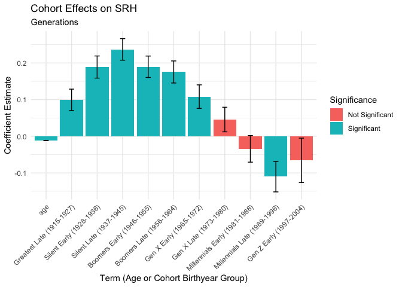
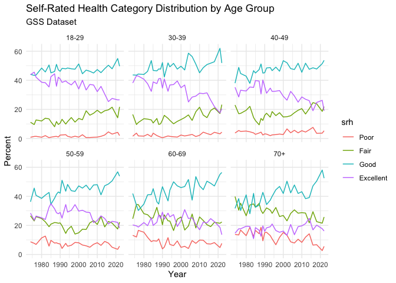

SRH - GSS with Survey Weights
================
Christine Lucille Kuryla
2024-11-29

Here’s a summary of the interesting findings from my analysis of
self-rated health in the GSS dataset so far.

See <https://github.com/clkuryla/self_rated_health/blob/main/gss_eda.md>
for more EDA and details.

- `health` The first variable of interest is “health”, which will be the
  main subject of our analysis:
  <https://gssdataexplorer.norc.org/variables/437/vshow>

Question on survey: “Would you say your own health, in general, is
excellent, good, fair, or poor?”

Coded in this analysis (it was recoded from the raw data) as: 4 -
Excellent 3 - Good 2 - Fair 1 - Poor

Other variables used are:

- `age`
  - Age of respondent at time of survey
- `year`
  - Year of survey
- `cohort`
  - Birth year of respondent

Additional covariates and analyses to come.

# Fetch, load, clean, and recode data

## Fetch GSS data

``` r
# Feel free to modify to play with more covariates and variables.

#install.packages('gssr', repos =  c('https://kjhealy.r-universe.dev', 'https://cloud.r-project.org'))
# install.packages('gssrdoc', repos = c('https://kjhealy.r-universe.dev', 'https://cloud.r-project.org'))

library(gssr)
library(gssrdoc)

data("gss_all") # this file is big! 

# It's a bit excessive to download the entire GSS dataset every time we knit, so lets just save some variables of interest and write it out for future use.

# Add 'wtss' and 'wtssall' to variable selection
data_gss <- as.data.frame(gss_all) %>% 
  select(
    year,      # Year of survey
    cohort,    # Birth year
    age,       # Age at time of survey
    health,    # Self-rated health
    sex,       # Sex
    happy,     # Self-rated happiness
    life,      # Is life exciting or dull (subjective wellbeing)
    educ,      # Years of education
    polviews,  # Political views
    class,     # Subjective class identification
    satfin,    # Satisfaction with financial situation
    region,    # region (south: 1 if 4<x<8, else 0)
    attend,    # attends religious services
    race,      # race
    region,
    wrkstat,
    hispanic,
    degree,
    marital,
    partyid,
    attend,    # attended college
  #  vpsu,         # not available in gssr
  #  vstrat,       # not available in gssr
    wtssps,    # Weight for single-year analysis
    wtssall,    # Weight for multi-year analysis ** stops at 2018
    wtsscomp
  )

write_csv(data_gss, "data/extracted_gss_variables.csv")

# Note: GSSR does not provide vpsu and vstrat. Other data sources may provide it, and we will look into that eventually. 

# If found, update survey object to:
# gss_svy <- data_gss %>%
#   as_survey_design(
#     ids = vpsu,           # PSU identifiers
#     strata = vstrat,      # Stratification variable
#     weights = wtssall,    # Weight variable for multi-year analysis
#     nest = TRUE           # Important when PSUs are nested within strata
#   )

# instead of:
# gss_svy <- data_gss %>%
#   as_survey_design(
#     ids = 1,            # No clustering variable available
#     weights = wtssall
#   )
```

## Load and clean data

Here we’ll load our data, clean some unwanted values, and recode the
unintuitive variables.

``` r
data_gss <- read_csv("data/extracted_gss_variables.csv") %>% 
  filter(cohort != 9999) %>% 
  select(-c(wtssps)) %>% 
  select(-c("region", 
         #   "marital", 
         #   "partyid", 
            "hispanic"
            )) %>% 
  select(-wtssall) %>% 
  na.omit() %>% 
#  mutate(south = if_else(region %in% c(4, 5, 6, 7, 8), "South", "Not South")) %>% 
#  mutate(south = as_factor(south)) %>% 
#  mutate(region = as_factor(region)) %>% 
  mutate(wrkstat = as_factor(wrkstat)) %>% 
#  mutate(hispanic = as_factor(hispanic)) %>% 
  mutate(marital = as_factor(marital)) %>% 
  mutate(partyid = as_factor(partyid)) %>% 
  mutate(health = 5 - health)  %>%  # reverse the coding so it's more intuitive (higher number for excellent, lower number for poor)
  mutate(happy = 4 - happy) %>% # same
  mutate(life = 4 - life) %>% # reverse again, these variables tend to be unintuitively ordered!!!
  mutate(satfin = 4 - satfin) # same again!
```

    ## Rows: 72390 Columns: 22
    ## ── Column specification ────────────────────────────────────────────────────────
    ## Delimiter: ","
    ## dbl (22): year, cohort, age, health, sex, happy, life, educ, polviews, class...
    ## 
    ## ℹ Use `spec()` to retrieve the full column specification for this data.
    ## ℹ Specify the column types or set `show_col_types = FALSE` to quiet this message.

``` r
# Create a survey design object using wtssall for multi-year analysis
gss_svy <- data_gss %>%
  as_survey_design(
    ids = 1,           # PSU identifiers (use 1 if not available)
    weights = wtsscomp  # wtssall pre 2018, wtsscomp combined //Use 'wtss' for single-year analysis
  )
```

# Self rated health as predicted by age over the years

Let’s explore the effect of different cohorts on SRH at certain ages.

## SRH vs year of survey for different ages

In the following figure, I cut the age of participants into 6 groups and
plotted the mean of the group’s self-rated health for each year (that’s
what each dot is). As you can qualitatively see, the spread seems to
narrow.

``` r
# Compute weighted mean of self-rated health
gss_svy %>%
  summarise(
    mean_health = survey_mean(health, na.rm = TRUE)
  )
```

    ## # A tibble: 1 × 2
    ##   mean_health mean_health_se
    ##         <dbl>          <dbl>
    ## 1        3.01        0.00479

``` r
# Create age groups
gss_svy <- gss_svy %>%
  mutate(age_group = cut(age, breaks = 6))

# Compute weighted mean health by age group and year
weighted_health_by_age <- gss_svy %>%
  group_by(age_group, year) %>%
  summarise(
    mean_health = survey_mean(health, na.rm = TRUE)
  )

ggplot(weighted_health_by_age, aes(x = year, y = mean_health, color = age_group)) +
#  geom_smooth(alpha = 0.2) +
  geom_line() +
  geom_point() +
  labs(
    title = "Average SRH Per Year for Each Age Group",
    subtitle = "GSS Dataset with Survey Weights",
    x = "Year",
    y = "Average Self-Rated Health",
    color = "Age Group"
  ) +
  theme_minimal()
```

<!-- -->

``` r
library(broom)
```

## Relationship of self-rated health to age, separated out by years

Well, it seems like the spread of self-rated health among ages decreases
as time goes on (later years). Let’s look at that by faceting mean
self-rated health vs age by year.

Note that intuitively, we’d expect it to be a negative slope because
older people intuitively should have worse health.

Notice *the slopes seem to flatten over time.*

``` r
# health vs age per year
gss_svy %>% 
  group_by(age, year) %>% 
  summarize(mean_health = survey_mean(health)) %>% 
  ggplot(aes(x = age, y = mean_health)) +
  geom_line(color = "cornflowerblue") +
  facet_wrap(~ year) +
  labs(title = "Self-Rated Health By Age (Per Year)",
       subtitle = "GSS Dataset",
       x = "Age of Respondent", 
       y = "Average SRH",
       )
```

<!-- -->

## Regress self-rated health on age, for each year

Let’s do a regression on each self-rated-health vs age, subsetted for
each year (the plots on the faceted figure), look at the significance,
and plot the coefficients for age with 95% CIs:

``` r
# Perform weighted regression for each year
weighted_lm_by_year <- gss_svy %>%
  group_by(year) %>%
  group_map_dfr(~ {
    model <- survey::svyglm(health ~ age, design = .x)
    tidy(model, conf.int = TRUE)
  }) %>%
  filter(term == "age") %>%
  select(year, estimate, std.error, conf.low, conf.high, statistic, p.value)

knitr::kable(weighted_lm_by_year)
```

| year |   estimate | std.error |   conf.low |  conf.high |   statistic |   p.value |
|-----:|-----------:|----------:|-----------:|-----------:|------------:|----------:|
| 1974 | -0.0157813 | 0.0013775 | -0.0184836 | -0.0130790 | -11.4564351 | 0.0000000 |
| 1976 | -0.0156183 | 0.0013927 | -0.0183503 | -0.0128863 | -11.2147379 | 0.0000000 |
| 1977 | -0.0164170 | 0.0014526 | -0.0192665 | -0.0135674 | -11.3017980 | 0.0000000 |
| 1980 | -0.0147845 | 0.0014103 | -0.0175511 | -0.0120179 | -10.4830611 | 0.0000000 |
| 1982 | -0.0130672 | 0.0013381 | -0.0156918 | -0.0104426 |  -9.7652305 | 0.0000000 |
| 1984 | -0.0116035 | 0.0012807 | -0.0141159 | -0.0090910 |  -9.0599889 | 0.0000000 |
| 1985 | -0.0133146 | 0.0013660 | -0.0159942 | -0.0106349 |  -9.7468956 | 0.0000000 |
| 1987 | -0.0148074 | 0.0014125 | -0.0175779 | -0.0120369 | -10.4834389 | 0.0000000 |
| 1988 | -0.0135309 | 0.0016151 | -0.0167007 | -0.0103611 |  -8.3777881 | 0.0000000 |
| 1989 | -0.0117880 | 0.0016616 | -0.0150488 | -0.0085271 |  -7.0945064 | 0.0000000 |
| 1990 | -0.0118592 | 0.0018525 | -0.0154953 | -0.0082232 |  -6.4018856 | 0.0000000 |
| 1991 | -0.0126002 | 0.0017521 | -0.0160389 | -0.0091615 |  -7.1913750 | 0.0000000 |
| 1993 | -0.0106179 | 0.0017278 | -0.0140084 | -0.0072274 |  -6.1454743 | 0.0000000 |
| 1994 | -0.0108694 | 0.0013195 | -0.0134572 | -0.0082816 |  -8.2377057 | 0.0000000 |
| 1996 | -0.0089784 | 0.0012890 | -0.0115067 | -0.0064502 |  -6.9652340 | 0.0000000 |
| 1998 | -0.0118824 | 0.0012991 | -0.0144304 | -0.0093344 |  -9.1465925 | 0.0000000 |
| 2000 | -0.0094222 | 0.0012542 | -0.0118823 | -0.0069621 |  -7.5122259 | 0.0000000 |
| 2002 | -0.0096630 | 0.0018324 | -0.0132595 | -0.0060665 |  -5.2734648 | 0.0000002 |
| 2004 | -0.0063511 | 0.0018625 | -0.0100065 | -0.0026956 |  -3.4100312 | 0.0006797 |
| 2006 | -0.0105620 | 0.0012804 | -0.0130732 | -0.0080507 |  -8.2486989 | 0.0000000 |
| 2008 | -0.0092284 | 0.0015447 | -0.0122589 | -0.0061979 |  -5.9741959 | 0.0000000 |
| 2010 | -0.0090373 | 0.0016664 | -0.0123066 | -0.0057680 |  -5.4234064 | 0.0000001 |
| 2012 | -0.0098700 | 0.0018942 | -0.0135863 | -0.0061536 |  -5.2105540 | 0.0000002 |
| 2014 | -0.0073946 | 0.0014037 | -0.0101480 | -0.0046413 |  -5.2678291 | 0.0000002 |
| 2016 | -0.0034640 | 0.0014160 | -0.0062412 | -0.0006868 |  -2.4463301 | 0.0145295 |
| 2018 | -0.0006843 | 0.0014926 | -0.0036123 |  0.0022436 |  -0.4584794 | 0.6466767 |
| 2021 | -0.0030550 | 0.0011128 | -0.0052372 | -0.0008728 |  -2.7452758 | 0.0060921 |
| 2022 | -0.0047551 | 0.0014516 | -0.0076018 | -0.0019084 |  -3.2758797 | 0.0010709 |

``` r
summary(weighted_lm_by_year)
```

    ##       year         estimate            std.error           conf.low        
    ##  Min.   :1974   Min.   :-0.0164170   Min.   :0.001113   Min.   :-0.019267  
    ##  1st Qu.:1986   1st Qu.:-0.0131290   1st Qu.:0.001333   1st Qu.:-0.016005  
    ##  Median :1995   Median :-0.0107436   Median :0.001414   Median :-0.013797  
    ##  Mean   :1997   Mean   :-0.0103931   Mean   :0.001491   Mean   :-0.013319  
    ##  3rd Qu.:2008   3rd Qu.:-0.0090226   3rd Qu.:0.001663   3rd Qu.:-0.011788  
    ##  Max.   :2022   Max.   :-0.0006843   Max.   :0.001894   Max.   :-0.003612  
    ##    conf.high           statistic           p.value         
    ##  Min.   :-0.013567   Min.   :-11.4564   Min.   :0.0000000  
    ##  1st Qu.:-0.010381   1st Qu.: -9.2967   1st Qu.:0.0000000  
    ##  Median :-0.008137   Median : -7.1429   Median :0.0000000  
    ##  Mean   :-0.007467   Mean   : -7.0828   Mean   :0.0238946  
    ##  3rd Qu.:-0.005992   3rd Qu.: -5.2721   3rd Qu.:0.0000002  
    ##  Max.   : 0.002244   Max.   : -0.4585   Max.   :0.6466767

``` r
# # with additinal covariates
# weighted_lm_by_year <- gss_svy %>%
#   group_by(year) %>%
#   group_map_dfr(~ {
#     model <- survey::svyglm(health ~ age + sex + educ + race + happy + class, design = .x)
#     tidy(model, conf.int = TRUE)
#   }) %>%
#   filter(term == "age") %>%
#   select(year, estimate, std.error, conf.low, conf.high, statistic, p.value)
# 
# summary(weighted_lm_by_year)
```

``` r
# Plot the coefficients with error bars
ggplot(weighted_lm_by_year, aes(x = year, y = estimate)) +
#  geom_line() +
  geom_point() +
  geom_errorbar(aes(ymin=conf.low, ymax=conf.high), width=.2,
                 position=position_dodge(0.05)) +
 # geom_ribbon(aes(ymin = conf.low, ymax = conf.high), alpha = 0.2) +
  labs(
    title = "Change in 'Age' Coefficient Over Years",
    subtitle = "GSS Dataset",
    x = "Year",
    y = "Coefficient of Age"
  ) +
  theme_minimal()
```

<!-- -->

``` r
# Regress the age coefficients on year
coef_model <- lm(estimate ~ year, data = weighted_lm_by_year)
summary(coef_model)
```

    ## 
    ## Call:
    ## lm(formula = estimate ~ year, data = weighted_lm_by_year)
    ## 
    ## Residuals:
    ##        Min         1Q     Median         3Q        Max 
    ## -0.0032724 -0.0010326  0.0001208  0.0008840  0.0043914 
    ## 
    ## Coefficients:
    ##               Estimate Std. Error t value Pr(>|t|)    
    ## (Intercept) -5.169e-01  4.552e-02  -11.36 1.41e-11 ***
    ## year         2.536e-04  2.279e-05   11.13 2.19e-11 ***
    ## ---
    ## Signif. codes:  0 '***' 0.001 '**' 0.01 '*' 0.05 '.' 0.1 ' ' 1
    ## 
    ## Residual standard error: 0.001694 on 26 degrees of freedom
    ## Multiple R-squared:  0.8265, Adjusted R-squared:  0.8198 
    ## F-statistic: 123.9 on 1 and 26 DF,  p-value: 2.185e-11

``` r
# Plot the regression
ggplot(weighted_lm_by_year, aes(x = year, y = estimate)) +
  geom_point() +
  geom_errorbar(aes(ymin=conf.low, ymax=conf.high), width=.2,
                 position=position_dodge(0.05)) +
  geom_smooth(method = "lm", se = TRUE, alpha = 0.3) +
  labs(
    title = "Regression of 'Age' Coefficient Over Years",
    subtitle = "GSS Dataset",
    x = "Year",
    y = "Coefficient of Age"
  ) +
  theme_minimal()
```

    ## `geom_smooth()` using formula = 'y ~ x'

<!-- -->

``` r
weighted_lm_by_year
```

    ## # A tibble: 28 × 7
    ##     year estimate std.error conf.low conf.high statistic  p.value
    ##    <dbl>    <dbl>     <dbl>    <dbl>     <dbl>     <dbl>    <dbl>
    ##  1  1974  -0.0158   0.00138  -0.0185  -0.0131     -11.5  4.77e-29
    ##  2  1976  -0.0156   0.00139  -0.0184  -0.0129     -11.2  5.72e-28
    ##  3  1977  -0.0164   0.00145  -0.0193  -0.0136     -11.3  2.16e-28
    ##  4  1980  -0.0148   0.00141  -0.0176  -0.0120     -10.5  8.47e-25
    ##  5  1982  -0.0131   0.00134  -0.0157  -0.0104      -9.77 5.97e-22
    ##  6  1984  -0.0116   0.00128  -0.0141  -0.00909     -9.06 4.43e-19
    ##  7  1985  -0.0133   0.00137  -0.0160  -0.0106      -9.75 8.90e-22
    ##  8  1987  -0.0148   0.00141  -0.0176  -0.0120     -10.5  6.62e-25
    ##  9  1988  -0.0135   0.00162  -0.0167  -0.0104      -8.38 2.08e-16
    ## 10  1989  -0.0118   0.00166  -0.0150  -0.00853     -7.09 2.57e-12
    ## # ℹ 18 more rows

``` r
summary(weighted_lm_by_year)
```

    ##       year         estimate            std.error           conf.low        
    ##  Min.   :1974   Min.   :-0.0164170   Min.   :0.001113   Min.   :-0.019267  
    ##  1st Qu.:1986   1st Qu.:-0.0131290   1st Qu.:0.001333   1st Qu.:-0.016005  
    ##  Median :1995   Median :-0.0107436   Median :0.001414   Median :-0.013797  
    ##  Mean   :1997   Mean   :-0.0103931   Mean   :0.001491   Mean   :-0.013319  
    ##  3rd Qu.:2008   3rd Qu.:-0.0090226   3rd Qu.:0.001663   3rd Qu.:-0.011788  
    ##  Max.   :2022   Max.   :-0.0006843   Max.   :0.001894   Max.   :-0.003612  
    ##    conf.high           statistic           p.value         
    ##  Min.   :-0.013567   Min.   :-11.4564   Min.   :0.0000000  
    ##  1st Qu.:-0.010381   1st Qu.: -9.2967   1st Qu.:0.0000000  
    ##  Median :-0.008137   Median : -7.1429   Median :0.0000000  
    ##  Mean   :-0.007467   Mean   : -7.0828   Mean   :0.0238946  
    ##  3rd Qu.:-0.005992   3rd Qu.: -5.2721   3rd Qu.:0.0000002  
    ##  Max.   : 0.002244   Max.   : -0.4585   Max.   :0.6466767

``` r
# Perform linear regression of 'coef' (age coefficient) vs 'year'
lm_coef_vs_year <- lm(estimate ~ year, data = weighted_lm_by_year)

# View the summary of the regression
summary(lm_coef_vs_year)
```

    ## 
    ## Call:
    ## lm(formula = estimate ~ year, data = weighted_lm_by_year)
    ## 
    ## Residuals:
    ##        Min         1Q     Median         3Q        Max 
    ## -0.0032724 -0.0010326  0.0001208  0.0008840  0.0043914 
    ## 
    ## Coefficients:
    ##               Estimate Std. Error t value Pr(>|t|)    
    ## (Intercept) -5.169e-01  4.552e-02  -11.36 1.41e-11 ***
    ## year         2.536e-04  2.279e-05   11.13 2.19e-11 ***
    ## ---
    ## Signif. codes:  0 '***' 0.001 '**' 0.01 '*' 0.05 '.' 0.1 ' ' 1
    ## 
    ## Residual standard error: 0.001694 on 26 degrees of freedom
    ## Multiple R-squared:  0.8265, Adjusted R-squared:  0.8198 
    ## F-statistic: 123.9 on 1 and 26 DF,  p-value: 2.185e-11

``` r
srh_age_groups_point_line_figure <- function(age_cuts) {
# Create age groups
gss_svy %>%
  mutate(age_group = cut(age, breaks = age_cuts)) %>% # number of age groups
  group_by(age_group, year) %>% # Compute weighted mean health by age group and year
  summarise(
    mean_health = survey_mean(health, na.rm = TRUE)
  ) %>% 
ggplot(aes(x = year, y = mean_health, color = age_group)) +
#  geom_smooth(alpha = 0.2) +
  geom_line() +
  geom_point() +
  labs(
    title = "Average SRH Per Year for Each Age Group",
    subtitle = "GSS Dataset with Survey Weights",
    x = "Year",
    y = "Average Self-Rated Health",
    color = "Age Group"
  ) +
  theme_minimal()
}

srh_age_groups_loess_figure <- function(age_cuts) {
# Create age groups
gss_svy %>%
  mutate(age_group = cut(age, breaks = age_cuts)) %>% # number of age groups
  group_by(age_group, year) %>% # Compute weighted mean health by age group and year
  summarise(
    mean_health = survey_mean(health, na.rm = TRUE)
  ) %>% 
ggplot(aes(x = year, y = mean_health, color = age_group)) +
  geom_smooth(alpha = 0.4) +
#  geom_line() +
#  geom_point() +
  labs(
    title = "Average SRH Per Year for Each Age Group",
    subtitle = "GSS Dataset with Survey Weights",
    x = "Year",
    y = "Average Self-Rated Health",
    color = "Age Group"
  ) +
  theme_minimal()
}

srh_age_groups_point_line_figure(3)
```

<!-- -->

``` r
srh_age_groups_point_line_figure(4)
```

<!-- -->

``` r
srh_age_groups_point_line_figure(6)
```

<!-- -->

``` r
srh_age_groups_point_line_figure(10)
```

<!-- -->

``` r
srh_age_groups_loess_figure(3)
```

    ## `geom_smooth()` using method = 'loess' and formula = 'y ~ x'

<!-- -->

``` r
srh_age_groups_loess_figure(4)
```

    ## `geom_smooth()` using method = 'loess' and formula = 'y ~ x'

<!-- -->

``` r
srh_age_groups_loess_figure(6)
```

    ## `geom_smooth()` using method = 'loess' and formula = 'y ~ x'

<!-- -->

``` r
srh_age_groups_loess_figure(10)
```

    ## `geom_smooth()` using method = 'loess' and formula = 'y ~ x'

<!-- -->

# Cohort effect on SRH

## Generation splitting

``` r
data_gss_generations <- data_gss %>%
  filter(cohort > 1900) %>%
  mutate(
    generation = factor(
      case_when(
        cohort >= 1901 & cohort <= 1927 ~ "Greatest (1901-1927)",
        cohort >= 1928 & cohort <= 1945 ~ "Silent (1928-1945)",
        cohort >= 1946 & cohort <= 1964 ~ "Boomers (1946-1964)",
        cohort >= 1965 & cohort <= 1980 ~ "Gen X (1965-1980)",
        cohort >= 1981 & cohort <= 1996 ~ "Millennials (1981-1996)",
        cohort >= 1997 & cohort <= 2012 ~ "Gen Z (1997-2012)",
        TRUE ~ "Other"
      ),
      levels = c(
        "Greatest (1901-1927)",
        "Silent (1928-1945)",
        "Boomers (1946-1964)",
        "Gen X (1965-1980)",
        "Millennials (1981-1996)",
        "Gen Z (1997-2012)"#,
     #   "Other"
      )
    ),
    generation_two_sections = factor(
      case_when(
        generation == "Greatest (1901-1927)" & cohort <= 1914 ~ "Greatest Early (1901-1914)",
        generation == "Greatest (1901-1927)" & cohort > 1914 ~ "Greatest Late (1915-1927)",
        generation == "Silent (1928-1945)" & cohort <= 1936 ~ "Silent Early (1928-1936)",
        generation == "Silent (1928-1945)" & cohort > 1936 ~ "Silent Late (1937-1945)",
        generation == "Boomers (1946-1964)" & cohort <= 1955 ~ "Boomers Early (1946-1955)",
        generation == "Boomers (1946-1964)" & cohort > 1955 ~ "Boomers Late (1956-1964)",
        generation == "Gen X (1965-1980)" & cohort <= 1972 ~ "Gen X Early (1965-1972)",
        generation == "Gen X (1965-1980)" & cohort > 1972 ~ "Gen X Late (1973-1980)",
        generation == "Millennials (1981-1996)" & cohort <= 1988 ~ "Millennials Early (1981-1988)",
        generation == "Millennials (1981-1996)" & cohort > 1988 ~ "Millennials Late (1989-1996)",
        generation == "Gen Z (1997-2012)" & cohort <= 2004 ~ "Gen Z Early (1997-2004)",
        generation == "Gen Z (1997-2012)" & cohort > 2004 ~ "Gen Z Late (2005-2012)",
        TRUE ~ "Other"
      ),
      levels = c(
        "Greatest Early (1901-1914)", "Greatest Late (1915-1927)",
        "Silent Early (1928-1936)", "Silent Late (1937-1945)",
        "Boomers Early (1946-1955)", "Boomers Late (1956-1964)",
        "Gen X Early (1965-1972)", "Gen X Late (1973-1980)",
        "Millennials Early (1981-1988)", "Millennials Late (1989-1996)",
        "Gen Z Early (1997-2004)", "Gen Z Late (2005-2012)"#,
     #   "Other"
      )
    ),
    generation_three_sections = factor(
      case_when(
        generation == "Greatest (1901-1927)" & cohort <= 1910 ~ "Greatest Early (1901-1910)",
        generation == "Greatest (1901-1927)" & cohort > 1910 & cohort <= 1918 ~ "Greatest Mid (1911-1918)",
        generation == "Greatest (1901-1927)" & cohort > 1918 ~ "Greatest Late (1919-1927)",
        generation == "Silent (1928-1945)" & cohort <= 1934 ~ "Silent Early (1928-1934)",
        generation == "Silent (1928-1945)" & cohort > 1934 & cohort <= 1940 ~ "Silent Mid (1935-1940)",
        generation == "Silent (1928-1945)" & cohort > 1940 ~ "Silent Late (1941-1945)",
        generation == "Boomers (1946-1964)" & cohort <= 1951 ~ "Boomers Early (1946-1951)",
        generation == "Boomers (1946-1964)" & cohort > 1951 & cohort <= 1958 ~ "Boomers Mid (1952-1958)",
        generation == "Boomers (1946-1964)" & cohort > 1958 ~ "Boomers Late (1959-1964)",
        generation == "Gen X (1965-1980)" & cohort <= 1970 ~ "Gen X Early (1965-1970)",
        generation == "Gen X (1965-1980)" & cohort > 1970 & cohort <= 1976 ~ "Gen X Mid (1971-1976)",
        generation == "Gen X (1965-1980)" & cohort > 1976 ~ "Gen X Late (1977-1980)",
        generation == "Millennials (1981-1996)" & cohort <= 1986 ~ "Millennials Early (1981-1986)",
        generation == "Millennials (1981-1996)" & cohort > 1986 & cohort <= 1992 ~ "Millennials Mid (1987-1992)",
        generation == "Millennials (1981-1996)" & cohort > 1992 ~ "Millennials Late / Gen Z (1993-2004)",
    #    generation == "Gen Z (1997-2012)" & cohort <= 2002 ~ "Gen Z Early (1997-2002)",
    #    generation == "Gen Z (1997-2012)" & cohort > 2002 & cohort <= 2008 ~ "Gen Z Mid (2003-2008)",
    #    generation == "Gen Z (1997-2012)" & cohort > 2008 ~ "Gen Z Late (2009-2012)",
        TRUE ~ "Other"
      ),
      levels = c(
        "Greatest Early (1901-1910)", "Greatest Mid (1911-1918)", "Greatest Late (1919-1927)",
        "Silent Early (1928-1934)", "Silent Mid (1935-1940)", "Silent Late (1941-1945)",
        "Boomers Early (1946-1951)", "Boomers Mid (1952-1958)", "Boomers Late (1959-1964)",
        "Gen X Early (1965-1970)", "Gen X Mid (1971-1976)", "Gen X Late (1977-1980)",
        "Millennials Early (1981-1986)", "Millennials Mid (1987-1992)", 
        "Millennials Late / Gen Z (1993-2004)"
        #"Millennials Late (1993-1996)",
      #  "Gen Z Early (1997-2002)", "Gen Z Mid (2003-2008)", "Gen Z Late (2009-2012)" #,
      #  "Other"
      )
    )
  )


table(data_gss_generations$generation)
```

    ## 
    ##    Greatest (1901-1927)      Silent (1928-1945)     Boomers (1946-1964) 
    ##                    5584                    7783                   14817 
    ##       Gen X (1965-1980) Millennials (1981-1996)       Gen Z (1997-2012) 
    ##                    7106                    3444                     384

``` r
table(data_gss_generations$generation_two_sections)
```

    ## 
    ##    Greatest Early (1901-1914)     Greatest Late (1915-1927) 
    ##                          1824                          3760 
    ##      Silent Early (1928-1936)       Silent Late (1937-1945) 
    ##                          3248                          4535 
    ##     Boomers Early (1946-1955)      Boomers Late (1956-1964) 
    ##                          7898                          6919 
    ##       Gen X Early (1965-1972)        Gen X Late (1973-1980) 
    ##                          4168                          2938 
    ## Millennials Early (1981-1988)  Millennials Late (1989-1996) 
    ##                          2189                          1255 
    ##       Gen Z Early (1997-2004)        Gen Z Late (2005-2012) 
    ##                           384                             0

``` r
table(data_gss_generations$generation_three_sections)
```

    ## 
    ##           Greatest Early (1901-1910)             Greatest Mid (1911-1918) 
    ##                                 1062                                 1743 
    ##            Greatest Late (1919-1927)             Silent Early (1928-1934) 
    ##                                 2779                                 2427 
    ##               Silent Mid (1935-1940)              Silent Late (1941-1945) 
    ##                                 2529                                 2827 
    ##            Boomers Early (1946-1951)              Boomers Mid (1952-1958) 
    ##                                 4602                                 5868 
    ##             Boomers Late (1959-1964)              Gen X Early (1965-1970) 
    ##                                 4347                                 3329 
    ##                Gen X Mid (1971-1976)               Gen X Late (1977-1980) 
    ##                                 2401                                 1376 
    ##        Millennials Early (1981-1986)          Millennials Mid (1987-1992) 
    ##                                 1716                                 1228 
    ## Millennials Late / Gen Z (1993-2004) 
    ##                                  500

``` r
gss_svy_gen <- data_gss_generations %>%
  as_survey_design(ids = 1, weights = wtsscomp)
```

## Regression with age and cohorts

``` r
# Create cohort groups (e.g., decades)
data_gss <- data_gss %>%
  mutate(cohort_group = cut(cohort, breaks = seq(1900, 2010, by = 10), right = FALSE,
                            labels = paste(seq(1900, 2000, by = 10), seq(1909, 2009, by = 10), sep = "-")))

# Cohort groups by 15 years
data_gss_15 <- data_gss %>%
  mutate(cohort_15_yr = cut(cohort, breaks = seq(1900, 2010, by = 15), right = FALSE,
                            labels = paste(seq(1900, 2000, by = 15), 15 + seq(1900, 2000, by = 15), sep = "-")))

# Create cohort groups (e.g., decades)
data_gss_10 <- data_gss %>%
  mutate(cohort_10_yr = cut(cohort, breaks = seq(1900, 2010, by = 10), right = FALSE,
                            labels = paste(seq(1900, 2000, by = 10), seq(1909, 2009, by = 10), sep = "-")))

# # Cohort groups by 5 years
data_gss_5 <- data_gss %>%
  mutate(cohort_05_yr = cut(cohort, breaks = seq(1900, 2005, by = 5), right = FALSE,
                            labels = paste(seq(1900, 2000, by = 5), 5 + seq(1900, 2000, by = 5), sep = "-")))

# Update survey design object
gss_svy_5 <- data_gss_5 %>%
  as_survey_design(ids = 1, weights = wtsscomp)

gss_svy_10 <- data_gss_10 %>%
  as_survey_design(ids = 1, weights = wtsscomp)

gss_svy_15 <- data_gss_15 %>%
  as_survey_design(ids = 1, weights = wtsscomp)


# 15 year cohorts
# Regression including age and cohort_group
weighted_lm_cohort <- gss_svy_15 %>%
  svyglm(health ~ age + cohort_15_yr, design = .)
# Summarize the model
summary(weighted_lm_cohort)
```

    ## 
    ## Call:
    ## svyglm(formula = health ~ age + cohort_15_yr, design = .)
    ## 
    ## Survey design:
    ## Called via srvyr
    ## 
    ## Coefficients:
    ##                         Estimate Std. Error t value Pr(>|t|)    
    ## (Intercept)            3.4048254  0.0374120  91.009  < 2e-16 ***
    ## age                   -0.0114411  0.0003889 -29.421  < 2e-16 ***
    ## cohort_15_yr1915-1930  0.1173045  0.0283208   4.142 3.45e-05 ***
    ## cohort_15_yr1930-1945  0.2132164  0.0277483   7.684 1.58e-14 ***
    ## cohort_15_yr1945-1960  0.1856956  0.0283085   6.560 5.46e-11 ***
    ## cohort_15_yr1960-1975  0.1290098  0.0298432   4.323 1.54e-05 ***
    ## cohort_15_yr1975-1990 -0.0068750  0.0323236  -0.213   0.8316    
    ## cohort_15_yr1990-2005 -0.1000231  0.0408882  -2.446   0.0144 *  
    ## ---
    ## Signif. codes:  0 '***' 0.001 '**' 0.01 '*' 0.05 '.' 0.1 ' ' 1
    ## 
    ## (Dispersion parameter for gaussian family taken to be 0.6313635)
    ## 
    ## Number of Fisher Scoring iterations: 2

``` r
# 5 year cohorts
# Regression including age and cohort_group
weighted_lm_cohort <- gss_svy_10 %>%
  svyglm(health ~ age + cohort_10_yr, design = .)
# Summarize the model
summary(weighted_lm_cohort)
```

    ## 
    ## Call:
    ## svyglm(formula = health ~ age + cohort_10_yr, design = .)
    ## 
    ## Survey design:
    ## Called via srvyr
    ## 
    ## Coefficients:
    ##                        Estimate Std. Error t value Pr(>|t|)    
    ## (Intercept)            3.356311   0.045266  74.146  < 2e-16 ***
    ## age                   -0.011318   0.000396 -28.581  < 2e-16 ***
    ## cohort_10_yr1910-1919  0.080575   0.040168   2.006  0.04487 *  
    ## cohort_10_yr1920-1929  0.185509   0.038221   4.854 1.22e-06 ***
    ## cohort_10_yr1930-1939  0.222733   0.037859   5.883 4.06e-09 ***
    ## cohort_10_yr1940-1949  0.274236   0.037347   7.343 2.13e-13 ***
    ## cohort_10_yr1950-1959  0.219823   0.038056   5.776 7.69e-09 ***
    ## cohort_10_yr1960-1969  0.189145   0.038888   4.864 1.16e-06 ***
    ## cohort_10_yr1970-1979  0.108182   0.040510   2.670  0.00758 ** 
    ## cohort_10_yr1980-1989  0.010342   0.042417   0.244  0.80738    
    ## cohort_10_yr1990-1999 -0.071967   0.048685  -1.478  0.13936    
    ## cohort_10_yr2000-2009  0.021147   0.084186   0.251  0.80166    
    ## ---
    ## Signif. codes:  0 '***' 0.001 '**' 0.01 '*' 0.05 '.' 0.1 ' ' 1
    ## 
    ## (Dispersion parameter for gaussian family taken to be 0.6305386)
    ## 
    ## Number of Fisher Scoring iterations: 2

``` r
# 10 year cohorts
# Regression including age and cohort_group
weighted_lm_cohort <- gss_svy_5 %>%
  svyglm(health ~ age + cohort_05_yr, design = .)
# Summarize the model
summary(weighted_lm_cohort)
```

    ## 
    ## Call:
    ## svyglm(formula = health ~ age + cohort_05_yr, design = .)
    ## 
    ## Survey design:
    ## Called via srvyr
    ## 
    ## Coefficients:
    ##                         Estimate Std. Error t value Pr(>|t|)    
    ## (Intercept)            3.4198695  0.0610582  56.010  < 2e-16 ***
    ## age                   -0.0114893  0.0003985 -28.832  < 2e-16 ***
    ## cohort_05_yr1905-1910 -0.0832106  0.0685363  -1.214 0.224713    
    ## cohort_05_yr1910-1915  0.0285179  0.0627489   0.454 0.649489    
    ## cohort_05_yr1915-1920  0.0291959  0.0597348   0.489 0.625015    
    ## cohort_05_yr1920-1925  0.0910441  0.0584613   1.557 0.119398    
    ## cohort_05_yr1925-1930  0.1701392  0.0580868   2.929 0.003402 ** 
    ## cohort_05_yr1930-1935  0.1706542  0.0576533   2.960 0.003078 ** 
    ## cohort_05_yr1935-1940  0.1674648  0.0574045   2.917 0.003533 ** 
    ## cohort_05_yr1940-1945  0.2486955  0.0565650   4.397  1.1e-05 ***
    ## cohort_05_yr1945-1950  0.1954664  0.0560993   3.484 0.000494 ***
    ## cohort_05_yr1950-1955  0.1816027  0.0565945   3.209 0.001334 ** 
    ## cohort_05_yr1955-1960  0.1459471  0.0564369   2.586 0.009713 ** 
    ## cohort_05_yr1960-1965  0.1586423  0.0569803   2.784 0.005369 ** 
    ## cohort_05_yr1965-1970  0.0993006  0.0577380   1.720 0.085468 .  
    ## cohort_05_yr1970-1975  0.0711998  0.0587875   1.211 0.225850    
    ## cohort_05_yr1975-1980  0.0234077  0.0596869   0.392 0.694931    
    ## cohort_05_yr1980-1985 -0.0115784  0.0605353  -0.191 0.848317    
    ## cohort_05_yr1985-1990 -0.0917173  0.0626938  -1.463 0.143492    
    ## cohort_05_yr1990-1995 -0.1426211  0.0662774  -2.152 0.031413 *  
    ## cohort_05_yr1995-2000 -0.1129884  0.0758852  -1.489 0.136511    
    ## cohort_05_yr2000-2005 -0.0389697  0.0935490  -0.417 0.676995    
    ## ---
    ## Signif. codes:  0 '***' 0.001 '**' 0.01 '*' 0.05 '.' 0.1 ' ' 1
    ## 
    ## (Dispersion parameter for gaussian family taken to be 0.6298809)
    ## 
    ## Number of Fisher Scoring iterations: 2

``` r
# Function to plot this
  
cohort_age_interation_figure <- function(cohort_length_string) {
  
# Prepare data for the plot
coef_data <- broom::tidy(weighted_lm_cohort) %>%
  filter(term != "(Intercept)") %>%
  mutate(significant = ifelse(p.value < 0.05, "Significant", "Not Significant"),
         term = ifelse(grepl("cohort_group", term), gsub("cohort_group", "", term), term))

# Plot
ggplot(coef_data, aes(x = term, y = estimate, fill = significant)) +
  geom_bar(stat = "identity", position = position_dodge()) +
  geom_errorbar(aes(ymin = estimate - std.error, ymax = estimate + std.error), width = 0.2) +
  labs(
    title = "Cohort Effects on SRH",
    subtitle = cohort_length_string,
    x = "Term (Age or Cohort Birthyear Group)",
    y = "Coefficient Estimate",
    fill = "Significance"
  ) +
  theme_minimal() +
  theme(axis.text.x = element_text(angle = 45, hjust = 1))

}

# Plot for different cohort sizes

weighted_lm_cohort <- gss_svy_5 %>%
  mutate(cohort_group = cohort_05_yr) %>% 
  svyglm(health ~ age + cohort_group, design = .)
cohort_age_interation_figure("5-Year Cohorts")
```

<!-- -->

``` r
weighted_lm_cohort <- gss_svy_15 %>%
  mutate(cohort_group = cohort_15_yr) %>% 
  svyglm(health ~ age + cohort_group, design = .)
cohort_age_interation_figure("15-Year Cohorts")
```

<!-- -->

``` r
weighted_lm_cohort <- gss_svy_10 %>%
  mutate(cohort_group = cohort_10_yr) %>% 
  svyglm(health ~ age + cohort_group, design = .)
cohort_age_interation_figure("10-Year Cohorts")
```

<!-- -->

``` r
### Generations

library(ggplot2)
library(dplyr)
library(broom)

generation_age_interaction_figure <- function(cohort_length_string) {
  
  # Prepare data for the plot
  coef_data <- broom::tidy(weighted_lm_generation) %>%
    filter(term != "(Intercept)") %>%
    mutate(
      # Clean the term to remove "cohort_group" prefix if present
      term_cleaned = ifelse(grepl("cohort_group", term), gsub("cohort_group", "", term), term),
      # Extract the first year (numeric) from cohort terms or assign NA for "age"
      first_year = ifelse(term_cleaned == "age", NA, as.numeric(sub("-.*", "", term_cleaned))),
      # Add a numeric ordering key: assign 0 to "age" and the extracted year to cohort groups
      term_numeric = ifelse(term_cleaned == "age", 0, first_year),
      # Reorder terms based on the numeric ordering key
      term_ordered = reorder(term_cleaned, term_numeric),
      significant = ifelse(p.value < 0.05, "Significant", "Not Significant")
    )

  # Plot
  ggplot(coef_data, aes(x = term_ordered, y = estimate, fill = significant)) +
    geom_bar(stat = "identity", position = position_dodge()) +
    geom_errorbar(aes(ymin = estimate - std.error, ymax = estimate + std.error), width = 0.2) +
    labs(
      title = "Cohort Effects on SRH",
      subtitle = cohort_length_string,
      x = "Term (Age or Cohort Birthyear Group)",
      y = "Coefficient Estimate",
      fill = "Significance"
    ) +
    theme_minimal() +
    theme(axis.text.x = element_text(angle = 45, hjust = 1))
}

# Call the function with a sample subtitle
# generation_age_interaction_figure("Cohort Length: 10 Years")


library(ggplot2)
library(dplyr)
library(broom)

generation_age_interaction_figure <- function(cohort_length_string) {
  
  # Prepare data for the plot
  coef_data <- broom::tidy(weighted_lm_generation) %>%
    filter(term != "(Intercept)") %>%
    mutate(
      # Clean the term to remove "cohort_group" prefix if present
      term_cleaned = ifelse(grepl("cohort_group", term), gsub("cohort_group", "", term), term),
      # Extract the first year from cohort terms using regex (assign NA for "age")
      first_year = ifelse(term_cleaned == "age", NA, as.numeric(stringr::str_extract(term_cleaned, "^\\d{4}"))),
      # Add a numeric ordering key: assign 0 to "age" and use the extracted first year for cohorts
      term_numeric = ifelse(term_cleaned == "age", 0, first_year),
      # Reorder terms based on the numeric ordering key
      term_cleaned = factor(term_cleaned, levels = term_cleaned[order(term_numeric)]),
      significant = ifelse(p.value < 0.05, "Significant", "Not Significant")
    )

  # Plot
  ggplot(coef_data, aes(x = term_cleaned, y = estimate, fill = significant)) +
    geom_bar(stat = "identity", position = position_dodge()) +
    geom_errorbar(aes(ymin = estimate - std.error, ymax = estimate + std.error), width = 0.2) +
    labs(
      title = "Cohort Effects on SRH",
      subtitle = cohort_length_string,
      x = "Term (Age or Cohort Birthyear Group)",
      y = "Coefficient Estimate",
      fill = "Significance"
    ) +
    theme_minimal() +
    theme(axis.text.x = element_text(angle = 45, hjust = 1))
}

# Call the function with a sample subtitle
# cohort_age_interaction_figure("Cohort Length: 10 Years")


weighted_lm_generation <- gss_svy_gen %>% 
  mutate(cohort_group = generation_two_sections) %>% 
  svyglm(health ~ age + cohort_group, design = .)
generation_age_interaction_figure("Generations")
```

<!-- -->

``` r
weighted_lm_generation <- gss_svy_gen %>% 
  mutate(cohort_group = generation) %>% 
  svyglm(health ~ age + cohort_group, design = .)
generation_age_interaction_figure("Generations")
```

<!-- -->

``` r
weighted_lm_generation <- gss_svy_gen %>% 
  mutate(cohort_group = generation_three_sections) %>% 
  svyglm(health ~ age + cohort_group, design = .)
generation_age_interaction_figure("Generations")
```

<!-- -->

Positive coefficients indicate better SRH compared to the 1900-1909
cohort (reference group), adjusting for age.

- SRH improved significantly for cohorts born between 1920-1979, peaking
  in 1940-1949.
- Recent cohorts (1980-2009) show no significant change.

## Interaction terms between age and cohort

Does the impact of age on SRH differ across cohorts?

``` r
# Regression with interaction between age and cohort_group
weighted_lm_interaction <- gss_svy_10 %>%
  svyglm(health ~ age * cohort_group, design = .)

# Summarize the model
summary(weighted_lm_interaction)
```

    ## 
    ## Call:
    ## svyglm(formula = health ~ age * cohort_group, design = .)
    ## 
    ## Survey design:
    ## Called via srvyr
    ## 
    ## Coefficients:
    ##                             Estimate Std. Error t value Pr(>|t|)    
    ## (Intercept)                2.5528523  0.4061870   6.285 3.31e-10 ***
    ## age                       -0.0007241  0.0053144  -0.136  0.89163    
    ## cohort_group1910-1919      0.5635287  0.4476831   1.259  0.20812    
    ## cohort_group1920-1929      0.9800021  0.4199493   2.334  0.01962 *  
    ## cohort_group1930-1939      0.9555353  0.4116089   2.321  0.02027 *  
    ## cohort_group1940-1949      1.0569174  0.4081139   2.590  0.00961 ** 
    ## cohort_group1950-1959      1.0211848  0.4072803   2.507  0.01217 *  
    ## cohort_group1960-1969      0.9970326  0.4076345   2.446  0.01445 *  
    ## cohort_group1970-1979      1.0838693  0.4099987   2.644  0.00821 ** 
    ## cohort_group1980-1989      0.8141337  0.4156108   1.959  0.05013 .  
    ## cohort_group1990-1999      0.9548134  0.4503903   2.120  0.03401 *  
    ## cohort_group2000-2009      2.6467983  1.0290766   2.572  0.01011 *  
    ## age:cohort_group1910-1919 -0.0059890  0.0059494  -1.007  0.31411    
    ## age:cohort_group1920-1929 -0.0104524  0.0055655  -1.878  0.06038 .  
    ## age:cohort_group1930-1939 -0.0093578  0.0054386  -1.721  0.08532 .  
    ## age:cohort_group1940-1949 -0.0101764  0.0053750  -1.893  0.05833 .  
    ## age:cohort_group1950-1959 -0.0105439  0.0053638  -1.966  0.04933 *  
    ## age:cohort_group1960-1969 -0.0107138  0.0053921  -1.987  0.04694 *  
    ## age:cohort_group1970-1979 -0.0157768  0.0055595  -2.838  0.00454 ** 
    ## age:cohort_group1980-1989 -0.0106055  0.0060468  -1.754  0.07945 .  
    ## age:cohort_group1990-1999 -0.0196952  0.0093297  -2.111  0.03478 *  
    ## age:cohort_group2000-2009 -0.1011513  0.0476308  -2.124  0.03371 *  
    ## ---
    ## Signif. codes:  0 '***' 0.001 '**' 0.01 '*' 0.05 '.' 0.1 ' ' 1
    ## 
    ## (Dispersion parameter for gaussian family taken to be 0.6299161)
    ## 
    ## Number of Fisher Scoring iterations: 2

``` r
# Visualize the interaction
library(ggplot2)
# Create a dataset for predictions
new_data <- expand.grid(
  age = seq(min(data_gss$age), max(data_gss$age), by = 1),
  cohort_group = levels(data_gss$cohort_group)
)

# Predict SRH

predictions <- as.data.frame(predict(weighted_lm_interaction, newdata = new_data, type = "response", se = TRUE))
new_data$predicted_health <- predictions$response
new_data$se <- predictions$SE


# Plot
ggplot(new_data, aes(x = age, y = predicted_health, color = cohort_group)) +
  geom_line() +
  labs(
    title = "Predicted SRH by Age and Cohort",
    x = "Age",
    y = "Predicted Self-Rated Health",
    color = "Cohort Group"
  ) +
  theme_minimal()
```

<!-- -->

``` r
library(dplyr)
library(broom)
library(ggplot2)

# Extract coefficients
coef_data <- broom::tidy(weighted_lm_interaction) %>%
  filter(term %in% grep("age:cohort_group", term, value = TRUE)) %>%
  mutate(
    cohort_group = gsub("age:cohort_group", "", term),
    significant = ifelse(p.value < 0.05, "Significant", "Not Significant")
  )

# Generate predictions for each cohort group
library(ggeffects)
predictions <- ggpredict(weighted_lm_cohort, terms = c("age", "cohort_group"))

# Plot predictions
ggplot(predictions, aes(x = x, y = predicted, color = group)) +
  geom_line(size = 1) +
  labs(
    title = "Interaction of Age and Cohort Group on Self-Rated Health",
    x = "Age",
    y = "Predicted SRH",
    color = "Cohort Group"
  ) +
  theme_minimal()

# Plot interaction coefficients
ggplot(coef_data, aes(x = cohort_group, y = estimate, fill = significant)) +
  geom_bar(stat = "identity", position = position_dodge()) +
  geom_errorbar(aes(ymin = estimate - std.error, ymax = estimate + std.error), width = 0.2) +
  labs(
    title = "Interaction Effects of Age and Cohort Group on SRH",
    x = "Cohort Group",
    y = "Interaction Coefficient (Age Effect)",
    fill = "Significance"
  ) +
  theme_minimal() +
  theme(axis.text.x = element_text(angle = 45, hjust = 1))
```

“Age and Cohort Interaction Effects on Self-Rated Health (SRH)”

Key Findings:

Higher Baseline SRH for Later Cohorts:

Cohorts born between 1920-2009 report significantly higher SRH compared
to the 1900-1909 cohort. The 2000-2009 cohort shows the highest baseline
SRH but also the most variability. Steeper Age-Related Declines in SRH
for Recent Cohorts:

The effect of age on SRH becomes progressively more negative in later
cohorts. Individuals in the 2000-2009 cohort experience the steepest
decline in SRH as they age. Mid-Century Cohorts Show Moderate Trends:

Cohorts born between 1940-1969 exhibit improved SRH at younger ages with
moderate age-related declines. Implications for Public Health:

The steeper decline in SRH with age for more recent cohorts may reflect
generational challenges, such as lifestyle changes, chronic disease
prevalence, or systemic health inequities. Strategies to support health
across the lifespan may need to account for these emerging disparities.

# Incorporating covariates

``` r
gss_svy <- gss_svy %>% 
  mutate(sex = as.factor(sex),
         race = as.factor(race))

# Load libraries
library(dplyr)
library(tidyr)
library(purrr)
library(broom)
library(ggplot2)

formulas <- list(
  age_only = health ~ age,
  age_race = health ~ age + race,
  age_sex = health ~ age + sex,
  age_hap = health ~ age + happy,
  age_sf_edu = health ~ age + satfin + educ,
  age_sf_hap = health ~ age + satfin + happy,
  age_sf_hap_educ = health ~ age + happy + satfin + educ,
  age_sf_hap_educ_race_sex = health ~ age + happy + satfin + educ + race + sex
)

# Get a vector of unique years
years <- sort(unique(data_gss$year))

# Create a data frame of all combinations
formula_df <- expand.grid(formula_name = names(formulas), year = years, stringsAsFactors = FALSE)

# Run regressions and extract results
results <- formula_df %>%
  mutate(
    formula = formulas[formula_name],
    data = map(year, ~ filter(data_gss, year == .x)),
    model = map2(formula, data, ~ lm(.x, data = .y)),
    tidy = map(model, tidy),
    glance = map(model, glance)
  )

# Extract coefficients
coefficients_df <- results %>%
  unnest(tidy)

# Extract model summary statistics
model_stats_df <- results %>%
  unnest(glance)

# Focus on age coefficient
age_coefficients <- coefficients_df %>%
  filter(term == "age") %>%
  select(formula_name, year, estimate, std.error, statistic, p.value)

# Regress Age Coefficient Over Time
#For each formula, regress the age coefficient over time to analyze the trend:

age_coeff_trend <- age_coefficients %>%
  group_by(formula_name) %>%
  nest() %>%
  mutate(
    trend_model = map(data, ~ lm(estimate ~ year, data = .x)),
    trend_tidy = map(trend_model, tidy),
    trend_glance = map(trend_model, glance)
  )

# Extract trend summary statistics
trend_summary <- age_coeff_trend %>%
  unnest(trend_glance) %>%
  select(formula_name, r.squared, adj.r.squared, p.value, statistic)

# Merge age coefficients with trend summary
final_results <- age_coefficients %>%
  left_join(trend_summary, by = "formula_name") %>%
  arrange(formula_name, year)

# Summary table
# Assuming 'age_coeff_trend' is from the previous analysis

# Extract trend statistics for each formula
trend_stats <- age_coeff_trend %>%
  mutate(
    trend_summary = map(trend_model, ~ {
      model <- .x
      summary <- summary(model)
      slope <- coef(summary)["year", "Estimate"]
      std_error <- coef(summary)["year", "Std. Error"]
      p_value <- coef(summary)["year", "Pr(>|t|)"]
      conf_int <- confint(model)["year", ]
      r_squared <- summary$r.squared
      
      tibble(
        slope = slope,
        std_error = std_error,
        ci_lower = conf_int[1],
        ci_upper = conf_int[2],
        p_value = p_value,
        r_squared = r_squared
      )
    })
  ) %>%
  unnest(trend_summary) %>%
  select(formula_name, slope, std_error, ci_lower, ci_upper, p_value, r_squared)

trend_stats
```

    ## # A tibble: 8 × 7
    ## # Groups:   formula_name [8]
    ##   formula_name              slope std_error ci_lower ci_upper  p_value r_squared
    ##   <chr>                     <dbl>     <dbl>    <dbl>    <dbl>    <dbl>     <dbl>
    ## 1 age_only                2.59e-4 0.0000187 0.000220 0.000297 1.69e-13     0.880
    ## 2 age_race                2.56e-4 0.0000203 0.000214 0.000297 1.44e-12     0.859
    ## 3 age_sex                 2.58e-4 0.0000183 0.000220 0.000295 1.16e-13     0.884
    ## 4 age_hap                 2.75e-4 0.0000198 0.000235 0.000316 1.49e-13     0.881
    ## 5 age_sf_edu              1.74e-4 0.0000186 0.000136 0.000213 7.79e-10     0.772
    ## 6 age_sf_hap              2.71e-4 0.0000197 0.000231 0.000312 2.00e-13     0.879
    ## 7 age_sf_hap_educ         1.93e-4 0.0000191 0.000154 0.000233 1.64e-10     0.798
    ## 8 age_sf_hap_educ_race_s… 1.95e-4 0.0000194 0.000156 0.000235 1.78e-10     0.796

``` r
knitr::kable(trend_stats)
```

| formula_name | slope | std_error | ci_lower | ci_upper | p_value | r_squared |
|:---|---:|---:|---:|---:|---:|---:|
| age_only | 0.0002588 | 1.87e-05 | 0.0002204 | 0.0002973 | 0 | 0.8803560 |
| age_race | 0.0002555 | 2.03e-05 | 0.0002138 | 0.0002972 | 0 | 0.8590321 |
| age_sex | 0.0002576 | 1.83e-05 | 0.0002199 | 0.0002952 | 0 | 0.8837400 |
| age_hap | 0.0002752 | 1.98e-05 | 0.0002345 | 0.0003159 | 0 | 0.8814922 |
| age_sf_edu | 0.0001745 | 1.86e-05 | 0.0001363 | 0.0002127 | 0 | 0.7721493 |
| age_sf_hap | 0.0002711 | 1.97e-05 | 0.0002305 | 0.0003117 | 0 | 0.8788371 |
| age_sf_hap_educ | 0.0001934 | 1.91e-05 | 0.0001541 | 0.0002327 | 0 | 0.7976798 |
| age_sf_hap_educ_race_sex | 0.0001955 | 1.94e-05 | 0.0001556 | 0.0002353 | 0 | 0.7963478 |

``` r
ggplot(age_coefficients, aes(x = year, y = estimate, color = formula_name)) +
  geom_line() +
#  geom_smooth(method = "lm", alpha = 0.2) +
  geom_point() +
  labs(
    title = "Age Coefficient for Various Models Over Time",
    x = "Year",
    y = "Age Coefficient",
    color = "Formula"
  ) +
  theme_minimal()
```

<!-- -->

``` r
ggplot(age_coefficients, aes(x = year, y = estimate, color = formula_name)) +
 # geom_line() +
  geom_smooth(method = "lm", alpha = 0.2) +
  geom_point() +
  labs(
    title = "Trend for Age Coefficient for Various Models Over Time",
    x = "Year",
    y = "Age Coefficient",
    color = "Formula"
  ) +
  theme_minimal()
```

    ## `geom_smooth()` using formula = 'y ~ x'

<!-- -->

# Cohort Effects

## Visualize age profiles by cohort

First let’s visualize potential cohort effects.

``` r
gss_svy_15 %>% 
  mutate(cohort = cohort_15_yr) %>% 
#  mutate(cohort = cut(cohort, breaks = 7)) %>% # Create cohorts with 6 breaks
  group_by(age, cohort) %>% 
  summarize(mean_health = survey_mean(health, na.rm = TRUE)) %>% 
  ggplot(aes(x = age, y = mean_health, color = cohort)) +
  labs(title = "Age Profiles by Cohort") +
  geom_smooth()
```

    ## `geom_smooth()` using method = 'loess' and formula = 'y ~ x'

<!-- -->

``` r
gss_svy_gen %>% 
  mutate(cohort = generation_two_sections) %>% 
#  mutate(cohort = cut(cohort, breaks = 7)) %>% # Create cohorts with 6 breaks
  group_by(age, cohort) %>% 
  summarize(mean_health = survey_mean(health, na.rm = TRUE)) %>% 
  ggplot(aes(x = age, y = mean_health, color = cohort)) +
  labs(title = "Age Profiles by Cohort") +
 # geom_smooth()
  geom_line()
```

<!-- -->

## Model srh vs age for each cohort and plot the betas and predicted age values

Let’s try to see why the oldest cohort line sort of looks like it lines
up with the youngest by modeling the trend of srh vs age (seems linear)
and comparing the expected mean health rating at 20, 40, and 60 years of
age for the different cohorts, as well as the coefficient.

``` r
library(dplyr)
library(purrr)
library(srvyr)
library(broom)

lm_health_v_age_cohorts <- gss_svy %>%
  filter(cohort >= 1900 & cohort <= 1996) %>% 
  mutate(cohort_cut = cut(cohort, breaks = 25)) %>%  # Create cohort categories
  group_by(cohort_cut) %>%
  summarise(
    data = list(cur_data()) # Nest data for each cohort group
  ) %>%
  mutate(
    # Fit a weighted model for each cohort using the survey design
    model = map(data, ~ svyglm(health ~ age, design = as_survey_design(.x, weights = wtsscomp))),
    # Predict SRH at specific ages
    predict_20 = map2_dbl(model, data, ~ predict(.x, newdata = tibble(age = 20))),
    predict_25 = map2_dbl(model, data, ~ predict(.x, newdata = tibble(age = 25))),
    predict_30 = map2_dbl(model, data, ~ predict(.x, newdata = tibble(age = 30))),
    predict_35 = map2_dbl(model, data, ~ predict(.x, newdata = tibble(age = 35))),
    predict_40 = map2_dbl(model, data, ~ predict(.x, newdata = tibble(age = 40))),
    predict_45 = map2_dbl(model, data, ~ predict(.x, newdata = tibble(age = 45))),
    predict_50 = map2_dbl(model, data, ~ predict(.x, newdata = tibble(age = 50))),
    predict_55 = map2_dbl(model, data, ~ predict(.x, newdata = tibble(age = 55))),
    predict_65 = map2_dbl(model, data, ~ predict(.x, newdata = tibble(age = 65))),
    predict_70 = map2_dbl(model, data, ~ predict(.x, newdata = tibble(age = 70))),
    predict_75 = map2_dbl(model, data, ~ predict(.x, newdata = tibble(age = 75))),
    predict_80 = map2_dbl(model, data, ~ predict(.x, newdata = tibble(age = 80))),
    # Extract the coefficient (beta) and standard error
    beta = map_dbl(model, ~ coef(.x)["age"]),
    se = map_dbl(model, ~ broom::tidy(.x) %>% filter(term == "age") %>% pull(std.error)),
    # Calculate the mean cohort year
    cohort_mean = map_dbl(cohort_cut, ~ mean(as.numeric(stringr::str_extract_all(.x, "\\d+")[[1]])))
  )
```

    ## Warning: There was 1 warning in `dplyr::summarise()`.
    ## ℹ In argument: `data = list(cur_data())`.
    ## ℹ In group 1: `cohort_cut = "(1900,1904]"`.
    ## Caused by warning:
    ## ! `cur_data()` was deprecated in dplyr 1.1.0.
    ## ℹ Please use `pick()` instead.

``` r
# View the results
print(lm_health_v_age_cohorts)
```

    ## # A tibble: 25 × 18
    ##    cohort_cut  data     model    predict_20 predict_25 predict_30 predict_35
    ##    <fct>       <list>   <list>        <dbl>      <dbl>      <dbl>      <dbl>
    ##  1 (1900,1904] <tibble> <svyglm>       2.06       2.10       2.14       2.17
    ##  2 (1904,1908] <tibble> <svyglm>       2.30       2.31       2.33       2.35
    ##  3 (1908,1912] <tibble> <svyglm>       3.09       3.04       2.99       2.95
    ##  4 (1912,1915] <tibble> <svyglm>       2.75       2.74       2.73       2.71
    ##  5 (1915,1919] <tibble> <svyglm>       3.09       3.05       3.00       2.96
    ##  6 (1919,1923] <tibble> <svyglm>       3.39       3.32       3.25       3.17
    ##  7 (1923,1927] <tibble> <svyglm>       3.20       3.16       3.12       3.07
    ##  8 (1927,1931] <tibble> <svyglm>       3.29       3.24       3.20       3.15
    ##  9 (1931,1935] <tibble> <svyglm>       3.31       3.26       3.21       3.16
    ## 10 (1935,1938] <tibble> <svyglm>       3.22       3.18       3.14       3.10
    ## # ℹ 15 more rows
    ## # ℹ 11 more variables: predict_40 <dbl>, predict_45 <dbl>, predict_50 <dbl>,
    ## #   predict_55 <dbl>, predict_65 <dbl>, predict_70 <dbl>, predict_75 <dbl>,
    ## #   predict_80 <dbl>, beta <dbl>, se <dbl>, cohort_mean <dbl>

``` r
# Plot the coefficient (beta) for SRH vs Age for each cohort
lm_health_v_age_cohorts %>%
  ggplot(aes(x = cohort_mean, y = beta)) +
  geom_errorbar(aes(ymin = beta - 1.96 * se, ymax = beta + 1.96 * se), width = 0.2) +
  labs(
    title = "Estimate for Coefficient for SRH vs Age for each Cohort",
    x = "Birth Year",
    y = "Coefficient"
  ) +
  geom_point()
```

<!-- -->

``` r
# Plot predicted SRH at age 20 for each cohort
lm_health_v_age_cohorts %>%
  ggplot(aes(x = cohort_mean, y = predict_20)) +
  labs(
    title = "Predicted SRH at age 20 for each Cohort",
    x = "Birth Year",
    y = "Predicted SRH"
  ) +
  geom_point()
```

<!-- -->

``` r
ggplot(lm_health_v_age_cohorts, aes(x = cohort_mean, y = predict_30)) +
  labs(title = "Predicted SRH at age 30 for each Cohort") +
  geom_point()
```

<!-- -->

``` r
ggplot(lm_health_v_age_cohorts, aes(x = cohort_mean, y = predict_40)) +
  labs(title = "Predicted SRH at age 40 for each Cohort") +
  geom_point()
```

<!-- -->

``` r
  ggplot(lm_health_v_age_cohorts, aes(x = cohort_mean, y = predict_65)) +
  labs(title = "Predicted SRH at age 65 for each Cohort") +
  geom_point()
```

<!-- -->

``` r
# Plot many ages
  
# Reshape the data: gather all the prediction columns into one long format
lm_health_long <- lm_health_v_age_cohorts %>%
  pivot_longer(cols = starts_with("predict"), 
               names_to = "prediction_age", 
               values_to = "predicted_srh")

# Create the plot using the long data format
p <- ggplot(lm_health_long, aes(x = cohort_mean, y = predicted_srh)) +
  geom_point() +
  facet_wrap(~prediction_age, ncol = 4) +  # Facet by the different predictions (predict_20, predict_25, etc.)
  labs(
    title = "Predicted Self-Rated Health at Various Ages for Each Cohort",
    x = "Cohort Mean",
    y = "Predicted Self-Rated Health"
  )

# Display the combined plot
print(p)
```

<!-- -->

# Facet by cohort

``` r
library(dplyr)
library(purrr)
library(survey)
library(broom)

weighted_lm_by_cohort <- gss_svy %>%
  filter(cohort >= 1900 & cohort <= 1996) %>% 
  mutate(cohort_cut = cut(cohort, breaks = 25)) %>% 
  group_by(cohort_cut) %>%
  group_map_dfr(~ {
    # Create a survey design for the current group
    survey_design <- .x %>%
      as_survey_design(weights = wtsscomp)
    
    # Fit the weighted regression model
    model <- svyglm(health ~ age, design = survey_design)
    
    # Extract model results
    broom::tidy(model, conf.int = TRUE) %>%
      mutate(cohort_cut = unique(.x$cohort_cut)) # Add cohort_cut for identification
  }) %>%
  filter(term == "age") %>%
  select(cohort_cut, estimate, std.error, conf.low, conf.high, statistic, p.value) %>% 
  mutate(cohort = map_dbl(cohort_cut, ~ mean(as.numeric(str_extract_all(.x, "\\d+")[[1]]))))


knitr::kable(weighted_lm_by_cohort)
```

| cohort_cut | estimate | std.error | conf.low | conf.high | statistic | p.value | cohort |
|:---|---:|---:|---:|---:|---:|---:|---:|
| (1900,1904\] | 0.0073898 | 0.0114989 | -0.0152374 | 0.0300170 | 0.6426553 | 0.5209306 | 1902.0 |
| (1904,1908\] | 0.0034317 | 0.0080986 | -0.0124909 | 0.0193543 | 0.4237390 | 0.6719910 | 1906.0 |
| (1908,1912\] | -0.0097063 | 0.0063016 | -0.0220824 | 0.0026698 | -1.5402867 | 0.1240212 | 1910.0 |
| (1912,1915\] | -0.0022782 | 0.0048282 | -0.0117552 | 0.0071988 | -0.4718497 | 0.6371578 | 1913.5 |
| (1915,1919\] | -0.0087445 | 0.0035946 | -0.0157982 | -0.0016908 | -2.4327042 | 0.0151591 | 1917.0 |
| (1919,1923\] | -0.0141822 | 0.0029061 | -0.0198837 | -0.0084807 | -4.8801931 | 0.0000012 | 1921.0 |
| (1923,1927\] | -0.0082462 | 0.0031705 | -0.0144682 | -0.0020242 | -2.6008888 | 0.0094413 | 1925.0 |
| (1927,1931\] | -0.0098265 | 0.0021863 | -0.0141154 | -0.0055376 | -4.4946455 | 0.0000076 | 1929.0 |
| (1931,1935\] | -0.0099442 | 0.0019000 | -0.0136713 | -0.0062171 | -5.2337467 | 0.0000002 | 1933.0 |
| (1935,1938\] | -0.0077630 | 0.0017970 | -0.0112877 | -0.0042383 | -4.3199236 | 0.0000165 | 1936.5 |
| (1938,1942\] | -0.0130001 | 0.0015979 | -0.0161338 | -0.0098664 | -8.1359692 | 0.0000000 | 1940.0 |
| (1942,1946\] | -0.0091314 | 0.0012852 | -0.0116517 | -0.0066111 | -7.1048147 | 0.0000000 | 1944.0 |
| (1946,1950\] | -0.0127693 | 0.0012724 | -0.0152644 | -0.0102742 | -10.0358177 | 0.0000000 | 1948.0 |
| (1950,1954\] | -0.0113037 | 0.0011728 | -0.0136032 | -0.0090043 | -9.6382984 | 0.0000000 | 1952.0 |
| (1954,1958\] | -0.0118587 | 0.0011195 | -0.0140536 | -0.0096638 | -10.5933428 | 0.0000000 | 1956.0 |
| (1958,1961\] | -0.0116658 | 0.0011699 | -0.0139597 | -0.0093719 | -9.9712248 | 0.0000000 | 1959.5 |
| (1961,1965\] | -0.0111545 | 0.0013717 | -0.0138443 | -0.0084648 | -8.1317129 | 0.0000000 | 1963.0 |
| (1965,1969\] | -0.0114740 | 0.0017229 | -0.0148526 | -0.0080954 | -6.6598826 | 0.0000000 | 1967.0 |
| (1969,1973\] | -0.0134716 | 0.0027758 | -0.0189169 | -0.0080262 | -4.8531594 | 0.0000014 | 1971.0 |
| (1973,1977\] | -0.0184223 | 0.0025117 | -0.0233490 | -0.0134956 | -7.3345368 | 0.0000000 | 1975.0 |
| (1977,1981\] | -0.0167950 | 0.0029837 | -0.0226481 | -0.0109419 | -5.6289541 | 0.0000000 | 1979.0 |
| (1981,1984\] | -0.0124367 | 0.0043823 | -0.0210345 | -0.0038388 | -2.8379112 | 0.0046175 | 1982.5 |
| (1984,1988\] | -0.0162327 | 0.0062756 | -0.0285477 | -0.0039177 | -2.5866595 | 0.0098334 | 1986.0 |
| (1988,1992\] | -0.0320601 | 0.0080953 | -0.0479522 | -0.0161680 | -3.9603251 | 0.0000819 | 1990.0 |
| (1992,1996\] | -0.0070035 | 0.0130007 | -0.0325466 | 0.0185395 | -0.5387043 | 0.5903316 | 1994.0 |

``` r
summary(weighted_lm_by_cohort)
```

    ##        cohort_cut    estimate           std.error           conf.low       
    ##  (1900,1904]: 1   Min.   :-0.032060   Min.   :0.001119   Min.   :-0.04795  
    ##  (1904,1908]: 1   1st Qu.:-0.013000   1st Qu.:0.001598   1st Qu.:-0.02103  
    ##  (1908,1912]: 1   Median :-0.011304   Median :0.002776   Median :-0.01524  
    ##  (1912,1915]: 1   Mean   :-0.010746   Mean   :0.003881   Mean   :-0.01837  
    ##  (1915,1919]: 1   3rd Qu.:-0.008745   3rd Qu.:0.004828   3rd Qu.:-0.01384  
    ##  (1919,1923]: 1   Max.   : 0.007390   Max.   :0.013001   Max.   :-0.01129  
    ##  (Other)    :19                                                            
    ##    conf.high           statistic           p.value              cohort    
    ##  Min.   :-0.016168   Min.   :-10.5933   Min.   :0.0000000   Min.   :1902  
    ##  1st Qu.:-0.009372   1st Qu.: -7.3345   1st Qu.:0.0000000   1st Qu.:1925  
    ##  Median :-0.006611   Median : -4.8532   Median :0.0000014   Median :1948  
    ##  Mean   :-0.003126   Mean   : -4.9168   Mean   :0.1033437   Mean   :1948  
    ##  3rd Qu.:-0.002024   3rd Qu.: -2.5867   3rd Qu.:0.0098334   3rd Qu.:1971  
    ##  Max.   : 0.030017   Max.   :  0.6427   Max.   :0.6719910   Max.   :1994  
    ## 

``` r
# Plot the coefficients with error bars
weighted_lm_by_cohort %>% 
ggplot(aes(x = cohort, y = estimate)) +
  # geom_line() +
  geom_point() +
  geom_errorbar(aes(ymin=conf.low, ymax=conf.high), width=.2,
                position=position_dodge(0.05)) +
  # geom_ribbon(aes(ymin = conf.low, ymax = conf.high), alpha = 0.2) +
  labs(
    title = "Coefficient of Age for Different Cohorts",
    subtitle = "GSS Dataset",
    x = "Cohort",
    y = "Coefficient of Age"
  ) +
  theme_minimal() +
  theme(axis.text.x = element_text(angle = 45, hjust = 1)) 
```

<!-- -->

``` r
# Regress the age coefficients on year
coef_model <- lm(estimate ~ cohort, data = weighted_lm_by_cohort)
summary(coef_model)
```

    ## 
    ## Call:
    ## lm(formula = estimate ~ cohort, data = weighted_lm_by_cohort)
    ## 
    ## Residuals:
    ##        Min         1Q     Median         3Q        Max 
    ## -0.0139788 -0.0023989  0.0002844  0.0022112  0.0117763 
    ## 
    ## Coefficients:
    ##               Estimate Std. Error t value Pr(>|t|)    
    ## (Intercept)  3.295e-01  7.631e-02   4.317 0.000255 ***
    ## cohort      -1.746e-04  3.917e-05  -4.459 0.000179 ***
    ## ---
    ## Signif. codes:  0 '***' 0.001 '**' 0.01 '*' 0.05 '.' 0.1 ' ' 1
    ## 
    ## Residual standard error: 0.005408 on 23 degrees of freedom
    ## Multiple R-squared:  0.4636, Adjusted R-squared:  0.4403 
    ## F-statistic: 19.88 on 1 and 23 DF,  p-value: 0.0001795

``` r
# Plot the regression
ggplot(weighted_lm_by_cohort, aes(x = cohort, y = estimate)) +
  geom_point() +
  geom_errorbar(aes(ymin=conf.low, ymax=conf.high), width=.2,
                position=position_dodge(0.05)) +
  geom_smooth(method = "lm", se = TRUE, alpha = 0.3) +
  labs(
    title = "Regression of 'Age' Coefficient Over Years",
    subtitle = "GSS Dataset",
    x = "Year",
    y = "Coefficient of Age"
  ) +
  theme_minimal()
```

    ## `geom_smooth()` using formula = 'y ~ x'

<!-- -->

``` r
weighted_lm_by_cohort
```

    ## # A tibble: 25 × 8
    ##    cohort_cut  estimate std.error conf.low conf.high statistic    p.value cohort
    ##    <fct>          <dbl>     <dbl>    <dbl>     <dbl>     <dbl>      <dbl>  <dbl>
    ##  1 (1900,1904]  0.00739   0.0115   -0.0152   0.0300      0.643    5.21e-1  1902 
    ##  2 (1904,1908]  0.00343   0.00810  -0.0125   0.0194      0.424    6.72e-1  1906 
    ##  3 (1908,1912] -0.00971   0.00630  -0.0221   0.00267    -1.54     1.24e-1  1910 
    ##  4 (1912,1915] -0.00228   0.00483  -0.0118   0.00720    -0.472    6.37e-1  1914.
    ##  5 (1915,1919] -0.00874   0.00359  -0.0158  -0.00169    -2.43     1.52e-2  1917 
    ##  6 (1919,1923] -0.0142    0.00291  -0.0199  -0.00848    -4.88     1.20e-6  1921 
    ##  7 (1923,1927] -0.00825   0.00317  -0.0145  -0.00202    -2.60     9.44e-3  1925 
    ##  8 (1927,1931] -0.00983   0.00219  -0.0141  -0.00554    -4.49     7.57e-6  1929 
    ##  9 (1931,1935] -0.00994   0.00190  -0.0137  -0.00622    -5.23     1.91e-7  1933 
    ## 10 (1935,1938] -0.00776   0.00180  -0.0113  -0.00424    -4.32     1.65e-5  1936.
    ## # ℹ 15 more rows

``` r
knitr::kable(weighted_lm_by_cohort)
```

| cohort_cut | estimate | std.error | conf.low | conf.high | statistic | p.value | cohort |
|:---|---:|---:|---:|---:|---:|---:|---:|
| (1900,1904\] | 0.0073898 | 0.0114989 | -0.0152374 | 0.0300170 | 0.6426553 | 0.5209306 | 1902.0 |
| (1904,1908\] | 0.0034317 | 0.0080986 | -0.0124909 | 0.0193543 | 0.4237390 | 0.6719910 | 1906.0 |
| (1908,1912\] | -0.0097063 | 0.0063016 | -0.0220824 | 0.0026698 | -1.5402867 | 0.1240212 | 1910.0 |
| (1912,1915\] | -0.0022782 | 0.0048282 | -0.0117552 | 0.0071988 | -0.4718497 | 0.6371578 | 1913.5 |
| (1915,1919\] | -0.0087445 | 0.0035946 | -0.0157982 | -0.0016908 | -2.4327042 | 0.0151591 | 1917.0 |
| (1919,1923\] | -0.0141822 | 0.0029061 | -0.0198837 | -0.0084807 | -4.8801931 | 0.0000012 | 1921.0 |
| (1923,1927\] | -0.0082462 | 0.0031705 | -0.0144682 | -0.0020242 | -2.6008888 | 0.0094413 | 1925.0 |
| (1927,1931\] | -0.0098265 | 0.0021863 | -0.0141154 | -0.0055376 | -4.4946455 | 0.0000076 | 1929.0 |
| (1931,1935\] | -0.0099442 | 0.0019000 | -0.0136713 | -0.0062171 | -5.2337467 | 0.0000002 | 1933.0 |
| (1935,1938\] | -0.0077630 | 0.0017970 | -0.0112877 | -0.0042383 | -4.3199236 | 0.0000165 | 1936.5 |
| (1938,1942\] | -0.0130001 | 0.0015979 | -0.0161338 | -0.0098664 | -8.1359692 | 0.0000000 | 1940.0 |
| (1942,1946\] | -0.0091314 | 0.0012852 | -0.0116517 | -0.0066111 | -7.1048147 | 0.0000000 | 1944.0 |
| (1946,1950\] | -0.0127693 | 0.0012724 | -0.0152644 | -0.0102742 | -10.0358177 | 0.0000000 | 1948.0 |
| (1950,1954\] | -0.0113037 | 0.0011728 | -0.0136032 | -0.0090043 | -9.6382984 | 0.0000000 | 1952.0 |
| (1954,1958\] | -0.0118587 | 0.0011195 | -0.0140536 | -0.0096638 | -10.5933428 | 0.0000000 | 1956.0 |
| (1958,1961\] | -0.0116658 | 0.0011699 | -0.0139597 | -0.0093719 | -9.9712248 | 0.0000000 | 1959.5 |
| (1961,1965\] | -0.0111545 | 0.0013717 | -0.0138443 | -0.0084648 | -8.1317129 | 0.0000000 | 1963.0 |
| (1965,1969\] | -0.0114740 | 0.0017229 | -0.0148526 | -0.0080954 | -6.6598826 | 0.0000000 | 1967.0 |
| (1969,1973\] | -0.0134716 | 0.0027758 | -0.0189169 | -0.0080262 | -4.8531594 | 0.0000014 | 1971.0 |
| (1973,1977\] | -0.0184223 | 0.0025117 | -0.0233490 | -0.0134956 | -7.3345368 | 0.0000000 | 1975.0 |
| (1977,1981\] | -0.0167950 | 0.0029837 | -0.0226481 | -0.0109419 | -5.6289541 | 0.0000000 | 1979.0 |
| (1981,1984\] | -0.0124367 | 0.0043823 | -0.0210345 | -0.0038388 | -2.8379112 | 0.0046175 | 1982.5 |
| (1984,1988\] | -0.0162327 | 0.0062756 | -0.0285477 | -0.0039177 | -2.5866595 | 0.0098334 | 1986.0 |
| (1988,1992\] | -0.0320601 | 0.0080953 | -0.0479522 | -0.0161680 | -3.9603251 | 0.0000819 | 1990.0 |
| (1992,1996\] | -0.0070035 | 0.0130007 | -0.0325466 | 0.0185395 | -0.5387043 | 0.5903316 | 1994.0 |

``` r
summary(weighted_lm_by_cohort)
```

    ##        cohort_cut    estimate           std.error           conf.low       
    ##  (1900,1904]: 1   Min.   :-0.032060   Min.   :0.001119   Min.   :-0.04795  
    ##  (1904,1908]: 1   1st Qu.:-0.013000   1st Qu.:0.001598   1st Qu.:-0.02103  
    ##  (1908,1912]: 1   Median :-0.011304   Median :0.002776   Median :-0.01524  
    ##  (1912,1915]: 1   Mean   :-0.010746   Mean   :0.003881   Mean   :-0.01837  
    ##  (1915,1919]: 1   3rd Qu.:-0.008745   3rd Qu.:0.004828   3rd Qu.:-0.01384  
    ##  (1919,1923]: 1   Max.   : 0.007390   Max.   :0.013001   Max.   :-0.01129  
    ##  (Other)    :19                                                            
    ##    conf.high           statistic           p.value              cohort    
    ##  Min.   :-0.016168   Min.   :-10.5933   Min.   :0.0000000   Min.   :1902  
    ##  1st Qu.:-0.009372   1st Qu.: -7.3345   1st Qu.:0.0000000   1st Qu.:1925  
    ##  Median :-0.006611   Median : -4.8532   Median :0.0000014   Median :1948  
    ##  Mean   :-0.003126   Mean   : -4.9168   Mean   :0.1033437   Mean   :1948  
    ##  3rd Qu.:-0.002024   3rd Qu.: -2.5867   3rd Qu.:0.0098334   3rd Qu.:1971  
    ##  Max.   : 0.030017   Max.   :  0.6427   Max.   :0.6719910   Max.   :1994  
    ## 

``` r
# Perform linear regression of 'coef' (age coefficient) vs 'year'
lm_coef_vs_year_cohort <- lm(estimate ~ cohort, data = weighted_lm_by_cohort)

weighted_lm_by_cohort
```

    ## # A tibble: 25 × 8
    ##    cohort_cut  estimate std.error conf.low conf.high statistic    p.value cohort
    ##    <fct>          <dbl>     <dbl>    <dbl>     <dbl>     <dbl>      <dbl>  <dbl>
    ##  1 (1900,1904]  0.00739   0.0115   -0.0152   0.0300      0.643    5.21e-1  1902 
    ##  2 (1904,1908]  0.00343   0.00810  -0.0125   0.0194      0.424    6.72e-1  1906 
    ##  3 (1908,1912] -0.00971   0.00630  -0.0221   0.00267    -1.54     1.24e-1  1910 
    ##  4 (1912,1915] -0.00228   0.00483  -0.0118   0.00720    -0.472    6.37e-1  1914.
    ##  5 (1915,1919] -0.00874   0.00359  -0.0158  -0.00169    -2.43     1.52e-2  1917 
    ##  6 (1919,1923] -0.0142    0.00291  -0.0199  -0.00848    -4.88     1.20e-6  1921 
    ##  7 (1923,1927] -0.00825   0.00317  -0.0145  -0.00202    -2.60     9.44e-3  1925 
    ##  8 (1927,1931] -0.00983   0.00219  -0.0141  -0.00554    -4.49     7.57e-6  1929 
    ##  9 (1931,1935] -0.00994   0.00190  -0.0137  -0.00622    -5.23     1.91e-7  1933 
    ## 10 (1935,1938] -0.00776   0.00180  -0.0113  -0.00424    -4.32     1.65e-5  1936.
    ## # ℹ 15 more rows

``` r
# View the summary of the regression
summary(lm_coef_vs_year_cohort)
```

    ## 
    ## Call:
    ## lm(formula = estimate ~ cohort, data = weighted_lm_by_cohort)
    ## 
    ## Residuals:
    ##        Min         1Q     Median         3Q        Max 
    ## -0.0139788 -0.0023989  0.0002844  0.0022112  0.0117763 
    ## 
    ## Coefficients:
    ##               Estimate Std. Error t value Pr(>|t|)    
    ## (Intercept)  3.295e-01  7.631e-02   4.317 0.000255 ***
    ## cohort      -1.746e-04  3.917e-05  -4.459 0.000179 ***
    ## ---
    ## Signif. codes:  0 '***' 0.001 '**' 0.01 '*' 0.05 '.' 0.1 ' ' 1
    ## 
    ## Residual standard error: 0.005408 on 23 degrees of freedom
    ## Multiple R-squared:  0.4636, Adjusted R-squared:  0.4403 
    ## F-statistic: 19.88 on 1 and 23 DF,  p-value: 0.0001795

## Cohort facet

``` r
# health vs year per cohort
gss_svy_gen %>% 
  group_by(age, generation_three_sections) %>% 
  summarize(mean_health = survey_mean(health)) %>% 
  ggplot(aes(x = age, y = mean_health)) +
  geom_line(color = "cornflowerblue") +
  facet_wrap(~ generation_three_sections) +
  labs(title = "Self-Rated Health Over Time (Per Cohort)",
       subtitle = "GSS Dataset",
       x = "Age", 
       y = "Average SRH",
       )
```

# Stratify

``` r
library(dplyr)
library(broom)
library(ggplot2)


weighted_lm_by_group <- gss_svy %>%
  group_by(year, race, sex) %>%
  group_map_dfr(~ {
    model <- survey::svyglm(health ~ age, design = .x)
    tidy(model, conf.int = TRUE)
  }) %>%
  filter(term == "age") %>%
  select(year, race, sex, estimate, std.error, conf.low, conf.high, statistic, p.value)

library(dplyr)
library(broom)
library(ggplot2)
library(purrr)

# If you haven't already run it, here's the code to create weighted_lm_by_group
# weighted_lm_by_group <- gss_svy %>%
#   group_by(year, race, sex) %>%
#   group_map_dfr(~ {
#     model <- survey::svyglm(health ~ age, design = .x)
#     tidy(model, conf.int = TRUE)
#   }) %>%
#   filter(term == "age") %>%
#   select(year, race, sex, estimate, std.error, conf.low, conf.high, statistic, p.value)

# Nest data and fit models for slope calculations
coef_info <- weighted_lm_by_group %>%
  group_by(race, sex) %>%
  nest() %>%
  mutate(
    mod = map(data, ~ lm(estimate ~ year, data = .x)),
    tidied = map(mod, tidy),
    glanced = map(mod, glance)
  ) %>%
  unnest(cols = c(tidied, glanced)) %>%
  filter(term == "year") %>%
  # We now have slope (estimate), p.value, and r.squared for each race-sex group
  select(race, sex, slope = estimate, p.value, r.squared)

# Determine annotation positions for each facet
text_positions <- weighted_lm_by_group %>%
  group_by(race, sex) %>%
  summarize(
    x_text = max(year),
    y_text = max(estimate),
    .groups = "drop"
  )

# Join slope info with positions
coef_info <- left_join(coef_info, text_positions, by = c("race", "sex"))

# Plot
ggplot(weighted_lm_by_group, aes(x = year, y = estimate)) +
  geom_point() +
  geom_smooth(method = "lm", se = FALSE) +
  facet_grid(race ~ sex) +
  geom_text(
    data = coef_info,
    aes(
      x = x_text,
      y = y_text,
      label = sprintf("Slope=%.3f, p=%.3f, R²=%.3f", slope, p.value, r.squared)
    ),
    hjust = 1, vjust = 1, 
    size = 3
  ) +
  labs(
    title = "Change in 'Age' Coefficient Over Years",
    subtitle = "Stratified by Race and Sex",
    x = "Year",
    y = "Coefficient of Age"
  ) +
  theme_minimal()
```

``` r
library(tidyverse)

library(dplyr)
library(purrr)
library(broom)

weighted_lm_by_group <- gss_svy %>%
  group_by(year, race, sex) %>%
  group_map_dfr(~ {
    model <- survey::svyglm(health ~ age, design = .x)
    tidy(model, conf.int = TRUE)
  }) %>%
  filter(term == "age") %>%
  select(year, race, sex, estimate, std.error, conf.low, conf.high, statistic, p.value)

coef_info <- weighted_lm_by_group %>%
  group_by(race, sex) %>%
  nest() %>%
  mutate(
    mod = map(data, ~ lm(estimate ~ year, data = .x)),
    # Select only the columns you need from `tidy` and `glance`
    tidied = map(mod, ~ tidy(.x) %>% select(term, estimate, p.value)),
    glanced = map(mod, ~ glance(.x) %>% select(r.squared))
  ) %>%
  unnest(cols = tidied) %>%
  filter(term == "year") %>%
  unnest(cols = glanced) %>%
  select(race, sex, slope = estimate, p.value, r.squared)

text_positions <- weighted_lm_by_group %>%
  group_by(race, sex) %>%
  summarize(
    x_text = max(year),
    y_text = max(estimate),
    .groups = "drop"
  )

coef_info <- left_join(coef_info, text_positions, by = c("race", "sex"))

ggplot(weighted_lm_by_group, aes(x = year, y = estimate)) +
  geom_point() +
  geom_smooth(method = "lm", se = FALSE) +
  facet_grid(race ~ sex) +
  geom_text(
    data = coef_info,
    inherit.aes = FALSE, # turn off inheriting x/y from the main plot
    aes(
      x = x_text,
      y = y_text,
      label = sprintf("Slope=%.3e, p=%.3e, R²=%.3f", slope, p.value, r.squared)
    ),
    hjust = 1, vjust = 1, size = 3
  ) +
  labs(
    title = "Change in 'Age' Coefficient Over Years",
    subtitle = "Stratified by Race and Sex",
    x = "Year",
    y = "Coefficient of Age"
  ) +
  theme_minimal()
```

    ## `geom_smooth()` using formula = 'y ~ x'

<!-- -->

``` r
# Create age groups
gss_svy <- gss_svy %>%
  mutate(age_group = cut(age, breaks = 6))

# Compute weighted mean health by age group and year
weighted_health_by_age <- gss_svy %>%
  group_by(age_group, year) %>%
  summarise(
    mean_health = survey_mean(health, na.rm = TRUE)
  )

ggplot(weighted_health_by_age, aes(x = year, y = mean_health, color = age_group)) +
#  geom_smooth(alpha = 0.2) +
  geom_line() +
  geom_point() +
  labs(
    title = "Average SRH Per Year for Each Age Group",
    subtitle = "GSS Dataset with Survey Weights",
    x = "Year",
    y = "Average Self-Rated Health",
    color = "Age Group"
  ) +
  theme_minimal()
```

<!-- -->

``` r
library(srvyr)

# Convert to srvyr object
gss_svy <- as_survey_design(gss_svy)

# Now you can use mutate directly
gss_svy <- gss_svy %>%
  mutate(age_group = cut(age, breaks = 6))

gss_svy <- gss_svy %>%
  mutate(age_group = cut(age, breaks = 6))

# Compute weighted mean health by age group, year, race, and sex
weighted_health_by_age <- gss_svy %>%
  group_by(race, sex, age_group, year) %>%
  summarise(
    mean_health = srvyr::survey_mean(health, na.rm = TRUE),
    .groups = "drop"
  )


ggplot(weighted_health_by_age, aes(x = year, y = mean_health, color = age_group)) +
  geom_line() +
  geom_point() +
  facet_grid(race ~ sex) +
  # Add annotations for each line within each facet
  # geom_text(
  #   data = coef_info,
  #   inherit.aes = FALSE,
  #   aes(
  #     x = x_text,
  #     y = y_text,
  #     label = sprintf("Slope=%.3e, p=%.3e, R²=%.3f", slope, p.value, r.squared),
  #     color = age_group
  #   ),
  #   hjust = 0,  # left-align at x_text
  #   vjust = 1,  # top-align at y_text
  #   size = 3,
  #   show.legend = FALSE # Don't want a separate legend for text color
  # ) +
  labs(
    title = "Average SRH Per Year by Age Group, Stratified by Race and Sex",
    subtitle = "GSS Dataset with Survey Weights",
    x = "Year",
    y = "Average Self-Rated Health",
    color = "Age Group"
  ) +
  theme_minimal()
```

<!-- -->

``` r
gss_svy %>% 
  group_by(sex, race, year) %>% 
  summarize(n = n()) %>% 
  group_by(sex, race ) %>% 
  summarize(avg_year = mean(n))
```

    ## `summarise()` has grouped output by 'sex'. You can override using the `.groups`
    ## argument.

    ## # A tibble: 6 × 3
    ## # Groups:   sex [2]
    ##   sex   race  avg_year
    ##   <fct> <fct>    <dbl>
    ## 1 1     1        517. 
    ## 2 1     2         74.1
    ## 3 1     3         40.9
    ## 4 2     1        615. 
    ## 5 2     2        120. 
    ## 6 2     3         43.1

We do not have enough power to do a stratification by race.

## Stratify by sex and satfin

``` r
gss_svy %>% 
  group_by(sex, satfin, year) %>% 
  summarize(n = n()) %>% 
  group_by(sex, satfin ) %>% 
  summarize(avg_year = mean(n))
```

    ## `summarise()` has grouped output by 'sex'. You can override using the `.groups`
    ## argument.

    ## # A tibble: 6 × 3
    ## # Groups:   sex [2]
    ##   sex   satfin avg_year
    ##   <fct>  <dbl>    <dbl>
    ## 1 1          1     155.
    ## 2 1          2     290.
    ## 3 1          3     186.
    ## 4 2          1     212.
    ## 5 2          2     352.
    ## 6 2          3     214.

# Stratify

``` r
library(dplyr)
library(broom)
library(ggplot2)


weighted_lm_by_group <- gss_svy %>%
  group_by(year, satfin, sex) %>%
  group_map_dfr(~ {
    model <- survey::svyglm(health ~ age, design = .x)
    tidy(model, conf.int = TRUE)
  }) %>%
  filter(term == "age") %>%
  select(year, satfin, sex, estimate, std.error, conf.low, conf.high, statistic, p.value)

library(dplyr)
library(broom)
library(ggplot2)
library(purrr)
# 
# # If you haven't already run it, here's the code to create weighted_lm_by_group
# weighted_lm_by_group <- gss_svy %>%
#   group_by(year, satfin, sex) %>%
#   group_map_dfr(~ {
#     model <- survey::svyglm(health ~ age, design = .x)
#     tidy(model, conf.int = TRUE)
#   }) %>%
#   filter(term == "age") %>%
#   select(year, satfin, sex, estimate, std.error, conf.low, conf.high, statistic, p.value)

# Nest data and fit models for slope calculations
coef_info <- weighted_lm_by_group %>%
  group_by(satfin, sex) %>%
  nest() %>%
  mutate(
    mod = map(data, ~ lm(estimate ~ year, data = .x)),
    tidied = map(mod, tidy),
    glanced = map(mod, glance)
  ) %>%
  unnest(cols = c(tidied, glanced)) %>%
  filter(term == "year") %>%
  # We now have slope (estimate), p.value, and r.squared for each satfin-sex group
  select(satfin, sex, slope = estimate, p.value, r.squared)

# Determine annotation positions for each facet
text_positions <- weighted_lm_by_group %>%
  group_by(satfin, sex) %>%
  summarize(
    x_text = max(year),
    y_text = max(estimate),
    .groups = "drop"
  )

# Join slope info with positions
coef_info <- left_join(coef_info, text_positions, by = c("satfin", "sex"))

# Plot
ggplot(weighted_lm_by_group, aes(x = year, y = estimate)) +
  geom_point() +
  geom_smooth(method = "lm", se = FALSE) +
  facet_grid(satfin ~ sex) +
  geom_text(
    data = coef_info,
    aes(
      x = x_text,
      y = y_text,
      label = sprintf("Slope=%.3f, p=%.3f, R²=%.3f", slope, p.value, r.squared)
    ),
    hjust = 1, vjust = 1, 
    size = 3
  ) +
  labs(
    title = "Change in 'Age' Coefficient Over Years",
    subtitle = "Stratified by satfin and Sex",
    x = "Year",
    y = "Coefficient of Age"
  ) +
  theme_minimal()
```

``` r
library(tidyverse)

library(dplyr)
library(purrr)
library(broom)

weighted_lm_by_group <- gss_svy %>%
  group_by(year, satfin, sex) %>%
  group_map_dfr(~ {
    model <- survey::svyglm(health ~ age, design = .x)
    tidy(model, conf.int = TRUE)
  }) %>%
  filter(term == "age") %>%
  select(year, satfin, sex, estimate, std.error, conf.low, conf.high, statistic, p.value)

coef_info <- weighted_lm_by_group %>%
  group_by(satfin, sex) %>%
  nest() %>%
  mutate(
    mod = map(data, ~ lm(estimate ~ year, data = .x)),
    # Select only the columns you need from `tidy` and `glance`
    tidied = map(mod, ~ tidy(.x) %>% select(term, estimate, p.value)),
    glanced = map(mod, ~ glance(.x) %>% select(r.squared))
  ) %>%
  unnest(cols = tidied) %>%
  filter(term == "year") %>%
  unnest(cols = glanced) %>%
  select(satfin, sex, slope = estimate, p.value, r.squared)

text_positions <- weighted_lm_by_group %>%
  group_by(satfin, sex) %>%
  summarize(
    x_text = max(year),
    y_text = max(estimate),
    .groups = "drop"
  )

coef_info <- left_join(coef_info, text_positions, by = c("satfin", "sex"))

ggplot(weighted_lm_by_group, aes(x = year, y = estimate)) +
  geom_point() +
  geom_smooth(method = "lm", se = FALSE) +
  facet_grid(satfin ~ sex) +
  geom_text(
    data = coef_info,
    inherit.aes = FALSE, # turn off inheriting x/y from the main plot
    aes(
      x = x_text,
      y = y_text,
      label = sprintf("Slope=%.3e, p=%.3e, R²=%.3f", slope, p.value, r.squared)
    ),
    hjust = 1, vjust = 1, size = 3
  ) +
  labs(
    title = "Change in 'Age' Coefficient Over Years",
    subtitle = "Stratified by satfin and Sex",
    x = "Year",
    y = "Coefficient of Age"
  ) +
  theme_minimal()
```

    ## `geom_smooth()` using formula = 'y ~ x'

<!-- -->

``` r
# Create age groups
gss_svy <- gss_svy %>%
  mutate(age_group = cut(age, breaks = 6))

# Compute weighted mean health by age group and year
weighted_health_by_age <- gss_svy %>%
  group_by(age_group, year) %>%
  summarise(
    mean_health = survey_mean(health, na.rm = TRUE)
  )

ggplot(weighted_health_by_age, aes(x = year, y = mean_health, color = age_group)) +
#  geom_smooth(alpha = 0.2) +
  geom_line() +
  geom_point() +
  labs(
    title = "Average SRH Per Year for Each Age Group",
    subtitle = "GSS Dataset with Survey Weights",
    x = "Year",
    y = "Average Self-Rated Health",
    color = "Age Group"
  ) +
  theme_minimal()
```

<!-- -->

``` r
# Compute weighted mean health by age group, year, satfin, and sex
weighted_health_by_age <- gss_svy %>%
  group_by(happy, sex, age_group, year) %>%
  summarise(
    mean_health = srvyr::survey_mean(health, na.rm = TRUE),
    .groups = "drop"
  )


  # Add annotations for each line within each facet
  # geom_text(
  #   data = coef_info,
  #   inherit.aes = FALSE,
  #   aes(
  #     x = x_text,
  #     y = y_text,
  #     label = sprintf("Slope=%.3e, p=%.3e, R²=%.3f", slope, p.value, r.squared),
  #     color = age_group
  #   ),
  #   hjust = 0,  # left-align at x_text
  #   vjust = 1,  # top-align at y_text
  #   size = 3,
  #   show.legend = FALSE # Don't want a separate legend for text color
  # ) +
```

## Set up factor survey object with appropriate labels

``` r
library(survey)
library(srvyr)
library(dplyr)
library(forcats)

# Assuming gss_svy is already a srvyr survey object, for example:
# gss_svy <- as_survey(gss_design)  # If you started with a svydesign called gss_design

gss_svy_labeled <- gss_svy %>%
  mutate(
    # Reverse-coded variables:
    # health: 1=Excellent, 2=Good, 3=Fair, 4=Poor
    # Reversed: Poor (was 4), Fair (was 3), Good (was 2), Excellent (was 1)
    health = recode_factor(as.factor(health),
      `1` = "Poor",
      `2` = "Fair",
      `3` = "Good",
      `4` = "Excellent"
    ),

    # happy: 1=Very happy, 2=Pretty happy, 3=Not too happy
    # Reversed: Not too happy (was 3), Pretty happy (was 2), Very happy (was 1)
    happy = recode_factor(as.factor(happy),
      `1` = "Not too happy",
      `2` = "Pretty happy",
      `3` = "Very happy"
    ),

    # life: 1=Exciting, 2=Routine, 3=Dull
    # Reversed: Dull (was 3), Routine (was 2), Exciting (was 1)
    life = recode_factor(as.factor(life),
      `1` = "Dull",
      `2` = "Routine",
      `3` = "Exciting"
    ),

    # satfin: 1=Satisfied, 2=More or less, 3=Not satisfied
    # Reversed: Not satisfied (was 3), More or less (was 2), Satisfied (was 1)
    satfin = recode_factor(as.factor(satfin),
      `1` = "Not satisfied",
      `2` = "More or less",
      `3` = "Satisfied"
    ),

    # Non-reversed variables:
    # sex: 1=Male, 2=Female
    sex = recode_factor(as.factor(sex),
      `1` = "Male",
      `2` = "Female"
    ),

    # polviews: 1=Extremely liberal, 2=Liberal, 3=Slightly liberal,
    #           4=Moderate, 5=Slightly conservative, 6=Conservative, 7=Extremely conservative
    polviews = recode_factor(as.factor(polviews),
      `1` = "Extremely liberal",
      `2` = "Liberal",
      `3` = "Slightly liberal",
      `4` = "Moderate",
      `5` = "Slightly conservative",
      `6` = "Conservative",
      `7` = "Extremely conservative"
    ),

    # class: 1=Lower class, 2=Working class, 3=Middle class, 4=Upper class
    class = recode_factor(as.factor(class),
      `1` = "Lower class",
      `2` = "Working class",
      `3` = "Middle class",
      `4` = "Upper class"
    ),

    # attend: 0=Never, 1=Less than once a year, 2=Once a year,
    #         3=Several times a year, 4=Once a month, 5=2-3 times a month,
    #         6=Nearly every week, 7=Every week, 8=More than once a week
    attend = recode_factor(as.factor(attend),
      `0` = "Never",
      `1` = "Less than once a year",
      `2` = "Once a year",
      `3` = "Several times a year",
      `4` = "Once a month",
      `5` = "2-3 times a month",
      `6` = "Nearly every week",
      `7` = "Every week",
      `8` = "More than once a week"
    ),

    # race: 1=White, 2=Black, 3=Other
    race = recode_factor(as.factor(race),
      `1` = "White",
      `2` = "Black",
      `3` = "Other"
    ),

    # wrkstat: 1=Working fulltime, 2=Working parttime,
    #          3=Temp not working, 4=Unemployed/laid off,
    #          5=Retired, 6=In school, 7=Housewife, 8=Other
    wrkstat = recode_factor(as.factor(wrkstat),
      `1` = "Working fulltime",
      `2` = "Working parttime",
      `3` = "Temporary not working",
      `4` = "Unemployed/laid off",
      `5` = "Retired",
      `6` = "In school",
      `7` = "Housewife",
      `8` = "Other"
    ),

    # degree: 0=Less than HS, 1=High school, 2=Junior college, 3=Bachelor, 4=Graduate
    degree = recode_factor(as.factor(degree),
      `0` = "Less than high school",
      `1` = "High school",
      `2` = "Junior college",
      `3` = "Bachelor",
      `4` = "Graduate"
    ),

    # marital: 1=Married, 2=Widowed, 3=Divorced, 4=Separated, 5=Never married
    marital = recode_factor(as.factor(marital),
      `1` = "Married",
      `2` = "Widowed",
      `3` = "Divorced",
      `4` = "Separated",
      `5` = "Never married"
    ),

    # partyid: 0=Strong Democrat, 1=Not strong Democrat, 2=Ind near Dem,
    #          3=Independent, 4=Ind near Rep, 5=Not strong Rep,
    #          6=Strong Republican, 7=Other
    partyid = recode_factor(as.factor(partyid),
      `0` = "Strong Democrat",
      `1` = "Not strong Democrat",
      `2` = "Independent, near Democrat",
      `3` = "Independent",
      `4` = "Independent, near Republican",
      `5` = "Not strong Republican",
      `6` = "Strong Republican",
      `7` = "Other party"
    )
    # ),
    # 
    # # region: 1=Northeast, 2=North Central, 3=South, 4=West
    # region = recode_factor(as.factor(region),
    #   `1` = "Northeast",
    #   `2` = "North Central",
    #   `3` = "South",
    #   `4` = "West"
    )
  
gss_svy_labeled <- gss_svy_labeled %>%
  mutate(age_group = cut(age, breaks = 6)) 
```

## Stratify plots

``` r
stratify_srh_yr_plot <- function(var_name, var_char) {
  var_sym <- rlang::sym(var_name)
  
  # Compute weighted mean health by the variable of interest, age group, and year
  gss_svy_labeled %>%
    group_by(!!var_sym, age_group, year) %>%
    summarise(
      mean_health = srvyr::survey_mean(as.numeric(health), na.rm = TRUE),
      .groups = "drop"
    ) %>%
    ggplot(aes(x = year, y = mean_health, color = age_group)) +
    geom_line() +
    geom_point() +
    facet_wrap(vars(!!var_sym)) +  # Use vars() for facet_wrap in ggplot2
    labs(
      title = paste0("Average SRH Per Year by Age Group, Stratified by ", var_char),
      subtitle = "GSS Dataset with Survey Weights",
      x = "Year",
      y = "Average Self-Rated Health",
      color = "Age Group"
    ) +
    theme_minimal()
}


stratify_srh_yr_plot("sex", "Sex")
```

<!-- -->

``` r
stratify_srh_yr_plot("race", "Race")
```

<!-- -->

``` r
stratify_srh_yr_plot("happy", "Happiness")
```

<!-- -->

``` r
stratify_srh_yr_plot("life", "Life Satisfaction")
```

<!-- -->

``` r
stratify_srh_yr_plot("polviews", "Political Views")
```

<!-- -->

``` r
stratify_srh_yr_plot("class", "Class")
```

    ## `geom_line()`: Each group consists of only one observation.
    ## ℹ Do you need to adjust the group aesthetic?

<!-- -->

``` r
stratify_srh_yr_plot("satfin", "Financial Satisfaction")
```

<!-- -->

``` r
#stratify_srh_yr_plot("region", "Region")
stratify_srh_yr_plot("attend", "Attend")
```

<!-- -->

``` r
stratify_srh_yr_plot("wrkstat", "wrkstat")
```

<!-- -->

``` r
#stratify_srh_yr_plot("hispanic", "Hispanic")
stratify_srh_yr_plot("degree", "Degree")
```

<!-- -->

``` r
stratify_srh_yr_plot("marital", "Marital Status")
```

<!-- -->

``` r
stratify_srh_yr_plot("partyid", "Party ID")
```

<!-- -->

``` r
#stratify_srh_yr_plot("south", "South")
```

``` r
library(tidyverse)

library(dplyr)
library(purrr)
library(broom)

stratify_coeff_plot <- function(var_name, var_char) {
  var_sym <- rlang::sym(var_name)

  weighted_lm_by_group <- gss_svy_labeled %>%
    group_by(year, !!var_sym) %>%
    group_map_dfr(~ {
      model <- survey::svyglm(as.numeric(health) ~ age, design = .x)
      tidy(model, conf.int = TRUE)
    }) %>%
    filter(term == "age") %>%
    select(year, !!var_sym, estimate, std.error, conf.low, conf.high, statistic, p.value)

  coef_info <- weighted_lm_by_group %>%
    group_by(!!var_sym) %>%
    nest() %>%
    mutate(
      mod = map(data, ~ lm(estimate ~ year, data = .x)),
      tidied = map(mod, ~ tidy(.x) %>% select(term, estimate, p.value)),
      glanced = map(mod, ~ glance(.x) %>% select(r.squared))
    ) %>%
    unnest(cols = tidied) %>%
    filter(term == "year") %>%
    unnest(cols = glanced) %>%
    select(!!var_sym, slope = estimate, p.value, r.squared)

  text_positions <- weighted_lm_by_group %>%
    group_by(!!var_sym) %>%
    summarize(
      x_text = min(year),
      y_text = -0.005, #max(estimate),
      .groups = "drop"
    )

  coef_info <- left_join(coef_info, text_positions, by = var_name)

  ggplot(weighted_lm_by_group, aes(x = year, y = estimate)) +
    geom_point() +
    geom_smooth(method = "lm", se = FALSE) +
    facet_grid(cols = vars(!!var_sym)) +  # Fixed facetting
    geom_text(
        data = coef_info,
        inherit.aes = FALSE,
        aes(
          x = x_text,
          y = y_text,
          label = sprintf("Slope = %.3e\np = %.3e\nR² = %.3f", slope, p.value, r.squared)
        ),
        hjust = 0, vjust = 0, size = 3
      ) +
    labs(
      title = "Change in 'Age' Coefficient Over Years",
      subtitle = paste0("Stratified by ", var_char),
      x = "Year",
      y = "Coefficient of Age"
    ) +
    theme_minimal()
}


stratify_coeff_plot("sex", "Sex")
```

    ## `geom_smooth()` using formula = 'y ~ x'

<!-- -->

``` r
stratify_coeff_plot("race", "Race")
```

    ## `geom_smooth()` using formula = 'y ~ x'

<!-- -->

``` r
stratify_coeff_plot("happy", "Happiness")
```

    ## `geom_smooth()` using formula = 'y ~ x'

<!-- -->

``` r
stratify_coeff_plot("life", "Life Satisfaction")
```

    ## `geom_smooth()` using formula = 'y ~ x'

<!-- -->

``` r
stratify_coeff_plot("polviews", "Political Views")
```

    ## `geom_smooth()` using formula = 'y ~ x'

<!-- -->

``` r
stratify_coeff_plot("class", "Class")
```

    ## `geom_smooth()` using formula = 'y ~ x'

<!-- -->

``` r
stratify_coeff_plot("satfin", "Financial Satisfaction")
```

    ## `geom_smooth()` using formula = 'y ~ x'

<!-- -->

``` r
#stratify_coeff_plot("region", "Region")
stratify_coeff_plot("attend", "Attend")
```

    ## `geom_smooth()` using formula = 'y ~ x'

<!-- -->

``` r
stratify_coeff_plot("wrkstat", "wrkstat")
```

    ## `geom_smooth()` using formula = 'y ~ x'

<!-- -->

``` r
#stratify_coeff_plot("hispanic", "Hispanic")
stratify_coeff_plot("degree", "Degree")
```

    ## `geom_smooth()` using formula = 'y ~ x'

<!-- -->

``` r
stratify_coeff_plot("marital", "Marital Status")
```

    ## `geom_smooth()` using formula = 'y ~ x'

<!-- -->

``` r
stratify_coeff_plot("partyid", "Party ID")
```

    ## `geom_smooth()` using formula = 'y ~ x'

<!-- -->

``` r
# stratify_coeff_plot("south", "South")
```

``` r
library(srvyr)

# Convert to srvyr object
gss_svy <- as_survey_design(gss_svy)

# Now you can use mutate directly
gss_svy <- gss_svy %>%
  mutate(age_group = cut(age, breaks = 4))

# Compute weighted mean health by age group, year, satfin, and sex
weighted_health_by_age <- gss_svy %>%
  group_by(happy, sex, age_group, year) %>%
  summarise(
    mean_health = srvyr::survey_mean(health, na.rm = TRUE),
    .groups = "drop"
  )


ggplot(weighted_health_by_age, aes(x = year, y = mean_health, color = age_group)) +
  geom_line() +
  geom_point() +
  facet_grid(happy ~ sex) +
  # Add annotations for each line within each facet
  # geom_text(
  #   data = coef_info,
  #   inherit.aes = FALSE,
  #   aes(
  #     x = x_text,
  #     y = y_text,
  #     label = sprintf("Slope=%.3e, p=%.3e, R²=%.3f", slope, p.value, r.squared),
  #     color = age_group
  #   ),
  #   hjust = 0,  # left-align at x_text
  #   vjust = 1,  # top-align at y_text
  #   size = 3,
  #   show.legend = FALSE # Don't want a separate legend for text color
  # ) +
  labs(
    title = "Average SRH Per Year by Age Group, Stratified by satfin and Sex",
    subtitle = "GSS Dataset with Survey Weights",
    x = "Year",
    y = "Average Self-Rated Health",
    color = "Age Group"
  ) +
  theme_minimal()
```

<!-- -->

Check which variables have enough power for stratification

``` r
gss_svy %>% 
  group_by(sex, satfin, year) %>% 
  summarize(n = n()) %>% 
  group_by(sex, satfin ) %>% 
  summarize(avg_year = mean(n))
```

    ## `summarise()` has grouped output by 'sex'. You can override using the `.groups`
    ## argument.

    ## # A tibble: 6 × 3
    ## # Groups:   sex [2]
    ##   sex   satfin avg_year
    ##   <fct>  <dbl>    <dbl>
    ## 1 1          1     155.
    ## 2 1          2     290.
    ## 3 1          3     186.
    ## 4 2          1     212.
    ## 5 2          2     352.
    ## 6 2          3     214.

``` r
library(dplyr)

# Identify all variables except 'year'
vars <- setdiff(
  names(gss_svy$variables), 
  c("year", "age", "cohort", "wtsscomp", "age_group", "health")
)

# Generate all pairs of variables
all_pairs <- combn(vars, 2, simplify = FALSE)

# For each pair, compute the desired summaries
n_per_overlapping_strata <- bind_rows(lapply(all_pairs, function(pair) {
  var1 <- rlang::sym(pair[1])
  var2 <- rlang::sym(pair[2])
  
  gss_svy %>%
    group_by(!!var1, !!var2, year) %>%
    summarize(n = n(), .groups = "drop") %>%
    group_by(!!var1, !!var2) %>%
    summarize(
      avg_per_year = mean(n),
      min_per_year = min(n),
      .groups = "drop"
    ) %>%
    mutate(var1 = pair[1], var2 = pair[2]) %>%
    select(var1, var2, avg_per_year, min_per_year)
}))

# 'result' now contains a row for each variable pair and their summaries
n_per_overlapping_strata
```

    ## # A tibble: 2,826 × 4
    ##    var1  var2  avg_per_year min_per_year
    ##    <chr> <chr>        <dbl>        <int>
    ##  1 sex   happy         86.8           25
    ##  2 sex   happy        355.           213
    ##  3 sex   happy        188.           118
    ##  4 sex   happy        109.            42
    ##  5 sex   happy        428.           225
    ##  6 sex   happy        241.           111
    ##  7 sex   life          26.2            9
    ##  8 sex   life         290.           169
    ##  9 sex   life         315.           180
    ## 10 sex   life          38.9           17
    ## # ℹ 2,816 more rows

``` r
# Average and min over all

library(dplyr)

vars <- setdiff(names(gss_svy$variables), c("year", "age", "cohort", "wtsscomp", "age_group"))
all_pairs <- combn(vars, 2, simplify = FALSE)

n_per_overlapping_strata_aggregated <- bind_rows(lapply(all_pairs, function(pair) {
  var1 <- rlang::sym(pair[1])
  var2 <- rlang::sym(pair[2])
  
  # Summarize at the category level
  intermediate <- gss_svy %>%
    group_by(!!var1, !!var2, year) %>%
    summarize(n = n(), .groups = "drop") %>%
    group_by(!!var1, !!var2) %>%
    summarize(
      avg_per_year = mean(n),
      min_per_year = min(n),
      .groups = "drop"
    )
  
  # Now aggregate over all category combinations to get a single row per variable pair
  intermediate %>%
    summarize(
      avg_per_year = mean(avg_per_year),
      min_per_year = min(min_per_year)
    ) %>%
    mutate(var1 = pair[1], var2 = pair[2]) %>%
    select(var1, var2, avg_per_year, min_per_year)
}))

n_per_overlapping_strata_aggregated %>% 
  arrange(desc(min_per_year))
```

    ## # A tibble: 91 × 4
    ##    var1   var2     avg_per_year min_per_year
    ##    <chr>  <chr>           <dbl>        <int>
    ##  1 sex    satfin          235.            90
    ##  2 sex    happy           235.            25
    ##  3 sex    attend           78.3           14
    ##  4 sex    life            235.             9
    ##  5 happy  satfin          157.             8
    ##  6 sex    degree          141.             7
    ##  7 sex    marital         141.             6
    ##  8 satfin attend           52.2            6
    ##  9 health sex             176.             5
    ## 10 sex    polviews        101.             5
    ## # ℹ 81 more rows
