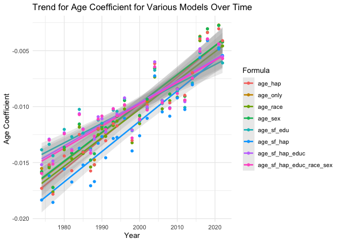
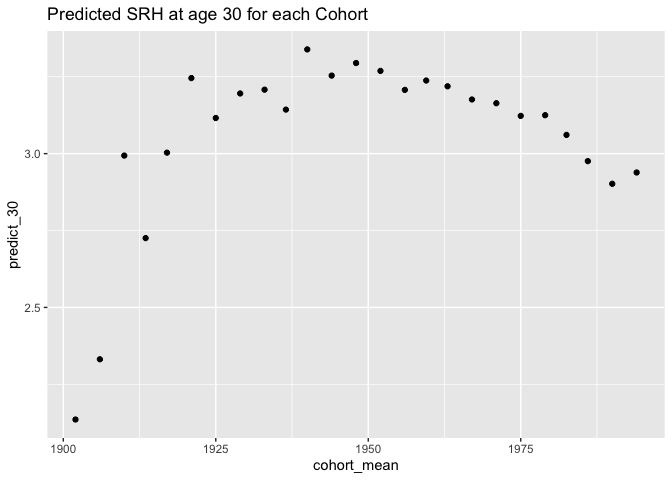

SRH - GSS with Survey Weights
================
Christine Lucille Kuryla
2024-11-29

Here’s a summary of the interesting findings from my analysis of
self-rated health in the GSS dataset so far.

See <https://github.com/clkuryla/self_rated_health/blob/main/gss_eda.md>
for more EDA and details.

- `health` The first variable of interest is “health”, which will be the
  main subject of our analysis:
  <https://gssdataexplorer.norc.org/variables/437/vshow>

Question on survey: “Would you say your own health, in general, is
excellent, good, fair, or poor?”

Coded in this analysis (it was recoded from the raw data) as: 4 -
Excellent 3 - Good 2 - Fair 1 - Poor

Other variables used are:

- `age`
  - Age of respondent at time of survey
- `year`
  - Year of survey
- `cohort`
  - Birth year of respondent

Additional covariates and analyses to come.

# Fetch, load, clean, and recode data

## Fetch GSS data

``` r
# Feel free to modify to play with more covariates and variables.

#install.packages('gssr', repos =  c('https://kjhealy.r-universe.dev', 'https://cloud.r-project.org'))
# install.packages('gssrdoc', repos = c('https://kjhealy.r-universe.dev', 'https://cloud.r-project.org'))

library(gssr)
library(gssrdoc)

data("gss_all") # this file is big! 

# It's a bit excessive to download the entire GSS dataset every time we knit, so lets just save some variables of interest and write it out for future use.

# Add 'wtss' and 'wtssall' to variable selection
data_gss <- as.data.frame(gss_all) %>% 
  select(
    year,      # Year of survey
    cohort,    # Birth year
    age,       # Age at time of survey
    health,    # Self-rated health
    sex,       # Sex
    happy,     # Self-rated happiness
    life,      # Is life exciting or dull (subjective wellbeing)
    educ,      # Years of education
    polviews,  # Political views
    class,     # Subjective class identification
    satfin,    # Satisfaction with financial situation
    region,    # region (south: 1 if 4<x<8, else 0)
    attend,    # attends religious services
    race,      # race
  #  vpsu,         # not available in gssr
  #  vstrat,       # not available in gssr
    wtssps,    # Weight for single-year analysis
    wtssall,    # Weight for multi-year analysis ** stops at 2018
    wtsscomp
  )

write_csv(data_gss, "data/extracted_gss_variables.csv")

# Note: GSSR does not provide vpsu and vstrat. Other data sources may provide it, and we will look into that eventually. 

# If found, update survey object to:
# gss_svy <- data_gss %>%
#   as_survey_design(
#     ids = vpsu,           # PSU identifiers
#     strata = vstrat,      # Stratification variable
#     weights = wtssall,    # Weight variable for multi-year analysis
#     nest = TRUE           # Important when PSUs are nested within strata
#   )

# instead of:
# gss_svy <- data_gss %>%
#   as_survey_design(
#     ids = 1,            # No clustering variable available
#     weights = wtssall
#   )
```

## Load and clean data

Here we’ll load our data, clean some unwanted values, and recode the
unintuitive variables.

``` r
data_gss <- read_csv("data/extracted_gss_variables.csv") %>% 
  filter(cohort != 9999) %>% 
  select(-c(attend, region, wtssps)) %>% 
  select(-wtssall) %>% 
  na.omit() %>% 
  mutate(health = 5 - health)  %>%  # reverse the coding so it's more intuitive (higher number for excellent, lower number for poor)
  mutate(happy = 4 - happy) %>% # same
  mutate(life = 4 - life) %>% # reverse again, these variables tend to be unintuitively ordered!!!
  mutate(satfin = 4 - satfin) # same again!
```

    ## Rows: 72390 Columns: 17
    ## ── Column specification ────────────────────────────────────────────────────────
    ## Delimiter: ","
    ## dbl (17): year, cohort, age, health, sex, happy, life, educ, polviews, class...
    ## 
    ## ℹ Use `spec()` to retrieve the full column specification for this data.
    ## ℹ Specify the column types or set `show_col_types = FALSE` to quiet this message.

``` r
# Create a survey design object using wtssall for multi-year analysis
gss_svy <- data_gss %>%
  as_survey_design(
    ids = 1,           # PSU identifiers (use 1 if not available)
    weights = wtsscomp  # wtssall pre 2018, wtsscomp combined //Use 'wtss' for single-year analysis
  )
```

# Self rated health as predicted by age over the years

Let’s explore the effect of different cohorts on SRH at certain ages.

## SRH vs year of survey for different ages

In the following figure, I cut the age of participants into 6 groups and
plotted the mean of the group’s self-rated health for each year (that’s
what each dot is). As you can qualitatively see, the spread seems to
narrow.

``` r
# Compute weighted mean of self-rated health
gss_svy %>%
  summarise(
    mean_health = survey_mean(health, na.rm = TRUE)
  )
```

    ## # A tibble: 1 × 2
    ##   mean_health mean_health_se
    ##         <dbl>          <dbl>
    ## 1        3.01        0.00476

``` r
# Create age groups
gss_svy <- gss_svy %>%
  mutate(age_group = cut(age, breaks = 6))

# Compute weighted mean health by age group and year
weighted_health_by_age <- gss_svy %>%
  group_by(age_group, year) %>%
  summarise(
    mean_health = survey_mean(health, na.rm = TRUE)
  )

ggplot(weighted_health_by_age, aes(x = year, y = mean_health, color = age_group)) +
#  geom_smooth(alpha = 0.2) +
  geom_line() +
  geom_point() +
  labs(
    title = "Average SRH Per Year for Each Age Group",
    subtitle = "GSS Dataset with Survey Weights",
    x = "Year",
    y = "Average Self-Rated Health",
    color = "Age Group"
  ) +
  theme_minimal()
```

<!-- -->

``` r
library(broom)
```

## Relationship of self-rated health to age, separated out by years

Well, it seems like the spread of self-rated health among ages decreases
as time goes on (later years). Let’s look at that by faceting mean
self-rated health vs age by year.

Note that intuitively, we’d expect it to be a negative slope because
older people intuitively should have worse health.

Notice *the slopes seem to flatten over time.*

``` r
# health vs age per year
gss_svy %>% 
  group_by(age, year) %>% 
  summarize(mean_health = survey_mean(health)) %>% 
  ggplot(aes(x = age, y = mean_health)) +
  geom_line(color = "cornflowerblue") +
  facet_wrap(~ year) +
  labs(title = "Self-Rated Health By Age (Per Year)",
       subtitle = "GSS Dataset",
       x = "Age of Respondent", 
       y = "Average SRH",
       )
```

<!-- -->

## Regress self-rated health on age, for each year

Let’s do a regression on each self-rated-health vs age, subsetted for
each year (the plots on the faceted figure), look at the significance,
and plot the coefficients for age with 95% CIs:

``` r
# Perform weighted regression for each year
weighted_lm_by_year <- gss_svy %>%
  group_by(year) %>%
  group_map_dfr(~ {
    model <- survey::svyglm(health ~ age, design = .x)
    tidy(model, conf.int = TRUE)
  }) %>%
  filter(term == "age") %>%
  select(year, estimate, std.error, conf.low, conf.high, statistic, p.value)

knitr::kable(weighted_lm_by_year)
```

| year |   estimate | std.error |   conf.low |  conf.high |   statistic |   p.value |
|-----:|-----------:|----------:|-----------:|-----------:|------------:|----------:|
| 1974 | -0.0162576 | 0.0013923 | -0.0189888 | -0.0135264 | -11.6772087 | 0.0000000 |
| 1976 | -0.0153437 | 0.0013915 | -0.0180735 | -0.0126140 | -11.0266993 | 0.0000000 |
| 1977 | -0.0165978 | 0.0014414 | -0.0194255 | -0.0137702 | -11.5147149 | 0.0000000 |
| 1980 | -0.0148499 | 0.0014124 | -0.0176204 | -0.0120793 | -10.5142389 | 0.0000000 |
| 1982 | -0.0131131 | 0.0013331 | -0.0157278 | -0.0104984 |  -9.8365275 | 0.0000000 |
| 1984 | -0.0116412 | 0.0012793 | -0.0141509 | -0.0091316 |  -9.0994768 | 0.0000000 |
| 1985 | -0.0133263 | 0.0013634 | -0.0160008 | -0.0106518 |  -9.7741957 | 0.0000000 |
| 1987 | -0.0147198 | 0.0014089 | -0.0174833 | -0.0119563 | -10.4476752 | 0.0000000 |
| 1988 | -0.0135863 | 0.0016130 | -0.0167519 | -0.0104207 |  -8.4232223 | 0.0000000 |
| 1989 | -0.0118074 | 0.0016600 | -0.0150653 | -0.0085496 |  -7.1127185 | 0.0000000 |
| 1990 | -0.0120111 | 0.0018014 | -0.0155467 | -0.0084755 |  -6.6677196 | 0.0000000 |
| 1991 | -0.0123522 | 0.0017411 | -0.0157691 | -0.0089352 |  -7.0944138 | 0.0000000 |
| 1993 | -0.0102449 | 0.0017231 | -0.0136261 | -0.0068637 |  -5.9457782 | 0.0000000 |
| 1994 | -0.0109859 | 0.0013048 | -0.0135449 | -0.0084269 |  -8.4197397 | 0.0000000 |
| 1996 | -0.0084866 | 0.0012731 | -0.0109836 | -0.0059896 |  -6.6659297 | 0.0000000 |
| 1998 | -0.0118071 | 0.0012854 | -0.0143283 | -0.0092860 |  -9.1853365 | 0.0000000 |
| 2000 | -0.0095507 | 0.0012262 | -0.0119557 | -0.0071458 |  -7.7889967 | 0.0000000 |
| 2002 | -0.0095386 | 0.0018269 | -0.0131242 | -0.0059530 |  -5.2212600 | 0.0000002 |
| 2004 | -0.0067199 | 0.0018910 | -0.0104314 | -0.0030084 |  -3.5535730 | 0.0004005 |
| 2006 | -0.0106615 | 0.0012775 | -0.0131669 | -0.0081561 |  -8.3456792 | 0.0000000 |
| 2008 | -0.0092987 | 0.0015285 | -0.0122974 | -0.0063000 |  -6.0834768 | 0.0000000 |
| 2010 | -0.0092143 | 0.0016415 | -0.0124349 | -0.0059938 |  -5.6133446 | 0.0000000 |
| 2012 | -0.0097592 | 0.0018730 | -0.0134339 | -0.0060845 |  -5.2104262 | 0.0000002 |
| 2014 | -0.0073203 | 0.0013986 | -0.0100635 | -0.0045770 |  -5.2339956 | 0.0000002 |
| 2016 | -0.0035268 | 0.0014066 | -0.0062857 | -0.0007680 |  -2.5073002 | 0.0122547 |
| 2018 | -0.0009525 | 0.0014777 | -0.0038511 |  0.0019461 |  -0.6445773 | 0.5193016 |
| 2021 | -0.0031010 | 0.0011090 | -0.0052757 | -0.0009263 |  -2.7962724 | 0.0052113 |
| 2022 | -0.0047472 | 0.0014373 | -0.0075660 | -0.0019284 |  -3.3027774 | 0.0009736 |

``` r
summary(weighted_lm_by_year)
```

    ##       year         estimate            std.error           conf.low        
    ##  Min.   :1974   Min.   :-0.0165978   Min.   :0.001109   Min.   :-0.019425  
    ##  1st Qu.:1986   1st Qu.:-0.0131664   1st Qu.:0.001326   1st Qu.:-0.015827  
    ##  Median :1995   Median :-0.0108237   Median :0.001411   Median :-0.013585  
    ##  Mean   :1997   Mean   :-0.0104115   Mean   :0.001483   Mean   :-0.013320  
    ##  3rd Qu.:2008   3rd Qu.:-0.0090324   3rd Qu.:0.001646   3rd Qu.:-0.011713  
    ##  Max.   :2022   Max.   :-0.0009525   Max.   :0.001891   Max.   :-0.003851  
    ##    conf.high           statistic           p.value         
    ##  Min.   :-0.013770   Min.   :-11.6772   Min.   :0.0000000  
    ##  1st Qu.:-0.010440   1st Qu.: -9.3326   1st Qu.:0.0000000  
    ##  Median :-0.008292   Median : -7.1036   Median :0.0000000  
    ##  Mean   :-0.007503   Mean   : -7.1324   Mean   :0.0192194  
    ##  3rd Qu.:-0.005980   3rd Qu.: -5.2308   3rd Qu.:0.0000002  
    ##  Max.   : 0.001946   Max.   : -0.6446   Max.   :0.5193016

``` r
# # with additinal covariates
# weighted_lm_by_year <- gss_svy %>%
#   group_by(year) %>%
#   group_map_dfr(~ {
#     model <- survey::svyglm(health ~ age + sex + educ + race + happy + class, design = .x)
#     tidy(model, conf.int = TRUE)
#   }) %>%
#   filter(term == "age") %>%
#   select(year, estimate, std.error, conf.low, conf.high, statistic, p.value)
# 
# summary(weighted_lm_by_year)
```

``` r
# Plot the coefficients with error bars
ggplot(weighted_lm_by_year, aes(x = year, y = estimate)) +
#  geom_line() +
  geom_point() +
  geom_errorbar(aes(ymin=conf.low, ymax=conf.high), width=.2,
                 position=position_dodge(0.05)) +
 # geom_ribbon(aes(ymin = conf.low, ymax = conf.high), alpha = 0.2) +
  labs(
    title = "Change in 'Age' Coefficient Over Years",
    subtitle = "GSS Dataset",
    x = "Year",
    y = "Coefficient of Age"
  ) +
  theme_minimal()
```

<!-- -->

``` r
# Regress the age coefficients on year
coef_model <- lm(estimate ~ year, data = weighted_lm_by_year)
summary(coef_model)
```

    ## 
    ## Call:
    ## lm(formula = estimate ~ year, data = weighted_lm_by_year)
    ## 
    ## Residuals:
    ##       Min        1Q    Median        3Q       Max 
    ## -0.003138 -0.001135  0.000049  0.001127  0.004149 
    ## 
    ## Coefficients:
    ##               Estimate Std. Error t value Pr(>|t|)    
    ## (Intercept) -5.162e-01  4.488e-02  -11.50 1.07e-11 ***
    ## year         2.533e-04  2.247e-05   11.27 1.67e-11 ***
    ## ---
    ## Signif. codes:  0 '***' 0.001 '**' 0.01 '*' 0.05 '.' 0.1 ' ' 1
    ## 
    ## Residual standard error: 0.001671 on 26 degrees of freedom
    ## Multiple R-squared:  0.8301, Adjusted R-squared:  0.8235 
    ## F-statistic:   127 on 1 and 26 DF,  p-value: 1.665e-11

``` r
# Plot the regression
ggplot(weighted_lm_by_year, aes(x = year, y = estimate)) +
  geom_point() +
  geom_errorbar(aes(ymin=conf.low, ymax=conf.high), width=.2,
                 position=position_dodge(0.05)) +
  geom_smooth(method = "lm", se = TRUE, alpha = 0.3) +
  labs(
    title = "Regression of 'Age' Coefficient Over Years",
    subtitle = "GSS Dataset",
    x = "Year",
    y = "Coefficient of Age"
  ) +
  theme_minimal()
```

    ## `geom_smooth()` using formula = 'y ~ x'

<!-- -->

``` r
summary(weighted_lm_by_year)
```

    ##       year         estimate            std.error           conf.low        
    ##  Min.   :1974   Min.   :-0.0165978   Min.   :0.001109   Min.   :-0.019425  
    ##  1st Qu.:1986   1st Qu.:-0.0131664   1st Qu.:0.001326   1st Qu.:-0.015827  
    ##  Median :1995   Median :-0.0108237   Median :0.001411   Median :-0.013585  
    ##  Mean   :1997   Mean   :-0.0104115   Mean   :0.001483   Mean   :-0.013320  
    ##  3rd Qu.:2008   3rd Qu.:-0.0090324   3rd Qu.:0.001646   3rd Qu.:-0.011713  
    ##  Max.   :2022   Max.   :-0.0009525   Max.   :0.001891   Max.   :-0.003851  
    ##    conf.high           statistic           p.value         
    ##  Min.   :-0.013770   Min.   :-11.6772   Min.   :0.0000000  
    ##  1st Qu.:-0.010440   1st Qu.: -9.3326   1st Qu.:0.0000000  
    ##  Median :-0.008292   Median : -7.1036   Median :0.0000000  
    ##  Mean   :-0.007503   Mean   : -7.1324   Mean   :0.0192194  
    ##  3rd Qu.:-0.005980   3rd Qu.: -5.2308   3rd Qu.:0.0000002  
    ##  Max.   : 0.001946   Max.   : -0.6446   Max.   :0.5193016

``` r
# Perform linear regression of 'coef' (age coefficient) vs 'year'
lm_coef_vs_year <- lm(estimate ~ year, data = weighted_lm_by_year)

# View the summary of the regression
summary(lm_coef_vs_year)
```

    ## 
    ## Call:
    ## lm(formula = estimate ~ year, data = weighted_lm_by_year)
    ## 
    ## Residuals:
    ##       Min        1Q    Median        3Q       Max 
    ## -0.003138 -0.001135  0.000049  0.001127  0.004149 
    ## 
    ## Coefficients:
    ##               Estimate Std. Error t value Pr(>|t|)    
    ## (Intercept) -5.162e-01  4.488e-02  -11.50 1.07e-11 ***
    ## year         2.533e-04  2.247e-05   11.27 1.67e-11 ***
    ## ---
    ## Signif. codes:  0 '***' 0.001 '**' 0.01 '*' 0.05 '.' 0.1 ' ' 1
    ## 
    ## Residual standard error: 0.001671 on 26 degrees of freedom
    ## Multiple R-squared:  0.8301, Adjusted R-squared:  0.8235 
    ## F-statistic:   127 on 1 and 26 DF,  p-value: 1.665e-11

``` r
srh_age_groups_point_line_figure <- function(age_cuts) {
# Create age groups
gss_svy %>%
  mutate(age_group = cut(age, breaks = age_cuts)) %>% # number of age groups
  group_by(age_group, year) %>% # Compute weighted mean health by age group and year
  summarise(
    mean_health = survey_mean(health, na.rm = TRUE)
  ) %>% 
ggplot(aes(x = year, y = mean_health, color = age_group)) +
#  geom_smooth(alpha = 0.2) +
  geom_line() +
  geom_point() +
  labs(
    title = "Average SRH Per Year for Each Age Group",
    subtitle = "GSS Dataset with Survey Weights",
    x = "Year",
    y = "Average Self-Rated Health",
    color = "Age Group"
  ) +
  theme_minimal()
}

srh_age_groups_loess_figure <- function(age_cuts) {
# Create age groups
gss_svy %>%
  mutate(age_group = cut(age, breaks = age_cuts)) %>% # number of age groups
  group_by(age_group, year) %>% # Compute weighted mean health by age group and year
  summarise(
    mean_health = survey_mean(health, na.rm = TRUE)
  ) %>% 
ggplot(aes(x = year, y = mean_health, color = age_group)) +
  geom_smooth(alpha = 0.4) +
#  geom_line() +
#  geom_point() +
  labs(
    title = "Average SRH Per Year for Each Age Group",
    subtitle = "GSS Dataset with Survey Weights",
    x = "Year",
    y = "Average Self-Rated Health",
    color = "Age Group"
  ) +
  theme_minimal()
}

srh_age_groups_point_line_figure(3)
```

<!-- -->

``` r
srh_age_groups_point_line_figure(4)
```

<!-- -->

``` r
srh_age_groups_point_line_figure(6)
```

<!-- -->

``` r
srh_age_groups_point_line_figure(10)
```

<!-- -->

``` r
srh_age_groups_loess_figure(3)
```

    ## `geom_smooth()` using method = 'loess' and formula = 'y ~ x'

<!-- -->

``` r
srh_age_groups_loess_figure(4)
```

    ## `geom_smooth()` using method = 'loess' and formula = 'y ~ x'

<!-- -->

``` r
srh_age_groups_loess_figure(6)
```

    ## `geom_smooth()` using method = 'loess' and formula = 'y ~ x'

<!-- -->

``` r
srh_age_groups_loess_figure(10)
```

    ## `geom_smooth()` using method = 'loess' and formula = 'y ~ x'

<!-- -->

# Cohort effect on SRH

## Generation splitting

``` r
data_gss_generations <- data_gss %>%
  filter(cohort > 1900) %>%
  mutate(
    generation = factor(
      case_when(
        cohort >= 1901 & cohort <= 1927 ~ "Greatest (1901-1927)",
        cohort >= 1928 & cohort <= 1945 ~ "Silent (1928-1945)",
        cohort >= 1946 & cohort <= 1964 ~ "Boomers (1946-1964)",
        cohort >= 1965 & cohort <= 1980 ~ "Gen X (1965-1980)",
        cohort >= 1981 & cohort <= 1996 ~ "Millennials (1981-1996)",
        cohort >= 1997 & cohort <= 2012 ~ "Gen Z (1997-2012)",
        TRUE ~ "Other"
      ),
      levels = c(
        "Greatest (1901-1927)",
        "Silent (1928-1945)",
        "Boomers (1946-1964)",
        "Gen X (1965-1980)",
        "Millennials (1981-1996)",
        "Gen Z (1997-2012)"#,
     #   "Other"
      )
    ),
    generation_two_sections = factor(
      case_when(
        generation == "Greatest (1901-1927)" & cohort <= 1914 ~ "Greatest Early (1901-1914)",
        generation == "Greatest (1901-1927)" & cohort > 1914 ~ "Greatest Late (1915-1927)",
        generation == "Silent (1928-1945)" & cohort <= 1936 ~ "Silent Early (1928-1936)",
        generation == "Silent (1928-1945)" & cohort > 1936 ~ "Silent Late (1937-1945)",
        generation == "Boomers (1946-1964)" & cohort <= 1955 ~ "Boomers Early (1946-1955)",
        generation == "Boomers (1946-1964)" & cohort > 1955 ~ "Boomers Late (1956-1964)",
        generation == "Gen X (1965-1980)" & cohort <= 1972 ~ "Gen X Early (1965-1972)",
        generation == "Gen X (1965-1980)" & cohort > 1972 ~ "Gen X Late (1973-1980)",
        generation == "Millennials (1981-1996)" & cohort <= 1988 ~ "Millennials Early (1981-1988)",
        generation == "Millennials (1981-1996)" & cohort > 1988 ~ "Millennials Late (1989-1996)",
        generation == "Gen Z (1997-2012)" & cohort <= 2004 ~ "Gen Z Early (1997-2004)",
        generation == "Gen Z (1997-2012)" & cohort > 2004 ~ "Gen Z Late (2005-2012)",
        TRUE ~ "Other"
      ),
      levels = c(
        "Greatest Early (1901-1914)", "Greatest Late (1915-1927)",
        "Silent Early (1928-1936)", "Silent Late (1937-1945)",
        "Boomers Early (1946-1955)", "Boomers Late (1956-1964)",
        "Gen X Early (1965-1972)", "Gen X Late (1973-1980)",
        "Millennials Early (1981-1988)", "Millennials Late (1989-1996)",
        "Gen Z Early (1997-2004)", "Gen Z Late (2005-2012)"#,
     #   "Other"
      )
    ),
    generation_three_sections = factor(
      case_when(
        generation == "Greatest (1901-1927)" & cohort <= 1910 ~ "Greatest Early (1901-1910)",
        generation == "Greatest (1901-1927)" & cohort > 1910 & cohort <= 1918 ~ "Greatest Mid (1911-1918)",
        generation == "Greatest (1901-1927)" & cohort > 1918 ~ "Greatest Late (1919-1927)",
        generation == "Silent (1928-1945)" & cohort <= 1934 ~ "Silent Early (1928-1934)",
        generation == "Silent (1928-1945)" & cohort > 1934 & cohort <= 1940 ~ "Silent Mid (1935-1940)",
        generation == "Silent (1928-1945)" & cohort > 1940 ~ "Silent Late (1941-1945)",
        generation == "Boomers (1946-1964)" & cohort <= 1951 ~ "Boomers Early (1946-1951)",
        generation == "Boomers (1946-1964)" & cohort > 1951 & cohort <= 1958 ~ "Boomers Mid (1952-1958)",
        generation == "Boomers (1946-1964)" & cohort > 1958 ~ "Boomers Late (1959-1964)",
        generation == "Gen X (1965-1980)" & cohort <= 1970 ~ "Gen X Early (1965-1970)",
        generation == "Gen X (1965-1980)" & cohort > 1970 & cohort <= 1976 ~ "Gen X Mid (1971-1976)",
        generation == "Gen X (1965-1980)" & cohort > 1976 ~ "Gen X Late (1977-1980)",
        generation == "Millennials (1981-1996)" & cohort <= 1986 ~ "Millennials Early (1981-1986)",
        generation == "Millennials (1981-1996)" & cohort > 1986 & cohort <= 1992 ~ "Millennials Mid (1987-1992)",
        generation == "Millennials (1981-1996)" & cohort > 1992 ~ "Millennials Late / Gen Z (1993-2004)",
    #    generation == "Gen Z (1997-2012)" & cohort <= 2002 ~ "Gen Z Early (1997-2002)",
    #    generation == "Gen Z (1997-2012)" & cohort > 2002 & cohort <= 2008 ~ "Gen Z Mid (2003-2008)",
    #    generation == "Gen Z (1997-2012)" & cohort > 2008 ~ "Gen Z Late (2009-2012)",
        TRUE ~ "Other"
      ),
      levels = c(
        "Greatest Early (1901-1910)", "Greatest Mid (1911-1918)", "Greatest Late (1919-1927)",
        "Silent Early (1928-1934)", "Silent Mid (1935-1940)", "Silent Late (1941-1945)",
        "Boomers Early (1946-1951)", "Boomers Mid (1952-1958)", "Boomers Late (1959-1964)",
        "Gen X Early (1965-1970)", "Gen X Mid (1971-1976)", "Gen X Late (1977-1980)",
        "Millennials Early (1981-1986)", "Millennials Mid (1987-1992)", 
        "Millennials Late / Gen Z (1993-2004)"
        #"Millennials Late (1993-1996)",
      #  "Gen Z Early (1997-2002)", "Gen Z Mid (2003-2008)", "Gen Z Late (2009-2012)" #,
      #  "Other"
      )
    )
  )


table(data_gss_generations$generation)
```

    ## 
    ##    Greatest (1901-1927)      Silent (1928-1945)     Boomers (1946-1964) 
    ##                    5660                    7874                   14989 
    ##       Gen X (1965-1980) Millennials (1981-1996)       Gen Z (1997-2012) 
    ##                    7197                    3478                     387

``` r
table(data_gss_generations$generation_two_sections)
```

    ## 
    ##    Greatest Early (1901-1914)     Greatest Late (1915-1927) 
    ##                          1845                          3815 
    ##      Silent Early (1928-1936)       Silent Late (1937-1945) 
    ##                          3293                          4581 
    ##     Boomers Early (1946-1955)      Boomers Late (1956-1964) 
    ##                          7994                          6995 
    ##       Gen X Early (1965-1972)        Gen X Late (1973-1980) 
    ##                          4222                          2975 
    ## Millennials Early (1981-1988)  Millennials Late (1989-1996) 
    ##                          2209                          1269 
    ##       Gen Z Early (1997-2004)        Gen Z Late (2005-2012) 
    ##                           387                             0

``` r
table(data_gss_generations$generation_three_sections)
```

    ## 
    ##           Greatest Early (1901-1910)             Greatest Mid (1911-1918) 
    ##                                 1074                                 1763 
    ##            Greatest Late (1919-1927)             Silent Early (1928-1934) 
    ##                                 2823                                 2462 
    ##               Silent Mid (1935-1940)              Silent Late (1941-1945) 
    ##                                 2556                                 2856 
    ##            Boomers Early (1946-1951)              Boomers Mid (1952-1958) 
    ##                                 4658                                 5932 
    ##             Boomers Late (1959-1964)              Gen X Early (1965-1970) 
    ##                                 4399                                 3370 
    ##                Gen X Mid (1971-1976)               Gen X Late (1977-1980) 
    ##                                 2435                                 1392 
    ##        Millennials Early (1981-1986)          Millennials Mid (1987-1992) 
    ##                                 1731                                 1242 
    ## Millennials Late / Gen Z (1993-2004) 
    ##                                  505

``` r
gss_svy_gen <- data_gss_generations %>%
  as_survey_design(ids = 1, weights = wtsscomp)
```

## Regression with age and cohorts

``` r
# Create cohort groups (e.g., decades)
data_gss <- data_gss %>%
  mutate(cohort_group = cut(cohort, breaks = seq(1900, 2010, by = 10), right = FALSE,
                            labels = paste(seq(1900, 2000, by = 10), seq(1909, 2009, by = 10), sep = "-")))

# Cohort groups by 15 years
data_gss_15 <- data_gss %>%
  mutate(cohort_15_yr = cut(cohort, breaks = seq(1900, 2010, by = 15), right = FALSE,
                            labels = paste(seq(1900, 2000, by = 15), 15 + seq(1900, 2000, by = 15), sep = "-")))

# Create cohort groups (e.g., decades)
data_gss_10 <- data_gss %>%
  mutate(cohort_10_yr = cut(cohort, breaks = seq(1900, 2010, by = 10), right = FALSE,
                            labels = paste(seq(1900, 2000, by = 10), seq(1909, 2009, by = 10), sep = "-")))

# # Cohort groups by 5 years
data_gss_5 <- data_gss %>%
  mutate(cohort_05_yr = cut(cohort, breaks = seq(1900, 2005, by = 5), right = FALSE,
                            labels = paste(seq(1900, 2000, by = 5), 5 + seq(1900, 2000, by = 5), sep = "-")))

# Update survey design object
gss_svy_5 <- data_gss_5 %>%
  as_survey_design(ids = 1, weights = wtsscomp)

gss_svy_10 <- data_gss_10 %>%
  as_survey_design(ids = 1, weights = wtsscomp)

gss_svy_15 <- data_gss_15 %>%
  as_survey_design(ids = 1, weights = wtsscomp)


# 15 year cohorts
# Regression including age and cohort_group
weighted_lm_cohort <- gss_svy_15 %>%
  svyglm(health ~ age + cohort_15_yr, design = .)
# Summarize the model
summary(weighted_lm_cohort)
```

    ## 
    ## Call:
    ## svyglm(formula = health ~ age + cohort_15_yr, design = .)
    ## 
    ## Survey design:
    ## Called via srvyr
    ## 
    ## Coefficients:
    ##                         Estimate Std. Error t value Pr(>|t|)    
    ## (Intercept)            3.4019367  0.0372832  91.246  < 2e-16 ***
    ## age                   -0.0114421  0.0003866 -29.597  < 2e-16 ***
    ## cohort_15_yr1915-1930  0.1198633  0.0282678   4.240 2.24e-05 ***
    ## cohort_15_yr1930-1945  0.2161928  0.0276888   7.808 5.96e-15 ***
    ## cohort_15_yr1945-1960  0.1881382  0.0282377   6.663 2.72e-11 ***
    ## cohort_15_yr1960-1975  0.1313907  0.0297725   4.413 1.02e-05 ***
    ## cohort_15_yr1975-1990 -0.0013720  0.0322937  -0.042   0.9661    
    ## cohort_15_yr1990-2005 -0.0985020  0.0406909  -2.421   0.0155 *  
    ## ---
    ## Signif. codes:  0 '***' 0.001 '**' 0.01 '*' 0.05 '.' 0.1 ' ' 1
    ## 
    ## (Dispersion parameter for gaussian family taken to be 0.6316425)
    ## 
    ## Number of Fisher Scoring iterations: 2

``` r
# 5 year cohorts
# Regression including age and cohort_group
weighted_lm_cohort <- gss_svy_10 %>%
  svyglm(health ~ age + cohort_10_yr, design = .)
# Summarize the model
summary(weighted_lm_cohort)
```

    ## 
    ## Call:
    ## svyglm(formula = health ~ age + cohort_10_yr, design = .)
    ## 
    ## Survey design:
    ## Called via srvyr
    ## 
    ## Coefficients:
    ##                        Estimate Std. Error t value Pr(>|t|)    
    ## (Intercept)            3.353919   0.045209  74.187  < 2e-16 ***
    ## age                   -0.011332   0.000394 -28.762  < 2e-16 ***
    ## cohort_10_yr1910-1919  0.082304   0.040141   2.050  0.04034 *  
    ## cohort_10_yr1920-1929  0.188522   0.038220   4.933 8.15e-07 ***
    ## cohort_10_yr1930-1939  0.228813   0.037833   6.048 1.48e-09 ***
    ## cohort_10_yr1940-1949  0.275482   0.037347   7.376 1.66e-13 ***
    ## cohort_10_yr1950-1959  0.222036   0.038042   5.837 5.37e-09 ***
    ## cohort_10_yr1960-1969  0.191611   0.038877   4.929 8.31e-07 ***
    ## cohort_10_yr1970-1979  0.110190   0.040473   2.723  0.00648 ** 
    ## cohort_10_yr1980-1989  0.018034   0.042495   0.424  0.67129    
    ## cohort_10_yr1990-1999 -0.070280   0.048522  -1.448  0.14751    
    ## cohort_10_yr2000-2009  0.021638   0.084116   0.257  0.79700    
    ## ---
    ## Signif. codes:  0 '***' 0.001 '**' 0.01 '*' 0.05 '.' 0.1 ' ' 1
    ## 
    ## (Dispersion parameter for gaussian family taken to be 0.630862)
    ## 
    ## Number of Fisher Scoring iterations: 2

``` r
# 10 year cohorts
# Regression including age and cohort_group
weighted_lm_cohort <- gss_svy_5 %>%
  svyglm(health ~ age + cohort_05_yr, design = .)
# Summarize the model
summary(weighted_lm_cohort)
```

    ## 
    ## Call:
    ## svyglm(formula = health ~ age + cohort_05_yr, design = .)
    ## 
    ## Survey design:
    ## Called via srvyr
    ## 
    ## Coefficients:
    ##                         Estimate Std. Error t value Pr(>|t|)    
    ## (Intercept)            3.4033845  0.0614797  55.358  < 2e-16 ***
    ## age                   -0.0114960  0.0003963 -29.011  < 2e-16 ***
    ## cohort_05_yr1905-1910 -0.0611931  0.0688489  -0.889 0.374114    
    ## cohort_05_yr1910-1915  0.0430549  0.0631251   0.682 0.495208    
    ## cohort_05_yr1915-1920  0.0451181  0.0601184   0.750 0.452966    
    ## cohort_05_yr1920-1925  0.1052336  0.0589241   1.786 0.074120 .  
    ## cohort_05_yr1925-1930  0.1888117  0.0584950   3.228 0.001248 ** 
    ## cohort_05_yr1930-1935  0.1903505  0.0580709   3.278 0.001047 ** 
    ## cohort_05_yr1935-1940  0.1873302  0.0578168   3.240 0.001196 ** 
    ## cohort_05_yr1940-1945  0.2612782  0.0570463   4.580 4.66e-06 ***
    ## cohort_05_yr1945-1950  0.2124023  0.0565566   3.756 0.000173 ***
    ## cohort_05_yr1950-1955  0.1975274  0.0570538   3.462 0.000536 ***
    ## cohort_05_yr1955-1960  0.1621000  0.0569009   2.849 0.004391 ** 
    ## cohort_05_yr1960-1965  0.1761242  0.0574420   3.066 0.002170 ** 
    ## cohort_05_yr1965-1970  0.1143016  0.0582019   1.964 0.049551 *  
    ## cohort_05_yr1970-1975  0.0871962  0.0591981   1.473 0.140771    
    ## cohort_05_yr1975-1980  0.0389816  0.0600851   0.649 0.516488    
    ## cohort_05_yr1980-1985  0.0126236  0.0611672   0.206 0.836496    
    ## cohort_05_yr1985-1990 -0.0734550  0.0630466  -1.165 0.243989    
    ## cohort_05_yr1990-1995 -0.1273632  0.0665119  -1.915 0.055513 .  
    ## cohort_05_yr1995-2000 -0.0966890  0.0759990  -1.272 0.203295    
    ## cohort_05_yr2000-2005 -0.0245228  0.0937844  -0.261 0.793724    
    ## ---
    ## Signif. codes:  0 '***' 0.001 '**' 0.01 '*' 0.05 '.' 0.1 ' ' 1
    ## 
    ## (Dispersion parameter for gaussian family taken to be 0.6301896)
    ## 
    ## Number of Fisher Scoring iterations: 2

``` r
# Function to plot this
  
cohort_age_interation_figure <- function(cohort_length_string) {
  
# Prepare data for the plot
coef_data <- broom::tidy(weighted_lm_cohort) %>%
  filter(term != "(Intercept)") %>%
  mutate(significant = ifelse(p.value < 0.05, "Significant", "Not Significant"),
         term = ifelse(grepl("cohort_group", term), gsub("cohort_group", "", term), term))

# Plot
ggplot(coef_data, aes(x = term, y = estimate, fill = significant)) +
  geom_bar(stat = "identity", position = position_dodge()) +
  geom_errorbar(aes(ymin = estimate - std.error, ymax = estimate + std.error), width = 0.2) +
  labs(
    title = "Cohort Effects on SRH",
    subtitle = cohort_length_string,
    x = "Term (Age or Cohort Birthyear Group)",
    y = "Coefficient Estimate",
    fill = "Significance"
  ) +
  theme_minimal() +
  theme(axis.text.x = element_text(angle = 45, hjust = 1))

}

# Plot for different cohort sizes

weighted_lm_cohort <- gss_svy_5 %>%
  mutate(cohort_group = cohort_05_yr) %>% 
  svyglm(health ~ age + cohort_group, design = .)
cohort_age_interation_figure("5-Year Cohorts")
```

<!-- -->

``` r
weighted_lm_cohort <- gss_svy_15 %>%
  mutate(cohort_group = cohort_15_yr) %>% 
  svyglm(health ~ age + cohort_group, design = .)
cohort_age_interation_figure("15-Year Cohorts")
```

<!-- -->

``` r
weighted_lm_cohort <- gss_svy_10 %>%
  mutate(cohort_group = cohort_10_yr) %>% 
  svyglm(health ~ age + cohort_group, design = .)
cohort_age_interation_figure("10-Year Cohorts")
```

<!-- -->

``` r
### Generations

library(ggplot2)
library(dplyr)
library(broom)

generation_age_interaction_figure <- function(cohort_length_string) {
  
  # Prepare data for the plot
  coef_data <- broom::tidy(weighted_lm_generation) %>%
    filter(term != "(Intercept)") %>%
    mutate(
      # Clean the term to remove "cohort_group" prefix if present
      term_cleaned = ifelse(grepl("cohort_group", term), gsub("cohort_group", "", term), term),
      # Extract the first year (numeric) from cohort terms or assign NA for "age"
      first_year = ifelse(term_cleaned == "age", NA, as.numeric(sub("-.*", "", term_cleaned))),
      # Add a numeric ordering key: assign 0 to "age" and the extracted year to cohort groups
      term_numeric = ifelse(term_cleaned == "age", 0, first_year),
      # Reorder terms based on the numeric ordering key
      term_ordered = reorder(term_cleaned, term_numeric),
      significant = ifelse(p.value < 0.05, "Significant", "Not Significant")
    )

  # Plot
  ggplot(coef_data, aes(x = term_ordered, y = estimate, fill = significant)) +
    geom_bar(stat = "identity", position = position_dodge()) +
    geom_errorbar(aes(ymin = estimate - std.error, ymax = estimate + std.error), width = 0.2) +
    labs(
      title = "Cohort Effects on SRH",
      subtitle = cohort_length_string,
      x = "Term (Age or Cohort Birthyear Group)",
      y = "Coefficient Estimate",
      fill = "Significance"
    ) +
    theme_minimal() +
    theme(axis.text.x = element_text(angle = 45, hjust = 1))
}

# Call the function with a sample subtitle
# generation_age_interaction_figure("Cohort Length: 10 Years")


library(ggplot2)
library(dplyr)
library(broom)

generation_age_interaction_figure <- function(cohort_length_string) {
  
  # Prepare data for the plot
  coef_data <- broom::tidy(weighted_lm_generation) %>%
    filter(term != "(Intercept)") %>%
    mutate(
      # Clean the term to remove "cohort_group" prefix if present
      term_cleaned = ifelse(grepl("cohort_group", term), gsub("cohort_group", "", term), term),
      # Extract the first year from cohort terms using regex (assign NA for "age")
      first_year = ifelse(term_cleaned == "age", NA, as.numeric(stringr::str_extract(term_cleaned, "^\\d{4}"))),
      # Add a numeric ordering key: assign 0 to "age" and use the extracted first year for cohorts
      term_numeric = ifelse(term_cleaned == "age", 0, first_year),
      # Reorder terms based on the numeric ordering key
      term_cleaned = factor(term_cleaned, levels = term_cleaned[order(term_numeric)]),
      significant = ifelse(p.value < 0.05, "Significant", "Not Significant")
    )

  # Plot
  ggplot(coef_data, aes(x = term_cleaned, y = estimate, fill = significant)) +
    geom_bar(stat = "identity", position = position_dodge()) +
    geom_errorbar(aes(ymin = estimate - std.error, ymax = estimate + std.error), width = 0.2) +
    labs(
      title = "Cohort Effects on SRH",
      subtitle = cohort_length_string,
      x = "Term (Age or Cohort Birthyear Group)",
      y = "Coefficient Estimate",
      fill = "Significance"
    ) +
    theme_minimal() +
    theme(axis.text.x = element_text(angle = 45, hjust = 1))
}

# Call the function with a sample subtitle
# cohort_age_interaction_figure("Cohort Length: 10 Years")


weighted_lm_generation <- gss_svy_gen %>% 
  mutate(cohort_group = generation_two_sections) %>% 
  svyglm(health ~ age + cohort_group, design = .)
generation_age_interaction_figure("Generations")
```

<!-- -->

``` r
weighted_lm_generation <- gss_svy_gen %>% 
  mutate(cohort_group = generation) %>% 
  svyglm(health ~ age + cohort_group, design = .)
generation_age_interaction_figure("Generations")
```

<!-- -->

``` r
weighted_lm_generation <- gss_svy_gen %>% 
  mutate(cohort_group = generation_three_sections) %>% 
  svyglm(health ~ age + cohort_group, design = .)
generation_age_interaction_figure("Generations")
```

<!-- -->

Positive coefficients indicate better SRH compared to the 1900-1909
cohort (reference group), adjusting for age.

- SRH improved significantly for cohorts born between 1920-1979, peaking
  in 1940-1949.
- Recent cohorts (1980-2009) show no significant change.

## Interaction terms between age and cohort

Does the impact of age on SRH differ across cohorts?

``` r
# Regression with interaction between age and cohort_group
weighted_lm_interaction <- gss_svy_10 %>%
  svyglm(health ~ age * cohort_group, design = .)

# Summarize the model
summary(weighted_lm_interaction)
```

    ## 
    ## Call:
    ## svyglm(formula = health ~ age * cohort_group, design = .)
    ## 
    ## Survey design:
    ## Called via srvyr
    ## 
    ## Coefficients:
    ##                            Estimate Std. Error t value Pr(>|t|)    
    ## (Intercept)                2.527966   0.403038   6.272 3.59e-10 ***
    ## age                       -0.000441   0.005268  -0.084  0.93329    
    ## cohort_group1910-1919      0.550393   0.444196   1.239  0.21532    
    ## cohort_group1920-1929      1.014147   0.416835   2.433  0.01498 *  
    ## cohort_group1930-1939      0.982004   0.408442   2.404  0.01621 *  
    ## cohort_group1940-1949      1.088229   0.404966   2.687  0.00721 ** 
    ## cohort_group1950-1959      1.048517   0.404125   2.595  0.00948 ** 
    ## cohort_group1960-1969      1.018214   0.404499   2.517  0.01183 *  
    ## cohort_group1970-1979      1.101385   0.406764   2.708  0.00678 ** 
    ## cohort_group1980-1989      0.834068   0.412740   2.021  0.04331 *  
    ## cohort_group1990-1999      0.962163   0.446666   2.154  0.03124 *  
    ## cohort_group2000-2009      2.665718   1.028332   2.592  0.00954 ** 
    ## age:cohort_group1910-1919 -0.005754   0.005897  -0.976  0.32916    
    ## age:cohort_group1920-1929 -0.010886   0.005520  -1.972  0.04859 *  
    ## age:cohort_group1930-1939 -0.009619   0.005391  -1.784  0.07443 .  
    ## age:cohort_group1940-1949 -0.010625   0.005328  -1.994  0.04615 *  
    ## age:cohort_group1950-1959 -0.010903   0.005317  -2.051  0.04030 *  
    ## age:cohort_group1960-1969 -0.010908   0.005346  -2.040  0.04132 *  
    ## age:cohort_group1970-1979 -0.015872   0.005509  -2.881  0.00396 ** 
    ## age:cohort_group1980-1989 -0.010553   0.006033  -1.749  0.08027 .  
    ## age:cohort_group1990-1999 -0.019304   0.009233  -2.091  0.03655 *  
    ## age:cohort_group2000-2009 -0.101247   0.047649  -2.125  0.03361 *  
    ## ---
    ## Signif. codes:  0 '***' 0.001 '**' 0.01 '*' 0.05 '.' 0.1 ' ' 1
    ## 
    ## (Dispersion parameter for gaussian family taken to be 0.6302452)
    ## 
    ## Number of Fisher Scoring iterations: 2

``` r
# Visualize the interaction
library(ggplot2)
# Create a dataset for predictions
new_data <- expand.grid(
  age = seq(min(data_gss$age), max(data_gss$age), by = 1),
  cohort_group = levels(data_gss$cohort_group)
)

# Predict SRH

predictions <- as.data.frame(predict(weighted_lm_interaction, newdata = new_data, type = "response", se = TRUE))
new_data$predicted_health <- predictions$response
new_data$se <- predictions$SE


# Plot
ggplot(new_data, aes(x = age, y = predicted_health, color = cohort_group)) +
  geom_line() +
  labs(
    title = "Predicted SRH by Age and Cohort",
    x = "Age",
    y = "Predicted Self-Rated Health",
    color = "Cohort Group"
  ) +
  theme_minimal()
```

<!-- -->

``` r
library(dplyr)
library(broom)
library(ggplot2)

# Extract coefficients
coef_data <- broom::tidy(weighted_lm_interaction) %>%
  filter(term %in% grep("age:cohort_group", term, value = TRUE)) %>%
  mutate(
    cohort_group = gsub("age:cohort_group", "", term),
    significant = ifelse(p.value < 0.05, "Significant", "Not Significant")
  )

# Generate predictions for each cohort group
library(ggeffects)
predictions <- ggpredict(weighted_lm_cohort, terms = c("age", "cohort_group"))

# Plot predictions
ggplot(predictions, aes(x = x, y = predicted, color = group)) +
  geom_line(size = 1) +
  labs(
    title = "Interaction of Age and Cohort Group on Self-Rated Health",
    x = "Age",
    y = "Predicted SRH",
    color = "Cohort Group"
  ) +
  theme_minimal()

# Plot interaction coefficients
ggplot(coef_data, aes(x = cohort_group, y = estimate, fill = significant)) +
  geom_bar(stat = "identity", position = position_dodge()) +
  geom_errorbar(aes(ymin = estimate - std.error, ymax = estimate + std.error), width = 0.2) +
  labs(
    title = "Interaction Effects of Age and Cohort Group on SRH",
    x = "Cohort Group",
    y = "Interaction Coefficient (Age Effect)",
    fill = "Significance"
  ) +
  theme_minimal() +
  theme(axis.text.x = element_text(angle = 45, hjust = 1))
```

“Age and Cohort Interaction Effects on Self-Rated Health (SRH)”

Key Findings:

Higher Baseline SRH for Later Cohorts:

Cohorts born between 1920-2009 report significantly higher SRH compared
to the 1900-1909 cohort. The 2000-2009 cohort shows the highest baseline
SRH but also the most variability. Steeper Age-Related Declines in SRH
for Recent Cohorts:

The effect of age on SRH becomes progressively more negative in later
cohorts. Individuals in the 2000-2009 cohort experience the steepest
decline in SRH as they age. Mid-Century Cohorts Show Moderate Trends:

Cohorts born between 1940-1969 exhibit improved SRH at younger ages with
moderate age-related declines. Implications for Public Health:

The steeper decline in SRH with age for more recent cohorts may reflect
generational challenges, such as lifestyle changes, chronic disease
prevalence, or systemic health inequities. Strategies to support health
across the lifespan may need to account for these emerging disparities.

# Incorporating covariates

``` r
gss_svy <- gss_svy %>% 
  mutate(sex = as.factor(sex),
         race = as.factor(race))

# Load libraries
library(dplyr)
library(tidyr)
library(purrr)
library(broom)
library(ggplot2)

formulas <- list(
  age_only = health ~ age,
  age_race = health ~ age + race,
  age_sex = health ~ age + sex,
  age_hap = health ~ age + happy,
  age_sf_edu = health ~ age + satfin + educ,
  age_sf_hap = health ~ age + satfin + happy,
  age_sf_hap_educ = health ~ age + happy + satfin + educ,
  age_sf_hap_educ_race_sex = health ~ age + happy + satfin + educ + race + sex
)

# Get a vector of unique years
years <- sort(unique(data_gss$year))

# Create a data frame of all combinations
formula_df <- expand.grid(formula_name = names(formulas), year = years, stringsAsFactors = FALSE)

# Run regressions and extract results
results <- formula_df %>%
  mutate(
    formula = formulas[formula_name],
    data = map(year, ~ filter(data_gss, year == .x)),
    model = map2(formula, data, ~ lm(.x, data = .y)),
    tidy = map(model, tidy),
    glance = map(model, glance)
  )

# Extract coefficients
coefficients_df <- results %>%
  unnest(tidy)

# Extract model summary statistics
model_stats_df <- results %>%
  unnest(glance)

# Focus on age coefficient
age_coefficients <- coefficients_df %>%
  filter(term == "age") %>%
  select(formula_name, year, estimate, std.error, statistic, p.value)

# Regress Age Coefficient Over Time
#For each formula, regress the age coefficient over time to analyze the trend:

age_coeff_trend <- age_coefficients %>%
  group_by(formula_name) %>%
  nest() %>%
  mutate(
    trend_model = map(data, ~ lm(estimate ~ year, data = .x)),
    trend_tidy = map(trend_model, tidy),
    trend_glance = map(trend_model, glance)
  )

# Extract trend summary statistics
trend_summary <- age_coeff_trend %>%
  unnest(trend_glance) %>%
  select(formula_name, r.squared, adj.r.squared, p.value, statistic)

# Merge age coefficients with trend summary
final_results <- age_coefficients %>%
  left_join(trend_summary, by = "formula_name") %>%
  arrange(formula_name, year)

# Summary table
# Assuming 'age_coeff_trend' is from the previous analysis

# Extract trend statistics for each formula
trend_stats <- age_coeff_trend %>%
  mutate(
    trend_summary = map(trend_model, ~ {
      model <- .x
      summary <- summary(model)
      slope <- coef(summary)["year", "Estimate"]
      std_error <- coef(summary)["year", "Std. Error"]
      p_value <- coef(summary)["year", "Pr(>|t|)"]
      conf_int <- confint(model)["year", ]
      r_squared <- summary$r.squared
      
      tibble(
        slope = slope,
        std_error = std_error,
        ci_lower = conf_int[1],
        ci_upper = conf_int[2],
        p_value = p_value,
        r_squared = r_squared
      )
    })
  ) %>%
  unnest(trend_summary) %>%
  select(formula_name, slope, std_error, ci_lower, ci_upper, p_value, r_squared)

trend_stats
```

    ## # A tibble: 8 × 7
    ## # Groups:   formula_name [8]
    ##   formula_name              slope std_error ci_lower ci_upper  p_value r_squared
    ##   <chr>                     <dbl>     <dbl>    <dbl>    <dbl>    <dbl>     <dbl>
    ## 1 age_only                2.59e-4 0.0000186 0.000221 0.000297 1.46e-13     0.882
    ## 2 age_race                2.55e-4 0.0000201 0.000214 0.000297 1.18e-12     0.861
    ## 3 age_sex                 2.57e-4 0.0000183 0.000220 0.000295 1.08e-13     0.884
    ## 4 age_hap                 2.76e-4 0.0000197 0.000235 0.000316 1.26e-13     0.883
    ## 5 age_sf_edu              1.75e-4 0.0000183 0.000137 0.000213 5.23e-10     0.779
    ## 6 age_sf_hap              2.72e-4 0.0000195 0.000232 0.000312 1.35e-13     0.882
    ## 7 age_sf_hap_educ         1.94e-4 0.0000189 0.000155 0.000233 1.23e-10     0.802
    ## 8 age_sf_hap_educ_race_s… 1.96e-4 0.0000192 0.000157 0.000236 1.26e-10     0.802

``` r
knitr::kable(trend_stats)
```

| formula_name | slope | std_error | ci_lower | ci_upper | p_value | r_squared |
|:---|---:|---:|---:|---:|---:|---:|
| age_only | 0.0002587 | 1.86e-05 | 0.0002205 | 0.0002969 | 0 | 0.8817269 |
| age_race | 0.0002554 | 2.01e-05 | 0.0002141 | 0.0002967 | 0 | 0.8611491 |
| age_sex | 0.0002574 | 1.83e-05 | 0.0002199 | 0.0002950 | 0 | 0.8843667 |
| age_hap | 0.0002758 | 1.97e-05 | 0.0002353 | 0.0003163 | 0 | 0.8830194 |
| age_sf_edu | 0.0001749 | 1.83e-05 | 0.0001374 | 0.0002125 | 0 | 0.7789653 |
| age_sf_hap | 0.0002719 | 1.95e-05 | 0.0002319 | 0.0003119 | 0 | 0.8824042 |
| age_sf_hap_educ | 0.0001941 | 1.89e-05 | 0.0001552 | 0.0002330 | 0 | 0.8020235 |
| age_sf_hap_educ_race_sex | 0.0001964 | 1.92e-05 | 0.0001570 | 0.0002357 | 0 | 0.8016183 |

``` r
ggplot(age_coefficients, aes(x = year, y = estimate, color = formula_name)) +
  geom_line() +
#  geom_smooth(method = "lm", alpha = 0.2) +
  geom_point() +
  labs(
    title = "Age Coefficient for Various Models Over Time",
    x = "Year",
    y = "Age Coefficient",
    color = "Formula"
  ) +
  theme_minimal()
```

<!-- -->

``` r
ggplot(age_coefficients, aes(x = year, y = estimate, color = formula_name)) +
 # geom_line() +
  geom_smooth(method = "lm", alpha = 0.2) +
  geom_point() +
  labs(
    title = "Trend for Age Coefficient for Various Models Over Time",
    x = "Year",
    y = "Age Coefficient",
    color = "Formula"
  ) +
  theme_minimal()
```

    ## `geom_smooth()` using formula = 'y ~ x'

<!-- -->

# Cohort Effects

## Visualize age profiles by cohort

First let’s visualize potential cohort effects.

``` r
gss_svy_15 %>% 
  mutate(cohort = cohort_15_yr) %>% 
#  mutate(cohort = cut(cohort, breaks = 7)) %>% # Create cohorts with 6 breaks
  group_by(age, cohort) %>% 
  summarize(mean_health = survey_mean(health, na.rm = TRUE)) %>% 
  ggplot(aes(x = age, y = mean_health, color = cohort)) +
  labs(title = "Age Profiles by Cohort") +
  geom_line()
```

<!-- -->

``` r
gss_svy_gen %>% 
  mutate(cohort = generation_two_sections) %>% 
#  mutate(cohort = cut(cohort, breaks = 7)) %>% # Create cohorts with 6 breaks
  group_by(age, cohort) %>% 
  summarize(mean_health = survey_mean(health, na.rm = TRUE)) %>% 
  ggplot(aes(x = age, y = mean_health, color = cohort)) +
  labs(title = "Age Profiles by Cohort") +
 # geom_smooth()
  geom_line()
```

<!-- -->

## Model srh vs age for each cohort and plot the betas and predicted age values

Let’s try to see why the oldest cohort line sort of looks like it lines
up with the youngest by modeling the trend of srh vs age (seems linear)
and comparing the expected mean health rating at 20, 40, and 60 years of
age for the different cohorts, as well as the coefficient.

``` r
library(dplyr)
library(purrr)
library(srvyr)
library(broom)

lm_health_v_age_cohorts <- gss_svy %>%
  filter(cohort >= 1900 & cohort <= 1996) %>% 
  mutate(cohort_cut = cut(cohort, breaks = 25)) %>%  # Create cohort categories
  group_by(cohort_cut) %>%
  summarise(
    data = list(cur_data()) # Nest data for each cohort group
  ) %>%
  mutate(
    # Fit a weighted model for each cohort using the survey design
    model = map(data, ~ svyglm(health ~ age, design = as_survey_design(.x, weights = wtsscomp))),
    # Predict SRH at specific ages
    predict_20 = map2_dbl(model, data, ~ predict(.x, newdata = tibble(age = 20))),
    predict_25 = map2_dbl(model, data, ~ predict(.x, newdata = tibble(age = 25))),
    predict_30 = map2_dbl(model, data, ~ predict(.x, newdata = tibble(age = 30))),
    predict_35 = map2_dbl(model, data, ~ predict(.x, newdata = tibble(age = 35))),
    predict_40 = map2_dbl(model, data, ~ predict(.x, newdata = tibble(age = 40))),
    predict_45 = map2_dbl(model, data, ~ predict(.x, newdata = tibble(age = 45))),
    predict_50 = map2_dbl(model, data, ~ predict(.x, newdata = tibble(age = 50))),
    predict_55 = map2_dbl(model, data, ~ predict(.x, newdata = tibble(age = 55))),
    predict_65 = map2_dbl(model, data, ~ predict(.x, newdata = tibble(age = 65))),
    predict_70 = map2_dbl(model, data, ~ predict(.x, newdata = tibble(age = 70))),
    predict_75 = map2_dbl(model, data, ~ predict(.x, newdata = tibble(age = 75))),
    predict_80 = map2_dbl(model, data, ~ predict(.x, newdata = tibble(age = 80))),
    # Extract the coefficient (beta) and standard error
    beta = map_dbl(model, ~ coef(.x)["age"]),
    se = map_dbl(model, ~ broom::tidy(.x) %>% filter(term == "age") %>% pull(std.error)),
    # Calculate the mean cohort year
    cohort_mean = map_dbl(cohort_cut, ~ mean(as.numeric(stringr::str_extract_all(.x, "\\d+")[[1]])))
  )
```

    ## Warning: There was 1 warning in `dplyr::summarise()`.
    ## ℹ In argument: `data = list(cur_data())`.
    ## ℹ In group 1: `cohort_cut = "(1900,1904]"`.
    ## Caused by warning:
    ## ! `cur_data()` was deprecated in dplyr 1.1.0.
    ## ℹ Please use `pick()` instead.

``` r
# View the results
print(lm_health_v_age_cohorts)
```

    ## # A tibble: 25 × 18
    ##    cohort_cut  data     model    predict_20 predict_25 predict_30 predict_35
    ##    <fct>       <list>   <list>        <dbl>      <dbl>      <dbl>      <dbl>
    ##  1 (1900,1904] <tibble> <svyglm>       1.86       1.92       1.97       2.02
    ##  2 (1904,1908] <tibble> <svyglm>       2.30       2.32       2.34       2.35
    ##  3 (1908,1912] <tibble> <svyglm>       3.11       3.06       3.01       2.96
    ##  4 (1912,1915] <tibble> <svyglm>       2.68       2.68       2.67       2.67
    ##  5 (1915,1919] <tibble> <svyglm>       3.07       3.03       2.99       2.94
    ##  6 (1919,1923] <tibble> <svyglm>       3.37       3.30       3.23       3.16
    ##  7 (1923,1927] <tibble> <svyglm>       3.19       3.15       3.11       3.07
    ##  8 (1927,1931] <tibble> <svyglm>       3.31       3.26       3.21       3.16
    ##  9 (1931,1935] <tibble> <svyglm>       3.32       3.27       3.22       3.16
    ## 10 (1935,1938] <tibble> <svyglm>       3.22       3.18       3.14       3.11
    ## # ℹ 15 more rows
    ## # ℹ 11 more variables: predict_40 <dbl>, predict_45 <dbl>, predict_50 <dbl>,
    ## #   predict_55 <dbl>, predict_65 <dbl>, predict_70 <dbl>, predict_75 <dbl>,
    ## #   predict_80 <dbl>, beta <dbl>, se <dbl>, cohort_mean <dbl>

``` r
# Plot the coefficient (beta) for SRH vs Age for each cohort
lm_health_v_age_cohorts %>%
  ggplot(aes(x = cohort_mean, y = beta)) +
  geom_errorbar(aes(ymin = beta - 1.96 * se, ymax = beta + 1.96 * se), width = 0.2) +
  labs(
    title = "Estimate for Coefficient for SRH vs Age for each Cohort",
    x = "Birth Year",
    y = "Coefficient"
  ) +
  geom_point()
```

<!-- -->

``` r
# Plot predicted SRH at age 20 for each cohort
lm_health_v_age_cohorts %>%
  ggplot(aes(x = cohort_mean, y = predict_20)) +
  labs(
    title = "Predicted SRH at age 20 for each Cohort",
    x = "Birth Year",
    y = "Predicted SRH"
  ) +
  geom_point()
```

<!-- -->

``` r
ggplot(lm_health_v_age_cohorts, aes(x = cohort_mean, y = predict_30)) +
  labs(title = "Predicted SRH at age 30 for each Cohort") +
  geom_point()
```

<!-- -->

``` r
  ggplot(lm_health_v_age_cohorts, aes(x = cohort_mean, y = predict_65)) +
  labs(title = "Predicted SRH at age 40 for each Cohort") +
  geom_point()
```

<!-- -->

``` r
# Plot many ages
  
# Reshape the data: gather all the prediction columns into one long format
lm_health_long <- lm_health_v_age_cohorts %>%
  pivot_longer(cols = starts_with("predict"), 
               names_to = "prediction_age", 
               values_to = "predicted_srh")

# Create the plot using the long data format
p <- ggplot(lm_health_long, aes(x = cohort_mean, y = predicted_srh)) +
  geom_point() +
  facet_wrap(~prediction_age, ncol = 4) +  # Facet by the different predictions (predict_20, predict_25, etc.)
  labs(
    title = "Predicted Self-Rated Health at Various Ages for Each Cohort",
    x = "Cohort Mean",
    y = "Predicted Self-Rated Health"
  )

# Display the combined plot
print(p)
```

<!-- -->

# Facet by cohort
