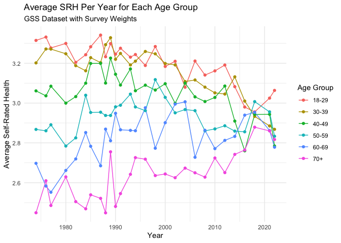
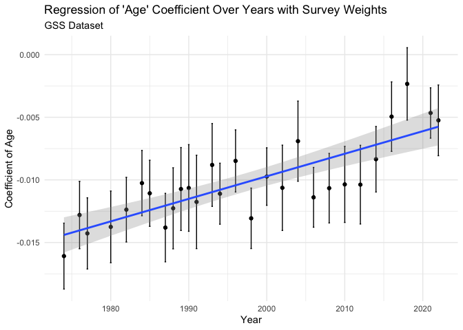

SRH - GSS with Survey Weights
================
Christine Lucille Kuryla
2024-11-29

Here’s a summary of the interesting findings from my analysis of
self-rated health in the GSS dataset so far.

See <https://github.com/clkuryla/self_rated_health/blob/main/gss_eda.md>
for more EDA and details.

- `health` The first variable of interest is “health”, which will be the
  main subject of our analysis:
  <https://gssdataexplorer.norc.org/variables/437/vshow>

Question on survey: “Would you say your own health, in general, is
excellent, good, fair, or poor?”

Coded in this analysis (it was recoded from the raw data) as: 4 -
Excellent 3 - Good 2 - Fair 1 - Poor

Other variables used are:

- `age`
  - Age of respondent at time of survey
- `year`
  - Year of survey
- `cohort`
  - Birth year of respondent

Additional covariates and analyses to come.

# Fetch, load, clean, and recode data

## Fetch GSS data

``` r
# Feel free to modify to play with more covariates and variables.

#install.packages('gssr', repos =  c('https://kjhealy.r-universe.dev', 'https://cloud.r-project.org'))
# install.packages('gssrdoc', repos = c('https://kjhealy.r-universe.dev', 'https://cloud.r-project.org'))

library(gssr)
library(gssrdoc)

data("gss_all") # this file is big! 

# It's a bit excessive to download the entire GSS dataset every time we knit, so lets just save some variables of interest and write it out for future use.

# Add 'wtss' and 'wtssall' to variable selection
data_gss <- as.data.frame(gss_all) %>% 
  select(
    year,      # Year of survey
    cohort,    # Birth year
    age,       # Age at time of survey
    health,    # Self-rated health
    sex,       # Sex
    happy,     # Self-rated happiness
    life,      # Is life exciting or dull (subjective wellbeing)
    educ,      # Years of education
    polviews,  # Political views
    class,     # Subjective class identification
    satfin,    # Satisfaction with financial situation
    region,    # region (south: 1 if 4<x<8, else 0)
    attend,    # attends religious services
    race,      # race
  #  vpsu,         # not available in gssr
  #  vstrat,       # not available in gssr
    wtssps,    # Weight for single-year analysis
    wtssall    # Weight for multi-year analysis
  )

write_csv(data_gss, "data/extracted_gss_variables.csv")

# Note: GSSR does not provide vpsu and vstrat. Other data sources may provide it, and we will look into that eventually. 

# If found, update survey object to:
# gss_svy <- data_gss %>%
#   as_survey_design(
#     ids = vpsu,           # PSU identifiers
#     strata = vstrat,      # Stratification variable
#     weights = wtssall,    # Weight variable for multi-year analysis
#     nest = TRUE           # Important when PSUs are nested within strata
#   )

# instead of:
# gss_svy <- data_gss %>%
#   as_survey_design(
#     ids = 1,            # No clustering variable available
#     weights = wtssall
#   )
```

## Load and clean data

Here we’ll load our data, clean some unwanted values, and recode the
unintuitive variables.

``` r
data_gss <- read_csv("data/extracted_gss_variables.csv") %>% 
  filter(cohort != 9999) %>% 
  na.omit() %>% 
  mutate(health = 5 - health)  %>%  # reverse the coding so it's more intuitive (higher number for excellent, lower number for poor)
  mutate(happy = 4 - happy) %>% # same
  mutate(life = 4 - life) %>% # reverse again, these variables tend to be unintuitively ordered!!!
  mutate(satfin = 4 - satfin) # same again!
```

    ## Rows: 72390 Columns: 16
    ## ── Column specification ────────────────────────────────────────────────────────
    ## Delimiter: ","
    ## dbl (16): year, cohort, age, health, sex, happy, life, educ, polviews, class...
    ## 
    ## ℹ Use `spec()` to retrieve the full column specification for this data.
    ## ℹ Specify the column types or set `show_col_types = FALSE` to quiet this message.

``` r
# Create a survey design object using wtssall for multi-year analysis
gss_svy <- data_gss %>%
  as_survey_design(
    ids = 1,           # PSU identifiers (use 1 if not available)
    weights = wtssall  # Use 'wtss' for single-year analysis
  )


# Compute weighted mean of self-rated health
gss_svy %>%
  summarise(
    mean_health = survey_mean(health, na.rm = TRUE)
  )
```

    ## # A tibble: 1 × 2
    ##   mean_health mean_health_se
    ##         <dbl>          <dbl>
    ## 1        3.03        0.00481

``` r
# Create age groups
gss_svy <- gss_svy %>%
  mutate(age_group = cut(age, breaks = 5))

# Compute weighted mean health by age group and year
weighted_health_by_age <- gss_svy %>%
  group_by(age_group, year) %>%
  summarise(
    mean_health = survey_mean(health, na.rm = TRUE)
  )

ggplot(weighted_health_by_age, aes(x = year, y = mean_health, color = age_group)) +
#  geom_smooth() +
  geom_line() +
  geom_point() +
  labs(
    title = "Average SRH Per Year for Each Age Group",
    subtitle = "GSS Dataset with Survey Weights",
    x = "Year",
    y = "Average Self-Rated Health",
    color = "Age Group"
  ) +
  theme_minimal()
```

<!-- -->

``` r
library(broom)


# Perform weighted regression for each year
weighted_lm_by_year <- gss_svy %>%
  group_by(year) %>%
  group_map_dfr(~ {
    model <- survey::svyglm(health ~ age, design = .x)
    tidy(model, conf.int = TRUE)
  }) %>%
  filter(term == "age") %>%
  select(year, estimate, std.error, conf.low, conf.high, statistic, p.value)

# with additinal covariates
weighted_lm_by_year <- gss_svy %>%
  group_by(year) %>%
  group_map_dfr(~ {
    model <- survey::svyglm(health ~ age + sex + educ + race + happy + class, design = .x)
    tidy(model, conf.int = TRUE)
  }) %>%
  filter(term == "age") %>%
  select(year, estimate, std.error, conf.low, conf.high, statistic, p.value)

summary(weighted_lm_by_year)
```

    ##       year         estimate           std.error           conf.low        
    ##  Min.   :1974   Min.   :-0.016092   Min.   :0.001156   Min.   :-0.018725  
    ##  1st Qu.:1986   1st Qu.:-0.012274   1st Qu.:0.001309   1st Qu.:-0.015240  
    ##  Median :1994   Median :-0.010559   Median :0.001386   Median :-0.013316  
    ##  Mean   :1995   Mean   :-0.010560   Mean   :0.001418   Mean   :-0.013341  
    ##  3rd Qu.:2006   3rd Qu.:-0.009325   3rd Qu.:0.001582   3rd Qu.:-0.012256  
    ##  Max.   :2018   Max.   :-0.004429   Max.   :0.001786   Max.   :-0.007127  
    ##    conf.high           statistic          p.value         
    ##  Min.   :-0.013459   Min.   :-11.989   Min.   :0.000e+00  
    ##  1st Qu.:-0.009541   1st Qu.: -9.239   1st Qu.:0.000e+00  
    ##  Median :-0.007709   Median : -7.487   Median :0.000e+00  
    ##  Mean   :-0.007779   Mean   : -7.551   Mean   :5.368e-05  
    ##  3rd Qu.:-0.006295   3rd Qu.: -6.111   3rd Qu.:1.400e-09  
    ##  Max.   :-0.001731   Max.   : -3.220   Max.   :1.311e-03

``` r
# Plot the coefficients with confidence intervals
ggplot(weighted_lm_by_year, aes(x = year, y = estimate)) +
  geom_line() +
  geom_point() +
  geom_ribbon(aes(ymin = conf.low, ymax = conf.high), alpha = 0.2) +
  labs(
    title = "Change in 'Age' Coefficient Over Years with Survey Weights",
    subtitle = "GSS Dataset",
    x = "Year",
    y = "Coefficient of Age"
  ) +
  theme_minimal()
```

<!-- -->

``` r
# Regress the age coefficients on year
coef_model <- lm(estimate ~ year, data = weighted_lm_by_year)
summary(coef_model)
```

    ## 
    ## Call:
    ## lm(formula = estimate ~ year, data = weighted_lm_by_year)
    ## 
    ## Residuals:
    ##        Min         1Q     Median         3Q        Max 
    ## -0.0033509 -0.0012618 -0.0001994  0.0011584  0.0029980 
    ## 
    ## Coefficients:
    ##               Estimate Std. Error t value Pr(>|t|)    
    ## (Intercept) -3.408e-01  5.280e-02  -6.455 1.12e-06 ***
    ## year         1.655e-04  2.646e-05   6.256 1.82e-06 ***
    ## ---
    ## Signif. codes:  0 '***' 0.001 '**' 0.01 '*' 0.05 '.' 0.1 ' ' 1
    ## 
    ## Residual standard error: 0.001722 on 24 degrees of freedom
    ## Multiple R-squared:  0.6198, Adjusted R-squared:  0.604 
    ## F-statistic: 39.13 on 1 and 24 DF,  p-value: 1.824e-06

``` r
# Plot the regression
ggplot(weighted_lm_by_year, aes(x = year, y = estimate)) +
  geom_point() +
  geom_smooth(method = "lm", se = TRUE) +
  labs(
    title = "Regression of 'Age' Coefficient Over Years with Survey Weights",
    subtitle = "GSS Dataset",
    x = "Year",
    y = "Coefficient of Age"
  ) +
  theme_minimal()
```

    ## `geom_smooth()` using formula = 'y ~ x'

<!-- -->

``` r
summary(weighted_lm_by_year)
```

    ##       year         estimate           std.error           conf.low        
    ##  Min.   :1974   Min.   :-0.016092   Min.   :0.001156   Min.   :-0.018725  
    ##  1st Qu.:1986   1st Qu.:-0.012274   1st Qu.:0.001309   1st Qu.:-0.015240  
    ##  Median :1994   Median :-0.010559   Median :0.001386   Median :-0.013316  
    ##  Mean   :1995   Mean   :-0.010560   Mean   :0.001418   Mean   :-0.013341  
    ##  3rd Qu.:2006   3rd Qu.:-0.009325   3rd Qu.:0.001582   3rd Qu.:-0.012256  
    ##  Max.   :2018   Max.   :-0.004429   Max.   :0.001786   Max.   :-0.007127  
    ##    conf.high           statistic          p.value         
    ##  Min.   :-0.013459   Min.   :-11.989   Min.   :0.000e+00  
    ##  1st Qu.:-0.009541   1st Qu.: -9.239   1st Qu.:0.000e+00  
    ##  Median :-0.007709   Median : -7.487   Median :0.000e+00  
    ##  Mean   :-0.007779   Mean   : -7.551   Mean   :5.368e-05  
    ##  3rd Qu.:-0.006295   3rd Qu.: -6.111   3rd Qu.:1.400e-09  
    ##  Max.   :-0.001731   Max.   : -3.220   Max.   :1.311e-03

``` r
# Perform linear regression of 'coef' (age coefficient) vs 'year'
lm_coef_vs_year <- lm(estimate ~ year, data = weighted_lm_by_year)

# View the summary of the regression
summary(lm_coef_vs_year)
```

    ## 
    ## Call:
    ## lm(formula = estimate ~ year, data = weighted_lm_by_year)
    ## 
    ## Residuals:
    ##        Min         1Q     Median         3Q        Max 
    ## -0.0033509 -0.0012618 -0.0001994  0.0011584  0.0029980 
    ## 
    ## Coefficients:
    ##               Estimate Std. Error t value Pr(>|t|)    
    ## (Intercept) -3.408e-01  5.280e-02  -6.455 1.12e-06 ***
    ## year         1.655e-04  2.646e-05   6.256 1.82e-06 ***
    ## ---
    ## Signif. codes:  0 '***' 0.001 '**' 0.01 '*' 0.05 '.' 0.1 ' ' 1
    ## 
    ## Residual standard error: 0.001722 on 24 degrees of freedom
    ## Multiple R-squared:  0.6198, Adjusted R-squared:  0.604 
    ## F-statistic: 39.13 on 1 and 24 DF,  p-value: 1.824e-06

``` r
# Example using the APC package
# library(apc)
# apc_model <- apc.fit(data_gss$health, data_gss$year, data_gss$cohort)
# summary(apc_model)
# 
```
