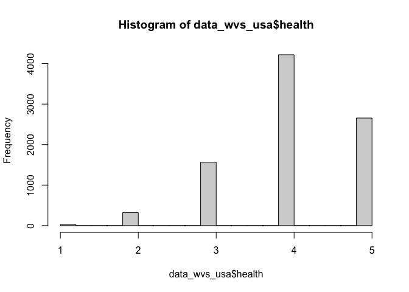
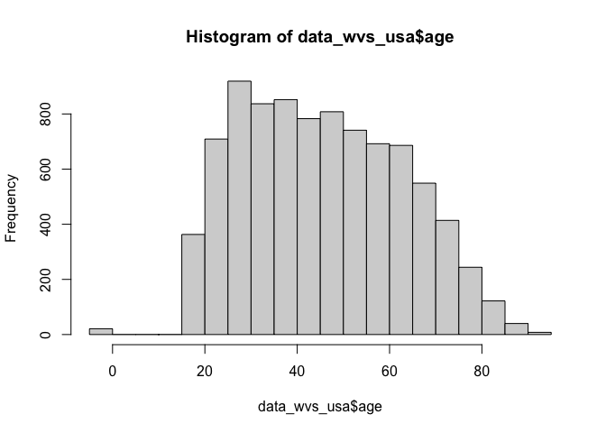
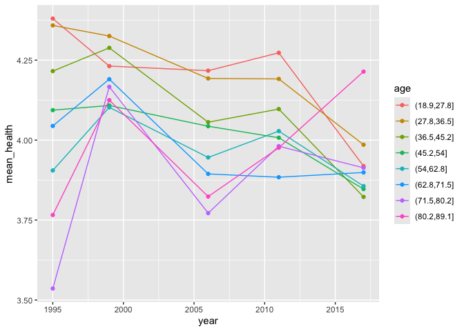
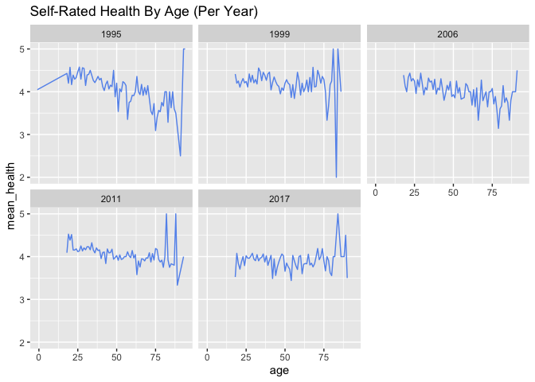
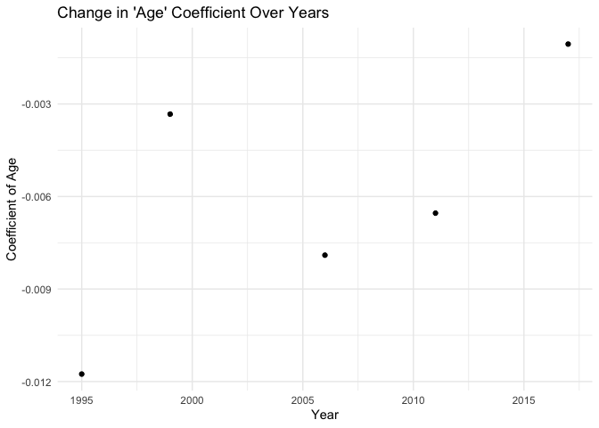
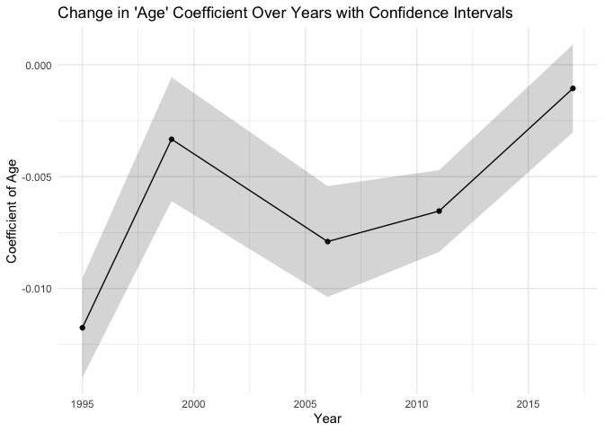
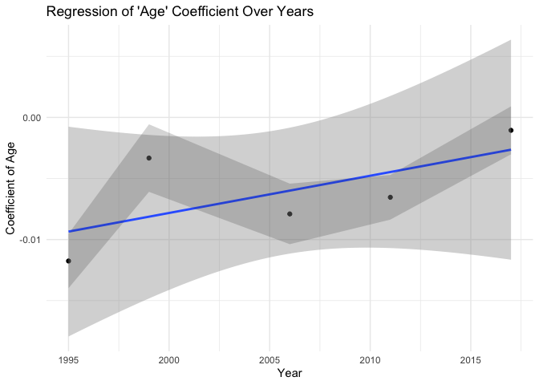
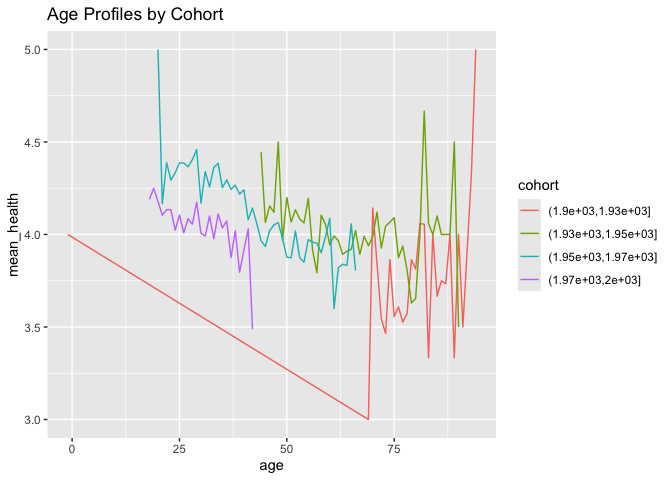

Self-Rated Health - World Values Survey
================
Christine Lucille Kuryla
2024-10-03

We have seen pattens in self-rated health in the GSS data. Let’s explore
the WVS data (<https://www.worldvaluessurvey.org/>) to see if the
pattern appears there as well.

# Variables

S012.- Date interview Date of interview YYYYMMDD (S012) -3 Not
applicable -4 Not asked in survey

S020.- Year survey Year of survey YYYY (S020) 1981 1981

A008.- Feeling of happiness Taking all things together, would you say
you are: (A008) 1 Very happy 2 Quite happy 3 Not very happy 4 Not at all
happy -1 Don’t know -2 No answer -4 Not asked -5 Missing; Not available

A009.- State of health (subjective) All in all, how would you describe
your state of health these days? Would you say it is… (A009) 1 Very good
2 Good 3 Fair 4 Poor 5 Very poor -1 Don’t know -2 No answer -4 Not asked
in survey -5 Missing; Unknown

X003.- Age Age WVS Time Series 1981 2022 Variables Report V5.0 - 209 -
(X003) -1 Don’t know -2 No answer -3 Not applicable -4 Not asked in
survey -5 Missing; Unknown

X001.- Sex Sex (X001) 1 Male 2 Female -1 Don’t know -2 No answer -4 Not
asked -5 Missing; Unknown

X002.- Year of birth Can you tell me your year of birth, please? (X002)
-1 Don’t know -2 No answer -3 Not applicable -4 Not asked in survey -5
Missing; Unknown

X002_02A.- Respondents country of birth - ISO 3166-1 code In which
country were you born? (X002_02A) See annex number 21

S001.- Study Study (S001) 1 EVS 2 WVS S002VS.- Chronology of EVS-WVS
waves Wave (S002VS) 1 1981-1984 2 1989-1993 3 1994-1998 4 1999-2004 5
2005-2009 6 2010-2014 7 2017-2022 S003.- ISO 3166-1 numeric country code
Country code ISO 3166 (S003) See annex number 1 COUNTRY_ALPHA.- ISO
3166-1 alpha-3 country code (COUNTRY_ALPHA) See annex number 2 COW_NUM.-
CoW country code numeric Country code CoW numeric (COW_NUM) See annex
number 3 COW_ALPHA.- CoW country code alpha CoW country code alpha
(COW_ALPHA) See annex number 4

``` r
# Registration is needed to download the files, so we're just going to have to load them from my local computer

data_wvs_all <- read_csv("big_data/WVS_Time_Series_1981-2022_csv_v5_0.csv")

colnames()

data_wvs <- data_wvs_all %>% 
#  filter(S003 == 840) %>%   # United States 
  select(S003,          #.- ISO 3166-1 numeric country code
         COUNTRY_ALPHA, #.- ISO 3166-1 alpha-3 country code
         COW_NUM,       #.- CoW country code numeric
         COW_ALPHA,     # .- CoW country code alpha
         S012,          # date of interview
         S001,          # Study -- 1 EVS, 2 WVS
         S022,
         S023,
         X003, # age
         X001, # sex
         X002, # birth year
         S020, # year of survey
         A009, # self-rated health
         A008  # self-rated happiness
         ) %>% 
  mutate(year = as.numeric(str_sub(as.character(S022), start = 1, end = 4))) %>% 
  mutate(year2 = as.numeric(str_sub(as.character(S023), start = 1, end = 4))) 

data_wvs1 <- data_wvs %>% 
    mutate(country_code = S003) %>% 
    mutate(age = X003) %>% 
    mutate(sex = X001) %>% 
    mutate(cohort = X002) %>% 
    mutate(year = as.numeric(str_sub(as.character(S022), start = 1, end = 4))) %>% 
    mutate(health = A009) %>% 
    mutate(happy = A008) %>% 
    mutate(health = 6 - health) %>% 
    mutate(happy = 5 - happy) #%>% 
   # select(age, cohort, year, health, happy, sex, country_code)

table(data_wvs1$year)

data_wvs_usa <- data_wvs1 %>% filter(COUNTRY_ALPHA == "USA")
  
  filter(S003 == 840) |   
         COUNTRY_ALPHA == "USA" |
         COW_NUM == 2 |
         COW_ALPHA == "USA"
           )

table(data_wvs_usa$year)

write_csv(data_wvs_usa, file = "data/wvs_usa.csv")
```

``` r
data_wvs_usa <- read_csv("data/wvs_usa.csv") %>% 
  filter(health %in% c(1, 2, 3, 4, 5))
```

    ## Rows: 8819 Columns: 22
    ## ── Column specification ────────────────────────────────────────────────────────
    ## Delimiter: ","
    ## chr  (2): COUNTRY_ALPHA, COW_ALPHA
    ## dbl (20): S003, COW_NUM, S012, S001, S022, S023, X003, X001, X002, S020, A00...
    ## 
    ## ℹ Use `spec()` to retrieve the full column specification for this data.
    ## ℹ Specify the column types or set `show_col_types = FALSE` to quiet this message.

``` r
hist(data_wvs_usa$health)
```

<!-- -->

``` r
hist(data_wvs_usa$age)
```

<!-- -->

``` r
data_wvs_usa %>% 
  filter(age > 18, age < 90) %>% 
  mutate(age = cut(age, breaks = 8)) %>% # Create cohorts with 6 breaks
  group_by(age, year) %>% 
  summarize(mean_health = mean(health)) %>% 
  ggplot(aes(x = year, y = mean_health, color = age)) +
  geom_line() +
  geom_point()
```

    ## `summarise()` has grouped output by 'age'. You can override using the `.groups`
    ## argument.

<!-- -->

``` r
# health vs age per year
data_wvs_usa %>% 
  group_by(age, year) %>% 
  summarize(mean_health = mean(health)) %>% 
  ggplot(aes(x = age, y = mean_health)) +
  geom_line(color = "cornflowerblue") +
  facet_wrap(~ year) +
  labs(title = "Self-Rated Health By Age (Per Year)" )
```

    ## `summarise()` has grouped output by 'age'. You can override using the `.groups`
    ## argument.

<!-- -->

``` r
library(broom)

# Aggregate slopes

# years_of_gss <- c(data_gss %>% select(year) %>% unique() )
# lm_health_v_age_0 <- data_gss %>%
#   group_by(year) %>%
#   summarize(coef = coef(lm(health ~ age, data = cur_data()))["age"])

# Perform linear regression for each year and extract the coefficient of 'age' with confidence intervals, se, t stat, p val
lm_health_v_age_0 <- data_wvs_usa %>%
  group_by(year) %>%
  do(tidy(lm(health ~ age, data = .), conf.int = TRUE)) %>%  # Add conf.int = TRUE for CIs
  filter(term == "age") %>%
  select(year, coef = estimate, conf.low, conf.high, se = std.error, t_statistic = statistic,  p_value = p.value)

# View the results with confidence intervals, se, t statistic, and p value
# print(lm_health_v_age_0)
knitr::kable(lm_health_v_age_0)
```

| year |       coef |   conf.low |  conf.high |        se | t_statistic |   p_value |
|-----:|-----------:|-----------:|-----------:|----------:|------------:|----------:|
| 1995 | -0.0117571 | -0.0139799 | -0.0095344 | 0.0011332 |  -10.375333 | 0.0000000 |
| 1999 | -0.0033293 | -0.0060940 | -0.0005645 | 0.0014092 |   -2.362543 | 0.0183093 |
| 2006 | -0.0079023 | -0.0103814 | -0.0054232 | 0.0012636 |   -6.253571 | 0.0000000 |
| 2011 | -0.0065393 | -0.0083673 | -0.0047112 | 0.0009322 |   -7.014910 | 0.0000000 |
| 2017 | -0.0010573 | -0.0030200 |  0.0009054 | 0.0010009 |   -1.056324 | 0.2909189 |

``` r
# Plot coefficients
ggplot(lm_health_v_age_0, aes(x = year, y = coef)) +
  geom_point() +
  labs(
    title = "Change in 'Age' Coefficient Over Years",
    x = "Year",
    y = "Coefficient of Age"
  ) +
  theme_minimal()
```

<!-- -->

``` r
# Plot coefficients with CI
ggplot(lm_health_v_age_0, aes(x = year, y = coef)) +
  geom_line() +
  geom_point() +
  geom_ribbon(aes(ymin = conf.low, ymax = conf.high), alpha = 0.2) +  # Add shaded area for confidence intervals
  labs(
    title = "Change in 'Age' Coefficient Over Years with Confidence Intervals",
    x = "Year",
    y = "Coefficient of Age"
  ) +
  theme_minimal()
```

<!-- -->

``` r
# Perform linear regression of 'coef' (age coefficient) vs 'year'
lm_coef_vs_year <- lm(coef ~ year, data = lm_health_v_age_0)

# View the summary of the regression
summary(lm_coef_vs_year)
```

    ## 
    ## Call:
    ## lm(formula = coef ~ year, data = lm_health_v_age_0)
    ## 
    ## Residuals:
    ##         1         2         3         4         5 
    ## -0.002409  0.004799 -0.001907 -0.002068  0.001585 
    ## 
    ## Coefficients:
    ##               Estimate Std. Error t value Pr(>|t|)
    ## (Intercept) -0.6174213  0.4086971  -1.511    0.228
    ## year         0.0003048  0.0002038   1.496    0.232
    ## 
    ## Residual standard error: 0.003618 on 3 degrees of freedom
    ## Multiple R-squared:  0.4272, Adjusted R-squared:  0.2362 
    ## F-statistic: 2.237 on 1 and 3 DF,  p-value: 0.2316

``` r
ggplot(lm_health_v_age_0, aes(x = year, y = coef)) +
  geom_point() +
  geom_smooth(method = "lm", se = TRUE) +  # Adds the regression line with standard error shading
  geom_ribbon(aes(ymin = conf.low, ymax = conf.high), alpha = 0.2) +  # Confidence intervals for the coefficients
  labs(
    title = "Regression of 'Age' Coefficient Over Years",
    x = "Year",
    y = "Coefficient of Age"
  ) +
  theme_minimal()
```

    ## `geom_smooth()` using formula = 'y ~ x'

<!-- -->

``` r
data_wvs_usa %>% 
  filter(cohort > 1800, cohort < 2020) %>% 
  mutate(cohort = cut(cohort, breaks = 4)) %>% # Create cohorts with 6 breaks
  group_by(age, cohort) %>% 
  summarize(mean_health = mean(health)) %>% 
  ggplot(aes(x = age, y = mean_health, color = cohort)) +
  labs(title = "Age Profiles by Cohort") +
  geom_line()
```

    ## `summarise()` has grouped output by 'age'. You can override using the `.groups`
    ## argument.

<!-- -->
