Self-Rated Health - World Values Survey
================
Christine Lucille Kuryla
2024-10-03

We have seen pattens in self-rated health in the GSS data. Let’s explore
the WVS data, EVS data, and IVS (WVS + IVS) to see if the pattern
appears there as well.

WVS data \* <https://www.worldvaluessurvey.org/> \* 7 survey waves
(every 5 years)

EVS data \*
<https://search.gesis.org/research_data/ZA7503?doi=10.4232/1.14021> \* 5
survey waves (every 9 years)

Integrated Values Survey (IVS) \*
<https://www.worldvaluessurvey.org/WVSEVStrend.jsp> \* EVS and WVS
time-series data-sets are released independently by EVS/GESIS and the
WVSA/JDS. The Integrated Values Surveys (IVS) dataset 1981-2022 can be
constructed by merging the EVS Trend File 1981-2017
(<doi:10.4232/1.14021>) and the WVS trend 1981-2022 data-set
<doi:10.14281/18241.27>. It is based on the Common EVS/WVS Dictionary
(2021) and includes 452 surveys from 115 countries/territories.

# WVS Variables

<details>
<summary>
**Click to expand and explore the variables of interest, including the
coding and the way the question is phrased.**
</summary>

S012.- Date interview Date of interview YYYYMMDD (S012) -3 Not
applicable -4 Not asked in survey

S020.- Year survey Year of survey YYYY (S020) 1981 1981

A008.- Feeling of happiness Taking all things together, would you say
you are: (A008) 1 Very happy 2 Quite happy 3 Not very happy 4 Not at all
happy -1 Don’t know -2 No answer -4 Not asked -5 Missing; Not available

A009.- State of health (subjective) All in all, how would you describe
your state of health these days? Would you say it is… (A009) 1 Very good
2 Good 3 Fair 4 Poor 5 Very poor -1 Don’t know -2 No answer -4 Not asked
in survey -5 Missing; Unknown

X003.- Age Age WVS Time Series 1981 2022 Variables Report V5.0 - 209 -
(X003) -1 Don’t know -2 No answer -3 Not applicable -4 Not asked in
survey -5 Missing; Unknown

X001.- Sex Sex (X001) 1 Male 2 Female -1 Don’t know -2 No answer -4 Not
asked -5 Missing; Unknown

X002.- Year of birth Can you tell me your year of birth, please? (X002)
-1 Don’t know -2 No answer -3 Not applicable -4 Not asked in survey -5
Missing; Unknown

X002_02A.- Respondents country of birth - ISO 3166-1 code In which
country were you born? (X002_02A) See annex number 21

S001.- Study Study (S001) 1 EVS 2 WVS S002VS.- Chronology of EVS-WVS
waves Wave (S002VS) 1 1981-1984 2 1989-1993 3 1994-1998 4 1999-2004 5
2005-2009 6 2010-2014 7 2017-2022 S003.- ISO 3166-1 numeric country code
Country code ISO 3166 (S003) See annex number 1 COUNTRY_ALPHA.- ISO
3166-1 alpha-3 country code (COUNTRY_ALPHA) See annex number 2 COW_NUM.-
CoW country code numeric Country code CoW numeric (COW_NUM) See annex
number 3 COW_ALPHA.- CoW country code alpha CoW country code alpha
(COW_ALPHA) See annex number 4

</details>

# Common variables

A009 State of health (subjective) A008 Feeling of happiness S020 Year
survey X002 Year of birth X003 Age X001 Sex X051 Ethnic group E033 Self
positioning in political scale B008 Protecting environment vs. Economic
growth S012 Date interview \[YYYYMMDD\]

S003 Country (ISO 3166-1 Numeric code) COW_ALPHA CoW country code alpha
COW_NUM Country (CoW Numeric code)

A165 Most people can be trusted A170 Satisfaction with your life A173
How much freedom of choice and control

X002_02 Respondent born in \[country\] X002_02A Respondents country of
birth: ISO 3166-1 code X002_02B Respondents country of birth: ISO
3166-1/3 Alpha code X002_03 Year in which respondent came to live in
\[country\] X003R Age recoded X003R2 Age recoded (3 intervals)

# IVS

# Import, clean, format data from previous files

``` r
data_wvs_usa <- read_csv("data/wvs_usa.csv") %>% 
  filter(health %in% c(1, 2, 3, 4, 5))
```

    ## Rows: 8819 Columns: 22
    ## ── Column specification ────────────────────────────────────────────────────────
    ## Delimiter: ","
    ## chr  (2): COUNTRY_ALPHA, COW_ALPHA
    ## dbl (20): S003, COW_NUM, S012, S001, S022, S023, X003, X001, X002, S020, A00...
    ## 
    ## ℹ Use `spec()` to retrieve the full column specification for this data.
    ## ℹ Specify the column types or set `show_col_types = FALSE` to quiet this message.

``` r
data_evs_usa <- read_csv("data/evs_usa.csv") %>% 
  filter(health %in% c(1, 2, 3, 4, 5))
```

    ## Rows: 4164 Columns: 28
    ## ── Column specification ────────────────────────────────────────────────────────
    ## Delimiter: ","
    ## dbl (28): A009, A008, S020, X002, X003, X001, X051, E033, B008, S012, S003, ...
    ## 
    ## ℹ Use `spec()` to retrieve the full column specification for this data.
    ## ℹ Specify the column types or set `show_col_types = FALSE` to quiet this message.

``` r
table(data_evs_usa$happy)
```

    ## 
    ##    1    2    3    4    6    7 
    ##   47  332 2290 1424   36   22

``` r
# CHECK THE CODING
table(data_wvs_usa$happy)
```

    ## 
    ##    1    2    3    4    6    7 
    ##   73  706 4902 3086   14    7

``` r
# CHECK THE CODING

hist(data_wvs_usa$health)
```

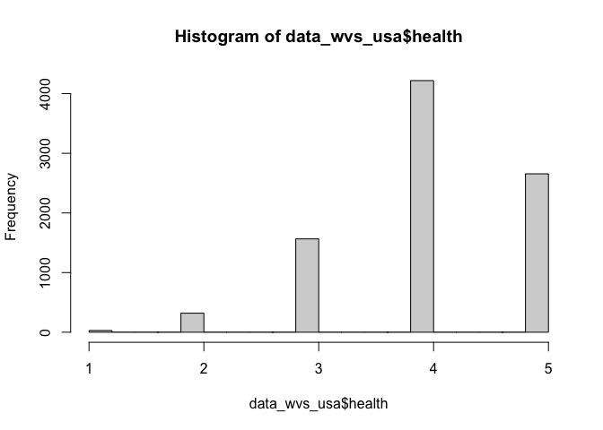<!-- -->

``` r
hist(data_wvs_usa$age)
```

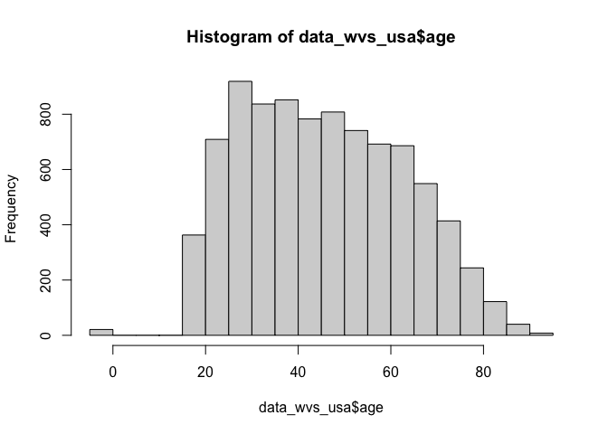<!-- -->

``` r
hist(data_evs_usa$health)
```

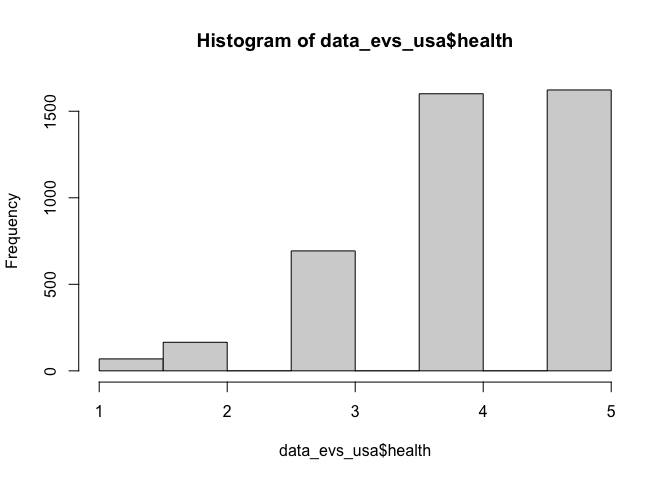<!-- -->

``` r
hist(data_evs_usa$age)
```

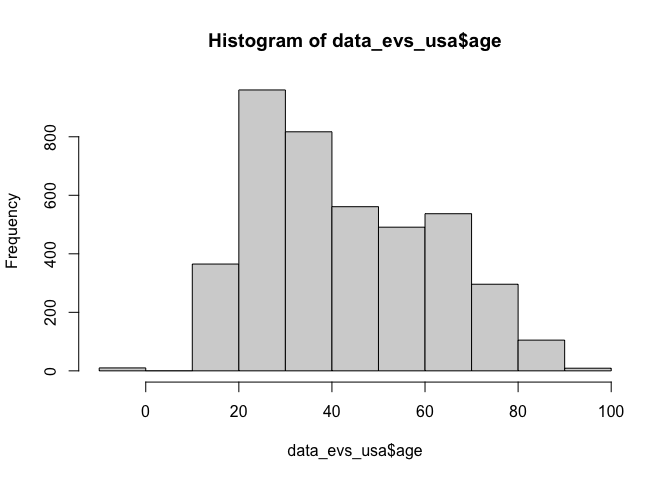<!-- -->

``` r
evs_select <- data_evs_usa %>% 
                             select(age, year, cohort, sex, health, happy) 
wvs_select <- data_wvs_usa %>% 
                             select(age, year, cohort, sex, health, happy)

data_ivs_usa <- rbind(evs_select, wvs_select) %>% 
  filter(cohort > 1700) %>% 
  filter(sex %in% c(1,2)) %>% 
  filter(happy %in% c(1, 2, 3, 4)) %>%  # check the coding!
  filter(health %in% c(1, 2, 3, 4, 5))

write_csv(data_ivs_usa, "data/ivs_usa_selected.csv")
```

``` r
data_ivs_usa <- read_csv("data/ivs_usa_selected.csv")
```

    ## Rows: 12790 Columns: 6
    ## ── Column specification ────────────────────────────────────────────────────────
    ## Delimiter: ","
    ## dbl (6): age, year, cohort, sex, health, happy
    ## 
    ## ℹ Use `spec()` to retrieve the full column specification for this data.
    ## ℹ Specify the column types or set `show_col_types = FALSE` to quiet this message.

``` r
hist(data_ivs_usa$age)
```

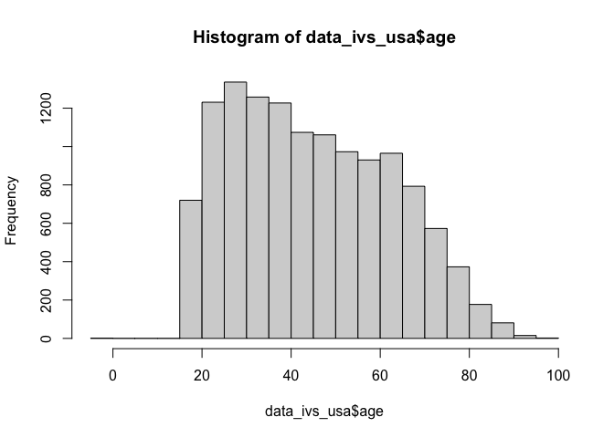<!-- -->

``` r
hist(data_ivs_usa$year)
```

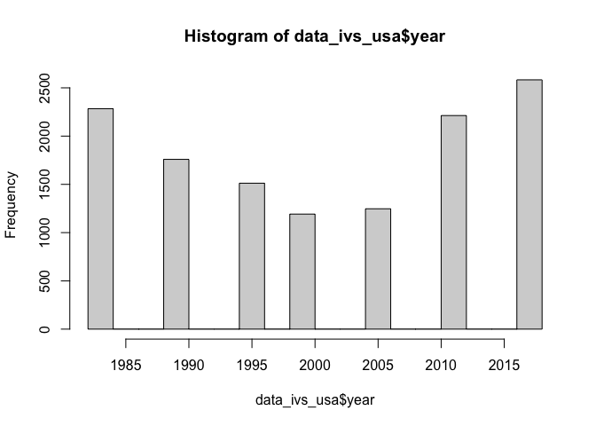<!-- -->

``` r
hist(data_ivs_usa$cohort)
```

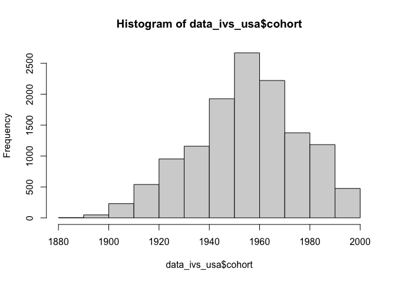<!-- -->

``` r
hist(data_ivs_usa$sex)
```

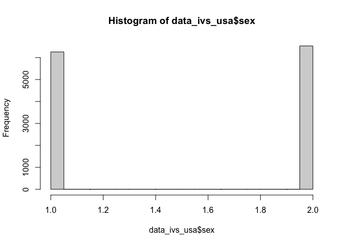<!-- -->

``` r
hist(data_ivs_usa$health)
```

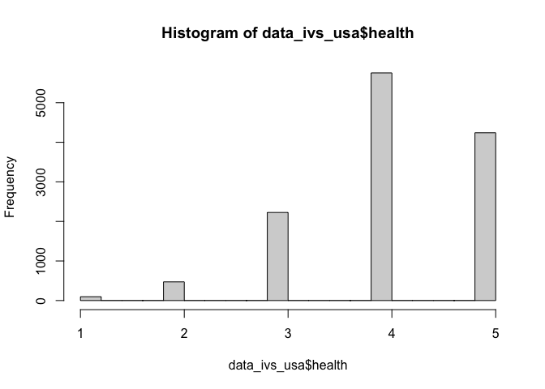<!-- -->

``` r
hist(data_ivs_usa$happy)
```

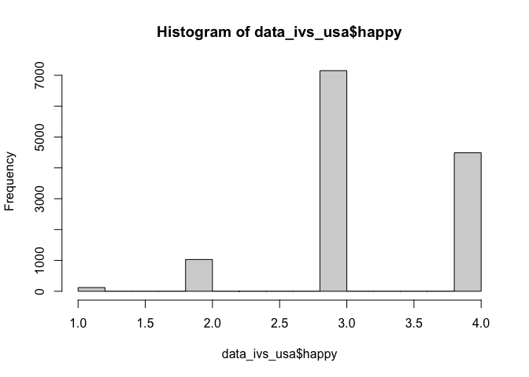<!-- -->

# IVS (WVS + EVS) Replicate GSS Analysis for New Data

``` r
data_ivs_usa %>% 
  filter(age > 18, age < 90) %>% 
  mutate(age = cut(age, breaks = 6)) %>% # Create cohorts with 6 breaks
  group_by(age, year) %>% 
  summarize(mean_health = mean(health)) %>% 
  ggplot(aes(x = year, y = mean_health, color = age)) +
  geom_line() +
  labs(title = "Average SRH Per Year for Each Age Group",
       subtitle = "IVS Dataset",
       y = "Average SRH", 
       x = "Year",
       color = "Age Group") +
  theme_minimal() +
  geom_point() 
```

    ## `summarise()` has grouped output by 'age'. You can override using the `.groups`
    ## argument.

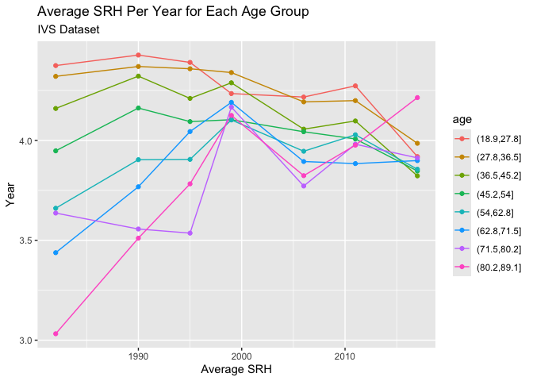<!-- -->

``` r
# health vs age per year
data_ivs_usa %>% 
  group_by(age, year) %>% 
  summarize(mean_health = mean(health)) %>% 
  ggplot(aes(x = age, y = mean_health)) +
  geom_line(color = "cornflowerblue") +
  facet_wrap(~ year) +
  labs(title = "Self-Rated Health By Age (Per Year)",
       subtitle = "IVS Dataset",
       y = "Average SRH", 
       x = "Age of Respondent")
```

    ## `summarise()` has grouped output by 'age'. You can override using the `.groups`
    ## argument.

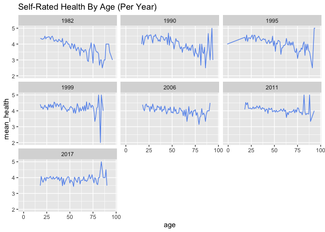<!-- -->

``` r
# Aggregate slopes

# years_of_gss <- c(data_gss %>% select(year) %>% unique() )
# lm_health_v_age_0 <- data_gss %>%
#   group_by(year) %>%
#   summarize(coef = coef(lm(health ~ age, data = cur_data()))["age"])

# Perform linear regression for each year and extract the coefficient of 'age' with confidence intervals, se, t stat, p val
lm_health_v_age_0 <- data_ivs_usa %>%
  group_by(year) %>%
  do(tidy(lm(health ~ age, data = .), conf.int = TRUE)) %>%  # Add conf.int = TRUE for CIs
  filter(term == "age") %>%
  select(year, coef = estimate, conf.low, conf.high, se = std.error, t_statistic = statistic,  p_value = p.value)

# View the results with confidence intervals, se, t statistic, and p value
# print(lm_health_v_age_0)
knitr::kable(lm_health_v_age_0,
             caption = "IVS Dataset")
```

| year |       coef |   conf.low |  conf.high |        se | t_statistic |   p_value |
|-----:|-----------:|-----------:|-----------:|----------:|------------:|----------:|
| 1982 | -0.0182499 | -0.0201789 | -0.0163209 | 0.0009837 |  -18.552496 | 0.0000000 |
| 1990 | -0.0160078 | -0.0182217 | -0.0137939 | 0.0011288 |  -14.181498 | 0.0000000 |
| 1995 | -0.0130457 | -0.0153716 | -0.0107198 | 0.0011857 |  -11.002200 | 0.0000000 |
| 1999 | -0.0035088 | -0.0062695 | -0.0007482 | 0.0014071 |   -2.493723 | 0.0127760 |
| 2006 | -0.0079041 | -0.0103844 | -0.0054239 | 0.0012642 |   -6.252127 | 0.0000000 |
| 2011 | -0.0066024 | -0.0084288 | -0.0047760 | 0.0009313 |   -7.089158 | 0.0000000 |
| 2017 | -0.0010629 | -0.0030305 |  0.0009047 | 0.0010034 |   -1.059309 | 0.2895584 |

IVS Dataset

``` r
# Plot coefficients
ggplot(lm_health_v_age_0, aes(x = year, y = coef)) +
  geom_point() +
  geom_errorbar(aes(ymin=conf.low, ymax=conf.high), width=.2,
                 position=position_dodge(0.05)) +
  labs(
    title = "Change in 'Age' Coefficient Over Years",
    subtitle = "IVS Dataset",
    x = "Year",
    y = "Coefficient of Age"
  ) +
  theme_minimal()
```

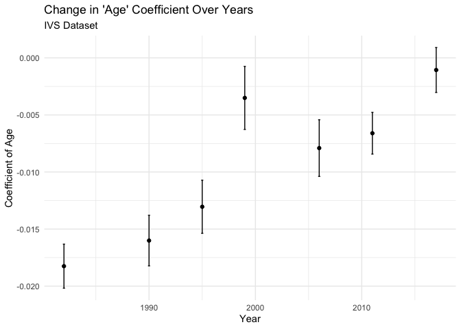<!-- -->

``` r
# Plot coefficients with CI
ggplot(lm_health_v_age_0, aes(x = year, y = coef)) +
  geom_line() +
  geom_point() +
  geom_errorbar(aes(ymin=conf.low, ymax=conf.high), width=.2,
                 position=position_dodge(0.05)) +
  geom_ribbon(aes(ymin = conf.low, ymax = conf.high), alpha = 0.2) +  # Add shaded area for confidence intervals
  labs(
    title = "Change in 'Age' Coefficient Over Years with Confidence Intervals",
    subtitle = "IVS Dataset",
    x = "Year",
    y = "Coefficient of Age"
  ) +
  theme_minimal()
```

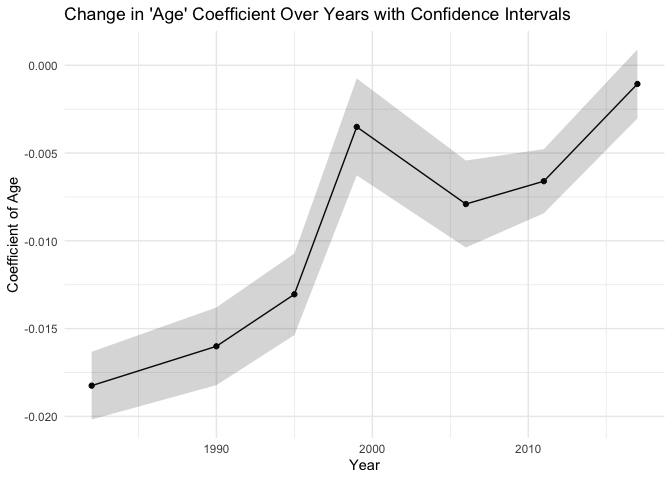<!-- -->

``` r
# Perform linear regression of 'coef' (age coefficient) vs 'year'
lm_coef_vs_year <- lm(coef ~ year, data = lm_health_v_age_0)

# View the summary of the regression
summary(lm_coef_vs_year)
```

    ## 
    ## Call:
    ## lm(formula = coef ~ year, data = lm_health_v_age_0)
    ## 
    ## Residuals:
    ##          1          2          3          4          5          6          7 
    ## -0.0003455 -0.0018462 -0.0012234  0.0064421 -0.0012281 -0.0022656  0.0004667 
    ## 
    ## Coefficients:
    ##               Estimate Std. Error t value Pr(>|t|)   
    ## (Intercept) -0.9451796  0.2183259  -4.329  0.00750 **
    ## year         0.0004678  0.0001092   4.286  0.00782 **
    ## ---
    ## Signif. codes:  0 '***' 0.001 '**' 0.01 '*' 0.05 '.' 0.1 ' ' 1
    ## 
    ## Residual standard error: 0.003268 on 5 degrees of freedom
    ## Multiple R-squared:  0.786,  Adjusted R-squared:  0.7432 
    ## F-statistic: 18.37 on 1 and 5 DF,  p-value: 0.00782

``` r
ggplot(lm_health_v_age_0, aes(x = year, y = coef)) +
  geom_point() +
  geom_errorbar(aes(ymin=conf.low, ymax=conf.high), width=.2,
                 position=position_dodge(0.05)) +
  geom_smooth(method = "lm", se = TRUE) +  # Adds the regression line with standard error shading
#  geom_ribbon(aes(ymin = conf.low, ymax = conf.high), alpha = 0.2) +  # Confidence intervals for the coefficients
  labs(
    title = "Regression of 'Age' Coefficient Over Years",
    subtitle = "IVS Dataset",
    x = "Year",
    y = "Coefficient of Age"
  ) +
  theme_minimal()
```

    ## `geom_smooth()` using formula = 'y ~ x'

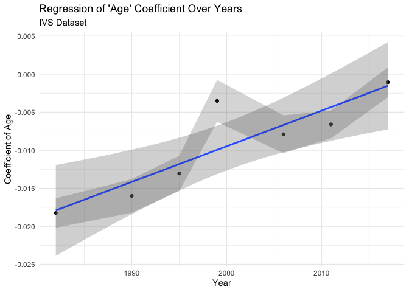<!-- -->

``` r
data_ivs_usa %>% 
  filter(cohort > 1800, cohort < 2020) %>% 
  mutate(cohort = cut(cohort, breaks = 4)) %>% # Create cohorts with 6 breaks
  group_by(age, cohort) %>% 
  summarize(mean_health = mean(health)) %>% 
  ggplot(aes(x = age, y = mean_health, color = cohort)) +
  labs(title = "Age Profiles by Cohort", 
       subtitle = "IVS Dataset") +
  geom_line()
```

    ## `summarise()` has grouped output by 'age'. You can override using the `.groups`
    ## argument.

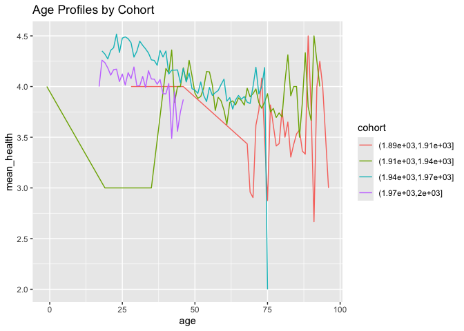<!-- -->

# Load data, wrangle, and recode data

## WVS

``` r
# Registration is needed to download the files, so we're just going to have to load them from my local computer

data_wvs_all <- read_csv("big_data/WVS_Time_Series_1981-2022_csv_v5_0.csv")

colnames()

data_wvs <- data_wvs_all %>% 
#  filter(S003 == 840) %>%   # United States 
  select(S003,          #.- ISO 3166-1 numeric country code
         COUNTRY_ALPHA, #.- ISO 3166-1 alpha-3 country code
         COW_NUM,       #.- CoW country code numeric
         COW_ALPHA,     # .- CoW country code alpha
         S012,          # date of interview
         S001,          # Study -- 1 EVS, 2 WVS
         S022,
         S023,
         X003, # age
         X001, # sex
         X002, # birth year
         S020, # year of survey
         A009, # self-rated health
         A008  # self-rated happiness
         ) %>% 
  mutate(year = as.numeric(str_sub(as.character(S022), start = 1, end = 4))) %>% 
  mutate(year2 = as.numeric(str_sub(as.character(S023), start = 1, end = 4))) 

data_wvs1 <- data_wvs %>% 
    mutate(country_code = S003) %>% 
    mutate(age = X003) %>% 
    mutate(sex = X001) %>% 
    mutate(cohort = X002) %>% 
    mutate(year = as.numeric(str_sub(as.character(S022), start = 1, end = 4))) %>%
    mutate(health = A009) %>% 
    mutate(happy = A008) %>% 
    mutate(year = as.numeric(str_sub(as.character(S022), start = 1, end = 4))) %>% 
    mutate(year2 = as.numeric(str_sub(as.character(S023), start = 1, end = 4))) %>% 
    mutate(health = 6 - health) %>% 
    mutate(happy = 5 - happy) #%>% 
   # select(age, cohort, year, health, happy, sex, country_code)

table(data_wvs1$year)

data_wvs_usa <- data_wvs1 %>% filter(COUNTRY_ALPHA == "USA")
  
  filter(S003 == 840) |   
         COUNTRY_ALPHA == "USA" |
         COW_NUM == 2 |
         COW_ALPHA == "USA"
           )

table(data_wvs_usa$year)

write_csv(data_wvs_usa, file = "data/wvs_usa.csv")
```

## EVS

``` r
library(haven)

data_evs_all <- read_dta("big_data/EVS/ZA7503_v3-0-0.dta")

data_evs_selected <- data_evs_all %>% 
  select(A009,      # State of health (subjective)
        A008,   #   Feeling of happiness
        S020,   #   Year survey
        X002,   #   Year of birth
        X003,   #   Age
        X001,   #   Sex
        X051,   #   Ethnic group
        E033,   #   Self positioning in political scale
        B008,   #   Protecting environment vs. Economic growth
        S012,   #   Date interview [YYYYMMDD]
        S003,   #   Country (ISO 3166-1 Numeric code)
   #     COW_ALPHA,     #   CoW country code alpha
        COW_NUM,    #   Country (CoW Numeric code)
        A165,   #   Most people can be trusted
        A170,   #   Satisfaction with your life
        A173,   #   How much freedom of choice and control
        X002_02,    #   Respondent born in [country]
        X002_02A,   #   Respondents country of birth: ISO 3166-1 code
        X002_02B,   #   Respondents country of birth: ISO 3166-1/3 Alpha code
        X002_03,    #   Year in which respondent came to live in [country]
        X003R,      #   Age recoded
        X003R2      #   Age recoded (3 intervals)
  )

data_evs_recoded <- data_evs_selected %>% 
    mutate(country_code = S003) %>% 
    mutate(age = X003) %>% 
    mutate(sex = X001) %>% 
    mutate(cohort = X002) %>% 
#    mutate(year = as.numeric(str_sub(as.character(S022), start = 1, end = 4))) %>%
    mutate(health = A009) %>% 
    mutate(happy = A008) %>% 
  #  mutate(year = as.numeric(str_sub(as.character(S022), start = 1, end = 4))) %>% 
 #   mutate(year = as.numeric(str_sub(as.character(S012), start = 1, end = 4))) %>% 
  #  mutate(year2 = as.numeric(str_sub(as.character(S023), start = 1, end = 4))) %>% 
    mutate(health = 6 - health) %>% 
    mutate(happy = 5 - happy) %>% 
    mutate(year = S020)     #   Year survey #%>% 
   # select(age, cohort, year, health, happy, sex, country_code)

table(data_evs_recoded$year)

data_evs_usa <- data_evs_recoded %>% 
  filter(country_code == 840 |   
       #  COUNTRY_ALPHA == "USA" |
         COW_NUM == 2
       #  COW_ALPHA == "USA"
         )

data_evs_world <- data_evs_recoded

table(data_evs_usa$year)

table(data_evs_world$year)

write_csv(data_evs_world, file = "data/data_evs_world.csv")


write_csv(data_evs_usa, "data/evs_usa.csv")
```

# Redo GSS analysis for WVS

``` r
data_wvs_usa %>% 
  filter(age > 18, age < 90) %>% 
  mutate(age = cut(age, breaks = 8)) %>% # Create cohorts with 6 breaks
  group_by(age, year) %>% 
  summarize(mean_health = mean(health)) %>% 
  ggplot(aes(x = year, y = mean_health, color = age)) +
  geom_line() +
  geom_point()


# health vs age per year
data_wvs_usa %>% 
  group_by(age, year) %>% 
  summarize(mean_health = mean(health)) %>% 
  ggplot(aes(x = age, y = mean_health)) +
  geom_line(color = "cornflowerblue") +
  facet_wrap(~ year) +
  labs(title = "Self-Rated Health By Age (Per Year)" )


# Aggregate slopes

# years_of_gss <- c(data_gss %>% select(year) %>% unique() )
# lm_health_v_age_0 <- data_gss %>%
#   group_by(year) %>%
#   summarize(coef = coef(lm(health ~ age, data = cur_data()))["age"])

# Perform linear regression for each year and extract the coefficient of 'age' with confidence intervals, se, t stat, p val
lm_health_v_age_0 <- data_wvs_usa %>%
  group_by(year) %>%
  do(tidy(lm(health ~ age, data = .), conf.int = TRUE)) %>%  # Add conf.int = TRUE for CIs
  filter(term == "age") %>%
  select(year, coef = estimate, conf.low, conf.high, se = std.error, t_statistic = statistic,  p_value = p.value)

# View the results with confidence intervals, se, t statistic, and p value
# print(lm_health_v_age_0)
knitr::kable(lm_health_v_age_0)

# Plot coefficients
ggplot(lm_health_v_age_0, aes(x = year, y = coef)) +
  geom_point() +
  geom_errorbar(aes(ymin=conf.low, ymax=conf.high), width=.2,
                 position=position_dodge(0.05)) +
  labs(
    title = "Change in 'Age' Coefficient Over Years",
    x = "Year",
    y = "Coefficient of Age"
  ) +
  theme_minimal()

# Plot coefficients with CI
ggplot(lm_health_v_age_0, aes(x = year, y = coef)) +
  geom_line() +
  geom_point() +
  geom_ribbon(aes(ymin = conf.low, ymax = conf.high), alpha = 0.2) +  # Add shaded area for confidence intervals
  labs(
    title = "Change in 'Age' Coefficient Over Years with Confidence Intervals",
    x = "Year",
    y = "Coefficient of Age"
  ) +
  theme_minimal()

# Perform linear regression of 'coef' (age coefficient) vs 'year'
lm_coef_vs_year <- lm(coef ~ year, data = lm_health_v_age_0)

# View the summary of the regression
summary(lm_coef_vs_year)

ggplot(lm_health_v_age_0, aes(x = year, y = coef)) +
  geom_point() +
  geom_errorbar(aes(ymin=conf.low, ymax=conf.high), width=.2,
                 position=position_dodge(0.05)) +
  geom_smooth(method = "lm", se = TRUE, alpha = 0.3) +  # Adds the regression line with standard error shading
#  geom_ribbon(aes(ymin = conf.low, ymax = conf.high), alpha = 0.2) +  # Confidence intervals for the coefficients
  labs(
    title = "Regression of 'Age' Coefficient Over Years",
    x = "Year",
    y = "Coefficient of Age"
  ) +
  theme_minimal()

data_wvs_usa %>% 
  filter(cohort > 1800, cohort < 2020) %>% 
  mutate(cohort = cut(cohort, breaks = 4)) %>% # Create cohorts with 6 breaks
  group_by(age, cohort) %>% 
  summarize(mean_health = mean(health)) %>% 
  ggplot(aes(x = age, y = mean_health, color = cohort)) +
  labs(title = "Age Profiles by Cohort") +
  geom_line()
```

# Cohort Effects

## Generation Splitting

``` r
# Create generations in data_ivs_usa
data_ivs_usa_generations <- data_ivs_usa %>%
  filter(cohort > 1900) %>%
  mutate(
    generation = factor(
      case_when(
        cohort >= 1901 & cohort <= 1927 ~ "Greatest (1901-1927)",
        cohort >= 1928 & cohort <= 1945 ~ "Silent (1928-1945)",
        cohort >= 1946 & cohort <= 1964 ~ "Boomers (1946-1964)",
        cohort >= 1965 & cohort <= 1980 ~ "Gen X (1965-1980)",
        cohort >= 1981 & cohort <= 1996 ~ "Millennials (1981-1996)",
        cohort >= 1997 & cohort <= 2012 ~ "Gen Z (1997-2012)",
        TRUE ~ "Other"
      ),
      levels = c(
        "Greatest (1901-1927)",
        "Silent (1928-1945)",
        "Boomers (1946-1964)",
        "Gen X (1965-1980)",
        "Millennials (1981-1996)",
        "Gen Z (1997-2012)"
      )
    ),
    generation_two_sections = factor(
      case_when(
        generation == "Greatest (1901-1927)" & cohort <= 1914 ~ "Greatest Early (1901-1914)",
        generation == "Greatest (1901-1927)" & cohort > 1914 ~ "Greatest Late (1915-1927)",
        generation == "Silent (1928-1945)" & cohort <= 1936 ~ "Silent Early (1928-1936)",
        generation == "Silent (1928-1945)" & cohort > 1936 ~ "Silent Late (1937-1945)",
        generation == "Boomers (1946-1964)" & cohort <= 1955 ~ "Boomers Early (1946-1955)",
        generation == "Boomers (1946-1964)" & cohort > 1955 ~ "Boomers Late (1956-1964)",
        generation == "Gen X (1965-1980)" & cohort <= 1972 ~ "Gen X Early (1965-1972)",
        generation == "Gen X (1965-1980)" & cohort > 1972 ~ "Gen X Late (1973-1980)",
        generation == "Millennials (1981-1996)" & cohort <= 1988 ~ "Millennials Early (1981-1988)",
        generation == "Millennials (1981-1996)" & cohort > 1988 ~ "Millennials Late (1989-1996)",
        generation == "Gen Z (1997-2012)" & cohort <= 2004 ~ "Gen Z Early (1997-2004)",
        generation == "Gen Z (1997-2012)" & cohort > 2004 ~ "Gen Z Late (2005-2012)",
        TRUE ~ "Other"
      ),
      levels = c(
        "Greatest Early (1901-1914)", "Greatest Late (1915-1927)",
        "Silent Early (1928-1936)", "Silent Late (1937-1945)",
        "Boomers Early (1946-1955)", "Boomers Late (1956-1964)",
        "Gen X Early (1965-1972)", "Gen X Late (1973-1980)",
        "Millennials Early (1981-1988)", "Millennials Late (1989-1996)",
        "Gen Z Early (1997-2004)", "Gen Z Late (2005-2012)"
      )
    ),
    generation_three_sections = factor(
      case_when(
        generation == "Greatest (1901-1927)" & cohort <= 1910 ~ "Greatest Early (1901-1910)",
        generation == "Greatest (1901-1927)" & cohort > 1910 & cohort <= 1918 ~ "Greatest Mid (1911-1918)",
        generation == "Greatest (1901-1927)" & cohort > 1918 ~ "Greatest Late (1919-1927)",
        generation == "Silent (1928-1945)" & cohort <= 1934 ~ "Silent Early (1928-1934)",
        generation == "Silent (1928-1945)" & cohort > 1934 & cohort <= 1940 ~ "Silent Mid (1935-1940)",
        generation == "Silent (1928-1945)" & cohort > 1940 ~ "Silent Late (1941-1945)",
        generation == "Boomers (1946-1964)" & cohort <= 1951 ~ "Boomers Early (1946-1951)",
        generation == "Boomers (1946-1964)" & cohort > 1951 & cohort <= 1958 ~ "Boomers Mid (1952-1958)",
        generation == "Boomers (1946-1964)" & cohort > 1958 ~ "Boomers Late (1959-1964)",
        generation == "Gen X (1965-1980)" & cohort <= 1970 ~ "Gen X Early (1965-1970)",
        generation == "Gen X (1965-1980)" & cohort > 1970 & cohort <= 1976 ~ "Gen X Mid (1971-1976)",
        generation == "Gen X (1965-1980)" & cohort > 1976 ~ "Gen X Late (1977-1980)",
        generation == "Millennials (1981-1996)" & cohort <= 1986 ~ "Millennials Early (1981-1986)",
        generation == "Millennials (1981-1996)" & cohort > 1986 & cohort <= 1992 ~ "Millennials Mid (1987-1992)",
        generation == "Millennials (1981-1996)" & cohort > 1992 ~ "Millennials Late / Gen Z (1993-2004)",
        TRUE ~ "Other"
      ),
      levels = c(
        "Greatest Early (1901-1910)", "Greatest Mid (1911-1918)", "Greatest Late (1919-1927)",
        "Silent Early (1928-1934)", "Silent Mid (1935-1940)", "Silent Late (1941-1945)",
        "Boomers Early (1946-1951)", "Boomers Mid (1952-1958)", "Boomers Late (1959-1964)",
        "Gen X Early (1965-1970)", "Gen X Mid (1971-1976)", "Gen X Late (1977-1980)",
        "Millennials Early (1981-1986)", "Millennials Mid (1987-1992)", 
        "Millennials Late / Gen Z (1993-2004)"
      )
    )
  )

# Display counts for each generation category
table(data_ivs_usa_generations$generation)
```

    ## 
    ##    Greatest (1901-1927)      Silent (1928-1945)     Boomers (1946-1964) 
    ##                    1414                    2273                    4963 
    ##       Gen X (1965-1980) Millennials (1981-1996)       Gen Z (1997-2012) 
    ##                    2426                    1565                      96

``` r
table(data_ivs_usa_generations$generation_two_sections)
```

    ## 
    ##    Greatest Early (1901-1914)     Greatest Late (1915-1927) 
    ##                           390                          1024 
    ##      Silent Early (1928-1936)       Silent Late (1937-1945) 
    ##                           951                          1322 
    ##     Boomers Early (1946-1955)      Boomers Late (1956-1964) 
    ##                          2373                          2590 
    ##       Gen X Early (1965-1972)        Gen X Late (1973-1980) 
    ##                          1373                          1053 
    ## Millennials Early (1981-1988)  Millennials Late (1989-1996) 
    ##                           959                           606 
    ##       Gen Z Early (1997-2004)        Gen Z Late (2005-2012) 
    ##                            96                             0

``` r
table(data_ivs_usa_generations$generation_three_sections)
```

    ## 
    ##           Greatest Early (1901-1910)             Greatest Mid (1911-1918) 
    ##                                  230                                  390 
    ##            Greatest Late (1919-1927)             Silent Early (1928-1934) 
    ##                                  794                                  724 
    ##               Silent Mid (1935-1940)              Silent Late (1941-1945) 
    ##                                  744                                  805 
    ##            Boomers Early (1946-1951)              Boomers Mid (1952-1958) 
    ##                                 1350                                 1861 
    ##             Boomers Late (1959-1964)              Gen X Early (1965-1970) 
    ##                                 1752                                 1050 
    ##                Gen X Mid (1971-1976)               Gen X Late (1977-1980) 
    ##                                  831                                  545 
    ##        Millennials Early (1981-1986)          Millennials Mid (1987-1992) 
    ##                                  675                                  693 
    ## Millennials Late / Gen Z (1993-2004) 
    ##                                  197

## Regression of SRH with Age and Cohorts

``` r
# Create cohort groups (e.g., decades)
data_ivs_usa <- data_ivs_usa %>%
  mutate(cohort_group = cut(cohort, breaks = seq(1900, 2010, by = 10), right = FALSE,
                            labels = paste(seq(1900, 2000, by = 10), seq(1909, 2009, by = 10), sep = "-")))

# Cohort groups by 15 years
data_ivs_usa_15 <- data_ivs_usa %>%
  mutate(cohort_15_yr = cut(cohort, breaks = seq(1900, 2010, by = 15), right = FALSE,
                            labels = paste(seq(1900, 2000, by = 15), 15 + seq(1900, 2000, by = 15), sep = "-")))

# Cohort groups by 10 years
data_ivs_usa_10 <- data_ivs_usa %>%
  mutate(cohort_10_yr = cut(cohort, breaks = seq(1900, 2010, by = 10), right = FALSE,
                            labels = paste(seq(1900, 2000, by = 10), seq(1909, 2009, by = 10), sep = "-")))

# Cohort groups by 5 years
data_ivs_usa_5 <- data_ivs_usa %>%
  mutate(cohort_05_yr = cut(cohort, breaks = seq(1900, 2005, by = 5), right = FALSE,
                            labels = paste(seq(1900, 2000, by = 5), 5 + seq(1900, 2000, by = 5), sep = "-")))

# 15-year cohorts regression
lm_cohort_15 <- lm(health ~ age + cohort_15_yr, data = data_ivs_usa_15)
summary(lm_cohort_15)
```

    ## 
    ## Call:
    ## lm(formula = health ~ age + cohort_15_yr, data = data_ivs_usa_15)
    ## 
    ## Residuals:
    ##     Min      1Q  Median      3Q     Max 
    ## -3.4355 -0.3413 -0.0160  0.7327  1.6839 
    ## 
    ## Coefficients:
    ##                         Estimate Std. Error t value Pr(>|t|)    
    ## (Intercept)            4.4759371  0.0660338  67.783  < 2e-16 ***
    ## age                   -0.0123392  0.0006784 -18.189  < 2e-16 ***
    ## cohort_15_yr1915-1930  0.1233860  0.0470265   2.624  0.00871 ** 
    ## cohort_15_yr1930-1945  0.2759265  0.0460987   5.986 2.21e-09 ***
    ## cohort_15_yr1945-1960  0.2434131  0.0473777   5.138 2.82e-07 ***
    ## cohort_15_yr1960-1975  0.1368702  0.0513227   2.667  0.00767 ** 
    ## cohort_15_yr1975-1990 -0.0238373  0.0549578  -0.434  0.66449    
    ## cohort_15_yr1990-2005 -0.1869869  0.0644113  -2.903  0.00370 ** 
    ## ---
    ## Signif. codes:  0 '***' 0.001 '**' 0.01 '*' 0.05 '.' 0.1 ' ' 1
    ## 
    ## Residual standard error: 0.8214 on 12755 degrees of freedom
    ##   (27 observations deleted due to missingness)
    ## Multiple R-squared:  0.05761,    Adjusted R-squared:  0.05709 
    ## F-statistic: 111.4 on 7 and 12755 DF,  p-value: < 2.2e-16

``` r
# 10-year cohorts regression
lm_cohort_10 <- lm(health ~ age + cohort_10_yr, data = data_ivs_usa_10)
summary(lm_cohort_10)
```

    ## 
    ## Call:
    ## lm(formula = health ~ age + cohort_10_yr, data = data_ivs_usa_10)
    ## 
    ## Residuals:
    ##     Min      1Q  Median      3Q     Max 
    ## -3.4342 -0.3360 -0.0153  0.7344  1.6656 
    ## 
    ## Coefficients:
    ##                         Estimate Std. Error t value Pr(>|t|)    
    ## (Intercept)            4.5850912  0.0779740  58.803  < 2e-16 ***
    ## age                   -0.0123184  0.0006899 -17.854  < 2e-16 ***
    ## cohort_10_yr1910-1919 -0.1296815  0.0667190  -1.944   0.0520 .  
    ## cohort_10_yr1920-1929  0.0363204  0.0622028   0.584   0.5593    
    ## cohort_10_yr1930-1939  0.1505520  0.0618480   2.434   0.0149 *  
    ## cohort_10_yr1940-1949  0.1578817  0.0613632   2.573   0.0101 *  
    ## cohort_10_yr1950-1959  0.1324009  0.0625364   2.117   0.0343 *  
    ## cohort_10_yr1960-1969  0.0500340  0.0653315   0.766   0.4438    
    ## cohort_10_yr1970-1979 -0.0655923  0.0674168  -0.973   0.3306    
    ## cohort_10_yr1980-1989 -0.1558363  0.0697429  -2.234   0.0255 *  
    ## cohort_10_yr1990-1999 -0.2966105  0.0759440  -3.906 9.45e-05 ***
    ## ---
    ## Signif. codes:  0 '***' 0.001 '**' 0.01 '*' 0.05 '.' 0.1 ' ' 1
    ## 
    ## Residual standard error: 0.821 on 12752 degrees of freedom
    ##   (27 observations deleted due to missingness)
    ## Multiple R-squared:  0.05863,    Adjusted R-squared:  0.05789 
    ## F-statistic: 79.42 on 10 and 12752 DF,  p-value: < 2.2e-16

``` r
# 5-year cohorts regression
lm_cohort_5 <- lm(health ~ age + cohort_05_yr, data = data_ivs_usa_5)
summary(lm_cohort_5)
```

    ## 
    ## Call:
    ## lm(formula = health ~ age + cohort_05_yr, data = data_ivs_usa_5)
    ## 
    ## Residuals:
    ##     Min      1Q  Median      3Q     Max 
    ## -3.4294 -0.3378 -0.0162  0.7267  1.6992 
    ## 
    ## Coefficients:
    ##                         Estimate Std. Error t value Pr(>|t|)    
    ## (Intercept)            4.5816198  0.1038399  44.122  < 2e-16 ***
    ## age                   -0.0125215  0.0007021 -17.835  < 2e-16 ***
    ## cohort_05_yr1905-1910  0.0332268  0.1124914   0.295   0.7677    
    ## cohort_05_yr1910-1915 -0.2165029  0.1045590  -2.071   0.0384 *  
    ## cohort_05_yr1915-1920 -0.0423761  0.0989138  -0.428   0.6684    
    ## cohort_05_yr1920-1925 -0.0347682  0.0953818  -0.365   0.7155    
    ## cohort_05_yr1925-1930  0.1324362  0.0947840   1.397   0.1624    
    ## cohort_05_yr1930-1935  0.1763999  0.0946055   1.865   0.0623 .  
    ## cohort_05_yr1935-1940  0.1577785  0.0939844   1.679   0.0932 .  
    ## cohort_05_yr1940-1945  0.2016030  0.0930759   2.166   0.0303 *  
    ## cohort_05_yr1945-1950  0.1495435  0.0927029   1.613   0.1067    
    ## cohort_05_yr1950-1955  0.1550024  0.0926899   1.672   0.0945 .  
    ## cohort_05_yr1955-1960  0.1358221  0.0936037   1.451   0.1468    
    ## cohort_05_yr1960-1965  0.0544476  0.0950725   0.573   0.5669    
    ## cohort_05_yr1965-1970  0.0713912  0.0960028   0.744   0.4571    
    ## cohort_05_yr1970-1975 -0.0314344  0.0971001  -0.324   0.7461    
    ## cohort_05_yr1975-1980 -0.0831670  0.0986510  -0.843   0.3992    
    ## cohort_05_yr1980-1985 -0.1064795  0.0999049  -1.066   0.2865    
    ## cohort_05_yr1985-1990 -0.1829297  0.1000368  -1.829   0.0675 .  
    ## cohort_05_yr1990-1995 -0.1971008  0.1039756  -1.896   0.0580 .  
    ## cohort_05_yr1995-2000 -0.4966347  0.1145761  -4.335 1.47e-05 ***
    ## ---
    ## Signif. codes:  0 '***' 0.001 '**' 0.01 '*' 0.05 '.' 0.1 ' ' 1
    ## 
    ## Residual standard error: 0.8201 on 12742 degrees of freedom
    ##   (27 observations deleted due to missingness)
    ## Multiple R-squared:  0.06143,    Adjusted R-squared:  0.05995 
    ## F-statistic:  41.7 on 20 and 12742 DF,  p-value: < 2.2e-16

``` r
# Function to plot regression coefficients
cohort_age_interation_figure <- function(lm_model, cohort_length_string) {
  
  # Prepare data for the plot
  coef_data <- broom::tidy(lm_model) %>%
    filter(term != "(Intercept)") %>%
    mutate(significant = ifelse(p.value < 0.05, "Significant", "Not Significant"),
           term = ifelse(grepl("cohort_group", term), gsub("cohort_group", "", term), term))
  
  # Plot
  ggplot(coef_data, aes(x = term, y = estimate, fill = significant)) +
    geom_bar(stat = "identity", position = position_dodge()) +
    geom_errorbar(aes(ymin = estimate - std.error, ymax = estimate + std.error), width = 0.2) +
    labs(
      title = paste0("Cohort Effects on SRH ", cohort_length_string),
      subtitle = "IVS (USA)",
      x = "Term (Age or Cohort Birthyear Group)",
      y = "Coefficient Estimate",
      fill = "Significance"
    ) +
    theme_minimal() +
    theme(axis.text.x = element_text(angle = 45, hjust = 1))
  
}

# Plot for 5-Year Cohorts
data_ivs_usa_5 <- data_ivs_usa %>%
  mutate(cohort_05_yr = cut(cohort, breaks = seq(1900, 2005, by = 5), right = FALSE,
                            labels = paste(seq(1900, 2000, by = 5), 5 + seq(1900, 2000, by = 5), sep = "-"))) %>%
  mutate(cohort_group = cohort_05_yr)

lm_cohort_5 <- lm(health ~ age + cohort_group, data = data_ivs_usa_5)
cohort_age_interation_figure(lm_cohort_5, "5-Year Cohorts")
```

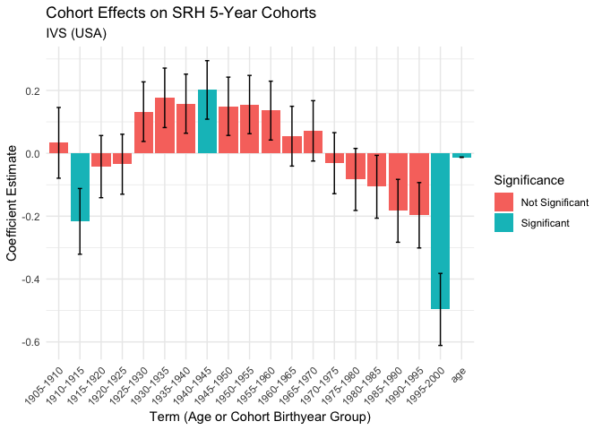<!-- -->

``` r
# Plot for 10-Year Cohorts
data_ivs_usa_10 <- data_ivs_usa %>%
  mutate(cohort_10_yr = cut(cohort, breaks = seq(1900, 2010, by = 10), right = FALSE,
                            labels = paste(seq(1900, 2000, by = 10), seq(1909, 2009, by = 10), sep = "-"))) %>%
  mutate(cohort_group = cohort_10_yr)

lm_cohort_10 <- lm(health ~ age + cohort_group, data = data_ivs_usa_10)
cohort_age_interation_figure(lm_cohort_10, "10-Year Cohorts")
```

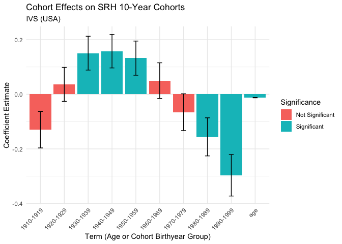<!-- -->

``` r
# Plot for 15-Year Cohorts
data_ivs_usa_15 <- data_ivs_usa %>%
  mutate(cohort_15_yr = cut(cohort, breaks = seq(1900, 2010, by = 15), right = FALSE,
                            labels = paste(seq(1900, 2000, by = 15), 15 + seq(1900, 2000, by = 15), sep = "-"))) %>%
  mutate(cohort_group = cohort_15_yr)

lm_cohort_15 <- lm(health ~ age + cohort_group, data = data_ivs_usa_15)
cohort_age_interation_figure(lm_cohort_15, "15-Year Cohorts")
```

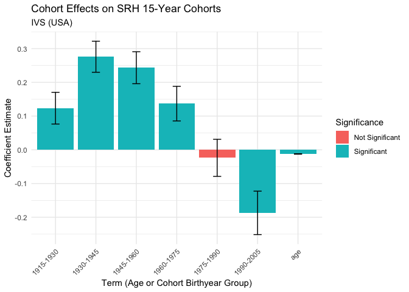<!-- -->

## Generations

``` r
library(ggplot2)
library(dplyr)
library(broom)
library(stringr)

# Function to plot generation effects
generation_age_interaction_figure <- function(lm_model, cohort_length_string) {
  
  # Extract predictor variable names excluding 'age'
  vars <- all.vars(formula(lm_model))[-1]
  vars_to_remove <- vars[vars != "age"]
  
  # Create a regex pattern to remove variable names
  pattern <- paste0("^(", paste(vars_to_remove, collapse="|"), ")")
  
  # Prepare data for the plot
  coef_data <- broom::tidy(lm_model) %>%
    filter(term != "(Intercept)") %>%
    mutate(
      # Remove variable name prefixes from terms
      term_cleaned = sub(pattern, "", term),
      # Extract the first year from the term if available
      first_year = ifelse(term_cleaned == "age", NA, as.numeric(stringr::str_extract(term_cleaned, "\\d{4}"))),
      # Create a numeric key for ordering
      term_numeric = ifelse(term_cleaned == "age", 0, first_year),
      # Reorder terms based on the numeric key
      term_cleaned = factor(term_cleaned, levels = term_cleaned[order(term_numeric)]),
      significant = ifelse(p.value < 0.05, "Significant", "Not Significant")
    )
  
  # Plotting
  ggplot(coef_data, aes(x = term_cleaned, y = estimate, fill = significant)) +
    geom_bar(stat = "identity", position = position_dodge()) +
    geom_errorbar(aes(ymin = estimate - std.error, ymax = estimate + std.error), width = 0.2) +
    labs(
      title = "Generation (Cohort) Effects on SRH",
      subtitle = "IVS (USA)",
      x = "Term (Age or Generation Group)",
      y = "Coefficient Estimate",
      fill = "Significance"
    ) +
    theme_minimal() +
    theme(axis.text.x = element_text(angle = 45, hjust = 1))
}


# Regression and plot for generation_two_sections
lm_generation_two <- lm(health ~ age + generation_two_sections, data = data_ivs_usa_generations)
generation_age_interaction_figure(lm_generation_two, "Generation Two Sections")
```

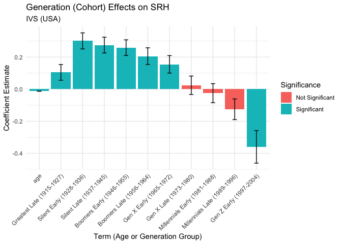<!-- -->

``` r
# Regression and plot for generation
lm_generation <- lm(health ~ age + generation, data = data_ivs_usa_generations)
generation_age_interaction_figure(lm_generation, "Generations")
```

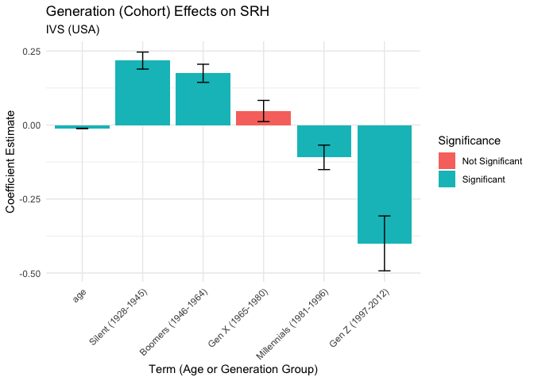<!-- -->

``` r
# Regression and plot for generation_three_sections
lm_generation_three <- lm(health ~ age + generation_three_sections, data = data_ivs_usa_generations)
generation_age_interaction_figure(lm_generation_three, "Generation Three Sections")
```

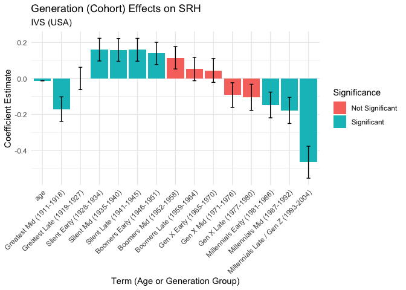<!-- -->
